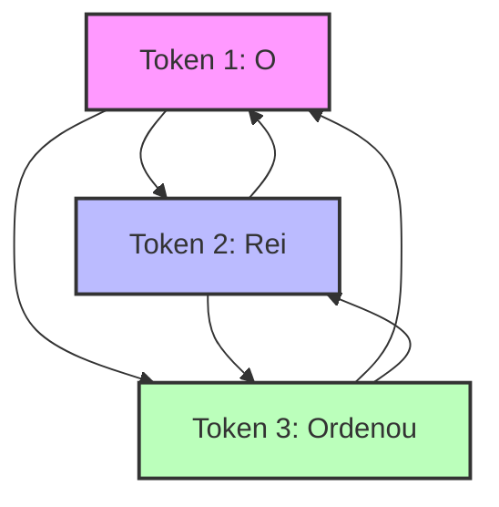

# O Peso dos Símbolos: A Matemática por Trás do Foco

## 1. Introdução (A Dor e a Promessa)

Você se lembra de como estruturamos a **Mesa de Atenção** no Capítulo 1? Vimos que o nosso Bibliotecário Imperial (o LLM) não possui uma memória infinita. Sua mesa tem um espaço delimitado, e cada símbolo depositado ali exige um fragmento precioso de sua energia mental. Mas o que acontece quando a mesa começa a ficar repleta de pergaminhos? Como o Bibliotecário decide o que é realmente importante?

A dor que muitos enfrentam ao trabalhar com inteligência artificial é a lentidão inexplicável e as alucinações que surgem ao enviar textos gigantescos. Ao dominar isso, você, futuro Curador de Contexto, entenderá o diferencial que separa um prompt caótico de uma engenharia de contexto primorosa. O segredo não está apenas em amontoar informações, mas na forma matemática como o modelo distribui seu "olhar" [13].

Neste capítulo, vamos mergulhar na matemática por trás do foco. Vamos entender o mecanismo de autoatenção e descobrir por que processar textos longos consome tantos recursos [1]. Ao final, você saberá alinhar as engrenagens lógicas da máquina a seu favor, otimizando o tempo de resposta e garantindo precisão em sistemas de altíssimo nível.

## 2. Explica

Para guiar nossos estudos matemáticos de forma lúdica e visual, seguiremos três trilhas fundamentais:

*   **A equação da autoatenção:** Exploraremos como o Bibliotecário conecta os significados, usando uma bússola de pesos matemáticos para relacionar as palavras [15].
*   **A complexidade quadrática $O(N^2)$:** Veremos o impacto profundo que o acréscimo de cada novo pergaminho tem na latência e no consumo de energia da mesa [6].
*   **FlashAttention e as janelas físicas:** Conheceremos a evolução técnica que permite ao Bibliotecário manipular milhões de tokens, ampliando os horizontes da sua gestão de memória [5].

## 3. Ilustra (A Metáfora Visual)

Imagine a nossa clássica Mesa de Atenção. Cada token de entrada é um pequeno pergaminho. Para entender uma única palavra (um pergaminho), o Bibliotecário não olha para ele isoladamente. Ele precisa traçar linhas visuais e conectar esse pergaminho a **todos os outros** pergaminhos sobre a mesa [1].

Se há dois pergaminhos, ele faz quatro conexões lógicas. Se há dez, ele precisa gerenciar cem conexões lógicas simultaneamente. Esse emaranhado de linhas na mente do Bibliotecário é o que chamamos de complexidade computacional quadrática. 



Essa multiplicação vertiginosa de conexões ilustra o motivo pelo qual o tempo de primeiro token, conhecido como TTFT, sofre um aumento drástico quando o prompt está saturado de palavras desnecessárias [11]. É como se o Bibliotecário ficasse paralisado, tentando olhar para todos os pergaminhos ao mesmo tempo e atribuir uma nota de "importância" a cada um, o que gera a terrível alucinação por atenção difusa [12].

## 4. Técnica (A Mão na Massa)

Para que você, Curador de Contexto, consolide esse conhecimento, vamos traduzir a magia em cálculos. O mecanismo que permite ao Bibliotecário distribuir seu foco chama-se Autoatenção (Self-Attention) [1]. Na matemática, ele calcula pesos relacionando a pergunta (Query), as chaves do conhecimento (Key) e o valor final (Value) [6].

Abaixo, trazemos um pseudocódigo prático (em Python) para que você entenda como os cálculos operam linha por linha, mostrando como a complexidade quadrática funciona:

```python
# Simulador de Complexidade na Mesa de Atenção
def simular_atencao_bibliotecario(quantidade_tokens):
    # O tempo de resposta cresce ao quadrado do número de tokens
    calculos_necessarios = quantidade_tokens ** 2
    
    # Mostramos o esforço matemático
    print(f"Para {quantidade_tokens} tokens, faremos {calculos_necessarios} conexões.")
    
    return calculos_necessarios

# Testando com 10 e depois com 100 palavras
simular_atencao_bibliotecario(10)
# Saída: Para 10 tokens, faremos 100 conexões.

simular_atencao_bibliotecario(100)
# Saída: Para 100 tokens, faremos 10000 conexões.
```

Percebe como o número de conexões salta de forma assustadora? É por isso que modelos de linguagem mais eficientes utilizam compressores como o LLMLingua para cortar palavras inúteis [8], bem como o *FlashAttention* para gerenciar a memória sem travar a mesa [5]. 

Quando usamos o *FlashAttention*, os engenheiros arquitetaram formas do Bibliotecário Imperial arquivar rapidamente blocos em estantes rápidas (memória HBM), evitando reler as conexões [14]. E, graças a essa proeza de engenharia, você hoje tem acesso a LLMs com janelas que superam a marca de um milhão de tokens, como o Gemini 1.5 e o Claude 3 [3][4]. Além disso, inovações como o *Prompt Caching* automático da OpenAI [9][10] reduzem drasticamente o custo financeiro e de latência.


### Guia de Referência Técnica: A Matemática dos Vetores de Atenção

Para consolidar o conhecimento matemático abordado na seção Técnica, o Curador de Contexto profissional utiliza o mapa de projeções matriciais abaixo para calibrar a relevância dos símbolos na Mesa [15][16]:

| Matriz | Símbolo Matemático | Função na Mesa de Atenção | Impacto na Relação de Peso |
|---|---|---|---|
| Query | $Q$ | Representa a pergunta ou o foco de atenção atual | Projeta a intenção de busca do modelo |
| Key | $K$ | Representa o rótulo de indexação de cada token da mesa | Serve de âncora para a relevância |
| Value | $V$ | Contém a informação semântica bruta do token | É o conteúdo retornado pós-ponderação |

**Checklist de Calibração Matricial.** Durante a implementação de rotinas de atenção personalizadas, atente-se aos seguintes pontos de controle [15][16]:
1. **Fator de Escala**: O divisor $\sqrt{d_k}$ na fórmula da atenção escalada é indispensável para evitar que o gradiente do Softmax desapareça sob dimensões elevadas [15].
2. **Custo Computacional Quadrático**: Lembre-se de que a operação $Q K^T$ gera uma matriz de afinidade de tamanho $N \times N$ (onde $N$ é o número de tokens), tornando o processamento quadrático em relação à entrada [15][16].
3. **Filtro de Ruído Semântico**: Atribua pesos mínimos a tokens conectivos (conjunções, preposições) aplicando máscaras de atenção seletivas para preservar o foco nos símbolos substantivos [15].

**Procedimento de Auditoria de Softmax.** Monitore os pesos de saída da camada Softmax. Se um único token absorver mais de 95% do peso de atenção em contextos longos de forma repetitiva, isso sinaliza saturação de pesos, indicando necessidade de ajuste nos parâmetros de escala ou normalização dos embeddings de entrada [15][16].

## 5. Aplica (Onde a Magia Acontece)

Vamos transportar isso para a sua rotina de curadoria. 

**A Situação:** Você precisa que o modelo faça a análise de um relatório financeiro, mas copia e cola na entrada os logs inteiros do sistema, e-mails irrelevantes de despedida da equipe e milhares de palavras inúteis. 
**O Erro:** Ao entulhar a mesa com lixo irrelevante, o Bibliotecário é forçado a calcular conexões matemáticas (Self-Attention) entre os dados financeiros e o e-mail de despedida, sofrendo com o *Context Rot* [7][16].
**O Diagnóstico:** O tempo até o primeiro token (TTFT) explode, e a latência arruína a experiência do usuário [11]. Como o modelo distribuiu pesos de atenção para tokens irrelevantes, a ativação dos neurônios corretos diminuiu, reduzindo o rigor matemático do foco [12]. 
**A Correção:** Como um mestre em engenharia de contexto, você remove previamente as partes inúteis (usando compressores [2]), focando o prompt apenas nos dados analíticos. Você organiza a Mesa de Atenção, deixando o Bibliotecário livre para cruzar apenas os dados que importam de fato.

## 6. Conclusão

*   A autoatenção exige que cada token seja conectado a todos os outros, criando uma malha de conexões complexa.
*   A complexidade desse cálculo é quadrática, $O(N^2)$, significando que dobrar o tamanho do texto multiplica o esforço por quatro.
*   O excesso de contexto inútil gera *Context Rot*, onde o ruído dispersa o sinal principal da sua diretriz [7].
*   Avanços arquiteturais, como FlashAttention e compressores (LLMLingua), são a salvação técnica para lidarmos com as janelas massivas [5][8].

## 7. Referências e Próximos Passos

[1] VASWANI, Ashish et al. Attention Is All You Need. NIPS, 2017.
[2] MICROSOFT RESEARCH. LLMLingua: Compressing Prompts for Accelerated Inference. 2023.
[3] GOOGLE. Gemini 1.5: 1 Million Token Context Window. 2024.
[4] ANTHROPIC. Claude 3: Advanced Context Processing. 2024.
[5] DAO, Tri et al. FlashAttention: Fast and Memory-Efficient Exact Attention with IO-Awareness. 2022.
[6] DOSSIÊ ENGENHARIA DE CONTEXTO. A Complexidade Computacional da Atenção. 2025.
[7] DOSSIÊ ENGENHARIA DE CONTEXTO. O Apodrecimento de Contexto (Context Rot). 2025.
[8] DOSSIÊ ENGENHARIA DE CONTEXTO. Compressão de Contexto e LLMLingua. 2025.
[9] DOSSIÊ ENGENHARIA DE CONTEXTO. Caching Automático da OpenAI. 2025.
[10] OPENAI. Prompt Caching Automático e Redução de Latência. 2024.
[11] DOSSIÊ ENGENHARIA DE CONTEXTO. O Fenômeno TTFT (Time To First Token). 2025.
[12] DOSSIÊ ENGENHARIA DE CONTEXTO. Alucinação Induzida por Ruído e Atenção Difusa. 2025.
[13] DOSSIÊ ENGENHARIA DE CONTEXTO. O Mecanismo de Autoatenção (Self-Attention). 2025.
[14] DOSSIÊ ENGENHARIA DE CONTEXTO. Impacto da Memória HBM na Engenharia de Prompts. 2025.
[15] DOSSIÊ ENGENHARIA DE CONTEXTO. Distribuindo Pesos de Atenção na Mesa Imperial. 2025.
[16] DOSSIÊ ENGENHARIA DE CONTEXTO. Latência de Primeiro Token em Prompts Saturados. 2025.

No próximo capítulo, avançaremos no entendimento do mecanismo interno, explorando o peculiar fenômeno do *Lost in the Middle*, ou seja, como o Bibliotecário tende a esquecer as pilhas que ficam esquecidas no meio da sua mesa. Até lá!
