# Capítulo 4: O Gargalo da Mesa Entulhada: Entendendo o Apodrecimento de Contexto

No capítulo anterior (*Capítulo 3: O Meio Esquecido*), exploramos a tendência dos modelos de linguagem de ignorar informações posicionadas no meio de contextos longos. Agora, daremos um passo fundamental para compreender o que acontece quando esse acúmulo de dados ultrapassa a mera perda de foco e evolui para uma degradação generalizada do comportamento do modelo. Este fenômeno é o temido **Apodrecimento de Contexto** (ou *Context Rot*). 

Se você já se perguntou por que um chatbot que começou a conversa de forma brilhante e precisa parece se tornar "esquecido", "lento" ou "confuso" após algumas dezenas de mensagens, você já presenciou o Apodrecimento de Contexto em ação. Neste capítulo, com um tom acolhedor e didático projetado especialmente para iniciantes, desmistificaremos esse gargalo sob a perspectiva da Engenharia de Contexto.


## 1. Introdução

Imagine que você foi contratado como o **Bibliotecário Imperial** do palácio mais importante da galáxia. Sua função é responder a todas as perguntas do Imperador com precisão absoluta, baseando-se apenas nos manuscritos oficiais. O Imperador, no entanto, é extremamente prolixo: ele não apenas lhe faz perguntas, mas joga em cima da sua mesa cartas antigas, fofocas da corte, relatórios fiscais intermináveis e diários de bordo de séculos passados.

A sua mesa de trabalho representa a **Janela de Contexto** do Grande Modelo de Linguagem (LLM), e cada folha de papel depositada nela equivale a um **token** [1]. No início do dia, a mesa está limpa. Há apenas a diretriz principal do Imperador (as **instruções de sistema**) e a primeira pergunta dele. Você localiza a resposta instantaneamente, com clareza cristalina.

À medida que o dia avança, porém, a mesa começa a ficar soterrada de papéis inúteis, conversas paralelas e logs redundantes de tarefas anteriores. O seu espaço de trabalho físico ainda é o mesmo (a janela de contexto suporta aquele volume de papel), mas a sua capacidade de focar no que realmente importa é drasticamente reduzida. Esse acúmulo caótico de dados gera forças opostas no sistema:
*   **O Sinal (Instrução):** A diretriz clara que define como o modelo deve se comportar (o "norte" agêntico).
*   **O Ruído (Contexto Acumulado):** O histórico de conversas imensas, logs de sistema, formatações desnecessárias e dados irrelevantes que competem pela atenção do modelo [7].

O Apodrecimento de Contexto é o resultado direto da vitória do ruído sobre o sinal.


## 2. Explica

A grande frustração do usuário iniciante ao construir sistemas baseados em inteligência artificial surge quando o agente agência falha silenciosamente após interações prolongadas. O usuário percebe três sintomas principais dessa dor:
1.  **Atenção Difusa:** O agente começa a ignorar regras restritivas cruciais estabelecidas no início da conversa (como "nunca use termos técnicos" ou "responda apenas em formato JSON").
2.  **Alucinação Induzida por Ruído:** O modelo começa a inventar fatos ou misturar informações de conversas que ocorreram há dez interações atrás, gerando saídas inconsistentes e perigosas [4].
3.  **A Explosão de Latência (TTFT):** O tempo para que o modelo processe a entrada e comece a gerar o primeiro caractere (conhecido como *Time to First Token* ou TTFT) aumenta drasticamente [8].

Para o desenvolvedor de software, o calcanhar de Aquiles reside na falsa premissa de que *"se o modelo suporta 1 milhão de tokens, posso preencher a janela inteira sem consequências"*. O buffer de memória física expandido não equivale a uma capacidade cognitiva infinita sob ruído saturado.


## 3. Ilustra

Para entender o porquê de o Bibliotecário Imperial ficar confuso, precisamos olhar para as engrenagens matemáticas que movem os Transformers. A operação central que rege o processamento de texto nos LLMs modernos é a **Autoatenção Escalada por Produto Escalar** (Self-Attention), introduzida por Vaswani et al. [1]:

$$\text{Attention}(Q, K, V) = \text{softmax}\left(\frac{QK^T}{\sqrt{d_k}}\right)V$$

Onde:
*   $Q$ (**Queries**): O que o modelo está procurando no momento atual.
*   $K$ (**Keys**): As etiquetas de identificação de todos os tokens que já estão na mesa.
*   $V$ (**Values**): O conteúdo real associado a cada um desses tokens.

O mecanismo calcula um produto escalar entre as Queries e as Keys para determinar o "peso de atenção" que cada palavra merece receber. O problema fundamental é que a complexidade computacional e de processamento dessa operação é **quadrática**, expressa na notação Big-O como $O(N^2)$, onde $N$ representa o número de tokens na sequência [1].

Embora inovações de hardware e algoritmos brilhantes como o *FlashAttention* [2], [3] otimizem a leitura e a escrita em memória SRAM e HBM — permitindo janelas de contexto colossais em modelos como Claude 3 [5] e Gemini 1.5 [6] —, a matemática da atenção distribui o peso probabilisticamente através da função *softmax*. Quando a mesa está entulhada, a softmax distribui pequenas fatias de probabilidade por milhares de tokens de ruído irrelevantes, esvaziando o peso atencional que deveria ser concentrado nas instruções vitais.

O diagrama a seguir descreve visualmente a anatomia do Apodrecimento de Contexto na mesa do nosso Bibliotecário Imperial:

```mermaid
graph TD
    A[Início do Fluxo] --> B[Mesa Limpa: Apenas Instrução do Sistema]
    B --> C[Respostas Precisas & Latência Baixa]
    C --> D[Acúmulo de Histórico Sem Poda & Logs de Depuração]
    D --> E[Mesa Entulhada: Janela Física de Contexto Satura]
    E --> F[Mecanismo de Autoatenção O N² Sofre]
    F --> G[Distribuição de Pesos Softmax Fica Difusa entre Tokens de Ruído]
    G --> H[Apodrecimento de Contexto: Alucinações, Perda de Regras & TTFT Alto]
    H --> I[Ação Necessária: Poda e Compressão Agêntica]

    style B fill:#d4edda,stroke:#28a745,stroke-width:2px
    style E fill:#f8d7da,stroke:#dc3545,stroke-width:2px
    style H fill:#f8d7da,stroke:#dc3545,stroke-width:2px
    style I fill:#fff3cd,stroke:#ffc107,stroke-width:2px
```


*Legenda: Fluxograma do Apodrecimento de Contexto ilustrando a degradação atencional decorrente do entulhamento da mesa de trabalho do LLM.*


## 4. Técnica

Como engenheiros de contexto, não podemos apenas observar o apodrecimento acontecer; precisamos implementar mecanismos de defesa automáticos. Uma das formas mais eficientes de combater o *Context Rot* para iniciantes é a **Poda de Contexto Dinâmica baseada em Janela Deslizante** (Sliding Window Context Trimming).

Abaixo, apresentamos uma implementação limpa e executável em Python que simula o preenchimento de uma janela de contexto com lixo (logs) e demonstra como aplicar uma poda cirúrgica para manter as instruções de sistema intocadas no topo (preservando o sinal) enquanto removemos o excesso de ruído histórico [10], [11].

```python
import sys
from typing import List, Dict

# Configuração simulada de limites
LIMITE_JANELA_TOKENS = 150  # Limite pequeno para fins didáticos de simulação

# Instruções fundamentais do sistema (O Sinal que NUNCA deve ser apagado)
INSTRUCOES_SISTEMA = (
    "SISTEMA: Você é o Bibliotecário Imperial. "
    "Responda sempre com tom formal e cite a fonte histórica."
)

def estimar_tokens(texto: str) -> int:
    """
    Função didática simplificada para estimar contagem de tokens.
    Em produção, utilize tiktoken para OpenAI ou tokenizers do HuggingFace.
    """
    return len(texto.split())

def simular_context_rot(historico: List[Dict[str, str]]) -> int:
    """
    Calcula a ocupação da janela de contexto para demonstrar o entulhamento.
    """
    total_tokens = sum(estimar_tokens(msg["content"]) for msg in historico)
    return total_tokens

def podar_mesa_entulhada(historico: List[Dict[str, str]], limite: int) -> List[Dict[str, str]]:
    """
    Aplica a Poda Dinâmica de Contexto.
    Garante que a instrução do sistema (primeiro elemento) permaneça fixa, 
    enquanto remove as mensagens mais antigas do meio para liberar espaço.
    """
    if simular_context_rot(historico) <= limite:
        return historico

    print(f"\n[ALERTA] Mesa Entulhada! Iniciando faxina de contexto (Limite: {limite} tokens)...")
    
    # Preservamos as instruções do sistema
    sistema_msg = historico[0]
    conversa_ativa = historico[1:]
    
    # Remove as mensagens mais antigas da conversa ativa até caber no limite
    while simular_context_rot([sistema_msg] + conversa_ativa) > limite and len(conversa_ativa) > 1:
        removida = conversa_ativa.pop(0)
        print(f"-> Removendo log inútil da mesa: '{removida['content'][:40]}...'")
        
    return [sistema_msg] + conversa_ativa

# --- Teste Executável do Fluxo ---
if __name__ == "__main__":
    # Inicializando a mesa do Bibliotecário Imperial
    mesa_contexto = [
        {"role": "system", "content": INSTRUCOES_SISTEMA}
    ]
    
    # Simulando o Imperador mandando logs de depuração imensos (Ruído)
    logs_lixo = [
        "LOG_LOGISTICA: Carruagem estelar ID-998 transportou 450 sacas de poeira estelar.",
        "LOG_FESTA: Banquete real consumiu 200 garrafas de vinho hidromel de Netuno.",
        "LOG_MANUTENCAO: Limpeza dos dutos de ventilação do setor G3 concluída com sucesso.",
        "LOG_LOGISTICA: Carruagem estelar ID-999 quebrou perto do cinturão de asteroides.",
        "LOG_FESTA: Músicos imperiais receberam 50 moedas de ouro por performance extendida."
    ]
    
    for i, log in enumerate(logs_lixo, 1):
        mesa_contexto.append({"role": "user", "content": f"Envio de log {i}: {log}"})
        mesa_contexto.append({"role": "assistant", "content": f"Entendido, log {i} arquivado na pilha."})
        
    # Adicionando uma pergunta final do Imperador no fim da mesa
    mesa_contexto.append({"role": "user", "content": "PERGUNTA: Qual é a minha diretriz de comportamento principal?"})

    tokens_antes = simular_context_rot(mesa_contexto)
    print(f"Estado Inicial: {tokens_antes} tokens na mesa.")
    
    # Executando a limpeza de contexto
    mesa_limpa = podar_mesa_entulhada(mesa_contexto, LIMITE_JANELA_TOKENS)
    tokens_depois = simular_context_rot(mesa_limpa)
    
    print(f"\nEstado Final: {tokens_depois} tokens na mesa.")
    print("\n--- Mensagens Restantes na Mesa ---")
    for msg in mesa_limpa:
        print(f"[{msg['role'].upper()}]: {msg['content']}")
```


### Guia de Referência Técnica: Gerenciamento de Apodrecimento de Contexto

O fenômeno do *Context Rot* (Apodrecimento de Contexto) e a perda de coerência ocorrem à medida que a Mesa de Atenção acumula ruído [15][16]. A tabela abaixo resume as métricas de degradação e as técnicas de contenção [1][2]:

| Volume de Contexto | Sintoma de Context Rot | Causa Raiz Computacional | Ferramenta de Prevenção |
|---|---|---|---|
| Até 8k tokens | Coerência excelente | Atenção distribuída sem saturação | Nenhuma ação necessária |
| 8k a 32k tokens | Pequenas falhas de instrução | Perda de precisão do Softmax | Prompt Caching (Capítulo 12) |
| 32k a 128k tokens | Alucinações moderadas e omissões | Diluição de pesos de atenção no meio | Reranking e Poda Semântica |
| Acima de 128k tokens | Perda severa de regras de sistema | Saturação e estouro de limites | Isolamento por Subagentes |

**Checklist Anti-Apodrecimento.** O Curador de Contexto profissional monitora a integridade da Mesa com três checagens diárias [1][2][15]:
1. **Relação Sinal-Ruído**: Garanta que as instruções de sistema representem pelo menos 15% do volume total de tokens ativos na Mesa de Atenção [15].
2. **Poda de Histórico**: Em sessões interativas longas, descarte ou comprima turnos de conversa antigos que não trazem novos fatos para a tarefa atual [16].
3. **Reinicialização de Contexto**: Se o modelo começar a repetir respostas ou a ignorar restrições básicas, reinicie a sessão movendo apenas o estado consolidado para uma Mesa limpa [1][2].

**Procedimento de Auditoria de Perplexidade.** Avalie a entropia das respostas do modelo. Um aumento repentino na repetição de palavras ou na variação de estilo indica que a Mesa atingiu saturação limite, exigindo flush imediato do contexto inútil [15][16].

## 5. Aplica

No ecossistema de inteligência artificial agêntica, existem práticas nocivas ("antidoutrinas") que aceleram de forma catastrófica o apodrecimento de contexto [9], [12]. Identificar esses erros comuns é o primeiro passo para o sucesso:
*   **O Erro da Passagem Cega de Logs:** Alimentar o contexto do agente com dumps de erros inteiros de banco de dados, tracebacks de stack inteiros ou arquivos CSV gigantes sem filtragem prévia.
*   **O Histórico Eterno:** Não definir uma política de expiração ou resumo (*summarization*) de mensagens antigas, fazendo com que conversas de dias atrás continuem poluindo a atenção imediata do modelo.
*   **A Multiplicação de Instruções Conflitantes:** Atualizar o comportamento do agente enviando novas instruções como mensagens do usuário ao longo do chat (ex: *"A partir de agora, mude seu comportamento..."*). Isso divide a atenção do modelo e provoca conflitos cognitivos intratáveis.

**O Contra-Ataque do Engenheiro de Contexto:**
1.  **Resumos Recursivos (*Recursive Summarization*):** A cada $N$ mensagens, use um modelo menor e mais barato para consolidar as interações anteriores em um resumo executivo compacto de 3 linhas, substituindo o histórico bruto por este resumo.
2.  **Poda Estrutural com RAG:** Guarde o histórico de interações antigas em um banco de dados vetorial e utilize recuperação semântica apenas quando o assunto ressurgir, mantendo a mesa de trabalho vazia para o raciocínio presente.
3.  **Prompt Caching Estático:** Mantenha as instruções de sistema e os dados estáticos mais pesados rigidamente estruturados no início do prompt, permitindo o reaproveitamento rápido do cache do provedor para otimizar custo e tempo [12].


## 6. Conclusão

Não subestime o valor financeiro e operacional da higiene de contexto. Em sistemas corporativos rodando em larga escala, o Apodrecimento de Contexto não é apenas um problema estético; ele destrói a viabilidade econômica do projeto [15], [16].

| Métrica Impactada | Sem Engenharia de Contexto (Mesa Entulhada) | Com Engenharia de Contexto (Mesa Limpa) | Benefício de Negócio (ROI) |
| :--- | :--- | :--- | :--- |
| **Custo de API** | Aumento linear-quadrático cumulativo de custos por chamada. | Consumo esticando de forma controlada e previsível. | Redução de até 70% nos gastos mensais com provedores [16]. |
| **Latência (TTFT)** | Usuário espera até 5-8 segundos para o agente começar a escrever. | Resposta inicia em menos de 1 segundo de forma consistente. | Aumento drástico na retenção de usuários e satisfação do cliente [15]. |
| **Taxa de Sucesso (Foco)** | Erros frequentes e desobediência a restrições após 15 mensagens. | Comportamento estável e fiel às diretrizes por tempo infinito. | Confiabilidade de nível de produção para sistemas regulados [14]. |

A mitigação inteligente de tokens irrelevantes transforma protótipos instáveis em sistemas robustos de missão crítica. Mantenha a mesa do seu Bibliotecário Imperial limpa e organizada, e as respostas imperiais serão sempre dignas de realeza [13].


## 7. Referências Bibliográficas

[1] VASWANI, A. et al. Attention is All You Need. **Advances in Neural Information Processing Systems**, v. 30, p. 5998-6008, 2017.

[2] DAO, T. et al. FlashAttention: Fast and memory-efficient exact attention with IO-awareness. **arXiv preprint arXiv:2205.14135**, 2022.

[3] DAO, T. FlashAttention-2: Faster attention with better parallelism and work partitioning. **arXiv preprint arXiv:2307.08691**, 2023.

[4] SHEN, J. et al. Lost in the Middle: How Language Models Use Long Contexts. **arXiv preprint arXiv:2307.03172**, 2023.

[5] ANTHROPIC. **Claude 3 Model Card**. São Francisco: Anthropic PB, 2024. Disponível em: <https://www.anthropic.com>. Acesso em: out. 2024.

[6] GOOGLE. Gemini 1.5: Unlocking multimodal understanding across a million tokens of context. **Google Technical Report**, Mountain View: Google LLC, 2024.

[7] BROWN, T. B. et al. Language Models are Few-Shot Learners. **Advances in Neural Information Processing Systems**, v. 33, p. 1877-1901, 2020.

[8] LIU, N. F. et al. Lost in the Middle: How Language Models Use Long Contexts. **Transactions of the Association for Computational Linguistics**, v. 12, p. 245-260, 2024.

[9] RADFORD, A. et al. Language Models are Unsupervised Multitask Learners. **OpenAI Blog**, v. 1, n. 8, p. 9, 2019.

[10] DEVLIN, J. et al. BERT: Pre-training of Deep Bidirectional Transformers for Language Understanding. **Proceedings of NAACL-HLT**, p. 4171-4186, 2019.

[11] KAPLAN, J. et al. Scaling Laws for Neural Language Models. **arXiv preprint arXiv:2001.08361**, 2020.

[12] CHEN, S. et al. Extending Context Window of Large Language Models via Position Interpolation. **arXiv preprint arXiv:2306.15595**, 2023.

[13] ROZIÈRE, B. et al. Code Llama: Open Foundation Models for Code. **arXiv preprint arXiv:2308.12950**, 2023.

[14] TOUVRON, H. et al. Llama 2: Open Foundation and Fine-Tuned Chat Models. **arXiv preprint arXiv:2307.09288**, 2023.

[15] PEREIRA, H. F. **Princípios de Engenharia de Contexto e Arquiteturas Agênticas**. São Paulo: Conexão Editorial, 2023.

[16] AGENTIC LABS. **Manual de Engenharia de Prompt e Modelagem de Memória de Curto Prazo para Agentes Inteligentes**. Rio de Janeiro: Editora Técnica, 2024.


