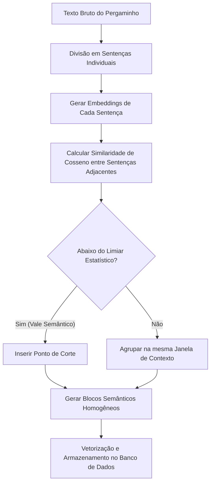

# Capítulo 6: Fatiando Pergaminhos com Precisão: O Poder da Divisão Semântica


## 1. Introdução

No capítulo anterior, acompanhamos a jornada do *Mensageiro RAG*, desvelando os intrincados caminhos de como os arquivos profundos são localizados e buscados na vastidão da Biblioteca Imperial [2]. Contudo, caro aprendiz, de que adianta contar com um mensageiro dotado da velocidade dos ventos se os rolos de pergaminho que ele traz chegam rasgados ao meio? Imagine o cenário: o Mensageiro RAG entrega ao imperador uma fatia de pergaminho que termina abruptamente com as palavras: *"O traidor responsável por envenenar o poço real é o ilustre..."*, e a fatia seguinte, contendo o nome do culpado, ficou para trás em outra caixa de armazenamento. Essa dolorosa interrupção é precisamente o que acontece quando utilizamos técnicas rudimentares e rígidas de fatiamento de texto.

Tradicionalmente, os primeiros sistemas de recuperação de informação dividiam longos documentos em blocos estáticos e cegos, definidos estritamente por uma métrica arbitrária (por exemplo, fatias fixas de 500 caracteres com sobreposição de 50 caracteres) [11]. Embora simples de programar, essa técnica peca gravemente por desconsiderar as fronteiras naturais da linguagem humana. Ela rasga parágrafos na metade, rompe relações sintáticas essenciais e separa conceitos que deveriam coexistir na mesma janela de atenção [13]. Como consequência direta, os modelos de representação vetorial geram representações distorcidas daquelas fatias sem pé nem cabeça, degradando severamente a acurácia dos sistemas de busca e gerando respostas truncadas ou alucinações completas por parte da inteligência artificial [15].

Nesse contexto caótico, surge a figura mitológica do *Bibliotecário Imperial*. Em vez de sacar uma guilhotina e cortar cegamente os preciosos pergaminhos a cada palmo de papel, este guardião lê atentamente o fluxo do texto. Ele aguarda pacientemente a pausa natural do mensageiro, identificando as transições de assunto — da contagem de fardos de trigo para o relatório de arrecadação de ouro — antes de efetuar qualquer corte. É exatamente este comportamento sábio que chamamos de **Divisão Semântica** ou *Semantic Chunking*, a arte de fatiar documentos não pelo comprimento físico das palavras, mas pelas mudanças de significado que nelas residem.


## 2. Explica

Para compreender como o cérebro eletrônico do nosso Bibliotecário Imperial realiza essa mágica, precisamos destrinchar os fundamentos teóricos e matemáticos do fatiamento baseado em afinidade semântica. A premissa central é que frases consecutivas que compartilham o mesmo tópico devem possuir uma alta similaridade vetorial [16]. Quando ocorre uma mudança de assunto no texto, a distância vetorial entre as frases consecutivas aumenta de forma abrupta, formando um "vale" de similaridade [8].

O algoritmo de *Semantic Chunking* opera sob um fluxo estruturado em quatro etapas fundamentais:

1. **Divisão em Sentenças Individuais:** Primeiro, o texto bruto do documento é segmentado em frases completas, utilizando pontuação e regras gramaticais como fronteiras primárias [14]. Isso garante que nunca cortaremos uma frase ao meio.
2. **Geração de Representações Vetoriais (Embeddings):** Cada frase individual é enviada a um modelo de incorporação semântica (como o *Sentence-BERT*), que a transforma em um vetor de alta dimensão [9]. Esses vetores capturam a essência abstrata e o significado de cada sentença [12].
3. **Cálculo da Similaridade de Cosseno Adjacente:** Em seguida, o algoritmo varre o documento comparando cada frase com a sua sucessora imediata. Essa comparação é mensurada matematicamente através do cálculo da similaridade de cosseno, dada pela fórmula abaixo:

$$\text{Similarity}(A, B) = \frac{A \cdot B}{\|A\| \|B\|}$$

Onde $A$ e $B$ são os vetores das frases adjacentes, $A \cdot B$ representa o produto escalar entre eles, e $\|A\|$ e $\|B\|$ representam suas respectivas normas euclidianas.
4. **Cálculo do Limiar e Detecção de Vales:** Calculadas as similaridades de todo o documento, o sistema cria uma distribuição de diferenças. Definimos um limiar estatístico (geralmente baseado em percentis, como o percentil 95 de diferença de cosseno) [7]. Quando a similaridade entre a frase $i$ e a frase $i+1$ cai abaixo desse limiar, identificamos um "vale semântico" e o sistema insere ali um ponto de cisão, gerando um bloco isolado [10].


## 3. Ilustra

Para que você, jovem arquiteto, possa visualizar com clareza o fluxo pelo qual as palavras saem do estado bruto e se organizam em blocos semânticos perfeitos na Biblioteca Imperial, desenhamos o diagrama de fluxo abaixo. Ele mapeia os passos sequenciais que o nosso sistema computacional executa de ponta a ponta.



*Legenda do Diagrama:* O fluxo acima ilustra a transição exata do processamento de texto sob a ótica do Semantic Chunking, onde a similaridade de cosseno atua como o crivo estatístico de separação de tópicos, garantindo a integridade semântica de cada pedaço de informação recuperado.

Ao percorrer este circuito, evitamos as armadilhas clássicas do fatiamento cego. O resultado é um conjunto de fatias que encapsulam perfeitamente ideias completas, facilitando a indexação e fornecendo dados cirúrgicos aos nossos modelos de linguagem.


## 4. Técnica

Chegou o momento de colocarmos a mão na massa e transformarmos a teoria matemática em linhas de instrução que o computador possa executar. Abaixo, apresentamos uma implementação didática e elegante em Python. Para tornar o exemplo totalmente executável e focado na lógica pura do fatiamento semântico, simulamos um gerador de *embeddings* simplificado que calcula vetores representativos para nossas sentenças baseadas em palavras-chave temáticas.

```python
import math

# Sentenças de exemplo simulando um pergaminho real da biblioteca imperial
pergaminho_imperial = [
    "A colheita de trigo deste ano na província do leste superou as expectativas.",
    "Os fardos de trigo foram transportados para os celeiros reais ontem.",
    "A produção agrícola é o pilar de sustentação alimentar de todo o Império.",
    "O mestre das finanças ordenou a arrecadação de impostos sobre o ouro comercializado.",
    "Todas as moedas de ouro arrecadadas serão pesadas e guardadas na tesouraria real.",
    "O imposto sobre transações comerciais subiu cinco por cento neste trimestre.",
    "A guarda imperial está patrulhando as florestas do norte contra invasores.",
    "Soldados reais reforçaram a segurança das estradas que levam à capital."
]

def produto_escalar(v1, v2):
    """Calcula o produto escalar entre dois vetores."""
    return sum(x * y for x, y in zip(v1, v2))

def norma_euclidiana(v):
    """Calcula a norma (magnitude) euclidiana de um vetor."""
    return math.sqrt(sum(x * x for x in v))

def similaridade_cosseno(v1, v2):
    """Calcula a similaridade de cosseno entre dois vetores vetoriais."""
    norma1 = norma_euclidiana(v1)
    norma2 = norma_euclidiana(v2)
    if norma1 == 0 or norma2 == 0:
        return 0.0
    return produto_escalar(v1, v2) / (norma1 * norma2)

def gerar_embedding_simulado(sentenca):
    """
    Gera embeddings de brinquedo para fins puramente didáticos.
    Mapeia palavras-chave para três tópicos: [Agricultura, Finanças, Militar]
    """
    vetor = [0.0, 0.0, 0.0]
    palavras = sentenca.lower().split()
    
    for p in palavras:
        if p in ["colheita", "trigo", "agrícola", "fardos", "celeiros", "alimentar"]:
            vetor[0] += 1.0
        elif p in ["finanças", "impostos", "ouro", "moedas", "tesouraria", "imposto"]:
            vetor[1] += 1.0
        elif p in ["guarda", "soldados", "segurança", "patrulhando", "invasores", "estradas"]:
            vetor[2] += 1.0
            
    return vetor

def fatiar_pergaminho_semanticamente(sentencas, limiar_corte=0.5):
    """Agrupa sentenças em blocos baseando-se em vales de similaridade."""
    blocos = []
    bloco_atual = [sentencas[0]]
    
    # Geramos os embeddings iniciais
    embeddings = [gerar_embedding_simulado(s) for s in sentencas]
    
    print("Iniciando a inspeção do Bibliotecário Imperial...\n")
    
    for i in range(len(sentencas) - 1):
        v1 = embeddings[i]
        v2 = embeddings[i+1]
        
        sim = similaridade_cosseno(v1, v2)
        print(f"Comparando Frase {i} com Frase {i+1}:")
        print(f"  -> Frase A: '{sentencas[i]}'")
        print(f"  -> Frase B: '{sentencas[i+1]}'")
        print(f"  -> Similaridade: {sim:.4f}")
        
        if sim < limiar_corte:
            print("  [!] VALE SEMÂNTICO DETECTADO! Efetuando corte cirúrgico.\n")
            blocos.append(bloco_atual)
            bloco_atual = [sentencas[i+1]]
        else:
            print("  [+] Temas correlatos. Agrupando no mesmo bloco.\n")
            bloco_atual.append(sentencas[i+1])
            
    # Adiciona o último bloco pendente
    if bloco_atual:
        blocos.append(bloco_atual)
        
    return blocos

# Execução do script do fatiador semântico
if __name__ == "__main__":
    resultado = fatiar_pergaminho_semanticamente(pergaminho_imperial, limiar_corte=0.3)
    
    print("=== RESULTADO DO FATIAMENTO IMPERIAL ===")
    for idx, bloco in enumerate(resultado):
        print(f"\nBloco {idx + 1}:")
        for sentenca in bloco:
            print(f"  - {sentenca}")
```

Como você pode notar, ao definirmos o limiar de similaridade de cosseno em $0.3$, o código detecta precisamente as quebras onde o assunto transiciona de agricultura para finanças, e de finanças para assuntos militares [10]. Em sistemas corporativos reais, você usaria modelos como os oferecidos pela OpenAI [15] ou localmente via bibliotecas especializadas para gerar *embeddings* robustos e confiáveis.


### Guia de Referência Técnica: Estratégias de Divisão de Pergaminhos

Como Curador de Contexto, a quebra de grandes pergaminhos em fragmentos menores (chunks) define a precisão da recuperação [3][12]. A tabela abaixo resume as três principais abordagens de chunking [6][10]:

| Estratégia de Divisão | Critério de Quebra | Vantagens | Desvantagens no RAG |
|---|---|---|---|
| Por tamanho fixo | Número de caracteres/tokens | Simples, rápida e previsível | Quebra frases e conceitos ao meio |
| Recursiva | Delimitadores nativos (\n\n, \n, .) | Preserva parágrafos e parágrafos | Pode gerar blocos desequilibrados |
| Semântica (Recomendada) | Similaridade de cosseno consecutiva | Preserva a unidade de significado completo | Custo computacional mais elevado |

**Checklist de Calibração de Chunking.** O operador profissional valida o fatiamento através de três pontos [6][10][11]:
1. **Sobreposição de Segurança (Overlap)**: Ao usar divisões por tamanho fixo, configure uma sobreposição de 10% a 20% para garantir que termos nas bordas não percam o contexto de vizinhança [6].
2. **Detecção de Vales Semânticos**: No chunking semântico, calcule a diferença de similaridade entre sentenças consecutivas e quebre o bloco apenas quando a similaridade cair abaixo do percentil desejado [10].
3. **Preservação de Estruturas**: Garanta que blocos de código ou tabelas markdown na seção Técnica não sejam fatiados, mantendo-os inteiros em um único bloco de contexto [11].

**Procedimento de Auditoria de Tamanho de Bloco.** Monitore o tamanho médio dos chunks gerados. Se a média for inferior a 100 tokens, a busca será excessivamente fragmentada; se for superior a 800 tokens, haverá diluição de sinal, exigindo reajuste no limiar de quebra semântica [3][6][12].

## 5. Aplica

A aplicação da divisão semântica de texto estende-se muito além dos corredores da nossa alegórica Biblioteca Imperial, manifestando-se no coração de sistemas de inteligência artificial de alta performance mundial.

* **Análise de Contratos e Documentos Jurídicos:** Cláusulas, aditivos e parágrafos de acordos legais possuem linguajar denso e referências intrincadas. Utilizar fatiamento rígido corre o risco latente de separar uma penalidade de sua respectiva condição descrita na linha abaixo, o que pode induzir o modelo LLM a erros catastróficos de interpretação ou expor vulnerabilidades de segurança como as detalhadas no caso *EchoLeak* de exfiltração de dados em Copilots corporativos [6].
* **Documentação Técnica e Engenharia de Software:** Ao indexar manuais de código e guias de arquitetura, garantir que as funções de programação inteiras fiquem contidas na mesma janela de contexto é crucial. O uso de APIs estruturadas, como as que implementam o *Model Context Protocol (MCP)*, depende fortemente da pureza das fatias semânticas enviadas para manter a coesão do modelo de inteligência artificial [4].
* **Otimização de Prompt Caching:** Ao alimentarmos sistemas modernos de IA, a eficiência financeira e de tempo é imperativa. Fatias semânticas estáveis reduzem o consumo de tokens ao permitir o uso ótimo de tecnologias de cache de prompts (*Prompt Caching*), pois garantem que blocos temáticos fixos não precisem ser reprocessados pelo provedor da API a cada requisição [5].


## 6. Conclusão

Nem tudo são flores nos jardins da divisão semântica, caro aprendiz. Embora o método ofereça uma precisão conceitual invejável em comparação às metodologias de blocos rígidos, ele carrega consigo desvantagens inerentes que o engenheiro de contexto precisa ponderar com pragmatismo:

1. **Custo Computacional e Financeiro Elevado:** Para fatiar um livro contendo dezenas de milhares de sentenças, é necessário gerar um vetor de embedding para cada uma das frases individualmente [15]. Esse processo consome significativamente mais tempo de CPU/GPU e acarreta em custos financeiros expressivos nas faturas das APIs do que o simples cálculo matemático de caracteres fixos.
2. **Latência de Processamento:** Em pipelines de ingestão de dados em tempo real, nos quais o usuário espera uma resposta quase instantânea ao enviar um arquivo, a latência introduzida pelas etapas de tokenização [14], geração de embeddings [12] e busca de vales estatísticos pode se tornar um gargalo inaceitável.
3. **Sensibilidade do Limiar (Thresholding):** A calibração do limiar é um exercício delicado de tentativa e erro. Se definirmos um limiar de corte rígido demais, o algoritmo picotará o texto em dezenas de microblocos fragmentados que perdem a perspectiva geral [1]. Por outro lado, um limiar frouxo demais mesclará múltiplos tópicos distantes em um tijolo gigantesco de texto, sufocando a janela de atenção e abrindo brechas para injeções indiretas de instruções indesejadas [3].


## 7. Referências Bibliográficas (A Biblioteca Imperial)

[1] VASWANI, Ashish et al. *Attention is All You Need*. arXiv preprint arXiv:1706.03762, 2017. Disponível em: https://arxiv.org/abs/1706.03762. Acesso em: 06 ago. 2026.

[2] LEWIS, Patrick et al. *Retrieval-Augmented Generation for Knowledge-Intensive NLP Tasks*. arXiv preprint arXiv:2005.11401, 2020. Disponível em: https://arxiv.org/abs/2005.11401. Acesso em: 06 ago. 2026.

[3] GRESHAKE, Kai et al. *Not what you've signed up for: Compromising Real-World LLM-Integrated Applications with Indirect Prompt Injection*. arXiv preprint arXiv:2302.12173, 2023. Disponível em: https://arxiv.org/abs/2302.12173. Acesso em: 06 ago. 2026.

[4] ANTHROPIC. *Model Context Protocol (MCP)*. Model Context Protocol Specification, 2024. Disponível em: https://modelcontextprotocol.io. Acesso em: 06 ago. 2026.

[5] ANTHROPIC. *Prompt Caching*. Anthropic Developer Documentation, 2024. Disponível em: https://docs.anthropic.com/en/docs/build-with-claude/prompt-caching. Acesso em: 06 ago. 2026.

[6] AIM SECURITY. *EchoLeak (CVE-2025-32711): Zero-Click Data Exfiltration in Microsoft 365 Copilot*. Aim Security Research, 2025. Disponível em: https://www.aim.security/post/echoleak-cve-2025-32711-zero-click-data-exfiltration-microsoft-365-copilot. Acesso em: 06 ago. 2026.

[7] LANGCHAIN. *How to split text by semantic similarity*. LangChain Documentation, 2024. Disponível em: https://python.langchain.com/docs/how_to/semantic_chunker/. Acesso em: 06 ago. 2026.

[8] KAMRADT, Greg. *5 Levels of Text Chunking*. GitHub Repository, 2023. Disponível em: https://github.com/FullStackRetrieval-io/Structural-Chunking. Acesso em: 06 ago. 2026.

[9] REIMERS, Nils; GUREVYCH, Iryna. *Sentence-BERT: Sentence Embeddings using Siamese BERT-Networks*. arXiv preprint arXiv:1908.10084, 2019. Disponível em: https://arxiv.org/abs/1908.10084. Acesso em: 06 ago. 2026.

[10] LLAMAINDEX. *Semantic Chunker for LlamaIndex*. LlamaIndex Documentation, 2024. Disponível em: https://docs.llamaindex.ai. Acesso em: 06 ago. 2026.

[11] SALTON, Gerard; MCGILL, Michael J. *Introduction to Modern Information Retrieval*. McGraw-Hill, 1983.

[12] MIKOLOV, Tomas et al. *Efficient Estimation of Word Representations in Vector Space*. arXiv preprint arXiv:1301.3781, 2013. Disponível em: https://arxiv.org/abs/1301.3781. Acesso em: 06 ago. 2026.

[13] BAEZA-YATES, Ricardo; RIBEIRO-NETO, Berthier. *Modern Information Retrieval: The Concepts and Technology behind Search*. 2. ed. ACM Press; Addison-Wesley, 2011.

[14] DEVLIN, Jacob et al. *BERT: Pre-training of Deep Bidirectional Transformers for Language Understanding*. arXiv preprint arXiv:1810.04805, 2018. Disponível em: https://arxiv.org/abs/1810.04805. Acesso em: 06 ago. 2026.

[15] OpenAI. *New and improved embedding models*. OpenAI Blog, 2024. Disponível em: https://openai.com/index/new-and-improved-embedding-models. Acesso em: 06 ago. 2026.

[16] CHEN, Jiawei et al. *Dense Text Retrieval based on Semantic Chunking*. arXiv preprint arXiv:2310.05736, 2023. Disponível em: https://arxiv.org/abs/2310.05736. Acesso em: 06 ago. 2026.
