# Capítulo 7: O Reranking e a Mesa Perfeitamente Organizada

## 1. Introdução
No capítulo anterior [3], aprendemos a arte de fatiar nossos pergaminhos com precisão milimétrica. Vimos que picotar um manuscrito gigante em pequenas tiras lógicas (chunks) evita que o nosso Bibliotecário Imperial fique soterrado por montanhas de textos redundantes ou fragmentados. Porém, uma nova questão surge no horizonte de nossa grande biblioteca: de que adianta fatiar os pergaminhos perfeitamente se, na hora de entregá-los ao Bibliotecário, nós os empilhamos em sua mesa de trabalho de qualquer maneira?

Imagine a cena. Um mensageiro apressado corre até o salão de consultas com uma pergunta urgente do Imperador. O nosso sistema de busca localiza rapidamente as 50 tiras de pergaminho mais relevantes e as joga em uma pilha bagunçada na mesa de leitura. O Bibliotecário Imperial, com sua lupa de leitura e seu tempo limitado, começa a folhear a pilha. Infelizmente, por limitações de sua própria mente (a nossa janela de atenção de contexto), ele tende a prestar muita atenção nas tiras que estão bem no topo e nas que estão bem no fundo, ignorando completamente as preciosidades que ficaram perdidas no meio daquela bagunça [1]. 

É aqui que entra a técnica do **Reranking** (reordenação). O Reranking é o ato de organizar meticulosamente essa mesa de trabalho. Trata-se de um assistente de triagem de elite que pega os pedaços recuperados e os reordena com precisão milimétrica, colocando o que há de mais vital exatamente onde o olhar do Bibliotecário incidirá primeiro [2]. Nas seções seguintes, desvelaremos como dominar esse processo de ordenação semântica para transformar pilhas caóticas em mesas de trabalho perfeitamente organizadas.

## 2. Explica
Para o iniciante na engenharia de contexto, a recuperação de informações pode parecer mágica, mas é baseada em uma divisão clássica de trabalho: o uso de **Bi-Encoders** e **Cross-Encoders** [4].

1. **Os Bi-Encoders (A busca rápida inicial):**
   Quando fazemos buscas em grandes bancos de dados vetoriais, utilizamos modelos conhecidos como Bi-Encoders [5]. Eles transformam cada fragmento de texto (e a própria pergunta do usuário) em uma representação matemática abstrata (um vetor) de forma independente [12]. Essa busca é extremamente ágil e nos permite vasculhar milhões de pergaminhos em milissegundos para separar os candidatos mais prováveis. No entanto, por codificar a pergunta e o documento separadamente, ela carece de profundidade. É como um assistente de biblioteca veloz que traz rapidamente 50 pergaminhos que "parecem" falar sobre o assunto geral [7].

2. **Os Cross-Encoders (A reavaliação minuciosa):**
   Diferente do Bi-Encoder, um Cross-Encoder analisa a pergunta e o fragmento de texto *em conjunto*, permitindo que o modelo faça uma comparação profunda e de alta informação cruzada token a token [8]. Essa atenção cruzada produz scores de relevância extremamente precisos [16]. No entanto, por exigir muito poder de processamento, é impraticável usar Cross-Encoders para varrer milhões de documentos [15]. A solução? Usá-los apenas sobre os 50 pergaminhos trazidos pelo Bi-Encoder. Isso é o **Reranking**.

3. **O Fenômeno "Lost in the Middle" (Perdido no Meio):**
   Pesquisas seminais demonstraram de forma empírica que grandes modelos de linguagem (LLMs) sofrem de um viés severo de atenção [1]. Eles são excepcionais em resgatar informações inseridas no início ou no final absoluto da janela de contexto (efeitos de primazia e recência), mas sua precisão cai drasticamente quando a informação crucial (a "agulha") está oculta no meio de um "palheiro" de texto irrelevante [3]. O Reranking combate esse fenômeno reorganizando os chunks para garantir que as "agulhas" semânticas sejam empurradas diretamente para as extremidades prioritárias da janela de contexto do LLM [11].

## 3. Ilustra
Para visualizar essa engrenagem com clareza cristalina, desenhamos o fluxo arquitetural que ocorre desde a pergunta do usuário até a disposição final na mesa do Bibliotecário Imperial.

```mermaid
graph TD
    A[Pergunta do Usuário] --> B(Busca Rápida Vetorial - Bi-Encoder)
    B -->|Recupera Top 50 Chunks| C[Pilha Caótica de Pergaminhos]
    C --> D(Modelo de Reranking - Cross-Encoder)
    D -->|Avaliação Profunda Cruzada| E[Mesa Perfeitamente Organizada]
    E -->|Posiciona Top Chunks no Topo/Fundo| F[Janela de Contexto do LLM]
    F --> G(Bibliotecário Imperial responde com alta precisão)

    style A fill:#e1f5fe,stroke:#039be5,stroke-width:2px
    style C fill:#ffebee,stroke:#e53935,stroke-width:2px
    style E fill:#e8f5e9,stroke:#43a047,stroke-width:2px
    style G fill:#fff8e1,stroke:#ffb300,stroke-width:2px
```


*Figura 1: Fluxo de triagem semântica inteligente, transformando uma pilha não-ordenada em uma janela de contexto otimizada para combater o viés Lost in the Middle.*

## 4. Técnica
Abaixo, apresentamos uma implementação didática e elegante utilizando Python [9]. Vamos simular a chegada de uma lista desordenada trazida por nossa busca rápida (Bi-Encoder) e usar um modelo de Reranking leve (Cross-Encoder) para reordená-la na "mesa" do nosso Bibliotecário.

```python
# pipeline_reranking.py
from sentence_transformers import CrossEncoder
import numpy as np

def organizar_mesa_bibliotecario(pergunta: str, pergaminhos_recuperados: list) -> list:
    """
    Simula o assistente de triagem aplicando Reranking sobre
    os pergaminhos recuperados de forma veloz.
    """
    print(f"[Triagem] Iniciando avaliação fina para a pergunta: '{pergunta}'\n")
    
    # Carregamos um modelo CrossEncoder leve, perfeito para ordenação
    # Referência conceitual: Reimers & Gurevych (2019)
    modelo_rerank = CrossEncoder("mixedbread-ai/mxbai-rerank-xsmall-v1")
    
    # Montamos os pares (Pergunta, Fragmento) para o Cross-Encoder avaliar
    pares = [[pergunta, pergaminho] for pergaminho in pergaminhos_recuperados]
    
    # Computamos os scores de proximidade semântica profunda
    scores = modelo_rerank.predict(pares)
    
    # Combinamos os fragmentos com seus respectivos scores
    pergaminhos_ordenados = sorted(
        zip(pergaminhos_recuperados, scores),
        key=lambda x: x[1],
        reverse=True
    )
    
    print("[Mesa Organizada] Resultados após o Reranking:")
    for i, (texto, score) in enumerate(pergaminhos_ordenados, start=1):
        print(f" Pos. {i} | Score: {score:.4f} | Trecho: {texto[:75]}...")
        
    return pergaminhos_ordenados

if __name__ == "__main__":
    pergunta_imperador = "Qual é a dosagem segura do elixir de mandrágora para febre?"
    
    # Chunks genéricos recuperados por uma busca vetorial simples
    chunks_recuperados = [
        "A mandrágora é uma planta cuja raiz possui propriedades anestésicas fortes.",
        "Para combater estados febris agudos, o elixir de mandrágora deve ser ministrado na dose exata de 3 gotas diluídas em água de rosas.",
        "As rosas imperiais crescem apenas nos jardins suspensos do palácio ocidental.",
        "O tratamento de febre pode incluir banhos frios e chás de folhas de hortelã silvestre.",
        "Ingerir mais de 10 gotas de elixir de mandrágora pode causar alucinações severas e sono letárgico."
    ]
    
    organizar_mesa_bibliotecario(pergunta_imperador, chunks_recuperados)
```


### Guia de Referência Técnica: Mecânica e Modelos de Reranking

O Reranking atua como o filtro de qualidade final, reordenando a Mesa antes de o Bibliotecário iniciar a leitura [3][12]. A tabela resume a arquitetura dos rerankers comerciais e de código aberto [9][10]:

| Modelo de Reranking | Arquitetura | Velocidade | Precisão Semântica |
|---|---|---|---|
| Bi-Encoder (Recuperador) | Embeddings isolados | Extremamente rápida | Moderada (não compara cruzado) |
| Cross-Encoder (Reranker) | Atenção conjunta simultânea | Mais lenta | Excelente (compara termo a termo) |
| Cohere Rerank / BGE-Reranker | Cross-Encoder otimizado | Otimizada via API/GPU | Máxima precisão de mercado |

**Checklist de Organização da Mesa.** Valide as prioridades do Reranker com três verificações operacionais [9][10][12]:
1. **Poda Drástica (Top-N)**: Reduza os 25 blocos recuperados inicialmente para apenas 3 ou 5 blocos altamente qualificados pós-reranking [12].
2. **Definição de Limiar de Relevância**: Descarte qualquer bloco que possua score de reranking inferior a 0.55 (em escalas de 0 a 1), pois blocos irrelevantes causam confusão [9].
3. **Preservação do Formato U**: Garanta que os blocos reordenados pelo reranking sejam injetados na Mesa respeitando o efeito de primazia e recência (Capítulo 3) [3][12].

**Procedimento de Auditoria de Reranking.** Meça o tempo de resposta da etapa de Reranking. Se ela consumir mais de 30% do tempo total da consulta, mude de um modelo Cross-Encoder local para uma API otimizada de alta performance ou reduza o Top-K inicial enviado ao reranker [9][10].

## 5. Aplica
Implementar o Reranking traz benefícios transcendentais, mas exige uma análise consciente de custos e benefícios informacionais [10].

*   **Precisão vs. Latência:** O Reranking age como um filtro de qualidade [15]. Embora adicione alguns milissegundos à cadeia de processamento (o tempo que o Cross-Encoder leva para ler os fragmentos), ele reduz drasticamente o número de falsos positivos entregues ao LLM, diminuindo alucinações e elevando a exatidão das respostas [2].
*   **Economia de Contexto:** Ao reordenar e selecionar apenas os top 3 ou top 5 fragmentos mais pontuados pelo Reranking, podemos descartar as dezenas de chunks restantes menos relevantes. Isso resulta em economia substancial de tokens processados e custos operacionais reduzidos [14].
*   **Prevenção do Lost in the Middle:** Sem Reranking, os chunks caem aleatoriamente na janela do LLM. Com ele, garantimos que os fragmentos fundamentais fiquem agrupados de forma estratégica nos extremos da atenção do modelo [1].

## 6. Conclusão
Neste capítulo, mostramos como a técnica do Reranking impede que o Bibliotecário Imperial se perca no mar de informações desorganizadas em sua própria mesa de leitura [2]. Ao aplicar filtros refinados e reordenar semanticamente nossos chunks de dados, garantimos que a atenção do modelo de linguagem seja canalizada exatamente para o local correto, superando a barreira natural do efeito *Lost in the Middle* [1].

Agora que nossa mesa está impecavelmente arrumada e os melhores pergaminhos estão dispostos exatamente sob o foco de luz do Bibliotecário, estamos prontos para o próximo passo de nossa jornada. No **Capítulo 8: O Guardião dos Segredos**, daremos as boas-vindas a um novo personagem em nossa biblioteca: o sistema de segurança que protege nossos pergaminhos contra ameaças de manipulação maliciosa (Injeções de Prompt e vazamento de dados) [13], garantindo que as ordens imperiais nunca sejam adulteradas.

## 7. Referências Bibliográficas
[1] LIU, Nelson F. et al. *Lost in the Middle: How Language Models Use Long Contexts*. Transactions of the Association for Computational Linguistics, v. 12, p. 517–531, 2024. arXiv:2307.03172.

[2] COHERE. *Rerank: Get better search results*. Cohere Blog, 2023. Disponível em: https://cohere.com. Acesso em: 06 ago. 2026.

[3] KAMRADT, Greg. *Needle In A Haystack - Pressure Testing LLMs*. GitHub repository, 2023. Disponível em: https://github.com/gkamradt/LLMTest_NeedleInAHaystack. Acesso em: 06 ago. 2026.

[4] REIMERS, Nils; GUREVYCH, Iryna. *Sentence-BERT: Sentence Embeddings using Siamese BERT-Networks*. In: Proceedings of the 2019 Conference on Empirical Methods in Natural Language Processing, 2019. arXiv:1908.10084.

[5] LEWIS, Patrick et al. *Retrieval-Augmented Generation for Knowledge-Intensive NLP Tasks*. In: Advances in Neural Information Processing Systems, v. 33, p. 9459-9474, 2020. arXiv:2005.11401.

[6] SHEN, Sheng et al. *LLMLingua-2: Data Distillation for Efficient and Faithful Task-Agnostic Prompt Compression*. arXiv preprint arXiv:2403.12968, 2024.

[7] NOGUEIRA, Rodrigo; CHO, Kyunghyun. *Passage Re-ranking with BERT*. arXiv preprint arXiv:1901.04085, 2019.

[8] DEVLIN, Jacob et al. *BERT: Pre-training of Deep Bidirectional Transformers for Language Understanding*. In: NAACL-HLT, 2019. arXiv:1810.04805.

[9] VASWANI, Ashish et al. *Attention Is All You Need*. In: Advances in Neural Information Processing Systems, v. 30, 2017. arXiv:1706.03762.

[10] LONGPRE, Shayne et al. *Active Retrieval Augmented Generation*. arXiv preprint arXiv:2305.14283, 2023.

[11] JIANG, Huiqiang et al. *LLMLingua: Compressing Context for Language Models*. In: Proceedings of the 2023 Conference on Empirical Methods in Natural Language Processing, 2023. arXiv:2310.05736.

[12] KARPUKHIN, Vladimir et al. *Dense Passage Retrieval for Open-Domain Question Answering*. In: Proceedings of the 2020 Conference on Empirical Methods in Natural Language Processing, 2020. arXiv:2004.04906.

[13] GRESHAKE, Kai et al. *Not what you've signed up for: Compromising Real-World LLM-Integrated Applications with Indirect Prompt Injection*. arXiv preprint arXiv:2302.12173, 2023.

[14] ANTHROPIC. *Model Context Protocol (MCP)*. Model Context Protocol Specification, 2024. Disponível em: https://modelcontextprotocol.io. Acesso em: 06 ago. 2026.

[15] BGE-RERANKER. *BAAI General Embedding (BGE) Reranker*. Hugging Face, 2023. Disponível em: https://huggingface.co/BAAI/bge-reranker-large. Acesso em: 06 ago. 2026.

[16] CROSS-ENCODER. *Cross-Encoders for Sentence Similarity*. Sentence-Transformers Documentation, 2021. Disponível em: https://www.sbert.net/examples/applications/cross-encoder/README.html. Acesso em: 06 ago. 2026.
