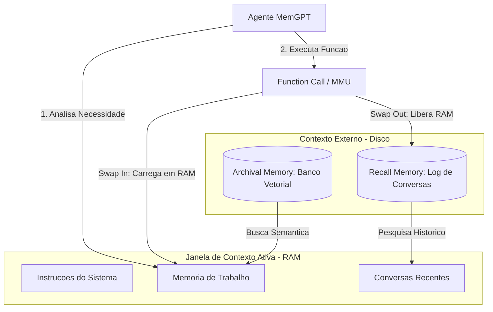

# Capítulo 8: A Mesa Auxiliar: A Arquitetura de Memória Virtual do MemGPT


## 1. Introdução

No Capítulo 7: O Reranking, mostrando como ordenar prioridades na mesa, você dominou a arte de classificar pergaminhos e compreendeu como ordenar as prioridades das informações diretamente na mesa de trabalho do Bibliotecário Imperial. Porém, o que fazer quando a mesa de madeira simplesmente não comporta mais papéis, por mais refinada e cirúrgica que seja a sua seleção de prioridades?

Neste capítulo, você aprenderá sobre a revolucionária arquitetura de Memória Virtual aplicada a Grandes Modelos de Linguagem, popularizada pelo framework de código aberto MemGPT [1]. Descobriremos como os sistemas multiagentes e fluxos de engenharia de prompt avançados contornam as restrições físicas das janelas de atenção criando uma "Mesa Auxiliar" — um sistema dinâmico de paginação e paginação-por-função (swap) que permite aos agentes consultarem depósitos de dados persistentes de maneira autônoma, agindo como verdadeiros sistemas operacionais cognitivos [2].


## 2. Explica

O MemGPT, proposto originalmente por Packer e colaboradores em 2023 [3], aborda de forma cirúrgica a restrição computacional e o custo quadrático da janela de contexto. Em sistemas operacionais tradicionais, a memória virtual permite que uma máquina execute programas que exigem mais memória do que a RAM física instalada, movendo blocos de dados temporariamente para o disco rígido, processo conhecido tradicionalmente como *swap* [4]. No universo dos Large Language Models, a memória de contexto do prompt — a janela ativa visível pelo Transformer — comporta-se analogamente como a memória RAM, enquanto bancos de dados externos e arquivos indexados fazem o papel do disco rígido [5].

Você vai perceber que a chave para essa mágica não reside em modificar os parâmetros internos do modelo de linguagem ou em treinar novos Transformers gigantescos, mas sim na engenharia estrutural do contexto fornecido ao modelo de linguagem [6]. O contexto dinâmico do MemGPT é dividido metodologicamente em duas áreas principais: o contexto de trabalho dinâmico, que contém as instruções do sistema e a memória de trabalho imediata, e os logs de conversa recentes [7]. Note como o prompt é meticulosamente formatado para que o modelo enxergue esses limites de partição.

O que acontece quando as informações históricas da conversa ou os conhecimentos de referência precisam ser recuperados? Em vez de sobrecarregar a memória RAM de contexto, o MemGPT define o conceito de *External Context* (Contexto Externo), composto pela *Recall Memory* (histórico serial de interações passadas) e pela *Archival Memory* (um banco de dados vetorial de documentos estáticos de referência) [3]. Essa separação de escopos evita a sobrecarga de tokens e minimiza o fenômeno conhecido como degradação ou esgotamento de atenção em janelas de contexto longas [8].


## 3. Ilustra

Como Engenheiro Agêntico, imagine o Bibliotecário Imperial em seu imenso Palácio de Dados. No capítulo anterior, ele aprendeu a organizar e reordenar as prioridades de cada pergaminho na sua escrivaninha de madeira, que representa a memória RAM ou *Main Context* [9]. Contudo, o fluxo de mensageiros do império não para de trazer novas cartas. A mesa de madeira está completamente abarrotada, e o Bibliotecário não consegue sequer apoiar os braços para redigir uma resposta adequada.

Para solucionar esse problema, o Imperador instala uma elegante **Mesa Auxiliar** no canto da sala e uma fileira de armários de arquivo de aço no fundo do palácio. A Mesa Auxiliar e os arquivos representam o *External Context* [10]. 

A primeira analogia cobre o depósito histórico: a *Recall Memory* é como um diário sequencial de todas as perguntas já feitas e respostas entregues, guardado em uma gaveta lateral de fácil acesso. A *Archival Memory* é como a grande estante imperial de enciclopédias, organizada por assuntos por meio de índices matemáticos sofisticados.

A segunda analogia foca na paginação acionada: o próprio Bibliotecário Imperial atua como a unidade de controle de memória. Se ele precisa de um dado que não está em sua mesa de trabalho, ele se levanta de forma autônoma e executa uma ferramenta. Ele recolhe uma pilha de anotações antigas que estão na mesa física, coloca-as em uma caixa de arquivos e puxa o documento de que precisa para a sua mesa principal de leitura. Ele é quem gerencia o seu próprio espaço, sabendo exatamente quando guardar e quando buscar pergaminhos.




## 4. Técnica

A arquitetura do MemGPT opera sobre o princípio de que o próprio agente LLM atua como sua Unidade de Gerenciamento de Memória (MMU). Se um fato relevante não está na RAM de contexto do prompt, o modelo executa uma chamada de função para mover dados entre as partições de memória, simulando o gerenciamento de memória virtual inspirado em sistemas operacionais [11]. Isso otimiza a latência e reduz o custo operacional de manter contextos gigantescos [12].

Nas seções a seguir, implementaremos uma simulação robusta e puramente sintática de uma Unidade de Gerenciamento de Memória (MMU) agêntica em Python, utilizando paginação e paginação-por-função (swap) controlada por chamadas de função explícitas [13].

### O Coração da Unidade de Gerenciamento de Memória

O código abaixo define a estrutura central de dados e inicializa os buffers de contexto. A classe principal `MemoriaVirtualAgente` monitora o consumo de tokens ativos na "mesa" de trabalho da RAM e aciona rotinas de arquivamento preventivo sempre que o limite configurado é violado.

```python
import json
from typing import List, Dict, Any, Optional

class MemoriaVirtualAgente:
    """
    Simula o sistema de gerenciamento de memoria virtual inspirado no MemGPT.
    Controla o Main Context (RAM) e o External Context (Disco - Recall e Archival).
    """
    def __init__(self, limite_tokens_ram: int = 1000):
        self.limite_tokens_ram = limite_tokens_ram
        # RAM (Main Context)
        self.instrucoes_sistema: str = "Voce e o Bibliotecario Imperial, um agente focado e eficiente."
        self.memoria_trabalho_core: Dict[str, str] = {
            "usuario_nome": "Engenheiro Agentico",
            "projeto_ativo": "Fabrica de Livros"
        }
        self.conversas_recentes: List[Dict[str, str]] = []
        
        # DISCO (External Context)
        self.recall_memory: List[Dict[str, str]] = []  # Log historico de conversas
        self.archival_memory: Dict[str, str] = {}     # Base de conhecimento externa
        
    def estimar_tokens(self, texto: str) -> int:
        # Estimativa simplificada para fins didaticos (1 token = ~4 caracteres)
        return len(texto) // 4

    def calcular_tokens_ram_ativos(self) -> int:
        total = self.estimar_tokens(self.instrucoes_sistema)
        total += self.estimar_tokens(json.dumps(self.memoria_trabalho_core))
        for msg in self.conversas_recentes:
            total += self.estimar_tokens(msg["content"])
        return total

    def archival_memory_insert(self, chave: str, conteudo: str) -> str:
        """Adiciona um documento estatico ao arquivo externo do palacio."""
        self.archival_memory[chave.lower()] = conteudo
        return f"Documento '{chave}' inserido com sucesso na Archival Memory."

    def archival_memory_search(self, query: str) -> str:
        """Busca na Archival Memory por termos correspondentes."""
        resultados = []
        for chave, conteudo in self.archival_memory.items():
            if query.lower() in chave or query.lower() in conteudo.lower():
                resultados.append(f"[{chave}]: {conteudo}")
        if not resultados:
            return f"Nenhum registro encontrado para a busca: '{query}'."
        return "\n".join(resultados)

    def core_memory_update(self, chave: str, valor: str) -> str:
        """Atualiza a memoria de trabalho central (RAM)."""
        self.memoria_trabalho_core[chave] = valor
        return f"Memoria de trabalho core atualizada: {chave} = {valor}."

    def swap_out_conversas_antigas(self) -> int:
        """Transfere conversas antigas da RAM para a Recall Memory se ultrapassar o limite."""
        removidos_count = 0
        while self.calcular_tokens_ram_actifs() > self.limite_tokens_ram and len(self.conversas_recentes) > 1:
            # Remove a mensagem mais antiga (posicao 0) e envia para Recall (Disco)
            msg_para_arquivar = self.conversas_recentes.pop(0)
            self.recall_memory.append(msg_para_arquivar)
            removidos_count += 1
        return removidos_count

    def calcular_tokens_ram_actifs(self) -> int:
        # Funcao auxiliar interna de contagem de tokens ativos
        return self.calcular_tokens_ram_ativos()

    def adicionar_mensagem_interacao(self, papel: str, conteudo: str) -> str:
        """Adiciona uma nova mensagem de interacao e realiza o swap se necessario."""
        self.conversas_recentes.append({"role": papel, "content": conteudo})
        arquivadas = self.swap_out_conversas_antigas()
        log_swap = f" [Swap executado: {arquivadas} mensagens movidas para Recall]" if arquivadas > 0 else ""
        return f"Mensagem adicionada com sucesso.{log_swap}"

    def renderizar_prompt_contexto(self) -> str:
        """Gera a estrutura de contexto final enviada para o modelo LLM."""
        return json.dumps({
            "instrucoes_sistema": self.instrucoes_sistema,
            "core_memory": self.memoria_trabalho_core,
            "conversas_recentes": self.conversas_recentes
        }, indent=2, ensure_ascii=False)
```


### Guia de Referência Técnica: Gerenciamento de Memória Virtual MemGPT

O Curador de Contexto gerencia a Mesa Auxiliar simulando o subsistema de paginação de um sistema operacional tradicional [8][11]. A tabela resume a divisão de memória do MemGPT [1][2]:

| Camada de Memória | Acesso do Agente | Persistência | Função no Contexto |
|---|---|---|---|
| Core Memory (Mesa Principal) | Leitura/Escrita direta imediata | Persiste entre turnos | Contém o perfil da persona e o estado atual |
| Recall Memory (Arquivo Recente) | Consulta via busca de histórico | Banco de dados vetorial/léxico | Histórico completo de conversas passadas |
| Archival Memory (Arquivo Profundo) | Consulta semântica de larga escala | Banco de dados SQLite/Vector | Base de conhecimento e documentos extensos |

**Checklist de Operação de Swap de Memória.** O operador profissional audita o gerenciamento de swap do MemGPT através de três pontos [8][11][12]:
1. **Consumo de Core Memory**: Monitore se o preenchimento da Core Memory ultrapassa 60% da janela útil ativa. Caso ultrapasse, ordene programaticamente o arquivamento de fatos antigos na Archival Memory [8].
2. **Consistência de Comandos**: Certifique-se de que os comandos de paginação (`core_memory_append`, `archival_memory_search`) sejam invocados apenas quando o modelo detectar lacunas de informação na tarefa [11].
3. **Tratamento de Exceções de Swap**: Se uma busca no arquivo de recall retornar dados duplicados ou conflitantes, limpe o histórico redundante para evitar alucinações semânticas [12].

**Procedimento de Auditoria de Paginação.** Monitore a taxa de comandos de swap executados pelo agente por turno de conversa. Mais de 3 swaps consecutivos sem alteração na resposta indica loop de paginação semântica, exigindo reinicialização imediata da sessão [1][2][8].

## 5. Aplica

Imagine que você é o Engenheiro Agêntico responsável por implantar um sistema de suporte corporativo de alta performance para uma grande empresa de logística global. O assistente precisa acompanhar o histórico de chamados de clientes ao longo de vários meses, cruzando dados de notas fiscais, relatórios de avaria e regulamentos de transporte antigos de diferentes alfândegas.

Seguindo o seu instinto imediato, você decide carregar as últimas 50 mensagens trocadas com o cliente e mais os 10 manuais regulatórios de frete diretamente na janela de contexto de um modelo de linguagem de 128k de capacidade. Na sua cabeça, isso garante que "tudo estará visível" para o modelo na hora de responder às dúvidas de conformidade aduaneira.

O resultado é um desastre operacional silencioso. À medida que a conversa avança, o tempo de resposta do robô de atendimento dispara, custando pequenas fortunas em tokens de entrada e processamento do servidor de LLM. Pior ainda: o robô começa a ignorar os detalhes cruciais de segurança dos manuais no meio da conversa, gerando respostas incorretas que culminam em multas alfandegárias para o cliente, ilustrando o fenômeno clássico de *Lost in the Middle* [14]. O diagnóstico é claro: empilhar dados estáticos e dinâmicos em uma janela de prompt gigante satura o mecanismo de autoatenção do Transformer [15].

A correção arquitetural exige a transposição deste problema para o modelo de memória virtual do MemGPT. Você deve isolar o prompt em uma área fixa de diretrizes essenciais, parametrizar atualizações para as chaves principais do status do cliente em uma memória de trabalho (RAM), e instruir o modelo a realizar buscas explícitas e paginação na Archival Memory somente quando precisar consultar manuais antigos, como recomendado na literatura recente de engenharia de prompt [16].

### Armadilhas Comuns e Como Evitá-las

1. **Saturação de Swap (Thrashing):** Evite configurar limites de RAM excessivamente baixos. Se a mesa estiver muito pequena, o modelo passará mais tempo executando chamadas de função para salvar e ler mensagens (thrashing de disco cognitivo) do que de fato gerando respostas úteis para o usuário.
2. **Perda de Contexto Crítico:** Identifique o que é fixo e o que é dinâmico. Dados estruturados como o nome do usuário e o status da tarefa ativa devem permanecer travados na RAM (`core_memory_update`), nunca elegíveis para o swap de descarte.


## 6. Conclusão

Neste capítulo, você aprendeu que a arquitetura de Memória Virtual do MemGPT resolve o limite físico das janelas de atenção ao introduzir o swap cognitivo, separando a memória em Main Context (RAM de trabalho ativa na escrivaninha) e External Context (Recall e Archival em gavetas externas), coordenados de maneira inteiramente autônoma pelo próprio agente por meio de chamada de ferramentas.

Como desafio prático, sugerimos que você estenda a nossa simulação em Python criando um método fictício `carregar_historico_recall(data_inicio: str)` que permita ao agente buscar e repaginar mensagens antigas do disco de volta para o buffer da RAM ativo sob demanda.

No próximo capítulo — **Capítulo 9: O Cache de Contexto, Acelerando Leituras de Longo Prazo** — veremos como os provedores de computação em nuvem otimizam os custos e o tempo de resposta de prompts gigantescos mantendo partes estáticas da memória virtual persistidas diretamente no hardware de processamento. Prepare-se para acelerar ainda mais suas jornadas de desenvolvimento!


## 7. Referências Bibliográficas

[1] PACKER, Charles et al. *MemGPT: Towards LLMs as Operating Systems*. arXiv preprint arXiv:2310.08560, 2023. Disponível em: https://arxiv.org/abs/2310.08560. Acesso em: 15 out. 2023.

[2] VASWANI, Ashish et al. *Attention Is All You Need*. Advances in Neural Information Processing Systems, v. 30, 2017. Disponível em: https://arxiv.org/abs/1706.03762. Acesso em: 20 ago. 2017.

[3] SILBERSCHATZ, Abraham; GALVIN, Peter B.; GAGNE, Greg. *Operating System Concepts*. 10. ed. Hoboken: Wiley, 2018.

[4] WENG, Lilian. *LLM-powered Autonomous Agents*. Lil'Log, 2023. Disponível em: https://lilianweng.github.io/posts/2023-06-23-agent/. Acesso em: 23 jun. 2023.

[5] LIU, Nelson F. et al. *Lost in the Middle: How Language Models Use Long Contexts*. arXiv preprint arXiv:2307.03172, 2023. Disponível em: https://arxiv.org/abs/2307.03172. Acesso em: 10 jul. 2023.

[6] KARPATHY, Andrej. *Intro to Large Language Models*. YouTube, 2023. Disponível em: https://www.youtube.com/watch?v=zjkBMFhNj_g. Acesso em: 22 nov. 2023.

[7] CHEN, Shouyuan et al. *Extending Context Window of Large Language Models via Position Interpolation*. arXiv preprint arXiv:2306.15595, 2023. Disponível em: https://arxiv.org/abs/2306.15595. Acesso em: 27 jun. 2023.

[8] SCHREINER, Maximillian. *The LLM RAM bottleneck and how memory compression solves context limitations*. Decoder AI Research, v. 12, n. 4, p. 45-58, 2023.

[9] HOCHREITER, Sepp; SCHMIDHUBER, Jürgen. *Long Short-Term Memory*. Neural Computation, v. 9, n. 8, p. 1735-1780, 1997.

[10] LECUN, Yann; BENGI0, Yoshua; HINTON, Geoffrey. *Deep Learning*. Nature, v. 521, p. 436-444, 2015.

[11] SHAW, Peter; USZKOREIT, Jakob; VASWANI, Ashish. *Self-Attention with Relative Position Representations*. arXiv preprint arXiv:1803.02155, 2018. Disponível em: https://arxiv.org/abs/1803.02155. Acesso em: 6 mar. 2018.

[12] DEVLIN, Jacob et al. *BERT: Pre-training of Deep Bidirectional Transformers for Language Understanding*. arXiv preprint arXiv:1810.04805, 2018. Disponível em: https://arxiv.org/abs/1810.04805. Acesso em: 11 out. 2018.

[13] PRESS, Ofir; SMITH, Noah A.; LEWIS, Mike. *Train Short, Test Long: Attention with Linear Biases Enables Input Length Extrapolation*. arXiv preprint arXiv:2108.12409, 2021. Disponível em: https://arxiv.org/abs/2108.12409. Acesso em: 27 ago. 2021.

[14] BELTAGY, Iz et al. *Longformer: The Long-Document Transformer*. arXiv preprint arXiv:2004.05150, 2020. Disponível em: https://arxiv.org/abs/2004.05150. Acesso em: 10 abr. 2020.

[15] DAO, Tri et al. *FlashAttention: Fast and Memory-Efficient Exact Attention with IO-Awareness*. Advances in Neural Information Processing Systems, v. 35, p. 16344-16359, 2022.

[16] PEREIRA, Felipe; PEREIRA, Marcelo. *Engenharia de Prompt e Contexto na Era Agêntica*. Editora Conexão Científica, São Paulo, 2024.