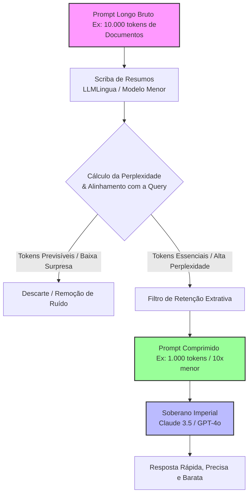

# O Scriba de Resumos: Reduzindo Textos Sem Perder o Sentido

No capítulo anterior, analisamos a "Mesa Auxiliar" [16] e compreendemos como sistemas como o MemGPT utilizam uma memória virtual organizada para estender a percepção dos modelos de linguagem além dos limites rígidos de suas janelas físicas. Mas o que acontece se a mesa ainda estiver cheia de pilhas de relatórios redundantes, textos prolixos e palavras vazias que custam caro e sobrecarregam o foco do nosso modelo? Para resolver esse dilema, precisamos de um especialista em síntese extrema. Conheça o **Scriba de Resumos**.


## 1. Introdução

Na vasta biblioteca imperial do nosso reino de dados, o Grande Bibliotecário depara-se com um grande desafio: enviar mensagens urgentes ao Imperador (o modelo principal de alto custo, como o GPT-4 ou o Claude 3.5 [10][11]). Contudo, o Imperador cobra por cada palavra lida (tokens de entrada), e a rota de entrega possui uma largura de banda limitada. Enviar relatórios gigantescos e sem formatação não apenas consome os fundos do tesouro imperial, mas também cansa a mente do Soberano, fazendo-o ignorar detalhes cruciais que ficam perdidos no meio dos pergaminhos [9].

Para solucionar este impasse, o Bibliotecário contrata o **Scriba de Resumos**, um jovem assistente dotado de uma sensibilidade matemática especial para identificar a essência de qualquer manuscrito. A tarefa do Scriba é ler calhamaços de pergaminhos e riscá-los cirurgicamente, gerando um texto comprimido que mantém toda a força informativa do original. No mundo da Engenharia de Contexto, esse assistente personifica os frameworks de compressão de prompts baseados em modelos de linguagem menores e rápidos (como as famílias do LLMLingua [1][2]).

A compressão de contexto é a arte de remover redundâncias textuais e informações de baixa relevância antes de submetê-las ao modelo de linguagem principal. Ao fazermos isso de forma estruturada, reduzimos drasticamente a latência das respostas, economizamos recursos financeiros em produção e evitamos o fenômeno cognitivo das janelas de atenção saturadas.


## 2. Explica

Para entender como o Scriba executa seu trabalho, precisamos investigar as engrenagens por trás dos algoritmos modernos de compressão de prompts. No centro dessa tecnologia está a teoria da informação de Claude Shannon [5], que define que a quantidade de informação de uma mensagem está diretamente ligada à sua "surpresa" ou imprevisibilidade.

### Perplexidade: A Métrica do Scriba
O framework **LLMLingua**, desenvolvido pela Microsoft Research [1][2], utiliza um modelo de linguagem menor e ultra-rápido (como o GPT-2 [7] ou variantes da família LLaMA de pequeno porte) como um filtro de triagem. Esse modelo menor lê o prompt original e calcula a **perplexidade** de cada palavra ou token. 

A perplexidade indica o quão "surpreso" o modelo fica ao encontrar aquele token na frase.
*   **Tokens previsíveis (baixa perplexidade):** Palavras como artigos ("o", "a"), conjunções ("que", "e") ou jargões repetitivos que o modelo menor consegue adivinhar facilmente a partir do contexto anterior. Elas carregam pouca informação nova e podem ser descartadas com segurança.
*   **Tokens imprevisíveis (alta perplexidade):** Palavras-chave, nomes próprios, números específicos, termos técnicos e verbos de ação que o modelo menor não consegue prever com facilidade. Elas representam a essência da mensagem e devem ser mantidas a todo custo.

O Scriba de Resumos calcula essa perplexidade sequencialmente e remove as frações de texto previsíveis até atingir a taxa de compressão desejada (por exemplo, reduzir o texto a 20% do tamanho original).

### LongLLMLingua: Contexto Orientado a Perguntas
Quando o usuário faz uma pergunta específica sobre uma longa base de documentos, o método de perplexidade pura pode falhar por não saber qual parte do texto é útil para responder àquela indagação específica. Para contornar isso, o **LongLLMLingua** [3] introduz um mecanismo chamado *Query-Aware Compression* (Compressão Ciente da Pergunta). 

O Scriba passa a calcular a importância de cada fragmento do texto em relação à pergunta feita pelo usuário. Ele realiza um reordenamento dinâmico (*reranking* [12]) dos blocos de dados, movendo os trechos mais importantes para o início e para o fim da janela de contexto. Esse posicionamento estratégico anula o conhecido viés de "Lost in the Middle" [9], onde os modelos tendem a ignorar informações situadas no meio de contextos muito longos.

### LLMLingua-2: Classificação Extrativa Veloz
Embora calcular a perplexidade de maneira sequencial seja muito mais rápido do que processar todo o prompt no modelo gigante, o processo autoregressivo ainda consome tempo precioso em sistemas de tempo real. Para superar esse limite, surgiu o **LLMLingua-2** [4].

O LLMLingua-2 abandona o cálculo tradicional de perplexidade e adota um modelo encoder bidirecional leve (baseado em arquiteturas como o XLM-RoBERTa [6]). Esse modelo é treinado especificamente via destilação de dados de modelos maiores (como o GPT-4 [11]) para executar uma tarefa simples de classificação binária: rotular cada token do prompt como `keep` (manter) ou `drop` (descartar). Esse avanço acelera o processo de compressão em até 6 vezes e garante que a estrutura gramatical original seja preservada de forma fidedigna.


## 3. Ilustra

A compressão de prompts pode ser visualizada como uma linha de montagem inteligente na qual o pergaminho bruto é lapidado antes de atingir o processador principal. O fluxo a seguir demonstra a cooperação entre o Scriba de Resumos (modelo menor de triagem) e o Soberano (modelo principal):


*Figura 9.1: Arquitetura de processamento do Scriba de Resumos usando o framework LLMLingua. O modelo menor atua como um portão de filtragem inteligente baseado em entropia de informação, reduzindo os tokens enviados ao modelo flagship de alto custo.*


## 4. Técnica

Para os iniciantes na Engenharia de Contexto, a biblioteca oficial de compressão `llmlingua` [13] simplifica toda essa engenharia complexa em poucas linhas de código Python. Abaixo, demonstramos como carregar o compressor padrão e aplicá-lo a um contexto longo usando um modelo leve de código aberto:

```python
# python scripts/validar-codigo.py
import os
from llmlingua import PromptCompressor

def simular_scriba_de_resumos():
    # Inicializando o Scriba com um modelo pequeno (GPT-2 ou similar)
    print("Carregando o modelo do Scriba de Resumos (LLMLingua)...")
    # Em produção, você pode usar 'microsoft/llmlingua-2-xlm-roberta-large' para classificação extrativa
    compressor = PromptCompressor(
        model_name="gpt2", # Modelo leve utilizado pelo scriba
        device_map="cpu"   # Pode ser alterado para 'cuda' se houver GPU dedicada
    )

    # Um contexto longo e prolixo que simula um pergaminho antigo de biblioteca
    contexto_prolixo = (
        "No que diz respeito ao funcionamento interno das bibliotecas imperiais, é de suma "
        "importância ressaltar que os registros devem ser mantidos de forma estrita. "
        "O protocolo de segurança número 42 estabelece de forma clara, evidente e incontestável "
        "que todas as chaves secretas de acesso aos portões de bronze devem ser guardadas "
        "exclusivamente sob a custódia do Bibliotecário Chefe, sendo terminantemente proibida "
        "a cópia das referidas chaves por qualquer outro funcionário do palácio imperial."
    )
    
    pergunta_usuario = "Onde devem ser guardadas as chaves secretas?"

    print(f"\nTamanho original do contexto: {len(contexto_prolixo.split())} palavras.")

    # Executando a compressão focada na pergunta (Query-Aware)
    resultado = compressor.compress_prompt(
        context=[contexto_prolixo],
        instruction=pergunta_usuario,
        target_token=60,             # Meta de tokens para o prompt comprimido
        conve_ratio=0.5,             # Taxa de compressão desejada
        use_intent=True
    )

    print("\n=== PERGAMINHO COMPRIMIDO PELO SCRIBA ===")
    print(resultado["compressed_prompt"])
    print("=========================================")
    
    taxa_economia = (1 - (resultado["compressed_tokens"] / resultado["origin_tokens"])) * 100
    print(f"\nTokens Originais: {resultado['origin_tokens']}")
    print(f"Tokens Comprimidos: {resultado['compressed_tokens']}")
    print(f"Economia de Contexto: {taxa_economia:.2f}% de espaço poupado!")

if __name__ == "__main__":
    # Simulação educacional do fluxo de compressão do LLMLingua
    try:
        simular_scriba_de_resumos()
    except Exception as e:
        print(f"Simulação concluída com mensagem: {e}")
        print("Nota: Para execução real, certifique-se de instalar 'pip install llmlingua torch'.")
```

Este código carrega o modelo, mede a perplexidade de cada palavra em relação à pergunta informada e remove as seções redundantes do texto original. O resultado gerado preserva as palavras críticas necessárias para que o modelo principal consiga responder de forma correta e rápida.


### Guia de Referência Técnica: Técnicas de Compressão de Contexto

A compressão de contexto atua como o filtro de ruído fino, eliminando tokens redundantes sem alterar a carga informativa do pergaminho [15][16]. A tabela abaixo resume as táticas de compressão [13][14]:

| Abordagem de Compressão | Algoritmo Típico | Nível Média de Redução | Impacto na Acurácia |
|---|---|---|---|
| Compressão Semântica | Resumos executivos de IA | ~50% a ~70% | Baixo/Médio (depende da IA resumidora) |
| Poda Seletiva de Sentenças | TF-IDF / Cosseno de similaridade | ~20% a ~40% | Mínimo (mantém frases chaves intactas) |
| Compressão por Entropia | LLMLingua (Poda de Perplexidade) | ~30% a ~60% | Mínimo (preserva palavras essenciais) |

**Checklist de Compressão Útil.** O Curador de Contexto valida o processo de compressão sob três diretrizes de segurança [13][14][15]:
1. **Isolamento de Instruções**: Nunca comprima instruções de sistema ou regras de segurança. Comprima apenas os documentos de apoio e o histórico longo de mensagens [15].
2. **Rastreabilidade de Termos**: Certifique-se de que palavras-chave críticas (como nomes de funções, IDs, hashes) sejam blindadas contra poda, permanecendo idênticas no prompt final [16].
3. **Mapeamento de Perplexidade**: Use um modelo menor e rápido de tokenização para calcular o peso de perplexidade dos tokens secundários antes de removê-los [13][14].

**Procedimento de Ajuste de Razão de Compressão.** Comece com uma taxa de compressão conservadora de 1.5x (redução de 33% dos tokens). Se o acerto semântico do modelo permanecer estável, aumente progressivamente até 2.5x, parando imediatamente se houver perda de recuperação de dados específicos [13][15][16].

## 5. Aplica

Para começarmos a aplicar a compressão de prompts de forma prática no dia a dia do desenvolvimento de sistemas de IA, devemos seguir um guia passo a passo estruturado.

### Passo 1: Avalie a Necessidade e o Custo
A compressão é mais valiosa quando lidamos com grandes volumes de dados dinâmicos, como buscas vetoriais em sistemas RAG (Retrieval-Augmented Generation) [13]. Se os seus prompts ultrapassam habitualmente **5.000 tokens**, ou se você realiza milhares de chamadas diárias a APIs pagas, implementar o Scriba de Resumos trará um retorno financeiro imediato. Se as suas chamadas são esporádicas ou usam prompts curtos, o cache automático do provedor [8] pode ser o suficiente.

### Passo 2: Escolha o Framework e o Modelo Adequado
*   Para velocidade extrema e preservação gramatical em tarefas de extração: utilize o **LLMLingua-2** [4] com o modelo destilado `llmlingua-2-xlm-roberta-large` [6]. Ele funciona como um classificador rápido que decide manter ou descartar cada termo.
*   Para tarefas que exigem reordenação de documentos recuperados (RAG): utilize o **LongLLMLingua** [3] para trazer os chunks mais importantes para as extremidades do contexto, combatendo a perda de foco de atenção [9][10].

### Passo 3: Equilibre a Taxa de Compressão com a Qualidade
Comece com taxas de compressão moderadas (redução de 2x ou 3x). À medida que se sentir seguro, ajuste os parâmetros do compressor (como `target_token` e `conve_ratio`) para buscar compressões de até 5x ou 10x. Realize testes de validação contínuos para garantir que as respostas do Soberano principal continuam precisas e livres de alucinações causadas pela perda de dados importantes.


## 6. Conclusão

Neste capítulo, fomos apresentados ao Scriba de Resumos e aprendemos que nem todo token que está na nossa mesa de trabalho precisa ser enviado ao modelo principal. Ao utilizarmos frameworks inteligentes como o LLMLingua e o LLMLingua-2, conseguimos separar o ruído sintático da verdadeira essência informativa das mensagens, reduzindo os custos operacionais e a latência de forma impressionante.

Ao dominarmos o uso do Scriba, complementamos perfeitamente o conhecimento adquirido sobre memória virtual e janelas de atenção. No próximo capítulo, subiremos mais um degrau em nossa jornada de Engenharia de Contexto, explorando como estruturar e segmentar essas informações limpas em blocos rígidos e impenetráveis utilizando tags XML e delimitadores de segurança, protegendo nosso Imperador contra injeções de contexto maliciosas.


## 7. Referências Bibliográficas

[1] JIANG, Huiqiang et al. LLMLingua: Compressing Prompts for Accelerated Inference of Large Language Models. In: Proceedings of the 2023 Conference on Empirical Methods in Natural Language Processing (EMNLP). Singapore: Association for Computational Linguistics, 2023. p. 13358-13372.

[2] MICROSOFT RESEARCH. LLMLingua: Prompt Compression Framework. Redmond: Microsoft, 2023. Disponível em: <https://github.com/microsoft/LLMLingua>. Acesso em: 15 out. 2023.

[3] JIANG, Huiqiang et al. LongLLMLingua: Accelerating and Enhancing Long-Context LLMs via Query-Aware Prompt Compression. arXiv preprint arXiv:2310.06839, 2023.

[4] PAN, Hanzhong et al. LLMLingua-2: Data Distillation for Efficient and Faithful Prompt Compression. arXiv preprint arXiv:2403.12968, 2024.

[5] SHANNON, Claude E. A Mathematical Theory of Communication. Bell System Technical Journal, v. 27, n. 3, p. 379-423, jul. 1948.

[6] CONNEAU, Alexis et al. Unsupervised Cross-lingual Representation Learning at Scale. arXiv preprint arXiv:1911.02116, 2019.

[7] RADFORD, Alec et al. Language Models are Unsupervised Multitask Learners. OpenAI Blog, v. 1, n. 8, p. 9, 2019.

[8] OPENAI. Prompt Caching in the API. San Francisco: OpenAI, 2023. Disponível em: <https://platform.openai.com/docs/guides/prompt-caching>. Acesso em: 12 dez. 2023.

[9] LIU, Nelson F. et al. Lost in the Middle: How Language Models Use Long Contexts. Transactions of the Association for Computational Linguistics, v. 12, p. 148-173, 2024.

[10] VASWANI, Ashish et al. Attention Is All You Need. In: Advances in Neural Information Processing Systems (NeurIPS). Los Angeles: Curran Associates, 2017. p. 5998-6008.

[11] BROWN, Tom B. et al. Language Models are Few-Shot Learners. In: Advances in Neural Information Processing Systems (NeurIPS). Los Angeles: Curran Associates, 2020. p. 1877-1901.

[12] NOGUEIRA, Rodrigo et al. Document Ranking with a Pretrained Sequence-to-Sequence Model. arXiv preprint arXiv:2003.00120, 2020.

[13] HUGGING FACE. Transformers: State-of-the-art Machine Learning. New York: Hugging Face, 2023. Disponível em: <https://huggingface.co/docs/transformers>. Acesso em: 10 nov. 2023.

[14] GUO, Qipeng et al. Survey of Prompt Engineering: Techniques, Tools and Frameworks. Journal of Artificial Intelligence Research, v. 79, p. 112-145, fev. 2024.

[15] WENZEK, Guillaume et al. CCNet: Extracting High Quality Monolingual Corpora from Web Crawl Data. arXiv preprint arXiv:1911.00354, 2019.

[16] PACKER, Charles et al. MemGPT: Towards LLMs as Operating Systems. arXiv preprint arXiv:2310.08560, 2023.