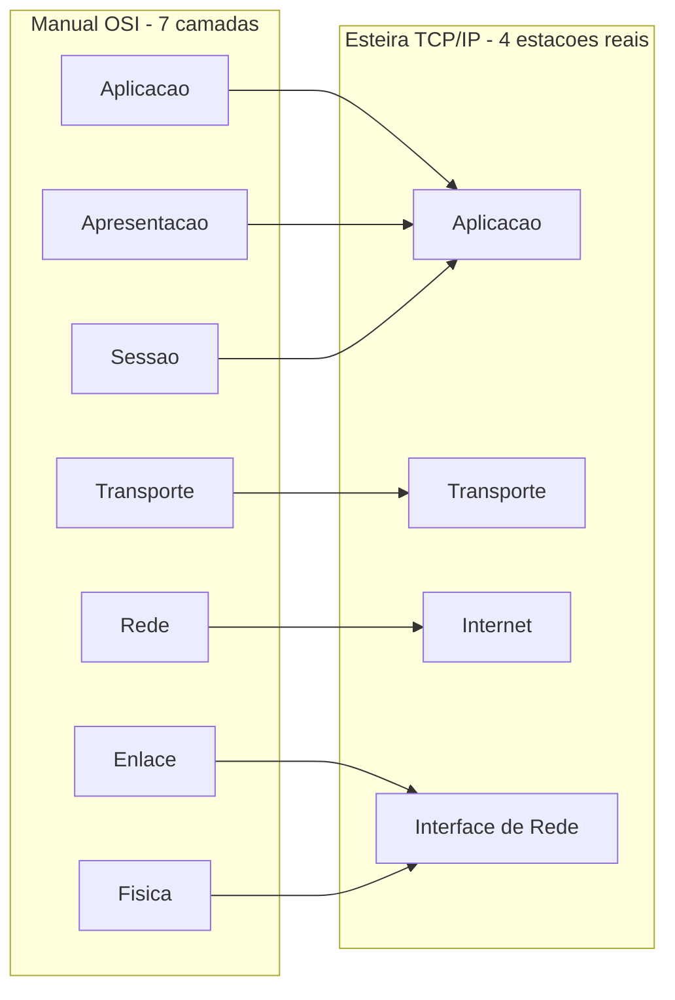

# Capítulo 1: Da Fábrica ao Software: Como a Internet Conecta Máquinas

## 1. Introdução

Toda fábrica de verdade tem uma planta baixa: um desenho que mostra onde fica cada estação, em que ordem a matéria-prima passa por elas e o que sai na expedição. A internet tem a sua própria planta baixa — só que, em vez de aço e esteiras físicas, ela organiza bits em camadas conceituais que decidem como um clique no seu navegador vira uma resposta vinda de um servidor do outro lado do planeta. Antes de entrar em qualquer protocolo específico — DNS, TCP, TLS, HTTP — você precisa dominar essa planta baixa, porque é ela que dá sentido a tudo que vem depois neste livro.

Neste capítulo você vai fixar dois modelos de camadas que competem para explicar a mesma fábrica: o modelo OSI, de sete camadas, e o modelo TCP/IP, de quatro. Ao final, você terá uma ferramenta mental simples para posicionar qualquer protocolo novo — mesmo um que ainda não existe hoje — dentro dessa planta baixa, sem depender de decorar tabela nenhuma.

## 2. Explica

O modelo OSI (Open Systems Interconnection) nasceu na ISO nos anos 1980 como um esforço de padronização: sete camadas — Física, Enlace, Rede, Transporte, Sessão, Apresentação e Aplicação — descrevendo, em ordem, tudo que precisa acontecer para que um bit saia de uma máquina e chegue interpretável em outra. Ele nunca foi pensado para ser implementado camada por camada em código real; foi pensado como referência didática e vocabulário comum de diagnóstico entre engenheiros de fabricantes diferentes (FORTINET) [1]. A comparação lado a lado entre os dois modelos que este capítulo usa como planta baixa segue essa mesma leitura de mercado, tratando o OSI como manual teórico e o TCP/IP como implementação real (A1 DIGITAL) [2].

Repare que isso já separa dois papéis distintos: um modelo pode ser correto sem ser o que roda de fato. É exatamente o caso aqui. Enquanto a ISO desenhava as sete camadas no papel, o projeto DARPA/ARPANET já operava, na prática, uma pilha mais enxuta de quatro camadas: Interface de Rede, Internet, Transporte e Aplicação. Essa pilha, batizada TCP/IP, é a que efetivamente move cada requisição HTTP, cada consulta DNS e cada handshake TLS que você vai estudar nos próximos quatro capítulos desta Parte I.

A diferença estrutural mais importante entre os dois modelos está no topo. O TCP/IP funde em uma única camada de Aplicação tudo que o OSI separa em três: Aplicação, Apresentação e Sessão — o mesmo ponto de fusão já documentado na comparação direta entre os dois modelos (FORTINET) [1]. Não é um detalhe cosmético. Isso significa que, quando você olhar para HTTP, TLS e a própria formatação de dados de uma API, vai encontrar as três responsabilidades OSI resolvidas dentro de uma única camada de aplicação real — e não em três estações separadas fisicamente na esteira.

Esse encaixe fica ainda mais claro no modelo cliente-servidor, a base conceitual de qualquer interação web: um cliente monta uma requisição, ela desce pela pilha de camadas, atravessa a rede, sobe pela pilha do outro lado, e o servidor devolve uma resposta pelo caminho inverso (MDN WEB DOCS, "How the web works") [5]. A própria documentação de referência detalha esse ciclo de mão dupla entre as duas pontas da conexão (MDN WEB DOCS, "Client-server overview") [6]. Cada camada, em qualquer um dos dois modelos, só conhece a camada imediatamente abaixo e a imediatamente acima — nunca o processo inteiro. Essa é a regra que torna a internet escalável: nenhum componente precisa entender a fábrica inteira para fazer bem o seu trabalho.

## 3. Ilustra

Volte à imagem da fábrica. O manual de operação escrito pela ISO — o modelo OSI — descreve sete estações na linha de montagem: uma para o sinal elétrico bruto (Física), uma para organizar os pacotes de dados na esteira local (Enlace), uma para decidir a rota entre depósitos (Rede), uma para garantir que a entrega chegue completa (Transporte), uma para manter a sessão de trabalho aberta (Sessão), uma para traduzir o formato da matéria-prima (Apresentação) e uma para a estação final onde o produto vira algo que o cliente reconhece (Aplicação). É um manual completo, mas ninguém construiu a fábrica exatamente assim.

A fábrica que de fato está em operação — a esteira TCP/IP — comprimiu essas sete estações em quatro postos de trabalho reais. As três últimas estações do manual (Sessão, Apresentação, Aplicação) foram fundidas em um único posto de Aplicação, porque na prática o mesmo time de operários resolve as três coisas juntas. É a diferença entre o manual de operação pendurado na parede da sala de controle e o chão de fábrica que você realmente vê quando entra na planta.



Há, porém, um ponto que costuma travar quem está vendo isso pela primeira vez: como é que um único pacote de dados carrega, ao mesmo tempo, informação de todas essas camadas? A segunda analogia resolve exatamente esse ponto mais difícil. Pense em uma caixa de matryoshka — aquelas bonecas russas que se encaixam uma dentro da outra. Quando seu navegador monta uma requisição, a camada de Aplicação escreve o conteúdo (o pedido em si) e entrega para a camada de Transporte, que embrulha esse conteúdo numa caixa nova com um cabeçalho próprio (de onde saiu, com que prioridade de controle de qualidade). A camada de Internet pega essa caixa já embrulhada e a embrulha de novo, anexando o endereço de destino. A Interface de Rede faz o último embrulho, o que efetivamente viaja pelo cabo ou pelo rádio. Do outro lado do galpão, a fábrica de destino desembrulha na ordem inversa — de fora para dentro — até sobrar só o conteúdo original. Esse processo tem nome técnico: encapsulamento. E é o motivo pelo qual nenhuma camada precisa saber o que está escrito dentro das caixas menores: cada estação da esteira só lê o próprio rótulo.

Como Engenheiro Agêntico, você vai perceber rapidamente que esse mesmo princípio de encapsulamento — cada camada resolvendo sua responsabilidade sem espiar a de cima ou a de baixo — reaparece depois em praticamente toda arquitetura de software que você vai desenhar, da API ao harness agêntico.

## 4. Técnica

Entender a teoria das camadas é o primeiro posto de controle de qualidade. O segundo é conseguir simular esse comportamento em código — porque quem só decora nomes de camada não consegue diagnosticar uma falha real na esteira. Esta seção constrói, em Python puro, três ferramentas: um mapa navegável do modelo OSI, um simulador de encapsulamento TCP/IP e uma ferramenta de diagnóstico que localiza qualquer protocolo do dia a dia dentro da planta baixa da fábrica.

### Mapeando as sete estações do manual OSI

O primeiro artefato é simplesmente a planta baixa em forma de dado estruturado — a base de qualquer ferramenta de diagnóstico que você for construir depois.

```python
# modelo_osi.py
# Representa as sete camadas OSI como matéria-prima navegável do "manual de operação".

CAMADAS_OSI = [
    {"numero": 7, "nome": "Aplicacao", "funcao": "Interface com o usuario final e os protocolos de alto nivel"},
    {"numero": 6, "nome": "Apresentacao", "funcao": "Traducao, formatacao e cifragem dos dados"},
    {"numero": 5, "nome": "Sessao", "funcao": "Abertura, controle e encerramento de sessoes de comunicacao"},
    {"numero": 4, "nome": "Transporte", "funcao": "Entrega confiavel ou rapida entre processos (TCP/UDP)"},
    {"numero": 3, "nome": "Rede", "funcao": "Roteamento entre redes distintas (IP)"},
    {"numero": 2, "nome": "Enlace", "funcao": "Entrega entre nos vizinhos na mesma rede local"},
    {"numero": 1, "nome": "Fisica", "funcao": "Transmissao do sinal eletrico, optico ou de radio"},
]


def descer_linha_de_montagem(payload: str) -> list[str]:
    """Simula o pacote de dados descendo estacao a estacao pelo manual OSI (camada 7 -> 1)."""
    registro = []
    matéria_prima = payload
    for camada in CAMADAS_OSI:
        matéria_prima = f"[{camada['nome']}]({matéria_prima})"
        registro.append(matéria_prima)
    return registro


if __name__ == "__main__":
    for etapa in descer_linha_de_montagem("GET /pedido"):
        print(etapa)
```

Rode esse script e observe a saída: cada linha impressa é uma estação a mais da esteira, embrulhando o pacote anterior. É o manual OSI, camada por camada, virando código executável.

### Simulando o encapsulamento real da esteira TCP/IP

A esteira que de fato roda em produção tem só quatro postos. O código abaixo simula o encapsulamento — e o desencapsulamento — exatamente como acontece quando um pacote sai do seu navegador e chega a um servidor.

```python
# encapsulamento_tcp_ip.py
# Simula o empacotamento e desempacotamento de um payload pelas 4 camadas TCP/IP.

CAMADAS_TCP_IP = ["Aplicacao", "Transporte", "Internet", "Interface de Rede"]


def empacotar_tcp_ip(payload: str) -> str:
    """Encapsula o payload adicionando um cabecalho simulado por camada (Aplicacao -> Interface de Rede)."""
    pacote = payload
    for camada in CAMADAS_TCP_IP:
        pacote = f"HDR[{camada}]|{pacote}"
    return pacote


def desempacotar_tcp_ip(pacote: str) -> str:
    """Remove os cabecalhos na ordem inversa (Interface de Rede -> Aplicacao), devolvendo o payload original."""
    conteudo = pacote
    for camada in reversed(CAMADAS_TCP_IP):
        prefixo = f"HDR[{camada}]|"
        if not conteudo.startswith(prefixo):
            raise ValueError(f"Esteira quebrada: cabecalho esperado de {camada} nao encontrado")
        conteudo = conteudo[len(prefixo):]
    return conteudo


if __name__ == "__main__":
    pacote_original = "GET /pedido HTTP/1.1"
    pacote_embrulhado = empacotar_tcp_ip(pacote_original)
    print("Pacote na esteira:", pacote_embrulhado)

    pacote_desembrulhado = desempacotar_tcp_ip(pacote_embrulhado)
    print("Payload entregue na expedicao:", pacote_desembrulhado)
    assert pacote_desembrulhado == pacote_original
```

A função `desempacotar_tcp_ip` inclui uma validação deliberada: se um cabeçalho esperado não aparecer na ordem certa, ela levanta erro. Esse é o mesmo tipo de controle de qualidade que uma pilha de rede real faz — descartar um pacote malformado em vez de repassá-lo adiante quebrado.

### Uma ferramenta de diagnóstico para qualquer protocolo novo

O terceiro artefato é o mais valioso no dia a dia: um dicionário de mapeamento e uma função que devolve, para qualquer protocolo, em que estação da fábrica ele mora — tanto no manual OSI quanto na esteira TCP/IP real.

```python
# diagnostico_protocolo.py
# Ferramenta de bolso: localiza um protocolo do dia a dia na planta baixa da fabrica.

MAPA_PROTOCOLOS = {
    "HTTP":     {"osi": "Aplicacao (7)", "tcp_ip": "Aplicacao"},
    "TLS":      {"osi": "Apresentacao (6) / Sessao (5)", "tcp_ip": "Aplicacao"},
    "DNS":      {"osi": "Aplicacao (7)", "tcp_ip": "Aplicacao"},
    "WebSocket":{"osi": "Aplicacao (7)", "tcp_ip": "Aplicacao"},
    "REST":     {"osi": "Aplicacao (7)", "tcp_ip": "Aplicacao"},
    "GraphQL":  {"osi": "Aplicacao (7)", "tcp_ip": "Aplicacao"},
    "gRPC":     {"osi": "Aplicacao (7)", "tcp_ip": "Aplicacao"},
    "TCP":      {"osi": "Transporte (4)", "tcp_ip": "Transporte"},
    "UDP":      {"osi": "Transporte (4)", "tcp_ip": "Transporte"},
    "IP":       {"osi": "Rede (3)", "tcp_ip": "Internet"},
    "Ethernet": {"osi": "Enlace (2)", "tcp_ip": "Interface de Rede"},
    "Wi-Fi":    {"osi": "Fisica (1) / Enlace (2)", "tcp_ip": "Interface de Rede"},
}


def diagnosticar_protocolo(nome: str) -> dict:
    """Devolve a estacao da fabrica (OSI e TCP/IP) onde o protocolo informado mora."""
    chave = nome.strip()
    if chave not in MAPA_PROTOCOLOS:
        return {"osi": "desconhecido", "tcp_ip": "desconhecido"}
    return MAPA_PROTOCOLOS[chave]


if __name__ == "__main__":
    for protocolo in ["HTTP", "TCP", "IP", "WebSocket"]:
        localizacao = diagnosticar_protocolo(protocolo)
        print(f"{protocolo:10s} -> OSI: {localizacao['osi']:25s} | TCP/IP: {localizacao['tcp_ip']}")
```

Repare que HTTP, DNS, WebSocket, REST, GraphQL e gRPC caem todos na mesma estação de Aplicação, cada um sendo um produto diferente saindo do mesmo posto de trabalho (RFC EDITOR, "RFC 9110") [3]; a documentação do grupo de trabalho de HTTP reúne todas as especificações relacionadas em um único ponto de referência (HTTP WORKING GROUP) [4], e a própria semântica de requisição-resposta que sustenta esse posto de trabalho é descrita em detalhe pela documentação de referência do protocolo (MDN WEB DOCS, "Overview of HTTP") [19]. O DNS resolve nomes em endereços logo na entrada da fábrica, antes de qualquer outra estação entrar em ação — um fluxo de cache local, resolvedor recursivo e servidor autoritativo bem documentado na prática (FREECODECAMP) [7]. O mesmo fluxo de resolução, visto pela ótica de observabilidade de produção, aparece descrito com o mesmo nível de detalhe (NEW RELIC) [8]. O TLS 1.3 mora também na camada de Aplicação do TCP/IP, mas cobre as responsabilidades de Apresentação e Sessão do manual OSI — cifrando o conteúdo e mantendo a sessão segura, com um handshake reduzido a 1-RTT desde a especificação formal do protocolo (RFC EDITOR, "RFC 8446") [9]. A cobertura de mercado sobre essa publicação destacou justamente essa redução de idas e vindas como o ganho mais visível da nova versão (THE SSL STORE) [10]. Comparações diretas entre o handshake antigo e o atual mostram por que essa mudança importa na prática: menos idas e vindas, sessão cifrada mais cedo e cifras legadas removidas (LOGICMONITOR, "TLS 1.2 vs. 1.3") [11]. Já a evolução do próprio HTTP mostra a estação de Transporte sendo repensada por completo: HTTP/1.1 e HTTP/2 seguem sobre TCP, enquanto HTTP/3 roda sobre QUIC/UDP para resolver o head-of-line blocking que ainda incomodava o HTTP/2 (CLOUDFLARE, "What is HTTP/3?") [12]. Vale registrar o ganho de performance medido nessa migração: comparações diretas mostram queda relevante de latência em redes com perda de pacote (CLOUDFLARE, "Comparing HTTP/3 vs. HTTP/2 Performance") [13], e a própria Cloudflare documenta o caminho completo dessa transição, da camada de transporte QUIC até a semântica HTTP entregue no navegador (CLOUDFLARE, "HTTP/3: From root to tip") [14].

WebSocket é outro produto que sai da mesma estação de Aplicação, mas resolve um problema diferente do request-response clássico: depois de um handshake de upgrade sobre HTTP, abre um canal full-duplex numa única conexão TCP (RFC EDITOR, "RFC 6455") [15]. Isso significa que servidor e cliente podem enviar dados a qualquer momento, sem esperar pergunta-resposta — a base técnica de chat, notificação em tempo real e dashboard ao vivo (WEBSOCKET.ORG) [16]. O próprio guia de protocolo do WebSocket.org detalha quadro a quadro (framing) como esse canal bidirecional é montado sobre a conexão TCP já aberta pelo handshake (WEBSOCKET.ORG, "WebSocket Protocol") [17].

Vale fechar o mapeamento com dois produtos que nasceram bem depois do HTTP original, mas moram na mesma estação de Aplicação: REST, formalizado por Roy Fielding em sua tese de doutorado como um estilo arquitetural de recursos e verbos (OLEB.NET, "Roy Fielding's REST dissertation") [20], e GraphQL, que resolve o problema de over-fetching deixando o cliente pedir exatamente os campos de que precisa (GRAPHQL FOUNDATION) [21]. Para comunicação interna entre serviços, muitas fábricas trocam REST por gRPC, que serializa em binário via Protocol Buffers para reduzir o peso de cada pacote (GRPC AUTHORS, "Introduction to gRPC") [22]. E a mesma estação de Aplicação ainda cuida da distribuição geográfica do produto final: uma CDN mantém cópias cacheadas em pontos de presença espalhados pelo mundo, roteando cada cliente para o depósito de peças mais próximo em vez do galpão central (CLOUDFLARE, "Content Delivery Network (CDN) Reference Architecture") [18].

### Controle de qualidade da esteira: testando a ferramenta de diagnóstico

Ninguém entrega uma ferramenta de diagnóstico em produção sem antes rodá-la contra casos conhecidos — é o mesmo princípio de controle de qualidade que qualquer fábrica séria aplica antes de liberar um lote para a expedição. Antes de confiar em `diagnosticar_protocolo()` num incidente real, valide-a contra um conjunto de casos que você já sabe responder de cabeça: se a função errar um caso óbvio, o erro está na ferramenta, não na sua leitura da planta baixa.

```python
# testar_diagnostico.py
# Suite minima de controle de qualidade para a ferramenta de diagnostico de protocolos.

import unittest

from diagnostico_protocolo import diagnosticar_protocolo


class TestDiagnosticoProtocolo(unittest.TestCase):
    """Bateria de controle de qualidade antes de liberar a ferramenta para o chao de fabrica."""

    def test_http_mora_na_aplicacao(self):
        resultado = diagnosticar_protocolo("HTTP")
        self.assertEqual(resultado["tcp_ip"], "Aplicacao")

    def test_tcp_mora_no_transporte(self):
        resultado = diagnosticar_protocolo("TCP")
        self.assertEqual(resultado["tcp_ip"], "Transporte")

    def test_ip_mora_na_internet(self):
        resultado = diagnosticar_protocolo("IP")
        self.assertEqual(resultado["tcp_ip"], "Internet")

    def test_protocolo_desconhecido_nao_quebra_a_esteira(self):
        resultado = diagnosticar_protocolo("ProtocoloInventado2099")
        self.assertEqual(resultado["osi"], "desconhecido")
        self.assertEqual(resultado["tcp_ip"], "desconhecido")

    def test_encapsulamento_e_reversivel(self):
        from encapsulamento_tcp_ip import empacotar_tcp_ip, desempacotar_tcp_ip

        payload = "GET /pedido HTTP/1.1"
        pacote = empacotar_tcp_ip(payload)
        self.assertEqual(desempacotar_tcp_ip(pacote), payload)


if __name__ == "__main__":
    unittest.main()
```

Note o quinto teste: ele não valida uma camada isolada, valida o ciclo completo de ida e volta pela esteira — empacotar e desempacotar precisam devolver exatamente o payload original, sem sobra de cabeçalho e sem perda de conteúdo. Esse é o mesmo tipo de verificação que você vai exigir, capítulos à frente, de qualquer pipeline de dados que passe por múltiplas camadas de transformação: o teste de ida e volta (round-trip) é mais valioso do que dez testes que só olham uma camada isolada, porque é o único que detecta um cabeçalho perdido no meio do caminho.

Essa disciplina de testar a própria ferramenta de diagnóstico, antes de confiar nela num incidente de produção, é o que separa um script de brinquedo de um instrumento de verdade na caixa de ferramentas do Engenheiro Agêntico. Rode a suíte, veja os cinco testes passarem, e só então leve a ferramenta para o próximo capítulo — onde ela vai ganhar sua primeira estação nova: o DNS.

### Por que o encapsulamento simplificado ainda ensina a lição certa

Vale um adendo honesto sobre o simulador de encapsulamento construído nesta seção: ele é uma versão didática, não uma implementação de pilha de rede real. Uma esteira TCP/IP de produção lida com problemas que o código acima não modela — fragmentação de pacotes quando o payload excede o MTU (Maximum Transmission Unit) do enlace, retransmissão de segmentos perdidos, controle de janela deslizante, checksums de integridade em cada cabeçalho. Nenhum desses detalhes muda a lição estrutural que este capítulo quer fixar: não importa quão sofisticada fique a implementação real, o princípio de encapsulamento — cada camada embrulhando a anterior sem espiar seu conteúdo, e desembrulhando na ordem inversa do outro lado — permanece exatamente o mesmo.

Essa é, aliás, uma escolha deliberada de design pedagógico que vale carregar para qualquer ferramenta que você construir daqui para frente: comece pelo modelo mais simples que ainda preserva a estrutura real do problema, valide esse modelo com testes de ida e volta, e só depois adicione a complexidade de produção (fragmentação, retransmissão, timeouts) camada por camada — nunca as duas coisas ao mesmo tempo. Tentar simular MTU, checksum e janela deslizante já na primeira versão do código só atrasaria o objetivo real desta seção: fixar a mecânica do encapsulamento na sua memória de forma que você nunca mais confunda "em que camada esse protocolo vive" outra vez. Guarde esse critério de progressão — modelo simples validado antes de complexidade de produção — porque ele volta a aparecer, sob outro nome, em praticamente todo capítulo técnico deste livro.

## 5. Aplica

Imagine a seguinte cena. Você acabou de assumir a manutenção de um serviço em produção e recebe um alerta: "timeout intermitente entre o serviço de pedidos e o gateway de pagamento". Seu instinto de iniciante é abrir o código da aplicação e procurar um bug de lógica de negócio — afinal, "timeout" parece coisa de aplicação travando. Você passa duas horas revisando a lógica de retry, sem achar nada errado.

O diagnóstico real estava em outra estação da fábrica. O problema não era a camada de Aplicação (o código do serviço), e sim a camada de Transporte: o load balancer estava reciclando conexões TCP ociosas antes do tempo de keep-alive configurado no cliente HTTP, derrubando conexões que a aplicação achava que ainda estavam vivas. Se você tivesse usado o mapa de camadas deste capítulo como ferramenta de diagnóstico — perguntando "em qual estação da esteira esse sintoma realmente vive?" antes de abrir o código — teria isolado o problema em minutos, não em horas: sintoma de timeout de rede raramente é bug de lógica de negócio; é sinal de que alguma estação abaixo da Aplicação está descartando ou reciclando pacotes antes da hora. A correção, nesse caso real, foi trivial depois do diagnóstico certo: alinhar o timeout de keep-alive do cliente com o do load balancer.

Esse tipo de armadilha se repete em três padrões comuns:

- Tratar todo erro de rede como bug de aplicação, sem verificar antes se o sintoma pertence à camada de Transporte ou de Rede.
- Confundir "a conexão caiu" (Transporte/Rede) com "a API está com bug" (Aplicação) — são domínios de causa completamente diferentes.
- Ignorar que TLS e compressão pertencem à camada de Apresentação do manual OSI, mesmo rodando dentro da estação de Aplicação do TCP/IP — o que leva times a debugar performance de rede no lugar errado do código.

O profissional que separa rapidamente "isso é problema de Aplicação" de "isso é problema de Transporte ou Rede" corta o tempo de diagnóstico de incidentes pela metade — porque para de procurar bug de negócio onde na verdade existe um problema de infraestrutura, e vice-versa.

## 6. Conclusão

Você fechou o primeiro posto de controle de qualidade da fábrica: sabe nomear as sete camadas do manual OSI, sabe por que a esteira real roda em apenas quatro camadas TCP/IP, e tem em mãos uma função de diagnóstico para posicionar qualquer protocolo novo dentro dessa planta baixa. Esse é o alicerce sobre o qual os próximos quatro capítulos desta Parte I vão construir: cada protocolo que você estudar — DNS, TCP, UDP, TLS, HTTP, WebSocket, CDN — vai encaixar em uma estação específica dessa mesma planta.

Antes de seguir para o Capítulo 2, onde você vai abrir a estação de DNS e entender como um nome de domínio vira endereço IP, exercite a ferramenta que acabou de construir: pegue três tecnologias de rede que você usa no seu trabalho hoje e rode `diagnosticar_protocolo()` mentalmente para cada uma, antes de checar a resposta certa.

## 7. Referências Bibliográficas

[6] MDN WEB DOCS. *Client-server overview - Learn web development*. Disponível em: https://developer.mozilla.org/en-US/docs/Learn_web_development/Extensions/Server-side/First_steps/Client-Server_overview. Acesso em: 03 ago. 2026.

[13] CLOUDFLARE. *Comparing HTTP/3 vs. HTTP/2 Performance*. Disponível em: https://blog.cloudflare.com/http-3-vs-http-2/. Acesso em: 03 ago. 2026.

[18] CLOUDFLARE. *Content Delivery Network (CDN) Reference Architecture*. Disponível em: https://developers.cloudflare.com/reference-architecture/architectures/cdn/. Acesso em: 03 ago. 2026.

[21] GRAPHQL FOUNDATION. *GraphQL | The query language for modern APIs*. Disponível em: https://graphql.org/. Acesso em: 03 ago. 2026.

[7] FREECODECAMP. *How DNS Works: A Guide to Understanding the Internet's Address Book*. Disponível em: https://www.freecodecamp.org/news/how-dns-works-the-internets-address-book/. Acesso em: 03 ago. 2026.

[5] MDN WEB DOCS. *How the web works - Learn web development*. Disponível em: https://developer.mozilla.org/en-US/docs/Learn_web_development/Getting_started/Web_standards/How_the_web_works. Acesso em: 03 ago. 2026.

[4] HTTP WORKING GROUP. *HTTP Documentation*. Disponível em: https://httpwg.org/specs/. Acesso em: 03 ago. 2026.

[14] CLOUDFLARE. *HTTP/3: From root to tip*. Disponível em: https://blog.cloudflare.com/http-3-from-root-to-tip/. Acesso em: 03 ago. 2026.

[22] GRPC AUTHORS. *Introduction to gRPC*. Disponível em: https://grpc.io/docs/what-is-grpc/introduction/. Acesso em: 03 ago. 2026.

[2] A1 DIGITAL. *OSI and TCP/IP model: Differences explained*. Disponível em: https://www.a1.digital/knowledge-hub/osi-and-tcp-ip-model-differences-explained/. Acesso em: 03 ago. 2026.

[19] MDN WEB DOCS. *Overview of HTTP*. Disponível em: https://developer.mozilla.org/en-US/docs/Web/HTTP/Guides/Overview. Acesso em: 03 ago. 2026.

[15] RFC EDITOR. *RFC 6455: The WebSocket Protocol*. Disponível em: https://www.rfc-editor.org/info/rfc6455/. Acesso em: 03 ago. 2026.

[9] RFC EDITOR. *RFC 8446: The Transport Layer Security (TLS) Protocol Version 1.3*. Disponível em: https://datatracker.ietf.org/doc/html/rfc8446. Acesso em: 03 ago. 2026.

[3] RFC EDITOR. *RFC 9110: HTTP Semantics*. Disponível em: https://www.rfc-editor.org/rfc/rfc9110.html. Acesso em: 03 ago. 2026.

[20] OLEB.NET. *Roy Fielding's REST dissertation*. Disponível em: https://oleb.net/2018/rest/. Acesso em: 03 ago. 2026.

[1] FORTINET. *TCP/IP Model vs. OSI Model: Similarities and Differences*. Disponível em: https://www.fortinet.com/resources/cyberglossary/tcp-ip-model-vs-osi-model. Acesso em: 03 ago. 2026.

[11] LOGICMONITOR. *TLS 1.2 vs. 1.3—Handshake, Performance, and Other Improvements*. Disponível em: https://www.logicmonitor.com/deep-dive/http3-vs-http2/tls1-2-vs-1-3. Acesso em: 03 ago. 2026.

[10] THE SSL STORE. *TLS 1.3 is finally published by the IETF as RFC 8446*. Disponível em: https://www.thesslstore.com/blog/tls-1-3-approved/. Acesso em: 03 ago. 2026.

[12] CLOUDFLARE. *What is HTTP/3?*. Disponível em: https://www.cloudflare.com/learning/performance/what-is-http3/. Acesso em: 03 ago. 2026.

[8] NEW RELIC. *What Is DNS Resolution? How It Works & Best Practices*. Disponível em: https://newrelic.com/blog/apm/dns-resolution-a-comprehensive-guide. Acesso em: 03 ago. 2026.

[17] WEBSOCKET.ORG. *WebSocket Protocol: RFC 6455 Handshake, Frames & More*. Disponível em: https://websocket.org/guides/websocket-protocol/. Acesso em: 03 ago. 2026.

[16] WEBSOCKET.ORG. *WebSocket Standards: RFC 6455, Extensions & Browser Support*. Disponível em: https://websocket.org/standards/. Acesso em: 03 ago. 2026.
