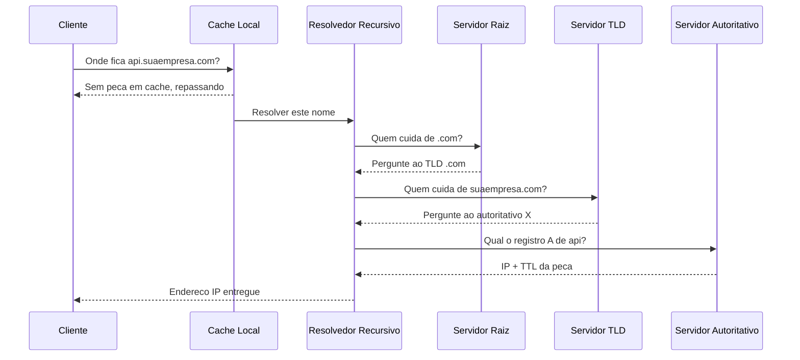
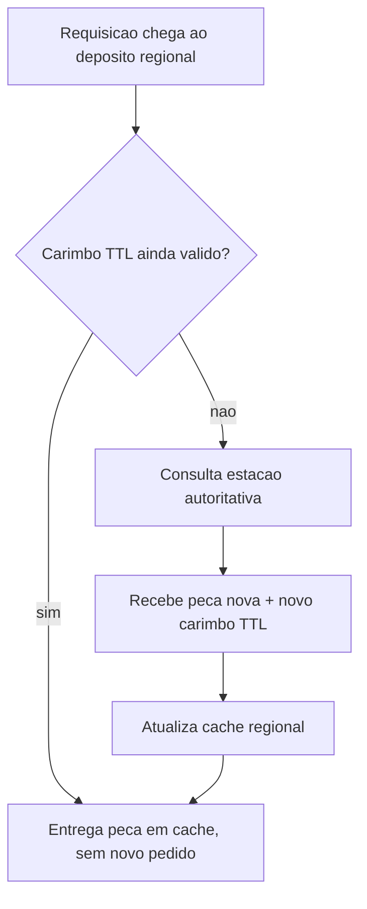

# Capítulo 2: Encontrando o Endereço Certo: DNS e a Resolução de Nomes

## 1. Introdução

No Capítulo 1, você dominou o modelo de camadas OSI/TCP-IP — a planta baixa que organiza qualquer sistema distribuído em estações previsíveis, da fiação física ao dado que chega na tela do usuário. Agora é hora de descer um nível na esteira e olhar para a primeira estação real que qualquer requisição atravessa antes de sequer existir como pacote de rede: a tradução de um nome legível, como `api.suaempresa.com`, em um endereço IP que o motor da fábrica consegue rotear.

Esse trabalho é feito por um sistema chamado DNS (Domain Name System), e ele é tão invisível quanto crítico. Ao dominar como o DNS resolve nomes — sua hierarquia, os tipos de registro que ele gerencia e o comportamento de cache que faz mudanças demorarem a propagar — você ganha o diagnóstico que separa quem só reinicia o servidor de quem sabe exatamente em qual elo da cadeia uma resolução travou.

## 2. Explica

O DNS existe porque nenhum ser humano memoriza endereços IP em escala. Ele é, na prática, a agenda de contatos da internet: transforma nomes de domínio em endereços que máquinas conseguem rotear. O fluxo de resolução de um nome passa por cinco estações bem definidas, cada uma responsável por uma fatia da resposta — cache local, resolvedor recursivo, servidor raiz, servidor de TLD (Top-Level Domain) e servidor autoritativo — até a peça final (o endereço IP) ser entregue ao cliente [1].

Esse fluxo se apoia diretamente no modelo de camadas que você já domina: o DNS opera na camada de aplicação, mas depende inteiramente do transporte (UDP, majoritariamente) e do endereçamento IP das camadas inferiores para sequer existir como protocolo [2]. É por isso que um erro de resolução de DNS costuma ser confundido com "a internet caiu" — na verdade, a camada de transporte pode estar perfeita, e o problema inteiro está na tradução de nome que nunca chegou a acontecer.

Existem dois modos de consulta que você precisa distinguir. Na consulta **recursiva**, o cliente pede ao resolvedor recursivo (geralmente o do seu provedor de internet ou um serviço público como 1.1.1.1) para fazer todo o trabalho e devolver só a resposta final. Na consulta **iterativa**, é o próprio resolvedor recursivo que caminha estação por estação — pergunta ao servidor raiz "quem cuida de `.com`?", pergunta ao servidor de TLD "quem cuida de `suaempresa.com`?", até chegar ao servidor autoritativo que efetivamente conhece o registro. O cliente final nunca vê essa dança iterativa: ele só fez uma pergunta recursiva e recebeu uma resposta.

Cada estação autoritativa guarda a informação em **registros de zona**, e o tipo de registro determina que tipo de peça está sendo entregue: `A` aponta para um endereço IPv4, `AAAA` para um endereço IPv6, `CNAME` cria um apelido que aponta para outro nome (não para um IP direto), e `MX` direciona o tráfego de e-mail para o servidor correto. Entender essa diferença evita um erro clássico de configuração: apontar um domínio raiz diretamente para um `CNAME`, o que viola a especificação e quebra a resolução de outros registros daquele domínio [3].

O detalhe que a maioria ignora até ser pego de surpresa em produção é o TTL (Time To Live): todo registro carrega um carimbo de validade, em segundos, que diz por quanto tempo um resolvedor pode manter aquela resposta em cache antes de perguntar de novo à fonte autoritativa. Isso não é um detalhe de rodapé — é o motivo pelo qual o DNS costuma ser o primeiro suspeito diagnosticado quando algo "some" silenciosamente da internet em produção [4].

## 3. Ilustra

Pense no fluxo de resolução como a esteira de expedição da fábrica processando um pedido urgente. O cliente entrega um formulário com o nome do produto (`api.suaempresa.com`), não com o código de armazém (o IP). O primeiro posto de controle é o **cache local** — se essa peça já foi separada recentemente, ela sai na hora, sem acionar mais ninguém na fábrica. Se não, o pedido sobe para a **sala de controle** (o resolvedor recursivo), que aciona em sequência o **depósito central** (servidor raiz), o **galpão setorial** (servidor de TLD) e finalmente a **estação autoritativa** — o único posto que efetivamente sabe onde aquela peça específica está guardada.



Como Engenheiro Agêntico, você já percebe que essa esteira só funciona porque cada estação confia no carimbo de validade (TTL) deixado pela anterior — e é exatamente aqui que mora o ponto mais contraintuitivo do capítulo, que merece duas lentes diferentes para não soar raso.

**Primeira lente (mecânica geral):** pense no TTL como o prazo de validade carimbado numa caixa que sai do depósito de peças. Enquanto o carimbo não vence, qualquer posto de controle intermediário pode entregar aquela caixa sem consultar de novo o armazém central — é isso que torna a internet rápida: a maioria das consultas nunca precisa acordar o servidor autoritativo.

**Segunda lente (o ponto difícil — propagação):** o problema é que a fábrica não tem um único depósito de cache, e sim milhares deles espalhados pelo mundo, cada um com sua própria caixa e seu próprio carimbo, comprado em momentos diferentes. Quando você troca o registro na estação autoritativa, os depósitos que já tinham uma cópia em cache continuam entregando a versão antiga até o carimbo deles vencer — não existe um botão de "atualizar tudo agora". É consistência eventual, não instantânea, e o tempo de espera é literalmente o TTL que você configurou dias antes [5].



## 4. Técnica

Esta seção é onde a teoria vira ferramenta de trabalho. Você vai rastrear uma resolução real estação por estação, estruturar um arquivo de zona DNS e simular o comportamento de expiração de TTL — as três entregas que sustentam os três pilares deste capítulo.

### Rastreando a Esteira de Resolução com dig

A ferramenta `dig` (ou `nslookup` no Windows) expõe exatamente a cadeia de estações descrita na seção Ilustra. A flag `+trace` força uma consulta iterativa manual, mostrando cada salto — raiz, TLD, autoritativo — em vez de esconder tudo atrás de uma única resposta recursiva.

```bash
#!/usr/bin/env bash
# rastreio_dns.sh — inspeciona a esteira de resolucao de um dominio
DOMINIO="${1:-suaempresa.com}"

echo "== Consulta recursiva simples (registro A) =="
dig +short A "$DOMINIO"

echo "== Consulta recursiva com TTL visivel =="
dig A "$DOMINIO" | grep -A 1 "ANSWER SECTION"

echo "== Rastreio iterativo estacao por estacao (raiz -> TLD -> autoritativo) =="
dig +trace "$DOMINIO"

echo "== Registro MX (rota de correspondencia) =="
dig +short MX "$DOMINIO"

echo "== Registro CNAME, se este nome for um apelido =="
dig +short CNAME "www.$DOMINIO"
```

A saída de `dig +trace` é a prova concreta de que a "internet caiu" raramente é sobre a internet: se o rastreio para no servidor de TLD e nunca alcança o autoritativo, o defeito está na delegação de zona — um problema de configuração, não de conectividade.

### O Depósito de Peças: Estruturando uma Zona DNS

Uma zona DNS é o depósito de peças da estação autoritativa: cada registro é uma gaveta padronizada, com um tipo que determina o que ela guarda. O exemplo abaixo estrutura os cinco tipos mais usados no dia a dia de um Engenheiro Agêntico.

```json
{
  "zona": "suaempresa.com",
  "ttl_padrao_segundos": 3600,
  "registros": [
    { "tipo": "A", "nome": "@", "valor": "203.0.113.10", "ttl": 3600 },
    { "tipo": "AAAA", "nome": "@", "valor": "2001:db8::10", "ttl": 3600 },
    { "tipo": "CNAME", "nome": "www", "valor": "suaempresa.com", "ttl": 3600 },
    { "tipo": "CNAME", "nome": "api", "valor": "edge.suaempresa.com", "ttl": 300 },
    { "tipo": "MX", "nome": "@", "valor": "10 mail.suaempresa.com", "ttl": 3600 },
    { "tipo": "TXT", "nome": "@", "valor": "v=spf1 include:_spf.suaempresa.com ~all", "ttl": 3600 }
  ]
}
```

Note o TTL de 300 segundos (5 minutos) no registro `api`, bem menor que o padrão de 3600 (1 hora) usado no restante da zona. Essa não é uma inconsistência: é uma decisão deliberada de controle de qualidade, porque `api` é o nome mais provável de sofrer um corte de tráfego planejado — e um TTL curto reduz a janela de propagação quando isso acontecer.

### Simulando o Carimbo de Validade em Python

O script a seguir simula, sem depender de bibliotecas externas, a contagem regressiva do carimbo TTL de um registro em cache — o mesmo raciocínio que um resolvedor real aplica internamente antes de decidir se consulta a estação autoritativa de novo.

```python
"""simulador_ttl.py — simula o vencimento do carimbo TTL de um registro em cache."""
from dataclasses import dataclass
from datetime import datetime, timedelta


@dataclass
class RegistroEmCache:
    nome: str
    tipo: str
    valor: str
    ttl_segundos: int
    consultado_em: datetime

    def expirado(self, agora: datetime) -> bool:
        prazo_final = self.consultado_em + timedelta(seconds=self.ttl_segundos)
        return agora >= prazo_final

    def segundos_restantes(self, agora: datetime) -> int:
        prazo_final = self.consultado_em + timedelta(seconds=self.ttl_segundos)
        restante = (prazo_final - agora).total_seconds()
        return max(0, int(restante))


def resolver_com_cache(registro: RegistroEmCache, agora: datetime) -> str:
    """Decide se entrega a peca em cache ou consulta a estacao autoritativa de novo."""
    if registro.expirado(agora):
        return f"Carimbo TTL vencido ha {agora - registro.consultado_em}; consultando estacao autoritativa."
    restante = registro.segundos_restantes(agora)
    return f"Entregando {registro.tipo} de {registro.nome} do cache local ({restante}s restantes de TTL)."


if __name__ == "__main__":
    consultado = datetime(2026, 8, 3, 10, 0, 0)
    registro_api = RegistroEmCache(
        nome="api.suaempresa.com",
        tipo="CNAME",
        valor="edge.suaempresa.com",
        ttl_segundos=300,
        consultado_em=consultado,
    )

    checagens = [
        consultado + timedelta(seconds=60),
        consultado + timedelta(seconds=299),
        consultado + timedelta(seconds=301),
    ]
    for momento in checagens:
        print(resolver_com_cache(registro_api, momento))
```

Rodar esse script deixa visível algo que a maioria só sente na pele durante um incidente: o mesmo registro pode estar "certo" na estação autoritativa e "errado" em um cache regional simultaneamente — e nenhuma das duas respostas está tecnicamente errada, apenas em pontos diferentes da mesma esteira de propagação.

### Por Que HTTP, TLS e WebSockets Dependem Desta Estação Primeiro

Nenhum protocolo da camada de aplicação abre conexão sem antes passar por esta esteira. Um navegador que faz uma requisição HTTP precisa primeiro ter um endereço IP em mãos — a resolução de nome é, por definição, o passo zero de qualquer ciclo requisição-resposta [8]. Isso está formalizado na própria semântica que rege a comunicação HTTP moderna [10], e o grupo de trabalho que mantém essas especificações vivas trata a resolução de hostname como pré-condição do protocolo, não como detalhe de implementação de cada cliente [11].

O handshake do TLS 1.3 depende da mesma peça de informação. O cliente precisa enviar o hostname via SNI (Server Name Indication) durante a negociação, e esse hostname só existe porque a resolução de DNS já aconteceu um instante antes — quando o registro aponta para o servidor errado, o sintoma que aparece é um erro de certificado, e a maioria dos times investiga TLS quando o defeito real está uma camada abaixo [12]. A especificação formal do protocolo mostra como essa negociação foi comprimida para um único round-trip [13], reduzindo a superfície onde esse tipo de confusão de diagnóstico pode se esconder [14].

O mesmo raciocínio vale para WebSockets: a conexão nasce como uma requisição HTTP comum, com um cabeçalho de upgrade, e reaproveita o endereço já resolvido pela primeira carga da página [9]. A especificação original do protocolo trata esse reaproveitamento como decisão deliberada de design, não coincidência [15]. Documentação de referência sobre o handshake reforça o mesmo ponto a partir de outro ângulo: o hostname resolvido precisa permanecer consistente durante toda a vida útil da conexão persistente [16]. Guias práticos de implementação do protocolo chegam à mesma conclusão ao descrever passo a passo como o upgrade é negociado [17].

Vale registrar também que o UDP usado historicamente pelo próprio DNS não é coincidência histórica isolada: o mesmo transporte sem conexão é hoje a base do QUIC, o motor de transporte por trás do HTTP/3 [18]. Comparações de desempenho mostram o quanto essa escolha reduz overhead de handshakes repetidos em conexões de alta latência [19], e análises técnicas do protocolo documentam como decisões pensadas originalmente para respostas curtas e sem estado — como as do DNS — acabaram herdadas por um transporte de propósito muito mais amplo [20].

## 5. Aplica

Imagine a seguinte cena. Faltam duas horas para o lançamento de uma nova versão da API, e você, como Engenheiro Agêntico responsável pela migração, atualiza o registro `A` de `api.suaempresa.com` para apontar para o novo cluster de produção. O deploy sobe, os testes locais passam, o painel de monitoramento do novo cluster mostra tráfego chegando — só que metade dos seus usuários continua caindo no cluster antigo, que você já começou a desligar.

O erro, nesse momento, é confiar que "trocar o DNS" é uma operação instantânea. Você seguiu o instinto de quem nunca olhou o TTL daquele registro específico: ele estava configurado em 86400 segundos (24 horas) desde a última vez que alguém mexeu nele, meses atrás, sem previsão de migração. Todo resolvedor recursivo que consultou aquele nome nas últimas 24 horas está, agora, entregando fielmente o endereço antigo do seu cache — exatamente como o protocolo manda [6].

O diagnóstico liga direto à seção Explica: TTL não é sobre "quando o DNS vai atualizar", é sobre "quanto tempo cada depósito espalhado pelo mundo vai insistir na resposta antiga antes de perguntar de novo". A correção certa não é técnica de emergência — é disciplina de controle de qualidade planejada com antecedência: baixar o TTL do registro-alvo para algo como 60 ou 120 segundos, dias antes da janela de corte, esperar esse TTL curto se propagar por completo, só então executar a troca de valor, e manter o cluster antigo de pé por pelo menos o dobro do TTL curto como rede de segurança.

Como síntese rápida, vale manter no radar estas armadilhas recorrentes:

- Trocar o valor do registro sem antes reduzir o TTL, assumindo que a mudança será instantânea.
- Desligar a origem antiga antes do TTL expirar em todos os resolvedores relevantes, não só no seu próprio cache local.
- Encadear múltiplos `CNAME` (apelido apontando para apelido) sem necessidade, o que multiplica saltos de resolução e pontos de falha.
- Ignorar o TTL negativo definido no registro `SOA` da zona, que controla por quanto tempo respostas de "domínio não existe" ficam em cache — um erro de digitação recém-corrigido pode continuar invisível por horas.

Em ambientes de mercado maduros, times de infraestrutura tratam a redução planejada de TTL como parte formal do checklist de expedição de qualquer migração de domínio — não como um detalhe opcional [7].

Vale um adendo para quem opera atrás de uma CDN ou usa GeoDNS: nesses arranjos, a própria resposta de DNS já é parte da lógica de roteamento, decidindo qual borda geográfica vai atender o cliente antes mesmo do primeiro byte trafegar [21]. Isso significa que uma migração mal planejada nesse cenário não apenas herda tráfego antigo por causa do TTL — ela pode direcionar clientes para bordas inconsistentes durante a janela de propagação, cada uma enxergando uma versão diferente da mudança [22].

## 6. Conclusão

Você atravessou os três pilares que sustentam a estação de DNS na fábrica de software: a hierarquia de resolução (cache local, recursivo, raiz, TLD, autoritativo), os tipos de registro que decidem que peça está sendo entregue (`A`, `AAAA`, `CNAME`, `MX`, `TXT`) e o comportamento de cache via TTL que explica por que mudanças de DNS nunca são instantâneas. Esse é o diferencial que separa quem trata o DNS como uma caixa-preta imprevisível de quem projeta, deliberadamente, a janela de propagação de qualquer migração antes de executá-la.

Como desafio, audite agora o TTL de todos os registros do seu próprio domínio de produção e pergunte: se eu precisasse trocar este valor amanhã de manhã, quanto tempo minha fábrica ficaria operando com informação inconsistente? No Capítulo 3, você vai descer mais uma camada na esteira e comparar TCP e UDP — as duas formas de entregar a peça depois que o endereço já foi encontrado, cada uma com uma garantia de entrega radicalmente diferente.

## 7. Referências Bibliográficas

[1] FREECODECAMP. *How DNS Works: A Guide to Understanding the Internet's Address Book*. Disponível em: https://www.freecodecamp.org/news/how-dns-works-the-internets-address-book/. Acesso em: 03 ago. 2026.

[2] FORTINET. *TCP/IP Model vs. OSI Model: Similarities and Differences*. Disponível em: https://www.fortinet.com/resources/cyberglossary/tcp-ip-model-vs-osi-model. Acesso em: 03 ago. 2026.

[3] A1 DIGITAL. *OSI and TCP/IP model: Differences explained*. Disponível em: https://www.a1.digital/knowledge-hub/osi-and-tcp-ip-model-differences-explained/. Acesso em: 03 ago. 2026.

[4] NEW RELIC. *What Is DNS Resolution? How It Works & Best Practices*. Disponível em: https://newrelic.com/blog/apm/dns-resolution-a-comprehensive-guide. Acesso em: 03 ago. 2026.

[5] PINGCAP. *Understanding the CAP Theorem in Distributed Systems*. Disponível em: https://www.pingcap.com/article/understanding-cap-theorem-basics-in-distributed-systems/. Acesso em: 03 ago. 2026.

[6] MDN WEB DOCS. *How the web works - Learn web development*. Disponível em: https://developer.mozilla.org/en-US/docs/Learn_web_development/Getting_started/Web_standards/How_the_web_works. Acesso em: 03 ago. 2026.

[7] CLOUDFLARE. *Content Delivery Network (CDN) Reference Architecture*. Disponível em: https://developers.cloudflare.com/reference-architecture/architectures/cdn/. Acesso em: 03 ago. 2026.

[8] MDN WEB DOCS. *Overview of HTTP*. Disponível em: https://developer.mozilla.org/en-US/docs/Web/HTTP/Guides/Overview. Acesso em: 03 ago. 2026.

[9] MDN WEB DOCS. *Client-server overview - Learn web development*. Disponível em: https://developer.mozilla.org/en-US/docs/Learn_web_development/Extensions/Server-side/First_steps/Client-Server_overview. Acesso em: 03 ago. 2026.

[10] RFC EDITOR. *RFC 9110: HTTP Semantics*. Disponível em: https://www.rfc-editor.org/rfc/rfc9110.html. Acesso em: 03 ago. 2026.

[11] HTTP WORKING GROUP. *HTTP Documentation*. Disponível em: https://httpwg.org/specs/. Acesso em: 03 ago. 2026.

[12] RFC EDITOR. *RFC 8446: The Transport Layer Security (TLS) Protocol Version 1.3*. Disponível em: https://datatracker.ietf.org/doc/html/rfc8446. Acesso em: 03 ago. 2026.

[13] THE SSL STORE. *TLS 1.3 is finally published by the IETF as RFC 8446*. Disponível em: https://www.thesslstore.com/blog/tls-1-3-approved/. Acesso em: 03 ago. 2026.

[14] LOGICMONITOR. *TLS 1.2 vs. 1.3—Handshake, Performance, and Other Improvements*. Disponível em: https://www.logicmonitor.com/deep-dive/http3-vs-http2/tls1-2-vs-1-3. Acesso em: 03 ago. 2026.

[15] RFC EDITOR. *RFC 6455: The WebSocket Protocol*. Disponível em: https://www.rfc-editor.org/info/rfc6455/. Acesso em: 03 ago. 2026.

[16] WEBSOCKET.ORG. *WebSocket Standards: RFC 6455, Extensions & Browser Support*. Disponível em: https://websocket.org/standards/. Acesso em: 03 ago. 2026.

[17] WEBSOCKET.ORG. *WebSocket Protocol: RFC 6455 Handshake, Frames & More*. Disponível em: https://websocket.org/guides/websocket-protocol/. Acesso em: 03 ago. 2026.

[18] CLOUDFLARE. *What is HTTP/3?*. Disponível em: https://www.cloudflare.com/learning/performance/what-is-http3/. Acesso em: 03 ago. 2026.

[19] CLOUDFLARE. *Comparing HTTP/3 vs. HTTP/2 Performance*. Disponível em: https://blog.cloudflare.com/http-3-vs-http-2/. Acesso em: 03 ago. 2026.

[20] CLOUDFLARE. *HTTP/3: From root to tip*. Disponível em: https://blog.cloudflare.com/http-3-from-root-to-tip/. Acesso em: 03 ago. 2026.

[21] GEEKSFORGEEKS. *CDN Vs Edge Server - System Design*. Disponível em: https://www.geeksforgeeks.org/system-design/cdn-vs-edge-server-system-design/. Acesso em: 03 ago. 2026.

[22] FASTPIX. *Edge Computing vs. CDN: Identifying Their Roles in Data Delivery*. Disponível em: https://www.fastpix.io/blog/edge-computing-vs-cdn-identifying-their-roles-in-data-delivery. Acesso em: 03 ago. 2026.
