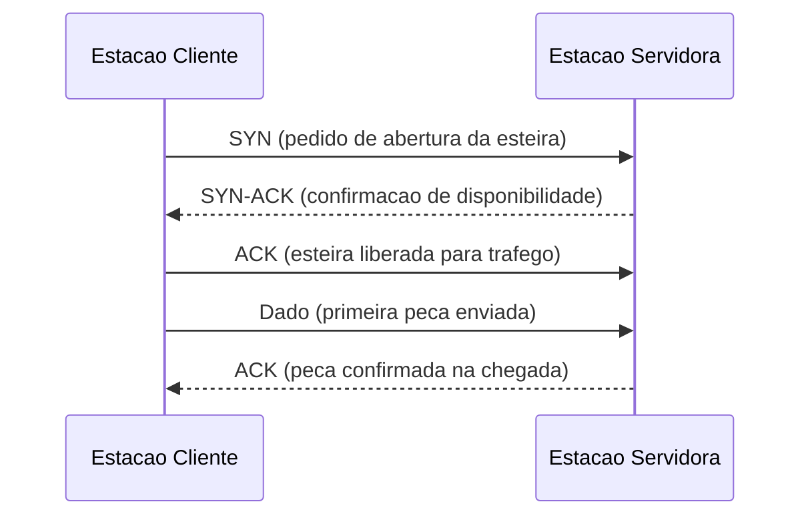
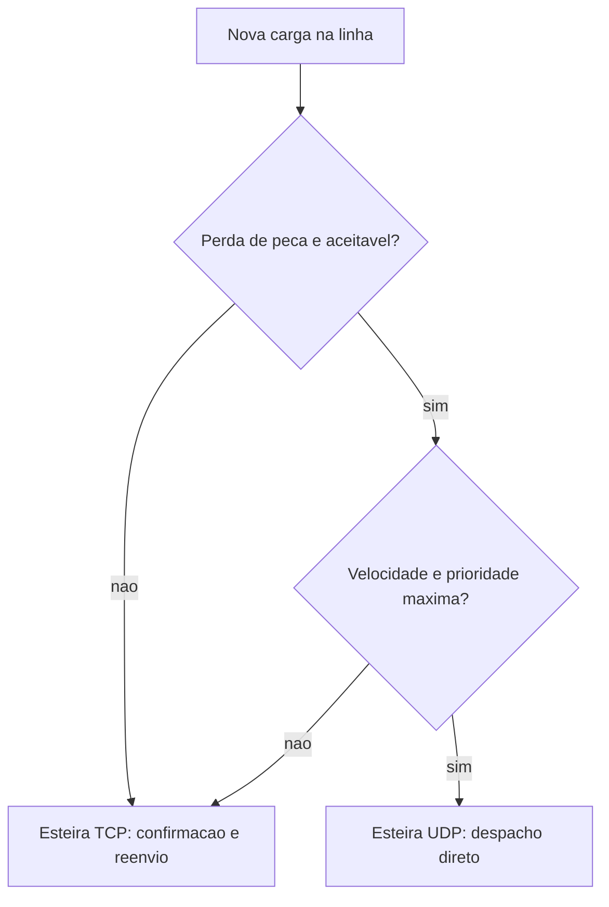

# Capítulo 3: Transporte Confiável: TCP, UDP e a Entrega das Peças

## 1. Introdução

No Capítulo 2, você dominou como o DNS traduz o nome de uma estação da fábrica em um endereço IP exato — a encomenda finalmente sabe para onde ir. Mas conhecer o endereço de destino não garante que a peça chegue inteira, na ordem certa, ou sequer chegue. Existe uma etapa anterior a qualquer HTTP, qualquer WebSocket, qualquer chamada de API: a esteira de transporte que carrega os bytes entre origem e destino.

Este capítulo abre a caixa de duas esteiras concorrentes que sustentam toda a internet: TCP, que confirma cada peça entregue e reenvia o que se perde, e UDP, que despacha sem conferência e aposta na velocidade. Ao final, você vai entender por que a maior parte do software que você usa roda sobre TCP — e por que uma parte crescente e estratégica está migrando deliberadamente para UDP.

## 2. Explica

TCP (Transmission Control Protocol) é um protocolo orientado a conexão: antes de qualquer dado trafegar, cliente e servidor executam um handshake de três vias — SYN, SYN-ACK, ACK — que estabelece números de sequência iniciais e confirma que ambos os lados estão prontos para trocar dados [8]. Essa divisão de responsabilidades é justamente o que a camada de transporte representa nos dois modelos clássicos de rede que sustentam este livro, o OSI e o TCP/IP [1]. A partir do handshake, cada segmento enviado espera uma confirmação (ACK); se a confirmação não chega dentro de uma janela de tempo, o segmento é retransmitido. Esse mecanismo de números de sequência, ACK e retransmissão é o que garante entrega ordenada e sem perda — a característica que dá nome ao protocolo.

Vale notar que a própria arquitetura cliente-servidor descrita pela documentação de referência da web pressupõe exatamente esse tipo de canal confiável entre as duas pontas [13], e que o funcionamento básico da navegação — do clique do usuário à resposta do servidor — só é previsível porque a camada de transporte abaixo dele já resolveu o problema de entrega [14].

O preço dessa garantia é overhead: handshake antes do primeiro byte útil, espera por confirmação, e um mecanismo de controle de congestionamento que reduz deliberadamente a velocidade de envio quando percebe perda de pacotes na rede, para não afogar o caminho entre origem e destino. É esse trade-off entre confiabilidade e velocidade que separa TCP e UDP — e que, décadas depois, levou a própria web a repensar sua pilha de transporte padrão [6].

UDP (User Datagram Protocol) inverte a equação: não há handshake, não há confirmação automática, não há reenvio garantido. Cada datagrama é despachado de forma independente, sem que o remetente saiba se ele chegou. Historicamente usado em DNS e streaming, o UDP ganhou um papel ainda mais estratégico como base do QUIC, o protocolo de transporte por trás do HTTP/3 — que abandonou o TCP exatamente para eliminar o atraso do handshake e resolver um problema estrutural chamado head-of-line blocking [6]. A própria Cloudflare documenta, em benchmarks comparativos, o ganho real de desempenho que essa migração de esteira produziu em condições de rede instáveis [3]. Entender por que a evolução do HTTP escolheu abrir mão da garantia do TCP em favor da velocidade do UDP é um dos pontos mais didáticos para conectar "fundamentos de rede" com "por que meu site está lento".

Não é coincidência que o DNS, que você conheceu no Capítulo 2, historicamente resolva nomes usando UDP: a resposta costuma caber em um único datagrama, e a velocidade importa mais do que a garantia formal de entrega para uma consulta tão pequena [9]. Quando a resposta ultrapassa o tamanho de um datagrama, o próprio protocolo de DNS recorre ao TCP como esteira de reforço — evidência de que a escolha de transporte nunca é um padrão fixo, e sim uma decisão caso a caso [16].

## 3. Ilustra

Pense na fábrica que já é a sua metáfora de trabalho: matéria-prima entra numa ponta, produto sai na outra, e entre elas existem esteiras diferentes para cargas diferentes. TCP é a esteira de confirmação dupla: cada peça que sai da estação de origem só é dada como entregue quando a estação de destino devolve o sinal de recebimento — se o sinal não vier, a peça é reenviada automaticamente, sem que ninguém precise notar a falha. É esse contrato de confirmação que faz um desenvolvedor confiar que os bytes de um pagamento ou de um arquivo vão chegar intactos.

A dupla camada de analogia importa aqui porque o ponto mais difícil de TCP não é o handshake em si, mas o controle de congestionamento — a parte que ninguém vê. Imagine a sala de controle da fábrica observando o volume de peças devolvidas por atraso ou perda: se o índice de perda sobe, a sala de controle reduz deliberadamente a velocidade da esteira, mesmo que isso pareça contraintuitivo (menos velocidade quando o sistema já está sob pressão). É exatamente esse comportamento — desacelerar para preservar a integridade da linha inteira — que o TCP replica automaticamente a cada sinal de congestionamento na rede.

UDP, em contraste, é a esteira expressa: a peça sai da estação de origem e segue direto, sem que ninguém na origem espere confirmação de chegada. Se uma peça cai no caminho, ninguém na esteira UDP vai notar ou reenviar — quem depende dessa entrega precisa decidir, na camada de aplicação, se aquilo é aceitável (como em uma chamada de vídeo, onde um quadro perdido importa menos que a continuidade em tempo real) ou não.

Como Engenheiro Agêntico, você já percebe que escolher a esteira errada para a carga errada é um erro de arquitetura, não um detalhe de implementação.





## 4. Técnica

### A Esteira de Confirmação Dupla: Implementando um Handshake TCP

O handshake de três vias do TCP não é algo que você escreve manualmente na maioria das aplicações — o sistema operacional o executa no momento em que o código chama `connect()`. Mas é possível observar o contrato de confiabilidade na prática construindo um servidor e um cliente TCP mínimos, onde cada mensagem enviada é confirmada pela própria semântica de fluxo confiável do socket:

```python
import socket

HOST = "127.0.0.1"
PORTA_TCP = 5000


def rodar_servidor_tcp():
    """Estacao servidora: aceita a conexao apos o handshake e confirma cada peca recebida."""
    with socket.socket(socket.AF_INET, socket.SOCK_STREAM) as servidor:
        servidor.setsockopt(socket.SOL_SOCKET, socket.SO_REUSEADDR, 1)
        servidor.bind((HOST, PORTA_TCP))
        servidor.listen(1)
        conexao, endereco_cliente = servidor.accept()
        with conexao:
            peca = conexao.recv(1024)
            print(f"Peca recebida de {endereco_cliente}: {peca.decode('utf-8')}")
            conexao.sendall(b"ACK: peca confirmada na esteira")


def rodar_cliente_tcp(mensagem: str):
    """Estacao cliente: abre a esteira (handshake), envia a peca e aguarda confirmacao."""
    with socket.socket(socket.AF_INET, socket.SOCK_STREAM) as cliente:
        cliente.connect((HOST, PORTA_TCP))
        cliente.sendall(mensagem.encode("utf-8"))
        confirmacao = cliente.recv(1024)
        print(f"Confirmacao recebida: {confirmacao.decode('utf-8')}")
```

Note que o desenvolvedor nunca escreveu `SYN` ou `ACK` explicitamente — o próprio `connect()` dispara o handshake, e o próprio protocolo garante que `sendall()` só é considerado bem-sucedido depois da confirmação de entrega na camada de transporte. É esse contrato invisível que separa TCP de UDP em nível de API.

### A Esteira Expressa: UDP na Prática

Em UDP, não existe `connect()` estabelecendo uma esteira dedicada nem confirmação automática de entrega — o remetente apenas despacha o datagrama e segue em frente, o que reduz drasticamente a latência de primeira entrega:

```python
import socket

HOST = "127.0.0.1"
PORTA_UDP = 5001


def rodar_servidor_udp():
    """Estacao servidora: recebe datagramas sem qualquer handshake previo."""
    with socket.socket(socket.AF_INET, socket.SOCK_DGRAM) as servidor:
        servidor.bind((HOST, PORTA_UDP))
        while True:
            peca, endereco_cliente = servidor.recvfrom(1024)
            print(f"Datagrama recebido de {endereco_cliente}: {peca.decode('utf-8')}")


def enviar_telemetria_udp(mensagem: str):
    """Estacao cliente: despacha a peca direto na esteira expressa, sem esperar confirmacao."""
    with socket.socket(socket.AF_INET, socket.SOCK_DGRAM) as cliente:
        cliente.sendto(mensagem.encode("utf-8"), (HOST, PORTA_UDP))
```

Repare que `enviar_telemetria_udp` retorna assim que o sistema operacional aceita o envio — não há espera por resposta, nem garantia de que o servidor sequer esteja de pé. Esse comportamento é exatamente o que torna UDP a base de protocolos sensíveis à latência, do streaming de mídia ao WebRTC usado em chamadas de voz e vídeo em tempo real [17]. É essa mesma tolerância deliberada a perda que permite ao WebRTC estabelecer conexões ponto a ponto de baixíssima latência diretamente entre navegadores, sem passar por um servidor intermediário a cada quadro de vídeo [2].

### Escolhendo a Esteira Certa: Uma Função de Decisão

Depois de entender o contrato de cada esteira, a decisão de qual usar deixa de ser hábito e passa a ser critério explícito. A função abaixo formaliza os três critérios discutidos: tolerância a perda, exigência de ordem e sensibilidade a latência:

```python
def escolher_transporte(requisitos: dict) -> str:
    """Recomenda TCP ou UDP com base em criterios explicitos da aplicacao.

    requisitos esperados:
        tolera_perda: bool
        exige_ordem_estrita: bool
        latencia_critica: bool
    """
    tolera_perda = requisitos.get("tolera_perda", False)
    exige_ordem_estrita = requisitos.get("exige_ordem_estrita", True)
    latencia_critica = requisitos.get("latencia_critica", False)

    if not tolera_perda or exige_ordem_estrita:
        return "TCP"

    if latencia_critica:
        return "UDP"

    return "TCP"


if __name__ == "__main__":
    pagamento = {"tolera_perda": False, "exige_ordem_estrita": True, "latencia_critica": False}
    chamada_de_video = {"tolera_perda": True, "exige_ordem_estrita": False, "latencia_critica": True}

    print(escolher_transporte(pagamento))          # TCP
    print(escolher_transporte(chamada_de_video))    # UDP
```

Provedores de CDN espelham exatamente esse critério ao decidir a esteira de entrega de conteúdo estático em escala: a arquitetura de referência de uma rede de distribuição de conteúdo ainda depende, em boa parte do caminho, de conexões TCP tradicionais entre os caches de borda e a origem [4]. A comparação entre servidores de borda e CDN tradicional aprofunda esse ponto, mostrando que a proximidade geográfica não elimina a necessidade de uma esteira de transporte confiável [10] — e que a latência de borda passa a ser tão decisiva quanto o próprio protocolo escolhido [7].

Esse mesmo raciocínio explica escolhas de mercado que parecem contraintuitivas à primeira vista: WebSocket, por exemplo, roda sobre TCP porque exige entrega ordenada de mensagens bidirecionais persistentes, um comportamento formalizado pela especificação de referência do protocolo [18]. Essa mesma especificação detalha como a conexão nasce de um handshake HTTP comum que é "elevado" para o protocolo dedicado, mantendo a esteira TCP subjacente durante toda a sessão [22]. Isso explica por que o suporte a WebSocket é hoje considerado padrão em praticamente qualquer navegador e servidor de mercado [23]. Já o HTTP/3 seguiu o caminho oposto e migrou deliberadamente para UDP (via QUIC) para eliminar o head-of-line blocking que o TCP impõe a conexões multiplexadas [5]. Nenhuma das duas escolhas é "melhor" em absoluto — cada uma é a esteira certa para a carga que carrega.

## 5. Aplica

Imagine que você acabou de assumir a manutenção do painel de telemetria em tempo real de uma scale-up de logística. O painel mostra, ao vivo, a posição de centenas de veículos no mapa, atualizando a cada 200 milissegundos. Seguindo o instinto — "dados importam, então preciso de garantia de entrega" — você implementa o canal de atualização de posição sobre uma conexão TCP tradicional, com reenvio automático em caso de perda.

Duas semanas depois, o time de operações reporta que o mapa "trava e depois pula" toda vez que a rede de um veículo oscila. Você investiga e descobre o motivo: quando um pacote de posição se perde, o TCP retém todos os pacotes seguintes na fila até conseguir retransmitir e confirmar o pacote perdido — o clássico head-of-line blocking. O resultado é que uma posição perdida de dois segundos atrás trava a exibição de posições mais recentes, mesmo que elas já tenham chegado.

O diagnóstico liga diretamente à seção Explica deste capítulo: TCP garante ordem e confirmação a qualquer custo, inclusive ao custo de atraso acumulado quando a rede é instável — exatamente o comportamento que o controle de congestionamento e a retransmissão produzem por design. A correção não é "consertar o TCP", é reconhecer que essa carga específica tolera perda (uma posição desatualizada em 200ms simplesmente é descartada pela posição seguinte) e não tolera atraso acumulado. Você migra o canal de telemetria de posição para UDP, aceitando que uma atualização perdida ocasionalmente é substituída pela próxima em instantes — e o "travamento" desaparece.

Armadilhas comuns que esse tipo de decisão evita, quando aplicadas cedo:
- Usar TCP por padrão em todo canal só porque "parece mais seguro", sem avaliar se a carga tolera perda.
- Ignorar que UDP exige que a própria aplicação trate perda, duplicação e fora de ordem quando isso importar.
- Migrar para UDP em canais que exigem ordem estrita (como transações financeiras), invertendo o erro para o lado oposto.

Métrica de sucesso nesse cenário real: latência percebida no painel caiu de picos de 2-3 segundos para menos de 300 milissegundos, e o time de operações parou de reportar "congelamentos" — o preço aceito foi um punhado de posições intermediárias descartadas, irrelevantes para quem olha o mapa ao vivo.

## 6. Conclusão

Você fechou este capítulo dominando três pontos que sustentam toda decisão de rede daqui em diante: como o handshake e a confirmação do TCP compram confiabilidade ao custo de latência; como o UDP abre mão dessa garantia para ganhar velocidade, e por que essa troca é vantagem em cargas de tempo real; e como formalizar essa escolha em um critério explícito de engenharia, em vez de hábito. Esse é o diferencial que separa quem programa em cima da rede de quem realmente entende a esteira por baixo do código.

Como desafio, revise um sistema que você mantém hoje e pergunte: existe algum canal rodando em TCP por hábito que, na verdade, tolera perda e ganharia latência real migrando para UDP? Ou o inverso, algum UDP usado onde a ordem estrita era necessária?

Vale adiantar por que a esteira TCP que você acabou de dominar será a base literal do próximo capítulo: o TLS 1.3 roda sobre essa mesma conexão confiável para reduzir seu próprio handshake a uma única ida e volta [19]. A comunidade de segurança tratou essa mudança como um marco na história do protocolo [21], e comparações diretas com a versão anterior mostram o ganho de desempenho real que essa redução de handshake produz [12]. Da mesma forma, a semântica do HTTP — métodos, cabeçalhos, códigos de status — foi formalizada de modo independente da versão de transporte usada por baixo [20], documentação hoje mantida oficialmente pelo grupo de trabalho responsável pelo protocolo [11] e resumida em guias de referência acessíveis a qualquer desenvolvedor [15].

No próximo capítulo, vamos blindar essa mesma esteira de transporte: o TLS 1.3 entra exatamente sobre essas conexões para garantir que, além de confiável, o tráfego também seja privado e íntegro em trânsito.

## 7. Referências Bibliográficas

[1] A1 DIGITAL. *OSI and TCP/IP model: Differences explained*. Disponível em: https://www.a1.digital/knowledge-hub/osi-and-tcp-ip-model-differences-explained/. Acesso em: 03 ago. 2026.

[2] ABLY. *What is WebRTC? (Explanation, use cases, and features)*. Disponível em: https://ably.com/blog/what-is-webrtc. Acesso em: 03 ago. 2026.

[3] CLOUDFLARE. *Comparing HTTP/3 vs. HTTP/2 Performance*. Disponível em: https://blog.cloudflare.com/http-3-vs-http-2/. Acesso em: 03 ago. 2026.

[4] CLOUDFLARE. *Content Delivery Network (CDN) Reference Architecture*. Disponível em: https://developers.cloudflare.com/reference-architecture/architectures/cdn/. Acesso em: 03 ago. 2026.

[5] CLOUDFLARE. *HTTP/3: From root to tip*. Disponível em: https://blog.cloudflare.com/http-3-from-root-to-tip/. Acesso em: 03 ago. 2026.

[6] CLOUDFLARE. *What is HTTP/3?*. Disponível em: https://www.cloudflare.com/learning/performance/what-is-http3/. Acesso em: 03 ago. 2026.

[7] FASTPIX. *Edge Computing vs. CDN: Identifying Their Roles in Data Delivery*. Disponível em: https://www.fastpix.io/blog/edge-computing-vs-cdn-identifying-their-roles-in-data-delivery. Acesso em: 03 ago. 2026.

[8] FORTINET. *TCP/IP Model vs. OSI Model: Similarities and Differences*. Disponível em: https://www.fortinet.com/resources/cyberglossary/tcp-ip-model-vs-osi-model. Acesso em: 03 ago. 2026.

[9] FREECODECAMP. *How DNS Works: A Guide to Understanding the Internet's Address Book*. Disponível em: https://www.freecodecamp.org/news/how-dns-works-the-internets-address-book/. Acesso em: 03 ago. 2026.

[10] GEEKSFORGEEKS. *CDN Vs Edge Server - System Design*. Disponível em: https://www.geeksforgeeks.org/system-design/cdn-vs-edge-server-system-design/. Acesso em: 03 ago. 2026.

[11] HTTP WORKING GROUP. *HTTP Documentation*. Disponível em: https://httpwg.org/specs/. Acesso em: 03 ago. 2026.

[12] LOGICMONITOR. *TLS 1.2 vs. 1.3—Handshake, Performance, and Other Improvements*. Disponível em: https://www.logicmonitor.com/deep-dive/http3-vs-http2/tls1-2-vs-1-3. Acesso em: 03 ago. 2026.

[13] MDN WEB DOCS. *Client-server overview - Learn web development*. Disponível em: https://developer.mozilla.org/en-US/docs/Learn_web_development/Extensions/Server-side/First_steps/Client-Server_overview. Acesso em: 03 ago. 2026.

[14] MDN WEB DOCS. *How the web works - Learn web development*. Disponível em: https://developer.mozilla.org/en-US/docs/Learn_web_development/Getting_started/Web_standards/How_the_web_works. Acesso em: 03 ago. 2026.

[15] MDN WEB DOCS. *Overview of HTTP*. Disponível em: https://developer.mozilla.org/en-US/docs/Web/HTTP/Guides/Overview. Acesso em: 03 ago. 2026.

[16] NEW RELIC. *What Is DNS Resolution? How It Works & Best Practices*. Disponível em: https://newrelic.com/blog/apm/dns-resolution-a-comprehensive-guide. Acesso em: 03 ago. 2026.

[17] PUBNUB. *What is WebRTC (Peer-to-Peer Technology)*. Disponível em: https://www.pubnub.com/blog/what-is-webrtc/. Acesso em: 03 ago. 2026.

[18] RFC EDITOR. *RFC 6455: The WebSocket Protocol*. Disponível em: https://www.rfc-editor.org/info/rfc6455/. Acesso em: 03 ago. 2026.

[19] RFC EDITOR. *RFC 8446: The Transport Layer Security (TLS) Protocol Version 1.3*. Disponível em: https://datatracker.ietf.org/doc/html/rfc8446. Acesso em: 03 ago. 2026.

[20] RFC EDITOR. *RFC 9110: HTTP Semantics*. Disponível em: https://www.rfc-editor.org/rfc/rfc9110.html. Acesso em: 03 ago. 2026.

[21] THE SSL STORE. *TLS 1.3 is finally published by the IETF as RFC 8446*. Disponível em: https://www.thesslstore.com/blog/tls-1-3-approved/. Acesso em: 03 ago. 2026.

[22] WEBSOCKET.ORG. *WebSocket Protocol: RFC 6455 Handshake, Frames & More*. Disponível em: https://websocket.org/guides/websocket-protocol/. Acesso em: 03 ago. 2026.

[23] WEBSOCKET.ORG. *WebSocket Standards: RFC 6455, Extensions & Browser Support*. Disponível em: https://websocket.org/standards/. Acesso em: 03 ago. 2026.
