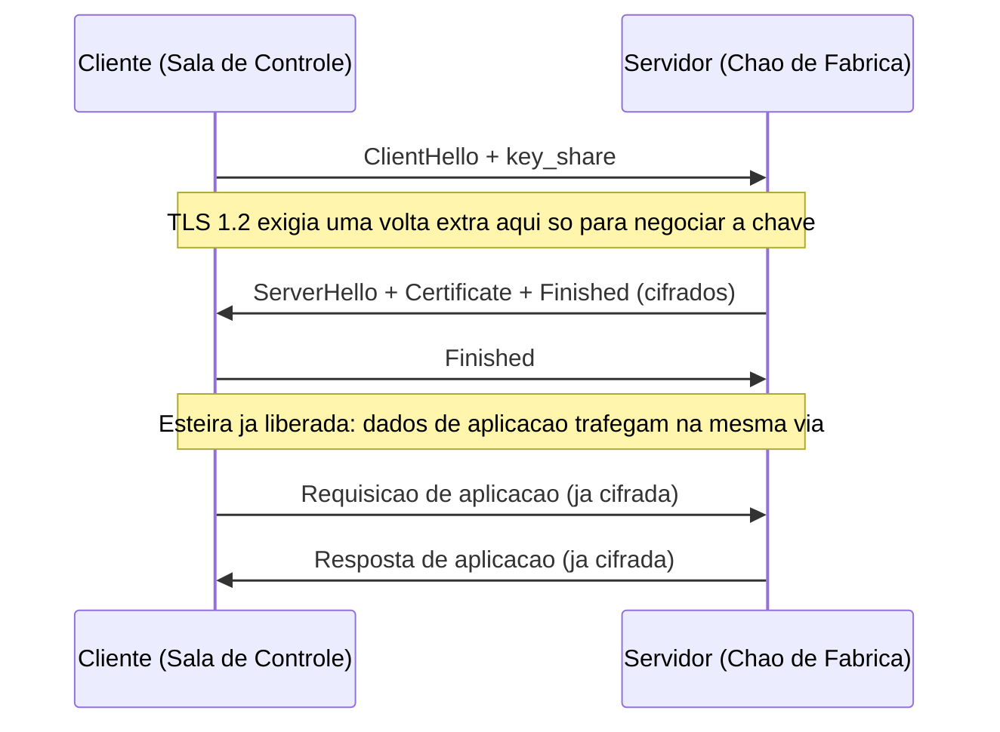
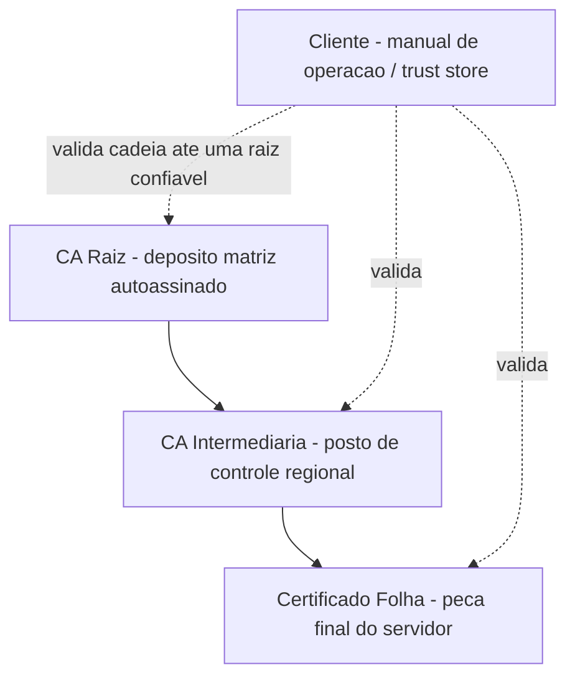

# Capítulo 4: Blindando a Linha: TLS 1.3 e a Segurança em Trânsito

## 1. Introdução

No Capítulo 3, você dominou o handshake de três vias do TCP — o aperto de mão que garante que toda peça entregue pela esteira chegue inteira, na ordem certa, com confirmação de recebimento. Mas uma esteira confiável não é uma esteira protegida. TCP garante que os dados cheguem; não garante que ninguém os leia, adultere ou os substitua no caminho. É aqui que entra o TLS 1.3, a camada que blinda a linha de transporte antes que qualquer dado de aplicação circule sobre ela.

Este capítulo trata o TLS como o que ele realmente é para quem opera a fábrica de software: não um detalhe de infraestrutura que "o time de segurança resolve", mas um protocolo que todo Engenheiro Agêntico precisa entender o suficiente para diagnosticar, configurar e defender. Você vai sair daqui sabendo por que o handshake do TLS 1.3 é mais rápido que o de qualquer versão anterior, como funciona a cadeia de confiança que sustenta o cadeado verde do navegador, e quais erros de configuração derrubam produção com mais frequência do que qualquer ataque sofisticado.

## 2. Explica

TLS (Transport Layer Security) é o protocolo que cifra e autentica dados entre cliente e servidor, rodando logo acima da esteira de transporte que você já conhece do Capítulo 3 — TCP na prática, embora o QUIC recente também o carregue sobre UDP. Essa posição na pilha não é acidental: no modelo TCP/IP de quatro camadas que efetivamente roda na internet, TLS ocupa a fronteira entre Transporte e Aplicação, o mesmo agrupamento prático que substituiu o modelo OSI de sete camadas como referência de projeto [4]. Fontes distintas de mercado descrevem essa sobreposição de camadas com ênfases levemente diferentes, mas convergem no mesmo ponto central: todo protocolo de segurança de trânsito se apoia sobre uma camada de transporte já estabelecida [5]. A versão em vigor no mercado é o TLS 1.3, formalizada como RFC 8446 pela IETF [1]. Ela não é um ajuste incremental: é uma reescrita que elimina cifras legadas, remove mecanismos considerados frágeis das versões anteriores e reduz drasticamente o número de idas e vindas necessárias antes de qualquer dado de aplicação poder trafegar [2].

O ganho mais visível é o handshake em 1-RTT (um round trip completo) contra os 2-RTT do TLS 1.2. Isso significa que, na primeira conexão entre cliente e servidor, apenas uma ida e volta de rede é necessária antes de a comunicação cifrada começar — metade do que a versão anterior exigia [3]. Em conexões de longa distância geográfica, onde cada round trip pode custar dezenas ou centenas de milissegundos, essa economia se traduz diretamente em tempo de carregamento percebido pelo usuário final.

Outra mudança estrutural: o TLS 1.3 passou a exigir cifras AEAD (Authenticated Encryption with Associated Data) com forward secrecy obrigatória em toda sessão. Esse mesmo pacote de mudanças cifrou a maior parte do próprio handshake — inclusive o certificado do servidor — para reduzir a superfície de informação exposta a um observador passivo na rede [3]. Forward secrecy é o princípio pelo qual a chave usada para cifrar uma sessão específica é descartada logo depois de usada e nunca é derivável da chave privada de longo prazo do servidor. Isso significa que, mesmo que a chave privada do servidor seja comprometida no futuro, o tráfego de sessões passadas continua ilegível para quem o capturou.

O acordo de chave em si depende de criptografia assimétrica — um par de chave pública e privada — para negociar, com segurança, uma chave de sessão simétrica que cifra o volume de dados em alta velocidade [11]. Esse esquema híbrido, que combina troca assimétrica de chave com cifragem simétrica de alto volume, é a mesma arquitetura descrita em detalhe nos guias de mercado sobre RSA, ECC e infraestrutura de chave pública [12]. É o mesmo esquema híbrido usado em praticamente toda comunicação segura de mercado: assimétrico para o aperto de mão inicial, simétrico para o tráfego contínuo. O aprofundamento matemático de RSA, ECC e AES fica reservado ao Capítulo 11 — aqui, o que importa é entender que esse acordo de chave é o que torna o handshake do TLS 1.3 tão enxuto quanto ele é.

Do lado da autenticação, o TLS depende de certificados digitais emitidos por Autoridades Certificadoras (CAs) reconhecidas pelo sistema operacional ou navegador do cliente. Um certificado vincula uma chave pública a uma identidade — o nome de domínio do servidor — e sua validade só é aceita se puder ser rastreada até uma raiz de confiança já embutida no cliente. Esse mecanismo, a cadeia de confiança, é o próximo pilar deste capítulo.

## 3. Ilustra

Pense no handshake de TLS 1.2 como o antigo protocolo de entrada da fábrica: o inspetor de portaria (o servidor) recebia o visitante (o cliente), pedia para ele apresentar credenciais, ia até o almoxarifado central verificar se aquela credencial era legítima, voltava para negociar qual chave de acesso seria usada, e só então liberava a entrada na linha de montagem — duas idas completas ao almoxarifado antes de qualquer peça circular. O TLS 1.3 reorganiza esse protocolo: o visitante já chega apresentando sua proposta de chave de acesso (`key_share`) junto com o pedido de entrada, e o inspetor responde numa única volta com a credencial validada, a chave negociada e a liberação da esteira — tudo cifrado, tudo em uma única reunião breve.



A parte mais difícil de visualizar nesse processo não é a redução de idas e vindas — é o forward secrecy. Para isso, troque a metáfora: imagine que o depósito de peças da fábrica guarda, todo santo dia, um cadeado de combinação diferente para o container de expedição daquele dia específico, e que a combinação é destruída ao final do expediente. Existe também uma chave-mestra do depósito inteiro, guardada com o gerente — mas essa chave-mestra nunca abre diretamente os containers já expedidos e lacrados no passado, porque cada um teve sua própria combinação descartável. Se, um ano depois, um espião rouba a chave-mestra atual, ele ainda não consegue abrir o container que saiu há seis meses: aquela combinação específica já não existe em lugar nenhum. É exatamente esse o contrato do forward secrecy — comprometer a chave de longo prazo do servidor não retroativamente descifra sessões já encerradas.

Para a cadeia de confiança dos certificados, a metáfora muda para o depósito de peças em si, organizado hierarquicamente:



Como Engenheiro Agêntico, você não precisa decorar a criptografia por trás de cada elo — precisa entender que a confiança nunca nasce do zero: ela é herdada de uma raiz que o seu sistema operacional ou navegador já decidiu confiar antes mesmo de você abrir a primeira aba.

## 4. Técnica

### Handshake TLS 1.3 na Prática: Lendo o Aperto de Mão na Esteira

A teoria do 1-RTT vira evidência concreta quando você observa um handshake real acontecendo. O comando abaixo força uma conexão TLS 1.3 contra um host e imprime um resumo do que foi negociado — versão de protocolo, cifra escolhida e confirmação de que a esteira liberou o tráfego de aplicação:

```bash
# Forca TLS 1.3 e imprime um resumo do handshake negociado
openssl s_client -connect exemplo.com:443 -tls1_3 -brief </dev/null

# Saida tipica (anotada):
# CONNECTION ESTABLISHED                <- 1-RTT concluido
# Protocol version: TLSv1.3             <- versao negociada
# Ciphersuite: TLS_AES_256_GCM_SHA384   <- cifra AEAD obrigatoria
# Peer certificate: CN = exemplo.com    <- certificado folha apresentado
# Verification: OK                      <- cadeia de confianca validada
```

Cada linha dessa saída mapeia diretamente para um conceito da seção Explica: a `Ciphersuite` confirma que só cifras AEAD são aceitas em TLS 1.3, exigência formalizada na própria especificação do protocolo [1]; `Verification: OK` significa que o cliente conseguiu percorrer a cadeia de confiança até uma raiz embutida no seu trust store local. Rodar esse comando contra o próprio domínio antes de um deploy é o equivalente, na fábrica, a puxar a peça recém-montada da esteira e inspecioná-la antes de ela seguir para expedição.

### Validando a Cadeia de Confiança: Inspecionando o Certificado Programaticamente

A inspeção manual via `openssl` é útil, mas o Engenheiro Agêntico que automatiza sua esteira de qualidade escreve verificação programática. O script abaixo usa o módulo `ssl` da biblioteca padrão do Python para conectar a um host, extrair o certificado apresentado e reportar emissor, validade e o nome coberto — os três pontos que mais causam incidentes quando divergem do esperado:

```python
import ssl
import socket
from datetime import datetime

def inspecionar_certificado(host: str, porta: int = 443) -> dict:
    """Conecta via TLS e retorna um resumo do certificado do servidor,
    equivalente a uma inspecao de controle de qualidade antes da expedicao."""
    contexto = ssl.create_default_context()
    with socket.create_connection((host, porta), timeout=5) as sock:
        with contexto.wrap_socket(sock, server_hostname=host) as tls_sock:
            certificado = tls_sock.getpeercert()
            protocolo = tls_sock.version()

    validade_str = certificado.get("notAfter", "")
    validade = datetime.strptime(validade_str, "%b %d %H:%M:%S %Y %Z")
    dias_restantes = (validade - datetime.utcnow()).days

    emissor = dict(x[0] for x in certificado.get("issuer", []))
    assunto = dict(x[0] for x in certificado.get("subject", []))

    return {
        "host": host,
        "protocolo_negociado": protocolo,
        "emissor": emissor.get("organizationName", "desconhecido"),
        "nome_coberto": assunto.get("commonName", "desconhecido"),
        "dias_para_expirar": dias_restantes,
        "cadeia_valida": True,  # wrap_socket ja lanca excecao se invalida
    }


if __name__ == "__main__":
    resultado = inspecionar_certificado("exemplo.com")
    print(resultado)
```

Repare no comentário `wrap_socket ja lanca excecao se invalida`: se a cadeia de confiança não puder ser rastreada até uma raiz aceita pelo trust store do sistema, o Python levanta `ssl.SSLCertVerificationError` antes mesmo de o script chegar a essa linha — a validação da cadeia não é uma etapa opcional que você escreve, é um comportamento padrão do próprio protocolo, decorrência direta de como a criptografia assimétrica sustenta a confiança na identidade do servidor [11]. Uma técnica correlata de reforço é o certificate pinning, que restringe a confiança do cliente a um certificado ou chave pública específicos em vez de aceitar qualquer certificado validado pela cadeia padrão do sistema operacional [13]. A literatura de mercado sobre PKI descreve esse mecanismo como uma camada extra sobre a validação padrão, não como substituto dela [14]. É uma defesa adicional contra o cenário em que uma CA inteira é comprometida — mas a recomendação de mercado é usá-la seletivamente, em conexões cliente-servidor fechadas e de alto valor, nunca como padrão universal, já que o antigo HPKP (fixação via cabeçalho HTTP) foi abandonado pelos navegadores modernos em favor de Certificate Transparency [15].

### Controle de Qualidade Antes da Expedição: Configuração TLS em Produção

Nenhuma das seções anteriores importa se a configuração do servidor em produção reintroduz o que o protocolo já resolveu. O bloco abaixo compara, lado a lado, uma configuração Nginx com os erros mais recorrentes de mercado e a correção equivalente:

```nginx
# ANTES - configuracao com erros comuns de producao
server {
    listen 443 ssl;
    server_name exemplo.com;

    ssl_protocols TLSv1 TLSv1.1 TLSv1.2 TLSv1.3;  # ERRO: protocolos legados ainda habilitados
    ssl_ciphers HIGH:MEDIUM:!aNULL;               # ERRO: cifras nao-AEAD permitidas
    ssl_certificate /etc/ssl/exemplo_com.crt;     # ERRO: so o certificado folha, sem a cadeia intermediaria
    ssl_certificate_key /etc/ssl/exemplo_com.key;
    # ERRO: nenhum cabecalho HSTS configurado
}

server {
    listen 80;
    server_name exemplo.com;
    # ERRO: nenhum redirecionamento forcado para HTTPS
}
```

```nginx
# DEPOIS - configuracao corrigida
server {
    listen 443 ssl;
    server_name exemplo.com;

    ssl_protocols TLSv1.2 TLSv1.3;                       # apenas protocolos modernos
    ssl_ciphers TLS_AES_256_GCM_SHA384:TLS_CHACHA20_POLY1305_SHA256;  # cifras AEAD apenas
    ssl_certificate /etc/ssl/exemplo_com_fullchain.crt;  # certificado folha + cadeia intermediaria completa
    ssl_certificate_key /etc/ssl/exemplo_com.key;
    add_header Strict-Transport-Security "max-age=63072000; includeSubDomains" always;
}

server {
    listen 80;
    server_name exemplo.com;
    return 301 https://$host$request_uri;  # redirecionamento forcado para HTTPS
}
```

Os quatro erros marcados no bloco "ANTES" são os que mais aparecem em incidentes reais de produção: protocolos legados (TLS 1.0/1.1) e cifras sem AEAD ainda habilitados por herança de configuração antiga; envio de apenas o certificado folha sem a cadeia intermediária, o que faz alguns clientes — sobretudo os que não têm a CA intermediária em cache — rejeitarem a conexão mesmo com um certificado tecnicamente válido; ausência de HSTS, que deixaria a primeira requisição de um usuário vulnerável a um downgrade para HTTP; e ausência de redirecionamento automático de HTTP para HTTPS na porta 80. Esse último ponto, aliás, é uma instância específica de um problema mais amplo classificado pela OWASP como Security Misconfiguration (A05:2021) — a categoria de risco que cobre justamente configurações de segurança deixadas no padrão inseguro ou nunca revisadas [16].

## 5. Aplica

Imagine a cena: é sexta-feira à noite, você acabou de subir a nova versão do checkout do seu produto para produção, e o pull request passou em todos os testes automatizados. Duas horas depois, o time de suporte reporta uma onda de usuários reclamando que o navegador exibe um aviso de "conexão não segura" ao tentar finalizar a compra. Você entra em pânico, verifica o certificado no painel do provedor e vê que a data de validade ainda está longe de vencer — então por que o navegador está reclamando?

O diagnóstico, se você domina o Explica deste capítulo, é rápido: o certificado individual pode estar válido, mas se o servidor não está enviando a cadeia intermediária completa — exatamente o erro do bloco "ANTES" que você acabou de ler —, alguns navegadores e a maioria dos clientes HTTP de bibliotecas de pagamento não conseguem reconstruir o caminho até a raiz confiável e recusam a conexão por padrão, mesmo sem qualquer problema real com o certificado em si. É a cadeia de confiança quebrada no meio, não o elo final. A correção é a mesma do bloco "DEPOIS": apontar `ssl_certificate` para o arquivo de cadeia completa (fullchain), não apenas para o certificado folha, e validar com o mesmo comando `openssl s_client -showcerts` que você usou na seção Técnica antes de expedir para produção novamente.

Esse tipo de incidente raramente nasce de um ataque sofisticado. No mercado, o profissional que se diferencia é o que trata a configuração TLS como parte do controle de qualidade da esteira de deploy — não como uma etapa configurada uma vez e esquecida. As armadilhas mais recorrentes, na ordem em que mais derrubam produção, são:

- Certificado expirado sem renovação automatizada — o erro mais comum e mais evitável.
- Cadeia intermediária incompleta, como na cena acima.
- Hostname divergente entre o certificado e o domínio real servido (mismatch).
- Cifras e protocolos legados (TLS 1.0/1.1) mantidos "por segurança" e nunca removidos.
- Ausência de HSTS, deixando a primeira conexão de cada sessão exposta a downgrade.

Vale a pena adiantar a conexão com o restante do livro: o mesmo espírito de configuração incorreta classificado aqui como Security Misconfiguration reaparece, em formas diferentes, em outras vulnerabilidades web que você vai destrinchar no Capítulo 13 [16]. Cross-Site Request Forgery, por exemplo, explora a confiança implícita que o navegador deposita em cookies de sessão [19], e as defesas de mercado contra esse ataque específico já têm um roteiro consolidado de prevenção [20]. Outro mecanismo que depende inteiramente de configuração correta do lado do servidor é o CORS, que decide quais origens externas podem ler a resposta de uma requisição cross-origin [17] — e cuja configuração excessivamente permissiva é um dos exemplos mais citados de Security Misconfiguration na prática [18]. Cross-Site Scripting explora a falta de sanitização de entrada do usuário [21], manifestando-se em variantes refletida, armazenada e baseada em DOM que você vai mapear em detalhe mais adiante [22]. E o roteiro formal de um teste de penetração é justamente o processo estruturado que expõe esse tipo de falha antes que um atacante real o faça [23], percorrendo cinco fases que vão do reconhecimento inicial ao relatório final de remediação [24]. TLS bem configurado neutraliza um observador passivo na rede — mas não substitui as demais camadas de defesa que o restante da Parte III vai construir.

## 6. Conclusão

Três pontos sustentam este capítulo. Primeiro, o handshake do TLS 1.3 corta pela metade o número de idas e vindas do TLS 1.2, e faz isso sem abrir mão de forward secrecy — a chave de cada sessão nunca sobrevive além dela mesma. Segundo, todo certificado que sua esteira apresenta só vale alguma coisa porque carrega uma cadeia de confiança rastreável até uma raiz que o cliente já decidiu confiar de antemão. Terceiro, e talvez o mais decisivo na prática diária: a maioria dos incidentes de TLS em produção não vem de criptografia quebrada, vem de configuração deixada no padrão errado — cadeia incompleta, cifra legada esquecida, HSTS nunca ativado.

Ao dominar esses três pontos, você deixa de tratar o cadeado do navegador como uma caixa-preta e passa a enxergá-lo como mais uma esteira da fábrica que você pode inspecionar, testar e corrigir antes da expedição. No Capítulo 5, essa mesma linha de transporte blindada vira o alicerce sobre o qual HTTP, WebSockets e CDN constroem a linguagem e a logística real da web. Esse próximo capítulo parte do mesmo modelo cliente-servidor básico — clientes enviam requisições, servidores devolvem respostas — que sustenta toda a arquitetura web desde sua origem [7]. A semântica formal desse contrato de requisição-resposta foi separada, pela própria especificação, da sintaxe de cada versão de transporte usada para carregá-la [6], o que explica por que a mesma troca de mensagens descrita na documentação de referência sobre como a web funciona [8] e sobre o ciclo cliente-servidor [9] continua válida da era do HTTP/1.1 até o HTTP/3. E você vai perceber que boa parte dessa evolução é, no fundo, uma continuação da mesma busca por menos round trips que você acabou de ver aqui neste capítulo — a mesma lógica que levou a CDN a aproximar fisicamente o servidor do cliente para cortar ainda mais latência de rede [10].

## 7. Referências Bibliográficas

[1] RFC EDITOR. *RFC 8446: The Transport Layer Security (TLS) Protocol Version 1.3*. Disponível em: https://datatracker.ietf.org/doc/html/rfc8446. Acesso em: 03 ago. 2026.

[2] THE SSL STORE. *TLS 1.3 is finally published by the IETF as RFC 8446*. Disponível em: https://www.thesslstore.com/blog/tls-1-3-approved/. Acesso em: 03 ago. 2026.

[3] LOGICMONITOR. *TLS 1.2 vs. 1.3—Handshake, Performance, and Other Improvements*. Disponível em: https://www.logicmonitor.com/deep-dive/http3-vs-http2/tls1-2-vs-1-3. Acesso em: 03 ago. 2026.

[4] FORTINET. *TCP/IP Model vs. OSI Model: Similarities and Differences*. Disponível em: https://www.fortinet.com/resources/cyberglossary/tcp-ip-model-vs-osi-model. Acesso em: 03 ago. 2026.

[5] A1 DIGITAL. *OSI and TCP/IP model: Differences explained*. Disponível em: https://www.a1.digital/knowledge-hub/osi-and-tcp-ip-model-differences-explained/. Acesso em: 03 ago. 2026.

[6] RFC EDITOR. *RFC 9110: HTTP Semantics*. Disponível em: https://www.rfc-editor.org/rfc/rfc9110.html. Acesso em: 03 ago. 2026.

[7] MDN WEB DOCS. *How the web works - Learn web development*. Disponível em: https://developer.mozilla.org/en-US/docs/Learn_web_development/Getting_started/Web_standards/How_the_web_works. Acesso em: 03 ago. 2026.

[8] MDN WEB DOCS. *Overview of HTTP*. Disponível em: https://developer.mozilla.org/en-US/docs/Web/HTTP/Guides/Overview. Acesso em: 03 ago. 2026.

[9] MDN WEB DOCS. *Client-server overview - Learn web development*. Disponível em: https://developer.mozilla.org/en-US/docs/Learn_web_development/Extensions/Server-side/First_steps/Client-Server_overview. Acesso em: 03 ago. 2026.

[10] CLOUDFLARE. *What is HTTP/3?*. Disponível em: https://www.cloudflare.com/learning/performance/what-is-http3/. Acesso em: 03 ago. 2026.

[11] IBM. *What is Asymmetric Encryption?*. Disponível em: https://www.ibm.com/think/topics/asymmetric-encryption. Acesso em: 03 ago. 2026.

[12] DESTCERT. *Asymmetric Cryptography: RSA, ECC & PKI Explained*. Disponível em: https://destcert.com/resources/asymmetric-cryptography/. Acesso em: 03 ago. 2026.

[13] OWASP FOUNDATION. *Certificate and Public Key Pinning*. Disponível em: https://owasp.org/www-community/controls/Certificate_and_Public_Key_Pinning. Acesso em: 03 ago. 2026.

[14] SSL.COM. *What Is Certificate Pinning?*. Disponível em: https://www.ssl.com/blogs/what-is-certificate-pinning/. Acesso em: 03 ago. 2026.

[15] PALO ALTO NETWORKS. *What Is Certificate Pinning? Benefits, Risks & Best Practices*. Disponível em: https://www.paloaltonetworks.com/cyberpedia/what-is-certificate-pinning. Acesso em: 03 ago. 2026.

[16] OWASP FOUNDATION. *A05:2021 – Security Misconfiguration*. Disponível em: https://owasp.org/Top10/2021/A05_2021-Security_Misconfiguration/. Acesso em: 03 ago. 2026.

[17] MDN WEB DOCS. *Cross-Origin Resource Sharing (CORS)*. Disponível em: https://developer.mozilla.org/en-US/docs/Web/HTTP/Guides/CORS. Acesso em: 03 ago. 2026.

[18] PORTSWIGGER. *What is CORS (cross-origin resource sharing)? Tutorial & Examples*. Disponível em: https://portswigger.net/web-security/cors. Acesso em: 03 ago. 2026.

[19] OWASP FOUNDATION. *Cross Site Request Forgery (CSRF)*. Disponível em: https://owasp.org/www-community/attacks/csrf. Acesso em: 03 ago. 2026.

[20] OWASP CHEAT SHEET SERIES. *Cross-Site Request Forgery Prevention Cheat Sheet*. Disponível em: https://cheatsheetseries.owasp.org/cheatsheets/Cross-Site_Request_Forgery_Prevention_Cheat_Sheet.html. Acesso em: 03 ago. 2026.

[21] OWASP FOUNDATION. *Cross Site Scripting (XSS)*. Disponível em: https://owasp.org/www-community/attacks/xss/. Acesso em: 03 ago. 2026.

[22] OWASP FOUNDATION. *Types of XSS*. Disponível em: https://owasp.org/www-community/Types_of_Cross-Site_Scripting. Acesso em: 03 ago. 2026.

[23] IMPERVA. *What is Penetration Testing | Step-By-Step Process & Methods*. Disponível em: https://www.imperva.com/learn/application-security/penetration-testing/. Acesso em: 03 ago. 2026.

[24] EC-COUNCIL. *5 Penetration Testing Phases: Key Steps, Tools & Benefits*. Disponível em: https://www.eccouncil.org/cybersecurity-exchange/penetration-testing/penetration-testing-phases/. Acesso em: 03 ago. 2026.
