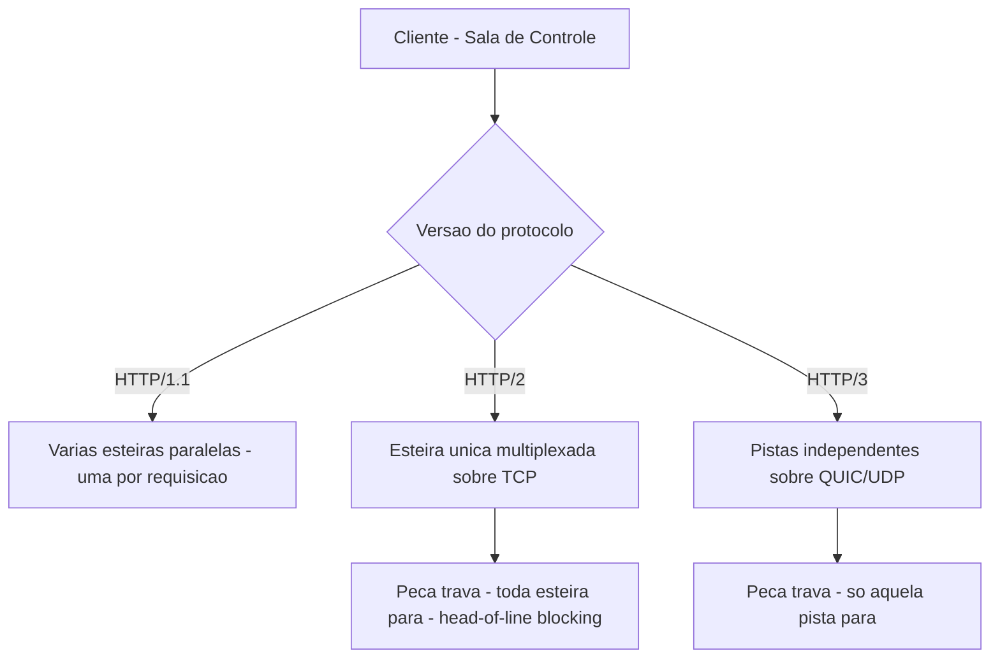
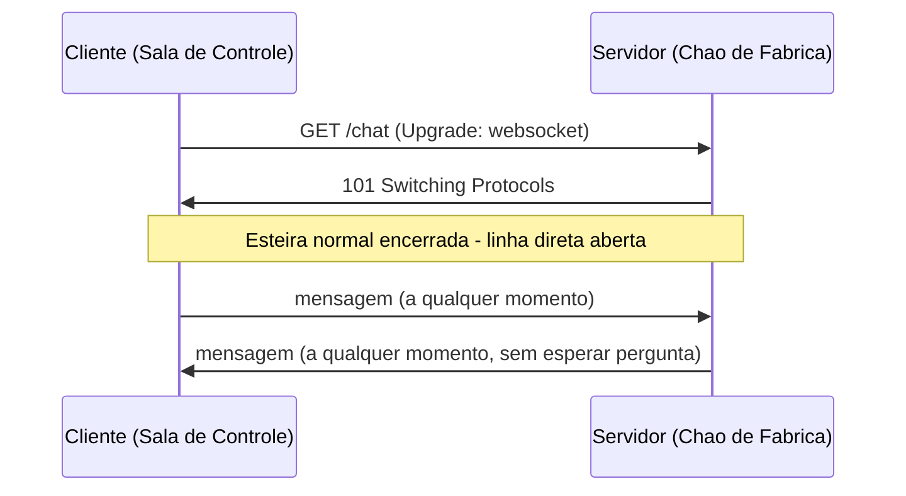
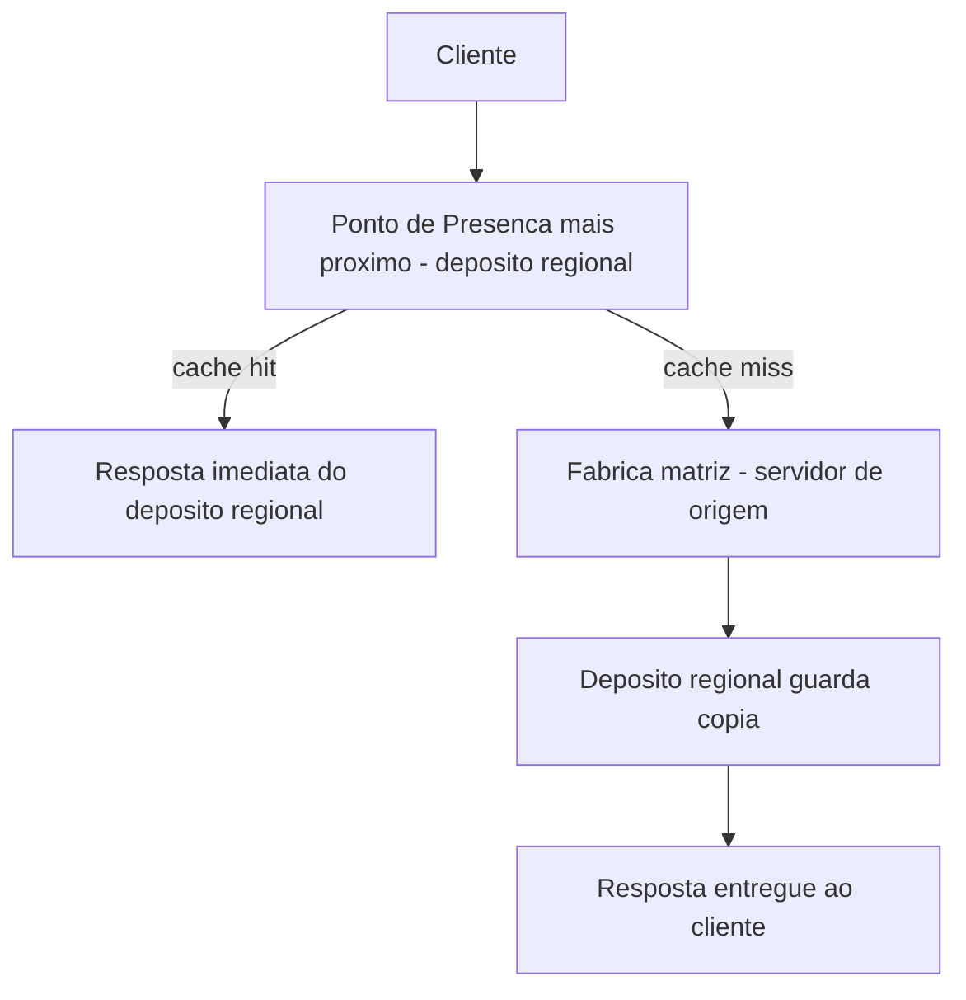

# Capítulo 5: HTTP, WebSockets e CDN: A Linguagem e a Logística da Web

## 1. Introdução

No Capítulo 4, você dominou o handshake TLS 1.3 em 1-RTT — o aperto de mão que blinda a esteira de transporte antes de qualquer dado de aplicação circular sobre ela. Mas uma esteira blindada ainda precisa de uma linguagem comum para as peças que trafegam nela, de um jeito de conversar quando a conversa não pode esperar a próxima requisição, e de um jeito de entregar o produto perto de onde o cliente está, não do outro lado do planeta. É disso que trata este capítulo: HTTP como a linguagem que toda requisição fala por cima do TLS, WebSockets como o canal que abre mão do formato pergunta-resposta quando a fábrica precisa conversar em tempo real, e CDN como a rede de depósitos regionais que aproxima a entrega do consumidor final.

Você vai sair daqui sabendo por que a versão do HTTP usada numa API importa tanto quanto o endpoint chamado, quando abrir uma conexão WebSocket compensa o custo de mantê-la viva, e como ler os cabeçalhos de uma resposta para saber se uma CDN está de fato entregando do depósito mais próximo ou empurrando toda carga de volta para a fábrica matriz. Esses três protocolos fecham a Parte I deste livro — a partir do Capítulo 6, a obra passa a olhar para dentro do software que roda em cima dessa infraestrutura.

## 2. Explica

Antes de qualquer requisição HTTP sair do cliente, o nome do host já foi resolvido para um endereço IP pelo fluxo de resolução de nomes que você estudou no Capítulo 2 — cache local, resolvedor recursivo, servidor raiz, servidor de TLD e servidor autoritativo, nessa ordem, até a resposta final chegar [16]. Você vai perceber, ao longo deste capítulo, que boa parte dos "problemas de HTTP" relatados em produção começam, na verdade, um passo antes, num DNS mal configurado — motivo pelo qual o mercado trata a resolução de nomes como um dos primeiros pontos de diagnóstico quando algo simplesmente não responde [17].

Vale reforçar também a ponte com o Capítulo 4: o HTTPS que sustenta praticamente todo tráfego web de mercado hoje nada mais é do que HTTP rodando por cima do TLS 1.3 que você dominou ali, a reescrita do protocolo de segurança que reduziu o handshake para um único round trip completo [18]. Essa mesma redução de idas e vindas foi recebida pelo mercado como um dos ganhos mais imediatos da nova versão do protocolo de segurança [19].

E é exatamente o mesmo espírito de otimização de latência que você vai ver reaparecer, de forma ainda mais explícita, na evolução do próprio HTTP entre suas versões [20].

HTTP é o protocolo de aplicação que roda por cima de toda essa pilha, e a especificação em vigor separa formalmente duas coisas que o mercado costuma confundir: a semântica do protocolo — métodos como GET e POST, cabeçalhos, códigos de status — e a sintaxe de transporte de cada versão que carrega essa semântica de um ponto a outro [1]. Essa separação é mantida viva pela mesma organização responsável por toda a família de especificações que compõem o HTTP moderno [4]. Essa formalização explica por que a mesma requisição `GET /produtos` significa exatamente a mesma coisa em HTTP/1.1, HTTP/2 ou HTTP/3: o que muda entre versões não é o que a requisição pede, é como ela viaja pela esteira até o servidor.

Esse protocolo de aplicação, por sua vez, se apoia no mesmo agrupamento de camadas que você mapeou no Capítulo 1: o modelo TCP/IP de quatro camadas que efetivamente roda na internet, substituindo, para fins de projeto real, as sete camadas conceituais do modelo OSI criado como referência didática [14]. Fontes distintas de mercado descrevem essa mesma sobreposição de camadas com ênfases levemente diferentes, mas convergem no ponto central de que HTTP, WebSocket e CDN operam todos na mesma camada de Aplicação desse modelo prático [15].

HTTP/1.1 resolve concorrência abrindo várias conexões TCP paralelas — cada requisição na sua própria fila de expedição, cada uma pagando seu próprio custo de handshake. HTTP/2 multiplexa múltiplos fluxos numa única conexão TCP, cortando esse custo repetido, mas herda um problema estrutural do próprio TCP: se um pacote se perde no meio do caminho, toda a conexão trava esperando a retransmissão, mesmo que os dados perdidos pertençam a apenas um dos fluxos multiplexados — o chamado head-of-line blocking [2]. HTTP/3 resolve exatamente esse ponto ao abandonar TCP como base de transporte e rodar sobre QUIC/UDP, onde cada fluxo é independente o suficiente para que a perda de um pacote não trave os demais [3].

Por trás de qualquer versão de HTTP está o modelo cliente-servidor que sustenta a web desde sua origem: o cliente envia uma requisição, o servidor devolve uma resposta, e esse ciclo básico é o alicerce sobre o qual toda a arquitetura de aplicações modernas se apoia [5]. A documentação de referência do protocolo descreve esse ciclo em detalhe — método, cabeçalhos, corpo da requisição, código de status e corpo da resposta [6].

O mesmo modelo conceitual de troca de mensagens entre duas partes distintas continua servindo de base mesmo quando o WebSocket quebra a rigidez do formato pergunta-resposta [7]. O WebSocket nasce exatamente da limitação do ciclo requisição-resposta puro: se o servidor precisa avisar o cliente de algo sem que o cliente tenha perguntado primeiro, HTTP tradicional obriga a gambiarra do polling repetido. A especificação formal do protocolo resolve isso com um handshake de upgrade — a conexão começa como uma requisição HTTP comum, mas troca de papel a meio caminho, virando um canal full-duplex leve sobre a mesma conexão TCP já estabelecida [8].

Depois do handshake, cliente e servidor podem enviar mensagens um para o outro a qualquer momento, sem esperar sua vez — e é essa inversão de papel que abre espaço para extensões como compressão de frame, documentadas em detalhe pelos guias de referência do protocolo [9], incluindo o bootstrapping direto sobre HTTP/2 e HTTP/3 descrito nos mesmos materiais de padronização [10].

A CDN, por fim, ataca um problema diferente: não a forma da conversa, mas a distância física entre quem pergunta e quem responde. Uma CDN mantém cópias cacheadas de ativos estáticos espalhadas em pontos de presença ao redor do mundo, de forma que a requisição do cliente seja roteada para a borda geograficamente mais próxima em vez de atravessar o planeta até o servidor de origem [11].

Vale a pena não confundir esse modelo com edge computing: uma CDN tradicional só cacheia e entrega conteúdo estático, enquanto a computação de borda vai além e executa lógica de aplicação — personalização, autenticação, transformação de resposta — fisicamente perto do usuário, sem o round trip completo até um datacenter central, uma distinção que a literatura de mercado sobre arquitetura de sistemas trata como recorrente fonte de confusão [12], e que outros guias especializados em entrega de dados descrevem com o mesmo cuidado [13].

## 3. Ilustra

Como Engenheiro Agêntico, pense na esteira de expedição da fábrica sob três layouts diferentes. No layout HTTP/1.1, cada pedido de peça abre sua própria esteira dedicada — várias esteiras paralelas rodando ao mesmo tempo, cada uma com seu próprio posto de controle de entrada. Funciona, mas custa caro manter tantas esteiras simultâneas abertas. No layout HTTP/2, existe uma única esteira principal carregando várias peças diferentes ao mesmo tempo, numeradas para não se misturarem — mais eficiente, só que se uma peça travar fisicamente na esteira, todo o resto atrás dela para também, porque é a mesma correia rodando. No layout HTTP/3, cada peça viaja em sua própria pista independente dentro do mesmo corredor — se uma pista trava, as demais continuam rodando normalmente.



A segunda camada de analogia, mais difícil de visualizar, é o próprio head-of-line blocking: imagine o caixa único de um supermercado onde vários clientes já colocaram seus carrinhos numa fila comum organizada por senhas — se o cliente da frente trava discutindo o preço de um item, todos atrás dele ficam parados, mesmo que suas compras estivessem prontas para passar há muito tempo. Esse é o HTTP/2 sobre TCP: multiplexar economiza tempo de fila, mas se o "caixa" (a conexão TCP) travar esperando um pacote perdido, ninguém passa. O HTTP/3 resolve isso trocando o caixa único por vários caixas independentes rodando em paralelo — o cliente travado não impede mais ninguém.

Para o WebSocket, a metáfora muda de esteira para linha telefônica da fábrica: o HTTP tradicional é como um sistema de bilhetes — você escreve um pedido, entrega no balcão, espera a resposta escrita voltar, e cada novo pedido exige um novo bilhete do zero. O WebSocket é a instalação de uma linha telefônica direta entre a sala de controle e o chão de fábrica: depois de discada uma vez (o handshake de upgrade), qualquer um dos dois lados pode falar a qualquer momento, sem esperar "sua vez" de escrever um novo bilhete.



E para a CDN, a metáfora volta a ser de logística física: em vez de todo pedido de peça viajar até a fábrica matriz, a empresa mantém depósitos regionais em várias cidades, cada um estocando cópias das peças mais pedidas. Quando um pedido chega, ele primeiro bate no depósito regional mais próximo — se a peça estiver lá, a entrega é imediata; se não estiver, o depósito busca na fábrica matriz, entrega ao cliente e já guarda uma cópia para o próximo pedido da região.



## 4. Técnica

### Lendo a Versão do Protocolo na Prática: HTTP/1.1, HTTP/2 e HTTP/3

A teoria da multiplexação e do head-of-line blocking vira evidência concreta quando você força cada versão do protocolo contra o mesmo host e compara o resultado. O bloco abaixo usa `curl` para negociar explicitamente cada versão e imprimir o tempo total de resposta:

```bash
# Forca HTTP/1.1 e mede o tempo total da requisicao
curl -so /dev/null -w "HTTP/1.1 -> versao=%{http_version} tempo=%{time_total}s\n" --http1.1 https://exemplo.com/

# Forca HTTP/2 (exige suporte do servidor e TLS)
curl -so /dev/null -w "HTTP/2   -> versao=%{http_version} tempo=%{time_total}s\n" --http2 https://exemplo.com/

# Forca HTTP/3 sobre QUIC (exige curl compilado com suporte a HTTP/3)
curl -so /dev/null -w "HTTP/3   -> versao=%{http_version} tempo=%{time_total}s\n" --http3 https://exemplo.com/

# Saida tipica (anotada):
# HTTP/1.1 -> versao=1.1 tempo=0.312s   <- conexoes paralelas, mais overhead
# HTTP/2   -> versao=2   tempo=0.198s   <- multiplexado, mais rapido
# HTTP/3   -> versao=3   tempo=0.151s   <- QUIC/UDP, sem head-of-line blocking em nivel de TCP
```

Cada linha dessa saída mapeia para um conceito da seção Explica: `versao=2` confirma a multiplexação sobre uma única conexão TCP prevista pela evolução do protocolo [2], e `versao=3` confirma que o cliente negociou QUIC/UDP com sucesso, a mesma mudança estrutural que elimina o travamento no nível de transporte [3]. Documentação técnica de mercado detalha exatamente esse percurso do handshake QUIC, do estabelecimento da conexão até o primeiro byte de aplicação trafegado [21]. Rodar essa comparação contra o próprio domínio antes de investigar uma reclamação de lentidão é o equivalente, na fábrica, a cronometrar as três esteiras lado a lado antes de decidir qual layout manter em produção.

### Abrindo a Linha Direta: Um Cliente WebSocket Mínimo

Depois do handshake de upgrade descrito na seção Ilustra, o código do lado do cliente é surpreendentemente enxuto. O trecho abaixo usa a API nativa `WebSocket` do navegador para abrir a conexão, reagir à abertura, enviar uma mensagem e tratar mensagens recebidas a qualquer momento:

```javascript
// Abre a linha direta com o servidor (handshake de upgrade automatico)
const conexao = new WebSocket("wss://exemplo.com/chao-de-fabrica");

conexao.onopen = () => {
  console.log("Linha aberta - esteira normal encerrada, canal full-duplex ativo");
  conexao.send(JSON.stringify({ tipo: "inscricao", canal: "producao" }));
};

conexao.onmessage = (evento) => {
  const payload = JSON.parse(evento.data);
  console.log(`Mensagem recebida sem pedido previo: ${payload.tipo}`, payload);
};

conexao.onerror = (erro) => {
  console.error("Falha na linha direta:", erro);
};

conexao.onclose = () => {
  console.log("Linha encerrada - volta ao modelo requisicao-resposta padrao");
};
```

Repare que não existe, em nenhum ponto desse código, um novo "pedido" explícito para cada mensagem recebida em `onmessage` — é exatamente a inversão de papel que o handshake de upgrade habilita [8], a mesma inversão que torna esse canal a escolha certa para chat, notificações e dashboards ao vivo em vez do polling repetido contra um endpoint HTTP tradicional.

### Inspecionando a Entrega de Borda: Lendo os Cabeçalhos de uma CDN

A teoria do depósito regional também vira evidência concreta ao inspecionar os cabeçalhos de resposta HTTP de um ativo servido por CDN. O comando abaixo faz apenas uma requisição de cabeçalhos (`HEAD`) e imprime o resultado:

```bash
# Inspeciona os cabecalhos de resposta sem baixar o corpo do ativo
curl -sI https://exemplo.com/assets/app.js

# Saida tipica (anotada):
# HTTP/2 200
# cache-control: public, max-age=86400        <- por quanto tempo o deposito guarda a copia
# cf-cache-status: HIT                        <- HIT = respondeu do deposito regional; MISS = foi ate a origem
# age: 3421                                   <- ha quanto tempo essa copia esta no deposito, em segundos
# server: cloudflare                          <- identifica a rede de entrega usada
```

`cf-cache-status: HIT` é a confirmação de que a arquitetura de referência de uma CDN funcionou como descrito: o ponto de presença respondeu do próprio cache, sem acionar o servidor de origem [11]. Quando esse cabeçalho vem como `MISS` repetidamente para o mesmo ativo, é sinal de que a configuração de cache está descartando a cópia regional cedo demais — um diagnóstico que você vai aprofundar com estratégias de invalidação no Capítulo 14.

## 5. Aplica

Imagine a cena: sua equipe lança um painel de acompanhamento de pedidos em tempo real para o time de operações, e a decisão de implementação mais rápida foi fazer o frontend perguntar ao backend "tem pedido novo?" a cada dois segundos, via `fetch` comum. Funciona bem em testes, com três usuários abertos. Na Black Friday, com quatrocentos operadores com o painel aberto ao mesmo tempo, o backend começa a responder cada vez mais devagar, e o time de operações reclama que o painel "trava" justamente na hora de pico de pedidos — a pior hora possível.

O diagnóstico, se você domina o Explica deste capítulo, é direto: quatrocentos clientes perguntando a cada dois segundos geram cerca de duzentas requisições HTTP completas por segundo só para checar "nada mudou" na esmagadora maioria das vezes — cada uma pagando o overhead pleno do ciclo requisição-resposta, mesmo quando a resposta é "sem novidade". O servidor não está lento processando pedidos reais; está afogado processando perguntas vazias. A correção é trocar o polling por uma conexão WebSocket única por operador: o servidor passa a empurrar a atualização apenas quando um pedido novo realmente chega, exatamente como o cliente mínimo que você escreveu na seção Técnica — de duzentas requisições por segundo para zero requisições de checagem e apenas eventos reais, no volume real de pedidos.

Fora dessa cena específica, as armadilhas mais recorrentes do mercado nesse trio de protocolos, na ordem em que mais custam performance em produção, são:

- Manter polling frequente contra um endpoint HTTP quando o padrão de atualização já é claramente orientado a eventos.
- Ignorar a versão de HTTP negociada e assumir que "HTTP é HTTP", perdendo os ganhos de multiplexação ou de ausência de head-of-line blocking sem perceber.
- Abrir conexões WebSocket para dados que raramente mudam, pagando o custo de manter conexões vivas sem necessidade real de tempo real.
- Confiar que "a CDN está ativa" sem nunca checar `cf-cache-status`, deixando ativos estáticos caindo silenciosamente na origem a cada requisição.
- Tratar CDN e edge computing como sinônimos, e se surpreender quando lógica de personalização não roda onde o time esperava.

Vale adiantar a conexão com o resto do livro: o ciclo cliente-servidor que sustenta HTTP e WebSocket é o mesmo modelo que a Parte II vai destrinchar camada por camada — frontend, backend, banco de dados e API como estações interdependentes de uma única linha de produção.

## 6. Conclusão

Três pontos sustentam este capítulo. Primeiro, HTTP separa semântica de transporte, e cada nova versão — 1.1, 2, 3 — ataca um gargalo estrutural diferente na forma como as peças trafegam pela esteira, culminando no HTTP/3 sobre QUIC, que finalmente elimina o head-of-line blocking herdado do TCP. Segundo, WebSocket existe porque o ciclo requisição-resposta puro não serve para conversas que nenhum dos dois lados sabe quando vão começar — o handshake de upgrade troca bilhetes escritos por uma linha direta. Terceiro, CDN resolve um problema de geografia, não de forma de conversa: aproximar a entrega do cliente final através de uma rede de depósitos regionais, sem confundir isso com a execução de lógica de aplicação na borda.

Ao dominar esses três pontos, você fecha a Parte I inteira sabendo exatamente como uma peça de dado percorre a internet, do endereço (Capítulo 2) ao transporte confiável (Capítulo 3), passando pela blindagem TLS (Capítulo 4) até a linguagem e a logística finais que você acabou de estudar aqui. Vale adiantar uma última costura: o próprio ciclo requisição-resposta que você aprofundou neste capítulo é a base formal sobre a qual o estilo arquitetural REST foi definido, décadas atrás, como um conjunto de restrições sobre esse mesmo modelo cliente-servidor [22] — um estilo cujas boas práticas de mercado você vai destrinchar em detalhe no Capítulo 10, junto de GraphQL e gRPC como alternativas de comunicação entre sistemas [23].

No Capítulo 6, a obra vira a chave: em vez de olhar para a rede que conecta máquinas, você vai olhar para dentro do software que roda em cada uma delas — frontend, backend, banco de dados e API como um organismo único, a próxima estação da fábrica. Como exercício, antes de seguir, rode o comando de inspeção de cabeçalhos da seção Técnica contra um site de produção real que você opera e verifique se `cf-cache-status` (ou o cabeçalho equivalente do seu provedor) confirma o que você esperava.

## 7. Referências Bibliográficas

[1] RFC EDITOR. *RFC 9110: HTTP Semantics*. Disponível em: https://www.rfc-editor.org/rfc/rfc9110.html. Acesso em: 03 ago. 2026.

[2] CLOUDFLARE. *Comparing HTTP/3 vs. HTTP/2 Performance*. Disponível em: https://blog.cloudflare.com/http-3-vs-http-2/. Acesso em: 03 ago. 2026.

[3] CLOUDFLARE. *What is HTTP/3?*. Disponível em: https://www.cloudflare.com/learning/performance/what-is-http3/. Acesso em: 03 ago. 2026.

[4] HTTP WORKING GROUP. *HTTP Documentation*. Disponível em: https://httpwg.org/specs/. Acesso em: 03 ago. 2026.

[5] MDN WEB DOCS. *How the web works - Learn web development*. Disponível em: https://developer.mozilla.org/en-US/docs/Learn_web_development/Getting_started/Web_standards/How_the_web_works. Acesso em: 03 ago. 2026.

[6] MDN WEB DOCS. *Overview of HTTP*. Disponível em: https://developer.mozilla.org/en-US/docs/Web/HTTP/Guides/Overview. Acesso em: 03 ago. 2026.

[7] MDN WEB DOCS. *Client-server overview - Learn web development*. Disponível em: https://developer.mozilla.org/en-US/docs/Learn_web_development/Extensions/Server-side/First_steps/Client-Server_overview. Acesso em: 03 ago. 2026.

[8] RFC EDITOR. *RFC 6455: The WebSocket Protocol*. Disponível em: https://www.rfc-editor.org/info/rfc6455/. Acesso em: 03 ago. 2026.

[9] WEBSOCKET.ORG. *WebSocket Standards: RFC 6455, Extensions & Browser Support*. Disponível em: https://websocket.org/standards/. Acesso em: 03 ago. 2026.

[10] WEBSOCKET.ORG. *WebSocket Protocol: RFC 6455 Handshake, Frames & More*. Disponível em: https://websocket.org/guides/websocket-protocol/. Acesso em: 03 ago. 2026.

[11] CLOUDFLARE. *Content Delivery Network (CDN) Reference Architecture*. Disponível em: https://developers.cloudflare.com/reference-architecture/architectures/cdn/. Acesso em: 03 ago. 2026.

[12] GEEKSFORGEEKS. *CDN Vs Edge Server - System Design*. Disponível em: https://www.geeksforgeeks.org/system-design/cdn-vs-edge-server-system-design/. Acesso em: 03 ago. 2026.

[13] FASTPIX. *Edge Computing vs. CDN: Identifying Their Roles in Data Delivery*. Disponível em: https://www.fastpix.io/blog/edge-computing-vs-cdn-identifying-their-roles-in-data-delivery. Acesso em: 03 ago. 2026.

[14] FORTINET. *TCP/IP Model vs. OSI Model: Similarities and Differences*. Disponível em: https://www.fortinet.com/resources/cyberglossary/tcp-ip-model-vs-osi-model. Acesso em: 03 ago. 2026.

[15] A1 DIGITAL. *OSI and TCP/IP model: Differences explained*. Disponível em: https://www.a1.digital/knowledge-hub/osi-and-tcp-ip-model-differences-explained/. Acesso em: 03 ago. 2026.

[16] FREECODECAMP. *How DNS Works: A Guide to Understanding the Internet's Address Book*. Disponível em: https://www.freecodecamp.org/news/how-dns-works-the-internets-address-book/. Acesso em: 03 ago. 2026.

[17] NEW RELIC. *What Is DNS Resolution? How It Works & Best Practices*. Disponível em: https://newrelic.com/blog/apm/dns-resolution-a-comprehensive-guide. Acesso em: 03 ago. 2026.

[18] RFC EDITOR. *RFC 8446: The Transport Layer Security (TLS) Protocol Version 1.3*. Disponível em: https://datatracker.ietf.org/doc/html/rfc8446. Acesso em: 03 ago. 2026.

[19] THE SSL STORE. *TLS 1.3 is finally published by the IETF as RFC 8446*. Disponível em: https://www.thesslstore.com/blog/tls-1-3-approved/. Acesso em: 03 ago. 2026.

[20] LOGICMONITOR. *TLS 1.2 vs. 1.3—Handshake, Performance, and Other Improvements*. Disponível em: https://www.logicmonitor.com/deep-dive/http3-vs-http2/tls1-2-vs-1-3. Acesso em: 03 ago. 2026.

[21] CLOUDFLARE. *HTTP/3: From root to tip*. Disponível em: https://blog.cloudflare.com/http-3-from-root-to-tip/. Acesso em: 03 ago. 2026.

[22] OLEB.NET. *Roy Fielding's REST dissertation*. Disponível em: https://oleb.net/2018/rest/. Acesso em: 03 ago. 2026.

[23] RESTFULAPI.NET. *REST API Best Practices*. Disponível em: https://restfulapi.net/rest-api-best-practices/. Acesso em: 03 ago. 2026.
