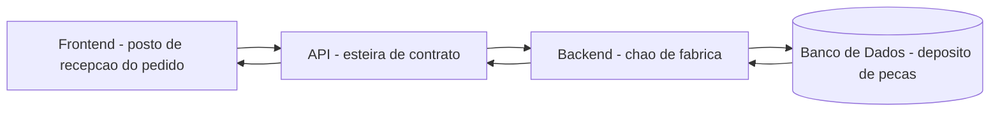
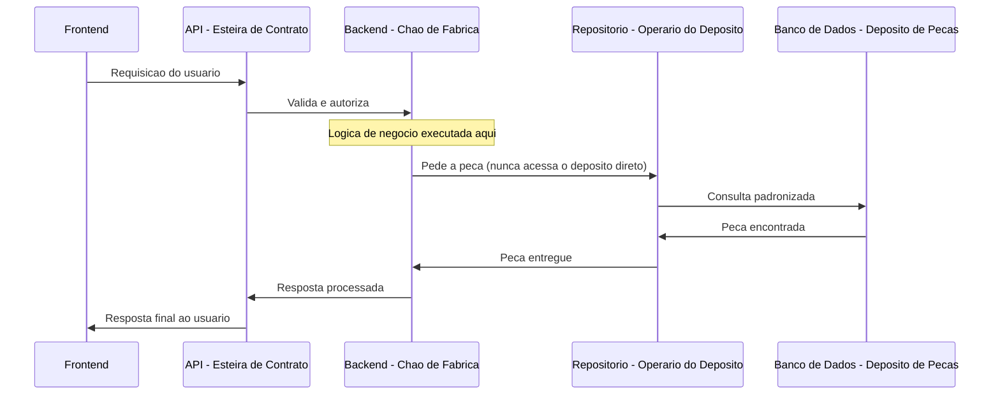

# Capítulo 6: Visão Geral: Frontend, Backend, Banco de Dados e API como um Organismo Único

## 1. Introdução

No Capítulo 5, você fechou a Parte I dominando o ciclo cliente-servidor sobre HTTP e o cache geográfico de CDN que aproxima o servidor do usuário para cortar latência de rede. Mas até aqui, o "servidor" do outro lado dessa requisição foi tratado como uma caixa-preta: uma peça única que recebe pedido e devolve resposta. Este capítulo abre essa caixa. Você vai descobrir que, por trás de cada requisição HTTP que chega a um servidor, não existe uma peça única — existem quatro estações de produção distintas, cada uma com responsabilidade própria, que juntas formam o organismo que entrega valor real ao usuário final.

Esse organismo — frontend, backend, banco de dados e API — é o assunto da Parte II inteira, e este capítulo é a planta baixa antes de cada estação ganhar seu próprio capítulo dedicado (Capítulos 7 a 10). Ao terminar de ler, você vai deixar de enxergar um sistema em produção como um bloco monolítico de "código" e passar a vê-lo como uma linha de montagem com estações interdependentes — e vai saber apontar, de cara, o momento exato em que uma estação está fazendo o trabalho de outra.

## 2. Explica

Uma arquitetura em camadas típica separa quatro estações de produção. O frontend é a interface visual que captura a intenção do usuário e gerencia o estado do lado do cliente — o posto de recepção de pedidos da fábrica. O backend concentra a lógica de negócio, a validação e a orquestração, funcionando como o chão de fábrica que transforma um pedido bruto em uma operação de negócio válida. O banco de dados é a camada de persistência, o depósito de peças onde tudo que precisa sobreviver além de uma única requisição fica armazenado. E a API é o contrato de comunicação entre as demais camadas, o ponto por onde toda requisição precisa atravessar validação, autorização, lógica de negócio e acesso a dados antes de qualquer resposta sair de volta [1].

Nenhuma dessas quatro estações entrega valor sozinha. Um frontend impecável sem um backend que valide regras de negócio corretamente é só uma vitrine bonita sem produto atrás. Um banco de dados perfeitamente modelado sem uma API que o exponha de forma segura e consistente é um depósito trancado que ninguém consegue acessar. É por isso que a documentação de mercado sobre a relação entre API e banco de dados a descreve como "a conexão crítica" — o elo que faz a persistência efetivamente chegar ao usuário [2]. Vale notar: essa separação em camadas não nasce do zero neste capítulo — ela é uma elaboração direta do mesmo ciclo requisição-resposta que sustenta toda a web desde sua origem [3], o mesmo modelo cliente-servidor básico que você já viu nos capítulos anteriores [4].

Um ponto que costuma passar despercebido em times menos maduros: a API não é apenas "a URL que o frontend chama". Ela é a fronteira formal que define o que pode e o que não pode atravessar entre uma camada e outra. Isso significa que toda requisição — sem exceção — precisa passar por validação de entrada, checagem de autorização, execução da regra de negócio correspondente e, só então, acesso ao dado persistido [1]. Pular qualquer uma dessas etapas não é uma otimização: é a origem da maioria dos incidentes de arquitetura que você vai ver na seção Aplica deste capítulo.

Dentro do backend, essa disciplina de camadas costuma se aprofundar ainda mais com uma camada de repositório (ou DAO — Data Access Object), cujo único propósito é isolar o acesso físico ao banco de dados do restante da lógica de negócio [1]. A literatura de mercado chama esse princípio de "manter o backend magro": a regra de negócio não deveria conhecer detalhes de SQL, índices ou esquema de tabela — ela deveria apenas pedir dados a uma função de repositório e confiar que essa função sabe como buscá-los. Esse é o pilar central deste capítulo, e é também o que separa uma arquitetura fácil de testar e evoluir de uma arquitetura em que qualquer mudança no banco de dados quebra meia dúzia de funções de negócio espalhadas pelo código.

## 3. Ilustra

Como Engenheiro Agêntico, pense na fábrica de software como uma linha de montagem com quatro postos fixos, cada um responsável por uma etapa da produção — e nenhum posto tem permissão para pular a esteira e ir direto trabalhar na peça de outro posto.



Repare que a seta de volta percorre a mesma esteira, na ordem inversa: a resposta que o usuário recebe não é uma peça nova, é o mesmo pedido processado por todas as quatro estações. Nenhuma estação isolada — nem o frontend mais bonito, nem o banco mais bem modelado — entrega o produto sozinha.

A parte mais difícil de internalizar nesse desenho não é a sequência das estações — é entender por que o backend não deveria "entrar" fisicamente no depósito de peças para pegar o que precisa. Para isso, imagine que o chão de fábrica tem um único operário autorizado a abrir a porta do depósito: o repositório. Quando a linha de produção precisa de uma peça, ela não manda um funcionário qualquer vasculhar as prateleiras — ela preenche uma requisição de peça padronizada e entrega ao operário do depósito, que sabe exatamente onde cada peça está guardada, em qual prateleira, sob qual código. Se um dia o depósito inteiro for reorganizado — trocar de fornecedor, mudar o sistema de estoque —, só o operário do depósito precisa aprender o novo layout. O resto da linha de produção continua preenchendo a mesma requisição padronizada, sem perceber nada.



Essa dupla imagem — a linha de montagem com quatro postos e o operário único autorizado a abrir o depósito — é o que sustenta tudo o que vem na seção Técnica: você vai escrever exatamente esse operário de depósito em código.

## 4. Técnica

### O Posto de Recepção: Onde a Responsabilidade do Frontend Termina

A responsabilidade do frontend termina no momento em que ele serializa a intenção do usuário e a envia pela esteira de contrato. O trecho abaixo mostra um formulário simples e a chamada que sela essa fronteira — repare no comentário marcando onde o frontend para de agir e a API assume:

```html
<form id="form-pedido">
  <input type="text" id="produto" placeholder="Nome do produto" required />
  <input type="number" id="quantidade" placeholder="Quantidade" required />
  <button type="submit">Confirmar pedido</button>
</form>

<script>
document.getElementById("form-pedido").addEventListener("submit", async (evento) => {
  evento.preventDefault();

  // Responsabilidade do frontend: capturar intencao e serializar o estado local.
  const payload = {
    produto: document.getElementById("produto").value,
    quantidade: Number(document.getElementById("quantidade").value),
  };

  // A partir daqui, a fronteira e da API - o frontend nao valida regra
  // de negocio, nao decide preco, nao verifica estoque. Ele so entrega
  // a peca de intencao do usuario pela esteira de contrato.
  const resposta = await fetch("/api/pedidos", {
    method: "POST",
    headers: { "Content-Type": "application/json" },
    body: JSON.stringify(payload),
  });

  const resultado = await resposta.json();
  console.log("Pedido processado pelo backend:", resultado);
});
</script>
```

Um frontend bem escrito não sabe — e não precisa saber — se o backend por trás dessa rota é um monolito ou um conjunto de microsserviços [5], nem se o banco de dados por trás é relacional ou não relacional. Essa ignorância deliberada é o que mantém a camada de frontend livre para evoluir de forma independente, algo que frameworks modernos como React levam a sério ao organizar a interface em componentes isolados e reutilizáveis [6], com camadas adicionais de roteamento e renderização entregues por frameworks full-stack construídos sobre eles [7].

### A Esteira de Contrato: A API Como Fronteira Formal

Do lado do backend, a rota que recebe essa requisição é o ponto exato onde o contrato de API se materializa em código. O exemplo abaixo usa FastAPI, mas o princípio vale para qualquer runtime de backend do mercado, seja Node.js [8], seja um framework Python de alto desempenho como o próprio FastAPI [9] — documentado em detalhe por guias independentes de mercado [10] —, seja Java/Spring Boot [11], seja Go [12]. O que importa não é a linguagem — é que a função de rota **nunca** acessa o banco de dados diretamente:

```python
from fastapi import FastAPI, HTTPException
from pydantic import BaseModel

app = FastAPI()


class PedidoEntrada(BaseModel):
    """Contrato de API: define exatamente o que a requisicao precisa trazer.
    Se o corpo nao bater com este formato, a API rejeita antes de chegar
    a qualquer logica de negocio."""
    produto: str
    quantidade: int


class RepositorioPedidos:
    """O 'operario do deposito': unico ponto de acesso ao banco de dados.
    Nenhuma outra parte do backend fala diretamente com a persistencia."""

    def __init__(self, conexao):
        self._conexao = conexao

    def buscar_estoque(self, produto: str) -> int:
        cursor = self._conexao.cursor()
        cursor.execute(
            "SELECT quantidade FROM estoque WHERE produto = %s", (produto,)
        )
        linha = cursor.fetchone()
        return linha[0] if linha else 0

    def registrar_pedido(self, produto: str, quantidade: int) -> dict:
        cursor = self._conexao.cursor()
        cursor.execute(
            "INSERT INTO pedidos (produto, quantidade) VALUES (%s, %s) RETURNING id",
            (produto, quantidade),
        )
        pedido_id = cursor.fetchone()[0]
        self._conexao.commit()
        return {"id": pedido_id, "produto": produto, "quantidade": quantidade}


def processar_pedido(payload: PedidoEntrada, repositorio: RepositorioPedidos) -> dict:
    """Logica de negocio pura: nao sabe SQL, nao sabe nome de tabela.
    So conhece as regras de negocio e o contrato do repositorio."""
    estoque_disponivel = repositorio.buscar_estoque(payload.produto)
    if estoque_disponivel < payload.quantidade:
        raise HTTPException(status_code=409, detail="Estoque insuficiente")
    return repositorio.registrar_pedido(payload.produto, payload.quantidade)


@app.post("/api/pedidos")
def criar_pedido(payload: PedidoEntrada):
    repositorio = RepositorioPedidos(conexao=obter_conexao())
    return processar_pedido(payload, repositorio)


def obter_conexao():
    """Placeholder de conexao real com o banco - substituir por pool
    de conexoes de producao (ex.: psycopg2, SQLAlchemy)."""
    raise NotImplementedError("Configure a conexao real com o banco de dados")
```

Note a separação: `PedidoEntrada` é o contrato (a validação da API), `processar_pedido` é a regra de negócio pura, e `RepositorioPedidos` é o único código autorizado a tocar em SQL. Se amanhã o time trocar PostgreSQL [13] por outro motor de banco relacional ou até por um banco não relacional, apenas a classe `RepositorioPedidos` muda — a função `processar_pedido` continua exatamente igual, porque ela nunca soube de SQL para começar.

### O Erro Que Mais Aparece: Backend Acessando o Banco Sem Repositório

A comparação abaixo mostra o erro de acoplamento mais comum entre backend e banco de dados — misturar regra de negócio e acesso a dados na mesma função — contra a correção que separa as duas responsabilidades:

```python
# ANTES - regra de negocio e acesso a dados misturados na mesma funcao
def criar_pedido_v1(produto: str, quantidade: int, conexao):
    cursor = conexao.cursor()
    cursor.execute(
        "SELECT quantidade FROM estoque WHERE produto = %s", (produto,)
    )
    estoque = cursor.fetchone()[0]
    if estoque < quantidade:  # regra de negocio no meio do SQL
        raise ValueError("Estoque insuficiente")
    cursor.execute(
        "INSERT INTO pedidos (produto, quantidade) VALUES (%s, %s)",
        (produto, quantidade),
    )
    conexao.commit()
    # Se o esquema do banco mudar, essa funcao (e outras 10 parecidas)
    # precisam ser reescritas uma por uma.


# DEPOIS - regra de negocio e acesso a dados separados
def criar_pedido_v2(produto: str, quantidade: int, repositorio: RepositorioPedidos):
    estoque = repositorio.buscar_estoque(produto)
    if estoque < quantidade:
        raise ValueError("Estoque insuficiente")
    return repositorio.registrar_pedido(produto, quantidade)
    # Se o esquema do banco mudar, so o RepositorioPedidos precisa mudar.
```

Esse padrão de camada de repositório isolando persistência da regra de negócio é descrito por guias de arquitetura de backend como uma das formas mais eficazes de manter times grandes trabalhando sem pisar uns nos outros [1], e é a mesma ideia central por trás de arquiteturas mais formais como a Hexagonal (Ports & Adapters), que isola o núcleo de domínio de qualquer detalhe de infraestrutura via portas e adaptadores [14]. A Clean Architecture leva esse mesmo princípio a camadas concêntricas mais rígidas, recomendadas para domínios de negócio complexos que exigem alta testabilidade [15]. Você não precisa adotar a nomenclatura formal de nenhuma dessas escolas para colher o benefício — o repositório sozinho já resolve a maior parte da dor.

### Quando a Fábrica Cresce: Monolito, Microsserviços e o Risco de Só Trocar de Nome

À medida que o backend cresce, times de mercado costumam considerar dividir o "chão de fábrica" em serviços menores. Um monolito é simples de começar, mas vira gargalo em escala — deploys arriscados, código emaranhado, times pisando uns nos outros no mesmo repositório [5]. Microsserviços decompõem essa fábrica única em componentes menores que se comunicam por API ou mensageria, permitindo que cada time faça deploy independente do seu próprio serviço. Esse mesmo espírito de desacoplamento é reforçado por princípios de design mais antigos e ainda vigentes: SOLID orienta como manter cada componente coeso e substituível sem depender de detalhes de outro [16], enquanto os 23 padrões de projeto do Gang of Four catalogam soluções recorrentes para isolar exatamente esse tipo de responsabilidade em código [17]. Uma arquitetura orientada a eventos vai um passo além, desacoplando ainda mais ao fazer os serviços publicarem eventos de mudança de estado sem conhecer quem os consome [18], um padrão que a literatura recente de engenharia de eventos descreve como o caminho natural de evolução de um monolito rígido [19].

O ponto que a próxima seção deste capítulo vai destrinchar é justamente o risco dessa transição: dividir o código em vários serviços sem antes ter resolvido a separação de responsabilidades dentro de cada um deles apenas multiplica o problema — você troca um monolito acoplado por vários serviços igualmente acoplados entre si, só que agora comunicando-se pela rede.

## 5. Aplica

Imagine a cena: sua equipe está sob pressão de prazo para lançar uma nova tela de "acompanhamento de pedido em tempo real". O time de frontend, para economizar uma "ida desnecessária" pelo backend, decide conectar a interface diretamente ao banco de dados usando uma biblioteca de cliente SQL disponível no navegador, lendo a tabela de pedidos direto do PostgreSQL. Funciona perfeitamente na demonstração para o cliente. Duas semanas depois, o time de backend precisa renomear uma coluna da tabela `pedidos` como parte de uma migração planejada havia meses — e a tela de acompanhamento quebra em produção, sem nenhum aviso, porque ninguém no time de banco de dados sabia que o frontend dependia diretamente daquele nome de coluna.

O diagnóstico, se você domina a seção Explica deste capítulo, é imediato: o frontend pulou a API e o backend inteiros, acessando o depósito de peças diretamente — exatamente o atalho perigoso que o diagrama da seção Ilustra mostra como "esteira quebrada". Nenhuma validação, nenhuma autorização e nenhuma regra de negócio protegiam aquela leitura, e o esquema interno do banco — que deveria ser um detalhe de implementação livre para mudar — virou um contrato implícito com uma camada que nunca deveria ter tido acesso a ele. A correção é reconstruir a esteira completa: o frontend chama uma rota de API dedicada (`/api/pedidos/{id}/status`), o backend decide o formato de resposta e delega a leitura ao `RepositorioPedidos`, exatamente como no bloco "DEPOIS" da seção Técnica. Agora, o time de banco de dados pode renomear qualquer coluna interna à vontade — só o repositório precisa acompanhar a mudança.

No mercado, o profissional que se diferencia é o que trata a separação de camadas como parte do controle de qualidade da arquitetura — não como uma formalidade acadêmica sem consequência prática. As armadilhas mais recorrentes, na ordem em que mais custam caro depois:

- Frontend acessando banco de dados ou serviços de infraestrutura diretamente, pulando backend e API.
- Lógica de negócio vazando para dentro de componentes de frontend (cálculo de preço, regra de desconto, validação de estoque no cliente).
- Funções de rota do backend acessando o ORM ou executando SQL diretamente, sem passar por uma camada de repositório.
- Migrar para microsserviços sem antes ter resolvido o acoplamento interno — resultado: um "monolito distribuído" que soma a complexidade operacional de serviços separados aos mesmos problemas de acoplamento de antes [5].

Ao dominar essa disciplina de fronteiras, você deixa de escrever código que "funciona hoje" e passa a escrever arquitetura que sobrevive à próxima mudança de requisito sem quebrar em cascata.

## 6. Conclusão

Três pontos sustentam este capítulo. Primeiro, nenhuma das quatro camadas — frontend, backend, banco de dados, API — entrega valor sozinha; o organismo só funciona quando as quatro operam em conjunto, cada uma restrita à sua responsabilidade. Segundo, a API é o contrato formal que toda requisição atravessa, e dentro do backend a camada de repositório é o "operário único autorizado a abrir o depósito", isolando a regra de negócio dos detalhes de persistência. Terceiro, e o mais caro na prática: a maioria dos incidentes de arquitetura não nasce de tecnologia ruim, nasce de uma camada pulando a fronteira de outra — frontend lendo banco direto, backend sem repositório, microsserviços que só trocaram o nome do acoplamento.

Ao dominar essas quatro estações como um organismo único, você deixa de ver "arquitetura" como um exercício teórico de diagrama de slide e passa a enxergá-la como a linha de montagem que decide se um sistema aguenta crescer ou desmorona na próxima mudança. Nos próximos quatro capítulos, cada uma dessas estações ganha seu próprio capítulo dedicado: o Capítulo 7 abre o posto de recepção — a camada de Frontend — mapeando os frameworks e tecnologias de mercado que a implementam na prática.

Esse mapeamento vai se aprofundar bastante. O Capítulo 9 detalha os critérios formais para escolher entre um banco relacional — com suas garantias ACID de confiabilidade transacional [20] e as formas normais que eliminam redundância de dados [21] — e um banco não relacional, incluindo o Teorema CAP, que explica por que nenhum sistema distribuído garante ao mesmo tempo consistência, disponibilidade e tolerância a partição [22]. E o Capítulo 10 retoma a camada de API exatamente do ponto onde este capítulo parou, comparando REST — o estilo que Roy Fielding formalizou originalmente em sua tese de doutorado [23] e cujas boas práticas o mercado vem consolidando desde então [24] — contra GraphQL, que deixa o cliente pedir exatamente os campos de que precisa [25], e gRPC, voltado a comunicação binária de alta performance entre serviços [26], sempre com o OpenAPI/Swagger documentando esse contrato de forma legível por máquina e por humano [27].

## 7. Referências Bibliográficas

[1] MEDIUM (GOALIST BLOG). *Three Layer Architecture in Backend Development*. Disponível em: https://medium.com/goalist-blog/three-layer-architecture-in-backend-development-c3e52c0d6682. Acesso em: 03 ago. 2026.

[2] WEWEB DOCS. *APIs and databases: the critical connection*. Disponível em: https://docs.weweb.io/web-development-basics/apis-and-databases.html. Acesso em: 03 ago. 2026.

[3] MDN WEB DOCS. *How the web works - Learn web development*. Disponível em: https://developer.mozilla.org/en-US/docs/Learn_web_development/Getting_started/Web_standards/How_the_web_works. Acesso em: 03 ago. 2026.

[4] MDN WEB DOCS. *Client-server overview - Learn web development*. Disponível em: https://developer.mozilla.org/en-US/docs/Learn_web_development/Extensions/Server-side/First_steps/Client-Server_overview. Acesso em: 03 ago. 2026.

[5] DESIGNGURUS. *Monolithic vs Microservices vs SOA – Architecture Comparison Guide*. Disponível em: https://www.designgurus.io/blog/monolithic-service-oriented-microservice-architecture. Acesso em: 03 ago. 2026.

[6] REACT.DEV. *Quick Start*. Disponível em: https://react.dev/learn. Acesso em: 03 ago. 2026.

[7] NEXT.JS DOCS. *App Router: Getting Started*. Disponível em: https://nextjs.org/docs/app/getting-started. Acesso em: 03 ago. 2026.

[8] NODE.JS. *About Node.js*. Disponível em: https://nodejs.org/en/about. Acesso em: 03 ago. 2026.

[9] FASTAPI. *FastAPI*. Disponível em: https://fastapi.tiangolo.com/. Acesso em: 03 ago. 2026.

[10] REAL PYTHON. *Get Started With FastAPI*. Disponível em: https://realpython.com/get-started-with-fastapi/. Acesso em: 03 ago. 2026.

[11] SPRING. *Spring Boot Reference Documentation*. Disponível em: https://docs.spring.io/spring-boot/docs/current/reference/html/documentation.html. Acesso em: 03 ago. 2026.

[12] GO.DEV. *Documentation - The Go Programming Language*. Disponível em: https://go.dev/doc/. Acesso em: 03 ago. 2026.

[13] POSTGRESQL GLOBAL DEVELOPMENT GROUP. *PostgreSQL: Documentation*. Disponível em: https://www.postgresql.org/docs/. Acesso em: 03 ago. 2026.

[14] WIKIPEDIA. *Hexagonal architecture (software)*. Disponível em: https://en.wikipedia.org/wiki/Hexagonal_architecture_(software). Acesso em: 03 ago. 2026.

[15] DEV.TO (NIBER, Dyarle). *Hexagonal Architecture and Clean Architecture (with examples)*. Disponível em: https://dev.to/dyarleniber/hexagonal-architecture-and-clean-architecture-with-examples-48oi. Acesso em: 03 ago. 2026.

[16] LAWS OF SOFTWARE ENGINEERING. *SOLID Principles*. Disponível em: https://lawsofsoftwareengineering.com/laws/solid-principles/. Acesso em: 03 ago. 2026.

[17] DIGITALOCEAN. *Gang of Four (GoF) Design Patterns Explained: Creational, Structural, and Behavioral*. Disponível em: https://www.digitalocean.com/community/tutorials/gangs-of-four-gof-design-patterns. Acesso em: 03 ago. 2026.

[18] EQUAL EXPERTS. *Understanding event-driven architecture and microservices in comparison to a monolith*. Disponível em: https://www.equalexperts.com/blog/our-thinking/understanding-event-driven-architecture-and-microservices-in-comparison-to-a-monolith/. Acesso em: 03 ago. 2026.

[19] KUBESIMPLIFY. *Event-Driven Architecture Simplified: Monolith to Microservices*. Disponível em: https://blog.kubesimplify.com/event-driven-architecture-simplified-monolith-to-microservices. Acesso em: 03 ago. 2026.

[20] MONGODB. *ACID Transactions in DBMS Explained*. Disponível em: https://www.mongodb.com/resources/basics/databases/acid-transactions. Acesso em: 03 ago. 2026.

[21] DIGITALOCEAN. *Database Normalization: 1NF, 2NF, 3NF & BCNF Examples*. Disponível em: https://www.digitalocean.com/community/tutorials/database-normalization. Acesso em: 03 ago. 2026.

[22] PINGCAP. *Understanding the CAP Theorem in Distributed Systems*. Disponível em: https://www.pingcap.com/article/understanding-cap-theorem-basics-in-distributed-systems/. Acesso em: 03 ago. 2026.

[23] OLEB.NET. *Roy Fielding's REST dissertation*. Disponível em: https://oleb.net/2018/rest/. Acesso em: 03 ago. 2026.

[24] RESTFULAPI.NET. *REST API Best Practices*. Disponível em: https://restfulapi.net/rest-api-best-practices/. Acesso em: 03 ago. 2026.

[25] GRAPHQL FOUNDATION. *GraphQL | The query language for modern APIs*. Disponível em: https://graphql.org/. Acesso em: 03 ago. 2026.

[26] GRPC AUTHORS. *Introduction to gRPC*. Disponível em: https://grpc.io/docs/what-is-grpc/introduction/. Acesso em: 03 ago. 2026.

[27] SWAGGER (SMARTBEAR). *OpenAPI Specification - Version 3.1.0*. Disponível em: https://swagger.io/specification/. Acesso em: 03 ago. 2026.
