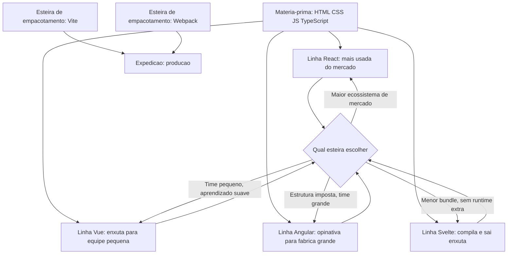
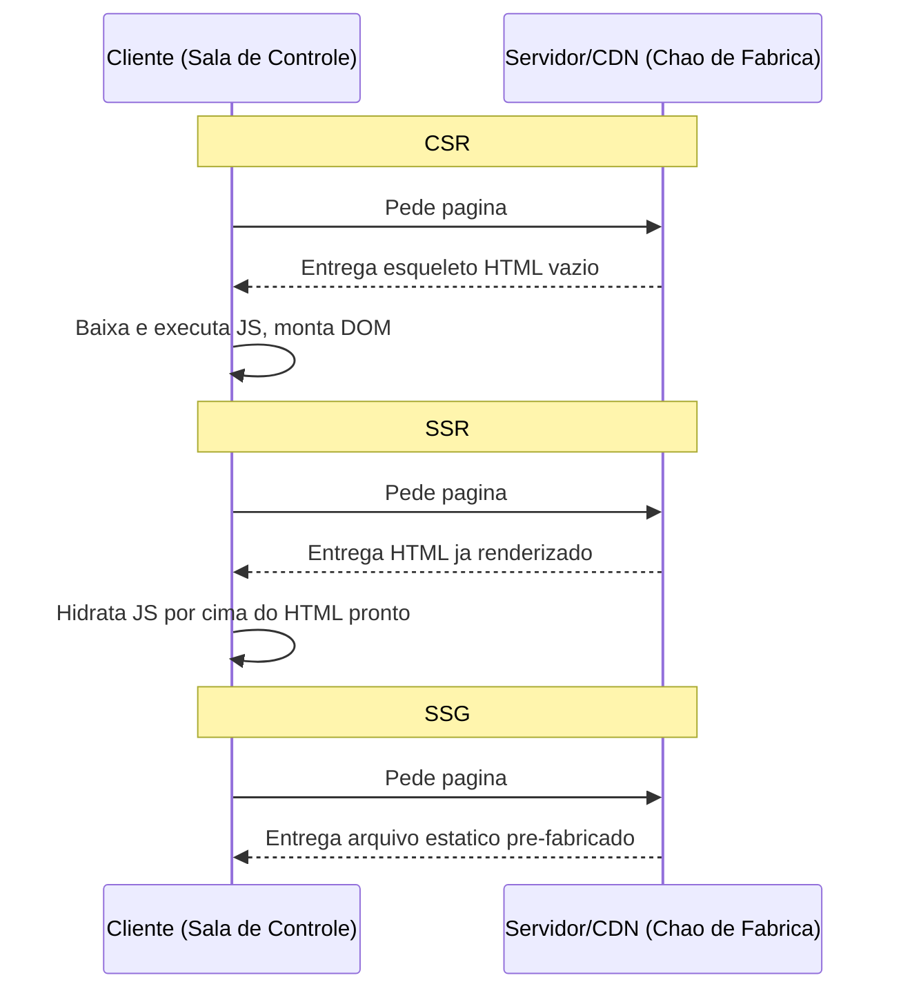

# Capítulo 7: A Camada de Frontend: Conceitos, Frameworks e Tecnologias de Mercado

## 1. Introdução

No Capítulo 6, você viu a arquitetura de um software como um organismo único: frontend, backend, banco de dados e API são estações interdependentes da mesma linha de produção, cada uma comunicando-se com a vizinha por um contrato claro de responsabilidade. Ficou definido ali que o frontend é "a interface visual que envia requisições e gerencia estado do cliente" — mas essa frase, sozinha, é só a etiqueta na porta da estação. Este capítulo abre essa porta.

Você vai encontrar aqui a matéria-prima bruta que qualquer interface web usa (HTML, CSS, JavaScript e a camada de tipagem que o TypeScript adiciona sobre ela), as linhas de montagem de mercado que transformam essa matéria-prima em produto (React, Vue, Angular, Svelte e as ferramentas de build que os alimentam) e a decisão que mais separa quem só copia um boilerplate de quem projeta arquitetura de verdade: como e onde a página é renderizada. Ao final, você terá o vocabulário e o critério para justificar tecnicamente cada escolha de frontend que fizer — não porque "é o que todo mundo usa", mas porque você entende o trade-off por trás dela.

## 2. Explica

### A matéria-prima: HTML, CSS, JavaScript e a camada de tipagem

Toda interface web, por mais sofisticada que pareça, ainda é composta de três materiais brutos que fazem trabalhos diferentes e não-intercambiáveis. HTML descreve a estrutura e a semântica do que é entregue ao navegador — o esqueleto do documento. CSS resolve a camada de apresentação, o estilo visual que decide como esse esqueleto aparece na tela. JavaScript é a camada de comportamento: o código que roda no navegador e manipula o DOM (Document Object Model) em tempo real, respondendo a cliques, digitação e eventos de rede sem recarregar a página inteira [16]. Entender essa separação de responsabilidades evita o erro mais comum de quem está começando — tratar HTML, CSS e JS como uma sopa única de "código de frontend", em vez de três ferramentas com propósito distinto.

Sobre esse JavaScript bruto, o mercado consolidou uma camada adicional de controle de qualidade: o TypeScript, que adiciona tipagem estática sobre o JavaScript, permitindo que erros de formato de dado sejam pegos antes mesmo do código rodar, em vez de estourarem em produção. O TypeScript Handbook é hoje a referência canônica de mercado para tipos, generics e narrowing [8], e projetos que crescem além de um punhado de arquivos tendem a migrar para essa camada assim que o custo de um bug silencioso de tipo supera o custo de escrever a anotação.

Vale reforçar o ponto de partida do modelo cliente-servidor que sustenta tudo isso: o navegador (cliente) envia requisições e o servidor devolve respostas, o ciclo básico descrito pela documentação do MDN sobre como a web funciona [16][17]. O frontend, na definição retomada do Capítulo 6, é justamente a camada que formula essas requisições e gerencia o estado do lado do cliente [18] — e é sobre esse contrato que toda a arquitetura de camadas do software se apoia, com o backend do lado de dentro processando a lógica de negócio e o banco de dados persistindo o resultado [19][20].

### Frameworks: por que ninguém escreve JavaScript puro em escala

Nenhuma equipe de porte razoável monta uma interface inteira manipulando o DOM à mão, função por função — é lento, propenso a erro e não escala em times grandes. Por isso o mercado convergiu para frameworks que organizam a interface em componentes reutilizáveis. React, mantido pela Meta, é hoje o framework com maior fatia de mercado justamente por essa filosofia de componentização [1][2]. Vue.js aposta em uma sintaxe de template mais acessível, historicamente preferida por times pequenos e médios que valorizam curva de aprendizado suave [4]. Angular, do Google, vai na direção oposta: entrega uma estrutura opinativa com injeção de dependência nativa, adequada a times grandes que precisam de convenção imposta em vez de liberdade [4][5]. Svelte rompe com os três ao compilar a interface em tempo de build, eliminando parte do runtime de framework que normalmente precisa ser baixado pelo navegador — o resultado são os bundles mais enxutos entre as quatro opções [5].

Next.js, construído pela Vercel sobre o React, não é um framework concorrente, mas uma camada de produção sobre ele: adiciona roteamento por sistema de arquivos, App Router, Server Components e Route Handlers, resolvendo de fábrica boa parte das decisões de infraestrutura que, sem ele, cada equipe teria que reinventar [3].

Essas linhas de montagem, porém, não funcionam sem uma esteira que empacote o código para o navegador. Vite serve módulos ES nativos durante o desenvolvimento, entregando Hot Module Replacement quase instantâneo, e empacota para produção via Rolldown [6]. Webpack, o bundler histórico do ecossistema, é mais configurável, mas paga o preço de reavaliar todo o grafo de dependências a cada mudança, tornando o ciclo de desenvolvimento sensivelmente mais lento [7]. Não é acaso que Vite tenha se tornado a esteira padrão de novos projetos — a diferença de velocidade de iteração se acumula ao longo de meses de trabalho diário.

### Renderização: onde a página realmente nasce

A decisão mais estratégica da camada de frontend não é "qual framework", mas "onde e quando a página é montada". Em Client-Side Rendering (CSR), o navegador recebe um HTML quase vazio e é ele quem processa todo o JavaScript para montar a interface — o primeiro carregamento é mais lento, mas as navegações seguintes tendem a ser mais fluidas. Em Server-Side Rendering (SSR), é o servidor quem entrega o HTML já renderizado no primeiro carregamento, o que melhora diretamente SEO e o tempo de first paint percebido pelo usuário [9]. Abordagens híbridas combinam SSR inicial com hidratação client-side — o servidor entrega o HTML pronto, e o JavaScript "liga" a interatividade por cima dele depois [9]. Static Site Generation (SSG) leva essa lógica ao extremo: o HTML é gerado uma única vez em build-time e servido como arquivo estático, sem nenhum processamento por requisição.

Essa escolha de renderização também se conecta com Progressive Web Apps (PWA), que usam Service Workers como um proxy de rede — interceptando requisições para cachear ativos e permitir funcionamento mesmo offline [10][11]. E para tarefas que exigem processamento pesado dentro do navegador — edição de imagem e vídeo, jogos, inferência de modelos de machine learning — existe uma esteira paralela: WebAssembly (WASM), um formato binário usado como alvo de compilação para linguagens como C, C++, Rust e Go, rodando a velocidade quase nativa ao lado do JavaScript comum [12][13].

Fechando o ciclo de controle de qualidade da camada de frontend está a acessibilidade. As WCAG (Web Content Accessibility Guidelines), mantidas pelo W3C, definem quatro princípios — perceptível, operável, compreensível e robusto — organizados em três níveis de conformidade (A, AA, AAA), sendo a versão 2.2 a vigente recomendada hoje pelo consórcio [14][15]. Nenhuma estratégia de renderização escolhida substitui essa camada: ela atravessa qualquer arquitetura de frontend, independentemente de ser CSR, SSR ou SSG.

## 3. Ilustra

Lembre do vocabulário da Fábrica de Software Autônoma: cada camada do sistema é uma estação do chão de fábrica, e dados/tokens/requisições são a matéria-prima que percorre a esteira até virar produto entregue. A estação Frontend é a mais próxima da expedição — é literalmente onde o produto chega às mãos do cliente, na Sala de Controle que é a tela do usuário.

### As quatro linhas de montagem de frontend



Repare que nenhuma das quatro linhas é "a certa" de forma absoluta — cada uma resolve um problema de chão de fábrica diferente: tamanho de equipe, necessidade de estrutura imposta ou peso final do produto expedido.

### As duas analogias da renderização

A decisão de renderização é o ponto mais denso deste capítulo, e merece duas analogias complementares — uma para a mecânica geral, outra para o ponto mais difícil de internalizar.

**Analogia 1 (mecânica geral — a esteira de expedição).** Pense nas três estratégias como três formas de expedir o mesmo pedido do depósito de peças. No CSR, o cliente recebe uma caixa vazia com instruções de montagem e só monta o produto na própria Sala de Controle — demora mais na primeira entrega, mas depois ele já tem as ferramentas de montagem em mãos para pedidos futuros. No SSR, a fábrica monta o produto quase inteiro antes de expedir, e o cliente só aperta o parafuso final. No SSG, o produto já está pronto e empacotado no depósito de peças, esperando qualquer pedido — a expedição é imediata porque o trabalho pesado já foi feito antes mesmo do pedido chegar.

**Analogia 2 (o ponto mais difícil — o motor da fábrica decidindo quando ligar).** A parte que mais confunde quem está começando é a hidratação: por que o SSR entrega HTML pronto e ainda assim precisa rodar JavaScript depois? Pense no motor da fábrica como um motorista que já recebeu o carro montado (HTML pronto, visível, SSR), mas o motor só liga (JavaScript assume a interatividade) depois que a chave gira na ignição. O carro parece pronto e você já pode olhar para ele — mas ele só anda de verdade quando o motor liga por cima da carroceria já entregue. É esse instante de "ligar o motor por cima do produto já visível" que separa simplesmente entregar HTML de entregar uma interface interativa.



Como Engenheiro Agêntico, você não escolhe estratégia de renderização por hábito ou por "é o que o tutorial usou" — você escolhe olhando para o requisito real de SEO, de first paint e de frequência de mudança do conteúdo.

## 4. Técnica

### Matéria-prima com controle de qualidade: TypeScript sobre JavaScript

A entrega técnica do primeiro pilar mostra, lado a lado, o mesmo problema resolvido com e sem tipagem estática. O objetivo é validar o formato de um dado vindo de uma API antes de usá-lo para manipular a interface — um erro clássico de frontend é confiar cegamente no formato de uma resposta de rede.

```javascript
// JavaScript puro — sem controle de qualidade de tipo
function renderizarUsuario(dadosApi) {
  // Se a API mudar o campo "nome" para "nomeCompleto", isso quebra
  // silenciosamente em produção, sem aviso em tempo de desenvolvimento.
  const elemento = document.getElementById("usuario");
  elemento.textContent = dadosApi.nome.toUpperCase();
}
```

```typescript
// TypeScript — controle de qualidade aplicado antes da esteira seguir
interface UsuarioApi {
  nome: string;
  email: string;
  ativo: boolean;
}

function renderizarUsuario(dadosApi: UsuarioApi): void {
  const elemento = document.getElementById("usuario");
  if (elemento === null) {
    throw new Error("Elemento 'usuario' nao encontrado no DOM");
  }
  // O compilador ja garante que dadosApi.nome existe e e string —
  // se a API mudar o contrato, o erro aparece em build, nao em producao.
  elemento.textContent = dadosApi.nome.toUpperCase();
}
```

A diferença não é estética. O TypeScript move o erro de "descoberto por um usuário em produção" para "descoberto pelo compilador antes do deploy" — e é exatamente esse deslocamento que o TypeScript Handbook trata como o ganho central da tipagem estática sobre JavaScript [8].

### Escolhendo e inicializando a linha de montagem certa

A entrega técnica do segundo pilar não é sobre sintaxe de framework — é sobre o comando real que inicializa cada esteira, porque a primeira decisão prática de qualquer projeto novo acontece no terminal, antes da primeira linha de componente ser escrita.

```bash
# Esteira 1: projeto novo via Vite (React, Vue, Svelte ou vanilla)
# HMR quase instantaneo em desenvolvimento, build de producao via Rolldown
npm create vite@latest meu-projeto-frontend
cd meu-projeto-frontend
npm install
npm run dev

# Esteira 2: projeto novo via Next.js sobre React
# Ja vem com roteamento por sistema de arquivos e App Router configurados
npx create-next-app@latest meu-projeto-nextjs
cd meu-projeto-nextjs
npm run dev
```

Note que os dois comandos resolvem problemas diferentes. `npm create vite@latest` entrega uma esteira de build enxuta e agnóstica de framework, deixando a decisão de roteamento e renderização por sua conta [6]. `npx create-next-app@latest` já entrega, de fábrica, uma esteira completa com roteamento e as três estratégias de renderização (CSR, SSR, SSG) configuráveis por página [3]. Qual dos dois usar depende diretamente do critério do Pilar 2: se você precisa apenas de uma SPA simples, Vite puro é suficiente; se o produto exige SEO e múltiplas estratégias de renderização convivendo no mesmo projeto, Next.js já chega com essa esteira montada.

### Implementando as três estratégias de renderização na prática

A entrega técnica do terceiro pilar mostra a mesma página escrita de duas formas — uma que roda em build-time (SSG) e outra que busca dados a cada requisição (SSR) — para deixar visível, no próprio código, o ponto exato da esteira em que cada uma executa.

```javascript
// app/produtos/[id]/page.js — Next.js App Router

// SSG: esta funcao roda em BUILD-TIME, uma unica vez,
// gerando o HTML estatico para cada produto conhecido no momento do build.
export async function generateStaticParams() {
  const produtos = await buscarListaDeProdutos();
  return produtos.map((produto) => ({ id: produto.id.toString() }));
}

// Esta funcao roda por padrao no SERVIDOR a cada requisicao (SSR),
// a menos que os dados venham de generateStaticParams (aí vira SSG).
export default async function PaginaDeProduto({ params }) {
  const produto = await buscarProdutoPorId(params.id);

  return {
    tipo: "html-renderizado-no-servidor",
    titulo: produto.nome,
    preco: produto.preco,
    descricao: produto.descricao,
  };
}

async function buscarProdutoPorId(id) {
  const resposta = await fetch(`https://api.loja.com/produtos/${id}`, {
    // "no-store" forca busca a cada requisicao — comportamento SSR
    cache: "no-store",
  });
  return resposta.json();
}

async function buscarListaDeProdutos() {
  const resposta = await fetch("https://api.loja.com/produtos");
  return resposta.json();
}
```

O detalhe que separa quem só copia um exemplo de quem entende a arquitetura está na opção `cache: "no-store"` do `fetch`: é ela que transforma a busca de dados de "resolvida uma vez em build-time" (SSG) para "resolvida a cada requisição" (SSR) [3][9]. Esse tipo de decisão fina — cache por requisição versus cache por build — é o que a documentação oficial do Next.js chama de controle explícito de estratégia de renderização por rota, em vez de uma escolha única para o projeto inteiro [3].

Vale notar onde esse código roda de fato: a função que busca o produto a cada requisição não executa no navegador do cliente, mas em um runtime JavaScript do lado do servidor — tipicamente Node.js, o runtime assíncrono orientado a eventos que também sustenta boa parte do backend em JavaScript de mercado [22]. É esse detalhe de execução que faz o SSR ser, na prática, uma decisão de arquitetura de servidor, não apenas de frontend.

Vale reforçar que essa mesma lógica de cache/expedição aparece em outra camada da arquitetura: uma CDN mantém cópias cacheadas de ativos estáticos em pontos de presença geograficamente distribuídos, respondendo direto da borda mais próxima ao cliente sem tocar o servidor de origem [21] — o mesmo princípio de "responder do depósito de peças mais próximo" que o SSG aplica dentro do próprio frontend.

## 5. Aplica

Imagine que você acabou de assumir a manutenção de um painel administrativo interno, usado só por 40 funcionários autenticados da empresa, para conferir pedidos do dia. Você lê a documentação do time anterior e descobre que a aplicação inteira roda em SSR completo, com toda página buscando dados no servidor a cada clique de navegação — inclusive telas que só mostram um gráfico de contagem que muda uma vez por hora.

**O erro:** o time anterior escolheu SSR "porque é a prática recomendada hoje em dia", sem parar para perguntar por quê. O resultado é latência desnecessária em cada navegação interna, um servidor sobrecarregado renderizando HTML completo para uma dúzia de usuários autenticados, e zero ganho real de SEO — porque a página nem é pública, motores de busca nunca vão indexá-la.

**O diagnóstico:** SSR resolve um problema específico — melhorar first paint e SEO para conteúdo público, indexável, visto por muitos usuários anônimos [9]. Um dashboard interno autenticado não tem nenhuma dessas características. Ele é, na prática, o caso de uso clássico de CSR: a autenticação já acontece antes da página carregar, o conteúdo não precisa ser indexado, e o custo do primeiro carregamento mais lento é pago uma única vez por sessão de trabalho, não a cada requisição.

**A correção:** migrar o dashboard interno para CSR resolve o problema na raiz — o servidor deixa de renderizar HTML completo a cada clique, e passa a servir apenas uma API leve de dados, com o navegador do funcionário assumindo a montagem da interface. A latência percebida cai, o servidor deixa de ser gargalo, e nenhuma capacidade real é perdida, porque SEO nunca foi um requisito desse produto.

Esse mesmo raciocínio inverso também aparece com frequência: equipes que escolhem CSR para uma landing page pública de marketing, e depois se perguntam por que a página não aparece bem posicionada em buscadores — o erro espelhado do mesmo problema, na direção oposta.

Ao dominar esse critério de decisão — em vez de decorar "SSR é sempre melhor" ou "CSR é mais simples" —, você adquire o diferencial que separa quem só implementa o que o tutorial mostrou de quem escolhe a estratégia de renderização certa para cada produto específico. Outras armadilhas recorrentes de mercado nesta camada:

- Ignorar acessibilidade (WCAG) até o produto já estar em produção, tratando-a como retrabalho em vez de requisito desde o design [14][15].
- Adicionar TypeScript tarde demais em um projeto que já cresceu além do controle, pagando o custo de migração maior do que teria sido adotá-lo desde o início [8].
- Escolher um framework (Angular, por exemplo) pela robustez estrutural sem ter o tamanho de equipe que justifica essa estrutura, pagando complexidade desnecessária [4][5].

## 6. Conclusão

Você fechou, neste capítulo, os três pilares que sustentam a estação Frontend da fábrica: primeiro, a matéria-prima bruta — HTML, CSS, JavaScript e a camada de controle de qualidade que o TypeScript adiciona sobre ela [8][16]; segundo, as linhas de montagem de mercado — React, Vue, Angular e Svelte, cada uma resolvendo um problema diferente de equipe e escala, alimentadas pela esteira de build Vite ou Webpack [1][4][5][6][7]; terceiro, e mais decisivo, a estratégia de renderização — CSR, SSR e SSG — que determina onde e quando a página realmente nasce, e que só um profissional que entende o trade-off escolhe corretamente [9][3].

O desafio que fica para você: pegue o último projeto de frontend que você tocou e pergunte, honestamente, se a estratégia de renderização ali foi uma decisão consciente ou um hábito herdado. Se foi hábito, você agora tem o critério para revisá-la.

No Capítulo 8, a esteira segue para a próxima estação da mesma linha de produção: o backend — o motor de regras de negócio que recebe exatamente as requisições que o frontend que você acabou de dominar envia, e decide o que fazer com elas.

## 7. Referências Bibliográficas

[1] REACT.DEV. *Quick Start*. Disponível em: https://react.dev/learn. Acesso em: 03 ago. 2026.

[2] MDN WEB DOCS. *Getting started with React*. Disponível em: https://developer.mozilla.org/en-US/docs/Learn_web_development/Core/Frameworks_libraries/React_getting_started. Acesso em: 03 ago. 2026.

[3] NEXT.JS DOCS. *App Router: Getting Started*. Disponível em: https://nextjs.org/docs/app/getting-started. Acesso em: 03 ago. 2026.

[4] ASCENDIENT LEARNING. *React vs. Angular vs. Vue: A Practical Comparison for 2026*. Disponível em: https://www.ascendientlearning.com/blog/comparing-angular-react-vue-svelte. Acesso em: 03 ago. 2026.

[5] PHAROS PRODUCTION. *Frontend Framework Comparison 2026*. Disponível em: https://pharosproduction.com/insights/engineering/frontend-framework-comparison-2026/. Acesso em: 03 ago. 2026.

[6] VITE.DEV. *Why Vite*. Disponível em: https://vite.dev/guide/why. Acesso em: 03 ago. 2026.

[7] LOGROCKET. *Vite vs. Webpack for react apps in 2025: A senior engineer's perspective*. Disponível em: https://blog.logrocket.com/vite-vs-webpack-react-apps-2025-senior-engineer/. Acesso em: 03 ago. 2026.

[8] TYPESCRIPT DOCS. *Handbook - The TypeScript Handbook*. Disponível em: https://www.typescriptlang.org/docs/handbook/intro.html. Acesso em: 03 ago. 2026.

[9] PIXELFREESTUDIO. *The Role of SSR in Progressive Web Apps*. Disponível em: https://blog.pixelfreestudio.com/the-role-of-ssr-in-progressive-web-apps/. Acesso em: 03 ago. 2026.

[10] GOOGLE FOR DEVELOPERS. *Progressive Web Apps: Service Worker Includes*. Disponível em: https://developers.google.com/codelabs/pwa-training/pwa06--service-worker-includes. Acesso em: 03 ago. 2026.

[11] MDN WEB DOCS. *Structural overview of progressive web apps*. Disponível em: https://mdn2.netlify.app/en-us/docs/web/progressive_web_apps/structural_overview/. Acesso em: 03 ago. 2026.

[12] WEBASSEMBLY.ORG. *Use Cases*. Disponível em: https://webassembly.org/docs/use-cases/. Acesso em: 03 ago. 2026.

[13] MDN WEB DOCS. *WebAssembly*. Disponível em: https://developer.mozilla.org/en-US/docs/WebAssembly. Acesso em: 03 ago. 2026.

[14] W3C. *WCAG 2 Overview*. Disponível em: https://www.w3.org/WAI/standards-guidelines/wcag/. Acesso em: 03 ago. 2026.

[15] W3C. *Web Content Accessibility Guidelines (WCAG) 2.2*. Disponível em: https://www.w3.org/TR/WCAG22/. Acesso em: 03 ago. 2026.

[16] MDN WEB DOCS. *How the web works - Learn web development*. Disponível em: https://developer.mozilla.org/en-US/docs/Learn_web_development/Getting_started/Web_standards/How_the_web_works. Acesso em: 03 ago. 2026.

[17] MDN WEB DOCS. *Overview of HTTP*. Disponível em: https://developer.mozilla.org/en-US/docs/Web/HTTP/Guides/Overview. Acesso em: 03 ago. 2026.

[18] MDN WEB DOCS. *Client-server overview - Learn web development*. Disponível em: https://developer.mozilla.org/en-US/docs/Learn_web_development/Extensions/Server-side/First_steps/Client-Server_overview. Acesso em: 03 ago. 2026.

[19] MEDIUM (GOALIST BLOG). *Three Layer Architecture in Backend Development*. Disponível em: https://medium.com/goalist-blog/three-layer-architecture-in-backend-development-c3e52c0d6682. Acesso em: 03 ago. 2026.

[20] WEWEB DOCS. *APIs and databases: the critical connection*. Disponível em: https://docs.weweb.io/web-development-basics/apis-and-databases.html. Acesso em: 03 ago. 2026.

[21] CLOUDFLARE. *Content Delivery Network (CDN) Reference Architecture*. Disponível em: https://developers.cloudflare.com/reference-architecture/architectures/cdn/. Acesso em: 03 ago. 2026.

[22] NODE.JS. *About Node.js*. Disponível em: https://nodejs.org/en/about. Acesso em: 03 ago. 2026.
