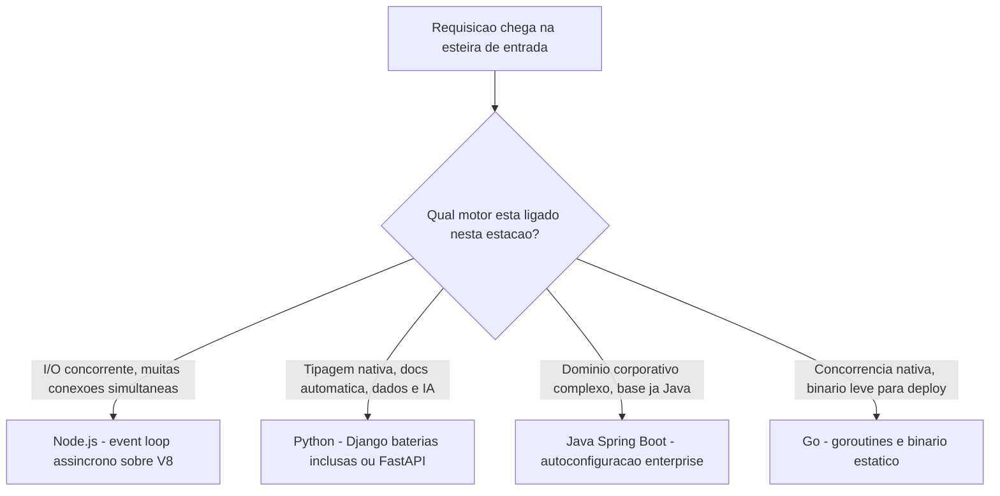
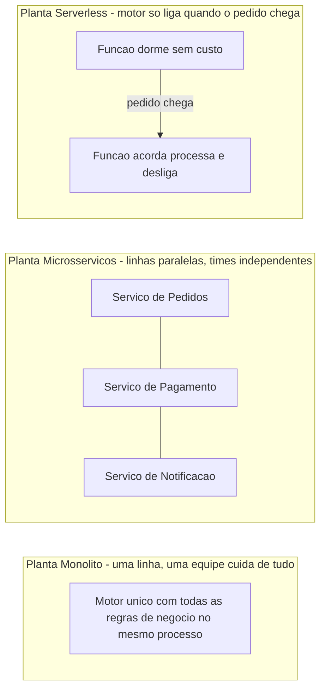
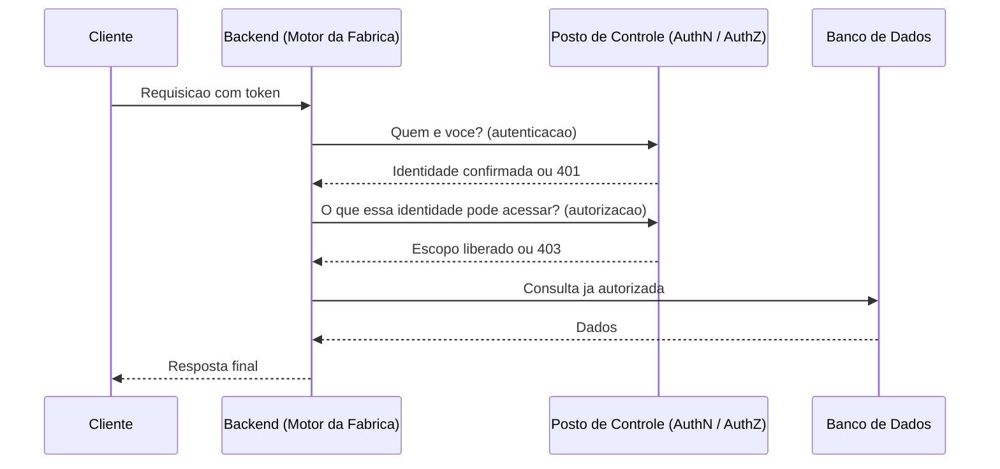

# Capítulo 8: A Camada de Backend: Linguagens, Frameworks e Padrões de Servidor

## 1. Introdução

No Capítulo 7, você mapeou a camada de Frontend e chegou a uma decisão que parecia pertencer só à interface: SSR, CSR ou SSG, cada uma definindo onde e quando o HTML final é montado. Há uma lacuna proposital naquela conversa. Quando a escolha recai sobre SSR — renderização no servidor —, alguém precisa efetivamente montar aquele HTML antes de entregá-lo ao navegador. Esse alguém é o motor que este capítulo abre agora: o backend.

Se o Capítulo 6 apresentou as quatro camadas como estações de uma mesma linha de produção, o backend é a estação onde a matéria-prima da requisição — dados de entrada, identidade do usuário, intenção da ação — é transformada em regra de negócio aplicada, dado persistido e resposta pronta para expedição. É o motor da fábrica: a peça que decide o que pode acontecer, não apenas o que é exibido.

Este capítulo tem três compromissos com você, Engenheiro Agêntico. Primeiro, mapear as linguagens e frameworks de backend de mercado — não como catálogo enciclopédico, mas como um mapa de decisão por nicho de carga de trabalho. Segundo, comparar os três grandes padrões de arquitetura de implantação — monolito, microsserviços e serverless — e mostrar que nenhum deles é universalmente superior, só mais ou menos adequado ao estágio do produto. Terceiro, e talvez o mais decisivo no dia a dia de produção: destrinchar o ciclo de vida completo de uma requisição, com foco na diferença — frequentemente confundida — entre autenticação e autorização. Ao final, você vai saber escolher o motor certo, a planta de fábrica certa, e diagnosticar exatamente em qual etapa do ciclo de vida uma requisição falha.

## 2. Explica

O backend concentra a lógica de negócio, a validação e a orquestração entre a interface e os dados — o intermediário obrigatório entre o frontend e a camada de persistência, o ponto onde toda requisição atravessa validação, autorização, regra de negócio e acesso a dados antes de qualquer resposta ser expedida [18]. Convém isolar, dentro dessa estação, uma sub-estação de repositório ou DAO (Data Access Object) responsável só pelo acesso a dados — um isolamento que evita que a lógica de negócio se misture com detalhes de como o banco é consultado [18]. A relação entre backend, banco de dados e API é tão próxima que boa parte da literatura de mercado trata as três como uma única conexão crítica, quase indissociável na prática [19].

A escolha do motor certo começa pela linguagem e pelo runtime. Node.js é um runtime JavaScript assíncrono e orientado a eventos construído sobre o V8, desenhado para operações de I/O concorrente sem bloquear a thread principal [1] — a própria documentação oficial do projeto descreve esse runtime como voltado a aplicações de rede escaláveis, e não a scripts isolados de uso único [6] — o nicho ideal é o de aplicações com muitas conexões simultâneas de curta duração, como APIs de tempo real e gateways de streaming. Python oferece dois motores com filosofias opostas: Django, um framework "baterias inclusas" com ORM e painel administrativo nativos prontos para uso [2], e FastAPI, que entrega alto desempenho apoiado no Starlette e no Pydantic, tipagem nativa do próprio Python e documentação interativa gerada automaticamente a partir dessa tipagem, conforme a especificação oficial do framework [2] e o guia prático de introdução ao ecossistema [3]. Java, via Spring Boot, elimina o boilerplate histórico de configuração XML e oferece autoconfiguração para bancos SQL e NoSQL — o motor mais recorrente em domínios corporativos complexos que já vinham de uma base Java anterior [4]. Go, criado no Google, tem concorrência nativa via goroutines e hoje é uma das linguagens mais procuradas para backend justamente pelo runtime leve e pelos binários estáticos que simplificam o deploy [5].

Nenhum desses motores é "o melhor" em abstrato. Cada um resolve melhor um nicho: Node.js quando o gargalo é I/O concorrente, Python/FastAPI quando o time já pensa em tipos e quer documentação automática, Spring Boot quando o domínio é corporativo e complexo, Go quando o binário final precisa ser leve e a concorrência é o próprio produto.

Uma segunda decisão, ortogonal à escolha de linguagem, é como organizar o código dentro do motor. MVC (Model-View-Controller) separa essas três responsabilidades e serve bem a CRUDs de baixa complexidade; a Arquitetura Hexagonal, também chamada Ports & Adapters, isola o núcleo de domínio da infraestrutura por meio de portas e adaptadores [7]; e a Clean Architecture combina ideias hexagonais e de arquitetura em camadas concêntricas, indicada para domínios complexos que exigem alta testabilidade, segundo o material de referência sobre o próprio padrão hexagonal [8] e o panorama comparativo de arquiteturas de mercado [9]. Esses padrões de organização interna convivem com princípios de design mais amplos, como SOLID e os vinte e três padrões catalogados pelo Gang of Four, que continuam sendo o vocabulário comum de design orientado a objetos no mercado, tanto no catálogo clássico de padrões [10] quanto na literatura consolidada sobre os princípios SOLID [11].

Uma terceira decisão — e essa, sim, muda a topologia inteira do deploy — é a escolha entre monolito, microsserviços e arquitetura orientada a eventos. Monolitos são simples de iniciar, mas viram gargalo em escala: deploys arriscados, código emaranhado, um time inteiro bloqueado por uma mudança pequena em um módulo distante. Microsserviços decompõem esse motor único em componentes menores que se comunicam por API ou mensageria, permitindo deploy independente por time [12]. A arquitetura orientada a eventos desacopla ainda mais essa comunicação: em vez de um serviço chamar outro diretamente, ele publica um evento de mudança de estado sem sequer saber quem vai consumi-lo — uma comparação detalhada entre esse modelo e a arquitetura tradicional [13] confirma o mesmo ganho de desacoplamento descrito em guias práticos equivalentes sobre a transição [14]. Quando esse desacoplamento vira infraestrutura de mensageria de fato, duas famílias dominam o mercado: Kafka, uma plataforma de streaming de eventos de alta vazão voltada a replay e processamento em larga escala, e RabbitMQ, um broker mais tradicional com roteamento flexível via exchanges, mais adequado a padrões request-resposta, segundo a comparação direta entre as duas plataformas [15] e a distinção mais ampla entre pub-sub e filas de mensagens [16]. E mesmo a opção mais recente — serverless, em que o motor só liga sob demanda — não abandona a disciplina de engenharia: a metodologia Twelve-Factor App, pensada originalmente para aplicações cloud-native tradicionais, continua sendo aplicável a arquiteturas serverless como AWS Lambda [17].

Por fim, toda requisição que chega a qualquer um desses motores — não importa a linguagem, o padrão arquitetural ou a topologia de deploy — precisa responder a duas perguntas antes de tocar a lógica de negócio: quem é você, e o que você pode acessar. A primeira é autenticação; a segunda é autorização. OAuth 2.0 é o padrão de mercado que resolve a segunda pergunta — autorização, "o que você pode acessar" —, enquanto o OpenID Connect (OIDC) é uma camada de identidade construída sobre o OAuth 2.0 que resolve a primeira, adicionando autenticação por meio de um ID Token no formato JWT [20]. Essa separação de responsabilidades entre os dois protocolos é o próximo assunto deste capítulo.

## 3. Ilustra

Volte à imagem do chão de fábrica. Cada motor de backend — Node.js, Python, Java/Spring Boot, Go — é uma máquina diferente disponível no depósito de peças, e a escolha certa depende do que a esteira precisa processar naquele momento:



Escolher o motor certo é só a primeira decisão. A segunda — e a mais estratégica — é escolher a planta da fábrica inteira: quantas linhas de montagem existem, e se cada uma delas fica ligada o tempo todo ou só quando um pedido chega.



A metáfora da planta de fábrica explica o custo e a velocidade de deploy, mas não captura o que muda para as pessoas. Troque de lente por um instante e pense em equipe, não em máquina: no Monolito, uma única equipe cuida de toda a fábrica — qualquer mudança pequena exige passar pelo mesmo corredor, mesmo que ninguém mais esteja usando aquele trecho da esteira naquele momento. Nos Microsserviços, cada linha tem sua própria equipe de plantão, dona daquele pedaço da esteira, livre para trocar de motor ou fazer manutenção sem esperar autorização das demais equipes. No Serverless, não existe equipe de plantão fixa: o alarme toca quando o pedido chega, alguém liga a máquina só para aquele ciclo, e ela desliga de novo. Nenhuma das três equipes é "mais profissional" — cada uma é dimensionada para um volume e uma cadência diferentes de pedidos.

A terceira decisão é a que mais gera confusão na prática, e por isso merece duas camadas de explicação. A primeira: pense em autenticação como o crachá que você mostra na portaria da fábrica — ele prova quem você é. Autorização é a lista de setores que aquele crachá especificamente libera — o crachá pode ser genuíno e ainda assim não abrir a porta do depósito de peças restritas. Um crachá válido (autenticado) sem permissão para aquele setor (não autorizado) é rejeitado do mesmo jeito que um crachá falso — mas por um motivo completamente diferente, e o Engenheiro Agêntico que confunde os dois motivos vai procurar o bug no lugar errado.

A segunda camada de explicação mostra essas duas perguntas no fluxo real de uma requisição, do primeiro contato até a resposta final:



Repare que autenticação e autorização são dois postos de controle distintos, em sequência, não uma etapa só. Uma requisição pode passar pelo primeiro posto e travar no segundo — e é exatamente esse cenário que a seção Aplica deste capítulo vai destrinchar.

## 4. Técnica

### Motor Escolhido: Um Endpoint Mínimo em FastAPI

A teoria de tipagem nativa e validação automática vira código concreto no bloco abaixo. Um endpoint FastAPI recebe um modelo Pydantic tipado — e a validação do payload acontece na porta de entrada do motor, antes de qualquer linha de lógica de negócio rodar:

```python
from fastapi import FastAPI
from pydantic import BaseModel

app = FastAPI()


class ItemPedido(BaseModel):
    produto: str
    quantidade: int
    preco_unitario: float


@app.post("/pedidos")
def criar_pedido(pedido: ItemPedido) -> dict:
    """Endpoint minimo: o FastAPI valida o payload contra o schema Pydantic
    antes mesmo de esta funcao comecar a executar - tipagem nativa do Python
    vira validacao automatica na porta de entrada do motor de backend."""
    total = pedido.quantidade * pedido.preco_unitario
    return {"produto": pedido.produto, "total": total}
```

Se o cliente enviar `quantidade` como texto em vez de número inteiro, a requisição nunca chega à função `criar_pedido` — o FastAPI já responde com erro de validação antes disso, e a documentação interativa gerada a partir desse mesmo modelo já descreve exatamente esse contrato para quem for consumir a API, tanto pela documentação oficial do framework [2] quanto pelo guia prático de introdução ao ecossistema [3].

### Planta Serverless: Uma Função que Só Liga sob Demanda

O trecho a seguir define, em `serverless.yml`, uma função que processa pedidos sem que nenhum servidor fique ligado o tempo todo esperando tráfego:

```yaml
# serverless.yml - funcao que so liga quando um pedido chega
service: motor-pedidos

provider:
  name: aws
  runtime: python3.12
  memorySize: 256

functions:
  processarPedido:
    handler: handler.processar_pedido
    events:
      - httpApi:
          path: /pedidos
          method: post
    # Sem servidor fixo ligado: o motor acorda, processa, desliga,
    # e o custo e cobrado por milissegundo de execucao, nao por hora ociosa
```

Essa mesma disciplina de configuração explícita no ambiente, presente na definição acima, é herdada diretamente da metodologia Twelve-Factor App, que continua orientando até arquiteturas serverless muito distantes do contexto em que foi originalmente descrita [17].

### Posto de Controle: Separando Autenticação de Autorização no Código

O decorator abaixo materializa a distinção da seção Ilustra: duas perguntas, duas falhas possíveis, dois códigos de status HTTP diferentes.

```python
from functools import wraps
from fastapi import Request, HTTPException
import jwt

CHAVE_SECRETA = "chave-de-exemplo-nao-use-em-producao"


def exige_autenticacao_e_escopo(escopo_necessario: str):
    """Decorator que separa duas perguntas distintas no ciclo de vida
    da requisicao: 'quem e voce' (autenticacao) e 'o que voce pode
    acessar' (autorizacao) - a confusao entre as duas e a fonte mais
    comum de diagnostico errado em bugs de acesso no backend."""
    def decorador(funcao_endpoint):
        @wraps(funcao_endpoint)
        async def wrapper(request: Request, *args, **kwargs):
            token = request.headers.get("Authorization", "").replace("Bearer ", "")
            if not token:
                raise HTTPException(status_code=401, detail="Nao autenticado")

            try:
                payload = jwt.decode(token, CHAVE_SECRETA, algorithms=["HS256"])
            except jwt.InvalidTokenError:
                raise HTTPException(status_code=401, detail="Token invalido")

            escopos_do_usuario = payload.get("escopos", [])
            if escopo_necessario not in escopos_do_usuario:
                raise HTTPException(status_code=403, detail="Nao autorizado")

            return await funcao_endpoint(request, *args, **kwargs)
        return wrapper
    return decorador
```

O `payload` decodificado nesse trecho é exatamente o ID Token que o OpenID Connect define sobre o OAuth 2.0 — a camada de identidade que resolve "quem é você" antes de qualquer checagem de escopo acontecer [20]. Antes de qualquer token existir, porém, a credencial original do usuário — a senha — precisa ser armazenada com segurança: a prática de mercado é o hashing com bcrypt, uma função desenhada deliberadamente para ser lenta e resistente a ataques de força bruta, nunca a criptografia reversível [21].

## 5. Aplica

Imagine a cena: sua equipe acabou de lançar a área de pedidos administrativos do produto, protegida por um novo sistema de permissões por papel (role-based). No dia seguinte, um usuário do time de suporte reporta um erro estranho: ele consegue fazer login normalmente, o painel carrega, mas ao tentar aprovar um reembolso, a tela devolve um erro genérico de "acesso negado" e a equipe de plantão assume, por reflexo, que o login dele quebrou — e passa a próxima hora resetando senha, invalidando sessão, pedindo para ele logar de novo. Nada muda.

O diagnóstico correto, se você domina a distinção da seção Ilustra, é rápido: o usuário está autenticado — o crachá dele é genuíno, o token passa na validação, o primeiro posto de controle libera a passagem sem problema. O que falha é o segundo posto: o papel atribuído a ele não inclui o escopo `reembolsos:aprovar`, então o backend corretamente devolve 403, não 401. A equipe perdeu uma hora tratando um problema de autorização como se fosse um problema de autenticação, porque os dois primeiros postos de controle da fábrica parecem, à primeira vista, a mesma porta. A correção real não é resetar sessão — é revisar a matriz de papéis e adicionar o escopo correto ao papel daquele usuário, exatamente o tipo de checagem que o decorator da seção Técnica expõe de forma explícita: se o log mostrar 401, o problema está no primeiro posto; se mostrar 403, no segundo.

Esse tipo de confusão diagnóstica é mais comum do que parece, e as armadilhas mais recorrentes na camada de backend seguem um padrão parecido:

- Tratar todo erro de acesso como falha de login, sem checar se o código de status é 401 ou 403.
- Misturar sessão stateful com token stateless no mesmo sistema, sem decidir qual dos dois é a fonte da verdade.
- Escolher microsserviços antes de o produto ter escala ou equipe suficiente para justificar a complexidade operacional extra [12].
- Deixar a camada de repositório/DAO se misturar com a lógica de negócio, perdendo o isolamento que evita retrabalho quando o banco muda [18].
- Ignorar que a documentação viva de uma API (OpenAPI/Swagger) é parte do contrato entre times, não um extra opcional [23].

Vale adiantar a conexão com o restante do livro: a maturidade de uma API REST — definida pelos níveis que vão de simples túnel RPC até o uso pleno de recursos, verbos HTTP e hipermídia — é um critério objetivo de mercado para avaliar se o contrato entre backend e consumidores está bem desenhado, e você vai aplicar esse critério com mais profundidade no Capítulo 10 [24]. E o mesmo posto de controle de autorização que você acabou de diagnosticar aqui reaparece, sob outro nome, no Capítulo 13: controle de acesso quebrado é uma das categorias mais recorrentes do OWASP Top 10, o documento de consenso de mercado sobre os riscos mais críticos em aplicações web [22].

## 6. Conclusão

Três pontos sustentam este capítulo. Primeiro, a escolha de linguagem e framework de backend — Node.js, Python, Java/Spring Boot, Go — não é gosto pessoal, é mapa de decisão por nicho de carga de trabalho. Segundo, monolito, microsserviços e serverless são três plantas de fábrica diferentes para o mesmo produto, cada uma dimensionada para um estágio e uma escala distintos, nunca uma resposta universalmente superior às outras. Terceiro, e o mais decisivo no dia a dia de produção: autenticação e autorização são dois postos de controle sequenciais e independentes — confundir os dois motivos de rejeição custa tempo de diagnóstico real, exatamente como você viu na cena de suporte desta seção Aplica.

Ao dominar esses três pontos, você deixa de tratar o backend como uma caixa-preta que "só processa a requisição" e passa a enxergá-lo como o motor que você escolhe, dimensiona e audita conscientemente — o diferencial que separa quem apenas escreve endpoints de quem projeta a estação inteira da fábrica. No Capítulo 9, a matéria-prima que esse motor manipula ganha um novo protagonista: o banco de dados, relacional ou NoSQL, e o critério real para escolher entre os dois conforme a forma dos seus dados e o nível de consistência que seu produto exige.

## 7. Referências Bibliográficas

[1] NODE.JS. *About this documentation*. Disponível em: https://nodejs.org/api/documentation.html. Acesso em: 03 ago. 2026.

[2] FASTAPI. *FastAPI*. Disponível em: https://fastapi.tiangolo.com/. Acesso em: 03 ago. 2026.

[3] REAL PYTHON. *Get Started With FastAPI*. Disponível em: https://realpython.com/get-started-with-fastapi/. Acesso em: 03 ago. 2026.

[4] SPRING. *Spring Boot Reference Documentation*. Disponível em: https://docs.spring.io/spring-boot/docs/current/reference/html/documentation.html. Acesso em: 03 ago. 2026.

[5] GO.DEV. *Documentation - The Go Programming Language*. Disponível em: https://go.dev/doc/. Acesso em: 03 ago. 2026.

[6] NODE.JS. *About Node.js*. Disponível em: https://nodejs.org/en/about. Acesso em: 03 ago. 2026.

[7] WIKIPEDIA. *Hexagonal architecture (software)*. Disponível em: https://en.wikipedia.org/wiki/Hexagonal_architecture_(software). Acesso em: 03 ago. 2026.

[8] DEV.TO (NIBER, Dyarle). *Hexagonal Architecture and Clean Architecture (with examples)*. Disponível em: https://dev.to/dyarleniber/hexagonal-architecture-and-clean-architecture-with-examples-48oi. Acesso em: 03 ago. 2026.

[9] PRECISIONAIACADEMY. *Software Architecture Patterns in 2026: MVC, MVVM, Clean Architecture, and More*. Disponível em: https://precisionaiacademy.com/blog/software-architecture-patterns-guide. Acesso em: 03 ago. 2026.

[10] DIGITALOCEAN. *Gang of Four (GoF) Design Patterns Explained: Creational, Structural, and Behavioral*. Disponível em: https://www.digitalocean.com/community/tutorials/gangs-of-four-gof-design-patterns. Acesso em: 03 ago. 2026.

[11] LAWS OF SOFTWARE ENGINEERING. *SOLID Principles*. Disponível em: https://lawsofsoftwareengineering.com/laws/solid-principles/. Acesso em: 03 ago. 2026.

[12] DESIGNGURUS. *Monolithic vs Microservices vs SOA – Architecture Comparison Guide*. Disponível em: https://www.designgurus.io/blog/monolithic-service-oriented-microservice-architecture. Acesso em: 03 ago. 2026.

[13] EQUAL EXPERTS. *Understanding event-driven architecture and microservices in comparison to a monolith*. Disponível em: https://www.equalexperts.com/blog/our-thinking/understanding-event-driven-architecture-and-microservices-in-comparison-to-a-monolith/. Acesso em: 03 ago. 2026.

[14] KUBESIMPLIFY. *Event-Driven Architecture Simplified: Monolith to Microservices*. Disponível em: https://blog.kubesimplify.com/event-driven-architecture-simplified-monolith-to-microservices. Acesso em: 03 ago. 2026.

[15] REDPANDA. *RabbitMQ vs. Kafka*. Disponível em: https://www.redpanda.com/guides/kafka-tutorial-rabbitmq-vs-kafka. Acesso em: 03 ago. 2026.

[16] BAELDUNG. *Pub-Sub vs. Message Queues*. Disponível em: https://www.baeldung.com/pub-sub-vs-message-queues. Acesso em: 03 ago. 2026.

[17] AWS. *Applying the Twelve-Factor App Methodology to Serverless Applications*. Disponível em: https://aws.amazon.com/blogs/compute/applying-the-twelve-factor-app-methodology-to-serverless-applications/. Acesso em: 03 ago. 2026.

[18] MEDIUM (GOALIST BLOG). *Three Layer Architecture in Backend Development*. Disponível em: https://medium.com/goalist-blog/three-layer-architecture-in-backend-development-c3e52c0d6682. Acesso em: 03 ago. 2026.

[19] WEWEB DOCS. *APIs and databases: the critical connection*. Disponível em: https://docs.weweb.io/web-development-basics/apis-and-databases.html. Acesso em: 03 ago. 2026.

[20] CONNECT2ID. *OpenID Connect explained*. Disponível em: https://connect2id.com/learn/openid-connect. Acesso em: 03 ago. 2026.

[21] KINDE. *Guide to Bcrypt Hashing*. Disponível em: https://www.kinde.com/learn/authentication/passwords/bcrypt-hashing-guide/. Acesso em: 03 ago. 2026.

[22] OWASP FOUNDATION. *OWASP Top Ten Web Application Security Risks*. Disponível em: https://owasp.org/www-project-top-ten/. Acesso em: 03 ago. 2026.

[23] SWAGGER (SMARTBEAR). *OpenAPI Specification - Version 3.1.0*. Disponível em: https://swagger.io/specification/. Acesso em: 03 ago. 2026.

[24] RESTFULAPI.NET. *REST API Best Practices*. Disponível em: https://restfulapi.net/rest-api-best-practices/. Acesso em: 03 ago. 2026.
