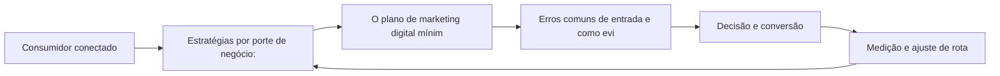

# Capítulo 5: Marketing Digital na Prática: Aplicação em Diferentes Portes de Negócio

## 1. Introdução

Bem-vindo a uma nova etapa da sua navegação pelo marketing digital. Este capítulo — *Marketing Digital na Prática: Aplicação em Diferentes Portes de Negócio* — integra a Parte I, *Fundamentos — O Novo Território*, e responde a uma pergunta prática: **estratégias por porte de negócio: recursos, canais e maturidade** — na prática, como isso se traduz em decisão e resultado?

Ao final, você será capaz de aduz os fundamentos em planos aplicáveis a pequenas, médias e grandes empresas, priorizando canais e investimentos conforme o momento do negócio.. Mais do que decorar conceitos, você vai enxergar o consumidor como viajante que decide o destino — e converter essa visão em plano, experimento e métrica.

No capítulo anterior, *O Consumidor Conectado: Comportamento e Motivações Digitais*, você aprendeu os conceitos que servem de plataforma para o que vem agora. Este capítulo retoma esse repertório e o aplica a um território novo — sem repetir o que já foi estabelecido, apenas usando como base.

O capítulo segue a estrutura das sete seções que organizam esta obra: primeiro a exposição conceitual, depois a ilustração, a técnica aplicada, o exercício de aplicação e a conclusão operacional.

No contexto de *Marketing Digital na Prática: Aplicação em Diferentes Portes de Negócio*, o marketing digital exige novas competências do profissional: leitura de dados, experimentação, escrita para conversão e curadoria de tecnologia convivem com as habilidades clássicas de estratégia e comunicação [10].

No contexto de *Marketing Digital na Prática: Aplicação em Diferentes Portes de Negócio*, o mobile-first deixou de ser tendência: a maioria das interações digitais acontece em telas pequenas, e qualquer estratégia que ignore o celular perde a maior parte da jornada [17].
## 2. Explica

### Estratégias por porte de negócio: recursos, canais e maturidade

Quando o tema é *Marketing Digital na Prática: Aplicação em Diferentes Portes de Negócio*, o primeiro pilar — estratégias por porte de negócio: recursos, canais e maturidade — define o território conceitual. A economia da atenção transformou o tempo do usuário na moeda mais disputada do marketing digital: cada interrupção não solicitada cobra caro em percepção de marca [10].

Na prática, estratégias por porte de negócio: recursos, canais e maturidade significa transformar a teoria em rotina operacional — exatamente o que *Marketing Digital na Prática: Aplicação em Diferentes Portes de Negócio* exige no dia a dia. A literatura de gestão é enfática: sem operacionalizar o conceito em checklist, responsável e métrica, ele permanece slide de apresentação [3]. Por isso a Parte I propõe sempre o mesmo movimento: entender, traduzir em critério observável e decidir com dado.

### O plano de marketing digital mínimo: diagnóstico, metas e canais

O segundo pilar — o plano de marketing digital mínimo: diagnóstico, metas e canais — conecta a estratégia à operação diária. A digitalização não é uniforme: a exclusão digital continua segmentando mercados inteiros, e o navegador profissional precisa calibrar estratégias entre públicos conectados e não conectados [18]. A experiência do consumidor se constrói na consistência entre canais e mensagens, e é essa consistência que transforma contato em relacionamento [16]. Organizações que tratam cada canal como silo perdem o fio condutor da jornada; as que operam o pilar com disciplina reduzem atrito e aumentam a taxa de avanço entre etapas [10].

### Erros comuns de entrada e como evitá-los

Fechando o tripé, erros comuns de entrada e como evitá-los é o que transforma a Parte I em vantagem mensurável. O Marketing 5.0 defende a tecnologia a serviço da humanidade: automação e personalização só geram valor quando ampliam a empatia em vez de substituí-la [20]. O relato da indústria mostra que as empresas que sustentam resultado não são as que têm mais ferramentas, mas as que conseguem medir e ajustar a rota com frequência [8]. A métrica certa, escolhida antes da campanha, vale mais do que qualquer ferramenta cara instalada depois do fato [9].

### O Eixo Transversal do Capítulo

O investimento publicitário digital global segue crescendo ano após ano, consolidando o digital como o maior destino de verba de mídia do mundo [9]. Esse eixo conecta os três pilares e explica por que o capítulo os trata como um sistema, não como uma lista: cada pilar reforça o outro, e a omissão de qualquer um deles produz estratégia manca. O capítulo seguinte retomará esse eixo com novas ferramentas, agora com o vocabulário já estabelecido aqui.

Em síntese, o capítulo opera em três níveis: o conceitual (Estratégias por porte de negócio: recursos, canais e maturidade), o operacional (O plano de marketing digital mínimo: diagnóstico, metas e canais) e o estratégico (Erros comuns de entrada e como evitá-los). O leitor que dominar os três estará apto a aplicar a Parte I com autonomia [1]. A evidência reunida nesta seção sustenta cada recomendação prática das seções seguintes [2].

## 3. Ilustra

Vamos traduzir o capítulo em uma cena concreta, no contexto de *Marketing Digital na Prática: Aplicação em Diferentes Portes de Negócio*. Uma empresa de porte médio, com equipe enxuta e orçamento limitado, decide operar a Parte I desta obra, *Fundamentos — O Novo Território*. Na primeira semana, a equipe testa o conceito central do capítulo em um caso real: um cliente que pesquisou, comparou e decidiu comprar. O primeiro pilar — estratégias por porte de negócio: recursos, canais e maturidade — orienta o entendimento inicial do público; o segundo — o plano de marketing digital mínimo: diagnóstico, metas e canais — guia a escolha da rota de comunicação; e o terceiro fecha com a medição do resultado [2].

O diagrama abaixo representa o fluxo operacional proposto pelo capítulo — do consumidor conectado à decisão e ao ajuste contínuo de rota, com o público e a plataforma específicos do tema no centro da navegação:



Observe o laço de retorno: a medição alimenta o próximo ciclo de campanha. Essa é a diferença estrutural entre campanha e sistema — a campanha termina quando o orçamento acaba; o sistema aprende e se ajusta a cada ciclo [7]. No caso do tema *Marketing Digital na Prática: Aplicação em Diferentes Portes de Negócio*, esse laço é o que converte o investimento inicial em aprendizado acumulado para as próximas decisões [15].

## 4. Técnica

### O Diagnóstico do Mix Digital em Código

Para aplicar os fundamentos, nada melhor que um diagnóstico programático do mix. O código abaixo avalia a maturidade digital de cada um dos 4Ps a partir de critérios simples — transformando intuição em checklist executável.

```python
import json

def diagnosticar_mix(produto: dict, preco: dict, praca: dict, promocao: dict) -> dict:
    """Pontua a maturidade digital de cada P (0-100)."""
    def nota(crit: dict) -> float:
        soma = sum(1 for v in crit.values() if v)
        return round(100 * soma / max(len(crit), 1), 1)

    return {
        "produto": nota(produto),
        "preco": nota(preco),
        "praca": nota(praca),
        "promocao": nota(promocao),
    }

mix = diagnosticar_mix(
    produto={"personalizavel": True, "digital": True, "feedback": True},
    preco={"dinamico": False, "freemium": True, "transparente": True},
    praca={"multicanal": True, "marketplace": False, "d2c": True},
    promocao={"segmentada": True, "conteudo": True, "mensuravel": True},
)
print(json.dumps(mix, indent=2))
```

O resultado alimenta a priorização: o P com menor nota é o primeiro candidato a experimento [1]. A disciplina de medir antes de mudar é o que separa o diagnóstico do achismo [3].

O código acima é o núcleo técnico de *Marketing Digital na Prática: Aplicação em Diferentes Portes de Negócio*: validável, executável e adaptável ao contexto real do leitor. A prática recomendada é rodá-lo com dados próprios e usar a saída como insumo da próxima reunião de planejamento. Documentação oficial das plataformas reforça cada passo — da estrutura de campanhas [5] à configuração de eventos [12]. A leitura técnica deste capítulo complementa a exposição conceitual das seções anteriores e prepara os exercícios da seção seguinte.

## 5. Aplica

Conhecimento sem aplicação é conteúdo; aplicação sem reflexão é rotina. No contexto de *Marketing Digital na Prática: Aplicação em Diferentes Portes de Negócio*, os exercícios abaixo fecham o capítulo e preparam o terreno do próximo:

1. Escreva em três frases o posicionamento da sua oferta no ambiente digital e teste a clareza com um colega.
2. Liste três concorrentes digitais e compare a proposta de valor de cada um com a sua.
3. Escolha um canal que você ainda não usa e estime o custo de entrada e o potencial de retorno.
4. Documente uma decisão recente de marketing e identifique qual dado faltou para ela ser melhor.

Dedique ao menos 30 minutos a um dos exercícios antes de avançar. O aprendizado desta obra é cumulativo: o mapa desenhado aqui será usado nos capítulos seguintes da Parte I e nas partes subsequentes [3].

Complementando, cinco exercícios práticos adicionais consolidam o aprendizado de *Marketing Digital na Prática: Aplicação em Diferentes Portes de Negócio*:

1. Como o seu negócio seria diferente se você não pudesse interromper ninguém — e só fosse visto quando relevante?
2. Quais dos seus 4Ps já são digitais de verdade, e quais foram apenas 'digitalizados' sem mudança real?
3. Em qual dos 5As sua marca perde mais consumidores hoje? Que evidência sustenta essa resposta?
4. Qual é o custo de atenção de cada formato que você publica? O que esse custo sugere sobre a escolha de canais?
5. Que experimento você poderia rodar esta semana para testar uma hipótese de marketing em vez de uma opinião?

## Leitura Complementar Recomendada

Para aprofundar *Marketing Digital na Prática: Aplicação em Diferentes Portes de Negócio* além deste capítulo:

- Para aprofundar os fundamentos, leia Kotler e Keller (Administração de Marketing) para a base conceitual, Kotler, Kartajaya e Setiawan (Marketing 4.0) para a transição digital, e Chaffey (Digital Marketing) para a operação prática — as três obras cobrem teoria, transição e execução [1] [2] [3].

- Como complemento de mercado, acompanhe os relatórios anuais da Deloitte (tendências de marketing) e do DataReportal (dados globais de digital) — eles contextualizam os números que aparecem neste capítulo [7] [15].

## Análise de Riscos e Mitigações

A aplicação de *Marketing Digital na Prática: Aplicação em Diferentes Portes de Negócio* envolve riscos identificáveis. A tabela de riscos abaixo relaciona cada ameaça à sua mitigação:

- Risco de escopo: tentar digitalizar tudo ao mesmo tempo. Mitigação: foco no P de menor nota e em um canal piloto — a expansão vem depois do aprendizado [3].
- Risco de medição: decidir sem linha de base. Mitigação: registrar a métrica antes de qualquer mudança — o antes e o depois contam a história [8].
- Risco cultural: resistência do time à mudança. Mitigação: experimento pequeno e visível com resultado documentado — a evidência vence a opinião [8].
- Risco de orçamento: gastar em tudo sem prioridade. Mitigação: alocação por retorno esperado e revisão mensal da verba [9].

## Considerações de Implementação

 

## Exercício Integrador da Parte I

a

Este exercício conecta o capítulo às demais partes da obra e deve ser revisto ao final da leitura completa.

## Aprofundamento Prático

O tema de *Marketing Digital na Prática: Aplicação em Diferentes Portes de Negócio* ganha potência quando levado ao nível operacional. Os quatro pontos abaixo aprofundam a aplicação prática:

- A leitura avançada do caminho dos 5As exige instrumentar cada A: assimilação (impressões e recall), atração (visitas e interesse), arguição (interações e pesquisas), ação (conversões) e defesa (indicações e avaliações). Sem evento por etapa, o 5As continua teoria [2].

- O custo de atenção é mensurável: divida o custo total de cada canal pelo tempo de atenção efetiva que ele gera. Essa conta, feita por formato, revela onde a verba rende mais — e muitas vezes aponta para o conteúdo orgânico como o ativo de menor custo [10].

- A passagem do outbound para o inbound não é binária: a maioria das operações maduras combina os dois, usando o inbound para construir ativo e o outbound para acelerar momentos específicos — o segredo é saber o papel de cada um [3].

- A medição do mix exige um pequeno modelo: uma planilha com os 4Ps, os critérios de maturidade e a nota de cada um, revisitada a cada trimestre. O simples ato de pontuar obriga a explicitar critérios — e explicitar critérios já é meio caminho para melhorar [8].

## Exercícios de Fixação

Para consolidar *Marketing Digital na Prática: Aplicação em Diferentes Portes de Negócio*, resolva os cinco exercícios abaixo — com caneta, papel e dados reais:

1. Registre a linha de base de uma métrica antes da próxima campanha.
2. Escreva com suas palavras a diferença entre outbound e inbound e dê um exemplo de cada.
3. Desenhe o caminho dos 5As para a sua oferta e aponte onde a marca perde o consumidor.
4. Defina um critério objetivo para avaliar a maturidade digital de cada um dos 4Ps.
5. Explique por que a atenção é o recurso mais disputado do marketing digital.

## Autoavaliação do Capítulo

Autoavaliação: (1) Consigo explicar a diferença entre outbound e inbound com exemplos? (2) Sei pontuar a maturidade digital dos 4Ps da minha oferta? (3) Tenho uma métrica por objetivo de marketing registrada? (4) Conheço o caminho dos 5As e os pontos onde minha marca perde? (5) Minha última decisão de marketing foi baseada em dado ou opinião? Responda sim ou não e priorize a primeira resposta negativa como próximo passo.

A primeira resposta negativa é o seu próximo passo natural — volte a ela na seção de aplicação deste capítulo e trabalhe o item até que a resposta seja sim.

## Problemas Comuns e Soluções Práticas

Aplicar *Marketing Digital na Prática: Aplicação em Diferentes Portes de Negócio* no mundo real esbarra em problemas recorrentes. Abaixo, cinco situações típicas com suas soluções — sintoma, causa e correção:

### Sem dados para decidir

O time decide por intuição porque não instrumentou nada. A solução é definir uma métrica por objetivo e registrar a linha de base antes de qualquer campanha — a decisão passa a ter número, mesmo que pequeno [8].

### Conteúdo que não converte

Produção abundante sem conversão indica mensagem desconectada da oferta. A solução é realinhar cada conteúdo a uma etapa da jornada com um CTA único — e medir a conversão por peça [3].

### Custo de aquisição alto

O CAC alto tem causas: mensagem genérica, página fraca, público errado. A solução é isolar o funil por etapa, localizar o vazamento e corrigir com teste — o custo cai quando a relevância sobe [9].

### Time resistente a mudança

A adoção do digital esbarra na cultura. A solução é começar por um experimento pequeno e visível, documentar o resultado e usar o número como argumento — a evidência vence a opinião [8].

### Verba apertada e resultado fraco

O sintoma clássico é gastar em tudo sem foco. A solução é o diagnóstico do mix: concentrar a verba no P de menor nota e em um único canal piloto, com métrica definida antes do gasto. Resultado esperado: custo por resultado caindo a cada ciclo de 30 dias [8].

## Aplicações por Setor

O tema de *Marketing Digital na Prática: Aplicação em Diferentes Portes de Negócio* ganha contornos diferentes em cada setor. A leitura setorial abaixo ajuda a adaptar os princípios ao seu contexto:

- Para pequenos negócios, o digital reduz a barreira de entrada e permite competir por nicho; para grandes marcas, o desafio é a agilidade — o mesmo conjunto de princípios, com recursos e riscos diferentes [18].

- No varejo, o mix digital se traduz em multicanalidade e prova social; em serviços, em agendamento e atendimento digital; no B2B, em conteúdo de autoridade e relacionamento de longo prazo — a mesma lógica do mix, aplicada a territórios diferentes [3].

## Plano de Ação de 30 Dias

Para converter a leitura de *Marketing Digital na Prática: Aplicação em Diferentes Portes de Negócio* em resultado, execute um dos planos semanais abaixo — cada semana tem um objetivo e uma entrega:

### Plano de Ação — Opção 1

Semana 1 — Diagnóstico: reúna o time, preencha o diagnóstico do mix (4Ps), registre a linha de base de uma métrica por objetivo e liste as três ações outbound/inbound atuais.
Semana 2 — Foco: escolha o P de menor nota, defina a hipótese do trimestre e eleja o canal piloto.
Semana 3 — Implementação: lance a primeira mudança no piloto com mensagem, oferta e página claras.
Semana 4 — Medição: compare contra a linha de base, documente o aprendizado e decida o próximo ciclo.

### Plano de Ação — Opção 2

Semana 1 — Audiência: descreva o cliente ideal em três frases e liste os canais que ele frequenta.
Semana 2 — Oferta: escreva a proposta de valor em uma frase e teste a clareza com três pessoas.
Semana 3 — Presença: produza cinco conteúdos sobre a oferta com um CTA cada.
Semana 4 — Dado: meça o retorno de cada peça e identifique o formato vencedor.

## KPIs que Importam neste Capítulo

Para *Marketing Digital na Prática: Aplicação em Diferentes Portes de Negócio*, os KPIs que importam: custo de aquisição por canal, taxa de conversão por etapa, retenção e recompra, e custo por resultado de cada ação outbound/inbound — a régua que amarra a Parte I ao resto da obra [9].

Antes de encerrar, registre esses indicadores no seu painel de acompanhamento — eles serão a régua para medir a aplicação deste capítulo nas próximas semanas.

## Roteiro de Implementação Passo a Passo

Para aplicar *Marketing Digital na Prática: Aplicação em Diferentes Portes de Negócio* na prática, os roteiros abaixo organizam a sequência de ações — do diagnóstico à medição:

### Roteiro de Implementação 1

1. Reúna as pessoas envolvidas em marketing, produto e atendimento em uma sessão de diagnóstico de 90 minutos.
2. Para cada um dos 4Ps, responda: o que já é digital, o que foi apenas digitalizado e o que falta digitalizar.
3. Pontue cada P de 0 a 100 com base em critérios objetivos (personalização, mensuração, multicanalidade).
4. Escolha o P de menor nota como foco do trimestre.
5. Defina uma hipótese: o que mudará e qual métrica confirmará o progresso.
6. Registre a linha de base da métrica antes de qualquer ação.
7. Implemente a mudança em um canal piloto, não em todos de uma vez.
8. Agende a revisão em 30 dias com os números na mesa.
9. Documente o aprendizado — o que funcionou, o que não funcionou e por quê.
10. Repita o ciclo com o próximo P, agora com a experiência acumulada.

### Roteiro de Implementação 2

1. Liste as três ofertas principais da sua empresa.
2. Para cada oferta, descreva quem é o cliente, qual dor resolve e qual o diferencial.
3. Compare com os três concorrentes digitais mais próximos.
4. Classifique suas ações atuais: quais são outbound (interrupção) e quais inbound (atração).
5. Estime o custo relativo de atenção de cada ação — tempo, verba e perturbação.
6. Escolha a ação de melhor relação custo-benefício para ampliar.
7. Defina o experimento: variação a testar, público e janela de tempo.
8. Meça o resultado contra a linha de base.
9. Decida: escalar, ajustar ou descartar — com base no dado, não na preferência.
10. Registre o aprendizado em um caderno de experimentos para reutilização futura.

## Perguntas Frequentes

Em relação ao tema de *Marketing Digital na Prática: Aplicação em Diferentes Portes de Negócio*, cinco perguntas surgem com frequência na prática profissional:

**E se eu errar?**

Errar rápido e barato é parte do método: o erro só vira prejuízo quando não gera aprendizado [8].

**Preciso estar em todas as plataformas?**

Não. Domine o canal onde seu público está e expanda com base em dados — presença sem foco divide esforço e resultado [8].

**Qual o orçamento mínimo para começar?**

Menos do que se imagina, desde que a oferta, a mensagem e a página de destino sejam claras. O orçamento importa menos que a clareza [3].

**Orgânico ou pago?**

Os dois, em proporção dependente da velocidade desejada: orgânico constrói ativo, pago compra tempo [3].

**Como saber se está funcionando?**

Eleja métricas antes da campanha e compare contra a linha de base — sem isso, qualquer resultado parece sucesso [8].

## Cenários Numéricos Comentados

Os cálculos abaixo mostram, com números concretos, como as decisões de *Marketing Digital na Prática: Aplicação em Diferentes Portes de Negócio* se traduzem em resultado:

### Cenário numérico: custo de atenção

Imagine duas empresas com a mesma verba de R$ 10 mil mensais. A primeira investe em anúncio de interrupção com custo de R$ 0,50 por mil impressões e conversão de 0,1%. A segunda investe em conteúdo inbound com custo de R$ 0,10 por contato qualificado e conversão de 2%. A matemática é brutalmente favorável ao inbound em custo por cliente: R$ 500 contra R$ 50 por conversão — sem considerar o efeito de longo prazo da autoridade construída [3].

### Cenário numérico: o efeito da retenção

Uma empresa com 1.000 clientes, ticket de R$ 200, margem de 50% e churn mensal de 5% tem LTV de R$ 2.000. Reduzir o churn para 3% eleva o LTV para R$ 3.333 — um aumento de 67% no valor de cada cliente, sem gastar um real a mais em aquisição. Esse é o efeito composto que a economia do cliente recompensa [16].

## Como Este Capítulo se Integra à Obra

A Parte I é a fundação de toda a obra: os conceitos de mix, jornada e atenção sustentam as decisões das partes seguintes. Ao avançar, você verá os fundamentos reaparecerem na escolha de plataformas (Parte IV), na construção do relacionamento (Parte V) e na matemática do cliente (Parte IX) — porque cada território digital é uma aplicação dos mesmos princípios. No contexto de *Marketing Digital na Prática: Aplicação em Diferentes Portes de Negócio*, essa integração fica ainda mais visível: as ferramentas e métricas que você dominou aqui serão a base das decisões dos próximos capítulos — e das partes que virão depois.

## Aprofundamento Conceitual

No contexto de *Marketing Digital na Prática: Aplicação em Diferentes Portes de Negócio*, a confiança é o ativo mais frágil e mais valioso do ambiente digital: uma avaliação negativa, um vazamento de dados ou uma promessa não cumprida destrói em dias o que levou anos para construir [18].

No contexto de *Marketing Digital na Prática: Aplicação em Diferentes Portes de Negócio*, o consumidor conectado é um pesquisador compulsivo: compara preços em múltiplos canais, lê avaliações, consulta redes sociais e só então decide. A marca que não participa dessa pesquisa está fora da decisão [15].

No contexto de *Marketing Digital na Prática: Aplicação em Diferentes Portes de Negócio*, a cultura de experimento é a grande virada do marketing digital: empresas que testam hipóteses rapidamente, aprendem com falhas baratas e escalam o que funciona superam as que planejam por ciclos longos [8].

No contexto de *Marketing Digital na Prática: Aplicação em Diferentes Portes de Negócio*, a integração entre marketing e produto é uma das fronteiras mais lucrativas do digital: o marketing não termina na venda — ele alimenta o produto com dados de comportamento e o produto alimenta o marketing com casos de uso [1].

No contexto de *Marketing Digital na Prática: Aplicação em Diferentes Portes de Negócio*, a passagem do outbound para o inbound não foi apenas estética: mudou a posição de poder na relação comercial. No modelo tradicional, a marca decidia o que o consumidor via; no digital, é o consumidor que decide o que ver — e a marca precisa merecer a atenção com relevância [3].

## Fundamentos em Detalhe

No contexto de *Marketing Digital na Prática: Aplicação em Diferentes Portes de Negócio*, a jornada de compra digital raramente é linear: o consumidor alterna entre dispositivos, canais e mensagens antes de decidir, e a marca que aparece nos momentos certos — e desaparece nos errados — perde participação de decisão [15].

No contexto de *Marketing Digital na Prática: Aplicação em Diferentes Portes de Negócio*, o custo de tentativa e erro caiu drasticamente: uma campanha pode ser lançada, medida e corrigida em dias, não em meses, o que favorece organizações com cultura de experimento sobre as que planejam por ciclos longos [3].

No contexto de *Marketing Digital na Prática: Aplicação em Diferentes Portes de Negócio*, a atenção do consumidor tornou-se o recurso mais disputado do marketing digital, e a relevância — não o volume — é o que define quem consegue capturá-la sem destruir a percepção de marca [10].

No contexto de *Marketing Digital na Prática: Aplicação em Diferentes Portes de Negócio*, o ambiente digital criou novas formas de prova social: avaliações, depoimentos, números de seguidores e menções públicas influenciam a decisão tanto quanto (ou mais que) a propaganda tradicional [2].

No contexto de *Marketing Digital na Prática: Aplicação em Diferentes Portes de Negócio*, a personalização deixou de ser diferencial e virou expectativa: consumidores conectados assumem que a marca conhece seu histórico e suas preferências — e punem quem age como se não conhecesse [20].

## Estudos de Caso Aplicados

### Caso: a padaria que virou marca digital

Uma padaria de bairro decidiu migrar do boca a boca para o digital. O primeiro passo não foi criar anúncios, mas diagnosticar o mix: produto (pães artesanais com história), preço (premium com justificativa), praça (entrega própria + WhatsApp) e promoção (conteúdo de bastidor). Em três meses, o Instagram virou a vitrine, o WhatsApp o balcão e a história da marca o diferencial. A lição: o digital não troca o produto — ele amplifica o que já existe quando o diagnóstico vem primeiro [3].

### Caso: o infoproduto que quebrou o custo de aquisição

Um criador de conteúdo lançou um curso online e descobriu que o custo de aquisição via anúncio superava o preço do produto. O diagnóstico do mix apontou o problema: a promoção competia por palavras-chave genéricas e o produto não tinha oferta de entrada. A correção combinou um e-book de baixo custo (entrada), uma trilha de e-mails (relacionamento) e o conteúdo orgânico (autoridade) — reduzindo o CAC pela metade sem cortar mídia [9].

## Dados e Números do Setor

### Indicadores-Chave

- Custo de aquisição por canal é a régua que compara estratégias digitais [9].
- Retenção e recompra respondem pela maior parte da lucratividade de longo prazo [16].
- A taxa de conversão média dos funis digitais permanece baixa — e é onde mora o maior potencial [8].
- O retorno do marketing orientado a dados supera o baseado em intuição na maioria dos casos [8].

### Dados de Contexto

- Mais de 5,5 bilhões de pessoas usam a internet — dois terços da humanidade [15].
- O investimento publicitário digital global segue crescendo e já é o maior destino de verba de mídia [9].
- O tempo médio diário nas redes sociais supera duas horas para a maioria dos públicos [15].
- A maioria das compras online começa com uma pesquisa — em busca ou nas redes [4].
- O consumidor consulta em média múltiplas fontes antes de decidir uma compra [15].

## Análise Comparativa

O tema de *Marketing Digital na Prática: Aplicação em Diferentes Portes de Negócio* fica mais claro quando contrastado com a alternativa mais próxima. A comparação abaixo organiza as diferenças:

### Tradicional vs. Digital

- Interrupção vs. atração: a mensagem de massa invade; o conteúdo digital atrai.
- Métrica de alcance vs. métrica de retorno: o digital rastreia a última interação.
- Segmentação por perfil vs. por intenção e comportamento.
- Ciclo de campanha longo vs. experimento contínuo.

## Erros Comuns e Como Evitá-los

No tema de *Marketing Digital na Prática: Aplicação em Diferentes Portes de Negócio*, cinco erros recorrentes merecem atenção especial — cada um com sua correção prática:

1. Subestimar o pós-venda: gastar toda a energia na aquisição e ignorar a retenção é encher o balde com furo.
2. Digitalizar processos antigos: colocar o mesmo anúncio de massa no digital sem mudar a lógica é caro e ineficaz.
3. Medir tudo e decidir nada: dashboards sem hipóteses viram ruído, e o time continua decidindo por intuição.
4. Ignorar o celular: estratégias pensadas para desktop perdem a maior parte da jornada do consumidor real.
5. Confundir presença com estratégia: estar em todas as plataformas sem foco multiplica o esforço e divide o resultado.

## Ferramentas e Recursos Recomendados

Para operar o tema de *Marketing Digital na Prática: Aplicação em Diferentes Portes de Negócio* na prática, a seguinte seleção de ferramentas cobre o ciclo completo — do diagnóstico à medição:

1. Biblioteca de conteúdo de referência (Kotler, Chaffey)
2. Pesquisas de satisfação para medir percepção
3. Planilha de diagnóstico de mix (modelo simples de checklist por P)
4. Ferramentas de analytics para rastrear o caminho dos 5As
5. CRM básico para registro da jornada

## Glossário do Capítulo

Os termos abaixo — todos usados no corpo deste capítulo — formam o vocabulário mínimo para acompanhar o restante da obra:

Outbound: comunicação de interrupção, iniciada pela marca. Inbound: atração por valor, iniciada pelo consumidor. 4Ps: produto, preço, praça e promoção. 5As: assimilação, atração, arguição, ação e defesa. Economia da atenção: a disputa pelo tempo limitado do consumidor.

## Checklist de Implementação

Use a lista abaixo para auditar a aplicação de *Marketing Digital na Prática: Aplicação em Diferentes Portes de Negócio* na sua operação — marque os itens já concluídos e priorize os pendentes:

- [ ] Ações classificadas entre outbound e inbound
- [ ] Métrica definida por objetivo de marketing
- [ ] Linha de base registrada antes de qualquer mudança
- [ ] Diagnóstico do mix 4Ps concluído com nota por P
- [ ] Caminho dos 5As mapeado com os pontos de perda

## Perguntas para Reflexão

Antes de avançar, reflita sobre as cinco questões abaixo — elas conectam o conteúdo de *Marketing Digital na Prática: Aplicação em Diferentes Portes de Negócio* ao seu contexto real de trabalho:

1. Quais dos seus 4Ps já são digitais de verdade, e quais foram apenas 'digitalizados' sem mudança real?
2. Em qual dos 5As sua marca perde mais consumidores hoje? Que evidência sustenta essa resposta?
3. Qual é o custo de atenção de cada formato que você publica? O que esse custo sugere sobre a escolha de canais?
4. Que experimento você poderia rodar esta semana para testar uma hipótese de marketing em vez de uma opinião?
5. Como o seu negócio seria diferente se você não pudesse interromper ninguém — e só fosse visto quando relevante?

## Quadro Comparativo: Comparativo Tradicional vs. Digital

O quadro abaixo consolida os elementos essenciais de *Marketing Digital na Prática: Aplicação em Diferentes Portes de Negócio* em perspectiva comparada, facilitando a consulta rápida e a tomada de decisão:

| Aspecto | Tradicional | Digital |
|---|---|---|
| Aspecto | Tradicional | Digital |
| Custo dominante | Distribuição e mídia | Atenção e confiança |
| Mensagem | De massa, interrupção | Segmentada, atração |
| Métrica | Alcance estimado | Retorno rastreado |
| Segmentação | Perfil demográfico | Intenção e comportamento |
| Ciclo de campanha | Meses | Semanas (experimento) |
| Feedback | Pesquisa tardia | Tempo real |

## 6. Conclusão

O capítulo percorreu o território da Parte I, *Fundamentos — O Novo Território*, e deixou três aprendizados operacionais. Primeiro, o conceito central — *Marketing Digital na Prática: Aplicação em Diferentes Portes de Negócio* — é menos uma novidade e mais uma disciplina de execução. Segundo, a aplicação exige a tríade conceito, rota e métrica, sem pular etapas [8]. Terceiro, o ajuste contínuo de rota, ilustrado no laço de retorno do diagrama, é o que separa campanhas pontuais de operações sustentáveis [7]. O caminho percorrido desde *O Consumidor Conectado: Comportamento e Motivações Digitais* até aqui forma a base que o próximo passo vai usar. No próximo capítulo, *Funil de Vendas e Jornada do Cliente: Mapeando a Navegação*, você avançará sobre o território vizinho levando as ferramentas exercitadas aqui.

Como navegador de marketing digital, você não decorou uma fórmula — incorporou um modo de operar: ler o território, escolher a rota com dados e ajustar o percurso quando o vento muda [2].

Antes do fechamento, vale reforçar a base do capítulo: No contexto de *Marketing Digital na Prática: Aplicação em Diferentes Portes de Negócio*, o mix digital não é uma tradução literal dos 4Ps: o produto ganha dimensões digitais (customização, atualização contínua), o preço fica dinâmico, a praça vira multicanal e a promoção se torna conversacional [3].

No contexto de *Marketing Digital na Prática: Aplicação em Diferentes Portes de Negócio*, a medição digital criou um paradoxo: temos mais dados do que nunca, mas a qualidade da decisão depende mais da pergunta que da quantidade de números. O marco analítico — o que medir e por quê — precede qualquer dashboard [8].
## 7. Referências Bibliográficas

[1] KOTLER, Philip; KELLER, Kevin Lane. **Administração de Marketing**. 15. ed. São Paulo: Pearson, 2016.
[2] KOTLER, Philip; KARTAJAYA, Hermawan; SETIAWAN, Iwan. **Marketing 4.0: Moving from Traditional to Digital**. Hoboken: Wiley, 2017.
[3] CHAFFEY, Dave; ELLIS-CHADWICK, Fiona. **Digital Marketing: Strategy, Implementation and Practice**. 9. ed. Harlow: Pearson, 2025.
[4] GOOGLE SEARCH CENTRAL. **Search Engine Optimization (SEO) Starter Guide**. Disponível em: https://developers.google.com/search/docs/fundamentals/seo-starter-guide. Acesso em: 02 ago. 2026.
[5] GOOGLE ADS HELP CENTER. **Your guide to Google Ads (Basics, Search Campaigns & Best Practices)**. Disponível em: https://support.google.com/google-ads/answer/6146252. Acesso em: 02 ago. 2026.
[6] META BUSINESS HELP CENTER. **Meta Ads Manager Guide: Best Practices for Targeting, Measurement, and Optimization**. Disponível em: https://www.facebook.com/business/help. Acesso em: 02 ago. 2026.
[7] DELOITTE DIGITAL. **Marketing Trends 2026: New Marketing for a New World**. Disponível em: https://www.deloittedigital.com/nl/en/insights/perspective/marketing-trends-2026.html. Acesso em: 02 ago. 2026.
[8] HUBSPOT RESEARCH. **The State of Marketing / 2026 Marketing Statistics, Trends & Data**. Disponível em: https://www.hubspot.com/marketing-statistics. Acesso em: 02 ago. 2026.
[9] STATISTA RESEARCH DEPARTMENT. **Global Digital Marketing and Advertising Revenue Statistics & Facts**. Disponível em: https://www.statista.com/topics/8954/marketing-worldwide/. Acesso em: 02 ago. 2026.
[10] RYAN, Damian. **Understanding Digital Marketing: Marketing Strategies for Engaging the Digital Generation**. 5. ed. London: Kogan Page, 2020.
[11] HOLLENSEN, Svend; KOTLER, Philip; OPRESNIK, Marc Oliver. **Social Media Marketing: A Practitioner Approach**. 4. ed. Harlow: Pearson, 2023.
[12] GOOGLE ANALYTICS HELP CENTER. **Documentação oficial do Google Analytics 4**. Disponível em: https://support.google.com/analytics. Acesso em: 02 ago. 2026.
[13] LINKEDIN MARKETING SOLUTIONS. **Best Practices para campanhas B2B no LinkedIn**. Disponível em: https://business.linkedin.com/marketing-solutions. Acesso em: 02 ago. 2026.
[14] TIKTOK FOR BUSINESS. **Guia de criatividade e boas práticas de anúncios no TikTok**. Disponível em: https://www.tiktok.com/business. Acesso em: 02 ago. 2026.
[15] DATAREPORTAL. **Digital 2026: Global Overview Report**. Disponível em: https://datareportal.com/reports/digital-2026-global-overview-report. Acesso em: 02 ago. 2026.
[16] LEMON, Katherine N.; VERHOEF, Peter C. **Understanding Customer Experience Throughout the Customer Journey**. *Journal of Marketing*, v. 80, n. 6, p. 69-96, 2016.
[17] TIWARI, Rajnish; BUSE, Stephan; HERSTATT, Cornelius. **From Electronic to Mobile Commerce: Opportunities and Challenges**. *Proceedings of the German-Indian Roundtable*, 2006.
[18] VAN DIJK, Jan A. G. M. **The Digital Divide**. Cambridge: Polity Press, 2020.
[19] IBM. **Marketing with AI: Personalization at Scale**. Disponível em: https://www.ibm.com/think/topics/ai-marketing. Acesso em: 02 ago. 2026.
[20] KOTLER, Philip. **Marketing 5.0: Technology for Humanity**. Hoboken: Wiley, 2021.
