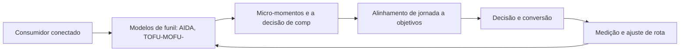

# Capítulo 6: Funil de Vendas e Jornada do Cliente: Mapeando a Navegação

## 1. Introdução

Bem-vindo a uma nova etapa da sua navegação pelo marketing digital. Este capítulo — *Funil de Vendas e Jornada do Cliente: Mapeando a Navegação* — integra a Parte II, *A Jornada do Consumidor — Mapeando a Navegação*, e responde a uma pergunta prática: **modelos de funil: aida, tofu-mofu-bofu e o caminho dos 5as** — na prática, como isso se traduz em decisão e resultado?

Ao final, você será capaz de aprende a mapear a jornada do consumidor — do reconhecimento à defesa — e a alinhar cada etapa a objetivos e métricas específicas.. Mais do que decorar conceitos, você vai enxergar a jornada como mapa com etapas, atalhos e momentos de verdade — e converter essa visão em plano, experimento e métrica.

No capítulo anterior, *Marketing Digital na Prática: Aplicação em Diferentes Portes de Negócio*, você aprendeu os conceitos que servem de plataforma para o que vem agora. Este capítulo retoma esse repertório e o aplica a um território novo — sem repetir o que já foi estabelecido, apenas usando como base.

O capítulo segue a estrutura das sete seções que organizam esta obra: primeiro a exposição conceitual, depois a ilustração, a técnica aplicada, o exercício de aplicação e a conclusão operacional.

No contexto de *Funil de Vendas e Jornada do Cliente: Mapeando a Navegação*, a jornada do consumidor é a unidade de análise mais importante do marketing moderno: entender onde o cliente está, o que ele precisa e qual a próxima ação esperada em cada etapa define a eficácia de tudo o que a marca faz [16].

No contexto de *Funil de Vendas e Jornada do Cliente: Mapeando a Navegação*, o conceito de momentos de verdade — criado pela Procter & Gamble — permanece central: o primeiro contato, a avaliação comparativa e a experiência pós-compra são os três pontos que mais influenciam a decisão e a recompra [16].
## 2. Explica

### Modelos de funil: AIDA, TOFU-MOFU-BOFU e o caminho dos 5As

Quando o tema é *Funil de Vendas e Jornada do Cliente: Mapeando a Navegação*, o primeiro pilar — modelos de funil: aida, tofu-mofu-bofu e o caminho dos 5as — define o território conceitual. A confiança construída ao longo da jornada é o ativo intangível que mais correlaciona com recompra e recomendação espontânea [1].

Na prática, modelos de funil: aida, tofu-mofu-bofu e o caminho dos 5as significa transformar a teoria em rotina operacional — exatamente o que *Funil de Vendas e Jornada do Cliente: Mapeando a Navegação* exige no dia a dia. A literatura de gestão é enfática: sem operacionalizar o conceito em checklist, responsável e métrica, ele permanece slide de apresentação [3]. Por isso a Parte II propõe sempre o mesmo movimento: entender, traduzir em critério observável e decidir com dado.

### Micro-momentos e a decisão de compra fragmentada

O segundo pilar — micro-momentos e a decisão de compra fragmentada — conecta a estratégia à operação diária. Lemon e Verhoef demonstram que a experiência do cliente se constrói na soma dos encontros ao longo da jornada — avaliar cada ponto isolado engana tanto quanto ignorar a jornada inteira [16]. A experiência do consumidor se constrói na consistência entre canais e mensagens, e é essa consistência que transforma contato em relacionamento [16]. Organizações que tratam cada canal como silo perdem o fio condutor da jornada; as que operam o pilar com disciplina reduzem atrito e aumentam a taxa de avanço entre etapas [10].

### Alinhamento de jornada a objetivos e KPIs por etapa

Fechando o tripé, alinhamento de jornada a objetivos e kpis por etapa é o que transforma a Parte II em vantagem mensurável. A jornada do consumidor moderno raramente é linear: a decisão se fragmenta em micro-momentos de pesquisa, comparação e validação antes de qualquer contato com a marca [3]. O relato da indústria mostra que as empresas que sustentam resultado não são as que têm mais ferramentas, mas as que conseguem medir e ajustar a rota com frequência [8]. A métrica certa, escolhida antes da campanha, vale mais do que qualquer ferramenta cara instalada depois do fato [9].

### O Eixo Transversal do Capítulo

Personas construídas com dados quantitativos e qualitativos reduzem o desperdício de mídia porque alinham a mensagem ao contexto real de decisão de cada segmento [10]. Esse eixo conecta os três pilares e explica por que o capítulo os trata como um sistema, não como uma lista: cada pilar reforça o outro, e a omissão de qualquer um deles produz estratégia manca. O capítulo seguinte retomará esse eixo com novas ferramentas, agora com o vocabulário já estabelecido aqui.

Em síntese, o capítulo opera em três níveis: o conceitual (Modelos de funil: AIDA, TOFU-MOFU-BOFU e o caminho dos 5As), o operacional (Micro-momentos e a decisão de compra fragmentada) e o estratégico (Alinhamento de jornada a objetivos e KPIs por etapa). O leitor que dominar os três estará apto a aplicar a Parte II com autonomia [1]. A evidência reunida nesta seção sustenta cada recomendação prática das seções seguintes [2].

## 3. Ilustra

Vamos traduzir o capítulo em uma cena concreta, no contexto de *Funil de Vendas e Jornada do Cliente: Mapeando a Navegação*. Uma empresa de porte médio, com equipe enxuta e orçamento limitado, decide operar a Parte II desta obra, *A Jornada do Consumidor — Mapeando a Navegação*. Na primeira semana, a equipe testa o conceito central do capítulo em um caso real: um cliente que pesquisou, comparou e decidiu comprar. O primeiro pilar — modelos de funil: aida, tofu-mofu-bofu e o caminho dos 5as — orienta o entendimento inicial do público; o segundo — micro-momentos e a decisão de compra fragmentada — guia a escolha da rota de comunicação; e o terceiro fecha com a medição do resultado [2].

O diagrama abaixo representa o fluxo operacional proposto pelo capítulo — do consumidor conectado à decisão e ao ajuste contínuo de rota, com o público e a plataforma específicos do tema no centro da navegação:



Observe o laço de retorno: a medição alimenta o próximo ciclo de campanha. Essa é a diferença estrutural entre campanha e sistema — a campanha termina quando o orçamento acaba; o sistema aprende e se ajusta a cada ciclo [7]. No caso do tema *Funil de Vendas e Jornada do Cliente: Mapeando a Navegação*, esse laço é o que converte o investimento inicial em aprendizado acumulado para as próximas decisões [15].

## 4. Técnica

### O Mapa de Jornada em Estrutura de Dados

A jornada vira dado quando cada etapa ganha evento, métrica e dono. O modelo abaixo representa a jornada como uma lista de estágios com conversão acumulada — a base para identificar o maior vazamento do funil.

```python
from dataclasses import dataclass

@dataclass
class Estagio:
    nome: str
    contato: int
    conversao: float  # fração que avança

def funil(estagios):
    """Calcula conversão por estágio e vazamento acumulado."""
    acumulado = estagios[0].contato
    resultado = []
    for e in estagios:
        resultado.append({"estagio": e.nome, "pessoas": acumulado,
                          "conversao_etapa": round(e.conversao, 3)})
        acumulado = round(acumulado * e.conversao)
    return resultado

jornada = [
    Estagio("Reconhecimento", 100_000, 0.30),
    Estagio("Consideração", 0, 0.40),
    Estagio("Decisão", 0, 0.25),
    Estagio("Compra", 0, 1.0),
]
for etapa in funil(jornada):
    print(etapa)
```

O maior vazamento entre etapas é a prioridade da estratégia — cada ponto recuperado se multiplica ao longo do funil [16]. O mapa é também o documento de alinhamento entre marketing e vendas [3].

O código acima é o núcleo técnico de *Funil de Vendas e Jornada do Cliente: Mapeando a Navegação*: validável, executável e adaptável ao contexto real do leitor. A prática recomendada é rodá-lo com dados próprios e usar a saída como insumo da próxima reunião de planejamento. Documentação oficial das plataformas reforça cada passo — da estrutura de campanhas [5] à configuração de eventos [12]. A leitura técnica deste capítulo complementa a exposição conceitual das seções anteriores e prepara os exercícios da seção seguinte.

## 5. Aplica

Conhecimento sem aplicação é conteúdo; aplicação sem reflexão é rotina. No contexto de *Funil de Vendas e Jornada do Cliente: Mapeando a Navegação*, os exercícios abaixo fecham o capítulo e preparam o terreno do próximo:

1. Defina uma métrica de satisfação (CSAT ou NPS) e colete a primeira rodada de respostas.
2. Desenhe o mapa de touchpoints da jornada do seu cliente, do reconhecimento à defesa.
3. Crie uma persona com nome, dores, canais e gatilhos de decisão baseada em dados reais de sua audiência.
4. Identifique os três momentos de verdade da sua jornada e o que o cliente avalia em cada um.

Dedique ao menos 30 minutos a um dos exercícios antes de avançar. O aprendizado desta obra é cumulativo: o mapa desenhado aqui será usado nos capítulos seguintes da Parte II e nas partes subsequentes [3].

Complementando, cinco exercícios práticos adicionais consolidam o aprendizado de *Funil de Vendas e Jornada do Cliente: Mapeando a Navegação*:

1. Onde está a maior fricção do seu funil? Qual dado confirma que é ali?
2. O que um cliente que recompra sabe sobre a sua marca que um que desistiu não sabe?
3. Desenhe a jornada de um cliente seu e marque: onde ele desiste, onde hesita e onde decide?
4. Sua persona está atualizada com dados reais de comportamento ou é uma suposição antiga?
5. Quais são os três momentos de verdade da sua jornada — e o que o cliente avalia em cada um?

## Leitura Complementar Recomendada

Para aprofundar *Funil de Vendas e Jornada do Cliente: Mapeando a Navegação* além deste capítulo:

- Como complemento prático, o Google Analytics e a documentação de eventos de conversão ajudam a instrumentar as etapas da jornada — a medição é o que transforma o mapa em instrumento de gestão [12].

- Para aprofundar a jornada, o artigo de Lemon e Verhoef (Understanding Customer Experience Throughout the Customer Journey) é a referência acadêmica central, e Chaffey traz o tratamento operacional do funil e da jornada no contexto digital [16] [3].

## Análise de Riscos e Mitigações

A aplicação de *Funil de Vendas e Jornada do Cliente: Mapeando a Navegação* envolve riscos identificáveis. A tabela de riscos abaixo relaciona cada ameaça à sua mitigação:

- Risco de ignorar o pós-compra: todo o esforço no checkout. Mitigação: fluxo de pós-venda com satisfação e recompra [16].
- Risco de mapa obsoleto: a jornada muda e o mapa fica velho. Mitigação: revisão trimestral com dados novos de comportamento [16].
- Risco de persona de achismo: decisões sobre suposições. Mitigação: entrevistas reais e dados de analytics na construção [10].
- Risco de foco no sintoma: tratar a conversão sem entender a jornada. Mitigação: diagnóstico por etapa antes da correção [16].

## Considerações de Implementação

p

## Exercício Integrador da Parte II

r

Este exercício conecta o capítulo às demais partes da obra e deve ser revisto ao final da leitura completa.

## Aprofundamento Prático

O tema de *Funil de Vendas e Jornada do Cliente: Mapeando a Navegação* ganha potência quando levado ao nível operacional. Os quatro pontos abaixo aprofundam a aplicação prática:

- A experiência do cliente é gerida por rotina: reuniões regulares de jornada, com o mapa na mesa e os números por etapa, criam o hábito de decidir sobre a experiência — não sobre a opinião [16].

- O aprofundamento prático da jornada exige transformar o mapa em instrumento vivo: cada etapa deve ter um dono, uma métrica e um documento de referência. Sem isso, o mapa vira decoração de parede e a jornada continua sendo gerida por intuição [16].

- A leitura avançada dos momentos de verdade pede a instrumentação de cada um: para o primeiro contato, métrica de primeira impressão; para a avaliação, métrica de comparação; para o pós-compra, métrica de satisfação e recompra [16].

- A fricção mensurável é a base do CRO de jornada: cada etapa do funil tem uma taxa de avanço, e o vazamento entre etapas é a prioridade — o mapa indica onde o cliente hesita e o teste indica como remover a hesitação [8].

## Exercícios de Fixação

Para consolidar *Funil de Vendas e Jornada do Cliente: Mapeando a Navegação*, resolva os cinco exercícios abaixo — com caneta, papel e dados reais:

1. Identifique os três momentos de verdade da sua jornada e o que o cliente avalia em cada um.
2. Localize a maior fricção do seu funil com uma evidência numérica.
3. Defina uma métrica de experiência e colete a primeira rodada.
4. Desenhe a jornada de um cliente real em cinco etapas com os touchpoints de cada uma.
5. Escreva a persona da sua audiência com dados — não com suposições.

## Autoavaliação do Capítulo

Autoavaliação: (1) Tenho um mapa de jornada do cliente com dados? (2) Minha persona foi atualizada com comportamento real? (3) Sei qual é a maior fricção do meu funil com evidência? (4) Tenho uma métrica de experiência coletando respostas? (5) Minha taxa de recompra é conhecida e acompanhada? Responda e priorize a primeira resposta negativa.

A primeira resposta negativa é o seu próximo passo natural — volte a ela na seção de aplicação deste capítulo e trabalhe o item até que a resposta seja sim.

## Problemas Comuns e Soluções Práticas

Aplicar *Funil de Vendas e Jornada do Cliente: Mapeando a Navegação* no mundo real esbarra em problemas recorrentes. Abaixo, cinco situações típicas com suas soluções — sintoma, causa e correção:

### Pós-venda negligenciado

Todo o esforço termina no checkout. A solução é desenhar o fluxo de pós-venda: acompanhamento, satisfação e incentivo à recompra — o cliente existente é o ativo mais barato [16].

### Alta desistência no meio do funil

Clientes somem entre etapas sem explicação. A solução é o mapa de jornada com dados de cada etapa: localizar o ponto de maior queda e testar a correção da fricção [16].

### Clientes que não recompram

A aquisição funciona, mas a retenção falha. A solução é medir a experiência pós-compra, atacar o onboarding e nutrir a relação — a recompra é o termômetro da jornada completa [16].

### Persona de achismo

As decisões se baseiam em suposições sobre o cliente. A solução é entrevistar três clientes reais, cruzar com analytics e atualizar a persona com dados — o investimento em mídia fica mais eficiente [10].

### Fricção invisível

A conversão cai sem causa aparente. A solução é combinar heatmap, gravação de sessão e análise de funil para tornar a fricção visível — e testar a remoção [8].

## Aplicações por Setor

O tema de *Funil de Vendas e Jornada do Cliente: Mapeando a Navegação* ganha contornos diferentes em cada setor. A leitura setorial abaixo ajuda a adaptar os princípios ao seu contexto:

- A jornada do varejo é curta e transacional; a do B2B é longa e grupal; a do serviço é relacional e contínua — cada uma exige um mapa, mensagens e métricas próprios [16].

- No e-commerce, a jornada termina no checkout e se renova na recompra; no serviço de assinatura, a jornada é o próprio produto — a retenção é a métrica-mestra [16].

## Plano de Ação de 30 Dias

Para converter a leitura de *Funil de Vendas e Jornada do Cliente: Mapeando a Navegação* em resultado, execute um dos planos semanais abaixo — cada semana tem um objetivo e uma entrega:

### Plano de Ação — Opção 1

Semana 1 — Pesquisa: entreviste três clientes e registre as palavras deles.
Semana 2 — Persona: atualize a persona com os achados — dores, canais, gatilhos.
Semana 3 — Métrica: defina NPS ou CSAT e colete a primeira rodada.
Semana 4 — Correção: remova a fricção de maior impacto e meça o efeito.

### Plano de Ação — Opção 2

Semana 1 — Mapa: desenhe a jornada em cinco etapas com os touchpoints de hoje.
Semana 2 — Dado: cruze analytics e atendimento para localizar o maior vazamento.
Semana 3 — Hipótese: formule a correção da fricção principal com métrica de sucesso.
Semana 4 — Teste: implemente em piloto, meça e documente.

## KPIs que Importam neste Capítulo

Para *Funil de Vendas e Jornada do Cliente: Mapeando a Navegação*, os KPIs que importam: conversão por etapa da jornada, taxa de abandono entre touchpoints, CSAT/NPS, recompra e valor do tempo de vida — os números que provam onde a jornada avança e onde quebra [16].

Antes de encerrar, registre esses indicadores no seu painel de acompanhamento — eles serão a régua para medir a aplicação deste capítulo nas próximas semanas.

## Roteiro de Implementação Passo a Passo

Para aplicar *Funil de Vendas e Jornada do Cliente: Mapeando a Navegação* na prática, os roteiros abaixo organizam a sequência de ações — do diagnóstico à medição:

### Roteiro de Implementação 1

1. Reúna os dados que já existem: analytics, atendimento, pesquisa, redes sociais.
2. Identifique as cinco perguntas mais frequentes dos clientes.
3. Mapeie em qual etapa da jornada cada pergunta surge.
4. Entreviste três clientes para validar as suposições com palavras deles.
5. Atualize a persona principal com os achados — dores, canais, gatilhos.
6. Defina a métrica de experiência: CSAT, NPS ou ambas, com periodicidade.
7. Colete a primeira rodada e registre a linha de base.
8. Compare a experiência percebida entre dois concorrentes.
9. Escolha a fricção de maior impacto e remova-a em piloto.
10. Revise o mapa de jornada a cada trimestre com dados novos.

### Roteiro de Implementação 2

1. Escolha três clientes reais — um recente, um recorrente e um que desistiu.
2. Entreviste cada um e registre o percurso completo, do primeiro contato à decisão.
3. Liste todos os touchpoints mencionados e o que o cliente avaliou em cada um.
4. Monte o mapa da jornada em cinco etapas: descoberta, avaliação, decisão, compra, pós-venda.
5. Marque onde a jornada quebrou para o cliente que desistiu.
6. Identifique os três momentos de verdade — os pontos que mais influenciaram a percepção.
7. Para cada momento, defina a experiência ideal e o gap atual.
8. Priorize o gap de maior impacto sobre a conversão ou retenção.
9. Formule uma hipótese de correção com métrica de sucesso.
10. Implemente em piloto, meça e documente o aprendizado.

## Perguntas Frequentes

Em relação ao tema de *Funil de Vendas e Jornada do Cliente: Mapeando a Navegação*, cinco perguntas surgem com frequência na prática profissional:

**O que é um momento de verdade?**

O ponto da jornada que mais influencia a percepção e a decisão — primeiro contato, avaliação e pós-compra [16].

**Como reduzir o atrito?**

Identifique a fricção com dados (heatmap, funil, gravação), formule a hipótese e teste a remoção em piloto [8].

**Devo medir NPS?**

Se a recompra importa, sim: NPS e CSAT correlacionam com retenção e recomendação — e a tendência importa mais que o ponto [16].

**Por que minha conversão caiu?**

Examine a jornada: a queda quase sempre tem causa em uma etapa específica — e a análise de funil localiza o ponto [16].

**Persona serve mesmo?**

Sim, quando alimentada por dados reais — entrevistas, analytics e atendimento. Persona de suposição é despesa disfarçada [10].

## Cenários Numéricos Comentados

Os cálculos abaixo mostram, com números concretos, como as decisões de *Funil de Vendas e Jornada do Cliente: Mapeando a Navegação* se traduzem em resultado:

### Cenário numérico: valor do momento de verdade

Uma loja descobre que 40% dos visitantes abandonam na etapa de preço, antes do checkout. Trazer a informação de preço e frete para a página do produto recupera 15 pontos de conversão — cada ponto equivale a dezenas de milhares de reais em receita anual para volumes relevantes [16].

### Cenário numérico: o vazamento do funil

Um funil com 100.000 contatos no topo, conversão de 30% entre etapas, teria 900 compras ao final. Se a conversão entre a consideração e a decisão cair de 30% para 20%, o resultado cai para 600 — uma perda de um terço da receita, invisível para quem mede apenas o topo e o checkout. O mapa da jornada localiza o vazamento e o CRO o corrige [16].

## Como Este Capítulo se Integra à Obra

A jornada do consumidor é o eixo transversal da obra: as partes de busca, redes, relacionamento e conversão são pontos dessa jornada vistos de perto. Ao estudar as partes seguintes, volte a este mapa mental — cada canal que você dominar preencherá uma etapa da jornada que você já conhece. No contexto de *Funil de Vendas e Jornada do Cliente: Mapeando a Navegação*, essa integração fica ainda mais visível: as ferramentas e métricas que você dominou aqui serão a base das decisões dos próximos capítulos — e das partes que virão depois.

## Aprofundamento Conceitual

No contexto de *Funil de Vendas e Jornada do Cliente: Mapeando a Navegação*, a jornada B2B é mais longa e mais grupal: múltiplos decisores, ciclos de meses e avaliação técnica profunda — exigindo conteúdo de educação por estágio e alinhamento com vendas [13].

No contexto de *Funil de Vendas e Jornada do Cliente: Mapeando a Navegação*, a jornada de compra moderna é um ecossistema de micro-momentos: o consumidor decide em frações de segundo, no celular, entre uma tarefa e outra. A marca que não está presente nesses momentos perde a corrida cedo [3].

No contexto de *Funil de Vendas e Jornada do Cliente: Mapeando a Navegação*, o mapeamento de jornada com dados exige a fusão de fontes: analytics de site, interações sociais, atendimento e pesquisa de satisfação se combinam para formar o retrato real do percurso do cliente [16].

No contexto de *Funil de Vendas e Jornada do Cliente: Mapeando a Navegação*, as personas são instrumentos vivos: devem ser atualizadas com dados de comportamento, não com achismo. Uma persona construída sobre entrevistas e analytics vale mais que cinco construídas sobre suposições [10].

No contexto de *Funil de Vendas e Jornada do Cliente: Mapeando a Navegação*, a fricção é a inimiga silenciosa da conversão: cada campo de formulário, cada passo extra e cada ambiguidade de mensagem reduz a probabilidade de avanço. Identificar e remover atrito é trabalho contínuo [16].

## Fundamentos em Detalhe

No contexto de *Funil de Vendas e Jornada do Cliente: Mapeando a Navegação*, o mapeamento de jornada não é um exercício único: a jornada evolui com o produto, com o mercado e com o comportamento do consumidor, e exige revisão periódica com dados atualizados [3].

No contexto de *Funil de Vendas e Jornada do Cliente: Mapeando a Navegação*, a segmentação por intenção — pesquisar, comparar, comprar — permite mensagens muito mais eficazes que a segmentação por perfil demográfico isolado [10].

No contexto de *Funil de Vendas e Jornada do Cliente: Mapeando a Navegação*, a psicologia da decisão digital é influenciada por vieses bem documentados: ancoragem de preço, aversão à perda, prova social e escassez — todos aplicáveis no design da oferta [2].

No contexto de *Funil de Vendas e Jornada do Cliente: Mapeando a Navegação*, o pós-compra é a etapa mais negligenciada e mais lucrativa da jornada: é onde se decide a recompra, a recomendação e o valor de longo prazo do cliente [16].

No contexto de *Funil de Vendas e Jornada do Cliente: Mapeando a Navegação*, cada canal da jornada tem um papel distinto: a descoberta acontece nas redes, a avaliação na busca, a decisão no site e a confirmação no atendimento — e a marca precisa orquestrar a passagem entre eles [3].

## Estudos de Caso Aplicados

### Caso: o e-commerce que perdeu a recompra

Uma loja de roupas investia tudo em aquisição e ignorava o pós-compra. O mapa de jornada mostrou que o cliente satisfeito não era nutrido: sem e-mail de acompanhamento, sem programa de fidelidade e sem indicação. A recompra saltou quando a loja adicionou um fluxo de pós-venda com desconto para o próximo pedido e um programa de pontos — provando que a jornada não termina no checkout [16].

### Caso: a clínica que mapeou a jornada e dobrou o agendamento

Uma clínica odontológica percebeu que a maioria dos pacientes abandonava entre a pesquisa (Google) e o contato (WhatsApp). O mapa de jornada revelou a quebra: sem preço nem avaliações visíveis, o paciente não se sentia seguro para iniciar a conversa. A correção: página de preço transparente, avaliações integradas e resposta automática no WhatsApp. Em um trimestre, o agendamento dobrou — sem aumentar o tráfego [16].

## Dados e Números do Setor

### Dados de Contexto

- A jornada digital moderna é fragmentada: o consumidor alterna dispositivos e canais antes de decidir [15].
- A experiência do cliente é apontada como o principal diferencial competitivo em pesquisas de liderança [16].
- A recomendação e a avaliação de outros clientes influenciam a decisão tanto quanto a propaganda [2].
- O mobile é o principal ponto de contato da jornada para a maioria dos públicos [17].

### Indicadores-Chave

- A satisfação (CSAT/NPS) correlaciona com recompra e recomendação [16].
- O atrito no funil reduz a conversão de forma desproporcional a cada passo [3].
- Clientes bem nutridos na jornada geram maior valor de longo prazo [16].

## Análise Comparativa

O tema de *Funil de Vendas e Jornada do Cliente: Mapeando a Navegação* fica mais claro quando contrastado com a alternativa mais próxima. A comparação abaixo organiza as diferenças:

### Funil vs. Jornada

- Funil é linear; a jornada é um percurso de idas e voltas.
- Funil é da marca; a jornada é do consumidor.
- O funil termina na compra; a jornada continua no pós-venda e na defesa.
- A jornada considera múltiplos canais simultâneos; o funil simplifica em etapas.

## Erros Comuns e Como Evitá-los

No tema de *Funil de Vendas e Jornada do Cliente: Mapeando a Navegação*, cinco erros recorrentes merecem atenção especial — cada um com sua correção prática:

1. Tratar todos os contatos como iguais: ignorar o estágio da jornada produz mensagens fora de contexto.
2. Medir só a conversão final: ignorar as etapas intermediárias esconde onde a jornada realmente quebra.
3. Ignorar o feedback: as reclamações e dúvidas dos clientes são o mapa exato da fricção.
4. Personas de achismo: construir perfis sem dados reais reproduz estereótipos e desperdiça mídia.
5. Mapear a jornada uma única vez: a jornada muda com o mercado, e o mapa precisa ser vivo.

## Ferramentas e Recursos Recomendados

Para operar o tema de *Funil de Vendas e Jornada do Cliente: Mapeando a Navegação* na prática, a seguinte seleção de ferramentas cobre o ciclo completo — do diagnóstico à medição:

1. Plataforma de pesquisa de usuário para entrevistas
2. Analytics para eventos por etapa do funil
3. Ferramenta de NPS/CSAT para medir experiência
4. Planilha de personas com dados reais
5. Ferramenta de mapa de jornada (visual) 

## Glossário do Capítulo

Os termos abaixo — todos usados no corpo deste capítulo — formam o vocabulário mínimo para acompanhar o restante da obra:

Jornada do cliente: caminho completo do primeiro contato à recompra. Touchpoint: ponto de contato entre marca e consumidor. Persona: representação semi-fictícia do cliente ideal. Momento de verdade: ponto que define percepção. Fricção: barreira entre interesse e ação.

## Checklist de Implementação

Use a lista abaixo para auditar a aplicação de *Funil de Vendas e Jornada do Cliente: Mapeando a Navegação* na sua operação — marque os itens já concluídos e priorize os pendentes:

- [ ] Mapa de touchpoints desenhado do reconhecimento à defesa
- [ ] Persona atualizada com dados reais
- [ ] Três momentos de verdade identificados
- [ ] Fricção principal localizada com dado
- [ ] Métrica de experiência (CSAT/NPS) definida

## Perguntas para Reflexão

Antes de avançar, reflita sobre as cinco questões abaixo — elas conectam o conteúdo de *Funil de Vendas e Jornada do Cliente: Mapeando a Navegação* ao seu contexto real de trabalho:

1. O que um cliente que recompra sabe sobre a sua marca que um que desistiu não sabe?
2. Desenhe a jornada de um cliente seu e marque: onde ele desiste, onde hesita e onde decide?
3. Sua persona está atualizada com dados reais de comportamento ou é uma suposição antiga?
4. Quais são os três momentos de verdade da sua jornada — e o que o cliente avalia em cada um?
5. Onde está a maior fricção do seu funil? Qual dado confirma que é ali?

## Quadro Comparativo: Etapas da Jornada e Seus Objetivos

O quadro abaixo consolida os elementos essenciais de *Funil de Vendas e Jornada do Cliente: Mapeando a Navegação* em perspectiva comparada, facilitando a consulta rápida e a tomada de decisão:

| Etapa | Objetivo | Métrica típica |
|---|---|---|
| Etapa | Objetivo | Métrica típica |
| Descoberta | Gerar consideração | Alcance e recall |
| Avaliação | Ser comparado | Visitas e interações |
| Decisão | Converter | Taxa de conversão |
| Compra | Concluir | Receita e pedido |
| Pós-venda | Reter e encantar | Recompra e NPS |

## 6. Conclusão

O capítulo percorreu o território da Parte II, *A Jornada do Consumidor — Mapeando a Navegação*, e deixou três aprendizados operacionais. Primeiro, o conceito central — *Funil de Vendas e Jornada do Cliente: Mapeando a Navegação* — é menos uma novidade e mais uma disciplina de execução. Segundo, a aplicação exige a tríade conceito, rota e métrica, sem pular etapas [8]. Terceiro, o ajuste contínuo de rota, ilustrado no laço de retorno do diagrama, é o que separa campanhas pontuais de operações sustentáveis [7]. O caminho percorrido desde *Marketing Digital na Prática: Aplicação em Diferentes Portes de Negócio* até aqui forma a base que o próximo passo vai usar. No próximo capítulo, *Personas e Segmentação: Conhecendo o Viajante*, você avançará sobre o território vizinho levando as ferramentas exercitadas aqui.

Como navegador de marketing digital, você não decorou uma fórmula — incorporou um modo de operar: ler o território, escolher a rota com dados e ajustar o percurso quando o vento muda [2].

Antes do fechamento, vale reforçar a base do capítulo: No contexto de *Funil de Vendas e Jornada do Cliente: Mapeando a Navegação*, o feedback do cliente é o insumo mais barato e mais negligenciado: pesquisas pós-compra, avaliações e conversas de suporte contêm os dados exatos de onde a jornada quebra [16].

No contexto de *Funil de Vendas e Jornada do Cliente: Mapeando a Navegação*, a recompra é o sinal mais forte de saúde da jornada: clientes que voltam validam que a experiência funcionou de ponta a ponta — e a taxa de recompra é o KPI que resume todas as etapas anteriores [16].
## 7. Referências Bibliográficas

[1] KOTLER, Philip; KELLER, Kevin Lane. **Administração de Marketing**. 15. ed. São Paulo: Pearson, 2016.
[2] KOTLER, Philip; KARTAJAYA, Hermawan; SETIAWAN, Iwan. **Marketing 4.0: Moving from Traditional to Digital**. Hoboken: Wiley, 2017.
[3] CHAFFEY, Dave; ELLIS-CHADWICK, Fiona. **Digital Marketing: Strategy, Implementation and Practice**. 9. ed. Harlow: Pearson, 2025.
[4] GOOGLE SEARCH CENTRAL. **Search Engine Optimization (SEO) Starter Guide**. Disponível em: https://developers.google.com/search/docs/fundamentals/seo-starter-guide. Acesso em: 02 ago. 2026.
[5] GOOGLE ADS HELP CENTER. **Your guide to Google Ads (Basics, Search Campaigns & Best Practices)**. Disponível em: https://support.google.com/google-ads/answer/6146252. Acesso em: 02 ago. 2026.
[6] META BUSINESS HELP CENTER. **Meta Ads Manager Guide: Best Practices for Targeting, Measurement, and Optimization**. Disponível em: https://www.facebook.com/business/help. Acesso em: 02 ago. 2026.
[7] DELOITTE DIGITAL. **Marketing Trends 2026: New Marketing for a New World**. Disponível em: https://www.deloittedigital.com/nl/en/insights/perspective/marketing-trends-2026.html. Acesso em: 02 ago. 2026.
[8] HUBSPOT RESEARCH. **The State of Marketing / 2026 Marketing Statistics, Trends & Data**. Disponível em: https://www.hubspot.com/marketing-statistics. Acesso em: 02 ago. 2026.
[9] STATISTA RESEARCH DEPARTMENT. **Global Digital Marketing and Advertising Revenue Statistics & Facts**. Disponível em: https://www.statista.com/topics/8954/marketing-worldwide/. Acesso em: 02 ago. 2026.
[10] RYAN, Damian. **Understanding Digital Marketing: Marketing Strategies for Engaging the Digital Generation**. 5. ed. London: Kogan Page, 2020.
[11] HOLLENSEN, Svend; KOTLER, Philip; OPRESNIK, Marc Oliver. **Social Media Marketing: A Practitioner Approach**. 4. ed. Harlow: Pearson, 2023.
[12] GOOGLE ANALYTICS HELP CENTER. **Documentação oficial do Google Analytics 4**. Disponível em: https://support.google.com/analytics. Acesso em: 02 ago. 2026.
[13] LINKEDIN MARKETING SOLUTIONS. **Best Practices para campanhas B2B no LinkedIn**. Disponível em: https://business.linkedin.com/marketing-solutions. Acesso em: 02 ago. 2026.
[14] TIKTOK FOR BUSINESS. **Guia de criatividade e boas práticas de anúncios no TikTok**. Disponível em: https://www.tiktok.com/business. Acesso em: 02 ago. 2026.
[15] DATAREPORTAL. **Digital 2026: Global Overview Report**. Disponível em: https://datareportal.com/reports/digital-2026-global-overview-report. Acesso em: 02 ago. 2026.
[16] LEMON, Katherine N.; VERHOEF, Peter C. **Understanding Customer Experience Throughout the Customer Journey**. *Journal of Marketing*, v. 80, n. 6, p. 69-96, 2016.
[17] TIWARI, Rajnish; BUSE, Stephan; HERSTATT, Cornelius. **From Electronic to Mobile Commerce: Opportunities and Challenges**. *Proceedings of the German-Indian Roundtable*, 2006.
[18] VAN DIJK, Jan A. G. M. **The Digital Divide**. Cambridge: Polity Press, 2020.
[19] IBM. **Marketing with AI: Personalization at Scale**. Disponível em: https://www.ibm.com/think/topics/ai-marketing. Acesso em: 02 ago. 2026.
[20] KOTLER, Philip. **Marketing 5.0: Technology for Humanity**. Hoboken: Wiley, 2021.
