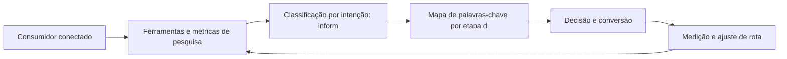

# Capítulo 13: Pesquisa de Palavras-Chave: Mapeando a Intenção do Viajante

## 1. Introdução

Bem-vindo a uma nova etapa da sua navegação pelo marketing digital. Este capítulo — *Pesquisa de Palavras-Chave: Mapeando a Intenção do Viajante* — integra a Parte III, *Busca — A Rota da Intenção*, e responde a uma pergunta prática: **ferramentas e métricas de pesquisa: volume, dificuldade e ctr estimado** — na prática, como isso se traduz em decisão e resultado?

Ao final, você será capaz de conduz pesquisa de palavras-chave estruturada: volume, dificuldade, intenção e mapeamento por etapa da jornada.. Mais do que decorar conceitos, você vai enxergar a busca como rota de intenção declarada — e converter essa visão em plano, experimento e métrica.

No capítulo anterior, *SEO: Conquistando Visibilidade Orgânica*, você aprendeu os conceitos que servem de plataforma para o que vem agora. Este capítulo retoma esse repertório e o aplica a um território novo — sem repetir o que já foi estabelecido, apenas usando como base.

O capítulo segue a estrutura das sete seções que organizam esta obra: primeiro a exposição conceitual, depois a ilustração, a técnica aplicada, o exercício de aplicação e a conclusão operacional.

No contexto de *Pesquisa de Palavras-Chave: Mapeando a Intenção do Viajante*, o leilão de anúncios do Google é um mecanismo de relevância: anunciantes competem por palavras-chave, mas o vencedor é definido pela combinação de lance e qualidade — e a qualidade barateia o clique [5].

No contexto de *Pesquisa de Palavras-Chave: Mapeando a Intenção do Viajante*, o SEO é um ativo de longo prazo: enquanto o tráfego pago termina quando o orçamento acaba, o tráfego orgânico acumula valor com o tempo e reduz o custo médio de aquisição da operação [4].
## 2. Explica

### Ferramentas e métricas de pesquisa: volume, dificuldade e CTR estimado

Quando o tema é *Pesquisa de Palavras-Chave: Mapeando a Intenção do Viajante*, o primeiro pilar — ferramentas e métricas de pesquisa: volume, dificuldade e ctr estimado — define o território conceitual. A intenção de busca pode ser informacional, navegacional ou transacional — e cada tipo exige uma página, uma mensagem e uma métrica diferentes [4].

Na prática, ferramentas e métricas de pesquisa: volume, dificuldade e ctr estimado significa transformar a teoria em rotina operacional — exatamente o que *Pesquisa de Palavras-Chave: Mapeando a Intenção do Viajante* exige no dia a dia. A literatura de gestão é enfática: sem operacionalizar o conceito em checklist, responsável e métrica, ele permanece slide de apresentação [3]. Por isso a Parte III propõe sempre o mesmo movimento: entender, traduzir em critério observável e decidir com dado.

### Classificação por intenção: informacional, navegacional e transacional

O segundo pilar — classificação por intenção: informacional, navegacional e transacional — conecta a estratégia à operação diária. O leilão de busca recompensa quem melhora a relevância antes de aumentar o lance: qualidade e orçamento caminham juntos na matemática do CPC [5]. A experiência do consumidor se constrói na consistência entre canais e mensagens, e é essa consistência que transforma contato em relacionamento [16]. Organizações que tratam cada canal como silo perdem o fio condutor da jornada; as que operam o pilar com disciplina reduzem atrito e aumentam a taxa de avanço entre etapas [10].

### Mapa de palavras-chave por etapa do funil e por persona

Fechando o tripé, mapa de palavras-chave por etapa do funil e por persona é o que transforma a Parte III em vantagem mensurável. A otimização para mecanismos de busca começa pelo usuário: páginas rápidas, claras e úteis são a base sobre a qual qualquer técnica se apoia [4]. O relato da indústria mostra que as empresas que sustentam resultado não são as que têm mais ferramentas, mas as que conseguem medir e ajustar a rota com frequência [8]. A métrica certa, escolhida antes da campanha, vale mais do que qualquer ferramenta cara instalada depois do fato [9].

### O Eixo Transversal do Capítulo

Ferramentas de pesquisa de palavras-chave transformam volume em estratégia: dados de demanda sustentam a arquitetura de conteúdo e a alocação de verba [8]. Esse eixo conecta os três pilares e explica por que o capítulo os trata como um sistema, não como uma lista: cada pilar reforça o outro, e a omissão de qualquer um deles produz estratégia manca. O capítulo seguinte retomará esse eixo com novas ferramentas, agora com o vocabulário já estabelecido aqui.

Em síntese, o capítulo opera em três níveis: o conceitual (Ferramentas e métricas de pesquisa: volume, dificuldade e CTR estimado), o operacional (Classificação por intenção: informacional, navegacional e transacional) e o estratégico (Mapa de palavras-chave por etapa do funil e por persona). O leitor que dominar os três estará apto a aplicar a Parte III com autonomia [1]. A evidência reunida nesta seção sustenta cada recomendação prática das seções seguintes [2].

## 3. Ilustra

Vamos traduzir o capítulo em uma cena concreta, no contexto de *Pesquisa de Palavras-Chave: Mapeando a Intenção do Viajante*. Uma empresa de porte médio, com equipe enxuta e orçamento limitado, decide operar a Parte III desta obra, *Busca — A Rota da Intenção*. Na primeira semana, a equipe testa o conceito central do capítulo em um caso real: um cliente que pesquisou, comparou e decidiu comprar. O primeiro pilar — ferramentas e métricas de pesquisa: volume, dificuldade e ctr estimado — orienta o entendimento inicial do público; o segundo — classificação por intenção: informacional, navegacional e transacional — guia a escolha da rota de comunicação; e o terceiro fecha com a medição do resultado [2].

O diagrama abaixo representa o fluxo operacional proposto pelo capítulo — do consumidor conectado à decisão e ao ajuste contínuo de rota, com o público e a plataforma específicos do tema no centro da navegação:



Observe o laço de retorno: a medição alimenta o próximo ciclo de campanha. Essa é a diferença estrutural entre campanha e sistema — a campanha termina quando o orçamento acaba; o sistema aprende e se ajusta a cada ciclo [7]. No caso do tema *Pesquisa de Palavras-Chave: Mapeando a Intenção do Viajante*, esse laço é o que converte o investimento inicial em aprendizado acumulado para as próximas decisões [15].

## 4. Técnica

### O Leilão de Busca em Números

Entender o leilão do Google Ads é entender um jogo de relevância e lance. O cálculo abaixo simula o custo real por clique a partir do Índice de Qualidade — mostrando por que qualidade barateia o clique.

```python
def custo_por_clique(ranking_seu: float, ranking_abaixo: float) -> float:
    """CPC = ranking do concorrente de baixo / seu ranking + R$0,01."""
    return round(ranking_abaixo / ranking_seu + 0.01, 2)

def ranking(qualidade: int, lance: float) -> float:
    """AdRank: qualidade x lance."""
    return qualidade * lance

# Mesmo lance, qualidades diferentes
for q in (4, 7, 10):
    rank = ranking(q, 2.00)
    cpc = custo_por_clique(rank, ranking(5, 2.00))
    print(f"Qualidade {q}: rank {rank:.0f} -> CPC R$ {cpc}")
```

O exercício demonstra o princípio central do SEM: melhorar o Índice de Qualidade reduz o custo por clique mais rápido do que reduzir o lance [5]. A relevância é a estratégia de longo prazo do leilão [4].

O código acima é o núcleo técnico de *Pesquisa de Palavras-Chave: Mapeando a Intenção do Viajante*: validável, executável e adaptável ao contexto real do leitor. A prática recomendada é rodá-lo com dados próprios e usar a saída como insumo da próxima reunião de planejamento. Documentação oficial das plataformas reforça cada passo — da estrutura de campanhas [5] à configuração de eventos [12]. A leitura técnica deste capítulo complementa a exposição conceitual das seções anteriores e prepara os exercícios da seção seguinte.

## 5. Aplica

Conhecimento sem aplicação é conteúdo; aplicação sem reflexão é rotina. No contexto de *Pesquisa de Palavras-Chave: Mapeando a Intenção do Viajante*, os exercícios abaixo fecham o capítulo e preparam o terreno do próximo:

1. Teste uma busca no celular por um termo do seu mercado e registre o que aparece acima da dobra.
2. Verifique no Search Console as impressões e a posição média das suas páginas mais relevantes.
3. Compare o CPC estimado de três palavras-chave transacionais do seu mercado em uma ferramenta de lances.
4. Escreva um snippet de anúncio com promessa, prova e CTA e avalie o Índice de Qualidade esperado.

Dedique ao menos 30 minutos a um dos exercícios antes de avançar. O aprendizado desta obra é cumulativo: o mapa desenhado aqui será usado nos capítulos seguintes da Parte III e nas partes subsequentes [3].

Complementando, cinco exercícios práticos adicionais consolidam o aprendizado de *Pesquisa de Palavras-Chave: Mapeando a Intenção do Viajante*:

1. Se um assistente de IA responder por você amanhã, sua marca será citada? O que falta para isso?
2. Se o Google sumisse amanhã, quanto do seu tráfego e da sua receita desapareceria junto?
3. Suas palavras-chave estão organizadas por intenção — ou todas competem pelo mesmo público?
4. Qual página sua deveria estar ranqueando e não está? O que falta: conteúdo, autoridade ou técnica?
5. Quanto custaria comprar, via Google Ads, o tráfego que seu SEO deveria gerar organicamente?

## Leitura Complementar Recomendada

Para aprofundar *Pesquisa de Palavras-Chave: Mapeando a Intenção do Viajante* além deste capítulo:

- Para aprofundar a busca, a documentação oficial do Google Search Central cobre o SEO em profundidade, e o Google Ads Help Center detalha o leilão e o Índice de Qualidade [4] [5].

- Como complemento de mercado, os relatórios da Statista sobre investimento em busca e publicidade contextualizam a dimensão financeira do canal [9].

## Análise de Riscos e Mitigações

A aplicação de *Pesquisa de Palavras-Chave: Mapeando a Intenção do Viajante* envolve riscos identificáveis. A tabela de riscos abaixo relaciona cada ameaça à sua mitigação:

- Risco de dependência de pago: tráfego que para quando a verba acaba. Mitigação: construir o orgânico em paralelo como ativo de longo prazo [4].
- Risco de palavras erradas: tráfego sem intenção. Mitigação: classificar por intenção e alinhar cada página à busca que recebe [4].
- Risco técnico: site lento ou mal indexado. Mitigação: auditoria periódica de Core Web Vitals e rastreabilidade [4].
- Risco de concorrência direta: disputar termos caros sem estrutura. Mitigação: nicho de cauda longa com menos competição [4].

## Considerações de Implementação

é

## Exercício Integrador da Parte III

 

Este exercício conecta o capítulo às demais partes da obra e deve ser revisto ao final da leitura completa.

## Aprofundamento Prático

O tema de *Pesquisa de Palavras-Chave: Mapeando a Intenção do Viajante* ganha potência quando levado ao nível operacional. Os quatro pontos abaixo aprofundam a aplicação prática:

- O aprofundamento prático da busca começa pela arquitetura de palavras: o mapa de palavras-chave por etapa do funil é o documento que alinha conteúdo, páginas e campanhas — sem ele, cada área otimiza para si e a SERP fica fragmentada [4].

- A leitura avançada do leilão exige o acompanhamento do Índice de Qualidade por palavra: quedas de qualidade precedem quedas de posição e aumentos de custo — monitorar o índice é monitorar a saúde da conta [5].

- O SEO técnico é disciplina contínua: core Web Vitals, dados estruturados e rastreabilidade se degradam com o tempo, e a auditoria periódica evita a perda silenciosa de posições [4].

- A busca generativa exige novo tipo de conteúdo: respostas diretas, dados estruturados e autoridade cítável — a página que responde com clareza e é citada como fonte ganha presença nas respostas sintetizadas [7].

## Exercícios de Fixação

Para consolidar *Pesquisa de Palavras-Chave: Mapeando a Intenção do Viajante*, resolva os cinco exercícios abaixo — com caneta, papel e dados reais:

1. Identifique uma oportunidade do Search Console sem página dedicada.
2. Verifique os Core Web Vitals da sua página e priorize o pior indicador.
3. Classifique dez palavras-chave do seu mercado por intenção.
4. Audite o SEO on-page da sua página principal e liste três melhorias.
5. Explique como o Índice de Qualidade reduz o custo por clique.

## Autoavaliação do Capítulo

Autoavaliação: (1) Tenho um mapa de palavras-chave por intenção e etapa do funil? (2) Minha página principal passa no checklist de SEO on-page? (3) Conheço o Índice de Qualidade das minhas palavras-chave? (4) Uso o Search Console com regularidade? (5) Minha estratégia combina orgânico e pago? Responda e priorize a primeira resposta negativa.

A primeira resposta negativa é o seu próximo passo natural — volte a ela na seção de aplicação deste capítulo e trabalhe o item até que a resposta seja sim.

## Problemas Comuns e Soluções Práticas

Aplicar *Pesquisa de Palavras-Chave: Mapeando a Intenção do Viajante* no mundo real esbarra em problemas recorrentes. Abaixo, cinco situações típicas com suas soluções — sintoma, causa e correção:

### Tráfego pago caro e ineficiente

CPC alto e conversão baixa indicam relevância fraca. A solução é atacar o Índice de Qualidade: grupos por categoria, palavras exatas, páginas dedicadas — o custo cai com a qualidade [5].

### Site invisível no Google

Conteúdo bom sem tráfego orgânico aponta para problema técnico ou de autoridade. A solução é auditar indexação, velocidade e backlinks — e priorizar as lacunas por impacto [4].

### Palavras-chave erradas

Tráfego alto sem conversão sugere intenção desalinhada. A solução é reclassificar as palavras-chave por intenção e alinhar cada página à intenção que ela recebe [4].

### Concorrente domina a SERP

A disputa direta é cara. A solução é o nicho: palavras-chave de cauda longa com intenção clara e menos competição — vencer onde o concorrente não está [4].

### Dados de busca ignorados

O Search Console tem ouro e ninguém usa. A solução é a rotina: exportar consultas, identificar oportunidades de posição e alimentar o calendário de conteúdo [4].

## Aplicações por Setor

O tema de *Pesquisa de Palavras-Chave: Mapeando a Intenção do Viajante* ganha contornos diferentes em cada setor. A leitura setorial abaixo ajuda a adaptar os princípios ao seu contexto:

- No varejo de moda, a intenção de busca é visual e a otimização inclui imagem e vídeo; em fintech, a busca é informacional e de confiança — cada setor tem o seu jogo de SERP [4].

- No e-commerce, a busca transacional domina e o SEO de produto é essencial; no B2B, a busca informacional abre o ciclo e o conteúdo técnico ranqueia; em serviços locais, a ficha do Google é o ativo central [4].

## Plano de Ação de 30 Dias

Para converter a leitura de *Pesquisa de Palavras-Chave: Mapeando a Intenção do Viajante* em resultado, execute um dos planos semanais abaixo — cada semana tem um objetivo e uma entrega:

### Plano de Ação — Opção 1

Semana 1 — Palavras: pesquise 20 termos, classifique por intenção e monte o mapa por funil.
Semana 2 — Página: audite o SEO on-page e os Core Web Vitals da página principal.
Semana 3 — Conteúdo: escreva ou atualize a página para a intenção da palavra-alvo.
Semana 4 — Estrutura: monte a campanha de busca com grupos por categoria e lance o piloto.

### Plano de Ação — Opção 2

Semana 1 — Diagnóstico: exporte as consultas do Search Console e filtre as oportunidades.
Semana 2 — Autoridade: identifique três fontes de backlink de qualidade do seu nicho.
Semana 3 — Técnica: verifique indexação, dados estruturados e velocidade.
Semana 4 — Rotina: agende a revisão mensal de posição e CTR.

## KPIs que Importam neste Capítulo

Para *Pesquisa de Palavras-Chave: Mapeando a Intenção do Viajante*, os KPIs que importam: CTR e custo por clique, Índice de Qualidade, posição média e impressões orgânicas, e custo por conversão — a leitura conjunta de orgânico e pago na busca [5].

Antes de encerrar, registre esses indicadores no seu painel de acompanhamento — eles serão a régua para medir a aplicação deste capítulo nas próximas semanas.

## Roteiro de Implementação Passo a Passo

Para aplicar *Pesquisa de Palavras-Chave: Mapeando a Intenção do Viajante* na prática, os roteiros abaixo organizam a sequência de ações — do diagnóstico à medição:

### Roteiro de Implementação 1

1. Liste 30 termos que seus clientes usam para descrever sua oferta e seu mercado.
2. Pesquise volume e dificuldade de cada um em uma ferramenta de palavras-chave.
3. Classifique cada termo por intenção: informacional, navegacional ou transacional.
4. Monte o mapa: palavras-chave por etapa do funil e por persona.
5. Identifique as lacunas: termos de alta intenção sem página dedicada.
6. Audite a página atual contra o checklist de SEO on-page (title, meta, headings, conteúdo).
7. Verifique a velocidade e os Core Web Vitals no PageSpeed Insights.
8. Verifique no Search Console as impressões e posições atuais.
9. Defina a estrutura de campanha de busca: grupos por categoria, palavras exatas.
10. Implemente, agende a revisão mensal e itere com dados de CTR e conversão.

### Roteiro de Implementação 2

1. Abra o Search Console e exporte as consultas com impressões.
2. Filtre as consultas com alta impressão e baixa posição — são as oportunidades.
3. Para cada uma, verifique se existe página dedicada e bem otimizada.
4. Escreva ou atualize o conteúdo com a intenção de busca em mente.
5. Otimize title, meta description e headings para o termo-alvo.
6. Adicione dados estruturados quando aplicável (FAQ, produto, artigo).
7. Construa uma prova social: avaliações, números, casos.
8. Verifique os Core Web Vitals e corrija os piores indicadores.
9. Construa autoridade: um backlink de qualidade por mês ou conteúdo cítável.
10. Acompanhe a posição mensalmente e ajuste o conteúdo com base nos dados.

## Perguntas Frequentes

Em relação ao tema de *Pesquisa de Palavras-Chave: Mapeando a Intenção do Viajante*, cinco perguntas surgem com frequência na prática profissional:

**Devo contratar uma agência?**

Depende da maturidade do time. O essencial — pesquisa, estrutura e medição — pode ser aprendido e operado internamente [4].

**A IA vai matar o SEO?**

Não — vai transformá-lo: a otimização passa a ser para respostas sintetizadas e citação, não só ranqueamento [7].

**SEO demora quanto tempo?**

Os primeiros sinais aparecem em semanas, mas a consolidação de autoridade leva meses — é um ativo de longo prazo [4].

**Google Ads funciona para qualquer negócio?**

Funciona quando há intenção de busca e oferta clara — para ofertas de compra impulsiva, outros canais podem render mais [5].

**O que é o Índice de Qualidade?**

Nota de relevância do anúncio combinando anúncio, CTR esperado e página de destino — influencia posição e custo por clique [5].

## Cenários Numéricos Comentados

Os cálculos abaixo mostram, com números concretos, como as decisões de *Pesquisa de Palavras-Chave: Mapeando a Intenção do Viajante* se traduzem em resultado:

### Cenário numérico: o leilão de busca

Com um lance de R$ 2,00 e Índice de Qualidade 4, o ranking é 8 e o CPC real fica em torno de R$ 1,25. Subir a qualidade para 8 eleva o ranking para 16 e reduz o CPC para R$ 0,63 — a mesma campanha, metade do custo, melhor posição. A qualidade é a alavanca mais barata do leilão [5].

### Cenário numérico: orgânico versus pago

Uma página que converte 2% e recebe 10.000 visitas orgânicas mensais gera 200 conversões sem custo de mídia. Para obter o mesmo volume via pago, seriam necessários 10.000 cliques a R$ 1,00 — R$ 10 mil mensais. O SEO que sustenta essas visitas é um ativo que se paga em poucos meses [4].

## Como Este Capítulo se Integra à Obra

A busca é a rota da intenção declarada, mas a jornada começa antes — nas redes e no conteúdo que despertam a necessidade. As partes de redes sociais (IV) e relacionamento (V) alimentam o topo do funil que a busca captura no meio, e a parte de métricas (VIII) mede o resultado dessa cadeia inteira. No contexto de *Pesquisa de Palavras-Chave: Mapeando a Intenção do Viajante*, essa integração fica ainda mais visível: as ferramentas e métricas que você dominou aqui serão a base das decisões dos próximos capítulos — e das partes que virão depois.

## Aprofundamento Conceitual

No contexto de *Pesquisa de Palavras-Chave: Mapeando a Intenção do Viajante*, a SERP (página de resultados) é o campo de batalha da atenção por intenção: a marca presente no topo captura cliques, a presente nos snippets captura respostas, e a ausente simplesmente não existe para quem pesquisa [4].

No contexto de *Pesquisa de Palavras-Chave: Mapeando a Intenção do Viajante*, o leilão do Google Ads é um mercado de relevância: anunciantes com Índice de Qualidade alto pagam menos por clique e aparecem em posições melhores — um incentivo estrutural à qualidade [5].

No contexto de *Pesquisa de Palavras-Chave: Mapeando a Intenção do Viajante*, o SEO técnico é a fundação invisível: arquitetura limpa, URLs consistentes, dados estruturados e velocidade garantem que o conteúdo bom seja encontrado — sem isso, o melhor texto não tem visibilidade [4].

No contexto de *Pesquisa de Palavras-Chave: Mapeando a Intenção do Viajante*, a intenção transacional é o ouro da busca: quem pesquisa com intenção de compra está a um passo da conversão, e as campanhas de busca transacional têm o ROI mais previsível do marketing digital [5].

No contexto de *Pesquisa de Palavras-Chave: Mapeando a Intenção do Viajante*, o conteúdo para busca não é mais texto puro: é resposta estruturada, dados, imagens e vídeo — tudo organizado para ser citado e reaproveitado pela busca generativa [7].

## Fundamentos em Detalhe

No contexto de *Pesquisa de Palavras-Chave: Mapeando a Intenção do Viajante*, a arquitetura de informações de um site determina a rastreabilidade: páginas claras, hierarquia lógica e links internos consistentes facilitam o trabalho dos rastreadores e melhoram a indexação [4].

No contexto de *Pesquisa de Palavras-Chave: Mapeando a Intenção do Viajante*, os Core Web Vitals — LCP, INP e CLS — tornaram-se sinais de ranqueamento e, mais importante, de experiência: sites rápidos e estáveis convertem mais, independentemente do algoritmo [4].

No contexto de *Pesquisa de Palavras-Chave: Mapeando a Intenção do Viajante*, a pesquisa de palavras-chave é o ponto de partida de qualquer estratégia de busca: volume, dificuldade e intenção são as três dimensões que separam oportunidades reais de apostas vazias [8].

No contexto de *Pesquisa de Palavras-Chave: Mapeando a Intenção do Viajante*, o link building continua relevante: a autoridade de domínio, construída por backlinks de qualidade, é um dos fatores mais fortes de ranqueamento orgânico [4].

No contexto de *Pesquisa de Palavras-Chave: Mapeando a Intenção do Viajante*, a busca é o canal de intenção mais alta do marketing digital: ao pesquisar, o consumidor declara uma necessidade e sinaliza disposição de agir — o que torna o tráfego de busca o mais valioso e o mais conversível [4].

## Estudos de Caso Aplicados

### Caso: a consultoria que conquistou a SERP de nicho

Uma consultoria contábil para startups percebeu que as palavras-chave genéricas eram caras e competitivas. Ao mapear a intenção, encontrou o nicho: termos transacionais específicos do público ("contabilidade para startup", "regime tributário MEI") com volume menor e intenção alta. O site foi reestruturado por pilares de conteúdo, e a autoridade cresceu com guias completos. Em seis meses, a consultoria passou a dominar a busca orgânica do seu nicho [4].

### Caso: o varejo que pagou caro pelo Índice de Qualidade

Um varejista gastava em Google Ads com anúncios genéricos que apontavam para a home. O Índice de Qualidade baixo inflava o CPC e escondia o resultado real. A correção foi estrutural: grupos de anúncios por categoria, palavras-chave exatas, páginas de destino dedicadas e extensões de anúncio. O CPC caiu mais de 40% e o retorno por clique subiu — a relevância barateou o leilão [5].

## Dados e Números do Setor

### Indicadores-Chave

- CTR, custo por clique e custo por conversão são as métricas do SEM [5].
- Posição média, impressões e taxa de clique orgânico medem o SEO [4].
- O custo por palavra-chave varia com a intenção: transacional é mais caro e mais conversível [5].

### Dados de Contexto

- A busca é o canal de maior intenção: quem pesquisa já declarou necessidade [4].
- Mais da metade do tráfego qualificado dos sites vem de resultados orgânicos [4].
- O Índice de Qualidade influencia diretamente o custo por clique no leilão [5].
- A busca generativa está reorganizando a SERP e a forma de consumir respostas [7].

## Análise Comparativa

O tema de *Pesquisa de Palavras-Chave: Mapeando a Intenção do Viajante* fica mais claro quando contrastado com a alternativa mais próxima. A comparação abaixo organiza as diferenças:

### Orgânico vs. Pago na Busca

- SEO constrói ativo de longo prazo; SEM compra visibilidade imediata.
- SEO tem custo de produção; SEM tem custo de clique.
- SEO depende de autoridade; SEM depende de lance e qualidade.
- A combinação cobre a SERP inteira e é a estratégia de dominância.

## Erros Comuns e Como Evitá-los

No tema de *Pesquisa de Palavras-Chave: Mapeando a Intenção do Viajante*, cinco erros recorrentes merecem atenção especial — cada um com sua correção prática:

1. Otimizar para algoritmo e esquecer o usuário: a busca recompensa quem serve bem — no fim, é a mesma coisa.
2. Tratar SEO e SEM como rivais: a combinação cobre a SERP inteira; a separação deixa lacunas.
3. Apostar tudo em uma palavra-chave genérica: termos amplos têm custo alto e intenção fraca.
4. Ignorar o SEO técnico: conteúdo excelente invisível para rastreadores é trabalho desperdiçado.
5. Copiar o anúncio do concorrente: a relevância se constrói com dados próprios, não com imitação.

## Ferramentas e Recursos Recomendados

Para operar o tema de *Pesquisa de Palavras-Chave: Mapeando a Intenção do Viajante* na prática, a seguinte seleção de ferramentas cobre o ciclo completo — do diagnóstico à medição:

1. Google Ads (leilão e estrutura de campanha)
2. PageSpeed Insights (Core Web Vitals)
3. Ferramenta de monitoramento de SERP
4. Google Search Console (diagnóstico de indexação)
5. Ferramenta de pesquisa de palavras-chave (volume/dificuldade)

## Glossário do Capítulo

Os termos abaixo — todos usados no corpo deste capítulo — formam o vocabulário mínimo para acompanhar o restante da obra:

SERP: página de resultados do mecanismo de busca. CPC: custo por clique. Índice de Qualidade: nota de relevância do anúncio. SEO on-page: otimização dentro da página. Backlink: link externo que aponta para o site. Core Web Vitals: métricas de experiência de página.

## Checklist de Implementação

Use a lista abaixo para auditar a aplicação de *Pesquisa de Palavras-Chave: Mapeando a Intenção do Viajante* na sua operação — marque os itens já concluídos e priorize os pendentes:

- [ ] SEO on-page auditado (title, meta, headings)
- [ ] Mapa de palavras-chave por etapa do funil
- [ ] Estrutura de campanha com grupos por categoria
- [ ] Core Web Vitals verificados no PageSpeed
- [ ] 20 palavras-chave pesquisadas e classificadas por intenção

## Perguntas para Reflexão

Antes de avançar, reflita sobre as cinco questões abaixo — elas conectam o conteúdo de *Pesquisa de Palavras-Chave: Mapeando a Intenção do Viajante* ao seu contexto real de trabalho:

1. Se o Google sumisse amanhã, quanto do seu tráfego e da sua receita desapareceria junto?
2. Suas palavras-chave estão organizadas por intenção — ou todas competem pelo mesmo público?
3. Qual página sua deveria estar ranqueando e não está? O que falta: conteúdo, autoridade ou técnica?
4. Quanto custaria comprar, via Google Ads, o tráfego que seu SEO deveria gerar organicamente?
5. Se um assistente de IA responder por você amanhã, sua marca será citada? O que falta para isso?

## Quadro Comparativo: Intenção de Busca e Estratégia

O quadro abaixo consolida os elementos essenciais de *Pesquisa de Palavras-Chave: Mapeando a Intenção do Viajante* em perspectiva comparada, facilitando a consulta rápida e a tomada de decisão:

| Intenção | Exemplo | Estratégia | Métrica |
|---|---|---|---|
| Intenção | Exemplo | Estratégia | Métrica |
| Informacional | Como funciona o SEO | Conteúdo educativo | Posição e cliques |
| Navegacional | Site da marca | Branding e marca | Tráfego direto |
| Transacional | Comprar curso online | Campanha e oferta | Conversão e ROI |
| Local | Padaria perto de mim | Ficha e avaliações | Visitas e ligações |

## 6. Conclusão

O capítulo percorreu o território da Parte III, *Busca — A Rota da Intenção*, e deixou três aprendizados operacionais. Primeiro, o conceito central — *Pesquisa de Palavras-Chave: Mapeando a Intenção do Viajante* — é menos uma novidade e mais uma disciplina de execução. Segundo, a aplicação exige a tríade conceito, rota e métrica, sem pular etapas [8]. Terceiro, o ajuste contínuo de rota, ilustrado no laço de retorno do diagrama, é o que separa campanhas pontuais de operações sustentáveis [7]. O caminho percorrido desde *SEO: Conquistando Visibilidade Orgânica* até aqui forma a base que o próximo passo vai usar. No próximo capítulo, *SEO Técnico e Core Web Vitals: Performance como Fator de Ranqueamento*, você avançará sobre o território vizinho levando as ferramentas exercitadas aqui.

Como navegador de marketing digital, você não decorou uma fórmula — incorporou um modo de operar: ler o território, escolher a rota com dados e ajustar o percurso quando o vento muda [2].

Antes do fechamento, vale reforçar a base do capítulo: No contexto de *Pesquisa de Palavras-Chave: Mapeando a Intenção do Viajante*, o Google Business Profile é o ativo local mais subestimado: para negócios de alcance local, a ficha otimizada domina a busca por proximidade e a decisão de visita [4].

No contexto de *Pesquisa de Palavras-Chave: Mapeando a Intenção do Viajante*, a integração SEO-SEM é a estratégia de dominância: o orgânico sustenta a presença de longo prazo e o pago garante a visibilidade imediata — juntos, cobrem a SERP inteira [5].
## 7. Referências Bibliográficas

[1] KOTLER, Philip; KELLER, Kevin Lane. **Administração de Marketing**. 15. ed. São Paulo: Pearson, 2016.
[2] KOTLER, Philip; KARTAJAYA, Hermawan; SETIAWAN, Iwan. **Marketing 4.0: Moving from Traditional to Digital**. Hoboken: Wiley, 2017.
[3] CHAFFEY, Dave; ELLIS-CHADWICK, Fiona. **Digital Marketing: Strategy, Implementation and Practice**. 9. ed. Harlow: Pearson, 2025.
[4] GOOGLE SEARCH CENTRAL. **Search Engine Optimization (SEO) Starter Guide**. Disponível em: https://developers.google.com/search/docs/fundamentals/seo-starter-guide. Acesso em: 02 ago. 2026.
[5] GOOGLE ADS HELP CENTER. **Your guide to Google Ads (Basics, Search Campaigns & Best Practices)**. Disponível em: https://support.google.com/google-ads/answer/6146252. Acesso em: 02 ago. 2026.
[6] META BUSINESS HELP CENTER. **Meta Ads Manager Guide: Best Practices for Targeting, Measurement, and Optimization**. Disponível em: https://www.facebook.com/business/help. Acesso em: 02 ago. 2026.
[7] DELOITTE DIGITAL. **Marketing Trends 2026: New Marketing for a New World**. Disponível em: https://www.deloittedigital.com/nl/en/insights/perspective/marketing-trends-2026.html. Acesso em: 02 ago. 2026.
[8] HUBSPOT RESEARCH. **The State of Marketing / 2026 Marketing Statistics, Trends & Data**. Disponível em: https://www.hubspot.com/marketing-statistics. Acesso em: 02 ago. 2026.
[9] STATISTA RESEARCH DEPARTMENT. **Global Digital Marketing and Advertising Revenue Statistics & Facts**. Disponível em: https://www.statista.com/topics/8954/marketing-worldwide/. Acesso em: 02 ago. 2026.
[10] RYAN, Damian. **Understanding Digital Marketing: Marketing Strategies for Engaging the Digital Generation**. 5. ed. London: Kogan Page, 2020.
[11] HOLLENSEN, Svend; KOTLER, Philip; OPRESNIK, Marc Oliver. **Social Media Marketing: A Practitioner Approach**. 4. ed. Harlow: Pearson, 2023.
[12] GOOGLE ANALYTICS HELP CENTER. **Documentação oficial do Google Analytics 4**. Disponível em: https://support.google.com/analytics. Acesso em: 02 ago. 2026.
[13] LINKEDIN MARKETING SOLUTIONS. **Best Practices para campanhas B2B no LinkedIn**. Disponível em: https://business.linkedin.com/marketing-solutions. Acesso em: 02 ago. 2026.
[14] TIKTOK FOR BUSINESS. **Guia de criatividade e boas práticas de anúncios no TikTok**. Disponível em: https://www.tiktok.com/business. Acesso em: 02 ago. 2026.
[15] DATAREPORTAL. **Digital 2026: Global Overview Report**. Disponível em: https://datareportal.com/reports/digital-2026-global-overview-report. Acesso em: 02 ago. 2026.
[16] LEMON, Katherine N.; VERHOEF, Peter C. **Understanding Customer Experience Throughout the Customer Journey**. *Journal of Marketing*, v. 80, n. 6, p. 69-96, 2016.
[17] TIWARI, Rajnish; BUSE, Stephan; HERSTATT, Cornelius. **From Electronic to Mobile Commerce: Opportunities and Challenges**. *Proceedings of the German-Indian Roundtable*, 2006.
[18] VAN DIJK, Jan A. G. M. **The Digital Divide**. Cambridge: Polity Press, 2020.
[19] IBM. **Marketing with AI: Personalization at Scale**. Disponível em: https://www.ibm.com/think/topics/ai-marketing. Acesso em: 02 ago. 2026.
[20] KOTLER, Philip. **Marketing 5.0: Technology for Humanity**. Hoboken: Wiley, 2021.
