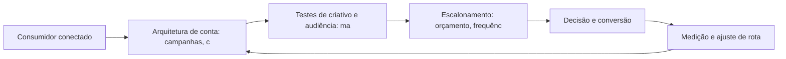

# Capítulo 19: Tráfego Pago em Escala: Estrutura, Teste e Otimização de Campanhas

## 1. Introdução

Bem-vindo a uma nova etapa da sua navegação pelo marketing digital. Este capítulo — *Tráfego Pago em Escala: Estrutura, Teste e Otimização de Campanhas* — integra a Parte IV, *Redes Sociais — Territórios de Comunidade*, e responde a uma pergunta prática: **arquitetura de conta: campanhas, conjuntos e estrutura por objetivo** — na prática, como isso se traduz em decisão e resultado?

Ao final, você será capaz de strutura operação de mídia paga escalável: arquitetura de contas, testes de criativo, escalonamento de orçamento e regras de otimização.. Mais do que decorar conceitos, você vai enxergar cada plataforma como território com geografia própria — e converter essa visão em plano, experimento e métrica.

No capítulo anterior, *Estratégia de Vídeo Vertical: Reels, Shorts e Conteúdo de Formato Curto*, você aprendeu os conceitos que servem de plataforma para o que vem agora. Este capítulo retoma esse repertório e o aplica a um território novo — sem repetir o que já foi estabelecido, apenas usando como base.

O capítulo segue a estrutura das sete seções que organizam esta obra: primeiro a exposição conceitual, depois a ilustração, a técnica aplicada, o exercício de aplicação e a conclusão operacional.

No contexto de *Tráfego Pago em Escala: Estrutura, Teste e Otimização de Campanhas*, a consistência de publicação importa mais que a frequência: marcas que publicam com regularidade e qualidade constroem expectativa, enquanto as que desaparecem entre posts perdem o hábito da audiência [11].

No contexto de *Tráfego Pago em Escala: Estrutura, Teste e Otimização de Campanhas*, as redes sociais são, simultaneamente, o maior canal de descoberta e o maior ambiente de prova social do marketing digital — a maioria dos consumidores descobre marcas nas redes antes de qualquer outro canal [15].
## 2. Explica

### Arquitetura de conta: campanhas, conjuntos e estrutura por objetivo

Quando o tema é *Tráfego Pago em Escala: Estrutura, Teste e Otimização de Campanhas*, o primeiro pilar — arquitetura de conta: campanhas, conjuntos e estrutura por objetivo — define o território conceitual. No TikTok, a criatividade nativa supera a produção cara: vídeos autênticos com hooks fortes performam melhor que anúncios polidos sem contexto da plataforma [14].

Na prática, arquitetura de conta: campanhas, conjuntos e estrutura por objetivo significa transformar a teoria em rotina operacional — exatamente o que *Tráfego Pago em Escala: Estrutura, Teste e Otimização de Campanhas* exige no dia a dia. A literatura de gestão é enfática: sem operacionalizar o conceito em checklist, responsável e métrica, ele permanece slide de apresentação [3]. Por isso a Parte IV propõe sempre o mesmo movimento: entender, traduzir em critério observável e decidir com dado.

### Testes de criativo e audiência: matriz e aprendizado

O segundo pilar — testes de criativo e audiência: matriz e aprendizado — conecta a estratégia à operação diária. Plataformas de nicho oferecem densidade de audiência: em comunidades pequenas e engajadas, cada publicação alcança uma proporção muito maior do público-alvo [11]. A experiência do consumidor se constrói na consistência entre canais e mensagens, e é essa consistência que transforma contato em relacionamento [16]. Organizações que tratam cada canal como silo perdem o fio condutor da jornada; as que operam o pilar com disciplina reduzem atrito e aumentam a taxa de avanço entre etapas [10].

### Escalonamento: orçamento, frequência e saturação

Fechando o tripé, escalonamento: orçamento, frequência e saturação é o que transforma a Parte IV em vantagem mensurável. As redes sociais concentram o maior tempo de atenção diário do consumidor conectado, e as plataformas transformaram esse tempo em infraestrutura de anúncios com segmentação granular [15]. O relato da indústria mostra que as empresas que sustentam resultado não são as que têm mais ferramentas, mas as que conseguem medir e ajustar a rota com frequência [8]. A métrica certa, escolhida antes da campanha, vale mais do que qualquer ferramenta cara instalada depois do fato [9].

### O Eixo Transversal do Capítulo

A Meta opera um dos maiores ecossistemas de anúncios do mundo, com segmentação por interesse, comportamento e públicos personalizados a partir de dados first-party [6]. Esse eixo conecta os três pilares e explica por que o capítulo os trata como um sistema, não como uma lista: cada pilar reforça o outro, e a omissão de qualquer um deles produz estratégia manca. O capítulo seguinte retomará esse eixo com novas ferramentas, agora com o vocabulário já estabelecido aqui.

Em síntese, o capítulo opera em três níveis: o conceitual (Arquitetura de conta: campanhas, conjuntos e estrutura por objetivo), o operacional (Testes de criativo e audiência: matriz e aprendizado) e o estratégico (Escalonamento: orçamento, frequência e saturação). O leitor que dominar os três estará apto a aplicar a Parte IV com autonomia [1]. A evidência reunida nesta seção sustenta cada recomendação prática das seções seguintes [2].

## 3. Ilustra

Vamos traduzir o capítulo em uma cena concreta, no contexto de *Tráfego Pago em Escala: Estrutura, Teste e Otimização de Campanhas*. Uma empresa de porte médio, com equipe enxuta e orçamento limitado, decide operar a Parte IV desta obra, *Redes Sociais — Territórios de Comunidade*. Na primeira semana, a equipe testa o conceito central do capítulo em um caso real: um cliente que pesquisou, comparou e decidiu comprar. O primeiro pilar — arquitetura de conta: campanhas, conjuntos e estrutura por objetivo — orienta o entendimento inicial do público; o segundo — testes de criativo e audiência: matriz e aprendizado — guia a escolha da rota de comunicação; e o terceiro fecha com a medição do resultado [2].

O diagrama abaixo representa o fluxo operacional proposto pelo capítulo — do consumidor conectado à decisão e ao ajuste contínuo de rota, com o público e a plataforma específicos do tema no centro da navegação:



Observe o laço de retorno: a medição alimenta o próximo ciclo de campanha. Essa é a diferença estrutural entre campanha e sistema — a campanha termina quando o orçamento acaba; o sistema aprende e se ajusta a cada ciclo [7]. No caso do tema *Tráfego Pago em Escala: Estrutura, Teste e Otimização de Campanhas*, esse laço é o que converte o investimento inicial em aprendizado acumulado para as próximas decisões [15].

## 4. Técnica

### A Matriz de Criativos e Audiências

A operação de tráfego pago em escala é uma matriz: combinar criativos e audiências, medir e descartar o que não performa. O código abaixo simula a matriz e ordena os vencedores.

```python
import itertools

def matriz_planejamento(criativos, audiencias):
    """Retorna combinações com custo por conversão estimado."""
    celulas = []
    for c, a in itertools.product(criativos, audiencias):
        # CTR e CVR simulados: variam por combinação
        ctr = 0.01 + (hash(c) % 30) / 1000
        cvr = 0.02 + (hash(a) % 20) / 1000
        cpc = 1.20
        custo_conv = cpc / (ctr * cvr)
        celulas.append({"criativo": c, "audiencia": a,
                        "custo_conversao": round(custo_conv, 2)})
    return sorted(celulas, key=lambda x: x["custo_conversao"])

criativos = ["hook_beneficio", "hook_prova", "hook_historico"]
audiencias = ["novos", "engajados", "lookalike"]
for top in matriz_planejamento(criativos, audiencias)[:3]:
    print(top)
```

A matriz evita o erro mais comum: investir todo o orçamento na primeira combinação antes de deixar o algoritmo aprender [6]. A disciplina vale para qualquer plataforma social [14].

O código acima é o núcleo técnico de *Tráfego Pago em Escala: Estrutura, Teste e Otimização de Campanhas*: validável, executável e adaptável ao contexto real do leitor. A prática recomendada é rodá-lo com dados próprios e usar a saída como insumo da próxima reunião de planejamento. Documentação oficial das plataformas reforça cada passo — da estrutura de campanhas [5] à configuração de eventos [12]. A leitura técnica deste capítulo complementa a exposição conceitual das seções anteriores e prepara os exercícios da seção seguinte.

## 5. Aplica

Conhecimento sem aplicação é conteúdo; aplicação sem reflexão é rotina. No contexto de *Tráfego Pago em Escala: Estrutura, Teste e Otimização de Campanhas*, os exercícios abaixo fecham o capítulo e preparam o terreno do próximo:

1. Defina a frequência de publicação ideal para a sua capacidade real de produção de conteúdo.
2. Responda a comentários de clientes nas redes por uma semana e registre as perguntas recorrentes.
3. Defina o tom de voz da sua marca e produza 5 posts de teste em uma única plataforma.
4. Estruture uma campanha Meta com um público personalizado e um criativo de vídeo vertical.

Dedique ao menos 30 minutos a um dos exercícios antes de avançar. O aprendizado desta obra é cumulativo: o mapa desenhado aqui será usado nos capítulos seguintes da Parte IV e nas partes subsequentes [3].

Complementando, cinco exercícios práticos adicionais consolidam o aprendizado de *Tráfego Pago em Escala: Estrutura, Teste e Otimização de Campanhas*:

1. Quanto tempo o seu público fica vendo o seu vídeo? Se for pouco, o problema é o hook?
2. Você tem público personalizado e retargeting configurados — ou depende só de segmentação por interesse?
3. Que conversa da sua audiência, hoje ignorada, poderia alimentar o seu próximo conteúdo?
4. Qual plataforma social concentra o seu público-alvo real — e quanto da sua produção está lá?
5. Seus criativos são feitos para a plataforma ou são o mesmo anúncio reutilizado em todos os lugares?

## Leitura Complementar Recomendada

Para aprofundar *Tráfego Pago em Escala: Estrutura, Teste e Otimização de Campanhas* além deste capítulo:

- Para aprofundar as redes sociais, o livro de Hollensen, Kotler e Opresnik (Social Media Marketing) cobre a estratégia e o ecossistema, e a documentação do Meta Business Help Center detalha a operação de anúncios [11] [6].

- Como complemento, o TikTok for Business e o LinkedIn Marketing Solutions documentam as particularidades de cada território [14] [13].

## Análise de Riscos e Mitigações

A aplicação de *Tráfego Pago em Escala: Estrutura, Teste e Otimização de Campanhas* envolve riscos identificáveis. A tabela de riscos abaixo relaciona cada ameaça à sua mitigação:

- Risco de métricas de vaidade: curtidas sem receita. Mitigação: conectar cada métrica social a resultado de negócio [8].
- Risco de crise não gerida: crítica viral sem resposta. Mitigação: protocolo de resposta e monitoramento diário [11].
- Risco de dependência algorítmica: o alcance muda com o algoritmo. Mitigação: lista própria e canal de propriedade como contrapeso [8].
- Risco de fadiga criativa: criativos saturados aumentam o custo. Mitigação: matriz de teste contínuo de criativos e audiências [6].

## Considerações de Implementação

d

## Exercício Integrador da Parte IV

m

Este exercício conecta o capítulo às demais partes da obra e deve ser revisto ao final da leitura completa.

## Aprofundamento Prático

O tema de *Tráfego Pago em Escala: Estrutura, Teste e Otimização de Campanhas* ganha potência quando levado ao nível operacional. Os quatro pontos abaixo aprofundam a aplicação prática:

- A escuta social é a inteligência da operação: monitorar menções, sentimentos e perguntas alimenta conteúdo, produto e atendimento — a comunidade fala e a marca precisa ouvir [11].

- A gestão de comunidade é trabalho contínuo de relacionamento: responder, reconhecer e dar voz aos clientes transforma audiência em defensores — o ativo social mais valioso da marca [11].

- O aprofundamento prático das redes começa pela definição do sistema de conteúdo: pilares, formatos e cadência por plataforma — o calendário é a manifestação operacional da estratégia [11].

- A leitura avançada do algoritmo de recomendação exige entender o sinal: retenção de vídeo é a moeda — hooks fortes, loops e legendas aumentam o tempo de visualização e a distribuição [14].

## Exercícios de Fixação

Para consolidar *Tráfego Pago em Escala: Estrutura, Teste e Otimização de Campanhas*, resolva os cinco exercícios abaixo — com caneta, papel e dados reais:

1. Produza um vídeo vertical com hook nos primeiros três segundos.
2. Configure um público personalizado e um retargeting na sua plataforma.
3. Registre as cinco perguntas mais frequentes da sua comunidade.
4. Compare o engajamento por plataforma da última quinzena.
5. Defina o tom de voz da sua marca em três adjetivos e teste em cinco posts.

## Autoavaliação do Capítulo

Autoavaliação: (1) Sei qual plataforma concentra o meu público real? (2) Meu calendário tem objetivo por peça? (3) Tenho público personalizado e retargeting configurados? (4) Meus vídeos têm hook nos primeiros três segundos? (5) Acompanho custo por resultado nas redes? Responda e priorize a primeira resposta negativa.

A primeira resposta negativa é o seu próximo passo natural — volte a ela na seção de aplicação deste capítulo e trabalhe o item até que a resposta seja sim.

## Problemas Comuns e Soluções Práticas

Aplicar *Tráfego Pago em Escala: Estrutura, Teste e Otimização de Campanhas* no mundo real esbarra em problemas recorrentes. Abaixo, cinco situações típicas com suas soluções — sintoma, causa e correção:

### Crise nas redes

Uma crítica viral saiu do controle. A solução é o protocolo: responder com transparência, velocidade adequada e tom definido — e documentar o aprendizado [11].

### Conteúdo sem estratégia

Postagens aleatórias sem objetivo. A solução é o calendário editorial com meta por peça: engajar, educar, converter ou provar [11].

### Engajamento em queda

A audiência para de interagir. A solução é rever o calendário, os formatos e o tom — e perguntar à própria audiência o que ela quer ver [11].

### Anúncios caros e sem retorno

Criativos saturados e audiências amplas inflam o custo. A solução é a matriz de criativos e audiências com teste e descarte sistemático [6].

### Audiência que não cresce

O alcance orgânico estagnou. A solução é variar formatos, hooks e horários, e usar o retargeting para capturar quem já interagiu [6].

## Aplicações por Setor

O tema de *Tráfego Pago em Escala: Estrutura, Teste e Otimização de Campanhas* ganha contornos diferentes em cada setor. A leitura setorial abaixo ajuda a adaptar os princípios ao seu contexto:

- Na moda, o vídeo e o visual lideram; na educação, o conteúdo educativo e o testemunho; na tecnologia B2B, o thought leadership e o caso técnico — o formato segue a decisão [11].

- No B2C, o Instagram e o TikTok dominam a descoberta; no B2B, o LinkedIn concentra os decisores; em serviços locais, o Facebook e o WhatsApp sustentam a conversa — a plataforma segue o público [11].

## Plano de Ação de 30 Dias

Para converter a leitura de *Tráfego Pago em Escala: Estrutura, Teste e Otimização de Campanhas* em resultado, execute um dos planos semanais abaixo — cada semana tem um objetivo e uma entrega:

### Plano de Ação — Opção 1

Semana 1 — Foco: defina a plataforma principal e o tom de voz.
Semana 2 — Conteúdo: produza cinco posts de teste e um vídeo vertical com hook.
Semana 3 — Público: configure um público personalizado e um retargeting.
Semana 4 — Campanha: lance o piloto pago com orçamento pequeno e criativo testado.

### Plano de Ação — Opção 2

Semana 1 — Escuta: observe a conversa da sua comunidade por uma semana e registre as dores.
Semana 2 — Calendário: monte duas semanas de conteúdo respondendo às dores reais.
Semana 3 — Relação: responda a comentários e mensagens, registrando as recorrentes.
Semana 4 — Medição: compare engajamento e resultado da quinzena e ajuste a rota.

## KPIs que Importam neste Capítulo

Para *Tráfego Pago em Escala: Estrutura, Teste e Otimização de Campanhas*, os KPIs que importam: alcance e engajamento, custo por resultado, taxa de retenção de vídeo e conversão atribuída por plataforma — a régua de cada território social [6].

Antes de encerrar, registre esses indicadores no seu painel de acompanhamento — eles serão a régua para medir a aplicação deste capítulo nas próximas semanas.

## Roteiro de Implementação Passo a Passo

Para aplicar *Tráfego Pago em Escala: Estrutura, Teste e Otimização de Campanhas* na prática, os roteiros abaixo organizam a sequência de ações — do diagnóstico à medição:

### Roteiro de Implementação 1

1. Defina o objetivo da presença social do trimestre em uma frase mensurável.
2. Escolha a plataforma principal onde o público-alvo realmente está.
3. Defina o tom de voz: como a marca fala, o que nunca diz e o que sempre diz.
4. Produza cinco posts de teste em uma semana e meça o engajamento.
5. Identifique os três formatos com melhor retenção e engajamento.
6. Produza um vídeo vertical com hook nos primeiros três segundos.
7. Monte o calendário editorial de duas semanas com objetivo por peça.
8. Configure um público personalizado e um retargeting no Gerenciador de Anúncios.
9. Lance uma campanha piloto com orçamento pequeno e criativo testado.
10. Meça custo por resultado, documente e decida o próximo ciclo.

### Roteiro de Implementação 2

1. Liste as plataformas onde a marca está e o público de cada uma.
2. Compare o engajamento e o resultado de cada plataforma na última quinzena.
3. Escolha a plataforma de nicho do seu mercado e observe as conversas por uma semana.
4. Registre as perguntas, dores e termos usados pela comunidade.
5. Produza conteúdo respondendo às dores reais, no formato da plataforma.
6. Defina a frequência de publicação sustentável para a capacidade real do time.
7. Responda a comentários e mensagens por uma semana, registrando as recorrentes.
8. Selecione três criadores do segmento e avalie fit, alcance e engajamento.
9. Defina o protocolo de resposta para críticas e elogios.
10. Agende a revisão mensal de métricas por plataforma.

## Perguntas Frequentes

Em relação ao tema de *Tráfego Pago em Escala: Estrutura, Teste e Otimização de Campanhas*, cinco perguntas surgem com frequência na prática profissional:

**Postar todo dia ou com qualidade?**

Consistência com qualidade: publicar com regularidade construindo expectativa vale mais que volume sem estratégia [11].

**Comprar seguidores adianta?**

Não — destrói o alcance real e a credibilidade. Métricas de vaidade não se convertem em receita [11].

**Tráfego pago é obrigatório?**

Não, mas acelera. Sem ele, o orgânico constrói com mais tempo; com ele, testa-se hipóteses mais rápido [6].

**Como medir o retorno do conteúdo?**

Atribuindo conversão: cada peça tem papel na jornada, e o modelo de atribuição distribui o crédito com justiça [12].

**Qual plataforma escolher?**

A que concentra o seu público-alvo real — e não a mais popular. Onde está a conversa da sua audiência? [11].

## Cenários Numéricos Comentados

Os cálculos abaixo mostram, com números concretos, como as decisões de *Tráfego Pago em Escala: Estrutura, Teste e Otimização de Campanhas* se traduzem em resultado:

### Cenário numérico: a matriz de criativos

Uma campanha com três criativos e três audiências gera nove combinações. Testar todas com orçamento igual revela que uma única combinação entrega custo por conversão 40% menor que a média. Concentrar 70% do orçamento no vencedor e manter o resto para aprendizado é a disciplina de escala da matriz [6].

### Cenário numérico: micro versus macro

Uma celebridade com 5 milhões de seguidores e engajamento de 0,2% alcança 10.000 interações. Um micro-influenciador com 50 mil seguidores e engajamento de 5% alcança 2.500 interações — mas com taxa de conversão cinco vezes maior pela confiança do nicho. O custo por venda, não o alcance, decide o vencedor [11].

## Como Este Capítulo se Integra à Obra

As redes sociais são o território de descoberta e prova social da jornada. A busca (Parte III) captura a intenção que as redes despertaram; o relacionamento (Parte V) converte a audiência em lista própria; e a conversão (Parte VII) fecha o ciclo que as redes iniciaram. No contexto de *Tráfego Pago em Escala: Estrutura, Teste e Otimização de Campanhas*, essa integração fica ainda mais visível: as ferramentas e métricas que você dominou aqui serão a base das decisões dos próximos capítulos — e das partes que virão depois.

## Aprofundamento Conceitual

No contexto de *Tráfego Pago em Escala: Estrutura, Teste e Otimização de Campanhas*, a escuta social alimenta o calendário editorial: as perguntas e dores da audiência são o melhor briefing de conteúdo que uma marca pode ter [11].

No contexto de *Tráfego Pago em Escala: Estrutura, Teste e Otimização de Campanhas*, a autenticidade superou o polimento: o consumidor conectado desconfia do perfeito e confia no real — e o conteúdo gerado por clientes (UGC) converte mais que o anúncio produzido [14].

No contexto de *Tráfego Pago em Escala: Estrutura, Teste e Otimização de Campanhas*, o ecossistema Meta é o maior laboratório de segmentação do mundo: dados de interesse, comportamento e relacionamento alimentam públicos que nenhum outro canal consegue igualar [6].

No contexto de *Tráfego Pago em Escala: Estrutura, Teste e Otimização de Campanhas*, o vídeo vertical não é uma moda: é a resposta ao comportamento — a maioria do consumo social acontece no celular, com o som desligado e em sessões curtas, e o formato se adapta a isso [14].

No contexto de *Tráfego Pago em Escala: Estrutura, Teste e Otimização de Campanhas*, o algoritmo de recomendação do TikTok e dos Reels recompensa a retenção: vídeos que prendem até o fim entram em loops de distribuição massiva — o que torna o hook (primeiros 3 segundos) a decisão criativa mais importante [14].

## Fundamentos em Detalhe

No contexto de *Tráfego Pago em Escala: Estrutura, Teste e Otimização de Campanhas*, o vídeo vertical redefiniu a criatividade: hooks nos primeiros segundos, loops, legendas e autenticidade superam produção cara sem estratégia nativa [14].

No contexto de *Tráfego Pago em Escala: Estrutura, Teste e Otimização de Campanhas*, a segmentação social combina interesse, comportamento e dados próprios: públicos personalizados, lookalikes e retargeting formam a espinha dorsal de uma operação de mídia social madura [6].

No contexto de *Tráfego Pago em Escala: Estrutura, Teste e Otimização de Campanhas*, o marketing de influência transfere confiança em vez de criá-la: a credibilidade do criador com sua audiência é o ativo que a marca compra — e por isso a seleção do criador é a decisão mais importante da parceria [11].

No contexto de *Tráfego Pago em Escala: Estrutura, Teste e Otimização de Campanhas*, as comunidades de nicho — grupos, fóruns e subreddits — oferecem densidade de audiência inigualável: cada publicação alcança uma proporção muito maior do público-alvo do que em canais de massa [11].

No contexto de *Tráfego Pago em Escala: Estrutura, Teste e Otimização de Campanhas*, a escuta social transforma conversa em dado: monitorar menções, sentimentos e perguntas da audiência alimenta conteúdo, produto e atendimento com inteligência real de mercado [3].

## Estudos de Caso Aplicados

### Caso: a marca de moda que acertou o TikTok pelo hook

Uma marca de moda feminina produzia vídeos polidos que não decolavam. A análise mostrou que os primeiros segundos perdiam a audiência. A equipe passou a criar hooks de curiosidade ("por que essa calça veste diferente"), legendas automáticas e loops de repetição. O alcance orgânico disparou, e um único vídeo viral gerou fila de espera para um produto que não era o foco da campanha [14].

### Caso: o B2B que construiu autoridade no LinkedIn

Uma empresa de software B2B sofria para gerar leads qualificados. Em vez de mais anúncios, o time passou a publicar thought leadership: dados de mercado, casos reais e opiniões fundamentadas no LinkedIn dos fundadores e especialistas. O perfil da marca cresceu em autoridade, e os leads passaram a chegar mais qualificados — reduzindo o ciclo de venda e o custo por oportunidade [13].

## Dados e Números do Setor

### Indicadores-Chave

- Alcance, engajamento e custo por resultado são as métricas sociais centrais [11].
- O custo por clique varia por plataforma, formato e segmentação [6].
- A taxa de retenção de vídeo é a métrica que alimenta a distribuição algorítmica [14].

### Dados de Contexto

- As redes sociais concentram o maior tempo de atenção diário do consumidor conectado [15].
- A Meta opera um dos maiores ecossistemas de anúncios do mundo [6].
- O vídeo curto domina o engajamento nas plataformas de recomendação [14].
- O LinkedIn é o território B2B de decisores e tomadores de compra [13].

## Análise Comparativa

O tema de *Tráfego Pago em Escala: Estrutura, Teste e Otimização de Campanhas* fica mais claro quando contrastado com a alternativa mais próxima. A comparação abaixo organiza as diferenças:

### Orgânico vs. Pago Social

- Orgânico constrói audiência e confiança; pago amplia alcance com precisão.
- Orgânico é lento e cumulativo; pago é rápido e mensurável por campanha.
- Pago depende de dados first-party; orgânico depende de consistência.
- A operação madura combina os dois com proporção definida por objetivo.

## Erros Comuns e Como Evitá-los

No tema de *Tráfego Pago em Escala: Estrutura, Teste e Otimização de Campanhas*, cinco erros recorrentes merecem atenção especial — cada um com sua correção prática:

1. Repetir o mesmo criativo até a exaustão: a fadiga criativa aumenta o custo por resultado.
2. Comprar seguidores: métricas de vaidade que destroem a credibilidade e o alcance real.
3. Ignorar a comunidade: responder só quando há crise perde o valor da conversa contínua.
4. Escalar orçamento antes de validar: aumentar a verba de uma combinação não testada multiplica o prejuízo.
5. Produzir para todas as plataformas ao mesmo tempo: sem foco, nenhuma audiência se forma.

## Ferramentas e Recursos Recomendados

Para operar o tema de *Tráfego Pago em Escala: Estrutura, Teste e Otimização de Campanhas* na prática, a seguinte seleção de ferramentas cobre o ciclo completo — do diagnóstico à medição:

1. Gerenciador de Anúncios da Meta (públicos e criativos)
2. Editor de vídeo vertical (Reels/TikTok)
3. Plataforma de agendamento social
4. Ferramenta de escuta social (menções e sentimento)
5. TikTok Creative Center (tendências e hooks)

## Glossário do Capítulo

Os termos abaixo — todos usados no corpo deste capítulo — formam o vocabulário mínimo para acompanhar o restante da obra:

Pixel: rastreador de conversão da plataforma. Público personalizado: audiência construída com dados próprios. Lookalike: audiência semelhante a uma base. Hook: abertura de vídeo que prende atenção. UGC: conteúdo gerado pelo usuário. Engajamento: interações sobre a publicação.

## Checklist de Implementação

Use a lista abaixo para auditar a aplicação de *Tráfego Pago em Escala: Estrutura, Teste e Otimização de Campanhas* na sua operação — marque os itens já concluídos e priorize os pendentes:

- [ ] Escuta social iniciada
- [ ] Tom de voz definido e testado
- [ ] Campanha Meta com público personalizado
- [ ] Vídeo vertical com hook nos 3 primeiros segundos
- [ ] Calendário social com objetivo por peça

## Perguntas para Reflexão

Antes de avançar, reflita sobre as cinco questões abaixo — elas conectam o conteúdo de *Tráfego Pago em Escala: Estrutura, Teste e Otimização de Campanhas* ao seu contexto real de trabalho:

1. Você tem público personalizado e retargeting configurados — ou depende só de segmentação por interesse?
2. Que conversa da sua audiência, hoje ignorada, poderia alimentar o seu próximo conteúdo?
3. Qual plataforma social concentra o seu público-alvo real — e quanto da sua produção está lá?
4. Seus criativos são feitos para a plataforma ou são o mesmo anúncio reutilizado em todos os lugares?
5. Quanto tempo o seu público fica vendo o seu vídeo? Se for pouco, o problema é o hook?

## Quadro Comparativo: Plataformas Sociais e Papel no Funil

O quadro abaixo consolida os elementos essenciais de *Tráfego Pago em Escala: Estrutura, Teste e Otimização de Campanhas* em perspectiva comparada, facilitando a consulta rápida e a tomada de decisão:

| Plataforma | Papel principal | Formato forte |
|---|---|---|
| Plataforma | Papel principal | Formato forte |
| Instagram | Descoberta e prova | Visual e Reels |
| TikTok | Viralização e descoberta | Vídeo curto |
| LinkedIn | Autoridade B2B | Texto e thought leadership |
| YouTube | Educação e busca | Vídeo longo |
| WhatsApp | Conversão e atendimento | Mensagem direta |

## 6. Conclusão

O capítulo percorreu o território da Parte IV, *Redes Sociais — Territórios de Comunidade*, e deixou três aprendizados operacionais. Primeiro, o conceito central — *Tráfego Pago em Escala: Estrutura, Teste e Otimização de Campanhas* — é menos uma novidade e mais uma disciplina de execução. Segundo, a aplicação exige a tríade conceito, rota e métrica, sem pular etapas [8]. Terceiro, o ajuste contínuo de rota, ilustrado no laço de retorno do diagrama, é o que separa campanhas pontuais de operações sustentáveis [7]. O caminho percorrido desde *Estratégia de Vídeo Vertical: Reels, Shorts e Conteúdo de Formato Curto* até aqui forma a base que o próximo passo vai usar. No próximo capítulo, *Plataformas de Nicho e Comunidades: Pinterest, X/Twitter, Reddit e Grupos*, você avançará sobre o território vizinho levando as ferramentas exercitadas aqui.

Como navegador de marketing digital, você não decorou uma fórmula — incorporou um modo de operar: ler o território, escolher a rota com dados e ajustar o percurso quando o vento muda [2].

Antes do fechamento, vale reforçar a base do capítulo: No contexto de *Tráfego Pago em Escala: Estrutura, Teste e Otimização de Campanhas*, a gestão de comunidade é a diferença entre audiência e fãs: responder, reconhecer e dar voz aos clientes transforma seguidores em defensores — e defesa é o ativo social mais valioso [11].

No contexto de *Tráfego Pago em Escala: Estrutura, Teste e Otimização de Campanhas*, as plataformas de nicho — Pinterest, Reddit, X, grupos — oferecem densidade: menos pessoas, mas exatamente o público-alvo, com conversa de alta qualidade e custo de atenção menor [11].
## 7. Referências Bibliográficas

[1] KOTLER, Philip; KELLER, Kevin Lane. **Administração de Marketing**. 15. ed. São Paulo: Pearson, 2016.
[2] KOTLER, Philip; KARTAJAYA, Hermawan; SETIAWAN, Iwan. **Marketing 4.0: Moving from Traditional to Digital**. Hoboken: Wiley, 2017.
[3] CHAFFEY, Dave; ELLIS-CHADWICK, Fiona. **Digital Marketing: Strategy, Implementation and Practice**. 9. ed. Harlow: Pearson, 2025.
[4] GOOGLE SEARCH CENTRAL. **Search Engine Optimization (SEO) Starter Guide**. Disponível em: https://developers.google.com/search/docs/fundamentals/seo-starter-guide. Acesso em: 02 ago. 2026.
[5] GOOGLE ADS HELP CENTER. **Your guide to Google Ads (Basics, Search Campaigns & Best Practices)**. Disponível em: https://support.google.com/google-ads/answer/6146252. Acesso em: 02 ago. 2026.
[6] META BUSINESS HELP CENTER. **Meta Ads Manager Guide: Best Practices for Targeting, Measurement, and Optimization**. Disponível em: https://www.facebook.com/business/help. Acesso em: 02 ago. 2026.
[7] DELOITTE DIGITAL. **Marketing Trends 2026: New Marketing for a New World**. Disponível em: https://www.deloittedigital.com/nl/en/insights/perspective/marketing-trends-2026.html. Acesso em: 02 ago. 2026.
[8] HUBSPOT RESEARCH. **The State of Marketing / 2026 Marketing Statistics, Trends & Data**. Disponível em: https://www.hubspot.com/marketing-statistics. Acesso em: 02 ago. 2026.
[9] STATISTA RESEARCH DEPARTMENT. **Global Digital Marketing and Advertising Revenue Statistics & Facts**. Disponível em: https://www.statista.com/topics/8954/marketing-worldwide/. Acesso em: 02 ago. 2026.
[10] RYAN, Damian. **Understanding Digital Marketing: Marketing Strategies for Engaging the Digital Generation**. 5. ed. London: Kogan Page, 2020.
[11] HOLLENSEN, Svend; KOTLER, Philip; OPRESNIK, Marc Oliver. **Social Media Marketing: A Practitioner Approach**. 4. ed. Harlow: Pearson, 2023.
[12] GOOGLE ANALYTICS HELP CENTER. **Documentação oficial do Google Analytics 4**. Disponível em: https://support.google.com/analytics. Acesso em: 02 ago. 2026.
[13] LINKEDIN MARKETING SOLUTIONS. **Best Practices para campanhas B2B no LinkedIn**. Disponível em: https://business.linkedin.com/marketing-solutions. Acesso em: 02 ago. 2026.
[14] TIKTOK FOR BUSINESS. **Guia de criatividade e boas práticas de anúncios no TikTok**. Disponível em: https://www.tiktok.com/business. Acesso em: 02 ago. 2026.
[15] DATAREPORTAL. **Digital 2026: Global Overview Report**. Disponível em: https://datareportal.com/reports/digital-2026-global-overview-report. Acesso em: 02 ago. 2026.
[16] LEMON, Katherine N.; VERHOEF, Peter C. **Understanding Customer Experience Throughout the Customer Journey**. *Journal of Marketing*, v. 80, n. 6, p. 69-96, 2016.
[17] TIWARI, Rajnish; BUSE, Stephan; HERSTATT, Cornelius. **From Electronic to Mobile Commerce: Opportunities and Challenges**. *Proceedings of the German-Indian Roundtable*, 2006.
[18] VAN DIJK, Jan A. G. M. **The Digital Divide**. Cambridge: Polity Press, 2020.
[19] IBM. **Marketing with AI: Personalization at Scale**. Disponível em: https://www.ibm.com/think/topics/ai-marketing. Acesso em: 02 ago. 2026.
[20] KOTLER, Philip. **Marketing 5.0: Technology for Humanity**. Hoboken: Wiley, 2021.
