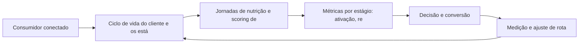

# Capítulo 23: Lifecycle Marketing: Nutrição e Ciclo de Vida do Cliente

## 1. Introdução

Bem-vindo a uma nova etapa da sua navegação pelo marketing digital. Este capítulo — *Lifecycle Marketing: Nutrição e Ciclo de Vida do Cliente* — integra a Parte V, *Relacionamento — A Rota da Retenção*, e responde a uma pergunta prática: **ciclo de vida do cliente e os estágios do relacionamento** — na prática, como isso se traduz em decisão e resultado?

Ao final, você será capaz de desenha jornadas de nutrição por ciclo de vida — aquisição, ativação, receita, retenção e reativação — com mensagens e métricas próprias.. Mais do que decorar conceitos, você vai enxergar o relacionamento como rota de retenção e recompra — e converter essa visão em plano, experimento e métrica.

No capítulo anterior, *Content Marketing e Inbound: Atração Baseada em Valor*, você aprendeu os conceitos que servem de plataforma para o que vem agora. Este capítulo retoma esse repertório e o aplica a um território novo — sem repetir o que já foi estabelecido, apenas usando como base.

O capítulo segue a estrutura das sete seções que organizam esta obra: primeiro a exposição conceitual, depois a ilustração, a técnica aplicada, o exercício de aplicação e a conclusão operacional.

No contexto de *Lifecycle Marketing: Nutrição e Ciclo de Vida do Cliente*, a entregabilidade é a condição de existência do e-mail: reputação de remetente, autenticação (SPF, DKIM, DMARC) e higiene de lista determinam se a mensagem chega à caixa de entrada ou ao spam [8].

No contexto de *Lifecycle Marketing: Nutrição e Ciclo de Vida do Cliente*, o consentimento estruturou o relacionamento digital: LGPD e GDPR exigiram base legal, transparência e direito de exclusão, transformando a lista comprada em risco legal e a lista própria em ativo [7].
## 2. Explica

### Ciclo de vida do cliente e os estágios do relacionamento

Quando o tema é *Lifecycle Marketing: Nutrição e Ciclo de Vida do Cliente*, o primeiro pilar — ciclo de vida do cliente e os estágios do relacionamento — define o território conceitual. O inbound marketing estrutura a atração por valor: conteúdo que educa antes de vender, convertendo curiosidade em confiança e confiança em compra [3].

Na prática, ciclo de vida do cliente e os estágios do relacionamento significa transformar a teoria em rotina operacional — exatamente o que *Lifecycle Marketing: Nutrição e Ciclo de Vida do Cliente* exige no dia a dia. A literatura de gestão é enfática: sem operacionalizar o conceito em checklist, responsável e métrica, ele permanece slide de apresentação [3]. Por isso a Parte V propõe sempre o mesmo movimento: entender, traduzir em critério observável e decidir com dado.

### Jornadas de nutrição e scoring de engajamento

O segundo pilar — jornadas de nutrição e scoring de engajamento — conecta a estratégia à operação diária. O ciclo de vida do cliente — aquisição, ativação, receita, retenção e reativação — transforma e-mail e conteúdo em jornadas orquestradas em vez de disparos aleatórios [10]. A experiência do consumidor se constrói na consistência entre canais e mensagens, e é essa consistência que transforma contato em relacionamento [16]. Organizações que tratam cada canal como silo perdem o fio condutor da jornada; as que operam o pilar com disciplina reduzem atrito e aumentam a taxa de avanço entre etapas [10].

### Métricas por estágio: ativação, retenção e reativação

Fechando o tripé, métricas por estágio: ativação, retenção e reativação é o que transforma a Parte V em vantagem mensurável. A entregabilidade é a métrica que antecede todas as outras no e-mail: uma lista mal higienizada destrói reputação de remetente e enterra campanhas [8]. O relato da indústria mostra que as empresas que sustentam resultado não são as que têm mais ferramentas, mas as que conseguem medir e ajustar a rota com frequência [8]. A métrica certa, escolhida antes da campanha, vale mais do que qualquer ferramenta cara instalada depois do fato [9].

### O Eixo Transversal do Capítulo

Automação de marketing não é disparo em massa: é sequência condicional em que cada próximo passo depende do comportamento do assinante [3]. Esse eixo conecta os três pilares e explica por que o capítulo os trata como um sistema, não como uma lista: cada pilar reforça o outro, e a omissão de qualquer um deles produz estratégia manca. O capítulo seguinte retomará esse eixo com novas ferramentas, agora com o vocabulário já estabelecido aqui.

Em síntese, o capítulo opera em três níveis: o conceitual (Ciclo de vida do cliente e os estágios do relacionamento), o operacional (Jornadas de nutrição e scoring de engajamento) e o estratégico (Métricas por estágio: ativação, retenção e reativação). O leitor que dominar os três estará apto a aplicar a Parte V com autonomia [1]. A evidência reunida nesta seção sustenta cada recomendação prática das seções seguintes [2].

## 3. Ilustra

Vamos traduzir o capítulo em uma cena concreta, no contexto de *Lifecycle Marketing: Nutrição e Ciclo de Vida do Cliente*. Uma empresa de porte médio, com equipe enxuta e orçamento limitado, decide operar a Parte V desta obra, *Relacionamento — A Rota da Retenção*. Na primeira semana, a equipe testa o conceito central do capítulo em um caso real: um cliente que pesquisou, comparou e decidiu comprar. O primeiro pilar — ciclo de vida do cliente e os estágios do relacionamento — orienta o entendimento inicial do público; o segundo — jornadas de nutrição e scoring de engajamento — guia a escolha da rota de comunicação; e o terceiro fecha com a medição do resultado [2].

O diagrama abaixo representa o fluxo operacional proposto pelo capítulo — do consumidor conectado à decisão e ao ajuste contínuo de rota, com o público e a plataforma específicos do tema no centro da navegação:



Observe o laço de retorno: a medição alimenta o próximo ciclo de campanha. Essa é a diferença estrutural entre campanha e sistema — a campanha termina quando o orçamento acaba; o sistema aprende e se ajusta a cada ciclo [7]. No caso do tema *Lifecycle Marketing: Nutrição e Ciclo de Vida do Cliente*, esse laço é o que converte o investimento inicial em aprendizado acumulado para as próximas decisões [15].

## 4. Técnica

### A Segmentação do Relacionamento

O e-mail e a automação só performam com segmentação. O código abaixo classifica assinantes por engajamento e sugere a jornada de nutrição de cada grupo.

```python
def segmentar(aberturas: int, cliques: int, dias_ativos: int) -> str:
    """Classifica assinante por nível de engajamento."""
    if aberturas >= 5 and cliques >= 2:
        return "quente"      # prioridade: oferta e advocacy
    if aberturas >= 2:
        return "morno"       # prioridade: nutrição com conteúdo
    if dias_ativos > 60:
        return "frio"        # prioridade: reativação com incentivo
    return "novo"            # prioridade: onboarding e boas-vindas

for a, c, d in [(8, 3, 40), (3, 1, 90), (1, 0, 200), (0, 0, 5)]:
    print(segmentar(a, c, d))
```

Cada segmento recebe uma sequência diferente — o mesmo conteúdo enviado a todos é a definição operacional de spam irrelevante [8]. O consentimento governa toda a operação [7].

O código acima é o núcleo técnico de *Lifecycle Marketing: Nutrição e Ciclo de Vida do Cliente*: validável, executável e adaptável ao contexto real do leitor. A prática recomendada é rodá-lo com dados próprios e usar a saída como insumo da próxima reunião de planejamento. Documentação oficial das plataformas reforça cada passo — da estrutura de campanhas [5] à configuração de eventos [12]. A leitura técnica deste capítulo complementa a exposição conceitual das seções anteriores e prepara os exercícios da seção seguinte.

## 5. Aplica

Conhecimento sem aplicação é conteúdo; aplicação sem reflexão é rotina. No contexto de *Lifecycle Marketing: Nutrição e Ciclo de Vida do Cliente*, os exercícios abaixo fecham o capítulo e preparam o terreno do próximo:

1. Defina sua estratégia de consentimento: base legal, preferências do assinante e direito de exclusão.
2. Segmente sua lista atual por engajamento e desenhe uma nutrição específica para o segmento mais frio.
3. Escreva um e-mail de reativação para assinantes inativos e defina o incentivo e a métrica de sucesso.
4. Mapeie os cinco gatilhos de automação de maior valor para o seu modelo de negócio.

Dedique ao menos 30 minutos a um dos exercícios antes de avançar. O aprendizado desta obra é cumulativo: o mapa desenhado aqui será usado nos capítulos seguintes da Parte V e nas partes subsequentes [3].

Complementando, cinco exercícios práticos adicionais consolidam o aprendizado de *Lifecycle Marketing: Nutrição e Ciclo de Vida do Cliente*:

1. Quanto da sua receita vem de clientes que recompram? O que isso diz sobre a sua jornada de retenção?
2. Sua lista de e-mail é um ativo seu — ou você depende de canais que não controla?
3. Você pede consentimento explícito e entrega o que prometeu? Sua lista passaria numa auditoria de LGPD?
4. Cada e-mail seu tem um único objetivo claro, ou tenta fazer tudo ao mesmo tempo?
5. Sua automação reage ao comportamento do assinante ou é um disparo cego em sequência fixa?

## Leitura Complementar Recomendada

Para aprofundar *Lifecycle Marketing: Nutrição e Ciclo de Vida do Cliente* além deste capítulo:

- Para aprofundar o relacionamento, Chaffey trata o e-mail e a automação no contexto da estratégia digital, e Ryan (Understanding Digital Marketing) cobre o inbound e o lifecycle [3] [10].

- Como complemento, os dados da HubSpot sobre retorno do e-mail e comportamento de assinantes contextualizam as métricas deste capítulo [8].

## Análise de Riscos e Mitigações

A aplicação de *Lifecycle Marketing: Nutrição e Ciclo de Vida do Cliente* envolve riscos identificáveis. A tabela de riscos abaixo relaciona cada ameaça à sua mitigação:

- Risco de irrelevância: envio em massa sem segmentação. Mitigação: segmentação por comportamento e receita por envio como régua [8].
- Risco de automação fria: sequências sem condição. Mitigação: jornadas condicionais que reagem ao comportamento [3].
- Risco de reputação de remetente: entregabilidade destruída por reclamações. Mitigação: higiene de lista, autenticação e volume consistente [8].
- Risco legal: lista sem consentimento. Mitigação: base legal documentada e revogação funcional [7].

## Considerações de Implementação

e

## Exercício Integrador da Parte V

a

Este exercício conecta o capítulo às demais partes da obra e deve ser revisto ao final da leitura completa.

## Aprofundamento Prático

O tema de *Lifecycle Marketing: Nutrição e Ciclo de Vida do Cliente* ganha potência quando levado ao nível operacional. Os quatro pontos abaixo aprofundam a aplicação prática:

- O aprofundamento prático do e-mail começa pela higiene de lista: remover inativos, validar endereços e monitorar reclamações — a saúde da lista é a condição de entregabilidade [8].

- A leitura avançada da automação exige o desenho de jornadas condicionais: cada fluxo deve ter gatilho, passos, ramificações e saída — e cada passo deve entregar valor antes de pedir ação [3].

- O conteúdo pilar é a máquina de reutilização: um tema-mestre profundo gera dezenas de variações, e o ciclo de reutilização é o que multiplica o retorno de cada ideia [3].

- O consentimento é gestão contínua: revisar textos, manter a documentação de base legal e garantir a revogação funcional — o respeito à privacidade é um processo, não um formulário [7].

## Exercícios de Fixação

Para consolidar *Lifecycle Marketing: Nutrição e Ciclo de Vida do Cliente*, resolva os cinco exercícios abaixo — com caneta, papel e dados reais:

1. Defina sua política de consentimento: base legal, finalidades, revogação.
2. Produza um conteúdo pilar e derive cinco variações.
3. Audite a entregabilidade da sua lista (SPF, DKIM, reclamações).
4. Segmente sua lista por engajamento e desenhe uma nutrição para o segmento frio.
5. Escreva um e-mail de boas-vindas com um único objetivo e CTA.

## Autoavaliação do Capítulo

Autoavaliação: (1) Minha lista foi construída com consentimento explícito? (2) Minha entregabilidade está verificada (SPF, DKIM, reclamações)? (3) Minha lista está segmentada por engajamento? (4) Minhas automações reagem ao comportamento? (5) Sei a receita por envio de cada fluxo? Responda e priorize a primeira resposta negativa.

A primeira resposta negativa é o seu próximo passo natural — volte a ela na seção de aplicação deste capítulo e trabalhe o item até que a resposta seja sim.

## Problemas Comuns e Soluções Práticas

Aplicar *Lifecycle Marketing: Nutrição e Ciclo de Vida do Cliente* no mundo real esbarra em problemas recorrentes. Abaixo, cinco situações típicas com suas soluções — sintoma, causa e correção:

### E-mails indo para o spam

A entregabilidade caiu por reputação ou higiene. A solução é autenticar (SPF/DKIM/DMARC), higienizar a lista e reduzir reclamações — o remetente recupera a reputação [8].

### Lista parada

Assinantes inertes e sem resposta. A solução é segmentar por engajamento, reativar os frios com incentivo e descartar os irreversíveis — a lista saudável vale mais que a grande [8].

### Automação que não converte

Sequências fixas sem condição desperdiçam oportunidade. A solução é condicionar cada passo ao comportamento: abriu, clicou, comprou — a relevância sobe com a reação [3].

### Conteúdo sem retorno

Produção alta sem receita atribuída. A solução é conectar cada peça a um CTA e a uma etapa do funil, e medir a conversão por conteúdo [3].

### Descadastro em alta

A frequência ou a relevância está errada. A solução é testar frequências, segmentar melhor e ouvir o feedback — o descadastro cai quando a entrega vale o tempo do leitor [8].

## Aplicações por Setor

O tema de *Lifecycle Marketing: Nutrição e Ciclo de Vida do Cliente* ganha contornos diferentes em cada setor. A leitura setorial abaixo ajuda a adaptar os princípios ao seu contexto:

- Na educação, o inbound transforma curiosidade em matrícula; no software, transforma trial em assinatura; no varejo, transforma leitura em recompra — o valor entregue antes da venda define o ritmo [3].

- No e-commerce, o e-mail recupera carrinho e gera receita recorrente; no B2B, nutre o ciclo longo com conteúdo técnico; no serviço, sustenta o relacionamento e a recompra — o canal é o mesmo, a jornada muda [8].

## Plano de Ação de 30 Dias

Para converter a leitura de *Lifecycle Marketing: Nutrição e Ciclo de Vida do Cliente* em resultado, execute um dos planos semanais abaixo — cada semana tem um objetivo e uma entrega:

### Plano de Ação — Opção 1

Semana 1 — Lista: audite a lista atual e defina a política de consentimento.
Semana 2 — Segmentação: separe por engajamento (quente, morno, frio, novo).
Semana 3 — Fluxo: desenhe a boas-vindas de cinco e-mails com um objetivo por envio.
Semana 4 — Lançamento: envie em piloto, meça open, CTR e receita, e ajuste.

### Plano de Ação — Opção 2

Semana 1 — Pilares: defina os três a cinco pilares de conteúdo do seu mercado.
Semana 2 — Conteúdo: produza um conteúdo pilar profundo para a pergunta mais importante.
Semana 3 — Variações: derive dez variações para blog, social, e-mail e vídeo.
Semana 4 — Distribuição: publique com CTA por peça e meça o retorno por formato.

## KPIs que Importam neste Capítulo

Para *Lifecycle Marketing: Nutrição e Ciclo de Vida do Cliente*, os KPIs que importam: open rate, CTR e receita por envio, entregabilidade, descadastro e retenção da lista — os números do relacionamento de longo prazo [8].

Antes de encerrar, registre esses indicadores no seu painel de acompanhamento — eles serão a régua para medir a aplicação deste capítulo nas próximas semanas.

## Roteiro de Implementação Passo a Passo

Para aplicar *Lifecycle Marketing: Nutrição e Ciclo de Vida do Cliente* na prática, os roteiros abaixo organizam a sequência de ações — do diagnóstico à medição:

### Roteiro de Implementação 1

1. Audite sua lista atual: quem é, como chegou, quando interagiu pela última vez.
2. Defina a política de consentimento: base legal, finalidades e processo de exclusão.
3. Segmente a lista por engajamento: quente, morno, frio, novo.
4. Desenhe o fluxo de boas-vindas com cinco e-mails e um objetivo por envio.
5. Escreva a nutrição para o segmento morno com conteúdo educativo.
6. Crie o fluxo de reativação para o frio com um incentivo definido.
7. Configure os gatilhos de automação de maior valor (carrinho, pós-compra, aniversário).
8. Verifique a entregabilidade: SPF, DKIM, DMARC e reputação do domínio.
9. Lance o fluxo de boas-vindas em piloto e meça open, CTR e receita.
10. Revise as métricas mensalmente e itere o conteúdo com base nos dados.

### Roteiro de Implementação 2

1. Defina os pilares de conteúdo: três a cinco temas-mestres do seu mercado.
2. Para cada pilar, liste as dez perguntas que o público faz.
3. Produza um conteúdo pilar profundo para a pergunta mais importante.
4. Derive dez variações: blog, vídeo, social, e-mail, infográfico, podcast.
5. Monte o calendário editorial de 30 dias com as variações distribuídas.
6. Defina a distribuição: onde cada variação será publicada e com qual CTA.
7. Reutilize o conteúdo: transforme capítulos em posts e posts em e-mails.
8. Meça por peça: alcance, engajamento, cliques e conversão atribuída.
9. Identifique o formato de melhor retorno e dobre a aposta nele.
10. Documente o ciclo de reutilização para acelerar a produção futura.

## Perguntas Frequentes

Em relação ao tema de *Lifecycle Marketing: Nutrição e Ciclo de Vida do Cliente*, cinco perguntas surgem com frequência na prática profissional:

**O que é entregabilidade?**

A capacidade de chegar à caixa de entrada — depende de reputação, autenticação e higiene da lista [8].

**Inbound serve para B2B?**

Serve e é o método mais eficaz: o decisor B2B pesquisa, educa-se e só então fala com vendas — o inbound acompanha esse caminho [3].

**E-mail morreu?**

Ao contrário: continua entre os canais de maior retorno por investimento — o que morreu foi o disparo em massa sem segmentação [8].

**Posso comprar uma lista pronta?**

Não — além de violar a LGPD, gera reclamações, destruição de reputação e entregabilidade em queda [7].

**Qual a frequência ideal de envio?**

A que a sua base tolera com relevância: teste frequências e observe descadastro e receita por envio [8].

## Cenários Numéricos Comentados

Os cálculos abaixo mostram, com números concretos, como as decisões de *Lifecycle Marketing: Nutrição e Ciclo de Vida do Cliente* se traduzem em resultado:

### Cenário numérico: receita por envio

Uma lista de 10.000 assinantes segmentada entrega open de 40%, CTR de 5% e conversão de 3% — cerca de 60 vendas por envio. A mesma lista sem segmentação cai para open de 15%, CTR de 1% e conversão de 1% — 15 vendas. A segmentação quadruplica a receita por envio sem custo adicional de lista [8].

### Cenário numérico: o custo do consentimento

Adquirir um assinante via conteúdo custa em média R$ 1,50; via anúncio, R$ 5,00. Uma lista própria de 20.000 assinantes representa, portanto, um ativo de R$ 30 mil a R$ 100 mil — e, diferentemente de mídia, esse ativo não expira quando o orçamento acaba [8].

## Como Este Capítulo se Integra à Obra

O relacionamento é a rota da retenção, mas depende do que as partes anteriores construíram: a jornada (II) mapeia o cliente, a busca e as redes (III e IV) o atraem, e o relacionamento o converte em receita recorrente. As partes de métricas (VIII) e economia (IX) medem o valor desse relacionamento. No contexto de *Lifecycle Marketing: Nutrição e Ciclo de Vida do Cliente*, essa integração fica ainda mais visível: as ferramentas e métricas que você dominou aqui serão a base das decisões dos próximos capítulos — e das partes que virão depois.

## Aprofundamento Conceitual

No contexto de *Lifecycle Marketing: Nutrição e Ciclo de Vida do Cliente*, o e-mail é o canal de maior retorno por investimento do marketing digital, desde que respeite as regras de entregabilidade e segmentação: a disciplina de higiene de lista é a condição de existência do canal [8].

No contexto de *Lifecycle Marketing: Nutrição e Ciclo de Vida do Cliente*, o consentimento estruturou o relacionamento: LGPD e GDPR tornaram obrigatórias a base legal, a transparência e a possibilidade de revogação — transformando o respeito à privacidade em diferencial competitivo [7].

No contexto de *Lifecycle Marketing: Nutrição e Ciclo de Vida do Cliente*, a automação condicional é a essência do lifecycle marketing: cada e-mail da sequência decide o próximo passo com base no comportamento do assinante — abriu, clicou, comprou ou ficou inerte [3].

No contexto de *Lifecycle Marketing: Nutrição e Ciclo de Vida do Cliente*, o inbound é uma arquitetura de confiança: conteúdo educativo atrai no topo, materiais ricos convertem no meio e provas e cases fecham na base — cada etapa entrega valor antes de pedir compromisso [3].

No contexto de *Lifecycle Marketing: Nutrição e Ciclo de Vida do Cliente*, a segmentação comportamental é o que separa o e-mail da lista de spam: assinantes segmentados por comportamento abrem mais, clicam mais e geram mais receita por envio [8].

## Fundamentos em Detalhe

No contexto de *Lifecycle Marketing: Nutrição e Ciclo de Vida do Cliente*, a segmentação de lista é o que separa e-mail de spam: listas segmentadas por comportamento e interesse superam listas genéricas em open rate, CTR e receita por envio [8].

No contexto de *Lifecycle Marketing: Nutrição e Ciclo de Vida do Cliente*, o content marketing se apoia em pilares de conteúdo: poucos temas-mestres que geram muitas variações — blog, vídeo, social, e-mail — maximizando o retorno de cada ideia [3].

No contexto de *Lifecycle Marketing: Nutrição e Ciclo de Vida do Cliente*, a fidelização é mais barata que a aquisição: programas de lealdade, assinaturas e benefícios exclusivos elevam a frequência de compra e o valor de longo prazo do cliente [11].

No contexto de *Lifecycle Marketing: Nutrição e Ciclo de Vida do Cliente*, o copywriting de relacionamento é o que converte leitura em ação: cada e-mail e cada conteúdo precisa de uma promessa clara e de um único próximo passo definido [10].

No contexto de *Lifecycle Marketing: Nutrição e Ciclo de Vida do Cliente*, o e-mail marketing é o canal de propriedade mais valioso do marketing digital: a lista de assinantes é um ativo que a marca controla, independentemente de algoritmos e mudanças de plataforma [8].

## Estudos de Caso Aplicados

### Caso: a loja que transformou a lista em ativo

Uma loja de suplementos dependia de marketplaces e anúncios — canais que ela não controlava. A virada começou com a construção da lista própria: conteúdo educativo sobre treino e nutrição capturando e-mail com consentimento explícito. Em um ano, a lista tornou-se o canal de maior retorno — com custo zero de mídia e receita recorrente via automação de nutrição [8].

### Caso: a escola que educou antes de vender

Uma escola de idiomas competia com gigantes do setor. Em vez de disputar a busca transacional (cara), apostou no inbound: guias gratuitos de aprendizado, avaliação de nível e webinars com professores. O conteúdo atraiu um público que ainda não buscava escola — e o converteu ao longo de meses de nutrição. O custo por matrícula caiu e a confiança aumentou [3].

## Dados e Números do Setor

### Indicadores-Chave

- Open rate, CTR e receita por envio medem o e-mail [8].
- Entregabilidade e reputação de remetente são as condições de existência do canal [8].
- O ciclo de vida do cliente organiza a automação por estágio [10].

### Dados de Contexto

- O e-mail permanece entre os canais de maior retorno por investimento [8].
- O consentimento (LGPD/GDPR) estruturou toda a comunicação eletrônica [7].
- O inbound atrai por valor e converte curiosidade em confiança [3].

## Análise Comparativa

O tema de *Lifecycle Marketing: Nutrição e Ciclo de Vida do Cliente* fica mais claro quando contrastado com a alternativa mais próxima. A comparação abaixo organiza as diferenças:

### E-mail vs. Redes Sociais no Relacionamento

- E-mail é canal de propriedade; redes são canais alugados por algoritmo.
- E-mail entrega diretamente; redes disputam atenção por relevância.
- E-mail é ideal para nutrição e transação; redes para descoberta e comunidade.
- O relacionamento de longo prazo se ancora na lista própria.

## Erros Comuns e Como Evitá-los

No tema de *Lifecycle Marketing: Nutrição e Ciclo de Vida do Cliente*, cinco erros recorrentes merecem atenção especial — cada um com sua correção prática:

1. Focar em volume de envios: a métrica certa é receita por envio, não quantidade de e-mails.
2. Negligenciar a entregabilidade: uma boa campanha na caixa de spam é uma campanha que não existiu.
3. Comprar listas prontas: além de ilegal sob a LGPD, gera altíssimas taxas de reclamação e destruição de reputação.
4. Disparar em massa sem segmentação: a mensagem genérica é ignorada — ou marcada como spam.
5. Automação sem condição: sequências fixas que não reagem ao comportamento ignoram a oportunidade de relevância.

## Ferramentas e Recursos Recomendados

Para operar o tema de *Lifecycle Marketing: Nutrição e Ciclo de Vida do Cliente* na prática, a seguinte seleção de ferramentas cobre o ciclo completo — do diagnóstico à medição:

1. Editor de conteúdo pilar
2. Ferramenta de landing pages
3. CRM para segmentação por comportamento
4. Plataforma de e-mail marketing com automação
5. Ferramenta de verificação de entregabilidade (SPF/DKIM)

## Glossário do Capítulo

Os termos abaixo — todos usados no corpo deste capítulo — formam o vocabulário mínimo para acompanhar o restante da obra:

Entregabilidade: capacidade de chegar à caixa de entrada. SPF/DKIM/DMARC: autenticações de e-mail. Consentimento: autorização explícita do titular. Nutrição: sequência educativa. Ciclo de vida: estágios do relacionamento. CTA: chamada para ação.

## Checklist de Implementação

Use a lista abaixo para auditar a aplicação de *Lifecycle Marketing: Nutrição e Ciclo de Vida do Cliente* na sua operação — marque os itens já concluídos e priorize os pendentes:

- [ ] Fluxo de boas-vindas desenhado
- [ ] Segmentação por engajamento implementada
- [ ] Entregabilidade verificada (SPF/DKIM)
- [ ] CTA único por e-mail
- [ ] Lista própria com consentimento explícito

## Perguntas para Reflexão

Antes de avançar, reflita sobre as cinco questões abaixo — elas conectam o conteúdo de *Lifecycle Marketing: Nutrição e Ciclo de Vida do Cliente* ao seu contexto real de trabalho:

1. Sua lista de e-mail é um ativo seu — ou você depende de canais que não controla?
2. Você pede consentimento explícito e entrega o que prometeu? Sua lista passaria numa auditoria de LGPD?
3. Cada e-mail seu tem um único objetivo claro, ou tenta fazer tudo ao mesmo tempo?
4. Sua automação reage ao comportamento do assinante ou é um disparo cego em sequência fixa?
5. Quanto da sua receita vem de clientes que recompram? O que isso diz sobre a sua jornada de retenção?

## Quadro Comparativo: Estágios do Ciclo de Vida e Ações

O quadro abaixo consolida os elementos essenciais de *Lifecycle Marketing: Nutrição e Ciclo de Vida do Cliente* em perspectiva comparada, facilitando a consulta rápida e a tomada de decisão:

| Estágio | Objetivo | Ação típica | Métrica |
|---|---|---|---|
| Estágio | Objetivo | Ação típica | Métrica |
| Aquisição | Trazer contatos | Conteúdo e anúncio | Custo por lead |
| Ativação | Primeiro uso | Onboarding | Taxa de ativação |
| Receita | Converter | Oferta e nutrição | Taxa de conversão |
| Retenção | Manter ativo | Fidelidade e conteúdo | Churn |
| Reativação | Recuperar inativos | Incentivo | Taxa de retorno |

## 6. Conclusão

O capítulo percorreu o território da Parte V, *Relacionamento — A Rota da Retenção*, e deixou três aprendizados operacionais. Primeiro, o conceito central — *Lifecycle Marketing: Nutrição e Ciclo de Vida do Cliente* — é menos uma novidade e mais uma disciplina de execução. Segundo, a aplicação exige a tríade conceito, rota e métrica, sem pular etapas [8]. Terceiro, o ajuste contínuo de rota, ilustrado no laço de retorno do diagrama, é o que separa campanhas pontuais de operações sustentáveis [7]. O caminho percorrido desde *Content Marketing e Inbound: Atração Baseada em Valor* até aqui forma a base que o próximo passo vai usar. No próximo capítulo, *Fidelização: Programas de Lealdade e Comunidades de Marca*, você avançará sobre o território vizinho levando as ferramentas exercitadas aqui.

Como navegador de marketing digital, você não decorou uma fórmula — incorporou um modo de operar: ler o território, escolher a rota com dados e ajustar o percurso quando o vento muda [2].

Antes do fechamento, vale reforçar a base do capítulo: No contexto de *Lifecycle Marketing: Nutrição e Ciclo de Vida do Cliente*, a reativação de clientes inativos é uma mina de ouro esquecida: muitos assinantes frios voltam com um incentivo certo — e o custo de reativar é uma fração do custo de adquirir [8].

No contexto de *Lifecycle Marketing: Nutrição e Ciclo de Vida do Cliente*, a reputação de remetente é o ativo técnico do e-mail: domínio autenticado, volume consistente e baixas reclamações constroem uma reputação que protege a caixa de entrada [8].
## 7. Referências Bibliográficas

[1] KOTLER, Philip; KELLER, Kevin Lane. **Administração de Marketing**. 15. ed. São Paulo: Pearson, 2016.
[2] KOTLER, Philip; KARTAJAYA, Hermawan; SETIAWAN, Iwan. **Marketing 4.0: Moving from Traditional to Digital**. Hoboken: Wiley, 2017.
[3] CHAFFEY, Dave; ELLIS-CHADWICK, Fiona. **Digital Marketing: Strategy, Implementation and Practice**. 9. ed. Harlow: Pearson, 2025.
[4] GOOGLE SEARCH CENTRAL. **Search Engine Optimization (SEO) Starter Guide**. Disponível em: https://developers.google.com/search/docs/fundamentals/seo-starter-guide. Acesso em: 02 ago. 2026.
[5] GOOGLE ADS HELP CENTER. **Your guide to Google Ads (Basics, Search Campaigns & Best Practices)**. Disponível em: https://support.google.com/google-ads/answer/6146252. Acesso em: 02 ago. 2026.
[6] META BUSINESS HELP CENTER. **Meta Ads Manager Guide: Best Practices for Targeting, Measurement, and Optimization**. Disponível em: https://www.facebook.com/business/help. Acesso em: 02 ago. 2026.
[7] DELOITTE DIGITAL. **Marketing Trends 2026: New Marketing for a New World**. Disponível em: https://www.deloittedigital.com/nl/en/insights/perspective/marketing-trends-2026.html. Acesso em: 02 ago. 2026.
[8] HUBSPOT RESEARCH. **The State of Marketing / 2026 Marketing Statistics, Trends & Data**. Disponível em: https://www.hubspot.com/marketing-statistics. Acesso em: 02 ago. 2026.
[9] STATISTA RESEARCH DEPARTMENT. **Global Digital Marketing and Advertising Revenue Statistics & Facts**. Disponível em: https://www.statista.com/topics/8954/marketing-worldwide/. Acesso em: 02 ago. 2026.
[10] RYAN, Damian. **Understanding Digital Marketing: Marketing Strategies for Engaging the Digital Generation**. 5. ed. London: Kogan Page, 2020.
[11] HOLLENSEN, Svend; KOTLER, Philip; OPRESNIK, Marc Oliver. **Social Media Marketing: A Practitioner Approach**. 4. ed. Harlow: Pearson, 2023.
[12] GOOGLE ANALYTICS HELP CENTER. **Documentação oficial do Google Analytics 4**. Disponível em: https://support.google.com/analytics. Acesso em: 02 ago. 2026.
[13] LINKEDIN MARKETING SOLUTIONS. **Best Practices para campanhas B2B no LinkedIn**. Disponível em: https://business.linkedin.com/marketing-solutions. Acesso em: 02 ago. 2026.
[14] TIKTOK FOR BUSINESS. **Guia de criatividade e boas práticas de anúncios no TikTok**. Disponível em: https://www.tiktok.com/business. Acesso em: 02 ago. 2026.
[15] DATAREPORTAL. **Digital 2026: Global Overview Report**. Disponível em: https://datareportal.com/reports/digital-2026-global-overview-report. Acesso em: 02 ago. 2026.
[16] LEMON, Katherine N.; VERHOEF, Peter C. **Understanding Customer Experience Throughout the Customer Journey**. *Journal of Marketing*, v. 80, n. 6, p. 69-96, 2016.
[17] TIWARI, Rajnish; BUSE, Stephan; HERSTATT, Cornelius. **From Electronic to Mobile Commerce: Opportunities and Challenges**. *Proceedings of the German-Indian Roundtable*, 2006.
[18] VAN DIJK, Jan A. G. M. **The Digital Divide**. Cambridge: Polity Press, 2020.
[19] IBM. **Marketing with AI: Personalization at Scale**. Disponível em: https://www.ibm.com/think/topics/ai-marketing. Acesso em: 02 ago. 2026.
[20] KOTLER, Philip. **Marketing 5.0: Technology for Humanity**. Hoboken: Wiley, 2021.
