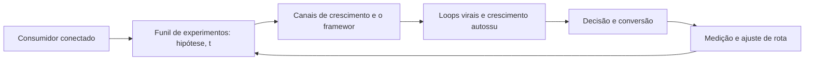

# Capítulo 29: Growth Marketing: Experimentação e Canais de Crescimento

## 1. Introdução

Bem-vindo a uma nova etapa da sua navegação pelo marketing digital. Este capítulo — *Growth Marketing: Experimentação e Canais de Crescimento* — integra a Parte VI, *Estratégias Sociais — Rotas de Autoridade*, e responde a uma pergunta prática: **funil de experimentos: hipótese, teste e aprendizado** — na prática, como isso se traduz em decisão e resultado?

Ao final, você será capaz de adota mentalidade de growth: funil de experimentos, priorização de canais, loops virais e otimização contínua de baixo custo.. Mais do que decorar conceitos, você vai enxergar a autoridade como moeda transferível e acumulável — e converter essa visão em plano, experimento e métrica.

No capítulo anterior, *Branding Digital: Identidade, Posicionamento e Presença de Marca*, você aprendeu os conceitos que servem de plataforma para o que vem agora. Este capítulo retoma esse repertório e o aplica a um território novo — sem repetir o que já foi estabelecido, apenas usando como base.

O capítulo segue a estrutura das sete seções que organizam esta obra: primeiro a exposição conceitual, depois a ilustração, a técnica aplicada, o exercício de aplicação e a conclusão operacional.

No contexto de *Growth Marketing: Experimentação e Canais de Crescimento*, a gestão de crise social é parte da estratégia: protocolos claros de resposta, tom definido e velocidade adequada preservam a reputação construída ao longo de anos [11].

No contexto de *Growth Marketing: Experimentação e Canais de Crescimento*, a autoridade digital é construída por consistência: publicar com regularidade, responder com qualidade e demonstrar domínio do assunto acumula confiança que se converte em decisão de compra [11].
## 2. Explica

### Funil de experimentos: hipótese, teste e aprendizado

Quando o tema é *Growth Marketing: Experimentação e Canais de Crescimento*, o primeiro pilar — funil de experimentos: hipótese, teste e aprendizado — define o território conceitual. A marca é o resultado acumulado de todas as interações: branding digital exige coerência entre identidade, voz e comportamento em cada território [2].

Na prática, funil de experimentos: hipótese, teste e aprendizado significa transformar a teoria em rotina operacional — exatamente o que *Growth Marketing: Experimentação e Canais de Crescimento* exige no dia a dia. A literatura de gestão é enfática: sem operacionalizar o conceito em checklist, responsável e métrica, ele permanece slide de apresentação [3]. Por isso a Parte VI propõe sempre o mesmo movimento: entender, traduzir em critério observável e decidir com dado.

### Canais de crescimento e o framework de canais (Bullseye)

O segundo pilar — canais de crescimento e o framework de canais (bullseye) — conecta a estratégia à operação diária. O social selling transforma vendedores em criadores: profissionais que publicam autoridade constroem pipelines mais previsíveis no B2B [13]. A experiência do consumidor se constrói na consistência entre canais e mensagens, e é essa consistência que transforma contato em relacionamento [16]. Organizações que tratam cada canal como silo perdem o fio condutor da jornada; as que operam o pilar com disciplina reduzem atrito e aumentam a taxa de avanço entre etapas [10].

### Loops virais e crescimento autossustentável

Fechando o tripé, loops virais e crescimento autossustentável é o que transforma a Parte VI em vantagem mensurável. Canais avaliados pelo mesmo critério — custo de aquisição e potencial de escala — permitem decidir onde dobrar a aposta e onde parar [8]. O relato da indústria mostra que as empresas que sustentam resultado não são as que têm mais ferramentas, mas as que conseguem medir e ajustar a rota com frequência [8]. A métrica certa, escolhida antes da campanha, vale mais do que qualquer ferramenta cara instalada depois do fato [9].

### O Eixo Transversal do Capítulo

A autoridade se acumula com consistência: poucos canais bem operados superam muitos canais mal operados em retorno sobre o esforço [11]. Esse eixo conecta os três pilares e explica por que o capítulo os trata como um sistema, não como uma lista: cada pilar reforça o outro, e a omissão de qualquer um deles produz estratégia manca. O capítulo seguinte retomará esse eixo com novas ferramentas, agora com o vocabulário já estabelecido aqui.

Em síntese, o capítulo opera em três níveis: o conceitual (Funil de experimentos: hipótese, teste e aprendizado), o operacional (Canais de crescimento e o framework de canais (Bullseye)) e o estratégico (Loops virais e crescimento autossustentável). O leitor que dominar os três estará apto a aplicar a Parte VI com autonomia [1]. A evidência reunida nesta seção sustenta cada recomendação prática das seções seguintes [2].

## 3. Ilustra

Vamos traduzir o capítulo em uma cena concreta, no contexto de *Growth Marketing: Experimentação e Canais de Crescimento*. Uma empresa de porte médio, com equipe enxuta e orçamento limitado, decide operar a Parte VI desta obra, *Estratégias Sociais — Rotas de Autoridade*. Na primeira semana, a equipe testa o conceito central do capítulo em um caso real: um cliente que pesquisou, comparou e decidiu comprar. O primeiro pilar — funil de experimentos: hipótese, teste e aprendizado — orienta o entendimento inicial do público; o segundo — canais de crescimento e o framework de canais (bullseye) — guia a escolha da rota de comunicação; e o terceiro fecha com a medição do resultado [2].

O diagrama abaixo representa o fluxo operacional proposto pelo capítulo — do consumidor conectado à decisão e ao ajuste contínuo de rota, com o público e a plataforma específicos do tema no centro da navegação:



Observe o laço de retorno: a medição alimenta o próximo ciclo de campanha. Essa é a diferença estrutural entre campanha e sistema — a campanha termina quando o orçamento acaba; o sistema aprende e se ajusta a cada ciclo [7]. No caso do tema *Growth Marketing: Experimentação e Canais de Crescimento*, esse laço é o que converte o investimento inicial em aprendizado acumulado para as próximas decisões [15].

## 4. Técnica

### A Priorização de Canais com Pontuação

Growth e estratégia social exigem escolha: não dá para operar todos os canais ao mesmo tempo. O código abaixo pontua canais por custo de aquisição, fit e escala potencial.

```python
def priorizar_canais(canais):
    """Pontua 0-10 em custo, fit e escala; ordena por score."""
    for c in canais:
        custo, fit, escala = c["custo"], c["fit"], c["escala"]
        c["score"] = round((10 - custo) * 0.4 + fit * 0.35 + escala * 0.25, 2)
    return sorted(canais, key=lambda c: c["score"], reverse=True)

canais = [
    {"nome": "SEO", "custo": 3, "fit": 9, "escala": 9},
    {"nome": "Influência", "custo": 6, "fit": 7, "escala": 5},
    {"nome": "Mídia paga", "custo": 7, "fit": 8, "escala": 8},
]
for c in priorizar_canais(canais):
    print(c)
```

A priorização não é definitiva — é hipótese a validar com experimento [8]. Canal barato e com fit perfeito merece o primeiro ciclo de teste [11].

O código acima é o núcleo técnico de *Growth Marketing: Experimentação e Canais de Crescimento*: validável, executável e adaptável ao contexto real do leitor. A prática recomendada é rodá-lo com dados próprios e usar a saída como insumo da próxima reunião de planejamento. Documentação oficial das plataformas reforça cada passo — da estrutura de campanhas [5] à configuração de eventos [12]. A leitura técnica deste capítulo complementa a exposição conceitual das seções anteriores e prepara os exercícios da seção seguinte.

## 5. Aplica

Conhecimento sem aplicação é conteúdo; aplicação sem reflexão é rotina. No contexto de *Growth Marketing: Experimentação e Canais de Crescimento*, os exercícios abaixo fecham o capítulo e preparam o terreno do próximo:

1. Monte a lista de 20 contas-alvo B2B e escreva um conteúdo personalizado para as 3 prioritárias.
2. Formule uma hipótese de experimento de crescimento com métrica primária e prazo de 30 dias.
3. Defina o protocolo de resposta para críticas públicas: quem responde, com que tom e em quanto tempo.
4. Compare o custo por lead entre duas estratégias sociais da última quinzena e escolha a próxima aposta.

Dedique ao menos 30 minutos a um dos exercícios antes de avançar. O aprendizado desta obra é cumulativo: o mapa desenhado aqui será usado nos capítulos seguintes da Parte VI e nas partes subsequentes [3].

Complementando, cinco exercícios práticos adicionais consolidam o aprendizado de *Growth Marketing: Experimentação e Canais de Crescimento*:

1. Se você tivesse que escolher três influenciadores para o próximo trimestre, qual seria o critério?
2. Seu time de vendas publica conhecimento — ou depende só de prospecção fria?
3. Qual hipótese de crescimento sua operação está testando agora — e com qual métrica de sucesso?
4. Sua marca publica com consistência — ou aparece em rajadas e desaparece?
5. Quais canais sua marca opera com autoridade real, e quais são presença de fachada?

## Leitura Complementar Recomendada

Para aprofundar *Growth Marketing: Experimentação e Canais de Crescimento* além deste capítulo:

- Para aprofundar as estratégias sociais, o livro de Hollensen cobre influência e social media, e a literatura de growth (experimentação) complementa com o método [11] [8].

- Como complemento, o LinkedIn Marketing Solutions documenta o ABM e o B2B digital em profundidade [13].

## Análise de Riscos e Mitigações

A aplicação de *Growth Marketing: Experimentação e Canais de Crescimento* envolve riscos identificáveis. A tabela de riscos abaixo relaciona cada ameaça à sua mitigação:

- Risco de dispersão: canais demais sem dominância. Mitigação: priorização por score e um canal dominado primeiro [8].
- Risco de influência errada: parceria sem fit. Mitigação: seleção por score de audiência, engajamento e valores [11].
- Risco de experimento sem aprendizado: testar sem documentar. Mitigação: caderno de experimentos com hipótese e resultado [8].
- Risco B2B de desalinhamento: marketing e vendas em direções opostas. Mitigação: ABM com métrica compartilhada [13].

## Considerações de Implementação

c

## Exercício Integrador da Parte VI

s

Este exercício conecta o capítulo às demais partes da obra e deve ser revisto ao final da leitura completa.

## Aprofundamento Prático

O tema de *Growth Marketing: Experimentação e Canais de Crescimento* ganha potência quando levado ao nível operacional. Os quatro pontos abaixo aprofundam a aplicação prática:

- A seleção de influenciadores exige um score: fit de audiência, engajamento real, histórico e alinhamento de valores — a confiança transferida é o ativo, e o score protege o investimento [11].

- A gestão de reputação é preventiva: monitorar menções diariamente, responder com velocidade adequada e ter protocolo de crise — a reputação se defende antes da crise, não depois [11].

- O aprofundamento prático da autoridade começa pelo calendário de conhecimento: publicar com consistência sobre os temas-mestres do seu mercado — a regularidade constrói a expectativa [11].

- A leitura avançada do growth exige o caderno de experimentos: cada hipótese registrada com métrica, prazo e resultado — o aprendizado acumulado é o ativo do crescimento [8].

## Exercícios de Fixação

Para consolidar *Growth Marketing: Experimentação e Canais de Crescimento*, resolva os cinco exercícios abaixo — com caneta, papel e dados reais:

1. Defina o posicionamento da sua marca em uma frase.
2. Avalie três influenciadores por fit, engajamento e histórico.
3. Registre uma hipótese de experimento com métrica e prazo.
4. Monte o calendário social de uma semana com objetivo por peça.
5. Pontue cinco canais por custo, fit e escala e escolha um para testar.

## Autoavaliação do Capítulo

Autoavaliação: (1) Sei quais canais priorizar por custo, fit e escala? (2) Minha marca tem posicionamento e tom definidos? (3) Tenho critérios objetivos para escolher influenciadores? (4) Meu time registra e documenta experimentos? (5) Marketing e vendas compartilham métrica no B2B? Responda e priorize a primeira resposta negativa.

A primeira resposta negativa é o seu próximo passo natural — volte a ela na seção de aplicação deste capítulo e trabalhe o item até que a resposta seja sim.

## Problemas Comuns e Soluções Práticas

Aplicar *Growth Marketing: Experimentação e Canais de Crescimento* no mundo real esbarra em problemas recorrentes. Abaixo, cinco situações típicas com suas soluções — sintoma, causa e correção:

### Experimentos aleatórios

Testes sem priorização consomem recursos sem aprendizado. A solução é o funil de hipóteses com score e cadência semanal [8].

### Marca sem identidade

Comunicação inconsistente entre canais. A solução é definir posicionamento, tom de voz e identidade em documento — e testar a coerência em cada publicação [2].

### Canais dispersos

Esforço dividido entre muitos canais sem dominância. A solução é a priorização por score: custo, fit e escala — um canal dominado vale mais que cinco superficiais [8].

### Influência sem retorno

Parcerias com alcance alto e conversão baixa. A solução é selecionar por fit de audiência e engajamento real, não por número de seguidores [11].

### Vendas e marketing desalinhados

Cada time fala uma língua. A solução é o ABM: contas-alvo definidas em conjunto, conteúdo coordenado e métrica compartilhada — o pipeline vira objetivo único [13].

## Aplicações por Setor

O tema de *Growth Marketing: Experimentação e Canais de Crescimento* ganha contornos diferentes em cada setor. A leitura setorial abaixo ajuda a adaptar os princípios ao seu contexto:

- Na moda, a influência e o UGC dominam; na tecnologia, o thought leadership e o caso técnico; nos serviços, a prova local e a recomendação — a autoridade se constrói no território do setor [11].

- No SaaS, o growth marketing é nativo: trial, experimento e virality fazem parte do produto; no varejo, o growth depende de oferta e mídia; no B2B, de autoridade e ABM [8].

## Plano de Ação de 30 Dias

Para converter a leitura de *Growth Marketing: Experimentação e Canais de Crescimento* em resultado, execute um dos planos semanais abaixo — cada semana tem um objetivo e uma entrega:

### Plano de Ação — Opção 1

Semana 1 — Canais: liste dez canais potenciais e pontue por custo, fit e escala.
Semana 2 — Hipótese: escolha o canal vencedor e defina a métrica primária do teste.
Semana 3 — Lançamento: rode o experimento de 30 dias com orçamento mínimo.
Semana 4 — Decisão: meça custo por resultado e decida escalar, ajustar ou descartar.

### Plano de Ação — Opção 2

Semana 1 — Posicionamento: defina a marca em uma frase e teste em cinco posts.
Semana 2 — Contas: liste as contas-alvo B2B e escreva conteúdo personalizado para as três top.
Semana 3 — Ativação: mobilize vendas para compartilhar e comentar o conteúdo.
Semana 4 — Medição: acompanhe engajamento, reuniões e pipeline gerado.

## KPIs que Importam neste Capítulo

Para *Growth Marketing: Experimentação e Canais de Crescimento*, os KPIs que importam: custo por lead e por oportunidade, pipeline gerado, engajamento por publicação e conversão atribuída à influência — a régua de autoridade e crescimento [8].

Antes de encerrar, registre esses indicadores no seu painel de acompanhamento — eles serão a régua para medir a aplicação deste capítulo nas próximas semanas.

## Roteiro de Implementação Passo a Passo

Para aplicar *Growth Marketing: Experimentação e Canais de Crescimento* na prática, os roteiros abaixo organizam a sequência de ações — do diagnóstico à medição:

### Roteiro de Implementação 1

1. Liste dez canais potenciais de crescimento para o seu negócio.
2. Pontue cada um por custo de aquisição, fit de público e escala potencial.
3. Priorize os três de maior score e escolha um para o primeiro ciclo.
4. Defina a hipótese do experimento: canal, público, oferta e métrica primária.
5. Defina o prazo de 30 dias e o orçamento máximo do teste.
6. Lance o experimento com a menor escala possível e registre a linha de base.
7. Meça custo por resultado ao final do período.
8. Compare contra a régua dos canais existentes.
9. Decida: escalar, ajustar ou descartar — com base no número.
10. Documente o aprendizado no caderno de experimentos da operação.

### Roteiro de Implementação 2

1. Defina o posicionamento da marca em uma única frase.
2. Teste a frase em cinco posts publicados e verifique a coerência percebida.
3. Liste as contas-alvo B2B: empresas, decisores e dores de cada uma.
4. Priorize as três contas de maior valor potencial.
5. Escreva um conteúdo personalizado para cada uma, com linguagem do setor.
6. Ative o time de vendas para compartilhar e comentar o conteúdo.
7. Monitore a interação e o engajamento das contas-alvo.
8. Avance para uma reunião com contexto da conversa digital.
9. Meça: contas engajadas, reuniões agendadas e pipeline gerado.
10. Escale o processo para as próximas contas da lista.

## Perguntas Frequentes

Em relação ao tema de *Growth Marketing: Experimentação e Canais de Crescimento*, cinco perguntas surgem com frequência na prática profissional:

**Como escolher um influenciador?**

Por fit de audiência e engajamento real, não por número de seguidores — a confiança transferida é o ativo [11].

**O que é Account-Based Marketing?**

Estratégia B2B de concentrar esforço em contas-alvo com personalização e alinhamento comercial [13].

**Growth marketing é só para startups?**

O método serve a qualquer operação: a disciplina de experimentar, medir e escalar o que funciona [8].

**Como construir autoridade?**

Publicando conhecimento com consistência, respondendo com qualidade e demonstrando domínio — por meses, não semanas [11].

**Quantos canais devo operar?**

Poucos, bem operados. A regra do growth: um canal dominado vale mais que cinco superficiais [8].

## Cenários Numéricos Comentados

Os cálculos abaixo mostram, com números concretos, como as decisões de *Growth Marketing: Experimentação e Canais de Crescimento* se traduzem em resultado:

### Cenário numérico: a priorização de canais

Um canal com custo por lead de R$ 20 e fit alto merece o primeiro ciclo de teste; um com custo de R$ 80 e fit baixo, o último. A pontuação combina custo, fit e escala — e a alocação segue o score, não a preferência do time. Cada ponto de score a mais direciona a verba para onde o retorno esperado é maior [8].

### Cenário numérico: autoridade versus alcance

Uma marca com autoridade alta converte 3% do tráfego; uma concorrente desconhecida, 0,5%. Para a mesma meta de 100 vendas, a primeira precisa de 3.333 visitas e a segunda de 20.000 — seis vezes mais tráfego, seis vezes mais custo de aquisição. A autoridade é o multiplicador que barateia todo o funil [11].

## Como Este Capítulo se Integra à Obra

As estratégias sociais e de crescimento operam sobre a base construída: a jornada (II) define o público, a busca (III) e as redes (IV) fornecem os canais, e o relacionamento (V) sustenta a retenção. A parte de conversão (VII) transforma esse sistema em resultado mensurável. No contexto de *Growth Marketing: Experimentação e Canais de Crescimento*, essa integração fica ainda mais visível: as ferramentas e métricas que você dominou aqui serão a base das decisões dos próximos capítulos — e das partes que virão depois.

## Aprofundamento Conceitual

No contexto de *Growth Marketing: Experimentação e Canais de Crescimento*, o B2B digital se apoia em conteúdo profundo: white papers, estudos de caso e webinars são os formatos que o decisor consome antes de falar com vendas [13].

No contexto de *Growth Marketing: Experimentação e Canais de Crescimento*, a gestão de reputação social é preventiva e reativa: monitorar menções, responder rápido e ter protocolo de crise preserva o capital de confiança construído ao longo dos anos [11].

No contexto de *Growth Marketing: Experimentação e Canais de Crescimento*, a autoridade se acumula como juros compostos: cada conteúdo publicado, cada resposta de qualidade e cada caso entregue soma à percepção de domínio — e o efeito se multiplica com o tempo [11].

No contexto de *Growth Marketing: Experimentação e Canais de Crescimento*, o social selling é o método de venda da era digital: o profissional que publica conhecimento, resolve dúvidas e constrói relacionamento público transforma o perfil em um ativo comercial [13].

No contexto de *Growth Marketing: Experimentação e Canais de Crescimento*, o growth marketing é um sistema de experimentos: um funil de hipóteses priorizadas, ciclos semanais de teste e métricas de aprendizado substituem o plano anual rígido [8].

## Fundamentos em Detalhe

No contexto de *Growth Marketing: Experimentação e Canais de Crescimento*, o branding digital é a soma de todas as interações: cada post, cada resposta, cada anúncio contribui para a percepção da marca — e a incoerência é o erro mais caro [2].

No contexto de *Growth Marketing: Experimentação e Canais de Crescimento*, o Account-Based Marketing concentra o esforço onde está o valor: em vez de pescar no oceano, define as contas-alvo e personaliza a comunicação para cada uma — com vendas e marketing no mesmo plano [13].

No contexto de *Growth Marketing: Experimentação e Canais de Crescimento*, a experimentação sistemática exige um funil de hipóteses: priorizar ideias por impacto esperado e custo de teste, rodar rápido, aprender e escalar o que funcionou [8].

No contexto de *Growth Marketing: Experimentação e Canais de Crescimento*, o calendário editorial é a espinha dorsal da presença social: objetivos por peça, formatos por plataforma e KPIs por publicação transformam intenção em rotina [11].

No contexto de *Growth Marketing: Experimentação e Canais de Crescimento*, a autoridade B2B se constrói com conteúdo profundo: white papers, webinars, estudos de caso e thought leadership posicionam a marca como referência no setor [13].

## Estudos de Caso Aplicados

### Caso: a startup que priorizou canais com score

Uma startup de SaaS com verba limitada testava tudo ao mesmo tempo: SEO, influência, mídia paga, eventos. O resultado era disperso. Ao pontuar canais por custo de aquisição, fit de público e escala potencial, o time concentrou o esforço no canal vencedor — conteúdo técnico + LinkedIn — e dobrou o pipeline em um trimestre com o mesmo orçamento [8].

### Caso: o influenciador de nicho que converteu mais que a celebridade

Uma marca de cosméticos naturais comparou duas campanhas: uma com uma celebridade de milhões de seguidores e outra com três micro-influenciadores especializados em beleza limpa. Apesar do alcance menor, a campanha de micro-influenciadores gerou mais conversão e custo por venda menor — porque a audiência confiava na autoridade do nicho [11].

## Dados e Números do Setor

### Indicadores-Chave

- Custo por lead e custo por oportunidade comparam canais sociais [8].
- Engajamento, alcance e conversão atribuída medem a influência [11].
- O pipeline gerado é a régua do social selling e do ABM [13].

### Dados de Contexto

- A presença social consistente constrói autoridade e recall [11].
- Influenciadores de nicho superam celebridades em conversão atribuída [11].
- O growth marketing sistematiza a experimentação por custo de aquisição [8].

## Análise Comparativa

O tema de *Growth Marketing: Experimentação e Canais de Crescimento* fica mais claro quando contrastado com a alternativa mais próxima. A comparação abaixo organiza as diferenças:

### Autoridade vs. Alcance

- Autoridade converte mais com menos tráfego; alcance gera volume com menos densidade.
- Autoridade se constrói com consistência; alcance se compra com mídia.
- Micro-influenciadores entregam autoridade; celebridades entregam alcance.
- A estratégia combina os dois conforme o objetivo da campanha.

## Erros Comuns e Como Evitá-los

No tema de *Growth Marketing: Experimentação e Canais de Crescimento*, cinco erros recorrentes merecem atenção especial — cada um com sua correção prática:

1. Escolher influenciador por número de seguidores: alcance sem fit de audiência é dinheiro desperdiçado.
2. Experimentar sem priorização: rodar testes aleatórios sem score consome recursos sem aprendizado acumulado.
3. Calendário sem objetivo: publicar por publicar produz conteúdo que não move nenhuma métrica.
4. Ignorar a crise: a não resposta pública é uma resposta — e geralmente a pior possível.
5. Priorizar presença sobre autoridade: publicar sem consistência constrói ruído, não confiança.

## Ferramentas e Recursos Recomendados

Para operar o tema de *Growth Marketing: Experimentação e Canais de Crescimento* na prática, a seguinte seleção de ferramentas cobre o ciclo completo — do diagnóstico à medição:

1. Plataforma de gestão social com calendário
2. Ferramenta de análise de influenciadores
3. Plataforma de experimentos (A/B em escala)
4. CRM B2B para ABM
5. Ferramenta de monitoramento de marca

## Glossário do Capítulo

Os termos abaixo — todos usados no corpo deste capítulo — formam o vocabulário mínimo para acompanhar o restante da obra:

Autoridade: percepção de domínio no assunto. Thought leadership: liderança de pensamento. Account-Based Marketing: marketing para contas-alvo. Social selling: venda via relacionamento social. Experimentação: ciclo de hipótese e teste. Tom de voz: personalidade da comunicação.

## Checklist de Implementação

Use a lista abaixo para auditar a aplicação de *Growth Marketing: Experimentação e Canais de Crescimento* na sua operação — marque os itens já concluídos e priorize os pendentes:

- [ ] Hipótese de experimento agendada
- [ ] Canais priorizados por custo e escala
- [ ] Três influenciadores avaliados por fit
- [ ] Calendário social com KPI por publicação
- [ ] Posicionamento definido em uma frase

## Perguntas para Reflexão

Antes de avançar, reflita sobre as cinco questões abaixo — elas conectam o conteúdo de *Growth Marketing: Experimentação e Canais de Crescimento* ao seu contexto real de trabalho:

1. Seu time de vendas publica conhecimento — ou depende só de prospecção fria?
2. Qual hipótese de crescimento sua operação está testando agora — e com qual métrica de sucesso?
3. Sua marca publica com consistência — ou aparece em rajadas e desaparece?
4. Quais canais sua marca opera com autoridade real, e quais são presença de fachada?
5. Se você tivesse que escolher três influenciadores para o próximo trimestre, qual seria o critério?

## Quadro Comparativo: Canais e Critérios de Priorização

O quadro abaixo consolida os elementos essenciais de *Growth Marketing: Experimentação e Canais de Crescimento* em perspectiva comparada, facilitando a consulta rápida e a tomada de decisão:

| Canal | Custo de aquisição | Fit de público | Escala potencial | Score |
|---|---|---|---|---|
| Canal | Custo de aquisição | Fit de público | Escala potencial | Score |
| SEO | Baixo | Alto | Alta | Alto |
| Influência | Médio | Médio | Média | Médio |
| Mídia paga | Médio | Alto | Alta | Médio-alto |
| E-mail | Baixo | Alto | Média | Alto |
| Eventos | Alto | Médio | Baixa | Baixo |

## 6. Conclusão

O capítulo percorreu o território da Parte VI, *Estratégias Sociais — Rotas de Autoridade*, e deixou três aprendizados operacionais. Primeiro, o conceito central — *Growth Marketing: Experimentação e Canais de Crescimento* — é menos uma novidade e mais uma disciplina de execução. Segundo, a aplicação exige a tríade conceito, rota e métrica, sem pular etapas [8]. Terceiro, o ajuste contínuo de rota, ilustrado no laço de retorno do diagrama, é o que separa campanhas pontuais de operações sustentáveis [7]. O caminho percorrido desde *Branding Digital: Identidade, Posicionamento e Presença de Marca* até aqui forma a base que o próximo passo vai usar. No próximo capítulo, *Marketing B2B: Geração de Demanda e Account-Based Marketing*, você avançará sobre o território vizinho levando as ferramentas exercitadas aqui.

Como navegador de marketing digital, você não decorou uma fórmula — incorporou um modo de operar: ler o território, escolher a rota com dados e ajustar o percurso quando o vento muda [2].

Antes do fechamento, vale reforçar a base do capítulo: No contexto de *Growth Marketing: Experimentação e Canais de Crescimento*, a experimentação exige um funil de hipóteses: impactar é o que motiva, custo de teste é o que limita e probabilidade de sucesso é o que prioriza — o score combina os três [8].

No contexto de *Growth Marketing: Experimentação e Canais de Crescimento*, o calendário editorial profissional define objetivo por peça: cada publicação deve ter um propósito — engajar, educar, converter ou provar — e uma métrica correspondente [11].
## 7. Referências Bibliográficas

[1] KOTLER, Philip; KELLER, Kevin Lane. **Administração de Marketing**. 15. ed. São Paulo: Pearson, 2016.
[2] KOTLER, Philip; KARTAJAYA, Hermawan; SETIAWAN, Iwan. **Marketing 4.0: Moving from Traditional to Digital**. Hoboken: Wiley, 2017.
[3] CHAFFEY, Dave; ELLIS-CHADWICK, Fiona. **Digital Marketing: Strategy, Implementation and Practice**. 9. ed. Harlow: Pearson, 2025.
[4] GOOGLE SEARCH CENTRAL. **Search Engine Optimization (SEO) Starter Guide**. Disponível em: https://developers.google.com/search/docs/fundamentals/seo-starter-guide. Acesso em: 02 ago. 2026.
[5] GOOGLE ADS HELP CENTER. **Your guide to Google Ads (Basics, Search Campaigns & Best Practices)**. Disponível em: https://support.google.com/google-ads/answer/6146252. Acesso em: 02 ago. 2026.
[6] META BUSINESS HELP CENTER. **Meta Ads Manager Guide: Best Practices for Targeting, Measurement, and Optimization**. Disponível em: https://www.facebook.com/business/help. Acesso em: 02 ago. 2026.
[7] DELOITTE DIGITAL. **Marketing Trends 2026: New Marketing for a New World**. Disponível em: https://www.deloittedigital.com/nl/en/insights/perspective/marketing-trends-2026.html. Acesso em: 02 ago. 2026.
[8] HUBSPOT RESEARCH. **The State of Marketing / 2026 Marketing Statistics, Trends & Data**. Disponível em: https://www.hubspot.com/marketing-statistics. Acesso em: 02 ago. 2026.
[9] STATISTA RESEARCH DEPARTMENT. **Global Digital Marketing and Advertising Revenue Statistics & Facts**. Disponível em: https://www.statista.com/topics/8954/marketing-worldwide/. Acesso em: 02 ago. 2026.
[10] RYAN, Damian. **Understanding Digital Marketing: Marketing Strategies for Engaging the Digital Generation**. 5. ed. London: Kogan Page, 2020.
[11] HOLLENSEN, Svend; KOTLER, Philip; OPRESNIK, Marc Oliver. **Social Media Marketing: A Practitioner Approach**. 4. ed. Harlow: Pearson, 2023.
[12] GOOGLE ANALYTICS HELP CENTER. **Documentação oficial do Google Analytics 4**. Disponível em: https://support.google.com/analytics. Acesso em: 02 ago. 2026.
[13] LINKEDIN MARKETING SOLUTIONS. **Best Practices para campanhas B2B no LinkedIn**. Disponível em: https://business.linkedin.com/marketing-solutions. Acesso em: 02 ago. 2026.
[14] TIKTOK FOR BUSINESS. **Guia de criatividade e boas práticas de anúncios no TikTok**. Disponível em: https://www.tiktok.com/business. Acesso em: 02 ago. 2026.
[15] DATAREPORTAL. **Digital 2026: Global Overview Report**. Disponível em: https://datareportal.com/reports/digital-2026-global-overview-report. Acesso em: 02 ago. 2026.
[16] LEMON, Katherine N.; VERHOEF, Peter C. **Understanding Customer Experience Throughout the Customer Journey**. *Journal of Marketing*, v. 80, n. 6, p. 69-96, 2016.
[17] TIWARI, Rajnish; BUSE, Stephan; HERSTATT, Cornelius. **From Electronic to Mobile Commerce: Opportunities and Challenges**. *Proceedings of the German-Indian Roundtable*, 2006.
[18] VAN DIJK, Jan A. G. M. **The Digital Divide**. Cambridge: Polity Press, 2020.
[19] IBM. **Marketing with AI: Personalization at Scale**. Disponível em: https://www.ibm.com/think/topics/ai-marketing. Acesso em: 02 ago. 2026.
[20] KOTLER, Philip. **Marketing 5.0: Technology for Humanity**. Hoboken: Wiley, 2021.
