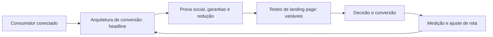

# Capítulo 33: Landing Pages de Alta Conversão: Estrutura, Mensagem e Teste

## 1. Introdução

Bem-vindo a uma nova etapa da sua navegação pelo marketing digital. Este capítulo — *Landing Pages de Alta Conversão: Estrutura, Mensagem e Teste* — integra a Parte VII, *Conversão — O Porto Seguro*, e responde a uma pergunta prática: **arquitetura de conversão: headline, proposta de valor e cta** — na prática, como isso se traduz em decisão e resultado?

Ao final, você será capaz de projeta landing pages que convertem: hierarquia de mensagem, prova, clareza de proposta e otimização contínua por teste.. Mais do que decorar conceitos, você vai enxergar a conversão como chegada ao porto, não como ponto final — e converter essa visão em plano, experimento e métrica.

No capítulo anterior, *E-commerce e Omnicanalidade: Vendendo em Todos os Territórios*, você aprendeu os conceitos que servem de plataforma para o que vem agora. Este capítulo retoma esse repertório e o aplica a um território novo — sem repetir o que já foi estabelecido, apenas usando como base.

O capítulo segue a estrutura das sete seções que organizam esta obra: primeiro a exposição conceitual, depois a ilustração, a técnica aplicada, o exercício de aplicação e a conclusão operacional.

No contexto de *Landing Pages de Alta Conversão: Estrutura, Mensagem e Teste*, o CRO é a disciplina de eliminar atritos com base em evidência: cada mudança é uma hipótese, cada hipótese é um teste e cada teste é uma decisão informada [8].

No contexto de *Landing Pages de Alta Conversão: Estrutura, Mensagem e Teste*, a taxa de conversão média dos funis digitais é baixa por natureza; o que separa operações maduras é a capacidade de melhorar continuamente essa taxa via experimentação [8].
## 2. Explica

### Arquitetura de conversão: headline, proposta de valor e CTA

Quando o tema é *Landing Pages de Alta Conversão: Estrutura, Mensagem e Teste*, o primeiro pilar — arquitetura de conversão: headline, proposta de valor e cta — define o território conceitual. A conversão é o porto seguro da navegação, mas poucos funis chegam lá sem atrito: cada campo de formulário e cada passo de checkout custa uma fração da taxa de conversão [3].

Na prática, arquitetura de conversão: headline, proposta de valor e cta significa transformar a teoria em rotina operacional — exatamente o que *Landing Pages de Alta Conversão: Estrutura, Mensagem e Teste* exige no dia a dia. A literatura de gestão é enfática: sem operacionalizar o conceito em checklist, responsável e métrica, ele permanece slide de apresentação [3]. Por isso a Parte VII propõe sempre o mesmo movimento: entender, traduzir em critério observável e decidir com dado.

### Prova social, garantias e redução de risco percebido

O segundo pilar — prova social, garantias e redução de risco percebido — conecta a estratégia à operação diária. A otimização de conversão é disciplina de experimento: formular hipótese, rodar teste controlado e ler o resultado com significância estatística [8]. A experiência do consumidor se constrói na consistência entre canais e mensagens, e é essa consistência que transforma contato em relacionamento [16]. Organizações que tratam cada canal como silo perdem o fio condutor da jornada; as que operam o pilar com disciplina reduzem atrito e aumentam a taxa de avanço entre etapas [10].

### Testes de landing page: variáveis e cadência

Fechando o tripé, testes de landing page: variáveis e cadência é o que transforma a Parte VII em vantagem mensurável. O e-commerce redefiniu o varejo: modelos D2C, marketplaces e social commerce convivem, e o abandono de carrinho permanece o maior vazamento mensurável do funil [17]. O relato da indústria mostra que as empresas que sustentam resultado não são as que têm mais ferramentas, mas as que conseguem medir e ajustar a rota com frequência [8]. A métrica certa, escolhida antes da campanha, vale mais do que qualquer ferramenta cara instalada depois do fato [9].

### O Eixo Transversal do Capítulo

A omnicanalidade integra online e offline: o cliente que pesquisa no celular, experimenta na loja e conclui no site espera uma experiência única [16]. Esse eixo conecta os três pilares e explica por que o capítulo os trata como um sistema, não como uma lista: cada pilar reforça o outro, e a omissão de qualquer um deles produz estratégia manca. O capítulo seguinte retomará esse eixo com novas ferramentas, agora com o vocabulário já estabelecido aqui.

Em síntese, o capítulo opera em três níveis: o conceitual (Arquitetura de conversão: headline, proposta de valor e CTA), o operacional (Prova social, garantias e redução de risco percebido) e o estratégico (Testes de landing page: variáveis e cadência). O leitor que dominar os três estará apto a aplicar a Parte VII com autonomia [1]. A evidência reunida nesta seção sustenta cada recomendação prática das seções seguintes [2].

## 3. Ilustra

Vamos traduzir o capítulo em uma cena concreta, no contexto de *Landing Pages de Alta Conversão: Estrutura, Mensagem e Teste*. Uma empresa de porte médio, com equipe enxuta e orçamento limitado, decide operar a Parte VII desta obra, *Conversão — O Porto Seguro*. Na primeira semana, a equipe testa o conceito central do capítulo em um caso real: um cliente que pesquisou, comparou e decidiu comprar. O primeiro pilar — arquitetura de conversão: headline, proposta de valor e cta — orienta o entendimento inicial do público; o segundo — prova social, garantias e redução de risco percebido — guia a escolha da rota de comunicação; e o terceiro fecha com a medição do resultado [2].

O diagrama abaixo representa o fluxo operacional proposto pelo capítulo — do consumidor conectado à decisão e ao ajuste contínuo de rota, com o público e a plataforma específicos do tema no centro da navegação:



Observe o laço de retorno: a medição alimenta o próximo ciclo de campanha. Essa é a diferença estrutural entre campanha e sistema — a campanha termina quando o orçamento acaba; o sistema aprende e se ajusta a cada ciclo [7]. No caso do tema *Landing Pages de Alta Conversão: Estrutura, Mensagem e Teste*, esse laço é o que converte o investimento inicial em aprendizado acumulado para as próximas decisões [15].

## 4. Técnica

### O Teste A/B com Significância

Conversão se otimiza com experimento, e experimento exige estatística. O código abaixo aplica um teste de proporção para decidir se a variação B realmente converte mais.

```python
import math

def teste_ab(conv_a: int, total_a: int, conv_b: int, total_b: int) -> dict:
    """Teste z de duas proporções para significância de 95%."""
    pa, pb = conv_a / total_a, conv_b / total_b
    p = (conv_a + conv_b) / (total_a + total_b)
    z = (pb - pa) / math.sqrt(p * (1 - p) * (1 / total_a + 1 / total_b))
    return {"taxa_a": round(pa, 4), "taxa_b": round(pb, 4),
            "z": round(z, 2), "significativo": abs(z) > 1.96}

print(teste_ab(conv_a=80, total_a=4000, conv_b=110, total_b=4000))
```

A disciplina do CRO é decidir com evidência: se o z não passa de 1,96, a diferença é ruído — e muda-se a hipótese, não a cor do botão [8]. O rigor estatístico é o que diferencia otimização de superstição [3].

O código acima é o núcleo técnico de *Landing Pages de Alta Conversão: Estrutura, Mensagem e Teste*: validável, executável e adaptável ao contexto real do leitor. A prática recomendada é rodá-lo com dados próprios e usar a saída como insumo da próxima reunião de planejamento. Documentação oficial das plataformas reforça cada passo — da estrutura de campanhas [5] à configuração de eventos [12]. A leitura técnica deste capítulo complementa a exposição conceitual das seções anteriores e prepara os exercícios da seção seguinte.

## 5. Aplica

Conhecimento sem aplicação é conteúdo; aplicação sem reflexão é rotina. No contexto de *Landing Pages de Alta Conversão: Estrutura, Mensagem e Teste*, os exercícios abaixo fecham o capítulo e preparam o terreno do próximo:

1. Audite sua página de conversão atual e liste as 3 maiores fricções (campos, velocidade, distrações).
2. Formule uma hipótese de teste A/B para a sua landing page e defina a métrica primária e o tamanho de amostra.
3. Rastreie a taxa de abandono do seu checkout e liste 3 ações para reduzi-la.
4. Mapeie seus canais de venda (D2C, marketplace, social commerce) e defina o papel de cada um no funil.

Dedique ao menos 30 minutos a um dos exercícios antes de avançar. O aprendizado desta obra é cumulativo: o mapa desenhado aqui será usado nos capítulos seguintes da Parte VII e nas partes subsequentes [3].

Complementando, cinco exercícios práticos adicionais consolidam o aprendizado de *Landing Pages de Alta Conversão: Estrutura, Mensagem e Teste*:

1. Sua prova social está no ponto de decisão, ou escondida no rodapé?
2. Qual é a sua taxa de conversão hoje — e qual é a linha de base dos últimos 90 dias?
3. Onde exatamente o seu funil vaza: tráfego, página, formulário ou checkout? Que número confirma?
4. Sua landing page conta uma narrativa única ou tenta falar com todos ao mesmo tempo?
5. Qual foi o último teste A/B que você rodou — e o que ele ensinou sobre o seu público?

## Leitura Complementar Recomendada

Para aprofundar *Landing Pages de Alta Conversão: Estrutura, Mensagem e Teste* além deste capítulo:

- Para aprofundar a conversão, Chaffey trata CRO e e-commerce, e o artigo de Tiwari e colaboradores cobre o comércio eletrônico e móvel [3] [17].

- Como complemento, a literatura de experimentação da HubSpot e os estudos de abandono de carrinho contextualizam as métricas do capítulo [8].

## Análise de Riscos e Mitigações

A aplicação de *Landing Pages de Alta Conversão: Estrutura, Mensagem e Teste* envolve riscos identificáveis. A tabela de riscos abaixo relaciona cada ameaça à sua mitigação:

- Risco de otimizar por opinião: mudar sem teste. Mitigação: hipótese, teste e significância antes da decisão [8].
- Risco de foco no topo: ignorar o checkout. Mitigação: monitorar abandono de carrinho e simplificar o checkout [17].
- Risco de prova escondida: depoimento fora do ponto de decisão. Mitigação: posicionar a prova onde a decisão acontece [2].
- Risco de medir sem contexto: número sem linha de base. Mitigação: registrar os 90 dias antes de qualquer experimento [8].

## Considerações de Implementação

a

## Exercício Integrador da Parte VII

e

Este exercício conecta o capítulo às demais partes da obra e deve ser revisto ao final da leitura completa.

## Aprofundamento Prático

O tema de *Landing Pages de Alta Conversão: Estrutura, Mensagem e Teste* ganha potência quando levado ao nível operacional. Os quatro pontos abaixo aprofundam a aplicação prática:

- O aprofundamento prático do CRO começa pelo registro da linha de base: sem o número de 90 dias, nenhuma mudança tem antes e depois — o registro é a fundação da experimentação [8].

- A leitura avançada do teste A/B exige rigor estatístico: hipótese, métrica primária, tamanho de amostra e significância — a disciplina protege contra a ilusão de resultados [8].

- A otimização do checkout é um trabalho de remoção de fricção: cada campo, cada etapa e cada surpresa custa conversão — a simplificação é o CRO do checkout [17].

- A hierarquia de mensagem é uma narrativa testável: proposta de valor, prova, garantia e CTA — cada elemento pode ser variado e testado, e a ordem importa [3].

## Exercícios de Fixação

Para consolidar *Landing Pages de Alta Conversão: Estrutura, Mensagem e Teste*, resolva os cinco exercícios abaixo — com caneta, papel e dados reais:

1. Posicione a prova social no ponto de decisão e registre a linha de base.
2. Compare a conversão entre desktop e celular e liste diferenças.
3. Liste as três maiores fricções da sua página de conversão com evidência.
4. Formule uma hipótese de teste A/B com métrica primária e amostra.
5. Rastreie o abandono de carrinho e aponte a causa principal.

## Autoavaliação do Capítulo

Autoavaliação: (1) Conheço minha taxa de conversão e a linha de base de 90 dias? (2) Minhas fricções são listadas com evidência? (3) Meus testes têm hipótese e significância? (4) Sei a taxa de abandono de carrinho e a causa principal? (5) Minha prova social está no ponto de decisão? Responda e priorize a primeira resposta negativa.

A primeira resposta negativa é o seu próximo passo natural — volte a ela na seção de aplicação deste capítulo e trabalhe o item até que a resposta seja sim.

## Problemas Comuns e Soluções Práticas

Aplicar *Landing Pages de Alta Conversão: Estrutura, Mensagem e Teste* no mundo real esbarra em problemas recorrentes. Abaixo, cinco situações típicas com suas soluções — sintoma, causa e correção:

### Conversão estagnada

A taxa não muda há meses. A solução é o ciclo de CRO: medir a linha de base, listar fricções com evidência, testar a de maior impacto e iterar [8].

### Carrinho abandonado em alta

Custos inesperados e checkout longo são as causas clássicas. A solução é transparência de frete desde o produto e recuperação com incentivo [17].

### Landing page sem resultado

A página tenta falar com todos. A solução é a hierarquia: proposta de valor, prova, garantia e um CTA único — testada em variação [3].

### Mobile perdendo conversão

O checkout no celular atrita. A solução é simplificar: formulários curtos, pagamento por aproximação e velocidade — o mobile é o novo padrão [17].

### Prova social escondida

Depoimentos no rodapé não influenciam a decisão. A solução é posicionar a prova no ponto de decisão e testar o impacto [2].

## Aplicações por Setor

O tema de *Landing Pages de Alta Conversão: Estrutura, Mensagem e Teste* ganha contornos diferentes em cada setor. A leitura setorial abaixo ajuda a adaptar os princípios ao seu contexto:

- No D2C, a margem e a relação direta compensam o custo de tráfego; no marketplace, o tráfego vem pronto mas a margem é menor — a combinação define a lucratividade [17].

- No e-commerce, a conversão é o checkout e o abandono é o vilão; no B2B, a conversão é o formulário qualificado e o ciclo é longo; no serviço, é o agendamento — cada modelo tem sua definição de conversão [17].

## Plano de Ação de 30 Dias

Para converter a leitura de *Landing Pages de Alta Conversão: Estrutura, Mensagem e Teste* em resultado, execute um dos planos semanais abaixo — cada semana tem um objetivo e uma entrega:

### Plano de Ação — Opção 1

Semana 1 — Auditoria: liste as fricções da página de conversão com evidência.
Semana 2 — Hipótese: formule o teste A/B com métrica primária e amostra.
Semana 3 — Teste: rode o teste até significância e leia com rigor.
Semana 4 — Escala: implemente o vencedor e documente o aprendizado.

### Plano de Ação — Opção 2

Semana 1 — Funil: mapeie os canais de venda e o papel de cada um.
Semana 2 — Carrinho: rastreie o abandono e liste as causas com dados.
Semana 3 — Correção: implemente frete transparente e e-mail de recuperação.
Semana 4 — Prova: coloque a prova social no ponto de decisão e meça.

## KPIs que Importam neste Capítulo

Para *Landing Pages de Alta Conversão: Estrutura, Mensagem e Teste*, os KPIs que importam: taxa de conversão, abandono de carrinho, custo por aquisição, valor médio do pedido e taxa de recuperação — os números do porto seguro [8].

Antes de encerrar, registre esses indicadores no seu painel de acompanhamento — eles serão a régua para medir a aplicação deste capítulo nas próximas semanas.

## Roteiro de Implementação Passo a Passo

Para aplicar *Landing Pages de Alta Conversão: Estrutura, Mensagem e Teste* na prática, os roteiros abaixo organizam a sequência de ações — do diagnóstico à medição:

### Roteiro de Implementação 1

1. Audite a página de conversão atual: liste campos, passos e distrações.
2. Meça a taxa de conversão atual e registre a linha de base de 90 dias.
3. Identifique as três maiores fricções com evidência (heatmap, dados, gravação).
4. Formule uma hipótese de teste para a fricção de maior impacto.
5. Defina a métrica primária, o tamanho de amostra e o prazo do teste.
6. Crie a variação: uma única mudança, controlada.
7. Rode o teste A/B até significância estatística.
8. Leia o resultado com rigor: diferença real ou ruído?
9. Implemente o vencedor e documente o aprendizado.
10. Repita o ciclo com a próxima fricção priorizada.

### Roteiro de Implementação 2

1. Mapeie os canais de venda: D2C, marketplace, social commerce.
2. Defina o papel de cada canal no funil e a margem de cada um.
3. Rastreie o abandono de carrinho e identifique o ponto de desistência.
4. Liste as causas prováveis: frete, checkout, confiança, distração.
5. Corrija a causa de maior impacto (ex.: frete transparente desde o produto).
6. Configure o e-mail de recuperação de carrinho com incentivo.
7. Compare a conversão entre desktop e celular e ajuste o mobile.
8. Coloque a prova social no ponto de decisão (avaliações, selos, números).
9. Reescreva a headline com promessa, prova e ação.
10. Meça a evolução da taxa de conversão e do carrinho recuperado.

## Perguntas Frequentes

Em relação ao tema de *Landing Pages de Alta Conversão: Estrutura, Mensagem e Teste*, cinco perguntas surgem com frequência na prática profissional:

**Landing page precisa ser curta?**

Precisa ser clara e focada: uma proposta, uma prova e um CTA — o comprimento depende da complexidade da decisão [3].

**Social commerce vale a pena?**

Vale quando o público decide dentro da rede: o checkout nativo reduz atrito para compras de baixa consideração [17].

**O que é uma boa taxa de conversão?**

Depende do setor e do funil — o relevante é a evolução da sua taxa contra a sua linha de base [8].

**Testes A/B precisam de muito tráfego?**

Precisam de tráfego suficiente para significância — para páginas de pouco tráfego, testes menores ou qualitativos são melhores [8].

**Como reduzir o abandono de carrinho?**

Elimine custos surpresa, simplifique o checkout e recupere com e-mail de incentivo — cada causa tem correção específica [17].

## Cenários Numéricos Comentados

Os cálculos abaixo mostram, com números concretos, como as decisões de *Landing Pages de Alta Conversão: Estrutura, Mensagem e Teste* se traduzem em resultado:

### Cenário numérico: o teste A/B

Uma landing page com 4.000 visitantes converte 2% (80 conversões). A variação converte 2,75% (110). O teste z confirma significância: a diferença é real. Implementar a variação em todo o tráfego vale 37,5% mais conversões — sem gastar mais em tráfego [8].

### Cenário numérico: o abandono recuperado

Um e-commerce com 1.000 carrinhos por mês e abandono de 70% perde 700 vendas. Recuperar 10% via e-mail de incentivo recupera 70 vendas — com receita líquida que paga a operação de recuperação muitas vezes [17].

## Como Este Capítulo se Integra à Obra

A conversão é onde o sistema se paga, mas depende de tudo que veio antes: a jornada (II) define o caminho, a busca e as redes (III e IV) trazem o tráfego, o relacionamento (V) aquecer a demanda e as métricas (VIII) medem o retorno. A economia do cliente (IX) coloca a régua final. No contexto de *Landing Pages de Alta Conversão: Estrutura, Mensagem e Teste*, essa integração fica ainda mais visível: as ferramentas e métricas que você dominou aqui serão a base das decisões dos próximos capítulos — e das partes que virão depois.

## Aprofundamento Conceitual

No contexto de *Landing Pages de Alta Conversão: Estrutura, Mensagem e Teste*, a taxa de conversão é o multiplicador de todo o funil: dobrar a conversão equivale a dobrar a receita sem gastar mais em tráfego — por isso o CRO é o investimento de retorno mais previsível [8].

No contexto de *Landing Pages de Alta Conversão: Estrutura, Mensagem e Teste*, o CRO exige uma hipótese por mudança: sem hipótese testável, alterar a página é superstição; com ela, cada mudança é um experimento com resultado interpretável [8].

No contexto de *Landing Pages de Alta Conversão: Estrutura, Mensagem e Teste*, o abandono de carrinho é o sintoma de um funil com atrito: custos inesperados, checkout longo e falta de confiança são as causas mais comuns — e cada uma tem correção específica [17].

No contexto de *Landing Pages de Alta Conversão: Estrutura, Mensagem e Teste*, a hierarquia da landing page é uma narrativa: o headline promete, a sub-linha explica, a prova social convence, a garantia reduz o risco e o CTA fecha a ação — em sequência [3].

No contexto de *Landing Pages de Alta Conversão: Estrutura, Mensagem e Teste*, o mobile-commerce é o novo padrão: checkout simplificado, pagamento por aproximação e formulários curtos são pré-requisitos de conversão no celular [17].

## Fundamentos em Detalhe

No contexto de *Landing Pages de Alta Conversão: Estrutura, Mensagem e Teste*, a omnicanalidade exige coerência entre canais: o cliente que pesquisa no celular, experimenta na loja e conclui no site espera uma experiência única — e mede a marca pela costura entre eles [16].

No contexto de *Landing Pages de Alta Conversão: Estrutura, Mensagem e Teste*, os modelos de e-commerce convivem: D2C, marketplace e social commerce atendem a objetivos diferentes, e a marca precisa decidir o papel de cada um no funil [17].

No contexto de *Landing Pages de Alta Conversão: Estrutura, Mensagem e Teste*, a prova social é o acelerador de conversão mais eficaz: depoimentos, avaliações, números e selos reduzem o risco percebido e elevam a confiança na decisão [2].

No contexto de *Landing Pages de Alta Conversão: Estrutura, Mensagem e Teste*, a experimentação de conversão é um músculo: times que rodam testes continuamente aprendem mais sobre o cliente em um trimestre do que em anos de suposição [8].

No contexto de *Landing Pages de Alta Conversão: Estrutura, Mensagem e Teste*, a conversão é o momento em que todo o investimento de marketing se paga — e também o mais frágil: qualquer atrito entre o interesse e a ação reduz a taxa de forma desproporcional [3].

## Estudos de Caso Aplicados

### Caso: a landing page que dobrou a conversão com um teste

Uma empresa de software testou a landing page padrão contra uma versão com proposta de valor explícita, prova social no topo e um único CTA. O teste A/B com significância estatística mostrou conversão duas vezes maior na variação — uma mudança de layout que dobrou a receita sem gastar mais em tráfego [8].

### Caso: o checkout que recuperou carrinhos abandonados

Um e-commerce de eletrônicos identificou que o abandono de carrinho concentrava-se em custos inesperados de frete no último passo. A correção: frete transparente desde a página do produto e e-mail de recuperação com incentivo. A recuperação recuperou uma fatia relevante da receita perdida — sem alterar o tráfego [17].

## Dados e Números do Setor

### Indicadores-Chave

- Taxa de conversão, abandono e custo por aquisição são as métricas do funil [8].
- O teste A/B com significância decide entre hipóteses [8].
- A taxa de recuperação de carrinho mede a eficácia da correção [17].

### Dados de Contexto

- Poucos funis chegam à conversão sem atrito — cada passo custa fração da taxa [3].
- O abandono de carrinho é o maior vazamento mensurável do e-commerce [17].
- A omnicanalidade exige experiência única entre canais [16].

## Análise Comparativa

O tema de *Landing Pages de Alta Conversão: Estrutura, Mensagem e Teste* fica mais claro quando contrastado com a alternativa mais próxima. A comparação abaixo organiza as diferenças:

### CRO por Opinião vs. por Evidência

- Opinião muda cor de botão; evidência testa hipóteses com estatística.
- Opinião é rápida e arriscada; evidência é lenta e acumula aprendizado.
- Opinião não gera conhecimento; evidência documenta o que funciona para o seu público.
- O CRO maduro decide com teste, não com preferência.

## Erros Comuns e Como Evitá-los

No tema de *Landing Pages de Alta Conversão: Estrutura, Mensagem e Teste*, cinco erros recorrentes merecem atenção especial — cada um com sua correção prática:

1. Funil único para todos os públicos: a mesma jornada para perfis diferentes produz conversão mediana.
2. Medir conversão sem contexto: sem linha de base e atribuição, o número não conta a história.
3. Otimizar por opinião: mudar cor de botão sem hipótese nem teste é superstição com rótulo de CRO.
4. Ignorar o checkout: a conversão morre nos custos inesperados e nos passos excessivos.
5. Esconder a prova social: depoimento no rodapé não influencia a decisão tomada no meio da página.

## Ferramentas e Recursos Recomendados

Para operar o tema de *Landing Pages de Alta Conversão: Estrutura, Mensagem e Teste* na prática, a seguinte seleção de ferramentas cobre o ciclo completo — do diagnóstico à medição:

1. Editor de landing pages
2. Plataforma de e-commerce com checkout otimizado
3. Ferramenta de análise de abandono de carrinho
4. Ferramenta de teste A/B
5. Plataforma de heatmap e gravação de sessão

## Glossário do Capítulo

Os termos abaixo — todos usados no corpo deste capítulo — formam o vocabulário mínimo para acompanhar o restante da obra:

Conversão: ação desejada concluída. CRO: otimização da taxa de conversão. Landing page: página de destino focada. Teste A/B: comparação controlada de duas versões. Carrinho abandonado: compra iniciada e não concluída. Social commerce: venda dentro das redes.

## Checklist de Implementação

Use a lista abaixo para auditar a aplicação de *Landing Pages de Alta Conversão: Estrutura, Mensagem e Teste* na sua operação — marque os itens já concluídos e priorize os pendentes:

- [ ] Hipótese de teste A/B formulada
- [ ] Métrica primária e amostra definidas
- [ ] Abandono de carrinho rastreado
- [ ] Prova social no ponto de decisão
- [ ] Fricções da página de conversão listadas

## Perguntas para Reflexão

Antes de avançar, reflita sobre as cinco questões abaixo — elas conectam o conteúdo de *Landing Pages de Alta Conversão: Estrutura, Mensagem e Teste* ao seu contexto real de trabalho:

1. Qual é a sua taxa de conversão hoje — e qual é a linha de base dos últimos 90 dias?
2. Onde exatamente o seu funil vaza: tráfego, página, formulário ou checkout? Que número confirma?
3. Sua landing page conta uma narrativa única ou tenta falar com todos ao mesmo tempo?
4. Qual foi o último teste A/B que você rodou — e o que ele ensinou sobre o seu público?
5. Sua prova social está no ponto de decisão, ou escondida no rodapé?

## Quadro Comparativo: Fricções Comuns e Correções

O quadro abaixo consolida os elementos essenciais de *Landing Pages de Alta Conversão: Estrutura, Mensagem e Teste* em perspectiva comparada, facilitando a consulta rápida e a tomada de decisão:

| Fricção | Causa | Correção |
|---|---|---|
| Fricção | Causa | Correção |
| Formulário longo | Muitos campos | Reduzir ao essencial |
| Custo surpresa | Frete no final | Transparência desde o início |
| Checkout complexo | Muitas etapas | Simplificar e acelerar |
| Falta de confiança | Pouca prova | Depoimentos e selos |
| Página lenta | Performance | Carga otimizada |

## 6. Conclusão

O capítulo percorreu o território da Parte VII, *Conversão — O Porto Seguro*, e deixou três aprendizados operacionais. Primeiro, o conceito central — *Landing Pages de Alta Conversão: Estrutura, Mensagem e Teste* — é menos uma novidade e mais uma disciplina de execução. Segundo, a aplicação exige a tríade conceito, rota e métrica, sem pular etapas [8]. Terceiro, o ajuste contínuo de rota, ilustrado no laço de retorno do diagrama, é o que separa campanhas pontuais de operações sustentáveis [7]. O caminho percorrido desde *E-commerce e Omnicanalidade: Vendendo em Todos os Territórios* até aqui forma a base que o próximo passo vai usar. No próximo capítulo, *Análise de Conversão: Funis, Eventos e Atribuição*, você avançará sobre o território vizinho levando as ferramentas exercitadas aqui.

Como navegador de marketing digital, você não decorou uma fórmula — incorporou um modo de operar: ler o território, escolher a rota com dados e ajustar o percurso quando o vento muda [2].

Antes do fechamento, vale reforçar a base do capítulo: No contexto de *Landing Pages de Alta Conversão: Estrutura, Mensagem e Teste*, a experimentação de conversão é um ativo organizacional: o histórico de testes documentado ensina o que funciona para o seu público específico — um conhecimento que nenhuma consultoria tem [8].

No contexto de *Landing Pages de Alta Conversão: Estrutura, Mensagem e Teste*, a velocidade da página é uma métrica de conversão: cada segundo extra de carregamento reduz a probabilidade de conclusão — e a otimização de performance é parte do CRO [4].
## 7. Referências Bibliográficas

[1] KOTLER, Philip; KELLER, Kevin Lane. **Administração de Marketing**. 15. ed. São Paulo: Pearson, 2016.
[2] KOTLER, Philip; KARTAJAYA, Hermawan; SETIAWAN, Iwan. **Marketing 4.0: Moving from Traditional to Digital**. Hoboken: Wiley, 2017.
[3] CHAFFEY, Dave; ELLIS-CHADWICK, Fiona. **Digital Marketing: Strategy, Implementation and Practice**. 9. ed. Harlow: Pearson, 2025.
[4] GOOGLE SEARCH CENTRAL. **Search Engine Optimization (SEO) Starter Guide**. Disponível em: https://developers.google.com/search/docs/fundamentals/seo-starter-guide. Acesso em: 02 ago. 2026.
[5] GOOGLE ADS HELP CENTER. **Your guide to Google Ads (Basics, Search Campaigns & Best Practices)**. Disponível em: https://support.google.com/google-ads/answer/6146252. Acesso em: 02 ago. 2026.
[6] META BUSINESS HELP CENTER. **Meta Ads Manager Guide: Best Practices for Targeting, Measurement, and Optimization**. Disponível em: https://www.facebook.com/business/help. Acesso em: 02 ago. 2026.
[7] DELOITTE DIGITAL. **Marketing Trends 2026: New Marketing for a New World**. Disponível em: https://www.deloittedigital.com/nl/en/insights/perspective/marketing-trends-2026.html. Acesso em: 02 ago. 2026.
[8] HUBSPOT RESEARCH. **The State of Marketing / 2026 Marketing Statistics, Trends & Data**. Disponível em: https://www.hubspot.com/marketing-statistics. Acesso em: 02 ago. 2026.
[9] STATISTA RESEARCH DEPARTMENT. **Global Digital Marketing and Advertising Revenue Statistics & Facts**. Disponível em: https://www.statista.com/topics/8954/marketing-worldwide/. Acesso em: 02 ago. 2026.
[10] RYAN, Damian. **Understanding Digital Marketing: Marketing Strategies for Engaging the Digital Generation**. 5. ed. London: Kogan Page, 2020.
[11] HOLLENSEN, Svend; KOTLER, Philip; OPRESNIK, Marc Oliver. **Social Media Marketing: A Practitioner Approach**. 4. ed. Harlow: Pearson, 2023.
[12] GOOGLE ANALYTICS HELP CENTER. **Documentação oficial do Google Analytics 4**. Disponível em: https://support.google.com/analytics. Acesso em: 02 ago. 2026.
[13] LINKEDIN MARKETING SOLUTIONS. **Best Practices para campanhas B2B no LinkedIn**. Disponível em: https://business.linkedin.com/marketing-solutions. Acesso em: 02 ago. 2026.
[14] TIKTOK FOR BUSINESS. **Guia de criatividade e boas práticas de anúncios no TikTok**. Disponível em: https://www.tiktok.com/business. Acesso em: 02 ago. 2026.
[15] DATAREPORTAL. **Digital 2026: Global Overview Report**. Disponível em: https://datareportal.com/reports/digital-2026-global-overview-report. Acesso em: 02 ago. 2026.
[16] LEMON, Katherine N.; VERHOEF, Peter C. **Understanding Customer Experience Throughout the Customer Journey**. *Journal of Marketing*, v. 80, n. 6, p. 69-96, 2016.
[17] TIWARI, Rajnish; BUSE, Stephan; HERSTATT, Cornelius. **From Electronic to Mobile Commerce: Opportunities and Challenges**. *Proceedings of the German-Indian Roundtable*, 2006.
[18] VAN DIJK, Jan A. G. M. **The Digital Divide**. Cambridge: Polity Press, 2020.
[19] IBM. **Marketing with AI: Personalization at Scale**. Disponível em: https://www.ibm.com/think/topics/ai-marketing. Acesso em: 02 ago. 2026.
[20] KOTLER, Philip. **Marketing 5.0: Technology for Humanity**. Hoboken: Wiley, 2021.
