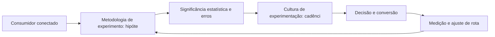

# Capítulo 40: Experimentação em Escala: Metodologia de Testes A/B Confiável

## 1. Introdução

Bem-vindo a uma nova etapa da sua navegação pelo marketing digital. Este capítulo — *Experimentação em Escala: Metodologia de Testes A/B Confiável* — integra a Parte VIII, *Métricas — O Radar de Navegação*, e responde a uma pergunta prática: **metodologia de experimento: hipótese, métrica e tamanho de amostra** — na prática, como isso se traduz em decisão e resultado?

Ao final, você será capaz de da testes a/b com rigor estatístico: hipóteses, amostragem, significância, segmentação de resultados e aprendizado organizacional.. Mais do que decorar conceitos, você vai enxergar o dado como radar que mostra posição e desvio de rota — e converter essa visão em plano, experimento e métrica.

No capítulo anterior, *Dashboards e BI de Marketing: Do Dado Bruto à Decisão*, você aprendeu os conceitos que servem de plataforma para o que vem agora. Este capítulo retoma esse repertório e o aplica a um território novo — sem repetir o que já foi estabelecido, apenas usando como base.

O capítulo segue a estrutura das sete seções que organizam esta obra: primeiro a exposição conceitual, depois a ilustração, a técnica aplicada, o exercício de aplicação e a conclusão operacional.

No contexto de *Experimentação em Escala: Metodologia de Testes A/B Confiável*, kPI é a tradução de objetivo em número: métricas de vaidade — alcance, curtidas, impressões — só têm valor quando conectadas a receita, retenção ou custo [8].

No contexto de *Experimentação em Escala: Metodologia de Testes A/B Confiável*, o ROI de marketing é a régua executiva: receita atribuída dividida pelo investimento, com janelas de payback definidas, transforma o departamento de marketing de centro de custo em centro de investimento [9].
## 2. Explica

### Metodologia de experimento: hipótese, métrica e tamanho de amostra

Quando o tema é *Experimentação em Escala: Metodologia de Testes A/B Confiável*, o primeiro pilar — metodologia de experimento: hipótese, métrica e tamanho de amostra — define o território conceitual. Dashboards eficazes contam uma história por tela: hierarquia de métricas, contexto e próxima ação decidida — não tabelas infinitas [8].

Na prática, metodologia de experimento: hipótese, métrica e tamanho de amostra significa transformar a teoria em rotina operacional — exatamente o que *Experimentação em Escala: Metodologia de Testes A/B Confiável* exige no dia a dia. A literatura de gestão é enfática: sem operacionalizar o conceito em checklist, responsável e métrica, ele permanece slide de apresentação [3]. Por isso a Parte VIII propõe sempre o mesmo movimento: entender, traduzir em critério observável e decidir com dado.

### Significância estatística e erros de interpretação

O segundo pilar — significância estatística e erros de interpretação — conecta a estratégia à operação diária. Benchmarks setoriais ajudam a calibrar metas, mas a régua final é a evolução da própria operação contra a sua linha de base [9]. A experiência do consumidor se constrói na consistência entre canais e mensagens, e é essa consistência que transforma contato em relacionamento [16]. Organizações que tratam cada canal como silo perdem o fio condutor da jornada; as que operam o pilar com disciplina reduzem atrito e aumentam a taxa de avanço entre etapas [10].

### Cultura de experimentação: cadência e documentação

Fechando o tripé, cultura de experimentação: cadência e documentação é o que transforma a Parte VIII em vantagem mensurável. A experimentação em escala exige cadência e documentação: o aprendizado acumulado de cada teste vale mais que o resultado isolado [8]. O relato da indústria mostra que as empresas que sustentam resultado não são as que têm mais ferramentas, mas as que conseguem medir e ajustar a rota com frequência [8]. A métrica certa, escolhida antes da campanha, vale mais do que qualquer ferramenta cara instalada depois do fato [9].

### O Eixo Transversal do Capítulo

O Google Analytics 4 mudou o modelo de dados: eventos em vez de pageviews, medição por usuário e machine learning para preencher lacunas de coleta [12]. Esse eixo conecta os três pilares e explica por que o capítulo os trata como um sistema, não como uma lista: cada pilar reforça o outro, e a omissão de qualquer um deles produz estratégia manca. O capítulo seguinte retomará esse eixo com novas ferramentas, agora com o vocabulário já estabelecido aqui.

Em síntese, o capítulo opera em três níveis: o conceitual (Metodologia de experimento: hipótese, métrica e tamanho de amostra), o operacional (Significância estatística e erros de interpretação) e o estratégico (Cultura de experimentação: cadência e documentação). O leitor que dominar os três estará apto a aplicar a Parte VIII com autonomia [1]. A evidência reunida nesta seção sustenta cada recomendação prática das seções seguintes [2].

## 3. Ilustra

Vamos traduzir o capítulo em uma cena concreta, no contexto de *Experimentação em Escala: Metodologia de Testes A/B Confiável*. Uma empresa de porte médio, com equipe enxuta e orçamento limitado, decide operar a Parte VIII desta obra, *Métricas — O Radar de Navegação*. Na primeira semana, a equipe testa o conceito central do capítulo em um caso real: um cliente que pesquisou, comparou e decidiu comprar. O primeiro pilar — metodologia de experimento: hipótese, métrica e tamanho de amostra — orienta o entendimento inicial do público; o segundo — significância estatística e erros de interpretação — guia a escolha da rota de comunicação; e o terceiro fecha com a medição do resultado [2].

O diagrama abaixo representa o fluxo operacional proposto pelo capítulo — do consumidor conectado à decisão e ao ajuste contínuo de rota, com o público e a plataforma específicos do tema no centro da navegação:



Observe o laço de retorno: a medição alimenta o próximo ciclo de campanha. Essa é a diferença estrutural entre campanha e sistema — a campanha termina quando o orçamento acaba; o sistema aprende e se ajusta a cada ciclo [7]. No caso do tema *Experimentação em Escala: Metodologia de Testes A/B Confiável*, esse laço é o que converte o investimento inicial em aprendizado acumulado para as próximas decisões [15].

## 4. Técnica

### O Cálculo de ROI e Payback

Métricas sem fórmula viram opinião. O código abaixo padroniza o cálculo de ROI, ROAS e payback — o vocabulário comum entre marketing e finanças.

```python
def metricas(receita, custo_marketing, custo_fixo=0, margem=0.4):
    """Retorna ROI, ROAS e payback em meses."""
    lucro = receita * margem - custo_marketing - custo_fixo
    roi = lucro / (custo_marketing + custo_fixo)
    roas = receita / custo_marketing
    payback = (custo_marketing + custo_fixo) / (receita * margem / 12)
    return {"ROI": round(roi, 2), "ROAS": round(roas, 2),
            "payback_meses": round(payback, 1)}

print(metricas(receita=120_000, custo_marketing=30_000))
```

ROI positivo com payback longo ainda é risco: a régua executiva combina rentabilidade e velocidade de retorno [9]. A instrumentação no GA4 fornece o insumo bruto desses números [12].

O código acima é o núcleo técnico de *Experimentação em Escala: Metodologia de Testes A/B Confiável*: validável, executável e adaptável ao contexto real do leitor. A prática recomendada é rodá-lo com dados próprios e usar a saída como insumo da próxima reunião de planejamento. Documentação oficial das plataformas reforça cada passo — da estrutura de campanhas [5] à configuração de eventos [12]. A leitura técnica deste capítulo complementa a exposição conceitual das seções anteriores e prepara os exercícios da seção seguinte.

## 5. Aplica

Conhecimento sem aplicação é conteúdo; aplicação sem reflexão é rotina. No contexto de *Experimentação em Escala: Metodologia de Testes A/B Confiável*, os exercícios abaixo fecham o capítulo e preparam o terreno do próximo:

1. Compare a sessão por usuário e o tempo engajado entre duas fontes de tráfego principais.
2. Defina a linha de base de conversão de 90 dias antes de iniciar qualquer experimento.
3. Documente um aprendizado de teste recente e decida se ele muda a alocação de orçamento.
4. Defina 3 KPIs por objetivo de negócio (alcance, conversão, retenção) e a fórmula de cada um.

Dedique ao menos 30 minutos a um dos exercícios antes de avançar. O aprendizado desta obra é cumulativo: o mapa desenhado aqui será usado nos capítulos seguintes da Parte VIII e nas partes subsequentes [3].

Complementando, cinco exercícios práticos adicionais consolidam o aprendizado de *Experimentação em Escala: Metodologia de Testes A/B Confiável*:

1. Quais três KPIs respondem às perguntas que a diretoria realmente faz — e você tem os números deles?
2. Sua medição está conectada a receita, retenção ou custo — ou é só volume de vaidade?
3. Quem atribui o crédito da conversão na sua operação — e com qual modelo?
4. Seu dashboard sugere ações ou só mostra números?
5. Qual decisão recente você tomou sem dados que um experimento teria informado?

## Leitura Complementar Recomendada

Para aprofundar *Experimentação em Escala: Metodologia de Testes A/B Confiável* além deste capítulo:

- Como complemento, a literatura de dashboards orientados a decisão e a documentação de atribuição aprofundam o tema [12].

- Para aprofundar a medição, a documentação do Google Analytics 4 é a fonte primária do modelo de eventos, e os relatórios da Statista sobre ROI de marketing contextualizam a régua financeira [12] [9].

## Análise de Riscos e Mitigações

A aplicação de *Experimentação em Escala: Metodologia de Testes A/B Confiável* envolve riscos identificáveis. A tabela de riscos abaixo relaciona cada ameaça à sua mitigação:

- Risco de atribuição injusta: crédito só ao último clique. Mitigação: modelo documentado e revisão periódica [12].
- Risco de dashboard decorativo: métricas sem ação. Mitigação: cada tela responde a uma pergunta e sugere uma ação [8].
- Risco de paralisia: muitos números, nenhuma decisão. Mitigação: três a cinco KPIs conectados a objetivos [8].
- Risco de dados sujos: eventos mal configurados. Mitigação: instrumentação testada e documentada [12].

## Considerações de Implementação

n

## Exercício Integrador da Parte VIII

ã

Este exercício conecta o capítulo às demais partes da obra e deve ser revisto ao final da leitura completa.

## Aprofundamento Prático

O tema de *Experimentação em Escala: Metodologia de Testes A/B Confiável* ganha potência quando levado ao nível operacional. Os quatro pontos abaixo aprofundam a aplicação prática:

- A leitura avançada do GA4 exige o modelo de eventos: cada evento nomeado com consistência, parâmetros padronizados e instrumentação testada — a qualidade do dado é a qualidade da decisão [12].

- A atribuição é uma disciplina de documentação: modelo escolhido, critério registrado e revisão periódica — a consistência importa mais que a perfeição do modelo [12].

- O dashboard orientado a decisão é uma conversa: cada tela responde a uma pergunta executiva e sugere uma ação — o dashboard sem ação é decoração [8].

- A rotina de métricas é o hábito organizacional: reunião mensal, perguntas padronizadas e decisões registradas — a cultura data-driven se constrói pela repetição [8].

## Exercícios de Fixação

Para consolidar *Experimentação em Escala: Metodologia de Testes A/B Confiável*, resolva os cinco exercícios abaixo — com caneta, papel e dados reais:

1. Registre a linha de base de 90 dias de um KPI central.
2. Defina três KPIs conectados a objetivos com a fórmula de cada um.
3. Configure e teste um evento de conversão no GA4.
4. Escolha e documente um modelo de atribuição.
5. Calcule o ROI de uma campanha recente com receita atribuída.

## Autoavaliação do Capítulo

Autoavaliação: (1) Meus KPIs estão conectados a objetivos com fórmula? (2) Meus eventos no GA4 estão testados e consistentes? (3) Tenho modelo de atribuição documentado? (4) Sei o ROI de cada canal com receita atribuída? (5) Minha rotina de métricas gera decisão? Responda e priorize a primeira resposta negativa.

A primeira resposta negativa é o seu próximo passo natural — volte a ela na seção de aplicação deste capítulo e trabalhe o item até que a resposta seja sim.

## Problemas Comuns e Soluções Práticas

Aplicar *Experimentação em Escala: Metodologia de Testes A/B Confiável* no mundo real esbarra em problemas recorrentes. Abaixo, cinco situações típicas com suas soluções — sintoma, causa e correção:

### Dados desconfiáveis

Equipes questionam a medição. A solução é a instrumentação testada: eventos validados, parâmetros consistentes e documentação — a confiança no dado é a base da decisão [12].

### Atribuição injusta

Canais de descoberta subestimados pelo último clique. A solução é escolher e documentar um modelo de atribuição — e revisá-lo com a maturidade [12].

### Métricas de vaidade dominando

Alcance e curtidas no topo do relatório. A solução é reconectar cada métrica a receita, retenção ou custo — e remover o que não decide [8].

### Sem linha de base

Impossível saber se algo funcionou. A solução é registrar a linha de base de 90 dias antes de qualquer experimento — o antes e o depois contam a história [8].

### Números que não geram decisão

Relatórios extensos sem ação. A solução é o dashboard orientado a decisão: três a cinco KPIs, contexto e próxima ação por tela [8].

## Aplicações por Setor

O tema de *Experimentação em Escala: Metodologia de Testes A/B Confiável* ganha contornos diferentes em cada setor. A leitura setorial abaixo ajuda a adaptar os princípios ao seu contexto:

- No varejo, as métricas-chave são ticket, frequência e recompra; no SaaS, MRR, churn e CAC; no B2B, pipeline e ciclo — cada setor elege os KPIs que respondem às suas perguntas [9].

- No e-commerce, ROAS e abandono dominam o relatório; no serviço, NPS e recompra; no software, LTV/CAC e payback — a régua financeira segue o modelo de negócio [9].

## Plano de Ação de 30 Dias

Para converter a leitura de *Experimentação em Escala: Metodologia de Testes A/B Confiável* em resultado, execute um dos planos semanais abaixo — cada semana tem um objetivo e uma entrega:

### Plano de Ação — Opção 1

Semana 1 — Pergunta: defina a pergunta executiva que o dashboard deve responder.
Semana 2 — Dados: verifique a fonte e a confiabilidade de cada métrica.
Semana 3 — Atribuição: escolha e documente o modelo de atribuição.
Semana 4 — Decisão: calcule o ROI por canal e proponha a realocação.

### Plano de Ação — Opção 2

Semana 1 — KPIs: defina três KPIs conectados a objetivos e a fórmula de cada um.
Semana 2 — Eventos: configure e teste os eventos no GA4 que alimentam os KPIs.
Semana 3 — Dashboard: monte uma tela com os três KPIs e contexto.
Semana 4 — Rotina: agende a revisão mensal com perguntas padronizadas.

## KPIs que Importam neste Capítulo

Para *Experimentação em Escala: Metodologia de Testes A/B Confiável*, os KPIs que importam: ROI, ROAS, payback, custo por aquisição e retenção por coorte — conectados a objetivo e medidos contra a linha de base [9].

Antes de encerrar, registre esses indicadores no seu painel de acompanhamento — eles serão a régua para medir a aplicação deste capítulo nas próximas semanas.

## Roteiro de Implementação Passo a Passo

Para aplicar *Experimentação em Escala: Metodologia de Testes A/B Confiável* na prática, os roteiros abaixo organizam a sequência de ações — do diagnóstico à medição:

### Roteiro de Implementação 1

1. Defina a pergunta executiva que o dashboard deve responder.
2. Liste as três métricas que respondem à pergunta — e apenas elas.
3. Verifique a fonte de cada métrica e a confiabilidade do dado.
4. Desenhe o dashboard: hierarquia, tendência e comparação com a meta.
5. Adicione o contexto necessário para decisão (janela, benchmark, linha de base).
6. Automatize a atualização para evitar planilhas manuais.
7. Apresente o dashboard na reunião e observe quais números geram ação.
8. Ajuste: remova o que não gera decisão, adicione o que falta.
9. Documente o aprendizado de cada teste recente.
10. Revise o dashboard a cada trimestre contra as perguntas atuais.

### Roteiro de Implementação 2

1. Liste os três objetivos de negócio mais importantes do trimestre.
2. Para cada um, defina o KPI primário e a fórmula exata.
3. Identifique os eventos no GA4 que alimentam cada KPI.
4. Verifique se a instrumentação está correta: teste os eventos em tempo real.
5. Registre a linha de base de 90 dias de cada KPI.
6. Monte um dashboard de uma tela com os três KPIs e contexto.
7. Escolha o modelo de atribuição e documente o critério.
8. Calcule o ROI de cada canal com receita atribuída e custo.
9. Agende a revisão mensal com perguntas padronizadas.
10. Registre cada decisão tomada com a evidência que a sustentou.

## Perguntas Frequentes

Em relação ao tema de *Experimentação em Escala: Metodologia de Testes A/B Confiável*, cinco perguntas surgem com frequência na prática profissional:

**O que fazer com os dados?**

Decidir: cada relatório deve terminar com uma ação ou uma hipótese — senão é ruído [8].

**Quantas métricas devo acompanhar?**

As que respondem às perguntas executivas — tipicamente três a cinco, conectadas a objetivo e ação [8].

**O que é ROI e como calculo?**

Retorno sobre o investimento: receita atribuída menos custo, dividido pelo custo — com janela de atribuição definida [9].

**Qual modelo de atribuição usar?**

Depende da maturidade: último clique é simples, linear é justo, data-driven é preciso — o importante é documentar a escolha [12].

**GA4 é difícil?**

Tem uma curva, mas a lógica de eventos é mais flexível que a antiga — e a documentação oficial cobre cada passo [12].

## Cenários Numéricos Comentados

Os cálculos abaixo mostram, com números concretos, como as decisões de *Experimentação em Escala: Metodologia de Testes A/B Confiável* se traduzem em resultado:

### Cenário numérico: a atribuição multi-toque

Uma jornada com cinco toques entre redes, busca e e-mail termina em conversão. O último clique atribui 100% ao e-mail; o modelo linear, 20% a cada canal. A leitura muda a alocação: o canal de descoberta, subestimado pelo último clique, pode ser o que merece mais verba [12].

### Cenário numérico: o ROI por canal

Uma campanha com receita atribuída de R$ 120 mil e investimento de R$ 30 mil tem ROI de 3,0 e ROAS de 4,0. Com payback de quatro meses, a régua aprova o investimento; com payback de dezoito, o CFO questiona o caixa. O mesmo ROI conta histórias diferentes segundo o payback [9].

## Como Este Capítulo se Integra à Obra

As métricas são o radar que ilumina todas as outras partes: sem medição, nenhuma das decisões das partes I a VII tem verificação. A economia do cliente (IX) aprofunda essa régua com CAC, LTV e payback, e o futuro (X) mostra para onde a medição está evoluindo. No contexto de *Experimentação em Escala: Metodologia de Testes A/B Confiável*, essa integração fica ainda mais visível: as ferramentas e métricas que você dominou aqui serão a base das decisões dos próximos capítulos — e das partes que virão depois.

## Aprofundamento Conceitual

No contexto de *Experimentação em Escala: Metodologia de Testes A/B Confiável*, o GA4 é um modelo de dados orientado a eventos: cada interação relevante vira evento com parâmetros, e a conversão é definida por eventos-chave — um paradigma diferente do Universal Analytics [12].

No contexto de *Experimentação em Escala: Metodologia de Testes A/B Confiável*, kPI conecta objetivo a número: receita por canal, custo por aquisição, retenção por coorte — cada um responde a uma pergunta de negócio diferente, e escolher a pergunta certa é a metade do trabalho [8].

No contexto de *Experimentação em Escala: Metodologia de Testes A/B Confiável*, o ROI de marketing é a conversa com o CFO: receita atribuída sobre investimento, com janela de atribuição e payback definidos, traduz o esforço de marketing na linguagem do negócio [9].

No contexto de *Experimentação em Escala: Metodologia de Testes A/B Confiável*, a atribuição é uma escolha política e técnica: último clique é simples mas injusto, linear distribui igualmente, e data-driven usa aprendizado de máquina — a escolha muda a leitura de cada canal [12].

No contexto de *Experimentação em Escala: Metodologia de Testes A/B Confiável*, os benchmarks são contexto, não meta: o número de outro setor informa, mas a régua final é a evolução da própria operação contra a própria linha de base [9].

## Fundamentos em Detalhe

No contexto de *Experimentação em Escala: Metodologia de Testes A/B Confiável*, a experimentação em escala exige cadência e documentação: o aprendizado acumulado de cada teste — mesmo os inconclusivos — vale mais que o resultado isolado [8].

No contexto de *Experimentação em Escala: Metodologia de Testes A/B Confiável*, a coleta de dados de qualidade é pré-requisito: eventos bem nomeados, parâmetros consistentes e teste de instrumentação evitam a armadilha de decidir sobre dados sujos [12].

No contexto de *Experimentação em Escala: Metodologia de Testes A/B Confiável*, a cultura data-driven se constrói por rotina: reuniões regulares de métricas, perguntas padronizadas e decisões registradas criam o hábito de decidir com evidência [8].

No contexto de *Experimentação em Escala: Metodologia de Testes A/B Confiável*, a medição transformou o marketing de arte em ciência: sem números, cada decisão é uma opinião; com números, cada decisão é uma hipótese testável [8].

No contexto de *Experimentação em Escala: Metodologia de Testes A/B Confiável*, o Google Analytics 4 substituiu o modelo de pageviews por um modelo de eventos: cada interação significativa é um evento, e a coleta passou a ser controlada pela configuração da propriedade [12].

## Estudos de Caso Aplicados

### Caso: a agência que provou o ROI ao cliente

Uma agência de marketing lutava para demonstrar valor com métricas de vaidade. Ao implementar eventos de conversão, atribuição multi-toque e cálculo de ROI com payback, passou a provar o retorno de cada real investido. O cliente renovou o contrato com base nos números — e a agência passou a ser cobrada por resultado, não por atividade [9].

### Caso: o varejo que trocou vaidade por receita

Um varejista media alcance e curtidas como sucesso. Ao conectar as métricas a receita por canal, descobriu que o canal de maior alcance era o de pior retorno. A re-alocação do orçamento para os canais com melhor custo por aquisição — e a medição por eventos no GA4 — mudou a leitura e a estratégia do negócio [12].

## Dados e Números do Setor

### Dados de Contexto

- O GA4 opera por eventos e medição por usuário [12].
- KPI sem objetivo vira métrica de vaidade [8].
- O ROI é a régua que conecta marketing e finanças [9].

### Indicadores-Chave

- ROI, ROAS e payback formam o vocabulário financeiro do marketing [9].
- A atribuição multi-toque revela o papel de cada canal [12].
- Sessões, eventos e conversões são as unidades do GA4 [12].

## Análise Comparativa

O tema de *Experimentação em Escala: Metodologia de Testes A/B Confiável* fica mais claro quando contrastado com a alternativa mais próxima. A comparação abaixo organiza as diferenças:

### Métrica de Vaidade vs. Métrica de Negócio

- Vaidade mede volume (alcance, curtidas); negócio mede resultado (receita, retenção).
- Vaidade alimenta o ego; negócio alimenta a decisão.
- Vaidade não conecta com custo; negócio sempre tem a régua financeira.
- A maturidade analítica é a troca das primeiras pelas segundas.

## Erros Comuns e Como Evitá-los

No tema de *Experimentação em Escala: Metodologia de Testes A/B Confiável*, cinco erros recorrentes merecem atenção especial — cada um com sua correção prática:

1. Dados sujos: eventos mal configurados produzem números confiantes sobre bases incorretas.
2. Métricas de vaidade: alcance e curtidas sem conexão com receita alimentam a ilusão de progresso.
3. Medir depois da campanha: sem objetivo e KPI definidos antes, qualquer resultado pode ser interpretado como sucesso.
4. Atribuição errada: crédito só ao último clique subestima o papel dos canais de descoberta.
5. Dashboard como foto: métricas mostradas sem tendência e sem ação viraram decoração.

## Ferramentas e Recursos Recomendados

Para operar o tema de *Experimentação em Escala: Metodologia de Testes A/B Confiável* na prática, a seguinte seleção de ferramentas cobre o ciclo completo — do diagnóstico à medição:

1. Ferramenta de teste de instrumentação
2. Modelo de cálculo de ROI/ROAS
3. Google Analytics 4 (eventos e conversões)
4. Ferramenta de BI/dashboard
5. Planilha de métricas e linha de base

## Glossário do Capítulo

Os termos abaixo — todos usados no corpo deste capítulo — formam o vocabulário mínimo para acompanhar o restante da obra:

KPI: indicador de desempenho. ROI: retorno sobre investimento. GA4: Google Analytics 4. Evento: interação medida. Atribuição: distribuição do crédito da conversão. Payback: prazo de retorno do investimento. Dashboard: painel de métricas.

## Checklist de Implementação

Use a lista abaixo para auditar a aplicação de *Experimentação em Escala: Metodologia de Testes A/B Confiável* na sua operação — marque os itens já concluídos e priorize os pendentes:

- [ ] ROI calculado com atribuição definida
- [ ] Linha de base de 90 dias registrada
- [ ] Dashboard orientado a decisão
- [ ] 3 KPIs conectados a objetivos de negócio
- [ ] Evento de conversão configurado no GA4

## Perguntas para Reflexão

Antes de avançar, reflita sobre as cinco questões abaixo — elas conectam o conteúdo de *Experimentação em Escala: Metodologia de Testes A/B Confiável* ao seu contexto real de trabalho:

1. Sua medição está conectada a receita, retenção ou custo — ou é só volume de vaidade?
2. Quem atribui o crédito da conversão na sua operação — e com qual modelo?
3. Seu dashboard sugere ações ou só mostra números?
4. Qual decisão recente você tomou sem dados que um experimento teria informado?
5. Quais três KPIs respondem às perguntas que a diretoria realmente faz — e você tem os números deles?

## Quadro Comparativo: KPIs por Objetivo

O quadro abaixo consolida os elementos essenciais de *Experimentação em Escala: Metodologia de Testes A/B Confiável* em perspectiva comparada, facilitando a consulta rápida e a tomada de decisão:

| Objetivo | KPI | Fórmula |
|---|---|---|
| Objetivo | KPI | Fórmula |
| Alcance | Impressões únicas | Contagem de usuários |
| Engajamento | Taxa de engajamento | Interações/alcance |
| Conversão | Taxa de conversão | Conversões/visitantes |
| Retenção | Churn | Saídas/base |
| Financeiro | ROI | (Receita-custo)/custo |

## 6. Conclusão

O capítulo percorreu o território da Parte VIII, *Métricas — O Radar de Navegação*, e deixou três aprendizados operacionais. Primeiro, o conceito central — *Experimentação em Escala: Metodologia de Testes A/B Confiável* — é menos uma novidade e mais uma disciplina de execução. Segundo, a aplicação exige a tríade conceito, rota e métrica, sem pular etapas [8]. Terceiro, o ajuste contínuo de rota, ilustrado no laço de retorno do diagrama, é o que separa campanhas pontuais de operações sustentáveis [7]. O caminho percorrido desde *Dashboards e BI de Marketing: Do Dado Bruto à Decisão* até aqui forma a base que o próximo passo vai usar. No próximo capítulo, *CAC e LTV: A Matemática da Aquisição e Retenção*, você avançará sobre o território vizinho levando as ferramentas exercitadas aqui.

Como navegador de marketing digital, você não decorou uma fórmula — incorporou um modo de operar: ler o território, escolher a rota com dados e ajustar o percurso quando o vento muda [2].

Antes do fechamento, vale reforçar a base do capítulo: No contexto de *Experimentação em Escala: Metodologia de Testes A/B Confiável*, a cultura data-driven é uma rotina, não uma ferramenta: reuniões regulares, perguntas padronizadas e decisões registradas criam o hábito de decidir com evidência [8].

No contexto de *Experimentação em Escala: Metodologia de Testes A/B Confiável*, a medição começa antes da campanha: definir o objetivo, o KPI primário e a linha de base é o que permite saber, ao final, se algo funcionou — medir depois é tarde demais [8].
## 7. Referências Bibliográficas

[1] KOTLER, Philip; KELLER, Kevin Lane. **Administração de Marketing**. 15. ed. São Paulo: Pearson, 2016.
[2] KOTLER, Philip; KARTAJAYA, Hermawan; SETIAWAN, Iwan. **Marketing 4.0: Moving from Traditional to Digital**. Hoboken: Wiley, 2017.
[3] CHAFFEY, Dave; ELLIS-CHADWICK, Fiona. **Digital Marketing: Strategy, Implementation and Practice**. 9. ed. Harlow: Pearson, 2025.
[4] GOOGLE SEARCH CENTRAL. **Search Engine Optimization (SEO) Starter Guide**. Disponível em: https://developers.google.com/search/docs/fundamentals/seo-starter-guide. Acesso em: 02 ago. 2026.
[5] GOOGLE ADS HELP CENTER. **Your guide to Google Ads (Basics, Search Campaigns & Best Practices)**. Disponível em: https://support.google.com/google-ads/answer/6146252. Acesso em: 02 ago. 2026.
[6] META BUSINESS HELP CENTER. **Meta Ads Manager Guide: Best Practices for Targeting, Measurement, and Optimization**. Disponível em: https://www.facebook.com/business/help. Acesso em: 02 ago. 2026.
[7] DELOITTE DIGITAL. **Marketing Trends 2026: New Marketing for a New World**. Disponível em: https://www.deloittedigital.com/nl/en/insights/perspective/marketing-trends-2026.html. Acesso em: 02 ago. 2026.
[8] HUBSPOT RESEARCH. **The State of Marketing / 2026 Marketing Statistics, Trends & Data**. Disponível em: https://www.hubspot.com/marketing-statistics. Acesso em: 02 ago. 2026.
[9] STATISTA RESEARCH DEPARTMENT. **Global Digital Marketing and Advertising Revenue Statistics & Facts**. Disponível em: https://www.statista.com/topics/8954/marketing-worldwide/. Acesso em: 02 ago. 2026.
[10] RYAN, Damian. **Understanding Digital Marketing: Marketing Strategies for Engaging the Digital Generation**. 5. ed. London: Kogan Page, 2020.
[11] HOLLENSEN, Svend; KOTLER, Philip; OPRESNIK, Marc Oliver. **Social Media Marketing: A Practitioner Approach**. 4. ed. Harlow: Pearson, 2023.
[12] GOOGLE ANALYTICS HELP CENTER. **Documentação oficial do Google Analytics 4**. Disponível em: https://support.google.com/analytics. Acesso em: 02 ago. 2026.
[13] LINKEDIN MARKETING SOLUTIONS. **Best Practices para campanhas B2B no LinkedIn**. Disponível em: https://business.linkedin.com/marketing-solutions. Acesso em: 02 ago. 2026.
[14] TIKTOK FOR BUSINESS. **Guia de criatividade e boas práticas de anúncios no TikTok**. Disponível em: https://www.tiktok.com/business. Acesso em: 02 ago. 2026.
[15] DATAREPORTAL. **Digital 2026: Global Overview Report**. Disponível em: https://datareportal.com/reports/digital-2026-global-overview-report. Acesso em: 02 ago. 2026.
[16] LEMON, Katherine N.; VERHOEF, Peter C. **Understanding Customer Experience Throughout the Customer Journey**. *Journal of Marketing*, v. 80, n. 6, p. 69-96, 2016.
[17] TIWARI, Rajnish; BUSE, Stephan; HERSTATT, Cornelius. **From Electronic to Mobile Commerce: Opportunities and Challenges**. *Proceedings of the German-Indian Roundtable*, 2006.
[18] VAN DIJK, Jan A. G. M. **The Digital Divide**. Cambridge: Polity Press, 2020.
[19] IBM. **Marketing with AI: Personalization at Scale**. Disponível em: https://www.ibm.com/think/topics/ai-marketing. Acesso em: 02 ago. 2026.
[20] KOTLER, Philip. **Marketing 5.0: Technology for Humanity**. Hoboken: Wiley, 2021.
