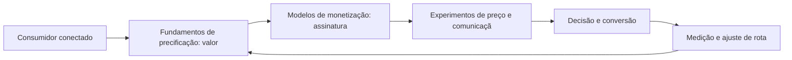

# Capítulo 43: Pricing e Monetização: Estratégias de Preço no Ambiente Digital

## 1. Introdução

Bem-vindo a uma nova etapa da sua navegação pelo marketing digital. Este capítulo — *Pricing e Monetização: Estratégias de Preço no Ambiente Digital* — integra a Parte IX, *Economia do Cliente — A Matemática do Negócio*, e responde a uma pergunta prática: **fundamentos de precificação: valor percebido, custo e concorrência** — na prática, como isso se traduz em decisão e resultado?

Ao final, você será capaz de define estratégias de preço para produtos digitais e serviços: ancoragem, pacotes, trials, assinaturas e otimização de margem.. Mais do que decorar conceitos, você vai enxergar a matemática do cliente como combustível da decisão — e converter essa visão em plano, experimento e métrica.

No capítulo anterior, *Data-Driven Marketing: Da Intuição ao Dado*, você aprendeu os conceitos que servem de plataforma para o que vem agora. Este capítulo retoma esse repertório e o aplica a um território novo — sem repetir o que já foi estabelecido, apenas usando como base.

O capítulo segue a estrutura das sete seções que organizam esta obra: primeiro a exposição conceitual, depois a ilustração, a técnica aplicada, o exercício de aplicação e a conclusão operacional.

No contexto de *Pricing e Monetização: Estratégias de Preço no Ambiente Digital*, o CAC esconde armadilhas de composição: misturar gastos de marca com gastos de performance superestima o custo real de aquisição e distorce a leitura de canais [9].

No contexto de *Pricing e Monetização: Estratégias de Preço no Ambiente Digital*, o LTV é a projeção da receita que um cliente gera ao longo do relacionamento: ticket, margem, frequência e churn são os insumos — e o churn é a alavanca mais poderosa [16].
## 2. Explica

### Fundamentos de precificação: valor percebido, custo e concorrência

Quando o tema é *Pricing e Monetização: Estratégias de Preço no Ambiente Digital*, o primeiro pilar — fundamentos de precificação: valor percebido, custo e concorrência — define o território conceitual. Modelos de receita recorrente transformam a matemática do cliente: assinaturas alteram payback, margem e as próprias regras de crescimento [3].

Na prática, fundamentos de precificação: valor percebido, custo e concorrência significa transformar a teoria em rotina operacional — exatamente o que *Pricing e Monetização: Estratégias de Preço no Ambiente Digital* exige no dia a dia. A literatura de gestão é enfática: sem operacionalizar o conceito em checklist, responsável e métrica, ele permanece slide de apresentação [3]. Por isso a Parte IX propõe sempre o mesmo movimento: entender, traduzir em critério observável e decidir com dado.

### Modelos de monetização: assinatura, freemium, marketplace e pay-per-use

O segundo pilar — modelos de monetização: assinatura, freemium, marketplace e pay-per-use — conecta a estratégia à operação diária. O planejamento de orçamento aloca recursos por retorno esperado e revisa com cadência — o orçamento anual é hipótese, não dogma [8]. A experiência do consumidor se constrói na consistência entre canais e mensagens, e é essa consistência que transforma contato em relacionamento [16]. Organizações que tratam cada canal como silo perdem o fio condutor da jornada; as que operam o pilar com disciplina reduzem atrito e aumentam a taxa de avanço entre etapas [10].

### Experimentos de preço e comunicação da proposta de valor

Fechando o tripé, experimentos de preço e comunicação da proposta de valor é o que transforma a Parte IX em vantagem mensurável. A relação CAC/LTV é a régua de sustentabilidade do negócio digital: modelos saudáveis sustentam LTV três ou mais vezes o CAC, com payback dentro do ciclo de receita [9]. O relato da indústria mostra que as empresas que sustentam resultado não são as que têm mais ferramentas, mas as que conseguem medir e ajustar a rota com frequência [8]. A métrica certa, escolhida antes da campanha, vale mais do que qualquer ferramenta cara instalada depois do fato [9].

### O Eixo Transversal do Capítulo

O data-driven marketing troca o palpite pelo experimento: coleta limpa, governança e dashboards orientados a decisão reduzem o ruído entre intuição e evidência [8]. Esse eixo conecta os três pilares e explica por que o capítulo os trata como um sistema, não como uma lista: cada pilar reforça o outro, e a omissão de qualquer um deles produz estratégia manca. O capítulo seguinte retomará esse eixo com novas ferramentas, agora com o vocabulário já estabelecido aqui.

Em síntese, o capítulo opera em três níveis: o conceitual (Fundamentos de precificação: valor percebido, custo e concorrência), o operacional (Modelos de monetização: assinatura, freemium, marketplace e pay-per-use) e o estratégico (Experimentos de preço e comunicação da proposta de valor). O leitor que dominar os três estará apto a aplicar a Parte IX com autonomia [1]. A evidência reunida nesta seção sustenta cada recomendação prática das seções seguintes [2].

## 3. Ilustra

Vamos traduzir o capítulo em uma cena concreta, no contexto de *Pricing e Monetização: Estratégias de Preço no Ambiente Digital*. Uma empresa de porte médio, com equipe enxuta e orçamento limitado, decide operar a Parte IX desta obra, *Economia do Cliente — A Matemática do Negócio*. Na primeira semana, a equipe testa o conceito central do capítulo em um caso real: um cliente que pesquisou, comparou e decidiu comprar. O primeiro pilar — fundamentos de precificação: valor percebido, custo e concorrência — orienta o entendimento inicial do público; o segundo — modelos de monetização: assinatura, freemium, marketplace e pay-per-use — guia a escolha da rota de comunicação; e o terceiro fecha com a medição do resultado [2].

O diagrama abaixo representa o fluxo operacional proposto pelo capítulo — do consumidor conectado à decisão e ao ajuste contínuo de rota, com o público e a plataforma específicos do tema no centro da navegação:



Observe o laço de retorno: a medição alimenta o próximo ciclo de campanha. Essa é a diferença estrutural entre campanha e sistema — a campanha termina quando o orçamento acaba; o sistema aprende e se ajusta a cada ciclo [7]. No caso do tema *Pricing e Monetização: Estratégias de Preço no Ambiente Digital*, esse laço é o que converte o investimento inicial em aprendizado acumulado para as próximas decisões [15].

## 4. Técnica

### CAC, LTV e a Régua de Sustentabilidade

A economia do cliente é a matemática que separa crescimento saudável de queima de caixa. O código abaixo calcula as três grandezas centrais de qualquer negócio digital.

```python
def economia_cliente(gastos_mkt, gastos_vendas, clientes_novos,
                     ticket_medio, margem, churn_mensal):
    """Calcula CAC, LTV e relação CAC/LTV."""
    cac = (gastos_mkt + gastos_vendas) / clientes_novos
    ltv = (ticket_medio * margem) / churn_mensal
    return {"CAC": round(cac, 2), "LTV": round(ltv, 2),
            "relacao": round(ltv / cac, 2)}

print(economia_cliente(
    gastos_mkt=40_000, gastos_vendas=10_000, clientes_novos=500,
    ticket_medio=300, margem=0.6, churn_mensal=0.05))
```

Uma relação LTV/CAC acima de 3 com payback dentro do ciclo de receita é o sinal clássico de modelo sustentável [9]. Abaixo de 1, o negócio perde dinheiro a cada cliente [16].

O código acima é o núcleo técnico de *Pricing e Monetização: Estratégias de Preço no Ambiente Digital*: validável, executável e adaptável ao contexto real do leitor. A prática recomendada é rodá-lo com dados próprios e usar a saída como insumo da próxima reunião de planejamento. Documentação oficial das plataformas reforça cada passo — da estrutura de campanhas [5] à configuração de eventos [12]. A leitura técnica deste capítulo complementa a exposição conceitual das seções anteriores e prepara os exercícios da seção seguinte.

## 5. Aplica

Conhecimento sem aplicação é conteúdo; aplicação sem reflexão é rotina. No contexto de *Pricing e Monetização: Estratégias de Preço no Ambiente Digital*, os exercícios abaixo fecham o capítulo e preparam o terreno do próximo:

1. Defina a meta de payback em meses e avalie se a atual política de investimento respeita essa régua.
2. Escolha um segmento de clientes e estime quanto de receita recorrente ele representa hoje.
3. Calcule o CAC da sua aquisição mais recente: todos os custos de marketing e vendas divididos pelos clientes novos.
4. Estime o LTV médio com margem, ticket e churn e calcule a relação CAC/LTV do seu negócio.

Dedique ao menos 30 minutos a um dos exercícios antes de avançar. O aprendizado desta obra é cumulativo: o mapa desenhado aqui será usado nos capítulos seguintes da Parte IX e nas partes subsequentes [3].

Complementando, cinco exercícios práticos adicionais consolidam o aprendizado de *Pricing e Monetização: Estratégias de Preço no Ambiente Digital*:

1. Sua matemática de cliente cabe em uma página — ou só o financeiro a entende?
2. Qual é o CAC por canal do seu negócio — e você sabe qual canal entrega o cliente mais barato E mais retido?
3. Qual é o seu LTV médio com margem e churn — e a relação LTV/CAC atual?
4. Se o churn caísse dois pontos, quanto subiria o LTV? Vale a pena investir nisso?
5. Seu orçamento é alocado por retorno esperado ou por histórico inercial?

## Leitura Complementar Recomendada

Para aprofundar *Pricing e Monetização: Estratégias de Preço no Ambiente Digital* além deste capítulo:

- Para aprofundar a economia do cliente, os relatórios da Statista e da HubSpot sobre CAC, LTV e retenção fornecem benchmarks, e Chaffey trata a matemática do cliente no contexto digital [9] [8] [3].

- Como complemento, a literatura de customer success e análise de coorte aprofunda a retenção como alavanca de valor [16].

## Análise de Riscos e Mitigações

A aplicação de *Pricing e Monetização: Estratégias de Preço no Ambiente Digital* envolve riscos identificáveis. A tabela de riscos abaixo relaciona cada ameaça à sua mitigação:

- Risco de queima de caixa: crescer sem régua. Mitigação: LTV/CAC e payback como gates de investimento [9].
- Risco de churn silencioso: perda sem percepção. Mitigação: coorte e monitoramento de saúde do cliente [16].
- Risco de CAC otimista: misturar gastos de marca e performance. Mitigação: CAC por canal com composição explícita [9].
- Risco de LTV ilusório: margem superestimada ou churn subestimado. Mitigação: estimativas conservadoras e revisão mensal [9].

## Considerações de Implementação

 

## Exercício Integrador da Parte IX

c

Este exercício conecta o capítulo às demais partes da obra e deve ser revisto ao final da leitura completa.

## Aprofundamento Prático

O tema de *Pricing e Monetização: Estratégias de Preço no Ambiente Digital* ganha potência quando levado ao nível operacional. Os quatro pontos abaixo aprofundam a aplicação prática:

- O aprofundamento prático da economia do cliente começa pela unidade de verdade: uma planilha única com CAC, LTV, churn e payback — a régua financeira centraliza a conversa entre marketing e finanças [9].

- A leitura avançada do CAC exige a decomposição por canal: cada canal com seus custos e sua retenção — o canal barato que não retém é pior que o caro que retém [9].

- A análise de coorte é a lente da retenção: acompanhar grupos por mês de aquisição revela o comportamento real — e a comparação entre coortes mostra se as melhorias estão funcionando [16].

- O customer success é uma operação de prevenção: onboarding, checkpoints e intervenção precoce reduzem o churn antes que ele aconteça [16].

## Exercícios de Fixação

Para consolidar *Pricing e Monetização: Estratégias de Preço no Ambiente Digital*, resolva os cinco exercícios abaixo — com caneta, papel e dados reais:

1. Defina a meta de payback e avalie a política atual.
2. Simule o efeito de reduzir o churn em dois pontos sobre o LTV.
3. Calcule o CAC por canal do último trimestre.
4. Estime o LTV com margem e churn e a relação LTV/CAC.
5. Monte a análise de coorte do seu segmento principal.

## Autoavaliação do Capítulo

Autoavaliação: (1) Sei o CAC por canal do meu negócio? (2) Sei o LTV com margem e churn? (3) Conheço minha relação LTV/CAC e o payback? (4) Acompanho a retenção por coorte? (5) Meu orçamento é alocado por retorno esperado? Responda e priorize a primeira resposta negativa.

A primeira resposta negativa é o seu próximo passo natural — volte a ela na seção de aplicação deste capítulo e trabalhe o item até que a resposta seja sim.

## Problemas Comuns e Soluções Práticas

Aplicar *Pricing e Monetização: Estratégias de Preço no Ambiente Digital* no mundo real esbarra em problemas recorrentes. Abaixo, cinco situações típicas com suas soluções — sintoma, causa e correção:

### CAC subindo a cada trimestre

A aquisição fica mais cara com o tempo. A solução é o CAC por canal: concentrar nos canais de menor custo e melhor retenção, e melhorar a relevância do funil [9].

### LTV estagnado

O valor do cliente não cresce. A solução é atacar o churn com customer success e expandir a receita por cliente com upsell e assinatura [16].

### Payback longo demais

O caixa não acompanha o crescimento. A solução é revisar a política de investimento e priorizar canais de retorno mais rápido — o payback é a régua de sobrevivência [9].

### Orçamento inercial

A alocação repete o ano passado. A solução é revisar por retorno esperado por canal e realocar com cadência — o orçamento é hipótese, não dogma [8].

### Churn silencioso

Clientes saem sem avisar. A solução é a análise de coorte e o monitoramento de saúde: sinais de risco identificados cedo permitem intervenção antes da perda [16].

## Aplicações por Setor

O tema de *Pricing e Monetização: Estratégias de Preço no Ambiente Digital* ganha contornos diferentes em cada setor. A leitura setorial abaixo ajuda a adaptar os princípios ao seu contexto:

- No modelo de assinatura, o churn é a variável-mestra; no transacional, a frequência; no B2B, a expansão por cliente — cada modelo define onde mora o valor [16].

- No SaaS, o CAC se paga em meses e o LTV é alto; no varejo, o payback é rápido e a margem controla; no serviço, o LTV depende da relação — a matemática é a mesma, os parâmetros mudam [9].

## Plano de Ação de 30 Dias

Para converter a leitura de *Pricing e Monetização: Estratégias de Preço no Ambiente Digital* em resultado, execute um dos planos semanais abaixo — cada semana tem um objetivo e uma entrega:

### Plano de Ação — Opção 1

Semana 1 — CAC: calcule o CAC total e por canal do último trimestre.
Semana 2 — LTV: estime o LTV com margem e churn e a relação LTV/CAC.
Semana 3 — Payback: defina a meta de payback e avalie a política atual.
Semana 4 — Régua: construa o dashboard das cinco grandezas e agende a revisão mensal.

### Plano de Ação — Opção 2

Semana 1 — Coorte: monte a análise de coorte por mês de aquisição.
Semana 2 — Diagnóstico: identifique o ponto de maior perda de cada coorte.
Semana 3 — Onboarding: desenhe a ativação guiada e os checkpoints de saúde.
Semana 4 — Efeito: meça o churn das novas coortes contra a linha de base.

## KPIs que Importam neste Capítulo

Para *Pricing e Monetização: Estratégias de Preço no Ambiente Digital*, os KPIs que importam: CAC por canal, LTV com margem e churn, relação LTV/CAC e payback — a régua de sustentabilidade do negócio [9].

Antes de encerrar, registre esses indicadores no seu painel de acompanhamento — eles serão a régua para medir a aplicação deste capítulo nas próximas semanas.

## Roteiro de Implementação Passo a Passo

Para aplicar *Pricing e Monetização: Estratégias de Preço no Ambiente Digital* na prática, os roteiros abaixo organizam a sequência de ações — do diagnóstico à medição:

### Roteiro de Implementação 1

1. Levante todos os gastos de marketing e vendas do último trimestre.
2. Divida pelo número de clientes novos para obter o CAC total.
3. Calcule o CAC por canal separadamente — cada um tem o seu.
4. Estime o LTV: ticket médio, margem, frequência e churn.
5. Calcule a relação LTV/CAC e o payback em meses.
6. Compare cada canal contra a régua: qual entrega o cliente mais barato e mais retido.
7. Simule o efeito de reduzir o churn em dois pontos sobre o LTV.
8. Defina a meta de payback e a política de investimento correspondente.
9. Construa um dashboard simples com as cinco grandezas.
10. Agende a revisão mensal com o time financeiro na mesa.

### Roteiro de Implementação 2

1. Escolha o segmento de maior receita recorrente.
2. Monte a análise de coorte: clientes por mês de aquisição e retenção ao longo do tempo.
3. Identifique o ponto onde cada coorte perde mais clientes.
4. Entreviste clientes que saíram nesse ponto para entender o porquê.
5. Desenhe o onboarding ideal: ativação guiada e primeiros sucessos.
6. Implemente checkpoints de saúde do cliente nos primeiros 90 dias.
7. Defina a intervenção precoce para sinais de risco (menos uso, menos login).
8. Configure o programa de fidelidade ou benefício para reforçar a retenção.
9. Meça o churn das novas coortes contra a linha de base.
10. Documente o efeito composto sobre o LTV e a receita.

## Perguntas Frequentes

Em relação ao tema de *Pricing e Monetização: Estratégias de Preço no Ambiente Digital*, cinco perguntas surgem com frequência na prática profissional:

**O que é análise de coorte?**

Acompanhar grupos de clientes adquiridos no mesmo período para observar a retenção real ao longo do tempo [16].

**Receita recorrente muda a estratégia?**

Muda: assinaturas alteram payback, margem e as regras de crescimento — o marketing precisa ser desenhado para o modelo [3].

**Qual a relação LTV/CAC saudável?**

Três ou mais unidades de LTV por unidade de CAC, com payback dentro do ciclo de receita [9].

**Como reduzir o CAC?**

Melhorando a relevância (mensagem, oferta, página), concentrando em canais eficientes e aumentando a conversão [9].

**Como aumentar o LTV?**

Atacando o churn primeiro — é a alavanca de maior efeito composto sobre o valor do cliente [16].

## Cenários Numéricos Comentados

Os cálculos abaixo mostram, com números concretos, como as decisões de *Pricing e Monetização: Estratégias de Preço no Ambiente Digital* se traduzem em resultado:

### Cenário numérico: o CAC por canal

Um canal entrega clientes a CAC de R$ 100 com churn mensal de 3%; outro entrega a R$ 60 com churn de 8%. O LTV do primeiro é de R$ 6.000 com margem; o do segundo, R$ 2.250. A relação LTV/CAC do primeiro é 60; do segundo, 37,5 — e o canal aparentemente mais barato é o pior investimento [9].

### Cenário numérico: o efeito do churn no LTV

Com margem de 50%, ticket de R$ 300 e churn mensal de 5%, o LTV é R$ 3.000. Reduzir o churn para 3% eleva o LTV a R$ 5.000 — e a cada 1.000 clientes, a receita potencial salta de R$ 3 milhões para R$ 5 milhões. Retenção é a alavanca de maior retorno [16].

## Como Este Capítulo se Integra à Obra

A economia do cliente é a matemática que amarra a obra inteira: cada estratégia das partes I a VII pode ser avaliada por CAC, LTV e payback. As métricas (VIII) fornecem o dado, e esta parte o transforma em régua de decisão e alocação de recursos. No contexto de *Pricing e Monetização: Estratégias de Preço no Ambiente Digital*, essa integração fica ainda mais visível: as ferramentas e métricas que você dominou aqui serão a base das decisões dos próximos capítulos — e das partes que virão depois.

## Aprofundamento Conceitual

No contexto de *Pricing e Monetização: Estratégias de Preço no Ambiente Digital*, o CAC é o preço da atenção convertida: todos os custos de marketing e vendas, divididos pelos clientes novos — e cada canal tem o seu próprio CAC, que muda a leitura da alocação [9].

No contexto de *Pricing e Monetização: Estratégias de Preço no Ambiente Digital*, o LTV é a receita futura projetada: ticket médio, margem, frequência e churn são os insumos; e o churn, por compor o denominador, é a alavanca mais poderosa do LTV [16].

No contexto de *Pricing e Monetização: Estratégias de Preço no Ambiente Digital*, a relação LTV/CAC é a régua de sustentabilidade: três ou mais unidades de LTV por unidade de CAC, com payback dentro do ciclo de receita, é o sinal clássico de modelo saudável [9].

No contexto de *Pricing e Monetização: Estratégias de Preço no Ambiente Digital*, a cultura data-driven substitui o palpite: coleta limpa, governança e visualização orientada a decisão reduzem o ruído entre intuição e evidência [8].

No contexto de *Pricing e Monetização: Estratégias de Preço no Ambiente Digital*, a precificação é uma alavanca de marketing: ancoragem, pacotes, trials e assinaturas são variáveis testáveis — e o preço comunica posicionamento tanto quanto a mensagem [3].

## Fundamentos em Detalhe

No contexto de *Pricing e Monetização: Estratégias de Preço no Ambiente Digital*, o customer success é o marketing pós-venda: onboarding, saúde do cliente e intervenção precoce reduzem o churn e ampliam a receita recorrente [16].

No contexto de *Pricing e Monetização: Estratégias de Preço no Ambiente Digital*, o planejamento de orçamento aloca recursos por retorno esperado e revisa com cadência: o orçamento anual é hipótese, não dogma [8].

No contexto de *Pricing e Monetização: Estratégias de Preço no Ambiente Digital*, os modelos de receita recorrente mudam a matemática: assinaturas alteram payback, margem e as próprias regras de crescimento do negócio [3].

No contexto de *Pricing e Monetização: Estratégias de Preço no Ambiente Digital*, o churn é a variável que mais multiplica o LTV: pequenas melhorias na retenção produzem efeito composto sobre o valor do cliente ao longo do tempo [16].

No contexto de *Pricing e Monetização: Estratégias de Preço no Ambiente Digital*, a economia do cliente é a matemática que separa crescimento saudável de queima de caixa: CAC, LTV e payback são as três grandezas que toda decisão de marketing deve respeitar [9].

## Estudos de Caso Aplicados

### Caso: a assinatura que reescreveu a matemática

Uma academia de ginástica vivia do plano mensal com alta rotatividade. Ao migrar para planos anuais com fidelidade e medir CAC/LTV por coorte, descobriu que o LTV do cliente anual era três vezes maior que o mensal — e o churn, muito menor. A estratégia de precificação e retenção foi redesenhada em torno dessa matemática [9].

### Caso: a plataforma que atacou o churn

Um SaaS B2B com boa aquisição sofria de churn alto nos primeiros 90 dias. A análise de coorte revelou que o onboarding era o ponto de ruptura. Com customer success estruturado — ativação guiada, checkpoints e intervenção precoce — o churn dos primeiros 90 dias caiu pela metade, elevando o LTV e o valor de cada aquisição [16].

## Dados e Números do Setor

### Indicadores-Chave

- LTV/CAC acima de 3 é o sinal clássico de modelo saudável [9].
- Payback dentro do ciclo de receita é a régua de caixa [9].
- Análise de coorte revela a retenção real [16].

### Dados de Contexto

- CAC e LTV são as grandezas que toda decisão deve respeitar [9].
- O churn é a alavanca mais poderosa do LTV [16].
- A cultura data-driven substitui o palpite pelo experimento [8].

## Análise Comparativa

O tema de *Pricing e Monetização: Estratégias de Preço no Ambiente Digital* fica mais claro quando contrastado com a alternativa mais próxima. A comparação abaixo organiza as diferenças:

### Crescimento a Qualquer Custo vs. Crescimento Sustentável

- O primeiro escala aquisição sem régua; o segundo escala com LTV/CAC e payback.
- O primeiro queima caixa; o segundo constrói modelo replicável.
- O primeiro atrai investidor com volume; o segundo com unidade de economia.
- A sustentabilidade é a régua que protege o negócio nas crises.

## Erros Comuns e Como Evitá-los

No tema de *Pricing e Monetização: Estratégias de Preço no Ambiente Digital*, cinco erros recorrentes merecem atenção especial — cada um com sua correção prática:

1. Ignorar o payback: lucro de longo prazo com caixa apertado é risco — a velocidade de retorno importa.
2. Orçamento inercial: repetir a alocação do ano passado sem revisar retorno por canal é burocracia, não gestão.
3. CAC misturado: somar gastos de marca com gastos de performance esconde a verdade de cada canal.
4. LTV otimista: superestimar margem ou subestimar churn produz uma régua que aprova decisões ruins.
5. Perseguir crescimento sem régua: escalar aquisição com LTV/CAC quebrado é queimar caixa com elegância.

## Ferramentas e Recursos Recomendados

Para operar o tema de *Pricing e Monetização: Estratégias de Preço no Ambiente Digital* na prática, a seguinte seleção de ferramentas cobre o ciclo completo — do diagnóstico à medição:

1. CRM com dados de receita por cliente
2. Ferramenta de BI para economia do cliente
3. Modelo de orçamento por retorno esperado
4. Planilha de CAC/LTV/payback
5. Ferramenta de análise de coorte

## Glossário do Capítulo

Os termos abaixo — todos usados no corpo deste capítulo — formam o vocabulário mínimo para acompanhar o restante da obra:

CAC: custo de aquisição de cliente. LTV: valor do tempo de vida do cliente. Churn: taxa de cancelamento. Coorte: grupo de clientes do mesmo período. Data-driven: decisão baseada em dados. Receita recorrente: receita periódica de assinaturas.

## Checklist de Implementação

Use a lista abaixo para auditar a aplicação de *Pricing e Monetização: Estratégias de Preço no Ambiente Digital* na sua operação — marque os itens já concluídos e priorize os pendentes:

- [ ] LTV estimado com margem e churn
- [ ] Relação LTV/CAC calculada
- [ ] Payback definido em meses
- [ ] Análise de coorte iniciada
- [ ] CAC calculado por canal

## Perguntas para Reflexão

Antes de avançar, reflita sobre as cinco questões abaixo — elas conectam o conteúdo de *Pricing e Monetização: Estratégias de Preço no Ambiente Digital* ao seu contexto real de trabalho:

1. Qual é o CAC por canal do seu negócio — e você sabe qual canal entrega o cliente mais barato E mais retido?
2. Qual é o seu LTV médio com margem e churn — e a relação LTV/CAC atual?
3. Se o churn caísse dois pontos, quanto subiria o LTV? Vale a pena investir nisso?
4. Seu orçamento é alocado por retorno esperado ou por histórico inercial?
5. Sua matemática de cliente cabe em uma página — ou só o financeiro a entende?

## Quadro Comparativo: Grandezas da Economia do Cliente

O quadro abaixo consolida os elementos essenciais de *Pricing e Monetização: Estratégias de Preço no Ambiente Digital* em perspectiva comparada, facilitando a consulta rápida e a tomada de decisão:

| Grandeza | Definição | Uso |
|---|---|---|
| Grandeza | Definição | Uso |
| CAC | Custo de aquisição | Eficiência da captura |
| LTV | Valor do relacionamento | Potencial do cliente |
| Relação LTV/CAC | LTV dividido por CAC | Sustentabilidade |
| Churn | Taxa de cancelamento | Saúde da retenção |
| Payback | Prazo de retorno | Velocidade de escala |

## 6. Conclusão

O capítulo percorreu o território da Parte IX, *Economia do Cliente — A Matemática do Negócio*, e deixou três aprendizados operacionais. Primeiro, o conceito central — *Pricing e Monetização: Estratégias de Preço no Ambiente Digital* — é menos uma novidade e mais uma disciplina de execução. Segundo, a aplicação exige a tríade conceito, rota e métrica, sem pular etapas [8]. Terceiro, o ajuste contínuo de rota, ilustrado no laço de retorno do diagrama, é o que separa campanhas pontuais de operações sustentáveis [7]. O caminho percorrido desde *Data-Driven Marketing: Da Intuição ao Dado* até aqui forma a base que o próximo passo vai usar. No próximo capítulo, *Customer Success e Retenção: O Marketing Pós-Venda*, você avançará sobre o território vizinho levando as ferramentas exercitadas aqui.

Como navegador de marketing digital, você não decorou uma fórmula — incorporou um modo de operar: ler o território, escolher a rota com dados e ajustar o percurso quando o vento muda [2].

Antes do fechamento, vale reforçar a base do capítulo: No contexto de *Pricing e Monetização: Estratégias de Preço no Ambiente Digital*, o churn é o vazamento silencioso: uma redução de poucos pontos percentuais no churn multiplica o LTV e compensa aumentos de CAC — a retenção é a alavanca mais barata de crescimento [16].

No contexto de *Pricing e Monetização: Estratégias de Preço no Ambiente Digital*, a análise de coorte é a lente correta para retenção: acompanhar grupos de clientes adquiridos no mesmo período revela o comportamento real de retenção, escondido pelos agregados [16].
## 7. Referências Bibliográficas

[1] KOTLER, Philip; KELLER, Kevin Lane. **Administração de Marketing**. 15. ed. São Paulo: Pearson, 2016.
[2] KOTLER, Philip; KARTAJAYA, Hermawan; SETIAWAN, Iwan. **Marketing 4.0: Moving from Traditional to Digital**. Hoboken: Wiley, 2017.
[3] CHAFFEY, Dave; ELLIS-CHADWICK, Fiona. **Digital Marketing: Strategy, Implementation and Practice**. 9. ed. Harlow: Pearson, 2025.
[4] GOOGLE SEARCH CENTRAL. **Search Engine Optimization (SEO) Starter Guide**. Disponível em: https://developers.google.com/search/docs/fundamentals/seo-starter-guide. Acesso em: 02 ago. 2026.
[5] GOOGLE ADS HELP CENTER. **Your guide to Google Ads (Basics, Search Campaigns & Best Practices)**. Disponível em: https://support.google.com/google-ads/answer/6146252. Acesso em: 02 ago. 2026.
[6] META BUSINESS HELP CENTER. **Meta Ads Manager Guide: Best Practices for Targeting, Measurement, and Optimization**. Disponível em: https://www.facebook.com/business/help. Acesso em: 02 ago. 2026.
[7] DELOITTE DIGITAL. **Marketing Trends 2026: New Marketing for a New World**. Disponível em: https://www.deloittedigital.com/nl/en/insights/perspective/marketing-trends-2026.html. Acesso em: 02 ago. 2026.
[8] HUBSPOT RESEARCH. **The State of Marketing / 2026 Marketing Statistics, Trends & Data**. Disponível em: https://www.hubspot.com/marketing-statistics. Acesso em: 02 ago. 2026.
[9] STATISTA RESEARCH DEPARTMENT. **Global Digital Marketing and Advertising Revenue Statistics & Facts**. Disponível em: https://www.statista.com/topics/8954/marketing-worldwide/. Acesso em: 02 ago. 2026.
[10] RYAN, Damian. **Understanding Digital Marketing: Marketing Strategies for Engaging the Digital Generation**. 5. ed. London: Kogan Page, 2020.
[11] HOLLENSEN, Svend; KOTLER, Philip; OPRESNIK, Marc Oliver. **Social Media Marketing: A Practitioner Approach**. 4. ed. Harlow: Pearson, 2023.
[12] GOOGLE ANALYTICS HELP CENTER. **Documentação oficial do Google Analytics 4**. Disponível em: https://support.google.com/analytics. Acesso em: 02 ago. 2026.
[13] LINKEDIN MARKETING SOLUTIONS. **Best Practices para campanhas B2B no LinkedIn**. Disponível em: https://business.linkedin.com/marketing-solutions. Acesso em: 02 ago. 2026.
[14] TIKTOK FOR BUSINESS. **Guia de criatividade e boas práticas de anúncios no TikTok**. Disponível em: https://www.tiktok.com/business. Acesso em: 02 ago. 2026.
[15] DATAREPORTAL. **Digital 2026: Global Overview Report**. Disponível em: https://datareportal.com/reports/digital-2026-global-overview-report. Acesso em: 02 ago. 2026.
[16] LEMON, Katherine N.; VERHOEF, Peter C. **Understanding Customer Experience Throughout the Customer Journey**. *Journal of Marketing*, v. 80, n. 6, p. 69-96, 2016.
[17] TIWARI, Rajnish; BUSE, Stephan; HERSTATT, Cornelius. **From Electronic to Mobile Commerce: Opportunities and Challenges**. *Proceedings of the German-Indian Roundtable*, 2006.
[18] VAN DIJK, Jan A. G. M. **The Digital Divide**. Cambridge: Polity Press, 2020.
[19] IBM. **Marketing with AI: Personalization at Scale**. Disponível em: https://www.ibm.com/think/topics/ai-marketing. Acesso em: 02 ago. 2026.
[20] KOTLER, Philip. **Marketing 5.0: Technology for Humanity**. Hoboken: Wiley, 2021.
