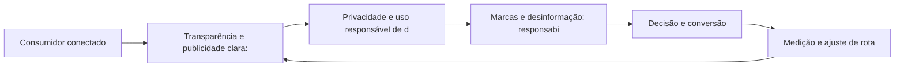

# Capítulo 50: Ética e Confiança: O Marketing Responsável na Era Digital

## 1. Introdução

Bem-vindo a uma nova etapa da sua navegação pelo marketing digital. Este capítulo — *Ética e Confiança: O Marketing Responsável na Era Digital* — integra a Parte X, *Futuro — A Previsão do Tempo*, e responde a uma pergunta prática: **transparência e publicidade clara: rótulos e disclosure** — na prática, como isso se traduz em decisão e resultado?

Ao final, você será capaz de aplica princípios éticos ao marketing digital: transparência, privacidade, combate à desinformação e construção de confiança sustentável.. Mais do que decorar conceitos, você vai enxergar o futuro como previsão do tempo: prepara-se sem controlar — e converter essa visão em plano, experimento e métrica.

No capítulo anterior, *Experiências Imersivas: Metaverso, Realidade Aumentada e Novos Formatos*, você aprendeu os conceitos que servem de plataforma para o que vem agora. Este capítulo retoma esse repertório e o aplica a um território novo — sem repetir o que já foi estabelecido, apenas usando como base.

O capítulo segue a estrutura das sete seções que organizam esta obra: primeiro a exposição conceitual, depois a ilustração, a técnica aplicada, o exercício de aplicação e a conclusão operacional.

No contexto de *Ética e Confiança: O Marketing Responsável na Era Digital*, o ambiente privacy-first reescreveu as regras da medição: o fim dos cookies de terceiros força first-party data, consentimento explícito e contextual targeting [7].

No contexto de *Ética e Confiança: O Marketing Responsável na Era Digital*, a confiança emergiu como o ativo de marketing mais caro e mais frágil: transparência e uso responsável de dados deixaram de ser compliance e viraram posicionamento [18].
## 2. Explica

### Transparência e publicidade clara: rótulos e disclosure

Quando o tema é *Ética e Confiança: O Marketing Responsável na Era Digital*, o primeiro pilar — transparência e publicidade clara: rótulos e disclosure — define o território conceitual. A confiança emergiu como o ativo de marketing mais caro e mais frágil da era digital: transparência virou posicionamento [18].

Na prática, transparência e publicidade clara: rótulos e disclosure significa transformar a teoria em rotina operacional — exatamente o que *Ética e Confiança: O Marketing Responsável na Era Digital* exige no dia a dia. A literatura de gestão é enfática: sem operacionalizar o conceito em checklist, responsável e métrica, ele permanece slide de apresentação [3]. Por isso a Parte X propõe sempre o mesmo movimento: entender, traduzir em critério observável e decidir com dado.

### Privacidade e uso responsável de dados como diferencial

O segundo pilar — privacidade e uso responsável de dados como diferencial — conecta a estratégia à operação diária. O stack MarTech cresceu exponencialmente: o desafio deixou de ser ter ferramentas e passou a ser integrá-las em torno de um dado de cliente único [8]. A experiência do consumidor se constrói na consistência entre canais e mensagens, e é essa consistência que transforma contato em relacionamento [16]. Organizações que tratam cada canal como silo perdem o fio condutor da jornada; as que operam o pilar com disciplina reduzem atrito e aumentam a taxa de avanço entre etapas [10].

### Marcas e desinformação: responsabilidade na comunicação

Fechando o tripé, marcas e desinformação: responsabilidade na comunicação é o que transforma a Parte X em vantagem mensurável. A IA na publicidade automatiza criativos e otimização, mas a supervisão humana permanece como guarda de qualidade e de ética [19]. O relato da indústria mostra que as empresas que sustentam resultado não são as que têm mais ferramentas, mas as que conseguem medir e ajustar a rota com frequência [8]. A métrica certa, escolhida antes da campanha, vale mais do que qualquer ferramenta cara instalada depois do fato [9].

### O Eixo Transversal do Capítulo

O consentimento estruturado — finalidade, base legal e revogação — é a fundação do first-party data legítimo [7]. Esse eixo conecta os três pilares e explica por que o capítulo os trata como um sistema, não como uma lista: cada pilar reforça o outro, e a omissão de qualquer um deles produz estratégia manca. O capítulo seguinte retomará esse eixo com novas ferramentas, agora com o vocabulário já estabelecido aqui.

Em síntese, o capítulo opera em três níveis: o conceitual (Transparência e publicidade clara: rótulos e disclosure), o operacional (Privacidade e uso responsável de dados como diferencial) e o estratégico (Marcas e desinformação: responsabilidade na comunicação). O leitor que dominar os três estará apto a aplicar a Parte X com autonomia [1]. A evidência reunida nesta seção sustenta cada recomendação prática das seções seguintes [2].

## 3. Ilustra

Vamos traduzir o capítulo em uma cena concreta, no contexto de *Ética e Confiança: O Marketing Responsável na Era Digital*. Uma empresa de porte médio, com equipe enxuta e orçamento limitado, decide operar a Parte X desta obra, *Futuro — A Previsão do Tempo*. Na primeira semana, a equipe testa o conceito central do capítulo em um caso real: um cliente que pesquisou, comparou e decidiu comprar. O primeiro pilar — transparência e publicidade clara: rótulos e disclosure — orienta o entendimento inicial do público; o segundo — privacidade e uso responsável de dados como diferencial — guia a escolha da rota de comunicação; e o terceiro fecha com a medição do resultado [2].

O diagrama abaixo representa o fluxo operacional proposto pelo capítulo — do consumidor conectado à decisão e ao ajuste contínuo de rota, com o público e a plataforma específicos do tema no centro da navegação:



Observe o laço de retorno: a medição alimenta o próximo ciclo de campanha. Essa é a diferença estrutural entre campanha e sistema — a campanha termina quando o orçamento acaba; o sistema aprende e se ajusta a cada ciclo [7]. No caso do tema *Ética e Confiança: O Marketing Responsável na Era Digital*, esse laço é o que converte o investimento inicial em aprendizado acumulado para as próximas decisões [15].

## 4. Técnica

### A Política de Dados Privacy-First em Código

O futuro do marketing é privacy-first, e privacidade se implementa — não se declara. O código abaixo modela o consentimento conforme a LGPD: finalidades explícitas, bases legais e direito de revogação.

```python
from dataclasses import dataclass, field

@dataclass
class Consentimento:
    titular: str
    finalidades: list = field(default_factory=list)
    base_legal: str = "consentimento"
    ativo: bool = True

    def conceder(self, finalidade: str):
        self.finalidades.append(finalidade)

    def revogar(self):
        self.ativo = False
        self.finalidades.clear()

c = Consentimento("cliente@exemplo.com")
c.conceder("newsletter_marketing")
c.conceder("analise_comportamental")
print(c)
c.revogar()  # direito de exclusão em ação
print(c)
```

O consentimento é a fundação do first-party data: sem ele, não há medição, segmentação ou personalização legítima [7]. A IA generativa amplia a produção, mas a supervisão humana permanece [19].

O código acima é o núcleo técnico de *Ética e Confiança: O Marketing Responsável na Era Digital*: validável, executável e adaptável ao contexto real do leitor. A prática recomendada é rodá-lo com dados próprios e usar a saída como insumo da próxima reunião de planejamento. Documentação oficial das plataformas reforça cada passo — da estrutura de campanhas [5] à configuração de eventos [12]. A leitura técnica deste capítulo complementa a exposição conceitual das seções anteriores e prepara os exercícios da seção seguinte.

## 5. Aplica

Conhecimento sem aplicação é conteúdo; aplicação sem reflexão é rotina. No contexto de *Ética e Confiança: O Marketing Responsável na Era Digital*, os exercícios abaixo fecham o capítulo e preparam o terreno do próximo:

1. Mapeie seu stack MarTech atual e identifique as duas integrações que mais reduziriam atrito operacional.
2. Revise os textos de consentimento dos seus formulários e simplifique a linguagem para o titular.
3. Desenhe um fluxo de personalização baseado em primeiro dado (first-party) sem depender de cookies.
4. Simule um cenário cookieless: escolha uma campanha e redefina a medição sem cookies de terceiros.

Dedique ao menos 30 minutos a um dos exercícios antes de avançar. O aprendizado desta obra é cumulativo: o mapa desenhado aqui será usado nos capítulos seguintes da Parte X e nas partes subsequentes [3].

Complementando, cinco exercícios práticos adicionais consolidam o aprendizado de *Ética e Confiança: O Marketing Responsável na Era Digital*:

1. Sua operação coletaria os mesmos dados se os cookies de terceiros nunca tivessem existido?
2. Sua política de consentimento é clara para o titular — ou foi escrita para a empresa?
3. Onde a IA generativa economiza tempo real na sua operação — e onde ela deveria ser proibida sem revisão?
4. Se sua marca tivesse que explicar publicamente como usa os dados, a explicação seria confortável?
5. Qual experimento de automação você pode rodar este mês para medir o retorno antes de escalar?

## Leitura Complementar Recomendada

Para aprofundar *Ética e Confiança: O Marketing Responsável na Era Digital* além deste capítulo:

- Como complemento, a literatura de privacy-first (LGPD, GDPR, cookieless) e a documentação oficial das plataformas sobre medição sem cookies contextualizam a transição [7].

- Para aprofundar o futuro, os artigos da IBM sobre marketing com IA e os relatórios da Deloitte sobre tendências cobrem automação e personalização [19] [7].

## Análise de Riscos e Mitigações

A aplicação de *Ética e Confiança: O Marketing Responsável na Era Digital* envolve riscos identificáveis. A tabela de riscos abaixo relaciona cada ameaça à sua mitigação:

- Risco de perseguir tendência: tecnologia sem caso de uso. Mitigação: avaliação de retorno antes da adoção [3].
- Risco de automação sem supervisão: escala de erros. Mitigação: revisão humana obrigatória em pontos definidos [19].
- Risco de coleta ilegítima: dado sem consentimento. Mitigação: auditoria de coleta, base legal e revogação [7].
- Risco de adaptação tardia ao cookieless: medição colapsando. Mitigação: antecipação com first-party e eventos [7].

## Considerações de Implementação

p

## Exercício Integrador da Parte X

n

Este exercício conecta o capítulo às demais partes da obra e deve ser revisto ao final da leitura completa.

## Aprofundamento Prático

O tema de *Ética e Confiança: O Marketing Responsável na Era Digital* ganha potência quando levado ao nível operacional. Os quatro pontos abaixo aprofundam a aplicação prática:

- A leitura avançada do first-party data exige o mapa de consentimento: cada ponto de coleta com base legal, finalidade e retenção — a governança é a infraestrutura do dado próprio [7].

- A adaptação ao cookieless é um projeto, não um evento: migrar a medição para eventos, contexto e first-party exige sequência, teste e documentação [7].

- O stack MarTech é um sistema a integrar: CRM, automação, analytics e CDP em torno do dado único do cliente — a integração é o valor, o resto é despesa [8].

- A ética digital se opera por princípios: transparência, consentimento e responsabilidade — a política pública de IA e dados é o instrumento que traduz os princípios em regras [20].

## Exercícios de Fixação

Para consolidar *Ética e Confiança: O Marketing Responsável na Era Digital*, resolva os cinco exercícios abaixo — com caneta, papel e dados reais:

1. Escreva uma política de IA da sua equipe em três regras.
2. Audite um ponto de coleta de dados contra a LGPD.
3. Simplifique um texto de consentimento para linguagem de titular.
4. Defina uma tarefa que a IA não deve fazer sem revisão humana.
5. Desenhe a medição de uma campanha sem cookies de terceiros.

## Autoavaliação do Capítulo

Autoavaliação: (1) Minha coleta de dados passa numa auditoria de LGPD? (2) Meus textos de consentimento são claros para o titular? (3) Tenho estratégia first-party desenhada? (4) Minha automação tem revisão humana definida? (5) Minha política de IA e dados é pública e praticada? Responda e priorize a primeira resposta negativa.

A primeira resposta negativa é o seu próximo passo natural — volte a ela na seção de aplicação deste capítulo e trabalhe o item até que a resposta seja sim.

## Problemas Comuns e Soluções Práticas

Aplicar *Ética e Confiança: O Marketing Responsável na Era Digital* no mundo real esbarra em problemas recorrentes. Abaixo, cinco situações típicas com suas soluções — sintoma, causa e correção:

### Dados coletados sem consentimento

Risco legal e confiança em risco. A solução é auditar os pontos de coleta, definir base legal e finalidade, e implementar a revogação — o consentimento é a fundação [7].

### Cookieless pegando desprevenido

A medição quebra quando o cookie some. A solução é a antecipação: eventos, contexto e first-party data desde já — a adaptação antecipada é vantagem [7].

### MarTech virou despesa

Ferramentas acumuladas sem integração. A solução é mapear o stack, integrar em torno do dado único e cortar o que não gera valor [8].

### Tendência perseguida sem retorno

Adotar novidade sem caso de uso. A solução é a avaliação sóbria: retorno mensurável antes da adoção — pioneiro só quando o número justifica [3].

### IA sem supervisão

Conteúdo gerado e publicado sem revisão. A solução é o fluxo obrigatório de revisão humana com critérios de qualidade e voz — a automação amplia, o humano garante [19].

## Aplicações por Setor

O tema de *Ética e Confiança: O Marketing Responsável na Era Digital* ganha contornos diferentes em cada setor. A leitura setorial abaixo ajuda a adaptar os princípios ao seu contexto:

- No varejo, a IA automatiza catálogo e atendimento; no B2B, gera conteúdo técnico e qualifica leads; no serviço, personaliza a experiência — a adoção segue o caso de uso de cada setor [19].

- Na fintech, o privacy-first é mandatório e o consentimento é estrutural; no varejo, o first-party data alimenta a personalização; no B2B, a confiança sustenta o ciclo longo [7].

## Plano de Ação de 30 Dias

Para converter a leitura de *Ética e Confiança: O Marketing Responsável na Era Digital* em resultado, execute um dos planos semanais abaixo — cada semana tem um objetivo e uma entrega:

### Plano de Ação — Opção 1

Semana 1 — Automação: liste as tarefas repetitivas de maior potencial de automação.
Semana 2 — Piloto: implemente a primeira automação com revisão humana definida.
Semana 3 — IA: teste variações de criativo geradas por IA versus humanas.
Semana 4 — Política: documente a política de IA e escale com supervisão.

### Plano de Ação — Opção 2

Semana 1 — Auditoria: audite a coleta de dados contra a LGPD.
Semana 2 — Consentimento: atualize os textos e implemente a revogação funcional.
Semana 3 — First-party: desenhe a estratégia de coleta própria com consentimento.
Semana 4 — Teste: lance uma campanha com medição cookieless e meça.

## KPIs que Importam neste Capítulo

Para *Ética e Confiança: O Marketing Responsável na Era Digital*, os KPIs que importam: custo por resultado com e sem IA, taxa de personalização, qualidade do first-party data e retenção de clientes confiáveis — os números do futuro [19].

Antes de encerrar, registre esses indicadores no seu painel de acompanhamento — eles serão a régua para medir a aplicação deste capítulo nas próximas semanas.

## Roteiro de Implementação Passo a Passo

Para aplicar *Ética e Confiança: O Marketing Responsável na Era Digital* na prática, os roteiros abaixo organizam a sequência de ações — do diagnóstico à medição:

### Roteiro de Implementação 1

1. Liste as tarefas repetitivas da operação que consomem mais tempo.
2. Priorize as três com maior potencial de automação e menor risco.
3. Defina para cada uma: entrada, processamento, saída e ponto de revisão humana.
4. Implemente a primeira automação em piloto.
5. Compare o tempo gasto antes e depois, com qualidade monitorada.
6. Avalie a ferramenta de IA generativa para variações de criativo.
7. Defina o processo de revisão: quem valida, com quais critérios.
8. Lance um teste de campanha com criativos de IA versus humanos.
9. Meça o desempenho e decida a mistura ideal.
10. Registre o aprendizado e escale com supervisão.

### Roteiro de Implementação 2

1. Audite todos os pontos de coleta de dados da sua operação.
2. Para cada ponto, verifique: base legal, finalidade e minimização.
3. Atualize os textos de consentimento com linguagem simples e explícita.
4. Defina a política de retenção: por quanto tempo cada dado é guardado.
5. Implemente o processo de revogação e exclusão funcional.
6. Mapeie o que a operação perderia sem cookies de terceiros.
7. Desenhe a estratégia first-party: o que coletar com consentimento e como usar.
8. Teste uma campanha com medição cookieless (eventos, contexto, conversões).
9. Escolha uma tarefa para a IA generativa com revisão humana obrigatória.
10. Documente a política pública de IA e de dados da marca.

## Perguntas Frequentes

Em relação ao tema de *Ética e Confiança: O Marketing Responsável na Era Digital*, cinco perguntas surgem com frequência na prática profissional:

**Cookieless já é realidade?**

Em transição: a medição está migrando para eventos, contexto e first-party — e a adaptação antecipada é vantagem [7].

**A IA vai substituir o marketing?**

Não — vai redesenhar o operacional. O estratégico, o ético e o empático continuam humanos [19].

**O que é first-party data?**

Dados coletados diretamente da sua audiência, com consentimento — o ativo central no mundo sem cookies [7].

**A LGPD me impede de fazer marketing?**

Não — ela organiza: base legal, transparência e direitos do titular são o padrão de uma operação confiável [7].

**Por onde começar a automação?**

Por tarefas repetitivas de baixo risco e alto volume, com ponto de revisão humana definido [19].

## Cenários Numéricos Comentados

Os cálculos abaixo mostram, com números concretos, como as decisões de *Ética e Confiança: O Marketing Responsável na Era Digital* se traduzem em resultado:

### Cenário numérico: o valor do first-party data

Com a queda dos cookies de terceiros, um anúncio com segmentação por contexto entrega CTR de 0,5%; com segmentação por first-party data, o CTR sobe para 1,5%. Para 100 mil impressões, isso significa 1.500 cliques contra 500 — o dado próprio é o ativo que multiplica a eficiência da mídia [7].

### Cenário numérico: o custo da criação com IA

Produzir 30 variações de criativo manualmente custa cerca de 30 horas de trabalho; com IA generativa e revisão humana, o mesmo volume consome 5 horas. A economia de 25 horas por ciclo de campanha se converte em mais testes, mais aprendizado e melhor otimização [19].

## Como Este Capítulo se Integra à Obra

O futuro é a previsão do tempo da obra: a IA e o privacy-first (X) reconfiguram como as partes I a IX serão operadas. O navegador que domina os fundamentos, a jornada, a busca, as redes, o relacionamento, a conversão, as métricas e a economia do cliente estará preparado para navegar as mudanças que o futuro trará. No contexto de *Ética e Confiança: O Marketing Responsável na Era Digital*, essa integração fica ainda mais visível: as ferramentas e métricas que você dominou aqui serão a base das decisões dos próximos capítulos — e das partes que virão depois.

## Aprofundamento Conceitual

No contexto de *Ética e Confiança: O Marketing Responsável na Era Digital*, a personalização em escala com machine learning é a promessa realizada: recomendar, segmentar dinamicamente e prever comportamento em tempo real são operações maduras, não experimentos de laboratório [19].

No contexto de *Ética e Confiança: O Marketing Responsável na Era Digital*, o privacy-first é a nova fundação da medição: sem cookies de terceiros, o first-party data — coletado com consentimento e transparência — tornou-se o ativo central do marketing digital [7].

No contexto de *Ética e Confiança: O Marketing Responsável na Era Digital*, a confiança é o ativo de marketing mais valioso e mais frágil: transparência no uso de dados, autenticidade nas comunicações e consistência entre promessa e entrega constroem o capital que sustenta tudo o mais [18].

No contexto de *Ética e Confiança: O Marketing Responsável na Era Digital*, o stack MarTech é um sistema, não uma coleção: a integração entre CRM, automação, analytics e dados de cliente é o que gera valor — ferramentas isoladas são despesa, não investimento [8].

No contexto de *Ética e Confiança: O Marketing Responsável na Era Digital*, a IA na publicidade automatiza o operacional: geração de criativos, segmentação e otimização rodam sozinhos, liberando o time para estratégia, ética e supervisão — o papel humano é o controle de qualidade [19].

## Fundamentos em Detalhe

No contexto de *Ética e Confiança: O Marketing Responsável na Era Digital*, as experiências imersivas — realidade aumentada, virtual e gamificação — estão nos estágios iniciais de adoção comercial: a promessa existe, mas a avaliação sóbria de valor é necessária [3].

No contexto de *Ética e Confiança: O Marketing Responsável na Era Digital*, a ética digital não é restrição, é vantagem competitiva: marcas confiáveis convertem melhor, retêm por mais tempo e resistem melhor a crises [20].

No contexto de *Ética e Confiança: O Marketing Responsável na Era Digital*, a tecnologia é meio, não fim: o marketing do futuro pertence a quem combina automação com empatia — usando a máquina para liberar o humano para o que máquina não faz [20].

No contexto de *Ética e Confiança: O Marketing Responsável na Era Digital*, a IA generativa deslocou o gargalo da criação: o custo do conteúdo caiu, e o diferencial passou a ser curadoria, consistência de marca e supervisão humana sobre o que é publicado [19].

No contexto de *Ética e Confiança: O Marketing Responsável na Era Digital*, a personalização em escala, prometida há duas décadas, tornou-se operacional com machine learning: recomendação, segmentação dinâmica e previsão de comportamento rodam em tempo real [19].

## Estudos de Caso Aplicados

### Caso: o time que automatizou com supervisão humana

Um time de marketing adotou IA generativa para criar variações de criativo e rascunhos de conteúdo — mas manteve a revisão humana obrigatória para qualidade e voz de marca. A produção triplicou sem perder consistência, e os testes revelaram quais variações geradas por IA performavam melhor [19].

### Caso: a marca que personalizou com consentimento

Uma marca de moda queria personalizar sem depender de cookies. Coletou dados first-party com consentimento explícito — preferências, medidas, estilo — e passou a personalizar e-mail, site e recomendações com base nesses dados. A relevância subiu, o descadastro caiu e a marca construiu uma relação mais confiável com o cliente [7].

## Dados e Números do Setor

### Dados de Contexto

- A IA generativa reduziu o custo da criação de conteúdo [19].
- A personalização em escala é operacional com machine learning [19].
- O fim dos cookies de terceiros força o first-party data [7].

### Indicadores-Chave

- A confiança é o ativo que mais correlaciona com retenção [18].
- O consentimento estruturado é a base da medição legítima [7].
- A supervisão humana permanece como guarda de qualidade na IA [19].

## Análise Comparativa

O tema de *Ética e Confiança: O Marketing Responsável na Era Digital* fica mais claro quando contrastado com a alternativa mais próxima. A comparação abaixo organiza as diferenças:

### Automação vs. Supervisão Humana

- Automação amplia capacidade; supervisão preserva qualidade e ética.
- A máquina gera em escala; o humano define a voz e a estratégia.
- Sem supervisão, a escala multiplica erros; com ela, multiplica resultados.
- O futuro é a síntese: automação para o operacional, humano para o estratégico.

## Erros Comuns e Como Evitá-los

No tema de *Ética e Confiança: O Marketing Responsável na Era Digital*, cinco erros recorrentes merecem atenção especial — cada um com sua correção prática:

1. Tratar a IA como substituta: a máquina amplia capacidade, mas a estratégia, a ética e a empatia continuam humanas.
2. Automatizar sem supervisão: conteúdo de IA publicado sem revisão destrói a voz e a confiança da marca.
3. Coletar dados sem consentimento: além do risco legal, o abuso destrói o ativo mais valioso — a confiança.
4. Perseguir toda tendência: adotar tecnologia sem caso de uso real multiplica despesa sem retorno.
5. Ignorar o privacy-first: adiar a adaptação ao cookieless é deixar a medição para colapsar quando o prazo chegar.

## Ferramentas e Recursos Recomendados

Para operar o tema de *Ética e Confiança: O Marketing Responsável na Era Digital* na prática, a seguinte seleção de ferramentas cobre o ciclo completo — do diagnóstico à medição:

1. Ferramenta de automação com orquestração
2. Modelo de política de dados da marca
3. Ferramenta de consentimento (CMP)
4. Plataforma de IA generativa com revisão humana
5. CDP para dado de cliente unificado

## Glossário do Capítulo

Os termos abaixo — todos usados no corpo deste capítulo — formam o vocabulário mínimo para acompanhar o restante da obra:

IA generativa: modelo que cria conteúdo. First-party data: dados coletados diretamente da audiência. Cookieless: ambiente sem cookies de terceiros. LGPD: Lei Geral de Proteção de Dados. GDPR: regulamento europeu. MarTech: stack de ferramentas de marketing. Personalização: mensagem sob medida.

## Checklist de Implementação

Use a lista abaixo para auditar a aplicação de *Ética e Confiança: O Marketing Responsável na Era Digital* na sua operação — marque os itens já concluídos e priorize os pendentes:

- [ ] Política de first-party data definida
- [ ] Teste de IA com revisão humana agendado
- [ ] Política pública de IA escrita
- [ ] Uso de dados auditado contra a LGPD
- [ ] Consentimento estruturado por finalidade

## Perguntas para Reflexão

Antes de avançar, reflita sobre as cinco questões abaixo — elas conectam o conteúdo de *Ética e Confiança: O Marketing Responsável na Era Digital* ao seu contexto real de trabalho:

1. Sua política de consentimento é clara para o titular — ou foi escrita para a empresa?
2. Onde a IA generativa economiza tempo real na sua operação — e onde ela deveria ser proibida sem revisão?
3. Se sua marca tivesse que explicar publicamente como usa os dados, a explicação seria confortável?
4. Qual experimento de automação você pode rodar este mês para medir o retorno antes de escalar?
5. Sua operação coletaria os mesmos dados se os cookies de terceiros nunca tivessem existido?

## Quadro Comparativo: Tendências e Implicações

O quadro abaixo consolida os elementos essenciais de *Ética e Confiança: O Marketing Responsável na Era Digital* em perspectiva comparada, facilitando a consulta rápida e a tomada de decisão:

| Tendência | O que muda | Ação |
|---|---|---|
| Tendência | O que muda | Ação |
| IA generativa | Custo da criação | Automação com revisão |
| Privacy-first | Medição | First-party data |
| Cookieless | Rastreio | Eventos e contexto |
| Automação | Operacional | Supervisão humana |
| Ética | Confiança | Transparência |

## 6. Conclusão

O capítulo percorreu o território da Parte X, *Futuro — A Previsão do Tempo*, e deixou três aprendizados operacionais. Primeiro, o conceito central — *Ética e Confiança: O Marketing Responsável na Era Digital* — é menos uma novidade e mais uma disciplina de execução. Segundo, a aplicação exige a tríade conceito, rota e métrica, sem pular etapas [8]. Terceiro, o ajuste contínuo de rota, ilustrado no laço de retorno do diagrama, é o que separa campanhas pontuais de operações sustentáveis [7]. O caminho percorrido desde *Experiências Imersivas: Metaverso, Realidade Aumentada e Novos Formatos* até aqui forma a base que o próximo passo vai usar.

Como navegador de marketing digital, você não decorou uma fórmula — incorporou um modo de operar: ler o território, escolher a rota com dados e ajustar o percurso quando o vento muda [2].

Antes do fechamento, vale reforçar a base do capítulo: No contexto de *Ética e Confiança: O Marketing Responsável na Era Digital*, o humano e a máquina têm papéis complementares: a automação libera o profissional para o que exige empatia, julgamento e criatividade — e o marketing do futuro é a síntese dos dois [20].

No contexto de *Ética e Confiança: O Marketing Responsável na Era Digital*, a IA generativa é uma mudança de custo, não só de capacidade: o conteúdo que custava horas agora custa minutos — e o diferencial passou a ser a supervisão, a curadoria e a voz consistente da marca [19].
## 7. Referências Bibliográficas

[1] KOTLER, Philip; KELLER, Kevin Lane. **Administração de Marketing**. 15. ed. São Paulo: Pearson, 2016.
[2] KOTLER, Philip; KARTAJAYA, Hermawan; SETIAWAN, Iwan. **Marketing 4.0: Moving from Traditional to Digital**. Hoboken: Wiley, 2017.
[3] CHAFFEY, Dave; ELLIS-CHADWICK, Fiona. **Digital Marketing: Strategy, Implementation and Practice**. 9. ed. Harlow: Pearson, 2025.
[4] GOOGLE SEARCH CENTRAL. **Search Engine Optimization (SEO) Starter Guide**. Disponível em: https://developers.google.com/search/docs/fundamentals/seo-starter-guide. Acesso em: 02 ago. 2026.
[5] GOOGLE ADS HELP CENTER. **Your guide to Google Ads (Basics, Search Campaigns & Best Practices)**. Disponível em: https://support.google.com/google-ads/answer/6146252. Acesso em: 02 ago. 2026.
[6] META BUSINESS HELP CENTER. **Meta Ads Manager Guide: Best Practices for Targeting, Measurement, and Optimization**. Disponível em: https://www.facebook.com/business/help. Acesso em: 02 ago. 2026.
[7] DELOITTE DIGITAL. **Marketing Trends 2026: New Marketing for a New World**. Disponível em: https://www.deloittedigital.com/nl/en/insights/perspective/marketing-trends-2026.html. Acesso em: 02 ago. 2026.
[8] HUBSPOT RESEARCH. **The State of Marketing / 2026 Marketing Statistics, Trends & Data**. Disponível em: https://www.hubspot.com/marketing-statistics. Acesso em: 02 ago. 2026.
[9] STATISTA RESEARCH DEPARTMENT. **Global Digital Marketing and Advertising Revenue Statistics & Facts**. Disponível em: https://www.statista.com/topics/8954/marketing-worldwide/. Acesso em: 02 ago. 2026.
[10] RYAN, Damian. **Understanding Digital Marketing: Marketing Strategies for Engaging the Digital Generation**. 5. ed. London: Kogan Page, 2020.
[11] HOLLENSEN, Svend; KOTLER, Philip; OPRESNIK, Marc Oliver. **Social Media Marketing: A Practitioner Approach**. 4. ed. Harlow: Pearson, 2023.
[12] GOOGLE ANALYTICS HELP CENTER. **Documentação oficial do Google Analytics 4**. Disponível em: https://support.google.com/analytics. Acesso em: 02 ago. 2026.
[13] LINKEDIN MARKETING SOLUTIONS. **Best Practices para campanhas B2B no LinkedIn**. Disponível em: https://business.linkedin.com/marketing-solutions. Acesso em: 02 ago. 2026.
[14] TIKTOK FOR BUSINESS. **Guia de criatividade e boas práticas de anúncios no TikTok**. Disponível em: https://www.tiktok.com/business. Acesso em: 02 ago. 2026.
[15] DATAREPORTAL. **Digital 2026: Global Overview Report**. Disponível em: https://datareportal.com/reports/digital-2026-global-overview-report. Acesso em: 02 ago. 2026.
[16] LEMON, Katherine N.; VERHOEF, Peter C. **Understanding Customer Experience Throughout the Customer Journey**. *Journal of Marketing*, v. 80, n. 6, p. 69-96, 2016.
[17] TIWARI, Rajnish; BUSE, Stephan; HERSTATT, Cornelius. **From Electronic to Mobile Commerce: Opportunities and Challenges**. *Proceedings of the German-Indian Roundtable*, 2006.
[18] VAN DIJK, Jan A. G. M. **The Digital Divide**. Cambridge: Polity Press, 2020.
[19] IBM. **Marketing with AI: Personalization at Scale**. Disponível em: https://www.ibm.com/think/topics/ai-marketing. Acesso em: 02 ago. 2026.
[20] KOTLER, Philip. **Marketing 5.0: Technology for Humanity**. Hoboken: Wiley, 2021.
