# Marketing na Era Digital: Conceitos, Plataformas e Estratégias

**Autor:** Heverton Eduardo Peres

> Obra produzida pela esteira editorial agêntica da Editora Agêntica. A metáfora condutora desta obra é *A Jornada do Consumidor como Navegação Guiada*.

## Sumário

**Parte I — Fundamentos — O Novo Território**

- Capítulo 1: Do Marketing Tradicional ao Digital: A Mudança de Paradigma
- Capítulo 2: O Mix Digital: Produto, Preço, Praça e Promoção no Ambiente Online
- Capítulo 3: A Economia da Atenção: Como Conquistar o Consumidor Distraído
- Capítulo 4: O Consumidor Conectado: Comportamento e Motivações Digitais
- Capítulo 5: Marketing Digital na Prática: Aplicação em Diferentes Portes de Negócio
**Parte II — A Jornada do Consumidor — Mapeando a Navegação**

- Capítulo 6: Funil de Vendas e Jornada do Cliente: Mapeando a Navegação
- Capítulo 7: Personas e Segmentação: Conhecendo o Viajante
- Capítulo 8: Touchpoints e Momentos de Verdade: A Experiência Multicanal
- Capítulo 9: Experiência do Cliente (CX) e o Marketing de Relacionamento
- Capítulo 10: Neuromarketing e a Psicologia da Decisão de Compra Online
**Parte III — Busca — A Rota da Intenção**

- Capítulo 11: Google Ads e SEM: A Rota da Intenção de Compra
- Capítulo 12: SEO: Conquistando Visibilidade Orgânica
- Capítulo 13: Pesquisa de Palavras-Chave: Mapeando a Intenção do Viajante
- Capítulo 14: SEO Técnico e Core Web Vitals: Performance como Fator de Ranqueamento
- Capítulo 15: O Futuro da Busca: SGE e a Otimização para Respostas de IA
**Parte IV — Redes Sociais — Territórios de Comunidade**

- Capítulo 16: Meta: Facebook e Instagram como Ecossistema de Negócio
- Capítulo 17: TikTok, YouTube e LinkedIn: Territórios Especializados
- Capítulo 18: Estratégia de Vídeo Vertical: Reels, Shorts e Conteúdo de Formato Curto
- Capítulo 19: Tráfego Pago em Escala: Estrutura, Teste e Otimização de Campanhas
- Capítulo 20: Plataformas de Nicho e Comunidades: Pinterest, X/Twitter, Reddit e Grupos
**Parte V — Relacionamento — A Rota da Retenção**

- Capítulo 21: E-mail Marketing e Automação: O Relacionamento de Longo Prazo
- Capítulo 22: Content Marketing e Inbound: Atração Baseada em Valor
- Capítulo 23: Lifecycle Marketing: Nutrição e Ciclo de Vida do Cliente
- Capítulo 24: Fidelização: Programas de Lealdade e Comunidades de Marca
- Capítulo 25: Copywriting Digital: Escrevendo para Converter em Cada Canal
**Parte VI — Estratégias Sociais — Rotas de Autoridade**

- Capítulo 26: Social Media Marketing: Construindo Comunidade e Autoridade
- Capítulo 27: Marketing de Influência: Autoridade Transferida
- Capítulo 28: Branding Digital: Identidade, Posicionamento e Presença de Marca
- Capítulo 29: Growth Marketing: Experimentação e Canais de Crescimento
- Capítulo 30: Marketing B2B: Geração de Demanda e Account-Based Marketing
**Parte VII — Conversão — O Porto Seguro**

- Capítulo 31: CRO: Otimizando a Conversão no Porto Seguro
- Capítulo 32: E-commerce e Omnicanalidade: Vendendo em Todos os Territórios
- Capítulo 33: Landing Pages de Alta Conversão: Estrutura, Mensagem e Teste
- Capítulo 34: Análise de Conversão: Funis, Eventos e Atribuição
- Capítulo 35: Social Commerce e Vendas Sociais: Convertendo Dentro das Redes
**Parte VIII — Métricas — O Radar de Navegação**

- Capítulo 36: Google Analytics 4: Medindo a Navegação do Usuário
- Capítulo 37: KPIs e ROI: O Que Medir e Como Interpretar
- Capítulo 38: Modelos de Atribuição: Distribuindo o Crédito entre Canais
- Capítulo 39: Dashboards e BI de Marketing: Do Dado Bruto à Decisão
- Capítulo 40: Experimentação em Escala: Metodologia de Testes A/B Confiável
**Parte IX — Economia do Cliente — A Matemática do Negócio**

- Capítulo 41: CAC e LTV: A Matemática da Aquisição e Retenção
- Capítulo 42: Data-Driven Marketing: Da Intuição ao Dado
- Capítulo 43: Pricing e Monetização: Estratégias de Preço no Ambiente Digital
- Capítulo 44: Customer Success e Retenção: O Marketing Pós-Venda
- Capítulo 45: Planejamento e Orçamento de Marketing: Alocando Recursos com Inteligência
**Parte X — Futuro — A Previsão do Tempo**

- Capítulo 46: IA no Marketing: Automação, Personalização e Geração de Conteúdo
- Capítulo 47: Privacy-First e o Futuro Sem Cookies: Navegando com LGPD e GDPR
- Capítulo 48: Automação e MarTech: O Stack Tecnológico do Marketing Moderno
- Capítulo 49: Experiências Imersivas: Metaverso, Realidade Aumentada e Novos Formatos
- Capítulo 50: Ética e Confiança: O Marketing Responsável na Era Digital

---

## Prefácio

Prefácio de impacto: o consumidor nunca esteve tão no controle — e nunca o marketing teve tantas ferramentas para compreendê-lo. Contextualizar a passagem do marketing de massa para o digital, apresentar a metáfora da navegação guiada e o destino da jornada: formar o Navegador de Marketing Digital capaz de operar conceitos, plataformas e estratégias com dados na mão.


# PARTE I — Fundamentos — O Novo Território

# Capítulo 1: Do Marketing Tradicional ao Digital: A Mudança de Paradigma

## 1. Introdução

Bem-vindo a uma nova etapa da sua navegação pelo marketing digital. Este capítulo — *Do Marketing Tradicional ao Digital: A Mudança de Paradigma* — integra a Parte I, *Fundamentos — O Novo Território*, e responde a uma pergunta prática: **marketing tradicional vs. digital: outbound, canais de massa, interrupção** — na prática, como isso se traduz em decisão e resultado?

Ao final, você será capaz de ntende a evolução do marketing de massa (outbound, 4ps) para o marketing digital centrado em dados e relacionamento, e por que o consumidor assumiu o controle da jornada.. Mais do que decorar conceitos, você vai enxergar o consumidor como viajante que decide o destino — e converter essa visão em plano, experimento e métrica.

O capítulo segue a estrutura das sete seções que organizam esta obra: primeiro a exposição conceitual, depois a ilustração, a técnica aplicada, o exercício de aplicação e a conclusão operacional.

No contexto de *Do Marketing Tradicional ao Digital: A Mudança de Paradigma*, o ambiente digital criou novas formas de prova social: avaliações, depoimentos, números de seguidores e menções públicas influenciam a decisão tanto quanto (ou mais que) a propaganda tradicional [2].

No contexto de *Do Marketing Tradicional ao Digital: A Mudança de Paradigma*, a personalização deixou de ser diferencial e virou expectativa: consumidores conectados assumem que a marca conhece seu histórico e suas preferências — e punem quem age como se não conhecesse [20].
## 2. Explica

### Marketing tradicional vs. digital: outbound, canais de massa, interrupção

Quando o tema é *Do Marketing Tradicional ao Digital: A Mudança de Paradigma*, o primeiro pilar — marketing tradicional vs. digital: outbound, canais de massa, interrupção — define o território conceitual. O relatório Digital 2026 registra mais de 5,5 bilhões de usuários de internet — dois terços da humanidade com acesso a canais que não existiam quando o marketing de massa foi desenhado [15].

Na prática, marketing tradicional vs. digital: outbound, canais de massa, interrupção significa transformar a teoria em rotina operacional — exatamente o que *Do Marketing Tradicional ao Digital: A Mudança de Paradigma* exige no dia a dia. A literatura de gestão é enfática: sem operacionalizar o conceito em checklist, responsável e métrica, ele permanece slide de apresentação [3]. Por isso a Parte I propõe sempre o mesmo movimento: entender, traduzir em critério observável e decidir com dado.

### Marketing 4.0 e o consumidor conectado: o caminho dos 5As

O segundo pilar — marketing 4.0 e o consumidor conectado: o caminho dos 5as — conecta a estratégia à operação diária. Kotler e Keller definem administração de marketing como a arte e a ciência de escolher mercados-alvo e construir relacionamentos lucrativos com eles — definição que ganha potência quando cada interação é rastreável e mensurável [1]. A experiência do consumidor se constrói na consistência entre canais e mensagens, e é essa consistência que transforma contato em relacionamento [16]. Organizações que tratam cada canal como silo perdem o fio condutor da jornada; as que operam o pilar com disciplina reduzem atrito e aumentam a taxa de avanço entre etapas [10].

### A economia da atenção e o novo papel da marca no ambiente digital

Fechando o tripé, a economia da atenção e o novo papel da marca no ambiente digital é o que transforma a Parte I em vantagem mensurável. O Marketing 4.0 propõe acompanhar o consumidor no caminho dos 5As — assimilação, atração, arguição, ação e defesa — substituindo o funil rígido por um percurso controlado pelo próprio consumidor [2]. O relato da indústria mostra que as empresas que sustentam resultado não são as que têm mais ferramentas, mas as que conseguem medir e ajustar a rota com frequência [8]. A métrica certa, escolhida antes da campanha, vale mais do que qualquer ferramenta cara instalada depois do fato [9].

### O Eixo Transversal do Capítulo

A mudança do custo dominante — de distribuição e mídia para atenção e confiança — reordena o orçamento: empresas que migram do outbound para o inbound relatam custos de aquisição menores e relacionamentos mais longos [3]. Esse eixo conecta os três pilares e explica por que o capítulo os trata como um sistema, não como uma lista: cada pilar reforça o outro, e a omissão de qualquer um deles produz estratégia manca. O capítulo seguinte retomará esse eixo com novas ferramentas, agora com o vocabulário já estabelecido aqui.

Em síntese, o capítulo opera em três níveis: o conceitual (Marketing tradicional vs. digital: outbound, canais de massa, interrupção), o operacional (Marketing 4.0 e o consumidor conectado: o caminho dos 5As) e o estratégico (A economia da atenção e o novo papel da marca no ambiente digital). O leitor que dominar os três estará apto a aplicar a Parte I com autonomia [1]. A evidência reunida nesta seção sustenta cada recomendação prática das seções seguintes [2].

## 3. Ilustra

Vamos traduzir o capítulo em uma cena concreta, no contexto de *Do Marketing Tradicional ao Digital: A Mudança de Paradigma*. Uma empresa de porte médio, com equipe enxuta e orçamento limitado, decide operar a Parte I desta obra, *Fundamentos — O Novo Território*. Na primeira semana, a equipe testa o conceito central do capítulo em um caso real: um cliente que pesquisou, comparou e decidiu comprar. O primeiro pilar — marketing tradicional vs. digital: outbound, canais de massa, interrupção — orienta o entendimento inicial do público; o segundo — marketing 4.0 e o consumidor conectado: o caminho dos 5as — guia a escolha da rota de comunicação; e o terceiro fecha com a medição do resultado [2].

O diagrama abaixo representa o fluxo operacional proposto pelo capítulo — do consumidor conectado à decisão e ao ajuste contínuo de rota, com o público e a plataforma específicos do tema no centro da navegação:

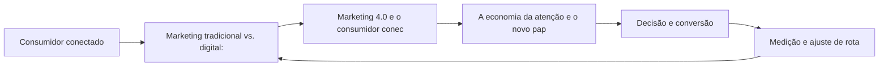

Observe o laço de retorno: a medição alimenta o próximo ciclo de campanha. Essa é a diferença estrutural entre campanha e sistema — a campanha termina quando o orçamento acaba; o sistema aprende e se ajusta a cada ciclo [7]. No caso do tema *Do Marketing Tradicional ao Digital: A Mudança de Paradigma*, esse laço é o que converte o investimento inicial em aprendizado acumulado para as próximas decisões [15].

## 4. Técnica

### O Diagnóstico do Mix Digital em Código

Para aplicar os fundamentos, nada melhor que um diagnóstico programático do mix. O código abaixo avalia a maturidade digital de cada um dos 4Ps a partir de critérios simples — transformando intuição em checklist executável.

```python
import json

def diagnosticar_mix(produto: dict, preco: dict, praca: dict, promocao: dict) -> dict:
    """Pontua a maturidade digital de cada P (0-100)."""
    def nota(crit: dict) -> float:
        soma = sum(1 for v in crit.values() if v)
        return round(100 * soma / max(len(crit), 1), 1)

    return {
        "produto": nota(produto),
        "preco": nota(preco),
        "praca": nota(praca),
        "promocao": nota(promocao),
    }

mix = diagnosticar_mix(
    produto={"personalizavel": True, "digital": True, "feedback": True},
    preco={"dinamico": False, "freemium": True, "transparente": True},
    praca={"multicanal": True, "marketplace": False, "d2c": True},
    promocao={"segmentada": True, "conteudo": True, "mensuravel": True},
)
print(json.dumps(mix, indent=2))
```

O resultado alimenta a priorização: o P com menor nota é o primeiro candidato a experimento [1]. A disciplina de medir antes de mudar é o que separa o diagnóstico do achismo [3].

O código acima é o núcleo técnico de *Do Marketing Tradicional ao Digital: A Mudança de Paradigma*: validável, executável e adaptável ao contexto real do leitor. A prática recomendada é rodá-lo com dados próprios e usar a saída como insumo da próxima reunião de planejamento. Documentação oficial das plataformas reforça cada passo — da estrutura de campanhas [5] à configuração de eventos [12]. A leitura técnica deste capítulo complementa a exposição conceitual das seções anteriores e prepara os exercícios da seção seguinte.

## 5. Aplica

Conhecimento sem aplicação é conteúdo; aplicação sem reflexão é rotina. No contexto de *Do Marketing Tradicional ao Digital: A Mudança de Paradigma*, os exercícios abaixo fecham o capítulo e preparam o terreno do próximo:

1. Diagnostique seu atual mix: liste os 4Ps da sua oferta e como cada um mudaria se o canal fosse 100% digital.
2. Mapeie o caminho dos 5As de um cliente real e marque onde sua marca está presente e onde perde o contato.
3. Classifique suas ações atuais como outbound ou inbound e estime o custo relativo de atenção de cada uma.
4. Defina uma métrica única para cada um dos 4Ps e meça a linha de base antes de qualquer mudança.

Dedique ao menos 30 minutos a um dos exercícios antes de avançar. O aprendizado desta obra é cumulativo: o mapa desenhado aqui será usado nos capítulos seguintes da Parte I e nas partes subsequentes [3].

Complementando, cinco exercícios práticos adicionais consolidam o aprendizado de *Do Marketing Tradicional ao Digital: A Mudança de Paradigma*:

1. Qual é o custo de atenção de cada formato que você publica? O que esse custo sugere sobre a escolha de canais?
2. Que experimento você poderia rodar esta semana para testar uma hipótese de marketing em vez de uma opinião?
3. Como o seu negócio seria diferente se você não pudesse interromper ninguém — e só fosse visto quando relevante?
4. Quais dos seus 4Ps já são digitais de verdade, e quais foram apenas 'digitalizados' sem mudança real?
5. Em qual dos 5As sua marca perde mais consumidores hoje? Que evidência sustenta essa resposta?

## Leitura Complementar Recomendada

Para aprofundar *Do Marketing Tradicional ao Digital: A Mudança de Paradigma* além deste capítulo:

- Para aprofundar os fundamentos, leia Kotler e Keller (Administração de Marketing) para a base conceitual, Kotler, Kartajaya e Setiawan (Marketing 4.0) para a transição digital, e Chaffey (Digital Marketing) para a operação prática — as três obras cobrem teoria, transição e execução [1] [2] [3].

- Como complemento de mercado, acompanhe os relatórios anuais da Deloitte (tendências de marketing) e do DataReportal (dados globais de digital) — eles contextualizam os números que aparecem neste capítulo [7] [15].

## Análise de Riscos e Mitigações

A aplicação de *Do Marketing Tradicional ao Digital: A Mudança de Paradigma* envolve riscos identificáveis. A tabela de riscos abaixo relaciona cada ameaça à sua mitigação:

- Risco de escopo: tentar digitalizar tudo ao mesmo tempo. Mitigação: foco no P de menor nota e em um canal piloto — a expansão vem depois do aprendizado [3].
- Risco de medição: decidir sem linha de base. Mitigação: registrar a métrica antes de qualquer mudança — o antes e o depois contam a história [8].
- Risco cultural: resistência do time à mudança. Mitigação: experimento pequeno e visível com resultado documentado — a evidência vence a opinião [8].
- Risco de orçamento: gastar em tudo sem prioridade. Mitigação: alocação por retorno esperado e revisão mensal da verba [9].

## Considerações de Implementação

i

## Exercício Integrador da Parte I

c

Este exercício conecta o capítulo às demais partes da obra e deve ser revisto ao final da leitura completa.

## Aprofundamento Prático

O tema de *Do Marketing Tradicional ao Digital: A Mudança de Paradigma* ganha potência quando levado ao nível operacional. Os quatro pontos abaixo aprofundam a aplicação prática:

- A medição do mix exige um pequeno modelo: uma planilha com os 4Ps, os critérios de maturidade e a nota de cada um, revisitada a cada trimestre. O simples ato de pontuar obriga a explicitar critérios — e explicitar critérios já é meio caminho para melhorar [8].

- O aprofundamento prático do mix digital começa pela disciplina do registro: cada decisão de produto, preço, praça e promoção deve ter um responsável, uma métrica e uma data de revisão. Essa rotina transforma o mix de conceito em instrumento de gestão — e é o que permite medir, ao final do trimestre, se o P priorizado realmente avançou [3].

- A leitura avançada do caminho dos 5As exige instrumentar cada A: assimilação (impressões e recall), atração (visitas e interesse), arguição (interações e pesquisas), ação (conversões) e defesa (indicações e avaliações). Sem evento por etapa, o 5As continua teoria [2].

- O custo de atenção é mensurável: divida o custo total de cada canal pelo tempo de atenção efetiva que ele gera. Essa conta, feita por formato, revela onde a verba rende mais — e muitas vezes aponta para o conteúdo orgânico como o ativo de menor custo [10].

## Exercícios de Fixação

Para consolidar *Do Marketing Tradicional ao Digital: A Mudança de Paradigma*, resolva os cinco exercícios abaixo — com caneta, papel e dados reais:

1. Defina um critério objetivo para avaliar a maturidade digital de cada um dos 4Ps.
2. Explique por que a atenção é o recurso mais disputado do marketing digital.
3. Registre a linha de base de uma métrica antes da próxima campanha.
4. Escreva com suas palavras a diferença entre outbound e inbound e dê um exemplo de cada.
5. Desenhe o caminho dos 5As para a sua oferta e aponte onde a marca perde o consumidor.

## Autoavaliação do Capítulo

Autoavaliação: (1) Consigo explicar a diferença entre outbound e inbound com exemplos? (2) Sei pontuar a maturidade digital dos 4Ps da minha oferta? (3) Tenho uma métrica por objetivo de marketing registrada? (4) Conheço o caminho dos 5As e os pontos onde minha marca perde? (5) Minha última decisão de marketing foi baseada em dado ou opinião? Responda sim ou não e priorize a primeira resposta negativa como próximo passo.

A primeira resposta negativa é o seu próximo passo natural — volte a ela na seção de aplicação deste capítulo e trabalhe o item até que a resposta seja sim.

## Problemas Comuns e Soluções Práticas

Aplicar *Do Marketing Tradicional ao Digital: A Mudança de Paradigma* no mundo real esbarra em problemas recorrentes. Abaixo, cinco situações típicas com suas soluções — sintoma, causa e correção:

### Time resistente a mudança

A adoção do digital esbarra na cultura. A solução é começar por um experimento pequeno e visível, documentar o resultado e usar o número como argumento — a evidência vence a opinião [8].

### Verba apertada e resultado fraco

O sintoma clássico é gastar em tudo sem foco. A solução é o diagnóstico do mix: concentrar a verba no P de menor nota e em um único canal piloto, com métrica definida antes do gasto. Resultado esperado: custo por resultado caindo a cada ciclo de 30 dias [8].

### Sem dados para decidir

O time decide por intuição porque não instrumentou nada. A solução é definir uma métrica por objetivo e registrar a linha de base antes de qualquer campanha — a decisão passa a ter número, mesmo que pequeno [8].

### Conteúdo que não converte

Produção abundante sem conversão indica mensagem desconectada da oferta. A solução é realinhar cada conteúdo a uma etapa da jornada com um CTA único — e medir a conversão por peça [3].

### Custo de aquisição alto

O CAC alto tem causas: mensagem genérica, página fraca, público errado. A solução é isolar o funil por etapa, localizar o vazamento e corrigir com teste — o custo cai quando a relevância sobe [9].

## Aplicações por Setor

O tema de *Do Marketing Tradicional ao Digital: A Mudança de Paradigma* ganha contornos diferentes em cada setor. A leitura setorial abaixo ajuda a adaptar os princípios ao seu contexto:

- Para pequenos negócios, o digital reduz a barreira de entrada e permite competir por nicho; para grandes marcas, o desafio é a agilidade — o mesmo conjunto de princípios, com recursos e riscos diferentes [18].

- No varejo, o mix digital se traduz em multicanalidade e prova social; em serviços, em agendamento e atendimento digital; no B2B, em conteúdo de autoridade e relacionamento de longo prazo — a mesma lógica do mix, aplicada a territórios diferentes [3].

## Plano de Ação de 30 Dias

Para converter a leitura de *Do Marketing Tradicional ao Digital: A Mudança de Paradigma* em resultado, execute um dos planos semanais abaixo — cada semana tem um objetivo e uma entrega:

### Plano de Ação — Opção 1

Semana 1 — Diagnóstico: reúna o time, preencha o diagnóstico do mix (4Ps), registre a linha de base de uma métrica por objetivo e liste as três ações outbound/inbound atuais.
Semana 2 — Foco: escolha o P de menor nota, defina a hipótese do trimestre e eleja o canal piloto.
Semana 3 — Implementação: lance a primeira mudança no piloto com mensagem, oferta e página claras.
Semana 4 — Medição: compare contra a linha de base, documente o aprendizado e decida o próximo ciclo.

### Plano de Ação — Opção 2

Semana 1 — Audiência: descreva o cliente ideal em três frases e liste os canais que ele frequenta.
Semana 2 — Oferta: escreva a proposta de valor em uma frase e teste a clareza com três pessoas.
Semana 3 — Presença: produza cinco conteúdos sobre a oferta com um CTA cada.
Semana 4 — Dado: meça o retorno de cada peça e identifique o formato vencedor.

## KPIs que Importam neste Capítulo

Para *Do Marketing Tradicional ao Digital: A Mudança de Paradigma*, os KPIs que importam: custo de aquisição por canal, taxa de conversão por etapa, retenção e recompra, e custo por resultado de cada ação outbound/inbound — a régua que amarra a Parte I ao resto da obra [9].

Antes de encerrar, registre esses indicadores no seu painel de acompanhamento — eles serão a régua para medir a aplicação deste capítulo nas próximas semanas.

## Roteiro de Implementação Passo a Passo

Para aplicar *Do Marketing Tradicional ao Digital: A Mudança de Paradigma* na prática, os roteiros abaixo organizam a sequência de ações — do diagnóstico à medição:

### Roteiro de Implementação 1

1. Reúna as pessoas envolvidas em marketing, produto e atendimento em uma sessão de diagnóstico de 90 minutos.
2. Para cada um dos 4Ps, responda: o que já é digital, o que foi apenas digitalizado e o que falta digitalizar.
3. Pontue cada P de 0 a 100 com base em critérios objetivos (personalização, mensuração, multicanalidade).
4. Escolha o P de menor nota como foco do trimestre.
5. Defina uma hipótese: o que mudará e qual métrica confirmará o progresso.
6. Registre a linha de base da métrica antes de qualquer ação.
7. Implemente a mudança em um canal piloto, não em todos de uma vez.
8. Agende a revisão em 30 dias com os números na mesa.
9. Documente o aprendizado — o que funcionou, o que não funcionou e por quê.
10. Repita o ciclo com o próximo P, agora com a experiência acumulada.

### Roteiro de Implementação 2

1. Liste as três ofertas principais da sua empresa.
2. Para cada oferta, descreva quem é o cliente, qual dor resolve e qual o diferencial.
3. Compare com os três concorrentes digitais mais próximos.
4. Classifique suas ações atuais: quais são outbound (interrupção) e quais inbound (atração).
5. Estime o custo relativo de atenção de cada ação — tempo, verba e perturbação.
6. Escolha a ação de melhor relação custo-benefício para ampliar.
7. Defina o experimento: variação a testar, público e janela de tempo.
8. Meça o resultado contra a linha de base.
9. Decida: escalar, ajustar ou descartar — com base no dado, não na preferência.
10. Registre o aprendizado em um caderno de experimentos para reutilização futura.

## Perguntas Frequentes

Em relação ao tema de *Do Marketing Tradicional ao Digital: A Mudança de Paradigma*, cinco perguntas surgem com frequência na prática profissional:

**Orgânico ou pago?**

Os dois, em proporção dependente da velocidade desejada: orgânico constrói ativo, pago compra tempo [3].

**Como saber se está funcionando?**

Eleja métricas antes da campanha e compare contra a linha de base — sem isso, qualquer resultado parece sucesso [8].

**E se eu errar?**

Errar rápido e barato é parte do método: o erro só vira prejuízo quando não gera aprendizado [8].

**Preciso estar em todas as plataformas?**

Não. Domine o canal onde seu público está e expanda com base em dados — presença sem foco divide esforço e resultado [8].

**Qual o orçamento mínimo para começar?**

Menos do que se imagina, desde que a oferta, a mensagem e a página de destino sejam claras. O orçamento importa menos que a clareza [3].

## Cenários Numéricos Comentados

Os cálculos abaixo mostram, com números concretos, como as decisões de *Do Marketing Tradicional ao Digital: A Mudança de Paradigma* se traduzem em resultado:

### Cenário numérico: custo de atenção

Imagine duas empresas com a mesma verba de R$ 10 mil mensais. A primeira investe em anúncio de interrupção com custo de R$ 0,50 por mil impressões e conversão de 0,1%. A segunda investe em conteúdo inbound com custo de R$ 0,10 por contato qualificado e conversão de 2%. A matemática é brutalmente favorável ao inbound em custo por cliente: R$ 500 contra R$ 50 por conversão — sem considerar o efeito de longo prazo da autoridade construída [3].

### Cenário numérico: o efeito da retenção

Uma empresa com 1.000 clientes, ticket de R$ 200, margem de 50% e churn mensal de 5% tem LTV de R$ 2.000. Reduzir o churn para 3% eleva o LTV para R$ 3.333 — um aumento de 67% no valor de cada cliente, sem gastar um real a mais em aquisição. Esse é o efeito composto que a economia do cliente recompensa [16].

## Como Este Capítulo se Integra à Obra

A Parte I é a fundação de toda a obra: os conceitos de mix, jornada e atenção sustentam as decisões das partes seguintes. Ao avançar, você verá os fundamentos reaparecerem na escolha de plataformas (Parte IV), na construção do relacionamento (Parte V) e na matemática do cliente (Parte IX) — porque cada território digital é uma aplicação dos mesmos princípios. No contexto de *Do Marketing Tradicional ao Digital: A Mudança de Paradigma*, essa integração fica ainda mais visível: as ferramentas e métricas que você dominou aqui serão a base das decisões dos próximos capítulos — e das partes que virão depois.

## Aprofundamento Conceitual

No contexto de *Do Marketing Tradicional ao Digital: A Mudança de Paradigma*, o mix digital não é uma tradução literal dos 4Ps: o produto ganha dimensões digitais (customização, atualização contínua), o preço fica dinâmico, a praça vira multicanal e a promoção se torna conversacional [3].

No contexto de *Do Marketing Tradicional ao Digital: A Mudança de Paradigma*, a medição digital criou um paradoxo: temos mais dados do que nunca, mas a qualidade da decisão depende mais da pergunta que da quantidade de números. O marco analítico — o que medir e por quê — precede qualquer dashboard [8].

No contexto de *Do Marketing Tradicional ao Digital: A Mudança de Paradigma*, a confiança é o ativo mais frágil e mais valioso do ambiente digital: uma avaliação negativa, um vazamento de dados ou uma promessa não cumprida destrói em dias o que levou anos para construir [18].

No contexto de *Do Marketing Tradicional ao Digital: A Mudança de Paradigma*, o consumidor conectado é um pesquisador compulsivo: compara preços em múltiplos canais, lê avaliações, consulta redes sociais e só então decide. A marca que não participa dessa pesquisa está fora da decisão [15].

No contexto de *Do Marketing Tradicional ao Digital: A Mudança de Paradigma*, a cultura de experimento é a grande virada do marketing digital: empresas que testam hipóteses rapidamente, aprendem com falhas baratas e escalam o que funciona superam as que planejam por ciclos longos [8].

## Fundamentos em Detalhe

No contexto de *Do Marketing Tradicional ao Digital: A Mudança de Paradigma*, o marketing digital não apagou o marketing tradicional — ele o absorveu e reescreveu as regras de custo e alcance. O que mudou de forma estrutural foi a relação entre investimento e mensuração: no ambiente digital, cada real aplicado pode ser rastreado até a última interação, algo impossível nos canais de massa [9].

No contexto de *Do Marketing Tradicional ao Digital: A Mudança de Paradigma*, a segmentação digital inverteu a lógica da mídia de massa: em vez de uma mensagem para todos, é possível uma mensagem para cada um, no momento e no contexto certos — desde que os dados sustentem a escolha [1].

No contexto de *Do Marketing Tradicional ao Digital: A Mudança de Paradigma*, a jornada de compra digital raramente é linear: o consumidor alterna entre dispositivos, canais e mensagens antes de decidir, e a marca que aparece nos momentos certos — e desaparece nos errados — perde participação de decisão [15].

No contexto de *Do Marketing Tradicional ao Digital: A Mudança de Paradigma*, o custo de tentativa e erro caiu drasticamente: uma campanha pode ser lançada, medida e corrigida em dias, não em meses, o que favorece organizações com cultura de experimento sobre as que planejam por ciclos longos [3].

No contexto de *Do Marketing Tradicional ao Digital: A Mudança de Paradigma*, a atenção do consumidor tornou-se o recurso mais disputado do marketing digital, e a relevância — não o volume — é o que define quem consegue capturá-la sem destruir a percepção de marca [10].

## Estudos de Caso Aplicados

### Caso: a padaria que virou marca digital

Uma padaria de bairro decidiu migrar do boca a boca para o digital. O primeiro passo não foi criar anúncios, mas diagnosticar o mix: produto (pães artesanais com história), preço (premium com justificativa), praça (entrega própria + WhatsApp) e promoção (conteúdo de bastidor). Em três meses, o Instagram virou a vitrine, o WhatsApp o balcão e a história da marca o diferencial. A lição: o digital não troca o produto — ele amplifica o que já existe quando o diagnóstico vem primeiro [3].

### Caso: o infoproduto que quebrou o custo de aquisição

Um criador de conteúdo lançou um curso online e descobriu que o custo de aquisição via anúncio superava o preço do produto. O diagnóstico do mix apontou o problema: a promoção competia por palavras-chave genéricas e o produto não tinha oferta de entrada. A correção combinou um e-book de baixo custo (entrada), uma trilha de e-mails (relacionamento) e o conteúdo orgânico (autoridade) — reduzindo o CAC pela metade sem cortar mídia [9].

## Dados e Números do Setor

### Indicadores-Chave

- Custo de aquisição por canal é a régua que compara estratégias digitais [9].
- Retenção e recompra respondem pela maior parte da lucratividade de longo prazo [16].
- A taxa de conversão média dos funis digitais permanece baixa — e é onde mora o maior potencial [8].
- O retorno do marketing orientado a dados supera o baseado em intuição na maioria dos casos [8].

### Dados de Contexto

- Mais de 5,5 bilhões de pessoas usam a internet — dois terços da humanidade [15].
- O investimento publicitário digital global segue crescendo e já é o maior destino de verba de mídia [9].
- O tempo médio diário nas redes sociais supera duas horas para a maioria dos públicos [15].
- A maioria das compras online começa com uma pesquisa — em busca ou nas redes [4].
- O consumidor consulta em média múltiplas fontes antes de decidir uma compra [15].

## Análise Comparativa

O tema de *Do Marketing Tradicional ao Digital: A Mudança de Paradigma* fica mais claro quando contrastado com a alternativa mais próxima. A comparação abaixo organiza as diferenças:

### Tradicional vs. Digital

- Interrupção vs. atração: a mensagem de massa invade; o conteúdo digital atrai.
- Métrica de alcance vs. métrica de retorno: o digital rastreia a última interação.
- Segmentação por perfil vs. por intenção e comportamento.
- Ciclo de campanha longo vs. experimento contínuo.

## Erros Comuns e Como Evitá-los

No tema de *Do Marketing Tradicional ao Digital: A Mudança de Paradigma*, cinco erros recorrentes merecem atenção especial — cada um com sua correção prática:

1. Ignorar o celular: estratégias pensadas para desktop perdem a maior parte da jornada do consumidor real.
2. Confundir presença com estratégia: estar em todas as plataformas sem foco multiplica o esforço e divide o resultado.
3. Subestimar o pós-venda: gastar toda a energia na aquisição e ignorar a retenção é encher o balde com furo.
4. Digitalizar processos antigos: colocar o mesmo anúncio de massa no digital sem mudar a lógica é caro e ineficaz.
5. Medir tudo e decidir nada: dashboards sem hipóteses viram ruído, e o time continua decidindo por intuição.

## Ferramentas e Recursos Recomendados

Para operar o tema de *Do Marketing Tradicional ao Digital: A Mudança de Paradigma* na prática, a seguinte seleção de ferramentas cobre o ciclo completo — do diagnóstico à medição:

1. Ferramentas de analytics para rastrear o caminho dos 5As
2. CRM básico para registro da jornada
3. Biblioteca de conteúdo de referência (Kotler, Chaffey)
4. Pesquisas de satisfação para medir percepção
5. Planilha de diagnóstico de mix (modelo simples de checklist por P)

## Glossário do Capítulo

Os termos abaixo — todos usados no corpo deste capítulo — formam o vocabulário mínimo para acompanhar o restante da obra:

Outbound: comunicação de interrupção, iniciada pela marca. Inbound: atração por valor, iniciada pelo consumidor. 4Ps: produto, preço, praça e promoção. 5As: assimilação, atração, arguição, ação e defesa. Economia da atenção: a disputa pelo tempo limitado do consumidor.

## Checklist de Implementação

Use a lista abaixo para auditar a aplicação de *Do Marketing Tradicional ao Digital: A Mudança de Paradigma* na sua operação — marque os itens já concluídos e priorize os pendentes:

- [ ] Diagnóstico do mix 4Ps concluído com nota por P
- [ ] Caminho dos 5As mapeado com os pontos de perda
- [ ] Ações classificadas entre outbound e inbound
- [ ] Métrica definida por objetivo de marketing
- [ ] Linha de base registrada antes de qualquer mudança

## Perguntas para Reflexão

Antes de avançar, reflita sobre as cinco questões abaixo — elas conectam o conteúdo de *Do Marketing Tradicional ao Digital: A Mudança de Paradigma* ao seu contexto real de trabalho:

1. Que experimento você poderia rodar esta semana para testar uma hipótese de marketing em vez de uma opinião?
2. Como o seu negócio seria diferente se você não pudesse interromper ninguém — e só fosse visto quando relevante?
3. Quais dos seus 4Ps já são digitais de verdade, e quais foram apenas 'digitalizados' sem mudança real?
4. Em qual dos 5As sua marca perde mais consumidores hoje? Que evidência sustenta essa resposta?
5. Qual é o custo de atenção de cada formato que você publica? O que esse custo sugere sobre a escolha de canais?

## Quadro Comparativo: Comparativo Tradicional vs. Digital

O quadro abaixo consolida os elementos essenciais de *Do Marketing Tradicional ao Digital: A Mudança de Paradigma* em perspectiva comparada, facilitando a consulta rápida e a tomada de decisão:

| Aspecto | Tradicional | Digital |
|---|---|---|
| Aspecto | Tradicional | Digital |
| Custo dominante | Distribuição e mídia | Atenção e confiança |
| Mensagem | De massa, interrupção | Segmentada, atração |
| Métrica | Alcance estimado | Retorno rastreado |
| Segmentação | Perfil demográfico | Intenção e comportamento |
| Ciclo de campanha | Meses | Semanas (experimento) |
| Feedback | Pesquisa tardia | Tempo real |

## 6. Conclusão

O capítulo percorreu o território da Parte I, *Fundamentos — O Novo Território*, e deixou três aprendizados operacionais. Primeiro, o conceito central — *Do Marketing Tradicional ao Digital: A Mudança de Paradigma* — é menos uma novidade e mais uma disciplina de execução. Segundo, a aplicação exige a tríade conceito, rota e métrica, sem pular etapas [8]. Terceiro, o ajuste contínuo de rota, ilustrado no laço de retorno do diagrama, é o que separa campanhas pontuais de operações sustentáveis [7]. No próximo capítulo, *O Mix Digital: Produto, Preço, Praça e Promoção no Ambiente Online*, você avançará sobre o território vizinho levando as ferramentas exercitadas aqui.

Como navegador de marketing digital, você não decorou uma fórmula — incorporou um modo de operar: ler o território, escolher a rota com dados e ajustar o percurso quando o vento muda [2].

Antes do fechamento, vale reforçar a base do capítulo: No contexto de *Do Marketing Tradicional ao Digital: A Mudança de Paradigma*, a economia da atenção funciona como uma moeda com oferta limitada: o consumidor tem um número finito de horas por dia, e cada canal disputa uma fração dela. Marcas que entendem o custo de atenção de cada formato planejam melhor a mensagem [10].

No contexto de *Do Marketing Tradicional ao Digital: A Mudança de Paradigma*, a transformação digital do marketing não é sobre tecnologia, mas sobre dados: a capacidade de coletar, interpretar e agir sobre informação do cliente é o que separa as marcas que crescem das que apenas digitalizam processos antigos [1].
## 7. Referências Bibliográficas

[1] KOTLER, Philip; KELLER, Kevin Lane. **Administração de Marketing**. 15. ed. São Paulo: Pearson, 2016.
[2] KOTLER, Philip; KARTAJAYA, Hermawan; SETIAWAN, Iwan. **Marketing 4.0: Moving from Traditional to Digital**. Hoboken: Wiley, 2017.
[3] CHAFFEY, Dave; ELLIS-CHADWICK, Fiona. **Digital Marketing: Strategy, Implementation and Practice**. 9. ed. Harlow: Pearson, 2025.
[4] GOOGLE SEARCH CENTRAL. **Search Engine Optimization (SEO) Starter Guide**. Disponível em: https://developers.google.com/search/docs/fundamentals/seo-starter-guide. Acesso em: 02 ago. 2026.
[5] GOOGLE ADS HELP CENTER. **Your guide to Google Ads (Basics, Search Campaigns & Best Practices)**. Disponível em: https://support.google.com/google-ads/answer/6146252. Acesso em: 02 ago. 2026.
[6] META BUSINESS HELP CENTER. **Meta Ads Manager Guide: Best Practices for Targeting, Measurement, and Optimization**. Disponível em: https://www.facebook.com/business/help. Acesso em: 02 ago. 2026.
[7] DELOITTE DIGITAL. **Marketing Trends 2026: New Marketing for a New World**. Disponível em: https://www.deloittedigital.com/nl/en/insights/perspective/marketing-trends-2026.html. Acesso em: 02 ago. 2026.
[8] HUBSPOT RESEARCH. **The State of Marketing / 2026 Marketing Statistics, Trends & Data**. Disponível em: https://www.hubspot.com/marketing-statistics. Acesso em: 02 ago. 2026.
[9] STATISTA RESEARCH DEPARTMENT. **Global Digital Marketing and Advertising Revenue Statistics & Facts**. Disponível em: https://www.statista.com/topics/8954/marketing-worldwide/. Acesso em: 02 ago. 2026.
[10] RYAN, Damian. **Understanding Digital Marketing: Marketing Strategies for Engaging the Digital Generation**. 5. ed. London: Kogan Page, 2020.
[11] HOLLENSEN, Svend; KOTLER, Philip; OPRESNIK, Marc Oliver. **Social Media Marketing: A Practitioner Approach**. 4. ed. Harlow: Pearson, 2023.
[12] GOOGLE ANALYTICS HELP CENTER. **Documentação oficial do Google Analytics 4**. Disponível em: https://support.google.com/analytics. Acesso em: 02 ago. 2026.
[13] LINKEDIN MARKETING SOLUTIONS. **Best Practices para campanhas B2B no LinkedIn**. Disponível em: https://business.linkedin.com/marketing-solutions. Acesso em: 02 ago. 2026.
[14] TIKTOK FOR BUSINESS. **Guia de criatividade e boas práticas de anúncios no TikTok**. Disponível em: https://www.tiktok.com/business. Acesso em: 02 ago. 2026.
[15] DATAREPORTAL. **Digital 2026: Global Overview Report**. Disponível em: https://datareportal.com/reports/digital-2026-global-overview-report. Acesso em: 02 ago. 2026.
[16] LEMON, Katherine N.; VERHOEF, Peter C. **Understanding Customer Experience Throughout the Customer Journey**. *Journal of Marketing*, v. 80, n. 6, p. 69-96, 2016.
[17] TIWARI, Rajnish; BUSE, Stephan; HERSTATT, Cornelius. **From Electronic to Mobile Commerce: Opportunities and Challenges**. *Proceedings of the German-Indian Roundtable*, 2006.
[18] VAN DIJK, Jan A. G. M. **The Digital Divide**. Cambridge: Polity Press, 2020.
[19] IBM. **Marketing with AI: Personalization at Scale**. Disponível em: https://www.ibm.com/think/topics/ai-marketing. Acesso em: 02 ago. 2026.
[20] KOTLER, Philip. **Marketing 5.0: Technology for Humanity**. Hoboken: Wiley, 2021.

# Capítulo 2: O Mix Digital: Produto, Preço, Praça e Promoção no Ambiente Online

## 1. Introdução

Bem-vindo a uma nova etapa da sua navegação pelo marketing digital. Este capítulo — *O Mix Digital: Produto, Preço, Praça e Promoção no Ambiente Online* — integra a Parte I, *Fundamentos — O Novo Território*, e responde a uma pergunta prática: **produto: customização, produtos digitais e experiência como diferencial** — na prática, como isso se traduz em decisão e resultado?

Ao final, você será capaz de domina a adaptação dos 4ps ao digital: customização, preço dinâmico e freemium, distribuição multicanal e promoção baseada em conteúdo.. Mais do que decorar conceitos, você vai enxergar o consumidor como viajante que decide o destino — e converter essa visão em plano, experimento e métrica.

No capítulo anterior, *Do Marketing Tradicional ao Digital: A Mudança de Paradigma*, você aprendeu os conceitos que servem de plataforma para o que vem agora. Este capítulo retoma esse repertório e o aplica a um território novo — sem repetir o que já foi estabelecido, apenas usando como base.

O capítulo segue a estrutura das sete seções que organizam esta obra: primeiro a exposição conceitual, depois a ilustração, a técnica aplicada, o exercício de aplicação e a conclusão operacional.

No contexto de *O Mix Digital: Produto, Preço, Praça e Promoção no Ambiente Online*, o mobile-first deixou de ser tendência: a maioria das interações digitais acontece em telas pequenas, e qualquer estratégia que ignore o celular perde a maior parte da jornada [17].

No contexto de *O Mix Digital: Produto, Preço, Praça e Promoção no Ambiente Online*, o digital reduziu barreiras de entrada para pequenos negócios, mas também elevou o nível de competição global: uma pequena marca local compete agora com marcas do mundo inteiro pela mesma atenção [18].
## 2. Explica

### Produto: customização, produtos digitais e experiência como diferencial

Quando o tema é *O Mix Digital: Produto, Preço, Praça e Promoção no Ambiente Online*, o primeiro pilar — produto: customização, produtos digitais e experiência como diferencial — define o território conceitual. A mudança do custo dominante — de distribuição e mídia para atenção e confiança — reordena o orçamento: empresas que migram do outbound para o inbound relatam custos de aquisição menores e relacionamentos mais longos [3].

Na prática, produto: customização, produtos digitais e experiência como diferencial significa transformar a teoria em rotina operacional — exatamente o que *O Mix Digital: Produto, Preço, Praça e Promoção no Ambiente Online* exige no dia a dia. A literatura de gestão é enfática: sem operacionalizar o conceito em checklist, responsável e métrica, ele permanece slide de apresentação [3]. Por isso a Parte I propõe sempre o mesmo movimento: entender, traduzir em critério observável e decidir com dado.

### Preço: dinâmico, freemium e estratégias de precificação digital

O segundo pilar — preço: dinâmico, freemium e estratégias de precificação digital — conecta a estratégia à operação diária. A economia da atenção transformou o tempo do usuário na moeda mais disputada do marketing digital: cada interrupção não solicitada cobra caro em percepção de marca [10]. A experiência do consumidor se constrói na consistência entre canais e mensagens, e é essa consistência que transforma contato em relacionamento [16]. Organizações que tratam cada canal como silo perdem o fio condutor da jornada; as que operam o pilar com disciplina reduzem atrito e aumentam a taxa de avanço entre etapas [10].

### Praça e promoção: multicanalidade, conteúdo e publicidade segmentada

Fechando o tripé, praça e promoção: multicanalidade, conteúdo e publicidade segmentada é o que transforma a Parte I em vantagem mensurável. A digitalização não é uniforme: a exclusão digital continua segmentando mercados inteiros, e o navegador profissional precisa calibrar estratégias entre públicos conectados e não conectados [18]. O relato da indústria mostra que as empresas que sustentam resultado não são as que têm mais ferramentas, mas as que conseguem medir e ajustar a rota com frequência [8]. A métrica certa, escolhida antes da campanha, vale mais do que qualquer ferramenta cara instalada depois do fato [9].

### O Eixo Transversal do Capítulo

O Marketing 5.0 defende a tecnologia a serviço da humanidade: automação e personalização só geram valor quando ampliam a empatia em vez de substituí-la [20]. Esse eixo conecta os três pilares e explica por que o capítulo os trata como um sistema, não como uma lista: cada pilar reforça o outro, e a omissão de qualquer um deles produz estratégia manca. O capítulo seguinte retomará esse eixo com novas ferramentas, agora com o vocabulário já estabelecido aqui.

Em síntese, o capítulo opera em três níveis: o conceitual (Produto: customização, produtos digitais e experiência como diferencial), o operacional (Preço: dinâmico, freemium e estratégias de precificação digital) e o estratégico (Praça e promoção: multicanalidade, conteúdo e publicidade segmentada). O leitor que dominar os três estará apto a aplicar a Parte I com autonomia [1]. A evidência reunida nesta seção sustenta cada recomendação prática das seções seguintes [2].

## 3. Ilustra

Vamos traduzir o capítulo em uma cena concreta, no contexto de *O Mix Digital: Produto, Preço, Praça e Promoção no Ambiente Online*. Uma empresa de porte médio, com equipe enxuta e orçamento limitado, decide operar a Parte I desta obra, *Fundamentos — O Novo Território*. Na primeira semana, a equipe testa o conceito central do capítulo em um caso real: um cliente que pesquisou, comparou e decidiu comprar. O primeiro pilar — produto: customização, produtos digitais e experiência como diferencial — orienta o entendimento inicial do público; o segundo — preço: dinâmico, freemium e estratégias de precificação digital — guia a escolha da rota de comunicação; e o terceiro fecha com a medição do resultado [2].

O diagrama abaixo representa o fluxo operacional proposto pelo capítulo — do consumidor conectado à decisão e ao ajuste contínuo de rota, com o público e a plataforma específicos do tema no centro da navegação:

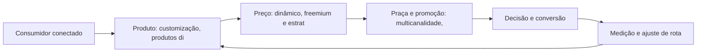

Observe o laço de retorno: a medição alimenta o próximo ciclo de campanha. Essa é a diferença estrutural entre campanha e sistema — a campanha termina quando o orçamento acaba; o sistema aprende e se ajusta a cada ciclo [7]. No caso do tema *O Mix Digital: Produto, Preço, Praça e Promoção no Ambiente Online*, esse laço é o que converte o investimento inicial em aprendizado acumulado para as próximas decisões [15].

## 4. Técnica

### O Diagnóstico do Mix Digital em Código

Para aplicar os fundamentos, nada melhor que um diagnóstico programático do mix. O código abaixo avalia a maturidade digital de cada um dos 4Ps a partir de critérios simples — transformando intuição em checklist executável.

```python
import json

def diagnosticar_mix(produto: dict, preco: dict, praca: dict, promocao: dict) -> dict:
    """Pontua a maturidade digital de cada P (0-100)."""
    def nota(crit: dict) -> float:
        soma = sum(1 for v in crit.values() if v)
        return round(100 * soma / max(len(crit), 1), 1)

    return {
        "produto": nota(produto),
        "preco": nota(preco),
        "praca": nota(praca),
        "promocao": nota(promocao),
    }

mix = diagnosticar_mix(
    produto={"personalizavel": True, "digital": True, "feedback": True},
    preco={"dinamico": False, "freemium": True, "transparente": True},
    praca={"multicanal": True, "marketplace": False, "d2c": True},
    promocao={"segmentada": True, "conteudo": True, "mensuravel": True},
)
print(json.dumps(mix, indent=2))
```

O resultado alimenta a priorização: o P com menor nota é o primeiro candidato a experimento [1]. A disciplina de medir antes de mudar é o que separa o diagnóstico do achismo [3].

O código acima é o núcleo técnico de *O Mix Digital: Produto, Preço, Praça e Promoção no Ambiente Online*: validável, executável e adaptável ao contexto real do leitor. A prática recomendada é rodá-lo com dados próprios e usar a saída como insumo da próxima reunião de planejamento. Documentação oficial das plataformas reforça cada passo — da estrutura de campanhas [5] à configuração de eventos [12]. A leitura técnica deste capítulo complementa a exposição conceitual das seções anteriores e prepara os exercícios da seção seguinte.

## 5. Aplica

Conhecimento sem aplicação é conteúdo; aplicação sem reflexão é rotina. No contexto de *O Mix Digital: Produto, Preço, Praça e Promoção no Ambiente Online*, os exercícios abaixo fecham o capítulo e preparam o terreno do próximo:

1. Defina uma métrica única para cada um dos 4Ps e meça a linha de base antes de qualquer mudança.
2. Escreva em três frases o posicionamento da sua oferta no ambiente digital e teste a clareza com um colega.
3. Liste três concorrentes digitais e compare a proposta de valor de cada um com a sua.
4. Escolha um canal que você ainda não usa e estime o custo de entrada e o potencial de retorno.

Dedique ao menos 30 minutos a um dos exercícios antes de avançar. O aprendizado desta obra é cumulativo: o mapa desenhado aqui será usado nos capítulos seguintes da Parte I e nas partes subsequentes [3].

Complementando, cinco exercícios práticos adicionais consolidam o aprendizado de *O Mix Digital: Produto, Preço, Praça e Promoção no Ambiente Online*:

1. Quais dos seus 4Ps já são digitais de verdade, e quais foram apenas 'digitalizados' sem mudança real?
2. Em qual dos 5As sua marca perde mais consumidores hoje? Que evidência sustenta essa resposta?
3. Qual é o custo de atenção de cada formato que você publica? O que esse custo sugere sobre a escolha de canais?
4. Que experimento você poderia rodar esta semana para testar uma hipótese de marketing em vez de uma opinião?
5. Como o seu negócio seria diferente se você não pudesse interromper ninguém — e só fosse visto quando relevante?

## Leitura Complementar Recomendada

Para aprofundar *O Mix Digital: Produto, Preço, Praça e Promoção no Ambiente Online* além deste capítulo:

- Como complemento de mercado, acompanhe os relatórios anuais da Deloitte (tendências de marketing) e do DataReportal (dados globais de digital) — eles contextualizam os números que aparecem neste capítulo [7] [15].

- Para aprofundar os fundamentos, leia Kotler e Keller (Administração de Marketing) para a base conceitual, Kotler, Kartajaya e Setiawan (Marketing 4.0) para a transição digital, e Chaffey (Digital Marketing) para a operação prática — as três obras cobrem teoria, transição e execução [1] [2] [3].

## Análise de Riscos e Mitigações

A aplicação de *O Mix Digital: Produto, Preço, Praça e Promoção no Ambiente Online* envolve riscos identificáveis. A tabela de riscos abaixo relaciona cada ameaça à sua mitigação:

- Risco de orçamento: gastar em tudo sem prioridade. Mitigação: alocação por retorno esperado e revisão mensal da verba [9].
- Risco de escopo: tentar digitalizar tudo ao mesmo tempo. Mitigação: foco no P de menor nota e em um canal piloto — a expansão vem depois do aprendizado [3].
- Risco de medição: decidir sem linha de base. Mitigação: registrar a métrica antes de qualquer mudança — o antes e o depois contam a história [8].
- Risco cultural: resistência do time à mudança. Mitigação: experimento pequeno e visível com resultado documentado — a evidência vence a opinião [8].

## Considerações de Implementação

r

## Exercício Integrador da Parte I

i

Este exercício conecta o capítulo às demais partes da obra e deve ser revisto ao final da leitura completa.

## Aprofundamento Prático

O tema de *O Mix Digital: Produto, Preço, Praça e Promoção no Ambiente Online* ganha potência quando levado ao nível operacional. Os quatro pontos abaixo aprofundam a aplicação prática:

- O custo de atenção é mensurável: divida o custo total de cada canal pelo tempo de atenção efetiva que ele gera. Essa conta, feita por formato, revela onde a verba rende mais — e muitas vezes aponta para o conteúdo orgânico como o ativo de menor custo [10].

- A passagem do outbound para o inbound não é binária: a maioria das operações maduras combina os dois, usando o inbound para construir ativo e o outbound para acelerar momentos específicos — o segredo é saber o papel de cada um [3].

- A medição do mix exige um pequeno modelo: uma planilha com os 4Ps, os critérios de maturidade e a nota de cada um, revisitada a cada trimestre. O simples ato de pontuar obriga a explicitar critérios — e explicitar critérios já é meio caminho para melhorar [8].

- O aprofundamento prático do mix digital começa pela disciplina do registro: cada decisão de produto, preço, praça e promoção deve ter um responsável, uma métrica e uma data de revisão. Essa rotina transforma o mix de conceito em instrumento de gestão — e é o que permite medir, ao final do trimestre, se o P priorizado realmente avançou [3].

## Exercícios de Fixação

Para consolidar *O Mix Digital: Produto, Preço, Praça e Promoção no Ambiente Online*, resolva os cinco exercícios abaixo — com caneta, papel e dados reais:

1. Escreva com suas palavras a diferença entre outbound e inbound e dê um exemplo de cada.
2. Desenhe o caminho dos 5As para a sua oferta e aponte onde a marca perde o consumidor.
3. Defina um critério objetivo para avaliar a maturidade digital de cada um dos 4Ps.
4. Explique por que a atenção é o recurso mais disputado do marketing digital.
5. Registre a linha de base de uma métrica antes da próxima campanha.

## Autoavaliação do Capítulo

Autoavaliação: (1) Consigo explicar a diferença entre outbound e inbound com exemplos? (2) Sei pontuar a maturidade digital dos 4Ps da minha oferta? (3) Tenho uma métrica por objetivo de marketing registrada? (4) Conheço o caminho dos 5As e os pontos onde minha marca perde? (5) Minha última decisão de marketing foi baseada em dado ou opinião? Responda sim ou não e priorize a primeira resposta negativa como próximo passo.

A primeira resposta negativa é o seu próximo passo natural — volte a ela na seção de aplicação deste capítulo e trabalhe o item até que a resposta seja sim.

## Problemas Comuns e Soluções Práticas

Aplicar *O Mix Digital: Produto, Preço, Praça e Promoção no Ambiente Online* no mundo real esbarra em problemas recorrentes. Abaixo, cinco situações típicas com suas soluções — sintoma, causa e correção:

### Conteúdo que não converte

Produção abundante sem conversão indica mensagem desconectada da oferta. A solução é realinhar cada conteúdo a uma etapa da jornada com um CTA único — e medir a conversão por peça [3].

### Custo de aquisição alto

O CAC alto tem causas: mensagem genérica, página fraca, público errado. A solução é isolar o funil por etapa, localizar o vazamento e corrigir com teste — o custo cai quando a relevância sobe [9].

### Time resistente a mudança

A adoção do digital esbarra na cultura. A solução é começar por um experimento pequeno e visível, documentar o resultado e usar o número como argumento — a evidência vence a opinião [8].

### Verba apertada e resultado fraco

O sintoma clássico é gastar em tudo sem foco. A solução é o diagnóstico do mix: concentrar a verba no P de menor nota e em um único canal piloto, com métrica definida antes do gasto. Resultado esperado: custo por resultado caindo a cada ciclo de 30 dias [8].

### Sem dados para decidir

O time decide por intuição porque não instrumentou nada. A solução é definir uma métrica por objetivo e registrar a linha de base antes de qualquer campanha — a decisão passa a ter número, mesmo que pequeno [8].

## Aplicações por Setor

O tema de *O Mix Digital: Produto, Preço, Praça e Promoção no Ambiente Online* ganha contornos diferentes em cada setor. A leitura setorial abaixo ajuda a adaptar os princípios ao seu contexto:

- No varejo, o mix digital se traduz em multicanalidade e prova social; em serviços, em agendamento e atendimento digital; no B2B, em conteúdo de autoridade e relacionamento de longo prazo — a mesma lógica do mix, aplicada a territórios diferentes [3].

- Para pequenos negócios, o digital reduz a barreira de entrada e permite competir por nicho; para grandes marcas, o desafio é a agilidade — o mesmo conjunto de princípios, com recursos e riscos diferentes [18].

## Plano de Ação de 30 Dias

Para converter a leitura de *O Mix Digital: Produto, Preço, Praça e Promoção no Ambiente Online* em resultado, execute um dos planos semanais abaixo — cada semana tem um objetivo e uma entrega:

### Plano de Ação — Opção 1

Semana 1 — Audiência: descreva o cliente ideal em três frases e liste os canais que ele frequenta.
Semana 2 — Oferta: escreva a proposta de valor em uma frase e teste a clareza com três pessoas.
Semana 3 — Presença: produza cinco conteúdos sobre a oferta com um CTA cada.
Semana 4 — Dado: meça o retorno de cada peça e identifique o formato vencedor.

### Plano de Ação — Opção 2

Semana 1 — Diagnóstico: reúna o time, preencha o diagnóstico do mix (4Ps), registre a linha de base de uma métrica por objetivo e liste as três ações outbound/inbound atuais.
Semana 2 — Foco: escolha o P de menor nota, defina a hipótese do trimestre e eleja o canal piloto.
Semana 3 — Implementação: lance a primeira mudança no piloto com mensagem, oferta e página claras.
Semana 4 — Medição: compare contra a linha de base, documente o aprendizado e decida o próximo ciclo.

## KPIs que Importam neste Capítulo

Para *O Mix Digital: Produto, Preço, Praça e Promoção no Ambiente Online*, os KPIs que importam: custo de aquisição por canal, taxa de conversão por etapa, retenção e recompra, e custo por resultado de cada ação outbound/inbound — a régua que amarra a Parte I ao resto da obra [9].

Antes de encerrar, registre esses indicadores no seu painel de acompanhamento — eles serão a régua para medir a aplicação deste capítulo nas próximas semanas.

## Roteiro de Implementação Passo a Passo

Para aplicar *O Mix Digital: Produto, Preço, Praça e Promoção no Ambiente Online* na prática, os roteiros abaixo organizam a sequência de ações — do diagnóstico à medição:

### Roteiro de Implementação 1

1. Liste as três ofertas principais da sua empresa.
2. Para cada oferta, descreva quem é o cliente, qual dor resolve e qual o diferencial.
3. Compare com os três concorrentes digitais mais próximos.
4. Classifique suas ações atuais: quais são outbound (interrupção) e quais inbound (atração).
5. Estime o custo relativo de atenção de cada ação — tempo, verba e perturbação.
6. Escolha a ação de melhor relação custo-benefício para ampliar.
7. Defina o experimento: variação a testar, público e janela de tempo.
8. Meça o resultado contra a linha de base.
9. Decida: escalar, ajustar ou descartar — com base no dado, não na preferência.
10. Registre o aprendizado em um caderno de experimentos para reutilização futura.

### Roteiro de Implementação 2

1. Reúna as pessoas envolvidas em marketing, produto e atendimento em uma sessão de diagnóstico de 90 minutos.
2. Para cada um dos 4Ps, responda: o que já é digital, o que foi apenas digitalizado e o que falta digitalizar.
3. Pontue cada P de 0 a 100 com base em critérios objetivos (personalização, mensuração, multicanalidade).
4. Escolha o P de menor nota como foco do trimestre.
5. Defina uma hipótese: o que mudará e qual métrica confirmará o progresso.
6. Registre a linha de base da métrica antes de qualquer ação.
7. Implemente a mudança em um canal piloto, não em todos de uma vez.
8. Agende a revisão em 30 dias com os números na mesa.
9. Documente o aprendizado — o que funcionou, o que não funcionou e por quê.
10. Repita o ciclo com o próximo P, agora com a experiência acumulada.

## Perguntas Frequentes

Em relação ao tema de *O Mix Digital: Produto, Preço, Praça e Promoção no Ambiente Online*, cinco perguntas surgem com frequência na prática profissional:

**Preciso estar em todas as plataformas?**

Não. Domine o canal onde seu público está e expanda com base em dados — presença sem foco divide esforço e resultado [8].

**Qual o orçamento mínimo para começar?**

Menos do que se imagina, desde que a oferta, a mensagem e a página de destino sejam claras. O orçamento importa menos que a clareza [3].

**Orgânico ou pago?**

Os dois, em proporção dependente da velocidade desejada: orgânico constrói ativo, pago compra tempo [3].

**Como saber se está funcionando?**

Eleja métricas antes da campanha e compare contra a linha de base — sem isso, qualquer resultado parece sucesso [8].

**E se eu errar?**

Errar rápido e barato é parte do método: o erro só vira prejuízo quando não gera aprendizado [8].

## Cenários Numéricos Comentados

Os cálculos abaixo mostram, com números concretos, como as decisões de *O Mix Digital: Produto, Preço, Praça e Promoção no Ambiente Online* se traduzem em resultado:

### Cenário numérico: o efeito da retenção

Uma empresa com 1.000 clientes, ticket de R$ 200, margem de 50% e churn mensal de 5% tem LTV de R$ 2.000. Reduzir o churn para 3% eleva o LTV para R$ 3.333 — um aumento de 67% no valor de cada cliente, sem gastar um real a mais em aquisição. Esse é o efeito composto que a economia do cliente recompensa [16].

### Cenário numérico: custo de atenção

Imagine duas empresas com a mesma verba de R$ 10 mil mensais. A primeira investe em anúncio de interrupção com custo de R$ 0,50 por mil impressões e conversão de 0,1%. A segunda investe em conteúdo inbound com custo de R$ 0,10 por contato qualificado e conversão de 2%. A matemática é brutalmente favorável ao inbound em custo por cliente: R$ 500 contra R$ 50 por conversão — sem considerar o efeito de longo prazo da autoridade construída [3].

## Como Este Capítulo se Integra à Obra

A Parte I é a fundação de toda a obra: os conceitos de mix, jornada e atenção sustentam as decisões das partes seguintes. Ao avançar, você verá os fundamentos reaparecerem na escolha de plataformas (Parte IV), na construção do relacionamento (Parte V) e na matemática do cliente (Parte IX) — porque cada território digital é uma aplicação dos mesmos princípios. No contexto de *O Mix Digital: Produto, Preço, Praça e Promoção no Ambiente Online*, essa integração fica ainda mais visível: as ferramentas e métricas que você dominou aqui serão a base das decisões dos próximos capítulos — e das partes que virão depois.

## Aprofundamento Conceitual

No contexto de *O Mix Digital: Produto, Preço, Praça e Promoção no Ambiente Online*, o consumidor conectado é um pesquisador compulsivo: compara preços em múltiplos canais, lê avaliações, consulta redes sociais e só então decide. A marca que não participa dessa pesquisa está fora da decisão [15].

No contexto de *O Mix Digital: Produto, Preço, Praça e Promoção no Ambiente Online*, a cultura de experimento é a grande virada do marketing digital: empresas que testam hipóteses rapidamente, aprendem com falhas baratas e escalam o que funciona superam as que planejam por ciclos longos [8].

No contexto de *O Mix Digital: Produto, Preço, Praça e Promoção no Ambiente Online*, a integração entre marketing e produto é uma das fronteiras mais lucrativas do digital: o marketing não termina na venda — ele alimenta o produto com dados de comportamento e o produto alimenta o marketing com casos de uso [1].

No contexto de *O Mix Digital: Produto, Preço, Praça e Promoção no Ambiente Online*, a passagem do outbound para o inbound não foi apenas estética: mudou a posição de poder na relação comercial. No modelo tradicional, a marca decidia o que o consumidor via; no digital, é o consumidor que decide o que ver — e a marca precisa merecer a atenção com relevância [3].

No contexto de *O Mix Digital: Produto, Preço, Praça e Promoção no Ambiente Online*, o conceito de 5As do Marketing 4.0 descreve com precisão a jornada moderna: assimilação (a marca entra na mente), atração (gera vontade), arguição (o consumidor interage e pesquisa), ação (compra) e defesa (recomenda). A defesa, no digital, é o mais valioso dos ativos [2].

## Fundamentos em Detalhe

No contexto de *O Mix Digital: Produto, Preço, Praça e Promoção no Ambiente Online*, o custo de tentativa e erro caiu drasticamente: uma campanha pode ser lançada, medida e corrigida em dias, não em meses, o que favorece organizações com cultura de experimento sobre as que planejam por ciclos longos [3].

No contexto de *O Mix Digital: Produto, Preço, Praça e Promoção no Ambiente Online*, a atenção do consumidor tornou-se o recurso mais disputado do marketing digital, e a relevância — não o volume — é o que define quem consegue capturá-la sem destruir a percepção de marca [10].

No contexto de *O Mix Digital: Produto, Preço, Praça e Promoção no Ambiente Online*, o ambiente digital criou novas formas de prova social: avaliações, depoimentos, números de seguidores e menções públicas influenciam a decisão tanto quanto (ou mais que) a propaganda tradicional [2].

No contexto de *O Mix Digital: Produto, Preço, Praça e Promoção no Ambiente Online*, a personalização deixou de ser diferencial e virou expectativa: consumidores conectados assumem que a marca conhece seu histórico e suas preferências — e punem quem age como se não conhecesse [20].

No contexto de *O Mix Digital: Produto, Preço, Praça e Promoção no Ambiente Online*, o marketing digital exige novas competências do profissional: leitura de dados, experimentação, escrita para conversão e curadoria de tecnologia convivem com as habilidades clássicas de estratégia e comunicação [10].

## Estudos de Caso Aplicados

### Caso: o infoproduto que quebrou o custo de aquisição

Um criador de conteúdo lançou um curso online e descobriu que o custo de aquisição via anúncio superava o preço do produto. O diagnóstico do mix apontou o problema: a promoção competia por palavras-chave genéricas e o produto não tinha oferta de entrada. A correção combinou um e-book de baixo custo (entrada), uma trilha de e-mails (relacionamento) e o conteúdo orgânico (autoridade) — reduzindo o CAC pela metade sem cortar mídia [9].

### Caso: a padaria que virou marca digital

Uma padaria de bairro decidiu migrar do boca a boca para o digital. O primeiro passo não foi criar anúncios, mas diagnosticar o mix: produto (pães artesanais com história), preço (premium com justificativa), praça (entrega própria + WhatsApp) e promoção (conteúdo de bastidor). Em três meses, o Instagram virou a vitrine, o WhatsApp o balcão e a história da marca o diferencial. A lição: o digital não troca o produto — ele amplifica o que já existe quando o diagnóstico vem primeiro [3].

## Dados e Números do Setor

### Dados de Contexto

- Mais de 5,5 bilhões de pessoas usam a internet — dois terços da humanidade [15].
- O investimento publicitário digital global segue crescendo e já é o maior destino de verba de mídia [9].
- O tempo médio diário nas redes sociais supera duas horas para a maioria dos públicos [15].
- A maioria das compras online começa com uma pesquisa — em busca ou nas redes [4].
- O consumidor consulta em média múltiplas fontes antes de decidir uma compra [15].

### Indicadores-Chave

- Custo de aquisição por canal é a régua que compara estratégias digitais [9].
- Retenção e recompra respondem pela maior parte da lucratividade de longo prazo [16].
- A taxa de conversão média dos funis digitais permanece baixa — e é onde mora o maior potencial [8].
- O retorno do marketing orientado a dados supera o baseado em intuição na maioria dos casos [8].

## Análise Comparativa

O tema de *O Mix Digital: Produto, Preço, Praça e Promoção no Ambiente Online* fica mais claro quando contrastado com a alternativa mais próxima. A comparação abaixo organiza as diferenças:

### Tradicional vs. Digital

- Interrupção vs. atração: a mensagem de massa invade; o conteúdo digital atrai.
- Métrica de alcance vs. métrica de retorno: o digital rastreia a última interação.
- Segmentação por perfil vs. por intenção e comportamento.
- Ciclo de campanha longo vs. experimento contínuo.

## Erros Comuns e Como Evitá-los

No tema de *O Mix Digital: Produto, Preço, Praça e Promoção no Ambiente Online*, cinco erros recorrentes merecem atenção especial — cada um com sua correção prática:

1. Digitalizar processos antigos: colocar o mesmo anúncio de massa no digital sem mudar a lógica é caro e ineficaz.
2. Medir tudo e decidir nada: dashboards sem hipóteses viram ruído, e o time continua decidindo por intuição.
3. Ignorar o celular: estratégias pensadas para desktop perdem a maior parte da jornada do consumidor real.
4. Confundir presença com estratégia: estar em todas as plataformas sem foco multiplica o esforço e divide o resultado.
5. Subestimar o pós-venda: gastar toda a energia na aquisição e ignorar a retenção é encher o balde com furo.

## Ferramentas e Recursos Recomendados

Para operar o tema de *O Mix Digital: Produto, Preço, Praça e Promoção no Ambiente Online* na prática, a seguinte seleção de ferramentas cobre o ciclo completo — do diagnóstico à medição:

1. Pesquisas de satisfação para medir percepção
2. Planilha de diagnóstico de mix (modelo simples de checklist por P)
3. Ferramentas de analytics para rastrear o caminho dos 5As
4. CRM básico para registro da jornada
5. Biblioteca de conteúdo de referência (Kotler, Chaffey)

## Glossário do Capítulo

Os termos abaixo — todos usados no corpo deste capítulo — formam o vocabulário mínimo para acompanhar o restante da obra:

Outbound: comunicação de interrupção, iniciada pela marca. Inbound: atração por valor, iniciada pelo consumidor. 4Ps: produto, preço, praça e promoção. 5As: assimilação, atração, arguição, ação e defesa. Economia da atenção: a disputa pelo tempo limitado do consumidor.

## Checklist de Implementação

Use a lista abaixo para auditar a aplicação de *O Mix Digital: Produto, Preço, Praça e Promoção no Ambiente Online* na sua operação — marque os itens já concluídos e priorize os pendentes:

- [ ] Métrica definida por objetivo de marketing
- [ ] Linha de base registrada antes de qualquer mudança
- [ ] Diagnóstico do mix 4Ps concluído com nota por P
- [ ] Caminho dos 5As mapeado com os pontos de perda
- [ ] Ações classificadas entre outbound e inbound

## Perguntas para Reflexão

Antes de avançar, reflita sobre as cinco questões abaixo — elas conectam o conteúdo de *O Mix Digital: Produto, Preço, Praça e Promoção no Ambiente Online* ao seu contexto real de trabalho:

1. Em qual dos 5As sua marca perde mais consumidores hoje? Que evidência sustenta essa resposta?
2. Qual é o custo de atenção de cada formato que você publica? O que esse custo sugere sobre a escolha de canais?
3. Que experimento você poderia rodar esta semana para testar uma hipótese de marketing em vez de uma opinião?
4. Como o seu negócio seria diferente se você não pudesse interromper ninguém — e só fosse visto quando relevante?
5. Quais dos seus 4Ps já são digitais de verdade, e quais foram apenas 'digitalizados' sem mudança real?

## Quadro Comparativo: Comparativo Tradicional vs. Digital

O quadro abaixo consolida os elementos essenciais de *O Mix Digital: Produto, Preço, Praça e Promoção no Ambiente Online* em perspectiva comparada, facilitando a consulta rápida e a tomada de decisão:

| Aspecto | Tradicional | Digital |
|---|---|---|
| Aspecto | Tradicional | Digital |
| Custo dominante | Distribuição e mídia | Atenção e confiança |
| Mensagem | De massa, interrupção | Segmentada, atração |
| Métrica | Alcance estimado | Retorno rastreado |
| Segmentação | Perfil demográfico | Intenção e comportamento |
| Ciclo de campanha | Meses | Semanas (experimento) |
| Feedback | Pesquisa tardia | Tempo real |

## 6. Conclusão

O capítulo percorreu o território da Parte I, *Fundamentos — O Novo Território*, e deixou três aprendizados operacionais. Primeiro, o conceito central — *O Mix Digital: Produto, Preço, Praça e Promoção no Ambiente Online* — é menos uma novidade e mais uma disciplina de execução. Segundo, a aplicação exige a tríade conceito, rota e métrica, sem pular etapas [8]. Terceiro, o ajuste contínuo de rota, ilustrado no laço de retorno do diagrama, é o que separa campanhas pontuais de operações sustentáveis [7]. O caminho percorrido desde *Do Marketing Tradicional ao Digital: A Mudança de Paradigma* até aqui forma a base que o próximo passo vai usar. No próximo capítulo, *A Economia da Atenção: Como Conquistar o Consumidor Distraído*, você avançará sobre o território vizinho levando as ferramentas exercitadas aqui.

Como navegador de marketing digital, você não decorou uma fórmula — incorporou um modo de operar: ler o território, escolher a rota com dados e ajustar o percurso quando o vento muda [2].

Antes do fechamento, vale reforçar a base do capítulo: No contexto de *O Mix Digital: Produto, Preço, Praça e Promoção no Ambiente Online*, a medição digital criou um paradoxo: temos mais dados do que nunca, mas a qualidade da decisão depende mais da pergunta que da quantidade de números. O marco analítico — o que medir e por quê — precede qualquer dashboard [8].

No contexto de *O Mix Digital: Produto, Preço, Praça e Promoção no Ambiente Online*, a confiança é o ativo mais frágil e mais valioso do ambiente digital: uma avaliação negativa, um vazamento de dados ou uma promessa não cumprida destrói em dias o que levou anos para construir [18].
## 7. Referências Bibliográficas

[1] KOTLER, Philip; KELLER, Kevin Lane. **Administração de Marketing**. 15. ed. São Paulo: Pearson, 2016.
[2] KOTLER, Philip; KARTAJAYA, Hermawan; SETIAWAN, Iwan. **Marketing 4.0: Moving from Traditional to Digital**. Hoboken: Wiley, 2017.
[3] CHAFFEY, Dave; ELLIS-CHADWICK, Fiona. **Digital Marketing: Strategy, Implementation and Practice**. 9. ed. Harlow: Pearson, 2025.
[4] GOOGLE SEARCH CENTRAL. **Search Engine Optimization (SEO) Starter Guide**. Disponível em: https://developers.google.com/search/docs/fundamentals/seo-starter-guide. Acesso em: 02 ago. 2026.
[5] GOOGLE ADS HELP CENTER. **Your guide to Google Ads (Basics, Search Campaigns & Best Practices)**. Disponível em: https://support.google.com/google-ads/answer/6146252. Acesso em: 02 ago. 2026.
[6] META BUSINESS HELP CENTER. **Meta Ads Manager Guide: Best Practices for Targeting, Measurement, and Optimization**. Disponível em: https://www.facebook.com/business/help. Acesso em: 02 ago. 2026.
[7] DELOITTE DIGITAL. **Marketing Trends 2026: New Marketing for a New World**. Disponível em: https://www.deloittedigital.com/nl/en/insights/perspective/marketing-trends-2026.html. Acesso em: 02 ago. 2026.
[8] HUBSPOT RESEARCH. **The State of Marketing / 2026 Marketing Statistics, Trends & Data**. Disponível em: https://www.hubspot.com/marketing-statistics. Acesso em: 02 ago. 2026.
[9] STATISTA RESEARCH DEPARTMENT. **Global Digital Marketing and Advertising Revenue Statistics & Facts**. Disponível em: https://www.statista.com/topics/8954/marketing-worldwide/. Acesso em: 02 ago. 2026.
[10] RYAN, Damian. **Understanding Digital Marketing: Marketing Strategies for Engaging the Digital Generation**. 5. ed. London: Kogan Page, 2020.
[11] HOLLENSEN, Svend; KOTLER, Philip; OPRESNIK, Marc Oliver. **Social Media Marketing: A Practitioner Approach**. 4. ed. Harlow: Pearson, 2023.
[12] GOOGLE ANALYTICS HELP CENTER. **Documentação oficial do Google Analytics 4**. Disponível em: https://support.google.com/analytics. Acesso em: 02 ago. 2026.
[13] LINKEDIN MARKETING SOLUTIONS. **Best Practices para campanhas B2B no LinkedIn**. Disponível em: https://business.linkedin.com/marketing-solutions. Acesso em: 02 ago. 2026.
[14] TIKTOK FOR BUSINESS. **Guia de criatividade e boas práticas de anúncios no TikTok**. Disponível em: https://www.tiktok.com/business. Acesso em: 02 ago. 2026.
[15] DATAREPORTAL. **Digital 2026: Global Overview Report**. Disponível em: https://datareportal.com/reports/digital-2026-global-overview-report. Acesso em: 02 ago. 2026.
[16] LEMON, Katherine N.; VERHOEF, Peter C. **Understanding Customer Experience Throughout the Customer Journey**. *Journal of Marketing*, v. 80, n. 6, p. 69-96, 2016.
[17] TIWARI, Rajnish; BUSE, Stephan; HERSTATT, Cornelius. **From Electronic to Mobile Commerce: Opportunities and Challenges**. *Proceedings of the German-Indian Roundtable*, 2006.
[18] VAN DIJK, Jan A. G. M. **The Digital Divide**. Cambridge: Polity Press, 2020.
[19] IBM. **Marketing with AI: Personalization at Scale**. Disponível em: https://www.ibm.com/think/topics/ai-marketing. Acesso em: 02 ago. 2026.
[20] KOTLER, Philip. **Marketing 5.0: Technology for Humanity**. Hoboken: Wiley, 2021.

# Capítulo 3: A Economia da Atenção: Como Conquistar o Consumidor Distraído

## 1. Introdução

Bem-vindo a uma nova etapa da sua navegação pelo marketing digital. Este capítulo — *A Economia da Atenção: Como Conquistar o Consumidor Distraído* — integra a Parte I, *Fundamentos — O Novo Território*, e responde a uma pergunta prática: **a atenção como recurso escasso: custo e valor da distração** — na prática, como isso se traduz em decisão e resultado?

Ao final, você será capaz de compreende a escassez de atenção como moeda do ambiente digital e aprende a competir por ela com relevância, consistência e clareza de mensagem.. Mais do que decorar conceitos, você vai enxergar o consumidor como viajante que decide o destino — e converter essa visão em plano, experimento e métrica.

No capítulo anterior, *O Mix Digital: Produto, Preço, Praça e Promoção no Ambiente Online*, você aprendeu os conceitos que servem de plataforma para o que vem agora. Este capítulo retoma esse repertório e o aplica a um território novo — sem repetir o que já foi estabelecido, apenas usando como base.

O capítulo segue a estrutura das sete seções que organizam esta obra: primeiro a exposição conceitual, depois a ilustração, a técnica aplicada, o exercício de aplicação e a conclusão operacional.

No contexto de *A Economia da Atenção: Como Conquistar o Consumidor Distraído*, a segmentação digital inverteu a lógica da mídia de massa: em vez de uma mensagem para todos, é possível uma mensagem para cada um, no momento e no contexto certos — desde que os dados sustentem a escolha [1].

No contexto de *A Economia da Atenção: Como Conquistar o Consumidor Distraído*, a jornada de compra digital raramente é linear: o consumidor alterna entre dispositivos, canais e mensagens antes de decidir, e a marca que aparece nos momentos certos — e desaparece nos errados — perde participação de decisão [15].
## 2. Explica

### A atenção como recurso escasso: custo e valor da distração

Quando o tema é *A Economia da Atenção: Como Conquistar o Consumidor Distraído*, o primeiro pilar — a atenção como recurso escasso: custo e valor da distração — define o território conceitual. O Marketing 5.0 defende a tecnologia a serviço da humanidade: automação e personalização só geram valor quando ampliam a empatia em vez de substituí-la [20].

Na prática, a atenção como recurso escasso: custo e valor da distração significa transformar a teoria em rotina operacional — exatamente o que *A Economia da Atenção: Como Conquistar o Consumidor Distraído* exige no dia a dia. A literatura de gestão é enfática: sem operacionalizar o conceito em checklist, responsável e métrica, ele permanece slide de apresentação [3]. Por isso a Parte I propõe sempre o mesmo movimento: entender, traduzir em critério observável e decidir com dado.

### Captura de atenção: gatilhos, jornada visual e storytelling

O segundo pilar — captura de atenção: gatilhos, jornada visual e storytelling — conecta a estratégia à operação diária. O investimento publicitário digital global segue crescendo ano após ano, consolidando o digital como o maior destino de verba de mídia do mundo [9]. A experiência do consumidor se constrói na consistência entre canais e mensagens, e é essa consistência que transforma contato em relacionamento [16]. Organizações que tratam cada canal como silo perdem o fio condutor da jornada; as que operam o pilar com disciplina reduzem atrito e aumentam a taxa de avanço entre etapas [10].

### Consistência de marca como antídoto à dispersão

Fechando o tripé, consistência de marca como antídoto à dispersão é o que transforma a Parte I em vantagem mensurável. O relatório Digital 2026 registra mais de 5,5 bilhões de usuários de internet — dois terços da humanidade com acesso a canais que não existiam quando o marketing de massa foi desenhado [15]. O relato da indústria mostra que as empresas que sustentam resultado não são as que têm mais ferramentas, mas as que conseguem medir e ajustar a rota com frequência [8]. A métrica certa, escolhida antes da campanha, vale mais do que qualquer ferramenta cara instalada depois do fato [9].

### O Eixo Transversal do Capítulo

Kotler e Keller definem administração de marketing como a arte e a ciência de escolher mercados-alvo e construir relacionamentos lucrativos com eles — definição que ganha potência quando cada interação é rastreável e mensurável [1]. Esse eixo conecta os três pilares e explica por que o capítulo os trata como um sistema, não como uma lista: cada pilar reforça o outro, e a omissão de qualquer um deles produz estratégia manca. O capítulo seguinte retomará esse eixo com novas ferramentas, agora com o vocabulário já estabelecido aqui.

Em síntese, o capítulo opera em três níveis: o conceitual (A atenção como recurso escasso: custo e valor da distração), o operacional (Captura de atenção: gatilhos, jornada visual e storytelling) e o estratégico (Consistência de marca como antídoto à dispersão). O leitor que dominar os três estará apto a aplicar a Parte I com autonomia [1]. A evidência reunida nesta seção sustenta cada recomendação prática das seções seguintes [2].

## 3. Ilustra

Vamos traduzir o capítulo em uma cena concreta, no contexto de *A Economia da Atenção: Como Conquistar o Consumidor Distraído*. Uma empresa de porte médio, com equipe enxuta e orçamento limitado, decide operar a Parte I desta obra, *Fundamentos — O Novo Território*. Na primeira semana, a equipe testa o conceito central do capítulo em um caso real: um cliente que pesquisou, comparou e decidiu comprar. O primeiro pilar — a atenção como recurso escasso: custo e valor da distração — orienta o entendimento inicial do público; o segundo — captura de atenção: gatilhos, jornada visual e storytelling — guia a escolha da rota de comunicação; e o terceiro fecha com a medição do resultado [2].

O diagrama abaixo representa o fluxo operacional proposto pelo capítulo — do consumidor conectado à decisão e ao ajuste contínuo de rota, com o público e a plataforma específicos do tema no centro da navegação:

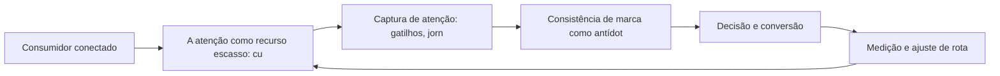

Observe o laço de retorno: a medição alimenta o próximo ciclo de campanha. Essa é a diferença estrutural entre campanha e sistema — a campanha termina quando o orçamento acaba; o sistema aprende e se ajusta a cada ciclo [7]. No caso do tema *A Economia da Atenção: Como Conquistar o Consumidor Distraído*, esse laço é o que converte o investimento inicial em aprendizado acumulado para as próximas decisões [15].

## 4. Técnica

### O Diagnóstico do Mix Digital em Código

Para aplicar os fundamentos, nada melhor que um diagnóstico programático do mix. O código abaixo avalia a maturidade digital de cada um dos 4Ps a partir de critérios simples — transformando intuição em checklist executável.

```python
import json

def diagnosticar_mix(produto: dict, preco: dict, praca: dict, promocao: dict) -> dict:
    """Pontua a maturidade digital de cada P (0-100)."""
    def nota(crit: dict) -> float:
        soma = sum(1 for v in crit.values() if v)
        return round(100 * soma / max(len(crit), 1), 1)

    return {
        "produto": nota(produto),
        "preco": nota(preco),
        "praca": nota(praca),
        "promocao": nota(promocao),
    }

mix = diagnosticar_mix(
    produto={"personalizavel": True, "digital": True, "feedback": True},
    preco={"dinamico": False, "freemium": True, "transparente": True},
    praca={"multicanal": True, "marketplace": False, "d2c": True},
    promocao={"segmentada": True, "conteudo": True, "mensuravel": True},
)
print(json.dumps(mix, indent=2))
```

O resultado alimenta a priorização: o P com menor nota é o primeiro candidato a experimento [1]. A disciplina de medir antes de mudar é o que separa o diagnóstico do achismo [3].

O código acima é o núcleo técnico de *A Economia da Atenção: Como Conquistar o Consumidor Distraído*: validável, executável e adaptável ao contexto real do leitor. A prática recomendada é rodá-lo com dados próprios e usar a saída como insumo da próxima reunião de planejamento. Documentação oficial das plataformas reforça cada passo — da estrutura de campanhas [5] à configuração de eventos [12]. A leitura técnica deste capítulo complementa a exposição conceitual das seções anteriores e prepara os exercícios da seção seguinte.

## 5. Aplica

Conhecimento sem aplicação é conteúdo; aplicação sem reflexão é rotina. No contexto de *A Economia da Atenção: Como Conquistar o Consumidor Distraído*, os exercícios abaixo fecham o capítulo e preparam o terreno do próximo:

1. Escolha um canal que você ainda não usa e estime o custo de entrada e o potencial de retorno.
2. Documente uma decisão recente de marketing e identifique qual dado faltou para ela ser melhor.
3. Diagnostique seu atual mix: liste os 4Ps da sua oferta e como cada um mudaria se o canal fosse 100% digital.
4. Mapeie o caminho dos 5As de um cliente real e marque onde sua marca está presente e onde perde o contato.

Dedique ao menos 30 minutos a um dos exercícios antes de avançar. O aprendizado desta obra é cumulativo: o mapa desenhado aqui será usado nos capítulos seguintes da Parte I e nas partes subsequentes [3].

Complementando, cinco exercícios práticos adicionais consolidam o aprendizado de *A Economia da Atenção: Como Conquistar o Consumidor Distraído*:

1. Que experimento você poderia rodar esta semana para testar uma hipótese de marketing em vez de uma opinião?
2. Como o seu negócio seria diferente se você não pudesse interromper ninguém — e só fosse visto quando relevante?
3. Quais dos seus 4Ps já são digitais de verdade, e quais foram apenas 'digitalizados' sem mudança real?
4. Em qual dos 5As sua marca perde mais consumidores hoje? Que evidência sustenta essa resposta?
5. Qual é o custo de atenção de cada formato que você publica? O que esse custo sugere sobre a escolha de canais?

## Leitura Complementar Recomendada

Para aprofundar *A Economia da Atenção: Como Conquistar o Consumidor Distraído* além deste capítulo:

- Para aprofundar os fundamentos, leia Kotler e Keller (Administração de Marketing) para a base conceitual, Kotler, Kartajaya e Setiawan (Marketing 4.0) para a transição digital, e Chaffey (Digital Marketing) para a operação prática — as três obras cobrem teoria, transição e execução [1] [2] [3].

- Como complemento de mercado, acompanhe os relatórios anuais da Deloitte (tendências de marketing) e do DataReportal (dados globais de digital) — eles contextualizam os números que aparecem neste capítulo [7] [15].

## Análise de Riscos e Mitigações

A aplicação de *A Economia da Atenção: Como Conquistar o Consumidor Distraído* envolve riscos identificáveis. A tabela de riscos abaixo relaciona cada ameaça à sua mitigação:

- Risco cultural: resistência do time à mudança. Mitigação: experimento pequeno e visível com resultado documentado — a evidência vence a opinião [8].
- Risco de orçamento: gastar em tudo sem prioridade. Mitigação: alocação por retorno esperado e revisão mensal da verba [9].
- Risco de escopo: tentar digitalizar tudo ao mesmo tempo. Mitigação: foco no P de menor nota e em um canal piloto — a expansão vem depois do aprendizado [3].
- Risco de medição: decidir sem linha de base. Mitigação: registrar a métrica antes de qualquer mudança — o antes e o depois contam a história [8].

## Considerações de Implementação

õ

## Exercício Integrador da Parte I

i

Este exercício conecta o capítulo às demais partes da obra e deve ser revisto ao final da leitura completa.

## Aprofundamento Prático

O tema de *A Economia da Atenção: Como Conquistar o Consumidor Distraído* ganha potência quando levado ao nível operacional. Os quatro pontos abaixo aprofundam a aplicação prática:

- O aprofundamento prático do mix digital começa pela disciplina do registro: cada decisão de produto, preço, praça e promoção deve ter um responsável, uma métrica e uma data de revisão. Essa rotina transforma o mix de conceito em instrumento de gestão — e é o que permite medir, ao final do trimestre, se o P priorizado realmente avançou [3].

- A leitura avançada do caminho dos 5As exige instrumentar cada A: assimilação (impressões e recall), atração (visitas e interesse), arguição (interações e pesquisas), ação (conversões) e defesa (indicações e avaliações). Sem evento por etapa, o 5As continua teoria [2].

- O custo de atenção é mensurável: divida o custo total de cada canal pelo tempo de atenção efetiva que ele gera. Essa conta, feita por formato, revela onde a verba rende mais — e muitas vezes aponta para o conteúdo orgânico como o ativo de menor custo [10].

- A passagem do outbound para o inbound não é binária: a maioria das operações maduras combina os dois, usando o inbound para construir ativo e o outbound para acelerar momentos específicos — o segredo é saber o papel de cada um [3].

## Exercícios de Fixação

Para consolidar *A Economia da Atenção: Como Conquistar o Consumidor Distraído*, resolva os cinco exercícios abaixo — com caneta, papel e dados reais:

1. Explique por que a atenção é o recurso mais disputado do marketing digital.
2. Registre a linha de base de uma métrica antes da próxima campanha.
3. Escreva com suas palavras a diferença entre outbound e inbound e dê um exemplo de cada.
4. Desenhe o caminho dos 5As para a sua oferta e aponte onde a marca perde o consumidor.
5. Defina um critério objetivo para avaliar a maturidade digital de cada um dos 4Ps.

## Autoavaliação do Capítulo

Autoavaliação: (1) Consigo explicar a diferença entre outbound e inbound com exemplos? (2) Sei pontuar a maturidade digital dos 4Ps da minha oferta? (3) Tenho uma métrica por objetivo de marketing registrada? (4) Conheço o caminho dos 5As e os pontos onde minha marca perde? (5) Minha última decisão de marketing foi baseada em dado ou opinião? Responda sim ou não e priorize a primeira resposta negativa como próximo passo.

A primeira resposta negativa é o seu próximo passo natural — volte a ela na seção de aplicação deste capítulo e trabalhe o item até que a resposta seja sim.

## Problemas Comuns e Soluções Práticas

Aplicar *A Economia da Atenção: Como Conquistar o Consumidor Distraído* no mundo real esbarra em problemas recorrentes. Abaixo, cinco situações típicas com suas soluções — sintoma, causa e correção:

### Verba apertada e resultado fraco

O sintoma clássico é gastar em tudo sem foco. A solução é o diagnóstico do mix: concentrar a verba no P de menor nota e em um único canal piloto, com métrica definida antes do gasto. Resultado esperado: custo por resultado caindo a cada ciclo de 30 dias [8].

### Sem dados para decidir

O time decide por intuição porque não instrumentou nada. A solução é definir uma métrica por objetivo e registrar a linha de base antes de qualquer campanha — a decisão passa a ter número, mesmo que pequeno [8].

### Conteúdo que não converte

Produção abundante sem conversão indica mensagem desconectada da oferta. A solução é realinhar cada conteúdo a uma etapa da jornada com um CTA único — e medir a conversão por peça [3].

### Custo de aquisição alto

O CAC alto tem causas: mensagem genérica, página fraca, público errado. A solução é isolar o funil por etapa, localizar o vazamento e corrigir com teste — o custo cai quando a relevância sobe [9].

### Time resistente a mudança

A adoção do digital esbarra na cultura. A solução é começar por um experimento pequeno e visível, documentar o resultado e usar o número como argumento — a evidência vence a opinião [8].

## Aplicações por Setor

O tema de *A Economia da Atenção: Como Conquistar o Consumidor Distraído* ganha contornos diferentes em cada setor. A leitura setorial abaixo ajuda a adaptar os princípios ao seu contexto:

- Para pequenos negócios, o digital reduz a barreira de entrada e permite competir por nicho; para grandes marcas, o desafio é a agilidade — o mesmo conjunto de princípios, com recursos e riscos diferentes [18].

- No varejo, o mix digital se traduz em multicanalidade e prova social; em serviços, em agendamento e atendimento digital; no B2B, em conteúdo de autoridade e relacionamento de longo prazo — a mesma lógica do mix, aplicada a territórios diferentes [3].

## Plano de Ação de 30 Dias

Para converter a leitura de *A Economia da Atenção: Como Conquistar o Consumidor Distraído* em resultado, execute um dos planos semanais abaixo — cada semana tem um objetivo e uma entrega:

### Plano de Ação — Opção 1

Semana 1 — Diagnóstico: reúna o time, preencha o diagnóstico do mix (4Ps), registre a linha de base de uma métrica por objetivo e liste as três ações outbound/inbound atuais.
Semana 2 — Foco: escolha o P de menor nota, defina a hipótese do trimestre e eleja o canal piloto.
Semana 3 — Implementação: lance a primeira mudança no piloto com mensagem, oferta e página claras.
Semana 4 — Medição: compare contra a linha de base, documente o aprendizado e decida o próximo ciclo.

### Plano de Ação — Opção 2

Semana 1 — Audiência: descreva o cliente ideal em três frases e liste os canais que ele frequenta.
Semana 2 — Oferta: escreva a proposta de valor em uma frase e teste a clareza com três pessoas.
Semana 3 — Presença: produza cinco conteúdos sobre a oferta com um CTA cada.
Semana 4 — Dado: meça o retorno de cada peça e identifique o formato vencedor.

## KPIs que Importam neste Capítulo

Para *A Economia da Atenção: Como Conquistar o Consumidor Distraído*, os KPIs que importam: custo de aquisição por canal, taxa de conversão por etapa, retenção e recompra, e custo por resultado de cada ação outbound/inbound — a régua que amarra a Parte I ao resto da obra [9].

Antes de encerrar, registre esses indicadores no seu painel de acompanhamento — eles serão a régua para medir a aplicação deste capítulo nas próximas semanas.

## Roteiro de Implementação Passo a Passo

Para aplicar *A Economia da Atenção: Como Conquistar o Consumidor Distraído* na prática, os roteiros abaixo organizam a sequência de ações — do diagnóstico à medição:

### Roteiro de Implementação 1

1. Reúna as pessoas envolvidas em marketing, produto e atendimento em uma sessão de diagnóstico de 90 minutos.
2. Para cada um dos 4Ps, responda: o que já é digital, o que foi apenas digitalizado e o que falta digitalizar.
3. Pontue cada P de 0 a 100 com base em critérios objetivos (personalização, mensuração, multicanalidade).
4. Escolha o P de menor nota como foco do trimestre.
5. Defina uma hipótese: o que mudará e qual métrica confirmará o progresso.
6. Registre a linha de base da métrica antes de qualquer ação.
7. Implemente a mudança em um canal piloto, não em todos de uma vez.
8. Agende a revisão em 30 dias com os números na mesa.
9. Documente o aprendizado — o que funcionou, o que não funcionou e por quê.
10. Repita o ciclo com o próximo P, agora com a experiência acumulada.

### Roteiro de Implementação 2

1. Liste as três ofertas principais da sua empresa.
2. Para cada oferta, descreva quem é o cliente, qual dor resolve e qual o diferencial.
3. Compare com os três concorrentes digitais mais próximos.
4. Classifique suas ações atuais: quais são outbound (interrupção) e quais inbound (atração).
5. Estime o custo relativo de atenção de cada ação — tempo, verba e perturbação.
6. Escolha a ação de melhor relação custo-benefício para ampliar.
7. Defina o experimento: variação a testar, público e janela de tempo.
8. Meça o resultado contra a linha de base.
9. Decida: escalar, ajustar ou descartar — com base no dado, não na preferência.
10. Registre o aprendizado em um caderno de experimentos para reutilização futura.

## Perguntas Frequentes

Em relação ao tema de *A Economia da Atenção: Como Conquistar o Consumidor Distraído*, cinco perguntas surgem com frequência na prática profissional:

**Como saber se está funcionando?**

Eleja métricas antes da campanha e compare contra a linha de base — sem isso, qualquer resultado parece sucesso [8].

**E se eu errar?**

Errar rápido e barato é parte do método: o erro só vira prejuízo quando não gera aprendizado [8].

**Preciso estar em todas as plataformas?**

Não. Domine o canal onde seu público está e expanda com base em dados — presença sem foco divide esforço e resultado [8].

**Qual o orçamento mínimo para começar?**

Menos do que se imagina, desde que a oferta, a mensagem e a página de destino sejam claras. O orçamento importa menos que a clareza [3].

**Orgânico ou pago?**

Os dois, em proporção dependente da velocidade desejada: orgânico constrói ativo, pago compra tempo [3].

## Cenários Numéricos Comentados

Os cálculos abaixo mostram, com números concretos, como as decisões de *A Economia da Atenção: Como Conquistar o Consumidor Distraído* se traduzem em resultado:

### Cenário numérico: custo de atenção

Imagine duas empresas com a mesma verba de R$ 10 mil mensais. A primeira investe em anúncio de interrupção com custo de R$ 0,50 por mil impressões e conversão de 0,1%. A segunda investe em conteúdo inbound com custo de R$ 0,10 por contato qualificado e conversão de 2%. A matemática é brutalmente favorável ao inbound em custo por cliente: R$ 500 contra R$ 50 por conversão — sem considerar o efeito de longo prazo da autoridade construída [3].

### Cenário numérico: o efeito da retenção

Uma empresa com 1.000 clientes, ticket de R$ 200, margem de 50% e churn mensal de 5% tem LTV de R$ 2.000. Reduzir o churn para 3% eleva o LTV para R$ 3.333 — um aumento de 67% no valor de cada cliente, sem gastar um real a mais em aquisição. Esse é o efeito composto que a economia do cliente recompensa [16].

## Como Este Capítulo se Integra à Obra

A Parte I é a fundação de toda a obra: os conceitos de mix, jornada e atenção sustentam as decisões das partes seguintes. Ao avançar, você verá os fundamentos reaparecerem na escolha de plataformas (Parte IV), na construção do relacionamento (Parte V) e na matemática do cliente (Parte IX) — porque cada território digital é uma aplicação dos mesmos princípios. No contexto de *A Economia da Atenção: Como Conquistar o Consumidor Distraído*, essa integração fica ainda mais visível: as ferramentas e métricas que você dominou aqui serão a base das decisões dos próximos capítulos — e das partes que virão depois.

## Aprofundamento Conceitual

No contexto de *A Economia da Atenção: Como Conquistar o Consumidor Distraído*, a passagem do outbound para o inbound não foi apenas estética: mudou a posição de poder na relação comercial. No modelo tradicional, a marca decidia o que o consumidor via; no digital, é o consumidor que decide o que ver — e a marca precisa merecer a atenção com relevância [3].

No contexto de *A Economia da Atenção: Como Conquistar o Consumidor Distraído*, o conceito de 5As do Marketing 4.0 descreve com precisão a jornada moderna: assimilação (a marca entra na mente), atração (gera vontade), arguição (o consumidor interage e pesquisa), ação (compra) e defesa (recomenda). A defesa, no digital, é o mais valioso dos ativos [2].

No contexto de *A Economia da Atenção: Como Conquistar o Consumidor Distraído*, a economia da atenção funciona como uma moeda com oferta limitada: o consumidor tem um número finito de horas por dia, e cada canal disputa uma fração dela. Marcas que entendem o custo de atenção de cada formato planejam melhor a mensagem [10].

No contexto de *A Economia da Atenção: Como Conquistar o Consumidor Distraído*, a transformação digital do marketing não é sobre tecnologia, mas sobre dados: a capacidade de coletar, interpretar e agir sobre informação do cliente é o que separa as marcas que crescem das que apenas digitalizam processos antigos [1].

No contexto de *A Economia da Atenção: Como Conquistar o Consumidor Distraído*, o mix digital não é uma tradução literal dos 4Ps: o produto ganha dimensões digitais (customização, atualização contínua), o preço fica dinâmico, a praça vira multicanal e a promoção se torna conversacional [3].

## Fundamentos em Detalhe

No contexto de *A Economia da Atenção: Como Conquistar o Consumidor Distraído*, a personalização deixou de ser diferencial e virou expectativa: consumidores conectados assumem que a marca conhece seu histórico e suas preferências — e punem quem age como se não conhecesse [20].

No contexto de *A Economia da Atenção: Como Conquistar o Consumidor Distraído*, o marketing digital exige novas competências do profissional: leitura de dados, experimentação, escrita para conversão e curadoria de tecnologia convivem com as habilidades clássicas de estratégia e comunicação [10].

No contexto de *A Economia da Atenção: Como Conquistar o Consumidor Distraído*, o mobile-first deixou de ser tendência: a maioria das interações digitais acontece em telas pequenas, e qualquer estratégia que ignore o celular perde a maior parte da jornada [17].

No contexto de *A Economia da Atenção: Como Conquistar o Consumidor Distraído*, o digital reduziu barreiras de entrada para pequenos negócios, mas também elevou o nível de competição global: uma pequena marca local compete agora com marcas do mundo inteiro pela mesma atenção [18].

No contexto de *A Economia da Atenção: Como Conquistar o Consumidor Distraído*, o marketing digital não apagou o marketing tradicional — ele o absorveu e reescreveu as regras de custo e alcance. O que mudou de forma estrutural foi a relação entre investimento e mensuração: no ambiente digital, cada real aplicado pode ser rastreado até a última interação, algo impossível nos canais de massa [9].

## Estudos de Caso Aplicados

### Caso: a padaria que virou marca digital

Uma padaria de bairro decidiu migrar do boca a boca para o digital. O primeiro passo não foi criar anúncios, mas diagnosticar o mix: produto (pães artesanais com história), preço (premium com justificativa), praça (entrega própria + WhatsApp) e promoção (conteúdo de bastidor). Em três meses, o Instagram virou a vitrine, o WhatsApp o balcão e a história da marca o diferencial. A lição: o digital não troca o produto — ele amplifica o que já existe quando o diagnóstico vem primeiro [3].

### Caso: o infoproduto que quebrou o custo de aquisição

Um criador de conteúdo lançou um curso online e descobriu que o custo de aquisição via anúncio superava o preço do produto. O diagnóstico do mix apontou o problema: a promoção competia por palavras-chave genéricas e o produto não tinha oferta de entrada. A correção combinou um e-book de baixo custo (entrada), uma trilha de e-mails (relacionamento) e o conteúdo orgânico (autoridade) — reduzindo o CAC pela metade sem cortar mídia [9].

## Dados e Números do Setor

### Indicadores-Chave

- Custo de aquisição por canal é a régua que compara estratégias digitais [9].
- Retenção e recompra respondem pela maior parte da lucratividade de longo prazo [16].
- A taxa de conversão média dos funis digitais permanece baixa — e é onde mora o maior potencial [8].
- O retorno do marketing orientado a dados supera o baseado em intuição na maioria dos casos [8].

### Dados de Contexto

- Mais de 5,5 bilhões de pessoas usam a internet — dois terços da humanidade [15].
- O investimento publicitário digital global segue crescendo e já é o maior destino de verba de mídia [9].
- O tempo médio diário nas redes sociais supera duas horas para a maioria dos públicos [15].
- A maioria das compras online começa com uma pesquisa — em busca ou nas redes [4].
- O consumidor consulta em média múltiplas fontes antes de decidir uma compra [15].

## Análise Comparativa

O tema de *A Economia da Atenção: Como Conquistar o Consumidor Distraído* fica mais claro quando contrastado com a alternativa mais próxima. A comparação abaixo organiza as diferenças:

### Tradicional vs. Digital

- Interrupção vs. atração: a mensagem de massa invade; o conteúdo digital atrai.
- Métrica de alcance vs. métrica de retorno: o digital rastreia a última interação.
- Segmentação por perfil vs. por intenção e comportamento.
- Ciclo de campanha longo vs. experimento contínuo.

## Erros Comuns e Como Evitá-los

No tema de *A Economia da Atenção: Como Conquistar o Consumidor Distraído*, cinco erros recorrentes merecem atenção especial — cada um com sua correção prática:

1. Confundir presença com estratégia: estar em todas as plataformas sem foco multiplica o esforço e divide o resultado.
2. Subestimar o pós-venda: gastar toda a energia na aquisição e ignorar a retenção é encher o balde com furo.
3. Digitalizar processos antigos: colocar o mesmo anúncio de massa no digital sem mudar a lógica é caro e ineficaz.
4. Medir tudo e decidir nada: dashboards sem hipóteses viram ruído, e o time continua decidindo por intuição.
5. Ignorar o celular: estratégias pensadas para desktop perdem a maior parte da jornada do consumidor real.

## Ferramentas e Recursos Recomendados

Para operar o tema de *A Economia da Atenção: Como Conquistar o Consumidor Distraído* na prática, a seguinte seleção de ferramentas cobre o ciclo completo — do diagnóstico à medição:

1. CRM básico para registro da jornada
2. Biblioteca de conteúdo de referência (Kotler, Chaffey)
3. Pesquisas de satisfação para medir percepção
4. Planilha de diagnóstico de mix (modelo simples de checklist por P)
5. Ferramentas de analytics para rastrear o caminho dos 5As

## Glossário do Capítulo

Os termos abaixo — todos usados no corpo deste capítulo — formam o vocabulário mínimo para acompanhar o restante da obra:

Outbound: comunicação de interrupção, iniciada pela marca. Inbound: atração por valor, iniciada pelo consumidor. 4Ps: produto, preço, praça e promoção. 5As: assimilação, atração, arguição, ação e defesa. Economia da atenção: a disputa pelo tempo limitado do consumidor.

## Checklist de Implementação

Use a lista abaixo para auditar a aplicação de *A Economia da Atenção: Como Conquistar o Consumidor Distraído* na sua operação — marque os itens já concluídos e priorize os pendentes:

- [ ] Caminho dos 5As mapeado com os pontos de perda
- [ ] Ações classificadas entre outbound e inbound
- [ ] Métrica definida por objetivo de marketing
- [ ] Linha de base registrada antes de qualquer mudança
- [ ] Diagnóstico do mix 4Ps concluído com nota por P

## Perguntas para Reflexão

Antes de avançar, reflita sobre as cinco questões abaixo — elas conectam o conteúdo de *A Economia da Atenção: Como Conquistar o Consumidor Distraído* ao seu contexto real de trabalho:

1. Como o seu negócio seria diferente se você não pudesse interromper ninguém — e só fosse visto quando relevante?
2. Quais dos seus 4Ps já são digitais de verdade, e quais foram apenas 'digitalizados' sem mudança real?
3. Em qual dos 5As sua marca perde mais consumidores hoje? Que evidência sustenta essa resposta?
4. Qual é o custo de atenção de cada formato que você publica? O que esse custo sugere sobre a escolha de canais?
5. Que experimento você poderia rodar esta semana para testar uma hipótese de marketing em vez de uma opinião?

## Quadro Comparativo: Comparativo Tradicional vs. Digital

O quadro abaixo consolida os elementos essenciais de *A Economia da Atenção: Como Conquistar o Consumidor Distraído* em perspectiva comparada, facilitando a consulta rápida e a tomada de decisão:

| Aspecto | Tradicional | Digital |
|---|---|---|
| Aspecto | Tradicional | Digital |
| Custo dominante | Distribuição e mídia | Atenção e confiança |
| Mensagem | De massa, interrupção | Segmentada, atração |
| Métrica | Alcance estimado | Retorno rastreado |
| Segmentação | Perfil demográfico | Intenção e comportamento |
| Ciclo de campanha | Meses | Semanas (experimento) |
| Feedback | Pesquisa tardia | Tempo real |

## 6. Conclusão

O capítulo percorreu o território da Parte I, *Fundamentos — O Novo Território*, e deixou três aprendizados operacionais. Primeiro, o conceito central — *A Economia da Atenção: Como Conquistar o Consumidor Distraído* — é menos uma novidade e mais uma disciplina de execução. Segundo, a aplicação exige a tríade conceito, rota e métrica, sem pular etapas [8]. Terceiro, o ajuste contínuo de rota, ilustrado no laço de retorno do diagrama, é o que separa campanhas pontuais de operações sustentáveis [7]. O caminho percorrido desde *O Mix Digital: Produto, Preço, Praça e Promoção no Ambiente Online* até aqui forma a base que o próximo passo vai usar. No próximo capítulo, *O Consumidor Conectado: Comportamento e Motivações Digitais*, você avançará sobre o território vizinho levando as ferramentas exercitadas aqui.

Como navegador de marketing digital, você não decorou uma fórmula — incorporou um modo de operar: ler o território, escolher a rota com dados e ajustar o percurso quando o vento muda [2].

Antes do fechamento, vale reforçar a base do capítulo: No contexto de *A Economia da Atenção: Como Conquistar o Consumidor Distraído*, a cultura de experimento é a grande virada do marketing digital: empresas que testam hipóteses rapidamente, aprendem com falhas baratas e escalam o que funciona superam as que planejam por ciclos longos [8].

No contexto de *A Economia da Atenção: Como Conquistar o Consumidor Distraído*, a integração entre marketing e produto é uma das fronteiras mais lucrativas do digital: o marketing não termina na venda — ele alimenta o produto com dados de comportamento e o produto alimenta o marketing com casos de uso [1].
## 7. Referências Bibliográficas

[1] KOTLER, Philip; KELLER, Kevin Lane. **Administração de Marketing**. 15. ed. São Paulo: Pearson, 2016.
[2] KOTLER, Philip; KARTAJAYA, Hermawan; SETIAWAN, Iwan. **Marketing 4.0: Moving from Traditional to Digital**. Hoboken: Wiley, 2017.
[3] CHAFFEY, Dave; ELLIS-CHADWICK, Fiona. **Digital Marketing: Strategy, Implementation and Practice**. 9. ed. Harlow: Pearson, 2025.
[4] GOOGLE SEARCH CENTRAL. **Search Engine Optimization (SEO) Starter Guide**. Disponível em: https://developers.google.com/search/docs/fundamentals/seo-starter-guide. Acesso em: 02 ago. 2026.
[5] GOOGLE ADS HELP CENTER. **Your guide to Google Ads (Basics, Search Campaigns & Best Practices)**. Disponível em: https://support.google.com/google-ads/answer/6146252. Acesso em: 02 ago. 2026.
[6] META BUSINESS HELP CENTER. **Meta Ads Manager Guide: Best Practices for Targeting, Measurement, and Optimization**. Disponível em: https://www.facebook.com/business/help. Acesso em: 02 ago. 2026.
[7] DELOITTE DIGITAL. **Marketing Trends 2026: New Marketing for a New World**. Disponível em: https://www.deloittedigital.com/nl/en/insights/perspective/marketing-trends-2026.html. Acesso em: 02 ago. 2026.
[8] HUBSPOT RESEARCH. **The State of Marketing / 2026 Marketing Statistics, Trends & Data**. Disponível em: https://www.hubspot.com/marketing-statistics. Acesso em: 02 ago. 2026.
[9] STATISTA RESEARCH DEPARTMENT. **Global Digital Marketing and Advertising Revenue Statistics & Facts**. Disponível em: https://www.statista.com/topics/8954/marketing-worldwide/. Acesso em: 02 ago. 2026.
[10] RYAN, Damian. **Understanding Digital Marketing: Marketing Strategies for Engaging the Digital Generation**. 5. ed. London: Kogan Page, 2020.
[11] HOLLENSEN, Svend; KOTLER, Philip; OPRESNIK, Marc Oliver. **Social Media Marketing: A Practitioner Approach**. 4. ed. Harlow: Pearson, 2023.
[12] GOOGLE ANALYTICS HELP CENTER. **Documentação oficial do Google Analytics 4**. Disponível em: https://support.google.com/analytics. Acesso em: 02 ago. 2026.
[13] LINKEDIN MARKETING SOLUTIONS. **Best Practices para campanhas B2B no LinkedIn**. Disponível em: https://business.linkedin.com/marketing-solutions. Acesso em: 02 ago. 2026.
[14] TIKTOK FOR BUSINESS. **Guia de criatividade e boas práticas de anúncios no TikTok**. Disponível em: https://www.tiktok.com/business. Acesso em: 02 ago. 2026.
[15] DATAREPORTAL. **Digital 2026: Global Overview Report**. Disponível em: https://datareportal.com/reports/digital-2026-global-overview-report. Acesso em: 02 ago. 2026.
[16] LEMON, Katherine N.; VERHOEF, Peter C. **Understanding Customer Experience Throughout the Customer Journey**. *Journal of Marketing*, v. 80, n. 6, p. 69-96, 2016.
[17] TIWARI, Rajnish; BUSE, Stephan; HERSTATT, Cornelius. **From Electronic to Mobile Commerce: Opportunities and Challenges**. *Proceedings of the German-Indian Roundtable*, 2006.
[18] VAN DIJK, Jan A. G. M. **The Digital Divide**. Cambridge: Polity Press, 2020.
[19] IBM. **Marketing with AI: Personalization at Scale**. Disponível em: https://www.ibm.com/think/topics/ai-marketing. Acesso em: 02 ago. 2026.
[20] KOTLER, Philip. **Marketing 5.0: Technology for Humanity**. Hoboken: Wiley, 2021.

# Capítulo 4: O Consumidor Conectado: Comportamento e Motivações Digitais

## 1. Introdução

Bem-vindo a uma nova etapa da sua navegação pelo marketing digital. Este capítulo — *O Consumidor Conectado: Comportamento e Motivações Digitais* — integra a Parte I, *Fundamentos — O Novo Território*, e responde a uma pergunta prática: **o consumidor multicanal: pesquisa, comparação e decisão assistida** — na prática, como isso se traduz em decisão e resultado?

Ao final, você será capaz de analisa o comportamento do consumidor digital — pesquisa antes de comprar, comparação, avaliações e prova social — e as motivações por trás da decisão online.. Mais do que decorar conceitos, você vai enxergar o consumidor como viajante que decide o destino — e converter essa visão em plano, experimento e métrica.

No capítulo anterior, *A Economia da Atenção: Como Conquistar o Consumidor Distraído*, você aprendeu os conceitos que servem de plataforma para o que vem agora. Este capítulo retoma esse repertório e o aplica a um território novo — sem repetir o que já foi estabelecido, apenas usando como base.

O capítulo segue a estrutura das sete seções que organizam esta obra: primeiro a exposição conceitual, depois a ilustração, a técnica aplicada, o exercício de aplicação e a conclusão operacional.

No contexto de *O Consumidor Conectado: Comportamento e Motivações Digitais*, a atenção do consumidor tornou-se o recurso mais disputado do marketing digital, e a relevância — não o volume — é o que define quem consegue capturá-la sem destruir a percepção de marca [10].

No contexto de *O Consumidor Conectado: Comportamento e Motivações Digitais*, o ambiente digital criou novas formas de prova social: avaliações, depoimentos, números de seguidores e menções públicas influenciam a decisão tanto quanto (ou mais que) a propaganda tradicional [2].
## 2. Explica

### O consumidor multicanal: pesquisa, comparação e decisão assistida

Quando o tema é *O Consumidor Conectado: Comportamento e Motivações Digitais*, o primeiro pilar — o consumidor multicanal: pesquisa, comparação e decisão assistida — define o território conceitual. Kotler e Keller definem administração de marketing como a arte e a ciência de escolher mercados-alvo e construir relacionamentos lucrativos com eles — definição que ganha potência quando cada interação é rastreável e mensurável [1].

Na prática, o consumidor multicanal: pesquisa, comparação e decisão assistida significa transformar a teoria em rotina operacional — exatamente o que *O Consumidor Conectado: Comportamento e Motivações Digitais* exige no dia a dia. A literatura de gestão é enfática: sem operacionalizar o conceito em checklist, responsável e métrica, ele permanece slide de apresentação [3]. Por isso a Parte I propõe sempre o mesmo movimento: entender, traduzir em critério observável e decidir com dado.

### Prova social, avaliações e confiança na decisão de compra

O segundo pilar — prova social, avaliações e confiança na decisão de compra — conecta a estratégia à operação diária. O Marketing 4.0 propõe acompanhar o consumidor no caminho dos 5As — assimilação, atração, arguição, ação e defesa — substituindo o funil rígido por um percurso controlado pelo próprio consumidor [2]. A experiência do consumidor se constrói na consistência entre canais e mensagens, e é essa consistência que transforma contato em relacionamento [16]. Organizações que tratam cada canal como silo perdem o fio condutor da jornada; as que operam o pilar com disciplina reduzem atrito e aumentam a taxa de avanço entre etapas [10].

### Motivações emocionais e racionais no ambiente digital

Fechando o tripé, motivações emocionais e racionais no ambiente digital é o que transforma a Parte I em vantagem mensurável. A mudança do custo dominante — de distribuição e mídia para atenção e confiança — reordena o orçamento: empresas que migram do outbound para o inbound relatam custos de aquisição menores e relacionamentos mais longos [3]. O relato da indústria mostra que as empresas que sustentam resultado não são as que têm mais ferramentas, mas as que conseguem medir e ajustar a rota com frequência [8]. A métrica certa, escolhida antes da campanha, vale mais do que qualquer ferramenta cara instalada depois do fato [9].

### O Eixo Transversal do Capítulo

A economia da atenção transformou o tempo do usuário na moeda mais disputada do marketing digital: cada interrupção não solicitada cobra caro em percepção de marca [10]. Esse eixo conecta os três pilares e explica por que o capítulo os trata como um sistema, não como uma lista: cada pilar reforça o outro, e a omissão de qualquer um deles produz estratégia manca. O capítulo seguinte retomará esse eixo com novas ferramentas, agora com o vocabulário já estabelecido aqui.

Em síntese, o capítulo opera em três níveis: o conceitual (O consumidor multicanal: pesquisa, comparação e decisão assistida), o operacional (Prova social, avaliações e confiança na decisão de compra) e o estratégico (Motivações emocionais e racionais no ambiente digital). O leitor que dominar os três estará apto a aplicar a Parte I com autonomia [1]. A evidência reunida nesta seção sustenta cada recomendação prática das seções seguintes [2].

## 3. Ilustra

Vamos traduzir o capítulo em uma cena concreta, no contexto de *O Consumidor Conectado: Comportamento e Motivações Digitais*. Uma empresa de porte médio, com equipe enxuta e orçamento limitado, decide operar a Parte I desta obra, *Fundamentos — O Novo Território*. Na primeira semana, a equipe testa o conceito central do capítulo em um caso real: um cliente que pesquisou, comparou e decidiu comprar. O primeiro pilar — o consumidor multicanal: pesquisa, comparação e decisão assistida — orienta o entendimento inicial do público; o segundo — prova social, avaliações e confiança na decisão de compra — guia a escolha da rota de comunicação; e o terceiro fecha com a medição do resultado [2].

O diagrama abaixo representa o fluxo operacional proposto pelo capítulo — do consumidor conectado à decisão e ao ajuste contínuo de rota, com o público e a plataforma específicos do tema no centro da navegação:


Observe o laço de retorno: a medição alimenta o próximo ciclo de campanha. Essa é a diferença estrutural entre campanha e sistema — a campanha termina quando o orçamento acaba; o sistema aprende e se ajusta a cada ciclo [7]. No caso do tema *O Consumidor Conectado: Comportamento e Motivações Digitais*, esse laço é o que converte o investimento inicial em aprendizado acumulado para as próximas decisões [15].

## 4. Técnica

### O Diagnóstico do Mix Digital em Código

Para aplicar os fundamentos, nada melhor que um diagnóstico programático do mix. O código abaixo avalia a maturidade digital de cada um dos 4Ps a partir de critérios simples — transformando intuição em checklist executável.

```python
import json

def diagnosticar_mix(produto: dict, preco: dict, praca: dict, promocao: dict) -> dict:
    """Pontua a maturidade digital de cada P (0-100)."""
    def nota(crit: dict) -> float:
        soma = sum(1 for v in crit.values() if v)
        return round(100 * soma / max(len(crit), 1), 1)

    return {
        "produto": nota(produto),
        "preco": nota(preco),
        "praca": nota(praca),
        "promocao": nota(promocao),
    }

mix = diagnosticar_mix(
    produto={"personalizavel": True, "digital": True, "feedback": True},
    preco={"dinamico": False, "freemium": True, "transparente": True},
    praca={"multicanal": True, "marketplace": False, "d2c": True},
    promocao={"segmentada": True, "conteudo": True, "mensuravel": True},
)
print(json.dumps(mix, indent=2))
```

O resultado alimenta a priorização: o P com menor nota é o primeiro candidato a experimento [1]. A disciplina de medir antes de mudar é o que separa o diagnóstico do achismo [3].

O código acima é o núcleo técnico de *O Consumidor Conectado: Comportamento e Motivações Digitais*: validável, executável e adaptável ao contexto real do leitor. A prática recomendada é rodá-lo com dados próprios e usar a saída como insumo da próxima reunião de planejamento. Documentação oficial das plataformas reforça cada passo — da estrutura de campanhas [5] à configuração de eventos [12]. A leitura técnica deste capítulo complementa a exposição conceitual das seções anteriores e prepara os exercícios da seção seguinte.

## 5. Aplica

Conhecimento sem aplicação é conteúdo; aplicação sem reflexão é rotina. No contexto de *O Consumidor Conectado: Comportamento e Motivações Digitais*, os exercícios abaixo fecham o capítulo e preparam o terreno do próximo:

1. Mapeie o caminho dos 5As de um cliente real e marque onde sua marca está presente e onde perde o contato.
2. Classifique suas ações atuais como outbound ou inbound e estime o custo relativo de atenção de cada uma.
3. Defina uma métrica única para cada um dos 4Ps e meça a linha de base antes de qualquer mudança.
4. Escreva em três frases o posicionamento da sua oferta no ambiente digital e teste a clareza com um colega.

Dedique ao menos 30 minutos a um dos exercícios antes de avançar. O aprendizado desta obra é cumulativo: o mapa desenhado aqui será usado nos capítulos seguintes da Parte I e nas partes subsequentes [3].

Complementando, cinco exercícios práticos adicionais consolidam o aprendizado de *O Consumidor Conectado: Comportamento e Motivações Digitais*:

1. Em qual dos 5As sua marca perde mais consumidores hoje? Que evidência sustenta essa resposta?
2. Qual é o custo de atenção de cada formato que você publica? O que esse custo sugere sobre a escolha de canais?
3. Que experimento você poderia rodar esta semana para testar uma hipótese de marketing em vez de uma opinião?
4. Como o seu negócio seria diferente se você não pudesse interromper ninguém — e só fosse visto quando relevante?
5. Quais dos seus 4Ps já são digitais de verdade, e quais foram apenas 'digitalizados' sem mudança real?

## Leitura Complementar Recomendada

Para aprofundar *O Consumidor Conectado: Comportamento e Motivações Digitais* além deste capítulo:

- Como complemento de mercado, acompanhe os relatórios anuais da Deloitte (tendências de marketing) e do DataReportal (dados globais de digital) — eles contextualizam os números que aparecem neste capítulo [7] [15].

- Para aprofundar os fundamentos, leia Kotler e Keller (Administração de Marketing) para a base conceitual, Kotler, Kartajaya e Setiawan (Marketing 4.0) para a transição digital, e Chaffey (Digital Marketing) para a operação prática — as três obras cobrem teoria, transição e execução [1] [2] [3].

## Análise de Riscos e Mitigações

A aplicação de *O Consumidor Conectado: Comportamento e Motivações Digitais* envolve riscos identificáveis. A tabela de riscos abaixo relaciona cada ameaça à sua mitigação:

- Risco de medição: decidir sem linha de base. Mitigação: registrar a métrica antes de qualquer mudança — o antes e o depois contam a história [8].
- Risco cultural: resistência do time à mudança. Mitigação: experimento pequeno e visível com resultado documentado — a evidência vence a opinião [8].
- Risco de orçamento: gastar em tudo sem prioridade. Mitigação: alocação por retorno esperado e revisão mensal da verba [9].
- Risco de escopo: tentar digitalizar tudo ao mesmo tempo. Mitigação: foco no P de menor nota e em um canal piloto — a expansão vem depois do aprendizado [3].

## Considerações de Implementação

 

## Exercício Integrador da Parte I

e

Este exercício conecta o capítulo às demais partes da obra e deve ser revisto ao final da leitura completa.

## Aprofundamento Prático

O tema de *O Consumidor Conectado: Comportamento e Motivações Digitais* ganha potência quando levado ao nível operacional. Os quatro pontos abaixo aprofundam a aplicação prática:

- A passagem do outbound para o inbound não é binária: a maioria das operações maduras combina os dois, usando o inbound para construir ativo e o outbound para acelerar momentos específicos — o segredo é saber o papel de cada um [3].

- A medição do mix exige um pequeno modelo: uma planilha com os 4Ps, os critérios de maturidade e a nota de cada um, revisitada a cada trimestre. O simples ato de pontuar obriga a explicitar critérios — e explicitar critérios já é meio caminho para melhorar [8].

- O aprofundamento prático do mix digital começa pela disciplina do registro: cada decisão de produto, preço, praça e promoção deve ter um responsável, uma métrica e uma data de revisão. Essa rotina transforma o mix de conceito em instrumento de gestão — e é o que permite medir, ao final do trimestre, se o P priorizado realmente avançou [3].

- A leitura avançada do caminho dos 5As exige instrumentar cada A: assimilação (impressões e recall), atração (visitas e interesse), arguição (interações e pesquisas), ação (conversões) e defesa (indicações e avaliações). Sem evento por etapa, o 5As continua teoria [2].

## Exercícios de Fixação

Para consolidar *O Consumidor Conectado: Comportamento e Motivações Digitais*, resolva os cinco exercícios abaixo — com caneta, papel e dados reais:

1. Desenhe o caminho dos 5As para a sua oferta e aponte onde a marca perde o consumidor.
2. Defina um critério objetivo para avaliar a maturidade digital de cada um dos 4Ps.
3. Explique por que a atenção é o recurso mais disputado do marketing digital.
4. Registre a linha de base de uma métrica antes da próxima campanha.
5. Escreva com suas palavras a diferença entre outbound e inbound e dê um exemplo de cada.

## Autoavaliação do Capítulo

Autoavaliação: (1) Consigo explicar a diferença entre outbound e inbound com exemplos? (2) Sei pontuar a maturidade digital dos 4Ps da minha oferta? (3) Tenho uma métrica por objetivo de marketing registrada? (4) Conheço o caminho dos 5As e os pontos onde minha marca perde? (5) Minha última decisão de marketing foi baseada em dado ou opinião? Responda sim ou não e priorize a primeira resposta negativa como próximo passo.

A primeira resposta negativa é o seu próximo passo natural — volte a ela na seção de aplicação deste capítulo e trabalhe o item até que a resposta seja sim.

## Problemas Comuns e Soluções Práticas

Aplicar *O Consumidor Conectado: Comportamento e Motivações Digitais* no mundo real esbarra em problemas recorrentes. Abaixo, cinco situações típicas com suas soluções — sintoma, causa e correção:

### Custo de aquisição alto

O CAC alto tem causas: mensagem genérica, página fraca, público errado. A solução é isolar o funil por etapa, localizar o vazamento e corrigir com teste — o custo cai quando a relevância sobe [9].

### Time resistente a mudança

A adoção do digital esbarra na cultura. A solução é começar por um experimento pequeno e visível, documentar o resultado e usar o número como argumento — a evidência vence a opinião [8].

### Verba apertada e resultado fraco

O sintoma clássico é gastar em tudo sem foco. A solução é o diagnóstico do mix: concentrar a verba no P de menor nota e em um único canal piloto, com métrica definida antes do gasto. Resultado esperado: custo por resultado caindo a cada ciclo de 30 dias [8].

### Sem dados para decidir

O time decide por intuição porque não instrumentou nada. A solução é definir uma métrica por objetivo e registrar a linha de base antes de qualquer campanha — a decisão passa a ter número, mesmo que pequeno [8].

### Conteúdo que não converte

Produção abundante sem conversão indica mensagem desconectada da oferta. A solução é realinhar cada conteúdo a uma etapa da jornada com um CTA único — e medir a conversão por peça [3].

## Aplicações por Setor

O tema de *O Consumidor Conectado: Comportamento e Motivações Digitais* ganha contornos diferentes em cada setor. A leitura setorial abaixo ajuda a adaptar os princípios ao seu contexto:

- No varejo, o mix digital se traduz em multicanalidade e prova social; em serviços, em agendamento e atendimento digital; no B2B, em conteúdo de autoridade e relacionamento de longo prazo — a mesma lógica do mix, aplicada a territórios diferentes [3].

- Para pequenos negócios, o digital reduz a barreira de entrada e permite competir por nicho; para grandes marcas, o desafio é a agilidade — o mesmo conjunto de princípios, com recursos e riscos diferentes [18].

## Plano de Ação de 30 Dias

Para converter a leitura de *O Consumidor Conectado: Comportamento e Motivações Digitais* em resultado, execute um dos planos semanais abaixo — cada semana tem um objetivo e uma entrega:

### Plano de Ação — Opção 1

Semana 1 — Audiência: descreva o cliente ideal em três frases e liste os canais que ele frequenta.
Semana 2 — Oferta: escreva a proposta de valor em uma frase e teste a clareza com três pessoas.
Semana 3 — Presença: produza cinco conteúdos sobre a oferta com um CTA cada.
Semana 4 — Dado: meça o retorno de cada peça e identifique o formato vencedor.

### Plano de Ação — Opção 2

Semana 1 — Diagnóstico: reúna o time, preencha o diagnóstico do mix (4Ps), registre a linha de base de uma métrica por objetivo e liste as três ações outbound/inbound atuais.
Semana 2 — Foco: escolha o P de menor nota, defina a hipótese do trimestre e eleja o canal piloto.
Semana 3 — Implementação: lance a primeira mudança no piloto com mensagem, oferta e página claras.
Semana 4 — Medição: compare contra a linha de base, documente o aprendizado e decida o próximo ciclo.

## KPIs que Importam neste Capítulo

Para *O Consumidor Conectado: Comportamento e Motivações Digitais*, os KPIs que importam: custo de aquisição por canal, taxa de conversão por etapa, retenção e recompra, e custo por resultado de cada ação outbound/inbound — a régua que amarra a Parte I ao resto da obra [9].

Antes de encerrar, registre esses indicadores no seu painel de acompanhamento — eles serão a régua para medir a aplicação deste capítulo nas próximas semanas.

## Roteiro de Implementação Passo a Passo

Para aplicar *O Consumidor Conectado: Comportamento e Motivações Digitais* na prática, os roteiros abaixo organizam a sequência de ações — do diagnóstico à medição:

### Roteiro de Implementação 1

1. Liste as três ofertas principais da sua empresa.
2. Para cada oferta, descreva quem é o cliente, qual dor resolve e qual o diferencial.
3. Compare com os três concorrentes digitais mais próximos.
4. Classifique suas ações atuais: quais são outbound (interrupção) e quais inbound (atração).
5. Estime o custo relativo de atenção de cada ação — tempo, verba e perturbação.
6. Escolha a ação de melhor relação custo-benefício para ampliar.
7. Defina o experimento: variação a testar, público e janela de tempo.
8. Meça o resultado contra a linha de base.
9. Decida: escalar, ajustar ou descartar — com base no dado, não na preferência.
10. Registre o aprendizado em um caderno de experimentos para reutilização futura.

### Roteiro de Implementação 2

1. Reúna as pessoas envolvidas em marketing, produto e atendimento em uma sessão de diagnóstico de 90 minutos.
2. Para cada um dos 4Ps, responda: o que já é digital, o que foi apenas digitalizado e o que falta digitalizar.
3. Pontue cada P de 0 a 100 com base em critérios objetivos (personalização, mensuração, multicanalidade).
4. Escolha o P de menor nota como foco do trimestre.
5. Defina uma hipótese: o que mudará e qual métrica confirmará o progresso.
6. Registre a linha de base da métrica antes de qualquer ação.
7. Implemente a mudança em um canal piloto, não em todos de uma vez.
8. Agende a revisão em 30 dias com os números na mesa.
9. Documente o aprendizado — o que funcionou, o que não funcionou e por quê.
10. Repita o ciclo com o próximo P, agora com a experiência acumulada.

## Perguntas Frequentes

Em relação ao tema de *O Consumidor Conectado: Comportamento e Motivações Digitais*, cinco perguntas surgem com frequência na prática profissional:

**Qual o orçamento mínimo para começar?**

Menos do que se imagina, desde que a oferta, a mensagem e a página de destino sejam claras. O orçamento importa menos que a clareza [3].

**Orgânico ou pago?**

Os dois, em proporção dependente da velocidade desejada: orgânico constrói ativo, pago compra tempo [3].

**Como saber se está funcionando?**

Eleja métricas antes da campanha e compare contra a linha de base — sem isso, qualquer resultado parece sucesso [8].

**E se eu errar?**

Errar rápido e barato é parte do método: o erro só vira prejuízo quando não gera aprendizado [8].

**Preciso estar em todas as plataformas?**

Não. Domine o canal onde seu público está e expanda com base em dados — presença sem foco divide esforço e resultado [8].

## Cenários Numéricos Comentados

Os cálculos abaixo mostram, com números concretos, como as decisões de *O Consumidor Conectado: Comportamento e Motivações Digitais* se traduzem em resultado:

### Cenário numérico: o efeito da retenção

Uma empresa com 1.000 clientes, ticket de R$ 200, margem de 50% e churn mensal de 5% tem LTV de R$ 2.000. Reduzir o churn para 3% eleva o LTV para R$ 3.333 — um aumento de 67% no valor de cada cliente, sem gastar um real a mais em aquisição. Esse é o efeito composto que a economia do cliente recompensa [16].

### Cenário numérico: custo de atenção

Imagine duas empresas com a mesma verba de R$ 10 mil mensais. A primeira investe em anúncio de interrupção com custo de R$ 0,50 por mil impressões e conversão de 0,1%. A segunda investe em conteúdo inbound com custo de R$ 0,10 por contato qualificado e conversão de 2%. A matemática é brutalmente favorável ao inbound em custo por cliente: R$ 500 contra R$ 50 por conversão — sem considerar o efeito de longo prazo da autoridade construída [3].

## Como Este Capítulo se Integra à Obra

A Parte I é a fundação de toda a obra: os conceitos de mix, jornada e atenção sustentam as decisões das partes seguintes. Ao avançar, você verá os fundamentos reaparecerem na escolha de plataformas (Parte IV), na construção do relacionamento (Parte V) e na matemática do cliente (Parte IX) — porque cada território digital é uma aplicação dos mesmos princípios. No contexto de *O Consumidor Conectado: Comportamento e Motivações Digitais*, essa integração fica ainda mais visível: as ferramentas e métricas que você dominou aqui serão a base das decisões dos próximos capítulos — e das partes que virão depois.

## Aprofundamento Conceitual

No contexto de *O Consumidor Conectado: Comportamento e Motivações Digitais*, a transformação digital do marketing não é sobre tecnologia, mas sobre dados: a capacidade de coletar, interpretar e agir sobre informação do cliente é o que separa as marcas que crescem das que apenas digitalizam processos antigos [1].

No contexto de *O Consumidor Conectado: Comportamento e Motivações Digitais*, o mix digital não é uma tradução literal dos 4Ps: o produto ganha dimensões digitais (customização, atualização contínua), o preço fica dinâmico, a praça vira multicanal e a promoção se torna conversacional [3].

No contexto de *O Consumidor Conectado: Comportamento e Motivações Digitais*, a medição digital criou um paradoxo: temos mais dados do que nunca, mas a qualidade da decisão depende mais da pergunta que da quantidade de números. O marco analítico — o que medir e por quê — precede qualquer dashboard [8].

No contexto de *O Consumidor Conectado: Comportamento e Motivações Digitais*, a confiança é o ativo mais frágil e mais valioso do ambiente digital: uma avaliação negativa, um vazamento de dados ou uma promessa não cumprida destrói em dias o que levou anos para construir [18].

No contexto de *O Consumidor Conectado: Comportamento e Motivações Digitais*, o consumidor conectado é um pesquisador compulsivo: compara preços em múltiplos canais, lê avaliações, consulta redes sociais e só então decide. A marca que não participa dessa pesquisa está fora da decisão [15].

## Fundamentos em Detalhe

No contexto de *O Consumidor Conectado: Comportamento e Motivações Digitais*, o digital reduziu barreiras de entrada para pequenos negócios, mas também elevou o nível de competição global: uma pequena marca local compete agora com marcas do mundo inteiro pela mesma atenção [18].

No contexto de *O Consumidor Conectado: Comportamento e Motivações Digitais*, o marketing digital não apagou o marketing tradicional — ele o absorveu e reescreveu as regras de custo e alcance. O que mudou de forma estrutural foi a relação entre investimento e mensuração: no ambiente digital, cada real aplicado pode ser rastreado até a última interação, algo impossível nos canais de massa [9].

No contexto de *O Consumidor Conectado: Comportamento e Motivações Digitais*, a segmentação digital inverteu a lógica da mídia de massa: em vez de uma mensagem para todos, é possível uma mensagem para cada um, no momento e no contexto certos — desde que os dados sustentem a escolha [1].

No contexto de *O Consumidor Conectado: Comportamento e Motivações Digitais*, a jornada de compra digital raramente é linear: o consumidor alterna entre dispositivos, canais e mensagens antes de decidir, e a marca que aparece nos momentos certos — e desaparece nos errados — perde participação de decisão [15].

No contexto de *O Consumidor Conectado: Comportamento e Motivações Digitais*, o custo de tentativa e erro caiu drasticamente: uma campanha pode ser lançada, medida e corrigida em dias, não em meses, o que favorece organizações com cultura de experimento sobre as que planejam por ciclos longos [3].

## Estudos de Caso Aplicados

### Caso: o infoproduto que quebrou o custo de aquisição

Um criador de conteúdo lançou um curso online e descobriu que o custo de aquisição via anúncio superava o preço do produto. O diagnóstico do mix apontou o problema: a promoção competia por palavras-chave genéricas e o produto não tinha oferta de entrada. A correção combinou um e-book de baixo custo (entrada), uma trilha de e-mails (relacionamento) e o conteúdo orgânico (autoridade) — reduzindo o CAC pela metade sem cortar mídia [9].

### Caso: a padaria que virou marca digital

Uma padaria de bairro decidiu migrar do boca a boca para o digital. O primeiro passo não foi criar anúncios, mas diagnosticar o mix: produto (pães artesanais com história), preço (premium com justificativa), praça (entrega própria + WhatsApp) e promoção (conteúdo de bastidor). Em três meses, o Instagram virou a vitrine, o WhatsApp o balcão e a história da marca o diferencial. A lição: o digital não troca o produto — ele amplifica o que já existe quando o diagnóstico vem primeiro [3].

## Dados e Números do Setor

### Dados de Contexto

- Mais de 5,5 bilhões de pessoas usam a internet — dois terços da humanidade [15].
- O investimento publicitário digital global segue crescendo e já é o maior destino de verba de mídia [9].
- O tempo médio diário nas redes sociais supera duas horas para a maioria dos públicos [15].
- A maioria das compras online começa com uma pesquisa — em busca ou nas redes [4].
- O consumidor consulta em média múltiplas fontes antes de decidir uma compra [15].

### Indicadores-Chave

- Custo de aquisição por canal é a régua que compara estratégias digitais [9].
- Retenção e recompra respondem pela maior parte da lucratividade de longo prazo [16].
- A taxa de conversão média dos funis digitais permanece baixa — e é onde mora o maior potencial [8].
- O retorno do marketing orientado a dados supera o baseado em intuição na maioria dos casos [8].

## Análise Comparativa

O tema de *O Consumidor Conectado: Comportamento e Motivações Digitais* fica mais claro quando contrastado com a alternativa mais próxima. A comparação abaixo organiza as diferenças:

### Tradicional vs. Digital

- Interrupção vs. atração: a mensagem de massa invade; o conteúdo digital atrai.
- Métrica de alcance vs. métrica de retorno: o digital rastreia a última interação.
- Segmentação por perfil vs. por intenção e comportamento.
- Ciclo de campanha longo vs. experimento contínuo.

## Erros Comuns e Como Evitá-los

No tema de *O Consumidor Conectado: Comportamento e Motivações Digitais*, cinco erros recorrentes merecem atenção especial — cada um com sua correção prática:

1. Medir tudo e decidir nada: dashboards sem hipóteses viram ruído, e o time continua decidindo por intuição.
2. Ignorar o celular: estratégias pensadas para desktop perdem a maior parte da jornada do consumidor real.
3. Confundir presença com estratégia: estar em todas as plataformas sem foco multiplica o esforço e divide o resultado.
4. Subestimar o pós-venda: gastar toda a energia na aquisição e ignorar a retenção é encher o balde com furo.
5. Digitalizar processos antigos: colocar o mesmo anúncio de massa no digital sem mudar a lógica é caro e ineficaz.

## Ferramentas e Recursos Recomendados

Para operar o tema de *O Consumidor Conectado: Comportamento e Motivações Digitais* na prática, a seguinte seleção de ferramentas cobre o ciclo completo — do diagnóstico à medição:

1. Planilha de diagnóstico de mix (modelo simples de checklist por P)
2. Ferramentas de analytics para rastrear o caminho dos 5As
3. CRM básico para registro da jornada
4. Biblioteca de conteúdo de referência (Kotler, Chaffey)
5. Pesquisas de satisfação para medir percepção

## Glossário do Capítulo

Os termos abaixo — todos usados no corpo deste capítulo — formam o vocabulário mínimo para acompanhar o restante da obra:

Outbound: comunicação de interrupção, iniciada pela marca. Inbound: atração por valor, iniciada pelo consumidor. 4Ps: produto, preço, praça e promoção. 5As: assimilação, atração, arguição, ação e defesa. Economia da atenção: a disputa pelo tempo limitado do consumidor.

## Checklist de Implementação

Use a lista abaixo para auditar a aplicação de *O Consumidor Conectado: Comportamento e Motivações Digitais* na sua operação — marque os itens já concluídos e priorize os pendentes:

- [ ] Linha de base registrada antes de qualquer mudança
- [ ] Diagnóstico do mix 4Ps concluído com nota por P
- [ ] Caminho dos 5As mapeado com os pontos de perda
- [ ] Ações classificadas entre outbound e inbound
- [ ] Métrica definida por objetivo de marketing

## Perguntas para Reflexão

Antes de avançar, reflita sobre as cinco questões abaixo — elas conectam o conteúdo de *O Consumidor Conectado: Comportamento e Motivações Digitais* ao seu contexto real de trabalho:

1. Qual é o custo de atenção de cada formato que você publica? O que esse custo sugere sobre a escolha de canais?
2. Que experimento você poderia rodar esta semana para testar uma hipótese de marketing em vez de uma opinião?
3. Como o seu negócio seria diferente se você não pudesse interromper ninguém — e só fosse visto quando relevante?
4. Quais dos seus 4Ps já são digitais de verdade, e quais foram apenas 'digitalizados' sem mudança real?
5. Em qual dos 5As sua marca perde mais consumidores hoje? Que evidência sustenta essa resposta?

## Quadro Comparativo: Comparativo Tradicional vs. Digital

O quadro abaixo consolida os elementos essenciais de *O Consumidor Conectado: Comportamento e Motivações Digitais* em perspectiva comparada, facilitando a consulta rápida e a tomada de decisão:

| Aspecto | Tradicional | Digital |
|---|---|---|
| Aspecto | Tradicional | Digital |
| Custo dominante | Distribuição e mídia | Atenção e confiança |
| Mensagem | De massa, interrupção | Segmentada, atração |
| Métrica | Alcance estimado | Retorno rastreado |
| Segmentação | Perfil demográfico | Intenção e comportamento |
| Ciclo de campanha | Meses | Semanas (experimento) |
| Feedback | Pesquisa tardia | Tempo real |

## 6. Conclusão

O capítulo percorreu o território da Parte I, *Fundamentos — O Novo Território*, e deixou três aprendizados operacionais. Primeiro, o conceito central — *O Consumidor Conectado: Comportamento e Motivações Digitais* — é menos uma novidade e mais uma disciplina de execução. Segundo, a aplicação exige a tríade conceito, rota e métrica, sem pular etapas [8]. Terceiro, o ajuste contínuo de rota, ilustrado no laço de retorno do diagrama, é o que separa campanhas pontuais de operações sustentáveis [7]. O caminho percorrido desde *A Economia da Atenção: Como Conquistar o Consumidor Distraído* até aqui forma a base que o próximo passo vai usar. No próximo capítulo, *Marketing Digital na Prática: Aplicação em Diferentes Portes de Negócio*, você avançará sobre o território vizinho levando as ferramentas exercitadas aqui.

Como navegador de marketing digital, você não decorou uma fórmula — incorporou um modo de operar: ler o território, escolher a rota com dados e ajustar o percurso quando o vento muda [2].

Antes do fechamento, vale reforçar a base do capítulo: No contexto de *O Consumidor Conectado: Comportamento e Motivações Digitais*, o conceito de 5As do Marketing 4.0 descreve com precisão a jornada moderna: assimilação (a marca entra na mente), atração (gera vontade), arguição (o consumidor interage e pesquisa), ação (compra) e defesa (recomenda). A defesa, no digital, é o mais valioso dos ativos [2].

No contexto de *O Consumidor Conectado: Comportamento e Motivações Digitais*, a economia da atenção funciona como uma moeda com oferta limitada: o consumidor tem um número finito de horas por dia, e cada canal disputa uma fração dela. Marcas que entendem o custo de atenção de cada formato planejam melhor a mensagem [10].
## 7. Referências Bibliográficas

[1] KOTLER, Philip; KELLER, Kevin Lane. **Administração de Marketing**. 15. ed. São Paulo: Pearson, 2016.
[2] KOTLER, Philip; KARTAJAYA, Hermawan; SETIAWAN, Iwan. **Marketing 4.0: Moving from Traditional to Digital**. Hoboken: Wiley, 2017.
[3] CHAFFEY, Dave; ELLIS-CHADWICK, Fiona. **Digital Marketing: Strategy, Implementation and Practice**. 9. ed. Harlow: Pearson, 2025.
[4] GOOGLE SEARCH CENTRAL. **Search Engine Optimization (SEO) Starter Guide**. Disponível em: https://developers.google.com/search/docs/fundamentals/seo-starter-guide. Acesso em: 02 ago. 2026.
[5] GOOGLE ADS HELP CENTER. **Your guide to Google Ads (Basics, Search Campaigns & Best Practices)**. Disponível em: https://support.google.com/google-ads/answer/6146252. Acesso em: 02 ago. 2026.
[6] META BUSINESS HELP CENTER. **Meta Ads Manager Guide: Best Practices for Targeting, Measurement, and Optimization**. Disponível em: https://www.facebook.com/business/help. Acesso em: 02 ago. 2026.
[7] DELOITTE DIGITAL. **Marketing Trends 2026: New Marketing for a New World**. Disponível em: https://www.deloittedigital.com/nl/en/insights/perspective/marketing-trends-2026.html. Acesso em: 02 ago. 2026.
[8] HUBSPOT RESEARCH. **The State of Marketing / 2026 Marketing Statistics, Trends & Data**. Disponível em: https://www.hubspot.com/marketing-statistics. Acesso em: 02 ago. 2026.
[9] STATISTA RESEARCH DEPARTMENT. **Global Digital Marketing and Advertising Revenue Statistics & Facts**. Disponível em: https://www.statista.com/topics/8954/marketing-worldwide/. Acesso em: 02 ago. 2026.
[10] RYAN, Damian. **Understanding Digital Marketing: Marketing Strategies for Engaging the Digital Generation**. 5. ed. London: Kogan Page, 2020.
[11] HOLLENSEN, Svend; KOTLER, Philip; OPRESNIK, Marc Oliver. **Social Media Marketing: A Practitioner Approach**. 4. ed. Harlow: Pearson, 2023.
[12] GOOGLE ANALYTICS HELP CENTER. **Documentação oficial do Google Analytics 4**. Disponível em: https://support.google.com/analytics. Acesso em: 02 ago. 2026.
[13] LINKEDIN MARKETING SOLUTIONS. **Best Practices para campanhas B2B no LinkedIn**. Disponível em: https://business.linkedin.com/marketing-solutions. Acesso em: 02 ago. 2026.
[14] TIKTOK FOR BUSINESS. **Guia de criatividade e boas práticas de anúncios no TikTok**. Disponível em: https://www.tiktok.com/business. Acesso em: 02 ago. 2026.
[15] DATAREPORTAL. **Digital 2026: Global Overview Report**. Disponível em: https://datareportal.com/reports/digital-2026-global-overview-report. Acesso em: 02 ago. 2026.
[16] LEMON, Katherine N.; VERHOEF, Peter C. **Understanding Customer Experience Throughout the Customer Journey**. *Journal of Marketing*, v. 80, n. 6, p. 69-96, 2016.
[17] TIWARI, Rajnish; BUSE, Stephan; HERSTATT, Cornelius. **From Electronic to Mobile Commerce: Opportunities and Challenges**. *Proceedings of the German-Indian Roundtable*, 2006.
[18] VAN DIJK, Jan A. G. M. **The Digital Divide**. Cambridge: Polity Press, 2020.
[19] IBM. **Marketing with AI: Personalization at Scale**. Disponível em: https://www.ibm.com/think/topics/ai-marketing. Acesso em: 02 ago. 2026.
[20] KOTLER, Philip. **Marketing 5.0: Technology for Humanity**. Hoboken: Wiley, 2021.

# Capítulo 5: Marketing Digital na Prática: Aplicação em Diferentes Portes de Negócio

## 1. Introdução

Bem-vindo a uma nova etapa da sua navegação pelo marketing digital. Este capítulo — *Marketing Digital na Prática: Aplicação em Diferentes Portes de Negócio* — integra a Parte I, *Fundamentos — O Novo Território*, e responde a uma pergunta prática: **estratégias por porte de negócio: recursos, canais e maturidade** — na prática, como isso se traduz em decisão e resultado?

Ao final, você será capaz de aduz os fundamentos em planos aplicáveis a pequenas, médias e grandes empresas, priorizando canais e investimentos conforme o momento do negócio.. Mais do que decorar conceitos, você vai enxergar o consumidor como viajante que decide o destino — e converter essa visão em plano, experimento e métrica.

No capítulo anterior, *O Consumidor Conectado: Comportamento e Motivações Digitais*, você aprendeu os conceitos que servem de plataforma para o que vem agora. Este capítulo retoma esse repertório e o aplica a um território novo — sem repetir o que já foi estabelecido, apenas usando como base.

O capítulo segue a estrutura das sete seções que organizam esta obra: primeiro a exposição conceitual, depois a ilustração, a técnica aplicada, o exercício de aplicação e a conclusão operacional.

No contexto de *Marketing Digital na Prática: Aplicação em Diferentes Portes de Negócio*, o marketing digital exige novas competências do profissional: leitura de dados, experimentação, escrita para conversão e curadoria de tecnologia convivem com as habilidades clássicas de estratégia e comunicação [10].

No contexto de *Marketing Digital na Prática: Aplicação em Diferentes Portes de Negócio*, o mobile-first deixou de ser tendência: a maioria das interações digitais acontece em telas pequenas, e qualquer estratégia que ignore o celular perde a maior parte da jornada [17].
## 2. Explica

### Estratégias por porte de negócio: recursos, canais e maturidade

Quando o tema é *Marketing Digital na Prática: Aplicação em Diferentes Portes de Negócio*, o primeiro pilar — estratégias por porte de negócio: recursos, canais e maturidade — define o território conceitual. A economia da atenção transformou o tempo do usuário na moeda mais disputada do marketing digital: cada interrupção não solicitada cobra caro em percepção de marca [10].

Na prática, estratégias por porte de negócio: recursos, canais e maturidade significa transformar a teoria em rotina operacional — exatamente o que *Marketing Digital na Prática: Aplicação em Diferentes Portes de Negócio* exige no dia a dia. A literatura de gestão é enfática: sem operacionalizar o conceito em checklist, responsável e métrica, ele permanece slide de apresentação [3]. Por isso a Parte I propõe sempre o mesmo movimento: entender, traduzir em critério observável e decidir com dado.

### O plano de marketing digital mínimo: diagnóstico, metas e canais

O segundo pilar — o plano de marketing digital mínimo: diagnóstico, metas e canais — conecta a estratégia à operação diária. A digitalização não é uniforme: a exclusão digital continua segmentando mercados inteiros, e o navegador profissional precisa calibrar estratégias entre públicos conectados e não conectados [18]. A experiência do consumidor se constrói na consistência entre canais e mensagens, e é essa consistência que transforma contato em relacionamento [16]. Organizações que tratam cada canal como silo perdem o fio condutor da jornada; as que operam o pilar com disciplina reduzem atrito e aumentam a taxa de avanço entre etapas [10].

### Erros comuns de entrada e como evitá-los

Fechando o tripé, erros comuns de entrada e como evitá-los é o que transforma a Parte I em vantagem mensurável. O Marketing 5.0 defende a tecnologia a serviço da humanidade: automação e personalização só geram valor quando ampliam a empatia em vez de substituí-la [20]. O relato da indústria mostra que as empresas que sustentam resultado não são as que têm mais ferramentas, mas as que conseguem medir e ajustar a rota com frequência [8]. A métrica certa, escolhida antes da campanha, vale mais do que qualquer ferramenta cara instalada depois do fato [9].

### O Eixo Transversal do Capítulo

O investimento publicitário digital global segue crescendo ano após ano, consolidando o digital como o maior destino de verba de mídia do mundo [9]. Esse eixo conecta os três pilares e explica por que o capítulo os trata como um sistema, não como uma lista: cada pilar reforça o outro, e a omissão de qualquer um deles produz estratégia manca. O capítulo seguinte retomará esse eixo com novas ferramentas, agora com o vocabulário já estabelecido aqui.

Em síntese, o capítulo opera em três níveis: o conceitual (Estratégias por porte de negócio: recursos, canais e maturidade), o operacional (O plano de marketing digital mínimo: diagnóstico, metas e canais) e o estratégico (Erros comuns de entrada e como evitá-los). O leitor que dominar os três estará apto a aplicar a Parte I com autonomia [1]. A evidência reunida nesta seção sustenta cada recomendação prática das seções seguintes [2].

## 3. Ilustra

Vamos traduzir o capítulo em uma cena concreta, no contexto de *Marketing Digital na Prática: Aplicação em Diferentes Portes de Negócio*. Uma empresa de porte médio, com equipe enxuta e orçamento limitado, decide operar a Parte I desta obra, *Fundamentos — O Novo Território*. Na primeira semana, a equipe testa o conceito central do capítulo em um caso real: um cliente que pesquisou, comparou e decidiu comprar. O primeiro pilar — estratégias por porte de negócio: recursos, canais e maturidade — orienta o entendimento inicial do público; o segundo — o plano de marketing digital mínimo: diagnóstico, metas e canais — guia a escolha da rota de comunicação; e o terceiro fecha com a medição do resultado [2].

O diagrama abaixo representa o fluxo operacional proposto pelo capítulo — do consumidor conectado à decisão e ao ajuste contínuo de rota, com o público e a plataforma específicos do tema no centro da navegação:

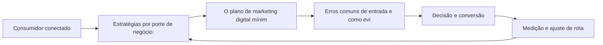

Observe o laço de retorno: a medição alimenta o próximo ciclo de campanha. Essa é a diferença estrutural entre campanha e sistema — a campanha termina quando o orçamento acaba; o sistema aprende e se ajusta a cada ciclo [7]. No caso do tema *Marketing Digital na Prática: Aplicação em Diferentes Portes de Negócio*, esse laço é o que converte o investimento inicial em aprendizado acumulado para as próximas decisões [15].

## 4. Técnica

### O Diagnóstico do Mix Digital em Código

Para aplicar os fundamentos, nada melhor que um diagnóstico programático do mix. O código abaixo avalia a maturidade digital de cada um dos 4Ps a partir de critérios simples — transformando intuição em checklist executável.

```python
import json

def diagnosticar_mix(produto: dict, preco: dict, praca: dict, promocao: dict) -> dict:
    """Pontua a maturidade digital de cada P (0-100)."""
    def nota(crit: dict) -> float:
        soma = sum(1 for v in crit.values() if v)
        return round(100 * soma / max(len(crit), 1), 1)

    return {
        "produto": nota(produto),
        "preco": nota(preco),
        "praca": nota(praca),
        "promocao": nota(promocao),
    }

mix = diagnosticar_mix(
    produto={"personalizavel": True, "digital": True, "feedback": True},
    preco={"dinamico": False, "freemium": True, "transparente": True},
    praca={"multicanal": True, "marketplace": False, "d2c": True},
    promocao={"segmentada": True, "conteudo": True, "mensuravel": True},
)
print(json.dumps(mix, indent=2))
```

O resultado alimenta a priorização: o P com menor nota é o primeiro candidato a experimento [1]. A disciplina de medir antes de mudar é o que separa o diagnóstico do achismo [3].

O código acima é o núcleo técnico de *Marketing Digital na Prática: Aplicação em Diferentes Portes de Negócio*: validável, executável e adaptável ao contexto real do leitor. A prática recomendada é rodá-lo com dados próprios e usar a saída como insumo da próxima reunião de planejamento. Documentação oficial das plataformas reforça cada passo — da estrutura de campanhas [5] à configuração de eventos [12]. A leitura técnica deste capítulo complementa a exposição conceitual das seções anteriores e prepara os exercícios da seção seguinte.

## 5. Aplica

Conhecimento sem aplicação é conteúdo; aplicação sem reflexão é rotina. No contexto de *Marketing Digital na Prática: Aplicação em Diferentes Portes de Negócio*, os exercícios abaixo fecham o capítulo e preparam o terreno do próximo:

1. Escreva em três frases o posicionamento da sua oferta no ambiente digital e teste a clareza com um colega.
2. Liste três concorrentes digitais e compare a proposta de valor de cada um com a sua.
3. Escolha um canal que você ainda não usa e estime o custo de entrada e o potencial de retorno.
4. Documente uma decisão recente de marketing e identifique qual dado faltou para ela ser melhor.

Dedique ao menos 30 minutos a um dos exercícios antes de avançar. O aprendizado desta obra é cumulativo: o mapa desenhado aqui será usado nos capítulos seguintes da Parte I e nas partes subsequentes [3].

Complementando, cinco exercícios práticos adicionais consolidam o aprendizado de *Marketing Digital na Prática: Aplicação em Diferentes Portes de Negócio*:

1. Como o seu negócio seria diferente se você não pudesse interromper ninguém — e só fosse visto quando relevante?
2. Quais dos seus 4Ps já são digitais de verdade, e quais foram apenas 'digitalizados' sem mudança real?
3. Em qual dos 5As sua marca perde mais consumidores hoje? Que evidência sustenta essa resposta?
4. Qual é o custo de atenção de cada formato que você publica? O que esse custo sugere sobre a escolha de canais?
5. Que experimento você poderia rodar esta semana para testar uma hipótese de marketing em vez de uma opinião?

## Leitura Complementar Recomendada

Para aprofundar *Marketing Digital na Prática: Aplicação em Diferentes Portes de Negócio* além deste capítulo:

- Para aprofundar os fundamentos, leia Kotler e Keller (Administração de Marketing) para a base conceitual, Kotler, Kartajaya e Setiawan (Marketing 4.0) para a transição digital, e Chaffey (Digital Marketing) para a operação prática — as três obras cobrem teoria, transição e execução [1] [2] [3].

- Como complemento de mercado, acompanhe os relatórios anuais da Deloitte (tendências de marketing) e do DataReportal (dados globais de digital) — eles contextualizam os números que aparecem neste capítulo [7] [15].

## Análise de Riscos e Mitigações

A aplicação de *Marketing Digital na Prática: Aplicação em Diferentes Portes de Negócio* envolve riscos identificáveis. A tabela de riscos abaixo relaciona cada ameaça à sua mitigação:

- Risco de escopo: tentar digitalizar tudo ao mesmo tempo. Mitigação: foco no P de menor nota e em um canal piloto — a expansão vem depois do aprendizado [3].
- Risco de medição: decidir sem linha de base. Mitigação: registrar a métrica antes de qualquer mudança — o antes e o depois contam a história [8].
- Risco cultural: resistência do time à mudança. Mitigação: experimento pequeno e visível com resultado documentado — a evidência vence a opinião [8].
- Risco de orçamento: gastar em tudo sem prioridade. Mitigação: alocação por retorno esperado e revisão mensal da verba [9].

## Considerações de Implementação

 

## Exercício Integrador da Parte I

a

Este exercício conecta o capítulo às demais partes da obra e deve ser revisto ao final da leitura completa.

## Aprofundamento Prático

O tema de *Marketing Digital na Prática: Aplicação em Diferentes Portes de Negócio* ganha potência quando levado ao nível operacional. Os quatro pontos abaixo aprofundam a aplicação prática:

- A leitura avançada do caminho dos 5As exige instrumentar cada A: assimilação (impressões e recall), atração (visitas e interesse), arguição (interações e pesquisas), ação (conversões) e defesa (indicações e avaliações). Sem evento por etapa, o 5As continua teoria [2].

- O custo de atenção é mensurável: divida o custo total de cada canal pelo tempo de atenção efetiva que ele gera. Essa conta, feita por formato, revela onde a verba rende mais — e muitas vezes aponta para o conteúdo orgânico como o ativo de menor custo [10].

- A passagem do outbound para o inbound não é binária: a maioria das operações maduras combina os dois, usando o inbound para construir ativo e o outbound para acelerar momentos específicos — o segredo é saber o papel de cada um [3].

- A medição do mix exige um pequeno modelo: uma planilha com os 4Ps, os critérios de maturidade e a nota de cada um, revisitada a cada trimestre. O simples ato de pontuar obriga a explicitar critérios — e explicitar critérios já é meio caminho para melhorar [8].

## Exercícios de Fixação

Para consolidar *Marketing Digital na Prática: Aplicação em Diferentes Portes de Negócio*, resolva os cinco exercícios abaixo — com caneta, papel e dados reais:

1. Registre a linha de base de uma métrica antes da próxima campanha.
2. Escreva com suas palavras a diferença entre outbound e inbound e dê um exemplo de cada.
3. Desenhe o caminho dos 5As para a sua oferta e aponte onde a marca perde o consumidor.
4. Defina um critério objetivo para avaliar a maturidade digital de cada um dos 4Ps.
5. Explique por que a atenção é o recurso mais disputado do marketing digital.

## Autoavaliação do Capítulo

Autoavaliação: (1) Consigo explicar a diferença entre outbound e inbound com exemplos? (2) Sei pontuar a maturidade digital dos 4Ps da minha oferta? (3) Tenho uma métrica por objetivo de marketing registrada? (4) Conheço o caminho dos 5As e os pontos onde minha marca perde? (5) Minha última decisão de marketing foi baseada em dado ou opinião? Responda sim ou não e priorize a primeira resposta negativa como próximo passo.

A primeira resposta negativa é o seu próximo passo natural — volte a ela na seção de aplicação deste capítulo e trabalhe o item até que a resposta seja sim.

## Problemas Comuns e Soluções Práticas

Aplicar *Marketing Digital na Prática: Aplicação em Diferentes Portes de Negócio* no mundo real esbarra em problemas recorrentes. Abaixo, cinco situações típicas com suas soluções — sintoma, causa e correção:

### Sem dados para decidir

O time decide por intuição porque não instrumentou nada. A solução é definir uma métrica por objetivo e registrar a linha de base antes de qualquer campanha — a decisão passa a ter número, mesmo que pequeno [8].

### Conteúdo que não converte

Produção abundante sem conversão indica mensagem desconectada da oferta. A solução é realinhar cada conteúdo a uma etapa da jornada com um CTA único — e medir a conversão por peça [3].

### Custo de aquisição alto

O CAC alto tem causas: mensagem genérica, página fraca, público errado. A solução é isolar o funil por etapa, localizar o vazamento e corrigir com teste — o custo cai quando a relevância sobe [9].

### Time resistente a mudança

A adoção do digital esbarra na cultura. A solução é começar por um experimento pequeno e visível, documentar o resultado e usar o número como argumento — a evidência vence a opinião [8].

### Verba apertada e resultado fraco

O sintoma clássico é gastar em tudo sem foco. A solução é o diagnóstico do mix: concentrar a verba no P de menor nota e em um único canal piloto, com métrica definida antes do gasto. Resultado esperado: custo por resultado caindo a cada ciclo de 30 dias [8].

## Aplicações por Setor

O tema de *Marketing Digital na Prática: Aplicação em Diferentes Portes de Negócio* ganha contornos diferentes em cada setor. A leitura setorial abaixo ajuda a adaptar os princípios ao seu contexto:

- Para pequenos negócios, o digital reduz a barreira de entrada e permite competir por nicho; para grandes marcas, o desafio é a agilidade — o mesmo conjunto de princípios, com recursos e riscos diferentes [18].

- No varejo, o mix digital se traduz em multicanalidade e prova social; em serviços, em agendamento e atendimento digital; no B2B, em conteúdo de autoridade e relacionamento de longo prazo — a mesma lógica do mix, aplicada a territórios diferentes [3].

## Plano de Ação de 30 Dias

Para converter a leitura de *Marketing Digital na Prática: Aplicação em Diferentes Portes de Negócio* em resultado, execute um dos planos semanais abaixo — cada semana tem um objetivo e uma entrega:

### Plano de Ação — Opção 1

Semana 1 — Diagnóstico: reúna o time, preencha o diagnóstico do mix (4Ps), registre a linha de base de uma métrica por objetivo e liste as três ações outbound/inbound atuais.
Semana 2 — Foco: escolha o P de menor nota, defina a hipótese do trimestre e eleja o canal piloto.
Semana 3 — Implementação: lance a primeira mudança no piloto com mensagem, oferta e página claras.
Semana 4 — Medição: compare contra a linha de base, documente o aprendizado e decida o próximo ciclo.

### Plano de Ação — Opção 2

Semana 1 — Audiência: descreva o cliente ideal em três frases e liste os canais que ele frequenta.
Semana 2 — Oferta: escreva a proposta de valor em uma frase e teste a clareza com três pessoas.
Semana 3 — Presença: produza cinco conteúdos sobre a oferta com um CTA cada.
Semana 4 — Dado: meça o retorno de cada peça e identifique o formato vencedor.

## KPIs que Importam neste Capítulo

Para *Marketing Digital na Prática: Aplicação em Diferentes Portes de Negócio*, os KPIs que importam: custo de aquisição por canal, taxa de conversão por etapa, retenção e recompra, e custo por resultado de cada ação outbound/inbound — a régua que amarra a Parte I ao resto da obra [9].

Antes de encerrar, registre esses indicadores no seu painel de acompanhamento — eles serão a régua para medir a aplicação deste capítulo nas próximas semanas.

## Roteiro de Implementação Passo a Passo

Para aplicar *Marketing Digital na Prática: Aplicação em Diferentes Portes de Negócio* na prática, os roteiros abaixo organizam a sequência de ações — do diagnóstico à medição:

### Roteiro de Implementação 1

1. Reúna as pessoas envolvidas em marketing, produto e atendimento em uma sessão de diagnóstico de 90 minutos.
2. Para cada um dos 4Ps, responda: o que já é digital, o que foi apenas digitalizado e o que falta digitalizar.
3. Pontue cada P de 0 a 100 com base em critérios objetivos (personalização, mensuração, multicanalidade).
4. Escolha o P de menor nota como foco do trimestre.
5. Defina uma hipótese: o que mudará e qual métrica confirmará o progresso.
6. Registre a linha de base da métrica antes de qualquer ação.
7. Implemente a mudança em um canal piloto, não em todos de uma vez.
8. Agende a revisão em 30 dias com os números na mesa.
9. Documente o aprendizado — o que funcionou, o que não funcionou e por quê.
10. Repita o ciclo com o próximo P, agora com a experiência acumulada.

### Roteiro de Implementação 2

1. Liste as três ofertas principais da sua empresa.
2. Para cada oferta, descreva quem é o cliente, qual dor resolve e qual o diferencial.
3. Compare com os três concorrentes digitais mais próximos.
4. Classifique suas ações atuais: quais são outbound (interrupção) e quais inbound (atração).
5. Estime o custo relativo de atenção de cada ação — tempo, verba e perturbação.
6. Escolha a ação de melhor relação custo-benefício para ampliar.
7. Defina o experimento: variação a testar, público e janela de tempo.
8. Meça o resultado contra a linha de base.
9. Decida: escalar, ajustar ou descartar — com base no dado, não na preferência.
10. Registre o aprendizado em um caderno de experimentos para reutilização futura.

## Perguntas Frequentes

Em relação ao tema de *Marketing Digital na Prática: Aplicação em Diferentes Portes de Negócio*, cinco perguntas surgem com frequência na prática profissional:

**E se eu errar?**

Errar rápido e barato é parte do método: o erro só vira prejuízo quando não gera aprendizado [8].

**Preciso estar em todas as plataformas?**

Não. Domine o canal onde seu público está e expanda com base em dados — presença sem foco divide esforço e resultado [8].

**Qual o orçamento mínimo para começar?**

Menos do que se imagina, desde que a oferta, a mensagem e a página de destino sejam claras. O orçamento importa menos que a clareza [3].

**Orgânico ou pago?**

Os dois, em proporção dependente da velocidade desejada: orgânico constrói ativo, pago compra tempo [3].

**Como saber se está funcionando?**

Eleja métricas antes da campanha e compare contra a linha de base — sem isso, qualquer resultado parece sucesso [8].

## Cenários Numéricos Comentados

Os cálculos abaixo mostram, com números concretos, como as decisões de *Marketing Digital na Prática: Aplicação em Diferentes Portes de Negócio* se traduzem em resultado:

### Cenário numérico: custo de atenção

Imagine duas empresas com a mesma verba de R$ 10 mil mensais. A primeira investe em anúncio de interrupção com custo de R$ 0,50 por mil impressões e conversão de 0,1%. A segunda investe em conteúdo inbound com custo de R$ 0,10 por contato qualificado e conversão de 2%. A matemática é brutalmente favorável ao inbound em custo por cliente: R$ 500 contra R$ 50 por conversão — sem considerar o efeito de longo prazo da autoridade construída [3].

### Cenário numérico: o efeito da retenção

Uma empresa com 1.000 clientes, ticket de R$ 200, margem de 50% e churn mensal de 5% tem LTV de R$ 2.000. Reduzir o churn para 3% eleva o LTV para R$ 3.333 — um aumento de 67% no valor de cada cliente, sem gastar um real a mais em aquisição. Esse é o efeito composto que a economia do cliente recompensa [16].

## Como Este Capítulo se Integra à Obra

A Parte I é a fundação de toda a obra: os conceitos de mix, jornada e atenção sustentam as decisões das partes seguintes. Ao avançar, você verá os fundamentos reaparecerem na escolha de plataformas (Parte IV), na construção do relacionamento (Parte V) e na matemática do cliente (Parte IX) — porque cada território digital é uma aplicação dos mesmos princípios. No contexto de *Marketing Digital na Prática: Aplicação em Diferentes Portes de Negócio*, essa integração fica ainda mais visível: as ferramentas e métricas que você dominou aqui serão a base das decisões dos próximos capítulos — e das partes que virão depois.

## Aprofundamento Conceitual

No contexto de *Marketing Digital na Prática: Aplicação em Diferentes Portes de Negócio*, a confiança é o ativo mais frágil e mais valioso do ambiente digital: uma avaliação negativa, um vazamento de dados ou uma promessa não cumprida destrói em dias o que levou anos para construir [18].

No contexto de *Marketing Digital na Prática: Aplicação em Diferentes Portes de Negócio*, o consumidor conectado é um pesquisador compulsivo: compara preços em múltiplos canais, lê avaliações, consulta redes sociais e só então decide. A marca que não participa dessa pesquisa está fora da decisão [15].

No contexto de *Marketing Digital na Prática: Aplicação em Diferentes Portes de Negócio*, a cultura de experimento é a grande virada do marketing digital: empresas que testam hipóteses rapidamente, aprendem com falhas baratas e escalam o que funciona superam as que planejam por ciclos longos [8].

No contexto de *Marketing Digital na Prática: Aplicação em Diferentes Portes de Negócio*, a integração entre marketing e produto é uma das fronteiras mais lucrativas do digital: o marketing não termina na venda — ele alimenta o produto com dados de comportamento e o produto alimenta o marketing com casos de uso [1].

No contexto de *Marketing Digital na Prática: Aplicação em Diferentes Portes de Negócio*, a passagem do outbound para o inbound não foi apenas estética: mudou a posição de poder na relação comercial. No modelo tradicional, a marca decidia o que o consumidor via; no digital, é o consumidor que decide o que ver — e a marca precisa merecer a atenção com relevância [3].

## Fundamentos em Detalhe

No contexto de *Marketing Digital na Prática: Aplicação em Diferentes Portes de Negócio*, a jornada de compra digital raramente é linear: o consumidor alterna entre dispositivos, canais e mensagens antes de decidir, e a marca que aparece nos momentos certos — e desaparece nos errados — perde participação de decisão [15].

No contexto de *Marketing Digital na Prática: Aplicação em Diferentes Portes de Negócio*, o custo de tentativa e erro caiu drasticamente: uma campanha pode ser lançada, medida e corrigida em dias, não em meses, o que favorece organizações com cultura de experimento sobre as que planejam por ciclos longos [3].

No contexto de *Marketing Digital na Prática: Aplicação em Diferentes Portes de Negócio*, a atenção do consumidor tornou-se o recurso mais disputado do marketing digital, e a relevância — não o volume — é o que define quem consegue capturá-la sem destruir a percepção de marca [10].

No contexto de *Marketing Digital na Prática: Aplicação em Diferentes Portes de Negócio*, o ambiente digital criou novas formas de prova social: avaliações, depoimentos, números de seguidores e menções públicas influenciam a decisão tanto quanto (ou mais que) a propaganda tradicional [2].

No contexto de *Marketing Digital na Prática: Aplicação em Diferentes Portes de Negócio*, a personalização deixou de ser diferencial e virou expectativa: consumidores conectados assumem que a marca conhece seu histórico e suas preferências — e punem quem age como se não conhecesse [20].

## Estudos de Caso Aplicados

### Caso: a padaria que virou marca digital

Uma padaria de bairro decidiu migrar do boca a boca para o digital. O primeiro passo não foi criar anúncios, mas diagnosticar o mix: produto (pães artesanais com história), preço (premium com justificativa), praça (entrega própria + WhatsApp) e promoção (conteúdo de bastidor). Em três meses, o Instagram virou a vitrine, o WhatsApp o balcão e a história da marca o diferencial. A lição: o digital não troca o produto — ele amplifica o que já existe quando o diagnóstico vem primeiro [3].

### Caso: o infoproduto que quebrou o custo de aquisição

Um criador de conteúdo lançou um curso online e descobriu que o custo de aquisição via anúncio superava o preço do produto. O diagnóstico do mix apontou o problema: a promoção competia por palavras-chave genéricas e o produto não tinha oferta de entrada. A correção combinou um e-book de baixo custo (entrada), uma trilha de e-mails (relacionamento) e o conteúdo orgânico (autoridade) — reduzindo o CAC pela metade sem cortar mídia [9].

## Dados e Números do Setor

### Indicadores-Chave

- Custo de aquisição por canal é a régua que compara estratégias digitais [9].
- Retenção e recompra respondem pela maior parte da lucratividade de longo prazo [16].
- A taxa de conversão média dos funis digitais permanece baixa — e é onde mora o maior potencial [8].
- O retorno do marketing orientado a dados supera o baseado em intuição na maioria dos casos [8].

### Dados de Contexto

- Mais de 5,5 bilhões de pessoas usam a internet — dois terços da humanidade [15].
- O investimento publicitário digital global segue crescendo e já é o maior destino de verba de mídia [9].
- O tempo médio diário nas redes sociais supera duas horas para a maioria dos públicos [15].
- A maioria das compras online começa com uma pesquisa — em busca ou nas redes [4].
- O consumidor consulta em média múltiplas fontes antes de decidir uma compra [15].

## Análise Comparativa

O tema de *Marketing Digital na Prática: Aplicação em Diferentes Portes de Negócio* fica mais claro quando contrastado com a alternativa mais próxima. A comparação abaixo organiza as diferenças:

### Tradicional vs. Digital

- Interrupção vs. atração: a mensagem de massa invade; o conteúdo digital atrai.
- Métrica de alcance vs. métrica de retorno: o digital rastreia a última interação.
- Segmentação por perfil vs. por intenção e comportamento.
- Ciclo de campanha longo vs. experimento contínuo.

## Erros Comuns e Como Evitá-los

No tema de *Marketing Digital na Prática: Aplicação em Diferentes Portes de Negócio*, cinco erros recorrentes merecem atenção especial — cada um com sua correção prática:

1. Subestimar o pós-venda: gastar toda a energia na aquisição e ignorar a retenção é encher o balde com furo.
2. Digitalizar processos antigos: colocar o mesmo anúncio de massa no digital sem mudar a lógica é caro e ineficaz.
3. Medir tudo e decidir nada: dashboards sem hipóteses viram ruído, e o time continua decidindo por intuição.
4. Ignorar o celular: estratégias pensadas para desktop perdem a maior parte da jornada do consumidor real.
5. Confundir presença com estratégia: estar em todas as plataformas sem foco multiplica o esforço e divide o resultado.

## Ferramentas e Recursos Recomendados

Para operar o tema de *Marketing Digital na Prática: Aplicação em Diferentes Portes de Negócio* na prática, a seguinte seleção de ferramentas cobre o ciclo completo — do diagnóstico à medição:

1. Biblioteca de conteúdo de referência (Kotler, Chaffey)
2. Pesquisas de satisfação para medir percepção
3. Planilha de diagnóstico de mix (modelo simples de checklist por P)
4. Ferramentas de analytics para rastrear o caminho dos 5As
5. CRM básico para registro da jornada

## Glossário do Capítulo

Os termos abaixo — todos usados no corpo deste capítulo — formam o vocabulário mínimo para acompanhar o restante da obra:

Outbound: comunicação de interrupção, iniciada pela marca. Inbound: atração por valor, iniciada pelo consumidor. 4Ps: produto, preço, praça e promoção. 5As: assimilação, atração, arguição, ação e defesa. Economia da atenção: a disputa pelo tempo limitado do consumidor.

## Checklist de Implementação

Use a lista abaixo para auditar a aplicação de *Marketing Digital na Prática: Aplicação em Diferentes Portes de Negócio* na sua operação — marque os itens já concluídos e priorize os pendentes:

- [ ] Ações classificadas entre outbound e inbound
- [ ] Métrica definida por objetivo de marketing
- [ ] Linha de base registrada antes de qualquer mudança
- [ ] Diagnóstico do mix 4Ps concluído com nota por P
- [ ] Caminho dos 5As mapeado com os pontos de perda

## Perguntas para Reflexão

Antes de avançar, reflita sobre as cinco questões abaixo — elas conectam o conteúdo de *Marketing Digital na Prática: Aplicação em Diferentes Portes de Negócio* ao seu contexto real de trabalho:

1. Quais dos seus 4Ps já são digitais de verdade, e quais foram apenas 'digitalizados' sem mudança real?
2. Em qual dos 5As sua marca perde mais consumidores hoje? Que evidência sustenta essa resposta?
3. Qual é o custo de atenção de cada formato que você publica? O que esse custo sugere sobre a escolha de canais?
4. Que experimento você poderia rodar esta semana para testar uma hipótese de marketing em vez de uma opinião?
5. Como o seu negócio seria diferente se você não pudesse interromper ninguém — e só fosse visto quando relevante?

## Quadro Comparativo: Comparativo Tradicional vs. Digital

O quadro abaixo consolida os elementos essenciais de *Marketing Digital na Prática: Aplicação em Diferentes Portes de Negócio* em perspectiva comparada, facilitando a consulta rápida e a tomada de decisão:

| Aspecto | Tradicional | Digital |
|---|---|---|
| Aspecto | Tradicional | Digital |
| Custo dominante | Distribuição e mídia | Atenção e confiança |
| Mensagem | De massa, interrupção | Segmentada, atração |
| Métrica | Alcance estimado | Retorno rastreado |
| Segmentação | Perfil demográfico | Intenção e comportamento |
| Ciclo de campanha | Meses | Semanas (experimento) |
| Feedback | Pesquisa tardia | Tempo real |

## 6. Conclusão

O capítulo percorreu o território da Parte I, *Fundamentos — O Novo Território*, e deixou três aprendizados operacionais. Primeiro, o conceito central — *Marketing Digital na Prática: Aplicação em Diferentes Portes de Negócio* — é menos uma novidade e mais uma disciplina de execução. Segundo, a aplicação exige a tríade conceito, rota e métrica, sem pular etapas [8]. Terceiro, o ajuste contínuo de rota, ilustrado no laço de retorno do diagrama, é o que separa campanhas pontuais de operações sustentáveis [7]. O caminho percorrido desde *O Consumidor Conectado: Comportamento e Motivações Digitais* até aqui forma a base que o próximo passo vai usar. No próximo capítulo, *Funil de Vendas e Jornada do Cliente: Mapeando a Navegação*, você avançará sobre o território vizinho levando as ferramentas exercitadas aqui.

Como navegador de marketing digital, você não decorou uma fórmula — incorporou um modo de operar: ler o território, escolher a rota com dados e ajustar o percurso quando o vento muda [2].

Antes do fechamento, vale reforçar a base do capítulo: No contexto de *Marketing Digital na Prática: Aplicação em Diferentes Portes de Negócio*, o mix digital não é uma tradução literal dos 4Ps: o produto ganha dimensões digitais (customização, atualização contínua), o preço fica dinâmico, a praça vira multicanal e a promoção se torna conversacional [3].

No contexto de *Marketing Digital na Prática: Aplicação em Diferentes Portes de Negócio*, a medição digital criou um paradoxo: temos mais dados do que nunca, mas a qualidade da decisão depende mais da pergunta que da quantidade de números. O marco analítico — o que medir e por quê — precede qualquer dashboard [8].
## 7. Referências Bibliográficas

[1] KOTLER, Philip; KELLER, Kevin Lane. **Administração de Marketing**. 15. ed. São Paulo: Pearson, 2016.
[2] KOTLER, Philip; KARTAJAYA, Hermawan; SETIAWAN, Iwan. **Marketing 4.0: Moving from Traditional to Digital**. Hoboken: Wiley, 2017.
[3] CHAFFEY, Dave; ELLIS-CHADWICK, Fiona. **Digital Marketing: Strategy, Implementation and Practice**. 9. ed. Harlow: Pearson, 2025.
[4] GOOGLE SEARCH CENTRAL. **Search Engine Optimization (SEO) Starter Guide**. Disponível em: https://developers.google.com/search/docs/fundamentals/seo-starter-guide. Acesso em: 02 ago. 2026.
[5] GOOGLE ADS HELP CENTER. **Your guide to Google Ads (Basics, Search Campaigns & Best Practices)**. Disponível em: https://support.google.com/google-ads/answer/6146252. Acesso em: 02 ago. 2026.
[6] META BUSINESS HELP CENTER. **Meta Ads Manager Guide: Best Practices for Targeting, Measurement, and Optimization**. Disponível em: https://www.facebook.com/business/help. Acesso em: 02 ago. 2026.
[7] DELOITTE DIGITAL. **Marketing Trends 2026: New Marketing for a New World**. Disponível em: https://www.deloittedigital.com/nl/en/insights/perspective/marketing-trends-2026.html. Acesso em: 02 ago. 2026.
[8] HUBSPOT RESEARCH. **The State of Marketing / 2026 Marketing Statistics, Trends & Data**. Disponível em: https://www.hubspot.com/marketing-statistics. Acesso em: 02 ago. 2026.
[9] STATISTA RESEARCH DEPARTMENT. **Global Digital Marketing and Advertising Revenue Statistics & Facts**. Disponível em: https://www.statista.com/topics/8954/marketing-worldwide/. Acesso em: 02 ago. 2026.
[10] RYAN, Damian. **Understanding Digital Marketing: Marketing Strategies for Engaging the Digital Generation**. 5. ed. London: Kogan Page, 2020.
[11] HOLLENSEN, Svend; KOTLER, Philip; OPRESNIK, Marc Oliver. **Social Media Marketing: A Practitioner Approach**. 4. ed. Harlow: Pearson, 2023.
[12] GOOGLE ANALYTICS HELP CENTER. **Documentação oficial do Google Analytics 4**. Disponível em: https://support.google.com/analytics. Acesso em: 02 ago. 2026.
[13] LINKEDIN MARKETING SOLUTIONS. **Best Practices para campanhas B2B no LinkedIn**. Disponível em: https://business.linkedin.com/marketing-solutions. Acesso em: 02 ago. 2026.
[14] TIKTOK FOR BUSINESS. **Guia de criatividade e boas práticas de anúncios no TikTok**. Disponível em: https://www.tiktok.com/business. Acesso em: 02 ago. 2026.
[15] DATAREPORTAL. **Digital 2026: Global Overview Report**. Disponível em: https://datareportal.com/reports/digital-2026-global-overview-report. Acesso em: 02 ago. 2026.
[16] LEMON, Katherine N.; VERHOEF, Peter C. **Understanding Customer Experience Throughout the Customer Journey**. *Journal of Marketing*, v. 80, n. 6, p. 69-96, 2016.
[17] TIWARI, Rajnish; BUSE, Stephan; HERSTATT, Cornelius. **From Electronic to Mobile Commerce: Opportunities and Challenges**. *Proceedings of the German-Indian Roundtable*, 2006.
[18] VAN DIJK, Jan A. G. M. **The Digital Divide**. Cambridge: Polity Press, 2020.
[19] IBM. **Marketing with AI: Personalization at Scale**. Disponível em: https://www.ibm.com/think/topics/ai-marketing. Acesso em: 02 ago. 2026.
[20] KOTLER, Philip. **Marketing 5.0: Technology for Humanity**. Hoboken: Wiley, 2021.


# PARTE II — A Jornada do Consumidor — Mapeando a Navegação

# Capítulo 6: Funil de Vendas e Jornada do Cliente: Mapeando a Navegação

## 1. Introdução

Bem-vindo a uma nova etapa da sua navegação pelo marketing digital. Este capítulo — *Funil de Vendas e Jornada do Cliente: Mapeando a Navegação* — integra a Parte II, *A Jornada do Consumidor — Mapeando a Navegação*, e responde a uma pergunta prática: **modelos de funil: aida, tofu-mofu-bofu e o caminho dos 5as** — na prática, como isso se traduz em decisão e resultado?

Ao final, você será capaz de aprende a mapear a jornada do consumidor — do reconhecimento à defesa — e a alinhar cada etapa a objetivos e métricas específicas.. Mais do que decorar conceitos, você vai enxergar a jornada como mapa com etapas, atalhos e momentos de verdade — e converter essa visão em plano, experimento e métrica.

No capítulo anterior, *Marketing Digital na Prática: Aplicação em Diferentes Portes de Negócio*, você aprendeu os conceitos que servem de plataforma para o que vem agora. Este capítulo retoma esse repertório e o aplica a um território novo — sem repetir o que já foi estabelecido, apenas usando como base.

O capítulo segue a estrutura das sete seções que organizam esta obra: primeiro a exposição conceitual, depois a ilustração, a técnica aplicada, o exercício de aplicação e a conclusão operacional.

No contexto de *Funil de Vendas e Jornada do Cliente: Mapeando a Navegação*, a jornada do consumidor é a unidade de análise mais importante do marketing moderno: entender onde o cliente está, o que ele precisa e qual a próxima ação esperada em cada etapa define a eficácia de tudo o que a marca faz [16].

No contexto de *Funil de Vendas e Jornada do Cliente: Mapeando a Navegação*, o conceito de momentos de verdade — criado pela Procter & Gamble — permanece central: o primeiro contato, a avaliação comparativa e a experiência pós-compra são os três pontos que mais influenciam a decisão e a recompra [16].
## 2. Explica

### Modelos de funil: AIDA, TOFU-MOFU-BOFU e o caminho dos 5As

Quando o tema é *Funil de Vendas e Jornada do Cliente: Mapeando a Navegação*, o primeiro pilar — modelos de funil: aida, tofu-mofu-bofu e o caminho dos 5as — define o território conceitual. A confiança construída ao longo da jornada é o ativo intangível que mais correlaciona com recompra e recomendação espontânea [1].

Na prática, modelos de funil: aida, tofu-mofu-bofu e o caminho dos 5as significa transformar a teoria em rotina operacional — exatamente o que *Funil de Vendas e Jornada do Cliente: Mapeando a Navegação* exige no dia a dia. A literatura de gestão é enfática: sem operacionalizar o conceito em checklist, responsável e métrica, ele permanece slide de apresentação [3]. Por isso a Parte II propõe sempre o mesmo movimento: entender, traduzir em critério observável e decidir com dado.

### Micro-momentos e a decisão de compra fragmentada

O segundo pilar — micro-momentos e a decisão de compra fragmentada — conecta a estratégia à operação diária. Lemon e Verhoef demonstram que a experiência do cliente se constrói na soma dos encontros ao longo da jornada — avaliar cada ponto isolado engana tanto quanto ignorar a jornada inteira [16]. A experiência do consumidor se constrói na consistência entre canais e mensagens, e é essa consistência que transforma contato em relacionamento [16]. Organizações que tratam cada canal como silo perdem o fio condutor da jornada; as que operam o pilar com disciplina reduzem atrito e aumentam a taxa de avanço entre etapas [10].

### Alinhamento de jornada a objetivos e KPIs por etapa

Fechando o tripé, alinhamento de jornada a objetivos e kpis por etapa é o que transforma a Parte II em vantagem mensurável. A jornada do consumidor moderno raramente é linear: a decisão se fragmenta em micro-momentos de pesquisa, comparação e validação antes de qualquer contato com a marca [3]. O relato da indústria mostra que as empresas que sustentam resultado não são as que têm mais ferramentas, mas as que conseguem medir e ajustar a rota com frequência [8]. A métrica certa, escolhida antes da campanha, vale mais do que qualquer ferramenta cara instalada depois do fato [9].

### O Eixo Transversal do Capítulo

Personas construídas com dados quantitativos e qualitativos reduzem o desperdício de mídia porque alinham a mensagem ao contexto real de decisão de cada segmento [10]. Esse eixo conecta os três pilares e explica por que o capítulo os trata como um sistema, não como uma lista: cada pilar reforça o outro, e a omissão de qualquer um deles produz estratégia manca. O capítulo seguinte retomará esse eixo com novas ferramentas, agora com o vocabulário já estabelecido aqui.

Em síntese, o capítulo opera em três níveis: o conceitual (Modelos de funil: AIDA, TOFU-MOFU-BOFU e o caminho dos 5As), o operacional (Micro-momentos e a decisão de compra fragmentada) e o estratégico (Alinhamento de jornada a objetivos e KPIs por etapa). O leitor que dominar os três estará apto a aplicar a Parte II com autonomia [1]. A evidência reunida nesta seção sustenta cada recomendação prática das seções seguintes [2].

## 3. Ilustra

Vamos traduzir o capítulo em uma cena concreta, no contexto de *Funil de Vendas e Jornada do Cliente: Mapeando a Navegação*. Uma empresa de porte médio, com equipe enxuta e orçamento limitado, decide operar a Parte II desta obra, *A Jornada do Consumidor — Mapeando a Navegação*. Na primeira semana, a equipe testa o conceito central do capítulo em um caso real: um cliente que pesquisou, comparou e decidiu comprar. O primeiro pilar — modelos de funil: aida, tofu-mofu-bofu e o caminho dos 5as — orienta o entendimento inicial do público; o segundo — micro-momentos e a decisão de compra fragmentada — guia a escolha da rota de comunicação; e o terceiro fecha com a medição do resultado [2].

O diagrama abaixo representa o fluxo operacional proposto pelo capítulo — do consumidor conectado à decisão e ao ajuste contínuo de rota, com o público e a plataforma específicos do tema no centro da navegação:

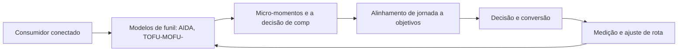

Observe o laço de retorno: a medição alimenta o próximo ciclo de campanha. Essa é a diferença estrutural entre campanha e sistema — a campanha termina quando o orçamento acaba; o sistema aprende e se ajusta a cada ciclo [7]. No caso do tema *Funil de Vendas e Jornada do Cliente: Mapeando a Navegação*, esse laço é o que converte o investimento inicial em aprendizado acumulado para as próximas decisões [15].

## 4. Técnica

### O Mapa de Jornada em Estrutura de Dados

A jornada vira dado quando cada etapa ganha evento, métrica e dono. O modelo abaixo representa a jornada como uma lista de estágios com conversão acumulada — a base para identificar o maior vazamento do funil.

```python
from dataclasses import dataclass

@dataclass
class Estagio:
    nome: str
    contato: int
    conversao: float  # fração que avança

def funil(estagios):
    """Calcula conversão por estágio e vazamento acumulado."""
    acumulado = estagios[0].contato
    resultado = []
    for e in estagios:
        resultado.append({"estagio": e.nome, "pessoas": acumulado,
                          "conversao_etapa": round(e.conversao, 3)})
        acumulado = round(acumulado * e.conversao)
    return resultado

jornada = [
    Estagio("Reconhecimento", 100_000, 0.30),
    Estagio("Consideração", 0, 0.40),
    Estagio("Decisão", 0, 0.25),
    Estagio("Compra", 0, 1.0),
]
for etapa in funil(jornada):
    print(etapa)
```

O maior vazamento entre etapas é a prioridade da estratégia — cada ponto recuperado se multiplica ao longo do funil [16]. O mapa é também o documento de alinhamento entre marketing e vendas [3].

O código acima é o núcleo técnico de *Funil de Vendas e Jornada do Cliente: Mapeando a Navegação*: validável, executável e adaptável ao contexto real do leitor. A prática recomendada é rodá-lo com dados próprios e usar a saída como insumo da próxima reunião de planejamento. Documentação oficial das plataformas reforça cada passo — da estrutura de campanhas [5] à configuração de eventos [12]. A leitura técnica deste capítulo complementa a exposição conceitual das seções anteriores e prepara os exercícios da seção seguinte.

## 5. Aplica

Conhecimento sem aplicação é conteúdo; aplicação sem reflexão é rotina. No contexto de *Funil de Vendas e Jornada do Cliente: Mapeando a Navegação*, os exercícios abaixo fecham o capítulo e preparam o terreno do próximo:

1. Defina uma métrica de satisfação (CSAT ou NPS) e colete a primeira rodada de respostas.
2. Desenhe o mapa de touchpoints da jornada do seu cliente, do reconhecimento à defesa.
3. Crie uma persona com nome, dores, canais e gatilhos de decisão baseada em dados reais de sua audiência.
4. Identifique os três momentos de verdade da sua jornada e o que o cliente avalia em cada um.

Dedique ao menos 30 minutos a um dos exercícios antes de avançar. O aprendizado desta obra é cumulativo: o mapa desenhado aqui será usado nos capítulos seguintes da Parte II e nas partes subsequentes [3].

Complementando, cinco exercícios práticos adicionais consolidam o aprendizado de *Funil de Vendas e Jornada do Cliente: Mapeando a Navegação*:

1. Onde está a maior fricção do seu funil? Qual dado confirma que é ali?
2. O que um cliente que recompra sabe sobre a sua marca que um que desistiu não sabe?
3. Desenhe a jornada de um cliente seu e marque: onde ele desiste, onde hesita e onde decide?
4. Sua persona está atualizada com dados reais de comportamento ou é uma suposição antiga?
5. Quais são os três momentos de verdade da sua jornada — e o que o cliente avalia em cada um?

## Leitura Complementar Recomendada

Para aprofundar *Funil de Vendas e Jornada do Cliente: Mapeando a Navegação* além deste capítulo:

- Como complemento prático, o Google Analytics e a documentação de eventos de conversão ajudam a instrumentar as etapas da jornada — a medição é o que transforma o mapa em instrumento de gestão [12].

- Para aprofundar a jornada, o artigo de Lemon e Verhoef (Understanding Customer Experience Throughout the Customer Journey) é a referência acadêmica central, e Chaffey traz o tratamento operacional do funil e da jornada no contexto digital [16] [3].

## Análise de Riscos e Mitigações

A aplicação de *Funil de Vendas e Jornada do Cliente: Mapeando a Navegação* envolve riscos identificáveis. A tabela de riscos abaixo relaciona cada ameaça à sua mitigação:

- Risco de ignorar o pós-compra: todo o esforço no checkout. Mitigação: fluxo de pós-venda com satisfação e recompra [16].
- Risco de mapa obsoleto: a jornada muda e o mapa fica velho. Mitigação: revisão trimestral com dados novos de comportamento [16].
- Risco de persona de achismo: decisões sobre suposições. Mitigação: entrevistas reais e dados de analytics na construção [10].
- Risco de foco no sintoma: tratar a conversão sem entender a jornada. Mitigação: diagnóstico por etapa antes da correção [16].

## Considerações de Implementação

p

## Exercício Integrador da Parte II

r

Este exercício conecta o capítulo às demais partes da obra e deve ser revisto ao final da leitura completa.

## Aprofundamento Prático

O tema de *Funil de Vendas e Jornada do Cliente: Mapeando a Navegação* ganha potência quando levado ao nível operacional. Os quatro pontos abaixo aprofundam a aplicação prática:

- A experiência do cliente é gerida por rotina: reuniões regulares de jornada, com o mapa na mesa e os números por etapa, criam o hábito de decidir sobre a experiência — não sobre a opinião [16].

- O aprofundamento prático da jornada exige transformar o mapa em instrumento vivo: cada etapa deve ter um dono, uma métrica e um documento de referência. Sem isso, o mapa vira decoração de parede e a jornada continua sendo gerida por intuição [16].

- A leitura avançada dos momentos de verdade pede a instrumentação de cada um: para o primeiro contato, métrica de primeira impressão; para a avaliação, métrica de comparação; para o pós-compra, métrica de satisfação e recompra [16].

- A fricção mensurável é a base do CRO de jornada: cada etapa do funil tem uma taxa de avanço, e o vazamento entre etapas é a prioridade — o mapa indica onde o cliente hesita e o teste indica como remover a hesitação [8].

## Exercícios de Fixação

Para consolidar *Funil de Vendas e Jornada do Cliente: Mapeando a Navegação*, resolva os cinco exercícios abaixo — com caneta, papel e dados reais:

1. Identifique os três momentos de verdade da sua jornada e o que o cliente avalia em cada um.
2. Localize a maior fricção do seu funil com uma evidência numérica.
3. Defina uma métrica de experiência e colete a primeira rodada.
4. Desenhe a jornada de um cliente real em cinco etapas com os touchpoints de cada uma.
5. Escreva a persona da sua audiência com dados — não com suposições.

## Autoavaliação do Capítulo

Autoavaliação: (1) Tenho um mapa de jornada do cliente com dados? (2) Minha persona foi atualizada com comportamento real? (3) Sei qual é a maior fricção do meu funil com evidência? (4) Tenho uma métrica de experiência coletando respostas? (5) Minha taxa de recompra é conhecida e acompanhada? Responda e priorize a primeira resposta negativa.

A primeira resposta negativa é o seu próximo passo natural — volte a ela na seção de aplicação deste capítulo e trabalhe o item até que a resposta seja sim.

## Problemas Comuns e Soluções Práticas

Aplicar *Funil de Vendas e Jornada do Cliente: Mapeando a Navegação* no mundo real esbarra em problemas recorrentes. Abaixo, cinco situações típicas com suas soluções — sintoma, causa e correção:

### Pós-venda negligenciado

Todo o esforço termina no checkout. A solução é desenhar o fluxo de pós-venda: acompanhamento, satisfação e incentivo à recompra — o cliente existente é o ativo mais barato [16].

### Alta desistência no meio do funil

Clientes somem entre etapas sem explicação. A solução é o mapa de jornada com dados de cada etapa: localizar o ponto de maior queda e testar a correção da fricção [16].

### Clientes que não recompram

A aquisição funciona, mas a retenção falha. A solução é medir a experiência pós-compra, atacar o onboarding e nutrir a relação — a recompra é o termômetro da jornada completa [16].

### Persona de achismo

As decisões se baseiam em suposições sobre o cliente. A solução é entrevistar três clientes reais, cruzar com analytics e atualizar a persona com dados — o investimento em mídia fica mais eficiente [10].

### Fricção invisível

A conversão cai sem causa aparente. A solução é combinar heatmap, gravação de sessão e análise de funil para tornar a fricção visível — e testar a remoção [8].

## Aplicações por Setor

O tema de *Funil de Vendas e Jornada do Cliente: Mapeando a Navegação* ganha contornos diferentes em cada setor. A leitura setorial abaixo ajuda a adaptar os princípios ao seu contexto:

- A jornada do varejo é curta e transacional; a do B2B é longa e grupal; a do serviço é relacional e contínua — cada uma exige um mapa, mensagens e métricas próprios [16].

- No e-commerce, a jornada termina no checkout e se renova na recompra; no serviço de assinatura, a jornada é o próprio produto — a retenção é a métrica-mestra [16].

## Plano de Ação de 30 Dias

Para converter a leitura de *Funil de Vendas e Jornada do Cliente: Mapeando a Navegação* em resultado, execute um dos planos semanais abaixo — cada semana tem um objetivo e uma entrega:

### Plano de Ação — Opção 1

Semana 1 — Pesquisa: entreviste três clientes e registre as palavras deles.
Semana 2 — Persona: atualize a persona com os achados — dores, canais, gatilhos.
Semana 3 — Métrica: defina NPS ou CSAT e colete a primeira rodada.
Semana 4 — Correção: remova a fricção de maior impacto e meça o efeito.

### Plano de Ação — Opção 2

Semana 1 — Mapa: desenhe a jornada em cinco etapas com os touchpoints de hoje.
Semana 2 — Dado: cruze analytics e atendimento para localizar o maior vazamento.
Semana 3 — Hipótese: formule a correção da fricção principal com métrica de sucesso.
Semana 4 — Teste: implemente em piloto, meça e documente.

## KPIs que Importam neste Capítulo

Para *Funil de Vendas e Jornada do Cliente: Mapeando a Navegação*, os KPIs que importam: conversão por etapa da jornada, taxa de abandono entre touchpoints, CSAT/NPS, recompra e valor do tempo de vida — os números que provam onde a jornada avança e onde quebra [16].

Antes de encerrar, registre esses indicadores no seu painel de acompanhamento — eles serão a régua para medir a aplicação deste capítulo nas próximas semanas.

## Roteiro de Implementação Passo a Passo

Para aplicar *Funil de Vendas e Jornada do Cliente: Mapeando a Navegação* na prática, os roteiros abaixo organizam a sequência de ações — do diagnóstico à medição:

### Roteiro de Implementação 1

1. Reúna os dados que já existem: analytics, atendimento, pesquisa, redes sociais.
2. Identifique as cinco perguntas mais frequentes dos clientes.
3. Mapeie em qual etapa da jornada cada pergunta surge.
4. Entreviste três clientes para validar as suposições com palavras deles.
5. Atualize a persona principal com os achados — dores, canais, gatilhos.
6. Defina a métrica de experiência: CSAT, NPS ou ambas, com periodicidade.
7. Colete a primeira rodada e registre a linha de base.
8. Compare a experiência percebida entre dois concorrentes.
9. Escolha a fricção de maior impacto e remova-a em piloto.
10. Revise o mapa de jornada a cada trimestre com dados novos.

### Roteiro de Implementação 2

1. Escolha três clientes reais — um recente, um recorrente e um que desistiu.
2. Entreviste cada um e registre o percurso completo, do primeiro contato à decisão.
3. Liste todos os touchpoints mencionados e o que o cliente avaliou em cada um.
4. Monte o mapa da jornada em cinco etapas: descoberta, avaliação, decisão, compra, pós-venda.
5. Marque onde a jornada quebrou para o cliente que desistiu.
6. Identifique os três momentos de verdade — os pontos que mais influenciaram a percepção.
7. Para cada momento, defina a experiência ideal e o gap atual.
8. Priorize o gap de maior impacto sobre a conversão ou retenção.
9. Formule uma hipótese de correção com métrica de sucesso.
10. Implemente em piloto, meça e documente o aprendizado.

## Perguntas Frequentes

Em relação ao tema de *Funil de Vendas e Jornada do Cliente: Mapeando a Navegação*, cinco perguntas surgem com frequência na prática profissional:

**O que é um momento de verdade?**

O ponto da jornada que mais influencia a percepção e a decisão — primeiro contato, avaliação e pós-compra [16].

**Como reduzir o atrito?**

Identifique a fricção com dados (heatmap, funil, gravação), formule a hipótese e teste a remoção em piloto [8].

**Devo medir NPS?**

Se a recompra importa, sim: NPS e CSAT correlacionam com retenção e recomendação — e a tendência importa mais que o ponto [16].

**Por que minha conversão caiu?**

Examine a jornada: a queda quase sempre tem causa em uma etapa específica — e a análise de funil localiza o ponto [16].

**Persona serve mesmo?**

Sim, quando alimentada por dados reais — entrevistas, analytics e atendimento. Persona de suposição é despesa disfarçada [10].

## Cenários Numéricos Comentados

Os cálculos abaixo mostram, com números concretos, como as decisões de *Funil de Vendas e Jornada do Cliente: Mapeando a Navegação* se traduzem em resultado:

### Cenário numérico: valor do momento de verdade

Uma loja descobre que 40% dos visitantes abandonam na etapa de preço, antes do checkout. Trazer a informação de preço e frete para a página do produto recupera 15 pontos de conversão — cada ponto equivale a dezenas de milhares de reais em receita anual para volumes relevantes [16].

### Cenário numérico: o vazamento do funil

Um funil com 100.000 contatos no topo, conversão de 30% entre etapas, teria 900 compras ao final. Se a conversão entre a consideração e a decisão cair de 30% para 20%, o resultado cai para 600 — uma perda de um terço da receita, invisível para quem mede apenas o topo e o checkout. O mapa da jornada localiza o vazamento e o CRO o corrige [16].

## Como Este Capítulo se Integra à Obra

A jornada do consumidor é o eixo transversal da obra: as partes de busca, redes, relacionamento e conversão são pontos dessa jornada vistos de perto. Ao estudar as partes seguintes, volte a este mapa mental — cada canal que você dominar preencherá uma etapa da jornada que você já conhece. No contexto de *Funil de Vendas e Jornada do Cliente: Mapeando a Navegação*, essa integração fica ainda mais visível: as ferramentas e métricas que você dominou aqui serão a base das decisões dos próximos capítulos — e das partes que virão depois.

## Aprofundamento Conceitual

No contexto de *Funil de Vendas e Jornada do Cliente: Mapeando a Navegação*, a jornada B2B é mais longa e mais grupal: múltiplos decisores, ciclos de meses e avaliação técnica profunda — exigindo conteúdo de educação por estágio e alinhamento com vendas [13].

No contexto de *Funil de Vendas e Jornada do Cliente: Mapeando a Navegação*, a jornada de compra moderna é um ecossistema de micro-momentos: o consumidor decide em frações de segundo, no celular, entre uma tarefa e outra. A marca que não está presente nesses momentos perde a corrida cedo [3].

No contexto de *Funil de Vendas e Jornada do Cliente: Mapeando a Navegação*, o mapeamento de jornada com dados exige a fusão de fontes: analytics de site, interações sociais, atendimento e pesquisa de satisfação se combinam para formar o retrato real do percurso do cliente [16].

No contexto de *Funil de Vendas e Jornada do Cliente: Mapeando a Navegação*, as personas são instrumentos vivos: devem ser atualizadas com dados de comportamento, não com achismo. Uma persona construída sobre entrevistas e analytics vale mais que cinco construídas sobre suposições [10].

No contexto de *Funil de Vendas e Jornada do Cliente: Mapeando a Navegação*, a fricção é a inimiga silenciosa da conversão: cada campo de formulário, cada passo extra e cada ambiguidade de mensagem reduz a probabilidade de avanço. Identificar e remover atrito é trabalho contínuo [16].

## Fundamentos em Detalhe

No contexto de *Funil de Vendas e Jornada do Cliente: Mapeando a Navegação*, o mapeamento de jornada não é um exercício único: a jornada evolui com o produto, com o mercado e com o comportamento do consumidor, e exige revisão periódica com dados atualizados [3].

No contexto de *Funil de Vendas e Jornada do Cliente: Mapeando a Navegação*, a segmentação por intenção — pesquisar, comparar, comprar — permite mensagens muito mais eficazes que a segmentação por perfil demográfico isolado [10].

No contexto de *Funil de Vendas e Jornada do Cliente: Mapeando a Navegação*, a psicologia da decisão digital é influenciada por vieses bem documentados: ancoragem de preço, aversão à perda, prova social e escassez — todos aplicáveis no design da oferta [2].

No contexto de *Funil de Vendas e Jornada do Cliente: Mapeando a Navegação*, o pós-compra é a etapa mais negligenciada e mais lucrativa da jornada: é onde se decide a recompra, a recomendação e o valor de longo prazo do cliente [16].

No contexto de *Funil de Vendas e Jornada do Cliente: Mapeando a Navegação*, cada canal da jornada tem um papel distinto: a descoberta acontece nas redes, a avaliação na busca, a decisão no site e a confirmação no atendimento — e a marca precisa orquestrar a passagem entre eles [3].

## Estudos de Caso Aplicados

### Caso: o e-commerce que perdeu a recompra

Uma loja de roupas investia tudo em aquisição e ignorava o pós-compra. O mapa de jornada mostrou que o cliente satisfeito não era nutrido: sem e-mail de acompanhamento, sem programa de fidelidade e sem indicação. A recompra saltou quando a loja adicionou um fluxo de pós-venda com desconto para o próximo pedido e um programa de pontos — provando que a jornada não termina no checkout [16].

### Caso: a clínica que mapeou a jornada e dobrou o agendamento

Uma clínica odontológica percebeu que a maioria dos pacientes abandonava entre a pesquisa (Google) e o contato (WhatsApp). O mapa de jornada revelou a quebra: sem preço nem avaliações visíveis, o paciente não se sentia seguro para iniciar a conversa. A correção: página de preço transparente, avaliações integradas e resposta automática no WhatsApp. Em um trimestre, o agendamento dobrou — sem aumentar o tráfego [16].

## Dados e Números do Setor

### Dados de Contexto

- A jornada digital moderna é fragmentada: o consumidor alterna dispositivos e canais antes de decidir [15].
- A experiência do cliente é apontada como o principal diferencial competitivo em pesquisas de liderança [16].
- A recomendação e a avaliação de outros clientes influenciam a decisão tanto quanto a propaganda [2].
- O mobile é o principal ponto de contato da jornada para a maioria dos públicos [17].

### Indicadores-Chave

- A satisfação (CSAT/NPS) correlaciona com recompra e recomendação [16].
- O atrito no funil reduz a conversão de forma desproporcional a cada passo [3].
- Clientes bem nutridos na jornada geram maior valor de longo prazo [16].

## Análise Comparativa

O tema de *Funil de Vendas e Jornada do Cliente: Mapeando a Navegação* fica mais claro quando contrastado com a alternativa mais próxima. A comparação abaixo organiza as diferenças:

### Funil vs. Jornada

- Funil é linear; a jornada é um percurso de idas e voltas.
- Funil é da marca; a jornada é do consumidor.
- O funil termina na compra; a jornada continua no pós-venda e na defesa.
- A jornada considera múltiplos canais simultâneos; o funil simplifica em etapas.

## Erros Comuns e Como Evitá-los

No tema de *Funil de Vendas e Jornada do Cliente: Mapeando a Navegação*, cinco erros recorrentes merecem atenção especial — cada um com sua correção prática:

1. Tratar todos os contatos como iguais: ignorar o estágio da jornada produz mensagens fora de contexto.
2. Medir só a conversão final: ignorar as etapas intermediárias esconde onde a jornada realmente quebra.
3. Ignorar o feedback: as reclamações e dúvidas dos clientes são o mapa exato da fricção.
4. Personas de achismo: construir perfis sem dados reais reproduz estereótipos e desperdiça mídia.
5. Mapear a jornada uma única vez: a jornada muda com o mercado, e o mapa precisa ser vivo.

## Ferramentas e Recursos Recomendados

Para operar o tema de *Funil de Vendas e Jornada do Cliente: Mapeando a Navegação* na prática, a seguinte seleção de ferramentas cobre o ciclo completo — do diagnóstico à medição:

1. Plataforma de pesquisa de usuário para entrevistas
2. Analytics para eventos por etapa do funil
3. Ferramenta de NPS/CSAT para medir experiência
4. Planilha de personas com dados reais
5. Ferramenta de mapa de jornada (visual) 

## Glossário do Capítulo

Os termos abaixo — todos usados no corpo deste capítulo — formam o vocabulário mínimo para acompanhar o restante da obra:

Jornada do cliente: caminho completo do primeiro contato à recompra. Touchpoint: ponto de contato entre marca e consumidor. Persona: representação semi-fictícia do cliente ideal. Momento de verdade: ponto que define percepção. Fricção: barreira entre interesse e ação.

## Checklist de Implementação

Use a lista abaixo para auditar a aplicação de *Funil de Vendas e Jornada do Cliente: Mapeando a Navegação* na sua operação — marque os itens já concluídos e priorize os pendentes:

- [ ] Mapa de touchpoints desenhado do reconhecimento à defesa
- [ ] Persona atualizada com dados reais
- [ ] Três momentos de verdade identificados
- [ ] Fricção principal localizada com dado
- [ ] Métrica de experiência (CSAT/NPS) definida

## Perguntas para Reflexão

Antes de avançar, reflita sobre as cinco questões abaixo — elas conectam o conteúdo de *Funil de Vendas e Jornada do Cliente: Mapeando a Navegação* ao seu contexto real de trabalho:

1. O que um cliente que recompra sabe sobre a sua marca que um que desistiu não sabe?
2. Desenhe a jornada de um cliente seu e marque: onde ele desiste, onde hesita e onde decide?
3. Sua persona está atualizada com dados reais de comportamento ou é uma suposição antiga?
4. Quais são os três momentos de verdade da sua jornada — e o que o cliente avalia em cada um?
5. Onde está a maior fricção do seu funil? Qual dado confirma que é ali?

## Quadro Comparativo: Etapas da Jornada e Seus Objetivos

O quadro abaixo consolida os elementos essenciais de *Funil de Vendas e Jornada do Cliente: Mapeando a Navegação* em perspectiva comparada, facilitando a consulta rápida e a tomada de decisão:

| Etapa | Objetivo | Métrica típica |
|---|---|---|
| Etapa | Objetivo | Métrica típica |
| Descoberta | Gerar consideração | Alcance e recall |
| Avaliação | Ser comparado | Visitas e interações |
| Decisão | Converter | Taxa de conversão |
| Compra | Concluir | Receita e pedido |
| Pós-venda | Reter e encantar | Recompra e NPS |

## 6. Conclusão

O capítulo percorreu o território da Parte II, *A Jornada do Consumidor — Mapeando a Navegação*, e deixou três aprendizados operacionais. Primeiro, o conceito central — *Funil de Vendas e Jornada do Cliente: Mapeando a Navegação* — é menos uma novidade e mais uma disciplina de execução. Segundo, a aplicação exige a tríade conceito, rota e métrica, sem pular etapas [8]. Terceiro, o ajuste contínuo de rota, ilustrado no laço de retorno do diagrama, é o que separa campanhas pontuais de operações sustentáveis [7]. O caminho percorrido desde *Marketing Digital na Prática: Aplicação em Diferentes Portes de Negócio* até aqui forma a base que o próximo passo vai usar. No próximo capítulo, *Personas e Segmentação: Conhecendo o Viajante*, você avançará sobre o território vizinho levando as ferramentas exercitadas aqui.

Como navegador de marketing digital, você não decorou uma fórmula — incorporou um modo de operar: ler o território, escolher a rota com dados e ajustar o percurso quando o vento muda [2].

Antes do fechamento, vale reforçar a base do capítulo: No contexto de *Funil de Vendas e Jornada do Cliente: Mapeando a Navegação*, o feedback do cliente é o insumo mais barato e mais negligenciado: pesquisas pós-compra, avaliações e conversas de suporte contêm os dados exatos de onde a jornada quebra [16].

No contexto de *Funil de Vendas e Jornada do Cliente: Mapeando a Navegação*, a recompra é o sinal mais forte de saúde da jornada: clientes que voltam validam que a experiência funcionou de ponta a ponta — e a taxa de recompra é o KPI que resume todas as etapas anteriores [16].
## 7. Referências Bibliográficas

[1] KOTLER, Philip; KELLER, Kevin Lane. **Administração de Marketing**. 15. ed. São Paulo: Pearson, 2016.
[2] KOTLER, Philip; KARTAJAYA, Hermawan; SETIAWAN, Iwan. **Marketing 4.0: Moving from Traditional to Digital**. Hoboken: Wiley, 2017.
[3] CHAFFEY, Dave; ELLIS-CHADWICK, Fiona. **Digital Marketing: Strategy, Implementation and Practice**. 9. ed. Harlow: Pearson, 2025.
[4] GOOGLE SEARCH CENTRAL. **Search Engine Optimization (SEO) Starter Guide**. Disponível em: https://developers.google.com/search/docs/fundamentals/seo-starter-guide. Acesso em: 02 ago. 2026.
[5] GOOGLE ADS HELP CENTER. **Your guide to Google Ads (Basics, Search Campaigns & Best Practices)**. Disponível em: https://support.google.com/google-ads/answer/6146252. Acesso em: 02 ago. 2026.
[6] META BUSINESS HELP CENTER. **Meta Ads Manager Guide: Best Practices for Targeting, Measurement, and Optimization**. Disponível em: https://www.facebook.com/business/help. Acesso em: 02 ago. 2026.
[7] DELOITTE DIGITAL. **Marketing Trends 2026: New Marketing for a New World**. Disponível em: https://www.deloittedigital.com/nl/en/insights/perspective/marketing-trends-2026.html. Acesso em: 02 ago. 2026.
[8] HUBSPOT RESEARCH. **The State of Marketing / 2026 Marketing Statistics, Trends & Data**. Disponível em: https://www.hubspot.com/marketing-statistics. Acesso em: 02 ago. 2026.
[9] STATISTA RESEARCH DEPARTMENT. **Global Digital Marketing and Advertising Revenue Statistics & Facts**. Disponível em: https://www.statista.com/topics/8954/marketing-worldwide/. Acesso em: 02 ago. 2026.
[10] RYAN, Damian. **Understanding Digital Marketing: Marketing Strategies for Engaging the Digital Generation**. 5. ed. London: Kogan Page, 2020.
[11] HOLLENSEN, Svend; KOTLER, Philip; OPRESNIK, Marc Oliver. **Social Media Marketing: A Practitioner Approach**. 4. ed. Harlow: Pearson, 2023.
[12] GOOGLE ANALYTICS HELP CENTER. **Documentação oficial do Google Analytics 4**. Disponível em: https://support.google.com/analytics. Acesso em: 02 ago. 2026.
[13] LINKEDIN MARKETING SOLUTIONS. **Best Practices para campanhas B2B no LinkedIn**. Disponível em: https://business.linkedin.com/marketing-solutions. Acesso em: 02 ago. 2026.
[14] TIKTOK FOR BUSINESS. **Guia de criatividade e boas práticas de anúncios no TikTok**. Disponível em: https://www.tiktok.com/business. Acesso em: 02 ago. 2026.
[15] DATAREPORTAL. **Digital 2026: Global Overview Report**. Disponível em: https://datareportal.com/reports/digital-2026-global-overview-report. Acesso em: 02 ago. 2026.
[16] LEMON, Katherine N.; VERHOEF, Peter C. **Understanding Customer Experience Throughout the Customer Journey**. *Journal of Marketing*, v. 80, n. 6, p. 69-96, 2016.
[17] TIWARI, Rajnish; BUSE, Stephan; HERSTATT, Cornelius. **From Electronic to Mobile Commerce: Opportunities and Challenges**. *Proceedings of the German-Indian Roundtable*, 2006.
[18] VAN DIJK, Jan A. G. M. **The Digital Divide**. Cambridge: Polity Press, 2020.
[19] IBM. **Marketing with AI: Personalization at Scale**. Disponível em: https://www.ibm.com/think/topics/ai-marketing. Acesso em: 02 ago. 2026.
[20] KOTLER, Philip. **Marketing 5.0: Technology for Humanity**. Hoboken: Wiley, 2021.

# Capítulo 7: Personas e Segmentação: Conhecendo o Viajante

## 1. Introdução

Bem-vindo a uma nova etapa da sua navegação pelo marketing digital. Este capítulo — *Personas e Segmentação: Conhecendo o Viajante* — integra a Parte II, *A Jornada do Consumidor — Mapeando a Navegação*, e responde a uma pergunta prática: **construção de personas com dados quantitativos e qualitativos** — na prática, como isso se traduz em decisão e resultado?

Ao final, você será capaz de constrói personas orientadas a dados, segmenta audiências por comportamento e intenção, e usa essa base para personalizar a comunicação.. Mais do que decorar conceitos, você vai enxergar a jornada como mapa com etapas, atalhos e momentos de verdade — e converter essa visão em plano, experimento e métrica.

No capítulo anterior, *Funil de Vendas e Jornada do Cliente: Mapeando a Navegação*, você aprendeu os conceitos que servem de plataforma para o que vem agora. Este capítulo retoma esse repertório e o aplica a um território novo — sem repetir o que já foi estabelecido, apenas usando como base.

O capítulo segue a estrutura das sete seções que organizam esta obra: primeiro a exposição conceitual, depois a ilustração, a técnica aplicada, o exercício de aplicação e a conclusão operacional.

No contexto de *Personas e Segmentação: Conhecendo o Viajante*, personas bem construídas não são documentos decorativos: elas orientam a escolha de canais, o tom de mensagem e até a arquitetura de produto — quando alimentadas por dados reais de comportamento [10].

No contexto de *Personas e Segmentação: Conhecendo o Viajante*, a experiência do cliente (CX) virou a principal arena competitiva: com produtos cada vez mais parecidos, a jornada sem atrito é o que diferencia quem ganha recompra de quem perde para o concorrente [16].
## 2. Explica

### Construção de personas com dados quantitativos e qualitativos

Quando o tema é *Personas e Segmentação: Conhecendo o Viajante*, o primeiro pilar — construção de personas com dados quantitativos e qualitativos — define o território conceitual. Personas construídas com dados quantitativos e qualitativos reduzem o desperdício de mídia porque alinham a mensagem ao contexto real de decisão de cada segmento [10].

Na prática, construção de personas com dados quantitativos e qualitativos significa transformar a teoria em rotina operacional — exatamente o que *Personas e Segmentação: Conhecendo o Viajante* exige no dia a dia. A literatura de gestão é enfática: sem operacionalizar o conceito em checklist, responsável e métrica, ele permanece slide de apresentação [3]. Por isso a Parte II propõe sempre o mesmo movimento: entender, traduzir em critério observável e decidir com dado.

### Segmentação comportamental, demográfica e por intenção

O segundo pilar — segmentação comportamental, demográfica e por intenção — conecta a estratégia à operação diária. A experiência percebida supera o produto em influência sobre a recomendação: clientes que vivenciam jornadas sem atrito relatam intenção de recompra e advocacy significativamente maior [16]. A experiência do consumidor se constrói na consistência entre canais e mensagens, e é essa consistência que transforma contato em relacionamento [16]. Organizações que tratam cada canal como silo perdem o fio condutor da jornada; as que operam o pilar com disciplina reduzem atrito e aumentam a taxa de avanço entre etapas [10].

### Da segmentação à personalização da experiência

Fechando o tripé, da segmentação à personalização da experiência é o que transforma a Parte II em vantagem mensurável. O cliente conectado pesquisa antes de comprar: o número médio de fontes consultadas antes da decisão cresce a cada ano, e a marca ausente das fases iniciais perde a corrida cedo [15]. O relato da indústria mostra que as empresas que sustentam resultado não são as que têm mais ferramentas, mas as que conseguem medir e ajustar a rota com frequência [8]. A métrica certa, escolhida antes da campanha, vale mais do que qualquer ferramenta cara instalada depois do fato [9].

### O Eixo Transversal do Capítulo

O conceito de customer journey consolidou-se como unidade de análise: mapas de jornada viraram instrumento padrão de planejamento em empresas orientadas a experiência [3]. Esse eixo conecta os três pilares e explica por que o capítulo os trata como um sistema, não como uma lista: cada pilar reforça o outro, e a omissão de qualquer um deles produz estratégia manca. O capítulo seguinte retomará esse eixo com novas ferramentas, agora com o vocabulário já estabelecido aqui.

Em síntese, o capítulo opera em três níveis: o conceitual (Construção de personas com dados quantitativos e qualitativos), o operacional (Segmentação comportamental, demográfica e por intenção) e o estratégico (Da segmentação à personalização da experiência). O leitor que dominar os três estará apto a aplicar a Parte II com autonomia [1]. A evidência reunida nesta seção sustenta cada recomendação prática das seções seguintes [2].

## 3. Ilustra

Vamos traduzir o capítulo em uma cena concreta, no contexto de *Personas e Segmentação: Conhecendo o Viajante*. Uma empresa de porte médio, com equipe enxuta e orçamento limitado, decide operar a Parte II desta obra, *A Jornada do Consumidor — Mapeando a Navegação*. Na primeira semana, a equipe testa o conceito central do capítulo em um caso real: um cliente que pesquisou, comparou e decidiu comprar. O primeiro pilar — construção de personas com dados quantitativos e qualitativos — orienta o entendimento inicial do público; o segundo — segmentação comportamental, demográfica e por intenção — guia a escolha da rota de comunicação; e o terceiro fecha com a medição do resultado [2].

O diagrama abaixo representa o fluxo operacional proposto pelo capítulo — do consumidor conectado à decisão e ao ajuste contínuo de rota, com o público e a plataforma específicos do tema no centro da navegação:

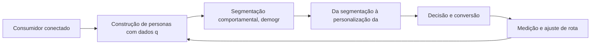

Observe o laço de retorno: a medição alimenta o próximo ciclo de campanha. Essa é a diferença estrutural entre campanha e sistema — a campanha termina quando o orçamento acaba; o sistema aprende e se ajusta a cada ciclo [7]. No caso do tema *Personas e Segmentação: Conhecendo o Viajante*, esse laço é o que converte o investimento inicial em aprendizado acumulado para as próximas decisões [15].

## 4. Técnica

### O Mapa de Jornada em Estrutura de Dados

A jornada vira dado quando cada etapa ganha evento, métrica e dono. O modelo abaixo representa a jornada como uma lista de estágios com conversão acumulada — a base para identificar o maior vazamento do funil.

```python
from dataclasses import dataclass

@dataclass
class Estagio:
    nome: str
    contato: int
    conversao: float  # fração que avança

def funil(estagios):
    """Calcula conversão por estágio e vazamento acumulado."""
    acumulado = estagios[0].contato
    resultado = []
    for e in estagios:
        resultado.append({"estagio": e.nome, "pessoas": acumulado,
                          "conversao_etapa": round(e.conversao, 3)})
        acumulado = round(acumulado * e.conversao)
    return resultado

jornada = [
    Estagio("Reconhecimento", 100_000, 0.30),
    Estagio("Consideração", 0, 0.40),
    Estagio("Decisão", 0, 0.25),
    Estagio("Compra", 0, 1.0),
]
for etapa in funil(jornada):
    print(etapa)
```

O maior vazamento entre etapas é a prioridade da estratégia — cada ponto recuperado se multiplica ao longo do funil [16]. O mapa é também o documento de alinhamento entre marketing e vendas [3].

O código acima é o núcleo técnico de *Personas e Segmentação: Conhecendo o Viajante*: validável, executável e adaptável ao contexto real do leitor. A prática recomendada é rodá-lo com dados próprios e usar a saída como insumo da próxima reunião de planejamento. Documentação oficial das plataformas reforça cada passo — da estrutura de campanhas [5] à configuração de eventos [12]. A leitura técnica deste capítulo complementa a exposição conceitual das seções anteriores e prepara os exercícios da seção seguinte.

## 5. Aplica

Conhecimento sem aplicação é conteúdo; aplicação sem reflexão é rotina. No contexto de *Personas e Segmentação: Conhecendo o Viajante*, os exercícios abaixo fecham o capítulo e preparam o terreno do próximo:

1. Identifique os três momentos de verdade da sua jornada e o que o cliente avalia em cada um.
2. Escolha um cliente perdido recentemente e reconstrua a jornada dele para localizar o ponto de ruptura.
3. Entreviste três clientes e registre as palavras que eles usam para descrever sua oferta.
4. Liste as cinco perguntas mais frequentes da sua base e mapeie em qual etapa da jornada surgem.

Dedique ao menos 30 minutos a um dos exercícios antes de avançar. O aprendizado desta obra é cumulativo: o mapa desenhado aqui será usado nos capítulos seguintes da Parte II e nas partes subsequentes [3].

Complementando, cinco exercícios práticos adicionais consolidam o aprendizado de *Personas e Segmentação: Conhecendo o Viajante*:

1. Sua persona está atualizada com dados reais de comportamento ou é uma suposição antiga?
2. Quais são os três momentos de verdade da sua jornada — e o que o cliente avalia em cada um?
3. Onde está a maior fricção do seu funil? Qual dado confirma que é ali?
4. O que um cliente que recompra sabe sobre a sua marca que um que desistiu não sabe?
5. Desenhe a jornada de um cliente seu e marque: onde ele desiste, onde hesita e onde decide?

## Leitura Complementar Recomendada

Para aprofundar *Personas e Segmentação: Conhecendo o Viajante* além deste capítulo:

- Para aprofundar a jornada, o artigo de Lemon e Verhoef (Understanding Customer Experience Throughout the Customer Journey) é a referência acadêmica central, e Chaffey traz o tratamento operacional do funil e da jornada no contexto digital [16] [3].

- Como complemento prático, o Google Analytics e a documentação de eventos de conversão ajudam a instrumentar as etapas da jornada — a medição é o que transforma o mapa em instrumento de gestão [12].

## Análise de Riscos e Mitigações

A aplicação de *Personas e Segmentação: Conhecendo o Viajante* envolve riscos identificáveis. A tabela de riscos abaixo relaciona cada ameaça à sua mitigação:

- Risco de foco no sintoma: tratar a conversão sem entender a jornada. Mitigação: diagnóstico por etapa antes da correção [16].
- Risco de ignorar o pós-compra: todo o esforço no checkout. Mitigação: fluxo de pós-venda com satisfação e recompra [16].
- Risco de mapa obsoleto: a jornada muda e o mapa fica velho. Mitigação: revisão trimestral com dados novos de comportamento [16].
- Risco de persona de achismo: decisões sobre suposições. Mitigação: entrevistas reais e dados de analytics na construção [10].

## Considerações de Implementação

m

## Exercício Integrador da Parte II

c

Este exercício conecta o capítulo às demais partes da obra e deve ser revisto ao final da leitura completa.

## Aprofundamento Prático

O tema de *Personas e Segmentação: Conhecendo o Viajante* ganha potência quando levado ao nível operacional. Os quatro pontos abaixo aprofundam a aplicação prática:

- A fricção mensurável é a base do CRO de jornada: cada etapa do funil tem uma taxa de avanço, e o vazamento entre etapas é a prioridade — o mapa indica onde o cliente hesita e o teste indica como remover a hesitação [8].

- A persona orientada a dados combina fontes: analytics mostra o comportamento, atendimento mostra as dores, pesquisa mostra as palavras — e a persona é a síntese operacional dessas três fontes [10].

- A experiência do cliente é gerida por rotina: reuniões regulares de jornada, com o mapa na mesa e os números por etapa, criam o hábito de decidir sobre a experiência — não sobre a opinião [16].

- O aprofundamento prático da jornada exige transformar o mapa em instrumento vivo: cada etapa deve ter um dono, uma métrica e um documento de referência. Sem isso, o mapa vira decoração de parede e a jornada continua sendo gerida por intuição [16].

## Exercícios de Fixação

Para consolidar *Personas e Segmentação: Conhecendo o Viajante*, resolva os cinco exercícios abaixo — com caneta, papel e dados reais:

1. Desenhe a jornada de um cliente real em cinco etapas com os touchpoints de cada uma.
2. Escreva a persona da sua audiência com dados — não com suposições.
3. Identifique os três momentos de verdade da sua jornada e o que o cliente avalia em cada um.
4. Localize a maior fricção do seu funil com uma evidência numérica.
5. Defina uma métrica de experiência e colete a primeira rodada.

## Autoavaliação do Capítulo

Autoavaliação: (1) Tenho um mapa de jornada do cliente com dados? (2) Minha persona foi atualizada com comportamento real? (3) Sei qual é a maior fricção do meu funil com evidência? (4) Tenho uma métrica de experiência coletando respostas? (5) Minha taxa de recompra é conhecida e acompanhada? Responda e priorize a primeira resposta negativa.

A primeira resposta negativa é o seu próximo passo natural — volte a ela na seção de aplicação deste capítulo e trabalhe o item até que a resposta seja sim.

## Problemas Comuns e Soluções Práticas

Aplicar *Personas e Segmentação: Conhecendo o Viajante* no mundo real esbarra em problemas recorrentes. Abaixo, cinco situações típicas com suas soluções — sintoma, causa e correção:

### Persona de achismo

As decisões se baseiam em suposições sobre o cliente. A solução é entrevistar três clientes reais, cruzar com analytics e atualizar a persona com dados — o investimento em mídia fica mais eficiente [10].

### Fricção invisível

A conversão cai sem causa aparente. A solução é combinar heatmap, gravação de sessão e análise de funil para tornar a fricção visível — e testar a remoção [8].

### Pós-venda negligenciado

Todo o esforço termina no checkout. A solução é desenhar o fluxo de pós-venda: acompanhamento, satisfação e incentivo à recompra — o cliente existente é o ativo mais barato [16].

### Alta desistência no meio do funil

Clientes somem entre etapas sem explicação. A solução é o mapa de jornada com dados de cada etapa: localizar o ponto de maior queda e testar a correção da fricção [16].

### Clientes que não recompram

A aquisição funciona, mas a retenção falha. A solução é medir a experiência pós-compra, atacar o onboarding e nutrir a relação — a recompra é o termômetro da jornada completa [16].

## Aplicações por Setor

O tema de *Personas e Segmentação: Conhecendo o Viajante* ganha contornos diferentes em cada setor. A leitura setorial abaixo ajuda a adaptar os princípios ao seu contexto:

- No e-commerce, a jornada termina no checkout e se renova na recompra; no serviço de assinatura, a jornada é o próprio produto — a retenção é a métrica-mestra [16].

- A jornada do varejo é curta e transacional; a do B2B é longa e grupal; a do serviço é relacional e contínua — cada uma exige um mapa, mensagens e métricas próprios [16].

## Plano de Ação de 30 Dias

Para converter a leitura de *Personas e Segmentação: Conhecendo o Viajante* em resultado, execute um dos planos semanais abaixo — cada semana tem um objetivo e uma entrega:

### Plano de Ação — Opção 1

Semana 1 — Mapa: desenhe a jornada em cinco etapas com os touchpoints de hoje.
Semana 2 — Dado: cruze analytics e atendimento para localizar o maior vazamento.
Semana 3 — Hipótese: formule a correção da fricção principal com métrica de sucesso.
Semana 4 — Teste: implemente em piloto, meça e documente.

### Plano de Ação — Opção 2

Semana 1 — Pesquisa: entreviste três clientes e registre as palavras deles.
Semana 2 — Persona: atualize a persona com os achados — dores, canais, gatilhos.
Semana 3 — Métrica: defina NPS ou CSAT e colete a primeira rodada.
Semana 4 — Correção: remova a fricção de maior impacto e meça o efeito.

## KPIs que Importam neste Capítulo

Para *Personas e Segmentação: Conhecendo o Viajante*, os KPIs que importam: conversão por etapa da jornada, taxa de abandono entre touchpoints, CSAT/NPS, recompra e valor do tempo de vida — os números que provam onde a jornada avança e onde quebra [16].

Antes de encerrar, registre esses indicadores no seu painel de acompanhamento — eles serão a régua para medir a aplicação deste capítulo nas próximas semanas.

## Roteiro de Implementação Passo a Passo

Para aplicar *Personas e Segmentação: Conhecendo o Viajante* na prática, os roteiros abaixo organizam a sequência de ações — do diagnóstico à medição:

### Roteiro de Implementação 1

1. Escolha três clientes reais — um recente, um recorrente e um que desistiu.
2. Entreviste cada um e registre o percurso completo, do primeiro contato à decisão.
3. Liste todos os touchpoints mencionados e o que o cliente avaliou em cada um.
4. Monte o mapa da jornada em cinco etapas: descoberta, avaliação, decisão, compra, pós-venda.
5. Marque onde a jornada quebrou para o cliente que desistiu.
6. Identifique os três momentos de verdade — os pontos que mais influenciaram a percepção.
7. Para cada momento, defina a experiência ideal e o gap atual.
8. Priorize o gap de maior impacto sobre a conversão ou retenção.
9. Formule uma hipótese de correção com métrica de sucesso.
10. Implemente em piloto, meça e documente o aprendizado.

### Roteiro de Implementação 2

1. Reúna os dados que já existem: analytics, atendimento, pesquisa, redes sociais.
2. Identifique as cinco perguntas mais frequentes dos clientes.
3. Mapeie em qual etapa da jornada cada pergunta surge.
4. Entreviste três clientes para validar as suposições com palavras deles.
5. Atualize a persona principal com os achados — dores, canais, gatilhos.
6. Defina a métrica de experiência: CSAT, NPS ou ambas, com periodicidade.
7. Colete a primeira rodada e registre a linha de base.
8. Compare a experiência percebida entre dois concorrentes.
9. Escolha a fricção de maior impacto e remova-a em piloto.
10. Revise o mapa de jornada a cada trimestre com dados novos.

## Perguntas Frequentes

Em relação ao tema de *Personas e Segmentação: Conhecendo o Viajante*, cinco perguntas surgem com frequência na prática profissional:

**Por que minha conversão caiu?**

Examine a jornada: a queda quase sempre tem causa em uma etapa específica — e a análise de funil localiza o ponto [16].

**Persona serve mesmo?**

Sim, quando alimentada por dados reais — entrevistas, analytics e atendimento. Persona de suposição é despesa disfarçada [10].

**O que é um momento de verdade?**

O ponto da jornada que mais influencia a percepção e a decisão — primeiro contato, avaliação e pós-compra [16].

**Como reduzir o atrito?**

Identifique a fricção com dados (heatmap, funil, gravação), formule a hipótese e teste a remoção em piloto [8].

**Devo medir NPS?**

Se a recompra importa, sim: NPS e CSAT correlacionam com retenção e recomendação — e a tendência importa mais que o ponto [16].

## Cenários Numéricos Comentados

Os cálculos abaixo mostram, com números concretos, como as decisões de *Personas e Segmentação: Conhecendo o Viajante* se traduzem em resultado:

### Cenário numérico: o vazamento do funil

Um funil com 100.000 contatos no topo, conversão de 30% entre etapas, teria 900 compras ao final. Se a conversão entre a consideração e a decisão cair de 30% para 20%, o resultado cai para 600 — uma perda de um terço da receita, invisível para quem mede apenas o topo e o checkout. O mapa da jornada localiza o vazamento e o CRO o corrige [16].

### Cenário numérico: valor do momento de verdade

Uma loja descobre que 40% dos visitantes abandonam na etapa de preço, antes do checkout. Trazer a informação de preço e frete para a página do produto recupera 15 pontos de conversão — cada ponto equivale a dezenas de milhares de reais em receita anual para volumes relevantes [16].

## Como Este Capítulo se Integra à Obra

A jornada do consumidor é o eixo transversal da obra: as partes de busca, redes, relacionamento e conversão são pontos dessa jornada vistos de perto. Ao estudar as partes seguintes, volte a este mapa mental — cada canal que você dominar preencherá uma etapa da jornada que você já conhece. No contexto de *Personas e Segmentação: Conhecendo o Viajante*, essa integração fica ainda mais visível: as ferramentas e métricas que você dominou aqui serão a base das decisões dos próximos capítulos — e das partes que virão depois.

## Aprofundamento Conceitual

No contexto de *Personas e Segmentação: Conhecendo o Viajante*, as personas são instrumentos vivos: devem ser atualizadas com dados de comportamento, não com achismo. Uma persona construída sobre entrevistas e analytics vale mais que cinco construídas sobre suposições [10].

No contexto de *Personas e Segmentação: Conhecendo o Viajante*, a fricção é a inimiga silenciosa da conversão: cada campo de formulário, cada passo extra e cada ambiguidade de mensagem reduz a probabilidade de avanço. Identificar e remover atrito é trabalho contínuo [16].

No contexto de *Personas e Segmentação: Conhecendo o Viajante*, o neuromarketing aplica vieses documentados ao design digital: ancoragem (primeiro preço visto influencia o julgamento), escassez (urgência percebida), prova social (os outros já confiaram) e aversão à perda [2].

No contexto de *Personas e Segmentação: Conhecendo o Viajante*, a experiência do cliente não é um departamento: é a soma de todas as decisões da empresa vistas pelo olhar do cliente. Cada área — marketing, vendas, produto, suporte — é um ponto da jornada [16].

No contexto de *Personas e Segmentação: Conhecendo o Viajante*, a segmentação por estágio da jornada supera a segmentação por perfil: saber se o consumidor está descobrindo, avaliando ou decidindo define a mensagem mais eficaz, independentemente de demografia [10].

## Fundamentos em Detalhe

No contexto de *Personas e Segmentação: Conhecendo o Viajante*, o pós-compra é a etapa mais negligenciada e mais lucrativa da jornada: é onde se decide a recompra, a recomendação e o valor de longo prazo do cliente [16].

No contexto de *Personas e Segmentação: Conhecendo o Viajante*, cada canal da jornada tem um papel distinto: a descoberta acontece nas redes, a avaliação na busca, a decisão no site e a confirmação no atendimento — e a marca precisa orquestrar a passagem entre eles [3].

No contexto de *Personas e Segmentação: Conhecendo o Viajante*, a jornada do consumidor é a unidade de análise mais importante do marketing moderno: entender onde o cliente está, o que ele precisa e qual a próxima ação esperada em cada etapa define a eficácia de tudo o que a marca faz [16].

No contexto de *Personas e Segmentação: Conhecendo o Viajante*, o conceito de momentos de verdade — criado pela Procter & Gamble — permanece central: o primeiro contato, a avaliação comparativa e a experiência pós-compra são os três pontos que mais influenciam a decisão e a recompra [16].

No contexto de *Personas e Segmentação: Conhecendo o Viajante*, a jornada digital raramente começa na marca: ela começa na necessidade, na dúvida ou na curiosidade do consumidor, e a marca precisa estar presente nesses pontos de partida para ser considerada [15].

## Estudos de Caso Aplicados

### Caso: a clínica que mapeou a jornada e dobrou o agendamento

Uma clínica odontológica percebeu que a maioria dos pacientes abandonava entre a pesquisa (Google) e o contato (WhatsApp). O mapa de jornada revelou a quebra: sem preço nem avaliações visíveis, o paciente não se sentia seguro para iniciar a conversa. A correção: página de preço transparente, avaliações integradas e resposta automática no WhatsApp. Em um trimestre, o agendamento dobrou — sem aumentar o tráfego [16].

### Caso: o e-commerce que perdeu a recompra

Uma loja de roupas investia tudo em aquisição e ignorava o pós-compra. O mapa de jornada mostrou que o cliente satisfeito não era nutrido: sem e-mail de acompanhamento, sem programa de fidelidade e sem indicação. A recompra saltou quando a loja adicionou um fluxo de pós-venda com desconto para o próximo pedido e um programa de pontos — provando que a jornada não termina no checkout [16].

## Dados e Números do Setor

### Indicadores-Chave

- A satisfação (CSAT/NPS) correlaciona com recompra e recomendação [16].
- O atrito no funil reduz a conversão de forma desproporcional a cada passo [3].
- Clientes bem nutridos na jornada geram maior valor de longo prazo [16].

### Dados de Contexto

- A jornada digital moderna é fragmentada: o consumidor alterna dispositivos e canais antes de decidir [15].
- A experiência do cliente é apontada como o principal diferencial competitivo em pesquisas de liderança [16].
- A recomendação e a avaliação de outros clientes influenciam a decisão tanto quanto a propaganda [2].
- O mobile é o principal ponto de contato da jornada para a maioria dos públicos [17].

## Análise Comparativa

O tema de *Personas e Segmentação: Conhecendo o Viajante* fica mais claro quando contrastado com a alternativa mais próxima. A comparação abaixo organiza as diferenças:

### Funil vs. Jornada

- Funil é linear; a jornada é um percurso de idas e voltas.
- Funil é da marca; a jornada é do consumidor.
- O funil termina na compra; a jornada continua no pós-venda e na defesa.
- A jornada considera múltiplos canais simultâneos; o funil simplifica em etapas.

## Erros Comuns e Como Evitá-los

No tema de *Personas e Segmentação: Conhecendo o Viajante*, cinco erros recorrentes merecem atenção especial — cada um com sua correção prática:

1. Personas de achismo: construir perfis sem dados reais reproduz estereótipos e desperdiça mídia.
2. Mapear a jornada uma única vez: a jornada muda com o mercado, e o mapa precisa ser vivo.
3. Tratar todos os contatos como iguais: ignorar o estágio da jornada produz mensagens fora de contexto.
4. Medir só a conversão final: ignorar as etapas intermediárias esconde onde a jornada realmente quebra.
5. Ignorar o feedback: as reclamações e dúvidas dos clientes são o mapa exato da fricção.

## Ferramentas e Recursos Recomendados

Para operar o tema de *Personas e Segmentação: Conhecendo o Viajante* na prática, a seguinte seleção de ferramentas cobre o ciclo completo — do diagnóstico à medição:

1. Planilha de personas com dados reais
2. Ferramenta de mapa de jornada (visual) 
3. Plataforma de pesquisa de usuário para entrevistas
4. Analytics para eventos por etapa do funil
5. Ferramenta de NPS/CSAT para medir experiência

## Glossário do Capítulo

Os termos abaixo — todos usados no corpo deste capítulo — formam o vocabulário mínimo para acompanhar o restante da obra:

Jornada do cliente: caminho completo do primeiro contato à recompra. Touchpoint: ponto de contato entre marca e consumidor. Persona: representação semi-fictícia do cliente ideal. Momento de verdade: ponto que define percepção. Fricção: barreira entre interesse e ação.

## Checklist de Implementação

Use a lista abaixo para auditar a aplicação de *Personas e Segmentação: Conhecendo o Viajante* na sua operação — marque os itens já concluídos e priorize os pendentes:

- [ ] Fricção principal localizada com dado
- [ ] Métrica de experiência (CSAT/NPS) definida
- [ ] Mapa de touchpoints desenhado do reconhecimento à defesa
- [ ] Persona atualizada com dados reais
- [ ] Três momentos de verdade identificados

## Perguntas para Reflexão

Antes de avançar, reflita sobre as cinco questões abaixo — elas conectam o conteúdo de *Personas e Segmentação: Conhecendo o Viajante* ao seu contexto real de trabalho:

1. Quais são os três momentos de verdade da sua jornada — e o que o cliente avalia em cada um?
2. Onde está a maior fricção do seu funil? Qual dado confirma que é ali?
3. O que um cliente que recompra sabe sobre a sua marca que um que desistiu não sabe?
4. Desenhe a jornada de um cliente seu e marque: onde ele desiste, onde hesita e onde decide?
5. Sua persona está atualizada com dados reais de comportamento ou é uma suposição antiga?

## Quadro Comparativo: Etapas da Jornada e Seus Objetivos

O quadro abaixo consolida os elementos essenciais de *Personas e Segmentação: Conhecendo o Viajante* em perspectiva comparada, facilitando a consulta rápida e a tomada de decisão:

| Etapa | Objetivo | Métrica típica |
|---|---|---|
| Etapa | Objetivo | Métrica típica |
| Descoberta | Gerar consideração | Alcance e recall |
| Avaliação | Ser comparado | Visitas e interações |
| Decisão | Converter | Taxa de conversão |
| Compra | Concluir | Receita e pedido |
| Pós-venda | Reter e encantar | Recompra e NPS |

## 6. Conclusão

O capítulo percorreu o território da Parte II, *A Jornada do Consumidor — Mapeando a Navegação*, e deixou três aprendizados operacionais. Primeiro, o conceito central — *Personas e Segmentação: Conhecendo o Viajante* — é menos uma novidade e mais uma disciplina de execução. Segundo, a aplicação exige a tríade conceito, rota e métrica, sem pular etapas [8]. Terceiro, o ajuste contínuo de rota, ilustrado no laço de retorno do diagrama, é o que separa campanhas pontuais de operações sustentáveis [7]. O caminho percorrido desde *Funil de Vendas e Jornada do Cliente: Mapeando a Navegação* até aqui forma a base que o próximo passo vai usar. No próximo capítulo, *Touchpoints e Momentos de Verdade: A Experiência Multicanal*, você avançará sobre o território vizinho levando as ferramentas exercitadas aqui.

Como navegador de marketing digital, você não decorou uma fórmula — incorporou um modo de operar: ler o território, escolher a rota com dados e ajustar o percurso quando o vento muda [2].

Antes do fechamento, vale reforçar a base do capítulo: No contexto de *Personas e Segmentação: Conhecendo o Viajante*, a jornada de compra moderna é um ecossistema de micro-momentos: o consumidor decide em frações de segundo, no celular, entre uma tarefa e outra. A marca que não está presente nesses momentos perde a corrida cedo [3].

No contexto de *Personas e Segmentação: Conhecendo o Viajante*, o mapeamento de jornada com dados exige a fusão de fontes: analytics de site, interações sociais, atendimento e pesquisa de satisfação se combinam para formar o retrato real do percurso do cliente [16].
## 7. Referências Bibliográficas

[1] KOTLER, Philip; KELLER, Kevin Lane. **Administração de Marketing**. 15. ed. São Paulo: Pearson, 2016.
[2] KOTLER, Philip; KARTAJAYA, Hermawan; SETIAWAN, Iwan. **Marketing 4.0: Moving from Traditional to Digital**. Hoboken: Wiley, 2017.
[3] CHAFFEY, Dave; ELLIS-CHADWICK, Fiona. **Digital Marketing: Strategy, Implementation and Practice**. 9. ed. Harlow: Pearson, 2025.
[4] GOOGLE SEARCH CENTRAL. **Search Engine Optimization (SEO) Starter Guide**. Disponível em: https://developers.google.com/search/docs/fundamentals/seo-starter-guide. Acesso em: 02 ago. 2026.
[5] GOOGLE ADS HELP CENTER. **Your guide to Google Ads (Basics, Search Campaigns & Best Practices)**. Disponível em: https://support.google.com/google-ads/answer/6146252. Acesso em: 02 ago. 2026.
[6] META BUSINESS HELP CENTER. **Meta Ads Manager Guide: Best Practices for Targeting, Measurement, and Optimization**. Disponível em: https://www.facebook.com/business/help. Acesso em: 02 ago. 2026.
[7] DELOITTE DIGITAL. **Marketing Trends 2026: New Marketing for a New World**. Disponível em: https://www.deloittedigital.com/nl/en/insights/perspective/marketing-trends-2026.html. Acesso em: 02 ago. 2026.
[8] HUBSPOT RESEARCH. **The State of Marketing / 2026 Marketing Statistics, Trends & Data**. Disponível em: https://www.hubspot.com/marketing-statistics. Acesso em: 02 ago. 2026.
[9] STATISTA RESEARCH DEPARTMENT. **Global Digital Marketing and Advertising Revenue Statistics & Facts**. Disponível em: https://www.statista.com/topics/8954/marketing-worldwide/. Acesso em: 02 ago. 2026.
[10] RYAN, Damian. **Understanding Digital Marketing: Marketing Strategies for Engaging the Digital Generation**. 5. ed. London: Kogan Page, 2020.
[11] HOLLENSEN, Svend; KOTLER, Philip; OPRESNIK, Marc Oliver. **Social Media Marketing: A Practitioner Approach**. 4. ed. Harlow: Pearson, 2023.
[12] GOOGLE ANALYTICS HELP CENTER. **Documentação oficial do Google Analytics 4**. Disponível em: https://support.google.com/analytics. Acesso em: 02 ago. 2026.
[13] LINKEDIN MARKETING SOLUTIONS. **Best Practices para campanhas B2B no LinkedIn**. Disponível em: https://business.linkedin.com/marketing-solutions. Acesso em: 02 ago. 2026.
[14] TIKTOK FOR BUSINESS. **Guia de criatividade e boas práticas de anúncios no TikTok**. Disponível em: https://www.tiktok.com/business. Acesso em: 02 ago. 2026.
[15] DATAREPORTAL. **Digital 2026: Global Overview Report**. Disponível em: https://datareportal.com/reports/digital-2026-global-overview-report. Acesso em: 02 ago. 2026.
[16] LEMON, Katherine N.; VERHOEF, Peter C. **Understanding Customer Experience Throughout the Customer Journey**. *Journal of Marketing*, v. 80, n. 6, p. 69-96, 2016.
[17] TIWARI, Rajnish; BUSE, Stephan; HERSTATT, Cornelius. **From Electronic to Mobile Commerce: Opportunities and Challenges**. *Proceedings of the German-Indian Roundtable*, 2006.
[18] VAN DIJK, Jan A. G. M. **The Digital Divide**. Cambridge: Polity Press, 2020.
[19] IBM. **Marketing with AI: Personalization at Scale**. Disponível em: https://www.ibm.com/think/topics/ai-marketing. Acesso em: 02 ago. 2026.
[20] KOTLER, Philip. **Marketing 5.0: Technology for Humanity**. Hoboken: Wiley, 2021.

# Capítulo 8: Touchpoints e Momentos de Verdade: A Experiência Multicanal

## 1. Introdução

Bem-vindo a uma nova etapa da sua navegação pelo marketing digital. Este capítulo — *Touchpoints e Momentos de Verdade: A Experiência Multicanal* — integra a Parte II, *A Jornada do Consumidor — Mapeando a Navegação*, e responde a uma pergunta prática: **mapa de touchpoints: onde o consumidor encontra a marca** — na prática, como isso se traduz em decisão e resultado?

Ao final, você será capaz de dentifica os pontos de contato da jornada, entende os momentos de verdade que definem percepção e projeta experiências integradas entre canais.. Mais do que decorar conceitos, você vai enxergar a jornada como mapa com etapas, atalhos e momentos de verdade — e converter essa visão em plano, experimento e métrica.

No capítulo anterior, *Personas e Segmentação: Conhecendo o Viajante*, você aprendeu os conceitos que servem de plataforma para o que vem agora. Este capítulo retoma esse repertório e o aplica a um território novo — sem repetir o que já foi estabelecido, apenas usando como base.

O capítulo segue a estrutura das sete seções que organizam esta obra: primeiro a exposição conceitual, depois a ilustração, a técnica aplicada, o exercício de aplicação e a conclusão operacional.

No contexto de *Touchpoints e Momentos de Verdade: A Experiência Multicanal*, a segmentação por intenção — pesquisar, comparar, comprar — permite mensagens muito mais eficazes que a segmentação por perfil demográfico isolado [10].

No contexto de *Touchpoints e Momentos de Verdade: A Experiência Multicanal*, a psicologia da decisão digital é influenciada por vieses bem documentados: ancoragem de preço, aversão à perda, prova social e escassez — todos aplicáveis no design da oferta [2].
## 2. Explica

### Mapa de touchpoints: onde o consumidor encontra a marca

Quando o tema é *Touchpoints e Momentos de Verdade: A Experiência Multicanal*, o primeiro pilar — mapa de touchpoints: onde o consumidor encontra a marca — define o território conceitual. O conceito de customer journey consolidou-se como unidade de análise: mapas de jornada viraram instrumento padrão de planejamento em empresas orientadas a experiência [3].

Na prática, mapa de touchpoints: onde o consumidor encontra a marca significa transformar a teoria em rotina operacional — exatamente o que *Touchpoints e Momentos de Verdade: A Experiência Multicanal* exige no dia a dia. A literatura de gestão é enfática: sem operacionalizar o conceito em checklist, responsável e métrica, ele permanece slide de apresentação [3]. Por isso a Parte II propõe sempre o mesmo movimento: entender, traduzir em critério observável e decidir com dado.

### Momentos de verdade: primeiro contato, avaliação e pós-compra

O segundo pilar — momentos de verdade: primeiro contato, avaliação e pós-compra — conecta a estratégia à operação diária. A segmentação por intenção — em vez de apenas por demografia — é o que permite personalizar a comunicação no momento exato em que o consumidor decide [10]. A experiência do consumidor se constrói na consistência entre canais e mensagens, e é essa consistência que transforma contato em relacionamento [16]. Organizações que tratam cada canal como silo perdem o fio condutor da jornada; as que operam o pilar com disciplina reduzem atrito e aumentam a taxa de avanço entre etapas [10].

### Consistência de experiência entre canais online e offline

Fechando o tripé, consistência de experiência entre canais online e offline é o que transforma a Parte II em vantagem mensurável. A confiança construída ao longo da jornada é o ativo intangível que mais correlaciona com recompra e recomendação espontânea [1]. O relato da indústria mostra que as empresas que sustentam resultado não são as que têm mais ferramentas, mas as que conseguem medir e ajustar a rota com frequência [8]. A métrica certa, escolhida antes da campanha, vale mais do que qualquer ferramenta cara instalada depois do fato [9].

### O Eixo Transversal do Capítulo

Lemon e Verhoef demonstram que a experiência do cliente se constrói na soma dos encontros ao longo da jornada — avaliar cada ponto isolado engana tanto quanto ignorar a jornada inteira [16]. Esse eixo conecta os três pilares e explica por que o capítulo os trata como um sistema, não como uma lista: cada pilar reforça o outro, e a omissão de qualquer um deles produz estratégia manca. O capítulo seguinte retomará esse eixo com novas ferramentas, agora com o vocabulário já estabelecido aqui.

Em síntese, o capítulo opera em três níveis: o conceitual (Mapa de touchpoints: onde o consumidor encontra a marca), o operacional (Momentos de verdade: primeiro contato, avaliação e pós-compra) e o estratégico (Consistência de experiência entre canais online e offline). O leitor que dominar os três estará apto a aplicar a Parte II com autonomia [1]. A evidência reunida nesta seção sustenta cada recomendação prática das seções seguintes [2].

## 3. Ilustra

Vamos traduzir o capítulo em uma cena concreta, no contexto de *Touchpoints e Momentos de Verdade: A Experiência Multicanal*. Uma empresa de porte médio, com equipe enxuta e orçamento limitado, decide operar a Parte II desta obra, *A Jornada do Consumidor — Mapeando a Navegação*. Na primeira semana, a equipe testa o conceito central do capítulo em um caso real: um cliente que pesquisou, comparou e decidiu comprar. O primeiro pilar — mapa de touchpoints: onde o consumidor encontra a marca — orienta o entendimento inicial do público; o segundo — momentos de verdade: primeiro contato, avaliação e pós-compra — guia a escolha da rota de comunicação; e o terceiro fecha com a medição do resultado [2].

O diagrama abaixo representa o fluxo operacional proposto pelo capítulo — do consumidor conectado à decisão e ao ajuste contínuo de rota, com o público e a plataforma específicos do tema no centro da navegação:

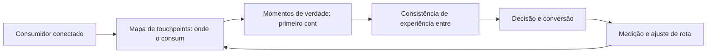

Observe o laço de retorno: a medição alimenta o próximo ciclo de campanha. Essa é a diferença estrutural entre campanha e sistema — a campanha termina quando o orçamento acaba; o sistema aprende e se ajusta a cada ciclo [7]. No caso do tema *Touchpoints e Momentos de Verdade: A Experiência Multicanal*, esse laço é o que converte o investimento inicial em aprendizado acumulado para as próximas decisões [15].

## 4. Técnica

### O Mapa de Jornada em Estrutura de Dados

A jornada vira dado quando cada etapa ganha evento, métrica e dono. O modelo abaixo representa a jornada como uma lista de estágios com conversão acumulada — a base para identificar o maior vazamento do funil.

```python
from dataclasses import dataclass

@dataclass
class Estagio:
    nome: str
    contato: int
    conversao: float  # fração que avança

def funil(estagios):
    """Calcula conversão por estágio e vazamento acumulado."""
    acumulado = estagios[0].contato
    resultado = []
    for e in estagios:
        resultado.append({"estagio": e.nome, "pessoas": acumulado,
                          "conversao_etapa": round(e.conversao, 3)})
        acumulado = round(acumulado * e.conversao)
    return resultado

jornada = [
    Estagio("Reconhecimento", 100_000, 0.30),
    Estagio("Consideração", 0, 0.40),
    Estagio("Decisão", 0, 0.25),
    Estagio("Compra", 0, 1.0),
]
for etapa in funil(jornada):
    print(etapa)
```

O maior vazamento entre etapas é a prioridade da estratégia — cada ponto recuperado se multiplica ao longo do funil [16]. O mapa é também o documento de alinhamento entre marketing e vendas [3].

O código acima é o núcleo técnico de *Touchpoints e Momentos de Verdade: A Experiência Multicanal*: validável, executável e adaptável ao contexto real do leitor. A prática recomendada é rodá-lo com dados próprios e usar a saída como insumo da próxima reunião de planejamento. Documentação oficial das plataformas reforça cada passo — da estrutura de campanhas [5] à configuração de eventos [12]. A leitura técnica deste capítulo complementa a exposição conceitual das seções anteriores e prepara os exercícios da seção seguinte.

## 5. Aplica

Conhecimento sem aplicação é conteúdo; aplicação sem reflexão é rotina. No contexto de *Touchpoints e Momentos de Verdade: A Experiência Multicanal*, os exercícios abaixo fecham o capítulo e preparam o terreno do próximo:

1. Liste as cinco perguntas mais frequentes da sua base e mapeie em qual etapa da jornada surgem.
2. Compare a experiência percebida entre dois concorrentes e aponte onde um supera o outro em atrito.
3. Defina uma métrica de satisfação (CSAT ou NPS) e colete a primeira rodada de respostas.
4. Desenhe o mapa de touchpoints da jornada do seu cliente, do reconhecimento à defesa.

Dedique ao menos 30 minutos a um dos exercícios antes de avançar. O aprendizado desta obra é cumulativo: o mapa desenhado aqui será usado nos capítulos seguintes da Parte II e nas partes subsequentes [3].

Complementando, cinco exercícios práticos adicionais consolidam o aprendizado de *Touchpoints e Momentos de Verdade: A Experiência Multicanal*:

1. O que um cliente que recompra sabe sobre a sua marca que um que desistiu não sabe?
2. Desenhe a jornada de um cliente seu e marque: onde ele desiste, onde hesita e onde decide?
3. Sua persona está atualizada com dados reais de comportamento ou é uma suposição antiga?
4. Quais são os três momentos de verdade da sua jornada — e o que o cliente avalia em cada um?
5. Onde está a maior fricção do seu funil? Qual dado confirma que é ali?

## Leitura Complementar Recomendada

Para aprofundar *Touchpoints e Momentos de Verdade: A Experiência Multicanal* além deste capítulo:

- Como complemento prático, o Google Analytics e a documentação de eventos de conversão ajudam a instrumentar as etapas da jornada — a medição é o que transforma o mapa em instrumento de gestão [12].

- Para aprofundar a jornada, o artigo de Lemon e Verhoef (Understanding Customer Experience Throughout the Customer Journey) é a referência acadêmica central, e Chaffey traz o tratamento operacional do funil e da jornada no contexto digital [16] [3].

## Análise de Riscos e Mitigações

A aplicação de *Touchpoints e Momentos de Verdade: A Experiência Multicanal* envolve riscos identificáveis. A tabela de riscos abaixo relaciona cada ameaça à sua mitigação:

- Risco de persona de achismo: decisões sobre suposições. Mitigação: entrevistas reais e dados de analytics na construção [10].
- Risco de foco no sintoma: tratar a conversão sem entender a jornada. Mitigação: diagnóstico por etapa antes da correção [16].
- Risco de ignorar o pós-compra: todo o esforço no checkout. Mitigação: fluxo de pós-venda com satisfação e recompra [16].
- Risco de mapa obsoleto: a jornada muda e o mapa fica velho. Mitigação: revisão trimestral com dados novos de comportamento [16].

## Considerações de Implementação

t

## Exercício Integrador da Parte II

s

Este exercício conecta o capítulo às demais partes da obra e deve ser revisto ao final da leitura completa.

## Aprofundamento Prático

O tema de *Touchpoints e Momentos de Verdade: A Experiência Multicanal* ganha potência quando levado ao nível operacional. Os quatro pontos abaixo aprofundam a aplicação prática:

- O aprofundamento prático da jornada exige transformar o mapa em instrumento vivo: cada etapa deve ter um dono, uma métrica e um documento de referência. Sem isso, o mapa vira decoração de parede e a jornada continua sendo gerida por intuição [16].

- A leitura avançada dos momentos de verdade pede a instrumentação de cada um: para o primeiro contato, métrica de primeira impressão; para a avaliação, métrica de comparação; para o pós-compra, métrica de satisfação e recompra [16].

- A fricção mensurável é a base do CRO de jornada: cada etapa do funil tem uma taxa de avanço, e o vazamento entre etapas é a prioridade — o mapa indica onde o cliente hesita e o teste indica como remover a hesitação [8].

- A persona orientada a dados combina fontes: analytics mostra o comportamento, atendimento mostra as dores, pesquisa mostra as palavras — e a persona é a síntese operacional dessas três fontes [10].

## Exercícios de Fixação

Para consolidar *Touchpoints e Momentos de Verdade: A Experiência Multicanal*, resolva os cinco exercícios abaixo — com caneta, papel e dados reais:

1. Localize a maior fricção do seu funil com uma evidência numérica.
2. Defina uma métrica de experiência e colete a primeira rodada.
3. Desenhe a jornada de um cliente real em cinco etapas com os touchpoints de cada uma.
4. Escreva a persona da sua audiência com dados — não com suposições.
5. Identifique os três momentos de verdade da sua jornada e o que o cliente avalia em cada um.

## Autoavaliação do Capítulo

Autoavaliação: (1) Tenho um mapa de jornada do cliente com dados? (2) Minha persona foi atualizada com comportamento real? (3) Sei qual é a maior fricção do meu funil com evidência? (4) Tenho uma métrica de experiência coletando respostas? (5) Minha taxa de recompra é conhecida e acompanhada? Responda e priorize a primeira resposta negativa.

A primeira resposta negativa é o seu próximo passo natural — volte a ela na seção de aplicação deste capítulo e trabalhe o item até que a resposta seja sim.

## Problemas Comuns e Soluções Práticas

Aplicar *Touchpoints e Momentos de Verdade: A Experiência Multicanal* no mundo real esbarra em problemas recorrentes. Abaixo, cinco situações típicas com suas soluções — sintoma, causa e correção:

### Alta desistência no meio do funil

Clientes somem entre etapas sem explicação. A solução é o mapa de jornada com dados de cada etapa: localizar o ponto de maior queda e testar a correção da fricção [16].

### Clientes que não recompram

A aquisição funciona, mas a retenção falha. A solução é medir a experiência pós-compra, atacar o onboarding e nutrir a relação — a recompra é o termômetro da jornada completa [16].

### Persona de achismo

As decisões se baseiam em suposições sobre o cliente. A solução é entrevistar três clientes reais, cruzar com analytics e atualizar a persona com dados — o investimento em mídia fica mais eficiente [10].

### Fricção invisível

A conversão cai sem causa aparente. A solução é combinar heatmap, gravação de sessão e análise de funil para tornar a fricção visível — e testar a remoção [8].

### Pós-venda negligenciado

Todo o esforço termina no checkout. A solução é desenhar o fluxo de pós-venda: acompanhamento, satisfação e incentivo à recompra — o cliente existente é o ativo mais barato [16].

## Aplicações por Setor

O tema de *Touchpoints e Momentos de Verdade: A Experiência Multicanal* ganha contornos diferentes em cada setor. A leitura setorial abaixo ajuda a adaptar os princípios ao seu contexto:

- A jornada do varejo é curta e transacional; a do B2B é longa e grupal; a do serviço é relacional e contínua — cada uma exige um mapa, mensagens e métricas próprios [16].

- No e-commerce, a jornada termina no checkout e se renova na recompra; no serviço de assinatura, a jornada é o próprio produto — a retenção é a métrica-mestra [16].

## Plano de Ação de 30 Dias

Para converter a leitura de *Touchpoints e Momentos de Verdade: A Experiência Multicanal* em resultado, execute um dos planos semanais abaixo — cada semana tem um objetivo e uma entrega:

### Plano de Ação — Opção 1

Semana 1 — Pesquisa: entreviste três clientes e registre as palavras deles.
Semana 2 — Persona: atualize a persona com os achados — dores, canais, gatilhos.
Semana 3 — Métrica: defina NPS ou CSAT e colete a primeira rodada.
Semana 4 — Correção: remova a fricção de maior impacto e meça o efeito.

### Plano de Ação — Opção 2

Semana 1 — Mapa: desenhe a jornada em cinco etapas com os touchpoints de hoje.
Semana 2 — Dado: cruze analytics e atendimento para localizar o maior vazamento.
Semana 3 — Hipótese: formule a correção da fricção principal com métrica de sucesso.
Semana 4 — Teste: implemente em piloto, meça e documente.

## KPIs que Importam neste Capítulo

Para *Touchpoints e Momentos de Verdade: A Experiência Multicanal*, os KPIs que importam: conversão por etapa da jornada, taxa de abandono entre touchpoints, CSAT/NPS, recompra e valor do tempo de vida — os números que provam onde a jornada avança e onde quebra [16].

Antes de encerrar, registre esses indicadores no seu painel de acompanhamento — eles serão a régua para medir a aplicação deste capítulo nas próximas semanas.

## Roteiro de Implementação Passo a Passo

Para aplicar *Touchpoints e Momentos de Verdade: A Experiência Multicanal* na prática, os roteiros abaixo organizam a sequência de ações — do diagnóstico à medição:

### Roteiro de Implementação 1

1. Reúna os dados que já existem: analytics, atendimento, pesquisa, redes sociais.
2. Identifique as cinco perguntas mais frequentes dos clientes.
3. Mapeie em qual etapa da jornada cada pergunta surge.
4. Entreviste três clientes para validar as suposições com palavras deles.
5. Atualize a persona principal com os achados — dores, canais, gatilhos.
6. Defina a métrica de experiência: CSAT, NPS ou ambas, com periodicidade.
7. Colete a primeira rodada e registre a linha de base.
8. Compare a experiência percebida entre dois concorrentes.
9. Escolha a fricção de maior impacto e remova-a em piloto.
10. Revise o mapa de jornada a cada trimestre com dados novos.

### Roteiro de Implementação 2

1. Escolha três clientes reais — um recente, um recorrente e um que desistiu.
2. Entreviste cada um e registre o percurso completo, do primeiro contato à decisão.
3. Liste todos os touchpoints mencionados e o que o cliente avaliou em cada um.
4. Monte o mapa da jornada em cinco etapas: descoberta, avaliação, decisão, compra, pós-venda.
5. Marque onde a jornada quebrou para o cliente que desistiu.
6. Identifique os três momentos de verdade — os pontos que mais influenciaram a percepção.
7. Para cada momento, defina a experiência ideal e o gap atual.
8. Priorize o gap de maior impacto sobre a conversão ou retenção.
9. Formule uma hipótese de correção com métrica de sucesso.
10. Implemente em piloto, meça e documente o aprendizado.

## Perguntas Frequentes

Em relação ao tema de *Touchpoints e Momentos de Verdade: A Experiência Multicanal*, cinco perguntas surgem com frequência na prática profissional:

**Como reduzir o atrito?**

Identifique a fricção com dados (heatmap, funil, gravação), formule a hipótese e teste a remoção em piloto [8].

**Devo medir NPS?**

Se a recompra importa, sim: NPS e CSAT correlacionam com retenção e recomendação — e a tendência importa mais que o ponto [16].

**Por que minha conversão caiu?**

Examine a jornada: a queda quase sempre tem causa em uma etapa específica — e a análise de funil localiza o ponto [16].

**Persona serve mesmo?**

Sim, quando alimentada por dados reais — entrevistas, analytics e atendimento. Persona de suposição é despesa disfarçada [10].

**O que é um momento de verdade?**

O ponto da jornada que mais influencia a percepção e a decisão — primeiro contato, avaliação e pós-compra [16].

## Cenários Numéricos Comentados

Os cálculos abaixo mostram, com números concretos, como as decisões de *Touchpoints e Momentos de Verdade: A Experiência Multicanal* se traduzem em resultado:

### Cenário numérico: valor do momento de verdade

Uma loja descobre que 40% dos visitantes abandonam na etapa de preço, antes do checkout. Trazer a informação de preço e frete para a página do produto recupera 15 pontos de conversão — cada ponto equivale a dezenas de milhares de reais em receita anual para volumes relevantes [16].

### Cenário numérico: o vazamento do funil

Um funil com 100.000 contatos no topo, conversão de 30% entre etapas, teria 900 compras ao final. Se a conversão entre a consideração e a decisão cair de 30% para 20%, o resultado cai para 600 — uma perda de um terço da receita, invisível para quem mede apenas o topo e o checkout. O mapa da jornada localiza o vazamento e o CRO o corrige [16].

## Como Este Capítulo se Integra à Obra

A jornada do consumidor é o eixo transversal da obra: as partes de busca, redes, relacionamento e conversão são pontos dessa jornada vistos de perto. Ao estudar as partes seguintes, volte a este mapa mental — cada canal que você dominar preencherá uma etapa da jornada que você já conhece. No contexto de *Touchpoints e Momentos de Verdade: A Experiência Multicanal*, essa integração fica ainda mais visível: as ferramentas e métricas que você dominou aqui serão a base das decisões dos próximos capítulos — e das partes que virão depois.

## Aprofundamento Conceitual

No contexto de *Touchpoints e Momentos de Verdade: A Experiência Multicanal*, a experiência do cliente não é um departamento: é a soma de todas as decisões da empresa vistas pelo olhar do cliente. Cada área — marketing, vendas, produto, suporte — é um ponto da jornada [16].

No contexto de *Touchpoints e Momentos de Verdade: A Experiência Multicanal*, a segmentação por estágio da jornada supera a segmentação por perfil: saber se o consumidor está descobrindo, avaliando ou decidindo define a mensagem mais eficaz, independentemente de demografia [10].

No contexto de *Touchpoints e Momentos de Verdade: A Experiência Multicanal*, o feedback do cliente é o insumo mais barato e mais negligenciado: pesquisas pós-compra, avaliações e conversas de suporte contêm os dados exatos de onde a jornada quebra [16].

No contexto de *Touchpoints e Momentos de Verdade: A Experiência Multicanal*, a recompra é o sinal mais forte de saúde da jornada: clientes que voltam validam que a experiência funcionou de ponta a ponta — e a taxa de recompra é o KPI que resume todas as etapas anteriores [16].

No contexto de *Touchpoints e Momentos de Verdade: A Experiência Multicanal*, a jornada B2B é mais longa e mais grupal: múltiplos decisores, ciclos de meses e avaliação técnica profunda — exigindo conteúdo de educação por estágio e alinhamento com vendas [13].

## Fundamentos em Detalhe

No contexto de *Touchpoints e Momentos de Verdade: A Experiência Multicanal*, o conceito de momentos de verdade — criado pela Procter & Gamble — permanece central: o primeiro contato, a avaliação comparativa e a experiência pós-compra são os três pontos que mais influenciam a decisão e a recompra [16].

No contexto de *Touchpoints e Momentos de Verdade: A Experiência Multicanal*, a jornada digital raramente começa na marca: ela começa na necessidade, na dúvida ou na curiosidade do consumidor, e a marca precisa estar presente nesses pontos de partida para ser considerada [15].

No contexto de *Touchpoints e Momentos de Verdade: A Experiência Multicanal*, personas bem construídas não são documentos decorativos: elas orientam a escolha de canais, o tom de mensagem e até a arquitetura de produto — quando alimentadas por dados reais de comportamento [10].

No contexto de *Touchpoints e Momentos de Verdade: A Experiência Multicanal*, a experiência do cliente (CX) virou a principal arena competitiva: com produtos cada vez mais parecidos, a jornada sem atrito é o que diferencia quem ganha recompra de quem perde para o concorrente [16].

No contexto de *Touchpoints e Momentos de Verdade: A Experiência Multicanal*, o mapeamento de jornada não é um exercício único: a jornada evolui com o produto, com o mercado e com o comportamento do consumidor, e exige revisão periódica com dados atualizados [3].

## Estudos de Caso Aplicados

### Caso: o e-commerce que perdeu a recompra

Uma loja de roupas investia tudo em aquisição e ignorava o pós-compra. O mapa de jornada mostrou que o cliente satisfeito não era nutrido: sem e-mail de acompanhamento, sem programa de fidelidade e sem indicação. A recompra saltou quando a loja adicionou um fluxo de pós-venda com desconto para o próximo pedido e um programa de pontos — provando que a jornada não termina no checkout [16].

### Caso: a clínica que mapeou a jornada e dobrou o agendamento

Uma clínica odontológica percebeu que a maioria dos pacientes abandonava entre a pesquisa (Google) e o contato (WhatsApp). O mapa de jornada revelou a quebra: sem preço nem avaliações visíveis, o paciente não se sentia seguro para iniciar a conversa. A correção: página de preço transparente, avaliações integradas e resposta automática no WhatsApp. Em um trimestre, o agendamento dobrou — sem aumentar o tráfego [16].

## Dados e Números do Setor

### Dados de Contexto

- A jornada digital moderna é fragmentada: o consumidor alterna dispositivos e canais antes de decidir [15].
- A experiência do cliente é apontada como o principal diferencial competitivo em pesquisas de liderança [16].
- A recomendação e a avaliação de outros clientes influenciam a decisão tanto quanto a propaganda [2].
- O mobile é o principal ponto de contato da jornada para a maioria dos públicos [17].

### Indicadores-Chave

- A satisfação (CSAT/NPS) correlaciona com recompra e recomendação [16].
- O atrito no funil reduz a conversão de forma desproporcional a cada passo [3].
- Clientes bem nutridos na jornada geram maior valor de longo prazo [16].

## Análise Comparativa

O tema de *Touchpoints e Momentos de Verdade: A Experiência Multicanal* fica mais claro quando contrastado com a alternativa mais próxima. A comparação abaixo organiza as diferenças:

### Funil vs. Jornada

- Funil é linear; a jornada é um percurso de idas e voltas.
- Funil é da marca; a jornada é do consumidor.
- O funil termina na compra; a jornada continua no pós-venda e na defesa.
- A jornada considera múltiplos canais simultâneos; o funil simplifica em etapas.

## Erros Comuns e Como Evitá-los

No tema de *Touchpoints e Momentos de Verdade: A Experiência Multicanal*, cinco erros recorrentes merecem atenção especial — cada um com sua correção prática:

1. Medir só a conversão final: ignorar as etapas intermediárias esconde onde a jornada realmente quebra.
2. Ignorar o feedback: as reclamações e dúvidas dos clientes são o mapa exato da fricção.
3. Personas de achismo: construir perfis sem dados reais reproduz estereótipos e desperdiça mídia.
4. Mapear a jornada uma única vez: a jornada muda com o mercado, e o mapa precisa ser vivo.
5. Tratar todos os contatos como iguais: ignorar o estágio da jornada produz mensagens fora de contexto.

## Ferramentas e Recursos Recomendados

Para operar o tema de *Touchpoints e Momentos de Verdade: A Experiência Multicanal* na prática, a seguinte seleção de ferramentas cobre o ciclo completo — do diagnóstico à medição:

1. Analytics para eventos por etapa do funil
2. Ferramenta de NPS/CSAT para medir experiência
3. Planilha de personas com dados reais
4. Ferramenta de mapa de jornada (visual) 
5. Plataforma de pesquisa de usuário para entrevistas

## Glossário do Capítulo

Os termos abaixo — todos usados no corpo deste capítulo — formam o vocabulário mínimo para acompanhar o restante da obra:

Jornada do cliente: caminho completo do primeiro contato à recompra. Touchpoint: ponto de contato entre marca e consumidor. Persona: representação semi-fictícia do cliente ideal. Momento de verdade: ponto que define percepção. Fricção: barreira entre interesse e ação.

## Checklist de Implementação

Use a lista abaixo para auditar a aplicação de *Touchpoints e Momentos de Verdade: A Experiência Multicanal* na sua operação — marque os itens já concluídos e priorize os pendentes:

- [ ] Persona atualizada com dados reais
- [ ] Três momentos de verdade identificados
- [ ] Fricção principal localizada com dado
- [ ] Métrica de experiência (CSAT/NPS) definida
- [ ] Mapa de touchpoints desenhado do reconhecimento à defesa

## Perguntas para Reflexão

Antes de avançar, reflita sobre as cinco questões abaixo — elas conectam o conteúdo de *Touchpoints e Momentos de Verdade: A Experiência Multicanal* ao seu contexto real de trabalho:

1. Desenhe a jornada de um cliente seu e marque: onde ele desiste, onde hesita e onde decide?
2. Sua persona está atualizada com dados reais de comportamento ou é uma suposição antiga?
3. Quais são os três momentos de verdade da sua jornada — e o que o cliente avalia em cada um?
4. Onde está a maior fricção do seu funil? Qual dado confirma que é ali?
5. O que um cliente que recompra sabe sobre a sua marca que um que desistiu não sabe?

## Quadro Comparativo: Etapas da Jornada e Seus Objetivos

O quadro abaixo consolida os elementos essenciais de *Touchpoints e Momentos de Verdade: A Experiência Multicanal* em perspectiva comparada, facilitando a consulta rápida e a tomada de decisão:

| Etapa | Objetivo | Métrica típica |
|---|---|---|
| Etapa | Objetivo | Métrica típica |
| Descoberta | Gerar consideração | Alcance e recall |
| Avaliação | Ser comparado | Visitas e interações |
| Decisão | Converter | Taxa de conversão |
| Compra | Concluir | Receita e pedido |
| Pós-venda | Reter e encantar | Recompra e NPS |

## 6. Conclusão

O capítulo percorreu o território da Parte II, *A Jornada do Consumidor — Mapeando a Navegação*, e deixou três aprendizados operacionais. Primeiro, o conceito central — *Touchpoints e Momentos de Verdade: A Experiência Multicanal* — é menos uma novidade e mais uma disciplina de execução. Segundo, a aplicação exige a tríade conceito, rota e métrica, sem pular etapas [8]. Terceiro, o ajuste contínuo de rota, ilustrado no laço de retorno do diagrama, é o que separa campanhas pontuais de operações sustentáveis [7]. O caminho percorrido desde *Personas e Segmentação: Conhecendo o Viajante* até aqui forma a base que o próximo passo vai usar. No próximo capítulo, *Experiência do Cliente (CX) e o Marketing de Relacionamento*, você avançará sobre o território vizinho levando as ferramentas exercitadas aqui.

Como navegador de marketing digital, você não decorou uma fórmula — incorporou um modo de operar: ler o território, escolher a rota com dados e ajustar o percurso quando o vento muda [2].

Antes do fechamento, vale reforçar a base do capítulo: No contexto de *Touchpoints e Momentos de Verdade: A Experiência Multicanal*, a fricção é a inimiga silenciosa da conversão: cada campo de formulário, cada passo extra e cada ambiguidade de mensagem reduz a probabilidade de avanço. Identificar e remover atrito é trabalho contínuo [16].

No contexto de *Touchpoints e Momentos de Verdade: A Experiência Multicanal*, o neuromarketing aplica vieses documentados ao design digital: ancoragem (primeiro preço visto influencia o julgamento), escassez (urgência percebida), prova social (os outros já confiaram) e aversão à perda [2].
## 7. Referências Bibliográficas

[1] KOTLER, Philip; KELLER, Kevin Lane. **Administração de Marketing**. 15. ed. São Paulo: Pearson, 2016.
[2] KOTLER, Philip; KARTAJAYA, Hermawan; SETIAWAN, Iwan. **Marketing 4.0: Moving from Traditional to Digital**. Hoboken: Wiley, 2017.
[3] CHAFFEY, Dave; ELLIS-CHADWICK, Fiona. **Digital Marketing: Strategy, Implementation and Practice**. 9. ed. Harlow: Pearson, 2025.
[4] GOOGLE SEARCH CENTRAL. **Search Engine Optimization (SEO) Starter Guide**. Disponível em: https://developers.google.com/search/docs/fundamentals/seo-starter-guide. Acesso em: 02 ago. 2026.
[5] GOOGLE ADS HELP CENTER. **Your guide to Google Ads (Basics, Search Campaigns & Best Practices)**. Disponível em: https://support.google.com/google-ads/answer/6146252. Acesso em: 02 ago. 2026.
[6] META BUSINESS HELP CENTER. **Meta Ads Manager Guide: Best Practices for Targeting, Measurement, and Optimization**. Disponível em: https://www.facebook.com/business/help. Acesso em: 02 ago. 2026.
[7] DELOITTE DIGITAL. **Marketing Trends 2026: New Marketing for a New World**. Disponível em: https://www.deloittedigital.com/nl/en/insights/perspective/marketing-trends-2026.html. Acesso em: 02 ago. 2026.
[8] HUBSPOT RESEARCH. **The State of Marketing / 2026 Marketing Statistics, Trends & Data**. Disponível em: https://www.hubspot.com/marketing-statistics. Acesso em: 02 ago. 2026.
[9] STATISTA RESEARCH DEPARTMENT. **Global Digital Marketing and Advertising Revenue Statistics & Facts**. Disponível em: https://www.statista.com/topics/8954/marketing-worldwide/. Acesso em: 02 ago. 2026.
[10] RYAN, Damian. **Understanding Digital Marketing: Marketing Strategies for Engaging the Digital Generation**. 5. ed. London: Kogan Page, 2020.
[11] HOLLENSEN, Svend; KOTLER, Philip; OPRESNIK, Marc Oliver. **Social Media Marketing: A Practitioner Approach**. 4. ed. Harlow: Pearson, 2023.
[12] GOOGLE ANALYTICS HELP CENTER. **Documentação oficial do Google Analytics 4**. Disponível em: https://support.google.com/analytics. Acesso em: 02 ago. 2026.
[13] LINKEDIN MARKETING SOLUTIONS. **Best Practices para campanhas B2B no LinkedIn**. Disponível em: https://business.linkedin.com/marketing-solutions. Acesso em: 02 ago. 2026.
[14] TIKTOK FOR BUSINESS. **Guia de criatividade e boas práticas de anúncios no TikTok**. Disponível em: https://www.tiktok.com/business. Acesso em: 02 ago. 2026.
[15] DATAREPORTAL. **Digital 2026: Global Overview Report**. Disponível em: https://datareportal.com/reports/digital-2026-global-overview-report. Acesso em: 02 ago. 2026.
[16] LEMON, Katherine N.; VERHOEF, Peter C. **Understanding Customer Experience Throughout the Customer Journey**. *Journal of Marketing*, v. 80, n. 6, p. 69-96, 2016.
[17] TIWARI, Rajnish; BUSE, Stephan; HERSTATT, Cornelius. **From Electronic to Mobile Commerce: Opportunities and Challenges**. *Proceedings of the German-Indian Roundtable*, 2006.
[18] VAN DIJK, Jan A. G. M. **The Digital Divide**. Cambridge: Polity Press, 2020.
[19] IBM. **Marketing with AI: Personalization at Scale**. Disponível em: https://www.ibm.com/think/topics/ai-marketing. Acesso em: 02 ago. 2026.
[20] KOTLER, Philip. **Marketing 5.0: Technology for Humanity**. Hoboken: Wiley, 2021.

# Capítulo 9: Experiência do Cliente (CX) e o Marketing de Relacionamento

## 1. Introdução

Bem-vindo a uma nova etapa da sua navegação pelo marketing digital. Este capítulo — *Experiência do Cliente (CX) e o Marketing de Relacionamento* — integra a Parte II, *A Jornada do Consumidor — Mapeando a Navegação*, e responde a uma pergunta prática: **cx como diferencial competitivo: nps, csat e fricção** — na prática, como isso se traduz em decisão e resultado?

Ao final, você será capaz de aplica princípios de experiência do cliente ao marketing: jornada sem atritos, satisfação mensurável e relacionamento que gera recompra e recomendação.. Mais do que decorar conceitos, você vai enxergar a jornada como mapa com etapas, atalhos e momentos de verdade — e converter essa visão em plano, experimento e métrica.

No capítulo anterior, *Touchpoints e Momentos de Verdade: A Experiência Multicanal*, você aprendeu os conceitos que servem de plataforma para o que vem agora. Este capítulo retoma esse repertório e o aplica a um território novo — sem repetir o que já foi estabelecido, apenas usando como base.

O capítulo segue a estrutura das sete seções que organizam esta obra: primeiro a exposição conceitual, depois a ilustração, a técnica aplicada, o exercício de aplicação e a conclusão operacional.

No contexto de *Experiência do Cliente (CX) e o Marketing de Relacionamento*, cada canal da jornada tem um papel distinto: a descoberta acontece nas redes, a avaliação na busca, a decisão no site e a confirmação no atendimento — e a marca precisa orquestrar a passagem entre eles [3].

No contexto de *Experiência do Cliente (CX) e o Marketing de Relacionamento*, a jornada do consumidor é a unidade de análise mais importante do marketing moderno: entender onde o cliente está, o que ele precisa e qual a próxima ação esperada em cada etapa define a eficácia de tudo o que a marca faz [16].
## 2. Explica

### CX como diferencial competitivo: NPS, CSAT e fricção

Quando o tema é *Experiência do Cliente (CX) e o Marketing de Relacionamento*, o primeiro pilar — cx como diferencial competitivo: nps, csat e fricção — define o território conceitual. Lemon e Verhoef demonstram que a experiência do cliente se constrói na soma dos encontros ao longo da jornada — avaliar cada ponto isolado engana tanto quanto ignorar a jornada inteira [16].

Na prática, cx como diferencial competitivo: nps, csat e fricção significa transformar a teoria em rotina operacional — exatamente o que *Experiência do Cliente (CX) e o Marketing de Relacionamento* exige no dia a dia. A literatura de gestão é enfática: sem operacionalizar o conceito em checklist, responsável e métrica, ele permanece slide de apresentação [3]. Por isso a Parte II propõe sempre o mesmo movimento: entender, traduzir em critério observável e decidir com dado.

### Marketing de relacionamento: do transacional ao recorrente

O segundo pilar — marketing de relacionamento: do transacional ao recorrente — conecta a estratégia à operação diária. A jornada do consumidor moderno raramente é linear: a decisão se fragmenta em micro-momentos de pesquisa, comparação e validação antes de qualquer contato com a marca [3]. A experiência do consumidor se constrói na consistência entre canais e mensagens, e é essa consistência que transforma contato em relacionamento [16]. Organizações que tratam cada canal como silo perdem o fio condutor da jornada; as que operam o pilar com disciplina reduzem atrito e aumentam a taxa de avanço entre etapas [10].

### Feedback do cliente como insumo de estratégia

Fechando o tripé, feedback do cliente como insumo de estratégia é o que transforma a Parte II em vantagem mensurável. Personas construídas com dados quantitativos e qualitativos reduzem o desperdício de mídia porque alinham a mensagem ao contexto real de decisão de cada segmento [10]. O relato da indústria mostra que as empresas que sustentam resultado não são as que têm mais ferramentas, mas as que conseguem medir e ajustar a rota com frequência [8]. A métrica certa, escolhida antes da campanha, vale mais do que qualquer ferramenta cara instalada depois do fato [9].

### O Eixo Transversal do Capítulo

A experiência percebida supera o produto em influência sobre a recomendação: clientes que vivenciam jornadas sem atrito relatam intenção de recompra e advocacy significativamente maior [16]. Esse eixo conecta os três pilares e explica por que o capítulo os trata como um sistema, não como uma lista: cada pilar reforça o outro, e a omissão de qualquer um deles produz estratégia manca. O capítulo seguinte retomará esse eixo com novas ferramentas, agora com o vocabulário já estabelecido aqui.

Em síntese, o capítulo opera em três níveis: o conceitual (CX como diferencial competitivo: NPS, CSAT e fricção), o operacional (Marketing de relacionamento: do transacional ao recorrente) e o estratégico (Feedback do cliente como insumo de estratégia). O leitor que dominar os três estará apto a aplicar a Parte II com autonomia [1]. A evidência reunida nesta seção sustenta cada recomendação prática das seções seguintes [2].

## 3. Ilustra

Vamos traduzir o capítulo em uma cena concreta, no contexto de *Experiência do Cliente (CX) e o Marketing de Relacionamento*. Uma empresa de porte médio, com equipe enxuta e orçamento limitado, decide operar a Parte II desta obra, *A Jornada do Consumidor — Mapeando a Navegação*. Na primeira semana, a equipe testa o conceito central do capítulo em um caso real: um cliente que pesquisou, comparou e decidiu comprar. O primeiro pilar — cx como diferencial competitivo: nps, csat e fricção — orienta o entendimento inicial do público; o segundo — marketing de relacionamento: do transacional ao recorrente — guia a escolha da rota de comunicação; e o terceiro fecha com a medição do resultado [2].

O diagrama abaixo representa o fluxo operacional proposto pelo capítulo — do consumidor conectado à decisão e ao ajuste contínuo de rota, com o público e a plataforma específicos do tema no centro da navegação:

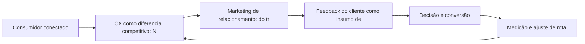

Observe o laço de retorno: a medição alimenta o próximo ciclo de campanha. Essa é a diferença estrutural entre campanha e sistema — a campanha termina quando o orçamento acaba; o sistema aprende e se ajusta a cada ciclo [7]. No caso do tema *Experiência do Cliente (CX) e o Marketing de Relacionamento*, esse laço é o que converte o investimento inicial em aprendizado acumulado para as próximas decisões [15].

## 4. Técnica

### O Mapa de Jornada em Estrutura de Dados

A jornada vira dado quando cada etapa ganha evento, métrica e dono. O modelo abaixo representa a jornada como uma lista de estágios com conversão acumulada — a base para identificar o maior vazamento do funil.

```python
from dataclasses import dataclass

@dataclass
class Estagio:
    nome: str
    contato: int
    conversao: float  # fração que avança

def funil(estagios):
    """Calcula conversão por estágio e vazamento acumulado."""
    acumulado = estagios[0].contato
    resultado = []
    for e in estagios:
        resultado.append({"estagio": e.nome, "pessoas": acumulado,
                          "conversao_etapa": round(e.conversao, 3)})
        acumulado = round(acumulado * e.conversao)
    return resultado

jornada = [
    Estagio("Reconhecimento", 100_000, 0.30),
    Estagio("Consideração", 0, 0.40),
    Estagio("Decisão", 0, 0.25),
    Estagio("Compra", 0, 1.0),
]
for etapa in funil(jornada):
    print(etapa)
```

O maior vazamento entre etapas é a prioridade da estratégia — cada ponto recuperado se multiplica ao longo do funil [16]. O mapa é também o documento de alinhamento entre marketing e vendas [3].

O código acima é o núcleo técnico de *Experiência do Cliente (CX) e o Marketing de Relacionamento*: validável, executável e adaptável ao contexto real do leitor. A prática recomendada é rodá-lo com dados próprios e usar a saída como insumo da próxima reunião de planejamento. Documentação oficial das plataformas reforça cada passo — da estrutura de campanhas [5] à configuração de eventos [12]. A leitura técnica deste capítulo complementa a exposição conceitual das seções anteriores e prepara os exercícios da seção seguinte.

## 5. Aplica

Conhecimento sem aplicação é conteúdo; aplicação sem reflexão é rotina. No contexto de *Experiência do Cliente (CX) e o Marketing de Relacionamento*, os exercícios abaixo fecham o capítulo e preparam o terreno do próximo:

1. Desenhe o mapa de touchpoints da jornada do seu cliente, do reconhecimento à defesa.
2. Crie uma persona com nome, dores, canais e gatilhos de decisão baseada em dados reais de sua audiência.
3. Identifique os três momentos de verdade da sua jornada e o que o cliente avalia em cada um.
4. Escolha um cliente perdido recentemente e reconstrua a jornada dele para localizar o ponto de ruptura.

Dedique ao menos 30 minutos a um dos exercícios antes de avançar. O aprendizado desta obra é cumulativo: o mapa desenhado aqui será usado nos capítulos seguintes da Parte II e nas partes subsequentes [3].

Complementando, cinco exercícios práticos adicionais consolidam o aprendizado de *Experiência do Cliente (CX) e o Marketing de Relacionamento*:

1. Quais são os três momentos de verdade da sua jornada — e o que o cliente avalia em cada um?
2. Onde está a maior fricção do seu funil? Qual dado confirma que é ali?
3. O que um cliente que recompra sabe sobre a sua marca que um que desistiu não sabe?
4. Desenhe a jornada de um cliente seu e marque: onde ele desiste, onde hesita e onde decide?
5. Sua persona está atualizada com dados reais de comportamento ou é uma suposição antiga?

## Leitura Complementar Recomendada

Para aprofundar *Experiência do Cliente (CX) e o Marketing de Relacionamento* além deste capítulo:

- Para aprofundar a jornada, o artigo de Lemon e Verhoef (Understanding Customer Experience Throughout the Customer Journey) é a referência acadêmica central, e Chaffey traz o tratamento operacional do funil e da jornada no contexto digital [16] [3].

- Como complemento prático, o Google Analytics e a documentação de eventos de conversão ajudam a instrumentar as etapas da jornada — a medição é o que transforma o mapa em instrumento de gestão [12].

## Análise de Riscos e Mitigações

A aplicação de *Experiência do Cliente (CX) e o Marketing de Relacionamento* envolve riscos identificáveis. A tabela de riscos abaixo relaciona cada ameaça à sua mitigação:

- Risco de mapa obsoleto: a jornada muda e o mapa fica velho. Mitigação: revisão trimestral com dados novos de comportamento [16].
- Risco de persona de achismo: decisões sobre suposições. Mitigação: entrevistas reais e dados de analytics na construção [10].
- Risco de foco no sintoma: tratar a conversão sem entender a jornada. Mitigação: diagnóstico por etapa antes da correção [16].
- Risco de ignorar o pós-compra: todo o esforço no checkout. Mitigação: fluxo de pós-venda com satisfação e recompra [16].

## Considerações de Implementação

ã

## Exercício Integrador da Parte II

u

Este exercício conecta o capítulo às demais partes da obra e deve ser revisto ao final da leitura completa.

## Aprofundamento Prático

O tema de *Experiência do Cliente (CX) e o Marketing de Relacionamento* ganha potência quando levado ao nível operacional. Os quatro pontos abaixo aprofundam a aplicação prática:

- A persona orientada a dados combina fontes: analytics mostra o comportamento, atendimento mostra as dores, pesquisa mostra as palavras — e a persona é a síntese operacional dessas três fontes [10].

- A experiência do cliente é gerida por rotina: reuniões regulares de jornada, com o mapa na mesa e os números por etapa, criam o hábito de decidir sobre a experiência — não sobre a opinião [16].

- O aprofundamento prático da jornada exige transformar o mapa em instrumento vivo: cada etapa deve ter um dono, uma métrica e um documento de referência. Sem isso, o mapa vira decoração de parede e a jornada continua sendo gerida por intuição [16].

- A leitura avançada dos momentos de verdade pede a instrumentação de cada um: para o primeiro contato, métrica de primeira impressão; para a avaliação, métrica de comparação; para o pós-compra, métrica de satisfação e recompra [16].

## Exercícios de Fixação

Para consolidar *Experiência do Cliente (CX) e o Marketing de Relacionamento*, resolva os cinco exercícios abaixo — com caneta, papel e dados reais:

1. Escreva a persona da sua audiência com dados — não com suposições.
2. Identifique os três momentos de verdade da sua jornada e o que o cliente avalia em cada um.
3. Localize a maior fricção do seu funil com uma evidência numérica.
4. Defina uma métrica de experiência e colete a primeira rodada.
5. Desenhe a jornada de um cliente real em cinco etapas com os touchpoints de cada uma.

## Autoavaliação do Capítulo

Autoavaliação: (1) Tenho um mapa de jornada do cliente com dados? (2) Minha persona foi atualizada com comportamento real? (3) Sei qual é a maior fricção do meu funil com evidência? (4) Tenho uma métrica de experiência coletando respostas? (5) Minha taxa de recompra é conhecida e acompanhada? Responda e priorize a primeira resposta negativa.

A primeira resposta negativa é o seu próximo passo natural — volte a ela na seção de aplicação deste capítulo e trabalhe o item até que a resposta seja sim.

## Problemas Comuns e Soluções Práticas

Aplicar *Experiência do Cliente (CX) e o Marketing de Relacionamento* no mundo real esbarra em problemas recorrentes. Abaixo, cinco situações típicas com suas soluções — sintoma, causa e correção:

### Fricção invisível

A conversão cai sem causa aparente. A solução é combinar heatmap, gravação de sessão e análise de funil para tornar a fricção visível — e testar a remoção [8].

### Pós-venda negligenciado

Todo o esforço termina no checkout. A solução é desenhar o fluxo de pós-venda: acompanhamento, satisfação e incentivo à recompra — o cliente existente é o ativo mais barato [16].

### Alta desistência no meio do funil

Clientes somem entre etapas sem explicação. A solução é o mapa de jornada com dados de cada etapa: localizar o ponto de maior queda e testar a correção da fricção [16].

### Clientes que não recompram

A aquisição funciona, mas a retenção falha. A solução é medir a experiência pós-compra, atacar o onboarding e nutrir a relação — a recompra é o termômetro da jornada completa [16].

### Persona de achismo

As decisões se baseiam em suposições sobre o cliente. A solução é entrevistar três clientes reais, cruzar com analytics e atualizar a persona com dados — o investimento em mídia fica mais eficiente [10].

## Aplicações por Setor

O tema de *Experiência do Cliente (CX) e o Marketing de Relacionamento* ganha contornos diferentes em cada setor. A leitura setorial abaixo ajuda a adaptar os princípios ao seu contexto:

- No e-commerce, a jornada termina no checkout e se renova na recompra; no serviço de assinatura, a jornada é o próprio produto — a retenção é a métrica-mestra [16].

- A jornada do varejo é curta e transacional; a do B2B é longa e grupal; a do serviço é relacional e contínua — cada uma exige um mapa, mensagens e métricas próprios [16].

## Plano de Ação de 30 Dias

Para converter a leitura de *Experiência do Cliente (CX) e o Marketing de Relacionamento* em resultado, execute um dos planos semanais abaixo — cada semana tem um objetivo e uma entrega:

### Plano de Ação — Opção 1

Semana 1 — Mapa: desenhe a jornada em cinco etapas com os touchpoints de hoje.
Semana 2 — Dado: cruze analytics e atendimento para localizar o maior vazamento.
Semana 3 — Hipótese: formule a correção da fricção principal com métrica de sucesso.
Semana 4 — Teste: implemente em piloto, meça e documente.

### Plano de Ação — Opção 2

Semana 1 — Pesquisa: entreviste três clientes e registre as palavras deles.
Semana 2 — Persona: atualize a persona com os achados — dores, canais, gatilhos.
Semana 3 — Métrica: defina NPS ou CSAT e colete a primeira rodada.
Semana 4 — Correção: remova a fricção de maior impacto e meça o efeito.

## KPIs que Importam neste Capítulo

Para *Experiência do Cliente (CX) e o Marketing de Relacionamento*, os KPIs que importam: conversão por etapa da jornada, taxa de abandono entre touchpoints, CSAT/NPS, recompra e valor do tempo de vida — os números que provam onde a jornada avança e onde quebra [16].

Antes de encerrar, registre esses indicadores no seu painel de acompanhamento — eles serão a régua para medir a aplicação deste capítulo nas próximas semanas.

## Roteiro de Implementação Passo a Passo

Para aplicar *Experiência do Cliente (CX) e o Marketing de Relacionamento* na prática, os roteiros abaixo organizam a sequência de ações — do diagnóstico à medição:

### Roteiro de Implementação 1

1. Escolha três clientes reais — um recente, um recorrente e um que desistiu.
2. Entreviste cada um e registre o percurso completo, do primeiro contato à decisão.
3. Liste todos os touchpoints mencionados e o que o cliente avaliou em cada um.
4. Monte o mapa da jornada em cinco etapas: descoberta, avaliação, decisão, compra, pós-venda.
5. Marque onde a jornada quebrou para o cliente que desistiu.
6. Identifique os três momentos de verdade — os pontos que mais influenciaram a percepção.
7. Para cada momento, defina a experiência ideal e o gap atual.
8. Priorize o gap de maior impacto sobre a conversão ou retenção.
9. Formule uma hipótese de correção com métrica de sucesso.
10. Implemente em piloto, meça e documente o aprendizado.

### Roteiro de Implementação 2

1. Reúna os dados que já existem: analytics, atendimento, pesquisa, redes sociais.
2. Identifique as cinco perguntas mais frequentes dos clientes.
3. Mapeie em qual etapa da jornada cada pergunta surge.
4. Entreviste três clientes para validar as suposições com palavras deles.
5. Atualize a persona principal com os achados — dores, canais, gatilhos.
6. Defina a métrica de experiência: CSAT, NPS ou ambas, com periodicidade.
7. Colete a primeira rodada e registre a linha de base.
8. Compare a experiência percebida entre dois concorrentes.
9. Escolha a fricção de maior impacto e remova-a em piloto.
10. Revise o mapa de jornada a cada trimestre com dados novos.

## Perguntas Frequentes

Em relação ao tema de *Experiência do Cliente (CX) e o Marketing de Relacionamento*, cinco perguntas surgem com frequência na prática profissional:

**Persona serve mesmo?**

Sim, quando alimentada por dados reais — entrevistas, analytics e atendimento. Persona de suposição é despesa disfarçada [10].

**O que é um momento de verdade?**

O ponto da jornada que mais influencia a percepção e a decisão — primeiro contato, avaliação e pós-compra [16].

**Como reduzir o atrito?**

Identifique a fricção com dados (heatmap, funil, gravação), formule a hipótese e teste a remoção em piloto [8].

**Devo medir NPS?**

Se a recompra importa, sim: NPS e CSAT correlacionam com retenção e recomendação — e a tendência importa mais que o ponto [16].

**Por que minha conversão caiu?**

Examine a jornada: a queda quase sempre tem causa em uma etapa específica — e a análise de funil localiza o ponto [16].

## Cenários Numéricos Comentados

Os cálculos abaixo mostram, com números concretos, como as decisões de *Experiência do Cliente (CX) e o Marketing de Relacionamento* se traduzem em resultado:

### Cenário numérico: o vazamento do funil

Um funil com 100.000 contatos no topo, conversão de 30% entre etapas, teria 900 compras ao final. Se a conversão entre a consideração e a decisão cair de 30% para 20%, o resultado cai para 600 — uma perda de um terço da receita, invisível para quem mede apenas o topo e o checkout. O mapa da jornada localiza o vazamento e o CRO o corrige [16].

### Cenário numérico: valor do momento de verdade

Uma loja descobre que 40% dos visitantes abandonam na etapa de preço, antes do checkout. Trazer a informação de preço e frete para a página do produto recupera 15 pontos de conversão — cada ponto equivale a dezenas de milhares de reais em receita anual para volumes relevantes [16].

## Como Este Capítulo se Integra à Obra

A jornada do consumidor é o eixo transversal da obra: as partes de busca, redes, relacionamento e conversão são pontos dessa jornada vistos de perto. Ao estudar as partes seguintes, volte a este mapa mental — cada canal que você dominar preencherá uma etapa da jornada que você já conhece. No contexto de *Experiência do Cliente (CX) e o Marketing de Relacionamento*, essa integração fica ainda mais visível: as ferramentas e métricas que você dominou aqui serão a base das decisões dos próximos capítulos — e das partes que virão depois.

## Aprofundamento Conceitual

No contexto de *Experiência do Cliente (CX) e o Marketing de Relacionamento*, a recompra é o sinal mais forte de saúde da jornada: clientes que voltam validam que a experiência funcionou de ponta a ponta — e a taxa de recompra é o KPI que resume todas as etapas anteriores [16].

No contexto de *Experiência do Cliente (CX) e o Marketing de Relacionamento*, a jornada B2B é mais longa e mais grupal: múltiplos decisores, ciclos de meses e avaliação técnica profunda — exigindo conteúdo de educação por estágio e alinhamento com vendas [13].

No contexto de *Experiência do Cliente (CX) e o Marketing de Relacionamento*, a jornada de compra moderna é um ecossistema de micro-momentos: o consumidor decide em frações de segundo, no celular, entre uma tarefa e outra. A marca que não está presente nesses momentos perde a corrida cedo [3].

No contexto de *Experiência do Cliente (CX) e o Marketing de Relacionamento*, o mapeamento de jornada com dados exige a fusão de fontes: analytics de site, interações sociais, atendimento e pesquisa de satisfação se combinam para formar o retrato real do percurso do cliente [16].

No contexto de *Experiência do Cliente (CX) e o Marketing de Relacionamento*, as personas são instrumentos vivos: devem ser atualizadas com dados de comportamento, não com achismo. Uma persona construída sobre entrevistas e analytics vale mais que cinco construídas sobre suposições [10].

## Fundamentos em Detalhe

No contexto de *Experiência do Cliente (CX) e o Marketing de Relacionamento*, a experiência do cliente (CX) virou a principal arena competitiva: com produtos cada vez mais parecidos, a jornada sem atrito é o que diferencia quem ganha recompra de quem perde para o concorrente [16].

No contexto de *Experiência do Cliente (CX) e o Marketing de Relacionamento*, o mapeamento de jornada não é um exercício único: a jornada evolui com o produto, com o mercado e com o comportamento do consumidor, e exige revisão periódica com dados atualizados [3].

No contexto de *Experiência do Cliente (CX) e o Marketing de Relacionamento*, a segmentação por intenção — pesquisar, comparar, comprar — permite mensagens muito mais eficazes que a segmentação por perfil demográfico isolado [10].

No contexto de *Experiência do Cliente (CX) e o Marketing de Relacionamento*, a psicologia da decisão digital é influenciada por vieses bem documentados: ancoragem de preço, aversão à perda, prova social e escassez — todos aplicáveis no design da oferta [2].

No contexto de *Experiência do Cliente (CX) e o Marketing de Relacionamento*, o pós-compra é a etapa mais negligenciada e mais lucrativa da jornada: é onde se decide a recompra, a recomendação e o valor de longo prazo do cliente [16].

## Estudos de Caso Aplicados

### Caso: a clínica que mapeou a jornada e dobrou o agendamento

Uma clínica odontológica percebeu que a maioria dos pacientes abandonava entre a pesquisa (Google) e o contato (WhatsApp). O mapa de jornada revelou a quebra: sem preço nem avaliações visíveis, o paciente não se sentia seguro para iniciar a conversa. A correção: página de preço transparente, avaliações integradas e resposta automática no WhatsApp. Em um trimestre, o agendamento dobrou — sem aumentar o tráfego [16].

### Caso: o e-commerce que perdeu a recompra

Uma loja de roupas investia tudo em aquisição e ignorava o pós-compra. O mapa de jornada mostrou que o cliente satisfeito não era nutrido: sem e-mail de acompanhamento, sem programa de fidelidade e sem indicação. A recompra saltou quando a loja adicionou um fluxo de pós-venda com desconto para o próximo pedido e um programa de pontos — provando que a jornada não termina no checkout [16].

## Dados e Números do Setor

### Indicadores-Chave

- A satisfação (CSAT/NPS) correlaciona com recompra e recomendação [16].
- O atrito no funil reduz a conversão de forma desproporcional a cada passo [3].
- Clientes bem nutridos na jornada geram maior valor de longo prazo [16].

### Dados de Contexto

- A jornada digital moderna é fragmentada: o consumidor alterna dispositivos e canais antes de decidir [15].
- A experiência do cliente é apontada como o principal diferencial competitivo em pesquisas de liderança [16].
- A recomendação e a avaliação de outros clientes influenciam a decisão tanto quanto a propaganda [2].
- O mobile é o principal ponto de contato da jornada para a maioria dos públicos [17].

## Análise Comparativa

O tema de *Experiência do Cliente (CX) e o Marketing de Relacionamento* fica mais claro quando contrastado com a alternativa mais próxima. A comparação abaixo organiza as diferenças:

### Funil vs. Jornada

- Funil é linear; a jornada é um percurso de idas e voltas.
- Funil é da marca; a jornada é do consumidor.
- O funil termina na compra; a jornada continua no pós-venda e na defesa.
- A jornada considera múltiplos canais simultâneos; o funil simplifica em etapas.

## Erros Comuns e Como Evitá-los

No tema de *Experiência do Cliente (CX) e o Marketing de Relacionamento*, cinco erros recorrentes merecem atenção especial — cada um com sua correção prática:

1. Mapear a jornada uma única vez: a jornada muda com o mercado, e o mapa precisa ser vivo.
2. Tratar todos os contatos como iguais: ignorar o estágio da jornada produz mensagens fora de contexto.
3. Medir só a conversão final: ignorar as etapas intermediárias esconde onde a jornada realmente quebra.
4. Ignorar o feedback: as reclamações e dúvidas dos clientes são o mapa exato da fricção.
5. Personas de achismo: construir perfis sem dados reais reproduz estereótipos e desperdiça mídia.

## Ferramentas e Recursos Recomendados

Para operar o tema de *Experiência do Cliente (CX) e o Marketing de Relacionamento* na prática, a seguinte seleção de ferramentas cobre o ciclo completo — do diagnóstico à medição:

1. Ferramenta de mapa de jornada (visual) 
2. Plataforma de pesquisa de usuário para entrevistas
3. Analytics para eventos por etapa do funil
4. Ferramenta de NPS/CSAT para medir experiência
5. Planilha de personas com dados reais

## Glossário do Capítulo

Os termos abaixo — todos usados no corpo deste capítulo — formam o vocabulário mínimo para acompanhar o restante da obra:

Jornada do cliente: caminho completo do primeiro contato à recompra. Touchpoint: ponto de contato entre marca e consumidor. Persona: representação semi-fictícia do cliente ideal. Momento de verdade: ponto que define percepção. Fricção: barreira entre interesse e ação.

## Checklist de Implementação

Use a lista abaixo para auditar a aplicação de *Experiência do Cliente (CX) e o Marketing de Relacionamento* na sua operação — marque os itens já concluídos e priorize os pendentes:

- [ ] Métrica de experiência (CSAT/NPS) definida
- [ ] Mapa de touchpoints desenhado do reconhecimento à defesa
- [ ] Persona atualizada com dados reais
- [ ] Três momentos de verdade identificados
- [ ] Fricção principal localizada com dado

## Perguntas para Reflexão

Antes de avançar, reflita sobre as cinco questões abaixo — elas conectam o conteúdo de *Experiência do Cliente (CX) e o Marketing de Relacionamento* ao seu contexto real de trabalho:

1. Onde está a maior fricção do seu funil? Qual dado confirma que é ali?
2. O que um cliente que recompra sabe sobre a sua marca que um que desistiu não sabe?
3. Desenhe a jornada de um cliente seu e marque: onde ele desiste, onde hesita e onde decide?
4. Sua persona está atualizada com dados reais de comportamento ou é uma suposição antiga?
5. Quais são os três momentos de verdade da sua jornada — e o que o cliente avalia em cada um?

## Quadro Comparativo: Etapas da Jornada e Seus Objetivos

O quadro abaixo consolida os elementos essenciais de *Experiência do Cliente (CX) e o Marketing de Relacionamento* em perspectiva comparada, facilitando a consulta rápida e a tomada de decisão:

| Etapa | Objetivo | Métrica típica |
|---|---|---|
| Etapa | Objetivo | Métrica típica |
| Descoberta | Gerar consideração | Alcance e recall |
| Avaliação | Ser comparado | Visitas e interações |
| Decisão | Converter | Taxa de conversão |
| Compra | Concluir | Receita e pedido |
| Pós-venda | Reter e encantar | Recompra e NPS |

## 6. Conclusão

O capítulo percorreu o território da Parte II, *A Jornada do Consumidor — Mapeando a Navegação*, e deixou três aprendizados operacionais. Primeiro, o conceito central — *Experiência do Cliente (CX) e o Marketing de Relacionamento* — é menos uma novidade e mais uma disciplina de execução. Segundo, a aplicação exige a tríade conceito, rota e métrica, sem pular etapas [8]. Terceiro, o ajuste contínuo de rota, ilustrado no laço de retorno do diagrama, é o que separa campanhas pontuais de operações sustentáveis [7]. O caminho percorrido desde *Touchpoints e Momentos de Verdade: A Experiência Multicanal* até aqui forma a base que o próximo passo vai usar. No próximo capítulo, *Neuromarketing e a Psicologia da Decisão de Compra Online*, você avançará sobre o território vizinho levando as ferramentas exercitadas aqui.

Como navegador de marketing digital, você não decorou uma fórmula — incorporou um modo de operar: ler o território, escolher a rota com dados e ajustar o percurso quando o vento muda [2].

Antes do fechamento, vale reforçar a base do capítulo: No contexto de *Experiência do Cliente (CX) e o Marketing de Relacionamento*, a segmentação por estágio da jornada supera a segmentação por perfil: saber se o consumidor está descobrindo, avaliando ou decidindo define a mensagem mais eficaz, independentemente de demografia [10].

No contexto de *Experiência do Cliente (CX) e o Marketing de Relacionamento*, o feedback do cliente é o insumo mais barato e mais negligenciado: pesquisas pós-compra, avaliações e conversas de suporte contêm os dados exatos de onde a jornada quebra [16].
## 7. Referências Bibliográficas

[1] KOTLER, Philip; KELLER, Kevin Lane. **Administração de Marketing**. 15. ed. São Paulo: Pearson, 2016.
[2] KOTLER, Philip; KARTAJAYA, Hermawan; SETIAWAN, Iwan. **Marketing 4.0: Moving from Traditional to Digital**. Hoboken: Wiley, 2017.
[3] CHAFFEY, Dave; ELLIS-CHADWICK, Fiona. **Digital Marketing: Strategy, Implementation and Practice**. 9. ed. Harlow: Pearson, 2025.
[4] GOOGLE SEARCH CENTRAL. **Search Engine Optimization (SEO) Starter Guide**. Disponível em: https://developers.google.com/search/docs/fundamentals/seo-starter-guide. Acesso em: 02 ago. 2026.
[5] GOOGLE ADS HELP CENTER. **Your guide to Google Ads (Basics, Search Campaigns & Best Practices)**. Disponível em: https://support.google.com/google-ads/answer/6146252. Acesso em: 02 ago. 2026.
[6] META BUSINESS HELP CENTER. **Meta Ads Manager Guide: Best Practices for Targeting, Measurement, and Optimization**. Disponível em: https://www.facebook.com/business/help. Acesso em: 02 ago. 2026.
[7] DELOITTE DIGITAL. **Marketing Trends 2026: New Marketing for a New World**. Disponível em: https://www.deloittedigital.com/nl/en/insights/perspective/marketing-trends-2026.html. Acesso em: 02 ago. 2026.
[8] HUBSPOT RESEARCH. **The State of Marketing / 2026 Marketing Statistics, Trends & Data**. Disponível em: https://www.hubspot.com/marketing-statistics. Acesso em: 02 ago. 2026.
[9] STATISTA RESEARCH DEPARTMENT. **Global Digital Marketing and Advertising Revenue Statistics & Facts**. Disponível em: https://www.statista.com/topics/8954/marketing-worldwide/. Acesso em: 02 ago. 2026.
[10] RYAN, Damian. **Understanding Digital Marketing: Marketing Strategies for Engaging the Digital Generation**. 5. ed. London: Kogan Page, 2020.
[11] HOLLENSEN, Svend; KOTLER, Philip; OPRESNIK, Marc Oliver. **Social Media Marketing: A Practitioner Approach**. 4. ed. Harlow: Pearson, 2023.
[12] GOOGLE ANALYTICS HELP CENTER. **Documentação oficial do Google Analytics 4**. Disponível em: https://support.google.com/analytics. Acesso em: 02 ago. 2026.
[13] LINKEDIN MARKETING SOLUTIONS. **Best Practices para campanhas B2B no LinkedIn**. Disponível em: https://business.linkedin.com/marketing-solutions. Acesso em: 02 ago. 2026.
[14] TIKTOK FOR BUSINESS. **Guia de criatividade e boas práticas de anúncios no TikTok**. Disponível em: https://www.tiktok.com/business. Acesso em: 02 ago. 2026.
[15] DATAREPORTAL. **Digital 2026: Global Overview Report**. Disponível em: https://datareportal.com/reports/digital-2026-global-overview-report. Acesso em: 02 ago. 2026.
[16] LEMON, Katherine N.; VERHOEF, Peter C. **Understanding Customer Experience Throughout the Customer Journey**. *Journal of Marketing*, v. 80, n. 6, p. 69-96, 2016.
[17] TIWARI, Rajnish; BUSE, Stephan; HERSTATT, Cornelius. **From Electronic to Mobile Commerce: Opportunities and Challenges**. *Proceedings of the German-Indian Roundtable*, 2006.
[18] VAN DIJK, Jan A. G. M. **The Digital Divide**. Cambridge: Polity Press, 2020.
[19] IBM. **Marketing with AI: Personalization at Scale**. Disponível em: https://www.ibm.com/think/topics/ai-marketing. Acesso em: 02 ago. 2026.
[20] KOTLER, Philip. **Marketing 5.0: Technology for Humanity**. Hoboken: Wiley, 2021.

# Capítulo 10: Neuromarketing e a Psicologia da Decisão de Compra Online

## 1. Introdução

Bem-vindo a uma nova etapa da sua navegação pelo marketing digital. Este capítulo — *Neuromarketing e a Psicologia da Decisão de Compra Online* — integra a Parte II, *A Jornada do Consumidor — Mapeando a Navegação*, e responde a uma pergunta prática: **vieses cognitivos na decisão: ancoragem, escassez e aversão à perda** — na prática, como isso se traduz em decisão e resultado?

Ao final, você será capaz de conhece os vieses cognitivos e princípios de persuasão que influenciam a decisão online, aplicando-os com ética em mensagens, preços e design.. Mais do que decorar conceitos, você vai enxergar a jornada como mapa com etapas, atalhos e momentos de verdade — e converter essa visão em plano, experimento e métrica.

No capítulo anterior, *Experiência do Cliente (CX) e o Marketing de Relacionamento*, você aprendeu os conceitos que servem de plataforma para o que vem agora. Este capítulo retoma esse repertório e o aplica a um território novo — sem repetir o que já foi estabelecido, apenas usando como base.

O capítulo segue a estrutura das sete seções que organizam esta obra: primeiro a exposição conceitual, depois a ilustração, a técnica aplicada, o exercício de aplicação e a conclusão operacional.

No contexto de *Neuromarketing e a Psicologia da Decisão de Compra Online*, a jornada digital raramente começa na marca: ela começa na necessidade, na dúvida ou na curiosidade do consumidor, e a marca precisa estar presente nesses pontos de partida para ser considerada [15].

No contexto de *Neuromarketing e a Psicologia da Decisão de Compra Online*, personas bem construídas não são documentos decorativos: elas orientam a escolha de canais, o tom de mensagem e até a arquitetura de produto — quando alimentadas por dados reais de comportamento [10].
## 2. Explica

### Vieses cognitivos na decisão: ancoragem, escassez e aversão à perda

Quando o tema é *Neuromarketing e a Psicologia da Decisão de Compra Online*, o primeiro pilar — vieses cognitivos na decisão: ancoragem, escassez e aversão à perda — define o território conceitual. A experiência percebida supera o produto em influência sobre a recomendação: clientes que vivenciam jornadas sem atrito relatam intenção de recompra e advocacy significativamente maior [16].

Na prática, vieses cognitivos na decisão: ancoragem, escassez e aversão à perda significa transformar a teoria em rotina operacional — exatamente o que *Neuromarketing e a Psicologia da Decisão de Compra Online* exige no dia a dia. A literatura de gestão é enfática: sem operacionalizar o conceito em checklist, responsável e métrica, ele permanece slide de apresentação [3]. Por isso a Parte II propõe sempre o mesmo movimento: entender, traduzir em critério observável e decidir com dado.

### Princípios de persuasão: Cialdini aplicado ao digital

O segundo pilar — princípios de persuasão: cialdini aplicado ao digital — conecta a estratégia à operação diária. O cliente conectado pesquisa antes de comprar: o número médio de fontes consultadas antes da decisão cresce a cada ano, e a marca ausente das fases iniciais perde a corrida cedo [15]. A experiência do consumidor se constrói na consistência entre canais e mensagens, e é essa consistência que transforma contato em relacionamento [16]. Organizações que tratam cada canal como silo perdem o fio condutor da jornada; as que operam o pilar com disciplina reduzem atrito e aumentam a taxa de avanço entre etapas [10].

### Ética e limites do neuromarketing na experiência do usuário

Fechando o tripé, ética e limites do neuromarketing na experiência do usuário é o que transforma a Parte II em vantagem mensurável. O conceito de customer journey consolidou-se como unidade de análise: mapas de jornada viraram instrumento padrão de planejamento em empresas orientadas a experiência [3]. O relato da indústria mostra que as empresas que sustentam resultado não são as que têm mais ferramentas, mas as que conseguem medir e ajustar a rota com frequência [8]. A métrica certa, escolhida antes da campanha, vale mais do que qualquer ferramenta cara instalada depois do fato [9].

### O Eixo Transversal do Capítulo

A segmentação por intenção — em vez de apenas por demografia — é o que permite personalizar a comunicação no momento exato em que o consumidor decide [10]. Esse eixo conecta os três pilares e explica por que o capítulo os trata como um sistema, não como uma lista: cada pilar reforça o outro, e a omissão de qualquer um deles produz estratégia manca. O capítulo seguinte retomará esse eixo com novas ferramentas, agora com o vocabulário já estabelecido aqui.

Em síntese, o capítulo opera em três níveis: o conceitual (Vieses cognitivos na decisão: ancoragem, escassez e aversão à perda), o operacional (Princípios de persuasão: Cialdini aplicado ao digital) e o estratégico (Ética e limites do neuromarketing na experiência do usuário). O leitor que dominar os três estará apto a aplicar a Parte II com autonomia [1]. A evidência reunida nesta seção sustenta cada recomendação prática das seções seguintes [2].

## 3. Ilustra

Vamos traduzir o capítulo em uma cena concreta, no contexto de *Neuromarketing e a Psicologia da Decisão de Compra Online*. Uma empresa de porte médio, com equipe enxuta e orçamento limitado, decide operar a Parte II desta obra, *A Jornada do Consumidor — Mapeando a Navegação*. Na primeira semana, a equipe testa o conceito central do capítulo em um caso real: um cliente que pesquisou, comparou e decidiu comprar. O primeiro pilar — vieses cognitivos na decisão: ancoragem, escassez e aversão à perda — orienta o entendimento inicial do público; o segundo — princípios de persuasão: cialdini aplicado ao digital — guia a escolha da rota de comunicação; e o terceiro fecha com a medição do resultado [2].

O diagrama abaixo representa o fluxo operacional proposto pelo capítulo — do consumidor conectado à decisão e ao ajuste contínuo de rota, com o público e a plataforma específicos do tema no centro da navegação:

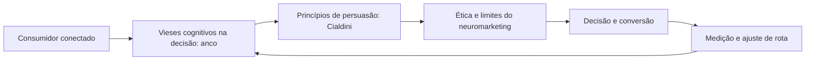

Observe o laço de retorno: a medição alimenta o próximo ciclo de campanha. Essa é a diferença estrutural entre campanha e sistema — a campanha termina quando o orçamento acaba; o sistema aprende e se ajusta a cada ciclo [7]. No caso do tema *Neuromarketing e a Psicologia da Decisão de Compra Online*, esse laço é o que converte o investimento inicial em aprendizado acumulado para as próximas decisões [15].

## 4. Técnica

### O Mapa de Jornada em Estrutura de Dados

A jornada vira dado quando cada etapa ganha evento, métrica e dono. O modelo abaixo representa a jornada como uma lista de estágios com conversão acumulada — a base para identificar o maior vazamento do funil.

```python
from dataclasses import dataclass

@dataclass
class Estagio:
    nome: str
    contato: int
    conversao: float  # fração que avança

def funil(estagios):
    """Calcula conversão por estágio e vazamento acumulado."""
    acumulado = estagios[0].contato
    resultado = []
    for e in estagios:
        resultado.append({"estagio": e.nome, "pessoas": acumulado,
                          "conversao_etapa": round(e.conversao, 3)})
        acumulado = round(acumulado * e.conversao)
    return resultado

jornada = [
    Estagio("Reconhecimento", 100_000, 0.30),
    Estagio("Consideração", 0, 0.40),
    Estagio("Decisão", 0, 0.25),
    Estagio("Compra", 0, 1.0),
]
for etapa in funil(jornada):
    print(etapa)
```

O maior vazamento entre etapas é a prioridade da estratégia — cada ponto recuperado se multiplica ao longo do funil [16]. O mapa é também o documento de alinhamento entre marketing e vendas [3].

O código acima é o núcleo técnico de *Neuromarketing e a Psicologia da Decisão de Compra Online*: validável, executável e adaptável ao contexto real do leitor. A prática recomendada é rodá-lo com dados próprios e usar a saída como insumo da próxima reunião de planejamento. Documentação oficial das plataformas reforça cada passo — da estrutura de campanhas [5] à configuração de eventos [12]. A leitura técnica deste capítulo complementa a exposição conceitual das seções anteriores e prepara os exercícios da seção seguinte.

## 5. Aplica

Conhecimento sem aplicação é conteúdo; aplicação sem reflexão é rotina. No contexto de *Neuromarketing e a Psicologia da Decisão de Compra Online*, os exercícios abaixo fecham o capítulo e preparam o terreno do próximo:

1. Escolha um cliente perdido recentemente e reconstrua a jornada dele para localizar o ponto de ruptura.
2. Entreviste três clientes e registre as palavras que eles usam para descrever sua oferta.
3. Liste as cinco perguntas mais frequentes da sua base e mapeie em qual etapa da jornada surgem.
4. Compare a experiência percebida entre dois concorrentes e aponte onde um supera o outro em atrito.

Dedique ao menos 30 minutos a um dos exercícios antes de avançar. O aprendizado desta obra é cumulativo: o mapa desenhado aqui será usado nos capítulos seguintes da Parte II e nas partes subsequentes [3].

Complementando, cinco exercícios práticos adicionais consolidam o aprendizado de *Neuromarketing e a Psicologia da Decisão de Compra Online*:

1. Desenhe a jornada de um cliente seu e marque: onde ele desiste, onde hesita e onde decide?
2. Sua persona está atualizada com dados reais de comportamento ou é uma suposição antiga?
3. Quais são os três momentos de verdade da sua jornada — e o que o cliente avalia em cada um?
4. Onde está a maior fricção do seu funil? Qual dado confirma que é ali?
5. O que um cliente que recompra sabe sobre a sua marca que um que desistiu não sabe?

## Leitura Complementar Recomendada

Para aprofundar *Neuromarketing e a Psicologia da Decisão de Compra Online* além deste capítulo:

- Como complemento prático, o Google Analytics e a documentação de eventos de conversão ajudam a instrumentar as etapas da jornada — a medição é o que transforma o mapa em instrumento de gestão [12].

- Para aprofundar a jornada, o artigo de Lemon e Verhoef (Understanding Customer Experience Throughout the Customer Journey) é a referência acadêmica central, e Chaffey traz o tratamento operacional do funil e da jornada no contexto digital [16] [3].

## Análise de Riscos e Mitigações

A aplicação de *Neuromarketing e a Psicologia da Decisão de Compra Online* envolve riscos identificáveis. A tabela de riscos abaixo relaciona cada ameaça à sua mitigação:

- Risco de ignorar o pós-compra: todo o esforço no checkout. Mitigação: fluxo de pós-venda com satisfação e recompra [16].
- Risco de mapa obsoleto: a jornada muda e o mapa fica velho. Mitigação: revisão trimestral com dados novos de comportamento [16].
- Risco de persona de achismo: decisões sobre suposições. Mitigação: entrevistas reais e dados de analytics na construção [10].
- Risco de foco no sintoma: tratar a conversão sem entender a jornada. Mitigação: diagnóstico por etapa antes da correção [16].

## Considerações de Implementação

 

## Exercício Integrador da Parte II

o

Este exercício conecta o capítulo às demais partes da obra e deve ser revisto ao final da leitura completa.

## Aprofundamento Prático

O tema de *Neuromarketing e a Psicologia da Decisão de Compra Online* ganha potência quando levado ao nível operacional. Os quatro pontos abaixo aprofundam a aplicação prática:

- A leitura avançada dos momentos de verdade pede a instrumentação de cada um: para o primeiro contato, métrica de primeira impressão; para a avaliação, métrica de comparação; para o pós-compra, métrica de satisfação e recompra [16].

- A fricção mensurável é a base do CRO de jornada: cada etapa do funil tem uma taxa de avanço, e o vazamento entre etapas é a prioridade — o mapa indica onde o cliente hesita e o teste indica como remover a hesitação [8].

- A persona orientada a dados combina fontes: analytics mostra o comportamento, atendimento mostra as dores, pesquisa mostra as palavras — e a persona é a síntese operacional dessas três fontes [10].

- A experiência do cliente é gerida por rotina: reuniões regulares de jornada, com o mapa na mesa e os números por etapa, criam o hábito de decidir sobre a experiência — não sobre a opinião [16].

## Exercícios de Fixação

Para consolidar *Neuromarketing e a Psicologia da Decisão de Compra Online*, resolva os cinco exercícios abaixo — com caneta, papel e dados reais:

1. Defina uma métrica de experiência e colete a primeira rodada.
2. Desenhe a jornada de um cliente real em cinco etapas com os touchpoints de cada uma.
3. Escreva a persona da sua audiência com dados — não com suposições.
4. Identifique os três momentos de verdade da sua jornada e o que o cliente avalia em cada um.
5. Localize a maior fricção do seu funil com uma evidência numérica.

## Autoavaliação do Capítulo

Autoavaliação: (1) Tenho um mapa de jornada do cliente com dados? (2) Minha persona foi atualizada com comportamento real? (3) Sei qual é a maior fricção do meu funil com evidência? (4) Tenho uma métrica de experiência coletando respostas? (5) Minha taxa de recompra é conhecida e acompanhada? Responda e priorize a primeira resposta negativa.

A primeira resposta negativa é o seu próximo passo natural — volte a ela na seção de aplicação deste capítulo e trabalhe o item até que a resposta seja sim.

## Problemas Comuns e Soluções Práticas

Aplicar *Neuromarketing e a Psicologia da Decisão de Compra Online* no mundo real esbarra em problemas recorrentes. Abaixo, cinco situações típicas com suas soluções — sintoma, causa e correção:

### Clientes que não recompram

A aquisição funciona, mas a retenção falha. A solução é medir a experiência pós-compra, atacar o onboarding e nutrir a relação — a recompra é o termômetro da jornada completa [16].

### Persona de achismo

As decisões se baseiam em suposições sobre o cliente. A solução é entrevistar três clientes reais, cruzar com analytics e atualizar a persona com dados — o investimento em mídia fica mais eficiente [10].

### Fricção invisível

A conversão cai sem causa aparente. A solução é combinar heatmap, gravação de sessão e análise de funil para tornar a fricção visível — e testar a remoção [8].

### Pós-venda negligenciado

Todo o esforço termina no checkout. A solução é desenhar o fluxo de pós-venda: acompanhamento, satisfação e incentivo à recompra — o cliente existente é o ativo mais barato [16].

### Alta desistência no meio do funil

Clientes somem entre etapas sem explicação. A solução é o mapa de jornada com dados de cada etapa: localizar o ponto de maior queda e testar a correção da fricção [16].

## Aplicações por Setor

O tema de *Neuromarketing e a Psicologia da Decisão de Compra Online* ganha contornos diferentes em cada setor. A leitura setorial abaixo ajuda a adaptar os princípios ao seu contexto:

- A jornada do varejo é curta e transacional; a do B2B é longa e grupal; a do serviço é relacional e contínua — cada uma exige um mapa, mensagens e métricas próprios [16].

- No e-commerce, a jornada termina no checkout e se renova na recompra; no serviço de assinatura, a jornada é o próprio produto — a retenção é a métrica-mestra [16].

## Plano de Ação de 30 Dias

Para converter a leitura de *Neuromarketing e a Psicologia da Decisão de Compra Online* em resultado, execute um dos planos semanais abaixo — cada semana tem um objetivo e uma entrega:

### Plano de Ação — Opção 1

Semana 1 — Pesquisa: entreviste três clientes e registre as palavras deles.
Semana 2 — Persona: atualize a persona com os achados — dores, canais, gatilhos.
Semana 3 — Métrica: defina NPS ou CSAT e colete a primeira rodada.
Semana 4 — Correção: remova a fricção de maior impacto e meça o efeito.

### Plano de Ação — Opção 2

Semana 1 — Mapa: desenhe a jornada em cinco etapas com os touchpoints de hoje.
Semana 2 — Dado: cruze analytics e atendimento para localizar o maior vazamento.
Semana 3 — Hipótese: formule a correção da fricção principal com métrica de sucesso.
Semana 4 — Teste: implemente em piloto, meça e documente.

## KPIs que Importam neste Capítulo

Para *Neuromarketing e a Psicologia da Decisão de Compra Online*, os KPIs que importam: conversão por etapa da jornada, taxa de abandono entre touchpoints, CSAT/NPS, recompra e valor do tempo de vida — os números que provam onde a jornada avança e onde quebra [16].

Antes de encerrar, registre esses indicadores no seu painel de acompanhamento — eles serão a régua para medir a aplicação deste capítulo nas próximas semanas.

## Roteiro de Implementação Passo a Passo

Para aplicar *Neuromarketing e a Psicologia da Decisão de Compra Online* na prática, os roteiros abaixo organizam a sequência de ações — do diagnóstico à medição:

### Roteiro de Implementação 1

1. Reúna os dados que já existem: analytics, atendimento, pesquisa, redes sociais.
2. Identifique as cinco perguntas mais frequentes dos clientes.
3. Mapeie em qual etapa da jornada cada pergunta surge.
4. Entreviste três clientes para validar as suposições com palavras deles.
5. Atualize a persona principal com os achados — dores, canais, gatilhos.
6. Defina a métrica de experiência: CSAT, NPS ou ambas, com periodicidade.
7. Colete a primeira rodada e registre a linha de base.
8. Compare a experiência percebida entre dois concorrentes.
9. Escolha a fricção de maior impacto e remova-a em piloto.
10. Revise o mapa de jornada a cada trimestre com dados novos.

### Roteiro de Implementação 2

1. Escolha três clientes reais — um recente, um recorrente e um que desistiu.
2. Entreviste cada um e registre o percurso completo, do primeiro contato à decisão.
3. Liste todos os touchpoints mencionados e o que o cliente avaliou em cada um.
4. Monte o mapa da jornada em cinco etapas: descoberta, avaliação, decisão, compra, pós-venda.
5. Marque onde a jornada quebrou para o cliente que desistiu.
6. Identifique os três momentos de verdade — os pontos que mais influenciaram a percepção.
7. Para cada momento, defina a experiência ideal e o gap atual.
8. Priorize o gap de maior impacto sobre a conversão ou retenção.
9. Formule uma hipótese de correção com métrica de sucesso.
10. Implemente em piloto, meça e documente o aprendizado.

## Perguntas Frequentes

Em relação ao tema de *Neuromarketing e a Psicologia da Decisão de Compra Online*, cinco perguntas surgem com frequência na prática profissional:

**Devo medir NPS?**

Se a recompra importa, sim: NPS e CSAT correlacionam com retenção e recomendação — e a tendência importa mais que o ponto [16].

**Por que minha conversão caiu?**

Examine a jornada: a queda quase sempre tem causa em uma etapa específica — e a análise de funil localiza o ponto [16].

**Persona serve mesmo?**

Sim, quando alimentada por dados reais — entrevistas, analytics e atendimento. Persona de suposição é despesa disfarçada [10].

**O que é um momento de verdade?**

O ponto da jornada que mais influencia a percepção e a decisão — primeiro contato, avaliação e pós-compra [16].

**Como reduzir o atrito?**

Identifique a fricção com dados (heatmap, funil, gravação), formule a hipótese e teste a remoção em piloto [8].

## Cenários Numéricos Comentados

Os cálculos abaixo mostram, com números concretos, como as decisões de *Neuromarketing e a Psicologia da Decisão de Compra Online* se traduzem em resultado:

### Cenário numérico: valor do momento de verdade

Uma loja descobre que 40% dos visitantes abandonam na etapa de preço, antes do checkout. Trazer a informação de preço e frete para a página do produto recupera 15 pontos de conversão — cada ponto equivale a dezenas de milhares de reais em receita anual para volumes relevantes [16].

### Cenário numérico: o vazamento do funil

Um funil com 100.000 contatos no topo, conversão de 30% entre etapas, teria 900 compras ao final. Se a conversão entre a consideração e a decisão cair de 30% para 20%, o resultado cai para 600 — uma perda de um terço da receita, invisível para quem mede apenas o topo e o checkout. O mapa da jornada localiza o vazamento e o CRO o corrige [16].

## Como Este Capítulo se Integra à Obra

A jornada do consumidor é o eixo transversal da obra: as partes de busca, redes, relacionamento e conversão são pontos dessa jornada vistos de perto. Ao estudar as partes seguintes, volte a este mapa mental — cada canal que você dominar preencherá uma etapa da jornada que você já conhece. No contexto de *Neuromarketing e a Psicologia da Decisão de Compra Online*, essa integração fica ainda mais visível: as ferramentas e métricas que você dominou aqui serão a base das decisões dos próximos capítulos — e das partes que virão depois.

## Aprofundamento Conceitual

No contexto de *Neuromarketing e a Psicologia da Decisão de Compra Online*, o mapeamento de jornada com dados exige a fusão de fontes: analytics de site, interações sociais, atendimento e pesquisa de satisfação se combinam para formar o retrato real do percurso do cliente [16].

No contexto de *Neuromarketing e a Psicologia da Decisão de Compra Online*, as personas são instrumentos vivos: devem ser atualizadas com dados de comportamento, não com achismo. Uma persona construída sobre entrevistas e analytics vale mais que cinco construídas sobre suposições [10].

No contexto de *Neuromarketing e a Psicologia da Decisão de Compra Online*, a fricção é a inimiga silenciosa da conversão: cada campo de formulário, cada passo extra e cada ambiguidade de mensagem reduz a probabilidade de avanço. Identificar e remover atrito é trabalho contínuo [16].

No contexto de *Neuromarketing e a Psicologia da Decisão de Compra Online*, o neuromarketing aplica vieses documentados ao design digital: ancoragem (primeiro preço visto influencia o julgamento), escassez (urgência percebida), prova social (os outros já confiaram) e aversão à perda [2].

No contexto de *Neuromarketing e a Psicologia da Decisão de Compra Online*, a experiência do cliente não é um departamento: é a soma de todas as decisões da empresa vistas pelo olhar do cliente. Cada área — marketing, vendas, produto, suporte — é um ponto da jornada [16].

## Fundamentos em Detalhe

No contexto de *Neuromarketing e a Psicologia da Decisão de Compra Online*, a psicologia da decisão digital é influenciada por vieses bem documentados: ancoragem de preço, aversão à perda, prova social e escassez — todos aplicáveis no design da oferta [2].

No contexto de *Neuromarketing e a Psicologia da Decisão de Compra Online*, o pós-compra é a etapa mais negligenciada e mais lucrativa da jornada: é onde se decide a recompra, a recomendação e o valor de longo prazo do cliente [16].

No contexto de *Neuromarketing e a Psicologia da Decisão de Compra Online*, cada canal da jornada tem um papel distinto: a descoberta acontece nas redes, a avaliação na busca, a decisão no site e a confirmação no atendimento — e a marca precisa orquestrar a passagem entre eles [3].

No contexto de *Neuromarketing e a Psicologia da Decisão de Compra Online*, a jornada do consumidor é a unidade de análise mais importante do marketing moderno: entender onde o cliente está, o que ele precisa e qual a próxima ação esperada em cada etapa define a eficácia de tudo o que a marca faz [16].

No contexto de *Neuromarketing e a Psicologia da Decisão de Compra Online*, o conceito de momentos de verdade — criado pela Procter & Gamble — permanece central: o primeiro contato, a avaliação comparativa e a experiência pós-compra são os três pontos que mais influenciam a decisão e a recompra [16].

## Estudos de Caso Aplicados

### Caso: o e-commerce que perdeu a recompra

Uma loja de roupas investia tudo em aquisição e ignorava o pós-compra. O mapa de jornada mostrou que o cliente satisfeito não era nutrido: sem e-mail de acompanhamento, sem programa de fidelidade e sem indicação. A recompra saltou quando a loja adicionou um fluxo de pós-venda com desconto para o próximo pedido e um programa de pontos — provando que a jornada não termina no checkout [16].

### Caso: a clínica que mapeou a jornada e dobrou o agendamento

Uma clínica odontológica percebeu que a maioria dos pacientes abandonava entre a pesquisa (Google) e o contato (WhatsApp). O mapa de jornada revelou a quebra: sem preço nem avaliações visíveis, o paciente não se sentia seguro para iniciar a conversa. A correção: página de preço transparente, avaliações integradas e resposta automática no WhatsApp. Em um trimestre, o agendamento dobrou — sem aumentar o tráfego [16].

## Dados e Números do Setor

### Dados de Contexto

- A jornada digital moderna é fragmentada: o consumidor alterna dispositivos e canais antes de decidir [15].
- A experiência do cliente é apontada como o principal diferencial competitivo em pesquisas de liderança [16].
- A recomendação e a avaliação de outros clientes influenciam a decisão tanto quanto a propaganda [2].
- O mobile é o principal ponto de contato da jornada para a maioria dos públicos [17].

### Indicadores-Chave

- A satisfação (CSAT/NPS) correlaciona com recompra e recomendação [16].
- O atrito no funil reduz a conversão de forma desproporcional a cada passo [3].
- Clientes bem nutridos na jornada geram maior valor de longo prazo [16].

## Análise Comparativa

O tema de *Neuromarketing e a Psicologia da Decisão de Compra Online* fica mais claro quando contrastado com a alternativa mais próxima. A comparação abaixo organiza as diferenças:

### Funil vs. Jornada

- Funil é linear; a jornada é um percurso de idas e voltas.
- Funil é da marca; a jornada é do consumidor.
- O funil termina na compra; a jornada continua no pós-venda e na defesa.
- A jornada considera múltiplos canais simultâneos; o funil simplifica em etapas.

## Erros Comuns e Como Evitá-los

No tema de *Neuromarketing e a Psicologia da Decisão de Compra Online*, cinco erros recorrentes merecem atenção especial — cada um com sua correção prática:

1. Ignorar o feedback: as reclamações e dúvidas dos clientes são o mapa exato da fricção.
2. Personas de achismo: construir perfis sem dados reais reproduz estereótipos e desperdiça mídia.
3. Mapear a jornada uma única vez: a jornada muda com o mercado, e o mapa precisa ser vivo.
4. Tratar todos os contatos como iguais: ignorar o estágio da jornada produz mensagens fora de contexto.
5. Medir só a conversão final: ignorar as etapas intermediárias esconde onde a jornada realmente quebra.

## Ferramentas e Recursos Recomendados

Para operar o tema de *Neuromarketing e a Psicologia da Decisão de Compra Online* na prática, a seguinte seleção de ferramentas cobre o ciclo completo — do diagnóstico à medição:

1. Ferramenta de NPS/CSAT para medir experiência
2. Planilha de personas com dados reais
3. Ferramenta de mapa de jornada (visual) 
4. Plataforma de pesquisa de usuário para entrevistas
5. Analytics para eventos por etapa do funil

## Glossário do Capítulo

Os termos abaixo — todos usados no corpo deste capítulo — formam o vocabulário mínimo para acompanhar o restante da obra:

Jornada do cliente: caminho completo do primeiro contato à recompra. Touchpoint: ponto de contato entre marca e consumidor. Persona: representação semi-fictícia do cliente ideal. Momento de verdade: ponto que define percepção. Fricção: barreira entre interesse e ação.

## Checklist de Implementação

Use a lista abaixo para auditar a aplicação de *Neuromarketing e a Psicologia da Decisão de Compra Online* na sua operação — marque os itens já concluídos e priorize os pendentes:

- [ ] Três momentos de verdade identificados
- [ ] Fricção principal localizada com dado
- [ ] Métrica de experiência (CSAT/NPS) definida
- [ ] Mapa de touchpoints desenhado do reconhecimento à defesa
- [ ] Persona atualizada com dados reais

## Perguntas para Reflexão

Antes de avançar, reflita sobre as cinco questões abaixo — elas conectam o conteúdo de *Neuromarketing e a Psicologia da Decisão de Compra Online* ao seu contexto real de trabalho:

1. Sua persona está atualizada com dados reais de comportamento ou é uma suposição antiga?
2. Quais são os três momentos de verdade da sua jornada — e o que o cliente avalia em cada um?
3. Onde está a maior fricção do seu funil? Qual dado confirma que é ali?
4. O que um cliente que recompra sabe sobre a sua marca que um que desistiu não sabe?
5. Desenhe a jornada de um cliente seu e marque: onde ele desiste, onde hesita e onde decide?

## Quadro Comparativo: Etapas da Jornada e Seus Objetivos

O quadro abaixo consolida os elementos essenciais de *Neuromarketing e a Psicologia da Decisão de Compra Online* em perspectiva comparada, facilitando a consulta rápida e a tomada de decisão:

| Etapa | Objetivo | Métrica típica |
|---|---|---|
| Etapa | Objetivo | Métrica típica |
| Descoberta | Gerar consideração | Alcance e recall |
| Avaliação | Ser comparado | Visitas e interações |
| Decisão | Converter | Taxa de conversão |
| Compra | Concluir | Receita e pedido |
| Pós-venda | Reter e encantar | Recompra e NPS |

## 6. Conclusão

O capítulo percorreu o território da Parte II, *A Jornada do Consumidor — Mapeando a Navegação*, e deixou três aprendizados operacionais. Primeiro, o conceito central — *Neuromarketing e a Psicologia da Decisão de Compra Online* — é menos uma novidade e mais uma disciplina de execução. Segundo, a aplicação exige a tríade conceito, rota e métrica, sem pular etapas [8]. Terceiro, o ajuste contínuo de rota, ilustrado no laço de retorno do diagrama, é o que separa campanhas pontuais de operações sustentáveis [7]. O caminho percorrido desde *Experiência do Cliente (CX) e o Marketing de Relacionamento* até aqui forma a base que o próximo passo vai usar. No próximo capítulo, *Google Ads e SEM: A Rota da Intenção de Compra*, você avançará sobre o território vizinho levando as ferramentas exercitadas aqui.

Como navegador de marketing digital, você não decorou uma fórmula — incorporou um modo de operar: ler o território, escolher a rota com dados e ajustar o percurso quando o vento muda [2].

Antes do fechamento, vale reforçar a base do capítulo: No contexto de *Neuromarketing e a Psicologia da Decisão de Compra Online*, a jornada B2B é mais longa e mais grupal: múltiplos decisores, ciclos de meses e avaliação técnica profunda — exigindo conteúdo de educação por estágio e alinhamento com vendas [13].

No contexto de *Neuromarketing e a Psicologia da Decisão de Compra Online*, a jornada de compra moderna é um ecossistema de micro-momentos: o consumidor decide em frações de segundo, no celular, entre uma tarefa e outra. A marca que não está presente nesses momentos perde a corrida cedo [3].
## 7. Referências Bibliográficas

[1] KOTLER, Philip; KELLER, Kevin Lane. **Administração de Marketing**. 15. ed. São Paulo: Pearson, 2016.
[2] KOTLER, Philip; KARTAJAYA, Hermawan; SETIAWAN, Iwan. **Marketing 4.0: Moving from Traditional to Digital**. Hoboken: Wiley, 2017.
[3] CHAFFEY, Dave; ELLIS-CHADWICK, Fiona. **Digital Marketing: Strategy, Implementation and Practice**. 9. ed. Harlow: Pearson, 2025.
[4] GOOGLE SEARCH CENTRAL. **Search Engine Optimization (SEO) Starter Guide**. Disponível em: https://developers.google.com/search/docs/fundamentals/seo-starter-guide. Acesso em: 02 ago. 2026.
[5] GOOGLE ADS HELP CENTER. **Your guide to Google Ads (Basics, Search Campaigns & Best Practices)**. Disponível em: https://support.google.com/google-ads/answer/6146252. Acesso em: 02 ago. 2026.
[6] META BUSINESS HELP CENTER. **Meta Ads Manager Guide: Best Practices for Targeting, Measurement, and Optimization**. Disponível em: https://www.facebook.com/business/help. Acesso em: 02 ago. 2026.
[7] DELOITTE DIGITAL. **Marketing Trends 2026: New Marketing for a New World**. Disponível em: https://www.deloittedigital.com/nl/en/insights/perspective/marketing-trends-2026.html. Acesso em: 02 ago. 2026.
[8] HUBSPOT RESEARCH. **The State of Marketing / 2026 Marketing Statistics, Trends & Data**. Disponível em: https://www.hubspot.com/marketing-statistics. Acesso em: 02 ago. 2026.
[9] STATISTA RESEARCH DEPARTMENT. **Global Digital Marketing and Advertising Revenue Statistics & Facts**. Disponível em: https://www.statista.com/topics/8954/marketing-worldwide/. Acesso em: 02 ago. 2026.
[10] RYAN, Damian. **Understanding Digital Marketing: Marketing Strategies for Engaging the Digital Generation**. 5. ed. London: Kogan Page, 2020.
[11] HOLLENSEN, Svend; KOTLER, Philip; OPRESNIK, Marc Oliver. **Social Media Marketing: A Practitioner Approach**. 4. ed. Harlow: Pearson, 2023.
[12] GOOGLE ANALYTICS HELP CENTER. **Documentação oficial do Google Analytics 4**. Disponível em: https://support.google.com/analytics. Acesso em: 02 ago. 2026.
[13] LINKEDIN MARKETING SOLUTIONS. **Best Practices para campanhas B2B no LinkedIn**. Disponível em: https://business.linkedin.com/marketing-solutions. Acesso em: 02 ago. 2026.
[14] TIKTOK FOR BUSINESS. **Guia de criatividade e boas práticas de anúncios no TikTok**. Disponível em: https://www.tiktok.com/business. Acesso em: 02 ago. 2026.
[15] DATAREPORTAL. **Digital 2026: Global Overview Report**. Disponível em: https://datareportal.com/reports/digital-2026-global-overview-report. Acesso em: 02 ago. 2026.
[16] LEMON, Katherine N.; VERHOEF, Peter C. **Understanding Customer Experience Throughout the Customer Journey**. *Journal of Marketing*, v. 80, n. 6, p. 69-96, 2016.
[17] TIWARI, Rajnish; BUSE, Stephan; HERSTATT, Cornelius. **From Electronic to Mobile Commerce: Opportunities and Challenges**. *Proceedings of the German-Indian Roundtable*, 2006.
[18] VAN DIJK, Jan A. G. M. **The Digital Divide**. Cambridge: Polity Press, 2020.
[19] IBM. **Marketing with AI: Personalization at Scale**. Disponível em: https://www.ibm.com/think/topics/ai-marketing. Acesso em: 02 ago. 2026.
[20] KOTLER, Philip. **Marketing 5.0: Technology for Humanity**. Hoboken: Wiley, 2021.


# PARTE III — Busca — A Rota da Intenção

# Capítulo 11: Google Ads e SEM: A Rota da Intenção de Compra

## 1. Introdução

Bem-vindo a uma nova etapa da sua navegação pelo marketing digital. Este capítulo — *Google Ads e SEM: A Rota da Intenção de Compra* — integra a Parte III, *Busca — A Rota da Intenção*, e responde a uma pergunta prática: **fundamentos de sem/ppc: leilão, índice de qualidade e lances** — na prática, como isso se traduz em decisão e resultado?

Ao final, você será capaz de pera campanhas de busca (ppc): estrutura de conta, palavras-chave, lances, qualidade do anúncio e mensuração de roi.. Mais do que decorar conceitos, você vai enxergar a busca como rota de intenção declarada — e converter essa visão em plano, experimento e métrica.

No capítulo anterior, *Neuromarketing e a Psicologia da Decisão de Compra Online*, você aprendeu os conceitos que servem de plataforma para o que vem agora. Este capítulo retoma esse repertório e o aplica a um território novo — sem repetir o que já foi estabelecido, apenas usando como base.

O capítulo segue a estrutura das sete seções que organizam esta obra: primeiro a exposição conceitual, depois a ilustração, a técnica aplicada, o exercício de aplicação e a conclusão operacional.

No contexto de *Google Ads e SEM: A Rota da Intenção de Compra*, o Índice de Qualidade do Google Ads combina três sinais — relevância do anúncio, CTR esperado e experiência da página de destino — e influencia tanto a posição quanto o custo por clique [5].

No contexto de *Google Ads e SEM: A Rota da Intenção de Compra*, a arquitetura de informações de um site determina a rastreabilidade: páginas claras, hierarquia lógica e links internos consistentes facilitam o trabalho dos rastreadores e melhoram a indexação [4].
## 2. Explica

### Fundamentos de SEM/PPC: leilão, Índice de Qualidade e lances

Quando o tema é *Google Ads e SEM: A Rota da Intenção de Compra*, o primeiro pilar — fundamentos de sem/ppc: leilão, índice de qualidade e lances — define o território conceitual. A otimização para mecanismos de busca começa pelo usuário: páginas rápidas, claras e úteis são a base sobre a qual qualquer técnica se apoia [4].

Na prática, fundamentos de sem/ppc: leilão, índice de qualidade e lances significa transformar a teoria em rotina operacional — exatamente o que *Google Ads e SEM: A Rota da Intenção de Compra* exige no dia a dia. A literatura de gestão é enfática: sem operacionalizar o conceito em checklist, responsável e métrica, ele permanece slide de apresentação [3]. Por isso a Parte III propõe sempre o mesmo movimento: entender, traduzir em critério observável e decidir com dado.

### Estrutura de campanhas, grupos de anúncios e palavras-chave

O segundo pilar — estrutura de campanhas, grupos de anúncios e palavras-chave — conecta a estratégia à operação diária. Ferramentas de pesquisa de palavras-chave transformam volume em estratégia: dados de demanda sustentam a arquitetura de conteúdo e a alocação de verba [8]. A experiência do consumidor se constrói na consistência entre canais e mensagens, e é essa consistência que transforma contato em relacionamento [16]. Organizações que tratam cada canal como silo perdem o fio condutor da jornada; as que operam o pilar com disciplina reduzem atrito e aumentam a taxa de avanço entre etapas [10].

### Otimização e mensuração: CTR, conversões e ROI

Fechando o tripé, otimização e mensuração: ctr, conversões e roi é o que transforma a Parte III em vantagem mensurável. A busca segue como o canal de maior intenção do ambiente digital: quem pesquisa já declarou necessidade, e a SERP organiza a oferta por relevância algorítmica [4]. O relato da indústria mostra que as empresas que sustentam resultado não são as que têm mais ferramentas, mas as que conseguem medir e ajustar a rota com frequência [8]. A métrica certa, escolhida antes da campanha, vale mais do que qualquer ferramenta cara instalada depois do fato [9].

### O Eixo Transversal do Capítulo

O Google Ads opera em leilão: o Índice de Qualidade combina relevância, expectativa de CTR e experiência da página de destino — um ponto a mais reduz o custo por clique de forma mensurável [5]. Esse eixo conecta os três pilares e explica por que o capítulo os trata como um sistema, não como uma lista: cada pilar reforça o outro, e a omissão de qualquer um deles produz estratégia manca. O capítulo seguinte retomará esse eixo com novas ferramentas, agora com o vocabulário já estabelecido aqui.

Em síntese, o capítulo opera em três níveis: o conceitual (Fundamentos de SEM/PPC: leilão, Índice de Qualidade e lances), o operacional (Estrutura de campanhas, grupos de anúncios e palavras-chave) e o estratégico (Otimização e mensuração: CTR, conversões e ROI). O leitor que dominar os três estará apto a aplicar a Parte III com autonomia [1]. A evidência reunida nesta seção sustenta cada recomendação prática das seções seguintes [2].

## 3. Ilustra

Vamos traduzir o capítulo em uma cena concreta, no contexto de *Google Ads e SEM: A Rota da Intenção de Compra*. Uma empresa de porte médio, com equipe enxuta e orçamento limitado, decide operar a Parte III desta obra, *Busca — A Rota da Intenção*. Na primeira semana, a equipe testa o conceito central do capítulo em um caso real: um cliente que pesquisou, comparou e decidiu comprar. O primeiro pilar — fundamentos de sem/ppc: leilão, índice de qualidade e lances — orienta o entendimento inicial do público; o segundo — estrutura de campanhas, grupos de anúncios e palavras-chave — guia a escolha da rota de comunicação; e o terceiro fecha com a medição do resultado [2].

O diagrama abaixo representa o fluxo operacional proposto pelo capítulo — do consumidor conectado à decisão e ao ajuste contínuo de rota, com o público e a plataforma específicos do tema no centro da navegação:

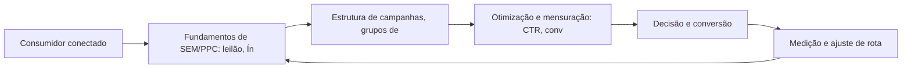

Observe o laço de retorno: a medição alimenta o próximo ciclo de campanha. Essa é a diferença estrutural entre campanha e sistema — a campanha termina quando o orçamento acaba; o sistema aprende e se ajusta a cada ciclo [7]. No caso do tema *Google Ads e SEM: A Rota da Intenção de Compra*, esse laço é o que converte o investimento inicial em aprendizado acumulado para as próximas decisões [15].

## 4. Técnica

### O Leilão de Busca em Números

Entender o leilão do Google Ads é entender um jogo de relevância e lance. O cálculo abaixo simula o custo real por clique a partir do Índice de Qualidade — mostrando por que qualidade barateia o clique.

```python
def custo_por_clique(ranking_seu: float, ranking_abaixo: float) -> float:
    """CPC = ranking do concorrente de baixo / seu ranking + R$0,01."""
    return round(ranking_abaixo / ranking_seu + 0.01, 2)

def ranking(qualidade: int, lance: float) -> float:
    """AdRank: qualidade x lance."""
    return qualidade * lance

# Mesmo lance, qualidades diferentes
for q in (4, 7, 10):
    rank = ranking(q, 2.00)
    cpc = custo_por_clique(rank, ranking(5, 2.00))
    print(f"Qualidade {q}: rank {rank:.0f} -> CPC R$ {cpc}")
```

O exercício demonstra o princípio central do SEM: melhorar o Índice de Qualidade reduz o custo por clique mais rápido do que reduzir o lance [5]. A relevância é a estratégia de longo prazo do leilão [4].

O código acima é o núcleo técnico de *Google Ads e SEM: A Rota da Intenção de Compra*: validável, executável e adaptável ao contexto real do leitor. A prática recomendada é rodá-lo com dados próprios e usar a saída como insumo da próxima reunião de planejamento. Documentação oficial das plataformas reforça cada passo — da estrutura de campanhas [5] à configuração de eventos [12]. A leitura técnica deste capítulo complementa a exposição conceitual das seções anteriores e prepara os exercícios da seção seguinte.

## 5. Aplica

Conhecimento sem aplicação é conteúdo; aplicação sem reflexão é rotina. No contexto de *Google Ads e SEM: A Rota da Intenção de Compra*, os exercícios abaixo fecham o capítulo e preparam o terreno do próximo:

1. Compare o CPC estimado de três palavras-chave transacionais do seu mercado em uma ferramenta de lances.
2. Escreva um snippet de anúncio com promessa, prova e CTA e avalie o Índice de Qualidade esperado.
3. Pesquise 20 palavras-chave do seu mercado e classifique cada uma por intenção (informacional, navegacional, transacional).
4. Audite a página inicial com o checklist de SEO on-page: title, meta description, headings e velocidade.

Dedique ao menos 30 minutos a um dos exercícios antes de avançar. O aprendizado desta obra é cumulativo: o mapa desenhado aqui será usado nos capítulos seguintes da Parte III e nas partes subsequentes [3].

Complementando, cinco exercícios práticos adicionais consolidam o aprendizado de *Google Ads e SEM: A Rota da Intenção de Compra*:

1. Quanto custaria comprar, via Google Ads, o tráfego que seu SEO deveria gerar organicamente?
2. Se um assistente de IA responder por você amanhã, sua marca será citada? O que falta para isso?
3. Se o Google sumisse amanhã, quanto do seu tráfego e da sua receita desapareceria junto?
4. Suas palavras-chave estão organizadas por intenção — ou todas competem pelo mesmo público?
5. Qual página sua deveria estar ranqueando e não está? O que falta: conteúdo, autoridade ou técnica?

## Leitura Complementar Recomendada

Para aprofundar *Google Ads e SEM: A Rota da Intenção de Compra* além deste capítulo:

- Para aprofundar a busca, a documentação oficial do Google Search Central cobre o SEO em profundidade, e o Google Ads Help Center detalha o leilão e o Índice de Qualidade [4] [5].

- Como complemento de mercado, os relatórios da Statista sobre investimento em busca e publicidade contextualizam a dimensão financeira do canal [9].

## Análise de Riscos e Mitigações

A aplicação de *Google Ads e SEM: A Rota da Intenção de Compra* envolve riscos identificáveis. A tabela de riscos abaixo relaciona cada ameaça à sua mitigação:

- Risco técnico: site lento ou mal indexado. Mitigação: auditoria periódica de Core Web Vitals e rastreabilidade [4].
- Risco de concorrência direta: disputar termos caros sem estrutura. Mitigação: nicho de cauda longa com menos competição [4].
- Risco de dependência de pago: tráfego que para quando a verba acaba. Mitigação: construir o orgânico em paralelo como ativo de longo prazo [4].
- Risco de palavras erradas: tráfego sem intenção. Mitigação: classificar por intenção e alinhar cada página à busca que recebe [4].

## Considerações de Implementação

b

## Exercício Integrador da Parte III

a

Este exercício conecta o capítulo às demais partes da obra e deve ser revisto ao final da leitura completa.

## Aprofundamento Prático

O tema de *Google Ads e SEM: A Rota da Intenção de Compra* ganha potência quando levado ao nível operacional. Os quatro pontos abaixo aprofundam a aplicação prática:

- A integração SEO-SEM se opera na prática: usar o pago para validar palavras-chave (qual converte) e alimentar o orgânico com essas descobertas — o dado pago informa a estratégia orgânica [5].

- O aprofundamento prático da busca começa pela arquitetura de palavras: o mapa de palavras-chave por etapa do funil é o documento que alinha conteúdo, páginas e campanhas — sem ele, cada área otimiza para si e a SERP fica fragmentada [4].

- A leitura avançada do leilão exige o acompanhamento do Índice de Qualidade por palavra: quedas de qualidade precedem quedas de posição e aumentos de custo — monitorar o índice é monitorar a saúde da conta [5].

- O SEO técnico é disciplina contínua: core Web Vitals, dados estruturados e rastreabilidade se degradam com o tempo, e a auditoria periódica evita a perda silenciosa de posições [4].

## Exercícios de Fixação

Para consolidar *Google Ads e SEM: A Rota da Intenção de Compra*, resolva os cinco exercícios abaixo — com caneta, papel e dados reais:

1. Explique como o Índice de Qualidade reduz o custo por clique.
2. Identifique uma oportunidade do Search Console sem página dedicada.
3. Verifique os Core Web Vitals da sua página e priorize o pior indicador.
4. Classifique dez palavras-chave do seu mercado por intenção.
5. Audite o SEO on-page da sua página principal e liste três melhorias.

## Autoavaliação do Capítulo

Autoavaliação: (1) Tenho um mapa de palavras-chave por intenção e etapa do funil? (2) Minha página principal passa no checklist de SEO on-page? (3) Conheço o Índice de Qualidade das minhas palavras-chave? (4) Uso o Search Console com regularidade? (5) Minha estratégia combina orgânico e pago? Responda e priorize a primeira resposta negativa.

A primeira resposta negativa é o seu próximo passo natural — volte a ela na seção de aplicação deste capítulo e trabalhe o item até que a resposta seja sim.

## Problemas Comuns e Soluções Práticas

Aplicar *Google Ads e SEM: A Rota da Intenção de Compra* no mundo real esbarra em problemas recorrentes. Abaixo, cinco situações típicas com suas soluções — sintoma, causa e correção:

### Dados de busca ignorados

O Search Console tem ouro e ninguém usa. A solução é a rotina: exportar consultas, identificar oportunidades de posição e alimentar o calendário de conteúdo [4].

### Tráfego pago caro e ineficiente

CPC alto e conversão baixa indicam relevância fraca. A solução é atacar o Índice de Qualidade: grupos por categoria, palavras exatas, páginas dedicadas — o custo cai com a qualidade [5].

### Site invisível no Google

Conteúdo bom sem tráfego orgânico aponta para problema técnico ou de autoridade. A solução é auditar indexação, velocidade e backlinks — e priorizar as lacunas por impacto [4].

### Palavras-chave erradas

Tráfego alto sem conversão sugere intenção desalinhada. A solução é reclassificar as palavras-chave por intenção e alinhar cada página à intenção que ela recebe [4].

### Concorrente domina a SERP

A disputa direta é cara. A solução é o nicho: palavras-chave de cauda longa com intenção clara e menos competição — vencer onde o concorrente não está [4].

## Aplicações por Setor

O tema de *Google Ads e SEM: A Rota da Intenção de Compra* ganha contornos diferentes em cada setor. A leitura setorial abaixo ajuda a adaptar os princípios ao seu contexto:

- No varejo de moda, a intenção de busca é visual e a otimização inclui imagem e vídeo; em fintech, a busca é informacional e de confiança — cada setor tem o seu jogo de SERP [4].

- No e-commerce, a busca transacional domina e o SEO de produto é essencial; no B2B, a busca informacional abre o ciclo e o conteúdo técnico ranqueia; em serviços locais, a ficha do Google é o ativo central [4].

## Plano de Ação de 30 Dias

Para converter a leitura de *Google Ads e SEM: A Rota da Intenção de Compra* em resultado, execute um dos planos semanais abaixo — cada semana tem um objetivo e uma entrega:

### Plano de Ação — Opção 1

Semana 1 — Palavras: pesquise 20 termos, classifique por intenção e monte o mapa por funil.
Semana 2 — Página: audite o SEO on-page e os Core Web Vitals da página principal.
Semana 3 — Conteúdo: escreva ou atualize a página para a intenção da palavra-alvo.
Semana 4 — Estrutura: monte a campanha de busca com grupos por categoria e lance o piloto.

### Plano de Ação — Opção 2

Semana 1 — Diagnóstico: exporte as consultas do Search Console e filtre as oportunidades.
Semana 2 — Autoridade: identifique três fontes de backlink de qualidade do seu nicho.
Semana 3 — Técnica: verifique indexação, dados estruturados e velocidade.
Semana 4 — Rotina: agende a revisão mensal de posição e CTR.

## KPIs que Importam neste Capítulo

Para *Google Ads e SEM: A Rota da Intenção de Compra*, os KPIs que importam: CTR e custo por clique, Índice de Qualidade, posição média e impressões orgânicas, e custo por conversão — a leitura conjunta de orgânico e pago na busca [5].

Antes de encerrar, registre esses indicadores no seu painel de acompanhamento — eles serão a régua para medir a aplicação deste capítulo nas próximas semanas.

## Roteiro de Implementação Passo a Passo

Para aplicar *Google Ads e SEM: A Rota da Intenção de Compra* na prática, os roteiros abaixo organizam a sequência de ações — do diagnóstico à medição:

### Roteiro de Implementação 1

1. Liste 30 termos que seus clientes usam para descrever sua oferta e seu mercado.
2. Pesquise volume e dificuldade de cada um em uma ferramenta de palavras-chave.
3. Classifique cada termo por intenção: informacional, navegacional ou transacional.
4. Monte o mapa: palavras-chave por etapa do funil e por persona.
5. Identifique as lacunas: termos de alta intenção sem página dedicada.
6. Audite a página atual contra o checklist de SEO on-page (title, meta, headings, conteúdo).
7. Verifique a velocidade e os Core Web Vitals no PageSpeed Insights.
8. Verifique no Search Console as impressões e posições atuais.
9. Defina a estrutura de campanha de busca: grupos por categoria, palavras exatas.
10. Implemente, agende a revisão mensal e itere com dados de CTR e conversão.

### Roteiro de Implementação 2

1. Abra o Search Console e exporte as consultas com impressões.
2. Filtre as consultas com alta impressão e baixa posição — são as oportunidades.
3. Para cada uma, verifique se existe página dedicada e bem otimizada.
4. Escreva ou atualize o conteúdo com a intenção de busca em mente.
5. Otimize title, meta description e headings para o termo-alvo.
6. Adicione dados estruturados quando aplicável (FAQ, produto, artigo).
7. Construa uma prova social: avaliações, números, casos.
8. Verifique os Core Web Vitals e corrija os piores indicadores.
9. Construa autoridade: um backlink de qualidade por mês ou conteúdo cítável.
10. Acompanhe a posição mensalmente e ajuste o conteúdo com base nos dados.

## Perguntas Frequentes

Em relação ao tema de *Google Ads e SEM: A Rota da Intenção de Compra*, cinco perguntas surgem com frequência na prática profissional:

**O que é o Índice de Qualidade?**

Nota de relevância do anúncio combinando anúncio, CTR esperado e página de destino — influencia posição e custo por clique [5].

**Devo contratar uma agência?**

Depende da maturidade do time. O essencial — pesquisa, estrutura e medição — pode ser aprendido e operado internamente [4].

**A IA vai matar o SEO?**

Não — vai transformá-lo: a otimização passa a ser para respostas sintetizadas e citação, não só ranqueamento [7].

**SEO demora quanto tempo?**

Os primeiros sinais aparecem em semanas, mas a consolidação de autoridade leva meses — é um ativo de longo prazo [4].

**Google Ads funciona para qualquer negócio?**

Funciona quando há intenção de busca e oferta clara — para ofertas de compra impulsiva, outros canais podem render mais [5].

## Cenários Numéricos Comentados

Os cálculos abaixo mostram, com números concretos, como as decisões de *Google Ads e SEM: A Rota da Intenção de Compra* se traduzem em resultado:

### Cenário numérico: o leilão de busca

Com um lance de R$ 2,00 e Índice de Qualidade 4, o ranking é 8 e o CPC real fica em torno de R$ 1,25. Subir a qualidade para 8 eleva o ranking para 16 e reduz o CPC para R$ 0,63 — a mesma campanha, metade do custo, melhor posição. A qualidade é a alavanca mais barata do leilão [5].

### Cenário numérico: orgânico versus pago

Uma página que converte 2% e recebe 10.000 visitas orgânicas mensais gera 200 conversões sem custo de mídia. Para obter o mesmo volume via pago, seriam necessários 10.000 cliques a R$ 1,00 — R$ 10 mil mensais. O SEO que sustenta essas visitas é um ativo que se paga em poucos meses [4].

## Como Este Capítulo se Integra à Obra

A busca é a rota da intenção declarada, mas a jornada começa antes — nas redes e no conteúdo que despertam a necessidade. As partes de redes sociais (IV) e relacionamento (V) alimentam o topo do funil que a busca captura no meio, e a parte de métricas (VIII) mede o resultado dessa cadeia inteira. No contexto de *Google Ads e SEM: A Rota da Intenção de Compra*, essa integração fica ainda mais visível: as ferramentas e métricas que você dominou aqui serão a base das decisões dos próximos capítulos — e das partes que virão depois.

## Aprofundamento Conceitual

No contexto de *Google Ads e SEM: A Rota da Intenção de Compra*, o conteúdo para busca não é mais texto puro: é resposta estruturada, dados, imagens e vídeo — tudo organizado para ser citado e reaproveitado pela busca generativa [7].

No contexto de *Google Ads e SEM: A Rota da Intenção de Compra*, a pesquisa de palavras-chave mapeia a demanda: volume mostra o tamanho da oportunidade, dificuldade mostra o custo de entrada e intenção mostra a probabilidade de conversão — as três juntas priorizam a aposta [8].

No contexto de *Google Ads e SEM: A Rota da Intenção de Compra*, os Core Web Vitals (LCP, INP, CLS) não são apenas sinais técnicos: são métricas de experiência do usuário que correlacionam com conversão — um site rápido converte mais, com ou sem o algoritmo [4].

No contexto de *Google Ads e SEM: A Rota da Intenção de Compra*, a autoridade de domínio se constrói com backlinks de qualidade e conteúdo cítável: cada link de um site respeitado é um voto de confiança que o algoritmo interpreta como relevância [4].

No contexto de *Google Ads e SEM: A Rota da Intenção de Compra*, o Google Business Profile é o ativo local mais subestimado: para negócios de alcance local, a ficha otimizada domina a busca por proximidade e a decisão de visita [4].

## Fundamentos em Detalhe

No contexto de *Google Ads e SEM: A Rota da Intenção de Compra*, a busca é o canal de intenção mais alta do marketing digital: ao pesquisar, o consumidor declara uma necessidade e sinaliza disposição de agir — o que torna o tráfego de busca o mais valioso e o mais conversível [4].

No contexto de *Google Ads e SEM: A Rota da Intenção de Compra*, o leilão de anúncios do Google é um mecanismo de relevância: anunciantes competem por palavras-chave, mas o vencedor é definido pela combinação de lance e qualidade — e a qualidade barateia o clique [5].

No contexto de *Google Ads e SEM: A Rota da Intenção de Compra*, o SEO é um ativo de longo prazo: enquanto o tráfego pago termina quando o orçamento acaba, o tráfego orgânico acumula valor com o tempo e reduz o custo médio de aquisição da operação [4].

No contexto de *Google Ads e SEM: A Rota da Intenção de Compra*, a intenção de busca se classifica em três grandes famílias — informacional, navegacional e transacional — e cada uma exige página, mensagem e métrica próprias [4].

No contexto de *Google Ads e SEM: A Rota da Intenção de Compra*, os mecanismos de busca evoluíram de palavras-chave para intenção e, mais recentemente, para respostas: a busca generativa responde diretamente, e a marca precisa ser citada para existir nela [7].

## Estudos de Caso Aplicados

### Caso: a consultoria que conquistou a SERP de nicho

Uma consultoria contábil para startups percebeu que as palavras-chave genéricas eram caras e competitivas. Ao mapear a intenção, encontrou o nicho: termos transacionais específicos do público ("contabilidade para startup", "regime tributário MEI") com volume menor e intenção alta. O site foi reestruturado por pilares de conteúdo, e a autoridade cresceu com guias completos. Em seis meses, a consultoria passou a dominar a busca orgânica do seu nicho [4].

### Caso: o varejo que pagou caro pelo Índice de Qualidade

Um varejista gastava em Google Ads com anúncios genéricos que apontavam para a home. O Índice de Qualidade baixo inflava o CPC e escondia o resultado real. A correção foi estrutural: grupos de anúncios por categoria, palavras-chave exatas, páginas de destino dedicadas e extensões de anúncio. O CPC caiu mais de 40% e o retorno por clique subiu — a relevância barateou o leilão [5].

## Dados e Números do Setor

### Indicadores-Chave

- CTR, custo por clique e custo por conversão são as métricas do SEM [5].
- Posição média, impressões e taxa de clique orgânico medem o SEO [4].
- O custo por palavra-chave varia com a intenção: transacional é mais caro e mais conversível [5].

### Dados de Contexto

- A busca é o canal de maior intenção: quem pesquisa já declarou necessidade [4].
- Mais da metade do tráfego qualificado dos sites vem de resultados orgânicos [4].
- O Índice de Qualidade influencia diretamente o custo por clique no leilão [5].
- A busca generativa está reorganizando a SERP e a forma de consumir respostas [7].

## Análise Comparativa

O tema de *Google Ads e SEM: A Rota da Intenção de Compra* fica mais claro quando contrastado com a alternativa mais próxima. A comparação abaixo organiza as diferenças:

### Orgânico vs. Pago na Busca

- SEO constrói ativo de longo prazo; SEM compra visibilidade imediata.
- SEO tem custo de produção; SEM tem custo de clique.
- SEO depende de autoridade; SEM depende de lance e qualidade.
- A combinação cobre a SERP inteira e é a estratégia de dominância.

## Erros Comuns e Como Evitá-los

No tema de *Google Ads e SEM: A Rota da Intenção de Compra*, cinco erros recorrentes merecem atenção especial — cada um com sua correção prática:

1. Copiar o anúncio do concorrente: a relevância se constrói com dados próprios, não com imitação.
2. Otimizar para algoritmo e esquecer o usuário: a busca recompensa quem serve bem — no fim, é a mesma coisa.
3. Tratar SEO e SEM como rivais: a combinação cobre a SERP inteira; a separação deixa lacunas.
4. Apostar tudo em uma palavra-chave genérica: termos amplos têm custo alto e intenção fraca.
5. Ignorar o SEO técnico: conteúdo excelente invisível para rastreadores é trabalho desperdiçado.

## Ferramentas e Recursos Recomendados

Para operar o tema de *Google Ads e SEM: A Rota da Intenção de Compra* na prática, a seguinte seleção de ferramentas cobre o ciclo completo — do diagnóstico à medição:

1. Ferramenta de pesquisa de palavras-chave (volume/dificuldade)
2. Google Ads (leilão e estrutura de campanha)
3. PageSpeed Insights (Core Web Vitals)
4. Ferramenta de monitoramento de SERP
5. Google Search Console (diagnóstico de indexação)

## Glossário do Capítulo

Os termos abaixo — todos usados no corpo deste capítulo — formam o vocabulário mínimo para acompanhar o restante da obra:

SERP: página de resultados do mecanismo de busca. CPC: custo por clique. Índice de Qualidade: nota de relevância do anúncio. SEO on-page: otimização dentro da página. Backlink: link externo que aponta para o site. Core Web Vitals: métricas de experiência de página.

## Checklist de Implementação

Use a lista abaixo para auditar a aplicação de *Google Ads e SEM: A Rota da Intenção de Compra* na sua operação — marque os itens já concluídos e priorize os pendentes:

- [ ] 20 palavras-chave pesquisadas e classificadas por intenção
- [ ] SEO on-page auditado (title, meta, headings)
- [ ] Mapa de palavras-chave por etapa do funil
- [ ] Estrutura de campanha com grupos por categoria
- [ ] Core Web Vitals verificados no PageSpeed

## Perguntas para Reflexão

Antes de avançar, reflita sobre as cinco questões abaixo — elas conectam o conteúdo de *Google Ads e SEM: A Rota da Intenção de Compra* ao seu contexto real de trabalho:

1. Se um assistente de IA responder por você amanhã, sua marca será citada? O que falta para isso?
2. Se o Google sumisse amanhã, quanto do seu tráfego e da sua receita desapareceria junto?
3. Suas palavras-chave estão organizadas por intenção — ou todas competem pelo mesmo público?
4. Qual página sua deveria estar ranqueando e não está? O que falta: conteúdo, autoridade ou técnica?
5. Quanto custaria comprar, via Google Ads, o tráfego que seu SEO deveria gerar organicamente?

## Quadro Comparativo: Intenção de Busca e Estratégia

O quadro abaixo consolida os elementos essenciais de *Google Ads e SEM: A Rota da Intenção de Compra* em perspectiva comparada, facilitando a consulta rápida e a tomada de decisão:

| Intenção | Exemplo | Estratégia | Métrica |
|---|---|---|---|
| Intenção | Exemplo | Estratégia | Métrica |
| Informacional | Como funciona o SEO | Conteúdo educativo | Posição e cliques |
| Navegacional | Site da marca | Branding e marca | Tráfego direto |
| Transacional | Comprar curso online | Campanha e oferta | Conversão e ROI |
| Local | Padaria perto de mim | Ficha e avaliações | Visitas e ligações |

## 6. Conclusão

O capítulo percorreu o território da Parte III, *Busca — A Rota da Intenção*, e deixou três aprendizados operacionais. Primeiro, o conceito central — *Google Ads e SEM: A Rota da Intenção de Compra* — é menos uma novidade e mais uma disciplina de execução. Segundo, a aplicação exige a tríade conceito, rota e métrica, sem pular etapas [8]. Terceiro, o ajuste contínuo de rota, ilustrado no laço de retorno do diagrama, é o que separa campanhas pontuais de operações sustentáveis [7]. O caminho percorrido desde *Neuromarketing e a Psicologia da Decisão de Compra Online* até aqui forma a base que o próximo passo vai usar. No próximo capítulo, *SEO: Conquistando Visibilidade Orgânica*, você avançará sobre o território vizinho levando as ferramentas exercitadas aqui.

Como navegador de marketing digital, você não decorou uma fórmula — incorporou um modo de operar: ler o território, escolher a rota com dados e ajustar o percurso quando o vento muda [2].

Antes do fechamento, vale reforçar a base do capítulo: No contexto de *Google Ads e SEM: A Rota da Intenção de Compra*, o SEO técnico é a fundação invisível: arquitetura limpa, URLs consistentes, dados estruturados e velocidade garantem que o conteúdo bom seja encontrado — sem isso, o melhor texto não tem visibilidade [4].

No contexto de *Google Ads e SEM: A Rota da Intenção de Compra*, a intenção transacional é o ouro da busca: quem pesquisa com intenção de compra está a um passo da conversão, e as campanhas de busca transacional têm o ROI mais previsível do marketing digital [5].
## 7. Referências Bibliográficas

[1] KOTLER, Philip; KELLER, Kevin Lane. **Administração de Marketing**. 15. ed. São Paulo: Pearson, 2016.
[2] KOTLER, Philip; KARTAJAYA, Hermawan; SETIAWAN, Iwan. **Marketing 4.0: Moving from Traditional to Digital**. Hoboken: Wiley, 2017.
[3] CHAFFEY, Dave; ELLIS-CHADWICK, Fiona. **Digital Marketing: Strategy, Implementation and Practice**. 9. ed. Harlow: Pearson, 2025.
[4] GOOGLE SEARCH CENTRAL. **Search Engine Optimization (SEO) Starter Guide**. Disponível em: https://developers.google.com/search/docs/fundamentals/seo-starter-guide. Acesso em: 02 ago. 2026.
[5] GOOGLE ADS HELP CENTER. **Your guide to Google Ads (Basics, Search Campaigns & Best Practices)**. Disponível em: https://support.google.com/google-ads/answer/6146252. Acesso em: 02 ago. 2026.
[6] META BUSINESS HELP CENTER. **Meta Ads Manager Guide: Best Practices for Targeting, Measurement, and Optimization**. Disponível em: https://www.facebook.com/business/help. Acesso em: 02 ago. 2026.
[7] DELOITTE DIGITAL. **Marketing Trends 2026: New Marketing for a New World**. Disponível em: https://www.deloittedigital.com/nl/en/insights/perspective/marketing-trends-2026.html. Acesso em: 02 ago. 2026.
[8] HUBSPOT RESEARCH. **The State of Marketing / 2026 Marketing Statistics, Trends & Data**. Disponível em: https://www.hubspot.com/marketing-statistics. Acesso em: 02 ago. 2026.
[9] STATISTA RESEARCH DEPARTMENT. **Global Digital Marketing and Advertising Revenue Statistics & Facts**. Disponível em: https://www.statista.com/topics/8954/marketing-worldwide/. Acesso em: 02 ago. 2026.
[10] RYAN, Damian. **Understanding Digital Marketing: Marketing Strategies for Engaging the Digital Generation**. 5. ed. London: Kogan Page, 2020.
[11] HOLLENSEN, Svend; KOTLER, Philip; OPRESNIK, Marc Oliver. **Social Media Marketing: A Practitioner Approach**. 4. ed. Harlow: Pearson, 2023.
[12] GOOGLE ANALYTICS HELP CENTER. **Documentação oficial do Google Analytics 4**. Disponível em: https://support.google.com/analytics. Acesso em: 02 ago. 2026.
[13] LINKEDIN MARKETING SOLUTIONS. **Best Practices para campanhas B2B no LinkedIn**. Disponível em: https://business.linkedin.com/marketing-solutions. Acesso em: 02 ago. 2026.
[14] TIKTOK FOR BUSINESS. **Guia de criatividade e boas práticas de anúncios no TikTok**. Disponível em: https://www.tiktok.com/business. Acesso em: 02 ago. 2026.
[15] DATAREPORTAL. **Digital 2026: Global Overview Report**. Disponível em: https://datareportal.com/reports/digital-2026-global-overview-report. Acesso em: 02 ago. 2026.
[16] LEMON, Katherine N.; VERHOEF, Peter C. **Understanding Customer Experience Throughout the Customer Journey**. *Journal of Marketing*, v. 80, n. 6, p. 69-96, 2016.
[17] TIWARI, Rajnish; BUSE, Stephan; HERSTATT, Cornelius. **From Electronic to Mobile Commerce: Opportunities and Challenges**. *Proceedings of the German-Indian Roundtable*, 2006.
[18] VAN DIJK, Jan A. G. M. **The Digital Divide**. Cambridge: Polity Press, 2020.
[19] IBM. **Marketing with AI: Personalization at Scale**. Disponível em: https://www.ibm.com/think/topics/ai-marketing. Acesso em: 02 ago. 2026.
[20] KOTLER, Philip. **Marketing 5.0: Technology for Humanity**. Hoboken: Wiley, 2021.

# Capítulo 12: SEO: Conquistando Visibilidade Orgânica

## 1. Introdução

Bem-vindo a uma nova etapa da sua navegação pelo marketing digital. Este capítulo — *SEO: Conquistando Visibilidade Orgânica* — integra a Parte III, *Busca — A Rota da Intenção*, e responde a uma pergunta prática: **como os mecanismos de busca funcionam: rastreamento, indexação e ranqueamento** — na prática, como isso se traduz em decisão e resultado?

Ao final, você será capaz de domina otimização para mecanismos de busca: intenção de busca, seo on-page e técnico, autoridade e conteúdo.. Mais do que decorar conceitos, você vai enxergar a busca como rota de intenção declarada — e converter essa visão em plano, experimento e métrica.

No capítulo anterior, *Google Ads e SEM: A Rota da Intenção de Compra*, você aprendeu os conceitos que servem de plataforma para o que vem agora. Este capítulo retoma esse repertório e o aplica a um território novo — sem repetir o que já foi estabelecido, apenas usando como base.

O capítulo segue a estrutura das sete seções que organizam esta obra: primeiro a exposição conceitual, depois a ilustração, a técnica aplicada, o exercício de aplicação e a conclusão operacional.

No contexto de *SEO: Conquistando Visibilidade Orgânica*, a pesquisa de palavras-chave é o ponto de partida de qualquer estratégia de busca: volume, dificuldade e intenção são as três dimensões que separam oportunidades reais de apostas vazias [8].

No contexto de *SEO: Conquistando Visibilidade Orgânica*, o link building continua relevante: a autoridade de domínio, construída por backlinks de qualidade, é um dos fatores mais fortes de ranqueamento orgânico [4].
## 2. Explica

### Como os mecanismos de busca funcionam: rastreamento, indexação e ranqueamento

Quando o tema é *SEO: Conquistando Visibilidade Orgânica*, o primeiro pilar — como os mecanismos de busca funcionam: rastreamento, indexação e ranqueamento — define o território conceitual. O Google Ads opera em leilão: o Índice de Qualidade combina relevância, expectativa de CTR e experiência da página de destino — um ponto a mais reduz o custo por clique de forma mensurável [5].

Na prática, como os mecanismos de busca funcionam: rastreamento, indexação e ranqueamento significa transformar a teoria em rotina operacional — exatamente o que *SEO: Conquistando Visibilidade Orgânica* exige no dia a dia. A literatura de gestão é enfática: sem operacionalizar o conceito em checklist, responsável e métrica, ele permanece slide de apresentação [3]. Por isso a Parte III propõe sempre o mesmo movimento: entender, traduzir em critério observável e decidir com dado.

### SEO on-page, técnico e off-page: conteúdo, Core Web Vitals e backlinks

O segundo pilar — seo on-page, técnico e off-page: conteúdo, core web vitals e backlinks — conecta a estratégia à operação diária. Mais da metade do tráfego qualificado dos sites vem de resultados orgânicos, tornando o SEO um ativo de longo prazo em vez de despesa pontual [4]. A experiência do consumidor se constrói na consistência entre canais e mensagens, e é essa consistência que transforma contato em relacionamento [16]. Organizações que tratam cada canal como silo perdem o fio condutor da jornada; as que operam o pilar com disciplina reduzem atrito e aumentam a taxa de avanço entre etapas [10].

### Estratégia de palavras-chave e intenção de busca

Fechando o tripé, estratégia de palavras-chave e intenção de busca é o que transforma a Parte III em vantagem mensurável. A busca generativa está reorganizando a SERP: o objetivo deixa de ser apenas ranquear e passa a ser citado como fonte pelas respostas sintetizadas por IA [7]. O relato da indústria mostra que as empresas que sustentam resultado não são as que têm mais ferramentas, mas as que conseguem medir e ajustar a rota com frequência [8]. A métrica certa, escolhida antes da campanha, vale mais do que qualquer ferramenta cara instalada depois do fato [9].

### O Eixo Transversal do Capítulo

A intenção de busca pode ser informacional, navegacional ou transacional — e cada tipo exige uma página, uma mensagem e uma métrica diferentes [4]. Esse eixo conecta os três pilares e explica por que o capítulo os trata como um sistema, não como uma lista: cada pilar reforça o outro, e a omissão de qualquer um deles produz estratégia manca. O capítulo seguinte retomará esse eixo com novas ferramentas, agora com o vocabulário já estabelecido aqui.

Em síntese, o capítulo opera em três níveis: o conceitual (Como os mecanismos de busca funcionam: rastreamento, indexação e ranqueamento), o operacional (SEO on-page, técnico e off-page: conteúdo, Core Web Vitals e backlinks) e o estratégico (Estratégia de palavras-chave e intenção de busca). O leitor que dominar os três estará apto a aplicar a Parte III com autonomia [1]. A evidência reunida nesta seção sustenta cada recomendação prática das seções seguintes [2].

## 3. Ilustra

Vamos traduzir o capítulo em uma cena concreta, no contexto de *SEO: Conquistando Visibilidade Orgânica*. Uma empresa de porte médio, com equipe enxuta e orçamento limitado, decide operar a Parte III desta obra, *Busca — A Rota da Intenção*. Na primeira semana, a equipe testa o conceito central do capítulo em um caso real: um cliente que pesquisou, comparou e decidiu comprar. O primeiro pilar — como os mecanismos de busca funcionam: rastreamento, indexação e ranqueamento — orienta o entendimento inicial do público; o segundo — seo on-page, técnico e off-page: conteúdo, core web vitals e backlinks — guia a escolha da rota de comunicação; e o terceiro fecha com a medição do resultado [2].

O diagrama abaixo representa o fluxo operacional proposto pelo capítulo — do consumidor conectado à decisão e ao ajuste contínuo de rota, com o público e a plataforma específicos do tema no centro da navegação:

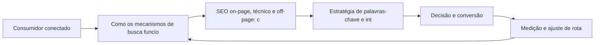

Observe o laço de retorno: a medição alimenta o próximo ciclo de campanha. Essa é a diferença estrutural entre campanha e sistema — a campanha termina quando o orçamento acaba; o sistema aprende e se ajusta a cada ciclo [7]. No caso do tema *SEO: Conquistando Visibilidade Orgânica*, esse laço é o que converte o investimento inicial em aprendizado acumulado para as próximas decisões [15].

## 4. Técnica

### O Leilão de Busca em Números

Entender o leilão do Google Ads é entender um jogo de relevância e lance. O cálculo abaixo simula o custo real por clique a partir do Índice de Qualidade — mostrando por que qualidade barateia o clique.

```python
def custo_por_clique(ranking_seu: float, ranking_abaixo: float) -> float:
    """CPC = ranking do concorrente de baixo / seu ranking + R$0,01."""
    return round(ranking_abaixo / ranking_seu + 0.01, 2)

def ranking(qualidade: int, lance: float) -> float:
    """AdRank: qualidade x lance."""
    return qualidade * lance

# Mesmo lance, qualidades diferentes
for q in (4, 7, 10):
    rank = ranking(q, 2.00)
    cpc = custo_por_clique(rank, ranking(5, 2.00))
    print(f"Qualidade {q}: rank {rank:.0f} -> CPC R$ {cpc}")
```

O exercício demonstra o princípio central do SEM: melhorar o Índice de Qualidade reduz o custo por clique mais rápido do que reduzir o lance [5]. A relevância é a estratégia de longo prazo do leilão [4].

O código acima é o núcleo técnico de *SEO: Conquistando Visibilidade Orgânica*: validável, executável e adaptável ao contexto real do leitor. A prática recomendada é rodá-lo com dados próprios e usar a saída como insumo da próxima reunião de planejamento. Documentação oficial das plataformas reforça cada passo — da estrutura de campanhas [5] à configuração de eventos [12]. A leitura técnica deste capítulo complementa a exposição conceitual das seções anteriores e prepara os exercícios da seção seguinte.

## 5. Aplica

Conhecimento sem aplicação é conteúdo; aplicação sem reflexão é rotina. No contexto de *SEO: Conquistando Visibilidade Orgânica*, os exercícios abaixo fecham o capítulo e preparam o terreno do próximo:

1. Audite a página inicial com o checklist de SEO on-page: title, meta description, headings e velocidade.
2. Rode uma campanha de busca com 3 grupos de anúncios e compare CTR e custo por clique entre eles.
3. Monte um mapa de palavras-chave por etapa do funil e aponte as lacunas de conteúdo da sua operação.
4. Teste uma busca no celular por um termo do seu mercado e registre o que aparece acima da dobra.

Dedique ao menos 30 minutos a um dos exercícios antes de avançar. O aprendizado desta obra é cumulativo: o mapa desenhado aqui será usado nos capítulos seguintes da Parte III e nas partes subsequentes [3].

Complementando, cinco exercícios práticos adicionais consolidam o aprendizado de *SEO: Conquistando Visibilidade Orgânica*:

1. Suas palavras-chave estão organizadas por intenção — ou todas competem pelo mesmo público?
2. Qual página sua deveria estar ranqueando e não está? O que falta: conteúdo, autoridade ou técnica?
3. Quanto custaria comprar, via Google Ads, o tráfego que seu SEO deveria gerar organicamente?
4. Se um assistente de IA responder por você amanhã, sua marca será citada? O que falta para isso?
5. Se o Google sumisse amanhã, quanto do seu tráfego e da sua receita desapareceria junto?

## Leitura Complementar Recomendada

Para aprofundar *SEO: Conquistando Visibilidade Orgânica* além deste capítulo:

- Como complemento de mercado, os relatórios da Statista sobre investimento em busca e publicidade contextualizam a dimensão financeira do canal [9].

- Para aprofundar a busca, a documentação oficial do Google Search Central cobre o SEO em profundidade, e o Google Ads Help Center detalha o leilão e o Índice de Qualidade [4] [5].

## Análise de Riscos e Mitigações

A aplicação de *SEO: Conquistando Visibilidade Orgânica* envolve riscos identificáveis. A tabela de riscos abaixo relaciona cada ameaça à sua mitigação:

- Risco de palavras erradas: tráfego sem intenção. Mitigação: classificar por intenção e alinhar cada página à busca que recebe [4].
- Risco técnico: site lento ou mal indexado. Mitigação: auditoria periódica de Core Web Vitals e rastreabilidade [4].
- Risco de concorrência direta: disputar termos caros sem estrutura. Mitigação: nicho de cauda longa com menos competição [4].
- Risco de dependência de pago: tráfego que para quando a verba acaba. Mitigação: construir o orgânico em paralelo como ativo de longo prazo [4].

## Considerações de Implementação

c

## Exercício Integrador da Parte III

g

Este exercício conecta o capítulo às demais partes da obra e deve ser revisto ao final da leitura completa.

## Aprofundamento Prático

O tema de *SEO: Conquistando Visibilidade Orgânica* ganha potência quando levado ao nível operacional. Os quatro pontos abaixo aprofundam a aplicação prática:

- O SEO técnico é disciplina contínua: core Web Vitals, dados estruturados e rastreabilidade se degradam com o tempo, e a auditoria periódica evita a perda silenciosa de posições [4].

- A busca generativa exige novo tipo de conteúdo: respostas diretas, dados estruturados e autoridade cítável — a página que responde com clareza e é citada como fonte ganha presença nas respostas sintetizadas [7].

- A integração SEO-SEM se opera na prática: usar o pago para validar palavras-chave (qual converte) e alimentar o orgânico com essas descobertas — o dado pago informa a estratégia orgânica [5].

- O aprofundamento prático da busca começa pela arquitetura de palavras: o mapa de palavras-chave por etapa do funil é o documento que alinha conteúdo, páginas e campanhas — sem ele, cada área otimiza para si e a SERP fica fragmentada [4].

## Exercícios de Fixação

Para consolidar *SEO: Conquistando Visibilidade Orgânica*, resolva os cinco exercícios abaixo — com caneta, papel e dados reais:

1. Classifique dez palavras-chave do seu mercado por intenção.
2. Audite o SEO on-page da sua página principal e liste três melhorias.
3. Explique como o Índice de Qualidade reduz o custo por clique.
4. Identifique uma oportunidade do Search Console sem página dedicada.
5. Verifique os Core Web Vitals da sua página e priorize o pior indicador.

## Autoavaliação do Capítulo

Autoavaliação: (1) Tenho um mapa de palavras-chave por intenção e etapa do funil? (2) Minha página principal passa no checklist de SEO on-page? (3) Conheço o Índice de Qualidade das minhas palavras-chave? (4) Uso o Search Console com regularidade? (5) Minha estratégia combina orgânico e pago? Responda e priorize a primeira resposta negativa.

A primeira resposta negativa é o seu próximo passo natural — volte a ela na seção de aplicação deste capítulo e trabalhe o item até que a resposta seja sim.

## Problemas Comuns e Soluções Práticas

Aplicar *SEO: Conquistando Visibilidade Orgânica* no mundo real esbarra em problemas recorrentes. Abaixo, cinco situações típicas com suas soluções — sintoma, causa e correção:

### Palavras-chave erradas

Tráfego alto sem conversão sugere intenção desalinhada. A solução é reclassificar as palavras-chave por intenção e alinhar cada página à intenção que ela recebe [4].

### Concorrente domina a SERP

A disputa direta é cara. A solução é o nicho: palavras-chave de cauda longa com intenção clara e menos competição — vencer onde o concorrente não está [4].

### Dados de busca ignorados

O Search Console tem ouro e ninguém usa. A solução é a rotina: exportar consultas, identificar oportunidades de posição e alimentar o calendário de conteúdo [4].

### Tráfego pago caro e ineficiente

CPC alto e conversão baixa indicam relevância fraca. A solução é atacar o Índice de Qualidade: grupos por categoria, palavras exatas, páginas dedicadas — o custo cai com a qualidade [5].

### Site invisível no Google

Conteúdo bom sem tráfego orgânico aponta para problema técnico ou de autoridade. A solução é auditar indexação, velocidade e backlinks — e priorizar as lacunas por impacto [4].

## Aplicações por Setor

O tema de *SEO: Conquistando Visibilidade Orgânica* ganha contornos diferentes em cada setor. A leitura setorial abaixo ajuda a adaptar os princípios ao seu contexto:

- No e-commerce, a busca transacional domina e o SEO de produto é essencial; no B2B, a busca informacional abre o ciclo e o conteúdo técnico ranqueia; em serviços locais, a ficha do Google é o ativo central [4].

- No varejo de moda, a intenção de busca é visual e a otimização inclui imagem e vídeo; em fintech, a busca é informacional e de confiança — cada setor tem o seu jogo de SERP [4].

## Plano de Ação de 30 Dias

Para converter a leitura de *SEO: Conquistando Visibilidade Orgânica* em resultado, execute um dos planos semanais abaixo — cada semana tem um objetivo e uma entrega:

### Plano de Ação — Opção 1

Semana 1 — Diagnóstico: exporte as consultas do Search Console e filtre as oportunidades.
Semana 2 — Autoridade: identifique três fontes de backlink de qualidade do seu nicho.
Semana 3 — Técnica: verifique indexação, dados estruturados e velocidade.
Semana 4 — Rotina: agende a revisão mensal de posição e CTR.

### Plano de Ação — Opção 2

Semana 1 — Palavras: pesquise 20 termos, classifique por intenção e monte o mapa por funil.
Semana 2 — Página: audite o SEO on-page e os Core Web Vitals da página principal.
Semana 3 — Conteúdo: escreva ou atualize a página para a intenção da palavra-alvo.
Semana 4 — Estrutura: monte a campanha de busca com grupos por categoria e lance o piloto.

## KPIs que Importam neste Capítulo

Para *SEO: Conquistando Visibilidade Orgânica*, os KPIs que importam: CTR e custo por clique, Índice de Qualidade, posição média e impressões orgânicas, e custo por conversão — a leitura conjunta de orgânico e pago na busca [5].

Antes de encerrar, registre esses indicadores no seu painel de acompanhamento — eles serão a régua para medir a aplicação deste capítulo nas próximas semanas.

## Roteiro de Implementação Passo a Passo

Para aplicar *SEO: Conquistando Visibilidade Orgânica* na prática, os roteiros abaixo organizam a sequência de ações — do diagnóstico à medição:

### Roteiro de Implementação 1

1. Abra o Search Console e exporte as consultas com impressões.
2. Filtre as consultas com alta impressão e baixa posição — são as oportunidades.
3. Para cada uma, verifique se existe página dedicada e bem otimizada.
4. Escreva ou atualize o conteúdo com a intenção de busca em mente.
5. Otimize title, meta description e headings para o termo-alvo.
6. Adicione dados estruturados quando aplicável (FAQ, produto, artigo).
7. Construa uma prova social: avaliações, números, casos.
8. Verifique os Core Web Vitals e corrija os piores indicadores.
9. Construa autoridade: um backlink de qualidade por mês ou conteúdo cítável.
10. Acompanhe a posição mensalmente e ajuste o conteúdo com base nos dados.

### Roteiro de Implementação 2

1. Liste 30 termos que seus clientes usam para descrever sua oferta e seu mercado.
2. Pesquise volume e dificuldade de cada um em uma ferramenta de palavras-chave.
3. Classifique cada termo por intenção: informacional, navegacional ou transacional.
4. Monte o mapa: palavras-chave por etapa do funil e por persona.
5. Identifique as lacunas: termos de alta intenção sem página dedicada.
6. Audite a página atual contra o checklist de SEO on-page (title, meta, headings, conteúdo).
7. Verifique a velocidade e os Core Web Vitals no PageSpeed Insights.
8. Verifique no Search Console as impressões e posições atuais.
9. Defina a estrutura de campanha de busca: grupos por categoria, palavras exatas.
10. Implemente, agende a revisão mensal e itere com dados de CTR e conversão.

## Perguntas Frequentes

Em relação ao tema de *SEO: Conquistando Visibilidade Orgânica*, cinco perguntas surgem com frequência na prática profissional:

**SEO demora quanto tempo?**

Os primeiros sinais aparecem em semanas, mas a consolidação de autoridade leva meses — é um ativo de longo prazo [4].

**Google Ads funciona para qualquer negócio?**

Funciona quando há intenção de busca e oferta clara — para ofertas de compra impulsiva, outros canais podem render mais [5].

**O que é o Índice de Qualidade?**

Nota de relevância do anúncio combinando anúncio, CTR esperado e página de destino — influencia posição e custo por clique [5].

**Devo contratar uma agência?**

Depende da maturidade do time. O essencial — pesquisa, estrutura e medição — pode ser aprendido e operado internamente [4].

**A IA vai matar o SEO?**

Não — vai transformá-lo: a otimização passa a ser para respostas sintetizadas e citação, não só ranqueamento [7].

## Cenários Numéricos Comentados

Os cálculos abaixo mostram, com números concretos, como as decisões de *SEO: Conquistando Visibilidade Orgânica* se traduzem em resultado:

### Cenário numérico: orgânico versus pago

Uma página que converte 2% e recebe 10.000 visitas orgânicas mensais gera 200 conversões sem custo de mídia. Para obter o mesmo volume via pago, seriam necessários 10.000 cliques a R$ 1,00 — R$ 10 mil mensais. O SEO que sustenta essas visitas é um ativo que se paga em poucos meses [4].

### Cenário numérico: o leilão de busca

Com um lance de R$ 2,00 e Índice de Qualidade 4, o ranking é 8 e o CPC real fica em torno de R$ 1,25. Subir a qualidade para 8 eleva o ranking para 16 e reduz o CPC para R$ 0,63 — a mesma campanha, metade do custo, melhor posição. A qualidade é a alavanca mais barata do leilão [5].

## Como Este Capítulo se Integra à Obra

A busca é a rota da intenção declarada, mas a jornada começa antes — nas redes e no conteúdo que despertam a necessidade. As partes de redes sociais (IV) e relacionamento (V) alimentam o topo do funil que a busca captura no meio, e a parte de métricas (VIII) mede o resultado dessa cadeia inteira. No contexto de *SEO: Conquistando Visibilidade Orgânica*, essa integração fica ainda mais visível: as ferramentas e métricas que você dominou aqui serão a base das decisões dos próximos capítulos — e das partes que virão depois.

## Aprofundamento Conceitual

No contexto de *SEO: Conquistando Visibilidade Orgânica*, a autoridade de domínio se constrói com backlinks de qualidade e conteúdo cítável: cada link de um site respeitado é um voto de confiança que o algoritmo interpreta como relevância [4].

No contexto de *SEO: Conquistando Visibilidade Orgânica*, o Google Business Profile é o ativo local mais subestimado: para negócios de alcance local, a ficha otimizada domina a busca por proximidade e a decisão de visita [4].

No contexto de *SEO: Conquistando Visibilidade Orgânica*, a integração SEO-SEM é a estratégia de dominância: o orgânico sustenta a presença de longo prazo e o pago garante a visibilidade imediata — juntos, cobrem a SERP inteira [5].

No contexto de *SEO: Conquistando Visibilidade Orgânica*, a SERP (página de resultados) é o campo de batalha da atenção por intenção: a marca presente no topo captura cliques, a presente nos snippets captura respostas, e a ausente simplesmente não existe para quem pesquisa [4].

No contexto de *SEO: Conquistando Visibilidade Orgânica*, o leilão do Google Ads é um mercado de relevância: anunciantes com Índice de Qualidade alto pagam menos por clique e aparecem em posições melhores — um incentivo estrutural à qualidade [5].

## Fundamentos em Detalhe

No contexto de *SEO: Conquistando Visibilidade Orgânica*, a intenção de busca se classifica em três grandes famílias — informacional, navegacional e transacional — e cada uma exige página, mensagem e métrica próprias [4].

No contexto de *SEO: Conquistando Visibilidade Orgânica*, os mecanismos de busca evoluíram de palavras-chave para intenção e, mais recentemente, para respostas: a busca generativa responde diretamente, e a marca precisa ser citada para existir nela [7].

No contexto de *SEO: Conquistando Visibilidade Orgânica*, o Índice de Qualidade do Google Ads combina três sinais — relevância do anúncio, CTR esperado e experiência da página de destino — e influencia tanto a posição quanto o custo por clique [5].

No contexto de *SEO: Conquistando Visibilidade Orgânica*, a arquitetura de informações de um site determina a rastreabilidade: páginas claras, hierarquia lógica e links internos consistentes facilitam o trabalho dos rastreadores e melhoram a indexação [4].

No contexto de *SEO: Conquistando Visibilidade Orgânica*, os Core Web Vitals — LCP, INP e CLS — tornaram-se sinais de ranqueamento e, mais importante, de experiência: sites rápidos e estáveis convertem mais, independentemente do algoritmo [4].

## Estudos de Caso Aplicados

### Caso: o varejo que pagou caro pelo Índice de Qualidade

Um varejista gastava em Google Ads com anúncios genéricos que apontavam para a home. O Índice de Qualidade baixo inflava o CPC e escondia o resultado real. A correção foi estrutural: grupos de anúncios por categoria, palavras-chave exatas, páginas de destino dedicadas e extensões de anúncio. O CPC caiu mais de 40% e o retorno por clique subiu — a relevância barateou o leilão [5].

### Caso: a consultoria que conquistou a SERP de nicho

Uma consultoria contábil para startups percebeu que as palavras-chave genéricas eram caras e competitivas. Ao mapear a intenção, encontrou o nicho: termos transacionais específicos do público ("contabilidade para startup", "regime tributário MEI") com volume menor e intenção alta. O site foi reestruturado por pilares de conteúdo, e a autoridade cresceu com guias completos. Em seis meses, a consultoria passou a dominar a busca orgânica do seu nicho [4].

## Dados e Números do Setor

### Dados de Contexto

- A busca é o canal de maior intenção: quem pesquisa já declarou necessidade [4].
- Mais da metade do tráfego qualificado dos sites vem de resultados orgânicos [4].
- O Índice de Qualidade influencia diretamente o custo por clique no leilão [5].
- A busca generativa está reorganizando a SERP e a forma de consumir respostas [7].

### Indicadores-Chave

- CTR, custo por clique e custo por conversão são as métricas do SEM [5].
- Posição média, impressões e taxa de clique orgânico medem o SEO [4].
- O custo por palavra-chave varia com a intenção: transacional é mais caro e mais conversível [5].

## Análise Comparativa

O tema de *SEO: Conquistando Visibilidade Orgânica* fica mais claro quando contrastado com a alternativa mais próxima. A comparação abaixo organiza as diferenças:

### Orgânico vs. Pago na Busca

- SEO constrói ativo de longo prazo; SEM compra visibilidade imediata.
- SEO tem custo de produção; SEM tem custo de clique.
- SEO depende de autoridade; SEM depende de lance e qualidade.
- A combinação cobre a SERP inteira e é a estratégia de dominância.

## Erros Comuns e Como Evitá-los

No tema de *SEO: Conquistando Visibilidade Orgânica*, cinco erros recorrentes merecem atenção especial — cada um com sua correção prática:

1. Apostar tudo em uma palavra-chave genérica: termos amplos têm custo alto e intenção fraca.
2. Ignorar o SEO técnico: conteúdo excelente invisível para rastreadores é trabalho desperdiçado.
3. Copiar o anúncio do concorrente: a relevância se constrói com dados próprios, não com imitação.
4. Otimizar para algoritmo e esquecer o usuário: a busca recompensa quem serve bem — no fim, é a mesma coisa.
5. Tratar SEO e SEM como rivais: a combinação cobre a SERP inteira; a separação deixa lacunas.

## Ferramentas e Recursos Recomendados

Para operar o tema de *SEO: Conquistando Visibilidade Orgânica* na prática, a seguinte seleção de ferramentas cobre o ciclo completo — do diagnóstico à medição:

1. Ferramenta de monitoramento de SERP
2. Google Search Console (diagnóstico de indexação)
3. Ferramenta de pesquisa de palavras-chave (volume/dificuldade)
4. Google Ads (leilão e estrutura de campanha)
5. PageSpeed Insights (Core Web Vitals)

## Glossário do Capítulo

Os termos abaixo — todos usados no corpo deste capítulo — formam o vocabulário mínimo para acompanhar o restante da obra:

SERP: página de resultados do mecanismo de busca. CPC: custo por clique. Índice de Qualidade: nota de relevância do anúncio. SEO on-page: otimização dentro da página. Backlink: link externo que aponta para o site. Core Web Vitals: métricas de experiência de página.

## Checklist de Implementação

Use a lista abaixo para auditar a aplicação de *SEO: Conquistando Visibilidade Orgânica* na sua operação — marque os itens já concluídos e priorize os pendentes:

- [ ] Estrutura de campanha com grupos por categoria
- [ ] Core Web Vitals verificados no PageSpeed
- [ ] 20 palavras-chave pesquisadas e classificadas por intenção
- [ ] SEO on-page auditado (title, meta, headings)
- [ ] Mapa de palavras-chave por etapa do funil

## Perguntas para Reflexão

Antes de avançar, reflita sobre as cinco questões abaixo — elas conectam o conteúdo de *SEO: Conquistando Visibilidade Orgânica* ao seu contexto real de trabalho:

1. Qual página sua deveria estar ranqueando e não está? O que falta: conteúdo, autoridade ou técnica?
2. Quanto custaria comprar, via Google Ads, o tráfego que seu SEO deveria gerar organicamente?
3. Se um assistente de IA responder por você amanhã, sua marca será citada? O que falta para isso?
4. Se o Google sumisse amanhã, quanto do seu tráfego e da sua receita desapareceria junto?
5. Suas palavras-chave estão organizadas por intenção — ou todas competem pelo mesmo público?

## Quadro Comparativo: Intenção de Busca e Estratégia

O quadro abaixo consolida os elementos essenciais de *SEO: Conquistando Visibilidade Orgânica* em perspectiva comparada, facilitando a consulta rápida e a tomada de decisão:

| Intenção | Exemplo | Estratégia | Métrica |
|---|---|---|---|
| Intenção | Exemplo | Estratégia | Métrica |
| Informacional | Como funciona o SEO | Conteúdo educativo | Posição e cliques |
| Navegacional | Site da marca | Branding e marca | Tráfego direto |
| Transacional | Comprar curso online | Campanha e oferta | Conversão e ROI |
| Local | Padaria perto de mim | Ficha e avaliações | Visitas e ligações |

## 6. Conclusão

O capítulo percorreu o território da Parte III, *Busca — A Rota da Intenção*, e deixou três aprendizados operacionais. Primeiro, o conceito central — *SEO: Conquistando Visibilidade Orgânica* — é menos uma novidade e mais uma disciplina de execução. Segundo, a aplicação exige a tríade conceito, rota e métrica, sem pular etapas [8]. Terceiro, o ajuste contínuo de rota, ilustrado no laço de retorno do diagrama, é o que separa campanhas pontuais de operações sustentáveis [7]. O caminho percorrido desde *Google Ads e SEM: A Rota da Intenção de Compra* até aqui forma a base que o próximo passo vai usar. No próximo capítulo, *Pesquisa de Palavras-Chave: Mapeando a Intenção do Viajante*, você avançará sobre o território vizinho levando as ferramentas exercitadas aqui.

Como navegador de marketing digital, você não decorou uma fórmula — incorporou um modo de operar: ler o território, escolher a rota com dados e ajustar o percurso quando o vento muda [2].

Antes do fechamento, vale reforçar a base do capítulo: No contexto de *SEO: Conquistando Visibilidade Orgânica*, a pesquisa de palavras-chave mapeia a demanda: volume mostra o tamanho da oportunidade, dificuldade mostra o custo de entrada e intenção mostra a probabilidade de conversão — as três juntas priorizam a aposta [8].

No contexto de *SEO: Conquistando Visibilidade Orgânica*, os Core Web Vitals (LCP, INP, CLS) não são apenas sinais técnicos: são métricas de experiência do usuário que correlacionam com conversão — um site rápido converte mais, com ou sem o algoritmo [4].
## 7. Referências Bibliográficas

[1] KOTLER, Philip; KELLER, Kevin Lane. **Administração de Marketing**. 15. ed. São Paulo: Pearson, 2016.
[2] KOTLER, Philip; KARTAJAYA, Hermawan; SETIAWAN, Iwan. **Marketing 4.0: Moving from Traditional to Digital**. Hoboken: Wiley, 2017.
[3] CHAFFEY, Dave; ELLIS-CHADWICK, Fiona. **Digital Marketing: Strategy, Implementation and Practice**. 9. ed. Harlow: Pearson, 2025.
[4] GOOGLE SEARCH CENTRAL. **Search Engine Optimization (SEO) Starter Guide**. Disponível em: https://developers.google.com/search/docs/fundamentals/seo-starter-guide. Acesso em: 02 ago. 2026.
[5] GOOGLE ADS HELP CENTER. **Your guide to Google Ads (Basics, Search Campaigns & Best Practices)**. Disponível em: https://support.google.com/google-ads/answer/6146252. Acesso em: 02 ago. 2026.
[6] META BUSINESS HELP CENTER. **Meta Ads Manager Guide: Best Practices for Targeting, Measurement, and Optimization**. Disponível em: https://www.facebook.com/business/help. Acesso em: 02 ago. 2026.
[7] DELOITTE DIGITAL. **Marketing Trends 2026: New Marketing for a New World**. Disponível em: https://www.deloittedigital.com/nl/en/insights/perspective/marketing-trends-2026.html. Acesso em: 02 ago. 2026.
[8] HUBSPOT RESEARCH. **The State of Marketing / 2026 Marketing Statistics, Trends & Data**. Disponível em: https://www.hubspot.com/marketing-statistics. Acesso em: 02 ago. 2026.
[9] STATISTA RESEARCH DEPARTMENT. **Global Digital Marketing and Advertising Revenue Statistics & Facts**. Disponível em: https://www.statista.com/topics/8954/marketing-worldwide/. Acesso em: 02 ago. 2026.
[10] RYAN, Damian. **Understanding Digital Marketing: Marketing Strategies for Engaging the Digital Generation**. 5. ed. London: Kogan Page, 2020.
[11] HOLLENSEN, Svend; KOTLER, Philip; OPRESNIK, Marc Oliver. **Social Media Marketing: A Practitioner Approach**. 4. ed. Harlow: Pearson, 2023.
[12] GOOGLE ANALYTICS HELP CENTER. **Documentação oficial do Google Analytics 4**. Disponível em: https://support.google.com/analytics. Acesso em: 02 ago. 2026.
[13] LINKEDIN MARKETING SOLUTIONS. **Best Practices para campanhas B2B no LinkedIn**. Disponível em: https://business.linkedin.com/marketing-solutions. Acesso em: 02 ago. 2026.
[14] TIKTOK FOR BUSINESS. **Guia de criatividade e boas práticas de anúncios no TikTok**. Disponível em: https://www.tiktok.com/business. Acesso em: 02 ago. 2026.
[15] DATAREPORTAL. **Digital 2026: Global Overview Report**. Disponível em: https://datareportal.com/reports/digital-2026-global-overview-report. Acesso em: 02 ago. 2026.
[16] LEMON, Katherine N.; VERHOEF, Peter C. **Understanding Customer Experience Throughout the Customer Journey**. *Journal of Marketing*, v. 80, n. 6, p. 69-96, 2016.
[17] TIWARI, Rajnish; BUSE, Stephan; HERSTATT, Cornelius. **From Electronic to Mobile Commerce: Opportunities and Challenges**. *Proceedings of the German-Indian Roundtable*, 2006.
[18] VAN DIJK, Jan A. G. M. **The Digital Divide**. Cambridge: Polity Press, 2020.
[19] IBM. **Marketing with AI: Personalization at Scale**. Disponível em: https://www.ibm.com/think/topics/ai-marketing. Acesso em: 02 ago. 2026.
[20] KOTLER, Philip. **Marketing 5.0: Technology for Humanity**. Hoboken: Wiley, 2021.

# Capítulo 13: Pesquisa de Palavras-Chave: Mapeando a Intenção do Viajante

## 1. Introdução

Bem-vindo a uma nova etapa da sua navegação pelo marketing digital. Este capítulo — *Pesquisa de Palavras-Chave: Mapeando a Intenção do Viajante* — integra a Parte III, *Busca — A Rota da Intenção*, e responde a uma pergunta prática: **ferramentas e métricas de pesquisa: volume, dificuldade e ctr estimado** — na prática, como isso se traduz em decisão e resultado?

Ao final, você será capaz de conduz pesquisa de palavras-chave estruturada: volume, dificuldade, intenção e mapeamento por etapa da jornada.. Mais do que decorar conceitos, você vai enxergar a busca como rota de intenção declarada — e converter essa visão em plano, experimento e métrica.

No capítulo anterior, *SEO: Conquistando Visibilidade Orgânica*, você aprendeu os conceitos que servem de plataforma para o que vem agora. Este capítulo retoma esse repertório e o aplica a um território novo — sem repetir o que já foi estabelecido, apenas usando como base.

O capítulo segue a estrutura das sete seções que organizam esta obra: primeiro a exposição conceitual, depois a ilustração, a técnica aplicada, o exercício de aplicação e a conclusão operacional.

No contexto de *Pesquisa de Palavras-Chave: Mapeando a Intenção do Viajante*, o leilão de anúncios do Google é um mecanismo de relevância: anunciantes competem por palavras-chave, mas o vencedor é definido pela combinação de lance e qualidade — e a qualidade barateia o clique [5].

No contexto de *Pesquisa de Palavras-Chave: Mapeando a Intenção do Viajante*, o SEO é um ativo de longo prazo: enquanto o tráfego pago termina quando o orçamento acaba, o tráfego orgânico acumula valor com o tempo e reduz o custo médio de aquisição da operação [4].
## 2. Explica

### Ferramentas e métricas de pesquisa: volume, dificuldade e CTR estimado

Quando o tema é *Pesquisa de Palavras-Chave: Mapeando a Intenção do Viajante*, o primeiro pilar — ferramentas e métricas de pesquisa: volume, dificuldade e ctr estimado — define o território conceitual. A intenção de busca pode ser informacional, navegacional ou transacional — e cada tipo exige uma página, uma mensagem e uma métrica diferentes [4].

Na prática, ferramentas e métricas de pesquisa: volume, dificuldade e ctr estimado significa transformar a teoria em rotina operacional — exatamente o que *Pesquisa de Palavras-Chave: Mapeando a Intenção do Viajante* exige no dia a dia. A literatura de gestão é enfática: sem operacionalizar o conceito em checklist, responsável e métrica, ele permanece slide de apresentação [3]. Por isso a Parte III propõe sempre o mesmo movimento: entender, traduzir em critério observável e decidir com dado.

### Classificação por intenção: informacional, navegacional e transacional

O segundo pilar — classificação por intenção: informacional, navegacional e transacional — conecta a estratégia à operação diária. O leilão de busca recompensa quem melhora a relevância antes de aumentar o lance: qualidade e orçamento caminham juntos na matemática do CPC [5]. A experiência do consumidor se constrói na consistência entre canais e mensagens, e é essa consistência que transforma contato em relacionamento [16]. Organizações que tratam cada canal como silo perdem o fio condutor da jornada; as que operam o pilar com disciplina reduzem atrito e aumentam a taxa de avanço entre etapas [10].

### Mapa de palavras-chave por etapa do funil e por persona

Fechando o tripé, mapa de palavras-chave por etapa do funil e por persona é o que transforma a Parte III em vantagem mensurável. A otimização para mecanismos de busca começa pelo usuário: páginas rápidas, claras e úteis são a base sobre a qual qualquer técnica se apoia [4]. O relato da indústria mostra que as empresas que sustentam resultado não são as que têm mais ferramentas, mas as que conseguem medir e ajustar a rota com frequência [8]. A métrica certa, escolhida antes da campanha, vale mais do que qualquer ferramenta cara instalada depois do fato [9].

### O Eixo Transversal do Capítulo

Ferramentas de pesquisa de palavras-chave transformam volume em estratégia: dados de demanda sustentam a arquitetura de conteúdo e a alocação de verba [8]. Esse eixo conecta os três pilares e explica por que o capítulo os trata como um sistema, não como uma lista: cada pilar reforça o outro, e a omissão de qualquer um deles produz estratégia manca. O capítulo seguinte retomará esse eixo com novas ferramentas, agora com o vocabulário já estabelecido aqui.

Em síntese, o capítulo opera em três níveis: o conceitual (Ferramentas e métricas de pesquisa: volume, dificuldade e CTR estimado), o operacional (Classificação por intenção: informacional, navegacional e transacional) e o estratégico (Mapa de palavras-chave por etapa do funil e por persona). O leitor que dominar os três estará apto a aplicar a Parte III com autonomia [1]. A evidência reunida nesta seção sustenta cada recomendação prática das seções seguintes [2].

## 3. Ilustra

Vamos traduzir o capítulo em uma cena concreta, no contexto de *Pesquisa de Palavras-Chave: Mapeando a Intenção do Viajante*. Uma empresa de porte médio, com equipe enxuta e orçamento limitado, decide operar a Parte III desta obra, *Busca — A Rota da Intenção*. Na primeira semana, a equipe testa o conceito central do capítulo em um caso real: um cliente que pesquisou, comparou e decidiu comprar. O primeiro pilar — ferramentas e métricas de pesquisa: volume, dificuldade e ctr estimado — orienta o entendimento inicial do público; o segundo — classificação por intenção: informacional, navegacional e transacional — guia a escolha da rota de comunicação; e o terceiro fecha com a medição do resultado [2].

O diagrama abaixo representa o fluxo operacional proposto pelo capítulo — do consumidor conectado à decisão e ao ajuste contínuo de rota, com o público e a plataforma específicos do tema no centro da navegação:

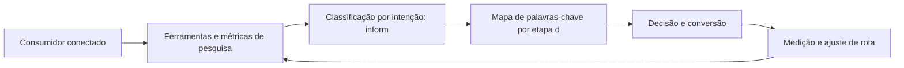

Observe o laço de retorno: a medição alimenta o próximo ciclo de campanha. Essa é a diferença estrutural entre campanha e sistema — a campanha termina quando o orçamento acaba; o sistema aprende e se ajusta a cada ciclo [7]. No caso do tema *Pesquisa de Palavras-Chave: Mapeando a Intenção do Viajante*, esse laço é o que converte o investimento inicial em aprendizado acumulado para as próximas decisões [15].

## 4. Técnica

### O Leilão de Busca em Números

Entender o leilão do Google Ads é entender um jogo de relevância e lance. O cálculo abaixo simula o custo real por clique a partir do Índice de Qualidade — mostrando por que qualidade barateia o clique.

```python
def custo_por_clique(ranking_seu: float, ranking_abaixo: float) -> float:
    """CPC = ranking do concorrente de baixo / seu ranking + R$0,01."""
    return round(ranking_abaixo / ranking_seu + 0.01, 2)

def ranking(qualidade: int, lance: float) -> float:
    """AdRank: qualidade x lance."""
    return qualidade * lance

# Mesmo lance, qualidades diferentes
for q in (4, 7, 10):
    rank = ranking(q, 2.00)
    cpc = custo_por_clique(rank, ranking(5, 2.00))
    print(f"Qualidade {q}: rank {rank:.0f} -> CPC R$ {cpc}")
```

O exercício demonstra o princípio central do SEM: melhorar o Índice de Qualidade reduz o custo por clique mais rápido do que reduzir o lance [5]. A relevância é a estratégia de longo prazo do leilão [4].

O código acima é o núcleo técnico de *Pesquisa de Palavras-Chave: Mapeando a Intenção do Viajante*: validável, executável e adaptável ao contexto real do leitor. A prática recomendada é rodá-lo com dados próprios e usar a saída como insumo da próxima reunião de planejamento. Documentação oficial das plataformas reforça cada passo — da estrutura de campanhas [5] à configuração de eventos [12]. A leitura técnica deste capítulo complementa a exposição conceitual das seções anteriores e prepara os exercícios da seção seguinte.

## 5. Aplica

Conhecimento sem aplicação é conteúdo; aplicação sem reflexão é rotina. No contexto de *Pesquisa de Palavras-Chave: Mapeando a Intenção do Viajante*, os exercícios abaixo fecham o capítulo e preparam o terreno do próximo:

1. Teste uma busca no celular por um termo do seu mercado e registre o que aparece acima da dobra.
2. Verifique no Search Console as impressões e a posição média das suas páginas mais relevantes.
3. Compare o CPC estimado de três palavras-chave transacionais do seu mercado em uma ferramenta de lances.
4. Escreva um snippet de anúncio com promessa, prova e CTA e avalie o Índice de Qualidade esperado.

Dedique ao menos 30 minutos a um dos exercícios antes de avançar. O aprendizado desta obra é cumulativo: o mapa desenhado aqui será usado nos capítulos seguintes da Parte III e nas partes subsequentes [3].

Complementando, cinco exercícios práticos adicionais consolidam o aprendizado de *Pesquisa de Palavras-Chave: Mapeando a Intenção do Viajante*:

1. Se um assistente de IA responder por você amanhã, sua marca será citada? O que falta para isso?
2. Se o Google sumisse amanhã, quanto do seu tráfego e da sua receita desapareceria junto?
3. Suas palavras-chave estão organizadas por intenção — ou todas competem pelo mesmo público?
4. Qual página sua deveria estar ranqueando e não está? O que falta: conteúdo, autoridade ou técnica?
5. Quanto custaria comprar, via Google Ads, o tráfego que seu SEO deveria gerar organicamente?

## Leitura Complementar Recomendada

Para aprofundar *Pesquisa de Palavras-Chave: Mapeando a Intenção do Viajante* além deste capítulo:

- Para aprofundar a busca, a documentação oficial do Google Search Central cobre o SEO em profundidade, e o Google Ads Help Center detalha o leilão e o Índice de Qualidade [4] [5].

- Como complemento de mercado, os relatórios da Statista sobre investimento em busca e publicidade contextualizam a dimensão financeira do canal [9].

## Análise de Riscos e Mitigações

A aplicação de *Pesquisa de Palavras-Chave: Mapeando a Intenção do Viajante* envolve riscos identificáveis. A tabela de riscos abaixo relaciona cada ameaça à sua mitigação:

- Risco de dependência de pago: tráfego que para quando a verba acaba. Mitigação: construir o orgânico em paralelo como ativo de longo prazo [4].
- Risco de palavras erradas: tráfego sem intenção. Mitigação: classificar por intenção e alinhar cada página à busca que recebe [4].
- Risco técnico: site lento ou mal indexado. Mitigação: auditoria periódica de Core Web Vitals e rastreabilidade [4].
- Risco de concorrência direta: disputar termos caros sem estrutura. Mitigação: nicho de cauda longa com menos competição [4].

## Considerações de Implementação

é

## Exercício Integrador da Parte III

 

Este exercício conecta o capítulo às demais partes da obra e deve ser revisto ao final da leitura completa.

## Aprofundamento Prático

O tema de *Pesquisa de Palavras-Chave: Mapeando a Intenção do Viajante* ganha potência quando levado ao nível operacional. Os quatro pontos abaixo aprofundam a aplicação prática:

- O aprofundamento prático da busca começa pela arquitetura de palavras: o mapa de palavras-chave por etapa do funil é o documento que alinha conteúdo, páginas e campanhas — sem ele, cada área otimiza para si e a SERP fica fragmentada [4].

- A leitura avançada do leilão exige o acompanhamento do Índice de Qualidade por palavra: quedas de qualidade precedem quedas de posição e aumentos de custo — monitorar o índice é monitorar a saúde da conta [5].

- O SEO técnico é disciplina contínua: core Web Vitals, dados estruturados e rastreabilidade se degradam com o tempo, e a auditoria periódica evita a perda silenciosa de posições [4].

- A busca generativa exige novo tipo de conteúdo: respostas diretas, dados estruturados e autoridade cítável — a página que responde com clareza e é citada como fonte ganha presença nas respostas sintetizadas [7].

## Exercícios de Fixação

Para consolidar *Pesquisa de Palavras-Chave: Mapeando a Intenção do Viajante*, resolva os cinco exercícios abaixo — com caneta, papel e dados reais:

1. Identifique uma oportunidade do Search Console sem página dedicada.
2. Verifique os Core Web Vitals da sua página e priorize o pior indicador.
3. Classifique dez palavras-chave do seu mercado por intenção.
4. Audite o SEO on-page da sua página principal e liste três melhorias.
5. Explique como o Índice de Qualidade reduz o custo por clique.

## Autoavaliação do Capítulo

Autoavaliação: (1) Tenho um mapa de palavras-chave por intenção e etapa do funil? (2) Minha página principal passa no checklist de SEO on-page? (3) Conheço o Índice de Qualidade das minhas palavras-chave? (4) Uso o Search Console com regularidade? (5) Minha estratégia combina orgânico e pago? Responda e priorize a primeira resposta negativa.

A primeira resposta negativa é o seu próximo passo natural — volte a ela na seção de aplicação deste capítulo e trabalhe o item até que a resposta seja sim.

## Problemas Comuns e Soluções Práticas

Aplicar *Pesquisa de Palavras-Chave: Mapeando a Intenção do Viajante* no mundo real esbarra em problemas recorrentes. Abaixo, cinco situações típicas com suas soluções — sintoma, causa e correção:

### Tráfego pago caro e ineficiente

CPC alto e conversão baixa indicam relevância fraca. A solução é atacar o Índice de Qualidade: grupos por categoria, palavras exatas, páginas dedicadas — o custo cai com a qualidade [5].

### Site invisível no Google

Conteúdo bom sem tráfego orgânico aponta para problema técnico ou de autoridade. A solução é auditar indexação, velocidade e backlinks — e priorizar as lacunas por impacto [4].

### Palavras-chave erradas

Tráfego alto sem conversão sugere intenção desalinhada. A solução é reclassificar as palavras-chave por intenção e alinhar cada página à intenção que ela recebe [4].

### Concorrente domina a SERP

A disputa direta é cara. A solução é o nicho: palavras-chave de cauda longa com intenção clara e menos competição — vencer onde o concorrente não está [4].

### Dados de busca ignorados

O Search Console tem ouro e ninguém usa. A solução é a rotina: exportar consultas, identificar oportunidades de posição e alimentar o calendário de conteúdo [4].

## Aplicações por Setor

O tema de *Pesquisa de Palavras-Chave: Mapeando a Intenção do Viajante* ganha contornos diferentes em cada setor. A leitura setorial abaixo ajuda a adaptar os princípios ao seu contexto:

- No varejo de moda, a intenção de busca é visual e a otimização inclui imagem e vídeo; em fintech, a busca é informacional e de confiança — cada setor tem o seu jogo de SERP [4].

- No e-commerce, a busca transacional domina e o SEO de produto é essencial; no B2B, a busca informacional abre o ciclo e o conteúdo técnico ranqueia; em serviços locais, a ficha do Google é o ativo central [4].

## Plano de Ação de 30 Dias

Para converter a leitura de *Pesquisa de Palavras-Chave: Mapeando a Intenção do Viajante* em resultado, execute um dos planos semanais abaixo — cada semana tem um objetivo e uma entrega:

### Plano de Ação — Opção 1

Semana 1 — Palavras: pesquise 20 termos, classifique por intenção e monte o mapa por funil.
Semana 2 — Página: audite o SEO on-page e os Core Web Vitals da página principal.
Semana 3 — Conteúdo: escreva ou atualize a página para a intenção da palavra-alvo.
Semana 4 — Estrutura: monte a campanha de busca com grupos por categoria e lance o piloto.

### Plano de Ação — Opção 2

Semana 1 — Diagnóstico: exporte as consultas do Search Console e filtre as oportunidades.
Semana 2 — Autoridade: identifique três fontes de backlink de qualidade do seu nicho.
Semana 3 — Técnica: verifique indexação, dados estruturados e velocidade.
Semana 4 — Rotina: agende a revisão mensal de posição e CTR.

## KPIs que Importam neste Capítulo

Para *Pesquisa de Palavras-Chave: Mapeando a Intenção do Viajante*, os KPIs que importam: CTR e custo por clique, Índice de Qualidade, posição média e impressões orgânicas, e custo por conversão — a leitura conjunta de orgânico e pago na busca [5].

Antes de encerrar, registre esses indicadores no seu painel de acompanhamento — eles serão a régua para medir a aplicação deste capítulo nas próximas semanas.

## Roteiro de Implementação Passo a Passo

Para aplicar *Pesquisa de Palavras-Chave: Mapeando a Intenção do Viajante* na prática, os roteiros abaixo organizam a sequência de ações — do diagnóstico à medição:

### Roteiro de Implementação 1

1. Liste 30 termos que seus clientes usam para descrever sua oferta e seu mercado.
2. Pesquise volume e dificuldade de cada um em uma ferramenta de palavras-chave.
3. Classifique cada termo por intenção: informacional, navegacional ou transacional.
4. Monte o mapa: palavras-chave por etapa do funil e por persona.
5. Identifique as lacunas: termos de alta intenção sem página dedicada.
6. Audite a página atual contra o checklist de SEO on-page (title, meta, headings, conteúdo).
7. Verifique a velocidade e os Core Web Vitals no PageSpeed Insights.
8. Verifique no Search Console as impressões e posições atuais.
9. Defina a estrutura de campanha de busca: grupos por categoria, palavras exatas.
10. Implemente, agende a revisão mensal e itere com dados de CTR e conversão.

### Roteiro de Implementação 2

1. Abra o Search Console e exporte as consultas com impressões.
2. Filtre as consultas com alta impressão e baixa posição — são as oportunidades.
3. Para cada uma, verifique se existe página dedicada e bem otimizada.
4. Escreva ou atualize o conteúdo com a intenção de busca em mente.
5. Otimize title, meta description e headings para o termo-alvo.
6. Adicione dados estruturados quando aplicável (FAQ, produto, artigo).
7. Construa uma prova social: avaliações, números, casos.
8. Verifique os Core Web Vitals e corrija os piores indicadores.
9. Construa autoridade: um backlink de qualidade por mês ou conteúdo cítável.
10. Acompanhe a posição mensalmente e ajuste o conteúdo com base nos dados.

## Perguntas Frequentes

Em relação ao tema de *Pesquisa de Palavras-Chave: Mapeando a Intenção do Viajante*, cinco perguntas surgem com frequência na prática profissional:

**Devo contratar uma agência?**

Depende da maturidade do time. O essencial — pesquisa, estrutura e medição — pode ser aprendido e operado internamente [4].

**A IA vai matar o SEO?**

Não — vai transformá-lo: a otimização passa a ser para respostas sintetizadas e citação, não só ranqueamento [7].

**SEO demora quanto tempo?**

Os primeiros sinais aparecem em semanas, mas a consolidação de autoridade leva meses — é um ativo de longo prazo [4].

**Google Ads funciona para qualquer negócio?**

Funciona quando há intenção de busca e oferta clara — para ofertas de compra impulsiva, outros canais podem render mais [5].

**O que é o Índice de Qualidade?**

Nota de relevância do anúncio combinando anúncio, CTR esperado e página de destino — influencia posição e custo por clique [5].

## Cenários Numéricos Comentados

Os cálculos abaixo mostram, com números concretos, como as decisões de *Pesquisa de Palavras-Chave: Mapeando a Intenção do Viajante* se traduzem em resultado:

### Cenário numérico: o leilão de busca

Com um lance de R$ 2,00 e Índice de Qualidade 4, o ranking é 8 e o CPC real fica em torno de R$ 1,25. Subir a qualidade para 8 eleva o ranking para 16 e reduz o CPC para R$ 0,63 — a mesma campanha, metade do custo, melhor posição. A qualidade é a alavanca mais barata do leilão [5].

### Cenário numérico: orgânico versus pago

Uma página que converte 2% e recebe 10.000 visitas orgânicas mensais gera 200 conversões sem custo de mídia. Para obter o mesmo volume via pago, seriam necessários 10.000 cliques a R$ 1,00 — R$ 10 mil mensais. O SEO que sustenta essas visitas é um ativo que se paga em poucos meses [4].

## Como Este Capítulo se Integra à Obra

A busca é a rota da intenção declarada, mas a jornada começa antes — nas redes e no conteúdo que despertam a necessidade. As partes de redes sociais (IV) e relacionamento (V) alimentam o topo do funil que a busca captura no meio, e a parte de métricas (VIII) mede o resultado dessa cadeia inteira. No contexto de *Pesquisa de Palavras-Chave: Mapeando a Intenção do Viajante*, essa integração fica ainda mais visível: as ferramentas e métricas que você dominou aqui serão a base das decisões dos próximos capítulos — e das partes que virão depois.

## Aprofundamento Conceitual

No contexto de *Pesquisa de Palavras-Chave: Mapeando a Intenção do Viajante*, a SERP (página de resultados) é o campo de batalha da atenção por intenção: a marca presente no topo captura cliques, a presente nos snippets captura respostas, e a ausente simplesmente não existe para quem pesquisa [4].

No contexto de *Pesquisa de Palavras-Chave: Mapeando a Intenção do Viajante*, o leilão do Google Ads é um mercado de relevância: anunciantes com Índice de Qualidade alto pagam menos por clique e aparecem em posições melhores — um incentivo estrutural à qualidade [5].

No contexto de *Pesquisa de Palavras-Chave: Mapeando a Intenção do Viajante*, o SEO técnico é a fundação invisível: arquitetura limpa, URLs consistentes, dados estruturados e velocidade garantem que o conteúdo bom seja encontrado — sem isso, o melhor texto não tem visibilidade [4].

No contexto de *Pesquisa de Palavras-Chave: Mapeando a Intenção do Viajante*, a intenção transacional é o ouro da busca: quem pesquisa com intenção de compra está a um passo da conversão, e as campanhas de busca transacional têm o ROI mais previsível do marketing digital [5].

No contexto de *Pesquisa de Palavras-Chave: Mapeando a Intenção do Viajante*, o conteúdo para busca não é mais texto puro: é resposta estruturada, dados, imagens e vídeo — tudo organizado para ser citado e reaproveitado pela busca generativa [7].

## Fundamentos em Detalhe

No contexto de *Pesquisa de Palavras-Chave: Mapeando a Intenção do Viajante*, a arquitetura de informações de um site determina a rastreabilidade: páginas claras, hierarquia lógica e links internos consistentes facilitam o trabalho dos rastreadores e melhoram a indexação [4].

No contexto de *Pesquisa de Palavras-Chave: Mapeando a Intenção do Viajante*, os Core Web Vitals — LCP, INP e CLS — tornaram-se sinais de ranqueamento e, mais importante, de experiência: sites rápidos e estáveis convertem mais, independentemente do algoritmo [4].

No contexto de *Pesquisa de Palavras-Chave: Mapeando a Intenção do Viajante*, a pesquisa de palavras-chave é o ponto de partida de qualquer estratégia de busca: volume, dificuldade e intenção são as três dimensões que separam oportunidades reais de apostas vazias [8].

No contexto de *Pesquisa de Palavras-Chave: Mapeando a Intenção do Viajante*, o link building continua relevante: a autoridade de domínio, construída por backlinks de qualidade, é um dos fatores mais fortes de ranqueamento orgânico [4].

No contexto de *Pesquisa de Palavras-Chave: Mapeando a Intenção do Viajante*, a busca é o canal de intenção mais alta do marketing digital: ao pesquisar, o consumidor declara uma necessidade e sinaliza disposição de agir — o que torna o tráfego de busca o mais valioso e o mais conversível [4].

## Estudos de Caso Aplicados

### Caso: a consultoria que conquistou a SERP de nicho

Uma consultoria contábil para startups percebeu que as palavras-chave genéricas eram caras e competitivas. Ao mapear a intenção, encontrou o nicho: termos transacionais específicos do público ("contabilidade para startup", "regime tributário MEI") com volume menor e intenção alta. O site foi reestruturado por pilares de conteúdo, e a autoridade cresceu com guias completos. Em seis meses, a consultoria passou a dominar a busca orgânica do seu nicho [4].

### Caso: o varejo que pagou caro pelo Índice de Qualidade

Um varejista gastava em Google Ads com anúncios genéricos que apontavam para a home. O Índice de Qualidade baixo inflava o CPC e escondia o resultado real. A correção foi estrutural: grupos de anúncios por categoria, palavras-chave exatas, páginas de destino dedicadas e extensões de anúncio. O CPC caiu mais de 40% e o retorno por clique subiu — a relevância barateou o leilão [5].

## Dados e Números do Setor

### Indicadores-Chave

- CTR, custo por clique e custo por conversão são as métricas do SEM [5].
- Posição média, impressões e taxa de clique orgânico medem o SEO [4].
- O custo por palavra-chave varia com a intenção: transacional é mais caro e mais conversível [5].

### Dados de Contexto

- A busca é o canal de maior intenção: quem pesquisa já declarou necessidade [4].
- Mais da metade do tráfego qualificado dos sites vem de resultados orgânicos [4].
- O Índice de Qualidade influencia diretamente o custo por clique no leilão [5].
- A busca generativa está reorganizando a SERP e a forma de consumir respostas [7].

## Análise Comparativa

O tema de *Pesquisa de Palavras-Chave: Mapeando a Intenção do Viajante* fica mais claro quando contrastado com a alternativa mais próxima. A comparação abaixo organiza as diferenças:

### Orgânico vs. Pago na Busca

- SEO constrói ativo de longo prazo; SEM compra visibilidade imediata.
- SEO tem custo de produção; SEM tem custo de clique.
- SEO depende de autoridade; SEM depende de lance e qualidade.
- A combinação cobre a SERP inteira e é a estratégia de dominância.

## Erros Comuns e Como Evitá-los

No tema de *Pesquisa de Palavras-Chave: Mapeando a Intenção do Viajante*, cinco erros recorrentes merecem atenção especial — cada um com sua correção prática:

1. Otimizar para algoritmo e esquecer o usuário: a busca recompensa quem serve bem — no fim, é a mesma coisa.
2. Tratar SEO e SEM como rivais: a combinação cobre a SERP inteira; a separação deixa lacunas.
3. Apostar tudo em uma palavra-chave genérica: termos amplos têm custo alto e intenção fraca.
4. Ignorar o SEO técnico: conteúdo excelente invisível para rastreadores é trabalho desperdiçado.
5. Copiar o anúncio do concorrente: a relevância se constrói com dados próprios, não com imitação.

## Ferramentas e Recursos Recomendados

Para operar o tema de *Pesquisa de Palavras-Chave: Mapeando a Intenção do Viajante* na prática, a seguinte seleção de ferramentas cobre o ciclo completo — do diagnóstico à medição:

1. Google Ads (leilão e estrutura de campanha)
2. PageSpeed Insights (Core Web Vitals)
3. Ferramenta de monitoramento de SERP
4. Google Search Console (diagnóstico de indexação)
5. Ferramenta de pesquisa de palavras-chave (volume/dificuldade)

## Glossário do Capítulo

Os termos abaixo — todos usados no corpo deste capítulo — formam o vocabulário mínimo para acompanhar o restante da obra:

SERP: página de resultados do mecanismo de busca. CPC: custo por clique. Índice de Qualidade: nota de relevância do anúncio. SEO on-page: otimização dentro da página. Backlink: link externo que aponta para o site. Core Web Vitals: métricas de experiência de página.

## Checklist de Implementação

Use a lista abaixo para auditar a aplicação de *Pesquisa de Palavras-Chave: Mapeando a Intenção do Viajante* na sua operação — marque os itens já concluídos e priorize os pendentes:

- [ ] SEO on-page auditado (title, meta, headings)
- [ ] Mapa de palavras-chave por etapa do funil
- [ ] Estrutura de campanha com grupos por categoria
- [ ] Core Web Vitals verificados no PageSpeed
- [ ] 20 palavras-chave pesquisadas e classificadas por intenção

## Perguntas para Reflexão

Antes de avançar, reflita sobre as cinco questões abaixo — elas conectam o conteúdo de *Pesquisa de Palavras-Chave: Mapeando a Intenção do Viajante* ao seu contexto real de trabalho:

1. Se o Google sumisse amanhã, quanto do seu tráfego e da sua receita desapareceria junto?
2. Suas palavras-chave estão organizadas por intenção — ou todas competem pelo mesmo público?
3. Qual página sua deveria estar ranqueando e não está? O que falta: conteúdo, autoridade ou técnica?
4. Quanto custaria comprar, via Google Ads, o tráfego que seu SEO deveria gerar organicamente?
5. Se um assistente de IA responder por você amanhã, sua marca será citada? O que falta para isso?

## Quadro Comparativo: Intenção de Busca e Estratégia

O quadro abaixo consolida os elementos essenciais de *Pesquisa de Palavras-Chave: Mapeando a Intenção do Viajante* em perspectiva comparada, facilitando a consulta rápida e a tomada de decisão:

| Intenção | Exemplo | Estratégia | Métrica |
|---|---|---|---|
| Intenção | Exemplo | Estratégia | Métrica |
| Informacional | Como funciona o SEO | Conteúdo educativo | Posição e cliques |
| Navegacional | Site da marca | Branding e marca | Tráfego direto |
| Transacional | Comprar curso online | Campanha e oferta | Conversão e ROI |
| Local | Padaria perto de mim | Ficha e avaliações | Visitas e ligações |

## 6. Conclusão

O capítulo percorreu o território da Parte III, *Busca — A Rota da Intenção*, e deixou três aprendizados operacionais. Primeiro, o conceito central — *Pesquisa de Palavras-Chave: Mapeando a Intenção do Viajante* — é menos uma novidade e mais uma disciplina de execução. Segundo, a aplicação exige a tríade conceito, rota e métrica, sem pular etapas [8]. Terceiro, o ajuste contínuo de rota, ilustrado no laço de retorno do diagrama, é o que separa campanhas pontuais de operações sustentáveis [7]. O caminho percorrido desde *SEO: Conquistando Visibilidade Orgânica* até aqui forma a base que o próximo passo vai usar. No próximo capítulo, *SEO Técnico e Core Web Vitals: Performance como Fator de Ranqueamento*, você avançará sobre o território vizinho levando as ferramentas exercitadas aqui.

Como navegador de marketing digital, você não decorou uma fórmula — incorporou um modo de operar: ler o território, escolher a rota com dados e ajustar o percurso quando o vento muda [2].

Antes do fechamento, vale reforçar a base do capítulo: No contexto de *Pesquisa de Palavras-Chave: Mapeando a Intenção do Viajante*, o Google Business Profile é o ativo local mais subestimado: para negócios de alcance local, a ficha otimizada domina a busca por proximidade e a decisão de visita [4].

No contexto de *Pesquisa de Palavras-Chave: Mapeando a Intenção do Viajante*, a integração SEO-SEM é a estratégia de dominância: o orgânico sustenta a presença de longo prazo e o pago garante a visibilidade imediata — juntos, cobrem a SERP inteira [5].
## 7. Referências Bibliográficas

[1] KOTLER, Philip; KELLER, Kevin Lane. **Administração de Marketing**. 15. ed. São Paulo: Pearson, 2016.
[2] KOTLER, Philip; KARTAJAYA, Hermawan; SETIAWAN, Iwan. **Marketing 4.0: Moving from Traditional to Digital**. Hoboken: Wiley, 2017.
[3] CHAFFEY, Dave; ELLIS-CHADWICK, Fiona. **Digital Marketing: Strategy, Implementation and Practice**. 9. ed. Harlow: Pearson, 2025.
[4] GOOGLE SEARCH CENTRAL. **Search Engine Optimization (SEO) Starter Guide**. Disponível em: https://developers.google.com/search/docs/fundamentals/seo-starter-guide. Acesso em: 02 ago. 2026.
[5] GOOGLE ADS HELP CENTER. **Your guide to Google Ads (Basics, Search Campaigns & Best Practices)**. Disponível em: https://support.google.com/google-ads/answer/6146252. Acesso em: 02 ago. 2026.
[6] META BUSINESS HELP CENTER. **Meta Ads Manager Guide: Best Practices for Targeting, Measurement, and Optimization**. Disponível em: https://www.facebook.com/business/help. Acesso em: 02 ago. 2026.
[7] DELOITTE DIGITAL. **Marketing Trends 2026: New Marketing for a New World**. Disponível em: https://www.deloittedigital.com/nl/en/insights/perspective/marketing-trends-2026.html. Acesso em: 02 ago. 2026.
[8] HUBSPOT RESEARCH. **The State of Marketing / 2026 Marketing Statistics, Trends & Data**. Disponível em: https://www.hubspot.com/marketing-statistics. Acesso em: 02 ago. 2026.
[9] STATISTA RESEARCH DEPARTMENT. **Global Digital Marketing and Advertising Revenue Statistics & Facts**. Disponível em: https://www.statista.com/topics/8954/marketing-worldwide/. Acesso em: 02 ago. 2026.
[10] RYAN, Damian. **Understanding Digital Marketing: Marketing Strategies for Engaging the Digital Generation**. 5. ed. London: Kogan Page, 2020.
[11] HOLLENSEN, Svend; KOTLER, Philip; OPRESNIK, Marc Oliver. **Social Media Marketing: A Practitioner Approach**. 4. ed. Harlow: Pearson, 2023.
[12] GOOGLE ANALYTICS HELP CENTER. **Documentação oficial do Google Analytics 4**. Disponível em: https://support.google.com/analytics. Acesso em: 02 ago. 2026.
[13] LINKEDIN MARKETING SOLUTIONS. **Best Practices para campanhas B2B no LinkedIn**. Disponível em: https://business.linkedin.com/marketing-solutions. Acesso em: 02 ago. 2026.
[14] TIKTOK FOR BUSINESS. **Guia de criatividade e boas práticas de anúncios no TikTok**. Disponível em: https://www.tiktok.com/business. Acesso em: 02 ago. 2026.
[15] DATAREPORTAL. **Digital 2026: Global Overview Report**. Disponível em: https://datareportal.com/reports/digital-2026-global-overview-report. Acesso em: 02 ago. 2026.
[16] LEMON, Katherine N.; VERHOEF, Peter C. **Understanding Customer Experience Throughout the Customer Journey**. *Journal of Marketing*, v. 80, n. 6, p. 69-96, 2016.
[17] TIWARI, Rajnish; BUSE, Stephan; HERSTATT, Cornelius. **From Electronic to Mobile Commerce: Opportunities and Challenges**. *Proceedings of the German-Indian Roundtable*, 2006.
[18] VAN DIJK, Jan A. G. M. **The Digital Divide**. Cambridge: Polity Press, 2020.
[19] IBM. **Marketing with AI: Personalization at Scale**. Disponível em: https://www.ibm.com/think/topics/ai-marketing. Acesso em: 02 ago. 2026.
[20] KOTLER, Philip. **Marketing 5.0: Technology for Humanity**. Hoboken: Wiley, 2021.

# Capítulo 14: SEO Técnico e Core Web Vitals: Performance como Fator de Ranqueamento

## 1. Introdução

Bem-vindo a uma nova etapa da sua navegação pelo marketing digital. Este capítulo — *SEO Técnico e Core Web Vitals: Performance como Fator de Ranqueamento* — integra a Parte III, *Busca — A Rota da Intenção*, e responde a uma pergunta prática: **arquitetura de informação e rastreabilidade do site** — na prática, como isso se traduz em decisão e resultado?

Ao final, você será capaz de mplementa seo técnico: arquitetura do site, dados estruturados, velocidade e core web vitals como base do ranqueamento.. Mais do que decorar conceitos, você vai enxergar a busca como rota de intenção declarada — e converter essa visão em plano, experimento e métrica.

No capítulo anterior, *Pesquisa de Palavras-Chave: Mapeando a Intenção do Viajante*, você aprendeu os conceitos que servem de plataforma para o que vem agora. Este capítulo retoma esse repertório e o aplica a um território novo — sem repetir o que já foi estabelecido, apenas usando como base.

O capítulo segue a estrutura das sete seções que organizam esta obra: primeiro a exposição conceitual, depois a ilustração, a técnica aplicada, o exercício de aplicação e a conclusão operacional.

No contexto de *SEO Técnico e Core Web Vitals: Performance como Fator de Ranqueamento*, os mecanismos de busca evoluíram de palavras-chave para intenção e, mais recentemente, para respostas: a busca generativa responde diretamente, e a marca precisa ser citada para existir nela [7].

No contexto de *SEO Técnico e Core Web Vitals: Performance como Fator de Ranqueamento*, o Índice de Qualidade do Google Ads combina três sinais — relevância do anúncio, CTR esperado e experiência da página de destino — e influencia tanto a posição quanto o custo por clique [5].
## 2. Explica

### Arquitetura de informação e rastreabilidade do site

Quando o tema é *SEO Técnico e Core Web Vitals: Performance como Fator de Ranqueamento*, o primeiro pilar — arquitetura de informação e rastreabilidade do site — define o território conceitual. Ferramentas de pesquisa de palavras-chave transformam volume em estratégia: dados de demanda sustentam a arquitetura de conteúdo e a alocação de verba [8].

Na prática, arquitetura de informação e rastreabilidade do site significa transformar a teoria em rotina operacional — exatamente o que *SEO Técnico e Core Web Vitals: Performance como Fator de Ranqueamento* exige no dia a dia. A literatura de gestão é enfática: sem operacionalizar o conceito em checklist, responsável e métrica, ele permanece slide de apresentação [3]. Por isso a Parte III propõe sempre o mesmo movimento: entender, traduzir em critério observável e decidir com dado.

### Dados estruturados e rich results

O segundo pilar — dados estruturados e rich results — conecta a estratégia à operação diária. A busca segue como o canal de maior intenção do ambiente digital: quem pesquisa já declarou necessidade, e a SERP organiza a oferta por relevância algorítmica [4]. A experiência do consumidor se constrói na consistência entre canais e mensagens, e é essa consistência que transforma contato em relacionamento [16]. Organizações que tratam cada canal como silo perdem o fio condutor da jornada; as que operam o pilar com disciplina reduzem atrito e aumentam a taxa de avanço entre etapas [10].

### Core Web Vitals: LCP, INP e CLS na prática

Fechando o tripé, core web vitals: lcp, inp e cls na prática é o que transforma a Parte III em vantagem mensurável. O Google Ads opera em leilão: o Índice de Qualidade combina relevância, expectativa de CTR e experiência da página de destino — um ponto a mais reduz o custo por clique de forma mensurável [5]. O relato da indústria mostra que as empresas que sustentam resultado não são as que têm mais ferramentas, mas as que conseguem medir e ajustar a rota com frequência [8]. A métrica certa, escolhida antes da campanha, vale mais do que qualquer ferramenta cara instalada depois do fato [9].

### O Eixo Transversal do Capítulo

Mais da metade do tráfego qualificado dos sites vem de resultados orgânicos, tornando o SEO um ativo de longo prazo em vez de despesa pontual [4]. Esse eixo conecta os três pilares e explica por que o capítulo os trata como um sistema, não como uma lista: cada pilar reforça o outro, e a omissão de qualquer um deles produz estratégia manca. O capítulo seguinte retomará esse eixo com novas ferramentas, agora com o vocabulário já estabelecido aqui.

Em síntese, o capítulo opera em três níveis: o conceitual (Arquitetura de informação e rastreabilidade do site), o operacional (Dados estruturados e rich results) e o estratégico (Core Web Vitals: LCP, INP e CLS na prática). O leitor que dominar os três estará apto a aplicar a Parte III com autonomia [1]. A evidência reunida nesta seção sustenta cada recomendação prática das seções seguintes [2].

## 3. Ilustra

Vamos traduzir o capítulo em uma cena concreta, no contexto de *SEO Técnico e Core Web Vitals: Performance como Fator de Ranqueamento*. Uma empresa de porte médio, com equipe enxuta e orçamento limitado, decide operar a Parte III desta obra, *Busca — A Rota da Intenção*. Na primeira semana, a equipe testa o conceito central do capítulo em um caso real: um cliente que pesquisou, comparou e decidiu comprar. O primeiro pilar — arquitetura de informação e rastreabilidade do site — orienta o entendimento inicial do público; o segundo — dados estruturados e rich results — guia a escolha da rota de comunicação; e o terceiro fecha com a medição do resultado [2].

O diagrama abaixo representa o fluxo operacional proposto pelo capítulo — do consumidor conectado à decisão e ao ajuste contínuo de rota, com o público e a plataforma específicos do tema no centro da navegação:

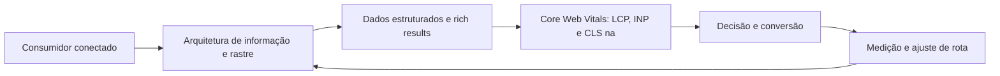

Observe o laço de retorno: a medição alimenta o próximo ciclo de campanha. Essa é a diferença estrutural entre campanha e sistema — a campanha termina quando o orçamento acaba; o sistema aprende e se ajusta a cada ciclo [7]. No caso do tema *SEO Técnico e Core Web Vitals: Performance como Fator de Ranqueamento*, esse laço é o que converte o investimento inicial em aprendizado acumulado para as próximas decisões [15].

## 4. Técnica

### O Leilão de Busca em Números

Entender o leilão do Google Ads é entender um jogo de relevância e lance. O cálculo abaixo simula o custo real por clique a partir do Índice de Qualidade — mostrando por que qualidade barateia o clique.

```python
def custo_por_clique(ranking_seu: float, ranking_abaixo: float) -> float:
    """CPC = ranking do concorrente de baixo / seu ranking + R$0,01."""
    return round(ranking_abaixo / ranking_seu + 0.01, 2)

def ranking(qualidade: int, lance: float) -> float:
    """AdRank: qualidade x lance."""
    return qualidade * lance

# Mesmo lance, qualidades diferentes
for q in (4, 7, 10):
    rank = ranking(q, 2.00)
    cpc = custo_por_clique(rank, ranking(5, 2.00))
    print(f"Qualidade {q}: rank {rank:.0f} -> CPC R$ {cpc}")
```

O exercício demonstra o princípio central do SEM: melhorar o Índice de Qualidade reduz o custo por clique mais rápido do que reduzir o lance [5]. A relevância é a estratégia de longo prazo do leilão [4].

O código acima é o núcleo técnico de *SEO Técnico e Core Web Vitals: Performance como Fator de Ranqueamento*: validável, executável e adaptável ao contexto real do leitor. A prática recomendada é rodá-lo com dados próprios e usar a saída como insumo da próxima reunião de planejamento. Documentação oficial das plataformas reforça cada passo — da estrutura de campanhas [5] à configuração de eventos [12]. A leitura técnica deste capítulo complementa a exposição conceitual das seções anteriores e prepara os exercícios da seção seguinte.

## 5. Aplica

Conhecimento sem aplicação é conteúdo; aplicação sem reflexão é rotina. No contexto de *SEO Técnico e Core Web Vitals: Performance como Fator de Ranqueamento*, os exercícios abaixo fecham o capítulo e preparam o terreno do próximo:

1. Escreva um snippet de anúncio com promessa, prova e CTA e avalie o Índice de Qualidade esperado.
2. Pesquise 20 palavras-chave do seu mercado e classifique cada uma por intenção (informacional, navegacional, transacional).
3. Audite a página inicial com o checklist de SEO on-page: title, meta description, headings e velocidade.
4. Rode uma campanha de busca com 3 grupos de anúncios e compare CTR e custo por clique entre eles.

Dedique ao menos 30 minutos a um dos exercícios antes de avançar. O aprendizado desta obra é cumulativo: o mapa desenhado aqui será usado nos capítulos seguintes da Parte III e nas partes subsequentes [3].

Complementando, cinco exercícios práticos adicionais consolidam o aprendizado de *SEO Técnico e Core Web Vitals: Performance como Fator de Ranqueamento*:

1. Qual página sua deveria estar ranqueando e não está? O que falta: conteúdo, autoridade ou técnica?
2. Quanto custaria comprar, via Google Ads, o tráfego que seu SEO deveria gerar organicamente?
3. Se um assistente de IA responder por você amanhã, sua marca será citada? O que falta para isso?
4. Se o Google sumisse amanhã, quanto do seu tráfego e da sua receita desapareceria junto?
5. Suas palavras-chave estão organizadas por intenção — ou todas competem pelo mesmo público?

## Leitura Complementar Recomendada

Para aprofundar *SEO Técnico e Core Web Vitals: Performance como Fator de Ranqueamento* além deste capítulo:

- Como complemento de mercado, os relatórios da Statista sobre investimento em busca e publicidade contextualizam a dimensão financeira do canal [9].

- Para aprofundar a busca, a documentação oficial do Google Search Central cobre o SEO em profundidade, e o Google Ads Help Center detalha o leilão e o Índice de Qualidade [4] [5].

## Análise de Riscos e Mitigações

A aplicação de *SEO Técnico e Core Web Vitals: Performance como Fator de Ranqueamento* envolve riscos identificáveis. A tabela de riscos abaixo relaciona cada ameaça à sua mitigação:

- Risco de concorrência direta: disputar termos caros sem estrutura. Mitigação: nicho de cauda longa com menos competição [4].
- Risco de dependência de pago: tráfego que para quando a verba acaba. Mitigação: construir o orgânico em paralelo como ativo de longo prazo [4].
- Risco de palavras erradas: tráfego sem intenção. Mitigação: classificar por intenção e alinhar cada página à busca que recebe [4].
- Risco técnico: site lento ou mal indexado. Mitigação: auditoria periódica de Core Web Vitals e rastreabilidade [4].

## Considerações de Implementação

m

## Exercício Integrador da Parte III

 

Este exercício conecta o capítulo às demais partes da obra e deve ser revisto ao final da leitura completa.

## Aprofundamento Prático

O tema de *SEO Técnico e Core Web Vitals: Performance como Fator de Ranqueamento* ganha potência quando levado ao nível operacional. Os quatro pontos abaixo aprofundam a aplicação prática:

- A busca generativa exige novo tipo de conteúdo: respostas diretas, dados estruturados e autoridade cítável — a página que responde com clareza e é citada como fonte ganha presença nas respostas sintetizadas [7].

- A integração SEO-SEM se opera na prática: usar o pago para validar palavras-chave (qual converte) e alimentar o orgânico com essas descobertas — o dado pago informa a estratégia orgânica [5].

- O aprofundamento prático da busca começa pela arquitetura de palavras: o mapa de palavras-chave por etapa do funil é o documento que alinha conteúdo, páginas e campanhas — sem ele, cada área otimiza para si e a SERP fica fragmentada [4].

- A leitura avançada do leilão exige o acompanhamento do Índice de Qualidade por palavra: quedas de qualidade precedem quedas de posição e aumentos de custo — monitorar o índice é monitorar a saúde da conta [5].

## Exercícios de Fixação

Para consolidar *SEO Técnico e Core Web Vitals: Performance como Fator de Ranqueamento*, resolva os cinco exercícios abaixo — com caneta, papel e dados reais:

1. Audite o SEO on-page da sua página principal e liste três melhorias.
2. Explique como o Índice de Qualidade reduz o custo por clique.
3. Identifique uma oportunidade do Search Console sem página dedicada.
4. Verifique os Core Web Vitals da sua página e priorize o pior indicador.
5. Classifique dez palavras-chave do seu mercado por intenção.

## Autoavaliação do Capítulo

Autoavaliação: (1) Tenho um mapa de palavras-chave por intenção e etapa do funil? (2) Minha página principal passa no checklist de SEO on-page? (3) Conheço o Índice de Qualidade das minhas palavras-chave? (4) Uso o Search Console com regularidade? (5) Minha estratégia combina orgânico e pago? Responda e priorize a primeira resposta negativa.

A primeira resposta negativa é o seu próximo passo natural — volte a ela na seção de aplicação deste capítulo e trabalhe o item até que a resposta seja sim.

## Problemas Comuns e Soluções Práticas

Aplicar *SEO Técnico e Core Web Vitals: Performance como Fator de Ranqueamento* no mundo real esbarra em problemas recorrentes. Abaixo, cinco situações típicas com suas soluções — sintoma, causa e correção:

### Concorrente domina a SERP

A disputa direta é cara. A solução é o nicho: palavras-chave de cauda longa com intenção clara e menos competição — vencer onde o concorrente não está [4].

### Dados de busca ignorados

O Search Console tem ouro e ninguém usa. A solução é a rotina: exportar consultas, identificar oportunidades de posição e alimentar o calendário de conteúdo [4].

### Tráfego pago caro e ineficiente

CPC alto e conversão baixa indicam relevância fraca. A solução é atacar o Índice de Qualidade: grupos por categoria, palavras exatas, páginas dedicadas — o custo cai com a qualidade [5].

### Site invisível no Google

Conteúdo bom sem tráfego orgânico aponta para problema técnico ou de autoridade. A solução é auditar indexação, velocidade e backlinks — e priorizar as lacunas por impacto [4].

### Palavras-chave erradas

Tráfego alto sem conversão sugere intenção desalinhada. A solução é reclassificar as palavras-chave por intenção e alinhar cada página à intenção que ela recebe [4].

## Aplicações por Setor

O tema de *SEO Técnico e Core Web Vitals: Performance como Fator de Ranqueamento* ganha contornos diferentes em cada setor. A leitura setorial abaixo ajuda a adaptar os princípios ao seu contexto:

- No e-commerce, a busca transacional domina e o SEO de produto é essencial; no B2B, a busca informacional abre o ciclo e o conteúdo técnico ranqueia; em serviços locais, a ficha do Google é o ativo central [4].

- No varejo de moda, a intenção de busca é visual e a otimização inclui imagem e vídeo; em fintech, a busca é informacional e de confiança — cada setor tem o seu jogo de SERP [4].

## Plano de Ação de 30 Dias

Para converter a leitura de *SEO Técnico e Core Web Vitals: Performance como Fator de Ranqueamento* em resultado, execute um dos planos semanais abaixo — cada semana tem um objetivo e uma entrega:

### Plano de Ação — Opção 1

Semana 1 — Diagnóstico: exporte as consultas do Search Console e filtre as oportunidades.
Semana 2 — Autoridade: identifique três fontes de backlink de qualidade do seu nicho.
Semana 3 — Técnica: verifique indexação, dados estruturados e velocidade.
Semana 4 — Rotina: agende a revisão mensal de posição e CTR.

### Plano de Ação — Opção 2

Semana 1 — Palavras: pesquise 20 termos, classifique por intenção e monte o mapa por funil.
Semana 2 — Página: audite o SEO on-page e os Core Web Vitals da página principal.
Semana 3 — Conteúdo: escreva ou atualize a página para a intenção da palavra-alvo.
Semana 4 — Estrutura: monte a campanha de busca com grupos por categoria e lance o piloto.

## KPIs que Importam neste Capítulo

Para *SEO Técnico e Core Web Vitals: Performance como Fator de Ranqueamento*, os KPIs que importam: CTR e custo por clique, Índice de Qualidade, posição média e impressões orgânicas, e custo por conversão — a leitura conjunta de orgânico e pago na busca [5].

Antes de encerrar, registre esses indicadores no seu painel de acompanhamento — eles serão a régua para medir a aplicação deste capítulo nas próximas semanas.

## Roteiro de Implementação Passo a Passo

Para aplicar *SEO Técnico e Core Web Vitals: Performance como Fator de Ranqueamento* na prática, os roteiros abaixo organizam a sequência de ações — do diagnóstico à medição:

### Roteiro de Implementação 1

1. Abra o Search Console e exporte as consultas com impressões.
2. Filtre as consultas com alta impressão e baixa posição — são as oportunidades.
3. Para cada uma, verifique se existe página dedicada e bem otimizada.
4. Escreva ou atualize o conteúdo com a intenção de busca em mente.
5. Otimize title, meta description e headings para o termo-alvo.
6. Adicione dados estruturados quando aplicável (FAQ, produto, artigo).
7. Construa uma prova social: avaliações, números, casos.
8. Verifique os Core Web Vitals e corrija os piores indicadores.
9. Construa autoridade: um backlink de qualidade por mês ou conteúdo cítável.
10. Acompanhe a posição mensalmente e ajuste o conteúdo com base nos dados.

### Roteiro de Implementação 2

1. Liste 30 termos que seus clientes usam para descrever sua oferta e seu mercado.
2. Pesquise volume e dificuldade de cada um em uma ferramenta de palavras-chave.
3. Classifique cada termo por intenção: informacional, navegacional ou transacional.
4. Monte o mapa: palavras-chave por etapa do funil e por persona.
5. Identifique as lacunas: termos de alta intenção sem página dedicada.
6. Audite a página atual contra o checklist de SEO on-page (title, meta, headings, conteúdo).
7. Verifique a velocidade e os Core Web Vitals no PageSpeed Insights.
8. Verifique no Search Console as impressões e posições atuais.
9. Defina a estrutura de campanha de busca: grupos por categoria, palavras exatas.
10. Implemente, agende a revisão mensal e itere com dados de CTR e conversão.

## Perguntas Frequentes

Em relação ao tema de *SEO Técnico e Core Web Vitals: Performance como Fator de Ranqueamento*, cinco perguntas surgem com frequência na prática profissional:

**Google Ads funciona para qualquer negócio?**

Funciona quando há intenção de busca e oferta clara — para ofertas de compra impulsiva, outros canais podem render mais [5].

**O que é o Índice de Qualidade?**

Nota de relevância do anúncio combinando anúncio, CTR esperado e página de destino — influencia posição e custo por clique [5].

**Devo contratar uma agência?**

Depende da maturidade do time. O essencial — pesquisa, estrutura e medição — pode ser aprendido e operado internamente [4].

**A IA vai matar o SEO?**

Não — vai transformá-lo: a otimização passa a ser para respostas sintetizadas e citação, não só ranqueamento [7].

**SEO demora quanto tempo?**

Os primeiros sinais aparecem em semanas, mas a consolidação de autoridade leva meses — é um ativo de longo prazo [4].

## Cenários Numéricos Comentados

Os cálculos abaixo mostram, com números concretos, como as decisões de *SEO Técnico e Core Web Vitals: Performance como Fator de Ranqueamento* se traduzem em resultado:

### Cenário numérico: orgânico versus pago

Uma página que converte 2% e recebe 10.000 visitas orgânicas mensais gera 200 conversões sem custo de mídia. Para obter o mesmo volume via pago, seriam necessários 10.000 cliques a R$ 1,00 — R$ 10 mil mensais. O SEO que sustenta essas visitas é um ativo que se paga em poucos meses [4].

### Cenário numérico: o leilão de busca

Com um lance de R$ 2,00 e Índice de Qualidade 4, o ranking é 8 e o CPC real fica em torno de R$ 1,25. Subir a qualidade para 8 eleva o ranking para 16 e reduz o CPC para R$ 0,63 — a mesma campanha, metade do custo, melhor posição. A qualidade é a alavanca mais barata do leilão [5].

## Como Este Capítulo se Integra à Obra

A busca é a rota da intenção declarada, mas a jornada começa antes — nas redes e no conteúdo que despertam a necessidade. As partes de redes sociais (IV) e relacionamento (V) alimentam o topo do funil que a busca captura no meio, e a parte de métricas (VIII) mede o resultado dessa cadeia inteira. No contexto de *SEO Técnico e Core Web Vitals: Performance como Fator de Ranqueamento*, essa integração fica ainda mais visível: as ferramentas e métricas que você dominou aqui serão a base das decisões dos próximos capítulos — e das partes que virão depois.

## Aprofundamento Conceitual

No contexto de *SEO Técnico e Core Web Vitals: Performance como Fator de Ranqueamento*, a intenção transacional é o ouro da busca: quem pesquisa com intenção de compra está a um passo da conversão, e as campanhas de busca transacional têm o ROI mais previsível do marketing digital [5].

No contexto de *SEO Técnico e Core Web Vitals: Performance como Fator de Ranqueamento*, o conteúdo para busca não é mais texto puro: é resposta estruturada, dados, imagens e vídeo — tudo organizado para ser citado e reaproveitado pela busca generativa [7].

No contexto de *SEO Técnico e Core Web Vitals: Performance como Fator de Ranqueamento*, a pesquisa de palavras-chave mapeia a demanda: volume mostra o tamanho da oportunidade, dificuldade mostra o custo de entrada e intenção mostra a probabilidade de conversão — as três juntas priorizam a aposta [8].

No contexto de *SEO Técnico e Core Web Vitals: Performance como Fator de Ranqueamento*, os Core Web Vitals (LCP, INP, CLS) não são apenas sinais técnicos: são métricas de experiência do usuário que correlacionam com conversão — um site rápido converte mais, com ou sem o algoritmo [4].

No contexto de *SEO Técnico e Core Web Vitals: Performance como Fator de Ranqueamento*, a autoridade de domínio se constrói com backlinks de qualidade e conteúdo cítável: cada link de um site respeitado é um voto de confiança que o algoritmo interpreta como relevância [4].

## Fundamentos em Detalhe

No contexto de *SEO Técnico e Core Web Vitals: Performance como Fator de Ranqueamento*, o link building continua relevante: a autoridade de domínio, construída por backlinks de qualidade, é um dos fatores mais fortes de ranqueamento orgânico [4].

No contexto de *SEO Técnico e Core Web Vitals: Performance como Fator de Ranqueamento*, a busca é o canal de intenção mais alta do marketing digital: ao pesquisar, o consumidor declara uma necessidade e sinaliza disposição de agir — o que torna o tráfego de busca o mais valioso e o mais conversível [4].

No contexto de *SEO Técnico e Core Web Vitals: Performance como Fator de Ranqueamento*, o leilão de anúncios do Google é um mecanismo de relevância: anunciantes competem por palavras-chave, mas o vencedor é definido pela combinação de lance e qualidade — e a qualidade barateia o clique [5].

No contexto de *SEO Técnico e Core Web Vitals: Performance como Fator de Ranqueamento*, o SEO é um ativo de longo prazo: enquanto o tráfego pago termina quando o orçamento acaba, o tráfego orgânico acumula valor com o tempo e reduz o custo médio de aquisição da operação [4].

No contexto de *SEO Técnico e Core Web Vitals: Performance como Fator de Ranqueamento*, a intenção de busca se classifica em três grandes famílias — informacional, navegacional e transacional — e cada uma exige página, mensagem e métrica próprias [4].

## Estudos de Caso Aplicados

### Caso: o varejo que pagou caro pelo Índice de Qualidade

Um varejista gastava em Google Ads com anúncios genéricos que apontavam para a home. O Índice de Qualidade baixo inflava o CPC e escondia o resultado real. A correção foi estrutural: grupos de anúncios por categoria, palavras-chave exatas, páginas de destino dedicadas e extensões de anúncio. O CPC caiu mais de 40% e o retorno por clique subiu — a relevância barateou o leilão [5].

### Caso: a consultoria que conquistou a SERP de nicho

Uma consultoria contábil para startups percebeu que as palavras-chave genéricas eram caras e competitivas. Ao mapear a intenção, encontrou o nicho: termos transacionais específicos do público ("contabilidade para startup", "regime tributário MEI") com volume menor e intenção alta. O site foi reestruturado por pilares de conteúdo, e a autoridade cresceu com guias completos. Em seis meses, a consultoria passou a dominar a busca orgânica do seu nicho [4].

## Dados e Números do Setor

### Dados de Contexto

- A busca é o canal de maior intenção: quem pesquisa já declarou necessidade [4].
- Mais da metade do tráfego qualificado dos sites vem de resultados orgânicos [4].
- O Índice de Qualidade influencia diretamente o custo por clique no leilão [5].
- A busca generativa está reorganizando a SERP e a forma de consumir respostas [7].

### Indicadores-Chave

- CTR, custo por clique e custo por conversão são as métricas do SEM [5].
- Posição média, impressões e taxa de clique orgânico medem o SEO [4].
- O custo por palavra-chave varia com a intenção: transacional é mais caro e mais conversível [5].

## Análise Comparativa

O tema de *SEO Técnico e Core Web Vitals: Performance como Fator de Ranqueamento* fica mais claro quando contrastado com a alternativa mais próxima. A comparação abaixo organiza as diferenças:

### Orgânico vs. Pago na Busca

- SEO constrói ativo de longo prazo; SEM compra visibilidade imediata.
- SEO tem custo de produção; SEM tem custo de clique.
- SEO depende de autoridade; SEM depende de lance e qualidade.
- A combinação cobre a SERP inteira e é a estratégia de dominância.

## Erros Comuns e Como Evitá-los

No tema de *SEO Técnico e Core Web Vitals: Performance como Fator de Ranqueamento*, cinco erros recorrentes merecem atenção especial — cada um com sua correção prática:

1. Ignorar o SEO técnico: conteúdo excelente invisível para rastreadores é trabalho desperdiçado.
2. Copiar o anúncio do concorrente: a relevância se constrói com dados próprios, não com imitação.
3. Otimizar para algoritmo e esquecer o usuário: a busca recompensa quem serve bem — no fim, é a mesma coisa.
4. Tratar SEO e SEM como rivais: a combinação cobre a SERP inteira; a separação deixa lacunas.
5. Apostar tudo em uma palavra-chave genérica: termos amplos têm custo alto e intenção fraca.

## Ferramentas e Recursos Recomendados

Para operar o tema de *SEO Técnico e Core Web Vitals: Performance como Fator de Ranqueamento* na prática, a seguinte seleção de ferramentas cobre o ciclo completo — do diagnóstico à medição:

1. Google Search Console (diagnóstico de indexação)
2. Ferramenta de pesquisa de palavras-chave (volume/dificuldade)
3. Google Ads (leilão e estrutura de campanha)
4. PageSpeed Insights (Core Web Vitals)
5. Ferramenta de monitoramento de SERP

## Glossário do Capítulo

Os termos abaixo — todos usados no corpo deste capítulo — formam o vocabulário mínimo para acompanhar o restante da obra:

SERP: página de resultados do mecanismo de busca. CPC: custo por clique. Índice de Qualidade: nota de relevância do anúncio. SEO on-page: otimização dentro da página. Backlink: link externo que aponta para o site. Core Web Vitals: métricas de experiência de página.

## Checklist de Implementação

Use a lista abaixo para auditar a aplicação de *SEO Técnico e Core Web Vitals: Performance como Fator de Ranqueamento* na sua operação — marque os itens já concluídos e priorize os pendentes:

- [ ] Core Web Vitals verificados no PageSpeed
- [ ] 20 palavras-chave pesquisadas e classificadas por intenção
- [ ] SEO on-page auditado (title, meta, headings)
- [ ] Mapa de palavras-chave por etapa do funil
- [ ] Estrutura de campanha com grupos por categoria

## Perguntas para Reflexão

Antes de avançar, reflita sobre as cinco questões abaixo — elas conectam o conteúdo de *SEO Técnico e Core Web Vitals: Performance como Fator de Ranqueamento* ao seu contexto real de trabalho:

1. Quanto custaria comprar, via Google Ads, o tráfego que seu SEO deveria gerar organicamente?
2. Se um assistente de IA responder por você amanhã, sua marca será citada? O que falta para isso?
3. Se o Google sumisse amanhã, quanto do seu tráfego e da sua receita desapareceria junto?
4. Suas palavras-chave estão organizadas por intenção — ou todas competem pelo mesmo público?
5. Qual página sua deveria estar ranqueando e não está? O que falta: conteúdo, autoridade ou técnica?

## Quadro Comparativo: Intenção de Busca e Estratégia

O quadro abaixo consolida os elementos essenciais de *SEO Técnico e Core Web Vitals: Performance como Fator de Ranqueamento* em perspectiva comparada, facilitando a consulta rápida e a tomada de decisão:

| Intenção | Exemplo | Estratégia | Métrica |
|---|---|---|---|
| Intenção | Exemplo | Estratégia | Métrica |
| Informacional | Como funciona o SEO | Conteúdo educativo | Posição e cliques |
| Navegacional | Site da marca | Branding e marca | Tráfego direto |
| Transacional | Comprar curso online | Campanha e oferta | Conversão e ROI |
| Local | Padaria perto de mim | Ficha e avaliações | Visitas e ligações |

## 6. Conclusão

O capítulo percorreu o território da Parte III, *Busca — A Rota da Intenção*, e deixou três aprendizados operacionais. Primeiro, o conceito central — *SEO Técnico e Core Web Vitals: Performance como Fator de Ranqueamento* — é menos uma novidade e mais uma disciplina de execução. Segundo, a aplicação exige a tríade conceito, rota e métrica, sem pular etapas [8]. Terceiro, o ajuste contínuo de rota, ilustrado no laço de retorno do diagrama, é o que separa campanhas pontuais de operações sustentáveis [7]. O caminho percorrido desde *Pesquisa de Palavras-Chave: Mapeando a Intenção do Viajante* até aqui forma a base que o próximo passo vai usar. No próximo capítulo, *O Futuro da Busca: SGE e a Otimização para Respostas de IA*, você avançará sobre o território vizinho levando as ferramentas exercitadas aqui.

Como navegador de marketing digital, você não decorou uma fórmula — incorporou um modo de operar: ler o território, escolher a rota com dados e ajustar o percurso quando o vento muda [2].

Antes do fechamento, vale reforçar a base do capítulo: No contexto de *SEO Técnico e Core Web Vitals: Performance como Fator de Ranqueamento*, o leilão do Google Ads é um mercado de relevância: anunciantes com Índice de Qualidade alto pagam menos por clique e aparecem em posições melhores — um incentivo estrutural à qualidade [5].

No contexto de *SEO Técnico e Core Web Vitals: Performance como Fator de Ranqueamento*, o SEO técnico é a fundação invisível: arquitetura limpa, URLs consistentes, dados estruturados e velocidade garantem que o conteúdo bom seja encontrado — sem isso, o melhor texto não tem visibilidade [4].
## 7. Referências Bibliográficas

[1] KOTLER, Philip; KELLER, Kevin Lane. **Administração de Marketing**. 15. ed. São Paulo: Pearson, 2016.
[2] KOTLER, Philip; KARTAJAYA, Hermawan; SETIAWAN, Iwan. **Marketing 4.0: Moving from Traditional to Digital**. Hoboken: Wiley, 2017.
[3] CHAFFEY, Dave; ELLIS-CHADWICK, Fiona. **Digital Marketing: Strategy, Implementation and Practice**. 9. ed. Harlow: Pearson, 2025.
[4] GOOGLE SEARCH CENTRAL. **Search Engine Optimization (SEO) Starter Guide**. Disponível em: https://developers.google.com/search/docs/fundamentals/seo-starter-guide. Acesso em: 02 ago. 2026.
[5] GOOGLE ADS HELP CENTER. **Your guide to Google Ads (Basics, Search Campaigns & Best Practices)**. Disponível em: https://support.google.com/google-ads/answer/6146252. Acesso em: 02 ago. 2026.
[6] META BUSINESS HELP CENTER. **Meta Ads Manager Guide: Best Practices for Targeting, Measurement, and Optimization**. Disponível em: https://www.facebook.com/business/help. Acesso em: 02 ago. 2026.
[7] DELOITTE DIGITAL. **Marketing Trends 2026: New Marketing for a New World**. Disponível em: https://www.deloittedigital.com/nl/en/insights/perspective/marketing-trends-2026.html. Acesso em: 02 ago. 2026.
[8] HUBSPOT RESEARCH. **The State of Marketing / 2026 Marketing Statistics, Trends & Data**. Disponível em: https://www.hubspot.com/marketing-statistics. Acesso em: 02 ago. 2026.
[9] STATISTA RESEARCH DEPARTMENT. **Global Digital Marketing and Advertising Revenue Statistics & Facts**. Disponível em: https://www.statista.com/topics/8954/marketing-worldwide/. Acesso em: 02 ago. 2026.
[10] RYAN, Damian. **Understanding Digital Marketing: Marketing Strategies for Engaging the Digital Generation**. 5. ed. London: Kogan Page, 2020.
[11] HOLLENSEN, Svend; KOTLER, Philip; OPRESNIK, Marc Oliver. **Social Media Marketing: A Practitioner Approach**. 4. ed. Harlow: Pearson, 2023.
[12] GOOGLE ANALYTICS HELP CENTER. **Documentação oficial do Google Analytics 4**. Disponível em: https://support.google.com/analytics. Acesso em: 02 ago. 2026.
[13] LINKEDIN MARKETING SOLUTIONS. **Best Practices para campanhas B2B no LinkedIn**. Disponível em: https://business.linkedin.com/marketing-solutions. Acesso em: 02 ago. 2026.
[14] TIKTOK FOR BUSINESS. **Guia de criatividade e boas práticas de anúncios no TikTok**. Disponível em: https://www.tiktok.com/business. Acesso em: 02 ago. 2026.
[15] DATAREPORTAL. **Digital 2026: Global Overview Report**. Disponível em: https://datareportal.com/reports/digital-2026-global-overview-report. Acesso em: 02 ago. 2026.
[16] LEMON, Katherine N.; VERHOEF, Peter C. **Understanding Customer Experience Throughout the Customer Journey**. *Journal of Marketing*, v. 80, n. 6, p. 69-96, 2016.
[17] TIWARI, Rajnish; BUSE, Stephan; HERSTATT, Cornelius. **From Electronic to Mobile Commerce: Opportunities and Challenges**. *Proceedings of the German-Indian Roundtable*, 2006.
[18] VAN DIJK, Jan A. G. M. **The Digital Divide**. Cambridge: Polity Press, 2020.
[19] IBM. **Marketing with AI: Personalization at Scale**. Disponível em: https://www.ibm.com/think/topics/ai-marketing. Acesso em: 02 ago. 2026.
[20] KOTLER, Philip. **Marketing 5.0: Technology for Humanity**. Hoboken: Wiley, 2021.

# Capítulo 15: O Futuro da Busca: SGE e a Otimização para Respostas de IA

## 1. Introdução

Bem-vindo a uma nova etapa da sua navegação pelo marketing digital. Este capítulo — *O Futuro da Busca: SGE e a Otimização para Respostas de IA* — integra a Parte III, *Busca — A Rota da Intenção*, e responde a uma pergunta prática: **search generative experience e o novo layout da serp** — na prática, como isso se traduz em decisão e resultado?

Ao final, você será capaz de ntende como a busca generativa (sge/aio) muda o jogo da visibilidade orgânica e adapta a estratégia para ser citado por motores e assistentes de ia.. Mais do que decorar conceitos, você vai enxergar a busca como rota de intenção declarada — e converter essa visão em plano, experimento e métrica.

No capítulo anterior, *SEO Técnico e Core Web Vitals: Performance como Fator de Ranqueamento*, você aprendeu os conceitos que servem de plataforma para o que vem agora. Este capítulo retoma esse repertório e o aplica a um território novo — sem repetir o que já foi estabelecido, apenas usando como base.

O capítulo segue a estrutura das sete seções que organizam esta obra: primeiro a exposição conceitual, depois a ilustração, a técnica aplicada, o exercício de aplicação e a conclusão operacional.

No contexto de *O Futuro da Busca: SGE e a Otimização para Respostas de IA*, os Core Web Vitals — LCP, INP e CLS — tornaram-se sinais de ranqueamento e, mais importante, de experiência: sites rápidos e estáveis convertem mais, independentemente do algoritmo [4].

No contexto de *O Futuro da Busca: SGE e a Otimização para Respostas de IA*, a pesquisa de palavras-chave é o ponto de partida de qualquer estratégia de busca: volume, dificuldade e intenção são as três dimensões que separam oportunidades reais de apostas vazias [8].
## 2. Explica

### Search Generative Experience e o novo layout da SERP

Quando o tema é *O Futuro da Busca: SGE e a Otimização para Respostas de IA*, o primeiro pilar — search generative experience e o novo layout da serp — define o território conceitual. Mais da metade do tráfego qualificado dos sites vem de resultados orgânicos, tornando o SEO um ativo de longo prazo em vez de despesa pontual [4].

Na prática, search generative experience e o novo layout da serp significa transformar a teoria em rotina operacional — exatamente o que *O Futuro da Busca: SGE e a Otimização para Respostas de IA* exige no dia a dia. A literatura de gestão é enfática: sem operacionalizar o conceito em checklist, responsável e métrica, ele permanece slide de apresentação [3]. Por isso a Parte III propõe sempre o mesmo movimento: entender, traduzir em critério observável e decidir com dado.

### Fatores de citação por IA: autoridade, clareza e dados estruturados

O segundo pilar — fatores de citação por ia: autoridade, clareza e dados estruturados — conecta a estratégia à operação diária. A busca generativa está reorganizando a SERP: o objetivo deixa de ser apenas ranquear e passa a ser citado como fonte pelas respostas sintetizadas por IA [7]. A experiência do consumidor se constrói na consistência entre canais e mensagens, e é essa consistência que transforma contato em relacionamento [16]. Organizações que tratam cada canal como silo perdem o fio condutor da jornada; as que operam o pilar com disciplina reduzem atrito e aumentam a taxa de avanço entre etapas [10].

### Estratégia de conteúdo otimizada para respostas e zero-click

Fechando o tripé, estratégia de conteúdo otimizada para respostas e zero-click é o que transforma a Parte III em vantagem mensurável. A intenção de busca pode ser informacional, navegacional ou transacional — e cada tipo exige uma página, uma mensagem e uma métrica diferentes [4]. O relato da indústria mostra que as empresas que sustentam resultado não são as que têm mais ferramentas, mas as que conseguem medir e ajustar a rota com frequência [8]. A métrica certa, escolhida antes da campanha, vale mais do que qualquer ferramenta cara instalada depois do fato [9].

### O Eixo Transversal do Capítulo

O leilão de busca recompensa quem melhora a relevância antes de aumentar o lance: qualidade e orçamento caminham juntos na matemática do CPC [5]. Esse eixo conecta os três pilares e explica por que o capítulo os trata como um sistema, não como uma lista: cada pilar reforça o outro, e a omissão de qualquer um deles produz estratégia manca. O capítulo seguinte retomará esse eixo com novas ferramentas, agora com o vocabulário já estabelecido aqui.

Em síntese, o capítulo opera em três níveis: o conceitual (Search Generative Experience e o novo layout da SERP), o operacional (Fatores de citação por IA: autoridade, clareza e dados estruturados) e o estratégico (Estratégia de conteúdo otimizada para respostas e zero-click). O leitor que dominar os três estará apto a aplicar a Parte III com autonomia [1]. A evidência reunida nesta seção sustenta cada recomendação prática das seções seguintes [2].

## 3. Ilustra

Vamos traduzir o capítulo em uma cena concreta, no contexto de *O Futuro da Busca: SGE e a Otimização para Respostas de IA*. Uma empresa de porte médio, com equipe enxuta e orçamento limitado, decide operar a Parte III desta obra, *Busca — A Rota da Intenção*. Na primeira semana, a equipe testa o conceito central do capítulo em um caso real: um cliente que pesquisou, comparou e decidiu comprar. O primeiro pilar — search generative experience e o novo layout da serp — orienta o entendimento inicial do público; o segundo — fatores de citação por ia: autoridade, clareza e dados estruturados — guia a escolha da rota de comunicação; e o terceiro fecha com a medição do resultado [2].

O diagrama abaixo representa o fluxo operacional proposto pelo capítulo — do consumidor conectado à decisão e ao ajuste contínuo de rota, com o público e a plataforma específicos do tema no centro da navegação:

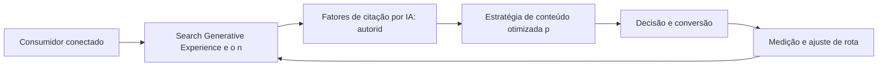

Observe o laço de retorno: a medição alimenta o próximo ciclo de campanha. Essa é a diferença estrutural entre campanha e sistema — a campanha termina quando o orçamento acaba; o sistema aprende e se ajusta a cada ciclo [7]. No caso do tema *O Futuro da Busca: SGE e a Otimização para Respostas de IA*, esse laço é o que converte o investimento inicial em aprendizado acumulado para as próximas decisões [15].

## 4. Técnica

### O Leilão de Busca em Números

Entender o leilão do Google Ads é entender um jogo de relevância e lance. O cálculo abaixo simula o custo real por clique a partir do Índice de Qualidade — mostrando por que qualidade barateia o clique.

```python
def custo_por_clique(ranking_seu: float, ranking_abaixo: float) -> float:
    """CPC = ranking do concorrente de baixo / seu ranking + R$0,01."""
    return round(ranking_abaixo / ranking_seu + 0.01, 2)

def ranking(qualidade: int, lance: float) -> float:
    """AdRank: qualidade x lance."""
    return qualidade * lance

# Mesmo lance, qualidades diferentes
for q in (4, 7, 10):
    rank = ranking(q, 2.00)
    cpc = custo_por_clique(rank, ranking(5, 2.00))
    print(f"Qualidade {q}: rank {rank:.0f} -> CPC R$ {cpc}")
```

O exercício demonstra o princípio central do SEM: melhorar o Índice de Qualidade reduz o custo por clique mais rápido do que reduzir o lance [5]. A relevância é a estratégia de longo prazo do leilão [4].

O código acima é o núcleo técnico de *O Futuro da Busca: SGE e a Otimização para Respostas de IA*: validável, executável e adaptável ao contexto real do leitor. A prática recomendada é rodá-lo com dados próprios e usar a saída como insumo da próxima reunião de planejamento. Documentação oficial das plataformas reforça cada passo — da estrutura de campanhas [5] à configuração de eventos [12]. A leitura técnica deste capítulo complementa a exposição conceitual das seções anteriores e prepara os exercícios da seção seguinte.

## 5. Aplica

Conhecimento sem aplicação é conteúdo; aplicação sem reflexão é rotina. No contexto de *O Futuro da Busca: SGE e a Otimização para Respostas de IA*, os exercícios abaixo fecham o capítulo e preparam o terreno do próximo:

1. Rode uma campanha de busca com 3 grupos de anúncios e compare CTR e custo por clique entre eles.
2. Monte um mapa de palavras-chave por etapa do funil e aponte as lacunas de conteúdo da sua operação.
3. Teste uma busca no celular por um termo do seu mercado e registre o que aparece acima da dobra.
4. Verifique no Search Console as impressões e a posição média das suas páginas mais relevantes.

Dedique ao menos 30 minutos a um dos exercícios antes de avançar. O aprendizado desta obra é cumulativo: o mapa desenhado aqui será usado nos capítulos seguintes da Parte III e nas partes subsequentes [3].

Complementando, cinco exercícios práticos adicionais consolidam o aprendizado de *O Futuro da Busca: SGE e a Otimização para Respostas de IA*:

1. Se o Google sumisse amanhã, quanto do seu tráfego e da sua receita desapareceria junto?
2. Suas palavras-chave estão organizadas por intenção — ou todas competem pelo mesmo público?
3. Qual página sua deveria estar ranqueando e não está? O que falta: conteúdo, autoridade ou técnica?
4. Quanto custaria comprar, via Google Ads, o tráfego que seu SEO deveria gerar organicamente?
5. Se um assistente de IA responder por você amanhã, sua marca será citada? O que falta para isso?

## Leitura Complementar Recomendada

Para aprofundar *O Futuro da Busca: SGE e a Otimização para Respostas de IA* além deste capítulo:

- Para aprofundar a busca, a documentação oficial do Google Search Central cobre o SEO em profundidade, e o Google Ads Help Center detalha o leilão e o Índice de Qualidade [4] [5].

- Como complemento de mercado, os relatórios da Statista sobre investimento em busca e publicidade contextualizam a dimensão financeira do canal [9].

## Análise de Riscos e Mitigações

A aplicação de *O Futuro da Busca: SGE e a Otimização para Respostas de IA* envolve riscos identificáveis. A tabela de riscos abaixo relaciona cada ameaça à sua mitigação:

- Risco técnico: site lento ou mal indexado. Mitigação: auditoria periódica de Core Web Vitals e rastreabilidade [4].
- Risco de concorrência direta: disputar termos caros sem estrutura. Mitigação: nicho de cauda longa com menos competição [4].
- Risco de dependência de pago: tráfego que para quando a verba acaba. Mitigação: construir o orgânico em paralelo como ativo de longo prazo [4].
- Risco de palavras erradas: tráfego sem intenção. Mitigação: classificar por intenção e alinhar cada página à busca que recebe [4].

## Considerações de Implementação

o

## Exercício Integrador da Parte III

s

Este exercício conecta o capítulo às demais partes da obra e deve ser revisto ao final da leitura completa.

## Aprofundamento Prático

O tema de *O Futuro da Busca: SGE e a Otimização para Respostas de IA* ganha potência quando levado ao nível operacional. Os quatro pontos abaixo aprofundam a aplicação prática:

- A leitura avançada do leilão exige o acompanhamento do Índice de Qualidade por palavra: quedas de qualidade precedem quedas de posição e aumentos de custo — monitorar o índice é monitorar a saúde da conta [5].

- O SEO técnico é disciplina contínua: core Web Vitals, dados estruturados e rastreabilidade se degradam com o tempo, e a auditoria periódica evita a perda silenciosa de posições [4].

- A busca generativa exige novo tipo de conteúdo: respostas diretas, dados estruturados e autoridade cítável — a página que responde com clareza e é citada como fonte ganha presença nas respostas sintetizadas [7].

- A integração SEO-SEM se opera na prática: usar o pago para validar palavras-chave (qual converte) e alimentar o orgânico com essas descobertas — o dado pago informa a estratégia orgânica [5].

## Exercícios de Fixação

Para consolidar *O Futuro da Busca: SGE e a Otimização para Respostas de IA*, resolva os cinco exercícios abaixo — com caneta, papel e dados reais:

1. Verifique os Core Web Vitals da sua página e priorize o pior indicador.
2. Classifique dez palavras-chave do seu mercado por intenção.
3. Audite o SEO on-page da sua página principal e liste três melhorias.
4. Explique como o Índice de Qualidade reduz o custo por clique.
5. Identifique uma oportunidade do Search Console sem página dedicada.

## Autoavaliação do Capítulo

Autoavaliação: (1) Tenho um mapa de palavras-chave por intenção e etapa do funil? (2) Minha página principal passa no checklist de SEO on-page? (3) Conheço o Índice de Qualidade das minhas palavras-chave? (4) Uso o Search Console com regularidade? (5) Minha estratégia combina orgânico e pago? Responda e priorize a primeira resposta negativa.

A primeira resposta negativa é o seu próximo passo natural — volte a ela na seção de aplicação deste capítulo e trabalhe o item até que a resposta seja sim.

## Problemas Comuns e Soluções Práticas

Aplicar *O Futuro da Busca: SGE e a Otimização para Respostas de IA* no mundo real esbarra em problemas recorrentes. Abaixo, cinco situações típicas com suas soluções — sintoma, causa e correção:

### Site invisível no Google

Conteúdo bom sem tráfego orgânico aponta para problema técnico ou de autoridade. A solução é auditar indexação, velocidade e backlinks — e priorizar as lacunas por impacto [4].

### Palavras-chave erradas

Tráfego alto sem conversão sugere intenção desalinhada. A solução é reclassificar as palavras-chave por intenção e alinhar cada página à intenção que ela recebe [4].

### Concorrente domina a SERP

A disputa direta é cara. A solução é o nicho: palavras-chave de cauda longa com intenção clara e menos competição — vencer onde o concorrente não está [4].

### Dados de busca ignorados

O Search Console tem ouro e ninguém usa. A solução é a rotina: exportar consultas, identificar oportunidades de posição e alimentar o calendário de conteúdo [4].

### Tráfego pago caro e ineficiente

CPC alto e conversão baixa indicam relevância fraca. A solução é atacar o Índice de Qualidade: grupos por categoria, palavras exatas, páginas dedicadas — o custo cai com a qualidade [5].

## Aplicações por Setor

O tema de *O Futuro da Busca: SGE e a Otimização para Respostas de IA* ganha contornos diferentes em cada setor. A leitura setorial abaixo ajuda a adaptar os princípios ao seu contexto:

- No varejo de moda, a intenção de busca é visual e a otimização inclui imagem e vídeo; em fintech, a busca é informacional e de confiança — cada setor tem o seu jogo de SERP [4].

- No e-commerce, a busca transacional domina e o SEO de produto é essencial; no B2B, a busca informacional abre o ciclo e o conteúdo técnico ranqueia; em serviços locais, a ficha do Google é o ativo central [4].

## Plano de Ação de 30 Dias

Para converter a leitura de *O Futuro da Busca: SGE e a Otimização para Respostas de IA* em resultado, execute um dos planos semanais abaixo — cada semana tem um objetivo e uma entrega:

### Plano de Ação — Opção 1

Semana 1 — Palavras: pesquise 20 termos, classifique por intenção e monte o mapa por funil.
Semana 2 — Página: audite o SEO on-page e os Core Web Vitals da página principal.
Semana 3 — Conteúdo: escreva ou atualize a página para a intenção da palavra-alvo.
Semana 4 — Estrutura: monte a campanha de busca com grupos por categoria e lance o piloto.

### Plano de Ação — Opção 2

Semana 1 — Diagnóstico: exporte as consultas do Search Console e filtre as oportunidades.
Semana 2 — Autoridade: identifique três fontes de backlink de qualidade do seu nicho.
Semana 3 — Técnica: verifique indexação, dados estruturados e velocidade.
Semana 4 — Rotina: agende a revisão mensal de posição e CTR.

## KPIs que Importam neste Capítulo

Para *O Futuro da Busca: SGE e a Otimização para Respostas de IA*, os KPIs que importam: CTR e custo por clique, Índice de Qualidade, posição média e impressões orgânicas, e custo por conversão — a leitura conjunta de orgânico e pago na busca [5].

Antes de encerrar, registre esses indicadores no seu painel de acompanhamento — eles serão a régua para medir a aplicação deste capítulo nas próximas semanas.

## Roteiro de Implementação Passo a Passo

Para aplicar *O Futuro da Busca: SGE e a Otimização para Respostas de IA* na prática, os roteiros abaixo organizam a sequência de ações — do diagnóstico à medição:

### Roteiro de Implementação 1

1. Liste 30 termos que seus clientes usam para descrever sua oferta e seu mercado.
2. Pesquise volume e dificuldade de cada um em uma ferramenta de palavras-chave.
3. Classifique cada termo por intenção: informacional, navegacional ou transacional.
4. Monte o mapa: palavras-chave por etapa do funil e por persona.
5. Identifique as lacunas: termos de alta intenção sem página dedicada.
6. Audite a página atual contra o checklist de SEO on-page (title, meta, headings, conteúdo).
7. Verifique a velocidade e os Core Web Vitals no PageSpeed Insights.
8. Verifique no Search Console as impressões e posições atuais.
9. Defina a estrutura de campanha de busca: grupos por categoria, palavras exatas.
10. Implemente, agende a revisão mensal e itere com dados de CTR e conversão.

### Roteiro de Implementação 2

1. Abra o Search Console e exporte as consultas com impressões.
2. Filtre as consultas com alta impressão e baixa posição — são as oportunidades.
3. Para cada uma, verifique se existe página dedicada e bem otimizada.
4. Escreva ou atualize o conteúdo com a intenção de busca em mente.
5. Otimize title, meta description e headings para o termo-alvo.
6. Adicione dados estruturados quando aplicável (FAQ, produto, artigo).
7. Construa uma prova social: avaliações, números, casos.
8. Verifique os Core Web Vitals e corrija os piores indicadores.
9. Construa autoridade: um backlink de qualidade por mês ou conteúdo cítável.
10. Acompanhe a posição mensalmente e ajuste o conteúdo com base nos dados.

## Perguntas Frequentes

Em relação ao tema de *O Futuro da Busca: SGE e a Otimização para Respostas de IA*, cinco perguntas surgem com frequência na prática profissional:

**A IA vai matar o SEO?**

Não — vai transformá-lo: a otimização passa a ser para respostas sintetizadas e citação, não só ranqueamento [7].

**SEO demora quanto tempo?**

Os primeiros sinais aparecem em semanas, mas a consolidação de autoridade leva meses — é um ativo de longo prazo [4].

**Google Ads funciona para qualquer negócio?**

Funciona quando há intenção de busca e oferta clara — para ofertas de compra impulsiva, outros canais podem render mais [5].

**O que é o Índice de Qualidade?**

Nota de relevância do anúncio combinando anúncio, CTR esperado e página de destino — influencia posição e custo por clique [5].

**Devo contratar uma agência?**

Depende da maturidade do time. O essencial — pesquisa, estrutura e medição — pode ser aprendido e operado internamente [4].

## Cenários Numéricos Comentados

Os cálculos abaixo mostram, com números concretos, como as decisões de *O Futuro da Busca: SGE e a Otimização para Respostas de IA* se traduzem em resultado:

### Cenário numérico: o leilão de busca

Com um lance de R$ 2,00 e Índice de Qualidade 4, o ranking é 8 e o CPC real fica em torno de R$ 1,25. Subir a qualidade para 8 eleva o ranking para 16 e reduz o CPC para R$ 0,63 — a mesma campanha, metade do custo, melhor posição. A qualidade é a alavanca mais barata do leilão [5].

### Cenário numérico: orgânico versus pago

Uma página que converte 2% e recebe 10.000 visitas orgânicas mensais gera 200 conversões sem custo de mídia. Para obter o mesmo volume via pago, seriam necessários 10.000 cliques a R$ 1,00 — R$ 10 mil mensais. O SEO que sustenta essas visitas é um ativo que se paga em poucos meses [4].

## Como Este Capítulo se Integra à Obra

A busca é a rota da intenção declarada, mas a jornada começa antes — nas redes e no conteúdo que despertam a necessidade. As partes de redes sociais (IV) e relacionamento (V) alimentam o topo do funil que a busca captura no meio, e a parte de métricas (VIII) mede o resultado dessa cadeia inteira. No contexto de *O Futuro da Busca: SGE e a Otimização para Respostas de IA*, essa integração fica ainda mais visível: as ferramentas e métricas que você dominou aqui serão a base das decisões dos próximos capítulos — e das partes que virão depois.

## Aprofundamento Conceitual

No contexto de *O Futuro da Busca: SGE e a Otimização para Respostas de IA*, os Core Web Vitals (LCP, INP, CLS) não são apenas sinais técnicos: são métricas de experiência do usuário que correlacionam com conversão — um site rápido converte mais, com ou sem o algoritmo [4].

No contexto de *O Futuro da Busca: SGE e a Otimização para Respostas de IA*, a autoridade de domínio se constrói com backlinks de qualidade e conteúdo cítável: cada link de um site respeitado é um voto de confiança que o algoritmo interpreta como relevância [4].

No contexto de *O Futuro da Busca: SGE e a Otimização para Respostas de IA*, o Google Business Profile é o ativo local mais subestimado: para negócios de alcance local, a ficha otimizada domina a busca por proximidade e a decisão de visita [4].

No contexto de *O Futuro da Busca: SGE e a Otimização para Respostas de IA*, a integração SEO-SEM é a estratégia de dominância: o orgânico sustenta a presença de longo prazo e o pago garante a visibilidade imediata — juntos, cobrem a SERP inteira [5].

No contexto de *O Futuro da Busca: SGE e a Otimização para Respostas de IA*, a SERP (página de resultados) é o campo de batalha da atenção por intenção: a marca presente no topo captura cliques, a presente nos snippets captura respostas, e a ausente simplesmente não existe para quem pesquisa [4].

## Fundamentos em Detalhe

No contexto de *O Futuro da Busca: SGE e a Otimização para Respostas de IA*, o SEO é um ativo de longo prazo: enquanto o tráfego pago termina quando o orçamento acaba, o tráfego orgânico acumula valor com o tempo e reduz o custo médio de aquisição da operação [4].

No contexto de *O Futuro da Busca: SGE e a Otimização para Respostas de IA*, a intenção de busca se classifica em três grandes famílias — informacional, navegacional e transacional — e cada uma exige página, mensagem e métrica próprias [4].

No contexto de *O Futuro da Busca: SGE e a Otimização para Respostas de IA*, os mecanismos de busca evoluíram de palavras-chave para intenção e, mais recentemente, para respostas: a busca generativa responde diretamente, e a marca precisa ser citada para existir nela [7].

No contexto de *O Futuro da Busca: SGE e a Otimização para Respostas de IA*, o Índice de Qualidade do Google Ads combina três sinais — relevância do anúncio, CTR esperado e experiência da página de destino — e influencia tanto a posição quanto o custo por clique [5].

No contexto de *O Futuro da Busca: SGE e a Otimização para Respostas de IA*, a arquitetura de informações de um site determina a rastreabilidade: páginas claras, hierarquia lógica e links internos consistentes facilitam o trabalho dos rastreadores e melhoram a indexação [4].

## Estudos de Caso Aplicados

### Caso: a consultoria que conquistou a SERP de nicho

Uma consultoria contábil para startups percebeu que as palavras-chave genéricas eram caras e competitivas. Ao mapear a intenção, encontrou o nicho: termos transacionais específicos do público ("contabilidade para startup", "regime tributário MEI") com volume menor e intenção alta. O site foi reestruturado por pilares de conteúdo, e a autoridade cresceu com guias completos. Em seis meses, a consultoria passou a dominar a busca orgânica do seu nicho [4].

### Caso: o varejo que pagou caro pelo Índice de Qualidade

Um varejista gastava em Google Ads com anúncios genéricos que apontavam para a home. O Índice de Qualidade baixo inflava o CPC e escondia o resultado real. A correção foi estrutural: grupos de anúncios por categoria, palavras-chave exatas, páginas de destino dedicadas e extensões de anúncio. O CPC caiu mais de 40% e o retorno por clique subiu — a relevância barateou o leilão [5].

## Dados e Números do Setor

### Indicadores-Chave

- CTR, custo por clique e custo por conversão são as métricas do SEM [5].
- Posição média, impressões e taxa de clique orgânico medem o SEO [4].
- O custo por palavra-chave varia com a intenção: transacional é mais caro e mais conversível [5].

### Dados de Contexto

- A busca é o canal de maior intenção: quem pesquisa já declarou necessidade [4].
- Mais da metade do tráfego qualificado dos sites vem de resultados orgânicos [4].
- O Índice de Qualidade influencia diretamente o custo por clique no leilão [5].
- A busca generativa está reorganizando a SERP e a forma de consumir respostas [7].

## Análise Comparativa

O tema de *O Futuro da Busca: SGE e a Otimização para Respostas de IA* fica mais claro quando contrastado com a alternativa mais próxima. A comparação abaixo organiza as diferenças:

### Orgânico vs. Pago na Busca

- SEO constrói ativo de longo prazo; SEM compra visibilidade imediata.
- SEO tem custo de produção; SEM tem custo de clique.
- SEO depende de autoridade; SEM depende de lance e qualidade.
- A combinação cobre a SERP inteira e é a estratégia de dominância.

## Erros Comuns e Como Evitá-los

No tema de *O Futuro da Busca: SGE e a Otimização para Respostas de IA*, cinco erros recorrentes merecem atenção especial — cada um com sua correção prática:

1. Tratar SEO e SEM como rivais: a combinação cobre a SERP inteira; a separação deixa lacunas.
2. Apostar tudo em uma palavra-chave genérica: termos amplos têm custo alto e intenção fraca.
3. Ignorar o SEO técnico: conteúdo excelente invisível para rastreadores é trabalho desperdiçado.
4. Copiar o anúncio do concorrente: a relevância se constrói com dados próprios, não com imitação.
5. Otimizar para algoritmo e esquecer o usuário: a busca recompensa quem serve bem — no fim, é a mesma coisa.

## Ferramentas e Recursos Recomendados

Para operar o tema de *O Futuro da Busca: SGE e a Otimização para Respostas de IA* na prática, a seguinte seleção de ferramentas cobre o ciclo completo — do diagnóstico à medição:

1. PageSpeed Insights (Core Web Vitals)
2. Ferramenta de monitoramento de SERP
3. Google Search Console (diagnóstico de indexação)
4. Ferramenta de pesquisa de palavras-chave (volume/dificuldade)
5. Google Ads (leilão e estrutura de campanha)

## Glossário do Capítulo

Os termos abaixo — todos usados no corpo deste capítulo — formam o vocabulário mínimo para acompanhar o restante da obra:

SERP: página de resultados do mecanismo de busca. CPC: custo por clique. Índice de Qualidade: nota de relevância do anúncio. SEO on-page: otimização dentro da página. Backlink: link externo que aponta para o site. Core Web Vitals: métricas de experiência de página.

## Checklist de Implementação

Use a lista abaixo para auditar a aplicação de *O Futuro da Busca: SGE e a Otimização para Respostas de IA* na sua operação — marque os itens já concluídos e priorize os pendentes:

- [ ] Mapa de palavras-chave por etapa do funil
- [ ] Estrutura de campanha com grupos por categoria
- [ ] Core Web Vitals verificados no PageSpeed
- [ ] 20 palavras-chave pesquisadas e classificadas por intenção
- [ ] SEO on-page auditado (title, meta, headings)

## Perguntas para Reflexão

Antes de avançar, reflita sobre as cinco questões abaixo — elas conectam o conteúdo de *O Futuro da Busca: SGE e a Otimização para Respostas de IA* ao seu contexto real de trabalho:

1. Suas palavras-chave estão organizadas por intenção — ou todas competem pelo mesmo público?
2. Qual página sua deveria estar ranqueando e não está? O que falta: conteúdo, autoridade ou técnica?
3. Quanto custaria comprar, via Google Ads, o tráfego que seu SEO deveria gerar organicamente?
4. Se um assistente de IA responder por você amanhã, sua marca será citada? O que falta para isso?
5. Se o Google sumisse amanhã, quanto do seu tráfego e da sua receita desapareceria junto?

## Quadro Comparativo: Intenção de Busca e Estratégia

O quadro abaixo consolida os elementos essenciais de *O Futuro da Busca: SGE e a Otimização para Respostas de IA* em perspectiva comparada, facilitando a consulta rápida e a tomada de decisão:

| Intenção | Exemplo | Estratégia | Métrica |
|---|---|---|---|
| Intenção | Exemplo | Estratégia | Métrica |
| Informacional | Como funciona o SEO | Conteúdo educativo | Posição e cliques |
| Navegacional | Site da marca | Branding e marca | Tráfego direto |
| Transacional | Comprar curso online | Campanha e oferta | Conversão e ROI |
| Local | Padaria perto de mim | Ficha e avaliações | Visitas e ligações |

## 6. Conclusão

O capítulo percorreu o território da Parte III, *Busca — A Rota da Intenção*, e deixou três aprendizados operacionais. Primeiro, o conceito central — *O Futuro da Busca: SGE e a Otimização para Respostas de IA* — é menos uma novidade e mais uma disciplina de execução. Segundo, a aplicação exige a tríade conceito, rota e métrica, sem pular etapas [8]. Terceiro, o ajuste contínuo de rota, ilustrado no laço de retorno do diagrama, é o que separa campanhas pontuais de operações sustentáveis [7]. O caminho percorrido desde *SEO Técnico e Core Web Vitals: Performance como Fator de Ranqueamento* até aqui forma a base que o próximo passo vai usar. No próximo capítulo, *Meta: Facebook e Instagram como Ecossistema de Negócio*, você avançará sobre o território vizinho levando as ferramentas exercitadas aqui.

Como navegador de marketing digital, você não decorou uma fórmula — incorporou um modo de operar: ler o território, escolher a rota com dados e ajustar o percurso quando o vento muda [2].

Antes do fechamento, vale reforçar a base do capítulo: No contexto de *O Futuro da Busca: SGE e a Otimização para Respostas de IA*, o conteúdo para busca não é mais texto puro: é resposta estruturada, dados, imagens e vídeo — tudo organizado para ser citado e reaproveitado pela busca generativa [7].

No contexto de *O Futuro da Busca: SGE e a Otimização para Respostas de IA*, a pesquisa de palavras-chave mapeia a demanda: volume mostra o tamanho da oportunidade, dificuldade mostra o custo de entrada e intenção mostra a probabilidade de conversão — as três juntas priorizam a aposta [8].
## 7. Referências Bibliográficas

[1] KOTLER, Philip; KELLER, Kevin Lane. **Administração de Marketing**. 15. ed. São Paulo: Pearson, 2016.
[2] KOTLER, Philip; KARTAJAYA, Hermawan; SETIAWAN, Iwan. **Marketing 4.0: Moving from Traditional to Digital**. Hoboken: Wiley, 2017.
[3] CHAFFEY, Dave; ELLIS-CHADWICK, Fiona. **Digital Marketing: Strategy, Implementation and Practice**. 9. ed. Harlow: Pearson, 2025.
[4] GOOGLE SEARCH CENTRAL. **Search Engine Optimization (SEO) Starter Guide**. Disponível em: https://developers.google.com/search/docs/fundamentals/seo-starter-guide. Acesso em: 02 ago. 2026.
[5] GOOGLE ADS HELP CENTER. **Your guide to Google Ads (Basics, Search Campaigns & Best Practices)**. Disponível em: https://support.google.com/google-ads/answer/6146252. Acesso em: 02 ago. 2026.
[6] META BUSINESS HELP CENTER. **Meta Ads Manager Guide: Best Practices for Targeting, Measurement, and Optimization**. Disponível em: https://www.facebook.com/business/help. Acesso em: 02 ago. 2026.
[7] DELOITTE DIGITAL. **Marketing Trends 2026: New Marketing for a New World**. Disponível em: https://www.deloittedigital.com/nl/en/insights/perspective/marketing-trends-2026.html. Acesso em: 02 ago. 2026.
[8] HUBSPOT RESEARCH. **The State of Marketing / 2026 Marketing Statistics, Trends & Data**. Disponível em: https://www.hubspot.com/marketing-statistics. Acesso em: 02 ago. 2026.
[9] STATISTA RESEARCH DEPARTMENT. **Global Digital Marketing and Advertising Revenue Statistics & Facts**. Disponível em: https://www.statista.com/topics/8954/marketing-worldwide/. Acesso em: 02 ago. 2026.
[10] RYAN, Damian. **Understanding Digital Marketing: Marketing Strategies for Engaging the Digital Generation**. 5. ed. London: Kogan Page, 2020.
[11] HOLLENSEN, Svend; KOTLER, Philip; OPRESNIK, Marc Oliver. **Social Media Marketing: A Practitioner Approach**. 4. ed. Harlow: Pearson, 2023.
[12] GOOGLE ANALYTICS HELP CENTER. **Documentação oficial do Google Analytics 4**. Disponível em: https://support.google.com/analytics. Acesso em: 02 ago. 2026.
[13] LINKEDIN MARKETING SOLUTIONS. **Best Practices para campanhas B2B no LinkedIn**. Disponível em: https://business.linkedin.com/marketing-solutions. Acesso em: 02 ago. 2026.
[14] TIKTOK FOR BUSINESS. **Guia de criatividade e boas práticas de anúncios no TikTok**. Disponível em: https://www.tiktok.com/business. Acesso em: 02 ago. 2026.
[15] DATAREPORTAL. **Digital 2026: Global Overview Report**. Disponível em: https://datareportal.com/reports/digital-2026-global-overview-report. Acesso em: 02 ago. 2026.
[16] LEMON, Katherine N.; VERHOEF, Peter C. **Understanding Customer Experience Throughout the Customer Journey**. *Journal of Marketing*, v. 80, n. 6, p. 69-96, 2016.
[17] TIWARI, Rajnish; BUSE, Stephan; HERSTATT, Cornelius. **From Electronic to Mobile Commerce: Opportunities and Challenges**. *Proceedings of the German-Indian Roundtable*, 2006.
[18] VAN DIJK, Jan A. G. M. **The Digital Divide**. Cambridge: Polity Press, 2020.
[19] IBM. **Marketing with AI: Personalization at Scale**. Disponível em: https://www.ibm.com/think/topics/ai-marketing. Acesso em: 02 ago. 2026.
[20] KOTLER, Philip. **Marketing 5.0: Technology for Humanity**. Hoboken: Wiley, 2021.


# PARTE IV — Redes Sociais — Territórios de Comunidade

# Capítulo 16: Meta: Facebook e Instagram como Ecossistema de Negócio

## 1. Introdução

Bem-vindo a uma nova etapa da sua navegação pelo marketing digital. Este capítulo — *Meta: Facebook e Instagram como Ecossistema de Negócio* — integra a Parte IV, *Redes Sociais — Territórios de Comunidade*, e responde a uma pergunta prática: **ecossistema meta: páginas, perfis e o pixel de conversão** — na prática, como isso se traduz em decisão e resultado?

Ao final, você será capaz de pera o gerenciador de anúncios da meta: segmentação, formatos, advantage+ e conversões no facebook e instagram.. Mais do que decorar conceitos, você vai enxergar cada plataforma como território com geografia própria — e converter essa visão em plano, experimento e métrica.

No capítulo anterior, *O Futuro da Busca: SGE e a Otimização para Respostas de IA*, você aprendeu os conceitos que servem de plataforma para o que vem agora. Este capítulo retoma esse repertório e o aplica a um território novo — sem repetir o que já foi estabelecido, apenas usando como base.

O capítulo segue a estrutura das sete seções que organizam esta obra: primeiro a exposição conceitual, depois a ilustração, a técnica aplicada, o exercício de aplicação e a conclusão operacional.

No contexto de *Meta: Facebook e Instagram como Ecossistema de Negócio*, as redes sociais são, simultaneamente, o maior canal de descoberta e o maior ambiente de prova social do marketing digital — a maioria dos consumidores descobre marcas nas redes antes de qualquer outro canal [15].

No contexto de *Meta: Facebook e Instagram como Ecossistema de Negócio*, cada plataforma social tem sua própria geografia: o que funciona no Instagram (visual, reels, estética) não funciona no LinkedIn (autoridade, texto, contexto profissional) e vice-versa [11].
## 2. Explica

### Ecossistema Meta: páginas, perfis e o pixel de conversão

Quando o tema é *Meta: Facebook e Instagram como Ecossistema de Negócio*, o primeiro pilar — ecossistema meta: páginas, perfis e o pixel de conversão — define o território conceitual. A segmentação por interesse da Meta permite alcançar audiências que ainda não conhecem a marca, enquanto os públicos personalizados ativam quem já interagiu [6].

Na prática, ecossistema meta: páginas, perfis e o pixel de conversão significa transformar a teoria em rotina operacional — exatamente o que *Meta: Facebook e Instagram como Ecossistema de Negócio* exige no dia a dia. A literatura de gestão é enfática: sem operacionalizar o conceito em checklist, responsável e métrica, ele permanece slide de apresentação [3]. Por isso a Parte IV propõe sempre o mesmo movimento: entender, traduzir em critério observável e decidir com dado.

### Segmentação por interesse, comportamento e públicos personalizados

O segundo pilar — segmentação por interesse, comportamento e públicos personalizados — conecta a estratégia à operação diária. No TikTok, a criatividade nativa supera a produção cara: vídeos autênticos com hooks fortes performam melhor que anúncios polidos sem contexto da plataforma [14]. A experiência do consumidor se constrói na consistência entre canais e mensagens, e é essa consistência que transforma contato em relacionamento [16]. Organizações que tratam cada canal como silo perdem o fio condutor da jornada; as que operam o pilar com disciplina reduzem atrito e aumentam a taxa de avanço entre etapas [10].

### Formatos, criativos e otimização com Advantage+

Fechando o tripé, formatos, criativos e otimização com advantage+ é o que transforma a Parte IV em vantagem mensurável. Plataformas de nicho oferecem densidade de audiência: em comunidades pequenas e engajadas, cada publicação alcança uma proporção muito maior do público-alvo [11]. O relato da indústria mostra que as empresas que sustentam resultado não são as que têm mais ferramentas, mas as que conseguem medir e ajustar a rota com frequência [8]. A métrica certa, escolhida antes da campanha, vale mais do que qualquer ferramenta cara instalada depois do fato [9].

### O Eixo Transversal do Capítulo

As redes sociais concentram o maior tempo de atenção diário do consumidor conectado, e as plataformas transformaram esse tempo em infraestrutura de anúncios com segmentação granular [15]. Esse eixo conecta os três pilares e explica por que o capítulo os trata como um sistema, não como uma lista: cada pilar reforça o outro, e a omissão de qualquer um deles produz estratégia manca. O capítulo seguinte retomará esse eixo com novas ferramentas, agora com o vocabulário já estabelecido aqui.

Em síntese, o capítulo opera em três níveis: o conceitual (Ecossistema Meta: páginas, perfis e o pixel de conversão), o operacional (Segmentação por interesse, comportamento e públicos personalizados) e o estratégico (Formatos, criativos e otimização com Advantage+). O leitor que dominar os três estará apto a aplicar a Parte IV com autonomia [1]. A evidência reunida nesta seção sustenta cada recomendação prática das seções seguintes [2].

## 3. Ilustra

Vamos traduzir o capítulo em uma cena concreta, no contexto de *Meta: Facebook e Instagram como Ecossistema de Negócio*. Uma empresa de porte médio, com equipe enxuta e orçamento limitado, decide operar a Parte IV desta obra, *Redes Sociais — Territórios de Comunidade*. Na primeira semana, a equipe testa o conceito central do capítulo em um caso real: um cliente que pesquisou, comparou e decidiu comprar. O primeiro pilar — ecossistema meta: páginas, perfis e o pixel de conversão — orienta o entendimento inicial do público; o segundo — segmentação por interesse, comportamento e públicos personalizados — guia a escolha da rota de comunicação; e o terceiro fecha com a medição do resultado [2].

O diagrama abaixo representa o fluxo operacional proposto pelo capítulo — do consumidor conectado à decisão e ao ajuste contínuo de rota, com o público e a plataforma específicos do tema no centro da navegação:

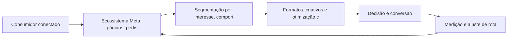

Observe o laço de retorno: a medição alimenta o próximo ciclo de campanha. Essa é a diferença estrutural entre campanha e sistema — a campanha termina quando o orçamento acaba; o sistema aprende e se ajusta a cada ciclo [7]. No caso do tema *Meta: Facebook e Instagram como Ecossistema de Negócio*, esse laço é o que converte o investimento inicial em aprendizado acumulado para as próximas decisões [15].

## 4. Técnica

### A Matriz de Criativos e Audiências

A operação de tráfego pago em escala é uma matriz: combinar criativos e audiências, medir e descartar o que não performa. O código abaixo simula a matriz e ordena os vencedores.

```python
import itertools

def matriz_planejamento(criativos, audiencias):
    """Retorna combinações com custo por conversão estimado."""
    celulas = []
    for c, a in itertools.product(criativos, audiencias):
        # CTR e CVR simulados: variam por combinação
        ctr = 0.01 + (hash(c) % 30) / 1000
        cvr = 0.02 + (hash(a) % 20) / 1000
        cpc = 1.20
        custo_conv = cpc / (ctr * cvr)
        celulas.append({"criativo": c, "audiencia": a,
                        "custo_conversao": round(custo_conv, 2)})
    return sorted(celulas, key=lambda x: x["custo_conversao"])

criativos = ["hook_beneficio", "hook_prova", "hook_historico"]
audiencias = ["novos", "engajados", "lookalike"]
for top in matriz_planejamento(criativos, audiencias)[:3]:
    print(top)
```

A matriz evita o erro mais comum: investir todo o orçamento na primeira combinação antes de deixar o algoritmo aprender [6]. A disciplina vale para qualquer plataforma social [14].

O código acima é o núcleo técnico de *Meta: Facebook e Instagram como Ecossistema de Negócio*: validável, executável e adaptável ao contexto real do leitor. A prática recomendada é rodá-lo com dados próprios e usar a saída como insumo da próxima reunião de planejamento. Documentação oficial das plataformas reforça cada passo — da estrutura de campanhas [5] à configuração de eventos [12]. A leitura técnica deste capítulo complementa a exposição conceitual das seções anteriores e prepara os exercícios da seção seguinte.

## 5. Aplica

Conhecimento sem aplicação é conteúdo; aplicação sem reflexão é rotina. No contexto de *Meta: Facebook e Instagram como Ecossistema de Negócio*, os exercícios abaixo fecham o capítulo e preparam o terreno do próximo:

1. Liste três criadores do seu segmento e analise o que eles fazem no primeiro segundo dos vídeos.
2. Defina a frequência de publicação ideal para a sua capacidade real de produção de conteúdo.
3. Responda a comentários de clientes nas redes por uma semana e registre as perguntas recorrentes.
4. Defina o tom de voz da sua marca e produza 5 posts de teste em uma única plataforma.

Dedique ao menos 30 minutos a um dos exercícios antes de avançar. O aprendizado desta obra é cumulativo: o mapa desenhado aqui será usado nos capítulos seguintes da Parte IV e nas partes subsequentes [3].

Complementando, cinco exercícios práticos adicionais consolidam o aprendizado de *Meta: Facebook e Instagram como Ecossistema de Negócio*:

1. Você tem público personalizado e retargeting configurados — ou depende só de segmentação por interesse?
2. Que conversa da sua audiência, hoje ignorada, poderia alimentar o seu próximo conteúdo?
3. Qual plataforma social concentra o seu público-alvo real — e quanto da sua produção está lá?
4. Seus criativos são feitos para a plataforma ou são o mesmo anúncio reutilizado em todos os lugares?
5. Quanto tempo o seu público fica vendo o seu vídeo? Se for pouco, o problema é o hook?

## Leitura Complementar Recomendada

Para aprofundar *Meta: Facebook e Instagram como Ecossistema de Negócio* além deste capítulo:

- Como complemento, o TikTok for Business e o LinkedIn Marketing Solutions documentam as particularidades de cada território [14] [13].

- Para aprofundar as redes sociais, o livro de Hollensen, Kotler e Opresnik (Social Media Marketing) cobre a estratégia e o ecossistema, e a documentação do Meta Business Help Center detalha a operação de anúncios [11] [6].

## Análise de Riscos e Mitigações

A aplicação de *Meta: Facebook e Instagram como Ecossistema de Negócio* envolve riscos identificáveis. A tabela de riscos abaixo relaciona cada ameaça à sua mitigação:

- Risco de fadiga criativa: criativos saturados aumentam o custo. Mitigação: matriz de teste contínuo de criativos e audiências [6].
- Risco de métricas de vaidade: curtidas sem receita. Mitigação: conectar cada métrica social a resultado de negócio [8].
- Risco de crise não gerida: crítica viral sem resposta. Mitigação: protocolo de resposta e monitoramento diário [11].
- Risco de dependência algorítmica: o alcance muda com o algoritmo. Mitigação: lista própria e canal de propriedade como contrapeso [8].

## Considerações de Implementação

e

## Exercício Integrador da Parte IV

 

Este exercício conecta o capítulo às demais partes da obra e deve ser revisto ao final da leitura completa.

## Aprofundamento Prático

O tema de *Meta: Facebook e Instagram como Ecossistema de Negócio* ganha potência quando levado ao nível operacional. Os quatro pontos abaixo aprofundam a aplicação prática:

- A gestão de comunidade é trabalho contínuo de relacionamento: responder, reconhecer e dar voz aos clientes transforma audiência em defensores — o ativo social mais valioso da marca [11].

- O aprofundamento prático das redes começa pela definição do sistema de conteúdo: pilares, formatos e cadência por plataforma — o calendário é a manifestação operacional da estratégia [11].

- A leitura avançada do algoritmo de recomendação exige entender o sinal: retenção de vídeo é a moeda — hooks fortes, loops e legendas aumentam o tempo de visualização e a distribuição [14].

- A operação de tráfego pago social é um ciclo de aprendizado: testar, medir, descartar e escalar — a matriz de criativos e audiências é o instrumento que organiza o ciclo [6].

## Exercícios de Fixação

Para consolidar *Meta: Facebook e Instagram como Ecossistema de Negócio*, resolva os cinco exercícios abaixo — com caneta, papel e dados reais:

1. Configure um público personalizado e um retargeting na sua plataforma.
2. Registre as cinco perguntas mais frequentes da sua comunidade.
3. Compare o engajamento por plataforma da última quinzena.
4. Defina o tom de voz da sua marca em três adjetivos e teste em cinco posts.
5. Produza um vídeo vertical com hook nos primeiros três segundos.

## Autoavaliação do Capítulo

Autoavaliação: (1) Sei qual plataforma concentra o meu público real? (2) Meu calendário tem objetivo por peça? (3) Tenho público personalizado e retargeting configurados? (4) Meus vídeos têm hook nos primeiros três segundos? (5) Acompanho custo por resultado nas redes? Responda e priorize a primeira resposta negativa.

A primeira resposta negativa é o seu próximo passo natural — volte a ela na seção de aplicação deste capítulo e trabalhe o item até que a resposta seja sim.

## Problemas Comuns e Soluções Práticas

Aplicar *Meta: Facebook e Instagram como Ecossistema de Negócio* no mundo real esbarra em problemas recorrentes. Abaixo, cinco situações típicas com suas soluções — sintoma, causa e correção:

### Conteúdo sem estratégia

Postagens aleatórias sem objetivo. A solução é o calendário editorial com meta por peça: engajar, educar, converter ou provar [11].

### Engajamento em queda

A audiência para de interagir. A solução é rever o calendário, os formatos e o tom — e perguntar à própria audiência o que ela quer ver [11].

### Anúncios caros e sem retorno

Criativos saturados e audiências amplas inflam o custo. A solução é a matriz de criativos e audiências com teste e descarte sistemático [6].

### Audiência que não cresce

O alcance orgânico estagnou. A solução é variar formatos, hooks e horários, e usar o retargeting para capturar quem já interagiu [6].

### Crise nas redes

Uma crítica viral saiu do controle. A solução é o protocolo: responder com transparência, velocidade adequada e tom definido — e documentar o aprendizado [11].

## Aplicações por Setor

O tema de *Meta: Facebook e Instagram como Ecossistema de Negócio* ganha contornos diferentes em cada setor. A leitura setorial abaixo ajuda a adaptar os princípios ao seu contexto:

- No B2C, o Instagram e o TikTok dominam a descoberta; no B2B, o LinkedIn concentra os decisores; em serviços locais, o Facebook e o WhatsApp sustentam a conversa — a plataforma segue o público [11].

- Na moda, o vídeo e o visual lideram; na educação, o conteúdo educativo e o testemunho; na tecnologia B2B, o thought leadership e o caso técnico — o formato segue a decisão [11].

## Plano de Ação de 30 Dias

Para converter a leitura de *Meta: Facebook e Instagram como Ecossistema de Negócio* em resultado, execute um dos planos semanais abaixo — cada semana tem um objetivo e uma entrega:

### Plano de Ação — Opção 1

Semana 1 — Escuta: observe a conversa da sua comunidade por uma semana e registre as dores.
Semana 2 — Calendário: monte duas semanas de conteúdo respondendo às dores reais.
Semana 3 — Relação: responda a comentários e mensagens, registrando as recorrentes.
Semana 4 — Medição: compare engajamento e resultado da quinzena e ajuste a rota.

### Plano de Ação — Opção 2

Semana 1 — Foco: defina a plataforma principal e o tom de voz.
Semana 2 — Conteúdo: produza cinco posts de teste e um vídeo vertical com hook.
Semana 3 — Público: configure um público personalizado e um retargeting.
Semana 4 — Campanha: lance o piloto pago com orçamento pequeno e criativo testado.

## KPIs que Importam neste Capítulo

Para *Meta: Facebook e Instagram como Ecossistema de Negócio*, os KPIs que importam: alcance e engajamento, custo por resultado, taxa de retenção de vídeo e conversão atribuída por plataforma — a régua de cada território social [6].

Antes de encerrar, registre esses indicadores no seu painel de acompanhamento — eles serão a régua para medir a aplicação deste capítulo nas próximas semanas.

## Roteiro de Implementação Passo a Passo

Para aplicar *Meta: Facebook e Instagram como Ecossistema de Negócio* na prática, os roteiros abaixo organizam a sequência de ações — do diagnóstico à medição:

### Roteiro de Implementação 1

1. Liste as plataformas onde a marca está e o público de cada uma.
2. Compare o engajamento e o resultado de cada plataforma na última quinzena.
3. Escolha a plataforma de nicho do seu mercado e observe as conversas por uma semana.
4. Registre as perguntas, dores e termos usados pela comunidade.
5. Produza conteúdo respondendo às dores reais, no formato da plataforma.
6. Defina a frequência de publicação sustentável para a capacidade real do time.
7. Responda a comentários e mensagens por uma semana, registrando as recorrentes.
8. Selecione três criadores do segmento e avalie fit, alcance e engajamento.
9. Defina o protocolo de resposta para críticas e elogios.
10. Agende a revisão mensal de métricas por plataforma.

### Roteiro de Implementação 2

1. Defina o objetivo da presença social do trimestre em uma frase mensurável.
2. Escolha a plataforma principal onde o público-alvo realmente está.
3. Defina o tom de voz: como a marca fala, o que nunca diz e o que sempre diz.
4. Produza cinco posts de teste em uma semana e meça o engajamento.
5. Identifique os três formatos com melhor retenção e engajamento.
6. Produza um vídeo vertical com hook nos primeiros três segundos.
7. Monte o calendário editorial de duas semanas com objetivo por peça.
8. Configure um público personalizado e um retargeting no Gerenciador de Anúncios.
9. Lance uma campanha piloto com orçamento pequeno e criativo testado.
10. Meça custo por resultado, documente e decida o próximo ciclo.

## Perguntas Frequentes

Em relação ao tema de *Meta: Facebook e Instagram como Ecossistema de Negócio*, cinco perguntas surgem com frequência na prática profissional:

**Comprar seguidores adianta?**

Não — destrói o alcance real e a credibilidade. Métricas de vaidade não se convertem em receita [11].

**Tráfego pago é obrigatório?**

Não, mas acelera. Sem ele, o orgânico constrói com mais tempo; com ele, testa-se hipóteses mais rápido [6].

**Como medir o retorno do conteúdo?**

Atribuindo conversão: cada peça tem papel na jornada, e o modelo de atribuição distribui o crédito com justiça [12].

**Qual plataforma escolher?**

A que concentra o seu público-alvo real — e não a mais popular. Onde está a conversa da sua audiência? [11].

**Postar todo dia ou com qualidade?**

Consistência com qualidade: publicar com regularidade construindo expectativa vale mais que volume sem estratégia [11].

## Cenários Numéricos Comentados

Os cálculos abaixo mostram, com números concretos, como as decisões de *Meta: Facebook e Instagram como Ecossistema de Negócio* se traduzem em resultado:

### Cenário numérico: micro versus macro

Uma celebridade com 5 milhões de seguidores e engajamento de 0,2% alcança 10.000 interações. Um micro-influenciador com 50 mil seguidores e engajamento de 5% alcança 2.500 interações — mas com taxa de conversão cinco vezes maior pela confiança do nicho. O custo por venda, não o alcance, decide o vencedor [11].

### Cenário numérico: a matriz de criativos

Uma campanha com três criativos e três audiências gera nove combinações. Testar todas com orçamento igual revela que uma única combinação entrega custo por conversão 40% menor que a média. Concentrar 70% do orçamento no vencedor e manter o resto para aprendizado é a disciplina de escala da matriz [6].

## Como Este Capítulo se Integra à Obra

As redes sociais são o território de descoberta e prova social da jornada. A busca (Parte III) captura a intenção que as redes despertaram; o relacionamento (Parte V) converte a audiência em lista própria; e a conversão (Parte VII) fecha o ciclo que as redes iniciaram. No contexto de *Meta: Facebook e Instagram como Ecossistema de Negócio*, essa integração fica ainda mais visível: as ferramentas e métricas que você dominou aqui serão a base das decisões dos próximos capítulos — e das partes que virão depois.

## Aprofundamento Conceitual

No contexto de *Meta: Facebook e Instagram como Ecossistema de Negócio*, a autenticidade superou o polimento: o consumidor conectado desconfia do perfeito e confia no real — e o conteúdo gerado por clientes (UGC) converte mais que o anúncio produzido [14].

No contexto de *Meta: Facebook e Instagram como Ecossistema de Negócio*, o ecossistema Meta é o maior laboratório de segmentação do mundo: dados de interesse, comportamento e relacionamento alimentam públicos que nenhum outro canal consegue igualar [6].

No contexto de *Meta: Facebook e Instagram como Ecossistema de Negócio*, o vídeo vertical não é uma moda: é a resposta ao comportamento — a maioria do consumo social acontece no celular, com o som desligado e em sessões curtas, e o formato se adapta a isso [14].

No contexto de *Meta: Facebook e Instagram como Ecossistema de Negócio*, o algoritmo de recomendação do TikTok e dos Reels recompensa a retenção: vídeos que prendem até o fim entram em loops de distribuição massiva — o que torna o hook (primeiros 3 segundos) a decisão criativa mais importante [14].

No contexto de *Meta: Facebook e Instagram como Ecossistema de Negócio*, o LinkedIn é o território do B2B: decisores, tomadores de compra e especialistas estão lá, e o conteúdo de autoridade — casos, dados, opiniões fundamentadas — constrói a confiança que encurta o ciclo de venda [13].

## Fundamentos em Detalhe

No contexto de *Meta: Facebook e Instagram como Ecossistema de Negócio*, a segmentação social combina interesse, comportamento e dados próprios: públicos personalizados, lookalikes e retargeting formam a espinha dorsal de uma operação de mídia social madura [6].

No contexto de *Meta: Facebook e Instagram como Ecossistema de Negócio*, o marketing de influência transfere confiança em vez de criá-la: a credibilidade do criador com sua audiência é o ativo que a marca compra — e por isso a seleção do criador é a decisão mais importante da parceria [11].

No contexto de *Meta: Facebook e Instagram como Ecossistema de Negócio*, as comunidades de nicho — grupos, fóruns e subreddits — oferecem densidade de audiência inigualável: cada publicação alcança uma proporção muito maior do público-alvo do que em canais de massa [11].

No contexto de *Meta: Facebook e Instagram como Ecossistema de Negócio*, a escuta social transforma conversa em dado: monitorar menções, sentimentos e perguntas da audiência alimenta conteúdo, produto e atendimento com inteligência real de mercado [3].

No contexto de *Meta: Facebook e Instagram como Ecossistema de Negócio*, a consistência de publicação importa mais que a frequência: marcas que publicam com regularidade e qualidade constroem expectativa, enquanto as que desaparecem entre posts perdem o hábito da audiência [11].

## Estudos de Caso Aplicados

### Caso: o B2B que construiu autoridade no LinkedIn

Uma empresa de software B2B sofria para gerar leads qualificados. Em vez de mais anúncios, o time passou a publicar thought leadership: dados de mercado, casos reais e opiniões fundamentadas no LinkedIn dos fundadores e especialistas. O perfil da marca cresceu em autoridade, e os leads passaram a chegar mais qualificados — reduzindo o ciclo de venda e o custo por oportunidade [13].

### Caso: a marca de moda que acertou o TikTok pelo hook

Uma marca de moda feminina produzia vídeos polidos que não decolavam. A análise mostrou que os primeiros segundos perdiam a audiência. A equipe passou a criar hooks de curiosidade ("por que essa calça veste diferente"), legendas automáticas e loops de repetição. O alcance orgânico disparou, e um único vídeo viral gerou fila de espera para um produto que não era o foco da campanha [14].

## Dados e Números do Setor

### Dados de Contexto

- As redes sociais concentram o maior tempo de atenção diário do consumidor conectado [15].
- A Meta opera um dos maiores ecossistemas de anúncios do mundo [6].
- O vídeo curto domina o engajamento nas plataformas de recomendação [14].
- O LinkedIn é o território B2B de decisores e tomadores de compra [13].

### Indicadores-Chave

- Alcance, engajamento e custo por resultado são as métricas sociais centrais [11].
- O custo por clique varia por plataforma, formato e segmentação [6].
- A taxa de retenção de vídeo é a métrica que alimenta a distribuição algorítmica [14].

## Análise Comparativa

O tema de *Meta: Facebook e Instagram como Ecossistema de Negócio* fica mais claro quando contrastado com a alternativa mais próxima. A comparação abaixo organiza as diferenças:

### Orgânico vs. Pago Social

- Orgânico constrói audiência e confiança; pago amplia alcance com precisão.
- Orgânico é lento e cumulativo; pago é rápido e mensurável por campanha.
- Pago depende de dados first-party; orgânico depende de consistência.
- A operação madura combina os dois com proporção definida por objetivo.

## Erros Comuns e Como Evitá-los

No tema de *Meta: Facebook e Instagram como Ecossistema de Negócio*, cinco erros recorrentes merecem atenção especial — cada um com sua correção prática:

1. Comprar seguidores: métricas de vaidade que destroem a credibilidade e o alcance real.
2. Ignorar a comunidade: responder só quando há crise perde o valor da conversa contínua.
3. Escalar orçamento antes de validar: aumentar a verba de uma combinação não testada multiplica o prejuízo.
4. Produzir para todas as plataformas ao mesmo tempo: sem foco, nenhuma audiência se forma.
5. Repetir o mesmo criativo até a exaustão: a fadiga criativa aumenta o custo por resultado.

## Ferramentas e Recursos Recomendados

Para operar o tema de *Meta: Facebook e Instagram como Ecossistema de Negócio* na prática, a seguinte seleção de ferramentas cobre o ciclo completo — do diagnóstico à medição:

1. Editor de vídeo vertical (Reels/TikTok)
2. Plataforma de agendamento social
3. Ferramenta de escuta social (menções e sentimento)
4. TikTok Creative Center (tendências e hooks)
5. Gerenciador de Anúncios da Meta (públicos e criativos)

## Glossário do Capítulo

Os termos abaixo — todos usados no corpo deste capítulo — formam o vocabulário mínimo para acompanhar o restante da obra:

Pixel: rastreador de conversão da plataforma. Público personalizado: audiência construída com dados próprios. Lookalike: audiência semelhante a uma base. Hook: abertura de vídeo que prende atenção. UGC: conteúdo gerado pelo usuário. Engajamento: interações sobre a publicação.

## Checklist de Implementação

Use a lista abaixo para auditar a aplicação de *Meta: Facebook e Instagram como Ecossistema de Negócio* na sua operação — marque os itens já concluídos e priorize os pendentes:

- [ ] Tom de voz definido e testado
- [ ] Campanha Meta com público personalizado
- [ ] Vídeo vertical com hook nos 3 primeiros segundos
- [ ] Calendário social com objetivo por peça
- [ ] Escuta social iniciada

## Perguntas para Reflexão

Antes de avançar, reflita sobre as cinco questões abaixo — elas conectam o conteúdo de *Meta: Facebook e Instagram como Ecossistema de Negócio* ao seu contexto real de trabalho:

1. Que conversa da sua audiência, hoje ignorada, poderia alimentar o seu próximo conteúdo?
2. Qual plataforma social concentra o seu público-alvo real — e quanto da sua produção está lá?
3. Seus criativos são feitos para a plataforma ou são o mesmo anúncio reutilizado em todos os lugares?
4. Quanto tempo o seu público fica vendo o seu vídeo? Se for pouco, o problema é o hook?
5. Você tem público personalizado e retargeting configurados — ou depende só de segmentação por interesse?

## Quadro Comparativo: Plataformas Sociais e Papel no Funil

O quadro abaixo consolida os elementos essenciais de *Meta: Facebook e Instagram como Ecossistema de Negócio* em perspectiva comparada, facilitando a consulta rápida e a tomada de decisão:

| Plataforma | Papel principal | Formato forte |
|---|---|---|
| Plataforma | Papel principal | Formato forte |
| Instagram | Descoberta e prova | Visual e Reels |
| TikTok | Viralização e descoberta | Vídeo curto |
| LinkedIn | Autoridade B2B | Texto e thought leadership |
| YouTube | Educação e busca | Vídeo longo |
| WhatsApp | Conversão e atendimento | Mensagem direta |

## 6. Conclusão

O capítulo percorreu o território da Parte IV, *Redes Sociais — Territórios de Comunidade*, e deixou três aprendizados operacionais. Primeiro, o conceito central — *Meta: Facebook e Instagram como Ecossistema de Negócio* — é menos uma novidade e mais uma disciplina de execução. Segundo, a aplicação exige a tríade conceito, rota e métrica, sem pular etapas [8]. Terceiro, o ajuste contínuo de rota, ilustrado no laço de retorno do diagrama, é o que separa campanhas pontuais de operações sustentáveis [7]. O caminho percorrido desde *O Futuro da Busca: SGE e a Otimização para Respostas de IA* até aqui forma a base que o próximo passo vai usar. No próximo capítulo, *TikTok, YouTube e LinkedIn: Territórios Especializados*, você avançará sobre o território vizinho levando as ferramentas exercitadas aqui.

Como navegador de marketing digital, você não decorou uma fórmula — incorporou um modo de operar: ler o território, escolher a rota com dados e ajustar o percurso quando o vento muda [2].

Antes do fechamento, vale reforçar a base do capítulo: No contexto de *Meta: Facebook e Instagram como Ecossistema de Negócio*, as plataformas de nicho — Pinterest, Reddit, X, grupos — oferecem densidade: menos pessoas, mas exatamente o público-alvo, com conversa de alta qualidade e custo de atenção menor [11].

No contexto de *Meta: Facebook e Instagram como Ecossistema de Negócio*, a escuta social alimenta o calendário editorial: as perguntas e dores da audiência são o melhor briefing de conteúdo que uma marca pode ter [11].
## 7. Referências Bibliográficas

[1] KOTLER, Philip; KELLER, Kevin Lane. **Administração de Marketing**. 15. ed. São Paulo: Pearson, 2016.
[2] KOTLER, Philip; KARTAJAYA, Hermawan; SETIAWAN, Iwan. **Marketing 4.0: Moving from Traditional to Digital**. Hoboken: Wiley, 2017.
[3] CHAFFEY, Dave; ELLIS-CHADWICK, Fiona. **Digital Marketing: Strategy, Implementation and Practice**. 9. ed. Harlow: Pearson, 2025.
[4] GOOGLE SEARCH CENTRAL. **Search Engine Optimization (SEO) Starter Guide**. Disponível em: https://developers.google.com/search/docs/fundamentals/seo-starter-guide. Acesso em: 02 ago. 2026.
[5] GOOGLE ADS HELP CENTER. **Your guide to Google Ads (Basics, Search Campaigns & Best Practices)**. Disponível em: https://support.google.com/google-ads/answer/6146252. Acesso em: 02 ago. 2026.
[6] META BUSINESS HELP CENTER. **Meta Ads Manager Guide: Best Practices for Targeting, Measurement, and Optimization**. Disponível em: https://www.facebook.com/business/help. Acesso em: 02 ago. 2026.
[7] DELOITTE DIGITAL. **Marketing Trends 2026: New Marketing for a New World**. Disponível em: https://www.deloittedigital.com/nl/en/insights/perspective/marketing-trends-2026.html. Acesso em: 02 ago. 2026.
[8] HUBSPOT RESEARCH. **The State of Marketing / 2026 Marketing Statistics, Trends & Data**. Disponível em: https://www.hubspot.com/marketing-statistics. Acesso em: 02 ago. 2026.
[9] STATISTA RESEARCH DEPARTMENT. **Global Digital Marketing and Advertising Revenue Statistics & Facts**. Disponível em: https://www.statista.com/topics/8954/marketing-worldwide/. Acesso em: 02 ago. 2026.
[10] RYAN, Damian. **Understanding Digital Marketing: Marketing Strategies for Engaging the Digital Generation**. 5. ed. London: Kogan Page, 2020.
[11] HOLLENSEN, Svend; KOTLER, Philip; OPRESNIK, Marc Oliver. **Social Media Marketing: A Practitioner Approach**. 4. ed. Harlow: Pearson, 2023.
[12] GOOGLE ANALYTICS HELP CENTER. **Documentação oficial do Google Analytics 4**. Disponível em: https://support.google.com/analytics. Acesso em: 02 ago. 2026.
[13] LINKEDIN MARKETING SOLUTIONS. **Best Practices para campanhas B2B no LinkedIn**. Disponível em: https://business.linkedin.com/marketing-solutions. Acesso em: 02 ago. 2026.
[14] TIKTOK FOR BUSINESS. **Guia de criatividade e boas práticas de anúncios no TikTok**. Disponível em: https://www.tiktok.com/business. Acesso em: 02 ago. 2026.
[15] DATAREPORTAL. **Digital 2026: Global Overview Report**. Disponível em: https://datareportal.com/reports/digital-2026-global-overview-report. Acesso em: 02 ago. 2026.
[16] LEMON, Katherine N.; VERHOEF, Peter C. **Understanding Customer Experience Throughout the Customer Journey**. *Journal of Marketing*, v. 80, n. 6, p. 69-96, 2016.
[17] TIWARI, Rajnish; BUSE, Stephan; HERSTATT, Cornelius. **From Electronic to Mobile Commerce: Opportunities and Challenges**. *Proceedings of the German-Indian Roundtable*, 2006.
[18] VAN DIJK, Jan A. G. M. **The Digital Divide**. Cambridge: Polity Press, 2020.
[19] IBM. **Marketing with AI: Personalization at Scale**. Disponível em: https://www.ibm.com/think/topics/ai-marketing. Acesso em: 02 ago. 2026.
[20] KOTLER, Philip. **Marketing 5.0: Technology for Humanity**. Hoboken: Wiley, 2021.

# Capítulo 17: TikTok, YouTube e LinkedIn: Territórios Especializados

## 1. Introdução

Bem-vindo a uma nova etapa da sua navegação pelo marketing digital. Este capítulo — *TikTok, YouTube e LinkedIn: Territórios Especializados* — integra a Parte IV, *Redes Sociais — Territórios de Comunidade*, e responde a uma pergunta prática: **tiktok: criatividade, tendências e publicidade nativa** — na prática, como isso se traduz em decisão e resultado?

Ao final, você será capaz de ntende as particularidades de cada plataforma: vídeo curto (tiktok), vídeo longo e busca (youtube) e networking b2b (linkedin).. Mais do que decorar conceitos, você vai enxergar cada plataforma como território com geografia própria — e converter essa visão em plano, experimento e métrica.

No capítulo anterior, *Meta: Facebook e Instagram como Ecossistema de Negócio*, você aprendeu os conceitos que servem de plataforma para o que vem agora. Este capítulo retoma esse repertório e o aplica a um território novo — sem repetir o que já foi estabelecido, apenas usando como base.

O capítulo segue a estrutura das sete seções que organizam esta obra: primeiro a exposição conceitual, depois a ilustração, a técnica aplicada, o exercício de aplicação e a conclusão operacional.

No contexto de *TikTok, YouTube e LinkedIn: Territórios Especializados*, o tráfego pago social opera sobre dados first-party: os pixels e públicos personalizados da Meta permitem alcançar quem já interagiu com a marca e modelar audiências semelhantes [6].

No contexto de *TikTok, YouTube e LinkedIn: Territórios Especializados*, o vídeo vertical redefiniu a criatividade: hooks nos primeiros segundos, loops, legendas e autenticidade superam produção cara sem estratégia nativa [14].
## 2. Explica

### TikTok: criatividade, tendências e publicidade nativa

Quando o tema é *TikTok, YouTube e LinkedIn: Territórios Especializados*, o primeiro pilar — tiktok: criatividade, tendências e publicidade nativa — define o território conceitual. As redes sociais concentram o maior tempo de atenção diário do consumidor conectado, e as plataformas transformaram esse tempo em infraestrutura de anúncios com segmentação granular [15].

Na prática, tiktok: criatividade, tendências e publicidade nativa significa transformar a teoria em rotina operacional — exatamente o que *TikTok, YouTube e LinkedIn: Territórios Especializados* exige no dia a dia. A literatura de gestão é enfática: sem operacionalizar o conceito em checklist, responsável e métrica, ele permanece slide de apresentação [3]. Por isso a Parte IV propõe sempre o mesmo movimento: entender, traduzir em critério observável e decidir com dado.

### YouTube: SEO de vídeo, canais e anúncios TrueView

O segundo pilar — youtube: seo de vídeo, canais e anúncios trueview — conecta a estratégia à operação diária. A Meta opera um dos maiores ecossistemas de anúncios do mundo, com segmentação por interesse, comportamento e públicos personalizados a partir de dados first-party [6]. A experiência do consumidor se constrói na consistência entre canais e mensagens, e é essa consistência que transforma contato em relacionamento [16]. Organizações que tratam cada canal como silo perdem o fio condutor da jornada; as que operam o pilar com disciplina reduzem atrito e aumentam a taxa de avanço entre etapas [10].

### LinkedIn: marketing B2B, thought leadership e campanhas

Fechando o tripé, linkedin: marketing b2b, thought leadership e campanhas é o que transforma a Parte IV em vantagem mensurável. O vídeo curto redefiniu o engajamento: plataformas de recomendação verticalizada distribuem conteúdo com base em retenção e loops de visualização [14]. O relato da indústria mostra que as empresas que sustentam resultado não são as que têm mais ferramentas, mas as que conseguem medir e ajustar a rota com frequência [8]. A métrica certa, escolhida antes da campanha, vale mais do que qualquer ferramenta cara instalada depois do fato [9].

### O Eixo Transversal do Capítulo

Para o B2B, o LinkedIn consolidou-se como o território de decisores: thought leadership, conteúdo de autoridade e campanhas por cargo e empresa [13]. Esse eixo conecta os três pilares e explica por que o capítulo os trata como um sistema, não como uma lista: cada pilar reforça o outro, e a omissão de qualquer um deles produz estratégia manca. O capítulo seguinte retomará esse eixo com novas ferramentas, agora com o vocabulário já estabelecido aqui.

Em síntese, o capítulo opera em três níveis: o conceitual (TikTok: criatividade, tendências e publicidade nativa), o operacional (YouTube: SEO de vídeo, canais e anúncios TrueView) e o estratégico (LinkedIn: marketing B2B, thought leadership e campanhas). O leitor que dominar os três estará apto a aplicar a Parte IV com autonomia [1]. A evidência reunida nesta seção sustenta cada recomendação prática das seções seguintes [2].

## 3. Ilustra

Vamos traduzir o capítulo em uma cena concreta, no contexto de *TikTok, YouTube e LinkedIn: Territórios Especializados*. Uma empresa de porte médio, com equipe enxuta e orçamento limitado, decide operar a Parte IV desta obra, *Redes Sociais — Territórios de Comunidade*. Na primeira semana, a equipe testa o conceito central do capítulo em um caso real: um cliente que pesquisou, comparou e decidiu comprar. O primeiro pilar — tiktok: criatividade, tendências e publicidade nativa — orienta o entendimento inicial do público; o segundo — youtube: seo de vídeo, canais e anúncios trueview — guia a escolha da rota de comunicação; e o terceiro fecha com a medição do resultado [2].

O diagrama abaixo representa o fluxo operacional proposto pelo capítulo — do consumidor conectado à decisão e ao ajuste contínuo de rota, com o público e a plataforma específicos do tema no centro da navegação:

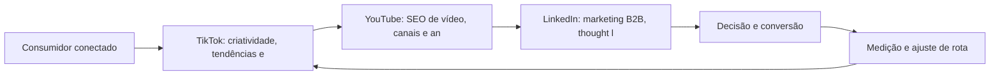

Observe o laço de retorno: a medição alimenta o próximo ciclo de campanha. Essa é a diferença estrutural entre campanha e sistema — a campanha termina quando o orçamento acaba; o sistema aprende e se ajusta a cada ciclo [7]. No caso do tema *TikTok, YouTube e LinkedIn: Territórios Especializados*, esse laço é o que converte o investimento inicial em aprendizado acumulado para as próximas decisões [15].

## 4. Técnica

### A Matriz de Criativos e Audiências

A operação de tráfego pago em escala é uma matriz: combinar criativos e audiências, medir e descartar o que não performa. O código abaixo simula a matriz e ordena os vencedores.

```python
import itertools

def matriz_planejamento(criativos, audiencias):
    """Retorna combinações com custo por conversão estimado."""
    celulas = []
    for c, a in itertools.product(criativos, audiencias):
        # CTR e CVR simulados: variam por combinação
        ctr = 0.01 + (hash(c) % 30) / 1000
        cvr = 0.02 + (hash(a) % 20) / 1000
        cpc = 1.20
        custo_conv = cpc / (ctr * cvr)
        celulas.append({"criativo": c, "audiencia": a,
                        "custo_conversao": round(custo_conv, 2)})
    return sorted(celulas, key=lambda x: x["custo_conversao"])

criativos = ["hook_beneficio", "hook_prova", "hook_historico"]
audiencias = ["novos", "engajados", "lookalike"]
for top in matriz_planejamento(criativos, audiencias)[:3]:
    print(top)
```

A matriz evita o erro mais comum: investir todo o orçamento na primeira combinação antes de deixar o algoritmo aprender [6]. A disciplina vale para qualquer plataforma social [14].

O código acima é o núcleo técnico de *TikTok, YouTube e LinkedIn: Territórios Especializados*: validável, executável e adaptável ao contexto real do leitor. A prática recomendada é rodá-lo com dados próprios e usar a saída como insumo da próxima reunião de planejamento. Documentação oficial das plataformas reforça cada passo — da estrutura de campanhas [5] à configuração de eventos [12]. A leitura técnica deste capítulo complementa a exposição conceitual das seções anteriores e prepara os exercícios da seção seguinte.

## 5. Aplica

Conhecimento sem aplicação é conteúdo; aplicação sem reflexão é rotina. No contexto de *TikTok, YouTube e LinkedIn: Territórios Especializados*, os exercícios abaixo fecham o capítulo e preparam o terreno do próximo:

1. Defina o tom de voz da sua marca e produza 5 posts de teste em uma única plataforma.
2. Estruture uma campanha Meta com um público personalizado e um criativo de vídeo vertical.
3. Escolha uma plataforma de nicho do seu mercado e observe as conversas por uma semana antes de publicar.
4. Compare seu engajamento por plataforma na última quinzena e decida onde dobrar a aposta.

Dedique ao menos 30 minutos a um dos exercícios antes de avançar. O aprendizado desta obra é cumulativo: o mapa desenhado aqui será usado nos capítulos seguintes da Parte IV e nas partes subsequentes [3].

Complementando, cinco exercícios práticos adicionais consolidam o aprendizado de *TikTok, YouTube e LinkedIn: Territórios Especializados*:

1. Seus criativos são feitos para a plataforma ou são o mesmo anúncio reutilizado em todos os lugares?
2. Quanto tempo o seu público fica vendo o seu vídeo? Se for pouco, o problema é o hook?
3. Você tem público personalizado e retargeting configurados — ou depende só de segmentação por interesse?
4. Que conversa da sua audiência, hoje ignorada, poderia alimentar o seu próximo conteúdo?
5. Qual plataforma social concentra o seu público-alvo real — e quanto da sua produção está lá?

## Leitura Complementar Recomendada

Para aprofundar *TikTok, YouTube e LinkedIn: Territórios Especializados* além deste capítulo:

- Para aprofundar as redes sociais, o livro de Hollensen, Kotler e Opresnik (Social Media Marketing) cobre a estratégia e o ecossistema, e a documentação do Meta Business Help Center detalha a operação de anúncios [11] [6].

- Como complemento, o TikTok for Business e o LinkedIn Marketing Solutions documentam as particularidades de cada território [14] [13].

## Análise de Riscos e Mitigações

A aplicação de *TikTok, YouTube e LinkedIn: Territórios Especializados* envolve riscos identificáveis. A tabela de riscos abaixo relaciona cada ameaça à sua mitigação:

- Risco de dependência algorítmica: o alcance muda com o algoritmo. Mitigação: lista própria e canal de propriedade como contrapeso [8].
- Risco de fadiga criativa: criativos saturados aumentam o custo. Mitigação: matriz de teste contínuo de criativos e audiências [6].
- Risco de métricas de vaidade: curtidas sem receita. Mitigação: conectar cada métrica social a resultado de negócio [8].
- Risco de crise não gerida: crítica viral sem resposta. Mitigação: protocolo de resposta e monitoramento diário [11].

## Considerações de Implementação

g

## Exercício Integrador da Parte IV

c

Este exercício conecta o capítulo às demais partes da obra e deve ser revisto ao final da leitura completa.

## Aprofundamento Prático

O tema de *TikTok, YouTube e LinkedIn: Territórios Especializados* ganha potência quando levado ao nível operacional. Os quatro pontos abaixo aprofundam a aplicação prática:

- A operação de tráfego pago social é um ciclo de aprendizado: testar, medir, descartar e escalar — a matriz de criativos e audiências é o instrumento que organiza o ciclo [6].

- A escuta social é a inteligência da operação: monitorar menções, sentimentos e perguntas alimenta conteúdo, produto e atendimento — a comunidade fala e a marca precisa ouvir [11].

- A gestão de comunidade é trabalho contínuo de relacionamento: responder, reconhecer e dar voz aos clientes transforma audiência em defensores — o ativo social mais valioso da marca [11].

- O aprofundamento prático das redes começa pela definição do sistema de conteúdo: pilares, formatos e cadência por plataforma — o calendário é a manifestação operacional da estratégia [11].

## Exercícios de Fixação

Para consolidar *TikTok, YouTube e LinkedIn: Territórios Especializados*, resolva os cinco exercícios abaixo — com caneta, papel e dados reais:

1. Defina o tom de voz da sua marca em três adjetivos e teste em cinco posts.
2. Produza um vídeo vertical com hook nos primeiros três segundos.
3. Configure um público personalizado e um retargeting na sua plataforma.
4. Registre as cinco perguntas mais frequentes da sua comunidade.
5. Compare o engajamento por plataforma da última quinzena.

## Autoavaliação do Capítulo

Autoavaliação: (1) Sei qual plataforma concentra o meu público real? (2) Meu calendário tem objetivo por peça? (3) Tenho público personalizado e retargeting configurados? (4) Meus vídeos têm hook nos primeiros três segundos? (5) Acompanho custo por resultado nas redes? Responda e priorize a primeira resposta negativa.

A primeira resposta negativa é o seu próximo passo natural — volte a ela na seção de aplicação deste capítulo e trabalhe o item até que a resposta seja sim.

## Problemas Comuns e Soluções Práticas

Aplicar *TikTok, YouTube e LinkedIn: Territórios Especializados* no mundo real esbarra em problemas recorrentes. Abaixo, cinco situações típicas com suas soluções — sintoma, causa e correção:

### Audiência que não cresce

O alcance orgânico estagnou. A solução é variar formatos, hooks e horários, e usar o retargeting para capturar quem já interagiu [6].

### Crise nas redes

Uma crítica viral saiu do controle. A solução é o protocolo: responder com transparência, velocidade adequada e tom definido — e documentar o aprendizado [11].

### Conteúdo sem estratégia

Postagens aleatórias sem objetivo. A solução é o calendário editorial com meta por peça: engajar, educar, converter ou provar [11].

### Engajamento em queda

A audiência para de interagir. A solução é rever o calendário, os formatos e o tom — e perguntar à própria audiência o que ela quer ver [11].

### Anúncios caros e sem retorno

Criativos saturados e audiências amplas inflam o custo. A solução é a matriz de criativos e audiências com teste e descarte sistemático [6].

## Aplicações por Setor

O tema de *TikTok, YouTube e LinkedIn: Territórios Especializados* ganha contornos diferentes em cada setor. A leitura setorial abaixo ajuda a adaptar os princípios ao seu contexto:

- Na moda, o vídeo e o visual lideram; na educação, o conteúdo educativo e o testemunho; na tecnologia B2B, o thought leadership e o caso técnico — o formato segue a decisão [11].

- No B2C, o Instagram e o TikTok dominam a descoberta; no B2B, o LinkedIn concentra os decisores; em serviços locais, o Facebook e o WhatsApp sustentam a conversa — a plataforma segue o público [11].

## Plano de Ação de 30 Dias

Para converter a leitura de *TikTok, YouTube e LinkedIn: Territórios Especializados* em resultado, execute um dos planos semanais abaixo — cada semana tem um objetivo e uma entrega:

### Plano de Ação — Opção 1

Semana 1 — Foco: defina a plataforma principal e o tom de voz.
Semana 2 — Conteúdo: produza cinco posts de teste e um vídeo vertical com hook.
Semana 3 — Público: configure um público personalizado e um retargeting.
Semana 4 — Campanha: lance o piloto pago com orçamento pequeno e criativo testado.

### Plano de Ação — Opção 2

Semana 1 — Escuta: observe a conversa da sua comunidade por uma semana e registre as dores.
Semana 2 — Calendário: monte duas semanas de conteúdo respondendo às dores reais.
Semana 3 — Relação: responda a comentários e mensagens, registrando as recorrentes.
Semana 4 — Medição: compare engajamento e resultado da quinzena e ajuste a rota.

## KPIs que Importam neste Capítulo

Para *TikTok, YouTube e LinkedIn: Territórios Especializados*, os KPIs que importam: alcance e engajamento, custo por resultado, taxa de retenção de vídeo e conversão atribuída por plataforma — a régua de cada território social [6].

Antes de encerrar, registre esses indicadores no seu painel de acompanhamento — eles serão a régua para medir a aplicação deste capítulo nas próximas semanas.

## Roteiro de Implementação Passo a Passo

Para aplicar *TikTok, YouTube e LinkedIn: Territórios Especializados* na prática, os roteiros abaixo organizam a sequência de ações — do diagnóstico à medição:

### Roteiro de Implementação 1

1. Defina o objetivo da presença social do trimestre em uma frase mensurável.
2. Escolha a plataforma principal onde o público-alvo realmente está.
3. Defina o tom de voz: como a marca fala, o que nunca diz e o que sempre diz.
4. Produza cinco posts de teste em uma semana e meça o engajamento.
5. Identifique os três formatos com melhor retenção e engajamento.
6. Produza um vídeo vertical com hook nos primeiros três segundos.
7. Monte o calendário editorial de duas semanas com objetivo por peça.
8. Configure um público personalizado e um retargeting no Gerenciador de Anúncios.
9. Lance uma campanha piloto com orçamento pequeno e criativo testado.
10. Meça custo por resultado, documente e decida o próximo ciclo.

### Roteiro de Implementação 2

1. Liste as plataformas onde a marca está e o público de cada uma.
2. Compare o engajamento e o resultado de cada plataforma na última quinzena.
3. Escolha a plataforma de nicho do seu mercado e observe as conversas por uma semana.
4. Registre as perguntas, dores e termos usados pela comunidade.
5. Produza conteúdo respondendo às dores reais, no formato da plataforma.
6. Defina a frequência de publicação sustentável para a capacidade real do time.
7. Responda a comentários e mensagens por uma semana, registrando as recorrentes.
8. Selecione três criadores do segmento e avalie fit, alcance e engajamento.
9. Defina o protocolo de resposta para críticas e elogios.
10. Agende a revisão mensal de métricas por plataforma.

## Perguntas Frequentes

Em relação ao tema de *TikTok, YouTube e LinkedIn: Territórios Especializados*, cinco perguntas surgem com frequência na prática profissional:

**Qual plataforma escolher?**

A que concentra o seu público-alvo real — e não a mais popular. Onde está a conversa da sua audiência? [11].

**Postar todo dia ou com qualidade?**

Consistência com qualidade: publicar com regularidade construindo expectativa vale mais que volume sem estratégia [11].

**Comprar seguidores adianta?**

Não — destrói o alcance real e a credibilidade. Métricas de vaidade não se convertem em receita [11].

**Tráfego pago é obrigatório?**

Não, mas acelera. Sem ele, o orgânico constrói com mais tempo; com ele, testa-se hipóteses mais rápido [6].

**Como medir o retorno do conteúdo?**

Atribuindo conversão: cada peça tem papel na jornada, e o modelo de atribuição distribui o crédito com justiça [12].

## Cenários Numéricos Comentados

Os cálculos abaixo mostram, com números concretos, como as decisões de *TikTok, YouTube e LinkedIn: Territórios Especializados* se traduzem em resultado:

### Cenário numérico: a matriz de criativos

Uma campanha com três criativos e três audiências gera nove combinações. Testar todas com orçamento igual revela que uma única combinação entrega custo por conversão 40% menor que a média. Concentrar 70% do orçamento no vencedor e manter o resto para aprendizado é a disciplina de escala da matriz [6].

### Cenário numérico: micro versus macro

Uma celebridade com 5 milhões de seguidores e engajamento de 0,2% alcança 10.000 interações. Um micro-influenciador com 50 mil seguidores e engajamento de 5% alcança 2.500 interações — mas com taxa de conversão cinco vezes maior pela confiança do nicho. O custo por venda, não o alcance, decide o vencedor [11].

## Como Este Capítulo se Integra à Obra

As redes sociais são o território de descoberta e prova social da jornada. A busca (Parte III) captura a intenção que as redes despertaram; o relacionamento (Parte V) converte a audiência em lista própria; e a conversão (Parte VII) fecha o ciclo que as redes iniciaram. No contexto de *TikTok, YouTube e LinkedIn: Territórios Especializados*, essa integração fica ainda mais visível: as ferramentas e métricas que você dominou aqui serão a base das decisões dos próximos capítulos — e das partes que virão depois.

## Aprofundamento Conceitual

No contexto de *TikTok, YouTube e LinkedIn: Territórios Especializados*, o algoritmo de recomendação do TikTok e dos Reels recompensa a retenção: vídeos que prendem até o fim entram em loops de distribuição massiva — o que torna o hook (primeiros 3 segundos) a decisão criativa mais importante [14].

No contexto de *TikTok, YouTube e LinkedIn: Territórios Especializados*, o LinkedIn é o território do B2B: decisores, tomadores de compra e especialistas estão lá, e o conteúdo de autoridade — casos, dados, opiniões fundamentadas — constrói a confiança que encurta o ciclo de venda [13].

No contexto de *TikTok, YouTube e LinkedIn: Territórios Especializados*, a operação de tráfego pago social exige disciplina de matriz: testar criativos e audiências em combinações controladas, medir custo por conversão e escalar apenas os vencedores [6].

No contexto de *TikTok, YouTube e LinkedIn: Territórios Especializados*, o retargeting é a ponte entre interesse e conversão: quem visitou o site sem comprar é lembrado nas redes com mensagens cada vez mais específicas, acompanhando a jornada [6].

No contexto de *TikTok, YouTube e LinkedIn: Territórios Especializados*, a gestão de comunidade é a diferença entre audiência e fãs: responder, reconhecer e dar voz aos clientes transforma seguidores em defensores — e defesa é o ativo social mais valioso [11].

## Fundamentos em Detalhe

No contexto de *TikTok, YouTube e LinkedIn: Territórios Especializados*, a escuta social transforma conversa em dado: monitorar menções, sentimentos e perguntas da audiência alimenta conteúdo, produto e atendimento com inteligência real de mercado [3].

No contexto de *TikTok, YouTube e LinkedIn: Territórios Especializados*, a consistência de publicação importa mais que a frequência: marcas que publicam com regularidade e qualidade constroem expectativa, enquanto as que desaparecem entre posts perdem o hábito da audiência [11].

No contexto de *TikTok, YouTube e LinkedIn: Territórios Especializados*, as redes sociais são, simultaneamente, o maior canal de descoberta e o maior ambiente de prova social do marketing digital — a maioria dos consumidores descobre marcas nas redes antes de qualquer outro canal [15].

No contexto de *TikTok, YouTube e LinkedIn: Territórios Especializados*, cada plataforma social tem sua própria geografia: o que funciona no Instagram (visual, reels, estética) não funciona no LinkedIn (autoridade, texto, contexto profissional) e vice-versa [11].

No contexto de *TikTok, YouTube e LinkedIn: Territórios Especializados*, o algoritmo de cada rede recompensa sinais diferentes: retenção e completude de vídeo no TikTok e Reels, conversa e utilidade no LinkedIn, comunidade e frequência no Facebook [14].

## Estudos de Caso Aplicados

### Caso: a marca de moda que acertou o TikTok pelo hook

Uma marca de moda feminina produzia vídeos polidos que não decolavam. A análise mostrou que os primeiros segundos perdiam a audiência. A equipe passou a criar hooks de curiosidade ("por que essa calça veste diferente"), legendas automáticas e loops de repetição. O alcance orgânico disparou, e um único vídeo viral gerou fila de espera para um produto que não era o foco da campanha [14].

### Caso: o B2B que construiu autoridade no LinkedIn

Uma empresa de software B2B sofria para gerar leads qualificados. Em vez de mais anúncios, o time passou a publicar thought leadership: dados de mercado, casos reais e opiniões fundamentadas no LinkedIn dos fundadores e especialistas. O perfil da marca cresceu em autoridade, e os leads passaram a chegar mais qualificados — reduzindo o ciclo de venda e o custo por oportunidade [13].

## Dados e Números do Setor

### Indicadores-Chave

- Alcance, engajamento e custo por resultado são as métricas sociais centrais [11].
- O custo por clique varia por plataforma, formato e segmentação [6].
- A taxa de retenção de vídeo é a métrica que alimenta a distribuição algorítmica [14].

### Dados de Contexto

- As redes sociais concentram o maior tempo de atenção diário do consumidor conectado [15].
- A Meta opera um dos maiores ecossistemas de anúncios do mundo [6].
- O vídeo curto domina o engajamento nas plataformas de recomendação [14].
- O LinkedIn é o território B2B de decisores e tomadores de compra [13].

## Análise Comparativa

O tema de *TikTok, YouTube e LinkedIn: Territórios Especializados* fica mais claro quando contrastado com a alternativa mais próxima. A comparação abaixo organiza as diferenças:

### Orgânico vs. Pago Social

- Orgânico constrói audiência e confiança; pago amplia alcance com precisão.
- Orgânico é lento e cumulativo; pago é rápido e mensurável por campanha.
- Pago depende de dados first-party; orgânico depende de consistência.
- A operação madura combina os dois com proporção definida por objetivo.

## Erros Comuns e Como Evitá-los

No tema de *TikTok, YouTube e LinkedIn: Territórios Especializados*, cinco erros recorrentes merecem atenção especial — cada um com sua correção prática:

1. Produzir para todas as plataformas ao mesmo tempo: sem foco, nenhuma audiência se forma.
2. Repetir o mesmo criativo até a exaustão: a fadiga criativa aumenta o custo por resultado.
3. Comprar seguidores: métricas de vaidade que destroem a credibilidade e o alcance real.
4. Ignorar a comunidade: responder só quando há crise perde o valor da conversa contínua.
5. Escalar orçamento antes de validar: aumentar a verba de uma combinação não testada multiplica o prejuízo.

## Ferramentas e Recursos Recomendados

Para operar o tema de *TikTok, YouTube e LinkedIn: Territórios Especializados* na prática, a seguinte seleção de ferramentas cobre o ciclo completo — do diagnóstico à medição:

1. TikTok Creative Center (tendências e hooks)
2. Gerenciador de Anúncios da Meta (públicos e criativos)
3. Editor de vídeo vertical (Reels/TikTok)
4. Plataforma de agendamento social
5. Ferramenta de escuta social (menções e sentimento)

## Glossário do Capítulo

Os termos abaixo — todos usados no corpo deste capítulo — formam o vocabulário mínimo para acompanhar o restante da obra:

Pixel: rastreador de conversão da plataforma. Público personalizado: audiência construída com dados próprios. Lookalike: audiência semelhante a uma base. Hook: abertura de vídeo que prende atenção. UGC: conteúdo gerado pelo usuário. Engajamento: interações sobre a publicação.

## Checklist de Implementação

Use a lista abaixo para auditar a aplicação de *TikTok, YouTube e LinkedIn: Territórios Especializados* na sua operação — marque os itens já concluídos e priorize os pendentes:

- [ ] Calendário social com objetivo por peça
- [ ] Escuta social iniciada
- [ ] Tom de voz definido e testado
- [ ] Campanha Meta com público personalizado
- [ ] Vídeo vertical com hook nos 3 primeiros segundos

## Perguntas para Reflexão

Antes de avançar, reflita sobre as cinco questões abaixo — elas conectam o conteúdo de *TikTok, YouTube e LinkedIn: Territórios Especializados* ao seu contexto real de trabalho:

1. Quanto tempo o seu público fica vendo o seu vídeo? Se for pouco, o problema é o hook?
2. Você tem público personalizado e retargeting configurados — ou depende só de segmentação por interesse?
3. Que conversa da sua audiência, hoje ignorada, poderia alimentar o seu próximo conteúdo?
4. Qual plataforma social concentra o seu público-alvo real — e quanto da sua produção está lá?
5. Seus criativos são feitos para a plataforma ou são o mesmo anúncio reutilizado em todos os lugares?

## Quadro Comparativo: Plataformas Sociais e Papel no Funil

O quadro abaixo consolida os elementos essenciais de *TikTok, YouTube e LinkedIn: Territórios Especializados* em perspectiva comparada, facilitando a consulta rápida e a tomada de decisão:

| Plataforma | Papel principal | Formato forte |
|---|---|---|
| Plataforma | Papel principal | Formato forte |
| Instagram | Descoberta e prova | Visual e Reels |
| TikTok | Viralização e descoberta | Vídeo curto |
| LinkedIn | Autoridade B2B | Texto e thought leadership |
| YouTube | Educação e busca | Vídeo longo |
| WhatsApp | Conversão e atendimento | Mensagem direta |

## 6. Conclusão

O capítulo percorreu o território da Parte IV, *Redes Sociais — Territórios de Comunidade*, e deixou três aprendizados operacionais. Primeiro, o conceito central — *TikTok, YouTube e LinkedIn: Territórios Especializados* — é menos uma novidade e mais uma disciplina de execução. Segundo, a aplicação exige a tríade conceito, rota e métrica, sem pular etapas [8]. Terceiro, o ajuste contínuo de rota, ilustrado no laço de retorno do diagrama, é o que separa campanhas pontuais de operações sustentáveis [7]. O caminho percorrido desde *Meta: Facebook e Instagram como Ecossistema de Negócio* até aqui forma a base que o próximo passo vai usar. No próximo capítulo, *Estratégia de Vídeo Vertical: Reels, Shorts e Conteúdo de Formato Curto*, você avançará sobre o território vizinho levando as ferramentas exercitadas aqui.

Como navegador de marketing digital, você não decorou uma fórmula — incorporou um modo de operar: ler o território, escolher a rota com dados e ajustar o percurso quando o vento muda [2].

Antes do fechamento, vale reforçar a base do capítulo: No contexto de *TikTok, YouTube e LinkedIn: Territórios Especializados*, o ecossistema Meta é o maior laboratório de segmentação do mundo: dados de interesse, comportamento e relacionamento alimentam públicos que nenhum outro canal consegue igualar [6].

No contexto de *TikTok, YouTube e LinkedIn: Territórios Especializados*, o vídeo vertical não é uma moda: é a resposta ao comportamento — a maioria do consumo social acontece no celular, com o som desligado e em sessões curtas, e o formato se adapta a isso [14].
## 7. Referências Bibliográficas

[1] KOTLER, Philip; KELLER, Kevin Lane. **Administração de Marketing**. 15. ed. São Paulo: Pearson, 2016.
[2] KOTLER, Philip; KARTAJAYA, Hermawan; SETIAWAN, Iwan. **Marketing 4.0: Moving from Traditional to Digital**. Hoboken: Wiley, 2017.
[3] CHAFFEY, Dave; ELLIS-CHADWICK, Fiona. **Digital Marketing: Strategy, Implementation and Practice**. 9. ed. Harlow: Pearson, 2025.
[4] GOOGLE SEARCH CENTRAL. **Search Engine Optimization (SEO) Starter Guide**. Disponível em: https://developers.google.com/search/docs/fundamentals/seo-starter-guide. Acesso em: 02 ago. 2026.
[5] GOOGLE ADS HELP CENTER. **Your guide to Google Ads (Basics, Search Campaigns & Best Practices)**. Disponível em: https://support.google.com/google-ads/answer/6146252. Acesso em: 02 ago. 2026.
[6] META BUSINESS HELP CENTER. **Meta Ads Manager Guide: Best Practices for Targeting, Measurement, and Optimization**. Disponível em: https://www.facebook.com/business/help. Acesso em: 02 ago. 2026.
[7] DELOITTE DIGITAL. **Marketing Trends 2026: New Marketing for a New World**. Disponível em: https://www.deloittedigital.com/nl/en/insights/perspective/marketing-trends-2026.html. Acesso em: 02 ago. 2026.
[8] HUBSPOT RESEARCH. **The State of Marketing / 2026 Marketing Statistics, Trends & Data**. Disponível em: https://www.hubspot.com/marketing-statistics. Acesso em: 02 ago. 2026.
[9] STATISTA RESEARCH DEPARTMENT. **Global Digital Marketing and Advertising Revenue Statistics & Facts**. Disponível em: https://www.statista.com/topics/8954/marketing-worldwide/. Acesso em: 02 ago. 2026.
[10] RYAN, Damian. **Understanding Digital Marketing: Marketing Strategies for Engaging the Digital Generation**. 5. ed. London: Kogan Page, 2020.
[11] HOLLENSEN, Svend; KOTLER, Philip; OPRESNIK, Marc Oliver. **Social Media Marketing: A Practitioner Approach**. 4. ed. Harlow: Pearson, 2023.
[12] GOOGLE ANALYTICS HELP CENTER. **Documentação oficial do Google Analytics 4**. Disponível em: https://support.google.com/analytics. Acesso em: 02 ago. 2026.
[13] LINKEDIN MARKETING SOLUTIONS. **Best Practices para campanhas B2B no LinkedIn**. Disponível em: https://business.linkedin.com/marketing-solutions. Acesso em: 02 ago. 2026.
[14] TIKTOK FOR BUSINESS. **Guia de criatividade e boas práticas de anúncios no TikTok**. Disponível em: https://www.tiktok.com/business. Acesso em: 02 ago. 2026.
[15] DATAREPORTAL. **Digital 2026: Global Overview Report**. Disponível em: https://datareportal.com/reports/digital-2026-global-overview-report. Acesso em: 02 ago. 2026.
[16] LEMON, Katherine N.; VERHOEF, Peter C. **Understanding Customer Experience Throughout the Customer Journey**. *Journal of Marketing*, v. 80, n. 6, p. 69-96, 2016.
[17] TIWARI, Rajnish; BUSE, Stephan; HERSTATT, Cornelius. **From Electronic to Mobile Commerce: Opportunities and Challenges**. *Proceedings of the German-Indian Roundtable*, 2006.
[18] VAN DIJK, Jan A. G. M. **The Digital Divide**. Cambridge: Polity Press, 2020.
[19] IBM. **Marketing with AI: Personalization at Scale**. Disponível em: https://www.ibm.com/think/topics/ai-marketing. Acesso em: 02 ago. 2026.
[20] KOTLER, Philip. **Marketing 5.0: Technology for Humanity**. Hoboken: Wiley, 2021.

# Capítulo 18: Estratégia de Vídeo Vertical: Reels, Shorts e Conteúdo de Formato Curto

## 1. Introdução

Bem-vindo a uma nova etapa da sua navegação pelo marketing digital. Este capítulo — *Estratégia de Vídeo Vertical: Reels, Shorts e Conteúdo de Formato Curto* — integra a Parte IV, *Redes Sociais — Territórios de Comunidade*, e responde a uma pergunta prática: **psicologia do vídeo curto: hook, retenção e loop** — na prática, como isso se traduz em decisão e resultado?

Ao final, você será capaz de domina a produção e distribuição de vídeo vertical: formatos, hooks, algoritmos de recomendação e conversão dentro das plataformas.. Mais do que decorar conceitos, você vai enxergar cada plataforma como território com geografia própria — e converter essa visão em plano, experimento e métrica.

No capítulo anterior, *TikTok, YouTube e LinkedIn: Territórios Especializados*, você aprendeu os conceitos que servem de plataforma para o que vem agora. Este capítulo retoma esse repertório e o aplica a um território novo — sem repetir o que já foi estabelecido, apenas usando como base.

O capítulo segue a estrutura das sete seções que organizam esta obra: primeiro a exposição conceitual, depois a ilustração, a técnica aplicada, o exercício de aplicação e a conclusão operacional.

No contexto de *Estratégia de Vídeo Vertical: Reels, Shorts e Conteúdo de Formato Curto*, o marketing de influência transfere confiança em vez de criá-la: a credibilidade do criador com sua audiência é o ativo que a marca compra — e por isso a seleção do criador é a decisão mais importante da parceria [11].

No contexto de *Estratégia de Vídeo Vertical: Reels, Shorts e Conteúdo de Formato Curto*, as comunidades de nicho — grupos, fóruns e subreddits — oferecem densidade de audiência inigualável: cada publicação alcança uma proporção muito maior do público-alvo do que em canais de massa [11].
## 2. Explica

### Psicologia do vídeo curto: hook, retenção e loop

Quando o tema é *Estratégia de Vídeo Vertical: Reels, Shorts e Conteúdo de Formato Curto*, o primeiro pilar — psicologia do vídeo curto: hook, retenção e loop — define o território conceitual. Para o B2B, o LinkedIn consolidou-se como o território de decisores: thought leadership, conteúdo de autoridade e campanhas por cargo e empresa [13].

Na prática, psicologia do vídeo curto: hook, retenção e loop significa transformar a teoria em rotina operacional — exatamente o que *Estratégia de Vídeo Vertical: Reels, Shorts e Conteúdo de Formato Curto* exige no dia a dia. A literatura de gestão é enfática: sem operacionalizar o conceito em checklist, responsável e métrica, ele permanece slide de apresentação [3]. Por isso a Parte IV propõe sempre o mesmo movimento: entender, traduzir em critério observável e decidir com dado.

### Algoritmos de recomendação: como o conteúdo viraliza

O segundo pilar — algoritmos de recomendação: como o conteúdo viraliza — conecta a estratégia à operação diária. O social media marketing profissional opera com calendário editorial, tom de voz e métricas por publicação — não com postagens improvisadas [11]. A experiência do consumidor se constrói na consistência entre canais e mensagens, e é essa consistência que transforma contato em relacionamento [16]. Organizações que tratam cada canal como silo perdem o fio condutor da jornada; as que operam o pilar com disciplina reduzem atrito e aumentam a taxa de avanço entre etapas [10].

### Do entretenimento à conversão: CTA e funil dentro da plataforma

Fechando o tripé, do entretenimento à conversão: cta e funil dentro da plataforma é o que transforma a Parte IV em vantagem mensurável. A segmentação por interesse da Meta permite alcançar audiências que ainda não conhecem a marca, enquanto os públicos personalizados ativam quem já interagiu [6]. O relato da indústria mostra que as empresas que sustentam resultado não são as que têm mais ferramentas, mas as que conseguem medir e ajustar a rota com frequência [8]. A métrica certa, escolhida antes da campanha, vale mais do que qualquer ferramenta cara instalada depois do fato [9].

### O Eixo Transversal do Capítulo

No TikTok, a criatividade nativa supera a produção cara: vídeos autênticos com hooks fortes performam melhor que anúncios polidos sem contexto da plataforma [14]. Esse eixo conecta os três pilares e explica por que o capítulo os trata como um sistema, não como uma lista: cada pilar reforça o outro, e a omissão de qualquer um deles produz estratégia manca. O capítulo seguinte retomará esse eixo com novas ferramentas, agora com o vocabulário já estabelecido aqui.

Em síntese, o capítulo opera em três níveis: o conceitual (Psicologia do vídeo curto: hook, retenção e loop), o operacional (Algoritmos de recomendação: como o conteúdo viraliza) e o estratégico (Do entretenimento à conversão: CTA e funil dentro da plataforma). O leitor que dominar os três estará apto a aplicar a Parte IV com autonomia [1]. A evidência reunida nesta seção sustenta cada recomendação prática das seções seguintes [2].

## 3. Ilustra

Vamos traduzir o capítulo em uma cena concreta, no contexto de *Estratégia de Vídeo Vertical: Reels, Shorts e Conteúdo de Formato Curto*. Uma empresa de porte médio, com equipe enxuta e orçamento limitado, decide operar a Parte IV desta obra, *Redes Sociais — Territórios de Comunidade*. Na primeira semana, a equipe testa o conceito central do capítulo em um caso real: um cliente que pesquisou, comparou e decidiu comprar. O primeiro pilar — psicologia do vídeo curto: hook, retenção e loop — orienta o entendimento inicial do público; o segundo — algoritmos de recomendação: como o conteúdo viraliza — guia a escolha da rota de comunicação; e o terceiro fecha com a medição do resultado [2].

O diagrama abaixo representa o fluxo operacional proposto pelo capítulo — do consumidor conectado à decisão e ao ajuste contínuo de rota, com o público e a plataforma específicos do tema no centro da navegação:

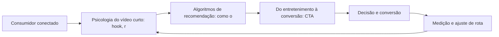

Observe o laço de retorno: a medição alimenta o próximo ciclo de campanha. Essa é a diferença estrutural entre campanha e sistema — a campanha termina quando o orçamento acaba; o sistema aprende e se ajusta a cada ciclo [7]. No caso do tema *Estratégia de Vídeo Vertical: Reels, Shorts e Conteúdo de Formato Curto*, esse laço é o que converte o investimento inicial em aprendizado acumulado para as próximas decisões [15].

## 4. Técnica

### A Matriz de Criativos e Audiências

A operação de tráfego pago em escala é uma matriz: combinar criativos e audiências, medir e descartar o que não performa. O código abaixo simula a matriz e ordena os vencedores.

```python
import itertools

def matriz_planejamento(criativos, audiencias):
    """Retorna combinações com custo por conversão estimado."""
    celulas = []
    for c, a in itertools.product(criativos, audiencias):
        # CTR e CVR simulados: variam por combinação
        ctr = 0.01 + (hash(c) % 30) / 1000
        cvr = 0.02 + (hash(a) % 20) / 1000
        cpc = 1.20
        custo_conv = cpc / (ctr * cvr)
        celulas.append({"criativo": c, "audiencia": a,
                        "custo_conversao": round(custo_conv, 2)})
    return sorted(celulas, key=lambda x: x["custo_conversao"])

criativos = ["hook_beneficio", "hook_prova", "hook_historico"]
audiencias = ["novos", "engajados", "lookalike"]
for top in matriz_planejamento(criativos, audiencias)[:3]:
    print(top)
```

A matriz evita o erro mais comum: investir todo o orçamento na primeira combinação antes de deixar o algoritmo aprender [6]. A disciplina vale para qualquer plataforma social [14].

O código acima é o núcleo técnico de *Estratégia de Vídeo Vertical: Reels, Shorts e Conteúdo de Formato Curto*: validável, executável e adaptável ao contexto real do leitor. A prática recomendada é rodá-lo com dados próprios e usar a saída como insumo da próxima reunião de planejamento. Documentação oficial das plataformas reforça cada passo — da estrutura de campanhas [5] à configuração de eventos [12]. A leitura técnica deste capítulo complementa a exposição conceitual das seções anteriores e prepara os exercícios da seção seguinte.

## 5. Aplica

Conhecimento sem aplicação é conteúdo; aplicação sem reflexão é rotina. No contexto de *Estratégia de Vídeo Vertical: Reels, Shorts e Conteúdo de Formato Curto*, os exercícios abaixo fecham o capítulo e preparam o terreno do próximo:

1. Compare seu engajamento por plataforma na última quinzena e decida onde dobrar a aposta.
2. Produza um vídeo vertical de até 30 segundos com um hook nos primeiros 3 segundos.
3. Liste três criadores do seu segmento e analise o que eles fazem no primeiro segundo dos vídeos.
4. Defina a frequência de publicação ideal para a sua capacidade real de produção de conteúdo.

Dedique ao menos 30 minutos a um dos exercícios antes de avançar. O aprendizado desta obra é cumulativo: o mapa desenhado aqui será usado nos capítulos seguintes da Parte IV e nas partes subsequentes [3].

Complementando, cinco exercícios práticos adicionais consolidam o aprendizado de *Estratégia de Vídeo Vertical: Reels, Shorts e Conteúdo de Formato Curto*:

1. Que conversa da sua audiência, hoje ignorada, poderia alimentar o seu próximo conteúdo?
2. Qual plataforma social concentra o seu público-alvo real — e quanto da sua produção está lá?
3. Seus criativos são feitos para a plataforma ou são o mesmo anúncio reutilizado em todos os lugares?
4. Quanto tempo o seu público fica vendo o seu vídeo? Se for pouco, o problema é o hook?
5. Você tem público personalizado e retargeting configurados — ou depende só de segmentação por interesse?

## Leitura Complementar Recomendada

Para aprofundar *Estratégia de Vídeo Vertical: Reels, Shorts e Conteúdo de Formato Curto* além deste capítulo:

- Como complemento, o TikTok for Business e o LinkedIn Marketing Solutions documentam as particularidades de cada território [14] [13].

- Para aprofundar as redes sociais, o livro de Hollensen, Kotler e Opresnik (Social Media Marketing) cobre a estratégia e o ecossistema, e a documentação do Meta Business Help Center detalha a operação de anúncios [11] [6].

## Análise de Riscos e Mitigações

A aplicação de *Estratégia de Vídeo Vertical: Reels, Shorts e Conteúdo de Formato Curto* envolve riscos identificáveis. A tabela de riscos abaixo relaciona cada ameaça à sua mitigação:

- Risco de crise não gerida: crítica viral sem resposta. Mitigação: protocolo de resposta e monitoramento diário [11].
- Risco de dependência algorítmica: o alcance muda com o algoritmo. Mitigação: lista própria e canal de propriedade como contrapeso [8].
- Risco de fadiga criativa: criativos saturados aumentam o custo. Mitigação: matriz de teste contínuo de criativos e audiências [6].
- Risco de métricas de vaidade: curtidas sem receita. Mitigação: conectar cada métrica social a resultado de negócio [8].

## Considerações de Implementação

 

## Exercício Integrador da Parte IV

l

Este exercício conecta o capítulo às demais partes da obra e deve ser revisto ao final da leitura completa.

## Aprofundamento Prático

O tema de *Estratégia de Vídeo Vertical: Reels, Shorts e Conteúdo de Formato Curto* ganha potência quando levado ao nível operacional. Os quatro pontos abaixo aprofundam a aplicação prática:

- O aprofundamento prático das redes começa pela definição do sistema de conteúdo: pilares, formatos e cadência por plataforma — o calendário é a manifestação operacional da estratégia [11].

- A leitura avançada do algoritmo de recomendação exige entender o sinal: retenção de vídeo é a moeda — hooks fortes, loops e legendas aumentam o tempo de visualização e a distribuição [14].

- A operação de tráfego pago social é um ciclo de aprendizado: testar, medir, descartar e escalar — a matriz de criativos e audiências é o instrumento que organiza o ciclo [6].

- A escuta social é a inteligência da operação: monitorar menções, sentimentos e perguntas alimenta conteúdo, produto e atendimento — a comunidade fala e a marca precisa ouvir [11].

## Exercícios de Fixação

Para consolidar *Estratégia de Vídeo Vertical: Reels, Shorts e Conteúdo de Formato Curto*, resolva os cinco exercícios abaixo — com caneta, papel e dados reais:

1. Registre as cinco perguntas mais frequentes da sua comunidade.
2. Compare o engajamento por plataforma da última quinzena.
3. Defina o tom de voz da sua marca em três adjetivos e teste em cinco posts.
4. Produza um vídeo vertical com hook nos primeiros três segundos.
5. Configure um público personalizado e um retargeting na sua plataforma.

## Autoavaliação do Capítulo

Autoavaliação: (1) Sei qual plataforma concentra o meu público real? (2) Meu calendário tem objetivo por peça? (3) Tenho público personalizado e retargeting configurados? (4) Meus vídeos têm hook nos primeiros três segundos? (5) Acompanho custo por resultado nas redes? Responda e priorize a primeira resposta negativa.

A primeira resposta negativa é o seu próximo passo natural — volte a ela na seção de aplicação deste capítulo e trabalhe o item até que a resposta seja sim.

## Problemas Comuns e Soluções Práticas

Aplicar *Estratégia de Vídeo Vertical: Reels, Shorts e Conteúdo de Formato Curto* no mundo real esbarra em problemas recorrentes. Abaixo, cinco situações típicas com suas soluções — sintoma, causa e correção:

### Engajamento em queda

A audiência para de interagir. A solução é rever o calendário, os formatos e o tom — e perguntar à própria audiência o que ela quer ver [11].

### Anúncios caros e sem retorno

Criativos saturados e audiências amplas inflam o custo. A solução é a matriz de criativos e audiências com teste e descarte sistemático [6].

### Audiência que não cresce

O alcance orgânico estagnou. A solução é variar formatos, hooks e horários, e usar o retargeting para capturar quem já interagiu [6].

### Crise nas redes

Uma crítica viral saiu do controle. A solução é o protocolo: responder com transparência, velocidade adequada e tom definido — e documentar o aprendizado [11].

### Conteúdo sem estratégia

Postagens aleatórias sem objetivo. A solução é o calendário editorial com meta por peça: engajar, educar, converter ou provar [11].

## Aplicações por Setor

O tema de *Estratégia de Vídeo Vertical: Reels, Shorts e Conteúdo de Formato Curto* ganha contornos diferentes em cada setor. A leitura setorial abaixo ajuda a adaptar os princípios ao seu contexto:

- No B2C, o Instagram e o TikTok dominam a descoberta; no B2B, o LinkedIn concentra os decisores; em serviços locais, o Facebook e o WhatsApp sustentam a conversa — a plataforma segue o público [11].

- Na moda, o vídeo e o visual lideram; na educação, o conteúdo educativo e o testemunho; na tecnologia B2B, o thought leadership e o caso técnico — o formato segue a decisão [11].

## Plano de Ação de 30 Dias

Para converter a leitura de *Estratégia de Vídeo Vertical: Reels, Shorts e Conteúdo de Formato Curto* em resultado, execute um dos planos semanais abaixo — cada semana tem um objetivo e uma entrega:

### Plano de Ação — Opção 1

Semana 1 — Escuta: observe a conversa da sua comunidade por uma semana e registre as dores.
Semana 2 — Calendário: monte duas semanas de conteúdo respondendo às dores reais.
Semana 3 — Relação: responda a comentários e mensagens, registrando as recorrentes.
Semana 4 — Medição: compare engajamento e resultado da quinzena e ajuste a rota.

### Plano de Ação — Opção 2

Semana 1 — Foco: defina a plataforma principal e o tom de voz.
Semana 2 — Conteúdo: produza cinco posts de teste e um vídeo vertical com hook.
Semana 3 — Público: configure um público personalizado e um retargeting.
Semana 4 — Campanha: lance o piloto pago com orçamento pequeno e criativo testado.

## KPIs que Importam neste Capítulo

Para *Estratégia de Vídeo Vertical: Reels, Shorts e Conteúdo de Formato Curto*, os KPIs que importam: alcance e engajamento, custo por resultado, taxa de retenção de vídeo e conversão atribuída por plataforma — a régua de cada território social [6].

Antes de encerrar, registre esses indicadores no seu painel de acompanhamento — eles serão a régua para medir a aplicação deste capítulo nas próximas semanas.

## Roteiro de Implementação Passo a Passo

Para aplicar *Estratégia de Vídeo Vertical: Reels, Shorts e Conteúdo de Formato Curto* na prática, os roteiros abaixo organizam a sequência de ações — do diagnóstico à medição:

### Roteiro de Implementação 1

1. Liste as plataformas onde a marca está e o público de cada uma.
2. Compare o engajamento e o resultado de cada plataforma na última quinzena.
3. Escolha a plataforma de nicho do seu mercado e observe as conversas por uma semana.
4. Registre as perguntas, dores e termos usados pela comunidade.
5. Produza conteúdo respondendo às dores reais, no formato da plataforma.
6. Defina a frequência de publicação sustentável para a capacidade real do time.
7. Responda a comentários e mensagens por uma semana, registrando as recorrentes.
8. Selecione três criadores do segmento e avalie fit, alcance e engajamento.
9. Defina o protocolo de resposta para críticas e elogios.
10. Agende a revisão mensal de métricas por plataforma.

### Roteiro de Implementação 2

1. Defina o objetivo da presença social do trimestre em uma frase mensurável.
2. Escolha a plataforma principal onde o público-alvo realmente está.
3. Defina o tom de voz: como a marca fala, o que nunca diz e o que sempre diz.
4. Produza cinco posts de teste em uma semana e meça o engajamento.
5. Identifique os três formatos com melhor retenção e engajamento.
6. Produza um vídeo vertical com hook nos primeiros três segundos.
7. Monte o calendário editorial de duas semanas com objetivo por peça.
8. Configure um público personalizado e um retargeting no Gerenciador de Anúncios.
9. Lance uma campanha piloto com orçamento pequeno e criativo testado.
10. Meça custo por resultado, documente e decida o próximo ciclo.

## Perguntas Frequentes

Em relação ao tema de *Estratégia de Vídeo Vertical: Reels, Shorts e Conteúdo de Formato Curto*, cinco perguntas surgem com frequência na prática profissional:

**Tráfego pago é obrigatório?**

Não, mas acelera. Sem ele, o orgânico constrói com mais tempo; com ele, testa-se hipóteses mais rápido [6].

**Como medir o retorno do conteúdo?**

Atribuindo conversão: cada peça tem papel na jornada, e o modelo de atribuição distribui o crédito com justiça [12].

**Qual plataforma escolher?**

A que concentra o seu público-alvo real — e não a mais popular. Onde está a conversa da sua audiência? [11].

**Postar todo dia ou com qualidade?**

Consistência com qualidade: publicar com regularidade construindo expectativa vale mais que volume sem estratégia [11].

**Comprar seguidores adianta?**

Não — destrói o alcance real e a credibilidade. Métricas de vaidade não se convertem em receita [11].

## Cenários Numéricos Comentados

Os cálculos abaixo mostram, com números concretos, como as decisões de *Estratégia de Vídeo Vertical: Reels, Shorts e Conteúdo de Formato Curto* se traduzem em resultado:

### Cenário numérico: micro versus macro

Uma celebridade com 5 milhões de seguidores e engajamento de 0,2% alcança 10.000 interações. Um micro-influenciador com 50 mil seguidores e engajamento de 5% alcança 2.500 interações — mas com taxa de conversão cinco vezes maior pela confiança do nicho. O custo por venda, não o alcance, decide o vencedor [11].

### Cenário numérico: a matriz de criativos

Uma campanha com três criativos e três audiências gera nove combinações. Testar todas com orçamento igual revela que uma única combinação entrega custo por conversão 40% menor que a média. Concentrar 70% do orçamento no vencedor e manter o resto para aprendizado é a disciplina de escala da matriz [6].

## Como Este Capítulo se Integra à Obra

As redes sociais são o território de descoberta e prova social da jornada. A busca (Parte III) captura a intenção que as redes despertaram; o relacionamento (Parte V) converte a audiência em lista própria; e a conversão (Parte VII) fecha o ciclo que as redes iniciaram. No contexto de *Estratégia de Vídeo Vertical: Reels, Shorts e Conteúdo de Formato Curto*, essa integração fica ainda mais visível: as ferramentas e métricas que você dominou aqui serão a base das decisões dos próximos capítulos — e das partes que virão depois.

## Aprofundamento Conceitual

No contexto de *Estratégia de Vídeo Vertical: Reels, Shorts e Conteúdo de Formato Curto*, o retargeting é a ponte entre interesse e conversão: quem visitou o site sem comprar é lembrado nas redes com mensagens cada vez mais específicas, acompanhando a jornada [6].

No contexto de *Estratégia de Vídeo Vertical: Reels, Shorts e Conteúdo de Formato Curto*, a gestão de comunidade é a diferença entre audiência e fãs: responder, reconhecer e dar voz aos clientes transforma seguidores em defensores — e defesa é o ativo social mais valioso [11].

No contexto de *Estratégia de Vídeo Vertical: Reels, Shorts e Conteúdo de Formato Curto*, as plataformas de nicho — Pinterest, Reddit, X, grupos — oferecem densidade: menos pessoas, mas exatamente o público-alvo, com conversa de alta qualidade e custo de atenção menor [11].

No contexto de *Estratégia de Vídeo Vertical: Reels, Shorts e Conteúdo de Formato Curto*, a escuta social alimenta o calendário editorial: as perguntas e dores da audiência são o melhor briefing de conteúdo que uma marca pode ter [11].

No contexto de *Estratégia de Vídeo Vertical: Reels, Shorts e Conteúdo de Formato Curto*, a autenticidade superou o polimento: o consumidor conectado desconfia do perfeito e confia no real — e o conteúdo gerado por clientes (UGC) converte mais que o anúncio produzido [14].

## Fundamentos em Detalhe

No contexto de *Estratégia de Vídeo Vertical: Reels, Shorts e Conteúdo de Formato Curto*, cada plataforma social tem sua própria geografia: o que funciona no Instagram (visual, reels, estética) não funciona no LinkedIn (autoridade, texto, contexto profissional) e vice-versa [11].

No contexto de *Estratégia de Vídeo Vertical: Reels, Shorts e Conteúdo de Formato Curto*, o algoritmo de cada rede recompensa sinais diferentes: retenção e completude de vídeo no TikTok e Reels, conversa e utilidade no LinkedIn, comunidade e frequência no Facebook [14].

No contexto de *Estratégia de Vídeo Vertical: Reels, Shorts e Conteúdo de Formato Curto*, o tráfego pago social opera sobre dados first-party: os pixels e públicos personalizados da Meta permitem alcançar quem já interagiu com a marca e modelar audiências semelhantes [6].

No contexto de *Estratégia de Vídeo Vertical: Reels, Shorts e Conteúdo de Formato Curto*, o vídeo vertical redefiniu a criatividade: hooks nos primeiros segundos, loops, legendas e autenticidade superam produção cara sem estratégia nativa [14].

No contexto de *Estratégia de Vídeo Vertical: Reels, Shorts e Conteúdo de Formato Curto*, a segmentação social combina interesse, comportamento e dados próprios: públicos personalizados, lookalikes e retargeting formam a espinha dorsal de uma operação de mídia social madura [6].

## Estudos de Caso Aplicados

### Caso: o B2B que construiu autoridade no LinkedIn

Uma empresa de software B2B sofria para gerar leads qualificados. Em vez de mais anúncios, o time passou a publicar thought leadership: dados de mercado, casos reais e opiniões fundamentadas no LinkedIn dos fundadores e especialistas. O perfil da marca cresceu em autoridade, e os leads passaram a chegar mais qualificados — reduzindo o ciclo de venda e o custo por oportunidade [13].

### Caso: a marca de moda que acertou o TikTok pelo hook

Uma marca de moda feminina produzia vídeos polidos que não decolavam. A análise mostrou que os primeiros segundos perdiam a audiência. A equipe passou a criar hooks de curiosidade ("por que essa calça veste diferente"), legendas automáticas e loops de repetição. O alcance orgânico disparou, e um único vídeo viral gerou fila de espera para um produto que não era o foco da campanha [14].

## Dados e Números do Setor

### Dados de Contexto

- As redes sociais concentram o maior tempo de atenção diário do consumidor conectado [15].
- A Meta opera um dos maiores ecossistemas de anúncios do mundo [6].
- O vídeo curto domina o engajamento nas plataformas de recomendação [14].
- O LinkedIn é o território B2B de decisores e tomadores de compra [13].

### Indicadores-Chave

- Alcance, engajamento e custo por resultado são as métricas sociais centrais [11].
- O custo por clique varia por plataforma, formato e segmentação [6].
- A taxa de retenção de vídeo é a métrica que alimenta a distribuição algorítmica [14].

## Análise Comparativa

O tema de *Estratégia de Vídeo Vertical: Reels, Shorts e Conteúdo de Formato Curto* fica mais claro quando contrastado com a alternativa mais próxima. A comparação abaixo organiza as diferenças:

### Orgânico vs. Pago Social

- Orgânico constrói audiência e confiança; pago amplia alcance com precisão.
- Orgânico é lento e cumulativo; pago é rápido e mensurável por campanha.
- Pago depende de dados first-party; orgânico depende de consistência.
- A operação madura combina os dois com proporção definida por objetivo.

## Erros Comuns e Como Evitá-los

No tema de *Estratégia de Vídeo Vertical: Reels, Shorts e Conteúdo de Formato Curto*, cinco erros recorrentes merecem atenção especial — cada um com sua correção prática:

1. Ignorar a comunidade: responder só quando há crise perde o valor da conversa contínua.
2. Escalar orçamento antes de validar: aumentar a verba de uma combinação não testada multiplica o prejuízo.
3. Produzir para todas as plataformas ao mesmo tempo: sem foco, nenhuma audiência se forma.
4. Repetir o mesmo criativo até a exaustão: a fadiga criativa aumenta o custo por resultado.
5. Comprar seguidores: métricas de vaidade que destroem a credibilidade e o alcance real.

## Ferramentas e Recursos Recomendados

Para operar o tema de *Estratégia de Vídeo Vertical: Reels, Shorts e Conteúdo de Formato Curto* na prática, a seguinte seleção de ferramentas cobre o ciclo completo — do diagnóstico à medição:

1. Plataforma de agendamento social
2. Ferramenta de escuta social (menções e sentimento)
3. TikTok Creative Center (tendências e hooks)
4. Gerenciador de Anúncios da Meta (públicos e criativos)
5. Editor de vídeo vertical (Reels/TikTok)

## Glossário do Capítulo

Os termos abaixo — todos usados no corpo deste capítulo — formam o vocabulário mínimo para acompanhar o restante da obra:

Pixel: rastreador de conversão da plataforma. Público personalizado: audiência construída com dados próprios. Lookalike: audiência semelhante a uma base. Hook: abertura de vídeo que prende atenção. UGC: conteúdo gerado pelo usuário. Engajamento: interações sobre a publicação.

## Checklist de Implementação

Use a lista abaixo para auditar a aplicação de *Estratégia de Vídeo Vertical: Reels, Shorts e Conteúdo de Formato Curto* na sua operação — marque os itens já concluídos e priorize os pendentes:

- [ ] Campanha Meta com público personalizado
- [ ] Vídeo vertical com hook nos 3 primeiros segundos
- [ ] Calendário social com objetivo por peça
- [ ] Escuta social iniciada
- [ ] Tom de voz definido e testado

## Perguntas para Reflexão

Antes de avançar, reflita sobre as cinco questões abaixo — elas conectam o conteúdo de *Estratégia de Vídeo Vertical: Reels, Shorts e Conteúdo de Formato Curto* ao seu contexto real de trabalho:

1. Qual plataforma social concentra o seu público-alvo real — e quanto da sua produção está lá?
2. Seus criativos são feitos para a plataforma ou são o mesmo anúncio reutilizado em todos os lugares?
3. Quanto tempo o seu público fica vendo o seu vídeo? Se for pouco, o problema é o hook?
4. Você tem público personalizado e retargeting configurados — ou depende só de segmentação por interesse?
5. Que conversa da sua audiência, hoje ignorada, poderia alimentar o seu próximo conteúdo?

## Quadro Comparativo: Plataformas Sociais e Papel no Funil

O quadro abaixo consolida os elementos essenciais de *Estratégia de Vídeo Vertical: Reels, Shorts e Conteúdo de Formato Curto* em perspectiva comparada, facilitando a consulta rápida e a tomada de decisão:

| Plataforma | Papel principal | Formato forte |
|---|---|---|
| Plataforma | Papel principal | Formato forte |
| Instagram | Descoberta e prova | Visual e Reels |
| TikTok | Viralização e descoberta | Vídeo curto |
| LinkedIn | Autoridade B2B | Texto e thought leadership |
| YouTube | Educação e busca | Vídeo longo |
| WhatsApp | Conversão e atendimento | Mensagem direta |

## 6. Conclusão

O capítulo percorreu o território da Parte IV, *Redes Sociais — Territórios de Comunidade*, e deixou três aprendizados operacionais. Primeiro, o conceito central — *Estratégia de Vídeo Vertical: Reels, Shorts e Conteúdo de Formato Curto* — é menos uma novidade e mais uma disciplina de execução. Segundo, a aplicação exige a tríade conceito, rota e métrica, sem pular etapas [8]. Terceiro, o ajuste contínuo de rota, ilustrado no laço de retorno do diagrama, é o que separa campanhas pontuais de operações sustentáveis [7]. O caminho percorrido desde *TikTok, YouTube e LinkedIn: Territórios Especializados* até aqui forma a base que o próximo passo vai usar. No próximo capítulo, *Tráfego Pago em Escala: Estrutura, Teste e Otimização de Campanhas*, você avançará sobre o território vizinho levando as ferramentas exercitadas aqui.

Como navegador de marketing digital, você não decorou uma fórmula — incorporou um modo de operar: ler o território, escolher a rota com dados e ajustar o percurso quando o vento muda [2].

Antes do fechamento, vale reforçar a base do capítulo: No contexto de *Estratégia de Vídeo Vertical: Reels, Shorts e Conteúdo de Formato Curto*, o LinkedIn é o território do B2B: decisores, tomadores de compra e especialistas estão lá, e o conteúdo de autoridade — casos, dados, opiniões fundamentadas — constrói a confiança que encurta o ciclo de venda [13].

No contexto de *Estratégia de Vídeo Vertical: Reels, Shorts e Conteúdo de Formato Curto*, a operação de tráfego pago social exige disciplina de matriz: testar criativos e audiências em combinações controladas, medir custo por conversão e escalar apenas os vencedores [6].
## 7. Referências Bibliográficas

[1] KOTLER, Philip; KELLER, Kevin Lane. **Administração de Marketing**. 15. ed. São Paulo: Pearson, 2016.
[2] KOTLER, Philip; KARTAJAYA, Hermawan; SETIAWAN, Iwan. **Marketing 4.0: Moving from Traditional to Digital**. Hoboken: Wiley, 2017.
[3] CHAFFEY, Dave; ELLIS-CHADWICK, Fiona. **Digital Marketing: Strategy, Implementation and Practice**. 9. ed. Harlow: Pearson, 2025.
[4] GOOGLE SEARCH CENTRAL. **Search Engine Optimization (SEO) Starter Guide**. Disponível em: https://developers.google.com/search/docs/fundamentals/seo-starter-guide. Acesso em: 02 ago. 2026.
[5] GOOGLE ADS HELP CENTER. **Your guide to Google Ads (Basics, Search Campaigns & Best Practices)**. Disponível em: https://support.google.com/google-ads/answer/6146252. Acesso em: 02 ago. 2026.
[6] META BUSINESS HELP CENTER. **Meta Ads Manager Guide: Best Practices for Targeting, Measurement, and Optimization**. Disponível em: https://www.facebook.com/business/help. Acesso em: 02 ago. 2026.
[7] DELOITTE DIGITAL. **Marketing Trends 2026: New Marketing for a New World**. Disponível em: https://www.deloittedigital.com/nl/en/insights/perspective/marketing-trends-2026.html. Acesso em: 02 ago. 2026.
[8] HUBSPOT RESEARCH. **The State of Marketing / 2026 Marketing Statistics, Trends & Data**. Disponível em: https://www.hubspot.com/marketing-statistics. Acesso em: 02 ago. 2026.
[9] STATISTA RESEARCH DEPARTMENT. **Global Digital Marketing and Advertising Revenue Statistics & Facts**. Disponível em: https://www.statista.com/topics/8954/marketing-worldwide/. Acesso em: 02 ago. 2026.
[10] RYAN, Damian. **Understanding Digital Marketing: Marketing Strategies for Engaging the Digital Generation**. 5. ed. London: Kogan Page, 2020.
[11] HOLLENSEN, Svend; KOTLER, Philip; OPRESNIK, Marc Oliver. **Social Media Marketing: A Practitioner Approach**. 4. ed. Harlow: Pearson, 2023.
[12] GOOGLE ANALYTICS HELP CENTER. **Documentação oficial do Google Analytics 4**. Disponível em: https://support.google.com/analytics. Acesso em: 02 ago. 2026.
[13] LINKEDIN MARKETING SOLUTIONS. **Best Practices para campanhas B2B no LinkedIn**. Disponível em: https://business.linkedin.com/marketing-solutions. Acesso em: 02 ago. 2026.
[14] TIKTOK FOR BUSINESS. **Guia de criatividade e boas práticas de anúncios no TikTok**. Disponível em: https://www.tiktok.com/business. Acesso em: 02 ago. 2026.
[15] DATAREPORTAL. **Digital 2026: Global Overview Report**. Disponível em: https://datareportal.com/reports/digital-2026-global-overview-report. Acesso em: 02 ago. 2026.
[16] LEMON, Katherine N.; VERHOEF, Peter C. **Understanding Customer Experience Throughout the Customer Journey**. *Journal of Marketing*, v. 80, n. 6, p. 69-96, 2016.
[17] TIWARI, Rajnish; BUSE, Stephan; HERSTATT, Cornelius. **From Electronic to Mobile Commerce: Opportunities and Challenges**. *Proceedings of the German-Indian Roundtable*, 2006.
[18] VAN DIJK, Jan A. G. M. **The Digital Divide**. Cambridge: Polity Press, 2020.
[19] IBM. **Marketing with AI: Personalization at Scale**. Disponível em: https://www.ibm.com/think/topics/ai-marketing. Acesso em: 02 ago. 2026.
[20] KOTLER, Philip. **Marketing 5.0: Technology for Humanity**. Hoboken: Wiley, 2021.

# Capítulo 19: Tráfego Pago em Escala: Estrutura, Teste e Otimização de Campanhas

## 1. Introdução

Bem-vindo a uma nova etapa da sua navegação pelo marketing digital. Este capítulo — *Tráfego Pago em Escala: Estrutura, Teste e Otimização de Campanhas* — integra a Parte IV, *Redes Sociais — Territórios de Comunidade*, e responde a uma pergunta prática: **arquitetura de conta: campanhas, conjuntos e estrutura por objetivo** — na prática, como isso se traduz em decisão e resultado?

Ao final, você será capaz de strutura operação de mídia paga escalável: arquitetura de contas, testes de criativo, escalonamento de orçamento e regras de otimização.. Mais do que decorar conceitos, você vai enxergar cada plataforma como território com geografia própria — e converter essa visão em plano, experimento e métrica.

No capítulo anterior, *Estratégia de Vídeo Vertical: Reels, Shorts e Conteúdo de Formato Curto*, você aprendeu os conceitos que servem de plataforma para o que vem agora. Este capítulo retoma esse repertório e o aplica a um território novo — sem repetir o que já foi estabelecido, apenas usando como base.

O capítulo segue a estrutura das sete seções que organizam esta obra: primeiro a exposição conceitual, depois a ilustração, a técnica aplicada, o exercício de aplicação e a conclusão operacional.

No contexto de *Tráfego Pago em Escala: Estrutura, Teste e Otimização de Campanhas*, a consistência de publicação importa mais que a frequência: marcas que publicam com regularidade e qualidade constroem expectativa, enquanto as que desaparecem entre posts perdem o hábito da audiência [11].

No contexto de *Tráfego Pago em Escala: Estrutura, Teste e Otimização de Campanhas*, as redes sociais são, simultaneamente, o maior canal de descoberta e o maior ambiente de prova social do marketing digital — a maioria dos consumidores descobre marcas nas redes antes de qualquer outro canal [15].
## 2. Explica

### Arquitetura de conta: campanhas, conjuntos e estrutura por objetivo

Quando o tema é *Tráfego Pago em Escala: Estrutura, Teste e Otimização de Campanhas*, o primeiro pilar — arquitetura de conta: campanhas, conjuntos e estrutura por objetivo — define o território conceitual. No TikTok, a criatividade nativa supera a produção cara: vídeos autênticos com hooks fortes performam melhor que anúncios polidos sem contexto da plataforma [14].

Na prática, arquitetura de conta: campanhas, conjuntos e estrutura por objetivo significa transformar a teoria em rotina operacional — exatamente o que *Tráfego Pago em Escala: Estrutura, Teste e Otimização de Campanhas* exige no dia a dia. A literatura de gestão é enfática: sem operacionalizar o conceito em checklist, responsável e métrica, ele permanece slide de apresentação [3]. Por isso a Parte IV propõe sempre o mesmo movimento: entender, traduzir em critério observável e decidir com dado.

### Testes de criativo e audiência: matriz e aprendizado

O segundo pilar — testes de criativo e audiência: matriz e aprendizado — conecta a estratégia à operação diária. Plataformas de nicho oferecem densidade de audiência: em comunidades pequenas e engajadas, cada publicação alcança uma proporção muito maior do público-alvo [11]. A experiência do consumidor se constrói na consistência entre canais e mensagens, e é essa consistência que transforma contato em relacionamento [16]. Organizações que tratam cada canal como silo perdem o fio condutor da jornada; as que operam o pilar com disciplina reduzem atrito e aumentam a taxa de avanço entre etapas [10].

### Escalonamento: orçamento, frequência e saturação

Fechando o tripé, escalonamento: orçamento, frequência e saturação é o que transforma a Parte IV em vantagem mensurável. As redes sociais concentram o maior tempo de atenção diário do consumidor conectado, e as plataformas transformaram esse tempo em infraestrutura de anúncios com segmentação granular [15]. O relato da indústria mostra que as empresas que sustentam resultado não são as que têm mais ferramentas, mas as que conseguem medir e ajustar a rota com frequência [8]. A métrica certa, escolhida antes da campanha, vale mais do que qualquer ferramenta cara instalada depois do fato [9].

### O Eixo Transversal do Capítulo

A Meta opera um dos maiores ecossistemas de anúncios do mundo, com segmentação por interesse, comportamento e públicos personalizados a partir de dados first-party [6]. Esse eixo conecta os três pilares e explica por que o capítulo os trata como um sistema, não como uma lista: cada pilar reforça o outro, e a omissão de qualquer um deles produz estratégia manca. O capítulo seguinte retomará esse eixo com novas ferramentas, agora com o vocabulário já estabelecido aqui.

Em síntese, o capítulo opera em três níveis: o conceitual (Arquitetura de conta: campanhas, conjuntos e estrutura por objetivo), o operacional (Testes de criativo e audiência: matriz e aprendizado) e o estratégico (Escalonamento: orçamento, frequência e saturação). O leitor que dominar os três estará apto a aplicar a Parte IV com autonomia [1]. A evidência reunida nesta seção sustenta cada recomendação prática das seções seguintes [2].

## 3. Ilustra

Vamos traduzir o capítulo em uma cena concreta, no contexto de *Tráfego Pago em Escala: Estrutura, Teste e Otimização de Campanhas*. Uma empresa de porte médio, com equipe enxuta e orçamento limitado, decide operar a Parte IV desta obra, *Redes Sociais — Territórios de Comunidade*. Na primeira semana, a equipe testa o conceito central do capítulo em um caso real: um cliente que pesquisou, comparou e decidiu comprar. O primeiro pilar — arquitetura de conta: campanhas, conjuntos e estrutura por objetivo — orienta o entendimento inicial do público; o segundo — testes de criativo e audiência: matriz e aprendizado — guia a escolha da rota de comunicação; e o terceiro fecha com a medição do resultado [2].

O diagrama abaixo representa o fluxo operacional proposto pelo capítulo — do consumidor conectado à decisão e ao ajuste contínuo de rota, com o público e a plataforma específicos do tema no centro da navegação:

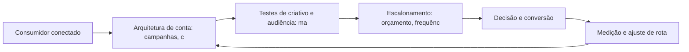

Observe o laço de retorno: a medição alimenta o próximo ciclo de campanha. Essa é a diferença estrutural entre campanha e sistema — a campanha termina quando o orçamento acaba; o sistema aprende e se ajusta a cada ciclo [7]. No caso do tema *Tráfego Pago em Escala: Estrutura, Teste e Otimização de Campanhas*, esse laço é o que converte o investimento inicial em aprendizado acumulado para as próximas decisões [15].

## 4. Técnica

### A Matriz de Criativos e Audiências

A operação de tráfego pago em escala é uma matriz: combinar criativos e audiências, medir e descartar o que não performa. O código abaixo simula a matriz e ordena os vencedores.

```python
import itertools

def matriz_planejamento(criativos, audiencias):
    """Retorna combinações com custo por conversão estimado."""
    celulas = []
    for c, a in itertools.product(criativos, audiencias):
        # CTR e CVR simulados: variam por combinação
        ctr = 0.01 + (hash(c) % 30) / 1000
        cvr = 0.02 + (hash(a) % 20) / 1000
        cpc = 1.20
        custo_conv = cpc / (ctr * cvr)
        celulas.append({"criativo": c, "audiencia": a,
                        "custo_conversao": round(custo_conv, 2)})
    return sorted(celulas, key=lambda x: x["custo_conversao"])

criativos = ["hook_beneficio", "hook_prova", "hook_historico"]
audiencias = ["novos", "engajados", "lookalike"]
for top in matriz_planejamento(criativos, audiencias)[:3]:
    print(top)
```

A matriz evita o erro mais comum: investir todo o orçamento na primeira combinação antes de deixar o algoritmo aprender [6]. A disciplina vale para qualquer plataforma social [14].

O código acima é o núcleo técnico de *Tráfego Pago em Escala: Estrutura, Teste e Otimização de Campanhas*: validável, executável e adaptável ao contexto real do leitor. A prática recomendada é rodá-lo com dados próprios e usar a saída como insumo da próxima reunião de planejamento. Documentação oficial das plataformas reforça cada passo — da estrutura de campanhas [5] à configuração de eventos [12]. A leitura técnica deste capítulo complementa a exposição conceitual das seções anteriores e prepara os exercícios da seção seguinte.

## 5. Aplica

Conhecimento sem aplicação é conteúdo; aplicação sem reflexão é rotina. No contexto de *Tráfego Pago em Escala: Estrutura, Teste e Otimização de Campanhas*, os exercícios abaixo fecham o capítulo e preparam o terreno do próximo:

1. Defina a frequência de publicação ideal para a sua capacidade real de produção de conteúdo.
2. Responda a comentários de clientes nas redes por uma semana e registre as perguntas recorrentes.
3. Defina o tom de voz da sua marca e produza 5 posts de teste em uma única plataforma.
4. Estruture uma campanha Meta com um público personalizado e um criativo de vídeo vertical.

Dedique ao menos 30 minutos a um dos exercícios antes de avançar. O aprendizado desta obra é cumulativo: o mapa desenhado aqui será usado nos capítulos seguintes da Parte IV e nas partes subsequentes [3].

Complementando, cinco exercícios práticos adicionais consolidam o aprendizado de *Tráfego Pago em Escala: Estrutura, Teste e Otimização de Campanhas*:

1. Quanto tempo o seu público fica vendo o seu vídeo? Se for pouco, o problema é o hook?
2. Você tem público personalizado e retargeting configurados — ou depende só de segmentação por interesse?
3. Que conversa da sua audiência, hoje ignorada, poderia alimentar o seu próximo conteúdo?
4. Qual plataforma social concentra o seu público-alvo real — e quanto da sua produção está lá?
5. Seus criativos são feitos para a plataforma ou são o mesmo anúncio reutilizado em todos os lugares?

## Leitura Complementar Recomendada

Para aprofundar *Tráfego Pago em Escala: Estrutura, Teste e Otimização de Campanhas* além deste capítulo:

- Para aprofundar as redes sociais, o livro de Hollensen, Kotler e Opresnik (Social Media Marketing) cobre a estratégia e o ecossistema, e a documentação do Meta Business Help Center detalha a operação de anúncios [11] [6].

- Como complemento, o TikTok for Business e o LinkedIn Marketing Solutions documentam as particularidades de cada território [14] [13].

## Análise de Riscos e Mitigações

A aplicação de *Tráfego Pago em Escala: Estrutura, Teste e Otimização de Campanhas* envolve riscos identificáveis. A tabela de riscos abaixo relaciona cada ameaça à sua mitigação:

- Risco de métricas de vaidade: curtidas sem receita. Mitigação: conectar cada métrica social a resultado de negócio [8].
- Risco de crise não gerida: crítica viral sem resposta. Mitigação: protocolo de resposta e monitoramento diário [11].
- Risco de dependência algorítmica: o alcance muda com o algoritmo. Mitigação: lista própria e canal de propriedade como contrapeso [8].
- Risco de fadiga criativa: criativos saturados aumentam o custo. Mitigação: matriz de teste contínuo de criativos e audiências [6].

## Considerações de Implementação

d

## Exercício Integrador da Parte IV

m

Este exercício conecta o capítulo às demais partes da obra e deve ser revisto ao final da leitura completa.

## Aprofundamento Prático

O tema de *Tráfego Pago em Escala: Estrutura, Teste e Otimização de Campanhas* ganha potência quando levado ao nível operacional. Os quatro pontos abaixo aprofundam a aplicação prática:

- A escuta social é a inteligência da operação: monitorar menções, sentimentos e perguntas alimenta conteúdo, produto e atendimento — a comunidade fala e a marca precisa ouvir [11].

- A gestão de comunidade é trabalho contínuo de relacionamento: responder, reconhecer e dar voz aos clientes transforma audiência em defensores — o ativo social mais valioso da marca [11].

- O aprofundamento prático das redes começa pela definição do sistema de conteúdo: pilares, formatos e cadência por plataforma — o calendário é a manifestação operacional da estratégia [11].

- A leitura avançada do algoritmo de recomendação exige entender o sinal: retenção de vídeo é a moeda — hooks fortes, loops e legendas aumentam o tempo de visualização e a distribuição [14].

## Exercícios de Fixação

Para consolidar *Tráfego Pago em Escala: Estrutura, Teste e Otimização de Campanhas*, resolva os cinco exercícios abaixo — com caneta, papel e dados reais:

1. Produza um vídeo vertical com hook nos primeiros três segundos.
2. Configure um público personalizado e um retargeting na sua plataforma.
3. Registre as cinco perguntas mais frequentes da sua comunidade.
4. Compare o engajamento por plataforma da última quinzena.
5. Defina o tom de voz da sua marca em três adjetivos e teste em cinco posts.

## Autoavaliação do Capítulo

Autoavaliação: (1) Sei qual plataforma concentra o meu público real? (2) Meu calendário tem objetivo por peça? (3) Tenho público personalizado e retargeting configurados? (4) Meus vídeos têm hook nos primeiros três segundos? (5) Acompanho custo por resultado nas redes? Responda e priorize a primeira resposta negativa.

A primeira resposta negativa é o seu próximo passo natural — volte a ela na seção de aplicação deste capítulo e trabalhe o item até que a resposta seja sim.

## Problemas Comuns e Soluções Práticas

Aplicar *Tráfego Pago em Escala: Estrutura, Teste e Otimização de Campanhas* no mundo real esbarra em problemas recorrentes. Abaixo, cinco situações típicas com suas soluções — sintoma, causa e correção:

### Crise nas redes

Uma crítica viral saiu do controle. A solução é o protocolo: responder com transparência, velocidade adequada e tom definido — e documentar o aprendizado [11].

### Conteúdo sem estratégia

Postagens aleatórias sem objetivo. A solução é o calendário editorial com meta por peça: engajar, educar, converter ou provar [11].

### Engajamento em queda

A audiência para de interagir. A solução é rever o calendário, os formatos e o tom — e perguntar à própria audiência o que ela quer ver [11].

### Anúncios caros e sem retorno

Criativos saturados e audiências amplas inflam o custo. A solução é a matriz de criativos e audiências com teste e descarte sistemático [6].

### Audiência que não cresce

O alcance orgânico estagnou. A solução é variar formatos, hooks e horários, e usar o retargeting para capturar quem já interagiu [6].

## Aplicações por Setor

O tema de *Tráfego Pago em Escala: Estrutura, Teste e Otimização de Campanhas* ganha contornos diferentes em cada setor. A leitura setorial abaixo ajuda a adaptar os princípios ao seu contexto:

- Na moda, o vídeo e o visual lideram; na educação, o conteúdo educativo e o testemunho; na tecnologia B2B, o thought leadership e o caso técnico — o formato segue a decisão [11].

- No B2C, o Instagram e o TikTok dominam a descoberta; no B2B, o LinkedIn concentra os decisores; em serviços locais, o Facebook e o WhatsApp sustentam a conversa — a plataforma segue o público [11].

## Plano de Ação de 30 Dias

Para converter a leitura de *Tráfego Pago em Escala: Estrutura, Teste e Otimização de Campanhas* em resultado, execute um dos planos semanais abaixo — cada semana tem um objetivo e uma entrega:

### Plano de Ação — Opção 1

Semana 1 — Foco: defina a plataforma principal e o tom de voz.
Semana 2 — Conteúdo: produza cinco posts de teste e um vídeo vertical com hook.
Semana 3 — Público: configure um público personalizado e um retargeting.
Semana 4 — Campanha: lance o piloto pago com orçamento pequeno e criativo testado.

### Plano de Ação — Opção 2

Semana 1 — Escuta: observe a conversa da sua comunidade por uma semana e registre as dores.
Semana 2 — Calendário: monte duas semanas de conteúdo respondendo às dores reais.
Semana 3 — Relação: responda a comentários e mensagens, registrando as recorrentes.
Semana 4 — Medição: compare engajamento e resultado da quinzena e ajuste a rota.

## KPIs que Importam neste Capítulo

Para *Tráfego Pago em Escala: Estrutura, Teste e Otimização de Campanhas*, os KPIs que importam: alcance e engajamento, custo por resultado, taxa de retenção de vídeo e conversão atribuída por plataforma — a régua de cada território social [6].

Antes de encerrar, registre esses indicadores no seu painel de acompanhamento — eles serão a régua para medir a aplicação deste capítulo nas próximas semanas.

## Roteiro de Implementação Passo a Passo

Para aplicar *Tráfego Pago em Escala: Estrutura, Teste e Otimização de Campanhas* na prática, os roteiros abaixo organizam a sequência de ações — do diagnóstico à medição:

### Roteiro de Implementação 1

1. Defina o objetivo da presença social do trimestre em uma frase mensurável.
2. Escolha a plataforma principal onde o público-alvo realmente está.
3. Defina o tom de voz: como a marca fala, o que nunca diz e o que sempre diz.
4. Produza cinco posts de teste em uma semana e meça o engajamento.
5. Identifique os três formatos com melhor retenção e engajamento.
6. Produza um vídeo vertical com hook nos primeiros três segundos.
7. Monte o calendário editorial de duas semanas com objetivo por peça.
8. Configure um público personalizado e um retargeting no Gerenciador de Anúncios.
9. Lance uma campanha piloto com orçamento pequeno e criativo testado.
10. Meça custo por resultado, documente e decida o próximo ciclo.

### Roteiro de Implementação 2

1. Liste as plataformas onde a marca está e o público de cada uma.
2. Compare o engajamento e o resultado de cada plataforma na última quinzena.
3. Escolha a plataforma de nicho do seu mercado e observe as conversas por uma semana.
4. Registre as perguntas, dores e termos usados pela comunidade.
5. Produza conteúdo respondendo às dores reais, no formato da plataforma.
6. Defina a frequência de publicação sustentável para a capacidade real do time.
7. Responda a comentários e mensagens por uma semana, registrando as recorrentes.
8. Selecione três criadores do segmento e avalie fit, alcance e engajamento.
9. Defina o protocolo de resposta para críticas e elogios.
10. Agende a revisão mensal de métricas por plataforma.

## Perguntas Frequentes

Em relação ao tema de *Tráfego Pago em Escala: Estrutura, Teste e Otimização de Campanhas*, cinco perguntas surgem com frequência na prática profissional:

**Postar todo dia ou com qualidade?**

Consistência com qualidade: publicar com regularidade construindo expectativa vale mais que volume sem estratégia [11].

**Comprar seguidores adianta?**

Não — destrói o alcance real e a credibilidade. Métricas de vaidade não se convertem em receita [11].

**Tráfego pago é obrigatório?**

Não, mas acelera. Sem ele, o orgânico constrói com mais tempo; com ele, testa-se hipóteses mais rápido [6].

**Como medir o retorno do conteúdo?**

Atribuindo conversão: cada peça tem papel na jornada, e o modelo de atribuição distribui o crédito com justiça [12].

**Qual plataforma escolher?**

A que concentra o seu público-alvo real — e não a mais popular. Onde está a conversa da sua audiência? [11].

## Cenários Numéricos Comentados

Os cálculos abaixo mostram, com números concretos, como as decisões de *Tráfego Pago em Escala: Estrutura, Teste e Otimização de Campanhas* se traduzem em resultado:

### Cenário numérico: a matriz de criativos

Uma campanha com três criativos e três audiências gera nove combinações. Testar todas com orçamento igual revela que uma única combinação entrega custo por conversão 40% menor que a média. Concentrar 70% do orçamento no vencedor e manter o resto para aprendizado é a disciplina de escala da matriz [6].

### Cenário numérico: micro versus macro

Uma celebridade com 5 milhões de seguidores e engajamento de 0,2% alcança 10.000 interações. Um micro-influenciador com 50 mil seguidores e engajamento de 5% alcança 2.500 interações — mas com taxa de conversão cinco vezes maior pela confiança do nicho. O custo por venda, não o alcance, decide o vencedor [11].

## Como Este Capítulo se Integra à Obra

As redes sociais são o território de descoberta e prova social da jornada. A busca (Parte III) captura a intenção que as redes despertaram; o relacionamento (Parte V) converte a audiência em lista própria; e a conversão (Parte VII) fecha o ciclo que as redes iniciaram. No contexto de *Tráfego Pago em Escala: Estrutura, Teste e Otimização de Campanhas*, essa integração fica ainda mais visível: as ferramentas e métricas que você dominou aqui serão a base das decisões dos próximos capítulos — e das partes que virão depois.

## Aprofundamento Conceitual

No contexto de *Tráfego Pago em Escala: Estrutura, Teste e Otimização de Campanhas*, a escuta social alimenta o calendário editorial: as perguntas e dores da audiência são o melhor briefing de conteúdo que uma marca pode ter [11].

No contexto de *Tráfego Pago em Escala: Estrutura, Teste e Otimização de Campanhas*, a autenticidade superou o polimento: o consumidor conectado desconfia do perfeito e confia no real — e o conteúdo gerado por clientes (UGC) converte mais que o anúncio produzido [14].

No contexto de *Tráfego Pago em Escala: Estrutura, Teste e Otimização de Campanhas*, o ecossistema Meta é o maior laboratório de segmentação do mundo: dados de interesse, comportamento e relacionamento alimentam públicos que nenhum outro canal consegue igualar [6].

No contexto de *Tráfego Pago em Escala: Estrutura, Teste e Otimização de Campanhas*, o vídeo vertical não é uma moda: é a resposta ao comportamento — a maioria do consumo social acontece no celular, com o som desligado e em sessões curtas, e o formato se adapta a isso [14].

No contexto de *Tráfego Pago em Escala: Estrutura, Teste e Otimização de Campanhas*, o algoritmo de recomendação do TikTok e dos Reels recompensa a retenção: vídeos que prendem até o fim entram em loops de distribuição massiva — o que torna o hook (primeiros 3 segundos) a decisão criativa mais importante [14].

## Fundamentos em Detalhe

No contexto de *Tráfego Pago em Escala: Estrutura, Teste e Otimização de Campanhas*, o vídeo vertical redefiniu a criatividade: hooks nos primeiros segundos, loops, legendas e autenticidade superam produção cara sem estratégia nativa [14].

No contexto de *Tráfego Pago em Escala: Estrutura, Teste e Otimização de Campanhas*, a segmentação social combina interesse, comportamento e dados próprios: públicos personalizados, lookalikes e retargeting formam a espinha dorsal de uma operação de mídia social madura [6].

No contexto de *Tráfego Pago em Escala: Estrutura, Teste e Otimização de Campanhas*, o marketing de influência transfere confiança em vez de criá-la: a credibilidade do criador com sua audiência é o ativo que a marca compra — e por isso a seleção do criador é a decisão mais importante da parceria [11].

No contexto de *Tráfego Pago em Escala: Estrutura, Teste e Otimização de Campanhas*, as comunidades de nicho — grupos, fóruns e subreddits — oferecem densidade de audiência inigualável: cada publicação alcança uma proporção muito maior do público-alvo do que em canais de massa [11].

No contexto de *Tráfego Pago em Escala: Estrutura, Teste e Otimização de Campanhas*, a escuta social transforma conversa em dado: monitorar menções, sentimentos e perguntas da audiência alimenta conteúdo, produto e atendimento com inteligência real de mercado [3].

## Estudos de Caso Aplicados

### Caso: a marca de moda que acertou o TikTok pelo hook

Uma marca de moda feminina produzia vídeos polidos que não decolavam. A análise mostrou que os primeiros segundos perdiam a audiência. A equipe passou a criar hooks de curiosidade ("por que essa calça veste diferente"), legendas automáticas e loops de repetição. O alcance orgânico disparou, e um único vídeo viral gerou fila de espera para um produto que não era o foco da campanha [14].

### Caso: o B2B que construiu autoridade no LinkedIn

Uma empresa de software B2B sofria para gerar leads qualificados. Em vez de mais anúncios, o time passou a publicar thought leadership: dados de mercado, casos reais e opiniões fundamentadas no LinkedIn dos fundadores e especialistas. O perfil da marca cresceu em autoridade, e os leads passaram a chegar mais qualificados — reduzindo o ciclo de venda e o custo por oportunidade [13].

## Dados e Números do Setor

### Indicadores-Chave

- Alcance, engajamento e custo por resultado são as métricas sociais centrais [11].
- O custo por clique varia por plataforma, formato e segmentação [6].
- A taxa de retenção de vídeo é a métrica que alimenta a distribuição algorítmica [14].

### Dados de Contexto

- As redes sociais concentram o maior tempo de atenção diário do consumidor conectado [15].
- A Meta opera um dos maiores ecossistemas de anúncios do mundo [6].
- O vídeo curto domina o engajamento nas plataformas de recomendação [14].
- O LinkedIn é o território B2B de decisores e tomadores de compra [13].

## Análise Comparativa

O tema de *Tráfego Pago em Escala: Estrutura, Teste e Otimização de Campanhas* fica mais claro quando contrastado com a alternativa mais próxima. A comparação abaixo organiza as diferenças:

### Orgânico vs. Pago Social

- Orgânico constrói audiência e confiança; pago amplia alcance com precisão.
- Orgânico é lento e cumulativo; pago é rápido e mensurável por campanha.
- Pago depende de dados first-party; orgânico depende de consistência.
- A operação madura combina os dois com proporção definida por objetivo.

## Erros Comuns e Como Evitá-los

No tema de *Tráfego Pago em Escala: Estrutura, Teste e Otimização de Campanhas*, cinco erros recorrentes merecem atenção especial — cada um com sua correção prática:

1. Repetir o mesmo criativo até a exaustão: a fadiga criativa aumenta o custo por resultado.
2. Comprar seguidores: métricas de vaidade que destroem a credibilidade e o alcance real.
3. Ignorar a comunidade: responder só quando há crise perde o valor da conversa contínua.
4. Escalar orçamento antes de validar: aumentar a verba de uma combinação não testada multiplica o prejuízo.
5. Produzir para todas as plataformas ao mesmo tempo: sem foco, nenhuma audiência se forma.

## Ferramentas e Recursos Recomendados

Para operar o tema de *Tráfego Pago em Escala: Estrutura, Teste e Otimização de Campanhas* na prática, a seguinte seleção de ferramentas cobre o ciclo completo — do diagnóstico à medição:

1. Gerenciador de Anúncios da Meta (públicos e criativos)
2. Editor de vídeo vertical (Reels/TikTok)
3. Plataforma de agendamento social
4. Ferramenta de escuta social (menções e sentimento)
5. TikTok Creative Center (tendências e hooks)

## Glossário do Capítulo

Os termos abaixo — todos usados no corpo deste capítulo — formam o vocabulário mínimo para acompanhar o restante da obra:

Pixel: rastreador de conversão da plataforma. Público personalizado: audiência construída com dados próprios. Lookalike: audiência semelhante a uma base. Hook: abertura de vídeo que prende atenção. UGC: conteúdo gerado pelo usuário. Engajamento: interações sobre a publicação.

## Checklist de Implementação

Use a lista abaixo para auditar a aplicação de *Tráfego Pago em Escala: Estrutura, Teste e Otimização de Campanhas* na sua operação — marque os itens já concluídos e priorize os pendentes:

- [ ] Escuta social iniciada
- [ ] Tom de voz definido e testado
- [ ] Campanha Meta com público personalizado
- [ ] Vídeo vertical com hook nos 3 primeiros segundos
- [ ] Calendário social com objetivo por peça

## Perguntas para Reflexão

Antes de avançar, reflita sobre as cinco questões abaixo — elas conectam o conteúdo de *Tráfego Pago em Escala: Estrutura, Teste e Otimização de Campanhas* ao seu contexto real de trabalho:

1. Você tem público personalizado e retargeting configurados — ou depende só de segmentação por interesse?
2. Que conversa da sua audiência, hoje ignorada, poderia alimentar o seu próximo conteúdo?
3. Qual plataforma social concentra o seu público-alvo real — e quanto da sua produção está lá?
4. Seus criativos são feitos para a plataforma ou são o mesmo anúncio reutilizado em todos os lugares?
5. Quanto tempo o seu público fica vendo o seu vídeo? Se for pouco, o problema é o hook?

## Quadro Comparativo: Plataformas Sociais e Papel no Funil

O quadro abaixo consolida os elementos essenciais de *Tráfego Pago em Escala: Estrutura, Teste e Otimização de Campanhas* em perspectiva comparada, facilitando a consulta rápida e a tomada de decisão:

| Plataforma | Papel principal | Formato forte |
|---|---|---|
| Plataforma | Papel principal | Formato forte |
| Instagram | Descoberta e prova | Visual e Reels |
| TikTok | Viralização e descoberta | Vídeo curto |
| LinkedIn | Autoridade B2B | Texto e thought leadership |
| YouTube | Educação e busca | Vídeo longo |
| WhatsApp | Conversão e atendimento | Mensagem direta |

## 6. Conclusão

O capítulo percorreu o território da Parte IV, *Redes Sociais — Territórios de Comunidade*, e deixou três aprendizados operacionais. Primeiro, o conceito central — *Tráfego Pago em Escala: Estrutura, Teste e Otimização de Campanhas* — é menos uma novidade e mais uma disciplina de execução. Segundo, a aplicação exige a tríade conceito, rota e métrica, sem pular etapas [8]. Terceiro, o ajuste contínuo de rota, ilustrado no laço de retorno do diagrama, é o que separa campanhas pontuais de operações sustentáveis [7]. O caminho percorrido desde *Estratégia de Vídeo Vertical: Reels, Shorts e Conteúdo de Formato Curto* até aqui forma a base que o próximo passo vai usar. No próximo capítulo, *Plataformas de Nicho e Comunidades: Pinterest, X/Twitter, Reddit e Grupos*, você avançará sobre o território vizinho levando as ferramentas exercitadas aqui.

Como navegador de marketing digital, você não decorou uma fórmula — incorporou um modo de operar: ler o território, escolher a rota com dados e ajustar o percurso quando o vento muda [2].

Antes do fechamento, vale reforçar a base do capítulo: No contexto de *Tráfego Pago em Escala: Estrutura, Teste e Otimização de Campanhas*, a gestão de comunidade é a diferença entre audiência e fãs: responder, reconhecer e dar voz aos clientes transforma seguidores em defensores — e defesa é o ativo social mais valioso [11].

No contexto de *Tráfego Pago em Escala: Estrutura, Teste e Otimização de Campanhas*, as plataformas de nicho — Pinterest, Reddit, X, grupos — oferecem densidade: menos pessoas, mas exatamente o público-alvo, com conversa de alta qualidade e custo de atenção menor [11].
## 7. Referências Bibliográficas

[1] KOTLER, Philip; KELLER, Kevin Lane. **Administração de Marketing**. 15. ed. São Paulo: Pearson, 2016.
[2] KOTLER, Philip; KARTAJAYA, Hermawan; SETIAWAN, Iwan. **Marketing 4.0: Moving from Traditional to Digital**. Hoboken: Wiley, 2017.
[3] CHAFFEY, Dave; ELLIS-CHADWICK, Fiona. **Digital Marketing: Strategy, Implementation and Practice**. 9. ed. Harlow: Pearson, 2025.
[4] GOOGLE SEARCH CENTRAL. **Search Engine Optimization (SEO) Starter Guide**. Disponível em: https://developers.google.com/search/docs/fundamentals/seo-starter-guide. Acesso em: 02 ago. 2026.
[5] GOOGLE ADS HELP CENTER. **Your guide to Google Ads (Basics, Search Campaigns & Best Practices)**. Disponível em: https://support.google.com/google-ads/answer/6146252. Acesso em: 02 ago. 2026.
[6] META BUSINESS HELP CENTER. **Meta Ads Manager Guide: Best Practices for Targeting, Measurement, and Optimization**. Disponível em: https://www.facebook.com/business/help. Acesso em: 02 ago. 2026.
[7] DELOITTE DIGITAL. **Marketing Trends 2026: New Marketing for a New World**. Disponível em: https://www.deloittedigital.com/nl/en/insights/perspective/marketing-trends-2026.html. Acesso em: 02 ago. 2026.
[8] HUBSPOT RESEARCH. **The State of Marketing / 2026 Marketing Statistics, Trends & Data**. Disponível em: https://www.hubspot.com/marketing-statistics. Acesso em: 02 ago. 2026.
[9] STATISTA RESEARCH DEPARTMENT. **Global Digital Marketing and Advertising Revenue Statistics & Facts**. Disponível em: https://www.statista.com/topics/8954/marketing-worldwide/. Acesso em: 02 ago. 2026.
[10] RYAN, Damian. **Understanding Digital Marketing: Marketing Strategies for Engaging the Digital Generation**. 5. ed. London: Kogan Page, 2020.
[11] HOLLENSEN, Svend; KOTLER, Philip; OPRESNIK, Marc Oliver. **Social Media Marketing: A Practitioner Approach**. 4. ed. Harlow: Pearson, 2023.
[12] GOOGLE ANALYTICS HELP CENTER. **Documentação oficial do Google Analytics 4**. Disponível em: https://support.google.com/analytics. Acesso em: 02 ago. 2026.
[13] LINKEDIN MARKETING SOLUTIONS. **Best Practices para campanhas B2B no LinkedIn**. Disponível em: https://business.linkedin.com/marketing-solutions. Acesso em: 02 ago. 2026.
[14] TIKTOK FOR BUSINESS. **Guia de criatividade e boas práticas de anúncios no TikTok**. Disponível em: https://www.tiktok.com/business. Acesso em: 02 ago. 2026.
[15] DATAREPORTAL. **Digital 2026: Global Overview Report**. Disponível em: https://datareportal.com/reports/digital-2026-global-overview-report. Acesso em: 02 ago. 2026.
[16] LEMON, Katherine N.; VERHOEF, Peter C. **Understanding Customer Experience Throughout the Customer Journey**. *Journal of Marketing*, v. 80, n. 6, p. 69-96, 2016.
[17] TIWARI, Rajnish; BUSE, Stephan; HERSTATT, Cornelius. **From Electronic to Mobile Commerce: Opportunities and Challenges**. *Proceedings of the German-Indian Roundtable*, 2006.
[18] VAN DIJK, Jan A. G. M. **The Digital Divide**. Cambridge: Polity Press, 2020.
[19] IBM. **Marketing with AI: Personalization at Scale**. Disponível em: https://www.ibm.com/think/topics/ai-marketing. Acesso em: 02 ago. 2026.
[20] KOTLER, Philip. **Marketing 5.0: Technology for Humanity**. Hoboken: Wiley, 2021.

# Capítulo 20: Plataformas de Nicho e Comunidades: Pinterest, X/Twitter, Reddit e Grupos

## 1. Introdução

Bem-vindo a uma nova etapa da sua navegação pelo marketing digital. Este capítulo — *Plataformas de Nicho e Comunidades: Pinterest, X/Twitter, Reddit e Grupos* — integra a Parte IV, *Redes Sociais — Territórios de Comunidade*, e responde a uma pergunta prática: **pinterest: busca visual e descoberta de intenção** — na prática, como isso se traduz em decisão e resultado?

Ao final, você será capaz de xplora plataformas e espaços de comunidade como canais de alta intenção e engajamento profundo para públicos específicos.. Mais do que decorar conceitos, você vai enxergar cada plataforma como território com geografia própria — e converter essa visão em plano, experimento e métrica.

No capítulo anterior, *Tráfego Pago em Escala: Estrutura, Teste e Otimização de Campanhas*, você aprendeu os conceitos que servem de plataforma para o que vem agora. Este capítulo retoma esse repertório e o aplica a um território novo — sem repetir o que já foi estabelecido, apenas usando como base.

O capítulo segue a estrutura das sete seções que organizam esta obra: primeiro a exposição conceitual, depois a ilustração, a técnica aplicada, o exercício de aplicação e a conclusão operacional.

No contexto de *Plataformas de Nicho e Comunidades: Pinterest, X/Twitter, Reddit e Grupos*, o algoritmo de cada rede recompensa sinais diferentes: retenção e completude de vídeo no TikTok e Reels, conversa e utilidade no LinkedIn, comunidade e frequência no Facebook [14].

No contexto de *Plataformas de Nicho e Comunidades: Pinterest, X/Twitter, Reddit e Grupos*, o tráfego pago social opera sobre dados first-party: os pixels e públicos personalizados da Meta permitem alcançar quem já interagiu com a marca e modelar audiências semelhantes [6].
## 2. Explica

### Pinterest: busca visual e descoberta de intenção

Quando o tema é *Plataformas de Nicho e Comunidades: Pinterest, X/Twitter, Reddit e Grupos*, o primeiro pilar — pinterest: busca visual e descoberta de intenção — define o território conceitual. A Meta opera um dos maiores ecossistemas de anúncios do mundo, com segmentação por interesse, comportamento e públicos personalizados a partir de dados first-party [6].

Na prática, pinterest: busca visual e descoberta de intenção significa transformar a teoria em rotina operacional — exatamente o que *Plataformas de Nicho e Comunidades: Pinterest, X/Twitter, Reddit e Grupos* exige no dia a dia. A literatura de gestão é enfática: sem operacionalizar o conceito em checklist, responsável e métrica, ele permanece slide de apresentação [3]. Por isso a Parte IV propõe sempre o mesmo movimento: entender, traduzir em critério observável e decidir com dado.

### X/Twitter e Reddit: presença em conversas e comunidades

O segundo pilar — x/twitter e reddit: presença em conversas e comunidades — conecta a estratégia à operação diária. O vídeo curto redefiniu o engajamento: plataformas de recomendação verticalizada distribuem conteúdo com base em retenção e loops de visualização [14]. A experiência do consumidor se constrói na consistência entre canais e mensagens, e é essa consistência que transforma contato em relacionamento [16]. Organizações que tratam cada canal como silo perdem o fio condutor da jornada; as que operam o pilar com disciplina reduzem atrito e aumentam a taxa de avanço entre etapas [10].

### Grupos e fóruns: autoridade, atendimento e escuta social

Fechando o tripé, grupos e fóruns: autoridade, atendimento e escuta social é o que transforma a Parte IV em vantagem mensurável. Para o B2B, o LinkedIn consolidou-se como o território de decisores: thought leadership, conteúdo de autoridade e campanhas por cargo e empresa [13]. O relato da indústria mostra que as empresas que sustentam resultado não são as que têm mais ferramentas, mas as que conseguem medir e ajustar a rota com frequência [8]. A métrica certa, escolhida antes da campanha, vale mais do que qualquer ferramenta cara instalada depois do fato [9].

### O Eixo Transversal do Capítulo

O social media marketing profissional opera com calendário editorial, tom de voz e métricas por publicação — não com postagens improvisadas [11]. Esse eixo conecta os três pilares e explica por que o capítulo os trata como um sistema, não como uma lista: cada pilar reforça o outro, e a omissão de qualquer um deles produz estratégia manca. O capítulo seguinte retomará esse eixo com novas ferramentas, agora com o vocabulário já estabelecido aqui.

Em síntese, o capítulo opera em três níveis: o conceitual (Pinterest: busca visual e descoberta de intenção), o operacional (X/Twitter e Reddit: presença em conversas e comunidades) e o estratégico (Grupos e fóruns: autoridade, atendimento e escuta social). O leitor que dominar os três estará apto a aplicar a Parte IV com autonomia [1]. A evidência reunida nesta seção sustenta cada recomendação prática das seções seguintes [2].

## 3. Ilustra

Vamos traduzir o capítulo em uma cena concreta, no contexto de *Plataformas de Nicho e Comunidades: Pinterest, X/Twitter, Reddit e Grupos*. Uma empresa de porte médio, com equipe enxuta e orçamento limitado, decide operar a Parte IV desta obra, *Redes Sociais — Territórios de Comunidade*. Na primeira semana, a equipe testa o conceito central do capítulo em um caso real: um cliente que pesquisou, comparou e decidiu comprar. O primeiro pilar — pinterest: busca visual e descoberta de intenção — orienta o entendimento inicial do público; o segundo — x/twitter e reddit: presença em conversas e comunidades — guia a escolha da rota de comunicação; e o terceiro fecha com a medição do resultado [2].

O diagrama abaixo representa o fluxo operacional proposto pelo capítulo — do consumidor conectado à decisão e ao ajuste contínuo de rota, com o público e a plataforma específicos do tema no centro da navegação:

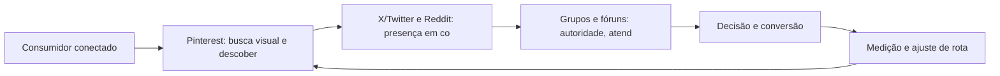

Observe o laço de retorno: a medição alimenta o próximo ciclo de campanha. Essa é a diferença estrutural entre campanha e sistema — a campanha termina quando o orçamento acaba; o sistema aprende e se ajusta a cada ciclo [7]. No caso do tema *Plataformas de Nicho e Comunidades: Pinterest, X/Twitter, Reddit e Grupos*, esse laço é o que converte o investimento inicial em aprendizado acumulado para as próximas decisões [15].

## 4. Técnica

### A Matriz de Criativos e Audiências

A operação de tráfego pago em escala é uma matriz: combinar criativos e audiências, medir e descartar o que não performa. O código abaixo simula a matriz e ordena os vencedores.

```python
import itertools

def matriz_planejamento(criativos, audiencias):
    """Retorna combinações com custo por conversão estimado."""
    celulas = []
    for c, a in itertools.product(criativos, audiencias):
        # CTR e CVR simulados: variam por combinação
        ctr = 0.01 + (hash(c) % 30) / 1000
        cvr = 0.02 + (hash(a) % 20) / 1000
        cpc = 1.20
        custo_conv = cpc / (ctr * cvr)
        celulas.append({"criativo": c, "audiencia": a,
                        "custo_conversao": round(custo_conv, 2)})
    return sorted(celulas, key=lambda x: x["custo_conversao"])

criativos = ["hook_beneficio", "hook_prova", "hook_historico"]
audiencias = ["novos", "engajados", "lookalike"]
for top in matriz_planejamento(criativos, audiencias)[:3]:
    print(top)
```

A matriz evita o erro mais comum: investir todo o orçamento na primeira combinação antes de deixar o algoritmo aprender [6]. A disciplina vale para qualquer plataforma social [14].

O código acima é o núcleo técnico de *Plataformas de Nicho e Comunidades: Pinterest, X/Twitter, Reddit e Grupos*: validável, executável e adaptável ao contexto real do leitor. A prática recomendada é rodá-lo com dados próprios e usar a saída como insumo da próxima reunião de planejamento. Documentação oficial das plataformas reforça cada passo — da estrutura de campanhas [5] à configuração de eventos [12]. A leitura técnica deste capítulo complementa a exposição conceitual das seções anteriores e prepara os exercícios da seção seguinte.

## 5. Aplica

Conhecimento sem aplicação é conteúdo; aplicação sem reflexão é rotina. No contexto de *Plataformas de Nicho e Comunidades: Pinterest, X/Twitter, Reddit e Grupos*, os exercícios abaixo fecham o capítulo e preparam o terreno do próximo:

1. Estruture uma campanha Meta com um público personalizado e um criativo de vídeo vertical.
2. Escolha uma plataforma de nicho do seu mercado e observe as conversas por uma semana antes de publicar.
3. Compare seu engajamento por plataforma na última quinzena e decida onde dobrar a aposta.
4. Produza um vídeo vertical de até 30 segundos com um hook nos primeiros 3 segundos.

Dedique ao menos 30 minutos a um dos exercícios antes de avançar. O aprendizado desta obra é cumulativo: o mapa desenhado aqui será usado nos capítulos seguintes da Parte IV e nas partes subsequentes [3].

Complementando, cinco exercícios práticos adicionais consolidam o aprendizado de *Plataformas de Nicho e Comunidades: Pinterest, X/Twitter, Reddit e Grupos*:

1. Qual plataforma social concentra o seu público-alvo real — e quanto da sua produção está lá?
2. Seus criativos são feitos para a plataforma ou são o mesmo anúncio reutilizado em todos os lugares?
3. Quanto tempo o seu público fica vendo o seu vídeo? Se for pouco, o problema é o hook?
4. Você tem público personalizado e retargeting configurados — ou depende só de segmentação por interesse?
5. Que conversa da sua audiência, hoje ignorada, poderia alimentar o seu próximo conteúdo?

## Leitura Complementar Recomendada

Para aprofundar *Plataformas de Nicho e Comunidades: Pinterest, X/Twitter, Reddit e Grupos* além deste capítulo:

- Como complemento, o TikTok for Business e o LinkedIn Marketing Solutions documentam as particularidades de cada território [14] [13].

- Para aprofundar as redes sociais, o livro de Hollensen, Kotler e Opresnik (Social Media Marketing) cobre a estratégia e o ecossistema, e a documentação do Meta Business Help Center detalha a operação de anúncios [11] [6].

## Análise de Riscos e Mitigações

A aplicação de *Plataformas de Nicho e Comunidades: Pinterest, X/Twitter, Reddit e Grupos* envolve riscos identificáveis. A tabela de riscos abaixo relaciona cada ameaça à sua mitigação:

- Risco de fadiga criativa: criativos saturados aumentam o custo. Mitigação: matriz de teste contínuo de criativos e audiências [6].
- Risco de métricas de vaidade: curtidas sem receita. Mitigação: conectar cada métrica social a resultado de negócio [8].
- Risco de crise não gerida: crítica viral sem resposta. Mitigação: protocolo de resposta e monitoramento diário [11].
- Risco de dependência algorítmica: o alcance muda com o algoritmo. Mitigação: lista própria e canal de propriedade como contrapeso [8].

## Considerações de Implementação

c

## Exercício Integrador da Parte IV

m

Este exercício conecta o capítulo às demais partes da obra e deve ser revisto ao final da leitura completa.

## Aprofundamento Prático

O tema de *Plataformas de Nicho e Comunidades: Pinterest, X/Twitter, Reddit e Grupos* ganha potência quando levado ao nível operacional. Os quatro pontos abaixo aprofundam a aplicação prática:

- A leitura avançada do algoritmo de recomendação exige entender o sinal: retenção de vídeo é a moeda — hooks fortes, loops e legendas aumentam o tempo de visualização e a distribuição [14].

- A operação de tráfego pago social é um ciclo de aprendizado: testar, medir, descartar e escalar — a matriz de criativos e audiências é o instrumento que organiza o ciclo [6].

- A escuta social é a inteligência da operação: monitorar menções, sentimentos e perguntas alimenta conteúdo, produto e atendimento — a comunidade fala e a marca precisa ouvir [11].

- A gestão de comunidade é trabalho contínuo de relacionamento: responder, reconhecer e dar voz aos clientes transforma audiência em defensores — o ativo social mais valioso da marca [11].

## Exercícios de Fixação

Para consolidar *Plataformas de Nicho e Comunidades: Pinterest, X/Twitter, Reddit e Grupos*, resolva os cinco exercícios abaixo — com caneta, papel e dados reais:

1. Compare o engajamento por plataforma da última quinzena.
2. Defina o tom de voz da sua marca em três adjetivos e teste em cinco posts.
3. Produza um vídeo vertical com hook nos primeiros três segundos.
4. Configure um público personalizado e um retargeting na sua plataforma.
5. Registre as cinco perguntas mais frequentes da sua comunidade.

## Autoavaliação do Capítulo

Autoavaliação: (1) Sei qual plataforma concentra o meu público real? (2) Meu calendário tem objetivo por peça? (3) Tenho público personalizado e retargeting configurados? (4) Meus vídeos têm hook nos primeiros três segundos? (5) Acompanho custo por resultado nas redes? Responda e priorize a primeira resposta negativa.

A primeira resposta negativa é o seu próximo passo natural — volte a ela na seção de aplicação deste capítulo e trabalhe o item até que a resposta seja sim.

## Problemas Comuns e Soluções Práticas

Aplicar *Plataformas de Nicho e Comunidades: Pinterest, X/Twitter, Reddit e Grupos* no mundo real esbarra em problemas recorrentes. Abaixo, cinco situações típicas com suas soluções — sintoma, causa e correção:

### Anúncios caros e sem retorno

Criativos saturados e audiências amplas inflam o custo. A solução é a matriz de criativos e audiências com teste e descarte sistemático [6].

### Audiência que não cresce

O alcance orgânico estagnou. A solução é variar formatos, hooks e horários, e usar o retargeting para capturar quem já interagiu [6].

### Crise nas redes

Uma crítica viral saiu do controle. A solução é o protocolo: responder com transparência, velocidade adequada e tom definido — e documentar o aprendizado [11].

### Conteúdo sem estratégia

Postagens aleatórias sem objetivo. A solução é o calendário editorial com meta por peça: engajar, educar, converter ou provar [11].

### Engajamento em queda

A audiência para de interagir. A solução é rever o calendário, os formatos e o tom — e perguntar à própria audiência o que ela quer ver [11].

## Aplicações por Setor

O tema de *Plataformas de Nicho e Comunidades: Pinterest, X/Twitter, Reddit e Grupos* ganha contornos diferentes em cada setor. A leitura setorial abaixo ajuda a adaptar os princípios ao seu contexto:

- No B2C, o Instagram e o TikTok dominam a descoberta; no B2B, o LinkedIn concentra os decisores; em serviços locais, o Facebook e o WhatsApp sustentam a conversa — a plataforma segue o público [11].

- Na moda, o vídeo e o visual lideram; na educação, o conteúdo educativo e o testemunho; na tecnologia B2B, o thought leadership e o caso técnico — o formato segue a decisão [11].

## Plano de Ação de 30 Dias

Para converter a leitura de *Plataformas de Nicho e Comunidades: Pinterest, X/Twitter, Reddit e Grupos* em resultado, execute um dos planos semanais abaixo — cada semana tem um objetivo e uma entrega:

### Plano de Ação — Opção 1

Semana 1 — Escuta: observe a conversa da sua comunidade por uma semana e registre as dores.
Semana 2 — Calendário: monte duas semanas de conteúdo respondendo às dores reais.
Semana 3 — Relação: responda a comentários e mensagens, registrando as recorrentes.
Semana 4 — Medição: compare engajamento e resultado da quinzena e ajuste a rota.

### Plano de Ação — Opção 2

Semana 1 — Foco: defina a plataforma principal e o tom de voz.
Semana 2 — Conteúdo: produza cinco posts de teste e um vídeo vertical com hook.
Semana 3 — Público: configure um público personalizado e um retargeting.
Semana 4 — Campanha: lance o piloto pago com orçamento pequeno e criativo testado.

## KPIs que Importam neste Capítulo

Para *Plataformas de Nicho e Comunidades: Pinterest, X/Twitter, Reddit e Grupos*, os KPIs que importam: alcance e engajamento, custo por resultado, taxa de retenção de vídeo e conversão atribuída por plataforma — a régua de cada território social [6].

Antes de encerrar, registre esses indicadores no seu painel de acompanhamento — eles serão a régua para medir a aplicação deste capítulo nas próximas semanas.

## Roteiro de Implementação Passo a Passo

Para aplicar *Plataformas de Nicho e Comunidades: Pinterest, X/Twitter, Reddit e Grupos* na prática, os roteiros abaixo organizam a sequência de ações — do diagnóstico à medição:

### Roteiro de Implementação 1

1. Liste as plataformas onde a marca está e o público de cada uma.
2. Compare o engajamento e o resultado de cada plataforma na última quinzena.
3. Escolha a plataforma de nicho do seu mercado e observe as conversas por uma semana.
4. Registre as perguntas, dores e termos usados pela comunidade.
5. Produza conteúdo respondendo às dores reais, no formato da plataforma.
6. Defina a frequência de publicação sustentável para a capacidade real do time.
7. Responda a comentários e mensagens por uma semana, registrando as recorrentes.
8. Selecione três criadores do segmento e avalie fit, alcance e engajamento.
9. Defina o protocolo de resposta para críticas e elogios.
10. Agende a revisão mensal de métricas por plataforma.

### Roteiro de Implementação 2

1. Defina o objetivo da presença social do trimestre em uma frase mensurável.
2. Escolha a plataforma principal onde o público-alvo realmente está.
3. Defina o tom de voz: como a marca fala, o que nunca diz e o que sempre diz.
4. Produza cinco posts de teste em uma semana e meça o engajamento.
5. Identifique os três formatos com melhor retenção e engajamento.
6. Produza um vídeo vertical com hook nos primeiros três segundos.
7. Monte o calendário editorial de duas semanas com objetivo por peça.
8. Configure um público personalizado e um retargeting no Gerenciador de Anúncios.
9. Lance uma campanha piloto com orçamento pequeno e criativo testado.
10. Meça custo por resultado, documente e decida o próximo ciclo.

## Perguntas Frequentes

Em relação ao tema de *Plataformas de Nicho e Comunidades: Pinterest, X/Twitter, Reddit e Grupos*, cinco perguntas surgem com frequência na prática profissional:

**Como medir o retorno do conteúdo?**

Atribuindo conversão: cada peça tem papel na jornada, e o modelo de atribuição distribui o crédito com justiça [12].

**Qual plataforma escolher?**

A que concentra o seu público-alvo real — e não a mais popular. Onde está a conversa da sua audiência? [11].

**Postar todo dia ou com qualidade?**

Consistência com qualidade: publicar com regularidade construindo expectativa vale mais que volume sem estratégia [11].

**Comprar seguidores adianta?**

Não — destrói o alcance real e a credibilidade. Métricas de vaidade não se convertem em receita [11].

**Tráfego pago é obrigatório?**

Não, mas acelera. Sem ele, o orgânico constrói com mais tempo; com ele, testa-se hipóteses mais rápido [6].

## Cenários Numéricos Comentados

Os cálculos abaixo mostram, com números concretos, como as decisões de *Plataformas de Nicho e Comunidades: Pinterest, X/Twitter, Reddit e Grupos* se traduzem em resultado:

### Cenário numérico: micro versus macro

Uma celebridade com 5 milhões de seguidores e engajamento de 0,2% alcança 10.000 interações. Um micro-influenciador com 50 mil seguidores e engajamento de 5% alcança 2.500 interações — mas com taxa de conversão cinco vezes maior pela confiança do nicho. O custo por venda, não o alcance, decide o vencedor [11].

### Cenário numérico: a matriz de criativos

Uma campanha com três criativos e três audiências gera nove combinações. Testar todas com orçamento igual revela que uma única combinação entrega custo por conversão 40% menor que a média. Concentrar 70% do orçamento no vencedor e manter o resto para aprendizado é a disciplina de escala da matriz [6].

## Como Este Capítulo se Integra à Obra

As redes sociais são o território de descoberta e prova social da jornada. A busca (Parte III) captura a intenção que as redes despertaram; o relacionamento (Parte V) converte a audiência em lista própria; e a conversão (Parte VII) fecha o ciclo que as redes iniciaram. No contexto de *Plataformas de Nicho e Comunidades: Pinterest, X/Twitter, Reddit e Grupos*, essa integração fica ainda mais visível: as ferramentas e métricas que você dominou aqui serão a base das decisões dos próximos capítulos — e das partes que virão depois.

## Aprofundamento Conceitual

No contexto de *Plataformas de Nicho e Comunidades: Pinterest, X/Twitter, Reddit e Grupos*, o vídeo vertical não é uma moda: é a resposta ao comportamento — a maioria do consumo social acontece no celular, com o som desligado e em sessões curtas, e o formato se adapta a isso [14].

No contexto de *Plataformas de Nicho e Comunidades: Pinterest, X/Twitter, Reddit e Grupos*, o algoritmo de recomendação do TikTok e dos Reels recompensa a retenção: vídeos que prendem até o fim entram em loops de distribuição massiva — o que torna o hook (primeiros 3 segundos) a decisão criativa mais importante [14].

No contexto de *Plataformas de Nicho e Comunidades: Pinterest, X/Twitter, Reddit e Grupos*, o LinkedIn é o território do B2B: decisores, tomadores de compra e especialistas estão lá, e o conteúdo de autoridade — casos, dados, opiniões fundamentadas — constrói a confiança que encurta o ciclo de venda [13].

No contexto de *Plataformas de Nicho e Comunidades: Pinterest, X/Twitter, Reddit e Grupos*, a operação de tráfego pago social exige disciplina de matriz: testar criativos e audiências em combinações controladas, medir custo por conversão e escalar apenas os vencedores [6].

No contexto de *Plataformas de Nicho e Comunidades: Pinterest, X/Twitter, Reddit e Grupos*, o retargeting é a ponte entre interesse e conversão: quem visitou o site sem comprar é lembrado nas redes com mensagens cada vez mais específicas, acompanhando a jornada [6].

## Fundamentos em Detalhe

No contexto de *Plataformas de Nicho e Comunidades: Pinterest, X/Twitter, Reddit e Grupos*, as comunidades de nicho — grupos, fóruns e subreddits — oferecem densidade de audiência inigualável: cada publicação alcança uma proporção muito maior do público-alvo do que em canais de massa [11].

No contexto de *Plataformas de Nicho e Comunidades: Pinterest, X/Twitter, Reddit e Grupos*, a escuta social transforma conversa em dado: monitorar menções, sentimentos e perguntas da audiência alimenta conteúdo, produto e atendimento com inteligência real de mercado [3].

No contexto de *Plataformas de Nicho e Comunidades: Pinterest, X/Twitter, Reddit e Grupos*, a consistência de publicação importa mais que a frequência: marcas que publicam com regularidade e qualidade constroem expectativa, enquanto as que desaparecem entre posts perdem o hábito da audiência [11].

No contexto de *Plataformas de Nicho e Comunidades: Pinterest, X/Twitter, Reddit e Grupos*, as redes sociais são, simultaneamente, o maior canal de descoberta e o maior ambiente de prova social do marketing digital — a maioria dos consumidores descobre marcas nas redes antes de qualquer outro canal [15].

No contexto de *Plataformas de Nicho e Comunidades: Pinterest, X/Twitter, Reddit e Grupos*, cada plataforma social tem sua própria geografia: o que funciona no Instagram (visual, reels, estética) não funciona no LinkedIn (autoridade, texto, contexto profissional) e vice-versa [11].

## Estudos de Caso Aplicados

### Caso: o B2B que construiu autoridade no LinkedIn

Uma empresa de software B2B sofria para gerar leads qualificados. Em vez de mais anúncios, o time passou a publicar thought leadership: dados de mercado, casos reais e opiniões fundamentadas no LinkedIn dos fundadores e especialistas. O perfil da marca cresceu em autoridade, e os leads passaram a chegar mais qualificados — reduzindo o ciclo de venda e o custo por oportunidade [13].

### Caso: a marca de moda que acertou o TikTok pelo hook

Uma marca de moda feminina produzia vídeos polidos que não decolavam. A análise mostrou que os primeiros segundos perdiam a audiência. A equipe passou a criar hooks de curiosidade ("por que essa calça veste diferente"), legendas automáticas e loops de repetição. O alcance orgânico disparou, e um único vídeo viral gerou fila de espera para um produto que não era o foco da campanha [14].

## Dados e Números do Setor

### Dados de Contexto

- As redes sociais concentram o maior tempo de atenção diário do consumidor conectado [15].
- A Meta opera um dos maiores ecossistemas de anúncios do mundo [6].
- O vídeo curto domina o engajamento nas plataformas de recomendação [14].
- O LinkedIn é o território B2B de decisores e tomadores de compra [13].

### Indicadores-Chave

- Alcance, engajamento e custo por resultado são as métricas sociais centrais [11].
- O custo por clique varia por plataforma, formato e segmentação [6].
- A taxa de retenção de vídeo é a métrica que alimenta a distribuição algorítmica [14].

## Análise Comparativa

O tema de *Plataformas de Nicho e Comunidades: Pinterest, X/Twitter, Reddit e Grupos* fica mais claro quando contrastado com a alternativa mais próxima. A comparação abaixo organiza as diferenças:

### Orgânico vs. Pago Social

- Orgânico constrói audiência e confiança; pago amplia alcance com precisão.
- Orgânico é lento e cumulativo; pago é rápido e mensurável por campanha.
- Pago depende de dados first-party; orgânico depende de consistência.
- A operação madura combina os dois com proporção definida por objetivo.

## Erros Comuns e Como Evitá-los

No tema de *Plataformas de Nicho e Comunidades: Pinterest, X/Twitter, Reddit e Grupos*, cinco erros recorrentes merecem atenção especial — cada um com sua correção prática:

1. Escalar orçamento antes de validar: aumentar a verba de uma combinação não testada multiplica o prejuízo.
2. Produzir para todas as plataformas ao mesmo tempo: sem foco, nenhuma audiência se forma.
3. Repetir o mesmo criativo até a exaustão: a fadiga criativa aumenta o custo por resultado.
4. Comprar seguidores: métricas de vaidade que destroem a credibilidade e o alcance real.
5. Ignorar a comunidade: responder só quando há crise perde o valor da conversa contínua.

## Ferramentas e Recursos Recomendados

Para operar o tema de *Plataformas de Nicho e Comunidades: Pinterest, X/Twitter, Reddit e Grupos* na prática, a seguinte seleção de ferramentas cobre o ciclo completo — do diagnóstico à medição:

1. Ferramenta de escuta social (menções e sentimento)
2. TikTok Creative Center (tendências e hooks)
3. Gerenciador de Anúncios da Meta (públicos e criativos)
4. Editor de vídeo vertical (Reels/TikTok)
5. Plataforma de agendamento social

## Glossário do Capítulo

Os termos abaixo — todos usados no corpo deste capítulo — formam o vocabulário mínimo para acompanhar o restante da obra:

Pixel: rastreador de conversão da plataforma. Público personalizado: audiência construída com dados próprios. Lookalike: audiência semelhante a uma base. Hook: abertura de vídeo que prende atenção. UGC: conteúdo gerado pelo usuário. Engajamento: interações sobre a publicação.

## Checklist de Implementação

Use a lista abaixo para auditar a aplicação de *Plataformas de Nicho e Comunidades: Pinterest, X/Twitter, Reddit e Grupos* na sua operação — marque os itens já concluídos e priorize os pendentes:

- [ ] Vídeo vertical com hook nos 3 primeiros segundos
- [ ] Calendário social com objetivo por peça
- [ ] Escuta social iniciada
- [ ] Tom de voz definido e testado
- [ ] Campanha Meta com público personalizado

## Perguntas para Reflexão

Antes de avançar, reflita sobre as cinco questões abaixo — elas conectam o conteúdo de *Plataformas de Nicho e Comunidades: Pinterest, X/Twitter, Reddit e Grupos* ao seu contexto real de trabalho:

1. Seus criativos são feitos para a plataforma ou são o mesmo anúncio reutilizado em todos os lugares?
2. Quanto tempo o seu público fica vendo o seu vídeo? Se for pouco, o problema é o hook?
3. Você tem público personalizado e retargeting configurados — ou depende só de segmentação por interesse?
4. Que conversa da sua audiência, hoje ignorada, poderia alimentar o seu próximo conteúdo?
5. Qual plataforma social concentra o seu público-alvo real — e quanto da sua produção está lá?

## Quadro Comparativo: Plataformas Sociais e Papel no Funil

O quadro abaixo consolida os elementos essenciais de *Plataformas de Nicho e Comunidades: Pinterest, X/Twitter, Reddit e Grupos* em perspectiva comparada, facilitando a consulta rápida e a tomada de decisão:

| Plataforma | Papel principal | Formato forte |
|---|---|---|
| Plataforma | Papel principal | Formato forte |
| Instagram | Descoberta e prova | Visual e Reels |
| TikTok | Viralização e descoberta | Vídeo curto |
| LinkedIn | Autoridade B2B | Texto e thought leadership |
| YouTube | Educação e busca | Vídeo longo |
| WhatsApp | Conversão e atendimento | Mensagem direta |

## 6. Conclusão

O capítulo percorreu o território da Parte IV, *Redes Sociais — Territórios de Comunidade*, e deixou três aprendizados operacionais. Primeiro, o conceito central — *Plataformas de Nicho e Comunidades: Pinterest, X/Twitter, Reddit e Grupos* — é menos uma novidade e mais uma disciplina de execução. Segundo, a aplicação exige a tríade conceito, rota e métrica, sem pular etapas [8]. Terceiro, o ajuste contínuo de rota, ilustrado no laço de retorno do diagrama, é o que separa campanhas pontuais de operações sustentáveis [7]. O caminho percorrido desde *Tráfego Pago em Escala: Estrutura, Teste e Otimização de Campanhas* até aqui forma a base que o próximo passo vai usar. No próximo capítulo, *E-mail Marketing e Automação: O Relacionamento de Longo Prazo*, você avançará sobre o território vizinho levando as ferramentas exercitadas aqui.

Como navegador de marketing digital, você não decorou uma fórmula — incorporou um modo de operar: ler o território, escolher a rota com dados e ajustar o percurso quando o vento muda [2].

Antes do fechamento, vale reforçar a base do capítulo: No contexto de *Plataformas de Nicho e Comunidades: Pinterest, X/Twitter, Reddit e Grupos*, a autenticidade superou o polimento: o consumidor conectado desconfia do perfeito e confia no real — e o conteúdo gerado por clientes (UGC) converte mais que o anúncio produzido [14].

No contexto de *Plataformas de Nicho e Comunidades: Pinterest, X/Twitter, Reddit e Grupos*, o ecossistema Meta é o maior laboratório de segmentação do mundo: dados de interesse, comportamento e relacionamento alimentam públicos que nenhum outro canal consegue igualar [6].
## 7. Referências Bibliográficas

[1] KOTLER, Philip; KELLER, Kevin Lane. **Administração de Marketing**. 15. ed. São Paulo: Pearson, 2016.
[2] KOTLER, Philip; KARTAJAYA, Hermawan; SETIAWAN, Iwan. **Marketing 4.0: Moving from Traditional to Digital**. Hoboken: Wiley, 2017.
[3] CHAFFEY, Dave; ELLIS-CHADWICK, Fiona. **Digital Marketing: Strategy, Implementation and Practice**. 9. ed. Harlow: Pearson, 2025.
[4] GOOGLE SEARCH CENTRAL. **Search Engine Optimization (SEO) Starter Guide**. Disponível em: https://developers.google.com/search/docs/fundamentals/seo-starter-guide. Acesso em: 02 ago. 2026.
[5] GOOGLE ADS HELP CENTER. **Your guide to Google Ads (Basics, Search Campaigns & Best Practices)**. Disponível em: https://support.google.com/google-ads/answer/6146252. Acesso em: 02 ago. 2026.
[6] META BUSINESS HELP CENTER. **Meta Ads Manager Guide: Best Practices for Targeting, Measurement, and Optimization**. Disponível em: https://www.facebook.com/business/help. Acesso em: 02 ago. 2026.
[7] DELOITTE DIGITAL. **Marketing Trends 2026: New Marketing for a New World**. Disponível em: https://www.deloittedigital.com/nl/en/insights/perspective/marketing-trends-2026.html. Acesso em: 02 ago. 2026.
[8] HUBSPOT RESEARCH. **The State of Marketing / 2026 Marketing Statistics, Trends & Data**. Disponível em: https://www.hubspot.com/marketing-statistics. Acesso em: 02 ago. 2026.
[9] STATISTA RESEARCH DEPARTMENT. **Global Digital Marketing and Advertising Revenue Statistics & Facts**. Disponível em: https://www.statista.com/topics/8954/marketing-worldwide/. Acesso em: 02 ago. 2026.
[10] RYAN, Damian. **Understanding Digital Marketing: Marketing Strategies for Engaging the Digital Generation**. 5. ed. London: Kogan Page, 2020.
[11] HOLLENSEN, Svend; KOTLER, Philip; OPRESNIK, Marc Oliver. **Social Media Marketing: A Practitioner Approach**. 4. ed. Harlow: Pearson, 2023.
[12] GOOGLE ANALYTICS HELP CENTER. **Documentação oficial do Google Analytics 4**. Disponível em: https://support.google.com/analytics. Acesso em: 02 ago. 2026.
[13] LINKEDIN MARKETING SOLUTIONS. **Best Practices para campanhas B2B no LinkedIn**. Disponível em: https://business.linkedin.com/marketing-solutions. Acesso em: 02 ago. 2026.
[14] TIKTOK FOR BUSINESS. **Guia de criatividade e boas práticas de anúncios no TikTok**. Disponível em: https://www.tiktok.com/business. Acesso em: 02 ago. 2026.
[15] DATAREPORTAL. **Digital 2026: Global Overview Report**. Disponível em: https://datareportal.com/reports/digital-2026-global-overview-report. Acesso em: 02 ago. 2026.
[16] LEMON, Katherine N.; VERHOEF, Peter C. **Understanding Customer Experience Throughout the Customer Journey**. *Journal of Marketing*, v. 80, n. 6, p. 69-96, 2016.
[17] TIWARI, Rajnish; BUSE, Stephan; HERSTATT, Cornelius. **From Electronic to Mobile Commerce: Opportunities and Challenges**. *Proceedings of the German-Indian Roundtable*, 2006.
[18] VAN DIJK, Jan A. G. M. **The Digital Divide**. Cambridge: Polity Press, 2020.
[19] IBM. **Marketing with AI: Personalization at Scale**. Disponível em: https://www.ibm.com/think/topics/ai-marketing. Acesso em: 02 ago. 2026.
[20] KOTLER, Philip. **Marketing 5.0: Technology for Humanity**. Hoboken: Wiley, 2021.


# PARTE V — Relacionamento — A Rota da Retenção

# Capítulo 21: E-mail Marketing e Automação: O Relacionamento de Longo Prazo

## 1. Introdução

Bem-vindo a uma nova etapa da sua navegação pelo marketing digital. Este capítulo — *E-mail Marketing e Automação: O Relacionamento de Longo Prazo* — integra a Parte V, *Relacionamento — A Rota da Retenção*, e responde a uma pergunta prática: **fundamentos de e-mail marketing: listas, entregabilidade e consentimento** — na prática, como isso se traduz em decisão e resultado?

Ao final, você será capaz de constrói estratégias de e-mail e lifecycle marketing: listas, segmentação, automação e métricas de entrega e conversão.. Mais do que decorar conceitos, você vai enxergar o relacionamento como rota de retenção e recompra — e converter essa visão em plano, experimento e métrica.

No capítulo anterior, *Plataformas de Nicho e Comunidades: Pinterest, X/Twitter, Reddit e Grupos*, você aprendeu os conceitos que servem de plataforma para o que vem agora. Este capítulo retoma esse repertório e o aplica a um território novo — sem repetir o que já foi estabelecido, apenas usando como base.

O capítulo segue a estrutura das sete seções que organizam esta obra: primeiro a exposição conceitual, depois a ilustração, a técnica aplicada, o exercício de aplicação e a conclusão operacional.

No contexto de *E-mail Marketing e Automação: O Relacionamento de Longo Prazo*, o ciclo de vida do cliente — aquisição, ativação, receita, retenção e reativação — é a régua que organiza o relacionamento: cada estágio tem mensagens, objetivos e métricas próprias [10].

No contexto de *E-mail Marketing e Automação: O Relacionamento de Longo Prazo*, a segmentação de lista é o que separa e-mail de spam: listas segmentadas por comportamento e interesse superam listas genéricas em open rate, CTR e receita por envio [8].
## 2. Explica

### Fundamentos de e-mail marketing: listas, entregabilidade e consentimento

Quando o tema é *E-mail Marketing e Automação: O Relacionamento de Longo Prazo*, o primeiro pilar — fundamentos de e-mail marketing: listas, entregabilidade e consentimento — define o território conceitual. A entregabilidade é a métrica que antecede todas as outras no e-mail: uma lista mal higienizada destrói reputação de remetente e enterra campanhas [8].

Na prática, fundamentos de e-mail marketing: listas, entregabilidade e consentimento significa transformar a teoria em rotina operacional — exatamente o que *E-mail Marketing e Automação: O Relacionamento de Longo Prazo* exige no dia a dia. A literatura de gestão é enfática: sem operacionalizar o conceito em checklist, responsável e métrica, ele permanece slide de apresentação [3]. Por isso a Parte V propõe sempre o mesmo movimento: entender, traduzir em critério observável e decidir com dado.

### Fluxos de automação: boas-vindas, carrinho abandonado e nutrição

O segundo pilar — fluxos de automação: boas-vindas, carrinho abandonado e nutrição — conecta a estratégia à operação diária. Automação de marketing não é disparo em massa: é sequência condicional em que cada próximo passo depende do comportamento do assinante [3]. A experiência do consumidor se constrói na consistência entre canais e mensagens, e é essa consistência que transforma contato em relacionamento [16]. Organizações que tratam cada canal como silo perdem o fio condutor da jornada; as que operam o pilar com disciplina reduzem atrito e aumentam a taxa de avanço entre etapas [10].

### Métricas: open rate, CTR e receita por e-mail

Fechando o tripé, métricas: open rate, ctr e receita por e-mail é o que transforma a Parte V em vantagem mensurável. Conteúdo que educa reduz o custo de venda: o leitor que chega aquecido pelo material de apoio precisa de menos argumentação comercial no momento da decisão [3]. O relato da indústria mostra que as empresas que sustentam resultado não são as que têm mais ferramentas, mas as que conseguem medir e ajustar a rota com frequência [8]. A métrica certa, escolhida antes da campanha, vale mais do que qualquer ferramenta cara instalada depois do fato [9].

### O Eixo Transversal do Capítulo

Programas de fidelização bem desenhados aumentam a frequência de compra e transformam clientes satisfeitos em defensores ativos da marca [11]. Esse eixo conecta os três pilares e explica por que o capítulo os trata como um sistema, não como uma lista: cada pilar reforça o outro, e a omissão de qualquer um deles produz estratégia manca. O capítulo seguinte retomará esse eixo com novas ferramentas, agora com o vocabulário já estabelecido aqui.

Em síntese, o capítulo opera em três níveis: o conceitual (Fundamentos de e-mail marketing: listas, entregabilidade e consentimento), o operacional (Fluxos de automação: boas-vindas, carrinho abandonado e nutrição) e o estratégico (Métricas: open rate, CTR e receita por e-mail). O leitor que dominar os três estará apto a aplicar a Parte V com autonomia [1]. A evidência reunida nesta seção sustenta cada recomendação prática das seções seguintes [2].

## 3. Ilustra

Vamos traduzir o capítulo em uma cena concreta, no contexto de *E-mail Marketing e Automação: O Relacionamento de Longo Prazo*. Uma empresa de porte médio, com equipe enxuta e orçamento limitado, decide operar a Parte V desta obra, *Relacionamento — A Rota da Retenção*. Na primeira semana, a equipe testa o conceito central do capítulo em um caso real: um cliente que pesquisou, comparou e decidiu comprar. O primeiro pilar — fundamentos de e-mail marketing: listas, entregabilidade e consentimento — orienta o entendimento inicial do público; o segundo — fluxos de automação: boas-vindas, carrinho abandonado e nutrição — guia a escolha da rota de comunicação; e o terceiro fecha com a medição do resultado [2].

O diagrama abaixo representa o fluxo operacional proposto pelo capítulo — do consumidor conectado à decisão e ao ajuste contínuo de rota, com o público e a plataforma específicos do tema no centro da navegação:

```mermaid
%% legenda: E-mail Marketing e Automação: O Relacionamento de Longo Praz
flowchart LR
  A[Consumidor conectado] --> B[Fundamentos de e-mail marketing: l]
  B --> C[Fluxos de automação: boas-vindas, ]
  C --> D[Métricas: open rate, CTR e receita]
  D --> E[Decisão e conversão]
  E --> F[Medição e ajuste de rota]
  F --> B
```

Observe o laço de retorno: a medição alimenta o próximo ciclo de campanha. Essa é a diferença estrutural entre campanha e sistema — a campanha termina quando o orçamento acaba; o sistema aprende e se ajusta a cada ciclo [7]. No caso do tema *E-mail Marketing e Automação: O Relacionamento de Longo Prazo*, esse laço é o que converte o investimento inicial em aprendizado acumulado para as próximas decisões [15].

## 4. Técnica

### A Segmentação do Relacionamento

O e-mail e a automação só performam com segmentação. O código abaixo classifica assinantes por engajamento e sugere a jornada de nutrição de cada grupo.

```python
def segmentar(aberturas: int, cliques: int, dias_ativos: int) -> str:
    """Classifica assinante por nível de engajamento."""
    if aberturas >= 5 and cliques >= 2:
        return "quente"      # prioridade: oferta e advocacy
    if aberturas >= 2:
        return "morno"       # prioridade: nutrição com conteúdo
    if dias_ativos > 60:
        return "frio"        # prioridade: reativação com incentivo
    return "novo"            # prioridade: onboarding e boas-vindas

for a, c, d in [(8, 3, 40), (3, 1, 90), (1, 0, 200), (0, 0, 5)]:
    print(segmentar(a, c, d))
```

Cada segmento recebe uma sequência diferente — o mesmo conteúdo enviado a todos é a definição operacional de spam irrelevante [8]. O consentimento governa toda a operação [7].

O código acima é o núcleo técnico de *E-mail Marketing e Automação: O Relacionamento de Longo Prazo*: validável, executável e adaptável ao contexto real do leitor. A prática recomendada é rodá-lo com dados próprios e usar a saída como insumo da próxima reunião de planejamento. Documentação oficial das plataformas reforça cada passo — da estrutura de campanhas [5] à configuração de eventos [12]. A leitura técnica deste capítulo complementa a exposição conceitual das seções anteriores e prepara os exercícios da seção seguinte.

## 5. Aplica

Conhecimento sem aplicação é conteúdo; aplicação sem reflexão é rotina. No contexto de *E-mail Marketing e Automação: O Relacionamento de Longo Prazo*, os exercícios abaixo fecham o capítulo e preparam o terreno do próximo:

1. Escreva um e-mail de reativação para assinantes inativos e defina o incentivo e a métrica de sucesso.
2. Mapeie os cinco gatilhos de automação de maior valor para o seu modelo de negócio.
3. Audite a entregabilidade: SPF, DKIM e a reputação do domínio remetente nos últimos 30 dias.
4. Produza um conteúdo pilar longo e derive dele 10 variações para outros canais.

Dedique ao menos 30 minutos a um dos exercícios antes de avançar. O aprendizado desta obra é cumulativo: o mapa desenhado aqui será usado nos capítulos seguintes da Parte V e nas partes subsequentes [3].

Complementando, cinco exercícios práticos adicionais consolidam o aprendizado de *E-mail Marketing e Automação: O Relacionamento de Longo Prazo*:

1. Sua automação reage ao comportamento do assinante ou é um disparo cego em sequência fixa?
2. Quanto da sua receita vem de clientes que recompram? O que isso diz sobre a sua jornada de retenção?
3. Sua lista de e-mail é um ativo seu — ou você depende de canais que não controla?
4. Você pede consentimento explícito e entrega o que prometeu? Sua lista passaria numa auditoria de LGPD?
5. Cada e-mail seu tem um único objetivo claro, ou tenta fazer tudo ao mesmo tempo?

## Leitura Complementar Recomendada

Para aprofundar *E-mail Marketing e Automação: O Relacionamento de Longo Prazo* além deste capítulo:

- Para aprofundar o relacionamento, Chaffey trata o e-mail e a automação no contexto da estratégia digital, e Ryan (Understanding Digital Marketing) cobre o inbound e o lifecycle [3] [10].

- Como complemento, os dados da HubSpot sobre retorno do e-mail e comportamento de assinantes contextualizam as métricas deste capítulo [8].

## Análise de Riscos e Mitigações

A aplicação de *E-mail Marketing e Automação: O Relacionamento de Longo Prazo* envolve riscos identificáveis. A tabela de riscos abaixo relaciona cada ameaça à sua mitigação:

- Risco de reputação de remetente: entregabilidade destruída por reclamações. Mitigação: higiene de lista, autenticação e volume consistente [8].
- Risco legal: lista sem consentimento. Mitigação: base legal documentada e revogação funcional [7].
- Risco de irrelevância: envio em massa sem segmentação. Mitigação: segmentação por comportamento e receita por envio como régua [8].
- Risco de automação fria: sequências sem condição. Mitigação: jornadas condicionais que reagem ao comportamento [3].

## Considerações de Implementação

s

## Exercício Integrador da Parte V

 

Este exercício conecta o capítulo às demais partes da obra e deve ser revisto ao final da leitura completa.

## Aprofundamento Prático

O tema de *E-mail Marketing e Automação: O Relacionamento de Longo Prazo* ganha potência quando levado ao nível operacional. Os quatro pontos abaixo aprofundam a aplicação prática:

- A segmentação por comportamento é a diferença entre e-mail e spam: o comportamento do assinante — o que abriu, clicou e comprou — define a mensagem certa no momento certo [8].

- O aprofundamento prático do e-mail começa pela higiene de lista: remover inativos, validar endereços e monitorar reclamações — a saúde da lista é a condição de entregabilidade [8].

- A leitura avançada da automação exige o desenho de jornadas condicionais: cada fluxo deve ter gatilho, passos, ramificações e saída — e cada passo deve entregar valor antes de pedir ação [3].

- O conteúdo pilar é a máquina de reutilização: um tema-mestre profundo gera dezenas de variações, e o ciclo de reutilização é o que multiplica o retorno de cada ideia [3].

## Exercícios de Fixação

Para consolidar *E-mail Marketing e Automação: O Relacionamento de Longo Prazo*, resolva os cinco exercícios abaixo — com caneta, papel e dados reais:

1. Escreva um e-mail de boas-vindas com um único objetivo e CTA.
2. Defina sua política de consentimento: base legal, finalidades, revogação.
3. Produza um conteúdo pilar e derive cinco variações.
4. Audite a entregabilidade da sua lista (SPF, DKIM, reclamações).
5. Segmente sua lista por engajamento e desenhe uma nutrição para o segmento frio.

## Autoavaliação do Capítulo

Autoavaliação: (1) Minha lista foi construída com consentimento explícito? (2) Minha entregabilidade está verificada (SPF, DKIM, reclamações)? (3) Minha lista está segmentada por engajamento? (4) Minhas automações reagem ao comportamento? (5) Sei a receita por envio de cada fluxo? Responda e priorize a primeira resposta negativa.

A primeira resposta negativa é o seu próximo passo natural — volte a ela na seção de aplicação deste capítulo e trabalhe o item até que a resposta seja sim.

## Problemas Comuns e Soluções Práticas

Aplicar *E-mail Marketing e Automação: O Relacionamento de Longo Prazo* no mundo real esbarra em problemas recorrentes. Abaixo, cinco situações típicas com suas soluções — sintoma, causa e correção:

### Descadastro em alta

A frequência ou a relevância está errada. A solução é testar frequências, segmentar melhor e ouvir o feedback — o descadastro cai quando a entrega vale o tempo do leitor [8].

### E-mails indo para o spam

A entregabilidade caiu por reputação ou higiene. A solução é autenticar (SPF/DKIM/DMARC), higienizar a lista e reduzir reclamações — o remetente recupera a reputação [8].

### Lista parada

Assinantes inertes e sem resposta. A solução é segmentar por engajamento, reativar os frios com incentivo e descartar os irreversíveis — a lista saudável vale mais que a grande [8].

### Automação que não converte

Sequências fixas sem condição desperdiçam oportunidade. A solução é condicionar cada passo ao comportamento: abriu, clicou, comprou — a relevância sobe com a reação [3].

### Conteúdo sem retorno

Produção alta sem receita atribuída. A solução é conectar cada peça a um CTA e a uma etapa do funil, e medir a conversão por conteúdo [3].

## Aplicações por Setor

O tema de *E-mail Marketing e Automação: O Relacionamento de Longo Prazo* ganha contornos diferentes em cada setor. A leitura setorial abaixo ajuda a adaptar os princípios ao seu contexto:

- Na educação, o inbound transforma curiosidade em matrícula; no software, transforma trial em assinatura; no varejo, transforma leitura em recompra — o valor entregue antes da venda define o ritmo [3].

- No e-commerce, o e-mail recupera carrinho e gera receita recorrente; no B2B, nutre o ciclo longo com conteúdo técnico; no serviço, sustenta o relacionamento e a recompra — o canal é o mesmo, a jornada muda [8].

## Plano de Ação de 30 Dias

Para converter a leitura de *E-mail Marketing e Automação: O Relacionamento de Longo Prazo* em resultado, execute um dos planos semanais abaixo — cada semana tem um objetivo e uma entrega:

### Plano de Ação — Opção 1

Semana 1 — Lista: audite a lista atual e defina a política de consentimento.
Semana 2 — Segmentação: separe por engajamento (quente, morno, frio, novo).
Semana 3 — Fluxo: desenhe a boas-vindas de cinco e-mails com um objetivo por envio.
Semana 4 — Lançamento: envie em piloto, meça open, CTR e receita, e ajuste.

### Plano de Ação — Opção 2

Semana 1 — Pilares: defina os três a cinco pilares de conteúdo do seu mercado.
Semana 2 — Conteúdo: produza um conteúdo pilar profundo para a pergunta mais importante.
Semana 3 — Variações: derive dez variações para blog, social, e-mail e vídeo.
Semana 4 — Distribuição: publique com CTA por peça e meça o retorno por formato.

## KPIs que Importam neste Capítulo

Para *E-mail Marketing e Automação: O Relacionamento de Longo Prazo*, os KPIs que importam: open rate, CTR e receita por envio, entregabilidade, descadastro e retenção da lista — os números do relacionamento de longo prazo [8].

Antes de encerrar, registre esses indicadores no seu painel de acompanhamento — eles serão a régua para medir a aplicação deste capítulo nas próximas semanas.

## Roteiro de Implementação Passo a Passo

Para aplicar *E-mail Marketing e Automação: O Relacionamento de Longo Prazo* na prática, os roteiros abaixo organizam a sequência de ações — do diagnóstico à medição:

### Roteiro de Implementação 1

1. Audite sua lista atual: quem é, como chegou, quando interagiu pela última vez.
2. Defina a política de consentimento: base legal, finalidades e processo de exclusão.
3. Segmente a lista por engajamento: quente, morno, frio, novo.
4. Desenhe o fluxo de boas-vindas com cinco e-mails e um objetivo por envio.
5. Escreva a nutrição para o segmento morno com conteúdo educativo.
6. Crie o fluxo de reativação para o frio com um incentivo definido.
7. Configure os gatilhos de automação de maior valor (carrinho, pós-compra, aniversário).
8. Verifique a entregabilidade: SPF, DKIM, DMARC e reputação do domínio.
9. Lance o fluxo de boas-vindas em piloto e meça open, CTR e receita.
10. Revise as métricas mensalmente e itere o conteúdo com base nos dados.

### Roteiro de Implementação 2

1. Defina os pilares de conteúdo: três a cinco temas-mestres do seu mercado.
2. Para cada pilar, liste as dez perguntas que o público faz.
3. Produza um conteúdo pilar profundo para a pergunta mais importante.
4. Derive dez variações: blog, vídeo, social, e-mail, infográfico, podcast.
5. Monte o calendário editorial de 30 dias com as variações distribuídas.
6. Defina a distribuição: onde cada variação será publicada e com qual CTA.
7. Reutilize o conteúdo: transforme capítulos em posts e posts em e-mails.
8. Meça por peça: alcance, engajamento, cliques e conversão atribuída.
9. Identifique o formato de melhor retorno e dobre a aposta nele.
10. Documente o ciclo de reutilização para acelerar a produção futura.

## Perguntas Frequentes

Em relação ao tema de *E-mail Marketing e Automação: O Relacionamento de Longo Prazo*, cinco perguntas surgem com frequência na prática profissional:

**Qual a frequência ideal de envio?**

A que a sua base tolera com relevância: teste frequências e observe descadastro e receita por envio [8].

**O que é entregabilidade?**

A capacidade de chegar à caixa de entrada — depende de reputação, autenticação e higiene da lista [8].

**Inbound serve para B2B?**

Serve e é o método mais eficaz: o decisor B2B pesquisa, educa-se e só então fala com vendas — o inbound acompanha esse caminho [3].

**E-mail morreu?**

Ao contrário: continua entre os canais de maior retorno por investimento — o que morreu foi o disparo em massa sem segmentação [8].

**Posso comprar uma lista pronta?**

Não — além de violar a LGPD, gera reclamações, destruição de reputação e entregabilidade em queda [7].

## Cenários Numéricos Comentados

Os cálculos abaixo mostram, com números concretos, como as decisões de *E-mail Marketing e Automação: O Relacionamento de Longo Prazo* se traduzem em resultado:

### Cenário numérico: receita por envio

Uma lista de 10.000 assinantes segmentada entrega open de 40%, CTR de 5% e conversão de 3% — cerca de 60 vendas por envio. A mesma lista sem segmentação cai para open de 15%, CTR de 1% e conversão de 1% — 15 vendas. A segmentação quadruplica a receita por envio sem custo adicional de lista [8].

### Cenário numérico: o custo do consentimento

Adquirir um assinante via conteúdo custa em média R$ 1,50; via anúncio, R$ 5,00. Uma lista própria de 20.000 assinantes representa, portanto, um ativo de R$ 30 mil a R$ 100 mil — e, diferentemente de mídia, esse ativo não expira quando o orçamento acaba [8].

## Como Este Capítulo se Integra à Obra

O relacionamento é a rota da retenção, mas depende do que as partes anteriores construíram: a jornada (II) mapeia o cliente, a busca e as redes (III e IV) o atraem, e o relacionamento o converte em receita recorrente. As partes de métricas (VIII) e economia (IX) medem o valor desse relacionamento. No contexto de *E-mail Marketing e Automação: O Relacionamento de Longo Prazo*, essa integração fica ainda mais visível: as ferramentas e métricas que você dominou aqui serão a base das decisões dos próximos capítulos — e das partes que virão depois.

## Aprofundamento Conceitual

No contexto de *E-mail Marketing e Automação: O Relacionamento de Longo Prazo*, a segmentação comportamental é o que separa o e-mail da lista de spam: assinantes segmentados por comportamento abrem mais, clicam mais e geram mais receita por envio [8].

No contexto de *E-mail Marketing e Automação: O Relacionamento de Longo Prazo*, o conteúdo pilar é o motor do marketing de conteúdo: um tema-mestre profundo gera dezenas de variações — posts, vídeos, e-mails, infográficos — maximizando o retorno de cada ideia [3].

No contexto de *E-mail Marketing e Automação: O Relacionamento de Longo Prazo*, a fidelização é a estratégia de menor custo e maior retorno do relacionamento: o cliente existente já conhece a marca, confia nela e custa menos para comprar novamente [11].

No contexto de *E-mail Marketing e Automação: O Relacionamento de Longo Prazo*, o copywriting de e-mail é uma arte mensurável: linhas de assunto que geram curiosidade, corpo que entrega valor e um único CTA claro — testados contra métricas de abertura e clique [10].

No contexto de *E-mail Marketing e Automação: O Relacionamento de Longo Prazo*, a reativação de clientes inativos é uma mina de ouro esquecida: muitos assinantes frios voltam com um incentivo certo — e o custo de reativar é uma fração do custo de adquirir [8].

## Fundamentos em Detalhe

No contexto de *E-mail Marketing e Automação: O Relacionamento de Longo Prazo*, o e-mail marketing é o canal de propriedade mais valioso do marketing digital: a lista de assinantes é um ativo que a marca controla, independentemente de algoritmos e mudanças de plataforma [8].

No contexto de *E-mail Marketing e Automação: O Relacionamento de Longo Prazo*, a entregabilidade é a condição de existência do e-mail: reputação de remetente, autenticação (SPF, DKIM, DMARC) e higiene de lista determinam se a mensagem chega à caixa de entrada ou ao spam [8].

No contexto de *E-mail Marketing e Automação: O Relacionamento de Longo Prazo*, o consentimento estruturou o relacionamento digital: LGPD e GDPR exigiram base legal, transparência e direito de exclusão, transformando a lista comprada em risco legal e a lista própria em ativo [7].

No contexto de *E-mail Marketing e Automação: O Relacionamento de Longo Prazo*, a automação de marketing não é disparo em massa: é sequência condicional, em que cada próximo passo depende do comportamento do assinante — abriu, clicou, comprou, abandonou [3].

No contexto de *E-mail Marketing e Automação: O Relacionamento de Longo Prazo*, o inbound marketing inverte a lógica da interrupção: em vez de invadir a atenção, atrai por valor — conteúdo que educa, resolve e constrói autoridade antes da venda [3].

## Estudos de Caso Aplicados

### Caso: a loja que transformou a lista em ativo

Uma loja de suplementos dependia de marketplaces e anúncios — canais que ela não controlava. A virada começou com a construção da lista própria: conteúdo educativo sobre treino e nutrição capturando e-mail com consentimento explícito. Em um ano, a lista tornou-se o canal de maior retorno — com custo zero de mídia e receita recorrente via automação de nutrição [8].

### Caso: a escola que educou antes de vender

Uma escola de idiomas competia com gigantes do setor. Em vez de disputar a busca transacional (cara), apostou no inbound: guias gratuitos de aprendizado, avaliação de nível e webinars com professores. O conteúdo atraiu um público que ainda não buscava escola — e o converteu ao longo de meses de nutrição. O custo por matrícula caiu e a confiança aumentou [3].

## Dados e Números do Setor

### Indicadores-Chave

- Open rate, CTR e receita por envio medem o e-mail [8].
- Entregabilidade e reputação de remetente são as condições de existência do canal [8].
- O ciclo de vida do cliente organiza a automação por estágio [10].

### Dados de Contexto

- O e-mail permanece entre os canais de maior retorno por investimento [8].
- O consentimento (LGPD/GDPR) estruturou toda a comunicação eletrônica [7].
- O inbound atrai por valor e converte curiosidade em confiança [3].

## Análise Comparativa

O tema de *E-mail Marketing e Automação: O Relacionamento de Longo Prazo* fica mais claro quando contrastado com a alternativa mais próxima. A comparação abaixo organiza as diferenças:

### E-mail vs. Redes Sociais no Relacionamento

- E-mail é canal de propriedade; redes são canais alugados por algoritmo.
- E-mail entrega diretamente; redes disputam atenção por relevância.
- E-mail é ideal para nutrição e transação; redes para descoberta e comunidade.
- O relacionamento de longo prazo se ancora na lista própria.

## Erros Comuns e Como Evitá-los

No tema de *E-mail Marketing e Automação: O Relacionamento de Longo Prazo*, cinco erros recorrentes merecem atenção especial — cada um com sua correção prática:

1. Automação sem condição: sequências fixas que não reagem ao comportamento ignoram a oportunidade de relevância.
2. Focar em volume de envios: a métrica certa é receita por envio, não quantidade de e-mails.
3. Negligenciar a entregabilidade: uma boa campanha na caixa de spam é uma campanha que não existiu.
4. Comprar listas prontas: além de ilegal sob a LGPD, gera altíssimas taxas de reclamação e destruição de reputação.
5. Disparar em massa sem segmentação: a mensagem genérica é ignorada — ou marcada como spam.

## Ferramentas e Recursos Recomendados

Para operar o tema de *E-mail Marketing e Automação: O Relacionamento de Longo Prazo* na prática, a seguinte seleção de ferramentas cobre o ciclo completo — do diagnóstico à medição:

1. Ferramenta de verificação de entregabilidade (SPF/DKIM)
2. Editor de conteúdo pilar
3. Ferramenta de landing pages
4. CRM para segmentação por comportamento
5. Plataforma de e-mail marketing com automação

## Glossário do Capítulo

Os termos abaixo — todos usados no corpo deste capítulo — formam o vocabulário mínimo para acompanhar o restante da obra:

Entregabilidade: capacidade de chegar à caixa de entrada. SPF/DKIM/DMARC: autenticações de e-mail. Consentimento: autorização explícita do titular. Nutrição: sequência educativa. Ciclo de vida: estágios do relacionamento. CTA: chamada para ação.

## Checklist de Implementação

Use a lista abaixo para auditar a aplicação de *E-mail Marketing e Automação: O Relacionamento de Longo Prazo* na sua operação — marque os itens já concluídos e priorize os pendentes:

- [ ] Lista própria com consentimento explícito
- [ ] Fluxo de boas-vindas desenhado
- [ ] Segmentação por engajamento implementada
- [ ] Entregabilidade verificada (SPF/DKIM)
- [ ] CTA único por e-mail

## Perguntas para Reflexão

Antes de avançar, reflita sobre as cinco questões abaixo — elas conectam o conteúdo de *E-mail Marketing e Automação: O Relacionamento de Longo Prazo* ao seu contexto real de trabalho:

1. Quanto da sua receita vem de clientes que recompram? O que isso diz sobre a sua jornada de retenção?
2. Sua lista de e-mail é um ativo seu — ou você depende de canais que não controla?
3. Você pede consentimento explícito e entrega o que prometeu? Sua lista passaria numa auditoria de LGPD?
4. Cada e-mail seu tem um único objetivo claro, ou tenta fazer tudo ao mesmo tempo?
5. Sua automação reage ao comportamento do assinante ou é um disparo cego em sequência fixa?

## Quadro Comparativo: Estágios do Ciclo de Vida e Ações

O quadro abaixo consolida os elementos essenciais de *E-mail Marketing e Automação: O Relacionamento de Longo Prazo* em perspectiva comparada, facilitando a consulta rápida e a tomada de decisão:

| Estágio | Objetivo | Ação típica | Métrica |
|---|---|---|---|
| Estágio | Objetivo | Ação típica | Métrica |
| Aquisição | Trazer contatos | Conteúdo e anúncio | Custo por lead |
| Ativação | Primeiro uso | Onboarding | Taxa de ativação |
| Receita | Converter | Oferta e nutrição | Taxa de conversão |
| Retenção | Manter ativo | Fidelidade e conteúdo | Churn |
| Reativação | Recuperar inativos | Incentivo | Taxa de retorno |

## 6. Conclusão

O capítulo percorreu o território da Parte V, *Relacionamento — A Rota da Retenção*, e deixou três aprendizados operacionais. Primeiro, o conceito central — *E-mail Marketing e Automação: O Relacionamento de Longo Prazo* — é menos uma novidade e mais uma disciplina de execução. Segundo, a aplicação exige a tríade conceito, rota e métrica, sem pular etapas [8]. Terceiro, o ajuste contínuo de rota, ilustrado no laço de retorno do diagrama, é o que separa campanhas pontuais de operações sustentáveis [7]. O caminho percorrido desde *Plataformas de Nicho e Comunidades: Pinterest, X/Twitter, Reddit e Grupos* até aqui forma a base que o próximo passo vai usar. No próximo capítulo, *Content Marketing e Inbound: Atração Baseada em Valor*, você avançará sobre o território vizinho levando as ferramentas exercitadas aqui.

Como navegador de marketing digital, você não decorou uma fórmula — incorporou um modo de operar: ler o território, escolher a rota com dados e ajustar o percurso quando o vento muda [2].

Antes do fechamento, vale reforçar a base do capítulo: No contexto de *E-mail Marketing e Automação: O Relacionamento de Longo Prazo*, a automação condicional é a essência do lifecycle marketing: cada e-mail da sequência decide o próximo passo com base no comportamento do assinante — abriu, clicou, comprou ou ficou inerte [3].

No contexto de *E-mail Marketing e Automação: O Relacionamento de Longo Prazo*, o inbound é uma arquitetura de confiança: conteúdo educativo atrai no topo, materiais ricos convertem no meio e provas e cases fecham na base — cada etapa entrega valor antes de pedir compromisso [3].
## 7. Referências Bibliográficas

[1] KOTLER, Philip; KELLER, Kevin Lane. **Administração de Marketing**. 15. ed. São Paulo: Pearson, 2016.
[2] KOTLER, Philip; KARTAJAYA, Hermawan; SETIAWAN, Iwan. **Marketing 4.0: Moving from Traditional to Digital**. Hoboken: Wiley, 2017.
[3] CHAFFEY, Dave; ELLIS-CHADWICK, Fiona. **Digital Marketing: Strategy, Implementation and Practice**. 9. ed. Harlow: Pearson, 2025.
[4] GOOGLE SEARCH CENTRAL. **Search Engine Optimization (SEO) Starter Guide**. Disponível em: https://developers.google.com/search/docs/fundamentals/seo-starter-guide. Acesso em: 02 ago. 2026.
[5] GOOGLE ADS HELP CENTER. **Your guide to Google Ads (Basics, Search Campaigns & Best Practices)**. Disponível em: https://support.google.com/google-ads/answer/6146252. Acesso em: 02 ago. 2026.
[6] META BUSINESS HELP CENTER. **Meta Ads Manager Guide: Best Practices for Targeting, Measurement, and Optimization**. Disponível em: https://www.facebook.com/business/help. Acesso em: 02 ago. 2026.
[7] DELOITTE DIGITAL. **Marketing Trends 2026: New Marketing for a New World**. Disponível em: https://www.deloittedigital.com/nl/en/insights/perspective/marketing-trends-2026.html. Acesso em: 02 ago. 2026.
[8] HUBSPOT RESEARCH. **The State of Marketing / 2026 Marketing Statistics, Trends & Data**. Disponível em: https://www.hubspot.com/marketing-statistics. Acesso em: 02 ago. 2026.
[9] STATISTA RESEARCH DEPARTMENT. **Global Digital Marketing and Advertising Revenue Statistics & Facts**. Disponível em: https://www.statista.com/topics/8954/marketing-worldwide/. Acesso em: 02 ago. 2026.
[10] RYAN, Damian. **Understanding Digital Marketing: Marketing Strategies for Engaging the Digital Generation**. 5. ed. London: Kogan Page, 2020.
[11] HOLLENSEN, Svend; KOTLER, Philip; OPRESNIK, Marc Oliver. **Social Media Marketing: A Practitioner Approach**. 4. ed. Harlow: Pearson, 2023.
[12] GOOGLE ANALYTICS HELP CENTER. **Documentação oficial do Google Analytics 4**. Disponível em: https://support.google.com/analytics. Acesso em: 02 ago. 2026.
[13] LINKEDIN MARKETING SOLUTIONS. **Best Practices para campanhas B2B no LinkedIn**. Disponível em: https://business.linkedin.com/marketing-solutions. Acesso em: 02 ago. 2026.
[14] TIKTOK FOR BUSINESS. **Guia de criatividade e boas práticas de anúncios no TikTok**. Disponível em: https://www.tiktok.com/business. Acesso em: 02 ago. 2026.
[15] DATAREPORTAL. **Digital 2026: Global Overview Report**. Disponível em: https://datareportal.com/reports/digital-2026-global-overview-report. Acesso em: 02 ago. 2026.
[16] LEMON, Katherine N.; VERHOEF, Peter C. **Understanding Customer Experience Throughout the Customer Journey**. *Journal of Marketing*, v. 80, n. 6, p. 69-96, 2016.
[17] TIWARI, Rajnish; BUSE, Stephan; HERSTATT, Cornelius. **From Electronic to Mobile Commerce: Opportunities and Challenges**. *Proceedings of the German-Indian Roundtable*, 2006.
[18] VAN DIJK, Jan A. G. M. **The Digital Divide**. Cambridge: Polity Press, 2020.
[19] IBM. **Marketing with AI: Personalization at Scale**. Disponível em: https://www.ibm.com/think/topics/ai-marketing. Acesso em: 02 ago. 2026.
[20] KOTLER, Philip. **Marketing 5.0: Technology for Humanity**. Hoboken: Wiley, 2021.

# Capítulo 22: Content Marketing e Inbound: Atração Baseada em Valor

## 1. Introdução

Bem-vindo a uma nova etapa da sua navegação pelo marketing digital. Este capítulo — *Content Marketing e Inbound: Atração Baseada em Valor* — integra a Parte V, *Relacionamento — A Rota da Retenção*, e responde a uma pergunta prática: **inbound marketing: atrair, converter, fechar e encantar** — na prática, como isso se traduz em decisão e resultado?

Ao final, você será capaz de planeja e produz conteúdo que atrai, educa e converte: pilares de conteúdo, funil editorial e distribuição.. Mais do que decorar conceitos, você vai enxergar o relacionamento como rota de retenção e recompra — e converter essa visão em plano, experimento e métrica.

No capítulo anterior, *E-mail Marketing e Automação: O Relacionamento de Longo Prazo*, você aprendeu os conceitos que servem de plataforma para o que vem agora. Este capítulo retoma esse repertório e o aplica a um território novo — sem repetir o que já foi estabelecido, apenas usando como base.

O capítulo segue a estrutura das sete seções que organizam esta obra: primeiro a exposição conceitual, depois a ilustração, a técnica aplicada, o exercício de aplicação e a conclusão operacional.

No contexto de *Content Marketing e Inbound: Atração Baseada em Valor*, a fidelização é mais barata que a aquisição: programas de lealdade, assinaturas e benefícios exclusivos elevam a frequência de compra e o valor de longo prazo do cliente [11].

No contexto de *Content Marketing e Inbound: Atração Baseada em Valor*, o copywriting de relacionamento é o que converte leitura em ação: cada e-mail e cada conteúdo precisa de uma promessa clara e de um único próximo passo definido [10].
## 2. Explica

### Inbound marketing: atrair, converter, fechar e encantar

Quando o tema é *Content Marketing e Inbound: Atração Baseada em Valor*, o primeiro pilar — inbound marketing: atrair, converter, fechar e encantar — define o território conceitual. Programas de fidelização bem desenhados aumentam a frequência de compra e transformam clientes satisfeitos em defensores ativos da marca [11].

Na prática, inbound marketing: atrair, converter, fechar e encantar significa transformar a teoria em rotina operacional — exatamente o que *Content Marketing e Inbound: Atração Baseada em Valor* exige no dia a dia. A literatura de gestão é enfática: sem operacionalizar o conceito em checklist, responsável e métrica, ele permanece slide de apresentação [3]. Por isso a Parte V propõe sempre o mesmo movimento: entender, traduzir em critério observável e decidir com dado.

### Pilares de conteúdo e funil editorial

O segundo pilar — pilares de conteúdo e funil editorial — conecta a estratégia à operação diária. O e-mail permanece um dos canais de maior retorno do marketing digital: para cada unidade investida, o retorno médio da indústria fica na casa das dezenas, desde que entrega e segmentação sejam disciplinadas [8]. A experiência do consumidor se constrói na consistência entre canais e mensagens, e é essa consistência que transforma contato em relacionamento [16]. Organizações que tratam cada canal como silo perdem o fio condutor da jornada; as que operam o pilar com disciplina reduzem atrito e aumentam a taxa de avanço entre etapas [10].

### Distribuição multicanal e reutilização de conteúdo

Fechando o tripé, distribuição multicanal e reutilização de conteúdo é o que transforma a Parte V em vantagem mensurável. O consentimento deixou de ser recomendação e virou obrigação: LGPD e GDPR exigem base legal, transparência e direito de exclusão em toda comunicação eletrônica [7]. O relato da indústria mostra que as empresas que sustentam resultado não são as que têm mais ferramentas, mas as que conseguem medir e ajustar a rota com frequência [8]. A métrica certa, escolhida antes da campanha, vale mais do que qualquer ferramenta cara instalada depois do fato [9].

### O Eixo Transversal do Capítulo

O inbound marketing estrutura a atração por valor: conteúdo que educa antes de vender, convertendo curiosidade em confiança e confiança em compra [3]. Esse eixo conecta os três pilares e explica por que o capítulo os trata como um sistema, não como uma lista: cada pilar reforça o outro, e a omissão de qualquer um deles produz estratégia manca. O capítulo seguinte retomará esse eixo com novas ferramentas, agora com o vocabulário já estabelecido aqui.

Em síntese, o capítulo opera em três níveis: o conceitual (Inbound marketing: atrair, converter, fechar e encantar), o operacional (Pilares de conteúdo e funil editorial) e o estratégico (Distribuição multicanal e reutilização de conteúdo). O leitor que dominar os três estará apto a aplicar a Parte V com autonomia [1]. A evidência reunida nesta seção sustenta cada recomendação prática das seções seguintes [2].

## 3. Ilustra

Vamos traduzir o capítulo em uma cena concreta, no contexto de *Content Marketing e Inbound: Atração Baseada em Valor*. Uma empresa de porte médio, com equipe enxuta e orçamento limitado, decide operar a Parte V desta obra, *Relacionamento — A Rota da Retenção*. Na primeira semana, a equipe testa o conceito central do capítulo em um caso real: um cliente que pesquisou, comparou e decidiu comprar. O primeiro pilar — inbound marketing: atrair, converter, fechar e encantar — orienta o entendimento inicial do público; o segundo — pilares de conteúdo e funil editorial — guia a escolha da rota de comunicação; e o terceiro fecha com a medição do resultado [2].

O diagrama abaixo representa o fluxo operacional proposto pelo capítulo — do consumidor conectado à decisão e ao ajuste contínuo de rota, com o público e a plataforma específicos do tema no centro da navegação:

```mermaid
%% legenda: Content Marketing e Inbound: Atração Baseada em Valor
flowchart LR
  A[Consumidor conectado] --> B[Inbound marketing: atrair, convert]
  B --> C[Pilares de conteúdo e funil editor]
  C --> D[Distribuição multicanal e reutiliz]
  D --> E[Decisão e conversão]
  E --> F[Medição e ajuste de rota]
  F --> B
```

Observe o laço de retorno: a medição alimenta o próximo ciclo de campanha. Essa é a diferença estrutural entre campanha e sistema — a campanha termina quando o orçamento acaba; o sistema aprende e se ajusta a cada ciclo [7]. No caso do tema *Content Marketing e Inbound: Atração Baseada em Valor*, esse laço é o que converte o investimento inicial em aprendizado acumulado para as próximas decisões [15].

## 4. Técnica

### A Segmentação do Relacionamento

O e-mail e a automação só performam com segmentação. O código abaixo classifica assinantes por engajamento e sugere a jornada de nutrição de cada grupo.

```python
def segmentar(aberturas: int, cliques: int, dias_ativos: int) -> str:
    """Classifica assinante por nível de engajamento."""
    if aberturas >= 5 and cliques >= 2:
        return "quente"      # prioridade: oferta e advocacy
    if aberturas >= 2:
        return "morno"       # prioridade: nutrição com conteúdo
    if dias_ativos > 60:
        return "frio"        # prioridade: reativação com incentivo
    return "novo"            # prioridade: onboarding e boas-vindas

for a, c, d in [(8, 3, 40), (3, 1, 90), (1, 0, 200), (0, 0, 5)]:
    print(segmentar(a, c, d))
```

Cada segmento recebe uma sequência diferente — o mesmo conteúdo enviado a todos é a definição operacional de spam irrelevante [8]. O consentimento governa toda a operação [7].

O código acima é o núcleo técnico de *Content Marketing e Inbound: Atração Baseada em Valor*: validável, executável e adaptável ao contexto real do leitor. A prática recomendada é rodá-lo com dados próprios e usar a saída como insumo da próxima reunião de planejamento. Documentação oficial das plataformas reforça cada passo — da estrutura de campanhas [5] à configuração de eventos [12]. A leitura técnica deste capítulo complementa a exposição conceitual das seções anteriores e prepara os exercícios da seção seguinte.

## 5. Aplica

Conhecimento sem aplicação é conteúdo; aplicação sem reflexão é rotina. No contexto de *Content Marketing e Inbound: Atração Baseada em Valor*, os exercícios abaixo fecham o capítulo e preparam o terreno do próximo:

1. Produza um conteúdo pilar longo e derive dele 10 variações para outros canais.
2. Desenhe um fluxo de boas-vindas de 5 e-mails com objetivo e CTA claros em cada um.
3. Construa um calendário editorial de 30 dias com pilares de conteúdo e formatos por canal.
4. Defina sua estratégia de consentimento: base legal, preferências do assinante e direito de exclusão.

Dedique ao menos 30 minutos a um dos exercícios antes de avançar. O aprendizado desta obra é cumulativo: o mapa desenhado aqui será usado nos capítulos seguintes da Parte V e nas partes subsequentes [3].

Complementando, cinco exercícios práticos adicionais consolidam o aprendizado de *Content Marketing e Inbound: Atração Baseada em Valor*:

1. Você pede consentimento explícito e entrega o que prometeu? Sua lista passaria numa auditoria de LGPD?
2. Cada e-mail seu tem um único objetivo claro, ou tenta fazer tudo ao mesmo tempo?
3. Sua automação reage ao comportamento do assinante ou é um disparo cego em sequência fixa?
4. Quanto da sua receita vem de clientes que recompram? O que isso diz sobre a sua jornada de retenção?
5. Sua lista de e-mail é um ativo seu — ou você depende de canais que não controla?

## Leitura Complementar Recomendada

Para aprofundar *Content Marketing e Inbound: Atração Baseada em Valor* além deste capítulo:

- Como complemento, os dados da HubSpot sobre retorno do e-mail e comportamento de assinantes contextualizam as métricas deste capítulo [8].

- Para aprofundar o relacionamento, Chaffey trata o e-mail e a automação no contexto da estratégia digital, e Ryan (Understanding Digital Marketing) cobre o inbound e o lifecycle [3] [10].

## Análise de Riscos e Mitigações

A aplicação de *Content Marketing e Inbound: Atração Baseada em Valor* envolve riscos identificáveis. A tabela de riscos abaixo relaciona cada ameaça à sua mitigação:

- Risco de automação fria: sequências sem condição. Mitigação: jornadas condicionais que reagem ao comportamento [3].
- Risco de reputação de remetente: entregabilidade destruída por reclamações. Mitigação: higiene de lista, autenticação e volume consistente [8].
- Risco legal: lista sem consentimento. Mitigação: base legal documentada e revogação funcional [7].
- Risco de irrelevância: envio em massa sem segmentação. Mitigação: segmentação por comportamento e receita por envio como régua [8].

## Considerações de Implementação

t

## Exercício Integrador da Parte V

g

Este exercício conecta o capítulo às demais partes da obra e deve ser revisto ao final da leitura completa.

## Aprofundamento Prático

O tema de *Content Marketing e Inbound: Atração Baseada em Valor* ganha potência quando levado ao nível operacional. Os quatro pontos abaixo aprofundam a aplicação prática:

- O conteúdo pilar é a máquina de reutilização: um tema-mestre profundo gera dezenas de variações, e o ciclo de reutilização é o que multiplica o retorno de cada ideia [3].

- O consentimento é gestão contínua: revisar textos, manter a documentação de base legal e garantir a revogação funcional — o respeito à privacidade é um processo, não um formulário [7].

- A segmentação por comportamento é a diferença entre e-mail e spam: o comportamento do assinante — o que abriu, clicou e comprou — define a mensagem certa no momento certo [8].

- O aprofundamento prático do e-mail começa pela higiene de lista: remover inativos, validar endereços e monitorar reclamações — a saúde da lista é a condição de entregabilidade [8].

## Exercícios de Fixação

Para consolidar *Content Marketing e Inbound: Atração Baseada em Valor*, resolva os cinco exercícios abaixo — com caneta, papel e dados reais:

1. Audite a entregabilidade da sua lista (SPF, DKIM, reclamações).
2. Segmente sua lista por engajamento e desenhe uma nutrição para o segmento frio.
3. Escreva um e-mail de boas-vindas com um único objetivo e CTA.
4. Defina sua política de consentimento: base legal, finalidades, revogação.
5. Produza um conteúdo pilar e derive cinco variações.

## Autoavaliação do Capítulo

Autoavaliação: (1) Minha lista foi construída com consentimento explícito? (2) Minha entregabilidade está verificada (SPF, DKIM, reclamações)? (3) Minha lista está segmentada por engajamento? (4) Minhas automações reagem ao comportamento? (5) Sei a receita por envio de cada fluxo? Responda e priorize a primeira resposta negativa.

A primeira resposta negativa é o seu próximo passo natural — volte a ela na seção de aplicação deste capítulo e trabalhe o item até que a resposta seja sim.

## Problemas Comuns e Soluções Práticas

Aplicar *Content Marketing e Inbound: Atração Baseada em Valor* no mundo real esbarra em problemas recorrentes. Abaixo, cinco situações típicas com suas soluções — sintoma, causa e correção:

### Automação que não converte

Sequências fixas sem condição desperdiçam oportunidade. A solução é condicionar cada passo ao comportamento: abriu, clicou, comprou — a relevância sobe com a reação [3].

### Conteúdo sem retorno

Produção alta sem receita atribuída. A solução é conectar cada peça a um CTA e a uma etapa do funil, e medir a conversão por conteúdo [3].

### Descadastro em alta

A frequência ou a relevância está errada. A solução é testar frequências, segmentar melhor e ouvir o feedback — o descadastro cai quando a entrega vale o tempo do leitor [8].

### E-mails indo para o spam

A entregabilidade caiu por reputação ou higiene. A solução é autenticar (SPF/DKIM/DMARC), higienizar a lista e reduzir reclamações — o remetente recupera a reputação [8].

### Lista parada

Assinantes inertes e sem resposta. A solução é segmentar por engajamento, reativar os frios com incentivo e descartar os irreversíveis — a lista saudável vale mais que a grande [8].

## Aplicações por Setor

O tema de *Content Marketing e Inbound: Atração Baseada em Valor* ganha contornos diferentes em cada setor. A leitura setorial abaixo ajuda a adaptar os princípios ao seu contexto:

- No e-commerce, o e-mail recupera carrinho e gera receita recorrente; no B2B, nutre o ciclo longo com conteúdo técnico; no serviço, sustenta o relacionamento e a recompra — o canal é o mesmo, a jornada muda [8].

- Na educação, o inbound transforma curiosidade em matrícula; no software, transforma trial em assinatura; no varejo, transforma leitura em recompra — o valor entregue antes da venda define o ritmo [3].

## Plano de Ação de 30 Dias

Para converter a leitura de *Content Marketing e Inbound: Atração Baseada em Valor* em resultado, execute um dos planos semanais abaixo — cada semana tem um objetivo e uma entrega:

### Plano de Ação — Opção 1

Semana 1 — Pilares: defina os três a cinco pilares de conteúdo do seu mercado.
Semana 2 — Conteúdo: produza um conteúdo pilar profundo para a pergunta mais importante.
Semana 3 — Variações: derive dez variações para blog, social, e-mail e vídeo.
Semana 4 — Distribuição: publique com CTA por peça e meça o retorno por formato.

### Plano de Ação — Opção 2

Semana 1 — Lista: audite a lista atual e defina a política de consentimento.
Semana 2 — Segmentação: separe por engajamento (quente, morno, frio, novo).
Semana 3 — Fluxo: desenhe a boas-vindas de cinco e-mails com um objetivo por envio.
Semana 4 — Lançamento: envie em piloto, meça open, CTR e receita, e ajuste.

## KPIs que Importam neste Capítulo

Para *Content Marketing e Inbound: Atração Baseada em Valor*, os KPIs que importam: open rate, CTR e receita por envio, entregabilidade, descadastro e retenção da lista — os números do relacionamento de longo prazo [8].

Antes de encerrar, registre esses indicadores no seu painel de acompanhamento — eles serão a régua para medir a aplicação deste capítulo nas próximas semanas.

## Roteiro de Implementação Passo a Passo

Para aplicar *Content Marketing e Inbound: Atração Baseada em Valor* na prática, os roteiros abaixo organizam a sequência de ações — do diagnóstico à medição:

### Roteiro de Implementação 1

1. Defina os pilares de conteúdo: três a cinco temas-mestres do seu mercado.
2. Para cada pilar, liste as dez perguntas que o público faz.
3. Produza um conteúdo pilar profundo para a pergunta mais importante.
4. Derive dez variações: blog, vídeo, social, e-mail, infográfico, podcast.
5. Monte o calendário editorial de 30 dias com as variações distribuídas.
6. Defina a distribuição: onde cada variação será publicada e com qual CTA.
7. Reutilize o conteúdo: transforme capítulos em posts e posts em e-mails.
8. Meça por peça: alcance, engajamento, cliques e conversão atribuída.
9. Identifique o formato de melhor retorno e dobre a aposta nele.
10. Documente o ciclo de reutilização para acelerar a produção futura.

### Roteiro de Implementação 2

1. Audite sua lista atual: quem é, como chegou, quando interagiu pela última vez.
2. Defina a política de consentimento: base legal, finalidades e processo de exclusão.
3. Segmente a lista por engajamento: quente, morno, frio, novo.
4. Desenhe o fluxo de boas-vindas com cinco e-mails e um objetivo por envio.
5. Escreva a nutrição para o segmento morno com conteúdo educativo.
6. Crie o fluxo de reativação para o frio com um incentivo definido.
7. Configure os gatilhos de automação de maior valor (carrinho, pós-compra, aniversário).
8. Verifique a entregabilidade: SPF, DKIM, DMARC e reputação do domínio.
9. Lance o fluxo de boas-vindas em piloto e meça open, CTR e receita.
10. Revise as métricas mensalmente e itere o conteúdo com base nos dados.

## Perguntas Frequentes

Em relação ao tema de *Content Marketing e Inbound: Atração Baseada em Valor*, cinco perguntas surgem com frequência na prática profissional:

**E-mail morreu?**

Ao contrário: continua entre os canais de maior retorno por investimento — o que morreu foi o disparo em massa sem segmentação [8].

**Posso comprar uma lista pronta?**

Não — além de violar a LGPD, gera reclamações, destruição de reputação e entregabilidade em queda [7].

**Qual a frequência ideal de envio?**

A que a sua base tolera com relevância: teste frequências e observe descadastro e receita por envio [8].

**O que é entregabilidade?**

A capacidade de chegar à caixa de entrada — depende de reputação, autenticação e higiene da lista [8].

**Inbound serve para B2B?**

Serve e é o método mais eficaz: o decisor B2B pesquisa, educa-se e só então fala com vendas — o inbound acompanha esse caminho [3].

## Cenários Numéricos Comentados

Os cálculos abaixo mostram, com números concretos, como as decisões de *Content Marketing e Inbound: Atração Baseada em Valor* se traduzem em resultado:

### Cenário numérico: o custo do consentimento

Adquirir um assinante via conteúdo custa em média R$ 1,50; via anúncio, R$ 5,00. Uma lista própria de 20.000 assinantes representa, portanto, um ativo de R$ 30 mil a R$ 100 mil — e, diferentemente de mídia, esse ativo não expira quando o orçamento acaba [8].

### Cenário numérico: receita por envio

Uma lista de 10.000 assinantes segmentada entrega open de 40%, CTR de 5% e conversão de 3% — cerca de 60 vendas por envio. A mesma lista sem segmentação cai para open de 15%, CTR de 1% e conversão de 1% — 15 vendas. A segmentação quadruplica a receita por envio sem custo adicional de lista [8].

## Como Este Capítulo se Integra à Obra

O relacionamento é a rota da retenção, mas depende do que as partes anteriores construíram: a jornada (II) mapeia o cliente, a busca e as redes (III e IV) o atraem, e o relacionamento o converte em receita recorrente. As partes de métricas (VIII) e economia (IX) medem o valor desse relacionamento. No contexto de *Content Marketing e Inbound: Atração Baseada em Valor*, essa integração fica ainda mais visível: as ferramentas e métricas que você dominou aqui serão a base das decisões dos próximos capítulos — e das partes que virão depois.

## Aprofundamento Conceitual

No contexto de *Content Marketing e Inbound: Atração Baseada em Valor*, o copywriting de e-mail é uma arte mensurável: linhas de assunto que geram curiosidade, corpo que entrega valor e um único CTA claro — testados contra métricas de abertura e clique [10].

No contexto de *Content Marketing e Inbound: Atração Baseada em Valor*, a reativação de clientes inativos é uma mina de ouro esquecida: muitos assinantes frios voltam com um incentivo certo — e o custo de reativar é uma fração do custo de adquirir [8].

No contexto de *Content Marketing e Inbound: Atração Baseada em Valor*, a reputação de remetente é o ativo técnico do e-mail: domínio autenticado, volume consistente e baixas reclamações constroem uma reputação que protege a caixa de entrada [8].

No contexto de *Content Marketing e Inbound: Atração Baseada em Valor*, o e-mail é o canal de maior retorno por investimento do marketing digital, desde que respeite as regras de entregabilidade e segmentação: a disciplina de higiene de lista é a condição de existência do canal [8].

No contexto de *Content Marketing e Inbound: Atração Baseada em Valor*, o consentimento estruturou o relacionamento: LGPD e GDPR tornaram obrigatórias a base legal, a transparência e a possibilidade de revogação — transformando o respeito à privacidade em diferencial competitivo [7].

## Fundamentos em Detalhe

No contexto de *Content Marketing e Inbound: Atração Baseada em Valor*, a automação de marketing não é disparo em massa: é sequência condicional, em que cada próximo passo depende do comportamento do assinante — abriu, clicou, comprou, abandonou [3].

No contexto de *Content Marketing e Inbound: Atração Baseada em Valor*, o inbound marketing inverte a lógica da interrupção: em vez de invadir a atenção, atrai por valor — conteúdo que educa, resolve e constrói autoridade antes da venda [3].

No contexto de *Content Marketing e Inbound: Atração Baseada em Valor*, o ciclo de vida do cliente — aquisição, ativação, receita, retenção e reativação — é a régua que organiza o relacionamento: cada estágio tem mensagens, objetivos e métricas próprias [10].

No contexto de *Content Marketing e Inbound: Atração Baseada em Valor*, a segmentação de lista é o que separa e-mail de spam: listas segmentadas por comportamento e interesse superam listas genéricas em open rate, CTR e receita por envio [8].

No contexto de *Content Marketing e Inbound: Atração Baseada em Valor*, o content marketing se apoia em pilares de conteúdo: poucos temas-mestres que geram muitas variações — blog, vídeo, social, e-mail — maximizando o retorno de cada ideia [3].

## Estudos de Caso Aplicados

### Caso: a escola que educou antes de vender

Uma escola de idiomas competia com gigantes do setor. Em vez de disputar a busca transacional (cara), apostou no inbound: guias gratuitos de aprendizado, avaliação de nível e webinars com professores. O conteúdo atraiu um público que ainda não buscava escola — e o converteu ao longo de meses de nutrição. O custo por matrícula caiu e a confiança aumentou [3].

### Caso: a loja que transformou a lista em ativo

Uma loja de suplementos dependia de marketplaces e anúncios — canais que ela não controlava. A virada começou com a construção da lista própria: conteúdo educativo sobre treino e nutrição capturando e-mail com consentimento explícito. Em um ano, a lista tornou-se o canal de maior retorno — com custo zero de mídia e receita recorrente via automação de nutrição [8].

## Dados e Números do Setor

### Dados de Contexto

- O e-mail permanece entre os canais de maior retorno por investimento [8].
- O consentimento (LGPD/GDPR) estruturou toda a comunicação eletrônica [7].
- O inbound atrai por valor e converte curiosidade em confiança [3].

### Indicadores-Chave

- Open rate, CTR e receita por envio medem o e-mail [8].
- Entregabilidade e reputação de remetente são as condições de existência do canal [8].
- O ciclo de vida do cliente organiza a automação por estágio [10].

## Análise Comparativa

O tema de *Content Marketing e Inbound: Atração Baseada em Valor* fica mais claro quando contrastado com a alternativa mais próxima. A comparação abaixo organiza as diferenças:

### E-mail vs. Redes Sociais no Relacionamento

- E-mail é canal de propriedade; redes são canais alugados por algoritmo.
- E-mail entrega diretamente; redes disputam atenção por relevância.
- E-mail é ideal para nutrição e transação; redes para descoberta e comunidade.
- O relacionamento de longo prazo se ancora na lista própria.

## Erros Comuns e Como Evitá-los

No tema de *Content Marketing e Inbound: Atração Baseada em Valor*, cinco erros recorrentes merecem atenção especial — cada um com sua correção prática:

1. Comprar listas prontas: além de ilegal sob a LGPD, gera altíssimas taxas de reclamação e destruição de reputação.
2. Disparar em massa sem segmentação: a mensagem genérica é ignorada — ou marcada como spam.
3. Automação sem condição: sequências fixas que não reagem ao comportamento ignoram a oportunidade de relevância.
4. Focar em volume de envios: a métrica certa é receita por envio, não quantidade de e-mails.
5. Negligenciar a entregabilidade: uma boa campanha na caixa de spam é uma campanha que não existiu.

## Ferramentas e Recursos Recomendados

Para operar o tema de *Content Marketing e Inbound: Atração Baseada em Valor* na prática, a seguinte seleção de ferramentas cobre o ciclo completo — do diagnóstico à medição:

1. CRM para segmentação por comportamento
2. Plataforma de e-mail marketing com automação
3. Ferramenta de verificação de entregabilidade (SPF/DKIM)
4. Editor de conteúdo pilar
5. Ferramenta de landing pages

## Glossário do Capítulo

Os termos abaixo — todos usados no corpo deste capítulo — formam o vocabulário mínimo para acompanhar o restante da obra:

Entregabilidade: capacidade de chegar à caixa de entrada. SPF/DKIM/DMARC: autenticações de e-mail. Consentimento: autorização explícita do titular. Nutrição: sequência educativa. Ciclo de vida: estágios do relacionamento. CTA: chamada para ação.

## Checklist de Implementação

Use a lista abaixo para auditar a aplicação de *Content Marketing e Inbound: Atração Baseada em Valor* na sua operação — marque os itens já concluídos e priorize os pendentes:

- [ ] Entregabilidade verificada (SPF/DKIM)
- [ ] CTA único por e-mail
- [ ] Lista própria com consentimento explícito
- [ ] Fluxo de boas-vindas desenhado
- [ ] Segmentação por engajamento implementada

## Perguntas para Reflexão

Antes de avançar, reflita sobre as cinco questões abaixo — elas conectam o conteúdo de *Content Marketing e Inbound: Atração Baseada em Valor* ao seu contexto real de trabalho:

1. Cada e-mail seu tem um único objetivo claro, ou tenta fazer tudo ao mesmo tempo?
2. Sua automação reage ao comportamento do assinante ou é um disparo cego em sequência fixa?
3. Quanto da sua receita vem de clientes que recompram? O que isso diz sobre a sua jornada de retenção?
4. Sua lista de e-mail é um ativo seu — ou você depende de canais que não controla?
5. Você pede consentimento explícito e entrega o que prometeu? Sua lista passaria numa auditoria de LGPD?

## Quadro Comparativo: Estágios do Ciclo de Vida e Ações

O quadro abaixo consolida os elementos essenciais de *Content Marketing e Inbound: Atração Baseada em Valor* em perspectiva comparada, facilitando a consulta rápida e a tomada de decisão:

| Estágio | Objetivo | Ação típica | Métrica |
|---|---|---|---|
| Estágio | Objetivo | Ação típica | Métrica |
| Aquisição | Trazer contatos | Conteúdo e anúncio | Custo por lead |
| Ativação | Primeiro uso | Onboarding | Taxa de ativação |
| Receita | Converter | Oferta e nutrição | Taxa de conversão |
| Retenção | Manter ativo | Fidelidade e conteúdo | Churn |
| Reativação | Recuperar inativos | Incentivo | Taxa de retorno |

## 6. Conclusão

O capítulo percorreu o território da Parte V, *Relacionamento — A Rota da Retenção*, e deixou três aprendizados operacionais. Primeiro, o conceito central — *Content Marketing e Inbound: Atração Baseada em Valor* — é menos uma novidade e mais uma disciplina de execução. Segundo, a aplicação exige a tríade conceito, rota e métrica, sem pular etapas [8]. Terceiro, o ajuste contínuo de rota, ilustrado no laço de retorno do diagrama, é o que separa campanhas pontuais de operações sustentáveis [7]. O caminho percorrido desde *E-mail Marketing e Automação: O Relacionamento de Longo Prazo* até aqui forma a base que o próximo passo vai usar. No próximo capítulo, *Lifecycle Marketing: Nutrição e Ciclo de Vida do Cliente*, você avançará sobre o território vizinho levando as ferramentas exercitadas aqui.

Como navegador de marketing digital, você não decorou uma fórmula — incorporou um modo de operar: ler o território, escolher a rota com dados e ajustar o percurso quando o vento muda [2].

Antes do fechamento, vale reforçar a base do capítulo: No contexto de *Content Marketing e Inbound: Atração Baseada em Valor*, o conteúdo pilar é o motor do marketing de conteúdo: um tema-mestre profundo gera dezenas de variações — posts, vídeos, e-mails, infográficos — maximizando o retorno de cada ideia [3].

No contexto de *Content Marketing e Inbound: Atração Baseada em Valor*, a fidelização é a estratégia de menor custo e maior retorno do relacionamento: o cliente existente já conhece a marca, confia nela e custa menos para comprar novamente [11].
## 7. Referências Bibliográficas

[1] KOTLER, Philip; KELLER, Kevin Lane. **Administração de Marketing**. 15. ed. São Paulo: Pearson, 2016.
[2] KOTLER, Philip; KARTAJAYA, Hermawan; SETIAWAN, Iwan. **Marketing 4.0: Moving from Traditional to Digital**. Hoboken: Wiley, 2017.
[3] CHAFFEY, Dave; ELLIS-CHADWICK, Fiona. **Digital Marketing: Strategy, Implementation and Practice**. 9. ed. Harlow: Pearson, 2025.
[4] GOOGLE SEARCH CENTRAL. **Search Engine Optimization (SEO) Starter Guide**. Disponível em: https://developers.google.com/search/docs/fundamentals/seo-starter-guide. Acesso em: 02 ago. 2026.
[5] GOOGLE ADS HELP CENTER. **Your guide to Google Ads (Basics, Search Campaigns & Best Practices)**. Disponível em: https://support.google.com/google-ads/answer/6146252. Acesso em: 02 ago. 2026.
[6] META BUSINESS HELP CENTER. **Meta Ads Manager Guide: Best Practices for Targeting, Measurement, and Optimization**. Disponível em: https://www.facebook.com/business/help. Acesso em: 02 ago. 2026.
[7] DELOITTE DIGITAL. **Marketing Trends 2026: New Marketing for a New World**. Disponível em: https://www.deloittedigital.com/nl/en/insights/perspective/marketing-trends-2026.html. Acesso em: 02 ago. 2026.
[8] HUBSPOT RESEARCH. **The State of Marketing / 2026 Marketing Statistics, Trends & Data**. Disponível em: https://www.hubspot.com/marketing-statistics. Acesso em: 02 ago. 2026.
[9] STATISTA RESEARCH DEPARTMENT. **Global Digital Marketing and Advertising Revenue Statistics & Facts**. Disponível em: https://www.statista.com/topics/8954/marketing-worldwide/. Acesso em: 02 ago. 2026.
[10] RYAN, Damian. **Understanding Digital Marketing: Marketing Strategies for Engaging the Digital Generation**. 5. ed. London: Kogan Page, 2020.
[11] HOLLENSEN, Svend; KOTLER, Philip; OPRESNIK, Marc Oliver. **Social Media Marketing: A Practitioner Approach**. 4. ed. Harlow: Pearson, 2023.
[12] GOOGLE ANALYTICS HELP CENTER. **Documentação oficial do Google Analytics 4**. Disponível em: https://support.google.com/analytics. Acesso em: 02 ago. 2026.
[13] LINKEDIN MARKETING SOLUTIONS. **Best Practices para campanhas B2B no LinkedIn**. Disponível em: https://business.linkedin.com/marketing-solutions. Acesso em: 02 ago. 2026.
[14] TIKTOK FOR BUSINESS. **Guia de criatividade e boas práticas de anúncios no TikTok**. Disponível em: https://www.tiktok.com/business. Acesso em: 02 ago. 2026.
[15] DATAREPORTAL. **Digital 2026: Global Overview Report**. Disponível em: https://datareportal.com/reports/digital-2026-global-overview-report. Acesso em: 02 ago. 2026.
[16] LEMON, Katherine N.; VERHOEF, Peter C. **Understanding Customer Experience Throughout the Customer Journey**. *Journal of Marketing*, v. 80, n. 6, p. 69-96, 2016.
[17] TIWARI, Rajnish; BUSE, Stephan; HERSTATT, Cornelius. **From Electronic to Mobile Commerce: Opportunities and Challenges**. *Proceedings of the German-Indian Roundtable*, 2006.
[18] VAN DIJK, Jan A. G. M. **The Digital Divide**. Cambridge: Polity Press, 2020.
[19] IBM. **Marketing with AI: Personalization at Scale**. Disponível em: https://www.ibm.com/think/topics/ai-marketing. Acesso em: 02 ago. 2026.
[20] KOTLER, Philip. **Marketing 5.0: Technology for Humanity**. Hoboken: Wiley, 2021.

# Capítulo 23: Lifecycle Marketing: Nutrição e Ciclo de Vida do Cliente

## 1. Introdução

Bem-vindo a uma nova etapa da sua navegação pelo marketing digital. Este capítulo — *Lifecycle Marketing: Nutrição e Ciclo de Vida do Cliente* — integra a Parte V, *Relacionamento — A Rota da Retenção*, e responde a uma pergunta prática: **ciclo de vida do cliente e os estágios do relacionamento** — na prática, como isso se traduz em decisão e resultado?

Ao final, você será capaz de desenha jornadas de nutrição por ciclo de vida — aquisição, ativação, receita, retenção e reativação — com mensagens e métricas próprias.. Mais do que decorar conceitos, você vai enxergar o relacionamento como rota de retenção e recompra — e converter essa visão em plano, experimento e métrica.

No capítulo anterior, *Content Marketing e Inbound: Atração Baseada em Valor*, você aprendeu os conceitos que servem de plataforma para o que vem agora. Este capítulo retoma esse repertório e o aplica a um território novo — sem repetir o que já foi estabelecido, apenas usando como base.

O capítulo segue a estrutura das sete seções que organizam esta obra: primeiro a exposição conceitual, depois a ilustração, a técnica aplicada, o exercício de aplicação e a conclusão operacional.

No contexto de *Lifecycle Marketing: Nutrição e Ciclo de Vida do Cliente*, a entregabilidade é a condição de existência do e-mail: reputação de remetente, autenticação (SPF, DKIM, DMARC) e higiene de lista determinam se a mensagem chega à caixa de entrada ou ao spam [8].

No contexto de *Lifecycle Marketing: Nutrição e Ciclo de Vida do Cliente*, o consentimento estruturou o relacionamento digital: LGPD e GDPR exigiram base legal, transparência e direito de exclusão, transformando a lista comprada em risco legal e a lista própria em ativo [7].
## 2. Explica

### Ciclo de vida do cliente e os estágios do relacionamento

Quando o tema é *Lifecycle Marketing: Nutrição e Ciclo de Vida do Cliente*, o primeiro pilar — ciclo de vida do cliente e os estágios do relacionamento — define o território conceitual. O inbound marketing estrutura a atração por valor: conteúdo que educa antes de vender, convertendo curiosidade em confiança e confiança em compra [3].

Na prática, ciclo de vida do cliente e os estágios do relacionamento significa transformar a teoria em rotina operacional — exatamente o que *Lifecycle Marketing: Nutrição e Ciclo de Vida do Cliente* exige no dia a dia. A literatura de gestão é enfática: sem operacionalizar o conceito em checklist, responsável e métrica, ele permanece slide de apresentação [3]. Por isso a Parte V propõe sempre o mesmo movimento: entender, traduzir em critério observável e decidir com dado.

### Jornadas de nutrição e scoring de engajamento

O segundo pilar — jornadas de nutrição e scoring de engajamento — conecta a estratégia à operação diária. O ciclo de vida do cliente — aquisição, ativação, receita, retenção e reativação — transforma e-mail e conteúdo em jornadas orquestradas em vez de disparos aleatórios [10]. A experiência do consumidor se constrói na consistência entre canais e mensagens, e é essa consistência que transforma contato em relacionamento [16]. Organizações que tratam cada canal como silo perdem o fio condutor da jornada; as que operam o pilar com disciplina reduzem atrito e aumentam a taxa de avanço entre etapas [10].

### Métricas por estágio: ativação, retenção e reativação

Fechando o tripé, métricas por estágio: ativação, retenção e reativação é o que transforma a Parte V em vantagem mensurável. A entregabilidade é a métrica que antecede todas as outras no e-mail: uma lista mal higienizada destrói reputação de remetente e enterra campanhas [8]. O relato da indústria mostra que as empresas que sustentam resultado não são as que têm mais ferramentas, mas as que conseguem medir e ajustar a rota com frequência [8]. A métrica certa, escolhida antes da campanha, vale mais do que qualquer ferramenta cara instalada depois do fato [9].

### O Eixo Transversal do Capítulo

Automação de marketing não é disparo em massa: é sequência condicional em que cada próximo passo depende do comportamento do assinante [3]. Esse eixo conecta os três pilares e explica por que o capítulo os trata como um sistema, não como uma lista: cada pilar reforça o outro, e a omissão de qualquer um deles produz estratégia manca. O capítulo seguinte retomará esse eixo com novas ferramentas, agora com o vocabulário já estabelecido aqui.

Em síntese, o capítulo opera em três níveis: o conceitual (Ciclo de vida do cliente e os estágios do relacionamento), o operacional (Jornadas de nutrição e scoring de engajamento) e o estratégico (Métricas por estágio: ativação, retenção e reativação). O leitor que dominar os três estará apto a aplicar a Parte V com autonomia [1]. A evidência reunida nesta seção sustenta cada recomendação prática das seções seguintes [2].

## 3. Ilustra

Vamos traduzir o capítulo em uma cena concreta, no contexto de *Lifecycle Marketing: Nutrição e Ciclo de Vida do Cliente*. Uma empresa de porte médio, com equipe enxuta e orçamento limitado, decide operar a Parte V desta obra, *Relacionamento — A Rota da Retenção*. Na primeira semana, a equipe testa o conceito central do capítulo em um caso real: um cliente que pesquisou, comparou e decidiu comprar. O primeiro pilar — ciclo de vida do cliente e os estágios do relacionamento — orienta o entendimento inicial do público; o segundo — jornadas de nutrição e scoring de engajamento — guia a escolha da rota de comunicação; e o terceiro fecha com a medição do resultado [2].

O diagrama abaixo representa o fluxo operacional proposto pelo capítulo — do consumidor conectado à decisão e ao ajuste contínuo de rota, com o público e a plataforma específicos do tema no centro da navegação:

```mermaid
%% legenda: Lifecycle Marketing: Nutrição e Ciclo de Vida do Cliente
flowchart LR
  A[Consumidor conectado] --> B[Ciclo de vida do cliente e os está]
  B --> C[Jornadas de nutrição e scoring de ]
  C --> D[Métricas por estágio: ativação, re]
  D --> E[Decisão e conversão]
  E --> F[Medição e ajuste de rota]
  F --> B
```

Observe o laço de retorno: a medição alimenta o próximo ciclo de campanha. Essa é a diferença estrutural entre campanha e sistema — a campanha termina quando o orçamento acaba; o sistema aprende e se ajusta a cada ciclo [7]. No caso do tema *Lifecycle Marketing: Nutrição e Ciclo de Vida do Cliente*, esse laço é o que converte o investimento inicial em aprendizado acumulado para as próximas decisões [15].

## 4. Técnica

### A Segmentação do Relacionamento

O e-mail e a automação só performam com segmentação. O código abaixo classifica assinantes por engajamento e sugere a jornada de nutrição de cada grupo.

```python
def segmentar(aberturas: int, cliques: int, dias_ativos: int) -> str:
    """Classifica assinante por nível de engajamento."""
    if aberturas >= 5 and cliques >= 2:
        return "quente"      # prioridade: oferta e advocacy
    if aberturas >= 2:
        return "morno"       # prioridade: nutrição com conteúdo
    if dias_ativos > 60:
        return "frio"        # prioridade: reativação com incentivo
    return "novo"            # prioridade: onboarding e boas-vindas

for a, c, d in [(8, 3, 40), (3, 1, 90), (1, 0, 200), (0, 0, 5)]:
    print(segmentar(a, c, d))
```

Cada segmento recebe uma sequência diferente — o mesmo conteúdo enviado a todos é a definição operacional de spam irrelevante [8]. O consentimento governa toda a operação [7].

O código acima é o núcleo técnico de *Lifecycle Marketing: Nutrição e Ciclo de Vida do Cliente*: validável, executável e adaptável ao contexto real do leitor. A prática recomendada é rodá-lo com dados próprios e usar a saída como insumo da próxima reunião de planejamento. Documentação oficial das plataformas reforça cada passo — da estrutura de campanhas [5] à configuração de eventos [12]. A leitura técnica deste capítulo complementa a exposição conceitual das seções anteriores e prepara os exercícios da seção seguinte.

## 5. Aplica

Conhecimento sem aplicação é conteúdo; aplicação sem reflexão é rotina. No contexto de *Lifecycle Marketing: Nutrição e Ciclo de Vida do Cliente*, os exercícios abaixo fecham o capítulo e preparam o terreno do próximo:

1. Defina sua estratégia de consentimento: base legal, preferências do assinante e direito de exclusão.
2. Segmente sua lista atual por engajamento e desenhe uma nutrição específica para o segmento mais frio.
3. Escreva um e-mail de reativação para assinantes inativos e defina o incentivo e a métrica de sucesso.
4. Mapeie os cinco gatilhos de automação de maior valor para o seu modelo de negócio.

Dedique ao menos 30 minutos a um dos exercícios antes de avançar. O aprendizado desta obra é cumulativo: o mapa desenhado aqui será usado nos capítulos seguintes da Parte V e nas partes subsequentes [3].

Complementando, cinco exercícios práticos adicionais consolidam o aprendizado de *Lifecycle Marketing: Nutrição e Ciclo de Vida do Cliente*:

1. Quanto da sua receita vem de clientes que recompram? O que isso diz sobre a sua jornada de retenção?
2. Sua lista de e-mail é um ativo seu — ou você depende de canais que não controla?
3. Você pede consentimento explícito e entrega o que prometeu? Sua lista passaria numa auditoria de LGPD?
4. Cada e-mail seu tem um único objetivo claro, ou tenta fazer tudo ao mesmo tempo?
5. Sua automação reage ao comportamento do assinante ou é um disparo cego em sequência fixa?

## Leitura Complementar Recomendada

Para aprofundar *Lifecycle Marketing: Nutrição e Ciclo de Vida do Cliente* além deste capítulo:

- Para aprofundar o relacionamento, Chaffey trata o e-mail e a automação no contexto da estratégia digital, e Ryan (Understanding Digital Marketing) cobre o inbound e o lifecycle [3] [10].

- Como complemento, os dados da HubSpot sobre retorno do e-mail e comportamento de assinantes contextualizam as métricas deste capítulo [8].

## Análise de Riscos e Mitigações

A aplicação de *Lifecycle Marketing: Nutrição e Ciclo de Vida do Cliente* envolve riscos identificáveis. A tabela de riscos abaixo relaciona cada ameaça à sua mitigação:

- Risco de irrelevância: envio em massa sem segmentação. Mitigação: segmentação por comportamento e receita por envio como régua [8].
- Risco de automação fria: sequências sem condição. Mitigação: jornadas condicionais que reagem ao comportamento [3].
- Risco de reputação de remetente: entregabilidade destruída por reclamações. Mitigação: higiene de lista, autenticação e volume consistente [8].
- Risco legal: lista sem consentimento. Mitigação: base legal documentada e revogação funcional [7].

## Considerações de Implementação

e

## Exercício Integrador da Parte V

a

Este exercício conecta o capítulo às demais partes da obra e deve ser revisto ao final da leitura completa.

## Aprofundamento Prático

O tema de *Lifecycle Marketing: Nutrição e Ciclo de Vida do Cliente* ganha potência quando levado ao nível operacional. Os quatro pontos abaixo aprofundam a aplicação prática:

- O aprofundamento prático do e-mail começa pela higiene de lista: remover inativos, validar endereços e monitorar reclamações — a saúde da lista é a condição de entregabilidade [8].

- A leitura avançada da automação exige o desenho de jornadas condicionais: cada fluxo deve ter gatilho, passos, ramificações e saída — e cada passo deve entregar valor antes de pedir ação [3].

- O conteúdo pilar é a máquina de reutilização: um tema-mestre profundo gera dezenas de variações, e o ciclo de reutilização é o que multiplica o retorno de cada ideia [3].

- O consentimento é gestão contínua: revisar textos, manter a documentação de base legal e garantir a revogação funcional — o respeito à privacidade é um processo, não um formulário [7].

## Exercícios de Fixação

Para consolidar *Lifecycle Marketing: Nutrição e Ciclo de Vida do Cliente*, resolva os cinco exercícios abaixo — com caneta, papel e dados reais:

1. Defina sua política de consentimento: base legal, finalidades, revogação.
2. Produza um conteúdo pilar e derive cinco variações.
3. Audite a entregabilidade da sua lista (SPF, DKIM, reclamações).
4. Segmente sua lista por engajamento e desenhe uma nutrição para o segmento frio.
5. Escreva um e-mail de boas-vindas com um único objetivo e CTA.

## Autoavaliação do Capítulo

Autoavaliação: (1) Minha lista foi construída com consentimento explícito? (2) Minha entregabilidade está verificada (SPF, DKIM, reclamações)? (3) Minha lista está segmentada por engajamento? (4) Minhas automações reagem ao comportamento? (5) Sei a receita por envio de cada fluxo? Responda e priorize a primeira resposta negativa.

A primeira resposta negativa é o seu próximo passo natural — volte a ela na seção de aplicação deste capítulo e trabalhe o item até que a resposta seja sim.

## Problemas Comuns e Soluções Práticas

Aplicar *Lifecycle Marketing: Nutrição e Ciclo de Vida do Cliente* no mundo real esbarra em problemas recorrentes. Abaixo, cinco situações típicas com suas soluções — sintoma, causa e correção:

### E-mails indo para o spam

A entregabilidade caiu por reputação ou higiene. A solução é autenticar (SPF/DKIM/DMARC), higienizar a lista e reduzir reclamações — o remetente recupera a reputação [8].

### Lista parada

Assinantes inertes e sem resposta. A solução é segmentar por engajamento, reativar os frios com incentivo e descartar os irreversíveis — a lista saudável vale mais que a grande [8].

### Automação que não converte

Sequências fixas sem condição desperdiçam oportunidade. A solução é condicionar cada passo ao comportamento: abriu, clicou, comprou — a relevância sobe com a reação [3].

### Conteúdo sem retorno

Produção alta sem receita atribuída. A solução é conectar cada peça a um CTA e a uma etapa do funil, e medir a conversão por conteúdo [3].

### Descadastro em alta

A frequência ou a relevância está errada. A solução é testar frequências, segmentar melhor e ouvir o feedback — o descadastro cai quando a entrega vale o tempo do leitor [8].

## Aplicações por Setor

O tema de *Lifecycle Marketing: Nutrição e Ciclo de Vida do Cliente* ganha contornos diferentes em cada setor. A leitura setorial abaixo ajuda a adaptar os princípios ao seu contexto:

- Na educação, o inbound transforma curiosidade em matrícula; no software, transforma trial em assinatura; no varejo, transforma leitura em recompra — o valor entregue antes da venda define o ritmo [3].

- No e-commerce, o e-mail recupera carrinho e gera receita recorrente; no B2B, nutre o ciclo longo com conteúdo técnico; no serviço, sustenta o relacionamento e a recompra — o canal é o mesmo, a jornada muda [8].

## Plano de Ação de 30 Dias

Para converter a leitura de *Lifecycle Marketing: Nutrição e Ciclo de Vida do Cliente* em resultado, execute um dos planos semanais abaixo — cada semana tem um objetivo e uma entrega:

### Plano de Ação — Opção 1

Semana 1 — Lista: audite a lista atual e defina a política de consentimento.
Semana 2 — Segmentação: separe por engajamento (quente, morno, frio, novo).
Semana 3 — Fluxo: desenhe a boas-vindas de cinco e-mails com um objetivo por envio.
Semana 4 — Lançamento: envie em piloto, meça open, CTR e receita, e ajuste.

### Plano de Ação — Opção 2

Semana 1 — Pilares: defina os três a cinco pilares de conteúdo do seu mercado.
Semana 2 — Conteúdo: produza um conteúdo pilar profundo para a pergunta mais importante.
Semana 3 — Variações: derive dez variações para blog, social, e-mail e vídeo.
Semana 4 — Distribuição: publique com CTA por peça e meça o retorno por formato.

## KPIs que Importam neste Capítulo

Para *Lifecycle Marketing: Nutrição e Ciclo de Vida do Cliente*, os KPIs que importam: open rate, CTR e receita por envio, entregabilidade, descadastro e retenção da lista — os números do relacionamento de longo prazo [8].

Antes de encerrar, registre esses indicadores no seu painel de acompanhamento — eles serão a régua para medir a aplicação deste capítulo nas próximas semanas.

## Roteiro de Implementação Passo a Passo

Para aplicar *Lifecycle Marketing: Nutrição e Ciclo de Vida do Cliente* na prática, os roteiros abaixo organizam a sequência de ações — do diagnóstico à medição:

### Roteiro de Implementação 1

1. Audite sua lista atual: quem é, como chegou, quando interagiu pela última vez.
2. Defina a política de consentimento: base legal, finalidades e processo de exclusão.
3. Segmente a lista por engajamento: quente, morno, frio, novo.
4. Desenhe o fluxo de boas-vindas com cinco e-mails e um objetivo por envio.
5. Escreva a nutrição para o segmento morno com conteúdo educativo.
6. Crie o fluxo de reativação para o frio com um incentivo definido.
7. Configure os gatilhos de automação de maior valor (carrinho, pós-compra, aniversário).
8. Verifique a entregabilidade: SPF, DKIM, DMARC e reputação do domínio.
9. Lance o fluxo de boas-vindas em piloto e meça open, CTR e receita.
10. Revise as métricas mensalmente e itere o conteúdo com base nos dados.

### Roteiro de Implementação 2

1. Defina os pilares de conteúdo: três a cinco temas-mestres do seu mercado.
2. Para cada pilar, liste as dez perguntas que o público faz.
3. Produza um conteúdo pilar profundo para a pergunta mais importante.
4. Derive dez variações: blog, vídeo, social, e-mail, infográfico, podcast.
5. Monte o calendário editorial de 30 dias com as variações distribuídas.
6. Defina a distribuição: onde cada variação será publicada e com qual CTA.
7. Reutilize o conteúdo: transforme capítulos em posts e posts em e-mails.
8. Meça por peça: alcance, engajamento, cliques e conversão atribuída.
9. Identifique o formato de melhor retorno e dobre a aposta nele.
10. Documente o ciclo de reutilização para acelerar a produção futura.

## Perguntas Frequentes

Em relação ao tema de *Lifecycle Marketing: Nutrição e Ciclo de Vida do Cliente*, cinco perguntas surgem com frequência na prática profissional:

**O que é entregabilidade?**

A capacidade de chegar à caixa de entrada — depende de reputação, autenticação e higiene da lista [8].

**Inbound serve para B2B?**

Serve e é o método mais eficaz: o decisor B2B pesquisa, educa-se e só então fala com vendas — o inbound acompanha esse caminho [3].

**E-mail morreu?**

Ao contrário: continua entre os canais de maior retorno por investimento — o que morreu foi o disparo em massa sem segmentação [8].

**Posso comprar uma lista pronta?**

Não — além de violar a LGPD, gera reclamações, destruição de reputação e entregabilidade em queda [7].

**Qual a frequência ideal de envio?**

A que a sua base tolera com relevância: teste frequências e observe descadastro e receita por envio [8].

## Cenários Numéricos Comentados

Os cálculos abaixo mostram, com números concretos, como as decisões de *Lifecycle Marketing: Nutrição e Ciclo de Vida do Cliente* se traduzem em resultado:

### Cenário numérico: receita por envio

Uma lista de 10.000 assinantes segmentada entrega open de 40%, CTR de 5% e conversão de 3% — cerca de 60 vendas por envio. A mesma lista sem segmentação cai para open de 15%, CTR de 1% e conversão de 1% — 15 vendas. A segmentação quadruplica a receita por envio sem custo adicional de lista [8].

### Cenário numérico: o custo do consentimento

Adquirir um assinante via conteúdo custa em média R$ 1,50; via anúncio, R$ 5,00. Uma lista própria de 20.000 assinantes representa, portanto, um ativo de R$ 30 mil a R$ 100 mil — e, diferentemente de mídia, esse ativo não expira quando o orçamento acaba [8].

## Como Este Capítulo se Integra à Obra

O relacionamento é a rota da retenção, mas depende do que as partes anteriores construíram: a jornada (II) mapeia o cliente, a busca e as redes (III e IV) o atraem, e o relacionamento o converte em receita recorrente. As partes de métricas (VIII) e economia (IX) medem o valor desse relacionamento. No contexto de *Lifecycle Marketing: Nutrição e Ciclo de Vida do Cliente*, essa integração fica ainda mais visível: as ferramentas e métricas que você dominou aqui serão a base das decisões dos próximos capítulos — e das partes que virão depois.

## Aprofundamento Conceitual

No contexto de *Lifecycle Marketing: Nutrição e Ciclo de Vida do Cliente*, o e-mail é o canal de maior retorno por investimento do marketing digital, desde que respeite as regras de entregabilidade e segmentação: a disciplina de higiene de lista é a condição de existência do canal [8].

No contexto de *Lifecycle Marketing: Nutrição e Ciclo de Vida do Cliente*, o consentimento estruturou o relacionamento: LGPD e GDPR tornaram obrigatórias a base legal, a transparência e a possibilidade de revogação — transformando o respeito à privacidade em diferencial competitivo [7].

No contexto de *Lifecycle Marketing: Nutrição e Ciclo de Vida do Cliente*, a automação condicional é a essência do lifecycle marketing: cada e-mail da sequência decide o próximo passo com base no comportamento do assinante — abriu, clicou, comprou ou ficou inerte [3].

No contexto de *Lifecycle Marketing: Nutrição e Ciclo de Vida do Cliente*, o inbound é uma arquitetura de confiança: conteúdo educativo atrai no topo, materiais ricos convertem no meio e provas e cases fecham na base — cada etapa entrega valor antes de pedir compromisso [3].

No contexto de *Lifecycle Marketing: Nutrição e Ciclo de Vida do Cliente*, a segmentação comportamental é o que separa o e-mail da lista de spam: assinantes segmentados por comportamento abrem mais, clicam mais e geram mais receita por envio [8].

## Fundamentos em Detalhe

No contexto de *Lifecycle Marketing: Nutrição e Ciclo de Vida do Cliente*, a segmentação de lista é o que separa e-mail de spam: listas segmentadas por comportamento e interesse superam listas genéricas em open rate, CTR e receita por envio [8].

No contexto de *Lifecycle Marketing: Nutrição e Ciclo de Vida do Cliente*, o content marketing se apoia em pilares de conteúdo: poucos temas-mestres que geram muitas variações — blog, vídeo, social, e-mail — maximizando o retorno de cada ideia [3].

No contexto de *Lifecycle Marketing: Nutrição e Ciclo de Vida do Cliente*, a fidelização é mais barata que a aquisição: programas de lealdade, assinaturas e benefícios exclusivos elevam a frequência de compra e o valor de longo prazo do cliente [11].

No contexto de *Lifecycle Marketing: Nutrição e Ciclo de Vida do Cliente*, o copywriting de relacionamento é o que converte leitura em ação: cada e-mail e cada conteúdo precisa de uma promessa clara e de um único próximo passo definido [10].

No contexto de *Lifecycle Marketing: Nutrição e Ciclo de Vida do Cliente*, o e-mail marketing é o canal de propriedade mais valioso do marketing digital: a lista de assinantes é um ativo que a marca controla, independentemente de algoritmos e mudanças de plataforma [8].

## Estudos de Caso Aplicados

### Caso: a loja que transformou a lista em ativo

Uma loja de suplementos dependia de marketplaces e anúncios — canais que ela não controlava. A virada começou com a construção da lista própria: conteúdo educativo sobre treino e nutrição capturando e-mail com consentimento explícito. Em um ano, a lista tornou-se o canal de maior retorno — com custo zero de mídia e receita recorrente via automação de nutrição [8].

### Caso: a escola que educou antes de vender

Uma escola de idiomas competia com gigantes do setor. Em vez de disputar a busca transacional (cara), apostou no inbound: guias gratuitos de aprendizado, avaliação de nível e webinars com professores. O conteúdo atraiu um público que ainda não buscava escola — e o converteu ao longo de meses de nutrição. O custo por matrícula caiu e a confiança aumentou [3].

## Dados e Números do Setor

### Indicadores-Chave

- Open rate, CTR e receita por envio medem o e-mail [8].
- Entregabilidade e reputação de remetente são as condições de existência do canal [8].
- O ciclo de vida do cliente organiza a automação por estágio [10].

### Dados de Contexto

- O e-mail permanece entre os canais de maior retorno por investimento [8].
- O consentimento (LGPD/GDPR) estruturou toda a comunicação eletrônica [7].
- O inbound atrai por valor e converte curiosidade em confiança [3].

## Análise Comparativa

O tema de *Lifecycle Marketing: Nutrição e Ciclo de Vida do Cliente* fica mais claro quando contrastado com a alternativa mais próxima. A comparação abaixo organiza as diferenças:

### E-mail vs. Redes Sociais no Relacionamento

- E-mail é canal de propriedade; redes são canais alugados por algoritmo.
- E-mail entrega diretamente; redes disputam atenção por relevância.
- E-mail é ideal para nutrição e transação; redes para descoberta e comunidade.
- O relacionamento de longo prazo se ancora na lista própria.

## Erros Comuns e Como Evitá-los

No tema de *Lifecycle Marketing: Nutrição e Ciclo de Vida do Cliente*, cinco erros recorrentes merecem atenção especial — cada um com sua correção prática:

1. Focar em volume de envios: a métrica certa é receita por envio, não quantidade de e-mails.
2. Negligenciar a entregabilidade: uma boa campanha na caixa de spam é uma campanha que não existiu.
3. Comprar listas prontas: além de ilegal sob a LGPD, gera altíssimas taxas de reclamação e destruição de reputação.
4. Disparar em massa sem segmentação: a mensagem genérica é ignorada — ou marcada como spam.
5. Automação sem condição: sequências fixas que não reagem ao comportamento ignoram a oportunidade de relevância.

## Ferramentas e Recursos Recomendados

Para operar o tema de *Lifecycle Marketing: Nutrição e Ciclo de Vida do Cliente* na prática, a seguinte seleção de ferramentas cobre o ciclo completo — do diagnóstico à medição:

1. Editor de conteúdo pilar
2. Ferramenta de landing pages
3. CRM para segmentação por comportamento
4. Plataforma de e-mail marketing com automação
5. Ferramenta de verificação de entregabilidade (SPF/DKIM)

## Glossário do Capítulo

Os termos abaixo — todos usados no corpo deste capítulo — formam o vocabulário mínimo para acompanhar o restante da obra:

Entregabilidade: capacidade de chegar à caixa de entrada. SPF/DKIM/DMARC: autenticações de e-mail. Consentimento: autorização explícita do titular. Nutrição: sequência educativa. Ciclo de vida: estágios do relacionamento. CTA: chamada para ação.

## Checklist de Implementação

Use a lista abaixo para auditar a aplicação de *Lifecycle Marketing: Nutrição e Ciclo de Vida do Cliente* na sua operação — marque os itens já concluídos e priorize os pendentes:

- [ ] Fluxo de boas-vindas desenhado
- [ ] Segmentação por engajamento implementada
- [ ] Entregabilidade verificada (SPF/DKIM)
- [ ] CTA único por e-mail
- [ ] Lista própria com consentimento explícito

## Perguntas para Reflexão

Antes de avançar, reflita sobre as cinco questões abaixo — elas conectam o conteúdo de *Lifecycle Marketing: Nutrição e Ciclo de Vida do Cliente* ao seu contexto real de trabalho:

1. Sua lista de e-mail é um ativo seu — ou você depende de canais que não controla?
2. Você pede consentimento explícito e entrega o que prometeu? Sua lista passaria numa auditoria de LGPD?
3. Cada e-mail seu tem um único objetivo claro, ou tenta fazer tudo ao mesmo tempo?
4. Sua automação reage ao comportamento do assinante ou é um disparo cego em sequência fixa?
5. Quanto da sua receita vem de clientes que recompram? O que isso diz sobre a sua jornada de retenção?

## Quadro Comparativo: Estágios do Ciclo de Vida e Ações

O quadro abaixo consolida os elementos essenciais de *Lifecycle Marketing: Nutrição e Ciclo de Vida do Cliente* em perspectiva comparada, facilitando a consulta rápida e a tomada de decisão:

| Estágio | Objetivo | Ação típica | Métrica |
|---|---|---|---|
| Estágio | Objetivo | Ação típica | Métrica |
| Aquisição | Trazer contatos | Conteúdo e anúncio | Custo por lead |
| Ativação | Primeiro uso | Onboarding | Taxa de ativação |
| Receita | Converter | Oferta e nutrição | Taxa de conversão |
| Retenção | Manter ativo | Fidelidade e conteúdo | Churn |
| Reativação | Recuperar inativos | Incentivo | Taxa de retorno |

## 6. Conclusão

O capítulo percorreu o território da Parte V, *Relacionamento — A Rota da Retenção*, e deixou três aprendizados operacionais. Primeiro, o conceito central — *Lifecycle Marketing: Nutrição e Ciclo de Vida do Cliente* — é menos uma novidade e mais uma disciplina de execução. Segundo, a aplicação exige a tríade conceito, rota e métrica, sem pular etapas [8]. Terceiro, o ajuste contínuo de rota, ilustrado no laço de retorno do diagrama, é o que separa campanhas pontuais de operações sustentáveis [7]. O caminho percorrido desde *Content Marketing e Inbound: Atração Baseada em Valor* até aqui forma a base que o próximo passo vai usar. No próximo capítulo, *Fidelização: Programas de Lealdade e Comunidades de Marca*, você avançará sobre o território vizinho levando as ferramentas exercitadas aqui.

Como navegador de marketing digital, você não decorou uma fórmula — incorporou um modo de operar: ler o território, escolher a rota com dados e ajustar o percurso quando o vento muda [2].

Antes do fechamento, vale reforçar a base do capítulo: No contexto de *Lifecycle Marketing: Nutrição e Ciclo de Vida do Cliente*, a reativação de clientes inativos é uma mina de ouro esquecida: muitos assinantes frios voltam com um incentivo certo — e o custo de reativar é uma fração do custo de adquirir [8].

No contexto de *Lifecycle Marketing: Nutrição e Ciclo de Vida do Cliente*, a reputação de remetente é o ativo técnico do e-mail: domínio autenticado, volume consistente e baixas reclamações constroem uma reputação que protege a caixa de entrada [8].
## 7. Referências Bibliográficas

[1] KOTLER, Philip; KELLER, Kevin Lane. **Administração de Marketing**. 15. ed. São Paulo: Pearson, 2016.
[2] KOTLER, Philip; KARTAJAYA, Hermawan; SETIAWAN, Iwan. **Marketing 4.0: Moving from Traditional to Digital**. Hoboken: Wiley, 2017.
[3] CHAFFEY, Dave; ELLIS-CHADWICK, Fiona. **Digital Marketing: Strategy, Implementation and Practice**. 9. ed. Harlow: Pearson, 2025.
[4] GOOGLE SEARCH CENTRAL. **Search Engine Optimization (SEO) Starter Guide**. Disponível em: https://developers.google.com/search/docs/fundamentals/seo-starter-guide. Acesso em: 02 ago. 2026.
[5] GOOGLE ADS HELP CENTER. **Your guide to Google Ads (Basics, Search Campaigns & Best Practices)**. Disponível em: https://support.google.com/google-ads/answer/6146252. Acesso em: 02 ago. 2026.
[6] META BUSINESS HELP CENTER. **Meta Ads Manager Guide: Best Practices for Targeting, Measurement, and Optimization**. Disponível em: https://www.facebook.com/business/help. Acesso em: 02 ago. 2026.
[7] DELOITTE DIGITAL. **Marketing Trends 2026: New Marketing for a New World**. Disponível em: https://www.deloittedigital.com/nl/en/insights/perspective/marketing-trends-2026.html. Acesso em: 02 ago. 2026.
[8] HUBSPOT RESEARCH. **The State of Marketing / 2026 Marketing Statistics, Trends & Data**. Disponível em: https://www.hubspot.com/marketing-statistics. Acesso em: 02 ago. 2026.
[9] STATISTA RESEARCH DEPARTMENT. **Global Digital Marketing and Advertising Revenue Statistics & Facts**. Disponível em: https://www.statista.com/topics/8954/marketing-worldwide/. Acesso em: 02 ago. 2026.
[10] RYAN, Damian. **Understanding Digital Marketing: Marketing Strategies for Engaging the Digital Generation**. 5. ed. London: Kogan Page, 2020.
[11] HOLLENSEN, Svend; KOTLER, Philip; OPRESNIK, Marc Oliver. **Social Media Marketing: A Practitioner Approach**. 4. ed. Harlow: Pearson, 2023.
[12] GOOGLE ANALYTICS HELP CENTER. **Documentação oficial do Google Analytics 4**. Disponível em: https://support.google.com/analytics. Acesso em: 02 ago. 2026.
[13] LINKEDIN MARKETING SOLUTIONS. **Best Practices para campanhas B2B no LinkedIn**. Disponível em: https://business.linkedin.com/marketing-solutions. Acesso em: 02 ago. 2026.
[14] TIKTOK FOR BUSINESS. **Guia de criatividade e boas práticas de anúncios no TikTok**. Disponível em: https://www.tiktok.com/business. Acesso em: 02 ago. 2026.
[15] DATAREPORTAL. **Digital 2026: Global Overview Report**. Disponível em: https://datareportal.com/reports/digital-2026-global-overview-report. Acesso em: 02 ago. 2026.
[16] LEMON, Katherine N.; VERHOEF, Peter C. **Understanding Customer Experience Throughout the Customer Journey**. *Journal of Marketing*, v. 80, n. 6, p. 69-96, 2016.
[17] TIWARI, Rajnish; BUSE, Stephan; HERSTATT, Cornelius. **From Electronic to Mobile Commerce: Opportunities and Challenges**. *Proceedings of the German-Indian Roundtable*, 2006.
[18] VAN DIJK, Jan A. G. M. **The Digital Divide**. Cambridge: Polity Press, 2020.
[19] IBM. **Marketing with AI: Personalization at Scale**. Disponível em: https://www.ibm.com/think/topics/ai-marketing. Acesso em: 02 ago. 2026.
[20] KOTLER, Philip. **Marketing 5.0: Technology for Humanity**. Hoboken: Wiley, 2021.

# Capítulo 24: Fidelização: Programas de Lealdade e Comunidades de Marca

## 1. Introdução

Bem-vindo a uma nova etapa da sua navegação pelo marketing digital. Este capítulo — *Fidelização: Programas de Lealdade e Comunidades de Marca* — integra a Parte V, *Relacionamento — A Rota da Retenção*, e responde a uma pergunta prática: **modelos de programa de lealdade: pontos, níveis e recompensas** — na prática, como isso se traduz em decisão e resultado?

Ao final, você será capaz de projeta estratégias de fidelização: programas de pontos, assinaturas, benefícios exclusivos e comunidades que geram defesa espontânea.. Mais do que decorar conceitos, você vai enxergar o relacionamento como rota de retenção e recompra — e converter essa visão em plano, experimento e métrica.

No capítulo anterior, *Lifecycle Marketing: Nutrição e Ciclo de Vida do Cliente*, você aprendeu os conceitos que servem de plataforma para o que vem agora. Este capítulo retoma esse repertório e o aplica a um território novo — sem repetir o que já foi estabelecido, apenas usando como base.

O capítulo segue a estrutura das sete seções que organizam esta obra: primeiro a exposição conceitual, depois a ilustração, a técnica aplicada, o exercício de aplicação e a conclusão operacional.

No contexto de *Fidelização: Programas de Lealdade e Comunidades de Marca*, o inbound marketing inverte a lógica da interrupção: em vez de invadir a atenção, atrai por valor — conteúdo que educa, resolve e constrói autoridade antes da venda [3].

No contexto de *Fidelização: Programas de Lealdade e Comunidades de Marca*, o ciclo de vida do cliente — aquisição, ativação, receita, retenção e reativação — é a régua que organiza o relacionamento: cada estágio tem mensagens, objetivos e métricas próprias [10].
## 2. Explica

### Modelos de programa de lealdade: pontos, níveis e recompensas

Quando o tema é *Fidelização: Programas de Lealdade e Comunidades de Marca*, o primeiro pilar — modelos de programa de lealdade: pontos, níveis e recompensas — define o território conceitual. Automação de marketing não é disparo em massa: é sequência condicional em que cada próximo passo depende do comportamento do assinante [3].

Na prática, modelos de programa de lealdade: pontos, níveis e recompensas significa transformar a teoria em rotina operacional — exatamente o que *Fidelização: Programas de Lealdade e Comunidades de Marca* exige no dia a dia. A literatura de gestão é enfática: sem operacionalizar o conceito em checklist, responsável e métrica, ele permanece slide de apresentação [3]. Por isso a Parte V propõe sempre o mesmo movimento: entender, traduzir em critério observável e decidir com dado.

### Assinaturas e receita recorrente como fidelização

O segundo pilar — assinaturas e receita recorrente como fidelização — conecta a estratégia à operação diária. Conteúdo que educa reduz o custo de venda: o leitor que chega aquecido pelo material de apoio precisa de menos argumentação comercial no momento da decisão [3]. A experiência do consumidor se constrói na consistência entre canais e mensagens, e é essa consistência que transforma contato em relacionamento [16]. Organizações que tratam cada canal como silo perdem o fio condutor da jornada; as que operam o pilar com disciplina reduzem atrito e aumentam a taxa de avanço entre etapas [10].

### Comunidades de marca e defesa (advocacy) do cliente

Fechando o tripé, comunidades de marca e defesa (advocacy) do cliente é o que transforma a Parte V em vantagem mensurável. Programas de fidelização bem desenhados aumentam a frequência de compra e transformam clientes satisfeitos em defensores ativos da marca [11]. O relato da indústria mostra que as empresas que sustentam resultado não são as que têm mais ferramentas, mas as que conseguem medir e ajustar a rota com frequência [8]. A métrica certa, escolhida antes da campanha, vale mais do que qualquer ferramenta cara instalada depois do fato [9].

### O Eixo Transversal do Capítulo

O e-mail permanece um dos canais de maior retorno do marketing digital: para cada unidade investida, o retorno médio da indústria fica na casa das dezenas, desde que entrega e segmentação sejam disciplinadas [8]. Esse eixo conecta os três pilares e explica por que o capítulo os trata como um sistema, não como uma lista: cada pilar reforça o outro, e a omissão de qualquer um deles produz estratégia manca. O capítulo seguinte retomará esse eixo com novas ferramentas, agora com o vocabulário já estabelecido aqui.

Em síntese, o capítulo opera em três níveis: o conceitual (Modelos de programa de lealdade: pontos, níveis e recompensas), o operacional (Assinaturas e receita recorrente como fidelização) e o estratégico (Comunidades de marca e defesa (advocacy) do cliente). O leitor que dominar os três estará apto a aplicar a Parte V com autonomia [1]. A evidência reunida nesta seção sustenta cada recomendação prática das seções seguintes [2].

## 3. Ilustra

Vamos traduzir o capítulo em uma cena concreta, no contexto de *Fidelização: Programas de Lealdade e Comunidades de Marca*. Uma empresa de porte médio, com equipe enxuta e orçamento limitado, decide operar a Parte V desta obra, *Relacionamento — A Rota da Retenção*. Na primeira semana, a equipe testa o conceito central do capítulo em um caso real: um cliente que pesquisou, comparou e decidiu comprar. O primeiro pilar — modelos de programa de lealdade: pontos, níveis e recompensas — orienta o entendimento inicial do público; o segundo — assinaturas e receita recorrente como fidelização — guia a escolha da rota de comunicação; e o terceiro fecha com a medição do resultado [2].

O diagrama abaixo representa o fluxo operacional proposto pelo capítulo — do consumidor conectado à decisão e ao ajuste contínuo de rota, com o público e a plataforma específicos do tema no centro da navegação:

```mermaid
%% legenda: Fidelização: Programas de Lealdade e Comunidades de Marca
flowchart LR
  A[Consumidor conectado] --> B[Modelos de programa de lealdade: p]
  B --> C[Assinaturas e receita recorrente c]
  C --> D[Comunidades de marca e defesa (adv]
  D --> E[Decisão e conversão]
  E --> F[Medição e ajuste de rota]
  F --> B
```

Observe o laço de retorno: a medição alimenta o próximo ciclo de campanha. Essa é a diferença estrutural entre campanha e sistema — a campanha termina quando o orçamento acaba; o sistema aprende e se ajusta a cada ciclo [7]. No caso do tema *Fidelização: Programas de Lealdade e Comunidades de Marca*, esse laço é o que converte o investimento inicial em aprendizado acumulado para as próximas decisões [15].

## 4. Técnica

### A Segmentação do Relacionamento

O e-mail e a automação só performam com segmentação. O código abaixo classifica assinantes por engajamento e sugere a jornada de nutrição de cada grupo.

```python
def segmentar(aberturas: int, cliques: int, dias_ativos: int) -> str:
    """Classifica assinante por nível de engajamento."""
    if aberturas >= 5 and cliques >= 2:
        return "quente"      # prioridade: oferta e advocacy
    if aberturas >= 2:
        return "morno"       # prioridade: nutrição com conteúdo
    if dias_ativos > 60:
        return "frio"        # prioridade: reativação com incentivo
    return "novo"            # prioridade: onboarding e boas-vindas

for a, c, d in [(8, 3, 40), (3, 1, 90), (1, 0, 200), (0, 0, 5)]:
    print(segmentar(a, c, d))
```

Cada segmento recebe uma sequência diferente — o mesmo conteúdo enviado a todos é a definição operacional de spam irrelevante [8]. O consentimento governa toda a operação [7].

O código acima é o núcleo técnico de *Fidelização: Programas de Lealdade e Comunidades de Marca*: validável, executável e adaptável ao contexto real do leitor. A prática recomendada é rodá-lo com dados próprios e usar a saída como insumo da próxima reunião de planejamento. Documentação oficial das plataformas reforça cada passo — da estrutura de campanhas [5] à configuração de eventos [12]. A leitura técnica deste capítulo complementa a exposição conceitual das seções anteriores e prepara os exercícios da seção seguinte.

## 5. Aplica

Conhecimento sem aplicação é conteúdo; aplicação sem reflexão é rotina. No contexto de *Fidelização: Programas de Lealdade e Comunidades de Marca*, os exercícios abaixo fecham o capítulo e preparam o terreno do próximo:

1. Mapeie os cinco gatilhos de automação de maior valor para o seu modelo de negócio.
2. Audite a entregabilidade: SPF, DKIM e a reputação do domínio remetente nos últimos 30 dias.
3. Produza um conteúdo pilar longo e derive dele 10 variações para outros canais.
4. Desenhe um fluxo de boas-vindas de 5 e-mails com objetivo e CTA claros em cada um.

Dedique ao menos 30 minutos a um dos exercícios antes de avançar. O aprendizado desta obra é cumulativo: o mapa desenhado aqui será usado nos capítulos seguintes da Parte V e nas partes subsequentes [3].

Complementando, cinco exercícios práticos adicionais consolidam o aprendizado de *Fidelização: Programas de Lealdade e Comunidades de Marca*:

1. Cada e-mail seu tem um único objetivo claro, ou tenta fazer tudo ao mesmo tempo?
2. Sua automação reage ao comportamento do assinante ou é um disparo cego em sequência fixa?
3. Quanto da sua receita vem de clientes que recompram? O que isso diz sobre a sua jornada de retenção?
4. Sua lista de e-mail é um ativo seu — ou você depende de canais que não controla?
5. Você pede consentimento explícito e entrega o que prometeu? Sua lista passaria numa auditoria de LGPD?

## Leitura Complementar Recomendada

Para aprofundar *Fidelização: Programas de Lealdade e Comunidades de Marca* além deste capítulo:

- Como complemento, os dados da HubSpot sobre retorno do e-mail e comportamento de assinantes contextualizam as métricas deste capítulo [8].

- Para aprofundar o relacionamento, Chaffey trata o e-mail e a automação no contexto da estratégia digital, e Ryan (Understanding Digital Marketing) cobre o inbound e o lifecycle [3] [10].

## Análise de Riscos e Mitigações

A aplicação de *Fidelização: Programas de Lealdade e Comunidades de Marca* envolve riscos identificáveis. A tabela de riscos abaixo relaciona cada ameaça à sua mitigação:

- Risco legal: lista sem consentimento. Mitigação: base legal documentada e revogação funcional [7].
- Risco de irrelevância: envio em massa sem segmentação. Mitigação: segmentação por comportamento e receita por envio como régua [8].
- Risco de automação fria: sequências sem condição. Mitigação: jornadas condicionais que reagem ao comportamento [3].
- Risco de reputação de remetente: entregabilidade destruída por reclamações. Mitigação: higiene de lista, autenticação e volume consistente [8].

## Considerações de Implementação

o

## Exercício Integrador da Parte V

 

Este exercício conecta o capítulo às demais partes da obra e deve ser revisto ao final da leitura completa.

## Aprofundamento Prático

O tema de *Fidelização: Programas de Lealdade e Comunidades de Marca* ganha potência quando levado ao nível operacional. Os quatro pontos abaixo aprofundam a aplicação prática:

- O consentimento é gestão contínua: revisar textos, manter a documentação de base legal e garantir a revogação funcional — o respeito à privacidade é um processo, não um formulário [7].

- A segmentação por comportamento é a diferença entre e-mail e spam: o comportamento do assinante — o que abriu, clicou e comprou — define a mensagem certa no momento certo [8].

- O aprofundamento prático do e-mail começa pela higiene de lista: remover inativos, validar endereços e monitorar reclamações — a saúde da lista é a condição de entregabilidade [8].

- A leitura avançada da automação exige o desenho de jornadas condicionais: cada fluxo deve ter gatilho, passos, ramificações e saída — e cada passo deve entregar valor antes de pedir ação [3].

## Exercícios de Fixação

Para consolidar *Fidelização: Programas de Lealdade e Comunidades de Marca*, resolva os cinco exercícios abaixo — com caneta, papel e dados reais:

1. Segmente sua lista por engajamento e desenhe uma nutrição para o segmento frio.
2. Escreva um e-mail de boas-vindas com um único objetivo e CTA.
3. Defina sua política de consentimento: base legal, finalidades, revogação.
4. Produza um conteúdo pilar e derive cinco variações.
5. Audite a entregabilidade da sua lista (SPF, DKIM, reclamações).

## Autoavaliação do Capítulo

Autoavaliação: (1) Minha lista foi construída com consentimento explícito? (2) Minha entregabilidade está verificada (SPF, DKIM, reclamações)? (3) Minha lista está segmentada por engajamento? (4) Minhas automações reagem ao comportamento? (5) Sei a receita por envio de cada fluxo? Responda e priorize a primeira resposta negativa.

A primeira resposta negativa é o seu próximo passo natural — volte a ela na seção de aplicação deste capítulo e trabalhe o item até que a resposta seja sim.

## Problemas Comuns e Soluções Práticas

Aplicar *Fidelização: Programas de Lealdade e Comunidades de Marca* no mundo real esbarra em problemas recorrentes. Abaixo, cinco situações típicas com suas soluções — sintoma, causa e correção:

### Conteúdo sem retorno

Produção alta sem receita atribuída. A solução é conectar cada peça a um CTA e a uma etapa do funil, e medir a conversão por conteúdo [3].

### Descadastro em alta

A frequência ou a relevância está errada. A solução é testar frequências, segmentar melhor e ouvir o feedback — o descadastro cai quando a entrega vale o tempo do leitor [8].

### E-mails indo para o spam

A entregabilidade caiu por reputação ou higiene. A solução é autenticar (SPF/DKIM/DMARC), higienizar a lista e reduzir reclamações — o remetente recupera a reputação [8].

### Lista parada

Assinantes inertes e sem resposta. A solução é segmentar por engajamento, reativar os frios com incentivo e descartar os irreversíveis — a lista saudável vale mais que a grande [8].

### Automação que não converte

Sequências fixas sem condição desperdiçam oportunidade. A solução é condicionar cada passo ao comportamento: abriu, clicou, comprou — a relevância sobe com a reação [3].

## Aplicações por Setor

O tema de *Fidelização: Programas de Lealdade e Comunidades de Marca* ganha contornos diferentes em cada setor. A leitura setorial abaixo ajuda a adaptar os princípios ao seu contexto:

- No e-commerce, o e-mail recupera carrinho e gera receita recorrente; no B2B, nutre o ciclo longo com conteúdo técnico; no serviço, sustenta o relacionamento e a recompra — o canal é o mesmo, a jornada muda [8].

- Na educação, o inbound transforma curiosidade em matrícula; no software, transforma trial em assinatura; no varejo, transforma leitura em recompra — o valor entregue antes da venda define o ritmo [3].

## Plano de Ação de 30 Dias

Para converter a leitura de *Fidelização: Programas de Lealdade e Comunidades de Marca* em resultado, execute um dos planos semanais abaixo — cada semana tem um objetivo e uma entrega:

### Plano de Ação — Opção 1

Semana 1 — Pilares: defina os três a cinco pilares de conteúdo do seu mercado.
Semana 2 — Conteúdo: produza um conteúdo pilar profundo para a pergunta mais importante.
Semana 3 — Variações: derive dez variações para blog, social, e-mail e vídeo.
Semana 4 — Distribuição: publique com CTA por peça e meça o retorno por formato.

### Plano de Ação — Opção 2

Semana 1 — Lista: audite a lista atual e defina a política de consentimento.
Semana 2 — Segmentação: separe por engajamento (quente, morno, frio, novo).
Semana 3 — Fluxo: desenhe a boas-vindas de cinco e-mails com um objetivo por envio.
Semana 4 — Lançamento: envie em piloto, meça open, CTR e receita, e ajuste.

## KPIs que Importam neste Capítulo

Para *Fidelização: Programas de Lealdade e Comunidades de Marca*, os KPIs que importam: open rate, CTR e receita por envio, entregabilidade, descadastro e retenção da lista — os números do relacionamento de longo prazo [8].

Antes de encerrar, registre esses indicadores no seu painel de acompanhamento — eles serão a régua para medir a aplicação deste capítulo nas próximas semanas.

## Roteiro de Implementação Passo a Passo

Para aplicar *Fidelização: Programas de Lealdade e Comunidades de Marca* na prática, os roteiros abaixo organizam a sequência de ações — do diagnóstico à medição:

### Roteiro de Implementação 1

1. Defina os pilares de conteúdo: três a cinco temas-mestres do seu mercado.
2. Para cada pilar, liste as dez perguntas que o público faz.
3. Produza um conteúdo pilar profundo para a pergunta mais importante.
4. Derive dez variações: blog, vídeo, social, e-mail, infográfico, podcast.
5. Monte o calendário editorial de 30 dias com as variações distribuídas.
6. Defina a distribuição: onde cada variação será publicada e com qual CTA.
7. Reutilize o conteúdo: transforme capítulos em posts e posts em e-mails.
8. Meça por peça: alcance, engajamento, cliques e conversão atribuída.
9. Identifique o formato de melhor retorno e dobre a aposta nele.
10. Documente o ciclo de reutilização para acelerar a produção futura.

### Roteiro de Implementação 2

1. Audite sua lista atual: quem é, como chegou, quando interagiu pela última vez.
2. Defina a política de consentimento: base legal, finalidades e processo de exclusão.
3. Segmente a lista por engajamento: quente, morno, frio, novo.
4. Desenhe o fluxo de boas-vindas com cinco e-mails e um objetivo por envio.
5. Escreva a nutrição para o segmento morno com conteúdo educativo.
6. Crie o fluxo de reativação para o frio com um incentivo definido.
7. Configure os gatilhos de automação de maior valor (carrinho, pós-compra, aniversário).
8. Verifique a entregabilidade: SPF, DKIM, DMARC e reputação do domínio.
9. Lance o fluxo de boas-vindas em piloto e meça open, CTR e receita.
10. Revise as métricas mensalmente e itere o conteúdo com base nos dados.

## Perguntas Frequentes

Em relação ao tema de *Fidelização: Programas de Lealdade e Comunidades de Marca*, cinco perguntas surgem com frequência na prática profissional:

**Posso comprar uma lista pronta?**

Não — além de violar a LGPD, gera reclamações, destruição de reputação e entregabilidade em queda [7].

**Qual a frequência ideal de envio?**

A que a sua base tolera com relevância: teste frequências e observe descadastro e receita por envio [8].

**O que é entregabilidade?**

A capacidade de chegar à caixa de entrada — depende de reputação, autenticação e higiene da lista [8].

**Inbound serve para B2B?**

Serve e é o método mais eficaz: o decisor B2B pesquisa, educa-se e só então fala com vendas — o inbound acompanha esse caminho [3].

**E-mail morreu?**

Ao contrário: continua entre os canais de maior retorno por investimento — o que morreu foi o disparo em massa sem segmentação [8].

## Cenários Numéricos Comentados

Os cálculos abaixo mostram, com números concretos, como as decisões de *Fidelização: Programas de Lealdade e Comunidades de Marca* se traduzem em resultado:

### Cenário numérico: o custo do consentimento

Adquirir um assinante via conteúdo custa em média R$ 1,50; via anúncio, R$ 5,00. Uma lista própria de 20.000 assinantes representa, portanto, um ativo de R$ 30 mil a R$ 100 mil — e, diferentemente de mídia, esse ativo não expira quando o orçamento acaba [8].

### Cenário numérico: receita por envio

Uma lista de 10.000 assinantes segmentada entrega open de 40%, CTR de 5% e conversão de 3% — cerca de 60 vendas por envio. A mesma lista sem segmentação cai para open de 15%, CTR de 1% e conversão de 1% — 15 vendas. A segmentação quadruplica a receita por envio sem custo adicional de lista [8].

## Como Este Capítulo se Integra à Obra

O relacionamento é a rota da retenção, mas depende do que as partes anteriores construíram: a jornada (II) mapeia o cliente, a busca e as redes (III e IV) o atraem, e o relacionamento o converte em receita recorrente. As partes de métricas (VIII) e economia (IX) medem o valor desse relacionamento. No contexto de *Fidelização: Programas de Lealdade e Comunidades de Marca*, essa integração fica ainda mais visível: as ferramentas e métricas que você dominou aqui serão a base das decisões dos próximos capítulos — e das partes que virão depois.

## Aprofundamento Conceitual

No contexto de *Fidelização: Programas de Lealdade e Comunidades de Marca*, o inbound é uma arquitetura de confiança: conteúdo educativo atrai no topo, materiais ricos convertem no meio e provas e cases fecham na base — cada etapa entrega valor antes de pedir compromisso [3].

No contexto de *Fidelização: Programas de Lealdade e Comunidades de Marca*, a segmentação comportamental é o que separa o e-mail da lista de spam: assinantes segmentados por comportamento abrem mais, clicam mais e geram mais receita por envio [8].

No contexto de *Fidelização: Programas de Lealdade e Comunidades de Marca*, o conteúdo pilar é o motor do marketing de conteúdo: um tema-mestre profundo gera dezenas de variações — posts, vídeos, e-mails, infográficos — maximizando o retorno de cada ideia [3].

No contexto de *Fidelização: Programas de Lealdade e Comunidades de Marca*, a fidelização é a estratégia de menor custo e maior retorno do relacionamento: o cliente existente já conhece a marca, confia nela e custa menos para comprar novamente [11].

No contexto de *Fidelização: Programas de Lealdade e Comunidades de Marca*, o copywriting de e-mail é uma arte mensurável: linhas de assunto que geram curiosidade, corpo que entrega valor e um único CTA claro — testados contra métricas de abertura e clique [10].

## Fundamentos em Detalhe

No contexto de *Fidelização: Programas de Lealdade e Comunidades de Marca*, o copywriting de relacionamento é o que converte leitura em ação: cada e-mail e cada conteúdo precisa de uma promessa clara e de um único próximo passo definido [10].

No contexto de *Fidelização: Programas de Lealdade e Comunidades de Marca*, o e-mail marketing é o canal de propriedade mais valioso do marketing digital: a lista de assinantes é um ativo que a marca controla, independentemente de algoritmos e mudanças de plataforma [8].

No contexto de *Fidelização: Programas de Lealdade e Comunidades de Marca*, a entregabilidade é a condição de existência do e-mail: reputação de remetente, autenticação (SPF, DKIM, DMARC) e higiene de lista determinam se a mensagem chega à caixa de entrada ou ao spam [8].

No contexto de *Fidelização: Programas de Lealdade e Comunidades de Marca*, o consentimento estruturou o relacionamento digital: LGPD e GDPR exigiram base legal, transparência e direito de exclusão, transformando a lista comprada em risco legal e a lista própria em ativo [7].

No contexto de *Fidelização: Programas de Lealdade e Comunidades de Marca*, a automação de marketing não é disparo em massa: é sequência condicional, em que cada próximo passo depende do comportamento do assinante — abriu, clicou, comprou, abandonou [3].

## Estudos de Caso Aplicados

### Caso: a escola que educou antes de vender

Uma escola de idiomas competia com gigantes do setor. Em vez de disputar a busca transacional (cara), apostou no inbound: guias gratuitos de aprendizado, avaliação de nível e webinars com professores. O conteúdo atraiu um público que ainda não buscava escola — e o converteu ao longo de meses de nutrição. O custo por matrícula caiu e a confiança aumentou [3].

### Caso: a loja que transformou a lista em ativo

Uma loja de suplementos dependia de marketplaces e anúncios — canais que ela não controlava. A virada começou com a construção da lista própria: conteúdo educativo sobre treino e nutrição capturando e-mail com consentimento explícito. Em um ano, a lista tornou-se o canal de maior retorno — com custo zero de mídia e receita recorrente via automação de nutrição [8].

## Dados e Números do Setor

### Dados de Contexto

- O e-mail permanece entre os canais de maior retorno por investimento [8].
- O consentimento (LGPD/GDPR) estruturou toda a comunicação eletrônica [7].
- O inbound atrai por valor e converte curiosidade em confiança [3].

### Indicadores-Chave

- Open rate, CTR e receita por envio medem o e-mail [8].
- Entregabilidade e reputação de remetente são as condições de existência do canal [8].
- O ciclo de vida do cliente organiza a automação por estágio [10].

## Análise Comparativa

O tema de *Fidelização: Programas de Lealdade e Comunidades de Marca* fica mais claro quando contrastado com a alternativa mais próxima. A comparação abaixo organiza as diferenças:

### E-mail vs. Redes Sociais no Relacionamento

- E-mail é canal de propriedade; redes são canais alugados por algoritmo.
- E-mail entrega diretamente; redes disputam atenção por relevância.
- E-mail é ideal para nutrição e transação; redes para descoberta e comunidade.
- O relacionamento de longo prazo se ancora na lista própria.

## Erros Comuns e Como Evitá-los

No tema de *Fidelização: Programas de Lealdade e Comunidades de Marca*, cinco erros recorrentes merecem atenção especial — cada um com sua correção prática:

1. Disparar em massa sem segmentação: a mensagem genérica é ignorada — ou marcada como spam.
2. Automação sem condição: sequências fixas que não reagem ao comportamento ignoram a oportunidade de relevância.
3. Focar em volume de envios: a métrica certa é receita por envio, não quantidade de e-mails.
4. Negligenciar a entregabilidade: uma boa campanha na caixa de spam é uma campanha que não existiu.
5. Comprar listas prontas: além de ilegal sob a LGPD, gera altíssimas taxas de reclamação e destruição de reputação.

## Ferramentas e Recursos Recomendados

Para operar o tema de *Fidelização: Programas de Lealdade e Comunidades de Marca* na prática, a seguinte seleção de ferramentas cobre o ciclo completo — do diagnóstico à medição:

1. Plataforma de e-mail marketing com automação
2. Ferramenta de verificação de entregabilidade (SPF/DKIM)
3. Editor de conteúdo pilar
4. Ferramenta de landing pages
5. CRM para segmentação por comportamento

## Glossário do Capítulo

Os termos abaixo — todos usados no corpo deste capítulo — formam o vocabulário mínimo para acompanhar o restante da obra:

Entregabilidade: capacidade de chegar à caixa de entrada. SPF/DKIM/DMARC: autenticações de e-mail. Consentimento: autorização explícita do titular. Nutrição: sequência educativa. Ciclo de vida: estágios do relacionamento. CTA: chamada para ação.

## Checklist de Implementação

Use a lista abaixo para auditar a aplicação de *Fidelização: Programas de Lealdade e Comunidades de Marca* na sua operação — marque os itens já concluídos e priorize os pendentes:

- [ ] CTA único por e-mail
- [ ] Lista própria com consentimento explícito
- [ ] Fluxo de boas-vindas desenhado
- [ ] Segmentação por engajamento implementada
- [ ] Entregabilidade verificada (SPF/DKIM)

## Perguntas para Reflexão

Antes de avançar, reflita sobre as cinco questões abaixo — elas conectam o conteúdo de *Fidelização: Programas de Lealdade e Comunidades de Marca* ao seu contexto real de trabalho:

1. Sua automação reage ao comportamento do assinante ou é um disparo cego em sequência fixa?
2. Quanto da sua receita vem de clientes que recompram? O que isso diz sobre a sua jornada de retenção?
3. Sua lista de e-mail é um ativo seu — ou você depende de canais que não controla?
4. Você pede consentimento explícito e entrega o que prometeu? Sua lista passaria numa auditoria de LGPD?
5. Cada e-mail seu tem um único objetivo claro, ou tenta fazer tudo ao mesmo tempo?

## Quadro Comparativo: Estágios do Ciclo de Vida e Ações

O quadro abaixo consolida os elementos essenciais de *Fidelização: Programas de Lealdade e Comunidades de Marca* em perspectiva comparada, facilitando a consulta rápida e a tomada de decisão:

| Estágio | Objetivo | Ação típica | Métrica |
|---|---|---|---|
| Estágio | Objetivo | Ação típica | Métrica |
| Aquisição | Trazer contatos | Conteúdo e anúncio | Custo por lead |
| Ativação | Primeiro uso | Onboarding | Taxa de ativação |
| Receita | Converter | Oferta e nutrição | Taxa de conversão |
| Retenção | Manter ativo | Fidelidade e conteúdo | Churn |
| Reativação | Recuperar inativos | Incentivo | Taxa de retorno |

## 6. Conclusão

O capítulo percorreu o território da Parte V, *Relacionamento — A Rota da Retenção*, e deixou três aprendizados operacionais. Primeiro, o conceito central — *Fidelização: Programas de Lealdade e Comunidades de Marca* — é menos uma novidade e mais uma disciplina de execução. Segundo, a aplicação exige a tríade conceito, rota e métrica, sem pular etapas [8]. Terceiro, o ajuste contínuo de rota, ilustrado no laço de retorno do diagrama, é o que separa campanhas pontuais de operações sustentáveis [7]. O caminho percorrido desde *Lifecycle Marketing: Nutrição e Ciclo de Vida do Cliente* até aqui forma a base que o próximo passo vai usar. No próximo capítulo, *Copywriting Digital: Escrevendo para Converter em Cada Canal*, você avançará sobre o território vizinho levando as ferramentas exercitadas aqui.

Como navegador de marketing digital, você não decorou uma fórmula — incorporou um modo de operar: ler o território, escolher a rota com dados e ajustar o percurso quando o vento muda [2].

Antes do fechamento, vale reforçar a base do capítulo: No contexto de *Fidelização: Programas de Lealdade e Comunidades de Marca*, o consentimento estruturou o relacionamento: LGPD e GDPR tornaram obrigatórias a base legal, a transparência e a possibilidade de revogação — transformando o respeito à privacidade em diferencial competitivo [7].

No contexto de *Fidelização: Programas de Lealdade e Comunidades de Marca*, a automação condicional é a essência do lifecycle marketing: cada e-mail da sequência decide o próximo passo com base no comportamento do assinante — abriu, clicou, comprou ou ficou inerte [3].
## 7. Referências Bibliográficas

[1] KOTLER, Philip; KELLER, Kevin Lane. **Administração de Marketing**. 15. ed. São Paulo: Pearson, 2016.
[2] KOTLER, Philip; KARTAJAYA, Hermawan; SETIAWAN, Iwan. **Marketing 4.0: Moving from Traditional to Digital**. Hoboken: Wiley, 2017.
[3] CHAFFEY, Dave; ELLIS-CHADWICK, Fiona. **Digital Marketing: Strategy, Implementation and Practice**. 9. ed. Harlow: Pearson, 2025.
[4] GOOGLE SEARCH CENTRAL. **Search Engine Optimization (SEO) Starter Guide**. Disponível em: https://developers.google.com/search/docs/fundamentals/seo-starter-guide. Acesso em: 02 ago. 2026.
[5] GOOGLE ADS HELP CENTER. **Your guide to Google Ads (Basics, Search Campaigns & Best Practices)**. Disponível em: https://support.google.com/google-ads/answer/6146252. Acesso em: 02 ago. 2026.
[6] META BUSINESS HELP CENTER. **Meta Ads Manager Guide: Best Practices for Targeting, Measurement, and Optimization**. Disponível em: https://www.facebook.com/business/help. Acesso em: 02 ago. 2026.
[7] DELOITTE DIGITAL. **Marketing Trends 2026: New Marketing for a New World**. Disponível em: https://www.deloittedigital.com/nl/en/insights/perspective/marketing-trends-2026.html. Acesso em: 02 ago. 2026.
[8] HUBSPOT RESEARCH. **The State of Marketing / 2026 Marketing Statistics, Trends & Data**. Disponível em: https://www.hubspot.com/marketing-statistics. Acesso em: 02 ago. 2026.
[9] STATISTA RESEARCH DEPARTMENT. **Global Digital Marketing and Advertising Revenue Statistics & Facts**. Disponível em: https://www.statista.com/topics/8954/marketing-worldwide/. Acesso em: 02 ago. 2026.
[10] RYAN, Damian. **Understanding Digital Marketing: Marketing Strategies for Engaging the Digital Generation**. 5. ed. London: Kogan Page, 2020.
[11] HOLLENSEN, Svend; KOTLER, Philip; OPRESNIK, Marc Oliver. **Social Media Marketing: A Practitioner Approach**. 4. ed. Harlow: Pearson, 2023.
[12] GOOGLE ANALYTICS HELP CENTER. **Documentação oficial do Google Analytics 4**. Disponível em: https://support.google.com/analytics. Acesso em: 02 ago. 2026.
[13] LINKEDIN MARKETING SOLUTIONS. **Best Practices para campanhas B2B no LinkedIn**. Disponível em: https://business.linkedin.com/marketing-solutions. Acesso em: 02 ago. 2026.
[14] TIKTOK FOR BUSINESS. **Guia de criatividade e boas práticas de anúncios no TikTok**. Disponível em: https://www.tiktok.com/business. Acesso em: 02 ago. 2026.
[15] DATAREPORTAL. **Digital 2026: Global Overview Report**. Disponível em: https://datareportal.com/reports/digital-2026-global-overview-report. Acesso em: 02 ago. 2026.
[16] LEMON, Katherine N.; VERHOEF, Peter C. **Understanding Customer Experience Throughout the Customer Journey**. *Journal of Marketing*, v. 80, n. 6, p. 69-96, 2016.
[17] TIWARI, Rajnish; BUSE, Stephan; HERSTATT, Cornelius. **From Electronic to Mobile Commerce: Opportunities and Challenges**. *Proceedings of the German-Indian Roundtable*, 2006.
[18] VAN DIJK, Jan A. G. M. **The Digital Divide**. Cambridge: Polity Press, 2020.
[19] IBM. **Marketing with AI: Personalization at Scale**. Disponível em: https://www.ibm.com/think/topics/ai-marketing. Acesso em: 02 ago. 2026.
[20] KOTLER, Philip. **Marketing 5.0: Technology for Humanity**. Hoboken: Wiley, 2021.

# Capítulo 25: Copywriting Digital: Escrevendo para Converter em Cada Canal

## 1. Introdução

Bem-vindo a uma nova etapa da sua navegação pelo marketing digital. Este capítulo — *Copywriting Digital: Escrevendo para Converter em Cada Canal* — integra a Parte V, *Relacionamento — A Rota da Retenção*, e responde a uma pergunta prática: **estrutura de copy persuasiva: promessa, prova e ação** — na prática, como isso se traduz em decisão e resultado?

Ao final, você será capaz de aplica técnicas de copywriting persuasivo e claro: anúncios, e-mails, landing pages e redes sociais, adaptando a mensagem ao canal e à etapa.. Mais do que decorar conceitos, você vai enxergar o relacionamento como rota de retenção e recompra — e converter essa visão em plano, experimento e métrica.

No capítulo anterior, *Fidelização: Programas de Lealdade e Comunidades de Marca*, você aprendeu os conceitos que servem de plataforma para o que vem agora. Este capítulo retoma esse repertório e o aplica a um território novo — sem repetir o que já foi estabelecido, apenas usando como base.

O capítulo segue a estrutura das sete seções que organizam esta obra: primeiro a exposição conceitual, depois a ilustração, a técnica aplicada, o exercício de aplicação e a conclusão operacional.

No contexto de *Copywriting Digital: Escrevendo para Converter em Cada Canal*, o content marketing se apoia em pilares de conteúdo: poucos temas-mestres que geram muitas variações — blog, vídeo, social, e-mail — maximizando o retorno de cada ideia [3].

No contexto de *Copywriting Digital: Escrevendo para Converter em Cada Canal*, a fidelização é mais barata que a aquisição: programas de lealdade, assinaturas e benefícios exclusivos elevam a frequência de compra e o valor de longo prazo do cliente [11].
## 2. Explica

### Estrutura de copy persuasiva: promessa, prova e ação

Quando o tema é *Copywriting Digital: Escrevendo para Converter em Cada Canal*, o primeiro pilar — estrutura de copy persuasiva: promessa, prova e ação — define o território conceitual. O e-mail permanece um dos canais de maior retorno do marketing digital: para cada unidade investida, o retorno médio da indústria fica na casa das dezenas, desde que entrega e segmentação sejam disciplinadas [8].

Na prática, estrutura de copy persuasiva: promessa, prova e ação significa transformar a teoria em rotina operacional — exatamente o que *Copywriting Digital: Escrevendo para Converter em Cada Canal* exige no dia a dia. A literatura de gestão é enfática: sem operacionalizar o conceito em checklist, responsável e métrica, ele permanece slide de apresentação [3]. Por isso a Parte V propõe sempre o mesmo movimento: entender, traduzir em critério observável e decidir com dado.

### Copy por canal: anúncio, e-mail, landing page e social

O segundo pilar — copy por canal: anúncio, e-mail, landing page e social — conecta a estratégia à operação diária. O consentimento deixou de ser recomendação e virou obrigação: LGPD e GDPR exigem base legal, transparência e direito de exclusão em toda comunicação eletrônica [7]. A experiência do consumidor se constrói na consistência entre canais e mensagens, e é essa consistência que transforma contato em relacionamento [16]. Organizações que tratam cada canal como silo perdem o fio condutor da jornada; as que operam o pilar com disciplina reduzem atrito e aumentam a taxa de avanço entre etapas [10].

### Testes de mensagem e iteração com dados

Fechando o tripé, testes de mensagem e iteração com dados é o que transforma a Parte V em vantagem mensurável. O inbound marketing estrutura a atração por valor: conteúdo que educa antes de vender, convertendo curiosidade em confiança e confiança em compra [3]. O relato da indústria mostra que as empresas que sustentam resultado não são as que têm mais ferramentas, mas as que conseguem medir e ajustar a rota com frequência [8]. A métrica certa, escolhida antes da campanha, vale mais do que qualquer ferramenta cara instalada depois do fato [9].

### O Eixo Transversal do Capítulo

O ciclo de vida do cliente — aquisição, ativação, receita, retenção e reativação — transforma e-mail e conteúdo em jornadas orquestradas em vez de disparos aleatórios [10]. Esse eixo conecta os três pilares e explica por que o capítulo os trata como um sistema, não como uma lista: cada pilar reforça o outro, e a omissão de qualquer um deles produz estratégia manca. O capítulo seguinte retomará esse eixo com novas ferramentas, agora com o vocabulário já estabelecido aqui.

Em síntese, o capítulo opera em três níveis: o conceitual (Estrutura de copy persuasiva: promessa, prova e ação), o operacional (Copy por canal: anúncio, e-mail, landing page e social) e o estratégico (Testes de mensagem e iteração com dados). O leitor que dominar os três estará apto a aplicar a Parte V com autonomia [1]. A evidência reunida nesta seção sustenta cada recomendação prática das seções seguintes [2].

## 3. Ilustra

Vamos traduzir o capítulo em uma cena concreta, no contexto de *Copywriting Digital: Escrevendo para Converter em Cada Canal*. Uma empresa de porte médio, com equipe enxuta e orçamento limitado, decide operar a Parte V desta obra, *Relacionamento — A Rota da Retenção*. Na primeira semana, a equipe testa o conceito central do capítulo em um caso real: um cliente que pesquisou, comparou e decidiu comprar. O primeiro pilar — estrutura de copy persuasiva: promessa, prova e ação — orienta o entendimento inicial do público; o segundo — copy por canal: anúncio, e-mail, landing page e social — guia a escolha da rota de comunicação; e o terceiro fecha com a medição do resultado [2].

O diagrama abaixo representa o fluxo operacional proposto pelo capítulo — do consumidor conectado à decisão e ao ajuste contínuo de rota, com o público e a plataforma específicos do tema no centro da navegação:

```mermaid
%% legenda: Copywriting Digital: Escrevendo para Converter em Cada Canal
flowchart LR
  A[Consumidor conectado] --> B[Estrutura de copy persuasiva: prom]
  B --> C[Copy por canal: anúncio, e-mail, l]
  C --> D[Testes de mensagem e iteração com ]
  D --> E[Decisão e conversão]
  E --> F[Medição e ajuste de rota]
  F --> B
```

Observe o laço de retorno: a medição alimenta o próximo ciclo de campanha. Essa é a diferença estrutural entre campanha e sistema — a campanha termina quando o orçamento acaba; o sistema aprende e se ajusta a cada ciclo [7]. No caso do tema *Copywriting Digital: Escrevendo para Converter em Cada Canal*, esse laço é o que converte o investimento inicial em aprendizado acumulado para as próximas decisões [15].

## 4. Técnica

### A Segmentação do Relacionamento

O e-mail e a automação só performam com segmentação. O código abaixo classifica assinantes por engajamento e sugere a jornada de nutrição de cada grupo.

```python
def segmentar(aberturas: int, cliques: int, dias_ativos: int) -> str:
    """Classifica assinante por nível de engajamento."""
    if aberturas >= 5 and cliques >= 2:
        return "quente"      # prioridade: oferta e advocacy
    if aberturas >= 2:
        return "morno"       # prioridade: nutrição com conteúdo
    if dias_ativos > 60:
        return "frio"        # prioridade: reativação com incentivo
    return "novo"            # prioridade: onboarding e boas-vindas

for a, c, d in [(8, 3, 40), (3, 1, 90), (1, 0, 200), (0, 0, 5)]:
    print(segmentar(a, c, d))
```

Cada segmento recebe uma sequência diferente — o mesmo conteúdo enviado a todos é a definição operacional de spam irrelevante [8]. O consentimento governa toda a operação [7].

O código acima é o núcleo técnico de *Copywriting Digital: Escrevendo para Converter em Cada Canal*: validável, executável e adaptável ao contexto real do leitor. A prática recomendada é rodá-lo com dados próprios e usar a saída como insumo da próxima reunião de planejamento. Documentação oficial das plataformas reforça cada passo — da estrutura de campanhas [5] à configuração de eventos [12]. A leitura técnica deste capítulo complementa a exposição conceitual das seções anteriores e prepara os exercícios da seção seguinte.

## 5. Aplica

Conhecimento sem aplicação é conteúdo; aplicação sem reflexão é rotina. No contexto de *Copywriting Digital: Escrevendo para Converter em Cada Canal*, os exercícios abaixo fecham o capítulo e preparam o terreno do próximo:

1. Desenhe um fluxo de boas-vindas de 5 e-mails com objetivo e CTA claros em cada um.
2. Construa um calendário editorial de 30 dias com pilares de conteúdo e formatos por canal.
3. Defina sua estratégia de consentimento: base legal, preferências do assinante e direito de exclusão.
4. Segmente sua lista atual por engajamento e desenhe uma nutrição específica para o segmento mais frio.

Dedique ao menos 30 minutos a um dos exercícios antes de avançar. O aprendizado desta obra é cumulativo: o mapa desenhado aqui será usado nos capítulos seguintes da Parte V e nas partes subsequentes [3].

Complementando, cinco exercícios práticos adicionais consolidam o aprendizado de *Copywriting Digital: Escrevendo para Converter em Cada Canal*:

1. Sua lista de e-mail é um ativo seu — ou você depende de canais que não controla?
2. Você pede consentimento explícito e entrega o que prometeu? Sua lista passaria numa auditoria de LGPD?
3. Cada e-mail seu tem um único objetivo claro, ou tenta fazer tudo ao mesmo tempo?
4. Sua automação reage ao comportamento do assinante ou é um disparo cego em sequência fixa?
5. Quanto da sua receita vem de clientes que recompram? O que isso diz sobre a sua jornada de retenção?

## Leitura Complementar Recomendada

Para aprofundar *Copywriting Digital: Escrevendo para Converter em Cada Canal* além deste capítulo:

- Para aprofundar o relacionamento, Chaffey trata o e-mail e a automação no contexto da estratégia digital, e Ryan (Understanding Digital Marketing) cobre o inbound e o lifecycle [3] [10].

- Como complemento, os dados da HubSpot sobre retorno do e-mail e comportamento de assinantes contextualizam as métricas deste capítulo [8].

## Análise de Riscos e Mitigações

A aplicação de *Copywriting Digital: Escrevendo para Converter em Cada Canal* envolve riscos identificáveis. A tabela de riscos abaixo relaciona cada ameaça à sua mitigação:

- Risco de reputação de remetente: entregabilidade destruída por reclamações. Mitigação: higiene de lista, autenticação e volume consistente [8].
- Risco legal: lista sem consentimento. Mitigação: base legal documentada e revogação funcional [7].
- Risco de irrelevância: envio em massa sem segmentação. Mitigação: segmentação por comportamento e receita por envio como régua [8].
- Risco de automação fria: sequências sem condição. Mitigação: jornadas condicionais que reagem ao comportamento [3].

## Considerações de Implementação

A

## Exercício Integrador da Parte V

s

Este exercício conecta o capítulo às demais partes da obra e deve ser revisto ao final da leitura completa.

## Aprofundamento Prático

O tema de *Copywriting Digital: Escrevendo para Converter em Cada Canal* ganha potência quando levado ao nível operacional. Os quatro pontos abaixo aprofundam a aplicação prática:

- A leitura avançada da automação exige o desenho de jornadas condicionais: cada fluxo deve ter gatilho, passos, ramificações e saída — e cada passo deve entregar valor antes de pedir ação [3].

- O conteúdo pilar é a máquina de reutilização: um tema-mestre profundo gera dezenas de variações, e o ciclo de reutilização é o que multiplica o retorno de cada ideia [3].

- O consentimento é gestão contínua: revisar textos, manter a documentação de base legal e garantir a revogação funcional — o respeito à privacidade é um processo, não um formulário [7].

- A segmentação por comportamento é a diferença entre e-mail e spam: o comportamento do assinante — o que abriu, clicou e comprou — define a mensagem certa no momento certo [8].

## Exercícios de Fixação

Para consolidar *Copywriting Digital: Escrevendo para Converter em Cada Canal*, resolva os cinco exercícios abaixo — com caneta, papel e dados reais:

1. Produza um conteúdo pilar e derive cinco variações.
2. Audite a entregabilidade da sua lista (SPF, DKIM, reclamações).
3. Segmente sua lista por engajamento e desenhe uma nutrição para o segmento frio.
4. Escreva um e-mail de boas-vindas com um único objetivo e CTA.
5. Defina sua política de consentimento: base legal, finalidades, revogação.

## Autoavaliação do Capítulo

Autoavaliação: (1) Minha lista foi construída com consentimento explícito? (2) Minha entregabilidade está verificada (SPF, DKIM, reclamações)? (3) Minha lista está segmentada por engajamento? (4) Minhas automações reagem ao comportamento? (5) Sei a receita por envio de cada fluxo? Responda e priorize a primeira resposta negativa.

A primeira resposta negativa é o seu próximo passo natural — volte a ela na seção de aplicação deste capítulo e trabalhe o item até que a resposta seja sim.

## Problemas Comuns e Soluções Práticas

Aplicar *Copywriting Digital: Escrevendo para Converter em Cada Canal* no mundo real esbarra em problemas recorrentes. Abaixo, cinco situações típicas com suas soluções — sintoma, causa e correção:

### Lista parada

Assinantes inertes e sem resposta. A solução é segmentar por engajamento, reativar os frios com incentivo e descartar os irreversíveis — a lista saudável vale mais que a grande [8].

### Automação que não converte

Sequências fixas sem condição desperdiçam oportunidade. A solução é condicionar cada passo ao comportamento: abriu, clicou, comprou — a relevância sobe com a reação [3].

### Conteúdo sem retorno

Produção alta sem receita atribuída. A solução é conectar cada peça a um CTA e a uma etapa do funil, e medir a conversão por conteúdo [3].

### Descadastro em alta

A frequência ou a relevância está errada. A solução é testar frequências, segmentar melhor e ouvir o feedback — o descadastro cai quando a entrega vale o tempo do leitor [8].

### E-mails indo para o spam

A entregabilidade caiu por reputação ou higiene. A solução é autenticar (SPF/DKIM/DMARC), higienizar a lista e reduzir reclamações — o remetente recupera a reputação [8].

## Aplicações por Setor

O tema de *Copywriting Digital: Escrevendo para Converter em Cada Canal* ganha contornos diferentes em cada setor. A leitura setorial abaixo ajuda a adaptar os princípios ao seu contexto:

- Na educação, o inbound transforma curiosidade em matrícula; no software, transforma trial em assinatura; no varejo, transforma leitura em recompra — o valor entregue antes da venda define o ritmo [3].

- No e-commerce, o e-mail recupera carrinho e gera receita recorrente; no B2B, nutre o ciclo longo com conteúdo técnico; no serviço, sustenta o relacionamento e a recompra — o canal é o mesmo, a jornada muda [8].

## Plano de Ação de 30 Dias

Para converter a leitura de *Copywriting Digital: Escrevendo para Converter em Cada Canal* em resultado, execute um dos planos semanais abaixo — cada semana tem um objetivo e uma entrega:

### Plano de Ação — Opção 1

Semana 1 — Lista: audite a lista atual e defina a política de consentimento.
Semana 2 — Segmentação: separe por engajamento (quente, morno, frio, novo).
Semana 3 — Fluxo: desenhe a boas-vindas de cinco e-mails com um objetivo por envio.
Semana 4 — Lançamento: envie em piloto, meça open, CTR e receita, e ajuste.

### Plano de Ação — Opção 2

Semana 1 — Pilares: defina os três a cinco pilares de conteúdo do seu mercado.
Semana 2 — Conteúdo: produza um conteúdo pilar profundo para a pergunta mais importante.
Semana 3 — Variações: derive dez variações para blog, social, e-mail e vídeo.
Semana 4 — Distribuição: publique com CTA por peça e meça o retorno por formato.

## KPIs que Importam neste Capítulo

Para *Copywriting Digital: Escrevendo para Converter em Cada Canal*, os KPIs que importam: open rate, CTR e receita por envio, entregabilidade, descadastro e retenção da lista — os números do relacionamento de longo prazo [8].

Antes de encerrar, registre esses indicadores no seu painel de acompanhamento — eles serão a régua para medir a aplicação deste capítulo nas próximas semanas.

## Roteiro de Implementação Passo a Passo

Para aplicar *Copywriting Digital: Escrevendo para Converter em Cada Canal* na prática, os roteiros abaixo organizam a sequência de ações — do diagnóstico à medição:

### Roteiro de Implementação 1

1. Audite sua lista atual: quem é, como chegou, quando interagiu pela última vez.
2. Defina a política de consentimento: base legal, finalidades e processo de exclusão.
3. Segmente a lista por engajamento: quente, morno, frio, novo.
4. Desenhe o fluxo de boas-vindas com cinco e-mails e um objetivo por envio.
5. Escreva a nutrição para o segmento morno com conteúdo educativo.
6. Crie o fluxo de reativação para o frio com um incentivo definido.
7. Configure os gatilhos de automação de maior valor (carrinho, pós-compra, aniversário).
8. Verifique a entregabilidade: SPF, DKIM, DMARC e reputação do domínio.
9. Lance o fluxo de boas-vindas em piloto e meça open, CTR e receita.
10. Revise as métricas mensalmente e itere o conteúdo com base nos dados.

### Roteiro de Implementação 2

1. Defina os pilares de conteúdo: três a cinco temas-mestres do seu mercado.
2. Para cada pilar, liste as dez perguntas que o público faz.
3. Produza um conteúdo pilar profundo para a pergunta mais importante.
4. Derive dez variações: blog, vídeo, social, e-mail, infográfico, podcast.
5. Monte o calendário editorial de 30 dias com as variações distribuídas.
6. Defina a distribuição: onde cada variação será publicada e com qual CTA.
7. Reutilize o conteúdo: transforme capítulos em posts e posts em e-mails.
8. Meça por peça: alcance, engajamento, cliques e conversão atribuída.
9. Identifique o formato de melhor retorno e dobre a aposta nele.
10. Documente o ciclo de reutilização para acelerar a produção futura.

## Perguntas Frequentes

Em relação ao tema de *Copywriting Digital: Escrevendo para Converter em Cada Canal*, cinco perguntas surgem com frequência na prática profissional:

**Inbound serve para B2B?**

Serve e é o método mais eficaz: o decisor B2B pesquisa, educa-se e só então fala com vendas — o inbound acompanha esse caminho [3].

**E-mail morreu?**

Ao contrário: continua entre os canais de maior retorno por investimento — o que morreu foi o disparo em massa sem segmentação [8].

**Posso comprar uma lista pronta?**

Não — além de violar a LGPD, gera reclamações, destruição de reputação e entregabilidade em queda [7].

**Qual a frequência ideal de envio?**

A que a sua base tolera com relevância: teste frequências e observe descadastro e receita por envio [8].

**O que é entregabilidade?**

A capacidade de chegar à caixa de entrada — depende de reputação, autenticação e higiene da lista [8].

## Cenários Numéricos Comentados

Os cálculos abaixo mostram, com números concretos, como as decisões de *Copywriting Digital: Escrevendo para Converter em Cada Canal* se traduzem em resultado:

### Cenário numérico: receita por envio

Uma lista de 10.000 assinantes segmentada entrega open de 40%, CTR de 5% e conversão de 3% — cerca de 60 vendas por envio. A mesma lista sem segmentação cai para open de 15%, CTR de 1% e conversão de 1% — 15 vendas. A segmentação quadruplica a receita por envio sem custo adicional de lista [8].

### Cenário numérico: o custo do consentimento

Adquirir um assinante via conteúdo custa em média R$ 1,50; via anúncio, R$ 5,00. Uma lista própria de 20.000 assinantes representa, portanto, um ativo de R$ 30 mil a R$ 100 mil — e, diferentemente de mídia, esse ativo não expira quando o orçamento acaba [8].

## Como Este Capítulo se Integra à Obra

O relacionamento é a rota da retenção, mas depende do que as partes anteriores construíram: a jornada (II) mapeia o cliente, a busca e as redes (III e IV) o atraem, e o relacionamento o converte em receita recorrente. As partes de métricas (VIII) e economia (IX) medem o valor desse relacionamento. No contexto de *Copywriting Digital: Escrevendo para Converter em Cada Canal*, essa integração fica ainda mais visível: as ferramentas e métricas que você dominou aqui serão a base das decisões dos próximos capítulos — e das partes que virão depois.

## Aprofundamento Conceitual

No contexto de *Copywriting Digital: Escrevendo para Converter em Cada Canal*, a fidelização é a estratégia de menor custo e maior retorno do relacionamento: o cliente existente já conhece a marca, confia nela e custa menos para comprar novamente [11].

No contexto de *Copywriting Digital: Escrevendo para Converter em Cada Canal*, o copywriting de e-mail é uma arte mensurável: linhas de assunto que geram curiosidade, corpo que entrega valor e um único CTA claro — testados contra métricas de abertura e clique [10].

No contexto de *Copywriting Digital: Escrevendo para Converter em Cada Canal*, a reativação de clientes inativos é uma mina de ouro esquecida: muitos assinantes frios voltam com um incentivo certo — e o custo de reativar é uma fração do custo de adquirir [8].

No contexto de *Copywriting Digital: Escrevendo para Converter em Cada Canal*, a reputação de remetente é o ativo técnico do e-mail: domínio autenticado, volume consistente e baixas reclamações constroem uma reputação que protege a caixa de entrada [8].

No contexto de *Copywriting Digital: Escrevendo para Converter em Cada Canal*, o e-mail é o canal de maior retorno por investimento do marketing digital, desde que respeite as regras de entregabilidade e segmentação: a disciplina de higiene de lista é a condição de existência do canal [8].

## Fundamentos em Detalhe

No contexto de *Copywriting Digital: Escrevendo para Converter em Cada Canal*, o consentimento estruturou o relacionamento digital: LGPD e GDPR exigiram base legal, transparência e direito de exclusão, transformando a lista comprada em risco legal e a lista própria em ativo [7].

No contexto de *Copywriting Digital: Escrevendo para Converter em Cada Canal*, a automação de marketing não é disparo em massa: é sequência condicional, em que cada próximo passo depende do comportamento do assinante — abriu, clicou, comprou, abandonou [3].

No contexto de *Copywriting Digital: Escrevendo para Converter em Cada Canal*, o inbound marketing inverte a lógica da interrupção: em vez de invadir a atenção, atrai por valor — conteúdo que educa, resolve e constrói autoridade antes da venda [3].

No contexto de *Copywriting Digital: Escrevendo para Converter em Cada Canal*, o ciclo de vida do cliente — aquisição, ativação, receita, retenção e reativação — é a régua que organiza o relacionamento: cada estágio tem mensagens, objetivos e métricas próprias [10].

No contexto de *Copywriting Digital: Escrevendo para Converter em Cada Canal*, a segmentação de lista é o que separa e-mail de spam: listas segmentadas por comportamento e interesse superam listas genéricas em open rate, CTR e receita por envio [8].

## Estudos de Caso Aplicados

### Caso: a loja que transformou a lista em ativo

Uma loja de suplementos dependia de marketplaces e anúncios — canais que ela não controlava. A virada começou com a construção da lista própria: conteúdo educativo sobre treino e nutrição capturando e-mail com consentimento explícito. Em um ano, a lista tornou-se o canal de maior retorno — com custo zero de mídia e receita recorrente via automação de nutrição [8].

### Caso: a escola que educou antes de vender

Uma escola de idiomas competia com gigantes do setor. Em vez de disputar a busca transacional (cara), apostou no inbound: guias gratuitos de aprendizado, avaliação de nível e webinars com professores. O conteúdo atraiu um público que ainda não buscava escola — e o converteu ao longo de meses de nutrição. O custo por matrícula caiu e a confiança aumentou [3].

## Dados e Números do Setor

### Indicadores-Chave

- Open rate, CTR e receita por envio medem o e-mail [8].
- Entregabilidade e reputação de remetente são as condições de existência do canal [8].
- O ciclo de vida do cliente organiza a automação por estágio [10].

### Dados de Contexto

- O e-mail permanece entre os canais de maior retorno por investimento [8].
- O consentimento (LGPD/GDPR) estruturou toda a comunicação eletrônica [7].
- O inbound atrai por valor e converte curiosidade em confiança [3].

## Análise Comparativa

O tema de *Copywriting Digital: Escrevendo para Converter em Cada Canal* fica mais claro quando contrastado com a alternativa mais próxima. A comparação abaixo organiza as diferenças:

### E-mail vs. Redes Sociais no Relacionamento

- E-mail é canal de propriedade; redes são canais alugados por algoritmo.
- E-mail entrega diretamente; redes disputam atenção por relevância.
- E-mail é ideal para nutrição e transação; redes para descoberta e comunidade.
- O relacionamento de longo prazo se ancora na lista própria.

## Erros Comuns e Como Evitá-los

No tema de *Copywriting Digital: Escrevendo para Converter em Cada Canal*, cinco erros recorrentes merecem atenção especial — cada um com sua correção prática:

1. Negligenciar a entregabilidade: uma boa campanha na caixa de spam é uma campanha que não existiu.
2. Comprar listas prontas: além de ilegal sob a LGPD, gera altíssimas taxas de reclamação e destruição de reputação.
3. Disparar em massa sem segmentação: a mensagem genérica é ignorada — ou marcada como spam.
4. Automação sem condição: sequências fixas que não reagem ao comportamento ignoram a oportunidade de relevância.
5. Focar em volume de envios: a métrica certa é receita por envio, não quantidade de e-mails.

## Ferramentas e Recursos Recomendados

Para operar o tema de *Copywriting Digital: Escrevendo para Converter em Cada Canal* na prática, a seguinte seleção de ferramentas cobre o ciclo completo — do diagnóstico à medição:

1. Ferramenta de landing pages
2. CRM para segmentação por comportamento
3. Plataforma de e-mail marketing com automação
4. Ferramenta de verificação de entregabilidade (SPF/DKIM)
5. Editor de conteúdo pilar

## Glossário do Capítulo

Os termos abaixo — todos usados no corpo deste capítulo — formam o vocabulário mínimo para acompanhar o restante da obra:

Entregabilidade: capacidade de chegar à caixa de entrada. SPF/DKIM/DMARC: autenticações de e-mail. Consentimento: autorização explícita do titular. Nutrição: sequência educativa. Ciclo de vida: estágios do relacionamento. CTA: chamada para ação.

## Checklist de Implementação

Use a lista abaixo para auditar a aplicação de *Copywriting Digital: Escrevendo para Converter em Cada Canal* na sua operação — marque os itens já concluídos e priorize os pendentes:

- [ ] Segmentação por engajamento implementada
- [ ] Entregabilidade verificada (SPF/DKIM)
- [ ] CTA único por e-mail
- [ ] Lista própria com consentimento explícito
- [ ] Fluxo de boas-vindas desenhado

## Perguntas para Reflexão

Antes de avançar, reflita sobre as cinco questões abaixo — elas conectam o conteúdo de *Copywriting Digital: Escrevendo para Converter em Cada Canal* ao seu contexto real de trabalho:

1. Você pede consentimento explícito e entrega o que prometeu? Sua lista passaria numa auditoria de LGPD?
2. Cada e-mail seu tem um único objetivo claro, ou tenta fazer tudo ao mesmo tempo?
3. Sua automação reage ao comportamento do assinante ou é um disparo cego em sequência fixa?
4. Quanto da sua receita vem de clientes que recompram? O que isso diz sobre a sua jornada de retenção?
5. Sua lista de e-mail é um ativo seu — ou você depende de canais que não controla?

## Quadro Comparativo: Estágios do Ciclo de Vida e Ações

O quadro abaixo consolida os elementos essenciais de *Copywriting Digital: Escrevendo para Converter em Cada Canal* em perspectiva comparada, facilitando a consulta rápida e a tomada de decisão:

| Estágio | Objetivo | Ação típica | Métrica |
|---|---|---|---|
| Estágio | Objetivo | Ação típica | Métrica |
| Aquisição | Trazer contatos | Conteúdo e anúncio | Custo por lead |
| Ativação | Primeiro uso | Onboarding | Taxa de ativação |
| Receita | Converter | Oferta e nutrição | Taxa de conversão |
| Retenção | Manter ativo | Fidelidade e conteúdo | Churn |
| Reativação | Recuperar inativos | Incentivo | Taxa de retorno |

## 6. Conclusão

O capítulo percorreu o território da Parte V, *Relacionamento — A Rota da Retenção*, e deixou três aprendizados operacionais. Primeiro, o conceito central — *Copywriting Digital: Escrevendo para Converter em Cada Canal* — é menos uma novidade e mais uma disciplina de execução. Segundo, a aplicação exige a tríade conceito, rota e métrica, sem pular etapas [8]. Terceiro, o ajuste contínuo de rota, ilustrado no laço de retorno do diagrama, é o que separa campanhas pontuais de operações sustentáveis [7]. O caminho percorrido desde *Fidelização: Programas de Lealdade e Comunidades de Marca* até aqui forma a base que o próximo passo vai usar. No próximo capítulo, *Social Media Marketing: Construindo Comunidade e Autoridade*, você avançará sobre o território vizinho levando as ferramentas exercitadas aqui.

Como navegador de marketing digital, você não decorou uma fórmula — incorporou um modo de operar: ler o território, escolher a rota com dados e ajustar o percurso quando o vento muda [2].

Antes do fechamento, vale reforçar a base do capítulo: No contexto de *Copywriting Digital: Escrevendo para Converter em Cada Canal*, a segmentação comportamental é o que separa o e-mail da lista de spam: assinantes segmentados por comportamento abrem mais, clicam mais e geram mais receita por envio [8].

No contexto de *Copywriting Digital: Escrevendo para Converter em Cada Canal*, o conteúdo pilar é o motor do marketing de conteúdo: um tema-mestre profundo gera dezenas de variações — posts, vídeos, e-mails, infográficos — maximizando o retorno de cada ideia [3].
## 7. Referências Bibliográficas

[1] KOTLER, Philip; KELLER, Kevin Lane. **Administração de Marketing**. 15. ed. São Paulo: Pearson, 2016.
[2] KOTLER, Philip; KARTAJAYA, Hermawan; SETIAWAN, Iwan. **Marketing 4.0: Moving from Traditional to Digital**. Hoboken: Wiley, 2017.
[3] CHAFFEY, Dave; ELLIS-CHADWICK, Fiona. **Digital Marketing: Strategy, Implementation and Practice**. 9. ed. Harlow: Pearson, 2025.
[4] GOOGLE SEARCH CENTRAL. **Search Engine Optimization (SEO) Starter Guide**. Disponível em: https://developers.google.com/search/docs/fundamentals/seo-starter-guide. Acesso em: 02 ago. 2026.
[5] GOOGLE ADS HELP CENTER. **Your guide to Google Ads (Basics, Search Campaigns & Best Practices)**. Disponível em: https://support.google.com/google-ads/answer/6146252. Acesso em: 02 ago. 2026.
[6] META BUSINESS HELP CENTER. **Meta Ads Manager Guide: Best Practices for Targeting, Measurement, and Optimization**. Disponível em: https://www.facebook.com/business/help. Acesso em: 02 ago. 2026.
[7] DELOITTE DIGITAL. **Marketing Trends 2026: New Marketing for a New World**. Disponível em: https://www.deloittedigital.com/nl/en/insights/perspective/marketing-trends-2026.html. Acesso em: 02 ago. 2026.
[8] HUBSPOT RESEARCH. **The State of Marketing / 2026 Marketing Statistics, Trends & Data**. Disponível em: https://www.hubspot.com/marketing-statistics. Acesso em: 02 ago. 2026.
[9] STATISTA RESEARCH DEPARTMENT. **Global Digital Marketing and Advertising Revenue Statistics & Facts**. Disponível em: https://www.statista.com/topics/8954/marketing-worldwide/. Acesso em: 02 ago. 2026.
[10] RYAN, Damian. **Understanding Digital Marketing: Marketing Strategies for Engaging the Digital Generation**. 5. ed. London: Kogan Page, 2020.
[11] HOLLENSEN, Svend; KOTLER, Philip; OPRESNIK, Marc Oliver. **Social Media Marketing: A Practitioner Approach**. 4. ed. Harlow: Pearson, 2023.
[12] GOOGLE ANALYTICS HELP CENTER. **Documentação oficial do Google Analytics 4**. Disponível em: https://support.google.com/analytics. Acesso em: 02 ago. 2026.
[13] LINKEDIN MARKETING SOLUTIONS. **Best Practices para campanhas B2B no LinkedIn**. Disponível em: https://business.linkedin.com/marketing-solutions. Acesso em: 02 ago. 2026.
[14] TIKTOK FOR BUSINESS. **Guia de criatividade e boas práticas de anúncios no TikTok**. Disponível em: https://www.tiktok.com/business. Acesso em: 02 ago. 2026.
[15] DATAREPORTAL. **Digital 2026: Global Overview Report**. Disponível em: https://datareportal.com/reports/digital-2026-global-overview-report. Acesso em: 02 ago. 2026.
[16] LEMON, Katherine N.; VERHOEF, Peter C. **Understanding Customer Experience Throughout the Customer Journey**. *Journal of Marketing*, v. 80, n. 6, p. 69-96, 2016.
[17] TIWARI, Rajnish; BUSE, Stephan; HERSTATT, Cornelius. **From Electronic to Mobile Commerce: Opportunities and Challenges**. *Proceedings of the German-Indian Roundtable*, 2006.
[18] VAN DIJK, Jan A. G. M. **The Digital Divide**. Cambridge: Polity Press, 2020.
[19] IBM. **Marketing with AI: Personalization at Scale**. Disponível em: https://www.ibm.com/think/topics/ai-marketing. Acesso em: 02 ago. 2026.
[20] KOTLER, Philip. **Marketing 5.0: Technology for Humanity**. Hoboken: Wiley, 2021.


# PARTE VI — Estratégias Sociais — Rotas de Autoridade

# Capítulo 26: Social Media Marketing: Construindo Comunidade e Autoridade

## 1. Introdução

Bem-vindo a uma nova etapa da sua navegação pelo marketing digital. Este capítulo — *Social Media Marketing: Construindo Comunidade e Autoridade* — integra a Parte VI, *Estratégias Sociais — Rotas de Autoridade*, e responde a uma pergunta prática: **estratégia de presença: objetivos, plataformas e tom de voz** — na prática, como isso se traduz em decisão e resultado?

Ao final, você será capaz de pera presença social: estratégia por plataforma, calendário editorial, engajamento e gestão de comunidade.. Mais do que decorar conceitos, você vai enxergar a autoridade como moeda transferível e acumulável — e converter essa visão em plano, experimento e métrica.

No capítulo anterior, *Copywriting Digital: Escrevendo para Converter em Cada Canal*, você aprendeu os conceitos que servem de plataforma para o que vem agora. Este capítulo retoma esse repertório e o aplica a um território novo — sem repetir o que já foi estabelecido, apenas usando como base.

O capítulo segue a estrutura das sete seções que organizam esta obra: primeiro a exposição conceitual, depois a ilustração, a técnica aplicada, o exercício de aplicação e a conclusão operacional.

No contexto de *Social Media Marketing: Construindo Comunidade e Autoridade*, a autoridade digital é construída por consistência: publicar com regularidade, responder com qualidade e demonstrar domínio do assunto acumula confiança que se converte em decisão de compra [11].

No contexto de *Social Media Marketing: Construindo Comunidade e Autoridade*, o social selling transformou vendedores em criadores: profissionais que publicam conhecimento e resolvem dúvidas publicamente constroem pipelines mais previsíveis do que os que dependem apenas de prospecção fria [13].
## 2. Explica

### Estratégia de presença: objetivos, plataformas e tom de voz

Quando o tema é *Social Media Marketing: Construindo Comunidade e Autoridade*, o primeiro pilar — estratégia de presença: objetivos, plataformas e tom de voz — define o território conceitual. No B2B, o Account-Based Marketing concentra esforço em contas-alvo com personalização de conteúdo e alinhamento comercial, encurtando o ciclo de venda [13].

Na prática, estratégia de presença: objetivos, plataformas e tom de voz significa transformar a teoria em rotina operacional — exatamente o que *Social Media Marketing: Construindo Comunidade e Autoridade* exige no dia a dia. A literatura de gestão é enfática: sem operacionalizar o conceito em checklist, responsável e métrica, ele permanece slide de apresentação [3]. Por isso a Parte VI propõe sempre o mesmo movimento: entender, traduzir em critério observável e decidir com dado.

### Calendário editorial e formatos por plataforma

O segundo pilar — calendário editorial e formatos por plataforma — conecta a estratégia à operação diária. A marca é o resultado acumulado de todas as interações: branding digital exige coerência entre identidade, voz e comportamento em cada território [2]. A experiência do consumidor se constrói na consistência entre canais e mensagens, e é essa consistência que transforma contato em relacionamento [16]. Organizações que tratam cada canal como silo perdem o fio condutor da jornada; as que operam o pilar com disciplina reduzem atrito e aumentam a taxa de avanço entre etapas [10].

### Gestão de comunidade e atendimento social

Fechando o tripé, gestão de comunidade e atendimento social é o que transforma a Parte VI em vantagem mensurável. O social selling transforma vendedores em criadores: profissionais que publicam autoridade constroem pipelines mais previsíveis no B2B [13]. O relato da indústria mostra que as empresas que sustentam resultado não são as que têm mais ferramentas, mas as que conseguem medir e ajustar a rota com frequência [8]. A métrica certa, escolhida antes da campanha, vale mais do que qualquer ferramenta cara instalada depois do fato [9].

### O Eixo Transversal do Capítulo

Canais avaliados pelo mesmo critério — custo de aquisição e potencial de escala — permitem decidir onde dobrar a aposta e onde parar [8]. Esse eixo conecta os três pilares e explica por que o capítulo os trata como um sistema, não como uma lista: cada pilar reforça o outro, e a omissão de qualquer um deles produz estratégia manca. O capítulo seguinte retomará esse eixo com novas ferramentas, agora com o vocabulário já estabelecido aqui.

Em síntese, o capítulo opera em três níveis: o conceitual (Estratégia de presença: objetivos, plataformas e tom de voz), o operacional (Calendário editorial e formatos por plataforma) e o estratégico (Gestão de comunidade e atendimento social). O leitor que dominar os três estará apto a aplicar a Parte VI com autonomia [1]. A evidência reunida nesta seção sustenta cada recomendação prática das seções seguintes [2].

## 3. Ilustra

Vamos traduzir o capítulo em uma cena concreta, no contexto de *Social Media Marketing: Construindo Comunidade e Autoridade*. Uma empresa de porte médio, com equipe enxuta e orçamento limitado, decide operar a Parte VI desta obra, *Estratégias Sociais — Rotas de Autoridade*. Na primeira semana, a equipe testa o conceito central do capítulo em um caso real: um cliente que pesquisou, comparou e decidiu comprar. O primeiro pilar — estratégia de presença: objetivos, plataformas e tom de voz — orienta o entendimento inicial do público; o segundo — calendário editorial e formatos por plataforma — guia a escolha da rota de comunicação; e o terceiro fecha com a medição do resultado [2].

O diagrama abaixo representa o fluxo operacional proposto pelo capítulo — do consumidor conectado à decisão e ao ajuste contínuo de rota, com o público e a plataforma específicos do tema no centro da navegação:

```mermaid
%% legenda: Social Media Marketing: Construindo Comunidade e Autoridade
flowchart LR
  A[Consumidor conectado] --> B[Estratégia de presença: objetivos,]
  B --> C[Calendário editorial e formatos po]
  C --> D[Gestão de comunidade e atendimento]
  D --> E[Decisão e conversão]
  E --> F[Medição e ajuste de rota]
  F --> B
```

Observe o laço de retorno: a medição alimenta o próximo ciclo de campanha. Essa é a diferença estrutural entre campanha e sistema — a campanha termina quando o orçamento acaba; o sistema aprende e se ajusta a cada ciclo [7]. No caso do tema *Social Media Marketing: Construindo Comunidade e Autoridade*, esse laço é o que converte o investimento inicial em aprendizado acumulado para as próximas decisões [15].

## 4. Técnica

### A Priorização de Canais com Pontuação

Growth e estratégia social exigem escolha: não dá para operar todos os canais ao mesmo tempo. O código abaixo pontua canais por custo de aquisição, fit e escala potencial.

```python
def priorizar_canais(canais):
    """Pontua 0-10 em custo, fit e escala; ordena por score."""
    for c in canais:
        custo, fit, escala = c["custo"], c["fit"], c["escala"]
        c["score"] = round((10 - custo) * 0.4 + fit * 0.35 + escala * 0.25, 2)
    return sorted(canais, key=lambda c: c["score"], reverse=True)

canais = [
    {"nome": "SEO", "custo": 3, "fit": 9, "escala": 9},
    {"nome": "Influência", "custo": 6, "fit": 7, "escala": 5},
    {"nome": "Mídia paga", "custo": 7, "fit": 8, "escala": 8},
]
for c in priorizar_canais(canais):
    print(c)
```

A priorização não é definitiva — é hipótese a validar com experimento [8]. Canal barato e com fit perfeito merece o primeiro ciclo de teste [11].

O código acima é o núcleo técnico de *Social Media Marketing: Construindo Comunidade e Autoridade*: validável, executável e adaptável ao contexto real do leitor. A prática recomendada é rodá-lo com dados próprios e usar a saída como insumo da próxima reunião de planejamento. Documentação oficial das plataformas reforça cada passo — da estrutura de campanhas [5] à configuração de eventos [12]. A leitura técnica deste capítulo complementa a exposição conceitual das seções anteriores e prepara os exercícios da seção seguinte.

## 5. Aplica

Conhecimento sem aplicação é conteúdo; aplicação sem reflexão é rotina. No contexto de *Social Media Marketing: Construindo Comunidade e Autoridade*, os exercícios abaixo fecham o capítulo e preparam o terreno do próximo:

1. Defina o posicionamento da sua marca em uma frase e teste a coerência dele em 5 posts publicados.
2. Monte a lista de 20 contas-alvo B2B e escreva um conteúdo personalizado para as 3 prioritárias.
3. Formule uma hipótese de experimento de crescimento com métrica primária e prazo de 30 dias.
4. Defina o protocolo de resposta para críticas públicas: quem responde, com que tom e em quanto tempo.

Dedique ao menos 30 minutos a um dos exercícios antes de avançar. O aprendizado desta obra é cumulativo: o mapa desenhado aqui será usado nos capítulos seguintes da Parte VI e nas partes subsequentes [3].

Complementando, cinco exercícios práticos adicionais consolidam o aprendizado de *Social Media Marketing: Construindo Comunidade e Autoridade*:

1. Seu time de vendas publica conhecimento — ou depende só de prospecção fria?
2. Qual hipótese de crescimento sua operação está testando agora — e com qual métrica de sucesso?
3. Sua marca publica com consistência — ou aparece em rajadas e desaparece?
4. Quais canais sua marca opera com autoridade real, e quais são presença de fachada?
5. Se você tivesse que escolher três influenciadores para o próximo trimestre, qual seria o critério?

## Leitura Complementar Recomendada

Para aprofundar *Social Media Marketing: Construindo Comunidade e Autoridade* além deste capítulo:

- Como complemento, o LinkedIn Marketing Solutions documenta o ABM e o B2B digital em profundidade [13].

- Para aprofundar as estratégias sociais, o livro de Hollensen cobre influência e social media, e a literatura de growth (experimentação) complementa com o método [11] [8].

## Análise de Riscos e Mitigações

A aplicação de *Social Media Marketing: Construindo Comunidade e Autoridade* envolve riscos identificáveis. A tabela de riscos abaixo relaciona cada ameaça à sua mitigação:

- Risco B2B de desalinhamento: marketing e vendas em direções opostas. Mitigação: ABM com métrica compartilhada [13].
- Risco de dispersão: canais demais sem dominância. Mitigação: priorização por score e um canal dominado primeiro [8].
- Risco de influência errada: parceria sem fit. Mitigação: seleção por score de audiência, engajamento e valores [11].
- Risco de experimento sem aprendizado: testar sem documentar. Mitigação: caderno de experimentos com hipótese e resultado [8].

## Considerações de Implementação

l

## Exercício Integrador da Parte VI

a

Este exercício conecta o capítulo às demais partes da obra e deve ser revisto ao final da leitura completa.

## Aprofundamento Prático

O tema de *Social Media Marketing: Construindo Comunidade e Autoridade* ganha potência quando levado ao nível operacional. Os quatro pontos abaixo aprofundam a aplicação prática:

- A gestão de reputação é preventiva: monitorar menções diariamente, responder com velocidade adequada e ter protocolo de crise — a reputação se defende antes da crise, não depois [11].

- O aprofundamento prático da autoridade começa pelo calendário de conhecimento: publicar com consistência sobre os temas-mestres do seu mercado — a regularidade constrói a expectativa [11].

- A leitura avançada do growth exige o caderno de experimentos: cada hipótese registrada com métrica, prazo e resultado — o aprendizado acumulado é o ativo do crescimento [8].

- O ABM é uma operação de precisão: contas-alvo, mensagens personalizadas e métrica compartilhada entre marketing e vendas — a coordenação é o que diferencia ABM de mala direta cara [13].

## Exercícios de Fixação

Para consolidar *Social Media Marketing: Construindo Comunidade e Autoridade*, resolva os cinco exercícios abaixo — com caneta, papel e dados reais:

1. Avalie três influenciadores por fit, engajamento e histórico.
2. Registre uma hipótese de experimento com métrica e prazo.
3. Monte o calendário social de uma semana com objetivo por peça.
4. Pontue cinco canais por custo, fit e escala e escolha um para testar.
5. Defina o posicionamento da sua marca em uma frase.

## Autoavaliação do Capítulo

Autoavaliação: (1) Sei quais canais priorizar por custo, fit e escala? (2) Minha marca tem posicionamento e tom definidos? (3) Tenho critérios objetivos para escolher influenciadores? (4) Meu time registra e documenta experimentos? (5) Marketing e vendas compartilham métrica no B2B? Responda e priorize a primeira resposta negativa.

A primeira resposta negativa é o seu próximo passo natural — volte a ela na seção de aplicação deste capítulo e trabalhe o item até que a resposta seja sim.

## Problemas Comuns e Soluções Práticas

Aplicar *Social Media Marketing: Construindo Comunidade e Autoridade* no mundo real esbarra em problemas recorrentes. Abaixo, cinco situações típicas com suas soluções — sintoma, causa e correção:

### Marca sem identidade

Comunicação inconsistente entre canais. A solução é definir posicionamento, tom de voz e identidade em documento — e testar a coerência em cada publicação [2].

### Canais dispersos

Esforço dividido entre muitos canais sem dominância. A solução é a priorização por score: custo, fit e escala — um canal dominado vale mais que cinco superficiais [8].

### Influência sem retorno

Parcerias com alcance alto e conversão baixa. A solução é selecionar por fit de audiência e engajamento real, não por número de seguidores [11].

### Vendas e marketing desalinhados

Cada time fala uma língua. A solução é o ABM: contas-alvo definidas em conjunto, conteúdo coordenado e métrica compartilhada — o pipeline vira objetivo único [13].

### Experimentos aleatórios

Testes sem priorização consomem recursos sem aprendizado. A solução é o funil de hipóteses com score e cadência semanal [8].

## Aplicações por Setor

O tema de *Social Media Marketing: Construindo Comunidade e Autoridade* ganha contornos diferentes em cada setor. A leitura setorial abaixo ajuda a adaptar os princípios ao seu contexto:

- No SaaS, o growth marketing é nativo: trial, experimento e virality fazem parte do produto; no varejo, o growth depende de oferta e mídia; no B2B, de autoridade e ABM [8].

- Na moda, a influência e o UGC dominam; na tecnologia, o thought leadership e o caso técnico; nos serviços, a prova local e a recomendação — a autoridade se constrói no território do setor [11].

## Plano de Ação de 30 Dias

Para converter a leitura de *Social Media Marketing: Construindo Comunidade e Autoridade* em resultado, execute um dos planos semanais abaixo — cada semana tem um objetivo e uma entrega:

### Plano de Ação — Opção 1

Semana 1 — Posicionamento: defina a marca em uma frase e teste em cinco posts.
Semana 2 — Contas: liste as contas-alvo B2B e escreva conteúdo personalizado para as três top.
Semana 3 — Ativação: mobilize vendas para compartilhar e comentar o conteúdo.
Semana 4 — Medição: acompanhe engajamento, reuniões e pipeline gerado.

### Plano de Ação — Opção 2

Semana 1 — Canais: liste dez canais potenciais e pontue por custo, fit e escala.
Semana 2 — Hipótese: escolha o canal vencedor e defina a métrica primária do teste.
Semana 3 — Lançamento: rode o experimento de 30 dias com orçamento mínimo.
Semana 4 — Decisão: meça custo por resultado e decida escalar, ajustar ou descartar.

## KPIs que Importam neste Capítulo

Para *Social Media Marketing: Construindo Comunidade e Autoridade*, os KPIs que importam: custo por lead e por oportunidade, pipeline gerado, engajamento por publicação e conversão atribuída à influência — a régua de autoridade e crescimento [8].

Antes de encerrar, registre esses indicadores no seu painel de acompanhamento — eles serão a régua para medir a aplicação deste capítulo nas próximas semanas.

## Roteiro de Implementação Passo a Passo

Para aplicar *Social Media Marketing: Construindo Comunidade e Autoridade* na prática, os roteiros abaixo organizam a sequência de ações — do diagnóstico à medição:

### Roteiro de Implementação 1

1. Defina o posicionamento da marca em uma única frase.
2. Teste a frase em cinco posts publicados e verifique a coerência percebida.
3. Liste as contas-alvo B2B: empresas, decisores e dores de cada uma.
4. Priorize as três contas de maior valor potencial.
5. Escreva um conteúdo personalizado para cada uma, com linguagem do setor.
6. Ative o time de vendas para compartilhar e comentar o conteúdo.
7. Monitore a interação e o engajamento das contas-alvo.
8. Avance para uma reunião com contexto da conversa digital.
9. Meça: contas engajadas, reuniões agendadas e pipeline gerado.
10. Escale o processo para as próximas contas da lista.

### Roteiro de Implementação 2

1. Liste dez canais potenciais de crescimento para o seu negócio.
2. Pontue cada um por custo de aquisição, fit de público e escala potencial.
3. Priorize os três de maior score e escolha um para o primeiro ciclo.
4. Defina a hipótese do experimento: canal, público, oferta e métrica primária.
5. Defina o prazo de 30 dias e o orçamento máximo do teste.
6. Lance o experimento com a menor escala possível e registre a linha de base.
7. Meça custo por resultado ao final do período.
8. Compare contra a régua dos canais existentes.
9. Decida: escalar, ajustar ou descartar — com base no número.
10. Documente o aprendizado no caderno de experimentos da operação.

## Perguntas Frequentes

Em relação ao tema de *Social Media Marketing: Construindo Comunidade e Autoridade*, cinco perguntas surgem com frequência na prática profissional:

**O que é Account-Based Marketing?**

Estratégia B2B de concentrar esforço em contas-alvo com personalização e alinhamento comercial [13].

**Growth marketing é só para startups?**

O método serve a qualquer operação: a disciplina de experimentar, medir e escalar o que funciona [8].

**Como construir autoridade?**

Publicando conhecimento com consistência, respondendo com qualidade e demonstrando domínio — por meses, não semanas [11].

**Quantos canais devo operar?**

Poucos, bem operados. A regra do growth: um canal dominado vale mais que cinco superficiais [8].

**Como escolher um influenciador?**

Por fit de audiência e engajamento real, não por número de seguidores — a confiança transferida é o ativo [11].

## Cenários Numéricos Comentados

Os cálculos abaixo mostram, com números concretos, como as decisões de *Social Media Marketing: Construindo Comunidade e Autoridade* se traduzem em resultado:

### Cenário numérico: autoridade versus alcance

Uma marca com autoridade alta converte 3% do tráfego; uma concorrente desconhecida, 0,5%. Para a mesma meta de 100 vendas, a primeira precisa de 3.333 visitas e a segunda de 20.000 — seis vezes mais tráfego, seis vezes mais custo de aquisição. A autoridade é o multiplicador que barateia todo o funil [11].

### Cenário numérico: a priorização de canais

Um canal com custo por lead de R$ 20 e fit alto merece o primeiro ciclo de teste; um com custo de R$ 80 e fit baixo, o último. A pontuação combina custo, fit e escala — e a alocação segue o score, não a preferência do time. Cada ponto de score a mais direciona a verba para onde o retorno esperado é maior [8].

## Como Este Capítulo se Integra à Obra

As estratégias sociais e de crescimento operam sobre a base construída: a jornada (II) define o público, a busca (III) e as redes (IV) fornecem os canais, e o relacionamento (V) sustenta a retenção. A parte de conversão (VII) transforma esse sistema em resultado mensurável. No contexto de *Social Media Marketing: Construindo Comunidade e Autoridade*, essa integração fica ainda mais visível: as ferramentas e métricas que você dominou aqui serão a base das decisões dos próximos capítulos — e das partes que virão depois.

## Aprofundamento Conceitual

No contexto de *Social Media Marketing: Construindo Comunidade e Autoridade*, a gestão de reputação social é preventiva e reativa: monitorar menções, responder rápido e ter protocolo de crise preserva o capital de confiança construído ao longo dos anos [11].

No contexto de *Social Media Marketing: Construindo Comunidade e Autoridade*, a autoridade se acumula como juros compostos: cada conteúdo publicado, cada resposta de qualidade e cada caso entregue soma à percepção de domínio — e o efeito se multiplica com o tempo [11].

No contexto de *Social Media Marketing: Construindo Comunidade e Autoridade*, o social selling é o método de venda da era digital: o profissional que publica conhecimento, resolve dúvidas e constrói relacionamento público transforma o perfil em um ativo comercial [13].

No contexto de *Social Media Marketing: Construindo Comunidade e Autoridade*, o growth marketing é um sistema de experimentos: um funil de hipóteses priorizadas, ciclos semanais de teste e métricas de aprendizado substituem o plano anual rígido [8].

No contexto de *Social Media Marketing: Construindo Comunidade e Autoridade*, o espectro de influenciadores exige escolha consciente: nano e micro entregam engajamento e confiança; macro e mega entregam alcance — e o objetivo da campanha define a faixa correta [11].

## Fundamentos em Detalhe

No contexto de *Social Media Marketing: Construindo Comunidade e Autoridade*, o Account-Based Marketing concentra o esforço onde está o valor: em vez de pescar no oceano, define as contas-alvo e personaliza a comunicação para cada uma — com vendas e marketing no mesmo plano [13].

No contexto de *Social Media Marketing: Construindo Comunidade e Autoridade*, a experimentação sistemática exige um funil de hipóteses: priorizar ideias por impacto esperado e custo de teste, rodar rápido, aprender e escalar o que funcionou [8].

No contexto de *Social Media Marketing: Construindo Comunidade e Autoridade*, o calendário editorial é a espinha dorsal da presença social: objetivos por peça, formatos por plataforma e KPIs por publicação transformam intenção em rotina [11].

No contexto de *Social Media Marketing: Construindo Comunidade e Autoridade*, a autoridade B2B se constrói com conteúdo profundo: white papers, webinars, estudos de caso e thought leadership posicionam a marca como referência no setor [13].

No contexto de *Social Media Marketing: Construindo Comunidade e Autoridade*, a gestão de crise social é parte da estratégia: protocolos claros de resposta, tom definido e velocidade adequada preservam a reputação construída ao longo de anos [11].

## Estudos de Caso Aplicados

### Caso: o influenciador de nicho que converteu mais que a celebridade

Uma marca de cosméticos naturais comparou duas campanhas: uma com uma celebridade de milhões de seguidores e outra com três micro-influenciadores especializados em beleza limpa. Apesar do alcance menor, a campanha de micro-influenciadores gerou mais conversão e custo por venda menor — porque a audiência confiava na autoridade do nicho [11].

### Caso: a startup que priorizou canais com score

Uma startup de SaaS com verba limitada testava tudo ao mesmo tempo: SEO, influência, mídia paga, eventos. O resultado era disperso. Ao pontuar canais por custo de aquisição, fit de público e escala potencial, o time concentrou o esforço no canal vencedor — conteúdo técnico + LinkedIn — e dobrou o pipeline em um trimestre com o mesmo orçamento [8].

## Dados e Números do Setor

### Dados de Contexto

- A presença social consistente constrói autoridade e recall [11].
- Influenciadores de nicho superam celebridades em conversão atribuída [11].
- O growth marketing sistematiza a experimentação por custo de aquisição [8].

### Indicadores-Chave

- Custo por lead e custo por oportunidade comparam canais sociais [8].
- Engajamento, alcance e conversão atribuída medem a influência [11].
- O pipeline gerado é a régua do social selling e do ABM [13].

## Análise Comparativa

O tema de *Social Media Marketing: Construindo Comunidade e Autoridade* fica mais claro quando contrastado com a alternativa mais próxima. A comparação abaixo organiza as diferenças:

### Autoridade vs. Alcance

- Autoridade converte mais com menos tráfego; alcance gera volume com menos densidade.
- Autoridade se constrói com consistência; alcance se compra com mídia.
- Micro-influenciadores entregam autoridade; celebridades entregam alcance.
- A estratégia combina os dois conforme o objetivo da campanha.

## Erros Comuns e Como Evitá-los

No tema de *Social Media Marketing: Construindo Comunidade e Autoridade*, cinco erros recorrentes merecem atenção especial — cada um com sua correção prática:

1. Experimentar sem priorização: rodar testes aleatórios sem score consome recursos sem aprendizado acumulado.
2. Calendário sem objetivo: publicar por publicar produz conteúdo que não move nenhuma métrica.
3. Ignorar a crise: a não resposta pública é uma resposta — e geralmente a pior possível.
4. Priorizar presença sobre autoridade: publicar sem consistência constrói ruído, não confiança.
5. Escolher influenciador por número de seguidores: alcance sem fit de audiência é dinheiro desperdiçado.

## Ferramentas e Recursos Recomendados

Para operar o tema de *Social Media Marketing: Construindo Comunidade e Autoridade* na prática, a seguinte seleção de ferramentas cobre o ciclo completo — do diagnóstico à medição:

1. Ferramenta de análise de influenciadores
2. Plataforma de experimentos (A/B em escala)
3. CRM B2B para ABM
4. Ferramenta de monitoramento de marca
5. Plataforma de gestão social com calendário

## Glossário do Capítulo

Os termos abaixo — todos usados no corpo deste capítulo — formam o vocabulário mínimo para acompanhar o restante da obra:

Autoridade: percepção de domínio no assunto. Thought leadership: liderança de pensamento. Account-Based Marketing: marketing para contas-alvo. Social selling: venda via relacionamento social. Experimentação: ciclo de hipótese e teste. Tom de voz: personalidade da comunicação.

## Checklist de Implementação

Use a lista abaixo para auditar a aplicação de *Social Media Marketing: Construindo Comunidade e Autoridade* na sua operação — marque os itens já concluídos e priorize os pendentes:

- [ ] Canais priorizados por custo e escala
- [ ] Três influenciadores avaliados por fit
- [ ] Calendário social com KPI por publicação
- [ ] Posicionamento definido em uma frase
- [ ] Hipótese de experimento agendada

## Perguntas para Reflexão

Antes de avançar, reflita sobre as cinco questões abaixo — elas conectam o conteúdo de *Social Media Marketing: Construindo Comunidade e Autoridade* ao seu contexto real de trabalho:

1. Qual hipótese de crescimento sua operação está testando agora — e com qual métrica de sucesso?
2. Sua marca publica com consistência — ou aparece em rajadas e desaparece?
3. Quais canais sua marca opera com autoridade real, e quais são presença de fachada?
4. Se você tivesse que escolher três influenciadores para o próximo trimestre, qual seria o critério?
5. Seu time de vendas publica conhecimento — ou depende só de prospecção fria?

## Quadro Comparativo: Canais e Critérios de Priorização

O quadro abaixo consolida os elementos essenciais de *Social Media Marketing: Construindo Comunidade e Autoridade* em perspectiva comparada, facilitando a consulta rápida e a tomada de decisão:

| Canal | Custo de aquisição | Fit de público | Escala potencial | Score |
|---|---|---|---|---|
| Canal | Custo de aquisição | Fit de público | Escala potencial | Score |
| SEO | Baixo | Alto | Alta | Alto |
| Influência | Médio | Médio | Média | Médio |
| Mídia paga | Médio | Alto | Alta | Médio-alto |
| E-mail | Baixo | Alto | Média | Alto |
| Eventos | Alto | Médio | Baixa | Baixo |

## 6. Conclusão

O capítulo percorreu o território da Parte VI, *Estratégias Sociais — Rotas de Autoridade*, e deixou três aprendizados operacionais. Primeiro, o conceito central — *Social Media Marketing: Construindo Comunidade e Autoridade* — é menos uma novidade e mais uma disciplina de execução. Segundo, a aplicação exige a tríade conceito, rota e métrica, sem pular etapas [8]. Terceiro, o ajuste contínuo de rota, ilustrado no laço de retorno do diagrama, é o que separa campanhas pontuais de operações sustentáveis [7]. O caminho percorrido desde *Copywriting Digital: Escrevendo para Converter em Cada Canal* até aqui forma a base que o próximo passo vai usar. No próximo capítulo, *Marketing de Influência: Autoridade Transferida*, você avançará sobre o território vizinho levando as ferramentas exercitadas aqui.

Como navegador de marketing digital, você não decorou uma fórmula — incorporou um modo de operar: ler o território, escolher a rota com dados e ajustar o percurso quando o vento muda [2].

Antes do fechamento, vale reforçar a base do capítulo: No contexto de *Social Media Marketing: Construindo Comunidade e Autoridade*, o calendário editorial profissional define objetivo por peça: cada publicação deve ter um propósito — engajar, educar, converter ou provar — e uma métrica correspondente [11].

No contexto de *Social Media Marketing: Construindo Comunidade e Autoridade*, o B2B digital se apoia em conteúdo profundo: white papers, estudos de caso e webinars são os formatos que o decisor consome antes de falar com vendas [13].
## 7. Referências Bibliográficas

[1] KOTLER, Philip; KELLER, Kevin Lane. **Administração de Marketing**. 15. ed. São Paulo: Pearson, 2016.
[2] KOTLER, Philip; KARTAJAYA, Hermawan; SETIAWAN, Iwan. **Marketing 4.0: Moving from Traditional to Digital**. Hoboken: Wiley, 2017.
[3] CHAFFEY, Dave; ELLIS-CHADWICK, Fiona. **Digital Marketing: Strategy, Implementation and Practice**. 9. ed. Harlow: Pearson, 2025.
[4] GOOGLE SEARCH CENTRAL. **Search Engine Optimization (SEO) Starter Guide**. Disponível em: https://developers.google.com/search/docs/fundamentals/seo-starter-guide. Acesso em: 02 ago. 2026.
[5] GOOGLE ADS HELP CENTER. **Your guide to Google Ads (Basics, Search Campaigns & Best Practices)**. Disponível em: https://support.google.com/google-ads/answer/6146252. Acesso em: 02 ago. 2026.
[6] META BUSINESS HELP CENTER. **Meta Ads Manager Guide: Best Practices for Targeting, Measurement, and Optimization**. Disponível em: https://www.facebook.com/business/help. Acesso em: 02 ago. 2026.
[7] DELOITTE DIGITAL. **Marketing Trends 2026: New Marketing for a New World**. Disponível em: https://www.deloittedigital.com/nl/en/insights/perspective/marketing-trends-2026.html. Acesso em: 02 ago. 2026.
[8] HUBSPOT RESEARCH. **The State of Marketing / 2026 Marketing Statistics, Trends & Data**. Disponível em: https://www.hubspot.com/marketing-statistics. Acesso em: 02 ago. 2026.
[9] STATISTA RESEARCH DEPARTMENT. **Global Digital Marketing and Advertising Revenue Statistics & Facts**. Disponível em: https://www.statista.com/topics/8954/marketing-worldwide/. Acesso em: 02 ago. 2026.
[10] RYAN, Damian. **Understanding Digital Marketing: Marketing Strategies for Engaging the Digital Generation**. 5. ed. London: Kogan Page, 2020.
[11] HOLLENSEN, Svend; KOTLER, Philip; OPRESNIK, Marc Oliver. **Social Media Marketing: A Practitioner Approach**. 4. ed. Harlow: Pearson, 2023.
[12] GOOGLE ANALYTICS HELP CENTER. **Documentação oficial do Google Analytics 4**. Disponível em: https://support.google.com/analytics. Acesso em: 02 ago. 2026.
[13] LINKEDIN MARKETING SOLUTIONS. **Best Practices para campanhas B2B no LinkedIn**. Disponível em: https://business.linkedin.com/marketing-solutions. Acesso em: 02 ago. 2026.
[14] TIKTOK FOR BUSINESS. **Guia de criatividade e boas práticas de anúncios no TikTok**. Disponível em: https://www.tiktok.com/business. Acesso em: 02 ago. 2026.
[15] DATAREPORTAL. **Digital 2026: Global Overview Report**. Disponível em: https://datareportal.com/reports/digital-2026-global-overview-report. Acesso em: 02 ago. 2026.
[16] LEMON, Katherine N.; VERHOEF, Peter C. **Understanding Customer Experience Throughout the Customer Journey**. *Journal of Marketing*, v. 80, n. 6, p. 69-96, 2016.
[17] TIWARI, Rajnish; BUSE, Stephan; HERSTATT, Cornelius. **From Electronic to Mobile Commerce: Opportunities and Challenges**. *Proceedings of the German-Indian Roundtable*, 2006.
[18] VAN DIJK, Jan A. G. M. **The Digital Divide**. Cambridge: Polity Press, 2020.
[19] IBM. **Marketing with AI: Personalization at Scale**. Disponível em: https://www.ibm.com/think/topics/ai-marketing. Acesso em: 02 ago. 2026.
[20] KOTLER, Philip. **Marketing 5.0: Technology for Humanity**. Hoboken: Wiley, 2021.

# Capítulo 27: Marketing de Influência: Autoridade Transferida

## 1. Introdução

Bem-vindo a uma nova etapa da sua navegação pelo marketing digital. Este capítulo — *Marketing de Influência: Autoridade Transferida* — integra a Parte VI, *Estratégias Sociais — Rotas de Autoridade*, e responde a uma pergunta prática: **o ecossistema de criadores: nano, micro, macro e mega influenciadores** — na prática, como isso se traduz em decisão e resultado?

Ao final, você será capaz de planeja campanhas com criadores de conteúdo: seleção, negociação, formato e mensuração de roi.. Mais do que decorar conceitos, você vai enxergar a autoridade como moeda transferível e acumulável — e converter essa visão em plano, experimento e métrica.

No capítulo anterior, *Social Media Marketing: Construindo Comunidade e Autoridade*, você aprendeu os conceitos que servem de plataforma para o que vem agora. Este capítulo retoma esse repertório e o aplica a um território novo — sem repetir o que já foi estabelecido, apenas usando como base.

O capítulo segue a estrutura das sete seções que organizam esta obra: primeiro a exposição conceitual, depois a ilustração, a técnica aplicada, o exercício de aplicação e a conclusão operacional.

No contexto de *Marketing de Influência: Autoridade Transferida*, o marketing de influência tem um espectro de escala: nano e micro influenciadores oferecem engajamento e conversão superiores, enquanto macro e mega oferecem alcance — a escolha depende do objetivo [11].

No contexto de *Marketing de Influência: Autoridade Transferida*, o branding digital é a soma de todas as interações: cada post, cada resposta, cada anúncio contribui para a percepção da marca — e a incoerência é o erro mais caro [2].
## 2. Explica

### O ecossistema de criadores: nano, micro, macro e mega influenciadores

Quando o tema é *Marketing de Influência: Autoridade Transferida*, o primeiro pilar — o ecossistema de criadores: nano, micro, macro e mega influenciadores — define o território conceitual. Canais avaliados pelo mesmo critério — custo de aquisição e potencial de escala — permitem decidir onde dobrar a aposta e onde parar [8].

Na prática, o ecossistema de criadores: nano, micro, macro e mega influenciadores significa transformar a teoria em rotina operacional — exatamente o que *Marketing de Influência: Autoridade Transferida* exige no dia a dia. A literatura de gestão é enfática: sem operacionalizar o conceito em checklist, responsável e métrica, ele permanece slide de apresentação [3]. Por isso a Parte VI propõe sempre o mesmo movimento: entender, traduzir em critério observável e decidir com dado.

### Seleção, briefing e negociação de parcerias

O segundo pilar — seleção, briefing e negociação de parcerias — conecta a estratégia à operação diária. A autoridade se acumula com consistência: poucos canais bem operados superam muitos canais mal operados em retorno sobre o esforço [11]. A experiência do consumidor se constrói na consistência entre canais e mensagens, e é essa consistência que transforma contato em relacionamento [16]. Organizações que tratam cada canal como silo perdem o fio condutor da jornada; as que operam o pilar com disciplina reduzem atrito e aumentam a taxa de avanço entre etapas [10].

### Mensuração: alcance, engajamento e conversão atribuída

Fechando o tripé, mensuração: alcance, engajamento e conversão atribuída é o que transforma a Parte VI em vantagem mensurável. A presença social consistente constrói autoridade: marcas com calendário editorial e tom de voz definidos geram mais engajamento por publicação e mais recall na decisão de compra [11]. O relato da indústria mostra que as empresas que sustentam resultado não são as que têm mais ferramentas, mas as que conseguem medir e ajustar a rota com frequência [8]. A métrica certa, escolhida antes da campanha, vale mais do que qualquer ferramenta cara instalada depois do fato [9].

### O Eixo Transversal do Capítulo

O marketing de influência transfere confiança: criadores de nicho com audiências menores e mais engajadas superam, em conversão atribuída, celebridades de alcance massivo [11]. Esse eixo conecta os três pilares e explica por que o capítulo os trata como um sistema, não como uma lista: cada pilar reforça o outro, e a omissão de qualquer um deles produz estratégia manca. O capítulo seguinte retomará esse eixo com novas ferramentas, agora com o vocabulário já estabelecido aqui.

Em síntese, o capítulo opera em três níveis: o conceitual (O ecossistema de criadores: nano, micro, macro e mega influenciadores), o operacional (Seleção, briefing e negociação de parcerias) e o estratégico (Mensuração: alcance, engajamento e conversão atribuída). O leitor que dominar os três estará apto a aplicar a Parte VI com autonomia [1]. A evidência reunida nesta seção sustenta cada recomendação prática das seções seguintes [2].

## 3. Ilustra

Vamos traduzir o capítulo em uma cena concreta, no contexto de *Marketing de Influência: Autoridade Transferida*. Uma empresa de porte médio, com equipe enxuta e orçamento limitado, decide operar a Parte VI desta obra, *Estratégias Sociais — Rotas de Autoridade*. Na primeira semana, a equipe testa o conceito central do capítulo em um caso real: um cliente que pesquisou, comparou e decidiu comprar. O primeiro pilar — o ecossistema de criadores: nano, micro, macro e mega influenciadores — orienta o entendimento inicial do público; o segundo — seleção, briefing e negociação de parcerias — guia a escolha da rota de comunicação; e o terceiro fecha com a medição do resultado [2].

O diagrama abaixo representa o fluxo operacional proposto pelo capítulo — do consumidor conectado à decisão e ao ajuste contínuo de rota, com o público e a plataforma específicos do tema no centro da navegação:

```mermaid
%% legenda: Marketing de Influência: Autoridade Transferida
flowchart LR
  A[Consumidor conectado] --> B[O ecossistema de criadores: nano, ]
  B --> C[Seleção, briefing e negociação de ]
  C --> D[Mensuração: alcance, engajamento e]
  D --> E[Decisão e conversão]
  E --> F[Medição e ajuste de rota]
  F --> B
```

Observe o laço de retorno: a medição alimenta o próximo ciclo de campanha. Essa é a diferença estrutural entre campanha e sistema — a campanha termina quando o orçamento acaba; o sistema aprende e se ajusta a cada ciclo [7]. No caso do tema *Marketing de Influência: Autoridade Transferida*, esse laço é o que converte o investimento inicial em aprendizado acumulado para as próximas decisões [15].

## 4. Técnica

### A Priorização de Canais com Pontuação

Growth e estratégia social exigem escolha: não dá para operar todos os canais ao mesmo tempo. O código abaixo pontua canais por custo de aquisição, fit e escala potencial.

```python
def priorizar_canais(canais):
    """Pontua 0-10 em custo, fit e escala; ordena por score."""
    for c in canais:
        custo, fit, escala = c["custo"], c["fit"], c["escala"]
        c["score"] = round((10 - custo) * 0.4 + fit * 0.35 + escala * 0.25, 2)
    return sorted(canais, key=lambda c: c["score"], reverse=True)

canais = [
    {"nome": "SEO", "custo": 3, "fit": 9, "escala": 9},
    {"nome": "Influência", "custo": 6, "fit": 7, "escala": 5},
    {"nome": "Mídia paga", "custo": 7, "fit": 8, "escala": 8},
]
for c in priorizar_canais(canais):
    print(c)
```

A priorização não é definitiva — é hipótese a validar com experimento [8]. Canal barato e com fit perfeito merece o primeiro ciclo de teste [11].

O código acima é o núcleo técnico de *Marketing de Influência: Autoridade Transferida*: validável, executável e adaptável ao contexto real do leitor. A prática recomendada é rodá-lo com dados próprios e usar a saída como insumo da próxima reunião de planejamento. Documentação oficial das plataformas reforça cada passo — da estrutura de campanhas [5] à configuração de eventos [12]. A leitura técnica deste capítulo complementa a exposição conceitual das seções anteriores e prepara os exercícios da seção seguinte.

## 5. Aplica

Conhecimento sem aplicação é conteúdo; aplicação sem reflexão é rotina. No contexto de *Marketing de Influência: Autoridade Transferida*, os exercícios abaixo fecham o capítulo e preparam o terreno do próximo:

1. Defina o protocolo de resposta para críticas públicas: quem responde, com que tom e em quanto tempo.
2. Compare o custo por lead entre duas estratégias sociais da última quinzena e escolha a próxima aposta.
3. Priorize 5 canais de crescimento para o seu negócio usando o critério de custo de aquisição e escala.
4. Selecione 3 criadores candidatos para uma parceria e avalie alcance real, engajamento e fit de audiência.

Dedique ao menos 30 minutos a um dos exercícios antes de avançar. O aprendizado desta obra é cumulativo: o mapa desenhado aqui será usado nos capítulos seguintes da Parte VI e nas partes subsequentes [3].

Complementando, cinco exercícios práticos adicionais consolidam o aprendizado de *Marketing de Influência: Autoridade Transferida*:

1. Quais canais sua marca opera com autoridade real, e quais são presença de fachada?
2. Se você tivesse que escolher três influenciadores para o próximo trimestre, qual seria o critério?
3. Seu time de vendas publica conhecimento — ou depende só de prospecção fria?
4. Qual hipótese de crescimento sua operação está testando agora — e com qual métrica de sucesso?
5. Sua marca publica com consistência — ou aparece em rajadas e desaparece?

## Leitura Complementar Recomendada

Para aprofundar *Marketing de Influência: Autoridade Transferida* além deste capítulo:

- Para aprofundar as estratégias sociais, o livro de Hollensen cobre influência e social media, e a literatura de growth (experimentação) complementa com o método [11] [8].

- Como complemento, o LinkedIn Marketing Solutions documenta o ABM e o B2B digital em profundidade [13].

## Análise de Riscos e Mitigações

A aplicação de *Marketing de Influência: Autoridade Transferida* envolve riscos identificáveis. A tabela de riscos abaixo relaciona cada ameaça à sua mitigação:

- Risco de experimento sem aprendizado: testar sem documentar. Mitigação: caderno de experimentos com hipótese e resultado [8].
- Risco B2B de desalinhamento: marketing e vendas em direções opostas. Mitigação: ABM com métrica compartilhada [13].
- Risco de dispersão: canais demais sem dominância. Mitigação: priorização por score e um canal dominado primeiro [8].
- Risco de influência errada: parceria sem fit. Mitigação: seleção por score de audiência, engajamento e valores [11].

## Considerações de Implementação

 

## Exercício Integrador da Parte VI

 

Este exercício conecta o capítulo às demais partes da obra e deve ser revisto ao final da leitura completa.

## Aprofundamento Prático

O tema de *Marketing de Influência: Autoridade Transferida* ganha potência quando levado ao nível operacional. Os quatro pontos abaixo aprofundam a aplicação prática:

- O ABM é uma operação de precisão: contas-alvo, mensagens personalizadas e métrica compartilhada entre marketing e vendas — a coordenação é o que diferencia ABM de mala direta cara [13].

- A seleção de influenciadores exige um score: fit de audiência, engajamento real, histórico e alinhamento de valores — a confiança transferida é o ativo, e o score protege o investimento [11].

- A gestão de reputação é preventiva: monitorar menções diariamente, responder com velocidade adequada e ter protocolo de crise — a reputação se defende antes da crise, não depois [11].

- O aprofundamento prático da autoridade começa pelo calendário de conhecimento: publicar com consistência sobre os temas-mestres do seu mercado — a regularidade constrói a expectativa [11].

## Exercícios de Fixação

Para consolidar *Marketing de Influência: Autoridade Transferida*, resolva os cinco exercícios abaixo — com caneta, papel e dados reais:

1. Pontue cinco canais por custo, fit e escala e escolha um para testar.
2. Defina o posicionamento da sua marca em uma frase.
3. Avalie três influenciadores por fit, engajamento e histórico.
4. Registre uma hipótese de experimento com métrica e prazo.
5. Monte o calendário social de uma semana com objetivo por peça.

## Autoavaliação do Capítulo

Autoavaliação: (1) Sei quais canais priorizar por custo, fit e escala? (2) Minha marca tem posicionamento e tom definidos? (3) Tenho critérios objetivos para escolher influenciadores? (4) Meu time registra e documenta experimentos? (5) Marketing e vendas compartilham métrica no B2B? Responda e priorize a primeira resposta negativa.

A primeira resposta negativa é o seu próximo passo natural — volte a ela na seção de aplicação deste capítulo e trabalhe o item até que a resposta seja sim.

## Problemas Comuns e Soluções Práticas

Aplicar *Marketing de Influência: Autoridade Transferida* no mundo real esbarra em problemas recorrentes. Abaixo, cinco situações típicas com suas soluções — sintoma, causa e correção:

### Vendas e marketing desalinhados

Cada time fala uma língua. A solução é o ABM: contas-alvo definidas em conjunto, conteúdo coordenado e métrica compartilhada — o pipeline vira objetivo único [13].

### Experimentos aleatórios

Testes sem priorização consomem recursos sem aprendizado. A solução é o funil de hipóteses com score e cadência semanal [8].

### Marca sem identidade

Comunicação inconsistente entre canais. A solução é definir posicionamento, tom de voz e identidade em documento — e testar a coerência em cada publicação [2].

### Canais dispersos

Esforço dividido entre muitos canais sem dominância. A solução é a priorização por score: custo, fit e escala — um canal dominado vale mais que cinco superficiais [8].

### Influência sem retorno

Parcerias com alcance alto e conversão baixa. A solução é selecionar por fit de audiência e engajamento real, não por número de seguidores [11].

## Aplicações por Setor

O tema de *Marketing de Influência: Autoridade Transferida* ganha contornos diferentes em cada setor. A leitura setorial abaixo ajuda a adaptar os princípios ao seu contexto:

- Na moda, a influência e o UGC dominam; na tecnologia, o thought leadership e o caso técnico; nos serviços, a prova local e a recomendação — a autoridade se constrói no território do setor [11].

- No SaaS, o growth marketing é nativo: trial, experimento e virality fazem parte do produto; no varejo, o growth depende de oferta e mídia; no B2B, de autoridade e ABM [8].

## Plano de Ação de 30 Dias

Para converter a leitura de *Marketing de Influência: Autoridade Transferida* em resultado, execute um dos planos semanais abaixo — cada semana tem um objetivo e uma entrega:

### Plano de Ação — Opção 1

Semana 1 — Canais: liste dez canais potenciais e pontue por custo, fit e escala.
Semana 2 — Hipótese: escolha o canal vencedor e defina a métrica primária do teste.
Semana 3 — Lançamento: rode o experimento de 30 dias com orçamento mínimo.
Semana 4 — Decisão: meça custo por resultado e decida escalar, ajustar ou descartar.

### Plano de Ação — Opção 2

Semana 1 — Posicionamento: defina a marca em uma frase e teste em cinco posts.
Semana 2 — Contas: liste as contas-alvo B2B e escreva conteúdo personalizado para as três top.
Semana 3 — Ativação: mobilize vendas para compartilhar e comentar o conteúdo.
Semana 4 — Medição: acompanhe engajamento, reuniões e pipeline gerado.

## KPIs que Importam neste Capítulo

Para *Marketing de Influência: Autoridade Transferida*, os KPIs que importam: custo por lead e por oportunidade, pipeline gerado, engajamento por publicação e conversão atribuída à influência — a régua de autoridade e crescimento [8].

Antes de encerrar, registre esses indicadores no seu painel de acompanhamento — eles serão a régua para medir a aplicação deste capítulo nas próximas semanas.

## Roteiro de Implementação Passo a Passo

Para aplicar *Marketing de Influência: Autoridade Transferida* na prática, os roteiros abaixo organizam a sequência de ações — do diagnóstico à medição:

### Roteiro de Implementação 1

1. Liste dez canais potenciais de crescimento para o seu negócio.
2. Pontue cada um por custo de aquisição, fit de público e escala potencial.
3. Priorize os três de maior score e escolha um para o primeiro ciclo.
4. Defina a hipótese do experimento: canal, público, oferta e métrica primária.
5. Defina o prazo de 30 dias e o orçamento máximo do teste.
6. Lance o experimento com a menor escala possível e registre a linha de base.
7. Meça custo por resultado ao final do período.
8. Compare contra a régua dos canais existentes.
9. Decida: escalar, ajustar ou descartar — com base no número.
10. Documente o aprendizado no caderno de experimentos da operação.

### Roteiro de Implementação 2

1. Defina o posicionamento da marca em uma única frase.
2. Teste a frase em cinco posts publicados e verifique a coerência percebida.
3. Liste as contas-alvo B2B: empresas, decisores e dores de cada uma.
4. Priorize as três contas de maior valor potencial.
5. Escreva um conteúdo personalizado para cada uma, com linguagem do setor.
6. Ative o time de vendas para compartilhar e comentar o conteúdo.
7. Monitore a interação e o engajamento das contas-alvo.
8. Avance para uma reunião com contexto da conversa digital.
9. Meça: contas engajadas, reuniões agendadas e pipeline gerado.
10. Escale o processo para as próximas contas da lista.

## Perguntas Frequentes

Em relação ao tema de *Marketing de Influência: Autoridade Transferida*, cinco perguntas surgem com frequência na prática profissional:

**Quantos canais devo operar?**

Poucos, bem operados. A regra do growth: um canal dominado vale mais que cinco superficiais [8].

**Como escolher um influenciador?**

Por fit de audiência e engajamento real, não por número de seguidores — a confiança transferida é o ativo [11].

**O que é Account-Based Marketing?**

Estratégia B2B de concentrar esforço em contas-alvo com personalização e alinhamento comercial [13].

**Growth marketing é só para startups?**

O método serve a qualquer operação: a disciplina de experimentar, medir e escalar o que funciona [8].

**Como construir autoridade?**

Publicando conhecimento com consistência, respondendo com qualidade e demonstrando domínio — por meses, não semanas [11].

## Cenários Numéricos Comentados

Os cálculos abaixo mostram, com números concretos, como as decisões de *Marketing de Influência: Autoridade Transferida* se traduzem em resultado:

### Cenário numérico: a priorização de canais

Um canal com custo por lead de R$ 20 e fit alto merece o primeiro ciclo de teste; um com custo de R$ 80 e fit baixo, o último. A pontuação combina custo, fit e escala — e a alocação segue o score, não a preferência do time. Cada ponto de score a mais direciona a verba para onde o retorno esperado é maior [8].

### Cenário numérico: autoridade versus alcance

Uma marca com autoridade alta converte 3% do tráfego; uma concorrente desconhecida, 0,5%. Para a mesma meta de 100 vendas, a primeira precisa de 3.333 visitas e a segunda de 20.000 — seis vezes mais tráfego, seis vezes mais custo de aquisição. A autoridade é o multiplicador que barateia todo o funil [11].

## Como Este Capítulo se Integra à Obra

As estratégias sociais e de crescimento operam sobre a base construída: a jornada (II) define o público, a busca (III) e as redes (IV) fornecem os canais, e o relacionamento (V) sustenta a retenção. A parte de conversão (VII) transforma esse sistema em resultado mensurável. No contexto de *Marketing de Influência: Autoridade Transferida*, essa integração fica ainda mais visível: as ferramentas e métricas que você dominou aqui serão a base das decisões dos próximos capítulos — e das partes que virão depois.

## Aprofundamento Conceitual

No contexto de *Marketing de Influência: Autoridade Transferida*, o growth marketing é um sistema de experimentos: um funil de hipóteses priorizadas, ciclos semanais de teste e métricas de aprendizado substituem o plano anual rígido [8].

No contexto de *Marketing de Influência: Autoridade Transferida*, o espectro de influenciadores exige escolha consciente: nano e micro entregam engajamento e confiança; macro e mega entregam alcance — e o objetivo da campanha define a faixa correta [11].

No contexto de *Marketing de Influência: Autoridade Transferida*, o branding digital é a gestão da percepção em todos os pontos de contato: identidade visual consistente, voz definida e comportamento previsível constroem o reconhecimento que reduz o custo de aquisição [2].

No contexto de *Marketing de Influência: Autoridade Transferida*, o Account-Based Marketing inverte o funil: em vez de atrair muitos e filtrar, define as contas certas e constrói a presença sob medida para cada uma — com vendas e marketing coordenados [13].

No contexto de *Marketing de Influência: Autoridade Transferida*, a experimentação exige um funil de hipóteses: impactar é o que motiva, custo de teste é o que limita e probabilidade de sucesso é o que prioriza — o score combina os três [8].

## Fundamentos em Detalhe

No contexto de *Marketing de Influência: Autoridade Transferida*, a autoridade B2B se constrói com conteúdo profundo: white papers, webinars, estudos de caso e thought leadership posicionam a marca como referência no setor [13].

No contexto de *Marketing de Influência: Autoridade Transferida*, a gestão de crise social é parte da estratégia: protocolos claros de resposta, tom definido e velocidade adequada preservam a reputação construída ao longo de anos [11].

No contexto de *Marketing de Influência: Autoridade Transferida*, a autoridade digital é construída por consistência: publicar com regularidade, responder com qualidade e demonstrar domínio do assunto acumula confiança que se converte em decisão de compra [11].

No contexto de *Marketing de Influência: Autoridade Transferida*, o social selling transformou vendedores em criadores: profissionais que publicam conhecimento e resolvem dúvidas publicamente constroem pipelines mais previsíveis do que os que dependem apenas de prospecção fria [13].

No contexto de *Marketing de Influência: Autoridade Transferida*, o growth marketing é uma mentalidade antes de ser um método: a obsessão por experimento, medição e iteração rápida substitui o planejamento anual rígido por ciclos semanais de aprendizado [8].

## Estudos de Caso Aplicados

### Caso: a startup que priorizou canais com score

Uma startup de SaaS com verba limitada testava tudo ao mesmo tempo: SEO, influência, mídia paga, eventos. O resultado era disperso. Ao pontuar canais por custo de aquisição, fit de público e escala potencial, o time concentrou o esforço no canal vencedor — conteúdo técnico + LinkedIn — e dobrou o pipeline em um trimestre com o mesmo orçamento [8].

### Caso: o influenciador de nicho que converteu mais que a celebridade

Uma marca de cosméticos naturais comparou duas campanhas: uma com uma celebridade de milhões de seguidores e outra com três micro-influenciadores especializados em beleza limpa. Apesar do alcance menor, a campanha de micro-influenciadores gerou mais conversão e custo por venda menor — porque a audiência confiava na autoridade do nicho [11].

## Dados e Números do Setor

### Indicadores-Chave

- Custo por lead e custo por oportunidade comparam canais sociais [8].
- Engajamento, alcance e conversão atribuída medem a influência [11].
- O pipeline gerado é a régua do social selling e do ABM [13].

### Dados de Contexto

- A presença social consistente constrói autoridade e recall [11].
- Influenciadores de nicho superam celebridades em conversão atribuída [11].
- O growth marketing sistematiza a experimentação por custo de aquisição [8].

## Análise Comparativa

O tema de *Marketing de Influência: Autoridade Transferida* fica mais claro quando contrastado com a alternativa mais próxima. A comparação abaixo organiza as diferenças:

### Autoridade vs. Alcance

- Autoridade converte mais com menos tráfego; alcance gera volume com menos densidade.
- Autoridade se constrói com consistência; alcance se compra com mídia.
- Micro-influenciadores entregam autoridade; celebridades entregam alcance.
- A estratégia combina os dois conforme o objetivo da campanha.

## Erros Comuns e Como Evitá-los

No tema de *Marketing de Influência: Autoridade Transferida*, cinco erros recorrentes merecem atenção especial — cada um com sua correção prática:

1. Priorizar presença sobre autoridade: publicar sem consistência constrói ruído, não confiança.
2. Escolher influenciador por número de seguidores: alcance sem fit de audiência é dinheiro desperdiçado.
3. Experimentar sem priorização: rodar testes aleatórios sem score consome recursos sem aprendizado acumulado.
4. Calendário sem objetivo: publicar por publicar produz conteúdo que não move nenhuma métrica.
5. Ignorar a crise: a não resposta pública é uma resposta — e geralmente a pior possível.

## Ferramentas e Recursos Recomendados

Para operar o tema de *Marketing de Influência: Autoridade Transferida* na prática, a seguinte seleção de ferramentas cobre o ciclo completo — do diagnóstico à medição:

1. Ferramenta de monitoramento de marca
2. Plataforma de gestão social com calendário
3. Ferramenta de análise de influenciadores
4. Plataforma de experimentos (A/B em escala)
5. CRM B2B para ABM

## Glossário do Capítulo

Os termos abaixo — todos usados no corpo deste capítulo — formam o vocabulário mínimo para acompanhar o restante da obra:

Autoridade: percepção de domínio no assunto. Thought leadership: liderança de pensamento. Account-Based Marketing: marketing para contas-alvo. Social selling: venda via relacionamento social. Experimentação: ciclo de hipótese e teste. Tom de voz: personalidade da comunicação.

## Checklist de Implementação

Use a lista abaixo para auditar a aplicação de *Marketing de Influência: Autoridade Transferida* na sua operação — marque os itens já concluídos e priorize os pendentes:

- [ ] Posicionamento definido em uma frase
- [ ] Hipótese de experimento agendada
- [ ] Canais priorizados por custo e escala
- [ ] Três influenciadores avaliados por fit
- [ ] Calendário social com KPI por publicação

## Perguntas para Reflexão

Antes de avançar, reflita sobre as cinco questões abaixo — elas conectam o conteúdo de *Marketing de Influência: Autoridade Transferida* ao seu contexto real de trabalho:

1. Se você tivesse que escolher três influenciadores para o próximo trimestre, qual seria o critério?
2. Seu time de vendas publica conhecimento — ou depende só de prospecção fria?
3. Qual hipótese de crescimento sua operação está testando agora — e com qual métrica de sucesso?
4. Sua marca publica com consistência — ou aparece em rajadas e desaparece?
5. Quais canais sua marca opera com autoridade real, e quais são presença de fachada?

## Quadro Comparativo: Canais e Critérios de Priorização

O quadro abaixo consolida os elementos essenciais de *Marketing de Influência: Autoridade Transferida* em perspectiva comparada, facilitando a consulta rápida e a tomada de decisão:

| Canal | Custo de aquisição | Fit de público | Escala potencial | Score |
|---|---|---|---|---|
| Canal | Custo de aquisição | Fit de público | Escala potencial | Score |
| SEO | Baixo | Alto | Alta | Alto |
| Influência | Médio | Médio | Média | Médio |
| Mídia paga | Médio | Alto | Alta | Médio-alto |
| E-mail | Baixo | Alto | Média | Alto |
| Eventos | Alto | Médio | Baixa | Baixo |

## 6. Conclusão

O capítulo percorreu o território da Parte VI, *Estratégias Sociais — Rotas de Autoridade*, e deixou três aprendizados operacionais. Primeiro, o conceito central — *Marketing de Influência: Autoridade Transferida* — é menos uma novidade e mais uma disciplina de execução. Segundo, a aplicação exige a tríade conceito, rota e métrica, sem pular etapas [8]. Terceiro, o ajuste contínuo de rota, ilustrado no laço de retorno do diagrama, é o que separa campanhas pontuais de operações sustentáveis [7]. O caminho percorrido desde *Social Media Marketing: Construindo Comunidade e Autoridade* até aqui forma a base que o próximo passo vai usar. No próximo capítulo, *Branding Digital: Identidade, Posicionamento e Presença de Marca*, você avançará sobre o território vizinho levando as ferramentas exercitadas aqui.

Como navegador de marketing digital, você não decorou uma fórmula — incorporou um modo de operar: ler o território, escolher a rota com dados e ajustar o percurso quando o vento muda [2].

Antes do fechamento, vale reforçar a base do capítulo: No contexto de *Marketing de Influência: Autoridade Transferida*, a autoridade se acumula como juros compostos: cada conteúdo publicado, cada resposta de qualidade e cada caso entregue soma à percepção de domínio — e o efeito se multiplica com o tempo [11].

No contexto de *Marketing de Influência: Autoridade Transferida*, o social selling é o método de venda da era digital: o profissional que publica conhecimento, resolve dúvidas e constrói relacionamento público transforma o perfil em um ativo comercial [13].
## 7. Referências Bibliográficas

[1] KOTLER, Philip; KELLER, Kevin Lane. **Administração de Marketing**. 15. ed. São Paulo: Pearson, 2016.
[2] KOTLER, Philip; KARTAJAYA, Hermawan; SETIAWAN, Iwan. **Marketing 4.0: Moving from Traditional to Digital**. Hoboken: Wiley, 2017.
[3] CHAFFEY, Dave; ELLIS-CHADWICK, Fiona. **Digital Marketing: Strategy, Implementation and Practice**. 9. ed. Harlow: Pearson, 2025.
[4] GOOGLE SEARCH CENTRAL. **Search Engine Optimization (SEO) Starter Guide**. Disponível em: https://developers.google.com/search/docs/fundamentals/seo-starter-guide. Acesso em: 02 ago. 2026.
[5] GOOGLE ADS HELP CENTER. **Your guide to Google Ads (Basics, Search Campaigns & Best Practices)**. Disponível em: https://support.google.com/google-ads/answer/6146252. Acesso em: 02 ago. 2026.
[6] META BUSINESS HELP CENTER. **Meta Ads Manager Guide: Best Practices for Targeting, Measurement, and Optimization**. Disponível em: https://www.facebook.com/business/help. Acesso em: 02 ago. 2026.
[7] DELOITTE DIGITAL. **Marketing Trends 2026: New Marketing for a New World**. Disponível em: https://www.deloittedigital.com/nl/en/insights/perspective/marketing-trends-2026.html. Acesso em: 02 ago. 2026.
[8] HUBSPOT RESEARCH. **The State of Marketing / 2026 Marketing Statistics, Trends & Data**. Disponível em: https://www.hubspot.com/marketing-statistics. Acesso em: 02 ago. 2026.
[9] STATISTA RESEARCH DEPARTMENT. **Global Digital Marketing and Advertising Revenue Statistics & Facts**. Disponível em: https://www.statista.com/topics/8954/marketing-worldwide/. Acesso em: 02 ago. 2026.
[10] RYAN, Damian. **Understanding Digital Marketing: Marketing Strategies for Engaging the Digital Generation**. 5. ed. London: Kogan Page, 2020.
[11] HOLLENSEN, Svend; KOTLER, Philip; OPRESNIK, Marc Oliver. **Social Media Marketing: A Practitioner Approach**. 4. ed. Harlow: Pearson, 2023.
[12] GOOGLE ANALYTICS HELP CENTER. **Documentação oficial do Google Analytics 4**. Disponível em: https://support.google.com/analytics. Acesso em: 02 ago. 2026.
[13] LINKEDIN MARKETING SOLUTIONS. **Best Practices para campanhas B2B no LinkedIn**. Disponível em: https://business.linkedin.com/marketing-solutions. Acesso em: 02 ago. 2026.
[14] TIKTOK FOR BUSINESS. **Guia de criatividade e boas práticas de anúncios no TikTok**. Disponível em: https://www.tiktok.com/business. Acesso em: 02 ago. 2026.
[15] DATAREPORTAL. **Digital 2026: Global Overview Report**. Disponível em: https://datareportal.com/reports/digital-2026-global-overview-report. Acesso em: 02 ago. 2026.
[16] LEMON, Katherine N.; VERHOEF, Peter C. **Understanding Customer Experience Throughout the Customer Journey**. *Journal of Marketing*, v. 80, n. 6, p. 69-96, 2016.
[17] TIWARI, Rajnish; BUSE, Stephan; HERSTATT, Cornelius. **From Electronic to Mobile Commerce: Opportunities and Challenges**. *Proceedings of the German-Indian Roundtable*, 2006.
[18] VAN DIJK, Jan A. G. M. **The Digital Divide**. Cambridge: Polity Press, 2020.
[19] IBM. **Marketing with AI: Personalization at Scale**. Disponível em: https://www.ibm.com/think/topics/ai-marketing. Acesso em: 02 ago. 2026.
[20] KOTLER, Philip. **Marketing 5.0: Technology for Humanity**. Hoboken: Wiley, 2021.

# Capítulo 28: Branding Digital: Identidade, Posicionamento e Presença de Marca

## 1. Introdução

Bem-vindo a uma nova etapa da sua navegação pelo marketing digital. Este capítulo — *Branding Digital: Identidade, Posicionamento e Presença de Marca* — integra a Parte VI, *Estratégias Sociais — Rotas de Autoridade*, e responde a uma pergunta prática: **posicionamento de marca e diferenciação no digital** — na prática, como isso se traduz em decisão e resultado?

Ao final, você será capaz de constrói e gerencia marca no ambiente digital: identidade visual, posicionamento, voz e consistência em todos os pontos de contato.. Mais do que decorar conceitos, você vai enxergar a autoridade como moeda transferível e acumulável — e converter essa visão em plano, experimento e métrica.

No capítulo anterior, *Marketing de Influência: Autoridade Transferida*, você aprendeu os conceitos que servem de plataforma para o que vem agora. Este capítulo retoma esse repertório e o aplica a um território novo — sem repetir o que já foi estabelecido, apenas usando como base.

O capítulo segue a estrutura das sete seções que organizam esta obra: primeiro a exposição conceitual, depois a ilustração, a técnica aplicada, o exercício de aplicação e a conclusão operacional.

No contexto de *Branding Digital: Identidade, Posicionamento e Presença de Marca*, a experimentação sistemática exige um funil de hipóteses: priorizar ideias por impacto esperado e custo de teste, rodar rápido, aprender e escalar o que funcionou [8].

No contexto de *Branding Digital: Identidade, Posicionamento e Presença de Marca*, o calendário editorial é a espinha dorsal da presença social: objetivos por peça, formatos por plataforma e KPIs por publicação transformam intenção em rotina [11].
## 2. Explica

### Posicionamento de marca e diferenciação no digital

Quando o tema é *Branding Digital: Identidade, Posicionamento e Presença de Marca*, o primeiro pilar — posicionamento de marca e diferenciação no digital — define o território conceitual. O marketing de influência transfere confiança: criadores de nicho com audiências menores e mais engajadas superam, em conversão atribuída, celebridades de alcance massivo [11].

Na prática, posicionamento de marca e diferenciação no digital significa transformar a teoria em rotina operacional — exatamente o que *Branding Digital: Identidade, Posicionamento e Presença de Marca* exige no dia a dia. A literatura de gestão é enfática: sem operacionalizar o conceito em checklist, responsável e métrica, ele permanece slide de apresentação [3]. Por isso a Parte VI propõe sempre o mesmo movimento: entender, traduzir em critério observável e decidir com dado.

### Identidade visual e verbal: consistência entre canais

O segundo pilar — identidade visual e verbal: consistência entre canais — conecta a estratégia à operação diária. O growth marketing sistematiza a experimentação: hipóteses priorizadas, testes rápidos e canais avaliados por custo de aquisição — em vez de apostas ancoradas em modismo [8]. A experiência do consumidor se constrói na consistência entre canais e mensagens, e é essa consistência que transforma contato em relacionamento [16]. Organizações que tratam cada canal como silo perdem o fio condutor da jornada; as que operam o pilar com disciplina reduzem atrito e aumentam a taxa de avanço entre etapas [10].

### Gestão de reputação e percepção de marca online

Fechando o tripé, gestão de reputação e percepção de marca online é o que transforma a Parte VI em vantagem mensurável. No B2B, o Account-Based Marketing concentra esforço em contas-alvo com personalização de conteúdo e alinhamento comercial, encurtando o ciclo de venda [13]. O relato da indústria mostra que as empresas que sustentam resultado não são as que têm mais ferramentas, mas as que conseguem medir e ajustar a rota com frequência [8]. A métrica certa, escolhida antes da campanha, vale mais do que qualquer ferramenta cara instalada depois do fato [9].

### O Eixo Transversal do Capítulo

A marca é o resultado acumulado de todas as interações: branding digital exige coerência entre identidade, voz e comportamento em cada território [2]. Esse eixo conecta os três pilares e explica por que o capítulo os trata como um sistema, não como uma lista: cada pilar reforça o outro, e a omissão de qualquer um deles produz estratégia manca. O capítulo seguinte retomará esse eixo com novas ferramentas, agora com o vocabulário já estabelecido aqui.

Em síntese, o capítulo opera em três níveis: o conceitual (Posicionamento de marca e diferenciação no digital), o operacional (Identidade visual e verbal: consistência entre canais) e o estratégico (Gestão de reputação e percepção de marca online). O leitor que dominar os três estará apto a aplicar a Parte VI com autonomia [1]. A evidência reunida nesta seção sustenta cada recomendação prática das seções seguintes [2].

## 3. Ilustra

Vamos traduzir o capítulo em uma cena concreta, no contexto de *Branding Digital: Identidade, Posicionamento e Presença de Marca*. Uma empresa de porte médio, com equipe enxuta e orçamento limitado, decide operar a Parte VI desta obra, *Estratégias Sociais — Rotas de Autoridade*. Na primeira semana, a equipe testa o conceito central do capítulo em um caso real: um cliente que pesquisou, comparou e decidiu comprar. O primeiro pilar — posicionamento de marca e diferenciação no digital — orienta o entendimento inicial do público; o segundo — identidade visual e verbal: consistência entre canais — guia a escolha da rota de comunicação; e o terceiro fecha com a medição do resultado [2].

O diagrama abaixo representa o fluxo operacional proposto pelo capítulo — do consumidor conectado à decisão e ao ajuste contínuo de rota, com o público e a plataforma específicos do tema no centro da navegação:

```mermaid
%% legenda: Branding Digital: Identidade, Posicionamento e Presença de M
flowchart LR
  A[Consumidor conectado] --> B[Posicionamento de marca e diferenc]
  B --> C[Identidade visual e verbal: consis]
  C --> D[Gestão de reputação e percepção de]
  D --> E[Decisão e conversão]
  E --> F[Medição e ajuste de rota]
  F --> B
```

Observe o laço de retorno: a medição alimenta o próximo ciclo de campanha. Essa é a diferença estrutural entre campanha e sistema — a campanha termina quando o orçamento acaba; o sistema aprende e se ajusta a cada ciclo [7]. No caso do tema *Branding Digital: Identidade, Posicionamento e Presença de Marca*, esse laço é o que converte o investimento inicial em aprendizado acumulado para as próximas decisões [15].

## 4. Técnica

### A Priorização de Canais com Pontuação

Growth e estratégia social exigem escolha: não dá para operar todos os canais ao mesmo tempo. O código abaixo pontua canais por custo de aquisição, fit e escala potencial.

```python
def priorizar_canais(canais):
    """Pontua 0-10 em custo, fit e escala; ordena por score."""
    for c in canais:
        custo, fit, escala = c["custo"], c["fit"], c["escala"]
        c["score"] = round((10 - custo) * 0.4 + fit * 0.35 + escala * 0.25, 2)
    return sorted(canais, key=lambda c: c["score"], reverse=True)

canais = [
    {"nome": "SEO", "custo": 3, "fit": 9, "escala": 9},
    {"nome": "Influência", "custo": 6, "fit": 7, "escala": 5},
    {"nome": "Mídia paga", "custo": 7, "fit": 8, "escala": 8},
]
for c in priorizar_canais(canais):
    print(c)
```

A priorização não é definitiva — é hipótese a validar com experimento [8]. Canal barato e com fit perfeito merece o primeiro ciclo de teste [11].

O código acima é o núcleo técnico de *Branding Digital: Identidade, Posicionamento e Presença de Marca*: validável, executável e adaptável ao contexto real do leitor. A prática recomendada é rodá-lo com dados próprios e usar a saída como insumo da próxima reunião de planejamento. Documentação oficial das plataformas reforça cada passo — da estrutura de campanhas [5] à configuração de eventos [12]. A leitura técnica deste capítulo complementa a exposição conceitual das seções anteriores e prepara os exercícios da seção seguinte.

## 5. Aplica

Conhecimento sem aplicação é conteúdo; aplicação sem reflexão é rotina. No contexto de *Branding Digital: Identidade, Posicionamento e Presença de Marca*, os exercícios abaixo fecham o capítulo e preparam o terreno do próximo:

1. Selecione 3 criadores candidatos para uma parceria e avalie alcance real, engajamento e fit de audiência.
2. Escreva um calendário social de 2 semanas com objetivo, formato e KPI por publicação.
3. Defina o posicionamento da sua marca em uma frase e teste a coerência dele em 5 posts publicados.
4. Monte a lista de 20 contas-alvo B2B e escreva um conteúdo personalizado para as 3 prioritárias.

Dedique ao menos 30 minutos a um dos exercícios antes de avançar. O aprendizado desta obra é cumulativo: o mapa desenhado aqui será usado nos capítulos seguintes da Parte VI e nas partes subsequentes [3].

Complementando, cinco exercícios práticos adicionais consolidam o aprendizado de *Branding Digital: Identidade, Posicionamento e Presença de Marca*:

1. Qual hipótese de crescimento sua operação está testando agora — e com qual métrica de sucesso?
2. Sua marca publica com consistência — ou aparece em rajadas e desaparece?
3. Quais canais sua marca opera com autoridade real, e quais são presença de fachada?
4. Se você tivesse que escolher três influenciadores para o próximo trimestre, qual seria o critério?
5. Seu time de vendas publica conhecimento — ou depende só de prospecção fria?

## Leitura Complementar Recomendada

Para aprofundar *Branding Digital: Identidade, Posicionamento e Presença de Marca* além deste capítulo:

- Como complemento, o LinkedIn Marketing Solutions documenta o ABM e o B2B digital em profundidade [13].

- Para aprofundar as estratégias sociais, o livro de Hollensen cobre influência e social media, e a literatura de growth (experimentação) complementa com o método [11] [8].

## Análise de Riscos e Mitigações

A aplicação de *Branding Digital: Identidade, Posicionamento e Presença de Marca* envolve riscos identificáveis. A tabela de riscos abaixo relaciona cada ameaça à sua mitigação:

- Risco de influência errada: parceria sem fit. Mitigação: seleção por score de audiência, engajamento e valores [11].
- Risco de experimento sem aprendizado: testar sem documentar. Mitigação: caderno de experimentos com hipótese e resultado [8].
- Risco B2B de desalinhamento: marketing e vendas em direções opostas. Mitigação: ABM com métrica compartilhada [13].
- Risco de dispersão: canais demais sem dominância. Mitigação: priorização por score e um canal dominado primeiro [8].

## Considerações de Implementação

d

## Exercício Integrador da Parte VI

n

Este exercício conecta o capítulo às demais partes da obra e deve ser revisto ao final da leitura completa.

## Aprofundamento Prático

O tema de *Branding Digital: Identidade, Posicionamento e Presença de Marca* ganha potência quando levado ao nível operacional. Os quatro pontos abaixo aprofundam a aplicação prática:

- O aprofundamento prático da autoridade começa pelo calendário de conhecimento: publicar com consistência sobre os temas-mestres do seu mercado — a regularidade constrói a expectativa [11].

- A leitura avançada do growth exige o caderno de experimentos: cada hipótese registrada com métrica, prazo e resultado — o aprendizado acumulado é o ativo do crescimento [8].

- O ABM é uma operação de precisão: contas-alvo, mensagens personalizadas e métrica compartilhada entre marketing e vendas — a coordenação é o que diferencia ABM de mala direta cara [13].

- A seleção de influenciadores exige um score: fit de audiência, engajamento real, histórico e alinhamento de valores — a confiança transferida é o ativo, e o score protege o investimento [11].

## Exercícios de Fixação

Para consolidar *Branding Digital: Identidade, Posicionamento e Presença de Marca*, resolva os cinco exercícios abaixo — com caneta, papel e dados reais:

1. Registre uma hipótese de experimento com métrica e prazo.
2. Monte o calendário social de uma semana com objetivo por peça.
3. Pontue cinco canais por custo, fit e escala e escolha um para testar.
4. Defina o posicionamento da sua marca em uma frase.
5. Avalie três influenciadores por fit, engajamento e histórico.

## Autoavaliação do Capítulo

Autoavaliação: (1) Sei quais canais priorizar por custo, fit e escala? (2) Minha marca tem posicionamento e tom definidos? (3) Tenho critérios objetivos para escolher influenciadores? (4) Meu time registra e documenta experimentos? (5) Marketing e vendas compartilham métrica no B2B? Responda e priorize a primeira resposta negativa.

A primeira resposta negativa é o seu próximo passo natural — volte a ela na seção de aplicação deste capítulo e trabalhe o item até que a resposta seja sim.

## Problemas Comuns e Soluções Práticas

Aplicar *Branding Digital: Identidade, Posicionamento e Presença de Marca* no mundo real esbarra em problemas recorrentes. Abaixo, cinco situações típicas com suas soluções — sintoma, causa e correção:

### Canais dispersos

Esforço dividido entre muitos canais sem dominância. A solução é a priorização por score: custo, fit e escala — um canal dominado vale mais que cinco superficiais [8].

### Influência sem retorno

Parcerias com alcance alto e conversão baixa. A solução é selecionar por fit de audiência e engajamento real, não por número de seguidores [11].

### Vendas e marketing desalinhados

Cada time fala uma língua. A solução é o ABM: contas-alvo definidas em conjunto, conteúdo coordenado e métrica compartilhada — o pipeline vira objetivo único [13].

### Experimentos aleatórios

Testes sem priorização consomem recursos sem aprendizado. A solução é o funil de hipóteses com score e cadência semanal [8].

### Marca sem identidade

Comunicação inconsistente entre canais. A solução é definir posicionamento, tom de voz e identidade em documento — e testar a coerência em cada publicação [2].

## Aplicações por Setor

O tema de *Branding Digital: Identidade, Posicionamento e Presença de Marca* ganha contornos diferentes em cada setor. A leitura setorial abaixo ajuda a adaptar os princípios ao seu contexto:

- No SaaS, o growth marketing é nativo: trial, experimento e virality fazem parte do produto; no varejo, o growth depende de oferta e mídia; no B2B, de autoridade e ABM [8].

- Na moda, a influência e o UGC dominam; na tecnologia, o thought leadership e o caso técnico; nos serviços, a prova local e a recomendação — a autoridade se constrói no território do setor [11].

## Plano de Ação de 30 Dias

Para converter a leitura de *Branding Digital: Identidade, Posicionamento e Presença de Marca* em resultado, execute um dos planos semanais abaixo — cada semana tem um objetivo e uma entrega:

### Plano de Ação — Opção 1

Semana 1 — Posicionamento: defina a marca em uma frase e teste em cinco posts.
Semana 2 — Contas: liste as contas-alvo B2B e escreva conteúdo personalizado para as três top.
Semana 3 — Ativação: mobilize vendas para compartilhar e comentar o conteúdo.
Semana 4 — Medição: acompanhe engajamento, reuniões e pipeline gerado.

### Plano de Ação — Opção 2

Semana 1 — Canais: liste dez canais potenciais e pontue por custo, fit e escala.
Semana 2 — Hipótese: escolha o canal vencedor e defina a métrica primária do teste.
Semana 3 — Lançamento: rode o experimento de 30 dias com orçamento mínimo.
Semana 4 — Decisão: meça custo por resultado e decida escalar, ajustar ou descartar.

## KPIs que Importam neste Capítulo

Para *Branding Digital: Identidade, Posicionamento e Presença de Marca*, os KPIs que importam: custo por lead e por oportunidade, pipeline gerado, engajamento por publicação e conversão atribuída à influência — a régua de autoridade e crescimento [8].

Antes de encerrar, registre esses indicadores no seu painel de acompanhamento — eles serão a régua para medir a aplicação deste capítulo nas próximas semanas.

## Roteiro de Implementação Passo a Passo

Para aplicar *Branding Digital: Identidade, Posicionamento e Presença de Marca* na prática, os roteiros abaixo organizam a sequência de ações — do diagnóstico à medição:

### Roteiro de Implementação 1

1. Defina o posicionamento da marca em uma única frase.
2. Teste a frase em cinco posts publicados e verifique a coerência percebida.
3. Liste as contas-alvo B2B: empresas, decisores e dores de cada uma.
4. Priorize as três contas de maior valor potencial.
5. Escreva um conteúdo personalizado para cada uma, com linguagem do setor.
6. Ative o time de vendas para compartilhar e comentar o conteúdo.
7. Monitore a interação e o engajamento das contas-alvo.
8. Avance para uma reunião com contexto da conversa digital.
9. Meça: contas engajadas, reuniões agendadas e pipeline gerado.
10. Escale o processo para as próximas contas da lista.

### Roteiro de Implementação 2

1. Liste dez canais potenciais de crescimento para o seu negócio.
2. Pontue cada um por custo de aquisição, fit de público e escala potencial.
3. Priorize os três de maior score e escolha um para o primeiro ciclo.
4. Defina a hipótese do experimento: canal, público, oferta e métrica primária.
5. Defina o prazo de 30 dias e o orçamento máximo do teste.
6. Lance o experimento com a menor escala possível e registre a linha de base.
7. Meça custo por resultado ao final do período.
8. Compare contra a régua dos canais existentes.
9. Decida: escalar, ajustar ou descartar — com base no número.
10. Documente o aprendizado no caderno de experimentos da operação.

## Perguntas Frequentes

Em relação ao tema de *Branding Digital: Identidade, Posicionamento e Presença de Marca*, cinco perguntas surgem com frequência na prática profissional:

**Growth marketing é só para startups?**

O método serve a qualquer operação: a disciplina de experimentar, medir e escalar o que funciona [8].

**Como construir autoridade?**

Publicando conhecimento com consistência, respondendo com qualidade e demonstrando domínio — por meses, não semanas [11].

**Quantos canais devo operar?**

Poucos, bem operados. A regra do growth: um canal dominado vale mais que cinco superficiais [8].

**Como escolher um influenciador?**

Por fit de audiência e engajamento real, não por número de seguidores — a confiança transferida é o ativo [11].

**O que é Account-Based Marketing?**

Estratégia B2B de concentrar esforço em contas-alvo com personalização e alinhamento comercial [13].

## Cenários Numéricos Comentados

Os cálculos abaixo mostram, com números concretos, como as decisões de *Branding Digital: Identidade, Posicionamento e Presença de Marca* se traduzem em resultado:

### Cenário numérico: autoridade versus alcance

Uma marca com autoridade alta converte 3% do tráfego; uma concorrente desconhecida, 0,5%. Para a mesma meta de 100 vendas, a primeira precisa de 3.333 visitas e a segunda de 20.000 — seis vezes mais tráfego, seis vezes mais custo de aquisição. A autoridade é o multiplicador que barateia todo o funil [11].

### Cenário numérico: a priorização de canais

Um canal com custo por lead de R$ 20 e fit alto merece o primeiro ciclo de teste; um com custo de R$ 80 e fit baixo, o último. A pontuação combina custo, fit e escala — e a alocação segue o score, não a preferência do time. Cada ponto de score a mais direciona a verba para onde o retorno esperado é maior [8].

## Como Este Capítulo se Integra à Obra

As estratégias sociais e de crescimento operam sobre a base construída: a jornada (II) define o público, a busca (III) e as redes (IV) fornecem os canais, e o relacionamento (V) sustenta a retenção. A parte de conversão (VII) transforma esse sistema em resultado mensurável. No contexto de *Branding Digital: Identidade, Posicionamento e Presença de Marca*, essa integração fica ainda mais visível: as ferramentas e métricas que você dominou aqui serão a base das decisões dos próximos capítulos — e das partes que virão depois.

## Aprofundamento Conceitual

No contexto de *Branding Digital: Identidade, Posicionamento e Presença de Marca*, o Account-Based Marketing inverte o funil: em vez de atrair muitos e filtrar, define as contas certas e constrói a presença sob medida para cada uma — com vendas e marketing coordenados [13].

No contexto de *Branding Digital: Identidade, Posicionamento e Presença de Marca*, a experimentação exige um funil de hipóteses: impactar é o que motiva, custo de teste é o que limita e probabilidade de sucesso é o que prioriza — o score combina os três [8].

No contexto de *Branding Digital: Identidade, Posicionamento e Presença de Marca*, o calendário editorial profissional define objetivo por peça: cada publicação deve ter um propósito — engajar, educar, converter ou provar — e uma métrica correspondente [11].

No contexto de *Branding Digital: Identidade, Posicionamento e Presença de Marca*, o B2B digital se apoia em conteúdo profundo: white papers, estudos de caso e webinars são os formatos que o decisor consome antes de falar com vendas [13].

No contexto de *Branding Digital: Identidade, Posicionamento e Presença de Marca*, a gestão de reputação social é preventiva e reativa: monitorar menções, responder rápido e ter protocolo de crise preserva o capital de confiança construído ao longo dos anos [11].

## Fundamentos em Detalhe

No contexto de *Branding Digital: Identidade, Posicionamento e Presença de Marca*, o social selling transformou vendedores em criadores: profissionais que publicam conhecimento e resolvem dúvidas publicamente constroem pipelines mais previsíveis do que os que dependem apenas de prospecção fria [13].

No contexto de *Branding Digital: Identidade, Posicionamento e Presença de Marca*, o growth marketing é uma mentalidade antes de ser um método: a obsessão por experimento, medição e iteração rápida substitui o planejamento anual rígido por ciclos semanais de aprendizado [8].

No contexto de *Branding Digital: Identidade, Posicionamento e Presença de Marca*, o marketing de influência tem um espectro de escala: nano e micro influenciadores oferecem engajamento e conversão superiores, enquanto macro e mega oferecem alcance — a escolha depende do objetivo [11].

No contexto de *Branding Digital: Identidade, Posicionamento e Presença de Marca*, o branding digital é a soma de todas as interações: cada post, cada resposta, cada anúncio contribui para a percepção da marca — e a incoerência é o erro mais caro [2].

No contexto de *Branding Digital: Identidade, Posicionamento e Presença de Marca*, o Account-Based Marketing concentra o esforço onde está o valor: em vez de pescar no oceano, define as contas-alvo e personaliza a comunicação para cada uma — com vendas e marketing no mesmo plano [13].

## Estudos de Caso Aplicados

### Caso: o influenciador de nicho que converteu mais que a celebridade

Uma marca de cosméticos naturais comparou duas campanhas: uma com uma celebridade de milhões de seguidores e outra com três micro-influenciadores especializados em beleza limpa. Apesar do alcance menor, a campanha de micro-influenciadores gerou mais conversão e custo por venda menor — porque a audiência confiava na autoridade do nicho [11].

### Caso: a startup que priorizou canais com score

Uma startup de SaaS com verba limitada testava tudo ao mesmo tempo: SEO, influência, mídia paga, eventos. O resultado era disperso. Ao pontuar canais por custo de aquisição, fit de público e escala potencial, o time concentrou o esforço no canal vencedor — conteúdo técnico + LinkedIn — e dobrou o pipeline em um trimestre com o mesmo orçamento [8].

## Dados e Números do Setor

### Dados de Contexto

- A presença social consistente constrói autoridade e recall [11].
- Influenciadores de nicho superam celebridades em conversão atribuída [11].
- O growth marketing sistematiza a experimentação por custo de aquisição [8].

### Indicadores-Chave

- Custo por lead e custo por oportunidade comparam canais sociais [8].
- Engajamento, alcance e conversão atribuída medem a influência [11].
- O pipeline gerado é a régua do social selling e do ABM [13].

## Análise Comparativa

O tema de *Branding Digital: Identidade, Posicionamento e Presença de Marca* fica mais claro quando contrastado com a alternativa mais próxima. A comparação abaixo organiza as diferenças:

### Autoridade vs. Alcance

- Autoridade converte mais com menos tráfego; alcance gera volume com menos densidade.
- Autoridade se constrói com consistência; alcance se compra com mídia.
- Micro-influenciadores entregam autoridade; celebridades entregam alcance.
- A estratégia combina os dois conforme o objetivo da campanha.

## Erros Comuns e Como Evitá-los

No tema de *Branding Digital: Identidade, Posicionamento e Presença de Marca*, cinco erros recorrentes merecem atenção especial — cada um com sua correção prática:

1. Calendário sem objetivo: publicar por publicar produz conteúdo que não move nenhuma métrica.
2. Ignorar a crise: a não resposta pública é uma resposta — e geralmente a pior possível.
3. Priorizar presença sobre autoridade: publicar sem consistência constrói ruído, não confiança.
4. Escolher influenciador por número de seguidores: alcance sem fit de audiência é dinheiro desperdiçado.
5. Experimentar sem priorização: rodar testes aleatórios sem score consome recursos sem aprendizado acumulado.

## Ferramentas e Recursos Recomendados

Para operar o tema de *Branding Digital: Identidade, Posicionamento e Presença de Marca* na prática, a seguinte seleção de ferramentas cobre o ciclo completo — do diagnóstico à medição:

1. Plataforma de experimentos (A/B em escala)
2. CRM B2B para ABM
3. Ferramenta de monitoramento de marca
4. Plataforma de gestão social com calendário
5. Ferramenta de análise de influenciadores

## Glossário do Capítulo

Os termos abaixo — todos usados no corpo deste capítulo — formam o vocabulário mínimo para acompanhar o restante da obra:

Autoridade: percepção de domínio no assunto. Thought leadership: liderança de pensamento. Account-Based Marketing: marketing para contas-alvo. Social selling: venda via relacionamento social. Experimentação: ciclo de hipótese e teste. Tom de voz: personalidade da comunicação.

## Checklist de Implementação

Use a lista abaixo para auditar a aplicação de *Branding Digital: Identidade, Posicionamento e Presença de Marca* na sua operação — marque os itens já concluídos e priorize os pendentes:

- [ ] Três influenciadores avaliados por fit
- [ ] Calendário social com KPI por publicação
- [ ] Posicionamento definido em uma frase
- [ ] Hipótese de experimento agendada
- [ ] Canais priorizados por custo e escala

## Perguntas para Reflexão

Antes de avançar, reflita sobre as cinco questões abaixo — elas conectam o conteúdo de *Branding Digital: Identidade, Posicionamento e Presença de Marca* ao seu contexto real de trabalho:

1. Sua marca publica com consistência — ou aparece em rajadas e desaparece?
2. Quais canais sua marca opera com autoridade real, e quais são presença de fachada?
3. Se você tivesse que escolher três influenciadores para o próximo trimestre, qual seria o critério?
4. Seu time de vendas publica conhecimento — ou depende só de prospecção fria?
5. Qual hipótese de crescimento sua operação está testando agora — e com qual métrica de sucesso?

## Quadro Comparativo: Canais e Critérios de Priorização

O quadro abaixo consolida os elementos essenciais de *Branding Digital: Identidade, Posicionamento e Presença de Marca* em perspectiva comparada, facilitando a consulta rápida e a tomada de decisão:

| Canal | Custo de aquisição | Fit de público | Escala potencial | Score |
|---|---|---|---|---|
| Canal | Custo de aquisição | Fit de público | Escala potencial | Score |
| SEO | Baixo | Alto | Alta | Alto |
| Influência | Médio | Médio | Média | Médio |
| Mídia paga | Médio | Alto | Alta | Médio-alto |
| E-mail | Baixo | Alto | Média | Alto |
| Eventos | Alto | Médio | Baixa | Baixo |

## 6. Conclusão

O capítulo percorreu o território da Parte VI, *Estratégias Sociais — Rotas de Autoridade*, e deixou três aprendizados operacionais. Primeiro, o conceito central — *Branding Digital: Identidade, Posicionamento e Presença de Marca* — é menos uma novidade e mais uma disciplina de execução. Segundo, a aplicação exige a tríade conceito, rota e métrica, sem pular etapas [8]. Terceiro, o ajuste contínuo de rota, ilustrado no laço de retorno do diagrama, é o que separa campanhas pontuais de operações sustentáveis [7]. O caminho percorrido desde *Marketing de Influência: Autoridade Transferida* até aqui forma a base que o próximo passo vai usar. No próximo capítulo, *Growth Marketing: Experimentação e Canais de Crescimento*, você avançará sobre o território vizinho levando as ferramentas exercitadas aqui.

Como navegador de marketing digital, você não decorou uma fórmula — incorporou um modo de operar: ler o território, escolher a rota com dados e ajustar o percurso quando o vento muda [2].

Antes do fechamento, vale reforçar a base do capítulo: No contexto de *Branding Digital: Identidade, Posicionamento e Presença de Marca*, o espectro de influenciadores exige escolha consciente: nano e micro entregam engajamento e confiança; macro e mega entregam alcance — e o objetivo da campanha define a faixa correta [11].

No contexto de *Branding Digital: Identidade, Posicionamento e Presença de Marca*, o branding digital é a gestão da percepção em todos os pontos de contato: identidade visual consistente, voz definida e comportamento previsível constroem o reconhecimento que reduz o custo de aquisição [2].
## 7. Referências Bibliográficas

[1] KOTLER, Philip; KELLER, Kevin Lane. **Administração de Marketing**. 15. ed. São Paulo: Pearson, 2016.
[2] KOTLER, Philip; KARTAJAYA, Hermawan; SETIAWAN, Iwan. **Marketing 4.0: Moving from Traditional to Digital**. Hoboken: Wiley, 2017.
[3] CHAFFEY, Dave; ELLIS-CHADWICK, Fiona. **Digital Marketing: Strategy, Implementation and Practice**. 9. ed. Harlow: Pearson, 2025.
[4] GOOGLE SEARCH CENTRAL. **Search Engine Optimization (SEO) Starter Guide**. Disponível em: https://developers.google.com/search/docs/fundamentals/seo-starter-guide. Acesso em: 02 ago. 2026.
[5] GOOGLE ADS HELP CENTER. **Your guide to Google Ads (Basics, Search Campaigns & Best Practices)**. Disponível em: https://support.google.com/google-ads/answer/6146252. Acesso em: 02 ago. 2026.
[6] META BUSINESS HELP CENTER. **Meta Ads Manager Guide: Best Practices for Targeting, Measurement, and Optimization**. Disponível em: https://www.facebook.com/business/help. Acesso em: 02 ago. 2026.
[7] DELOITTE DIGITAL. **Marketing Trends 2026: New Marketing for a New World**. Disponível em: https://www.deloittedigital.com/nl/en/insights/perspective/marketing-trends-2026.html. Acesso em: 02 ago. 2026.
[8] HUBSPOT RESEARCH. **The State of Marketing / 2026 Marketing Statistics, Trends & Data**. Disponível em: https://www.hubspot.com/marketing-statistics. Acesso em: 02 ago. 2026.
[9] STATISTA RESEARCH DEPARTMENT. **Global Digital Marketing and Advertising Revenue Statistics & Facts**. Disponível em: https://www.statista.com/topics/8954/marketing-worldwide/. Acesso em: 02 ago. 2026.
[10] RYAN, Damian. **Understanding Digital Marketing: Marketing Strategies for Engaging the Digital Generation**. 5. ed. London: Kogan Page, 2020.
[11] HOLLENSEN, Svend; KOTLER, Philip; OPRESNIK, Marc Oliver. **Social Media Marketing: A Practitioner Approach**. 4. ed. Harlow: Pearson, 2023.
[12] GOOGLE ANALYTICS HELP CENTER. **Documentação oficial do Google Analytics 4**. Disponível em: https://support.google.com/analytics. Acesso em: 02 ago. 2026.
[13] LINKEDIN MARKETING SOLUTIONS. **Best Practices para campanhas B2B no LinkedIn**. Disponível em: https://business.linkedin.com/marketing-solutions. Acesso em: 02 ago. 2026.
[14] TIKTOK FOR BUSINESS. **Guia de criatividade e boas práticas de anúncios no TikTok**. Disponível em: https://www.tiktok.com/business. Acesso em: 02 ago. 2026.
[15] DATAREPORTAL. **Digital 2026: Global Overview Report**. Disponível em: https://datareportal.com/reports/digital-2026-global-overview-report. Acesso em: 02 ago. 2026.
[16] LEMON, Katherine N.; VERHOEF, Peter C. **Understanding Customer Experience Throughout the Customer Journey**. *Journal of Marketing*, v. 80, n. 6, p. 69-96, 2016.
[17] TIWARI, Rajnish; BUSE, Stephan; HERSTATT, Cornelius. **From Electronic to Mobile Commerce: Opportunities and Challenges**. *Proceedings of the German-Indian Roundtable*, 2006.
[18] VAN DIJK, Jan A. G. M. **The Digital Divide**. Cambridge: Polity Press, 2020.
[19] IBM. **Marketing with AI: Personalization at Scale**. Disponível em: https://www.ibm.com/think/topics/ai-marketing. Acesso em: 02 ago. 2026.
[20] KOTLER, Philip. **Marketing 5.0: Technology for Humanity**. Hoboken: Wiley, 2021.

# Capítulo 29: Growth Marketing: Experimentação e Canais de Crescimento

## 1. Introdução

Bem-vindo a uma nova etapa da sua navegação pelo marketing digital. Este capítulo — *Growth Marketing: Experimentação e Canais de Crescimento* — integra a Parte VI, *Estratégias Sociais — Rotas de Autoridade*, e responde a uma pergunta prática: **funil de experimentos: hipótese, teste e aprendizado** — na prática, como isso se traduz em decisão e resultado?

Ao final, você será capaz de adota mentalidade de growth: funil de experimentos, priorização de canais, loops virais e otimização contínua de baixo custo.. Mais do que decorar conceitos, você vai enxergar a autoridade como moeda transferível e acumulável — e converter essa visão em plano, experimento e métrica.

No capítulo anterior, *Branding Digital: Identidade, Posicionamento e Presença de Marca*, você aprendeu os conceitos que servem de plataforma para o que vem agora. Este capítulo retoma esse repertório e o aplica a um território novo — sem repetir o que já foi estabelecido, apenas usando como base.

O capítulo segue a estrutura das sete seções que organizam esta obra: primeiro a exposição conceitual, depois a ilustração, a técnica aplicada, o exercício de aplicação e a conclusão operacional.

No contexto de *Growth Marketing: Experimentação e Canais de Crescimento*, a gestão de crise social é parte da estratégia: protocolos claros de resposta, tom definido e velocidade adequada preservam a reputação construída ao longo de anos [11].

No contexto de *Growth Marketing: Experimentação e Canais de Crescimento*, a autoridade digital é construída por consistência: publicar com regularidade, responder com qualidade e demonstrar domínio do assunto acumula confiança que se converte em decisão de compra [11].
## 2. Explica

### Funil de experimentos: hipótese, teste e aprendizado

Quando o tema é *Growth Marketing: Experimentação e Canais de Crescimento*, o primeiro pilar — funil de experimentos: hipótese, teste e aprendizado — define o território conceitual. A marca é o resultado acumulado de todas as interações: branding digital exige coerência entre identidade, voz e comportamento em cada território [2].

Na prática, funil de experimentos: hipótese, teste e aprendizado significa transformar a teoria em rotina operacional — exatamente o que *Growth Marketing: Experimentação e Canais de Crescimento* exige no dia a dia. A literatura de gestão é enfática: sem operacionalizar o conceito em checklist, responsável e métrica, ele permanece slide de apresentação [3]. Por isso a Parte VI propõe sempre o mesmo movimento: entender, traduzir em critério observável e decidir com dado.

### Canais de crescimento e o framework de canais (Bullseye)

O segundo pilar — canais de crescimento e o framework de canais (bullseye) — conecta a estratégia à operação diária. O social selling transforma vendedores em criadores: profissionais que publicam autoridade constroem pipelines mais previsíveis no B2B [13]. A experiência do consumidor se constrói na consistência entre canais e mensagens, e é essa consistência que transforma contato em relacionamento [16]. Organizações que tratam cada canal como silo perdem o fio condutor da jornada; as que operam o pilar com disciplina reduzem atrito e aumentam a taxa de avanço entre etapas [10].

### Loops virais e crescimento autossustentável

Fechando o tripé, loops virais e crescimento autossustentável é o que transforma a Parte VI em vantagem mensurável. Canais avaliados pelo mesmo critério — custo de aquisição e potencial de escala — permitem decidir onde dobrar a aposta e onde parar [8]. O relato da indústria mostra que as empresas que sustentam resultado não são as que têm mais ferramentas, mas as que conseguem medir e ajustar a rota com frequência [8]. A métrica certa, escolhida antes da campanha, vale mais do que qualquer ferramenta cara instalada depois do fato [9].

### O Eixo Transversal do Capítulo

A autoridade se acumula com consistência: poucos canais bem operados superam muitos canais mal operados em retorno sobre o esforço [11]. Esse eixo conecta os três pilares e explica por que o capítulo os trata como um sistema, não como uma lista: cada pilar reforça o outro, e a omissão de qualquer um deles produz estratégia manca. O capítulo seguinte retomará esse eixo com novas ferramentas, agora com o vocabulário já estabelecido aqui.

Em síntese, o capítulo opera em três níveis: o conceitual (Funil de experimentos: hipótese, teste e aprendizado), o operacional (Canais de crescimento e o framework de canais (Bullseye)) e o estratégico (Loops virais e crescimento autossustentável). O leitor que dominar os três estará apto a aplicar a Parte VI com autonomia [1]. A evidência reunida nesta seção sustenta cada recomendação prática das seções seguintes [2].

## 3. Ilustra

Vamos traduzir o capítulo em uma cena concreta, no contexto de *Growth Marketing: Experimentação e Canais de Crescimento*. Uma empresa de porte médio, com equipe enxuta e orçamento limitado, decide operar a Parte VI desta obra, *Estratégias Sociais — Rotas de Autoridade*. Na primeira semana, a equipe testa o conceito central do capítulo em um caso real: um cliente que pesquisou, comparou e decidiu comprar. O primeiro pilar — funil de experimentos: hipótese, teste e aprendizado — orienta o entendimento inicial do público; o segundo — canais de crescimento e o framework de canais (bullseye) — guia a escolha da rota de comunicação; e o terceiro fecha com a medição do resultado [2].

O diagrama abaixo representa o fluxo operacional proposto pelo capítulo — do consumidor conectado à decisão e ao ajuste contínuo de rota, com o público e a plataforma específicos do tema no centro da navegação:

```mermaid
%% legenda: Growth Marketing: Experimentação e Canais de Crescimento
flowchart LR
  A[Consumidor conectado] --> B[Funil de experimentos: hipótese, t]
  B --> C[Canais de crescimento e o framewor]
  C --> D[Loops virais e crescimento autossu]
  D --> E[Decisão e conversão]
  E --> F[Medição e ajuste de rota]
  F --> B
```

Observe o laço de retorno: a medição alimenta o próximo ciclo de campanha. Essa é a diferença estrutural entre campanha e sistema — a campanha termina quando o orçamento acaba; o sistema aprende e se ajusta a cada ciclo [7]. No caso do tema *Growth Marketing: Experimentação e Canais de Crescimento*, esse laço é o que converte o investimento inicial em aprendizado acumulado para as próximas decisões [15].

## 4. Técnica

### A Priorização de Canais com Pontuação

Growth e estratégia social exigem escolha: não dá para operar todos os canais ao mesmo tempo. O código abaixo pontua canais por custo de aquisição, fit e escala potencial.

```python
def priorizar_canais(canais):
    """Pontua 0-10 em custo, fit e escala; ordena por score."""
    for c in canais:
        custo, fit, escala = c["custo"], c["fit"], c["escala"]
        c["score"] = round((10 - custo) * 0.4 + fit * 0.35 + escala * 0.25, 2)
    return sorted(canais, key=lambda c: c["score"], reverse=True)

canais = [
    {"nome": "SEO", "custo": 3, "fit": 9, "escala": 9},
    {"nome": "Influência", "custo": 6, "fit": 7, "escala": 5},
    {"nome": "Mídia paga", "custo": 7, "fit": 8, "escala": 8},
]
for c in priorizar_canais(canais):
    print(c)
```

A priorização não é definitiva — é hipótese a validar com experimento [8]. Canal barato e com fit perfeito merece o primeiro ciclo de teste [11].

O código acima é o núcleo técnico de *Growth Marketing: Experimentação e Canais de Crescimento*: validável, executável e adaptável ao contexto real do leitor. A prática recomendada é rodá-lo com dados próprios e usar a saída como insumo da próxima reunião de planejamento. Documentação oficial das plataformas reforça cada passo — da estrutura de campanhas [5] à configuração de eventos [12]. A leitura técnica deste capítulo complementa a exposição conceitual das seções anteriores e prepara os exercícios da seção seguinte.

## 5. Aplica

Conhecimento sem aplicação é conteúdo; aplicação sem reflexão é rotina. No contexto de *Growth Marketing: Experimentação e Canais de Crescimento*, os exercícios abaixo fecham o capítulo e preparam o terreno do próximo:

1. Monte a lista de 20 contas-alvo B2B e escreva um conteúdo personalizado para as 3 prioritárias.
2. Formule uma hipótese de experimento de crescimento com métrica primária e prazo de 30 dias.
3. Defina o protocolo de resposta para críticas públicas: quem responde, com que tom e em quanto tempo.
4. Compare o custo por lead entre duas estratégias sociais da última quinzena e escolha a próxima aposta.

Dedique ao menos 30 minutos a um dos exercícios antes de avançar. O aprendizado desta obra é cumulativo: o mapa desenhado aqui será usado nos capítulos seguintes da Parte VI e nas partes subsequentes [3].

Complementando, cinco exercícios práticos adicionais consolidam o aprendizado de *Growth Marketing: Experimentação e Canais de Crescimento*:

1. Se você tivesse que escolher três influenciadores para o próximo trimestre, qual seria o critério?
2. Seu time de vendas publica conhecimento — ou depende só de prospecção fria?
3. Qual hipótese de crescimento sua operação está testando agora — e com qual métrica de sucesso?
4. Sua marca publica com consistência — ou aparece em rajadas e desaparece?
5. Quais canais sua marca opera com autoridade real, e quais são presença de fachada?

## Leitura Complementar Recomendada

Para aprofundar *Growth Marketing: Experimentação e Canais de Crescimento* além deste capítulo:

- Para aprofundar as estratégias sociais, o livro de Hollensen cobre influência e social media, e a literatura de growth (experimentação) complementa com o método [11] [8].

- Como complemento, o LinkedIn Marketing Solutions documenta o ABM e o B2B digital em profundidade [13].

## Análise de Riscos e Mitigações

A aplicação de *Growth Marketing: Experimentação e Canais de Crescimento* envolve riscos identificáveis. A tabela de riscos abaixo relaciona cada ameaça à sua mitigação:

- Risco de dispersão: canais demais sem dominância. Mitigação: priorização por score e um canal dominado primeiro [8].
- Risco de influência errada: parceria sem fit. Mitigação: seleção por score de audiência, engajamento e valores [11].
- Risco de experimento sem aprendizado: testar sem documentar. Mitigação: caderno de experimentos com hipótese e resultado [8].
- Risco B2B de desalinhamento: marketing e vendas em direções opostas. Mitigação: ABM com métrica compartilhada [13].

## Considerações de Implementação

c

## Exercício Integrador da Parte VI

s

Este exercício conecta o capítulo às demais partes da obra e deve ser revisto ao final da leitura completa.

## Aprofundamento Prático

O tema de *Growth Marketing: Experimentação e Canais de Crescimento* ganha potência quando levado ao nível operacional. Os quatro pontos abaixo aprofundam a aplicação prática:

- A seleção de influenciadores exige um score: fit de audiência, engajamento real, histórico e alinhamento de valores — a confiança transferida é o ativo, e o score protege o investimento [11].

- A gestão de reputação é preventiva: monitorar menções diariamente, responder com velocidade adequada e ter protocolo de crise — a reputação se defende antes da crise, não depois [11].

- O aprofundamento prático da autoridade começa pelo calendário de conhecimento: publicar com consistência sobre os temas-mestres do seu mercado — a regularidade constrói a expectativa [11].

- A leitura avançada do growth exige o caderno de experimentos: cada hipótese registrada com métrica, prazo e resultado — o aprendizado acumulado é o ativo do crescimento [8].

## Exercícios de Fixação

Para consolidar *Growth Marketing: Experimentação e Canais de Crescimento*, resolva os cinco exercícios abaixo — com caneta, papel e dados reais:

1. Defina o posicionamento da sua marca em uma frase.
2. Avalie três influenciadores por fit, engajamento e histórico.
3. Registre uma hipótese de experimento com métrica e prazo.
4. Monte o calendário social de uma semana com objetivo por peça.
5. Pontue cinco canais por custo, fit e escala e escolha um para testar.

## Autoavaliação do Capítulo

Autoavaliação: (1) Sei quais canais priorizar por custo, fit e escala? (2) Minha marca tem posicionamento e tom definidos? (3) Tenho critérios objetivos para escolher influenciadores? (4) Meu time registra e documenta experimentos? (5) Marketing e vendas compartilham métrica no B2B? Responda e priorize a primeira resposta negativa.

A primeira resposta negativa é o seu próximo passo natural — volte a ela na seção de aplicação deste capítulo e trabalhe o item até que a resposta seja sim.

## Problemas Comuns e Soluções Práticas

Aplicar *Growth Marketing: Experimentação e Canais de Crescimento* no mundo real esbarra em problemas recorrentes. Abaixo, cinco situações típicas com suas soluções — sintoma, causa e correção:

### Experimentos aleatórios

Testes sem priorização consomem recursos sem aprendizado. A solução é o funil de hipóteses com score e cadência semanal [8].

### Marca sem identidade

Comunicação inconsistente entre canais. A solução é definir posicionamento, tom de voz e identidade em documento — e testar a coerência em cada publicação [2].

### Canais dispersos

Esforço dividido entre muitos canais sem dominância. A solução é a priorização por score: custo, fit e escala — um canal dominado vale mais que cinco superficiais [8].

### Influência sem retorno

Parcerias com alcance alto e conversão baixa. A solução é selecionar por fit de audiência e engajamento real, não por número de seguidores [11].

### Vendas e marketing desalinhados

Cada time fala uma língua. A solução é o ABM: contas-alvo definidas em conjunto, conteúdo coordenado e métrica compartilhada — o pipeline vira objetivo único [13].

## Aplicações por Setor

O tema de *Growth Marketing: Experimentação e Canais de Crescimento* ganha contornos diferentes em cada setor. A leitura setorial abaixo ajuda a adaptar os princípios ao seu contexto:

- Na moda, a influência e o UGC dominam; na tecnologia, o thought leadership e o caso técnico; nos serviços, a prova local e a recomendação — a autoridade se constrói no território do setor [11].

- No SaaS, o growth marketing é nativo: trial, experimento e virality fazem parte do produto; no varejo, o growth depende de oferta e mídia; no B2B, de autoridade e ABM [8].

## Plano de Ação de 30 Dias

Para converter a leitura de *Growth Marketing: Experimentação e Canais de Crescimento* em resultado, execute um dos planos semanais abaixo — cada semana tem um objetivo e uma entrega:

### Plano de Ação — Opção 1

Semana 1 — Canais: liste dez canais potenciais e pontue por custo, fit e escala.
Semana 2 — Hipótese: escolha o canal vencedor e defina a métrica primária do teste.
Semana 3 — Lançamento: rode o experimento de 30 dias com orçamento mínimo.
Semana 4 — Decisão: meça custo por resultado e decida escalar, ajustar ou descartar.

### Plano de Ação — Opção 2

Semana 1 — Posicionamento: defina a marca em uma frase e teste em cinco posts.
Semana 2 — Contas: liste as contas-alvo B2B e escreva conteúdo personalizado para as três top.
Semana 3 — Ativação: mobilize vendas para compartilhar e comentar o conteúdo.
Semana 4 — Medição: acompanhe engajamento, reuniões e pipeline gerado.

## KPIs que Importam neste Capítulo

Para *Growth Marketing: Experimentação e Canais de Crescimento*, os KPIs que importam: custo por lead e por oportunidade, pipeline gerado, engajamento por publicação e conversão atribuída à influência — a régua de autoridade e crescimento [8].

Antes de encerrar, registre esses indicadores no seu painel de acompanhamento — eles serão a régua para medir a aplicação deste capítulo nas próximas semanas.

## Roteiro de Implementação Passo a Passo

Para aplicar *Growth Marketing: Experimentação e Canais de Crescimento* na prática, os roteiros abaixo organizam a sequência de ações — do diagnóstico à medição:

### Roteiro de Implementação 1

1. Liste dez canais potenciais de crescimento para o seu negócio.
2. Pontue cada um por custo de aquisição, fit de público e escala potencial.
3. Priorize os três de maior score e escolha um para o primeiro ciclo.
4. Defina a hipótese do experimento: canal, público, oferta e métrica primária.
5. Defina o prazo de 30 dias e o orçamento máximo do teste.
6. Lance o experimento com a menor escala possível e registre a linha de base.
7. Meça custo por resultado ao final do período.
8. Compare contra a régua dos canais existentes.
9. Decida: escalar, ajustar ou descartar — com base no número.
10. Documente o aprendizado no caderno de experimentos da operação.

### Roteiro de Implementação 2

1. Defina o posicionamento da marca em uma única frase.
2. Teste a frase em cinco posts publicados e verifique a coerência percebida.
3. Liste as contas-alvo B2B: empresas, decisores e dores de cada uma.
4. Priorize as três contas de maior valor potencial.
5. Escreva um conteúdo personalizado para cada uma, com linguagem do setor.
6. Ative o time de vendas para compartilhar e comentar o conteúdo.
7. Monitore a interação e o engajamento das contas-alvo.
8. Avance para uma reunião com contexto da conversa digital.
9. Meça: contas engajadas, reuniões agendadas e pipeline gerado.
10. Escale o processo para as próximas contas da lista.

## Perguntas Frequentes

Em relação ao tema de *Growth Marketing: Experimentação e Canais de Crescimento*, cinco perguntas surgem com frequência na prática profissional:

**Como escolher um influenciador?**

Por fit de audiência e engajamento real, não por número de seguidores — a confiança transferida é o ativo [11].

**O que é Account-Based Marketing?**

Estratégia B2B de concentrar esforço em contas-alvo com personalização e alinhamento comercial [13].

**Growth marketing é só para startups?**

O método serve a qualquer operação: a disciplina de experimentar, medir e escalar o que funciona [8].

**Como construir autoridade?**

Publicando conhecimento com consistência, respondendo com qualidade e demonstrando domínio — por meses, não semanas [11].

**Quantos canais devo operar?**

Poucos, bem operados. A regra do growth: um canal dominado vale mais que cinco superficiais [8].

## Cenários Numéricos Comentados

Os cálculos abaixo mostram, com números concretos, como as decisões de *Growth Marketing: Experimentação e Canais de Crescimento* se traduzem em resultado:

### Cenário numérico: a priorização de canais

Um canal com custo por lead de R$ 20 e fit alto merece o primeiro ciclo de teste; um com custo de R$ 80 e fit baixo, o último. A pontuação combina custo, fit e escala — e a alocação segue o score, não a preferência do time. Cada ponto de score a mais direciona a verba para onde o retorno esperado é maior [8].

### Cenário numérico: autoridade versus alcance

Uma marca com autoridade alta converte 3% do tráfego; uma concorrente desconhecida, 0,5%. Para a mesma meta de 100 vendas, a primeira precisa de 3.333 visitas e a segunda de 20.000 — seis vezes mais tráfego, seis vezes mais custo de aquisição. A autoridade é o multiplicador que barateia todo o funil [11].

## Como Este Capítulo se Integra à Obra

As estratégias sociais e de crescimento operam sobre a base construída: a jornada (II) define o público, a busca (III) e as redes (IV) fornecem os canais, e o relacionamento (V) sustenta a retenção. A parte de conversão (VII) transforma esse sistema em resultado mensurável. No contexto de *Growth Marketing: Experimentação e Canais de Crescimento*, essa integração fica ainda mais visível: as ferramentas e métricas que você dominou aqui serão a base das decisões dos próximos capítulos — e das partes que virão depois.

## Aprofundamento Conceitual

No contexto de *Growth Marketing: Experimentação e Canais de Crescimento*, o B2B digital se apoia em conteúdo profundo: white papers, estudos de caso e webinars são os formatos que o decisor consome antes de falar com vendas [13].

No contexto de *Growth Marketing: Experimentação e Canais de Crescimento*, a gestão de reputação social é preventiva e reativa: monitorar menções, responder rápido e ter protocolo de crise preserva o capital de confiança construído ao longo dos anos [11].

No contexto de *Growth Marketing: Experimentação e Canais de Crescimento*, a autoridade se acumula como juros compostos: cada conteúdo publicado, cada resposta de qualidade e cada caso entregue soma à percepção de domínio — e o efeito se multiplica com o tempo [11].

No contexto de *Growth Marketing: Experimentação e Canais de Crescimento*, o social selling é o método de venda da era digital: o profissional que publica conhecimento, resolve dúvidas e constrói relacionamento público transforma o perfil em um ativo comercial [13].

No contexto de *Growth Marketing: Experimentação e Canais de Crescimento*, o growth marketing é um sistema de experimentos: um funil de hipóteses priorizadas, ciclos semanais de teste e métricas de aprendizado substituem o plano anual rígido [8].

## Fundamentos em Detalhe

No contexto de *Growth Marketing: Experimentação e Canais de Crescimento*, o branding digital é a soma de todas as interações: cada post, cada resposta, cada anúncio contribui para a percepção da marca — e a incoerência é o erro mais caro [2].

No contexto de *Growth Marketing: Experimentação e Canais de Crescimento*, o Account-Based Marketing concentra o esforço onde está o valor: em vez de pescar no oceano, define as contas-alvo e personaliza a comunicação para cada uma — com vendas e marketing no mesmo plano [13].

No contexto de *Growth Marketing: Experimentação e Canais de Crescimento*, a experimentação sistemática exige um funil de hipóteses: priorizar ideias por impacto esperado e custo de teste, rodar rápido, aprender e escalar o que funcionou [8].

No contexto de *Growth Marketing: Experimentação e Canais de Crescimento*, o calendário editorial é a espinha dorsal da presença social: objetivos por peça, formatos por plataforma e KPIs por publicação transformam intenção em rotina [11].

No contexto de *Growth Marketing: Experimentação e Canais de Crescimento*, a autoridade B2B se constrói com conteúdo profundo: white papers, webinars, estudos de caso e thought leadership posicionam a marca como referência no setor [13].

## Estudos de Caso Aplicados

### Caso: a startup que priorizou canais com score

Uma startup de SaaS com verba limitada testava tudo ao mesmo tempo: SEO, influência, mídia paga, eventos. O resultado era disperso. Ao pontuar canais por custo de aquisição, fit de público e escala potencial, o time concentrou o esforço no canal vencedor — conteúdo técnico + LinkedIn — e dobrou o pipeline em um trimestre com o mesmo orçamento [8].

### Caso: o influenciador de nicho que converteu mais que a celebridade

Uma marca de cosméticos naturais comparou duas campanhas: uma com uma celebridade de milhões de seguidores e outra com três micro-influenciadores especializados em beleza limpa. Apesar do alcance menor, a campanha de micro-influenciadores gerou mais conversão e custo por venda menor — porque a audiência confiava na autoridade do nicho [11].

## Dados e Números do Setor

### Indicadores-Chave

- Custo por lead e custo por oportunidade comparam canais sociais [8].
- Engajamento, alcance e conversão atribuída medem a influência [11].
- O pipeline gerado é a régua do social selling e do ABM [13].

### Dados de Contexto

- A presença social consistente constrói autoridade e recall [11].
- Influenciadores de nicho superam celebridades em conversão atribuída [11].
- O growth marketing sistematiza a experimentação por custo de aquisição [8].

## Análise Comparativa

O tema de *Growth Marketing: Experimentação e Canais de Crescimento* fica mais claro quando contrastado com a alternativa mais próxima. A comparação abaixo organiza as diferenças:

### Autoridade vs. Alcance

- Autoridade converte mais com menos tráfego; alcance gera volume com menos densidade.
- Autoridade se constrói com consistência; alcance se compra com mídia.
- Micro-influenciadores entregam autoridade; celebridades entregam alcance.
- A estratégia combina os dois conforme o objetivo da campanha.

## Erros Comuns e Como Evitá-los

No tema de *Growth Marketing: Experimentação e Canais de Crescimento*, cinco erros recorrentes merecem atenção especial — cada um com sua correção prática:

1. Escolher influenciador por número de seguidores: alcance sem fit de audiência é dinheiro desperdiçado.
2. Experimentar sem priorização: rodar testes aleatórios sem score consome recursos sem aprendizado acumulado.
3. Calendário sem objetivo: publicar por publicar produz conteúdo que não move nenhuma métrica.
4. Ignorar a crise: a não resposta pública é uma resposta — e geralmente a pior possível.
5. Priorizar presença sobre autoridade: publicar sem consistência constrói ruído, não confiança.

## Ferramentas e Recursos Recomendados

Para operar o tema de *Growth Marketing: Experimentação e Canais de Crescimento* na prática, a seguinte seleção de ferramentas cobre o ciclo completo — do diagnóstico à medição:

1. Plataforma de gestão social com calendário
2. Ferramenta de análise de influenciadores
3. Plataforma de experimentos (A/B em escala)
4. CRM B2B para ABM
5. Ferramenta de monitoramento de marca

## Glossário do Capítulo

Os termos abaixo — todos usados no corpo deste capítulo — formam o vocabulário mínimo para acompanhar o restante da obra:

Autoridade: percepção de domínio no assunto. Thought leadership: liderança de pensamento. Account-Based Marketing: marketing para contas-alvo. Social selling: venda via relacionamento social. Experimentação: ciclo de hipótese e teste. Tom de voz: personalidade da comunicação.

## Checklist de Implementação

Use a lista abaixo para auditar a aplicação de *Growth Marketing: Experimentação e Canais de Crescimento* na sua operação — marque os itens já concluídos e priorize os pendentes:

- [ ] Hipótese de experimento agendada
- [ ] Canais priorizados por custo e escala
- [ ] Três influenciadores avaliados por fit
- [ ] Calendário social com KPI por publicação
- [ ] Posicionamento definido em uma frase

## Perguntas para Reflexão

Antes de avançar, reflita sobre as cinco questões abaixo — elas conectam o conteúdo de *Growth Marketing: Experimentação e Canais de Crescimento* ao seu contexto real de trabalho:

1. Seu time de vendas publica conhecimento — ou depende só de prospecção fria?
2. Qual hipótese de crescimento sua operação está testando agora — e com qual métrica de sucesso?
3. Sua marca publica com consistência — ou aparece em rajadas e desaparece?
4. Quais canais sua marca opera com autoridade real, e quais são presença de fachada?
5. Se você tivesse que escolher três influenciadores para o próximo trimestre, qual seria o critério?

## Quadro Comparativo: Canais e Critérios de Priorização

O quadro abaixo consolida os elementos essenciais de *Growth Marketing: Experimentação e Canais de Crescimento* em perspectiva comparada, facilitando a consulta rápida e a tomada de decisão:

| Canal | Custo de aquisição | Fit de público | Escala potencial | Score |
|---|---|---|---|---|
| Canal | Custo de aquisição | Fit de público | Escala potencial | Score |
| SEO | Baixo | Alto | Alta | Alto |
| Influência | Médio | Médio | Média | Médio |
| Mídia paga | Médio | Alto | Alta | Médio-alto |
| E-mail | Baixo | Alto | Média | Alto |
| Eventos | Alto | Médio | Baixa | Baixo |

## 6. Conclusão

O capítulo percorreu o território da Parte VI, *Estratégias Sociais — Rotas de Autoridade*, e deixou três aprendizados operacionais. Primeiro, o conceito central — *Growth Marketing: Experimentação e Canais de Crescimento* — é menos uma novidade e mais uma disciplina de execução. Segundo, a aplicação exige a tríade conceito, rota e métrica, sem pular etapas [8]. Terceiro, o ajuste contínuo de rota, ilustrado no laço de retorno do diagrama, é o que separa campanhas pontuais de operações sustentáveis [7]. O caminho percorrido desde *Branding Digital: Identidade, Posicionamento e Presença de Marca* até aqui forma a base que o próximo passo vai usar. No próximo capítulo, *Marketing B2B: Geração de Demanda e Account-Based Marketing*, você avançará sobre o território vizinho levando as ferramentas exercitadas aqui.

Como navegador de marketing digital, você não decorou uma fórmula — incorporou um modo de operar: ler o território, escolher a rota com dados e ajustar o percurso quando o vento muda [2].

Antes do fechamento, vale reforçar a base do capítulo: No contexto de *Growth Marketing: Experimentação e Canais de Crescimento*, a experimentação exige um funil de hipóteses: impactar é o que motiva, custo de teste é o que limita e probabilidade de sucesso é o que prioriza — o score combina os três [8].

No contexto de *Growth Marketing: Experimentação e Canais de Crescimento*, o calendário editorial profissional define objetivo por peça: cada publicação deve ter um propósito — engajar, educar, converter ou provar — e uma métrica correspondente [11].
## 7. Referências Bibliográficas

[1] KOTLER, Philip; KELLER, Kevin Lane. **Administração de Marketing**. 15. ed. São Paulo: Pearson, 2016.
[2] KOTLER, Philip; KARTAJAYA, Hermawan; SETIAWAN, Iwan. **Marketing 4.0: Moving from Traditional to Digital**. Hoboken: Wiley, 2017.
[3] CHAFFEY, Dave; ELLIS-CHADWICK, Fiona. **Digital Marketing: Strategy, Implementation and Practice**. 9. ed. Harlow: Pearson, 2025.
[4] GOOGLE SEARCH CENTRAL. **Search Engine Optimization (SEO) Starter Guide**. Disponível em: https://developers.google.com/search/docs/fundamentals/seo-starter-guide. Acesso em: 02 ago. 2026.
[5] GOOGLE ADS HELP CENTER. **Your guide to Google Ads (Basics, Search Campaigns & Best Practices)**. Disponível em: https://support.google.com/google-ads/answer/6146252. Acesso em: 02 ago. 2026.
[6] META BUSINESS HELP CENTER. **Meta Ads Manager Guide: Best Practices for Targeting, Measurement, and Optimization**. Disponível em: https://www.facebook.com/business/help. Acesso em: 02 ago. 2026.
[7] DELOITTE DIGITAL. **Marketing Trends 2026: New Marketing for a New World**. Disponível em: https://www.deloittedigital.com/nl/en/insights/perspective/marketing-trends-2026.html. Acesso em: 02 ago. 2026.
[8] HUBSPOT RESEARCH. **The State of Marketing / 2026 Marketing Statistics, Trends & Data**. Disponível em: https://www.hubspot.com/marketing-statistics. Acesso em: 02 ago. 2026.
[9] STATISTA RESEARCH DEPARTMENT. **Global Digital Marketing and Advertising Revenue Statistics & Facts**. Disponível em: https://www.statista.com/topics/8954/marketing-worldwide/. Acesso em: 02 ago. 2026.
[10] RYAN, Damian. **Understanding Digital Marketing: Marketing Strategies for Engaging the Digital Generation**. 5. ed. London: Kogan Page, 2020.
[11] HOLLENSEN, Svend; KOTLER, Philip; OPRESNIK, Marc Oliver. **Social Media Marketing: A Practitioner Approach**. 4. ed. Harlow: Pearson, 2023.
[12] GOOGLE ANALYTICS HELP CENTER. **Documentação oficial do Google Analytics 4**. Disponível em: https://support.google.com/analytics. Acesso em: 02 ago. 2026.
[13] LINKEDIN MARKETING SOLUTIONS. **Best Practices para campanhas B2B no LinkedIn**. Disponível em: https://business.linkedin.com/marketing-solutions. Acesso em: 02 ago. 2026.
[14] TIKTOK FOR BUSINESS. **Guia de criatividade e boas práticas de anúncios no TikTok**. Disponível em: https://www.tiktok.com/business. Acesso em: 02 ago. 2026.
[15] DATAREPORTAL. **Digital 2026: Global Overview Report**. Disponível em: https://datareportal.com/reports/digital-2026-global-overview-report. Acesso em: 02 ago. 2026.
[16] LEMON, Katherine N.; VERHOEF, Peter C. **Understanding Customer Experience Throughout the Customer Journey**. *Journal of Marketing*, v. 80, n. 6, p. 69-96, 2016.
[17] TIWARI, Rajnish; BUSE, Stephan; HERSTATT, Cornelius. **From Electronic to Mobile Commerce: Opportunities and Challenges**. *Proceedings of the German-Indian Roundtable*, 2006.
[18] VAN DIJK, Jan A. G. M. **The Digital Divide**. Cambridge: Polity Press, 2020.
[19] IBM. **Marketing with AI: Personalization at Scale**. Disponível em: https://www.ibm.com/think/topics/ai-marketing. Acesso em: 02 ago. 2026.
[20] KOTLER, Philip. **Marketing 5.0: Technology for Humanity**. Hoboken: Wiley, 2021.

# Capítulo 30: Marketing B2B: Geração de Demanda e Account-Based Marketing

## 1. Introdução

Bem-vindo a uma nova etapa da sua navegação pelo marketing digital. Este capítulo — *Marketing B2B: Geração de Demanda e Account-Based Marketing* — integra a Parte VI, *Estratégias Sociais — Rotas de Autoridade*, e responde a uma pergunta prática: **diferenças do b2b: ciclo, decisores e jornada de compra grupal** — na prática, como isso se traduz em decisão e resultado?

Ao final, você será capaz de pera marketing b2b: geração de demanda, abm, ciclos de venda longos e alinhamento com vendas.. Mais do que decorar conceitos, você vai enxergar a autoridade como moeda transferível e acumulável — e converter essa visão em plano, experimento e métrica.

No capítulo anterior, *Growth Marketing: Experimentação e Canais de Crescimento*, você aprendeu os conceitos que servem de plataforma para o que vem agora. Este capítulo retoma esse repertório e o aplica a um território novo — sem repetir o que já foi estabelecido, apenas usando como base.

O capítulo segue a estrutura das sete seções que organizam esta obra: primeiro a exposição conceitual, depois a ilustração, a técnica aplicada, o exercício de aplicação e a conclusão operacional.

No contexto de *Marketing B2B: Geração de Demanda e Account-Based Marketing*, o growth marketing é uma mentalidade antes de ser um método: a obsessão por experimento, medição e iteração rápida substitui o planejamento anual rígido por ciclos semanais de aprendizado [8].

No contexto de *Marketing B2B: Geração de Demanda e Account-Based Marketing*, o marketing de influência tem um espectro de escala: nano e micro influenciadores oferecem engajamento e conversão superiores, enquanto macro e mega oferecem alcance — a escolha depende do objetivo [11].
## 2. Explica

### Diferenças do B2B: ciclo, decisores e jornada de compra grupal

Quando o tema é *Marketing B2B: Geração de Demanda e Account-Based Marketing*, o primeiro pilar — diferenças do b2b: ciclo, decisores e jornada de compra grupal — define o território conceitual. A autoridade se acumula com consistência: poucos canais bem operados superam muitos canais mal operados em retorno sobre o esforço [11].

Na prática, diferenças do b2b: ciclo, decisores e jornada de compra grupal significa transformar a teoria em rotina operacional — exatamente o que *Marketing B2B: Geração de Demanda e Account-Based Marketing* exige no dia a dia. A literatura de gestão é enfática: sem operacionalizar o conceito em checklist, responsável e métrica, ele permanece slide de apresentação [3]. Por isso a Parte VI propõe sempre o mesmo movimento: entender, traduzir em critério observável e decidir com dado.

### Geração de demanda: conteúdo, eventos e webinars

O segundo pilar — geração de demanda: conteúdo, eventos e webinars — conecta a estratégia à operação diária. A presença social consistente constrói autoridade: marcas com calendário editorial e tom de voz definidos geram mais engajamento por publicação e mais recall na decisão de compra [11]. A experiência do consumidor se constrói na consistência entre canais e mensagens, e é essa consistência que transforma contato em relacionamento [16]. Organizações que tratam cada canal como silo perdem o fio condutor da jornada; as que operam o pilar com disciplina reduzem atrito e aumentam a taxa de avanço entre etapas [10].

### Account-Based Marketing: contas-alvo e personalização 1:1

Fechando o tripé, account-based marketing: contas-alvo e personalização 1:1 é o que transforma a Parte VI em vantagem mensurável. O marketing de influência transfere confiança: criadores de nicho com audiências menores e mais engajadas superam, em conversão atribuída, celebridades de alcance massivo [11]. O relato da indústria mostra que as empresas que sustentam resultado não são as que têm mais ferramentas, mas as que conseguem medir e ajustar a rota com frequência [8]. A métrica certa, escolhida antes da campanha, vale mais do que qualquer ferramenta cara instalada depois do fato [9].

### O Eixo Transversal do Capítulo

O growth marketing sistematiza a experimentação: hipóteses priorizadas, testes rápidos e canais avaliados por custo de aquisição — em vez de apostas ancoradas em modismo [8]. Esse eixo conecta os três pilares e explica por que o capítulo os trata como um sistema, não como uma lista: cada pilar reforça o outro, e a omissão de qualquer um deles produz estratégia manca. O capítulo seguinte retomará esse eixo com novas ferramentas, agora com o vocabulário já estabelecido aqui.

Em síntese, o capítulo opera em três níveis: o conceitual (Diferenças do B2B: ciclo, decisores e jornada de compra grupal), o operacional (Geração de demanda: conteúdo, eventos e webinars) e o estratégico (Account-Based Marketing: contas-alvo e personalização 1:1). O leitor que dominar os três estará apto a aplicar a Parte VI com autonomia [1]. A evidência reunida nesta seção sustenta cada recomendação prática das seções seguintes [2].

## 3. Ilustra

Vamos traduzir o capítulo em uma cena concreta, no contexto de *Marketing B2B: Geração de Demanda e Account-Based Marketing*. Uma empresa de porte médio, com equipe enxuta e orçamento limitado, decide operar a Parte VI desta obra, *Estratégias Sociais — Rotas de Autoridade*. Na primeira semana, a equipe testa o conceito central do capítulo em um caso real: um cliente que pesquisou, comparou e decidiu comprar. O primeiro pilar — diferenças do b2b: ciclo, decisores e jornada de compra grupal — orienta o entendimento inicial do público; o segundo — geração de demanda: conteúdo, eventos e webinars — guia a escolha da rota de comunicação; e o terceiro fecha com a medição do resultado [2].

O diagrama abaixo representa o fluxo operacional proposto pelo capítulo — do consumidor conectado à decisão e ao ajuste contínuo de rota, com o público e a plataforma específicos do tema no centro da navegação:

```mermaid
%% legenda: Marketing B2B: Geração de Demanda e Account-Based Marketing
flowchart LR
  A[Consumidor conectado] --> B[Diferenças do B2B: ciclo, decisore]
  B --> C[Geração de demanda: conteúdo, even]
  C --> D[Account-Based Marketing: contas-al]
  D --> E[Decisão e conversão]
  E --> F[Medição e ajuste de rota]
  F --> B
```

Observe o laço de retorno: a medição alimenta o próximo ciclo de campanha. Essa é a diferença estrutural entre campanha e sistema — a campanha termina quando o orçamento acaba; o sistema aprende e se ajusta a cada ciclo [7]. No caso do tema *Marketing B2B: Geração de Demanda e Account-Based Marketing*, esse laço é o que converte o investimento inicial em aprendizado acumulado para as próximas decisões [15].

## 4. Técnica

### A Priorização de Canais com Pontuação

Growth e estratégia social exigem escolha: não dá para operar todos os canais ao mesmo tempo. O código abaixo pontua canais por custo de aquisição, fit e escala potencial.

```python
def priorizar_canais(canais):
    """Pontua 0-10 em custo, fit e escala; ordena por score."""
    for c in canais:
        custo, fit, escala = c["custo"], c["fit"], c["escala"]
        c["score"] = round((10 - custo) * 0.4 + fit * 0.35 + escala * 0.25, 2)
    return sorted(canais, key=lambda c: c["score"], reverse=True)

canais = [
    {"nome": "SEO", "custo": 3, "fit": 9, "escala": 9},
    {"nome": "Influência", "custo": 6, "fit": 7, "escala": 5},
    {"nome": "Mídia paga", "custo": 7, "fit": 8, "escala": 8},
]
for c in priorizar_canais(canais):
    print(c)
```

A priorização não é definitiva — é hipótese a validar com experimento [8]. Canal barato e com fit perfeito merece o primeiro ciclo de teste [11].

O código acima é o núcleo técnico de *Marketing B2B: Geração de Demanda e Account-Based Marketing*: validável, executável e adaptável ao contexto real do leitor. A prática recomendada é rodá-lo com dados próprios e usar a saída como insumo da próxima reunião de planejamento. Documentação oficial das plataformas reforça cada passo — da estrutura de campanhas [5] à configuração de eventos [12]. A leitura técnica deste capítulo complementa a exposição conceitual das seções anteriores e prepara os exercícios da seção seguinte.

## 5. Aplica

Conhecimento sem aplicação é conteúdo; aplicação sem reflexão é rotina. No contexto de *Marketing B2B: Geração de Demanda e Account-Based Marketing*, os exercícios abaixo fecham o capítulo e preparam o terreno do próximo:

1. Compare o custo por lead entre duas estratégias sociais da última quinzena e escolha a próxima aposta.
2. Priorize 5 canais de crescimento para o seu negócio usando o critério de custo de aquisição e escala.
3. Selecione 3 criadores candidatos para uma parceria e avalie alcance real, engajamento e fit de audiência.
4. Escreva um calendário social de 2 semanas com objetivo, formato e KPI por publicação.

Dedique ao menos 30 minutos a um dos exercícios antes de avançar. O aprendizado desta obra é cumulativo: o mapa desenhado aqui será usado nos capítulos seguintes da Parte VI e nas partes subsequentes [3].

Complementando, cinco exercícios práticos adicionais consolidam o aprendizado de *Marketing B2B: Geração de Demanda e Account-Based Marketing*:

1. Sua marca publica com consistência — ou aparece em rajadas e desaparece?
2. Quais canais sua marca opera com autoridade real, e quais são presença de fachada?
3. Se você tivesse que escolher três influenciadores para o próximo trimestre, qual seria o critério?
4. Seu time de vendas publica conhecimento — ou depende só de prospecção fria?
5. Qual hipótese de crescimento sua operação está testando agora — e com qual métrica de sucesso?

## Leitura Complementar Recomendada

Para aprofundar *Marketing B2B: Geração de Demanda e Account-Based Marketing* além deste capítulo:

- Como complemento, o LinkedIn Marketing Solutions documenta o ABM e o B2B digital em profundidade [13].

- Para aprofundar as estratégias sociais, o livro de Hollensen cobre influência e social media, e a literatura de growth (experimentação) complementa com o método [11] [8].

## Análise de Riscos e Mitigações

A aplicação de *Marketing B2B: Geração de Demanda e Account-Based Marketing* envolve riscos identificáveis. A tabela de riscos abaixo relaciona cada ameaça à sua mitigação:

- Risco B2B de desalinhamento: marketing e vendas em direções opostas. Mitigação: ABM com métrica compartilhada [13].
- Risco de dispersão: canais demais sem dominância. Mitigação: priorização por score e um canal dominado primeiro [8].
- Risco de influência errada: parceria sem fit. Mitigação: seleção por score de audiência, engajamento e valores [11].
- Risco de experimento sem aprendizado: testar sem documentar. Mitigação: caderno de experimentos com hipótese e resultado [8].

## Considerações de Implementação

l

## Exercício Integrador da Parte VI

r

Este exercício conecta o capítulo às demais partes da obra e deve ser revisto ao final da leitura completa.

## Aprofundamento Prático

O tema de *Marketing B2B: Geração de Demanda e Account-Based Marketing* ganha potência quando levado ao nível operacional. Os quatro pontos abaixo aprofundam a aplicação prática:

- A leitura avançada do growth exige o caderno de experimentos: cada hipótese registrada com métrica, prazo e resultado — o aprendizado acumulado é o ativo do crescimento [8].

- O ABM é uma operação de precisão: contas-alvo, mensagens personalizadas e métrica compartilhada entre marketing e vendas — a coordenação é o que diferencia ABM de mala direta cara [13].

- A seleção de influenciadores exige um score: fit de audiência, engajamento real, histórico e alinhamento de valores — a confiança transferida é o ativo, e o score protege o investimento [11].

- A gestão de reputação é preventiva: monitorar menções diariamente, responder com velocidade adequada e ter protocolo de crise — a reputação se defende antes da crise, não depois [11].

## Exercícios de Fixação

Para consolidar *Marketing B2B: Geração de Demanda e Account-Based Marketing*, resolva os cinco exercícios abaixo — com caneta, papel e dados reais:

1. Monte o calendário social de uma semana com objetivo por peça.
2. Pontue cinco canais por custo, fit e escala e escolha um para testar.
3. Defina o posicionamento da sua marca em uma frase.
4. Avalie três influenciadores por fit, engajamento e histórico.
5. Registre uma hipótese de experimento com métrica e prazo.

## Autoavaliação do Capítulo

Autoavaliação: (1) Sei quais canais priorizar por custo, fit e escala? (2) Minha marca tem posicionamento e tom definidos? (3) Tenho critérios objetivos para escolher influenciadores? (4) Meu time registra e documenta experimentos? (5) Marketing e vendas compartilham métrica no B2B? Responda e priorize a primeira resposta negativa.

A primeira resposta negativa é o seu próximo passo natural — volte a ela na seção de aplicação deste capítulo e trabalhe o item até que a resposta seja sim.

## Problemas Comuns e Soluções Práticas

Aplicar *Marketing B2B: Geração de Demanda e Account-Based Marketing* no mundo real esbarra em problemas recorrentes. Abaixo, cinco situações típicas com suas soluções — sintoma, causa e correção:

### Influência sem retorno

Parcerias com alcance alto e conversão baixa. A solução é selecionar por fit de audiência e engajamento real, não por número de seguidores [11].

### Vendas e marketing desalinhados

Cada time fala uma língua. A solução é o ABM: contas-alvo definidas em conjunto, conteúdo coordenado e métrica compartilhada — o pipeline vira objetivo único [13].

### Experimentos aleatórios

Testes sem priorização consomem recursos sem aprendizado. A solução é o funil de hipóteses com score e cadência semanal [8].

### Marca sem identidade

Comunicação inconsistente entre canais. A solução é definir posicionamento, tom de voz e identidade em documento — e testar a coerência em cada publicação [2].

### Canais dispersos

Esforço dividido entre muitos canais sem dominância. A solução é a priorização por score: custo, fit e escala — um canal dominado vale mais que cinco superficiais [8].

## Aplicações por Setor

O tema de *Marketing B2B: Geração de Demanda e Account-Based Marketing* ganha contornos diferentes em cada setor. A leitura setorial abaixo ajuda a adaptar os princípios ao seu contexto:

- No SaaS, o growth marketing é nativo: trial, experimento e virality fazem parte do produto; no varejo, o growth depende de oferta e mídia; no B2B, de autoridade e ABM [8].

- Na moda, a influência e o UGC dominam; na tecnologia, o thought leadership e o caso técnico; nos serviços, a prova local e a recomendação — a autoridade se constrói no território do setor [11].

## Plano de Ação de 30 Dias

Para converter a leitura de *Marketing B2B: Geração de Demanda e Account-Based Marketing* em resultado, execute um dos planos semanais abaixo — cada semana tem um objetivo e uma entrega:

### Plano de Ação — Opção 1

Semana 1 — Posicionamento: defina a marca em uma frase e teste em cinco posts.
Semana 2 — Contas: liste as contas-alvo B2B e escreva conteúdo personalizado para as três top.
Semana 3 — Ativação: mobilize vendas para compartilhar e comentar o conteúdo.
Semana 4 — Medição: acompanhe engajamento, reuniões e pipeline gerado.

### Plano de Ação — Opção 2

Semana 1 — Canais: liste dez canais potenciais e pontue por custo, fit e escala.
Semana 2 — Hipótese: escolha o canal vencedor e defina a métrica primária do teste.
Semana 3 — Lançamento: rode o experimento de 30 dias com orçamento mínimo.
Semana 4 — Decisão: meça custo por resultado e decida escalar, ajustar ou descartar.

## KPIs que Importam neste Capítulo

Para *Marketing B2B: Geração de Demanda e Account-Based Marketing*, os KPIs que importam: custo por lead e por oportunidade, pipeline gerado, engajamento por publicação e conversão atribuída à influência — a régua de autoridade e crescimento [8].

Antes de encerrar, registre esses indicadores no seu painel de acompanhamento — eles serão a régua para medir a aplicação deste capítulo nas próximas semanas.

## Roteiro de Implementação Passo a Passo

Para aplicar *Marketing B2B: Geração de Demanda e Account-Based Marketing* na prática, os roteiros abaixo organizam a sequência de ações — do diagnóstico à medição:

### Roteiro de Implementação 1

1. Defina o posicionamento da marca em uma única frase.
2. Teste a frase em cinco posts publicados e verifique a coerência percebida.
3. Liste as contas-alvo B2B: empresas, decisores e dores de cada uma.
4. Priorize as três contas de maior valor potencial.
5. Escreva um conteúdo personalizado para cada uma, com linguagem do setor.
6. Ative o time de vendas para compartilhar e comentar o conteúdo.
7. Monitore a interação e o engajamento das contas-alvo.
8. Avance para uma reunião com contexto da conversa digital.
9. Meça: contas engajadas, reuniões agendadas e pipeline gerado.
10. Escale o processo para as próximas contas da lista.

### Roteiro de Implementação 2

1. Liste dez canais potenciais de crescimento para o seu negócio.
2. Pontue cada um por custo de aquisição, fit de público e escala potencial.
3. Priorize os três de maior score e escolha um para o primeiro ciclo.
4. Defina a hipótese do experimento: canal, público, oferta e métrica primária.
5. Defina o prazo de 30 dias e o orçamento máximo do teste.
6. Lance o experimento com a menor escala possível e registre a linha de base.
7. Meça custo por resultado ao final do período.
8. Compare contra a régua dos canais existentes.
9. Decida: escalar, ajustar ou descartar — com base no número.
10. Documente o aprendizado no caderno de experimentos da operação.

## Perguntas Frequentes

Em relação ao tema de *Marketing B2B: Geração de Demanda e Account-Based Marketing*, cinco perguntas surgem com frequência na prática profissional:

**Como construir autoridade?**

Publicando conhecimento com consistência, respondendo com qualidade e demonstrando domínio — por meses, não semanas [11].

**Quantos canais devo operar?**

Poucos, bem operados. A regra do growth: um canal dominado vale mais que cinco superficiais [8].

**Como escolher um influenciador?**

Por fit de audiência e engajamento real, não por número de seguidores — a confiança transferida é o ativo [11].

**O que é Account-Based Marketing?**

Estratégia B2B de concentrar esforço em contas-alvo com personalização e alinhamento comercial [13].

**Growth marketing é só para startups?**

O método serve a qualquer operação: a disciplina de experimentar, medir e escalar o que funciona [8].

## Cenários Numéricos Comentados

Os cálculos abaixo mostram, com números concretos, como as decisões de *Marketing B2B: Geração de Demanda e Account-Based Marketing* se traduzem em resultado:

### Cenário numérico: autoridade versus alcance

Uma marca com autoridade alta converte 3% do tráfego; uma concorrente desconhecida, 0,5%. Para a mesma meta de 100 vendas, a primeira precisa de 3.333 visitas e a segunda de 20.000 — seis vezes mais tráfego, seis vezes mais custo de aquisição. A autoridade é o multiplicador que barateia todo o funil [11].

### Cenário numérico: a priorização de canais

Um canal com custo por lead de R$ 20 e fit alto merece o primeiro ciclo de teste; um com custo de R$ 80 e fit baixo, o último. A pontuação combina custo, fit e escala — e a alocação segue o score, não a preferência do time. Cada ponto de score a mais direciona a verba para onde o retorno esperado é maior [8].

## Como Este Capítulo se Integra à Obra

As estratégias sociais e de crescimento operam sobre a base construída: a jornada (II) define o público, a busca (III) e as redes (IV) fornecem os canais, e o relacionamento (V) sustenta a retenção. A parte de conversão (VII) transforma esse sistema em resultado mensurável. No contexto de *Marketing B2B: Geração de Demanda e Account-Based Marketing*, essa integração fica ainda mais visível: as ferramentas e métricas que você dominou aqui serão a base das decisões dos próximos capítulos — e das partes que virão depois.

## Aprofundamento Conceitual

No contexto de *Marketing B2B: Geração de Demanda e Account-Based Marketing*, o social selling é o método de venda da era digital: o profissional que publica conhecimento, resolve dúvidas e constrói relacionamento público transforma o perfil em um ativo comercial [13].

No contexto de *Marketing B2B: Geração de Demanda e Account-Based Marketing*, o growth marketing é um sistema de experimentos: um funil de hipóteses priorizadas, ciclos semanais de teste e métricas de aprendizado substituem o plano anual rígido [8].

No contexto de *Marketing B2B: Geração de Demanda e Account-Based Marketing*, o espectro de influenciadores exige escolha consciente: nano e micro entregam engajamento e confiança; macro e mega entregam alcance — e o objetivo da campanha define a faixa correta [11].

No contexto de *Marketing B2B: Geração de Demanda e Account-Based Marketing*, o branding digital é a gestão da percepção em todos os pontos de contato: identidade visual consistente, voz definida e comportamento previsível constroem o reconhecimento que reduz o custo de aquisição [2].

No contexto de *Marketing B2B: Geração de Demanda e Account-Based Marketing*, o Account-Based Marketing inverte o funil: em vez de atrair muitos e filtrar, define as contas certas e constrói a presença sob medida para cada uma — com vendas e marketing coordenados [13].

## Fundamentos em Detalhe

No contexto de *Marketing B2B: Geração de Demanda e Account-Based Marketing*, o calendário editorial é a espinha dorsal da presença social: objetivos por peça, formatos por plataforma e KPIs por publicação transformam intenção em rotina [11].

No contexto de *Marketing B2B: Geração de Demanda e Account-Based Marketing*, a autoridade B2B se constrói com conteúdo profundo: white papers, webinars, estudos de caso e thought leadership posicionam a marca como referência no setor [13].

No contexto de *Marketing B2B: Geração de Demanda e Account-Based Marketing*, a gestão de crise social é parte da estratégia: protocolos claros de resposta, tom definido e velocidade adequada preservam a reputação construída ao longo de anos [11].

No contexto de *Marketing B2B: Geração de Demanda e Account-Based Marketing*, a autoridade digital é construída por consistência: publicar com regularidade, responder com qualidade e demonstrar domínio do assunto acumula confiança que se converte em decisão de compra [11].

No contexto de *Marketing B2B: Geração de Demanda e Account-Based Marketing*, o social selling transformou vendedores em criadores: profissionais que publicam conhecimento e resolvem dúvidas publicamente constroem pipelines mais previsíveis do que os que dependem apenas de prospecção fria [13].

## Estudos de Caso Aplicados

### Caso: o influenciador de nicho que converteu mais que a celebridade

Uma marca de cosméticos naturais comparou duas campanhas: uma com uma celebridade de milhões de seguidores e outra com três micro-influenciadores especializados em beleza limpa. Apesar do alcance menor, a campanha de micro-influenciadores gerou mais conversão e custo por venda menor — porque a audiência confiava na autoridade do nicho [11].

### Caso: a startup que priorizou canais com score

Uma startup de SaaS com verba limitada testava tudo ao mesmo tempo: SEO, influência, mídia paga, eventos. O resultado era disperso. Ao pontuar canais por custo de aquisição, fit de público e escala potencial, o time concentrou o esforço no canal vencedor — conteúdo técnico + LinkedIn — e dobrou o pipeline em um trimestre com o mesmo orçamento [8].

## Dados e Números do Setor

### Dados de Contexto

- A presença social consistente constrói autoridade e recall [11].
- Influenciadores de nicho superam celebridades em conversão atribuída [11].
- O growth marketing sistematiza a experimentação por custo de aquisição [8].

### Indicadores-Chave

- Custo por lead e custo por oportunidade comparam canais sociais [8].
- Engajamento, alcance e conversão atribuída medem a influência [11].
- O pipeline gerado é a régua do social selling e do ABM [13].

## Análise Comparativa

O tema de *Marketing B2B: Geração de Demanda e Account-Based Marketing* fica mais claro quando contrastado com a alternativa mais próxima. A comparação abaixo organiza as diferenças:

### Autoridade vs. Alcance

- Autoridade converte mais com menos tráfego; alcance gera volume com menos densidade.
- Autoridade se constrói com consistência; alcance se compra com mídia.
- Micro-influenciadores entregam autoridade; celebridades entregam alcance.
- A estratégia combina os dois conforme o objetivo da campanha.

## Erros Comuns e Como Evitá-los

No tema de *Marketing B2B: Geração de Demanda e Account-Based Marketing*, cinco erros recorrentes merecem atenção especial — cada um com sua correção prática:

1. Ignorar a crise: a não resposta pública é uma resposta — e geralmente a pior possível.
2. Priorizar presença sobre autoridade: publicar sem consistência constrói ruído, não confiança.
3. Escolher influenciador por número de seguidores: alcance sem fit de audiência é dinheiro desperdiçado.
4. Experimentar sem priorização: rodar testes aleatórios sem score consome recursos sem aprendizado acumulado.
5. Calendário sem objetivo: publicar por publicar produz conteúdo que não move nenhuma métrica.

## Ferramentas e Recursos Recomendados

Para operar o tema de *Marketing B2B: Geração de Demanda e Account-Based Marketing* na prática, a seguinte seleção de ferramentas cobre o ciclo completo — do diagnóstico à medição:

1. CRM B2B para ABM
2. Ferramenta de monitoramento de marca
3. Plataforma de gestão social com calendário
4. Ferramenta de análise de influenciadores
5. Plataforma de experimentos (A/B em escala)

## Glossário do Capítulo

Os termos abaixo — todos usados no corpo deste capítulo — formam o vocabulário mínimo para acompanhar o restante da obra:

Autoridade: percepção de domínio no assunto. Thought leadership: liderança de pensamento. Account-Based Marketing: marketing para contas-alvo. Social selling: venda via relacionamento social. Experimentação: ciclo de hipótese e teste. Tom de voz: personalidade da comunicação.

## Checklist de Implementação

Use a lista abaixo para auditar a aplicação de *Marketing B2B: Geração de Demanda e Account-Based Marketing* na sua operação — marque os itens já concluídos e priorize os pendentes:

- [ ] Calendário social com KPI por publicação
- [ ] Posicionamento definido em uma frase
- [ ] Hipótese de experimento agendada
- [ ] Canais priorizados por custo e escala
- [ ] Três influenciadores avaliados por fit

## Perguntas para Reflexão

Antes de avançar, reflita sobre as cinco questões abaixo — elas conectam o conteúdo de *Marketing B2B: Geração de Demanda e Account-Based Marketing* ao seu contexto real de trabalho:

1. Quais canais sua marca opera com autoridade real, e quais são presença de fachada?
2. Se você tivesse que escolher três influenciadores para o próximo trimestre, qual seria o critério?
3. Seu time de vendas publica conhecimento — ou depende só de prospecção fria?
4. Qual hipótese de crescimento sua operação está testando agora — e com qual métrica de sucesso?
5. Sua marca publica com consistência — ou aparece em rajadas e desaparece?

## Quadro Comparativo: Canais e Critérios de Priorização

O quadro abaixo consolida os elementos essenciais de *Marketing B2B: Geração de Demanda e Account-Based Marketing* em perspectiva comparada, facilitando a consulta rápida e a tomada de decisão:

| Canal | Custo de aquisição | Fit de público | Escala potencial | Score |
|---|---|---|---|---|
| Canal | Custo de aquisição | Fit de público | Escala potencial | Score |
| SEO | Baixo | Alto | Alta | Alto |
| Influência | Médio | Médio | Média | Médio |
| Mídia paga | Médio | Alto | Alta | Médio-alto |
| E-mail | Baixo | Alto | Média | Alto |
| Eventos | Alto | Médio | Baixa | Baixo |

## 6. Conclusão

O capítulo percorreu o território da Parte VI, *Estratégias Sociais — Rotas de Autoridade*, e deixou três aprendizados operacionais. Primeiro, o conceito central — *Marketing B2B: Geração de Demanda e Account-Based Marketing* — é menos uma novidade e mais uma disciplina de execução. Segundo, a aplicação exige a tríade conceito, rota e métrica, sem pular etapas [8]. Terceiro, o ajuste contínuo de rota, ilustrado no laço de retorno do diagrama, é o que separa campanhas pontuais de operações sustentáveis [7]. O caminho percorrido desde *Growth Marketing: Experimentação e Canais de Crescimento* até aqui forma a base que o próximo passo vai usar. No próximo capítulo, *CRO: Otimizando a Conversão no Porto Seguro*, você avançará sobre o território vizinho levando as ferramentas exercitadas aqui.

Como navegador de marketing digital, você não decorou uma fórmula — incorporou um modo de operar: ler o território, escolher a rota com dados e ajustar o percurso quando o vento muda [2].

Antes do fechamento, vale reforçar a base do capítulo: No contexto de *Marketing B2B: Geração de Demanda e Account-Based Marketing*, a gestão de reputação social é preventiva e reativa: monitorar menções, responder rápido e ter protocolo de crise preserva o capital de confiança construído ao longo dos anos [11].

No contexto de *Marketing B2B: Geração de Demanda e Account-Based Marketing*, a autoridade se acumula como juros compostos: cada conteúdo publicado, cada resposta de qualidade e cada caso entregue soma à percepção de domínio — e o efeito se multiplica com o tempo [11].
## 7. Referências Bibliográficas

[1] KOTLER, Philip; KELLER, Kevin Lane. **Administração de Marketing**. 15. ed. São Paulo: Pearson, 2016.
[2] KOTLER, Philip; KARTAJAYA, Hermawan; SETIAWAN, Iwan. **Marketing 4.0: Moving from Traditional to Digital**. Hoboken: Wiley, 2017.
[3] CHAFFEY, Dave; ELLIS-CHADWICK, Fiona. **Digital Marketing: Strategy, Implementation and Practice**. 9. ed. Harlow: Pearson, 2025.
[4] GOOGLE SEARCH CENTRAL. **Search Engine Optimization (SEO) Starter Guide**. Disponível em: https://developers.google.com/search/docs/fundamentals/seo-starter-guide. Acesso em: 02 ago. 2026.
[5] GOOGLE ADS HELP CENTER. **Your guide to Google Ads (Basics, Search Campaigns & Best Practices)**. Disponível em: https://support.google.com/google-ads/answer/6146252. Acesso em: 02 ago. 2026.
[6] META BUSINESS HELP CENTER. **Meta Ads Manager Guide: Best Practices for Targeting, Measurement, and Optimization**. Disponível em: https://www.facebook.com/business/help. Acesso em: 02 ago. 2026.
[7] DELOITTE DIGITAL. **Marketing Trends 2026: New Marketing for a New World**. Disponível em: https://www.deloittedigital.com/nl/en/insights/perspective/marketing-trends-2026.html. Acesso em: 02 ago. 2026.
[8] HUBSPOT RESEARCH. **The State of Marketing / 2026 Marketing Statistics, Trends & Data**. Disponível em: https://www.hubspot.com/marketing-statistics. Acesso em: 02 ago. 2026.
[9] STATISTA RESEARCH DEPARTMENT. **Global Digital Marketing and Advertising Revenue Statistics & Facts**. Disponível em: https://www.statista.com/topics/8954/marketing-worldwide/. Acesso em: 02 ago. 2026.
[10] RYAN, Damian. **Understanding Digital Marketing: Marketing Strategies for Engaging the Digital Generation**. 5. ed. London: Kogan Page, 2020.
[11] HOLLENSEN, Svend; KOTLER, Philip; OPRESNIK, Marc Oliver. **Social Media Marketing: A Practitioner Approach**. 4. ed. Harlow: Pearson, 2023.
[12] GOOGLE ANALYTICS HELP CENTER. **Documentação oficial do Google Analytics 4**. Disponível em: https://support.google.com/analytics. Acesso em: 02 ago. 2026.
[13] LINKEDIN MARKETING SOLUTIONS. **Best Practices para campanhas B2B no LinkedIn**. Disponível em: https://business.linkedin.com/marketing-solutions. Acesso em: 02 ago. 2026.
[14] TIKTOK FOR BUSINESS. **Guia de criatividade e boas práticas de anúncios no TikTok**. Disponível em: https://www.tiktok.com/business. Acesso em: 02 ago. 2026.
[15] DATAREPORTAL. **Digital 2026: Global Overview Report**. Disponível em: https://datareportal.com/reports/digital-2026-global-overview-report. Acesso em: 02 ago. 2026.
[16] LEMON, Katherine N.; VERHOEF, Peter C. **Understanding Customer Experience Throughout the Customer Journey**. *Journal of Marketing*, v. 80, n. 6, p. 69-96, 2016.
[17] TIWARI, Rajnish; BUSE, Stephan; HERSTATT, Cornelius. **From Electronic to Mobile Commerce: Opportunities and Challenges**. *Proceedings of the German-Indian Roundtable*, 2006.
[18] VAN DIJK, Jan A. G. M. **The Digital Divide**. Cambridge: Polity Press, 2020.
[19] IBM. **Marketing with AI: Personalization at Scale**. Disponível em: https://www.ibm.com/think/topics/ai-marketing. Acesso em: 02 ago. 2026.
[20] KOTLER, Philip. **Marketing 5.0: Technology for Humanity**. Hoboken: Wiley, 2021.


# PARTE VII — Conversão — O Porto Seguro

# Capítulo 31: CRO: Otimizando a Conversão no Porto Seguro

## 1. Introdução

Bem-vindo a uma nova etapa da sua navegação pelo marketing digital. Este capítulo — *CRO: Otimizando a Conversão no Porto Seguro* — integra a Parte VII, *Conversão — O Porto Seguro*, e responde a uma pergunta prática: **fundamentos de cro: funil, fricção e incentivo** — na prática, como isso se traduz em decisão e resultado?

Ao final, você será capaz de aplica otimização de conversão: análise de funil, testes a/b e princípios de persuasão em landing pages.. Mais do que decorar conceitos, você vai enxergar a conversão como chegada ao porto, não como ponto final — e converter essa visão em plano, experimento e métrica.

No capítulo anterior, *Marketing B2B: Geração de Demanda e Account-Based Marketing*, você aprendeu os conceitos que servem de plataforma para o que vem agora. Este capítulo retoma esse repertório e o aplica a um território novo — sem repetir o que já foi estabelecido, apenas usando como base.

O capítulo segue a estrutura das sete seções que organizam esta obra: primeiro a exposição conceitual, depois a ilustração, a técnica aplicada, o exercício de aplicação e a conclusão operacional.

No contexto de *CRO: Otimizando a Conversão no Porto Seguro*, o mobile-commerce cresceu mais rápido que o desktop: funis otimizados para o celular — checkout rápido, pagamento por aproximação, formulários curtos — deixaram de ser opção e viraram pré-requisito [17].

No contexto de *CRO: Otimizando a Conversão no Porto Seguro*, a omnicanalidade exige coerência entre canais: o cliente que pesquisa no celular, experimenta na loja e conclui no site espera uma experiência única — e mede a marca pela costura entre eles [16].
## 2. Explica

### Fundamentos de CRO: funil, fricção e incentivo

Quando o tema é *CRO: Otimizando a Conversão no Porto Seguro*, o primeiro pilar — fundamentos de cro: funil, fricção e incentivo — define o território conceitual. O e-commerce redefiniu o varejo: modelos D2C, marketplaces e social commerce convivem, e o abandono de carrinho permanece o maior vazamento mensurável do funil [17].

Na prática, fundamentos de cro: funil, fricção e incentivo significa transformar a teoria em rotina operacional — exatamente o que *CRO: Otimizando a Conversão no Porto Seguro* exige no dia a dia. A literatura de gestão é enfática: sem operacionalizar o conceito em checklist, responsável e métrica, ele permanece slide de apresentação [3]. Por isso a Parte VII propõe sempre o mesmo movimento: entender, traduzir em critério observável e decidir com dado.

### Testes A/B e experimentação sistemática

O segundo pilar — testes a/b e experimentação sistemática — conecta a estratégia à operação diária. A omnicanalidade integra online e offline: o cliente que pesquisa no celular, experimenta na loja e conclui no site espera uma experiência única [16]. A experiência do consumidor se constrói na consistência entre canais e mensagens, e é essa consistência que transforma contato em relacionamento [16]. Organizações que tratam cada canal como silo perdem o fio condutor da jornada; as que operam o pilar com disciplina reduzem atrito e aumentam a taxa de avanço entre etapas [10].

### Princípios de persuasão e design de landing pages

Fechando o tripé, princípios de persuasão e design de landing pages é o que transforma a Parte VII em vantagem mensurável. A taxa de conversão média dos funis digitais é baixa por natureza — o que separa times maduros é a taxa de melhoria contínua via experimento [8]. O relato da indústria mostra que as empresas que sustentam resultado não são as que têm mais ferramentas, mas as que conseguem medir e ajustar a rota com frequência [8]. A métrica certa, escolhida antes da campanha, vale mais do que qualquer ferramenta cara instalada depois do fato [9].

### O Eixo Transversal do Capítulo

Landing pages de alta conversão seguem hierarquia de mensagem: proposta de valor clara, prova e um único CTA dominante [3]. Esse eixo conecta os três pilares e explica por que o capítulo os trata como um sistema, não como uma lista: cada pilar reforça o outro, e a omissão de qualquer um deles produz estratégia manca. O capítulo seguinte retomará esse eixo com novas ferramentas, agora com o vocabulário já estabelecido aqui.

Em síntese, o capítulo opera em três níveis: o conceitual (Fundamentos de CRO: funil, fricção e incentivo), o operacional (Testes A/B e experimentação sistemática) e o estratégico (Princípios de persuasão e design de landing pages). O leitor que dominar os três estará apto a aplicar a Parte VII com autonomia [1]. A evidência reunida nesta seção sustenta cada recomendação prática das seções seguintes [2].

## 3. Ilustra

Vamos traduzir o capítulo em uma cena concreta, no contexto de *CRO: Otimizando a Conversão no Porto Seguro*. Uma empresa de porte médio, com equipe enxuta e orçamento limitado, decide operar a Parte VII desta obra, *Conversão — O Porto Seguro*. Na primeira semana, a equipe testa o conceito central do capítulo em um caso real: um cliente que pesquisou, comparou e decidiu comprar. O primeiro pilar — fundamentos de cro: funil, fricção e incentivo — orienta o entendimento inicial do público; o segundo — testes a/b e experimentação sistemática — guia a escolha da rota de comunicação; e o terceiro fecha com a medição do resultado [2].

O diagrama abaixo representa o fluxo operacional proposto pelo capítulo — do consumidor conectado à decisão e ao ajuste contínuo de rota, com o público e a plataforma específicos do tema no centro da navegação:

```mermaid
%% legenda: CRO: Otimizando a Conversão no Porto Seguro
flowchart LR
  A[Consumidor conectado] --> B[Fundamentos de CRO: funil, fricção]
  B --> C[Testes A/B e experimentação sistem]
  C --> D[Princípios de persuasão e design d]
  D --> E[Decisão e conversão]
  E --> F[Medição e ajuste de rota]
  F --> B
```

Observe o laço de retorno: a medição alimenta o próximo ciclo de campanha. Essa é a diferença estrutural entre campanha e sistema — a campanha termina quando o orçamento acaba; o sistema aprende e se ajusta a cada ciclo [7]. No caso do tema *CRO: Otimizando a Conversão no Porto Seguro*, esse laço é o que converte o investimento inicial em aprendizado acumulado para as próximas decisões [15].

## 4. Técnica

### O Teste A/B com Significância

Conversão se otimiza com experimento, e experimento exige estatística. O código abaixo aplica um teste de proporção para decidir se a variação B realmente converte mais.

```python
import math

def teste_ab(conv_a: int, total_a: int, conv_b: int, total_b: int) -> dict:
    """Teste z de duas proporções para significância de 95%."""
    pa, pb = conv_a / total_a, conv_b / total_b
    p = (conv_a + conv_b) / (total_a + total_b)
    z = (pb - pa) / math.sqrt(p * (1 - p) * (1 / total_a + 1 / total_b))
    return {"taxa_a": round(pa, 4), "taxa_b": round(pb, 4),
            "z": round(z, 2), "significativo": abs(z) > 1.96}

print(teste_ab(conv_a=80, total_a=4000, conv_b=110, total_b=4000))
```

A disciplina do CRO é decidir com evidência: se o z não passa de 1,96, a diferença é ruído — e muda-se a hipótese, não a cor do botão [8]. O rigor estatístico é o que diferencia otimização de superstição [3].

O código acima é o núcleo técnico de *CRO: Otimizando a Conversão no Porto Seguro*: validável, executável e adaptável ao contexto real do leitor. A prática recomendada é rodá-lo com dados próprios e usar a saída como insumo da próxima reunião de planejamento. Documentação oficial das plataformas reforça cada passo — da estrutura de campanhas [5] à configuração de eventos [12]. A leitura técnica deste capítulo complementa a exposição conceitual das seções anteriores e prepara os exercícios da seção seguinte.

## 5. Aplica

Conhecimento sem aplicação é conteúdo; aplicação sem reflexão é rotina. No contexto de *CRO: Otimizando a Conversão no Porto Seguro*, os exercícios abaixo fecham o capítulo e preparam o terreno do próximo:

1. Rastreie a taxa de abandono do seu checkout e liste 3 ações para reduzi-la.
2. Mapeie seus canais de venda (D2C, marketplace, social commerce) e defina o papel de cada um no funil.
3. Reescreva a headline da sua página principal com a fórmula promessa, prova e ação.
4. Instrumente um evento de conversão no seu site e confirme a coleta em tempo real.

Dedique ao menos 30 minutos a um dos exercícios antes de avançar. O aprendizado desta obra é cumulativo: o mapa desenhado aqui será usado nos capítulos seguintes da Parte VII e nas partes subsequentes [3].

Complementando, cinco exercícios práticos adicionais consolidam o aprendizado de *CRO: Otimizando a Conversão no Porto Seguro*:

1. Qual foi o último teste A/B que você rodou — e o que ele ensinou sobre o seu público?
2. Sua prova social está no ponto de decisão, ou escondida no rodapé?
3. Qual é a sua taxa de conversão hoje — e qual é a linha de base dos últimos 90 dias?
4. Onde exatamente o seu funil vaza: tráfego, página, formulário ou checkout? Que número confirma?
5. Sua landing page conta uma narrativa única ou tenta falar com todos ao mesmo tempo?

## Leitura Complementar Recomendada

Para aprofundar *CRO: Otimizando a Conversão no Porto Seguro* além deste capítulo:

- Para aprofundar a conversão, Chaffey trata CRO e e-commerce, e o artigo de Tiwari e colaboradores cobre o comércio eletrônico e móvel [3] [17].

- Como complemento, a literatura de experimentação da HubSpot e os estudos de abandono de carrinho contextualizam as métricas do capítulo [8].

## Análise de Riscos e Mitigações

A aplicação de *CRO: Otimizando a Conversão no Porto Seguro* envolve riscos identificáveis. A tabela de riscos abaixo relaciona cada ameaça à sua mitigação:

- Risco de prova escondida: depoimento fora do ponto de decisão. Mitigação: posicionar a prova onde a decisão acontece [2].
- Risco de medir sem contexto: número sem linha de base. Mitigação: registrar os 90 dias antes de qualquer experimento [8].
- Risco de otimizar por opinião: mudar sem teste. Mitigação: hipótese, teste e significância antes da decisão [8].
- Risco de foco no topo: ignorar o checkout. Mitigação: monitorar abandono de carrinho e simplificar o checkout [17].

## Considerações de Implementação

e

## Exercício Integrador da Parte VII

i

Este exercício conecta o capítulo às demais partes da obra e deve ser revisto ao final da leitura completa.

## Aprofundamento Prático

O tema de *CRO: Otimizando a Conversão no Porto Seguro* ganha potência quando levado ao nível operacional. Os quatro pontos abaixo aprofundam a aplicação prática:

- A prova social é um sistema: avaliações, números, selos e depoimentos no ponto de decisão — cada elemento reduz o risco percebido e eleva a confiança [2].

- O aprofundamento prático do CRO começa pelo registro da linha de base: sem o número de 90 dias, nenhuma mudança tem antes e depois — o registro é a fundação da experimentação [8].

- A leitura avançada do teste A/B exige rigor estatístico: hipótese, métrica primária, tamanho de amostra e significância — a disciplina protege contra a ilusão de resultados [8].

- A otimização do checkout é um trabalho de remoção de fricção: cada campo, cada etapa e cada surpresa custa conversão — a simplificação é o CRO do checkout [17].

## Exercícios de Fixação

Para consolidar *CRO: Otimizando a Conversão no Porto Seguro*, resolva os cinco exercícios abaixo — com caneta, papel e dados reais:

1. Rastreie o abandono de carrinho e aponte a causa principal.
2. Posicione a prova social no ponto de decisão e registre a linha de base.
3. Compare a conversão entre desktop e celular e liste diferenças.
4. Liste as três maiores fricções da sua página de conversão com evidência.
5. Formule uma hipótese de teste A/B com métrica primária e amostra.

## Autoavaliação do Capítulo

Autoavaliação: (1) Conheço minha taxa de conversão e a linha de base de 90 dias? (2) Minhas fricções são listadas com evidência? (3) Meus testes têm hipótese e significância? (4) Sei a taxa de abandono de carrinho e a causa principal? (5) Minha prova social está no ponto de decisão? Responda e priorize a primeira resposta negativa.

A primeira resposta negativa é o seu próximo passo natural — volte a ela na seção de aplicação deste capítulo e trabalhe o item até que a resposta seja sim.

## Problemas Comuns e Soluções Práticas

Aplicar *CRO: Otimizando a Conversão no Porto Seguro* no mundo real esbarra em problemas recorrentes. Abaixo, cinco situações típicas com suas soluções — sintoma, causa e correção:

### Prova social escondida

Depoimentos no rodapé não influenciam a decisão. A solução é posicionar a prova no ponto de decisão e testar o impacto [2].

### Conversão estagnada

A taxa não muda há meses. A solução é o ciclo de CRO: medir a linha de base, listar fricções com evidência, testar a de maior impacto e iterar [8].

### Carrinho abandonado em alta

Custos inesperados e checkout longo são as causas clássicas. A solução é transparência de frete desde o produto e recuperação com incentivo [17].

### Landing page sem resultado

A página tenta falar com todos. A solução é a hierarquia: proposta de valor, prova, garantia e um CTA único — testada em variação [3].

### Mobile perdendo conversão

O checkout no celular atrita. A solução é simplificar: formulários curtos, pagamento por aproximação e velocidade — o mobile é o novo padrão [17].

## Aplicações por Setor

O tema de *CRO: Otimizando a Conversão no Porto Seguro* ganha contornos diferentes em cada setor. A leitura setorial abaixo ajuda a adaptar os princípios ao seu contexto:

- No D2C, a margem e a relação direta compensam o custo de tráfego; no marketplace, o tráfego vem pronto mas a margem é menor — a combinação define a lucratividade [17].

- No e-commerce, a conversão é o checkout e o abandono é o vilão; no B2B, a conversão é o formulário qualificado e o ciclo é longo; no serviço, é o agendamento — cada modelo tem sua definição de conversão [17].

## Plano de Ação de 30 Dias

Para converter a leitura de *CRO: Otimizando a Conversão no Porto Seguro* em resultado, execute um dos planos semanais abaixo — cada semana tem um objetivo e uma entrega:

### Plano de Ação — Opção 1

Semana 1 — Auditoria: liste as fricções da página de conversão com evidência.
Semana 2 — Hipótese: formule o teste A/B com métrica primária e amostra.
Semana 3 — Teste: rode o teste até significância e leia com rigor.
Semana 4 — Escala: implemente o vencedor e documente o aprendizado.

### Plano de Ação — Opção 2

Semana 1 — Funil: mapeie os canais de venda e o papel de cada um.
Semana 2 — Carrinho: rastreie o abandono e liste as causas com dados.
Semana 3 — Correção: implemente frete transparente e e-mail de recuperação.
Semana 4 — Prova: coloque a prova social no ponto de decisão e meça.

## KPIs que Importam neste Capítulo

Para *CRO: Otimizando a Conversão no Porto Seguro*, os KPIs que importam: taxa de conversão, abandono de carrinho, custo por aquisição, valor médio do pedido e taxa de recuperação — os números do porto seguro [8].

Antes de encerrar, registre esses indicadores no seu painel de acompanhamento — eles serão a régua para medir a aplicação deste capítulo nas próximas semanas.

## Roteiro de Implementação Passo a Passo

Para aplicar *CRO: Otimizando a Conversão no Porto Seguro* na prática, os roteiros abaixo organizam a sequência de ações — do diagnóstico à medição:

### Roteiro de Implementação 1

1. Audite a página de conversão atual: liste campos, passos e distrações.
2. Meça a taxa de conversão atual e registre a linha de base de 90 dias.
3. Identifique as três maiores fricções com evidência (heatmap, dados, gravação).
4. Formule uma hipótese de teste para a fricção de maior impacto.
5. Defina a métrica primária, o tamanho de amostra e o prazo do teste.
6. Crie a variação: uma única mudança, controlada.
7. Rode o teste A/B até significância estatística.
8. Leia o resultado com rigor: diferença real ou ruído?
9. Implemente o vencedor e documente o aprendizado.
10. Repita o ciclo com a próxima fricção priorizada.

### Roteiro de Implementação 2

1. Mapeie os canais de venda: D2C, marketplace, social commerce.
2. Defina o papel de cada canal no funil e a margem de cada um.
3. Rastreie o abandono de carrinho e identifique o ponto de desistência.
4. Liste as causas prováveis: frete, checkout, confiança, distração.
5. Corrija a causa de maior impacto (ex.: frete transparente desde o produto).
6. Configure o e-mail de recuperação de carrinho com incentivo.
7. Compare a conversão entre desktop e celular e ajuste o mobile.
8. Coloque a prova social no ponto de decisão (avaliações, selos, números).
9. Reescreva a headline com promessa, prova e ação.
10. Meça a evolução da taxa de conversão e do carrinho recuperado.

## Perguntas Frequentes

Em relação ao tema de *CRO: Otimizando a Conversão no Porto Seguro*, cinco perguntas surgem com frequência na prática profissional:

**Como reduzir o abandono de carrinho?**

Elimine custos surpresa, simplifique o checkout e recupere com e-mail de incentivo — cada causa tem correção específica [17].

**Landing page precisa ser curta?**

Precisa ser clara e focada: uma proposta, uma prova e um CTA — o comprimento depende da complexidade da decisão [3].

**Social commerce vale a pena?**

Vale quando o público decide dentro da rede: o checkout nativo reduz atrito para compras de baixa consideração [17].

**O que é uma boa taxa de conversão?**

Depende do setor e do funil — o relevante é a evolução da sua taxa contra a sua linha de base [8].

**Testes A/B precisam de muito tráfego?**

Precisam de tráfego suficiente para significância — para páginas de pouco tráfego, testes menores ou qualitativos são melhores [8].

## Cenários Numéricos Comentados

Os cálculos abaixo mostram, com números concretos, como as decisões de *CRO: Otimizando a Conversão no Porto Seguro* se traduzem em resultado:

### Cenário numérico: o teste A/B

Uma landing page com 4.000 visitantes converte 2% (80 conversões). A variação converte 2,75% (110). O teste z confirma significância: a diferença é real. Implementar a variação em todo o tráfego vale 37,5% mais conversões — sem gastar mais em tráfego [8].

### Cenário numérico: o abandono recuperado

Um e-commerce com 1.000 carrinhos por mês e abandono de 70% perde 700 vendas. Recuperar 10% via e-mail de incentivo recupera 70 vendas — com receita líquida que paga a operação de recuperação muitas vezes [17].

## Como Este Capítulo se Integra à Obra

A conversão é onde o sistema se paga, mas depende de tudo que veio antes: a jornada (II) define o caminho, a busca e as redes (III e IV) trazem o tráfego, o relacionamento (V) aquecer a demanda e as métricas (VIII) medem o retorno. A economia do cliente (IX) coloca a régua final. No contexto de *CRO: Otimizando a Conversão no Porto Seguro*, essa integração fica ainda mais visível: as ferramentas e métricas que você dominou aqui serão a base das decisões dos próximos capítulos — e das partes que virão depois.

## Aprofundamento Conceitual

No contexto de *CRO: Otimizando a Conversão no Porto Seguro*, o mobile-commerce é o novo padrão: checkout simplificado, pagamento por aproximação e formulários curtos são pré-requisitos de conversão no celular [17].

No contexto de *CRO: Otimizando a Conversão no Porto Seguro*, a omnicanalidade mede a marca pela costura entre canais: o preço visto no app deve bater com o da loja, o atendimento no WhatsApp deve conhecer a compra no site — a quebra de continuidade mata a confiança [16].

No contexto de *CRO: Otimizando a Conversão no Porto Seguro*, os modelos de venda digital coexistem: D2C constrói relação e margem, marketplace oferece tráfego pronto e social commerce captura a impulsividade — a combinação depende do estágio da marca [17].

No contexto de *CRO: Otimizando a Conversão no Porto Seguro*, a prova social é o conversor mais barato: um depoimento relevante no ponto de decisão vale mais que mil palavras de argumento — e os dados de avaliações influenciam diretamente a taxa [2].

No contexto de *CRO: Otimizando a Conversão no Porto Seguro*, a experimentação de conversão é um ativo organizacional: o histórico de testes documentado ensina o que funciona para o seu público específico — um conhecimento que nenhuma consultoria tem [8].

## Fundamentos em Detalhe

No contexto de *CRO: Otimizando a Conversão no Porto Seguro*, a conversão é o momento em que todo o investimento de marketing se paga — e também o mais frágil: qualquer atrito entre o interesse e a ação reduz a taxa de forma desproporcional [3].

No contexto de *CRO: Otimizando a Conversão no Porto Seguro*, o CRO é a disciplina de eliminar atritos com base em evidência: cada mudança é uma hipótese, cada hipótese é um teste e cada teste é uma decisão informada [8].

No contexto de *CRO: Otimizando a Conversão no Porto Seguro*, a taxa de conversão média dos funis digitais é baixa por natureza; o que separa operações maduras é a capacidade de melhorar continuamente essa taxa via experimentação [8].

No contexto de *CRO: Otimizando a Conversão no Porto Seguro*, o abandono de carrinho é o maior vazamento do e-commerce: estudos consistentes mostram que a maioria dos carrinhos é abandonada, e cada ponto recuperado multiplica a receita sem custo de tráfego [17].

No contexto de *CRO: Otimizando a Conversão no Porto Seguro*, a hierarquia de mensagem da landing page segue uma lógica: proposta de valor clara, prova social, redução de risco e um único CTA dominante — nessa ordem [3].

## Estudos de Caso Aplicados

### Caso: a landing page que dobrou a conversão com um teste

Uma empresa de software testou a landing page padrão contra uma versão com proposta de valor explícita, prova social no topo e um único CTA. O teste A/B com significância estatística mostrou conversão duas vezes maior na variação — uma mudança de layout que dobrou a receita sem gastar mais em tráfego [8].

### Caso: o checkout que recuperou carrinhos abandonados

Um e-commerce de eletrônicos identificou que o abandono de carrinho concentrava-se em custos inesperados de frete no último passo. A correção: frete transparente desde a página do produto e e-mail de recuperação com incentivo. A recuperação recuperou uma fatia relevante da receita perdida — sem alterar o tráfego [17].

## Dados e Números do Setor

### Indicadores-Chave

- Taxa de conversão, abandono e custo por aquisição são as métricas do funil [8].
- O teste A/B com significância decide entre hipóteses [8].
- A taxa de recuperação de carrinho mede a eficácia da correção [17].

### Dados de Contexto

- Poucos funis chegam à conversão sem atrito — cada passo custa fração da taxa [3].
- O abandono de carrinho é o maior vazamento mensurável do e-commerce [17].
- A omnicanalidade exige experiência única entre canais [16].

## Análise Comparativa

O tema de *CRO: Otimizando a Conversão no Porto Seguro* fica mais claro quando contrastado com a alternativa mais próxima. A comparação abaixo organiza as diferenças:

### CRO por Opinião vs. por Evidência

- Opinião muda cor de botão; evidência testa hipóteses com estatística.
- Opinião é rápida e arriscada; evidência é lenta e acumula aprendizado.
- Opinião não gera conhecimento; evidência documenta o que funciona para o seu público.
- O CRO maduro decide com teste, não com preferência.

## Erros Comuns e Como Evitá-los

No tema de *CRO: Otimizando a Conversão no Porto Seguro*, cinco erros recorrentes merecem atenção especial — cada um com sua correção prática:

1. Esconder a prova social: depoimento no rodapé não influencia a decisão tomada no meio da página.
2. Funil único para todos os públicos: a mesma jornada para perfis diferentes produz conversão mediana.
3. Medir conversão sem contexto: sem linha de base e atribuição, o número não conta a história.
4. Otimizar por opinião: mudar cor de botão sem hipótese nem teste é superstição com rótulo de CRO.
5. Ignorar o checkout: a conversão morre nos custos inesperados e nos passos excessivos.

## Ferramentas e Recursos Recomendados

Para operar o tema de *CRO: Otimizando a Conversão no Porto Seguro* na prática, a seguinte seleção de ferramentas cobre o ciclo completo — do diagnóstico à medição:

1. Plataforma de heatmap e gravação de sessão
2. Editor de landing pages
3. Plataforma de e-commerce com checkout otimizado
4. Ferramenta de análise de abandono de carrinho
5. Ferramenta de teste A/B

## Glossário do Capítulo

Os termos abaixo — todos usados no corpo deste capítulo — formam o vocabulário mínimo para acompanhar o restante da obra:

Conversão: ação desejada concluída. CRO: otimização da taxa de conversão. Landing page: página de destino focada. Teste A/B: comparação controlada de duas versões. Carrinho abandonado: compra iniciada e não concluída. Social commerce: venda dentro das redes.

## Checklist de Implementação

Use a lista abaixo para auditar a aplicação de *CRO: Otimizando a Conversão no Porto Seguro* na sua operação — marque os itens já concluídos e priorize os pendentes:

- [ ] Fricções da página de conversão listadas
- [ ] Hipótese de teste A/B formulada
- [ ] Métrica primária e amostra definidas
- [ ] Abandono de carrinho rastreado
- [ ] Prova social no ponto de decisão

## Perguntas para Reflexão

Antes de avançar, reflita sobre as cinco questões abaixo — elas conectam o conteúdo de *CRO: Otimizando a Conversão no Porto Seguro* ao seu contexto real de trabalho:

1. Sua prova social está no ponto de decisão, ou escondida no rodapé?
2. Qual é a sua taxa de conversão hoje — e qual é a linha de base dos últimos 90 dias?
3. Onde exatamente o seu funil vaza: tráfego, página, formulário ou checkout? Que número confirma?
4. Sua landing page conta uma narrativa única ou tenta falar com todos ao mesmo tempo?
5. Qual foi o último teste A/B que você rodou — e o que ele ensinou sobre o seu público?

## Quadro Comparativo: Fricções Comuns e Correções

O quadro abaixo consolida os elementos essenciais de *CRO: Otimizando a Conversão no Porto Seguro* em perspectiva comparada, facilitando a consulta rápida e a tomada de decisão:

| Fricção | Causa | Correção |
|---|---|---|
| Fricção | Causa | Correção |
| Formulário longo | Muitos campos | Reduzir ao essencial |
| Custo surpresa | Frete no final | Transparência desde o início |
| Checkout complexo | Muitas etapas | Simplificar e acelerar |
| Falta de confiança | Pouca prova | Depoimentos e selos |
| Página lenta | Performance | Carga otimizada |

## 6. Conclusão

O capítulo percorreu o território da Parte VII, *Conversão — O Porto Seguro*, e deixou três aprendizados operacionais. Primeiro, o conceito central — *CRO: Otimizando a Conversão no Porto Seguro* — é menos uma novidade e mais uma disciplina de execução. Segundo, a aplicação exige a tríade conceito, rota e métrica, sem pular etapas [8]. Terceiro, o ajuste contínuo de rota, ilustrado no laço de retorno do diagrama, é o que separa campanhas pontuais de operações sustentáveis [7]. O caminho percorrido desde *Marketing B2B: Geração de Demanda e Account-Based Marketing* até aqui forma a base que o próximo passo vai usar. No próximo capítulo, *E-commerce e Omnicanalidade: Vendendo em Todos os Territórios*, você avançará sobre o território vizinho levando as ferramentas exercitadas aqui.

Como navegador de marketing digital, você não decorou uma fórmula — incorporou um modo de operar: ler o território, escolher a rota com dados e ajustar o percurso quando o vento muda [2].

Antes do fechamento, vale reforçar a base do capítulo: No contexto de *CRO: Otimizando a Conversão no Porto Seguro*, o abandono de carrinho é o sintoma de um funil com atrito: custos inesperados, checkout longo e falta de confiança são as causas mais comuns — e cada uma tem correção específica [17].

No contexto de *CRO: Otimizando a Conversão no Porto Seguro*, a hierarquia da landing page é uma narrativa: o headline promete, a sub-linha explica, a prova social convence, a garantia reduz o risco e o CTA fecha a ação — em sequência [3].
## 7. Referências Bibliográficas

[1] KOTLER, Philip; KELLER, Kevin Lane. **Administração de Marketing**. 15. ed. São Paulo: Pearson, 2016.
[2] KOTLER, Philip; KARTAJAYA, Hermawan; SETIAWAN, Iwan. **Marketing 4.0: Moving from Traditional to Digital**. Hoboken: Wiley, 2017.
[3] CHAFFEY, Dave; ELLIS-CHADWICK, Fiona. **Digital Marketing: Strategy, Implementation and Practice**. 9. ed. Harlow: Pearson, 2025.
[4] GOOGLE SEARCH CENTRAL. **Search Engine Optimization (SEO) Starter Guide**. Disponível em: https://developers.google.com/search/docs/fundamentals/seo-starter-guide. Acesso em: 02 ago. 2026.
[5] GOOGLE ADS HELP CENTER. **Your guide to Google Ads (Basics, Search Campaigns & Best Practices)**. Disponível em: https://support.google.com/google-ads/answer/6146252. Acesso em: 02 ago. 2026.
[6] META BUSINESS HELP CENTER. **Meta Ads Manager Guide: Best Practices for Targeting, Measurement, and Optimization**. Disponível em: https://www.facebook.com/business/help. Acesso em: 02 ago. 2026.
[7] DELOITTE DIGITAL. **Marketing Trends 2026: New Marketing for a New World**. Disponível em: https://www.deloittedigital.com/nl/en/insights/perspective/marketing-trends-2026.html. Acesso em: 02 ago. 2026.
[8] HUBSPOT RESEARCH. **The State of Marketing / 2026 Marketing Statistics, Trends & Data**. Disponível em: https://www.hubspot.com/marketing-statistics. Acesso em: 02 ago. 2026.
[9] STATISTA RESEARCH DEPARTMENT. **Global Digital Marketing and Advertising Revenue Statistics & Facts**. Disponível em: https://www.statista.com/topics/8954/marketing-worldwide/. Acesso em: 02 ago. 2026.
[10] RYAN, Damian. **Understanding Digital Marketing: Marketing Strategies for Engaging the Digital Generation**. 5. ed. London: Kogan Page, 2020.
[11] HOLLENSEN, Svend; KOTLER, Philip; OPRESNIK, Marc Oliver. **Social Media Marketing: A Practitioner Approach**. 4. ed. Harlow: Pearson, 2023.
[12] GOOGLE ANALYTICS HELP CENTER. **Documentação oficial do Google Analytics 4**. Disponível em: https://support.google.com/analytics. Acesso em: 02 ago. 2026.
[13] LINKEDIN MARKETING SOLUTIONS. **Best Practices para campanhas B2B no LinkedIn**. Disponível em: https://business.linkedin.com/marketing-solutions. Acesso em: 02 ago. 2026.
[14] TIKTOK FOR BUSINESS. **Guia de criatividade e boas práticas de anúncios no TikTok**. Disponível em: https://www.tiktok.com/business. Acesso em: 02 ago. 2026.
[15] DATAREPORTAL. **Digital 2026: Global Overview Report**. Disponível em: https://datareportal.com/reports/digital-2026-global-overview-report. Acesso em: 02 ago. 2026.
[16] LEMON, Katherine N.; VERHOEF, Peter C. **Understanding Customer Experience Throughout the Customer Journey**. *Journal of Marketing*, v. 80, n. 6, p. 69-96, 2016.
[17] TIWARI, Rajnish; BUSE, Stephan; HERSTATT, Cornelius. **From Electronic to Mobile Commerce: Opportunities and Challenges**. *Proceedings of the German-Indian Roundtable*, 2006.
[18] VAN DIJK, Jan A. G. M. **The Digital Divide**. Cambridge: Polity Press, 2020.
[19] IBM. **Marketing with AI: Personalization at Scale**. Disponível em: https://www.ibm.com/think/topics/ai-marketing. Acesso em: 02 ago. 2026.
[20] KOTLER, Philip. **Marketing 5.0: Technology for Humanity**. Hoboken: Wiley, 2021.

# Capítulo 32: E-commerce e Omnicanalidade: Vendendo em Todos os Territórios

## 1. Introdução

Bem-vindo a uma nova etapa da sua navegação pelo marketing digital. Este capítulo — *E-commerce e Omnicanalidade: Vendendo em Todos os Territórios* — integra a Parte VII, *Conversão — O Porto Seguro*, e responde a uma pergunta prática: **modelos de e-commerce: d2c, marketplaces e social commerce** — na prática, como isso se traduz em decisão e resultado?

Ao final, você será capaz de compreende o varejo digital: e-commerce, marketplaces, social commerce e a experiência omnichannel integrada.. Mais do que decorar conceitos, você vai enxergar a conversão como chegada ao porto, não como ponto final — e converter essa visão em plano, experimento e métrica.

No capítulo anterior, *CRO: Otimizando a Conversão no Porto Seguro*, você aprendeu os conceitos que servem de plataforma para o que vem agora. Este capítulo retoma esse repertório e o aplica a um território novo — sem repetir o que já foi estabelecido, apenas usando como base.

O capítulo segue a estrutura das sete seções que organizam esta obra: primeiro a exposição conceitual, depois a ilustração, a técnica aplicada, o exercício de aplicação e a conclusão operacional.

No contexto de *E-commerce e Omnicanalidade: Vendendo em Todos os Territórios*, a prova social é o acelerador de conversão mais eficaz: depoimentos, avaliações, números e selos reduzem o risco percebido e elevam a confiança na decisão [2].

No contexto de *E-commerce e Omnicanalidade: Vendendo em Todos os Territórios*, a experimentação de conversão é um músculo: times que rodam testes continuamente aprendem mais sobre o cliente em um trimestre do que em anos de suposição [8].
## 2. Explica

### Modelos de e-commerce: D2C, marketplaces e social commerce

Quando o tema é *E-commerce e Omnicanalidade: Vendendo em Todos os Territórios*, o primeiro pilar — modelos de e-commerce: d2c, marketplaces e social commerce — define o território conceitual. Landing pages de alta conversão seguem hierarquia de mensagem: proposta de valor clara, prova e um único CTA dominante [3].

Na prática, modelos de e-commerce: d2c, marketplaces e social commerce significa transformar a teoria em rotina operacional — exatamente o que *E-commerce e Omnicanalidade: Vendendo em Todos os Territórios* exige no dia a dia. A literatura de gestão é enfática: sem operacionalizar o conceito em checklist, responsável e métrica, ele permanece slide de apresentação [3]. Por isso a Parte VII propõe sempre o mesmo movimento: entender, traduzir em critério observável e decidir com dado.

### Experiência omnichannel: integração online-offline

O segundo pilar — experiência omnichannel: integração online-offline — conecta a estratégia à operação diária. O comércio móvel cresceu mais rápido que o desktop: funis otimizados para o celular deixaram de ser opção e viraram pré-requisito [17]. A experiência do consumidor se constrói na consistência entre canais e mensagens, e é essa consistência que transforma contato em relacionamento [16]. Organizações que tratam cada canal como silo perdem o fio condutor da jornada; as que operam o pilar com disciplina reduzem atrito e aumentam a taxa de avanço entre etapas [10].

### Carrinho, checkout e taxa de abandono

Fechando o tripé, carrinho, checkout e taxa de abandono é o que transforma a Parte VII em vantagem mensurável. Atribuir a conversão corretamente evita o erro de cortar o canal que assiste sem converter — a jornada é multicanal mesmo quando o checkout é único [16]. O relato da indústria mostra que as empresas que sustentam resultado não são as que têm mais ferramentas, mas as que conseguem medir e ajustar a rota com frequência [8]. A métrica certa, escolhida antes da campanha, vale mais do que qualquer ferramenta cara instalada depois do fato [9].

### O Eixo Transversal do Capítulo

A conversão é o porto seguro da navegação, mas poucos funis chegam lá sem atrito: cada campo de formulário e cada passo de checkout custa uma fração da taxa de conversão [3]. Esse eixo conecta os três pilares e explica por que o capítulo os trata como um sistema, não como uma lista: cada pilar reforça o outro, e a omissão de qualquer um deles produz estratégia manca. O capítulo seguinte retomará esse eixo com novas ferramentas, agora com o vocabulário já estabelecido aqui.

Em síntese, o capítulo opera em três níveis: o conceitual (Modelos de e-commerce: D2C, marketplaces e social commerce), o operacional (Experiência omnichannel: integração online-offline) e o estratégico (Carrinho, checkout e taxa de abandono). O leitor que dominar os três estará apto a aplicar a Parte VII com autonomia [1]. A evidência reunida nesta seção sustenta cada recomendação prática das seções seguintes [2].

## 3. Ilustra

Vamos traduzir o capítulo em uma cena concreta, no contexto de *E-commerce e Omnicanalidade: Vendendo em Todos os Territórios*. Uma empresa de porte médio, com equipe enxuta e orçamento limitado, decide operar a Parte VII desta obra, *Conversão — O Porto Seguro*. Na primeira semana, a equipe testa o conceito central do capítulo em um caso real: um cliente que pesquisou, comparou e decidiu comprar. O primeiro pilar — modelos de e-commerce: d2c, marketplaces e social commerce — orienta o entendimento inicial do público; o segundo — experiência omnichannel: integração online-offline — guia a escolha da rota de comunicação; e o terceiro fecha com a medição do resultado [2].

O diagrama abaixo representa o fluxo operacional proposto pelo capítulo — do consumidor conectado à decisão e ao ajuste contínuo de rota, com o público e a plataforma específicos do tema no centro da navegação:

```mermaid
%% legenda: E-commerce e Omnicanalidade: Vendendo em Todos os Território
flowchart LR
  A[Consumidor conectado] --> B[Modelos de e-commerce: D2C, market]
  B --> C[Experiência omnichannel: integraçã]
  C --> D[Carrinho, checkout e taxa de aband]
  D --> E[Decisão e conversão]
  E --> F[Medição e ajuste de rota]
  F --> B
```

Observe o laço de retorno: a medição alimenta o próximo ciclo de campanha. Essa é a diferença estrutural entre campanha e sistema — a campanha termina quando o orçamento acaba; o sistema aprende e se ajusta a cada ciclo [7]. No caso do tema *E-commerce e Omnicanalidade: Vendendo em Todos os Territórios*, esse laço é o que converte o investimento inicial em aprendizado acumulado para as próximas decisões [15].

## 4. Técnica

### O Teste A/B com Significância

Conversão se otimiza com experimento, e experimento exige estatística. O código abaixo aplica um teste de proporção para decidir se a variação B realmente converte mais.

```python
import math

def teste_ab(conv_a: int, total_a: int, conv_b: int, total_b: int) -> dict:
    """Teste z de duas proporções para significância de 95%."""
    pa, pb = conv_a / total_a, conv_b / total_b
    p = (conv_a + conv_b) / (total_a + total_b)
    z = (pb - pa) / math.sqrt(p * (1 - p) * (1 / total_a + 1 / total_b))
    return {"taxa_a": round(pa, 4), "taxa_b": round(pb, 4),
            "z": round(z, 2), "significativo": abs(z) > 1.96}

print(teste_ab(conv_a=80, total_a=4000, conv_b=110, total_b=4000))
```

A disciplina do CRO é decidir com evidência: se o z não passa de 1,96, a diferença é ruído — e muda-se a hipótese, não a cor do botão [8]. O rigor estatístico é o que diferencia otimização de superstição [3].

O código acima é o núcleo técnico de *E-commerce e Omnicanalidade: Vendendo em Todos os Territórios*: validável, executável e adaptável ao contexto real do leitor. A prática recomendada é rodá-lo com dados próprios e usar a saída como insumo da próxima reunião de planejamento. Documentação oficial das plataformas reforça cada passo — da estrutura de campanhas [5] à configuração de eventos [12]. A leitura técnica deste capítulo complementa a exposição conceitual das seções anteriores e prepara os exercícios da seção seguinte.

## 5. Aplica

Conhecimento sem aplicação é conteúdo; aplicação sem reflexão é rotina. No contexto de *E-commerce e Omnicanalidade: Vendendo em Todos os Territórios*, os exercícios abaixo fecham o capítulo e preparam o terreno do próximo:

1. Instrumente um evento de conversão no seu site e confirme a coleta em tempo real.
2. Compare a conversão entre desktop e celular nos últimos 30 dias e liste diferenças de atrito.
3. Defina uma prova social (depoimento, número, selo) para colocar na página de maior tráfego.
4. Audite sua página de conversão atual e liste as 3 maiores fricções (campos, velocidade, distrações).

Dedique ao menos 30 minutos a um dos exercícios antes de avançar. O aprendizado desta obra é cumulativo: o mapa desenhado aqui será usado nos capítulos seguintes da Parte VII e nas partes subsequentes [3].

Complementando, cinco exercícios práticos adicionais consolidam o aprendizado de *E-commerce e Omnicanalidade: Vendendo em Todos os Territórios*:

1. Onde exatamente o seu funil vaza: tráfego, página, formulário ou checkout? Que número confirma?
2. Sua landing page conta uma narrativa única ou tenta falar com todos ao mesmo tempo?
3. Qual foi o último teste A/B que você rodou — e o que ele ensinou sobre o seu público?
4. Sua prova social está no ponto de decisão, ou escondida no rodapé?
5. Qual é a sua taxa de conversão hoje — e qual é a linha de base dos últimos 90 dias?

## Leitura Complementar Recomendada

Para aprofundar *E-commerce e Omnicanalidade: Vendendo em Todos os Territórios* além deste capítulo:

- Como complemento, a literatura de experimentação da HubSpot e os estudos de abandono de carrinho contextualizam as métricas do capítulo [8].

- Para aprofundar a conversão, Chaffey trata CRO e e-commerce, e o artigo de Tiwari e colaboradores cobre o comércio eletrônico e móvel [3] [17].

## Análise de Riscos e Mitigações

A aplicação de *E-commerce e Omnicanalidade: Vendendo em Todos os Territórios* envolve riscos identificáveis. A tabela de riscos abaixo relaciona cada ameaça à sua mitigação:

- Risco de foco no topo: ignorar o checkout. Mitigação: monitorar abandono de carrinho e simplificar o checkout [17].
- Risco de prova escondida: depoimento fora do ponto de decisão. Mitigação: posicionar a prova onde a decisão acontece [2].
- Risco de medir sem contexto: número sem linha de base. Mitigação: registrar os 90 dias antes de qualquer experimento [8].
- Risco de otimizar por opinião: mudar sem teste. Mitigação: hipótese, teste e significância antes da decisão [8].

## Considerações de Implementação

c

## Exercício Integrador da Parte VII

t

Este exercício conecta o capítulo às demais partes da obra e deve ser revisto ao final da leitura completa.

## Aprofundamento Prático

O tema de *E-commerce e Omnicanalidade: Vendendo em Todos os Territórios* ganha potência quando levado ao nível operacional. Os quatro pontos abaixo aprofundam a aplicação prática:

- A otimização do checkout é um trabalho de remoção de fricção: cada campo, cada etapa e cada surpresa custa conversão — a simplificação é o CRO do checkout [17].

- A hierarquia de mensagem é uma narrativa testável: proposta de valor, prova, garantia e CTA — cada elemento pode ser variado e testado, e a ordem importa [3].

- A prova social é um sistema: avaliações, números, selos e depoimentos no ponto de decisão — cada elemento reduz o risco percebido e eleva a confiança [2].

- O aprofundamento prático do CRO começa pelo registro da linha de base: sem o número de 90 dias, nenhuma mudança tem antes e depois — o registro é a fundação da experimentação [8].

## Exercícios de Fixação

Para consolidar *E-commerce e Omnicanalidade: Vendendo em Todos os Territórios*, resolva os cinco exercícios abaixo — com caneta, papel e dados reais:

1. Liste as três maiores fricções da sua página de conversão com evidência.
2. Formule uma hipótese de teste A/B com métrica primária e amostra.
3. Rastreie o abandono de carrinho e aponte a causa principal.
4. Posicione a prova social no ponto de decisão e registre a linha de base.
5. Compare a conversão entre desktop e celular e liste diferenças.

## Autoavaliação do Capítulo

Autoavaliação: (1) Conheço minha taxa de conversão e a linha de base de 90 dias? (2) Minhas fricções são listadas com evidência? (3) Meus testes têm hipótese e significância? (4) Sei a taxa de abandono de carrinho e a causa principal? (5) Minha prova social está no ponto de decisão? Responda e priorize a primeira resposta negativa.

A primeira resposta negativa é o seu próximo passo natural — volte a ela na seção de aplicação deste capítulo e trabalhe o item até que a resposta seja sim.

## Problemas Comuns e Soluções Práticas

Aplicar *E-commerce e Omnicanalidade: Vendendo em Todos os Territórios* no mundo real esbarra em problemas recorrentes. Abaixo, cinco situações típicas com suas soluções — sintoma, causa e correção:

### Landing page sem resultado

A página tenta falar com todos. A solução é a hierarquia: proposta de valor, prova, garantia e um CTA único — testada em variação [3].

### Mobile perdendo conversão

O checkout no celular atrita. A solução é simplificar: formulários curtos, pagamento por aproximação e velocidade — o mobile é o novo padrão [17].

### Prova social escondida

Depoimentos no rodapé não influenciam a decisão. A solução é posicionar a prova no ponto de decisão e testar o impacto [2].

### Conversão estagnada

A taxa não muda há meses. A solução é o ciclo de CRO: medir a linha de base, listar fricções com evidência, testar a de maior impacto e iterar [8].

### Carrinho abandonado em alta

Custos inesperados e checkout longo são as causas clássicas. A solução é transparência de frete desde o produto e recuperação com incentivo [17].

## Aplicações por Setor

O tema de *E-commerce e Omnicanalidade: Vendendo em Todos os Territórios* ganha contornos diferentes em cada setor. A leitura setorial abaixo ajuda a adaptar os princípios ao seu contexto:

- No e-commerce, a conversão é o checkout e o abandono é o vilão; no B2B, a conversão é o formulário qualificado e o ciclo é longo; no serviço, é o agendamento — cada modelo tem sua definição de conversão [17].

- No D2C, a margem e a relação direta compensam o custo de tráfego; no marketplace, o tráfego vem pronto mas a margem é menor — a combinação define a lucratividade [17].

## Plano de Ação de 30 Dias

Para converter a leitura de *E-commerce e Omnicanalidade: Vendendo em Todos os Territórios* em resultado, execute um dos planos semanais abaixo — cada semana tem um objetivo e uma entrega:

### Plano de Ação — Opção 1

Semana 1 — Funil: mapeie os canais de venda e o papel de cada um.
Semana 2 — Carrinho: rastreie o abandono e liste as causas com dados.
Semana 3 — Correção: implemente frete transparente e e-mail de recuperação.
Semana 4 — Prova: coloque a prova social no ponto de decisão e meça.

### Plano de Ação — Opção 2

Semana 1 — Auditoria: liste as fricções da página de conversão com evidência.
Semana 2 — Hipótese: formule o teste A/B com métrica primária e amostra.
Semana 3 — Teste: rode o teste até significância e leia com rigor.
Semana 4 — Escala: implemente o vencedor e documente o aprendizado.

## KPIs que Importam neste Capítulo

Para *E-commerce e Omnicanalidade: Vendendo em Todos os Territórios*, os KPIs que importam: taxa de conversão, abandono de carrinho, custo por aquisição, valor médio do pedido e taxa de recuperação — os números do porto seguro [8].

Antes de encerrar, registre esses indicadores no seu painel de acompanhamento — eles serão a régua para medir a aplicação deste capítulo nas próximas semanas.

## Roteiro de Implementação Passo a Passo

Para aplicar *E-commerce e Omnicanalidade: Vendendo em Todos os Territórios* na prática, os roteiros abaixo organizam a sequência de ações — do diagnóstico à medição:

### Roteiro de Implementação 1

1. Mapeie os canais de venda: D2C, marketplace, social commerce.
2. Defina o papel de cada canal no funil e a margem de cada um.
3. Rastreie o abandono de carrinho e identifique o ponto de desistência.
4. Liste as causas prováveis: frete, checkout, confiança, distração.
5. Corrija a causa de maior impacto (ex.: frete transparente desde o produto).
6. Configure o e-mail de recuperação de carrinho com incentivo.
7. Compare a conversão entre desktop e celular e ajuste o mobile.
8. Coloque a prova social no ponto de decisão (avaliações, selos, números).
9. Reescreva a headline com promessa, prova e ação.
10. Meça a evolução da taxa de conversão e do carrinho recuperado.

### Roteiro de Implementação 2

1. Audite a página de conversão atual: liste campos, passos e distrações.
2. Meça a taxa de conversão atual e registre a linha de base de 90 dias.
3. Identifique as três maiores fricções com evidência (heatmap, dados, gravação).
4. Formule uma hipótese de teste para a fricção de maior impacto.
5. Defina a métrica primária, o tamanho de amostra e o prazo do teste.
6. Crie a variação: uma única mudança, controlada.
7. Rode o teste A/B até significância estatística.
8. Leia o resultado com rigor: diferença real ou ruído?
9. Implemente o vencedor e documente o aprendizado.
10. Repita o ciclo com a próxima fricção priorizada.

## Perguntas Frequentes

Em relação ao tema de *E-commerce e Omnicanalidade: Vendendo em Todos os Territórios*, cinco perguntas surgem com frequência na prática profissional:

**O que é uma boa taxa de conversão?**

Depende do setor e do funil — o relevante é a evolução da sua taxa contra a sua linha de base [8].

**Testes A/B precisam de muito tráfego?**

Precisam de tráfego suficiente para significância — para páginas de pouco tráfego, testes menores ou qualitativos são melhores [8].

**Como reduzir o abandono de carrinho?**

Elimine custos surpresa, simplifique o checkout e recupere com e-mail de incentivo — cada causa tem correção específica [17].

**Landing page precisa ser curta?**

Precisa ser clara e focada: uma proposta, uma prova e um CTA — o comprimento depende da complexidade da decisão [3].

**Social commerce vale a pena?**

Vale quando o público decide dentro da rede: o checkout nativo reduz atrito para compras de baixa consideração [17].

## Cenários Numéricos Comentados

Os cálculos abaixo mostram, com números concretos, como as decisões de *E-commerce e Omnicanalidade: Vendendo em Todos os Territórios* se traduzem em resultado:

### Cenário numérico: o abandono recuperado

Um e-commerce com 1.000 carrinhos por mês e abandono de 70% perde 700 vendas. Recuperar 10% via e-mail de incentivo recupera 70 vendas — com receita líquida que paga a operação de recuperação muitas vezes [17].

### Cenário numérico: o teste A/B

Uma landing page com 4.000 visitantes converte 2% (80 conversões). A variação converte 2,75% (110). O teste z confirma significância: a diferença é real. Implementar a variação em todo o tráfego vale 37,5% mais conversões — sem gastar mais em tráfego [8].

## Como Este Capítulo se Integra à Obra

A conversão é onde o sistema se paga, mas depende de tudo que veio antes: a jornada (II) define o caminho, a busca e as redes (III e IV) trazem o tráfego, o relacionamento (V) aquecer a demanda e as métricas (VIII) medem o retorno. A economia do cliente (IX) coloca a régua final. No contexto de *E-commerce e Omnicanalidade: Vendendo em Todos os Territórios*, essa integração fica ainda mais visível: as ferramentas e métricas que você dominou aqui serão a base das decisões dos próximos capítulos — e das partes que virão depois.

## Aprofundamento Conceitual

No contexto de *E-commerce e Omnicanalidade: Vendendo em Todos os Territórios*, a prova social é o conversor mais barato: um depoimento relevante no ponto de decisão vale mais que mil palavras de argumento — e os dados de avaliações influenciam diretamente a taxa [2].

No contexto de *E-commerce e Omnicanalidade: Vendendo em Todos os Territórios*, a experimentação de conversão é um ativo organizacional: o histórico de testes documentado ensina o que funciona para o seu público específico — um conhecimento que nenhuma consultoria tem [8].

No contexto de *E-commerce e Omnicanalidade: Vendendo em Todos os Territórios*, a velocidade da página é uma métrica de conversão: cada segundo extra de carregamento reduz a probabilidade de conclusão — e a otimização de performance é parte do CRO [4].

No contexto de *E-commerce e Omnicanalidade: Vendendo em Todos os Territórios*, a taxa de conversão é o multiplicador de todo o funil: dobrar a conversão equivale a dobrar a receita sem gastar mais em tráfego — por isso o CRO é o investimento de retorno mais previsível [8].

No contexto de *E-commerce e Omnicanalidade: Vendendo em Todos os Territórios*, o CRO exige uma hipótese por mudança: sem hipótese testável, alterar a página é superstição; com ela, cada mudança é um experimento com resultado interpretável [8].

## Fundamentos em Detalhe

No contexto de *E-commerce e Omnicanalidade: Vendendo em Todos os Territórios*, o abandono de carrinho é o maior vazamento do e-commerce: estudos consistentes mostram que a maioria dos carrinhos é abandonada, e cada ponto recuperado multiplica a receita sem custo de tráfego [17].

No contexto de *E-commerce e Omnicanalidade: Vendendo em Todos os Territórios*, a hierarquia de mensagem da landing page segue uma lógica: proposta de valor clara, prova social, redução de risco e um único CTA dominante — nessa ordem [3].

No contexto de *E-commerce e Omnicanalidade: Vendendo em Todos os Territórios*, o mobile-commerce cresceu mais rápido que o desktop: funis otimizados para o celular — checkout rápido, pagamento por aproximação, formulários curtos — deixaram de ser opção e viraram pré-requisito [17].

No contexto de *E-commerce e Omnicanalidade: Vendendo em Todos os Territórios*, a omnicanalidade exige coerência entre canais: o cliente que pesquisa no celular, experimenta na loja e conclui no site espera uma experiência única — e mede a marca pela costura entre eles [16].

No contexto de *E-commerce e Omnicanalidade: Vendendo em Todos os Territórios*, os modelos de e-commerce convivem: D2C, marketplace e social commerce atendem a objetivos diferentes, e a marca precisa decidir o papel de cada um no funil [17].

## Estudos de Caso Aplicados

### Caso: o checkout que recuperou carrinhos abandonados

Um e-commerce de eletrônicos identificou que o abandono de carrinho concentrava-se em custos inesperados de frete no último passo. A correção: frete transparente desde a página do produto e e-mail de recuperação com incentivo. A recuperação recuperou uma fatia relevante da receita perdida — sem alterar o tráfego [17].

### Caso: a landing page que dobrou a conversão com um teste

Uma empresa de software testou a landing page padrão contra uma versão com proposta de valor explícita, prova social no topo e um único CTA. O teste A/B com significância estatística mostrou conversão duas vezes maior na variação — uma mudança de layout que dobrou a receita sem gastar mais em tráfego [8].

## Dados e Números do Setor

### Dados de Contexto

- Poucos funis chegam à conversão sem atrito — cada passo custa fração da taxa [3].
- O abandono de carrinho é o maior vazamento mensurável do e-commerce [17].
- A omnicanalidade exige experiência única entre canais [16].

### Indicadores-Chave

- Taxa de conversão, abandono e custo por aquisição são as métricas do funil [8].
- O teste A/B com significância decide entre hipóteses [8].
- A taxa de recuperação de carrinho mede a eficácia da correção [17].

## Análise Comparativa

O tema de *E-commerce e Omnicanalidade: Vendendo em Todos os Territórios* fica mais claro quando contrastado com a alternativa mais próxima. A comparação abaixo organiza as diferenças:

### CRO por Opinião vs. por Evidência

- Opinião muda cor de botão; evidência testa hipóteses com estatística.
- Opinião é rápida e arriscada; evidência é lenta e acumula aprendizado.
- Opinião não gera conhecimento; evidência documenta o que funciona para o seu público.
- O CRO maduro decide com teste, não com preferência.

## Erros Comuns e Como Evitá-los

No tema de *E-commerce e Omnicanalidade: Vendendo em Todos os Territórios*, cinco erros recorrentes merecem atenção especial — cada um com sua correção prática:

1. Otimizar por opinião: mudar cor de botão sem hipótese nem teste é superstição com rótulo de CRO.
2. Ignorar o checkout: a conversão morre nos custos inesperados e nos passos excessivos.
3. Esconder a prova social: depoimento no rodapé não influencia a decisão tomada no meio da página.
4. Funil único para todos os públicos: a mesma jornada para perfis diferentes produz conversão mediana.
5. Medir conversão sem contexto: sem linha de base e atribuição, o número não conta a história.

## Ferramentas e Recursos Recomendados

Para operar o tema de *E-commerce e Omnicanalidade: Vendendo em Todos os Territórios* na prática, a seguinte seleção de ferramentas cobre o ciclo completo — do diagnóstico à medição:

1. Ferramenta de análise de abandono de carrinho
2. Ferramenta de teste A/B
3. Plataforma de heatmap e gravação de sessão
4. Editor de landing pages
5. Plataforma de e-commerce com checkout otimizado

## Glossário do Capítulo

Os termos abaixo — todos usados no corpo deste capítulo — formam o vocabulário mínimo para acompanhar o restante da obra:

Conversão: ação desejada concluída. CRO: otimização da taxa de conversão. Landing page: página de destino focada. Teste A/B: comparação controlada de duas versões. Carrinho abandonado: compra iniciada e não concluída. Social commerce: venda dentro das redes.

## Checklist de Implementação

Use a lista abaixo para auditar a aplicação de *E-commerce e Omnicanalidade: Vendendo em Todos os Territórios* na sua operação — marque os itens já concluídos e priorize os pendentes:

- [ ] Abandono de carrinho rastreado
- [ ] Prova social no ponto de decisão
- [ ] Fricções da página de conversão listadas
- [ ] Hipótese de teste A/B formulada
- [ ] Métrica primária e amostra definidas

## Perguntas para Reflexão

Antes de avançar, reflita sobre as cinco questões abaixo — elas conectam o conteúdo de *E-commerce e Omnicanalidade: Vendendo em Todos os Territórios* ao seu contexto real de trabalho:

1. Sua landing page conta uma narrativa única ou tenta falar com todos ao mesmo tempo?
2. Qual foi o último teste A/B que você rodou — e o que ele ensinou sobre o seu público?
3. Sua prova social está no ponto de decisão, ou escondida no rodapé?
4. Qual é a sua taxa de conversão hoje — e qual é a linha de base dos últimos 90 dias?
5. Onde exatamente o seu funil vaza: tráfego, página, formulário ou checkout? Que número confirma?

## Quadro Comparativo: Fricções Comuns e Correções

O quadro abaixo consolida os elementos essenciais de *E-commerce e Omnicanalidade: Vendendo em Todos os Territórios* em perspectiva comparada, facilitando a consulta rápida e a tomada de decisão:

| Fricção | Causa | Correção |
|---|---|---|
| Fricção | Causa | Correção |
| Formulário longo | Muitos campos | Reduzir ao essencial |
| Custo surpresa | Frete no final | Transparência desde o início |
| Checkout complexo | Muitas etapas | Simplificar e acelerar |
| Falta de confiança | Pouca prova | Depoimentos e selos |
| Página lenta | Performance | Carga otimizada |

## 6. Conclusão

O capítulo percorreu o território da Parte VII, *Conversão — O Porto Seguro*, e deixou três aprendizados operacionais. Primeiro, o conceito central — *E-commerce e Omnicanalidade: Vendendo em Todos os Territórios* — é menos uma novidade e mais uma disciplina de execução. Segundo, a aplicação exige a tríade conceito, rota e métrica, sem pular etapas [8]. Terceiro, o ajuste contínuo de rota, ilustrado no laço de retorno do diagrama, é o que separa campanhas pontuais de operações sustentáveis [7]. O caminho percorrido desde *CRO: Otimizando a Conversão no Porto Seguro* até aqui forma a base que o próximo passo vai usar. No próximo capítulo, *Landing Pages de Alta Conversão: Estrutura, Mensagem e Teste*, você avançará sobre o território vizinho levando as ferramentas exercitadas aqui.

Como navegador de marketing digital, você não decorou uma fórmula — incorporou um modo de operar: ler o território, escolher a rota com dados e ajustar o percurso quando o vento muda [2].

Antes do fechamento, vale reforçar a base do capítulo: No contexto de *E-commerce e Omnicanalidade: Vendendo em Todos os Territórios*, a omnicanalidade mede a marca pela costura entre canais: o preço visto no app deve bater com o da loja, o atendimento no WhatsApp deve conhecer a compra no site — a quebra de continuidade mata a confiança [16].

No contexto de *E-commerce e Omnicanalidade: Vendendo em Todos os Territórios*, os modelos de venda digital coexistem: D2C constrói relação e margem, marketplace oferece tráfego pronto e social commerce captura a impulsividade — a combinação depende do estágio da marca [17].
## 7. Referências Bibliográficas

[1] KOTLER, Philip; KELLER, Kevin Lane. **Administração de Marketing**. 15. ed. São Paulo: Pearson, 2016.
[2] KOTLER, Philip; KARTAJAYA, Hermawan; SETIAWAN, Iwan. **Marketing 4.0: Moving from Traditional to Digital**. Hoboken: Wiley, 2017.
[3] CHAFFEY, Dave; ELLIS-CHADWICK, Fiona. **Digital Marketing: Strategy, Implementation and Practice**. 9. ed. Harlow: Pearson, 2025.
[4] GOOGLE SEARCH CENTRAL. **Search Engine Optimization (SEO) Starter Guide**. Disponível em: https://developers.google.com/search/docs/fundamentals/seo-starter-guide. Acesso em: 02 ago. 2026.
[5] GOOGLE ADS HELP CENTER. **Your guide to Google Ads (Basics, Search Campaigns & Best Practices)**. Disponível em: https://support.google.com/google-ads/answer/6146252. Acesso em: 02 ago. 2026.
[6] META BUSINESS HELP CENTER. **Meta Ads Manager Guide: Best Practices for Targeting, Measurement, and Optimization**. Disponível em: https://www.facebook.com/business/help. Acesso em: 02 ago. 2026.
[7] DELOITTE DIGITAL. **Marketing Trends 2026: New Marketing for a New World**. Disponível em: https://www.deloittedigital.com/nl/en/insights/perspective/marketing-trends-2026.html. Acesso em: 02 ago. 2026.
[8] HUBSPOT RESEARCH. **The State of Marketing / 2026 Marketing Statistics, Trends & Data**. Disponível em: https://www.hubspot.com/marketing-statistics. Acesso em: 02 ago. 2026.
[9] STATISTA RESEARCH DEPARTMENT. **Global Digital Marketing and Advertising Revenue Statistics & Facts**. Disponível em: https://www.statista.com/topics/8954/marketing-worldwide/. Acesso em: 02 ago. 2026.
[10] RYAN, Damian. **Understanding Digital Marketing: Marketing Strategies for Engaging the Digital Generation**. 5. ed. London: Kogan Page, 2020.
[11] HOLLENSEN, Svend; KOTLER, Philip; OPRESNIK, Marc Oliver. **Social Media Marketing: A Practitioner Approach**. 4. ed. Harlow: Pearson, 2023.
[12] GOOGLE ANALYTICS HELP CENTER. **Documentação oficial do Google Analytics 4**. Disponível em: https://support.google.com/analytics. Acesso em: 02 ago. 2026.
[13] LINKEDIN MARKETING SOLUTIONS. **Best Practices para campanhas B2B no LinkedIn**. Disponível em: https://business.linkedin.com/marketing-solutions. Acesso em: 02 ago. 2026.
[14] TIKTOK FOR BUSINESS. **Guia de criatividade e boas práticas de anúncios no TikTok**. Disponível em: https://www.tiktok.com/business. Acesso em: 02 ago. 2026.
[15] DATAREPORTAL. **Digital 2026: Global Overview Report**. Disponível em: https://datareportal.com/reports/digital-2026-global-overview-report. Acesso em: 02 ago. 2026.
[16] LEMON, Katherine N.; VERHOEF, Peter C. **Understanding Customer Experience Throughout the Customer Journey**. *Journal of Marketing*, v. 80, n. 6, p. 69-96, 2016.
[17] TIWARI, Rajnish; BUSE, Stephan; HERSTATT, Cornelius. **From Electronic to Mobile Commerce: Opportunities and Challenges**. *Proceedings of the German-Indian Roundtable*, 2006.
[18] VAN DIJK, Jan A. G. M. **The Digital Divide**. Cambridge: Polity Press, 2020.
[19] IBM. **Marketing with AI: Personalization at Scale**. Disponível em: https://www.ibm.com/think/topics/ai-marketing. Acesso em: 02 ago. 2026.
[20] KOTLER, Philip. **Marketing 5.0: Technology for Humanity**. Hoboken: Wiley, 2021.

# Capítulo 33: Landing Pages de Alta Conversão: Estrutura, Mensagem e Teste

## 1. Introdução

Bem-vindo a uma nova etapa da sua navegação pelo marketing digital. Este capítulo — *Landing Pages de Alta Conversão: Estrutura, Mensagem e Teste* — integra a Parte VII, *Conversão — O Porto Seguro*, e responde a uma pergunta prática: **arquitetura de conversão: headline, proposta de valor e cta** — na prática, como isso se traduz em decisão e resultado?

Ao final, você será capaz de projeta landing pages que convertem: hierarquia de mensagem, prova, clareza de proposta e otimização contínua por teste.. Mais do que decorar conceitos, você vai enxergar a conversão como chegada ao porto, não como ponto final — e converter essa visão em plano, experimento e métrica.

No capítulo anterior, *E-commerce e Omnicanalidade: Vendendo em Todos os Territórios*, você aprendeu os conceitos que servem de plataforma para o que vem agora. Este capítulo retoma esse repertório e o aplica a um território novo — sem repetir o que já foi estabelecido, apenas usando como base.

O capítulo segue a estrutura das sete seções que organizam esta obra: primeiro a exposição conceitual, depois a ilustração, a técnica aplicada, o exercício de aplicação e a conclusão operacional.

No contexto de *Landing Pages de Alta Conversão: Estrutura, Mensagem e Teste*, o CRO é a disciplina de eliminar atritos com base em evidência: cada mudança é uma hipótese, cada hipótese é um teste e cada teste é uma decisão informada [8].

No contexto de *Landing Pages de Alta Conversão: Estrutura, Mensagem e Teste*, a taxa de conversão média dos funis digitais é baixa por natureza; o que separa operações maduras é a capacidade de melhorar continuamente essa taxa via experimentação [8].
## 2. Explica

### Arquitetura de conversão: headline, proposta de valor e CTA

Quando o tema é *Landing Pages de Alta Conversão: Estrutura, Mensagem e Teste*, o primeiro pilar — arquitetura de conversão: headline, proposta de valor e cta — define o território conceitual. A conversão é o porto seguro da navegação, mas poucos funis chegam lá sem atrito: cada campo de formulário e cada passo de checkout custa uma fração da taxa de conversão [3].

Na prática, arquitetura de conversão: headline, proposta de valor e cta significa transformar a teoria em rotina operacional — exatamente o que *Landing Pages de Alta Conversão: Estrutura, Mensagem e Teste* exige no dia a dia. A literatura de gestão é enfática: sem operacionalizar o conceito em checklist, responsável e métrica, ele permanece slide de apresentação [3]. Por isso a Parte VII propõe sempre o mesmo movimento: entender, traduzir em critério observável e decidir com dado.

### Prova social, garantias e redução de risco percebido

O segundo pilar — prova social, garantias e redução de risco percebido — conecta a estratégia à operação diária. A otimização de conversão é disciplina de experimento: formular hipótese, rodar teste controlado e ler o resultado com significância estatística [8]. A experiência do consumidor se constrói na consistência entre canais e mensagens, e é essa consistência que transforma contato em relacionamento [16]. Organizações que tratam cada canal como silo perdem o fio condutor da jornada; as que operam o pilar com disciplina reduzem atrito e aumentam a taxa de avanço entre etapas [10].

### Testes de landing page: variáveis e cadência

Fechando o tripé, testes de landing page: variáveis e cadência é o que transforma a Parte VII em vantagem mensurável. O e-commerce redefiniu o varejo: modelos D2C, marketplaces e social commerce convivem, e o abandono de carrinho permanece o maior vazamento mensurável do funil [17]. O relato da indústria mostra que as empresas que sustentam resultado não são as que têm mais ferramentas, mas as que conseguem medir e ajustar a rota com frequência [8]. A métrica certa, escolhida antes da campanha, vale mais do que qualquer ferramenta cara instalada depois do fato [9].

### O Eixo Transversal do Capítulo

A omnicanalidade integra online e offline: o cliente que pesquisa no celular, experimenta na loja e conclui no site espera uma experiência única [16]. Esse eixo conecta os três pilares e explica por que o capítulo os trata como um sistema, não como uma lista: cada pilar reforça o outro, e a omissão de qualquer um deles produz estratégia manca. O capítulo seguinte retomará esse eixo com novas ferramentas, agora com o vocabulário já estabelecido aqui.

Em síntese, o capítulo opera em três níveis: o conceitual (Arquitetura de conversão: headline, proposta de valor e CTA), o operacional (Prova social, garantias e redução de risco percebido) e o estratégico (Testes de landing page: variáveis e cadência). O leitor que dominar os três estará apto a aplicar a Parte VII com autonomia [1]. A evidência reunida nesta seção sustenta cada recomendação prática das seções seguintes [2].

## 3. Ilustra

Vamos traduzir o capítulo em uma cena concreta, no contexto de *Landing Pages de Alta Conversão: Estrutura, Mensagem e Teste*. Uma empresa de porte médio, com equipe enxuta e orçamento limitado, decide operar a Parte VII desta obra, *Conversão — O Porto Seguro*. Na primeira semana, a equipe testa o conceito central do capítulo em um caso real: um cliente que pesquisou, comparou e decidiu comprar. O primeiro pilar — arquitetura de conversão: headline, proposta de valor e cta — orienta o entendimento inicial do público; o segundo — prova social, garantias e redução de risco percebido — guia a escolha da rota de comunicação; e o terceiro fecha com a medição do resultado [2].

O diagrama abaixo representa o fluxo operacional proposto pelo capítulo — do consumidor conectado à decisão e ao ajuste contínuo de rota, com o público e a plataforma específicos do tema no centro da navegação:

```mermaid
%% legenda: Landing Pages de Alta Conversão: Estrutura, Mensagem e Teste
flowchart LR
  A[Consumidor conectado] --> B[Arquitetura de conversão: headline]
  B --> C[Prova social, garantias e redução ]
  C --> D[Testes de landing page: variáveis ]
  D --> E[Decisão e conversão]
  E --> F[Medição e ajuste de rota]
  F --> B
```

Observe o laço de retorno: a medição alimenta o próximo ciclo de campanha. Essa é a diferença estrutural entre campanha e sistema — a campanha termina quando o orçamento acaba; o sistema aprende e se ajusta a cada ciclo [7]. No caso do tema *Landing Pages de Alta Conversão: Estrutura, Mensagem e Teste*, esse laço é o que converte o investimento inicial em aprendizado acumulado para as próximas decisões [15].

## 4. Técnica

### O Teste A/B com Significância

Conversão se otimiza com experimento, e experimento exige estatística. O código abaixo aplica um teste de proporção para decidir se a variação B realmente converte mais.

```python
import math

def teste_ab(conv_a: int, total_a: int, conv_b: int, total_b: int) -> dict:
    """Teste z de duas proporções para significância de 95%."""
    pa, pb = conv_a / total_a, conv_b / total_b
    p = (conv_a + conv_b) / (total_a + total_b)
    z = (pb - pa) / math.sqrt(p * (1 - p) * (1 / total_a + 1 / total_b))
    return {"taxa_a": round(pa, 4), "taxa_b": round(pb, 4),
            "z": round(z, 2), "significativo": abs(z) > 1.96}

print(teste_ab(conv_a=80, total_a=4000, conv_b=110, total_b=4000))
```

A disciplina do CRO é decidir com evidência: se o z não passa de 1,96, a diferença é ruído — e muda-se a hipótese, não a cor do botão [8]. O rigor estatístico é o que diferencia otimização de superstição [3].

O código acima é o núcleo técnico de *Landing Pages de Alta Conversão: Estrutura, Mensagem e Teste*: validável, executável e adaptável ao contexto real do leitor. A prática recomendada é rodá-lo com dados próprios e usar a saída como insumo da próxima reunião de planejamento. Documentação oficial das plataformas reforça cada passo — da estrutura de campanhas [5] à configuração de eventos [12]. A leitura técnica deste capítulo complementa a exposição conceitual das seções anteriores e prepara os exercícios da seção seguinte.

## 5. Aplica

Conhecimento sem aplicação é conteúdo; aplicação sem reflexão é rotina. No contexto de *Landing Pages de Alta Conversão: Estrutura, Mensagem e Teste*, os exercícios abaixo fecham o capítulo e preparam o terreno do próximo:

1. Audite sua página de conversão atual e liste as 3 maiores fricções (campos, velocidade, distrações).
2. Formule uma hipótese de teste A/B para a sua landing page e defina a métrica primária e o tamanho de amostra.
3. Rastreie a taxa de abandono do seu checkout e liste 3 ações para reduzi-la.
4. Mapeie seus canais de venda (D2C, marketplace, social commerce) e defina o papel de cada um no funil.

Dedique ao menos 30 minutos a um dos exercícios antes de avançar. O aprendizado desta obra é cumulativo: o mapa desenhado aqui será usado nos capítulos seguintes da Parte VII e nas partes subsequentes [3].

Complementando, cinco exercícios práticos adicionais consolidam o aprendizado de *Landing Pages de Alta Conversão: Estrutura, Mensagem e Teste*:

1. Sua prova social está no ponto de decisão, ou escondida no rodapé?
2. Qual é a sua taxa de conversão hoje — e qual é a linha de base dos últimos 90 dias?
3. Onde exatamente o seu funil vaza: tráfego, página, formulário ou checkout? Que número confirma?
4. Sua landing page conta uma narrativa única ou tenta falar com todos ao mesmo tempo?
5. Qual foi o último teste A/B que você rodou — e o que ele ensinou sobre o seu público?

## Leitura Complementar Recomendada

Para aprofundar *Landing Pages de Alta Conversão: Estrutura, Mensagem e Teste* além deste capítulo:

- Para aprofundar a conversão, Chaffey trata CRO e e-commerce, e o artigo de Tiwari e colaboradores cobre o comércio eletrônico e móvel [3] [17].

- Como complemento, a literatura de experimentação da HubSpot e os estudos de abandono de carrinho contextualizam as métricas do capítulo [8].

## Análise de Riscos e Mitigações

A aplicação de *Landing Pages de Alta Conversão: Estrutura, Mensagem e Teste* envolve riscos identificáveis. A tabela de riscos abaixo relaciona cada ameaça à sua mitigação:

- Risco de otimizar por opinião: mudar sem teste. Mitigação: hipótese, teste e significância antes da decisão [8].
- Risco de foco no topo: ignorar o checkout. Mitigação: monitorar abandono de carrinho e simplificar o checkout [17].
- Risco de prova escondida: depoimento fora do ponto de decisão. Mitigação: posicionar a prova onde a decisão acontece [2].
- Risco de medir sem contexto: número sem linha de base. Mitigação: registrar os 90 dias antes de qualquer experimento [8].

## Considerações de Implementação

a

## Exercício Integrador da Parte VII

e

Este exercício conecta o capítulo às demais partes da obra e deve ser revisto ao final da leitura completa.

## Aprofundamento Prático

O tema de *Landing Pages de Alta Conversão: Estrutura, Mensagem e Teste* ganha potência quando levado ao nível operacional. Os quatro pontos abaixo aprofundam a aplicação prática:

- O aprofundamento prático do CRO começa pelo registro da linha de base: sem o número de 90 dias, nenhuma mudança tem antes e depois — o registro é a fundação da experimentação [8].

- A leitura avançada do teste A/B exige rigor estatístico: hipótese, métrica primária, tamanho de amostra e significância — a disciplina protege contra a ilusão de resultados [8].

- A otimização do checkout é um trabalho de remoção de fricção: cada campo, cada etapa e cada surpresa custa conversão — a simplificação é o CRO do checkout [17].

- A hierarquia de mensagem é uma narrativa testável: proposta de valor, prova, garantia e CTA — cada elemento pode ser variado e testado, e a ordem importa [3].

## Exercícios de Fixação

Para consolidar *Landing Pages de Alta Conversão: Estrutura, Mensagem e Teste*, resolva os cinco exercícios abaixo — com caneta, papel e dados reais:

1. Posicione a prova social no ponto de decisão e registre a linha de base.
2. Compare a conversão entre desktop e celular e liste diferenças.
3. Liste as três maiores fricções da sua página de conversão com evidência.
4. Formule uma hipótese de teste A/B com métrica primária e amostra.
5. Rastreie o abandono de carrinho e aponte a causa principal.

## Autoavaliação do Capítulo

Autoavaliação: (1) Conheço minha taxa de conversão e a linha de base de 90 dias? (2) Minhas fricções são listadas com evidência? (3) Meus testes têm hipótese e significância? (4) Sei a taxa de abandono de carrinho e a causa principal? (5) Minha prova social está no ponto de decisão? Responda e priorize a primeira resposta negativa.

A primeira resposta negativa é o seu próximo passo natural — volte a ela na seção de aplicação deste capítulo e trabalhe o item até que a resposta seja sim.

## Problemas Comuns e Soluções Práticas

Aplicar *Landing Pages de Alta Conversão: Estrutura, Mensagem e Teste* no mundo real esbarra em problemas recorrentes. Abaixo, cinco situações típicas com suas soluções — sintoma, causa e correção:

### Conversão estagnada

A taxa não muda há meses. A solução é o ciclo de CRO: medir a linha de base, listar fricções com evidência, testar a de maior impacto e iterar [8].

### Carrinho abandonado em alta

Custos inesperados e checkout longo são as causas clássicas. A solução é transparência de frete desde o produto e recuperação com incentivo [17].

### Landing page sem resultado

A página tenta falar com todos. A solução é a hierarquia: proposta de valor, prova, garantia e um CTA único — testada em variação [3].

### Mobile perdendo conversão

O checkout no celular atrita. A solução é simplificar: formulários curtos, pagamento por aproximação e velocidade — o mobile é o novo padrão [17].

### Prova social escondida

Depoimentos no rodapé não influenciam a decisão. A solução é posicionar a prova no ponto de decisão e testar o impacto [2].

## Aplicações por Setor

O tema de *Landing Pages de Alta Conversão: Estrutura, Mensagem e Teste* ganha contornos diferentes em cada setor. A leitura setorial abaixo ajuda a adaptar os princípios ao seu contexto:

- No D2C, a margem e a relação direta compensam o custo de tráfego; no marketplace, o tráfego vem pronto mas a margem é menor — a combinação define a lucratividade [17].

- No e-commerce, a conversão é o checkout e o abandono é o vilão; no B2B, a conversão é o formulário qualificado e o ciclo é longo; no serviço, é o agendamento — cada modelo tem sua definição de conversão [17].

## Plano de Ação de 30 Dias

Para converter a leitura de *Landing Pages de Alta Conversão: Estrutura, Mensagem e Teste* em resultado, execute um dos planos semanais abaixo — cada semana tem um objetivo e uma entrega:

### Plano de Ação — Opção 1

Semana 1 — Auditoria: liste as fricções da página de conversão com evidência.
Semana 2 — Hipótese: formule o teste A/B com métrica primária e amostra.
Semana 3 — Teste: rode o teste até significância e leia com rigor.
Semana 4 — Escala: implemente o vencedor e documente o aprendizado.

### Plano de Ação — Opção 2

Semana 1 — Funil: mapeie os canais de venda e o papel de cada um.
Semana 2 — Carrinho: rastreie o abandono e liste as causas com dados.
Semana 3 — Correção: implemente frete transparente e e-mail de recuperação.
Semana 4 — Prova: coloque a prova social no ponto de decisão e meça.

## KPIs que Importam neste Capítulo

Para *Landing Pages de Alta Conversão: Estrutura, Mensagem e Teste*, os KPIs que importam: taxa de conversão, abandono de carrinho, custo por aquisição, valor médio do pedido e taxa de recuperação — os números do porto seguro [8].

Antes de encerrar, registre esses indicadores no seu painel de acompanhamento — eles serão a régua para medir a aplicação deste capítulo nas próximas semanas.

## Roteiro de Implementação Passo a Passo

Para aplicar *Landing Pages de Alta Conversão: Estrutura, Mensagem e Teste* na prática, os roteiros abaixo organizam a sequência de ações — do diagnóstico à medição:

### Roteiro de Implementação 1

1. Audite a página de conversão atual: liste campos, passos e distrações.
2. Meça a taxa de conversão atual e registre a linha de base de 90 dias.
3. Identifique as três maiores fricções com evidência (heatmap, dados, gravação).
4. Formule uma hipótese de teste para a fricção de maior impacto.
5. Defina a métrica primária, o tamanho de amostra e o prazo do teste.
6. Crie a variação: uma única mudança, controlada.
7. Rode o teste A/B até significância estatística.
8. Leia o resultado com rigor: diferença real ou ruído?
9. Implemente o vencedor e documente o aprendizado.
10. Repita o ciclo com a próxima fricção priorizada.

### Roteiro de Implementação 2

1. Mapeie os canais de venda: D2C, marketplace, social commerce.
2. Defina o papel de cada canal no funil e a margem de cada um.
3. Rastreie o abandono de carrinho e identifique o ponto de desistência.
4. Liste as causas prováveis: frete, checkout, confiança, distração.
5. Corrija a causa de maior impacto (ex.: frete transparente desde o produto).
6. Configure o e-mail de recuperação de carrinho com incentivo.
7. Compare a conversão entre desktop e celular e ajuste o mobile.
8. Coloque a prova social no ponto de decisão (avaliações, selos, números).
9. Reescreva a headline com promessa, prova e ação.
10. Meça a evolução da taxa de conversão e do carrinho recuperado.

## Perguntas Frequentes

Em relação ao tema de *Landing Pages de Alta Conversão: Estrutura, Mensagem e Teste*, cinco perguntas surgem com frequência na prática profissional:

**Landing page precisa ser curta?**

Precisa ser clara e focada: uma proposta, uma prova e um CTA — o comprimento depende da complexidade da decisão [3].

**Social commerce vale a pena?**

Vale quando o público decide dentro da rede: o checkout nativo reduz atrito para compras de baixa consideração [17].

**O que é uma boa taxa de conversão?**

Depende do setor e do funil — o relevante é a evolução da sua taxa contra a sua linha de base [8].

**Testes A/B precisam de muito tráfego?**

Precisam de tráfego suficiente para significância — para páginas de pouco tráfego, testes menores ou qualitativos são melhores [8].

**Como reduzir o abandono de carrinho?**

Elimine custos surpresa, simplifique o checkout e recupere com e-mail de incentivo — cada causa tem correção específica [17].

## Cenários Numéricos Comentados

Os cálculos abaixo mostram, com números concretos, como as decisões de *Landing Pages de Alta Conversão: Estrutura, Mensagem e Teste* se traduzem em resultado:

### Cenário numérico: o teste A/B

Uma landing page com 4.000 visitantes converte 2% (80 conversões). A variação converte 2,75% (110). O teste z confirma significância: a diferença é real. Implementar a variação em todo o tráfego vale 37,5% mais conversões — sem gastar mais em tráfego [8].

### Cenário numérico: o abandono recuperado

Um e-commerce com 1.000 carrinhos por mês e abandono de 70% perde 700 vendas. Recuperar 10% via e-mail de incentivo recupera 70 vendas — com receita líquida que paga a operação de recuperação muitas vezes [17].

## Como Este Capítulo se Integra à Obra

A conversão é onde o sistema se paga, mas depende de tudo que veio antes: a jornada (II) define o caminho, a busca e as redes (III e IV) trazem o tráfego, o relacionamento (V) aquecer a demanda e as métricas (VIII) medem o retorno. A economia do cliente (IX) coloca a régua final. No contexto de *Landing Pages de Alta Conversão: Estrutura, Mensagem e Teste*, essa integração fica ainda mais visível: as ferramentas e métricas que você dominou aqui serão a base das decisões dos próximos capítulos — e das partes que virão depois.

## Aprofundamento Conceitual

No contexto de *Landing Pages de Alta Conversão: Estrutura, Mensagem e Teste*, a taxa de conversão é o multiplicador de todo o funil: dobrar a conversão equivale a dobrar a receita sem gastar mais em tráfego — por isso o CRO é o investimento de retorno mais previsível [8].

No contexto de *Landing Pages de Alta Conversão: Estrutura, Mensagem e Teste*, o CRO exige uma hipótese por mudança: sem hipótese testável, alterar a página é superstição; com ela, cada mudança é um experimento com resultado interpretável [8].

No contexto de *Landing Pages de Alta Conversão: Estrutura, Mensagem e Teste*, o abandono de carrinho é o sintoma de um funil com atrito: custos inesperados, checkout longo e falta de confiança são as causas mais comuns — e cada uma tem correção específica [17].

No contexto de *Landing Pages de Alta Conversão: Estrutura, Mensagem e Teste*, a hierarquia da landing page é uma narrativa: o headline promete, a sub-linha explica, a prova social convence, a garantia reduz o risco e o CTA fecha a ação — em sequência [3].

No contexto de *Landing Pages de Alta Conversão: Estrutura, Mensagem e Teste*, o mobile-commerce é o novo padrão: checkout simplificado, pagamento por aproximação e formulários curtos são pré-requisitos de conversão no celular [17].

## Fundamentos em Detalhe

No contexto de *Landing Pages de Alta Conversão: Estrutura, Mensagem e Teste*, a omnicanalidade exige coerência entre canais: o cliente que pesquisa no celular, experimenta na loja e conclui no site espera uma experiência única — e mede a marca pela costura entre eles [16].

No contexto de *Landing Pages de Alta Conversão: Estrutura, Mensagem e Teste*, os modelos de e-commerce convivem: D2C, marketplace e social commerce atendem a objetivos diferentes, e a marca precisa decidir o papel de cada um no funil [17].

No contexto de *Landing Pages de Alta Conversão: Estrutura, Mensagem e Teste*, a prova social é o acelerador de conversão mais eficaz: depoimentos, avaliações, números e selos reduzem o risco percebido e elevam a confiança na decisão [2].

No contexto de *Landing Pages de Alta Conversão: Estrutura, Mensagem e Teste*, a experimentação de conversão é um músculo: times que rodam testes continuamente aprendem mais sobre o cliente em um trimestre do que em anos de suposição [8].

No contexto de *Landing Pages de Alta Conversão: Estrutura, Mensagem e Teste*, a conversão é o momento em que todo o investimento de marketing se paga — e também o mais frágil: qualquer atrito entre o interesse e a ação reduz a taxa de forma desproporcional [3].

## Estudos de Caso Aplicados

### Caso: a landing page que dobrou a conversão com um teste

Uma empresa de software testou a landing page padrão contra uma versão com proposta de valor explícita, prova social no topo e um único CTA. O teste A/B com significância estatística mostrou conversão duas vezes maior na variação — uma mudança de layout que dobrou a receita sem gastar mais em tráfego [8].

### Caso: o checkout que recuperou carrinhos abandonados

Um e-commerce de eletrônicos identificou que o abandono de carrinho concentrava-se em custos inesperados de frete no último passo. A correção: frete transparente desde a página do produto e e-mail de recuperação com incentivo. A recuperação recuperou uma fatia relevante da receita perdida — sem alterar o tráfego [17].

## Dados e Números do Setor

### Indicadores-Chave

- Taxa de conversão, abandono e custo por aquisição são as métricas do funil [8].
- O teste A/B com significância decide entre hipóteses [8].
- A taxa de recuperação de carrinho mede a eficácia da correção [17].

### Dados de Contexto

- Poucos funis chegam à conversão sem atrito — cada passo custa fração da taxa [3].
- O abandono de carrinho é o maior vazamento mensurável do e-commerce [17].
- A omnicanalidade exige experiência única entre canais [16].

## Análise Comparativa

O tema de *Landing Pages de Alta Conversão: Estrutura, Mensagem e Teste* fica mais claro quando contrastado com a alternativa mais próxima. A comparação abaixo organiza as diferenças:

### CRO por Opinião vs. por Evidência

- Opinião muda cor de botão; evidência testa hipóteses com estatística.
- Opinião é rápida e arriscada; evidência é lenta e acumula aprendizado.
- Opinião não gera conhecimento; evidência documenta o que funciona para o seu público.
- O CRO maduro decide com teste, não com preferência.

## Erros Comuns e Como Evitá-los

No tema de *Landing Pages de Alta Conversão: Estrutura, Mensagem e Teste*, cinco erros recorrentes merecem atenção especial — cada um com sua correção prática:

1. Funil único para todos os públicos: a mesma jornada para perfis diferentes produz conversão mediana.
2. Medir conversão sem contexto: sem linha de base e atribuição, o número não conta a história.
3. Otimizar por opinião: mudar cor de botão sem hipótese nem teste é superstição com rótulo de CRO.
4. Ignorar o checkout: a conversão morre nos custos inesperados e nos passos excessivos.
5. Esconder a prova social: depoimento no rodapé não influencia a decisão tomada no meio da página.

## Ferramentas e Recursos Recomendados

Para operar o tema de *Landing Pages de Alta Conversão: Estrutura, Mensagem e Teste* na prática, a seguinte seleção de ferramentas cobre o ciclo completo — do diagnóstico à medição:

1. Editor de landing pages
2. Plataforma de e-commerce com checkout otimizado
3. Ferramenta de análise de abandono de carrinho
4. Ferramenta de teste A/B
5. Plataforma de heatmap e gravação de sessão

## Glossário do Capítulo

Os termos abaixo — todos usados no corpo deste capítulo — formam o vocabulário mínimo para acompanhar o restante da obra:

Conversão: ação desejada concluída. CRO: otimização da taxa de conversão. Landing page: página de destino focada. Teste A/B: comparação controlada de duas versões. Carrinho abandonado: compra iniciada e não concluída. Social commerce: venda dentro das redes.

## Checklist de Implementação

Use a lista abaixo para auditar a aplicação de *Landing Pages de Alta Conversão: Estrutura, Mensagem e Teste* na sua operação — marque os itens já concluídos e priorize os pendentes:

- [ ] Hipótese de teste A/B formulada
- [ ] Métrica primária e amostra definidas
- [ ] Abandono de carrinho rastreado
- [ ] Prova social no ponto de decisão
- [ ] Fricções da página de conversão listadas

## Perguntas para Reflexão

Antes de avançar, reflita sobre as cinco questões abaixo — elas conectam o conteúdo de *Landing Pages de Alta Conversão: Estrutura, Mensagem e Teste* ao seu contexto real de trabalho:

1. Qual é a sua taxa de conversão hoje — e qual é a linha de base dos últimos 90 dias?
2. Onde exatamente o seu funil vaza: tráfego, página, formulário ou checkout? Que número confirma?
3. Sua landing page conta uma narrativa única ou tenta falar com todos ao mesmo tempo?
4. Qual foi o último teste A/B que você rodou — e o que ele ensinou sobre o seu público?
5. Sua prova social está no ponto de decisão, ou escondida no rodapé?

## Quadro Comparativo: Fricções Comuns e Correções

O quadro abaixo consolida os elementos essenciais de *Landing Pages de Alta Conversão: Estrutura, Mensagem e Teste* em perspectiva comparada, facilitando a consulta rápida e a tomada de decisão:

| Fricção | Causa | Correção |
|---|---|---|
| Fricção | Causa | Correção |
| Formulário longo | Muitos campos | Reduzir ao essencial |
| Custo surpresa | Frete no final | Transparência desde o início |
| Checkout complexo | Muitas etapas | Simplificar e acelerar |
| Falta de confiança | Pouca prova | Depoimentos e selos |
| Página lenta | Performance | Carga otimizada |

## 6. Conclusão

O capítulo percorreu o território da Parte VII, *Conversão — O Porto Seguro*, e deixou três aprendizados operacionais. Primeiro, o conceito central — *Landing Pages de Alta Conversão: Estrutura, Mensagem e Teste* — é menos uma novidade e mais uma disciplina de execução. Segundo, a aplicação exige a tríade conceito, rota e métrica, sem pular etapas [8]. Terceiro, o ajuste contínuo de rota, ilustrado no laço de retorno do diagrama, é o que separa campanhas pontuais de operações sustentáveis [7]. O caminho percorrido desde *E-commerce e Omnicanalidade: Vendendo em Todos os Territórios* até aqui forma a base que o próximo passo vai usar. No próximo capítulo, *Análise de Conversão: Funis, Eventos e Atribuição*, você avançará sobre o território vizinho levando as ferramentas exercitadas aqui.

Como navegador de marketing digital, você não decorou uma fórmula — incorporou um modo de operar: ler o território, escolher a rota com dados e ajustar o percurso quando o vento muda [2].

Antes do fechamento, vale reforçar a base do capítulo: No contexto de *Landing Pages de Alta Conversão: Estrutura, Mensagem e Teste*, a experimentação de conversão é um ativo organizacional: o histórico de testes documentado ensina o que funciona para o seu público específico — um conhecimento que nenhuma consultoria tem [8].

No contexto de *Landing Pages de Alta Conversão: Estrutura, Mensagem e Teste*, a velocidade da página é uma métrica de conversão: cada segundo extra de carregamento reduz a probabilidade de conclusão — e a otimização de performance é parte do CRO [4].
## 7. Referências Bibliográficas

[1] KOTLER, Philip; KELLER, Kevin Lane. **Administração de Marketing**. 15. ed. São Paulo: Pearson, 2016.
[2] KOTLER, Philip; KARTAJAYA, Hermawan; SETIAWAN, Iwan. **Marketing 4.0: Moving from Traditional to Digital**. Hoboken: Wiley, 2017.
[3] CHAFFEY, Dave; ELLIS-CHADWICK, Fiona. **Digital Marketing: Strategy, Implementation and Practice**. 9. ed. Harlow: Pearson, 2025.
[4] GOOGLE SEARCH CENTRAL. **Search Engine Optimization (SEO) Starter Guide**. Disponível em: https://developers.google.com/search/docs/fundamentals/seo-starter-guide. Acesso em: 02 ago. 2026.
[5] GOOGLE ADS HELP CENTER. **Your guide to Google Ads (Basics, Search Campaigns & Best Practices)**. Disponível em: https://support.google.com/google-ads/answer/6146252. Acesso em: 02 ago. 2026.
[6] META BUSINESS HELP CENTER. **Meta Ads Manager Guide: Best Practices for Targeting, Measurement, and Optimization**. Disponível em: https://www.facebook.com/business/help. Acesso em: 02 ago. 2026.
[7] DELOITTE DIGITAL. **Marketing Trends 2026: New Marketing for a New World**. Disponível em: https://www.deloittedigital.com/nl/en/insights/perspective/marketing-trends-2026.html. Acesso em: 02 ago. 2026.
[8] HUBSPOT RESEARCH. **The State of Marketing / 2026 Marketing Statistics, Trends & Data**. Disponível em: https://www.hubspot.com/marketing-statistics. Acesso em: 02 ago. 2026.
[9] STATISTA RESEARCH DEPARTMENT. **Global Digital Marketing and Advertising Revenue Statistics & Facts**. Disponível em: https://www.statista.com/topics/8954/marketing-worldwide/. Acesso em: 02 ago. 2026.
[10] RYAN, Damian. **Understanding Digital Marketing: Marketing Strategies for Engaging the Digital Generation**. 5. ed. London: Kogan Page, 2020.
[11] HOLLENSEN, Svend; KOTLER, Philip; OPRESNIK, Marc Oliver. **Social Media Marketing: A Practitioner Approach**. 4. ed. Harlow: Pearson, 2023.
[12] GOOGLE ANALYTICS HELP CENTER. **Documentação oficial do Google Analytics 4**. Disponível em: https://support.google.com/analytics. Acesso em: 02 ago. 2026.
[13] LINKEDIN MARKETING SOLUTIONS. **Best Practices para campanhas B2B no LinkedIn**. Disponível em: https://business.linkedin.com/marketing-solutions. Acesso em: 02 ago. 2026.
[14] TIKTOK FOR BUSINESS. **Guia de criatividade e boas práticas de anúncios no TikTok**. Disponível em: https://www.tiktok.com/business. Acesso em: 02 ago. 2026.
[15] DATAREPORTAL. **Digital 2026: Global Overview Report**. Disponível em: https://datareportal.com/reports/digital-2026-global-overview-report. Acesso em: 02 ago. 2026.
[16] LEMON, Katherine N.; VERHOEF, Peter C. **Understanding Customer Experience Throughout the Customer Journey**. *Journal of Marketing*, v. 80, n. 6, p. 69-96, 2016.
[17] TIWARI, Rajnish; BUSE, Stephan; HERSTATT, Cornelius. **From Electronic to Mobile Commerce: Opportunities and Challenges**. *Proceedings of the German-Indian Roundtable*, 2006.
[18] VAN DIJK, Jan A. G. M. **The Digital Divide**. Cambridge: Polity Press, 2020.
[19] IBM. **Marketing with AI: Personalization at Scale**. Disponível em: https://www.ibm.com/think/topics/ai-marketing. Acesso em: 02 ago. 2026.
[20] KOTLER, Philip. **Marketing 5.0: Technology for Humanity**. Hoboken: Wiley, 2021.

# Capítulo 34: Análise de Conversão: Funis, Eventos e Atribuição

## 1. Introdução

Bem-vindo a uma nova etapa da sua navegação pelo marketing digital. Este capítulo — *Análise de Conversão: Funis, Eventos e Atribuição* — integra a Parte VII, *Conversão — O Porto Seguro*, e responde a uma pergunta prática: **instrumentação de eventos e funis de conversão** — na prática, como isso se traduz em decisão e resultado?

Ao final, você será capaz de nstrumenta e analisa a conversão: eventos de funil, comportamento de usuário, gargalos e diagnósticos de queda.. Mais do que decorar conceitos, você vai enxergar a conversão como chegada ao porto, não como ponto final — e converter essa visão em plano, experimento e métrica.

No capítulo anterior, *Landing Pages de Alta Conversão: Estrutura, Mensagem e Teste*, você aprendeu os conceitos que servem de plataforma para o que vem agora. Este capítulo retoma esse repertório e o aplica a um território novo — sem repetir o que já foi estabelecido, apenas usando como base.

O capítulo segue a estrutura das sete seções que organizam esta obra: primeiro a exposição conceitual, depois a ilustração, a técnica aplicada, o exercício de aplicação e a conclusão operacional.

No contexto de *Análise de Conversão: Funis, Eventos e Atribuição*, a hierarquia de mensagem da landing page segue uma lógica: proposta de valor clara, prova social, redução de risco e um único CTA dominante — nessa ordem [3].

No contexto de *Análise de Conversão: Funis, Eventos e Atribuição*, o mobile-commerce cresceu mais rápido que o desktop: funis otimizados para o celular — checkout rápido, pagamento por aproximação, formulários curtos — deixaram de ser opção e viraram pré-requisito [17].
## 2. Explica

### Instrumentação de eventos e funis de conversão

Quando o tema é *Análise de Conversão: Funis, Eventos e Atribuição*, o primeiro pilar — instrumentação de eventos e funis de conversão — define o território conceitual. A omnicanalidade integra online e offline: o cliente que pesquisa no celular, experimenta na loja e conclui no site espera uma experiência única [16].

Na prática, instrumentação de eventos e funis de conversão significa transformar a teoria em rotina operacional — exatamente o que *Análise de Conversão: Funis, Eventos e Atribuição* exige no dia a dia. A literatura de gestão é enfática: sem operacionalizar o conceito em checklist, responsável e métrica, ele permanece slide de apresentação [3]. Por isso a Parte VII propõe sempre o mesmo movimento: entender, traduzir em critério observável e decidir com dado.

### Análise de comportamento: mapas de calor e gravações

O segundo pilar — análise de comportamento: mapas de calor e gravações — conecta a estratégia à operação diária. A taxa de conversão média dos funis digitais é baixa por natureza — o que separa times maduros é a taxa de melhoria contínua via experimento [8]. A experiência do consumidor se constrói na consistência entre canais e mensagens, e é essa consistência que transforma contato em relacionamento [16]. Organizações que tratam cada canal como silo perdem o fio condutor da jornada; as que operam o pilar com disciplina reduzem atrito e aumentam a taxa de avanço entre etapas [10].

### Diagnóstico de gargalos e priorização de correções

Fechando o tripé, diagnóstico de gargalos e priorização de correções é o que transforma a Parte VII em vantagem mensurável. Landing pages de alta conversão seguem hierarquia de mensagem: proposta de valor clara, prova e um único CTA dominante [3]. O relato da indústria mostra que as empresas que sustentam resultado não são as que têm mais ferramentas, mas as que conseguem medir e ajustar a rota com frequência [8]. A métrica certa, escolhida antes da campanha, vale mais do que qualquer ferramenta cara instalada depois do fato [9].

### O Eixo Transversal do Capítulo

O comércio móvel cresceu mais rápido que o desktop: funis otimizados para o celular deixaram de ser opção e viraram pré-requisito [17]. Esse eixo conecta os três pilares e explica por que o capítulo os trata como um sistema, não como uma lista: cada pilar reforça o outro, e a omissão de qualquer um deles produz estratégia manca. O capítulo seguinte retomará esse eixo com novas ferramentas, agora com o vocabulário já estabelecido aqui.

Em síntese, o capítulo opera em três níveis: o conceitual (Instrumentação de eventos e funis de conversão), o operacional (Análise de comportamento: mapas de calor e gravações) e o estratégico (Diagnóstico de gargalos e priorização de correções). O leitor que dominar os três estará apto a aplicar a Parte VII com autonomia [1]. A evidência reunida nesta seção sustenta cada recomendação prática das seções seguintes [2].

## 3. Ilustra

Vamos traduzir o capítulo em uma cena concreta, no contexto de *Análise de Conversão: Funis, Eventos e Atribuição*. Uma empresa de porte médio, com equipe enxuta e orçamento limitado, decide operar a Parte VII desta obra, *Conversão — O Porto Seguro*. Na primeira semana, a equipe testa o conceito central do capítulo em um caso real: um cliente que pesquisou, comparou e decidiu comprar. O primeiro pilar — instrumentação de eventos e funis de conversão — orienta o entendimento inicial do público; o segundo — análise de comportamento: mapas de calor e gravações — guia a escolha da rota de comunicação; e o terceiro fecha com a medição do resultado [2].

O diagrama abaixo representa o fluxo operacional proposto pelo capítulo — do consumidor conectado à decisão e ao ajuste contínuo de rota, com o público e a plataforma específicos do tema no centro da navegação:

```mermaid
%% legenda: Análise de Conversão: Funis, Eventos e Atribuição
flowchart LR
  A[Consumidor conectado] --> B[Instrumentação de eventos e funis ]
  B --> C[Análise de comportamento: mapas de]
  C --> D[Diagnóstico de gargalos e prioriza]
  D --> E[Decisão e conversão]
  E --> F[Medição e ajuste de rota]
  F --> B
```

Observe o laço de retorno: a medição alimenta o próximo ciclo de campanha. Essa é a diferença estrutural entre campanha e sistema — a campanha termina quando o orçamento acaba; o sistema aprende e se ajusta a cada ciclo [7]. No caso do tema *Análise de Conversão: Funis, Eventos e Atribuição*, esse laço é o que converte o investimento inicial em aprendizado acumulado para as próximas decisões [15].

## 4. Técnica

### O Teste A/B com Significância

Conversão se otimiza com experimento, e experimento exige estatística. O código abaixo aplica um teste de proporção para decidir se a variação B realmente converte mais.

```python
import math

def teste_ab(conv_a: int, total_a: int, conv_b: int, total_b: int) -> dict:
    """Teste z de duas proporções para significância de 95%."""
    pa, pb = conv_a / total_a, conv_b / total_b
    p = (conv_a + conv_b) / (total_a + total_b)
    z = (pb - pa) / math.sqrt(p * (1 - p) * (1 / total_a + 1 / total_b))
    return {"taxa_a": round(pa, 4), "taxa_b": round(pb, 4),
            "z": round(z, 2), "significativo": abs(z) > 1.96}

print(teste_ab(conv_a=80, total_a=4000, conv_b=110, total_b=4000))
```

A disciplina do CRO é decidir com evidência: se o z não passa de 1,96, a diferença é ruído — e muda-se a hipótese, não a cor do botão [8]. O rigor estatístico é o que diferencia otimização de superstição [3].

O código acima é o núcleo técnico de *Análise de Conversão: Funis, Eventos e Atribuição*: validável, executável e adaptável ao contexto real do leitor. A prática recomendada é rodá-lo com dados próprios e usar a saída como insumo da próxima reunião de planejamento. Documentação oficial das plataformas reforça cada passo — da estrutura de campanhas [5] à configuração de eventos [12]. A leitura técnica deste capítulo complementa a exposição conceitual das seções anteriores e prepara os exercícios da seção seguinte.

## 5. Aplica

Conhecimento sem aplicação é conteúdo; aplicação sem reflexão é rotina. No contexto de *Análise de Conversão: Funis, Eventos e Atribuição*, os exercícios abaixo fecham o capítulo e preparam o terreno do próximo:

1. Mapeie seus canais de venda (D2C, marketplace, social commerce) e defina o papel de cada um no funil.
2. Reescreva a headline da sua página principal com a fórmula promessa, prova e ação.
3. Instrumente um evento de conversão no seu site e confirme a coleta em tempo real.
4. Compare a conversão entre desktop e celular nos últimos 30 dias e liste diferenças de atrito.

Dedique ao menos 30 minutos a um dos exercícios antes de avançar. O aprendizado desta obra é cumulativo: o mapa desenhado aqui será usado nos capítulos seguintes da Parte VII e nas partes subsequentes [3].

Complementando, cinco exercícios práticos adicionais consolidam o aprendizado de *Análise de Conversão: Funis, Eventos e Atribuição*:

1. Sua landing page conta uma narrativa única ou tenta falar com todos ao mesmo tempo?
2. Qual foi o último teste A/B que você rodou — e o que ele ensinou sobre o seu público?
3. Sua prova social está no ponto de decisão, ou escondida no rodapé?
4. Qual é a sua taxa de conversão hoje — e qual é a linha de base dos últimos 90 dias?
5. Onde exatamente o seu funil vaza: tráfego, página, formulário ou checkout? Que número confirma?

## Leitura Complementar Recomendada

Para aprofundar *Análise de Conversão: Funis, Eventos e Atribuição* além deste capítulo:

- Como complemento, a literatura de experimentação da HubSpot e os estudos de abandono de carrinho contextualizam as métricas do capítulo [8].

- Para aprofundar a conversão, Chaffey trata CRO e e-commerce, e o artigo de Tiwari e colaboradores cobre o comércio eletrônico e móvel [3] [17].

## Análise de Riscos e Mitigações

A aplicação de *Análise de Conversão: Funis, Eventos e Atribuição* envolve riscos identificáveis. A tabela de riscos abaixo relaciona cada ameaça à sua mitigação:

- Risco de medir sem contexto: número sem linha de base. Mitigação: registrar os 90 dias antes de qualquer experimento [8].
- Risco de otimizar por opinião: mudar sem teste. Mitigação: hipótese, teste e significância antes da decisão [8].
- Risco de foco no topo: ignorar o checkout. Mitigação: monitorar abandono de carrinho e simplificar o checkout [17].
- Risco de prova escondida: depoimento fora do ponto de decisão. Mitigação: posicionar a prova onde a decisão acontece [2].

## Considerações de Implementação

i

## Exercício Integrador da Parte VII

d

Este exercício conecta o capítulo às demais partes da obra e deve ser revisto ao final da leitura completa.

## Aprofundamento Prático

O tema de *Análise de Conversão: Funis, Eventos e Atribuição* ganha potência quando levado ao nível operacional. Os quatro pontos abaixo aprofundam a aplicação prática:

- A hierarquia de mensagem é uma narrativa testável: proposta de valor, prova, garantia e CTA — cada elemento pode ser variado e testado, e a ordem importa [3].

- A prova social é um sistema: avaliações, números, selos e depoimentos no ponto de decisão — cada elemento reduz o risco percebido e eleva a confiança [2].

- O aprofundamento prático do CRO começa pelo registro da linha de base: sem o número de 90 dias, nenhuma mudança tem antes e depois — o registro é a fundação da experimentação [8].

- A leitura avançada do teste A/B exige rigor estatístico: hipótese, métrica primária, tamanho de amostra e significância — a disciplina protege contra a ilusão de resultados [8].

## Exercícios de Fixação

Para consolidar *Análise de Conversão: Funis, Eventos e Atribuição*, resolva os cinco exercícios abaixo — com caneta, papel e dados reais:

1. Formule uma hipótese de teste A/B com métrica primária e amostra.
2. Rastreie o abandono de carrinho e aponte a causa principal.
3. Posicione a prova social no ponto de decisão e registre a linha de base.
4. Compare a conversão entre desktop e celular e liste diferenças.
5. Liste as três maiores fricções da sua página de conversão com evidência.

## Autoavaliação do Capítulo

Autoavaliação: (1) Conheço minha taxa de conversão e a linha de base de 90 dias? (2) Minhas fricções são listadas com evidência? (3) Meus testes têm hipótese e significância? (4) Sei a taxa de abandono de carrinho e a causa principal? (5) Minha prova social está no ponto de decisão? Responda e priorize a primeira resposta negativa.

A primeira resposta negativa é o seu próximo passo natural — volte a ela na seção de aplicação deste capítulo e trabalhe o item até que a resposta seja sim.

## Problemas Comuns e Soluções Práticas

Aplicar *Análise de Conversão: Funis, Eventos e Atribuição* no mundo real esbarra em problemas recorrentes. Abaixo, cinco situações típicas com suas soluções — sintoma, causa e correção:

### Mobile perdendo conversão

O checkout no celular atrita. A solução é simplificar: formulários curtos, pagamento por aproximação e velocidade — o mobile é o novo padrão [17].

### Prova social escondida

Depoimentos no rodapé não influenciam a decisão. A solução é posicionar a prova no ponto de decisão e testar o impacto [2].

### Conversão estagnada

A taxa não muda há meses. A solução é o ciclo de CRO: medir a linha de base, listar fricções com evidência, testar a de maior impacto e iterar [8].

### Carrinho abandonado em alta

Custos inesperados e checkout longo são as causas clássicas. A solução é transparência de frete desde o produto e recuperação com incentivo [17].

### Landing page sem resultado

A página tenta falar com todos. A solução é a hierarquia: proposta de valor, prova, garantia e um CTA único — testada em variação [3].

## Aplicações por Setor

O tema de *Análise de Conversão: Funis, Eventos e Atribuição* ganha contornos diferentes em cada setor. A leitura setorial abaixo ajuda a adaptar os princípios ao seu contexto:

- No e-commerce, a conversão é o checkout e o abandono é o vilão; no B2B, a conversão é o formulário qualificado e o ciclo é longo; no serviço, é o agendamento — cada modelo tem sua definição de conversão [17].

- No D2C, a margem e a relação direta compensam o custo de tráfego; no marketplace, o tráfego vem pronto mas a margem é menor — a combinação define a lucratividade [17].

## Plano de Ação de 30 Dias

Para converter a leitura de *Análise de Conversão: Funis, Eventos e Atribuição* em resultado, execute um dos planos semanais abaixo — cada semana tem um objetivo e uma entrega:

### Plano de Ação — Opção 1

Semana 1 — Funil: mapeie os canais de venda e o papel de cada um.
Semana 2 — Carrinho: rastreie o abandono e liste as causas com dados.
Semana 3 — Correção: implemente frete transparente e e-mail de recuperação.
Semana 4 — Prova: coloque a prova social no ponto de decisão e meça.

### Plano de Ação — Opção 2

Semana 1 — Auditoria: liste as fricções da página de conversão com evidência.
Semana 2 — Hipótese: formule o teste A/B com métrica primária e amostra.
Semana 3 — Teste: rode o teste até significância e leia com rigor.
Semana 4 — Escala: implemente o vencedor e documente o aprendizado.

## KPIs que Importam neste Capítulo

Para *Análise de Conversão: Funis, Eventos e Atribuição*, os KPIs que importam: taxa de conversão, abandono de carrinho, custo por aquisição, valor médio do pedido e taxa de recuperação — os números do porto seguro [8].

Antes de encerrar, registre esses indicadores no seu painel de acompanhamento — eles serão a régua para medir a aplicação deste capítulo nas próximas semanas.

## Roteiro de Implementação Passo a Passo

Para aplicar *Análise de Conversão: Funis, Eventos e Atribuição* na prática, os roteiros abaixo organizam a sequência de ações — do diagnóstico à medição:

### Roteiro de Implementação 1

1. Mapeie os canais de venda: D2C, marketplace, social commerce.
2. Defina o papel de cada canal no funil e a margem de cada um.
3. Rastreie o abandono de carrinho e identifique o ponto de desistência.
4. Liste as causas prováveis: frete, checkout, confiança, distração.
5. Corrija a causa de maior impacto (ex.: frete transparente desde o produto).
6. Configure o e-mail de recuperação de carrinho com incentivo.
7. Compare a conversão entre desktop e celular e ajuste o mobile.
8. Coloque a prova social no ponto de decisão (avaliações, selos, números).
9. Reescreva a headline com promessa, prova e ação.
10. Meça a evolução da taxa de conversão e do carrinho recuperado.

### Roteiro de Implementação 2

1. Audite a página de conversão atual: liste campos, passos e distrações.
2. Meça a taxa de conversão atual e registre a linha de base de 90 dias.
3. Identifique as três maiores fricções com evidência (heatmap, dados, gravação).
4. Formule uma hipótese de teste para a fricção de maior impacto.
5. Defina a métrica primária, o tamanho de amostra e o prazo do teste.
6. Crie a variação: uma única mudança, controlada.
7. Rode o teste A/B até significância estatística.
8. Leia o resultado com rigor: diferença real ou ruído?
9. Implemente o vencedor e documente o aprendizado.
10. Repita o ciclo com a próxima fricção priorizada.

## Perguntas Frequentes

Em relação ao tema de *Análise de Conversão: Funis, Eventos e Atribuição*, cinco perguntas surgem com frequência na prática profissional:

**Testes A/B precisam de muito tráfego?**

Precisam de tráfego suficiente para significância — para páginas de pouco tráfego, testes menores ou qualitativos são melhores [8].

**Como reduzir o abandono de carrinho?**

Elimine custos surpresa, simplifique o checkout e recupere com e-mail de incentivo — cada causa tem correção específica [17].

**Landing page precisa ser curta?**

Precisa ser clara e focada: uma proposta, uma prova e um CTA — o comprimento depende da complexidade da decisão [3].

**Social commerce vale a pena?**

Vale quando o público decide dentro da rede: o checkout nativo reduz atrito para compras de baixa consideração [17].

**O que é uma boa taxa de conversão?**

Depende do setor e do funil — o relevante é a evolução da sua taxa contra a sua linha de base [8].

## Cenários Numéricos Comentados

Os cálculos abaixo mostram, com números concretos, como as decisões de *Análise de Conversão: Funis, Eventos e Atribuição* se traduzem em resultado:

### Cenário numérico: o abandono recuperado

Um e-commerce com 1.000 carrinhos por mês e abandono de 70% perde 700 vendas. Recuperar 10% via e-mail de incentivo recupera 70 vendas — com receita líquida que paga a operação de recuperação muitas vezes [17].

### Cenário numérico: o teste A/B

Uma landing page com 4.000 visitantes converte 2% (80 conversões). A variação converte 2,75% (110). O teste z confirma significância: a diferença é real. Implementar a variação em todo o tráfego vale 37,5% mais conversões — sem gastar mais em tráfego [8].

## Como Este Capítulo se Integra à Obra

A conversão é onde o sistema se paga, mas depende de tudo que veio antes: a jornada (II) define o caminho, a busca e as redes (III e IV) trazem o tráfego, o relacionamento (V) aquecer a demanda e as métricas (VIII) medem o retorno. A economia do cliente (IX) coloca a régua final. No contexto de *Análise de Conversão: Funis, Eventos e Atribuição*, essa integração fica ainda mais visível: as ferramentas e métricas que você dominou aqui serão a base das decisões dos próximos capítulos — e das partes que virão depois.

## Aprofundamento Conceitual

No contexto de *Análise de Conversão: Funis, Eventos e Atribuição*, a hierarquia da landing page é uma narrativa: o headline promete, a sub-linha explica, a prova social convence, a garantia reduz o risco e o CTA fecha a ação — em sequência [3].

No contexto de *Análise de Conversão: Funis, Eventos e Atribuição*, o mobile-commerce é o novo padrão: checkout simplificado, pagamento por aproximação e formulários curtos são pré-requisitos de conversão no celular [17].

No contexto de *Análise de Conversão: Funis, Eventos e Atribuição*, a omnicanalidade mede a marca pela costura entre canais: o preço visto no app deve bater com o da loja, o atendimento no WhatsApp deve conhecer a compra no site — a quebra de continuidade mata a confiança [16].

No contexto de *Análise de Conversão: Funis, Eventos e Atribuição*, os modelos de venda digital coexistem: D2C constrói relação e margem, marketplace oferece tráfego pronto e social commerce captura a impulsividade — a combinação depende do estágio da marca [17].

No contexto de *Análise de Conversão: Funis, Eventos e Atribuição*, a prova social é o conversor mais barato: um depoimento relevante no ponto de decisão vale mais que mil palavras de argumento — e os dados de avaliações influenciam diretamente a taxa [2].

## Fundamentos em Detalhe

No contexto de *Análise de Conversão: Funis, Eventos e Atribuição*, a experimentação de conversão é um músculo: times que rodam testes continuamente aprendem mais sobre o cliente em um trimestre do que em anos de suposição [8].

No contexto de *Análise de Conversão: Funis, Eventos e Atribuição*, a conversão é o momento em que todo o investimento de marketing se paga — e também o mais frágil: qualquer atrito entre o interesse e a ação reduz a taxa de forma desproporcional [3].

No contexto de *Análise de Conversão: Funis, Eventos e Atribuição*, o CRO é a disciplina de eliminar atritos com base em evidência: cada mudança é uma hipótese, cada hipótese é um teste e cada teste é uma decisão informada [8].

No contexto de *Análise de Conversão: Funis, Eventos e Atribuição*, a taxa de conversão média dos funis digitais é baixa por natureza; o que separa operações maduras é a capacidade de melhorar continuamente essa taxa via experimentação [8].

No contexto de *Análise de Conversão: Funis, Eventos e Atribuição*, o abandono de carrinho é o maior vazamento do e-commerce: estudos consistentes mostram que a maioria dos carrinhos é abandonada, e cada ponto recuperado multiplica a receita sem custo de tráfego [17].

## Estudos de Caso Aplicados

### Caso: o checkout que recuperou carrinhos abandonados

Um e-commerce de eletrônicos identificou que o abandono de carrinho concentrava-se em custos inesperados de frete no último passo. A correção: frete transparente desde a página do produto e e-mail de recuperação com incentivo. A recuperação recuperou uma fatia relevante da receita perdida — sem alterar o tráfego [17].

### Caso: a landing page que dobrou a conversão com um teste

Uma empresa de software testou a landing page padrão contra uma versão com proposta de valor explícita, prova social no topo e um único CTA. O teste A/B com significância estatística mostrou conversão duas vezes maior na variação — uma mudança de layout que dobrou a receita sem gastar mais em tráfego [8].

## Dados e Números do Setor

### Dados de Contexto

- Poucos funis chegam à conversão sem atrito — cada passo custa fração da taxa [3].
- O abandono de carrinho é o maior vazamento mensurável do e-commerce [17].
- A omnicanalidade exige experiência única entre canais [16].

### Indicadores-Chave

- Taxa de conversão, abandono e custo por aquisição são as métricas do funil [8].
- O teste A/B com significância decide entre hipóteses [8].
- A taxa de recuperação de carrinho mede a eficácia da correção [17].

## Análise Comparativa

O tema de *Análise de Conversão: Funis, Eventos e Atribuição* fica mais claro quando contrastado com a alternativa mais próxima. A comparação abaixo organiza as diferenças:

### CRO por Opinião vs. por Evidência

- Opinião muda cor de botão; evidência testa hipóteses com estatística.
- Opinião é rápida e arriscada; evidência é lenta e acumula aprendizado.
- Opinião não gera conhecimento; evidência documenta o que funciona para o seu público.
- O CRO maduro decide com teste, não com preferência.

## Erros Comuns e Como Evitá-los

No tema de *Análise de Conversão: Funis, Eventos e Atribuição*, cinco erros recorrentes merecem atenção especial — cada um com sua correção prática:

1. Ignorar o checkout: a conversão morre nos custos inesperados e nos passos excessivos.
2. Esconder a prova social: depoimento no rodapé não influencia a decisão tomada no meio da página.
3. Funil único para todos os públicos: a mesma jornada para perfis diferentes produz conversão mediana.
4. Medir conversão sem contexto: sem linha de base e atribuição, o número não conta a história.
5. Otimizar por opinião: mudar cor de botão sem hipótese nem teste é superstição com rótulo de CRO.

## Ferramentas e Recursos Recomendados

Para operar o tema de *Análise de Conversão: Funis, Eventos e Atribuição* na prática, a seguinte seleção de ferramentas cobre o ciclo completo — do diagnóstico à medição:

1. Ferramenta de teste A/B
2. Plataforma de heatmap e gravação de sessão
3. Editor de landing pages
4. Plataforma de e-commerce com checkout otimizado
5. Ferramenta de análise de abandono de carrinho

## Glossário do Capítulo

Os termos abaixo — todos usados no corpo deste capítulo — formam o vocabulário mínimo para acompanhar o restante da obra:

Conversão: ação desejada concluída. CRO: otimização da taxa de conversão. Landing page: página de destino focada. Teste A/B: comparação controlada de duas versões. Carrinho abandonado: compra iniciada e não concluída. Social commerce: venda dentro das redes.

## Checklist de Implementação

Use a lista abaixo para auditar a aplicação de *Análise de Conversão: Funis, Eventos e Atribuição* na sua operação — marque os itens já concluídos e priorize os pendentes:

- [ ] Prova social no ponto de decisão
- [ ] Fricções da página de conversão listadas
- [ ] Hipótese de teste A/B formulada
- [ ] Métrica primária e amostra definidas
- [ ] Abandono de carrinho rastreado

## Perguntas para Reflexão

Antes de avançar, reflita sobre as cinco questões abaixo — elas conectam o conteúdo de *Análise de Conversão: Funis, Eventos e Atribuição* ao seu contexto real de trabalho:

1. Qual foi o último teste A/B que você rodou — e o que ele ensinou sobre o seu público?
2. Sua prova social está no ponto de decisão, ou escondida no rodapé?
3. Qual é a sua taxa de conversão hoje — e qual é a linha de base dos últimos 90 dias?
4. Onde exatamente o seu funil vaza: tráfego, página, formulário ou checkout? Que número confirma?
5. Sua landing page conta uma narrativa única ou tenta falar com todos ao mesmo tempo?

## Quadro Comparativo: Fricções Comuns e Correções

O quadro abaixo consolida os elementos essenciais de *Análise de Conversão: Funis, Eventos e Atribuição* em perspectiva comparada, facilitando a consulta rápida e a tomada de decisão:

| Fricção | Causa | Correção |
|---|---|---|
| Fricção | Causa | Correção |
| Formulário longo | Muitos campos | Reduzir ao essencial |
| Custo surpresa | Frete no final | Transparência desde o início |
| Checkout complexo | Muitas etapas | Simplificar e acelerar |
| Falta de confiança | Pouca prova | Depoimentos e selos |
| Página lenta | Performance | Carga otimizada |

## 6. Conclusão

O capítulo percorreu o território da Parte VII, *Conversão — O Porto Seguro*, e deixou três aprendizados operacionais. Primeiro, o conceito central — *Análise de Conversão: Funis, Eventos e Atribuição* — é menos uma novidade e mais uma disciplina de execução. Segundo, a aplicação exige a tríade conceito, rota e métrica, sem pular etapas [8]. Terceiro, o ajuste contínuo de rota, ilustrado no laço de retorno do diagrama, é o que separa campanhas pontuais de operações sustentáveis [7]. O caminho percorrido desde *Landing Pages de Alta Conversão: Estrutura, Mensagem e Teste* até aqui forma a base que o próximo passo vai usar. No próximo capítulo, *Social Commerce e Vendas Sociais: Convertendo Dentro das Redes*, você avançará sobre o território vizinho levando as ferramentas exercitadas aqui.

Como navegador de marketing digital, você não decorou uma fórmula — incorporou um modo de operar: ler o território, escolher a rota com dados e ajustar o percurso quando o vento muda [2].

Antes do fechamento, vale reforçar a base do capítulo: No contexto de *Análise de Conversão: Funis, Eventos e Atribuição*, o CRO exige uma hipótese por mudança: sem hipótese testável, alterar a página é superstição; com ela, cada mudança é um experimento com resultado interpretável [8].

No contexto de *Análise de Conversão: Funis, Eventos e Atribuição*, o abandono de carrinho é o sintoma de um funil com atrito: custos inesperados, checkout longo e falta de confiança são as causas mais comuns — e cada uma tem correção específica [17].
## 7. Referências Bibliográficas

[1] KOTLER, Philip; KELLER, Kevin Lane. **Administração de Marketing**. 15. ed. São Paulo: Pearson, 2016.
[2] KOTLER, Philip; KARTAJAYA, Hermawan; SETIAWAN, Iwan. **Marketing 4.0: Moving from Traditional to Digital**. Hoboken: Wiley, 2017.
[3] CHAFFEY, Dave; ELLIS-CHADWICK, Fiona. **Digital Marketing: Strategy, Implementation and Practice**. 9. ed. Harlow: Pearson, 2025.
[4] GOOGLE SEARCH CENTRAL. **Search Engine Optimization (SEO) Starter Guide**. Disponível em: https://developers.google.com/search/docs/fundamentals/seo-starter-guide. Acesso em: 02 ago. 2026.
[5] GOOGLE ADS HELP CENTER. **Your guide to Google Ads (Basics, Search Campaigns & Best Practices)**. Disponível em: https://support.google.com/google-ads/answer/6146252. Acesso em: 02 ago. 2026.
[6] META BUSINESS HELP CENTER. **Meta Ads Manager Guide: Best Practices for Targeting, Measurement, and Optimization**. Disponível em: https://www.facebook.com/business/help. Acesso em: 02 ago. 2026.
[7] DELOITTE DIGITAL. **Marketing Trends 2026: New Marketing for a New World**. Disponível em: https://www.deloittedigital.com/nl/en/insights/perspective/marketing-trends-2026.html. Acesso em: 02 ago. 2026.
[8] HUBSPOT RESEARCH. **The State of Marketing / 2026 Marketing Statistics, Trends & Data**. Disponível em: https://www.hubspot.com/marketing-statistics. Acesso em: 02 ago. 2026.
[9] STATISTA RESEARCH DEPARTMENT. **Global Digital Marketing and Advertising Revenue Statistics & Facts**. Disponível em: https://www.statista.com/topics/8954/marketing-worldwide/. Acesso em: 02 ago. 2026.
[10] RYAN, Damian. **Understanding Digital Marketing: Marketing Strategies for Engaging the Digital Generation**. 5. ed. London: Kogan Page, 2020.
[11] HOLLENSEN, Svend; KOTLER, Philip; OPRESNIK, Marc Oliver. **Social Media Marketing: A Practitioner Approach**. 4. ed. Harlow: Pearson, 2023.
[12] GOOGLE ANALYTICS HELP CENTER. **Documentação oficial do Google Analytics 4**. Disponível em: https://support.google.com/analytics. Acesso em: 02 ago. 2026.
[13] LINKEDIN MARKETING SOLUTIONS. **Best Practices para campanhas B2B no LinkedIn**. Disponível em: https://business.linkedin.com/marketing-solutions. Acesso em: 02 ago. 2026.
[14] TIKTOK FOR BUSINESS. **Guia de criatividade e boas práticas de anúncios no TikTok**. Disponível em: https://www.tiktok.com/business. Acesso em: 02 ago. 2026.
[15] DATAREPORTAL. **Digital 2026: Global Overview Report**. Disponível em: https://datareportal.com/reports/digital-2026-global-overview-report. Acesso em: 02 ago. 2026.
[16] LEMON, Katherine N.; VERHOEF, Peter C. **Understanding Customer Experience Throughout the Customer Journey**. *Journal of Marketing*, v. 80, n. 6, p. 69-96, 2016.
[17] TIWARI, Rajnish; BUSE, Stephan; HERSTATT, Cornelius. **From Electronic to Mobile Commerce: Opportunities and Challenges**. *Proceedings of the German-Indian Roundtable*, 2006.
[18] VAN DIJK, Jan A. G. M. **The Digital Divide**. Cambridge: Polity Press, 2020.
[19] IBM. **Marketing with AI: Personalization at Scale**. Disponível em: https://www.ibm.com/think/topics/ai-marketing. Acesso em: 02 ago. 2026.
[20] KOTLER, Philip. **Marketing 5.0: Technology for Humanity**. Hoboken: Wiley, 2021.

# Capítulo 35: Social Commerce e Vendas Sociais: Convertendo Dentro das Redes

## 1. Introdução

Bem-vindo a uma nova etapa da sua navegação pelo marketing digital. Este capítulo — *Social Commerce e Vendas Sociais: Convertendo Dentro das Redes* — integra a Parte VII, *Conversão — O Porto Seguro*, e responde a uma pergunta prática: **social commerce: lojas e checkout dentro das redes** — na prática, como isso se traduz em decisão e resultado?

Ao final, você será capaz de pera a venda dentro das plataformas sociais: vitrines, checkout nativo, lives de venda e vendas diretas pelo vendedor social.. Mais do que decorar conceitos, você vai enxergar a conversão como chegada ao porto, não como ponto final — e converter essa visão em plano, experimento e métrica.

No capítulo anterior, *Análise de Conversão: Funis, Eventos e Atribuição*, você aprendeu os conceitos que servem de plataforma para o que vem agora. Este capítulo retoma esse repertório e o aplica a um território novo — sem repetir o que já foi estabelecido, apenas usando como base.

O capítulo segue a estrutura das sete seções que organizam esta obra: primeiro a exposição conceitual, depois a ilustração, a técnica aplicada, o exercício de aplicação e a conclusão operacional.

No contexto de *Social Commerce e Vendas Sociais: Convertendo Dentro das Redes*, os modelos de e-commerce convivem: D2C, marketplace e social commerce atendem a objetivos diferentes, e a marca precisa decidir o papel de cada um no funil [17].

No contexto de *Social Commerce e Vendas Sociais: Convertendo Dentro das Redes*, a prova social é o acelerador de conversão mais eficaz: depoimentos, avaliações, números e selos reduzem o risco percebido e elevam a confiança na decisão [2].
## 2. Explica

### Social commerce: lojas e checkout dentro das redes

Quando o tema é *Social Commerce e Vendas Sociais: Convertendo Dentro das Redes*, o primeiro pilar — social commerce: lojas e checkout dentro das redes — define o território conceitual. O comércio móvel cresceu mais rápido que o desktop: funis otimizados para o celular deixaram de ser opção e viraram pré-requisito [17].

Na prática, social commerce: lojas e checkout dentro das redes significa transformar a teoria em rotina operacional — exatamente o que *Social Commerce e Vendas Sociais: Convertendo Dentro das Redes* exige no dia a dia. A literatura de gestão é enfática: sem operacionalizar o conceito em checklist, responsável e métrica, ele permanece slide de apresentação [3]. Por isso a Parte VII propõe sempre o mesmo movimento: entender, traduzir em critério observável e decidir com dado.

### Live commerce e vendas em tempo real

O segundo pilar — live commerce e vendas em tempo real — conecta a estratégia à operação diária. Atribuir a conversão corretamente evita o erro de cortar o canal que assiste sem converter — a jornada é multicanal mesmo quando o checkout é único [16]. A experiência do consumidor se constrói na consistência entre canais e mensagens, e é essa consistência que transforma contato em relacionamento [16]. Organizações que tratam cada canal como silo perdem o fio condutor da jornada; as que operam o pilar com disciplina reduzem atrito e aumentam a taxa de avanço entre etapas [10].

### Vendas sociais (social selling): o vendedor como criador

Fechando o tripé, vendas sociais (social selling): o vendedor como criador é o que transforma a Parte VII em vantagem mensurável. A conversão é o porto seguro da navegação, mas poucos funis chegam lá sem atrito: cada campo de formulário e cada passo de checkout custa uma fração da taxa de conversão [3]. O relato da indústria mostra que as empresas que sustentam resultado não são as que têm mais ferramentas, mas as que conseguem medir e ajustar a rota com frequência [8]. A métrica certa, escolhida antes da campanha, vale mais do que qualquer ferramenta cara instalada depois do fato [9].

### O Eixo Transversal do Capítulo

A otimização de conversão é disciplina de experimento: formular hipótese, rodar teste controlado e ler o resultado com significância estatística [8]. Esse eixo conecta os três pilares e explica por que o capítulo os trata como um sistema, não como uma lista: cada pilar reforça o outro, e a omissão de qualquer um deles produz estratégia manca. O capítulo seguinte retomará esse eixo com novas ferramentas, agora com o vocabulário já estabelecido aqui.

Em síntese, o capítulo opera em três níveis: o conceitual (Social commerce: lojas e checkout dentro das redes), o operacional (Live commerce e vendas em tempo real) e o estratégico (Vendas sociais (social selling): o vendedor como criador). O leitor que dominar os três estará apto a aplicar a Parte VII com autonomia [1]. A evidência reunida nesta seção sustenta cada recomendação prática das seções seguintes [2].

## 3. Ilustra

Vamos traduzir o capítulo em uma cena concreta, no contexto de *Social Commerce e Vendas Sociais: Convertendo Dentro das Redes*. Uma empresa de porte médio, com equipe enxuta e orçamento limitado, decide operar a Parte VII desta obra, *Conversão — O Porto Seguro*. Na primeira semana, a equipe testa o conceito central do capítulo em um caso real: um cliente que pesquisou, comparou e decidiu comprar. O primeiro pilar — social commerce: lojas e checkout dentro das redes — orienta o entendimento inicial do público; o segundo — live commerce e vendas em tempo real — guia a escolha da rota de comunicação; e o terceiro fecha com a medição do resultado [2].

O diagrama abaixo representa o fluxo operacional proposto pelo capítulo — do consumidor conectado à decisão e ao ajuste contínuo de rota, com o público e a plataforma específicos do tema no centro da navegação:

```mermaid
%% legenda: Social Commerce e Vendas Sociais: Convertendo Dentro das Red
flowchart LR
  A[Consumidor conectado] --> B[Social commerce: lojas e checkout ]
  B --> C[Live commerce e vendas em tempo re]
  C --> D[Vendas sociais (social selling): o]
  D --> E[Decisão e conversão]
  E --> F[Medição e ajuste de rota]
  F --> B
```

Observe o laço de retorno: a medição alimenta o próximo ciclo de campanha. Essa é a diferença estrutural entre campanha e sistema — a campanha termina quando o orçamento acaba; o sistema aprende e se ajusta a cada ciclo [7]. No caso do tema *Social Commerce e Vendas Sociais: Convertendo Dentro das Redes*, esse laço é o que converte o investimento inicial em aprendizado acumulado para as próximas decisões [15].

## 4. Técnica

### O Teste A/B com Significância

Conversão se otimiza com experimento, e experimento exige estatística. O código abaixo aplica um teste de proporção para decidir se a variação B realmente converte mais.

```python
import math

def teste_ab(conv_a: int, total_a: int, conv_b: int, total_b: int) -> dict:
    """Teste z de duas proporções para significância de 95%."""
    pa, pb = conv_a / total_a, conv_b / total_b
    p = (conv_a + conv_b) / (total_a + total_b)
    z = (pb - pa) / math.sqrt(p * (1 - p) * (1 / total_a + 1 / total_b))
    return {"taxa_a": round(pa, 4), "taxa_b": round(pb, 4),
            "z": round(z, 2), "significativo": abs(z) > 1.96}

print(teste_ab(conv_a=80, total_a=4000, conv_b=110, total_b=4000))
```

A disciplina do CRO é decidir com evidência: se o z não passa de 1,96, a diferença é ruído — e muda-se a hipótese, não a cor do botão [8]. O rigor estatístico é o que diferencia otimização de superstição [3].

O código acima é o núcleo técnico de *Social Commerce e Vendas Sociais: Convertendo Dentro das Redes*: validável, executável e adaptável ao contexto real do leitor. A prática recomendada é rodá-lo com dados próprios e usar a saída como insumo da próxima reunião de planejamento. Documentação oficial das plataformas reforça cada passo — da estrutura de campanhas [5] à configuração de eventos [12]. A leitura técnica deste capítulo complementa a exposição conceitual das seções anteriores e prepara os exercícios da seção seguinte.

## 5. Aplica

Conhecimento sem aplicação é conteúdo; aplicação sem reflexão é rotina. No contexto de *Social Commerce e Vendas Sociais: Convertendo Dentro das Redes*, os exercícios abaixo fecham o capítulo e preparam o terreno do próximo:

1. Compare a conversão entre desktop e celular nos últimos 30 dias e liste diferenças de atrito.
2. Defina uma prova social (depoimento, número, selo) para colocar na página de maior tráfego.
3. Audite sua página de conversão atual e liste as 3 maiores fricções (campos, velocidade, distrações).
4. Formule uma hipótese de teste A/B para a sua landing page e defina a métrica primária e o tamanho de amostra.

Dedique ao menos 30 minutos a um dos exercícios antes de avançar. O aprendizado desta obra é cumulativo: o mapa desenhado aqui será usado nos capítulos seguintes da Parte VII e nas partes subsequentes [3].

Complementando, cinco exercícios práticos adicionais consolidam o aprendizado de *Social Commerce e Vendas Sociais: Convertendo Dentro das Redes*:

1. Qual é a sua taxa de conversão hoje — e qual é a linha de base dos últimos 90 dias?
2. Onde exatamente o seu funil vaza: tráfego, página, formulário ou checkout? Que número confirma?
3. Sua landing page conta uma narrativa única ou tenta falar com todos ao mesmo tempo?
4. Qual foi o último teste A/B que você rodou — e o que ele ensinou sobre o seu público?
5. Sua prova social está no ponto de decisão, ou escondida no rodapé?

## Leitura Complementar Recomendada

Para aprofundar *Social Commerce e Vendas Sociais: Convertendo Dentro das Redes* além deste capítulo:

- Para aprofundar a conversão, Chaffey trata CRO e e-commerce, e o artigo de Tiwari e colaboradores cobre o comércio eletrônico e móvel [3] [17].

- Como complemento, a literatura de experimentação da HubSpot e os estudos de abandono de carrinho contextualizam as métricas do capítulo [8].

## Análise de Riscos e Mitigações

A aplicação de *Social Commerce e Vendas Sociais: Convertendo Dentro das Redes* envolve riscos identificáveis. A tabela de riscos abaixo relaciona cada ameaça à sua mitigação:

- Risco de prova escondida: depoimento fora do ponto de decisão. Mitigação: posicionar a prova onde a decisão acontece [2].
- Risco de medir sem contexto: número sem linha de base. Mitigação: registrar os 90 dias antes de qualquer experimento [8].
- Risco de otimizar por opinião: mudar sem teste. Mitigação: hipótese, teste e significância antes da decisão [8].
- Risco de foco no topo: ignorar o checkout. Mitigação: monitorar abandono de carrinho e simplificar o checkout [17].

## Considerações de Implementação

a

## Exercício Integrador da Parte VII

t

Este exercício conecta o capítulo às demais partes da obra e deve ser revisto ao final da leitura completa.

## Aprofundamento Prático

O tema de *Social Commerce e Vendas Sociais: Convertendo Dentro das Redes* ganha potência quando levado ao nível operacional. Os quatro pontos abaixo aprofundam a aplicação prática:

- A leitura avançada do teste A/B exige rigor estatístico: hipótese, métrica primária, tamanho de amostra e significância — a disciplina protege contra a ilusão de resultados [8].

- A otimização do checkout é um trabalho de remoção de fricção: cada campo, cada etapa e cada surpresa custa conversão — a simplificação é o CRO do checkout [17].

- A hierarquia de mensagem é uma narrativa testável: proposta de valor, prova, garantia e CTA — cada elemento pode ser variado e testado, e a ordem importa [3].

- A prova social é um sistema: avaliações, números, selos e depoimentos no ponto de decisão — cada elemento reduz o risco percebido e eleva a confiança [2].

## Exercícios de Fixação

Para consolidar *Social Commerce e Vendas Sociais: Convertendo Dentro das Redes*, resolva os cinco exercícios abaixo — com caneta, papel e dados reais:

1. Compare a conversão entre desktop e celular e liste diferenças.
2. Liste as três maiores fricções da sua página de conversão com evidência.
3. Formule uma hipótese de teste A/B com métrica primária e amostra.
4. Rastreie o abandono de carrinho e aponte a causa principal.
5. Posicione a prova social no ponto de decisão e registre a linha de base.

## Autoavaliação do Capítulo

Autoavaliação: (1) Conheço minha taxa de conversão e a linha de base de 90 dias? (2) Minhas fricções são listadas com evidência? (3) Meus testes têm hipótese e significância? (4) Sei a taxa de abandono de carrinho e a causa principal? (5) Minha prova social está no ponto de decisão? Responda e priorize a primeira resposta negativa.

A primeira resposta negativa é o seu próximo passo natural — volte a ela na seção de aplicação deste capítulo e trabalhe o item até que a resposta seja sim.

## Problemas Comuns e Soluções Práticas

Aplicar *Social Commerce e Vendas Sociais: Convertendo Dentro das Redes* no mundo real esbarra em problemas recorrentes. Abaixo, cinco situações típicas com suas soluções — sintoma, causa e correção:

### Carrinho abandonado em alta

Custos inesperados e checkout longo são as causas clássicas. A solução é transparência de frete desde o produto e recuperação com incentivo [17].

### Landing page sem resultado

A página tenta falar com todos. A solução é a hierarquia: proposta de valor, prova, garantia e um CTA único — testada em variação [3].

### Mobile perdendo conversão

O checkout no celular atrita. A solução é simplificar: formulários curtos, pagamento por aproximação e velocidade — o mobile é o novo padrão [17].

### Prova social escondida

Depoimentos no rodapé não influenciam a decisão. A solução é posicionar a prova no ponto de decisão e testar o impacto [2].

### Conversão estagnada

A taxa não muda há meses. A solução é o ciclo de CRO: medir a linha de base, listar fricções com evidência, testar a de maior impacto e iterar [8].

## Aplicações por Setor

O tema de *Social Commerce e Vendas Sociais: Convertendo Dentro das Redes* ganha contornos diferentes em cada setor. A leitura setorial abaixo ajuda a adaptar os princípios ao seu contexto:

- No D2C, a margem e a relação direta compensam o custo de tráfego; no marketplace, o tráfego vem pronto mas a margem é menor — a combinação define a lucratividade [17].

- No e-commerce, a conversão é o checkout e o abandono é o vilão; no B2B, a conversão é o formulário qualificado e o ciclo é longo; no serviço, é o agendamento — cada modelo tem sua definição de conversão [17].

## Plano de Ação de 30 Dias

Para converter a leitura de *Social Commerce e Vendas Sociais: Convertendo Dentro das Redes* em resultado, execute um dos planos semanais abaixo — cada semana tem um objetivo e uma entrega:

### Plano de Ação — Opção 1

Semana 1 — Auditoria: liste as fricções da página de conversão com evidência.
Semana 2 — Hipótese: formule o teste A/B com métrica primária e amostra.
Semana 3 — Teste: rode o teste até significância e leia com rigor.
Semana 4 — Escala: implemente o vencedor e documente o aprendizado.

### Plano de Ação — Opção 2

Semana 1 — Funil: mapeie os canais de venda e o papel de cada um.
Semana 2 — Carrinho: rastreie o abandono e liste as causas com dados.
Semana 3 — Correção: implemente frete transparente e e-mail de recuperação.
Semana 4 — Prova: coloque a prova social no ponto de decisão e meça.

## KPIs que Importam neste Capítulo

Para *Social Commerce e Vendas Sociais: Convertendo Dentro das Redes*, os KPIs que importam: taxa de conversão, abandono de carrinho, custo por aquisição, valor médio do pedido e taxa de recuperação — os números do porto seguro [8].

Antes de encerrar, registre esses indicadores no seu painel de acompanhamento — eles serão a régua para medir a aplicação deste capítulo nas próximas semanas.

## Roteiro de Implementação Passo a Passo

Para aplicar *Social Commerce e Vendas Sociais: Convertendo Dentro das Redes* na prática, os roteiros abaixo organizam a sequência de ações — do diagnóstico à medição:

### Roteiro de Implementação 1

1. Audite a página de conversão atual: liste campos, passos e distrações.
2. Meça a taxa de conversão atual e registre a linha de base de 90 dias.
3. Identifique as três maiores fricções com evidência (heatmap, dados, gravação).
4. Formule uma hipótese de teste para a fricção de maior impacto.
5. Defina a métrica primária, o tamanho de amostra e o prazo do teste.
6. Crie a variação: uma única mudança, controlada.
7. Rode o teste A/B até significância estatística.
8. Leia o resultado com rigor: diferença real ou ruído?
9. Implemente o vencedor e documente o aprendizado.
10. Repita o ciclo com a próxima fricção priorizada.

### Roteiro de Implementação 2

1. Mapeie os canais de venda: D2C, marketplace, social commerce.
2. Defina o papel de cada canal no funil e a margem de cada um.
3. Rastreie o abandono de carrinho e identifique o ponto de desistência.
4. Liste as causas prováveis: frete, checkout, confiança, distração.
5. Corrija a causa de maior impacto (ex.: frete transparente desde o produto).
6. Configure o e-mail de recuperação de carrinho com incentivo.
7. Compare a conversão entre desktop e celular e ajuste o mobile.
8. Coloque a prova social no ponto de decisão (avaliações, selos, números).
9. Reescreva a headline com promessa, prova e ação.
10. Meça a evolução da taxa de conversão e do carrinho recuperado.

## Perguntas Frequentes

Em relação ao tema de *Social Commerce e Vendas Sociais: Convertendo Dentro das Redes*, cinco perguntas surgem com frequência na prática profissional:

**Social commerce vale a pena?**

Vale quando o público decide dentro da rede: o checkout nativo reduz atrito para compras de baixa consideração [17].

**O que é uma boa taxa de conversão?**

Depende do setor e do funil — o relevante é a evolução da sua taxa contra a sua linha de base [8].

**Testes A/B precisam de muito tráfego?**

Precisam de tráfego suficiente para significância — para páginas de pouco tráfego, testes menores ou qualitativos são melhores [8].

**Como reduzir o abandono de carrinho?**

Elimine custos surpresa, simplifique o checkout e recupere com e-mail de incentivo — cada causa tem correção específica [17].

**Landing page precisa ser curta?**

Precisa ser clara e focada: uma proposta, uma prova e um CTA — o comprimento depende da complexidade da decisão [3].

## Cenários Numéricos Comentados

Os cálculos abaixo mostram, com números concretos, como as decisões de *Social Commerce e Vendas Sociais: Convertendo Dentro das Redes* se traduzem em resultado:

### Cenário numérico: o teste A/B

Uma landing page com 4.000 visitantes converte 2% (80 conversões). A variação converte 2,75% (110). O teste z confirma significância: a diferença é real. Implementar a variação em todo o tráfego vale 37,5% mais conversões — sem gastar mais em tráfego [8].

### Cenário numérico: o abandono recuperado

Um e-commerce com 1.000 carrinhos por mês e abandono de 70% perde 700 vendas. Recuperar 10% via e-mail de incentivo recupera 70 vendas — com receita líquida que paga a operação de recuperação muitas vezes [17].

## Como Este Capítulo se Integra à Obra

A conversão é onde o sistema se paga, mas depende de tudo que veio antes: a jornada (II) define o caminho, a busca e as redes (III e IV) trazem o tráfego, o relacionamento (V) aquecer a demanda e as métricas (VIII) medem o retorno. A economia do cliente (IX) coloca a régua final. No contexto de *Social Commerce e Vendas Sociais: Convertendo Dentro das Redes*, essa integração fica ainda mais visível: as ferramentas e métricas que você dominou aqui serão a base das decisões dos próximos capítulos — e das partes que virão depois.

## Aprofundamento Conceitual

No contexto de *Social Commerce e Vendas Sociais: Convertendo Dentro das Redes*, os modelos de venda digital coexistem: D2C constrói relação e margem, marketplace oferece tráfego pronto e social commerce captura a impulsividade — a combinação depende do estágio da marca [17].

No contexto de *Social Commerce e Vendas Sociais: Convertendo Dentro das Redes*, a prova social é o conversor mais barato: um depoimento relevante no ponto de decisão vale mais que mil palavras de argumento — e os dados de avaliações influenciam diretamente a taxa [2].

No contexto de *Social Commerce e Vendas Sociais: Convertendo Dentro das Redes*, a experimentação de conversão é um ativo organizacional: o histórico de testes documentado ensina o que funciona para o seu público específico — um conhecimento que nenhuma consultoria tem [8].

No contexto de *Social Commerce e Vendas Sociais: Convertendo Dentro das Redes*, a velocidade da página é uma métrica de conversão: cada segundo extra de carregamento reduz a probabilidade de conclusão — e a otimização de performance é parte do CRO [4].

No contexto de *Social Commerce e Vendas Sociais: Convertendo Dentro das Redes*, a taxa de conversão é o multiplicador de todo o funil: dobrar a conversão equivale a dobrar a receita sem gastar mais em tráfego — por isso o CRO é o investimento de retorno mais previsível [8].

## Fundamentos em Detalhe

No contexto de *Social Commerce e Vendas Sociais: Convertendo Dentro das Redes*, a taxa de conversão média dos funis digitais é baixa por natureza; o que separa operações maduras é a capacidade de melhorar continuamente essa taxa via experimentação [8].

No contexto de *Social Commerce e Vendas Sociais: Convertendo Dentro das Redes*, o abandono de carrinho é o maior vazamento do e-commerce: estudos consistentes mostram que a maioria dos carrinhos é abandonada, e cada ponto recuperado multiplica a receita sem custo de tráfego [17].

No contexto de *Social Commerce e Vendas Sociais: Convertendo Dentro das Redes*, a hierarquia de mensagem da landing page segue uma lógica: proposta de valor clara, prova social, redução de risco e um único CTA dominante — nessa ordem [3].

No contexto de *Social Commerce e Vendas Sociais: Convertendo Dentro das Redes*, o mobile-commerce cresceu mais rápido que o desktop: funis otimizados para o celular — checkout rápido, pagamento por aproximação, formulários curtos — deixaram de ser opção e viraram pré-requisito [17].

No contexto de *Social Commerce e Vendas Sociais: Convertendo Dentro das Redes*, a omnicanalidade exige coerência entre canais: o cliente que pesquisa no celular, experimenta na loja e conclui no site espera uma experiência única — e mede a marca pela costura entre eles [16].

## Estudos de Caso Aplicados

### Caso: a landing page que dobrou a conversão com um teste

Uma empresa de software testou a landing page padrão contra uma versão com proposta de valor explícita, prova social no topo e um único CTA. O teste A/B com significância estatística mostrou conversão duas vezes maior na variação — uma mudança de layout que dobrou a receita sem gastar mais em tráfego [8].

### Caso: o checkout que recuperou carrinhos abandonados

Um e-commerce de eletrônicos identificou que o abandono de carrinho concentrava-se em custos inesperados de frete no último passo. A correção: frete transparente desde a página do produto e e-mail de recuperação com incentivo. A recuperação recuperou uma fatia relevante da receita perdida — sem alterar o tráfego [17].

## Dados e Números do Setor

### Indicadores-Chave

- Taxa de conversão, abandono e custo por aquisição são as métricas do funil [8].
- O teste A/B com significância decide entre hipóteses [8].
- A taxa de recuperação de carrinho mede a eficácia da correção [17].

### Dados de Contexto

- Poucos funis chegam à conversão sem atrito — cada passo custa fração da taxa [3].
- O abandono de carrinho é o maior vazamento mensurável do e-commerce [17].
- A omnicanalidade exige experiência única entre canais [16].

## Análise Comparativa

O tema de *Social Commerce e Vendas Sociais: Convertendo Dentro das Redes* fica mais claro quando contrastado com a alternativa mais próxima. A comparação abaixo organiza as diferenças:

### CRO por Opinião vs. por Evidência

- Opinião muda cor de botão; evidência testa hipóteses com estatística.
- Opinião é rápida e arriscada; evidência é lenta e acumula aprendizado.
- Opinião não gera conhecimento; evidência documenta o que funciona para o seu público.
- O CRO maduro decide com teste, não com preferência.

## Erros Comuns e Como Evitá-los

No tema de *Social Commerce e Vendas Sociais: Convertendo Dentro das Redes*, cinco erros recorrentes merecem atenção especial — cada um com sua correção prática:

1. Medir conversão sem contexto: sem linha de base e atribuição, o número não conta a história.
2. Otimizar por opinião: mudar cor de botão sem hipótese nem teste é superstição com rótulo de CRO.
3. Ignorar o checkout: a conversão morre nos custos inesperados e nos passos excessivos.
4. Esconder a prova social: depoimento no rodapé não influencia a decisão tomada no meio da página.
5. Funil único para todos os públicos: a mesma jornada para perfis diferentes produz conversão mediana.

## Ferramentas e Recursos Recomendados

Para operar o tema de *Social Commerce e Vendas Sociais: Convertendo Dentro das Redes* na prática, a seguinte seleção de ferramentas cobre o ciclo completo — do diagnóstico à medição:

1. Plataforma de e-commerce com checkout otimizado
2. Ferramenta de análise de abandono de carrinho
3. Ferramenta de teste A/B
4. Plataforma de heatmap e gravação de sessão
5. Editor de landing pages

## Glossário do Capítulo

Os termos abaixo — todos usados no corpo deste capítulo — formam o vocabulário mínimo para acompanhar o restante da obra:

Conversão: ação desejada concluída. CRO: otimização da taxa de conversão. Landing page: página de destino focada. Teste A/B: comparação controlada de duas versões. Carrinho abandonado: compra iniciada e não concluída. Social commerce: venda dentro das redes.

## Checklist de Implementação

Use a lista abaixo para auditar a aplicação de *Social Commerce e Vendas Sociais: Convertendo Dentro das Redes* na sua operação — marque os itens já concluídos e priorize os pendentes:

- [ ] Métrica primária e amostra definidas
- [ ] Abandono de carrinho rastreado
- [ ] Prova social no ponto de decisão
- [ ] Fricções da página de conversão listadas
- [ ] Hipótese de teste A/B formulada

## Perguntas para Reflexão

Antes de avançar, reflita sobre as cinco questões abaixo — elas conectam o conteúdo de *Social Commerce e Vendas Sociais: Convertendo Dentro das Redes* ao seu contexto real de trabalho:

1. Onde exatamente o seu funil vaza: tráfego, página, formulário ou checkout? Que número confirma?
2. Sua landing page conta uma narrativa única ou tenta falar com todos ao mesmo tempo?
3. Qual foi o último teste A/B que você rodou — e o que ele ensinou sobre o seu público?
4. Sua prova social está no ponto de decisão, ou escondida no rodapé?
5. Qual é a sua taxa de conversão hoje — e qual é a linha de base dos últimos 90 dias?

## Quadro Comparativo: Fricções Comuns e Correções

O quadro abaixo consolida os elementos essenciais de *Social Commerce e Vendas Sociais: Convertendo Dentro das Redes* em perspectiva comparada, facilitando a consulta rápida e a tomada de decisão:

| Fricção | Causa | Correção |
|---|---|---|
| Fricção | Causa | Correção |
| Formulário longo | Muitos campos | Reduzir ao essencial |
| Custo surpresa | Frete no final | Transparência desde o início |
| Checkout complexo | Muitas etapas | Simplificar e acelerar |
| Falta de confiança | Pouca prova | Depoimentos e selos |
| Página lenta | Performance | Carga otimizada |

## 6. Conclusão

O capítulo percorreu o território da Parte VII, *Conversão — O Porto Seguro*, e deixou três aprendizados operacionais. Primeiro, o conceito central — *Social Commerce e Vendas Sociais: Convertendo Dentro das Redes* — é menos uma novidade e mais uma disciplina de execução. Segundo, a aplicação exige a tríade conceito, rota e métrica, sem pular etapas [8]. Terceiro, o ajuste contínuo de rota, ilustrado no laço de retorno do diagrama, é o que separa campanhas pontuais de operações sustentáveis [7]. O caminho percorrido desde *Análise de Conversão: Funis, Eventos e Atribuição* até aqui forma a base que o próximo passo vai usar. No próximo capítulo, *Google Analytics 4: Medindo a Navegação do Usuário*, você avançará sobre o território vizinho levando as ferramentas exercitadas aqui.

Como navegador de marketing digital, você não decorou uma fórmula — incorporou um modo de operar: ler o território, escolher a rota com dados e ajustar o percurso quando o vento muda [2].

Antes do fechamento, vale reforçar a base do capítulo: No contexto de *Social Commerce e Vendas Sociais: Convertendo Dentro das Redes*, o mobile-commerce é o novo padrão: checkout simplificado, pagamento por aproximação e formulários curtos são pré-requisitos de conversão no celular [17].

No contexto de *Social Commerce e Vendas Sociais: Convertendo Dentro das Redes*, a omnicanalidade mede a marca pela costura entre canais: o preço visto no app deve bater com o da loja, o atendimento no WhatsApp deve conhecer a compra no site — a quebra de continuidade mata a confiança [16].
## 7. Referências Bibliográficas

[1] KOTLER, Philip; KELLER, Kevin Lane. **Administração de Marketing**. 15. ed. São Paulo: Pearson, 2016.
[2] KOTLER, Philip; KARTAJAYA, Hermawan; SETIAWAN, Iwan. **Marketing 4.0: Moving from Traditional to Digital**. Hoboken: Wiley, 2017.
[3] CHAFFEY, Dave; ELLIS-CHADWICK, Fiona. **Digital Marketing: Strategy, Implementation and Practice**. 9. ed. Harlow: Pearson, 2025.
[4] GOOGLE SEARCH CENTRAL. **Search Engine Optimization (SEO) Starter Guide**. Disponível em: https://developers.google.com/search/docs/fundamentals/seo-starter-guide. Acesso em: 02 ago. 2026.
[5] GOOGLE ADS HELP CENTER. **Your guide to Google Ads (Basics, Search Campaigns & Best Practices)**. Disponível em: https://support.google.com/google-ads/answer/6146252. Acesso em: 02 ago. 2026.
[6] META BUSINESS HELP CENTER. **Meta Ads Manager Guide: Best Practices for Targeting, Measurement, and Optimization**. Disponível em: https://www.facebook.com/business/help. Acesso em: 02 ago. 2026.
[7] DELOITTE DIGITAL. **Marketing Trends 2026: New Marketing for a New World**. Disponível em: https://www.deloittedigital.com/nl/en/insights/perspective/marketing-trends-2026.html. Acesso em: 02 ago. 2026.
[8] HUBSPOT RESEARCH. **The State of Marketing / 2026 Marketing Statistics, Trends & Data**. Disponível em: https://www.hubspot.com/marketing-statistics. Acesso em: 02 ago. 2026.
[9] STATISTA RESEARCH DEPARTMENT. **Global Digital Marketing and Advertising Revenue Statistics & Facts**. Disponível em: https://www.statista.com/topics/8954/marketing-worldwide/. Acesso em: 02 ago. 2026.
[10] RYAN, Damian. **Understanding Digital Marketing: Marketing Strategies for Engaging the Digital Generation**. 5. ed. London: Kogan Page, 2020.
[11] HOLLENSEN, Svend; KOTLER, Philip; OPRESNIK, Marc Oliver. **Social Media Marketing: A Practitioner Approach**. 4. ed. Harlow: Pearson, 2023.
[12] GOOGLE ANALYTICS HELP CENTER. **Documentação oficial do Google Analytics 4**. Disponível em: https://support.google.com/analytics. Acesso em: 02 ago. 2026.
[13] LINKEDIN MARKETING SOLUTIONS. **Best Practices para campanhas B2B no LinkedIn**. Disponível em: https://business.linkedin.com/marketing-solutions. Acesso em: 02 ago. 2026.
[14] TIKTOK FOR BUSINESS. **Guia de criatividade e boas práticas de anúncios no TikTok**. Disponível em: https://www.tiktok.com/business. Acesso em: 02 ago. 2026.
[15] DATAREPORTAL. **Digital 2026: Global Overview Report**. Disponível em: https://datareportal.com/reports/digital-2026-global-overview-report. Acesso em: 02 ago. 2026.
[16] LEMON, Katherine N.; VERHOEF, Peter C. **Understanding Customer Experience Throughout the Customer Journey**. *Journal of Marketing*, v. 80, n. 6, p. 69-96, 2016.
[17] TIWARI, Rajnish; BUSE, Stephan; HERSTATT, Cornelius. **From Electronic to Mobile Commerce: Opportunities and Challenges**. *Proceedings of the German-Indian Roundtable*, 2006.
[18] VAN DIJK, Jan A. G. M. **The Digital Divide**. Cambridge: Polity Press, 2020.
[19] IBM. **Marketing with AI: Personalization at Scale**. Disponível em: https://www.ibm.com/think/topics/ai-marketing. Acesso em: 02 ago. 2026.
[20] KOTLER, Philip. **Marketing 5.0: Technology for Humanity**. Hoboken: Wiley, 2021.


# PARTE VIII — Métricas — O Radar de Navegação

# Capítulo 36: Google Analytics 4: Medindo a Navegação do Usuário

## 1. Introdução

Bem-vindo a uma nova etapa da sua navegação pelo marketing digital. Este capítulo — *Google Analytics 4: Medindo a Navegação do Usuário* — integra a Parte VIII, *Métricas — O Radar de Navegação*, e responde a uma pergunta prática: **fundamentos do ga4: eventos, parâmetros e modelo de dados** — na prática, como isso se traduz em decisão e resultado?

Ao final, você será capaz de pera o ga4: eventos, conversões, relatórios e a leitura de tráfego e comportamento em tempo real.. Mais do que decorar conceitos, você vai enxergar o dado como radar que mostra posição e desvio de rota — e converter essa visão em plano, experimento e métrica.

No capítulo anterior, *Social Commerce e Vendas Sociais: Convertendo Dentro das Redes*, você aprendeu os conceitos que servem de plataforma para o que vem agora. Este capítulo retoma esse repertório e o aplica a um território novo — sem repetir o que já foi estabelecido, apenas usando como base.

O capítulo segue a estrutura das sete seções que organizam esta obra: primeiro a exposição conceitual, depois a ilustração, a técnica aplicada, o exercício de aplicação e a conclusão operacional.

No contexto de *Google Analytics 4: Medindo a Navegação do Usuário*, a medição transformou o marketing de arte em ciência: sem números, cada decisão é uma opinião; com números, cada decisão é uma hipótese testável [8].

No contexto de *Google Analytics 4: Medindo a Navegação do Usuário*, o Google Analytics 4 substituiu o modelo de pageviews por um modelo de eventos: cada interação significativa é um evento, e a coleta passou a ser controlada pela configuração da propriedade [12].
## 2. Explica

### Fundamentos do GA4: eventos, parâmetros e modelo de dados

Quando o tema é *Google Analytics 4: Medindo a Navegação do Usuário*, o primeiro pilar — fundamentos do ga4: eventos, parâmetros e modelo de dados — define o território conceitual. KPI só tem valor quando deriva de objetivo: métricas de vaidade como alcance e curtidas dizem pouco se não estiverem conectadas a receita, retenção ou custo [8].

Na prática, fundamentos do ga4: eventos, parâmetros e modelo de dados significa transformar a teoria em rotina operacional — exatamente o que *Google Analytics 4: Medindo a Navegação do Usuário* exige no dia a dia. A literatura de gestão é enfática: sem operacionalizar o conceito em checklist, responsável e métrica, ele permanece slide de apresentação [3]. Por isso a Parte VIII propõe sempre o mesmo movimento: entender, traduzir em critério observável e decidir com dado.

### Relatórios essenciais: aquisição, engajamento e monetização

O segundo pilar — relatórios essenciais: aquisição, engajamento e monetização — conecta a estratégia à operação diária. O ROI de marketing é a régua executiva: CAC e LTV na mesma fórmula, com janelas de payback, transformam o marketing de centro de custo em centro de investimento [9]. A experiência do consumidor se constrói na consistência entre canais e mensagens, e é essa consistência que transforma contato em relacionamento [16]. Organizações que tratam cada canal como silo perdem o fio condutor da jornada; as que operam o pilar com disciplina reduzem atrito e aumentam a taxa de avanço entre etapas [10].

### Eventos-chave, conversões e integração com anúncios

Fechando o tripé, eventos-chave, conversões e integração com anúncios é o que transforma a Parte VIII em vantagem mensurável. A atribuição multi-toque distribui o crédito da conversão entre canais com justiça, revelando o papel de cada território na jornada [12]. O relato da indústria mostra que as empresas que sustentam resultado não são as que têm mais ferramentas, mas as que conseguem medir e ajustar a rota com frequência [8]. A métrica certa, escolhida antes da campanha, vale mais do que qualquer ferramenta cara instalada depois do fato [9].

### O Eixo Transversal do Capítulo

O GA4 mede engajamento por eventos: sessões, usuários e conversões ganham novos nomes e novas regras de coleta que exigem re-aprendizado [12]. Esse eixo conecta os três pilares e explica por que o capítulo os trata como um sistema, não como uma lista: cada pilar reforça o outro, e a omissão de qualquer um deles produz estratégia manca. O capítulo seguinte retomará esse eixo com novas ferramentas, agora com o vocabulário já estabelecido aqui.

Em síntese, o capítulo opera em três níveis: o conceitual (Fundamentos do GA4: eventos, parâmetros e modelo de dados), o operacional (Relatórios essenciais: aquisição, engajamento e monetização) e o estratégico (Eventos-chave, conversões e integração com anúncios). O leitor que dominar os três estará apto a aplicar a Parte VIII com autonomia [1]. A evidência reunida nesta seção sustenta cada recomendação prática das seções seguintes [2].

## 3. Ilustra

Vamos traduzir o capítulo em uma cena concreta, no contexto de *Google Analytics 4: Medindo a Navegação do Usuário*. Uma empresa de porte médio, com equipe enxuta e orçamento limitado, decide operar a Parte VIII desta obra, *Métricas — O Radar de Navegação*. Na primeira semana, a equipe testa o conceito central do capítulo em um caso real: um cliente que pesquisou, comparou e decidiu comprar. O primeiro pilar — fundamentos do ga4: eventos, parâmetros e modelo de dados — orienta o entendimento inicial do público; o segundo — relatórios essenciais: aquisição, engajamento e monetização — guia a escolha da rota de comunicação; e o terceiro fecha com a medição do resultado [2].

O diagrama abaixo representa o fluxo operacional proposto pelo capítulo — do consumidor conectado à decisão e ao ajuste contínuo de rota, com o público e a plataforma específicos do tema no centro da navegação:

```mermaid
%% legenda: Google Analytics 4: Medindo a Navegação do Usuário
flowchart LR
  A[Consumidor conectado] --> B[Fundamentos do GA4: eventos, parâm]
  B --> C[Relatórios essenciais: aquisição, ]
  C --> D[Eventos-chave, conversões e integr]
  D --> E[Decisão e conversão]
  E --> F[Medição e ajuste de rota]
  F --> B
```

Observe o laço de retorno: a medição alimenta o próximo ciclo de campanha. Essa é a diferença estrutural entre campanha e sistema — a campanha termina quando o orçamento acaba; o sistema aprende e se ajusta a cada ciclo [7]. No caso do tema *Google Analytics 4: Medindo a Navegação do Usuário*, esse laço é o que converte o investimento inicial em aprendizado acumulado para as próximas decisões [15].

## 4. Técnica

### O Cálculo de ROI e Payback

Métricas sem fórmula viram opinião. O código abaixo padroniza o cálculo de ROI, ROAS e payback — o vocabulário comum entre marketing e finanças.

```python
def metricas(receita, custo_marketing, custo_fixo=0, margem=0.4):
    """Retorna ROI, ROAS e payback em meses."""
    lucro = receita * margem - custo_marketing - custo_fixo
    roi = lucro / (custo_marketing + custo_fixo)
    roas = receita / custo_marketing
    payback = (custo_marketing + custo_fixo) / (receita * margem / 12)
    return {"ROI": round(roi, 2), "ROAS": round(roas, 2),
            "payback_meses": round(payback, 1)}

print(metricas(receita=120_000, custo_marketing=30_000))
```

ROI positivo com payback longo ainda é risco: a régua executiva combina rentabilidade e velocidade de retorno [9]. A instrumentação no GA4 fornece o insumo bruto desses números [12].

O código acima é o núcleo técnico de *Google Analytics 4: Medindo a Navegação do Usuário*: validável, executável e adaptável ao contexto real do leitor. A prática recomendada é rodá-lo com dados próprios e usar a saída como insumo da próxima reunião de planejamento. Documentação oficial das plataformas reforça cada passo — da estrutura de campanhas [5] à configuração de eventos [12]. A leitura técnica deste capítulo complementa a exposição conceitual das seções anteriores e prepara os exercícios da seção seguinte.

## 5. Aplica

Conhecimento sem aplicação é conteúdo; aplicação sem reflexão é rotina. No contexto de *Google Analytics 4: Medindo a Navegação do Usuário*, os exercícios abaixo fecham o capítulo e preparam o terreno do próximo:

1. Configure um evento de conversão no GA4 e verifique se ele aparece no relatório de eventos-chave.
2. Calcule o ROI de uma campanha recente com receita atribuída, custo e janela de atribuição definidos.
3. Escolha um modelo de atribuição, documente o critério e repita a análise da última campanha sob ele.
4. Construa um dashboard de uma tela com as três métricas que a diretoria mais pergunta.

Dedique ao menos 30 minutos a um dos exercícios antes de avançar. O aprendizado desta obra é cumulativo: o mapa desenhado aqui será usado nos capítulos seguintes da Parte VIII e nas partes subsequentes [3].

Complementando, cinco exercícios práticos adicionais consolidam o aprendizado de *Google Analytics 4: Medindo a Navegação do Usuário*:

1. Seu dashboard sugere ações ou só mostra números?
2. Qual decisão recente você tomou sem dados que um experimento teria informado?
3. Quais três KPIs respondem às perguntas que a diretoria realmente faz — e você tem os números deles?
4. Sua medição está conectada a receita, retenção ou custo — ou é só volume de vaidade?
5. Quem atribui o crédito da conversão na sua operação — e com qual modelo?

## Leitura Complementar Recomendada

Para aprofundar *Google Analytics 4: Medindo a Navegação do Usuário* além deste capítulo:

- Como complemento, a literatura de dashboards orientados a decisão e a documentação de atribuição aprofundam o tema [12].

- Para aprofundar a medição, a documentação do Google Analytics 4 é a fonte primária do modelo de eventos, e os relatórios da Statista sobre ROI de marketing contextualizam a régua financeira [12] [9].

## Análise de Riscos e Mitigações

A aplicação de *Google Analytics 4: Medindo a Navegação do Usuário* envolve riscos identificáveis. A tabela de riscos abaixo relaciona cada ameaça à sua mitigação:

- Risco de atribuição injusta: crédito só ao último clique. Mitigação: modelo documentado e revisão periódica [12].
- Risco de dashboard decorativo: métricas sem ação. Mitigação: cada tela responde a uma pergunta e sugere uma ação [8].
- Risco de paralisia: muitos números, nenhuma decisão. Mitigação: três a cinco KPIs conectados a objetivos [8].
- Risco de dados sujos: eventos mal configurados. Mitigação: instrumentação testada e documentada [12].

## Considerações de Implementação

 

## Exercício Integrador da Parte VIII

 

Este exercício conecta o capítulo às demais partes da obra e deve ser revisto ao final da leitura completa.

## Aprofundamento Prático

O tema de *Google Analytics 4: Medindo a Navegação do Usuário* ganha potência quando levado ao nível operacional. Os quatro pontos abaixo aprofundam a aplicação prática:

- A rotina de métricas é o hábito organizacional: reunião mensal, perguntas padronizadas e decisões registradas — a cultura data-driven se constrói pela repetição [8].

- O aprofundamento prático da medição começa pela definição do vocabulário: cada KPI com nome, fórmula, fonte e dono — o glossário de métricas evita a interpretação criativa dos números [8].

- A leitura avançada do GA4 exige o modelo de eventos: cada evento nomeado com consistência, parâmetros padronizados e instrumentação testada — a qualidade do dado é a qualidade da decisão [12].

- A atribuição é uma disciplina de documentação: modelo escolhido, critério registrado e revisão periódica — a consistência importa mais que a perfeição do modelo [12].

## Exercícios de Fixação

Para consolidar *Google Analytics 4: Medindo a Navegação do Usuário*, resolva os cinco exercícios abaixo — com caneta, papel e dados reais:

1. Escolha e documente um modelo de atribuição.
2. Calcule o ROI de uma campanha recente com receita atribuída.
3. Registre a linha de base de 90 dias de um KPI central.
4. Defina três KPIs conectados a objetivos com a fórmula de cada um.
5. Configure e teste um evento de conversão no GA4.

## Autoavaliação do Capítulo

Autoavaliação: (1) Meus KPIs estão conectados a objetivos com fórmula? (2) Meus eventos no GA4 estão testados e consistentes? (3) Tenho modelo de atribuição documentado? (4) Sei o ROI de cada canal com receita atribuída? (5) Minha rotina de métricas gera decisão? Responda e priorize a primeira resposta negativa.

A primeira resposta negativa é o seu próximo passo natural — volte a ela na seção de aplicação deste capítulo e trabalhe o item até que a resposta seja sim.

## Problemas Comuns e Soluções Práticas

Aplicar *Google Analytics 4: Medindo a Navegação do Usuário* no mundo real esbarra em problemas recorrentes. Abaixo, cinco situações típicas com suas soluções — sintoma, causa e correção:

### Sem linha de base

Impossível saber se algo funcionou. A solução é registrar a linha de base de 90 dias antes de qualquer experimento — o antes e o depois contam a história [8].

### Números que não geram decisão

Relatórios extensos sem ação. A solução é o dashboard orientado a decisão: três a cinco KPIs, contexto e próxima ação por tela [8].

### Dados desconfiáveis

Equipes questionam a medição. A solução é a instrumentação testada: eventos validados, parâmetros consistentes e documentação — a confiança no dado é a base da decisão [12].

### Atribuição injusta

Canais de descoberta subestimados pelo último clique. A solução é escolher e documentar um modelo de atribuição — e revisá-lo com a maturidade [12].

### Métricas de vaidade dominando

Alcance e curtidas no topo do relatório. A solução é reconectar cada métrica a receita, retenção ou custo — e remover o que não decide [8].

## Aplicações por Setor

O tema de *Google Analytics 4: Medindo a Navegação do Usuário* ganha contornos diferentes em cada setor. A leitura setorial abaixo ajuda a adaptar os princípios ao seu contexto:

- No varejo, as métricas-chave são ticket, frequência e recompra; no SaaS, MRR, churn e CAC; no B2B, pipeline e ciclo — cada setor elege os KPIs que respondem às suas perguntas [9].

- No e-commerce, ROAS e abandono dominam o relatório; no serviço, NPS e recompra; no software, LTV/CAC e payback — a régua financeira segue o modelo de negócio [9].

## Plano de Ação de 30 Dias

Para converter a leitura de *Google Analytics 4: Medindo a Navegação do Usuário* em resultado, execute um dos planos semanais abaixo — cada semana tem um objetivo e uma entrega:

### Plano de Ação — Opção 1

Semana 1 — Pergunta: defina a pergunta executiva que o dashboard deve responder.
Semana 2 — Dados: verifique a fonte e a confiabilidade de cada métrica.
Semana 3 — Atribuição: escolha e documente o modelo de atribuição.
Semana 4 — Decisão: calcule o ROI por canal e proponha a realocação.

### Plano de Ação — Opção 2

Semana 1 — KPIs: defina três KPIs conectados a objetivos e a fórmula de cada um.
Semana 2 — Eventos: configure e teste os eventos no GA4 que alimentam os KPIs.
Semana 3 — Dashboard: monte uma tela com os três KPIs e contexto.
Semana 4 — Rotina: agende a revisão mensal com perguntas padronizadas.

## KPIs que Importam neste Capítulo

Para *Google Analytics 4: Medindo a Navegação do Usuário*, os KPIs que importam: ROI, ROAS, payback, custo por aquisição e retenção por coorte — conectados a objetivo e medidos contra a linha de base [9].

Antes de encerrar, registre esses indicadores no seu painel de acompanhamento — eles serão a régua para medir a aplicação deste capítulo nas próximas semanas.

## Roteiro de Implementação Passo a Passo

Para aplicar *Google Analytics 4: Medindo a Navegação do Usuário* na prática, os roteiros abaixo organizam a sequência de ações — do diagnóstico à medição:

### Roteiro de Implementação 1

1. Defina a pergunta executiva que o dashboard deve responder.
2. Liste as três métricas que respondem à pergunta — e apenas elas.
3. Verifique a fonte de cada métrica e a confiabilidade do dado.
4. Desenhe o dashboard: hierarquia, tendência e comparação com a meta.
5. Adicione o contexto necessário para decisão (janela, benchmark, linha de base).
6. Automatize a atualização para evitar planilhas manuais.
7. Apresente o dashboard na reunião e observe quais números geram ação.
8. Ajuste: remova o que não gera decisão, adicione o que falta.
9. Documente o aprendizado de cada teste recente.
10. Revise o dashboard a cada trimestre contra as perguntas atuais.

### Roteiro de Implementação 2

1. Liste os três objetivos de negócio mais importantes do trimestre.
2. Para cada um, defina o KPI primário e a fórmula exata.
3. Identifique os eventos no GA4 que alimentam cada KPI.
4. Verifique se a instrumentação está correta: teste os eventos em tempo real.
5. Registre a linha de base de 90 dias de cada KPI.
6. Monte um dashboard de uma tela com os três KPIs e contexto.
7. Escolha o modelo de atribuição e documente o critério.
8. Calcule o ROI de cada canal com receita atribuída e custo.
9. Agende a revisão mensal com perguntas padronizadas.
10. Registre cada decisão tomada com a evidência que a sustentou.

## Perguntas Frequentes

Em relação ao tema de *Google Analytics 4: Medindo a Navegação do Usuário*, cinco perguntas surgem com frequência na prática profissional:

**Qual modelo de atribuição usar?**

Depende da maturidade: último clique é simples, linear é justo, data-driven é preciso — o importante é documentar a escolha [12].

**GA4 é difícil?**

Tem uma curva, mas a lógica de eventos é mais flexível que a antiga — e a documentação oficial cobre cada passo [12].

**O que fazer com os dados?**

Decidir: cada relatório deve terminar com uma ação ou uma hipótese — senão é ruído [8].

**Quantas métricas devo acompanhar?**

As que respondem às perguntas executivas — tipicamente três a cinco, conectadas a objetivo e ação [8].

**O que é ROI e como calculo?**

Retorno sobre o investimento: receita atribuída menos custo, dividido pelo custo — com janela de atribuição definida [9].

## Cenários Numéricos Comentados

Os cálculos abaixo mostram, com números concretos, como as decisões de *Google Analytics 4: Medindo a Navegação do Usuário* se traduzem em resultado:

### Cenário numérico: a atribuição multi-toque

Uma jornada com cinco toques entre redes, busca e e-mail termina em conversão. O último clique atribui 100% ao e-mail; o modelo linear, 20% a cada canal. A leitura muda a alocação: o canal de descoberta, subestimado pelo último clique, pode ser o que merece mais verba [12].

### Cenário numérico: o ROI por canal

Uma campanha com receita atribuída de R$ 120 mil e investimento de R$ 30 mil tem ROI de 3,0 e ROAS de 4,0. Com payback de quatro meses, a régua aprova o investimento; com payback de dezoito, o CFO questiona o caixa. O mesmo ROI conta histórias diferentes segundo o payback [9].

## Como Este Capítulo se Integra à Obra

As métricas são o radar que ilumina todas as outras partes: sem medição, nenhuma das decisões das partes I a VII tem verificação. A economia do cliente (IX) aprofunda essa régua com CAC, LTV e payback, e o futuro (X) mostra para onde a medição está evoluindo. No contexto de *Google Analytics 4: Medindo a Navegação do Usuário*, essa integração fica ainda mais visível: as ferramentas e métricas que você dominou aqui serão a base das decisões dos próximos capítulos — e das partes que virão depois.

## Aprofundamento Conceitual

No contexto de *Google Analytics 4: Medindo a Navegação do Usuário*, a cultura data-driven é uma rotina, não uma ferramenta: reuniões regulares, perguntas padronizadas e decisões registradas criam o hábito de decidir com evidência [8].

No contexto de *Google Analytics 4: Medindo a Navegação do Usuário*, a medição começa antes da campanha: definir o objetivo, o KPI primário e a linha de base é o que permite saber, ao final, se algo funcionou — medir depois é tarde demais [8].

No contexto de *Google Analytics 4: Medindo a Navegação do Usuário*, o GA4 é um modelo de dados orientado a eventos: cada interação relevante vira evento com parâmetros, e a conversão é definida por eventos-chave — um paradigma diferente do Universal Analytics [12].

No contexto de *Google Analytics 4: Medindo a Navegação do Usuário*, kPI conecta objetivo a número: receita por canal, custo por aquisição, retenção por coorte — cada um responde a uma pergunta de negócio diferente, e escolher a pergunta certa é a metade do trabalho [8].

No contexto de *Google Analytics 4: Medindo a Navegação do Usuário*, o ROI de marketing é a conversa com o CFO: receita atribuída sobre investimento, com janela de atribuição e payback definidos, traduz o esforço de marketing na linguagem do negócio [9].

## Fundamentos em Detalhe

No contexto de *Google Analytics 4: Medindo a Navegação do Usuário*, os benchmarks setoriais ajudam a calibrar metas, mas a régua final é a evolução da própria operação contra a sua linha de base [9].

No contexto de *Google Analytics 4: Medindo a Navegação do Usuário*, o dashboard eficaz conta uma história por tela: hierarquia de métricas, contexto e próxima ação decidida — não uma tabela infinita de números [8].

No contexto de *Google Analytics 4: Medindo a Navegação do Usuário*, a experimentação em escala exige cadência e documentação: o aprendizado acumulado de cada teste — mesmo os inconclusivos — vale mais que o resultado isolado [8].

No contexto de *Google Analytics 4: Medindo a Navegação do Usuário*, a coleta de dados de qualidade é pré-requisito: eventos bem nomeados, parâmetros consistentes e teste de instrumentação evitam a armadilha de decidir sobre dados sujos [12].

No contexto de *Google Analytics 4: Medindo a Navegação do Usuário*, a cultura data-driven se constrói por rotina: reuniões regulares de métricas, perguntas padronizadas e decisões registradas criam o hábito de decidir com evidência [8].

## Estudos de Caso Aplicados

### Caso: a agência que provou o ROI ao cliente

Uma agência de marketing lutava para demonstrar valor com métricas de vaidade. Ao implementar eventos de conversão, atribuição multi-toque e cálculo de ROI com payback, passou a provar o retorno de cada real investido. O cliente renovou o contrato com base nos números — e a agência passou a ser cobrada por resultado, não por atividade [9].

### Caso: o varejo que trocou vaidade por receita

Um varejista media alcance e curtidas como sucesso. Ao conectar as métricas a receita por canal, descobriu que o canal de maior alcance era o de pior retorno. A re-alocação do orçamento para os canais com melhor custo por aquisição — e a medição por eventos no GA4 — mudou a leitura e a estratégia do negócio [12].

## Dados e Números do Setor

### Dados de Contexto

- O GA4 opera por eventos e medição por usuário [12].
- KPI sem objetivo vira métrica de vaidade [8].
- O ROI é a régua que conecta marketing e finanças [9].

### Indicadores-Chave

- ROI, ROAS e payback formam o vocabulário financeiro do marketing [9].
- A atribuição multi-toque revela o papel de cada canal [12].
- Sessões, eventos e conversões são as unidades do GA4 [12].

## Análise Comparativa

O tema de *Google Analytics 4: Medindo a Navegação do Usuário* fica mais claro quando contrastado com a alternativa mais próxima. A comparação abaixo organiza as diferenças:

### Métrica de Vaidade vs. Métrica de Negócio

- Vaidade mede volume (alcance, curtidas); negócio mede resultado (receita, retenção).
- Vaidade alimenta o ego; negócio alimenta a decisão.
- Vaidade não conecta com custo; negócio sempre tem a régua financeira.
- A maturidade analítica é a troca das primeiras pelas segundas.

## Erros Comuns e Como Evitá-los

No tema de *Google Analytics 4: Medindo a Navegação do Usuário*, cinco erros recorrentes merecem atenção especial — cada um com sua correção prática:

1. Atribuição errada: crédito só ao último clique subestima o papel dos canais de descoberta.
2. Dashboard como foto: métricas mostradas sem tendência e sem ação viraram decoração.
3. Dados sujos: eventos mal configurados produzem números confiantes sobre bases incorretas.
4. Métricas de vaidade: alcance e curtidas sem conexão com receita alimentam a ilusão de progresso.
5. Medir depois da campanha: sem objetivo e KPI definidos antes, qualquer resultado pode ser interpretado como sucesso.

## Ferramentas e Recursos Recomendados

Para operar o tema de *Google Analytics 4: Medindo a Navegação do Usuário* na prática, a seguinte seleção de ferramentas cobre o ciclo completo — do diagnóstico à medição:

1. Ferramenta de BI/dashboard
2. Planilha de métricas e linha de base
3. Ferramenta de teste de instrumentação
4. Modelo de cálculo de ROI/ROAS
5. Google Analytics 4 (eventos e conversões)

## Glossário do Capítulo

Os termos abaixo — todos usados no corpo deste capítulo — formam o vocabulário mínimo para acompanhar o restante da obra:

KPI: indicador de desempenho. ROI: retorno sobre investimento. GA4: Google Analytics 4. Evento: interação medida. Atribuição: distribuição do crédito da conversão. Payback: prazo de retorno do investimento. Dashboard: painel de métricas.

## Checklist de Implementação

Use a lista abaixo para auditar a aplicação de *Google Analytics 4: Medindo a Navegação do Usuário* na sua operação — marque os itens já concluídos e priorize os pendentes:

- [ ] 3 KPIs conectados a objetivos de negócio
- [ ] Evento de conversão configurado no GA4
- [ ] ROI calculado com atribuição definida
- [ ] Linha de base de 90 dias registrada
- [ ] Dashboard orientado a decisão

## Perguntas para Reflexão

Antes de avançar, reflita sobre as cinco questões abaixo — elas conectam o conteúdo de *Google Analytics 4: Medindo a Navegação do Usuário* ao seu contexto real de trabalho:

1. Qual decisão recente você tomou sem dados que um experimento teria informado?
2. Quais três KPIs respondem às perguntas que a diretoria realmente faz — e você tem os números deles?
3. Sua medição está conectada a receita, retenção ou custo — ou é só volume de vaidade?
4. Quem atribui o crédito da conversão na sua operação — e com qual modelo?
5. Seu dashboard sugere ações ou só mostra números?

## Quadro Comparativo: KPIs por Objetivo

O quadro abaixo consolida os elementos essenciais de *Google Analytics 4: Medindo a Navegação do Usuário* em perspectiva comparada, facilitando a consulta rápida e a tomada de decisão:

| Objetivo | KPI | Fórmula |
|---|---|---|
| Objetivo | KPI | Fórmula |
| Alcance | Impressões únicas | Contagem de usuários |
| Engajamento | Taxa de engajamento | Interações/alcance |
| Conversão | Taxa de conversão | Conversões/visitantes |
| Retenção | Churn | Saídas/base |
| Financeiro | ROI | (Receita-custo)/custo |

## 6. Conclusão

O capítulo percorreu o território da Parte VIII, *Métricas — O Radar de Navegação*, e deixou três aprendizados operacionais. Primeiro, o conceito central — *Google Analytics 4: Medindo a Navegação do Usuário* — é menos uma novidade e mais uma disciplina de execução. Segundo, a aplicação exige a tríade conceito, rota e métrica, sem pular etapas [8]. Terceiro, o ajuste contínuo de rota, ilustrado no laço de retorno do diagrama, é o que separa campanhas pontuais de operações sustentáveis [7]. O caminho percorrido desde *Social Commerce e Vendas Sociais: Convertendo Dentro das Redes* até aqui forma a base que o próximo passo vai usar. No próximo capítulo, *KPIs e ROI: O Que Medir e Como Interpretar*, você avançará sobre o território vizinho levando as ferramentas exercitadas aqui.

Como navegador de marketing digital, você não decorou uma fórmula — incorporou um modo de operar: ler o território, escolher a rota com dados e ajustar o percurso quando o vento muda [2].

Antes do fechamento, vale reforçar a base do capítulo: No contexto de *Google Analytics 4: Medindo a Navegação do Usuário*, a experimentação em escala gera aprendizado composto: o registro de cada teste, incluindo os inconclusivos, acumula o conhecimento do que funciona para o seu público [8].

No contexto de *Google Analytics 4: Medindo a Navegação do Usuário*, a qualidade dos dados é a qualidade da decisão: eventos nomeados de forma consistente, parâmetros padronizados e instrumentação testada evitam o erro de decidir sobre números sujos [12].
## 7. Referências Bibliográficas

[1] KOTLER, Philip; KELLER, Kevin Lane. **Administração de Marketing**. 15. ed. São Paulo: Pearson, 2016.
[2] KOTLER, Philip; KARTAJAYA, Hermawan; SETIAWAN, Iwan. **Marketing 4.0: Moving from Traditional to Digital**. Hoboken: Wiley, 2017.
[3] CHAFFEY, Dave; ELLIS-CHADWICK, Fiona. **Digital Marketing: Strategy, Implementation and Practice**. 9. ed. Harlow: Pearson, 2025.
[4] GOOGLE SEARCH CENTRAL. **Search Engine Optimization (SEO) Starter Guide**. Disponível em: https://developers.google.com/search/docs/fundamentals/seo-starter-guide. Acesso em: 02 ago. 2026.
[5] GOOGLE ADS HELP CENTER. **Your guide to Google Ads (Basics, Search Campaigns & Best Practices)**. Disponível em: https://support.google.com/google-ads/answer/6146252. Acesso em: 02 ago. 2026.
[6] META BUSINESS HELP CENTER. **Meta Ads Manager Guide: Best Practices for Targeting, Measurement, and Optimization**. Disponível em: https://www.facebook.com/business/help. Acesso em: 02 ago. 2026.
[7] DELOITTE DIGITAL. **Marketing Trends 2026: New Marketing for a New World**. Disponível em: https://www.deloittedigital.com/nl/en/insights/perspective/marketing-trends-2026.html. Acesso em: 02 ago. 2026.
[8] HUBSPOT RESEARCH. **The State of Marketing / 2026 Marketing Statistics, Trends & Data**. Disponível em: https://www.hubspot.com/marketing-statistics. Acesso em: 02 ago. 2026.
[9] STATISTA RESEARCH DEPARTMENT. **Global Digital Marketing and Advertising Revenue Statistics & Facts**. Disponível em: https://www.statista.com/topics/8954/marketing-worldwide/. Acesso em: 02 ago. 2026.
[10] RYAN, Damian. **Understanding Digital Marketing: Marketing Strategies for Engaging the Digital Generation**. 5. ed. London: Kogan Page, 2020.
[11] HOLLENSEN, Svend; KOTLER, Philip; OPRESNIK, Marc Oliver. **Social Media Marketing: A Practitioner Approach**. 4. ed. Harlow: Pearson, 2023.
[12] GOOGLE ANALYTICS HELP CENTER. **Documentação oficial do Google Analytics 4**. Disponível em: https://support.google.com/analytics. Acesso em: 02 ago. 2026.
[13] LINKEDIN MARKETING SOLUTIONS. **Best Practices para campanhas B2B no LinkedIn**. Disponível em: https://business.linkedin.com/marketing-solutions. Acesso em: 02 ago. 2026.
[14] TIKTOK FOR BUSINESS. **Guia de criatividade e boas práticas de anúncios no TikTok**. Disponível em: https://www.tiktok.com/business. Acesso em: 02 ago. 2026.
[15] DATAREPORTAL. **Digital 2026: Global Overview Report**. Disponível em: https://datareportal.com/reports/digital-2026-global-overview-report. Acesso em: 02 ago. 2026.
[16] LEMON, Katherine N.; VERHOEF, Peter C. **Understanding Customer Experience Throughout the Customer Journey**. *Journal of Marketing*, v. 80, n. 6, p. 69-96, 2016.
[17] TIWARI, Rajnish; BUSE, Stephan; HERSTATT, Cornelius. **From Electronic to Mobile Commerce: Opportunities and Challenges**. *Proceedings of the German-Indian Roundtable*, 2006.
[18] VAN DIJK, Jan A. G. M. **The Digital Divide**. Cambridge: Polity Press, 2020.
[19] IBM. **Marketing with AI: Personalization at Scale**. Disponível em: https://www.ibm.com/think/topics/ai-marketing. Acesso em: 02 ago. 2026.
[20] KOTLER, Philip. **Marketing 5.0: Technology for Humanity**. Hoboken: Wiley, 2021.

# Capítulo 37: KPIs e ROI: O Que Medir e Como Interpretar

## 1. Introdução

Bem-vindo a uma nova etapa da sua navegação pelo marketing digital. Este capítulo — *KPIs e ROI: O Que Medir e Como Interpretar* — integra a Parte VIII, *Métricas — O Radar de Navegação*, e responde a uma pergunta prática: **kpis por objetivo: alcance, engajamento, conversão e retenção** — na prática, como isso se traduz em decisão e resultado?

Ao final, você será capaz de define kpis alinhados a objetivos, interpreta métricas de funil e calcula o retorno sobre o investimento em marketing.. Mais do que decorar conceitos, você vai enxergar o dado como radar que mostra posição e desvio de rota — e converter essa visão em plano, experimento e métrica.

No capítulo anterior, *Google Analytics 4: Medindo a Navegação do Usuário*, você aprendeu os conceitos que servem de plataforma para o que vem agora. Este capítulo retoma esse repertório e o aplica a um território novo — sem repetir o que já foi estabelecido, apenas usando como base.

O capítulo segue a estrutura das sete seções que organizam esta obra: primeiro a exposição conceitual, depois a ilustração, a técnica aplicada, o exercício de aplicação e a conclusão operacional.

No contexto de *KPIs e ROI: O Que Medir e Como Interpretar*, o ROI de marketing é a régua executiva: receita atribuída dividida pelo investimento, com janelas de payback definidas, transforma o departamento de marketing de centro de custo em centro de investimento [9].

No contexto de *KPIs e ROI: O Que Medir e Como Interpretar*, a atribuição multi-toque distribui o crédito da conversão entre canais: em uma jornada multicanal, o último clique subestima o papel de cada canal e distorce a alocação de orçamento [12].
## 2. Explica

### KPIs por objetivo: alcance, engajamento, conversão e retenção

Quando o tema é *KPIs e ROI: O Que Medir e Como Interpretar*, o primeiro pilar — kpis por objetivo: alcance, engajamento, conversão e retenção — define o território conceitual. O GA4 mede engajamento por eventos: sessões, usuários e conversões ganham novos nomes e novas regras de coleta que exigem re-aprendizado [12].

Na prática, kpis por objetivo: alcance, engajamento, conversão e retenção significa transformar a teoria em rotina operacional — exatamente o que *KPIs e ROI: O Que Medir e Como Interpretar* exige no dia a dia. A literatura de gestão é enfática: sem operacionalizar o conceito em checklist, responsável e métrica, ele permanece slide de apresentação [3]. Por isso a Parte VIII propõe sempre o mesmo movimento: entender, traduzir em critério observável e decidir com dado.

### Métricas de funil e indicadores de qualidade

O segundo pilar — métricas de funil e indicadores de qualidade — conecta a estratégia à operação diária. Dashboards eficazes contam uma história por tela: hierarquia de métricas, contexto e próxima ação decidida — não tabelas infinitas [8]. A experiência do consumidor se constrói na consistência entre canais e mensagens, e é essa consistência que transforma contato em relacionamento [16]. Organizações que tratam cada canal como silo perdem o fio condutor da jornada; as que operam o pilar com disciplina reduzem atrito e aumentam a taxa de avanço entre etapas [10].

### Cálculo e interpretação de ROI e ROAS

Fechando o tripé, cálculo e interpretação de roi e roas é o que transforma a Parte VIII em vantagem mensurável. Benchmarks setoriais ajudam a calibrar metas, mas a régua final é a evolução da própria operação contra a sua linha de base [9]. O relato da indústria mostra que as empresas que sustentam resultado não são as que têm mais ferramentas, mas as que conseguem medir e ajustar a rota com frequência [8]. A métrica certa, escolhida antes da campanha, vale mais do que qualquer ferramenta cara instalada depois do fato [9].

### O Eixo Transversal do Capítulo

A experimentação em escala exige cadência e documentação: o aprendizado acumulado de cada teste vale mais que o resultado isolado [8]. Esse eixo conecta os três pilares e explica por que o capítulo os trata como um sistema, não como uma lista: cada pilar reforça o outro, e a omissão de qualquer um deles produz estratégia manca. O capítulo seguinte retomará esse eixo com novas ferramentas, agora com o vocabulário já estabelecido aqui.

Em síntese, o capítulo opera em três níveis: o conceitual (KPIs por objetivo: alcance, engajamento, conversão e retenção), o operacional (Métricas de funil e indicadores de qualidade) e o estratégico (Cálculo e interpretação de ROI e ROAS). O leitor que dominar os três estará apto a aplicar a Parte VIII com autonomia [1]. A evidência reunida nesta seção sustenta cada recomendação prática das seções seguintes [2].

## 3. Ilustra

Vamos traduzir o capítulo em uma cena concreta, no contexto de *KPIs e ROI: O Que Medir e Como Interpretar*. Uma empresa de porte médio, com equipe enxuta e orçamento limitado, decide operar a Parte VIII desta obra, *Métricas — O Radar de Navegação*. Na primeira semana, a equipe testa o conceito central do capítulo em um caso real: um cliente que pesquisou, comparou e decidiu comprar. O primeiro pilar — kpis por objetivo: alcance, engajamento, conversão e retenção — orienta o entendimento inicial do público; o segundo — métricas de funil e indicadores de qualidade — guia a escolha da rota de comunicação; e o terceiro fecha com a medição do resultado [2].

O diagrama abaixo representa o fluxo operacional proposto pelo capítulo — do consumidor conectado à decisão e ao ajuste contínuo de rota, com o público e a plataforma específicos do tema no centro da navegação:

```mermaid
%% legenda: KPIs e ROI: O Que Medir e Como Interpretar
flowchart LR
  A[Consumidor conectado] --> B[KPIs por objetivo: alcance, engaja]
  B --> C[Métricas de funil e indicadores de]
  C --> D[Cálculo e interpretação de ROI e R]
  D --> E[Decisão e conversão]
  E --> F[Medição e ajuste de rota]
  F --> B
```

Observe o laço de retorno: a medição alimenta o próximo ciclo de campanha. Essa é a diferença estrutural entre campanha e sistema — a campanha termina quando o orçamento acaba; o sistema aprende e se ajusta a cada ciclo [7]. No caso do tema *KPIs e ROI: O Que Medir e Como Interpretar*, esse laço é o que converte o investimento inicial em aprendizado acumulado para as próximas decisões [15].

## 4. Técnica

### O Cálculo de ROI e Payback

Métricas sem fórmula viram opinião. O código abaixo padroniza o cálculo de ROI, ROAS e payback — o vocabulário comum entre marketing e finanças.

```python
def metricas(receita, custo_marketing, custo_fixo=0, margem=0.4):
    """Retorna ROI, ROAS e payback em meses."""
    lucro = receita * margem - custo_marketing - custo_fixo
    roi = lucro / (custo_marketing + custo_fixo)
    roas = receita / custo_marketing
    payback = (custo_marketing + custo_fixo) / (receita * margem / 12)
    return {"ROI": round(roi, 2), "ROAS": round(roas, 2),
            "payback_meses": round(payback, 1)}

print(metricas(receita=120_000, custo_marketing=30_000))
```

ROI positivo com payback longo ainda é risco: a régua executiva combina rentabilidade e velocidade de retorno [9]. A instrumentação no GA4 fornece o insumo bruto desses números [12].

O código acima é o núcleo técnico de *KPIs e ROI: O Que Medir e Como Interpretar*: validável, executável e adaptável ao contexto real do leitor. A prática recomendada é rodá-lo com dados próprios e usar a saída como insumo da próxima reunião de planejamento. Documentação oficial das plataformas reforça cada passo — da estrutura de campanhas [5] à configuração de eventos [12]. A leitura técnica deste capítulo complementa a exposição conceitual das seções anteriores e prepara os exercícios da seção seguinte.

## 5. Aplica

Conhecimento sem aplicação é conteúdo; aplicação sem reflexão é rotina. No contexto de *KPIs e ROI: O Que Medir e Como Interpretar*, os exercícios abaixo fecham o capítulo e preparam o terreno do próximo:

1. Construa um dashboard de uma tela com as três métricas que a diretoria mais pergunta.
2. Compare a sessão por usuário e o tempo engajado entre duas fontes de tráfego principais.
3. Defina a linha de base de conversão de 90 dias antes de iniciar qualquer experimento.
4. Documente um aprendizado de teste recente e decida se ele muda a alocação de orçamento.

Dedique ao menos 30 minutos a um dos exercícios antes de avançar. O aprendizado desta obra é cumulativo: o mapa desenhado aqui será usado nos capítulos seguintes da Parte VIII e nas partes subsequentes [3].

Complementando, cinco exercícios práticos adicionais consolidam o aprendizado de *KPIs e ROI: O Que Medir e Como Interpretar*:

1. Sua medição está conectada a receita, retenção ou custo — ou é só volume de vaidade?
2. Quem atribui o crédito da conversão na sua operação — e com qual modelo?
3. Seu dashboard sugere ações ou só mostra números?
4. Qual decisão recente você tomou sem dados que um experimento teria informado?
5. Quais três KPIs respondem às perguntas que a diretoria realmente faz — e você tem os números deles?

## Leitura Complementar Recomendada

Para aprofundar *KPIs e ROI: O Que Medir e Como Interpretar* além deste capítulo:

- Para aprofundar a medição, a documentação do Google Analytics 4 é a fonte primária do modelo de eventos, e os relatórios da Statista sobre ROI de marketing contextualizam a régua financeira [12] [9].

- Como complemento, a literatura de dashboards orientados a decisão e a documentação de atribuição aprofundam o tema [12].

## Análise de Riscos e Mitigações

A aplicação de *KPIs e ROI: O Que Medir e Como Interpretar* envolve riscos identificáveis. A tabela de riscos abaixo relaciona cada ameaça à sua mitigação:

- Risco de dados sujos: eventos mal configurados. Mitigação: instrumentação testada e documentada [12].
- Risco de atribuição injusta: crédito só ao último clique. Mitigação: modelo documentado e revisão periódica [12].
- Risco de dashboard decorativo: métricas sem ação. Mitigação: cada tela responde a uma pergunta e sugere uma ação [8].
- Risco de paralisia: muitos números, nenhuma decisão. Mitigação: três a cinco KPIs conectados a objetivos [8].

## Considerações de Implementação

r

## Exercício Integrador da Parte VIII

 

Este exercício conecta o capítulo às demais partes da obra e deve ser revisto ao final da leitura completa.

## Aprofundamento Prático

O tema de *KPIs e ROI: O Que Medir e Como Interpretar* ganha potência quando levado ao nível operacional. Os quatro pontos abaixo aprofundam a aplicação prática:

- A atribuição é uma disciplina de documentação: modelo escolhido, critério registrado e revisão periódica — a consistência importa mais que a perfeição do modelo [12].

- O dashboard orientado a decisão é uma conversa: cada tela responde a uma pergunta executiva e sugere uma ação — o dashboard sem ação é decoração [8].

- A rotina de métricas é o hábito organizacional: reunião mensal, perguntas padronizadas e decisões registradas — a cultura data-driven se constrói pela repetição [8].

- O aprofundamento prático da medição começa pela definição do vocabulário: cada KPI com nome, fórmula, fonte e dono — o glossário de métricas evita a interpretação criativa dos números [8].

## Exercícios de Fixação

Para consolidar *KPIs e ROI: O Que Medir e Como Interpretar*, resolva os cinco exercícios abaixo — com caneta, papel e dados reais:

1. Defina três KPIs conectados a objetivos com a fórmula de cada um.
2. Configure e teste um evento de conversão no GA4.
3. Escolha e documente um modelo de atribuição.
4. Calcule o ROI de uma campanha recente com receita atribuída.
5. Registre a linha de base de 90 dias de um KPI central.

## Autoavaliação do Capítulo

Autoavaliação: (1) Meus KPIs estão conectados a objetivos com fórmula? (2) Meus eventos no GA4 estão testados e consistentes? (3) Tenho modelo de atribuição documentado? (4) Sei o ROI de cada canal com receita atribuída? (5) Minha rotina de métricas gera decisão? Responda e priorize a primeira resposta negativa.

A primeira resposta negativa é o seu próximo passo natural — volte a ela na seção de aplicação deste capítulo e trabalhe o item até que a resposta seja sim.

## Problemas Comuns e Soluções Práticas

Aplicar *KPIs e ROI: O Que Medir e Como Interpretar* no mundo real esbarra em problemas recorrentes. Abaixo, cinco situações típicas com suas soluções — sintoma, causa e correção:

### Atribuição injusta

Canais de descoberta subestimados pelo último clique. A solução é escolher e documentar um modelo de atribuição — e revisá-lo com a maturidade [12].

### Métricas de vaidade dominando

Alcance e curtidas no topo do relatório. A solução é reconectar cada métrica a receita, retenção ou custo — e remover o que não decide [8].

### Sem linha de base

Impossível saber se algo funcionou. A solução é registrar a linha de base de 90 dias antes de qualquer experimento — o antes e o depois contam a história [8].

### Números que não geram decisão

Relatórios extensos sem ação. A solução é o dashboard orientado a decisão: três a cinco KPIs, contexto e próxima ação por tela [8].

### Dados desconfiáveis

Equipes questionam a medição. A solução é a instrumentação testada: eventos validados, parâmetros consistentes e documentação — a confiança no dado é a base da decisão [12].

## Aplicações por Setor

O tema de *KPIs e ROI: O Que Medir e Como Interpretar* ganha contornos diferentes em cada setor. A leitura setorial abaixo ajuda a adaptar os princípios ao seu contexto:

- No e-commerce, ROAS e abandono dominam o relatório; no serviço, NPS e recompra; no software, LTV/CAC e payback — a régua financeira segue o modelo de negócio [9].

- No varejo, as métricas-chave são ticket, frequência e recompra; no SaaS, MRR, churn e CAC; no B2B, pipeline e ciclo — cada setor elege os KPIs que respondem às suas perguntas [9].

## Plano de Ação de 30 Dias

Para converter a leitura de *KPIs e ROI: O Que Medir e Como Interpretar* em resultado, execute um dos planos semanais abaixo — cada semana tem um objetivo e uma entrega:

### Plano de Ação — Opção 1

Semana 1 — KPIs: defina três KPIs conectados a objetivos e a fórmula de cada um.
Semana 2 — Eventos: configure e teste os eventos no GA4 que alimentam os KPIs.
Semana 3 — Dashboard: monte uma tela com os três KPIs e contexto.
Semana 4 — Rotina: agende a revisão mensal com perguntas padronizadas.

### Plano de Ação — Opção 2

Semana 1 — Pergunta: defina a pergunta executiva que o dashboard deve responder.
Semana 2 — Dados: verifique a fonte e a confiabilidade de cada métrica.
Semana 3 — Atribuição: escolha e documente o modelo de atribuição.
Semana 4 — Decisão: calcule o ROI por canal e proponha a realocação.

## KPIs que Importam neste Capítulo

Para *KPIs e ROI: O Que Medir e Como Interpretar*, os KPIs que importam: ROI, ROAS, payback, custo por aquisição e retenção por coorte — conectados a objetivo e medidos contra a linha de base [9].

Antes de encerrar, registre esses indicadores no seu painel de acompanhamento — eles serão a régua para medir a aplicação deste capítulo nas próximas semanas.

## Roteiro de Implementação Passo a Passo

Para aplicar *KPIs e ROI: O Que Medir e Como Interpretar* na prática, os roteiros abaixo organizam a sequência de ações — do diagnóstico à medição:

### Roteiro de Implementação 1

1. Liste os três objetivos de negócio mais importantes do trimestre.
2. Para cada um, defina o KPI primário e a fórmula exata.
3. Identifique os eventos no GA4 que alimentam cada KPI.
4. Verifique se a instrumentação está correta: teste os eventos em tempo real.
5. Registre a linha de base de 90 dias de cada KPI.
6. Monte um dashboard de uma tela com os três KPIs e contexto.
7. Escolha o modelo de atribuição e documente o critério.
8. Calcule o ROI de cada canal com receita atribuída e custo.
9. Agende a revisão mensal com perguntas padronizadas.
10. Registre cada decisão tomada com a evidência que a sustentou.

### Roteiro de Implementação 2

1. Defina a pergunta executiva que o dashboard deve responder.
2. Liste as três métricas que respondem à pergunta — e apenas elas.
3. Verifique a fonte de cada métrica e a confiabilidade do dado.
4. Desenhe o dashboard: hierarquia, tendência e comparação com a meta.
5. Adicione o contexto necessário para decisão (janela, benchmark, linha de base).
6. Automatize a atualização para evitar planilhas manuais.
7. Apresente o dashboard na reunião e observe quais números geram ação.
8. Ajuste: remova o que não gera decisão, adicione o que falta.
9. Documente o aprendizado de cada teste recente.
10. Revise o dashboard a cada trimestre contra as perguntas atuais.

## Perguntas Frequentes

Em relação ao tema de *KPIs e ROI: O Que Medir e Como Interpretar*, cinco perguntas surgem com frequência na prática profissional:

**Quantas métricas devo acompanhar?**

As que respondem às perguntas executivas — tipicamente três a cinco, conectadas a objetivo e ação [8].

**O que é ROI e como calculo?**

Retorno sobre o investimento: receita atribuída menos custo, dividido pelo custo — com janela de atribuição definida [9].

**Qual modelo de atribuição usar?**

Depende da maturidade: último clique é simples, linear é justo, data-driven é preciso — o importante é documentar a escolha [12].

**GA4 é difícil?**

Tem uma curva, mas a lógica de eventos é mais flexível que a antiga — e a documentação oficial cobre cada passo [12].

**O que fazer com os dados?**

Decidir: cada relatório deve terminar com uma ação ou uma hipótese — senão é ruído [8].

## Cenários Numéricos Comentados

Os cálculos abaixo mostram, com números concretos, como as decisões de *KPIs e ROI: O Que Medir e Como Interpretar* se traduzem em resultado:

### Cenário numérico: o ROI por canal

Uma campanha com receita atribuída de R$ 120 mil e investimento de R$ 30 mil tem ROI de 3,0 e ROAS de 4,0. Com payback de quatro meses, a régua aprova o investimento; com payback de dezoito, o CFO questiona o caixa. O mesmo ROI conta histórias diferentes segundo o payback [9].

### Cenário numérico: a atribuição multi-toque

Uma jornada com cinco toques entre redes, busca e e-mail termina em conversão. O último clique atribui 100% ao e-mail; o modelo linear, 20% a cada canal. A leitura muda a alocação: o canal de descoberta, subestimado pelo último clique, pode ser o que merece mais verba [12].

## Como Este Capítulo se Integra à Obra

As métricas são o radar que ilumina todas as outras partes: sem medição, nenhuma das decisões das partes I a VII tem verificação. A economia do cliente (IX) aprofunda essa régua com CAC, LTV e payback, e o futuro (X) mostra para onde a medição está evoluindo. No contexto de *KPIs e ROI: O Que Medir e Como Interpretar*, essa integração fica ainda mais visível: as ferramentas e métricas que você dominou aqui serão a base das decisões dos próximos capítulos — e das partes que virão depois.

## Aprofundamento Conceitual

No contexto de *KPIs e ROI: O Que Medir e Como Interpretar*, kPI conecta objetivo a número: receita por canal, custo por aquisição, retenção por coorte — cada um responde a uma pergunta de negócio diferente, e escolher a pergunta certa é a metade do trabalho [8].

No contexto de *KPIs e ROI: O Que Medir e Como Interpretar*, o ROI de marketing é a conversa com o CFO: receita atribuída sobre investimento, com janela de atribuição e payback definidos, traduz o esforço de marketing na linguagem do negócio [9].

No contexto de *KPIs e ROI: O Que Medir e Como Interpretar*, a atribuição é uma escolha política e técnica: último clique é simples mas injusto, linear distribui igualmente, e data-driven usa aprendizado de máquina — a escolha muda a leitura de cada canal [12].

No contexto de *KPIs e ROI: O Que Medir e Como Interpretar*, os benchmarks são contexto, não meta: o número de outro setor informa, mas a régua final é a evolução da própria operação contra a própria linha de base [9].

No contexto de *KPIs e ROI: O Que Medir e Como Interpretar*, o dashboard é uma ferramenta de decisão, não de reporte: cada tela deve responder a uma pergunta executiva e sugerir uma ação — senão é ruído visual [8].

## Fundamentos em Detalhe

No contexto de *KPIs e ROI: O Que Medir e Como Interpretar*, a coleta de dados de qualidade é pré-requisito: eventos bem nomeados, parâmetros consistentes e teste de instrumentação evitam a armadilha de decidir sobre dados sujos [12].

No contexto de *KPIs e ROI: O Que Medir e Como Interpretar*, a cultura data-driven se constrói por rotina: reuniões regulares de métricas, perguntas padronizadas e decisões registradas criam o hábito de decidir com evidência [8].

No contexto de *KPIs e ROI: O Que Medir e Como Interpretar*, a medição transformou o marketing de arte em ciência: sem números, cada decisão é uma opinião; com números, cada decisão é uma hipótese testável [8].

No contexto de *KPIs e ROI: O Que Medir e Como Interpretar*, o Google Analytics 4 substituiu o modelo de pageviews por um modelo de eventos: cada interação significativa é um evento, e a coleta passou a ser controlada pela configuração da propriedade [12].

No contexto de *KPIs e ROI: O Que Medir e Como Interpretar*, kPI é a tradução de objetivo em número: métricas de vaidade — alcance, curtidas, impressões — só têm valor quando conectadas a receita, retenção ou custo [8].

## Estudos de Caso Aplicados

### Caso: o varejo que trocou vaidade por receita

Um varejista media alcance e curtidas como sucesso. Ao conectar as métricas a receita por canal, descobriu que o canal de maior alcance era o de pior retorno. A re-alocação do orçamento para os canais com melhor custo por aquisição — e a medição por eventos no GA4 — mudou a leitura e a estratégia do negócio [12].

### Caso: a agência que provou o ROI ao cliente

Uma agência de marketing lutava para demonstrar valor com métricas de vaidade. Ao implementar eventos de conversão, atribuição multi-toque e cálculo de ROI com payback, passou a provar o retorno de cada real investido. O cliente renovou o contrato com base nos números — e a agência passou a ser cobrada por resultado, não por atividade [9].

## Dados e Números do Setor

### Indicadores-Chave

- ROI, ROAS e payback formam o vocabulário financeiro do marketing [9].
- A atribuição multi-toque revela o papel de cada canal [12].
- Sessões, eventos e conversões são as unidades do GA4 [12].

### Dados de Contexto

- O GA4 opera por eventos e medição por usuário [12].
- KPI sem objetivo vira métrica de vaidade [8].
- O ROI é a régua que conecta marketing e finanças [9].

## Análise Comparativa

O tema de *KPIs e ROI: O Que Medir e Como Interpretar* fica mais claro quando contrastado com a alternativa mais próxima. A comparação abaixo organiza as diferenças:

### Métrica de Vaidade vs. Métrica de Negócio

- Vaidade mede volume (alcance, curtidas); negócio mede resultado (receita, retenção).
- Vaidade alimenta o ego; negócio alimenta a decisão.
- Vaidade não conecta com custo; negócio sempre tem a régua financeira.
- A maturidade analítica é a troca das primeiras pelas segundas.

## Erros Comuns e Como Evitá-los

No tema de *KPIs e ROI: O Que Medir e Como Interpretar*, cinco erros recorrentes merecem atenção especial — cada um com sua correção prática:

1. Métricas de vaidade: alcance e curtidas sem conexão com receita alimentam a ilusão de progresso.
2. Medir depois da campanha: sem objetivo e KPI definidos antes, qualquer resultado pode ser interpretado como sucesso.
3. Atribuição errada: crédito só ao último clique subestima o papel dos canais de descoberta.
4. Dashboard como foto: métricas mostradas sem tendência e sem ação viraram decoração.
5. Dados sujos: eventos mal configurados produzem números confiantes sobre bases incorretas.

## Ferramentas e Recursos Recomendados

Para operar o tema de *KPIs e ROI: O Que Medir e Como Interpretar* na prática, a seguinte seleção de ferramentas cobre o ciclo completo — do diagnóstico à medição:

1. Modelo de cálculo de ROI/ROAS
2. Google Analytics 4 (eventos e conversões)
3. Ferramenta de BI/dashboard
4. Planilha de métricas e linha de base
5. Ferramenta de teste de instrumentação

## Glossário do Capítulo

Os termos abaixo — todos usados no corpo deste capítulo — formam o vocabulário mínimo para acompanhar o restante da obra:

KPI: indicador de desempenho. ROI: retorno sobre investimento. GA4: Google Analytics 4. Evento: interação medida. Atribuição: distribuição do crédito da conversão. Payback: prazo de retorno do investimento. Dashboard: painel de métricas.

## Checklist de Implementação

Use a lista abaixo para auditar a aplicação de *KPIs e ROI: O Que Medir e Como Interpretar* na sua operação — marque os itens já concluídos e priorize os pendentes:

- [ ] Linha de base de 90 dias registrada
- [ ] Dashboard orientado a decisão
- [ ] 3 KPIs conectados a objetivos de negócio
- [ ] Evento de conversão configurado no GA4
- [ ] ROI calculado com atribuição definida

## Perguntas para Reflexão

Antes de avançar, reflita sobre as cinco questões abaixo — elas conectam o conteúdo de *KPIs e ROI: O Que Medir e Como Interpretar* ao seu contexto real de trabalho:

1. Quem atribui o crédito da conversão na sua operação — e com qual modelo?
2. Seu dashboard sugere ações ou só mostra números?
3. Qual decisão recente você tomou sem dados que um experimento teria informado?
4. Quais três KPIs respondem às perguntas que a diretoria realmente faz — e você tem os números deles?
5. Sua medição está conectada a receita, retenção ou custo — ou é só volume de vaidade?

## Quadro Comparativo: KPIs por Objetivo

O quadro abaixo consolida os elementos essenciais de *KPIs e ROI: O Que Medir e Como Interpretar* em perspectiva comparada, facilitando a consulta rápida e a tomada de decisão:

| Objetivo | KPI | Fórmula |
|---|---|---|
| Objetivo | KPI | Fórmula |
| Alcance | Impressões únicas | Contagem de usuários |
| Engajamento | Taxa de engajamento | Interações/alcance |
| Conversão | Taxa de conversão | Conversões/visitantes |
| Retenção | Churn | Saídas/base |
| Financeiro | ROI | (Receita-custo)/custo |

## 6. Conclusão

O capítulo percorreu o território da Parte VIII, *Métricas — O Radar de Navegação*, e deixou três aprendizados operacionais. Primeiro, o conceito central — *KPIs e ROI: O Que Medir e Como Interpretar* — é menos uma novidade e mais uma disciplina de execução. Segundo, a aplicação exige a tríade conceito, rota e métrica, sem pular etapas [8]. Terceiro, o ajuste contínuo de rota, ilustrado no laço de retorno do diagrama, é o que separa campanhas pontuais de operações sustentáveis [7]. O caminho percorrido desde *Google Analytics 4: Medindo a Navegação do Usuário* até aqui forma a base que o próximo passo vai usar. No próximo capítulo, *Modelos de Atribuição: Distribuindo o Crédito entre Canais*, você avançará sobre o território vizinho levando as ferramentas exercitadas aqui.

Como navegador de marketing digital, você não decorou uma fórmula — incorporou um modo de operar: ler o território, escolher a rota com dados e ajustar o percurso quando o vento muda [2].

Antes do fechamento, vale reforçar a base do capítulo: No contexto de *KPIs e ROI: O Que Medir e Como Interpretar*, a medição começa antes da campanha: definir o objetivo, o KPI primário e a linha de base é o que permite saber, ao final, se algo funcionou — medir depois é tarde demais [8].

No contexto de *KPIs e ROI: O Que Medir e Como Interpretar*, o GA4 é um modelo de dados orientado a eventos: cada interação relevante vira evento com parâmetros, e a conversão é definida por eventos-chave — um paradigma diferente do Universal Analytics [12].
## 7. Referências Bibliográficas

[1] KOTLER, Philip; KELLER, Kevin Lane. **Administração de Marketing**. 15. ed. São Paulo: Pearson, 2016.
[2] KOTLER, Philip; KARTAJAYA, Hermawan; SETIAWAN, Iwan. **Marketing 4.0: Moving from Traditional to Digital**. Hoboken: Wiley, 2017.
[3] CHAFFEY, Dave; ELLIS-CHADWICK, Fiona. **Digital Marketing: Strategy, Implementation and Practice**. 9. ed. Harlow: Pearson, 2025.
[4] GOOGLE SEARCH CENTRAL. **Search Engine Optimization (SEO) Starter Guide**. Disponível em: https://developers.google.com/search/docs/fundamentals/seo-starter-guide. Acesso em: 02 ago. 2026.
[5] GOOGLE ADS HELP CENTER. **Your guide to Google Ads (Basics, Search Campaigns & Best Practices)**. Disponível em: https://support.google.com/google-ads/answer/6146252. Acesso em: 02 ago. 2026.
[6] META BUSINESS HELP CENTER. **Meta Ads Manager Guide: Best Practices for Targeting, Measurement, and Optimization**. Disponível em: https://www.facebook.com/business/help. Acesso em: 02 ago. 2026.
[7] DELOITTE DIGITAL. **Marketing Trends 2026: New Marketing for a New World**. Disponível em: https://www.deloittedigital.com/nl/en/insights/perspective/marketing-trends-2026.html. Acesso em: 02 ago. 2026.
[8] HUBSPOT RESEARCH. **The State of Marketing / 2026 Marketing Statistics, Trends & Data**. Disponível em: https://www.hubspot.com/marketing-statistics. Acesso em: 02 ago. 2026.
[9] STATISTA RESEARCH DEPARTMENT. **Global Digital Marketing and Advertising Revenue Statistics & Facts**. Disponível em: https://www.statista.com/topics/8954/marketing-worldwide/. Acesso em: 02 ago. 2026.
[10] RYAN, Damian. **Understanding Digital Marketing: Marketing Strategies for Engaging the Digital Generation**. 5. ed. London: Kogan Page, 2020.
[11] HOLLENSEN, Svend; KOTLER, Philip; OPRESNIK, Marc Oliver. **Social Media Marketing: A Practitioner Approach**. 4. ed. Harlow: Pearson, 2023.
[12] GOOGLE ANALYTICS HELP CENTER. **Documentação oficial do Google Analytics 4**. Disponível em: https://support.google.com/analytics. Acesso em: 02 ago. 2026.
[13] LINKEDIN MARKETING SOLUTIONS. **Best Practices para campanhas B2B no LinkedIn**. Disponível em: https://business.linkedin.com/marketing-solutions. Acesso em: 02 ago. 2026.
[14] TIKTOK FOR BUSINESS. **Guia de criatividade e boas práticas de anúncios no TikTok**. Disponível em: https://www.tiktok.com/business. Acesso em: 02 ago. 2026.
[15] DATAREPORTAL. **Digital 2026: Global Overview Report**. Disponível em: https://datareportal.com/reports/digital-2026-global-overview-report. Acesso em: 02 ago. 2026.
[16] LEMON, Katherine N.; VERHOEF, Peter C. **Understanding Customer Experience Throughout the Customer Journey**. *Journal of Marketing*, v. 80, n. 6, p. 69-96, 2016.
[17] TIWARI, Rajnish; BUSE, Stephan; HERSTATT, Cornelius. **From Electronic to Mobile Commerce: Opportunities and Challenges**. *Proceedings of the German-Indian Roundtable*, 2006.
[18] VAN DIJK, Jan A. G. M. **The Digital Divide**. Cambridge: Polity Press, 2020.
[19] IBM. **Marketing with AI: Personalization at Scale**. Disponível em: https://www.ibm.com/think/topics/ai-marketing. Acesso em: 02 ago. 2026.
[20] KOTLER, Philip. **Marketing 5.0: Technology for Humanity**. Hoboken: Wiley, 2021.

# Capítulo 38: Modelos de Atribuição: Distribuindo o Crédito entre Canais

## 1. Introdução

Bem-vindo a uma nova etapa da sua navegação pelo marketing digital. Este capítulo — *Modelos de Atribuição: Distribuindo o Crédito entre Canais* — integra a Parte VIII, *Métricas — O Radar de Navegação*, e responde a uma pergunta prática: **caminhos de conversão e a jornada multi-toque** — na prática, como isso se traduz em decisão e resultado?

Ao final, você será capaz de scolhe e aplica modelos de atribuição — último clique, linear, data-driven — para alocar orçamento com justiça entre canais.. Mais do que decorar conceitos, você vai enxergar o dado como radar que mostra posição e desvio de rota — e converter essa visão em plano, experimento e métrica.

No capítulo anterior, *KPIs e ROI: O Que Medir e Como Interpretar*, você aprendeu os conceitos que servem de plataforma para o que vem agora. Este capítulo retoma esse repertório e o aplica a um território novo — sem repetir o que já foi estabelecido, apenas usando como base.

O capítulo segue a estrutura das sete seções que organizam esta obra: primeiro a exposição conceitual, depois a ilustração, a técnica aplicada, o exercício de aplicação e a conclusão operacional.

No contexto de *Modelos de Atribuição: Distribuindo o Crédito entre Canais*, o dashboard eficaz conta uma história por tela: hierarquia de métricas, contexto e próxima ação decidida — não uma tabela infinita de números [8].

No contexto de *Modelos de Atribuição: Distribuindo o Crédito entre Canais*, a experimentação em escala exige cadência e documentação: o aprendizado acumulado de cada teste — mesmo os inconclusivos — vale mais que o resultado isolado [8].
## 2. Explica

### Caminhos de conversão e a jornada multi-toque

Quando o tema é *Modelos de Atribuição: Distribuindo o Crédito entre Canais*, o primeiro pilar — caminhos de conversão e a jornada multi-toque — define o território conceitual. A experimentação em escala exige cadência e documentação: o aprendizado acumulado de cada teste vale mais que o resultado isolado [8].

Na prática, caminhos de conversão e a jornada multi-toque significa transformar a teoria em rotina operacional — exatamente o que *Modelos de Atribuição: Distribuindo o Crédito entre Canais* exige no dia a dia. A literatura de gestão é enfática: sem operacionalizar o conceito em checklist, responsável e métrica, ele permanece slide de apresentação [3]. Por isso a Parte VIII propõe sempre o mesmo movimento: entender, traduzir em critério observável e decidir com dado.

### Modelos de atribuição: regras fixas vs. baseados em dados

O segundo pilar — modelos de atribuição: regras fixas vs. baseados em dados — conecta a estratégia à operação diária. O Google Analytics 4 mudou o modelo de dados: eventos em vez de pageviews, medição por usuário e machine learning para preencher lacunas de coleta [12]. A experiência do consumidor se constrói na consistência entre canais e mensagens, e é essa consistência que transforma contato em relacionamento [16]. Organizações que tratam cada canal como silo perdem o fio condutor da jornada; as que operam o pilar com disciplina reduzem atrito e aumentam a taxa de avanço entre etapas [10].

### Atribuição como input de alocação de orçamento

Fechando o tripé, atribuição como input de alocação de orçamento é o que transforma a Parte VIII em vantagem mensurável. KPI só tem valor quando deriva de objetivo: métricas de vaidade como alcance e curtidas dizem pouco se não estiverem conectadas a receita, retenção ou custo [8]. O relato da indústria mostra que as empresas que sustentam resultado não são as que têm mais ferramentas, mas as que conseguem medir e ajustar a rota com frequência [8]. A métrica certa, escolhida antes da campanha, vale mais do que qualquer ferramenta cara instalada depois do fato [9].

### O Eixo Transversal do Capítulo

O ROI de marketing é a régua executiva: CAC e LTV na mesma fórmula, com janelas de payback, transformam o marketing de centro de custo em centro de investimento [9]. Esse eixo conecta os três pilares e explica por que o capítulo os trata como um sistema, não como uma lista: cada pilar reforça o outro, e a omissão de qualquer um deles produz estratégia manca. O capítulo seguinte retomará esse eixo com novas ferramentas, agora com o vocabulário já estabelecido aqui.

Em síntese, o capítulo opera em três níveis: o conceitual (Caminhos de conversão e a jornada multi-toque), o operacional (Modelos de atribuição: regras fixas vs. baseados em dados) e o estratégico (Atribuição como input de alocação de orçamento). O leitor que dominar os três estará apto a aplicar a Parte VIII com autonomia [1]. A evidência reunida nesta seção sustenta cada recomendação prática das seções seguintes [2].

## 3. Ilustra

Vamos traduzir o capítulo em uma cena concreta, no contexto de *Modelos de Atribuição: Distribuindo o Crédito entre Canais*. Uma empresa de porte médio, com equipe enxuta e orçamento limitado, decide operar a Parte VIII desta obra, *Métricas — O Radar de Navegação*. Na primeira semana, a equipe testa o conceito central do capítulo em um caso real: um cliente que pesquisou, comparou e decidiu comprar. O primeiro pilar — caminhos de conversão e a jornada multi-toque — orienta o entendimento inicial do público; o segundo — modelos de atribuição: regras fixas vs. baseados em dados — guia a escolha da rota de comunicação; e o terceiro fecha com a medição do resultado [2].

O diagrama abaixo representa o fluxo operacional proposto pelo capítulo — do consumidor conectado à decisão e ao ajuste contínuo de rota, com o público e a plataforma específicos do tema no centro da navegação:

```mermaid
%% legenda: Modelos de Atribuição: Distribuindo o Crédito entre Canais
flowchart LR
  A[Consumidor conectado] --> B[Caminhos de conversão e a jornada ]
  B --> C[Modelos de atribuição: regras fixa]
  C --> D[Atribuição como input de alocação ]
  D --> E[Decisão e conversão]
  E --> F[Medição e ajuste de rota]
  F --> B
```

Observe o laço de retorno: a medição alimenta o próximo ciclo de campanha. Essa é a diferença estrutural entre campanha e sistema — a campanha termina quando o orçamento acaba; o sistema aprende e se ajusta a cada ciclo [7]. No caso do tema *Modelos de Atribuição: Distribuindo o Crédito entre Canais*, esse laço é o que converte o investimento inicial em aprendizado acumulado para as próximas decisões [15].

## 4. Técnica

### O Cálculo de ROI e Payback

Métricas sem fórmula viram opinião. O código abaixo padroniza o cálculo de ROI, ROAS e payback — o vocabulário comum entre marketing e finanças.

```python
def metricas(receita, custo_marketing, custo_fixo=0, margem=0.4):
    """Retorna ROI, ROAS e payback em meses."""
    lucro = receita * margem - custo_marketing - custo_fixo
    roi = lucro / (custo_marketing + custo_fixo)
    roas = receita / custo_marketing
    payback = (custo_marketing + custo_fixo) / (receita * margem / 12)
    return {"ROI": round(roi, 2), "ROAS": round(roas, 2),
            "payback_meses": round(payback, 1)}

print(metricas(receita=120_000, custo_marketing=30_000))
```

ROI positivo com payback longo ainda é risco: a régua executiva combina rentabilidade e velocidade de retorno [9]. A instrumentação no GA4 fornece o insumo bruto desses números [12].

O código acima é o núcleo técnico de *Modelos de Atribuição: Distribuindo o Crédito entre Canais*: validável, executável e adaptável ao contexto real do leitor. A prática recomendada é rodá-lo com dados próprios e usar a saída como insumo da próxima reunião de planejamento. Documentação oficial das plataformas reforça cada passo — da estrutura de campanhas [5] à configuração de eventos [12]. A leitura técnica deste capítulo complementa a exposição conceitual das seções anteriores e prepara os exercícios da seção seguinte.

## 5. Aplica

Conhecimento sem aplicação é conteúdo; aplicação sem reflexão é rotina. No contexto de *Modelos de Atribuição: Distribuindo o Crédito entre Canais*, os exercícios abaixo fecham o capítulo e preparam o terreno do próximo:

1. Documente um aprendizado de teste recente e decida se ele muda a alocação de orçamento.
2. Defina 3 KPIs por objetivo de negócio (alcance, conversão, retenção) e a fórmula de cada um.
3. Configure um evento de conversão no GA4 e verifique se ele aparece no relatório de eventos-chave.
4. Calcule o ROI de uma campanha recente com receita atribuída, custo e janela de atribuição definidos.

Dedique ao menos 30 minutos a um dos exercícios antes de avançar. O aprendizado desta obra é cumulativo: o mapa desenhado aqui será usado nos capítulos seguintes da Parte VIII e nas partes subsequentes [3].

Complementando, cinco exercícios práticos adicionais consolidam o aprendizado de *Modelos de Atribuição: Distribuindo o Crédito entre Canais*:

1. Qual decisão recente você tomou sem dados que um experimento teria informado?
2. Quais três KPIs respondem às perguntas que a diretoria realmente faz — e você tem os números deles?
3. Sua medição está conectada a receita, retenção ou custo — ou é só volume de vaidade?
4. Quem atribui o crédito da conversão na sua operação — e com qual modelo?
5. Seu dashboard sugere ações ou só mostra números?

## Leitura Complementar Recomendada

Para aprofundar *Modelos de Atribuição: Distribuindo o Crédito entre Canais* além deste capítulo:

- Como complemento, a literatura de dashboards orientados a decisão e a documentação de atribuição aprofundam o tema [12].

- Para aprofundar a medição, a documentação do Google Analytics 4 é a fonte primária do modelo de eventos, e os relatórios da Statista sobre ROI de marketing contextualizam a régua financeira [12] [9].

## Análise de Riscos e Mitigações

A aplicação de *Modelos de Atribuição: Distribuindo o Crédito entre Canais* envolve riscos identificáveis. A tabela de riscos abaixo relaciona cada ameaça à sua mitigação:

- Risco de paralisia: muitos números, nenhuma decisão. Mitigação: três a cinco KPIs conectados a objetivos [8].
- Risco de dados sujos: eventos mal configurados. Mitigação: instrumentação testada e documentada [12].
- Risco de atribuição injusta: crédito só ao último clique. Mitigação: modelo documentado e revisão periódica [12].
- Risco de dashboard decorativo: métricas sem ação. Mitigação: cada tela responde a uma pergunta e sugere uma ação [8].

## Considerações de Implementação

l

## Exercício Integrador da Parte VIII

r

Este exercício conecta o capítulo às demais partes da obra e deve ser revisto ao final da leitura completa.

## Aprofundamento Prático

O tema de *Modelos de Atribuição: Distribuindo o Crédito entre Canais* ganha potência quando levado ao nível operacional. Os quatro pontos abaixo aprofundam a aplicação prática:

- O aprofundamento prático da medição começa pela definição do vocabulário: cada KPI com nome, fórmula, fonte e dono — o glossário de métricas evita a interpretação criativa dos números [8].

- A leitura avançada do GA4 exige o modelo de eventos: cada evento nomeado com consistência, parâmetros padronizados e instrumentação testada — a qualidade do dado é a qualidade da decisão [12].

- A atribuição é uma disciplina de documentação: modelo escolhido, critério registrado e revisão periódica — a consistência importa mais que a perfeição do modelo [12].

- O dashboard orientado a decisão é uma conversa: cada tela responde a uma pergunta executiva e sugere uma ação — o dashboard sem ação é decoração [8].

## Exercícios de Fixação

Para consolidar *Modelos de Atribuição: Distribuindo o Crédito entre Canais*, resolva os cinco exercícios abaixo — com caneta, papel e dados reais:

1. Calcule o ROI de uma campanha recente com receita atribuída.
2. Registre a linha de base de 90 dias de um KPI central.
3. Defina três KPIs conectados a objetivos com a fórmula de cada um.
4. Configure e teste um evento de conversão no GA4.
5. Escolha e documente um modelo de atribuição.

## Autoavaliação do Capítulo

Autoavaliação: (1) Meus KPIs estão conectados a objetivos com fórmula? (2) Meus eventos no GA4 estão testados e consistentes? (3) Tenho modelo de atribuição documentado? (4) Sei o ROI de cada canal com receita atribuída? (5) Minha rotina de métricas gera decisão? Responda e priorize a primeira resposta negativa.

A primeira resposta negativa é o seu próximo passo natural — volte a ela na seção de aplicação deste capítulo e trabalhe o item até que a resposta seja sim.

## Problemas Comuns e Soluções Práticas

Aplicar *Modelos de Atribuição: Distribuindo o Crédito entre Canais* no mundo real esbarra em problemas recorrentes. Abaixo, cinco situações típicas com suas soluções — sintoma, causa e correção:

### Números que não geram decisão

Relatórios extensos sem ação. A solução é o dashboard orientado a decisão: três a cinco KPIs, contexto e próxima ação por tela [8].

### Dados desconfiáveis

Equipes questionam a medição. A solução é a instrumentação testada: eventos validados, parâmetros consistentes e documentação — a confiança no dado é a base da decisão [12].

### Atribuição injusta

Canais de descoberta subestimados pelo último clique. A solução é escolher e documentar um modelo de atribuição — e revisá-lo com a maturidade [12].

### Métricas de vaidade dominando

Alcance e curtidas no topo do relatório. A solução é reconectar cada métrica a receita, retenção ou custo — e remover o que não decide [8].

### Sem linha de base

Impossível saber se algo funcionou. A solução é registrar a linha de base de 90 dias antes de qualquer experimento — o antes e o depois contam a história [8].

## Aplicações por Setor

O tema de *Modelos de Atribuição: Distribuindo o Crédito entre Canais* ganha contornos diferentes em cada setor. A leitura setorial abaixo ajuda a adaptar os princípios ao seu contexto:

- No varejo, as métricas-chave são ticket, frequência e recompra; no SaaS, MRR, churn e CAC; no B2B, pipeline e ciclo — cada setor elege os KPIs que respondem às suas perguntas [9].

- No e-commerce, ROAS e abandono dominam o relatório; no serviço, NPS e recompra; no software, LTV/CAC e payback — a régua financeira segue o modelo de negócio [9].

## Plano de Ação de 30 Dias

Para converter a leitura de *Modelos de Atribuição: Distribuindo o Crédito entre Canais* em resultado, execute um dos planos semanais abaixo — cada semana tem um objetivo e uma entrega:

### Plano de Ação — Opção 1

Semana 1 — Pergunta: defina a pergunta executiva que o dashboard deve responder.
Semana 2 — Dados: verifique a fonte e a confiabilidade de cada métrica.
Semana 3 — Atribuição: escolha e documente o modelo de atribuição.
Semana 4 — Decisão: calcule o ROI por canal e proponha a realocação.

### Plano de Ação — Opção 2

Semana 1 — KPIs: defina três KPIs conectados a objetivos e a fórmula de cada um.
Semana 2 — Eventos: configure e teste os eventos no GA4 que alimentam os KPIs.
Semana 3 — Dashboard: monte uma tela com os três KPIs e contexto.
Semana 4 — Rotina: agende a revisão mensal com perguntas padronizadas.

## KPIs que Importam neste Capítulo

Para *Modelos de Atribuição: Distribuindo o Crédito entre Canais*, os KPIs que importam: ROI, ROAS, payback, custo por aquisição e retenção por coorte — conectados a objetivo e medidos contra a linha de base [9].

Antes de encerrar, registre esses indicadores no seu painel de acompanhamento — eles serão a régua para medir a aplicação deste capítulo nas próximas semanas.

## Roteiro de Implementação Passo a Passo

Para aplicar *Modelos de Atribuição: Distribuindo o Crédito entre Canais* na prática, os roteiros abaixo organizam a sequência de ações — do diagnóstico à medição:

### Roteiro de Implementação 1

1. Defina a pergunta executiva que o dashboard deve responder.
2. Liste as três métricas que respondem à pergunta — e apenas elas.
3. Verifique a fonte de cada métrica e a confiabilidade do dado.
4. Desenhe o dashboard: hierarquia, tendência e comparação com a meta.
5. Adicione o contexto necessário para decisão (janela, benchmark, linha de base).
6. Automatize a atualização para evitar planilhas manuais.
7. Apresente o dashboard na reunião e observe quais números geram ação.
8. Ajuste: remova o que não gera decisão, adicione o que falta.
9. Documente o aprendizado de cada teste recente.
10. Revise o dashboard a cada trimestre contra as perguntas atuais.

### Roteiro de Implementação 2

1. Liste os três objetivos de negócio mais importantes do trimestre.
2. Para cada um, defina o KPI primário e a fórmula exata.
3. Identifique os eventos no GA4 que alimentam cada KPI.
4. Verifique se a instrumentação está correta: teste os eventos em tempo real.
5. Registre a linha de base de 90 dias de cada KPI.
6. Monte um dashboard de uma tela com os três KPIs e contexto.
7. Escolha o modelo de atribuição e documente o critério.
8. Calcule o ROI de cada canal com receita atribuída e custo.
9. Agende a revisão mensal com perguntas padronizadas.
10. Registre cada decisão tomada com a evidência que a sustentou.

## Perguntas Frequentes

Em relação ao tema de *Modelos de Atribuição: Distribuindo o Crédito entre Canais*, cinco perguntas surgem com frequência na prática profissional:

**GA4 é difícil?**

Tem uma curva, mas a lógica de eventos é mais flexível que a antiga — e a documentação oficial cobre cada passo [12].

**O que fazer com os dados?**

Decidir: cada relatório deve terminar com uma ação ou uma hipótese — senão é ruído [8].

**Quantas métricas devo acompanhar?**

As que respondem às perguntas executivas — tipicamente três a cinco, conectadas a objetivo e ação [8].

**O que é ROI e como calculo?**

Retorno sobre o investimento: receita atribuída menos custo, dividido pelo custo — com janela de atribuição definida [9].

**Qual modelo de atribuição usar?**

Depende da maturidade: último clique é simples, linear é justo, data-driven é preciso — o importante é documentar a escolha [12].

## Cenários Numéricos Comentados

Os cálculos abaixo mostram, com números concretos, como as decisões de *Modelos de Atribuição: Distribuindo o Crédito entre Canais* se traduzem em resultado:

### Cenário numérico: a atribuição multi-toque

Uma jornada com cinco toques entre redes, busca e e-mail termina em conversão. O último clique atribui 100% ao e-mail; o modelo linear, 20% a cada canal. A leitura muda a alocação: o canal de descoberta, subestimado pelo último clique, pode ser o que merece mais verba [12].

### Cenário numérico: o ROI por canal

Uma campanha com receita atribuída de R$ 120 mil e investimento de R$ 30 mil tem ROI de 3,0 e ROAS de 4,0. Com payback de quatro meses, a régua aprova o investimento; com payback de dezoito, o CFO questiona o caixa. O mesmo ROI conta histórias diferentes segundo o payback [9].

## Como Este Capítulo se Integra à Obra

As métricas são o radar que ilumina todas as outras partes: sem medição, nenhuma das decisões das partes I a VII tem verificação. A economia do cliente (IX) aprofunda essa régua com CAC, LTV e payback, e o futuro (X) mostra para onde a medição está evoluindo. No contexto de *Modelos de Atribuição: Distribuindo o Crédito entre Canais*, essa integração fica ainda mais visível: as ferramentas e métricas que você dominou aqui serão a base das decisões dos próximos capítulos — e das partes que virão depois.

## Aprofundamento Conceitual

No contexto de *Modelos de Atribuição: Distribuindo o Crédito entre Canais*, os benchmarks são contexto, não meta: o número de outro setor informa, mas a régua final é a evolução da própria operação contra a própria linha de base [9].

No contexto de *Modelos de Atribuição: Distribuindo o Crédito entre Canais*, o dashboard é uma ferramenta de decisão, não de reporte: cada tela deve responder a uma pergunta executiva e sugerir uma ação — senão é ruído visual [8].

No contexto de *Modelos de Atribuição: Distribuindo o Crédito entre Canais*, a experimentação em escala gera aprendizado composto: o registro de cada teste, incluindo os inconclusivos, acumula o conhecimento do que funciona para o seu público [8].

No contexto de *Modelos de Atribuição: Distribuindo o Crédito entre Canais*, a qualidade dos dados é a qualidade da decisão: eventos nomeados de forma consistente, parâmetros padronizados e instrumentação testada evitam o erro de decidir sobre números sujos [12].

No contexto de *Modelos de Atribuição: Distribuindo o Crédito entre Canais*, a cultura data-driven é uma rotina, não uma ferramenta: reuniões regulares, perguntas padronizadas e decisões registradas criam o hábito de decidir com evidência [8].

## Fundamentos em Detalhe

No contexto de *Modelos de Atribuição: Distribuindo o Crédito entre Canais*, o Google Analytics 4 substituiu o modelo de pageviews por um modelo de eventos: cada interação significativa é um evento, e a coleta passou a ser controlada pela configuração da propriedade [12].

No contexto de *Modelos de Atribuição: Distribuindo o Crédito entre Canais*, kPI é a tradução de objetivo em número: métricas de vaidade — alcance, curtidas, impressões — só têm valor quando conectadas a receita, retenção ou custo [8].

No contexto de *Modelos de Atribuição: Distribuindo o Crédito entre Canais*, o ROI de marketing é a régua executiva: receita atribuída dividida pelo investimento, com janelas de payback definidas, transforma o departamento de marketing de centro de custo em centro de investimento [9].

No contexto de *Modelos de Atribuição: Distribuindo o Crédito entre Canais*, a atribuição multi-toque distribui o crédito da conversão entre canais: em uma jornada multicanal, o último clique subestima o papel de cada canal e distorce a alocação de orçamento [12].

No contexto de *Modelos de Atribuição: Distribuindo o Crédito entre Canais*, os benchmarks setoriais ajudam a calibrar metas, mas a régua final é a evolução da própria operação contra a sua linha de base [9].

## Estudos de Caso Aplicados

### Caso: a agência que provou o ROI ao cliente

Uma agência de marketing lutava para demonstrar valor com métricas de vaidade. Ao implementar eventos de conversão, atribuição multi-toque e cálculo de ROI com payback, passou a provar o retorno de cada real investido. O cliente renovou o contrato com base nos números — e a agência passou a ser cobrada por resultado, não por atividade [9].

### Caso: o varejo que trocou vaidade por receita

Um varejista media alcance e curtidas como sucesso. Ao conectar as métricas a receita por canal, descobriu que o canal de maior alcance era o de pior retorno. A re-alocação do orçamento para os canais com melhor custo por aquisição — e a medição por eventos no GA4 — mudou a leitura e a estratégia do negócio [12].

## Dados e Números do Setor

### Dados de Contexto

- O GA4 opera por eventos e medição por usuário [12].
- KPI sem objetivo vira métrica de vaidade [8].
- O ROI é a régua que conecta marketing e finanças [9].

### Indicadores-Chave

- ROI, ROAS e payback formam o vocabulário financeiro do marketing [9].
- A atribuição multi-toque revela o papel de cada canal [12].
- Sessões, eventos e conversões são as unidades do GA4 [12].

## Análise Comparativa

O tema de *Modelos de Atribuição: Distribuindo o Crédito entre Canais* fica mais claro quando contrastado com a alternativa mais próxima. A comparação abaixo organiza as diferenças:

### Métrica de Vaidade vs. Métrica de Negócio

- Vaidade mede volume (alcance, curtidas); negócio mede resultado (receita, retenção).
- Vaidade alimenta o ego; negócio alimenta a decisão.
- Vaidade não conecta com custo; negócio sempre tem a régua financeira.
- A maturidade analítica é a troca das primeiras pelas segundas.

## Erros Comuns e Como Evitá-los

No tema de *Modelos de Atribuição: Distribuindo o Crédito entre Canais*, cinco erros recorrentes merecem atenção especial — cada um com sua correção prática:

1. Dashboard como foto: métricas mostradas sem tendência e sem ação viraram decoração.
2. Dados sujos: eventos mal configurados produzem números confiantes sobre bases incorretas.
3. Métricas de vaidade: alcance e curtidas sem conexão com receita alimentam a ilusão de progresso.
4. Medir depois da campanha: sem objetivo e KPI definidos antes, qualquer resultado pode ser interpretado como sucesso.
5. Atribuição errada: crédito só ao último clique subestima o papel dos canais de descoberta.

## Ferramentas e Recursos Recomendados

Para operar o tema de *Modelos de Atribuição: Distribuindo o Crédito entre Canais* na prática, a seguinte seleção de ferramentas cobre o ciclo completo — do diagnóstico à medição:

1. Planilha de métricas e linha de base
2. Ferramenta de teste de instrumentação
3. Modelo de cálculo de ROI/ROAS
4. Google Analytics 4 (eventos e conversões)
5. Ferramenta de BI/dashboard

## Glossário do Capítulo

Os termos abaixo — todos usados no corpo deste capítulo — formam o vocabulário mínimo para acompanhar o restante da obra:

KPI: indicador de desempenho. ROI: retorno sobre investimento. GA4: Google Analytics 4. Evento: interação medida. Atribuição: distribuição do crédito da conversão. Payback: prazo de retorno do investimento. Dashboard: painel de métricas.

## Checklist de Implementação

Use a lista abaixo para auditar a aplicação de *Modelos de Atribuição: Distribuindo o Crédito entre Canais* na sua operação — marque os itens já concluídos e priorize os pendentes:

- [ ] Evento de conversão configurado no GA4
- [ ] ROI calculado com atribuição definida
- [ ] Linha de base de 90 dias registrada
- [ ] Dashboard orientado a decisão
- [ ] 3 KPIs conectados a objetivos de negócio

## Perguntas para Reflexão

Antes de avançar, reflita sobre as cinco questões abaixo — elas conectam o conteúdo de *Modelos de Atribuição: Distribuindo o Crédito entre Canais* ao seu contexto real de trabalho:

1. Quais três KPIs respondem às perguntas que a diretoria realmente faz — e você tem os números deles?
2. Sua medição está conectada a receita, retenção ou custo — ou é só volume de vaidade?
3. Quem atribui o crédito da conversão na sua operação — e com qual modelo?
4. Seu dashboard sugere ações ou só mostra números?
5. Qual decisão recente você tomou sem dados que um experimento teria informado?

## Quadro Comparativo: KPIs por Objetivo

O quadro abaixo consolida os elementos essenciais de *Modelos de Atribuição: Distribuindo o Crédito entre Canais* em perspectiva comparada, facilitando a consulta rápida e a tomada de decisão:

| Objetivo | KPI | Fórmula |
|---|---|---|
| Objetivo | KPI | Fórmula |
| Alcance | Impressões únicas | Contagem de usuários |
| Engajamento | Taxa de engajamento | Interações/alcance |
| Conversão | Taxa de conversão | Conversões/visitantes |
| Retenção | Churn | Saídas/base |
| Financeiro | ROI | (Receita-custo)/custo |

## 6. Conclusão

O capítulo percorreu o território da Parte VIII, *Métricas — O Radar de Navegação*, e deixou três aprendizados operacionais. Primeiro, o conceito central — *Modelos de Atribuição: Distribuindo o Crédito entre Canais* — é menos uma novidade e mais uma disciplina de execução. Segundo, a aplicação exige a tríade conceito, rota e métrica, sem pular etapas [8]. Terceiro, o ajuste contínuo de rota, ilustrado no laço de retorno do diagrama, é o que separa campanhas pontuais de operações sustentáveis [7]. O caminho percorrido desde *KPIs e ROI: O Que Medir e Como Interpretar* até aqui forma a base que o próximo passo vai usar. No próximo capítulo, *Dashboards e BI de Marketing: Do Dado Bruto à Decisão*, você avançará sobre o território vizinho levando as ferramentas exercitadas aqui.

Como navegador de marketing digital, você não decorou uma fórmula — incorporou um modo de operar: ler o território, escolher a rota com dados e ajustar o percurso quando o vento muda [2].

Antes do fechamento, vale reforçar a base do capítulo: No contexto de *Modelos de Atribuição: Distribuindo o Crédito entre Canais*, o ROI de marketing é a conversa com o CFO: receita atribuída sobre investimento, com janela de atribuição e payback definidos, traduz o esforço de marketing na linguagem do negócio [9].

No contexto de *Modelos de Atribuição: Distribuindo o Crédito entre Canais*, a atribuição é uma escolha política e técnica: último clique é simples mas injusto, linear distribui igualmente, e data-driven usa aprendizado de máquina — a escolha muda a leitura de cada canal [12].
## 7. Referências Bibliográficas

[1] KOTLER, Philip; KELLER, Kevin Lane. **Administração de Marketing**. 15. ed. São Paulo: Pearson, 2016.
[2] KOTLER, Philip; KARTAJAYA, Hermawan; SETIAWAN, Iwan. **Marketing 4.0: Moving from Traditional to Digital**. Hoboken: Wiley, 2017.
[3] CHAFFEY, Dave; ELLIS-CHADWICK, Fiona. **Digital Marketing: Strategy, Implementation and Practice**. 9. ed. Harlow: Pearson, 2025.
[4] GOOGLE SEARCH CENTRAL. **Search Engine Optimization (SEO) Starter Guide**. Disponível em: https://developers.google.com/search/docs/fundamentals/seo-starter-guide. Acesso em: 02 ago. 2026.
[5] GOOGLE ADS HELP CENTER. **Your guide to Google Ads (Basics, Search Campaigns & Best Practices)**. Disponível em: https://support.google.com/google-ads/answer/6146252. Acesso em: 02 ago. 2026.
[6] META BUSINESS HELP CENTER. **Meta Ads Manager Guide: Best Practices for Targeting, Measurement, and Optimization**. Disponível em: https://www.facebook.com/business/help. Acesso em: 02 ago. 2026.
[7] DELOITTE DIGITAL. **Marketing Trends 2026: New Marketing for a New World**. Disponível em: https://www.deloittedigital.com/nl/en/insights/perspective/marketing-trends-2026.html. Acesso em: 02 ago. 2026.
[8] HUBSPOT RESEARCH. **The State of Marketing / 2026 Marketing Statistics, Trends & Data**. Disponível em: https://www.hubspot.com/marketing-statistics. Acesso em: 02 ago. 2026.
[9] STATISTA RESEARCH DEPARTMENT. **Global Digital Marketing and Advertising Revenue Statistics & Facts**. Disponível em: https://www.statista.com/topics/8954/marketing-worldwide/. Acesso em: 02 ago. 2026.
[10] RYAN, Damian. **Understanding Digital Marketing: Marketing Strategies for Engaging the Digital Generation**. 5. ed. London: Kogan Page, 2020.
[11] HOLLENSEN, Svend; KOTLER, Philip; OPRESNIK, Marc Oliver. **Social Media Marketing: A Practitioner Approach**. 4. ed. Harlow: Pearson, 2023.
[12] GOOGLE ANALYTICS HELP CENTER. **Documentação oficial do Google Analytics 4**. Disponível em: https://support.google.com/analytics. Acesso em: 02 ago. 2026.
[13] LINKEDIN MARKETING SOLUTIONS. **Best Practices para campanhas B2B no LinkedIn**. Disponível em: https://business.linkedin.com/marketing-solutions. Acesso em: 02 ago. 2026.
[14] TIKTOK FOR BUSINESS. **Guia de criatividade e boas práticas de anúncios no TikTok**. Disponível em: https://www.tiktok.com/business. Acesso em: 02 ago. 2026.
[15] DATAREPORTAL. **Digital 2026: Global Overview Report**. Disponível em: https://datareportal.com/reports/digital-2026-global-overview-report. Acesso em: 02 ago. 2026.
[16] LEMON, Katherine N.; VERHOEF, Peter C. **Understanding Customer Experience Throughout the Customer Journey**. *Journal of Marketing*, v. 80, n. 6, p. 69-96, 2016.
[17] TIWARI, Rajnish; BUSE, Stephan; HERSTATT, Cornelius. **From Electronic to Mobile Commerce: Opportunities and Challenges**. *Proceedings of the German-Indian Roundtable*, 2006.
[18] VAN DIJK, Jan A. G. M. **The Digital Divide**. Cambridge: Polity Press, 2020.
[19] IBM. **Marketing with AI: Personalization at Scale**. Disponível em: https://www.ibm.com/think/topics/ai-marketing. Acesso em: 02 ago. 2026.
[20] KOTLER, Philip. **Marketing 5.0: Technology for Humanity**. Hoboken: Wiley, 2021.

# Capítulo 39: Dashboards e BI de Marketing: Do Dado Bruto à Decisão

## 1. Introdução

Bem-vindo a uma nova etapa da sua navegação pelo marketing digital. Este capítulo — *Dashboards e BI de Marketing: Do Dado Bruto à Decisão* — integra a Parte VIII, *Métricas — O Radar de Navegação*, e responde a uma pergunta prática: **modelagem de dados de marketing: fontes, etl e qualidade** — na prática, como isso se traduz em decisão e resultado?

Ao final, você será capaz de constrói dashboards orientados a decisão, integra fontes de dados e transforma métricas em narrativa executiva.. Mais do que decorar conceitos, você vai enxergar o dado como radar que mostra posição e desvio de rota — e converter essa visão em plano, experimento e métrica.

No capítulo anterior, *Modelos de Atribuição: Distribuindo o Crédito entre Canais*, você aprendeu os conceitos que servem de plataforma para o que vem agora. Este capítulo retoma esse repertório e o aplica a um território novo — sem repetir o que já foi estabelecido, apenas usando como base.

O capítulo segue a estrutura das sete seções que organizam esta obra: primeiro a exposição conceitual, depois a ilustração, a técnica aplicada, o exercício de aplicação e a conclusão operacional.

No contexto de *Dashboards e BI de Marketing: Do Dado Bruto à Decisão*, a cultura data-driven se constrói por rotina: reuniões regulares de métricas, perguntas padronizadas e decisões registradas criam o hábito de decidir com evidência [8].

No contexto de *Dashboards e BI de Marketing: Do Dado Bruto à Decisão*, a medição transformou o marketing de arte em ciência: sem números, cada decisão é uma opinião; com números, cada decisão é uma hipótese testável [8].
## 2. Explica

### Modelagem de dados de marketing: fontes, ETL e qualidade

Quando o tema é *Dashboards e BI de Marketing: Do Dado Bruto à Decisão*, o primeiro pilar — modelagem de dados de marketing: fontes, etl e qualidade — define o território conceitual. O ROI de marketing é a régua executiva: CAC e LTV na mesma fórmula, com janelas de payback, transformam o marketing de centro de custo em centro de investimento [9].

Na prática, modelagem de dados de marketing: fontes, etl e qualidade significa transformar a teoria em rotina operacional — exatamente o que *Dashboards e BI de Marketing: Do Dado Bruto à Decisão* exige no dia a dia. A literatura de gestão é enfática: sem operacionalizar o conceito em checklist, responsável e métrica, ele permanece slide de apresentação [3]. Por isso a Parte VIII propõe sempre o mesmo movimento: entender, traduzir em critério observável e decidir com dado.

### Princípios de dashboard: hierarquia, foco e ação

O segundo pilar — princípios de dashboard: hierarquia, foco e ação — conecta a estratégia à operação diária. A atribuição multi-toque distribui o crédito da conversão entre canais com justiça, revelando o papel de cada território na jornada [12]. A experiência do consumidor se constrói na consistência entre canais e mensagens, e é essa consistência que transforma contato em relacionamento [16]. Organizações que tratam cada canal como silo perdem o fio condutor da jornada; as que operam o pilar com disciplina reduzem atrito e aumentam a taxa de avanço entre etapas [10].

### Da métrica à decisão: reuniões e rotinas orientadas a dados

Fechando o tripé, da métrica à decisão: reuniões e rotinas orientadas a dados é o que transforma a Parte VIII em vantagem mensurável. O GA4 mede engajamento por eventos: sessões, usuários e conversões ganham novos nomes e novas regras de coleta que exigem re-aprendizado [12]. O relato da indústria mostra que as empresas que sustentam resultado não são as que têm mais ferramentas, mas as que conseguem medir e ajustar a rota com frequência [8]. A métrica certa, escolhida antes da campanha, vale mais do que qualquer ferramenta cara instalada depois do fato [9].

### O Eixo Transversal do Capítulo

Dashboards eficazes contam uma história por tela: hierarquia de métricas, contexto e próxima ação decidida — não tabelas infinitas [8]. Esse eixo conecta os três pilares e explica por que o capítulo os trata como um sistema, não como uma lista: cada pilar reforça o outro, e a omissão de qualquer um deles produz estratégia manca. O capítulo seguinte retomará esse eixo com novas ferramentas, agora com o vocabulário já estabelecido aqui.

Em síntese, o capítulo opera em três níveis: o conceitual (Modelagem de dados de marketing: fontes, ETL e qualidade), o operacional (Princípios de dashboard: hierarquia, foco e ação) e o estratégico (Da métrica à decisão: reuniões e rotinas orientadas a dados). O leitor que dominar os três estará apto a aplicar a Parte VIII com autonomia [1]. A evidência reunida nesta seção sustenta cada recomendação prática das seções seguintes [2].

## 3. Ilustra

Vamos traduzir o capítulo em uma cena concreta, no contexto de *Dashboards e BI de Marketing: Do Dado Bruto à Decisão*. Uma empresa de porte médio, com equipe enxuta e orçamento limitado, decide operar a Parte VIII desta obra, *Métricas — O Radar de Navegação*. Na primeira semana, a equipe testa o conceito central do capítulo em um caso real: um cliente que pesquisou, comparou e decidiu comprar. O primeiro pilar — modelagem de dados de marketing: fontes, etl e qualidade — orienta o entendimento inicial do público; o segundo — princípios de dashboard: hierarquia, foco e ação — guia a escolha da rota de comunicação; e o terceiro fecha com a medição do resultado [2].

O diagrama abaixo representa o fluxo operacional proposto pelo capítulo — do consumidor conectado à decisão e ao ajuste contínuo de rota, com o público e a plataforma específicos do tema no centro da navegação:

```mermaid
%% legenda: Dashboards e BI de Marketing: Do Dado Bruto à Decisão
flowchart LR
  A[Consumidor conectado] --> B[Modelagem de dados de marketing: f]
  B --> C[Princípios de dashboard: hierarqui]
  C --> D[Da métrica à decisão: reuniões e r]
  D --> E[Decisão e conversão]
  E --> F[Medição e ajuste de rota]
  F --> B
```

Observe o laço de retorno: a medição alimenta o próximo ciclo de campanha. Essa é a diferença estrutural entre campanha e sistema — a campanha termina quando o orçamento acaba; o sistema aprende e se ajusta a cada ciclo [7]. No caso do tema *Dashboards e BI de Marketing: Do Dado Bruto à Decisão*, esse laço é o que converte o investimento inicial em aprendizado acumulado para as próximas decisões [15].

## 4. Técnica

### O Cálculo de ROI e Payback

Métricas sem fórmula viram opinião. O código abaixo padroniza o cálculo de ROI, ROAS e payback — o vocabulário comum entre marketing e finanças.

```python
def metricas(receita, custo_marketing, custo_fixo=0, margem=0.4):
    """Retorna ROI, ROAS e payback em meses."""
    lucro = receita * margem - custo_marketing - custo_fixo
    roi = lucro / (custo_marketing + custo_fixo)
    roas = receita / custo_marketing
    payback = (custo_marketing + custo_fixo) / (receita * margem / 12)
    return {"ROI": round(roi, 2), "ROAS": round(roas, 2),
            "payback_meses": round(payback, 1)}

print(metricas(receita=120_000, custo_marketing=30_000))
```

ROI positivo com payback longo ainda é risco: a régua executiva combina rentabilidade e velocidade de retorno [9]. A instrumentação no GA4 fornece o insumo bruto desses números [12].

O código acima é o núcleo técnico de *Dashboards e BI de Marketing: Do Dado Bruto à Decisão*: validável, executável e adaptável ao contexto real do leitor. A prática recomendada é rodá-lo com dados próprios e usar a saída como insumo da próxima reunião de planejamento. Documentação oficial das plataformas reforça cada passo — da estrutura de campanhas [5] à configuração de eventos [12]. A leitura técnica deste capítulo complementa a exposição conceitual das seções anteriores e prepara os exercícios da seção seguinte.

## 5. Aplica

Conhecimento sem aplicação é conteúdo; aplicação sem reflexão é rotina. No contexto de *Dashboards e BI de Marketing: Do Dado Bruto à Decisão*, os exercícios abaixo fecham o capítulo e preparam o terreno do próximo:

1. Calcule o ROI de uma campanha recente com receita atribuída, custo e janela de atribuição definidos.
2. Escolha um modelo de atribuição, documente o critério e repita a análise da última campanha sob ele.
3. Construa um dashboard de uma tela com as três métricas que a diretoria mais pergunta.
4. Compare a sessão por usuário e o tempo engajado entre duas fontes de tráfego principais.

Dedique ao menos 30 minutos a um dos exercícios antes de avançar. O aprendizado desta obra é cumulativo: o mapa desenhado aqui será usado nos capítulos seguintes da Parte VIII e nas partes subsequentes [3].

Complementando, cinco exercícios práticos adicionais consolidam o aprendizado de *Dashboards e BI de Marketing: Do Dado Bruto à Decisão*:

1. Quem atribui o crédito da conversão na sua operação — e com qual modelo?
2. Seu dashboard sugere ações ou só mostra números?
3. Qual decisão recente você tomou sem dados que um experimento teria informado?
4. Quais três KPIs respondem às perguntas que a diretoria realmente faz — e você tem os números deles?
5. Sua medição está conectada a receita, retenção ou custo — ou é só volume de vaidade?

## Leitura Complementar Recomendada

Para aprofundar *Dashboards e BI de Marketing: Do Dado Bruto à Decisão* além deste capítulo:

- Para aprofundar a medição, a documentação do Google Analytics 4 é a fonte primária do modelo de eventos, e os relatórios da Statista sobre ROI de marketing contextualizam a régua financeira [12] [9].

- Como complemento, a literatura de dashboards orientados a decisão e a documentação de atribuição aprofundam o tema [12].

## Análise de Riscos e Mitigações

A aplicação de *Dashboards e BI de Marketing: Do Dado Bruto à Decisão* envolve riscos identificáveis. A tabela de riscos abaixo relaciona cada ameaça à sua mitigação:

- Risco de dashboard decorativo: métricas sem ação. Mitigação: cada tela responde a uma pergunta e sugere uma ação [8].
- Risco de paralisia: muitos números, nenhuma decisão. Mitigação: três a cinco KPIs conectados a objetivos [8].
- Risco de dados sujos: eventos mal configurados. Mitigação: instrumentação testada e documentada [12].
- Risco de atribuição injusta: crédito só ao último clique. Mitigação: modelo documentado e revisão periódica [12].

## Considerações de Implementação

 

## Exercício Integrador da Parte VIII

u

Este exercício conecta o capítulo às demais partes da obra e deve ser revisto ao final da leitura completa.

## Aprofundamento Prático

O tema de *Dashboards e BI de Marketing: Do Dado Bruto à Decisão* ganha potência quando levado ao nível operacional. Os quatro pontos abaixo aprofundam a aplicação prática:

- O dashboard orientado a decisão é uma conversa: cada tela responde a uma pergunta executiva e sugere uma ação — o dashboard sem ação é decoração [8].

- A rotina de métricas é o hábito organizacional: reunião mensal, perguntas padronizadas e decisões registradas — a cultura data-driven se constrói pela repetição [8].

- O aprofundamento prático da medição começa pela definição do vocabulário: cada KPI com nome, fórmula, fonte e dono — o glossário de métricas evita a interpretação criativa dos números [8].

- A leitura avançada do GA4 exige o modelo de eventos: cada evento nomeado com consistência, parâmetros padronizados e instrumentação testada — a qualidade do dado é a qualidade da decisão [12].

## Exercícios de Fixação

Para consolidar *Dashboards e BI de Marketing: Do Dado Bruto à Decisão*, resolva os cinco exercícios abaixo — com caneta, papel e dados reais:

1. Configure e teste um evento de conversão no GA4.
2. Escolha e documente um modelo de atribuição.
3. Calcule o ROI de uma campanha recente com receita atribuída.
4. Registre a linha de base de 90 dias de um KPI central.
5. Defina três KPIs conectados a objetivos com a fórmula de cada um.

## Autoavaliação do Capítulo

Autoavaliação: (1) Meus KPIs estão conectados a objetivos com fórmula? (2) Meus eventos no GA4 estão testados e consistentes? (3) Tenho modelo de atribuição documentado? (4) Sei o ROI de cada canal com receita atribuída? (5) Minha rotina de métricas gera decisão? Responda e priorize a primeira resposta negativa.

A primeira resposta negativa é o seu próximo passo natural — volte a ela na seção de aplicação deste capítulo e trabalhe o item até que a resposta seja sim.

## Problemas Comuns e Soluções Práticas

Aplicar *Dashboards e BI de Marketing: Do Dado Bruto à Decisão* no mundo real esbarra em problemas recorrentes. Abaixo, cinco situações típicas com suas soluções — sintoma, causa e correção:

### Métricas de vaidade dominando

Alcance e curtidas no topo do relatório. A solução é reconectar cada métrica a receita, retenção ou custo — e remover o que não decide [8].

### Sem linha de base

Impossível saber se algo funcionou. A solução é registrar a linha de base de 90 dias antes de qualquer experimento — o antes e o depois contam a história [8].

### Números que não geram decisão

Relatórios extensos sem ação. A solução é o dashboard orientado a decisão: três a cinco KPIs, contexto e próxima ação por tela [8].

### Dados desconfiáveis

Equipes questionam a medição. A solução é a instrumentação testada: eventos validados, parâmetros consistentes e documentação — a confiança no dado é a base da decisão [12].

### Atribuição injusta

Canais de descoberta subestimados pelo último clique. A solução é escolher e documentar um modelo de atribuição — e revisá-lo com a maturidade [12].

## Aplicações por Setor

O tema de *Dashboards e BI de Marketing: Do Dado Bruto à Decisão* ganha contornos diferentes em cada setor. A leitura setorial abaixo ajuda a adaptar os princípios ao seu contexto:

- No e-commerce, ROAS e abandono dominam o relatório; no serviço, NPS e recompra; no software, LTV/CAC e payback — a régua financeira segue o modelo de negócio [9].

- No varejo, as métricas-chave são ticket, frequência e recompra; no SaaS, MRR, churn e CAC; no B2B, pipeline e ciclo — cada setor elege os KPIs que respondem às suas perguntas [9].

## Plano de Ação de 30 Dias

Para converter a leitura de *Dashboards e BI de Marketing: Do Dado Bruto à Decisão* em resultado, execute um dos planos semanais abaixo — cada semana tem um objetivo e uma entrega:

### Plano de Ação — Opção 1

Semana 1 — KPIs: defina três KPIs conectados a objetivos e a fórmula de cada um.
Semana 2 — Eventos: configure e teste os eventos no GA4 que alimentam os KPIs.
Semana 3 — Dashboard: monte uma tela com os três KPIs e contexto.
Semana 4 — Rotina: agende a revisão mensal com perguntas padronizadas.

### Plano de Ação — Opção 2

Semana 1 — Pergunta: defina a pergunta executiva que o dashboard deve responder.
Semana 2 — Dados: verifique a fonte e a confiabilidade de cada métrica.
Semana 3 — Atribuição: escolha e documente o modelo de atribuição.
Semana 4 — Decisão: calcule o ROI por canal e proponha a realocação.

## KPIs que Importam neste Capítulo

Para *Dashboards e BI de Marketing: Do Dado Bruto à Decisão*, os KPIs que importam: ROI, ROAS, payback, custo por aquisição e retenção por coorte — conectados a objetivo e medidos contra a linha de base [9].

Antes de encerrar, registre esses indicadores no seu painel de acompanhamento — eles serão a régua para medir a aplicação deste capítulo nas próximas semanas.

## Roteiro de Implementação Passo a Passo

Para aplicar *Dashboards e BI de Marketing: Do Dado Bruto à Decisão* na prática, os roteiros abaixo organizam a sequência de ações — do diagnóstico à medição:

### Roteiro de Implementação 1

1. Liste os três objetivos de negócio mais importantes do trimestre.
2. Para cada um, defina o KPI primário e a fórmula exata.
3. Identifique os eventos no GA4 que alimentam cada KPI.
4. Verifique se a instrumentação está correta: teste os eventos em tempo real.
5. Registre a linha de base de 90 dias de cada KPI.
6. Monte um dashboard de uma tela com os três KPIs e contexto.
7. Escolha o modelo de atribuição e documente o critério.
8. Calcule o ROI de cada canal com receita atribuída e custo.
9. Agende a revisão mensal com perguntas padronizadas.
10. Registre cada decisão tomada com a evidência que a sustentou.

### Roteiro de Implementação 2

1. Defina a pergunta executiva que o dashboard deve responder.
2. Liste as três métricas que respondem à pergunta — e apenas elas.
3. Verifique a fonte de cada métrica e a confiabilidade do dado.
4. Desenhe o dashboard: hierarquia, tendência e comparação com a meta.
5. Adicione o contexto necessário para decisão (janela, benchmark, linha de base).
6. Automatize a atualização para evitar planilhas manuais.
7. Apresente o dashboard na reunião e observe quais números geram ação.
8. Ajuste: remova o que não gera decisão, adicione o que falta.
9. Documente o aprendizado de cada teste recente.
10. Revise o dashboard a cada trimestre contra as perguntas atuais.

## Perguntas Frequentes

Em relação ao tema de *Dashboards e BI de Marketing: Do Dado Bruto à Decisão*, cinco perguntas surgem com frequência na prática profissional:

**O que é ROI e como calculo?**

Retorno sobre o investimento: receita atribuída menos custo, dividido pelo custo — com janela de atribuição definida [9].

**Qual modelo de atribuição usar?**

Depende da maturidade: último clique é simples, linear é justo, data-driven é preciso — o importante é documentar a escolha [12].

**GA4 é difícil?**

Tem uma curva, mas a lógica de eventos é mais flexível que a antiga — e a documentação oficial cobre cada passo [12].

**O que fazer com os dados?**

Decidir: cada relatório deve terminar com uma ação ou uma hipótese — senão é ruído [8].

**Quantas métricas devo acompanhar?**

As que respondem às perguntas executivas — tipicamente três a cinco, conectadas a objetivo e ação [8].

## Cenários Numéricos Comentados

Os cálculos abaixo mostram, com números concretos, como as decisões de *Dashboards e BI de Marketing: Do Dado Bruto à Decisão* se traduzem em resultado:

### Cenário numérico: o ROI por canal

Uma campanha com receita atribuída de R$ 120 mil e investimento de R$ 30 mil tem ROI de 3,0 e ROAS de 4,0. Com payback de quatro meses, a régua aprova o investimento; com payback de dezoito, o CFO questiona o caixa. O mesmo ROI conta histórias diferentes segundo o payback [9].

### Cenário numérico: a atribuição multi-toque

Uma jornada com cinco toques entre redes, busca e e-mail termina em conversão. O último clique atribui 100% ao e-mail; o modelo linear, 20% a cada canal. A leitura muda a alocação: o canal de descoberta, subestimado pelo último clique, pode ser o que merece mais verba [12].

## Como Este Capítulo se Integra à Obra

As métricas são o radar que ilumina todas as outras partes: sem medição, nenhuma das decisões das partes I a VII tem verificação. A economia do cliente (IX) aprofunda essa régua com CAC, LTV e payback, e o futuro (X) mostra para onde a medição está evoluindo. No contexto de *Dashboards e BI de Marketing: Do Dado Bruto à Decisão*, essa integração fica ainda mais visível: as ferramentas e métricas que você dominou aqui serão a base das decisões dos próximos capítulos — e das partes que virão depois.

## Aprofundamento Conceitual

No contexto de *Dashboards e BI de Marketing: Do Dado Bruto à Decisão*, a qualidade dos dados é a qualidade da decisão: eventos nomeados de forma consistente, parâmetros padronizados e instrumentação testada evitam o erro de decidir sobre números sujos [12].

No contexto de *Dashboards e BI de Marketing: Do Dado Bruto à Decisão*, a cultura data-driven é uma rotina, não uma ferramenta: reuniões regulares, perguntas padronizadas e decisões registradas criam o hábito de decidir com evidência [8].

No contexto de *Dashboards e BI de Marketing: Do Dado Bruto à Decisão*, a medição começa antes da campanha: definir o objetivo, o KPI primário e a linha de base é o que permite saber, ao final, se algo funcionou — medir depois é tarde demais [8].

No contexto de *Dashboards e BI de Marketing: Do Dado Bruto à Decisão*, o GA4 é um modelo de dados orientado a eventos: cada interação relevante vira evento com parâmetros, e a conversão é definida por eventos-chave — um paradigma diferente do Universal Analytics [12].

No contexto de *Dashboards e BI de Marketing: Do Dado Bruto à Decisão*, kPI conecta objetivo a número: receita por canal, custo por aquisição, retenção por coorte — cada um responde a uma pergunta de negócio diferente, e escolher a pergunta certa é a metade do trabalho [8].

## Fundamentos em Detalhe

No contexto de *Dashboards e BI de Marketing: Do Dado Bruto à Decisão*, a atribuição multi-toque distribui o crédito da conversão entre canais: em uma jornada multicanal, o último clique subestima o papel de cada canal e distorce a alocação de orçamento [12].

No contexto de *Dashboards e BI de Marketing: Do Dado Bruto à Decisão*, os benchmarks setoriais ajudam a calibrar metas, mas a régua final é a evolução da própria operação contra a sua linha de base [9].

No contexto de *Dashboards e BI de Marketing: Do Dado Bruto à Decisão*, o dashboard eficaz conta uma história por tela: hierarquia de métricas, contexto e próxima ação decidida — não uma tabela infinita de números [8].

No contexto de *Dashboards e BI de Marketing: Do Dado Bruto à Decisão*, a experimentação em escala exige cadência e documentação: o aprendizado acumulado de cada teste — mesmo os inconclusivos — vale mais que o resultado isolado [8].

No contexto de *Dashboards e BI de Marketing: Do Dado Bruto à Decisão*, a coleta de dados de qualidade é pré-requisito: eventos bem nomeados, parâmetros consistentes e teste de instrumentação evitam a armadilha de decidir sobre dados sujos [12].

## Estudos de Caso Aplicados

### Caso: o varejo que trocou vaidade por receita

Um varejista media alcance e curtidas como sucesso. Ao conectar as métricas a receita por canal, descobriu que o canal de maior alcance era o de pior retorno. A re-alocação do orçamento para os canais com melhor custo por aquisição — e a medição por eventos no GA4 — mudou a leitura e a estratégia do negócio [12].

### Caso: a agência que provou o ROI ao cliente

Uma agência de marketing lutava para demonstrar valor com métricas de vaidade. Ao implementar eventos de conversão, atribuição multi-toque e cálculo de ROI com payback, passou a provar o retorno de cada real investido. O cliente renovou o contrato com base nos números — e a agência passou a ser cobrada por resultado, não por atividade [9].

## Dados e Números do Setor

### Indicadores-Chave

- ROI, ROAS e payback formam o vocabulário financeiro do marketing [9].
- A atribuição multi-toque revela o papel de cada canal [12].
- Sessões, eventos e conversões são as unidades do GA4 [12].

### Dados de Contexto

- O GA4 opera por eventos e medição por usuário [12].
- KPI sem objetivo vira métrica de vaidade [8].
- O ROI é a régua que conecta marketing e finanças [9].

## Análise Comparativa

O tema de *Dashboards e BI de Marketing: Do Dado Bruto à Decisão* fica mais claro quando contrastado com a alternativa mais próxima. A comparação abaixo organiza as diferenças:

### Métrica de Vaidade vs. Métrica de Negócio

- Vaidade mede volume (alcance, curtidas); negócio mede resultado (receita, retenção).
- Vaidade alimenta o ego; negócio alimenta a decisão.
- Vaidade não conecta com custo; negócio sempre tem a régua financeira.
- A maturidade analítica é a troca das primeiras pelas segundas.

## Erros Comuns e Como Evitá-los

No tema de *Dashboards e BI de Marketing: Do Dado Bruto à Decisão*, cinco erros recorrentes merecem atenção especial — cada um com sua correção prática:

1. Medir depois da campanha: sem objetivo e KPI definidos antes, qualquer resultado pode ser interpretado como sucesso.
2. Atribuição errada: crédito só ao último clique subestima o papel dos canais de descoberta.
3. Dashboard como foto: métricas mostradas sem tendência e sem ação viraram decoração.
4. Dados sujos: eventos mal configurados produzem números confiantes sobre bases incorretas.
5. Métricas de vaidade: alcance e curtidas sem conexão com receita alimentam a ilusão de progresso.

## Ferramentas e Recursos Recomendados

Para operar o tema de *Dashboards e BI de Marketing: Do Dado Bruto à Decisão* na prática, a seguinte seleção de ferramentas cobre o ciclo completo — do diagnóstico à medição:

1. Google Analytics 4 (eventos e conversões)
2. Ferramenta de BI/dashboard
3. Planilha de métricas e linha de base
4. Ferramenta de teste de instrumentação
5. Modelo de cálculo de ROI/ROAS

## Glossário do Capítulo

Os termos abaixo — todos usados no corpo deste capítulo — formam o vocabulário mínimo para acompanhar o restante da obra:

KPI: indicador de desempenho. ROI: retorno sobre investimento. GA4: Google Analytics 4. Evento: interação medida. Atribuição: distribuição do crédito da conversão. Payback: prazo de retorno do investimento. Dashboard: painel de métricas.

## Checklist de Implementação

Use a lista abaixo para auditar a aplicação de *Dashboards e BI de Marketing: Do Dado Bruto à Decisão* na sua operação — marque os itens já concluídos e priorize os pendentes:

- [ ] Dashboard orientado a decisão
- [ ] 3 KPIs conectados a objetivos de negócio
- [ ] Evento de conversão configurado no GA4
- [ ] ROI calculado com atribuição definida
- [ ] Linha de base de 90 dias registrada

## Perguntas para Reflexão

Antes de avançar, reflita sobre as cinco questões abaixo — elas conectam o conteúdo de *Dashboards e BI de Marketing: Do Dado Bruto à Decisão* ao seu contexto real de trabalho:

1. Seu dashboard sugere ações ou só mostra números?
2. Qual decisão recente você tomou sem dados que um experimento teria informado?
3. Quais três KPIs respondem às perguntas que a diretoria realmente faz — e você tem os números deles?
4. Sua medição está conectada a receita, retenção ou custo — ou é só volume de vaidade?
5. Quem atribui o crédito da conversão na sua operação — e com qual modelo?

## Quadro Comparativo: KPIs por Objetivo

O quadro abaixo consolida os elementos essenciais de *Dashboards e BI de Marketing: Do Dado Bruto à Decisão* em perspectiva comparada, facilitando a consulta rápida e a tomada de decisão:

| Objetivo | KPI | Fórmula |
|---|---|---|
| Objetivo | KPI | Fórmula |
| Alcance | Impressões únicas | Contagem de usuários |
| Engajamento | Taxa de engajamento | Interações/alcance |
| Conversão | Taxa de conversão | Conversões/visitantes |
| Retenção | Churn | Saídas/base |
| Financeiro | ROI | (Receita-custo)/custo |

## 6. Conclusão

O capítulo percorreu o território da Parte VIII, *Métricas — O Radar de Navegação*, e deixou três aprendizados operacionais. Primeiro, o conceito central — *Dashboards e BI de Marketing: Do Dado Bruto à Decisão* — é menos uma novidade e mais uma disciplina de execução. Segundo, a aplicação exige a tríade conceito, rota e métrica, sem pular etapas [8]. Terceiro, o ajuste contínuo de rota, ilustrado no laço de retorno do diagrama, é o que separa campanhas pontuais de operações sustentáveis [7]. O caminho percorrido desde *Modelos de Atribuição: Distribuindo o Crédito entre Canais* até aqui forma a base que o próximo passo vai usar. No próximo capítulo, *Experimentação em Escala: Metodologia de Testes A/B Confiável*, você avançará sobre o território vizinho levando as ferramentas exercitadas aqui.

Como navegador de marketing digital, você não decorou uma fórmula — incorporou um modo de operar: ler o território, escolher a rota com dados e ajustar o percurso quando o vento muda [2].

Antes do fechamento, vale reforçar a base do capítulo: No contexto de *Dashboards e BI de Marketing: Do Dado Bruto à Decisão*, o dashboard é uma ferramenta de decisão, não de reporte: cada tela deve responder a uma pergunta executiva e sugerir uma ação — senão é ruído visual [8].

No contexto de *Dashboards e BI de Marketing: Do Dado Bruto à Decisão*, a experimentação em escala gera aprendizado composto: o registro de cada teste, incluindo os inconclusivos, acumula o conhecimento do que funciona para o seu público [8].
## 7. Referências Bibliográficas

[1] KOTLER, Philip; KELLER, Kevin Lane. **Administração de Marketing**. 15. ed. São Paulo: Pearson, 2016.
[2] KOTLER, Philip; KARTAJAYA, Hermawan; SETIAWAN, Iwan. **Marketing 4.0: Moving from Traditional to Digital**. Hoboken: Wiley, 2017.
[3] CHAFFEY, Dave; ELLIS-CHADWICK, Fiona. **Digital Marketing: Strategy, Implementation and Practice**. 9. ed. Harlow: Pearson, 2025.
[4] GOOGLE SEARCH CENTRAL. **Search Engine Optimization (SEO) Starter Guide**. Disponível em: https://developers.google.com/search/docs/fundamentals/seo-starter-guide. Acesso em: 02 ago. 2026.
[5] GOOGLE ADS HELP CENTER. **Your guide to Google Ads (Basics, Search Campaigns & Best Practices)**. Disponível em: https://support.google.com/google-ads/answer/6146252. Acesso em: 02 ago. 2026.
[6] META BUSINESS HELP CENTER. **Meta Ads Manager Guide: Best Practices for Targeting, Measurement, and Optimization**. Disponível em: https://www.facebook.com/business/help. Acesso em: 02 ago. 2026.
[7] DELOITTE DIGITAL. **Marketing Trends 2026: New Marketing for a New World**. Disponível em: https://www.deloittedigital.com/nl/en/insights/perspective/marketing-trends-2026.html. Acesso em: 02 ago. 2026.
[8] HUBSPOT RESEARCH. **The State of Marketing / 2026 Marketing Statistics, Trends & Data**. Disponível em: https://www.hubspot.com/marketing-statistics. Acesso em: 02 ago. 2026.
[9] STATISTA RESEARCH DEPARTMENT. **Global Digital Marketing and Advertising Revenue Statistics & Facts**. Disponível em: https://www.statista.com/topics/8954/marketing-worldwide/. Acesso em: 02 ago. 2026.
[10] RYAN, Damian. **Understanding Digital Marketing: Marketing Strategies for Engaging the Digital Generation**. 5. ed. London: Kogan Page, 2020.
[11] HOLLENSEN, Svend; KOTLER, Philip; OPRESNIK, Marc Oliver. **Social Media Marketing: A Practitioner Approach**. 4. ed. Harlow: Pearson, 2023.
[12] GOOGLE ANALYTICS HELP CENTER. **Documentação oficial do Google Analytics 4**. Disponível em: https://support.google.com/analytics. Acesso em: 02 ago. 2026.
[13] LINKEDIN MARKETING SOLUTIONS. **Best Practices para campanhas B2B no LinkedIn**. Disponível em: https://business.linkedin.com/marketing-solutions. Acesso em: 02 ago. 2026.
[14] TIKTOK FOR BUSINESS. **Guia de criatividade e boas práticas de anúncios no TikTok**. Disponível em: https://www.tiktok.com/business. Acesso em: 02 ago. 2026.
[15] DATAREPORTAL. **Digital 2026: Global Overview Report**. Disponível em: https://datareportal.com/reports/digital-2026-global-overview-report. Acesso em: 02 ago. 2026.
[16] LEMON, Katherine N.; VERHOEF, Peter C. **Understanding Customer Experience Throughout the Customer Journey**. *Journal of Marketing*, v. 80, n. 6, p. 69-96, 2016.
[17] TIWARI, Rajnish; BUSE, Stephan; HERSTATT, Cornelius. **From Electronic to Mobile Commerce: Opportunities and Challenges**. *Proceedings of the German-Indian Roundtable*, 2006.
[18] VAN DIJK, Jan A. G. M. **The Digital Divide**. Cambridge: Polity Press, 2020.
[19] IBM. **Marketing with AI: Personalization at Scale**. Disponível em: https://www.ibm.com/think/topics/ai-marketing. Acesso em: 02 ago. 2026.
[20] KOTLER, Philip. **Marketing 5.0: Technology for Humanity**. Hoboken: Wiley, 2021.

# Capítulo 40: Experimentação em Escala: Metodologia de Testes A/B Confiável

## 1. Introdução

Bem-vindo a uma nova etapa da sua navegação pelo marketing digital. Este capítulo — *Experimentação em Escala: Metodologia de Testes A/B Confiável* — integra a Parte VIII, *Métricas — O Radar de Navegação*, e responde a uma pergunta prática: **metodologia de experimento: hipótese, métrica e tamanho de amostra** — na prática, como isso se traduz em decisão e resultado?

Ao final, você será capaz de da testes a/b com rigor estatístico: hipóteses, amostragem, significância, segmentação de resultados e aprendizado organizacional.. Mais do que decorar conceitos, você vai enxergar o dado como radar que mostra posição e desvio de rota — e converter essa visão em plano, experimento e métrica.

No capítulo anterior, *Dashboards e BI de Marketing: Do Dado Bruto à Decisão*, você aprendeu os conceitos que servem de plataforma para o que vem agora. Este capítulo retoma esse repertório e o aplica a um território novo — sem repetir o que já foi estabelecido, apenas usando como base.

O capítulo segue a estrutura das sete seções que organizam esta obra: primeiro a exposição conceitual, depois a ilustração, a técnica aplicada, o exercício de aplicação e a conclusão operacional.

No contexto de *Experimentação em Escala: Metodologia de Testes A/B Confiável*, kPI é a tradução de objetivo em número: métricas de vaidade — alcance, curtidas, impressões — só têm valor quando conectadas a receita, retenção ou custo [8].

No contexto de *Experimentação em Escala: Metodologia de Testes A/B Confiável*, o ROI de marketing é a régua executiva: receita atribuída dividida pelo investimento, com janelas de payback definidas, transforma o departamento de marketing de centro de custo em centro de investimento [9].
## 2. Explica

### Metodologia de experimento: hipótese, métrica e tamanho de amostra

Quando o tema é *Experimentação em Escala: Metodologia de Testes A/B Confiável*, o primeiro pilar — metodologia de experimento: hipótese, métrica e tamanho de amostra — define o território conceitual. Dashboards eficazes contam uma história por tela: hierarquia de métricas, contexto e próxima ação decidida — não tabelas infinitas [8].

Na prática, metodologia de experimento: hipótese, métrica e tamanho de amostra significa transformar a teoria em rotina operacional — exatamente o que *Experimentação em Escala: Metodologia de Testes A/B Confiável* exige no dia a dia. A literatura de gestão é enfática: sem operacionalizar o conceito em checklist, responsável e métrica, ele permanece slide de apresentação [3]. Por isso a Parte VIII propõe sempre o mesmo movimento: entender, traduzir em critério observável e decidir com dado.

### Significância estatística e erros de interpretação

O segundo pilar — significância estatística e erros de interpretação — conecta a estratégia à operação diária. Benchmarks setoriais ajudam a calibrar metas, mas a régua final é a evolução da própria operação contra a sua linha de base [9]. A experiência do consumidor se constrói na consistência entre canais e mensagens, e é essa consistência que transforma contato em relacionamento [16]. Organizações que tratam cada canal como silo perdem o fio condutor da jornada; as que operam o pilar com disciplina reduzem atrito e aumentam a taxa de avanço entre etapas [10].

### Cultura de experimentação: cadência e documentação

Fechando o tripé, cultura de experimentação: cadência e documentação é o que transforma a Parte VIII em vantagem mensurável. A experimentação em escala exige cadência e documentação: o aprendizado acumulado de cada teste vale mais que o resultado isolado [8]. O relato da indústria mostra que as empresas que sustentam resultado não são as que têm mais ferramentas, mas as que conseguem medir e ajustar a rota com frequência [8]. A métrica certa, escolhida antes da campanha, vale mais do que qualquer ferramenta cara instalada depois do fato [9].

### O Eixo Transversal do Capítulo

O Google Analytics 4 mudou o modelo de dados: eventos em vez de pageviews, medição por usuário e machine learning para preencher lacunas de coleta [12]. Esse eixo conecta os três pilares e explica por que o capítulo os trata como um sistema, não como uma lista: cada pilar reforça o outro, e a omissão de qualquer um deles produz estratégia manca. O capítulo seguinte retomará esse eixo com novas ferramentas, agora com o vocabulário já estabelecido aqui.

Em síntese, o capítulo opera em três níveis: o conceitual (Metodologia de experimento: hipótese, métrica e tamanho de amostra), o operacional (Significância estatística e erros de interpretação) e o estratégico (Cultura de experimentação: cadência e documentação). O leitor que dominar os três estará apto a aplicar a Parte VIII com autonomia [1]. A evidência reunida nesta seção sustenta cada recomendação prática das seções seguintes [2].

## 3. Ilustra

Vamos traduzir o capítulo em uma cena concreta, no contexto de *Experimentação em Escala: Metodologia de Testes A/B Confiável*. Uma empresa de porte médio, com equipe enxuta e orçamento limitado, decide operar a Parte VIII desta obra, *Métricas — O Radar de Navegação*. Na primeira semana, a equipe testa o conceito central do capítulo em um caso real: um cliente que pesquisou, comparou e decidiu comprar. O primeiro pilar — metodologia de experimento: hipótese, métrica e tamanho de amostra — orienta o entendimento inicial do público; o segundo — significância estatística e erros de interpretação — guia a escolha da rota de comunicação; e o terceiro fecha com a medição do resultado [2].

O diagrama abaixo representa o fluxo operacional proposto pelo capítulo — do consumidor conectado à decisão e ao ajuste contínuo de rota, com o público e a plataforma específicos do tema no centro da navegação:

```mermaid
%% legenda: Experimentação em Escala: Metodologia de Testes A/B Confiáve
flowchart LR
  A[Consumidor conectado] --> B[Metodologia de experimento: hipóte]
  B --> C[Significância estatística e erros ]
  C --> D[Cultura de experimentação: cadênci]
  D --> E[Decisão e conversão]
  E --> F[Medição e ajuste de rota]
  F --> B
```

Observe o laço de retorno: a medição alimenta o próximo ciclo de campanha. Essa é a diferença estrutural entre campanha e sistema — a campanha termina quando o orçamento acaba; o sistema aprende e se ajusta a cada ciclo [7]. No caso do tema *Experimentação em Escala: Metodologia de Testes A/B Confiável*, esse laço é o que converte o investimento inicial em aprendizado acumulado para as próximas decisões [15].

## 4. Técnica

### O Cálculo de ROI e Payback

Métricas sem fórmula viram opinião. O código abaixo padroniza o cálculo de ROI, ROAS e payback — o vocabulário comum entre marketing e finanças.

```python
def metricas(receita, custo_marketing, custo_fixo=0, margem=0.4):
    """Retorna ROI, ROAS e payback em meses."""
    lucro = receita * margem - custo_marketing - custo_fixo
    roi = lucro / (custo_marketing + custo_fixo)
    roas = receita / custo_marketing
    payback = (custo_marketing + custo_fixo) / (receita * margem / 12)
    return {"ROI": round(roi, 2), "ROAS": round(roas, 2),
            "payback_meses": round(payback, 1)}

print(metricas(receita=120_000, custo_marketing=30_000))
```

ROI positivo com payback longo ainda é risco: a régua executiva combina rentabilidade e velocidade de retorno [9]. A instrumentação no GA4 fornece o insumo bruto desses números [12].

O código acima é o núcleo técnico de *Experimentação em Escala: Metodologia de Testes A/B Confiável*: validável, executável e adaptável ao contexto real do leitor. A prática recomendada é rodá-lo com dados próprios e usar a saída como insumo da próxima reunião de planejamento. Documentação oficial das plataformas reforça cada passo — da estrutura de campanhas [5] à configuração de eventos [12]. A leitura técnica deste capítulo complementa a exposição conceitual das seções anteriores e prepara os exercícios da seção seguinte.

## 5. Aplica

Conhecimento sem aplicação é conteúdo; aplicação sem reflexão é rotina. No contexto de *Experimentação em Escala: Metodologia de Testes A/B Confiável*, os exercícios abaixo fecham o capítulo e preparam o terreno do próximo:

1. Compare a sessão por usuário e o tempo engajado entre duas fontes de tráfego principais.
2. Defina a linha de base de conversão de 90 dias antes de iniciar qualquer experimento.
3. Documente um aprendizado de teste recente e decida se ele muda a alocação de orçamento.
4. Defina 3 KPIs por objetivo de negócio (alcance, conversão, retenção) e a fórmula de cada um.

Dedique ao menos 30 minutos a um dos exercícios antes de avançar. O aprendizado desta obra é cumulativo: o mapa desenhado aqui será usado nos capítulos seguintes da Parte VIII e nas partes subsequentes [3].

Complementando, cinco exercícios práticos adicionais consolidam o aprendizado de *Experimentação em Escala: Metodologia de Testes A/B Confiável*:

1. Quais três KPIs respondem às perguntas que a diretoria realmente faz — e você tem os números deles?
2. Sua medição está conectada a receita, retenção ou custo — ou é só volume de vaidade?
3. Quem atribui o crédito da conversão na sua operação — e com qual modelo?
4. Seu dashboard sugere ações ou só mostra números?
5. Qual decisão recente você tomou sem dados que um experimento teria informado?

## Leitura Complementar Recomendada

Para aprofundar *Experimentação em Escala: Metodologia de Testes A/B Confiável* além deste capítulo:

- Como complemento, a literatura de dashboards orientados a decisão e a documentação de atribuição aprofundam o tema [12].

- Para aprofundar a medição, a documentação do Google Analytics 4 é a fonte primária do modelo de eventos, e os relatórios da Statista sobre ROI de marketing contextualizam a régua financeira [12] [9].

## Análise de Riscos e Mitigações

A aplicação de *Experimentação em Escala: Metodologia de Testes A/B Confiável* envolve riscos identificáveis. A tabela de riscos abaixo relaciona cada ameaça à sua mitigação:

- Risco de atribuição injusta: crédito só ao último clique. Mitigação: modelo documentado e revisão periódica [12].
- Risco de dashboard decorativo: métricas sem ação. Mitigação: cada tela responde a uma pergunta e sugere uma ação [8].
- Risco de paralisia: muitos números, nenhuma decisão. Mitigação: três a cinco KPIs conectados a objetivos [8].
- Risco de dados sujos: eventos mal configurados. Mitigação: instrumentação testada e documentada [12].

## Considerações de Implementação

n

## Exercício Integrador da Parte VIII

ã

Este exercício conecta o capítulo às demais partes da obra e deve ser revisto ao final da leitura completa.

## Aprofundamento Prático

O tema de *Experimentação em Escala: Metodologia de Testes A/B Confiável* ganha potência quando levado ao nível operacional. Os quatro pontos abaixo aprofundam a aplicação prática:

- A leitura avançada do GA4 exige o modelo de eventos: cada evento nomeado com consistência, parâmetros padronizados e instrumentação testada — a qualidade do dado é a qualidade da decisão [12].

- A atribuição é uma disciplina de documentação: modelo escolhido, critério registrado e revisão periódica — a consistência importa mais que a perfeição do modelo [12].

- O dashboard orientado a decisão é uma conversa: cada tela responde a uma pergunta executiva e sugere uma ação — o dashboard sem ação é decoração [8].

- A rotina de métricas é o hábito organizacional: reunião mensal, perguntas padronizadas e decisões registradas — a cultura data-driven se constrói pela repetição [8].

## Exercícios de Fixação

Para consolidar *Experimentação em Escala: Metodologia de Testes A/B Confiável*, resolva os cinco exercícios abaixo — com caneta, papel e dados reais:

1. Registre a linha de base de 90 dias de um KPI central.
2. Defina três KPIs conectados a objetivos com a fórmula de cada um.
3. Configure e teste um evento de conversão no GA4.
4. Escolha e documente um modelo de atribuição.
5. Calcule o ROI de uma campanha recente com receita atribuída.

## Autoavaliação do Capítulo

Autoavaliação: (1) Meus KPIs estão conectados a objetivos com fórmula? (2) Meus eventos no GA4 estão testados e consistentes? (3) Tenho modelo de atribuição documentado? (4) Sei o ROI de cada canal com receita atribuída? (5) Minha rotina de métricas gera decisão? Responda e priorize a primeira resposta negativa.

A primeira resposta negativa é o seu próximo passo natural — volte a ela na seção de aplicação deste capítulo e trabalhe o item até que a resposta seja sim.

## Problemas Comuns e Soluções Práticas

Aplicar *Experimentação em Escala: Metodologia de Testes A/B Confiável* no mundo real esbarra em problemas recorrentes. Abaixo, cinco situações típicas com suas soluções — sintoma, causa e correção:

### Dados desconfiáveis

Equipes questionam a medição. A solução é a instrumentação testada: eventos validados, parâmetros consistentes e documentação — a confiança no dado é a base da decisão [12].

### Atribuição injusta

Canais de descoberta subestimados pelo último clique. A solução é escolher e documentar um modelo de atribuição — e revisá-lo com a maturidade [12].

### Métricas de vaidade dominando

Alcance e curtidas no topo do relatório. A solução é reconectar cada métrica a receita, retenção ou custo — e remover o que não decide [8].

### Sem linha de base

Impossível saber se algo funcionou. A solução é registrar a linha de base de 90 dias antes de qualquer experimento — o antes e o depois contam a história [8].

### Números que não geram decisão

Relatórios extensos sem ação. A solução é o dashboard orientado a decisão: três a cinco KPIs, contexto e próxima ação por tela [8].

## Aplicações por Setor

O tema de *Experimentação em Escala: Metodologia de Testes A/B Confiável* ganha contornos diferentes em cada setor. A leitura setorial abaixo ajuda a adaptar os princípios ao seu contexto:

- No varejo, as métricas-chave são ticket, frequência e recompra; no SaaS, MRR, churn e CAC; no B2B, pipeline e ciclo — cada setor elege os KPIs que respondem às suas perguntas [9].

- No e-commerce, ROAS e abandono dominam o relatório; no serviço, NPS e recompra; no software, LTV/CAC e payback — a régua financeira segue o modelo de negócio [9].

## Plano de Ação de 30 Dias

Para converter a leitura de *Experimentação em Escala: Metodologia de Testes A/B Confiável* em resultado, execute um dos planos semanais abaixo — cada semana tem um objetivo e uma entrega:

### Plano de Ação — Opção 1

Semana 1 — Pergunta: defina a pergunta executiva que o dashboard deve responder.
Semana 2 — Dados: verifique a fonte e a confiabilidade de cada métrica.
Semana 3 — Atribuição: escolha e documente o modelo de atribuição.
Semana 4 — Decisão: calcule o ROI por canal e proponha a realocação.

### Plano de Ação — Opção 2

Semana 1 — KPIs: defina três KPIs conectados a objetivos e a fórmula de cada um.
Semana 2 — Eventos: configure e teste os eventos no GA4 que alimentam os KPIs.
Semana 3 — Dashboard: monte uma tela com os três KPIs e contexto.
Semana 4 — Rotina: agende a revisão mensal com perguntas padronizadas.

## KPIs que Importam neste Capítulo

Para *Experimentação em Escala: Metodologia de Testes A/B Confiável*, os KPIs que importam: ROI, ROAS, payback, custo por aquisição e retenção por coorte — conectados a objetivo e medidos contra a linha de base [9].

Antes de encerrar, registre esses indicadores no seu painel de acompanhamento — eles serão a régua para medir a aplicação deste capítulo nas próximas semanas.

## Roteiro de Implementação Passo a Passo

Para aplicar *Experimentação em Escala: Metodologia de Testes A/B Confiável* na prática, os roteiros abaixo organizam a sequência de ações — do diagnóstico à medição:

### Roteiro de Implementação 1

1. Defina a pergunta executiva que o dashboard deve responder.
2. Liste as três métricas que respondem à pergunta — e apenas elas.
3. Verifique a fonte de cada métrica e a confiabilidade do dado.
4. Desenhe o dashboard: hierarquia, tendência e comparação com a meta.
5. Adicione o contexto necessário para decisão (janela, benchmark, linha de base).
6. Automatize a atualização para evitar planilhas manuais.
7. Apresente o dashboard na reunião e observe quais números geram ação.
8. Ajuste: remova o que não gera decisão, adicione o que falta.
9. Documente o aprendizado de cada teste recente.
10. Revise o dashboard a cada trimestre contra as perguntas atuais.

### Roteiro de Implementação 2

1. Liste os três objetivos de negócio mais importantes do trimestre.
2. Para cada um, defina o KPI primário e a fórmula exata.
3. Identifique os eventos no GA4 que alimentam cada KPI.
4. Verifique se a instrumentação está correta: teste os eventos em tempo real.
5. Registre a linha de base de 90 dias de cada KPI.
6. Monte um dashboard de uma tela com os três KPIs e contexto.
7. Escolha o modelo de atribuição e documente o critério.
8. Calcule o ROI de cada canal com receita atribuída e custo.
9. Agende a revisão mensal com perguntas padronizadas.
10. Registre cada decisão tomada com a evidência que a sustentou.

## Perguntas Frequentes

Em relação ao tema de *Experimentação em Escala: Metodologia de Testes A/B Confiável*, cinco perguntas surgem com frequência na prática profissional:

**O que fazer com os dados?**

Decidir: cada relatório deve terminar com uma ação ou uma hipótese — senão é ruído [8].

**Quantas métricas devo acompanhar?**

As que respondem às perguntas executivas — tipicamente três a cinco, conectadas a objetivo e ação [8].

**O que é ROI e como calculo?**

Retorno sobre o investimento: receita atribuída menos custo, dividido pelo custo — com janela de atribuição definida [9].

**Qual modelo de atribuição usar?**

Depende da maturidade: último clique é simples, linear é justo, data-driven é preciso — o importante é documentar a escolha [12].

**GA4 é difícil?**

Tem uma curva, mas a lógica de eventos é mais flexível que a antiga — e a documentação oficial cobre cada passo [12].

## Cenários Numéricos Comentados

Os cálculos abaixo mostram, com números concretos, como as decisões de *Experimentação em Escala: Metodologia de Testes A/B Confiável* se traduzem em resultado:

### Cenário numérico: a atribuição multi-toque

Uma jornada com cinco toques entre redes, busca e e-mail termina em conversão. O último clique atribui 100% ao e-mail; o modelo linear, 20% a cada canal. A leitura muda a alocação: o canal de descoberta, subestimado pelo último clique, pode ser o que merece mais verba [12].

### Cenário numérico: o ROI por canal

Uma campanha com receita atribuída de R$ 120 mil e investimento de R$ 30 mil tem ROI de 3,0 e ROAS de 4,0. Com payback de quatro meses, a régua aprova o investimento; com payback de dezoito, o CFO questiona o caixa. O mesmo ROI conta histórias diferentes segundo o payback [9].

## Como Este Capítulo se Integra à Obra

As métricas são o radar que ilumina todas as outras partes: sem medição, nenhuma das decisões das partes I a VII tem verificação. A economia do cliente (IX) aprofunda essa régua com CAC, LTV e payback, e o futuro (X) mostra para onde a medição está evoluindo. No contexto de *Experimentação em Escala: Metodologia de Testes A/B Confiável*, essa integração fica ainda mais visível: as ferramentas e métricas que você dominou aqui serão a base das decisões dos próximos capítulos — e das partes que virão depois.

## Aprofundamento Conceitual

No contexto de *Experimentação em Escala: Metodologia de Testes A/B Confiável*, o GA4 é um modelo de dados orientado a eventos: cada interação relevante vira evento com parâmetros, e a conversão é definida por eventos-chave — um paradigma diferente do Universal Analytics [12].

No contexto de *Experimentação em Escala: Metodologia de Testes A/B Confiável*, kPI conecta objetivo a número: receita por canal, custo por aquisição, retenção por coorte — cada um responde a uma pergunta de negócio diferente, e escolher a pergunta certa é a metade do trabalho [8].

No contexto de *Experimentação em Escala: Metodologia de Testes A/B Confiável*, o ROI de marketing é a conversa com o CFO: receita atribuída sobre investimento, com janela de atribuição e payback definidos, traduz o esforço de marketing na linguagem do negócio [9].

No contexto de *Experimentação em Escala: Metodologia de Testes A/B Confiável*, a atribuição é uma escolha política e técnica: último clique é simples mas injusto, linear distribui igualmente, e data-driven usa aprendizado de máquina — a escolha muda a leitura de cada canal [12].

No contexto de *Experimentação em Escala: Metodologia de Testes A/B Confiável*, os benchmarks são contexto, não meta: o número de outro setor informa, mas a régua final é a evolução da própria operação contra a própria linha de base [9].

## Fundamentos em Detalhe

No contexto de *Experimentação em Escala: Metodologia de Testes A/B Confiável*, a experimentação em escala exige cadência e documentação: o aprendizado acumulado de cada teste — mesmo os inconclusivos — vale mais que o resultado isolado [8].

No contexto de *Experimentação em Escala: Metodologia de Testes A/B Confiável*, a coleta de dados de qualidade é pré-requisito: eventos bem nomeados, parâmetros consistentes e teste de instrumentação evitam a armadilha de decidir sobre dados sujos [12].

No contexto de *Experimentação em Escala: Metodologia de Testes A/B Confiável*, a cultura data-driven se constrói por rotina: reuniões regulares de métricas, perguntas padronizadas e decisões registradas criam o hábito de decidir com evidência [8].

No contexto de *Experimentação em Escala: Metodologia de Testes A/B Confiável*, a medição transformou o marketing de arte em ciência: sem números, cada decisão é uma opinião; com números, cada decisão é uma hipótese testável [8].

No contexto de *Experimentação em Escala: Metodologia de Testes A/B Confiável*, o Google Analytics 4 substituiu o modelo de pageviews por um modelo de eventos: cada interação significativa é um evento, e a coleta passou a ser controlada pela configuração da propriedade [12].

## Estudos de Caso Aplicados

### Caso: a agência que provou o ROI ao cliente

Uma agência de marketing lutava para demonstrar valor com métricas de vaidade. Ao implementar eventos de conversão, atribuição multi-toque e cálculo de ROI com payback, passou a provar o retorno de cada real investido. O cliente renovou o contrato com base nos números — e a agência passou a ser cobrada por resultado, não por atividade [9].

### Caso: o varejo que trocou vaidade por receita

Um varejista media alcance e curtidas como sucesso. Ao conectar as métricas a receita por canal, descobriu que o canal de maior alcance era o de pior retorno. A re-alocação do orçamento para os canais com melhor custo por aquisição — e a medição por eventos no GA4 — mudou a leitura e a estratégia do negócio [12].

## Dados e Números do Setor

### Dados de Contexto

- O GA4 opera por eventos e medição por usuário [12].
- KPI sem objetivo vira métrica de vaidade [8].
- O ROI é a régua que conecta marketing e finanças [9].

### Indicadores-Chave

- ROI, ROAS e payback formam o vocabulário financeiro do marketing [9].
- A atribuição multi-toque revela o papel de cada canal [12].
- Sessões, eventos e conversões são as unidades do GA4 [12].

## Análise Comparativa

O tema de *Experimentação em Escala: Metodologia de Testes A/B Confiável* fica mais claro quando contrastado com a alternativa mais próxima. A comparação abaixo organiza as diferenças:

### Métrica de Vaidade vs. Métrica de Negócio

- Vaidade mede volume (alcance, curtidas); negócio mede resultado (receita, retenção).
- Vaidade alimenta o ego; negócio alimenta a decisão.
- Vaidade não conecta com custo; negócio sempre tem a régua financeira.
- A maturidade analítica é a troca das primeiras pelas segundas.

## Erros Comuns e Como Evitá-los

No tema de *Experimentação em Escala: Metodologia de Testes A/B Confiável*, cinco erros recorrentes merecem atenção especial — cada um com sua correção prática:

1. Dados sujos: eventos mal configurados produzem números confiantes sobre bases incorretas.
2. Métricas de vaidade: alcance e curtidas sem conexão com receita alimentam a ilusão de progresso.
3. Medir depois da campanha: sem objetivo e KPI definidos antes, qualquer resultado pode ser interpretado como sucesso.
4. Atribuição errada: crédito só ao último clique subestima o papel dos canais de descoberta.
5. Dashboard como foto: métricas mostradas sem tendência e sem ação viraram decoração.

## Ferramentas e Recursos Recomendados

Para operar o tema de *Experimentação em Escala: Metodologia de Testes A/B Confiável* na prática, a seguinte seleção de ferramentas cobre o ciclo completo — do diagnóstico à medição:

1. Ferramenta de teste de instrumentação
2. Modelo de cálculo de ROI/ROAS
3. Google Analytics 4 (eventos e conversões)
4. Ferramenta de BI/dashboard
5. Planilha de métricas e linha de base

## Glossário do Capítulo

Os termos abaixo — todos usados no corpo deste capítulo — formam o vocabulário mínimo para acompanhar o restante da obra:

KPI: indicador de desempenho. ROI: retorno sobre investimento. GA4: Google Analytics 4. Evento: interação medida. Atribuição: distribuição do crédito da conversão. Payback: prazo de retorno do investimento. Dashboard: painel de métricas.

## Checklist de Implementação

Use a lista abaixo para auditar a aplicação de *Experimentação em Escala: Metodologia de Testes A/B Confiável* na sua operação — marque os itens já concluídos e priorize os pendentes:

- [ ] ROI calculado com atribuição definida
- [ ] Linha de base de 90 dias registrada
- [ ] Dashboard orientado a decisão
- [ ] 3 KPIs conectados a objetivos de negócio
- [ ] Evento de conversão configurado no GA4

## Perguntas para Reflexão

Antes de avançar, reflita sobre as cinco questões abaixo — elas conectam o conteúdo de *Experimentação em Escala: Metodologia de Testes A/B Confiável* ao seu contexto real de trabalho:

1. Sua medição está conectada a receita, retenção ou custo — ou é só volume de vaidade?
2. Quem atribui o crédito da conversão na sua operação — e com qual modelo?
3. Seu dashboard sugere ações ou só mostra números?
4. Qual decisão recente você tomou sem dados que um experimento teria informado?
5. Quais três KPIs respondem às perguntas que a diretoria realmente faz — e você tem os números deles?

## Quadro Comparativo: KPIs por Objetivo

O quadro abaixo consolida os elementos essenciais de *Experimentação em Escala: Metodologia de Testes A/B Confiável* em perspectiva comparada, facilitando a consulta rápida e a tomada de decisão:

| Objetivo | KPI | Fórmula |
|---|---|---|
| Objetivo | KPI | Fórmula |
| Alcance | Impressões únicas | Contagem de usuários |
| Engajamento | Taxa de engajamento | Interações/alcance |
| Conversão | Taxa de conversão | Conversões/visitantes |
| Retenção | Churn | Saídas/base |
| Financeiro | ROI | (Receita-custo)/custo |

## 6. Conclusão

O capítulo percorreu o território da Parte VIII, *Métricas — O Radar de Navegação*, e deixou três aprendizados operacionais. Primeiro, o conceito central — *Experimentação em Escala: Metodologia de Testes A/B Confiável* — é menos uma novidade e mais uma disciplina de execução. Segundo, a aplicação exige a tríade conceito, rota e métrica, sem pular etapas [8]. Terceiro, o ajuste contínuo de rota, ilustrado no laço de retorno do diagrama, é o que separa campanhas pontuais de operações sustentáveis [7]. O caminho percorrido desde *Dashboards e BI de Marketing: Do Dado Bruto à Decisão* até aqui forma a base que o próximo passo vai usar. No próximo capítulo, *CAC e LTV: A Matemática da Aquisição e Retenção*, você avançará sobre o território vizinho levando as ferramentas exercitadas aqui.

Como navegador de marketing digital, você não decorou uma fórmula — incorporou um modo de operar: ler o território, escolher a rota com dados e ajustar o percurso quando o vento muda [2].

Antes do fechamento, vale reforçar a base do capítulo: No contexto de *Experimentação em Escala: Metodologia de Testes A/B Confiável*, a cultura data-driven é uma rotina, não uma ferramenta: reuniões regulares, perguntas padronizadas e decisões registradas criam o hábito de decidir com evidência [8].

No contexto de *Experimentação em Escala: Metodologia de Testes A/B Confiável*, a medição começa antes da campanha: definir o objetivo, o KPI primário e a linha de base é o que permite saber, ao final, se algo funcionou — medir depois é tarde demais [8].
## 7. Referências Bibliográficas

[1] KOTLER, Philip; KELLER, Kevin Lane. **Administração de Marketing**. 15. ed. São Paulo: Pearson, 2016.
[2] KOTLER, Philip; KARTAJAYA, Hermawan; SETIAWAN, Iwan. **Marketing 4.0: Moving from Traditional to Digital**. Hoboken: Wiley, 2017.
[3] CHAFFEY, Dave; ELLIS-CHADWICK, Fiona. **Digital Marketing: Strategy, Implementation and Practice**. 9. ed. Harlow: Pearson, 2025.
[4] GOOGLE SEARCH CENTRAL. **Search Engine Optimization (SEO) Starter Guide**. Disponível em: https://developers.google.com/search/docs/fundamentals/seo-starter-guide. Acesso em: 02 ago. 2026.
[5] GOOGLE ADS HELP CENTER. **Your guide to Google Ads (Basics, Search Campaigns & Best Practices)**. Disponível em: https://support.google.com/google-ads/answer/6146252. Acesso em: 02 ago. 2026.
[6] META BUSINESS HELP CENTER. **Meta Ads Manager Guide: Best Practices for Targeting, Measurement, and Optimization**. Disponível em: https://www.facebook.com/business/help. Acesso em: 02 ago. 2026.
[7] DELOITTE DIGITAL. **Marketing Trends 2026: New Marketing for a New World**. Disponível em: https://www.deloittedigital.com/nl/en/insights/perspective/marketing-trends-2026.html. Acesso em: 02 ago. 2026.
[8] HUBSPOT RESEARCH. **The State of Marketing / 2026 Marketing Statistics, Trends & Data**. Disponível em: https://www.hubspot.com/marketing-statistics. Acesso em: 02 ago. 2026.
[9] STATISTA RESEARCH DEPARTMENT. **Global Digital Marketing and Advertising Revenue Statistics & Facts**. Disponível em: https://www.statista.com/topics/8954/marketing-worldwide/. Acesso em: 02 ago. 2026.
[10] RYAN, Damian. **Understanding Digital Marketing: Marketing Strategies for Engaging the Digital Generation**. 5. ed. London: Kogan Page, 2020.
[11] HOLLENSEN, Svend; KOTLER, Philip; OPRESNIK, Marc Oliver. **Social Media Marketing: A Practitioner Approach**. 4. ed. Harlow: Pearson, 2023.
[12] GOOGLE ANALYTICS HELP CENTER. **Documentação oficial do Google Analytics 4**. Disponível em: https://support.google.com/analytics. Acesso em: 02 ago. 2026.
[13] LINKEDIN MARKETING SOLUTIONS. **Best Practices para campanhas B2B no LinkedIn**. Disponível em: https://business.linkedin.com/marketing-solutions. Acesso em: 02 ago. 2026.
[14] TIKTOK FOR BUSINESS. **Guia de criatividade e boas práticas de anúncios no TikTok**. Disponível em: https://www.tiktok.com/business. Acesso em: 02 ago. 2026.
[15] DATAREPORTAL. **Digital 2026: Global Overview Report**. Disponível em: https://datareportal.com/reports/digital-2026-global-overview-report. Acesso em: 02 ago. 2026.
[16] LEMON, Katherine N.; VERHOEF, Peter C. **Understanding Customer Experience Throughout the Customer Journey**. *Journal of Marketing*, v. 80, n. 6, p. 69-96, 2016.
[17] TIWARI, Rajnish; BUSE, Stephan; HERSTATT, Cornelius. **From Electronic to Mobile Commerce: Opportunities and Challenges**. *Proceedings of the German-Indian Roundtable*, 2006.
[18] VAN DIJK, Jan A. G. M. **The Digital Divide**. Cambridge: Polity Press, 2020.
[19] IBM. **Marketing with AI: Personalization at Scale**. Disponível em: https://www.ibm.com/think/topics/ai-marketing. Acesso em: 02 ago. 2026.
[20] KOTLER, Philip. **Marketing 5.0: Technology for Humanity**. Hoboken: Wiley, 2021.


# PARTE IX — Economia do Cliente — A Matemática do Negócio

# Capítulo 41: CAC e LTV: A Matemática da Aquisição e Retenção

## 1. Introdução

Bem-vindo a uma nova etapa da sua navegação pelo marketing digital. Este capítulo — *CAC e LTV: A Matemática da Aquisição e Retenção* — integra a Parte IX, *Economia do Cliente — A Matemática do Negócio*, e responde a uma pergunta prática: **cac: componentes do custo de aquisição e redução** — na prática, como isso se traduz em decisão e resultado?

Ao final, você será capaz de calcula custo de aquisição e valor do tempo de vida do cliente, e usa a relação cac/ltv para decisões de investimento.. Mais do que decorar conceitos, você vai enxergar a matemática do cliente como combustível da decisão — e converter essa visão em plano, experimento e métrica.

No capítulo anterior, *Experimentação em Escala: Metodologia de Testes A/B Confiável*, você aprendeu os conceitos que servem de plataforma para o que vem agora. Este capítulo retoma esse repertório e o aplica a um território novo — sem repetir o que já foi estabelecido, apenas usando como base.

O capítulo segue a estrutura das sete seções que organizam esta obra: primeiro a exposição conceitual, depois a ilustração, a técnica aplicada, o exercício de aplicação e a conclusão operacional.

No contexto de *CAC e LTV: A Matemática da Aquisição e Retenção*, a precificação é uma variável de marketing testável: ancoragem, pacotes, trials e assinaturas se experimentam com o mesmo rigor dos testes de campanha [3].

No contexto de *CAC e LTV: A Matemática da Aquisição e Retenção*, o customer success é o marketing pós-venda: onboarding, saúde do cliente e intervenção precoce reduzem o churn e ampliam a receita recorrente [16].
## 2. Explica

### CAC: componentes do custo de aquisição e redução

Quando o tema é *CAC e LTV: A Matemática da Aquisição e Retenção*, o primeiro pilar — cac: componentes do custo de aquisição e redução — define o território conceitual. A relação CAC/LTV é a régua de sustentabilidade do negócio digital: modelos saudáveis sustentam LTV três ou mais vezes o CAC, com payback dentro do ciclo de receita [9].

Na prática, cac: componentes do custo de aquisição e redução significa transformar a teoria em rotina operacional — exatamente o que *CAC e LTV: A Matemática da Aquisição e Retenção* exige no dia a dia. A literatura de gestão é enfática: sem operacionalizar o conceito em checklist, responsável e métrica, ele permanece slide de apresentação [3]. Por isso a Parte IX propõe sempre o mesmo movimento: entender, traduzir em critério observável e decidir com dado.

### LTV: receita ao longo do relacionamento e churn

O segundo pilar — ltv: receita ao longo do relacionamento e churn — conecta a estratégia à operação diária. O data-driven marketing troca o palpite pelo experimento: coleta limpa, governança e dashboards orientados a decisão reduzem o ruído entre intuição e evidência [8]. A experiência do consumidor se constrói na consistência entre canais e mensagens, e é essa consistência que transforma contato em relacionamento [16]. Organizações que tratam cada canal como silo perdem o fio condutor da jornada; as que operam o pilar com disciplina reduzem atrito e aumentam a taxa de avanço entre etapas [10].

### Relação CAC/LTV como régua de sustentabilidade

Fechando o tripé, relação cac/ltv como régua de sustentabilidade é o que transforma a Parte IX em vantagem mensurável. A precificação digital é dinâmica e testável: ancoragem, pacotes, trials e assinaturas são variáveis que se experimentam com o mesmo rigor dos testes de campanha [3]. O relato da indústria mostra que as empresas que sustentam resultado não são as que têm mais ferramentas, mas as que conseguem medir e ajustar a rota com frequência [8]. A métrica certa, escolhida antes da campanha, vale mais do que qualquer ferramenta cara instalada depois do fato [9].

### O Eixo Transversal do Capítulo

Customer success e retenção são o marketing pós-venda: reduzir churn em poucos pontos percentuais vale mais para o LTV do que dobrar o tráfego de topo de funil [16]. Esse eixo conecta os três pilares e explica por que o capítulo os trata como um sistema, não como uma lista: cada pilar reforça o outro, e a omissão de qualquer um deles produz estratégia manca. O capítulo seguinte retomará esse eixo com novas ferramentas, agora com o vocabulário já estabelecido aqui.

Em síntese, o capítulo opera em três níveis: o conceitual (CAC: componentes do custo de aquisição e redução), o operacional (LTV: receita ao longo do relacionamento e churn) e o estratégico (Relação CAC/LTV como régua de sustentabilidade). O leitor que dominar os três estará apto a aplicar a Parte IX com autonomia [1]. A evidência reunida nesta seção sustenta cada recomendação prática das seções seguintes [2].

## 3. Ilustra

Vamos traduzir o capítulo em uma cena concreta, no contexto de *CAC e LTV: A Matemática da Aquisição e Retenção*. Uma empresa de porte médio, com equipe enxuta e orçamento limitado, decide operar a Parte IX desta obra, *Economia do Cliente — A Matemática do Negócio*. Na primeira semana, a equipe testa o conceito central do capítulo em um caso real: um cliente que pesquisou, comparou e decidiu comprar. O primeiro pilar — cac: componentes do custo de aquisição e redução — orienta o entendimento inicial do público; o segundo — ltv: receita ao longo do relacionamento e churn — guia a escolha da rota de comunicação; e o terceiro fecha com a medição do resultado [2].

O diagrama abaixo representa o fluxo operacional proposto pelo capítulo — do consumidor conectado à decisão e ao ajuste contínuo de rota, com o público e a plataforma específicos do tema no centro da navegação:

```mermaid
%% legenda: CAC e LTV: A Matemática da Aquisição e Retenção
flowchart LR
  A[Consumidor conectado] --> B[CAC: componentes do custo de aquis]
  B --> C[LTV: receita ao longo do relaciona]
  C --> D[Relação CAC/LTV como régua de sust]
  D --> E[Decisão e conversão]
  E --> F[Medição e ajuste de rota]
  F --> B
```

Observe o laço de retorno: a medição alimenta o próximo ciclo de campanha. Essa é a diferença estrutural entre campanha e sistema — a campanha termina quando o orçamento acaba; o sistema aprende e se ajusta a cada ciclo [7]. No caso do tema *CAC e LTV: A Matemática da Aquisição e Retenção*, esse laço é o que converte o investimento inicial em aprendizado acumulado para as próximas decisões [15].

## 4. Técnica

### CAC, LTV e a Régua de Sustentabilidade

A economia do cliente é a matemática que separa crescimento saudável de queima de caixa. O código abaixo calcula as três grandezas centrais de qualquer negócio digital.

```python
def economia_cliente(gastos_mkt, gastos_vendas, clientes_novos,
                     ticket_medio, margem, churn_mensal):
    """Calcula CAC, LTV e relação CAC/LTV."""
    cac = (gastos_mkt + gastos_vendas) / clientes_novos
    ltv = (ticket_medio * margem) / churn_mensal
    return {"CAC": round(cac, 2), "LTV": round(ltv, 2),
            "relacao": round(ltv / cac, 2)}

print(economia_cliente(
    gastos_mkt=40_000, gastos_vendas=10_000, clientes_novos=500,
    ticket_medio=300, margem=0.6, churn_mensal=0.05))
```

Uma relação LTV/CAC acima de 3 com payback dentro do ciclo de receita é o sinal clássico de modelo sustentável [9]. Abaixo de 1, o negócio perde dinheiro a cada cliente [16].

O código acima é o núcleo técnico de *CAC e LTV: A Matemática da Aquisição e Retenção*: validável, executável e adaptável ao contexto real do leitor. A prática recomendada é rodá-lo com dados próprios e usar a saída como insumo da próxima reunião de planejamento. Documentação oficial das plataformas reforça cada passo — da estrutura de campanhas [5] à configuração de eventos [12]. A leitura técnica deste capítulo complementa a exposição conceitual das seções anteriores e prepara os exercícios da seção seguinte.

## 5. Aplica

Conhecimento sem aplicação é conteúdo; aplicação sem reflexão é rotina. No contexto de *CAC e LTV: A Matemática da Aquisição e Retenção*, os exercícios abaixo fecham o capítulo e preparam o terreno do próximo:

1. Calcule o CAC da sua aquisição mais recente: todos os custos de marketing e vendas divididos pelos clientes novos.
2. Estime o LTV médio com margem, ticket e churn e calcule a relação CAC/LTV do seu negócio.
3. Construa um dashboard simples com CAC, LTV, payback e churn e agende a revisão mensal.
4. Teste uma variação de preço (pacote, trial ou assinatura) e meça o efeito sobre conversão e margem.

Dedique ao menos 30 minutos a um dos exercícios antes de avançar. O aprendizado desta obra é cumulativo: o mapa desenhado aqui será usado nos capítulos seguintes da Parte IX e nas partes subsequentes [3].

Complementando, cinco exercícios práticos adicionais consolidam o aprendizado de *CAC e LTV: A Matemática da Aquisição e Retenção*:

1. Seu orçamento é alocado por retorno esperado ou por histórico inercial?
2. Sua matemática de cliente cabe em uma página — ou só o financeiro a entende?
3. Qual é o CAC por canal do seu negócio — e você sabe qual canal entrega o cliente mais barato E mais retido?
4. Qual é o seu LTV médio com margem e churn — e a relação LTV/CAC atual?
5. Se o churn caísse dois pontos, quanto subiria o LTV? Vale a pena investir nisso?

## Leitura Complementar Recomendada

Para aprofundar *CAC e LTV: A Matemática da Aquisição e Retenção* além deste capítulo:

- Para aprofundar a economia do cliente, os relatórios da Statista e da HubSpot sobre CAC, LTV e retenção fornecem benchmarks, e Chaffey trata a matemática do cliente no contexto digital [9] [8] [3].

- Como complemento, a literatura de customer success e análise de coorte aprofunda a retenção como alavanca de valor [16].

## Análise de Riscos e Mitigações

A aplicação de *CAC e LTV: A Matemática da Aquisição e Retenção* envolve riscos identificáveis. A tabela de riscos abaixo relaciona cada ameaça à sua mitigação:

- Risco de CAC otimista: misturar gastos de marca e performance. Mitigação: CAC por canal com composição explícita [9].
- Risco de LTV ilusório: margem superestimada ou churn subestimado. Mitigação: estimativas conservadoras e revisão mensal [9].
- Risco de queima de caixa: crescer sem régua. Mitigação: LTV/CAC e payback como gates de investimento [9].
- Risco de churn silencioso: perda sem percepção. Mitigação: coorte e monitoramento de saúde do cliente [16].

## Considerações de Implementação

,

## Exercício Integrador da Parte IX

e

Este exercício conecta o capítulo às demais partes da obra e deve ser revisto ao final da leitura completa.

## Aprofundamento Prático

O tema de *CAC e LTV: A Matemática da Aquisição e Retenção* ganha potência quando levado ao nível operacional. Os quatro pontos abaixo aprofundam a aplicação prática:

- A precificação é um experimento contínuo: ancoragem, pacotes e assinaturas se testam com o mesmo rigor das campanhas — e o preço comunica posicionamento [3].

- O aprofundamento prático da economia do cliente começa pela unidade de verdade: uma planilha única com CAC, LTV, churn e payback — a régua financeira centraliza a conversa entre marketing e finanças [9].

- A leitura avançada do CAC exige a decomposição por canal: cada canal com seus custos e sua retenção — o canal barato que não retém é pior que o caro que retém [9].

- A análise de coorte é a lente da retenção: acompanhar grupos por mês de aquisição revela o comportamento real — e a comparação entre coortes mostra se as melhorias estão funcionando [16].

## Exercícios de Fixação

Para consolidar *CAC e LTV: A Matemática da Aquisição e Retenção*, resolva os cinco exercícios abaixo — com caneta, papel e dados reais:

1. Monte a análise de coorte do seu segmento principal.
2. Defina a meta de payback e avalie a política atual.
3. Simule o efeito de reduzir o churn em dois pontos sobre o LTV.
4. Calcule o CAC por canal do último trimestre.
5. Estime o LTV com margem e churn e a relação LTV/CAC.

## Autoavaliação do Capítulo

Autoavaliação: (1) Sei o CAC por canal do meu negócio? (2) Sei o LTV com margem e churn? (3) Conheço minha relação LTV/CAC e o payback? (4) Acompanho a retenção por coorte? (5) Meu orçamento é alocado por retorno esperado? Responda e priorize a primeira resposta negativa.

A primeira resposta negativa é o seu próximo passo natural — volte a ela na seção de aplicação deste capítulo e trabalhe o item até que a resposta seja sim.

## Problemas Comuns e Soluções Práticas

Aplicar *CAC e LTV: A Matemática da Aquisição e Retenção* no mundo real esbarra em problemas recorrentes. Abaixo, cinco situações típicas com suas soluções — sintoma, causa e correção:

### Churn silencioso

Clientes saem sem avisar. A solução é a análise de coorte e o monitoramento de saúde: sinais de risco identificados cedo permitem intervenção antes da perda [16].

### CAC subindo a cada trimestre

A aquisição fica mais cara com o tempo. A solução é o CAC por canal: concentrar nos canais de menor custo e melhor retenção, e melhorar a relevância do funil [9].

### LTV estagnado

O valor do cliente não cresce. A solução é atacar o churn com customer success e expandir a receita por cliente com upsell e assinatura [16].

### Payback longo demais

O caixa não acompanha o crescimento. A solução é revisar a política de investimento e priorizar canais de retorno mais rápido — o payback é a régua de sobrevivência [9].

### Orçamento inercial

A alocação repete o ano passado. A solução é revisar por retorno esperado por canal e realocar com cadência — o orçamento é hipótese, não dogma [8].

## Aplicações por Setor

O tema de *CAC e LTV: A Matemática da Aquisição e Retenção* ganha contornos diferentes em cada setor. A leitura setorial abaixo ajuda a adaptar os princípios ao seu contexto:

- No modelo de assinatura, o churn é a variável-mestra; no transacional, a frequência; no B2B, a expansão por cliente — cada modelo define onde mora o valor [16].

- No SaaS, o CAC se paga em meses e o LTV é alto; no varejo, o payback é rápido e a margem controla; no serviço, o LTV depende da relação — a matemática é a mesma, os parâmetros mudam [9].

## Plano de Ação de 30 Dias

Para converter a leitura de *CAC e LTV: A Matemática da Aquisição e Retenção* em resultado, execute um dos planos semanais abaixo — cada semana tem um objetivo e uma entrega:

### Plano de Ação — Opção 1

Semana 1 — CAC: calcule o CAC total e por canal do último trimestre.
Semana 2 — LTV: estime o LTV com margem e churn e a relação LTV/CAC.
Semana 3 — Payback: defina a meta de payback e avalie a política atual.
Semana 4 — Régua: construa o dashboard das cinco grandezas e agende a revisão mensal.

### Plano de Ação — Opção 2

Semana 1 — Coorte: monte a análise de coorte por mês de aquisição.
Semana 2 — Diagnóstico: identifique o ponto de maior perda de cada coorte.
Semana 3 — Onboarding: desenhe a ativação guiada e os checkpoints de saúde.
Semana 4 — Efeito: meça o churn das novas coortes contra a linha de base.

## KPIs que Importam neste Capítulo

Para *CAC e LTV: A Matemática da Aquisição e Retenção*, os KPIs que importam: CAC por canal, LTV com margem e churn, relação LTV/CAC e payback — a régua de sustentabilidade do negócio [9].

Antes de encerrar, registre esses indicadores no seu painel de acompanhamento — eles serão a régua para medir a aplicação deste capítulo nas próximas semanas.

## Roteiro de Implementação Passo a Passo

Para aplicar *CAC e LTV: A Matemática da Aquisição e Retenção* na prática, os roteiros abaixo organizam a sequência de ações — do diagnóstico à medição:

### Roteiro de Implementação 1

1. Levante todos os gastos de marketing e vendas do último trimestre.
2. Divida pelo número de clientes novos para obter o CAC total.
3. Calcule o CAC por canal separadamente — cada um tem o seu.
4. Estime o LTV: ticket médio, margem, frequência e churn.
5. Calcule a relação LTV/CAC e o payback em meses.
6. Compare cada canal contra a régua: qual entrega o cliente mais barato e mais retido.
7. Simule o efeito de reduzir o churn em dois pontos sobre o LTV.
8. Defina a meta de payback e a política de investimento correspondente.
9. Construa um dashboard simples com as cinco grandezas.
10. Agende a revisão mensal com o time financeiro na mesa.

### Roteiro de Implementação 2

1. Escolha o segmento de maior receita recorrente.
2. Monte a análise de coorte: clientes por mês de aquisição e retenção ao longo do tempo.
3. Identifique o ponto onde cada coorte perde mais clientes.
4. Entreviste clientes que saíram nesse ponto para entender o porquê.
5. Desenhe o onboarding ideal: ativação guiada e primeiros sucessos.
6. Implemente checkpoints de saúde do cliente nos primeiros 90 dias.
7. Defina a intervenção precoce para sinais de risco (menos uso, menos login).
8. Configure o programa de fidelidade ou benefício para reforçar a retenção.
9. Meça o churn das novas coortes contra a linha de base.
10. Documente o efeito composto sobre o LTV e a receita.

## Perguntas Frequentes

Em relação ao tema de *CAC e LTV: A Matemática da Aquisição e Retenção*, cinco perguntas surgem com frequência na prática profissional:

**Como aumentar o LTV?**

Atacando o churn primeiro — é a alavanca de maior efeito composto sobre o valor do cliente [16].

**O que é análise de coorte?**

Acompanhar grupos de clientes adquiridos no mesmo período para observar a retenção real ao longo do tempo [16].

**Receita recorrente muda a estratégia?**

Muda: assinaturas alteram payback, margem e as regras de crescimento — o marketing precisa ser desenhado para o modelo [3].

**Qual a relação LTV/CAC saudável?**

Três ou mais unidades de LTV por unidade de CAC, com payback dentro do ciclo de receita [9].

**Como reduzir o CAC?**

Melhorando a relevância (mensagem, oferta, página), concentrando em canais eficientes e aumentando a conversão [9].

## Cenários Numéricos Comentados

Os cálculos abaixo mostram, com números concretos, como as decisões de *CAC e LTV: A Matemática da Aquisição e Retenção* se traduzem em resultado:

### Cenário numérico: o CAC por canal

Um canal entrega clientes a CAC de R$ 100 com churn mensal de 3%; outro entrega a R$ 60 com churn de 8%. O LTV do primeiro é de R$ 6.000 com margem; o do segundo, R$ 2.250. A relação LTV/CAC do primeiro é 60; do segundo, 37,5 — e o canal aparentemente mais barato é o pior investimento [9].

### Cenário numérico: o efeito do churn no LTV

Com margem de 50%, ticket de R$ 300 e churn mensal de 5%, o LTV é R$ 3.000. Reduzir o churn para 3% eleva o LTV a R$ 5.000 — e a cada 1.000 clientes, a receita potencial salta de R$ 3 milhões para R$ 5 milhões. Retenção é a alavanca de maior retorno [16].

## Como Este Capítulo se Integra à Obra

A economia do cliente é a matemática que amarra a obra inteira: cada estratégia das partes I a VII pode ser avaliada por CAC, LTV e payback. As métricas (VIII) fornecem o dado, e esta parte o transforma em régua de decisão e alocação de recursos. No contexto de *CAC e LTV: A Matemática da Aquisição e Retenção*, essa integração fica ainda mais visível: as ferramentas e métricas que você dominou aqui serão a base das decisões dos próximos capítulos — e das partes que virão depois.

## Aprofundamento Conceitual

No contexto de *CAC e LTV: A Matemática da Aquisição e Retenção*, a precificação é uma alavanca de marketing: ancoragem, pacotes, trials e assinaturas são variáveis testáveis — e o preço comunica posicionamento tanto quanto a mensagem [3].

No contexto de *CAC e LTV: A Matemática da Aquisição e Retenção*, o customer success é o marketing pós-venda: onboarding estruturado, saúde do cliente monitorada e intervenção precoce reduzem o churn e ampliam a receita recorrente [16].

No contexto de *CAC e LTV: A Matemática da Aquisição e Retenção*, o orçamento de marketing é uma hipótese de alocação: definir a verba por canal exige o retorno esperado de cada um, e revisar a alocação com cadência é o que mantém a eficiência [8].

No contexto de *CAC e LTV: A Matemática da Aquisição e Retenção*, a receita recorrente transforma a matemática do negócio: assinaturas mudam payback, margem e as regras de crescimento — e o marketing precisa ser desenhado para o modelo recorrente [3].

No contexto de *CAC e LTV: A Matemática da Aquisição e Retenção*, o churn é o vazamento silencioso: uma redução de poucos pontos percentuais no churn multiplica o LTV e compensa aumentos de CAC — a retenção é a alavanca mais barata de crescimento [16].

## Fundamentos em Detalhe

No contexto de *CAC e LTV: A Matemática da Aquisição e Retenção*, a economia do cliente é a matemática que separa crescimento saudável de queima de caixa: CAC, LTV e payback são as três grandezas que toda decisão de marketing deve respeitar [9].

No contexto de *CAC e LTV: A Matemática da Aquisição e Retenção*, o CAC esconde armadilhas de composição: misturar gastos de marca com gastos de performance superestima o custo real de aquisição e distorce a leitura de canais [9].

No contexto de *CAC e LTV: A Matemática da Aquisição e Retenção*, o LTV é a projeção da receita que um cliente gera ao longo do relacionamento: ticket, margem, frequência e churn são os insumos — e o churn é a alavanca mais poderosa [16].

No contexto de *CAC e LTV: A Matemática da Aquisição e Retenção*, a relação LTV/CAC é a régua de sustentabilidade: modelos saudáveis sustentam três ou mais unidades de LTV por unidade de CAC, com payback dentro do ciclo de receita [9].

No contexto de *CAC e LTV: A Matemática da Aquisição e Retenção*, a cultura data-driven substitui o palpite pelo experimento: coleta limpa, governança e visualização orientada a decisão reduzem o ruído entre intuição e evidência [8].

## Estudos de Caso Aplicados

### Caso: a assinatura que reescreveu a matemática

Uma academia de ginástica vivia do plano mensal com alta rotatividade. Ao migrar para planos anuais com fidelidade e medir CAC/LTV por coorte, descobriu que o LTV do cliente anual era três vezes maior que o mensal — e o churn, muito menor. A estratégia de precificação e retenção foi redesenhada em torno dessa matemática [9].

### Caso: a plataforma que atacou o churn

Um SaaS B2B com boa aquisição sofria de churn alto nos primeiros 90 dias. A análise de coorte revelou que o onboarding era o ponto de ruptura. Com customer success estruturado — ativação guiada, checkpoints e intervenção precoce — o churn dos primeiros 90 dias caiu pela metade, elevando o LTV e o valor de cada aquisição [16].

## Dados e Números do Setor

### Indicadores-Chave

- LTV/CAC acima de 3 é o sinal clássico de modelo saudável [9].
- Payback dentro do ciclo de receita é a régua de caixa [9].
- Análise de coorte revela a retenção real [16].

### Dados de Contexto

- CAC e LTV são as grandezas que toda decisão deve respeitar [9].
- O churn é a alavanca mais poderosa do LTV [16].
- A cultura data-driven substitui o palpite pelo experimento [8].

## Análise Comparativa

O tema de *CAC e LTV: A Matemática da Aquisição e Retenção* fica mais claro quando contrastado com a alternativa mais próxima. A comparação abaixo organiza as diferenças:

### Crescimento a Qualquer Custo vs. Crescimento Sustentável

- O primeiro escala aquisição sem régua; o segundo escala com LTV/CAC e payback.
- O primeiro queima caixa; o segundo constrói modelo replicável.
- O primeiro atrai investidor com volume; o segundo com unidade de economia.
- A sustentabilidade é a régua que protege o negócio nas crises.

## Erros Comuns e Como Evitá-los

No tema de *CAC e LTV: A Matemática da Aquisição e Retenção*, cinco erros recorrentes merecem atenção especial — cada um com sua correção prática:

1. Perseguir crescimento sem régua: escalar aquisição com LTV/CAC quebrado é queimar caixa com elegância.
2. Ignorar o payback: lucro de longo prazo com caixa apertado é risco — a velocidade de retorno importa.
3. Orçamento inercial: repetir a alocação do ano passado sem revisar retorno por canal é burocracia, não gestão.
4. CAC misturado: somar gastos de marca com gastos de performance esconde a verdade de cada canal.
5. LTV otimista: superestimar margem ou subestimar churn produz uma régua que aprova decisões ruins.

## Ferramentas e Recursos Recomendados

Para operar o tema de *CAC e LTV: A Matemática da Aquisição e Retenção* na prática, a seguinte seleção de ferramentas cobre o ciclo completo — do diagnóstico à medição:

1. Ferramenta de análise de coorte
2. CRM com dados de receita por cliente
3. Ferramenta de BI para economia do cliente
4. Modelo de orçamento por retorno esperado
5. Planilha de CAC/LTV/payback

## Glossário do Capítulo

Os termos abaixo — todos usados no corpo deste capítulo — formam o vocabulário mínimo para acompanhar o restante da obra:

CAC: custo de aquisição de cliente. LTV: valor do tempo de vida do cliente. Churn: taxa de cancelamento. Coorte: grupo de clientes do mesmo período. Data-driven: decisão baseada em dados. Receita recorrente: receita periódica de assinaturas.

## Checklist de Implementação

Use a lista abaixo para auditar a aplicação de *CAC e LTV: A Matemática da Aquisição e Retenção* na sua operação — marque os itens já concluídos e priorize os pendentes:

- [ ] CAC calculado por canal
- [ ] LTV estimado com margem e churn
- [ ] Relação LTV/CAC calculada
- [ ] Payback definido em meses
- [ ] Análise de coorte iniciada

## Perguntas para Reflexão

Antes de avançar, reflita sobre as cinco questões abaixo — elas conectam o conteúdo de *CAC e LTV: A Matemática da Aquisição e Retenção* ao seu contexto real de trabalho:

1. Sua matemática de cliente cabe em uma página — ou só o financeiro a entende?
2. Qual é o CAC por canal do seu negócio — e você sabe qual canal entrega o cliente mais barato E mais retido?
3. Qual é o seu LTV médio com margem e churn — e a relação LTV/CAC atual?
4. Se o churn caísse dois pontos, quanto subiria o LTV? Vale a pena investir nisso?
5. Seu orçamento é alocado por retorno esperado ou por histórico inercial?

## Quadro Comparativo: Grandezas da Economia do Cliente

O quadro abaixo consolida os elementos essenciais de *CAC e LTV: A Matemática da Aquisição e Retenção* em perspectiva comparada, facilitando a consulta rápida e a tomada de decisão:

| Grandeza | Definição | Uso |
|---|---|---|
| Grandeza | Definição | Uso |
| CAC | Custo de aquisição | Eficiência da captura |
| LTV | Valor do relacionamento | Potencial do cliente |
| Relação LTV/CAC | LTV dividido por CAC | Sustentabilidade |
| Churn | Taxa de cancelamento | Saúde da retenção |
| Payback | Prazo de retorno | Velocidade de escala |

## 6. Conclusão

O capítulo percorreu o território da Parte IX, *Economia do Cliente — A Matemática do Negócio*, e deixou três aprendizados operacionais. Primeiro, o conceito central — *CAC e LTV: A Matemática da Aquisição e Retenção* — é menos uma novidade e mais uma disciplina de execução. Segundo, a aplicação exige a tríade conceito, rota e métrica, sem pular etapas [8]. Terceiro, o ajuste contínuo de rota, ilustrado no laço de retorno do diagrama, é o que separa campanhas pontuais de operações sustentáveis [7]. O caminho percorrido desde *Experimentação em Escala: Metodologia de Testes A/B Confiável* até aqui forma a base que o próximo passo vai usar. No próximo capítulo, *Data-Driven Marketing: Da Intuição ao Dado*, você avançará sobre o território vizinho levando as ferramentas exercitadas aqui.

Como navegador de marketing digital, você não decorou uma fórmula — incorporou um modo de operar: ler o território, escolher a rota com dados e ajustar o percurso quando o vento muda [2].

Antes do fechamento, vale reforçar a base do capítulo: No contexto de *CAC e LTV: A Matemática da Aquisição e Retenção*, a relação LTV/CAC é a régua de sustentabilidade: três ou mais unidades de LTV por unidade de CAC, com payback dentro do ciclo de receita, é o sinal clássico de modelo saudável [9].

No contexto de *CAC e LTV: A Matemática da Aquisição e Retenção*, a cultura data-driven substitui o palpite: coleta limpa, governança e visualização orientada a decisão reduzem o ruído entre intuição e evidência [8].
## 7. Referências Bibliográficas

[1] KOTLER, Philip; KELLER, Kevin Lane. **Administração de Marketing**. 15. ed. São Paulo: Pearson, 2016.
[2] KOTLER, Philip; KARTAJAYA, Hermawan; SETIAWAN, Iwan. **Marketing 4.0: Moving from Traditional to Digital**. Hoboken: Wiley, 2017.
[3] CHAFFEY, Dave; ELLIS-CHADWICK, Fiona. **Digital Marketing: Strategy, Implementation and Practice**. 9. ed. Harlow: Pearson, 2025.
[4] GOOGLE SEARCH CENTRAL. **Search Engine Optimization (SEO) Starter Guide**. Disponível em: https://developers.google.com/search/docs/fundamentals/seo-starter-guide. Acesso em: 02 ago. 2026.
[5] GOOGLE ADS HELP CENTER. **Your guide to Google Ads (Basics, Search Campaigns & Best Practices)**. Disponível em: https://support.google.com/google-ads/answer/6146252. Acesso em: 02 ago. 2026.
[6] META BUSINESS HELP CENTER. **Meta Ads Manager Guide: Best Practices for Targeting, Measurement, and Optimization**. Disponível em: https://www.facebook.com/business/help. Acesso em: 02 ago. 2026.
[7] DELOITTE DIGITAL. **Marketing Trends 2026: New Marketing for a New World**. Disponível em: https://www.deloittedigital.com/nl/en/insights/perspective/marketing-trends-2026.html. Acesso em: 02 ago. 2026.
[8] HUBSPOT RESEARCH. **The State of Marketing / 2026 Marketing Statistics, Trends & Data**. Disponível em: https://www.hubspot.com/marketing-statistics. Acesso em: 02 ago. 2026.
[9] STATISTA RESEARCH DEPARTMENT. **Global Digital Marketing and Advertising Revenue Statistics & Facts**. Disponível em: https://www.statista.com/topics/8954/marketing-worldwide/. Acesso em: 02 ago. 2026.
[10] RYAN, Damian. **Understanding Digital Marketing: Marketing Strategies for Engaging the Digital Generation**. 5. ed. London: Kogan Page, 2020.
[11] HOLLENSEN, Svend; KOTLER, Philip; OPRESNIK, Marc Oliver. **Social Media Marketing: A Practitioner Approach**. 4. ed. Harlow: Pearson, 2023.
[12] GOOGLE ANALYTICS HELP CENTER. **Documentação oficial do Google Analytics 4**. Disponível em: https://support.google.com/analytics. Acesso em: 02 ago. 2026.
[13] LINKEDIN MARKETING SOLUTIONS. **Best Practices para campanhas B2B no LinkedIn**. Disponível em: https://business.linkedin.com/marketing-solutions. Acesso em: 02 ago. 2026.
[14] TIKTOK FOR BUSINESS. **Guia de criatividade e boas práticas de anúncios no TikTok**. Disponível em: https://www.tiktok.com/business. Acesso em: 02 ago. 2026.
[15] DATAREPORTAL. **Digital 2026: Global Overview Report**. Disponível em: https://datareportal.com/reports/digital-2026-global-overview-report. Acesso em: 02 ago. 2026.
[16] LEMON, Katherine N.; VERHOEF, Peter C. **Understanding Customer Experience Throughout the Customer Journey**. *Journal of Marketing*, v. 80, n. 6, p. 69-96, 2016.
[17] TIWARI, Rajnish; BUSE, Stephan; HERSTATT, Cornelius. **From Electronic to Mobile Commerce: Opportunities and Challenges**. *Proceedings of the German-Indian Roundtable*, 2006.
[18] VAN DIJK, Jan A. G. M. **The Digital Divide**. Cambridge: Polity Press, 2020.
[19] IBM. **Marketing with AI: Personalization at Scale**. Disponível em: https://www.ibm.com/think/topics/ai-marketing. Acesso em: 02 ago. 2026.
[20] KOTLER, Philip. **Marketing 5.0: Technology for Humanity**. Hoboken: Wiley, 2021.

# Capítulo 42: Data-Driven Marketing: Da Intuição ao Dado

## 1. Introdução

Bem-vindo a uma nova etapa da sua navegação pelo marketing digital. Este capítulo — *Data-Driven Marketing: Da Intuição ao Dado* — integra a Parte IX, *Economia do Cliente — A Matemática do Negócio*, e responde a uma pergunta prática: **cultura data-driven: do palpite ao experimento** — na prática, como isso se traduz em decisão e resultado?

Ao final, você será capaz de adota uma cultura orientada a dados: coleta, higienização, visualização e decisão baseada em evidência.. Mais do que decorar conceitos, você vai enxergar a matemática do cliente como combustível da decisão — e converter essa visão em plano, experimento e métrica.

No capítulo anterior, *CAC e LTV: A Matemática da Aquisição e Retenção*, você aprendeu os conceitos que servem de plataforma para o que vem agora. Este capítulo retoma esse repertório e o aplica a um território novo — sem repetir o que já foi estabelecido, apenas usando como base.

O capítulo segue a estrutura das sete seções que organizam esta obra: primeiro a exposição conceitual, depois a ilustração, a técnica aplicada, o exercício de aplicação e a conclusão operacional.

No contexto de *Data-Driven Marketing: Da Intuição ao Dado*, os modelos de receita recorrente mudam a matemática: assinaturas alteram payback, margem e as próprias regras de crescimento do negócio [3].

No contexto de *Data-Driven Marketing: Da Intuição ao Dado*, o churn é a variável que mais multiplica o LTV: pequenas melhorias na retenção produzem efeito composto sobre o valor do cliente ao longo do tempo [16].
## 2. Explica

### Cultura data-driven: do palpite ao experimento

Quando o tema é *Data-Driven Marketing: Da Intuição ao Dado*, o primeiro pilar — cultura data-driven: do palpite ao experimento — define o território conceitual. Customer success e retenção são o marketing pós-venda: reduzir churn em poucos pontos percentuais vale mais para o LTV do que dobrar o tráfego de topo de funil [16].

Na prática, cultura data-driven: do palpite ao experimento significa transformar a teoria em rotina operacional — exatamente o que *Data-Driven Marketing: Da Intuição ao Dado* exige no dia a dia. A literatura de gestão é enfática: sem operacionalizar o conceito em checklist, responsável e métrica, ele permanece slide de apresentação [3]. Por isso a Parte IX propõe sempre o mesmo movimento: entender, traduzir em critério observável e decidir com dado.

### Coleta e governança de dados de marketing

O segundo pilar — coleta e governança de dados de marketing — conecta a estratégia à operação diária. O CAC esconde armadilhas: misturar gastos de marca com gastos de performance superestima o custo real de aquisição e distorce decisões [9]. A experiência do consumidor se constrói na consistência entre canais e mensagens, e é essa consistência que transforma contato em relacionamento [16]. Organizações que tratam cada canal como silo perdem o fio condutor da jornada; as que operam o pilar com disciplina reduzem atrito e aumentam a taxa de avanço entre etapas [10].

### Dashboards e visualização para decisão

Fechando o tripé, dashboards e visualização para decisão é o que transforma a Parte IX em vantagem mensurável. O churn é a variável que mais multiplica o LTV: pequenas melhorias na retenção produzem efeito composto sobre o valor do cliente [16]. O relato da indústria mostra que as empresas que sustentam resultado não são as que têm mais ferramentas, mas as que conseguem medir e ajustar a rota com frequência [8]. A métrica certa, escolhida antes da campanha, vale mais do que qualquer ferramenta cara instalada depois do fato [9].

### O Eixo Transversal do Capítulo

Modelos de receita recorrente transformam a matemática do cliente: assinaturas alteram payback, margem e as próprias regras de crescimento [3]. Esse eixo conecta os três pilares e explica por que o capítulo os trata como um sistema, não como uma lista: cada pilar reforça o outro, e a omissão de qualquer um deles produz estratégia manca. O capítulo seguinte retomará esse eixo com novas ferramentas, agora com o vocabulário já estabelecido aqui.

Em síntese, o capítulo opera em três níveis: o conceitual (Cultura data-driven: do palpite ao experimento), o operacional (Coleta e governança de dados de marketing) e o estratégico (Dashboards e visualização para decisão). O leitor que dominar os três estará apto a aplicar a Parte IX com autonomia [1]. A evidência reunida nesta seção sustenta cada recomendação prática das seções seguintes [2].

## 3. Ilustra

Vamos traduzir o capítulo em uma cena concreta, no contexto de *Data-Driven Marketing: Da Intuição ao Dado*. Uma empresa de porte médio, com equipe enxuta e orçamento limitado, decide operar a Parte IX desta obra, *Economia do Cliente — A Matemática do Negócio*. Na primeira semana, a equipe testa o conceito central do capítulo em um caso real: um cliente que pesquisou, comparou e decidiu comprar. O primeiro pilar — cultura data-driven: do palpite ao experimento — orienta o entendimento inicial do público; o segundo — coleta e governança de dados de marketing — guia a escolha da rota de comunicação; e o terceiro fecha com a medição do resultado [2].

O diagrama abaixo representa o fluxo operacional proposto pelo capítulo — do consumidor conectado à decisão e ao ajuste contínuo de rota, com o público e a plataforma específicos do tema no centro da navegação:

```mermaid
%% legenda: Data-Driven Marketing: Da Intuição ao Dado
flowchart LR
  A[Consumidor conectado] --> B[Cultura data-driven: do palpite ao]
  B --> C[Coleta e governança de dados de ma]
  C --> D[Dashboards e visualização para dec]
  D --> E[Decisão e conversão]
  E --> F[Medição e ajuste de rota]
  F --> B
```

Observe o laço de retorno: a medição alimenta o próximo ciclo de campanha. Essa é a diferença estrutural entre campanha e sistema — a campanha termina quando o orçamento acaba; o sistema aprende e se ajusta a cada ciclo [7]. No caso do tema *Data-Driven Marketing: Da Intuição ao Dado*, esse laço é o que converte o investimento inicial em aprendizado acumulado para as próximas decisões [15].

## 4. Técnica

### CAC, LTV e a Régua de Sustentabilidade

A economia do cliente é a matemática que separa crescimento saudável de queima de caixa. O código abaixo calcula as três grandezas centrais de qualquer negócio digital.

```python
def economia_cliente(gastos_mkt, gastos_vendas, clientes_novos,
                     ticket_medio, margem, churn_mensal):
    """Calcula CAC, LTV e relação CAC/LTV."""
    cac = (gastos_mkt + gastos_vendas) / clientes_novos
    ltv = (ticket_medio * margem) / churn_mensal
    return {"CAC": round(cac, 2), "LTV": round(ltv, 2),
            "relacao": round(ltv / cac, 2)}

print(economia_cliente(
    gastos_mkt=40_000, gastos_vendas=10_000, clientes_novos=500,
    ticket_medio=300, margem=0.6, churn_mensal=0.05))
```

Uma relação LTV/CAC acima de 3 com payback dentro do ciclo de receita é o sinal clássico de modelo sustentável [9]. Abaixo de 1, o negócio perde dinheiro a cada cliente [16].

O código acima é o núcleo técnico de *Data-Driven Marketing: Da Intuição ao Dado*: validável, executável e adaptável ao contexto real do leitor. A prática recomendada é rodá-lo com dados próprios e usar a saída como insumo da próxima reunião de planejamento. Documentação oficial das plataformas reforça cada passo — da estrutura de campanhas [5] à configuração de eventos [12]. A leitura técnica deste capítulo complementa a exposição conceitual das seções anteriores e prepara os exercícios da seção seguinte.

## 5. Aplica

Conhecimento sem aplicação é conteúdo; aplicação sem reflexão é rotina. No contexto de *Data-Driven Marketing: Da Intuição ao Dado*, os exercícios abaixo fecham o capítulo e preparam o terreno do próximo:

1. Teste uma variação de preço (pacote, trial ou assinatura) e meça o efeito sobre conversão e margem.
2. Calcule o CAC separado por canal e identifique qual canal entrega clientes mais baratos e mais retidos.
3. Simule o efeito de reduzir o churn em 2 pontos percentuais sobre o LTV da sua base.
4. Defina a meta de payback em meses e avalie se a atual política de investimento respeita essa régua.

Dedique ao menos 30 minutos a um dos exercícios antes de avançar. O aprendizado desta obra é cumulativo: o mapa desenhado aqui será usado nos capítulos seguintes da Parte IX e nas partes subsequentes [3].

Complementando, cinco exercícios práticos adicionais consolidam o aprendizado de *Data-Driven Marketing: Da Intuição ao Dado*:

1. Qual é o seu LTV médio com margem e churn — e a relação LTV/CAC atual?
2. Se o churn caísse dois pontos, quanto subiria o LTV? Vale a pena investir nisso?
3. Seu orçamento é alocado por retorno esperado ou por histórico inercial?
4. Sua matemática de cliente cabe em uma página — ou só o financeiro a entende?
5. Qual é o CAC por canal do seu negócio — e você sabe qual canal entrega o cliente mais barato E mais retido?

## Leitura Complementar Recomendada

Para aprofundar *Data-Driven Marketing: Da Intuição ao Dado* além deste capítulo:

- Como complemento, a literatura de customer success e análise de coorte aprofunda a retenção como alavanca de valor [16].

- Para aprofundar a economia do cliente, os relatórios da Statista e da HubSpot sobre CAC, LTV e retenção fornecem benchmarks, e Chaffey trata a matemática do cliente no contexto digital [9] [8] [3].

## Análise de Riscos e Mitigações

A aplicação de *Data-Driven Marketing: Da Intuição ao Dado* envolve riscos identificáveis. A tabela de riscos abaixo relaciona cada ameaça à sua mitigação:

- Risco de churn silencioso: perda sem percepção. Mitigação: coorte e monitoramento de saúde do cliente [16].
- Risco de CAC otimista: misturar gastos de marca e performance. Mitigação: CAC por canal com composição explícita [9].
- Risco de LTV ilusório: margem superestimada ou churn subestimado. Mitigação: estimativas conservadoras e revisão mensal [9].
- Risco de queima de caixa: crescer sem régua. Mitigação: LTV/CAC e payback como gates de investimento [9].

## Considerações de Implementação

T

## Exercício Integrador da Parte IX

 

Este exercício conecta o capítulo às demais partes da obra e deve ser revisto ao final da leitura completa.

## Aprofundamento Prático

O tema de *Data-Driven Marketing: Da Intuição ao Dado* ganha potência quando levado ao nível operacional. Os quatro pontos abaixo aprofundam a aplicação prática:

- A análise de coorte é a lente da retenção: acompanhar grupos por mês de aquisição revela o comportamento real — e a comparação entre coortes mostra se as melhorias estão funcionando [16].

- O customer success é uma operação de prevenção: onboarding, checkpoints e intervenção precoce reduzem o churn antes que ele aconteça [16].

- A precificação é um experimento contínuo: ancoragem, pacotes e assinaturas se testam com o mesmo rigor das campanhas — e o preço comunica posicionamento [3].

- O aprofundamento prático da economia do cliente começa pela unidade de verdade: uma planilha única com CAC, LTV, churn e payback — a régua financeira centraliza a conversa entre marketing e finanças [9].

## Exercícios de Fixação

Para consolidar *Data-Driven Marketing: Da Intuição ao Dado*, resolva os cinco exercícios abaixo — com caneta, papel e dados reais:

1. Calcule o CAC por canal do último trimestre.
2. Estime o LTV com margem e churn e a relação LTV/CAC.
3. Monte a análise de coorte do seu segmento principal.
4. Defina a meta de payback e avalie a política atual.
5. Simule o efeito de reduzir o churn em dois pontos sobre o LTV.

## Autoavaliação do Capítulo

Autoavaliação: (1) Sei o CAC por canal do meu negócio? (2) Sei o LTV com margem e churn? (3) Conheço minha relação LTV/CAC e o payback? (4) Acompanho a retenção por coorte? (5) Meu orçamento é alocado por retorno esperado? Responda e priorize a primeira resposta negativa.

A primeira resposta negativa é o seu próximo passo natural — volte a ela na seção de aplicação deste capítulo e trabalhe o item até que a resposta seja sim.

## Problemas Comuns e Soluções Práticas

Aplicar *Data-Driven Marketing: Da Intuição ao Dado* no mundo real esbarra em problemas recorrentes. Abaixo, cinco situações típicas com suas soluções — sintoma, causa e correção:

### Payback longo demais

O caixa não acompanha o crescimento. A solução é revisar a política de investimento e priorizar canais de retorno mais rápido — o payback é a régua de sobrevivência [9].

### Orçamento inercial

A alocação repete o ano passado. A solução é revisar por retorno esperado por canal e realocar com cadência — o orçamento é hipótese, não dogma [8].

### Churn silencioso

Clientes saem sem avisar. A solução é a análise de coorte e o monitoramento de saúde: sinais de risco identificados cedo permitem intervenção antes da perda [16].

### CAC subindo a cada trimestre

A aquisição fica mais cara com o tempo. A solução é o CAC por canal: concentrar nos canais de menor custo e melhor retenção, e melhorar a relevância do funil [9].

### LTV estagnado

O valor do cliente não cresce. A solução é atacar o churn com customer success e expandir a receita por cliente com upsell e assinatura [16].

## Aplicações por Setor

O tema de *Data-Driven Marketing: Da Intuição ao Dado* ganha contornos diferentes em cada setor. A leitura setorial abaixo ajuda a adaptar os princípios ao seu contexto:

- No SaaS, o CAC se paga em meses e o LTV é alto; no varejo, o payback é rápido e a margem controla; no serviço, o LTV depende da relação — a matemática é a mesma, os parâmetros mudam [9].

- No modelo de assinatura, o churn é a variável-mestra; no transacional, a frequência; no B2B, a expansão por cliente — cada modelo define onde mora o valor [16].

## Plano de Ação de 30 Dias

Para converter a leitura de *Data-Driven Marketing: Da Intuição ao Dado* em resultado, execute um dos planos semanais abaixo — cada semana tem um objetivo e uma entrega:

### Plano de Ação — Opção 1

Semana 1 — Coorte: monte a análise de coorte por mês de aquisição.
Semana 2 — Diagnóstico: identifique o ponto de maior perda de cada coorte.
Semana 3 — Onboarding: desenhe a ativação guiada e os checkpoints de saúde.
Semana 4 — Efeito: meça o churn das novas coortes contra a linha de base.

### Plano de Ação — Opção 2

Semana 1 — CAC: calcule o CAC total e por canal do último trimestre.
Semana 2 — LTV: estime o LTV com margem e churn e a relação LTV/CAC.
Semana 3 — Payback: defina a meta de payback e avalie a política atual.
Semana 4 — Régua: construa o dashboard das cinco grandezas e agende a revisão mensal.

## KPIs que Importam neste Capítulo

Para *Data-Driven Marketing: Da Intuição ao Dado*, os KPIs que importam: CAC por canal, LTV com margem e churn, relação LTV/CAC e payback — a régua de sustentabilidade do negócio [9].

Antes de encerrar, registre esses indicadores no seu painel de acompanhamento — eles serão a régua para medir a aplicação deste capítulo nas próximas semanas.

## Roteiro de Implementação Passo a Passo

Para aplicar *Data-Driven Marketing: Da Intuição ao Dado* na prática, os roteiros abaixo organizam a sequência de ações — do diagnóstico à medição:

### Roteiro de Implementação 1

1. Escolha o segmento de maior receita recorrente.
2. Monte a análise de coorte: clientes por mês de aquisição e retenção ao longo do tempo.
3. Identifique o ponto onde cada coorte perde mais clientes.
4. Entreviste clientes que saíram nesse ponto para entender o porquê.
5. Desenhe o onboarding ideal: ativação guiada e primeiros sucessos.
6. Implemente checkpoints de saúde do cliente nos primeiros 90 dias.
7. Defina a intervenção precoce para sinais de risco (menos uso, menos login).
8. Configure o programa de fidelidade ou benefício para reforçar a retenção.
9. Meça o churn das novas coortes contra a linha de base.
10. Documente o efeito composto sobre o LTV e a receita.

### Roteiro de Implementação 2

1. Levante todos os gastos de marketing e vendas do último trimestre.
2. Divida pelo número de clientes novos para obter o CAC total.
3. Calcule o CAC por canal separadamente — cada um tem o seu.
4. Estime o LTV: ticket médio, margem, frequência e churn.
5. Calcule a relação LTV/CAC e o payback em meses.
6. Compare cada canal contra a régua: qual entrega o cliente mais barato e mais retido.
7. Simule o efeito de reduzir o churn em dois pontos sobre o LTV.
8. Defina a meta de payback e a política de investimento correspondente.
9. Construa um dashboard simples com as cinco grandezas.
10. Agende a revisão mensal com o time financeiro na mesa.

## Perguntas Frequentes

Em relação ao tema de *Data-Driven Marketing: Da Intuição ao Dado*, cinco perguntas surgem com frequência na prática profissional:

**Qual a relação LTV/CAC saudável?**

Três ou mais unidades de LTV por unidade de CAC, com payback dentro do ciclo de receita [9].

**Como reduzir o CAC?**

Melhorando a relevância (mensagem, oferta, página), concentrando em canais eficientes e aumentando a conversão [9].

**Como aumentar o LTV?**

Atacando o churn primeiro — é a alavanca de maior efeito composto sobre o valor do cliente [16].

**O que é análise de coorte?**

Acompanhar grupos de clientes adquiridos no mesmo período para observar a retenção real ao longo do tempo [16].

**Receita recorrente muda a estratégia?**

Muda: assinaturas alteram payback, margem e as regras de crescimento — o marketing precisa ser desenhado para o modelo [3].

## Cenários Numéricos Comentados

Os cálculos abaixo mostram, com números concretos, como as decisões de *Data-Driven Marketing: Da Intuição ao Dado* se traduzem em resultado:

### Cenário numérico: o efeito do churn no LTV

Com margem de 50%, ticket de R$ 300 e churn mensal de 5%, o LTV é R$ 3.000. Reduzir o churn para 3% eleva o LTV a R$ 5.000 — e a cada 1.000 clientes, a receita potencial salta de R$ 3 milhões para R$ 5 milhões. Retenção é a alavanca de maior retorno [16].

### Cenário numérico: o CAC por canal

Um canal entrega clientes a CAC de R$ 100 com churn mensal de 3%; outro entrega a R$ 60 com churn de 8%. O LTV do primeiro é de R$ 6.000 com margem; o do segundo, R$ 2.250. A relação LTV/CAC do primeiro é 60; do segundo, 37,5 — e o canal aparentemente mais barato é o pior investimento [9].

## Como Este Capítulo se Integra à Obra

A economia do cliente é a matemática que amarra a obra inteira: cada estratégia das partes I a VII pode ser avaliada por CAC, LTV e payback. As métricas (VIII) fornecem o dado, e esta parte o transforma em régua de decisão e alocação de recursos. No contexto de *Data-Driven Marketing: Da Intuição ao Dado*, essa integração fica ainda mais visível: as ferramentas e métricas que você dominou aqui serão a base das decisões dos próximos capítulos — e das partes que virão depois.

## Aprofundamento Conceitual

No contexto de *Data-Driven Marketing: Da Intuição ao Dado*, a receita recorrente transforma a matemática do negócio: assinaturas mudam payback, margem e as regras de crescimento — e o marketing precisa ser desenhado para o modelo recorrente [3].

No contexto de *Data-Driven Marketing: Da Intuição ao Dado*, o churn é o vazamento silencioso: uma redução de poucos pontos percentuais no churn multiplica o LTV e compensa aumentos de CAC — a retenção é a alavanca mais barata de crescimento [16].

No contexto de *Data-Driven Marketing: Da Intuição ao Dado*, a análise de coorte é a lente correta para retenção: acompanhar grupos de clientes adquiridos no mesmo período revela o comportamento real de retenção, escondido pelos agregados [16].

No contexto de *Data-Driven Marketing: Da Intuição ao Dado*, o CAC é o preço da atenção convertida: todos os custos de marketing e vendas, divididos pelos clientes novos — e cada canal tem o seu próprio CAC, que muda a leitura da alocação [9].

No contexto de *Data-Driven Marketing: Da Intuição ao Dado*, o LTV é a receita futura projetada: ticket médio, margem, frequência e churn são os insumos; e o churn, por compor o denominador, é a alavanca mais poderosa do LTV [16].

## Fundamentos em Detalhe

No contexto de *Data-Driven Marketing: Da Intuição ao Dado*, a relação LTV/CAC é a régua de sustentabilidade: modelos saudáveis sustentam três ou mais unidades de LTV por unidade de CAC, com payback dentro do ciclo de receita [9].

No contexto de *Data-Driven Marketing: Da Intuição ao Dado*, a cultura data-driven substitui o palpite pelo experimento: coleta limpa, governança e visualização orientada a decisão reduzem o ruído entre intuição e evidência [8].

No contexto de *Data-Driven Marketing: Da Intuição ao Dado*, a precificação é uma variável de marketing testável: ancoragem, pacotes, trials e assinaturas se experimentam com o mesmo rigor dos testes de campanha [3].

No contexto de *Data-Driven Marketing: Da Intuição ao Dado*, o customer success é o marketing pós-venda: onboarding, saúde do cliente e intervenção precoce reduzem o churn e ampliam a receita recorrente [16].

No contexto de *Data-Driven Marketing: Da Intuição ao Dado*, o planejamento de orçamento aloca recursos por retorno esperado e revisa com cadência: o orçamento anual é hipótese, não dogma [8].

## Estudos de Caso Aplicados

### Caso: a plataforma que atacou o churn

Um SaaS B2B com boa aquisição sofria de churn alto nos primeiros 90 dias. A análise de coorte revelou que o onboarding era o ponto de ruptura. Com customer success estruturado — ativação guiada, checkpoints e intervenção precoce — o churn dos primeiros 90 dias caiu pela metade, elevando o LTV e o valor de cada aquisição [16].

### Caso: a assinatura que reescreveu a matemática

Uma academia de ginástica vivia do plano mensal com alta rotatividade. Ao migrar para planos anuais com fidelidade e medir CAC/LTV por coorte, descobriu que o LTV do cliente anual era três vezes maior que o mensal — e o churn, muito menor. A estratégia de precificação e retenção foi redesenhada em torno dessa matemática [9].

## Dados e Números do Setor

### Dados de Contexto

- CAC e LTV são as grandezas que toda decisão deve respeitar [9].
- O churn é a alavanca mais poderosa do LTV [16].
- A cultura data-driven substitui o palpite pelo experimento [8].

### Indicadores-Chave

- LTV/CAC acima de 3 é o sinal clássico de modelo saudável [9].
- Payback dentro do ciclo de receita é a régua de caixa [9].
- Análise de coorte revela a retenção real [16].

## Análise Comparativa

O tema de *Data-Driven Marketing: Da Intuição ao Dado* fica mais claro quando contrastado com a alternativa mais próxima. A comparação abaixo organiza as diferenças:

### Crescimento a Qualquer Custo vs. Crescimento Sustentável

- O primeiro escala aquisição sem régua; o segundo escala com LTV/CAC e payback.
- O primeiro queima caixa; o segundo constrói modelo replicável.
- O primeiro atrai investidor com volume; o segundo com unidade de economia.
- A sustentabilidade é a régua que protege o negócio nas crises.

## Erros Comuns e Como Evitá-los

No tema de *Data-Driven Marketing: Da Intuição ao Dado*, cinco erros recorrentes merecem atenção especial — cada um com sua correção prática:

1. CAC misturado: somar gastos de marca com gastos de performance esconde a verdade de cada canal.
2. LTV otimista: superestimar margem ou subestimar churn produz uma régua que aprova decisões ruins.
3. Perseguir crescimento sem régua: escalar aquisição com LTV/CAC quebrado é queimar caixa com elegância.
4. Ignorar o payback: lucro de longo prazo com caixa apertado é risco — a velocidade de retorno importa.
5. Orçamento inercial: repetir a alocação do ano passado sem revisar retorno por canal é burocracia, não gestão.

## Ferramentas e Recursos Recomendados

Para operar o tema de *Data-Driven Marketing: Da Intuição ao Dado* na prática, a seguinte seleção de ferramentas cobre o ciclo completo — do diagnóstico à medição:

1. Modelo de orçamento por retorno esperado
2. Planilha de CAC/LTV/payback
3. Ferramenta de análise de coorte
4. CRM com dados de receita por cliente
5. Ferramenta de BI para economia do cliente

## Glossário do Capítulo

Os termos abaixo — todos usados no corpo deste capítulo — formam o vocabulário mínimo para acompanhar o restante da obra:

CAC: custo de aquisição de cliente. LTV: valor do tempo de vida do cliente. Churn: taxa de cancelamento. Coorte: grupo de clientes do mesmo período. Data-driven: decisão baseada em dados. Receita recorrente: receita periódica de assinaturas.

## Checklist de Implementação

Use a lista abaixo para auditar a aplicação de *Data-Driven Marketing: Da Intuição ao Dado* na sua operação — marque os itens já concluídos e priorize os pendentes:

- [ ] Payback definido em meses
- [ ] Análise de coorte iniciada
- [ ] CAC calculado por canal
- [ ] LTV estimado com margem e churn
- [ ] Relação LTV/CAC calculada

## Perguntas para Reflexão

Antes de avançar, reflita sobre as cinco questões abaixo — elas conectam o conteúdo de *Data-Driven Marketing: Da Intuição ao Dado* ao seu contexto real de trabalho:

1. Se o churn caísse dois pontos, quanto subiria o LTV? Vale a pena investir nisso?
2. Seu orçamento é alocado por retorno esperado ou por histórico inercial?
3. Sua matemática de cliente cabe em uma página — ou só o financeiro a entende?
4. Qual é o CAC por canal do seu negócio — e você sabe qual canal entrega o cliente mais barato E mais retido?
5. Qual é o seu LTV médio com margem e churn — e a relação LTV/CAC atual?

## Quadro Comparativo: Grandezas da Economia do Cliente

O quadro abaixo consolida os elementos essenciais de *Data-Driven Marketing: Da Intuição ao Dado* em perspectiva comparada, facilitando a consulta rápida e a tomada de decisão:

| Grandeza | Definição | Uso |
|---|---|---|
| Grandeza | Definição | Uso |
| CAC | Custo de aquisição | Eficiência da captura |
| LTV | Valor do relacionamento | Potencial do cliente |
| Relação LTV/CAC | LTV dividido por CAC | Sustentabilidade |
| Churn | Taxa de cancelamento | Saúde da retenção |
| Payback | Prazo de retorno | Velocidade de escala |

## 6. Conclusão

O capítulo percorreu o território da Parte IX, *Economia do Cliente — A Matemática do Negócio*, e deixou três aprendizados operacionais. Primeiro, o conceito central — *Data-Driven Marketing: Da Intuição ao Dado* — é menos uma novidade e mais uma disciplina de execução. Segundo, a aplicação exige a tríade conceito, rota e métrica, sem pular etapas [8]. Terceiro, o ajuste contínuo de rota, ilustrado no laço de retorno do diagrama, é o que separa campanhas pontuais de operações sustentáveis [7]. O caminho percorrido desde *CAC e LTV: A Matemática da Aquisição e Retenção* até aqui forma a base que o próximo passo vai usar. No próximo capítulo, *Pricing e Monetização: Estratégias de Preço no Ambiente Digital*, você avançará sobre o território vizinho levando as ferramentas exercitadas aqui.

Como navegador de marketing digital, você não decorou uma fórmula — incorporou um modo de operar: ler o território, escolher a rota com dados e ajustar o percurso quando o vento muda [2].

Antes do fechamento, vale reforçar a base do capítulo: No contexto de *Data-Driven Marketing: Da Intuição ao Dado*, o customer success é o marketing pós-venda: onboarding estruturado, saúde do cliente monitorada e intervenção precoce reduzem o churn e ampliam a receita recorrente [16].

No contexto de *Data-Driven Marketing: Da Intuição ao Dado*, o orçamento de marketing é uma hipótese de alocação: definir a verba por canal exige o retorno esperado de cada um, e revisar a alocação com cadência é o que mantém a eficiência [8].
## 7. Referências Bibliográficas

[1] KOTLER, Philip; KELLER, Kevin Lane. **Administração de Marketing**. 15. ed. São Paulo: Pearson, 2016.
[2] KOTLER, Philip; KARTAJAYA, Hermawan; SETIAWAN, Iwan. **Marketing 4.0: Moving from Traditional to Digital**. Hoboken: Wiley, 2017.
[3] CHAFFEY, Dave; ELLIS-CHADWICK, Fiona. **Digital Marketing: Strategy, Implementation and Practice**. 9. ed. Harlow: Pearson, 2025.
[4] GOOGLE SEARCH CENTRAL. **Search Engine Optimization (SEO) Starter Guide**. Disponível em: https://developers.google.com/search/docs/fundamentals/seo-starter-guide. Acesso em: 02 ago. 2026.
[5] GOOGLE ADS HELP CENTER. **Your guide to Google Ads (Basics, Search Campaigns & Best Practices)**. Disponível em: https://support.google.com/google-ads/answer/6146252. Acesso em: 02 ago. 2026.
[6] META BUSINESS HELP CENTER. **Meta Ads Manager Guide: Best Practices for Targeting, Measurement, and Optimization**. Disponível em: https://www.facebook.com/business/help. Acesso em: 02 ago. 2026.
[7] DELOITTE DIGITAL. **Marketing Trends 2026: New Marketing for a New World**. Disponível em: https://www.deloittedigital.com/nl/en/insights/perspective/marketing-trends-2026.html. Acesso em: 02 ago. 2026.
[8] HUBSPOT RESEARCH. **The State of Marketing / 2026 Marketing Statistics, Trends & Data**. Disponível em: https://www.hubspot.com/marketing-statistics. Acesso em: 02 ago. 2026.
[9] STATISTA RESEARCH DEPARTMENT. **Global Digital Marketing and Advertising Revenue Statistics & Facts**. Disponível em: https://www.statista.com/topics/8954/marketing-worldwide/. Acesso em: 02 ago. 2026.
[10] RYAN, Damian. **Understanding Digital Marketing: Marketing Strategies for Engaging the Digital Generation**. 5. ed. London: Kogan Page, 2020.
[11] HOLLENSEN, Svend; KOTLER, Philip; OPRESNIK, Marc Oliver. **Social Media Marketing: A Practitioner Approach**. 4. ed. Harlow: Pearson, 2023.
[12] GOOGLE ANALYTICS HELP CENTER. **Documentação oficial do Google Analytics 4**. Disponível em: https://support.google.com/analytics. Acesso em: 02 ago. 2026.
[13] LINKEDIN MARKETING SOLUTIONS. **Best Practices para campanhas B2B no LinkedIn**. Disponível em: https://business.linkedin.com/marketing-solutions. Acesso em: 02 ago. 2026.
[14] TIKTOK FOR BUSINESS. **Guia de criatividade e boas práticas de anúncios no TikTok**. Disponível em: https://www.tiktok.com/business. Acesso em: 02 ago. 2026.
[15] DATAREPORTAL. **Digital 2026: Global Overview Report**. Disponível em: https://datareportal.com/reports/digital-2026-global-overview-report. Acesso em: 02 ago. 2026.
[16] LEMON, Katherine N.; VERHOEF, Peter C. **Understanding Customer Experience Throughout the Customer Journey**. *Journal of Marketing*, v. 80, n. 6, p. 69-96, 2016.
[17] TIWARI, Rajnish; BUSE, Stephan; HERSTATT, Cornelius. **From Electronic to Mobile Commerce: Opportunities and Challenges**. *Proceedings of the German-Indian Roundtable*, 2006.
[18] VAN DIJK, Jan A. G. M. **The Digital Divide**. Cambridge: Polity Press, 2020.
[19] IBM. **Marketing with AI: Personalization at Scale**. Disponível em: https://www.ibm.com/think/topics/ai-marketing. Acesso em: 02 ago. 2026.
[20] KOTLER, Philip. **Marketing 5.0: Technology for Humanity**. Hoboken: Wiley, 2021.

# Capítulo 43: Pricing e Monetização: Estratégias de Preço no Ambiente Digital

## 1. Introdução

Bem-vindo a uma nova etapa da sua navegação pelo marketing digital. Este capítulo — *Pricing e Monetização: Estratégias de Preço no Ambiente Digital* — integra a Parte IX, *Economia do Cliente — A Matemática do Negócio*, e responde a uma pergunta prática: **fundamentos de precificação: valor percebido, custo e concorrência** — na prática, como isso se traduz em decisão e resultado?

Ao final, você será capaz de define estratégias de preço para produtos digitais e serviços: ancoragem, pacotes, trials, assinaturas e otimização de margem.. Mais do que decorar conceitos, você vai enxergar a matemática do cliente como combustível da decisão — e converter essa visão em plano, experimento e métrica.

No capítulo anterior, *Data-Driven Marketing: Da Intuição ao Dado*, você aprendeu os conceitos que servem de plataforma para o que vem agora. Este capítulo retoma esse repertório e o aplica a um território novo — sem repetir o que já foi estabelecido, apenas usando como base.

O capítulo segue a estrutura das sete seções que organizam esta obra: primeiro a exposição conceitual, depois a ilustração, a técnica aplicada, o exercício de aplicação e a conclusão operacional.

No contexto de *Pricing e Monetização: Estratégias de Preço no Ambiente Digital*, o CAC esconde armadilhas de composição: misturar gastos de marca com gastos de performance superestima o custo real de aquisição e distorce a leitura de canais [9].

No contexto de *Pricing e Monetização: Estratégias de Preço no Ambiente Digital*, o LTV é a projeção da receita que um cliente gera ao longo do relacionamento: ticket, margem, frequência e churn são os insumos — e o churn é a alavanca mais poderosa [16].
## 2. Explica

### Fundamentos de precificação: valor percebido, custo e concorrência

Quando o tema é *Pricing e Monetização: Estratégias de Preço no Ambiente Digital*, o primeiro pilar — fundamentos de precificação: valor percebido, custo e concorrência — define o território conceitual. Modelos de receita recorrente transformam a matemática do cliente: assinaturas alteram payback, margem e as próprias regras de crescimento [3].

Na prática, fundamentos de precificação: valor percebido, custo e concorrência significa transformar a teoria em rotina operacional — exatamente o que *Pricing e Monetização: Estratégias de Preço no Ambiente Digital* exige no dia a dia. A literatura de gestão é enfática: sem operacionalizar o conceito em checklist, responsável e métrica, ele permanece slide de apresentação [3]. Por isso a Parte IX propõe sempre o mesmo movimento: entender, traduzir em critério observável e decidir com dado.

### Modelos de monetização: assinatura, freemium, marketplace e pay-per-use

O segundo pilar — modelos de monetização: assinatura, freemium, marketplace e pay-per-use — conecta a estratégia à operação diária. O planejamento de orçamento aloca recursos por retorno esperado e revisa com cadência — o orçamento anual é hipótese, não dogma [8]. A experiência do consumidor se constrói na consistência entre canais e mensagens, e é essa consistência que transforma contato em relacionamento [16]. Organizações que tratam cada canal como silo perdem o fio condutor da jornada; as que operam o pilar com disciplina reduzem atrito e aumentam a taxa de avanço entre etapas [10].

### Experimentos de preço e comunicação da proposta de valor

Fechando o tripé, experimentos de preço e comunicação da proposta de valor é o que transforma a Parte IX em vantagem mensurável. A relação CAC/LTV é a régua de sustentabilidade do negócio digital: modelos saudáveis sustentam LTV três ou mais vezes o CAC, com payback dentro do ciclo de receita [9]. O relato da indústria mostra que as empresas que sustentam resultado não são as que têm mais ferramentas, mas as que conseguem medir e ajustar a rota com frequência [8]. A métrica certa, escolhida antes da campanha, vale mais do que qualquer ferramenta cara instalada depois do fato [9].

### O Eixo Transversal do Capítulo

O data-driven marketing troca o palpite pelo experimento: coleta limpa, governança e dashboards orientados a decisão reduzem o ruído entre intuição e evidência [8]. Esse eixo conecta os três pilares e explica por que o capítulo os trata como um sistema, não como uma lista: cada pilar reforça o outro, e a omissão de qualquer um deles produz estratégia manca. O capítulo seguinte retomará esse eixo com novas ferramentas, agora com o vocabulário já estabelecido aqui.

Em síntese, o capítulo opera em três níveis: o conceitual (Fundamentos de precificação: valor percebido, custo e concorrência), o operacional (Modelos de monetização: assinatura, freemium, marketplace e pay-per-use) e o estratégico (Experimentos de preço e comunicação da proposta de valor). O leitor que dominar os três estará apto a aplicar a Parte IX com autonomia [1]. A evidência reunida nesta seção sustenta cada recomendação prática das seções seguintes [2].

## 3. Ilustra

Vamos traduzir o capítulo em uma cena concreta, no contexto de *Pricing e Monetização: Estratégias de Preço no Ambiente Digital*. Uma empresa de porte médio, com equipe enxuta e orçamento limitado, decide operar a Parte IX desta obra, *Economia do Cliente — A Matemática do Negócio*. Na primeira semana, a equipe testa o conceito central do capítulo em um caso real: um cliente que pesquisou, comparou e decidiu comprar. O primeiro pilar — fundamentos de precificação: valor percebido, custo e concorrência — orienta o entendimento inicial do público; o segundo — modelos de monetização: assinatura, freemium, marketplace e pay-per-use — guia a escolha da rota de comunicação; e o terceiro fecha com a medição do resultado [2].

O diagrama abaixo representa o fluxo operacional proposto pelo capítulo — do consumidor conectado à decisão e ao ajuste contínuo de rota, com o público e a plataforma específicos do tema no centro da navegação:

```mermaid
%% legenda: Pricing e Monetização: Estratégias de Preço no Ambiente Digi
flowchart LR
  A[Consumidor conectado] --> B[Fundamentos de precificação: valor]
  B --> C[Modelos de monetização: assinatura]
  C --> D[Experimentos de preço e comunicaçã]
  D --> E[Decisão e conversão]
  E --> F[Medição e ajuste de rota]
  F --> B
```

Observe o laço de retorno: a medição alimenta o próximo ciclo de campanha. Essa é a diferença estrutural entre campanha e sistema — a campanha termina quando o orçamento acaba; o sistema aprende e se ajusta a cada ciclo [7]. No caso do tema *Pricing e Monetização: Estratégias de Preço no Ambiente Digital*, esse laço é o que converte o investimento inicial em aprendizado acumulado para as próximas decisões [15].

## 4. Técnica

### CAC, LTV e a Régua de Sustentabilidade

A economia do cliente é a matemática que separa crescimento saudável de queima de caixa. O código abaixo calcula as três grandezas centrais de qualquer negócio digital.

```python
def economia_cliente(gastos_mkt, gastos_vendas, clientes_novos,
                     ticket_medio, margem, churn_mensal):
    """Calcula CAC, LTV e relação CAC/LTV."""
    cac = (gastos_mkt + gastos_vendas) / clientes_novos
    ltv = (ticket_medio * margem) / churn_mensal
    return {"CAC": round(cac, 2), "LTV": round(ltv, 2),
            "relacao": round(ltv / cac, 2)}

print(economia_cliente(
    gastos_mkt=40_000, gastos_vendas=10_000, clientes_novos=500,
    ticket_medio=300, margem=0.6, churn_mensal=0.05))
```

Uma relação LTV/CAC acima de 3 com payback dentro do ciclo de receita é o sinal clássico de modelo sustentável [9]. Abaixo de 1, o negócio perde dinheiro a cada cliente [16].

O código acima é o núcleo técnico de *Pricing e Monetização: Estratégias de Preço no Ambiente Digital*: validável, executável e adaptável ao contexto real do leitor. A prática recomendada é rodá-lo com dados próprios e usar a saída como insumo da próxima reunião de planejamento. Documentação oficial das plataformas reforça cada passo — da estrutura de campanhas [5] à configuração de eventos [12]. A leitura técnica deste capítulo complementa a exposição conceitual das seções anteriores e prepara os exercícios da seção seguinte.

## 5. Aplica

Conhecimento sem aplicação é conteúdo; aplicação sem reflexão é rotina. No contexto de *Pricing e Monetização: Estratégias de Preço no Ambiente Digital*, os exercícios abaixo fecham o capítulo e preparam o terreno do próximo:

1. Defina a meta de payback em meses e avalie se a atual política de investimento respeita essa régua.
2. Escolha um segmento de clientes e estime quanto de receita recorrente ele representa hoje.
3. Calcule o CAC da sua aquisição mais recente: todos os custos de marketing e vendas divididos pelos clientes novos.
4. Estime o LTV médio com margem, ticket e churn e calcule a relação CAC/LTV do seu negócio.

Dedique ao menos 30 minutos a um dos exercícios antes de avançar. O aprendizado desta obra é cumulativo: o mapa desenhado aqui será usado nos capítulos seguintes da Parte IX e nas partes subsequentes [3].

Complementando, cinco exercícios práticos adicionais consolidam o aprendizado de *Pricing e Monetização: Estratégias de Preço no Ambiente Digital*:

1. Sua matemática de cliente cabe em uma página — ou só o financeiro a entende?
2. Qual é o CAC por canal do seu negócio — e você sabe qual canal entrega o cliente mais barato E mais retido?
3. Qual é o seu LTV médio com margem e churn — e a relação LTV/CAC atual?
4. Se o churn caísse dois pontos, quanto subiria o LTV? Vale a pena investir nisso?
5. Seu orçamento é alocado por retorno esperado ou por histórico inercial?

## Leitura Complementar Recomendada

Para aprofundar *Pricing e Monetização: Estratégias de Preço no Ambiente Digital* além deste capítulo:

- Para aprofundar a economia do cliente, os relatórios da Statista e da HubSpot sobre CAC, LTV e retenção fornecem benchmarks, e Chaffey trata a matemática do cliente no contexto digital [9] [8] [3].

- Como complemento, a literatura de customer success e análise de coorte aprofunda a retenção como alavanca de valor [16].

## Análise de Riscos e Mitigações

A aplicação de *Pricing e Monetização: Estratégias de Preço no Ambiente Digital* envolve riscos identificáveis. A tabela de riscos abaixo relaciona cada ameaça à sua mitigação:

- Risco de queima de caixa: crescer sem régua. Mitigação: LTV/CAC e payback como gates de investimento [9].
- Risco de churn silencioso: perda sem percepção. Mitigação: coorte e monitoramento de saúde do cliente [16].
- Risco de CAC otimista: misturar gastos de marca e performance. Mitigação: CAC por canal com composição explícita [9].
- Risco de LTV ilusório: margem superestimada ou churn subestimado. Mitigação: estimativas conservadoras e revisão mensal [9].

## Considerações de Implementação

 

## Exercício Integrador da Parte IX

c

Este exercício conecta o capítulo às demais partes da obra e deve ser revisto ao final da leitura completa.

## Aprofundamento Prático

O tema de *Pricing e Monetização: Estratégias de Preço no Ambiente Digital* ganha potência quando levado ao nível operacional. Os quatro pontos abaixo aprofundam a aplicação prática:

- O aprofundamento prático da economia do cliente começa pela unidade de verdade: uma planilha única com CAC, LTV, churn e payback — a régua financeira centraliza a conversa entre marketing e finanças [9].

- A leitura avançada do CAC exige a decomposição por canal: cada canal com seus custos e sua retenção — o canal barato que não retém é pior que o caro que retém [9].

- A análise de coorte é a lente da retenção: acompanhar grupos por mês de aquisição revela o comportamento real — e a comparação entre coortes mostra se as melhorias estão funcionando [16].

- O customer success é uma operação de prevenção: onboarding, checkpoints e intervenção precoce reduzem o churn antes que ele aconteça [16].

## Exercícios de Fixação

Para consolidar *Pricing e Monetização: Estratégias de Preço no Ambiente Digital*, resolva os cinco exercícios abaixo — com caneta, papel e dados reais:

1. Defina a meta de payback e avalie a política atual.
2. Simule o efeito de reduzir o churn em dois pontos sobre o LTV.
3. Calcule o CAC por canal do último trimestre.
4. Estime o LTV com margem e churn e a relação LTV/CAC.
5. Monte a análise de coorte do seu segmento principal.

## Autoavaliação do Capítulo

Autoavaliação: (1) Sei o CAC por canal do meu negócio? (2) Sei o LTV com margem e churn? (3) Conheço minha relação LTV/CAC e o payback? (4) Acompanho a retenção por coorte? (5) Meu orçamento é alocado por retorno esperado? Responda e priorize a primeira resposta negativa.

A primeira resposta negativa é o seu próximo passo natural — volte a ela na seção de aplicação deste capítulo e trabalhe o item até que a resposta seja sim.

## Problemas Comuns e Soluções Práticas

Aplicar *Pricing e Monetização: Estratégias de Preço no Ambiente Digital* no mundo real esbarra em problemas recorrentes. Abaixo, cinco situações típicas com suas soluções — sintoma, causa e correção:

### CAC subindo a cada trimestre

A aquisição fica mais cara com o tempo. A solução é o CAC por canal: concentrar nos canais de menor custo e melhor retenção, e melhorar a relevância do funil [9].

### LTV estagnado

O valor do cliente não cresce. A solução é atacar o churn com customer success e expandir a receita por cliente com upsell e assinatura [16].

### Payback longo demais

O caixa não acompanha o crescimento. A solução é revisar a política de investimento e priorizar canais de retorno mais rápido — o payback é a régua de sobrevivência [9].

### Orçamento inercial

A alocação repete o ano passado. A solução é revisar por retorno esperado por canal e realocar com cadência — o orçamento é hipótese, não dogma [8].

### Churn silencioso

Clientes saem sem avisar. A solução é a análise de coorte e o monitoramento de saúde: sinais de risco identificados cedo permitem intervenção antes da perda [16].

## Aplicações por Setor

O tema de *Pricing e Monetização: Estratégias de Preço no Ambiente Digital* ganha contornos diferentes em cada setor. A leitura setorial abaixo ajuda a adaptar os princípios ao seu contexto:

- No modelo de assinatura, o churn é a variável-mestra; no transacional, a frequência; no B2B, a expansão por cliente — cada modelo define onde mora o valor [16].

- No SaaS, o CAC se paga em meses e o LTV é alto; no varejo, o payback é rápido e a margem controla; no serviço, o LTV depende da relação — a matemática é a mesma, os parâmetros mudam [9].

## Plano de Ação de 30 Dias

Para converter a leitura de *Pricing e Monetização: Estratégias de Preço no Ambiente Digital* em resultado, execute um dos planos semanais abaixo — cada semana tem um objetivo e uma entrega:

### Plano de Ação — Opção 1

Semana 1 — CAC: calcule o CAC total e por canal do último trimestre.
Semana 2 — LTV: estime o LTV com margem e churn e a relação LTV/CAC.
Semana 3 — Payback: defina a meta de payback e avalie a política atual.
Semana 4 — Régua: construa o dashboard das cinco grandezas e agende a revisão mensal.

### Plano de Ação — Opção 2

Semana 1 — Coorte: monte a análise de coorte por mês de aquisição.
Semana 2 — Diagnóstico: identifique o ponto de maior perda de cada coorte.
Semana 3 — Onboarding: desenhe a ativação guiada e os checkpoints de saúde.
Semana 4 — Efeito: meça o churn das novas coortes contra a linha de base.

## KPIs que Importam neste Capítulo

Para *Pricing e Monetização: Estratégias de Preço no Ambiente Digital*, os KPIs que importam: CAC por canal, LTV com margem e churn, relação LTV/CAC e payback — a régua de sustentabilidade do negócio [9].

Antes de encerrar, registre esses indicadores no seu painel de acompanhamento — eles serão a régua para medir a aplicação deste capítulo nas próximas semanas.

## Roteiro de Implementação Passo a Passo

Para aplicar *Pricing e Monetização: Estratégias de Preço no Ambiente Digital* na prática, os roteiros abaixo organizam a sequência de ações — do diagnóstico à medição:

### Roteiro de Implementação 1

1. Levante todos os gastos de marketing e vendas do último trimestre.
2. Divida pelo número de clientes novos para obter o CAC total.
3. Calcule o CAC por canal separadamente — cada um tem o seu.
4. Estime o LTV: ticket médio, margem, frequência e churn.
5. Calcule a relação LTV/CAC e o payback em meses.
6. Compare cada canal contra a régua: qual entrega o cliente mais barato e mais retido.
7. Simule o efeito de reduzir o churn em dois pontos sobre o LTV.
8. Defina a meta de payback e a política de investimento correspondente.
9. Construa um dashboard simples com as cinco grandezas.
10. Agende a revisão mensal com o time financeiro na mesa.

### Roteiro de Implementação 2

1. Escolha o segmento de maior receita recorrente.
2. Monte a análise de coorte: clientes por mês de aquisição e retenção ao longo do tempo.
3. Identifique o ponto onde cada coorte perde mais clientes.
4. Entreviste clientes que saíram nesse ponto para entender o porquê.
5. Desenhe o onboarding ideal: ativação guiada e primeiros sucessos.
6. Implemente checkpoints de saúde do cliente nos primeiros 90 dias.
7. Defina a intervenção precoce para sinais de risco (menos uso, menos login).
8. Configure o programa de fidelidade ou benefício para reforçar a retenção.
9. Meça o churn das novas coortes contra a linha de base.
10. Documente o efeito composto sobre o LTV e a receita.

## Perguntas Frequentes

Em relação ao tema de *Pricing e Monetização: Estratégias de Preço no Ambiente Digital*, cinco perguntas surgem com frequência na prática profissional:

**O que é análise de coorte?**

Acompanhar grupos de clientes adquiridos no mesmo período para observar a retenção real ao longo do tempo [16].

**Receita recorrente muda a estratégia?**

Muda: assinaturas alteram payback, margem e as regras de crescimento — o marketing precisa ser desenhado para o modelo [3].

**Qual a relação LTV/CAC saudável?**

Três ou mais unidades de LTV por unidade de CAC, com payback dentro do ciclo de receita [9].

**Como reduzir o CAC?**

Melhorando a relevância (mensagem, oferta, página), concentrando em canais eficientes e aumentando a conversão [9].

**Como aumentar o LTV?**

Atacando o churn primeiro — é a alavanca de maior efeito composto sobre o valor do cliente [16].

## Cenários Numéricos Comentados

Os cálculos abaixo mostram, com números concretos, como as decisões de *Pricing e Monetização: Estratégias de Preço no Ambiente Digital* se traduzem em resultado:

### Cenário numérico: o CAC por canal

Um canal entrega clientes a CAC de R$ 100 com churn mensal de 3%; outro entrega a R$ 60 com churn de 8%. O LTV do primeiro é de R$ 6.000 com margem; o do segundo, R$ 2.250. A relação LTV/CAC do primeiro é 60; do segundo, 37,5 — e o canal aparentemente mais barato é o pior investimento [9].

### Cenário numérico: o efeito do churn no LTV

Com margem de 50%, ticket de R$ 300 e churn mensal de 5%, o LTV é R$ 3.000. Reduzir o churn para 3% eleva o LTV a R$ 5.000 — e a cada 1.000 clientes, a receita potencial salta de R$ 3 milhões para R$ 5 milhões. Retenção é a alavanca de maior retorno [16].

## Como Este Capítulo se Integra à Obra

A economia do cliente é a matemática que amarra a obra inteira: cada estratégia das partes I a VII pode ser avaliada por CAC, LTV e payback. As métricas (VIII) fornecem o dado, e esta parte o transforma em régua de decisão e alocação de recursos. No contexto de *Pricing e Monetização: Estratégias de Preço no Ambiente Digital*, essa integração fica ainda mais visível: as ferramentas e métricas que você dominou aqui serão a base das decisões dos próximos capítulos — e das partes que virão depois.

## Aprofundamento Conceitual

No contexto de *Pricing e Monetização: Estratégias de Preço no Ambiente Digital*, o CAC é o preço da atenção convertida: todos os custos de marketing e vendas, divididos pelos clientes novos — e cada canal tem o seu próprio CAC, que muda a leitura da alocação [9].

No contexto de *Pricing e Monetização: Estratégias de Preço no Ambiente Digital*, o LTV é a receita futura projetada: ticket médio, margem, frequência e churn são os insumos; e o churn, por compor o denominador, é a alavanca mais poderosa do LTV [16].

No contexto de *Pricing e Monetização: Estratégias de Preço no Ambiente Digital*, a relação LTV/CAC é a régua de sustentabilidade: três ou mais unidades de LTV por unidade de CAC, com payback dentro do ciclo de receita, é o sinal clássico de modelo saudável [9].

No contexto de *Pricing e Monetização: Estratégias de Preço no Ambiente Digital*, a cultura data-driven substitui o palpite: coleta limpa, governança e visualização orientada a decisão reduzem o ruído entre intuição e evidência [8].

No contexto de *Pricing e Monetização: Estratégias de Preço no Ambiente Digital*, a precificação é uma alavanca de marketing: ancoragem, pacotes, trials e assinaturas são variáveis testáveis — e o preço comunica posicionamento tanto quanto a mensagem [3].

## Fundamentos em Detalhe

No contexto de *Pricing e Monetização: Estratégias de Preço no Ambiente Digital*, o customer success é o marketing pós-venda: onboarding, saúde do cliente e intervenção precoce reduzem o churn e ampliam a receita recorrente [16].

No contexto de *Pricing e Monetização: Estratégias de Preço no Ambiente Digital*, o planejamento de orçamento aloca recursos por retorno esperado e revisa com cadência: o orçamento anual é hipótese, não dogma [8].

No contexto de *Pricing e Monetização: Estratégias de Preço no Ambiente Digital*, os modelos de receita recorrente mudam a matemática: assinaturas alteram payback, margem e as próprias regras de crescimento do negócio [3].

No contexto de *Pricing e Monetização: Estratégias de Preço no Ambiente Digital*, o churn é a variável que mais multiplica o LTV: pequenas melhorias na retenção produzem efeito composto sobre o valor do cliente ao longo do tempo [16].

No contexto de *Pricing e Monetização: Estratégias de Preço no Ambiente Digital*, a economia do cliente é a matemática que separa crescimento saudável de queima de caixa: CAC, LTV e payback são as três grandezas que toda decisão de marketing deve respeitar [9].

## Estudos de Caso Aplicados

### Caso: a assinatura que reescreveu a matemática

Uma academia de ginástica vivia do plano mensal com alta rotatividade. Ao migrar para planos anuais com fidelidade e medir CAC/LTV por coorte, descobriu que o LTV do cliente anual era três vezes maior que o mensal — e o churn, muito menor. A estratégia de precificação e retenção foi redesenhada em torno dessa matemática [9].

### Caso: a plataforma que atacou o churn

Um SaaS B2B com boa aquisição sofria de churn alto nos primeiros 90 dias. A análise de coorte revelou que o onboarding era o ponto de ruptura. Com customer success estruturado — ativação guiada, checkpoints e intervenção precoce — o churn dos primeiros 90 dias caiu pela metade, elevando o LTV e o valor de cada aquisição [16].

## Dados e Números do Setor

### Indicadores-Chave

- LTV/CAC acima de 3 é o sinal clássico de modelo saudável [9].
- Payback dentro do ciclo de receita é a régua de caixa [9].
- Análise de coorte revela a retenção real [16].

### Dados de Contexto

- CAC e LTV são as grandezas que toda decisão deve respeitar [9].
- O churn é a alavanca mais poderosa do LTV [16].
- A cultura data-driven substitui o palpite pelo experimento [8].

## Análise Comparativa

O tema de *Pricing e Monetização: Estratégias de Preço no Ambiente Digital* fica mais claro quando contrastado com a alternativa mais próxima. A comparação abaixo organiza as diferenças:

### Crescimento a Qualquer Custo vs. Crescimento Sustentável

- O primeiro escala aquisição sem régua; o segundo escala com LTV/CAC e payback.
- O primeiro queima caixa; o segundo constrói modelo replicável.
- O primeiro atrai investidor com volume; o segundo com unidade de economia.
- A sustentabilidade é a régua que protege o negócio nas crises.

## Erros Comuns e Como Evitá-los

No tema de *Pricing e Monetização: Estratégias de Preço no Ambiente Digital*, cinco erros recorrentes merecem atenção especial — cada um com sua correção prática:

1. Ignorar o payback: lucro de longo prazo com caixa apertado é risco — a velocidade de retorno importa.
2. Orçamento inercial: repetir a alocação do ano passado sem revisar retorno por canal é burocracia, não gestão.
3. CAC misturado: somar gastos de marca com gastos de performance esconde a verdade de cada canal.
4. LTV otimista: superestimar margem ou subestimar churn produz uma régua que aprova decisões ruins.
5. Perseguir crescimento sem régua: escalar aquisição com LTV/CAC quebrado é queimar caixa com elegância.

## Ferramentas e Recursos Recomendados

Para operar o tema de *Pricing e Monetização: Estratégias de Preço no Ambiente Digital* na prática, a seguinte seleção de ferramentas cobre o ciclo completo — do diagnóstico à medição:

1. CRM com dados de receita por cliente
2. Ferramenta de BI para economia do cliente
3. Modelo de orçamento por retorno esperado
4. Planilha de CAC/LTV/payback
5. Ferramenta de análise de coorte

## Glossário do Capítulo

Os termos abaixo — todos usados no corpo deste capítulo — formam o vocabulário mínimo para acompanhar o restante da obra:

CAC: custo de aquisição de cliente. LTV: valor do tempo de vida do cliente. Churn: taxa de cancelamento. Coorte: grupo de clientes do mesmo período. Data-driven: decisão baseada em dados. Receita recorrente: receita periódica de assinaturas.

## Checklist de Implementação

Use a lista abaixo para auditar a aplicação de *Pricing e Monetização: Estratégias de Preço no Ambiente Digital* na sua operação — marque os itens já concluídos e priorize os pendentes:

- [ ] LTV estimado com margem e churn
- [ ] Relação LTV/CAC calculada
- [ ] Payback definido em meses
- [ ] Análise de coorte iniciada
- [ ] CAC calculado por canal

## Perguntas para Reflexão

Antes de avançar, reflita sobre as cinco questões abaixo — elas conectam o conteúdo de *Pricing e Monetização: Estratégias de Preço no Ambiente Digital* ao seu contexto real de trabalho:

1. Qual é o CAC por canal do seu negócio — e você sabe qual canal entrega o cliente mais barato E mais retido?
2. Qual é o seu LTV médio com margem e churn — e a relação LTV/CAC atual?
3. Se o churn caísse dois pontos, quanto subiria o LTV? Vale a pena investir nisso?
4. Seu orçamento é alocado por retorno esperado ou por histórico inercial?
5. Sua matemática de cliente cabe em uma página — ou só o financeiro a entende?

## Quadro Comparativo: Grandezas da Economia do Cliente

O quadro abaixo consolida os elementos essenciais de *Pricing e Monetização: Estratégias de Preço no Ambiente Digital* em perspectiva comparada, facilitando a consulta rápida e a tomada de decisão:

| Grandeza | Definição | Uso |
|---|---|---|
| Grandeza | Definição | Uso |
| CAC | Custo de aquisição | Eficiência da captura |
| LTV | Valor do relacionamento | Potencial do cliente |
| Relação LTV/CAC | LTV dividido por CAC | Sustentabilidade |
| Churn | Taxa de cancelamento | Saúde da retenção |
| Payback | Prazo de retorno | Velocidade de escala |

## 6. Conclusão

O capítulo percorreu o território da Parte IX, *Economia do Cliente — A Matemática do Negócio*, e deixou três aprendizados operacionais. Primeiro, o conceito central — *Pricing e Monetização: Estratégias de Preço no Ambiente Digital* — é menos uma novidade e mais uma disciplina de execução. Segundo, a aplicação exige a tríade conceito, rota e métrica, sem pular etapas [8]. Terceiro, o ajuste contínuo de rota, ilustrado no laço de retorno do diagrama, é o que separa campanhas pontuais de operações sustentáveis [7]. O caminho percorrido desde *Data-Driven Marketing: Da Intuição ao Dado* até aqui forma a base que o próximo passo vai usar. No próximo capítulo, *Customer Success e Retenção: O Marketing Pós-Venda*, você avançará sobre o território vizinho levando as ferramentas exercitadas aqui.

Como navegador de marketing digital, você não decorou uma fórmula — incorporou um modo de operar: ler o território, escolher a rota com dados e ajustar o percurso quando o vento muda [2].

Antes do fechamento, vale reforçar a base do capítulo: No contexto de *Pricing e Monetização: Estratégias de Preço no Ambiente Digital*, o churn é o vazamento silencioso: uma redução de poucos pontos percentuais no churn multiplica o LTV e compensa aumentos de CAC — a retenção é a alavanca mais barata de crescimento [16].

No contexto de *Pricing e Monetização: Estratégias de Preço no Ambiente Digital*, a análise de coorte é a lente correta para retenção: acompanhar grupos de clientes adquiridos no mesmo período revela o comportamento real de retenção, escondido pelos agregados [16].
## 7. Referências Bibliográficas

[1] KOTLER, Philip; KELLER, Kevin Lane. **Administração de Marketing**. 15. ed. São Paulo: Pearson, 2016.
[2] KOTLER, Philip; KARTAJAYA, Hermawan; SETIAWAN, Iwan. **Marketing 4.0: Moving from Traditional to Digital**. Hoboken: Wiley, 2017.
[3] CHAFFEY, Dave; ELLIS-CHADWICK, Fiona. **Digital Marketing: Strategy, Implementation and Practice**. 9. ed. Harlow: Pearson, 2025.
[4] GOOGLE SEARCH CENTRAL. **Search Engine Optimization (SEO) Starter Guide**. Disponível em: https://developers.google.com/search/docs/fundamentals/seo-starter-guide. Acesso em: 02 ago. 2026.
[5] GOOGLE ADS HELP CENTER. **Your guide to Google Ads (Basics, Search Campaigns & Best Practices)**. Disponível em: https://support.google.com/google-ads/answer/6146252. Acesso em: 02 ago. 2026.
[6] META BUSINESS HELP CENTER. **Meta Ads Manager Guide: Best Practices for Targeting, Measurement, and Optimization**. Disponível em: https://www.facebook.com/business/help. Acesso em: 02 ago. 2026.
[7] DELOITTE DIGITAL. **Marketing Trends 2026: New Marketing for a New World**. Disponível em: https://www.deloittedigital.com/nl/en/insights/perspective/marketing-trends-2026.html. Acesso em: 02 ago. 2026.
[8] HUBSPOT RESEARCH. **The State of Marketing / 2026 Marketing Statistics, Trends & Data**. Disponível em: https://www.hubspot.com/marketing-statistics. Acesso em: 02 ago. 2026.
[9] STATISTA RESEARCH DEPARTMENT. **Global Digital Marketing and Advertising Revenue Statistics & Facts**. Disponível em: https://www.statista.com/topics/8954/marketing-worldwide/. Acesso em: 02 ago. 2026.
[10] RYAN, Damian. **Understanding Digital Marketing: Marketing Strategies for Engaging the Digital Generation**. 5. ed. London: Kogan Page, 2020.
[11] HOLLENSEN, Svend; KOTLER, Philip; OPRESNIK, Marc Oliver. **Social Media Marketing: A Practitioner Approach**. 4. ed. Harlow: Pearson, 2023.
[12] GOOGLE ANALYTICS HELP CENTER. **Documentação oficial do Google Analytics 4**. Disponível em: https://support.google.com/analytics. Acesso em: 02 ago. 2026.
[13] LINKEDIN MARKETING SOLUTIONS. **Best Practices para campanhas B2B no LinkedIn**. Disponível em: https://business.linkedin.com/marketing-solutions. Acesso em: 02 ago. 2026.
[14] TIKTOK FOR BUSINESS. **Guia de criatividade e boas práticas de anúncios no TikTok**. Disponível em: https://www.tiktok.com/business. Acesso em: 02 ago. 2026.
[15] DATAREPORTAL. **Digital 2026: Global Overview Report**. Disponível em: https://datareportal.com/reports/digital-2026-global-overview-report. Acesso em: 02 ago. 2026.
[16] LEMON, Katherine N.; VERHOEF, Peter C. **Understanding Customer Experience Throughout the Customer Journey**. *Journal of Marketing*, v. 80, n. 6, p. 69-96, 2016.
[17] TIWARI, Rajnish; BUSE, Stephan; HERSTATT, Cornelius. **From Electronic to Mobile Commerce: Opportunities and Challenges**. *Proceedings of the German-Indian Roundtable*, 2006.
[18] VAN DIJK, Jan A. G. M. **The Digital Divide**. Cambridge: Polity Press, 2020.
[19] IBM. **Marketing with AI: Personalization at Scale**. Disponível em: https://www.ibm.com/think/topics/ai-marketing. Acesso em: 02 ago. 2026.
[20] KOTLER, Philip. **Marketing 5.0: Technology for Humanity**. Hoboken: Wiley, 2021.

# Capítulo 44: Customer Success e Retenção: O Marketing Pós-Venda

## 1. Introdução

Bem-vindo a uma nova etapa da sua navegação pelo marketing digital. Este capítulo — *Customer Success e Retenção: O Marketing Pós-Venda* — integra a Parte IX, *Economia do Cliente — A Matemática do Negócio*, e responde a uma pergunta prática: **onboarding e ativação do cliente: primeiros sucessos** — na prática, como isso se traduz em decisão e resultado?

Ao final, você será capaz de pera retenção e expansão de clientes: onboarding, saúde do cliente, upsell e a redução de churn como alavanca de crescimento.. Mais do que decorar conceitos, você vai enxergar a matemática do cliente como combustível da decisão — e converter essa visão em plano, experimento e métrica.

No capítulo anterior, *Pricing e Monetização: Estratégias de Preço no Ambiente Digital*, você aprendeu os conceitos que servem de plataforma para o que vem agora. Este capítulo retoma esse repertório e o aplica a um território novo — sem repetir o que já foi estabelecido, apenas usando como base.

O capítulo segue a estrutura das sete seções que organizam esta obra: primeiro a exposição conceitual, depois a ilustração, a técnica aplicada, o exercício de aplicação e a conclusão operacional.

No contexto de *Customer Success e Retenção: O Marketing Pós-Venda*, a cultura data-driven substitui o palpite pelo experimento: coleta limpa, governança e visualização orientada a decisão reduzem o ruído entre intuição e evidência [8].

No contexto de *Customer Success e Retenção: O Marketing Pós-Venda*, a precificação é uma variável de marketing testável: ancoragem, pacotes, trials e assinaturas se experimentam com o mesmo rigor dos testes de campanha [3].
## 2. Explica

### Onboarding e ativação do cliente: primeiros sucessos

Quando o tema é *Customer Success e Retenção: O Marketing Pós-Venda*, o primeiro pilar — onboarding e ativação do cliente: primeiros sucessos — define o território conceitual. O data-driven marketing troca o palpite pelo experimento: coleta limpa, governança e dashboards orientados a decisão reduzem o ruído entre intuição e evidência [8].

Na prática, onboarding e ativação do cliente: primeiros sucessos significa transformar a teoria em rotina operacional — exatamente o que *Customer Success e Retenção: O Marketing Pós-Venda* exige no dia a dia. A literatura de gestão é enfática: sem operacionalizar o conceito em checklist, responsável e métrica, ele permanece slide de apresentação [3]. Por isso a Parte IX propõe sempre o mesmo movimento: entender, traduzir em critério observável e decidir com dado.

### Saúde do cliente: sinais de risco e intervenção

O segundo pilar — saúde do cliente: sinais de risco e intervenção — conecta a estratégia à operação diária. A precificação digital é dinâmica e testável: ancoragem, pacotes, trials e assinaturas são variáveis que se experimentam com o mesmo rigor dos testes de campanha [3]. A experiência do consumidor se constrói na consistência entre canais e mensagens, e é essa consistência que transforma contato em relacionamento [16]. Organizações que tratam cada canal como silo perdem o fio condutor da jornada; as que operam o pilar com disciplina reduzem atrito e aumentam a taxa de avanço entre etapas [10].

### Upsell, cross-sell e expansão da receita

Fechando o tripé, upsell, cross-sell e expansão da receita é o que transforma a Parte IX em vantagem mensurável. Customer success e retenção são o marketing pós-venda: reduzir churn em poucos pontos percentuais vale mais para o LTV do que dobrar o tráfego de topo de funil [16]. O relato da indústria mostra que as empresas que sustentam resultado não são as que têm mais ferramentas, mas as que conseguem medir e ajustar a rota com frequência [8]. A métrica certa, escolhida antes da campanha, vale mais do que qualquer ferramenta cara instalada depois do fato [9].

### O Eixo Transversal do Capítulo

O CAC esconde armadilhas: misturar gastos de marca com gastos de performance superestima o custo real de aquisição e distorce decisões [9]. Esse eixo conecta os três pilares e explica por que o capítulo os trata como um sistema, não como uma lista: cada pilar reforça o outro, e a omissão de qualquer um deles produz estratégia manca. O capítulo seguinte retomará esse eixo com novas ferramentas, agora com o vocabulário já estabelecido aqui.

Em síntese, o capítulo opera em três níveis: o conceitual (Onboarding e ativação do cliente: primeiros sucessos), o operacional (Saúde do cliente: sinais de risco e intervenção) e o estratégico (Upsell, cross-sell e expansão da receita). O leitor que dominar os três estará apto a aplicar a Parte IX com autonomia [1]. A evidência reunida nesta seção sustenta cada recomendação prática das seções seguintes [2].

## 3. Ilustra

Vamos traduzir o capítulo em uma cena concreta, no contexto de *Customer Success e Retenção: O Marketing Pós-Venda*. Uma empresa de porte médio, com equipe enxuta e orçamento limitado, decide operar a Parte IX desta obra, *Economia do Cliente — A Matemática do Negócio*. Na primeira semana, a equipe testa o conceito central do capítulo em um caso real: um cliente que pesquisou, comparou e decidiu comprar. O primeiro pilar — onboarding e ativação do cliente: primeiros sucessos — orienta o entendimento inicial do público; o segundo — saúde do cliente: sinais de risco e intervenção — guia a escolha da rota de comunicação; e o terceiro fecha com a medição do resultado [2].

O diagrama abaixo representa o fluxo operacional proposto pelo capítulo — do consumidor conectado à decisão e ao ajuste contínuo de rota, com o público e a plataforma específicos do tema no centro da navegação:

```mermaid
%% legenda: Customer Success e Retenção: O Marketing Pós-Venda
flowchart LR
  A[Consumidor conectado] --> B[Onboarding e ativação do cliente: ]
  B --> C[Saúde do cliente: sinais de risco ]
  C --> D[Upsell, cross-sell e expansão da r]
  D --> E[Decisão e conversão]
  E --> F[Medição e ajuste de rota]
  F --> B
```

Observe o laço de retorno: a medição alimenta o próximo ciclo de campanha. Essa é a diferença estrutural entre campanha e sistema — a campanha termina quando o orçamento acaba; o sistema aprende e se ajusta a cada ciclo [7]. No caso do tema *Customer Success e Retenção: O Marketing Pós-Venda*, esse laço é o que converte o investimento inicial em aprendizado acumulado para as próximas decisões [15].

## 4. Técnica

### CAC, LTV e a Régua de Sustentabilidade

A economia do cliente é a matemática que separa crescimento saudável de queima de caixa. O código abaixo calcula as três grandezas centrais de qualquer negócio digital.

```python
def economia_cliente(gastos_mkt, gastos_vendas, clientes_novos,
                     ticket_medio, margem, churn_mensal):
    """Calcula CAC, LTV e relação CAC/LTV."""
    cac = (gastos_mkt + gastos_vendas) / clientes_novos
    ltv = (ticket_medio * margem) / churn_mensal
    return {"CAC": round(cac, 2), "LTV": round(ltv, 2),
            "relacao": round(ltv / cac, 2)}

print(economia_cliente(
    gastos_mkt=40_000, gastos_vendas=10_000, clientes_novos=500,
    ticket_medio=300, margem=0.6, churn_mensal=0.05))
```

Uma relação LTV/CAC acima de 3 com payback dentro do ciclo de receita é o sinal clássico de modelo sustentável [9]. Abaixo de 1, o negócio perde dinheiro a cada cliente [16].

O código acima é o núcleo técnico de *Customer Success e Retenção: O Marketing Pós-Venda*: validável, executável e adaptável ao contexto real do leitor. A prática recomendada é rodá-lo com dados próprios e usar a saída como insumo da próxima reunião de planejamento. Documentação oficial das plataformas reforça cada passo — da estrutura de campanhas [5] à configuração de eventos [12]. A leitura técnica deste capítulo complementa a exposição conceitual das seções anteriores e prepara os exercícios da seção seguinte.

## 5. Aplica

Conhecimento sem aplicação é conteúdo; aplicação sem reflexão é rotina. No contexto de *Customer Success e Retenção: O Marketing Pós-Venda*, os exercícios abaixo fecham o capítulo e preparam o terreno do próximo:

1. Estime o LTV médio com margem, ticket e churn e calcule a relação CAC/LTV do seu negócio.
2. Construa um dashboard simples com CAC, LTV, payback e churn e agende a revisão mensal.
3. Teste uma variação de preço (pacote, trial ou assinatura) e meça o efeito sobre conversão e margem.
4. Calcule o CAC separado por canal e identifique qual canal entrega clientes mais baratos e mais retidos.

Dedique ao menos 30 minutos a um dos exercícios antes de avançar. O aprendizado desta obra é cumulativo: o mapa desenhado aqui será usado nos capítulos seguintes da Parte IX e nas partes subsequentes [3].

Complementando, cinco exercícios práticos adicionais consolidam o aprendizado de *Customer Success e Retenção: O Marketing Pós-Venda*:

1. Se o churn caísse dois pontos, quanto subiria o LTV? Vale a pena investir nisso?
2. Seu orçamento é alocado por retorno esperado ou por histórico inercial?
3. Sua matemática de cliente cabe em uma página — ou só o financeiro a entende?
4. Qual é o CAC por canal do seu negócio — e você sabe qual canal entrega o cliente mais barato E mais retido?
5. Qual é o seu LTV médio com margem e churn — e a relação LTV/CAC atual?

## Leitura Complementar Recomendada

Para aprofundar *Customer Success e Retenção: O Marketing Pós-Venda* além deste capítulo:

- Como complemento, a literatura de customer success e análise de coorte aprofunda a retenção como alavanca de valor [16].

- Para aprofundar a economia do cliente, os relatórios da Statista e da HubSpot sobre CAC, LTV e retenção fornecem benchmarks, e Chaffey trata a matemática do cliente no contexto digital [9] [8] [3].

## Análise de Riscos e Mitigações

A aplicação de *Customer Success e Retenção: O Marketing Pós-Venda* envolve riscos identificáveis. A tabela de riscos abaixo relaciona cada ameaça à sua mitigação:

- Risco de LTV ilusório: margem superestimada ou churn subestimado. Mitigação: estimativas conservadoras e revisão mensal [9].
- Risco de queima de caixa: crescer sem régua. Mitigação: LTV/CAC e payback como gates de investimento [9].
- Risco de churn silencioso: perda sem percepção. Mitigação: coorte e monitoramento de saúde do cliente [16].
- Risco de CAC otimista: misturar gastos de marca e performance. Mitigação: CAC por canal com composição explícita [9].

## Considerações de Implementação

u

## Exercício Integrador da Parte IX

t

Este exercício conecta o capítulo às demais partes da obra e deve ser revisto ao final da leitura completa.

## Aprofundamento Prático

O tema de *Customer Success e Retenção: O Marketing Pós-Venda* ganha potência quando levado ao nível operacional. Os quatro pontos abaixo aprofundam a aplicação prática:

- O customer success é uma operação de prevenção: onboarding, checkpoints e intervenção precoce reduzem o churn antes que ele aconteça [16].

- A precificação é um experimento contínuo: ancoragem, pacotes e assinaturas se testam com o mesmo rigor das campanhas — e o preço comunica posicionamento [3].

- O aprofundamento prático da economia do cliente começa pela unidade de verdade: uma planilha única com CAC, LTV, churn e payback — a régua financeira centraliza a conversa entre marketing e finanças [9].

- A leitura avançada do CAC exige a decomposição por canal: cada canal com seus custos e sua retenção — o canal barato que não retém é pior que o caro que retém [9].

## Exercícios de Fixação

Para consolidar *Customer Success e Retenção: O Marketing Pós-Venda*, resolva os cinco exercícios abaixo — com caneta, papel e dados reais:

1. Estime o LTV com margem e churn e a relação LTV/CAC.
2. Monte a análise de coorte do seu segmento principal.
3. Defina a meta de payback e avalie a política atual.
4. Simule o efeito de reduzir o churn em dois pontos sobre o LTV.
5. Calcule o CAC por canal do último trimestre.

## Autoavaliação do Capítulo

Autoavaliação: (1) Sei o CAC por canal do meu negócio? (2) Sei o LTV com margem e churn? (3) Conheço minha relação LTV/CAC e o payback? (4) Acompanho a retenção por coorte? (5) Meu orçamento é alocado por retorno esperado? Responda e priorize a primeira resposta negativa.

A primeira resposta negativa é o seu próximo passo natural — volte a ela na seção de aplicação deste capítulo e trabalhe o item até que a resposta seja sim.

## Problemas Comuns e Soluções Práticas

Aplicar *Customer Success e Retenção: O Marketing Pós-Venda* no mundo real esbarra em problemas recorrentes. Abaixo, cinco situações típicas com suas soluções — sintoma, causa e correção:

### Orçamento inercial

A alocação repete o ano passado. A solução é revisar por retorno esperado por canal e realocar com cadência — o orçamento é hipótese, não dogma [8].

### Churn silencioso

Clientes saem sem avisar. A solução é a análise de coorte e o monitoramento de saúde: sinais de risco identificados cedo permitem intervenção antes da perda [16].

### CAC subindo a cada trimestre

A aquisição fica mais cara com o tempo. A solução é o CAC por canal: concentrar nos canais de menor custo e melhor retenção, e melhorar a relevância do funil [9].

### LTV estagnado

O valor do cliente não cresce. A solução é atacar o churn com customer success e expandir a receita por cliente com upsell e assinatura [16].

### Payback longo demais

O caixa não acompanha o crescimento. A solução é revisar a política de investimento e priorizar canais de retorno mais rápido — o payback é a régua de sobrevivência [9].

## Aplicações por Setor

O tema de *Customer Success e Retenção: O Marketing Pós-Venda* ganha contornos diferentes em cada setor. A leitura setorial abaixo ajuda a adaptar os princípios ao seu contexto:

- No SaaS, o CAC se paga em meses e o LTV é alto; no varejo, o payback é rápido e a margem controla; no serviço, o LTV depende da relação — a matemática é a mesma, os parâmetros mudam [9].

- No modelo de assinatura, o churn é a variável-mestra; no transacional, a frequência; no B2B, a expansão por cliente — cada modelo define onde mora o valor [16].

## Plano de Ação de 30 Dias

Para converter a leitura de *Customer Success e Retenção: O Marketing Pós-Venda* em resultado, execute um dos planos semanais abaixo — cada semana tem um objetivo e uma entrega:

### Plano de Ação — Opção 1

Semana 1 — Coorte: monte a análise de coorte por mês de aquisição.
Semana 2 — Diagnóstico: identifique o ponto de maior perda de cada coorte.
Semana 3 — Onboarding: desenhe a ativação guiada e os checkpoints de saúde.
Semana 4 — Efeito: meça o churn das novas coortes contra a linha de base.

### Plano de Ação — Opção 2

Semana 1 — CAC: calcule o CAC total e por canal do último trimestre.
Semana 2 — LTV: estime o LTV com margem e churn e a relação LTV/CAC.
Semana 3 — Payback: defina a meta de payback e avalie a política atual.
Semana 4 — Régua: construa o dashboard das cinco grandezas e agende a revisão mensal.

## KPIs que Importam neste Capítulo

Para *Customer Success e Retenção: O Marketing Pós-Venda*, os KPIs que importam: CAC por canal, LTV com margem e churn, relação LTV/CAC e payback — a régua de sustentabilidade do negócio [9].

Antes de encerrar, registre esses indicadores no seu painel de acompanhamento — eles serão a régua para medir a aplicação deste capítulo nas próximas semanas.

## Roteiro de Implementação Passo a Passo

Para aplicar *Customer Success e Retenção: O Marketing Pós-Venda* na prática, os roteiros abaixo organizam a sequência de ações — do diagnóstico à medição:

### Roteiro de Implementação 1

1. Escolha o segmento de maior receita recorrente.
2. Monte a análise de coorte: clientes por mês de aquisição e retenção ao longo do tempo.
3. Identifique o ponto onde cada coorte perde mais clientes.
4. Entreviste clientes que saíram nesse ponto para entender o porquê.
5. Desenhe o onboarding ideal: ativação guiada e primeiros sucessos.
6. Implemente checkpoints de saúde do cliente nos primeiros 90 dias.
7. Defina a intervenção precoce para sinais de risco (menos uso, menos login).
8. Configure o programa de fidelidade ou benefício para reforçar a retenção.
9. Meça o churn das novas coortes contra a linha de base.
10. Documente o efeito composto sobre o LTV e a receita.

### Roteiro de Implementação 2

1. Levante todos os gastos de marketing e vendas do último trimestre.
2. Divida pelo número de clientes novos para obter o CAC total.
3. Calcule o CAC por canal separadamente — cada um tem o seu.
4. Estime o LTV: ticket médio, margem, frequência e churn.
5. Calcule a relação LTV/CAC e o payback em meses.
6. Compare cada canal contra a régua: qual entrega o cliente mais barato e mais retido.
7. Simule o efeito de reduzir o churn em dois pontos sobre o LTV.
8. Defina a meta de payback e a política de investimento correspondente.
9. Construa um dashboard simples com as cinco grandezas.
10. Agende a revisão mensal com o time financeiro na mesa.

## Perguntas Frequentes

Em relação ao tema de *Customer Success e Retenção: O Marketing Pós-Venda*, cinco perguntas surgem com frequência na prática profissional:

**Como reduzir o CAC?**

Melhorando a relevância (mensagem, oferta, página), concentrando em canais eficientes e aumentando a conversão [9].

**Como aumentar o LTV?**

Atacando o churn primeiro — é a alavanca de maior efeito composto sobre o valor do cliente [16].

**O que é análise de coorte?**

Acompanhar grupos de clientes adquiridos no mesmo período para observar a retenção real ao longo do tempo [16].

**Receita recorrente muda a estratégia?**

Muda: assinaturas alteram payback, margem e as regras de crescimento — o marketing precisa ser desenhado para o modelo [3].

**Qual a relação LTV/CAC saudável?**

Três ou mais unidades de LTV por unidade de CAC, com payback dentro do ciclo de receita [9].

## Cenários Numéricos Comentados

Os cálculos abaixo mostram, com números concretos, como as decisões de *Customer Success e Retenção: O Marketing Pós-Venda* se traduzem em resultado:

### Cenário numérico: o efeito do churn no LTV

Com margem de 50%, ticket de R$ 300 e churn mensal de 5%, o LTV é R$ 3.000. Reduzir o churn para 3% eleva o LTV a R$ 5.000 — e a cada 1.000 clientes, a receita potencial salta de R$ 3 milhões para R$ 5 milhões. Retenção é a alavanca de maior retorno [16].

### Cenário numérico: o CAC por canal

Um canal entrega clientes a CAC de R$ 100 com churn mensal de 3%; outro entrega a R$ 60 com churn de 8%. O LTV do primeiro é de R$ 6.000 com margem; o do segundo, R$ 2.250. A relação LTV/CAC do primeiro é 60; do segundo, 37,5 — e o canal aparentemente mais barato é o pior investimento [9].

## Como Este Capítulo se Integra à Obra

A economia do cliente é a matemática que amarra a obra inteira: cada estratégia das partes I a VII pode ser avaliada por CAC, LTV e payback. As métricas (VIII) fornecem o dado, e esta parte o transforma em régua de decisão e alocação de recursos. No contexto de *Customer Success e Retenção: O Marketing Pós-Venda*, essa integração fica ainda mais visível: as ferramentas e métricas que você dominou aqui serão a base das decisões dos próximos capítulos — e das partes que virão depois.

## Aprofundamento Conceitual

No contexto de *Customer Success e Retenção: O Marketing Pós-Venda*, a cultura data-driven substitui o palpite: coleta limpa, governança e visualização orientada a decisão reduzem o ruído entre intuição e evidência [8].

No contexto de *Customer Success e Retenção: O Marketing Pós-Venda*, a precificação é uma alavanca de marketing: ancoragem, pacotes, trials e assinaturas são variáveis testáveis — e o preço comunica posicionamento tanto quanto a mensagem [3].

No contexto de *Customer Success e Retenção: O Marketing Pós-Venda*, o customer success é o marketing pós-venda: onboarding estruturado, saúde do cliente monitorada e intervenção precoce reduzem o churn e ampliam a receita recorrente [16].

No contexto de *Customer Success e Retenção: O Marketing Pós-Venda*, o orçamento de marketing é uma hipótese de alocação: definir a verba por canal exige o retorno esperado de cada um, e revisar a alocação com cadência é o que mantém a eficiência [8].

No contexto de *Customer Success e Retenção: O Marketing Pós-Venda*, a receita recorrente transforma a matemática do negócio: assinaturas mudam payback, margem e as regras de crescimento — e o marketing precisa ser desenhado para o modelo recorrente [3].

## Fundamentos em Detalhe

No contexto de *Customer Success e Retenção: O Marketing Pós-Venda*, o churn é a variável que mais multiplica o LTV: pequenas melhorias na retenção produzem efeito composto sobre o valor do cliente ao longo do tempo [16].

No contexto de *Customer Success e Retenção: O Marketing Pós-Venda*, a economia do cliente é a matemática que separa crescimento saudável de queima de caixa: CAC, LTV e payback são as três grandezas que toda decisão de marketing deve respeitar [9].

No contexto de *Customer Success e Retenção: O Marketing Pós-Venda*, o CAC esconde armadilhas de composição: misturar gastos de marca com gastos de performance superestima o custo real de aquisição e distorce a leitura de canais [9].

No contexto de *Customer Success e Retenção: O Marketing Pós-Venda*, o LTV é a projeção da receita que um cliente gera ao longo do relacionamento: ticket, margem, frequência e churn são os insumos — e o churn é a alavanca mais poderosa [16].

No contexto de *Customer Success e Retenção: O Marketing Pós-Venda*, a relação LTV/CAC é a régua de sustentabilidade: modelos saudáveis sustentam três ou mais unidades de LTV por unidade de CAC, com payback dentro do ciclo de receita [9].

## Estudos de Caso Aplicados

### Caso: a plataforma que atacou o churn

Um SaaS B2B com boa aquisição sofria de churn alto nos primeiros 90 dias. A análise de coorte revelou que o onboarding era o ponto de ruptura. Com customer success estruturado — ativação guiada, checkpoints e intervenção precoce — o churn dos primeiros 90 dias caiu pela metade, elevando o LTV e o valor de cada aquisição [16].

### Caso: a assinatura que reescreveu a matemática

Uma academia de ginástica vivia do plano mensal com alta rotatividade. Ao migrar para planos anuais com fidelidade e medir CAC/LTV por coorte, descobriu que o LTV do cliente anual era três vezes maior que o mensal — e o churn, muito menor. A estratégia de precificação e retenção foi redesenhada em torno dessa matemática [9].

## Dados e Números do Setor

### Dados de Contexto

- CAC e LTV são as grandezas que toda decisão deve respeitar [9].
- O churn é a alavanca mais poderosa do LTV [16].
- A cultura data-driven substitui o palpite pelo experimento [8].

### Indicadores-Chave

- LTV/CAC acima de 3 é o sinal clássico de modelo saudável [9].
- Payback dentro do ciclo de receita é a régua de caixa [9].
- Análise de coorte revela a retenção real [16].

## Análise Comparativa

O tema de *Customer Success e Retenção: O Marketing Pós-Venda* fica mais claro quando contrastado com a alternativa mais próxima. A comparação abaixo organiza as diferenças:

### Crescimento a Qualquer Custo vs. Crescimento Sustentável

- O primeiro escala aquisição sem régua; o segundo escala com LTV/CAC e payback.
- O primeiro queima caixa; o segundo constrói modelo replicável.
- O primeiro atrai investidor com volume; o segundo com unidade de economia.
- A sustentabilidade é a régua que protege o negócio nas crises.

## Erros Comuns e Como Evitá-los

No tema de *Customer Success e Retenção: O Marketing Pós-Venda*, cinco erros recorrentes merecem atenção especial — cada um com sua correção prática:

1. LTV otimista: superestimar margem ou subestimar churn produz uma régua que aprova decisões ruins.
2. Perseguir crescimento sem régua: escalar aquisição com LTV/CAC quebrado é queimar caixa com elegância.
3. Ignorar o payback: lucro de longo prazo com caixa apertado é risco — a velocidade de retorno importa.
4. Orçamento inercial: repetir a alocação do ano passado sem revisar retorno por canal é burocracia, não gestão.
5. CAC misturado: somar gastos de marca com gastos de performance esconde a verdade de cada canal.

## Ferramentas e Recursos Recomendados

Para operar o tema de *Customer Success e Retenção: O Marketing Pós-Venda* na prática, a seguinte seleção de ferramentas cobre o ciclo completo — do diagnóstico à medição:

1. Planilha de CAC/LTV/payback
2. Ferramenta de análise de coorte
3. CRM com dados de receita por cliente
4. Ferramenta de BI para economia do cliente
5. Modelo de orçamento por retorno esperado

## Glossário do Capítulo

Os termos abaixo — todos usados no corpo deste capítulo — formam o vocabulário mínimo para acompanhar o restante da obra:

CAC: custo de aquisição de cliente. LTV: valor do tempo de vida do cliente. Churn: taxa de cancelamento. Coorte: grupo de clientes do mesmo período. Data-driven: decisão baseada em dados. Receita recorrente: receita periódica de assinaturas.

## Checklist de Implementação

Use a lista abaixo para auditar a aplicação de *Customer Success e Retenção: O Marketing Pós-Venda* na sua operação — marque os itens já concluídos e priorize os pendentes:

- [ ] Análise de coorte iniciada
- [ ] CAC calculado por canal
- [ ] LTV estimado com margem e churn
- [ ] Relação LTV/CAC calculada
- [ ] Payback definido em meses

## Perguntas para Reflexão

Antes de avançar, reflita sobre as cinco questões abaixo — elas conectam o conteúdo de *Customer Success e Retenção: O Marketing Pós-Venda* ao seu contexto real de trabalho:

1. Seu orçamento é alocado por retorno esperado ou por histórico inercial?
2. Sua matemática de cliente cabe em uma página — ou só o financeiro a entende?
3. Qual é o CAC por canal do seu negócio — e você sabe qual canal entrega o cliente mais barato E mais retido?
4. Qual é o seu LTV médio com margem e churn — e a relação LTV/CAC atual?
5. Se o churn caísse dois pontos, quanto subiria o LTV? Vale a pena investir nisso?

## Quadro Comparativo: Grandezas da Economia do Cliente

O quadro abaixo consolida os elementos essenciais de *Customer Success e Retenção: O Marketing Pós-Venda* em perspectiva comparada, facilitando a consulta rápida e a tomada de decisão:

| Grandeza | Definição | Uso |
|---|---|---|
| Grandeza | Definição | Uso |
| CAC | Custo de aquisição | Eficiência da captura |
| LTV | Valor do relacionamento | Potencial do cliente |
| Relação LTV/CAC | LTV dividido por CAC | Sustentabilidade |
| Churn | Taxa de cancelamento | Saúde da retenção |
| Payback | Prazo de retorno | Velocidade de escala |

## 6. Conclusão

O capítulo percorreu o território da Parte IX, *Economia do Cliente — A Matemática do Negócio*, e deixou três aprendizados operacionais. Primeiro, o conceito central — *Customer Success e Retenção: O Marketing Pós-Venda* — é menos uma novidade e mais uma disciplina de execução. Segundo, a aplicação exige a tríade conceito, rota e métrica, sem pular etapas [8]. Terceiro, o ajuste contínuo de rota, ilustrado no laço de retorno do diagrama, é o que separa campanhas pontuais de operações sustentáveis [7]. O caminho percorrido desde *Pricing e Monetização: Estratégias de Preço no Ambiente Digital* até aqui forma a base que o próximo passo vai usar. No próximo capítulo, *Planejamento e Orçamento de Marketing: Alocando Recursos com Inteligência*, você avançará sobre o território vizinho levando as ferramentas exercitadas aqui.

Como navegador de marketing digital, você não decorou uma fórmula — incorporou um modo de operar: ler o território, escolher a rota com dados e ajustar o percurso quando o vento muda [2].

Antes do fechamento, vale reforçar a base do capítulo: No contexto de *Customer Success e Retenção: O Marketing Pós-Venda*, o LTV é a receita futura projetada: ticket médio, margem, frequência e churn são os insumos; e o churn, por compor o denominador, é a alavanca mais poderosa do LTV [16].

No contexto de *Customer Success e Retenção: O Marketing Pós-Venda*, a relação LTV/CAC é a régua de sustentabilidade: três ou mais unidades de LTV por unidade de CAC, com payback dentro do ciclo de receita, é o sinal clássico de modelo saudável [9].
## 7. Referências Bibliográficas

[1] KOTLER, Philip; KELLER, Kevin Lane. **Administração de Marketing**. 15. ed. São Paulo: Pearson, 2016.
[2] KOTLER, Philip; KARTAJAYA, Hermawan; SETIAWAN, Iwan. **Marketing 4.0: Moving from Traditional to Digital**. Hoboken: Wiley, 2017.
[3] CHAFFEY, Dave; ELLIS-CHADWICK, Fiona. **Digital Marketing: Strategy, Implementation and Practice**. 9. ed. Harlow: Pearson, 2025.
[4] GOOGLE SEARCH CENTRAL. **Search Engine Optimization (SEO) Starter Guide**. Disponível em: https://developers.google.com/search/docs/fundamentals/seo-starter-guide. Acesso em: 02 ago. 2026.
[5] GOOGLE ADS HELP CENTER. **Your guide to Google Ads (Basics, Search Campaigns & Best Practices)**. Disponível em: https://support.google.com/google-ads/answer/6146252. Acesso em: 02 ago. 2026.
[6] META BUSINESS HELP CENTER. **Meta Ads Manager Guide: Best Practices for Targeting, Measurement, and Optimization**. Disponível em: https://www.facebook.com/business/help. Acesso em: 02 ago. 2026.
[7] DELOITTE DIGITAL. **Marketing Trends 2026: New Marketing for a New World**. Disponível em: https://www.deloittedigital.com/nl/en/insights/perspective/marketing-trends-2026.html. Acesso em: 02 ago. 2026.
[8] HUBSPOT RESEARCH. **The State of Marketing / 2026 Marketing Statistics, Trends & Data**. Disponível em: https://www.hubspot.com/marketing-statistics. Acesso em: 02 ago. 2026.
[9] STATISTA RESEARCH DEPARTMENT. **Global Digital Marketing and Advertising Revenue Statistics & Facts**. Disponível em: https://www.statista.com/topics/8954/marketing-worldwide/. Acesso em: 02 ago. 2026.
[10] RYAN, Damian. **Understanding Digital Marketing: Marketing Strategies for Engaging the Digital Generation**. 5. ed. London: Kogan Page, 2020.
[11] HOLLENSEN, Svend; KOTLER, Philip; OPRESNIK, Marc Oliver. **Social Media Marketing: A Practitioner Approach**. 4. ed. Harlow: Pearson, 2023.
[12] GOOGLE ANALYTICS HELP CENTER. **Documentação oficial do Google Analytics 4**. Disponível em: https://support.google.com/analytics. Acesso em: 02 ago. 2026.
[13] LINKEDIN MARKETING SOLUTIONS. **Best Practices para campanhas B2B no LinkedIn**. Disponível em: https://business.linkedin.com/marketing-solutions. Acesso em: 02 ago. 2026.
[14] TIKTOK FOR BUSINESS. **Guia de criatividade e boas práticas de anúncios no TikTok**. Disponível em: https://www.tiktok.com/business. Acesso em: 02 ago. 2026.
[15] DATAREPORTAL. **Digital 2026: Global Overview Report**. Disponível em: https://datareportal.com/reports/digital-2026-global-overview-report. Acesso em: 02 ago. 2026.
[16] LEMON, Katherine N.; VERHOEF, Peter C. **Understanding Customer Experience Throughout the Customer Journey**. *Journal of Marketing*, v. 80, n. 6, p. 69-96, 2016.
[17] TIWARI, Rajnish; BUSE, Stephan; HERSTATT, Cornelius. **From Electronic to Mobile Commerce: Opportunities and Challenges**. *Proceedings of the German-Indian Roundtable*, 2006.
[18] VAN DIJK, Jan A. G. M. **The Digital Divide**. Cambridge: Polity Press, 2020.
[19] IBM. **Marketing with AI: Personalization at Scale**. Disponível em: https://www.ibm.com/think/topics/ai-marketing. Acesso em: 02 ago. 2026.
[20] KOTLER, Philip. **Marketing 5.0: Technology for Humanity**. Hoboken: Wiley, 2021.

# Capítulo 45: Planejamento e Orçamento de Marketing: Alocando Recursos com Inteligência

## 1. Introdução

Bem-vindo a uma nova etapa da sua navegação pelo marketing digital. Este capítulo — *Planejamento e Orçamento de Marketing: Alocando Recursos com Inteligência* — integra a Parte IX, *Economia do Cliente — A Matemática do Negócio*, e responde a uma pergunta prática: **estrutura de plano de marketing: diagnóstico, metas e iniciativas** — na prática, como isso se traduz em decisão e resultado?

Ao final, você será capaz de constrói plano e orçamento de marketing anual: metas, mix de canais, alocação de recursos e revisão contínua de desempenho.. Mais do que decorar conceitos, você vai enxergar a matemática do cliente como combustível da decisão — e converter essa visão em plano, experimento e métrica.

No capítulo anterior, *Customer Success e Retenção: O Marketing Pós-Venda*, você aprendeu os conceitos que servem de plataforma para o que vem agora. Este capítulo retoma esse repertório e o aplica a um território novo — sem repetir o que já foi estabelecido, apenas usando como base.

O capítulo segue a estrutura das sete seções que organizam esta obra: primeiro a exposição conceitual, depois a ilustração, a técnica aplicada, o exercício de aplicação e a conclusão operacional.

No contexto de *Planejamento e Orçamento de Marketing: Alocando Recursos com Inteligência*, o planejamento de orçamento aloca recursos por retorno esperado e revisa com cadência: o orçamento anual é hipótese, não dogma [8].

No contexto de *Planejamento e Orçamento de Marketing: Alocando Recursos com Inteligência*, os modelos de receita recorrente mudam a matemática: assinaturas alteram payback, margem e as próprias regras de crescimento do negócio [3].
## 2. Explica

### Estrutura de plano de marketing: diagnóstico, metas e iniciativas

Quando o tema é *Planejamento e Orçamento de Marketing: Alocando Recursos com Inteligência*, o primeiro pilar — estrutura de plano de marketing: diagnóstico, metas e iniciativas — define o território conceitual. O CAC esconde armadilhas: misturar gastos de marca com gastos de performance superestima o custo real de aquisição e distorce decisões [9].

Na prática, estrutura de plano de marketing: diagnóstico, metas e iniciativas significa transformar a teoria em rotina operacional — exatamente o que *Planejamento e Orçamento de Marketing: Alocando Recursos com Inteligência* exige no dia a dia. A literatura de gestão é enfática: sem operacionalizar o conceito em checklist, responsável e métrica, ele permanece slide de apresentação [3]. Por isso a Parte IX propõe sempre o mesmo movimento: entender, traduzir em critério observável e decidir com dado.

### Alocação de orçamento: bottom-up vs. top-down e benchmarks

O segundo pilar — alocação de orçamento: bottom-up vs. top-down e benchmarks — conecta a estratégia à operação diária. O churn é a variável que mais multiplica o LTV: pequenas melhorias na retenção produzem efeito composto sobre o valor do cliente [16]. A experiência do consumidor se constrói na consistência entre canais e mensagens, e é essa consistência que transforma contato em relacionamento [16]. Organizações que tratam cada canal como silo perdem o fio condutor da jornada; as que operam o pilar com disciplina reduzem atrito e aumentam a taxa de avanço entre etapas [10].

### Rotina de revisão: reuniões de desempenho e re-planejamento

Fechando o tripé, rotina de revisão: reuniões de desempenho e re-planejamento é o que transforma a Parte IX em vantagem mensurável. Modelos de receita recorrente transformam a matemática do cliente: assinaturas alteram payback, margem e as próprias regras de crescimento [3]. O relato da indústria mostra que as empresas que sustentam resultado não são as que têm mais ferramentas, mas as que conseguem medir e ajustar a rota com frequência [8]. A métrica certa, escolhida antes da campanha, vale mais do que qualquer ferramenta cara instalada depois do fato [9].

### O Eixo Transversal do Capítulo

O planejamento de orçamento aloca recursos por retorno esperado e revisa com cadência — o orçamento anual é hipótese, não dogma [8]. Esse eixo conecta os três pilares e explica por que o capítulo os trata como um sistema, não como uma lista: cada pilar reforça o outro, e a omissão de qualquer um deles produz estratégia manca. O capítulo seguinte retomará esse eixo com novas ferramentas, agora com o vocabulário já estabelecido aqui.

Em síntese, o capítulo opera em três níveis: o conceitual (Estrutura de plano de marketing: diagnóstico, metas e iniciativas), o operacional (Alocação de orçamento: bottom-up vs. top-down e benchmarks) e o estratégico (Rotina de revisão: reuniões de desempenho e re-planejamento). O leitor que dominar os três estará apto a aplicar a Parte IX com autonomia [1]. A evidência reunida nesta seção sustenta cada recomendação prática das seções seguintes [2].

## 3. Ilustra

Vamos traduzir o capítulo em uma cena concreta, no contexto de *Planejamento e Orçamento de Marketing: Alocando Recursos com Inteligência*. Uma empresa de porte médio, com equipe enxuta e orçamento limitado, decide operar a Parte IX desta obra, *Economia do Cliente — A Matemática do Negócio*. Na primeira semana, a equipe testa o conceito central do capítulo em um caso real: um cliente que pesquisou, comparou e decidiu comprar. O primeiro pilar — estrutura de plano de marketing: diagnóstico, metas e iniciativas — orienta o entendimento inicial do público; o segundo — alocação de orçamento: bottom-up vs. top-down e benchmarks — guia a escolha da rota de comunicação; e o terceiro fecha com a medição do resultado [2].

O diagrama abaixo representa o fluxo operacional proposto pelo capítulo — do consumidor conectado à decisão e ao ajuste contínuo de rota, com o público e a plataforma específicos do tema no centro da navegação:

```mermaid
%% legenda: Planejamento e Orçamento de Marketing: Alocando Recursos com
flowchart LR
  A[Consumidor conectado] --> B[Estrutura de plano de marketing: d]
  B --> C[Alocação de orçamento: bottom-up v]
  C --> D[Rotina de revisão: reuniões de des]
  D --> E[Decisão e conversão]
  E --> F[Medição e ajuste de rota]
  F --> B
```

Observe o laço de retorno: a medição alimenta o próximo ciclo de campanha. Essa é a diferença estrutural entre campanha e sistema — a campanha termina quando o orçamento acaba; o sistema aprende e se ajusta a cada ciclo [7]. No caso do tema *Planejamento e Orçamento de Marketing: Alocando Recursos com Inteligência*, esse laço é o que converte o investimento inicial em aprendizado acumulado para as próximas decisões [15].

## 4. Técnica

### CAC, LTV e a Régua de Sustentabilidade

A economia do cliente é a matemática que separa crescimento saudável de queima de caixa. O código abaixo calcula as três grandezas centrais de qualquer negócio digital.

```python
def economia_cliente(gastos_mkt, gastos_vendas, clientes_novos,
                     ticket_medio, margem, churn_mensal):
    """Calcula CAC, LTV e relação CAC/LTV."""
    cac = (gastos_mkt + gastos_vendas) / clientes_novos
    ltv = (ticket_medio * margem) / churn_mensal
    return {"CAC": round(cac, 2), "LTV": round(ltv, 2),
            "relacao": round(ltv / cac, 2)}

print(economia_cliente(
    gastos_mkt=40_000, gastos_vendas=10_000, clientes_novos=500,
    ticket_medio=300, margem=0.6, churn_mensal=0.05))
```

Uma relação LTV/CAC acima de 3 com payback dentro do ciclo de receita é o sinal clássico de modelo sustentável [9]. Abaixo de 1, o negócio perde dinheiro a cada cliente [16].

O código acima é o núcleo técnico de *Planejamento e Orçamento de Marketing: Alocando Recursos com Inteligência*: validável, executável e adaptável ao contexto real do leitor. A prática recomendada é rodá-lo com dados próprios e usar a saída como insumo da próxima reunião de planejamento. Documentação oficial das plataformas reforça cada passo — da estrutura de campanhas [5] à configuração de eventos [12]. A leitura técnica deste capítulo complementa a exposição conceitual das seções anteriores e prepara os exercícios da seção seguinte.

## 5. Aplica

Conhecimento sem aplicação é conteúdo; aplicação sem reflexão é rotina. No contexto de *Planejamento e Orçamento de Marketing: Alocando Recursos com Inteligência*, os exercícios abaixo fecham o capítulo e preparam o terreno do próximo:

1. Calcule o CAC separado por canal e identifique qual canal entrega clientes mais baratos e mais retidos.
2. Simule o efeito de reduzir o churn em 2 pontos percentuais sobre o LTV da sua base.
3. Defina a meta de payback em meses e avalie se a atual política de investimento respeita essa régua.
4. Escolha um segmento de clientes e estime quanto de receita recorrente ele representa hoje.

Dedique ao menos 30 minutos a um dos exercícios antes de avançar. O aprendizado desta obra é cumulativo: o mapa desenhado aqui será usado nos capítulos seguintes da Parte IX e nas partes subsequentes [3].

Complementando, cinco exercícios práticos adicionais consolidam o aprendizado de *Planejamento e Orçamento de Marketing: Alocando Recursos com Inteligência*:

1. Qual é o CAC por canal do seu negócio — e você sabe qual canal entrega o cliente mais barato E mais retido?
2. Qual é o seu LTV médio com margem e churn — e a relação LTV/CAC atual?
3. Se o churn caísse dois pontos, quanto subiria o LTV? Vale a pena investir nisso?
4. Seu orçamento é alocado por retorno esperado ou por histórico inercial?
5. Sua matemática de cliente cabe em uma página — ou só o financeiro a entende?

## Leitura Complementar Recomendada

Para aprofundar *Planejamento e Orçamento de Marketing: Alocando Recursos com Inteligência* além deste capítulo:

- Para aprofundar a economia do cliente, os relatórios da Statista e da HubSpot sobre CAC, LTV e retenção fornecem benchmarks, e Chaffey trata a matemática do cliente no contexto digital [9] [8] [3].

- Como complemento, a literatura de customer success e análise de coorte aprofunda a retenção como alavanca de valor [16].

## Análise de Riscos e Mitigações

A aplicação de *Planejamento e Orçamento de Marketing: Alocando Recursos com Inteligência* envolve riscos identificáveis. A tabela de riscos abaixo relaciona cada ameaça à sua mitigação:

- Risco de CAC otimista: misturar gastos de marca e performance. Mitigação: CAC por canal com composição explícita [9].
- Risco de LTV ilusório: margem superestimada ou churn subestimado. Mitigação: estimativas conservadoras e revisão mensal [9].
- Risco de queima de caixa: crescer sem régua. Mitigação: LTV/CAC e payback como gates de investimento [9].
- Risco de churn silencioso: perda sem percepção. Mitigação: coorte e monitoramento de saúde do cliente [16].

## Considerações de Implementação

 

## Exercício Integrador da Parte IX

i

Este exercício conecta o capítulo às demais partes da obra e deve ser revisto ao final da leitura completa.

## Aprofundamento Prático

O tema de *Planejamento e Orçamento de Marketing: Alocando Recursos com Inteligência* ganha potência quando levado ao nível operacional. Os quatro pontos abaixo aprofundam a aplicação prática:

- A leitura avançada do CAC exige a decomposição por canal: cada canal com seus custos e sua retenção — o canal barato que não retém é pior que o caro que retém [9].

- A análise de coorte é a lente da retenção: acompanhar grupos por mês de aquisição revela o comportamento real — e a comparação entre coortes mostra se as melhorias estão funcionando [16].

- O customer success é uma operação de prevenção: onboarding, checkpoints e intervenção precoce reduzem o churn antes que ele aconteça [16].

- A precificação é um experimento contínuo: ancoragem, pacotes e assinaturas se testam com o mesmo rigor das campanhas — e o preço comunica posicionamento [3].

## Exercícios de Fixação

Para consolidar *Planejamento e Orçamento de Marketing: Alocando Recursos com Inteligência*, resolva os cinco exercícios abaixo — com caneta, papel e dados reais:

1. Simule o efeito de reduzir o churn em dois pontos sobre o LTV.
2. Calcule o CAC por canal do último trimestre.
3. Estime o LTV com margem e churn e a relação LTV/CAC.
4. Monte a análise de coorte do seu segmento principal.
5. Defina a meta de payback e avalie a política atual.

## Autoavaliação do Capítulo

Autoavaliação: (1) Sei o CAC por canal do meu negócio? (2) Sei o LTV com margem e churn? (3) Conheço minha relação LTV/CAC e o payback? (4) Acompanho a retenção por coorte? (5) Meu orçamento é alocado por retorno esperado? Responda e priorize a primeira resposta negativa.

A primeira resposta negativa é o seu próximo passo natural — volte a ela na seção de aplicação deste capítulo e trabalhe o item até que a resposta seja sim.

## Problemas Comuns e Soluções Práticas

Aplicar *Planejamento e Orçamento de Marketing: Alocando Recursos com Inteligência* no mundo real esbarra em problemas recorrentes. Abaixo, cinco situações típicas com suas soluções — sintoma, causa e correção:

### LTV estagnado

O valor do cliente não cresce. A solução é atacar o churn com customer success e expandir a receita por cliente com upsell e assinatura [16].

### Payback longo demais

O caixa não acompanha o crescimento. A solução é revisar a política de investimento e priorizar canais de retorno mais rápido — o payback é a régua de sobrevivência [9].

### Orçamento inercial

A alocação repete o ano passado. A solução é revisar por retorno esperado por canal e realocar com cadência — o orçamento é hipótese, não dogma [8].

### Churn silencioso

Clientes saem sem avisar. A solução é a análise de coorte e o monitoramento de saúde: sinais de risco identificados cedo permitem intervenção antes da perda [16].

### CAC subindo a cada trimestre

A aquisição fica mais cara com o tempo. A solução é o CAC por canal: concentrar nos canais de menor custo e melhor retenção, e melhorar a relevância do funil [9].

## Aplicações por Setor

O tema de *Planejamento e Orçamento de Marketing: Alocando Recursos com Inteligência* ganha contornos diferentes em cada setor. A leitura setorial abaixo ajuda a adaptar os princípios ao seu contexto:

- No modelo de assinatura, o churn é a variável-mestra; no transacional, a frequência; no B2B, a expansão por cliente — cada modelo define onde mora o valor [16].

- No SaaS, o CAC se paga em meses e o LTV é alto; no varejo, o payback é rápido e a margem controla; no serviço, o LTV depende da relação — a matemática é a mesma, os parâmetros mudam [9].

## Plano de Ação de 30 Dias

Para converter a leitura de *Planejamento e Orçamento de Marketing: Alocando Recursos com Inteligência* em resultado, execute um dos planos semanais abaixo — cada semana tem um objetivo e uma entrega:

### Plano de Ação — Opção 1

Semana 1 — CAC: calcule o CAC total e por canal do último trimestre.
Semana 2 — LTV: estime o LTV com margem e churn e a relação LTV/CAC.
Semana 3 — Payback: defina a meta de payback e avalie a política atual.
Semana 4 — Régua: construa o dashboard das cinco grandezas e agende a revisão mensal.

### Plano de Ação — Opção 2

Semana 1 — Coorte: monte a análise de coorte por mês de aquisição.
Semana 2 — Diagnóstico: identifique o ponto de maior perda de cada coorte.
Semana 3 — Onboarding: desenhe a ativação guiada e os checkpoints de saúde.
Semana 4 — Efeito: meça o churn das novas coortes contra a linha de base.

## KPIs que Importam neste Capítulo

Para *Planejamento e Orçamento de Marketing: Alocando Recursos com Inteligência*, os KPIs que importam: CAC por canal, LTV com margem e churn, relação LTV/CAC e payback — a régua de sustentabilidade do negócio [9].

Antes de encerrar, registre esses indicadores no seu painel de acompanhamento — eles serão a régua para medir a aplicação deste capítulo nas próximas semanas.

## Roteiro de Implementação Passo a Passo

Para aplicar *Planejamento e Orçamento de Marketing: Alocando Recursos com Inteligência* na prática, os roteiros abaixo organizam a sequência de ações — do diagnóstico à medição:

### Roteiro de Implementação 1

1. Levante todos os gastos de marketing e vendas do último trimestre.
2. Divida pelo número de clientes novos para obter o CAC total.
3. Calcule o CAC por canal separadamente — cada um tem o seu.
4. Estime o LTV: ticket médio, margem, frequência e churn.
5. Calcule a relação LTV/CAC e o payback em meses.
6. Compare cada canal contra a régua: qual entrega o cliente mais barato e mais retido.
7. Simule o efeito de reduzir o churn em dois pontos sobre o LTV.
8. Defina a meta de payback e a política de investimento correspondente.
9. Construa um dashboard simples com as cinco grandezas.
10. Agende a revisão mensal com o time financeiro na mesa.

### Roteiro de Implementação 2

1. Escolha o segmento de maior receita recorrente.
2. Monte a análise de coorte: clientes por mês de aquisição e retenção ao longo do tempo.
3. Identifique o ponto onde cada coorte perde mais clientes.
4. Entreviste clientes que saíram nesse ponto para entender o porquê.
5. Desenhe o onboarding ideal: ativação guiada e primeiros sucessos.
6. Implemente checkpoints de saúde do cliente nos primeiros 90 dias.
7. Defina a intervenção precoce para sinais de risco (menos uso, menos login).
8. Configure o programa de fidelidade ou benefício para reforçar a retenção.
9. Meça o churn das novas coortes contra a linha de base.
10. Documente o efeito composto sobre o LTV e a receita.

## Perguntas Frequentes

Em relação ao tema de *Planejamento e Orçamento de Marketing: Alocando Recursos com Inteligência*, cinco perguntas surgem com frequência na prática profissional:

**Receita recorrente muda a estratégia?**

Muda: assinaturas alteram payback, margem e as regras de crescimento — o marketing precisa ser desenhado para o modelo [3].

**Qual a relação LTV/CAC saudável?**

Três ou mais unidades de LTV por unidade de CAC, com payback dentro do ciclo de receita [9].

**Como reduzir o CAC?**

Melhorando a relevância (mensagem, oferta, página), concentrando em canais eficientes e aumentando a conversão [9].

**Como aumentar o LTV?**

Atacando o churn primeiro — é a alavanca de maior efeito composto sobre o valor do cliente [16].

**O que é análise de coorte?**

Acompanhar grupos de clientes adquiridos no mesmo período para observar a retenção real ao longo do tempo [16].

## Cenários Numéricos Comentados

Os cálculos abaixo mostram, com números concretos, como as decisões de *Planejamento e Orçamento de Marketing: Alocando Recursos com Inteligência* se traduzem em resultado:

### Cenário numérico: o CAC por canal

Um canal entrega clientes a CAC de R$ 100 com churn mensal de 3%; outro entrega a R$ 60 com churn de 8%. O LTV do primeiro é de R$ 6.000 com margem; o do segundo, R$ 2.250. A relação LTV/CAC do primeiro é 60; do segundo, 37,5 — e o canal aparentemente mais barato é o pior investimento [9].

### Cenário numérico: o efeito do churn no LTV

Com margem de 50%, ticket de R$ 300 e churn mensal de 5%, o LTV é R$ 3.000. Reduzir o churn para 3% eleva o LTV a R$ 5.000 — e a cada 1.000 clientes, a receita potencial salta de R$ 3 milhões para R$ 5 milhões. Retenção é a alavanca de maior retorno [16].

## Como Este Capítulo se Integra à Obra

A economia do cliente é a matemática que amarra a obra inteira: cada estratégia das partes I a VII pode ser avaliada por CAC, LTV e payback. As métricas (VIII) fornecem o dado, e esta parte o transforma em régua de decisão e alocação de recursos. No contexto de *Planejamento e Orçamento de Marketing: Alocando Recursos com Inteligência*, essa integração fica ainda mais visível: as ferramentas e métricas que você dominou aqui serão a base das decisões dos próximos capítulos — e das partes que virão depois.

## Aprofundamento Conceitual

No contexto de *Planejamento e Orçamento de Marketing: Alocando Recursos com Inteligência*, o orçamento de marketing é uma hipótese de alocação: definir a verba por canal exige o retorno esperado de cada um, e revisar a alocação com cadência é o que mantém a eficiência [8].

No contexto de *Planejamento e Orçamento de Marketing: Alocando Recursos com Inteligência*, a receita recorrente transforma a matemática do negócio: assinaturas mudam payback, margem e as regras de crescimento — e o marketing precisa ser desenhado para o modelo recorrente [3].

No contexto de *Planejamento e Orçamento de Marketing: Alocando Recursos com Inteligência*, o churn é o vazamento silencioso: uma redução de poucos pontos percentuais no churn multiplica o LTV e compensa aumentos de CAC — a retenção é a alavanca mais barata de crescimento [16].

No contexto de *Planejamento e Orçamento de Marketing: Alocando Recursos com Inteligência*, a análise de coorte é a lente correta para retenção: acompanhar grupos de clientes adquiridos no mesmo período revela o comportamento real de retenção, escondido pelos agregados [16].

No contexto de *Planejamento e Orçamento de Marketing: Alocando Recursos com Inteligência*, o CAC é o preço da atenção convertida: todos os custos de marketing e vendas, divididos pelos clientes novos — e cada canal tem o seu próprio CAC, que muda a leitura da alocação [9].

## Fundamentos em Detalhe

No contexto de *Planejamento e Orçamento de Marketing: Alocando Recursos com Inteligência*, o LTV é a projeção da receita que um cliente gera ao longo do relacionamento: ticket, margem, frequência e churn são os insumos — e o churn é a alavanca mais poderosa [16].

No contexto de *Planejamento e Orçamento de Marketing: Alocando Recursos com Inteligência*, a relação LTV/CAC é a régua de sustentabilidade: modelos saudáveis sustentam três ou mais unidades de LTV por unidade de CAC, com payback dentro do ciclo de receita [9].

No contexto de *Planejamento e Orçamento de Marketing: Alocando Recursos com Inteligência*, a cultura data-driven substitui o palpite pelo experimento: coleta limpa, governança e visualização orientada a decisão reduzem o ruído entre intuição e evidência [8].

No contexto de *Planejamento e Orçamento de Marketing: Alocando Recursos com Inteligência*, a precificação é uma variável de marketing testável: ancoragem, pacotes, trials e assinaturas se experimentam com o mesmo rigor dos testes de campanha [3].

No contexto de *Planejamento e Orçamento de Marketing: Alocando Recursos com Inteligência*, o customer success é o marketing pós-venda: onboarding, saúde do cliente e intervenção precoce reduzem o churn e ampliam a receita recorrente [16].

## Estudos de Caso Aplicados

### Caso: a assinatura que reescreveu a matemática

Uma academia de ginástica vivia do plano mensal com alta rotatividade. Ao migrar para planos anuais com fidelidade e medir CAC/LTV por coorte, descobriu que o LTV do cliente anual era três vezes maior que o mensal — e o churn, muito menor. A estratégia de precificação e retenção foi redesenhada em torno dessa matemática [9].

### Caso: a plataforma que atacou o churn

Um SaaS B2B com boa aquisição sofria de churn alto nos primeiros 90 dias. A análise de coorte revelou que o onboarding era o ponto de ruptura. Com customer success estruturado — ativação guiada, checkpoints e intervenção precoce — o churn dos primeiros 90 dias caiu pela metade, elevando o LTV e o valor de cada aquisição [16].

## Dados e Números do Setor

### Indicadores-Chave

- LTV/CAC acima de 3 é o sinal clássico de modelo saudável [9].
- Payback dentro do ciclo de receita é a régua de caixa [9].
- Análise de coorte revela a retenção real [16].

### Dados de Contexto

- CAC e LTV são as grandezas que toda decisão deve respeitar [9].
- O churn é a alavanca mais poderosa do LTV [16].
- A cultura data-driven substitui o palpite pelo experimento [8].

## Análise Comparativa

O tema de *Planejamento e Orçamento de Marketing: Alocando Recursos com Inteligência* fica mais claro quando contrastado com a alternativa mais próxima. A comparação abaixo organiza as diferenças:

### Crescimento a Qualquer Custo vs. Crescimento Sustentável

- O primeiro escala aquisição sem régua; o segundo escala com LTV/CAC e payback.
- O primeiro queima caixa; o segundo constrói modelo replicável.
- O primeiro atrai investidor com volume; o segundo com unidade de economia.
- A sustentabilidade é a régua que protege o negócio nas crises.

## Erros Comuns e Como Evitá-los

No tema de *Planejamento e Orçamento de Marketing: Alocando Recursos com Inteligência*, cinco erros recorrentes merecem atenção especial — cada um com sua correção prática:

1. Orçamento inercial: repetir a alocação do ano passado sem revisar retorno por canal é burocracia, não gestão.
2. CAC misturado: somar gastos de marca com gastos de performance esconde a verdade de cada canal.
3. LTV otimista: superestimar margem ou subestimar churn produz uma régua que aprova decisões ruins.
4. Perseguir crescimento sem régua: escalar aquisição com LTV/CAC quebrado é queimar caixa com elegância.
5. Ignorar o payback: lucro de longo prazo com caixa apertado é risco — a velocidade de retorno importa.

## Ferramentas e Recursos Recomendados

Para operar o tema de *Planejamento e Orçamento de Marketing: Alocando Recursos com Inteligência* na prática, a seguinte seleção de ferramentas cobre o ciclo completo — do diagnóstico à medição:

1. Ferramenta de BI para economia do cliente
2. Modelo de orçamento por retorno esperado
3. Planilha de CAC/LTV/payback
4. Ferramenta de análise de coorte
5. CRM com dados de receita por cliente

## Glossário do Capítulo

Os termos abaixo — todos usados no corpo deste capítulo — formam o vocabulário mínimo para acompanhar o restante da obra:

CAC: custo de aquisição de cliente. LTV: valor do tempo de vida do cliente. Churn: taxa de cancelamento. Coorte: grupo de clientes do mesmo período. Data-driven: decisão baseada em dados. Receita recorrente: receita periódica de assinaturas.

## Checklist de Implementação

Use a lista abaixo para auditar a aplicação de *Planejamento e Orçamento de Marketing: Alocando Recursos com Inteligência* na sua operação — marque os itens já concluídos e priorize os pendentes:

- [ ] Relação LTV/CAC calculada
- [ ] Payback definido em meses
- [ ] Análise de coorte iniciada
- [ ] CAC calculado por canal
- [ ] LTV estimado com margem e churn

## Perguntas para Reflexão

Antes de avançar, reflita sobre as cinco questões abaixo — elas conectam o conteúdo de *Planejamento e Orçamento de Marketing: Alocando Recursos com Inteligência* ao seu contexto real de trabalho:

1. Qual é o seu LTV médio com margem e churn — e a relação LTV/CAC atual?
2. Se o churn caísse dois pontos, quanto subiria o LTV? Vale a pena investir nisso?
3. Seu orçamento é alocado por retorno esperado ou por histórico inercial?
4. Sua matemática de cliente cabe em uma página — ou só o financeiro a entende?
5. Qual é o CAC por canal do seu negócio — e você sabe qual canal entrega o cliente mais barato E mais retido?

## Quadro Comparativo: Grandezas da Economia do Cliente

O quadro abaixo consolida os elementos essenciais de *Planejamento e Orçamento de Marketing: Alocando Recursos com Inteligência* em perspectiva comparada, facilitando a consulta rápida e a tomada de decisão:

| Grandeza | Definição | Uso |
|---|---|---|
| Grandeza | Definição | Uso |
| CAC | Custo de aquisição | Eficiência da captura |
| LTV | Valor do relacionamento | Potencial do cliente |
| Relação LTV/CAC | LTV dividido por CAC | Sustentabilidade |
| Churn | Taxa de cancelamento | Saúde da retenção |
| Payback | Prazo de retorno | Velocidade de escala |

## 6. Conclusão

O capítulo percorreu o território da Parte IX, *Economia do Cliente — A Matemática do Negócio*, e deixou três aprendizados operacionais. Primeiro, o conceito central — *Planejamento e Orçamento de Marketing: Alocando Recursos com Inteligência* — é menos uma novidade e mais uma disciplina de execução. Segundo, a aplicação exige a tríade conceito, rota e métrica, sem pular etapas [8]. Terceiro, o ajuste contínuo de rota, ilustrado no laço de retorno do diagrama, é o que separa campanhas pontuais de operações sustentáveis [7]. O caminho percorrido desde *Customer Success e Retenção: O Marketing Pós-Venda* até aqui forma a base que o próximo passo vai usar. No próximo capítulo, *IA no Marketing: Automação, Personalização e Geração de Conteúdo*, você avançará sobre o território vizinho levando as ferramentas exercitadas aqui.

Como navegador de marketing digital, você não decorou uma fórmula — incorporou um modo de operar: ler o território, escolher a rota com dados e ajustar o percurso quando o vento muda [2].

Antes do fechamento, vale reforçar a base do capítulo: No contexto de *Planejamento e Orçamento de Marketing: Alocando Recursos com Inteligência*, a precificação é uma alavanca de marketing: ancoragem, pacotes, trials e assinaturas são variáveis testáveis — e o preço comunica posicionamento tanto quanto a mensagem [3].

No contexto de *Planejamento e Orçamento de Marketing: Alocando Recursos com Inteligência*, o customer success é o marketing pós-venda: onboarding estruturado, saúde do cliente monitorada e intervenção precoce reduzem o churn e ampliam a receita recorrente [16].
## 7. Referências Bibliográficas

[1] KOTLER, Philip; KELLER, Kevin Lane. **Administração de Marketing**. 15. ed. São Paulo: Pearson, 2016.
[2] KOTLER, Philip; KARTAJAYA, Hermawan; SETIAWAN, Iwan. **Marketing 4.0: Moving from Traditional to Digital**. Hoboken: Wiley, 2017.
[3] CHAFFEY, Dave; ELLIS-CHADWICK, Fiona. **Digital Marketing: Strategy, Implementation and Practice**. 9. ed. Harlow: Pearson, 2025.
[4] GOOGLE SEARCH CENTRAL. **Search Engine Optimization (SEO) Starter Guide**. Disponível em: https://developers.google.com/search/docs/fundamentals/seo-starter-guide. Acesso em: 02 ago. 2026.
[5] GOOGLE ADS HELP CENTER. **Your guide to Google Ads (Basics, Search Campaigns & Best Practices)**. Disponível em: https://support.google.com/google-ads/answer/6146252. Acesso em: 02 ago. 2026.
[6] META BUSINESS HELP CENTER. **Meta Ads Manager Guide: Best Practices for Targeting, Measurement, and Optimization**. Disponível em: https://www.facebook.com/business/help. Acesso em: 02 ago. 2026.
[7] DELOITTE DIGITAL. **Marketing Trends 2026: New Marketing for a New World**. Disponível em: https://www.deloittedigital.com/nl/en/insights/perspective/marketing-trends-2026.html. Acesso em: 02 ago. 2026.
[8] HUBSPOT RESEARCH. **The State of Marketing / 2026 Marketing Statistics, Trends & Data**. Disponível em: https://www.hubspot.com/marketing-statistics. Acesso em: 02 ago. 2026.
[9] STATISTA RESEARCH DEPARTMENT. **Global Digital Marketing and Advertising Revenue Statistics & Facts**. Disponível em: https://www.statista.com/topics/8954/marketing-worldwide/. Acesso em: 02 ago. 2026.
[10] RYAN, Damian. **Understanding Digital Marketing: Marketing Strategies for Engaging the Digital Generation**. 5. ed. London: Kogan Page, 2020.
[11] HOLLENSEN, Svend; KOTLER, Philip; OPRESNIK, Marc Oliver. **Social Media Marketing: A Practitioner Approach**. 4. ed. Harlow: Pearson, 2023.
[12] GOOGLE ANALYTICS HELP CENTER. **Documentação oficial do Google Analytics 4**. Disponível em: https://support.google.com/analytics. Acesso em: 02 ago. 2026.
[13] LINKEDIN MARKETING SOLUTIONS. **Best Practices para campanhas B2B no LinkedIn**. Disponível em: https://business.linkedin.com/marketing-solutions. Acesso em: 02 ago. 2026.
[14] TIKTOK FOR BUSINESS. **Guia de criatividade e boas práticas de anúncios no TikTok**. Disponível em: https://www.tiktok.com/business. Acesso em: 02 ago. 2026.
[15] DATAREPORTAL. **Digital 2026: Global Overview Report**. Disponível em: https://datareportal.com/reports/digital-2026-global-overview-report. Acesso em: 02 ago. 2026.
[16] LEMON, Katherine N.; VERHOEF, Peter C. **Understanding Customer Experience Throughout the Customer Journey**. *Journal of Marketing*, v. 80, n. 6, p. 69-96, 2016.
[17] TIWARI, Rajnish; BUSE, Stephan; HERSTATT, Cornelius. **From Electronic to Mobile Commerce: Opportunities and Challenges**. *Proceedings of the German-Indian Roundtable*, 2006.
[18] VAN DIJK, Jan A. G. M. **The Digital Divide**. Cambridge: Polity Press, 2020.
[19] IBM. **Marketing with AI: Personalization at Scale**. Disponível em: https://www.ibm.com/think/topics/ai-marketing. Acesso em: 02 ago. 2026.
[20] KOTLER, Philip. **Marketing 5.0: Technology for Humanity**. Hoboken: Wiley, 2021.


# PARTE X — Futuro — A Previsão do Tempo

# Capítulo 46: IA no Marketing: Automação, Personalização e Geração de Conteúdo

## 1. Introdução

Bem-vindo a uma nova etapa da sua navegação pelo marketing digital. Este capítulo — *IA no Marketing: Automação, Personalização e Geração de Conteúdo* — integra a Parte X, *Futuro — A Previsão do Tempo*, e responde a uma pergunta prática: **ia generativa na criação de conteúdo e criativos** — na prática, como isso se traduz em decisão e resultado?

Ao final, você será capaz de aplica ia generativa e automação: conteúdo assistido, segmentação hiperpersonalizada e previsão de comportamento.. Mais do que decorar conceitos, você vai enxergar o futuro como previsão do tempo: prepara-se sem controlar — e converter essa visão em plano, experimento e métrica.

No capítulo anterior, *Planejamento e Orçamento de Marketing: Alocando Recursos com Inteligência*, você aprendeu os conceitos que servem de plataforma para o que vem agora. Este capítulo retoma esse repertório e o aplica a um território novo — sem repetir o que já foi estabelecido, apenas usando como base.

O capítulo segue a estrutura das sete seções que organizam esta obra: primeiro a exposição conceitual, depois a ilustração, a técnica aplicada, o exercício de aplicação e a conclusão operacional.

No contexto de *IA no Marketing: Automação, Personalização e Geração de Conteúdo*, a IA generativa deslocou o gargalo da criação: o custo do conteúdo caiu, e o diferencial passou a ser curadoria, consistência de marca e supervisão humana sobre o que é publicado [19].

No contexto de *IA no Marketing: Automação, Personalização e Geração de Conteúdo*, a personalização em escala, prometida há duas décadas, tornou-se operacional com machine learning: recomendação, segmentação dinâmica e previsão de comportamento rodam em tempo real [19].
## 2. Explica

### IA generativa na criação de conteúdo e criativos

Quando o tema é *IA no Marketing: Automação, Personalização e Geração de Conteúdo*, o primeiro pilar — ia generativa na criação de conteúdo e criativos — define o território conceitual. A ética digital não é restrição, é vantagem competitiva: marcas confiáveis convertem melhor e retêm por mais tempo [20].

Na prática, ia generativa na criação de conteúdo e criativos significa transformar a teoria em rotina operacional — exatamente o que *IA no Marketing: Automação, Personalização e Geração de Conteúdo* exige no dia a dia. A literatura de gestão é enfática: sem operacionalizar o conceito em checklist, responsável e métrica, ele permanece slide de apresentação [3]. Por isso a Parte X propõe sempre o mesmo movimento: entender, traduzir em critério observável e decidir com dado.

### Personalização em escala e recomendação

O segundo pilar — personalização em escala e recomendação — conecta a estratégia à operação diária. A IA generativa deslocou o gargalo da criação: o custo do conteúdo caiu, e o diferencial passou a ser curadoria, consistência de marca e supervisão humana [19]. A experiência do consumidor se constrói na consistência entre canais e mensagens, e é essa consistência que transforma contato em relacionamento [16]. Organizações que tratam cada canal como silo perdem o fio condutor da jornada; as que operam o pilar com disciplina reduzem atrito e aumentam a taxa de avanço entre etapas [10].

### Automação de fluxos e orquestração de campanhas

Fechando o tripé, automação de fluxos e orquestração de campanhas é o que transforma a Parte X em vantagem mensurável. A personalização em escala tornou-se operacional com machine learning: recomendação, segmentação dinâmica e previsão de comportamento rodam em tempo real [19]. O relato da indústria mostra que as empresas que sustentam resultado não são as que têm mais ferramentas, mas as que conseguem medir e ajustar a rota com frequência [8]. A métrica certa, escolhida antes da campanha, vale mais do que qualquer ferramenta cara instalada depois do fato [9].

### O Eixo Transversal do Capítulo

O ambiente privacy-first reescreveu as regras da medição: o fim dos cookies de terceiros força first-party data, consentimento explícito e contextual targeting [7]. Esse eixo conecta os três pilares e explica por que o capítulo os trata como um sistema, não como uma lista: cada pilar reforça o outro, e a omissão de qualquer um deles produz estratégia manca. O capítulo seguinte retomará esse eixo com novas ferramentas, agora com o vocabulário já estabelecido aqui.

Em síntese, o capítulo opera em três níveis: o conceitual (IA generativa na criação de conteúdo e criativos), o operacional (Personalização em escala e recomendação) e o estratégico (Automação de fluxos e orquestração de campanhas). O leitor que dominar os três estará apto a aplicar a Parte X com autonomia [1]. A evidência reunida nesta seção sustenta cada recomendação prática das seções seguintes [2].

## 3. Ilustra

Vamos traduzir o capítulo em uma cena concreta, no contexto de *IA no Marketing: Automação, Personalização e Geração de Conteúdo*. Uma empresa de porte médio, com equipe enxuta e orçamento limitado, decide operar a Parte X desta obra, *Futuro — A Previsão do Tempo*. Na primeira semana, a equipe testa o conceito central do capítulo em um caso real: um cliente que pesquisou, comparou e decidiu comprar. O primeiro pilar — ia generativa na criação de conteúdo e criativos — orienta o entendimento inicial do público; o segundo — personalização em escala e recomendação — guia a escolha da rota de comunicação; e o terceiro fecha com a medição do resultado [2].

O diagrama abaixo representa o fluxo operacional proposto pelo capítulo — do consumidor conectado à decisão e ao ajuste contínuo de rota, com o público e a plataforma específicos do tema no centro da navegação:

```mermaid
%% legenda: IA no Marketing: Automação, Personalização e Geração de Cont
flowchart LR
  A[Consumidor conectado] --> B[IA generativa na criação de conteú]
  B --> C[Personalização em escala e recomen]
  C --> D[Automação de fluxos e orquestração]
  D --> E[Decisão e conversão]
  E --> F[Medição e ajuste de rota]
  F --> B
```

Observe o laço de retorno: a medição alimenta o próximo ciclo de campanha. Essa é a diferença estrutural entre campanha e sistema — a campanha termina quando o orçamento acaba; o sistema aprende e se ajusta a cada ciclo [7]. No caso do tema *IA no Marketing: Automação, Personalização e Geração de Conteúdo*, esse laço é o que converte o investimento inicial em aprendizado acumulado para as próximas decisões [15].

## 4. Técnica

### A Política de Dados Privacy-First em Código

O futuro do marketing é privacy-first, e privacidade se implementa — não se declara. O código abaixo modela o consentimento conforme a LGPD: finalidades explícitas, bases legais e direito de revogação.

```python
from dataclasses import dataclass, field

@dataclass
class Consentimento:
    titular: str
    finalidades: list = field(default_factory=list)
    base_legal: str = "consentimento"
    ativo: bool = True

    def conceder(self, finalidade: str):
        self.finalidades.append(finalidade)

    def revogar(self):
        self.ativo = False
        self.finalidades.clear()

c = Consentimento("cliente@exemplo.com")
c.conceder("newsletter_marketing")
c.conceder("analise_comportamental")
print(c)
c.revogar()  # direito de exclusão em ação
print(c)
```

O consentimento é a fundação do first-party data: sem ele, não há medição, segmentação ou personalização legítima [7]. A IA generativa amplia a produção, mas a supervisão humana permanece [19].

O código acima é o núcleo técnico de *IA no Marketing: Automação, Personalização e Geração de Conteúdo*: validável, executável e adaptável ao contexto real do leitor. A prática recomendada é rodá-lo com dados próprios e usar a saída como insumo da próxima reunião de planejamento. Documentação oficial das plataformas reforça cada passo — da estrutura de campanhas [5] à configuração de eventos [12]. A leitura técnica deste capítulo complementa a exposição conceitual das seções anteriores e prepara os exercícios da seção seguinte.

## 5. Aplica

Conhecimento sem aplicação é conteúdo; aplicação sem reflexão é rotina. No contexto de *IA no Marketing: Automação, Personalização e Geração de Conteúdo*, os exercícios abaixo fecham o capítulo e preparam o terreno do próximo:

1. Escreva uma política pública de IA da sua equipe: o que a IA pode e não pode fazer sem revisão humana.
2. Audite seu uso de dados contra a LGPD: base legal, minimização e direitos do titular.
3. Teste uma ferramenta de IA generativa para criar 5 variações de criativo e avalie com um teste de campanha.
4. Defina uma política de first-party data: o que você coleta, com qual consentimento e para qual finalidade.

Dedique ao menos 30 minutos a um dos exercícios antes de avançar. O aprendizado desta obra é cumulativo: o mapa desenhado aqui será usado nos capítulos seguintes da Parte X e nas partes subsequentes [3].

Complementando, cinco exercícios práticos adicionais consolidam o aprendizado de *IA no Marketing: Automação, Personalização e Geração de Conteúdo*:

1. Se sua marca tivesse que explicar publicamente como usa os dados, a explicação seria confortável?
2. Qual experimento de automação você pode rodar este mês para medir o retorno antes de escalar?
3. Sua operação coletaria os mesmos dados se os cookies de terceiros nunca tivessem existido?
4. Sua política de consentimento é clara para o titular — ou foi escrita para a empresa?
5. Onde a IA generativa economiza tempo real na sua operação — e onde ela deveria ser proibida sem revisão?

## Leitura Complementar Recomendada

Para aprofundar *IA no Marketing: Automação, Personalização e Geração de Conteúdo* além deste capítulo:

- Como complemento, a literatura de privacy-first (LGPD, GDPR, cookieless) e a documentação oficial das plataformas sobre medição sem cookies contextualizam a transição [7].

- Para aprofundar o futuro, os artigos da IBM sobre marketing com IA e os relatórios da Deloitte sobre tendências cobrem automação e personalização [19] [7].

## Análise de Riscos e Mitigações

A aplicação de *IA no Marketing: Automação, Personalização e Geração de Conteúdo* envolve riscos identificáveis. A tabela de riscos abaixo relaciona cada ameaça à sua mitigação:

- Risco de perseguir tendência: tecnologia sem caso de uso. Mitigação: avaliação de retorno antes da adoção [3].
- Risco de automação sem supervisão: escala de erros. Mitigação: revisão humana obrigatória em pontos definidos [19].
- Risco de coleta ilegítima: dado sem consentimento. Mitigação: auditoria de coleta, base legal e revogação [7].
- Risco de adaptação tardia ao cookieless: medição colapsando. Mitigação: antecipação com first-party e eventos [7].

## Considerações de Implementação

a

## Exercício Integrador da Parte X

 

Este exercício conecta o capítulo às demais partes da obra e deve ser revisto ao final da leitura completa.

## Aprofundamento Prático

O tema de *IA no Marketing: Automação, Personalização e Geração de Conteúdo* ganha potência quando levado ao nível operacional. Os quatro pontos abaixo aprofundam a aplicação prática:

- A ética digital se opera por princípios: transparência, consentimento e responsabilidade — a política pública de IA e dados é o instrumento que traduz os princípios em regras [20].

- O aprofundamento prático da IA começa pela definição do que não automatizar: tarefas de alto risco ou alta sensibilidade permanecem humanas — a fronteira da automação é uma decisão de política, não de capacidade [19].

- A leitura avançada do first-party data exige o mapa de consentimento: cada ponto de coleta com base legal, finalidade e retenção — a governança é a infraestrutura do dado próprio [7].

- A adaptação ao cookieless é um projeto, não um evento: migrar a medição para eventos, contexto e first-party exige sequência, teste e documentação [7].

## Exercícios de Fixação

Para consolidar *IA no Marketing: Automação, Personalização e Geração de Conteúdo*, resolva os cinco exercícios abaixo — com caneta, papel e dados reais:

1. Defina uma tarefa que a IA não deve fazer sem revisão humana.
2. Desenhe a medição de uma campanha sem cookies de terceiros.
3. Escreva uma política de IA da sua equipe em três regras.
4. Audite um ponto de coleta de dados contra a LGPD.
5. Simplifique um texto de consentimento para linguagem de titular.

## Autoavaliação do Capítulo

Autoavaliação: (1) Minha coleta de dados passa numa auditoria de LGPD? (2) Meus textos de consentimento são claros para o titular? (3) Tenho estratégia first-party desenhada? (4) Minha automação tem revisão humana definida? (5) Minha política de IA e dados é pública e praticada? Responda e priorize a primeira resposta negativa.

A primeira resposta negativa é o seu próximo passo natural — volte a ela na seção de aplicação deste capítulo e trabalhe o item até que a resposta seja sim.

## Problemas Comuns e Soluções Práticas

Aplicar *IA no Marketing: Automação, Personalização e Geração de Conteúdo* no mundo real esbarra em problemas recorrentes. Abaixo, cinco situações típicas com suas soluções — sintoma, causa e correção:

### Tendência perseguida sem retorno

Adotar novidade sem caso de uso. A solução é a avaliação sóbria: retorno mensurável antes da adoção — pioneiro só quando o número justifica [3].

### IA sem supervisão

Conteúdo gerado e publicado sem revisão. A solução é o fluxo obrigatório de revisão humana com critérios de qualidade e voz — a automação amplia, o humano garante [19].

### Dados coletados sem consentimento

Risco legal e confiança em risco. A solução é auditar os pontos de coleta, definir base legal e finalidade, e implementar a revogação — o consentimento é a fundação [7].

### Cookieless pegando desprevenido

A medição quebra quando o cookie some. A solução é a antecipação: eventos, contexto e first-party data desde já — a adaptação antecipada é vantagem [7].

### MarTech virou despesa

Ferramentas acumuladas sem integração. A solução é mapear o stack, integrar em torno do dado único e cortar o que não gera valor [8].

## Aplicações por Setor

O tema de *IA no Marketing: Automação, Personalização e Geração de Conteúdo* ganha contornos diferentes em cada setor. A leitura setorial abaixo ajuda a adaptar os princípios ao seu contexto:

- No varejo, a IA automatiza catálogo e atendimento; no B2B, gera conteúdo técnico e qualifica leads; no serviço, personaliza a experiência — a adoção segue o caso de uso de cada setor [19].

- Na fintech, o privacy-first é mandatório e o consentimento é estrutural; no varejo, o first-party data alimenta a personalização; no B2B, a confiança sustenta o ciclo longo [7].

## Plano de Ação de 30 Dias

Para converter a leitura de *IA no Marketing: Automação, Personalização e Geração de Conteúdo* em resultado, execute um dos planos semanais abaixo — cada semana tem um objetivo e uma entrega:

### Plano de Ação — Opção 1

Semana 1 — Automação: liste as tarefas repetitivas de maior potencial de automação.
Semana 2 — Piloto: implemente a primeira automação com revisão humana definida.
Semana 3 — IA: teste variações de criativo geradas por IA versus humanas.
Semana 4 — Política: documente a política de IA e escale com supervisão.

### Plano de Ação — Opção 2

Semana 1 — Auditoria: audite a coleta de dados contra a LGPD.
Semana 2 — Consentimento: atualize os textos e implemente a revogação funcional.
Semana 3 — First-party: desenhe a estratégia de coleta própria com consentimento.
Semana 4 — Teste: lance uma campanha com medição cookieless e meça.

## KPIs que Importam neste Capítulo

Para *IA no Marketing: Automação, Personalização e Geração de Conteúdo*, os KPIs que importam: custo por resultado com e sem IA, taxa de personalização, qualidade do first-party data e retenção de clientes confiáveis — os números do futuro [19].

Antes de encerrar, registre esses indicadores no seu painel de acompanhamento — eles serão a régua para medir a aplicação deste capítulo nas próximas semanas.

## Roteiro de Implementação Passo a Passo

Para aplicar *IA no Marketing: Automação, Personalização e Geração de Conteúdo* na prática, os roteiros abaixo organizam a sequência de ações — do diagnóstico à medição:

### Roteiro de Implementação 1

1. Liste as tarefas repetitivas da operação que consomem mais tempo.
2. Priorize as três com maior potencial de automação e menor risco.
3. Defina para cada uma: entrada, processamento, saída e ponto de revisão humana.
4. Implemente a primeira automação em piloto.
5. Compare o tempo gasto antes e depois, com qualidade monitorada.
6. Avalie a ferramenta de IA generativa para variações de criativo.
7. Defina o processo de revisão: quem valida, com quais critérios.
8. Lance um teste de campanha com criativos de IA versus humanos.
9. Meça o desempenho e decida a mistura ideal.
10. Registre o aprendizado e escale com supervisão.

### Roteiro de Implementação 2

1. Audite todos os pontos de coleta de dados da sua operação.
2. Para cada ponto, verifique: base legal, finalidade e minimização.
3. Atualize os textos de consentimento com linguagem simples e explícita.
4. Defina a política de retenção: por quanto tempo cada dado é guardado.
5. Implemente o processo de revogação e exclusão funcional.
6. Mapeie o que a operação perderia sem cookies de terceiros.
7. Desenhe a estratégia first-party: o que coletar com consentimento e como usar.
8. Teste uma campanha com medição cookieless (eventos, contexto, conversões).
9. Escolha uma tarefa para a IA generativa com revisão humana obrigatória.
10. Documente a política pública de IA e de dados da marca.

## Perguntas Frequentes

Em relação ao tema de *IA no Marketing: Automação, Personalização e Geração de Conteúdo*, cinco perguntas surgem com frequência na prática profissional:

**A LGPD me impede de fazer marketing?**

Não — ela organiza: base legal, transparência e direitos do titular são o padrão de uma operação confiável [7].

**Por onde começar a automação?**

Por tarefas repetitivas de baixo risco e alto volume, com ponto de revisão humana definido [19].

**Cookieless já é realidade?**

Em transição: a medição está migrando para eventos, contexto e first-party — e a adaptação antecipada é vantagem [7].

**A IA vai substituir o marketing?**

Não — vai redesenhar o operacional. O estratégico, o ético e o empático continuam humanos [19].

**O que é first-party data?**

Dados coletados diretamente da sua audiência, com consentimento — o ativo central no mundo sem cookies [7].

## Cenários Numéricos Comentados

Os cálculos abaixo mostram, com números concretos, como as decisões de *IA no Marketing: Automação, Personalização e Geração de Conteúdo* se traduzem em resultado:

### Cenário numérico: o valor do first-party data

Com a queda dos cookies de terceiros, um anúncio com segmentação por contexto entrega CTR de 0,5%; com segmentação por first-party data, o CTR sobe para 1,5%. Para 100 mil impressões, isso significa 1.500 cliques contra 500 — o dado próprio é o ativo que multiplica a eficiência da mídia [7].

### Cenário numérico: o custo da criação com IA

Produzir 30 variações de criativo manualmente custa cerca de 30 horas de trabalho; com IA generativa e revisão humana, o mesmo volume consome 5 horas. A economia de 25 horas por ciclo de campanha se converte em mais testes, mais aprendizado e melhor otimização [19].

## Como Este Capítulo se Integra à Obra

O futuro é a previsão do tempo da obra: a IA e o privacy-first (X) reconfiguram como as partes I a IX serão operadas. O navegador que domina os fundamentos, a jornada, a busca, as redes, o relacionamento, a conversão, as métricas e a economia do cliente estará preparado para navegar as mudanças que o futuro trará. No contexto de *IA no Marketing: Automação, Personalização e Geração de Conteúdo*, essa integração fica ainda mais visível: as ferramentas e métricas que você dominou aqui serão a base das decisões dos próximos capítulos — e das partes que virão depois.

## Aprofundamento Conceitual

No contexto de *IA no Marketing: Automação, Personalização e Geração de Conteúdo*, o humano e a máquina têm papéis complementares: a automação libera o profissional para o que exige empatia, julgamento e criatividade — e o marketing do futuro é a síntese dos dois [20].

No contexto de *IA no Marketing: Automação, Personalização e Geração de Conteúdo*, a IA generativa é uma mudança de custo, não só de capacidade: o conteúdo que custava horas agora custa minutos — e o diferencial passou a ser a supervisão, a curadoria e a voz consistente da marca [19].

No contexto de *IA no Marketing: Automação, Personalização e Geração de Conteúdo*, a personalização em escala com machine learning é a promessa realizada: recomendar, segmentar dinamicamente e prever comportamento em tempo real são operações maduras, não experimentos de laboratório [19].

No contexto de *IA no Marketing: Automação, Personalização e Geração de Conteúdo*, o privacy-first é a nova fundação da medição: sem cookies de terceiros, o first-party data — coletado com consentimento e transparência — tornou-se o ativo central do marketing digital [7].

No contexto de *IA no Marketing: Automação, Personalização e Geração de Conteúdo*, a confiança é o ativo de marketing mais valioso e mais frágil: transparência no uso de dados, autenticidade nas comunicações e consistência entre promessa e entrega constroem o capital que sustenta tudo o mais [18].

## Fundamentos em Detalhe

No contexto de *IA no Marketing: Automação, Personalização e Geração de Conteúdo*, a IA na publicidade automatiza criativos, segmentação e otimização, mas a supervisão humana permanece como guarda de qualidade, ética e estratégia [19].

No contexto de *IA no Marketing: Automação, Personalização e Geração de Conteúdo*, o consentimento estruturado — finalidade, base legal e revogação — é a fundação do first-party data legítimo: sem ele, não há medição, segmentação ou personalização [7].

No contexto de *IA no Marketing: Automação, Personalização e Geração de Conteúdo*, as experiências imersivas — realidade aumentada, virtual e gamificação — estão nos estágios iniciais de adoção comercial: a promessa existe, mas a avaliação sóbria de valor é necessária [3].

No contexto de *IA no Marketing: Automação, Personalização e Geração de Conteúdo*, a ética digital não é restrição, é vantagem competitiva: marcas confiáveis convertem melhor, retêm por mais tempo e resistem melhor a crises [20].

No contexto de *IA no Marketing: Automação, Personalização e Geração de Conteúdo*, a tecnologia é meio, não fim: o marketing do futuro pertence a quem combina automação com empatia — usando a máquina para liberar o humano para o que máquina não faz [20].

## Estudos de Caso Aplicados

### Caso: o time que automatizou com supervisão humana

Um time de marketing adotou IA generativa para criar variações de criativo e rascunhos de conteúdo — mas manteve a revisão humana obrigatória para qualidade e voz de marca. A produção triplicou sem perder consistência, e os testes revelaram quais variações geradas por IA performavam melhor [19].

### Caso: a marca que personalizou com consentimento

Uma marca de moda queria personalizar sem depender de cookies. Coletou dados first-party com consentimento explícito — preferências, medidas, estilo — e passou a personalizar e-mail, site e recomendações com base nesses dados. A relevância subiu, o descadastro caiu e a marca construiu uma relação mais confiável com o cliente [7].

## Dados e Números do Setor

### Dados de Contexto

- A IA generativa reduziu o custo da criação de conteúdo [19].
- A personalização em escala é operacional com machine learning [19].
- O fim dos cookies de terceiros força o first-party data [7].

### Indicadores-Chave

- A confiança é o ativo que mais correlaciona com retenção [18].
- O consentimento estruturado é a base da medição legítima [7].
- A supervisão humana permanece como guarda de qualidade na IA [19].

## Análise Comparativa

O tema de *IA no Marketing: Automação, Personalização e Geração de Conteúdo* fica mais claro quando contrastado com a alternativa mais próxima. A comparação abaixo organiza as diferenças:

### Automação vs. Supervisão Humana

- Automação amplia capacidade; supervisão preserva qualidade e ética.
- A máquina gera em escala; o humano define a voz e a estratégia.
- Sem supervisão, a escala multiplica erros; com ela, multiplica resultados.
- O futuro é a síntese: automação para o operacional, humano para o estratégico.

## Erros Comuns e Como Evitá-los

No tema de *IA no Marketing: Automação, Personalização e Geração de Conteúdo*, cinco erros recorrentes merecem atenção especial — cada um com sua correção prática:

1. Perseguir toda tendência: adotar tecnologia sem caso de uso real multiplica despesa sem retorno.
2. Ignorar o privacy-first: adiar a adaptação ao cookieless é deixar a medição para colapsar quando o prazo chegar.
3. Tratar a IA como substituta: a máquina amplia capacidade, mas a estratégia, a ética e a empatia continuam humanas.
4. Automatizar sem supervisão: conteúdo de IA publicado sem revisão destrói a voz e a confiança da marca.
5. Coletar dados sem consentimento: além do risco legal, o abuso destrói o ativo mais valioso — a confiança.

## Ferramentas e Recursos Recomendados

Para operar o tema de *IA no Marketing: Automação, Personalização e Geração de Conteúdo* na prática, a seguinte seleção de ferramentas cobre o ciclo completo — do diagnóstico à medição:

1. Plataforma de IA generativa com revisão humana
2. CDP para dado de cliente unificado
3. Ferramenta de automação com orquestração
4. Modelo de política de dados da marca
5. Ferramenta de consentimento (CMP)

## Glossário do Capítulo

Os termos abaixo — todos usados no corpo deste capítulo — formam o vocabulário mínimo para acompanhar o restante da obra:

IA generativa: modelo que cria conteúdo. First-party data: dados coletados diretamente da audiência. Cookieless: ambiente sem cookies de terceiros. LGPD: Lei Geral de Proteção de Dados. GDPR: regulamento europeu. MarTech: stack de ferramentas de marketing. Personalização: mensagem sob medida.

## Checklist de Implementação

Use a lista abaixo para auditar a aplicação de *IA no Marketing: Automação, Personalização e Geração de Conteúdo* na sua operação — marque os itens já concluídos e priorize os pendentes:

- [ ] Uso de dados auditado contra a LGPD
- [ ] Consentimento estruturado por finalidade
- [ ] Política de first-party data definida
- [ ] Teste de IA com revisão humana agendado
- [ ] Política pública de IA escrita

## Perguntas para Reflexão

Antes de avançar, reflita sobre as cinco questões abaixo — elas conectam o conteúdo de *IA no Marketing: Automação, Personalização e Geração de Conteúdo* ao seu contexto real de trabalho:

1. Qual experimento de automação você pode rodar este mês para medir o retorno antes de escalar?
2. Sua operação coletaria os mesmos dados se os cookies de terceiros nunca tivessem existido?
3. Sua política de consentimento é clara para o titular — ou foi escrita para a empresa?
4. Onde a IA generativa economiza tempo real na sua operação — e onde ela deveria ser proibida sem revisão?
5. Se sua marca tivesse que explicar publicamente como usa os dados, a explicação seria confortável?

## Quadro Comparativo: Tendências e Implicações

O quadro abaixo consolida os elementos essenciais de *IA no Marketing: Automação, Personalização e Geração de Conteúdo* em perspectiva comparada, facilitando a consulta rápida e a tomada de decisão:

| Tendência | O que muda | Ação |
|---|---|---|
| Tendência | O que muda | Ação |
| IA generativa | Custo da criação | Automação com revisão |
| Privacy-first | Medição | First-party data |
| Cookieless | Rastreio | Eventos e contexto |
| Automação | Operacional | Supervisão humana |
| Ética | Confiança | Transparência |

## 6. Conclusão

O capítulo percorreu o território da Parte X, *Futuro — A Previsão do Tempo*, e deixou três aprendizados operacionais. Primeiro, o conceito central — *IA no Marketing: Automação, Personalização e Geração de Conteúdo* — é menos uma novidade e mais uma disciplina de execução. Segundo, a aplicação exige a tríade conceito, rota e métrica, sem pular etapas [8]. Terceiro, o ajuste contínuo de rota, ilustrado no laço de retorno do diagrama, é o que separa campanhas pontuais de operações sustentáveis [7]. O caminho percorrido desde *Planejamento e Orçamento de Marketing: Alocando Recursos com Inteligência* até aqui forma a base que o próximo passo vai usar. No próximo capítulo, *Privacy-First e o Futuro Sem Cookies: Navegando com LGPD e GDPR*, você avançará sobre o território vizinho levando as ferramentas exercitadas aqui.

Como navegador de marketing digital, você não decorou uma fórmula — incorporou um modo de operar: ler o território, escolher a rota com dados e ajustar o percurso quando o vento muda [2].

Antes do fechamento, vale reforçar a base do capítulo: No contexto de *IA no Marketing: Automação, Personalização e Geração de Conteúdo*, as experiências imersivas estão em adoção inicial: AR, VR e gamificação têm promessa, mas a avaliação sóbria de valor — retorno mensurável sobre investimento — é o que separa pioneiros de apostadores [3].

No contexto de *IA no Marketing: Automação, Personalização e Geração de Conteúdo*, a ética digital é vantagem competitiva estrutural: marcas que respeitam dados e comunicam com transparência convertem melhor, retêm mais e atravessam crises com menos dano [20].
## 7. Referências Bibliográficas

[1] KOTLER, Philip; KELLER, Kevin Lane. **Administração de Marketing**. 15. ed. São Paulo: Pearson, 2016.
[2] KOTLER, Philip; KARTAJAYA, Hermawan; SETIAWAN, Iwan. **Marketing 4.0: Moving from Traditional to Digital**. Hoboken: Wiley, 2017.
[3] CHAFFEY, Dave; ELLIS-CHADWICK, Fiona. **Digital Marketing: Strategy, Implementation and Practice**. 9. ed. Harlow: Pearson, 2025.
[4] GOOGLE SEARCH CENTRAL. **Search Engine Optimization (SEO) Starter Guide**. Disponível em: https://developers.google.com/search/docs/fundamentals/seo-starter-guide. Acesso em: 02 ago. 2026.
[5] GOOGLE ADS HELP CENTER. **Your guide to Google Ads (Basics, Search Campaigns & Best Practices)**. Disponível em: https://support.google.com/google-ads/answer/6146252. Acesso em: 02 ago. 2026.
[6] META BUSINESS HELP CENTER. **Meta Ads Manager Guide: Best Practices for Targeting, Measurement, and Optimization**. Disponível em: https://www.facebook.com/business/help. Acesso em: 02 ago. 2026.
[7] DELOITTE DIGITAL. **Marketing Trends 2026: New Marketing for a New World**. Disponível em: https://www.deloittedigital.com/nl/en/insights/perspective/marketing-trends-2026.html. Acesso em: 02 ago. 2026.
[8] HUBSPOT RESEARCH. **The State of Marketing / 2026 Marketing Statistics, Trends & Data**. Disponível em: https://www.hubspot.com/marketing-statistics. Acesso em: 02 ago. 2026.
[9] STATISTA RESEARCH DEPARTMENT. **Global Digital Marketing and Advertising Revenue Statistics & Facts**. Disponível em: https://www.statista.com/topics/8954/marketing-worldwide/. Acesso em: 02 ago. 2026.
[10] RYAN, Damian. **Understanding Digital Marketing: Marketing Strategies for Engaging the Digital Generation**. 5. ed. London: Kogan Page, 2020.
[11] HOLLENSEN, Svend; KOTLER, Philip; OPRESNIK, Marc Oliver. **Social Media Marketing: A Practitioner Approach**. 4. ed. Harlow: Pearson, 2023.
[12] GOOGLE ANALYTICS HELP CENTER. **Documentação oficial do Google Analytics 4**. Disponível em: https://support.google.com/analytics. Acesso em: 02 ago. 2026.
[13] LINKEDIN MARKETING SOLUTIONS. **Best Practices para campanhas B2B no LinkedIn**. Disponível em: https://business.linkedin.com/marketing-solutions. Acesso em: 02 ago. 2026.
[14] TIKTOK FOR BUSINESS. **Guia de criatividade e boas práticas de anúncios no TikTok**. Disponível em: https://www.tiktok.com/business. Acesso em: 02 ago. 2026.
[15] DATAREPORTAL. **Digital 2026: Global Overview Report**. Disponível em: https://datareportal.com/reports/digital-2026-global-overview-report. Acesso em: 02 ago. 2026.
[16] LEMON, Katherine N.; VERHOEF, Peter C. **Understanding Customer Experience Throughout the Customer Journey**. *Journal of Marketing*, v. 80, n. 6, p. 69-96, 2016.
[17] TIWARI, Rajnish; BUSE, Stephan; HERSTATT, Cornelius. **From Electronic to Mobile Commerce: Opportunities and Challenges**. *Proceedings of the German-Indian Roundtable*, 2006.
[18] VAN DIJK, Jan A. G. M. **The Digital Divide**. Cambridge: Polity Press, 2020.
[19] IBM. **Marketing with AI: Personalization at Scale**. Disponível em: https://www.ibm.com/think/topics/ai-marketing. Acesso em: 02 ago. 2026.
[20] KOTLER, Philip. **Marketing 5.0: Technology for Humanity**. Hoboken: Wiley, 2021.

# Capítulo 47: Privacy-First e o Futuro Sem Cookies: Navegando com LGPD e GDPR

## 1. Introdução

Bem-vindo a uma nova etapa da sua navegação pelo marketing digital. Este capítulo — *Privacy-First e o Futuro Sem Cookies: Navegando com LGPD e GDPR* — integra a Parte X, *Futuro — A Previsão do Tempo*, e responde a uma pergunta prática: **lgpd e gdpr: consentimento, base legal e direitos do titular** — na prática, como isso se traduz em decisão e resultado?

Ao final, você será capaz de adapta suas estratégias ao ambiente privacy-first: consentimento, lgpd/gdpr, cookieless e medição sem cookies.. Mais do que decorar conceitos, você vai enxergar o futuro como previsão do tempo: prepara-se sem controlar — e converter essa visão em plano, experimento e métrica.

No capítulo anterior, *IA no Marketing: Automação, Personalização e Geração de Conteúdo*, você aprendeu os conceitos que servem de plataforma para o que vem agora. Este capítulo retoma esse repertório e o aplica a um território novo — sem repetir o que já foi estabelecido, apenas usando como base.

O capítulo segue a estrutura das sete seções que organizam esta obra: primeiro a exposição conceitual, depois a ilustração, a técnica aplicada, o exercício de aplicação e a conclusão operacional.

No contexto de *Privacy-First e o Futuro Sem Cookies: Navegando com LGPD e GDPR*, a confiança emergiu como o ativo de marketing mais caro e mais frágil: transparência e uso responsável de dados deixaram de ser compliance e viraram posicionamento [18].

No contexto de *Privacy-First e o Futuro Sem Cookies: Navegando com LGPD e GDPR*, o stack MarTech cresceu exponencialmente: o desafio deixou de ser ter ferramentas e passou a ser integrá-las em torno de um dado de cliente único e consistente [8].
## 2. Explica

### LGPD e GDPR: consentimento, base legal e direitos do titular

Quando o tema é *Privacy-First e o Futuro Sem Cookies: Navegando com LGPD e GDPR*, o primeiro pilar — lgpd e gdpr: consentimento, base legal e direitos do titular — define o território conceitual. O ambiente privacy-first reescreveu as regras da medição: o fim dos cookies de terceiros força first-party data, consentimento explícito e contextual targeting [7].

Na prática, lgpd e gdpr: consentimento, base legal e direitos do titular significa transformar a teoria em rotina operacional — exatamente o que *Privacy-First e o Futuro Sem Cookies: Navegando com LGPD e GDPR* exige no dia a dia. A literatura de gestão é enfática: sem operacionalizar o conceito em checklist, responsável e métrica, ele permanece slide de apresentação [3]. Por isso a Parte X propõe sempre o mesmo movimento: entender, traduzir em critério observável e decidir com dado.

### O fim dos cookies de terceiros e a medição cookieless

O segundo pilar — o fim dos cookies de terceiros e a medição cookieless — conecta a estratégia à operação diária. A confiança emergiu como o ativo de marketing mais caro e mais frágil da era digital: transparência virou posicionamento [18]. A experiência do consumidor se constrói na consistência entre canais e mensagens, e é essa consistência que transforma contato em relacionamento [16]. Organizações que tratam cada canal como silo perdem o fio condutor da jornada; as que operam o pilar com disciplina reduzem atrito e aumentam a taxa de avanço entre etapas [10].

### Estratégias privacy-first: first-party data e contexto

Fechando o tripé, estratégias privacy-first: first-party data e contexto é o que transforma a Parte X em vantagem mensurável. O stack MarTech cresceu exponencialmente: o desafio deixou de ser ter ferramentas e passou a ser integrá-las em torno de um dado de cliente único [8]. O relato da indústria mostra que as empresas que sustentam resultado não são as que têm mais ferramentas, mas as que conseguem medir e ajustar a rota com frequência [8]. A métrica certa, escolhida antes da campanha, vale mais do que qualquer ferramenta cara instalada depois do fato [9].

### O Eixo Transversal do Capítulo

A IA na publicidade automatiza criativos e otimização, mas a supervisão humana permanece como guarda de qualidade e de ética [19]. Esse eixo conecta os três pilares e explica por que o capítulo os trata como um sistema, não como uma lista: cada pilar reforça o outro, e a omissão de qualquer um deles produz estratégia manca. O capítulo seguinte retomará esse eixo com novas ferramentas, agora com o vocabulário já estabelecido aqui.

Em síntese, o capítulo opera em três níveis: o conceitual (LGPD e GDPR: consentimento, base legal e direitos do titular), o operacional (O fim dos cookies de terceiros e a medição cookieless) e o estratégico (Estratégias privacy-first: first-party data e contexto). O leitor que dominar os três estará apto a aplicar a Parte X com autonomia [1]. A evidência reunida nesta seção sustenta cada recomendação prática das seções seguintes [2].

## 3. Ilustra

Vamos traduzir o capítulo em uma cena concreta, no contexto de *Privacy-First e o Futuro Sem Cookies: Navegando com LGPD e GDPR*. Uma empresa de porte médio, com equipe enxuta e orçamento limitado, decide operar a Parte X desta obra, *Futuro — A Previsão do Tempo*. Na primeira semana, a equipe testa o conceito central do capítulo em um caso real: um cliente que pesquisou, comparou e decidiu comprar. O primeiro pilar — lgpd e gdpr: consentimento, base legal e direitos do titular — orienta o entendimento inicial do público; o segundo — o fim dos cookies de terceiros e a medição cookieless — guia a escolha da rota de comunicação; e o terceiro fecha com a medição do resultado [2].

O diagrama abaixo representa o fluxo operacional proposto pelo capítulo — do consumidor conectado à decisão e ao ajuste contínuo de rota, com o público e a plataforma específicos do tema no centro da navegação:

```mermaid
%% legenda: Privacy-First e o Futuro Sem Cookies: Navegando com LGPD e G
flowchart LR
  A[Consumidor conectado] --> B[LGPD e GDPR: consentimento, base l]
  B --> C[O fim dos cookies de terceiros e a]
  C --> D[Estratégias privacy-first: first-p]
  D --> E[Decisão e conversão]
  E --> F[Medição e ajuste de rota]
  F --> B
```

Observe o laço de retorno: a medição alimenta o próximo ciclo de campanha. Essa é a diferença estrutural entre campanha e sistema — a campanha termina quando o orçamento acaba; o sistema aprende e se ajusta a cada ciclo [7]. No caso do tema *Privacy-First e o Futuro Sem Cookies: Navegando com LGPD e GDPR*, esse laço é o que converte o investimento inicial em aprendizado acumulado para as próximas decisões [15].

## 4. Técnica

### A Política de Dados Privacy-First em Código

O futuro do marketing é privacy-first, e privacidade se implementa — não se declara. O código abaixo modela o consentimento conforme a LGPD: finalidades explícitas, bases legais e direito de revogação.

```python
from dataclasses import dataclass, field

@dataclass
class Consentimento:
    titular: str
    finalidades: list = field(default_factory=list)
    base_legal: str = "consentimento"
    ativo: bool = True

    def conceder(self, finalidade: str):
        self.finalidades.append(finalidade)

    def revogar(self):
        self.ativo = False
        self.finalidades.clear()

c = Consentimento("cliente@exemplo.com")
c.conceder("newsletter_marketing")
c.conceder("analise_comportamental")
print(c)
c.revogar()  # direito de exclusão em ação
print(c)
```

O consentimento é a fundação do first-party data: sem ele, não há medição, segmentação ou personalização legítima [7]. A IA generativa amplia a produção, mas a supervisão humana permanece [19].

O código acima é o núcleo técnico de *Privacy-First e o Futuro Sem Cookies: Navegando com LGPD e GDPR*: validável, executável e adaptável ao contexto real do leitor. A prática recomendada é rodá-lo com dados próprios e usar a saída como insumo da próxima reunião de planejamento. Documentação oficial das plataformas reforça cada passo — da estrutura de campanhas [5] à configuração de eventos [12]. A leitura técnica deste capítulo complementa a exposição conceitual das seções anteriores e prepara os exercícios da seção seguinte.

## 5. Aplica

Conhecimento sem aplicação é conteúdo; aplicação sem reflexão é rotina. No contexto de *Privacy-First e o Futuro Sem Cookies: Navegando com LGPD e GDPR*, os exercícios abaixo fecham o capítulo e preparam o terreno do próximo:

1. Defina uma política de first-party data: o que você coleta, com qual consentimento e para qual finalidade.
2. Mapeie seu stack MarTech atual e identifique as duas integrações que mais reduziriam atrito operacional.
3. Revise os textos de consentimento dos seus formulários e simplifique a linguagem para o titular.
4. Desenhe um fluxo de personalização baseado em primeiro dado (first-party) sem depender de cookies.

Dedique ao menos 30 minutos a um dos exercícios antes de avançar. O aprendizado desta obra é cumulativo: o mapa desenhado aqui será usado nos capítulos seguintes da Parte X e nas partes subsequentes [3].

Complementando, cinco exercícios práticos adicionais consolidam o aprendizado de *Privacy-First e o Futuro Sem Cookies: Navegando com LGPD e GDPR*:

1. Sua política de consentimento é clara para o titular — ou foi escrita para a empresa?
2. Onde a IA generativa economiza tempo real na sua operação — e onde ela deveria ser proibida sem revisão?
3. Se sua marca tivesse que explicar publicamente como usa os dados, a explicação seria confortável?
4. Qual experimento de automação você pode rodar este mês para medir o retorno antes de escalar?
5. Sua operação coletaria os mesmos dados se os cookies de terceiros nunca tivessem existido?

## Leitura Complementar Recomendada

Para aprofundar *Privacy-First e o Futuro Sem Cookies: Navegando com LGPD e GDPR* além deste capítulo:

- Para aprofundar o futuro, os artigos da IBM sobre marketing com IA e os relatórios da Deloitte sobre tendências cobrem automação e personalização [19] [7].

- Como complemento, a literatura de privacy-first (LGPD, GDPR, cookieless) e a documentação oficial das plataformas sobre medição sem cookies contextualizam a transição [7].

## Análise de Riscos e Mitigações

A aplicação de *Privacy-First e o Futuro Sem Cookies: Navegando com LGPD e GDPR* envolve riscos identificáveis. A tabela de riscos abaixo relaciona cada ameaça à sua mitigação:

- Risco de adaptação tardia ao cookieless: medição colapsando. Mitigação: antecipação com first-party e eventos [7].
- Risco de perseguir tendência: tecnologia sem caso de uso. Mitigação: avaliação de retorno antes da adoção [3].
- Risco de automação sem supervisão: escala de erros. Mitigação: revisão humana obrigatória em pontos definidos [19].
- Risco de coleta ilegítima: dado sem consentimento. Mitigação: auditoria de coleta, base legal e revogação [7].

## Considerações de Implementação

z

## Exercício Integrador da Parte X

t

Este exercício conecta o capítulo às demais partes da obra e deve ser revisto ao final da leitura completa.

## Aprofundamento Prático

O tema de *Privacy-First e o Futuro Sem Cookies: Navegando com LGPD e GDPR* ganha potência quando levado ao nível operacional. Os quatro pontos abaixo aprofundam a aplicação prática:

- A adaptação ao cookieless é um projeto, não um evento: migrar a medição para eventos, contexto e first-party exige sequência, teste e documentação [7].

- O stack MarTech é um sistema a integrar: CRM, automação, analytics e CDP em torno do dado único do cliente — a integração é o valor, o resto é despesa [8].

- A ética digital se opera por princípios: transparência, consentimento e responsabilidade — a política pública de IA e dados é o instrumento que traduz os princípios em regras [20].

- O aprofundamento prático da IA começa pela definição do que não automatizar: tarefas de alto risco ou alta sensibilidade permanecem humanas — a fronteira da automação é uma decisão de política, não de capacidade [19].

## Exercícios de Fixação

Para consolidar *Privacy-First e o Futuro Sem Cookies: Navegando com LGPD e GDPR*, resolva os cinco exercícios abaixo — com caneta, papel e dados reais:

1. Audite um ponto de coleta de dados contra a LGPD.
2. Simplifique um texto de consentimento para linguagem de titular.
3. Defina uma tarefa que a IA não deve fazer sem revisão humana.
4. Desenhe a medição de uma campanha sem cookies de terceiros.
5. Escreva uma política de IA da sua equipe em três regras.

## Autoavaliação do Capítulo

Autoavaliação: (1) Minha coleta de dados passa numa auditoria de LGPD? (2) Meus textos de consentimento são claros para o titular? (3) Tenho estratégia first-party desenhada? (4) Minha automação tem revisão humana definida? (5) Minha política de IA e dados é pública e praticada? Responda e priorize a primeira resposta negativa.

A primeira resposta negativa é o seu próximo passo natural — volte a ela na seção de aplicação deste capítulo e trabalhe o item até que a resposta seja sim.

## Problemas Comuns e Soluções Práticas

Aplicar *Privacy-First e o Futuro Sem Cookies: Navegando com LGPD e GDPR* no mundo real esbarra em problemas recorrentes. Abaixo, cinco situações típicas com suas soluções — sintoma, causa e correção:

### Cookieless pegando desprevenido

A medição quebra quando o cookie some. A solução é a antecipação: eventos, contexto e first-party data desde já — a adaptação antecipada é vantagem [7].

### MarTech virou despesa

Ferramentas acumuladas sem integração. A solução é mapear o stack, integrar em torno do dado único e cortar o que não gera valor [8].

### Tendência perseguida sem retorno

Adotar novidade sem caso de uso. A solução é a avaliação sóbria: retorno mensurável antes da adoção — pioneiro só quando o número justifica [3].

### IA sem supervisão

Conteúdo gerado e publicado sem revisão. A solução é o fluxo obrigatório de revisão humana com critérios de qualidade e voz — a automação amplia, o humano garante [19].

### Dados coletados sem consentimento

Risco legal e confiança em risco. A solução é auditar os pontos de coleta, definir base legal e finalidade, e implementar a revogação — o consentimento é a fundação [7].

## Aplicações por Setor

O tema de *Privacy-First e o Futuro Sem Cookies: Navegando com LGPD e GDPR* ganha contornos diferentes em cada setor. A leitura setorial abaixo ajuda a adaptar os princípios ao seu contexto:

- Na fintech, o privacy-first é mandatório e o consentimento é estrutural; no varejo, o first-party data alimenta a personalização; no B2B, a confiança sustenta o ciclo longo [7].

- No varejo, a IA automatiza catálogo e atendimento; no B2B, gera conteúdo técnico e qualifica leads; no serviço, personaliza a experiência — a adoção segue o caso de uso de cada setor [19].

## Plano de Ação de 30 Dias

Para converter a leitura de *Privacy-First e o Futuro Sem Cookies: Navegando com LGPD e GDPR* em resultado, execute um dos planos semanais abaixo — cada semana tem um objetivo e uma entrega:

### Plano de Ação — Opção 1

Semana 1 — Auditoria: audite a coleta de dados contra a LGPD.
Semana 2 — Consentimento: atualize os textos e implemente a revogação funcional.
Semana 3 — First-party: desenhe a estratégia de coleta própria com consentimento.
Semana 4 — Teste: lance uma campanha com medição cookieless e meça.

### Plano de Ação — Opção 2

Semana 1 — Automação: liste as tarefas repetitivas de maior potencial de automação.
Semana 2 — Piloto: implemente a primeira automação com revisão humana definida.
Semana 3 — IA: teste variações de criativo geradas por IA versus humanas.
Semana 4 — Política: documente a política de IA e escale com supervisão.

## KPIs que Importam neste Capítulo

Para *Privacy-First e o Futuro Sem Cookies: Navegando com LGPD e GDPR*, os KPIs que importam: custo por resultado com e sem IA, taxa de personalização, qualidade do first-party data e retenção de clientes confiáveis — os números do futuro [19].

Antes de encerrar, registre esses indicadores no seu painel de acompanhamento — eles serão a régua para medir a aplicação deste capítulo nas próximas semanas.

## Roteiro de Implementação Passo a Passo

Para aplicar *Privacy-First e o Futuro Sem Cookies: Navegando com LGPD e GDPR* na prática, os roteiros abaixo organizam a sequência de ações — do diagnóstico à medição:

### Roteiro de Implementação 1

1. Audite todos os pontos de coleta de dados da sua operação.
2. Para cada ponto, verifique: base legal, finalidade e minimização.
3. Atualize os textos de consentimento com linguagem simples e explícita.
4. Defina a política de retenção: por quanto tempo cada dado é guardado.
5. Implemente o processo de revogação e exclusão funcional.
6. Mapeie o que a operação perderia sem cookies de terceiros.
7. Desenhe a estratégia first-party: o que coletar com consentimento e como usar.
8. Teste uma campanha com medição cookieless (eventos, contexto, conversões).
9. Escolha uma tarefa para a IA generativa com revisão humana obrigatória.
10. Documente a política pública de IA e de dados da marca.

### Roteiro de Implementação 2

1. Liste as tarefas repetitivas da operação que consomem mais tempo.
2. Priorize as três com maior potencial de automação e menor risco.
3. Defina para cada uma: entrada, processamento, saída e ponto de revisão humana.
4. Implemente a primeira automação em piloto.
5. Compare o tempo gasto antes e depois, com qualidade monitorada.
6. Avalie a ferramenta de IA generativa para variações de criativo.
7. Defina o processo de revisão: quem valida, com quais critérios.
8. Lance um teste de campanha com criativos de IA versus humanos.
9. Meça o desempenho e decida a mistura ideal.
10. Registre o aprendizado e escale com supervisão.

## Perguntas Frequentes

Em relação ao tema de *Privacy-First e o Futuro Sem Cookies: Navegando com LGPD e GDPR*, cinco perguntas surgem com frequência na prática profissional:

**A IA vai substituir o marketing?**

Não — vai redesenhar o operacional. O estratégico, o ético e o empático continuam humanos [19].

**O que é first-party data?**

Dados coletados diretamente da sua audiência, com consentimento — o ativo central no mundo sem cookies [7].

**A LGPD me impede de fazer marketing?**

Não — ela organiza: base legal, transparência e direitos do titular são o padrão de uma operação confiável [7].

**Por onde começar a automação?**

Por tarefas repetitivas de baixo risco e alto volume, com ponto de revisão humana definido [19].

**Cookieless já é realidade?**

Em transição: a medição está migrando para eventos, contexto e first-party — e a adaptação antecipada é vantagem [7].

## Cenários Numéricos Comentados

Os cálculos abaixo mostram, com números concretos, como as decisões de *Privacy-First e o Futuro Sem Cookies: Navegando com LGPD e GDPR* se traduzem em resultado:

### Cenário numérico: o custo da criação com IA

Produzir 30 variações de criativo manualmente custa cerca de 30 horas de trabalho; com IA generativa e revisão humana, o mesmo volume consome 5 horas. A economia de 25 horas por ciclo de campanha se converte em mais testes, mais aprendizado e melhor otimização [19].

### Cenário numérico: o valor do first-party data

Com a queda dos cookies de terceiros, um anúncio com segmentação por contexto entrega CTR de 0,5%; com segmentação por first-party data, o CTR sobe para 1,5%. Para 100 mil impressões, isso significa 1.500 cliques contra 500 — o dado próprio é o ativo que multiplica a eficiência da mídia [7].

## Como Este Capítulo se Integra à Obra

O futuro é a previsão do tempo da obra: a IA e o privacy-first (X) reconfiguram como as partes I a IX serão operadas. O navegador que domina os fundamentos, a jornada, a busca, as redes, o relacionamento, a conversão, as métricas e a economia do cliente estará preparado para navegar as mudanças que o futuro trará. No contexto de *Privacy-First e o Futuro Sem Cookies: Navegando com LGPD e GDPR*, essa integração fica ainda mais visível: as ferramentas e métricas que você dominou aqui serão a base das decisões dos próximos capítulos — e das partes que virão depois.

## Aprofundamento Conceitual

No contexto de *Privacy-First e o Futuro Sem Cookies: Navegando com LGPD e GDPR*, o privacy-first é a nova fundação da medição: sem cookies de terceiros, o first-party data — coletado com consentimento e transparência — tornou-se o ativo central do marketing digital [7].

No contexto de *Privacy-First e o Futuro Sem Cookies: Navegando com LGPD e GDPR*, a confiança é o ativo de marketing mais valioso e mais frágil: transparência no uso de dados, autenticidade nas comunicações e consistência entre promessa e entrega constroem o capital que sustenta tudo o mais [18].

No contexto de *Privacy-First e o Futuro Sem Cookies: Navegando com LGPD e GDPR*, o stack MarTech é um sistema, não uma coleção: a integração entre CRM, automação, analytics e dados de cliente é o que gera valor — ferramentas isoladas são despesa, não investimento [8].

No contexto de *Privacy-First e o Futuro Sem Cookies: Navegando com LGPD e GDPR*, a IA na publicidade automatiza o operacional: geração de criativos, segmentação e otimização rodam sozinhos, liberando o time para estratégia, ética e supervisão — o papel humano é o controle de qualidade [19].

No contexto de *Privacy-First e o Futuro Sem Cookies: Navegando com LGPD e GDPR*, o consentimento estruturado é a base do primeiro dado: finalidades explícitas, base legal definida e revogação simples criam a confiança que sustenta a coleta legítima [7].

## Fundamentos em Detalhe

No contexto de *Privacy-First e o Futuro Sem Cookies: Navegando com LGPD e GDPR*, a ética digital não é restrição, é vantagem competitiva: marcas confiáveis convertem melhor, retêm por mais tempo e resistem melhor a crises [20].

No contexto de *Privacy-First e o Futuro Sem Cookies: Navegando com LGPD e GDPR*, a tecnologia é meio, não fim: o marketing do futuro pertence a quem combina automação com empatia — usando a máquina para liberar o humano para o que máquina não faz [20].

No contexto de *Privacy-First e o Futuro Sem Cookies: Navegando com LGPD e GDPR*, a IA generativa deslocou o gargalo da criação: o custo do conteúdo caiu, e o diferencial passou a ser curadoria, consistência de marca e supervisão humana sobre o que é publicado [19].

No contexto de *Privacy-First e o Futuro Sem Cookies: Navegando com LGPD e GDPR*, a personalização em escala, prometida há duas décadas, tornou-se operacional com machine learning: recomendação, segmentação dinâmica e previsão de comportamento rodam em tempo real [19].

No contexto de *Privacy-First e o Futuro Sem Cookies: Navegando com LGPD e GDPR*, o ambiente privacy-first reescreveu as regras da medição: o fim dos cookies de terceiros força first-party data, consentimento explícito e contextual targeting [7].

## Estudos de Caso Aplicados

### Caso: a marca que personalizou com consentimento

Uma marca de moda queria personalizar sem depender de cookies. Coletou dados first-party com consentimento explícito — preferências, medidas, estilo — e passou a personalizar e-mail, site e recomendações com base nesses dados. A relevância subiu, o descadastro caiu e a marca construiu uma relação mais confiável com o cliente [7].

### Caso: o time que automatizou com supervisão humana

Um time de marketing adotou IA generativa para criar variações de criativo e rascunhos de conteúdo — mas manteve a revisão humana obrigatória para qualidade e voz de marca. A produção triplicou sem perder consistência, e os testes revelaram quais variações geradas por IA performavam melhor [19].

## Dados e Números do Setor

### Indicadores-Chave

- A confiança é o ativo que mais correlaciona com retenção [18].
- O consentimento estruturado é a base da medição legítima [7].
- A supervisão humana permanece como guarda de qualidade na IA [19].

### Dados de Contexto

- A IA generativa reduziu o custo da criação de conteúdo [19].
- A personalização em escala é operacional com machine learning [19].
- O fim dos cookies de terceiros força o first-party data [7].

## Análise Comparativa

O tema de *Privacy-First e o Futuro Sem Cookies: Navegando com LGPD e GDPR* fica mais claro quando contrastado com a alternativa mais próxima. A comparação abaixo organiza as diferenças:

### Automação vs. Supervisão Humana

- Automação amplia capacidade; supervisão preserva qualidade e ética.
- A máquina gera em escala; o humano define a voz e a estratégia.
- Sem supervisão, a escala multiplica erros; com ela, multiplica resultados.
- O futuro é a síntese: automação para o operacional, humano para o estratégico.

## Erros Comuns e Como Evitá-los

No tema de *Privacy-First e o Futuro Sem Cookies: Navegando com LGPD e GDPR*, cinco erros recorrentes merecem atenção especial — cada um com sua correção prática:

1. Automatizar sem supervisão: conteúdo de IA publicado sem revisão destrói a voz e a confiança da marca.
2. Coletar dados sem consentimento: além do risco legal, o abuso destrói o ativo mais valioso — a confiança.
3. Perseguir toda tendência: adotar tecnologia sem caso de uso real multiplica despesa sem retorno.
4. Ignorar o privacy-first: adiar a adaptação ao cookieless é deixar a medição para colapsar quando o prazo chegar.
5. Tratar a IA como substituta: a máquina amplia capacidade, mas a estratégia, a ética e a empatia continuam humanas.

## Ferramentas e Recursos Recomendados

Para operar o tema de *Privacy-First e o Futuro Sem Cookies: Navegando com LGPD e GDPR* na prática, a seguinte seleção de ferramentas cobre o ciclo completo — do diagnóstico à medição:

1. Modelo de política de dados da marca
2. Ferramenta de consentimento (CMP)
3. Plataforma de IA generativa com revisão humana
4. CDP para dado de cliente unificado
5. Ferramenta de automação com orquestração

## Glossário do Capítulo

Os termos abaixo — todos usados no corpo deste capítulo — formam o vocabulário mínimo para acompanhar o restante da obra:

IA generativa: modelo que cria conteúdo. First-party data: dados coletados diretamente da audiência. Cookieless: ambiente sem cookies de terceiros. LGPD: Lei Geral de Proteção de Dados. GDPR: regulamento europeu. MarTech: stack de ferramentas de marketing. Personalização: mensagem sob medida.

## Checklist de Implementação

Use a lista abaixo para auditar a aplicação de *Privacy-First e o Futuro Sem Cookies: Navegando com LGPD e GDPR* na sua operação — marque os itens já concluídos e priorize os pendentes:

- [ ] Teste de IA com revisão humana agendado
- [ ] Política pública de IA escrita
- [ ] Uso de dados auditado contra a LGPD
- [ ] Consentimento estruturado por finalidade
- [ ] Política de first-party data definida

## Perguntas para Reflexão

Antes de avançar, reflita sobre as cinco questões abaixo — elas conectam o conteúdo de *Privacy-First e o Futuro Sem Cookies: Navegando com LGPD e GDPR* ao seu contexto real de trabalho:

1. Onde a IA generativa economiza tempo real na sua operação — e onde ela deveria ser proibida sem revisão?
2. Se sua marca tivesse que explicar publicamente como usa os dados, a explicação seria confortável?
3. Qual experimento de automação você pode rodar este mês para medir o retorno antes de escalar?
4. Sua operação coletaria os mesmos dados se os cookies de terceiros nunca tivessem existido?
5. Sua política de consentimento é clara para o titular — ou foi escrita para a empresa?

## Quadro Comparativo: Tendências e Implicações

O quadro abaixo consolida os elementos essenciais de *Privacy-First e o Futuro Sem Cookies: Navegando com LGPD e GDPR* em perspectiva comparada, facilitando a consulta rápida e a tomada de decisão:

| Tendência | O que muda | Ação |
|---|---|---|
| Tendência | O que muda | Ação |
| IA generativa | Custo da criação | Automação com revisão |
| Privacy-first | Medição | First-party data |
| Cookieless | Rastreio | Eventos e contexto |
| Automação | Operacional | Supervisão humana |
| Ética | Confiança | Transparência |

## 6. Conclusão

O capítulo percorreu o território da Parte X, *Futuro — A Previsão do Tempo*, e deixou três aprendizados operacionais. Primeiro, o conceito central — *Privacy-First e o Futuro Sem Cookies: Navegando com LGPD e GDPR* — é menos uma novidade e mais uma disciplina de execução. Segundo, a aplicação exige a tríade conceito, rota e métrica, sem pular etapas [8]. Terceiro, o ajuste contínuo de rota, ilustrado no laço de retorno do diagrama, é o que separa campanhas pontuais de operações sustentáveis [7]. O caminho percorrido desde *IA no Marketing: Automação, Personalização e Geração de Conteúdo* até aqui forma a base que o próximo passo vai usar. No próximo capítulo, *Automação e MarTech: O Stack Tecnológico do Marketing Moderno*, você avançará sobre o território vizinho levando as ferramentas exercitadas aqui.

Como navegador de marketing digital, você não decorou uma fórmula — incorporou um modo de operar: ler o território, escolher a rota com dados e ajustar o percurso quando o vento muda [2].

Antes do fechamento, vale reforçar a base do capítulo: No contexto de *Privacy-First e o Futuro Sem Cookies: Navegando com LGPD e GDPR*, a IA generativa é uma mudança de custo, não só de capacidade: o conteúdo que custava horas agora custa minutos — e o diferencial passou a ser a supervisão, a curadoria e a voz consistente da marca [19].

No contexto de *Privacy-First e o Futuro Sem Cookies: Navegando com LGPD e GDPR*, a personalização em escala com machine learning é a promessa realizada: recomendar, segmentar dinamicamente e prever comportamento em tempo real são operações maduras, não experimentos de laboratório [19].
## 7. Referências Bibliográficas

[1] KOTLER, Philip; KELLER, Kevin Lane. **Administração de Marketing**. 15. ed. São Paulo: Pearson, 2016.
[2] KOTLER, Philip; KARTAJAYA, Hermawan; SETIAWAN, Iwan. **Marketing 4.0: Moving from Traditional to Digital**. Hoboken: Wiley, 2017.
[3] CHAFFEY, Dave; ELLIS-CHADWICK, Fiona. **Digital Marketing: Strategy, Implementation and Practice**. 9. ed. Harlow: Pearson, 2025.
[4] GOOGLE SEARCH CENTRAL. **Search Engine Optimization (SEO) Starter Guide**. Disponível em: https://developers.google.com/search/docs/fundamentals/seo-starter-guide. Acesso em: 02 ago. 2026.
[5] GOOGLE ADS HELP CENTER. **Your guide to Google Ads (Basics, Search Campaigns & Best Practices)**. Disponível em: https://support.google.com/google-ads/answer/6146252. Acesso em: 02 ago. 2026.
[6] META BUSINESS HELP CENTER. **Meta Ads Manager Guide: Best Practices for Targeting, Measurement, and Optimization**. Disponível em: https://www.facebook.com/business/help. Acesso em: 02 ago. 2026.
[7] DELOITTE DIGITAL. **Marketing Trends 2026: New Marketing for a New World**. Disponível em: https://www.deloittedigital.com/nl/en/insights/perspective/marketing-trends-2026.html. Acesso em: 02 ago. 2026.
[8] HUBSPOT RESEARCH. **The State of Marketing / 2026 Marketing Statistics, Trends & Data**. Disponível em: https://www.hubspot.com/marketing-statistics. Acesso em: 02 ago. 2026.
[9] STATISTA RESEARCH DEPARTMENT. **Global Digital Marketing and Advertising Revenue Statistics & Facts**. Disponível em: https://www.statista.com/topics/8954/marketing-worldwide/. Acesso em: 02 ago. 2026.
[10] RYAN, Damian. **Understanding Digital Marketing: Marketing Strategies for Engaging the Digital Generation**. 5. ed. London: Kogan Page, 2020.
[11] HOLLENSEN, Svend; KOTLER, Philip; OPRESNIK, Marc Oliver. **Social Media Marketing: A Practitioner Approach**. 4. ed. Harlow: Pearson, 2023.
[12] GOOGLE ANALYTICS HELP CENTER. **Documentação oficial do Google Analytics 4**. Disponível em: https://support.google.com/analytics. Acesso em: 02 ago. 2026.
[13] LINKEDIN MARKETING SOLUTIONS. **Best Practices para campanhas B2B no LinkedIn**. Disponível em: https://business.linkedin.com/marketing-solutions. Acesso em: 02 ago. 2026.
[14] TIKTOK FOR BUSINESS. **Guia de criatividade e boas práticas de anúncios no TikTok**. Disponível em: https://www.tiktok.com/business. Acesso em: 02 ago. 2026.
[15] DATAREPORTAL. **Digital 2026: Global Overview Report**. Disponível em: https://datareportal.com/reports/digital-2026-global-overview-report. Acesso em: 02 ago. 2026.
[16] LEMON, Katherine N.; VERHOEF, Peter C. **Understanding Customer Experience Throughout the Customer Journey**. *Journal of Marketing*, v. 80, n. 6, p. 69-96, 2016.
[17] TIWARI, Rajnish; BUSE, Stephan; HERSTATT, Cornelius. **From Electronic to Mobile Commerce: Opportunities and Challenges**. *Proceedings of the German-Indian Roundtable*, 2006.
[18] VAN DIJK, Jan A. G. M. **The Digital Divide**. Cambridge: Polity Press, 2020.
[19] IBM. **Marketing with AI: Personalization at Scale**. Disponível em: https://www.ibm.com/think/topics/ai-marketing. Acesso em: 02 ago. 2026.
[20] KOTLER, Philip. **Marketing 5.0: Technology for Humanity**. Hoboken: Wiley, 2021.

# Capítulo 48: Automação e MarTech: O Stack Tecnológico do Marketing Moderno

## 1. Introdução

Bem-vindo a uma nova etapa da sua navegação pelo marketing digital. Este capítulo — *Automação e MarTech: O Stack Tecnológico do Marketing Moderno* — integra a Parte X, *Futuro — A Previsão do Tempo*, e responde a uma pergunta prática: **panorama martech: categorias e funções do stack** — na prática, como isso se traduz em decisão e resultado?

Ao final, você será capaz de conhece e seleciona o stack de ferramentas de marketing (martech): crm, automação, cdp e integração como vantagem competitiva.. Mais do que decorar conceitos, você vai enxergar o futuro como previsão do tempo: prepara-se sem controlar — e converter essa visão em plano, experimento e métrica.

No capítulo anterior, *Privacy-First e o Futuro Sem Cookies: Navegando com LGPD e GDPR*, você aprendeu os conceitos que servem de plataforma para o que vem agora. Este capítulo retoma esse repertório e o aplica a um território novo — sem repetir o que já foi estabelecido, apenas usando como base.

O capítulo segue a estrutura das sete seções que organizam esta obra: primeiro a exposição conceitual, depois a ilustração, a técnica aplicada, o exercício de aplicação e a conclusão operacional.

No contexto de *Automação e MarTech: O Stack Tecnológico do Marketing Moderno*, o consentimento estruturado — finalidade, base legal e revogação — é a fundação do first-party data legítimo: sem ele, não há medição, segmentação ou personalização [7].

No contexto de *Automação e MarTech: O Stack Tecnológico do Marketing Moderno*, as experiências imersivas — realidade aumentada, virtual e gamificação — estão nos estágios iniciais de adoção comercial: a promessa existe, mas a avaliação sóbria de valor é necessária [3].
## 2. Explica

### Panorama MarTech: categorias e funções do stack

Quando o tema é *Automação e MarTech: O Stack Tecnológico do Marketing Moderno*, o primeiro pilar — panorama martech: categorias e funções do stack — define o território conceitual. A IA na publicidade automatiza criativos e otimização, mas a supervisão humana permanece como guarda de qualidade e de ética [19].

Na prática, panorama martech: categorias e funções do stack significa transformar a teoria em rotina operacional — exatamente o que *Automação e MarTech: O Stack Tecnológico do Marketing Moderno* exige no dia a dia. A literatura de gestão é enfática: sem operacionalizar o conceito em checklist, responsável e métrica, ele permanece slide de apresentação [3]. Por isso a Parte X propõe sempre o mesmo movimento: entender, traduzir em critério observável e decidir com dado.

### CRM, automação de marketing e dados de cliente (CDP)

O segundo pilar — crm, automação de marketing e dados de cliente (cdp) — conecta a estratégia à operação diária. O consentimento estruturado — finalidade, base legal e revogação — é a fundação do first-party data legítimo [7]. A experiência do consumidor se constrói na consistência entre canais e mensagens, e é essa consistência que transforma contato em relacionamento [16]. Organizações que tratam cada canal como silo perdem o fio condutor da jornada; as que operam o pilar com disciplina reduzem atrito e aumentam a taxa de avanço entre etapas [10].

### Seleção e integração de ferramentas: custo, aderência e escala

Fechando o tripé, seleção e integração de ferramentas: custo, aderência e escala é o que transforma a Parte X em vantagem mensurável. A ética digital não é restrição, é vantagem competitiva: marcas confiáveis convertem melhor e retêm por mais tempo [20]. O relato da indústria mostra que as empresas que sustentam resultado não são as que têm mais ferramentas, mas as que conseguem medir e ajustar a rota com frequência [8]. A métrica certa, escolhida antes da campanha, vale mais do que qualquer ferramenta cara instalada depois do fato [9].

### O Eixo Transversal do Capítulo

A IA generativa deslocou o gargalo da criação: o custo do conteúdo caiu, e o diferencial passou a ser curadoria, consistência de marca e supervisão humana [19]. Esse eixo conecta os três pilares e explica por que o capítulo os trata como um sistema, não como uma lista: cada pilar reforça o outro, e a omissão de qualquer um deles produz estratégia manca. O capítulo seguinte retomará esse eixo com novas ferramentas, agora com o vocabulário já estabelecido aqui.

Em síntese, o capítulo opera em três níveis: o conceitual (Panorama MarTech: categorias e funções do stack), o operacional (CRM, automação de marketing e dados de cliente (CDP)) e o estratégico (Seleção e integração de ferramentas: custo, aderência e escala). O leitor que dominar os três estará apto a aplicar a Parte X com autonomia [1]. A evidência reunida nesta seção sustenta cada recomendação prática das seções seguintes [2].

## 3. Ilustra

Vamos traduzir o capítulo em uma cena concreta, no contexto de *Automação e MarTech: O Stack Tecnológico do Marketing Moderno*. Uma empresa de porte médio, com equipe enxuta e orçamento limitado, decide operar a Parte X desta obra, *Futuro — A Previsão do Tempo*. Na primeira semana, a equipe testa o conceito central do capítulo em um caso real: um cliente que pesquisou, comparou e decidiu comprar. O primeiro pilar — panorama martech: categorias e funções do stack — orienta o entendimento inicial do público; o segundo — crm, automação de marketing e dados de cliente (cdp) — guia a escolha da rota de comunicação; e o terceiro fecha com a medição do resultado [2].

O diagrama abaixo representa o fluxo operacional proposto pelo capítulo — do consumidor conectado à decisão e ao ajuste contínuo de rota, com o público e a plataforma específicos do tema no centro da navegação:

```mermaid
%% legenda: Automação e MarTech: O Stack Tecnológico do Marketing Modern
flowchart LR
  A[Consumidor conectado] --> B[Panorama MarTech: categorias e fun]
  B --> C[CRM, automação de marketing e dado]
  C --> D[Seleção e integração de ferramenta]
  D --> E[Decisão e conversão]
  E --> F[Medição e ajuste de rota]
  F --> B
```

Observe o laço de retorno: a medição alimenta o próximo ciclo de campanha. Essa é a diferença estrutural entre campanha e sistema — a campanha termina quando o orçamento acaba; o sistema aprende e se ajusta a cada ciclo [7]. No caso do tema *Automação e MarTech: O Stack Tecnológico do Marketing Moderno*, esse laço é o que converte o investimento inicial em aprendizado acumulado para as próximas decisões [15].

## 4. Técnica

### A Política de Dados Privacy-First em Código

O futuro do marketing é privacy-first, e privacidade se implementa — não se declara. O código abaixo modela o consentimento conforme a LGPD: finalidades explícitas, bases legais e direito de revogação.

```python
from dataclasses import dataclass, field

@dataclass
class Consentimento:
    titular: str
    finalidades: list = field(default_factory=list)
    base_legal: str = "consentimento"
    ativo: bool = True

    def conceder(self, finalidade: str):
        self.finalidades.append(finalidade)

    def revogar(self):
        self.ativo = False
        self.finalidades.clear()

c = Consentimento("cliente@exemplo.com")
c.conceder("newsletter_marketing")
c.conceder("analise_comportamental")
print(c)
c.revogar()  # direito de exclusão em ação
print(c)
```

O consentimento é a fundação do first-party data: sem ele, não há medição, segmentação ou personalização legítima [7]. A IA generativa amplia a produção, mas a supervisão humana permanece [19].

O código acima é o núcleo técnico de *Automação e MarTech: O Stack Tecnológico do Marketing Moderno*: validável, executável e adaptável ao contexto real do leitor. A prática recomendada é rodá-lo com dados próprios e usar a saída como insumo da próxima reunião de planejamento. Documentação oficial das plataformas reforça cada passo — da estrutura de campanhas [5] à configuração de eventos [12]. A leitura técnica deste capítulo complementa a exposição conceitual das seções anteriores e prepara os exercícios da seção seguinte.

## 5. Aplica

Conhecimento sem aplicação é conteúdo; aplicação sem reflexão é rotina. No contexto de *Automação e MarTech: O Stack Tecnológico do Marketing Moderno*, os exercícios abaixo fecham o capítulo e preparam o terreno do próximo:

1. Desenhe um fluxo de personalização baseado em primeiro dado (first-party) sem depender de cookies.
2. Simule um cenário cookieless: escolha uma campanha e redefina a medição sem cookies de terceiros.
3. Escreva uma política pública de IA da sua equipe: o que a IA pode e não pode fazer sem revisão humana.
4. Audite seu uso de dados contra a LGPD: base legal, minimização e direitos do titular.

Dedique ao menos 30 minutos a um dos exercícios antes de avançar. O aprendizado desta obra é cumulativo: o mapa desenhado aqui será usado nos capítulos seguintes da Parte X e nas partes subsequentes [3].

Complementando, cinco exercícios práticos adicionais consolidam o aprendizado de *Automação e MarTech: O Stack Tecnológico do Marketing Moderno*:

1. Qual experimento de automação você pode rodar este mês para medir o retorno antes de escalar?
2. Sua operação coletaria os mesmos dados se os cookies de terceiros nunca tivessem existido?
3. Sua política de consentimento é clara para o titular — ou foi escrita para a empresa?
4. Onde a IA generativa economiza tempo real na sua operação — e onde ela deveria ser proibida sem revisão?
5. Se sua marca tivesse que explicar publicamente como usa os dados, a explicação seria confortável?

## Leitura Complementar Recomendada

Para aprofundar *Automação e MarTech: O Stack Tecnológico do Marketing Moderno* além deste capítulo:

- Como complemento, a literatura de privacy-first (LGPD, GDPR, cookieless) e a documentação oficial das plataformas sobre medição sem cookies contextualizam a transição [7].

- Para aprofundar o futuro, os artigos da IBM sobre marketing com IA e os relatórios da Deloitte sobre tendências cobrem automação e personalização [19] [7].

## Análise de Riscos e Mitigações

A aplicação de *Automação e MarTech: O Stack Tecnológico do Marketing Moderno* envolve riscos identificáveis. A tabela de riscos abaixo relaciona cada ameaça à sua mitigação:

- Risco de coleta ilegítima: dado sem consentimento. Mitigação: auditoria de coleta, base legal e revogação [7].
- Risco de adaptação tardia ao cookieless: medição colapsando. Mitigação: antecipação com first-party e eventos [7].
- Risco de perseguir tendência: tecnologia sem caso de uso. Mitigação: avaliação de retorno antes da adoção [3].
- Risco de automação sem supervisão: escala de erros. Mitigação: revisão humana obrigatória em pontos definidos [19].

## Considerações de Implementação

c

## Exercício Integrador da Parte X

d

Este exercício conecta o capítulo às demais partes da obra e deve ser revisto ao final da leitura completa.

## Aprofundamento Prático

O tema de *Automação e MarTech: O Stack Tecnológico do Marketing Moderno* ganha potência quando levado ao nível operacional. Os quatro pontos abaixo aprofundam a aplicação prática:

- O aprofundamento prático da IA começa pela definição do que não automatizar: tarefas de alto risco ou alta sensibilidade permanecem humanas — a fronteira da automação é uma decisão de política, não de capacidade [19].

- A leitura avançada do first-party data exige o mapa de consentimento: cada ponto de coleta com base legal, finalidade e retenção — a governança é a infraestrutura do dado próprio [7].

- A adaptação ao cookieless é um projeto, não um evento: migrar a medição para eventos, contexto e first-party exige sequência, teste e documentação [7].

- O stack MarTech é um sistema a integrar: CRM, automação, analytics e CDP em torno do dado único do cliente — a integração é o valor, o resto é despesa [8].

## Exercícios de Fixação

Para consolidar *Automação e MarTech: O Stack Tecnológico do Marketing Moderno*, resolva os cinco exercícios abaixo — com caneta, papel e dados reais:

1. Desenhe a medição de uma campanha sem cookies de terceiros.
2. Escreva uma política de IA da sua equipe em três regras.
3. Audite um ponto de coleta de dados contra a LGPD.
4. Simplifique um texto de consentimento para linguagem de titular.
5. Defina uma tarefa que a IA não deve fazer sem revisão humana.

## Autoavaliação do Capítulo

Autoavaliação: (1) Minha coleta de dados passa numa auditoria de LGPD? (2) Meus textos de consentimento são claros para o titular? (3) Tenho estratégia first-party desenhada? (4) Minha automação tem revisão humana definida? (5) Minha política de IA e dados é pública e praticada? Responda e priorize a primeira resposta negativa.

A primeira resposta negativa é o seu próximo passo natural — volte a ela na seção de aplicação deste capítulo e trabalhe o item até que a resposta seja sim.

## Problemas Comuns e Soluções Práticas

Aplicar *Automação e MarTech: O Stack Tecnológico do Marketing Moderno* no mundo real esbarra em problemas recorrentes. Abaixo, cinco situações típicas com suas soluções — sintoma, causa e correção:

### IA sem supervisão

Conteúdo gerado e publicado sem revisão. A solução é o fluxo obrigatório de revisão humana com critérios de qualidade e voz — a automação amplia, o humano garante [19].

### Dados coletados sem consentimento

Risco legal e confiança em risco. A solução é auditar os pontos de coleta, definir base legal e finalidade, e implementar a revogação — o consentimento é a fundação [7].

### Cookieless pegando desprevenido

A medição quebra quando o cookie some. A solução é a antecipação: eventos, contexto e first-party data desde já — a adaptação antecipada é vantagem [7].

### MarTech virou despesa

Ferramentas acumuladas sem integração. A solução é mapear o stack, integrar em torno do dado único e cortar o que não gera valor [8].

### Tendência perseguida sem retorno

Adotar novidade sem caso de uso. A solução é a avaliação sóbria: retorno mensurável antes da adoção — pioneiro só quando o número justifica [3].

## Aplicações por Setor

O tema de *Automação e MarTech: O Stack Tecnológico do Marketing Moderno* ganha contornos diferentes em cada setor. A leitura setorial abaixo ajuda a adaptar os princípios ao seu contexto:

- No varejo, a IA automatiza catálogo e atendimento; no B2B, gera conteúdo técnico e qualifica leads; no serviço, personaliza a experiência — a adoção segue o caso de uso de cada setor [19].

- Na fintech, o privacy-first é mandatório e o consentimento é estrutural; no varejo, o first-party data alimenta a personalização; no B2B, a confiança sustenta o ciclo longo [7].

## Plano de Ação de 30 Dias

Para converter a leitura de *Automação e MarTech: O Stack Tecnológico do Marketing Moderno* em resultado, execute um dos planos semanais abaixo — cada semana tem um objetivo e uma entrega:

### Plano de Ação — Opção 1

Semana 1 — Automação: liste as tarefas repetitivas de maior potencial de automação.
Semana 2 — Piloto: implemente a primeira automação com revisão humana definida.
Semana 3 — IA: teste variações de criativo geradas por IA versus humanas.
Semana 4 — Política: documente a política de IA e escale com supervisão.

### Plano de Ação — Opção 2

Semana 1 — Auditoria: audite a coleta de dados contra a LGPD.
Semana 2 — Consentimento: atualize os textos e implemente a revogação funcional.
Semana 3 — First-party: desenhe a estratégia de coleta própria com consentimento.
Semana 4 — Teste: lance uma campanha com medição cookieless e meça.

## KPIs que Importam neste Capítulo

Para *Automação e MarTech: O Stack Tecnológico do Marketing Moderno*, os KPIs que importam: custo por resultado com e sem IA, taxa de personalização, qualidade do first-party data e retenção de clientes confiáveis — os números do futuro [19].

Antes de encerrar, registre esses indicadores no seu painel de acompanhamento — eles serão a régua para medir a aplicação deste capítulo nas próximas semanas.

## Roteiro de Implementação Passo a Passo

Para aplicar *Automação e MarTech: O Stack Tecnológico do Marketing Moderno* na prática, os roteiros abaixo organizam a sequência de ações — do diagnóstico à medição:

### Roteiro de Implementação 1

1. Liste as tarefas repetitivas da operação que consomem mais tempo.
2. Priorize as três com maior potencial de automação e menor risco.
3. Defina para cada uma: entrada, processamento, saída e ponto de revisão humana.
4. Implemente a primeira automação em piloto.
5. Compare o tempo gasto antes e depois, com qualidade monitorada.
6. Avalie a ferramenta de IA generativa para variações de criativo.
7. Defina o processo de revisão: quem valida, com quais critérios.
8. Lance um teste de campanha com criativos de IA versus humanos.
9. Meça o desempenho e decida a mistura ideal.
10. Registre o aprendizado e escale com supervisão.

### Roteiro de Implementação 2

1. Audite todos os pontos de coleta de dados da sua operação.
2. Para cada ponto, verifique: base legal, finalidade e minimização.
3. Atualize os textos de consentimento com linguagem simples e explícita.
4. Defina a política de retenção: por quanto tempo cada dado é guardado.
5. Implemente o processo de revogação e exclusão funcional.
6. Mapeie o que a operação perderia sem cookies de terceiros.
7. Desenhe a estratégia first-party: o que coletar com consentimento e como usar.
8. Teste uma campanha com medição cookieless (eventos, contexto, conversões).
9. Escolha uma tarefa para a IA generativa com revisão humana obrigatória.
10. Documente a política pública de IA e de dados da marca.

## Perguntas Frequentes

Em relação ao tema de *Automação e MarTech: O Stack Tecnológico do Marketing Moderno*, cinco perguntas surgem com frequência na prática profissional:

**Por onde começar a automação?**

Por tarefas repetitivas de baixo risco e alto volume, com ponto de revisão humana definido [19].

**Cookieless já é realidade?**

Em transição: a medição está migrando para eventos, contexto e first-party — e a adaptação antecipada é vantagem [7].

**A IA vai substituir o marketing?**

Não — vai redesenhar o operacional. O estratégico, o ético e o empático continuam humanos [19].

**O que é first-party data?**

Dados coletados diretamente da sua audiência, com consentimento — o ativo central no mundo sem cookies [7].

**A LGPD me impede de fazer marketing?**

Não — ela organiza: base legal, transparência e direitos do titular são o padrão de uma operação confiável [7].

## Cenários Numéricos Comentados

Os cálculos abaixo mostram, com números concretos, como as decisões de *Automação e MarTech: O Stack Tecnológico do Marketing Moderno* se traduzem em resultado:

### Cenário numérico: o valor do first-party data

Com a queda dos cookies de terceiros, um anúncio com segmentação por contexto entrega CTR de 0,5%; com segmentação por first-party data, o CTR sobe para 1,5%. Para 100 mil impressões, isso significa 1.500 cliques contra 500 — o dado próprio é o ativo que multiplica a eficiência da mídia [7].

### Cenário numérico: o custo da criação com IA

Produzir 30 variações de criativo manualmente custa cerca de 30 horas de trabalho; com IA generativa e revisão humana, o mesmo volume consome 5 horas. A economia de 25 horas por ciclo de campanha se converte em mais testes, mais aprendizado e melhor otimização [19].

## Como Este Capítulo se Integra à Obra

O futuro é a previsão do tempo da obra: a IA e o privacy-first (X) reconfiguram como as partes I a IX serão operadas. O navegador que domina os fundamentos, a jornada, a busca, as redes, o relacionamento, a conversão, as métricas e a economia do cliente estará preparado para navegar as mudanças que o futuro trará. No contexto de *Automação e MarTech: O Stack Tecnológico do Marketing Moderno*, essa integração fica ainda mais visível: as ferramentas e métricas que você dominou aqui serão a base das decisões dos próximos capítulos — e das partes que virão depois.

## Aprofundamento Conceitual

No contexto de *Automação e MarTech: O Stack Tecnológico do Marketing Moderno*, a IA na publicidade automatiza o operacional: geração de criativos, segmentação e otimização rodam sozinhos, liberando o time para estratégia, ética e supervisão — o papel humano é o controle de qualidade [19].

No contexto de *Automação e MarTech: O Stack Tecnológico do Marketing Moderno*, o consentimento estruturado é a base do primeiro dado: finalidades explícitas, base legal definida e revogação simples criam a confiança que sustenta a coleta legítima [7].

No contexto de *Automação e MarTech: O Stack Tecnológico do Marketing Moderno*, as experiências imersivas estão em adoção inicial: AR, VR e gamificação têm promessa, mas a avaliação sóbria de valor — retorno mensurável sobre investimento — é o que separa pioneiros de apostadores [3].

No contexto de *Automação e MarTech: O Stack Tecnológico do Marketing Moderno*, a ética digital é vantagem competitiva estrutural: marcas que respeitam dados e comunicam com transparência convertem melhor, retêm mais e atravessam crises com menos dano [20].

No contexto de *Automação e MarTech: O Stack Tecnológico do Marketing Moderno*, o humano e a máquina têm papéis complementares: a automação libera o profissional para o que exige empatia, julgamento e criatividade — e o marketing do futuro é a síntese dos dois [20].

## Fundamentos em Detalhe

No contexto de *Automação e MarTech: O Stack Tecnológico do Marketing Moderno*, a personalização em escala, prometida há duas décadas, tornou-se operacional com machine learning: recomendação, segmentação dinâmica e previsão de comportamento rodam em tempo real [19].

No contexto de *Automação e MarTech: O Stack Tecnológico do Marketing Moderno*, o ambiente privacy-first reescreveu as regras da medição: o fim dos cookies de terceiros força first-party data, consentimento explícito e contextual targeting [7].

No contexto de *Automação e MarTech: O Stack Tecnológico do Marketing Moderno*, a confiança emergiu como o ativo de marketing mais caro e mais frágil: transparência e uso responsável de dados deixaram de ser compliance e viraram posicionamento [18].

No contexto de *Automação e MarTech: O Stack Tecnológico do Marketing Moderno*, o stack MarTech cresceu exponencialmente: o desafio deixou de ser ter ferramentas e passou a ser integrá-las em torno de um dado de cliente único e consistente [8].

No contexto de *Automação e MarTech: O Stack Tecnológico do Marketing Moderno*, a IA na publicidade automatiza criativos, segmentação e otimização, mas a supervisão humana permanece como guarda de qualidade, ética e estratégia [19].

## Estudos de Caso Aplicados

### Caso: o time que automatizou com supervisão humana

Um time de marketing adotou IA generativa para criar variações de criativo e rascunhos de conteúdo — mas manteve a revisão humana obrigatória para qualidade e voz de marca. A produção triplicou sem perder consistência, e os testes revelaram quais variações geradas por IA performavam melhor [19].

### Caso: a marca que personalizou com consentimento

Uma marca de moda queria personalizar sem depender de cookies. Coletou dados first-party com consentimento explícito — preferências, medidas, estilo — e passou a personalizar e-mail, site e recomendações com base nesses dados. A relevância subiu, o descadastro caiu e a marca construiu uma relação mais confiável com o cliente [7].

## Dados e Números do Setor

### Dados de Contexto

- A IA generativa reduziu o custo da criação de conteúdo [19].
- A personalização em escala é operacional com machine learning [19].
- O fim dos cookies de terceiros força o first-party data [7].

### Indicadores-Chave

- A confiança é o ativo que mais correlaciona com retenção [18].
- O consentimento estruturado é a base da medição legítima [7].
- A supervisão humana permanece como guarda de qualidade na IA [19].

## Análise Comparativa

O tema de *Automação e MarTech: O Stack Tecnológico do Marketing Moderno* fica mais claro quando contrastado com a alternativa mais próxima. A comparação abaixo organiza as diferenças:

### Automação vs. Supervisão Humana

- Automação amplia capacidade; supervisão preserva qualidade e ética.
- A máquina gera em escala; o humano define a voz e a estratégia.
- Sem supervisão, a escala multiplica erros; com ela, multiplica resultados.
- O futuro é a síntese: automação para o operacional, humano para o estratégico.

## Erros Comuns e Como Evitá-los

No tema de *Automação e MarTech: O Stack Tecnológico do Marketing Moderno*, cinco erros recorrentes merecem atenção especial — cada um com sua correção prática:

1. Ignorar o privacy-first: adiar a adaptação ao cookieless é deixar a medição para colapsar quando o prazo chegar.
2. Tratar a IA como substituta: a máquina amplia capacidade, mas a estratégia, a ética e a empatia continuam humanas.
3. Automatizar sem supervisão: conteúdo de IA publicado sem revisão destrói a voz e a confiança da marca.
4. Coletar dados sem consentimento: além do risco legal, o abuso destrói o ativo mais valioso — a confiança.
5. Perseguir toda tendência: adotar tecnologia sem caso de uso real multiplica despesa sem retorno.

## Ferramentas e Recursos Recomendados

Para operar o tema de *Automação e MarTech: O Stack Tecnológico do Marketing Moderno* na prática, a seguinte seleção de ferramentas cobre o ciclo completo — do diagnóstico à medição:

1. CDP para dado de cliente unificado
2. Ferramenta de automação com orquestração
3. Modelo de política de dados da marca
4. Ferramenta de consentimento (CMP)
5. Plataforma de IA generativa com revisão humana

## Glossário do Capítulo

Os termos abaixo — todos usados no corpo deste capítulo — formam o vocabulário mínimo para acompanhar o restante da obra:

IA generativa: modelo que cria conteúdo. First-party data: dados coletados diretamente da audiência. Cookieless: ambiente sem cookies de terceiros. LGPD: Lei Geral de Proteção de Dados. GDPR: regulamento europeu. MarTech: stack de ferramentas de marketing. Personalização: mensagem sob medida.

## Checklist de Implementação

Use a lista abaixo para auditar a aplicação de *Automação e MarTech: O Stack Tecnológico do Marketing Moderno* na sua operação — marque os itens já concluídos e priorize os pendentes:

- [ ] Consentimento estruturado por finalidade
- [ ] Política de first-party data definida
- [ ] Teste de IA com revisão humana agendado
- [ ] Política pública de IA escrita
- [ ] Uso de dados auditado contra a LGPD

## Perguntas para Reflexão

Antes de avançar, reflita sobre as cinco questões abaixo — elas conectam o conteúdo de *Automação e MarTech: O Stack Tecnológico do Marketing Moderno* ao seu contexto real de trabalho:

1. Sua operação coletaria os mesmos dados se os cookies de terceiros nunca tivessem existido?
2. Sua política de consentimento é clara para o titular — ou foi escrita para a empresa?
3. Onde a IA generativa economiza tempo real na sua operação — e onde ela deveria ser proibida sem revisão?
4. Se sua marca tivesse que explicar publicamente como usa os dados, a explicação seria confortável?
5. Qual experimento de automação você pode rodar este mês para medir o retorno antes de escalar?

## Quadro Comparativo: Tendências e Implicações

O quadro abaixo consolida os elementos essenciais de *Automação e MarTech: O Stack Tecnológico do Marketing Moderno* em perspectiva comparada, facilitando a consulta rápida e a tomada de decisão:

| Tendência | O que muda | Ação |
|---|---|---|
| Tendência | O que muda | Ação |
| IA generativa | Custo da criação | Automação com revisão |
| Privacy-first | Medição | First-party data |
| Cookieless | Rastreio | Eventos e contexto |
| Automação | Operacional | Supervisão humana |
| Ética | Confiança | Transparência |

## 6. Conclusão

O capítulo percorreu o território da Parte X, *Futuro — A Previsão do Tempo*, e deixou três aprendizados operacionais. Primeiro, o conceito central — *Automação e MarTech: O Stack Tecnológico do Marketing Moderno* — é menos uma novidade e mais uma disciplina de execução. Segundo, a aplicação exige a tríade conceito, rota e métrica, sem pular etapas [8]. Terceiro, o ajuste contínuo de rota, ilustrado no laço de retorno do diagrama, é o que separa campanhas pontuais de operações sustentáveis [7]. O caminho percorrido desde *Privacy-First e o Futuro Sem Cookies: Navegando com LGPD e GDPR* até aqui forma a base que o próximo passo vai usar. No próximo capítulo, *Experiências Imersivas: Metaverso, Realidade Aumentada e Novos Formatos*, você avançará sobre o território vizinho levando as ferramentas exercitadas aqui.

Como navegador de marketing digital, você não decorou uma fórmula — incorporou um modo de operar: ler o território, escolher a rota com dados e ajustar o percurso quando o vento muda [2].

Antes do fechamento, vale reforçar a base do capítulo: No contexto de *Automação e MarTech: O Stack Tecnológico do Marketing Moderno*, a confiança é o ativo de marketing mais valioso e mais frágil: transparência no uso de dados, autenticidade nas comunicações e consistência entre promessa e entrega constroem o capital que sustenta tudo o mais [18].

No contexto de *Automação e MarTech: O Stack Tecnológico do Marketing Moderno*, o stack MarTech é um sistema, não uma coleção: a integração entre CRM, automação, analytics e dados de cliente é o que gera valor — ferramentas isoladas são despesa, não investimento [8].
## 7. Referências Bibliográficas

[1] KOTLER, Philip; KELLER, Kevin Lane. **Administração de Marketing**. 15. ed. São Paulo: Pearson, 2016.
[2] KOTLER, Philip; KARTAJAYA, Hermawan; SETIAWAN, Iwan. **Marketing 4.0: Moving from Traditional to Digital**. Hoboken: Wiley, 2017.
[3] CHAFFEY, Dave; ELLIS-CHADWICK, Fiona. **Digital Marketing: Strategy, Implementation and Practice**. 9. ed. Harlow: Pearson, 2025.
[4] GOOGLE SEARCH CENTRAL. **Search Engine Optimization (SEO) Starter Guide**. Disponível em: https://developers.google.com/search/docs/fundamentals/seo-starter-guide. Acesso em: 02 ago. 2026.
[5] GOOGLE ADS HELP CENTER. **Your guide to Google Ads (Basics, Search Campaigns & Best Practices)**. Disponível em: https://support.google.com/google-ads/answer/6146252. Acesso em: 02 ago. 2026.
[6] META BUSINESS HELP CENTER. **Meta Ads Manager Guide: Best Practices for Targeting, Measurement, and Optimization**. Disponível em: https://www.facebook.com/business/help. Acesso em: 02 ago. 2026.
[7] DELOITTE DIGITAL. **Marketing Trends 2026: New Marketing for a New World**. Disponível em: https://www.deloittedigital.com/nl/en/insights/perspective/marketing-trends-2026.html. Acesso em: 02 ago. 2026.
[8] HUBSPOT RESEARCH. **The State of Marketing / 2026 Marketing Statistics, Trends & Data**. Disponível em: https://www.hubspot.com/marketing-statistics. Acesso em: 02 ago. 2026.
[9] STATISTA RESEARCH DEPARTMENT. **Global Digital Marketing and Advertising Revenue Statistics & Facts**. Disponível em: https://www.statista.com/topics/8954/marketing-worldwide/. Acesso em: 02 ago. 2026.
[10] RYAN, Damian. **Understanding Digital Marketing: Marketing Strategies for Engaging the Digital Generation**. 5. ed. London: Kogan Page, 2020.
[11] HOLLENSEN, Svend; KOTLER, Philip; OPRESNIK, Marc Oliver. **Social Media Marketing: A Practitioner Approach**. 4. ed. Harlow: Pearson, 2023.
[12] GOOGLE ANALYTICS HELP CENTER. **Documentação oficial do Google Analytics 4**. Disponível em: https://support.google.com/analytics. Acesso em: 02 ago. 2026.
[13] LINKEDIN MARKETING SOLUTIONS. **Best Practices para campanhas B2B no LinkedIn**. Disponível em: https://business.linkedin.com/marketing-solutions. Acesso em: 02 ago. 2026.
[14] TIKTOK FOR BUSINESS. **Guia de criatividade e boas práticas de anúncios no TikTok**. Disponível em: https://www.tiktok.com/business. Acesso em: 02 ago. 2026.
[15] DATAREPORTAL. **Digital 2026: Global Overview Report**. Disponível em: https://datareportal.com/reports/digital-2026-global-overview-report. Acesso em: 02 ago. 2026.
[16] LEMON, Katherine N.; VERHOEF, Peter C. **Understanding Customer Experience Throughout the Customer Journey**. *Journal of Marketing*, v. 80, n. 6, p. 69-96, 2016.
[17] TIWARI, Rajnish; BUSE, Stephan; HERSTATT, Cornelius. **From Electronic to Mobile Commerce: Opportunities and Challenges**. *Proceedings of the German-Indian Roundtable*, 2006.
[18] VAN DIJK, Jan A. G. M. **The Digital Divide**. Cambridge: Polity Press, 2020.
[19] IBM. **Marketing with AI: Personalization at Scale**. Disponível em: https://www.ibm.com/think/topics/ai-marketing. Acesso em: 02 ago. 2026.
[20] KOTLER, Philip. **Marketing 5.0: Technology for Humanity**. Hoboken: Wiley, 2021.

# Capítulo 49: Experiências Imersivas: Metaverso, Realidade Aumentada e Novos Formatos

## 1. Introdução

Bem-vindo a uma nova etapa da sua navegação pelo marketing digital. Este capítulo — *Experiências Imersivas: Metaverso, Realidade Aumentada e Novos Formatos* — integra a Parte X, *Futuro — A Previsão do Tempo*, e responde a uma pergunta prática: **realidade aumentada e aumentada no varejo e em criativos** — na prática, como isso se traduz em decisão e resultado?

Ao final, você será capaz de xplora fronteiras de experiência: realidade aumentada, virtual, gamificação e formatos emergentes aplicados a campanhas e lojas.. Mais do que decorar conceitos, você vai enxergar o futuro como previsão do tempo: prepara-se sem controlar — e converter essa visão em plano, experimento e métrica.

No capítulo anterior, *Automação e MarTech: O Stack Tecnológico do Marketing Moderno*, você aprendeu os conceitos que servem de plataforma para o que vem agora. Este capítulo retoma esse repertório e o aplica a um território novo — sem repetir o que já foi estabelecido, apenas usando como base.

O capítulo segue a estrutura das sete seções que organizam esta obra: primeiro a exposição conceitual, depois a ilustração, a técnica aplicada, o exercício de aplicação e a conclusão operacional.

No contexto de *Experiências Imersivas: Metaverso, Realidade Aumentada e Novos Formatos*, a tecnologia é meio, não fim: o marketing do futuro pertence a quem combina automação com empatia — usando a máquina para liberar o humano para o que máquina não faz [20].

No contexto de *Experiências Imersivas: Metaverso, Realidade Aumentada e Novos Formatos*, a IA generativa deslocou o gargalo da criação: o custo do conteúdo caiu, e o diferencial passou a ser curadoria, consistência de marca e supervisão humana sobre o que é publicado [19].
## 2. Explica

### Realidade aumentada e aumentada no varejo e em criativos

Quando o tema é *Experiências Imersivas: Metaverso, Realidade Aumentada e Novos Formatos*, o primeiro pilar — realidade aumentada e aumentada no varejo e em criativos — define o território conceitual. A IA generativa deslocou o gargalo da criação: o custo do conteúdo caiu, e o diferencial passou a ser curadoria, consistência de marca e supervisão humana [19].

Na prática, realidade aumentada e aumentada no varejo e em criativos significa transformar a teoria em rotina operacional — exatamente o que *Experiências Imersivas: Metaverso, Realidade Aumentada e Novos Formatos* exige no dia a dia. A literatura de gestão é enfática: sem operacionalizar o conceito em checklist, responsável e métrica, ele permanece slide de apresentação [3]. Por isso a Parte X propõe sempre o mesmo movimento: entender, traduzir em critério observável e decidir com dado.

### Gamificação e engajamento por jogo

O segundo pilar — gamificação e engajamento por jogo — conecta a estratégia à operação diária. A personalização em escala tornou-se operacional com machine learning: recomendação, segmentação dinâmica e previsão de comportamento rodam em tempo real [19]. A experiência do consumidor se constrói na consistência entre canais e mensagens, e é essa consistência que transforma contato em relacionamento [16]. Organizações que tratam cada canal como silo perdem o fio condutor da jornada; as que operam o pilar com disciplina reduzem atrito e aumentam a taxa de avanço entre etapas [10].

### Avaliação sóbria: quando a novidade agrega valor real

Fechando o tripé, avaliação sóbria: quando a novidade agrega valor real é o que transforma a Parte X em vantagem mensurável. O ambiente privacy-first reescreveu as regras da medição: o fim dos cookies de terceiros força first-party data, consentimento explícito e contextual targeting [7]. O relato da indústria mostra que as empresas que sustentam resultado não são as que têm mais ferramentas, mas as que conseguem medir e ajustar a rota com frequência [8]. A métrica certa, escolhida antes da campanha, vale mais do que qualquer ferramenta cara instalada depois do fato [9].

### O Eixo Transversal do Capítulo

A confiança emergiu como o ativo de marketing mais caro e mais frágil da era digital: transparência virou posicionamento [18]. Esse eixo conecta os três pilares e explica por que o capítulo os trata como um sistema, não como uma lista: cada pilar reforça o outro, e a omissão de qualquer um deles produz estratégia manca. O capítulo seguinte retomará esse eixo com novas ferramentas, agora com o vocabulário já estabelecido aqui.

Em síntese, o capítulo opera em três níveis: o conceitual (Realidade aumentada e aumentada no varejo e em criativos), o operacional (Gamificação e engajamento por jogo) e o estratégico (Avaliação sóbria: quando a novidade agrega valor real). O leitor que dominar os três estará apto a aplicar a Parte X com autonomia [1]. A evidência reunida nesta seção sustenta cada recomendação prática das seções seguintes [2].

## 3. Ilustra

Vamos traduzir o capítulo em uma cena concreta, no contexto de *Experiências Imersivas: Metaverso, Realidade Aumentada e Novos Formatos*. Uma empresa de porte médio, com equipe enxuta e orçamento limitado, decide operar a Parte X desta obra, *Futuro — A Previsão do Tempo*. Na primeira semana, a equipe testa o conceito central do capítulo em um caso real: um cliente que pesquisou, comparou e decidiu comprar. O primeiro pilar — realidade aumentada e aumentada no varejo e em criativos — orienta o entendimento inicial do público; o segundo — gamificação e engajamento por jogo — guia a escolha da rota de comunicação; e o terceiro fecha com a medição do resultado [2].

O diagrama abaixo representa o fluxo operacional proposto pelo capítulo — do consumidor conectado à decisão e ao ajuste contínuo de rota, com o público e a plataforma específicos do tema no centro da navegação:

```mermaid
%% legenda: Experiências Imersivas: Metaverso, Realidade Aumentada e Nov
flowchart LR
  A[Consumidor conectado] --> B[Realidade aumentada e aumentada no]
  B --> C[Gamificação e engajamento por jogo]
  C --> D[Avaliação sóbria: quando a novidad]
  D --> E[Decisão e conversão]
  E --> F[Medição e ajuste de rota]
  F --> B
```

Observe o laço de retorno: a medição alimenta o próximo ciclo de campanha. Essa é a diferença estrutural entre campanha e sistema — a campanha termina quando o orçamento acaba; o sistema aprende e se ajusta a cada ciclo [7]. No caso do tema *Experiências Imersivas: Metaverso, Realidade Aumentada e Novos Formatos*, esse laço é o que converte o investimento inicial em aprendizado acumulado para as próximas decisões [15].

## 4. Técnica

### A Política de Dados Privacy-First em Código

O futuro do marketing é privacy-first, e privacidade se implementa — não se declara. O código abaixo modela o consentimento conforme a LGPD: finalidades explícitas, bases legais e direito de revogação.

```python
from dataclasses import dataclass, field

@dataclass
class Consentimento:
    titular: str
    finalidades: list = field(default_factory=list)
    base_legal: str = "consentimento"
    ativo: bool = True

    def conceder(self, finalidade: str):
        self.finalidades.append(finalidade)

    def revogar(self):
        self.ativo = False
        self.finalidades.clear()

c = Consentimento("cliente@exemplo.com")
c.conceder("newsletter_marketing")
c.conceder("analise_comportamental")
print(c)
c.revogar()  # direito de exclusão em ação
print(c)
```

O consentimento é a fundação do first-party data: sem ele, não há medição, segmentação ou personalização legítima [7]. A IA generativa amplia a produção, mas a supervisão humana permanece [19].

O código acima é o núcleo técnico de *Experiências Imersivas: Metaverso, Realidade Aumentada e Novos Formatos*: validável, executável e adaptável ao contexto real do leitor. A prática recomendada é rodá-lo com dados próprios e usar a saída como insumo da próxima reunião de planejamento. Documentação oficial das plataformas reforça cada passo — da estrutura de campanhas [5] à configuração de eventos [12]. A leitura técnica deste capítulo complementa a exposição conceitual das seções anteriores e prepara os exercícios da seção seguinte.

## 5. Aplica

Conhecimento sem aplicação é conteúdo; aplicação sem reflexão é rotina. No contexto de *Experiências Imersivas: Metaverso, Realidade Aumentada e Novos Formatos*, os exercícios abaixo fecham o capítulo e preparam o terreno do próximo:

1. Audite seu uso de dados contra a LGPD: base legal, minimização e direitos do titular.
2. Teste uma ferramenta de IA generativa para criar 5 variações de criativo e avalie com um teste de campanha.
3. Defina uma política de first-party data: o que você coleta, com qual consentimento e para qual finalidade.
4. Mapeie seu stack MarTech atual e identifique as duas integrações que mais reduziriam atrito operacional.

Dedique ao menos 30 minutos a um dos exercícios antes de avançar. O aprendizado desta obra é cumulativo: o mapa desenhado aqui será usado nos capítulos seguintes da Parte X e nas partes subsequentes [3].

Complementando, cinco exercícios práticos adicionais consolidam o aprendizado de *Experiências Imersivas: Metaverso, Realidade Aumentada e Novos Formatos*:

1. Onde a IA generativa economiza tempo real na sua operação — e onde ela deveria ser proibida sem revisão?
2. Se sua marca tivesse que explicar publicamente como usa os dados, a explicação seria confortável?
3. Qual experimento de automação você pode rodar este mês para medir o retorno antes de escalar?
4. Sua operação coletaria os mesmos dados se os cookies de terceiros nunca tivessem existido?
5. Sua política de consentimento é clara para o titular — ou foi escrita para a empresa?

## Leitura Complementar Recomendada

Para aprofundar *Experiências Imersivas: Metaverso, Realidade Aumentada e Novos Formatos* além deste capítulo:

- Para aprofundar o futuro, os artigos da IBM sobre marketing com IA e os relatórios da Deloitte sobre tendências cobrem automação e personalização [19] [7].

- Como complemento, a literatura de privacy-first (LGPD, GDPR, cookieless) e a documentação oficial das plataformas sobre medição sem cookies contextualizam a transição [7].

## Análise de Riscos e Mitigações

A aplicação de *Experiências Imersivas: Metaverso, Realidade Aumentada e Novos Formatos* envolve riscos identificáveis. A tabela de riscos abaixo relaciona cada ameaça à sua mitigação:

- Risco de automação sem supervisão: escala de erros. Mitigação: revisão humana obrigatória em pontos definidos [19].
- Risco de coleta ilegítima: dado sem consentimento. Mitigação: auditoria de coleta, base legal e revogação [7].
- Risco de adaptação tardia ao cookieless: medição colapsando. Mitigação: antecipação com first-party e eventos [7].
- Risco de perseguir tendência: tecnologia sem caso de uso. Mitigação: avaliação de retorno antes da adoção [3].

## Considerações de Implementação

 

## Exercício Integrador da Parte X

u

Este exercício conecta o capítulo às demais partes da obra e deve ser revisto ao final da leitura completa.

## Aprofundamento Prático

O tema de *Experiências Imersivas: Metaverso, Realidade Aumentada e Novos Formatos* ganha potência quando levado ao nível operacional. Os quatro pontos abaixo aprofundam a aplicação prática:

- O stack MarTech é um sistema a integrar: CRM, automação, analytics e CDP em torno do dado único do cliente — a integração é o valor, o resto é despesa [8].

- A ética digital se opera por princípios: transparência, consentimento e responsabilidade — a política pública de IA e dados é o instrumento que traduz os princípios em regras [20].

- O aprofundamento prático da IA começa pela definição do que não automatizar: tarefas de alto risco ou alta sensibilidade permanecem humanas — a fronteira da automação é uma decisão de política, não de capacidade [19].

- A leitura avançada do first-party data exige o mapa de consentimento: cada ponto de coleta com base legal, finalidade e retenção — a governança é a infraestrutura do dado próprio [7].

## Exercícios de Fixação

Para consolidar *Experiências Imersivas: Metaverso, Realidade Aumentada e Novos Formatos*, resolva os cinco exercícios abaixo — com caneta, papel e dados reais:

1. Simplifique um texto de consentimento para linguagem de titular.
2. Defina uma tarefa que a IA não deve fazer sem revisão humana.
3. Desenhe a medição de uma campanha sem cookies de terceiros.
4. Escreva uma política de IA da sua equipe em três regras.
5. Audite um ponto de coleta de dados contra a LGPD.

## Autoavaliação do Capítulo

Autoavaliação: (1) Minha coleta de dados passa numa auditoria de LGPD? (2) Meus textos de consentimento são claros para o titular? (3) Tenho estratégia first-party desenhada? (4) Minha automação tem revisão humana definida? (5) Minha política de IA e dados é pública e praticada? Responda e priorize a primeira resposta negativa.

A primeira resposta negativa é o seu próximo passo natural — volte a ela na seção de aplicação deste capítulo e trabalhe o item até que a resposta seja sim.

## Problemas Comuns e Soluções Práticas

Aplicar *Experiências Imersivas: Metaverso, Realidade Aumentada e Novos Formatos* no mundo real esbarra em problemas recorrentes. Abaixo, cinco situações típicas com suas soluções — sintoma, causa e correção:

### MarTech virou despesa

Ferramentas acumuladas sem integração. A solução é mapear o stack, integrar em torno do dado único e cortar o que não gera valor [8].

### Tendência perseguida sem retorno

Adotar novidade sem caso de uso. A solução é a avaliação sóbria: retorno mensurável antes da adoção — pioneiro só quando o número justifica [3].

### IA sem supervisão

Conteúdo gerado e publicado sem revisão. A solução é o fluxo obrigatório de revisão humana com critérios de qualidade e voz — a automação amplia, o humano garante [19].

### Dados coletados sem consentimento

Risco legal e confiança em risco. A solução é auditar os pontos de coleta, definir base legal e finalidade, e implementar a revogação — o consentimento é a fundação [7].

### Cookieless pegando desprevenido

A medição quebra quando o cookie some. A solução é a antecipação: eventos, contexto e first-party data desde já — a adaptação antecipada é vantagem [7].

## Aplicações por Setor

O tema de *Experiências Imersivas: Metaverso, Realidade Aumentada e Novos Formatos* ganha contornos diferentes em cada setor. A leitura setorial abaixo ajuda a adaptar os princípios ao seu contexto:

- Na fintech, o privacy-first é mandatório e o consentimento é estrutural; no varejo, o first-party data alimenta a personalização; no B2B, a confiança sustenta o ciclo longo [7].

- No varejo, a IA automatiza catálogo e atendimento; no B2B, gera conteúdo técnico e qualifica leads; no serviço, personaliza a experiência — a adoção segue o caso de uso de cada setor [19].

## Plano de Ação de 30 Dias

Para converter a leitura de *Experiências Imersivas: Metaverso, Realidade Aumentada e Novos Formatos* em resultado, execute um dos planos semanais abaixo — cada semana tem um objetivo e uma entrega:

### Plano de Ação — Opção 1

Semana 1 — Auditoria: audite a coleta de dados contra a LGPD.
Semana 2 — Consentimento: atualize os textos e implemente a revogação funcional.
Semana 3 — First-party: desenhe a estratégia de coleta própria com consentimento.
Semana 4 — Teste: lance uma campanha com medição cookieless e meça.

### Plano de Ação — Opção 2

Semana 1 — Automação: liste as tarefas repetitivas de maior potencial de automação.
Semana 2 — Piloto: implemente a primeira automação com revisão humana definida.
Semana 3 — IA: teste variações de criativo geradas por IA versus humanas.
Semana 4 — Política: documente a política de IA e escale com supervisão.

## KPIs que Importam neste Capítulo

Para *Experiências Imersivas: Metaverso, Realidade Aumentada e Novos Formatos*, os KPIs que importam: custo por resultado com e sem IA, taxa de personalização, qualidade do first-party data e retenção de clientes confiáveis — os números do futuro [19].

Antes de encerrar, registre esses indicadores no seu painel de acompanhamento — eles serão a régua para medir a aplicação deste capítulo nas próximas semanas.

## Roteiro de Implementação Passo a Passo

Para aplicar *Experiências Imersivas: Metaverso, Realidade Aumentada e Novos Formatos* na prática, os roteiros abaixo organizam a sequência de ações — do diagnóstico à medição:

### Roteiro de Implementação 1

1. Audite todos os pontos de coleta de dados da sua operação.
2. Para cada ponto, verifique: base legal, finalidade e minimização.
3. Atualize os textos de consentimento com linguagem simples e explícita.
4. Defina a política de retenção: por quanto tempo cada dado é guardado.
5. Implemente o processo de revogação e exclusão funcional.
6. Mapeie o que a operação perderia sem cookies de terceiros.
7. Desenhe a estratégia first-party: o que coletar com consentimento e como usar.
8. Teste uma campanha com medição cookieless (eventos, contexto, conversões).
9. Escolha uma tarefa para a IA generativa com revisão humana obrigatória.
10. Documente a política pública de IA e de dados da marca.

### Roteiro de Implementação 2

1. Liste as tarefas repetitivas da operação que consomem mais tempo.
2. Priorize as três com maior potencial de automação e menor risco.
3. Defina para cada uma: entrada, processamento, saída e ponto de revisão humana.
4. Implemente a primeira automação em piloto.
5. Compare o tempo gasto antes e depois, com qualidade monitorada.
6. Avalie a ferramenta de IA generativa para variações de criativo.
7. Defina o processo de revisão: quem valida, com quais critérios.
8. Lance um teste de campanha com criativos de IA versus humanos.
9. Meça o desempenho e decida a mistura ideal.
10. Registre o aprendizado e escale com supervisão.

## Perguntas Frequentes

Em relação ao tema de *Experiências Imersivas: Metaverso, Realidade Aumentada e Novos Formatos*, cinco perguntas surgem com frequência na prática profissional:

**O que é first-party data?**

Dados coletados diretamente da sua audiência, com consentimento — o ativo central no mundo sem cookies [7].

**A LGPD me impede de fazer marketing?**

Não — ela organiza: base legal, transparência e direitos do titular são o padrão de uma operação confiável [7].

**Por onde começar a automação?**

Por tarefas repetitivas de baixo risco e alto volume, com ponto de revisão humana definido [19].

**Cookieless já é realidade?**

Em transição: a medição está migrando para eventos, contexto e first-party — e a adaptação antecipada é vantagem [7].

**A IA vai substituir o marketing?**

Não — vai redesenhar o operacional. O estratégico, o ético e o empático continuam humanos [19].

## Cenários Numéricos Comentados

Os cálculos abaixo mostram, com números concretos, como as decisões de *Experiências Imersivas: Metaverso, Realidade Aumentada e Novos Formatos* se traduzem em resultado:

### Cenário numérico: o custo da criação com IA

Produzir 30 variações de criativo manualmente custa cerca de 30 horas de trabalho; com IA generativa e revisão humana, o mesmo volume consome 5 horas. A economia de 25 horas por ciclo de campanha se converte em mais testes, mais aprendizado e melhor otimização [19].

### Cenário numérico: o valor do first-party data

Com a queda dos cookies de terceiros, um anúncio com segmentação por contexto entrega CTR de 0,5%; com segmentação por first-party data, o CTR sobe para 1,5%. Para 100 mil impressões, isso significa 1.500 cliques contra 500 — o dado próprio é o ativo que multiplica a eficiência da mídia [7].

## Como Este Capítulo se Integra à Obra

O futuro é a previsão do tempo da obra: a IA e o privacy-first (X) reconfiguram como as partes I a IX serão operadas. O navegador que domina os fundamentos, a jornada, a busca, as redes, o relacionamento, a conversão, as métricas e a economia do cliente estará preparado para navegar as mudanças que o futuro trará. No contexto de *Experiências Imersivas: Metaverso, Realidade Aumentada e Novos Formatos*, essa integração fica ainda mais visível: as ferramentas e métricas que você dominou aqui serão a base das decisões dos próximos capítulos — e das partes que virão depois.

## Aprofundamento Conceitual

No contexto de *Experiências Imersivas: Metaverso, Realidade Aumentada e Novos Formatos*, a ética digital é vantagem competitiva estrutural: marcas que respeitam dados e comunicam com transparência convertem melhor, retêm mais e atravessam crises com menos dano [20].

No contexto de *Experiências Imersivas: Metaverso, Realidade Aumentada e Novos Formatos*, o humano e a máquina têm papéis complementares: a automação libera o profissional para o que exige empatia, julgamento e criatividade — e o marketing do futuro é a síntese dos dois [20].

No contexto de *Experiências Imersivas: Metaverso, Realidade Aumentada e Novos Formatos*, a IA generativa é uma mudança de custo, não só de capacidade: o conteúdo que custava horas agora custa minutos — e o diferencial passou a ser a supervisão, a curadoria e a voz consistente da marca [19].

No contexto de *Experiências Imersivas: Metaverso, Realidade Aumentada e Novos Formatos*, a personalização em escala com machine learning é a promessa realizada: recomendar, segmentar dinamicamente e prever comportamento em tempo real são operações maduras, não experimentos de laboratório [19].

No contexto de *Experiências Imersivas: Metaverso, Realidade Aumentada e Novos Formatos*, o privacy-first é a nova fundação da medição: sem cookies de terceiros, o first-party data — coletado com consentimento e transparência — tornou-se o ativo central do marketing digital [7].

## Fundamentos em Detalhe

No contexto de *Experiências Imersivas: Metaverso, Realidade Aumentada e Novos Formatos*, o stack MarTech cresceu exponencialmente: o desafio deixou de ser ter ferramentas e passou a ser integrá-las em torno de um dado de cliente único e consistente [8].

No contexto de *Experiências Imersivas: Metaverso, Realidade Aumentada e Novos Formatos*, a IA na publicidade automatiza criativos, segmentação e otimização, mas a supervisão humana permanece como guarda de qualidade, ética e estratégia [19].

No contexto de *Experiências Imersivas: Metaverso, Realidade Aumentada e Novos Formatos*, o consentimento estruturado — finalidade, base legal e revogação — é a fundação do first-party data legítimo: sem ele, não há medição, segmentação ou personalização [7].

No contexto de *Experiências Imersivas: Metaverso, Realidade Aumentada e Novos Formatos*, as experiências imersivas — realidade aumentada, virtual e gamificação — estão nos estágios iniciais de adoção comercial: a promessa existe, mas a avaliação sóbria de valor é necessária [3].

No contexto de *Experiências Imersivas: Metaverso, Realidade Aumentada e Novos Formatos*, a ética digital não é restrição, é vantagem competitiva: marcas confiáveis convertem melhor, retêm por mais tempo e resistem melhor a crises [20].

## Estudos de Caso Aplicados

### Caso: a marca que personalizou com consentimento

Uma marca de moda queria personalizar sem depender de cookies. Coletou dados first-party com consentimento explícito — preferências, medidas, estilo — e passou a personalizar e-mail, site e recomendações com base nesses dados. A relevância subiu, o descadastro caiu e a marca construiu uma relação mais confiável com o cliente [7].

### Caso: o time que automatizou com supervisão humana

Um time de marketing adotou IA generativa para criar variações de criativo e rascunhos de conteúdo — mas manteve a revisão humana obrigatória para qualidade e voz de marca. A produção triplicou sem perder consistência, e os testes revelaram quais variações geradas por IA performavam melhor [19].

## Dados e Números do Setor

### Indicadores-Chave

- A confiança é o ativo que mais correlaciona com retenção [18].
- O consentimento estruturado é a base da medição legítima [7].
- A supervisão humana permanece como guarda de qualidade na IA [19].

### Dados de Contexto

- A IA generativa reduziu o custo da criação de conteúdo [19].
- A personalização em escala é operacional com machine learning [19].
- O fim dos cookies de terceiros força o first-party data [7].

## Análise Comparativa

O tema de *Experiências Imersivas: Metaverso, Realidade Aumentada e Novos Formatos* fica mais claro quando contrastado com a alternativa mais próxima. A comparação abaixo organiza as diferenças:

### Automação vs. Supervisão Humana

- Automação amplia capacidade; supervisão preserva qualidade e ética.
- A máquina gera em escala; o humano define a voz e a estratégia.
- Sem supervisão, a escala multiplica erros; com ela, multiplica resultados.
- O futuro é a síntese: automação para o operacional, humano para o estratégico.

## Erros Comuns e Como Evitá-los

No tema de *Experiências Imersivas: Metaverso, Realidade Aumentada e Novos Formatos*, cinco erros recorrentes merecem atenção especial — cada um com sua correção prática:

1. Coletar dados sem consentimento: além do risco legal, o abuso destrói o ativo mais valioso — a confiança.
2. Perseguir toda tendência: adotar tecnologia sem caso de uso real multiplica despesa sem retorno.
3. Ignorar o privacy-first: adiar a adaptação ao cookieless é deixar a medição para colapsar quando o prazo chegar.
4. Tratar a IA como substituta: a máquina amplia capacidade, mas a estratégia, a ética e a empatia continuam humanas.
5. Automatizar sem supervisão: conteúdo de IA publicado sem revisão destrói a voz e a confiança da marca.

## Ferramentas e Recursos Recomendados

Para operar o tema de *Experiências Imersivas: Metaverso, Realidade Aumentada e Novos Formatos* na prática, a seguinte seleção de ferramentas cobre o ciclo completo — do diagnóstico à medição:

1. Ferramenta de consentimento (CMP)
2. Plataforma de IA generativa com revisão humana
3. CDP para dado de cliente unificado
4. Ferramenta de automação com orquestração
5. Modelo de política de dados da marca

## Glossário do Capítulo

Os termos abaixo — todos usados no corpo deste capítulo — formam o vocabulário mínimo para acompanhar o restante da obra:

IA generativa: modelo que cria conteúdo. First-party data: dados coletados diretamente da audiência. Cookieless: ambiente sem cookies de terceiros. LGPD: Lei Geral de Proteção de Dados. GDPR: regulamento europeu. MarTech: stack de ferramentas de marketing. Personalização: mensagem sob medida.

## Checklist de Implementação

Use a lista abaixo para auditar a aplicação de *Experiências Imersivas: Metaverso, Realidade Aumentada e Novos Formatos* na sua operação — marque os itens já concluídos e priorize os pendentes:

- [ ] Política pública de IA escrita
- [ ] Uso de dados auditado contra a LGPD
- [ ] Consentimento estruturado por finalidade
- [ ] Política de first-party data definida
- [ ] Teste de IA com revisão humana agendado

## Perguntas para Reflexão

Antes de avançar, reflita sobre as cinco questões abaixo — elas conectam o conteúdo de *Experiências Imersivas: Metaverso, Realidade Aumentada e Novos Formatos* ao seu contexto real de trabalho:

1. Se sua marca tivesse que explicar publicamente como usa os dados, a explicação seria confortável?
2. Qual experimento de automação você pode rodar este mês para medir o retorno antes de escalar?
3. Sua operação coletaria os mesmos dados se os cookies de terceiros nunca tivessem existido?
4. Sua política de consentimento é clara para o titular — ou foi escrita para a empresa?
5. Onde a IA generativa economiza tempo real na sua operação — e onde ela deveria ser proibida sem revisão?

## Quadro Comparativo: Tendências e Implicações

O quadro abaixo consolida os elementos essenciais de *Experiências Imersivas: Metaverso, Realidade Aumentada e Novos Formatos* em perspectiva comparada, facilitando a consulta rápida e a tomada de decisão:

| Tendência | O que muda | Ação |
|---|---|---|
| Tendência | O que muda | Ação |
| IA generativa | Custo da criação | Automação com revisão |
| Privacy-first | Medição | First-party data |
| Cookieless | Rastreio | Eventos e contexto |
| Automação | Operacional | Supervisão humana |
| Ética | Confiança | Transparência |

## 6. Conclusão

O capítulo percorreu o território da Parte X, *Futuro — A Previsão do Tempo*, e deixou três aprendizados operacionais. Primeiro, o conceito central — *Experiências Imersivas: Metaverso, Realidade Aumentada e Novos Formatos* — é menos uma novidade e mais uma disciplina de execução. Segundo, a aplicação exige a tríade conceito, rota e métrica, sem pular etapas [8]. Terceiro, o ajuste contínuo de rota, ilustrado no laço de retorno do diagrama, é o que separa campanhas pontuais de operações sustentáveis [7]. O caminho percorrido desde *Automação e MarTech: O Stack Tecnológico do Marketing Moderno* até aqui forma a base que o próximo passo vai usar. No próximo capítulo, *Ética e Confiança: O Marketing Responsável na Era Digital*, você avançará sobre o território vizinho levando as ferramentas exercitadas aqui.

Como navegador de marketing digital, você não decorou uma fórmula — incorporou um modo de operar: ler o território, escolher a rota com dados e ajustar o percurso quando o vento muda [2].

Antes do fechamento, vale reforçar a base do capítulo: No contexto de *Experiências Imersivas: Metaverso, Realidade Aumentada e Novos Formatos*, o consentimento estruturado é a base do primeiro dado: finalidades explícitas, base legal definida e revogação simples criam a confiança que sustenta a coleta legítima [7].

No contexto de *Experiências Imersivas: Metaverso, Realidade Aumentada e Novos Formatos*, as experiências imersivas estão em adoção inicial: AR, VR e gamificação têm promessa, mas a avaliação sóbria de valor — retorno mensurável sobre investimento — é o que separa pioneiros de apostadores [3].
## 7. Referências Bibliográficas

[1] KOTLER, Philip; KELLER, Kevin Lane. **Administração de Marketing**. 15. ed. São Paulo: Pearson, 2016.
[2] KOTLER, Philip; KARTAJAYA, Hermawan; SETIAWAN, Iwan. **Marketing 4.0: Moving from Traditional to Digital**. Hoboken: Wiley, 2017.
[3] CHAFFEY, Dave; ELLIS-CHADWICK, Fiona. **Digital Marketing: Strategy, Implementation and Practice**. 9. ed. Harlow: Pearson, 2025.
[4] GOOGLE SEARCH CENTRAL. **Search Engine Optimization (SEO) Starter Guide**. Disponível em: https://developers.google.com/search/docs/fundamentals/seo-starter-guide. Acesso em: 02 ago. 2026.
[5] GOOGLE ADS HELP CENTER. **Your guide to Google Ads (Basics, Search Campaigns & Best Practices)**. Disponível em: https://support.google.com/google-ads/answer/6146252. Acesso em: 02 ago. 2026.
[6] META BUSINESS HELP CENTER. **Meta Ads Manager Guide: Best Practices for Targeting, Measurement, and Optimization**. Disponível em: https://www.facebook.com/business/help. Acesso em: 02 ago. 2026.
[7] DELOITTE DIGITAL. **Marketing Trends 2026: New Marketing for a New World**. Disponível em: https://www.deloittedigital.com/nl/en/insights/perspective/marketing-trends-2026.html. Acesso em: 02 ago. 2026.
[8] HUBSPOT RESEARCH. **The State of Marketing / 2026 Marketing Statistics, Trends & Data**. Disponível em: https://www.hubspot.com/marketing-statistics. Acesso em: 02 ago. 2026.
[9] STATISTA RESEARCH DEPARTMENT. **Global Digital Marketing and Advertising Revenue Statistics & Facts**. Disponível em: https://www.statista.com/topics/8954/marketing-worldwide/. Acesso em: 02 ago. 2026.
[10] RYAN, Damian. **Understanding Digital Marketing: Marketing Strategies for Engaging the Digital Generation**. 5. ed. London: Kogan Page, 2020.
[11] HOLLENSEN, Svend; KOTLER, Philip; OPRESNIK, Marc Oliver. **Social Media Marketing: A Practitioner Approach**. 4. ed. Harlow: Pearson, 2023.
[12] GOOGLE ANALYTICS HELP CENTER. **Documentação oficial do Google Analytics 4**. Disponível em: https://support.google.com/analytics. Acesso em: 02 ago. 2026.
[13] LINKEDIN MARKETING SOLUTIONS. **Best Practices para campanhas B2B no LinkedIn**. Disponível em: https://business.linkedin.com/marketing-solutions. Acesso em: 02 ago. 2026.
[14] TIKTOK FOR BUSINESS. **Guia de criatividade e boas práticas de anúncios no TikTok**. Disponível em: https://www.tiktok.com/business. Acesso em: 02 ago. 2026.
[15] DATAREPORTAL. **Digital 2026: Global Overview Report**. Disponível em: https://datareportal.com/reports/digital-2026-global-overview-report. Acesso em: 02 ago. 2026.
[16] LEMON, Katherine N.; VERHOEF, Peter C. **Understanding Customer Experience Throughout the Customer Journey**. *Journal of Marketing*, v. 80, n. 6, p. 69-96, 2016.
[17] TIWARI, Rajnish; BUSE, Stephan; HERSTATT, Cornelius. **From Electronic to Mobile Commerce: Opportunities and Challenges**. *Proceedings of the German-Indian Roundtable*, 2006.
[18] VAN DIJK, Jan A. G. M. **The Digital Divide**. Cambridge: Polity Press, 2020.
[19] IBM. **Marketing with AI: Personalization at Scale**. Disponível em: https://www.ibm.com/think/topics/ai-marketing. Acesso em: 02 ago. 2026.
[20] KOTLER, Philip. **Marketing 5.0: Technology for Humanity**. Hoboken: Wiley, 2021.

# Capítulo 50: Ética e Confiança: O Marketing Responsável na Era Digital

## 1. Introdução

Bem-vindo a uma nova etapa da sua navegação pelo marketing digital. Este capítulo — *Ética e Confiança: O Marketing Responsável na Era Digital* — integra a Parte X, *Futuro — A Previsão do Tempo*, e responde a uma pergunta prática: **transparência e publicidade clara: rótulos e disclosure** — na prática, como isso se traduz em decisão e resultado?

Ao final, você será capaz de aplica princípios éticos ao marketing digital: transparência, privacidade, combate à desinformação e construção de confiança sustentável.. Mais do que decorar conceitos, você vai enxergar o futuro como previsão do tempo: prepara-se sem controlar — e converter essa visão em plano, experimento e métrica.

No capítulo anterior, *Experiências Imersivas: Metaverso, Realidade Aumentada e Novos Formatos*, você aprendeu os conceitos que servem de plataforma para o que vem agora. Este capítulo retoma esse repertório e o aplica a um território novo — sem repetir o que já foi estabelecido, apenas usando como base.

O capítulo segue a estrutura das sete seções que organizam esta obra: primeiro a exposição conceitual, depois a ilustração, a técnica aplicada, o exercício de aplicação e a conclusão operacional.

No contexto de *Ética e Confiança: O Marketing Responsável na Era Digital*, o ambiente privacy-first reescreveu as regras da medição: o fim dos cookies de terceiros força first-party data, consentimento explícito e contextual targeting [7].

No contexto de *Ética e Confiança: O Marketing Responsável na Era Digital*, a confiança emergiu como o ativo de marketing mais caro e mais frágil: transparência e uso responsável de dados deixaram de ser compliance e viraram posicionamento [18].
## 2. Explica

### Transparência e publicidade clara: rótulos e disclosure

Quando o tema é *Ética e Confiança: O Marketing Responsável na Era Digital*, o primeiro pilar — transparência e publicidade clara: rótulos e disclosure — define o território conceitual. A confiança emergiu como o ativo de marketing mais caro e mais frágil da era digital: transparência virou posicionamento [18].

Na prática, transparência e publicidade clara: rótulos e disclosure significa transformar a teoria em rotina operacional — exatamente o que *Ética e Confiança: O Marketing Responsável na Era Digital* exige no dia a dia. A literatura de gestão é enfática: sem operacionalizar o conceito em checklist, responsável e métrica, ele permanece slide de apresentação [3]. Por isso a Parte X propõe sempre o mesmo movimento: entender, traduzir em critério observável e decidir com dado.

### Privacidade e uso responsável de dados como diferencial

O segundo pilar — privacidade e uso responsável de dados como diferencial — conecta a estratégia à operação diária. O stack MarTech cresceu exponencialmente: o desafio deixou de ser ter ferramentas e passou a ser integrá-las em torno de um dado de cliente único [8]. A experiência do consumidor se constrói na consistência entre canais e mensagens, e é essa consistência que transforma contato em relacionamento [16]. Organizações que tratam cada canal como silo perdem o fio condutor da jornada; as que operam o pilar com disciplina reduzem atrito e aumentam a taxa de avanço entre etapas [10].

### Marcas e desinformação: responsabilidade na comunicação

Fechando o tripé, marcas e desinformação: responsabilidade na comunicação é o que transforma a Parte X em vantagem mensurável. A IA na publicidade automatiza criativos e otimização, mas a supervisão humana permanece como guarda de qualidade e de ética [19]. O relato da indústria mostra que as empresas que sustentam resultado não são as que têm mais ferramentas, mas as que conseguem medir e ajustar a rota com frequência [8]. A métrica certa, escolhida antes da campanha, vale mais do que qualquer ferramenta cara instalada depois do fato [9].

### O Eixo Transversal do Capítulo

O consentimento estruturado — finalidade, base legal e revogação — é a fundação do first-party data legítimo [7]. Esse eixo conecta os três pilares e explica por que o capítulo os trata como um sistema, não como uma lista: cada pilar reforça o outro, e a omissão de qualquer um deles produz estratégia manca. O capítulo seguinte retomará esse eixo com novas ferramentas, agora com o vocabulário já estabelecido aqui.

Em síntese, o capítulo opera em três níveis: o conceitual (Transparência e publicidade clara: rótulos e disclosure), o operacional (Privacidade e uso responsável de dados como diferencial) e o estratégico (Marcas e desinformação: responsabilidade na comunicação). O leitor que dominar os três estará apto a aplicar a Parte X com autonomia [1]. A evidência reunida nesta seção sustenta cada recomendação prática das seções seguintes [2].

## 3. Ilustra

Vamos traduzir o capítulo em uma cena concreta, no contexto de *Ética e Confiança: O Marketing Responsável na Era Digital*. Uma empresa de porte médio, com equipe enxuta e orçamento limitado, decide operar a Parte X desta obra, *Futuro — A Previsão do Tempo*. Na primeira semana, a equipe testa o conceito central do capítulo em um caso real: um cliente que pesquisou, comparou e decidiu comprar. O primeiro pilar — transparência e publicidade clara: rótulos e disclosure — orienta o entendimento inicial do público; o segundo — privacidade e uso responsável de dados como diferencial — guia a escolha da rota de comunicação; e o terceiro fecha com a medição do resultado [2].

O diagrama abaixo representa o fluxo operacional proposto pelo capítulo — do consumidor conectado à decisão e ao ajuste contínuo de rota, com o público e a plataforma específicos do tema no centro da navegação:

```mermaid
%% legenda: Ética e Confiança: O Marketing Responsável na Era Digital
flowchart LR
  A[Consumidor conectado] --> B[Transparência e publicidade clara:]
  B --> C[Privacidade e uso responsável de d]
  C --> D[Marcas e desinformação: responsabi]
  D --> E[Decisão e conversão]
  E --> F[Medição e ajuste de rota]
  F --> B
```

Observe o laço de retorno: a medição alimenta o próximo ciclo de campanha. Essa é a diferença estrutural entre campanha e sistema — a campanha termina quando o orçamento acaba; o sistema aprende e se ajusta a cada ciclo [7]. No caso do tema *Ética e Confiança: O Marketing Responsável na Era Digital*, esse laço é o que converte o investimento inicial em aprendizado acumulado para as próximas decisões [15].

## 4. Técnica

### A Política de Dados Privacy-First em Código

O futuro do marketing é privacy-first, e privacidade se implementa — não se declara. O código abaixo modela o consentimento conforme a LGPD: finalidades explícitas, bases legais e direito de revogação.

```python
from dataclasses import dataclass, field

@dataclass
class Consentimento:
    titular: str
    finalidades: list = field(default_factory=list)
    base_legal: str = "consentimento"
    ativo: bool = True

    def conceder(self, finalidade: str):
        self.finalidades.append(finalidade)

    def revogar(self):
        self.ativo = False
        self.finalidades.clear()

c = Consentimento("cliente@exemplo.com")
c.conceder("newsletter_marketing")
c.conceder("analise_comportamental")
print(c)
c.revogar()  # direito de exclusão em ação
print(c)
```

O consentimento é a fundação do first-party data: sem ele, não há medição, segmentação ou personalização legítima [7]. A IA generativa amplia a produção, mas a supervisão humana permanece [19].

O código acima é o núcleo técnico de *Ética e Confiança: O Marketing Responsável na Era Digital*: validável, executável e adaptável ao contexto real do leitor. A prática recomendada é rodá-lo com dados próprios e usar a saída como insumo da próxima reunião de planejamento. Documentação oficial das plataformas reforça cada passo — da estrutura de campanhas [5] à configuração de eventos [12]. A leitura técnica deste capítulo complementa a exposição conceitual das seções anteriores e prepara os exercícios da seção seguinte.

## 5. Aplica

Conhecimento sem aplicação é conteúdo; aplicação sem reflexão é rotina. No contexto de *Ética e Confiança: O Marketing Responsável na Era Digital*, os exercícios abaixo fecham o capítulo e preparam o terreno do próximo:

1. Mapeie seu stack MarTech atual e identifique as duas integrações que mais reduziriam atrito operacional.
2. Revise os textos de consentimento dos seus formulários e simplifique a linguagem para o titular.
3. Desenhe um fluxo de personalização baseado em primeiro dado (first-party) sem depender de cookies.
4. Simule um cenário cookieless: escolha uma campanha e redefina a medição sem cookies de terceiros.

Dedique ao menos 30 minutos a um dos exercícios antes de avançar. O aprendizado desta obra é cumulativo: o mapa desenhado aqui será usado nos capítulos seguintes da Parte X e nas partes subsequentes [3].

Complementando, cinco exercícios práticos adicionais consolidam o aprendizado de *Ética e Confiança: O Marketing Responsável na Era Digital*:

1. Sua operação coletaria os mesmos dados se os cookies de terceiros nunca tivessem existido?
2. Sua política de consentimento é clara para o titular — ou foi escrita para a empresa?
3. Onde a IA generativa economiza tempo real na sua operação — e onde ela deveria ser proibida sem revisão?
4. Se sua marca tivesse que explicar publicamente como usa os dados, a explicação seria confortável?
5. Qual experimento de automação você pode rodar este mês para medir o retorno antes de escalar?

## Leitura Complementar Recomendada

Para aprofundar *Ética e Confiança: O Marketing Responsável na Era Digital* além deste capítulo:

- Como complemento, a literatura de privacy-first (LGPD, GDPR, cookieless) e a documentação oficial das plataformas sobre medição sem cookies contextualizam a transição [7].

- Para aprofundar o futuro, os artigos da IBM sobre marketing com IA e os relatórios da Deloitte sobre tendências cobrem automação e personalização [19] [7].

## Análise de Riscos e Mitigações

A aplicação de *Ética e Confiança: O Marketing Responsável na Era Digital* envolve riscos identificáveis. A tabela de riscos abaixo relaciona cada ameaça à sua mitigação:

- Risco de perseguir tendência: tecnologia sem caso de uso. Mitigação: avaliação de retorno antes da adoção [3].
- Risco de automação sem supervisão: escala de erros. Mitigação: revisão humana obrigatória em pontos definidos [19].
- Risco de coleta ilegítima: dado sem consentimento. Mitigação: auditoria de coleta, base legal e revogação [7].
- Risco de adaptação tardia ao cookieless: medição colapsando. Mitigação: antecipação com first-party e eventos [7].

## Considerações de Implementação

p

## Exercício Integrador da Parte X

n

Este exercício conecta o capítulo às demais partes da obra e deve ser revisto ao final da leitura completa.

## Aprofundamento Prático

O tema de *Ética e Confiança: O Marketing Responsável na Era Digital* ganha potência quando levado ao nível operacional. Os quatro pontos abaixo aprofundam a aplicação prática:

- A leitura avançada do first-party data exige o mapa de consentimento: cada ponto de coleta com base legal, finalidade e retenção — a governança é a infraestrutura do dado próprio [7].

- A adaptação ao cookieless é um projeto, não um evento: migrar a medição para eventos, contexto e first-party exige sequência, teste e documentação [7].

- O stack MarTech é um sistema a integrar: CRM, automação, analytics e CDP em torno do dado único do cliente — a integração é o valor, o resto é despesa [8].

- A ética digital se opera por princípios: transparência, consentimento e responsabilidade — a política pública de IA e dados é o instrumento que traduz os princípios em regras [20].

## Exercícios de Fixação

Para consolidar *Ética e Confiança: O Marketing Responsável na Era Digital*, resolva os cinco exercícios abaixo — com caneta, papel e dados reais:

1. Escreva uma política de IA da sua equipe em três regras.
2. Audite um ponto de coleta de dados contra a LGPD.
3. Simplifique um texto de consentimento para linguagem de titular.
4. Defina uma tarefa que a IA não deve fazer sem revisão humana.
5. Desenhe a medição de uma campanha sem cookies de terceiros.

## Autoavaliação do Capítulo

Autoavaliação: (1) Minha coleta de dados passa numa auditoria de LGPD? (2) Meus textos de consentimento são claros para o titular? (3) Tenho estratégia first-party desenhada? (4) Minha automação tem revisão humana definida? (5) Minha política de IA e dados é pública e praticada? Responda e priorize a primeira resposta negativa.

A primeira resposta negativa é o seu próximo passo natural — volte a ela na seção de aplicação deste capítulo e trabalhe o item até que a resposta seja sim.

## Problemas Comuns e Soluções Práticas

Aplicar *Ética e Confiança: O Marketing Responsável na Era Digital* no mundo real esbarra em problemas recorrentes. Abaixo, cinco situações típicas com suas soluções — sintoma, causa e correção:

### Dados coletados sem consentimento

Risco legal e confiança em risco. A solução é auditar os pontos de coleta, definir base legal e finalidade, e implementar a revogação — o consentimento é a fundação [7].

### Cookieless pegando desprevenido

A medição quebra quando o cookie some. A solução é a antecipação: eventos, contexto e first-party data desde já — a adaptação antecipada é vantagem [7].

### MarTech virou despesa

Ferramentas acumuladas sem integração. A solução é mapear o stack, integrar em torno do dado único e cortar o que não gera valor [8].

### Tendência perseguida sem retorno

Adotar novidade sem caso de uso. A solução é a avaliação sóbria: retorno mensurável antes da adoção — pioneiro só quando o número justifica [3].

### IA sem supervisão

Conteúdo gerado e publicado sem revisão. A solução é o fluxo obrigatório de revisão humana com critérios de qualidade e voz — a automação amplia, o humano garante [19].

## Aplicações por Setor

O tema de *Ética e Confiança: O Marketing Responsável na Era Digital* ganha contornos diferentes em cada setor. A leitura setorial abaixo ajuda a adaptar os princípios ao seu contexto:

- No varejo, a IA automatiza catálogo e atendimento; no B2B, gera conteúdo técnico e qualifica leads; no serviço, personaliza a experiência — a adoção segue o caso de uso de cada setor [19].

- Na fintech, o privacy-first é mandatório e o consentimento é estrutural; no varejo, o first-party data alimenta a personalização; no B2B, a confiança sustenta o ciclo longo [7].

## Plano de Ação de 30 Dias

Para converter a leitura de *Ética e Confiança: O Marketing Responsável na Era Digital* em resultado, execute um dos planos semanais abaixo — cada semana tem um objetivo e uma entrega:

### Plano de Ação — Opção 1

Semana 1 — Automação: liste as tarefas repetitivas de maior potencial de automação.
Semana 2 — Piloto: implemente a primeira automação com revisão humana definida.
Semana 3 — IA: teste variações de criativo geradas por IA versus humanas.
Semana 4 — Política: documente a política de IA e escale com supervisão.

### Plano de Ação — Opção 2

Semana 1 — Auditoria: audite a coleta de dados contra a LGPD.
Semana 2 — Consentimento: atualize os textos e implemente a revogação funcional.
Semana 3 — First-party: desenhe a estratégia de coleta própria com consentimento.
Semana 4 — Teste: lance uma campanha com medição cookieless e meça.

## KPIs que Importam neste Capítulo

Para *Ética e Confiança: O Marketing Responsável na Era Digital*, os KPIs que importam: custo por resultado com e sem IA, taxa de personalização, qualidade do first-party data e retenção de clientes confiáveis — os números do futuro [19].

Antes de encerrar, registre esses indicadores no seu painel de acompanhamento — eles serão a régua para medir a aplicação deste capítulo nas próximas semanas.

## Roteiro de Implementação Passo a Passo

Para aplicar *Ética e Confiança: O Marketing Responsável na Era Digital* na prática, os roteiros abaixo organizam a sequência de ações — do diagnóstico à medição:

### Roteiro de Implementação 1

1. Liste as tarefas repetitivas da operação que consomem mais tempo.
2. Priorize as três com maior potencial de automação e menor risco.
3. Defina para cada uma: entrada, processamento, saída e ponto de revisão humana.
4. Implemente a primeira automação em piloto.
5. Compare o tempo gasto antes e depois, com qualidade monitorada.
6. Avalie a ferramenta de IA generativa para variações de criativo.
7. Defina o processo de revisão: quem valida, com quais critérios.
8. Lance um teste de campanha com criativos de IA versus humanos.
9. Meça o desempenho e decida a mistura ideal.
10. Registre o aprendizado e escale com supervisão.

### Roteiro de Implementação 2

1. Audite todos os pontos de coleta de dados da sua operação.
2. Para cada ponto, verifique: base legal, finalidade e minimização.
3. Atualize os textos de consentimento com linguagem simples e explícita.
4. Defina a política de retenção: por quanto tempo cada dado é guardado.
5. Implemente o processo de revogação e exclusão funcional.
6. Mapeie o que a operação perderia sem cookies de terceiros.
7. Desenhe a estratégia first-party: o que coletar com consentimento e como usar.
8. Teste uma campanha com medição cookieless (eventos, contexto, conversões).
9. Escolha uma tarefa para a IA generativa com revisão humana obrigatória.
10. Documente a política pública de IA e de dados da marca.

## Perguntas Frequentes

Em relação ao tema de *Ética e Confiança: O Marketing Responsável na Era Digital*, cinco perguntas surgem com frequência na prática profissional:

**Cookieless já é realidade?**

Em transição: a medição está migrando para eventos, contexto e first-party — e a adaptação antecipada é vantagem [7].

**A IA vai substituir o marketing?**

Não — vai redesenhar o operacional. O estratégico, o ético e o empático continuam humanos [19].

**O que é first-party data?**

Dados coletados diretamente da sua audiência, com consentimento — o ativo central no mundo sem cookies [7].

**A LGPD me impede de fazer marketing?**

Não — ela organiza: base legal, transparência e direitos do titular são o padrão de uma operação confiável [7].

**Por onde começar a automação?**

Por tarefas repetitivas de baixo risco e alto volume, com ponto de revisão humana definido [19].

## Cenários Numéricos Comentados

Os cálculos abaixo mostram, com números concretos, como as decisões de *Ética e Confiança: O Marketing Responsável na Era Digital* se traduzem em resultado:

### Cenário numérico: o valor do first-party data

Com a queda dos cookies de terceiros, um anúncio com segmentação por contexto entrega CTR de 0,5%; com segmentação por first-party data, o CTR sobe para 1,5%. Para 100 mil impressões, isso significa 1.500 cliques contra 500 — o dado próprio é o ativo que multiplica a eficiência da mídia [7].

### Cenário numérico: o custo da criação com IA

Produzir 30 variações de criativo manualmente custa cerca de 30 horas de trabalho; com IA generativa e revisão humana, o mesmo volume consome 5 horas. A economia de 25 horas por ciclo de campanha se converte em mais testes, mais aprendizado e melhor otimização [19].

## Como Este Capítulo se Integra à Obra

O futuro é a previsão do tempo da obra: a IA e o privacy-first (X) reconfiguram como as partes I a IX serão operadas. O navegador que domina os fundamentos, a jornada, a busca, as redes, o relacionamento, a conversão, as métricas e a economia do cliente estará preparado para navegar as mudanças que o futuro trará. No contexto de *Ética e Confiança: O Marketing Responsável na Era Digital*, essa integração fica ainda mais visível: as ferramentas e métricas que você dominou aqui serão a base das decisões dos próximos capítulos — e das partes que virão depois.

## Aprofundamento Conceitual

No contexto de *Ética e Confiança: O Marketing Responsável na Era Digital*, a personalização em escala com machine learning é a promessa realizada: recomendar, segmentar dinamicamente e prever comportamento em tempo real são operações maduras, não experimentos de laboratório [19].

No contexto de *Ética e Confiança: O Marketing Responsável na Era Digital*, o privacy-first é a nova fundação da medição: sem cookies de terceiros, o first-party data — coletado com consentimento e transparência — tornou-se o ativo central do marketing digital [7].

No contexto de *Ética e Confiança: O Marketing Responsável na Era Digital*, a confiança é o ativo de marketing mais valioso e mais frágil: transparência no uso de dados, autenticidade nas comunicações e consistência entre promessa e entrega constroem o capital que sustenta tudo o mais [18].

No contexto de *Ética e Confiança: O Marketing Responsável na Era Digital*, o stack MarTech é um sistema, não uma coleção: a integração entre CRM, automação, analytics e dados de cliente é o que gera valor — ferramentas isoladas são despesa, não investimento [8].

No contexto de *Ética e Confiança: O Marketing Responsável na Era Digital*, a IA na publicidade automatiza o operacional: geração de criativos, segmentação e otimização rodam sozinhos, liberando o time para estratégia, ética e supervisão — o papel humano é o controle de qualidade [19].

## Fundamentos em Detalhe

No contexto de *Ética e Confiança: O Marketing Responsável na Era Digital*, as experiências imersivas — realidade aumentada, virtual e gamificação — estão nos estágios iniciais de adoção comercial: a promessa existe, mas a avaliação sóbria de valor é necessária [3].

No contexto de *Ética e Confiança: O Marketing Responsável na Era Digital*, a ética digital não é restrição, é vantagem competitiva: marcas confiáveis convertem melhor, retêm por mais tempo e resistem melhor a crises [20].

No contexto de *Ética e Confiança: O Marketing Responsável na Era Digital*, a tecnologia é meio, não fim: o marketing do futuro pertence a quem combina automação com empatia — usando a máquina para liberar o humano para o que máquina não faz [20].

No contexto de *Ética e Confiança: O Marketing Responsável na Era Digital*, a IA generativa deslocou o gargalo da criação: o custo do conteúdo caiu, e o diferencial passou a ser curadoria, consistência de marca e supervisão humana sobre o que é publicado [19].

No contexto de *Ética e Confiança: O Marketing Responsável na Era Digital*, a personalização em escala, prometida há duas décadas, tornou-se operacional com machine learning: recomendação, segmentação dinâmica e previsão de comportamento rodam em tempo real [19].

## Estudos de Caso Aplicados

### Caso: o time que automatizou com supervisão humana

Um time de marketing adotou IA generativa para criar variações de criativo e rascunhos de conteúdo — mas manteve a revisão humana obrigatória para qualidade e voz de marca. A produção triplicou sem perder consistência, e os testes revelaram quais variações geradas por IA performavam melhor [19].

### Caso: a marca que personalizou com consentimento

Uma marca de moda queria personalizar sem depender de cookies. Coletou dados first-party com consentimento explícito — preferências, medidas, estilo — e passou a personalizar e-mail, site e recomendações com base nesses dados. A relevância subiu, o descadastro caiu e a marca construiu uma relação mais confiável com o cliente [7].

## Dados e Números do Setor

### Dados de Contexto

- A IA generativa reduziu o custo da criação de conteúdo [19].
- A personalização em escala é operacional com machine learning [19].
- O fim dos cookies de terceiros força o first-party data [7].

### Indicadores-Chave

- A confiança é o ativo que mais correlaciona com retenção [18].
- O consentimento estruturado é a base da medição legítima [7].
- A supervisão humana permanece como guarda de qualidade na IA [19].

## Análise Comparativa

O tema de *Ética e Confiança: O Marketing Responsável na Era Digital* fica mais claro quando contrastado com a alternativa mais próxima. A comparação abaixo organiza as diferenças:

### Automação vs. Supervisão Humana

- Automação amplia capacidade; supervisão preserva qualidade e ética.
- A máquina gera em escala; o humano define a voz e a estratégia.
- Sem supervisão, a escala multiplica erros; com ela, multiplica resultados.
- O futuro é a síntese: automação para o operacional, humano para o estratégico.

## Erros Comuns e Como Evitá-los

No tema de *Ética e Confiança: O Marketing Responsável na Era Digital*, cinco erros recorrentes merecem atenção especial — cada um com sua correção prática:

1. Tratar a IA como substituta: a máquina amplia capacidade, mas a estratégia, a ética e a empatia continuam humanas.
2. Automatizar sem supervisão: conteúdo de IA publicado sem revisão destrói a voz e a confiança da marca.
3. Coletar dados sem consentimento: além do risco legal, o abuso destrói o ativo mais valioso — a confiança.
4. Perseguir toda tendência: adotar tecnologia sem caso de uso real multiplica despesa sem retorno.
5. Ignorar o privacy-first: adiar a adaptação ao cookieless é deixar a medição para colapsar quando o prazo chegar.

## Ferramentas e Recursos Recomendados

Para operar o tema de *Ética e Confiança: O Marketing Responsável na Era Digital* na prática, a seguinte seleção de ferramentas cobre o ciclo completo — do diagnóstico à medição:

1. Ferramenta de automação com orquestração
2. Modelo de política de dados da marca
3. Ferramenta de consentimento (CMP)
4. Plataforma de IA generativa com revisão humana
5. CDP para dado de cliente unificado

## Glossário do Capítulo

Os termos abaixo — todos usados no corpo deste capítulo — formam o vocabulário mínimo para acompanhar o restante da obra:

IA generativa: modelo que cria conteúdo. First-party data: dados coletados diretamente da audiência. Cookieless: ambiente sem cookies de terceiros. LGPD: Lei Geral de Proteção de Dados. GDPR: regulamento europeu. MarTech: stack de ferramentas de marketing. Personalização: mensagem sob medida.

## Checklist de Implementação

Use a lista abaixo para auditar a aplicação de *Ética e Confiança: O Marketing Responsável na Era Digital* na sua operação — marque os itens já concluídos e priorize os pendentes:

- [ ] Política de first-party data definida
- [ ] Teste de IA com revisão humana agendado
- [ ] Política pública de IA escrita
- [ ] Uso de dados auditado contra a LGPD
- [ ] Consentimento estruturado por finalidade

## Perguntas para Reflexão

Antes de avançar, reflita sobre as cinco questões abaixo — elas conectam o conteúdo de *Ética e Confiança: O Marketing Responsável na Era Digital* ao seu contexto real de trabalho:

1. Sua política de consentimento é clara para o titular — ou foi escrita para a empresa?
2. Onde a IA generativa economiza tempo real na sua operação — e onde ela deveria ser proibida sem revisão?
3. Se sua marca tivesse que explicar publicamente como usa os dados, a explicação seria confortável?
4. Qual experimento de automação você pode rodar este mês para medir o retorno antes de escalar?
5. Sua operação coletaria os mesmos dados se os cookies de terceiros nunca tivessem existido?

## Quadro Comparativo: Tendências e Implicações

O quadro abaixo consolida os elementos essenciais de *Ética e Confiança: O Marketing Responsável na Era Digital* em perspectiva comparada, facilitando a consulta rápida e a tomada de decisão:

| Tendência | O que muda | Ação |
|---|---|---|
| Tendência | O que muda | Ação |
| IA generativa | Custo da criação | Automação com revisão |
| Privacy-first | Medição | First-party data |
| Cookieless | Rastreio | Eventos e contexto |
| Automação | Operacional | Supervisão humana |
| Ética | Confiança | Transparência |

## 6. Conclusão

O capítulo percorreu o território da Parte X, *Futuro — A Previsão do Tempo*, e deixou três aprendizados operacionais. Primeiro, o conceito central — *Ética e Confiança: O Marketing Responsável na Era Digital* — é menos uma novidade e mais uma disciplina de execução. Segundo, a aplicação exige a tríade conceito, rota e métrica, sem pular etapas [8]. Terceiro, o ajuste contínuo de rota, ilustrado no laço de retorno do diagrama, é o que separa campanhas pontuais de operações sustentáveis [7]. O caminho percorrido desde *Experiências Imersivas: Metaverso, Realidade Aumentada e Novos Formatos* até aqui forma a base que o próximo passo vai usar.

Como navegador de marketing digital, você não decorou uma fórmula — incorporou um modo de operar: ler o território, escolher a rota com dados e ajustar o percurso quando o vento muda [2].

Antes do fechamento, vale reforçar a base do capítulo: No contexto de *Ética e Confiança: O Marketing Responsável na Era Digital*, o humano e a máquina têm papéis complementares: a automação libera o profissional para o que exige empatia, julgamento e criatividade — e o marketing do futuro é a síntese dos dois [20].

No contexto de *Ética e Confiança: O Marketing Responsável na Era Digital*, a IA generativa é uma mudança de custo, não só de capacidade: o conteúdo que custava horas agora custa minutos — e o diferencial passou a ser a supervisão, a curadoria e a voz consistente da marca [19].
## 7. Referências Bibliográficas

[1] KOTLER, Philip; KELLER, Kevin Lane. **Administração de Marketing**. 15. ed. São Paulo: Pearson, 2016.
[2] KOTLER, Philip; KARTAJAYA, Hermawan; SETIAWAN, Iwan. **Marketing 4.0: Moving from Traditional to Digital**. Hoboken: Wiley, 2017.
[3] CHAFFEY, Dave; ELLIS-CHADWICK, Fiona. **Digital Marketing: Strategy, Implementation and Practice**. 9. ed. Harlow: Pearson, 2025.
[4] GOOGLE SEARCH CENTRAL. **Search Engine Optimization (SEO) Starter Guide**. Disponível em: https://developers.google.com/search/docs/fundamentals/seo-starter-guide. Acesso em: 02 ago. 2026.
[5] GOOGLE ADS HELP CENTER. **Your guide to Google Ads (Basics, Search Campaigns & Best Practices)**. Disponível em: https://support.google.com/google-ads/answer/6146252. Acesso em: 02 ago. 2026.
[6] META BUSINESS HELP CENTER. **Meta Ads Manager Guide: Best Practices for Targeting, Measurement, and Optimization**. Disponível em: https://www.facebook.com/business/help. Acesso em: 02 ago. 2026.
[7] DELOITTE DIGITAL. **Marketing Trends 2026: New Marketing for a New World**. Disponível em: https://www.deloittedigital.com/nl/en/insights/perspective/marketing-trends-2026.html. Acesso em: 02 ago. 2026.
[8] HUBSPOT RESEARCH. **The State of Marketing / 2026 Marketing Statistics, Trends & Data**. Disponível em: https://www.hubspot.com/marketing-statistics. Acesso em: 02 ago. 2026.
[9] STATISTA RESEARCH DEPARTMENT. **Global Digital Marketing and Advertising Revenue Statistics & Facts**. Disponível em: https://www.statista.com/topics/8954/marketing-worldwide/. Acesso em: 02 ago. 2026.
[10] RYAN, Damian. **Understanding Digital Marketing: Marketing Strategies for Engaging the Digital Generation**. 5. ed. London: Kogan Page, 2020.
[11] HOLLENSEN, Svend; KOTLER, Philip; OPRESNIK, Marc Oliver. **Social Media Marketing: A Practitioner Approach**. 4. ed. Harlow: Pearson, 2023.
[12] GOOGLE ANALYTICS HELP CENTER. **Documentação oficial do Google Analytics 4**. Disponível em: https://support.google.com/analytics. Acesso em: 02 ago. 2026.
[13] LINKEDIN MARKETING SOLUTIONS. **Best Practices para campanhas B2B no LinkedIn**. Disponível em: https://business.linkedin.com/marketing-solutions. Acesso em: 02 ago. 2026.
[14] TIKTOK FOR BUSINESS. **Guia de criatividade e boas práticas de anúncios no TikTok**. Disponível em: https://www.tiktok.com/business. Acesso em: 02 ago. 2026.
[15] DATAREPORTAL. **Digital 2026: Global Overview Report**. Disponível em: https://datareportal.com/reports/digital-2026-global-overview-report. Acesso em: 02 ago. 2026.
[16] LEMON, Katherine N.; VERHOEF, Peter C. **Understanding Customer Experience Throughout the Customer Journey**. *Journal of Marketing*, v. 80, n. 6, p. 69-96, 2016.
[17] TIWARI, Rajnish; BUSE, Stephan; HERSTATT, Cornelius. **From Electronic to Mobile Commerce: Opportunities and Challenges**. *Proceedings of the German-Indian Roundtable*, 2006.
[18] VAN DIJK, Jan A. G. M. **The Digital Divide**. Cambridge: Polity Press, 2020.
[19] IBM. **Marketing with AI: Personalization at Scale**. Disponível em: https://www.ibm.com/think/topics/ai-marketing. Acesso em: 02 ago. 2026.
[20] KOTLER, Philip. **Marketing 5.0: Technology for Humanity**. Hoboken: Wiley, 2021.


## Conclusão Geral

Conclusão sintética: o marketing na era digital é um sistema de navegação permanente — o Navegador de Marketing Digital não decora fórmulas, mas lê o território, escolhe rotas com dados e ajusta o percurso quando o vento muda. Devolver ao leitor a imagem do navegador pronto para operar conceitos, plataformas e estratégias com a bússola dos dados na mão.
