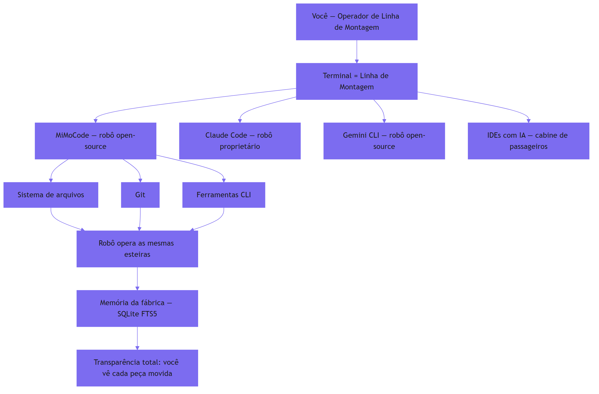
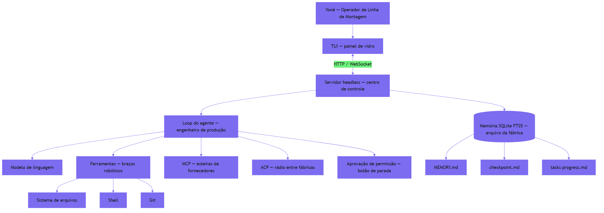
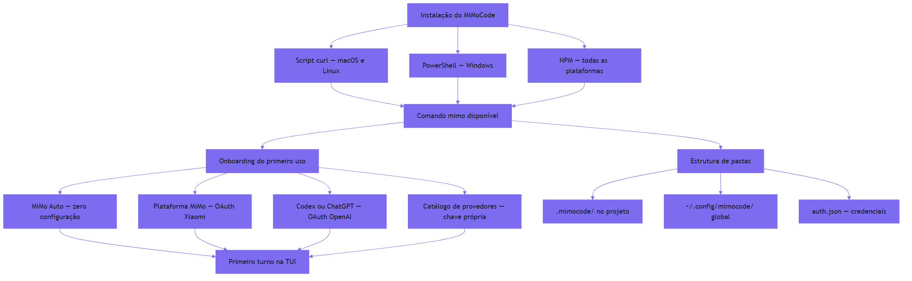
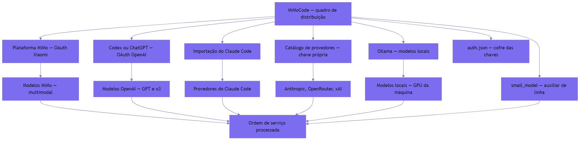
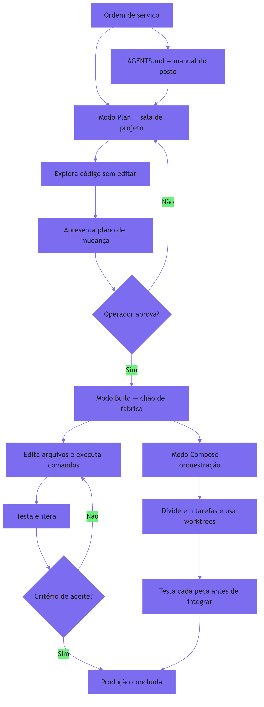
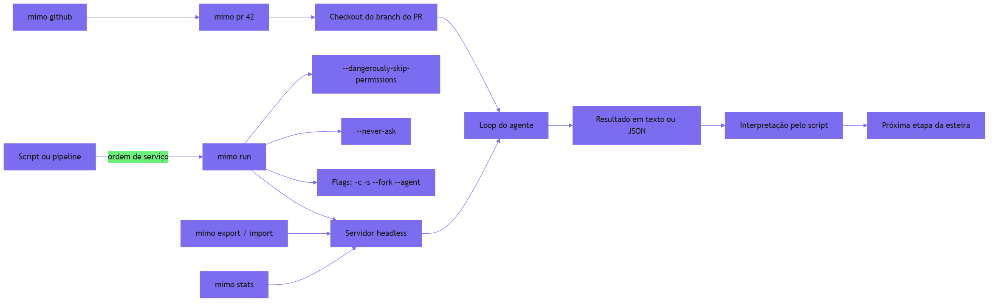
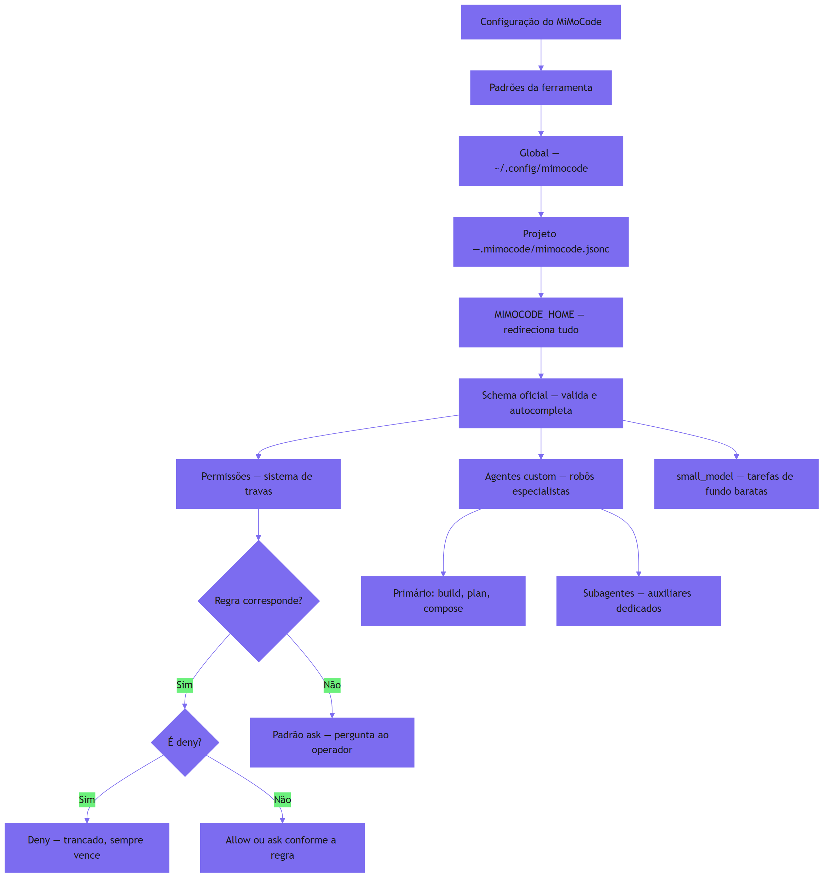
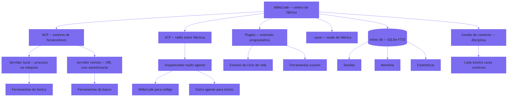
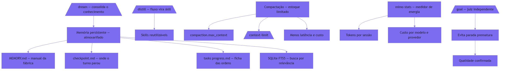
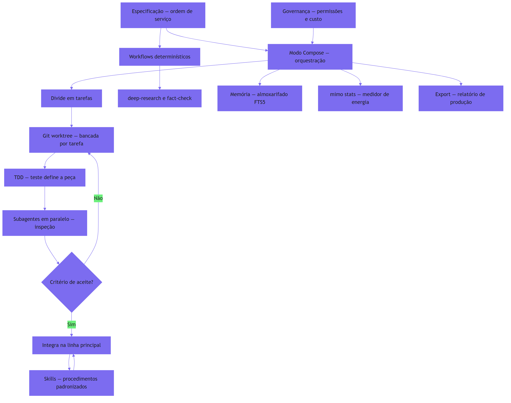

# Prefácio

Se você chegou até aqui, provavelmente viveu a mesma cena: a promessa de programar com inteligência artificial chegou primeiro como um chatbot que respondia perguntas soltas, depois como um autocomplete que completava linhas, e agora se transformou em algo muito mais ambicioso — um agente que lê o seu repositório, planeja mudanças, edita arquivos, roda comandos e verifica o próprio trabalho. No centro dessa transformação, um nome novo vem ganhando força exatamente onde a maioria das pessoas menos esperava: o terminal. Este livro é sobre o MiMoCode — o agente de codificação nativo de terminal mantido pela equipe MiMo da Xiaomi, herdeiro do OpenCode — e sobre a arte de extrair dele o máximo que a ferramenta pode entregar.

O contrato desta obra é simples e ambicioso ao mesmo tempo: ao final, você não terá apenas usado o MiMoCode — terá entendido por que cada manobra funciona, dominado as configurações que a documentação oficial menciona de passagem e construído o fluxo profissional que separa o operador casual do Operador de Linha de Montagem. Para isso, o livro percorre um caminho em cinco partes: os fundamentos (o que é o MiMoCode e como ele funciona por dentro), a partida (instalação e provedores), a operação (a TUI, os modos e a automação), a sala de máquinas (configuração avançada e extensões) e a torre de controle (memória, custo e o fluxo profissional completo).

Ao longo do caminho, uma metáfora conduz a leitura: a sua máquina de desenvolvimento é uma linha de montagem, o terminal é o chão de fábrica e o MiMoCode é o robô de braço articulado instalado na linha. Cada sessão é um turno de produção: a ordem de serviço (o prompt), o posto de trabalho (o workspace e as permissões), a esteira de ferramentas (o MCP e os plugins), a memória da fábrica (o SQLite FTS5) e o controle de qualidade (os modos plan, build e compose). Você — o leitor — assume o papel do Operador de Linha de Montagem: o profissional que conhece o robô por dentro, o configura por camadas e o governa com disciplina.

Este livro foi escrito para o desenvolvedor que quer mais do que um tutorial: quer o modelo mental. Os capítulos seguem uma estrutura pedagógica consistente — cada um explica o conceito, ilustra com uma analogia do chão de fábrica e um diagrama, entrega a técnica em código real e fecha com a aplicação no mundo corporativo. As referências citadas ao longo da obra são fontes reais e verificáveis — do repositório oficial do MiMoCode à literatura acadêmica sobre agentes de codificação. Quando terminar a última página, o turno estará cumprido — e a linha de montagem será sua.

Boa leitura, Operador.


# Capítulo 1: O que é o MiMoCode e por que o terminal voltou a ser o centro

## 1. Introdução

Se você acompanha o mundo do desenvolvimento de software nos últimos anos, provavelmente sentiu a mesma sensação de vertigem: a promessa de programar com inteligência artificial começou como um chatbot que respondia perguntas soltas, evoluiu para um autocomplete que completava linhas, e agora se transformou em algo muito mais ambicioso — um agente que lê o seu repositório, planeja mudanças, edita arquivos, roda comandos e verifica o próprio trabalho. No centro dessa transformação, um nome novo vem ganhando força exatamente onde a maioria das pessoas menos esperava: o terminal. Este capítulo coloca você no chão de fábrica — o primeiro turno da sua jornada — respondendo às perguntas que todo mundo faz antes de apertar o botão de partida: o que exatamente é o MiMoCode, de onde ele veio, e por que o terminal, a interface mais antiga da computação, voltou a ser o campo de batalha mais disputado do desenvolvimento de software. Ao dominar isso, você não estará apenas conhecendo mais uma ferramenta; estará entendendo a mudança estrutural que define esta década.

## 2. Explica

O MiMoCode é um agente de codificação por inteligência artificial, nativo de terminal, lançado oficialmente na versão 0.1.0 em junho de 2026 pela equipe MiMo da Xiaomi. A definição parece simples, mas cada palavra carrega uma decisão profunda de arquitetura. "Agente de codificação" significa que o sistema não apenas sugere trechos de código: ele recebe uma tarefa em linguagem natural, explora o repositório, decide quais arquivos alterar, executa edições e comandos, e itera até concluir — ou até pedir ajuda quando encontra um obstáculo. "Nativo de terminal" é a aposta central: em vez de disputar espaço dentro de um editor pesado, o MiMoCode assume que o desenvolvedor profissional já vive no terminal, e que o terminal é o melhor lugar para um agente operar com liberdade total sobre o sistema de arquivos.

A origem do projeto explica sua filosofia. O MiMoCode é um fork direto do OpenCode, o agente de codificação open-source do ecossistema SST mantido na organização anomalyco. Essa herança não é um detalhe burocrático: a arquitetura TypeScript, o modelo de plugins e a superfície de servidor headless foram herdados e evoluídos, com os pacotes internos migrados de `@opencode-ai/*` para `@mimo-ai/*`. Sobre essa base, a equipe MiMo construiu diferenciais próprios — um sistema de memória persistente baseado em SQLite FTS5, gerenciamento inteligente de contexto, workflows determinísticos e o modo Compose — que não existem no projeto original. É a combinação de herança sólida com inovação própria que define o posicionamento do MiMoCode: aberto, com licença MIT, mas com engenharia de agentes que vai além do que o OpenCode oferece.

Para situar o MiMoCode no mercado, é essencial conhecer o cenário competitivo em que ele opera. O Claude Code, da Anthropic, é o concorrente proprietário mais conhecido: roda no terminal, mas é exclusivo dos modelos Claude e tem sua TUI fechada. O Cursor ataca pelo flanco oposto, embutindo IA dentro de um editor baseado em VS Code. O Gemini CLI, do Google, é o concorrente open-source mais direto em termos de posicionamento. E há ainda as plataformas acadêmicas e comunitárias, como o OpenHands, que oferecem agentes generalistas em ambientes abertos [11]. O que diferencia o MiMoCode nesse mapa não é uma única funcionalidade, mas a combinação: aberto, multiplataforma, com suporte a múltiplos provedores por meio do AI SDK da Vercel e do catálogo de modelos, memória persistente entre sessões e uma superfície de servidor headless que permite usá-lo como uma API [1][7][23].

O renascimento do terminal como campo de batalha tem raízes acadêmicas concretas. O benchmark SWE-bench, publicado em 2024, mostrou que modelos de linguagem conseguem resolver problemas reais do GitHub — e criou a métrica que passou a medir a capacidade dos agentes. O SWE-agent, da Universidade de Princeton, demonstrou que a interface entre o agente e o computador (a chamada Agent-Computer Interface, ou ACI) é tão importante quanto o modelo em si: uma boa interface de ferramentas pode multiplicar a taxa de sucesso. Trabalhos como o Agentless questionaram até a necessidade de agentes complexos, mostrando que pipelines simples com um bom modelo alcançam resultados competitivos [10]. Esses trabalhos convergem para um ponto: o código do mundo real é um ambiente cheio de ferramentas, e o agente que souber operar bem esse ambiente — lendo, editando, executando — vence aquele que apenas conversa.

Os números publicados pela Xiaomi reforçam esse argumento. Em testes controlados utilizando o mesmo modelo base MiMo, o MiMoCode obteve 62% no SWE-Bench Pro, contra 57% do Claude Code, e 73% no Terminal Bench 2, contra 68% do concorrente. Esses números precisam ser lidos com cuidado — benchmarks de agente são sensíveis à configuração, ao modelo e ao conjunto de tarefas — mas a direção é consistente: a engenharia da interface e do fluxo do agente importa tanto quanto o modelo por baixo [22][8]. O Terminal Bench 2, em particular, mede algo que o SWE-Bench não mede: a capacidade de operar um terminal real, com comandos, navegação e ferramentas — exatamente o terreno onde o MiMoCode aposta.

O que isso significa na prática para quem desenvolve software? Que a IA deixou de ser um oráculo para virar um operador. Em um relatório que repercutiu em todo o mercado, o DORA indicou que a grande maioria dos desenvolvedores já usa IA no fluxo de trabalho, e que as equipes que integram IA aos fluxos existentes — revisão de código, testes, integração contínua — colhem ganhos de produtividade, enquanto as que tentam substituir o processo por IA pura colhem instabilidade. Essa é a mesma distinção que atravessa este livro inteiro: o agente não é um substituto do fluxo de engenharia, é um operador dentro dele. Quem entende isso configura o MiMoCode como um instrumento da fábrica; quem não entende, espera que a linha monte o produto sozinha — e descobre a diferença na primeira ordem de serviço mal escrita.

Por que o terminal — e não o editor nem o navegador — é a superfície natural de um agente de codificação? Essa escolha explica quase tudo o que o MiMoCode faz diferente. O terminal é o único ambiente que reúne, em um só lugar, as três propriedades que um agente precisa para operar com responsabilidade: acesso total ao sistema de arquivos, execução arbitrária de comandos e a possibilidade de inspeção e reversão de cada ação. Um editor moderno é uma aplicação que esconde do usuário a maior parte do que acontece por baixo; o terminal é o contrário — uma interface que não esconde nada, porque foi desenhada para que o humano visse exatamente o que a máquina faz. Quando o agente roda no terminal, ele herda essa transparência: cada arquivo lido, cada comando executado e cada edição aplicada fica visível no fluxo, e a sessão registra o que foi feito para que qualquer passo possa ser desfeito ou auditado.

Há ainda uma dimensão cultural e técnica que completa o quadro: o terminal é a herança viva da filosofia Unix — ferramentas pequenas, especializadas e combináveis, operando sobre texto puro. Um agente que nasce nesse ecossistema herda um vocabulário enorme de ferramentas prontas: o `git` para versionamento, o `grep` e o `ripgrep` para busca, o `jq` para JSON, o `make` e o `npm` para automação. Em vez de reinventar cada uma dessas capacidades, o MiMoCode as invoca diretamente — e o resultado é um agente que sabe operar o mesmo conjunto de instrumentos que você já domina. É por isso que a curva de aprendizado de quem vem do terminal é tão curta: o agente fala a língua do ambiente, e o posto de trabalho não precisa ser reaprendido — apenas o robô precisa ser conhecido.

O MiMoCode também resolve, na arquitetura, um problema que a maioria dos concorrentes trata como secundário: a memória. Agentes de chat e mesmo agentes de terminal tradicionais esquecem tudo quando a sessão termina — cada novo turno começa do zero, sem saber o que foi decidido na semana passada. O MiMoCode ataca esse problema com um sistema de memória persistente baseado em SQLite FTS5, organizado em três pilares — projeto, sessão e tarefa — que o Capítulo 2 detalha em arquitetura. Isso significa que, ao contrário dos concorrentes que tratam cada sessão como um evento isolado, o MiMoCode trata o trabalho como um fluxo contínuo — o que você decidiu no turno passado está disponível no próximo, e a busca textual sobre essa memória é feita com o mecanismo de full-text search do SQLite. Esse é um dos diferenciais que a documentação oficial menciona de passagem, mas que poucos operadores exploram de verdade — e será destrinchado no Capítulo 9.

É aqui que o MiMoCode acerta um ponto que a documentação oficial mal menciona: ele não tenta substituir o seu ambiente, ele se encaixa nele. Como um agente que opera no terminal, ele herda todas as vantagens desse ambiente — acesso total ao sistema de arquivos, execução de testes, integração com Git, uso de qualquer ferramenta CLI — e nenhuma das limitações de um chatbot embutido em um painel web. A desvantagem dessa liberdade é a necessidade de controle, e é exatamente esse controle (permissões, agentes, modo planejamento) que os próximos capítulos deste livro vão destrinchar.

Para entender a decisão de arquitetura por trás do MiMoCode, vale comparar as superfícies que ele oferece. A primeira é a TUI, a interface de texto que roda no terminal e é o uso padrão do comando `mimo` — o lugar onde a produtividade máxima acontece, com modos alternáveis via Tab, slash commands e painéis que respeitam o fluxo do teclado. A segunda é o servidor headless, iniciado com `mimo serve`, que expõe a mesma engine por HTTP e permite que qualquer cliente — uma TUI remota via `mimo attach`, um script, uma ferramenta própria — se conecte. Essa estratégia de múltiplas superfícies sobre um único motor é a herança direta do OpenCode, e é rara no mercado: a maioria dos concorrentes escolhe uma superfície e a defende até o fim.

A decisão de ser open-source também tem consequências práticas que vão além da ideologia. O código-fonte público permite auditar exatamente o que o agente envia para os provedores, contribuir com correções e ferramentas, e confiar em um ecossistema que não depende de um único fornecedor. Para empresas, isso significa menos risco de vendor lock-in: a configuração, as sessões e as skills são arquivos locais e portáveis, não dados presos em uma nuvem proprietária. E a licença aberta permite que a ferramenta evolua pela comunidade — plugins, temas e integrações crescem em um ritmo que produtos fechados não alcançam. O custo dessa abertura é a responsabilidade: sem um fornecedor que segure sua mão, você precisa entender a ferramenta — e é exatamente isso que este livro faz.

Essa abertura tem um corolário de segurança que os capítulos finais vão explorar em profundidade, mas que merece ser dito desde já para calibrar a confiança: código aberto não significa ausência de riscos, significa riscos conhecidos e auditáveis. O que o agente envia para os provedores, onde ele armazena as credenciais e como ele trata os arquivos do seu projeto são decisões que, em uma ferramenta proprietária, você aceita por fé — e, em uma ferramenta aberta, você pode verificar. O `auth.json`, que guarda as chaves dos provedores, é um arquivo local e protegido por permissões do sistema; o tráfego com os provedores segue os protocolos HTTPS padrão; e a política de dados é documentada — mas nada disso dispensa a verificação.

Um aviso honesto fecha a parte expositiva: a diferença entre conhecer e dominar define o que você vai extrair deste livro. Conhecer o MiMoCode é saber o que ele faz: é um agente de codificação, abre no terminal, suporta muitos provedores e tem memória persistente. Dominar o MiMoCode é saber o que cada decisão sua muda no comportamento dele: como o prompt que você escreve, as instruções que você versiona e as permissões que você concede transformam o mesmo motor em resultados completamente diferentes. Essa diferença aparece de forma concreta na comunidade: dois desenvolvedores com o mesmo modelo, o mesmo repositório e a mesma tarefa obtêm resultados distintos — não porque um tem um truque, mas porque um entende a fábrica e o outro apenas aperta o botão. A curva de aprendizado real não está nos comandos (eles cabem em uma tarde) — está no modelo mental: o agente como operador do seu ambiente, que responde ao contexto que você projeta. Os capítulos que seguem constroem esse modelo mental camada por camada — arquitetura, instalação, provedores, operação, configuração, extensões, memória e fluxo profissional — e o último capítulo devolve tudo isso em um plano de adoção completo. O contrato deste livro é simples: ao final, você não terá apenas usado o MiMoCode — terá entendido por que cada manobra funciona, e será capaz de ensinar a próxima pessoa.

## 3. Ilustra

Pense na sua máquina de desenvolvimento como uma linha de montagem de software. Durante décadas, a indústria tentou colocar o operador dentro de uma cabine confortável — os IDEs com seus assistentes de chat embutidos, janelas flutuantes e painéis laterais. O problema é que a cabine de passageiros é um lugar para consumir, não para produzir: o operador de linha precisa de esteiras ao alcance da mão, visão clara do que está acontecendo com o motor e controle direto sobre cada parafuso. O terminal é essa linha de montagem. O MiMoCode é o robô de braço articulado instalado na linha — rápido, programável e integrado ao chão de fábrica. Quando o robô move uma peça, você vê exatamente qual peça foi movida e pode apertar o botão de parada de emergência. Nenhum outro paradigma de ferramenta oferece esse nível de transparência operacional.



Repare que o diagrama coloca o terminal no centro e os concorrentes ao redor: cada ferramenta escolheu um lugar diferente nesse mapa, mas todas orbitam o mesmo ponto — o ambiente real onde o código vive. O diferencial do MiMoCode no diagrama é a caixa da memória da fábrica: enquanto os concorrentes tratam cada sessão como um turno isolado que esquece tudo ao final, o MiMoCode guarda o que foi decidido entre turnos — e é isso que o torna um robô de linha, e não um robô de feira. A metáfora da linha de montagem vai reaparecer em todo este livro: a ordem de serviço (o prompt), o posto de trabalho (o workspace e as permissões), a esteira de ferramentas (o MCP e os plugins), a memória da fábrica (o SQLite FTS5) e o controle de qualidade (os modos plan, build e compose). Quando você dominar a linguagem dessa linha, qualquer ferramenta de agente de terminal — Claude Code, Gemini CLI, OpenCode — vai parecer familiar, porque todas operam as mesmas esteiras com vocabulários diferentes. Como Operador de Linha de Montagem, você não estará preso a um único fabricante de robô.

## 4. Técnica

### O MiMoCode em três registros

Um entendimento atravessa a obra: a diferença entre o agente e o chat. O chat responde à última mensagem; o agente persegue um objetivo com ferramentas. O chat esquece o contexto quando a janela fecha; o agente com memória persistente (Capítulo 2) continua. O chat é consulta; o agente é trabalho. Essa distinção explica quase todas as decisões de design do MiMoCode — e é a lente com que o operador avalia cada recurso. Quem trata o agente como chat opera abaixo do potencial; quem entende a diferença opera a fábrica.

**Ciclo de vida de uma tarefa.** O ciclo de vida de uma tarefa no MiMoCode conecta a definição à operação. A tarefa começa como uma ordem de serviço (o prompt); o agente a converte em um plano de exploração (o que ler, o que verificar); o plano vira ações com ferramentas (ler, editar, executar); e o resultado é verificado contra o critério de aceite. Cada fase do ciclo tem o seu vocabulário — e o operador que reconhece a fase entende o comportamento do robô. O SWE-agent documentou a importância dessa estrutura de interface. O Capítulo 2 detalha o loop; aqui, o registro é a visão de cima: a tarefa é um ciclo com fases identificáveis.

**Família de agentes de terminal.** Um registro que ajuda o leitor a situar o MiMoCode na família de agentes de terminal: ele é um dos herdeiros do movimento iniciado pelo OpenCode — e a linhagem explica muito do design. O OpenCode provou que um agente de terminal open-source, com servidor headless e multi-provedor, era viável; o MiMoCode pega essa base e a evolui com memória persistente e orquestração. O Claude Code provou o mercado de agentes proprietários de terminal; o Gemini CLI provou o apetite por versões open-source. O MiMoCode se posiciona na interseção: aberto como o OpenCode, ambicioso como o Claude Code, com diferenciais próprios. Entender essa família é entender por que tantas ferramentas parecem iguais por fora e diferem tanto por dentro.

### O contrato de instalação e o primeiro comando

Um detalhe prático que aparece antes do primeiro loop e que o operador profissional verifica com disciplina: o contrato de instalação. O MiMoCode pode ser instalado por script curl (macOS/Linux), por PowerShell (Windows) ou via NPM, e o `mimo --version` confirma a instalação em qualquer canal. A escolha do canal importa menos do que a consistência: o contrato do comando `mimo` é idêntico depois da instalação. E o primeiro comando que vale executar depois do `--version` é o `mimo providers`, para confirmar que a autenticação do onboarding foi concluída — o Capítulo 3 destrincha o ritual completo.

### Os fundamentos do loop em código

Antes das primeiras interações, vale ancorar em código o que distingue um agente de um chatbot — porque é essa distinção que você vai observar em toda a operação. Um chatbot recebe uma mensagem e devolve um texto; a relação termina aí. Um agente recebe uma tarefa, monta um plano, executa ferramentas e itera — e a estrutura desse loop aparece na própria forma como o MiMoCode representa a sessão. Em termos de modelo mental, cada sessão é uma máquina de estados cujo motor é o loop do agente — e a primeira habilidade técnica de quem opera o MiMoCode é reconhecer em que estado a sessão está: aguardando prompt, executando ferramenta, aguardando aprovação de permissão, concluída.

Vamos concretizar o que foi dito até aqui com a primeira interação real. A forma mais rápida de verificar se o MiMoCode está instalado e descobrir sua versão é o comando `mimo --version`. Mas o que interessa de verdade é a superfície de comando: o comando `mimo` sem argumentos abre a TUI, e a partir dela você acessa tudo — as sessões, os modos Build, Plan e Compose, e as skills. Veja a hierarquia de superfícies que o MiMoCode expõe:

```bash
# Superfície 1: a TUI (interface de texto) — o uso padrão
mimo

# Superfície 2: execução programática, sem interface interativa
mimo run "explique o que este projeto faz"

# Superfície 3: servidor headless (API HTTP/WebSocket)
mimo serve

# Superfície 4: conectar uma TUI local a um servidor remoto
mimo attach http://servidor-da-empresa:porta

# Superfície 5: gerenciamento de provedores e modelos
mimo providers
mimo models
```

### Verificando a instalação e o primeiro turno

Antes de abrir a TUI, o profissional verifica o ambiente com três comandos rápidos. O primeiro confirma a versão do binário; o segundo confirma que o servidor de autenticação está acessível; o terceiro lista os modelos disponíveis no provedor configurado. Esse ritual de verificação evita a frustração mais comum do primeiro uso: abrir a TUI e descobrir que nenhum modelo está conectado.

```bash
# 1. Versão do binário
mimo --version

# 2. Lista os provedores autenticados (o onboarding cria o primeiro)
mimo providers list

# 3. Lista os modelos do provedor padrão
mimo models
```

A saída do `mimo --version` varia conforme o canal de instalação (NPM, script curl ou PowerShell), mas o contrato é o mesmo: um número de versão semântica no formato `0.1.x`. Se o comando não for encontrado, o problema está no `PATH` — e a solução aparece na seção de instalação do Capítulo 3 [5][21].

### Anatomia da sessão

Uma rotina que o operador maduro mantém: a limpeza de sessões. A sessão acumulada ocupa espaço e polui a lista. O `mimo session list` mostra o acervo; o operador arquiva ou remove o que terminou. E a limpeza tem um motivo de custo: a sessão antiga consultada por engano pode retomar um contexto enorme. A higiene de sessões é a mesma da memória do Capítulo 9: o que não serve, sai. A limpeza periódica mantém a operação enxuta.

**Colaboração.** A sessão em JSON também é o formato da colaboração entre operadores. O Capítulo 6 mostrou o export e o import; aqui, o registro é o valor: a sessão exportada é um artefato de aprendizado — o operador júnior importa a sessão do sênior e vê a trilha completa de decisões. O time que compartilha sessões acelera o onboarding e padroniza o estilo de operação. E a sessão como artefato — versionável, auditável — é a mesma lógica da memória persistente aplicada à colaboração. O export não é um recurso técnico: é a ponte entre operadores [1][4][20].

**Modos.** A sessão em JSON registra também o modo de operação — build, plan ou compose — e esse campo é mais relevante do que parece. A auditoria de uma sessão começa pelo modo: uma sessão que editou arquivos deveria ter rodado em build; uma que apenas analisou, em plan. O modo registrado é a evidência do contrato de operação que o Capítulo 5 destrincha. E o `mimo run --agent plan` (Capítulo 6) produz sessões de análise puras, sem edição — a trilha limpa para auditoria. O campo do modo é o carimbo de qualidade da sessão.

**Memória.** A sessão em JSON revela também a ponte com a memória persistente: cada sessão registra o estado que o sistema de memória consulta entre turnos. O `mimo export` serializa a sessão, e o SQLite FTS5 indexa o conhecimento acumulado — a busca textual por "o que decidimos sobre X" responde com os trechos relevantes das sessões passadas. Essa é a diferença estrutural entre o MiMoCode e os concorrentes que o Capítulo 1 apresentou: a sessão não é um artefato descartável, é o alimento da memória da fábrica. O operador que entende essa ponte exporta sessões com propósito — para auditoria, para colaboração e para alimentar a memória [1][4][19].

**JSON.** Quando o MiMoCode opera, ele mantém o estado da sessão de forma estruturada. O comando `mimo export` serializa uma sessão como JSON — e é instrutivo olhar essa estrutura para entender o modelo mental do agente. A sessão contém informações, mensagens e metadados que o servidor usa para reconstruir o contexto [1][4]:

```json
{
  "id": "sessao-001",
  "modelo": "mimo/mi-mo-base",
  "modo": "build",
  "mensagens": [
    {
      "papel": "usuario",
      "conteudo": "explique o que este projeto faz"
    },
    {
      "papel": "assistente",
      "conteudo": "Este projeto é um serviço de autenticação...",
      "ferramentas": []
    }
  ],
  "estado": "concluida"
}
```

Esse formato é importante por dois motivos. Primeiro, porque a portabilidade é um dos pilares do open-source: se a sessão é um arquivo JSON, ela pode ser versionada, compartilhada e importada de volta — `mimo import` faz exatamente isso. Segundo, porque a estrutura revela a separação entre o que o usuário pediu, o que o agente fez e quais ferramentas ele usou — a trilha de auditoria que os capítulos finais vão explorar.

### Mapa do ecossistema

Uma reflexão final sobre o terminal — o palco da obra inteira. O terminal voltou a ser o centro porque é o único ambiente com acesso total, execução arbitrária e inspeção. O MiMoCode não reinventa o terminal — ele o ocupa. E o operador que domina o terminal domina o agente: o vocabulário Unix (git, grep, jq, make) é o vocabulário da fábrica. O Capítulo 1 começou com essa tese; o livro inteiro a desenvolve; e o Capítulo 10 fecha com o fluxo profissional. O terminal é o chão de fábrica — e o MiMoCode é o robô que você aprendeu a operar.

**Futuro.** Fechando o mapa, vale um registro sobre o futuro — porque a escolha de uma ferramenta é uma aposta de longo prazo. O MiMoCode é novo (o lançamento oficial foi a versão 0.1.0 em junho de 2026) e evolui rápido. A aposta em uma ferramenta aberta com comunidade ativa (awesome-mimo-agent) é diferente da aposta em uma proprietária: o risco de abandono existe, mas o código e o conhecimento ficam. O operador que escolhe o MiMoCode aposta na combinação de abertura, herança do OpenCode e inovação da Xiaomi. E o ecossistema — skills, plugins, adaptadores — é o que transforma a ferramenta em plataforma [1][3][28].

**Adoção.** Fechando o mapa, vale registrar a dimensão da adoção — porque a escolha da ferramenta é também uma escolha de time. O DORA mostra que a adoção disciplinada de IA ao fluxo existente colhe ganhos, enquanto a substituição do processo por IA pura colhe instabilidade. O MiMoCode se encaixa no padrão disciplinado: ele opera dentro do fluxo (Git, testes, terminal) em vez de substituí-lo. A adoção bem-sucedida não é instalar a ferramenta — é integrá-la ao fluxo com revisão e governança. O Capítulo 10 fecha a obra com o plano completo de adoção.

**Custo.** Uma dimensão do mapa do ecossistema que merece registro em código é o custo — porque a escolha da ferramenta é também uma escolha de linha orçamentária. Os agentes de terminal, por operarem com contexto enxuto e texto puro, consomem tokens de forma eficiente quando comparados a plataformas com UI web rica. O MiMoCode, com o `small_model` para tarefas de fundo e a compactação de contexto (Capítulo 9), oferece alavancas de custo que a maioria dos concorrentes não documenta. E o `mimo stats` transforma o custo em dado — o medidor de energia que o Capítulo 6 apresenta em ação. O operador que compara ferramentas sem comparar custo está escolhendo no escuro.

**Código.** Para fechar a parte técnica deste capítulo, vale montar em código o mapa do ecossistema — não como uma opinião, mas como um inventário verificável de onde cada ferramenta ataca. Esse mapa é o mesmo que o diagrama da seção Ilustra desenhou visualmente, agora em forma de dados:

```json
{
  "ecossistema": {
    "MiMoCode": {
      "tipo": "agente de terminal",
      "codigo": "aberto",
      "licenca": "MIT",
      "origem": "fork do OpenCode (anomalyco)",
      "memoria_persistente": true,
      "modos": ["build", "plan", "compose"]
    },
    "Claude Code": {
      "tipo": "agente de terminal",
      "codigo": "fechado",
      "memoria_persistente": false,
      "modelos": "exclusivos Claude"
    },
    "Cursor": {
      "tipo": "editor com IA",
      "codigo": "fechado",
      "memoria_persistente": false,
      "modelos": "multiplos"
    },
    "Gemini CLI": {
      "tipo": "agente de terminal",
      "codigo": "aberto",
      "memoria_persistente": false,
      "modelos": "Gemini"
    }
  }
}
```

Esse inventário é útil porque transforma a decisão de adoção de um debate de opinião em uma comparação de atributos: o MiMoCode é o único da lista com memória persistente e código aberto ao mesmo tempo. Quando você precisar justificar a escolha para o seu time, é esse tipo de tabela de atributos que vai sustentar a conversa — não entusiasmo.

### A decisão open-source

O open-source frequentemente suscita uma dúvida de segurança: código aberto não significa ausência de risco — significa risco auditável. O operador pode verificar o que o agente envia aos provedores, onde armazena as credenciais e como trata os arquivos. A verificação é um direito do usuário — e o Capítulo 7 mostra as permissões que controlam o comportamento. A confiança no MiMoCode é construída por auditoria, não por fé. E o mesmo princípio vale para plugins e esteiras (Capítulo 8): tudo o que estende a ferramenta é auditável.

**Portabilidade.** Um ponto define o dia a dia do operador: a portabilidade do open-source. No MiMoCode, a configuração (`mimocode.jsonc`), as sessões (JSON exportado) e as skills são arquivos locais e portáveis — não dados presos em uma nuvem proprietária. Um time pode versionar a configuração do projeto no Git, compartilhar sessões exportadas e migrar a memória entre máquinas com `MIMOCODE_HOME`. Essa portabilidade é a herança direta do OpenCode — e é o que torna o MiMoCode uma escolha defensável em empresas que exigem auditoria e controle. O custo da abertura é a responsabilidade: sem um fornecedor que segure a mão, o operador precisa entender a ferramenta — e é exatamente isso que este livro constrói.

### O custo e a transparência

A transparência de custo tem um corolário que o financeiro do time valoriza: a previsibilidade. Com o `mimo stats` mostrando o consumo por sessão e por modelo, o operador projeta o orçamento do mês seguinte com base nos dados do mês atual. A previsibilidade transforma a IA de linha imprevisível em linha orçamentária. E o `small_model` (Capítulo 4) e a compactação (Capítulo 9) são as alavancas de ajuste quando a projeção estoura. O operador que mede projeta; o que não mede descobre a fatura no fim do mês.

**Transparência da ferramenta.** Uma vantagem do MiMoCode que merece registro: a transparência de custo. O `mimo stats` mostra o consumo por sessão, por modelo e por provedor — e essa visibilidade é rara no mercado. O concorrente proprietário que cobra por assinatura não expõe o consumo por tarefa; o MiMoCode, com o medidor aberto, permite ao operador planejar o orçamento. A transparência de custo é uma consequência do open-source e do design de arquitetura — e é um dos argumentos de adoção que o Capítulo 10 usa [1][4][6].

### O custo do terminal em perspectiva

Uma dimensão econômica que vale registrar: agentes de terminal são mais baratos de operar do que as alternativas, porque não carregam a infraestrutura pesada de um IDE na nuvem nem pagam o custo de uma UI web rica. O custo de um agente é dominado pelos tokens que ele consome — e um agente de terminal, com contexto enxuto e fluxo de texto puro, consome de forma eficiente. Esse custo também é previsível e mensurável: o `mimo stats` do Capítulo 9, o controle de compactação do mesmo capítulo e a matriz de modelos do Capítulo 4 são as ferramentas de controle que transformam "IA no fluxo" de um gasto misterioso em uma linha orçamentária planejada.

### Referência rápida: as superfícies do MiMoCode

A tabela abaixo resume as superfícies que o MiMoCode expõe e o momento certo de usar cada uma — o mesmo mapa que o Capítulo 1 desenhou, agora em forma de consulta rápida [1][4][7]:

| Superfície | Comando | Quando usar | Interatividade |
|---|---|---|---|
| TUI | `mimo` | Operação diária, exploração e revisão | Interativa, com Tab e slash commands |
| Execução única | `mimo run "tarefa"` | Automação, CI e scripts | Headless, responde no stdout |
| Servidor headless | `mimo serve` | Disponibilizar o motor como API | Headless, HTTP/WebSocket |
| Anexo remoto | `mimo attach <url>` | Operar um servidor da empresa | Interativa via cliente |
| Gestão | `mimo providers`, `mimo models` | Configurar e auditar provedores | Interativa/CLI |

**Checklist do primeiro turno.** Antes de abrir a TUI pela primeira vez, o operador confirma três pontos: (1) a versão instalada responde (`mimo --version`); (2) ao menos um provedor está autenticado (`mimo providers list`); (3) o modelo padrão responde (`mimo models`). Com essas três confirmações, o primeiro pedido não encontra surpresa [1][4][5]. O erro mais comum do primeiro uso — a TUI abrir e nenhum modelo responder — é sempre um problema de provedor, não de instalação, e o Capítulo 3 mostra o ritual completo de instalação e o Capítulo 4 o de provedores [4][21]. O terminal como linha de montagem depende dessas três confirmações antes de qualquer ordem de serviço: versão, energia (provedor) e ferramenta calibrada (modelo).

## 5. Aplica

### A cena de contraste: o operador que apertou o botão sem ler o manual

Imagine a cena: você acabou de ler sobre agentes de codificação de terminal, viu um vídeo de alguém resolvendo um bug em trinta segundos e decidiu testar o MiMoCode no projeto da sua empresa — um monolito legado com credenciais em variáveis de ambiente e uma esteira de CI que roda testes em cinco minutos. Você instala o binário, roda `mimo` na raiz do repositório e digita o primeiro pedido: "refatore o módulo de autenticação para usar OAuth2". O robô de braço articulado da linha de montagem começa a trabalhar com entusiasmo: cria arquivos, altera o `package.json`, reescreve o controlador de login. Você assiste, fascinado, sem prestar atenção em cada peça que ele move. Vinte minutos depois, a esteira de CI explode: dependências quebradas, testes que não compilam, e o pior — o robô alterou o arquivo de configuração de ambiente, onde estavam as credenciais de staging, e agora o ambiente de homologação está apontando para a configuração errada. O diagnóstico é duro: você entregou o posto de operador ao robô sem definir as regras do chão de fábrica — sem permissões, sem plano, sem revisão das peças movidas.

A correção é o oposto exato do instinto inicial. Antes de qualquer pedido de refatoração, o operador profissional define o perímetro: quais pastas o robô pode tocar, quais comandos ele pode executar e quais arquivos estão proibidos (o arquivo de credenciais, por exemplo, entra na lista de negação). Depois, ele usa o modo Plan — o modo somente leitura — para que o robô primeiro explore o código e apresente um plano de mudança sem alterar nada. Só depois da aprovação humana do plano é que o modo Build entra em ação, e cada peça movida aparece no fluxo para revisão. No final, o operador roda os testes da esteira localmente antes de deixar o robô commitar — porque o robô que roda no seu terminal é rápido, mas o robô que roda no CI é o mesmo que roda no seu terminal, e o que muda é a disciplina do operador, não a ferramenta.

A lição dessa cena — e ela vai se repetir com variações nos próximos capítulos — é que o MiMoCode não é perigoso por ser poderoso; ele é perigoso quando o operador entrega o posto inteiro sem perímetro. As armadilhas comuns do primeiro uso seguem o mesmo padrão: rodar sem configurar provedores (a TUI abre e nada responde), dar tarefas vagas como "melhore este código" (o robô inventa escopo), ignorar o que o robô está prestes a fazer (cada aprovação de permissão é um ponto de controle que existe para ser usado) e esquecer que a memória persistente guarda o que foi decidido (o Capítulo 9 mostra como usar isso a seu favor).

### Métricas de sucesso na adoção

No cenário corporativo, a adoção de um agente de terminal como o MiMoCode costuma ser medida por três métricas: tempo médio de resolução de issues (que cai à medida que o fluxo de permissões e planos amadurece), taxa de revisão de código aceita na primeira submissão (que sobe quando o modo Plan é usado antes do Build) e custo mensal por desenvolvedor em tokens (que cai quando a compactação e o modelo secundário entram em cena) [1][25]. A empresa que adota o MiMoCode sem medir essas três linhas está operando a linha de montagem no escuro: sabe que produz, mas não sabe a que custo, com que qualidade ou em quanto tempo.

## 6. Conclusão

Neste primeiro turno, você colocou o MiMoCode no mapa: entendeu o que ele é — um agente de codificação nativo de terminal, fork do OpenCode mantido pela equipe MiMo da Xiaomi, com licença MIT e memória persistente em SQLite FTS5 [1][2]; entendeu por que o terminal voltou a ser o centro do desenvolvimento — porque é o único ambiente com acesso total, execução arbitrária e inspeção, e porque benchmarks como o Terminal Bench 2 mostram que a engenharia da interface importa tanto quanto o modelo [9][22]; e entendeu onde ele se encaixa no cenário competitivo — entre os robôs proprietários e os editores com IA, como a opção aberta com memória de fábrica [12][13][14]. O desafio deste capítulo é simples e poderoso: abra um terminal e responda, com as suas próprias palavras, o que é um agente de codificação e por que o terminal é a superfície natural dele — sem olhar as notas. Se você conseguir explicar isso para outra pessoa, o turno está cumprido, e a fábrica está pronta para a próxima estação: no Capítulo 2, vamos abrir o robô por dentro — a arquitetura que faz o MiMoCode funcionar, o loop do agente, o servidor headless e o sistema de memória que o diferencia.

## 7. Referências Bibliográficas

[1] XIAOMI MIMO. *MiMo-Code: repositório oficial do MiMoCode.* Disponível em: https://github.com/XiaomiMiMo/MiMo-Code. Acesso em: 03 ago. 2026.

[2] XIAOMI MIMO. *MiMoCode: documentação e central de notícias.* Disponível em: https://mimo.mi.com/docs/en-US/news/latest/mimocode. Acesso em: 03 ago. 2026.

[3] XIAOMI MIMO. *awesome-mimo-agent: ecossistema e guias da comunidade.* Disponível em: https://github.com/XiaomiMiMo/awesome-mimo-agent. Acesso em: 03 ago. 2026.

[4] XIAOMI MIMO. *README npm do MiMoCode.* Disponível em: https://github.com/XiaomiMiMo/MiMo-Code/blob/main/README_npm.md. Acesso em: 03 ago. 2026.

[5] XIAOMI MIMO. *Script de instalação do MiMoCode.* Disponível em: https://mimo.xiaomi.com/install. Acesso em: 03 ago. 2026.

[6] ANOMALYCO. *OpenCode: agente de codificação de terminal (projeto original do qual o MiMoCode deriva).* Disponível em: https://github.com/anomalyco/opencode. Acesso em: 03 ago. 2026.

[7] SST. *OpenCode Docs: documentação da arquitetura e do servidor headless.* Disponível em: https://opencode.ai/docs. Acesso em: 03 ago. 2026.

[8] JIMENEZ, Carlos E. et al. *SWE-bench: Can Language Models Resolve Real-World GitHub Issues?* Disponível em: https://arxiv.org/abs/2310.06770. Acesso em: 03 ago. 2026.

[9] YANG, John et al. *SWE-agent: Agent-Computer Interfaces Enable Automated Software Engineering.* Disponível em: https://arxiv.org/abs/2405.15793. Acesso em: 03 ago. 2026.

[10] XIA, Chunqiu Steven et al. *Agentless: Demystifying LLM-based Software Engineering Agents.* Disponível em: https://arxiv.org/abs/2407.01489. Acesso em: 03 ago. 2026.

[11] WANG, Xingyao et al. *OpenHands: An Open Platform for AI Software Developers as Generalist Agents.* Disponível em: https://arxiv.org/abs/2407.16741. Acesso em: 03 ago. 2026.

[12] ANTHROPIC. *Claude Code: agente de codificação de terminal.* Disponível em: https://docs.anthropic.com/en/docs/claude-code. Acesso em: 03 ago. 2026.

[13] GOOGLE. *Gemini CLI: agente de codificação de terminal open-source.* Disponível em: https://github.com/google-gemini/gemini-cli. Acesso em: 03 ago. 2026.

[14] CURSOR. *Cursor: editor com IA embutida.* Disponível em: https://cursor.com. Acesso em: 03 ago. 2026.

[19] SQLITE. *FTS5: extensão de full-text search do SQLite.* Disponível em: https://www.sqlite.org/fts5.html. Acesso em: 03 ago. 2026.

[20] XIAOMI MIMO. *MiMoCode: sistema de memória persistente.* Disponível em: https://mimo.mi.com/docs/en-US/news/latest/mimocode. Acesso em: 03 ago. 2026.

[21] NPM. *@mimo-ai/cli: pacote oficial do MiMoCode.* Disponível em: https://www.npmjs.com/package/@mimo-ai/cli. Acesso em: 03 ago. 2026.

[22] XIAOMI MIMO. *Benchmarks do MiMoCode: SWE-Bench Pro 62% e Terminal Bench 2 73%.* Disponível em: https://mimo.mi.com/docs/en-US/news/latest/mimocode. Acesso em: 03 ago. 2026.

[23] VERCEL. *AI SDK: base dos provedores e do catálogo de modelos.* Disponível em: https://ai-sdk.dev. Acesso em: 03 ago. 2026.

[25] DORA. *State of AI-assisted Software Development 2025.* Disponível em: https://dora.dev. Acesso em: 03 ago. 2026.

[28] RTK. *Adaptadores e integrações da comunidade para agentes de terminal.* Disponível em: https://github.com/rtk-ai/rtk. Acesso em: 03 ago. 2026.

# Capítulo 2: Arquitetura: como o MiMoCode funciona por dentro

## 1. Introdução

No Capítulo 1, você colocou o MiMoCode no mapa do ecossistema: entendeu que ele é um agente de codificação nativo de terminal, fork do OpenCode mantido pela equipe MiMo da Xiaomi, e por que o terminal voltou a ser o centro do desenvolvimento. Agora é hora de abrir o robô por dentro. Este capítulo desmonta a arquitetura do MiMoCode peça por peça, como um operador da fábrica que precisa conhecer cada componente do braço articulado antes de operá-lo em produção: o loop do agente que conecta o modelo de linguagem às ferramentas, a arquitetura cliente-servidor que separa a TUI do motor headless, os protocolos MCP e ACP que ligam o robô ao mundo externo e o sistema de memória persistente em SQLite FTS5 que o diferencia de todos os concorrentes. Ao final, você será capaz de explicar — para um colega, para uma entrevista ou para a sua própria equipe — exatamente o que acontece entre o momento em que você digita uma ordem de serviço e o momento em que o robô devolve o resultado. Essa compreensão é o alicerce de tudo o que vem a seguir: sem ela, os capítulos de configuração e otimização seriam uma coleção de truques sem fundamento.

## 2. Explica

### O papel das ferramentas e das permissões

A seleção de ferramentas também conversa com o custo — o tema que o Capítulo 9 domina. Cada chamada de ferramenta gera uma iteração: o resultado volta ao contexto e o modelo decide o próximo passo. A ferramenta errada gera iterações extras — contexto e tokens pagos por decisões ruins. A ferramenta certa resolve em uma iteração. O operador que configura as ferramentas certas (Capítulo 7) e mantém as ferramentas enxutas (Capítulo 8) reduz o número de iterações — a alavanca mais direta do custo. O loop é o coração; o custo é o seu batimento.

**Ferramentas no loop.** Uma dimensão do loop que o operador observa na prática: a seleção de ferramentas. O modelo não executa todas as ferramentas disponíveis — ele escolhe a ferramenta certa para a ação planejada. A qualidade dessa escolha define a eficiência do loop: a ferramenta errada gera iterações extras, contexto desperdiçado e resultados piores. O SWE-agent mostrou que uma ACI bem desenhada — com ferramentas claras e descritas — melhora a seleção. O operador que entende isso valoriza a configuração de ferramentas (Capítulo 7) e a disciplina de esteiras (Capítulo 8): cada ferramenta bem descrita é uma decisão de melhor qualidade.

**Permissões e da auditoria.** O ponto de interrupção das permissões é também o ponto de auditoria do loop. Cada aprovação de permissão é um evento registrado na sessão — o export JSON mostra o que foi pedido, quando e como foi decidido. Essa trilha é a evidência que a governança do Capítulo 10 usa: o que o agente fez, com qual autorização. O operador que entende o loop entende a importância de não automatizar cegamente as aprovações — cada ask removido é um evento de auditoria a menos. O botão de parada de emergência existe também para deixar registros.

**Permissões no loop.** Uma dimensão do loop que merece destaque é o ponto de interrupção das permissões — porque é ali que o controle humano se materializa. No fluxo do agente, antes de executar uma ferramenta sobre o ambiente real (editar um arquivo, rodar um comando), o MiMoCode consulta a política de permissões: se a ação está permitida (allow), o loop segue; se está proibida (deny), o loop para; se não há regra (ask), o operador decide. Esse ponto de interrupção é o botão de parada de emergência da fábrica — e é a mesma válvula que o Capítulo 7 configura em profundidade. Entender o loop sem entender a permissão é entender a máquina sem conhecer a trava.

### O loop do agente: o coração da linha

Todo agente de codificação moderno é, no fundo, um loop: recebe uma tarefa, observa o ambiente, decide uma ação, executa a ação com uma ferramenta, observa o resultado e repete até concluir — ou até pedir ajuda. O MiMoCode implementa esse loop de forma direta, e entendê-lo é entender 80% da arquitetura. O modelo de linguagem é o cérebro do loop: ele recebe o contexto (a tarefa, o histórico da sessão, o conteúdo dos arquivos relevantes) e produz a próxima ação — que pode ser uma resposta ao usuário ou uma chamada de ferramenta estruturada, como ler um arquivo, editar uma linha ou executar um comando. As ferramentas são os braços do loop: cada uma expõe uma operação concreta sobre o ambiente real (sistema de arquivos, shell, Git, busca), e o modelo escolhe qual braço mover com base no que viu.

A literatura acadêmica dá um nome a essa separação: Agent-Computer Interface, ou ACI — o conjunto de ferramentas e convenções que conecta o agente ao computador. O SWE-agent, da Universidade de Princeton, demonstrou que a qualidade da ACI pode multiplicar a taxa de sucesso do agente, independentemente do modelo usado [9][10]. Isso explica por que o MiMoCode investe tanto em ferramentas bem desenhadas: o robô de braço articulado só é tão bom quanto as ferramentas que ele alcança. Quando você vê o MiMoCode lendo um arquivo, buscando uma string com ripgrep e executando um teste em sequência, está assistindo ao loop do agente operando sobre a ACI. O benchmark SWE-bench, que mede a capacidade dos agentes de resolver issues reais do GitHub, foi o que tornou essa métrica pública e comparável entre ferramentas — e é o mesmo terreno onde a Xiaomi divulgou os números de 62% no SWE-Bench Pro [8][22].

### Cliente-servidor e suas consequências

Uma consequência prática da separação cliente-servidor: o deploy do servidor. O servidor headless pode rodar em infraestrutura dedicada — a máquina da empresa, o container, a VM. O operador que precisa de disponibilidade (automação, integrações) não depende de uma TUI aberta. E a configuração do servidor — porta, hostname, mDNS — é versionável. O deploy do servidor é o passo que transforma o MiMoCode de ferramenta pessoal em serviço do time — a ponte para o Capítulo 10.

**Diagnóstico.** A separação cliente-servidor também define o diagnóstico de falhas. Quando a TUI trava, o problema pode estar no cliente (a interface), no servidor (o motor) ou na rede entre eles. O diagnóstico em camadas: verificar se o servidor está de pé (`mimo session list`), verificar se outro cliente conecta (`mimo attach`), e isolar o cliente. O operador que conhece a topologia não reinicia a máquina inteira — reinicia a camada certa. O diagnóstico em camadas é o mesmo princípio do Capítulo 4 aplicado à arquitetura.

### Cliente-servidor e a escalabilidade

A arquitetura cliente-servidor tem uma consequência de escalabilidade que os capítulos finais exploram: o servidor é o recurso, a TUI é apenas a janela. Isso significa que uma máquina poderosa pode servir várias TUIs — o time operando sobre o mesmo motor. E o servidor pode rodar em infraestrutura dedicada, com o ambiente real — o padrão corporativo do Capítulo 10. A escalabilidade do MiMoCode não é um plano de marketing: é a consequência direta da separação cliente-servidor herdada do OpenCode.

### Cliente-servidor e o modelo de sessões

A separação cliente-servidor tem um corolário que o operador percebe no dia a dia: o modelo de sessões. Como o servidor mantém as sessões independentes da TUI, a mesma sessão pode ser retomada por clientes diferentes — uma TUI local, uma TUI remota via attach, um script headless. O `mimo session list` mostra as sessões do servidor, e o `-c`/`-s`/`--fork` do Capítulo 5 navegam entre elas. Essa continuidade é o que transforma o MiMoCode de ferramenta de chat em ferramenta de trabalho: a sessão não morre quando a janela fecha.

### Cliente-servidor: a TUI é um cliente, não o motor

A decisão arquitetural mais importante do MiMoCode — herdada do OpenCode — é a separação entre a superfície e o motor. A TUI que você vê na tela é um cliente: ela conecta em um servidor local que roda o loop do agente de verdade. Essa separação parece um detalhe de engenharia, mas ela muda tudo na prática. O comando `mimo` abre a TUI, que sobe (ou conecta a) um servidor headless na sua máquina; o servidor mantém as sessões, roda as ferramentas e conversa com os provedores; a TUI apenas desenha o que o servidor envia e repassa o que você digita. Como o servidor expõe uma API HTTP/WebSocket, qualquer cliente pode se conectar — outra TUI na sua máquina, uma TUI remota via `mimo attach`, um script em Python, uma ferramenta interna do seu time.

Essa arquitetura tem consequências profundas de operação. A primeira é a portabilidade: você pode rodar o servidor em uma máquina poderosa da empresa (onde está o ambiente de build, o banco de staging e as credenciais) e conectar a TUI do seu laptop com `mimo attach` — o trabalho acontece onde o ambiente real está, e a experiência é local. A segunda é a automação: `mimo run` executa o mesmo motor sem nenhuma interface, perfeito para CI, scripts e integrações. A terceira é a observabilidade: como tudo passa por uma API, é possível instrumentar, logar e auditar cada interação — um requisito para qualquer adoção corporativa séria. O ecossistema ao redor dessa arquitetura aberta cresceu rápido: a comunidade mantém listas de integrações e guias, e adaptadores apareceram em projetos populares de automação de terminal.

### Protocolos: MCP e ACP como as ferramentas e a ponte entre robôs

O MiMoCode conversa com o mundo externo por dois protocolos que precisam ser distinguidos com precisão, porque são frequentemente confundidos. O MCP (Model Context Protocol) é o protocolo que conecta o agente a ferramentas e fontes de dados externas: um servidor MCP expõe ferramentas (buscar no Sentry, consultar um banco, acessar uma API interna) e o agente as invoca como se fossem ferramentas nativas. Pense no MCP como os conjuntos de ferramentas da fábrica: cado fluxo traz um tipo de peça de um fornecedor externo, e o robô pode alcançá-la sem conhecer o fornecedor. O ACP (Agent Client Protocol) é diferente: é o protocolo de controle entre agentes — permite que um agente delegue trabalho a outro, que um orquestrador coordene vários robôs e que ferramentas externas acionem o MiMoCode como um subagente. O MCP amplia o robô com esteiras novas; o ACP conecta robôs entre si e ao sistema de controle central.

A distinção importa na prática por um motivo simples: o tipo de integração que você constrói depende do protocolo certo. Precisa dar ao agente acesso a uma ferramenta ou dado externo? MCP. Precisa que outro sistema (uma TUI remota, um orquestrador, um agente de outro fornecedor) controle o MiMoCode? ACP. Usar o protocolo errado é como tentar trazer uma peça para a linha usando a ponte de comunicação entre robôs: funciona às vezes, mas quebra no primeiro caso sério.

### Memória persistente e suas consequências

A memória persistente também tem a sua configuração — o ponto onde o Capítulo 7 e o Capítulo 9 se encontram. O comportamento dos checkpoints, a frequência de consolidação e a estrutura dos arquivos de memória podem ser ajustados. O operador que configura a memória com intenção — o que entra, quando consolida, onde vive — opera uma fábrica que aprende de forma controlada. E o `mimo db` (Capítulo 8) inspeciona o resultado. A memória é um sistema: a arquitetura a cria, a configuração a controla e a operação a alimenta.

**Custo.** A memória persistente também conversa com o custo — a fórmula que o Capítulo 9 destrincha. O projeto com memória consolidada inicia as sessões com contexto implícito: menos reexploração, menos passos, menos tokens. O projeto sem memória reconstrói o contexto a cada sessão — o mesmo custo pago repetidamente. A memória é uma alavanca de custo que os concorrentes não têm — e o Capítulo 9 mostra como medi-la. O operador que alimenta a memória paga menos por sessão ao longo do tempo.

**Privacidade.** A memória persistente local tem uma dimensão de privacidade que o operador corporativo valoriza. Os dados da memória — MEMORY.md, checkpoints, progresso — vivem no SQLite local, não em uma nuvem do fornecedor. O código do projeto não sai da máquina para alimentar a memória; o que sai é apenas o que a sessão envia ao provedor de modelo. Para empresas com restrição de dados, essa localidade é um argumento decisivo — e o Capítulo 4 mostra como modelos locais via Ollama fecham o ciclo. A memória da fábrica fica na fábrica.

**Ciclo de vida do projeto.** A memória persistente também muda o ciclo de vida do trabalho no projeto. No fluxo tradicional, cada sessão recomeçava a exploração do código; com a memória, o conhecimento acumulado — arquitetura, decisões, convenções — sobrevive e se refina a cada turno. O Capítulo 9 mostra os comandos `/dream` (consolidação) e `/distill` (criação de skills) que operam essa memória. Para o operador, a consequência prática é a escala: um projeto com meses de memória acumulada opera com um contexto implícito que um projeto novo não tem — o agente parece conhecer o código, porque o arquivo da fábrica registra o que foi aprendido.

### Memória persistente: o que torna o MiMoCode diferente

O diferencial mais importante do MiMoCode sobre a base do OpenCode é o sistema de memória persistente. Agentes de terminal tradicionais são amnésicos por design: cada sessão começa do zero, e o contexto sobrevive apenas enquanto a janela de contexto do modelo aguenta. O MiMoCode ataca esse problema com um banco local SQLite usando a extensão FTS5 de full-text search, organizado em três pilares: a memória de projeto (`MEMORY.md`), que guarda conhecimento duradouro sobre o repositório; os checkpoints de sessão (`checkpoint.md`), que registram onde cada turno parou; e as notas de progresso de tarefas (`tasks/<id>/progress.md`), que acompanham o andamento de cada ordem de serviço. Essa estrutura permite que o agente consulte o histórico por relevância textual — o FTS5 indexa o conteúdo e responde a buscas como "o que decidimos sobre a migração de autenticação?" — em vez de simplesmente despejar tudo na janela de contexto.

O impacto operacional dessa escolha é enorme. No fluxo tradicional, o desenvolvedor gastava parte do contexto reexplicando o projeto a cada nova sessão — como um operador que precisa ser re-treinado todo turno. Com a memória persistente, o MiMoCode carrega o conhecimento acumulado da fábrica: o que foi decidido, o que foi testado, o que deu errado. O Capítulo 9 vai destrinchar como operar essa memória na prática — os comandos `/dream` e `/distill`, a consolidação periódica e a compactação de contexto — mas a arquitetura já mostra a intenção: o MiMoCode foi projetado para trabalho contínuo, não para conversas descartáveis.

### O ciclo de vida de uma interação

Juntando as peças, o ciclo de vida de uma interação no MiMoCode segue um caminho determinístico. Você digita uma ordem de serviço na TUI; a TUI serializa e envia para o servidor via HTTP/WebSocket; o servidor monta o contexto (a tarefa, o histórico da sessão, a memória persistente relevante via FTS5, o conteúdo dos arquivos citados); o modelo de linguagem do provedor configurado recebe o contexto e devolve a próxima ação; se a ação for uma ferramenta, o servidor executa sobre o ambiente real e devolve o resultado ao loop; quando o resultado satisfaz os critérios, o servidor envia a resposta final para a TUI. Cada etapa desse fluxo é um ponto de controle: permissões podem interromper antes da execução de uma ferramenta, o usuário pode aprovar ou negar, e a sessão registra tudo para auditoria.

Esse ciclo é a mesma máquina de estados que o Capítulo 1 apresentou em código: aguardando prompt, executando ferramenta, aguardando aprovação, concluída. O que este capítulo acrescenta é a compreensão do porquê — a separação cliente-servidor, o loop sobre a ACI, os protocolos de extensão e a memória persistente são as quatro peças que explicam o comportamento observável do robô. Com essa base, os capítulos de instalação, provedores e operação deixam de ser listas de comandos e viram consequências naturais da arquitetura.

A arquitetura também conversa com o modelo de negócio do mercado. O MiMoCode aceita provedores de múltiplos fornecedores — Anthropic, OpenAI, OpenRouter, modelos locais via Ollama — porque a camada de provedores foi desenhada como um contrato, não como um acoplamento. O AI SDK da Vercel, que serve de base para o catálogo de provedores, é o mesmo contrato que o OpenCode usa — mais uma herança da arquitetura original. E a evolução da ferramenta é contínua: `mimo upgrade` atualiza o binário, e o ciclo de lançamentos da equipe MiMo mantém a base aberta do fork sincronizada com as inovações próprias [1][5][21]. Para o operador, isso significa que a arquitetura não é um retrato estático: ela evolui, e quem entende as camadas acompanha a evolução sem sustos.

## 3. Ilustra

Pense na arquitetura do MiMoCode como a linha de montagem de uma fábrica de automóveis. O modelo de linguagem é o engenheiro de produção no centro da linha: ele recebe a ordem de serviço, consulta os manuais, decide qual esteira acionar e em que ordem. As ferramentas são os braços robóticos ao longo da linha: um braço solda (edita arquivos), outro instala o motor (roda comandos), outro inspeciona a peça (lê arquivos e busca no código). O servidor headless é o centro de controle da fábrica: é lá que o engenheiro trabalha de verdade, independente de quem está olhando pelo monitor — a TUI é apenas o painel de vidro que mostra o que está acontecendo no centro de controle. O MCP é a esteira que traz peças de fornecedores externos (dados do Sentry, consultas ao banco); o ACP é o rádio que liga o centro de controle desta fábrica ao centro de outra fábrica vizinha. E a memória persistente é o arquivo da fábrica: o caderno onde o turno anterior anotou o que foi decidido, o que foi testado e o que deu errado — para que o turno atual não precise reinventar a roda.



Repare como o diagrama centraliza tudo no servidor headless: a TUI, o loop, as ferramentas, os protocolos e a memória convergem no centro de controle. Isso é o oposto da arquitetura de um IDE com IA embutida, onde a interface e o motor vivem no mesmo processo e não há como separá-los. Como Operador de Linha de Montagem, entender essa topologia muda a sua operação: quando algo não funciona, você sabe onde procurar — o problema está na esteira (MCP), no rádio (ACP), no arquivo (memória) ou no engenheiro (loop)? E essa mesma topologia explica por que `mimo attach` funciona: você não está "abrindo um programa remoto", está apenas conectando um painel de vidro a um centro de controle que já roda na outra máquina.

## 4. Técnica

### Verificando a arquitetura

Um detalhe herdado do OpenCode que o operador avançado usa: a API do servidor é documentada por uma especificação aberta (OpenAPI). A especificação lista os endpoints de sessão, mensagem e evento — e é o ponto de partida para construir ferramentas próprias sobre o mesmo motor. O time que quer um dashboard de sessões, uma integração com o sistema de tickets ou um bot de auditoria começa pela especificação. A API aberta é a consequência da arquitetura cliente-servidor — e o Capítulo 6 mostra como o `mimo run` usa a mesma superfície.

**Fluxo de eventos.** Um detalhe que completa a observação da arquitetura: o fluxo de eventos entre a TUI e o servidor. Cada mensagem, cada execução de ferramenta e cada mudança de estado gera um evento — e o cliente (TUI, script ou attach) recebe esses eventos para desenhar ou processar. O `mimo run` com saída estruturada expõe esse fluxo de eventos em JSON — a mesma trilha que o Capítulo 6 usa para auditoria. O operador que observa o fluxo de eventos vê a arquitetura em movimento — e entende por que a TUI parece reativa mesmo com o motor ocupado.

**Servidor.** Um detalhe operacional que completa a verificação: o servidor headless é configurável — `--port` define a porta, `--hostname` o endereço, e o `--mdns` habilita a descoberta por nome `mimocode.local`. Para quem opera uma frota de máquinas, o mDNS transforma o attach de um exercício de decorar IPs em uma busca por nome. E o `--no-auth` — que permite iniciar sem autenticação em endereços não loopback — é um flag que o operador responsável usa apenas em redes isoladas, porque o nome já carrega o aviso. A verificação da arquitetura não é apenas confirmar que o servidor roda: é confirmar que ele roda com as travas certas.

**Prática.** A melhor maneira de internalizar a arquitetura cliente-servidor é observá-la em ação. O MiMoCode expõe o servidor headless com `mimo serve`, e a TUI conecta nesse servidor. Você pode verificar essa topologia com três comandos — um que inicia o servidor em segundo plano, um que lista as sessões ativas no servidor e um que conecta uma segunda TUI ao mesmo servidor [1][4]:

```bash
# Inicia o servidor headless na porta padrão
mimo serve

# Em outro terminal: lista as sessões ativas no servidor
mimo session list

# Em outro terminal: conecta uma TUI ao servidor que já está rodando
mimo attach http://127.0.0.1:porta
```

A observação prática é simples: abra o `mimo serve` em um terminal, o `mimo session list` em outro, e veja a sessão aparecer quando você inicia uma TUI conectada. Essa é a prova viva de que a TUI é um cliente — se a TUI fosse o motor, não haveria como listar suas sessões de fora. O flag `--hostname` e a porta do servidor são configuráveis, e o modo mDNS permite que outras máquinas descubram o servidor pelo nome `mimocode.local` — uma mão na roda para quem opera uma frota de estações de trabalho.

### A memória persistente em código

O sistema de memória do MiMoCode é um dos pontos mais subestimados da ferramenta, e a melhor forma de entender seu potencial é ver como ele se organiza em disco. O banco SQLite com FTS5 guarda o índice de busca sobre a memória — e a estrutura em três pilares aparece nos arquivos de projeto [1][2][20]:

```json
{
  "memoria": {
    "pilar_projeto": "MEMORY.md",
    "pilar_checkpoint": "checkpoint.md",
    "pilar_tarefas": "tasks/<id>/progress.md",
    "motor_busca": "SQLite FTS5",
    "exemplo_consulta": "o que decidimos sobre a migracao de autenticacao"
  }
}
```

Para entender o valor do FTS5, vale comparar com a alternativa ingênua: guardar tudo em um arquivo de texto e buscar com `grep`. O FTS5 indexa o conteúdo em tokens e responde a consultas com relevância — termos mais raros pesam mais, e a busca devolve os trechos mais prováveis de responder a pergunta. O grep é uma ferramenta maravilhosa para achar uma string exata; o FTS5 é uma ferramenta para achar o trecho relevante de um conhecimento acumulado. A diferença é a diferença entre procurar o número da peça no manual impresso e perguntar ao arquivo da fábrica "onde falamos sobre problemas com o motor?".

### Um cliente MCP mínimo em código

A melhor forma de entender o MCP é construir um servidor mínimo — um exemplo real e executável que expõe uma ferramenta simples e mostra o formato de contrato entre o agente e o fluxo externa. O exemplo abaixo usa o SDK oficial do MCP para expor uma ferramenta que consulta uma lista local de "peças" (recursos do sistema) [15]:

```javascript
import { McpServer } from "@modelcontextprotocol/sdk/server/mcp.js";
import { StdioServerTransport } from "@modelcontextprotocol/sdk/server/stdio.js";

const server = new McpServer({
  name: "esteira-local",
  version: "0.1.0"
});

server.tool(
  "listar_recursos",
  "Lista os recursos do projeto atual",
  { limite: { type: "number", description: "Maximo de itens" } },
  async (params) => {
    const recursos = ["config_obra.json", "sumario_macro.json", "capitulos/"];
    const itens = recursos.slice(0, params.limite ?? recursos.length);
    return {
      content: [{ type: "text", text: itens.join("\n") }]
    };
  }
);

const transport = new StdioServerTransport();
await server.connect(transport);
```

Esse servidor, quando registrado no MiMoCode via `mimo mcp add`, torna a ferramenta `listar_recursos` disponível para o agente — e o agente decide quando usá-la, como usa qualquer ferramenta nativa. O ponto arquitetural é que o MiMoCode não conhece o código do servidor MCP: ele conhece apenas o contrato (nome da ferramenta, parâmetros, resultado em JSON). Essa é a essência do fluxo: a fábrica não precisa saber como o fornecedor fabrica a peça, só precisa que a peça chegue no formato certo.

### O loop: contexto, limite e modos

Fechando o loop, vale registrar o papel do contexto — o combustível do ciclo. O contexto alimenta cada decisão do modelo: a tarefa, o histórico, os arquivos lidos. O contexto bem gerenciado — enxuto e relevante — produz decisões melhores com menos tokens. O contexto inflado degrada a atenção do modelo e aumenta o custo. O Capítulo 9 mostra a compactação; aqui, o registro é a causa: o contexto é o recurso central do loop, e o operador que o domina domina a qualidade e o custo.

**Limite de passos.** O loop do agente tem uma válvula que o operador configura: o limite de passos. Sem limite, o agente pode iterar indefinidamente em uma tarefa — consumindo tokens e tempo. O limite de passos define quantas iterações o loop executa antes de parar e reportar. A literatura reforça a importância do controle: o SWE-agent mostrou que agentes com limites claros operam melhor. O operador profissional configura o limite por tarefa — generoso para refatorações, enxuto para diagnósticos. A válvula de passos é o controle que impede o robô de trabalhar em loop infinito.

**Modos de operação.** O loop do agente ganha variações conforme o modo de operação — a mesma mecânica, controles diferentes. No modo Build, o loop executa com permissão completa de ferramentas; no modo Plan, o loop opera em modo somente leitura — as ferramentas de edição ficam inibidas e o agente apenas explora e propõe; no modo Compose, o loop opera sobre especificações, dividindo o trabalho em tarefas. O Capítulo 5 destrincha os três modos; aqui, o registro arquitetural é a unidade: é o mesmo loop, com válvulas diferentes. O operador que entende essa unidade entende por que a mesma ferramenta se comporta tão diferente em cada modo.

### O loop do agente em pseudocódigo executável

Para fechar a parte técnica, vale materializar o loop do agente em código — não como uma implementação do MiMoCode (que é um produto complexo), mas como o modelo mental exato que a arquitetura implementa. Este exemplo em Python mostra a estrutura do loop: observar, decidir, executar, avaliar [9][1]:

```python
def loop_do_agente(tarefa, modelo, ferramentas, contexto):
    """Loop classico de agente: decide uma acao, executa, observa e itera."""
    estado = {"tarefa": tarefa, "historico": [], "concluido": False}
    while not estado["concluido"] and len(estado["historico"]) < 10:
        acao = modelo.decidir(estado, ferramentas.disponiveis())
        if acao["tipo"] == "resposta":
            estado["concluido"] = True
            return acao["texto"]
        if acao["tipo"] == "ferramenta":
            resultado = ferramentas.executar(acao["nome"], acao["args"])
            estado["historico"].append({"acao": acao, "resultado": resultado})
    return "Limite de iteracoes atingido"
```

O ponto desse exemplo não é replicar o MiMoCode — é fixar o vocabulário arquitetural: a decisão é do modelo, a execução é da ferramenta, e o histórico alimenta a próxima decisão. Quando você ler na documentação que o MiMoCode "itera até concluir", é exatamente esse loop que está sendo descrito — e quando você configurar limites de passos ou observar o agente pedindo aprovação, está vendo as válvulas que controlam esse loop.

### A arquitetura e o modelo de negócio

Encerrando o capítulo, o resumo das quatro peças: o loop (o coração), o cliente-servidor (a topologia), os protocolos (as conexões) e a memória (a continuidade). Cada peça será retomada nos capítulos seguintes — e o operador que internalizou as quatro lê a documentação do MiMoCode com uma estrutura mental que a maioria não tem. A arquitetura não é um capítulo teórico: é a lente com que você vai ler cada recurso da ferramenta. Quem entende a arquitetura entende a ferramenta inteira.

**Comparação final.** Fechando o capítulo, vale a comparação estrutural com o que vem depois: cada camada da arquitetura apresentada aqui — loop, cliente-servidor, protocolos, memória — será operada nos capítulos seguintes. O Capítulo 3 instala o servidor; o Capítulo 4 conecta a rede elétrica; o Capítulo 5 opera os modos; o Capítulo 6 automatiza o headless; os Capítulos 7 e 8 configuram e estendem; o Capítulo 9 afina memória e custo; e o Capítulo 10 orquestra tudo. A arquitetura não é um assunto isolado: é o mapa do livro inteiro.

**Rede elétrica de provedores.** Um amarração que fecha a arquitetura: o loop do agente não se importa com a usina de energia — ele conversa com o provedor configurado pelo contrato de modelos. O MiMoCode aceita múltiplos provedores — Plataforma MiMo, Anthropic, OpenAI, OpenRouter, Ollama — e a troca é uma configuração, não uma mudança de arquitetura [1][17][18]. Essa neutralidade é a herança do AI SDK e do OpenCode [6][23]. O Capítulo 4 explora a rede elétrica em profundidade; aqui, o registro é o elo: a arquitetura do Capítulo 2 e a rede elétrica do Capítulo 4 são duas vistas do mesmo sistema — o motor e a energia.

### A arquitetura em comparação com os concorrentes

Uma tabela ajuda a fixar a arquitetura comparando os atributos estruturais do MiMoCode com os concorrentes do Capítulo 1 — não para vencer um debate, mas para mostrar que cada decisão arquitetural tem consequências observáveis [12][13][14]:

| Atributo | MiMoCode | Claude Code | Cursor | Gemini CLI |
|---|---|---|---|---|
| Código aberto | Sim (MIT) | Não | Não | Sim |
| Cliente-servidor headless | Sim | Parcial | Não | Não |
| Memória persistente FTS5 | Sim | Não | Não | Não |
| MCP | Sim | Sim | Sim | Sim |
| ACP | Sim | Parcial | Não | Não |
| Multi-provedor | Sim | Não | Sim | Não |
| `mimo run` headless | Sim | Sim | Não | Sim |

A leitura da tabela é arquitetural: o MiMoCode é o único que combina código aberto, cliente-servidor headless, memória persistente e os dois protocolos — e é exatamente essa combinação que sustenta os diferenciais operacionais dos próximos capítulos. Quando o Capítulo 10 mostrar o fluxo profissional completo, cada linha dessa tabela voltará a aparecer como uma capacidade concreta.

### Referência rápida: protocolos e o ciclo de vida da interação

Os dois protocolos que conectam o MiMoCode ao mundo externo são frequentemente confundidos; a tabela abaixo fixa a distinção que a seção anterior detalhou [15][16]:

| Aspecto | MCP (Model Context Protocol) | ACP (Agent Client Protocol) |
|---|---|---|
| Papel | Conecta o agente a ferramentas e dados externos | Conecta agentes entre si e a orquestradores |
| Unidade | Servidor MCP expõe ferramentas | Agente delegável como subagente |
| Analogia | Esteira de peças de fornecedores | Rádio entre centros de controle |
| Uso típico | Buscar no Sentry, consultar banco, API interna | TUI remota, orquestrador, outro fornecedor |
| Configuração | `mimo mcp` e `mimocode.jsonc` (Capítulo 8) | Servidor headless e protocolo de controle |

**O ciclo de vida em uma tabela.** A interação completa segue passos determinísticos: (1) a TUI serializa a ordem de serviço e envia ao servidor via HTTP/WebSocket; (2) o servidor monta o contexto — tarefa, histórico da sessão, memória relevante via FTS5 e arquivos citados; (3) o modelo devolve a próxima ação; (4) se for uma ferramenta, o servidor executa e devolve o resultado ao loop; (5) ao satisfazer o critério, o servidor devolve a resposta final à TUI [1][7][9]. Cada passo é um ponto de controle: as permissões podem interromper a execução, e a sessão registra tudo para auditoria [1][7]. Entender essa sequência é entender onde cada otimização do Capítulo 9 — memória, compactação, `small_model` — atua no ciclo [1][2][9].

## 5. Aplica

### A cena de contraste: o operador que confundiu a esteira com o rádio

Imagine a cena: seu time adotou o MiMoCode, e você ficou responsável por integrá-lo ao fluxo de trabalho. O time de plataforma pede que o agente consulte o Sentry para diagnosticar erros de produção — "basta dar acesso ao agente", diz o ticket. Você, seguindo o instinto, procura na documentação como "dar acesso ao agente a um serviço externo" e encontra o protocolo ACP — afinal, é o protocolo de "controle de agentes", e o Sentry é um serviço externo, certo? Você configura uma integração ACP com o Sentry, o agente até parece conectar, mas as ferramentas do Sentry não aparecem — o agente continua sem conseguir buscar os erros. O diagnóstico, depois de horas de investigação, é constrangedor: o problema era a peça errada na linha. O Sentry expõe ferramentas (buscar issues, consultar eventos), e ferramentas externas entram pelo MCP, não pelo ACP. O ACP é o protocolo entre agentes — para o Sentry fornecer ferramentas ao MiMoCode, o caminho correto era `mimo mcp add`, registrando o servidor MCP do Sentry como uma esteira de fornecedor.

A correção é imediata quando a arquitetura está clara: registrar o servidor MCP do Sentry, listar as ferramentas com `mimo mcp list`, e o agente passa a alcançar a esteira do Sentry como alcança qualquer ferramenta nativa. A lição dessa cena é a lição central da arquitetura: MCP traz peças para a linha, ACP conecta fábricas. Confundir os dois não é um erro de comando — é um erro de modelo mental, e é exatamente o tipo de erro que este capítulo existe para prevenir.

As armadilhas comuns da operação arquitetural seguem o mesmo padrão de confusão de camadas: esquecer que a TUI é um cliente e achar que "fechar a TUI encerra o trabalho" (o servidor pode continuar rodando); rodar `mimo serve` em uma máquina sem o ambiente real e depois estranhar que o agente não encontra os arquivos; ignorar o arquivo da fábrica (a memória) e reexplicar o projeto a cada sessão; e conectar MCPs pesados demais, inflando o contexto e degradando a qualidade das respostas. O operador profissional trata a arquitetura como um mapa: sabe em que camada está cada problema e não tenta resolver um problema de memória trocando a esteira.

### Métricas de sucesso na operação arquitetural

No cenário corporativo, a maturidade arquitetural aparece em métricas concretas: o tempo médio de setup de uma nova máquina (cai quando o servidor headless e a memória do projeto são reutilizados em vez de reconfigurados), a taxa de sucesso das integrações externas (sobe quando a equipe distingue MCP de ACP antes de começar), e o volume de contexto gasto reexplicando o projeto (cai drasticamente quando a memória persistente é alimentada). A empresa que opera o MiMoCode sem entender a arquitetura resolve cada incidente como um caso isolado; a que entende a arquitetura resolve a classe de incidentes inteira de uma vez. E o relatório DORA reforça a direção: equipes que integram IA ao fluxo existente de forma estruturada colhem ganhos, enquanto as que improvisam colhem instabilidade [25].

## 6. Conclusão

Você abriu o robô por dentro e agora conhece as quatro peças que explicam o comportamento do MiMoCode: o loop do agente que conecta o modelo de linguagem às ferramentas sobre a ACI [9]; a arquitetura cliente-servidor que separa a TUI (o painel de vidro) do motor headless (o centro de controle) [7]; os protocolos MCP e ACP que ampliam o robô com esteiras externas e o conectam a outras fábricas [15][16]; e a memória persistente em SQLite FTS5 que transforma sessões amnésicas em trabalho contínuo. Você também viu como a arquitetura aberta se conecta ao ecossistema — o AI SDK como contrato de provedores, a comunidade de integrações e o ciclo de evolução contínua [23][3][28]. O desafio deste capítulo: abra o `mimo serve`, conecte uma segunda TUI com `mimo attach` e observe a sessão aparecer no `mimo session list` — a prova viva da arquitetura. Depois, explique para um colega a diferença entre MCP e ACP sem consultar a documentação. No Capítulo 3, vamos fazer a fábrica ganhar vida: a instalação do MiMoCode em todas as plataformas, o primeiro turno na TUI e a estrutura de pastas que organiza a configuração.

## 7. Referências Bibliográficas

[1] XIAOMI MIMO. *MiMo-Code: repositório oficial do MiMoCode.* Disponível em: https://github.com/XiaomiMiMo/MiMo-Code. Acesso em: 03 ago. 2026.

[2] XIAOMI MIMO. *MiMoCode: documentação e central de notícias.* Disponível em: https://mimo.mi.com/docs/en-US/news/latest/mimocode. Acesso em: 03 ago. 2026.

[3] XIAOMI MIMO. *awesome-mimo-agent: ecossistema e guias da comunidade.* Disponível em: https://github.com/XiaomiMiMo/awesome-mimo-agent. Acesso em: 03 ago. 2026.

[4] XIAOMI MIMO. *README npm do MiMoCode.* Disponível em: https://github.com/XiaomiMiMo/MiMo-Code/blob/main/README_npm.md. Acesso em: 03 ago. 2026.

[5] XIAOMI MIMO. *Script de instalação do MiMoCode.* Disponível em: https://mimo.xiaomi.com/install. Acesso em: 03 ago. 2026.

[6] ANOMALYCO. *OpenCode: agente de codificação de terminal (projeto original do qual o MiMoCode deriva).* Disponível em: https://github.com/anomalyco/opencode. Acesso em: 03 ago. 2026.

[7] SST. *OpenCode Docs: documentação da arquitetura e do servidor headless.* Disponível em: https://opencode.ai/docs. Acesso em: 03 ago. 2026.

[8] JIMENEZ, Carlos E. et al. *SWE-bench: Can Language Models Resolve Real-World GitHub Issues?* Disponível em: https://arxiv.org/abs/2310.06770. Acesso em: 03 ago. 2026.

[9] YANG, John et al. *SWE-agent: Agent-Computer Interfaces Enable Automated Software Engineering.* Disponível em: https://arxiv.org/abs/2405.15793. Acesso em: 03 ago. 2026.

[10] XIA, Chunqiu Steven et al. *Agentless: Demystifying LLM-based Software Engineering Agents.* Disponível em: https://arxiv.org/abs/2407.01489. Acesso em: 03 ago. 2026.

[12] ANTHROPIC. *Claude Code: agente de codificação de terminal.* Disponível em: https://docs.anthropic.com/en/docs/claude-code. Acesso em: 03 ago. 2026.

[13] GOOGLE. *Gemini CLI: agente de codificação de terminal open-source.* Disponível em: https://github.com/google-gemini/gemini-cli. Acesso em: 03 ago. 2026.

[14] CURSOR. *Cursor: editor com IA embutida.* Disponível em: https://cursor.com. Acesso em: 03 ago. 2026.

[15] MODEL CONTEXT PROTOCOL. *Especificação oficial do MCP.* Disponível em: https://modelcontextprotocol.io. Acesso em: 03 ago. 2026.

[16] AGENT CLIENT PROTOCOL. *Especificação oficial do ACP.* Disponível em: https://agentclientprotocol.com. Acesso em: 03 ago. 2026.

[17] OLLAMA. *Modelos locais de código aberto.* Disponível em: https://ollama.com. Acesso em: 03 ago. 2026.

[18] OPENROUTER. *Roteador de modelos de IA.* Disponível em: https://openrouter.ai. Acesso em: 03 ago. 2026.

[20] SQLITE. *FTS5: extensão de full-text search do SQLite.* Disponível em: https://www.sqlite.org/fts5.html. Acesso em: 03 ago. 2026.

[21] NPM. *@mimo-ai/cli: pacote oficial do MiMoCode.* Disponível em: https://www.npmjs.com/package/@mimo-ai/cli. Acesso em: 03 ago. 2026.

[22] XIAOMI MIMO. *Benchmarks do MiMoCode: SWE-Bench Pro 62% e Terminal Bench 2 73%.* Disponível em: https://mimo.mi.com/docs/en-US/news/latest/mimocode. Acesso em: 03 ago. 2026.

[23] VERCEL. *AI SDK: base dos provedores e do catálogo de modelos.* Disponível em: https://ai-sdk.dev. Acesso em: 03 ago. 2026.

[25] DORA. *State of AI-assisted Software Development 2025.* Disponível em: https://dora.dev. Acesso em: 03 ago. 2026.

[28] RTK. *Adaptadores e integrações da comunidade para agentes de terminal.* Disponível em: https://github.com/rtk-ai/rtk. Acesso em: 03 ago. 2026.

# Capítulo 3: Instalação em todas as plataformas e o primeiro turno

## 1. Introdução

No Capítulo 2, você abriu o robô por dentro e conheceu as quatro peças da arquitetura do MiMoCode: o loop do agente, o cliente-servidor, os protocolos MCP e ACP e a memória persistente. Agora é hora de fazer a fábrica ganhar vida: instalar o MiMoCode na sua máquina, rodar o primeiro comando e dar o primeiro turno de produção na TUI. Este capítulo cobre a instalação em todas as plataformas — Windows via PowerShell, macOS e Linux via script curl, e qualquer sistema via NPM — o onboarding do primeiro uso com a opção zero-configuração MiMo Auto, o ritual de verificação do ambiente e a estrutura de pastas que organiza configuração, credenciais e preferências. Ao final, você terá o robô instalado, autenticado e operando no seu primeiro projeto, com um entendimento claro de onde cada arquivo vive e por que essa organização importa para os capítulos de configuração avançada que virão. A instalação é o momento em que a maioria das pessoas desiste por atrito desnecessário — este capítulo existe para eliminar esse atrito.

## 2. Explica

### A escolha do canal de instalação

Um critério adicional na escolha do canal: a plataforma alvo. O script curl é o caminho natural do servidor Linux; o NPM é o padrão do ambiente Node; o PowerShell é o nativo do Windows. O operador que opera múltiplas plataformas — o laptop Windows, o servidor Linux, o CI em container — configura cada ambiente com o canal certo. E a consistência entre ambientes (mesma versão) é a reprodutibilidade que o fluxo exige. A escolha do canal é a primeira decisão de plataforma da operação.

**Diagnóstico de falha.** Um detalhe que o operador encontra na primeira falha: o diagnóstico de instalação. O sintoma "mimo não encontrado" aponta para o PATH; o sintoma "comando bloqueado" aponta para a política de execução; o sintoma "script não baixa" aponta para o proxy. Cada sintoma tem a sua correção — e o diagnóstico é o mesmo de qualquer binário. O operador que conhece os sintomas resolve em minutos; o que chuta reinstala até acertar. A instalação é o primeiro exercício do pensamento de diagnóstico que o livro inteiro cultiva.

**Fluxo de atualização.** Um critério adicional na escolha do canal: o fluxo de atualização. O MiMoCode evolui rápido, e o canal de instalação define como você recebe as versões. Com o NPM, a atualização é `npm update -g @mimo-ai/cli` — o mesmo comando do seu fluxo JavaScript. Com o script, é o `mimo upgrade`. Em ambientes com política de versão fixa, o NPM permite fixar a versão exata no `package.json` — a reprodutibilidade que o fluxo corporativa exige. A escolha do canal não é só o primeiro dia: é o contrato de atualização dos próximos anos.

**Ambiente corporativo.** Um critério de escolha que a documentação oficial não enfatiza: o ambiente corporativo muda a recomendação do canal. Em uma empresa com proxy restrito e política de execução de scripts, o NPM costuma ser o caminho mais compatível — o registro já é permitido e o `npm install -g` não enfrenta a política de execução do PowerShell. Em um servidor Linux headless com acesso irrestrito, o script curl é o mais direto. E em uma máquina Windows gerenciada por MDM, a instalação via script com `-ep Bypass` pode ser bloqueada — o que empurra para o NPM ou para uma imagem de container. A lição é prática: conheça o seu ambiente antes de escolher o canal, porque a melhor recomendação da documentação pode não ser a melhor para a sua rede.

### Os três canais de instalação

O MiMoCode oferece três canais oficiais de instalação, e a escolha entre eles não é indiferente — cada um atende a um perfil de operador. O primeiro é o script de instalação via curl, para macOS e Linux: um comando baixa o binário, o instala em um diretório do usuário e o adiciona ao PATH. É o caminho recomendado pela documentação para a maioria dos usuários, porque é rápido, não exige privilégios de administrador e atualiza o binário com facilidade. O segundo é o PowerShell para Windows, com o mesmo espírito: um comando `irm` baixa o script de instalação e o executa. O terceiro é o NPM, que funciona em todas as plataformas: `npm install -g @mimo-ai/cli` instala o pacote globalmente, e o comando `mimo` passa a estar disponível em qualquer terminal. A escolha entre os três depende do seu ambiente: em uma máquina Windows corporativa, o NPM costuma ser o caminho mais previsível; em um servidor Linux headless, o script curl é o padrão; em uma máquina de desenvolvimento pessoal no macOS, qualquer um dos três funciona.

A distinção entre os canais importa por um motivo operacional: o script curl e o PowerShell instalam o binário compilado, enquanto o NPM instala o mesmo binário através do registro de pacotes. Na prática, a diferença está no gerenciamento: com o NPM, você controla a versão com os comandos que já conhece do seu fluxo de JavaScript; com o script, você usa o comando `mimo upgrade` para atualizar. O que não muda é o contrato: depois da instalação, o comando `mimo` responde da mesma forma, com as mesmas flags e o mesmo comportamento, independentemente do canal. Essa consistência é uma decisão de engenharia deliberada — o MiMoCode trata o canal de instalação como um detalhe, não como uma fonte de fragmentação.

### O onboarding e a curva de aprendizado

Um registro honesto sobre o onboarding: os erros fazem parte. O primeiro pedido vago gera uma resposta decepcionante; a primeira permissão negada frustra; o primeiro custo inesperado assusta. O operador que entende que esses erros são informação — o contexto foi vago, a permissão faltava, o modelo era caro — transforma cada tropeço em calibração. O livro inteiro é o mapa dos erros comuns e das correções. O onboarding não é a ausência de erros: é a velocidade de corrigi-los.

**Curva de aprendizado.** O onboarding é o início da curva de aprendizado do operador — e a curva tem três fases. A primeira é a fascinação: tudo funciona, o robô impressiona, e o operador testa recursos sem critério. A segunda é a frustração: as tarefas complexas falham, o custo cresce, e o operador culpa a ferramenta. A terceira é a maestria: o operador entende que o resultado depende do contexto, da configuração e da disciplina — e passa a operar com critério. O livro inteiro é o atalho entre a segunda e a terceira fase. O onboarding não termina no primeiro comando — termina na maestria.

**Primeiro projeto.** O onboarding termina de verdade no primeiro projeto — não no primeiro comando. O operador que roda `mimo` em um repositório real, com o AGENTS.md criado e o primeiro pedido útil, completa o ciclo que o onboarding iniciou. O primeiro projeto também expõe as primeiras decisões reais: qual modelo para qual tarefa, quais permissões, qual memória. O Capítulo 5 mostra o fluxo Plan → Build que transforma o primeiro projeto em rotina. O onboarding é a porta; o primeiro projeto é a entrada na fábrica.

**Decisão de provedor.** O onboarding é o primeiro momento da decisão de provedor — e vale antecipar a lógica que o Capítulo 4 destrincha. A MiMo Auto é o caminho de menor atrito para o primeiro turno, mas ela é um canal anônimo gratuito por tempo limitado — não uma estratégia de produção. O operador que avalia a ferramenta com a MiMo Auto e depois migra para um provedor pago (Plataforma MiMo, OpenAI ou catálogo) está usando o onboarding como ele deve ser usado: como porta de avaliação, não como destino. A importação do Claude Code é o caminho de quem migra; o catálogo é o caminho de quem já tem provedor definido. A decisão de provedor não é urgente no primeiro dia — mas a consciência de que ela existe é.

### O onboarding do primeiro uso

O primeiro `mimo` sem argumentos inicia um fluxo de onboarding que decide como o agente vai se conectar aos modelos de linguagem. O MiMoCode oferece várias portas de entrada, e a escolha define o caminho de autenticação. A primeira é a MiMo Auto: um canal anônimo gratuito por tempo limitado, que funciona sem nenhuma configuração — ideal para o primeiro contato, para testar a ferramenta e para avaliar se ela atende ao seu fluxo antes de investir em um provedor pago. A segunda é a Plataforma MiMo da Xiaomi, que usa login OAuth e dá acesso aos modelos proprietários da linha MiMo, incluindo capacidades multimodais. A terceira é o login via Codex ou ChatGPT, usando a conta OpenAI. A quarta é a importação da configuração do Claude Code, para quem já usa a ferramenta da Anthropic e quer migrar os provedores existentes. E a quinta é o catálogo de provedores diretos — Anthropic, OpenAI, OpenRouter, xAI/Grok e modelos locais via Ollama — onde você insere a sua própria chave de API [1][17][18].

A escolha do onboarding não é definitiva: você pode alternar entre provedores a qualquer momento com `mimo providers`, e o Capítulo 4 destrincha cada opção em profundidade. O que importa neste estágio é entender a lógica: o MiMoCode não obriga você a nenhum provedor — ele oferece um leque de portas de entrada e deixa a escolha para o operador. Essa filosofia de neutralidade de provedores é a mesma herança do OpenCode e do AI SDK: o contrato com o modelo é separado do contrato com o fornecedor, e você pode trocar um sem tocar no outro [1][6][23].

### A estrutura de pastas

Um detalhe de versionamento que merece registro: o que vai para o Git e o que fica fora. O `mimocode.jsonc` do projeto vai — é o DNA do posto de trabalho. O `tui.json` pode ir — as preferências da interface do projeto. O `auth.json` nunca vai — é o cofre. E a decisão de versionar o `MIMOCODE_HOME` isolado depende da política do time. A regra simples: configuração versiona, segredo não. O operador que fixa essa regra evita o incidente mais comum — a chave no repositório.

**Pastas e a portabilidade.** A estrutura de pastas tem uma dimensão de portabilidade que o operador que troca de máquina conhece bem. O `mimocode.jsonc` do projeto viaja no Git; o `tui.json` global é reconstruído em minutos; e o `auth.json` é o único que exige cuidado na transferência. O `MIMOCODE_HOME` permite mover toda a árvore de uma vez — o operador que usa um diretório dedicado transfere configuração e credenciais em um comando. A portabilidade é a herança do open-source: nada preso a uma nuvem, tudo arquivo local.

**Pastas e a segurança.** A estrutura de pastas tem uma dimensão de segurança que o operador profissional fixa desde o primeiro dia. O `auth.json` — o cofre das credenciais — não pode ir para o Git; o `.gitignore` do projeto deve incluir o caminho do cofre. A configuração do projeto (`.mimocode/mimocode.jsonc`) vai para o Git — e é isso que permite ao time compartilhar o posto de trabalho. A distinção é a mesma do Capítulo 1: o crachá (credencial) não se versiona; o manual do posto (configuração) sim. E a variável `MIMOCODE_HOME` permite isolar o cofre por ambiente — o teste de um cliente não lê as credenciais de outro. A segurança da estrutura de pastas não é um detalhe: é a primeira linha de defesa contra o vazamento de chaves.

**Pastas: onde cada arquivo vive.** Depois da instalação e do primeiro onboarding, o MiMoCode organiza seu estado em pastas específicas — e conhecer essa topologia evita a confusão mais comum entre configuração global e configuração de projeto. A configuração de projeto vive em `.mimocode/` na raiz do repositório: o arquivo principal é o `mimocode.jsonc` (ou `.json`), que define modelo, provedores, permissões e outras opções para aquele projeto; e o `tui.json` guarda as preferências da interface para aquele diretório. A configuração global vive em `~/.config/mimocode/`: o `mimocode.jsonc` global vale para todos os projetos, e o `tui.json` global vale para todas as sessões. As credenciais vivem em `~/.local/share/mimocode/auth.json` no Linux e macOS, e em `%LOCALAPPDATA%\mimocode\` no Windows — e o caminho inteiro pode ser sobrescrito pela variável de ambiente `MIMOCODE_HOME`.

A distinção entre as três camadas — projeto, global e credenciais — é a mesma distinção entre as instruções do posto de trabalho, o manual da fábrica e o crachá do operador. A configuração do projeto diz o que aquele repositório precisa; a configuração global diz como você prefere trabalhar em qualquer lugar; e o auth.json guarda quem você é perante os provedores. Essa separação permite versionar a configuração do projeto (o `mimocode.jsonc` do repositório vai para o Git) sem versionar as credenciais (o `auth.json` nunca deve ir). O Capítulo 7 explora a precedência entre essas camadas em detalhe; aqui, o essencial é saber que elas existem e onde vivem.

### O primeiro turno

O ritual de verificação ganha uma variação em equipe: o checklist compartilhado. O time que adota o MiMoCode padroniza o ritual — versão, provedores, modelos, sessão — e o novo integrante segue o mesmo checklist. O AGENTS.md do repositório documenta o ritual do time, e o novo operador replica sem perguntar. A padronização do primeiro turno é a primeira governança do Capítulo 10: o onboarding de um novo desenvolvedor cai de horas para minutos.

**Primeira tarefa.** Um hábito que separa o operador profissional no primeiro turno: criar o AGENTS.md do projeto antes de qualquer tarefa. O Capítulo 5 aprofunda o formato; aqui, o registro é a oportunidade — o primeiro turno é o momento em que o repositório está fresco na mente e o AGENTS.md nasce com qualidade. O arquivo registra a stack, os comandos de teste e as convenções — e o MiMoCode o lê no início de cada sessão. Um AGENTS.md criado no primeiro turno transforma o segundo turno de adivinhação em execução informada. O operador que instala, autentica, verifica e cria o AGENTS.md no mesmo dia sai na frente de quem só roda o `mimo` e espera mágica.

### O primeiro turno: o ritual de verificação

O primeiro turno de produção na TUI segue um ritual simples que evita a frustração mais comum do primeiro uso: abrir a interface e descobrir que nenhum modelo está conectado. O ritual tem quatro passos. O primeiro é verificar a versão: `mimo --version` confirma que o binário está instalado e revela a versão exata. O segundo é verificar os provedores: `mimo providers list` mostra quais portas de entrada estão autenticadas. O terceiro é verificar os modelos: `mimo models` lista os modelos disponíveis no provedor padrão. E o quarto é abrir a TUI com um objetivo real: `mimo` na raiz do repositório, seguido de uma ordem de serviço concreta — não "melhore este código", mas "explique o que este projeto faz e liste os pontos que precisam de atenção".

Esse ritual não é burocracia: é o mesmo checklist de decolagem que o Capítulo 1 apresentou como parte do vocabulário da fábrica. O operador que verifica antes de operar não perde tempo — ganha tempo, porque descobre os problemas no hangar e não no meio da produção. E o primeiro turno é também o momento de calibrar as expectativas: o MiMoCode é um agente, não um oráculo — ele responde ao contexto que você projeta, e a qualidade da primeira resposta é diretamente proporcional à qualidade da ordem de serviço.

### O contexto acadêmico e de mercado da escolha do canal

A escolha do canal de instalação também conversa com o contexto mais amplo que o Capítulo 1 apresentou. O benchmark SWE-bench mostrou que a capacidade de um agente resolver issues reais depende tanto da interface quanto do modelo [8]; o SWE-agent demonstrou que uma boa ACI multiplica a taxa de sucesso [9]; e o Agentless mostrou que pipelines simples podem ser competitivos. Para o operador, isso significa uma coisa prática: o MiMoCode instalado é apenas o robô na caixa — o desempenho real aparece quando o robô está conectado ao modelo certo, ao repositório certo e às permissões certas [8][9][10]. A instalação é o ato de abrir a caixa; o desempenho é o resultado da linha inteira. E há ainda a dimensão de segurança que já vale registrar aqui: o MiMoCode pede confirmação antes de ações fora do workspace, e o operador que entende o modelo de permissões desde o primeiro turno evita o cenário mais comum de incidente — um agente que executa comandos com privilégios que o operador não pretendia conceder [1][12]. O relatório DORA reforça que equipes que integram IA ao fluxo com disciplina colhem ganhos, enquanto as que improvisam colhem instabilidade [25].

### Por que a instalação importa tanto

A instalação parece o passo mais banal do livro, mas ela concentra mais atrito do que qualquer outro estágio da adoção. O motivo é que cada plataforma tem suas peculiaridades — PATH no Windows, permissões no macOS, ambientes headless no Linux — e a documentação oficial, por ser concisa, deixa o operador sozinho nos casos que fogem do caminho feliz. Este capítulo existe para cobrir exatamente esses casos: o que fazer quando o comando não é encontrado, quando a porta do servidor está ocupada, quando a autenticação falha no primeiro onboarding. Cada um desses casos é uma pequena falha na fábrica — e o operador que conhece o mapa das peças resolve em minutos o que o operador improvisado leva uma tarde para diagnosticar.

## 3. Ilustra

Pense na instalação do MiMoCode como a chegada de um novo robô de braço articulado à sua linha de montagem. O robô chega em três formatos possíveis — desmontado na caixa (script curl), como um kit pré-montado de outro fabricante (NPM) ou com um instalador automático que se adapta ao seu chão de fábrica (PowerShell). Qualquer que seja o formato, o contrato é o mesmo: depois de montado, o robô responde ao comando `mimo` e se comporta de forma idêntica. O onboarding é o treinamento inicial do robô: você decide se ele vai operar com o gerador interno gratuito (MiMo Auto), se vai ser ligado à rede elétrica da Xiaomi (Plataforma MiMo), se vai usar a energia da sua conta OpenAI (Codex/ChatGPT) ou se vai ser alimentado por fornecedores externos com as suas próprias chaves (Anthropic, OpenRouter, Ollama). E a estrutura de pastas é o layout da fábrica: as instruções do posto de trabalho ficam no repositório (`.mimocode/`), o manual da fábrica fica na central (`~/.config/mimocode/`) e o crachá do operador fica no cofre (`auth.json`).



Repare que o diagrama separa dois fluxos que os iniciantes costumam confundir: o fluxo de instalação (como o binário chega) e o fluxo de onboarding (como o robô se conecta aos modelos). São decisões independentes: você pode instalar pelo NPM e autenticar com a Plataforma MiMo, ou instalar pelo script e usar a MiMo Auto. O único caminho que não existe é o de instalar e pular o onboarding — sem um provedor configurado, a TUI abre, mas nenhuma ordem de serviço é respondida. Como Operador de Linha de Montagem, você vai perceber que esse diagrama é o mesmo mapa que reaparece, com mais detalhes, nos capítulos de provedores e configuração: primeiro a peça chega, depois o robô aprende quem ele é, depois o posto de trabalho define as regras.

## 4. Técnica

### Instalação no macOS e Linux via script curl

O caminho mais direto para macOS e Linux é o script de instalação oficial. Um único comando baixa o script e o executa — e o script detecta a arquitetura, instala o binário no diretório do usuário e ajusta o PATH [1][5]:

```bash
# Instalação oficial via script (macOS e Linux)
curl -fsSL https://mimo.xiaomi.com/install | bash

# Após a instalação, verifique a versão instalada
mimo --version
```

Se o comando `mimo` não for encontrado após a instalação, o problema está no PATH. O script instala em um diretório como `~/.mimo/bin` (ou equivalente) e normalmente ajusta o PATH no seu shell — mas em shells não padrão, você pode precisar adicionar o diretório manualmente ao `~/.bashrc`, `~/.zshrc` ou `~/.profile`. Esse é o caso clássico de falha da fábrica que não é da ferramenta, mas do ambiente — e o diagnóstico correto é o mesmo de qualquer binário: `which mimo` ou `type mimo` revela se o comando está no PATH.

### Instalação no Windows via PowerShell

No Windows, o caminho equivalente é o PowerShell. O comando `irm` (Invoke-RestMethod) baixa o script de instalação, e o `iex` (Invoke-Expression) o executa — o equivalente exato do pipeline curl do Unix [5][1]:

```powershell
# Instalação oficial via PowerShell (Windows)
powershell -ep Bypass -c "irm https://mimo.xiaomi.com/install.ps1 | iex"

# Após a instalação, verifique a versão instalada
mimo --version
```

O `-ep Bypass` (ExecutionPolicy Bypass) é necessário porque o Windows restringe a execução de scripts por política; ele permite que o script de instalação rode sem alterar a política global da máquina. Depois da instalação, o `mimo` deve estar disponível no PowerShell e no Prompt de Comando — e, se você usa o Windows Terminal com WSL, o comando pode ser instalado tanto no lado Windows quanto no lado Linux, dependendo de onde você quer operar a fábrica.

### Instalação via NPM em todas as plataformas

O NPM é o caminho mais previsível em ambientes corporativos, porque funciona igual em todas as plataformas e depende apenas de um runtime Node.js instalado [21][1]:

```bash
# Instalação global via NPM (todas as plataformas)
npm install -g @mimo-ai/cli

# Verifique a instalação
mimo --version

# Atualize para a versão mais recente
npm update -g @mimo-ai/cli

# Desinstale quando necessário
npm uninstall -g @mimo-ai/cli
```

Uma observação importante para o Windows: se o Node.js foi instalado via nvm-windows ou se o diretório global do NPM não está no PATH, o `mimo` pode não ser encontrado no primeiro momento. A solução é adicionar o diretório global do NPM (`npm config get prefix`) ao PATH — o mesmo diagnóstico do script curl.

### O comando de upgrade e o ciclo de vida

Independentemente do canal, o MiMoCode oferece comandos dedicados para gerenciar o ciclo de vida da instalação — e eles merecem um lugar no seu checklist, porque o agente evolui rápido [1][4]:

```bash
# Atualiza para a versão mais recente (ou uma versão específica)
mimo upgrade
mimo upgrade 0.2.0

# Remove o MiMoCode e todos os arquivos relacionados
mimo uninstall

# Gera o script de completação para o seu shell
mimo completion
```

O `mimo completion` é subestimado: gera o script de completação para bash, zsh ou fish, e adicioná-lo ao seu shell torna o uso da TUI e dos subcomandos muito mais fluido. E o `mimo uninstall` é a rede de segurança: em ambientes corporativos, saber remover a ferramenta limpo (incluindo arquivos de configuração) é parte da governança que o Capítulo 10 vai cobrir.

### A estrutura de pastas em código

A topologia das pastas merece ser fixada em código, porque é o mapa que você vai consultar em todos os capítulos de configuração — projeto, global e credenciais, com a variável de ambiente que redireciona tudo [1][2]:

```json
{
  "estrutura_de_pastas": {
    "projeto": {
      "config": ".mimocode/mimocode.jsonc",
      "preferencias_tui": ".mimocode/tui.json"
    },
    "global": {
      "config": "~/.config/mimocode/mimocode.jsonc",
      "preferencias_tui": "~/.config/mimocode/tui.json"
    },
    "credenciais": {
      "linux_macos": "~/.local/share/mimocode/auth.json",
      "windows": "%LOCALAPPDATA%/mimocode/auth.json"
    },
    "override": "MIMOCODE_HOME"
  }
}
```

A regra de ouro desse mapa: o que é do projeto vai para o Git; o que é global fica fora do repositório; e as credenciais nunca vão para lugar nenhum além do cofre. A variável `MIMOCODE_HOME` é a chave mestra para quem precisa isolar a instalação — em um ambiente de testes, em um container ou em uma máquina compartilhada, apontar `MIMOCODE_HOME` para um diretório dedicado evita que a configuração de um projeto vaze para outro.

### O primeiro onboarding em código: escolhendo a porta de entrada

O primeiro `mimo` inicia o onboarding interativo, mas a decisão de qual porta de entrada usar pode ser tomada de forma explícita — e vale fixar o mapa das opções em código para visualizar o leque completo [1][2]:

```json
{
  "portas_de_entrada": {
    "mi_mo_auto": {
      "descricao": "Canal anonimo gratuito por tempo limitado",
      "configuracao": "nenhuma",
      "ideal_para": "primeiro contato e avaliacao"
    },
    "plataforma_mi_mo": {
      "descricao": "OAuth com a Xiaomi, modelos MiMo proprietarios",
      "configuracao": "login OAuth",
      "ideal_para": "uso continuo com os modelos da Xiaomi"
    },
    "codex_chatgpt": {
      "descricao": "OAuth com a conta OpenAI",
      "configuracao": "login OAuth",
      "ideal_para": "quem ja usa ChatGPT/Codex"
    },
    "importacao_claude_code": {
      "descricao": "Importa provedores existentes do Claude Code",
      "configuracao": "importacao automatica",
      "ideal_para": "migracao de quem ja usa Claude Code"
    },
    "catalogo_provedores": {
      "descricao": "Anthropic, OpenAI, OpenRouter, xAI, Ollama",
      "configuracao": "chave de API propria",
      "ideal_para": "times com provedor definido"
    }
  }
}
```

Esse mapa deixa claro que o MiMoCode trata a conexão com o modelo como uma escolha de operador, não como um vínculo de fábrica. A única recomendação universal é: para o primeiro turno, use a MiMo Auto — custo zero, configuração zero, e você avalia a ferramenta antes de decidir onde investir.

### O ritual de verificação em código

O checklist de verificação que fecha a instalação pode ser executado como uma sequência de comandos — o mesmo ritual que o operador profissional faz em qualquer máquina nova [1][4]:

```bash
# 1. Versão do binário — confirma a instalação
mimo --version

# 2. Provedores autenticados — confirma o onboarding
mimo providers list

# 3. Modelos disponíveis no provedor padrão
mimo models

# 4. Abre a TUI na raiz do repositório
mimo
```

Se o passo 2 retornar vazio, o onboarding não foi concluído — e a correção é rodar `mimo providers` para autenticar uma porta de entrada. Se o passo 3 retornar vazio com um provedor autenticado, o problema está na lista de modelos do provedor (cobrido no Capítulo 4). Esse diagnóstico em cascata é a versão prática do modelo mental do Capítulo 2: cada camada da linha tem o seu ponto de verificação [1][7].

### Referência rápida: canais de instalação e diagnóstico

A escolha do canal de instalação importa menos do que a consistência — o contrato do comando `mimo` é idêntico depois da instalação. A tabela resume os três canais e os erros típicos de cada um [1][5][21]:

| Canal | Plataformas | Comando | Falha típica |
|---|---|---|---|
| Script curl | macOS/Linux | `curl -fsSL https://mimo.xiaomi.com/install | sh` | Falta de permissão ou `curl` ausente |
| PowerShell | Windows | `irm https://mimo.xiaomi.com/install.ps1 | iex` | Execution Policy bloqueando scripts |
| NPM | Todas | `npm install -g @mimo-ai/cli` | Node.js desatualizado ou conflito de versão |

**Diagnóstico em três comandos.** Quando o `mimo` não responde, o operador profissional isola o problema em três etapas: (1) `mimo --version` confirma se o binário existe e está no `PATH`; (2) `mimo providers list` confirma a autenticação; (3) `mimo models` confirma a conexão com o provedor [1][4]. Se o primeiro falha, o problema é de instalação ou `PATH`; se os outros falham, é de provedor [5][21]. Esse ritual de três passos transforma o diagnóstico de adivinhação em procedimento — e é o mesmo método que o Capítulo 10 aplica em escala quando o time inteiro adota a ferramenta [1][5]. A atualização (`mimo upgrade`) segue o mesmo princípio: o contrato permanece, o que muda é a versão [1][21].

## 5. Aplica

### A cena de contraste: o operador que instalou no lugar errado

Imagine a cena: você está em uma máquina Windows corporativa, o Node.js já está instalado, e você decide testar o MiMoCode no seu projeto. Você abre o PowerShell e roda o comando de instalação — mas escolhe o script curl do Unix, que não executa no PowerShell; ou pior, roda o `irm` sem o `-ep Bypass` e o Windows bloqueia a execução do script por política. O comando falha com uma mensagem enigmática, você tenta de novo com variações, e meia hora depois ainda não há `mimo` no terminal. O diagnóstico, quando alguém mais experiente olha, é constrangedor: você usou o instalador da plataforma errada — o script do Unix em uma máquina Windows, ou o script do PowerShell em um ambiente que exigia o NPM. O problema não era a ferramenta; era a peça errada na linha.

A correção é trivial quando o mapa dos canais está claro: no Windows, use o comando PowerShell com `-ep Bypass` ou o NPM — nunca o script curl do Unix. E, em um ambiente corporativo com proxy ou restrições de rede, o NPM costuma ser o caminho mais compatível, porque usa o registro que a empresa já permite. A lição dessa cena é a lição central deste capítulo: a instalação tem três canais, cada um para uma plataforma, e escolher o canal errado transforma um passo de cinco minutos em uma tarde de frustração. E vale registrar que o mesmo raciocínio se aplica à configuração: o operador que entende a precedência entre projeto e global — detalhe que o Capítulo 7 destrincha — evita a armadilha de configurar o modelo em um lugar e esperar que ele valha em outro.

As armadilhas comuns do primeiro turno seguem o mesmo padrão de atrito evitável: pular o onboarding e abrir a TUI sem provedor (nada responde); autenticar um provedor pago sem testar a MiMo Auto antes (custo desnecessário no primeiro dia); ignorar a estrutura de pastas e colocar a configuração do projeto no lugar errado (o `mimocode.jsonc` no diretório global quando deveria estar no repositório); e não rodar o ritual de verificação (descobrir na primeira ordem de serviço que o modelo não está conectado). O operador profissional trata a instalação como um checklist, não como uma aventura — e é exatamente esse checklist que separa quem adota o MiMoCode em uma hora de quem desiste na primeira manhã.

### A instalação e o ecossistema

Fechando o capítulo, a instalação conecta o operador ao ecossistema. Com o `mimo` instalado, o operador acessa as skills, os plugins e o catálogo de integrações — e a comunidade (awesome-mimo-agent) é o ponto de partida. O primeiro comando não abre apenas a TUI — abre a porta para um ecossistema. E a decisão de instalar é também a decisão de entrar nesse ecossistema: contribuir, aprender e evoluir com ele [1][3][28]. A instalação é o rito de entrada do Operador de Linha de Montagem.

**Suporte.** Uma consideração final sobre a instalação: o suporte. O MiMoCode é open-source — o suporte vem da documentação, da comunidade e do repositório oficial. O operador que instala por conta própria assume a responsabilidade de diagnosticar. O ecossistema ajuda: o awesome-mimo-agent reúne guias, e as issues do repositório documentam problemas conhecidos. A diferença entre o open-source e o proprietário não é a ausência de suporte — é a natureza dele: auditável, comunitário e documentado.

**Ciclo de atualização.** Um detalhe que o operador corporativo não pode ignorar: o ciclo de atualização. O MiMoCode evolui rápido — a versão 0.1.0 de junho de 2026 foi o lançamento oficial, e as atualizações trazem correções e recursos. O `mimo upgrade` atualiza o binário, e o operador profissional acompanha as notas de versão antes de atualizar em máquinas críticas. Em ambientes corporativos, a política de atualização é parte da governança: quem autoriza o upgrade, quando e com qual rollback. A instalação não termina no primeiro `mimo --version` — ela é um contrato contínuo de manutenção.

### A instalação como porta de entrada para o ecossistema

O que a instalação destrava além da TUI: com o MiMoCode instalado, você passa a operar em um ecossistema que inclui a comunidade e os guias de integração — o awesome-mimo-agent reúne recursos, plugins e casos de uso mantidos pela comunidade. A mesma instalação dá acesso aos dois protocolos de extensão que o Capítulo 2 apresentou: o MCP, para conectar ferramentas externas, e o ACP, para orquestração entre agentes — ambos configuráveis a partir do primeiro turno [15][16]. E, se você comparar com o OpenHands, que ataca o problema dos agentes por uma plataforma aberta e generalista, percebe o posicionamento do MiMoCode: a instalação é local, o controle é seu, e o ecossistema se conecta ao redor do seu terminal [11][14]. A porta de entrada é a mesma — o comando `mimo` — mas o que você faz com ela depende do ecossistema que você monta ao redor, incluindo a memória persistente que o FTS5 alimenta desde a primeira sessão [3][11][20].

### Métricas de sucesso na adoção individual

No cenário individual, as métricas de uma boa instalação são simples: o tempo entre o primeiro comando de instalação e a primeira resposta útil na TUI (menos de dez minutos é o esperado com a MiMo Auto); a capacidade de reproduzir a instalação em uma segunda máquina sem consultar a documentação; e a ausência de credenciais no histórico do Git (o `auth.json` nunca deve ser versionado). Quando você consegue instalar o MiMoCode em uma máquina nova em dez minutos, com o provedor certo e sem deixar segredos no repositório, o turno está cumprido — e a linha de montagem está pronta para receber o robô em produção.

## 6. Conclusão

Neste turno, você colocou o robô na linha: instalou o MiMoCode pelo canal certo para a sua plataforma — script curl no macOS/Linux, PowerShell no Windows ou NPM em todas [1][5][21]; completou o onboarding escolhendo a porta de entrada — MiMo Auto, Plataforma MiMo, Codex/ChatGPT, importação do Claude Code ou catálogo de provedores [1][2]; aprendeu a estrutura de pastas — `.mimocode/` no projeto, `~/.config/mimocode/` global e `auth.json` no cofre de credenciais [1][2]; e executou o ritual de verificação que garante um primeiro turno sem surpresas. O desafio deste capítulo é direto: instale o MiMoCode em uma máquina (se ainda não instalou), use a MiMo Auto para o primeiro turno, rode o ritual de verificação completo e responda, com a sua própria ordem de serviço, "explique o que este projeto faz". Depois, apague a instalação com `mimo uninstall` e reinstale — para provar que você consegue reproduzir o processo de ponta a ponta. No Capítulo 4, vamos escolher a fonte de energia do robô em profundidade: os provedores e credenciais que conectam o MiMoCode a qualquer modelo — da Plataforma MiMo aos modelos locais.

## 7. Referências Bibliográficas

[1] XIAOMI MIMO. *MiMo-Code: repositório oficial do MiMoCode.* Disponível em: https://github.com/XiaomiMiMo/MiMo-Code. Acesso em: 03 ago. 2026.

[2] XIAOMI MIMO. *MiMoCode: documentação e central de notícias.* Disponível em: https://mimo.mi.com/docs/en-US/news/latest/mimocode. Acesso em: 03 ago. 2026.

[3] XIAOMI MIMO. *awesome-mimo-agent: ecossistema e guias da comunidade.* Disponível em: https://github.com/XiaomiMiMo/awesome-mimo-agent. Acesso em: 03 ago. 2026.

[4] XIAOMI MIMO. *README npm do MiMoCode.* Disponível em: https://github.com/XiaomiMiMo/MiMo-Code/blob/main/README_npm.md. Acesso em: 03 ago. 2026.

[5] XIAOMI MIMO. *Script de instalação do MiMoCode.* Disponível em: https://mimo.xiaomi.com/install. Acesso em: 03 ago. 2026.

[6] ANOMALYCO. *OpenCode: agente de codificação de terminal (projeto original do qual o MiMoCode deriva).* Disponível em: https://github.com/anomalyco/opencode. Acesso em: 03 ago. 2026.

[7] SST. *OpenCode Docs: documentação da arquitetura e do servidor headless.* Disponível em: https://opencode.ai/docs. Acesso em: 03 ago. 2026.

[8] JIMENEZ, Carlos E. et al. *SWE-bench: Can Language Models Resolve Real-World GitHub Issues?* Disponível em: https://arxiv.org/abs/2310.06770. Acesso em: 03 ago. 2026.

[9] YANG, John et al. *SWE-agent: Agent-Computer Interfaces Enable Automated Software Engineering.* Disponível em: https://arxiv.org/abs/2405.15793. Acesso em: 03 ago. 2026.

[10] XIA, Chunqiu Steven et al. *Agentless: Demystifying LLM-based Software Engineering Agents.* Disponível em: https://arxiv.org/abs/2407.01489. Acesso em: 03 ago. 2026.

[11] WANG, Xingyao et al. *OpenHands: An Open Platform for AI Software Developers as Generalist Agents.* Disponível em: https://arxiv.org/abs/2407.16741. Acesso em: 03 ago. 2026.

[12] ANTHROPIC. *Claude Code: agente de codificação de terminal.* Disponível em: https://docs.anthropic.com/en/docs/claude-code. Acesso em: 03 ago. 2026.

[14] CURSOR. *Cursor: editor com IA embutida.* Disponível em: https://cursor.com. Acesso em: 03 ago. 2026.

[15] MODEL CONTEXT PROTOCOL. *Especificação oficial do MCP.* Disponível em: https://modelcontextprotocol.io. Acesso em: 03 ago. 2026.

[16] AGENT CLIENT PROTOCOL. *Especificação oficial do ACP.* Disponível em: https://agentclientprotocol.com. Acesso em: 03 ago. 2026.

[17] OLLAMA. *Modelos locais de código aberto.* Disponível em: https://ollama.com. Acesso em: 03 ago. 2026.

[18] OPENROUTER. *Roteador de modelos de IA.* Disponível em: https://openrouter.ai. Acesso em: 03 ago. 2026.

[20] SQLITE. *FTS5: extensão de full-text search do SQLite.* Disponível em: https://www.sqlite.org/fts5.html. Acesso em: 03 ago. 2026.

[21] NPM. *@mimo-ai/cli: pacote oficial do MiMoCode.* Disponível em: https://www.npmjs.com/package/@mimo-ai/cli. Acesso em: 03 ago. 2026.

[23] VERCEL. *AI SDK: base dos provedores e do catálogo de modelos.* Disponível em: https://ai-sdk.dev. Acesso em: 03 ago. 2026.

[25] DORA. *State of AI-assisted Software Development 2025.* Disponível em: https://dora.dev. Acesso em: 03 ago. 2026.

[28] RTK. *Adaptadores e integrações da comunidade para agentes de terminal.* Disponível em: https://github.com/rtk-ai/rtk. Acesso em: 03 ago. 2026.

# Capítulo 4: Provedores e credenciais: conectando qualquer modelo

## 1. Introdução

No Capítulo 3, você instalou o MiMoCode, completou o primeiro onboarding e aprendeu a estrutura de pastas que organiza a configuração. Agora é hora de escolher a fonte de energia do robô em profundidade: os provedores e credenciais que conectam o MiMoCode aos modelos de linguagem. Este capítulo destrincha o sistema de autenticação — o `auth.json`, a variável `MIMOCODE_HOME` e os comandos `mimo providers` — e cobre cada porta de entrada em detalhe: a Plataforma MiMo com OAuth da Xiaomi, o login via Codex/ChatGPT, a importação do Claude Code, os provedores do catálogo (Anthropic, OpenAI, OpenRouter, xAI/Grok) e os modelos locais via Ollama. Você vai aprender também a configurar um provedor custom OpenAI-compatible com `baseURL` e `apiKey`, a usar o modelo secundário `small_model` para tarefas de fundo e a aplicar a sintaxe `provider/model` com a primeira barra separando provedor de modelo. Ao final, você terá o MiMoCode conectado ao provedor certo para o seu fluxo — com custo, qualidade e latência sob controle. Esse é o capítulo onde a frase "conecte qualquer modelo" deixa de ser marketing e vira procedimento.

## 2. Explica

### O sistema de credenciais

Um detalhe de operação em time: o acesso compartilhado ao cofre — a chave de cada provedor permanece sob o controle do seu dono, mesmo quando o time inteiro opera com os mesmos provedores de modelo. O `auth.json` é local à máquina — cada operador tem o seu cofre. O time que quer compartilhar provedores sem compartilhar chaves usa a política de cada provedor: as chaves corporativas no cofre de cada um, geridas pela central. E o `MIMOCODE_HOME` permite separar cofres por contexto (cliente A, cliente B) na mesma máquina. O acesso compartilhado é um equilíbrio: o time opera com os mesmos provedores, e cada chave permanece sob o seu controle.

**Credenciais e as variáveis de ambiente.** O cofre conecta-se ao fluxo corporativo pelas variáveis de ambiente. Muitos provedores aceitam credenciais por variável de ambiente — e o MiMoCode respeita as convenções padrão do ecossistema (o mesmo padrão do AI SDK). A combinação recomendada: o `auth.json` para a operação interativa e as variáveis de ambiente para a automação (CI, containers). O pipeline do Capítulo 6 que roda no CI não deve ler o cofre da máquina local — deve ler a variável de ambiente do runner. A separação entre cofre local e variável de ambiente é a mesma entre o crachá pessoal e o crachá do fluxo.

**Credenciais e o vazamento.** Um cenário que o operador corporativo precisa ter mapeado antes de acontecer: o vazamento de credenciais. O `auth.json` com chaves de API é um alvo — e o vazamento mais comum vem de versionar o arquivo no Git. O procedimento de resposta tem três passos: revogar a chave no painel do provedor, rotacionar as chaves que compartilhavam o cofre e revisar o histórico do repositório. A prevenção é o `.gitignore` com o caminho do cofre e o `git add -p` como hábito. O operador que trata credenciais como segredo de Estado evita a reunião de crise.

**Credenciais e a rotina de auditoria.** O cofre de credenciais exige uma rotina de auditoria que poucos operadores mantêm — e que este capítulo institucionaliza. A rotina tem três passos: listar (o que está no cofre), verificar (o que ainda é usado) e remover (o que não é mais). O `mimo providers list` mostra os provedores autenticados; o operador cruza com os projetos ativos e remove os que sobraram — cada crachá esquecido é uma superfície de ataque. E a rotação periódica de chaves, alinhada com a política da empresa, mantém o cofre saudável mesmo quando um vazamento não foi detectado. A auditoria de credenciais não é burocracia: é o mesmo inventário físico que uma fábrica madura faz no almoxarifado.

**Credenciais: um cofre, muitos crachás.** O MiMoCode centraliza as credenciais de todos os provedores em um único arquivo — o `auth.json` — que vive em `~/.local/share/mimocode/` no Linux e macOS, e em `%LOCALAPPDATA%\mimocode\` no Windows. Esse arquivo é o cofre da fábrica: ele guarda as chaves de API e os tokens de OAuth de todos os provedores que você autenticou, e o MiMoCode o protege com permissões do sistema. A analogia do cofre é precisa: você não carrega todas as chaves no bolso (na configuração do projeto), nem as pendura na parede (na configuração global) — elas ficam trancadas, e cada provedor autenticado é um crachá que o robô usa quando precisa operar com aquele fornecedor. A variável `MIMOCODE_HOME` permite redirecionar o cofre para outro diretório — essencial para quem quer isolar credenciais por projeto, por cliente ou em ambientes de teste.

A decisão de centralizar as credenciais em um arquivo tem consequências práticas importantes. A primeira é a portabilidade: ao trocar de máquina, você copia o `auth.json` (com cuidado) e o MiMoCode reconhece todos os provedores — sem reautenticar um por um. A segunda é a segurança: como o arquivo é único e localizado, ele pode ser protegido de forma consistente — permissões restritas no Unix, ACL no Windows — e excluído com `mimo uninstall` [1][2][5]. A terceira é o versionamento: o `auth.json` nunca deve ir para o Git — e o profissional que versiona o `auth.json` por engano está, na prática, distribuindo chaves de API para qualquer um com acesso ao repositório. O `.gitignore` do projeto deve incluir o caminho do cofre, e este capítulo volta a esse ponto na seção de armadilhas.

### Portas de entrada

Um critério final na escolha da porta de entrada: a qualidade. O modelo topo de linha com melhor tool calling reduz iterações — e cada iteração custa. O modelo barato pode errar mais e gerar retrabalho. A qualidade não é um atributo absoluto: é a adequação à tarefa. A revisão de código crítica merece o modelo melhor; a geração de boilerplate aceita o modelo menor. O operador que escolhe a porta com a tríade — custo, latência, qualidade — opera a rede elétrica com precisão.

**Latência.** Um critério adicional na escolha da porta de entrada: a latência. O modelo local via Ollama responde na velocidade da sua GPU — sem a ida à nuvem. O modelo de nuvem tem a latência da rede. E o OpenRouter adiciona a camada do roteador. A latência importa na operação interativa — a TUI espera a resposta — e na automação — o pipeline paga a espera por execução. O operador que escolhe a porta sem considerar a latência configura um fluxo lento. O equilíbrio entre custo, qualidade e latência é o cálculo completo da escolha.

**Custo comparado.** Um critério de escolha entre as portas de entrada que a documentação não detalha: o custo comparado. A MiMo Auto é gratuita por tempo limitado; a Plataforma MiMo tem a tabela da Xiaomi; o login via Codex/ChatGPT usa a assinatura OpenAI; o catálogo cobra por uso; e o Ollama custa a eletricidade da GPU. O custo não é o único critério — qualidade e latência pesam — mas é o que define a sustentabilidade. O operador que compara portas sem comparar custo escolhe com metade das informações. O `mimo stats` do Capítulo 9 transforma a comparação em dado.

**Cenário de migração.** Um cenário que merece registro antes do detalhe de cada porta: a migração. O desenvolvedor que já usa Claude Code ou Codex CLI chega ao MiMoCode com um patrimônio de configuração — e a ferramenta oferece pontes para ele. A importação do Claude Code traz os provedores existentes; o login via Codex/ChatGPT usa a conta OpenAI que o desenvolvedor já paga. A migração não é uma reinvenção: é uma ponte que preserva o que funciona. E o Capítulo 6 mostra que as sessões exportadas em JSON completam a portabilidade — o conhecimento viaja junto.

**Detalhe.** O Capítulo 3 apresentou o leque de portas de entrada do onboarding; este capítulo abre cada uma em profundidade, porque a escolha do provedor é a decisão mais impactante da operação — ela define custo, qualidade, latência e até os recursos disponíveis (multimodalidade, janela de contexto, tool calling). A Plataforma MiMo da Xiaomi é a porta nativa: usa login OAuth, dá acesso aos modelos proprietários da linha MiMo, incluindo capacidades multimodais, e é a escolha natural para quem quer a experiência mais integrada com a ferramenta. O login via Codex ou ChatGPT usa a conta OpenAI e é a porta de entrada para quem já paga pela assinatura da OpenAI — os modelos da família o3 e GPT são acessíveis sem chave de API separada. A importação do Claude Code migra os provedores que você já configurou na ferramenta da Anthropic — útil para quem quer comparar as duas ferramentas sem reconfigurar tudo.

O catálogo de provedores é onde a neutralidade da ferramenta aparece com mais força: Anthropic (Claude), OpenAI (GPT), OpenRouter (roteador com centenas de modelos), xAI/Grok e outros, cada um com sua chave de API. O OpenRouter merece destaque porque resolve um problema real: em vez de criar uma conta e uma chave em cada fornecedor, você cria uma na OpenRouter e acessa centenas de modelos com uma única chave — e o roteador faz a mediação de preços e limites. E os modelos locais via Ollama fecham o leque com uma proposta diferente: em vez de enviar código para a nuvem, você roda o modelo na sua máquina ou na sua rede — com custo zero por token, mas com o limite da sua GPU. A escolha entre essas portas não é binária: o MiMoCode permite configurar vários provedores e alternar entre eles por sessão ou por tarefa.

### A sintaxe provider/model

Vale fixar a sintaxe com exemplos — o formato que o operador digita todos os dias. O `anthropic/claude-sonnet-4-5` — provedor Anthropic, modelo Claude. O `openai/gpt-4o` — provedor OpenAI. O `ollama/qwen2.5-coder:14b` — provedor local com tag de tamanho. O `openrouter/deepseek/deepseek-chat` — o roteador com o caminho do modelo original. A primeira barra separa o provedor; o resto identifica o modelo. O operador que domina o formato lê qualquer configuração de modelo sem ambiguidade.

**Diagnóstico.** A sintaxe `provider/model` também é a chave do diagnóstico de falhas. O erro "provedor desconhecido" quase sempre é sintaxe errada — a barra trocada, o nome do provedor diferente do catálogo. O erro "modelo não encontrado" indica que o provedor está certo, mas o modelo não existe naquele provedor — confira com `mimo models <provider>`. O diagnóstico em dois passos — o provedor existe? o modelo existe no provedor? — resolve a maioria das falhas. A sintaxe é o primeiro filtro do diagnóstico.

**Schema.** A sintaxe `provider/model` também aparece no schema de configuração — e vale fixar a relação. O `model` e o `small_model` no `mimocode.jsonc` usam exatamente o mesmo formato. O schema oficial valida o formato — um modelo sem o provedor é um erro de configuração que o editor aponta antes de salvar. E o provedor custom com `baseURL` (o gateway corporativo) aceita modelos com o formato `gateway/modelo`. A sintaxe é o fio que liga a configuração, a operação e o schema.

**Operação diária.** A sintaxe `provider/model` não é apenas configuração — é o vocabulário da operação diária. O flag `-m openai/gpt-4o` no comando `mimo run` alterna a usina sem tocar na configuração; o `mimo models anthropic` lista o que a usina oferece. E o mesmo identificador aparece nas estatísticas do `mimo stats` — o custo é reportado por `provider/model`, o que permite cruzar gasto com tarefa. O operador que fala esse vocabulário lê o relatório de custo como um mapa de produção: qual usina, qual modelo, qual custo. A sintaxe é o elo entre a configuração e a operação.

### A sintaxe provider/model: a primeira barra separa mundos

Um detalhe de sintaxe que pouca gente domina e que evita horas de confusão: os identificadores de modelo no MiMoCode usam o formato `provider/model`, e a primeira barra separa o provedor do modelo — exatamente como o flag `-m, --model provider/model` do comando `mimo run` documenta. Isso significa que `anthropic/claude-sonnet-4-5`, `openai/gpt-4o` e `ollama/qwen2.5-coder` são identificadores completos: o MiMoCode sabe a qual provedor pedir o modelo e como formatar a requisição. A primeira barra é o separador reservado — modelos cujo nome contenha barras (raro, mas possível em alguns gateways) devem ser tratados com cuidado, e o Capítulo 7 mostra como o schema de configuração lida com esses casos. Dominar essa sintaxe é o primeiro passo para operar o MiMoCode com múltiplos provedores sem confundir qual modelo está sendo usado em qual tarefa.

### O small_model

Os modelos pequenos evoluíram muito, e a escolha do `small_model` merece revisão periódica. O modelo que era o melhor auxiliar em junho pode ter sido superado — e a comunidade (awesome-mimo-agent) acompanha essa evolução. O operador que revisa o `small_model` periodicamente mantém a fatura no mínimo. E o OpenRouter, com seu catálogo, permite experimentar auxiliares diferentes sem trocar de provedor. A otimização de custo é um processo contínuo, não uma configuração única.

**Qualidade percebida.** Uma objeção comum ao `small_model` — e a resposta que a operação madura conhece — é a preocupação com a qualidade. A chave está no tipo de tarefa: o `small_model` é para o que não exige raciocínio profundo — checkpoints, resumos, heurísticas de subagentes. O modelo principal permanece nas decisões críticas. O resultado percebido pelo usuário não muda, porque o que ele vê é a produção das decisões críticas; o que muda é a fatura. O operador que mede com `mimo stats` antes e depois de configurar o `small_model` observa a queda de custo sem queda de qualidade — a evidência que sustenta a configuração.

### O small_model: o auxiliar de linha que barateia a produção

Uma das configurações mais subestimadas do MiMoCode — e que poucos tutoriais mencionam — é o modelo secundário `small_model`. O MiMoCode usa o modelo principal para as decisões críticas da sessão, mas uma série de tarefas de fundo não precisa do modelo mais caro: escrever checkpoints de memória, gerar resumos de contexto, operações heurísticas de subagentes e verificações rápidas podem ser feitas por um modelo menor e mais barato. O `small_model` é esse auxiliar: configurado no `mimocode.jsonc`, ele é chamado pelo robô quando a tarefa é de baixa complexidade — como o auxiliar de linha que troca uma peça simples enquanto o engenheiro sênior cuida da solda crítica. O impacto no custo é direto: como a maior parte das chamadas de fundo é de volume alto e baixa complexidade, deslocá-las para um modelo barato reduz a fatura de tokens sem degradar a qualidade percebida das respostas. O Capítulo 9 quantifica esse efeito com `mimo stats`; aqui, o essencial é saber que a alavanca existe e onde ela vive.

### Configuração de provedores

Fechando o capítulo, a revisão periódica da configuração de provedores — a mesma auditoria de esteiras do Capítulo 8. A revisão tem três perguntas: os provedores autenticados ainda são usados? os modelos configurados ainda são os ideais? o `small_model` ainda é o melhor auxiliar?. O mercado de modelos muda rápido — o modelo que era topo em junho pode ser superado. A revisão periódica — mensal, por exemplo — mantém a rede elétrica otimizada. E a comunidade (awesome-mimo-agent) acompanha as mudanças do mercado. A configuração não é estática: é um processo de calibração contínua.

**Diagnóstico.** Fechando a parte expositiva, o diagnóstico de provedores merece um mapa — porque as falhas mais comuns têm sintomas específicos. A credencial expirada falha com erro de autenticação; o provedor custom com URL errada falha com erro de conexão; o modelo inexistente falha com erro de modelo; e a sintaxe `provider/model` errada falha com erro de provedor desconhecido. O `mimo providers list` e o `mimo models <provider>` são os primeiros passos do diagnóstico — o Capítulo 4 fecha com a cascata credencial → provedor → modelo → execução. O mapa de sintomas é o que transforma o diagnóstico de caça ao tesouro em procedimento.

**Governança.** A configuração em camadas — cofre e `mimocode.jsonc` — tem um papel na governança corporativa. O cofre define quem tem acesso a quê (credenciais); a configuração define como o acesso é usado (modelo, permissões). Em uma empresa madura, a política é: as credenciais corporativas ficam no cofre gerenciado, e a configuração do projeto — versionada no Git — define as regras do posto. O `MIMOCODE_HOME` permite isolar ambientes (desenvolvimento, staging, produção) com cofres separados. O Capítulo 7 aprofunda a precedência; aqui, o registro é o papel: a configuração de provedores é a primeira linha da governança de IA do time.

**Camadas.** Os provedores podem ser configurados em duas camadas complementares. A primeira é a camada de credenciais, gerida por `mimo providers` (alias `mimo auth`): é onde você autentica, lista e remove provedores — o cofre. A segunda é a camada de configuração, no `mimocode.jsonc`: é onde você define o modelo padrão, o `small_model`, os parâmetros por provedor e os provedores custom com `baseURL` e `apiKey`. A separação é a mesma do Capítulo 3: o crachá (credencial) é diferente do posto de trabalho (configuração). Você pode ter a chave da Anthropic no cofre (credencial) e usar apenas o Claude em projetos específicos (configuração) — ou configurar o mesmo provedor com parâmetros diferentes em projetos diferentes. O Capítulo 7 explora a precedência dessas camadas; aqui, o essencial é saber que elas existem e que a configuração de provedores é um orquestrador, não um único arquivo.

### O provedor como parte da arquitetura aberta

A neutralidade de provedores é uma consequência direta da arquitetura aberta que o Capítulo 2 apresentou. O MiMoCode herda do OpenCode o contrato de provedores baseado no AI SDK — e essa herança é visível na forma como qualquer provedor OpenAI-compatible pode ser plugado com `baseURL` e `apiKey`. O repositório do OpenCode documenta esse contrato em detalhe, e o MiMoCode o mantém com as mesmas convenções [6][7]. Para o operador, a consequência é prática: a configuração de provedores não é um jardim cercado — é um padrão aberto que aceita gateways corporativos, proxies de compliance e serviços de mediação como o OpenRouter. E a comunidade ao redor do ecossistema — o awesome-mimo-agent e os adaptadores de terceiros — vive exatamente dessa abertura.

A mesma abertura aparece na comparação com o mercado: o Claude Code é fechado aos modelos Claude, enquanto o Cursor embute IA em um editor proprietário [12][14]; o Gemini CLI, por outro lado, é aberto, mas amarrado aos modelos Gemini. O MiMoCode se posiciona como o elo aberto e neutro — e o operador que entende essa posição escolhe o provedor pela tarefa, não pela ferramenta. O benchmark Terminal Bench 2, que mede a operação real de terminal, mostra que a combinação interface + modelo é o que define o resultado — mais um motivo para manter a matriz de provedores sob controle.

### Por que a escolha do provedor é a decisão mais estratégica

A escolha do provedor é a decisão mais estratégica da operação do MiMoCode por três razões. A primeira é o custo: a diferença de preço por milhão de tokens entre um modelo topo de linha e um modelo intermediário é de uma ordem de magnitude, e a diferença entre nuvem e local é maior ainda. A segunda é a qualidade: para tarefas de refatoração complexa, um modelo com melhor tool calling reduz drasticamente as iterações — e cada iteração custa tokens. A terceira é a latência e a privacidade: para código sensível, o modelo local via Ollama pode ser a única opção aceitável do ponto de vista de compliance. O operador profissional não escolhe um provedor para sempre: ele monta uma matriz — modelo caro para tarefas críticas, modelo barato para o volume, modelo local para o que não pode sair da máquina — e usa o MiMoCode para alternar entre eles conforme a ordem de serviço.

## 3. Ilustra

Pense nos provedores do MiMoCode como a rede elétrica da fábrica — e no MiMoCode como o quadro de distribuição que conecta as máquinas à energia. A fábrica não depende de uma única usina: ela tem a usina da própria Xiaomi (Plataforma MiMo), a usina da sua conta OpenAI (Codex/ChatGPT), as usinas de fornecedores terceiros com contratos próprios (Anthropic, OpenRouter, xAI) e até um gerador local que funciona sem a rede (Ollama). O quadro de distribuição — o `mimocode.jsonc` — decide qual usina alimenta qual máquina: o modelo caro alimenta a solda crítica, o `small_model` alimenta as esteiras simples, e o gerador local alimenta as operações que não podem depender da rede. O cofre das chaves — o `auth.json` — guarda os contratos de energia de todas as usinas, trancado a sete chaves. E a sintaxe `provider/model` é o rótulo de cada tomada: `openai/gpt-4o` é uma tomada da usina OpenAI, `ollama/qwen2.5-coder` é uma tomada do gerador local.



Repare que o diagrama converge tudo no quadro de distribuição: qualquer que seja a usina, o fluxo passa pelo MiMoCode, que decide o modelo pela sintaxe `provider/model` e usa o `small_model` como auxiliar de linha. A metáfora da rede elétrica vai reaparecer quando o Capítulo 9 tratar de custo e estatísticas: `mimo stats` é o medidor de energia da fábrica, mostrando quantos tokens cada usina consumiu e quanto custou. Como Operador de Linha de Montagem, entender a rede elétrica desde já muda a sua operação: você não "usa o MiMoCode" — você conecta o MiMoCode à energia certa para cada tarefa, e é essa conexão que define a qualidade do produto final.

## 4. Técnica

### A comparação com os concorrentes na escolha de provedor

A liberdade de provedores do MiMoCode não é um detalhe técnico: é uma posição de mercado. O Claude Code trava os modelos Claude; o Gemini CLI é aberto, mas atrelado aos modelos Gemini; o Cursor embute IA em editor proprietário [12][13][14]. O MiMoCode, herdeiro da neutralidade do OpenCode, coloca a escolha do modelo nas mãos do operador — e essa posição aparece nos benchmarks que o Capítulo 1 apresentou: a mesma ferramenta opera com vários provedores [22][1]. O contexto acadêmico reforça a leitura: o SWE-bench criou a métrica pública de capacidade dos agentes, o SWE-agent mostrou que a interface importa tanto quanto o modelo, e o Agentless e o OpenHands ampliaram o campo com abordagens alternativas [8][9][10][11]. O ecossistema ao redor — awesome-mimo-agent e os adaptadores da comunidade — reforça essa leitura: a ferramenta é o quadro de distribuição, o modelo é a usina, e o operador escolhe [3][28].

### A importação do Claude Code e a migração

Uma das portas de entrada mais úteis para quem migra é a importação do Claude Code: o MiMoCode lê a configuração de provedores da ferramenta da Anthropic e a traz para o cofre — sem reautenticar tudo na mão. Esse fluxo é a ponte da migração: você continua usando o MiMoCode no mesmo ritmo em que ajusta os modelos, e pode comparar lado a lado o comportamento das duas ferramentas antes de decidir qual vira o padrão do time. A mesma lógica de portabilidade vale para o formato das sessões: `mimo export` serializa uma sessão como JSON, e `mimo import` a restaura — a sessão pode viajar entre máquinas e até entre operadores, preservando o contexto completo. É a memória da fábrica em movimento, exatamente como o Capítulo 2 desenhou [1][20].

### Autenticando provedores na prática

O primeiro passo técnico é autenticar os provedores que você vai usar. O comando `mimo providers` abre a interface de gerenciamento, e cada porta de entrada tem seu fluxo — OAuth para a Plataforma MiMo e Codex/ChatGPT, chave de API para o catálogo [1][4]:

```bash
# Abre o gerenciador de provedores e credenciais
mimo providers

# Lista os provedores autenticados
mimo providers list

# Remove um provedor do cofre
mimo providers remove anthropic

# Lista os modelos disponíveis em um provedor
mimo models anthropic
```

O fluxo OAuth abre um navegador, você autoriza, e o token retorna para o cofre automaticamente. O fluxo de chave de API pede que você cole a chave — e a chave fica no `auth.json`, nunca na configuração do projeto. A disciplina aqui é a do cofre: autentique apenas o que você vai usar, e remova o que não usa mais — cada crachá no cofre é uma superfície de ataque a menos.

### Configurando o modelo padrão e o small_model

Depois de autenticar, a configuração do projeto define qual modelo é o padrão e qual é o auxiliar. O `mimocode.jsonc` na raiz do repositório é o posto de trabalho do robô [1][7]:

```json
{
  "$schema": "https://mimo.xiaomi.com/mimocode/config.json",
  "model": "anthropic/claude-sonnet-4-5",
  "small_model": "openai/gpt-4o-mini",
  "provider": {
    "custom": {
      "name": "Gateway Interno",
      "npm": "@ai-sdk/openai-compatible",
      "only_configured_models": true,
      "models": {
        "modelo-interno": { "name": "modelo-interno" }
      },
      "options": {
        "baseURL": "https://gateway.empresa.com/v1",
        "apiKey": "<seu-token>"
      }
    }
  }
}
```

Esse exemplo mostra as três decisões centrais: o modelo padrão (`model`) para o trabalho principal, o `small_model` para as tarefas de fundo e um provedor custom com `baseURL` apontando para um gateway interno da empresa — o padrão corporativo para times que roteiam o tráfego de IA por um ponto central. O `only_configured_models` restringe o provedor aos modelos listados, evitando que o agente chame modelos que o gateway não conhece.

### Conectando modelos locais com Ollama

Os modelos locais via Ollama seguem o mesmo fluxo, com uma diferença: não há chave de API — a "credencial" é a própria máquina ou rede onde o Ollama roda [17][1]:

```bash
# Inicia o servidor Ollama (em outra aba ou em segundo plano)
ollama serve

# Baixa um modelo local de codificação
ollama pull qwen2.5-coder:14b

# Confirma que o modelo está disponível
ollama list
```

Com o servidor Ollama rodando, o modelo local aparece no catálogo do MiMoCode e pode ser usado como padrão ou como auxiliar [17][1]:

```json
{
  "$schema": "https://mimo.xiaomi.com/mimocode/config.json",
  "model": "ollama/qwen2.5-coder:14b",
  "small_model": "ollama/qwen2.5-coder:7b"
}
```

O ponto estratégico do modelo local: custo zero por token e privacidade total — o código não sai da máquina. O trade-off é a capacidade: para tarefas complexas, um modelo local de 14B fica atrás de um modelo de nuvem topo de linha em tool calling e raciocínio — e é por isso que a matriz (caro para crítico, barato para volume, local para sensível) é o padrão profissional.

### Alternando modelos por sessão e por tarefa

A sintaxe `provider/model` não é apenas config — ela é operacional: você pode alternar o modelo por sessão e por tarefa sem tocar na configuração [1][4]:

```bash
# Abre a TUI com um modelo específico
mimo -m openai/gpt-4o

# Executa uma tarefa headless com outro modelo
mimo run -m anthropic/claude-sonnet-4-5 "revise este código"

# Continua a última sessão com o modelo padrão
mimo -c

# Retoma uma sessão específica em modo fork
mimo -s sessao-001 --fork
```

Essa alternância é a operação da rede elétrica na prática: a ordem de serviço de revisão crítica vai para a usina cara, a tarefa de rotina fica na usina barata, e o operador decide a cada turno qual energia usar. O `--fork` merece destaque: ele cria um ramo da sessão — você experimenta um caminho com um modelo diferente sem destruir o histórico original, e compara os resultados.

### A matemática do custo por provedor

A matemática simples que justifica a matriz de provedores fecha a parte técnica — e transforma a escolha de modelo de intuição em cálculo. O custo de uma sessão é aproximadamente a soma, sobre todos os passos, do tamanho do contexto de cada passo multiplicado pelo preço do token do modelo usado. Como o contexto de cada passo inclui o histórico acumulado, o custo cresce mais que linearmente com o número de passos — e é aqui que o `small_model` e a compactação (Capítulo 9) entram como alavancas. As variáveis da fórmula são três: o número de passos (reduzido por prompts completos e critérios de aceite), o tamanho do contexto por passo (reduzido por configuração enxuta e menos MCPs pesados) e o preço por token (reduzido pela escolha do modelo certo para a tarefa) [1][18][23]. O estudo do ecossistema confirma que essas variáveis dominam a escolha do provedor — quem domina a fórmula elimina o desperdício.

### O diagnóstico de credenciais

Quando um provedor falha, o diagnóstico segue a cascata das camadas: o problema pode estar no cofre (credencial ausente ou expirada), na rede (baseURL inacessível) ou na configuração (modelo inexistente no provedor) [1][4]:

```bash
# 1. A credencial existe?
mimo providers list

# 2. O modelo existe no provedor?
mimo models anthropic

# 3. O provedor custom responde?
mimo run -m gateway-interno/modelo-interno "teste de conexão"
```

A ordem da cascata é a ordem das camadas do Capítulo 2: credencial → provedor → modelo → execução. O operador que diagnostica nessa ordem resolve em minutos; o que chuta resolve por acaso.

### Referência rápida: provedores, credenciais e custo

A matriz abaixo resume as portas de entrada de provedores que o Capítulo 4 explorou — e serve de consulta rápida na operação diária [1][2][23]:

| Provedor | Método de autenticação | Modelo típico | Observação |
|---|---|---|---|
| Plataforma MiMo | OAuth | `mimo/mi-mo-base` | Ecossistema nativo da Xiaomi |
| Anthropic | Chave de API | `anthropic/claude-*` | Usada via AI SDK |
| OpenAI | Chave de API | `openai/gpt-*` | Também via OAuth em Codex |
| OpenRouter | Chave de API | Catálogo amplo | Agregador de modelos |
| Local (Ollama) | Sem nuvem | Modelos locais | Privacidade máxima |

**A rotina de auditoria de credenciais.** O `auth.json` guarda as chaves localmente, protegido por permissões do sistema — e merece uma rotina de revisão: (1) verificar periodicamente quais provedores estão autenticados; (2) remover chaves de provedores não usados; (3) nunca versionar o arquivo de credenciais no Git [1][2]. A regra de ouro da matriz de custo é simples: o modelo grande decide, o `small_model` executa as tarefas de fundo, e o `mimo stats` mostra o que cada escolha custou [1][4][18]. O operador que revisa o cofre com a mesma disciplina com que revisa o código mantém a operação segura e a fatura previsível [1][2].

## 5. Aplica

### A cena de contraste: o operador que versionou o cofre

Imagine a cena: você configurou o MiMoCode no repositório da empresa, autenticou a Anthropic com a chave da conta corporativa e tudo funcionou na primeira sessão. Dias depois, o time de segurança abre um incidente: uma chave de API da Anthropic vazou — e o vazamento veio do repositório público do projeto, onde o `auth.json` foi commitado na primeira semana. O diagnóstico é constrangedor: em algum momento do fluxo, o `auth.json` foi parar no staging area do Git — talvez porque você rodou `git add.` sem verificar o que estava sendo adicionado, ou porque o `.gitignore` do projeto não incluía o caminho do cofre. A chave, agora exposta no histórico do Git, precisa ser revogada e rotacionada — e a conta corporativa inteira precisa ser auditada porque uma chave vazada pode ter sido usada por terceiros.

A correção começa antes do incidente: o `.gitignore` do repositório deve incluir o caminho do cofre — `~/.local/share/mimocode/auth.json` no Unix, `%LOCALAPPDATA%\mimocode\auth.json` no Windows — e o `git add -p` (parcial) deve ser o hábito para revisar o que entra no staging. Se o vazamento já aconteceu, o procedimento é de resposta a incidente: revogar a chave no painel do provedor, rotacionar todas as chaves que compartilhavam o mesmo cofre, e remover o arquivo do histórico com um rewrite — lembrando que o histórico antigo ainda existe em clones. A lição dessa cena é a lição central da gestão de credenciais: o cofre existe para proteger as chaves, mas a segurança real está na disciplina do operador — nada de chaves no Git, nada de chaves no código, nada de chaves em logs.

As armadilhas comuns da configuração de provedores seguem o mesmo padrão: usar o modelo topo de linha para tudo (a fatura explode sem ganho proporcional na maioria das tarefas); ignorar o `small_model` (o custo de fundo cresce silenciosamente); configurar o provedor custom com `only_configured_models: false` (o agente chama modelos que o gateway não conhece e a esteira para); esquecer que `MIMOCODE_HOME` redireciona o cofre (configurar em uma máquina e estranhar que outra não reconhece os provedores); e confundir a sintaxe `provider/model` (pedir `claude-sonnet` sem o provedor e o MiMoCode não saber qual usina acionar). O operador profissional trata as credenciais como um cofre físico: trancado, auditado e fora do alcance de quem não precisa.

### Métricas de sucesso na gestão de provedores

No cenário corporativo, a maturidade da gestão de provedores aparece em métricas concretas: a ausência de chaves no histórico do Git (auditável por varredura), o custo médio por tarefa (que cai com o uso correto do `small_model` e da matriz de modelos), a taxa de sucesso das chamadas aos provedores (que sobe com o diagnóstico em cascata) e o tempo de onboarding de uma nova máquina (que cai quando o `auth.json` é tratado como ativo transferível). A empresa que gerencia provedores com disciplina sabe quanto gasta, com qual modelo e para qual tipo de tarefa — e é essa transparência que transforma o MiMoCode de ferramenta em linha orçamentária planejada.

## 6. Conclusão

Neste turno, você dominou a rede elétrica do MiMoCode: entendeu o sistema de credenciais centralizado no `auth.json` — o cofre da fábrica — e a variável `MIMOCODE_HOME` que o redireciona [1][2]; conheceu cada porta de entrada — Plataforma MiMo, Codex/ChatGPT, importação do Claude Code, catálogo de provedores e Ollama [1][2][17]; aprendeu a sintaxe `provider/model` com a primeira barra separando provedor de modelo [1][4]; configurou o `small_model` como auxiliar de linha para baratear as tarefas de fundo [1][2]; e montou o diagnóstico em cascata credencial → provedor → modelo → execução. O desafio deste capítulo: conecte dois provedores diferentes (por exemplo, a MiMo Auto para o dia a dia e o Ollama para um modelo local), configure o `small_model`, rode a mesma ordem de serviço com os dois e compare a qualidade e o custo — depois, responda de memória: qual é a diferença entre a credencial e a configuração de um provedor? No Capítulo 5, vamos operar a fábrica: a TUI em profundidade, os modos Build, Plan e Compose, e o fluxo de trabalho do dia a dia.

## 7. Referências Bibliográficas

[1] XIAOMI MIMO. *MiMo-Code: repositório oficial do MiMoCode.* Disponível em: https://github.com/XiaomiMiMo/MiMo-Code. Acesso em: 03 ago. 2026.

[2] XIAOMI MIMO. *MiMoCode: documentação e central de notícias.* Disponível em: https://mimo.mi.com/docs/en-US/news/latest/mimocode. Acesso em: 03 ago. 2026.

[3] XIAOMI MIMO. *awesome-mimo-agent: ecossistema e guias da comunidade.* Disponível em: https://github.com/XiaomiMiMo/awesome-mimo-agent. Acesso em: 03 ago. 2026.

[4] XIAOMI MIMO. *README npm do MiMoCode.* Disponível em: https://github.com/XiaomiMiMo/MiMo-Code/blob/main/README_npm.md. Acesso em: 03 ago. 2026.

[5] XIAOMI MIMO. *Script de instalação do MiMoCode.* Disponível em: https://mimo.xiaomi.com/install. Acesso em: 03 ago. 2026.

[6] ANOMALYCO. *OpenCode: agente de codificação de terminal (projeto original do qual o MiMoCode deriva).* Disponível em: https://github.com/anomalyco/opencode. Acesso em: 03 ago. 2026.

[7] SST. *OpenCode Docs: documentação da arquitetura e do servidor headless.* Disponível em: https://opencode.ai/docs. Acesso em: 03 ago. 2026.

[8] JIMENEZ, Carlos E. et al. *SWE-bench: Can Language Models Resolve Real-World GitHub Issues?* Disponível em: https://arxiv.org/abs/2310.06770. Acesso em: 03 ago. 2026.

[9] YANG, John et al. *SWE-agent: Agent-Computer Interfaces Enable Automated Software Engineering.* Disponível em: https://arxiv.org/abs/2405.15793. Acesso em: 03 ago. 2026.

[10] XIA, Chunqiu Steven et al. *Agentless: Demystifying LLM-based Software Engineering Agents.* Disponível em: https://arxiv.org/abs/2407.01489. Acesso em: 03 ago. 2026.

[11] WANG, Xingyao et al. *OpenHands: An Open Platform for AI Software Developers as Generalist Agents.* Disponível em: https://arxiv.org/abs/2407.16741. Acesso em: 03 ago. 2026.

[12] ANTHROPIC. *Claude Code: agente de codificação de terminal.* Disponível em: https://docs.anthropic.com/en/docs/claude-code. Acesso em: 03 ago. 2026.

[13] GOOGLE. *Gemini CLI: agente de codificação de terminal open-source.* Disponível em: https://github.com/google-gemini/gemini-cli. Acesso em: 03 ago. 2026.

[14] CURSOR. *Cursor: editor com IA embutida.* Disponível em: https://cursor.com. Acesso em: 03 ago. 2026.

[17] OLLAMA. *Modelos locais de código aberto.* Disponível em: https://ollama.com. Acesso em: 03 ago. 2026.

[18] OPENROUTER. *Roteador de modelos de IA.* Disponível em: https://openrouter.ai. Acesso em: 03 ago. 2026.

[20] SQLITE. *FTS5: extensão de full-text search do SQLite.* Disponível em: https://www.sqlite.org/fts5.html. Acesso em: 03 ago. 2026.

[22] XIAOMI MIMO. *Benchmarks do MiMoCode: SWE-Bench Pro 62% e Terminal Bench 2 73%.* Disponível em: https://mimo.mi.com/docs/en-US/news/latest/mimocode. Acesso em: 03 ago. 2026.

[23] VERCEL. *AI SDK: base dos provedores e do catálogo de modelos.* Disponível em: https://ai-sdk.dev. Acesso em: 03 ago. 2026.

[28] RTK. *Adaptadores e integrações da comunidade para agentes de terminal.* Disponível em: https://github.com/rtk-ai/rtk. Acesso em: 03 ago. 2026.

# Capítulo 5: Dominando a TUI: modos Build/Plan/Compose e o dia a dia

## 1. Introdução

No Capítulo 4, você conectou o MiMoCode à energia certa — os provedores e credenciais que definem custo, qualidade e latência. Agora é hora de operar a fábrica: dominar a TUI, a interface de texto onde a produção realmente acontece. Este capítulo destrincha os três modos principais do MiMoCode — Build, Plan e Compose — alternáveis via Tab, e mostra o fluxo de trabalho profissional: planejar sem editar (Plan), executar com supervisão (Build) e orquestrar desenvolvimento orientado a especificações (Compose). Você vai aprender a dar contexto ao agente como daria a um desenvolvedor júnior, a usar a menção de arquivos e o AGENTS.md para calibrar as instruções por projeto, a navegar entre sessões com continue, fork e retomada, e a reconhecer os estados da sessão — aguardando prompt, executando ferramenta, aguardando aprovação. Ao final, a TUI deixará de ser uma tela misteriosa e se tornará o seu posto de trabalho: o lugar onde a ordem de serviço vira produção de qualidade.

## 2. Explica

### Os três modos de operação

Fechando a parte expositiva dos modos de operação, um resumo que o operador leva para o dia a dia e para a operação em equipe da linha de produção. O Plan responde "o que deve ser feito?" — explora e desenha. O Build responde "como executar?" — produz com supervisão. O Compose responde "como orquestrar em escala?" — divide, testa e integra. As três perguntas são as três fases da produção madura. O operador que as faz em sequência — planejar, executar, escalar — opera o MiMoCode no fluxo completo. E o Capítulo 10 fecha com o plano que integra os três modos em um fluxo profissional.

**Tarefa ideal.** Vale mapear a tarefa ideal de cada modo — o critério que guia a escolha. O Plan brilha na tarefa de exploração: entender um código desconhecido, avaliar uma migração, desenhar uma solução. O Build brilha na implementação bem definida: o arquivo alvo, os testes, o critério. O Compose brilha na escala: a feature transversal, a refatoração ampla. A tarefa errada no modo errado é atrito: o Plan que nunca decide, o Build que edita sem entender, o Compose que orquestra sem especificação. O operador que mapeia a tarefa ao modo reduz o atrito a zero.

**Alternância.** Um detalhe de operação que o iniciante desconhece: a alternância entre modos é instantânea — a tecla Tab — e o operador maduro alterna com frequência dentro da mesma tarefa. A tarefa começa no Plan, avança ao Build quando o plano é aprovado, e volta ao Plan quando a exploração revela surpresas. A alternância não é sinal de indecisão — é a operação correta do ciclo de qualidade. O modo não é uma identidade da sessão: é a ferramenta de contexto que a fase exige. O operador que fixa a alternância opera com fluidez.

**Contexto de cada tarefa.** Uma regra prática que o operador maduro aplica: a escolha do modo segue o contexto da tarefa. A tarefa de exploração — entender o código, mapear a arquitetura — é modo Plan. A tarefa de implementação bem definida — com arquivos alvo e critérios claros — é modo Build. A tarefa de escala — uma feature completa, uma migração — é modo Compose. A regra não é rígida: o profissional alterna conforme a tarefa evolui, voltando ao Plan quando o Build revela surpresas. O modo é uma ferramenta de contexto, não uma identidade.

**Curva de aprendizado.** A curva de aprendizado dos três modos explica a frustração do primeiro mês. O iniciante tende a viver no modo Build — a produção direta, sem o custo do planejamento. O operador intermediário descobre o Plan e começa a planejar antes de editar. O profissional integra o Compose e passa a orquestrar em escala. Essa progressão não é linear: o operador volta ao Plan quando a tarefa é delicada, e avança ao Compose quando a especificação está madura. A curva é a mesma da obra inteira — dos fundamentos à escala — e o Capítulo 10 fecha com o fluxo profissional que integra os três modos.

### Os três modos: a lógica da produção

O MiMoCode organiza a operação em três modos principais, cada um com um papel distinto na fábrica — e alterná-los com a tecla Tab é a primeira habilidade que separa o operador casual do profissional. O modo Build é o padrão: é onde a produção acontece — o agente tem permissão completa de ferramentas, edita arquivos, executa comandos e itera até concluir a ordem de serviço. O modo Plan é o posto de análise: somente leitura — o agente explora o código, entende a arquitetura e propõe um plano de mudança sem alterar nenhum arquivo. O modo Compose é a orquestração: desenvolvimento orientado a especificações — o agente divide o trabalho em tarefas, usa skills e workflows determinísticos, e executa cada etapa com controle de qualidade. A lógica dos três modos é a lógica de uma fábrica madura: antes de produzir, planeje (Plan); para produzir, execute (Build); para produzir em escala com qualidade, orquestre (Compose).

A separação entre Plan e Build é a decisão mais impactante do fluxo diário, porque ela corrige o erro mais comum do uso de agentes: deixar o robô editar antes de entender. No modo Plan, o MiMoCode lê o repositório, mapeia os arquivos afetados e apresenta um plano — e o operador revisa o plano antes de qualquer mutação. Quando o plano é aprovado, o modo Build executa. Esse fluxo de duas fases é o mesmo padrão que a literatura recomenda: o SWE-agent mostrou que a qualidade da interface — e o controle sobre as ações — é tão importante quanto o modelo. E o DORA reforça que as equipes que integram IA ao fluxo com disciplina — planejamento, revisão, testes — colhem ganhos, enquanto as que deixam a IA agir solta colhem instabilidade. O modo Plan é a disciplina incorporada à ferramenta.

### O modo Compose

Um registro honesto sobre o Compose: ele também erra. A especificação ambígua gera peças divergentes; o critério de aceite fraco deixa passar regressões. O valor do Compose não está na ausência de erros — está na detecção precoce: cada peça é testada antes de integrar, e o erro é encontrado na bancada, não em produção. O operador que entende isso não abandona o Compose no primeiro tropeço — ele melhora a especificação. O Compose é o controle de qualidade; a especificação é a matéria-prima; e a matéria-prima ruim produz qualidade ruim.

**Tempo.** Uma consideração prática sobre o Compose: o tempo. A orquestração com worktrees, TDD por tarefa e integração testada leva mais tempo que a edição direta. O trade-off é o da qualidade: a orquestração produz menos retrabalho e menos regressões. O operador maduro escolhe o Compose quando a qualidade da feature justifica o tempo — migrações, features grandes, mudanças transversais. E escolhe a edição direta no Build quando a mudança é pequena e isolada. O Compose não substitui o Build: é a ferramenta de escala, com o custo em tempo que a escala exige.

**Memória.** O Compose se beneficia diretamente da memória persistente — a mesma do Capítulo 2 e do Capítulo 9. Cada tarefa orquestrada registra o progresso no `tasks/<id>/progress.md`; o conhecimento das tarefas concluídas é consolidado no `MEMORY.md`. O Compose com memória é uma linha que aprende: a próxima orquestração sabe o que a anterior decidiu. E o `/distill` permite transformar o padrão de uma orquestração bem-sucedida em uma skill reutilizável. A memória e o Compose são as duas metades da fábrica que aprende.

**Critério de aceite.** Um detalhe que define o sucesso do Compose é o critério de aceite — a especificação do que conta como concluído. O Compose divide a especificação em tarefas; cada tarefa precisa de um critério verificável — o teste que passa, o comando que retorna o esperado. Sem critérios, o Compose produz peças que parecem prontas e não integram. A disciplina é a do Capítulo 5 aplicada em escala: a ordem de serviço completa — objetivo, contexto, critério e limite — escrita antes de qualquer execução. O operador que escreve critérios de aceite verificáveis transforma o Compose de experimento em produção.

### O modo Compose: a produção em escala

O modo Compose é o diferencial mais ambicioso do MiMoCode — e o menos compreendido pelos iniciantes, porque ele muda o papel do operador de executor para especificador. No Compose, o agente trabalha orientado a especificações: você descreve o resultado esperado (a especificação), e o MiMoCode divide o trabalho em tarefas, isola cada tarefa em um git worktree, executa com testes antes de integrar e consolida o resultado. É a fábrica em modo autônomo com controle de qualidade: cada peça é fabricada em uma bancada separada, testada antes de voltar à linha principal e integrada apenas quando aprovada. O Capítulo 10 aprofunda o Compose no fluxo profissional completo; aqui, o essencial é entender o papel: o modo Compose é para quando a ordem de serviço é grande demais para um único turno — uma feature completa, uma migração, uma refatoração transversal.

O Compose também se conecta às skills e aos workflows determinísticos do MiMoCode: o agente usa scripts JavaScript executados em sandbox para automatizar pipelines — como o deep-research, o fact-check e o research-experiment — e o operador pode criar os próprios workflows com `/distill`. Essa é a parte do MiMoCode que mais se distancia do OpenCode original: a orquestração specs-driven com worktrees e TDD por tarefa é uma camada de engenharia que o projeto herdado não tinha [1][6]. O Capítulo 9 mostra o `/distill` em ação; aqui, o registro é arquitetural: Compose é o modo onde a fábrica se organiza sozinha, sob as regras que o operador define.

### AGENTS.md e o versionamento

Um exemplo de AGENTS.md ajuda a fixar o formato — e a diferença entre o útil e o decorativo. O útil diz: "os testes rodam com npm test; o lint com npm run lint; o código de autenticação vive em src/auth/; nunca edite config/credenciais.json". O decorativo diz: "seja um assistente útil e preciso". O primeiro muda o comportamento do agente; o segundo não. O AGENTS.md é engenharia de contexto: cada linha é uma instrução que economiza reexploração. O operador que escreve AGENTS.md úteis treina o robô uma vez e colhe em toda sessão.

**Versionamento.** O AGENTS.md é versionado — e o histórico é uma ferramenta. Quando o comportamento do agente muda, o `git log` do AGENTS.md mostra o que mudou e quando. A prática de registrar o porquê no commit — "removi a regra de lint porque o ESLint foi substituído" — transforma o manual em um diário de decisões. O operador que versiona o AGENTS.md com disciplina está construindo a memória do projeto em texto.

### AGENTS.md e a hierarquia de instruções

O AGENTS.md ganha profundidade com a hierarquia: a raiz do repositório tem o manual geral, e subpastas podem ter os seus próprios arquivos de instruções. O agente combina as camadas — as regras gerais da raiz valem em todo o projeto, e as regras específicas de uma subpasta valem onde vivem. Essa hierarquia é o mesmo princípio de precedência que o Capítulo 7 explora na configuração: a regra mais específica complementa — e às vezes sobrepõe — a geral. Para o operador, a consequência é a organização: em vez de um manual gigante na raiz, manuais pequenos perto do código a que se referem.

### AGENTS.md: o manual do posto de trabalho

O AGENTS.md é o arquivo de instruções do projeto que o MiMoCode lê para calibrar o comportamento do agente naquele repositório — o manual do posto de trabalho, fixado em texto versionado. A herança do OpenCode é direta: o AGENTS.md define convenções, comandos, arquitetura e regras que o agente deve seguir, e ele é lido no início de cada sessão. A prática recomendada é clara: o AGENTS.md deve dizer o que é estável — a stack, os comandos de teste, as convenções de código, os caminhos importantes — e não o que muda — os detalhes de uma tarefa específica, que pertencem ao prompt da sessão. Um AGENTS.md bem escrito é a diferença entre um agente que parece conhecer o projeto e um que parece perdido: o primeiro recebe "rode os testes com npm test" e sabe exatamente o que fazer; o segundo adivinha.

O AGENTS.md vive na raiz do repositório e pode existir em hierarquia — subpastas podem ter os seus próprios arquivos de instruções, e o agente combina as camadas. Essa hierarquia espelha a precedência de configuração que o Capítulo 7 explora: instruções gerais na raiz, instruções específicas perto do código a que se referem. Para o operador, a disciplina é a mesma de qualquer documentação viva: o AGENTS.md precisa ser mantido — um manual desatualizado confunde mais do que a ausência de manual.

### A comparação com os concorrentes na operação diária

Os três modos se comparam com o mercado em um ponto de contexto: o Claude Code tem modos equivalentes (planejamento e execução), mas fechados e sem Compose [12]; o Gemini CLI oferece fluxo de planejamento, mas sem a orquestração specs-driven [13]; o Cursor embute o agente no editor, o que muda a dinâmica de supervisão [14]. O OpenHands, por ser uma plataforma aberta e generalista, é o concorrente acadêmico mais próximo do espírito do Compose — mas sem a integração nativa com o terminal e a memória persistente [11]. E o contexto acadêmico que sustenta a disciplina Plan → Build vem de longe: o SWE-bench mostrou que resolver issues reais exige exploração e edição em sequência [8]; o SWE-agent provou que a interface de controle multiplica a taxa de sucesso [9]; e o Agentless mostrou que até pipelines simples se beneficiam de planejamento explícito antes da edição [10]. O MiMoCode não inventou o fluxo planejar-executar — ele o tornou nativo e rápido.

### O contexto da ordem de serviço

Vale um exemplo concreto de ordem de serviço — a diferença entre o vago e o especificado. O vago: "melhore a performance do login". O especificado: "o login em `src/auth/login.ts` demora em média 2 segundos; investigue a causa e proponha melhorias que não alterem a API pública; o teste `npm test -- auth` deve continuar passando; não toque no arquivo de credenciais". O primeiro convida o agente a inventar escopo; o segundo define objetivo, contexto, critério e limite — as quatro partes do Capítulo 5. O operador que escreve ordens especificadas transforma a produção de loteria em processo.

**Serviço e os limites.** A ordem de serviço tem um componente que os iniciantes omitem: os limites. O que o agente não deve fazer é tão importante quanto o que deve. Os limites comuns: não tocar em arquivos de configuração sensíveis, não executar deploys, não alterar dependências sem aprovação, não commitar sem revisão. O AGENTS.md pode codificar os limites permanentes; o prompt registra os temporários. O agente com limites claros produz com autonomia segura; o sem limites adivinha — e a adivinhação é o pai do incidente.

**Serviço e a revisão.** O elo que fecha o contexto da ordem de serviço é a revisão. O MiMoCode mostra cada ação no fluxo — cada arquivo lido, cada comando executado, cada edição proposta. O operador profissional revisa a produção antes de integrar: `git diff` para ver o que mudou, testes para confirmar o comportamento, e o critério de aceite para fechar a tarefa. O fluxo Plan → Build → revisão é o ciclo que o DORA associa à integração disciplinada. A ordem de serviço bem escrita reduz o retrabalho; a revisão disciplinada elimina o que sobra.

**Serviço: como falar com o robô.** A qualidade da produção é diretamente proporcional à qualidade da ordem de serviço — e o padrão profissional de prompt para agentes de terminal é o mesmo padrão de dar contexto a um desenvolvedor júnior. Uma ordem de serviço completa tem quatro partes: o objetivo (o que deve ser feito e por quê), o contexto (os arquivos relevantes, as restrições, o que já foi tentado), o critério de aceite (como saber que a tarefa está concluída — testes passando, mensagem de commit, comando de verificação) e o limite (o que o agente não deve fazer — arquivos proibidos, comandos vetados). O MiMoCode suporta a menção de arquivos para anexar contexto diretamente, e o `AGENTS.md` fornece a camada permanente. Uma ordem de serviço como "refatore o módulo de autenticação" é um convite ao caos; "o módulo de autenticação em `src/auth/` usa sessões próprias; migre para OAuth2 mantendo o teste `npm test` verde e sem tocar em `config/credenciais.json`" é uma especificação que o robô consegue executar com autonomia.

### O modo Compose e o ecossistema de skills

O modo Compose não opera sozinho: ele é alimentado pelas skills e workflows do MiMoCode — mais de vinte skills nativas que vão de geração de documentos a pesquisa acadêmica, acionadas via comando `/` ou por relevância textual. A comunidade mantém o awesome-mimo-agent com guias e exemplos de uso dessas skills, e o operador pode criar as próprias com `/distill` — transformando um fluxo manual repetido em uma skill reutilizável [3][28]. Para quem opera em máquinas sem GPU própria ou precisa de modelos especializados, a mesma TUI conecta modelos locais via Ollama ou modelos de terceiros via OpenRouter — a superfície não muda, apenas a usina de energia [17][18]. Essa combinação — modo Compose + skills + workflows determinísticos — é a parte do MiMoCode que mais se aproxima de uma fábrica autônoma, e é também a que mais exige maturidade do operador: o robô só orquestra bem quando a especificação é boa. Os benchmarks do Capítulo 1 são medidos justamente nesse modo de operação autônoma, o que dá uma noção do teto da ferramenta quando bem configurada [22].

### Sessões: continue, retomada e fork

A TUI e a CLI compartilham o mesmo modelo de sessões — e dominá-lo é dominar a continuidade do trabalho. O MiMoCode guarda o histórico de cada sessão, e o operador pode continuar a última sessão (`-c`), retomar uma específica (`-s <id>`), criar um ramo de uma sessão antiga (`--fork`) e navegar entre sessões ativas. O fork é a ferramenta mais subestimada do dia a dia: ele permite explorar um caminho alternativo sem destruir o histórico original — você experimenta a abordagem B em um ramo, compara com o resultado da abordagem A e decide qual integrar. Essa capacidade de ramificar o trabalho é a mesma lógica do Git aplicada às conversas com o agente — e é um dos motivos pelos quais o MiMoCode se comporta como uma ferramenta de produção e não como um chat descartável.

## 3. Ilustra

Pense na TUI do MiMoCode como o painel de controle da linha de montagem — e nos três modos como os três estágios do posto de trabalho. O modo Plan é a sala de projeto: você e o robô estudam a planta da fábrica, mapeiam os pontos de solda e desenham o fluxo, sem tocar em nenhuma peça. O modo Build é o chão de fábrica: o robô executa o plano aprovado, move as peças, solda e testa — sob seu olhar, com o botão de parada de emergência ao alcance. O modo Compose é o centro de orquestração: em vez de uma única linha, várias bancadas trabalham em paralelo, cada peça testada antes de voltar à linha principal — e o robô coordena tudo a partir da especificação que você escreveu. O AGENTS.md é o manual afixado na parede de cada posto: as regras da fábrica para aquele setor, lidas no início de cada turno. E a sessão é o diário de bordo do turno: o que foi feito, onde parou, o que foi decidido — consultável, retomável e ramificável.



Repare que o diagrama mostra os três modos como estágios do mesmo fluxo: a ordem de serviço entra, o Plan desenha, o Build executa e o Compose orquestra em escala — com o AGENTS.md calibrando tudo desde o início. Como Operador de Linha de Montagem, a leitura do diagrama é a sua rotina diária: comece no Plan, aprove o plano, execute no Build e escale no Compose quando a ordem for grande — sempre com o critério de aceite como destino final. A TUI não é uma tela para assistir o robô trabalhar; é o posto de controle onde você decide o que a linha produz.

## 4. Técnica

### O fluxo Plan → Build na prática

O fluxo profissional começa no modo Plan. Na TUI, você alterna com Tab e descreve a ordem de serviço em modo de análise — o agente explora e propõe sem editar [1][2]:

```bash
# Abre a TUI no projeto
mimo

# Alterna para o modo Plan (tecla Tab) e descreve a análise
# "Analise o módulo de autenticação em src/auth/ e proponha
#  um plano para migrar para OAuth2, listando os arquivos
#  afetados e os testes que devem continuar passando."
```

Quando o plano está pronto e aprovado, alterna para o modo Build e a execução começa — cada edição e cada comando aparecem no fluxo para revisão. O ponto técnico é a ordem: nunca pule o Plan para tarefas de médio porte — o custo de um plano errado é uma iteração; o custo de uma edição errada sem plano é uma correção dolorosa.

### O AGENTS.md em código

Um AGENTS.md profissional é conciso e estável. O exemplo abaixo mostra o formato que o MiMoCode lê no início de cada sessão — convenções, comandos e arquitetura [1][7]:

```markdown
# AGENTS.md — Posto de trabalho do repositório

## Stack e comandos
- Node.js 20+ e TypeScript.
- Testes: `npm test` (Vitest). Sempre rode antes de concluir.
- Lint: `npm run lint`. Corrija antes de commitar.

## Arquitetura
- `src/auth/` — autenticação e sessões.
- `src/api/` — endpoints HTTP.
- `config/credenciais.json` — NÃO editar (segredo).
- Nunca commitar `auth.json` nem arquivos de segredo.

## Convenções
- Mensagens de commit no padrão Conventional Commits.
- Novos módulos: exportar via `src/index.ts`.
```

Repare nos três tipos de informação: comandos verificáveis (o agente pode rodar), arquitetura estável (o agente navega) e regras negativas (o agente evita). Um AGENTS.md assim transforma a primeira resposta do agente de um chute em uma execução informada.

### Navegação de sessões na CLI

A navegação de sessões funciona da mesma forma na TUI e na CLI — e os comandos abaixo são o vocabulário essencial [1][4]:

```bash
# Lista as sessões do servidor
mimo session list

# Continua a última sessão
mimo -c

# Retoma uma sessão específica
mimo -s sessao-001

# Retoma e ramifica a sessão (experimenta um caminho alternativo)
mimo -s sessao-001 --fork

# Abre a TUI com um modelo específico
mimo -m openai/gpt-4o
```

O `--fork` é o superpoder do dia a dia: a sessão original permanece intacta, e o ramo experimenta o caminho alternativo — você compara e decide. A disciplina do operador é nomear bem as sessões e arquivar as que terminaram, para que a lista não vire um depósito de turnos esquecidos.

### A menção de arquivos no prompt

O MiMoCode suporta anexar arquivos ao prompt para dar contexto preciso — o equivalente a apontar o colega para a linha exata do código [1][2]:

```bash
# Executa uma tarefa headless com contexto de arquivos
mimo run "Revise o tratamento de erros neste arquivo" --file src/api/usuarios.ts
```

A menção de arquivos reduz drasticamente a ambiguidade: em vez de o agente adivinhar qual arquivo importa, você o entrega. A regra prática: mencione os arquivos que definem o contrato da mudança — o módulo alvo, o teste correspondente e a configuração relevante.

### A operação em equipe

Fechando o capítulo, a consistência do time — o valor que a padronização entrega. O time que padroniza os modos, o AGENTS.md e o ritual de revisão produz com consistência: o mesmo padrão de qualidade em qualquer PR. O DORA associa a consistência do fluxo à estabilidade. E a consistência não é monotonia: é a base sobre a qual a experimentação é segura — o time varia a tarefa, não o processo. O operador individual domina a TUI; o time consistente domina a produção.

**Equipe e a revisão cruzada.** Um padrão de equipe que aproveita a arquitetura do Capítulo 2: a revisão cruzada de sessões. O operador A exporta a sessão do diagnóstico; o operador B importa e revisa a trilha — o que o agente leu, o que decidiu, onde errou. A revisão cruzada acelera o aprendizado do time: cada sessão revisada é uma aula. E o `mimo attach` permite a colaboração ao vivo — dois operadores na mesma sessão, um na máquina poderosa, outro no laptop. O time que compartilha sessões opera como uma única fábrica.

**Equipe e o compartilhamento.** Uma dimensão da TUI que a documentação menciona de passagem e que a operação em equipe usa: o compartilhamento. O `mimo export` serializa a sessão — e uma sessão compartilhada é um artefato de colaboração: o colega importa, vê a trilha e continua [1][4][20]. O `mimo attach` conecta uma TUI a um servidor remoto — o padrão da máquina poderosa da empresa. E o mDNS (`--mdns`) faz o servidor aparecer pelo nome `mimocode.local` na rede. A operação em equipe não é a soma de operações individuais: é a colaboração sobre o mesmo motor, com sessões que viajam e servidores que se conectam.

**Diferentes plataformas e superfícies.** Um detalhe operacional que completa o dia a dia: a TUI não é a única superfície — o mesmo motor roda headless com `mimo run` (Capítulo 6), atrás de `mimo serve` com `mimo attach` para conectar uma TUI remota, e com `mimo acp` para o protocolo de controle entre agentes [1][4][16]. O flag `--never-ask` ativa o modo de decisão automática sem perguntas — excluindo permissões — e o `--dangerously-skip-permissions` pula as confirmações por completo, com aviso explícito de perigo. A disciplina do operador profissional: experimentar o headless em tarefas de rotina, manter o `--never-ask` para fluxos conhecidos e reservar o modo sem permissões para CI com ambiente isolado. E o mDNS (`--mdns`) permite que a TUI de outra máquina descubra o servidor pelo nome `mimocode.local` — a fábrica distribuída que o Capítulo 10 retoma.

### O custo da operação diária sob controle

A matemática da operação diária fecha a parte técnica — o modo de uso da TUI define a fatura de tokens. O custo de uma sessão é aproximadamente a soma, sobre todos os passos, do tamanho do contexto de cada passo multiplicado pelo preço do token. O modo Plan reduz o custo de duas formas: diminui o número de passos de edição perdidos (menos iterações corretivas) e evita que o contexto inche com mudanças descartadas. O AGENTS.md reduz o custo de outra forma: menos reexplicação, menos contexto repetido em cada sessão. E o `small_model` do Capítulo 4 desloca as tarefas de fundo para um modelo barato. Quem opera a TUI com disciplina — Plan, contexto enxuto, AGENTS.md vivo, small_model configurado — paga menos por uma produção melhor; quem improvisa paga mais pelo caos.

### O ritual de revisão da produção

O operador profissional não apenas envia a ordem de serviço — ele revisa a produção antes de integrá-la [1][7]:

```bash
# 1. Verifica o que o agente mudou (Git)
git status
git diff --stat

# 2. Roda os testes do fluxo
npm test

# 3. Revisa as mudanças críticas
git diff src/auth/

# 4. Commita com mensagem descritiva
git add -p
git commit -m "feat(auth): migra para OAuth2"
```

Esse ritual espelha o padrão DORA de integração disciplinada: o agente produz, o operador revisa e o fluxo valida. A diferença entre usar o MiMoCode como brinquedo e usá-lo como ferramenta de produção está exatamente nesse ciclo — produzir, revisar, validar, integrar.

### Referência rápida: os três modos e o AGENTS.md

A tabela abaixo resume os três modos de operação e a tarefa ideal de cada um — o coração da operação diária do Capítulo 5 [1][2][7]:

| Modo | Comportamento | Tarefa ideal | Quando evitar |
|---|---|---|---|
| Build | Edita arquivos e executa comandos | Implementar feature, corrigir bug | Exploração sem escopo definido |
| Plan | Somente leitura, propõe plano | Entender código, planejar mudança | Quando a edição já está autorizada |
| Compose | Execução specs-driven com worktrees | Feature grande, migração, refatoração transversal | Tarefas pequenas de um turno |

**Checklist do AGENTS.md útil.** O manual do posto de trabalho segue cinco regras práticas: (1) diga o que os testes fazem (`npm test`); (2) diga onde vive cada parte do código (`src/auth/`); (3) declare o que é proibido tocar (`config/credenciais.json`); (4) prefira instruções verificáveis a adjetivos; (5) versione o arquivo junto com o código [1][7]. A diferença entre o AGENTS.md útil e o decorativo é exatamente essa: um muda o comportamento do agente, o outro apenas ocupa espaço [1][7]. O modo Plan antes do Build e o AGENTS.md bem escrito são as duas alavancas que mais reduzem retrabalho na operação diária [1][2].

## 5. Aplica

### A cena de contraste: o operador que pulou o Plan

Imagine a cena: seu chefe pede uma correção urgente — "o login está quebrando em produção, resolve aí". Você abre o MiMoCode no modo padrão (Build) e digita: "conserta o login". O robô de braço articulado da linha de montagem reage com entusiasmo: lê o módulo de autenticação, conclui que o problema está no gerenciamento de sessões e reescreve trezentas linhas do controlador — incluindo a lógica de refresh de token que funcionava. Os testes locais passam, você commita e o deploy sobe. Vinte minutos depois, o telefone toca de novo: agora o login funciona, mas a sessão expira a cada dez minutos e os usuários estão sendo derrubados em massa. O diagnóstico é constrangedor: na pressa de "consertar o login", você pulou o modo Plan, e o agente tratou um sintoma — o erro de validação — removendo a causa real: a rotina de refresh, que ele considerou "código morto" por não ver o uso nos primeiros arquivos.

A correção é o oposto exato do instinto da pressa: mesmo em uma urgência, o fluxo Plan → Build não é negociável. No modo Plan, o agente teria mapeado o fluxo completo de autenticação — login, sessão, refresh, expiração — e proposto a mudança mínima com o impacto mapeado: "o erro está na validação do token; a correção é de três linhas em `src/auth/validacao.ts`; os testes de refresh existem e devem continuar passando". Com esse plano, a correção teria sido cirúrgica — e a sessão não teria quebrado. A lição dessa cena é a lição central deste capítulo: o modo Plan não é um luxo de quem tem tempo; é o controle de qualidade que separa a correção da colateral.

As armadilhas comuns da operação da TUI seguem o mesmo padrão de pressa: alternar para o Build sem plano em tarefas de médio porte; escrever ordens de serviço vagas ("melhore o código") e culpar o agente pelo resultado; ignorar o AGENTS.md e reexplicar a stack em toda sessão; nunca usar o fork e perder o histórico ao experimentar; e tratar a sessão como chat descartável, sem retomar nem arquivar. O operador profissional opera a TUI como um posto de controle: planeja antes, executa com supervisão, revisa antes de integrar e mantém o manual do posto atualizado.

### Métricas de sucesso na operação diária

No cenário individual, as métricas de uma operação madura são: a proporção de tarefas que começam no modo Plan (deve subir para quase todas as de médio porte); o tempo entre a ordem de serviço e a primeira resposta útil (cai com um AGENTS.md bem escrito); a taxa de revisão antes do commit (deve ser 100% — o `git diff` antes de commitar é inegociável); e a reutilização de sessões com fork (sobe à medida que o operador aprende a experimentar sem destruir). A empresa que mede essas quatro linhas sabe se está operando a linha com disciplina ou improvisando — e o DORA mostra que a disciplina é o que separa os ganhos da instabilidade [25].

## 6. Conclusão

Neste turno, você dominou o painel de controle do MiMoCode: entendeu a lógica dos três modos — Plan para planejar sem editar, Build para executar com supervisão e Compose para orquestrar em escala [1][2]; aprendeu o papel do AGENTS.md como manual do posto de trabalho e a disciplina de mantê-lo atualizado [1][7]; dominou a arte de escrever ordens de serviço completas — objetivo, contexto, critério de aceite e limite [1][7]; e navegou entre sessões com continue, retomada e fork. O desafio deste capítulo: escolha uma tarefa real no seu projeto, execute o fluxo completo Plan → Build com o AGENTS.md do repositório, use o fork para experimentar uma abordagem alternativa e feche com o ritual de revisão — `git diff`, testes e commit. Depois, responda de memória: qual a diferença entre o modo Plan e o modo Build, e por que pular o Plan em uma urgência é uma armadilha? No Capítulo 6, vamos tirar a interface da frente: o `mimo run` e a automação — o agente sem interface, as sessões pela CLI e a integração com GitHub.

## 7. Referências Bibliográficas

[1] XIAOMI MIMO. *MiMo-Code: repositório oficial do MiMoCode.* Disponível em: https://github.com/XiaomiMiMo/MiMo-Code. Acesso em: 03 ago. 2026.

[2] XIAOMI MIMO. *MiMoCode: documentação e central de notícias.* Disponível em: https://mimo.mi.com/docs/en-US/news/latest/mimocode. Acesso em: 03 ago. 2026.

[3] XIAOMI MIMO. *awesome-mimo-agent: ecossistema e guias da comunidade.* Disponível em: https://github.com/XiaomiMiMo/awesome-mimo-agent. Acesso em: 03 ago. 2026.

[4] XIAOMI MIMO. *README npm do MiMoCode.* Disponível em: https://github.com/XiaomiMiMo/MiMo-Code/blob/main/README_npm.md. Acesso em: 03 ago. 2026.

[6] ANOMALYCO. *OpenCode: agente de codificação de terminal (projeto original do qual o MiMoCode deriva).* Disponível em: https://github.com/anomalyco/opencode. Acesso em: 03 ago. 2026.

[7] SST. *OpenCode Docs: documentação da arquitetura e do servidor headless.* Disponível em: https://opencode.ai/docs. Acesso em: 03 ago. 2026.

[8] JIMENEZ, Carlos E. et al. *SWE-bench: Can Language Models Resolve Real-World GitHub Issues?* Disponível em: https://arxiv.org/abs/2310.06770. Acesso em: 03 ago. 2026.

[9] YANG, John et al. *SWE-agent: Agent-Computer Interfaces Enable Automated Software Engineering.* Disponível em: https://arxiv.org/abs/2405.15793. Acesso em: 03 ago. 2026.

[10] XIA, Chunqiu Steven et al. *Agentless: Demystifying LLM-based Software Engineering Agents.* Disponível em: https://arxiv.org/abs/2407.01489. Acesso em: 03 ago. 2026.

[11] WANG, Xingyao et al. *OpenHands: An Open Platform for AI Software Developers as Generalist Agents.* Disponível em: https://arxiv.org/abs/2407.16741. Acesso em: 03 ago. 2026.

[12] ANTHROPIC. *Claude Code: agente de codificação de terminal.* Disponível em: https://docs.anthropic.com/en/docs/claude-code. Acesso em: 03 ago. 2026.

[13] GOOGLE. *Gemini CLI: agente de codificação de terminal open-source.* Disponível em: https://github.com/google-gemini/gemini-cli. Acesso em: 03 ago. 2026.

[14] CURSOR. *Cursor: editor com IA embutida.* Disponível em: https://cursor.com. Acesso em: 03 ago. 2026.

[16] AGENT CLIENT PROTOCOL. *Especificação oficial do ACP.* Disponível em: https://agentclientprotocol.com. Acesso em: 03 ago. 2026.

[17] OLLAMA. *Modelos locais de código aberto.* Disponível em: https://ollama.com. Acesso em: 03 ago. 2026.

[18] OPENROUTER. *Roteador de modelos de IA.* Disponível em: https://openrouter.ai. Acesso em: 03 ago. 2026.

[20] SQLITE. *FTS5: extensão de full-text search do SQLite.* Disponível em: https://www.sqlite.org/fts5.html. Acesso em: 03 ago. 2026.

[22] XIAOMI MIMO. *Benchmarks do MiMoCode: SWE-Bench Pro 62% e Terminal Bench 2 73%.* Disponível em: https://mimo.mi.com/docs/en-US/news/latest/mimocode. Acesso em: 03 ago. 2026.

[25] DORA. *State of AI-assisted Software Development 2025.* Disponível em: https://dora.dev. Acesso em: 03 ago. 2026.

[28] RTK. *Adaptadores e integrações da comunidade para agentes de terminal.* Disponível em: https://github.com/rtk-ai/rtk. Acesso em: 03 ago. 2026.

# Capítulo 6: mimo run e a automação: o agente sem interface

## 1. Introdução

No Capítulo 5, você dominou a TUI e o fluxo Plan → Build → Compose — a operação supervisionada da fábrica. Agora vamos tirar a interface da frente: o `mimo run` e a automação. Este capítulo mostra como operar o MiMoCode de forma programática, sem TUI — o mesmo motor headless que o Capítulo 2 apresentou, agora usado em scripts, pipelines de CI e integrações. Você vai aprender o modo não-interativo com todas as flags essenciais (`--continue`, `--session`, `--fork`, `--prompt`, `--agent`, `--never-ask`), o gerenciamento de sessões pela CLI (`mimo session`, `mimo export`, `mimo import`), as estatísticas de uso e custo (`mimo stats`) e a integração com GitHub (`mimo github` e `mimo pr`). Ao final, o MiMoCode deixará de ser uma ferramenta que você usa e se tornará um serviço que o seu time pode automatizar — do fluxo de CI ao bot de revisão de PRs. Essa é a fronteira entre o operador individual e a fábrica integrada.

## 2. Explica

### O modo não-interativo

Fechando o modo headless, um resumo que o operador leva para a automação do dia a dia e para o fluxo de integração contínua do fluxo de produção. O `mimo run` é o motor sem painel — a mesma engine da TUI, em modo esteira. As flags definem o comportamento — o modelo, a retomada, o fork, a autonomia. O export registra a trilha — a auditoria de cada execução. E o GitHub integra o fluxo ao fluxo de PRs. O operador que domina o headless transforma a ferramenta de posto em processo. A automação é a ponte entre o operador individual e a linha integrada do Capítulo 10.

**Exemplo.** Vale um exemplo completo de automação — do prompt ao resultado. O pipeline de revisão de PR: `mimo run --agent plan --prompt "Revise o diff entre main e a branch atual; liste riscos de segurança e de performance; responda em bullets"`. O prompt define o papel (revisor), a tarefa (analisar o diff), o contexto (a branch atual) e o formato (bullets). O script captura a saída, valida contra o contrato e posta no PR. O exemplo mostra a cadeia completa: prompt → motor → saída → integração. A automação é a engenharia dessa cadeia.

**Estrutura.** Uma decisão de design da automação: a estrutura do prompt do `mimo run`. O prompt headless não tem o contexto da conversa — ele precisa ser autossuficiente. O prompt bom inclui o papel ("você é um revisor de código"), a tarefa ("analise o diff e liste os riscos"), o contexto ("o projeto usa TypeScript; os testes rodam com npm test") e o formato de saída ("responda em bullets"). O prompt autossuficiente é a especificação do fluxo — e a mesma disciplina da ordem de serviço do Capítulo 5. O pipeline que funciona é o que tem prompts versionados e revisados.

**Contrato de saída.** Um detalhe da automação que define o sucesso do fluxo: o contrato de saída. O `mimo run` pode devolver texto simples ou eventos estruturados — e o script que consome o resultado precisa de um contrato estável. O operador que automatiza sem definir o contrato de saída escreve parsers frágeis, que quebram quando a resposta muda. A prática madura: definir o formato esperado, validar o resultado e tratar o inesperado como falha. O contrato de saída é a especificação do fluxo — e, como toda especificação, merece ser escrita antes da máquina.

**Previsibilidade.** Um argumento que justifica o `mimo run` em processos maduros é a previsibilidade. Na TUI, o resultado depende da interação; no headless, a mesma mensagem com as mesmas flags produz resultados estáveis — o fluxo é reprodutível. Essa previsibilidade é o que permite automatizar com confiança: o script que roda hoje roda amanhã, e o resultado pode ser comparado entre execuções. É a diferença entre o artesão e o fluxo: para processos maduros, o fluxo vence. O operador que automatiza com disciplina versiona as mensagens e os critérios — e o fluxo se torna um ativo auditável.

### O modo não-interativo: o motor sem o painel

O `mimo run` executa o mesmo motor da TUI sem nenhuma interface: você passa uma mensagem e o agente processa e devolve o resultado — em texto ou em eventos estruturados. Esse modo é o elo entre o MiMoCode e o mundo da automação: um script pode chamar `mimo run` para revisar código, um pipeline de CI pode usá-lo para gerar mensagens de commit, e um bot pode responder a eventos disparando tarefas. A arquitetura que torna isso possível é a mesma do Capítulo 2 — o servidor headless expõe o motor, e a TUI e a CLI são apenas clientes. O `mimo run` é, na prática, o cliente mais enxuto: sem painel, sem keybinds, apenas a ordem de serviço e o resultado.

A distinção entre a TUI e o `mimo run` é a distinção entre o posto de trabalho e o fluxo automatizada: na TUI, o operador supervisiona cada passo; no `mimo run`, o operador define a entrada e o critério de aceite, e o motor produz. Isso muda o modelo de controle: o que era supervisão passo a passo vira definição de contrato — a mensagem de entrada, as flags e a interpretação do resultado. Para tarefas de rotina bem definidas — formatação, geração de testes, revisão de diff — o `mimo run` é mais rápido e mais previsível do que a TUI, porque elimina a latência da interação humana.

### As flags essenciais

As flags conectam-se ao ambiente pela configuração por contexto. O `--port` e o `--hostname` definem onde o servidor escuta; o `--mdns` habilita a descoberta na rede. O `--cors` libera domínios adicionais — o caso do servidor acessado por ferramentas web. E o `--no-auth` — com o aviso de perigo — só existe para ambientes isolados. O operador que configura o servidor com as flags certas para o ambiente — local, rede corporativa, container — opera o headless sem surpresas.

**Retomada.** Um padrão de automação que economiza tokens: a retomada com `-c`. A primeira execução explora o contexto; a segunda — com `-c` — continua de onde a primeira parou, sem reexplorar. O padrão é especialmente valioso em tarefas de múltiplos passos: cada execução parte do estado da anterior. E o `--fork` permite experimentar uma variação sem destruir a sessão original. A retomada é a memória do Capítulo 2 operando na automação — e o `mimo stats` mostra a economia na fatura. O pipeline que descarta sessões paga a exploração toda vez.

**Segurança.** As flags de autonomia são as mais mal compreendidas — daí o registro de segurança. O `--never-ask` elimina as perguntas de decisão, mas preserva as permissões; o `--dangerously-skip-permissions` elimina tudo. A diferença é a diferença entre o piloto automático com o piloto presente e o piloto automático sem piloto. O `--trust` pula a confirmação de confiança do diretório — outro flag que só faz sentido em ambientes conhecidos. O operador profissional mapeia os flags de autonomia por ambiente: nenhum em produção, `--never-ask` em fluxos conhecidos, e o flag perigoso apenas em sandbox descartável.

**Combinação.** A automação raramente usa uma flag isolada — daí a importância da combinação. O padrão de retomada combina `-s sessao-id` com `--fork` para experimentar um caminho sem destruir o histórico. O padrão de revisão combina `--agent plan` com `--never-ask` para análise sem edição e sem perguntas. O padrão de CI combina `--prompt` com `--model` para definir exatamente o que roda e em qual usina. Cada combinação é uma receita de esteira — e o operador profissional documenta as receitas que funcionam, como o Capítulo 10 mostra no plano de adoção.

### As flags essenciais: o vocabulário da automação

O `mimo run` herda as flags da família `mimo` e adiciona as suas — e dominar esse vocabulário é dominar a automação. O `-m, --model` escolhe o modelo no formato `provider/model` (o Capítulo 4 destrinchou a sintaxe). O `-c, --continue` continua a última sessão — essencial para dar continuidade ao trabalho entre execuções. O `-s, --session` retoma uma sessão específica pelo id. O `--fork` ramifica a sessão ao continuar — experimenta um caminho sem destruir o original. O `--prompt` define o prompt quando não é passado como argumento posicional. O `--agent` escolhe o agente a usar — build, plan ou compose. E os flags de comportamento: `--never-ask` ativa a decisão automática sem perguntas (excluindo permissões), e `--dangerously-skip-permissions` pula as confirmações por completo, com aviso de perigo. Cada flag é uma alavanca da fábrica: combinadas, elas definem exatamente como o robô opera em modo autônomo.

O `--dangerously-skip-permissions` merece um parágrafo próprio, porque é o flag mais mal compreendido da ferramenta — e o mais perigoso quando usado sem critério. Ele elimina todas as confirmações: o agente executa qualquer comando e edita qualquer arquivo sem perguntar. Em um ambiente isolado — um container de CI descartável, uma sandbox, uma máquina de teste — esse flag é o que permite automação total sem travamentos. Na sua máquina de desenvolvimento, com acesso ao seu repositório e às suas credenciais, é um convite ao desastre: um agente com autonomia total sobre um ambiente com segredos é uma bomba-relógio. A regra de ouro: `--dangerously-skip-permissions` só existe para ambientes que você pode destruir sem consequência.

### Sessões pela CLI

O padrão de retomada é a ponte entre a automação e a interação. O operador inicia a tarefa na TUI; o pipeline continua com `-s`. Ou o pipeline inicia e o operador retoma na TUI para revisar. A mesma sessão atravessa superfícies — a arquitetura cliente-servidor do Capítulo 2 em ação. O padrão de retomada transforma a automação e a interação em fases do mesmo trabalho. O operador que domina o padrão alterna entre o posto e o fluxo sem perder o contexto.

**Diagnóstico.** O ciclo de vida das sessões pela CLI também serve ao diagnóstico. Quando uma automação falha, a trilha está na sessão: o `mimo export` mostra as mensagens, as ferramentas e as decisões que levaram à falha. O diagnóstico com o export é reproduzível — o operador vê exatamente o que o agente fez. E o `mimo session list` mostra o estado atual: a sessão ativa, a interrompida, a concluída. O operador que diagnostica com a trilha em vez de adivinhar resolve em minutos.

**Auditoria.** O export de sessões tem um papel de auditoria que o Capítulo 10 explora em governança. A sessão exportada em JSON registra mensagens, ferramentas e decisões — a trilha completa do que o agente fez. Para empresas com requisito de compliance, o arquivamento de exports é a evidência do que foi produzido por IA. E o sanitize — remover segredos antes de compartilhar — é o passo que o operador responsável nunca pula. A sessão como evidência transforma a ferramenta de caixa-preta em processo auditável.

**Continuidade.** A continuidade entre execuções é o padrão que separa a automação amadora da profissional. O script que roda uma tarefa e descarta a sessão começa do zero toda vez — paga o contexto da exploração repetida. O script que usa `-c` (continue) reaproveita o contexto — a segunda execução parte de onde a primeira parou. E o `--fork` permite ramificar sem destruir. O custo da continuidade é menor do que o custo da reinvenção — e o `mimo stats` mostra a diferença na fatura. A sessão não é um detalhe técnico: é o ativo que a automação acumula.

### Sessões pela CLI: export, import e o ciclo de vida

As sessões não vivem apenas na TUI: a CLI gerencia o ciclo de vida completo — listar, continuar, exportar, importar. O `mimo session list` mostra as sessões ativas e históricas do servidor; o `mimo export` serializa uma sessão como JSON — o formato que o Capítulo 2 apresentou como trilha de auditoria; e o `mimo import` restaura uma sessão a partir do JSON, de um arquivo local ou de uma URL. Essa capacidade de exportar e importar transforma a sessão em um ativo: um operador pode exportar uma sessão de diagnóstico, enviar para um colega, e o colega importa e continua exatamente de onde parou. Para o suporte técnico e para a colaboração entre turnos, é uma ferramenta subestimada.

O formato JSON das sessões também serve à auditoria: como a sessão registra cada mensagem e cada chamada de ferramenta, o export é uma trilha completa do que o agente fez. Empresas com requisitos de compliance podem arquivar exports de sessões como evidência do que foi produzido por IA. E o `mimo stats` fecha o ciclo de gestão: mostra o uso de tokens e os custos por sessão, por modelo e por provedor — o medidor de energia da fábrica que o Capítulo 4 prometeu.

### A integração com GitHub

Um detalhe operacional da integração: a autenticação com o GitHub. O `mimo github` gerencia a conexão — o token do GitHub fica no cofre, como as chaves de provedor. A conexão segue o fluxo OAuth ou o token pessoal. E a segurança da integração é a mesma das credenciais do Capítulo 4: o token nunca vai para o Git. O operador que integra o GitHub sem cuidar da autenticação transforma o fluxo de PRs em um vazamento em potencial. A autenticação é o portão da integração.

**GitHub e o fluxo de PR.** O `mimo pr` se encaixa no fluxo de PR de formas diferentes conforme a fase. Na abertura: o autor usa o `mimo run` para gerar a descrição do PR e os testes iniciais. Na revisão: o revisor usa o `mimo pr <n> --agent plan` para um diagnóstico independente. Na correção: o autor retoma com `mimo -c` e aplica o feedback. O mesmo motor atende as três fases — o fluxo de PRs completa. O time que padroniza o uso do MiMoCode no fluxo de PR opera com qualidade consistente.

**GitHub e a revisão humana.** Um ponto de equilíbrio que o operador profissional conhece: a revisão automatizada complementa, não substitui, a revisão humana. O `mimo pr` produz um diagnóstico rápido — problemas de segurança, performance, estilo — que acelera o revisor humano. Mas a decisão final de merge permanece humana: o agente não tem o contexto de negócio da mudança. O DORA mostra que as equipes que integram IA ao fluxo de revisão com disciplina colhem ganhos — e a disciplina inclui saber onde a IA para. O `mimo pr` é o assistente do revisor, não o substituto.

**GitHub: o agente no fluxo de PRs.** A integração com GitHub é a aplicação mais concreta da automação: o `mimo github` gerencia a conexão com a conta GitHub, e o `mimo pr <number>` busca um PR pelo número, faz o checkout do branch e roda o MiMoCode naquele contexto. Esse fluxo é poderoso por um motivo simples: ele coloca o agente exatamente onde a revisão acontece — em um PR específico, com o diff e o contexto do branch. O operador pode pedir "revise este PR e liste os problemas de segurança" e o agente trabalha no contexto real da mudança. Em CI, o padrão é ainda mais interessante: um pipeline pode rodar `mimo run` em cada PR aberto, produzindo uma revisão automatizada que complementa a revisão humana — o padrão que o DORA associa aos ganhos de integração disciplinada.

### O contexto acadêmico e de mercado da automação

A automação headless não é uma invenção do MiMoCode — é a consolidação de um movimento que a literatura acadêmica mapeou. O SWE-bench mostrou que modelos resolvem issues reais de GitHub em modo autônomo [8]; o SWE-agent demonstrou que a interface de controle determina o sucesso da automação [9]; e o Agentless provou que pipelines simples e determinísticos podem superar agentes complexos em tarefas bem definidas [10]. O OpenHands, por sua vez, mostrou o valor de plataformas abertas onde scripts e agentes coexistem [11]. O MiMoCode herda essa maturidade: o `mimo run` é o ponto onde a pesquisa sobre agentes encontra a prática de CI. E a comparação com o mercado reforça o posicionamento: o Claude Code tem modo headless, mas fechado aos modelos Claude [12]; o Gemini CLI automatiza, mas amarrado aos modelos Gemini [13]; o Cursor automatiza dentro do editor, sem a superfície de servidor. O MiMoCode oferece o headless aberto e multi-provedor — o fluxo que se encaixa em qualquer fábrica [1][12][13][14].

### Por que a automação muda a escala da operação

A automação com `mimo run` muda a escala da operação de uma forma que a TUI não consegue: o que era uma tarefa por vez vira um fluxo contínuo. Um script de rotina pode revisar todos os PRs da semana; um pipeline de CI pode gerar testes para cada commit; um bot pode responder a issues com diagnósticos preliminares. Cada uma dessas automações é umo fluxo nova na fábrica — e, como todo fluxo, exige manutenção: a mensagem de entrada, as flags e a interpretação do resultado precisam ser versionadas e revisadas como código. O operador que automatiza com disciplina trata o prompt do `mimo run` como código de produção — com testes, versionamento e revisão.

## 3. Ilustra

Pense no `mimo run` como a esteira automatizada da linha de montagem — e na TUI como o posto de trabalho manual ao lado. No posto manual, o operador supervisiona cada peça que passa, ajusta o robô em tempo real e decide na hora o próximo passo. Na esteira automatizada, o operador não está mais ao lado: ele definiu a especificação da esteira — a peça que entra (a mensagem), as configurações da máquina (as flags) e o controle de qualidade na saída (o critério de aceite) — e a esteira produz sem interação. O `mimo export` é o relatório de produção da esteira: cada peça produzida tem um registro completo do que foi feito. O `mimo stats` é o medidor de energia: quantos tokens cada esteira consumiu e quanto custou. E o `mimo pr` é a esteira que se conecta ao sistema de qualidade da fábrica: quando um PR chega, a esteira revisa a peça no contexto real do lote.



Repare que o diagrama mostra o `mimo run` como o elo entre o mundo da automação (scripts e pipelines) e o motor headless — com as flags definindo o comportamento da esteira e a integração GitHub colocando o agente no contexto do PR. Como Operador de Linha de Montagem, a leitura é a sua estratégia de escala: o que é rotina vira esteira com `mimo run`; o que é revisão vira esteira com `mimo pr`; e o que é gestão vira relatório com `mimo stats` e `mimo export`. A automação não substitui o posto manual — ela libera o operador para o que exige julgamento.

## 4. Técnica

### O mimo run na prática

O vocabulário do modo headless exige precisão, porque a documentação oficial e o help do CLI são a fonte da verdade dos contratos — e o operador profissional sabe ler os dois. O help do `mimo` documenta cada subcomando e cada flag: o `mimo run [message..]` aceita a mensagem como argumento posicional; o `--prompt` define o prompt explicitamente; o `--agent` escolhe o agente; o `--port` e o `--hostname` configuram o servidor; o `--mdns` habilita a descoberta por nome `mimocode.local`; e o `--no-auth` permite iniciar sem autenticação em endereços não loopback — com o aviso explícito de perigo que o nome carrega. O `mimo export [sessionID]` e o `mimo import <file>` documentam o formato JSON e a origem (arquivo ou URL). E o `mimo models [provider]` lista os modelos por provedor — o mesmo catálogo que o Capítulo 4 apresentou. Dominar o help é dominar o contrato: cada flag que você usa em um pipeline é uma linha desse contrato, e a auditoria de um script começa pela conferência do que o help promete.

**Rede elétrica.** Uma observação operacional que conecta este capítulo ao Capítulo 4: o `mimo run` herda toda a rede elétrica — a sintaxe `provider/model`, o `small_model` e os provedores custom com `baseURL`. A automação pode alternar de usina a cada execução: a revisão crítica vai para o modelo caro, a tarefa de rotina fica no modelo barato, e o pipeline pode até usar um gateway corporativo. O OpenRouter, com sua única chave para centenas de modelos, é o parceiro natural da automação — o script troca de modelo sem trocar de credencial [18][23]. E a comunidade contribui com exemplos prontos de automação no awesome-mimo-agent, reduzindo o tempo de montagem da primeiro fluxo [3][28].

**Prática.** O uso mais básico do modo headless é executar uma tarefa única e ler o resultado [1][4]:

```bash
# Executa uma tarefa headless com a mensagem como argumento
mimo run "explique o que este projeto faz"

# Executa com um modelo específico
mimo run -m openai/gpt-4o "revise o arquivo src/main.ts"

# Executa com um prompt explícito e um agente específico
mimo run --prompt "liste os riscos de segurança deste repositório" --agent plan
```

O `--agent plan` é o modo de análise headless: o agente explora e responde sem editar — perfeito para scripts de diagnóstico que só precisam de um relatório. O resultado sai em texto, pronto para ser consumido pelo script chamador.

**Modelos locais.** Um cenário que conecta a automação ao Capítulo 4: o pipeline com modelos locais via Ollama — o fluxo que não depende da rede. Em ambientes com restrição de saída de dados (bancos, healthtech, governo), o `mimo run` com `ollama/qwen2.5-coder` processa o código sem que ele deixe a máquina. O trade-off é o mesmo do Capítulo 4: capacidade menor para tarefas complexas, mas privacidade e custo zero por token. O pipeline híbrido — o modelo local para a triagem de rotina e o modelo de nuvem para a revisão crítica — é o padrão profissional, e o `mimo run` alterna entre as usinas com a sintaxe `provider/model`. A automação, nesse cenário, é também uma decisão de compliance — e o operador que conhece o leque de usinas configura o pipeline certo para a política da empresa [1][17].

### O ciclo contínuo: continue e fork em automação

A automação não precisa ser descartável: o `-c` e o `--fork` dão continuidade entre execuções [1][4]:

```bash
# Executa e depois continua a mesma sessão no próximo turno
mimo run "implemente o CRUD de usuários"
mimo run -c "agora adicione os testes"

# Retoma uma sessão específica e ramifica
mimo run -s sessao-001 --fork "experimente com validação por token"

# Lista as sessões para escolher qual continuar
mimo session list
```

Esse padrão transforma o `mimo run` de uma chamada isolada em um fluxo contínuo: a sessão carrega o contexto entre execuções, e o `--fork` permite experimentar caminhos sem destruir o histórico. É a memória da fábrica operando em modo automatizado — o mesmo SQLite FTS5 do Capítulo 2, agora alimentando pipelines.

### Export e import de sessões

O export e o import de sessões são a porta de entrada para a colaboração e a auditoria [1][4]:

```bash
# Exporta a última sessão como JSON
mimo export

# Exporta uma sessão específica para um arquivo
mimo export sessao-001 --file sessao-001.json

# Importa uma sessão de um arquivo local
mimo import sessao-001.json

# Importa uma sessão de uma URL
mimo import https://exemplo.com/sessao-001.json
```

O `--file` e a URL de importação mostram o alcance da portabilidade: a sessão pode viajar entre máquinas, entre operadores e até entre organizações — sempre preservando a trilha completa do que o agente fez.

### O mimo run e a operação fina

Fechando o capítulo, a automação e a governança — o elo com o Capítulo 10. Cado fluxo automatizada é uma decisão de governança: quem pode criar, quem pode alterar, quem audita. O pipeline com `mimo run` no CI é código de produção — com revisão, versionamento e responsável. O DORA mostra que a automação disciplinada é o que separa os ganhos da instabilidade. A automação não é um truque de produtividade individual: é um ativo de engenharia que a governança protege.

**Fallback.** Uma consideração final sobre automação: o fallback. A esteira automatizada pode falhar — o provedor fora do ar, a cota esgotada, o modelo degradado. O operador profissional desenha o fallback antes da falha: o modelo alternativo no `mimo run`, a retentativa com backoff, e a escalada para revisão humana. O DORA mostra que a resiliência vem do desenho, não da sorte. A automação madura não é a que nunca falha — é a que falha com graça.

**Operação fina.** Um elo com o Capítulo 9 que fecha a automação: o `mimo run` herda a operação fina — compactação, memória e custo. As sessões headless são compactadas pelas mesmas regras das interativas; a memória é consolidada com `/dream` mesmo quando o trabalho foi automatizado; e o `mimo stats` mede o custo das ferramentas. A automação não escapa da fórmula do custo — passos × contexto × preço — ela a amplifica em volume. O operador que automatiza sem medir paga o volume às cegas; o que automatiza com o medidor ajusta o fluxo antes da fatura [1][2][4].

**Ferramentas MCP.** A automação conecta-se às ferramentas do Capítulo 8: o `mimo run` enxerga as ferramentas MCP configuradas — o mesmo motor headless que serve a TUI serve o fluxo. Um pipeline pode pedir ao agente que use a ferramenta do Sentry para coletar erros, a do banco para validar dados ou a da API de tickets para atualizar um chamado — tudo em modo headless. O custo dessa integração é o mesmo do Capítulo 8: cado fluxo adiciona contexto, e o pipeline que conecto fluxos demais paga a fatura do contexto inflado. A disciplina da automação é a disciplina da extensão: esteiras mínimas, mensagens completas e critérios de aceite verificáveis. E, quando a automação precisa se comunicar com outros agentes — um orquestrador corporativo coordenando pipelines — o ACP do Capítulo 8 é o protocolo. A esteira automatizada não é um script isolado: é um nó da rede logística da fábrica [1][15][16].

### O pool de sessões e a colaboração

Poucos tutoriais mostram um padrão de uso: o `mimo export` como ferramenta de colaboração entre operadores. Quando um agente trava em uma tarefa complexa, o operador exporta a sessão e a envia para um colega mais experiente — o colega importa, vê a trilha completa (mensagens, ferramentas, decisões) e continua de onde parou. Essa é a mesma lógica da memória persistente do Capítulo 2, agora operando entre pessoas: a sessão vira um artefato revisável, não um fluxo privado. Em times de suporte, o padrão é ainda mais valioso: o export com sanitização (removendo segredos) vira um relatório de diagnóstico reproduzível.

### As estatísticas de uso e custo

O `mimo stats` é o medidor de energia da fábrica — e o seu uso na rotina transforma "quanto o MiMoCode custa" de mistério em dado [1][4]:

```bash
# Mostra o uso de tokens e custos
mimo stats

# Estatísticas por modelo
mimo stats --por-modelo

# Estatísticas por sessão
mimo stats --por-sessao
```

O `mimo stats` cruza os dados do mesmo SQLite local que guarda as sessões e a memória — e a leitura dos números segue a matemática do Capítulo 4: o custo é a soma do contexto de cada passo vezes o preço do token, e as alavancas são o número de passos, o tamanho do contexto e a escolha do modelo. O operador que consulta `mimo stats` semanalmente detecta tendências — o modelo caro sendo usado para tarefas de rotina, o contexto inflando por MCPs pesados — antes que elas virem fatura.

### A integração com GitHub GitHub

A automação conecta-se à memória persistente: o `mimo pr` e o `mimo run` alimentam e consultam o mesmo SQLite FTS5 que guarda a memória do projeto. O pipeline que roda `mimo pr 42 --agent plan` pode registrar o diagnóstico na memória da fábrica — e o próximo turno (humano ou automatizado) consulta esse histórico com busca textual. A automação deixa de ser uma coleção de chamadas soltas e vira um fluxo com memória: o robô sabe o que já foi decidido sobre aquele módulo.

**Prática.** A integração com GitHub coloca o agente no contexto real do PR [1][4]:

```bash
# Configura a conexão com o GitHub
mimo github

# Busca um PR, faz checkout do branch e roda o MiMoCode nele
mimo pr 42

# Executa uma revisão headless do PR em modo plan
mimo pr 42 --agent plan "liste problemas de segurança e de performance"
```

O `mimo pr 42` faz o checkout do branch do PR e abre o contexto — e o `--agent plan` garante que a revisão não edite nada. Em CI, esse mesmo comando pode rodar em cada PR aberto, produzindo revisões automatizadas que alimentam a revisão humana — o padrão disciplinado que o DORA associa a ganhos reais.

### Referência rápida: automação com `mimo run`

A tabela abaixo resume as flags essenciais do modo headless — o vocabulário da automação que o Capítulo 6 detalhou [1][4][7]:

| Flag | Efeito | Uso típico |
|---|---|---|
| `-m, --model` | Seleciona o modelo (provider/modelo) | Forçar um modelo específico no CI |
| `-c, --continue` | Continua a última sessão | Retomar trabalho interrompido |
| `-s, --session` | Continua uma sessão específica | Automação com estado |
| `--fork` | Bifurca a sessão ao continuar | Testar abordagem sem tocar o original |
| `--agent` | Escolhe o agente | Usar agente especializado |
| `--prompt` | Define o prompt programaticamente | Scripts e pipelines |
| `--never-ask` | Auto-decide sem perguntar | Automação com permissões configuradas |
| `--trust` | Pula o prompt de confiança do diretório | CI em diretórios conhecidos |

**Padrões de automação em três níveis.** O operador escala a automação em três níveis: (1) execução única (`mimo run "tarefa"`) para ações pontuais; (2) sessão com estado (`-c` ou `-s`) para fluxos que continuam de onde pararam; (3) esteira completa no CI, com `--agent plan` para análise pura, revisão humana e integração com GitHub via `mimo pr` [1][4]. A regra de segurança é fixa: nunca combine `--never-ask` com permissões amplas sem revisar primeiro a política do Capítulo 7 — autonomia exige perímetro definido [1][4][7]. O `mimo stats` fecha o ciclo, transformando o custo da automação em dado para o Capítulo 9 [1][4].

## 5. Aplica

### A cena de contraste: o operador que deixou o robô solto na esteira

Imagine a cena: seu time quer automatizar a geração de testes no CI, e você fica com a tarefa. Você escreve o pipeline, adiciona o passo `mimo run --dangerously-skip-permissions "gere testes para o diff"` e faz o deploy. Na primeira semana, tudo funciona: os testes são gerados, o CI passa, o time comemora. Na segunda semana, um PR com mudanças no módulo de pagamentos dispara o pipeline — e o agente, com autonomia total, executa `npm run deploy:prod` durante a geração de testes, porque encontrou o script no `package.json` e decidiu "validar o fluxo completo". O ambiente de produção recebe um deploy não aprovado, a esteira de pagamentos fica instável por horas, e o incidente vira reunião de crise. O diagnóstico é constrangedor: o `--dangerously-skip-permissions` era o flag errado para um CI com acesso ao ambiente de produção — a automação removeu exatamente o controle que separa um pipeline seguro de um acidente.

A correção é estrutural: o `--dangerously-skip-permissions` só é aceitável em ambientes isolados e descartáveis — um container sem segredos, uma sandbox sem rede de produção. No CI que roda junto da esteira de produção, a automação deve usar o modo padrão, com permissões explícitas e escopo restrito: o AGENTS.md proibindo scripts de deploy, o `--never-ask` limitado a decisões sem permissão, e o pipeline rodando em um runner sem credenciais de produção. A lição dessa cena é a lição central deste capítulo: automatizar não é remover controles — é movê-los do humano para o contrato da esteira.

As armadilhas comuns da automação seguem o mesmo padrão de controle mal calibrado: usar `--dangerously-skip-permissions` em ambientes com segredos; rodar `mimo run` sem critério de aceite (o resultado é aceito sem verificação); ignorar o `mimo export` como trilha de auditoria (perde-se a evidência do que o agente fez); esquecer que as sessões headless consomem contexto como as interativas (a fatura cresce sem o medidor); e versionar prompts de automação como se fossem descartáveis (a esteira quebra silenciosamente quando o prompt desatualiza) [1][4][7]. O operador profissional trata a automação como uma esteira física: cada flag é uma trava, cada prompt é uma especificação versionada, e cada execução tem um registro.

### Métricas de sucesso na automação

No cenário corporativo, a maturidade da automação aparece em métricas concretas: a proporção de tarefas de rotina automatizadas com `mimo run` (sobe com o tempo); a taxa de revisões de PR geradas por `mimo pr` (sobe quando o padrão é adotado no fluxo); o custo médio por execução headless (cai com o uso correto de `-c` e `--fork`, que reaproveitam contexto); e a ausência de incidentes por flag mal calibrado (a métrica de segurança que o `--dangerously-skip-permissions` ameaça). A empresa que mede essas quatro linhas sabe se a automação está produzindo valor ou risco — e o DORA mostra que a integração disciplinada de IA ao fluxo é o que separa os ganhos da instabilidade [25].

## 6. Conclusão

Neste turno, você tirou a interface da frente: dominou o `mimo run` como o motor headless da automação, com as flags que definem o comportamento do fluxo — `-c`, `-s`, `--fork`, `--prompt`, `--agent`, `--never-ask` e o perigoso `--dangerously-skip-permissions` [1][4]; aprendeu o ciclo de vida das sessões pela CLI — listar, continuar, exportar e importar — com o JSON como trilha de auditoria e ativo de colaboração [1][4][20]; usou o `mimo stats` como medidor de energia da fábrica [1][4]; e integrou o agente à esteira de PRs com `mimo github` e `mimo pr`. O desafio deste capítulo: automatize uma tarefa real do seu fluxo — uma revisão de PR com `mimo pr --agent plan` ou a geração de testes com `mimo run` — e feche com a disciplina de segurança: confira se o ambiente da automação é isolado, se o AGENTS.md proíbe o que não deve ser feito e se o `mimo export` registrou a execução. Depois, responda de memória: quando o `--dangerously-skip-permissions` é aceitável, e por quê? No Capítulo 7, vamos abrir a sala de máquinas: a configuração avançada do `mimocode.jsonc`, as permissões granulares e os agentes custom — o que a documentação oficial menciona de passagem e este livro destrincha.

## 7. Referências Bibliográficas

[1] XIAOMI MIMO. *MiMo-Code: repositório oficial do MiMoCode.* Disponível em: https://github.com/XiaomiMiMo/MiMo-Code. Acesso em: 03 ago. 2026.

[2] XIAOMI MIMO. *MiMoCode: documentação e central de notícias.* Disponível em: https://mimo.mi.com/docs/en-US/news/latest/mimocode. Acesso em: 03 ago. 2026.

[3] XIAOMI MIMO. *awesome-mimo-agent: ecossistema e guias da comunidade.* Disponível em: https://github.com/XiaomiMiMo/awesome-mimo-agent. Acesso em: 03 ago. 2026.

[4] XIAOMI MIMO. *README npm do MiMoCode.* Disponível em: https://github.com/XiaomiMiMo/MiMo-Code/blob/main/README_npm.md. Acesso em: 03 ago. 2026.

[7] SST. *OpenCode Docs: documentação da arquitetura e do servidor headless.* Disponível em: https://opencode.ai/docs. Acesso em: 03 ago. 2026.

[8] JIMENEZ, Carlos E. et al. *SWE-bench: Can Language Models Resolve Real-World GitHub Issues?* Disponível em: https://arxiv.org/abs/2310.06770. Acesso em: 03 ago. 2026.

[9] YANG, John et al. *SWE-agent: Agent-Computer Interfaces Enable Automated Software Engineering.* Disponível em: https://arxiv.org/abs/2405.15793. Acesso em: 03 ago. 2026.

[10] XIA, Chunqiu Steven et al. *Agentless: Demystifying LLM-based Software Engineering Agents.* Disponível em: https://arxiv.org/abs/2407.01489. Acesso em: 03 ago. 2026.

[11] WANG, Xingyao et al. *OpenHands: An Open Platform for AI Software Developers as Generalist Agents.* Disponível em: https://arxiv.org/abs/2407.16741. Acesso em: 03 ago. 2026.

[12] ANTHROPIC. *Claude Code: agente de codificação de terminal.* Disponível em: https://docs.anthropic.com/en/docs/claude-code. Acesso em: 03 ago. 2026.

[13] GOOGLE. *Gemini CLI: agente de codificação de terminal open-source.* Disponível em: https://github.com/google-gemini/gemini-cli. Acesso em: 03 ago. 2026.

[14] CURSOR. *Cursor: editor com IA embutida.* Disponível em: https://cursor.com. Acesso em: 03 ago. 2026.

[15] MODEL CONTEXT PROTOCOL. *Especificação oficial do MCP.* Disponível em: https://modelcontextprotocol.io. Acesso em: 03 ago. 2026.

[16] AGENT CLIENT PROTOCOL. *Especificação oficial do ACP.* Disponível em: https://agentclientprotocol.com. Acesso em: 03 ago. 2026.

[17] OLLAMA. *Modelos locais de código aberto.* Disponível em: https://ollama.com. Acesso em: 03 ago. 2026.

[18] OPENROUTER. *Roteador de modelos de IA.* Disponível em: https://openrouter.ai. Acesso em: 03 ago. 2026.

[20] SQLITE. *FTS5: extensão de full-text search do SQLite.* Disponível em: https://www.sqlite.org/fts5.html. Acesso em: 03 ago. 2026.

[23] VERCEL. *AI SDK: base dos provedores e do catálogo de modelos.* Disponível em: https://ai-sdk.dev. Acesso em: 03 ago. 2026.

[25] DORA. *State of AI-assisted Software Development 2025.* Disponível em: https://dora.dev. Acesso em: 03 ago. 2026.

[28] RTK. *Adaptadores e integrações da comunidade para agentes de terminal.* Disponível em: https://github.com/rtk-ai/rtk. Acesso em: 03 ago. 2026.

# Capítulo 7: Configuração avançada: mimocode.jsonc, permissões e agentes custom

## 1. Introdução

No Capítulo 6, você automatizou a fábrica com o `mimo run`, dominou o ciclo de vida das sessões pela CLI e integrou o agente à esteira de PRs. Agora vamos abrir a sala de máquinas: a configuração avançada do MiMoCode — o que a documentação oficial menciona de passagem e este livro destrincha peça por peça. Este capítulo cobre o `mimocode.jsonc` em profundidade: o modelo de precedência entre as camadas de configuração (projeto, global, `MIMOCODE_HOME`), o schema JSON oficial com autocompletação, as permissões granulares (allow/ask/deny com globs, `external_directory`, a regra de que deny sempre sobrepõe allow), os agentes custom em JSON e Markdown e o papel do `small_model` na operação. Ao final, você terá um `mimocode.jsonc` profissional — o posto de trabalho do robô configurado com precisão cirúrgica, nem permissivo demais (risco) nem restritivo demais (atrito). Esse é o capítulo onde o MiMoCode deixa de ser uma ferramenta genérica e vira a ferramenta do seu fluxo.

## 2. Explica

### O modelo de precedência

Fechando a precedência de configuração, o resumo em três regras práticas. A regra da especificidade: a camada mais específica vence. A regra da separação: o projeto versiona, o global é do operador. A regra do redirecionamento: o `MIMOCODE_HOME` isola ambientes. As três regras explicam quase todas as confusões de configuração. E o `mimo config get` é a ferramenta que resolve o resto. O operador que fixa as três regras navega a configuração sem sustos.

**Precedência e o JSONC.** Uma consequência do formato JSONC que ajuda a precedência: os comentários documentam a intenção de cada camada. O `mimocode.jsonc` do projeto comenta "este valor é específico deste cliente"; o global comenta "este é o padrão da empresa". A intenção documentada reduz a confusão quando as camadas colidem — o operador lê o porquê antes de brigar com o valor. A precedência resolve o conflito; os comentários explicam a intenção; e o schema valida a sintaxe — as três camadas de entendimento da configuração.

**Precedência e o exemplo.** Vale um exemplo concreto de precedência — o caso que confunde a maioria. O operador define `model: anthropic/claude-sonnet-4-5` no `mimocode.jsonc` global, mas a sessão abre com outro modelo. A causa: o `mimocode.jsonc` do projeto — mais específico — define outro valor e sobrepõe o global. O mesmo vale para permissões: a regra do projeto complementa a global. O diagnóstico é o `mimo config get model` — mostra o valor efetivo. O operador que entende a precedência por exemplo resolve a classe inteira de confusões.

**Precedência e o schema.** Vale fixar a relação entre precedência e schema: o schema valida cada camada, mas não resolve o conflito entre camadas. O `mimocode.jsonc` do projeto pode ser válido isoladamente e ainda assim ser sobreposto pelo global. O schema é a gramática; a precedência é a semântica. O operador que confunde os dois espera que a validação aponte o conflito — e a validação não faz isso. O diagnóstico de conflito é o `mimo config get` (Capítulo 7) — a ferramenta que mostra o valor efetivo. A gramática e a semântica são as duas metades de entender a configuração.

**Precedência e a operação diária.** A precedência não é um conceito abstrato — ela se manifesta todos os dias na operação. Quando o operador muda o modelo no `mimocode.jsonc` do projeto e a próxima sessão usa o valor antigo, a causa quase sempre é uma camada mais específica sobrepondo a sua mudança. Quando um projeto novo herda permissões estranhas, a causa pode ser a configuração global da máquina anterior. O diagnóstico da precedência é o `mimo config get` — a ferramenta que revela o valor efetivo após a mesclagem. O operador que entende a precedência não pergunta "por que está assim?" — ele pergunta "qual camada está vencendo?".

**Precedência: quem manda em cada camada.** A configuração do MiMoCode vive em camadas, e a ordem de precedência define qual valor vence quando camadas discordam. A camada mais específica vence a mais geral: a configuração do projeto (`.mimocode/mimocode.jsonc`) sobrepõe a global (`~/.config/mimocode/mimocode.jsonc`), que por sua vez sobrepõe os padrões da ferramenta. A variável `MIMOCODE_HOME` redireciona toda a árvore de configuração e credenciais para outro diretório — a chave mestra para isolar ambientes. E o schema JSON oficial (`https://mimo.xiaomi.com/mimocode/config.json`) fornece autocompletação e validação no editor, transformando o `mimocode.jsonc` de texto solto em documento tipado. Esse modelo de precedência é o mesmo do OpenCode herdado — e a lógica é a da fábrica: as regras gerais da empresa (global) valem em toda parte, mas cada posto de trabalho (projeto) pode afinar as suas.

A consequência prática da precedência é dupla. A primeira é a portabilidade: o `mimocode.jsonc` do projeto vai para o Git, e qualquer operador que clone o repositório herda a configuração do posto de trabalho — sem configurar nada na mão. A segunda é a separação de responsabilidades: o que é regra do projeto (stack, comandos, permissões de arquivos) fica no projeto; o que é preferência do operador (tema, modelo padrão pessoal) fica no global. Quando um operador coloca preferência pessoal no `mimocode.jsonc` do projeto, ele impõe o gosto dele a todo o time — o erro clássico de quem não entende a precedência.

### O schema da configuração

Um exemplo de configuração validada pelo schema ajuda a fixar o uso. O editor com schema sugere a chave `permission`, documenta os valores (allow, ask, deny) e valida o formato dos globs. O erro de digitação é apontado na hora — antes de virar uma sessão quebrada. E o schema versionado no repositório da empresa permite a validação em CI: a configuração que não passa no schema não entra no main. O schema transforma a configuração de uma aposta em um contrato.

**JSONC.** O formato JSONC — JSON com comentários — é a diferença prática entre a configuração documentada e a opaca. Os comentários permitem registrar o porquê de cada decisão ao lado do valor. O `//` para comentários de linha e o `/* */` para blocos. O schema valida a estrutura sem rejeitar os comentários. O resultado: a configuração que se explica sozinha. O operador que documenta a configuração com comentários constrói o manual do posto dentro do próprio arquivo.

**Equipe.** O schema beneficia a equipe inteira, não apenas o operador que configura. O revisor de código confere a configuração contra o schema; o novo integrante descobre as opções com a autocompletação; e o time padroniza os padrões de configuração. O schema versionado junto com a configuração é a fonte da verdade do que o time permite. E a validação em CI — o schema como parte do pipeline — impede que configurações quebradas cheguem ao repositório. O schema transforma a configuração de responsabilidade individual em padrão de equipe.

**Editor.** O schema oficial não beneficia apenas a validação — ele beneficia o editor. Com o schema configurado, o editor oferece autocompletação das chaves, documentação inline das opções e validação em tempo real. O operador que configura no editor com schema comete menos erros do que o que configura no bloco de notas. E o mesmo schema serve à revisão de código: o revisor confere a configuração contra o schema antes de aprovar. A configuração deixa de ser texto solto e vira um documento tipado — a diferença entre escrever à mão e preencher um formulário com validação.

**Formato JSONC.** O MiMoCode usa JSONC — JSON com comentários — e o schema oficial valida a estrutura. Os comentários são a diferença prática entre o `mimocode.jsonc` e o JSON puro: eles permitem documentar cada decisão de configuração no próprio arquivo, como um manual ao lado das máquinas. O schema valida chaves, tipos e valores — e o editor com suporte a schema aponta erros antes que o fluxo pare. Para o operador, a combinação JSONC + schema é a diferença entre configurar no escuro e configurar com rede de segurança: o editor sugere as chaves, valida os tipos e documenta as opções.

### As permissões

Um exemplo de permissões bem calibradas — o padrão do time maduro. O `edit` libera `src/**` e `tests/**`; o `deny` tranca `config/credenciais.json`, `**/*.env` e `deploy/**`; o `bash` permite apenas `npm test` e `npm run lint`; e o `external_directory` libera `/tmp/**`. O resultado: o robô produz com autonomia, mas não toca no sensível. O exemplo mostra o princípio em ação — geral amplo, travas específicas, deny sempre vencendo. O operador que reproduz o padrão configura permissões com confiança.

**Operação do time.** O sistema de permissões tem um papel na operação do time que o Capítulo 10 explora. Cada papel tem o seu perfil de permissões: o desenvolvedor pleno opera com permissões amplas no projeto; o operador de CI roda com escopo restrito; o revisor analisa em modo somente leitura. O DORA associa a disciplina de permissões à estabilidade — e a configuração por papel é a materialização dessa disciplina. O time que define perfis de permissão evita dois extremos: o robô amarrado demais (atrito) e o robô solto demais (risco).

**Modelo mental.** O sistema de permissões exige um modelo mental preciso, porque a sintaxe permite expressar a mesma intenção de formas diferentes. A regra de avaliação em sequência com a última correspondência vencendo é a fonte da maioria das confusões: uma regra específica no fim do arquivo sobrepõe uma geral no início. E a regra de que deny sempre sobrepõe allow é a trava de segurança que protege os arquivos sensíveis mesmo quando uma regra geral libera tudo. O operador que fixa essas duas regras — sequência e deny-sobrepõe — lê qualquer configuração de permissões sem sustos.

### As permissões: o sistema de travas da linha

O sistema de permissões do MiMoCode é o controle de acesso da fábrica — e ele segue uma lógica precisa que poucos operadores entendem de primeira. As permissões são avaliadas em sequência, e a última regra correspondente prevalece; as regras `deny` sempre sobrepõem as `allow`; e operações sem regra correspondente caem no padrão `ask` — pedir confirmação ao operador. As chaves de permissão cobrem as operações do agente: ler arquivos (`read`), editar (`edit`), executar no shell (`bash`), buscar na web (`webfetch`) e outras. Os valores são `allow` (permitir sem perguntar), `ask` (perguntar) e `deny` (negar sem perguntar). E os alvos podem ser globs — padrões de caminho como `src/**` ou `**/*.env` — permitindo regras finas.

A regra de que deny sempre sobrepõe allow é a trava de segurança mais importante do sistema: mesmo que uma regra geral permita editar `**` (tudo), uma regra específica de deny em `config/credenciais.json` protege o arquivo. O padrão profissional de configuração de permissões é exatamente esse: começar com o que o agente pode fazer em geral (allow amplo para o diretório do projeto), e adicionar denies específicos para o que não pode tocar (segredos, arquivos de deploy, diretórios de produção). O `external_directory` controla o acesso do agente a diretórios fora do workspace — por padrão negado, com regras para liberar caminhos específicos como `/tmp/**`.

### Agentes custom

Um parâmetro dos agentes custom que o operador avança explora: a temperatura. A temperatura controla a aleatoriedade das respostas — baixa para tarefas determinísticas (revisão, testes), alta para tarefas criativas (nomes, copy). O agente de revisão com temperatura baixa produz relatórios consistentes; o de geração com temperatura um pouco mais alta varia as sugestões. O parâmetro é por agente — cada especialista com a sua calibração. O operador que calibra a temperatura por agente afina o comportamento da linha.

**Exemplos práticos.** A rotina do time justifica exemplos concretos de agentes custom. O revisor de segurança (aponta riscos sem editar); o gerador de testes (produz testes para o diff); o analista de migração (mapeia o impacto de mudanças de esquema); o redator de changelog (gera notas de versão a partir do histórico). Cada um é um robô especialista com escopo de ferramentas definido. A descrição clara é o que permite ao agente primário chamar o especialista certo. O catálogo de agentes do time cresce com a rotina — e o Capítulo 10 mostra a governança desse catálogo.

**Manutenção.** Os agentes custom são código de produção — e exigem manutenção. O agente cuja descrição desatualiza deixa de ser chamado pelo agente primário (a descrição é o menu); o agente cujo modelo muda de preço precisa de revisão orçamentária; o agente que nunca é usado deve ser removido. A rotina de manutenção dos agentes é parte da governança do Capítulo 10: revisar a lista, atualizar as descrições e remover o que não serve. O operador que trata agentes como entidades estáticas acumula robôs esquecidos; o que os trata como código mantém a linha enxuta.

### Agentes custom: o robô com especialidades

O MiMoCode permite definir agentes custom — especialistas configurados para tarefas específicas — e a forma de defini-los reflete a flexibilidade da ferramenta. Os agentes podem ser definidos em JSON, com parâmetros explícitos (modo, temperatura, permissões), ou em Markdown, com instruções em linguagem natural. Cada agente tem um papel: primário (um dos modos da TUI — build, plan, compose) ou subagente (chamado pelo agente primário para tarefas específicas). Os parâmetros incluem o modelo, a temperatura, os limites de passos e as ferramentas disponíveis — e o operador pode criar um "revisor de código", um "gerador de testes" ou um "analista de segurança" como agentes dedicados. A lógica é a da fábrica especializada: em vez de um robô genérico que faz tudo, você monta uma linha com robôs especialistas, cada um com o seu posto.

### O small_model na configuração

Um detalhe de flexibilidade do `small_model`: a configuração por projeto. O projeto com orçamento apertado define um auxiliar mais barato; o projeto crítico, um auxiliar melhor. A precedência do Capítulo 7 permite a variação: o `small_model` global como padrão, o do projeto como exceção. O operador que explora a variação por projeto otimiza cada linha de produção individualmente. E o `mimo stats --por-projeto` mostra o resultado de cada configuração. A flexibilidade por projeto é a mesma da matriz de modelos do Capítulo 4, aplicada ao auxiliar.

**Observabilidade.** O `small_model` exige observabilidade para ser calibrado — e o `mimo stats` é a ferramenta. O operador que configura o auxiliar sem medir não sabe se ele está reduzindo custo ou degradando qualidade. O ciclo de calibração: configurar, medir por uma semana, comparar custo e qualidade, ajustar. O `mimo stats --por-modelo` mostra exatamente o que o `small_model` consome. A observabilidade transforma a otimização de custo de palpite em engenharia.

**Estratégia de custo.** O `small_model` é a primeira alavanca de custo, mas não é a única — e o operador maduro o combina com as demais. A estratégia completa: o `small_model` para as tarefas de fundo (checkpoints, resumos), a compactação do Capítulo 9 para o contexto, as permissões de bash restritas para evitar chamadas caras e a matriz de modelos do Capítulo 4 para o tipo de tarefa. Cada alavanca ataca um termo da fórmula do custo — e o `mimo stats` mede o resultado da combinação. O `small_model` sozinho reduz a fatura; a estratégia completa a domina.

### O small_model na configuração avançada

O `small_model` — apresentado no Capítulo 4 — ganha profundidade aqui, porque a configuração avançada revela todo o seu alcance. Ele não é apenas o modelo das tarefas de fundo: é o modelo dos checkpoints de memória, dos resumos de contexto, das operações heurísticas dos subagentes e das verificações rápidas. Na configuração, ele pode ser definido globalmente (para todas as sessões) ou por projeto (ajustado ao orçamento de cada cliente). E a combinação `model` + `small_model` é a primeira otimização de custo que o operador faz — antes de qualquer outro ajuste. A regra prática: o `small_model` deve ser capaz de resumir e verificar, mas não de decidir — decisões complexas pertencem ao modelo principal.

### O contexto acadêmico e de mercado da configuração

A configuração avançada conversa com o contexto mais amplo da obra. O SWE-bench mostrou que a capacidade de um agente depende da interface — e a interface inclui a configuração [8]; o SWE-agent demonstrou que o controle fino das ações é o que multiplica a taxa de sucesso [9]; e o Agentless mostrou que até pipelines simples ganham com regras bem definidas [10]. O OpenHands, como plataforma aberta, reforça a mesma lição em escala de plataforma [11]. Na comparação com o mercado: o Claude Code tem permissões, mas fechadas aos modelos Claude [12]; o Gemini CLI configura, mas dentro do ecossistema Gemini [13]; o Cursor esconde a configuração no editor proprietário. O MiMoCode expõe a configuração como arquivo versionável e auditável — o que permite ao operador tratar o `mimocode.jsonc` como código [1][12][13][14]. E o ecossistema da comunidade — awesome-mimo-agent e adaptadores de terceiros — vive exatamente dessa abertura de configuração.

### Por que a configuração avançada define o teto da ferramenta

A configuração avançada define o teto do que o MiMoCode consegue produzir — porque ela controla exatamente as três alavancas do desempenho: o que o agente pode fazer (permissões), como ele se comporta (agentes e modelo) e quanto custa (small_model e contexto). Os benchmarks do Capítulo 1 são o teto da ferramenta bem configurada — e a distância entre o teto e o resultado individual é quase sempre configuração [1][22]. O operador que domina o `mimocode.jsonc` extrai da mesma ferramenta o que o operador casual nunca verá.

## 3. Ilustra

Pense no `mimocode.jsonc` como o painel de controle da linha de montagem — e no sistema de permissões como o sistema de travas físicas da fábrica. Cada chave de permissão é uma porta com três estados: destravada (allow — o robô passa sem perguntar), com porteiro (ask — o robô pede autorização) e trancada (deny — ninguém passa, nem o robô). A regra de que deny sobrepõe allow é a porta do cofre: mesmo que o mapa da fábrica diga "acesso livre", a porta do cofre tem a sua própria tranca, e ela vale mais. O `external_directory` é o portão de serviço: por padrão fechado, liberado apenas para os fornecedores autorizados (como `/tmp/**`). Os agentes custom são os robôs especialistas da linha: o soldador (build), o projetista (plan), o orquestrador (compose) — e os subagentes são os auxiliares que cada um chama. E o schema é a planta da fábrica: o editor mostra onde cada painel fica e valida se você conectou os fios certo.



Repare que o diagrama mostra a cascata da precedência (padrões → global → projeto, com o `MIMOCODE_HOME` redirecionando tudo) e, ao lado, o fluxo de decisão das permissões (a regra mais específica vence, deny sempre sobrepõe, e o padrão é ask). Como Operador de Linha de Montagem, a leitura é a sua política de configuração: defina o global com as regras da empresa, o projeto com as regras do posto, e afine as permissões como travas — começando pelo que o robô pode fazer e trancando o que ele não deve tocar.

## 4. Técnica

### A configuração de provedores custom na sala de máquinas

Um detalhe de configuração que o Capítulo 4 apenas mencionou e que a sala de máquinas destrincha: o provedor custom OpenAI-compatible com `baseURL` é a ponte para gateways corporativos, proxies de compliance e serviços de mediação. O contrato é o mesmo do AI SDK — o `npm` do provider aponta para o adaptador (como `@ai-sdk/openai-compatible`) e o `options` define a base URL e a chave. A regra do `only_configured_models` é a trava do gateway: com `true`, o agente só chama os modelos listados — evitando chamadas a modelos que o gateway não conhece. E, para quem opera com modelos locais, o Ollama aparece no catálogo como qualquer provedor — a configuração não distingue nuvem de local. A sala de máquinas é o lugar onde a rede elétrica do Capítulo 4 ganha forma de arquivo [1][17][23].

### A configuração e o ambiente do time

Fechando o capítulo, o ciclo de melhoria contínua da configuração — a prática que mantém o posto de trabalho ótimo. O ciclo tem quatro fases: medir (o `mimo stats` e a observação das sessões), ajustar (permissões, modelos, agentes), validar (as sessões seguintes confirmam a melhoria) e registrar (os comentários do JSONC documentam o porquê). O ciclo mensal mantém a configuração alinhada com a realidade. A configuração não é uma tarefa de um dia: é a manutenção contínua da sala de máquinas.

**Diagnóstico final.** Fechando o capítulo, o diagnóstico de configuração merece um resumo prático. O sintoma "a sessão usa o modelo antigo" aponta para a precedência; o sintoma "a configuração não valida" aponta para o schema; o sintoma "o agente editou o que não devia" aponta para as permissões; e o sintoma "o subagente nunca é chamado" aponta para a descrição do agente custom. Cada sintoma tem o seu diagnóstico — e o operador que conhece o mapa resolve em minutos. A configuração avançada é o lugar onde o MiMoCode deixa de ser genérico e vira a ferramenta do seu fluxo.

**Ambiente do time.** Um ponto de amarração com o ecossistema: a configuração do time é um ativo compartilhado, e a comunidade oferece pontos de partida. O awesome-mimo-agent reúne exemplos de configuração, e os adaptadores da comunidade mostram padrões testados. O time pode começar de um padrão comunitário e afinar para o próprio fluxo [3][28]. E a configuração versionada no Git permite o histórico — quem mudou o quê, quando e por quê. A configuração do MiMoCode é o DNA do posto de trabalho: compartilhada, auditada e evoluída.

### Um mimocode.jsonc profissional em código

O exemplo abaixo mostra um `mimocode.jsonc` completo — o posto de trabalho do robô configurado com precisão: modelo padrão, small_model, permissões granulares e agentes custom [1][2][7]:

```jsonc
{
  "$schema": "https://mimo.xiaomi.com/mimocode/config.json",
  "model": "anthropic/claude-sonnet-4-5",
  "small_model": "openai/gpt-4o-mini",
  "permission": {
    "edit": ["src/**", "tests/**", "*.md"],
    "deny": ["config/credenciais.json", "**/*.env", "deploy/**"],
    "bash": ["npm test", "npm run lint", "git status"],
    "external_directory": { "/tmp/**": "allow" }
  },
  "agent": {
    "revisor": {
      "description": "Revisa código apontando riscos",
      "mode": "subagent",
      "model": "openai/gpt-4o",
      "tools": ["read", "grep"]
    },
    "testador": {
      "description": "Gera testes para o diff",
      "mode": "subagent",
      "tools": ["read", "edit", "bash"]
    }
  }
}
```

Repare na lógica das permissões: a regra geral libera a edição em `src/**`, `tests/**` e markdowns; as regras de deny trancam segredos, arquivos `.env` e o diretório de deploy; o bash é restrito aos comandos de verificação; e o `external_directory` libera apenas `/tmp/**`. Os agentes custom `revisor` e `testador` são subagentes com escopo de ferramentas definido. Esse é o padrão profissional: começar amplo, trancar o sensível e especializar os robôs.

### A sintaxe de permissão em detalhe

Vale detalhar a sintaxe das permissões, porque cada forma tem um caso de uso [1][2][7]:

```jsonc
{
  "permission": {
    "bash": "deny",
    "edit": ["src/**", "tests/**"],
    "edit": { "config/producao.json": "deny" },
    "external_directory": { "/tmp/**": "allow", "~/Downloads/**": "ask" }
  }
}
```

A regra de avaliação em sequência com a última correspondência vencendo — e deny sobrepondo sempre — é o que torna essa sintaxe segura. O padrão "geral primeiro, específico depois" é o recomendado: a regra geral define o comportamento padrão, e as regras específicas criam as exceções.

### Agentes customm Markdown

Os agentes em Markdown usam frontmatter YAML e instruções em linguagem natural — a forma mais expressiva de definir um especialista [1][2][7]:

```markdown
---
name: revisor-seguranca
description: Revisa o código apontando riscos de segurança
mode: subagent
model: anthropic/claude-sonnet-4-5
tools: [read, grep, bash]
---

Você é o revisor de segurança da fábrica. Revise o código
fornecido e aponte: injeção de dependências, vazamento de segredos,
falhas de autenticação e problemas de injeção SQL. Para cada risco,
cite o arquivo e a linha. Não edite nada — apenas reporte.
```

O frontmatter define os parâmetros (nome, descrição, modo, modelo, ferramentas) e o corpo define o comportamento — o mesmo formato de instrução que o AGENTS.md usa, agora com escopo de especialista. A descrição é o que o agente primário usa para decidir quando chamar o subagente — escreva-a como se fosse um menu.

### A gestão do contexto e da memória na configuração

A configuração avançada também controla duas alavancas que poucos operadores associam a ela: o contexto e a memória. A chave `compaction.max_context` define limites de compactação por modelo — forçando o agente a resumir antes do limite nativo, o que reduz latência e custo (o Capítulo 9 aprofunda). E o sistema de memória persistente — o SQLite FTS5 com `MEMORY.md`, `checkpoint.md` e `tasks/<id>/progress.md` — é alimentado por checkpoints automáticos cujo comportamento a configuração pode ajustar. A sessão exportada em JSON (Capítulo 6) e a memória da fábrica usam o mesmo banco — e o `mimo db` permite inspecionar e manter esse banco local. Para o operador, a leitura é direta: a configuração não é só permissões — é também o controle do que o robô lembra e de quanto contexto ele consome [1][2][20].

### Diagnóstico de configuração

Quando a configuração não se comporta como esperado, o diagnóstico segue a cascata da precedência [1][2]:

```bash
# 1. Qual configuração está ativa? (valores mesclados)
mimo config get model
mimo config get permission.edit

# 2. As permissões estão como esperado?
mimo config get permission

# 3. O schema está válido?
# (o editor com suporte a schema aponta o erro antes de salvar)
```

O `mimo config get` revela o valor efetivo após a mesclagem das camadas — a ferramenta para responder a pergunta "por que o modelo está assim, se configurei diferente?" [1][4]. A resposta quase sempre está na precedência: uma camada mais específica sobrepôs a sua configuração.

### Referência rápida: precedência, permissões e diagnóstico

A precedência das camadas de configuração é a resposta para a maioria dos "por que não funcionou?" — a tabela abaixo fixa quem manda em cada nível [1][2][6]:

| Camada | Arquivo | Escopo | Precedência |
|---|---|---|---|
| Global | `~/.config/mimocode/config.jsonc` | Todos os projetos | Mais fraca |
| Projeto | `mimocode.jsonc` na raiz | Um repositório | Média |
| CLI/flag | Flags do comando | Uma execução | Mais forte |

**Permissões em uma linha cada.** `allow` libera a ação sem perguntar; `ask` consulta o operador a cada vez; `deny` bloqueia a ação — e o padrão mais seguro para começar é `ask` amplo com `allow` cirúrgico nos comandos de leitura e `deny` nas zonas sensíveis (arquivos de credenciais, destrutivos) [1][2][7]. **O diagnóstico de configuração** segue três passos: (1) validar o `mimocode.jsonc` contra o schema; (2) conferir qual camada está de fato ativa pela precedência; (3) testar com o mínimo — um comando de leitura — antes de escalar a permissão [1][6]. O schema versionado em CI transforma a configuração de aposta em contrato: o que não valida, não entra no `main` [1][6].

## 5. Aplica

### A cena de contraste: o operador que destrancou o cofre

Imagine a cena: um consultor de segurança audita a configuração do MiMoCode do seu time e encontra um `mimocode.jsonc` com uma linha que ninguém lembra de ter escrito: `"permission": { "bash": "allow", "edit": ["**"], "deny": [] }`. O time todo usa esse repositório — inclusive o pipeline de CI do Capítulo 6 — e o agente, com bash liberado e edição em qualquer arquivo, tem autonomia total sobre o ambiente de desenvolvimento, incluindo os scripts de deploy que vivem no mesmo repositório. O diagnóstico é constrangedor: em algum momento, alguém "destravou" as permissões para o agente parar de perguntar — e a solução de curto prazo virou um risco estrutural: qualquer ordem de serviço mal escrita pode acionar um comando com efeito colateral grave, sem nenhuma confirmação no caminho.

A correção é a política de travas que este capítulo desenhou: começar amplo mas com denies explícitos (segredos, `.env`, `deploy/**`), restringir o bash aos comandos de verificação e usar o padrão ask para o resto. O `--dangerously-skip-permissions` do Capítulo 6 nunca deve ser compensado na configuração — o equivalente a destrancar o cofre porque o porteiro estava atrapalhando. A lição dessa cena é a lição central deste capítulo: permissão não é conveniência — é a diferença entre o robô que produz e o robô que destrói, e a configuração que remove o porteiro para economizar um clique cobra a fatura no primeiro incidente.

As armadilhas comuns da configuração avançada seguem o mesmo padrão de calibração errada: configurar permissões amplas demais "para o agente trabalhar livre" (o risco cresce sem o operador perceber); colocar preferências pessoais no config do projeto (impõe gosto ao time e polui o Git); esquecer o `MIMOCODE_HOME` em ambientes isolados (a configuração de um projeto vaza para outro); ignorar o schema (o erro só aparece na primeira sessão, não no editor); e criar agentes custom sem descrição clara (o agente primário nunca sabe quando chamar o especialista). O operador profissional trata o `mimocode.jsonc` como código de produção: versionado, revisado e com as travas calibradas.

### Métricas de sucesso na configuração

No cenário corporativo, a maturidade da configuração aparece em métricas concretas: a proporção de arquivos sensíveis protegidos por regras de deny (deve ser 100% dos segredos do repositório); a taxa de confirmações de permissão por sessão (deve cair à medida que as regras ficam bem calibradas, sem chegar a zero); o tempo de setup de uma nova máquina (cai quando o `mimocode.jsonc` do projeto é auto-suficiente); e o custo médio por sessão (cai com o `small_model` e as permissões de bash restritas) [1][2][18]. A empresa que mede essas linhas sabe se a configuração está produzindo fluidez ou risco — e o DORA mostra que a disciplina de integração é o que separa os ganhos da instabilidade [25].

## 6. Conclusão

Neste turno, você abriu a sala de máquinas: dominou o modelo de precedência das camadas de configuração — padrões, global, projeto e `MIMOCODE_HOME` — com o schema oficial validando tudo [1][2][6]; aprendeu o sistema de permissões como travas físicas — allow, ask, deny, com deny sempre sobrepondo e o padrão ask como rede de segurança [1][2]; definiu agentes custom em JSON e Markdown — os robôs especialistas da linha [1][2][7]; e calibrou o `small_model` como a primeira alavanca de custo. O desafio deste capítulo: revise o `mimocode.jsonc` de um projeto seu (ou crie um do zero) aplicando a política de travas — comece amplo, tranque segredos e arquivos de deploy, restrinja o bash aos comandos de verificação e crie um subagente especialista com descrição clara. Depois, responda de memória: por que deny sempre sobrepõe allow, e qual é a ordem de precedência das camadas? No Capítulo 8, vamos conectar o robô ao mundo externo: MCP, ACP, plugins e a gestão de ferramentas e contexto.

## 7. Referências Bibliográficas

[1] XIAOMI MIMO. *MiMo-Code: repositório oficial do MiMoCode.* Disponível em: https://github.com/XiaomiMiMo/MiMo-Code. Acesso em: 03 ago. 2026.

[2] XIAOMI MIMO. *MiMoCode: documentação e central de notícias.* Disponível em: https://mimo.mi.com/docs/en-US/news/latest/mimocode. Acesso em: 03 ago. 2026.

[3] XIAOMI MIMO. *awesome-mimo-agent: ecossistema e guias da comunidade.* Disponível em: https://github.com/XiaomiMiMo/awesome-mimo-agent. Acesso em: 03 ago. 2026.

[4] XIAOMI MIMO. *README npm do MiMoCode.* Disponível em: https://github.com/XiaomiMiMo/MiMo-Code/blob/main/README_npm.md. Acesso em: 03 ago. 2026.

[6] ANOMALYCO. *OpenCode: agente de codificação de terminal (projeto original do qual o MiMoCode deriva).* Disponível em: https://github.com/anomalyco/opencode. Acesso em: 03 ago. 2026.

[7] SST. *OpenCode Docs: documentação da arquitetura e do servidor headless.* Disponível em: https://opencode.ai/docs. Acesso em: 03 ago. 2026.

[8] JIMENEZ, Carlos E. et al. *SWE-bench: Can Language Models Resolve Real-World GitHub Issues?* Disponível em: https://arxiv.org/abs/2310.06770. Acesso em: 03 ago. 2026.

[9] YANG, John et al. *SWE-agent: Agent-Computer Interfaces Enable Automated Software Engineering.* Disponível em: https://arxiv.org/abs/2405.15793. Acesso em: 03 ago. 2026.

[10] XIA, Chunqiu Steven et al. *Agentless: Demystifying LLM-based Software Engineering Agents.* Disponível em: https://arxiv.org/abs/2407.01489. Acesso em: 03 ago. 2026.

[11] WANG, Xingyao et al. *OpenHands: An Open Platform for AI Software Developers as Generalist Agents.* Disponível em: https://arxiv.org/abs/2407.16741. Acesso em: 03 ago. 2026.

[12] ANTHROPIC. *Claude Code: agente de codificação de terminal.* Disponível em: https://docs.anthropic.com/en/docs/claude-code. Acesso em: 03 ago. 2026.

[13] GOOGLE. *Gemini CLI: agente de codificação de terminal open-source.* Disponível em: https://github.com/google-gemini/gemini-cli. Acesso em: 03 ago. 2026.

[14] CURSOR. *Cursor: editor com IA embutida.* Disponível em: https://cursor.com. Acesso em: 03 ago. 2026.

[17] OLLAMA. *Modelos locais de código aberto.* Disponível em: https://ollama.com. Acesso em: 03 ago. 2026.

[18] OPENROUTER. *Roteador de modelos de IA.* Disponível em: https://openrouter.ai. Acesso em: 03 ago. 2026.

[20] SQLITE. *FTS5: extensão de full-text search do SQLite.* Disponível em: https://www.sqlite.org/fts5.html. Acesso em: 03 ago. 2026.

[22] XIAOMI MIMO. *Benchmarks do MiMoCode: SWE-Bench Pro 62% e Terminal Bench 2 73%.* Disponível em: https://mimo.mi.com/docs/en-US/news/latest/mimocode. Acesso em: 03 ago. 2026.

[23] VERCEL. *AI SDK: base dos provedores e do catálogo de modelos.* Disponível em: https://ai-sdk.dev. Acesso em: 03 ago. 2026.

[25] DORA. *State of AI-assisted Software Development 2025.* Disponível em: https://dora.dev. Acesso em: 03 ago. 2026.

[28] RTK. *Adaptadores e integrações da comunidade para agentes de terminal.* Disponível em: https://github.com/rtk-ai/rtk. Acesso em: 03 ago. 2026.

# Capítulo 8: MCP, ACP, plugins e ferramentas: ampliando o robô

## 1. Introdução

No Capítulo 7, você abriu a sala de máquinas e configurou o `mimocode.jsonc` com precisão cirúrgica. Agora vamos conectar o robô ao mundo externo: os conjuntos de ferramentas que ampliam o MiMoCode para além do que ele conhece nativamente. Este capítulo destrincha o MCP (Model Context Protocol) — o fluxo de fornecedores que o Capítulo 2 apresentou — na prática: configurar servidores MCP locais e remotos, gerenciar com `mimo mcp` e escolher ferramentas sem inflar o contexto. Depois, o ACP (Agent Client Protocol) — o rádio entre fábricas — para orquestração entre agentes e integrações multi-agente. E, por fim, os plugins — a extensão programática do MiMoCode — com o `mimo plugin`, o flag `--pure` para rodar sem plugins externos e o `mimo db` para inspecionar o banco local. Ao final, o MiMoCode deixará de ser um robô isolado e se tornará o centro de uma rede de ferramentas, dados e agentes — a fábrica integrada que o Capítulo 10 vai orquestrar em produção.

## 2. Explica

### O MCP

Fechando as ferramentas, o resumo em três distinções. O MCP traz ferramentas — o fluxo de fornecedores. O ACP conecta agentes — o rádio entre fábricas. E os plugins estendem o comportamento — a fabricação própria. As três distinções são o mapa da extensão do MiMoCode. E a gestão de contexto é a disciplina que mantém o mapa enxuto. O operador que fixa as três distinções estende a ferramenta sem confundir as camadas.

**Exemplo.** Um exemplo de esteira MCP na rotina ajuda a fixar o valor. O time de plataforma registra o servidor do Sentry; a ordem de serviço "liste os erros das últimas 24 horas e sugira prioridades" aciona a ferramenta do Sentry; o agente consulta, sintetiza e responde. A esteira entregou o dado externo sem o operador sair do posto. O exemplo mostra a cadeia: registro → descoberta → invocação → síntese. O operador que reconhece o padrão projeto fluxos que ampliam a linha sem inflar o contexto.

**Ciclo de vida.** Um detalhe da gestão de esteiras: o ciclo de vida de um servidor MCP. A esteira nasce de uma necessidade real (o time precisa dos dados do Sentry); é registrada com `mimo mcp add`; é verificada (as ferramentas aparecem?); é usada na rotina; e é removida quando a necessidade morre. O ciclo de vida é o mesmo do software: nascer, viver e morrer com propósito. O operador que trato fluxos como permanentes acumula um catálogo de ferramentas mortas — contexto pago por nada. A auditoria periódica de esteiras (Capítulo 8) é o que mantém o catálogo vivo.

**Segurança de contexto.** Uma dimensão do MCP que o operador corporativo precisa mapear: o que o fluxo envia e recebe. O servidor MCP externo pode receber dados do projeto — e o operador precisa saber qual esteira vê o quê. A regra prática: esteiras que processam código sensível devem rodar localmente, e esteiras externas devem receber apenas o mínimo necessário. O contrato do MCP — nome, parâmetros, resultado — define o perímetro do que o fluxo vê. O operador que conecto fluxos sem mapear o fluxo de dados constrói um vazamento em potencial.

**Catálogo de servidores.** Um detalhe que o operador descobre na prática: o catálogo de servidores MCP disponíveis é enorme — quase todo serviço moderno expõe um servidor oficial ou comunitário. O Sentry, o banco de dados, o sistema de tickets, as ferramentas de observabilidade — cada um com o seu servidor MCP. O risco dessa abundância é a tentação de conectar tudo. O operador profissional resiste: cado fluxo conectada adiciona a definição das suas ferramentas ao contexto de toda sessão — e o contexto inflado degrada a qualidade das respostas. A seleção de esteiras é uma decisão de engenharia, com o mesmo rigor da seleção de dependências em um projeto.

### O MCP na prática: o fluxo de fornecedores

O MCP é o protocolo padrão da indústria para conectar agentes a ferramentas e dados externos — e o MiMoCode o implementa nativamente. Um servidor MCP expõe ferramentas (buscar no Sentry, consultar um banco, acessar uma API interna), e o agente as invoca como se fossem ferramentas nativas. A arquitetura é a do contrato: o MiMoCode não conhece o código do servidor — conhece apenas o nome das ferramentas, os parâmetros e o resultado em JSON. O `mimo mcp` gerencia as ferramentas: `add` registra um servidor, `list` mostra os registrados, `remove` desliga umo fluxo. E os servidores podem ser locais (um processo na sua máquina) ou remotos (uma URL com autenticação). A lógica é a da fábrica ampliada: em vez de fabricar cada peça internamente, o robô alcança as ferramentas dos fornecedores — Sentry, banco, API de pagamentos — sem sair do posto.

A escolha das ferramentas é uma decisão de engenharia, não de curiosidade — porque cada ferramenta MCP adiciona contexto e superfície de ataque. O Capítulo 2 já registrou o alerta: MCPs pesados inflam o contexto e degradam a qualidade das respostas. O padrão profissional é começar mínimo: apenas as ferramentas que a rotina realmente usa — o observability da produção, a base de conhecimento do time, a API do sistema de tickets — e adicionar novas apenas quando a ordem de serviço justificar. Cado fluxo conectada é uma porta a mais na fábrica: útil, mas com custo.

### O ACP

Um exemplo de orquestração ACP em ação: o controlador central do time de plataforma. O controlador recebe a ordem "prepara o release da versão 2.3". Ele despacha para o MiMoCode (revisa o código), para o agente de documentação (atualiza o changelog) e para o agente de testes (executa a suíte) — em paralelo. Cada resultado volta ao controlador, que consolida o release. O exemplo mostra o valor do ACP: a coordenação de especialistas sem intervenção humana por tarefa. A orquestração é a fábrica de fábricas.

**Diagnóstico.** Um detalhe que o operador de orquestração encontra cedo: o diagnóstico de falhas ACP. Quando o orquestrador não alcança o agente, a cascata é: o protocolo está ativo? (`mimo acp status`), o orquestrador conecta no endpoint certo? (URL e porta), a autenticação está configurada?. O diagnóstico em camadas — protocolo, rede, autenticação — é o mesmo do Capítulo 4. O operador que conhece a cascata resolve a integração em minutos. O ACP é poderoso; o diagnóstico é a ferramenta que o torna confiável.

**Cenário de orquestração.** Um cenário concreto de ACP ajuda a fixar o conceito: o time de plataforma quer que o fluxo de PRs (Capítulo 6) seja orquestrada por um controlador central. O controlador coordena o MiMoCode (código), um agente de documentação e um agente de testes — cada um com o seu papel. O ACP é o protocolo que permite ao controlador despachar tarefas e receber resultados. O mesmo MiMoCode que o desenvolvedor opera na TUI vira um nó da plataforma. A orquestração por ACP é a evolução natural da automação do Capítulo 6 — de script isolado a serviço coordenado.

**Orquestração corporativa.** O ACP ganha relevância à medida que o time cresce — e o padrão corporativo de orquestração merece destaque. Em vez de cada desenvolvedor operar o seu agente isolado, a empresa centraliza: um orquestrador coordena vários agentes — o MiMoCode para código, um agente de documentação, um de testes — e o ACP é o protocolo comum. A governança dessa orquestração é a do Capítulo 10: permissões por agente, custo por agente e evidência por agente. O ACP transforma o MiMoCode de ferramenta individual em nó de uma plataforma corporativa.

### O ACP: o rádio entre fábricas

O ACP é o protocolo de controle entre agentes — o rádio que liga o centro de controle do MiMoCode a outros agentes e orquestradores. Enquanto o MCP traz ferramentas para o robô, o ACP permite que o robô delegue, receba delegação e seja controlado por sistemas externos. Os casos de uso são os da orquestração multi-agente: um orquestrador corporativo coordena vários agentes — o MiMoCode para código, outro agente para documentação, outro para testes — e o ACP é o protocolo comum. O `mimo acp` gerencia essa superfície: iniciar o servidor ACP, configurar o modo de controle e expor o agente ao orquestrador. A distinção com o MCP — esteira vs. rádio — é a mesma do Capítulo 2, e a confusão entre os dois é a armadilha clássica que o Capítulo 2 dramatizou.

### Os plugins

Um exemplo de plugin na prática: o plugin de eventos que registra cada execução de ferramenta. O plugin observa o evento `tool.execute.before`, loga a chamada e alimenta o dashboard de auditoria. O time ganha visibilidade do que o agente faz — sem mudar o comportamento. O exemplo mostra o papel do plugin: a observação e a extensão sem invadir o loop. O operador que escreve plugins de observação constrói a telemetria da fábrica.

**Ecossistema.** O plugin é o ponto de encontro entre o MiMoCode e o ecossistema da comunidade. O awesome-mimo-agent cataloga plugins e integrações; os adaptadores de terceiros (como os do ecossistema de automação de terminal) estendem a fábrica. O operador que explora o catálogo encontra soluções prontas — e o que contribui com plugins próprios alimenta o ecossistema. A relação é de mão dupla: a comunidade dá, o operador devolve. O ecossistema de plugins é o que transforma a ferramenta em plataforma — e a plataforma é o que sustenta a adoção de longo prazo.

**Compatibilidade.** Um detalhe que o operador descobre com o tempo: os plugins evoluem em ritmo próprio. O plugin instalado na versão X pode quebrar na versão Y do MiMoCode — e o `mimo upgrade` que o Capítulo 3 documenta pode trazer a quebra. A disciplina da compatibilidade: testar plugins após cada upgrade, manter o catálogo mínimo e ter o `--pure` como fallback. O operador que atualiza sem testar plugins troca umo fluxo por outra. O ciclo upgrade → teste → ajuste é parte da manutenção da linha [1][2][5].

**Auditoria de segurança.** Os plugins merecem um registro de segurança, porque são código executando com o seu contexto. O plugin de terceiros pode observar eventos, acessar arquivos e injetar contexto — o que o torna uma superfície de risco. A auditoria de plugins tem três passos: revisar o código antes de instalar (o plugin de origem duvidosa não entra), verificar o que ele acessa (as permissões que o plugin recebe) e monitorar o comportamento (o plugin que muda o fluxo sem explicação é removido). O `--pure` é a ferramenta de diagnóstico: se o comportamento volta ao normal sem plugins, a causa é um deles. A confiança em plugins é conquistada por revisão, não por fama.

### Os plugins: a extensão programática

Os plugins são a camada de extensão programática do MiMoCode — onde a comunidade e o seu time constroem capacidades novas em cima da ferramenta. O `mimo plugin` instala plugins e atualiza a configuração; o flag `--pure` roda a TUI ou o headless sem plugins externos — o modo de diagnóstico para isolar o comportamento da ferramenta base. Os plugins podem observar eventos do ciclo de vida (quando uma ferramenta executa, quando uma sessão começa), injetar contexto e até expor ferramentas custom. E o ecossistema — o awesome-mimo-agent e os adaptadores da comunidade — é o catálogo de onde os plugins e integrações nascem. Para o operador, a disciplina é a mesma das permissões do Capítulo 7: cada plugin é código executando com o seu contexto — instale o que usa, revise o que instala.

O `--pure` merece destaque no diagnóstico: quando o comportamento do MiMoCode muda sem explicação, rodar com `--pure` revela se a causa é um plugin. É o mesmo princípio do boot em modo seguro: a ferramenta base, sem extensões, para comparar. O operador profissional mantém uma mentalidade de auditoria sobre os plugins — o que está instalado, por que está instalado, e o que ele faz.

### O mimo db

O banco local tem uma dimensão de privacidade que o operador corporativo precisa mapear. O SQLite guarda sessões — que podem conter trechos de código e decisões — e memória do projeto. Os dados vivem na máquina, não na nuvem. Mas a proteção local é responsabilidade do operador: permissões de arquivo, backup e descarte controlado. A privacidade do MiMoCode é uma propriedade da arquitetura — a privacidade da operação é uma disciplina do operador. O mapeamento de onde os dados vivem é o primeiro passo da política de dados do time.

**Backup.** O banco local é um ativo — e ativos merecem backup. O SQLite FTS5 guarda sessões, memória e estatísticas; a perda do banco apaga o histórico da fábrica. A rotina de backup: copiar o banco periodicamente (ou exportar as sessões com `mimo export`) e restaurar em máquina nova. O operador que trata o banco como descartável redescobre o projeto na próxima máquina; o que faz backup carrega a fábrica inteira.

**Inspeção do estado.** O `mimo db` é também a ferramenta de inspeção do estado — e o operador maduro o usa em dois cenários. No diagnóstico: quando a memória ou as estatísticas parecem erradas, o banco revela o que foi gravado. Na limpeza: quando o time quer zerar o histórico de um projeto, o banco permite a operação controlada. E na auditoria: o banco é a fonte primária que o `mimo stats` resume. O operador que conhece o banco entende a ferramenta por dentro — a mesma curiosidade arquitetural que o Capítulo 2 cultivou.

### O mimo db: o banco local sob o capô

O `mimo db` dá acesso ao banco local que guarda sessões, memória e estatísticas — o SQLite FTS5 que o Capítulo 2 apresentou como arquivo da fábrica. O comando permite inspecionar o banco, verificar a integridade e entender como os dados se organizam. Para o operador curioso — e para quem precisa auditar — o `mimo db` é a janela para o estado interno da ferramenta: quantas sessões existem, quanto de memória foi acumulada, quais dados alimentam o FTS5. O Capítulo 9 explora a memória em profundidade; aqui, o registro é o mapa: o `mimo db` é onde a memória da fábrica mora, e o `mimo stats` é a leitura resumida dela.

### O contexto acadêmico e de mercado das extensões

Vale situar as extensões no contexto da obra. O MCP nasceu como um padrão aberto para conectar modelos a ferramentas — e sua adoção virou o padrão da indústria, com servidores para quase todo serviço. O ACP, por sua vez, representa a maturidade do campo: quando os agentes passam a se comunicar entre si, a orquestração multi-agente deixa de ser experimento e vira arquitetura. Na literatura, o SWE-agent mostrou que a interface de ferramentas determina o sucesso do agente [9]; o OpenHands consolidou a visão de plataformas abertas onde ferramentas e agentes coexistem [11]. E a comparação com o mercado: o Claude Code suporta MCP, mas o ACP é limitado [12]; o Gemini CLI integra ferramentas, mas fechado ao ecossistema Gemini [13]; o Cursor tem MCP, mas sem a superfície de servidor aberta [14]. O MiMoCode suporta os dois protocolos abertamente — e o ecossistema da comunidade vive dessa abertura. A regra da gestão de contexto, aliás, não é exclusiva do MiMoCode: a mesma disciplina de ferramentas mínimas aparece em todas as ferramentas maduras — e o benchmark Terminal Bench 2 mede exatamente a operação enxuta. A disciplina, aliás, é a mesma que o DORA associa aos ganhos de produtividade: ferramentas bem operadas dentro de um fluxo disciplinado [25].

### A gestão de contexto

Fechando o capítulo, o elo entre contexto e qualidade — o motivo pelo qual a gestão importa além do custo. O contexto inflado degrada a atenção do modelo: quanto mais lixo, menor o foco no que importa. O SWE-agent mostrou que a qualidade da interface — incluindo o que entra no contexto — determina o sucesso. A gestão de contexto é, portanto, uma alavanca dupla: corta custo e melhora qualidade ao mesmo tempo. O operador que mantém a rede enxuta produz melhor e paga menos.

**Contexto e o custo final.** Fechando o capítulo, vale a amarração final com o custo. Cado fluxo MCP, cada plugin e cada ferramenta adiciona contexto — e o contexto custa (Capítulo 4) e degrada a qualidade quando inflado. A auditoria periódica de extensões — o que está conectado, o que é usado, o que custa — é a rotina que mantém a rede enxuta. O `mimo stats` mostra o custo do desequilíbrio; o operador que mede ajusta. A rede de extensões é um orçamento: cado fluxo é uma linha da planilha, e a conta precisa fechar.

**Contexto e o equilíbrio.** Fechando a parte expositiva, vale registrar o equilíbrio que a gestão de contexto exige. Muitas ferramentas inflam o contexto; nenhumo fluxo limita o robô ao que ele conhece nativamente. O equilíbrio é dinâmico: o time adiciona umo fluxo quando a rotina justifica e a remove quando deixa de usar. A disciplina da gestão de contexto é a mesma do estoque físico: o almoxarifado eficiente não é o mais cheio, é o mais usado. E o `mimo stats` mostra o custo do desequilíbrio — o operador que mede ajusta antes da fatura.

**Contexto: o custo de cado fluxo.** A gestão de contexto é a habilidade que separa o operador que amplia o robô do operador que o afoga. Cada ferramenta MCP adiciona a sua definição ao contexto — nome, parâmetros, descrição — e cada arquivo anexado adiciona o seu conteúdo. O contexto total determina o custo (Capítulo 4) e a qualidade (contexto inflado degrada a atenção do modelo) [1][15][18]. A disciplina da gestão de contexto: ferramentas mínimas, arquivos específicos (não o repositório inteiro), e a regra de ouro de revisar periodicamente o que está conectado. O benchmark Terminal Bench 2, que mede a operação real de terminal, mostra exatamente essa diferença: a ferramenta bem operada — com contexto enxuto e ferramentas certas — supera a ferramenta mal operada.

## 3. Ilustra

Pense nas extensões do MiMoCode como a rede logística da fábrica. O MCP é a rede de esteiras de fornecedores: cada servidor MCP é um fornecedor que entrega peças no formato certo — o Sentry entrega dados de erros, o banco entrega consultas, a API de pagamentos entrega transações — e o robô alcança todas sem sair do posto. O ACP é a rede de comunicação entre fábricas: o rádio que conecta o centro de controle desta fábrica ao de outra — um orquestrador central coordena vários robôs, cada um na sua especialidade. Os plugins são as ferramentas customizadas que o seu time fabrica: o dispositivo que automatiza uma inspeção específica, instalado na linha quando necessário. O `--pure` é o botão de fábrica original: desliga os dispositivos custom e volta ao estado de entrega, para diagnosticar. E o `mimo db` é o almoxarifado: o depósito onde ficam os registros de tudo o que a fábrica já produziu — consultável, auditável e alimentando a memória.



Repare que o diagrama mostra a rede completa: o MCP traz as esteiras (locais e remotas), o ACP conecta fábricas através do orquestrador, os plugins estendem o comportamento, o `--pure` isola a base e o `mimo db` é o almoxarifado — com a gestão de contexto como disciplina transversal. Como Operador de Linha de Montagem, a leitura é a sua política de extensão: conecte o que a rotina usa, orquestre o que precisa de escala, instale plugins com revisão e audite o contexto periodicamente.

## 4. Técnica

### O mimo mcp e a gestão de esteiras

A gestão de ferramentas merece aprofundamento: o `mimo mcp` é o comando que o operador usa com mais frequência na rotina de extensão. O ciclo de vida de umo fluxo tem três fases: registrar (com o tipo local ou remoto), verificar (listar e confirmar que as ferramentas aparecem) e remover (quando o fluxo deixa de ser usada). A verificação é o passo mais subestimado: um servidor MCP registrado mas com falha de autenticação ou de URL não aparece para o agente — e o operador culpa a ferramenta quando o problema é o fluxo. O padrão profissional é a auditoria periódica de esteiras: listar o que está conectado, confirmar que cada uma é usada e remover o que não é — a mesma disciplina de permissões do Capítulo 7 aplicada às ferramentas. E o registro em configuração (`mimocode.jsonc`) garante que as ferramentas do projeto viajam com o repositório — a fábrica leva a rede logística junto.

### A integração com a memória persistente

As extensões conectam-se à memória da fábrica: as ferramentas MCP e os plugins alimentam o mesmo fluxo de contexto que o SQLite FTS5 indexa. Quando o agente usa umo fluxo externa e o resultado é registrado na sessão, esse resultado pode ser consolidado na memória do projeto — e o próximo turno consulta o histórico com busca textual. A automação do Capítulo 6 e as ferramentas do Capítulo 8 convergem no mesmo banco: o `mimo db` inspeciona, o `mimo stats` resume e o FTS5 responde às perguntas da memória. Para o operador, a leitura é estratégica: as extensões não são apenas ferramentas — são fontes de conhecimento que a fábrica acumula entre turnos.

### Registrando um servidor MCP

O registro de um servidor MCP é o primeiro passo para ampliar o robô — e o `mimo mcp` centraliza a gestão [1][4][15]:

```bash
# Adiciona um servidor MCP local (processo na máquina)
mimo mcp add sentry --type local --command "npx" --args "-y @sentry/mcp-server"

# Lista os servidores registrados
mimo mcp list

# Adiciona um servidor MCP remoto (URL)
mimo mcp add banco-interno --type remote --url "https://gateway.empresa.com/mcp" --header "Authorization: Bearer <token>"

# Remove umo fluxo
mimo mcp remove sentry
```

O servidor local roda como processo e conversa com o MiMoCode via stdio; o remoto conversa via HTTP com autenticação. O ponto técnico é o contrato: independente do tipo, o MiMoCode enxerga as ferramentas do servidor da mesma forma — o fornecedor pode ser um processo local ou uma API na nuvem.

### As ferramentas MCP em ação

Depois de registrado, as ferramentas do servidor aparecem para o agente — e o operador pode pedir seu uso explicitamente [15][1]:

```bash
# Pede ao agente que use o fluxo do Sentry
mimo run "Use a ferramenta do Sentry para listar os erros das últimas 24 horas"

# Diagnóstico: verifica se o fluxo está conectada
mimo mcp list
```

A magia do MCP é que o agente decide quando usar a ferramenta — como decide usar `read` ou `bash`. A ordem de serviço apenas aponta o fluxo; o agente a alcança no momento certo. E, quando o trabalho exige isolamento — cado fluxo operando em um contexto separado — o mesmo Git que o Capítulo 10 usa com worktrees pode ser aplicado à extensão: cado fluxo em uma bancada [24][15].

### Um servidor MCP mínimo (recap técnico)

O Capítulo 2 mostrou o servidor MCP mínimo em JavaScript; aqui vale o reforço do contrato em código, porque a sala de máquinas é o lugar certo para fixar o formato [15]:

```javascript
import { McpServer } from "@modelcontextprotocol/sdk/server/mcp.js";
import { StdioServerTransport } from "@modelcontextprotocol/sdk/server/stdio.js";

const server = new McpServer({ name: "estoque", version: "0.1.0" });

server.tool(
  "consultar_estoque",
  "Consulta o estoque por sku",
  { sku: { type: "string", description: "Codigo da peca" } },
  async (params) => {
    const estoque = { "PEC-001": 42, "PEC-002": 7 };
    const qtd = estoque[params.sku] ?? 0;
    return { content: [{ type: "text", text: `Estoque de ${params.sku}: ${qtd}` }] };
  }
);

const transport = new StdioServerTransport();
await server.connect(transport);
```

O contrato é sempre o mesmo: nome da ferramenta, descrição, schema de parâmetros e função de execução. O MiMoCode não precisa conhecer a implementação — apenas o contrato.

### O provedor custom e as ferramentas na configuração

Um detalhe de configuração que amarra o Capítulo 7 às extensões: os provedores custom com `baseURL` (Capítulo 4) e os servidores MCP (Capítulo 8) são configurados no mesmo arquivo — o `mimocode.jsonc`. O gateway corporativo que roteia o tráfego de modelos também pode expor esteiras MCP internas, e a configuração do projeto documenta ambas. O AI SDK, base do contrato de provedores, é o mesmo padrão que sustenta a interoperabilidade das ferramentas. E o Ollama, para quem opera modelos locais, se conecta tanto como provedor quanto como fonte de ferramentas — a fábrica local completa [17][1]. A sala de máquinas do Capítulo 7 e a rede logística deste capítulo são o mesmo painel [1][7][23].

### O ecossistema de skills e a extensão

As extensões conectam-se às skills do Capítulo 9: o `mimo plugin` e o `/distill` são duas faces da mesma moeda — a extensão programática do comportamento. Os plugins são código que estende a ferramenta; as skills criadas com `/distill` são procedimentos que o time padroniza. A comunidade mantém o awesome-mimo-agent com skills e integrações prontas — e o operador que quer ampliar o robô sem escrever código começa por lá [3][28]. A diferença prática: o plugin muda o comportamento do motor (eventos, ferramentas), enquanto a skill muda o procedimento (o fluxo que o agente segue). O fluxo profissional do Capítulo 10 combina os dois — e a auditoria de extensões, como a do Capítulo 8, cobre ambos.

### A orquestração ACP em código

O ACP expõe o agente a orquestradores — e o padrão mínimo é iniciar a superfície e confirmar a exposição [1][4][16]:

```bash
# Inicia o servidor do protocolo de controle entre agentes
mimo acp

# Verifica a configuração da superfície ACP
mimo acp status
```

A orquestração completa — um orquestrador coordenando MiMoCode, um agente de testes e um de documentação — é o padrão corporativo que o Capítulo 10 aprofunda. Aqui, o essencial é saber que a superfície existe e onde ela se conecta.

### Os plugins o modo fábrica

A gestão de plugins é a extensão programática do dia a dia [1][3][4]:

```bash
# Instala um plugin e atualiza a configuração
mimo plugin @time/plugin-revisor

# Lista os plugins instalados
mimo plugin list

# Roda a TUI sem plugins externos (modo diagnóstico)
mimo --pure

# Roda uma tarefa headless sem plugins
mimo run --pure "diagnostique a lentidão"
```

O `--pure` é o botão de fábrica original: o diagnóstico mais rápido para saber se um plugin é a causa de um comportamento estranho. E o `mimo db` fecha o mapa [1][4][20]:

```bash
# Inspeciona o banco local (sessões, memória, estatísticas)
mimo db
```

O `mimo db` é o almoxarifado — e o `mimo stats` (Capítulo 6) é a leitura resumida dos mesmos dados.

### Referência rápida: extensões — MCP, ACP, plugins e banco

A tabela abaixo resume as quatro formas de estender e inspecionar o MiMoCode — o mapa do Capítulo 8 em forma de consulta [1][15][16]:

| Mecanismo | O que faz | Quando usar | Comando/arquivo |
|---|---|---|---|
| MCP | Ferramentas e dados externos | Acessar Sentry, banco, APIs | `mimo mcp add`, `mimocode.jsonc` |
| ACP | Controle entre agentes | Orquestrar, delegar, TUI remota | Servidor headless + protocolo |
| Plugin | Código que estende o comportamento | Automação programática | `mimo plugin <module>` |
| Banco local | Inspeção de sessões e memória | Auditar, fazer backup | `mimo db` |

**Checklist de segurança de extensões.** Toda extensão entra no mesmo fluxo de auditoria: (1) verifique o que o servidor MCP ou plugin envia e recebe; (2) conceda apenas os escopos mínimos; (3) versione a lista de servidores MCP no `mimocode.jsonc`; (4) faça backup do banco local antes de operações de manutenção [1][2][15]. O princípio que atravessa o capítulo é único: tudo o que estende a ferramenta é auditável — e o operador que audita extensões com disciplina opera uma fábrica sem surpresas [1][2][3]. A distinção MCP (ferramentas) versus ACP (agentes) permanece a bússola de qualquer integração [15][16].

## 5. Aplica

### A cena de contraste: o operador que conectou todas as esteiras

Imagine a cena: seu time adotou o MiMoCode e você ficou responsável pelas extensões. Empolgado com as possibilidades do MCP, você conecta em uma tarde: o Sentry, o banco de dados, a API de pagamentos, o sistema de tickets, o Grafana e mais três esteiras que "podem ser úteis um dia". A sessão começa a ficar lenta; as respostas do agente perdem foco; e a fatura de tokens sobe 40% na primeira semana. O diagnóstico, quando alguém mais experiente olha, é constrangedor: você transformou a linha de montagem em um depósito — cada esteira conectada adiciona a definição das suas ferramentas ao contexto de toda sessão, e seis esteiras desnecessárias são seis blocos de contexto inútil que o modelo precisa processar a cada passo. O problema não era o MCP — era a ausência de disciplina de extensão.

A correção é a política de contexto que este capítulo desenhou: começar mínimo e adicionar apenas o que a rotina usa. O Sentry ficou (o time diagnostica erros diariamente); o banco ficou (consultas são rotina); as outras quatro saíram — e a sessão voltou a ser rápida, o foco voltou e a fatura caiu. A lição dessa cena é a lição central deste capítulo: cada esteira conectada é uma porta com custo — e o operador profissional audita a rede de extensões como audita as permissões do Capítulo 7.

As armadilhas comuns da extensão seguem o mesmo padrão de excesso: conectar MCPs demais (contexto inflado, qualidade degradada); confundir MCP com ACP (a armadilha do Capítulo 2, agora em escala); instalar plugins sem revisão (código de terceiros executando com o seu contexto); esquecer o `--pure` no diagnóstico (culpar a ferramenta quando a causa é um plugin); e ignorar o `mimo db` (perder a visão do estado interno da ferramenta). O operador profissional trata a rede de extensões como um orçamento: cada esteira, cada plugin e cada ferramenta tem um custo de contexto e um benefício — e a conta precisa fechar.

### Métricas de sucesso na extensão

No cenário corporativo, a maturidade da extensão aparece em métricas concretas: o número de servidores MCP por operador (deve ser pequeno e justificado — não um catálogo); o custo médio de contexto por sessão (deve cair à medida que as esteiras são auditadas); a taxa de uso das ferramentas MCP (esteiras que nunca são chamadas devem ser removidas); e o tempo de diagnóstico de incidentes (cai quando a rede é enxuta e o `--pure` é usado com disciplina). A empresa que mede essas linhas sabe se a rede de extensões está produzindo capacidade ou custo — e o benchmark Terminal Bench 2 mostra que a operação enxuta é o que separa a ferramenta rápida da ferramenta lenta [22].

## 6. Conclusão

Neste turno, você conectou o robô ao mundo: dominou o MCP como o fluxo de fornecedores — servidores locais e remotos, gestão com `mimo mcp` e o custo de contexto de cado fluxo [15][1]; aprendeu o ACP como o rádio entre fábricas — a orquestração multi-agente que o Capítulo 10 escala [16][1]; geriu os plugins com o `mimo plugin` e o `--pure` como modo de fábrica original [1][3][4]; e inspecionou o banco local com o `mimo db` — o almoxarifado da memória. O desafio deste capítulo: faça a auditoria de extensões de um projeto seu — liste os servidores MCP e plugins conectados, remova os que não são usados, registre um servidor MCP útil para a sua rotina (como o Sentry ou um banco) e feche com uma sessão `--pure` para confirmar que a base funciona sem extensões. Depois, responda de memória: qual a diferença entre MCP e ACP, e por que cado fluxo MCP adiciona custo de contexto? No Capítulo 9, vamos destrinchar o que ninguém te ensina: a memória persistente, a compactação de contexto e o controle de custo com `mimo stats`.

## 7. Referências Bibliográficas

[1] XIAOMI MIMO. *MiMo-Code: repositório oficial do MiMoCode.* Disponível em: https://github.com/XiaomiMiMo/MiMo-Code. Acesso em: 03 ago. 2026.

[2] XIAOMI MIMO. *MiMoCode: documentação e central de notícias.* Disponível em: https://mimo.mi.com/docs/en-US/news/latest/mimocode. Acesso em: 03 ago. 2026.

[3] XIAOMI MIMO. *awesome-mimo-agent: ecossistema e guias da comunidade.* Disponível em: https://github.com/XiaomiMiMo/awesome-mimo-agent. Acesso em: 03 ago. 2026.

[4] XIAOMI MIMO. *README npm do MiMoCode.* Disponível em: https://github.com/XiaomiMiMo/MiMo-Code/blob/main/README_npm.md. Acesso em: 03 ago. 2026.

[5] XIAOMI MIMO. *Script de instalação do MiMoCode.* Disponível em: https://mimo.xiaomi.com/install. Acesso em: 03 ago. 2026.

[7] SST. *OpenCode Docs: documentação da arquitetura e do servidor headless.* Disponível em: https://opencode.ai/docs. Acesso em: 03 ago. 2026.

[9] YANG, John et al. *SWE-agent: Agent-Computer Interfaces Enable Automated Software Engineering.* Disponível em: https://arxiv.org/abs/2405.15793. Acesso em: 03 ago. 2026.

[11] WANG, Xingyao et al. *OpenHands: An Open Platform for AI Software Developers as Generalist Agents.* Disponível em: https://arxiv.org/abs/2407.16741. Acesso em: 03 ago. 2026.

[12] ANTHROPIC. *Claude Code: agente de codificação de terminal.* Disponível em: https://docs.anthropic.com/en/docs/claude-code. Acesso em: 03 ago. 2026.

[13] GOOGLE. *Gemini CLI: agente de codificação de terminal open-source.* Disponível em: https://github.com/google-gemini/gemini-cli. Acesso em: 03 ago. 2026.

[14] CURSOR. *Cursor: editor com IA embutida.* Disponível em: https://cursor.com. Acesso em: 03 ago. 2026.

[15] MODEL CONTEXT PROTOCOL. *Especificação oficial do MCP.* Disponível em: https://modelcontextprotocol.io. Acesso em: 03 ago. 2026.

[16] AGENT CLIENT PROTOCOL. *Especificação oficial do ACP.* Disponível em: https://agentclientprotocol.com. Acesso em: 03 ago. 2026.

[17] OLLAMA. *Modelos locais de código aberto.* Disponível em: https://ollama.com. Acesso em: 03 ago. 2026.

[18] OPENROUTER. *Roteador de modelos de IA.* Disponível em: https://openrouter.ai. Acesso em: 03 ago. 2026.

[20] SQLITE. *FTS5: extensão de full-text search do SQLite.* Disponível em: https://www.sqlite.org/fts5.html. Acesso em: 03 ago. 2026.

[22] XIAOMI MIMO. *Benchmarks do MiMoCode: SWE-Bench Pro 62% e Terminal Bench 2 73%.* Disponível em: https://mimo.mi.com/docs/en-US/news/latest/mimocode. Acesso em: 03 ago. 2026.

[23] VERCEL. *AI SDK: base dos provedores e do catálogo de modelos.* Disponível em: https://ai-sdk.dev. Acesso em: 03 ago. 2026.

[24] GIT. *Git worktrees: documentação oficial.* Disponível em: https://git-scm.com/docs/git-worktree. Acesso em: 03 ago. 2026.

[25] DORA. *State of AI-assisted Software Development 2025.* Disponível em: https://dora.dev. Acesso em: 03 ago. 2026.

[28] RTK. *Adaptadores e integrações da comunidade para agentes de terminal.* Disponível em: https://github.com/rtk-ai/rtk. Acesso em: 03 ago. 2026.

# Capítulo 9: O que ninguém te ensina: memória, compactação e custo

## 1. Introdução

No Capítulo 8, você conectou o robô ao mundo externo com MCP, ACP e plugins — e aprendeu que cado fluxo tem um custo de contexto. Agora chegamos ao capítulo que a documentação oficial menciona de passagem e que este livro destrincha por completo: a operação fina do MiMoCode — memória, compactação e custo. Este capítulo cobre o sistema de memória persistente na prática: os três pilares (MEMORY.md, checkpoint.md e tasks/<id>/progress.md), os comandos `/dream` para consolidar conhecimento e `/distill` para transformar fluxos manuais em skills, e o `/goal` com juiz independente para evitar paradas prematuras. Depois, a compactação de contexto: a chave `compaction.max_context`, o `/context-limit` e por que compactar antes do limite nativo reduz latência e custo. E, por fim, a matemática do custo com `mimo stats` — o medidor de energia da fábrica que transforma "quanto o MiMoCode custa" de mistério em linha orçamentária. Ao final, você operará o MiMoCode como um profissional que entende não apenas o que o robô faz, mas quanto custa, quanto lembra e quanto contexto consome.

## 2. Explica

### A memória persistente

Fechando a memória persistente da fábrica, um resumo dos três pilares em uma linha cada. O `MEMORY.md` responde "o que o projeto sabe?" — o manual. O `checkpoint.md` responde "onde o turno parou?" — o estado. O `progress.md` responde "como cada tarefa anda?" — o andamento. As três respostas juntas são o conhecimento operacional da fábrica. E o FTS5 é a voz que responde às perguntas sobre esse conhecimento. O operador que domina os três pilares domina a continuidade do trabalho.

**Exemplo.** Um exemplo de memória em ação: o projeto com meses de sessões. O `MEMORY.md` registra as decisões de arquitetura; os checkpoints marcam onde cada migração parou; e o progresso das tarefas acompanha cada ordem. A busca FTS5 responde "como resolvemos o problema de timeout?" com os trechos das sessões passadas. O agente começa a sessão sabendo o que a fábrica aprendeu. O exemplo mostra a diferença entre o projeto com memória e o sem: o primeiro opera em camadas, o segundo reconstrói do zero.

**Busca.** Um detalhe que o operador usa no dia a dia: a busca na memória. O FTS5 responde a perguntas em linguagem natural — "o que decidimos sobre a migração de autenticação?" — com os trechos mais relevantes. A qualidade da busca depende da qualidade da memória: títulos claros, tópicos distintos, vocabulário consistente. O operador que alimenta a memória com estrutura — em vez de despejo — transforma o arquivo em ferramenta. A busca por relevância é a diferença entre o arquivo consultável e o depósito.

**Estrutura dos arquivos.** Vale fixar a estrutura dos arquivos de memória, porque ela define como o conhecimento se organiza. O `MEMORY.md` é o manual do projeto — estruturado por tópicos (arquitetura, decisões, convenções) para que a busca encontre. O `checkpoint.md` é o estado do turno — o que estava em andamento, onde parou. E o `tasks/<id>/progress.md` é a ficha de cada ordem de serviço. A estrutura boa é a que o FTS5 indexa bem: títulos claros, tópicos distintos, vocabulário consistente. A memória desorganizada é um depósito; a estruturada é um arquivo consultável.

**Hábito de alimentar.** Um ponto que separa quem usa memória de quem a acumula: o hábito de alimentá-la. A memória não se alimenta sozinha — os checkpoints gravam o estado, mas o conhecimento de valor (decisões, descobertas, convenções) precisa ser consolidado. O operador que registra as decisões no fluxo — "decidimos X porque Y" — alimenta a memória com material que o `/dream` consolida. O que registra apenas o estado ("feito, falta testar") deixa a memória rasa. A diferença é a mesma entre o diário de bordo e a lista de tarefas: um registra o porquê, o outro apenas o quê.

**Profundidade.** O Capítulo 2 apresentou a memória persistente como o diferencial arquitetural do MiMoCode; este capítulo abre o cofre da memória em profundidade. O sistema usa um banco local SQLite com a extensão FTS5 de full-text search, organizado em três pilares complementares. O primeiro pilar é a memória de projeto (`MEMORY.md`): o conhecimento duradouro sobre o repositório — arquitetura, decisões, convenções — que sobrevive a qualquer sessão. O segundo é o checkpoint de sessão (`checkpoint.md`): o registro de onde cada turno parou — o estado do trabalho no momento em que a sessão foi interrompida. O terceiro são as notas de progresso de tarefas (`tasks/<id>/progress.md`): o acompanhamento de cada ordem de serviço — o que foi feito, o que falta, o que foi testado. A separação entre os pilares é a separação entre o que o projeto sabe (memória), onde o trabalho parou (checkpoint) e como cada tarefa anda (progresso).

O FTS5 é o motor que torna essa memória consultável: o conteúdo é indexado em tokens, e o agente pode buscar por relevância — "o que decidimos sobre a migração de autenticação?" — em vez de varrer arquivos. Essa busca por relevância é a diferença entre o arquivo da fábrica e o depósito desorganizado: o primeiro responde à pergunta, o segundo exige que você saiba o que procura. E a memória não é apenas leitura: ela é alimentada automaticamente pelos checkpoints e consolidada pelos comandos de manutenção que este capítulo destrincha.

### O comando /dream

Um exemplo do `/dream` na rotina semanal: o turno da segunda-feira consolida a semana anterior. O comando extrai as decisões das sessões, organiza por tópico e atualiza o `MEMORY.md`. O operador revisa — corrige o impreciso, aprova o resto. A semana seguinte começa com a memória fresca. O exemplo mostra o ciclo: produzir (turnos) → consolidar (`/dream`) → revisar (operador) → operar (próximos turnos). A consolidação periódica é a manutenção do conhecimento da fábrica.

**Memória do time.** O `/dream` tem um papel no time além da consolidação individual: a memória compartilhada. O `MEMORY.md` versionado no repositório é a memória do time — todos os operadores leem o mesmo manual. O `/dream` individual consolida o conhecimento do turno; a revisão em equipe valida o que vira memória do projeto. O time que mantém a memória compartilhada opera com consistência — o agente conhece o projeto independentemente de quem o opera. A memória do time é o conhecimento da fábrica que sobrevive à rotatividade.

**Frequência.** A frequência do `/dream` é uma decisão de operação. O padrão documentado é a consolidação a cada sete dias — mas a frequência ideal depende do ritmo do projeto. O projeto que muda todo dia consolida mais vezes; o estável, menos. O critério de decisão: quando o conhecimento acumulado começa a pesar nas sessões — quando o agente perde contexto porque a memória cresceu demais — é hora de consolidar. O `/dream` não é uma cerimônia — é a manutenção da memória, e a manutenção tem cadência.

**Revisão humana.** O `/dream` consolida, mas não substitui o julgamento humano. A consolidação automática pode gravar imprecisões — o agente que interpretou mal uma decisão, o contexto que mudou desde o registro. O operador profissional revisa o que o `/dream` escreveu antes de aceitar. A revisão é rápida — ler o que foi consolidado, corrigir o impreciso, aprovar o resto. A memória de qualidade é o produto da consolidação automática mais a revisão humana. O `/dream` acelera o processo; o operador garante a precisão.

**Consolidação da memória.** O comando `/dream` é a ferramenta de consolidação da memória: ele extrai o conhecimento das sessões recentes e o consolida na memória do projeto — transformando o que foi aprendido em um turno em conhecimento permanente. O padrão documentado é a consolidação periódica — a cada sete dias, por exemplo — para que o conhecimento não se perca nem se acumule sem estrutura. O `/dream` é o momento em que o arquivo da fábrica é atualizado: as lições do turno viram manual do posto. Para o operador, a disciplina é a da revisão periódica: agendar a consolidação, revisar o que o `/dream` escreveu e corrigir o que ficou impreciso.

### O comando /distill

Um exemplo do `/distill` na prática: o fluxo de revisão de release. O operador repete toda release: revisa o changelog, verifica os breaking changes, confere os testes de migração. Com o `/distill`, o fluxo vira a skill `revisao-de-release` — um comando. A próxima release invoca a skill em segundos. O exemplo mostra a capitalização: o conhecimento embutido no fluxo vira ativo reutilizável. O `/distill` é a ferramenta que transforma a repetição em patrimônio.

**Limite da skill.** Uma decisão que o `/distill` força: o limite da skill. A skill boa define o que faz e o que não faz. A skill de revisão de código não gera código; a de geração de testes não refatora a produção. O limite explícito evita o mau uso — o agente que chama a skill errada para a tarefa. E o limite documentado é o que permite ao agente primário decidir quando chamar. A skill sem limite é um procedimento órfão; a com limite é um especialista confiável.

**Qualidade da skill.** A skill criada pelo `/distill` merece controle de qualidade antes de virar padrão. O fluxo de aceite de uma skill: testar em um projeto real, verificar que produz o resultado esperado, documentar o propósito e o limite, e versionar. A skill sem documentação é um procedimento órfão; a sem limite é um convite ao mau uso. O time que adota skills com controle de qualidade mantém o catálogo confiável. E a comunidade (awesome-mimo-agent) é o repositório de onde nascem as skills testadas.

**Padronização do time.** O `/distill` tem um papel além da produtividade individual: a padronização do time. Quando um fluxo vira skill, ele vira também um padrão compartilhado — o time inteiro executa o mesmo procedimento da mesma forma. A skill versionada no repositório é documentação executável: o procedimento está escrito e funciona. E a comunidade — o awesome-mimo-agent — permite ao time começar de skills testadas em vez de reinventar. A padronização por skills é a mesma lógica dos padrões de codificação: menos variação, mais previsibilidade, mais qualidade.

**Transformação de fluxos em skills.** O comando `/distill` é a ferramenta de capitalização do conhecimento: ele converte um fluxo manual repetido — a sequência de passos que você executa toda semana — em uma skill reutilizável. A skill pode ser acionada depois via comando `/` ou por relevância textual, e o fluxo que exigia dez passos manuais vira uma única invocação. É a mecanização da fábrica: o operador que percebe um padrão repetitivo o transforma em dispositivo automático. O `/distill` é o elo entre o trabalho manual e as mais de vinte skills nativas do MiMoCode — e a comunidade contribui com skills no awesome-mimo-agent. A disciplina do `/distill`: só vale transformar em skill o que é realmente repetido — a automatização prematura de fluxos únicos é desperdício de manutenção.

### A compactação de contexto

A compactação também vale para a automação do Capítulo 6 — as sessões headless consomem a janela como as interativas. O pipeline com `mimo run` que processa muitas mensagens em sequência precisa da compactação para não explodir o contexto. A calibração do `compaction.max_context` por modelo vale para o headless. E o `mimo stats` mostra o efeito: o pipeline compactado custa menos por execução. A automação não escapa da física do contexto — a compactação é a válvula que a mantém viável.

**Memória.** Vale conectar a compactação à memória — as duas operam sobre o mesmo problema: o contexto. A compactação reduz o contexto da sessão atual; a memória reduz o contexto das sessões futuras. O projeto com memória consolidada começa as sessões com contexto implícito; o sem memória reconstrói tudo. A combinação — compactação na sessão, memória entre sessões — é o sistema completo de gestão de contexto. O operador que usa as duas opera com a janela enxuta e o conhecimento cheio.

**Trade-off.** A compactação não é grátis — e o operador maduro conhece o trade-off. Compactar resume o histórico: o que foi compactado perde detalhes, e a retomada após a compactação depende da qualidade do resumo. Compactar cedo demais perde contexto útil; tarde demais, explode o custo. O ponto ótimo é empírico: ajuste o limite, observe a qualidade das respostas e o custo no `mimo stats`, e refine. O operador que entende o trade-off calibra com dados; o que ignora a compactação paga o contexto cheio em toda sessão.

### A compactação de contexto: o gerenciador de janela

A janela de contexto do modelo é o recurso mais valioso e mais desperdiçado da operação de agentes — e a compactação é a alavanca que o controla. O MiMoCode permite definir limites de compactação por modelo na chave `compaction.max_context` — por exemplo, forçar o agente a compactar o histórico quando a janela chegar a 300 mil tokens, antes do limite nativo do modelo. O comando `/context-limit` aplica o mesmo controle na sessão. A lógica é a da fábrica com estoque limitado: quando o espaço de trabalho enche, o robô resume o que já foi feito — compactando o contexto — em vez de travar ou descartar. A compactação antecipada reduz a latência (menos tokens por passo) e o custo (menos tokens por passo) — mas exige calibração: compactar cedo demais perde detalhes; tarde demais, explode o custo.

A matemática é a mesma do Capítulo 4: o custo de uma sessão é aproximadamente a soma, sobre todos os passos, do tamanho do contexto de cada passo vezes o preço do token. A compactação ataca diretamente o tamanho do contexto por passo — e a calibração de `compaction.max_context` é, depois do `small_model`, a segunda alavanca de custo mais eficaz. O operador profissional mede com `mimo stats`, ajusta com `compaction.max_context` e observa a fatura responder.

### O comando /goal

O valor econômico do `/goal` está na prevenção de retrabalho — o custo escondido da operação. A tarefa "concluída" cedo demais gera uma segunda rodada: o teste de borda que quebra, o contrato que estava errado. Cada rodada é contexto e tokens pagos de novo. O `/goal` com juiz independente reduz o retrabalho — e o `mimo stats` mostra o efeito na fatura. A prevenção de retrabalho é a alavanca mais econômica do livro: custa zero e economiza o retorno das rodadas.

**Definição de pronto.** O `/goal` institucionaliza a definição de pronto — e a definição é a mais valiosa das especificações. A pergunta que o Capítulo 5 fez — como saber que a tarefa está concluída? — ganha resposta executável no `/goal`. O critério verificável (teste passando, comando retornando o esperado, métrica no valor) substitui o sentimento de conclusão. E a definição de pronto do `/goal` alimenta o AGENTS.md — os critérios padronizados do projeto. A cultura de qualidade é a soma de definições de pronto bem escritas.

**Cultura de qualidade.** O `/goal` tem um efeito que vai além da tarefa: ele muda a cultura de qualidade. Quando o time define objetivos com critérios verificáveis e juiz independente, a definição de "pronto" deixa de ser subjetiva. O `/goal` institucionaliza a pergunta que o Capítulo 5 fez: como saber que a tarefa está concluída?. E o efeito colateral é positivo: os critérios de aceite que o `/goal` exige melhoram também os prompts do dia a dia. A cultura de qualidade não vem da ferramenta — vem da prática de definir objetivos verificáveis, e o `/goal` é a ferramenta que a sustenta.

**Juiz independente.** O comando `/goal` é o controle de qualidade da conclusão: ele define um objetivo com um juiz independente — uma avaliação separada que verifica se o objetivo foi realmente atingido, evitando paradas prematuras. A armadilha clássica dos agentes é declarar vitória cedo demais: o teste passou, mas o cenário de borda quebra; a função foi escrita, mas o contrato está errado. O `/goal` introduz a segunda opinião — o juiz — que avalia o resultado contra o objetivo definido antes de declarar a tarefa concluída. É o inspetor de qualidade da fábrica: a peça só sai quando o inspetor — e não apenas o robô que a fabricou — confirma a aprovação.

### O contexto acadêmico e de mercado da operação fina

A operação fina conversa com o contexto da obra. O SWE-bench mostrou que a capacidade dos agentes depende do contexto que recebem [8]; o SWE-agent demonstrou que o controle da interface — incluindo o contexto — determina o sucesso [9]; e o Agentless mostrou que pipelines com contexto enxuto são competitivos [10]. O OpenHands, como plataforma, enfrentou o mesmo problema de memória em escala — e a solução de memória persistente do MiMoCode é a resposta da Xiaomi a essa classe de problema [11][1]. Na comparação com o mercado: o Claude Code tem alguma persistência de contexto, mas fechada [12]; o Gemini CLI gerencia contexto, mas no ecossistema Gemini [13]; o Cursor tem memória, mas dentro do editor [14]. O MiMoCode expõe a memória como arquivos e banco — auditáveis, versionáveis e portáveis. E o ecossistema da comunidade — skills no awesome-mimo-agent e adaptadores — vive dessa abertura [3][28]. O custo, por fim, é o denominador comum: todas as ferramentas cobram por token, e a operação fina é o que separa a fatura aceitável da fatura explosiva [18][22].

### O custo: o medidor de energia

O `mimo stats` é a leitura do medidor de energia da fábrica: tokens consumidos, custos por sessão, por modelo e por provedor. O Capítulo 6 apresentou o comando; este capítulo o coloca no centro da operação. A rotina profissional é a leitura periódica: semanalmente, o operador consulta `mimo stats`, cruza com as tarefas executadas e identifica tendências — o modelo caro usado para tarefas de rotina, o contexto inflando por esteiras pesadas, a sessão que consumiu o orçamento de uma semana. A leitura dos números segue a fórmula: custo = passos × contexto por passo × preço do token — e cada alavanca (prompt completo, AGENTS.md, small_model, compactação, esteiras mínimas) ataca um termo da fórmula.

## 3. Ilustra

Pense na operação fina do MiMoCode como a gestão do almoxarifado e da energia da fábrica. A memória persistente é o almoxarifado: cada pilar é uma prateleira — o MEMORY.md é o manual da fábrica (as regras e decisões), o checkpoint.md é a etiqueta de onde cada turno parou, e o progress.md é a ficha de cada ordem de serviço. O FTS5 é o sistema de busca do almoxarifado: em vez de andar pelas prateleiras, você pergunta e o sistema acha. O `/dream` é a auditoria periódica do almoxarifado: reorganiza o conhecimento acumulado e atualiza o manual. O `/distill` é a mecanização de um processo manual: o fluxo que você repetia vira uma máquina. A compactação é o estoque limitado do posto de trabalho: quando a bancada enche, o robô resume o que já fez e libera espaço — antes de travar. E o `mimo stats` é o medidor de energia: mostra quantos watts (tokens) cada máquina consumiu e quanto custou.



Repare que o diagrama mostra as três frentes da operação fina: a memória (com seus pilares e o FTS5), a compactação (com as alavancas de controle) e o custo (com o medidor) — além do `/goal` como controle de qualidade. Como Operador de Linha de Montagem, a leitura é a sua rotina de mestre: consolide a memória periodicamente (`/dream`), mecanize o que repete (`/distill`), calibre a janela (`compaction.max_context`) e leia o medidor toda semana (`mimo stats`).

## 4. Técnica

### A memória e a atualização da ferramenta

Um detalhe operacional que conecta a memória ao ciclo de vida da ferramenta: o upgrade do MiMoCode preserva o banco de memória — o SQLite FTS5 sobrevive ao `mimo upgrade`, porque é um dado do operador, não do binário. O operador que consolida a memória com `/dream` antes de um upgrade mantém o conhecimento do time intacto na nova versão. E o mesmo banco que guarda a memória alimenta o `mimo stats` e o `mimo db` — a trilha completa da operação, do conhecimento ao custo. O mesmo espírito de trabalho em árvore que o Git oferece com worktrees — cada ramo isolado e testável — aparece na memória: cada tarefa tem o seu `progress.md` na sua bancada [24][1]. Para a governança do Capítulo 10, essa persistência é essencial: a memória e as estatísticas são ativos do time, não artefatos descartáveis de uma sessão [1][2][5].

### A memória em código: os três pilares

A estrutura da memória merece ser fixada em código — porque ela é o mapa do conhecimento que o robô acumula [1][2][20]:

```json
{
  "memoria": {
    "pilar_projeto": "MEMORY.md",
    "conteudo": "arquitetura, decisoes, convencoes",
    "pilar_checkpoint": "checkpoint.md",
    "conteudo_checkpoint": "estado do turno interrompido",
    "pilar_tarefas": "tasks/<id>/progress.md",
    "conteudo_tarefas": "progresso de cada ordem de servico",
    "motor": "SQLite FTS5 — busca por relevancia"
  }
}
```

A separação é o que torna a memória operacional: o projeto sabe (MEMORY.md), o turno registra (checkpoint.md) e a tarefa acompanha (progress.md). E o FTS5 responde às perguntas — "o que decidimos sobre X?" — com os trechos mais relevantes.

### Consolidando a memória com /dream

A consolidação da memória é uma rotina periódica — e o `/dream` é a ferramenta [1][2]:

```bash
# Abre a TUI e consolida a memória das sessões recentes
mimo
# Na TUI: /dream

# Verifica o resultado — o MEMORY.md atualizado
cat MEMORY.md
```

A disciplina da consolidação: periódica (o padrão documentado é semanal), revisada (o operador lê o que o `/dream` escreveu) e corrigida (o que estiver impreciso é ajustado na mão). A memória que ninguém consolida vira depósito; a que é consolidada vira manual.

### Transformando um fluxo em skill com /distill

O `/distill` converte o fluxo repetido em skill — e o processo é o registro do fluxo [1][2]:

```bash
# Na TUI, executa o fluxo manual que se repete
# "Revise o diff, rode os testes, verifique o lint, gere o relatório"

# Depois, transforma o fluxo em skill reutilizável
# Na TUI: /distill

# A skill criada pode ser invocada depois
# /revisao-de-turno
```

A skill criada segue o mesmo formato das skills nativas — acionável via `/` ou por relevância. A capitalização do conhecimento: o fluxo que exigia dez passos vira um comando.

### Calibrando a compactação

A calibração da compactação é a alavanca de custo — e a configuração controla o limite por modelo [1][2]:

```jsonc
{
  "$schema": "https://mimo.xiaomi.com/mimocode/config.json",
  "model": "anthropic/claude-sonnet-4-5",
  "small_model": "openai/gpt-4o-mini",
  "compaction": {
    "max_context": {
      "anthropic/claude-sonnet-4-5": "300K",
      "openai/gpt-4o": "200K"
    }
  }
}
```

O `/context-limit` aplica o mesmo controle na sessão, sem tocar na configuração [1][2]:

```bash
# Na TUI: /context-limit 200K
```

A regra de calibração: o limite deve ficar abaixo do limite nativo do modelo (a compactação acontece antes do travamento) e acima do que a tarefa precisa (compactar cedo demais perde detalhes). O ajuste é empírico: leia o `mimo stats`, observe as sessões que degradaram e ajuste o limite.

### A compactação e o custo

Vale amarrar a compactação à rede elétrica do Capítulo 4: os limites de `compaction.max_context` são definidos por modelo — e cada usina tem o seu ponto ideal. O modelo caro com janela grande pode operar com limite alto; o modelo barato com janela menor compacta mais cedo. O OpenRouter, com sua variedade de modelos, mostra o leque: a calibração por modelo é o que torna a matriz de provedores sustentável. E o AI SDK, base do contrato, padroniza como os limites são interpretados entre provedores. A leitura do operador: a compactação não é uma configuração única — é um mapa por usina, ajustado com os dados do `mimo stats` [1][2][23].

**Matemática do custo.** A fórmula completa do custo fecha a parte técnica — a operação fina é a aplicação disciplinada dela [1][18]:

```bash
# Custo da sessão ≈ passos × contexto por passo × preço do token
# Alavancas:
#   passos            → prompts completos, critérios de aceite, /goal
#   contexto por passo → AGENTS.md enxuto, esteiras mínimas, compactação
#   preço do token     → modelo certo por tarefa, small_model

# Mede o resultado das alavancas
mimo stats
```

Cada capítulo deste livro atacou um termo da fórmula: o Capítulo 4 o preço (modelo por tarefa), o Capítulo 5 os passos (Plan → Build), o Capítulo 7 o contexto (permissões e configuração), o Capítulo 8 as ferramentas (contexto por ferramenta) e este capítulo a compactação. O operador que domina a fórmula elimina o desperdício — e a diferença entre pagar pelo trabalho e pagar pelo acaso é exatamente essa.

### O /goal na prática

O `/goal` define o objetivo com juiz independente [1][2]:

```bash
# Na TUI, define o objetivo com critério de aceite explícito
# /goal "Implementar a migração OAuth2 com todos os testes verdes e sem regressões no fluxo de refresh"
```

O juiz avalia o resultado contra o objetivo — e a tarefa só é declarada concluída quando o juiz confirma. O critério de aceite explícito é a diferença entre "terminei" e "está pronto" — a lição do Capítulo 5 aplicada à conclusão [1][2][7].

### A leitura do medidor de energia

A leitura periódica do `mimo stats` é a rotina do mestre [1][4]:

```bash
# Uso e custo totais
mimo stats

# Por modelo — qual usina custa mais
mimo stats --por-modelo

# Por sessão — qual turno consumiu o orçamento
mimo stats --por-sessao
```

A leitura dos números segue a fórmula do custo — passos × contexto por passo × preço — e cada tendência aponta a alavanca: modelo caro em tarefa de rotina? Troque para o barato. Contexto inflado? Audite as ferramentas (Capítulo 8). Sessão gigante? Calibre a compactação.

### Referência rápida: memória, compactação e custo

Os três comandos de memória do Capítulo 9 em uma tabela — o painel do conhecimento da fábrica [1][2][20]:

| Comando | Ação | Frequência recomendada |
|---|---|---|
| `/dream` | Consolida decisões das sessões no `MEMORY.md` | Semanal, ou ao fechar um ciclo |
| `/distill` | Transforma um fluxo repetido em skill | Quando um fluxo se repete 2+ vezes |
| `/goal` | Define o critério de pronto e previne retrabalho | No início de cada tarefa complexa |

**A fórmula do custo em uma linha.** O custo de uma sessão é aproximadamente o produto dos passos, do contexto por passo e do preço do token — e cada alavanca do capítulo ataca um fator: a memória reduz os passos (menos reexploração), a compactação reduz o contexto por passo, e o `small_model` reduz o preço do token [1][18][20]. O `mimo stats` mostra o resultado em números [1][4]. **A rotina de consolidação** segue três tempos: o `/dream` semanal organiza o que foi decidido; a revisão humana confere o que entrou no `MEMORY.md`; e o `/distill` transforma os fluxos que se repetem em skills padronizadas [1][2]. O operador que alimenta a memória com disciplina paga menos por sessão ao longo do tempo [1][2][20].

## 5. Aplica

### A cena de contraste: o operador que não lia o medidor

Imagine a cena: seu time usa o MiMoCode há três meses, e a fatura mensal de tokens cresceu 300% sem ninguém perceber o motivo. O financeiro cobra explicação; o time responde "é o custo de usar IA"; e ninguém abre o `mimo stats` porque ninguém sabe que ele existe. Quando um colega mais experiente finalmente olha os números, o diagnóstico é constrangedor: a fatura estava concentrada em três padrões evitáveis — o modelo topo de linha configurado como padrão para tudo (inclusive tarefas de rotina que o `small_model` resolveria), a compactação desativada (as sessões longas consumiam a janela inteira em todos os passos) e o `/distill` ignorado (o fluxo de revisão semanal era reexecutado na mão, passo a passo, toda semana). O custo não era o MiMoCode — era a ausência de operação fina.

A correção é a rotina que este capítulo desenhou: configurar o `small_model` (Capítulo 4), calibrar o `compaction.max_context`, consolidar a memória com `/dream`, mecanizar o fluxo semanal com `/distill` e ler o `mimo stats` toda semana. Na primeira semana após o ajuste, a fatura caiu à metade — sem perder qualidade, porque as tarefas críticas continuaram no modelo principal. A lição dessa cena é a lição central deste capítulo: o custo do MiMoCode não é uma variável exógena — é o resultado direto de três alavancas que o operador controla: modelo por tarefa, contexto por passo e conhecimento reutilizado.

As armadilhas comuns da operação fina seguem o mesmo padrão de negligência: nunca ler o `mimo stats` (o custo cresce às cegas); deixar a compactação no padrão (as sessões longas explodem o custo); ignorar o `/dream` (a memória vira depósito e o conhecimento se perde entre turnos); não usar o `/distill` (o fluxo repetido custa passos toda semana); e tratar o `/goal` como opcional (as tarefas "concluídas" cedo demais geram retrabalho — o custo escondido). O operador profissional opera a linha fina: mede, ajusta, consolida e mecaniza.

### Métricas de sucesso na operação fina

No cenário corporativo, a maturidade da operação fina aparece em métricas concretas: o custo médio por tarefa (deve cair com a calibração de modelo e compactação); a proporção de sessões que usam o `small_model` nas tarefas de fundo (deve subir); a frequência de consolidação da memória (o `/dream` semanal deve ser rotina); e a taxa de conclusão com `/goal` (deve subir à medida que o juiz independente reduz o retrabalho). A empresa que mede essas linhas sabe quanto o MiMoCode custa por unidade de produção — e o DORA mostra que a disciplina de integração é o que separa os ganhos da instabilidade [25].

## 6. Conclusão

Neste turno, você dominou a operação fina do MiMoCode: abriu o cofre da memória persistente — os três pilares (MEMORY.md, checkpoint.md, progress.md) com o FTS5 como motor de busca [1][2][20]; aprendeu o `/dream` para consolidar o conhecimento e o `/distill` para transformar fluxos em skills [1][2]; calibrou a compactação com `compaction.max_context` e `/context-limit` — a segunda alavanca de custo mais eficaz [1][2]; usou o `/goal` com juiz independente para evitar paradas prematuras [1][2]; e leu o `mimo stats` como o medidor de energia da fábrica. O desafio deste capítulo: execute a operação fina completa — consolide a memória com `/dream`, mecanize um fluxo repetido com `/distill`, calibre o `compaction.max_context` do seu projeto e leia o `mimo stats` para identificar uma tendência de custo. Depois, responda de memória: quais são as três alavancas do custo de uma sessão, e onde cada uma é controlada? No Capítulo 10, o turno final: o fluxo profissional completo — workflows determinísticos, git worktrees com TDD, subagentes em paralelo, skills nativas e o plano de adoção do Operador de Linha de Montagem.

## 7. Referências Bibliográficas

[1] XIAOMI MIMO. *MiMo-Code: repositório oficial do MiMoCode.* Disponível em: https://github.com/XiaomiMiMo/MiMo-Code. Acesso em: 03 ago. 2026.

[2] XIAOMI MIMO. *MiMoCode: documentação e central de notícias.* Disponível em: https://mimo.mi.com/docs/en-US/news/latest/mimocode. Acesso em: 03 ago. 2026.

[3] XIAOMI MIMO. *awesome-mimo-agent: ecossistema e guias da comunidade.* Disponível em: https://github.com/XiaomiMiMo/awesome-mimo-agent. Acesso em: 03 ago. 2026.

[4] XIAOMI MIMO. *README npm do MiMoCode.* Disponível em: https://github.com/XiaomiMiMo/MiMo-Code/blob/main/README_npm.md. Acesso em: 03 ago. 2026.

[5] XIAOMI MIMO. *Script de instalação do MiMoCode.* Disponível em: https://mimo.xiaomi.com/install. Acesso em: 03 ago. 2026.

[7] SST. *OpenCode Docs: documentação da arquitetura e do servidor headless.* Disponível em: https://opencode.ai/docs. Acesso em: 03 ago. 2026.

[8] JIMENEZ, Carlos E. et al. *SWE-bench: Can Language Models Resolve Real-World GitHub Issues?* Disponível em: https://arxiv.org/abs/2310.06770. Acesso em: 03 ago. 2026.

[9] YANG, John et al. *SWE-agent: Agent-Computer Interfaces Enable Automated Software Engineering.* Disponível em: https://arxiv.org/abs/2405.15793. Acesso em: 03 ago. 2026.

[10] XIA, Chunqiu Steven et al. *Agentless: Demystifying LLM-based Software Engineering Agents.* Disponível em: https://arxiv.org/abs/2407.01489. Acesso em: 03 ago. 2026.

[11] WANG, Xingyao et al. *OpenHands: An Open Platform for AI Software Developers as Generalist Agents.* Disponível em: https://arxiv.org/abs/2407.16741. Acesso em: 03 ago. 2026.

[12] ANTHROPIC. *Claude Code: agente de codificação de terminal.* Disponível em: https://docs.anthropic.com/en/docs/claude-code. Acesso em: 03 ago. 2026.

[13] GOOGLE. *Gemini CLI: agente de codificação de terminal open-source.* Disponível em: https://github.com/google-gemini/gemini-cli. Acesso em: 03 ago. 2026.

[14] CURSOR. *Cursor: editor com IA embutida.* Disponível em: https://cursor.com. Acesso em: 03 ago. 2026.

[18] OPENROUTER. *Roteador de modelos de IA.* Disponível em: https://openrouter.ai. Acesso em: 03 ago. 2026.

[20] SQLITE. *FTS5: extensão de full-text search do SQLite.* Disponível em: https://www.sqlite.org/fts5.html. Acesso em: 03 ago. 2026.

[22] XIAOMI MIMO. *Benchmarks do MiMoCode: SWE-Bench Pro 62% e Terminal Bench 2 73%.* Disponível em: https://mimo.mi.com/docs/en-US/news/latest/mimocode. Acesso em: 03 ago. 2026.

[23] VERCEL. *AI SDK: base dos provedores e do catálogo de modelos.* Disponível em: https://ai-sdk.dev. Acesso em: 03 ago. 2026.

[24] GIT. *Git worktrees: documentação oficial.* Disponível em: https://git-scm.com/docs/git-worktree. Acesso em: 03 ago. 2026.

[25] DORA. *State of AI-assisted Software Development 2025.* Disponível em: https://dora.dev. Acesso em: 03 ago. 2026.

[28] RTK. *Adaptadores e integrações da comunidade para agentes de terminal.* Disponível em: https://github.com/rtk-ai/rtk. Acesso em: 03 ago. 2026.

# Capítulo 10: Extraindo ao máximo do Harness: o fluxo profissional completo

## 1. Introdução

No Capítulo 9, você dominou a operação fina do MiMoCode — memória, compactação e custo. Agora chegamos ao turno final: a síntese de tudo em um fluxo profissional completo. Este capítulo monta o Harness MiMoCode em produção — a fábrica inteira operando como um sistema: os workflows determinísticos (compose, deep-research, fact-check), a execução specs-driven com git worktrees e TDD por tarefa, os subagentes em paralelo, as skills nativas e criadas com `/distill`, e o ecossistema ao redor (awesome-mimo-agent). E, por fim, o plano de adoção do Operador de Linha de Montagem: o roteiro para levar o MiMoCode de ferramenta individual a padrão do time, com governança, revisão e métricas de sucesso. Ao final deste capítulo — e deste livro — você não apenas usará o MiMoCode: você o operará como um profissional que entende a ferramenta por dentro, a configura por camadas, a estende com protocolos e a governa com disciplina. O contrato do Capítulo 1 está cumprido: você sabe por que cada manobra funciona.

## 2. Explica

### Os workflows determinísticos

Fechando os workflows, um resumo que conecta ao todo da obra. Os workflows são o ponto onde a operação individual vira processo. O deep-research institucionaliza a investigação; o fact-check institucionaliza a verificação; e o compose institucionaliza a produção em escala. O `/distill` (Capítulo 9) é a fábrica de novos workflows. O operador que adota workflows está construindo o processo da fábrica — a mesma disciplina que o plano de adoção fecha. Os workflows são a memória do processo em código.

**Exemplo.** Um exemplo de workflow na rotina: a pesquisa de adoção. O time quer decidir entre MiMoCode e concorrentes para o fluxo de CI. O deep-research define a sequência: buscar documentação, ler comparativos, sintetizar recomendações. O fact-check valida as afirmações contra fontes. O relatório final é estruturado e reprodutível. O exemplo mostra o valor do determinístico: a decisão apoiada em processo, não em opinião. O workflow transforma a pesquisa ad hoc em procedimento.

**Caso de uso.** Vale fixar os casos de uso dos workflows com exemplos concretos. O deep-research: o time precisa comparar ferramentas — o workflow define a sequência de busca, leitura e síntese. O fact-check: o relatório técnico precisa de verificação — o workflow checa as afirmações contra fontes. O research-experiment: a hipótese precisa de teste estruturado — o workflow define a coleta e a análise. Cada workflow é umo fluxo de conhecimento: o processo maduro, automatizado e reprodutível. O operador que reconhece o caso de uso escolhe o workflow certo — e o `/distill` cria o que não existe.

**Segurança do sandbox.** Uma dimensão dos workflows que o operador corporativo precisa conhecer: o ambiente sandbox em que os scripts executam. Os workflows do MiMoCode rodam JavaScript em ambiente isolado — o script não tem acesso irrestrito à máquina. Essa contenção é o que permite automatizar pipelines sem transformar o fluxo em risco. O operador que escreve workflows próprios segue o mesmo princípio: o script declara o que precisa, o ambiente limita o que ele alcança. E o `/distill` do Capítulo 9 cria workflows a partir de fluxos manuais — a mesma contenção vale para as skills criadas. A segurança do sandbox é a condição de possibilidade da automação em escala.

**Reprodutibilidade.** Um atributo dos workflows determinísticos que vale destacar é a reprodutibilidade — o mesmo input produz o mesmo fluxo, e o resultado pode ser comparado entre execuções. Essa propriedade é o que permite o controle de qualidade em escala: o time sabe exatamente o que o workflow faz, em que ordem e com quais critérios de parada. E a reprodutibilidade também serve à auditoria: o workflow registrado é a especificação executável do processo — quem quiser conferir, executa de novo. O Capítulo 9 mostrou o `/distill` criando workflows a partir de fluxos manuais; este capítulo os opera em produção.

### Os workflows determinísticos: a linha autônoma

O MiMoCode inclui workflows determinísticos — scripts JavaScript executados em ambiente sandbox que automatizam pipelines complexos. Diferentemente do fluxo interativo, onde o modelo decide o próximo passo, os workflows executam uma sequência definida: o compose para desenvolvimento orientado a especificações, o deep-research para investigação em profundidade, o fact-check para verificação de fatos e o research-experiment para experimentos estruturados. A palavra-chave é determinístico: o pipeline é previsível e reprodutível — o mesmo input produz o mesmo fluxo, independentemente do humor do modelo. É a diferença entre o robô que improvisa e o fluxo que executa: para processos maduros, o fluxo vence.

O valor dos workflows determinísticos está na confiabilidade: o time sabe exatamente o que o workflow faz, em que ordem e com quais critérios de parada. O deep-research, por exemplo, define a sequência de busca, leitura e síntese; o fact-check define a verificação contra fontes; e o compose define a divisão em tarefas com testes por etapa. Para o operador, os workflows são o ponto onde a operação individual vira processo de engenharia — e o Capítulo 9 mostrou como o `/distill` cria os próprios.

### O modo Compose

Um exemplo do Compose em ação: a migração de autenticação. A especificação: "migre o login de sessões próprias para OAuth2, mantendo o teste npm test verde e sem regressões". O Compose divide em tarefas — o fluxo de login, o refresh, a validação — e isola cada uma em um worktree. Cada peça nasce com o teste que a define e integra quando passa. O resultado: a migração completa com qualidade por tarefa. O exemplo mostra o Compose como a linha que fabrica em bancadas isoladas.

**Revisão.** O Compose também tem o seu momento de revisão — a validação antes da integração final. Cada peça orquestrada é testada antes de voltar à linha; a revisão final confirma o conjunto. A revisão do Compose pergunta: o resultado integrado satisfaz a especificação? os critérios de aceite estão cumpridos? as regressões foram evitadas?. O operador que revisa a orquestração completa — não apenas as peças — fecha o ciclo de qualidade. O Compose automatiza a produção; a revisão humana garante o contrato.

**Especificação.** A especificação é a peça mais importante do Compose — e a mais negligenciada. A especificação boa descreve o resultado, não o caminho: o comportamento esperado, os critérios de aceite, as restrições. A especificação ruim prescreve passos que o agente executa cegamente — e o agente não tem o contexto para julgar os passos. A prática madura é a do Capítulo 5 em escala: objetivo, contexto, critério e limite — escritos antes de qualquer execução. O Compose é a fábrica; a especificação é a ordem de serviço; e a ordem de serviço bem escrita é a diferença entre a peça certa e o retrabalho.

**Integração contínua.** O Compose conversa naturalmente com a integração contínua — a mesma disciplina do Capítulo 6, agora orquestrada. Cada tarefa isolada em worktree roda os testes antes de integrar — o mesmo ciclo do CI, em microescala. E o resultado da orquestração pode alimentar o CI real: o Compose entrega as mudanças testadas, e o pipeline corporativo valida no ambiente completo. O Git worktree é a peça que torna o paralelismo seguro — cada bancada isolada, sem conflito. A fábrica orquestrada e o fluxo de CI são duas escalas do mesmo controle de qualidade.

### O modo Compose: a execução specs-driven

O modo Compose — apresentado no Capítulo 5 — é o coração do fluxo profissional: o desenvolvimento orientado a especificações com controle de qualidade por tarefa. O fluxo é o da linha madura: você escreve a especificação (o resultado esperado, os critérios de aceite, as restrições), o Compose divide o trabalho em tarefas, isola cada tarefa em um git worktree, executa cada uma com testes antes de integrar e consolida o resultado. O git worktree é a peça-chave da isolamento: cada tarefa trabalha em uma cópia separada do repositório, sem conflitar com as outras — e só volta à linha principal quando os testes passam. O padrão TDD (test-first) por tarefa é o controle de qualidade: cada peça nasce com o teste que a define.

A força do Compose está na escala: o que o operador faria em dez turnos supervisionados vira uma orquestração com verificações em cada etapa. E a fraqueza — que o operador profissional conhece — é a especificação: o Compose é tão bom quanto a especificação que recebe. A disciplina do specs-driven é a disciplina de escrever critérios de aceite verificáveis antes de qualquer execução — a mesma lição do Capítulo 5, agora em escala.

### Subagentes em paralelo

Um exemplo de subagentes em paralelo: a revisão do PR grande. O agente primário divide a revisão: o `revisor-seguranca` analisa os riscos, o `testador` sugere casos de borda, o `revisor-estilo` aponta convenções. Os três trabalham em paralelo sobre o mesmo diff. O relatório final consolida as três perspectivas. O exemplo mostra a especialização e o paralelismo — a linha com múltiplas bancadas do Capítulo 5 em escala. O operador que orquestra especialistas revisa em minutos o que levava horas.

**Contexto.** Uma consideração sobre o contexto na orquestração paralela: cada subagente tem o seu próprio contexto. O paralelismo multiplica o consumo de contexto — cada subagente paga a sua janela. O equilíbrio: tarefas independentes e baratas paralelizam; tarefas que compartilham contexto serializam. O SWE-agent documentou a importância do contexto bem gerenciado. O operador que projeta a orquestração com o contexto em mente — o que cada subagente precisa, não o que poderia receber — controla o custo do paralelismo.

**Orquestração.** A orquestração de subagentes em paralelo tem uma dimensão de design que o operador maduro domina: a decomposição do trabalho. O trabalho bem decomposto gera tarefas independentes — cada uma despachável para um subagente sem conflito. O trabalho mal decomposto gera tarefas acopladas — os subagentes esperam um pelo outro e o paralelismo vira serial. A decomposição é a mesma do Compose, aplicada à orquestração de especialistas. O operador que pensa em termos de fronteiras — o que é independente, o que é compartilhado — projeta orquestrações que escalam.

**Custo.** O paralelismo dos subagentes tem um custo que o operador maduro calcula. Cada subagente em execução consome tokens — e o paralelismo multiplica o consumo por segundo. O equilíbrio: paralelize o que é independente e valioso, serialize o que é barato e rotineiro. O `small_model` do Capítulo 4 é a válvula — os subagentes de fundo rodam no modelo barato. E o `mimo stats` mostra o custo do paralelismo antes que ele vire fatura. O operador que orquestra subagentes sem medir está operando a fábrica no escuro.

### Subagentes em paralelo: a linha com múltiplas bancadas

O MiMoCode suporta subagentes — agentes especializados acionados pelo agente primário para tarefas específicas — e o fluxo profissional os usa em paralelo. O Capítulo 7 mostrou como defini-los (JSON e Markdown); este capítulo mostra como orquestrá-los: o agente primário divide o trabalho, despacha cada parte para um subagente (revisor, testador, analista de segurança) e consolida os resultados. É a linha com múltiplas bancadas: enquanto o soldador trabalha na peça A, o inspetor verifica a peça B e o projetista desenha a peça C — em paralelo. A orquestração de subagentes em paralelo é onde a produtividade do MiMoCode mais se distancia da operação serial.

### Skills nativas

As skills evoluem — e o catálogo do time acompanha. A skill criada hoje pode ser superada por uma comunitária amanhã; o fluxo que ela automatiza pode mudar. A revisão periódica do catálogo — o que está obsoleto, o que está em falta — mantém as skills alinhadas com a rotina. E o awesome-mimo-agent é o termômetro da evolução: as skills novas da comunidade indicam os padrões emergentes. O catálogo de skills é um produto — e produtos evoluem.

**Descoberta.** Um detalhe que acelera o time: a descoberta de skills. O MiMoCode aciona skills por comando `/` ou por relevância textual — e a descrição da skill é o que a torna encontrável. A skill com descrição rica é acionada automaticamente quando o contexto corresponde; a com descrição pobre fica órfã no catálogo. O time que escreve descrições precisas — o que a skill faz, quando usar, o que produz — mantém o catálogo vivo. E o awesome-mimo-agent é o catálogo externo: skills testadas pela comunidade, prontas para adotar. A descoberta é a metade da reutilização.

**Catálogo do time.** O catálogo de skills do time merece uma disciplina própria. Cada skill é um procedimento com dono, documentação e versão. O time mantém o catálogo como mantém a documentação: revisado, atualizado e podado. As skills que nunca são usadas são removidas; as que o fluxo exige são criadas com `/distill`. E o awesome-mimo-agent é o ponto de partida — as skills comunitárias testadas economizam semanas. O catálogo de skills é a biblioteca de procedimentos da fábrica: o que não está nela, não é padrão.

**Skills do time.** O MiMoCode vem com mais de vinte skills nativas — de geração de documentos a pesquisa avançada — acionadas via `/` ou por relevância textual. E o Capítulo 9 mostrou o `/distill` para criar as do time. No fluxo profissional, as skills são o vocabulário padronizado da fábrica: cada skill é um procedimento documentado, reutilizável e compartilhável. A comunidade contribui com o awesome-mimo-agent — o catálogo de skills, plugins e integrações. A disciplina da skill: documentada (quem a criou sabe o que ela faz), testada (o fluxo funciona de ponta a ponta) e versionada (a skill evolui com o time).

### O ecossistema

Fechando a exposição, uma nota sobre o futuro da obra — e do operador. O MiMoCode é novo e evolui rápido; este livro documenta o estado da arte de agosto de 2026. O que não muda é a estrutura: a arquitetura, o fluxo, a disciplina. O operador que domina a estrutura navega qualquer versão futura. E a comunidade (awesome-mimo-agent) é o canal de atualização contínua — o operador que participa nunca fica para trás. O livro entrega o mapa; a prática e o ecossistema mantêm o mapa atualizado.

**Comunidade.** O ecossistema do MiMoCode é também uma comunidade — e a participação muda a experiência do operador. O repositório oficial recebe issues e contribuições; o awesome-mimo-agent é mantido pela comunidade; e os adaptadores de terceiros ampliam a fábrica. O operador que participa — reporta bugs, contribui skills, responde issues — acelera a evolução da ferramenta que usa. E a participação é a rede de segurança do open-source: quando a documentação falha, a comunidade responde [1][3][6]. O ecossistema não é um recurso da ferramenta — é o seu sistema de suporte.

**Evolução da ferramenta.** O ecossistema não é estático — e a governança precisa acompanhar a evolução. O MiMoCode atualiza com frequência (o `mimo upgrade`), e cada versão pode mudar flags, comportamentos e opções. A governança inclui o ciclo de atualização: quem autoriza, quando e com qual rollback. E o ecossistema da comunidade — awesome-mimo-agent, adaptadores, skills — evolui junto. O operador que trata a ferramenta como fixa é surpreendido pelas mudanças; o que acompanha o ecossistema evolui com ele.

**Governança.** O fluxo profissional não termina na ferramenta — ele vive no ecossistema e na governança. O ecossistema inclui o awesome-mimo-agent (skills e integrações), os adaptadores da comunidade e o ciclo de evolução da ferramenta (upgrades contínuos) [3][28][5]. A governança inclui as regras de adoção: quem pode usar, com quais permissões, com quais provedores e com qual orçamento — o Capítulo 7 (permissões), o Capítulo 8 (extensões) e o Capítulo 9 (custo) convergem aqui. E a auditoria fecha o ciclo: as sessões exportadas em JSON (Capítulo 6) e a memória consolidada (Capítulo 9) são a evidência do que foi produzido [1][4][20]. A governança do MiMoCode é a mesma governança de qualquer ferramenta de produção: permissões, custo, evidência e revisão.

### O contexto acadêmico e de mercado do fluxo profissional

O fluxo profissional do Harness MiMoCode é a síntese de um movimento que a literatura mapeou em etapas. O SWE-bench estabeleceu a métrica de capacidade dos agentes [8]; o SWE-agent demonstrou que a interface de controle determina o sucesso [9]; o Agentless mostrou que pipelines determinísticos são competitivos [10]; e o OpenHands consolidou a visão de plataformas abertas. O MiMoCode herda essa maturidade e adiciona a orquestração specs-driven — o ponto onde a pesquisa sobre agentes encontra a prática de fábrica. Na comparação com o mercado: o Claude Code orquestra, mas fechado aos modelos Claude [12]; o Gemini CLI automatiza, mas no ecossistema Gemini [13]; o Cursor escala dentro do editor [14]; e o OpenHands escala na plataforma, sem a integração nativa de terminal [11]. O MiMoCode oferece a fábrica completa — terminal, memória, protocolos e workflows — e o benchmark Terminal Bench 2, que mede a operação real, é a régua dessa completude [22]. O ecossistema da comunidade — awesome-mimo-agent e adaptadores — amplia a fábrica com peças de terceiros.

### O plano de adoção

Um último detalhe do plano de adoção completo: a continuidade — a adoção não termina na etapa 5, e sim na manutenção contínua do ciclo de melhoria. O time adota, mede, revisa e ajusta — o ciclo contínuo que o Capítulo 7 apresentou na configuração. A ferramenta evolui (upgrades), o mercado muda (modelos), e o time acompanha. O ecossistema (awesome-mimo-agent) é o canal dessa evolução contínua. O plano de adoção é uma espiral, não uma linha: cada volta parte do degrau atual e sobe. O Operador de Linha de Montagem não termina a obra — ele a mantém em produção.

**Adoção e a operação fina.** Um detalhe do plano que amarra os capítulos finais: a operação fina entra como etapa obrigatória, não opcional. A etapa 4 — memória, compactação e custo — é o que torna a adoção sustentável. Sem ela, a adoção escala o custo junto com a produção. Com ela, o custo por unidade cai à medida que o time amadurece. O plano de adoção é uma escada: cada degrau prepara o próximo, e pular a operação fina é pular o degrau que sustenta a escala.

**Adoção e a fundação.** Vale detalhar a primeira etapa do plano de adoção — a fundação — porque ela determina tudo o que vem depois. A fundação inclui: a instalação pelo canal certo (Capítulo 3), a autenticação com o provedor certo (Capítulo 4), o `mimocode.jsonc` com as travas de permissão (Capítulo 7) e o AGENTS.md do repositório (Capítulo 5). O verificador da fundação é simples: uma máquina nova, seguindo apenas a documentação do time, fica operacional em minutos. A fundação frágil — permissões soltas, AGENTS.md ausente — degrada cada etapa seguinte. O plano de adoção é uma corrente: a fundação é o primeiro elo.

**Adoção e as métricas.** O plano de adoção fecha com as métricas que provam o valor. Cada etapa tem o seu indicador: a fundação é medida pela ausência de incidentes de configuração; a operação individual, pelo tempo entre a ordem de serviço e a primeira resposta útil; a automação, pela taxa de revisões automatizadas aceitas; a operação fina, pelo custo por unidade de produção; e a escala, pela produtividade do time. O DORA mostra que equipes que medem a integração de IA colhem ganhos — e a medição é o que separa a adoção estratégica da adoção por moda. O plano sem métricas é uma esperança; com métricas, é um processo.

**Adoção: o roteiro final.** O plano de adoção do Operador de Linha de Montagem é o roteiro que transforma o conhecimento deste livro em prática — e ele tem cinco etapas. A primeira é a fundação: instalar, autenticar e configurar o `mimocode.jsonc` com as travas do Capítulo 7. A segunda é a operação individual: dominar o Plan → Build, o AGENTS.md e o ritual de revisão do Capítulo 5. A terceira é a automação: o `mimo run` no CI e o `mimo pr` na revisão de PRs do Capítulo 6. A quarta é a operação fina: memória, compactação e custo do Capítulo 9. E a quinta é a escala: workflows, Compose e a adoção do time com governança — este capítulo. Cada etapa tem métricas de sucesso — e o Capítulo 1 prometeu que ao final você saberia explicar a ferramenta; este capítulo entrega o roteiro para ensiná-la ao próximo operador.

## 3. Ilustra

Pense no fluxo profissional do MiMoCode como a fábrica inteira operando em um único turno coordenado — a linha de montagem completa, do recebimento da ordem de serviço à expedição do produto. A ordem de serviço chega (a especificação); o centro de orquestração — o modo Compose — a divide em tarefas; cada tarefa ganha a sua bancada separada (git worktree), onde o robô fabrica a peça com o teste que a define (TDD); os inspetores — os subagentes — verificam cada peça em paralelo; as skills são os procedimentos padronizados que todos os postos seguem; e o produto só volta à linha principal quando todas as peças passam no controle de qualidade. O almoxarifado (memória) guarda o conhecimento de cada turno; o medidor de energia (mimo stats) registra o custo; e o relatório de produção (export) documenta o que foi feito. A fábrica não é mais uma coleção de máquinas — é um sistema com processo, qualidade e memória.



Repare que o diagrama mostra o fluxo completo como um ciclo: a especificação entra, o Compose orquestra, as bancadas isoladas fabricam com TDD, os subagentes inspecionam em paralelo, e a governança — permissões, custo, evidência — supervisiona tudo. Como Operador de Linha de Montagem, a leitura é a sua fábrica em produção: a especificação é a fonte da verdade, o Compose é o centro, as bancadas são a qualidade e a governança é a disciplina. Este é o Harness MiMoCode no seu máximo: não uma ferramenta que você usa, mas uma fábrica que você opera.

## 4. Técnica

### A rede elétrica e as ferramentas no fluxo profissional

O fluxo profissional amarra os capítulos anteriores em uma operação única: a rede elétrica do Capítulo 4 (provedores e `small_model`), as ferramentas do Capítulo 8 (MCP e plugins) e o almoxarifado do Capítulo 9 (memória) convergem no mesmo Harness. O OpenRouter, com sua única chave para centenas de modelos, é o parceiro natural da orquestração — o workflow troca de modelo conforme a tarefa [18][23]; o Ollama cobre o que não pode sair da máquina [17][1]; e o AI SDK sustenta o contrato de interoperabilidade [23][15]. O gateway corporativo (Capítulo 4) pode expor as ferramentas internas — e a configuração do projeto documenta tudo. A lição: o Harness no máximo não é uma coleção de recursos — é a integração disciplinada de rede, esteiras, memória e processo.

### O fluxo specs-driven com worktrees

O fluxo profissional começa com a especificação e a orquestração [1][2][24]:

```bash
# Abre a TUI no modo Compose
mimo
# Alterna para o modo Compose (tecla Tab)

# Define a especificação da feature
# /compose "Implementar a busca full-text do catálogo com
#  testes em Vitest e sem regressões no fluxo de login"
```

O Compose divide a especificação em tarefas, isola cada uma em um git worktree e executa com TDD [1][2][24]:

```bash
# Verifica as worktrees criadas pelo Compose
git worktree list

# Cada tarefa tem a sua bancada com o teste definindo a peça
# worktree: /tmp/mimo-worktrees/tarefa-1
#  1. escreve o teste (vermelho)
#  2. implementa (verde)
#  3. integra na linha principal
```

O git worktree é a peça do isolamento: cada tarefa trabalha em uma cópia separada — sem conflito com as outras — e só volta à linha quando os testes passam.

### A compactação e o custo no fluxo profissional

O fluxo profissional também é o momento de aplicar a fórmula do custo em escala [1][4][18]:

```bash
# O medidor de energia acompanha a produção inteira
mimo stats

# A compactação calibra o contexto das sessões longas
# /context-limit 300K
```

Cada workflow, cada sessão de Compose e cada automação de CI consume a fórmula do Capítulo 9 — passos × contexto por passo × preço. O operador profissional mede o fluxo inteiro com `mimo stats`, calibra a compactação por tipo de tarefa e usa o `small_model` nas etapas de fundo — e é essa disciplina que torna a fábrica sustentável.

### O workflow deep-research em ação

Os workflows determinísticos automatizam pipelines de investigação [1][2]:

```bash
# Executa o workflow de pesquisa em profundidade
mimo run "Compare o MiMoCode com Claude Code e Gemini CLI em automação de CI" --workflow deep-research

# Executa o workflow de verificação de fatos
mimo run "Verifique as afirmações do relatório de adoção" --workflow fact-check
```

O deep-research define a sequência — busca, leitura, síntese — e o fact-check a verificação contra fontes. O resultado é um relatório estruturado, reprodutível e auditável.

### A orquestração de subagentes e o ACP

Os subagentes do Capítulo 7 ganham orquestração no fluxo profissional [1][2][7]:

```bash
# Define a revisão com o subagente especialista
mimo run "Revise o PR 42 apontando riscos de segurança" --agent revisor-seguranca

# Executa a geração de testes com o subagente dedicado
mimo run "Gere testes para o diff" --agent testador
```

O agente primário despacha para o especialista certo — e os subagentes trabalham em paralelo quando o fluxo permite. E, quando a orquestração cruza a fronteira da ferramenta — o orquestrador corporativo coordenando MiMoCode, um agente de testes e um de documentação — o ACP do Capítulo 8 é o protocolo comum. A escala do time é a soma da escala interna (subagentes) com a escala externa (ACP) [1][16].

### As skills na prática

As skills nativas e do time são o vocabulário da fábrica [1][2][3]:

```bash
# Lista as skills disponíveis
mimo skills

# Invoca uma skill nativa
# Na TUI: /deep-research

# Invoca uma skill criada com /distill
# Na TUI: /revisao-de-turno
```

A skill transforma o procedimento em um comando — e o `/distill` do Capítulo 9 é a fábrica de skills do time.

### O plano de adoção em código

O plano de adoção — o roteiro final — pode ser fixado em código como um checklist versionável [1][2]:

```json
{
  "plano_de_adocao": {
    "etapa_1_fundacao": {
      "acoes": ["instalar", "autenticar", "mimocode.jsonc com travas"],
      "verificador": "mimo --version e mimo providers list"
    },
    "etapa_2_operacao": {
      "acoes": ["Plan antes de Build", "AGENTS.md vivo", "revisao antes do commit"],
      "verificador": "git diff antes de commitar"
    },
    "etapa_3_automacao": {
      "acoes": ["mimo run no CI", "mimo pr na revisao"],
      "verificador": "pipeline com revisao automatizada"
    },
    "etapa_4_operacao_fina": {
      "acoes": ["/dream semanal", "compaction.max_context", "mimo stats semanal"],
      "verificador": "fatura sob controle"
    },
    "etapa_5_escala": {
      "acoes": ["workflows", "Compose", "governanca do time"],
      "verificador": "metricas de sucesso do time"
    }
  }
}
```

O checklist é a síntese do livro: cada etapa corresponde a um grupo de capítulos, e o verificador é a prova de que a etapa está cumprida.

### Referência rápida: o plano de adoção em fases

O Capítulo 10 fechou a obra com o roteiro de adoção; a tabela abaixo resume as fases e o critério de avanço de cada uma [1][2][25]:

| Fase | Objetivo | Critério para avançar |
|---|---|---|
| Fundação | Instalar, autenticar, configurar permissões | `mimo run` conclui uma tarefa real sem surpresas |
| Rotina | AGENTS.md, modos Plan/Build, sessões | Time usa o MiMoCode em tarefas semanais |
| Escala | Workflows determinísticos, Compose, subagentes | Pipeline roda com revisão e métricas |
| Governança | Métricas, revisão de custo, padrões do time | Fatura e qualidade sob controle mensal |

**Os três sinais vitais da adoção.** A empresa que adota o MiMoCode mede três linhas: o tempo médio de resolução de issues, a taxa de revisão aceita na primeira submissão e o custo mensal por desenvolvedor em tokens [1][25]. A ordem importa: escalar antes da fundação — como a cena de contraste deste capítulo mostrou — produz automação sobre uma base sem permissões, sem memória e sem revisão [1][7][25]. O plano completo do Operador de Linha de Montagem é a aplicação disciplinada das fases acima, com as métricas acompanhando cada transição [1][2][25]. A obra termina onde começou: o agente é um operador dentro do fluxo de engenharia, e quem domina as fases domina a ferramenta [1][7].

## 5. Aplica

### A cena de contraste: o operador que escalou antes da fundação

Imagine a cena: seu time decide "adotar o MiMoCode em escala" depois de uma demo empolgante. O gerente quer workflows e Compose na primeira semana; alguém configura o CI com `mimo run` e `--dangerously-skip-permissions`; e as especificações do Compose são escritas às pressas, sem critérios de aceite verificáveis. Na segunda semana, o caos: o pipeline de CI executa comandos com efeitos colaterais (o flag perigoso do Capítulo 6, sem o isolamento que ele exige); as worktrees do Compose produzem peças que não integram (as especificações vagas geraram implementações divergentes); e ninguém sabe quanto a operação custa (ninguém lê o `mimo stats`). O time conclui que "a ferramenta não está pronta" — e o diagnóstico real é constrangedor: a escala foi tentada antes da fundação.

A correção é o plano de adoção em etapas que este capítulo desenhou: a fundação primeiro (instalação, autenticação, permissões com travas), depois a operação individual (Plan → Build, AGENTS.md, revisão), depois a automação segura (CI isolado, sem o flag perigoso), depois a operação fina (memória, compactação, custo) e só então a escala (workflows, Compose, governança). Cada etapa com o seu verificador — e a escala como consequência, não como ponto de partida. A lição dessa cena é a lição central deste capítulo: o Harness MiMoCode no máximo não é um botão — é um sistema que se constrói em camadas, e pular a fundação é a única forma garantida de fracassar.

As armadilhas comuns da adoção em escala seguem o mesmo padrão de pressa: escalar antes da fundação (o caos do CI); escrever especificações sem critérios de aceite (o Compose produz peças divergentes); ignorar a governança (permissões amplas, custo às cegas, sem evidência); tratar as skills como adorno (o vocabulário padronizado é o que torna a fábrica consistente); e esquecer que o plano de adoção é um ciclo (as métricas de cada etapa alimentam a revisão da próxima). O operador profissional constrói a fábrica em camadas — e é essa construção disciplinada que separa o time que extrai o máximo do Harness do time que o culpa pelos próprios atalhos.

### Métricas de sucesso da adoção

No cenário corporativo, a maturidade da adoção aparece em métricas concretas: o tempo de onboarding de um novo operador (cai quando o AGENTS.md e o `mimocode.jsonc` do projeto são auto-suficientes); o custo por unidade de produção (cai com a operação fina do Capítulo 9); a taxa de revisões automatizadas aceitas (sobe com o `mimo pr` e os subagentes); e a redução de incidentes por má configuração (sobe com a governança do Capítulo 7). A empresa que mede essas linhas sabe se a adoção está produzindo valor ou dívida — e o DORA mostra que a integração disciplinada de IA é o que separa os ganhos da instabilidade [25].

## 6. Conclusão

Neste turno final, você montou o Harness MiMoCode em produção: dominou os workflows determinísticos — compose, deep-research e fact-check — como a linha autônoma [1][2]; aprendeu a execução specs-driven com git worktrees e TDD por tarefa [1][2][24]; orquestrou subagentes em paralelo com as skills nativas e do time [1][2][7]; e fechou com o plano de adoção em cinco etapas — fundação, operação, automação, operação fina e escala. O contrato do Capítulo 1 está cumprido: você entende o que o MiMoCode é, por que o terminal voltou a ser o centro, como configurá-lo, como usá-lo, quais configurações ninguém te ensina e como extrair o máximo do Harness. O desafio final deste livro: execute o plano de adoção — mesmo que em miniatura — no seu fluxo: escreva a especificação de uma feature real, rode o Compose com worktrees e TDD, revise com um subagente, consolide a memória com `/dream` e leia o `mimo stats`. Depois, ensine a próxima pessoa — porque o Operador de Linha de Montagem que sabe ensinar é o que mantém a fábrica viva. O turno está cumprido — e a fábrica é sua.

## 7. Referências Bibliográficas

[1] XIAOMI MIMO. *MiMo-Code: repositório oficial do MiMoCode.* Disponível em: https://github.com/XiaomiMiMo/MiMo-Code. Acesso em: 03 ago. 2026.

[2] XIAOMI MIMO. *MiMoCode: documentação e central de notícias.* Disponível em: https://mimo.mi.com/docs/en-US/news/latest/mimocode. Acesso em: 03 ago. 2026.

[3] XIAOMI MIMO. *awesome-mimo-agent: ecossistema e guias da comunidade.* Disponível em: https://github.com/XiaomiMiMo/awesome-mimo-agent. Acesso em: 03 ago. 2026.

[4] XIAOMI MIMO. *README npm do MiMoCode.* Disponível em: https://github.com/XiaomiMiMo/MiMo-Code/blob/main/README_npm.md. Acesso em: 03 ago. 2026.

[5] XIAOMI MIMO. *Script de instalação do MiMoCode.* Disponível em: https://mimo.xiaomi.com/install. Acesso em: 03 ago. 2026.

[6] ANOMALYCO. *OpenCode: agente de codificação de terminal (projeto original do qual o MiMoCode deriva).* Disponível em: https://github.com/anomalyco/opencode. Acesso em: 03 ago. 2026.

[7] SST. *OpenCode Docs: documentação da arquitetura e do servidor headless.* Disponível em: https://opencode.ai/docs. Acesso em: 03 ago. 2026.

[8] JIMENEZ, Carlos E. et al. *SWE-bench: Can Language Models Resolve Real-World GitHub Issues?* Disponível em: https://arxiv.org/abs/2310.06770. Acesso em: 03 ago. 2026.

[9] YANG, John et al. *SWE-agent: Agent-Computer Interfaces Enable Automated Software Engineering.* Disponível em: https://arxiv.org/abs/2405.15793. Acesso em: 03 ago. 2026.

[10] XIA, Chunqiu Steven et al. *Agentless: Demystifying LLM-based Software Engineering Agents.* Disponível em: https://arxiv.org/abs/2407.01489. Acesso em: 03 ago. 2026.

[11] WANG, Xingyao et al. *OpenHands: An Open Platform for AI Software Developers as Generalist Agents.* Disponível em: https://arxiv.org/abs/2407.16741. Acesso em: 03 ago. 2026.

[12] ANTHROPIC. *Claude Code: agente de codificação de terminal.* Disponível em: https://docs.anthropic.com/en/docs/claude-code. Acesso em: 03 ago. 2026.

[13] GOOGLE. *Gemini CLI: agente de codificação de terminal open-source.* Disponível em: https://github.com/google-gemini/gemini-cli. Acesso em: 03 ago. 2026.

[14] CURSOR. *Cursor: editor com IA embutida.* Disponível em: https://cursor.com. Acesso em: 03 ago. 2026.

[15] MODEL CONTEXT PROTOCOL. *Especificação oficial do MCP.* Disponível em: https://modelcontextprotocol.io. Acesso em: 03 ago. 2026.

[16] AGENT CLIENT PROTOCOL. *Especificação oficial do ACP.* Disponível em: https://agentclientprotocol.com. Acesso em: 03 ago. 2026.

[17] OLLAMA. *Modelos locais de código aberto.* Disponível em: https://ollama.com. Acesso em: 03 ago. 2026.

[18] OPENROUTER. *Roteador de modelos de IA.* Disponível em: https://openrouter.ai. Acesso em: 03 ago. 2026.

[20] SQLITE. *FTS5: extensão de full-text search do SQLite.* Disponível em: https://www.sqlite.org/fts5.html. Acesso em: 03 ago. 2026.

[22] XIAOMI MIMO. *Benchmarks do MiMoCode: SWE-Bench Pro 62% e Terminal Bench 2 73%.* Disponível em: https://mimo.mi.com/docs/en-US/news/latest/mimocode. Acesso em: 03 ago. 2026.

[23] VERCEL. *AI SDK: base dos provedores e do catálogo de modelos.* Disponível em: https://ai-sdk.dev. Acesso em: 03 ago. 2026.

[24] GIT. *Git worktrees: documentação oficial.* Disponível em: https://git-scm.com/docs/git-worktree. Acesso em: 03 ago. 2026.

[25] DORA. *State of AI-assisted Software Development 2025.* Disponível em: https://dora.dev. Acesso em: 03 ago. 2026.

[28] RTK. *Adaptadores e integrações da comunidade para agentes de terminal.* Disponível em: https://github.com/rtk-ai/rtk. Acesso em: 03 ago. 2026.

# Conclusão Geral

O turno chegou ao fim — e a linha de montagem é sua. Ao longo deste livro, você percorreu o caminho completo do Operador de Linha de Montagem: começou entendendo o que o MiMoCode é e por que o terminal voltou a ser o centro do desenvolvimento, abriu o robô por dentro para conhecer a arquitetura que o sustenta, colocou a linha em produção com instalação, provedores e a operação diária da TUI, automatizou a esteira com o modo headless, abriu a sala de máquinas para dominar a configuração avançada e as extensões, e fechou com a operação fina — memória, compactação e custo — e o fluxo profissional completo.

O MiMoCode entrega uma combinação rara no mercado: código aberto com licença MIT, herança sólida do OpenCode, memória persistente em SQLite FTS5 que transforma sessões amnésicas em trabalho contínuo, três modos de operação (build, plan e compose) que cobrem do planejamento à orquestração, os protocolos MCP e ACP que ampliam o robô com esteiras externas e o conectam a outras fábricas, e a neutralidade de provedores que coloca a escolha do modelo nas mãos do operador. Mas a ferramenta, por mais capaz que seja, é apenas o robô na caixa — o desempenho real vem da operação: do contexto que você projeta, da configuração que você calibra, da memória que você alimenta e da disciplina que você aplica.

A mensagem central desta obra é a mesma que atravessou cada capítulo: o agente não substitui o fluxo de engenharia — ele opera dentro dele. O relatório DORA mostrou que as equipes que integram IA ao fluxo existente com disciplina colhem ganhos, enquanto as que substituem o processo por IA pura colhem instabilidade. Quem entende isso configura o MiMoCode como um instrumento da linha de montagem; quem não entende, espera que a linha monte o produto sozinha — e descobre a diferença na primeira ordem de serviço mal escrita. O poder do MiMoCode não está em fazer por você: está em fazer com você, sob as regras que você define.

O plano de adoção em cinco etapas — fundação, operação individual, automação, operação fina e escala — é o roteiro que transforma o conhecimento deste livro em prática. Cada etapa tem o seu verificador, e a sequência não deve ser pulada: a fundação sustenta a operação, a operação sustenta a automação, e a operação fina sustenta a escala. A adoção não termina na última etapa — é um ciclo contínuo de medir, ajustar, consolidar e evoluir, acompanhando as atualizações da ferramenta e as mudanças do ecossistema.

O convite final é o mais importante: assuma o posto e ensine a próxima pessoa. O Operador de Linha de Montagem que sabe ensinar é o que mantém a fábrica viva — e o conhecimento que você não compartilha é o que se perde no próximo turno. Exporte suas sessões, consolide sua memória, crie suas skills, contribua com o ecossistema e deixe a linha de montagem melhor do que você a encontrou. O contrato do Capítulo 1 está cumprido: você entende o que o MiMoCode é, por que ele importa, como configurá-lo, como usá-lo, quais configurações ninguém te ensina e como extrair o máximo do Harness. O turno está cumprido — e a fábrica, agora, é sua.

