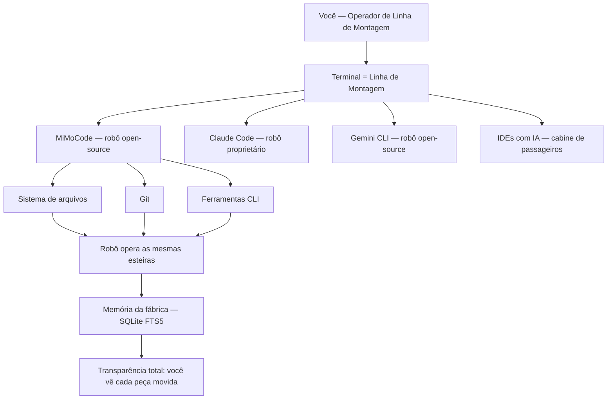

# Capítulo 1: O que é o MiMoCode e por que o terminal voltou a ser o centro

## 1. Introdução

Se você acompanha o mundo do desenvolvimento de software nos últimos anos, provavelmente sentiu a mesma sensação de vertigem: a promessa de programar com inteligência artificial começou como um chatbot que respondia perguntas soltas, evoluiu para um autocomplete que completava linhas, e agora se transformou em algo muito mais ambicioso — um agente que lê o seu repositório, planeja mudanças, edita arquivos, roda comandos e verifica o próprio trabalho. No centro dessa transformação, um nome novo vem ganhando força exatamente onde a maioria das pessoas menos esperava: o terminal. Este capítulo coloca você no chão de fábrica — o primeiro turno da sua jornada — respondendo às perguntas que todo mundo faz antes de apertar o botão de partida: o que exatamente é o MiMoCode, de onde ele veio, e por que o terminal, a interface mais antiga da computação, voltou a ser o campo de batalha mais disputado do desenvolvimento de software. Ao dominar isso, você não estará apenas conhecendo mais uma ferramenta; estará entendendo a mudança estrutural que define esta década.

## 2. Explica

O MiMoCode é um agente de codificação por inteligência artificial, nativo de terminal, lançado oficialmente na versão 0.1.0 em junho de 2026 pela equipe MiMo da Xiaomi. A definição parece simples, mas cada palavra carrega uma decisão profunda de arquitetura. "Agente de codificação" significa que o sistema não apenas sugere trechos de código: ele recebe uma tarefa em linguagem natural, explora o repositório, decide quais arquivos alterar, executa edições e comandos, e itera até concluir — ou até pedir ajuda quando encontra um obstáculo. "Nativo de terminal" é a aposta central: em vez de disputar espaço dentro de um editor pesado, o MiMoCode assume que o desenvolvedor profissional já vive no terminal, e que o terminal é o melhor lugar para um agente operar com liberdade total sobre o sistema de arquivos.

A origem do projeto explica sua filosofia. O MiMoCode é um fork direto do OpenCode, o agente de codificação open-source do ecossistema SST mantido na organização anomalyco. Essa herança não é um detalhe burocrático: a arquitetura TypeScript, o modelo de plugins e a superfície de servidor headless foram herdados e evoluídos, com os pacotes internos migrados de `@opencode-ai/*` para `@mimo-ai/*`. Sobre essa base, a equipe MiMo construiu diferenciais próprios — um sistema de memória persistente baseado em SQLite FTS5, gerenciamento inteligente de contexto, workflows determinísticos e o modo Compose — que não existem no projeto original. É a combinação de herança sólida com inovação própria que define o posicionamento do MiMoCode: aberto, com licença MIT, mas com engenharia de agentes que vai além do que o OpenCode oferece.

Para situar o MiMoCode no mercado, é essencial conhecer o cenário competitivo em que ele opera. O Claude Code, da Anthropic, é o concorrente proprietário mais conhecido: roda no terminal, mas é exclusivo dos modelos Claude e tem sua TUI fechada. O Cursor ataca pelo flanco oposto, embutindo IA dentro de um editor baseado em VS Code. O Gemini CLI, do Google, é o concorrente open-source mais direto em termos de posicionamento. E há ainda as plataformas acadêmicas e comunitárias, como o OpenHands, que oferecem agentes generalistas em ambientes abertos [11]. O que diferencia o MiMoCode nesse mapa não é uma única funcionalidade, mas a combinação: aberto, multiplataforma, com suporte a múltiplos provedores por meio do AI SDK da Vercel e do catálogo de modelos, memória persistente entre sessões e uma superfície de servidor headless que permite usá-lo como uma API [1][7][23].

O renascimento do terminal como campo de batalha tem raízes acadêmicas concretas. O benchmark SWE-bench, publicado em 2024, mostrou que modelos de linguagem conseguem resolver problemas reais do GitHub — e criou a métrica que passou a medir a capacidade dos agentes. O SWE-agent, da Universidade de Princeton, demonstrou que a interface entre o agente e o computador (a chamada Agent-Computer Interface, ou ACI) é tão importante quanto o modelo em si: uma boa interface de ferramentas pode multiplicar a taxa de sucesso. Trabalhos como o Agentless questionaram até a necessidade de agentes complexos, mostrando que pipelines simples com um bom modelo alcançam resultados competitivos [10]. Esses trabalhos convergem para um ponto: o código do mundo real é um ambiente cheio de ferramentas, e o agente que souber operar bem esse ambiente — lendo, editando, executando — vence aquele que apenas conversa.

Os números publicados pela Xiaomi reforçam esse argumento. Em testes controlados utilizando o mesmo modelo base MiMo, o MiMoCode obteve 62% no SWE-Bench Pro, contra 57% do Claude Code, e 73% no Terminal Bench 2, contra 68% do concorrente. Esses números precisam ser lidos com cuidado — benchmarks de agente são sensíveis à configuração, ao modelo e ao conjunto de tarefas — mas a direção é consistente: a engenharia da interface e do fluxo do agente importa tanto quanto o modelo por baixo [22][8]. O Terminal Bench 2, em particular, mede algo que o SWE-Bench não mede: a capacidade de operar um terminal real, com comandos, navegação e ferramentas — exatamente o terreno onde o MiMoCode aposta.

O que isso significa na prática para quem desenvolve software? Que a IA deixou de ser um oráculo para virar um operador. Em um relatório que repercutiu em todo o mercado, o DORA indicou que a grande maioria dos desenvolvedores já usa IA no fluxo de trabalho, e que as equipes que integram IA aos fluxos existentes — revisão de código, testes, integração contínua — colhem ganhos de produtividade, enquanto as que tentam substituir o processo por IA pura colhem instabilidade. Essa é a mesma distinção que atravessa este livro inteiro: o agente não é um substituto do fluxo de engenharia, é um operador dentro dele. Quem entende isso configura o MiMoCode como um instrumento da fábrica; quem não entende, espera que a linha monte o produto sozinha — e descobre a diferença na primeira ordem de serviço mal escrita.

Por que o terminal — e não o editor nem o navegador — é a superfície natural de um agente de codificação? Essa escolha explica quase tudo o que o MiMoCode faz diferente. O terminal é o único ambiente que reúne, em um só lugar, as três propriedades que um agente precisa para operar com responsabilidade: acesso total ao sistema de arquivos, execução arbitrária de comandos e a possibilidade de inspeção e reversão de cada ação. Um editor moderno é uma aplicação que esconde do usuário a maior parte do que acontece por baixo; o terminal é o contrário — uma interface que não esconde nada, porque foi desenhada para que o humano visse exatamente o que a máquina faz. Quando o agente roda no terminal, ele herda essa transparência: cada arquivo lido, cada comando executado e cada edição aplicada fica visível no fluxo, e a sessão registra o que foi feito para que qualquer passo possa ser desfeito ou auditado.

Há ainda uma dimensão cultural e técnica que completa o quadro: o terminal é a herança viva da filosofia Unix — ferramentas pequenas, especializadas e combináveis, operando sobre texto puro. Um agente que nasce nesse ecossistema herda um vocabulário enorme de ferramentas prontas: o `git` para versionamento, o `grep` e o `ripgrep` para busca, o `jq` para JSON, o `make` e o `npm` para automação. Em vez de reinventar cada uma dessas capacidades, o MiMoCode as invoca diretamente — e o resultado é um agente que sabe operar o mesmo conjunto de instrumentos que você já domina. É por isso que a curva de aprendizado de quem vem do terminal é tão curta: o agente fala a língua do ambiente, e o posto de trabalho não precisa ser reaprendido — apenas o robô precisa ser conhecido.

O MiMoCode também resolve, na arquitetura, um problema que a maioria dos concorrentes trata como secundário: a memória. Agentes de chat e mesmo agentes de terminal tradicionais esquecem tudo quando a sessão termina — cada novo turno começa do zero, sem saber o que foi decidido na semana passada. O MiMoCode ataca esse problema com um sistema de memória persistente baseado em SQLite FTS5, organizado em três pilares — projeto, sessão e tarefa — que o Capítulo 2 detalha em arquitetura. Isso significa que, ao contrário dos concorrentes que tratam cada sessão como um evento isolado, o MiMoCode trata o trabalho como um fluxo contínuo — o que você decidiu no turno passado está disponível no próximo, e a busca textual sobre essa memória é feita com o mecanismo de full-text search do SQLite. Esse é um dos diferenciais que a documentação oficial menciona de passagem, mas que poucos operadores exploram de verdade — e será destrinchado no Capítulo 9.

É aqui que o MiMoCode acerta um ponto que a documentação oficial mal menciona: ele não tenta substituir o seu ambiente, ele se encaixa nele. Como um agente que opera no terminal, ele herda todas as vantagens desse ambiente — acesso total ao sistema de arquivos, execução de testes, integração com Git, uso de qualquer ferramenta CLI — e nenhuma das limitações de um chatbot embutido em um painel web. A desvantagem dessa liberdade é a necessidade de controle, e é exatamente esse controle (permissões, agentes, modo planejamento) que os próximos capítulos deste livro vão destrinchar.

Para entender a decisão de arquitetura por trás do MiMoCode, vale comparar as superfícies que ele oferece. A primeira é a TUI, a interface de texto que roda no terminal e é o uso padrão do comando `mimo` — o lugar onde a produtividade máxima acontece, com modos alternáveis via Tab, slash commands e painéis que respeitam o fluxo do teclado. A segunda é o servidor headless, iniciado com `mimo serve`, que expõe a mesma engine por HTTP e permite que qualquer cliente — uma TUI remota via `mimo attach`, um script, uma ferramenta própria — se conecte. Essa estratégia de múltiplas superfícies sobre um único motor é a herança direta do OpenCode, e é rara no mercado: a maioria dos concorrentes escolhe uma superfície e a defende até o fim.

A decisão de ser open-source também tem consequências práticas que vão além da ideologia. O código-fonte público permite auditar exatamente o que o agente envia para os provedores, contribuir com correções e ferramentas, e confiar em um ecossistema que não depende de um único fornecedor. Para empresas, isso significa menos risco de vendor lock-in: a configuração, as sessões e as skills são arquivos locais e portáveis, não dados presos em uma nuvem proprietária. E a licença aberta permite que a ferramenta evolua pela comunidade — plugins, temas e integrações crescem em um ritmo que produtos fechados não alcançam. O custo dessa abertura é a responsabilidade: sem um fornecedor que segure sua mão, você precisa entender a ferramenta — e é exatamente isso que este livro faz.

Essa abertura tem um corolário de segurança que os capítulos finais vão explorar em profundidade, mas que merece ser dito desde já para calibrar a confiança: código aberto não significa ausência de riscos, significa riscos conhecidos e auditáveis. O que o agente envia para os provedores, onde ele armazena as credenciais e como ele trata os arquivos do seu projeto são decisões que, em uma ferramenta proprietária, você aceita por fé — e, em uma ferramenta aberta, você pode verificar. O `auth.json`, que guarda as chaves dos provedores, é um arquivo local e protegido por permissões do sistema; o tráfego com os provedores segue os protocolos HTTPS padrão; e a política de dados é documentada — mas nada disso dispensa a verificação.

Um aviso honesto fecha a parte expositiva: a diferença entre conhecer e dominar define o que você vai extrair deste livro. Conhecer o MiMoCode é saber o que ele faz: é um agente de codificação, abre no terminal, suporta muitos provedores e tem memória persistente. Dominar o MiMoCode é saber o que cada decisão sua muda no comportamento dele: como o prompt que você escreve, as instruções que você versiona e as permissões que você concede transformam o mesmo motor em resultados completamente diferentes. Essa diferença aparece de forma concreta na comunidade: dois desenvolvedores com o mesmo modelo, o mesmo repositório e a mesma tarefa obtêm resultados distintos — não porque um tem um truque, mas porque um entende a fábrica e o outro apenas aperta o botão. A curva de aprendizado real não está nos comandos (eles cabem em uma tarde) — está no modelo mental: o agente como operador do seu ambiente, que responde ao contexto que você projeta. Os capítulos que seguem constroem esse modelo mental camada por camada — arquitetura, instalação, provedores, operação, configuração, extensões, memória e fluxo profissional — e o último capítulo devolve tudo isso em um plano de adoção completo. O contrato deste livro é simples: ao final, você não terá apenas usado o MiMoCode — terá entendido por que cada manobra funciona, e será capaz de ensinar a próxima pessoa.

## 3. Ilustra

Pense na sua máquina de desenvolvimento como uma linha de montagem de software. Durante décadas, a indústria tentou colocar o operador dentro de uma cabine confortável — os IDEs com seus assistentes de chat embutidos, janelas flutuantes e painéis laterais. O problema é que a cabine de passageiros é um lugar para consumir, não para produzir: o operador de linha precisa de esteiras ao alcance da mão, visão clara do que está acontecendo com o motor e controle direto sobre cada parafuso. O terminal é essa linha de montagem. O MiMoCode é o robô de braço articulado instalado na linha — rápido, programável e integrado ao chão de fábrica. Quando o robô move uma peça, você vê exatamente qual peça foi movida e pode apertar o botão de parada de emergência. Nenhum outro paradigma de ferramenta oferece esse nível de transparência operacional.



Repare que o diagrama coloca o terminal no centro e os concorrentes ao redor: cada ferramenta escolheu um lugar diferente nesse mapa, mas todas orbitam o mesmo ponto — o ambiente real onde o código vive. O diferencial do MiMoCode no diagrama é a caixa da memória da fábrica: enquanto os concorrentes tratam cada sessão como um turno isolado que esquece tudo ao final, o MiMoCode guarda o que foi decidido entre turnos — e é isso que o torna um robô de linha, e não um robô de feira. A metáfora da linha de montagem vai reaparecer em todo este livro: a ordem de serviço (o prompt), o posto de trabalho (o workspace e as permissões), a esteira de ferramentas (o MCP e os plugins), a memória da fábrica (o SQLite FTS5) e o controle de qualidade (os modos plan, build e compose). Quando você dominar a linguagem dessa linha, qualquer ferramenta de agente de terminal — Claude Code, Gemini CLI, OpenCode — vai parecer familiar, porque todas operam as mesmas esteiras com vocabulários diferentes. Como Operador de Linha de Montagem, você não estará preso a um único fabricante de robô.

## 4. Técnica

### O MiMoCode em três registros

Um entendimento atravessa a obra: a diferença entre o agente e o chat. O chat responde à última mensagem; o agente persegue um objetivo com ferramentas. O chat esquece o contexto quando a janela fecha; o agente com memória persistente (Capítulo 2) continua. O chat é consulta; o agente é trabalho. Essa distinção explica quase todas as decisões de design do MiMoCode — e é a lente com que o operador avalia cada recurso. Quem trata o agente como chat opera abaixo do potencial; quem entende a diferença opera a fábrica.

**Ciclo de vida de uma tarefa.** O ciclo de vida de uma tarefa no MiMoCode conecta a definição à operação. A tarefa começa como uma ordem de serviço (o prompt); o agente a converte em um plano de exploração (o que ler, o que verificar); o plano vira ações com ferramentas (ler, editar, executar); e o resultado é verificado contra o critério de aceite. Cada fase do ciclo tem o seu vocabulário — e o operador que reconhece a fase entende o comportamento do robô. O SWE-agent documentou a importância dessa estrutura de interface. O Capítulo 2 detalha o loop; aqui, o registro é a visão de cima: a tarefa é um ciclo com fases identificáveis.

**Família de agentes de terminal.** Um registro que ajuda o leitor a situar o MiMoCode na família de agentes de terminal: ele é um dos herdeiros do movimento iniciado pelo OpenCode — e a linhagem explica muito do design. O OpenCode provou que um agente de terminal open-source, com servidor headless e multi-provedor, era viável; o MiMoCode pega essa base e a evolui com memória persistente e orquestração. O Claude Code provou o mercado de agentes proprietários de terminal; o Gemini CLI provou o apetite por versões open-source. O MiMoCode se posiciona na interseção: aberto como o OpenCode, ambicioso como o Claude Code, com diferenciais próprios. Entender essa família é entender por que tantas ferramentas parecem iguais por fora e diferem tanto por dentro.

### O contrato de instalação e o primeiro comando

Um detalhe prático que aparece antes do primeiro loop e que o operador profissional verifica com disciplina: o contrato de instalação. O MiMoCode pode ser instalado por script curl (macOS/Linux), por PowerShell (Windows) ou via NPM, e o `mimo --version` confirma a instalação em qualquer canal. A escolha do canal importa menos do que a consistência: o contrato do comando `mimo` é idêntico depois da instalação. E o primeiro comando que vale executar depois do `--version` é o `mimo providers`, para confirmar que a autenticação do onboarding foi concluída — o Capítulo 3 destrincha o ritual completo.

### Os fundamentos do loop em código

Antes das primeiras interações, vale ancorar em código o que distingue um agente de um chatbot — porque é essa distinção que você vai observar em toda a operação. Um chatbot recebe uma mensagem e devolve um texto; a relação termina aí. Um agente recebe uma tarefa, monta um plano, executa ferramentas e itera — e a estrutura desse loop aparece na própria forma como o MiMoCode representa a sessão. Em termos de modelo mental, cada sessão é uma máquina de estados cujo motor é o loop do agente — e a primeira habilidade técnica de quem opera o MiMoCode é reconhecer em que estado a sessão está: aguardando prompt, executando ferramenta, aguardando aprovação de permissão, concluída.

Vamos concretizar o que foi dito até aqui com a primeira interação real. A forma mais rápida de verificar se o MiMoCode está instalado e descobrir sua versão é o comando `mimo --version`. Mas o que interessa de verdade é a superfície de comando: o comando `mimo` sem argumentos abre a TUI, e a partir dela você acessa tudo — as sessões, os modos Build, Plan e Compose, e as skills. Veja a hierarquia de superfícies que o MiMoCode expõe:

```bash
# Superfície 1: a TUI (interface de texto) — o uso padrão
mimo

# Superfície 2: execução programática, sem interface interativa
mimo run "explique o que este projeto faz"

# Superfície 3: servidor headless (API HTTP/WebSocket)
mimo serve

# Superfície 4: conectar uma TUI local a um servidor remoto
mimo attach http://servidor-da-empresa:porta

# Superfície 5: gerenciamento de provedores e modelos
mimo providers
mimo models
```

### Verificando a instalação e o primeiro turno

Antes de abrir a TUI, o profissional verifica o ambiente com três comandos rápidos. O primeiro confirma a versão do binário; o segundo confirma que o servidor de autenticação está acessível; o terceiro lista os modelos disponíveis no provedor configurado. Esse ritual de verificação evita a frustração mais comum do primeiro uso: abrir a TUI e descobrir que nenhum modelo está conectado.

```bash
# 1. Versão do binário
mimo --version

# 2. Lista os provedores autenticados (o onboarding cria o primeiro)
mimo providers list

# 3. Lista os modelos do provedor padrão
mimo models
```

A saída do `mimo --version` varia conforme o canal de instalação (NPM, script curl ou PowerShell), mas o contrato é o mesmo: um número de versão semântica no formato `0.1.x`. Se o comando não for encontrado, o problema está no `PATH` — e a solução aparece na seção de instalação do Capítulo 3 [5][21].

### Anatomia da sessão

Uma rotina que o operador maduro mantém: a limpeza de sessões. A sessão acumulada ocupa espaço e polui a lista. O `mimo session list` mostra o acervo; o operador arquiva ou remove o que terminou. E a limpeza tem um motivo de custo: a sessão antiga consultada por engano pode retomar um contexto enorme. A higiene de sessões é a mesma da memória do Capítulo 9: o que não serve, sai. A limpeza periódica mantém a operação enxuta.

**Colaboração.** A sessão em JSON também é o formato da colaboração entre operadores. O Capítulo 6 mostrou o export e o import; aqui, o registro é o valor: a sessão exportada é um artefato de aprendizado — o operador júnior importa a sessão do sênior e vê a trilha completa de decisões. O time que compartilha sessões acelera o onboarding e padroniza o estilo de operação. E a sessão como artefato — versionável, auditável — é a mesma lógica da memória persistente aplicada à colaboração. O export não é um recurso técnico: é a ponte entre operadores [1][4][20].

**Modos.** A sessão em JSON registra também o modo de operação — build, plan ou compose — e esse campo é mais relevante do que parece. A auditoria de uma sessão começa pelo modo: uma sessão que editou arquivos deveria ter rodado em build; uma que apenas analisou, em plan. O modo registrado é a evidência do contrato de operação que o Capítulo 5 destrincha. E o `mimo run --agent plan` (Capítulo 6) produz sessões de análise puras, sem edição — a trilha limpa para auditoria. O campo do modo é o carimbo de qualidade da sessão.

**Memória.** A sessão em JSON revela também a ponte com a memória persistente: cada sessão registra o estado que o sistema de memória consulta entre turnos. O `mimo export` serializa a sessão, e o SQLite FTS5 indexa o conhecimento acumulado — a busca textual por "o que decidimos sobre X" responde com os trechos relevantes das sessões passadas. Essa é a diferença estrutural entre o MiMoCode e os concorrentes que o Capítulo 1 apresentou: a sessão não é um artefato descartável, é o alimento da memória da fábrica. O operador que entende essa ponte exporta sessões com propósito — para auditoria, para colaboração e para alimentar a memória [1][4][19].

**JSON.** Quando o MiMoCode opera, ele mantém o estado da sessão de forma estruturada. O comando `mimo export` serializa uma sessão como JSON — e é instrutivo olhar essa estrutura para entender o modelo mental do agente. A sessão contém informações, mensagens e metadados que o servidor usa para reconstruir o contexto [1][4]:

```json
{
  "id": "sessao-001",
  "modelo": "mimo/mi-mo-base",
  "modo": "build",
  "mensagens": [
    {
      "papel": "usuario",
      "conteudo": "explique o que este projeto faz"
    },
    {
      "papel": "assistente",
      "conteudo": "Este projeto é um serviço de autenticação...",
      "ferramentas": []
    }
  ],
  "estado": "concluida"
}
```

Esse formato é importante por dois motivos. Primeiro, porque a portabilidade é um dos pilares do open-source: se a sessão é um arquivo JSON, ela pode ser versionada, compartilhada e importada de volta — `mimo import` faz exatamente isso. Segundo, porque a estrutura revela a separação entre o que o usuário pediu, o que o agente fez e quais ferramentas ele usou — a trilha de auditoria que os capítulos finais vão explorar.

### Mapa do ecossistema

Uma reflexão final sobre o terminal — o palco da obra inteira. O terminal voltou a ser o centro porque é o único ambiente com acesso total, execução arbitrária e inspeção. O MiMoCode não reinventa o terminal — ele o ocupa. E o operador que domina o terminal domina o agente: o vocabulário Unix (git, grep, jq, make) é o vocabulário da fábrica. O Capítulo 1 começou com essa tese; o livro inteiro a desenvolve; e o Capítulo 10 fecha com o fluxo profissional. O terminal é o chão de fábrica — e o MiMoCode é o robô que você aprendeu a operar.

**Futuro.** Fechando o mapa, vale um registro sobre o futuro — porque a escolha de uma ferramenta é uma aposta de longo prazo. O MiMoCode é novo (o lançamento oficial foi a versão 0.1.0 em junho de 2026) e evolui rápido. A aposta em uma ferramenta aberta com comunidade ativa (awesome-mimo-agent) é diferente da aposta em uma proprietária: o risco de abandono existe, mas o código e o conhecimento ficam. O operador que escolhe o MiMoCode aposta na combinação de abertura, herança do OpenCode e inovação da Xiaomi. E o ecossistema — skills, plugins, adaptadores — é o que transforma a ferramenta em plataforma [1][3][28].

**Adoção.** Fechando o mapa, vale registrar a dimensão da adoção — porque a escolha da ferramenta é também uma escolha de time. O DORA mostra que a adoção disciplinada de IA ao fluxo existente colhe ganhos, enquanto a substituição do processo por IA pura colhe instabilidade. O MiMoCode se encaixa no padrão disciplinado: ele opera dentro do fluxo (Git, testes, terminal) em vez de substituí-lo. A adoção bem-sucedida não é instalar a ferramenta — é integrá-la ao fluxo com revisão e governança. O Capítulo 10 fecha a obra com o plano completo de adoção.

**Custo.** Uma dimensão do mapa do ecossistema que merece registro em código é o custo — porque a escolha da ferramenta é também uma escolha de linha orçamentária. Os agentes de terminal, por operarem com contexto enxuto e texto puro, consomem tokens de forma eficiente quando comparados a plataformas com UI web rica. O MiMoCode, com o `small_model` para tarefas de fundo e a compactação de contexto (Capítulo 9), oferece alavancas de custo que a maioria dos concorrentes não documenta. E o `mimo stats` transforma o custo em dado — o medidor de energia que o Capítulo 6 apresenta em ação. O operador que compara ferramentas sem comparar custo está escolhendo no escuro.

**Código.** Para fechar a parte técnica deste capítulo, vale montar em código o mapa do ecossistema — não como uma opinião, mas como um inventário verificável de onde cada ferramenta ataca. Esse mapa é o mesmo que o diagrama da seção Ilustra desenhou visualmente, agora em forma de dados:

```json
{
  "ecossistema": {
    "MiMoCode": {
      "tipo": "agente de terminal",
      "codigo": "aberto",
      "licenca": "MIT",
      "origem": "fork do OpenCode (anomalyco)",
      "memoria_persistente": true,
      "modos": ["build", "plan", "compose"]
    },
    "Claude Code": {
      "tipo": "agente de terminal",
      "codigo": "fechado",
      "memoria_persistente": false,
      "modelos": "exclusivos Claude"
    },
    "Cursor": {
      "tipo": "editor com IA",
      "codigo": "fechado",
      "memoria_persistente": false,
      "modelos": "multiplos"
    },
    "Gemini CLI": {
      "tipo": "agente de terminal",
      "codigo": "aberto",
      "memoria_persistente": false,
      "modelos": "Gemini"
    }
  }
}
```

Esse inventário é útil porque transforma a decisão de adoção de um debate de opinião em uma comparação de atributos: o MiMoCode é o único da lista com memória persistente e código aberto ao mesmo tempo. Quando você precisar justificar a escolha para o seu time, é esse tipo de tabela de atributos que vai sustentar a conversa — não entusiasmo.

### A decisão open-source

O open-source frequentemente suscita uma dúvida de segurança: código aberto não significa ausência de risco — significa risco auditável. O operador pode verificar o que o agente envia aos provedores, onde armazena as credenciais e como trata os arquivos. A verificação é um direito do usuário — e o Capítulo 7 mostra as permissões que controlam o comportamento. A confiança no MiMoCode é construída por auditoria, não por fé. E o mesmo princípio vale para plugins e esteiras (Capítulo 8): tudo o que estende a ferramenta é auditável.

**Portabilidade.** Um ponto define o dia a dia do operador: a portabilidade do open-source. No MiMoCode, a configuração (`mimocode.jsonc`), as sessões (JSON exportado) e as skills são arquivos locais e portáveis — não dados presos em uma nuvem proprietária. Um time pode versionar a configuração do projeto no Git, compartilhar sessões exportadas e migrar a memória entre máquinas com `MIMOCODE_HOME`. Essa portabilidade é a herança direta do OpenCode — e é o que torna o MiMoCode uma escolha defensável em empresas que exigem auditoria e controle. O custo da abertura é a responsabilidade: sem um fornecedor que segure a mão, o operador precisa entender a ferramenta — e é exatamente isso que este livro constrói.

### O custo e a transparência

A transparência de custo tem um corolário que o financeiro do time valoriza: a previsibilidade. Com o `mimo stats` mostrando o consumo por sessão e por modelo, o operador projeta o orçamento do mês seguinte com base nos dados do mês atual. A previsibilidade transforma a IA de linha imprevisível em linha orçamentária. E o `small_model` (Capítulo 4) e a compactação (Capítulo 9) são as alavancas de ajuste quando a projeção estoura. O operador que mede projeta; o que não mede descobre a fatura no fim do mês.

**Transparência da ferramenta.** Uma vantagem do MiMoCode que merece registro: a transparência de custo. O `mimo stats` mostra o consumo por sessão, por modelo e por provedor — e essa visibilidade é rara no mercado. O concorrente proprietário que cobra por assinatura não expõe o consumo por tarefa; o MiMoCode, com o medidor aberto, permite ao operador planejar o orçamento. A transparência de custo é uma consequência do open-source e do design de arquitetura — e é um dos argumentos de adoção que o Capítulo 10 usa [1][4][6].

### O custo do terminal em perspectiva

Uma dimensão econômica que vale registrar: agentes de terminal são mais baratos de operar do que as alternativas, porque não carregam a infraestrutura pesada de um IDE na nuvem nem pagam o custo de uma UI web rica. O custo de um agente é dominado pelos tokens que ele consome — e um agente de terminal, com contexto enxuto e fluxo de texto puro, consome de forma eficiente. Esse custo também é previsível e mensurável: o `mimo stats` do Capítulo 9, o controle de compactação do mesmo capítulo e a matriz de modelos do Capítulo 4 são as ferramentas de controle que transformam "IA no fluxo" de um gasto misterioso em uma linha orçamentária planejada.

### Referência rápida: as superfícies do MiMoCode

A tabela abaixo resume as superfícies que o MiMoCode expõe e o momento certo de usar cada uma — o mesmo mapa que o Capítulo 1 desenhou, agora em forma de consulta rápida [1][4][7]:

| Superfície | Comando | Quando usar | Interatividade |
|---|---|---|---|
| TUI | `mimo` | Operação diária, exploração e revisão | Interativa, com Tab e slash commands |
| Execução única | `mimo run "tarefa"` | Automação, CI e scripts | Headless, responde no stdout |
| Servidor headless | `mimo serve` | Disponibilizar o motor como API | Headless, HTTP/WebSocket |
| Anexo remoto | `mimo attach <url>` | Operar um servidor da empresa | Interativa via cliente |
| Gestão | `mimo providers`, `mimo models` | Configurar e auditar provedores | Interativa/CLI |

**Checklist do primeiro turno.** Antes de abrir a TUI pela primeira vez, o operador confirma três pontos: (1) a versão instalada responde (`mimo --version`); (2) ao menos um provedor está autenticado (`mimo providers list`); (3) o modelo padrão responde (`mimo models`). Com essas três confirmações, o primeiro pedido não encontra surpresa [1][4][5]. O erro mais comum do primeiro uso — a TUI abrir e nenhum modelo responder — é sempre um problema de provedor, não de instalação, e o Capítulo 3 mostra o ritual completo de instalação e o Capítulo 4 o de provedores [4][21]. O terminal como linha de montagem depende dessas três confirmações antes de qualquer ordem de serviço: versão, energia (provedor) e ferramenta calibrada (modelo).

## 5. Aplica

### A cena de contraste: o operador que apertou o botão sem ler o manual

Imagine a cena: você acabou de ler sobre agentes de codificação de terminal, viu um vídeo de alguém resolvendo um bug em trinta segundos e decidiu testar o MiMoCode no projeto da sua empresa — um monolito legado com credenciais em variáveis de ambiente e uma esteira de CI que roda testes em cinco minutos. Você instala o binário, roda `mimo` na raiz do repositório e digita o primeiro pedido: "refatore o módulo de autenticação para usar OAuth2". O robô de braço articulado da linha de montagem começa a trabalhar com entusiasmo: cria arquivos, altera o `package.json`, reescreve o controlador de login. Você assiste, fascinado, sem prestar atenção em cada peça que ele move. Vinte minutos depois, a esteira de CI explode: dependências quebradas, testes que não compilam, e o pior — o robô alterou o arquivo de configuração de ambiente, onde estavam as credenciais de staging, e agora o ambiente de homologação está apontando para a configuração errada. O diagnóstico é duro: você entregou o posto de operador ao robô sem definir as regras do chão de fábrica — sem permissões, sem plano, sem revisão das peças movidas.

A correção é o oposto exato do instinto inicial. Antes de qualquer pedido de refatoração, o operador profissional define o perímetro: quais pastas o robô pode tocar, quais comandos ele pode executar e quais arquivos estão proibidos (o arquivo de credenciais, por exemplo, entra na lista de negação). Depois, ele usa o modo Plan — o modo somente leitura — para que o robô primeiro explore o código e apresente um plano de mudança sem alterar nada. Só depois da aprovação humana do plano é que o modo Build entra em ação, e cada peça movida aparece no fluxo para revisão. No final, o operador roda os testes da esteira localmente antes de deixar o robô commitar — porque o robô que roda no seu terminal é rápido, mas o robô que roda no CI é o mesmo que roda no seu terminal, e o que muda é a disciplina do operador, não a ferramenta.

A lição dessa cena — e ela vai se repetir com variações nos próximos capítulos — é que o MiMoCode não é perigoso por ser poderoso; ele é perigoso quando o operador entrega o posto inteiro sem perímetro. As armadilhas comuns do primeiro uso seguem o mesmo padrão: rodar sem configurar provedores (a TUI abre e nada responde), dar tarefas vagas como "melhore este código" (o robô inventa escopo), ignorar o que o robô está prestes a fazer (cada aprovação de permissão é um ponto de controle que existe para ser usado) e esquecer que a memória persistente guarda o que foi decidido (o Capítulo 9 mostra como usar isso a seu favor).

### Métricas de sucesso na adoção

No cenário corporativo, a adoção de um agente de terminal como o MiMoCode costuma ser medida por três métricas: tempo médio de resolução de issues (que cai à medida que o fluxo de permissões e planos amadurece), taxa de revisão de código aceita na primeira submissão (que sobe quando o modo Plan é usado antes do Build) e custo mensal por desenvolvedor em tokens (que cai quando a compactação e o modelo secundário entram em cena) [1][25]. A empresa que adota o MiMoCode sem medir essas três linhas está operando a linha de montagem no escuro: sabe que produz, mas não sabe a que custo, com que qualidade ou em quanto tempo.

## 6. Conclusão

Neste primeiro turno, você colocou o MiMoCode no mapa: entendeu o que ele é — um agente de codificação nativo de terminal, fork do OpenCode mantido pela equipe MiMo da Xiaomi, com licença MIT e memória persistente em SQLite FTS5 [1][2]; entendeu por que o terminal voltou a ser o centro do desenvolvimento — porque é o único ambiente com acesso total, execução arbitrária e inspeção, e porque benchmarks como o Terminal Bench 2 mostram que a engenharia da interface importa tanto quanto o modelo [9][22]; e entendeu onde ele se encaixa no cenário competitivo — entre os robôs proprietários e os editores com IA, como a opção aberta com memória de fábrica [12][13][14]. O desafio deste capítulo é simples e poderoso: abra um terminal e responda, com as suas próprias palavras, o que é um agente de codificação e por que o terminal é a superfície natural dele — sem olhar as notas. Se você conseguir explicar isso para outra pessoa, o turno está cumprido, e a fábrica está pronta para a próxima estação: no Capítulo 2, vamos abrir o robô por dentro — a arquitetura que faz o MiMoCode funcionar, o loop do agente, o servidor headless e o sistema de memória que o diferencia.

## 7. Referências Bibliográficas

[1] XIAOMI MIMO. *MiMo-Code: repositório oficial do MiMoCode.* Disponível em: https://github.com/XiaomiMiMo/MiMo-Code. Acesso em: 03 ago. 2026.

[2] XIAOMI MIMO. *MiMoCode: documentação e central de notícias.* Disponível em: https://mimo.mi.com/docs/en-US/news/latest/mimocode. Acesso em: 03 ago. 2026.

[3] XIAOMI MIMO. *awesome-mimo-agent: ecossistema e guias da comunidade.* Disponível em: https://github.com/XiaomiMiMo/awesome-mimo-agent. Acesso em: 03 ago. 2026.

[4] XIAOMI MIMO. *README npm do MiMoCode.* Disponível em: https://github.com/XiaomiMiMo/MiMo-Code/blob/main/README_npm.md. Acesso em: 03 ago. 2026.

[5] XIAOMI MIMO. *Script de instalação do MiMoCode.* Disponível em: https://mimo.xiaomi.com/install. Acesso em: 03 ago. 2026.

[6] ANOMALYCO. *OpenCode: agente de codificação de terminal (projeto original do qual o MiMoCode deriva).* Disponível em: https://github.com/anomalyco/opencode. Acesso em: 03 ago. 2026.

[7] SST. *OpenCode Docs: documentação da arquitetura e do servidor headless.* Disponível em: https://opencode.ai/docs. Acesso em: 03 ago. 2026.

[8] JIMENEZ, Carlos E. et al. *SWE-bench: Can Language Models Resolve Real-World GitHub Issues?* Disponível em: https://arxiv.org/abs/2310.06770. Acesso em: 03 ago. 2026.

[9] YANG, John et al. *SWE-agent: Agent-Computer Interfaces Enable Automated Software Engineering.* Disponível em: https://arxiv.org/abs/2405.15793. Acesso em: 03 ago. 2026.

[10] XIA, Chunqiu Steven et al. *Agentless: Demystifying LLM-based Software Engineering Agents.* Disponível em: https://arxiv.org/abs/2407.01489. Acesso em: 03 ago. 2026.

[11] WANG, Xingyao et al. *OpenHands: An Open Platform for AI Software Developers as Generalist Agents.* Disponível em: https://arxiv.org/abs/2407.16741. Acesso em: 03 ago. 2026.

[12] ANTHROPIC. *Claude Code: agente de codificação de terminal.* Disponível em: https://docs.anthropic.com/en/docs/claude-code. Acesso em: 03 ago. 2026.

[13] GOOGLE. *Gemini CLI: agente de codificação de terminal open-source.* Disponível em: https://github.com/google-gemini/gemini-cli. Acesso em: 03 ago. 2026.

[14] CURSOR. *Cursor: editor com IA embutida.* Disponível em: https://cursor.com. Acesso em: 03 ago. 2026.

[19] SQLITE. *FTS5: extensão de full-text search do SQLite.* Disponível em: https://www.sqlite.org/fts5.html. Acesso em: 03 ago. 2026.

[20] XIAOMI MIMO. *MiMoCode: sistema de memória persistente.* Disponível em: https://mimo.mi.com/docs/en-US/news/latest/mimocode. Acesso em: 03 ago. 2026.

[21] NPM. *@mimo-ai/cli: pacote oficial do MiMoCode.* Disponível em: https://www.npmjs.com/package/@mimo-ai/cli. Acesso em: 03 ago. 2026.

[22] XIAOMI MIMO. *Benchmarks do MiMoCode: SWE-Bench Pro 62% e Terminal Bench 2 73%.* Disponível em: https://mimo.mi.com/docs/en-US/news/latest/mimocode. Acesso em: 03 ago. 2026.

[23] VERCEL. *AI SDK: base dos provedores e do catálogo de modelos.* Disponível em: https://ai-sdk.dev. Acesso em: 03 ago. 2026.

[25] DORA. *State of AI-assisted Software Development 2025.* Disponível em: https://dora.dev. Acesso em: 03 ago. 2026.

[28] RTK. *Adaptadores e integrações da comunidade para agentes de terminal.* Disponível em: https://github.com/rtk-ai/rtk. Acesso em: 03 ago. 2026.
