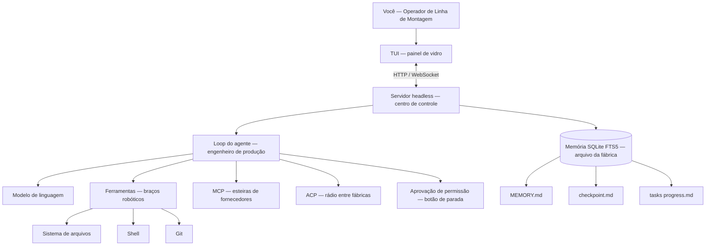

# Capítulo 2: Arquitetura: como o MiMoCode funciona por dentro

## 1. Introdução

No Capítulo 1, você colocou o MiMoCode no mapa do ecossistema: entendeu que ele é um agente de codificação nativo de terminal, fork do OpenCode mantido pela equipe MiMo da Xiaomi, e por que o terminal voltou a ser o centro do desenvolvimento. Agora é hora de abrir o robô por dentro. Este capítulo desmonta a arquitetura do MiMoCode peça por peça, como um operador da fábrica que precisa conhecer cada componente do braço articulado antes de operá-lo em produção: o loop do agente que conecta o modelo de linguagem às ferramentas, a arquitetura cliente-servidor que separa a TUI do motor headless, os protocolos MCP e ACP que ligam o robô ao mundo externo e o sistema de memória persistente em SQLite FTS5 que o diferencia de todos os concorrentes. Ao final, você será capaz de explicar — para um colega, para uma entrevista ou para a sua própria equipe — exatamente o que acontece entre o momento em que você digita uma ordem de serviço e o momento em que o robô devolve o resultado. Essa compreensão é o alicerce de tudo o que vem a seguir: sem ela, os capítulos de configuração e otimização seriam uma coleção de truques sem fundamento.

## 2. Explica

### O papel das ferramentas e das permissões

A seleção de ferramentas também conversa com o custo — o tema que o Capítulo 9 domina. Cada chamada de ferramenta gera uma iteração: o resultado volta ao contexto e o modelo decide o próximo passo. A ferramenta errada gera iterações extras — contexto e tokens pagos por decisões ruins. A ferramenta certa resolve em uma iteração. O operador que configura as ferramentas certas (Capítulo 7) e mantém as ferramentas enxutas (Capítulo 8) reduz o número de iterações — a alavanca mais direta do custo. O loop é o coração; o custo é o seu batimento.

**Ferramentas no loop.** Uma dimensão do loop que o operador observa na prática: a seleção de ferramentas. O modelo não executa todas as ferramentas disponíveis — ele escolhe a ferramenta certa para a ação planejada. A qualidade dessa escolha define a eficiência do loop: a ferramenta errada gera iterações extras, contexto desperdiçado e resultados piores. O SWE-agent mostrou que uma ACI bem desenhada — com ferramentas claras e descritas — melhora a seleção. O operador que entende isso valoriza a configuração de ferramentas (Capítulo 7) e a disciplina de esteiras (Capítulo 8): cada ferramenta bem descrita é uma decisão de melhor qualidade.

**Permissões e da auditoria.** O ponto de interrupção das permissões é também o ponto de auditoria do loop. Cada aprovação de permissão é um evento registrado na sessão — o export JSON mostra o que foi pedido, quando e como foi decidido. Essa trilha é a evidência que a governança do Capítulo 10 usa: o que o agente fez, com qual autorização. O operador que entende o loop entende a importância de não automatizar cegamente as aprovações — cada ask removido é um evento de auditoria a menos. O botão de parada de emergência existe também para deixar registros.

**Permissões no loop.** Uma dimensão do loop que merece destaque é o ponto de interrupção das permissões — porque é ali que o controle humano se materializa. No fluxo do agente, antes de executar uma ferramenta sobre o ambiente real (editar um arquivo, rodar um comando), o MiMoCode consulta a política de permissões: se a ação está permitida (allow), o loop segue; se está proibida (deny), o loop para; se não há regra (ask), o operador decide. Esse ponto de interrupção é o botão de parada de emergência da fábrica — e é a mesma válvula que o Capítulo 7 configura em profundidade. Entender o loop sem entender a permissão é entender a máquina sem conhecer a trava.

### O loop do agente: o coração da linha

Todo agente de codificação moderno é, no fundo, um loop: recebe uma tarefa, observa o ambiente, decide uma ação, executa a ação com uma ferramenta, observa o resultado e repete até concluir — ou até pedir ajuda. O MiMoCode implementa esse loop de forma direta, e entendê-lo é entender 80% da arquitetura. O modelo de linguagem é o cérebro do loop: ele recebe o contexto (a tarefa, o histórico da sessão, o conteúdo dos arquivos relevantes) e produz a próxima ação — que pode ser uma resposta ao usuário ou uma chamada de ferramenta estruturada, como ler um arquivo, editar uma linha ou executar um comando. As ferramentas são os braços do loop: cada uma expõe uma operação concreta sobre o ambiente real (sistema de arquivos, shell, Git, busca), e o modelo escolhe qual braço mover com base no que viu.

A literatura acadêmica dá um nome a essa separação: Agent-Computer Interface, ou ACI — o conjunto de ferramentas e convenções que conecta o agente ao computador. O SWE-agent, da Universidade de Princeton, demonstrou que a qualidade da ACI pode multiplicar a taxa de sucesso do agente, independentemente do modelo usado [9][10]. Isso explica por que o MiMoCode investe tanto em ferramentas bem desenhadas: o robô de braço articulado só é tão bom quanto as ferramentas que ele alcança. Quando você vê o MiMoCode lendo um arquivo, buscando uma string com ripgrep e executando um teste em sequência, está assistindo ao loop do agente operando sobre a ACI. O benchmark SWE-bench, que mede a capacidade dos agentes de resolver issues reais do GitHub, foi o que tornou essa métrica pública e comparável entre ferramentas — e é o mesmo terreno onde a Xiaomi divulgou os números de 62% no SWE-Bench Pro [8][22].

### Cliente-servidor e suas consequências

Uma consequência prática da separação cliente-servidor: o deploy do servidor. O servidor headless pode rodar em infraestrutura dedicada — a máquina da empresa, o container, a VM. O operador que precisa de disponibilidade (automação, integrações) não depende de uma TUI aberta. E a configuração do servidor — porta, hostname, mDNS — é versionável. O deploy do servidor é o passo que transforma o MiMoCode de ferramenta pessoal em serviço do time — a ponte para o Capítulo 10.

**Diagnóstico.** A separação cliente-servidor também define o diagnóstico de falhas. Quando a TUI trava, o problema pode estar no cliente (a interface), no servidor (o motor) ou na rede entre eles. O diagnóstico em camadas: verificar se o servidor está de pé (`mimo session list`), verificar se outro cliente conecta (`mimo attach`), e isolar o cliente. O operador que conhece a topologia não reinicia a máquina inteira — reinicia a camada certa. O diagnóstico em camadas é o mesmo princípio do Capítulo 4 aplicado à arquitetura.

### Cliente-servidor e a escalabilidade

A arquitetura cliente-servidor tem uma consequência de escalabilidade que os capítulos finais exploram: o servidor é o recurso, a TUI é apenas a janela. Isso significa que uma máquina poderosa pode servir várias TUIs — o time operando sobre o mesmo motor. E o servidor pode rodar em infraestrutura dedicada, com o ambiente real — o padrão corporativo do Capítulo 10. A escalabilidade do MiMoCode não é um plano de marketing: é a consequência direta da separação cliente-servidor herdada do OpenCode.

### Cliente-servidor e o modelo de sessões

A separação cliente-servidor tem um corolário que o operador percebe no dia a dia: o modelo de sessões. Como o servidor mantém as sessões independentes da TUI, a mesma sessão pode ser retomada por clientes diferentes — uma TUI local, uma TUI remota via attach, um script headless. O `mimo session list` mostra as sessões do servidor, e o `-c`/`-s`/`--fork` do Capítulo 5 navegam entre elas. Essa continuidade é o que transforma o MiMoCode de ferramenta de chat em ferramenta de trabalho: a sessão não morre quando a janela fecha.

### Cliente-servidor: a TUI é um cliente, não o motor

A decisão arquitetural mais importante do MiMoCode — herdada do OpenCode — é a separação entre a superfície e o motor. A TUI que você vê na tela é um cliente: ela conecta em um servidor local que roda o loop do agente de verdade. Essa separação parece um detalhe de engenharia, mas ela muda tudo na prática. O comando `mimo` abre a TUI, que sobe (ou conecta a) um servidor headless na sua máquina; o servidor mantém as sessões, roda as ferramentas e conversa com os provedores; a TUI apenas desenha o que o servidor envia e repassa o que você digita. Como o servidor expõe uma API HTTP/WebSocket, qualquer cliente pode se conectar — outra TUI na sua máquina, uma TUI remota via `mimo attach`, um script em Python, uma ferramenta interna do seu time.

Essa arquitetura tem consequências profundas de operação. A primeira é a portabilidade: você pode rodar o servidor em uma máquina poderosa da empresa (onde está o ambiente de build, o banco de staging e as credenciais) e conectar a TUI do seu laptop com `mimo attach` — o trabalho acontece onde o ambiente real está, e a experiência é local. A segunda é a automação: `mimo run` executa o mesmo motor sem nenhuma interface, perfeito para CI, scripts e integrações. A terceira é a observabilidade: como tudo passa por uma API, é possível instrumentar, logar e auditar cada interação — um requisito para qualquer adoção corporativa séria. O ecossistema ao redor dessa arquitetura aberta cresceu rápido: a comunidade mantém listas de integrações e guias, e adaptadores apareceram em projetos populares de automação de terminal.

### Protocolos: MCP e ACP como as ferramentas e a ponte entre robôs

O MiMoCode conversa com o mundo externo por dois protocolos que precisam ser distinguidos com precisão, porque são frequentemente confundidos. O MCP (Model Context Protocol) é o protocolo que conecta o agente a ferramentas e fontes de dados externas: um servidor MCP expõe ferramentas (buscar no Sentry, consultar um banco, acessar uma API interna) e o agente as invoca como se fossem ferramentas nativas. Pense no MCP como os conjuntos de ferramentas da fábrica: cado fluxo traz um tipo de peça de um fornecedor externo, e o robô pode alcançá-la sem conhecer o fornecedor. O ACP (Agent Client Protocol) é diferente: é o protocolo de controle entre agentes — permite que um agente delegue trabalho a outro, que um orquestrador coordene vários robôs e que ferramentas externas acionem o MiMoCode como um subagente. O MCP amplia o robô com esteiras novas; o ACP conecta robôs entre si e ao sistema de controle central.

A distinção importa na prática por um motivo simples: o tipo de integração que você constrói depende do protocolo certo. Precisa dar ao agente acesso a uma ferramenta ou dado externo? MCP. Precisa que outro sistema (uma TUI remota, um orquestrador, um agente de outro fornecedor) controle o MiMoCode? ACP. Usar o protocolo errado é como tentar trazer uma peça para a linha usando a ponte de comunicação entre robôs: funciona às vezes, mas quebra no primeiro caso sério.

### Memória persistente e suas consequências

A memória persistente também tem a sua configuração — o ponto onde o Capítulo 7 e o Capítulo 9 se encontram. O comportamento dos checkpoints, a frequência de consolidação e a estrutura dos arquivos de memória podem ser ajustados. O operador que configura a memória com intenção — o que entra, quando consolida, onde vive — opera uma fábrica que aprende de forma controlada. E o `mimo db` (Capítulo 8) inspeciona o resultado. A memória é um sistema: a arquitetura a cria, a configuração a controla e a operação a alimenta.

**Custo.** A memória persistente também conversa com o custo — a fórmula que o Capítulo 9 destrincha. O projeto com memória consolidada inicia as sessões com contexto implícito: menos reexploração, menos passos, menos tokens. O projeto sem memória reconstrói o contexto a cada sessão — o mesmo custo pago repetidamente. A memória é uma alavanca de custo que os concorrentes não têm — e o Capítulo 9 mostra como medi-la. O operador que alimenta a memória paga menos por sessão ao longo do tempo.

**Privacidade.** A memória persistente local tem uma dimensão de privacidade que o operador corporativo valoriza. Os dados da memória — MEMORY.md, checkpoints, progresso — vivem no SQLite local, não em uma nuvem do fornecedor. O código do projeto não sai da máquina para alimentar a memória; o que sai é apenas o que a sessão envia ao provedor de modelo. Para empresas com restrição de dados, essa localidade é um argumento decisivo — e o Capítulo 4 mostra como modelos locais via Ollama fecham o ciclo. A memória da fábrica fica na fábrica.

**Ciclo de vida do projeto.** A memória persistente também muda o ciclo de vida do trabalho no projeto. No fluxo tradicional, cada sessão recomeçava a exploração do código; com a memória, o conhecimento acumulado — arquitetura, decisões, convenções — sobrevive e se refina a cada turno. O Capítulo 9 mostra os comandos `/dream` (consolidação) e `/distill` (criação de skills) que operam essa memória. Para o operador, a consequência prática é a escala: um projeto com meses de memória acumulada opera com um contexto implícito que um projeto novo não tem — o agente parece conhecer o código, porque o arquivo da fábrica registra o que foi aprendido.

### Memória persistente: o que torna o MiMoCode diferente

O diferencial mais importante do MiMoCode sobre a base do OpenCode é o sistema de memória persistente. Agentes de terminal tradicionais são amnésicos por design: cada sessão começa do zero, e o contexto sobrevive apenas enquanto a janela de contexto do modelo aguenta. O MiMoCode ataca esse problema com um banco local SQLite usando a extensão FTS5 de full-text search, organizado em três pilares: a memória de projeto (`MEMORY.md`), que guarda conhecimento duradouro sobre o repositório; os checkpoints de sessão (`checkpoint.md`), que registram onde cada turno parou; e as notas de progresso de tarefas (`tasks/<id>/progress.md`), que acompanham o andamento de cada ordem de serviço. Essa estrutura permite que o agente consulte o histórico por relevância textual — o FTS5 indexa o conteúdo e responde a buscas como "o que decidimos sobre a migração de autenticação?" — em vez de simplesmente despejar tudo na janela de contexto.

O impacto operacional dessa escolha é enorme. No fluxo tradicional, o desenvolvedor gastava parte do contexto reexplicando o projeto a cada nova sessão — como um operador que precisa ser re-treinado todo turno. Com a memória persistente, o MiMoCode carrega o conhecimento acumulado da fábrica: o que foi decidido, o que foi testado, o que deu errado. O Capítulo 9 vai destrinchar como operar essa memória na prática — os comandos `/dream` e `/distill`, a consolidação periódica e a compactação de contexto — mas a arquitetura já mostra a intenção: o MiMoCode foi projetado para trabalho contínuo, não para conversas descartáveis.

### O ciclo de vida de uma interação

Juntando as peças, o ciclo de vida de uma interação no MiMoCode segue um caminho determinístico. Você digita uma ordem de serviço na TUI; a TUI serializa e envia para o servidor via HTTP/WebSocket; o servidor monta o contexto (a tarefa, o histórico da sessão, a memória persistente relevante via FTS5, o conteúdo dos arquivos citados); o modelo de linguagem do provedor configurado recebe o contexto e devolve a próxima ação; se a ação for uma ferramenta, o servidor executa sobre o ambiente real e devolve o resultado ao loop; quando o resultado satisfaz os critérios, o servidor envia a resposta final para a TUI. Cada etapa desse fluxo é um ponto de controle: permissões podem interromper antes da execução de uma ferramenta, o usuário pode aprovar ou negar, e a sessão registra tudo para auditoria.

Esse ciclo é a mesma máquina de estados que o Capítulo 1 apresentou em código: aguardando prompt, executando ferramenta, aguardando aprovação, concluída. O que este capítulo acrescenta é a compreensão do porquê — a separação cliente-servidor, o loop sobre a ACI, os protocolos de extensão e a memória persistente são as quatro peças que explicam o comportamento observável do robô. Com essa base, os capítulos de instalação, provedores e operação deixam de ser listas de comandos e viram consequências naturais da arquitetura.

A arquitetura também conversa com o modelo de negócio do mercado. O MiMoCode aceita provedores de múltiplos fornecedores — Anthropic, OpenAI, OpenRouter, modelos locais via Ollama — porque a camada de provedores foi desenhada como um contrato, não como um acoplamento. O AI SDK da Vercel, que serve de base para o catálogo de provedores, é o mesmo contrato que o OpenCode usa — mais uma herança da arquitetura original. E a evolução da ferramenta é contínua: `mimo upgrade` atualiza o binário, e o ciclo de lançamentos da equipe MiMo mantém a base aberta do fork sincronizada com as inovações próprias [1][5][21]. Para o operador, isso significa que a arquitetura não é um retrato estático: ela evolui, e quem entende as camadas acompanha a evolução sem sustos.

## 3. Ilustra

Pense na arquitetura do MiMoCode como a linha de montagem de uma fábrica de automóveis. O modelo de linguagem é o engenheiro de produção no centro da linha: ele recebe a ordem de serviço, consulta os manuais, decide qual esteira acionar e em que ordem. As ferramentas são os braços robóticos ao longo da linha: um braço solda (edita arquivos), outro instala o motor (roda comandos), outro inspeciona a peça (lê arquivos e busca no código). O servidor headless é o centro de controle da fábrica: é lá que o engenheiro trabalha de verdade, independente de quem está olhando pelo monitor — a TUI é apenas o painel de vidro que mostra o que está acontecendo no centro de controle. O MCP é a esteira que traz peças de fornecedores externos (dados do Sentry, consultas ao banco); o ACP é o rádio que liga o centro de controle desta fábrica ao centro de outra fábrica vizinha. E a memória persistente é o arquivo da fábrica: o caderno onde o turno anterior anotou o que foi decidido, o que foi testado e o que deu errado — para que o turno atual não precise reinventar a roda.



Repare como o diagrama centraliza tudo no servidor headless: a TUI, o loop, as ferramentas, os protocolos e a memória convergem no centro de controle. Isso é o oposto da arquitetura de um IDE com IA embutida, onde a interface e o motor vivem no mesmo processo e não há como separá-los. Como Operador de Linha de Montagem, entender essa topologia muda a sua operação: quando algo não funciona, você sabe onde procurar — o problema está na esteira (MCP), no rádio (ACP), no arquivo (memória) ou no engenheiro (loop)? E essa mesma topologia explica por que `mimo attach` funciona: você não está "abrindo um programa remoto", está apenas conectando um painel de vidro a um centro de controle que já roda na outra máquina.

## 4. Técnica

### Verificando a arquitetura

Um detalhe herdado do OpenCode que o operador avançado usa: a API do servidor é documentada por uma especificação aberta (OpenAPI). A especificação lista os endpoints de sessão, mensagem e evento — e é o ponto de partida para construir ferramentas próprias sobre o mesmo motor. O time que quer um dashboard de sessões, uma integração com o sistema de tickets ou um bot de auditoria começa pela especificação. A API aberta é a consequência da arquitetura cliente-servidor — e o Capítulo 6 mostra como o `mimo run` usa a mesma superfície.

**Fluxo de eventos.** Um detalhe que completa a observação da arquitetura: o fluxo de eventos entre a TUI e o servidor. Cada mensagem, cada execução de ferramenta e cada mudança de estado gera um evento — e o cliente (TUI, script ou attach) recebe esses eventos para desenhar ou processar. O `mimo run` com saída estruturada expõe esse fluxo de eventos em JSON — a mesma trilha que o Capítulo 6 usa para auditoria. O operador que observa o fluxo de eventos vê a arquitetura em movimento — e entende por que a TUI parece reativa mesmo com o motor ocupado.

**Servidor.** Um detalhe operacional que completa a verificação: o servidor headless é configurável — `--port` define a porta, `--hostname` o endereço, e o `--mdns` habilita a descoberta por nome `mimocode.local`. Para quem opera uma frota de máquinas, o mDNS transforma o attach de um exercício de decorar IPs em uma busca por nome. E o `--no-auth` — que permite iniciar sem autenticação em endereços não loopback — é um flag que o operador responsável usa apenas em redes isoladas, porque o nome já carrega o aviso. A verificação da arquitetura não é apenas confirmar que o servidor roda: é confirmar que ele roda com as travas certas.

**Prática.** A melhor maneira de internalizar a arquitetura cliente-servidor é observá-la em ação. O MiMoCode expõe o servidor headless com `mimo serve`, e a TUI conecta nesse servidor. Você pode verificar essa topologia com três comandos — um que inicia o servidor em segundo plano, um que lista as sessões ativas no servidor e um que conecta uma segunda TUI ao mesmo servidor [1][4]:

```bash
# Inicia o servidor headless na porta padrão
mimo serve

# Em outro terminal: lista as sessões ativas no servidor
mimo session list

# Em outro terminal: conecta uma TUI ao servidor que já está rodando
mimo attach http://127.0.0.1:porta
```

A observação prática é simples: abra o `mimo serve` em um terminal, o `mimo session list` em outro, e veja a sessão aparecer quando você inicia uma TUI conectada. Essa é a prova viva de que a TUI é um cliente — se a TUI fosse o motor, não haveria como listar suas sessões de fora. O flag `--hostname` e a porta do servidor são configuráveis, e o modo mDNS permite que outras máquinas descubram o servidor pelo nome `mimocode.local` — uma mão na roda para quem opera uma frota de estações de trabalho.

### A memória persistente em código

O sistema de memória do MiMoCode é um dos pontos mais subestimados da ferramenta, e a melhor forma de entender seu potencial é ver como ele se organiza em disco. O banco SQLite com FTS5 guarda o índice de busca sobre a memória — e a estrutura em três pilares aparece nos arquivos de projeto [1][2][20]:

```json
{
  "memoria": {
    "pilar_projeto": "MEMORY.md",
    "pilar_checkpoint": "checkpoint.md",
    "pilar_tarefas": "tasks/<id>/progress.md",
    "motor_busca": "SQLite FTS5",
    "exemplo_consulta": "o que decidimos sobre a migracao de autenticacao"
  }
}
```

Para entender o valor do FTS5, vale comparar com a alternativa ingênua: guardar tudo em um arquivo de texto e buscar com `grep`. O FTS5 indexa o conteúdo em tokens e responde a consultas com relevância — termos mais raros pesam mais, e a busca devolve os trechos mais prováveis de responder a pergunta. O grep é uma ferramenta maravilhosa para achar uma string exata; o FTS5 é uma ferramenta para achar o trecho relevante de um conhecimento acumulado. A diferença é a diferença entre procurar o número da peça no manual impresso e perguntar ao arquivo da fábrica "onde falamos sobre problemas com o motor?".

### Um cliente MCP mínimo em código

A melhor forma de entender o MCP é construir um servidor mínimo — um exemplo real e executável que expõe uma ferramenta simples e mostra o formato de contrato entre o agente e o fluxo externa. O exemplo abaixo usa o SDK oficial do MCP para expor uma ferramenta que consulta uma lista local de "peças" (recursos do sistema) [15]:

```javascript
import { McpServer } from "@modelcontextprotocol/sdk/server/mcp.js";
import { StdioServerTransport } from "@modelcontextprotocol/sdk/server/stdio.js";

const server = new McpServer({
  name: "esteira-local",
  version: "0.1.0"
});

server.tool(
  "listar_recursos",
  "Lista os recursos do projeto atual",
  { limite: { type: "number", description: "Maximo de itens" } },
  async (params) => {
    const recursos = ["config_obra.json", "sumario_macro.json", "capitulos/"];
    const itens = recursos.slice(0, params.limite ?? recursos.length);
    return {
      content: [{ type: "text", text: itens.join("\n") }]
    };
  }
);

const transport = new StdioServerTransport();
await server.connect(transport);
```

Esse servidor, quando registrado no MiMoCode via `mimo mcp add`, torna a ferramenta `listar_recursos` disponível para o agente — e o agente decide quando usá-la, como usa qualquer ferramenta nativa. O ponto arquitetural é que o MiMoCode não conhece o código do servidor MCP: ele conhece apenas o contrato (nome da ferramenta, parâmetros, resultado em JSON). Essa é a essência do fluxo: a fábrica não precisa saber como o fornecedor fabrica a peça, só precisa que a peça chegue no formato certo.

### O loop: contexto, limite e modos

Fechando o loop, vale registrar o papel do contexto — o combustível do ciclo. O contexto alimenta cada decisão do modelo: a tarefa, o histórico, os arquivos lidos. O contexto bem gerenciado — enxuto e relevante — produz decisões melhores com menos tokens. O contexto inflado degrada a atenção do modelo e aumenta o custo. O Capítulo 9 mostra a compactação; aqui, o registro é a causa: o contexto é o recurso central do loop, e o operador que o domina domina a qualidade e o custo.

**Limite de passos.** O loop do agente tem uma válvula que o operador configura: o limite de passos. Sem limite, o agente pode iterar indefinidamente em uma tarefa — consumindo tokens e tempo. O limite de passos define quantas iterações o loop executa antes de parar e reportar. A literatura reforça a importância do controle: o SWE-agent mostrou que agentes com limites claros operam melhor. O operador profissional configura o limite por tarefa — generoso para refatorações, enxuto para diagnósticos. A válvula de passos é o controle que impede o robô de trabalhar em loop infinito.

**Modos de operação.** O loop do agente ganha variações conforme o modo de operação — a mesma mecânica, controles diferentes. No modo Build, o loop executa com permissão completa de ferramentas; no modo Plan, o loop opera em modo somente leitura — as ferramentas de edição ficam inibidas e o agente apenas explora e propõe; no modo Compose, o loop opera sobre especificações, dividindo o trabalho em tarefas. O Capítulo 5 destrincha os três modos; aqui, o registro arquitetural é a unidade: é o mesmo loop, com válvulas diferentes. O operador que entende essa unidade entende por que a mesma ferramenta se comporta tão diferente em cada modo.

### O loop do agente em pseudocódigo executável

Para fechar a parte técnica, vale materializar o loop do agente em código — não como uma implementação do MiMoCode (que é um produto complexo), mas como o modelo mental exato que a arquitetura implementa. Este exemplo em Python mostra a estrutura do loop: observar, decidir, executar, avaliar [9][1]:

```python
def loop_do_agente(tarefa, modelo, ferramentas, contexto):
    """Loop classico de agente: decide uma acao, executa, observa e itera."""
    estado = {"tarefa": tarefa, "historico": [], "concluido": False}
    while not estado["concluido"] and len(estado["historico"]) < 10:
        acao = modelo.decidir(estado, ferramentas.disponiveis())
        if acao["tipo"] == "resposta":
            estado["concluido"] = True
            return acao["texto"]
        if acao["tipo"] == "ferramenta":
            resultado = ferramentas.executar(acao["nome"], acao["args"])
            estado["historico"].append({"acao": acao, "resultado": resultado})
    return "Limite de iteracoes atingido"
```

O ponto desse exemplo não é replicar o MiMoCode — é fixar o vocabulário arquitetural: a decisão é do modelo, a execução é da ferramenta, e o histórico alimenta a próxima decisão. Quando você ler na documentação que o MiMoCode "itera até concluir", é exatamente esse loop que está sendo descrito — e quando você configurar limites de passos ou observar o agente pedindo aprovação, está vendo as válvulas que controlam esse loop.

### A arquitetura e o modelo de negócio

Encerrando o capítulo, o resumo das quatro peças: o loop (o coração), o cliente-servidor (a topologia), os protocolos (as conexões) e a memória (a continuidade). Cada peça será retomada nos capítulos seguintes — e o operador que internalizou as quatro lê a documentação do MiMoCode com uma estrutura mental que a maioria não tem. A arquitetura não é um capítulo teórico: é a lente com que você vai ler cada recurso da ferramenta. Quem entende a arquitetura entende a ferramenta inteira.

**Comparação final.** Fechando o capítulo, vale a comparação estrutural com o que vem depois: cada camada da arquitetura apresentada aqui — loop, cliente-servidor, protocolos, memória — será operada nos capítulos seguintes. O Capítulo 3 instala o servidor; o Capítulo 4 conecta a rede elétrica; o Capítulo 5 opera os modos; o Capítulo 6 automatiza o headless; os Capítulos 7 e 8 configuram e estendem; o Capítulo 9 afina memória e custo; e o Capítulo 10 orquestra tudo. A arquitetura não é um assunto isolado: é o mapa do livro inteiro.

**Rede elétrica de provedores.** Um amarração que fecha a arquitetura: o loop do agente não se importa com a usina de energia — ele conversa com o provedor configurado pelo contrato de modelos. O MiMoCode aceita múltiplos provedores — Plataforma MiMo, Anthropic, OpenAI, OpenRouter, Ollama — e a troca é uma configuração, não uma mudança de arquitetura [1][17][18]. Essa neutralidade é a herança do AI SDK e do OpenCode [6][23]. O Capítulo 4 explora a rede elétrica em profundidade; aqui, o registro é o elo: a arquitetura do Capítulo 2 e a rede elétrica do Capítulo 4 são duas vistas do mesmo sistema — o motor e a energia.

### A arquitetura em comparação com os concorrentes

Uma tabela ajuda a fixar a arquitetura comparando os atributos estruturais do MiMoCode com os concorrentes do Capítulo 1 — não para vencer um debate, mas para mostrar que cada decisão arquitetural tem consequências observáveis [12][13][14]:

| Atributo | MiMoCode | Claude Code | Cursor | Gemini CLI |
|---|---|---|---|---|
| Código aberto | Sim (MIT) | Não | Não | Sim |
| Cliente-servidor headless | Sim | Parcial | Não | Não |
| Memória persistente FTS5 | Sim | Não | Não | Não |
| MCP | Sim | Sim | Sim | Sim |
| ACP | Sim | Parcial | Não | Não |
| Multi-provedor | Sim | Não | Sim | Não |
| `mimo run` headless | Sim | Sim | Não | Sim |

A leitura da tabela é arquitetural: o MiMoCode é o único que combina código aberto, cliente-servidor headless, memória persistente e os dois protocolos — e é exatamente essa combinação que sustenta os diferenciais operacionais dos próximos capítulos. Quando o Capítulo 10 mostrar o fluxo profissional completo, cada linha dessa tabela voltará a aparecer como uma capacidade concreta.

### Referência rápida: protocolos e o ciclo de vida da interação

Os dois protocolos que conectam o MiMoCode ao mundo externo são frequentemente confundidos; a tabela abaixo fixa a distinção que a seção anterior detalhou [15][16]:

| Aspecto | MCP (Model Context Protocol) | ACP (Agent Client Protocol) |
|---|---|---|
| Papel | Conecta o agente a ferramentas e dados externos | Conecta agentes entre si e a orquestradores |
| Unidade | Servidor MCP expõe ferramentas | Agente delegável como subagente |
| Analogia | Esteira de peças de fornecedores | Rádio entre centros de controle |
| Uso típico | Buscar no Sentry, consultar banco, API interna | TUI remota, orquestrador, outro fornecedor |
| Configuração | `mimo mcp` e `mimocode.jsonc` (Capítulo 8) | Servidor headless e protocolo de controle |

**O ciclo de vida em uma tabela.** A interação completa segue passos determinísticos: (1) a TUI serializa a ordem de serviço e envia ao servidor via HTTP/WebSocket; (2) o servidor monta o contexto — tarefa, histórico da sessão, memória relevante via FTS5 e arquivos citados; (3) o modelo devolve a próxima ação; (4) se for uma ferramenta, o servidor executa e devolve o resultado ao loop; (5) ao satisfazer o critério, o servidor devolve a resposta final à TUI [1][7][9]. Cada passo é um ponto de controle: as permissões podem interromper a execução, e a sessão registra tudo para auditoria [1][7]. Entender essa sequência é entender onde cada otimização do Capítulo 9 — memória, compactação, `small_model` — atua no ciclo [1][2][9].

## 5. Aplica

### A cena de contraste: o operador que confundiu a esteira com o rádio

Imagine a cena: seu time adotou o MiMoCode, e você ficou responsável por integrá-lo ao fluxo de trabalho. O time de plataforma pede que o agente consulte o Sentry para diagnosticar erros de produção — "basta dar acesso ao agente", diz o ticket. Você, seguindo o instinto, procura na documentação como "dar acesso ao agente a um serviço externo" e encontra o protocolo ACP — afinal, é o protocolo de "controle de agentes", e o Sentry é um serviço externo, certo? Você configura uma integração ACP com o Sentry, o agente até parece conectar, mas as ferramentas do Sentry não aparecem — o agente continua sem conseguir buscar os erros. O diagnóstico, depois de horas de investigação, é constrangedor: o problema era a peça errada na linha. O Sentry expõe ferramentas (buscar issues, consultar eventos), e ferramentas externas entram pelo MCP, não pelo ACP. O ACP é o protocolo entre agentes — para o Sentry fornecer ferramentas ao MiMoCode, o caminho correto era `mimo mcp add`, registrando o servidor MCP do Sentry como uma esteira de fornecedor.

A correção é imediata quando a arquitetura está clara: registrar o servidor MCP do Sentry, listar as ferramentas com `mimo mcp list`, e o agente passa a alcançar a esteira do Sentry como alcança qualquer ferramenta nativa. A lição dessa cena é a lição central da arquitetura: MCP traz peças para a linha, ACP conecta fábricas. Confundir os dois não é um erro de comando — é um erro de modelo mental, e é exatamente o tipo de erro que este capítulo existe para prevenir.

As armadilhas comuns da operação arquitetural seguem o mesmo padrão de confusão de camadas: esquecer que a TUI é um cliente e achar que "fechar a TUI encerra o trabalho" (o servidor pode continuar rodando); rodar `mimo serve` em uma máquina sem o ambiente real e depois estranhar que o agente não encontra os arquivos; ignorar o arquivo da fábrica (a memória) e reexplicar o projeto a cada sessão; e conectar MCPs pesados demais, inflando o contexto e degradando a qualidade das respostas. O operador profissional trata a arquitetura como um mapa: sabe em que camada está cada problema e não tenta resolver um problema de memória trocando a esteira.

### Métricas de sucesso na operação arquitetural

No cenário corporativo, a maturidade arquitetural aparece em métricas concretas: o tempo médio de setup de uma nova máquina (cai quando o servidor headless e a memória do projeto são reutilizados em vez de reconfigurados), a taxa de sucesso das integrações externas (sobe quando a equipe distingue MCP de ACP antes de começar), e o volume de contexto gasto reexplicando o projeto (cai drasticamente quando a memória persistente é alimentada). A empresa que opera o MiMoCode sem entender a arquitetura resolve cada incidente como um caso isolado; a que entende a arquitetura resolve a classe de incidentes inteira de uma vez. E o relatório DORA reforça a direção: equipes que integram IA ao fluxo existente de forma estruturada colhem ganhos, enquanto as que improvisam colhem instabilidade [25].

## 6. Conclusão

Você abriu o robô por dentro e agora conhece as quatro peças que explicam o comportamento do MiMoCode: o loop do agente que conecta o modelo de linguagem às ferramentas sobre a ACI [9]; a arquitetura cliente-servidor que separa a TUI (o painel de vidro) do motor headless (o centro de controle) [7]; os protocolos MCP e ACP que ampliam o robô com esteiras externas e o conectam a outras fábricas [15][16]; e a memória persistente em SQLite FTS5 que transforma sessões amnésicas em trabalho contínuo. Você também viu como a arquitetura aberta se conecta ao ecossistema — o AI SDK como contrato de provedores, a comunidade de integrações e o ciclo de evolução contínua [23][3][28]. O desafio deste capítulo: abra o `mimo serve`, conecte uma segunda TUI com `mimo attach` e observe a sessão aparecer no `mimo session list` — a prova viva da arquitetura. Depois, explique para um colega a diferença entre MCP e ACP sem consultar a documentação. No Capítulo 3, vamos fazer a fábrica ganhar vida: a instalação do MiMoCode em todas as plataformas, o primeiro turno na TUI e a estrutura de pastas que organiza a configuração.

## 7. Referências Bibliográficas

[1] XIAOMI MIMO. *MiMo-Code: repositório oficial do MiMoCode.* Disponível em: https://github.com/XiaomiMiMo/MiMo-Code. Acesso em: 03 ago. 2026.

[2] XIAOMI MIMO. *MiMoCode: documentação e central de notícias.* Disponível em: https://mimo.mi.com/docs/en-US/news/latest/mimocode. Acesso em: 03 ago. 2026.

[3] XIAOMI MIMO. *awesome-mimo-agent: ecossistema e guias da comunidade.* Disponível em: https://github.com/XiaomiMiMo/awesome-mimo-agent. Acesso em: 03 ago. 2026.

[4] XIAOMI MIMO. *README npm do MiMoCode.* Disponível em: https://github.com/XiaomiMiMo/MiMo-Code/blob/main/README_npm.md. Acesso em: 03 ago. 2026.

[5] XIAOMI MIMO. *Script de instalação do MiMoCode.* Disponível em: https://mimo.xiaomi.com/install. Acesso em: 03 ago. 2026.

[6] ANOMALYCO. *OpenCode: agente de codificação de terminal (projeto original do qual o MiMoCode deriva).* Disponível em: https://github.com/anomalyco/opencode. Acesso em: 03 ago. 2026.

[7] SST. *OpenCode Docs: documentação da arquitetura e do servidor headless.* Disponível em: https://opencode.ai/docs. Acesso em: 03 ago. 2026.

[8] JIMENEZ, Carlos E. et al. *SWE-bench: Can Language Models Resolve Real-World GitHub Issues?* Disponível em: https://arxiv.org/abs/2310.06770. Acesso em: 03 ago. 2026.

[9] YANG, John et al. *SWE-agent: Agent-Computer Interfaces Enable Automated Software Engineering.* Disponível em: https://arxiv.org/abs/2405.15793. Acesso em: 03 ago. 2026.

[10] XIA, Chunqiu Steven et al. *Agentless: Demystifying LLM-based Software Engineering Agents.* Disponível em: https://arxiv.org/abs/2407.01489. Acesso em: 03 ago. 2026.

[12] ANTHROPIC. *Claude Code: agente de codificação de terminal.* Disponível em: https://docs.anthropic.com/en/docs/claude-code. Acesso em: 03 ago. 2026.

[13] GOOGLE. *Gemini CLI: agente de codificação de terminal open-source.* Disponível em: https://github.com/google-gemini/gemini-cli. Acesso em: 03 ago. 2026.

[14] CURSOR. *Cursor: editor com IA embutida.* Disponível em: https://cursor.com. Acesso em: 03 ago. 2026.

[15] MODEL CONTEXT PROTOCOL. *Especificação oficial do MCP.* Disponível em: https://modelcontextprotocol.io. Acesso em: 03 ago. 2026.

[16] AGENT CLIENT PROTOCOL. *Especificação oficial do ACP.* Disponível em: https://agentclientprotocol.com. Acesso em: 03 ago. 2026.

[17] OLLAMA. *Modelos locais de código aberto.* Disponível em: https://ollama.com. Acesso em: 03 ago. 2026.

[18] OPENROUTER. *Roteador de modelos de IA.* Disponível em: https://openrouter.ai. Acesso em: 03 ago. 2026.

[20] SQLITE. *FTS5: extensão de full-text search do SQLite.* Disponível em: https://www.sqlite.org/fts5.html. Acesso em: 03 ago. 2026.

[21] NPM. *@mimo-ai/cli: pacote oficial do MiMoCode.* Disponível em: https://www.npmjs.com/package/@mimo-ai/cli. Acesso em: 03 ago. 2026.

[22] XIAOMI MIMO. *Benchmarks do MiMoCode: SWE-Bench Pro 62% e Terminal Bench 2 73%.* Disponível em: https://mimo.mi.com/docs/en-US/news/latest/mimocode. Acesso em: 03 ago. 2026.

[23] VERCEL. *AI SDK: base dos provedores e do catálogo de modelos.* Disponível em: https://ai-sdk.dev. Acesso em: 03 ago. 2026.

[25] DORA. *State of AI-assisted Software Development 2025.* Disponível em: https://dora.dev. Acesso em: 03 ago. 2026.

[28] RTK. *Adaptadores e integrações da comunidade para agentes de terminal.* Disponível em: https://github.com/rtk-ai/rtk. Acesso em: 03 ago. 2026.
