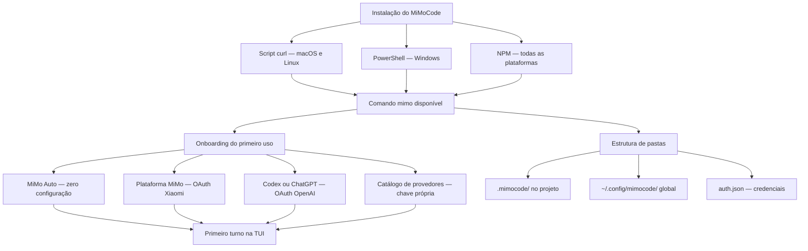

# Capítulo 3: Instalação em todas as plataformas e o primeiro turno

## 1. Introdução

No Capítulo 2, você abriu o robô por dentro e conheceu as quatro peças da arquitetura do MiMoCode: o loop do agente, o cliente-servidor, os protocolos MCP e ACP e a memória persistente. Agora é hora de fazer a fábrica ganhar vida: instalar o MiMoCode na sua máquina, rodar o primeiro comando e dar o primeiro turno de produção na TUI. Este capítulo cobre a instalação em todas as plataformas — Windows via PowerShell, macOS e Linux via script curl, e qualquer sistema via NPM — o onboarding do primeiro uso com a opção zero-configuração MiMo Auto, o ritual de verificação do ambiente e a estrutura de pastas que organiza configuração, credenciais e preferências. Ao final, você terá o robô instalado, autenticado e operando no seu primeiro projeto, com um entendimento claro de onde cada arquivo vive e por que essa organização importa para os capítulos de configuração avançada que virão. A instalação é o momento em que a maioria das pessoas desiste por atrito desnecessário — este capítulo existe para eliminar esse atrito.

## 2. Explica

### A escolha do canal de instalação

Um critério adicional na escolha do canal: a plataforma alvo. O script curl é o caminho natural do servidor Linux; o NPM é o padrão do ambiente Node; o PowerShell é o nativo do Windows. O operador que opera múltiplas plataformas — o laptop Windows, o servidor Linux, o CI em container — configura cada ambiente com o canal certo. E a consistência entre ambientes (mesma versão) é a reprodutibilidade que o fluxo exige. A escolha do canal é a primeira decisão de plataforma da operação.

**Diagnóstico de falha.** Um detalhe que o operador encontra na primeira falha: o diagnóstico de instalação. O sintoma "mimo não encontrado" aponta para o PATH; o sintoma "comando bloqueado" aponta para a política de execução; o sintoma "script não baixa" aponta para o proxy. Cada sintoma tem a sua correção — e o diagnóstico é o mesmo de qualquer binário. O operador que conhece os sintomas resolve em minutos; o que chuta reinstala até acertar. A instalação é o primeiro exercício do pensamento de diagnóstico que o livro inteiro cultiva.

**Fluxo de atualização.** Um critério adicional na escolha do canal: o fluxo de atualização. O MiMoCode evolui rápido, e o canal de instalação define como você recebe as versões. Com o NPM, a atualização é `npm update -g @mimo-ai/cli` — o mesmo comando do seu fluxo JavaScript. Com o script, é o `mimo upgrade`. Em ambientes com política de versão fixa, o NPM permite fixar a versão exata no `package.json` — a reprodutibilidade que o fluxo corporativa exige. A escolha do canal não é só o primeiro dia: é o contrato de atualização dos próximos anos.

**Ambiente corporativo.** Um critério de escolha que a documentação oficial não enfatiza: o ambiente corporativo muda a recomendação do canal. Em uma empresa com proxy restrito e política de execução de scripts, o NPM costuma ser o caminho mais compatível — o registro já é permitido e o `npm install -g` não enfrenta a política de execução do PowerShell. Em um servidor Linux headless com acesso irrestrito, o script curl é o mais direto. E em uma máquina Windows gerenciada por MDM, a instalação via script com `-ep Bypass` pode ser bloqueada — o que empurra para o NPM ou para uma imagem de container. A lição é prática: conheça o seu ambiente antes de escolher o canal, porque a melhor recomendação da documentação pode não ser a melhor para a sua rede.

### Os três canais de instalação

O MiMoCode oferece três canais oficiais de instalação, e a escolha entre eles não é indiferente — cada um atende a um perfil de operador. O primeiro é o script de instalação via curl, para macOS e Linux: um comando baixa o binário, o instala em um diretório do usuário e o adiciona ao PATH. É o caminho recomendado pela documentação para a maioria dos usuários, porque é rápido, não exige privilégios de administrador e atualiza o binário com facilidade. O segundo é o PowerShell para Windows, com o mesmo espírito: um comando `irm` baixa o script de instalação e o executa. O terceiro é o NPM, que funciona em todas as plataformas: `npm install -g @mimo-ai/cli` instala o pacote globalmente, e o comando `mimo` passa a estar disponível em qualquer terminal. A escolha entre os três depende do seu ambiente: em uma máquina Windows corporativa, o NPM costuma ser o caminho mais previsível; em um servidor Linux headless, o script curl é o padrão; em uma máquina de desenvolvimento pessoal no macOS, qualquer um dos três funciona.

A distinção entre os canais importa por um motivo operacional: o script curl e o PowerShell instalam o binário compilado, enquanto o NPM instala o mesmo binário através do registro de pacotes. Na prática, a diferença está no gerenciamento: com o NPM, você controla a versão com os comandos que já conhece do seu fluxo de JavaScript; com o script, você usa o comando `mimo upgrade` para atualizar. O que não muda é o contrato: depois da instalação, o comando `mimo` responde da mesma forma, com as mesmas flags e o mesmo comportamento, independentemente do canal. Essa consistência é uma decisão de engenharia deliberada — o MiMoCode trata o canal de instalação como um detalhe, não como uma fonte de fragmentação.

### O onboarding e a curva de aprendizado

Um registro honesto sobre o onboarding: os erros fazem parte. O primeiro pedido vago gera uma resposta decepcionante; a primeira permissão negada frustra; o primeiro custo inesperado assusta. O operador que entende que esses erros são informação — o contexto foi vago, a permissão faltava, o modelo era caro — transforma cada tropeço em calibração. O livro inteiro é o mapa dos erros comuns e das correções. O onboarding não é a ausência de erros: é a velocidade de corrigi-los.

**Curva de aprendizado.** O onboarding é o início da curva de aprendizado do operador — e a curva tem três fases. A primeira é a fascinação: tudo funciona, o robô impressiona, e o operador testa recursos sem critério. A segunda é a frustração: as tarefas complexas falham, o custo cresce, e o operador culpa a ferramenta. A terceira é a maestria: o operador entende que o resultado depende do contexto, da configuração e da disciplina — e passa a operar com critério. O livro inteiro é o atalho entre a segunda e a terceira fase. O onboarding não termina no primeiro comando — termina na maestria.

**Primeiro projeto.** O onboarding termina de verdade no primeiro projeto — não no primeiro comando. O operador que roda `mimo` em um repositório real, com o AGENTS.md criado e o primeiro pedido útil, completa o ciclo que o onboarding iniciou. O primeiro projeto também expõe as primeiras decisões reais: qual modelo para qual tarefa, quais permissões, qual memória. O Capítulo 5 mostra o fluxo Plan → Build que transforma o primeiro projeto em rotina. O onboarding é a porta; o primeiro projeto é a entrada na fábrica.

**Decisão de provedor.** O onboarding é o primeiro momento da decisão de provedor — e vale antecipar a lógica que o Capítulo 4 destrincha. A MiMo Auto é o caminho de menor atrito para o primeiro turno, mas ela é um canal anônimo gratuito por tempo limitado — não uma estratégia de produção. O operador que avalia a ferramenta com a MiMo Auto e depois migra para um provedor pago (Plataforma MiMo, OpenAI ou catálogo) está usando o onboarding como ele deve ser usado: como porta de avaliação, não como destino. A importação do Claude Code é o caminho de quem migra; o catálogo é o caminho de quem já tem provedor definido. A decisão de provedor não é urgente no primeiro dia — mas a consciência de que ela existe é.

### O onboarding do primeiro uso

O primeiro `mimo` sem argumentos inicia um fluxo de onboarding que decide como o agente vai se conectar aos modelos de linguagem. O MiMoCode oferece várias portas de entrada, e a escolha define o caminho de autenticação. A primeira é a MiMo Auto: um canal anônimo gratuito por tempo limitado, que funciona sem nenhuma configuração — ideal para o primeiro contato, para testar a ferramenta e para avaliar se ela atende ao seu fluxo antes de investir em um provedor pago. A segunda é a Plataforma MiMo da Xiaomi, que usa login OAuth e dá acesso aos modelos proprietários da linha MiMo, incluindo capacidades multimodais. A terceira é o login via Codex ou ChatGPT, usando a conta OpenAI. A quarta é a importação da configuração do Claude Code, para quem já usa a ferramenta da Anthropic e quer migrar os provedores existentes. E a quinta é o catálogo de provedores diretos — Anthropic, OpenAI, OpenRouter, xAI/Grok e modelos locais via Ollama — onde você insere a sua própria chave de API [1][17][18].

A escolha do onboarding não é definitiva: você pode alternar entre provedores a qualquer momento com `mimo providers`, e o Capítulo 4 destrincha cada opção em profundidade. O que importa neste estágio é entender a lógica: o MiMoCode não obriga você a nenhum provedor — ele oferece um leque de portas de entrada e deixa a escolha para o operador. Essa filosofia de neutralidade de provedores é a mesma herança do OpenCode e do AI SDK: o contrato com o modelo é separado do contrato com o fornecedor, e você pode trocar um sem tocar no outro [1][6][23].

### A estrutura de pastas

Um detalhe de versionamento que merece registro: o que vai para o Git e o que fica fora. O `mimocode.jsonc` do projeto vai — é o DNA do posto de trabalho. O `tui.json` pode ir — as preferências da interface do projeto. O `auth.json` nunca vai — é o cofre. E a decisão de versionar o `MIMOCODE_HOME` isolado depende da política do time. A regra simples: configuração versiona, segredo não. O operador que fixa essa regra evita o incidente mais comum — a chave no repositório.

**Pastas e a portabilidade.** A estrutura de pastas tem uma dimensão de portabilidade que o operador que troca de máquina conhece bem. O `mimocode.jsonc` do projeto viaja no Git; o `tui.json` global é reconstruído em minutos; e o `auth.json` é o único que exige cuidado na transferência. O `MIMOCODE_HOME` permite mover toda a árvore de uma vez — o operador que usa um diretório dedicado transfere configuração e credenciais em um comando. A portabilidade é a herança do open-source: nada preso a uma nuvem, tudo arquivo local.

**Pastas e a segurança.** A estrutura de pastas tem uma dimensão de segurança que o operador profissional fixa desde o primeiro dia. O `auth.json` — o cofre das credenciais — não pode ir para o Git; o `.gitignore` do projeto deve incluir o caminho do cofre. A configuração do projeto (`.mimocode/mimocode.jsonc`) vai para o Git — e é isso que permite ao time compartilhar o posto de trabalho. A distinção é a mesma do Capítulo 1: o crachá (credencial) não se versiona; o manual do posto (configuração) sim. E a variável `MIMOCODE_HOME` permite isolar o cofre por ambiente — o teste de um cliente não lê as credenciais de outro. A segurança da estrutura de pastas não é um detalhe: é a primeira linha de defesa contra o vazamento de chaves.

**Pastas: onde cada arquivo vive.** Depois da instalação e do primeiro onboarding, o MiMoCode organiza seu estado em pastas específicas — e conhecer essa topologia evita a confusão mais comum entre configuração global e configuração de projeto. A configuração de projeto vive em `.mimocode/` na raiz do repositório: o arquivo principal é o `mimocode.jsonc` (ou `.json`), que define modelo, provedores, permissões e outras opções para aquele projeto; e o `tui.json` guarda as preferências da interface para aquele diretório. A configuração global vive em `~/.config/mimocode/`: o `mimocode.jsonc` global vale para todos os projetos, e o `tui.json` global vale para todas as sessões. As credenciais vivem em `~/.local/share/mimocode/auth.json` no Linux e macOS, e em `%LOCALAPPDATA%\mimocode\` no Windows — e o caminho inteiro pode ser sobrescrito pela variável de ambiente `MIMOCODE_HOME`.

A distinção entre as três camadas — projeto, global e credenciais — é a mesma distinção entre as instruções do posto de trabalho, o manual da fábrica e o crachá do operador. A configuração do projeto diz o que aquele repositório precisa; a configuração global diz como você prefere trabalhar em qualquer lugar; e o auth.json guarda quem você é perante os provedores. Essa separação permite versionar a configuração do projeto (o `mimocode.jsonc` do repositório vai para o Git) sem versionar as credenciais (o `auth.json` nunca deve ir). O Capítulo 7 explora a precedência entre essas camadas em detalhe; aqui, o essencial é saber que elas existem e onde vivem.

### O primeiro turno

O ritual de verificação ganha uma variação em equipe: o checklist compartilhado. O time que adota o MiMoCode padroniza o ritual — versão, provedores, modelos, sessão — e o novo integrante segue o mesmo checklist. O AGENTS.md do repositório documenta o ritual do time, e o novo operador replica sem perguntar. A padronização do primeiro turno é a primeira governança do Capítulo 10: o onboarding de um novo desenvolvedor cai de horas para minutos.

**Primeira tarefa.** Um hábito que separa o operador profissional no primeiro turno: criar o AGENTS.md do projeto antes de qualquer tarefa. O Capítulo 5 aprofunda o formato; aqui, o registro é a oportunidade — o primeiro turno é o momento em que o repositório está fresco na mente e o AGENTS.md nasce com qualidade. O arquivo registra a stack, os comandos de teste e as convenções — e o MiMoCode o lê no início de cada sessão. Um AGENTS.md criado no primeiro turno transforma o segundo turno de adivinhação em execução informada. O operador que instala, autentica, verifica e cria o AGENTS.md no mesmo dia sai na frente de quem só roda o `mimo` e espera mágica.

### O primeiro turno: o ritual de verificação

O primeiro turno de produção na TUI segue um ritual simples que evita a frustração mais comum do primeiro uso: abrir a interface e descobrir que nenhum modelo está conectado. O ritual tem quatro passos. O primeiro é verificar a versão: `mimo --version` confirma que o binário está instalado e revela a versão exata. O segundo é verificar os provedores: `mimo providers list` mostra quais portas de entrada estão autenticadas. O terceiro é verificar os modelos: `mimo models` lista os modelos disponíveis no provedor padrão. E o quarto é abrir a TUI com um objetivo real: `mimo` na raiz do repositório, seguido de uma ordem de serviço concreta — não "melhore este código", mas "explique o que este projeto faz e liste os pontos que precisam de atenção".

Esse ritual não é burocracia: é o mesmo checklist de decolagem que o Capítulo 1 apresentou como parte do vocabulário da fábrica. O operador que verifica antes de operar não perde tempo — ganha tempo, porque descobre os problemas no hangar e não no meio da produção. E o primeiro turno é também o momento de calibrar as expectativas: o MiMoCode é um agente, não um oráculo — ele responde ao contexto que você projeta, e a qualidade da primeira resposta é diretamente proporcional à qualidade da ordem de serviço.

### O contexto acadêmico e de mercado da escolha do canal

A escolha do canal de instalação também conversa com o contexto mais amplo que o Capítulo 1 apresentou. O benchmark SWE-bench mostrou que a capacidade de um agente resolver issues reais depende tanto da interface quanto do modelo [8]; o SWE-agent demonstrou que uma boa ACI multiplica a taxa de sucesso [9]; e o Agentless mostrou que pipelines simples podem ser competitivos. Para o operador, isso significa uma coisa prática: o MiMoCode instalado é apenas o robô na caixa — o desempenho real aparece quando o robô está conectado ao modelo certo, ao repositório certo e às permissões certas [8][9][10]. A instalação é o ato de abrir a caixa; o desempenho é o resultado da linha inteira. E há ainda a dimensão de segurança que já vale registrar aqui: o MiMoCode pede confirmação antes de ações fora do workspace, e o operador que entende o modelo de permissões desde o primeiro turno evita o cenário mais comum de incidente — um agente que executa comandos com privilégios que o operador não pretendia conceder [1][12]. O relatório DORA reforça que equipes que integram IA ao fluxo com disciplina colhem ganhos, enquanto as que improvisam colhem instabilidade [25].

### Por que a instalação importa tanto

A instalação parece o passo mais banal do livro, mas ela concentra mais atrito do que qualquer outro estágio da adoção. O motivo é que cada plataforma tem suas peculiaridades — PATH no Windows, permissões no macOS, ambientes headless no Linux — e a documentação oficial, por ser concisa, deixa o operador sozinho nos casos que fogem do caminho feliz. Este capítulo existe para cobrir exatamente esses casos: o que fazer quando o comando não é encontrado, quando a porta do servidor está ocupada, quando a autenticação falha no primeiro onboarding. Cada um desses casos é uma pequena falha na fábrica — e o operador que conhece o mapa das peças resolve em minutos o que o operador improvisado leva uma tarde para diagnosticar.

## 3. Ilustra

Pense na instalação do MiMoCode como a chegada de um novo robô de braço articulado à sua linha de montagem. O robô chega em três formatos possíveis — desmontado na caixa (script curl), como um kit pré-montado de outro fabricante (NPM) ou com um instalador automático que se adapta ao seu chão de fábrica (PowerShell). Qualquer que seja o formato, o contrato é o mesmo: depois de montado, o robô responde ao comando `mimo` e se comporta de forma idêntica. O onboarding é o treinamento inicial do robô: você decide se ele vai operar com o gerador interno gratuito (MiMo Auto), se vai ser ligado à rede elétrica da Xiaomi (Plataforma MiMo), se vai usar a energia da sua conta OpenAI (Codex/ChatGPT) ou se vai ser alimentado por fornecedores externos com as suas próprias chaves (Anthropic, OpenRouter, Ollama). E a estrutura de pastas é o layout da fábrica: as instruções do posto de trabalho ficam no repositório (`.mimocode/`), o manual da fábrica fica na central (`~/.config/mimocode/`) e o crachá do operador fica no cofre (`auth.json`).



Repare que o diagrama separa dois fluxos que os iniciantes costumam confundir: o fluxo de instalação (como o binário chega) e o fluxo de onboarding (como o robô se conecta aos modelos). São decisões independentes: você pode instalar pelo NPM e autenticar com a Plataforma MiMo, ou instalar pelo script e usar a MiMo Auto. O único caminho que não existe é o de instalar e pular o onboarding — sem um provedor configurado, a TUI abre, mas nenhuma ordem de serviço é respondida. Como Operador de Linha de Montagem, você vai perceber que esse diagrama é o mesmo mapa que reaparece, com mais detalhes, nos capítulos de provedores e configuração: primeiro a peça chega, depois o robô aprende quem ele é, depois o posto de trabalho define as regras.

## 4. Técnica

### Instalação no macOS e Linux via script curl

O caminho mais direto para macOS e Linux é o script de instalação oficial. Um único comando baixa o script e o executa — e o script detecta a arquitetura, instala o binário no diretório do usuário e ajusta o PATH [1][5]:

```bash
# Instalação oficial via script (macOS e Linux)
curl -fsSL https://mimo.xiaomi.com/install | bash

# Após a instalação, verifique a versão instalada
mimo --version
```

Se o comando `mimo` não for encontrado após a instalação, o problema está no PATH. O script instala em um diretório como `~/.mimo/bin` (ou equivalente) e normalmente ajusta o PATH no seu shell — mas em shells não padrão, você pode precisar adicionar o diretório manualmente ao `~/.bashrc`, `~/.zshrc` ou `~/.profile`. Esse é o caso clássico de falha da fábrica que não é da ferramenta, mas do ambiente — e o diagnóstico correto é o mesmo de qualquer binário: `which mimo` ou `type mimo` revela se o comando está no PATH.

### Instalação no Windows via PowerShell

No Windows, o caminho equivalente é o PowerShell. O comando `irm` (Invoke-RestMethod) baixa o script de instalação, e o `iex` (Invoke-Expression) o executa — o equivalente exato do pipeline curl do Unix [5][1]:

```powershell
# Instalação oficial via PowerShell (Windows)
powershell -ep Bypass -c "irm https://mimo.xiaomi.com/install.ps1 | iex"

# Após a instalação, verifique a versão instalada
mimo --version
```

O `-ep Bypass` (ExecutionPolicy Bypass) é necessário porque o Windows restringe a execução de scripts por política; ele permite que o script de instalação rode sem alterar a política global da máquina. Depois da instalação, o `mimo` deve estar disponível no PowerShell e no Prompt de Comando — e, se você usa o Windows Terminal com WSL, o comando pode ser instalado tanto no lado Windows quanto no lado Linux, dependendo de onde você quer operar a fábrica.

### Instalação via NPM em todas as plataformas

O NPM é o caminho mais previsível em ambientes corporativos, porque funciona igual em todas as plataformas e depende apenas de um runtime Node.js instalado [21][1]:

```bash
# Instalação global via NPM (todas as plataformas)
npm install -g @mimo-ai/cli

# Verifique a instalação
mimo --version

# Atualize para a versão mais recente
npm update -g @mimo-ai/cli

# Desinstale quando necessário
npm uninstall -g @mimo-ai/cli
```

Uma observação importante para o Windows: se o Node.js foi instalado via nvm-windows ou se o diretório global do NPM não está no PATH, o `mimo` pode não ser encontrado no primeiro momento. A solução é adicionar o diretório global do NPM (`npm config get prefix`) ao PATH — o mesmo diagnóstico do script curl.

### O comando de upgrade e o ciclo de vida

Independentemente do canal, o MiMoCode oferece comandos dedicados para gerenciar o ciclo de vida da instalação — e eles merecem um lugar no seu checklist, porque o agente evolui rápido [1][4]:

```bash
# Atualiza para a versão mais recente (ou uma versão específica)
mimo upgrade
mimo upgrade 0.2.0

# Remove o MiMoCode e todos os arquivos relacionados
mimo uninstall

# Gera o script de completação para o seu shell
mimo completion
```

O `mimo completion` é subestimado: gera o script de completação para bash, zsh ou fish, e adicioná-lo ao seu shell torna o uso da TUI e dos subcomandos muito mais fluido. E o `mimo uninstall` é a rede de segurança: em ambientes corporativos, saber remover a ferramenta limpo (incluindo arquivos de configuração) é parte da governança que o Capítulo 10 vai cobrir.

### A estrutura de pastas em código

A topologia das pastas merece ser fixada em código, porque é o mapa que você vai consultar em todos os capítulos de configuração — projeto, global e credenciais, com a variável de ambiente que redireciona tudo [1][2]:

```json
{
  "estrutura_de_pastas": {
    "projeto": {
      "config": ".mimocode/mimocode.jsonc",
      "preferencias_tui": ".mimocode/tui.json"
    },
    "global": {
      "config": "~/.config/mimocode/mimocode.jsonc",
      "preferencias_tui": "~/.config/mimocode/tui.json"
    },
    "credenciais": {
      "linux_macos": "~/.local/share/mimocode/auth.json",
      "windows": "%LOCALAPPDATA%/mimocode/auth.json"
    },
    "override": "MIMOCODE_HOME"
  }
}
```

A regra de ouro desse mapa: o que é do projeto vai para o Git; o que é global fica fora do repositório; e as credenciais nunca vão para lugar nenhum além do cofre. A variável `MIMOCODE_HOME` é a chave mestra para quem precisa isolar a instalação — em um ambiente de testes, em um container ou em uma máquina compartilhada, apontar `MIMOCODE_HOME` para um diretório dedicado evita que a configuração de um projeto vaze para outro.

### O primeiro onboarding em código: escolhendo a porta de entrada

O primeiro `mimo` inicia o onboarding interativo, mas a decisão de qual porta de entrada usar pode ser tomada de forma explícita — e vale fixar o mapa das opções em código para visualizar o leque completo [1][2]:

```json
{
  "portas_de_entrada": {
    "mi_mo_auto": {
      "descricao": "Canal anonimo gratuito por tempo limitado",
      "configuracao": "nenhuma",
      "ideal_para": "primeiro contato e avaliacao"
    },
    "plataforma_mi_mo": {
      "descricao": "OAuth com a Xiaomi, modelos MiMo proprietarios",
      "configuracao": "login OAuth",
      "ideal_para": "uso continuo com os modelos da Xiaomi"
    },
    "codex_chatgpt": {
      "descricao": "OAuth com a conta OpenAI",
      "configuracao": "login OAuth",
      "ideal_para": "quem ja usa ChatGPT/Codex"
    },
    "importacao_claude_code": {
      "descricao": "Importa provedores existentes do Claude Code",
      "configuracao": "importacao automatica",
      "ideal_para": "migracao de quem ja usa Claude Code"
    },
    "catalogo_provedores": {
      "descricao": "Anthropic, OpenAI, OpenRouter, xAI, Ollama",
      "configuracao": "chave de API propria",
      "ideal_para": "times com provedor definido"
    }
  }
}
```

Esse mapa deixa claro que o MiMoCode trata a conexão com o modelo como uma escolha de operador, não como um vínculo de fábrica. A única recomendação universal é: para o primeiro turno, use a MiMo Auto — custo zero, configuração zero, e você avalia a ferramenta antes de decidir onde investir.

### O ritual de verificação em código

O checklist de verificação que fecha a instalação pode ser executado como uma sequência de comandos — o mesmo ritual que o operador profissional faz em qualquer máquina nova [1][4]:

```bash
# 1. Versão do binário — confirma a instalação
mimo --version

# 2. Provedores autenticados — confirma o onboarding
mimo providers list

# 3. Modelos disponíveis no provedor padrão
mimo models

# 4. Abre a TUI na raiz do repositório
mimo
```

Se o passo 2 retornar vazio, o onboarding não foi concluído — e a correção é rodar `mimo providers` para autenticar uma porta de entrada. Se o passo 3 retornar vazio com um provedor autenticado, o problema está na lista de modelos do provedor (cobrido no Capítulo 4). Esse diagnóstico em cascata é a versão prática do modelo mental do Capítulo 2: cada camada da linha tem o seu ponto de verificação [1][7].

### Referência rápida: canais de instalação e diagnóstico

A escolha do canal de instalação importa menos do que a consistência — o contrato do comando `mimo` é idêntico depois da instalação. A tabela resume os três canais e os erros típicos de cada um [1][5][21]:

| Canal | Plataformas | Comando | Falha típica |
|---|---|---|---|
| Script curl | macOS/Linux | `curl -fsSL https://mimo.xiaomi.com/install | sh` | Falta de permissão ou `curl` ausente |
| PowerShell | Windows | `irm https://mimo.xiaomi.com/install.ps1 | iex` | Execution Policy bloqueando scripts |
| NPM | Todas | `npm install -g @mimo-ai/cli` | Node.js desatualizado ou conflito de versão |

**Diagnóstico em três comandos.** Quando o `mimo` não responde, o operador profissional isola o problema em três etapas: (1) `mimo --version` confirma se o binário existe e está no `PATH`; (2) `mimo providers list` confirma a autenticação; (3) `mimo models` confirma a conexão com o provedor [1][4]. Se o primeiro falha, o problema é de instalação ou `PATH`; se os outros falham, é de provedor [5][21]. Esse ritual de três passos transforma o diagnóstico de adivinhação em procedimento — e é o mesmo método que o Capítulo 10 aplica em escala quando o time inteiro adota a ferramenta [1][5]. A atualização (`mimo upgrade`) segue o mesmo princípio: o contrato permanece, o que muda é a versão [1][21].

## 5. Aplica

### A cena de contraste: o operador que instalou no lugar errado

Imagine a cena: você está em uma máquina Windows corporativa, o Node.js já está instalado, e você decide testar o MiMoCode no seu projeto. Você abre o PowerShell e roda o comando de instalação — mas escolhe o script curl do Unix, que não executa no PowerShell; ou pior, roda o `irm` sem o `-ep Bypass` e o Windows bloqueia a execução do script por política. O comando falha com uma mensagem enigmática, você tenta de novo com variações, e meia hora depois ainda não há `mimo` no terminal. O diagnóstico, quando alguém mais experiente olha, é constrangedor: você usou o instalador da plataforma errada — o script do Unix em uma máquina Windows, ou o script do PowerShell em um ambiente que exigia o NPM. O problema não era a ferramenta; era a peça errada na linha.

A correção é trivial quando o mapa dos canais está claro: no Windows, use o comando PowerShell com `-ep Bypass` ou o NPM — nunca o script curl do Unix. E, em um ambiente corporativo com proxy ou restrições de rede, o NPM costuma ser o caminho mais compatível, porque usa o registro que a empresa já permite. A lição dessa cena é a lição central deste capítulo: a instalação tem três canais, cada um para uma plataforma, e escolher o canal errado transforma um passo de cinco minutos em uma tarde de frustração. E vale registrar que o mesmo raciocínio se aplica à configuração: o operador que entende a precedência entre projeto e global — detalhe que o Capítulo 7 destrincha — evita a armadilha de configurar o modelo em um lugar e esperar que ele valha em outro.

As armadilhas comuns do primeiro turno seguem o mesmo padrão de atrito evitável: pular o onboarding e abrir a TUI sem provedor (nada responde); autenticar um provedor pago sem testar a MiMo Auto antes (custo desnecessário no primeiro dia); ignorar a estrutura de pastas e colocar a configuração do projeto no lugar errado (o `mimocode.jsonc` no diretório global quando deveria estar no repositório); e não rodar o ritual de verificação (descobrir na primeira ordem de serviço que o modelo não está conectado). O operador profissional trata a instalação como um checklist, não como uma aventura — e é exatamente esse checklist que separa quem adota o MiMoCode em uma hora de quem desiste na primeira manhã.

### A instalação e o ecossistema

Fechando o capítulo, a instalação conecta o operador ao ecossistema. Com o `mimo` instalado, o operador acessa as skills, os plugins e o catálogo de integrações — e a comunidade (awesome-mimo-agent) é o ponto de partida. O primeiro comando não abre apenas a TUI — abre a porta para um ecossistema. E a decisão de instalar é também a decisão de entrar nesse ecossistema: contribuir, aprender e evoluir com ele [1][3][28]. A instalação é o rito de entrada do Operador de Linha de Montagem.

**Suporte.** Uma consideração final sobre a instalação: o suporte. O MiMoCode é open-source — o suporte vem da documentação, da comunidade e do repositório oficial. O operador que instala por conta própria assume a responsabilidade de diagnosticar. O ecossistema ajuda: o awesome-mimo-agent reúne guias, e as issues do repositório documentam problemas conhecidos. A diferença entre o open-source e o proprietário não é a ausência de suporte — é a natureza dele: auditável, comunitário e documentado.

**Ciclo de atualização.** Um detalhe que o operador corporativo não pode ignorar: o ciclo de atualização. O MiMoCode evolui rápido — a versão 0.1.0 de junho de 2026 foi o lançamento oficial, e as atualizações trazem correções e recursos. O `mimo upgrade` atualiza o binário, e o operador profissional acompanha as notas de versão antes de atualizar em máquinas críticas. Em ambientes corporativos, a política de atualização é parte da governança: quem autoriza o upgrade, quando e com qual rollback. A instalação não termina no primeiro `mimo --version` — ela é um contrato contínuo de manutenção.

### A instalação como porta de entrada para o ecossistema

O que a instalação destrava além da TUI: com o MiMoCode instalado, você passa a operar em um ecossistema que inclui a comunidade e os guias de integração — o awesome-mimo-agent reúne recursos, plugins e casos de uso mantidos pela comunidade. A mesma instalação dá acesso aos dois protocolos de extensão que o Capítulo 2 apresentou: o MCP, para conectar ferramentas externas, e o ACP, para orquestração entre agentes — ambos configuráveis a partir do primeiro turno [15][16]. E, se você comparar com o OpenHands, que ataca o problema dos agentes por uma plataforma aberta e generalista, percebe o posicionamento do MiMoCode: a instalação é local, o controle é seu, e o ecossistema se conecta ao redor do seu terminal [11][14]. A porta de entrada é a mesma — o comando `mimo` — mas o que você faz com ela depende do ecossistema que você monta ao redor, incluindo a memória persistente que o FTS5 alimenta desde a primeira sessão [3][11][20].

### Métricas de sucesso na adoção individual

No cenário individual, as métricas de uma boa instalação são simples: o tempo entre o primeiro comando de instalação e a primeira resposta útil na TUI (menos de dez minutos é o esperado com a MiMo Auto); a capacidade de reproduzir a instalação em uma segunda máquina sem consultar a documentação; e a ausência de credenciais no histórico do Git (o `auth.json` nunca deve ser versionado). Quando você consegue instalar o MiMoCode em uma máquina nova em dez minutos, com o provedor certo e sem deixar segredos no repositório, o turno está cumprido — e a linha de montagem está pronta para receber o robô em produção.

## 6. Conclusão

Neste turno, você colocou o robô na linha: instalou o MiMoCode pelo canal certo para a sua plataforma — script curl no macOS/Linux, PowerShell no Windows ou NPM em todas [1][5][21]; completou o onboarding escolhendo a porta de entrada — MiMo Auto, Plataforma MiMo, Codex/ChatGPT, importação do Claude Code ou catálogo de provedores [1][2]; aprendeu a estrutura de pastas — `.mimocode/` no projeto, `~/.config/mimocode/` global e `auth.json` no cofre de credenciais [1][2]; e executou o ritual de verificação que garante um primeiro turno sem surpresas. O desafio deste capítulo é direto: instale o MiMoCode em uma máquina (se ainda não instalou), use a MiMo Auto para o primeiro turno, rode o ritual de verificação completo e responda, com a sua própria ordem de serviço, "explique o que este projeto faz". Depois, apague a instalação com `mimo uninstall` e reinstale — para provar que você consegue reproduzir o processo de ponta a ponta. No Capítulo 4, vamos escolher a fonte de energia do robô em profundidade: os provedores e credenciais que conectam o MiMoCode a qualquer modelo — da Plataforma MiMo aos modelos locais.

## 7. Referências Bibliográficas

[1] XIAOMI MIMO. *MiMo-Code: repositório oficial do MiMoCode.* Disponível em: https://github.com/XiaomiMiMo/MiMo-Code. Acesso em: 03 ago. 2026.

[2] XIAOMI MIMO. *MiMoCode: documentação e central de notícias.* Disponível em: https://mimo.mi.com/docs/en-US/news/latest/mimocode. Acesso em: 03 ago. 2026.

[3] XIAOMI MIMO. *awesome-mimo-agent: ecossistema e guias da comunidade.* Disponível em: https://github.com/XiaomiMiMo/awesome-mimo-agent. Acesso em: 03 ago. 2026.

[4] XIAOMI MIMO. *README npm do MiMoCode.* Disponível em: https://github.com/XiaomiMiMo/MiMo-Code/blob/main/README_npm.md. Acesso em: 03 ago. 2026.

[5] XIAOMI MIMO. *Script de instalação do MiMoCode.* Disponível em: https://mimo.xiaomi.com/install. Acesso em: 03 ago. 2026.

[6] ANOMALYCO. *OpenCode: agente de codificação de terminal (projeto original do qual o MiMoCode deriva).* Disponível em: https://github.com/anomalyco/opencode. Acesso em: 03 ago. 2026.

[7] SST. *OpenCode Docs: documentação da arquitetura e do servidor headless.* Disponível em: https://opencode.ai/docs. Acesso em: 03 ago. 2026.

[8] JIMENEZ, Carlos E. et al. *SWE-bench: Can Language Models Resolve Real-World GitHub Issues?* Disponível em: https://arxiv.org/abs/2310.06770. Acesso em: 03 ago. 2026.

[9] YANG, John et al. *SWE-agent: Agent-Computer Interfaces Enable Automated Software Engineering.* Disponível em: https://arxiv.org/abs/2405.15793. Acesso em: 03 ago. 2026.

[10] XIA, Chunqiu Steven et al. *Agentless: Demystifying LLM-based Software Engineering Agents.* Disponível em: https://arxiv.org/abs/2407.01489. Acesso em: 03 ago. 2026.

[11] WANG, Xingyao et al. *OpenHands: An Open Platform for AI Software Developers as Generalist Agents.* Disponível em: https://arxiv.org/abs/2407.16741. Acesso em: 03 ago. 2026.

[12] ANTHROPIC. *Claude Code: agente de codificação de terminal.* Disponível em: https://docs.anthropic.com/en/docs/claude-code. Acesso em: 03 ago. 2026.

[14] CURSOR. *Cursor: editor com IA embutida.* Disponível em: https://cursor.com. Acesso em: 03 ago. 2026.

[15] MODEL CONTEXT PROTOCOL. *Especificação oficial do MCP.* Disponível em: https://modelcontextprotocol.io. Acesso em: 03 ago. 2026.

[16] AGENT CLIENT PROTOCOL. *Especificação oficial do ACP.* Disponível em: https://agentclientprotocol.com. Acesso em: 03 ago. 2026.

[17] OLLAMA. *Modelos locais de código aberto.* Disponível em: https://ollama.com. Acesso em: 03 ago. 2026.

[18] OPENROUTER. *Roteador de modelos de IA.* Disponível em: https://openrouter.ai. Acesso em: 03 ago. 2026.

[20] SQLITE. *FTS5: extensão de full-text search do SQLite.* Disponível em: https://www.sqlite.org/fts5.html. Acesso em: 03 ago. 2026.

[21] NPM. *@mimo-ai/cli: pacote oficial do MiMoCode.* Disponível em: https://www.npmjs.com/package/@mimo-ai/cli. Acesso em: 03 ago. 2026.

[23] VERCEL. *AI SDK: base dos provedores e do catálogo de modelos.* Disponível em: https://ai-sdk.dev. Acesso em: 03 ago. 2026.

[25] DORA. *State of AI-assisted Software Development 2025.* Disponível em: https://dora.dev. Acesso em: 03 ago. 2026.

[28] RTK. *Adaptadores e integrações da comunidade para agentes de terminal.* Disponível em: https://github.com/rtk-ai/rtk. Acesso em: 03 ago. 2026.
