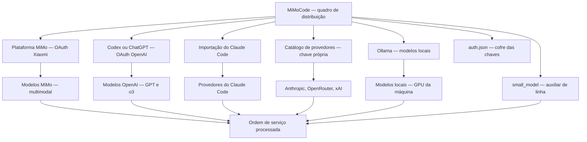

# Capítulo 4: Provedores e credenciais: conectando qualquer modelo

## 1. Introdução

No Capítulo 3, você instalou o MiMoCode, completou o primeiro onboarding e aprendeu a estrutura de pastas que organiza a configuração. Agora é hora de escolher a fonte de energia do robô em profundidade: os provedores e credenciais que conectam o MiMoCode aos modelos de linguagem. Este capítulo destrincha o sistema de autenticação — o `auth.json`, a variável `MIMOCODE_HOME` e os comandos `mimo providers` — e cobre cada porta de entrada em detalhe: a Plataforma MiMo com OAuth da Xiaomi, o login via Codex/ChatGPT, a importação do Claude Code, os provedores do catálogo (Anthropic, OpenAI, OpenRouter, xAI/Grok) e os modelos locais via Ollama. Você vai aprender também a configurar um provedor custom OpenAI-compatible com `baseURL` e `apiKey`, a usar o modelo secundário `small_model` para tarefas de fundo e a aplicar a sintaxe `provider/model` com a primeira barra separando provedor de modelo. Ao final, você terá o MiMoCode conectado ao provedor certo para o seu fluxo — com custo, qualidade e latência sob controle. Esse é o capítulo onde a frase "conecte qualquer modelo" deixa de ser marketing e vira procedimento.

## 2. Explica

### O sistema de credenciais

Um detalhe de operação em time: o acesso compartilhado ao cofre — a chave de cada provedor permanece sob o controle do seu dono, mesmo quando o time inteiro opera com os mesmos provedores de modelo. O `auth.json` é local à máquina — cada operador tem o seu cofre. O time que quer compartilhar provedores sem compartilhar chaves usa a política de cada provedor: as chaves corporativas no cofre de cada um, geridas pela central. E o `MIMOCODE_HOME` permite separar cofres por contexto (cliente A, cliente B) na mesma máquina. O acesso compartilhado é um equilíbrio: o time opera com os mesmos provedores, e cada chave permanece sob o seu controle.

**Credenciais e as variáveis de ambiente.** O cofre conecta-se ao fluxo corporativo pelas variáveis de ambiente. Muitos provedores aceitam credenciais por variável de ambiente — e o MiMoCode respeita as convenções padrão do ecossistema (o mesmo padrão do AI SDK). A combinação recomendada: o `auth.json` para a operação interativa e as variáveis de ambiente para a automação (CI, containers). O pipeline do Capítulo 6 que roda no CI não deve ler o cofre da máquina local — deve ler a variável de ambiente do runner. A separação entre cofre local e variável de ambiente é a mesma entre o crachá pessoal e o crachá do fluxo.

**Credenciais e o vazamento.** Um cenário que o operador corporativo precisa ter mapeado antes de acontecer: o vazamento de credenciais. O `auth.json` com chaves de API é um alvo — e o vazamento mais comum vem de versionar o arquivo no Git. O procedimento de resposta tem três passos: revogar a chave no painel do provedor, rotacionar as chaves que compartilhavam o cofre e revisar o histórico do repositório. A prevenção é o `.gitignore` com o caminho do cofre e o `git add -p` como hábito. O operador que trata credenciais como segredo de Estado evita a reunião de crise.

**Credenciais e a rotina de auditoria.** O cofre de credenciais exige uma rotina de auditoria que poucos operadores mantêm — e que este capítulo institucionaliza. A rotina tem três passos: listar (o que está no cofre), verificar (o que ainda é usado) e remover (o que não é mais). O `mimo providers list` mostra os provedores autenticados; o operador cruza com os projetos ativos e remove os que sobraram — cada crachá esquecido é uma superfície de ataque. E a rotação periódica de chaves, alinhada com a política da empresa, mantém o cofre saudável mesmo quando um vazamento não foi detectado. A auditoria de credenciais não é burocracia: é o mesmo inventário físico que uma fábrica madura faz no almoxarifado.

**Credenciais: um cofre, muitos crachás.** O MiMoCode centraliza as credenciais de todos os provedores em um único arquivo — o `auth.json` — que vive em `~/.local/share/mimocode/` no Linux e macOS, e em `%LOCALAPPDATA%\mimocode\` no Windows. Esse arquivo é o cofre da fábrica: ele guarda as chaves de API e os tokens de OAuth de todos os provedores que você autenticou, e o MiMoCode o protege com permissões do sistema. A analogia do cofre é precisa: você não carrega todas as chaves no bolso (na configuração do projeto), nem as pendura na parede (na configuração global) — elas ficam trancadas, e cada provedor autenticado é um crachá que o robô usa quando precisa operar com aquele fornecedor. A variável `MIMOCODE_HOME` permite redirecionar o cofre para outro diretório — essencial para quem quer isolar credenciais por projeto, por cliente ou em ambientes de teste.

A decisão de centralizar as credenciais em um arquivo tem consequências práticas importantes. A primeira é a portabilidade: ao trocar de máquina, você copia o `auth.json` (com cuidado) e o MiMoCode reconhece todos os provedores — sem reautenticar um por um. A segunda é a segurança: como o arquivo é único e localizado, ele pode ser protegido de forma consistente — permissões restritas no Unix, ACL no Windows — e excluído com `mimo uninstall` [1][2][5]. A terceira é o versionamento: o `auth.json` nunca deve ir para o Git — e o profissional que versiona o `auth.json` por engano está, na prática, distribuindo chaves de API para qualquer um com acesso ao repositório. O `.gitignore` do projeto deve incluir o caminho do cofre, e este capítulo volta a esse ponto na seção de armadilhas.

### Portas de entrada

Um critério final na escolha da porta de entrada: a qualidade. O modelo topo de linha com melhor tool calling reduz iterações — e cada iteração custa. O modelo barato pode errar mais e gerar retrabalho. A qualidade não é um atributo absoluto: é a adequação à tarefa. A revisão de código crítica merece o modelo melhor; a geração de boilerplate aceita o modelo menor. O operador que escolhe a porta com a tríade — custo, latência, qualidade — opera a rede elétrica com precisão.

**Latência.** Um critério adicional na escolha da porta de entrada: a latência. O modelo local via Ollama responde na velocidade da sua GPU — sem a ida à nuvem. O modelo de nuvem tem a latência da rede. E o OpenRouter adiciona a camada do roteador. A latência importa na operação interativa — a TUI espera a resposta — e na automação — o pipeline paga a espera por execução. O operador que escolhe a porta sem considerar a latência configura um fluxo lento. O equilíbrio entre custo, qualidade e latência é o cálculo completo da escolha.

**Custo comparado.** Um critério de escolha entre as portas de entrada que a documentação não detalha: o custo comparado. A MiMo Auto é gratuita por tempo limitado; a Plataforma MiMo tem a tabela da Xiaomi; o login via Codex/ChatGPT usa a assinatura OpenAI; o catálogo cobra por uso; e o Ollama custa a eletricidade da GPU. O custo não é o único critério — qualidade e latência pesam — mas é o que define a sustentabilidade. O operador que compara portas sem comparar custo escolhe com metade das informações. O `mimo stats` do Capítulo 9 transforma a comparação em dado.

**Cenário de migração.** Um cenário que merece registro antes do detalhe de cada porta: a migração. O desenvolvedor que já usa Claude Code ou Codex CLI chega ao MiMoCode com um patrimônio de configuração — e a ferramenta oferece pontes para ele. A importação do Claude Code traz os provedores existentes; o login via Codex/ChatGPT usa a conta OpenAI que o desenvolvedor já paga. A migração não é uma reinvenção: é uma ponte que preserva o que funciona. E o Capítulo 6 mostra que as sessões exportadas em JSON completam a portabilidade — o conhecimento viaja junto.

**Detalhe.** O Capítulo 3 apresentou o leque de portas de entrada do onboarding; este capítulo abre cada uma em profundidade, porque a escolha do provedor é a decisão mais impactante da operação — ela define custo, qualidade, latência e até os recursos disponíveis (multimodalidade, janela de contexto, tool calling). A Plataforma MiMo da Xiaomi é a porta nativa: usa login OAuth, dá acesso aos modelos proprietários da linha MiMo, incluindo capacidades multimodais, e é a escolha natural para quem quer a experiência mais integrada com a ferramenta. O login via Codex ou ChatGPT usa a conta OpenAI e é a porta de entrada para quem já paga pela assinatura da OpenAI — os modelos da família o3 e GPT são acessíveis sem chave de API separada. A importação do Claude Code migra os provedores que você já configurou na ferramenta da Anthropic — útil para quem quer comparar as duas ferramentas sem reconfigurar tudo.

O catálogo de provedores é onde a neutralidade da ferramenta aparece com mais força: Anthropic (Claude), OpenAI (GPT), OpenRouter (roteador com centenas de modelos), xAI/Grok e outros, cada um com sua chave de API. O OpenRouter merece destaque porque resolve um problema real: em vez de criar uma conta e uma chave em cada fornecedor, você cria uma na OpenRouter e acessa centenas de modelos com uma única chave — e o roteador faz a mediação de preços e limites. E os modelos locais via Ollama fecham o leque com uma proposta diferente: em vez de enviar código para a nuvem, você roda o modelo na sua máquina ou na sua rede — com custo zero por token, mas com o limite da sua GPU. A escolha entre essas portas não é binária: o MiMoCode permite configurar vários provedores e alternar entre eles por sessão ou por tarefa.

### A sintaxe provider/model

Vale fixar a sintaxe com exemplos — o formato que o operador digita todos os dias. O `anthropic/claude-sonnet-4-5` — provedor Anthropic, modelo Claude. O `openai/gpt-4o` — provedor OpenAI. O `ollama/qwen2.5-coder:14b` — provedor local com tag de tamanho. O `openrouter/deepseek/deepseek-chat` — o roteador com o caminho do modelo original. A primeira barra separa o provedor; o resto identifica o modelo. O operador que domina o formato lê qualquer configuração de modelo sem ambiguidade.

**Diagnóstico.** A sintaxe `provider/model` também é a chave do diagnóstico de falhas. O erro "provedor desconhecido" quase sempre é sintaxe errada — a barra trocada, o nome do provedor diferente do catálogo. O erro "modelo não encontrado" indica que o provedor está certo, mas o modelo não existe naquele provedor — confira com `mimo models <provider>`. O diagnóstico em dois passos — o provedor existe? o modelo existe no provedor? — resolve a maioria das falhas. A sintaxe é o primeiro filtro do diagnóstico.

**Schema.** A sintaxe `provider/model` também aparece no schema de configuração — e vale fixar a relação. O `model` e o `small_model` no `mimocode.jsonc` usam exatamente o mesmo formato. O schema oficial valida o formato — um modelo sem o provedor é um erro de configuração que o editor aponta antes de salvar. E o provedor custom com `baseURL` (o gateway corporativo) aceita modelos com o formato `gateway/modelo`. A sintaxe é o fio que liga a configuração, a operação e o schema.

**Operação diária.** A sintaxe `provider/model` não é apenas configuração — é o vocabulário da operação diária. O flag `-m openai/gpt-4o` no comando `mimo run` alterna a usina sem tocar na configuração; o `mimo models anthropic` lista o que a usina oferece. E o mesmo identificador aparece nas estatísticas do `mimo stats` — o custo é reportado por `provider/model`, o que permite cruzar gasto com tarefa. O operador que fala esse vocabulário lê o relatório de custo como um mapa de produção: qual usina, qual modelo, qual custo. A sintaxe é o elo entre a configuração e a operação.

### A sintaxe provider/model: a primeira barra separa mundos

Um detalhe de sintaxe que pouca gente domina e que evita horas de confusão: os identificadores de modelo no MiMoCode usam o formato `provider/model`, e a primeira barra separa o provedor do modelo — exatamente como o flag `-m, --model provider/model` do comando `mimo run` documenta. Isso significa que `anthropic/claude-sonnet-4-5`, `openai/gpt-4o` e `ollama/qwen2.5-coder` são identificadores completos: o MiMoCode sabe a qual provedor pedir o modelo e como formatar a requisição. A primeira barra é o separador reservado — modelos cujo nome contenha barras (raro, mas possível em alguns gateways) devem ser tratados com cuidado, e o Capítulo 7 mostra como o schema de configuração lida com esses casos. Dominar essa sintaxe é o primeiro passo para operar o MiMoCode com múltiplos provedores sem confundir qual modelo está sendo usado em qual tarefa.

### O small_model

Os modelos pequenos evoluíram muito, e a escolha do `small_model` merece revisão periódica. O modelo que era o melhor auxiliar em junho pode ter sido superado — e a comunidade (awesome-mimo-agent) acompanha essa evolução. O operador que revisa o `small_model` periodicamente mantém a fatura no mínimo. E o OpenRouter, com seu catálogo, permite experimentar auxiliares diferentes sem trocar de provedor. A otimização de custo é um processo contínuo, não uma configuração única.

**Qualidade percebida.** Uma objeção comum ao `small_model` — e a resposta que a operação madura conhece — é a preocupação com a qualidade. A chave está no tipo de tarefa: o `small_model` é para o que não exige raciocínio profundo — checkpoints, resumos, heurísticas de subagentes. O modelo principal permanece nas decisões críticas. O resultado percebido pelo usuário não muda, porque o que ele vê é a produção das decisões críticas; o que muda é a fatura. O operador que mede com `mimo stats` antes e depois de configurar o `small_model` observa a queda de custo sem queda de qualidade — a evidência que sustenta a configuração.

### O small_model: o auxiliar de linha que barateia a produção

Uma das configurações mais subestimadas do MiMoCode — e que poucos tutoriais mencionam — é o modelo secundário `small_model`. O MiMoCode usa o modelo principal para as decisões críticas da sessão, mas uma série de tarefas de fundo não precisa do modelo mais caro: escrever checkpoints de memória, gerar resumos de contexto, operações heurísticas de subagentes e verificações rápidas podem ser feitas por um modelo menor e mais barato. O `small_model` é esse auxiliar: configurado no `mimocode.jsonc`, ele é chamado pelo robô quando a tarefa é de baixa complexidade — como o auxiliar de linha que troca uma peça simples enquanto o engenheiro sênior cuida da solda crítica. O impacto no custo é direto: como a maior parte das chamadas de fundo é de volume alto e baixa complexidade, deslocá-las para um modelo barato reduz a fatura de tokens sem degradar a qualidade percebida das respostas. O Capítulo 9 quantifica esse efeito com `mimo stats`; aqui, o essencial é saber que a alavanca existe e onde ela vive.

### Configuração de provedores

Fechando o capítulo, a revisão periódica da configuração de provedores — a mesma auditoria de esteiras do Capítulo 8. A revisão tem três perguntas: os provedores autenticados ainda são usados? os modelos configurados ainda são os ideais? o `small_model` ainda é o melhor auxiliar?. O mercado de modelos muda rápido — o modelo que era topo em junho pode ser superado. A revisão periódica — mensal, por exemplo — mantém a rede elétrica otimizada. E a comunidade (awesome-mimo-agent) acompanha as mudanças do mercado. A configuração não é estática: é um processo de calibração contínua.

**Diagnóstico.** Fechando a parte expositiva, o diagnóstico de provedores merece um mapa — porque as falhas mais comuns têm sintomas específicos. A credencial expirada falha com erro de autenticação; o provedor custom com URL errada falha com erro de conexão; o modelo inexistente falha com erro de modelo; e a sintaxe `provider/model` errada falha com erro de provedor desconhecido. O `mimo providers list` e o `mimo models <provider>` são os primeiros passos do diagnóstico — o Capítulo 4 fecha com a cascata credencial → provedor → modelo → execução. O mapa de sintomas é o que transforma o diagnóstico de caça ao tesouro em procedimento.

**Governança.** A configuração em camadas — cofre e `mimocode.jsonc` — tem um papel na governança corporativa. O cofre define quem tem acesso a quê (credenciais); a configuração define como o acesso é usado (modelo, permissões). Em uma empresa madura, a política é: as credenciais corporativas ficam no cofre gerenciado, e a configuração do projeto — versionada no Git — define as regras do posto. O `MIMOCODE_HOME` permite isolar ambientes (desenvolvimento, staging, produção) com cofres separados. O Capítulo 7 aprofunda a precedência; aqui, o registro é o papel: a configuração de provedores é a primeira linha da governança de IA do time.

**Camadas.** Os provedores podem ser configurados em duas camadas complementares. A primeira é a camada de credenciais, gerida por `mimo providers` (alias `mimo auth`): é onde você autentica, lista e remove provedores — o cofre. A segunda é a camada de configuração, no `mimocode.jsonc`: é onde você define o modelo padrão, o `small_model`, os parâmetros por provedor e os provedores custom com `baseURL` e `apiKey`. A separação é a mesma do Capítulo 3: o crachá (credencial) é diferente do posto de trabalho (configuração). Você pode ter a chave da Anthropic no cofre (credencial) e usar apenas o Claude em projetos específicos (configuração) — ou configurar o mesmo provedor com parâmetros diferentes em projetos diferentes. O Capítulo 7 explora a precedência dessas camadas; aqui, o essencial é saber que elas existem e que a configuração de provedores é um orquestrador, não um único arquivo.

### O provedor como parte da arquitetura aberta

A neutralidade de provedores é uma consequência direta da arquitetura aberta que o Capítulo 2 apresentou. O MiMoCode herda do OpenCode o contrato de provedores baseado no AI SDK — e essa herança é visível na forma como qualquer provedor OpenAI-compatible pode ser plugado com `baseURL` e `apiKey`. O repositório do OpenCode documenta esse contrato em detalhe, e o MiMoCode o mantém com as mesmas convenções [6][7]. Para o operador, a consequência é prática: a configuração de provedores não é um jardim cercado — é um padrão aberto que aceita gateways corporativos, proxies de compliance e serviços de mediação como o OpenRouter. E a comunidade ao redor do ecossistema — o awesome-mimo-agent e os adaptadores de terceiros — vive exatamente dessa abertura.

A mesma abertura aparece na comparação com o mercado: o Claude Code é fechado aos modelos Claude, enquanto o Cursor embute IA em um editor proprietário [12][14]; o Gemini CLI, por outro lado, é aberto, mas amarrado aos modelos Gemini. O MiMoCode se posiciona como o elo aberto e neutro — e o operador que entende essa posição escolhe o provedor pela tarefa, não pela ferramenta. O benchmark Terminal Bench 2, que mede a operação real de terminal, mostra que a combinação interface + modelo é o que define o resultado — mais um motivo para manter a matriz de provedores sob controle.

### Por que a escolha do provedor é a decisão mais estratégica

A escolha do provedor é a decisão mais estratégica da operação do MiMoCode por três razões. A primeira é o custo: a diferença de preço por milhão de tokens entre um modelo topo de linha e um modelo intermediário é de uma ordem de magnitude, e a diferença entre nuvem e local é maior ainda. A segunda é a qualidade: para tarefas de refatoração complexa, um modelo com melhor tool calling reduz drasticamente as iterações — e cada iteração custa tokens. A terceira é a latência e a privacidade: para código sensível, o modelo local via Ollama pode ser a única opção aceitável do ponto de vista de compliance. O operador profissional não escolhe um provedor para sempre: ele monta uma matriz — modelo caro para tarefas críticas, modelo barato para o volume, modelo local para o que não pode sair da máquina — e usa o MiMoCode para alternar entre eles conforme a ordem de serviço.

## 3. Ilustra

Pense nos provedores do MiMoCode como a rede elétrica da fábrica — e no MiMoCode como o quadro de distribuição que conecta as máquinas à energia. A fábrica não depende de uma única usina: ela tem a usina da própria Xiaomi (Plataforma MiMo), a usina da sua conta OpenAI (Codex/ChatGPT), as usinas de fornecedores terceiros com contratos próprios (Anthropic, OpenRouter, xAI) e até um gerador local que funciona sem a rede (Ollama). O quadro de distribuição — o `mimocode.jsonc` — decide qual usina alimenta qual máquina: o modelo caro alimenta a solda crítica, o `small_model` alimenta as esteiras simples, e o gerador local alimenta as operações que não podem depender da rede. O cofre das chaves — o `auth.json` — guarda os contratos de energia de todas as usinas, trancado a sete chaves. E a sintaxe `provider/model` é o rótulo de cada tomada: `openai/gpt-4o` é uma tomada da usina OpenAI, `ollama/qwen2.5-coder` é uma tomada do gerador local.



Repare que o diagrama converge tudo no quadro de distribuição: qualquer que seja a usina, o fluxo passa pelo MiMoCode, que decide o modelo pela sintaxe `provider/model` e usa o `small_model` como auxiliar de linha. A metáfora da rede elétrica vai reaparecer quando o Capítulo 9 tratar de custo e estatísticas: `mimo stats` é o medidor de energia da fábrica, mostrando quantos tokens cada usina consumiu e quanto custou. Como Operador de Linha de Montagem, entender a rede elétrica desde já muda a sua operação: você não "usa o MiMoCode" — você conecta o MiMoCode à energia certa para cada tarefa, e é essa conexão que define a qualidade do produto final.

## 4. Técnica

### A comparação com os concorrentes na escolha de provedor

A liberdade de provedores do MiMoCode não é um detalhe técnico: é uma posição de mercado. O Claude Code trava os modelos Claude; o Gemini CLI é aberto, mas atrelado aos modelos Gemini; o Cursor embute IA em editor proprietário [12][13][14]. O MiMoCode, herdeiro da neutralidade do OpenCode, coloca a escolha do modelo nas mãos do operador — e essa posição aparece nos benchmarks que o Capítulo 1 apresentou: a mesma ferramenta opera com vários provedores [22][1]. O contexto acadêmico reforça a leitura: o SWE-bench criou a métrica pública de capacidade dos agentes, o SWE-agent mostrou que a interface importa tanto quanto o modelo, e o Agentless e o OpenHands ampliaram o campo com abordagens alternativas [8][9][10][11]. O ecossistema ao redor — awesome-mimo-agent e os adaptadores da comunidade — reforça essa leitura: a ferramenta é o quadro de distribuição, o modelo é a usina, e o operador escolhe [3][28].

### A importação do Claude Code e a migração

Uma das portas de entrada mais úteis para quem migra é a importação do Claude Code: o MiMoCode lê a configuração de provedores da ferramenta da Anthropic e a traz para o cofre — sem reautenticar tudo na mão. Esse fluxo é a ponte da migração: você continua usando o MiMoCode no mesmo ritmo em que ajusta os modelos, e pode comparar lado a lado o comportamento das duas ferramentas antes de decidir qual vira o padrão do time. A mesma lógica de portabilidade vale para o formato das sessões: `mimo export` serializa uma sessão como JSON, e `mimo import` a restaura — a sessão pode viajar entre máquinas e até entre operadores, preservando o contexto completo. É a memória da fábrica em movimento, exatamente como o Capítulo 2 desenhou [1][20].

### Autenticando provedores na prática

O primeiro passo técnico é autenticar os provedores que você vai usar. O comando `mimo providers` abre a interface de gerenciamento, e cada porta de entrada tem seu fluxo — OAuth para a Plataforma MiMo e Codex/ChatGPT, chave de API para o catálogo [1][4]:

```bash
# Abre o gerenciador de provedores e credenciais
mimo providers

# Lista os provedores autenticados
mimo providers list

# Remove um provedor do cofre
mimo providers remove anthropic

# Lista os modelos disponíveis em um provedor
mimo models anthropic
```

O fluxo OAuth abre um navegador, você autoriza, e o token retorna para o cofre automaticamente. O fluxo de chave de API pede que você cole a chave — e a chave fica no `auth.json`, nunca na configuração do projeto. A disciplina aqui é a do cofre: autentique apenas o que você vai usar, e remova o que não usa mais — cada crachá no cofre é uma superfície de ataque a menos.

### Configurando o modelo padrão e o small_model

Depois de autenticar, a configuração do projeto define qual modelo é o padrão e qual é o auxiliar. O `mimocode.jsonc` na raiz do repositório é o posto de trabalho do robô [1][7]:

```json
{
  "$schema": "https://mimo.xiaomi.com/mimocode/config.json",
  "model": "anthropic/claude-sonnet-4-5",
  "small_model": "openai/gpt-4o-mini",
  "provider": {
    "custom": {
      "name": "Gateway Interno",
      "npm": "@ai-sdk/openai-compatible",
      "only_configured_models": true,
      "models": {
        "modelo-interno": { "name": "modelo-interno" }
      },
      "options": {
        "baseURL": "https://gateway.empresa.com/v1",
        "apiKey": "<seu-token>"
      }
    }
  }
}
```

Esse exemplo mostra as três decisões centrais: o modelo padrão (`model`) para o trabalho principal, o `small_model` para as tarefas de fundo e um provedor custom com `baseURL` apontando para um gateway interno da empresa — o padrão corporativo para times que roteiam o tráfego de IA por um ponto central. O `only_configured_models` restringe o provedor aos modelos listados, evitando que o agente chame modelos que o gateway não conhece.

### Conectando modelos locais com Ollama

Os modelos locais via Ollama seguem o mesmo fluxo, com uma diferença: não há chave de API — a "credencial" é a própria máquina ou rede onde o Ollama roda [17][1]:

```bash
# Inicia o servidor Ollama (em outra aba ou em segundo plano)
ollama serve

# Baixa um modelo local de codificação
ollama pull qwen2.5-coder:14b

# Confirma que o modelo está disponível
ollama list
```

Com o servidor Ollama rodando, o modelo local aparece no catálogo do MiMoCode e pode ser usado como padrão ou como auxiliar [17][1]:

```json
{
  "$schema": "https://mimo.xiaomi.com/mimocode/config.json",
  "model": "ollama/qwen2.5-coder:14b",
  "small_model": "ollama/qwen2.5-coder:7b"
}
```

O ponto estratégico do modelo local: custo zero por token e privacidade total — o código não sai da máquina. O trade-off é a capacidade: para tarefas complexas, um modelo local de 14B fica atrás de um modelo de nuvem topo de linha em tool calling e raciocínio — e é por isso que a matriz (caro para crítico, barato para volume, local para sensível) é o padrão profissional.

### Alternando modelos por sessão e por tarefa

A sintaxe `provider/model` não é apenas config — ela é operacional: você pode alternar o modelo por sessão e por tarefa sem tocar na configuração [1][4]:

```bash
# Abre a TUI com um modelo específico
mimo -m openai/gpt-4o

# Executa uma tarefa headless com outro modelo
mimo run -m anthropic/claude-sonnet-4-5 "revise este código"

# Continua a última sessão com o modelo padrão
mimo -c

# Retoma uma sessão específica em modo fork
mimo -s sessao-001 --fork
```

Essa alternância é a operação da rede elétrica na prática: a ordem de serviço de revisão crítica vai para a usina cara, a tarefa de rotina fica na usina barata, e o operador decide a cada turno qual energia usar. O `--fork` merece destaque: ele cria um ramo da sessão — você experimenta um caminho com um modelo diferente sem destruir o histórico original, e compara os resultados.

### A matemática do custo por provedor

A matemática simples que justifica a matriz de provedores fecha a parte técnica — e transforma a escolha de modelo de intuição em cálculo. O custo de uma sessão é aproximadamente a soma, sobre todos os passos, do tamanho do contexto de cada passo multiplicado pelo preço do token do modelo usado. Como o contexto de cada passo inclui o histórico acumulado, o custo cresce mais que linearmente com o número de passos — e é aqui que o `small_model` e a compactação (Capítulo 9) entram como alavancas. As variáveis da fórmula são três: o número de passos (reduzido por prompts completos e critérios de aceite), o tamanho do contexto por passo (reduzido por configuração enxuta e menos MCPs pesados) e o preço por token (reduzido pela escolha do modelo certo para a tarefa) [1][18][23]. O estudo do ecossistema confirma que essas variáveis dominam a escolha do provedor — quem domina a fórmula elimina o desperdício.

### O diagnóstico de credenciais

Quando um provedor falha, o diagnóstico segue a cascata das camadas: o problema pode estar no cofre (credencial ausente ou expirada), na rede (baseURL inacessível) ou na configuração (modelo inexistente no provedor) [1][4]:

```bash
# 1. A credencial existe?
mimo providers list

# 2. O modelo existe no provedor?
mimo models anthropic

# 3. O provedor custom responde?
mimo run -m gateway-interno/modelo-interno "teste de conexão"
```

A ordem da cascata é a ordem das camadas do Capítulo 2: credencial → provedor → modelo → execução. O operador que diagnostica nessa ordem resolve em minutos; o que chuta resolve por acaso.

### Referência rápida: provedores, credenciais e custo

A matriz abaixo resume as portas de entrada de provedores que o Capítulo 4 explorou — e serve de consulta rápida na operação diária [1][2][23]:

| Provedor | Método de autenticação | Modelo típico | Observação |
|---|---|---|---|
| Plataforma MiMo | OAuth | `mimo/mi-mo-base` | Ecossistema nativo da Xiaomi |
| Anthropic | Chave de API | `anthropic/claude-*` | Usada via AI SDK |
| OpenAI | Chave de API | `openai/gpt-*` | Também via OAuth em Codex |
| OpenRouter | Chave de API | Catálogo amplo | Agregador de modelos |
| Local (Ollama) | Sem nuvem | Modelos locais | Privacidade máxima |

**A rotina de auditoria de credenciais.** O `auth.json` guarda as chaves localmente, protegido por permissões do sistema — e merece uma rotina de revisão: (1) verificar periodicamente quais provedores estão autenticados; (2) remover chaves de provedores não usados; (3) nunca versionar o arquivo de credenciais no Git [1][2]. A regra de ouro da matriz de custo é simples: o modelo grande decide, o `small_model` executa as tarefas de fundo, e o `mimo stats` mostra o que cada escolha custou [1][4][18]. O operador que revisa o cofre com a mesma disciplina com que revisa o código mantém a operação segura e a fatura previsível [1][2].

## 5. Aplica

### A cena de contraste: o operador que versionou o cofre

Imagine a cena: você configurou o MiMoCode no repositório da empresa, autenticou a Anthropic com a chave da conta corporativa e tudo funcionou na primeira sessão. Dias depois, o time de segurança abre um incidente: uma chave de API da Anthropic vazou — e o vazamento veio do repositório público do projeto, onde o `auth.json` foi commitado na primeira semana. O diagnóstico é constrangedor: em algum momento do fluxo, o `auth.json` foi parar no staging area do Git — talvez porque você rodou `git add.` sem verificar o que estava sendo adicionado, ou porque o `.gitignore` do projeto não incluía o caminho do cofre. A chave, agora exposta no histórico do Git, precisa ser revogada e rotacionada — e a conta corporativa inteira precisa ser auditada porque uma chave vazada pode ter sido usada por terceiros.

A correção começa antes do incidente: o `.gitignore` do repositório deve incluir o caminho do cofre — `~/.local/share/mimocode/auth.json` no Unix, `%LOCALAPPDATA%\mimocode\auth.json` no Windows — e o `git add -p` (parcial) deve ser o hábito para revisar o que entra no staging. Se o vazamento já aconteceu, o procedimento é de resposta a incidente: revogar a chave no painel do provedor, rotacionar todas as chaves que compartilhavam o mesmo cofre, e remover o arquivo do histórico com um rewrite — lembrando que o histórico antigo ainda existe em clones. A lição dessa cena é a lição central da gestão de credenciais: o cofre existe para proteger as chaves, mas a segurança real está na disciplina do operador — nada de chaves no Git, nada de chaves no código, nada de chaves em logs.

As armadilhas comuns da configuração de provedores seguem o mesmo padrão: usar o modelo topo de linha para tudo (a fatura explode sem ganho proporcional na maioria das tarefas); ignorar o `small_model` (o custo de fundo cresce silenciosamente); configurar o provedor custom com `only_configured_models: false` (o agente chama modelos que o gateway não conhece e a esteira para); esquecer que `MIMOCODE_HOME` redireciona o cofre (configurar em uma máquina e estranhar que outra não reconhece os provedores); e confundir a sintaxe `provider/model` (pedir `claude-sonnet` sem o provedor e o MiMoCode não saber qual usina acionar). O operador profissional trata as credenciais como um cofre físico: trancado, auditado e fora do alcance de quem não precisa.

### Métricas de sucesso na gestão de provedores

No cenário corporativo, a maturidade da gestão de provedores aparece em métricas concretas: a ausência de chaves no histórico do Git (auditável por varredura), o custo médio por tarefa (que cai com o uso correto do `small_model` e da matriz de modelos), a taxa de sucesso das chamadas aos provedores (que sobe com o diagnóstico em cascata) e o tempo de onboarding de uma nova máquina (que cai quando o `auth.json` é tratado como ativo transferível). A empresa que gerencia provedores com disciplina sabe quanto gasta, com qual modelo e para qual tipo de tarefa — e é essa transparência que transforma o MiMoCode de ferramenta em linha orçamentária planejada.

## 6. Conclusão

Neste turno, você dominou a rede elétrica do MiMoCode: entendeu o sistema de credenciais centralizado no `auth.json` — o cofre da fábrica — e a variável `MIMOCODE_HOME` que o redireciona [1][2]; conheceu cada porta de entrada — Plataforma MiMo, Codex/ChatGPT, importação do Claude Code, catálogo de provedores e Ollama [1][2][17]; aprendeu a sintaxe `provider/model` com a primeira barra separando provedor de modelo [1][4]; configurou o `small_model` como auxiliar de linha para baratear as tarefas de fundo [1][2]; e montou o diagnóstico em cascata credencial → provedor → modelo → execução. O desafio deste capítulo: conecte dois provedores diferentes (por exemplo, a MiMo Auto para o dia a dia e o Ollama para um modelo local), configure o `small_model`, rode a mesma ordem de serviço com os dois e compare a qualidade e o custo — depois, responda de memória: qual é a diferença entre a credencial e a configuração de um provedor? No Capítulo 5, vamos operar a fábrica: a TUI em profundidade, os modos Build, Plan e Compose, e o fluxo de trabalho do dia a dia.

## 7. Referências Bibliográficas

[1] XIAOMI MIMO. *MiMo-Code: repositório oficial do MiMoCode.* Disponível em: https://github.com/XiaomiMiMo/MiMo-Code. Acesso em: 03 ago. 2026.

[2] XIAOMI MIMO. *MiMoCode: documentação e central de notícias.* Disponível em: https://mimo.mi.com/docs/en-US/news/latest/mimocode. Acesso em: 03 ago. 2026.

[3] XIAOMI MIMO. *awesome-mimo-agent: ecossistema e guias da comunidade.* Disponível em: https://github.com/XiaomiMiMo/awesome-mimo-agent. Acesso em: 03 ago. 2026.

[4] XIAOMI MIMO. *README npm do MiMoCode.* Disponível em: https://github.com/XiaomiMiMo/MiMo-Code/blob/main/README_npm.md. Acesso em: 03 ago. 2026.

[5] XIAOMI MIMO. *Script de instalação do MiMoCode.* Disponível em: https://mimo.xiaomi.com/install. Acesso em: 03 ago. 2026.

[6] ANOMALYCO. *OpenCode: agente de codificação de terminal (projeto original do qual o MiMoCode deriva).* Disponível em: https://github.com/anomalyco/opencode. Acesso em: 03 ago. 2026.

[7] SST. *OpenCode Docs: documentação da arquitetura e do servidor headless.* Disponível em: https://opencode.ai/docs. Acesso em: 03 ago. 2026.

[8] JIMENEZ, Carlos E. et al. *SWE-bench: Can Language Models Resolve Real-World GitHub Issues?* Disponível em: https://arxiv.org/abs/2310.06770. Acesso em: 03 ago. 2026.

[9] YANG, John et al. *SWE-agent: Agent-Computer Interfaces Enable Automated Software Engineering.* Disponível em: https://arxiv.org/abs/2405.15793. Acesso em: 03 ago. 2026.

[10] XIA, Chunqiu Steven et al. *Agentless: Demystifying LLM-based Software Engineering Agents.* Disponível em: https://arxiv.org/abs/2407.01489. Acesso em: 03 ago. 2026.

[11] WANG, Xingyao et al. *OpenHands: An Open Platform for AI Software Developers as Generalist Agents.* Disponível em: https://arxiv.org/abs/2407.16741. Acesso em: 03 ago. 2026.

[12] ANTHROPIC. *Claude Code: agente de codificação de terminal.* Disponível em: https://docs.anthropic.com/en/docs/claude-code. Acesso em: 03 ago. 2026.

[13] GOOGLE. *Gemini CLI: agente de codificação de terminal open-source.* Disponível em: https://github.com/google-gemini/gemini-cli. Acesso em: 03 ago. 2026.

[14] CURSOR. *Cursor: editor com IA embutida.* Disponível em: https://cursor.com. Acesso em: 03 ago. 2026.

[17] OLLAMA. *Modelos locais de código aberto.* Disponível em: https://ollama.com. Acesso em: 03 ago. 2026.

[18] OPENROUTER. *Roteador de modelos de IA.* Disponível em: https://openrouter.ai. Acesso em: 03 ago. 2026.

[20] SQLITE. *FTS5: extensão de full-text search do SQLite.* Disponível em: https://www.sqlite.org/fts5.html. Acesso em: 03 ago. 2026.

[22] XIAOMI MIMO. *Benchmarks do MiMoCode: SWE-Bench Pro 62% e Terminal Bench 2 73%.* Disponível em: https://mimo.mi.com/docs/en-US/news/latest/mimocode. Acesso em: 03 ago. 2026.

[23] VERCEL. *AI SDK: base dos provedores e do catálogo de modelos.* Disponível em: https://ai-sdk.dev. Acesso em: 03 ago. 2026.

[28] RTK. *Adaptadores e integrações da comunidade para agentes de terminal.* Disponível em: https://github.com/rtk-ai/rtk. Acesso em: 03 ago. 2026.
