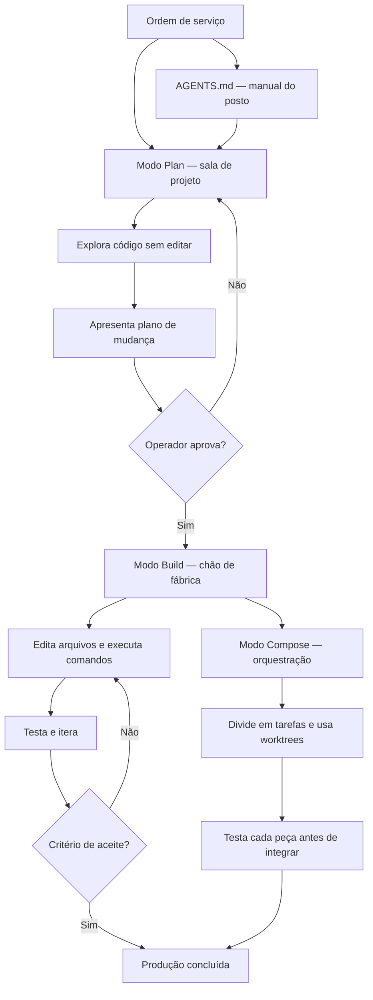

# Capítulo 5: Dominando a TUI: modos Build/Plan/Compose e o dia a dia

## 1. Introdução

No Capítulo 4, você conectou o MiMoCode à energia certa — os provedores e credenciais que definem custo, qualidade e latência. Agora é hora de operar a fábrica: dominar a TUI, a interface de texto onde a produção realmente acontece. Este capítulo destrincha os três modos principais do MiMoCode — Build, Plan e Compose — alternáveis via Tab, e mostra o fluxo de trabalho profissional: planejar sem editar (Plan), executar com supervisão (Build) e orquestrar desenvolvimento orientado a especificações (Compose). Você vai aprender a dar contexto ao agente como daria a um desenvolvedor júnior, a usar a menção de arquivos e o AGENTS.md para calibrar as instruções por projeto, a navegar entre sessões com continue, fork e retomada, e a reconhecer os estados da sessão — aguardando prompt, executando ferramenta, aguardando aprovação. Ao final, a TUI deixará de ser uma tela misteriosa e se tornará o seu posto de trabalho: o lugar onde a ordem de serviço vira produção de qualidade.

## 2. Explica

### Os três modos de operação

Fechando a parte expositiva dos modos de operação, um resumo que o operador leva para o dia a dia e para a operação em equipe da linha de produção. O Plan responde "o que deve ser feito?" — explora e desenha. O Build responde "como executar?" — produz com supervisão. O Compose responde "como orquestrar em escala?" — divide, testa e integra. As três perguntas são as três fases da produção madura. O operador que as faz em sequência — planejar, executar, escalar — opera o MiMoCode no fluxo completo. E o Capítulo 10 fecha com o plano que integra os três modos em um fluxo profissional.

**Tarefa ideal.** Vale mapear a tarefa ideal de cada modo — o critério que guia a escolha. O Plan brilha na tarefa de exploração: entender um código desconhecido, avaliar uma migração, desenhar uma solução. O Build brilha na implementação bem definida: o arquivo alvo, os testes, o critério. O Compose brilha na escala: a feature transversal, a refatoração ampla. A tarefa errada no modo errado é atrito: o Plan que nunca decide, o Build que edita sem entender, o Compose que orquestra sem especificação. O operador que mapeia a tarefa ao modo reduz o atrito a zero.

**Alternância.** Um detalhe de operação que o iniciante desconhece: a alternância entre modos é instantânea — a tecla Tab — e o operador maduro alterna com frequência dentro da mesma tarefa. A tarefa começa no Plan, avança ao Build quando o plano é aprovado, e volta ao Plan quando a exploração revela surpresas. A alternância não é sinal de indecisão — é a operação correta do ciclo de qualidade. O modo não é uma identidade da sessão: é a ferramenta de contexto que a fase exige. O operador que fixa a alternância opera com fluidez.

**Contexto de cada tarefa.** Uma regra prática que o operador maduro aplica: a escolha do modo segue o contexto da tarefa. A tarefa de exploração — entender o código, mapear a arquitetura — é modo Plan. A tarefa de implementação bem definida — com arquivos alvo e critérios claros — é modo Build. A tarefa de escala — uma feature completa, uma migração — é modo Compose. A regra não é rígida: o profissional alterna conforme a tarefa evolui, voltando ao Plan quando o Build revela surpresas. O modo é uma ferramenta de contexto, não uma identidade.

**Curva de aprendizado.** A curva de aprendizado dos três modos explica a frustração do primeiro mês. O iniciante tende a viver no modo Build — a produção direta, sem o custo do planejamento. O operador intermediário descobre o Plan e começa a planejar antes de editar. O profissional integra o Compose e passa a orquestrar em escala. Essa progressão não é linear: o operador volta ao Plan quando a tarefa é delicada, e avança ao Compose quando a especificação está madura. A curva é a mesma da obra inteira — dos fundamentos à escala — e o Capítulo 10 fecha com o fluxo profissional que integra os três modos.

### Os três modos: a lógica da produção

O MiMoCode organiza a operação em três modos principais, cada um com um papel distinto na fábrica — e alterná-los com a tecla Tab é a primeira habilidade que separa o operador casual do profissional. O modo Build é o padrão: é onde a produção acontece — o agente tem permissão completa de ferramentas, edita arquivos, executa comandos e itera até concluir a ordem de serviço. O modo Plan é o posto de análise: somente leitura — o agente explora o código, entende a arquitetura e propõe um plano de mudança sem alterar nenhum arquivo. O modo Compose é a orquestração: desenvolvimento orientado a especificações — o agente divide o trabalho em tarefas, usa skills e workflows determinísticos, e executa cada etapa com controle de qualidade. A lógica dos três modos é a lógica de uma fábrica madura: antes de produzir, planeje (Plan); para produzir, execute (Build); para produzir em escala com qualidade, orquestre (Compose).

A separação entre Plan e Build é a decisão mais impactante do fluxo diário, porque ela corrige o erro mais comum do uso de agentes: deixar o robô editar antes de entender. No modo Plan, o MiMoCode lê o repositório, mapeia os arquivos afetados e apresenta um plano — e o operador revisa o plano antes de qualquer mutação. Quando o plano é aprovado, o modo Build executa. Esse fluxo de duas fases é o mesmo padrão que a literatura recomenda: o SWE-agent mostrou que a qualidade da interface — e o controle sobre as ações — é tão importante quanto o modelo. E o DORA reforça que as equipes que integram IA ao fluxo com disciplina — planejamento, revisão, testes — colhem ganhos, enquanto as que deixam a IA agir solta colhem instabilidade. O modo Plan é a disciplina incorporada à ferramenta.

### O modo Compose

Um registro honesto sobre o Compose: ele também erra. A especificação ambígua gera peças divergentes; o critério de aceite fraco deixa passar regressões. O valor do Compose não está na ausência de erros — está na detecção precoce: cada peça é testada antes de integrar, e o erro é encontrado na bancada, não em produção. O operador que entende isso não abandona o Compose no primeiro tropeço — ele melhora a especificação. O Compose é o controle de qualidade; a especificação é a matéria-prima; e a matéria-prima ruim produz qualidade ruim.

**Tempo.** Uma consideração prática sobre o Compose: o tempo. A orquestração com worktrees, TDD por tarefa e integração testada leva mais tempo que a edição direta. O trade-off é o da qualidade: a orquestração produz menos retrabalho e menos regressões. O operador maduro escolhe o Compose quando a qualidade da feature justifica o tempo — migrações, features grandes, mudanças transversais. E escolhe a edição direta no Build quando a mudança é pequena e isolada. O Compose não substitui o Build: é a ferramenta de escala, com o custo em tempo que a escala exige.

**Memória.** O Compose se beneficia diretamente da memória persistente — a mesma do Capítulo 2 e do Capítulo 9. Cada tarefa orquestrada registra o progresso no `tasks/<id>/progress.md`; o conhecimento das tarefas concluídas é consolidado no `MEMORY.md`. O Compose com memória é uma linha que aprende: a próxima orquestração sabe o que a anterior decidiu. E o `/distill` permite transformar o padrão de uma orquestração bem-sucedida em uma skill reutilizável. A memória e o Compose são as duas metades da fábrica que aprende.

**Critério de aceite.** Um detalhe que define o sucesso do Compose é o critério de aceite — a especificação do que conta como concluído. O Compose divide a especificação em tarefas; cada tarefa precisa de um critério verificável — o teste que passa, o comando que retorna o esperado. Sem critérios, o Compose produz peças que parecem prontas e não integram. A disciplina é a do Capítulo 5 aplicada em escala: a ordem de serviço completa — objetivo, contexto, critério e limite — escrita antes de qualquer execução. O operador que escreve critérios de aceite verificáveis transforma o Compose de experimento em produção.

### O modo Compose: a produção em escala

O modo Compose é o diferencial mais ambicioso do MiMoCode — e o menos compreendido pelos iniciantes, porque ele muda o papel do operador de executor para especificador. No Compose, o agente trabalha orientado a especificações: você descreve o resultado esperado (a especificação), e o MiMoCode divide o trabalho em tarefas, isola cada tarefa em um git worktree, executa com testes antes de integrar e consolida o resultado. É a fábrica em modo autônomo com controle de qualidade: cada peça é fabricada em uma bancada separada, testada antes de voltar à linha principal e integrada apenas quando aprovada. O Capítulo 10 aprofunda o Compose no fluxo profissional completo; aqui, o essencial é entender o papel: o modo Compose é para quando a ordem de serviço é grande demais para um único turno — uma feature completa, uma migração, uma refatoração transversal.

O Compose também se conecta às skills e aos workflows determinísticos do MiMoCode: o agente usa scripts JavaScript executados em sandbox para automatizar pipelines — como o deep-research, o fact-check e o research-experiment — e o operador pode criar os próprios workflows com `/distill`. Essa é a parte do MiMoCode que mais se distancia do OpenCode original: a orquestração specs-driven com worktrees e TDD por tarefa é uma camada de engenharia que o projeto herdado não tinha [1][6]. O Capítulo 9 mostra o `/distill` em ação; aqui, o registro é arquitetural: Compose é o modo onde a fábrica se organiza sozinha, sob as regras que o operador define.

### AGENTS.md e o versionamento

Um exemplo de AGENTS.md ajuda a fixar o formato — e a diferença entre o útil e o decorativo. O útil diz: "os testes rodam com npm test; o lint com npm run lint; o código de autenticação vive em src/auth/; nunca edite config/credenciais.json". O decorativo diz: "seja um assistente útil e preciso". O primeiro muda o comportamento do agente; o segundo não. O AGENTS.md é engenharia de contexto: cada linha é uma instrução que economiza reexploração. O operador que escreve AGENTS.md úteis treina o robô uma vez e colhe em toda sessão.

**Versionamento.** O AGENTS.md é versionado — e o histórico é uma ferramenta. Quando o comportamento do agente muda, o `git log` do AGENTS.md mostra o que mudou e quando. A prática de registrar o porquê no commit — "removi a regra de lint porque o ESLint foi substituído" — transforma o manual em um diário de decisões. O operador que versiona o AGENTS.md com disciplina está construindo a memória do projeto em texto.

### AGENTS.md e a hierarquia de instruções

O AGENTS.md ganha profundidade com a hierarquia: a raiz do repositório tem o manual geral, e subpastas podem ter os seus próprios arquivos de instruções. O agente combina as camadas — as regras gerais da raiz valem em todo o projeto, e as regras específicas de uma subpasta valem onde vivem. Essa hierarquia é o mesmo princípio de precedência que o Capítulo 7 explora na configuração: a regra mais específica complementa — e às vezes sobrepõe — a geral. Para o operador, a consequência é a organização: em vez de um manual gigante na raiz, manuais pequenos perto do código a que se referem.

### AGENTS.md: o manual do posto de trabalho

O AGENTS.md é o arquivo de instruções do projeto que o MiMoCode lê para calibrar o comportamento do agente naquele repositório — o manual do posto de trabalho, fixado em texto versionado. A herança do OpenCode é direta: o AGENTS.md define convenções, comandos, arquitetura e regras que o agente deve seguir, e ele é lido no início de cada sessão. A prática recomendada é clara: o AGENTS.md deve dizer o que é estável — a stack, os comandos de teste, as convenções de código, os caminhos importantes — e não o que muda — os detalhes de uma tarefa específica, que pertencem ao prompt da sessão. Um AGENTS.md bem escrito é a diferença entre um agente que parece conhecer o projeto e um que parece perdido: o primeiro recebe "rode os testes com npm test" e sabe exatamente o que fazer; o segundo adivinha.

O AGENTS.md vive na raiz do repositório e pode existir em hierarquia — subpastas podem ter os seus próprios arquivos de instruções, e o agente combina as camadas. Essa hierarquia espelha a precedência de configuração que o Capítulo 7 explora: instruções gerais na raiz, instruções específicas perto do código a que se referem. Para o operador, a disciplina é a mesma de qualquer documentação viva: o AGENTS.md precisa ser mantido — um manual desatualizado confunde mais do que a ausência de manual.

### A comparação com os concorrentes na operação diária

Os três modos se comparam com o mercado em um ponto de contexto: o Claude Code tem modos equivalentes (planejamento e execução), mas fechados e sem Compose [12]; o Gemini CLI oferece fluxo de planejamento, mas sem a orquestração specs-driven [13]; o Cursor embute o agente no editor, o que muda a dinâmica de supervisão [14]. O OpenHands, por ser uma plataforma aberta e generalista, é o concorrente acadêmico mais próximo do espírito do Compose — mas sem a integração nativa com o terminal e a memória persistente [11]. E o contexto acadêmico que sustenta a disciplina Plan → Build vem de longe: o SWE-bench mostrou que resolver issues reais exige exploração e edição em sequência [8]; o SWE-agent provou que a interface de controle multiplica a taxa de sucesso [9]; e o Agentless mostrou que até pipelines simples se beneficiam de planejamento explícito antes da edição [10]. O MiMoCode não inventou o fluxo planejar-executar — ele o tornou nativo e rápido.

### O contexto da ordem de serviço

Vale um exemplo concreto de ordem de serviço — a diferença entre o vago e o especificado. O vago: "melhore a performance do login". O especificado: "o login em `src/auth/login.ts` demora em média 2 segundos; investigue a causa e proponha melhorias que não alterem a API pública; o teste `npm test -- auth` deve continuar passando; não toque no arquivo de credenciais". O primeiro convida o agente a inventar escopo; o segundo define objetivo, contexto, critério e limite — as quatro partes do Capítulo 5. O operador que escreve ordens especificadas transforma a produção de loteria em processo.

**Serviço e os limites.** A ordem de serviço tem um componente que os iniciantes omitem: os limites. O que o agente não deve fazer é tão importante quanto o que deve. Os limites comuns: não tocar em arquivos de configuração sensíveis, não executar deploys, não alterar dependências sem aprovação, não commitar sem revisão. O AGENTS.md pode codificar os limites permanentes; o prompt registra os temporários. O agente com limites claros produz com autonomia segura; o sem limites adivinha — e a adivinhação é o pai do incidente.

**Serviço e a revisão.** O elo que fecha o contexto da ordem de serviço é a revisão. O MiMoCode mostra cada ação no fluxo — cada arquivo lido, cada comando executado, cada edição proposta. O operador profissional revisa a produção antes de integrar: `git diff` para ver o que mudou, testes para confirmar o comportamento, e o critério de aceite para fechar a tarefa. O fluxo Plan → Build → revisão é o ciclo que o DORA associa à integração disciplinada. A ordem de serviço bem escrita reduz o retrabalho; a revisão disciplinada elimina o que sobra.

**Serviço: como falar com o robô.** A qualidade da produção é diretamente proporcional à qualidade da ordem de serviço — e o padrão profissional de prompt para agentes de terminal é o mesmo padrão de dar contexto a um desenvolvedor júnior. Uma ordem de serviço completa tem quatro partes: o objetivo (o que deve ser feito e por quê), o contexto (os arquivos relevantes, as restrições, o que já foi tentado), o critério de aceite (como saber que a tarefa está concluída — testes passando, mensagem de commit, comando de verificação) e o limite (o que o agente não deve fazer — arquivos proibidos, comandos vetados). O MiMoCode suporta a menção de arquivos para anexar contexto diretamente, e o `AGENTS.md` fornece a camada permanente. Uma ordem de serviço como "refatore o módulo de autenticação" é um convite ao caos; "o módulo de autenticação em `src/auth/` usa sessões próprias; migre para OAuth2 mantendo o teste `npm test` verde e sem tocar em `config/credenciais.json`" é uma especificação que o robô consegue executar com autonomia.

### O modo Compose e o ecossistema de skills

O modo Compose não opera sozinho: ele é alimentado pelas skills e workflows do MiMoCode — mais de vinte skills nativas que vão de geração de documentos a pesquisa acadêmica, acionadas via comando `/` ou por relevância textual. A comunidade mantém o awesome-mimo-agent com guias e exemplos de uso dessas skills, e o operador pode criar as próprias com `/distill` — transformando um fluxo manual repetido em uma skill reutilizável [3][28]. Para quem opera em máquinas sem GPU própria ou precisa de modelos especializados, a mesma TUI conecta modelos locais via Ollama ou modelos de terceiros via OpenRouter — a superfície não muda, apenas a usina de energia [17][18]. Essa combinação — modo Compose + skills + workflows determinísticos — é a parte do MiMoCode que mais se aproxima de uma fábrica autônoma, e é também a que mais exige maturidade do operador: o robô só orquestra bem quando a especificação é boa. Os benchmarks do Capítulo 1 são medidos justamente nesse modo de operação autônoma, o que dá uma noção do teto da ferramenta quando bem configurada [22].

### Sessões: continue, retomada e fork

A TUI e a CLI compartilham o mesmo modelo de sessões — e dominá-lo é dominar a continuidade do trabalho. O MiMoCode guarda o histórico de cada sessão, e o operador pode continuar a última sessão (`-c`), retomar uma específica (`-s <id>`), criar um ramo de uma sessão antiga (`--fork`) e navegar entre sessões ativas. O fork é a ferramenta mais subestimada do dia a dia: ele permite explorar um caminho alternativo sem destruir o histórico original — você experimenta a abordagem B em um ramo, compara com o resultado da abordagem A e decide qual integrar. Essa capacidade de ramificar o trabalho é a mesma lógica do Git aplicada às conversas com o agente — e é um dos motivos pelos quais o MiMoCode se comporta como uma ferramenta de produção e não como um chat descartável.

## 3. Ilustra

Pense na TUI do MiMoCode como o painel de controle da linha de montagem — e nos três modos como os três estágios do posto de trabalho. O modo Plan é a sala de projeto: você e o robô estudam a planta da fábrica, mapeiam os pontos de solda e desenham o fluxo, sem tocar em nenhuma peça. O modo Build é o chão de fábrica: o robô executa o plano aprovado, move as peças, solda e testa — sob seu olhar, com o botão de parada de emergência ao alcance. O modo Compose é o centro de orquestração: em vez de uma única linha, várias bancadas trabalham em paralelo, cada peça testada antes de voltar à linha principal — e o robô coordena tudo a partir da especificação que você escreveu. O AGENTS.md é o manual afixado na parede de cada posto: as regras da fábrica para aquele setor, lidas no início de cada turno. E a sessão é o diário de bordo do turno: o que foi feito, onde parou, o que foi decidido — consultável, retomável e ramificável.



Repare que o diagrama mostra os três modos como estágios do mesmo fluxo: a ordem de serviço entra, o Plan desenha, o Build executa e o Compose orquestra em escala — com o AGENTS.md calibrando tudo desde o início. Como Operador de Linha de Montagem, a leitura do diagrama é a sua rotina diária: comece no Plan, aprove o plano, execute no Build e escale no Compose quando a ordem for grande — sempre com o critério de aceite como destino final. A TUI não é uma tela para assistir o robô trabalhar; é o posto de controle onde você decide o que a linha produz.

## 4. Técnica

### O fluxo Plan → Build na prática

O fluxo profissional começa no modo Plan. Na TUI, você alterna com Tab e descreve a ordem de serviço em modo de análise — o agente explora e propõe sem editar [1][2]:

```bash
# Abre a TUI no projeto
mimo

# Alterna para o modo Plan (tecla Tab) e descreve a análise
# "Analise o módulo de autenticação em src/auth/ e proponha
#  um plano para migrar para OAuth2, listando os arquivos
#  afetados e os testes que devem continuar passando."
```

Quando o plano está pronto e aprovado, alterna para o modo Build e a execução começa — cada edição e cada comando aparecem no fluxo para revisão. O ponto técnico é a ordem: nunca pule o Plan para tarefas de médio porte — o custo de um plano errado é uma iteração; o custo de uma edição errada sem plano é uma correção dolorosa.

### O AGENTS.md em código

Um AGENTS.md profissional é conciso e estável. O exemplo abaixo mostra o formato que o MiMoCode lê no início de cada sessão — convenções, comandos e arquitetura [1][7]:

```markdown
# AGENTS.md — Posto de trabalho do repositório

## Stack e comandos
- Node.js 20+ e TypeScript.
- Testes: `npm test` (Vitest). Sempre rode antes de concluir.
- Lint: `npm run lint`. Corrija antes de commitar.

## Arquitetura
- `src/auth/` — autenticação e sessões.
- `src/api/` — endpoints HTTP.
- `config/credenciais.json` — NÃO editar (segredo).
- Nunca commitar `auth.json` nem arquivos de segredo.

## Convenções
- Mensagens de commit no padrão Conventional Commits.
- Novos módulos: exportar via `src/index.ts`.
```

Repare nos três tipos de informação: comandos verificáveis (o agente pode rodar), arquitetura estável (o agente navega) e regras negativas (o agente evita). Um AGENTS.md assim transforma a primeira resposta do agente de um chute em uma execução informada.

### Navegação de sessões na CLI

A navegação de sessões funciona da mesma forma na TUI e na CLI — e os comandos abaixo são o vocabulário essencial [1][4]:

```bash
# Lista as sessões do servidor
mimo session list

# Continua a última sessão
mimo -c

# Retoma uma sessão específica
mimo -s sessao-001

# Retoma e ramifica a sessão (experimenta um caminho alternativo)
mimo -s sessao-001 --fork

# Abre a TUI com um modelo específico
mimo -m openai/gpt-4o
```

O `--fork` é o superpoder do dia a dia: a sessão original permanece intacta, e o ramo experimenta o caminho alternativo — você compara e decide. A disciplina do operador é nomear bem as sessões e arquivar as que terminaram, para que a lista não vire um depósito de turnos esquecidos.

### A menção de arquivos no prompt

O MiMoCode suporta anexar arquivos ao prompt para dar contexto preciso — o equivalente a apontar o colega para a linha exata do código [1][2]:

```bash
# Executa uma tarefa headless com contexto de arquivos
mimo run "Revise o tratamento de erros neste arquivo" --file src/api/usuarios.ts
```

A menção de arquivos reduz drasticamente a ambiguidade: em vez de o agente adivinhar qual arquivo importa, você o entrega. A regra prática: mencione os arquivos que definem o contrato da mudança — o módulo alvo, o teste correspondente e a configuração relevante.

### A operação em equipe

Fechando o capítulo, a consistência do time — o valor que a padronização entrega. O time que padroniza os modos, o AGENTS.md e o ritual de revisão produz com consistência: o mesmo padrão de qualidade em qualquer PR. O DORA associa a consistência do fluxo à estabilidade. E a consistência não é monotonia: é a base sobre a qual a experimentação é segura — o time varia a tarefa, não o processo. O operador individual domina a TUI; o time consistente domina a produção.

**Equipe e a revisão cruzada.** Um padrão de equipe que aproveita a arquitetura do Capítulo 2: a revisão cruzada de sessões. O operador A exporta a sessão do diagnóstico; o operador B importa e revisa a trilha — o que o agente leu, o que decidiu, onde errou. A revisão cruzada acelera o aprendizado do time: cada sessão revisada é uma aula. E o `mimo attach` permite a colaboração ao vivo — dois operadores na mesma sessão, um na máquina poderosa, outro no laptop. O time que compartilha sessões opera como uma única fábrica.

**Equipe e o compartilhamento.** Uma dimensão da TUI que a documentação menciona de passagem e que a operação em equipe usa: o compartilhamento. O `mimo export` serializa a sessão — e uma sessão compartilhada é um artefato de colaboração: o colega importa, vê a trilha e continua [1][4][20]. O `mimo attach` conecta uma TUI a um servidor remoto — o padrão da máquina poderosa da empresa. E o mDNS (`--mdns`) faz o servidor aparecer pelo nome `mimocode.local` na rede. A operação em equipe não é a soma de operações individuais: é a colaboração sobre o mesmo motor, com sessões que viajam e servidores que se conectam.

**Diferentes plataformas e superfícies.** Um detalhe operacional que completa o dia a dia: a TUI não é a única superfície — o mesmo motor roda headless com `mimo run` (Capítulo 6), atrás de `mimo serve` com `mimo attach` para conectar uma TUI remota, e com `mimo acp` para o protocolo de controle entre agentes [1][4][16]. O flag `--never-ask` ativa o modo de decisão automática sem perguntas — excluindo permissões — e o `--dangerously-skip-permissions` pula as confirmações por completo, com aviso explícito de perigo. A disciplina do operador profissional: experimentar o headless em tarefas de rotina, manter o `--never-ask` para fluxos conhecidos e reservar o modo sem permissões para CI com ambiente isolado. E o mDNS (`--mdns`) permite que a TUI de outra máquina descubra o servidor pelo nome `mimocode.local` — a fábrica distribuída que o Capítulo 10 retoma.

### O custo da operação diária sob controle

A matemática da operação diária fecha a parte técnica — o modo de uso da TUI define a fatura de tokens. O custo de uma sessão é aproximadamente a soma, sobre todos os passos, do tamanho do contexto de cada passo multiplicado pelo preço do token. O modo Plan reduz o custo de duas formas: diminui o número de passos de edição perdidos (menos iterações corretivas) e evita que o contexto inche com mudanças descartadas. O AGENTS.md reduz o custo de outra forma: menos reexplicação, menos contexto repetido em cada sessão. E o `small_model` do Capítulo 4 desloca as tarefas de fundo para um modelo barato. Quem opera a TUI com disciplina — Plan, contexto enxuto, AGENTS.md vivo, small_model configurado — paga menos por uma produção melhor; quem improvisa paga mais pelo caos.

### O ritual de revisão da produção

O operador profissional não apenas envia a ordem de serviço — ele revisa a produção antes de integrá-la [1][7]:

```bash
# 1. Verifica o que o agente mudou (Git)
git status
git diff --stat

# 2. Roda os testes do fluxo
npm test

# 3. Revisa as mudanças críticas
git diff src/auth/

# 4. Commita com mensagem descritiva
git add -p
git commit -m "feat(auth): migra para OAuth2"
```

Esse ritual espelha o padrão DORA de integração disciplinada: o agente produz, o operador revisa e o fluxo valida. A diferença entre usar o MiMoCode como brinquedo e usá-lo como ferramenta de produção está exatamente nesse ciclo — produzir, revisar, validar, integrar.

### Referência rápida: os três modos e o AGENTS.md

A tabela abaixo resume os três modos de operação e a tarefa ideal de cada um — o coração da operação diária do Capítulo 5 [1][2][7]:

| Modo | Comportamento | Tarefa ideal | Quando evitar |
|---|---|---|---|
| Build | Edita arquivos e executa comandos | Implementar feature, corrigir bug | Exploração sem escopo definido |
| Plan | Somente leitura, propõe plano | Entender código, planejar mudança | Quando a edição já está autorizada |
| Compose | Execução specs-driven com worktrees | Feature grande, migração, refatoração transversal | Tarefas pequenas de um turno |

**Checklist do AGENTS.md útil.** O manual do posto de trabalho segue cinco regras práticas: (1) diga o que os testes fazem (`npm test`); (2) diga onde vive cada parte do código (`src/auth/`); (3) declare o que é proibido tocar (`config/credenciais.json`); (4) prefira instruções verificáveis a adjetivos; (5) versione o arquivo junto com o código [1][7]. A diferença entre o AGENTS.md útil e o decorativo é exatamente essa: um muda o comportamento do agente, o outro apenas ocupa espaço [1][7]. O modo Plan antes do Build e o AGENTS.md bem escrito são as duas alavancas que mais reduzem retrabalho na operação diária [1][2].

## 5. Aplica

### A cena de contraste: o operador que pulou o Plan

Imagine a cena: seu chefe pede uma correção urgente — "o login está quebrando em produção, resolve aí". Você abre o MiMoCode no modo padrão (Build) e digita: "conserta o login". O robô de braço articulado da linha de montagem reage com entusiasmo: lê o módulo de autenticação, conclui que o problema está no gerenciamento de sessões e reescreve trezentas linhas do controlador — incluindo a lógica de refresh de token que funcionava. Os testes locais passam, você commita e o deploy sobe. Vinte minutos depois, o telefone toca de novo: agora o login funciona, mas a sessão expira a cada dez minutos e os usuários estão sendo derrubados em massa. O diagnóstico é constrangedor: na pressa de "consertar o login", você pulou o modo Plan, e o agente tratou um sintoma — o erro de validação — removendo a causa real: a rotina de refresh, que ele considerou "código morto" por não ver o uso nos primeiros arquivos.

A correção é o oposto exato do instinto da pressa: mesmo em uma urgência, o fluxo Plan → Build não é negociável. No modo Plan, o agente teria mapeado o fluxo completo de autenticação — login, sessão, refresh, expiração — e proposto a mudança mínima com o impacto mapeado: "o erro está na validação do token; a correção é de três linhas em `src/auth/validacao.ts`; os testes de refresh existem e devem continuar passando". Com esse plano, a correção teria sido cirúrgica — e a sessão não teria quebrado. A lição dessa cena é a lição central deste capítulo: o modo Plan não é um luxo de quem tem tempo; é o controle de qualidade que separa a correção da colateral.

As armadilhas comuns da operação da TUI seguem o mesmo padrão de pressa: alternar para o Build sem plano em tarefas de médio porte; escrever ordens de serviço vagas ("melhore o código") e culpar o agente pelo resultado; ignorar o AGENTS.md e reexplicar a stack em toda sessão; nunca usar o fork e perder o histórico ao experimentar; e tratar a sessão como chat descartável, sem retomar nem arquivar. O operador profissional opera a TUI como um posto de controle: planeja antes, executa com supervisão, revisa antes de integrar e mantém o manual do posto atualizado.

### Métricas de sucesso na operação diária

No cenário individual, as métricas de uma operação madura são: a proporção de tarefas que começam no modo Plan (deve subir para quase todas as de médio porte); o tempo entre a ordem de serviço e a primeira resposta útil (cai com um AGENTS.md bem escrito); a taxa de revisão antes do commit (deve ser 100% — o `git diff` antes de commitar é inegociável); e a reutilização de sessões com fork (sobe à medida que o operador aprende a experimentar sem destruir). A empresa que mede essas quatro linhas sabe se está operando a linha com disciplina ou improvisando — e o DORA mostra que a disciplina é o que separa os ganhos da instabilidade [25].

## 6. Conclusão

Neste turno, você dominou o painel de controle do MiMoCode: entendeu a lógica dos três modos — Plan para planejar sem editar, Build para executar com supervisão e Compose para orquestrar em escala [1][2]; aprendeu o papel do AGENTS.md como manual do posto de trabalho e a disciplina de mantê-lo atualizado [1][7]; dominou a arte de escrever ordens de serviço completas — objetivo, contexto, critério de aceite e limite [1][7]; e navegou entre sessões com continue, retomada e fork. O desafio deste capítulo: escolha uma tarefa real no seu projeto, execute o fluxo completo Plan → Build com o AGENTS.md do repositório, use o fork para experimentar uma abordagem alternativa e feche com o ritual de revisão — `git diff`, testes e commit. Depois, responda de memória: qual a diferença entre o modo Plan e o modo Build, e por que pular o Plan em uma urgência é uma armadilha? No Capítulo 6, vamos tirar a interface da frente: o `mimo run` e a automação — o agente sem interface, as sessões pela CLI e a integração com GitHub.

## 7. Referências Bibliográficas

[1] XIAOMI MIMO. *MiMo-Code: repositório oficial do MiMoCode.* Disponível em: https://github.com/XiaomiMiMo/MiMo-Code. Acesso em: 03 ago. 2026.

[2] XIAOMI MIMO. *MiMoCode: documentação e central de notícias.* Disponível em: https://mimo.mi.com/docs/en-US/news/latest/mimocode. Acesso em: 03 ago. 2026.

[3] XIAOMI MIMO. *awesome-mimo-agent: ecossistema e guias da comunidade.* Disponível em: https://github.com/XiaomiMiMo/awesome-mimo-agent. Acesso em: 03 ago. 2026.

[4] XIAOMI MIMO. *README npm do MiMoCode.* Disponível em: https://github.com/XiaomiMiMo/MiMo-Code/blob/main/README_npm.md. Acesso em: 03 ago. 2026.

[6] ANOMALYCO. *OpenCode: agente de codificação de terminal (projeto original do qual o MiMoCode deriva).* Disponível em: https://github.com/anomalyco/opencode. Acesso em: 03 ago. 2026.

[7] SST. *OpenCode Docs: documentação da arquitetura e do servidor headless.* Disponível em: https://opencode.ai/docs. Acesso em: 03 ago. 2026.

[8] JIMENEZ, Carlos E. et al. *SWE-bench: Can Language Models Resolve Real-World GitHub Issues?* Disponível em: https://arxiv.org/abs/2310.06770. Acesso em: 03 ago. 2026.

[9] YANG, John et al. *SWE-agent: Agent-Computer Interfaces Enable Automated Software Engineering.* Disponível em: https://arxiv.org/abs/2405.15793. Acesso em: 03 ago. 2026.

[10] XIA, Chunqiu Steven et al. *Agentless: Demystifying LLM-based Software Engineering Agents.* Disponível em: https://arxiv.org/abs/2407.01489. Acesso em: 03 ago. 2026.

[11] WANG, Xingyao et al. *OpenHands: An Open Platform for AI Software Developers as Generalist Agents.* Disponível em: https://arxiv.org/abs/2407.16741. Acesso em: 03 ago. 2026.

[12] ANTHROPIC. *Claude Code: agente de codificação de terminal.* Disponível em: https://docs.anthropic.com/en/docs/claude-code. Acesso em: 03 ago. 2026.

[13] GOOGLE. *Gemini CLI: agente de codificação de terminal open-source.* Disponível em: https://github.com/google-gemini/gemini-cli. Acesso em: 03 ago. 2026.

[14] CURSOR. *Cursor: editor com IA embutida.* Disponível em: https://cursor.com. Acesso em: 03 ago. 2026.

[16] AGENT CLIENT PROTOCOL. *Especificação oficial do ACP.* Disponível em: https://agentclientprotocol.com. Acesso em: 03 ago. 2026.

[17] OLLAMA. *Modelos locais de código aberto.* Disponível em: https://ollama.com. Acesso em: 03 ago. 2026.

[18] OPENROUTER. *Roteador de modelos de IA.* Disponível em: https://openrouter.ai. Acesso em: 03 ago. 2026.

[20] SQLITE. *FTS5: extensão de full-text search do SQLite.* Disponível em: https://www.sqlite.org/fts5.html. Acesso em: 03 ago. 2026.

[22] XIAOMI MIMO. *Benchmarks do MiMoCode: SWE-Bench Pro 62% e Terminal Bench 2 73%.* Disponível em: https://mimo.mi.com/docs/en-US/news/latest/mimocode. Acesso em: 03 ago. 2026.

[25] DORA. *State of AI-assisted Software Development 2025.* Disponível em: https://dora.dev. Acesso em: 03 ago. 2026.

[28] RTK. *Adaptadores e integrações da comunidade para agentes de terminal.* Disponível em: https://github.com/rtk-ai/rtk. Acesso em: 03 ago. 2026.
