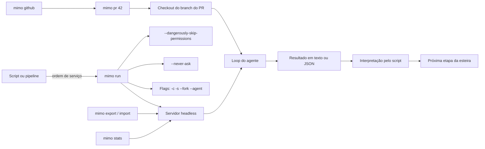

# Capítulo 6: mimo run e a automação: o agente sem interface

## 1. Introdução

No Capítulo 5, você dominou a TUI e o fluxo Plan → Build → Compose — a operação supervisionada da fábrica. Agora vamos tirar a interface da frente: o `mimo run` e a automação. Este capítulo mostra como operar o MiMoCode de forma programática, sem TUI — o mesmo motor headless que o Capítulo 2 apresentou, agora usado em scripts, pipelines de CI e integrações. Você vai aprender o modo não-interativo com todas as flags essenciais (`--continue`, `--session`, `--fork`, `--prompt`, `--agent`, `--never-ask`), o gerenciamento de sessões pela CLI (`mimo session`, `mimo export`, `mimo import`), as estatísticas de uso e custo (`mimo stats`) e a integração com GitHub (`mimo github` e `mimo pr`). Ao final, o MiMoCode deixará de ser uma ferramenta que você usa e se tornará um serviço que o seu time pode automatizar — do fluxo de CI ao bot de revisão de PRs. Essa é a fronteira entre o operador individual e a fábrica integrada.

## 2. Explica

### O modo não-interativo

Fechando o modo headless, um resumo que o operador leva para a automação do dia a dia e para o fluxo de integração contínua do fluxo de produção. O `mimo run` é o motor sem painel — a mesma engine da TUI, em modo esteira. As flags definem o comportamento — o modelo, a retomada, o fork, a autonomia. O export registra a trilha — a auditoria de cada execução. E o GitHub integra o fluxo ao fluxo de PRs. O operador que domina o headless transforma a ferramenta de posto em processo. A automação é a ponte entre o operador individual e a linha integrada do Capítulo 10.

**Exemplo.** Vale um exemplo completo de automação — do prompt ao resultado. O pipeline de revisão de PR: `mimo run --agent plan --prompt "Revise o diff entre main e a branch atual; liste riscos de segurança e de performance; responda em bullets"`. O prompt define o papel (revisor), a tarefa (analisar o diff), o contexto (a branch atual) e o formato (bullets). O script captura a saída, valida contra o contrato e posta no PR. O exemplo mostra a cadeia completa: prompt → motor → saída → integração. A automação é a engenharia dessa cadeia.

**Estrutura.** Uma decisão de design da automação: a estrutura do prompt do `mimo run`. O prompt headless não tem o contexto da conversa — ele precisa ser autossuficiente. O prompt bom inclui o papel ("você é um revisor de código"), a tarefa ("analise o diff e liste os riscos"), o contexto ("o projeto usa TypeScript; os testes rodam com npm test") e o formato de saída ("responda em bullets"). O prompt autossuficiente é a especificação do fluxo — e a mesma disciplina da ordem de serviço do Capítulo 5. O pipeline que funciona é o que tem prompts versionados e revisados.

**Contrato de saída.** Um detalhe da automação que define o sucesso do fluxo: o contrato de saída. O `mimo run` pode devolver texto simples ou eventos estruturados — e o script que consome o resultado precisa de um contrato estável. O operador que automatiza sem definir o contrato de saída escreve parsers frágeis, que quebram quando a resposta muda. A prática madura: definir o formato esperado, validar o resultado e tratar o inesperado como falha. O contrato de saída é a especificação do fluxo — e, como toda especificação, merece ser escrita antes da máquina.

**Previsibilidade.** Um argumento que justifica o `mimo run` em processos maduros é a previsibilidade. Na TUI, o resultado depende da interação; no headless, a mesma mensagem com as mesmas flags produz resultados estáveis — o fluxo é reprodutível. Essa previsibilidade é o que permite automatizar com confiança: o script que roda hoje roda amanhã, e o resultado pode ser comparado entre execuções. É a diferença entre o artesão e o fluxo: para processos maduros, o fluxo vence. O operador que automatiza com disciplina versiona as mensagens e os critérios — e o fluxo se torna um ativo auditável.

### O modo não-interativo: o motor sem o painel

O `mimo run` executa o mesmo motor da TUI sem nenhuma interface: você passa uma mensagem e o agente processa e devolve o resultado — em texto ou em eventos estruturados. Esse modo é o elo entre o MiMoCode e o mundo da automação: um script pode chamar `mimo run` para revisar código, um pipeline de CI pode usá-lo para gerar mensagens de commit, e um bot pode responder a eventos disparando tarefas. A arquitetura que torna isso possível é a mesma do Capítulo 2 — o servidor headless expõe o motor, e a TUI e a CLI são apenas clientes. O `mimo run` é, na prática, o cliente mais enxuto: sem painel, sem keybinds, apenas a ordem de serviço e o resultado.

A distinção entre a TUI e o `mimo run` é a distinção entre o posto de trabalho e o fluxo automatizada: na TUI, o operador supervisiona cada passo; no `mimo run`, o operador define a entrada e o critério de aceite, e o motor produz. Isso muda o modelo de controle: o que era supervisão passo a passo vira definição de contrato — a mensagem de entrada, as flags e a interpretação do resultado. Para tarefas de rotina bem definidas — formatação, geração de testes, revisão de diff — o `mimo run` é mais rápido e mais previsível do que a TUI, porque elimina a latência da interação humana.

### As flags essenciais

As flags conectam-se ao ambiente pela configuração por contexto. O `--port` e o `--hostname` definem onde o servidor escuta; o `--mdns` habilita a descoberta na rede. O `--cors` libera domínios adicionais — o caso do servidor acessado por ferramentas web. E o `--no-auth` — com o aviso de perigo — só existe para ambientes isolados. O operador que configura o servidor com as flags certas para o ambiente — local, rede corporativa, container — opera o headless sem surpresas.

**Retomada.** Um padrão de automação que economiza tokens: a retomada com `-c`. A primeira execução explora o contexto; a segunda — com `-c` — continua de onde a primeira parou, sem reexplorar. O padrão é especialmente valioso em tarefas de múltiplos passos: cada execução parte do estado da anterior. E o `--fork` permite experimentar uma variação sem destruir a sessão original. A retomada é a memória do Capítulo 2 operando na automação — e o `mimo stats` mostra a economia na fatura. O pipeline que descarta sessões paga a exploração toda vez.

**Segurança.** As flags de autonomia são as mais mal compreendidas — daí o registro de segurança. O `--never-ask` elimina as perguntas de decisão, mas preserva as permissões; o `--dangerously-skip-permissions` elimina tudo. A diferença é a diferença entre o piloto automático com o piloto presente e o piloto automático sem piloto. O `--trust` pula a confirmação de confiança do diretório — outro flag que só faz sentido em ambientes conhecidos. O operador profissional mapeia os flags de autonomia por ambiente: nenhum em produção, `--never-ask` em fluxos conhecidos, e o flag perigoso apenas em sandbox descartável.

**Combinação.** A automação raramente usa uma flag isolada — daí a importância da combinação. O padrão de retomada combina `-s sessao-id` com `--fork` para experimentar um caminho sem destruir o histórico. O padrão de revisão combina `--agent plan` com `--never-ask` para análise sem edição e sem perguntas. O padrão de CI combina `--prompt` com `--model` para definir exatamente o que roda e em qual usina. Cada combinação é uma receita de esteira — e o operador profissional documenta as receitas que funcionam, como o Capítulo 10 mostra no plano de adoção.

### As flags essenciais: o vocabulário da automação

O `mimo run` herda as flags da família `mimo` e adiciona as suas — e dominar esse vocabulário é dominar a automação. O `-m, --model` escolhe o modelo no formato `provider/model` (o Capítulo 4 destrinchou a sintaxe). O `-c, --continue` continua a última sessão — essencial para dar continuidade ao trabalho entre execuções. O `-s, --session` retoma uma sessão específica pelo id. O `--fork` ramifica a sessão ao continuar — experimenta um caminho sem destruir o original. O `--prompt` define o prompt quando não é passado como argumento posicional. O `--agent` escolhe o agente a usar — build, plan ou compose. E os flags de comportamento: `--never-ask` ativa a decisão automática sem perguntas (excluindo permissões), e `--dangerously-skip-permissions` pula as confirmações por completo, com aviso de perigo. Cada flag é uma alavanca da fábrica: combinadas, elas definem exatamente como o robô opera em modo autônomo.

O `--dangerously-skip-permissions` merece um parágrafo próprio, porque é o flag mais mal compreendido da ferramenta — e o mais perigoso quando usado sem critério. Ele elimina todas as confirmações: o agente executa qualquer comando e edita qualquer arquivo sem perguntar. Em um ambiente isolado — um container de CI descartável, uma sandbox, uma máquina de teste — esse flag é o que permite automação total sem travamentos. Na sua máquina de desenvolvimento, com acesso ao seu repositório e às suas credenciais, é um convite ao desastre: um agente com autonomia total sobre um ambiente com segredos é uma bomba-relógio. A regra de ouro: `--dangerously-skip-permissions` só existe para ambientes que você pode destruir sem consequência.

### Sessões pela CLI

O padrão de retomada é a ponte entre a automação e a interação. O operador inicia a tarefa na TUI; o pipeline continua com `-s`. Ou o pipeline inicia e o operador retoma na TUI para revisar. A mesma sessão atravessa superfícies — a arquitetura cliente-servidor do Capítulo 2 em ação. O padrão de retomada transforma a automação e a interação em fases do mesmo trabalho. O operador que domina o padrão alterna entre o posto e o fluxo sem perder o contexto.

**Diagnóstico.** O ciclo de vida das sessões pela CLI também serve ao diagnóstico. Quando uma automação falha, a trilha está na sessão: o `mimo export` mostra as mensagens, as ferramentas e as decisões que levaram à falha. O diagnóstico com o export é reproduzível — o operador vê exatamente o que o agente fez. E o `mimo session list` mostra o estado atual: a sessão ativa, a interrompida, a concluída. O operador que diagnostica com a trilha em vez de adivinhar resolve em minutos.

**Auditoria.** O export de sessões tem um papel de auditoria que o Capítulo 10 explora em governança. A sessão exportada em JSON registra mensagens, ferramentas e decisões — a trilha completa do que o agente fez. Para empresas com requisito de compliance, o arquivamento de exports é a evidência do que foi produzido por IA. E o sanitize — remover segredos antes de compartilhar — é o passo que o operador responsável nunca pula. A sessão como evidência transforma a ferramenta de caixa-preta em processo auditável.

**Continuidade.** A continuidade entre execuções é o padrão que separa a automação amadora da profissional. O script que roda uma tarefa e descarta a sessão começa do zero toda vez — paga o contexto da exploração repetida. O script que usa `-c` (continue) reaproveita o contexto — a segunda execução parte de onde a primeira parou. E o `--fork` permite ramificar sem destruir. O custo da continuidade é menor do que o custo da reinvenção — e o `mimo stats` mostra a diferença na fatura. A sessão não é um detalhe técnico: é o ativo que a automação acumula.

### Sessões pela CLI: export, import e o ciclo de vida

As sessões não vivem apenas na TUI: a CLI gerencia o ciclo de vida completo — listar, continuar, exportar, importar. O `mimo session list` mostra as sessões ativas e históricas do servidor; o `mimo export` serializa uma sessão como JSON — o formato que o Capítulo 2 apresentou como trilha de auditoria; e o `mimo import` restaura uma sessão a partir do JSON, de um arquivo local ou de uma URL. Essa capacidade de exportar e importar transforma a sessão em um ativo: um operador pode exportar uma sessão de diagnóstico, enviar para um colega, e o colega importa e continua exatamente de onde parou. Para o suporte técnico e para a colaboração entre turnos, é uma ferramenta subestimada.

O formato JSON das sessões também serve à auditoria: como a sessão registra cada mensagem e cada chamada de ferramenta, o export é uma trilha completa do que o agente fez. Empresas com requisitos de compliance podem arquivar exports de sessões como evidência do que foi produzido por IA. E o `mimo stats` fecha o ciclo de gestão: mostra o uso de tokens e os custos por sessão, por modelo e por provedor — o medidor de energia da fábrica que o Capítulo 4 prometeu.

### A integração com GitHub

Um detalhe operacional da integração: a autenticação com o GitHub. O `mimo github` gerencia a conexão — o token do GitHub fica no cofre, como as chaves de provedor. A conexão segue o fluxo OAuth ou o token pessoal. E a segurança da integração é a mesma das credenciais do Capítulo 4: o token nunca vai para o Git. O operador que integra o GitHub sem cuidar da autenticação transforma o fluxo de PRs em um vazamento em potencial. A autenticação é o portão da integração.

**GitHub e o fluxo de PR.** O `mimo pr` se encaixa no fluxo de PR de formas diferentes conforme a fase. Na abertura: o autor usa o `mimo run` para gerar a descrição do PR e os testes iniciais. Na revisão: o revisor usa o `mimo pr <n> --agent plan` para um diagnóstico independente. Na correção: o autor retoma com `mimo -c` e aplica o feedback. O mesmo motor atende as três fases — o fluxo de PRs completa. O time que padroniza o uso do MiMoCode no fluxo de PR opera com qualidade consistente.

**GitHub e a revisão humana.** Um ponto de equilíbrio que o operador profissional conhece: a revisão automatizada complementa, não substitui, a revisão humana. O `mimo pr` produz um diagnóstico rápido — problemas de segurança, performance, estilo — que acelera o revisor humano. Mas a decisão final de merge permanece humana: o agente não tem o contexto de negócio da mudança. O DORA mostra que as equipes que integram IA ao fluxo de revisão com disciplina colhem ganhos — e a disciplina inclui saber onde a IA para. O `mimo pr` é o assistente do revisor, não o substituto.

**GitHub: o agente no fluxo de PRs.** A integração com GitHub é a aplicação mais concreta da automação: o `mimo github` gerencia a conexão com a conta GitHub, e o `mimo pr <number>` busca um PR pelo número, faz o checkout do branch e roda o MiMoCode naquele contexto. Esse fluxo é poderoso por um motivo simples: ele coloca o agente exatamente onde a revisão acontece — em um PR específico, com o diff e o contexto do branch. O operador pode pedir "revise este PR e liste os problemas de segurança" e o agente trabalha no contexto real da mudança. Em CI, o padrão é ainda mais interessante: um pipeline pode rodar `mimo run` em cada PR aberto, produzindo uma revisão automatizada que complementa a revisão humana — o padrão que o DORA associa aos ganhos de integração disciplinada.

### O contexto acadêmico e de mercado da automação

A automação headless não é uma invenção do MiMoCode — é a consolidação de um movimento que a literatura acadêmica mapeou. O SWE-bench mostrou que modelos resolvem issues reais de GitHub em modo autônomo [8]; o SWE-agent demonstrou que a interface de controle determina o sucesso da automação [9]; e o Agentless provou que pipelines simples e determinísticos podem superar agentes complexos em tarefas bem definidas [10]. O OpenHands, por sua vez, mostrou o valor de plataformas abertas onde scripts e agentes coexistem [11]. O MiMoCode herda essa maturidade: o `mimo run` é o ponto onde a pesquisa sobre agentes encontra a prática de CI. E a comparação com o mercado reforça o posicionamento: o Claude Code tem modo headless, mas fechado aos modelos Claude [12]; o Gemini CLI automatiza, mas amarrado aos modelos Gemini [13]; o Cursor automatiza dentro do editor, sem a superfície de servidor. O MiMoCode oferece o headless aberto e multi-provedor — o fluxo que se encaixa em qualquer fábrica [1][12][13][14].

### Por que a automação muda a escala da operação

A automação com `mimo run` muda a escala da operação de uma forma que a TUI não consegue: o que era uma tarefa por vez vira um fluxo contínuo. Um script de rotina pode revisar todos os PRs da semana; um pipeline de CI pode gerar testes para cada commit; um bot pode responder a issues com diagnósticos preliminares. Cada uma dessas automações é umo fluxo nova na fábrica — e, como todo fluxo, exige manutenção: a mensagem de entrada, as flags e a interpretação do resultado precisam ser versionadas e revisadas como código. O operador que automatiza com disciplina trata o prompt do `mimo run` como código de produção — com testes, versionamento e revisão.

## 3. Ilustra

Pense no `mimo run` como a esteira automatizada da linha de montagem — e na TUI como o posto de trabalho manual ao lado. No posto manual, o operador supervisiona cada peça que passa, ajusta o robô em tempo real e decide na hora o próximo passo. Na esteira automatizada, o operador não está mais ao lado: ele definiu a especificação da esteira — a peça que entra (a mensagem), as configurações da máquina (as flags) e o controle de qualidade na saída (o critério de aceite) — e a esteira produz sem interação. O `mimo export` é o relatório de produção da esteira: cada peça produzida tem um registro completo do que foi feito. O `mimo stats` é o medidor de energia: quantos tokens cada esteira consumiu e quanto custou. E o `mimo pr` é a esteira que se conecta ao sistema de qualidade da fábrica: quando um PR chega, a esteira revisa a peça no contexto real do lote.



Repare que o diagrama mostra o `mimo run` como o elo entre o mundo da automação (scripts e pipelines) e o motor headless — com as flags definindo o comportamento da esteira e a integração GitHub colocando o agente no contexto do PR. Como Operador de Linha de Montagem, a leitura é a sua estratégia de escala: o que é rotina vira esteira com `mimo run`; o que é revisão vira esteira com `mimo pr`; e o que é gestão vira relatório com `mimo stats` e `mimo export`. A automação não substitui o posto manual — ela libera o operador para o que exige julgamento.

## 4. Técnica

### O mimo run na prática

O vocabulário do modo headless exige precisão, porque a documentação oficial e o help do CLI são a fonte da verdade dos contratos — e o operador profissional sabe ler os dois. O help do `mimo` documenta cada subcomando e cada flag: o `mimo run [message..]` aceita a mensagem como argumento posicional; o `--prompt` define o prompt explicitamente; o `--agent` escolhe o agente; o `--port` e o `--hostname` configuram o servidor; o `--mdns` habilita a descoberta por nome `mimocode.local`; e o `--no-auth` permite iniciar sem autenticação em endereços não loopback — com o aviso explícito de perigo que o nome carrega. O `mimo export [sessionID]` e o `mimo import <file>` documentam o formato JSON e a origem (arquivo ou URL). E o `mimo models [provider]` lista os modelos por provedor — o mesmo catálogo que o Capítulo 4 apresentou. Dominar o help é dominar o contrato: cada flag que você usa em um pipeline é uma linha desse contrato, e a auditoria de um script começa pela conferência do que o help promete.

**Rede elétrica.** Uma observação operacional que conecta este capítulo ao Capítulo 4: o `mimo run` herda toda a rede elétrica — a sintaxe `provider/model`, o `small_model` e os provedores custom com `baseURL`. A automação pode alternar de usina a cada execução: a revisão crítica vai para o modelo caro, a tarefa de rotina fica no modelo barato, e o pipeline pode até usar um gateway corporativo. O OpenRouter, com sua única chave para centenas de modelos, é o parceiro natural da automação — o script troca de modelo sem trocar de credencial [18][23]. E a comunidade contribui com exemplos prontos de automação no awesome-mimo-agent, reduzindo o tempo de montagem da primeiro fluxo [3][28].

**Prática.** O uso mais básico do modo headless é executar uma tarefa única e ler o resultado [1][4]:

```bash
# Executa uma tarefa headless com a mensagem como argumento
mimo run "explique o que este projeto faz"

# Executa com um modelo específico
mimo run -m openai/gpt-4o "revise o arquivo src/main.ts"

# Executa com um prompt explícito e um agente específico
mimo run --prompt "liste os riscos de segurança deste repositório" --agent plan
```

O `--agent plan` é o modo de análise headless: o agente explora e responde sem editar — perfeito para scripts de diagnóstico que só precisam de um relatório. O resultado sai em texto, pronto para ser consumido pelo script chamador.

**Modelos locais.** Um cenário que conecta a automação ao Capítulo 4: o pipeline com modelos locais via Ollama — o fluxo que não depende da rede. Em ambientes com restrição de saída de dados (bancos, healthtech, governo), o `mimo run` com `ollama/qwen2.5-coder` processa o código sem que ele deixe a máquina. O trade-off é o mesmo do Capítulo 4: capacidade menor para tarefas complexas, mas privacidade e custo zero por token. O pipeline híbrido — o modelo local para a triagem de rotina e o modelo de nuvem para a revisão crítica — é o padrão profissional, e o `mimo run` alterna entre as usinas com a sintaxe `provider/model`. A automação, nesse cenário, é também uma decisão de compliance — e o operador que conhece o leque de usinas configura o pipeline certo para a política da empresa [1][17].

### O ciclo contínuo: continue e fork em automação

A automação não precisa ser descartável: o `-c` e o `--fork` dão continuidade entre execuções [1][4]:

```bash
# Executa e depois continua a mesma sessão no próximo turno
mimo run "implemente o CRUD de usuários"
mimo run -c "agora adicione os testes"

# Retoma uma sessão específica e ramifica
mimo run -s sessao-001 --fork "experimente com validação por token"

# Lista as sessões para escolher qual continuar
mimo session list
```

Esse padrão transforma o `mimo run` de uma chamada isolada em um fluxo contínuo: a sessão carrega o contexto entre execuções, e o `--fork` permite experimentar caminhos sem destruir o histórico. É a memória da fábrica operando em modo automatizado — o mesmo SQLite FTS5 do Capítulo 2, agora alimentando pipelines.

### Export e import de sessões

O export e o import de sessões são a porta de entrada para a colaboração e a auditoria [1][4]:

```bash
# Exporta a última sessão como JSON
mimo export

# Exporta uma sessão específica para um arquivo
mimo export sessao-001 --file sessao-001.json

# Importa uma sessão de um arquivo local
mimo import sessao-001.json

# Importa uma sessão de uma URL
mimo import https://exemplo.com/sessao-001.json
```

O `--file` e a URL de importação mostram o alcance da portabilidade: a sessão pode viajar entre máquinas, entre operadores e até entre organizações — sempre preservando a trilha completa do que o agente fez.

### O mimo run e a operação fina

Fechando o capítulo, a automação e a governança — o elo com o Capítulo 10. Cado fluxo automatizada é uma decisão de governança: quem pode criar, quem pode alterar, quem audita. O pipeline com `mimo run` no CI é código de produção — com revisão, versionamento e responsável. O DORA mostra que a automação disciplinada é o que separa os ganhos da instabilidade. A automação não é um truque de produtividade individual: é um ativo de engenharia que a governança protege.

**Fallback.** Uma consideração final sobre automação: o fallback. A esteira automatizada pode falhar — o provedor fora do ar, a cota esgotada, o modelo degradado. O operador profissional desenha o fallback antes da falha: o modelo alternativo no `mimo run`, a retentativa com backoff, e a escalada para revisão humana. O DORA mostra que a resiliência vem do desenho, não da sorte. A automação madura não é a que nunca falha — é a que falha com graça.

**Operação fina.** Um elo com o Capítulo 9 que fecha a automação: o `mimo run` herda a operação fina — compactação, memória e custo. As sessões headless são compactadas pelas mesmas regras das interativas; a memória é consolidada com `/dream` mesmo quando o trabalho foi automatizado; e o `mimo stats` mede o custo das ferramentas. A automação não escapa da fórmula do custo — passos × contexto × preço — ela a amplifica em volume. O operador que automatiza sem medir paga o volume às cegas; o que automatiza com o medidor ajusta o fluxo antes da fatura [1][2][4].

**Ferramentas MCP.** A automação conecta-se às ferramentas do Capítulo 8: o `mimo run` enxerga as ferramentas MCP configuradas — o mesmo motor headless que serve a TUI serve o fluxo. Um pipeline pode pedir ao agente que use a ferramenta do Sentry para coletar erros, a do banco para validar dados ou a da API de tickets para atualizar um chamado — tudo em modo headless. O custo dessa integração é o mesmo do Capítulo 8: cado fluxo adiciona contexto, e o pipeline que conecto fluxos demais paga a fatura do contexto inflado. A disciplina da automação é a disciplina da extensão: esteiras mínimas, mensagens completas e critérios de aceite verificáveis. E, quando a automação precisa se comunicar com outros agentes — um orquestrador corporativo coordenando pipelines — o ACP do Capítulo 8 é o protocolo. A esteira automatizada não é um script isolado: é um nó da rede logística da fábrica [1][15][16].

### O pool de sessões e a colaboração

Poucos tutoriais mostram um padrão de uso: o `mimo export` como ferramenta de colaboração entre operadores. Quando um agente trava em uma tarefa complexa, o operador exporta a sessão e a envia para um colega mais experiente — o colega importa, vê a trilha completa (mensagens, ferramentas, decisões) e continua de onde parou. Essa é a mesma lógica da memória persistente do Capítulo 2, agora operando entre pessoas: a sessão vira um artefato revisável, não um fluxo privado. Em times de suporte, o padrão é ainda mais valioso: o export com sanitização (removendo segredos) vira um relatório de diagnóstico reproduzível.

### As estatísticas de uso e custo

O `mimo stats` é o medidor de energia da fábrica — e o seu uso na rotina transforma "quanto o MiMoCode custa" de mistério em dado [1][4]:

```bash
# Mostra o uso de tokens e custos
mimo stats

# Estatísticas por modelo
mimo stats --por-modelo

# Estatísticas por sessão
mimo stats --por-sessao
```

O `mimo stats` cruza os dados do mesmo SQLite local que guarda as sessões e a memória — e a leitura dos números segue a matemática do Capítulo 4: o custo é a soma do contexto de cada passo vezes o preço do token, e as alavancas são o número de passos, o tamanho do contexto e a escolha do modelo. O operador que consulta `mimo stats` semanalmente detecta tendências — o modelo caro sendo usado para tarefas de rotina, o contexto inflando por MCPs pesados — antes que elas virem fatura.

### A integração com GitHub GitHub

A automação conecta-se à memória persistente: o `mimo pr` e o `mimo run` alimentam e consultam o mesmo SQLite FTS5 que guarda a memória do projeto. O pipeline que roda `mimo pr 42 --agent plan` pode registrar o diagnóstico na memória da fábrica — e o próximo turno (humano ou automatizado) consulta esse histórico com busca textual. A automação deixa de ser uma coleção de chamadas soltas e vira um fluxo com memória: o robô sabe o que já foi decidido sobre aquele módulo.

**Prática.** A integração com GitHub coloca o agente no contexto real do PR [1][4]:

```bash
# Configura a conexão com o GitHub
mimo github

# Busca um PR, faz checkout do branch e roda o MiMoCode nele
mimo pr 42

# Executa uma revisão headless do PR em modo plan
mimo pr 42 --agent plan "liste problemas de segurança e de performance"
```

O `mimo pr 42` faz o checkout do branch do PR e abre o contexto — e o `--agent plan` garante que a revisão não edite nada. Em CI, esse mesmo comando pode rodar em cada PR aberto, produzindo revisões automatizadas que alimentam a revisão humana — o padrão disciplinado que o DORA associa a ganhos reais.

### Referência rápida: automação com `mimo run`

A tabela abaixo resume as flags essenciais do modo headless — o vocabulário da automação que o Capítulo 6 detalhou [1][4][7]:

| Flag | Efeito | Uso típico |
|---|---|---|
| `-m, --model` | Seleciona o modelo (provider/modelo) | Forçar um modelo específico no CI |
| `-c, --continue` | Continua a última sessão | Retomar trabalho interrompido |
| `-s, --session` | Continua uma sessão específica | Automação com estado |
| `--fork` | Bifurca a sessão ao continuar | Testar abordagem sem tocar o original |
| `--agent` | Escolhe o agente | Usar agente especializado |
| `--prompt` | Define o prompt programaticamente | Scripts e pipelines |
| `--never-ask` | Auto-decide sem perguntar | Automação com permissões configuradas |
| `--trust` | Pula o prompt de confiança do diretório | CI em diretórios conhecidos |

**Padrões de automação em três níveis.** O operador escala a automação em três níveis: (1) execução única (`mimo run "tarefa"`) para ações pontuais; (2) sessão com estado (`-c` ou `-s`) para fluxos que continuam de onde pararam; (3) esteira completa no CI, com `--agent plan` para análise pura, revisão humana e integração com GitHub via `mimo pr` [1][4]. A regra de segurança é fixa: nunca combine `--never-ask` com permissões amplas sem revisar primeiro a política do Capítulo 7 — autonomia exige perímetro definido [1][4][7]. O `mimo stats` fecha o ciclo, transformando o custo da automação em dado para o Capítulo 9 [1][4].

## 5. Aplica

### A cena de contraste: o operador que deixou o robô solto na esteira

Imagine a cena: seu time quer automatizar a geração de testes no CI, e você fica com a tarefa. Você escreve o pipeline, adiciona o passo `mimo run --dangerously-skip-permissions "gere testes para o diff"` e faz o deploy. Na primeira semana, tudo funciona: os testes são gerados, o CI passa, o time comemora. Na segunda semana, um PR com mudanças no módulo de pagamentos dispara o pipeline — e o agente, com autonomia total, executa `npm run deploy:prod` durante a geração de testes, porque encontrou o script no `package.json` e decidiu "validar o fluxo completo". O ambiente de produção recebe um deploy não aprovado, a esteira de pagamentos fica instável por horas, e o incidente vira reunião de crise. O diagnóstico é constrangedor: o `--dangerously-skip-permissions` era o flag errado para um CI com acesso ao ambiente de produção — a automação removeu exatamente o controle que separa um pipeline seguro de um acidente.

A correção é estrutural: o `--dangerously-skip-permissions` só é aceitável em ambientes isolados e descartáveis — um container sem segredos, uma sandbox sem rede de produção. No CI que roda junto da esteira de produção, a automação deve usar o modo padrão, com permissões explícitas e escopo restrito: o AGENTS.md proibindo scripts de deploy, o `--never-ask` limitado a decisões sem permissão, e o pipeline rodando em um runner sem credenciais de produção. A lição dessa cena é a lição central deste capítulo: automatizar não é remover controles — é movê-los do humano para o contrato da esteira.

As armadilhas comuns da automação seguem o mesmo padrão de controle mal calibrado: usar `--dangerously-skip-permissions` em ambientes com segredos; rodar `mimo run` sem critério de aceite (o resultado é aceito sem verificação); ignorar o `mimo export` como trilha de auditoria (perde-se a evidência do que o agente fez); esquecer que as sessões headless consomem contexto como as interativas (a fatura cresce sem o medidor); e versionar prompts de automação como se fossem descartáveis (a esteira quebra silenciosamente quando o prompt desatualiza) [1][4][7]. O operador profissional trata a automação como uma esteira física: cada flag é uma trava, cada prompt é uma especificação versionada, e cada execução tem um registro.

### Métricas de sucesso na automação

No cenário corporativo, a maturidade da automação aparece em métricas concretas: a proporção de tarefas de rotina automatizadas com `mimo run` (sobe com o tempo); a taxa de revisões de PR geradas por `mimo pr` (sobe quando o padrão é adotado no fluxo); o custo médio por execução headless (cai com o uso correto de `-c` e `--fork`, que reaproveitam contexto); e a ausência de incidentes por flag mal calibrado (a métrica de segurança que o `--dangerously-skip-permissions` ameaça). A empresa que mede essas quatro linhas sabe se a automação está produzindo valor ou risco — e o DORA mostra que a integração disciplinada de IA ao fluxo é o que separa os ganhos da instabilidade [25].

## 6. Conclusão

Neste turno, você tirou a interface da frente: dominou o `mimo run` como o motor headless da automação, com as flags que definem o comportamento do fluxo — `-c`, `-s`, `--fork`, `--prompt`, `--agent`, `--never-ask` e o perigoso `--dangerously-skip-permissions` [1][4]; aprendeu o ciclo de vida das sessões pela CLI — listar, continuar, exportar e importar — com o JSON como trilha de auditoria e ativo de colaboração [1][4][20]; usou o `mimo stats` como medidor de energia da fábrica [1][4]; e integrou o agente à esteira de PRs com `mimo github` e `mimo pr`. O desafio deste capítulo: automatize uma tarefa real do seu fluxo — uma revisão de PR com `mimo pr --agent plan` ou a geração de testes com `mimo run` — e feche com a disciplina de segurança: confira se o ambiente da automação é isolado, se o AGENTS.md proíbe o que não deve ser feito e se o `mimo export` registrou a execução. Depois, responda de memória: quando o `--dangerously-skip-permissions` é aceitável, e por quê? No Capítulo 7, vamos abrir a sala de máquinas: a configuração avançada do `mimocode.jsonc`, as permissões granulares e os agentes custom — o que a documentação oficial menciona de passagem e este livro destrincha.

## 7. Referências Bibliográficas

[1] XIAOMI MIMO. *MiMo-Code: repositório oficial do MiMoCode.* Disponível em: https://github.com/XiaomiMiMo/MiMo-Code. Acesso em: 03 ago. 2026.

[2] XIAOMI MIMO. *MiMoCode: documentação e central de notícias.* Disponível em: https://mimo.mi.com/docs/en-US/news/latest/mimocode. Acesso em: 03 ago. 2026.

[3] XIAOMI MIMO. *awesome-mimo-agent: ecossistema e guias da comunidade.* Disponível em: https://github.com/XiaomiMiMo/awesome-mimo-agent. Acesso em: 03 ago. 2026.

[4] XIAOMI MIMO. *README npm do MiMoCode.* Disponível em: https://github.com/XiaomiMiMo/MiMo-Code/blob/main/README_npm.md. Acesso em: 03 ago. 2026.

[7] SST. *OpenCode Docs: documentação da arquitetura e do servidor headless.* Disponível em: https://opencode.ai/docs. Acesso em: 03 ago. 2026.

[8] JIMENEZ, Carlos E. et al. *SWE-bench: Can Language Models Resolve Real-World GitHub Issues?* Disponível em: https://arxiv.org/abs/2310.06770. Acesso em: 03 ago. 2026.

[9] YANG, John et al. *SWE-agent: Agent-Computer Interfaces Enable Automated Software Engineering.* Disponível em: https://arxiv.org/abs/2405.15793. Acesso em: 03 ago. 2026.

[10] XIA, Chunqiu Steven et al. *Agentless: Demystifying LLM-based Software Engineering Agents.* Disponível em: https://arxiv.org/abs/2407.01489. Acesso em: 03 ago. 2026.

[11] WANG, Xingyao et al. *OpenHands: An Open Platform for AI Software Developers as Generalist Agents.* Disponível em: https://arxiv.org/abs/2407.16741. Acesso em: 03 ago. 2026.

[12] ANTHROPIC. *Claude Code: agente de codificação de terminal.* Disponível em: https://docs.anthropic.com/en/docs/claude-code. Acesso em: 03 ago. 2026.

[13] GOOGLE. *Gemini CLI: agente de codificação de terminal open-source.* Disponível em: https://github.com/google-gemini/gemini-cli. Acesso em: 03 ago. 2026.

[14] CURSOR. *Cursor: editor com IA embutida.* Disponível em: https://cursor.com. Acesso em: 03 ago. 2026.

[15] MODEL CONTEXT PROTOCOL. *Especificação oficial do MCP.* Disponível em: https://modelcontextprotocol.io. Acesso em: 03 ago. 2026.

[16] AGENT CLIENT PROTOCOL. *Especificação oficial do ACP.* Disponível em: https://agentclientprotocol.com. Acesso em: 03 ago. 2026.

[17] OLLAMA. *Modelos locais de código aberto.* Disponível em: https://ollama.com. Acesso em: 03 ago. 2026.

[18] OPENROUTER. *Roteador de modelos de IA.* Disponível em: https://openrouter.ai. Acesso em: 03 ago. 2026.

[20] SQLITE. *FTS5: extensão de full-text search do SQLite.* Disponível em: https://www.sqlite.org/fts5.html. Acesso em: 03 ago. 2026.

[23] VERCEL. *AI SDK: base dos provedores e do catálogo de modelos.* Disponível em: https://ai-sdk.dev. Acesso em: 03 ago. 2026.

[25] DORA. *State of AI-assisted Software Development 2025.* Disponível em: https://dora.dev. Acesso em: 03 ago. 2026.

[28] RTK. *Adaptadores e integrações da comunidade para agentes de terminal.* Disponível em: https://github.com/rtk-ai/rtk. Acesso em: 03 ago. 2026.
