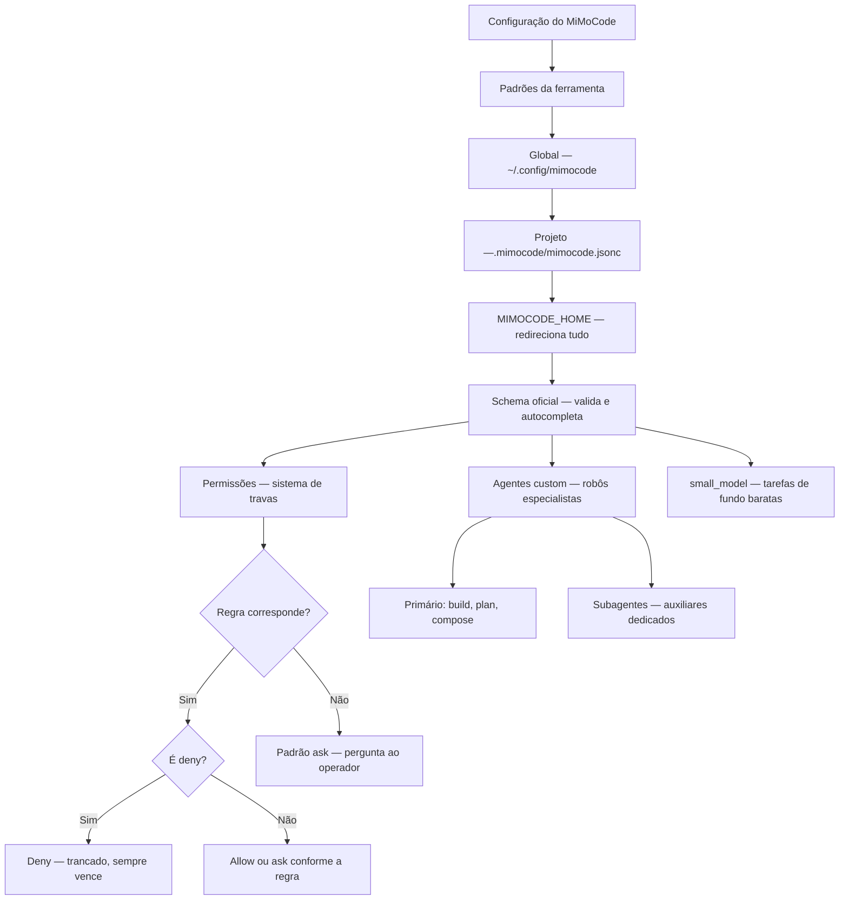

# Capítulo 7: Configuração avançada: mimocode.jsonc, permissões e agentes custom

## 1. Introdução

No Capítulo 6, você automatizou a fábrica com o `mimo run`, dominou o ciclo de vida das sessões pela CLI e integrou o agente à esteira de PRs. Agora vamos abrir a sala de máquinas: a configuração avançada do MiMoCode — o que a documentação oficial menciona de passagem e este livro destrincha peça por peça. Este capítulo cobre o `mimocode.jsonc` em profundidade: o modelo de precedência entre as camadas de configuração (projeto, global, `MIMOCODE_HOME`), o schema JSON oficial com autocompletação, as permissões granulares (allow/ask/deny com globs, `external_directory`, a regra de que deny sempre sobrepõe allow), os agentes custom em JSON e Markdown e o papel do `small_model` na operação. Ao final, você terá um `mimocode.jsonc` profissional — o posto de trabalho do robô configurado com precisão cirúrgica, nem permissivo demais (risco) nem restritivo demais (atrito). Esse é o capítulo onde o MiMoCode deixa de ser uma ferramenta genérica e vira a ferramenta do seu fluxo.

## 2. Explica

### O modelo de precedência

Fechando a precedência de configuração, o resumo em três regras práticas. A regra da especificidade: a camada mais específica vence. A regra da separação: o projeto versiona, o global é do operador. A regra do redirecionamento: o `MIMOCODE_HOME` isola ambientes. As três regras explicam quase todas as confusões de configuração. E o `mimo config get` é a ferramenta que resolve o resto. O operador que fixa as três regras navega a configuração sem sustos.

**Precedência e o JSONC.** Uma consequência do formato JSONC que ajuda a precedência: os comentários documentam a intenção de cada camada. O `mimocode.jsonc` do projeto comenta "este valor é específico deste cliente"; o global comenta "este é o padrão da empresa". A intenção documentada reduz a confusão quando as camadas colidem — o operador lê o porquê antes de brigar com o valor. A precedência resolve o conflito; os comentários explicam a intenção; e o schema valida a sintaxe — as três camadas de entendimento da configuração.

**Precedência e o exemplo.** Vale um exemplo concreto de precedência — o caso que confunde a maioria. O operador define `model: anthropic/claude-sonnet-4-5` no `mimocode.jsonc` global, mas a sessão abre com outro modelo. A causa: o `mimocode.jsonc` do projeto — mais específico — define outro valor e sobrepõe o global. O mesmo vale para permissões: a regra do projeto complementa a global. O diagnóstico é o `mimo config get model` — mostra o valor efetivo. O operador que entende a precedência por exemplo resolve a classe inteira de confusões.

**Precedência e o schema.** Vale fixar a relação entre precedência e schema: o schema valida cada camada, mas não resolve o conflito entre camadas. O `mimocode.jsonc` do projeto pode ser válido isoladamente e ainda assim ser sobreposto pelo global. O schema é a gramática; a precedência é a semântica. O operador que confunde os dois espera que a validação aponte o conflito — e a validação não faz isso. O diagnóstico de conflito é o `mimo config get` (Capítulo 7) — a ferramenta que mostra o valor efetivo. A gramática e a semântica são as duas metades de entender a configuração.

**Precedência e a operação diária.** A precedência não é um conceito abstrato — ela se manifesta todos os dias na operação. Quando o operador muda o modelo no `mimocode.jsonc` do projeto e a próxima sessão usa o valor antigo, a causa quase sempre é uma camada mais específica sobrepondo a sua mudança. Quando um projeto novo herda permissões estranhas, a causa pode ser a configuração global da máquina anterior. O diagnóstico da precedência é o `mimo config get` — a ferramenta que revela o valor efetivo após a mesclagem. O operador que entende a precedência não pergunta "por que está assim?" — ele pergunta "qual camada está vencendo?".

**Precedência: quem manda em cada camada.** A configuração do MiMoCode vive em camadas, e a ordem de precedência define qual valor vence quando camadas discordam. A camada mais específica vence a mais geral: a configuração do projeto (`.mimocode/mimocode.jsonc`) sobrepõe a global (`~/.config/mimocode/mimocode.jsonc`), que por sua vez sobrepõe os padrões da ferramenta. A variável `MIMOCODE_HOME` redireciona toda a árvore de configuração e credenciais para outro diretório — a chave mestra para isolar ambientes. E o schema JSON oficial (`https://mimo.xiaomi.com/mimocode/config.json`) fornece autocompletação e validação no editor, transformando o `mimocode.jsonc` de texto solto em documento tipado. Esse modelo de precedência é o mesmo do OpenCode herdado — e a lógica é a da fábrica: as regras gerais da empresa (global) valem em toda parte, mas cada posto de trabalho (projeto) pode afinar as suas.

A consequência prática da precedência é dupla. A primeira é a portabilidade: o `mimocode.jsonc` do projeto vai para o Git, e qualquer operador que clone o repositório herda a configuração do posto de trabalho — sem configurar nada na mão. A segunda é a separação de responsabilidades: o que é regra do projeto (stack, comandos, permissões de arquivos) fica no projeto; o que é preferência do operador (tema, modelo padrão pessoal) fica no global. Quando um operador coloca preferência pessoal no `mimocode.jsonc` do projeto, ele impõe o gosto dele a todo o time — o erro clássico de quem não entende a precedência.

### O schema da configuração

Um exemplo de configuração validada pelo schema ajuda a fixar o uso. O editor com schema sugere a chave `permission`, documenta os valores (allow, ask, deny) e valida o formato dos globs. O erro de digitação é apontado na hora — antes de virar uma sessão quebrada. E o schema versionado no repositório da empresa permite a validação em CI: a configuração que não passa no schema não entra no main. O schema transforma a configuração de uma aposta em um contrato.

**JSONC.** O formato JSONC — JSON com comentários — é a diferença prática entre a configuração documentada e a opaca. Os comentários permitem registrar o porquê de cada decisão ao lado do valor. O `//` para comentários de linha e o `/* */` para blocos. O schema valida a estrutura sem rejeitar os comentários. O resultado: a configuração que se explica sozinha. O operador que documenta a configuração com comentários constrói o manual do posto dentro do próprio arquivo.

**Equipe.** O schema beneficia a equipe inteira, não apenas o operador que configura. O revisor de código confere a configuração contra o schema; o novo integrante descobre as opções com a autocompletação; e o time padroniza os padrões de configuração. O schema versionado junto com a configuração é a fonte da verdade do que o time permite. E a validação em CI — o schema como parte do pipeline — impede que configurações quebradas cheguem ao repositório. O schema transforma a configuração de responsabilidade individual em padrão de equipe.

**Editor.** O schema oficial não beneficia apenas a validação — ele beneficia o editor. Com o schema configurado, o editor oferece autocompletação das chaves, documentação inline das opções e validação em tempo real. O operador que configura no editor com schema comete menos erros do que o que configura no bloco de notas. E o mesmo schema serve à revisão de código: o revisor confere a configuração contra o schema antes de aprovar. A configuração deixa de ser texto solto e vira um documento tipado — a diferença entre escrever à mão e preencher um formulário com validação.

**Formato JSONC.** O MiMoCode usa JSONC — JSON com comentários — e o schema oficial valida a estrutura. Os comentários são a diferença prática entre o `mimocode.jsonc` e o JSON puro: eles permitem documentar cada decisão de configuração no próprio arquivo, como um manual ao lado das máquinas. O schema valida chaves, tipos e valores — e o editor com suporte a schema aponta erros antes que o fluxo pare. Para o operador, a combinação JSONC + schema é a diferença entre configurar no escuro e configurar com rede de segurança: o editor sugere as chaves, valida os tipos e documenta as opções.

### As permissões

Um exemplo de permissões bem calibradas — o padrão do time maduro. O `edit` libera `src/**` e `tests/**`; o `deny` tranca `config/credenciais.json`, `**/*.env` e `deploy/**`; o `bash` permite apenas `npm test` e `npm run lint`; e o `external_directory` libera `/tmp/**`. O resultado: o robô produz com autonomia, mas não toca no sensível. O exemplo mostra o princípio em ação — geral amplo, travas específicas, deny sempre vencendo. O operador que reproduz o padrão configura permissões com confiança.

**Operação do time.** O sistema de permissões tem um papel na operação do time que o Capítulo 10 explora. Cada papel tem o seu perfil de permissões: o desenvolvedor pleno opera com permissões amplas no projeto; o operador de CI roda com escopo restrito; o revisor analisa em modo somente leitura. O DORA associa a disciplina de permissões à estabilidade — e a configuração por papel é a materialização dessa disciplina. O time que define perfis de permissão evita dois extremos: o robô amarrado demais (atrito) e o robô solto demais (risco).

**Modelo mental.** O sistema de permissões exige um modelo mental preciso, porque a sintaxe permite expressar a mesma intenção de formas diferentes. A regra de avaliação em sequência com a última correspondência vencendo é a fonte da maioria das confusões: uma regra específica no fim do arquivo sobrepõe uma geral no início. E a regra de que deny sempre sobrepõe allow é a trava de segurança que protege os arquivos sensíveis mesmo quando uma regra geral libera tudo. O operador que fixa essas duas regras — sequência e deny-sobrepõe — lê qualquer configuração de permissões sem sustos.

### As permissões: o sistema de travas da linha

O sistema de permissões do MiMoCode é o controle de acesso da fábrica — e ele segue uma lógica precisa que poucos operadores entendem de primeira. As permissões são avaliadas em sequência, e a última regra correspondente prevalece; as regras `deny` sempre sobrepõem as `allow`; e operações sem regra correspondente caem no padrão `ask` — pedir confirmação ao operador. As chaves de permissão cobrem as operações do agente: ler arquivos (`read`), editar (`edit`), executar no shell (`bash`), buscar na web (`webfetch`) e outras. Os valores são `allow` (permitir sem perguntar), `ask` (perguntar) e `deny` (negar sem perguntar). E os alvos podem ser globs — padrões de caminho como `src/**` ou `**/*.env` — permitindo regras finas.

A regra de que deny sempre sobrepõe allow é a trava de segurança mais importante do sistema: mesmo que uma regra geral permita editar `**` (tudo), uma regra específica de deny em `config/credenciais.json` protege o arquivo. O padrão profissional de configuração de permissões é exatamente esse: começar com o que o agente pode fazer em geral (allow amplo para o diretório do projeto), e adicionar denies específicos para o que não pode tocar (segredos, arquivos de deploy, diretórios de produção). O `external_directory` controla o acesso do agente a diretórios fora do workspace — por padrão negado, com regras para liberar caminhos específicos como `/tmp/**`.

### Agentes custom

Um parâmetro dos agentes custom que o operador avança explora: a temperatura. A temperatura controla a aleatoriedade das respostas — baixa para tarefas determinísticas (revisão, testes), alta para tarefas criativas (nomes, copy). O agente de revisão com temperatura baixa produz relatórios consistentes; o de geração com temperatura um pouco mais alta varia as sugestões. O parâmetro é por agente — cada especialista com a sua calibração. O operador que calibra a temperatura por agente afina o comportamento da linha.

**Exemplos práticos.** A rotina do time justifica exemplos concretos de agentes custom. O revisor de segurança (aponta riscos sem editar); o gerador de testes (produz testes para o diff); o analista de migração (mapeia o impacto de mudanças de esquema); o redator de changelog (gera notas de versão a partir do histórico). Cada um é um robô especialista com escopo de ferramentas definido. A descrição clara é o que permite ao agente primário chamar o especialista certo. O catálogo de agentes do time cresce com a rotina — e o Capítulo 10 mostra a governança desse catálogo.

**Manutenção.** Os agentes custom são código de produção — e exigem manutenção. O agente cuja descrição desatualiza deixa de ser chamado pelo agente primário (a descrição é o menu); o agente cujo modelo muda de preço precisa de revisão orçamentária; o agente que nunca é usado deve ser removido. A rotina de manutenção dos agentes é parte da governança do Capítulo 10: revisar a lista, atualizar as descrições e remover o que não serve. O operador que trata agentes como entidades estáticas acumula robôs esquecidos; o que os trata como código mantém a linha enxuta.

### Agentes custom: o robô com especialidades

O MiMoCode permite definir agentes custom — especialistas configurados para tarefas específicas — e a forma de defini-los reflete a flexibilidade da ferramenta. Os agentes podem ser definidos em JSON, com parâmetros explícitos (modo, temperatura, permissões), ou em Markdown, com instruções em linguagem natural. Cada agente tem um papel: primário (um dos modos da TUI — build, plan, compose) ou subagente (chamado pelo agente primário para tarefas específicas). Os parâmetros incluem o modelo, a temperatura, os limites de passos e as ferramentas disponíveis — e o operador pode criar um "revisor de código", um "gerador de testes" ou um "analista de segurança" como agentes dedicados. A lógica é a da fábrica especializada: em vez de um robô genérico que faz tudo, você monta uma linha com robôs especialistas, cada um com o seu posto.

### O small_model na configuração

Um detalhe de flexibilidade do `small_model`: a configuração por projeto. O projeto com orçamento apertado define um auxiliar mais barato; o projeto crítico, um auxiliar melhor. A precedência do Capítulo 7 permite a variação: o `small_model` global como padrão, o do projeto como exceção. O operador que explora a variação por projeto otimiza cada linha de produção individualmente. E o `mimo stats --por-projeto` mostra o resultado de cada configuração. A flexibilidade por projeto é a mesma da matriz de modelos do Capítulo 4, aplicada ao auxiliar.

**Observabilidade.** O `small_model` exige observabilidade para ser calibrado — e o `mimo stats` é a ferramenta. O operador que configura o auxiliar sem medir não sabe se ele está reduzindo custo ou degradando qualidade. O ciclo de calibração: configurar, medir por uma semana, comparar custo e qualidade, ajustar. O `mimo stats --por-modelo` mostra exatamente o que o `small_model` consome. A observabilidade transforma a otimização de custo de palpite em engenharia.

**Estratégia de custo.** O `small_model` é a primeira alavanca de custo, mas não é a única — e o operador maduro o combina com as demais. A estratégia completa: o `small_model` para as tarefas de fundo (checkpoints, resumos), a compactação do Capítulo 9 para o contexto, as permissões de bash restritas para evitar chamadas caras e a matriz de modelos do Capítulo 4 para o tipo de tarefa. Cada alavanca ataca um termo da fórmula do custo — e o `mimo stats` mede o resultado da combinação. O `small_model` sozinho reduz a fatura; a estratégia completa a domina.

### O small_model na configuração avançada

O `small_model` — apresentado no Capítulo 4 — ganha profundidade aqui, porque a configuração avançada revela todo o seu alcance. Ele não é apenas o modelo das tarefas de fundo: é o modelo dos checkpoints de memória, dos resumos de contexto, das operações heurísticas dos subagentes e das verificações rápidas. Na configuração, ele pode ser definido globalmente (para todas as sessões) ou por projeto (ajustado ao orçamento de cada cliente). E a combinação `model` + `small_model` é a primeira otimização de custo que o operador faz — antes de qualquer outro ajuste. A regra prática: o `small_model` deve ser capaz de resumir e verificar, mas não de decidir — decisões complexas pertencem ao modelo principal.

### O contexto acadêmico e de mercado da configuração

A configuração avançada conversa com o contexto mais amplo da obra. O SWE-bench mostrou que a capacidade de um agente depende da interface — e a interface inclui a configuração [8]; o SWE-agent demonstrou que o controle fino das ações é o que multiplica a taxa de sucesso [9]; e o Agentless mostrou que até pipelines simples ganham com regras bem definidas [10]. O OpenHands, como plataforma aberta, reforça a mesma lição em escala de plataforma [11]. Na comparação com o mercado: o Claude Code tem permissões, mas fechadas aos modelos Claude [12]; o Gemini CLI configura, mas dentro do ecossistema Gemini [13]; o Cursor esconde a configuração no editor proprietário. O MiMoCode expõe a configuração como arquivo versionável e auditável — o que permite ao operador tratar o `mimocode.jsonc` como código [1][12][13][14]. E o ecossistema da comunidade — awesome-mimo-agent e adaptadores de terceiros — vive exatamente dessa abertura de configuração.

### Por que a configuração avançada define o teto da ferramenta

A configuração avançada define o teto do que o MiMoCode consegue produzir — porque ela controla exatamente as três alavancas do desempenho: o que o agente pode fazer (permissões), como ele se comporta (agentes e modelo) e quanto custa (small_model e contexto). Os benchmarks do Capítulo 1 são o teto da ferramenta bem configurada — e a distância entre o teto e o resultado individual é quase sempre configuração [1][22]. O operador que domina o `mimocode.jsonc` extrai da mesma ferramenta o que o operador casual nunca verá.

## 3. Ilustra

Pense no `mimocode.jsonc` como o painel de controle da linha de montagem — e no sistema de permissões como o sistema de travas físicas da fábrica. Cada chave de permissão é uma porta com três estados: destravada (allow — o robô passa sem perguntar), com porteiro (ask — o robô pede autorização) e trancada (deny — ninguém passa, nem o robô). A regra de que deny sobrepõe allow é a porta do cofre: mesmo que o mapa da fábrica diga "acesso livre", a porta do cofre tem a sua própria tranca, e ela vale mais. O `external_directory` é o portão de serviço: por padrão fechado, liberado apenas para os fornecedores autorizados (como `/tmp/**`). Os agentes custom são os robôs especialistas da linha: o soldador (build), o projetista (plan), o orquestrador (compose) — e os subagentes são os auxiliares que cada um chama. E o schema é a planta da fábrica: o editor mostra onde cada painel fica e valida se você conectou os fios certo.



Repare que o diagrama mostra a cascata da precedência (padrões → global → projeto, com o `MIMOCODE_HOME` redirecionando tudo) e, ao lado, o fluxo de decisão das permissões (a regra mais específica vence, deny sempre sobrepõe, e o padrão é ask). Como Operador de Linha de Montagem, a leitura é a sua política de configuração: defina o global com as regras da empresa, o projeto com as regras do posto, e afine as permissões como travas — começando pelo que o robô pode fazer e trancando o que ele não deve tocar.

## 4. Técnica

### A configuração de provedores custom na sala de máquinas

Um detalhe de configuração que o Capítulo 4 apenas mencionou e que a sala de máquinas destrincha: o provedor custom OpenAI-compatible com `baseURL` é a ponte para gateways corporativos, proxies de compliance e serviços de mediação. O contrato é o mesmo do AI SDK — o `npm` do provider aponta para o adaptador (como `@ai-sdk/openai-compatible`) e o `options` define a base URL e a chave. A regra do `only_configured_models` é a trava do gateway: com `true`, o agente só chama os modelos listados — evitando chamadas a modelos que o gateway não conhece. E, para quem opera com modelos locais, o Ollama aparece no catálogo como qualquer provedor — a configuração não distingue nuvem de local. A sala de máquinas é o lugar onde a rede elétrica do Capítulo 4 ganha forma de arquivo [1][17][23].

### A configuração e o ambiente do time

Fechando o capítulo, o ciclo de melhoria contínua da configuração — a prática que mantém o posto de trabalho ótimo. O ciclo tem quatro fases: medir (o `mimo stats` e a observação das sessões), ajustar (permissões, modelos, agentes), validar (as sessões seguintes confirmam a melhoria) e registrar (os comentários do JSONC documentam o porquê). O ciclo mensal mantém a configuração alinhada com a realidade. A configuração não é uma tarefa de um dia: é a manutenção contínua da sala de máquinas.

**Diagnóstico final.** Fechando o capítulo, o diagnóstico de configuração merece um resumo prático. O sintoma "a sessão usa o modelo antigo" aponta para a precedência; o sintoma "a configuração não valida" aponta para o schema; o sintoma "o agente editou o que não devia" aponta para as permissões; e o sintoma "o subagente nunca é chamado" aponta para a descrição do agente custom. Cada sintoma tem o seu diagnóstico — e o operador que conhece o mapa resolve em minutos. A configuração avançada é o lugar onde o MiMoCode deixa de ser genérico e vira a ferramenta do seu fluxo.

**Ambiente do time.** Um ponto de amarração com o ecossistema: a configuração do time é um ativo compartilhado, e a comunidade oferece pontos de partida. O awesome-mimo-agent reúne exemplos de configuração, e os adaptadores da comunidade mostram padrões testados. O time pode começar de um padrão comunitário e afinar para o próprio fluxo [3][28]. E a configuração versionada no Git permite o histórico — quem mudou o quê, quando e por quê. A configuração do MiMoCode é o DNA do posto de trabalho: compartilhada, auditada e evoluída.

### Um mimocode.jsonc profissional em código

O exemplo abaixo mostra um `mimocode.jsonc` completo — o posto de trabalho do robô configurado com precisão: modelo padrão, small_model, permissões granulares e agentes custom [1][2][7]:

```jsonc
{
  "$schema": "https://mimo.xiaomi.com/mimocode/config.json",
  "model": "anthropic/claude-sonnet-4-5",
  "small_model": "openai/gpt-4o-mini",
  "permission": {
    "edit": ["src/**", "tests/**", "*.md"],
    "deny": ["config/credenciais.json", "**/*.env", "deploy/**"],
    "bash": ["npm test", "npm run lint", "git status"],
    "external_directory": { "/tmp/**": "allow" }
  },
  "agent": {
    "revisor": {
      "description": "Revisa código apontando riscos",
      "mode": "subagent",
      "model": "openai/gpt-4o",
      "tools": ["read", "grep"]
    },
    "testador": {
      "description": "Gera testes para o diff",
      "mode": "subagent",
      "tools": ["read", "edit", "bash"]
    }
  }
}
```

Repare na lógica das permissões: a regra geral libera a edição em `src/**`, `tests/**` e markdowns; as regras de deny trancam segredos, arquivos `.env` e o diretório de deploy; o bash é restrito aos comandos de verificação; e o `external_directory` libera apenas `/tmp/**`. Os agentes custom `revisor` e `testador` são subagentes com escopo de ferramentas definido. Esse é o padrão profissional: começar amplo, trancar o sensível e especializar os robôs.

### A sintaxe de permissão em detalhe

Vale detalhar a sintaxe das permissões, porque cada forma tem um caso de uso [1][2][7]:

```jsonc
{
  "permission": {
    "bash": "deny",
    "edit": ["src/**", "tests/**"],
    "edit": { "config/producao.json": "deny" },
    "external_directory": { "/tmp/**": "allow", "~/Downloads/**": "ask" }
  }
}
```

A regra de avaliação em sequência com a última correspondência vencendo — e deny sobrepondo sempre — é o que torna essa sintaxe segura. O padrão "geral primeiro, específico depois" é o recomendado: a regra geral define o comportamento padrão, e as regras específicas criam as exceções.

### Agentes customm Markdown

Os agentes em Markdown usam frontmatter YAML e instruções em linguagem natural — a forma mais expressiva de definir um especialista [1][2][7]:

```markdown
---
name: revisor-seguranca
description: Revisa o código apontando riscos de segurança
mode: subagent
model: anthropic/claude-sonnet-4-5
tools: [read, grep, bash]
---

Você é o revisor de segurança da fábrica. Revise o código
fornecido e aponte: injeção de dependências, vazamento de segredos,
falhas de autenticação e problemas de injeção SQL. Para cada risco,
cite o arquivo e a linha. Não edite nada — apenas reporte.
```

O frontmatter define os parâmetros (nome, descrição, modo, modelo, ferramentas) e o corpo define o comportamento — o mesmo formato de instrução que o AGENTS.md usa, agora com escopo de especialista. A descrição é o que o agente primário usa para decidir quando chamar o subagente — escreva-a como se fosse um menu.

### A gestão do contexto e da memória na configuração

A configuração avançada também controla duas alavancas que poucos operadores associam a ela: o contexto e a memória. A chave `compaction.max_context` define limites de compactação por modelo — forçando o agente a resumir antes do limite nativo, o que reduz latência e custo (o Capítulo 9 aprofunda). E o sistema de memória persistente — o SQLite FTS5 com `MEMORY.md`, `checkpoint.md` e `tasks/<id>/progress.md` — é alimentado por checkpoints automáticos cujo comportamento a configuração pode ajustar. A sessão exportada em JSON (Capítulo 6) e a memória da fábrica usam o mesmo banco — e o `mimo db` permite inspecionar e manter esse banco local. Para o operador, a leitura é direta: a configuração não é só permissões — é também o controle do que o robô lembra e de quanto contexto ele consome [1][2][20].

### Diagnóstico de configuração

Quando a configuração não se comporta como esperado, o diagnóstico segue a cascata da precedência [1][2]:

```bash
# 1. Qual configuração está ativa? (valores mesclados)
mimo config get model
mimo config get permission.edit

# 2. As permissões estão como esperado?
mimo config get permission

# 3. O schema está válido?
# (o editor com suporte a schema aponta o erro antes de salvar)
```

O `mimo config get` revela o valor efetivo após a mesclagem das camadas — a ferramenta para responder a pergunta "por que o modelo está assim, se configurei diferente?" [1][4]. A resposta quase sempre está na precedência: uma camada mais específica sobrepôs a sua configuração.

### Referência rápida: precedência, permissões e diagnóstico

A precedência das camadas de configuração é a resposta para a maioria dos "por que não funcionou?" — a tabela abaixo fixa quem manda em cada nível [1][2][6]:

| Camada | Arquivo | Escopo | Precedência |
|---|---|---|---|
| Global | `~/.config/mimocode/config.jsonc` | Todos os projetos | Mais fraca |
| Projeto | `mimocode.jsonc` na raiz | Um repositório | Média |
| CLI/flag | Flags do comando | Uma execução | Mais forte |

**Permissões em uma linha cada.** `allow` libera a ação sem perguntar; `ask` consulta o operador a cada vez; `deny` bloqueia a ação — e o padrão mais seguro para começar é `ask` amplo com `allow` cirúrgico nos comandos de leitura e `deny` nas zonas sensíveis (arquivos de credenciais, destrutivos) [1][2][7]. **O diagnóstico de configuração** segue três passos: (1) validar o `mimocode.jsonc` contra o schema; (2) conferir qual camada está de fato ativa pela precedência; (3) testar com o mínimo — um comando de leitura — antes de escalar a permissão [1][6]. O schema versionado em CI transforma a configuração de aposta em contrato: o que não valida, não entra no `main` [1][6].

## 5. Aplica

### A cena de contraste: o operador que destrancou o cofre

Imagine a cena: um consultor de segurança audita a configuração do MiMoCode do seu time e encontra um `mimocode.jsonc` com uma linha que ninguém lembra de ter escrito: `"permission": { "bash": "allow", "edit": ["**"], "deny": [] }`. O time todo usa esse repositório — inclusive o pipeline de CI do Capítulo 6 — e o agente, com bash liberado e edição em qualquer arquivo, tem autonomia total sobre o ambiente de desenvolvimento, incluindo os scripts de deploy que vivem no mesmo repositório. O diagnóstico é constrangedor: em algum momento, alguém "destravou" as permissões para o agente parar de perguntar — e a solução de curto prazo virou um risco estrutural: qualquer ordem de serviço mal escrita pode acionar um comando com efeito colateral grave, sem nenhuma confirmação no caminho.

A correção é a política de travas que este capítulo desenhou: começar amplo mas com denies explícitos (segredos, `.env`, `deploy/**`), restringir o bash aos comandos de verificação e usar o padrão ask para o resto. O `--dangerously-skip-permissions` do Capítulo 6 nunca deve ser compensado na configuração — o equivalente a destrancar o cofre porque o porteiro estava atrapalhando. A lição dessa cena é a lição central deste capítulo: permissão não é conveniência — é a diferença entre o robô que produz e o robô que destrói, e a configuração que remove o porteiro para economizar um clique cobra a fatura no primeiro incidente.

As armadilhas comuns da configuração avançada seguem o mesmo padrão de calibração errada: configurar permissões amplas demais "para o agente trabalhar livre" (o risco cresce sem o operador perceber); colocar preferências pessoais no config do projeto (impõe gosto ao time e polui o Git); esquecer o `MIMOCODE_HOME` em ambientes isolados (a configuração de um projeto vaza para outro); ignorar o schema (o erro só aparece na primeira sessão, não no editor); e criar agentes custom sem descrição clara (o agente primário nunca sabe quando chamar o especialista). O operador profissional trata o `mimocode.jsonc` como código de produção: versionado, revisado e com as travas calibradas.

### Métricas de sucesso na configuração

No cenário corporativo, a maturidade da configuração aparece em métricas concretas: a proporção de arquivos sensíveis protegidos por regras de deny (deve ser 100% dos segredos do repositório); a taxa de confirmações de permissão por sessão (deve cair à medida que as regras ficam bem calibradas, sem chegar a zero); o tempo de setup de uma nova máquina (cai quando o `mimocode.jsonc` do projeto é auto-suficiente); e o custo médio por sessão (cai com o `small_model` e as permissões de bash restritas) [1][2][18]. A empresa que mede essas linhas sabe se a configuração está produzindo fluidez ou risco — e o DORA mostra que a disciplina de integração é o que separa os ganhos da instabilidade [25].

## 6. Conclusão

Neste turno, você abriu a sala de máquinas: dominou o modelo de precedência das camadas de configuração — padrões, global, projeto e `MIMOCODE_HOME` — com o schema oficial validando tudo [1][2][6]; aprendeu o sistema de permissões como travas físicas — allow, ask, deny, com deny sempre sobrepondo e o padrão ask como rede de segurança [1][2]; definiu agentes custom em JSON e Markdown — os robôs especialistas da linha [1][2][7]; e calibrou o `small_model` como a primeira alavanca de custo. O desafio deste capítulo: revise o `mimocode.jsonc` de um projeto seu (ou crie um do zero) aplicando a política de travas — comece amplo, tranque segredos e arquivos de deploy, restrinja o bash aos comandos de verificação e crie um subagente especialista com descrição clara. Depois, responda de memória: por que deny sempre sobrepõe allow, e qual é a ordem de precedência das camadas? No Capítulo 8, vamos conectar o robô ao mundo externo: MCP, ACP, plugins e a gestão de ferramentas e contexto.

## 7. Referências Bibliográficas

[1] XIAOMI MIMO. *MiMo-Code: repositório oficial do MiMoCode.* Disponível em: https://github.com/XiaomiMiMo/MiMo-Code. Acesso em: 03 ago. 2026.

[2] XIAOMI MIMO. *MiMoCode: documentação e central de notícias.* Disponível em: https://mimo.mi.com/docs/en-US/news/latest/mimocode. Acesso em: 03 ago. 2026.

[3] XIAOMI MIMO. *awesome-mimo-agent: ecossistema e guias da comunidade.* Disponível em: https://github.com/XiaomiMiMo/awesome-mimo-agent. Acesso em: 03 ago. 2026.

[4] XIAOMI MIMO. *README npm do MiMoCode.* Disponível em: https://github.com/XiaomiMiMo/MiMo-Code/blob/main/README_npm.md. Acesso em: 03 ago. 2026.

[6] ANOMALYCO. *OpenCode: agente de codificação de terminal (projeto original do qual o MiMoCode deriva).* Disponível em: https://github.com/anomalyco/opencode. Acesso em: 03 ago. 2026.

[7] SST. *OpenCode Docs: documentação da arquitetura e do servidor headless.* Disponível em: https://opencode.ai/docs. Acesso em: 03 ago. 2026.

[8] JIMENEZ, Carlos E. et al. *SWE-bench: Can Language Models Resolve Real-World GitHub Issues?* Disponível em: https://arxiv.org/abs/2310.06770. Acesso em: 03 ago. 2026.

[9] YANG, John et al. *SWE-agent: Agent-Computer Interfaces Enable Automated Software Engineering.* Disponível em: https://arxiv.org/abs/2405.15793. Acesso em: 03 ago. 2026.

[10] XIA, Chunqiu Steven et al. *Agentless: Demystifying LLM-based Software Engineering Agents.* Disponível em: https://arxiv.org/abs/2407.01489. Acesso em: 03 ago. 2026.

[11] WANG, Xingyao et al. *OpenHands: An Open Platform for AI Software Developers as Generalist Agents.* Disponível em: https://arxiv.org/abs/2407.16741. Acesso em: 03 ago. 2026.

[12] ANTHROPIC. *Claude Code: agente de codificação de terminal.* Disponível em: https://docs.anthropic.com/en/docs/claude-code. Acesso em: 03 ago. 2026.

[13] GOOGLE. *Gemini CLI: agente de codificação de terminal open-source.* Disponível em: https://github.com/google-gemini/gemini-cli. Acesso em: 03 ago. 2026.

[14] CURSOR. *Cursor: editor com IA embutida.* Disponível em: https://cursor.com. Acesso em: 03 ago. 2026.

[17] OLLAMA. *Modelos locais de código aberto.* Disponível em: https://ollama.com. Acesso em: 03 ago. 2026.

[18] OPENROUTER. *Roteador de modelos de IA.* Disponível em: https://openrouter.ai. Acesso em: 03 ago. 2026.

[20] SQLITE. *FTS5: extensão de full-text search do SQLite.* Disponível em: https://www.sqlite.org/fts5.html. Acesso em: 03 ago. 2026.

[22] XIAOMI MIMO. *Benchmarks do MiMoCode: SWE-Bench Pro 62% e Terminal Bench 2 73%.* Disponível em: https://mimo.mi.com/docs/en-US/news/latest/mimocode. Acesso em: 03 ago. 2026.

[23] VERCEL. *AI SDK: base dos provedores e do catálogo de modelos.* Disponível em: https://ai-sdk.dev. Acesso em: 03 ago. 2026.

[25] DORA. *State of AI-assisted Software Development 2025.* Disponível em: https://dora.dev. Acesso em: 03 ago. 2026.

[28] RTK. *Adaptadores e integrações da comunidade para agentes de terminal.* Disponível em: https://github.com/rtk-ai/rtk. Acesso em: 03 ago. 2026.
