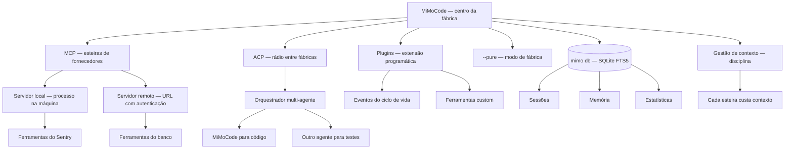

# Capítulo 8: MCP, ACP, plugins e ferramentas: ampliando o robô

## 1. Introdução

No Capítulo 7, você abriu a sala de máquinas e configurou o `mimocode.jsonc` com precisão cirúrgica. Agora vamos conectar o robô ao mundo externo: os conjuntos de ferramentas que ampliam o MiMoCode para além do que ele conhece nativamente. Este capítulo destrincha o MCP (Model Context Protocol) — o fluxo de fornecedores que o Capítulo 2 apresentou — na prática: configurar servidores MCP locais e remotos, gerenciar com `mimo mcp` e escolher ferramentas sem inflar o contexto. Depois, o ACP (Agent Client Protocol) — o rádio entre fábricas — para orquestração entre agentes e integrações multi-agente. E, por fim, os plugins — a extensão programática do MiMoCode — com o `mimo plugin`, o flag `--pure` para rodar sem plugins externos e o `mimo db` para inspecionar o banco local. Ao final, o MiMoCode deixará de ser um robô isolado e se tornará o centro de uma rede de ferramentas, dados e agentes — a fábrica integrada que o Capítulo 10 vai orquestrar em produção.

## 2. Explica

### O MCP

Fechando as ferramentas, o resumo em três distinções. O MCP traz ferramentas — o fluxo de fornecedores. O ACP conecta agentes — o rádio entre fábricas. E os plugins estendem o comportamento — a fabricação própria. As três distinções são o mapa da extensão do MiMoCode. E a gestão de contexto é a disciplina que mantém o mapa enxuto. O operador que fixa as três distinções estende a ferramenta sem confundir as camadas.

**Exemplo.** Um exemplo de esteira MCP na rotina ajuda a fixar o valor. O time de plataforma registra o servidor do Sentry; a ordem de serviço "liste os erros das últimas 24 horas e sugira prioridades" aciona a ferramenta do Sentry; o agente consulta, sintetiza e responde. A esteira entregou o dado externo sem o operador sair do posto. O exemplo mostra a cadeia: registro → descoberta → invocação → síntese. O operador que reconhece o padrão projeto fluxos que ampliam a linha sem inflar o contexto.

**Ciclo de vida.** Um detalhe da gestão de esteiras: o ciclo de vida de um servidor MCP. A esteira nasce de uma necessidade real (o time precisa dos dados do Sentry); é registrada com `mimo mcp add`; é verificada (as ferramentas aparecem?); é usada na rotina; e é removida quando a necessidade morre. O ciclo de vida é o mesmo do software: nascer, viver e morrer com propósito. O operador que trato fluxos como permanentes acumula um catálogo de ferramentas mortas — contexto pago por nada. A auditoria periódica de esteiras (Capítulo 8) é o que mantém o catálogo vivo.

**Segurança de contexto.** Uma dimensão do MCP que o operador corporativo precisa mapear: o que o fluxo envia e recebe. O servidor MCP externo pode receber dados do projeto — e o operador precisa saber qual esteira vê o quê. A regra prática: esteiras que processam código sensível devem rodar localmente, e esteiras externas devem receber apenas o mínimo necessário. O contrato do MCP — nome, parâmetros, resultado — define o perímetro do que o fluxo vê. O operador que conecto fluxos sem mapear o fluxo de dados constrói um vazamento em potencial.

**Catálogo de servidores.** Um detalhe que o operador descobre na prática: o catálogo de servidores MCP disponíveis é enorme — quase todo serviço moderno expõe um servidor oficial ou comunitário. O Sentry, o banco de dados, o sistema de tickets, as ferramentas de observabilidade — cada um com o seu servidor MCP. O risco dessa abundância é a tentação de conectar tudo. O operador profissional resiste: cado fluxo conectada adiciona a definição das suas ferramentas ao contexto de toda sessão — e o contexto inflado degrada a qualidade das respostas. A seleção de esteiras é uma decisão de engenharia, com o mesmo rigor da seleção de dependências em um projeto.

### O MCP na prática: o fluxo de fornecedores

O MCP é o protocolo padrão da indústria para conectar agentes a ferramentas e dados externos — e o MiMoCode o implementa nativamente. Um servidor MCP expõe ferramentas (buscar no Sentry, consultar um banco, acessar uma API interna), e o agente as invoca como se fossem ferramentas nativas. A arquitetura é a do contrato: o MiMoCode não conhece o código do servidor — conhece apenas o nome das ferramentas, os parâmetros e o resultado em JSON. O `mimo mcp` gerencia as ferramentas: `add` registra um servidor, `list` mostra os registrados, `remove` desliga umo fluxo. E os servidores podem ser locais (um processo na sua máquina) ou remotos (uma URL com autenticação). A lógica é a da fábrica ampliada: em vez de fabricar cada peça internamente, o robô alcança as ferramentas dos fornecedores — Sentry, banco, API de pagamentos — sem sair do posto.

A escolha das ferramentas é uma decisão de engenharia, não de curiosidade — porque cada ferramenta MCP adiciona contexto e superfície de ataque. O Capítulo 2 já registrou o alerta: MCPs pesados inflam o contexto e degradam a qualidade das respostas. O padrão profissional é começar mínimo: apenas as ferramentas que a rotina realmente usa — o observability da produção, a base de conhecimento do time, a API do sistema de tickets — e adicionar novas apenas quando a ordem de serviço justificar. Cado fluxo conectada é uma porta a mais na fábrica: útil, mas com custo.

### O ACP

Um exemplo de orquestração ACP em ação: o controlador central do time de plataforma. O controlador recebe a ordem "prepara o release da versão 2.3". Ele despacha para o MiMoCode (revisa o código), para o agente de documentação (atualiza o changelog) e para o agente de testes (executa a suíte) — em paralelo. Cada resultado volta ao controlador, que consolida o release. O exemplo mostra o valor do ACP: a coordenação de especialistas sem intervenção humana por tarefa. A orquestração é a fábrica de fábricas.

**Diagnóstico.** Um detalhe que o operador de orquestração encontra cedo: o diagnóstico de falhas ACP. Quando o orquestrador não alcança o agente, a cascata é: o protocolo está ativo? (`mimo acp status`), o orquestrador conecta no endpoint certo? (URL e porta), a autenticação está configurada?. O diagnóstico em camadas — protocolo, rede, autenticação — é o mesmo do Capítulo 4. O operador que conhece a cascata resolve a integração em minutos. O ACP é poderoso; o diagnóstico é a ferramenta que o torna confiável.

**Cenário de orquestração.** Um cenário concreto de ACP ajuda a fixar o conceito: o time de plataforma quer que o fluxo de PRs (Capítulo 6) seja orquestrada por um controlador central. O controlador coordena o MiMoCode (código), um agente de documentação e um agente de testes — cada um com o seu papel. O ACP é o protocolo que permite ao controlador despachar tarefas e receber resultados. O mesmo MiMoCode que o desenvolvedor opera na TUI vira um nó da plataforma. A orquestração por ACP é a evolução natural da automação do Capítulo 6 — de script isolado a serviço coordenado.

**Orquestração corporativa.** O ACP ganha relevância à medida que o time cresce — e o padrão corporativo de orquestração merece destaque. Em vez de cada desenvolvedor operar o seu agente isolado, a empresa centraliza: um orquestrador coordena vários agentes — o MiMoCode para código, um agente de documentação, um de testes — e o ACP é o protocolo comum. A governança dessa orquestração é a do Capítulo 10: permissões por agente, custo por agente e evidência por agente. O ACP transforma o MiMoCode de ferramenta individual em nó de uma plataforma corporativa.

### O ACP: o rádio entre fábricas

O ACP é o protocolo de controle entre agentes — o rádio que liga o centro de controle do MiMoCode a outros agentes e orquestradores. Enquanto o MCP traz ferramentas para o robô, o ACP permite que o robô delegue, receba delegação e seja controlado por sistemas externos. Os casos de uso são os da orquestração multi-agente: um orquestrador corporativo coordena vários agentes — o MiMoCode para código, outro agente para documentação, outro para testes — e o ACP é o protocolo comum. O `mimo acp` gerencia essa superfície: iniciar o servidor ACP, configurar o modo de controle e expor o agente ao orquestrador. A distinção com o MCP — esteira vs. rádio — é a mesma do Capítulo 2, e a confusão entre os dois é a armadilha clássica que o Capítulo 2 dramatizou.

### Os plugins

Um exemplo de plugin na prática: o plugin de eventos que registra cada execução de ferramenta. O plugin observa o evento `tool.execute.before`, loga a chamada e alimenta o dashboard de auditoria. O time ganha visibilidade do que o agente faz — sem mudar o comportamento. O exemplo mostra o papel do plugin: a observação e a extensão sem invadir o loop. O operador que escreve plugins de observação constrói a telemetria da fábrica.

**Ecossistema.** O plugin é o ponto de encontro entre o MiMoCode e o ecossistema da comunidade. O awesome-mimo-agent cataloga plugins e integrações; os adaptadores de terceiros (como os do ecossistema de automação de terminal) estendem a fábrica. O operador que explora o catálogo encontra soluções prontas — e o que contribui com plugins próprios alimenta o ecossistema. A relação é de mão dupla: a comunidade dá, o operador devolve. O ecossistema de plugins é o que transforma a ferramenta em plataforma — e a plataforma é o que sustenta a adoção de longo prazo.

**Compatibilidade.** Um detalhe que o operador descobre com o tempo: os plugins evoluem em ritmo próprio. O plugin instalado na versão X pode quebrar na versão Y do MiMoCode — e o `mimo upgrade` que o Capítulo 3 documenta pode trazer a quebra. A disciplina da compatibilidade: testar plugins após cada upgrade, manter o catálogo mínimo e ter o `--pure` como fallback. O operador que atualiza sem testar plugins troca umo fluxo por outra. O ciclo upgrade → teste → ajuste é parte da manutenção da linha [1][2][5].

**Auditoria de segurança.** Os plugins merecem um registro de segurança, porque são código executando com o seu contexto. O plugin de terceiros pode observar eventos, acessar arquivos e injetar contexto — o que o torna uma superfície de risco. A auditoria de plugins tem três passos: revisar o código antes de instalar (o plugin de origem duvidosa não entra), verificar o que ele acessa (as permissões que o plugin recebe) e monitorar o comportamento (o plugin que muda o fluxo sem explicação é removido). O `--pure` é a ferramenta de diagnóstico: se o comportamento volta ao normal sem plugins, a causa é um deles. A confiança em plugins é conquistada por revisão, não por fama.

### Os plugins: a extensão programática

Os plugins são a camada de extensão programática do MiMoCode — onde a comunidade e o seu time constroem capacidades novas em cima da ferramenta. O `mimo plugin` instala plugins e atualiza a configuração; o flag `--pure` roda a TUI ou o headless sem plugins externos — o modo de diagnóstico para isolar o comportamento da ferramenta base. Os plugins podem observar eventos do ciclo de vida (quando uma ferramenta executa, quando uma sessão começa), injetar contexto e até expor ferramentas custom. E o ecossistema — o awesome-mimo-agent e os adaptadores da comunidade — é o catálogo de onde os plugins e integrações nascem. Para o operador, a disciplina é a mesma das permissões do Capítulo 7: cada plugin é código executando com o seu contexto — instale o que usa, revise o que instala.

O `--pure` merece destaque no diagnóstico: quando o comportamento do MiMoCode muda sem explicação, rodar com `--pure` revela se a causa é um plugin. É o mesmo princípio do boot em modo seguro: a ferramenta base, sem extensões, para comparar. O operador profissional mantém uma mentalidade de auditoria sobre os plugins — o que está instalado, por que está instalado, e o que ele faz.

### O mimo db

O banco local tem uma dimensão de privacidade que o operador corporativo precisa mapear. O SQLite guarda sessões — que podem conter trechos de código e decisões — e memória do projeto. Os dados vivem na máquina, não na nuvem. Mas a proteção local é responsabilidade do operador: permissões de arquivo, backup e descarte controlado. A privacidade do MiMoCode é uma propriedade da arquitetura — a privacidade da operação é uma disciplina do operador. O mapeamento de onde os dados vivem é o primeiro passo da política de dados do time.

**Backup.** O banco local é um ativo — e ativos merecem backup. O SQLite FTS5 guarda sessões, memória e estatísticas; a perda do banco apaga o histórico da fábrica. A rotina de backup: copiar o banco periodicamente (ou exportar as sessões com `mimo export`) e restaurar em máquina nova. O operador que trata o banco como descartável redescobre o projeto na próxima máquina; o que faz backup carrega a fábrica inteira.

**Inspeção do estado.** O `mimo db` é também a ferramenta de inspeção do estado — e o operador maduro o usa em dois cenários. No diagnóstico: quando a memória ou as estatísticas parecem erradas, o banco revela o que foi gravado. Na limpeza: quando o time quer zerar o histórico de um projeto, o banco permite a operação controlada. E na auditoria: o banco é a fonte primária que o `mimo stats` resume. O operador que conhece o banco entende a ferramenta por dentro — a mesma curiosidade arquitetural que o Capítulo 2 cultivou.

### O mimo db: o banco local sob o capô

O `mimo db` dá acesso ao banco local que guarda sessões, memória e estatísticas — o SQLite FTS5 que o Capítulo 2 apresentou como arquivo da fábrica. O comando permite inspecionar o banco, verificar a integridade e entender como os dados se organizam. Para o operador curioso — e para quem precisa auditar — o `mimo db` é a janela para o estado interno da ferramenta: quantas sessões existem, quanto de memória foi acumulada, quais dados alimentam o FTS5. O Capítulo 9 explora a memória em profundidade; aqui, o registro é o mapa: o `mimo db` é onde a memória da fábrica mora, e o `mimo stats` é a leitura resumida dela.

### O contexto acadêmico e de mercado das extensões

Vale situar as extensões no contexto da obra. O MCP nasceu como um padrão aberto para conectar modelos a ferramentas — e sua adoção virou o padrão da indústria, com servidores para quase todo serviço. O ACP, por sua vez, representa a maturidade do campo: quando os agentes passam a se comunicar entre si, a orquestração multi-agente deixa de ser experimento e vira arquitetura. Na literatura, o SWE-agent mostrou que a interface de ferramentas determina o sucesso do agente [9]; o OpenHands consolidou a visão de plataformas abertas onde ferramentas e agentes coexistem [11]. E a comparação com o mercado: o Claude Code suporta MCP, mas o ACP é limitado [12]; o Gemini CLI integra ferramentas, mas fechado ao ecossistema Gemini [13]; o Cursor tem MCP, mas sem a superfície de servidor aberta [14]. O MiMoCode suporta os dois protocolos abertamente — e o ecossistema da comunidade vive dessa abertura. A regra da gestão de contexto, aliás, não é exclusiva do MiMoCode: a mesma disciplina de ferramentas mínimas aparece em todas as ferramentas maduras — e o benchmark Terminal Bench 2 mede exatamente a operação enxuta. A disciplina, aliás, é a mesma que o DORA associa aos ganhos de produtividade: ferramentas bem operadas dentro de um fluxo disciplinado [25].

### A gestão de contexto

Fechando o capítulo, o elo entre contexto e qualidade — o motivo pelo qual a gestão importa além do custo. O contexto inflado degrada a atenção do modelo: quanto mais lixo, menor o foco no que importa. O SWE-agent mostrou que a qualidade da interface — incluindo o que entra no contexto — determina o sucesso. A gestão de contexto é, portanto, uma alavanca dupla: corta custo e melhora qualidade ao mesmo tempo. O operador que mantém a rede enxuta produz melhor e paga menos.

**Contexto e o custo final.** Fechando o capítulo, vale a amarração final com o custo. Cado fluxo MCP, cada plugin e cada ferramenta adiciona contexto — e o contexto custa (Capítulo 4) e degrada a qualidade quando inflado. A auditoria periódica de extensões — o que está conectado, o que é usado, o que custa — é a rotina que mantém a rede enxuta. O `mimo stats` mostra o custo do desequilíbrio; o operador que mede ajusta. A rede de extensões é um orçamento: cado fluxo é uma linha da planilha, e a conta precisa fechar.

**Contexto e o equilíbrio.** Fechando a parte expositiva, vale registrar o equilíbrio que a gestão de contexto exige. Muitas ferramentas inflam o contexto; nenhumo fluxo limita o robô ao que ele conhece nativamente. O equilíbrio é dinâmico: o time adiciona umo fluxo quando a rotina justifica e a remove quando deixa de usar. A disciplina da gestão de contexto é a mesma do estoque físico: o almoxarifado eficiente não é o mais cheio, é o mais usado. E o `mimo stats` mostra o custo do desequilíbrio — o operador que mede ajusta antes da fatura.

**Contexto: o custo de cado fluxo.** A gestão de contexto é a habilidade que separa o operador que amplia o robô do operador que o afoga. Cada ferramenta MCP adiciona a sua definição ao contexto — nome, parâmetros, descrição — e cada arquivo anexado adiciona o seu conteúdo. O contexto total determina o custo (Capítulo 4) e a qualidade (contexto inflado degrada a atenção do modelo) [1][15][18]. A disciplina da gestão de contexto: ferramentas mínimas, arquivos específicos (não o repositório inteiro), e a regra de ouro de revisar periodicamente o que está conectado. O benchmark Terminal Bench 2, que mede a operação real de terminal, mostra exatamente essa diferença: a ferramenta bem operada — com contexto enxuto e ferramentas certas — supera a ferramenta mal operada.

## 3. Ilustra

Pense nas extensões do MiMoCode como a rede logística da fábrica. O MCP é a rede de esteiras de fornecedores: cada servidor MCP é um fornecedor que entrega peças no formato certo — o Sentry entrega dados de erros, o banco entrega consultas, a API de pagamentos entrega transações — e o robô alcança todas sem sair do posto. O ACP é a rede de comunicação entre fábricas: o rádio que conecta o centro de controle desta fábrica ao de outra — um orquestrador central coordena vários robôs, cada um na sua especialidade. Os plugins são as ferramentas customizadas que o seu time fabrica: o dispositivo que automatiza uma inspeção específica, instalado na linha quando necessário. O `--pure` é o botão de fábrica original: desliga os dispositivos custom e volta ao estado de entrega, para diagnosticar. E o `mimo db` é o almoxarifado: o depósito onde ficam os registros de tudo o que a fábrica já produziu — consultável, auditável e alimentando a memória.



Repare que o diagrama mostra a rede completa: o MCP traz as esteiras (locais e remotas), o ACP conecta fábricas através do orquestrador, os plugins estendem o comportamento, o `--pure` isola a base e o `mimo db` é o almoxarifado — com a gestão de contexto como disciplina transversal. Como Operador de Linha de Montagem, a leitura é a sua política de extensão: conecte o que a rotina usa, orquestre o que precisa de escala, instale plugins com revisão e audite o contexto periodicamente.

## 4. Técnica

### O mimo mcp e a gestão de esteiras

A gestão de ferramentas merece aprofundamento: o `mimo mcp` é o comando que o operador usa com mais frequência na rotina de extensão. O ciclo de vida de umo fluxo tem três fases: registrar (com o tipo local ou remoto), verificar (listar e confirmar que as ferramentas aparecem) e remover (quando o fluxo deixa de ser usada). A verificação é o passo mais subestimado: um servidor MCP registrado mas com falha de autenticação ou de URL não aparece para o agente — e o operador culpa a ferramenta quando o problema é o fluxo. O padrão profissional é a auditoria periódica de esteiras: listar o que está conectado, confirmar que cada uma é usada e remover o que não é — a mesma disciplina de permissões do Capítulo 7 aplicada às ferramentas. E o registro em configuração (`mimocode.jsonc`) garante que as ferramentas do projeto viajam com o repositório — a fábrica leva a rede logística junto.

### A integração com a memória persistente

As extensões conectam-se à memória da fábrica: as ferramentas MCP e os plugins alimentam o mesmo fluxo de contexto que o SQLite FTS5 indexa. Quando o agente usa umo fluxo externa e o resultado é registrado na sessão, esse resultado pode ser consolidado na memória do projeto — e o próximo turno consulta o histórico com busca textual. A automação do Capítulo 6 e as ferramentas do Capítulo 8 convergem no mesmo banco: o `mimo db` inspeciona, o `mimo stats` resume e o FTS5 responde às perguntas da memória. Para o operador, a leitura é estratégica: as extensões não são apenas ferramentas — são fontes de conhecimento que a fábrica acumula entre turnos.

### Registrando um servidor MCP

O registro de um servidor MCP é o primeiro passo para ampliar o robô — e o `mimo mcp` centraliza a gestão [1][4][15]:

```bash
# Adiciona um servidor MCP local (processo na máquina)
mimo mcp add sentry --type local --command "npx" --args "-y @sentry/mcp-server"

# Lista os servidores registrados
mimo mcp list

# Adiciona um servidor MCP remoto (URL)
mimo mcp add banco-interno --type remote --url "https://gateway.empresa.com/mcp" --header "Authorization: Bearer <token>"

# Remove umo fluxo
mimo mcp remove sentry
```

O servidor local roda como processo e conversa com o MiMoCode via stdio; o remoto conversa via HTTP com autenticação. O ponto técnico é o contrato: independente do tipo, o MiMoCode enxerga as ferramentas do servidor da mesma forma — o fornecedor pode ser um processo local ou uma API na nuvem.

### As ferramentas MCP em ação

Depois de registrado, as ferramentas do servidor aparecem para o agente — e o operador pode pedir seu uso explicitamente [15][1]:

```bash
# Pede ao agente que use o fluxo do Sentry
mimo run "Use a ferramenta do Sentry para listar os erros das últimas 24 horas"

# Diagnóstico: verifica se o fluxo está conectada
mimo mcp list
```

A magia do MCP é que o agente decide quando usar a ferramenta — como decide usar `read` ou `bash`. A ordem de serviço apenas aponta o fluxo; o agente a alcança no momento certo. E, quando o trabalho exige isolamento — cado fluxo operando em um contexto separado — o mesmo Git que o Capítulo 10 usa com worktrees pode ser aplicado à extensão: cado fluxo em uma bancada [24][15].

### Um servidor MCP mínimo (recap técnico)

O Capítulo 2 mostrou o servidor MCP mínimo em JavaScript; aqui vale o reforço do contrato em código, porque a sala de máquinas é o lugar certo para fixar o formato [15]:

```javascript
import { McpServer } from "@modelcontextprotocol/sdk/server/mcp.js";
import { StdioServerTransport } from "@modelcontextprotocol/sdk/server/stdio.js";

const server = new McpServer({ name: "estoque", version: "0.1.0" });

server.tool(
  "consultar_estoque",
  "Consulta o estoque por sku",
  { sku: { type: "string", description: "Codigo da peca" } },
  async (params) => {
    const estoque = { "PEC-001": 42, "PEC-002": 7 };
    const qtd = estoque[params.sku] ?? 0;
    return { content: [{ type: "text", text: `Estoque de ${params.sku}: ${qtd}` }] };
  }
);

const transport = new StdioServerTransport();
await server.connect(transport);
```

O contrato é sempre o mesmo: nome da ferramenta, descrição, schema de parâmetros e função de execução. O MiMoCode não precisa conhecer a implementação — apenas o contrato.

### O provedor custom e as ferramentas na configuração

Um detalhe de configuração que amarra o Capítulo 7 às extensões: os provedores custom com `baseURL` (Capítulo 4) e os servidores MCP (Capítulo 8) são configurados no mesmo arquivo — o `mimocode.jsonc`. O gateway corporativo que roteia o tráfego de modelos também pode expor esteiras MCP internas, e a configuração do projeto documenta ambas. O AI SDK, base do contrato de provedores, é o mesmo padrão que sustenta a interoperabilidade das ferramentas. E o Ollama, para quem opera modelos locais, se conecta tanto como provedor quanto como fonte de ferramentas — a fábrica local completa [17][1]. A sala de máquinas do Capítulo 7 e a rede logística deste capítulo são o mesmo painel [1][7][23].

### O ecossistema de skills e a extensão

As extensões conectam-se às skills do Capítulo 9: o `mimo plugin` e o `/distill` são duas faces da mesma moeda — a extensão programática do comportamento. Os plugins são código que estende a ferramenta; as skills criadas com `/distill` são procedimentos que o time padroniza. A comunidade mantém o awesome-mimo-agent com skills e integrações prontas — e o operador que quer ampliar o robô sem escrever código começa por lá [3][28]. A diferença prática: o plugin muda o comportamento do motor (eventos, ferramentas), enquanto a skill muda o procedimento (o fluxo que o agente segue). O fluxo profissional do Capítulo 10 combina os dois — e a auditoria de extensões, como a do Capítulo 8, cobre ambos.

### A orquestração ACP em código

O ACP expõe o agente a orquestradores — e o padrão mínimo é iniciar a superfície e confirmar a exposição [1][4][16]:

```bash
# Inicia o servidor do protocolo de controle entre agentes
mimo acp

# Verifica a configuração da superfície ACP
mimo acp status
```

A orquestração completa — um orquestrador coordenando MiMoCode, um agente de testes e um de documentação — é o padrão corporativo que o Capítulo 10 aprofunda. Aqui, o essencial é saber que a superfície existe e onde ela se conecta.

### Os plugins o modo fábrica

A gestão de plugins é a extensão programática do dia a dia [1][3][4]:

```bash
# Instala um plugin e atualiza a configuração
mimo plugin @time/plugin-revisor

# Lista os plugins instalados
mimo plugin list

# Roda a TUI sem plugins externos (modo diagnóstico)
mimo --pure

# Roda uma tarefa headless sem plugins
mimo run --pure "diagnostique a lentidão"
```

O `--pure` é o botão de fábrica original: o diagnóstico mais rápido para saber se um plugin é a causa de um comportamento estranho. E o `mimo db` fecha o mapa [1][4][20]:

```bash
# Inspeciona o banco local (sessões, memória, estatísticas)
mimo db
```

O `mimo db` é o almoxarifado — e o `mimo stats` (Capítulo 6) é a leitura resumida dos mesmos dados.

### Referência rápida: extensões — MCP, ACP, plugins e banco

A tabela abaixo resume as quatro formas de estender e inspecionar o MiMoCode — o mapa do Capítulo 8 em forma de consulta [1][15][16]:

| Mecanismo | O que faz | Quando usar | Comando/arquivo |
|---|---|---|---|
| MCP | Ferramentas e dados externos | Acessar Sentry, banco, APIs | `mimo mcp add`, `mimocode.jsonc` |
| ACP | Controle entre agentes | Orquestrar, delegar, TUI remota | Servidor headless + protocolo |
| Plugin | Código que estende o comportamento | Automação programática | `mimo plugin <module>` |
| Banco local | Inspeção de sessões e memória | Auditar, fazer backup | `mimo db` |

**Checklist de segurança de extensões.** Toda extensão entra no mesmo fluxo de auditoria: (1) verifique o que o servidor MCP ou plugin envia e recebe; (2) conceda apenas os escopos mínimos; (3) versione a lista de servidores MCP no `mimocode.jsonc`; (4) faça backup do banco local antes de operações de manutenção [1][2][15]. O princípio que atravessa o capítulo é único: tudo o que estende a ferramenta é auditável — e o operador que audita extensões com disciplina opera uma fábrica sem surpresas [1][2][3]. A distinção MCP (ferramentas) versus ACP (agentes) permanece a bússola de qualquer integração [15][16].

## 5. Aplica

### A cena de contraste: o operador que conectou todas as esteiras

Imagine a cena: seu time adotou o MiMoCode e você ficou responsável pelas extensões. Empolgado com as possibilidades do MCP, você conecta em uma tarde: o Sentry, o banco de dados, a API de pagamentos, o sistema de tickets, o Grafana e mais três esteiras que "podem ser úteis um dia". A sessão começa a ficar lenta; as respostas do agente perdem foco; e a fatura de tokens sobe 40% na primeira semana. O diagnóstico, quando alguém mais experiente olha, é constrangedor: você transformou a linha de montagem em um depósito — cada esteira conectada adiciona a definição das suas ferramentas ao contexto de toda sessão, e seis esteiras desnecessárias são seis blocos de contexto inútil que o modelo precisa processar a cada passo. O problema não era o MCP — era a ausência de disciplina de extensão.

A correção é a política de contexto que este capítulo desenhou: começar mínimo e adicionar apenas o que a rotina usa. O Sentry ficou (o time diagnostica erros diariamente); o banco ficou (consultas são rotina); as outras quatro saíram — e a sessão voltou a ser rápida, o foco voltou e a fatura caiu. A lição dessa cena é a lição central deste capítulo: cada esteira conectada é uma porta com custo — e o operador profissional audita a rede de extensões como audita as permissões do Capítulo 7.

As armadilhas comuns da extensão seguem o mesmo padrão de excesso: conectar MCPs demais (contexto inflado, qualidade degradada); confundir MCP com ACP (a armadilha do Capítulo 2, agora em escala); instalar plugins sem revisão (código de terceiros executando com o seu contexto); esquecer o `--pure` no diagnóstico (culpar a ferramenta quando a causa é um plugin); e ignorar o `mimo db` (perder a visão do estado interno da ferramenta). O operador profissional trata a rede de extensões como um orçamento: cada esteira, cada plugin e cada ferramenta tem um custo de contexto e um benefício — e a conta precisa fechar.

### Métricas de sucesso na extensão

No cenário corporativo, a maturidade da extensão aparece em métricas concretas: o número de servidores MCP por operador (deve ser pequeno e justificado — não um catálogo); o custo médio de contexto por sessão (deve cair à medida que as esteiras são auditadas); a taxa de uso das ferramentas MCP (esteiras que nunca são chamadas devem ser removidas); e o tempo de diagnóstico de incidentes (cai quando a rede é enxuta e o `--pure` é usado com disciplina). A empresa que mede essas linhas sabe se a rede de extensões está produzindo capacidade ou custo — e o benchmark Terminal Bench 2 mostra que a operação enxuta é o que separa a ferramenta rápida da ferramenta lenta [22].

## 6. Conclusão

Neste turno, você conectou o robô ao mundo: dominou o MCP como o fluxo de fornecedores — servidores locais e remotos, gestão com `mimo mcp` e o custo de contexto de cado fluxo [15][1]; aprendeu o ACP como o rádio entre fábricas — a orquestração multi-agente que o Capítulo 10 escala [16][1]; geriu os plugins com o `mimo plugin` e o `--pure` como modo de fábrica original [1][3][4]; e inspecionou o banco local com o `mimo db` — o almoxarifado da memória. O desafio deste capítulo: faça a auditoria de extensões de um projeto seu — liste os servidores MCP e plugins conectados, remova os que não são usados, registre um servidor MCP útil para a sua rotina (como o Sentry ou um banco) e feche com uma sessão `--pure` para confirmar que a base funciona sem extensões. Depois, responda de memória: qual a diferença entre MCP e ACP, e por que cado fluxo MCP adiciona custo de contexto? No Capítulo 9, vamos destrinchar o que ninguém te ensina: a memória persistente, a compactação de contexto e o controle de custo com `mimo stats`.

## 7. Referências Bibliográficas

[1] XIAOMI MIMO. *MiMo-Code: repositório oficial do MiMoCode.* Disponível em: https://github.com/XiaomiMiMo/MiMo-Code. Acesso em: 03 ago. 2026.

[2] XIAOMI MIMO. *MiMoCode: documentação e central de notícias.* Disponível em: https://mimo.mi.com/docs/en-US/news/latest/mimocode. Acesso em: 03 ago. 2026.

[3] XIAOMI MIMO. *awesome-mimo-agent: ecossistema e guias da comunidade.* Disponível em: https://github.com/XiaomiMiMo/awesome-mimo-agent. Acesso em: 03 ago. 2026.

[4] XIAOMI MIMO. *README npm do MiMoCode.* Disponível em: https://github.com/XiaomiMiMo/MiMo-Code/blob/main/README_npm.md. Acesso em: 03 ago. 2026.

[5] XIAOMI MIMO. *Script de instalação do MiMoCode.* Disponível em: https://mimo.xiaomi.com/install. Acesso em: 03 ago. 2026.

[7] SST. *OpenCode Docs: documentação da arquitetura e do servidor headless.* Disponível em: https://opencode.ai/docs. Acesso em: 03 ago. 2026.

[9] YANG, John et al. *SWE-agent: Agent-Computer Interfaces Enable Automated Software Engineering.* Disponível em: https://arxiv.org/abs/2405.15793. Acesso em: 03 ago. 2026.

[11] WANG, Xingyao et al. *OpenHands: An Open Platform for AI Software Developers as Generalist Agents.* Disponível em: https://arxiv.org/abs/2407.16741. Acesso em: 03 ago. 2026.

[12] ANTHROPIC. *Claude Code: agente de codificação de terminal.* Disponível em: https://docs.anthropic.com/en/docs/claude-code. Acesso em: 03 ago. 2026.

[13] GOOGLE. *Gemini CLI: agente de codificação de terminal open-source.* Disponível em: https://github.com/google-gemini/gemini-cli. Acesso em: 03 ago. 2026.

[14] CURSOR. *Cursor: editor com IA embutida.* Disponível em: https://cursor.com. Acesso em: 03 ago. 2026.

[15] MODEL CONTEXT PROTOCOL. *Especificação oficial do MCP.* Disponível em: https://modelcontextprotocol.io. Acesso em: 03 ago. 2026.

[16] AGENT CLIENT PROTOCOL. *Especificação oficial do ACP.* Disponível em: https://agentclientprotocol.com. Acesso em: 03 ago. 2026.

[17] OLLAMA. *Modelos locais de código aberto.* Disponível em: https://ollama.com. Acesso em: 03 ago. 2026.

[18] OPENROUTER. *Roteador de modelos de IA.* Disponível em: https://openrouter.ai. Acesso em: 03 ago. 2026.

[20] SQLITE. *FTS5: extensão de full-text search do SQLite.* Disponível em: https://www.sqlite.org/fts5.html. Acesso em: 03 ago. 2026.

[22] XIAOMI MIMO. *Benchmarks do MiMoCode: SWE-Bench Pro 62% e Terminal Bench 2 73%.* Disponível em: https://mimo.mi.com/docs/en-US/news/latest/mimocode. Acesso em: 03 ago. 2026.

[23] VERCEL. *AI SDK: base dos provedores e do catálogo de modelos.* Disponível em: https://ai-sdk.dev. Acesso em: 03 ago. 2026.

[24] GIT. *Git worktrees: documentação oficial.* Disponível em: https://git-scm.com/docs/git-worktree. Acesso em: 03 ago. 2026.

[25] DORA. *State of AI-assisted Software Development 2025.* Disponível em: https://dora.dev. Acesso em: 03 ago. 2026.

[28] RTK. *Adaptadores e integrações da comunidade para agentes de terminal.* Disponível em: https://github.com/rtk-ai/rtk. Acesso em: 03 ago. 2026.
