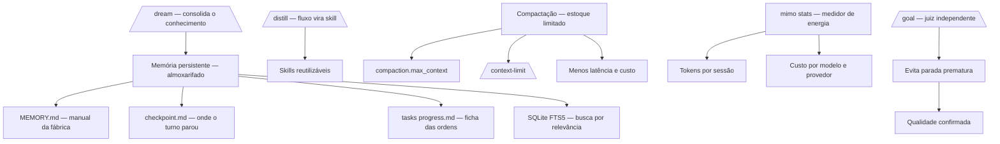

# Capítulo 9: O que ninguém te ensina: memória, compactação e custo

## 1. Introdução

No Capítulo 8, você conectou o robô ao mundo externo com MCP, ACP e plugins — e aprendeu que cado fluxo tem um custo de contexto. Agora chegamos ao capítulo que a documentação oficial menciona de passagem e que este livro destrincha por completo: a operação fina do MiMoCode — memória, compactação e custo. Este capítulo cobre o sistema de memória persistente na prática: os três pilares (MEMORY.md, checkpoint.md e tasks/<id>/progress.md), os comandos `/dream` para consolidar conhecimento e `/distill` para transformar fluxos manuais em skills, e o `/goal` com juiz independente para evitar paradas prematuras. Depois, a compactação de contexto: a chave `compaction.max_context`, o `/context-limit` e por que compactar antes do limite nativo reduz latência e custo. E, por fim, a matemática do custo com `mimo stats` — o medidor de energia da fábrica que transforma "quanto o MiMoCode custa" de mistério em linha orçamentária. Ao final, você operará o MiMoCode como um profissional que entende não apenas o que o robô faz, mas quanto custa, quanto lembra e quanto contexto consome.

## 2. Explica

### A memória persistente

Fechando a memória persistente da fábrica, um resumo dos três pilares em uma linha cada. O `MEMORY.md` responde "o que o projeto sabe?" — o manual. O `checkpoint.md` responde "onde o turno parou?" — o estado. O `progress.md` responde "como cada tarefa anda?" — o andamento. As três respostas juntas são o conhecimento operacional da fábrica. E o FTS5 é a voz que responde às perguntas sobre esse conhecimento. O operador que domina os três pilares domina a continuidade do trabalho.

**Exemplo.** Um exemplo de memória em ação: o projeto com meses de sessões. O `MEMORY.md` registra as decisões de arquitetura; os checkpoints marcam onde cada migração parou; e o progresso das tarefas acompanha cada ordem. A busca FTS5 responde "como resolvemos o problema de timeout?" com os trechos das sessões passadas. O agente começa a sessão sabendo o que a fábrica aprendeu. O exemplo mostra a diferença entre o projeto com memória e o sem: o primeiro opera em camadas, o segundo reconstrói do zero.

**Busca.** Um detalhe que o operador usa no dia a dia: a busca na memória. O FTS5 responde a perguntas em linguagem natural — "o que decidimos sobre a migração de autenticação?" — com os trechos mais relevantes. A qualidade da busca depende da qualidade da memória: títulos claros, tópicos distintos, vocabulário consistente. O operador que alimenta a memória com estrutura — em vez de despejo — transforma o arquivo em ferramenta. A busca por relevância é a diferença entre o arquivo consultável e o depósito.

**Estrutura dos arquivos.** Vale fixar a estrutura dos arquivos de memória, porque ela define como o conhecimento se organiza. O `MEMORY.md` é o manual do projeto — estruturado por tópicos (arquitetura, decisões, convenções) para que a busca encontre. O `checkpoint.md` é o estado do turno — o que estava em andamento, onde parou. E o `tasks/<id>/progress.md` é a ficha de cada ordem de serviço. A estrutura boa é a que o FTS5 indexa bem: títulos claros, tópicos distintos, vocabulário consistente. A memória desorganizada é um depósito; a estruturada é um arquivo consultável.

**Hábito de alimentar.** Um ponto que separa quem usa memória de quem a acumula: o hábito de alimentá-la. A memória não se alimenta sozinha — os checkpoints gravam o estado, mas o conhecimento de valor (decisões, descobertas, convenções) precisa ser consolidado. O operador que registra as decisões no fluxo — "decidimos X porque Y" — alimenta a memória com material que o `/dream` consolida. O que registra apenas o estado ("feito, falta testar") deixa a memória rasa. A diferença é a mesma entre o diário de bordo e a lista de tarefas: um registra o porquê, o outro apenas o quê.

**Profundidade.** O Capítulo 2 apresentou a memória persistente como o diferencial arquitetural do MiMoCode; este capítulo abre o cofre da memória em profundidade. O sistema usa um banco local SQLite com a extensão FTS5 de full-text search, organizado em três pilares complementares. O primeiro pilar é a memória de projeto (`MEMORY.md`): o conhecimento duradouro sobre o repositório — arquitetura, decisões, convenções — que sobrevive a qualquer sessão. O segundo é o checkpoint de sessão (`checkpoint.md`): o registro de onde cada turno parou — o estado do trabalho no momento em que a sessão foi interrompida. O terceiro são as notas de progresso de tarefas (`tasks/<id>/progress.md`): o acompanhamento de cada ordem de serviço — o que foi feito, o que falta, o que foi testado. A separação entre os pilares é a separação entre o que o projeto sabe (memória), onde o trabalho parou (checkpoint) e como cada tarefa anda (progresso).

O FTS5 é o motor que torna essa memória consultável: o conteúdo é indexado em tokens, e o agente pode buscar por relevância — "o que decidimos sobre a migração de autenticação?" — em vez de varrer arquivos. Essa busca por relevância é a diferença entre o arquivo da fábrica e o depósito desorganizado: o primeiro responde à pergunta, o segundo exige que você saiba o que procura. E a memória não é apenas leitura: ela é alimentada automaticamente pelos checkpoints e consolidada pelos comandos de manutenção que este capítulo destrincha.

### O comando /dream

Um exemplo do `/dream` na rotina semanal: o turno da segunda-feira consolida a semana anterior. O comando extrai as decisões das sessões, organiza por tópico e atualiza o `MEMORY.md`. O operador revisa — corrige o impreciso, aprova o resto. A semana seguinte começa com a memória fresca. O exemplo mostra o ciclo: produzir (turnos) → consolidar (`/dream`) → revisar (operador) → operar (próximos turnos). A consolidação periódica é a manutenção do conhecimento da fábrica.

**Memória do time.** O `/dream` tem um papel no time além da consolidação individual: a memória compartilhada. O `MEMORY.md` versionado no repositório é a memória do time — todos os operadores leem o mesmo manual. O `/dream` individual consolida o conhecimento do turno; a revisão em equipe valida o que vira memória do projeto. O time que mantém a memória compartilhada opera com consistência — o agente conhece o projeto independentemente de quem o opera. A memória do time é o conhecimento da fábrica que sobrevive à rotatividade.

**Frequência.** A frequência do `/dream` é uma decisão de operação. O padrão documentado é a consolidação a cada sete dias — mas a frequência ideal depende do ritmo do projeto. O projeto que muda todo dia consolida mais vezes; o estável, menos. O critério de decisão: quando o conhecimento acumulado começa a pesar nas sessões — quando o agente perde contexto porque a memória cresceu demais — é hora de consolidar. O `/dream` não é uma cerimônia — é a manutenção da memória, e a manutenção tem cadência.

**Revisão humana.** O `/dream` consolida, mas não substitui o julgamento humano. A consolidação automática pode gravar imprecisões — o agente que interpretou mal uma decisão, o contexto que mudou desde o registro. O operador profissional revisa o que o `/dream` escreveu antes de aceitar. A revisão é rápida — ler o que foi consolidado, corrigir o impreciso, aprovar o resto. A memória de qualidade é o produto da consolidação automática mais a revisão humana. O `/dream` acelera o processo; o operador garante a precisão.

**Consolidação da memória.** O comando `/dream` é a ferramenta de consolidação da memória: ele extrai o conhecimento das sessões recentes e o consolida na memória do projeto — transformando o que foi aprendido em um turno em conhecimento permanente. O padrão documentado é a consolidação periódica — a cada sete dias, por exemplo — para que o conhecimento não se perca nem se acumule sem estrutura. O `/dream` é o momento em que o arquivo da fábrica é atualizado: as lições do turno viram manual do posto. Para o operador, a disciplina é a da revisão periódica: agendar a consolidação, revisar o que o `/dream` escreveu e corrigir o que ficou impreciso.

### O comando /distill

Um exemplo do `/distill` na prática: o fluxo de revisão de release. O operador repete toda release: revisa o changelog, verifica os breaking changes, confere os testes de migração. Com o `/distill`, o fluxo vira a skill `revisao-de-release` — um comando. A próxima release invoca a skill em segundos. O exemplo mostra a capitalização: o conhecimento embutido no fluxo vira ativo reutilizável. O `/distill` é a ferramenta que transforma a repetição em patrimônio.

**Limite da skill.** Uma decisão que o `/distill` força: o limite da skill. A skill boa define o que faz e o que não faz. A skill de revisão de código não gera código; a de geração de testes não refatora a produção. O limite explícito evita o mau uso — o agente que chama a skill errada para a tarefa. E o limite documentado é o que permite ao agente primário decidir quando chamar. A skill sem limite é um procedimento órfão; a com limite é um especialista confiável.

**Qualidade da skill.** A skill criada pelo `/distill` merece controle de qualidade antes de virar padrão. O fluxo de aceite de uma skill: testar em um projeto real, verificar que produz o resultado esperado, documentar o propósito e o limite, e versionar. A skill sem documentação é um procedimento órfão; a sem limite é um convite ao mau uso. O time que adota skills com controle de qualidade mantém o catálogo confiável. E a comunidade (awesome-mimo-agent) é o repositório de onde nascem as skills testadas.

**Padronização do time.** O `/distill` tem um papel além da produtividade individual: a padronização do time. Quando um fluxo vira skill, ele vira também um padrão compartilhado — o time inteiro executa o mesmo procedimento da mesma forma. A skill versionada no repositório é documentação executável: o procedimento está escrito e funciona. E a comunidade — o awesome-mimo-agent — permite ao time começar de skills testadas em vez de reinventar. A padronização por skills é a mesma lógica dos padrões de codificação: menos variação, mais previsibilidade, mais qualidade.

**Transformação de fluxos em skills.** O comando `/distill` é a ferramenta de capitalização do conhecimento: ele converte um fluxo manual repetido — a sequência de passos que você executa toda semana — em uma skill reutilizável. A skill pode ser acionada depois via comando `/` ou por relevância textual, e o fluxo que exigia dez passos manuais vira uma única invocação. É a mecanização da fábrica: o operador que percebe um padrão repetitivo o transforma em dispositivo automático. O `/distill` é o elo entre o trabalho manual e as mais de vinte skills nativas do MiMoCode — e a comunidade contribui com skills no awesome-mimo-agent. A disciplina do `/distill`: só vale transformar em skill o que é realmente repetido — a automatização prematura de fluxos únicos é desperdício de manutenção.

### A compactação de contexto

A compactação também vale para a automação do Capítulo 6 — as sessões headless consomem a janela como as interativas. O pipeline com `mimo run` que processa muitas mensagens em sequência precisa da compactação para não explodir o contexto. A calibração do `compaction.max_context` por modelo vale para o headless. E o `mimo stats` mostra o efeito: o pipeline compactado custa menos por execução. A automação não escapa da física do contexto — a compactação é a válvula que a mantém viável.

**Memória.** Vale conectar a compactação à memória — as duas operam sobre o mesmo problema: o contexto. A compactação reduz o contexto da sessão atual; a memória reduz o contexto das sessões futuras. O projeto com memória consolidada começa as sessões com contexto implícito; o sem memória reconstrói tudo. A combinação — compactação na sessão, memória entre sessões — é o sistema completo de gestão de contexto. O operador que usa as duas opera com a janela enxuta e o conhecimento cheio.

**Trade-off.** A compactação não é grátis — e o operador maduro conhece o trade-off. Compactar resume o histórico: o que foi compactado perde detalhes, e a retomada após a compactação depende da qualidade do resumo. Compactar cedo demais perde contexto útil; tarde demais, explode o custo. O ponto ótimo é empírico: ajuste o limite, observe a qualidade das respostas e o custo no `mimo stats`, e refine. O operador que entende o trade-off calibra com dados; o que ignora a compactação paga o contexto cheio em toda sessão.

### A compactação de contexto: o gerenciador de janela

A janela de contexto do modelo é o recurso mais valioso e mais desperdiçado da operação de agentes — e a compactação é a alavanca que o controla. O MiMoCode permite definir limites de compactação por modelo na chave `compaction.max_context` — por exemplo, forçar o agente a compactar o histórico quando a janela chegar a 300 mil tokens, antes do limite nativo do modelo. O comando `/context-limit` aplica o mesmo controle na sessão. A lógica é a da fábrica com estoque limitado: quando o espaço de trabalho enche, o robô resume o que já foi feito — compactando o contexto — em vez de travar ou descartar. A compactação antecipada reduz a latência (menos tokens por passo) e o custo (menos tokens por passo) — mas exige calibração: compactar cedo demais perde detalhes; tarde demais, explode o custo.

A matemática é a mesma do Capítulo 4: o custo de uma sessão é aproximadamente a soma, sobre todos os passos, do tamanho do contexto de cada passo vezes o preço do token. A compactação ataca diretamente o tamanho do contexto por passo — e a calibração de `compaction.max_context` é, depois do `small_model`, a segunda alavanca de custo mais eficaz. O operador profissional mede com `mimo stats`, ajusta com `compaction.max_context` e observa a fatura responder.

### O comando /goal

O valor econômico do `/goal` está na prevenção de retrabalho — o custo escondido da operação. A tarefa "concluída" cedo demais gera uma segunda rodada: o teste de borda que quebra, o contrato que estava errado. Cada rodada é contexto e tokens pagos de novo. O `/goal` com juiz independente reduz o retrabalho — e o `mimo stats` mostra o efeito na fatura. A prevenção de retrabalho é a alavanca mais econômica do livro: custa zero e economiza o retorno das rodadas.

**Definição de pronto.** O `/goal` institucionaliza a definição de pronto — e a definição é a mais valiosa das especificações. A pergunta que o Capítulo 5 fez — como saber que a tarefa está concluída? — ganha resposta executável no `/goal`. O critério verificável (teste passando, comando retornando o esperado, métrica no valor) substitui o sentimento de conclusão. E a definição de pronto do `/goal` alimenta o AGENTS.md — os critérios padronizados do projeto. A cultura de qualidade é a soma de definições de pronto bem escritas.

**Cultura de qualidade.** O `/goal` tem um efeito que vai além da tarefa: ele muda a cultura de qualidade. Quando o time define objetivos com critérios verificáveis e juiz independente, a definição de "pronto" deixa de ser subjetiva. O `/goal` institucionaliza a pergunta que o Capítulo 5 fez: como saber que a tarefa está concluída?. E o efeito colateral é positivo: os critérios de aceite que o `/goal` exige melhoram também os prompts do dia a dia. A cultura de qualidade não vem da ferramenta — vem da prática de definir objetivos verificáveis, e o `/goal` é a ferramenta que a sustenta.

**Juiz independente.** O comando `/goal` é o controle de qualidade da conclusão: ele define um objetivo com um juiz independente — uma avaliação separada que verifica se o objetivo foi realmente atingido, evitando paradas prematuras. A armadilha clássica dos agentes é declarar vitória cedo demais: o teste passou, mas o cenário de borda quebra; a função foi escrita, mas o contrato está errado. O `/goal` introduz a segunda opinião — o juiz — que avalia o resultado contra o objetivo definido antes de declarar a tarefa concluída. É o inspetor de qualidade da fábrica: a peça só sai quando o inspetor — e não apenas o robô que a fabricou — confirma a aprovação.

### O contexto acadêmico e de mercado da operação fina

A operação fina conversa com o contexto da obra. O SWE-bench mostrou que a capacidade dos agentes depende do contexto que recebem [8]; o SWE-agent demonstrou que o controle da interface — incluindo o contexto — determina o sucesso [9]; e o Agentless mostrou que pipelines com contexto enxuto são competitivos [10]. O OpenHands, como plataforma, enfrentou o mesmo problema de memória em escala — e a solução de memória persistente do MiMoCode é a resposta da Xiaomi a essa classe de problema [11][1]. Na comparação com o mercado: o Claude Code tem alguma persistência de contexto, mas fechada [12]; o Gemini CLI gerencia contexto, mas no ecossistema Gemini [13]; o Cursor tem memória, mas dentro do editor [14]. O MiMoCode expõe a memória como arquivos e banco — auditáveis, versionáveis e portáveis. E o ecossistema da comunidade — skills no awesome-mimo-agent e adaptadores — vive dessa abertura [3][28]. O custo, por fim, é o denominador comum: todas as ferramentas cobram por token, e a operação fina é o que separa a fatura aceitável da fatura explosiva [18][22].

### O custo: o medidor de energia

O `mimo stats` é a leitura do medidor de energia da fábrica: tokens consumidos, custos por sessão, por modelo e por provedor. O Capítulo 6 apresentou o comando; este capítulo o coloca no centro da operação. A rotina profissional é a leitura periódica: semanalmente, o operador consulta `mimo stats`, cruza com as tarefas executadas e identifica tendências — o modelo caro usado para tarefas de rotina, o contexto inflando por esteiras pesadas, a sessão que consumiu o orçamento de uma semana. A leitura dos números segue a fórmula: custo = passos × contexto por passo × preço do token — e cada alavanca (prompt completo, AGENTS.md, small_model, compactação, esteiras mínimas) ataca um termo da fórmula.

## 3. Ilustra

Pense na operação fina do MiMoCode como a gestão do almoxarifado e da energia da fábrica. A memória persistente é o almoxarifado: cada pilar é uma prateleira — o MEMORY.md é o manual da fábrica (as regras e decisões), o checkpoint.md é a etiqueta de onde cada turno parou, e o progress.md é a ficha de cada ordem de serviço. O FTS5 é o sistema de busca do almoxarifado: em vez de andar pelas prateleiras, você pergunta e o sistema acha. O `/dream` é a auditoria periódica do almoxarifado: reorganiza o conhecimento acumulado e atualiza o manual. O `/distill` é a mecanização de um processo manual: o fluxo que você repetia vira uma máquina. A compactação é o estoque limitado do posto de trabalho: quando a bancada enche, o robô resume o que já fez e libera espaço — antes de travar. E o `mimo stats` é o medidor de energia: mostra quantos watts (tokens) cada máquina consumiu e quanto custou.



Repare que o diagrama mostra as três frentes da operação fina: a memória (com seus pilares e o FTS5), a compactação (com as alavancas de controle) e o custo (com o medidor) — além do `/goal` como controle de qualidade. Como Operador de Linha de Montagem, a leitura é a sua rotina de mestre: consolide a memória periodicamente (`/dream`), mecanize o que repete (`/distill`), calibre a janela (`compaction.max_context`) e leia o medidor toda semana (`mimo stats`).

## 4. Técnica

### A memória e a atualização da ferramenta

Um detalhe operacional que conecta a memória ao ciclo de vida da ferramenta: o upgrade do MiMoCode preserva o banco de memória — o SQLite FTS5 sobrevive ao `mimo upgrade`, porque é um dado do operador, não do binário. O operador que consolida a memória com `/dream` antes de um upgrade mantém o conhecimento do time intacto na nova versão. E o mesmo banco que guarda a memória alimenta o `mimo stats` e o `mimo db` — a trilha completa da operação, do conhecimento ao custo. O mesmo espírito de trabalho em árvore que o Git oferece com worktrees — cada ramo isolado e testável — aparece na memória: cada tarefa tem o seu `progress.md` na sua bancada [24][1]. Para a governança do Capítulo 10, essa persistência é essencial: a memória e as estatísticas são ativos do time, não artefatos descartáveis de uma sessão [1][2][5].

### A memória em código: os três pilares

A estrutura da memória merece ser fixada em código — porque ela é o mapa do conhecimento que o robô acumula [1][2][20]:

```json
{
  "memoria": {
    "pilar_projeto": "MEMORY.md",
    "conteudo": "arquitetura, decisoes, convencoes",
    "pilar_checkpoint": "checkpoint.md",
    "conteudo_checkpoint": "estado do turno interrompido",
    "pilar_tarefas": "tasks/<id>/progress.md",
    "conteudo_tarefas": "progresso de cada ordem de servico",
    "motor": "SQLite FTS5 — busca por relevancia"
  }
}
```

A separação é o que torna a memória operacional: o projeto sabe (MEMORY.md), o turno registra (checkpoint.md) e a tarefa acompanha (progress.md). E o FTS5 responde às perguntas — "o que decidimos sobre X?" — com os trechos mais relevantes.

### Consolidando a memória com /dream

A consolidação da memória é uma rotina periódica — e o `/dream` é a ferramenta [1][2]:

```bash
# Abre a TUI e consolida a memória das sessões recentes
mimo
# Na TUI: /dream

# Verifica o resultado — o MEMORY.md atualizado
cat MEMORY.md
```

A disciplina da consolidação: periódica (o padrão documentado é semanal), revisada (o operador lê o que o `/dream` escreveu) e corrigida (o que estiver impreciso é ajustado na mão). A memória que ninguém consolida vira depósito; a que é consolidada vira manual.

### Transformando um fluxo em skill com /distill

O `/distill` converte o fluxo repetido em skill — e o processo é o registro do fluxo [1][2]:

```bash
# Na TUI, executa o fluxo manual que se repete
# "Revise o diff, rode os testes, verifique o lint, gere o relatório"

# Depois, transforma o fluxo em skill reutilizável
# Na TUI: /distill

# A skill criada pode ser invocada depois
# /revisao-de-turno
```

A skill criada segue o mesmo formato das skills nativas — acionável via `/` ou por relevância. A capitalização do conhecimento: o fluxo que exigia dez passos vira um comando.

### Calibrando a compactação

A calibração da compactação é a alavanca de custo — e a configuração controla o limite por modelo [1][2]:

```jsonc
{
  "$schema": "https://mimo.xiaomi.com/mimocode/config.json",
  "model": "anthropic/claude-sonnet-4-5",
  "small_model": "openai/gpt-4o-mini",
  "compaction": {
    "max_context": {
      "anthropic/claude-sonnet-4-5": "300K",
      "openai/gpt-4o": "200K"
    }
  }
}
```

O `/context-limit` aplica o mesmo controle na sessão, sem tocar na configuração [1][2]:

```bash
# Na TUI: /context-limit 200K
```

A regra de calibração: o limite deve ficar abaixo do limite nativo do modelo (a compactação acontece antes do travamento) e acima do que a tarefa precisa (compactar cedo demais perde detalhes). O ajuste é empírico: leia o `mimo stats`, observe as sessões que degradaram e ajuste o limite.

### A compactação e o custo

Vale amarrar a compactação à rede elétrica do Capítulo 4: os limites de `compaction.max_context` são definidos por modelo — e cada usina tem o seu ponto ideal. O modelo caro com janela grande pode operar com limite alto; o modelo barato com janela menor compacta mais cedo. O OpenRouter, com sua variedade de modelos, mostra o leque: a calibração por modelo é o que torna a matriz de provedores sustentável. E o AI SDK, base do contrato, padroniza como os limites são interpretados entre provedores. A leitura do operador: a compactação não é uma configuração única — é um mapa por usina, ajustado com os dados do `mimo stats` [1][2][23].

**Matemática do custo.** A fórmula completa do custo fecha a parte técnica — a operação fina é a aplicação disciplinada dela [1][18]:

```bash
# Custo da sessão ≈ passos × contexto por passo × preço do token
# Alavancas:
#   passos            → prompts completos, critérios de aceite, /goal
#   contexto por passo → AGENTS.md enxuto, esteiras mínimas, compactação
#   preço do token     → modelo certo por tarefa, small_model

# Mede o resultado das alavancas
mimo stats
```

Cada capítulo deste livro atacou um termo da fórmula: o Capítulo 4 o preço (modelo por tarefa), o Capítulo 5 os passos (Plan → Build), o Capítulo 7 o contexto (permissões e configuração), o Capítulo 8 as ferramentas (contexto por ferramenta) e este capítulo a compactação. O operador que domina a fórmula elimina o desperdício — e a diferença entre pagar pelo trabalho e pagar pelo acaso é exatamente essa.

### O /goal na prática

O `/goal` define o objetivo com juiz independente [1][2]:

```bash
# Na TUI, define o objetivo com critério de aceite explícito
# /goal "Implementar a migração OAuth2 com todos os testes verdes e sem regressões no fluxo de refresh"
```

O juiz avalia o resultado contra o objetivo — e a tarefa só é declarada concluída quando o juiz confirma. O critério de aceite explícito é a diferença entre "terminei" e "está pronto" — a lição do Capítulo 5 aplicada à conclusão [1][2][7].

### A leitura do medidor de energia

A leitura periódica do `mimo stats` é a rotina do mestre [1][4]:

```bash
# Uso e custo totais
mimo stats

# Por modelo — qual usina custa mais
mimo stats --por-modelo

# Por sessão — qual turno consumiu o orçamento
mimo stats --por-sessao
```

A leitura dos números segue a fórmula do custo — passos × contexto por passo × preço — e cada tendência aponta a alavanca: modelo caro em tarefa de rotina? Troque para o barato. Contexto inflado? Audite as ferramentas (Capítulo 8). Sessão gigante? Calibre a compactação.

### Referência rápida: memória, compactação e custo

Os três comandos de memória do Capítulo 9 em uma tabela — o painel do conhecimento da fábrica [1][2][20]:

| Comando | Ação | Frequência recomendada |
|---|---|---|
| `/dream` | Consolida decisões das sessões no `MEMORY.md` | Semanal, ou ao fechar um ciclo |
| `/distill` | Transforma um fluxo repetido em skill | Quando um fluxo se repete 2+ vezes |
| `/goal` | Define o critério de pronto e previne retrabalho | No início de cada tarefa complexa |

**A fórmula do custo em uma linha.** O custo de uma sessão é aproximadamente o produto dos passos, do contexto por passo e do preço do token — e cada alavanca do capítulo ataca um fator: a memória reduz os passos (menos reexploração), a compactação reduz o contexto por passo, e o `small_model` reduz o preço do token [1][18][20]. O `mimo stats` mostra o resultado em números [1][4]. **A rotina de consolidação** segue três tempos: o `/dream` semanal organiza o que foi decidido; a revisão humana confere o que entrou no `MEMORY.md`; e o `/distill` transforma os fluxos que se repetem em skills padronizadas [1][2]. O operador que alimenta a memória com disciplina paga menos por sessão ao longo do tempo [1][2][20].

## 5. Aplica

### A cena de contraste: o operador que não lia o medidor

Imagine a cena: seu time usa o MiMoCode há três meses, e a fatura mensal de tokens cresceu 300% sem ninguém perceber o motivo. O financeiro cobra explicação; o time responde "é o custo de usar IA"; e ninguém abre o `mimo stats` porque ninguém sabe que ele existe. Quando um colega mais experiente finalmente olha os números, o diagnóstico é constrangedor: a fatura estava concentrada em três padrões evitáveis — o modelo topo de linha configurado como padrão para tudo (inclusive tarefas de rotina que o `small_model` resolveria), a compactação desativada (as sessões longas consumiam a janela inteira em todos os passos) e o `/distill` ignorado (o fluxo de revisão semanal era reexecutado na mão, passo a passo, toda semana). O custo não era o MiMoCode — era a ausência de operação fina.

A correção é a rotina que este capítulo desenhou: configurar o `small_model` (Capítulo 4), calibrar o `compaction.max_context`, consolidar a memória com `/dream`, mecanizar o fluxo semanal com `/distill` e ler o `mimo stats` toda semana. Na primeira semana após o ajuste, a fatura caiu à metade — sem perder qualidade, porque as tarefas críticas continuaram no modelo principal. A lição dessa cena é a lição central deste capítulo: o custo do MiMoCode não é uma variável exógena — é o resultado direto de três alavancas que o operador controla: modelo por tarefa, contexto por passo e conhecimento reutilizado.

As armadilhas comuns da operação fina seguem o mesmo padrão de negligência: nunca ler o `mimo stats` (o custo cresce às cegas); deixar a compactação no padrão (as sessões longas explodem o custo); ignorar o `/dream` (a memória vira depósito e o conhecimento se perde entre turnos); não usar o `/distill` (o fluxo repetido custa passos toda semana); e tratar o `/goal` como opcional (as tarefas "concluídas" cedo demais geram retrabalho — o custo escondido). O operador profissional opera a linha fina: mede, ajusta, consolida e mecaniza.

### Métricas de sucesso na operação fina

No cenário corporativo, a maturidade da operação fina aparece em métricas concretas: o custo médio por tarefa (deve cair com a calibração de modelo e compactação); a proporção de sessões que usam o `small_model` nas tarefas de fundo (deve subir); a frequência de consolidação da memória (o `/dream` semanal deve ser rotina); e a taxa de conclusão com `/goal` (deve subir à medida que o juiz independente reduz o retrabalho). A empresa que mede essas linhas sabe quanto o MiMoCode custa por unidade de produção — e o DORA mostra que a disciplina de integração é o que separa os ganhos da instabilidade [25].

## 6. Conclusão

Neste turno, você dominou a operação fina do MiMoCode: abriu o cofre da memória persistente — os três pilares (MEMORY.md, checkpoint.md, progress.md) com o FTS5 como motor de busca [1][2][20]; aprendeu o `/dream` para consolidar o conhecimento e o `/distill` para transformar fluxos em skills [1][2]; calibrou a compactação com `compaction.max_context` e `/context-limit` — a segunda alavanca de custo mais eficaz [1][2]; usou o `/goal` com juiz independente para evitar paradas prematuras [1][2]; e leu o `mimo stats` como o medidor de energia da fábrica. O desafio deste capítulo: execute a operação fina completa — consolide a memória com `/dream`, mecanize um fluxo repetido com `/distill`, calibre o `compaction.max_context` do seu projeto e leia o `mimo stats` para identificar uma tendência de custo. Depois, responda de memória: quais são as três alavancas do custo de uma sessão, e onde cada uma é controlada? No Capítulo 10, o turno final: o fluxo profissional completo — workflows determinísticos, git worktrees com TDD, subagentes em paralelo, skills nativas e o plano de adoção do Operador de Linha de Montagem.

## 7. Referências Bibliográficas

[1] XIAOMI MIMO. *MiMo-Code: repositório oficial do MiMoCode.* Disponível em: https://github.com/XiaomiMiMo/MiMo-Code. Acesso em: 03 ago. 2026.

[2] XIAOMI MIMO. *MiMoCode: documentação e central de notícias.* Disponível em: https://mimo.mi.com/docs/en-US/news/latest/mimocode. Acesso em: 03 ago. 2026.

[3] XIAOMI MIMO. *awesome-mimo-agent: ecossistema e guias da comunidade.* Disponível em: https://github.com/XiaomiMiMo/awesome-mimo-agent. Acesso em: 03 ago. 2026.

[4] XIAOMI MIMO. *README npm do MiMoCode.* Disponível em: https://github.com/XiaomiMiMo/MiMo-Code/blob/main/README_npm.md. Acesso em: 03 ago. 2026.

[5] XIAOMI MIMO. *Script de instalação do MiMoCode.* Disponível em: https://mimo.xiaomi.com/install. Acesso em: 03 ago. 2026.

[7] SST. *OpenCode Docs: documentação da arquitetura e do servidor headless.* Disponível em: https://opencode.ai/docs. Acesso em: 03 ago. 2026.

[8] JIMENEZ, Carlos E. et al. *SWE-bench: Can Language Models Resolve Real-World GitHub Issues?* Disponível em: https://arxiv.org/abs/2310.06770. Acesso em: 03 ago. 2026.

[9] YANG, John et al. *SWE-agent: Agent-Computer Interfaces Enable Automated Software Engineering.* Disponível em: https://arxiv.org/abs/2405.15793. Acesso em: 03 ago. 2026.

[10] XIA, Chunqiu Steven et al. *Agentless: Demystifying LLM-based Software Engineering Agents.* Disponível em: https://arxiv.org/abs/2407.01489. Acesso em: 03 ago. 2026.

[11] WANG, Xingyao et al. *OpenHands: An Open Platform for AI Software Developers as Generalist Agents.* Disponível em: https://arxiv.org/abs/2407.16741. Acesso em: 03 ago. 2026.

[12] ANTHROPIC. *Claude Code: agente de codificação de terminal.* Disponível em: https://docs.anthropic.com/en/docs/claude-code. Acesso em: 03 ago. 2026.

[13] GOOGLE. *Gemini CLI: agente de codificação de terminal open-source.* Disponível em: https://github.com/google-gemini/gemini-cli. Acesso em: 03 ago. 2026.

[14] CURSOR. *Cursor: editor com IA embutida.* Disponível em: https://cursor.com. Acesso em: 03 ago. 2026.

[18] OPENROUTER. *Roteador de modelos de IA.* Disponível em: https://openrouter.ai. Acesso em: 03 ago. 2026.

[20] SQLITE. *FTS5: extensão de full-text search do SQLite.* Disponível em: https://www.sqlite.org/fts5.html. Acesso em: 03 ago. 2026.

[22] XIAOMI MIMO. *Benchmarks do MiMoCode: SWE-Bench Pro 62% e Terminal Bench 2 73%.* Disponível em: https://mimo.mi.com/docs/en-US/news/latest/mimocode. Acesso em: 03 ago. 2026.

[23] VERCEL. *AI SDK: base dos provedores e do catálogo de modelos.* Disponível em: https://ai-sdk.dev. Acesso em: 03 ago. 2026.

[24] GIT. *Git worktrees: documentação oficial.* Disponível em: https://git-scm.com/docs/git-worktree. Acesso em: 03 ago. 2026.

[25] DORA. *State of AI-assisted Software Development 2025.* Disponível em: https://dora.dev. Acesso em: 03 ago. 2026.

[28] RTK. *Adaptadores e integrações da comunidade para agentes de terminal.* Disponível em: https://github.com/rtk-ai/rtk. Acesso em: 03 ago. 2026.
