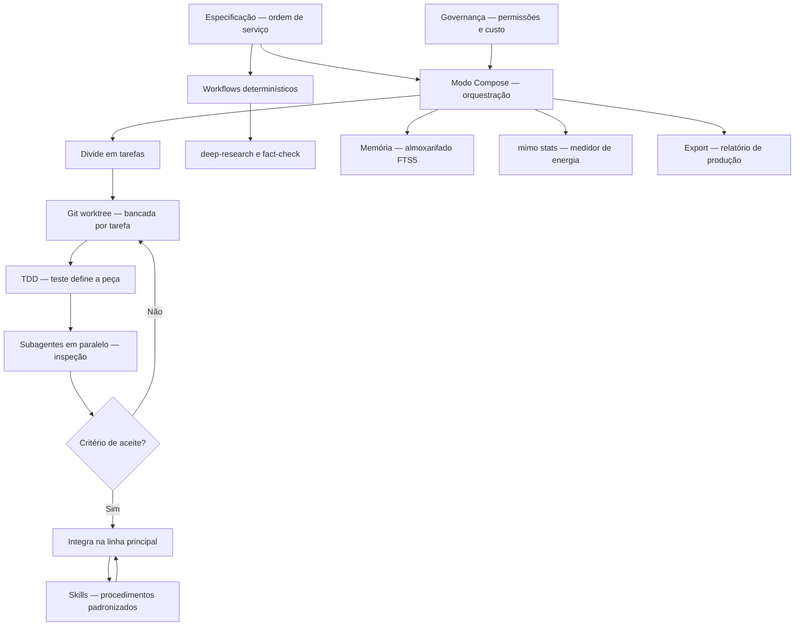

# Capítulo 10: Extraindo ao máximo do Harness: o fluxo profissional completo

## 1. Introdução

No Capítulo 9, você dominou a operação fina do MiMoCode — memória, compactação e custo. Agora chegamos ao turno final: a síntese de tudo em um fluxo profissional completo. Este capítulo monta o Harness MiMoCode em produção — a fábrica inteira operando como um sistema: os workflows determinísticos (compose, deep-research, fact-check), a execução specs-driven com git worktrees e TDD por tarefa, os subagentes em paralelo, as skills nativas e criadas com `/distill`, e o ecossistema ao redor (awesome-mimo-agent). E, por fim, o plano de adoção do Operador de Linha de Montagem: o roteiro para levar o MiMoCode de ferramenta individual a padrão do time, com governança, revisão e métricas de sucesso. Ao final deste capítulo — e deste livro — você não apenas usará o MiMoCode: você o operará como um profissional que entende a ferramenta por dentro, a configura por camadas, a estende com protocolos e a governa com disciplina. O contrato do Capítulo 1 está cumprido: você sabe por que cada manobra funciona.

## 2. Explica

### Os workflows determinísticos

Fechando os workflows, um resumo que conecta ao todo da obra. Os workflows são o ponto onde a operação individual vira processo. O deep-research institucionaliza a investigação; o fact-check institucionaliza a verificação; e o compose institucionaliza a produção em escala. O `/distill` (Capítulo 9) é a fábrica de novos workflows. O operador que adota workflows está construindo o processo da fábrica — a mesma disciplina que o plano de adoção fecha. Os workflows são a memória do processo em código.

**Exemplo.** Um exemplo de workflow na rotina: a pesquisa de adoção. O time quer decidir entre MiMoCode e concorrentes para o fluxo de CI. O deep-research define a sequência: buscar documentação, ler comparativos, sintetizar recomendações. O fact-check valida as afirmações contra fontes. O relatório final é estruturado e reprodutível. O exemplo mostra o valor do determinístico: a decisão apoiada em processo, não em opinião. O workflow transforma a pesquisa ad hoc em procedimento.

**Caso de uso.** Vale fixar os casos de uso dos workflows com exemplos concretos. O deep-research: o time precisa comparar ferramentas — o workflow define a sequência de busca, leitura e síntese. O fact-check: o relatório técnico precisa de verificação — o workflow checa as afirmações contra fontes. O research-experiment: a hipótese precisa de teste estruturado — o workflow define a coleta e a análise. Cada workflow é umo fluxo de conhecimento: o processo maduro, automatizado e reprodutível. O operador que reconhece o caso de uso escolhe o workflow certo — e o `/distill` cria o que não existe.

**Segurança do sandbox.** Uma dimensão dos workflows que o operador corporativo precisa conhecer: o ambiente sandbox em que os scripts executam. Os workflows do MiMoCode rodam JavaScript em ambiente isolado — o script não tem acesso irrestrito à máquina. Essa contenção é o que permite automatizar pipelines sem transformar o fluxo em risco. O operador que escreve workflows próprios segue o mesmo princípio: o script declara o que precisa, o ambiente limita o que ele alcança. E o `/distill` do Capítulo 9 cria workflows a partir de fluxos manuais — a mesma contenção vale para as skills criadas. A segurança do sandbox é a condição de possibilidade da automação em escala.

**Reprodutibilidade.** Um atributo dos workflows determinísticos que vale destacar é a reprodutibilidade — o mesmo input produz o mesmo fluxo, e o resultado pode ser comparado entre execuções. Essa propriedade é o que permite o controle de qualidade em escala: o time sabe exatamente o que o workflow faz, em que ordem e com quais critérios de parada. E a reprodutibilidade também serve à auditoria: o workflow registrado é a especificação executável do processo — quem quiser conferir, executa de novo. O Capítulo 9 mostrou o `/distill` criando workflows a partir de fluxos manuais; este capítulo os opera em produção.

### Os workflows determinísticos: a linha autônoma

O MiMoCode inclui workflows determinísticos — scripts JavaScript executados em ambiente sandbox que automatizam pipelines complexos. Diferentemente do fluxo interativo, onde o modelo decide o próximo passo, os workflows executam uma sequência definida: o compose para desenvolvimento orientado a especificações, o deep-research para investigação em profundidade, o fact-check para verificação de fatos e o research-experiment para experimentos estruturados. A palavra-chave é determinístico: o pipeline é previsível e reprodutível — o mesmo input produz o mesmo fluxo, independentemente do humor do modelo. É a diferença entre o robô que improvisa e o fluxo que executa: para processos maduros, o fluxo vence.

O valor dos workflows determinísticos está na confiabilidade: o time sabe exatamente o que o workflow faz, em que ordem e com quais critérios de parada. O deep-research, por exemplo, define a sequência de busca, leitura e síntese; o fact-check define a verificação contra fontes; e o compose define a divisão em tarefas com testes por etapa. Para o operador, os workflows são o ponto onde a operação individual vira processo de engenharia — e o Capítulo 9 mostrou como o `/distill` cria os próprios.

### O modo Compose

Um exemplo do Compose em ação: a migração de autenticação. A especificação: "migre o login de sessões próprias para OAuth2, mantendo o teste npm test verde e sem regressões". O Compose divide em tarefas — o fluxo de login, o refresh, a validação — e isola cada uma em um worktree. Cada peça nasce com o teste que a define e integra quando passa. O resultado: a migração completa com qualidade por tarefa. O exemplo mostra o Compose como a linha que fabrica em bancadas isoladas.

**Revisão.** O Compose também tem o seu momento de revisão — a validação antes da integração final. Cada peça orquestrada é testada antes de voltar à linha; a revisão final confirma o conjunto. A revisão do Compose pergunta: o resultado integrado satisfaz a especificação? os critérios de aceite estão cumpridos? as regressões foram evitadas?. O operador que revisa a orquestração completa — não apenas as peças — fecha o ciclo de qualidade. O Compose automatiza a produção; a revisão humana garante o contrato.

**Especificação.** A especificação é a peça mais importante do Compose — e a mais negligenciada. A especificação boa descreve o resultado, não o caminho: o comportamento esperado, os critérios de aceite, as restrições. A especificação ruim prescreve passos que o agente executa cegamente — e o agente não tem o contexto para julgar os passos. A prática madura é a do Capítulo 5 em escala: objetivo, contexto, critério e limite — escritos antes de qualquer execução. O Compose é a fábrica; a especificação é a ordem de serviço; e a ordem de serviço bem escrita é a diferença entre a peça certa e o retrabalho.

**Integração contínua.** O Compose conversa naturalmente com a integração contínua — a mesma disciplina do Capítulo 6, agora orquestrada. Cada tarefa isolada em worktree roda os testes antes de integrar — o mesmo ciclo do CI, em microescala. E o resultado da orquestração pode alimentar o CI real: o Compose entrega as mudanças testadas, e o pipeline corporativo valida no ambiente completo. O Git worktree é a peça que torna o paralelismo seguro — cada bancada isolada, sem conflito. A fábrica orquestrada e o fluxo de CI são duas escalas do mesmo controle de qualidade.

### O modo Compose: a execução specs-driven

O modo Compose — apresentado no Capítulo 5 — é o coração do fluxo profissional: o desenvolvimento orientado a especificações com controle de qualidade por tarefa. O fluxo é o da linha madura: você escreve a especificação (o resultado esperado, os critérios de aceite, as restrições), o Compose divide o trabalho em tarefas, isola cada tarefa em um git worktree, executa cada uma com testes antes de integrar e consolida o resultado. O git worktree é a peça-chave da isolamento: cada tarefa trabalha em uma cópia separada do repositório, sem conflitar com as outras — e só volta à linha principal quando os testes passam. O padrão TDD (test-first) por tarefa é o controle de qualidade: cada peça nasce com o teste que a define.

A força do Compose está na escala: o que o operador faria em dez turnos supervisionados vira uma orquestração com verificações em cada etapa. E a fraqueza — que o operador profissional conhece — é a especificação: o Compose é tão bom quanto a especificação que recebe. A disciplina do specs-driven é a disciplina de escrever critérios de aceite verificáveis antes de qualquer execução — a mesma lição do Capítulo 5, agora em escala.

### Subagentes em paralelo

Um exemplo de subagentes em paralelo: a revisão do PR grande. O agente primário divide a revisão: o `revisor-seguranca` analisa os riscos, o `testador` sugere casos de borda, o `revisor-estilo` aponta convenções. Os três trabalham em paralelo sobre o mesmo diff. O relatório final consolida as três perspectivas. O exemplo mostra a especialização e o paralelismo — a linha com múltiplas bancadas do Capítulo 5 em escala. O operador que orquestra especialistas revisa em minutos o que levava horas.

**Contexto.** Uma consideração sobre o contexto na orquestração paralela: cada subagente tem o seu próprio contexto. O paralelismo multiplica o consumo de contexto — cada subagente paga a sua janela. O equilíbrio: tarefas independentes e baratas paralelizam; tarefas que compartilham contexto serializam. O SWE-agent documentou a importância do contexto bem gerenciado. O operador que projeta a orquestração com o contexto em mente — o que cada subagente precisa, não o que poderia receber — controla o custo do paralelismo.

**Orquestração.** A orquestração de subagentes em paralelo tem uma dimensão de design que o operador maduro domina: a decomposição do trabalho. O trabalho bem decomposto gera tarefas independentes — cada uma despachável para um subagente sem conflito. O trabalho mal decomposto gera tarefas acopladas — os subagentes esperam um pelo outro e o paralelismo vira serial. A decomposição é a mesma do Compose, aplicada à orquestração de especialistas. O operador que pensa em termos de fronteiras — o que é independente, o que é compartilhado — projeta orquestrações que escalam.

**Custo.** O paralelismo dos subagentes tem um custo que o operador maduro calcula. Cada subagente em execução consome tokens — e o paralelismo multiplica o consumo por segundo. O equilíbrio: paralelize o que é independente e valioso, serialize o que é barato e rotineiro. O `small_model` do Capítulo 4 é a válvula — os subagentes de fundo rodam no modelo barato. E o `mimo stats` mostra o custo do paralelismo antes que ele vire fatura. O operador que orquestra subagentes sem medir está operando a fábrica no escuro.

### Subagentes em paralelo: a linha com múltiplas bancadas

O MiMoCode suporta subagentes — agentes especializados acionados pelo agente primário para tarefas específicas — e o fluxo profissional os usa em paralelo. O Capítulo 7 mostrou como defini-los (JSON e Markdown); este capítulo mostra como orquestrá-los: o agente primário divide o trabalho, despacha cada parte para um subagente (revisor, testador, analista de segurança) e consolida os resultados. É a linha com múltiplas bancadas: enquanto o soldador trabalha na peça A, o inspetor verifica a peça B e o projetista desenha a peça C — em paralelo. A orquestração de subagentes em paralelo é onde a produtividade do MiMoCode mais se distancia da operação serial.

### Skills nativas

As skills evoluem — e o catálogo do time acompanha. A skill criada hoje pode ser superada por uma comunitária amanhã; o fluxo que ela automatiza pode mudar. A revisão periódica do catálogo — o que está obsoleto, o que está em falta — mantém as skills alinhadas com a rotina. E o awesome-mimo-agent é o termômetro da evolução: as skills novas da comunidade indicam os padrões emergentes. O catálogo de skills é um produto — e produtos evoluem.

**Descoberta.** Um detalhe que acelera o time: a descoberta de skills. O MiMoCode aciona skills por comando `/` ou por relevância textual — e a descrição da skill é o que a torna encontrável. A skill com descrição rica é acionada automaticamente quando o contexto corresponde; a com descrição pobre fica órfã no catálogo. O time que escreve descrições precisas — o que a skill faz, quando usar, o que produz — mantém o catálogo vivo. E o awesome-mimo-agent é o catálogo externo: skills testadas pela comunidade, prontas para adotar. A descoberta é a metade da reutilização.

**Catálogo do time.** O catálogo de skills do time merece uma disciplina própria. Cada skill é um procedimento com dono, documentação e versão. O time mantém o catálogo como mantém a documentação: revisado, atualizado e podado. As skills que nunca são usadas são removidas; as que o fluxo exige são criadas com `/distill`. E o awesome-mimo-agent é o ponto de partida — as skills comunitárias testadas economizam semanas. O catálogo de skills é a biblioteca de procedimentos da fábrica: o que não está nela, não é padrão.

**Skills do time.** O MiMoCode vem com mais de vinte skills nativas — de geração de documentos a pesquisa avançada — acionadas via `/` ou por relevância textual. E o Capítulo 9 mostrou o `/distill` para criar as do time. No fluxo profissional, as skills são o vocabulário padronizado da fábrica: cada skill é um procedimento documentado, reutilizável e compartilhável. A comunidade contribui com o awesome-mimo-agent — o catálogo de skills, plugins e integrações. A disciplina da skill: documentada (quem a criou sabe o que ela faz), testada (o fluxo funciona de ponta a ponta) e versionada (a skill evolui com o time).

### O ecossistema

Fechando a exposição, uma nota sobre o futuro da obra — e do operador. O MiMoCode é novo e evolui rápido; este livro documenta o estado da arte de agosto de 2026. O que não muda é a estrutura: a arquitetura, o fluxo, a disciplina. O operador que domina a estrutura navega qualquer versão futura. E a comunidade (awesome-mimo-agent) é o canal de atualização contínua — o operador que participa nunca fica para trás. O livro entrega o mapa; a prática e o ecossistema mantêm o mapa atualizado.

**Comunidade.** O ecossistema do MiMoCode é também uma comunidade — e a participação muda a experiência do operador. O repositório oficial recebe issues e contribuições; o awesome-mimo-agent é mantido pela comunidade; e os adaptadores de terceiros ampliam a fábrica. O operador que participa — reporta bugs, contribui skills, responde issues — acelera a evolução da ferramenta que usa. E a participação é a rede de segurança do open-source: quando a documentação falha, a comunidade responde [1][3][6]. O ecossistema não é um recurso da ferramenta — é o seu sistema de suporte.

**Evolução da ferramenta.** O ecossistema não é estático — e a governança precisa acompanhar a evolução. O MiMoCode atualiza com frequência (o `mimo upgrade`), e cada versão pode mudar flags, comportamentos e opções. A governança inclui o ciclo de atualização: quem autoriza, quando e com qual rollback. E o ecossistema da comunidade — awesome-mimo-agent, adaptadores, skills — evolui junto. O operador que trata a ferramenta como fixa é surpreendido pelas mudanças; o que acompanha o ecossistema evolui com ele.

**Governança.** O fluxo profissional não termina na ferramenta — ele vive no ecossistema e na governança. O ecossistema inclui o awesome-mimo-agent (skills e integrações), os adaptadores da comunidade e o ciclo de evolução da ferramenta (upgrades contínuos) [3][28][5]. A governança inclui as regras de adoção: quem pode usar, com quais permissões, com quais provedores e com qual orçamento — o Capítulo 7 (permissões), o Capítulo 8 (extensões) e o Capítulo 9 (custo) convergem aqui. E a auditoria fecha o ciclo: as sessões exportadas em JSON (Capítulo 6) e a memória consolidada (Capítulo 9) são a evidência do que foi produzido [1][4][20]. A governança do MiMoCode é a mesma governança de qualquer ferramenta de produção: permissões, custo, evidência e revisão.

### O contexto acadêmico e de mercado do fluxo profissional

O fluxo profissional do Harness MiMoCode é a síntese de um movimento que a literatura mapeou em etapas. O SWE-bench estabeleceu a métrica de capacidade dos agentes [8]; o SWE-agent demonstrou que a interface de controle determina o sucesso [9]; o Agentless mostrou que pipelines determinísticos são competitivos [10]; e o OpenHands consolidou a visão de plataformas abertas. O MiMoCode herda essa maturidade e adiciona a orquestração specs-driven — o ponto onde a pesquisa sobre agentes encontra a prática de fábrica. Na comparação com o mercado: o Claude Code orquestra, mas fechado aos modelos Claude [12]; o Gemini CLI automatiza, mas no ecossistema Gemini [13]; o Cursor escala dentro do editor [14]; e o OpenHands escala na plataforma, sem a integração nativa de terminal [11]. O MiMoCode oferece a fábrica completa — terminal, memória, protocolos e workflows — e o benchmark Terminal Bench 2, que mede a operação real, é a régua dessa completude [22]. O ecossistema da comunidade — awesome-mimo-agent e adaptadores — amplia a fábrica com peças de terceiros.

### O plano de adoção

Um último detalhe do plano de adoção completo: a continuidade — a adoção não termina na etapa 5, e sim na manutenção contínua do ciclo de melhoria. O time adota, mede, revisa e ajusta — o ciclo contínuo que o Capítulo 7 apresentou na configuração. A ferramenta evolui (upgrades), o mercado muda (modelos), e o time acompanha. O ecossistema (awesome-mimo-agent) é o canal dessa evolução contínua. O plano de adoção é uma espiral, não uma linha: cada volta parte do degrau atual e sobe. O Operador de Linha de Montagem não termina a obra — ele a mantém em produção.

**Adoção e a operação fina.** Um detalhe do plano que amarra os capítulos finais: a operação fina entra como etapa obrigatória, não opcional. A etapa 4 — memória, compactação e custo — é o que torna a adoção sustentável. Sem ela, a adoção escala o custo junto com a produção. Com ela, o custo por unidade cai à medida que o time amadurece. O plano de adoção é uma escada: cada degrau prepara o próximo, e pular a operação fina é pular o degrau que sustenta a escala.

**Adoção e a fundação.** Vale detalhar a primeira etapa do plano de adoção — a fundação — porque ela determina tudo o que vem depois. A fundação inclui: a instalação pelo canal certo (Capítulo 3), a autenticação com o provedor certo (Capítulo 4), o `mimocode.jsonc` com as travas de permissão (Capítulo 7) e o AGENTS.md do repositório (Capítulo 5). O verificador da fundação é simples: uma máquina nova, seguindo apenas a documentação do time, fica operacional em minutos. A fundação frágil — permissões soltas, AGENTS.md ausente — degrada cada etapa seguinte. O plano de adoção é uma corrente: a fundação é o primeiro elo.

**Adoção e as métricas.** O plano de adoção fecha com as métricas que provam o valor. Cada etapa tem o seu indicador: a fundação é medida pela ausência de incidentes de configuração; a operação individual, pelo tempo entre a ordem de serviço e a primeira resposta útil; a automação, pela taxa de revisões automatizadas aceitas; a operação fina, pelo custo por unidade de produção; e a escala, pela produtividade do time. O DORA mostra que equipes que medem a integração de IA colhem ganhos — e a medição é o que separa a adoção estratégica da adoção por moda. O plano sem métricas é uma esperança; com métricas, é um processo.

**Adoção: o roteiro final.** O plano de adoção do Operador de Linha de Montagem é o roteiro que transforma o conhecimento deste livro em prática — e ele tem cinco etapas. A primeira é a fundação: instalar, autenticar e configurar o `mimocode.jsonc` com as travas do Capítulo 7. A segunda é a operação individual: dominar o Plan → Build, o AGENTS.md e o ritual de revisão do Capítulo 5. A terceira é a automação: o `mimo run` no CI e o `mimo pr` na revisão de PRs do Capítulo 6. A quarta é a operação fina: memória, compactação e custo do Capítulo 9. E a quinta é a escala: workflows, Compose e a adoção do time com governança — este capítulo. Cada etapa tem métricas de sucesso — e o Capítulo 1 prometeu que ao final você saberia explicar a ferramenta; este capítulo entrega o roteiro para ensiná-la ao próximo operador.

## 3. Ilustra

Pense no fluxo profissional do MiMoCode como a fábrica inteira operando em um único turno coordenado — a linha de montagem completa, do recebimento da ordem de serviço à expedição do produto. A ordem de serviço chega (a especificação); o centro de orquestração — o modo Compose — a divide em tarefas; cada tarefa ganha a sua bancada separada (git worktree), onde o robô fabrica a peça com o teste que a define (TDD); os inspetores — os subagentes — verificam cada peça em paralelo; as skills são os procedimentos padronizados que todos os postos seguem; e o produto só volta à linha principal quando todas as peças passam no controle de qualidade. O almoxarifado (memória) guarda o conhecimento de cada turno; o medidor de energia (mimo stats) registra o custo; e o relatório de produção (export) documenta o que foi feito. A fábrica não é mais uma coleção de máquinas — é um sistema com processo, qualidade e memória.



Repare que o diagrama mostra o fluxo completo como um ciclo: a especificação entra, o Compose orquestra, as bancadas isoladas fabricam com TDD, os subagentes inspecionam em paralelo, e a governança — permissões, custo, evidência — supervisiona tudo. Como Operador de Linha de Montagem, a leitura é a sua fábrica em produção: a especificação é a fonte da verdade, o Compose é o centro, as bancadas são a qualidade e a governança é a disciplina. Este é o Harness MiMoCode no seu máximo: não uma ferramenta que você usa, mas uma fábrica que você opera.

## 4. Técnica

### A rede elétrica e as ferramentas no fluxo profissional

O fluxo profissional amarra os capítulos anteriores em uma operação única: a rede elétrica do Capítulo 4 (provedores e `small_model`), as ferramentas do Capítulo 8 (MCP e plugins) e o almoxarifado do Capítulo 9 (memória) convergem no mesmo Harness. O OpenRouter, com sua única chave para centenas de modelos, é o parceiro natural da orquestração — o workflow troca de modelo conforme a tarefa [18][23]; o Ollama cobre o que não pode sair da máquina [17][1]; e o AI SDK sustenta o contrato de interoperabilidade [23][15]. O gateway corporativo (Capítulo 4) pode expor as ferramentas internas — e a configuração do projeto documenta tudo. A lição: o Harness no máximo não é uma coleção de recursos — é a integração disciplinada de rede, esteiras, memória e processo.

### O fluxo specs-driven com worktrees

O fluxo profissional começa com a especificação e a orquestração [1][2][24]:

```bash
# Abre a TUI no modo Compose
mimo
# Alterna para o modo Compose (tecla Tab)

# Define a especificação da feature
# /compose "Implementar a busca full-text do catálogo com
#  testes em Vitest e sem regressões no fluxo de login"
```

O Compose divide a especificação em tarefas, isola cada uma em um git worktree e executa com TDD [1][2][24]:

```bash
# Verifica as worktrees criadas pelo Compose
git worktree list

# Cada tarefa tem a sua bancada com o teste definindo a peça
# worktree: /tmp/mimo-worktrees/tarefa-1
#  1. escreve o teste (vermelho)
#  2. implementa (verde)
#  3. integra na linha principal
```

O git worktree é a peça do isolamento: cada tarefa trabalha em uma cópia separada — sem conflito com as outras — e só volta à linha quando os testes passam.

### A compactação e o custo no fluxo profissional

O fluxo profissional também é o momento de aplicar a fórmula do custo em escala [1][4][18]:

```bash
# O medidor de energia acompanha a produção inteira
mimo stats

# A compactação calibra o contexto das sessões longas
# /context-limit 300K
```

Cada workflow, cada sessão de Compose e cada automação de CI consume a fórmula do Capítulo 9 — passos × contexto por passo × preço. O operador profissional mede o fluxo inteiro com `mimo stats`, calibra a compactação por tipo de tarefa e usa o `small_model` nas etapas de fundo — e é essa disciplina que torna a fábrica sustentável.

### O workflow deep-research em ação

Os workflows determinísticos automatizam pipelines de investigação [1][2]:

```bash
# Executa o workflow de pesquisa em profundidade
mimo run "Compare o MiMoCode com Claude Code e Gemini CLI em automação de CI" --workflow deep-research

# Executa o workflow de verificação de fatos
mimo run "Verifique as afirmações do relatório de adoção" --workflow fact-check
```

O deep-research define a sequência — busca, leitura, síntese — e o fact-check a verificação contra fontes. O resultado é um relatório estruturado, reprodutível e auditável.

### A orquestração de subagentes e o ACP

Os subagentes do Capítulo 7 ganham orquestração no fluxo profissional [1][2][7]:

```bash
# Define a revisão com o subagente especialista
mimo run "Revise o PR 42 apontando riscos de segurança" --agent revisor-seguranca

# Executa a geração de testes com o subagente dedicado
mimo run "Gere testes para o diff" --agent testador
```

O agente primário despacha para o especialista certo — e os subagentes trabalham em paralelo quando o fluxo permite. E, quando a orquestração cruza a fronteira da ferramenta — o orquestrador corporativo coordenando MiMoCode, um agente de testes e um de documentação — o ACP do Capítulo 8 é o protocolo comum. A escala do time é a soma da escala interna (subagentes) com a escala externa (ACP) [1][16].

### As skills na prática

As skills nativas e do time são o vocabulário da fábrica [1][2][3]:

```bash
# Lista as skills disponíveis
mimo skills

# Invoca uma skill nativa
# Na TUI: /deep-research

# Invoca uma skill criada com /distill
# Na TUI: /revisao-de-turno
```

A skill transforma o procedimento em um comando — e o `/distill` do Capítulo 9 é a fábrica de skills do time.

### O plano de adoção em código

O plano de adoção — o roteiro final — pode ser fixado em código como um checklist versionável [1][2]:

```json
{
  "plano_de_adocao": {
    "etapa_1_fundacao": {
      "acoes": ["instalar", "autenticar", "mimocode.jsonc com travas"],
      "verificador": "mimo --version e mimo providers list"
    },
    "etapa_2_operacao": {
      "acoes": ["Plan antes de Build", "AGENTS.md vivo", "revisao antes do commit"],
      "verificador": "git diff antes de commitar"
    },
    "etapa_3_automacao": {
      "acoes": ["mimo run no CI", "mimo pr na revisao"],
      "verificador": "pipeline com revisao automatizada"
    },
    "etapa_4_operacao_fina": {
      "acoes": ["/dream semanal", "compaction.max_context", "mimo stats semanal"],
      "verificador": "fatura sob controle"
    },
    "etapa_5_escala": {
      "acoes": ["workflows", "Compose", "governanca do time"],
      "verificador": "metricas de sucesso do time"
    }
  }
}
```

O checklist é a síntese do livro: cada etapa corresponde a um grupo de capítulos, e o verificador é a prova de que a etapa está cumprida.

### Referência rápida: o plano de adoção em fases

O Capítulo 10 fechou a obra com o roteiro de adoção; a tabela abaixo resume as fases e o critério de avanço de cada uma [1][2][25]:

| Fase | Objetivo | Critério para avançar |
|---|---|---|
| Fundação | Instalar, autenticar, configurar permissões | `mimo run` conclui uma tarefa real sem surpresas |
| Rotina | AGENTS.md, modos Plan/Build, sessões | Time usa o MiMoCode em tarefas semanais |
| Escala | Workflows determinísticos, Compose, subagentes | Pipeline roda com revisão e métricas |
| Governança | Métricas, revisão de custo, padrões do time | Fatura e qualidade sob controle mensal |

**Os três sinais vitais da adoção.** A empresa que adota o MiMoCode mede três linhas: o tempo médio de resolução de issues, a taxa de revisão aceita na primeira submissão e o custo mensal por desenvolvedor em tokens [1][25]. A ordem importa: escalar antes da fundação — como a cena de contraste deste capítulo mostrou — produz automação sobre uma base sem permissões, sem memória e sem revisão [1][7][25]. O plano completo do Operador de Linha de Montagem é a aplicação disciplinada das fases acima, com as métricas acompanhando cada transição [1][2][25]. A obra termina onde começou: o agente é um operador dentro do fluxo de engenharia, e quem domina as fases domina a ferramenta [1][7].

## 5. Aplica

### A cena de contraste: o operador que escalou antes da fundação

Imagine a cena: seu time decide "adotar o MiMoCode em escala" depois de uma demo empolgante. O gerente quer workflows e Compose na primeira semana; alguém configura o CI com `mimo run` e `--dangerously-skip-permissions`; e as especificações do Compose são escritas às pressas, sem critérios de aceite verificáveis. Na segunda semana, o caos: o pipeline de CI executa comandos com efeitos colaterais (o flag perigoso do Capítulo 6, sem o isolamento que ele exige); as worktrees do Compose produzem peças que não integram (as especificações vagas geraram implementações divergentes); e ninguém sabe quanto a operação custa (ninguém lê o `mimo stats`). O time conclui que "a ferramenta não está pronta" — e o diagnóstico real é constrangedor: a escala foi tentada antes da fundação.

A correção é o plano de adoção em etapas que este capítulo desenhou: a fundação primeiro (instalação, autenticação, permissões com travas), depois a operação individual (Plan → Build, AGENTS.md, revisão), depois a automação segura (CI isolado, sem o flag perigoso), depois a operação fina (memória, compactação, custo) e só então a escala (workflows, Compose, governança). Cada etapa com o seu verificador — e a escala como consequência, não como ponto de partida. A lição dessa cena é a lição central deste capítulo: o Harness MiMoCode no máximo não é um botão — é um sistema que se constrói em camadas, e pular a fundação é a única forma garantida de fracassar.

As armadilhas comuns da adoção em escala seguem o mesmo padrão de pressa: escalar antes da fundação (o caos do CI); escrever especificações sem critérios de aceite (o Compose produz peças divergentes); ignorar a governança (permissões amplas, custo às cegas, sem evidência); tratar as skills como adorno (o vocabulário padronizado é o que torna a fábrica consistente); e esquecer que o plano de adoção é um ciclo (as métricas de cada etapa alimentam a revisão da próxima). O operador profissional constrói a fábrica em camadas — e é essa construção disciplinada que separa o time que extrai o máximo do Harness do time que o culpa pelos próprios atalhos.

### Métricas de sucesso da adoção

No cenário corporativo, a maturidade da adoção aparece em métricas concretas: o tempo de onboarding de um novo operador (cai quando o AGENTS.md e o `mimocode.jsonc` do projeto são auto-suficientes); o custo por unidade de produção (cai com a operação fina do Capítulo 9); a taxa de revisões automatizadas aceitas (sobe com o `mimo pr` e os subagentes); e a redução de incidentes por má configuração (sobe com a governança do Capítulo 7). A empresa que mede essas linhas sabe se a adoção está produzindo valor ou dívida — e o DORA mostra que a integração disciplinada de IA é o que separa os ganhos da instabilidade [25].

## 6. Conclusão

Neste turno final, você montou o Harness MiMoCode em produção: dominou os workflows determinísticos — compose, deep-research e fact-check — como a linha autônoma [1][2]; aprendeu a execução specs-driven com git worktrees e TDD por tarefa [1][2][24]; orquestrou subagentes em paralelo com as skills nativas e do time [1][2][7]; e fechou com o plano de adoção em cinco etapas — fundação, operação, automação, operação fina e escala. O contrato do Capítulo 1 está cumprido: você entende o que o MiMoCode é, por que o terminal voltou a ser o centro, como configurá-lo, como usá-lo, quais configurações ninguém te ensina e como extrair o máximo do Harness. O desafio final deste livro: execute o plano de adoção — mesmo que em miniatura — no seu fluxo: escreva a especificação de uma feature real, rode o Compose com worktrees e TDD, revise com um subagente, consolide a memória com `/dream` e leia o `mimo stats`. Depois, ensine a próxima pessoa — porque o Operador de Linha de Montagem que sabe ensinar é o que mantém a fábrica viva. O turno está cumprido — e a fábrica é sua.

## 7. Referências Bibliográficas

[1] XIAOMI MIMO. *MiMo-Code: repositório oficial do MiMoCode.* Disponível em: https://github.com/XiaomiMiMo/MiMo-Code. Acesso em: 03 ago. 2026.

[2] XIAOMI MIMO. *MiMoCode: documentação e central de notícias.* Disponível em: https://mimo.mi.com/docs/en-US/news/latest/mimocode. Acesso em: 03 ago. 2026.

[3] XIAOMI MIMO. *awesome-mimo-agent: ecossistema e guias da comunidade.* Disponível em: https://github.com/XiaomiMiMo/awesome-mimo-agent. Acesso em: 03 ago. 2026.

[4] XIAOMI MIMO. *README npm do MiMoCode.* Disponível em: https://github.com/XiaomiMiMo/MiMo-Code/blob/main/README_npm.md. Acesso em: 03 ago. 2026.

[5] XIAOMI MIMO. *Script de instalação do MiMoCode.* Disponível em: https://mimo.xiaomi.com/install. Acesso em: 03 ago. 2026.

[6] ANOMALYCO. *OpenCode: agente de codificação de terminal (projeto original do qual o MiMoCode deriva).* Disponível em: https://github.com/anomalyco/opencode. Acesso em: 03 ago. 2026.

[7] SST. *OpenCode Docs: documentação da arquitetura e do servidor headless.* Disponível em: https://opencode.ai/docs. Acesso em: 03 ago. 2026.

[8] JIMENEZ, Carlos E. et al. *SWE-bench: Can Language Models Resolve Real-World GitHub Issues?* Disponível em: https://arxiv.org/abs/2310.06770. Acesso em: 03 ago. 2026.

[9] YANG, John et al. *SWE-agent: Agent-Computer Interfaces Enable Automated Software Engineering.* Disponível em: https://arxiv.org/abs/2405.15793. Acesso em: 03 ago. 2026.

[10] XIA, Chunqiu Steven et al. *Agentless: Demystifying LLM-based Software Engineering Agents.* Disponível em: https://arxiv.org/abs/2407.01489. Acesso em: 03 ago. 2026.

[11] WANG, Xingyao et al. *OpenHands: An Open Platform for AI Software Developers as Generalist Agents.* Disponível em: https://arxiv.org/abs/2407.16741. Acesso em: 03 ago. 2026.

[12] ANTHROPIC. *Claude Code: agente de codificação de terminal.* Disponível em: https://docs.anthropic.com/en/docs/claude-code. Acesso em: 03 ago. 2026.

[13] GOOGLE. *Gemini CLI: agente de codificação de terminal open-source.* Disponível em: https://github.com/google-gemini/gemini-cli. Acesso em: 03 ago. 2026.

[14] CURSOR. *Cursor: editor com IA embutida.* Disponível em: https://cursor.com. Acesso em: 03 ago. 2026.

[15] MODEL CONTEXT PROTOCOL. *Especificação oficial do MCP.* Disponível em: https://modelcontextprotocol.io. Acesso em: 03 ago. 2026.

[16] AGENT CLIENT PROTOCOL. *Especificação oficial do ACP.* Disponível em: https://agentclientprotocol.com. Acesso em: 03 ago. 2026.

[17] OLLAMA. *Modelos locais de código aberto.* Disponível em: https://ollama.com. Acesso em: 03 ago. 2026.

[18] OPENROUTER. *Roteador de modelos de IA.* Disponível em: https://openrouter.ai. Acesso em: 03 ago. 2026.

[20] SQLITE. *FTS5: extensão de full-text search do SQLite.* Disponível em: https://www.sqlite.org/fts5.html. Acesso em: 03 ago. 2026.

[22] XIAOMI MIMO. *Benchmarks do MiMoCode: SWE-Bench Pro 62% e Terminal Bench 2 73%.* Disponível em: https://mimo.mi.com/docs/en-US/news/latest/mimocode. Acesso em: 03 ago. 2026.

[23] VERCEL. *AI SDK: base dos provedores e do catálogo de modelos.* Disponível em: https://ai-sdk.dev. Acesso em: 03 ago. 2026.

[24] GIT. *Git worktrees: documentação oficial.* Disponível em: https://git-scm.com/docs/git-worktree. Acesso em: 03 ago. 2026.

[25] DORA. *State of AI-assisted Software Development 2025.* Disponível em: https://dora.dev. Acesso em: 03 ago. 2026.

[28] RTK. *Adaptadores e integrações da comunidade para agentes de terminal.* Disponível em: https://github.com/rtk-ai/rtk. Acesso em: 03 ago. 2026.
