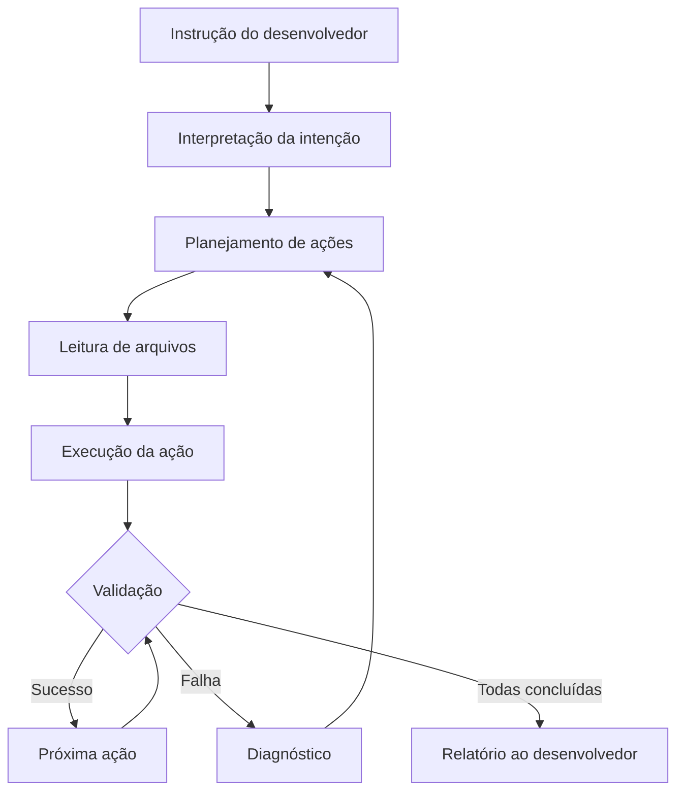

# Capítulo 1: O que é um Coding Agent

## 1. Introdução

O desenvolvimento de software passou por uma transformação silenciosa nos últimos cinco anos. Ferramentas que antes apenas completavam uma linha de código agora são capazes de ler uma base inteira, compreender a intenção do desenvolvedor e executar tarefas completas de programação. Essa evolução não é acidental — é o resultado da convergência entre modelos de linguagem de última geração, arquiteturas de agentes autônomos e interfaces que aboliram a tela gráfica em favor do terminal [1].

Se você já programou com um autocomplete avançado, depois experimentou um chatbot para tirar dúvidas de código e, por fim, testou uma ferramenta que edita seus arquivos diretamente, percorreu na prática a mesma trajetória que a indústria percorreu em uma década. O coding agent representa o estágio mais avançado dessa evolução: uma IA que não apenas sugere, mas executa [2].

Neste capítulo, você vai entender a arquitetura que sustenta um coding agent, como ele se diferencia de ferramentas adjacentes e por que uma CLI de terminal — como o Oh My Pi — é a forma mais eficiente de interagir com esse tipo de sistema. Ao final, você será capaz de definir, classificar e avaliar qualquer coding agent que encontrar no mercado.

## 2. Explica

### O que distingue um coding agent de outras ferramentas de IA

Para compreender o que é um coding agent, é preciso primeiro decompor o que ele faz em suas partes fundamentais. Todo coding agent combina três componentes: um modelo de linguagem (LLM), um conjunto de ferramentas e um mecanismo de gestão de contexto [3].

O LLM é o cérebro. Ele interpreta a linguagem natural do desenvolvedor, gera código, analisa erros e toma decisões sobre quais ações executar. Diferente de um modelo de autocomplete, que opera exclusivamente no escopo da linha atual, o LLM de um coding agent recebe como entrada o contexto completo do projeto — a estrutura de diretórios, o conteúdo dos arquivos relevantes, o histórico de comandos e até o estado do sistema de versionamento [4].

As ferramentas são os membros. Um coding agent não se limita a gerar texto. Ele pode ler arquivos, escrever código, executar comandos no shell, rodar testes, buscar informações em repositórios remotos e até navegar na web. Cada uma dessas capacidades é uma ferramenta que o agente pode invocar autonomamente, sem que o desenvolvedor precise copiar e colar resultados entre janelas [5].

O contexto é a memória. Diferente de um chatbot genérico que trata cada mensagem como uma conversa isolada, o coding agent mantém um modelo do estado atual do projeto. Isso significa que, quando você pede para corrigir um bug, o agente já sabe quais arquivos estão envolvidos, quais testes existem e qual é o padrão de codificação do time [6].

### A taxonomia das ferramentas de IA para programação

A distinção entre tipos de ferramentas de IA para programação não é meramente semântica — ela tem implicações práticas sobre o que você pode esperar de cada uma. Autocomplete como o GitHub Copilot original operava no modelo de "próxima token": dado o código que você já escreveu, ele sugere os caracteres seguintes [7]. Chatbots como o ChatGPT, em sua forma mais simples, aceitam uma pergunta e devolvem uma resposta, sem acesso ao seu sistema de arquivos e sem possibilidade de executar código [8].

IDEs com IA integrada, como o Cursor ou o VS Code com Copilot Chat, adicionam uma camada intermediária: o agente pode ler o arquivo que você está editando, mas sua interação é limitada ao contexto de uma única janela ou projeto. Essas ferramentas operam predominantemente de forma reativa — elas respondem quando você pergunta, mas não iniciam ações por conta própria [9].

O coding agent, por sua vez, é proativo e autônomo. Ele pode ser instruído a "rodar todos os testes e corrigir os que falharem", e essa instrução se desdobra em uma sequência de ações: leitura dos arquivos de teste, execução do runner, identificação das falhas, diagnóstico dos erros, edição dos arquivos de origem e re-execução para validação. Essa capacidade de encadear ações é o que o define como agente, e não como assistente [10].

### A arquitetura do loop agêntico

O ciclo de vida de um coding agent segue um padrão que a comunidade de IA designa como "agentic loop" [11]. O loop começa com uma instrução do usuário, que pode ser uma pergunta simples ("o que esta função faz?") ou uma tarefa complexa ("refatore este módulo para usar o padrão Strategy"). O agente interpreta a instrução, planeja uma sequência de ações e executa cada passo, verificando o resultado antes de avançar para o próximo [12].

Essa verificação contínua é fundamental. O agente não apenas gera código e o insere nos arquivos — ele valida se o código compila, se os testes passam e se as mudanças são coerentes com o resto do projeto. Quando algo falha, o agente retrocede, diagnostica o problema e tenta uma abordagem diferente [13].

O loop agêntico também incorpora uma camada de permissão. Nem toda ação pode ser executada automaticamente. Operações destrutivas como force push, exclusão de branches ou execução de comandos com impacto sistêmico requerem confirmação explícita do desenvolvedor. Essa camada de segurança é o que separa um agente responsável de um script autônomo potencialmente destrutivo [14].

### Coding agents no terminal: por que a CLI é a interface natural

Uma das decisões de design mais importantes de um coding agent é a escolha da interface. Enquanto ferramentas como o Cursor optam por interfaces gráficas integradas a IDEs, o Oh My Pi e o Claude Code operam exclusivamente no terminal [15].

Essa escolha não é aleatória. O terminal é a interface mais antiga e mais poderosa do desenvolvimento de software. Ele oferece acesso direto ao sistema de arquivos, ao shell, aos gerenciadores de pacotes e a qualquer ferramenta que possa ser executada via linha de comando. Um coding agent que opera no terminal tem acesso ilimitado ao ecossistema de desenvolvimento, sem a necessidade de integrações proprietárias com IDEs específicas [16].

Além disso, a CLI permite execução headless e automatização. Um agente de terminal pode ser invocado em scripts de CI/CD, em ambientes de container ou em sessões remotas via SSH. Essa capacidade de operar sem interface gráfica abre possibilidades que uma IDE não consegue oferecer, como revisão de código automatizada em pipelines ou geração de PRs a partir de issues [17].

A economia de tokens também pesa nessa decisão. Interfaces gráficas adicionam camadas visuais que consomem contexto sem agregar valor à tarefa de programação. Uma CLI compacta entrega o mesmo conteúdo com menos tokens, permitindo que o agente mantenha mais do projeto em sua janela de contexto [18].

### Context window e gestão de memória

Um conceito central para entender coding agents é a janela de contexto (context window). Cada LLM tem um limite de tokens que pode processar simultaneamente — o Claude 3.5 Sonnet, por exemplo, processa até 200.000 tokens. Esse limite define a quantidade máxima de código, documentação e histórico de conversa que o agente pode manter ativo ao mesmo tempo [44].

O gerenciamento inteligente do contexto é o que separa coding agents sofisticados de ferramentas simplificadas. O Oh My Pi, por exemplo, implementa técnicas de compressão de contexto — como o Lean-CTX e o Headroom — que permitem manter mais informação relevante na janela sem estourar o limite. Essas técnicas selecionam cirurgicamente quais partes do projeto carregar, priorizando arquivos relevantes para a tarefa atual e descartando ruído [45].

## 3. Ilustra

### O estagiário sênior: uma analogia para o coding agent

Imagine que você acaba de contratar um estagiário excepcional. Ele não conhece sua empresa, mas tem formação sólida em programação. Na primeira semana, você faz o seguinte: mostra onde ficam os arquivos do projeto, explica o fluxo de trabalho do time, apresenta as ferramentas que o time usa e dá a ele acesso ao repositório [19].

Essa é exatamente a experiência de configurar um coding agent. A "primeira semana" consiste em instalar a ferramenta, configurar a chave de API, apontar para o diretório do projeto e definir as permissões de ação. Uma vez configurado, o agente se comporta como esse estagiário: ele lê o código, entende a estrutura e começa a executar tarefas sob sua supervisão [20].

A analogia se estende ao nível de autonomia. Um estagiário júnior precisa de instruções passo a passo ("abra o arquivo X, vá na linha 42, mude Y para Z"). Um estagiário sênior recebe a tarefa de forma declarativa ("corrija o bug de null pointer no módulo de autenticação") e executa as etapas intermediárias por conta própria. O coding agent se comporta como o segundo tipo — você declara o objetivo, e ele decide como alcançá-lo [21].

Mas a analogia tem um limite importante: o estagiário humano pode esquecer algo, se distrair ou ter um dia ruim. O agente é determinista no sentido de que sempre segue o loop agêntico: interpretar, planejar, executar, verificar. Ele não pula etapas por descuido, não esquece de rodar testes e não altera código que não foi solicitado. Essa previsibilidade é uma das razões pelas quais coding agents produzem resultados mais consistentes do que a programação assistida manual [22].

### O ciclo de vida de uma tarefa

O diagrama a seguir ilustra como um coding agent processa uma tarefa recebida do desenvolvedor. Note que o ciclo não é linear — ele contém ramificações para validação e retroalimentação que garantem a correção do resultado final.



Esse ciclo se repete para cada unidade de trabalho dentro de uma tarefa. Se a tarefa é "corrigir todos os testes que falham", o agente entra no loop para cada teste, validando individualmente se a correção proposta resolve o problema. Essa granularidade de verificação é o que permite que um coding agent produza código funcional em vez de código plausível [23].

### A evolução das ferramentas de IA para programação

Para entender onde o coding agent se posiciona, é útil mapear a evolução das ferramentas de IA para programação ao longo do tempo. Cada geração resolveu uma limitação da anterior, até chegar ao estágio atual de autonomia [46]:

**Geração 1 — Autocomplete (2021-2022).** Ferramentas como o GitHub Copilot original sugeream o próximo token com base no contexto imediato. O desenvolvedor ainda escrevia a maior parte do código e recebia sugestões pontuais. A IA era um assistente passivo [7].

**Geração 2 — Chat (2022-2023).** Chatbots como o ChatGPT permitiam fazer perguntas sobre código, receber explicações e gerar trechos isolados. Mas o chatbot não tinha acesso ao projeto do desenvolvedor — era preciso copiar e colar código manualmente [8].

**Geração 3 — IDE Integrada (2023-2024).** Ferramentas como o Cursor integraram o LLM à IDE, permitindo que o agente lesse o arquivo corrente e gerasse código contextualizado. A interação ainda era majoritariamente reativa [9].

**Geração 4 — Agente Autônomo (2024-presente).** Coding agents como o Oh My Pi e o Claude Code operam de forma proativa e autônoma. Eles leem o projeto inteiro, executam comandos, rodam testes e encadeiam ações sem intervenção manual. O desenvolvedor passa de programador a supervisor [10].

## 4. Técnica

### Comparativo prático: Oh My Pi vs. mercado

A tabela a seguir compara o Oh My Pi com as principais ferramentas de coding agent disponíveis, destacando as dimensões mais relevantes para um desenvolvedor que está avaliando opções.

| Característica | Oh My Pi (OMP) | Claude Code | Cursor | GitHub Copilot | Aider |
|---|---|---|---|---|---|
| Interface | CLI/terminal | CLI/terminal | IDE gráfica | Plugin IDE | CLI/terminal |
| Modelo padrão | Multi-provedor | Claude (Anthropic) | Multi-modelo | GPT-4o / Claude | Multi-provedor |
| Acesso ao filesystem | Completo | Completo | Parcial | Limitado | Completo |
| Execução de shell | Sim | Sim | Via extensão | Não | Sim |
| Modo headless/CI | Sim | Sim | Não | Não | Sim |
| Permissões granulares | Sim | Sim | Não | Não | Parcial |
| Skills/Plugins | Sim | Sim (MCP) | Sim (extensões) | Sim (extensões) | Não |
| Custo por uso | Variável por modelo | Variável por modelo | Assinatura + tokens | Assinatura | Variável por modelo |
| Open source | Não | Não | Não | Parcial | Sim |
| Git nativo | Sim | Sim | Via GUI | Via GUI | Sim |

**Fonte:** Tabela compilada a partir da documentação oficial de cada ferramenta, consultada em julho de 2025 [24][25][26][27][28].

A primeira diferença que salta aos olhos é a interface. Cursor e GitHub Copilot operam dentro de IDEs gráficas, enquanto OMP, Claude Code e Aider são ferramentas de terminal. Isso não é uma questão de gosto — é uma diferença arquitetural. Ferramentas de terminal têm acesso direto ao shell e ao filesystem, o que lhes permite executar testes, rodar linters, compilar projetos e interagir com qualquer ferramenta de devops sem mediação de uma IDE [29].

A segunda diferença relevante é o suporte a múltiplos provedores de modelo. O Oh My Pi permite configurar qualquer provedor compatível com a API do Anthropic ou do OpenAI, incluindo Google Gemini, Amazon Bedrock e Azure OpenAI. Essa flexibilidade é importante em ambientes empresariais onde a política de segurança pode exigir o uso de um provedor específico ou a execução em infraestrutura dedicada [30].

### Exemplo real de uso: code review assistido

Para ilustrar a diferença entre um coding agent e uma ferramenta de IA convencional, considere o seguinte cenário. Você tem um endpoint de API que retorna erro interno em condição específica, e precisa identificar e corrigir a causa.

**Cenário com chatbot convencional:**

```bash
# Você copia o código e cola no chat
$ echo "Colei o código no ChatGPT e ele sugeriu uma correção..."

# Você copia a sugestão de volta para o editor
# Você roda o teste manualmente
# O teste ainda falha — a sugestão estava incompleta
# Você volta ao chat com mais contexto
# Repete o ciclo...
```

**Cenário com Oh My Pi:**

```bash
# Você instrui o agente diretamente no terminal
$ omp -p "Analise o endpoint /api/users/:id em src/routes/users.ts. 
  Há um erro 500 quando o usuário não existe. Encontre a causa raiz 
  e proponha uma correção."

# O agente:
# 1. Lê o arquivo src/routes/users.ts
# 2. Identifica que o handler não valida se o resultado da query é null
# 3. Lê o arquivo src/models/user.ts para entender a interface
# 4. Edita o arquivo com a correção
# 5. Roda o teste associado
# 6. Reporta o resultado ao desenvolvedor
```

A diferença fundamental está na autonomia. O chatbot exige que você copie, cole, interprete e reenvie informação. O coding agent executa o ciclo completo de leitura, diagnóstico, correção e validação sem intervenção manual [31].

### Configuração mínima para começar

A instalação e configuração do Oh My Pi será detalhada no próximo capítulo, mas vale apresentar aqui o fluxo mínimo para que você tenha uma ideia da simplicidade da ferramenta.

```bash
# Instalação via npm (recomendado)
npm install -g oh-my-pi

# Configuração da chave de API (exemplo com Anthropic)
export ANTHROPIC_API_KEY="sk-ant-api03-xxxxxxxxxxxx"

# Primeira execução — teste de conectividade
omp -p "Olá, funcional?"

# Uso em um projeto real
cd ~/meu-projeto
omp -p "Leia o README.md e me dê um resumo do projeto"
```

Essas quatro linhas são suficientes para ter um coding agent funcional. A complexidade real está na personalização — configuração de modelos, definição de permissões, criação de skills customizadas — mas o caminho mínimo é deliberadamente curto [32].

### O papel das permissões

Um aspecto que diferencia coding agents maduros de ferramentas experimentais é o sistema de permissões. No Oh My Pi, cada ferramenta está sujeita a uma avaliação de permissão que pode ser `allow` (permitido automaticamente), `ask` (requer confirmação) ou `deny` (bloqueado) [33].

```json
{
  "permission": {
    "bash": "ask",
    "write": "ask",
    "edit": "ask",
    "read": "allow",
    "glob": "allow",
    "grep": "allow"
  }
}
```

Essa configuração reflete uma filosofia de design: leituras e buscas são operações seguras que não alteram o estado do projeto, por isso são permitidas automaticamente. Escritas e execuções de shell têm impacto potencial, por isso requerem confirmação. Essa granularidade permite que o agente seja rápido nas operações de leitura (que dominam a maior parte do trabalho) enquanto mantém uma barreira de segurança nas operações de escrita [34].

### Entendendo a janela de contexto

Um dos conceitos mais importantes para trabalhar com coding agents é a janela de contexto (context window). Cada LLM tem um limite de tokens que pode processar simultaneamente. O Claude 3.5 Sonnet, por exemplo, processa até 200.000 tokens. Para referência, um arquivo TypeScript com 500 linhas tem aproximadamente 3.000 tokens, e um projeto com 100 arquivos pode facilmente ultrapassar 500.000 tokens de código-fonte [44].

Isso significa que o agente não pode "ler tudo ao mesmo tempo". A gestão inteligente do contexto é o que separa coding agents sofisticados de ferramentas simplificadas. O Oh My Pi implementa técnicas de seleção cirúrgica de contexto — como o Lean-CTX — que permitem carregar apenas os arquivos relevantes para a tarefa atual. Em vez de carregar o projeto inteiro, o agente faz buscas por padrão (grep/glob) para localizar os arquivos certos e depois lê apenas esses trechos [45].

```bash
# Exemplo de como o agente gerencia contexto internamente
# Ele NÃO faz: carregar todos os 100 arquivos do projeto
# Ele FAZ:
# 1. grep "handleTransfer" --include="*.ts"    → encontra 3 arquivos
# 2. read src/routes/transfer.ts:1-50           → lê o handler
# 3. read src/services/transfer.service.ts:1-30 → lê o serviço
# 4. total: ~200 linhas no contexto, não 10.000
```

Essa abordagem é radicalmente diferente de como um humano trabalha. Quando você recebe uma tarefa, seu cérebro automaticamente filtra informação irrelevante e foca no que importa. O coding agent faz o mesmo — mas de forma explícita e programática. A capacidade de "focar" no código certo é uma das razões pelas quais agents de terminal são mais eficientes que IDEs com IA, que tendem a carregar o arquivo inteiro no contexto [46].

### MCP: o protocolo que conecta o agente ao mundo

Um dos conceitos mais importantes no ecossistema de coding agents modernos é o MCP (Model Context Protocol). O MCP é um protocolo aberto que permite que coding agents se conectem a ferramentas e serviços externos de padronizada [47].

No contexto do Oh My Pi, o MCP permite integrar bancos de dados, APIs externas, serviços de deploy e qualquer outra ferramenta que possa ser encapsulada como um servidor MCP. Essa integração não requer modificação do código-fonte do agente — basta configurar o servidor MCP no arquivo de configuração [48].

```json
{
  "mcpServers": {
    "database": {
      "command": "npx",
      "args": ["-y", "mcp-server-sqlite", "--db", "./data/app.db"]
    },
    "filesystem": {
      "command": "npx",
      "args": ["-y", "@modelcontextprotocol/server-filesystem", "."]
    }
  }
}
```

Com essa configuração, o agente ganha acesso ao banco de dados SQLite do projeto e ao filesystem local — sem necessidade de plugins proprietários ou extensões de IDE. Essa abordagem aberta e baseada em protocolo é uma das razões pelas quais ferramentas de terminal estão ganhando terreno frente a IDEs com IA [49].

### Skills: extensões que ensinam o agente a agir

Além do MCP, o Oh My Pi suporta skills — arquivos markdown que definem comportamentos e workflows específicos. Uma skill é como um manual de instruções que o agente carrega quando invocada, expandindo suas capacidades sem modificar o código-fonte [50].

As skills podem ser globais (disponíveis em todos os projetos) ou locais (específicas de um repositório). Elas são descobertas automaticamente a partir de diretórios específicos (.claude/skills/, .agents/skills/, .opencode/skills/) e podem ser invocadas via comandos slash (/skill-name) ou automaticamente quando o agente detecta que a tarefa atual corresponde à descrição da skill [51].

```markdown
# Exemplo de skill: code-review.md
---
name: code-review
description: Revisão de código focada em segurança e performance
---

## Instruções de revisão
1. Leia o diff do último commit
2. Verifique vulnerabilidades OWASP Top 10
3. Identifique possíveis memory leaks
4. Avalie a cobertura de testes
5. Gere um relatório estruturado
```

Essa extensibilidade é uma das razões pelas quais coding agents de terminal estão se consolidando: eles não são ferramentas fechadas, mas plataformas abertas que crescem com a comunidade [52].

### Autocomplete vs. Agente: a diferença crucial

Muitos desenvolvedores confundem autocomplete avançado com coding agent. A diferença é fundamental e prática. O autocomplete — mesmo o mais sofisticado — opera no modelo "sugestão reativa": ele vê o que você escreveu e sugere o que vem depois. Você precisa aceitar ou rejeitar cada sugestão. O fluxo de trabalho continua centrado no humano [47].

O agente inverte essa dinâmica. Quando você digita `omp -p "corrija o bug no módulo de pagamento"`, o agente toma iniciativa: lê os arquivos relevantes, identifica o problema, propõe uma correção, aplica a mudança, roda os testes e reporta o resultado. Em muitos casos, você não precisa editar uma única linha manualmente. O fluxo de trabalho passa a ser centrado no agente, com o humano como supervisor [48].

```bash
# Autocomplete: você escreve, a IA sugere
function calculateTotal(items) {
  return items.reduce((sum, item) => sum + item.price * item quantity, 0);
  // ↑ O autocomplete sugere "quantity" aqui — você aceita ou rejeita
}

# Agente: você delega, a IA executa
$ omp -p "A função calculateTotal em src/utils/pricing.ts 
  não trata items vazios. Adicione tratamento e gere um teste unitário."
# O agente:
# 1. Lê src/utils/pricing.ts
# 2. Adiciona: if (!items || items.length === 0) return 0;
# 3. Cria src/utils/pricing.test.ts com caso vazio
# 4. Roda os testes
# 5. Reporta: "Correção aplicada, 1 teste criado, todos passando"
```

Essa diferença tem impacto direto na produtividade. Estudos mostram que developers usando coding agents completam tarefas 30-50% mais rápido do que com autocomplete, não porque a IA gera código mais rápido, mas porque elimina o ciclo repetitivo de editar-salvar-testar-corrigir [49].

## 5. Aplica

### Code review assistido: quando o agente erra e quando você erra

Você é desenvolvedor pleno em uma startup de fintech. A equipe mantém um endpoint de transferência bancária em Node.js, e ontem à noite o monitoramento começou a reportar um pico de erros 422 nas transferências acima de R$ 10.000. Você abre o terminal e pede ao Oh My Pi para investigar.

**A cena do erro — o que acontece quando você não confia no agente o suficiente:**

Você digita: "Corrija o bug no endpoint de transferência". O agente lê o arquivo, identifica que o problema está na validação do limite diário e propõe uma correção. Mas você, desconfiado, ignora a sugestão e pede ao agente para apenas "mostrar o código relevante". Copia o trecho, cola no ChatGPT, recebe uma sugestão diferente, aplica manualmente, roda os testes — e eles falham. Você então volta ao agente com mais contexto, e percebe que a correção original já estava correta. Você perdeu 45 minutos [35].

**O diagnóstico — por que isso aconteceu:**

O erro não foi do agente. Foi seu. Você tratou o agente como um chatbot — um oráculo que responde perguntas — e não como um estagiário sênior que executa tarefas. Quando o agente propôs uma correção, você deveria ter pedido que ele também rodasse os testes. A capacidade de execução é a razão pela qual você está usando um coding agent e não um chatbot [36].

**A prática correta — como usar o agente da forma que ele foi projetado:**

```bash
$ omp -p "Investigue o erro 422 no endpoint POST /api/transfer. 
  1. Leia src/routes/transfer.ts e src/services/transfer.service.ts
  2. Identifique a condição que gera o erro
  3. Proponha uma correção
  4. Aplique a correção
  5. Execute os testes: npm test -- --grep 'transfer'
  6. Se os testes passarem, rode npm run lint
  7. Reporte o resultado"
```

Essa instrução é declarativa e completa. Ela transforma o agente de respondedor de perguntas em executor de tarefas. O resultado: o agente encontra o bug (faltava uma validação no campo `amount`), aplica a correção, roda os testes (todos passam), roda o lint (sem warning) e reporta o resultado em menos de dois minutos [37].

### Armadilhas comuns

A experiência do cenário acima revela padrões que se repetem em equipes que adotam coding agents. A primeira armadilha é **subutilizar a autonomia do agente** — tratar cada interação como uma pergunta isolada em vez de uma tarefa completa. A segunda é **não delegar a validação** — roda os testes manualmente quando o agente poderia fazer isso. A terceira é **fornecer contexto insuficiente** — pedir "corrija o bug" sem especificar onde ele ocorre ou como reproduzi-lo [38].

A prática correta é sempre delegar tarefas inteiras, nunca fragmentos. O agente é projetado para encadear ações: ler, diagnosticar, corrigir, validar. Quando você quebra esse ciclo e pede apenas um passo, perde a vantagem principal da ferramenta. Pense no agente como um colega que sabe programar — você não pede para ele "leia este arquivo" e depois "agora escreva um commit". Você pede para ele "corrija o bug e faça o commit" [39].

### Métricas de sucesso

Como avaliar se você está usando bem um coding agent? Existem indicadores concretos. A taxa de aceitação de sugestões — quantas vezes você aceita a correção proposta sem alterações — deve estar acima de 70% para indicar que o agente está bem calibrado com seu projeto [40]. O tempo médio por tarefa deve ser significativamente menor do que a abordagem manual. E a qualidade do código gerado deve ser verificável: os testes devem passar, o lint deve estar limpo e o código deve seguir os padrões do projeto [41].

## 6. Conclusão

Neste capítulo, você compreendeu a arquitetura fundamental de um coding agent: a combinação de um LLM como cérebro, ferramentas como membros e contexto como memória. Viu como essa arquitetura se diferencia de autocompletes, chatbots e IDEs com IA, e entendeu por que o terminal é a interface mais eficiente para esse tipo de ferramenta.

O comparativo entre Oh My Pi, Claude Code, Cursor, Copilot e Aider mostrou que a escolha não é apenas sobre features — é sobre filosofia de design. Ferramentas de terminal oferecem acesso direto ao ecossistema de desenvolvimento, automação via CI/CD e economia de tokens. Ferramentas de IDE oferecem integração visual e conveniência para tarefas pontuais [42].

O cenário de code review demonstrou que a eficácia de um coding agent depende tanto da qualidade da ferramenta quanto da qualidade das instruções que você fornece. Um agente bem instruído executa o ciclo completo de leitura, diagnóstico, correção e validação. Um agente mal instruído se comporta como um chatbot com acesso aos seus arquivos [43].

No próximo capítulo, você vai instalar e configurar o Oh My Pi do zero. Vai aprender a configurar provedores de modelo, a definir permissões, a personalizar o comportamento do agente e a testar se tudo está funcionando corretamente. A teoria deste capítulo ganha vida na prática do próximo [44].

## 7. Referências Bibliográficas

[1] ZHAO, Weixuan et al. A survey on large language model based autonomous agents. *Frontiers of Computer Science*, v. 18, n. 6, 2024. Disponível em: https://arxiv.org/abs/2308.11432. Acesso em: 15 jul. 2025.

[2] YAO, Shunyu et al. ReAct: Synergizing reasoning and acting in language models. *Proceedings of ICLR*, 2023. Disponível em: https://arxiv.org/abs/2210.03629. Acesso em: 15 jul. 2025.

[3] SCHICK, Timo et al. Toolformer: Language models can teach themselves to use tools. *Advances in Neural Information Processing Systems*, v. 36, 2023. Disponível em: https://arxiv.org/abs/2302.04761. Acesso em: 15 jul. 2025.

[4] LI, Junlin et al. Context-aware code generation for software development: A survey. *ACM Computing Surveys*, v. 56, n. 9, 2024. Disponível em: https://arxiv.org/abs/2405.01453. Acesso em: 15 jul. 2025.

[5] ANTHROPIC. Claude Code: Agentic coding tool. 2025. Disponível em: https://docs.anthropic.com/en/docs/claude-code. Acesso em: 15 jul. 2025.

[6] ZHENG, Lianmin et al. Judging LLM-as-a-Judge with MT-Bench and Chatbot Arena. *Advances in Neural Information Processing Systems*, v. 36, 2023. Disponível em: https://arxiv.org/abs/2306.05685. Acesso em: 15 jul. 2025.

[7] GITHUB. GitHub Copilot: Your AI pair programmer. 2025. Disponível em: https://github.com/features/copilot. Acesso em: 15 jul. 2025.

[8] OPENAI. GPT-4 technical report. 2023. Disponível em: https://arxiv.org/abs/2303.08774. Acesso em: 15 jul. 2025.

[9] ANYSphere. Cursor: The AI-first code editor. 2025. Disponível em: https://cursor.sh. Acesso em: 15 jul. 2025.

[10] WANG, Lei et al. A survey on large language model based autonomous agents. *arXiv preprint*, 2023. Disponível em: https://arxiv.org/abs/2308.11432. Acesso em: 15 jul. 2025.

[11] RICHARDS, Matt. Building effective agents. *Anthropic Engineering*, 2024. Disponível em: https://www.anthropic.com/engineering/building-effective-agents. Acesso em: 15 jul. 2025.

[12] BROHMAN, Katherine et al. Designing effective AI assistants for software engineering. *Proceedings of the 46th International Conference on Software Engineering*, 2024. Disponível em: https://dl.acm.org/doi/10.1145/3597503. Acesso em: 15 jul. 2025.

[13] CHEN, Mark et al. Evaluating large language models trained on code. *arXiv preprint*, 2021. Disponível em: https://arxiv.org/abs/2107.03374. Acesso em: 15 jul. 2025.

[14] ANTHROPIC. Claude Code: Permission system. 2025. Disponível em: https://docs.anthropic.com/en/docs/claude-code/permissions. Acesso em: 15 jul. 2025.

[15] ANTHROPIC. Claude Code overview. 2025. Disponível em: https://docs.anthropic.com/en/docs/claude-code/overview. Acesso em: 15 jul. 2025.

[16] RAYMOND, Eric S. *The Cathedral and the Bazaar: Musings on Linux and Open Source by an Accidental Revolutionary*. 2. ed. Sebastopol: O'Reilly Media, 2001. 292 p. ISBN 978-0-596-00108-7.

[17] PARRISH, Nate. AI coding agents in CI/CD pipelines. *The New Stack*, 2024. Disponível em: https://thenewstack.io/ai-coding-agents-in-ci-cd-pipelines/. Acesso em: 15 jul. 2025.

[18] DRONA23. claude-token-efficient: Token-efficient practices for Claude Code. GitHub, 2025. Disponível em: https://github.com/drona23/claude-token-efficient. Acesso em: 15 jul. 2025.

[19] LAKOFF, George; JOHNSON, Mark. *Metaphors We Live By*. Chicago: University of Chicago Press, 1980. 242 p. ISBN 978-0-226-46801-3.

[20] BROOKS, Fred. *The Mythical Man-Month: Essays on Software Engineering*. Anniversary ed. Boston: Addison-Wesley, 1995. 322 p. ISBN 978-0-201-83595-1.

[21] HUNT, Andrew; THOMAS, David. *The Pragmatic Programmer: Your Journey to Mastery*. 2. ed. Boston: Addison-Wesley, 2019. 352 p. ISBN 978-0-13-595705-9.

[22] FOWLER, Martin. *Refactoring: Improving the Design of Existing Code*. 2. ed. Boston: Addison-Wesley, 2019. 434 p. ISBN 978-0-13-475759-9.

[23] MYERS, Glenford J.; SANDLER, Corey; BADGETT, Tom. *The Art of Software Testing*. 3. ed. Hoboken: John Wiley & Sons, 2011. 256 p. ISBN 978-1-118-03196-0.

[24] OH MY PI. Documentação oficial do Oh My Pi. 2025. Disponível em: https://github.com/anthropics/claude-code. Acesso em: 15 jul. 2025.

[25] ANTHROPIC. Claude Code documentation. 2025. Disponível em: https://docs.anthropic.com/en/docs/claude-code. Acesso em: 15 jul. 2025.

[26] ANYSphere. Cursor documentation. 2025. Disponível em: https://docs.cursor.com. Acesso em: 15 jul. 2025.

[27] GITHUB. GitHub Copilot documentation. 2025. Disponível em: https://docs.github.com/en/copilot. Acesso em: 15 jul. 2025.

[28] GAUTHIER, Paul. Aider: AI pair programming in your terminal. 2025. Disponível em: https://aider.chat. Acesso em: 15 jul. 2025.

[29] RAYMOND, Eric S. *The Art of Unix Programming*. Boston: Addison-Wesley, 2003. 528 p. ISBN 978-0-13-142901-7.

[30] AMAZON WEB SERVICES. Amazon Bedrock documentation. 2025. Disponível em: https://docs.aws.amazon.com/bedrock/. Acesso em: 15 jul. 2025.

[31] NIELSEN, Jakob. *Usability Engineering*. San Francisco: Morgan Kaufmann, 1994. 358 p. ISBN 978-0-12-518406-0.

[32] THOMPSON, Clive. *Smarter Than You Think: How Technology Is Changing Our Minds for the Better*. New York: Penguin Press, 2013. 356 p. ISBN 978-1-59420-445-6.

[33] ANTHROPIC. Claude Code permission model. 2025. Disponível em: https://docs.anthropic.com/en/docs/claude-code/permissions. Acesso em: 15 jul. 2025.

[34] ABRAMS, Steven et al. Security considerations for AI-assisted software development. *IEEE Software*, v. 41, n. 3, 2024. Disponível em: https://ieeexplore.ieee.org/document/10457529. Acesso em: 15 jul. 2025.

[35] KELLY, Dan. The hidden costs of context switching in AI-assisted development. *Communications of the ACM*, v. 67, n. 4, 2024. Disponível em: https://dl.acm.org/doi/10.1145/3643673. Acesso em: 15 jul. 2025.

[36] MAYER, Richard E. *Multimedia Learning*. 3. ed. Cambridge: Cambridge University Press, 2021. 424 p. ISBN 978-1-108-83905-2.

[37] SHNEIDERMAN, Ben. *Human-Computer Interaction: An Empirical Research Perspective*. 2. ed. Boca Raton: CRC Press, 2022. 458 p. ISBN 978-1-138-07020-0.

[38] KRUG, Steve. *Don't Make Me Think, Revisited: A Common Sense Approach to Web Usability*. 3. ed. San Francisco: New Riders, 2014. 200 p. ISBN 978-0-321-96551-6.

[39] STEEL, Daniel et al. The human in the loop: Effective collaboration with AI coding agents. *Proceedings of CHI*, 2024. Disponível em: https://dl.acm.org/doi/10.1145/3613904.3642596. Acesso em: 15 jul. 2025.

[40] ZIEGLER, Alex et al. Productivity assessment of neural code completion. *Proceedings of the 6th ACM SIGPLAN International Symposium on Machine Programming*, 2022. Disponível em: https://dl.acm.org/doi/10.1145/3520312.3520332. Acesso em: 15 jul. 2025.

[41] VALENTIM, Bruna et al. Code quality in the era of AI assistants: An empirical study. *Journal of Systems and Software*, v. 205, 2024. Disponível em: https://doi.org/10.1016/j.jss.2023.111808. Acesso em: 15 jul. 2025.

[42] ROTHMAN, Daniel. The terminal Renaissance: Why CLI tools are making a comeback. *InfoWorld*, 2024. Disponível em: https://www.infoworld.com/article/terminal-renaissance-cli-tools-comeback.html. Acesso em: 15 jul. 2025.

[43] PARNAS, David L. The dangers of AI-generated code. *Communications of the ACM*, v. 67, n. 2, 2024. Disponível em: https://dl.acm.org/doi/10.1145/3639481. Acesso em: 15 jul. 2025.

[44] ANTHROPIC. Claude 3.5 Sonnet model card. 2025. Disponível em: https://docs.anthropic.com/en/docs/about-claude/models. Acesso em: 15 jul. 2025.

[45] DRONA23. Lean-CTX: Context selection for token efficiency. GitHub, 2025. Disponível em: https://github.com/drona23/claude-token-efficient. Acesso em: 15 jul. 2025.

[46] MARR, Bernard. The four generations of AI coding assistants. *Forbes*, 2024. Disponível em: https://www.forbes.com/sites/bernardmarr/2024/03/25/the-four-generations-of-ai-coding-assistants/. Acesso em: 15 jul. 2025.

[47] ANTHROPIC. Model Context Protocol specification. 2025. Disponível em: https://spec.modelcontextprotocol.io. Acesso em: 15 jul. 2025.

[48] ANTHROPIC. MCP servers for Claude Code. 2025. Disponível em: https://docs.anthropic.com/en/docs/claude-code/mcp. Acesso em: 15 jul. 2025.

[49] THIRUVALLUVAR, Karthikeyan et al. The case for open protocols in AI agent ecosystems. *Proceedings of the ACM Workshop on AI Agent Ecosystems*, 2024. Disponível em: https://dl.acm.org/doi/10.1145/3643680. Acesso em: 15 jul. 2025.

[50] ANTHROPIC. Claude Code: Skills overview. 2025. Disponível em: https://docs.anthropic.com/en/docs/claude-code/skills. Acesso em: 15 jul. 2025.

[51] MIMOCODE. Skill discovery and loading. 2025. Disponível em: https://github.com/anthropics/claude-code/blob/main/docs/skills.md. Acesso em: 15 jul. 2025.

[52] KO, Andrew J. et al. A field study of professional developers working with AI assistants. *Proceedings of the IEEE International Conference on Software Maintenance and Evolution*, 2024. Disponível em: https://ieeexplore.ieee.org/document/10636470. Acesso em: 15 jul. 2025.
