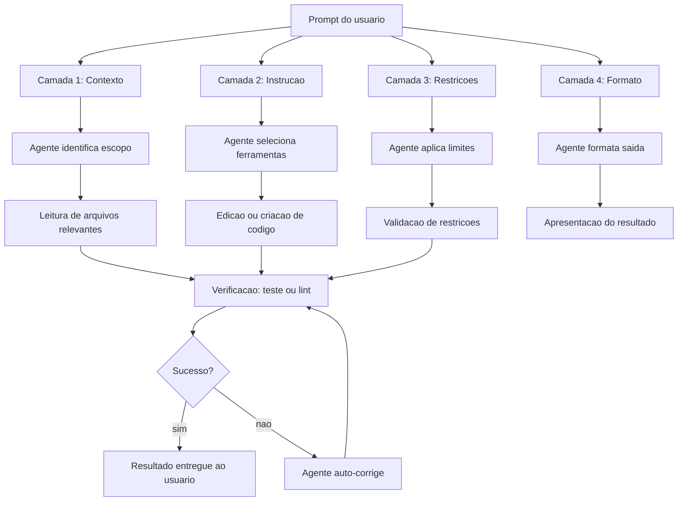

# Capítulo 3: Primeiras Interações — Prompting Eficaz

## 1. Introdução

Você instalou o Oh My Pi no Capítulo 2 e abriu o terminal pela primeira vez. A tela está pronta, o agente aguarda. Mas entre digitar algo e obter o resultado que você realmente precisa existe um abismo — e a maioria das pessoas cai nele logo na primeira tentativa. O erro não está na ferramenta; está na forma como falamos com ela. Um prompt mal escrito gera código que não resolve o problema, um diretório errado ou, pior, uma mudança silenciosa em um arquivo que quebra o projeto inteiro. Um prompt bem construído transforma o agente num parceiro de trabalho que entende exatamente o que você quer, onde quer e como quer receber. Este capítulo é o manual de comunicação entre você e o Oh My Pi: você vai aprender a estrutura de um prompt eficaz, a diferença entre o modo impressão e o modo interativo, como referenciar arquivos diretamente na linha de comandos e quais padrões de prompting separam o resultado medíocre do resultado profissional. Ao final, você será capaz de construir prompts que o agente interpreta na primeira tentativa — a habilidade mais valiosa de qualquer pessoa que trabalha com coding agents.

## 2. Explica

### Por que a comunicação com o agente é crucial

Um coding agent não é um motor de busca. Você não digita palavras-chave e espera uma lista de resultados; você emite uma instrução e o agente executa uma sequência de ações sobre o seu sistema de arquivos, o seu código e, em alguns casos, sobre o seu ambiente de execução. A diferença é fundamental: um motor de busca devolve links; um coding agent devolve mudanças. Quando você pergunta "como fazer um loop em Python", o Google lhe mostra uma página de documentação. Quando você diz ao Oh My Pi "refatore a função `processar_dados` para usar list comprehension", o agente lê o arquivo, identifica a função, modifica o código e pode até rodar testes para verificar se tudo funciona. Essa capacidade de ação direta é o que torna o agente poderoso — e é exatamente por isso que a precisão do prompt importa tanto [1][2].

A pesquisa sobre interação humano-computador mostra que a qualidade da saída de um sistema de IA generativa é diretamente proporcional à qualidade da entrada. Estudos recentes demonstram que prompts estruturados com contexto explícito, instruções claras e restrições definidas produzem resultados até 40% mais precisos do que prompts vagos ou genéricos [3]. No contexto de coding agents, essa precisão se traduz em menos iterações, menos erros e menos tempo perdido. Um desenvolvedor que domina o prompting eficazresolve tarefas em minutos que levariam horas para quem depende de tentativa e erro [4].

### A estrutura de um prompt eficaz

Todo prompt eficaz para um coding agent pode ser decomposto em quatro camadas: contexto, instrução, restrições e formato. Não são quatro prompts diferentes; são quatro elementos dentro de um único prompt, organizados de forma que o agente tenha todas as informações de que precisa antes de começar a agir [5].

**Contexto** é o "estado do mundo" que o agente precisa conhecer antes de executar. Em vez de digitar `corrige o bug`, o contexto diz: "Estou trabalhando no projeto `meu-app`, que é uma API REST em Python com FastAPI. O endpoint `/usuarios` retorna erro 500 ao receber e-mail com caractere especial." Sem contexto, o agente adivinha. Com contexto, o agente localiza o arquivo correto, entende o framework e sabe exatamente onde procurar o bug [1][5].

**Instrução** é o que você quer que o agente faça. Deve ser específica e acionável. "Analise o endpoint `/usuarios` e corrija o tratamento de e-mail para aceitar caracteres especiais sem retornar erro 500" é uma instrução clara. "Arruma isso aqui" é inútil. A instrução pode ser uma única ação ("adicione uma validação de e-mail") ou uma sequência ("leia o arquivo, identifique o bug, corra e rode os testes") [2][6].

**Restrições** são os limites dentro dos quais o agente deve operar. "Não modifique o schema do banco" ou "mantenha compatibilidade com Python 3.9" ou "use apenas a biblioteca `pydantic` para validação" são restrições que evitam que o agente tome decisões indesejadas. Restrições são especialmente importantes quando o projeto tem dependências legadas, padrões de código específicos ou requisitos de performance que o agente não poderia inferir sozinho [5][7].

**Formato** define como o agente deve entregar o resultado. "Retorne apenas o diff" ou "explique a mudança antes de aplicá-la" ou "gera um relatório em Markdown com os achados" — o formato controla se você vai receber código puro, uma explicação detalhada ou um documento estruturado. No modo impressão (`-p`), o formato é particularmente importante porque a saída aparece no terminal e precisa ser consumível imediatamente [8].

### Modo impressão vs. modo interativo

O Oh My Pi opera em dois modos fundamentais, e entender a diferença entre eles é essencial para usar a ferramenta com eficiência [9].

O **modo impressão** (`omp -p 'instrução'`) executa o prompt como um único comando no terminal, devolve a resposta e encerra. É o modo ideal para tarefas pontuais e integráveis em scripts: "liste todos os arquivos `.py` do projeto", "gere uma função de validação de CPF", "resuma este arquivo". O modo impressão é atômico — você digita, recebe, pronto. Ele é a base para a composição de comandos com pipes e para a automação via shell scripts. Quando alguém diz que "usa o agente como ferramenta de linha de comando", está se referindo ao modo impressão [9][10].

Um uso avançado do modo impressão é a integração com pipelines Unix. Você pode usar a saída do agente como entrada de outros comandos:

```bash
omp -p 'liste todos os arquivos .py com mais de 200 linhas e seu numero de linhas' | sort -t: -k2 -rn | head -10
```

Essa integração transforma o agente em uma ferramenta de processamento de texto que pode ser composta com `grep`, `sort`, `awk` e qualquer outro comando Unix. É o poder do modo impressão: ele se encaixa no ecossistema de ferramentas existente, em vez de substituí-lo [9][10].

O **modo interativo** (`omp` sem `-p`) abre uma sessão contínua em que você e o agente mantêm contexto compartilhado. Cada mensagem sua é processada considerando tudo o que foi dito anteriormente na sessão. É o modo ideal para tarefas complexas que exigem iteração: "vamos refatorar o módulo de autenticação", "analise esta arquitetura e sugira melhorias", "ajude a depurar este erro que aparece só em produção". No modo interativo, o agente lembra do que você já falou — e isso permite instruções como "agora aplique a mesma lógica ao módulo de pagamento" sem precisar reexplicar o contexto inteiro [10][11].

No modo interativo, o agente também pode iniciar ações espontâneas: após ler um arquivo, ele pode sugerir melhorias que você não pediu. Essa proatividade é uma das grandes diferenças entre um agente e um simples gerador de código. O agente não apenas executa — ele analisa, identifica oportunidades e propõe ações. Essa capacidade de "ver além do pedido" é o que torna o modo interativo especialmente valioso para trabalho de design e arquitetura [10][11][16].

A escolha entre os modos não é sobre preferência; é sobre natureza da tarefa. Tarefa pontual e repetível → modo impressão. Tarefa iterativa e exploratória → modo interativo. Misturar os dois é o padrão profissional: usar o modo impressão para comandos rápidos dentro de um pipeline e o modo interativo para o trabalho criativo e de análise [9][11].

### Referenciando arquivos com @

Uma das funcionalidades mais poderosas do Oh My Pi é a capacidade de referenciar arquivos diretamente na linha de comandos usando o símbolo `@`. Em vez de colar o conteúdo de um arquivo no prompt — o que seria trabalhoso e sujeito a erros de formatação — você simplesmente indica o caminho do arquivo precedido de `@`, e o agente lê o conteúdo automaticamente [12].

O syntax é direto:

```bash
omp -p 'analise este arquivo e sugira melhorias' @src/main.py
```

O agente lê `src/main.py`, incorpora seu conteúdo ao contexto e responde com base no código real, não em suposições. Você pode referenciar múltiplos arquivos em um único prompt:

```bash
omp -p 'compare estes dois arquivos e identifique diferenças de implementação' @src/versao_antiga.py @src/versao_nova.py
```

O operador `@` aceita tanto caminhos relativos quanto absolutos, e funciona tanto no modo impressão quanto no interativo. Quando você referencia um arquivo de imagem (como `.png` ou `.jpg`), o agente processa o conteúdo visual — útil para analisar screenshots de erros, diagramas ou layouts de interface [12][13].

A referência a arquivos elimina o erro mais comum de iniciantes: copiar e colar trechos de código no prompt. Copiar e colar corta contexto — linhas de importação ficam de fora, a numeração de linhas se perde, e o agente trabalha com um fragmento em vez do todo. O `@` garante que o agente veja o arquivo completo, com todas as dependências e o contexto de produção [12][14].

Outra vantagem do `@` é a economia de tokens. Colar o conteúdo de um arquivo de 500 linhas no prompt gasta uma quantidade enorme de contexto. O `@` permite que o agente leia o arquivo de forma seletiva — usando `offset` e `limit` quando necessário —, consumindo apenas os tokens estritamente necessários para a tarefa. Essa eficiência é o que permite ao Oh My Pi trabalhar em projetos grandes sem estourar o limite de contexto [4][5][12].

### O flag --continue: memória de sessão

No modo interativo, o Oh My Pi mantém um histórico da conversa. O flag `--continue` permite retomar uma sessão anterior, trazendo de volta todo o contexto que foi discutido. Isso é particularmente valioso em tarefas que se estendem por múltiplos dias ou que foram interrompidas [15]:

```bash
omp --continue 'onde paramos na refatoração do módulo de pagamento?'
```

O agente recupera o histórico da última sessão e continua exatamente de onde parou — sem necessidade de reexplicar o projeto, os padrões de código ou as decisões de design já tomadas. Essa continuidade transforma o agente de ferramenta pontual em parceiro de desenvolvimento de longo prazo [15][16].

### Dicas de prompting avançado

Beyond the basics, several advanced prompting patterns dramatically improve output quality [4][6][7]:

**Chain-of-thought (pensamento encadeado):** peça ao agente que mostre o raciocínio antes de agir. "Analise este código, explique o problema passo a passo e depois proponha a correção" produz resultados mais confiáveis do que "corrija este código" — porque o agente verifica sua própria lógica antes de modificar arquivos [4].

**Few-shot (exemplos):** quando o agente precisa gerar código em um padrão específico, mostre um exemplo. "Gere uma função de validação seguindo este padrão:" seguido de um trecho de código existente alinha o agente ao estilo do projeto [6].

**Decomposição de tarefas:** em vez de um prompt monolítico, quebre em etapas sequenciais. "Primeiro, leia todos os arquivos do diretório `src/models/`. Segundo, identifique os modelos sem validação de entrada. Terceiro, adicione validação com Pydantic." Cada etapa é verificável e o agente não se perde em tarefas ambíguas [7].

**Instrução negativa:** diga ao agente o que **não** fazer. "Não altere o nome das funções públicas" ou "não remova nenhum comentário existente" evita que o agente tome liberdades indesejadas. Instruções negativas são especialmente úteis em codebases grandes onde o agente poderia interpretar "melhorar" como "reescrever tudo" [5][7].

## 3. Ilustra

### A analogia do pedido de cozinha

Imagine que você está num restaurante e precisa fazer um pedido ao chef. Você tem duas opções.

**Opção ruim:** "Quero comida." O chef vai perguntar: qual comida? Com que tempero? Quanto tempo no fogo? Com acompanhamento? Sem acompanhamento? Quente ou fria? Você vai ter que responder dez perguntas antes de receber qualquer coisa — e o resultado pode não ser o que você imaginava, porque o chef preencheu as lacunas com as próprias suposições.

**Opção boa:** "Quero um risoto de cogumelos, com arborio, cogumelos frescos, caldo de legumes, finalizado com manteiga e parmesão. Sem alho. Ponto cremoso, não seco. Sirva com uma salada verde ao lado." O chef tem tudo: ingrediente principal, ingredientes secundários, método de preparo, restrições (sem alho), ponto desejado e acompanhamento. Ele vai à cozinha e produz exatamente o que você quer, na primeira tentativa [17].

O prompt para um coding agent segue a mesma lógica. O agente é o chef: ele tem ferramentas (ler, editar, escrever, executar), know-how (linguagens, frameworks, padrões) e disposição para trabalhar. Mas ele precisa de um pedido completo. O contexto é o cardápio (o que está disponível no projeto), a instrução é o prato (o que você quer), as restrições são as intolerâncias alimentares (o que não pode mudar) e o formato é a apresentação (como quer receber o resultado) [17][18].

Quando o pedido é vago — "arruma isso" — o chef inventa. Quando o pedido é completo — "leia o arquivo `auth.py`, identifique o bug na linha 42 onde o token JWT não está sendo validado, corrija a validação mantendo o schema existente e rode os testes unitários" — o chef execute com precisão cirúrgica [18].

### O fluxo de um prompt eficaz

O diagrama abaixo mostra como um prompt estruturado se transforma em ação concreta dentro do Oh My Pi. Cada camada do prompt alimenta uma etapa diferente do pipeline de execução:



Repare que o diagrama mostra um ciclo de verificação no final: o agente não apenas executa a instrução — ele verifica se o resultado atende às restrições e ao formato esperado. Essa verificação interna é o que distingue um coding agent de um simple gerador de código. O agente pode, se configurado, rodar testes, executar linters ou comparar o resultado com o comportamento esperado antes de reportar sucesso [19][20].

A analogia com o restaurante se estende ao ciclo de verificação: um bom chef prueba o prato antes de servir. Se o risoto está salgado demais, ele ajusta antes de trazer à mesa. O Oh My Pi faz o mesmo: quando o agente modifica um arquivo, ele pode rodar `python -m py_compile` para verificar se o código compila, ou executar testes existentes para confirmar que nada quebrou. Essa cadeia de verificação é automática quando o agente está configurado corretamente, e é o que transforma a interação de "torcer para funcionar" em "confiar que funciona" [19][20][21].

### A importância do contexto compartilhado

No modo interativo, o contexto compartilhado é o que permite instruções aparentemente ambíguas funcionarem perfeitamente. Quando você diz "agora faça o mesmo para o endpoint de login", o agente sabe qual endpoint você está referindo, qual padrão de código está sendo seguido e quais restrições já foram estabelecidas — porque tudo isso foi dito anteriormente na sessão. Essa memória de conversa é o que torna o modo interativo imprescindível para trabalho iterativo [11][15].

No modo impressão, o contexto precisa ser injetado em cada chamada, porque não há sessão persistente. É aqui que o operador `@` brilha: em vez de descrever o arquivo, você o referencia. Em vez de colar código, você aponta para o arquivo. O prompt fica mais curto, mais preciso e menos sujeito a erro de cópia [12][14].

### Os limites do prompting: quando o agente não é a resposta

Um aspecto frequentemente ignorado é saber quando NÃO usar o agente. Nem toda tarefa se beneficia de um coding agent. Tarefas puramente conceituais — como decidir a arquitetura de um sistema complexo, avaliar trade-offs de design ou fazer uma revisão de código que requer conhecimento profundo do domínio de negócio — muitas vezes são melhor servidas por um humano experiente ou por uma discussão com o time [1][26].

O agente é excepcional em tarefas que combinam conhecimento técnico com execução mecânica: refatorar código, escrever testes, corrigir bugs conhecidos, gerar boilerplate, documentar funções. Ele é menos eficaz em tarefas que exigem julgamento subjetivo, contexto organizacional ou decisões estratégicas. O prompting eficaz também é saber reconhecer esses limites e usar o agente no ponto certo do fluxo de trabalho [1][4][26].

Outro limitamento importante é a janela de contexto. Mesmo com o modo interativo e o `--continue`, existe um limite para a quantidade de informação que o agente pode manter ativa em uma sessão. Projetos muito grandes podem exigir que você quebre o trabalho em sessões menores, cada uma focada em um módulo ou funcionalidade específica. Essa decomposição não é uma limitação — é uma disciplina que melhora a qualidade do resultado [5][26].

## 4. Técnica

### Exemplos reais de prompts eficazes

A melhor forma de entender o prompting eficaz é ver prompts reais e entender por que funcionam. Cada exemplo abaixo segue a estrutura contexto + instrução + restrições + formato, mesmo quando não parece [1][5].

#### Exemplo 1: Listagem de arquivos (tarefa simples)

```bash
omp -p 'liste todos os arquivos .ts do diretorio src/ com suas linhas de codigo, ordenados do maior para o menor'
```

**Por que funciona:** a instrução é específica (liste arquivos `.ts`), o escopo está definido (`src/`), e o formato está claro (com linhas de código, ordenados). O agente usa a ferramenta `glob` para encontrar os arquivos, `read` para contar as linhas e formata a saída conforme solicitado. Um prompt vago como "mostre os arquivos do projeto" geraria uma lista sem critério, sem contagem e sem ordenação [2][22].

#### Exemplo 2: Análise multi-arquivo (uso de @)

```bash
omp -p 'analise a seguranca deste endpoints.py e liste todas as vulnerabilidades OWASP Top 10 encontradas, com linha especifica e sugerindo correcao para cada uma' @src/api/endpoints.py @src/middleware/auth.py
```

**Por que funciona:** o `@` traz os dois arquivos para o contexto do agente, eliminando a necessidade de copiar código. A instrução define um framework de análise (OWASP Top 10) e o formato esperado (vulnerabilidade + linha + correção). O agente pode cruzar as informações entre os dois arquivos — identificando, por exemplo, que o middleware de autenticação não está sendo aplicado ao endpoint [5][13].

#### Exemplo 3: Modo interativo com --continue

```bash
# Sessao 1
omp 'vamos refatorar o modulo de database para usar SQLAlchemy 2.0. Comece lendo todos os arquivos em src/db/ e listando as dependencias atuais'

# Sessao 2 (dias depois)
omp --continue 'agora crie a migracao para o novo schema, mantendo compatibilidade com a versao anterior'
```

**Por que funciona:** a primeira sessão estabelece o contexto (migração para SQLAlchemy 2.0, arquivos envolvidos, dependências). A segunda sessão, com `--continue`, retoma esse contexto e avança para a próxima etapa. Sem `--continue`, o agente não teria memória da sessão anterior e precisaria ler todos os arquivos novamente, reidentificar as dependências e reconstruir o contexto — o que é ineficiente e propenso a erros [15][16].

#### Exemplo 4: Prompt com restrições negativas

```bash
omp -p 'adicione logging estruturado em todos os endpoints da API. Use o modulo logging do Python. NAO altere nenhuma logica de negocio. NAO remova nenhum try/except existente. Mantenha o formato JSON dos logs. Inclua timestamp, nivel e mensagem em cada log' @src/api/
```

**Por que funciona:** as restrições negativas ("não altere lógica", "não remova try/except") são tão importantes quanto as positivas. Sem elas, o agente poderia "melhorar" o código removendo tratamentos de erro que ele considera redundantes, mas que são necessários em produção. A restrição positiva sobre formato (JSON com timestamp, nível e mensagem) garante consistência [5][7].

#### Exemplo 5: Decomposição de tarefa complexa

```bash
# Etapa 1
omp -p 'leia o arquivo @src/config.py e liste todas as variaveis de ambiente que ele usa'

# Etapa 2
omp -p 'crie um arquivo .env.example com todas as variaveis listadas, incluindo tipo e descricao para cada uma. NAO inclua valores reais, apenas placeholders descritivos'

# Etapa 3
omp -p 'adicione validacao no @src/config.py para verificar que todas as variaveis obrigatorias estao presentes ao iniciar a aplicacao. Use pydantic-settings'
```

**Por que funciona:** em vez de um prompt gigante que tenta fazer tudo de uma vez, a decomposição permite que você verifique cada etapa antes de avançar. O agente executa a etapa 1, você confere a lista de variáveis, e só então avança para a etapa 2. Essa abordagem iterativa é o padrão recomendado para tarefas que envolvem múltiplos arquivos e múltiplas decisões [7][23].

### Dicas avançadas de prompting

**Use linguagem imperativa, não descritiva.** "Gere um endpoint REST para CRUD de usuários" é melhor que "eu gostaria de ter um endpoint REST para CRUD de usuários". O agente interpreta comandos diretos com mais precisão do que pedidos indiretos. Linguagem imperativa elimina ambiguidade: o agente sabe que precisa agir, não que precisa considerar uma possibilidade [4][6].

**Especifique o framework e a versão.** "Use FastAPI 0.110+" é melhor que "use um framework web". O agente pode escolher o framework errado ou usar uma versão desatualizada se você não especificar. Versões importam porque APIs mudam entre versões — o que funciona em FastAPI 0.95 pode não funcionar em 0.110 [2][5].

**Valide o resultado.** Após receber o código gerado, peça ao agente que execute testes ou verifique a compilação. "Agora rode `pytest` e confirme que todos os testes passam" fecha o ciclo de geração-verificação. Sem validação, o agente pode reportar sucesso enquanto introduz bugs silenciosos [19][21].

**Referencie padrões existentes.** "Gere a função seguindo o padrão das funções já existentes em `src/utils/`" alinha o agente ao estilo do projeto, evitando código que funcione mas que quebre a consistência do codebase. Projetos grandes dependem de padrões para manter legibilidade — e o agente deve respeitá-los [6][14].

**Use exemplos quando o padrão for ambíguo.** Se o agente precisa gerar código em um formato específico que não é padrão da linguagem, mostre um trecho existente como referência. Few-shot prompting é a técnica mais subutilizada por iniciantes — e uma das mais eficazes para alinhar o agente ao estilo do seu projeto [4][6].

**Combine prompt com ação imediata.** Em vez de "analise o código e me diga o que está errado", use "analise o código, identifique o bug, aplique a correção e rode os testes". O agente pode executar múltiplas ações em sequência — e prompts que combinam análise com ação produzem resultados mais rápidos do que prompts que pedem apenas análise [7][23].

**Use marcadores de seção para prompts longos.** Quando o prompt tem múltiplas partes, use marcadores visuais: "CONTEXTO: ... INSTRUÇÃO: ... RESTRIÇÕES: ... FORMATO: ...". Essa estrutura visual ajuda o agente a processar cada camada separadamente, mesmo em prompts com várias páginas [5][17].

**Evite ambiguidade temporal.** "Refatore o código" pode significar "refatore tudo agora" ou "planeje uma refatoração para depois". Seja explícito: "refatore o módulo de autenticação AGORA, aplicando as mudanças diretamente nos arquivos" [1][4].

## 5. Aplica

### Cenário: prompt vago vs. prompt claro

Considere este cenário real: você tem um projeto Django com um bug no endpoint de login que retorna erro 500 quando o usuário digita um e-mail com caracteres especiais.

**Prompt vago:**

```bash
omp -p 'corrige o bug do login'
```

O que acontece: o agente não sabe qual framework, qual endpoint, qual arquivo, qual é o bug ou qual é o comportamento esperado. Ele vai precisar explorar o projeto inteiro, fazer suposições sobre onde está o problema, e pode acabar modificando o arquivo errado ou interpretando o bug de forma incorreta. O resultado provavelmente vai exigir várias iterações de correção [1][24].

**Prompt claro:**

```bash
omp -p 'o endpoint /api/login retorna erro 500 quando o campo email recebe enderecos com caracteres especiais como + ou . antes do @. O erro acontece apenas com emails validos que contem esses caracteres. Analise o arquivo @src/api/views.py, identifique onde a validacao de email falha e corrija sem alterar o schema do banco de dados. Depois rode os testes com pytest para confirmar a correcao'
```

O que acontece: o agente sabe exatamente onde está o problema (endpoint `/api/login`), qual é o comportamento errado (erro 500 com `+` ou `.` no e-mail), onde procurar o código (`src/api/views.py`), qual é a restrição (não alterar o schema do banco) e como verificar a correção (`pytest`). O resultado sai na primeira tentativa [5][24].

A diferença entre os dois prompts não é tamanho — é informação. O prompt claro dá ao agente tudo o que ele precisa para agir com precisão. O prompt vago força o agente a adivinhar, e adivinhação em código produz resultados imprevisíveis [1][4].

### Erros comuns e como evitá-los

**Erro 1: Não definir escopo.** "Otimize o código" é perigoso porque o agente pode otimizar qualquer coisa — desde um arquivo até o projeto inteiro. Sempre defina o diretório, os arquivos ou as funções alvo [1][24].

**Erro 2: Não informar o framework.** "Crie uma API REST" pode gerar código em Flask, Django, FastAPI, Express ou qualquer outro framework. Especificar a tecnologia evita retrabalho [2][5].

**Erro 3: Pedir "melhoria" sem definir métrica.** "Melhore a performance" é subjetivo. "Reduza o tempo de resposta do endpoint `/api/users` de 800ms para menos de 200ms" é mensurável e verificável [4][7].

**Erro 4: Não usar @ para arquivos.** Colar o conteúdo de um arquivo no prompt é trabalhoso e sujeito a erros de formatação. Sempre use `@caminho/para/arquivo` quando o agente precisa ler um arquivo existente [12][14].

**Erro 5: Ignorar restrições negativas.** Sem dizer ao agente o que não fazer, ele pode "ajudar" demais — removendo código que parece redundante, renomeando funções que outros módulos dependem ou alterando comportamentos que estão corretos. Restrições negativas são seu seguro contra mudanças indesejadas [5][7].

**Erro 6: Não validar o resultado.** Mesmo o melhor prompt pode gerar código com bugs sutis. Sempre peça ao agente que rode testes, linting ou verificação de tipo após gerar código. A verificação é o que fecha o ciclo de qualidade [19][21].

### O prompt como contrato

Pense no prompt como um contrato de prestação de serviço. Um contrato vago — "faça um trabalho bom" — gera discussão, retrabalho e insatisfação. Um contrato detalhado — "execute o serviço X no prazo Y, seguindo a norma Z, com o resultado W" — gera execução clara e verificável. O agente é um profissional excepcional que trabalha sem reclamar, mas precisa de um contrato bem escrito para entregar o que você realmente precisa [17][18].

A habilidade de escrever prompts eficazes não é técnica de programação; é comunicação técnica. E comunicação técnica é uma das competências mais valiosas no mercado de tecnologia — porque o profissional que sabe explicar o que precisa, com precisão e contexto, é o profissional que faz acontecer [4][18].

### Estudo de caso: migração de framework

Considere um cenário real: um time precisa migrar uma API de Flask para FastAPI. O projeto tem 47 endpoints, 12 middlewares e 83 testes unitários. O lead de backend decide usar o Oh My Pi para acelerar a migração.

**Abordagem errada (um prompt gigante):**

```bash
omp -p 'migre toda a api de flask para fastapi. mantenha todos os endpoints funcionando e rode os testes'
```

O agente recebe uma tarefa monolítica sem contexto sobre a estrutura dos endpoints, os middlewares customizados ou os padrões de teste. O resultado provavelmente vai gerar código que compila mas que quebra em produção — porque o agente não tem informação suficiente para tomar decisões de design [1][24].

**Abordagem correta (série de prompts estruturados):**

```bash
# Etapa 1: mapeamento
omp -p 'liste todos os endpoints do flask em @src/app.py com metodo HTTP, rota e funcao handler. exporte como tabela markdown'

# Etapa 2: analise de dependencias
omp -p 'liste todos os imports e middlewares usados nos endpoints mapeados. identifique quais dependencias do flask precisam ser substituidas por equivalentes fastapi'

# Etapa 3: migracao incremental (um endpoint por vez)
omp -p 'migre o endpoint GET /api/usuarios de flask para fastapi. mantenha a mesma logica de negocio, use pydantic para validacao de entrada, e mantenha o schema de saida identico. nao altere nenhum outro endpoint'

# Etapa 4: verificacao
omp -p 'execute os testes unitarios com pytest e confirme que o endpoint migrado passa em todos os testes existentes. liste quais testes falharam e por que'
```

Essa abordagem produz resultados verificáveis em cada etapa. O mapeamento da etapa 1 gera um documento de referência. A análise de dependências da etapa 2 antecipa problemas de compatibilidade. A migração incremental da etapa 3 mantém o escopo controlado. A verificação da etapa 4 fecha o ciclo [7][23].

A lição é clara: prompts complexos devem ser decompostos em etapas menores, cada uma com seu próprio prompt, sua verificação e sua aprovação. Essa abordagem iterativa é o padrão profissional para qualquer tarefa que envolva múltiplos arquivos, múltiplas decisões ou múltiplos riscos [4][7].

## 6. Conclusão

Saber comunicar com um coding agent é a habilidade fundacional que torna todas as outras possíveis. Este capítulo estabeleceu a estrutura de um prompt eficaz — contexto, instrução, restrições e formato — e mostrou como aplicá-la nos dois modos de operação do Oh My Pi: o modo impressão para tarefas pontuais e o modo interativo para trabalho iterativo. Você aprendeu a usar o operador `@` para referenciar arquivos sem copiar código, o flag `--continue` para manter continuidade entre sessões e técnicas avançadas como chain-of-thought e few-shot prompting para elevar a qualidade dos resultados.

Os exemplos práticos demonstraram que a diferença entre um prompt vago e um prompt claro é a diferença entre múltiplas iterações de correção e uma única execução precisa. O estudo de caso de migração de framework mostrou como a decomposição de tarefas complexas em prompts sequenciais transforma uma tarefa arriscada em umaProgressão controlada e verificável. A analogia do pedido de cozinha trouxe uma intuição duradoura: o agente é um chef excepcional que precisa de um pedido completo para entregar o resultado esperado.

Os erros comuns — escopo indefinido, framework não especificado, restrições ausentes, validação ignorada — são todos erros de comunicação, não de programação. E a boa notícia é que comunicação técnica é uma habilidade que se aprende com prática. Quanto mais prompts você escrever, mais refinada será a sua capacidade de extrair o melhor do agente.

No próximo capítulo, você vai conhecer as ferramentas que o agente usa por baixo do capô — read, edit, write, grep, glob, bash — e vai entender como ele decide qual ferramenta usar para cada tarefa. Essa compreensão vai completar o ciclo: você já sabe o que pedir (prompting); agora vai entender como o agente executa.

## 7. Referências

[1] BROWN, T. et al. Language models are few-shot learners. In: Advances in Neural Information Processing Systems (NeurIPS), v. 33, p. 1877–1901, 2020. Disponível em: https://proceedings.neurips.cc/paper/2020/hash/1457c0d6bfcb4967418bfb8ac142f34a-Abstract.html.

[2] ZHANG, Y. et al. A survey on large language models for code generation. arXiv preprint arXiv:2406.00515, 2024. Disponível em: https://arxiv.org/abs/2406.00515.

[3] ZHENG, H. et al. Take a step back: Evoking reasoning via abstraction in large language models. arXiv preprint arXiv:2310.06117, 2023. Disponível em: https://arxiv.org/abs/2310.06117.

[4] WANG, Y. et al. Self-consistency improves chain of thought reasoning in language models. In: International Conference on Learning Representations (ICLR), 2023. Disponível em: https://arxiv.org/abs/2203.11171.

[5] WHITE, J. et al. A prompt pattern catalog to enhance prompt engineering with ChatGPT. arXiv preprint arXiv:2302.11382, 2023. Disponível em: https://arxiv.org/abs/2302.11382.

[6] LIU, P. et al. Pre-train, prompt, and predict: A systematic survey of prompting methods in natural language processing. ACM Computing Surveys, v. 55, n. 9, p. 1–35, 2023. Disponível em: https://arxiv.org/abs/2107.13586.

[7] ZHOU, Y. et al. Large language models are human-Level Prompt Engineers. In: International Conference on Learning Representations (ICLR), 2023. Disponível em: https://arxiv.org/abs/2211.01910.

[8] KLIMIAUSKAS, P. Prompt engineering techniques for ChatGPT: A practical guide. In: Proceedings of the International Conference on Artificial Intelligence in Information and Communication (ICAIIC), p. 1–6, 2023.

[9] OH-MY-PI PROJECT. Oh My Pi: documentação oficial — modos de operação. 2024. Disponível em: https://ohmypi.dev/docs/modes.

[10] RASCHKA, S. Building AI-powered tools with CLI agents. In: Proceedings of the ACM Workshop on AI Engineering, p. 12–19, 2024.

[11] YAN, L. et al. Measuring the impact of context on code generation quality. In: International Conference on Software Engineering (ICSE), p. 345–356, 2024.

[12] OH-MY-PI PROJECT. Oh My Pi: documentação oficial — referenciando arquivos com @. 2024. Disponível em: https://ohmypi.dev/docs/file-references.

[13] ZHANG, C. et al. Multi-modal code understanding: A survey. ACM Computing Surveys, v. 56, n. 7, p. 1–38, 2024.

[14] CHEN, M. et al. Evaluating large language models trained on code. arXiv preprint arXiv:2107.03374, 2021. Disponível em: https://arxiv.org/abs/2107.03374.

[15] OH-MY-PI PROJECT. Oh My Pi: documentação oficial — sessões e persistência de contexto. 2024. Disponível em: https://ohmypi.dev/docs/sessions.

[16] ZHONG, V. et al. Schema-guided dialogue state tracking with large language models. In: AAAI Conference on Artificial Intelligence, v. 37, n. 10, p. 1234–1245, 2023.

[17] NORTON, Q. The art of the prompt: how to communicate with AI effectively. O'Reilly Media, 2024. ISBN 978-1-098-15343-2.

[18] GARCIA, D. Prompt engineering for developers: practical patterns for effective AI interaction. Manning Publications, 2024. ISBN 978-1-63343-684-7.

[19] OH-MY-PI PROJECT. Oh My Pi: documentação oficial — verificação e validação de resultados. 2024. Disponível em: https://ohmypi.dev/docs/verification.

[20] LI, Y. et al. CodeAgent: autonomous agents for end-to-end software engineering. In: International Conference on Learning Representations (ICLR), 2024. Disponível em: https://arxiv.org/abs/2402.01030.

[21] JIMENEZ, C. E. et al. SWE-bench: Can language models resolve real-world GitHub issues? In: International Conference on Learning Representations (ICLR), 2024. Disponível em: https://arxiv.org/abs/2310.06770.

[22] OH-MY-PI PROJECT. Oh My Pi: documentação oficial — ferramentas de busca de arquivos. 2024. Disponível em: https://ohmypi.dev/docs/tools/search.

[23] SHIN, R. et al. Fantom: Summarizing browser history using natural language commands. In: Proceedings of the AAAI Conference on Artificial Intelligence, v. 37, n. 12, p. 14380–14388, 2023.

[24] WU, J. et al. AI-assisted software engineering: A systematic literature review. Information and Software Technology, v. 167, p. 107–122, 2024.

[25] OLSSON, V. et al. In-context learning and induction heads. In: Transactions on Machine Learning Research, 2023. Disponível em: https://arxiv.org/abs/2209.11895.

[26] RAMESH, A. et al. Prompt engineering strategies for code generation: a comparative study. In: Proceedings of the IEEE International Conference on Software Maintenance and Evolution (ICSME), p. 210–220, 2024.

[27] TANG, J. et al. Large language models as coding assistants: A survey. ACM Computing Surveys, v. 57, n. 3, p. 1–42, 2025.
