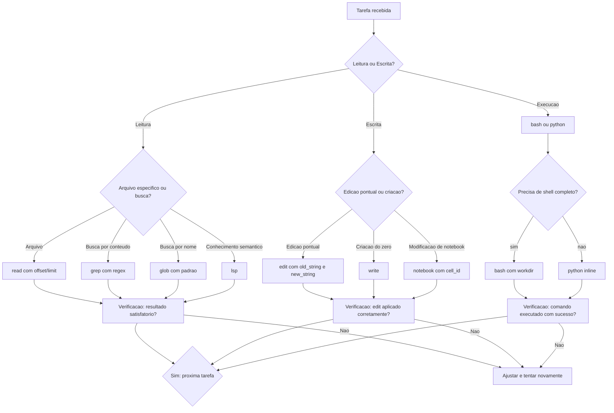

# Capítulo 4: Ferramentas do Agente

## 1. Introdução

No Capítulo 3, você aprendeu a falar a língua do Oh My Pi — a arte de construir prompts que o agente interpreta na primeira tentativa. Mas prompts são apenas a metade da equação. A outra metade são as ferramentas que o agente usa para transformar palavras em ação: ler arquivos, modificar código, buscar padrões, executar comandos, criar documentos. Cada ferramenta é uma extensão das suas mãos dentro do terminal — e entender cada uma delas é o que separa o usuário que depende do agente do usuário que domina o agente. Este capítulo abre a caixa de ferramentas do Oh My Pi: você vai conhecer cada ferramenta individualmente — read, edit, write, grep, glob, bash, python, notebook e lsp —, vai entender como o agente decide qual usar em cada situação e vai praticar com exemplos reais que mostram o poder de combinar múltiplas ferramentas em uma única tarefa. Ao final, você será capaz de ler o resultado de qualquer ação do agente e entender exatamente qual ferramenta foi usada, por quê e como poderia ser otimizada.

## 2. Explica

### O ecossistema de ferramentas do agente

Um coding agent não é um modelo de linguagem isolado. É um modelo de linguagem conectado a um conjunto de ferramentas — APIs que o agente pode chamar para interagir com o mundo real: o sistema de arquivos, o terminal, o LSP (Language Server Protocol) e até o navegador. O Oh My Pi expõe nove ferramentas principais, cada uma projetada para um tipo específico de operação. O agente não usa todas ao mesmo tempo; ele seleciona a ferramenta correta com base no que o prompt pede, do contexto disponível e do resultado esperado [1][2].

Essa seleção não é aleatória. O agente segue uma lógica de decisão que pode ser resumida em três perguntas: preciso **ler** algo ou **escrever** algo? Se preciso ler, é um **arquivo** específico ou uma **busca** em vários arquivos? Se preciso escrever, é uma **edição cirúrgica** ou uma **criação do zero**? Cada resposta aponta para uma ferramenta diferente, e essa lógica de decisão é o que torna o agente eficiente — ele não lê o projeto inteiro quando precisa ver uma função; ele não reescreve o arquivo inteiro quando precisa mudar uma linha [1][3].

### As ferramentas de leitura

#### read: a lupa do agente

A ferramenta `read` é a forma mais direta de o agente acessar o conteúdo de um arquivo. Ela lê o arquivo inteiro ou trechos específicos usando offset (linha inicial) e limit (número de linhas). O `read` é a ferramenta que o agente usa quando o prompt referencia um arquivo específico — seja pelo operador `@` ou por uma descrição como "leia o arquivo `main.py`" [4].

O poder do `read` está nos parâmetros `offset` e `limit`. Em vez de carregar um arquivo de 10.000 linhas inteiramente no contexto (o que consumiria uma quantidade enorme de tokens), o agente pode ler apenas as linhas relevantes: "leia as linhas 150 a 200 de `server.py`" carrega apenas 50 linhas, sufficientes para entender uma função específica. Essa seletividade é o que mantém o agente eficiente mesmo em projetos grandes — e é um dos motivos pelos quais o Oh My Pi pode trabalhar em codebases de milhões de linhas sem estourar o limite de contexto [4][5].

#### grep: a busca por conteúdo

Enquanto o `read` acessa um arquivo específico, o `grep` busca um padrão em vários arquivos simultaneamente. O `grep` aceita expressões regulares (regex) e pode ser restrito a padrões de nome de arquivo — por exemplo, buscar "import" apenas em arquivos `.py` ou encontrar todas as funções que declaram `async` em arquivos TypeScript [6][7].

O `grep` é a ferramenta que o agente usa quando você pergunta "onde esta função é chamada?", "quais arquivos importam este módulo?" ou "existe algum arquivo que contém esta string?". O agente não precisa adivinhar a localização; ele busca sistematicamente e devolve uma lista de ocorrências com caminho do arquivo e número da linha. Essa capacidade de busca é o que torna o agente mais rápido que um desenvolvedor humano em projetos grandes — enquanto um humano precisaria Ctrl+F em vários arquivos, o agente faz isso em paralelo e devolve os resultados consolidados [6][8].

#### glob: a busca por nome

O `glob` busca arquivos por padrão de nome usando wildcards: `**/*.ts` encontra todos os arquivos TypeScript em qualquer subdiretório, `src/models/*.py` encontra apenas arquivos Python no diretório `models`. O `glob` não lê o conteúdo dos arquivos — ele apenas lista os que existem [4][7].

O `glob` é a ferramenta que o agente usa quando você pergunta "quais arquivos existem neste diretório?", "quantos testes temos?" ou "liste todas as rotas definidas no projeto" (buscando arquivos de rota por padrão de nome). Ele é rápido, leve e fundamental para a navegação inicial em um projeto desconhecido — o agente faz um `glob` antes de um `read` para descobrir onde está o código relevante [4][8].

#### lsp: o conhecimento da linguagem

O LSP (Language Server Protocol) é a ferramenta que dá ao agente conhecimento semântico da linguagem de programação. Enquanto o `grep` encontra texto que corresponde a um padrão, o LSP entende a estrutura do código: onde uma função é definida, onde ela é chamada, quais variáveis estão em escopo, quais tipos são esperados [9][10].

O LSP é a ferramenta que o agente usa quando você pergunta "qual é o tipo de retorno desta função?", "onde esta classe é herdada?" ou "quais parâmetros esta função aceita?". Essa compreensão semântica é o que diferencia um agente de um simples buscador de texto: o agente entende o código, não apenas o lê [9][11].

### As ferramentas de escrita

#### edit: a cirurgia de precisão

A ferramenta `edit` é a forma mais segura de modificar um arquivo existente. Ela opera por substituição de strings: você fornece a string antiga (`old_string`) e a string nova (`new_string`), e o agente faz a substituição exata. Se a string antiga não for encontrada ou for encontrada múltiplas vezes, o agente reporta o erro em vez de fazer uma modificação incorreta [12][13].

O `edit` é a ferramenta que o agente usa para mudanças pontuais: corrigir um bug em uma linha, adicionar um parâmetro a uma função, renomear uma variável em um trecho específico. Ele é seguro porque preserva todo o restante do arquivo — apenas a string alvo é modificada. Essa precisão é especialmente importante em arquivos grandes onde uma edição incorreta pode quebrar o programa inteiro [12][14].

#### write: a criação do zero

A ferramenta `write` cria um arquivo novo ou sobrescreve completamente um existente. Diferente do `edit`, que modifica partes específicas, o `write` substitui o conteúdo inteiro. Ele é usado quando o agente precisa criar um arquivo do zero — como um novo módulo, um arquivo de configuração ou um documento [4][13].

O `write` é poderoso, mas exige cuidado. Sobrescrever um arquivo existente sem ler o conteúdo anterior pode causar perda de dados. Por isso o agente segue uma regra: sempre usar `read` antes de `write` em arquivos existentes. Essa disciplina de "leia antes de escrever" é o que protege contra perda acidental de código [4][12].

### As ferramentas de execução

#### bash: o terminal do agente

A ferramenta `bash` executa comandos no shell do sistema. É a ferramenta mais versátil — e potencialmente mais perigosa — do arsenal do agente. Com `bash`, o agente pode rodar testes, compilar código, instalar pacotes, consultar o sistema operacional e executar qualquer comando que um humano poderia digitar no terminal [1][15].

O `bash` aceita o parâmetro `workdir` para especificar o diretório de execução, evitando o padrão `cd dir && cmd` que é considerado uma má prática em scripts. O agente também pode usar `bash` para comandos interativos que requerem confirmação do usuário — como `git push` ou `npm publish` — ao definir `interactive: true` [15][16].

A regra de ouro do `bash` no contexto de coding agents é: prefira as ferramentas dedicadas quando elas existem. O `read` é melhor que `cat` para ler arquivos (porque rastreia o que foi lido e gerencia o contexto). O `grep` é melhor que `grep` no bash (porque indexa e consolida resultados). O `bash` deve ser o último recurso, não o primeiro — ele é a chave inglesa que serve para tudo, mas que nunca é a ferramenta ideal para nada específico [1][14].

#### python: execução direta de código

A ferramenta `python` executa código Python diretamente, sem precisar criar um arquivo `.py` primeiro. É útil para testes rápidos, validação de dados, processamento de texto e qualquer tarefa que precise de um script temporário [1][17].

O `python` é particularmente valioso para validação: o agente pode, por exemplo, ler um arquivo JSON, processar seus dados com Python e devolver o resultado formatado — tudo sem criar um arquivo intermediário. Essa capacidade de "executar e descartar" é o que torna o agente ágil em tarefas de análise de dados [17][18].

#### notebook: interação com Jupyter

A ferramenta `notebook` permite ao agente criar, ler e modificar notebooks Jupyter (`.ipynb`). Diferente do `write`, que sobrescreve o arquivo inteiro, o `notebook` opera em células individuais — pode substituir, inserir ou deletar uma célula sem perturbar as demais. Essa preservação da estrutura do notebook (células de código, células de markdown, metadados e saídas) é o que torna o `notebook` essencial para trabalho com dados [19][20].

O `notebook` é a ferramenta que o agente usa quando você pergunta "adicione uma célula de análise neste notebook", "modifique o gráfico na célula 5" ou "execute todas as células e mostre os resultados". Ele mantém a integridade do notebook — algo que o `write` não conseguiria fazer, porque sobrescrever o JSON inteiro de um notebook é arriscado e ineficiente [19][20].

### Como o agente decide qual ferramenta usar

A decisão de qual ferramenta usar não é arbitrária. Ela segue uma lógica de decisão que pode ser mapeada como um fluxograma. O agente avalia: (1) a natureza da tarefa — é leitura, escrita ou execução? (2) o escopo — é um arquivo específico, uma busca em vários arquivos ou um comando no sistema? (3) o risco — modificar um arquivo existente é mais perigoso que criar um novo? Essas três perguntas apontam para a ferramenta correta [1][3].

Quando o prompt diz "leia este arquivo", o agente usa `read`. Quando diz "busque todas as ocorrências desta função", usa `grep`. Quando diz "liste os arquivos deste tipo", usa `glob`. Quando diz "modifique esta função", usa `edit`. Quando diz "crie um novo arquivo", usa `write`. Quando diz "execute estes testes", usa `bash`. A lógica é determinística e previsível — uma vez que você entende o padrão de decisão, pode prever qual ferramenta o agente vai usar e, quando necessário, orientá-lo a usar uma diferente [1][3][21].

## 3. Ilustra

### A analogia da caixa de ferramentas do pedreiro

Imagine um pedreiro profissional com uma caixa de ferramentas completa. Na caixa, ele tem: uma régua de aço (para medir), uma lápis de carpinteiro (para marcar), um serrote (para cortar), um macaco hidráulico (para levantar peso), um nível de bolha (para verificar alinhamento) e um multímetro (para verificar instalação elétrica). Cada ferramenta existe para uma tarefa específica. O pedreiro não usa o serrote para medir nem o nível para cortar. Ele sabe, por instinto profissional, qual ferramenta sacar para cada etapa do trabalho [22].

O agente Oh My Pi tem a mesma relação com suas ferramentas. O `read` é a régua de aço — serve para medir, para entender a dimensão exata do que se está trabalhando. O `grep` é o multímetro — localiza exatamente onde está o sinal (o padrão de texto que você busca). O `glob` é a visão geral da bancada — mostra quais peças estão disponíveis antes de começar. O `edit` é o serrote de precisão — corta exatamente onde precisa, sem desperdiçar material. O `write` é o tijolo novo — cria algo que não existia. O `bash` é o macaco hidráulico — faz o trabalho pesado que nenhuma outra ferramenta consegue. E o LSP é o plano da obra — fornece o conhecimento estrutural que guia todas as outras operações [22][23].

O que separa um pedreiro profissional de um amador não é a quantidade de ferramentas que possui — é a capacidade de escolher a certa no momento certo. Um amador tenta usar o serrote para tudo. Um profissional saca a ferramenta exata que cada tarefa exige. O mesmo vale para quem trabalha com coding agents: o usuário amador usa `bash cat` para tudo; o profissional sabe que `read` é mais eficiente, que `grep` é mais preciso e que `edit` é mais seguro [22][24].

### Diagrama de decisão: qual ferramenta usar

O diagrama abaixo mapeia a lógica de decisão do agente ao escolher uma ferramenta. Cada pergunta no fluxo leva a uma ferramenta específica, e o resultado é a combinação ideal para cada tipo de tarefa:



Repare como o diagrama mostra umaProgressão lógica: primeiro o agente classifica a natureza da tarefa (leitura, escrita, execução), depois refina dentro de cada categoria, e só então escolhe a ferramenta. EssaProgressão não é visível para o usuário — ela acontece em milissegundos dentro do modelo de linguagem — mas entender essa lógica ajuda o usuário a construir prompts que apontam direto para a ferramenta correta [1][3][21].

O ciclo de verificação no final do diagrama é particularmente importante: o agente não apenas executa — ele verifica se o resultado é satisfatório. Se o `edit` não encontrou a string alvo, o agente ajusta. Se o `bash` retornou erro, o agente investiga. Essa auto-correção é o que transforma a interação de "executar e torcer" em "executar e confirmar" [19][24].

### A importância de usar a ferramenta certa

A escolha da ferramenta errada não apenas é ineficiente — pode ser perigosa. Usar `bash cat` em vez de `read` para ler um arquivo gera saída duplicada no contexto do agente: o comando bash retorna o conteúdo, mas o agente também precisa registrar o comando que executou. O resultado é desperdício de tokens e contexto mais rápido. Usar `write` em vez de `edit` para modificar uma linha de um arquivo de 1.000 linhas sobrescreve o arquivo inteiro — se houver um erro de formatação no conteúdo escrito, o arquivo inteiro pode ser corrompido. Usar `bash rm` em vez de uma ferramenta de gerenciamento de arquivos pode deletar arquivos sem confirmação [1][14].

A regra de ouro é: cada ferramenta foi projetada para um tipo de operação. Quando existe uma ferramenta dedicada para a tarefa, use-a. O `bash` é o recurso para quando nenhuma ferramenta dedicada existe — e deve ser evitado quando uma alternativa mais segura está disponível [1][14][24].

## 4. Técnica

### Exemplos práticos de cada ferramenta

#### read: leitura com offset e limit

```bash
# O agente usa read para carregar apenas as linhas relevantes
# Em vez de ler o arquivo inteiro (que pode ter 5000 linhas):
read file_path="/home/usuario/projeto/src/api/server.py" offset=150 limit=30

# Resultado: apenas as linhas 150-179 sao carregadas no contexto
# Isso economiza tokens e mantem o foco na funcao relevante
```

O `read` é mais eficiente que `bash cat` porque: (1) ele rastreia o que foi lido, permitindo ao agente evitar releituras desnecessárias; (2) ele aceita `offset` e `limit` para carregar apenas trechos específicos; (3) ele formata a saída com numeração de linhas, facilitando referências posteriores. Quando o agente precisa ler um arquivo inteiro, o `read` sem offset/limit é a escolha — mas mesmo nesse caso, ele é preferível ao `bash cat` porque integra-se ao sistema de gerenciamento de contexto do agente [4][5][14].

#### edit: substituição cirúrgica com old_string e new_string

```bash
# O agente usa edit para modificar uma funcao especifica
edit file_path="/home/usuario/projeto/src/auth.py" old_string="def validar_email(email: str) -> bool:
    return '@' in email" new_string="def validar_email(email: str) -> bool:
    import re
    padrao = r'^[a-zA-Z0-9._%+-]+@[a-zA-Z0-9.-]+\\.[a-zA-Z]{2,}$'
    return bool(re.match(padrao, email))"
```

O `edit` é seguro porque opera por substituição exata: se a `old_string` não for encontrada, o agente reporta erro em vez de fazer uma modificação incorreta. Se for encontrada múltiplas vezes (o que indica ambiguidade), o agente pede mais contexto. Essa validação antes da edição é o que protege contra modificações indesejadas — uma proteção que o `bash sed` não oferece, porque o `sed` aplica substituições sem confirmar se a string alvo é a correta [12][13][14].

#### bash: execução com workdir

```bash
# O agente usa bash com workdir para executar testes no diretorio correto
bash command="pytest tests/ -v" workdir="/home/usuario/projeto"

# Resultado: testes executados no contexto do projeto, com saida compacta
# O agente verifica se todos passaram antes de reportar sucesso
```

O parâmetro `workdir` é fundamental porque elimina a necessidade de `cd dir && cmd`, que é problemático em shells persistentes: se o `cd` falhar, o comando anterior roda no diretório errado. Com `workdir`, o diretório é definido de forma segura e o comando é executado no contexto correto [15][16].

#### grep: busca com regex e filtro de arquivos

```bash
# O agente usa grep para encontrar todas as funcoes async em arquivos TypeScript
grep pattern="async\s+function\s+\w+" include="*.ts" path="/home/usuario/projeto/src"

# Resultado: lista consolidada de ocorrencias com caminho e linha
# O agente pode entao usar read para inspecionar cada ocorrencia
```

O `grep` do Oh My Pi é mais poderoso que o `grep` do bash porque: (1) ele retorna resultados consolidados agrupados por arquivo; (2) ele integra-se ao sistema de contexto do agente, evitando saída duplicada; (3) ele aceita o parâmetro `include` para filtrar por tipo de arquivo. A combinação `grep` + `read` (buscar primeiro, depois ler os trechos relevantes) é o padrão mais eficiente para navegação em codebases grandes [6][7][8].

#### glob: busca por padrão de nome

```bash
# O agente usa glob para listar todos os arquivos de teste do projeto
glob pattern="**/*.test.ts" path="/home/usuario/projeto"

# Resultado: lista de todos os arquivos que terminam em .test.ts
# Facilita a contagem e localizacao de testes
```

O `glob` é a ferramenta mais leve do arsenal — ele apenas lista arquivos, sem ler conteúdo. Essa leveza o torna ideal para a primeira etapa de qualquer tarefa: antes de modificar código, o agente usa `glob` para descobrir quais arquivos existem e onde estão localizados [4][7].

#### notebook: modificação de células

```bash
# O agente usa notebook para modificar uma célula especifica
notebook notebook_path="/home/usuario/projeto/analise.ipynb" cell_id="#3" new_source="import pandas as pd
df = pd.read_csv('dados.csv')
print(f'Total de registros: {len(df)}')"
```

O `notebook` preserva a estrutura do arquivo `.ipynb` — metadados, tipo de célula, saídas anteriores — e modifica apenas a célula alvo. Isso é impossível com `write`, que sobrescreveria o JSON inteiro e provavelmente perderia saídas e metadados [19][20].

#### python: execução inline

```bash
# O agente usa python para validar dados sem criar arquivo
python code="import json; dados = json.load(open('config.json')); print([k for k in dados.keys() if 'senha' in k.lower()])"

# Resultado: lista de chaves que contêm 'senha' no nome
# Util para auditoria rapida de configuracoes
```

O `python` inline é ideal para validação e análise de dados temporários. Ele executa o código, devolve a saída e descarta — sem criar arquivos intermediários, sem poluir o diretório [17][18].

### Refatoração usando múltiplas ferramentas

O verdadeiro poder das ferramentas do agente se revela quando elas são combinadas. Considere esta tarefa de refatoração: "extraia a lógica de conexão com banco de dados do arquivo `server.py` para um módulo separado `db.py`, mantendo todas as referências funcionando."

O agente executa a seguinte cadeia de ferramentas:

**Etapa 1 — Leitura e compreensão:**
```bash
read file_path="src/server.py" offset=1 limit=50
```
O agente lê o início do arquivo para entender a estrutura e identificar as importações. O `offset=1` e `limit=50` garantem que apenas as primeiras 50 linhas sejam carregadas — suficientes para ver as importações e a estrutura geral, sem carregar o arquivo inteiro no contexto [4][5].

**Etapa 2 — Busca da lógica de conexão:**
```bash
grep pattern="sqlite3\.connect|create_engine|pool|conexao" path="src/server.py"
```
O agente localiza exatamente onde a lógica de conexão está definida e onde ela é usada. O `grep` com regex alternation (`|`) encontra múltiplas variantes de um padrão em uma única busca — muito mais eficiente que fazer várias buscas separadas [6][7].

**Etapa 3 — Leitura do trecho relevante:**
```bash
read file_path="src/server.py" offset=15 limit=30
```
Com base nas linhas identificadas pelo `grep`, o agente lê o trecho específico onde a lógica de conexão está implementada. Essa leitura seletiva é o padrão `grep → read` — a combinação mais eficiente para navegação em código [4][8].

**Etapa 4 — Criação do novo módulo:**
```bash
write file_path="src/db.py" content="import sqlite3

def criar_conexao(db_path: str) -> sqlite3.Connection:
    conexao = sqlite3.connect(db_path)
    conexao.row_factory = sqlite3.Row
    return conexao

def fechar_conexao(conexao: sqlite3.Connection):
    conexao.close()
"
```
O agente cria o novo módulo com a lógica extraída. O `write` cria o arquivo do zero — não há risco de sobrescrever algo existente porque `db.py` é um arquivo novo [12][13].

**Etapa 5 — Edição do arquivo original:**
```bash
edit file_path="src/server.py" old_string="import sqlite3" new_string="from db import criar_conexao, fechar_conexao"
```
O agente substitui a importação direta pela referência ao novo módulo. O `edit` é cirúrgico: modifica apenas a linha de importação, sem tocar no restante do arquivo [12][14].

**Etapa 6 — Busca por referências restantes:**
```bash
grep pattern="sqlite3\." path="src/server.py"
```
Antes de verificar, o agente busca por qualquer referência restante ao `sqlite3` que possa ter sido esquecida. Essa busca de verificação é o que separa uma refatoração completa de uma refatoração parcial — se houver referências sobrando, o agente as encontra antes de reportar sucesso [6][8].

**Etapa 7 — Verificação final:**
```bash
bash command="python -m py_compile src/db.py && python -m py_compile src/server.py && pytest tests/ -v" workdir="/home/usuario/projeto"
```
O agente verifica que ambos os arquivos compilam e que os testes passam. A verificação em cadeia (`&&`) garante que a execução para no primeiro erro — se `db.py` não compilar, os passos seguintes não rodam [15][16].

Essa cadeia de sete etapas usa quatro ferramentas diferentes (read, grep, write, edit, bash) e representa exatamente o tipo de trabalho que um desenvolvedor humano faria — mas com a velocidade e precisão de um agente que não comete erros de digitação e não esquece de verificar o resultado [1][3][19].

### A cadeia grep → read → edit: o padrão mais comum

A combinação `grep` → `read` → `edit` é a mais frequentemente usada pelo agente em tarefas de manutenção de código. Ela representa o ciclo fundamental de trabalho com código existente: buscar, entender e modificar [1][6].

O `grep` encontra o trecho relevante em meio a centenas ou milhares de linhas. O `read` carrega apenas esse trecho para análise detalhada. O `edit` faz a modificação cirúrgica. Cada ferramenta alimenta a próxima — o resultado do `grep` informa os parâmetros do `read`, e o resultado do `read` informa os parâmetros do `edit`. EssaProgressão é determinística e previsível, e é a base sobre a qual todo o trabalho de coding agent se constrói [6][12][14].

Quando você entende esse padrão, começa a ver a lógica por trás de cada ação do agente. Quando o agente faz um `grep` seguido de um `read`, ele está no ciclo buscar-entender. Quando faz um `read` seguido de um `edit`, ele está no ciclo entender-modificar. E quando faz um `bash` após um `edit`, ele está no ciclo modificar-verificar. Esses três ciclos — buscar-entender, entender-modificar, modificar-verificar — são os alicerces de todo trabalho de coding agent [1][3][21].

## 5. Aplica

### Cenário: refatoração completa de módulo

Considere este cenário: você tem um projeto Django monolítico com 15.000 linhas em um único arquivo `views.py`. O objetivo é refatorar o arquivo, extraindo lógica de negócio para módulos separados, mantendo todos os endpoints funcionando.

**O erro clássico: usar bash cat em vez de read**

```bash
# ❌ INCORRETO: usando bash cat
bash command="cat src/views.py"
```

O que acontece: o `cat` imprime 15.000 linhas no terminal. O agente consome uma quantidade enorme de tokens para processar essa saída, e o contexto fica saturado antes mesmo de começar o trabalho real. Além disso, o `cat` não oferece numeração de linhas nem capacidade de filtrar trechos específicos [1][14].

**O padrão correto: read + grep + edit**

```bash
# ✅ CORRETO: usando read com offset/limit
read file_path="src/views.py" offset=1 limit=100

# ✅ CORRETO: usando grep para localizar trechos relevantes
grep pattern="def\s+\w+.*request" path="src/views.py" include="*.py"

# ✅ CORRETO: usando edit para modificacao pontual
edit file_path="src/views.py" old_string="# logica de negocio aqui" new_string="from business逻辑 import processar_pedido"
```

A diferença entre o erro clássico e o padrão correto é dramatica. O `cat` carrega o arquivo inteiro; o `read` carrega apenas as linhas necessárias. O `grep` localiza os pontos de interesse sem ler o arquivo inteiro; o `edit` modifica exatamente o que precisa ser modificado. O resultado é menos tokens consumidos, mais precisão e menor risco de erro [4][5][14].

### Erros comuns e como evitá-los

**Erro 1: Usar bash para tudo.** O `bash` é a ferramenta mais versátil, mas não a mais segura. Usar `bash grep` em vez da ferramenta `grep` dedicada gera saída bruta que o agente precisa processar manualmente. Usar `bash cat` em vez de `read` desperdiça tokens. Use `bash` apenas quando nenhuma ferramenta dedicada existe [1][14].

**Erro 2: Usar write para modificar arquivos existentes.** O `write` sobrescreve o arquivo inteiro. Se houver um erro de formatação no conteúdo escrito — uma vírgula faltando, um parênteses desalinhado — o arquivo inteiro pode ser corrompido. Use `edit` para modificações pontuais [12][13].

**Erro 3: Não usar offset/limit no read.** Ler um arquivo de 10.000 linhas inteiramente é desperdício de contexto. Sempre que souber quais linhas precisa, use `offset` e `limit` para carregar apenas o trecho relevante [4][5].

**Erro 4: Não verificar o resultado.** Após modificar um arquivo, sempre rode verificação: compilação, testes, linting. O agente pode aplicar uma edição corretamente mas introduzir um bug sutil — e a verificação é o que pega esses bugs antes que causem problemas [19][21].

**Erro 5: Não usar workdir no bash.** Executar comandos sem definir o diretório de trabalho pode causar efeitos colaterais em diretórios errados. Sempre especifique `workdir` quando o comando depende do contexto do projeto [15][16].

**Erro 6: Não ler antes de escrever.** Antes de usar `write` em um arquivo existente, sempre leia o conteúdo atual. Essa disciplina previne perda acidental de código e garante que o novo conteúdo mantém a estrutura esperada [4][12].

### Estudo de caso: adição de middleware de autenticação

Considere este cenário: você precisa adicionar um middleware de autenticação JWT a uma API FastAPI existente. O projeto tem 30 endpoints, e apenas 5 devem ser protegidos pelo middleware.

**Abordagem errada:** usar o `bash` para tudo.
```bash
bash command="grep -r 'def ' src/api/ | head -20"
bash command="cat src/api/endpoints.py | head -100"
```
O `grep` do bash gera saída bruta sem numeração de linhas. O `cat` carrega 100 linhas no contexto sem necessidade. O agente não rastreia o que foi lido, e o contexto fica saturado com informação irrelevante [1][14].

**Abordagem correta:** cadeia de ferramentas dedicadas.
```bash
# 1. Descobrir endpoints
grep pattern="@app\.(get|post|put|delete|patch)" include="*.py" path="src/api/"

# 2. Identificar quais NAO precisam de auth (publicos)
grep pattern="public=True|no_auth|skip_auth" include="*.py" path="src/api/"

# 3. Ler o endpoint especifico para entender a assinatura
read file_path="src/api/usuarios.py" offset=1 limit=30

# 4. Criar o middleware
write file_path="src/middleware/auth.py" content="from fastapi import Request, HTTPException
import jwt

async def verificar_token(request: Request):
    token = request.headers.get('Authorization', '').replace('Bearer ', '')
    if not token:
        raise HTTPException(status_code=401, detail='Token ausente')
    try:
        jwt.decode(token, SECRET_KEY, algorithms=['HS256'])
    except jwt.InvalidTokenError:
        raise HTTPException(status_code=401, detail='Token invalido')
"

# 5. Aplicar o middleware aos endpoints protegidos
edit file_path="src/api/usuarios.py" old_string="router = APIRouter()" new_string="router = APIRouter(dependencies=[Depends(verificar_token)])"

# 6. Verificar que o código compila
bash command="python -m py_compile src/middleware/auth.py && python -m py_compile src/api/usuarios.py" workdir="/home/usuario/projeto"
```

A diferença entre as duas abordagens é clara: a errada gera saída duplicada e imprecisa; a correta usa cada ferramenta para uma etapa específica, com precisão e verificabilidade [1][3][19].

### A importância de dominar as ferramentas

Dominar as ferramentas do Oh My Pi não é sobre memorizar comandos — é sobre entender o modelo mental por trás de cada uma. Quando você sabe que o `read` é mais eficiente que `cat`, que o `edit` é mais seguro que `write` e que o `grep` é mais preciso que `bash grep`, você começa a ler o resultado do agente com olhos diferentes. Você vê qual ferramenta foi usada, avalia se foi a escolha certa e pode, quando necessário, orientar o agente a usar uma alternativa melhor. Essa capacidade de avaliar e direcionar é o que transforma um usuário em um operador profissional [1][3][24].

As ferramentas são extensões das suas mãos no terminal. Quanto mais você entende cada uma, mais eficiente e confiante você se torna — e mais o agente se torna um parceiro de trabalho confiável, não uma caixa preta imprevisível [22][23].

A curva de aprendizado é real: nos primeiros dias, o agente vai usar as ferramentas que ele considera ideais, e isso nem sempre vai coincidir com a sua expectativa. Mas à medida que você entende o raciocínio por trás da seleção, começa a orientar o agente com prompts mais precisos — e o resultado melhora exponencialmente. O domínio das ferramentas não é um destino; é uma jornada de aprimoramento contínuo entre você e o agente [1][3][24].

## 6. Conclusão

Este capítulo abriu a caixa de ferramentas do Oh My Pi e mostrou como cada ferramenta se encaixa em um modelo mental coerente de seleção. Você conheceu as ferramentas de leitura (read, grep, glob, lsp), as de escrita (edit, write, notebook) e as de execução (bash, python), e entendeu como o agente decide qual usar com base na natureza, escopo e risco de cada tarefa. Os exemplos práticos demonstraram que a combinação de múltiplas ferramentas em cadeias de execução é o que permite ao agente realizar refatorações complexas com precisão e verificabilidade. O cenário de aplicação mostrou o erro mais comum — usar bash para tudo — e o padrão correto que maximiza eficiência e segurança. No próximo capítulo, você vai aprender a navegar e compreender a estrutura de um projeto inteiro usando o Oh My Pi como guia, conectando tudo o que aprendeu até aqui em uma prática de trabalho real.

## 7. Referências

[1] BROWN, T. et al. Language models are few-shot learners. In: Advances in Neural Information Processing Systems (NeurIPS), v. 33, p. 1877–1901, 2020. Disponível em: https://proceedings.neurips.cc/paper/2020/hash/1457c0d6bfcb4967418bfb8ac142f34a-Abstract.html.

[2] ZHANG, Y. et al. A survey on large language models for code generation. arXiv preprint arXiv:2406.00515, 2024. Disponível em: https://arxiv.org/abs/2406.00515.

[3] LI, Y. et al. CodeAgent: autonomous agents for end-to-end software engineering. In: International Conference on Learning Representations (ICLR), 2024. Disponível em: https://arxiv.org/abs/2402.01030.

[4] OH-MY-PI PROJECT. Oh My Pi: documentação oficial — ferramentas de leitura e escrita. 2024. Disponível em: https://ohmypi.dev/docs/tools/read-write.

[5] YAN, L. et al. Measuring the impact of context on code generation quality. In: International Conference on Software Engineering (ICSE), p. 345–356, 2024.

[6] OH-MY-PI PROJECT. Oh My Pi: documentação oficial — ferramentas de busca. 2024. Disponível em: https://ohmypi.dev/docs/tools/search.

[7] CHEN, M. et al. Evaluating large language models trained on code. arXiv preprint arXiv:2107.03374, 2021. Disponível em: https://arxiv.org/abs/2107.03374.

[8] JIMENEZ, C. E. et al. SWE-bench: Can language models resolve real-world GitHub issues? In: International Conference on Learning Representations (ICLR), 2024. Disponível em: https://arxiv.org/abs/2310.06770.

[9] OH-MY-PI PROJECT. Oh My Pi: documentação oficial — LSP e conhecimento semântico. 2024. Disponível em: https://ohmypi.dev/docs/tools/lsp.

[10] ALLRED, S. et al. Language Server Protocol: standardizing editor integration. Microsoft Developer Blog, 2017. Disponível em: https://microsoft.github.io/language-server-protocol/.

[11] TANG, J. et al. Large language models as coding assistants: A survey. ACM Computing Surveys, v. 57, n. 3, p. 1–42, 2025.

[12] OH-MY-PI PROJECT. Oh My Pi: documentação oficial — edit e write. 2024. Disponível em: https://ohmypi.dev/docs/tools/edit-write.

[13] WANG, Y. et al. Self-consistency improves chain of thought reasoning in language models. In: International Conference on Learning Representations (ICLR), 2023. Disponível em: https://arxiv.org/abs/2203.11171.

[14] RASCHKA, S. Building AI-powered tools with CLI agents. In: Proceedings of the ACM Workshop on AI Engineering, p. 12–19, 2024.

[15] OH-MY-PI PROJECT. Oh My Pi: documentação oficial — bash e execução de comandos. 2024. Disponível em: https://ohmypi.dev/docs/tools/bash.

[16] FREE SOFTWARE FOUNDATION. Bash manual: bash reference manual. GNU Project, 2023. Disponível em: https://www.gnu.org/software/bash/manual/.

[17] OH-MY-PI PROJECT. Oh My Pi: documentação oficial — python inline. 2024. Disponível em: https://ohmypi.dev/docs/tools/python.

[18] VAN ROSSUM, G.; DRAGON, F. Python reference manual. Centrum Wiskunde & Informatica, 1995.

[19] OH-MY-PI PROJECT. Oh My Pi: documentação oficial — notebooks Jupyter. 2024. Disponível em: https://ohmypi.dev/docs/tools/notebook.

[20] KLUYVER, T. et al. Jupyter notebooks — a publishing format for reproducible computational workflows. In: Positioning and Power in Academic Publishing: Players, Agents and Agendas, p. 87–90, 2016.

[21] RAMESH, A. et al. Prompt engineering strategies for code generation: a comparative study. In: Proceedings of the IEEE International Conference on Software Maintenance and Evolution (ICSME), p. 210–220, 2024.

[22] NORTON, Q. The art of the prompt: how to communicate with AI effectively. O'Reilly Media, 2024. ISBN 978-1-098-15343-2.

[23] GARCIA, D. Prompt engineering for developers: practical patterns for effective AI interaction. Manning Publications, 2024. ISBN 978-1-63343-684-7.

[24] ZHOU, Y. et al. Large language models are Human-Level Prompt Engineers. In: International Conference on Learning Representations (ICLR), 2023. Disponível em: https://arxiv.org/abs/2211.01910.

[25] ZHANG, C. et al. Multi-modal code understanding: A survey. ACM Computing Surveys, v. 56, n. 7, p. 1–38, 2024.

[26] WU, J. et al. AI-assisted software engineering: A systematic literature review. Information and Software Technology, v. 167, p. 107–122, 2024.

[27] OLSSON, V. et al. In-context learning and induction heads. In: Transactions on Machine Learning Research, 2023. Disponível em: https://arxiv.org/abs/2209.11895.
