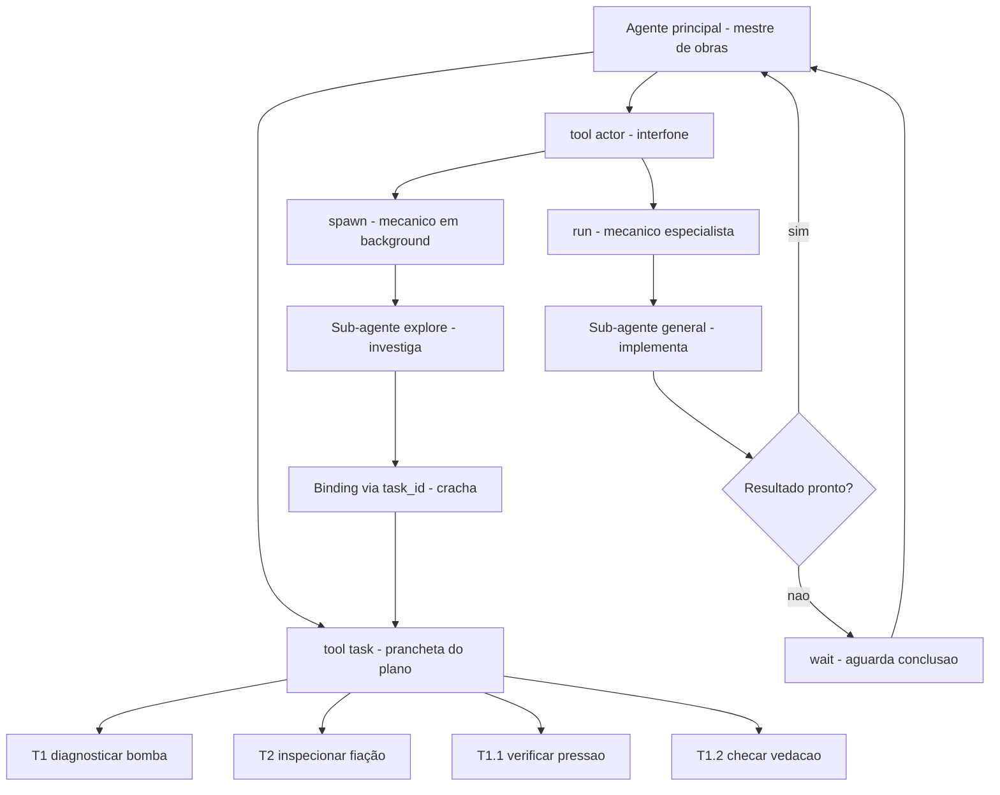
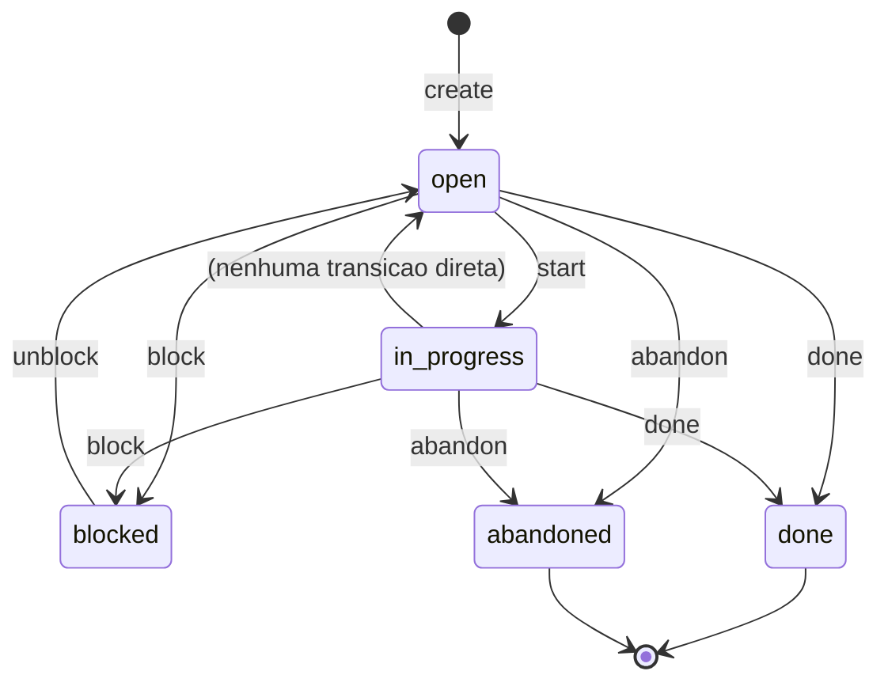

# Capítulo 5: Sub-agentes: Paralelismo e Tarefas

## 1. Introdução

Até aqui, o Oh My Pi operou como um agente único: você digitou um pedido, ele processou, devolveu o resultado. Funciona para tarefas simples — um `grep` cirúrgico, uma edição rápida, uma explicação de código. Mas projetos reais não são simples. Refatorar um módulo inteiro exige ler dezenas de arquivos, entender dependências, propor mudanças, aplicar cada uma e verificar que nada quebrou — e tudo isso serialmente é lento demais. O OMP resolve esse problema com uma arquitetura de sub-agentes: agentes especializados que o agente principal despacha para executar partes do trabalho em paralelo, enquanto ele continua orquestrando o todo. Este capítulo é a aula de paralelismo e orquestração: você vai dominar a tool `task` (o planificador persistente), a tool `actor` (o despachante de sub-agentes), os tipos de agente disponíveis, os modos de herança de contexto e o binding entre tarefas e agentes. Ao final, você será capaz de decompor um problema complexo em unidades paralelas e coordená-las com a mesma precisão de um gerente de projeto que distribui tarefas entre especialistas — a habilidade que separa o usuário do operador profissional.

## 2. Explica

O Oh My Pi é, por natureza, um agente de conversação: uma sessão, um contexto, um modelo processando mensagens em sequência. Mas essa arquitetura serial tem um gargalo fundamental — quando uma tarefa exige múltiplas investigações independentes (ler cinco arquivos diferentes, pesquisar três APIs, comparar duas abordagens), o agente faz uma de cada vez, e o tempo de resposta cresce linearmente com o número de subtarefas. A solução é o sub-agente: um agente derivado que herda parte do contexto do pai, executa uma tarefa focada e devolve o resultado. O OMP implementa isso com duas tools complementares — `task` e `task_*` para o plano persistente, e `actor` para a execução — e dois tipos de agente, `explore` (somente leitura, rápido) e `general` (multi-step, flexível) [1][2].

A tool `task` é o quadro de controle do projeto. Ela cria, lista, inicia, bloqueia, desbloqueia e marca como concluída uma hierarquia de tarefas com IDs como T1, T1.1, T1.2. Cada tarefa tem um `summary` (descrição), um `status` (open, in_progress, blocked, done, abandoned) e opcionalmente um `parent_id` que forma a árvore. A hierarquia de IDs é o mapa do projeto: T1 é a tarefa-pai, T1.1 e T1.2 são subtarefas — e o OMP rastreia cada uma persistidamente em SQLite, não apenas na memória da conversa. O ciclo de vida segue uma máquina de estados simples: open ⇄ in_progress, qualquer uma → blocked → open, qualquer uma → done | abandoned. Marcar uma tarefa como `done` somente quando o trabalho está completamente executado é a regra de ouro — tarefas marcadas como concluídas prematuramente criam uma ilusão de progresso que volta para assombrar o operador [1].

A tool `actor` é o motor de execução. Ela despacha sub-agentes com duas operações fundamentais: `run` (bloqueia até o sub-agente terminar e devolve o resultado inline) e `spawn` (lança o sub-agente em background e devolve imediatamente um `actor_id`). A escolha entre `run` e `spawn` é a primeira decisão de orquestração: `run` é para subtarefas que o agente principal precisa do resultado antes de prosseguir; `spawn` é para trabalho que pode acontecer em paralelo enquanto o agente continua com outra coisa. As operações auxiliares — `wait` (bloqueia até um actor completar), `status` (verifica o estado sem bloquear), `cancel` (interrompe) e `send` (envia mensagem ao inbox de um actor) — completam o ciclo de controle [2][3].

Os tipos de sub-agente definem o que cada um pode fazer. O `explore` é o investigador: somente leitura (grep, glob, read, bash), rápido, sem risco de modificar arquivos. É a escolha para buscas amplas no codebase, mapeamento de dependências ou validação de hipóteses. O `general` é o generalista: acesso completo a ferramentas (leitura, escrita, execução), capaz de executar múltiplos passos. É a escolha para implementações, correções e tarefas que exigem criar ou modificar código. A distinção importa porque o `explore` é barato e seguro — ele não pode quebrar nada — enquanto o `general` é poderoso mas precisa de supervisão [2][4].

A herança de contexto controla o que cada sub-agente enxerga. O modo `none` (padrão) dá ao sub-agente apenas o prompt que recebeu — contexto limpo, sem ruído da conversa do pai. O modo `state` injeta resumos de checkpoints, dando ao sub-agente conhecimento de fundo sem o peso do histórico completo. O modo `full` compartilha toda a conversa do pai, usado quando o sub-agente precisa entender o estado exato da discussão — como avaliadores ou evaluadores que precisam do contexto completo para julgar. A escolha do modo é a troca entre qualidade de decisão e custo de tokens: `full` é mais preciso mas consome mais contexto; `none` é econômico mas pode fazer o sub-agente perder nuances [2][5].

O binding entre sub-agente e tarefa é o mecanismo que conecta plano e execução. Quando um sub-agente é despachado para trabalhar em uma tarefa específica (digamos T4), o `task_id` é passado ao actor. O sub-agente então escreve seu progresso em `tasks/T4/progress.md`, e o checkpoint-writer integra essas descobertas no próximo checkpoint. Se o `task_id` é inválido ou não existe, o binding é silenciosamente descartado — o sub-agente executa o trabalho, mas suas descobertas não são capturadas para a tarefa. Essa separação entre identificador de sessão (`actor_id`, para resumir a sessão do sub-agente) e identificador de tarefa (`task_id`, para vincular ao plano) é sutil mas fundamental: `actor_id` identifica a sessão do sub-agente (resumável entre turns); `task_id` identifica a unidade de trabalho no plano [1][2].

## 3. Ilustra

Pense na orquestração do OMP como a gestão de uma oficina de manutenção com vários mecânicos. O agente principal é o mestre de obras: ele recebe o pedido do cliente ("concerte a bomba d'água e verifique o sistema elétrico"), decompõe em tarefas (T1: diagnosticar bomba, T2: inspecionar fiação), asigna cada tarefa a um mecânico especializado e acompanha o progresso. A tool `task` é a prancheta do mestre de obras — onde ele anota as tarefas, seus status e quem está responsável. A tool `actor` é o interfone pelo qual ele despacha os mecânicos: `run` é ligar e falar até o mecânico terminar; `spawn` é mandar um recado e deixar o mecânico trabalhar enquanto ele atende outro pedido. Os mecânicos `explore` são os estagiários — só olham, não mexem; os mecânicos `general` são os especialistas — mexem, consertam e reportam. O binding entre tarefa e mecânico é o crachá: cada mecânico com seu crachá (task_id) sabe exatamente qual reparo está fazendo, e o mestre de obras sabe onde buscar o resultado.



Repare no diagrama como o mestre de obras (agente principal) mantém dois fluxos simultâneos: a prancheta do plano (task) e a coordenação dos mecânicos (actor). O binding via task_id conecta o resultado de cada mecânico de volta à tarefa certa na prancheta. A beleza do paralelismo aparece quando o mestre despacha T1 e T2 ao mesmo tempo — dois mecânicos trabalham em enquanto ele continua orquestrando. A mesma estrutura escala: uma refatoração grande pode ter T1, T2, T3 e T4 despachados simultaneamente, cada um com seu sub-agente, e o mestre apenas acompanha os status até todos marcarem `done`.

## 4. Técnica

### A tool task: o plano persistente

A tool `task` é a interface entre o agente e o plano de trabalho persistente. Diferente de uma lista de tarefas numa conversa (que se perde com o contexto), o task store persiste em SQLite e sobrevive a compactação de contexto, restarts e até changes de sessão. Cada chamada `task` recebe um JSON com `operation` e campos específicos [1]:

```json
{"operation": {"action": "create", "summary": "Implementar autenticacao JWT"}}
```

A resposta retorna o ID da tarefa criada (T1, T2, etc.) — e esse ID é o identificador que aparece em todas as operações subsequentes. A árvore de tarefas suporta hierarquia via `parent_id`:

```json
{"operation": {"action": "create", "summary": "Configurar middleware de autenticacao", "parent_id": "T1"}}
```

O resultado é T1.1 — uma subtarefa de T1. A hierarquia pode ser tão profunda quanto necessário, mas a praxe profissional é limitar a três níveis (T1 → T1.1 → T1.1.1) para manter a legibilidade do plano [1].

O ciclo de vida de uma tarefa é a máquina de estados que governa o progresso. O diagrama abaixo mostra todas as transições possíveis:



A regra de ouro: marque `done` somente quando o trabalho está completamente executado. Se testes falharam, implementação está parcial ou erro ficou irresolvido, a tarefa permanece `in_progress` ou é `blocked` — nunca `done`. Tarefas prematuremente concluídas criam um gap entre o plano e a realidade que o operador descobre tarde demais [1].

A listagem de tarefas é a visão do progresso:

```json
{"operation": {"action": "list"}}
```

Retorna todas as tarefas ativas (open, in_progress, blocked) — o dashboard do plano. Para ver tarefas concluídas ou arquivadas, passe `include_terminal: true`. A consulta por ID (`get`) retorna o estado detalhado de uma tarefa específica — útil quando o agente precisa recordar o que foi planejado para T3 antes de despachar um sub-agente [1].

### A tool actor: o despachante de sub-agentes

A tool `actor` é a interface de orquestração que despacha, controla e coordena sub-agentes. Cada chamada recebe um JSON com `operation` contendo `action` discriminador [2][3].

**run — execução bloqueante:** O sub-agente é criado, executa a tarefa e devolve o resultado inline. O agente principal bloqueia até a conclusão. É a escolha quando o resultado é necessário para prosseguir:

```json
{
  "operation": {
    "action": "run",
    "subagent_type": "explore",
    "description": "Mapear dependencias do modulo",
    "prompt": "Leia todos os arquivos em src/auth/ e retorne: (1) lista de dependencias externas, (2) funcoes exportadas, (3) pontos de integracao com src/api/. Relatório em até 200 palavras."
  }
}
```

O `subagent_type` define a especialização: `explore` para somente leitura, `general` para multi-step. O `description` é uma frase curta (3-5 palavras) que aparece no status do actor. O `prompt` é o briefing completo — o sub-agente não vê a conversa do pai (a menos que `context: "full"` seja passado), então o prompt deve ser autocontido [2].

**spawn — execução em background:** O sub-agente é lançado e o `actor_id` é devolvido imediatamente. O agente principal continua trabalhando. Quando o sub-agente termina, seu resultado aparece como notificação — mas o agente principal NÃO acorda automaticamente para processá-lo. É necessário usar `wait` ou `status` para consultar:

```json
{
  "operation": {
    "action": "spawn",
    "subagent_type": "general",
    "description": "Corrigir bug no parser",
    "prompt": "Leia src/parser.ts e corrija o bug de parsing de JSON aninhado. Escreva um teste que reproduza o bug antes de corrigir."
  }
}
```

A operação retorna um `actor_id` — o identificador da sessão do sub-agente. Para consultar o resultado depois:

```json
{"operation": {"action": "wait", "actor_id": "actor-abc123"}}
```

O `wait` bloqueia até o sub-agente completar, falhar ou ser cancelado. O timeout padrão é 600.000 ms (10 minutos) — o suficiente para a maioria das tarefas, mas configurável via `timeout_ms` [2][3].

**status — consulta não bloqueante:** Verifica o estado de um actor sem bloquear. Retorna `{ status: "pending"|"running"|"idle"|"unknown", actor_id, turnCount }`. É a escolha para polling periódico quando o agente principal quer saber se um background job terminou sem bloquear a execução [2].

**cancel — interrupção graciosa:** Interrompe um actor em execução. É idempotente — cancelar um actor já cancelado não gera erro. O cancelamento é gracioso: o sub-agente recebe o sinal e pode salvar estado antes de encerrar [2].

**send — mensagem ao inbox:** Entrega uma mensagem ao inbox de um actor. O receiver vê a mensagem envolta em `<inbox>` no próximo turno. É útil para enviar atualizações a um sub-agente que está aguardando input, ou para coordenar entre sub-agentes [2][3]:

```json
{
  "operation": {
    "action": "send",
    "to_actor_id": "actor-abc123",
    "content": "A API mudou: o endpoint /auth agora requer header X-API-Key"
  }
}
```

### Tipos de sub-agente: explore e general

Os dois tipos nativos de sub-agente definem o que cada um pode fazer — e a escolha errada é a fonte mais comum de desperdício de contexto [2][4].

O `explore` é o investigador de código. Suas tools permitidas são somente leitura: `grep`, `glob`, `read`, `bash` (para comandos como `find` ou `git log`), `webfetch`, `websearch`, `codesearch`. Ele NÃO pode escrever arquivos, executar comandos de build ou modificar o estado do sistema. Essa restrição é uma feature, não um bug: o explore é barato (consome menos tokens porque tem menos tools), rápido (não precisa de confirmação de permissão para escrita) e seguro (não pode quebrar nada). A regra profissional: sempre usar `explore` para buscas que provavelmente precisarão de mais de 3 queries — ele faz a varredura completa e devolve uma síntese, enquanto o agente principal gastaria múltiplos turns fazendo o mesmo [4].

O `general` é o generalista multi-step. Ele tem acesso a todas as tools (leitura, escrita, execução, edição) e pode executar sequências complexas de passos. É a escolha para implementações, correções de bugs, refatorações e qualquer trabalho que exige criar ou modificar código. O custo é maior (mais tools = mais tokens por turn) e o risco existe (pode modificar arquivos), por isso o `general` exige supervisão — o agente principal deve verificar o resultado antes de considerar a tarefa concluída [2][4].

A tabela de decisão é direta:

| Cenário | Tipo | Justificativa |
|---------|------|---------------|
| "Encontre todas as chamadas de função X" | explore | Somente leitura, varredura ampla |
| "Leia e resuma estes 5 arquivos" | explore | Leitura e síntese, sem escrita |
| "Corrija o bug no parser" | general | Precisa ler, modificar e testar |
| "Implemente o middleware de auth" | general | Múltiplos arquivos, escrita |
| "Valide se esta spec foi implementada" | explore ou general | Depende: explore se só ler, general se corrigir |

### Herança de contexto: none, state e full

O modo de herança de contexto controla o volume de informação que o sub-agente recebe — e é a alavanca que equilibra qualidade de decisão com custo de tokens [2][5].

O modo `none` (padrão) dá ao sub-agente apenas o prompt. É o modo mais econômico e o mais comum. O sub-agente começa com contexto limpo e só enxerga o que o prompt descreve. A desvantagem: se o prompt não captura nuances importantes da conversa do pai, o sub-agente pode tomar decisões alinhadas com o prompt mas desalinhadas com o objetivo real.

O modo `state` injeta resumos de checkpoints — snapshots compactos do estado da sessão (tarefas ativas, descobertas recentes, decisões tomadas). O sub-agente ganha conhecimento de fundo sem o peso do histórico completo. É a escolha para sub-agentes que precisam entender o contexto do projeto mas não precisam da conversa exata — por exemplo, um sub-agente que implementa uma feature e precisa saber que "o projeto usa autenticação JWT com refresh tokens" sem precisar ler toda a conversa sobre JWT.

O modo `full` compartilha toda a conversa do pai. O sub-agente vê cada mensagem, cada tool call, cada resultado — o contexto completo. É necessário para avaliadores e revisores que precisam entender nuances, decisões implícitas e o estado exato da discussão. O custo é alto: o contexto do pai é copiado para o sub-agente, consumindo tokens proporcionais ao tamanho da conversa. Use apenas quando a qualidade da decisão justifica o custo [5].

A escolha segue o critério: `none` para tarefas autônomas com prompt claro; `state` para tarefas que dependem do contexto do projeto; `full` para avaliações e decisões que exigem nuance completa.

### Binding sub-agente a task: o elo entre plano e execução

O binding entre sub-agente e tarefa é o mecanismo que conecta o plano persistente (task) à execução real (actor). Quando um sub-agente é despachado para trabalhar em uma tarefa específica, o `task_id` é passado como parâmetro adicional ao actor [1][2]:

```json
{
  "operation": {
    "action": "run",
    "subagent_type": "general",
    "description": "Implementar modulo de auth",
    "prompt": "Implemente o modulo src/auth/ conforme a spec em docs/spec-auth.md",
    "task_id": "T3"
  }
}
```

O sub-agente recebe `task_id: "T3"` e, ao terminar, o sistema verifica que `tasks/T3/progress.md` existe com a estrutura obrigatória. Se o arquivo não existe, o sub-agente recebe uma chance adicional de escrevê-lo antes de encerrar. O próximo checkpoint-writer lê esse arquivo e integra verbatim as descobertas, comandos e resultados no checkpoint da sessão [1].

Se o `task_id` é inválido, malformado ou não corresponde a nenhuma tarefa existente, o binding é silenciosamente descartado — o sub-agente executa o trabalho normalmente, mas suas descobertas não são capturadas para nenhuma tarefa. O resultado é desperdício: o trabalho foi feito, mas não está vinculado ao plano. A disciplina é sempre criar a tarefa com `task` antes de despachar o sub-agente com `task_id` [1].

### Trabalho ad-hoc vs trabalho vinculado a task

Nem todo trabalho de sub-agente precisa de binding a task. Trabalho ad-hoc — uma pesquisa rápida, uma verificação pontual, uma síntese — é despachado sem `task_id`. O sub-agente executa e devolve o resultado inline (se `run`) ou como notificação (se `spawn`). Não há progress.md, não há integração com checkpoint. É a escolha para subtarefas efêmeras que não justificam a sobrecarga do plano [2].

Trabalho vinculado a task — implementações, correções, refatorações — é despachado com `task_id`. O progresso é rastreado, integrado ao checkpoint e visível no dashboard de tarefas. É a escolha para qualquer trabalho que será referenciado novamente, que tem dependências ou que precisa de acompanhamento [1].

A regra: se o trabalho tem 3+ passos, spans múltiplos turns ou será referenciado novamente, use task. Caso contrário, ad-hoc é mais eficiente.

### Paralelismo na prática: o pattern spawn-wait

O pattern mais comum de paralelismo é o spawn-wait: despachar múltiplos sub-agentes em background e aguardar cada um separadamente. O agente principal mantém uma lista de `actor_id`s e consulta seus status周期icamente — ou usa `wait` para bloquear em cada um sequencialmente (mas já tendo recebido o `actor_id` imediatamente) [2][3]:

```python
# Pseudocódigo da orquestração paralela (o agente faz isso via tool calls)
# 1. Spawn de 3 sub-agentes em paralelo
actor_1 = spawn(explore, "Mapear modulo A", prompt_A)  # retorna actor_id imediatamente
actor_2 = spawn(explore, "Mapear modulo B", prompt_B)
actor_3 = spawn(general, "Corrigir bug no parser", prompt_C)

# 2. Aguardar cada um (bloqueia por vez, mas os 3 já estão rodando)
result_1 = wait(actor_1)  # bloqueia até explore_1 terminar
result_2 = wait(actor_2)
result_3 = wait(actor_3)  # o general pode demorar mais

# 3. Sintetizar resultados
# O agente combina as descobertas dos 3 sub-agentes
```

O custo de `spawn` é baixo — retorna em ~5 ms independente da carga do sub-agente. O custo real está no `wait`, que bloqueia até a conclusão. A vantagem do paralelismo é que os 3 sub-agentes executam simultaneamente: se cada um leva 30 segundos, a abordagem serial levaria 90 segundos; a paralela leva ~30 segundos (o tempo do mais lento) [2].

### O caveat dos peers persistentes

Uma distinção sutil entre `wait` e `send`+`status`: o `wait` é projetado para sub-agentes efêmeros criados via `run`/`spawn`. Peers persistentes (outros agentes primários, sub-agentes que vivem entre turns) idle entre turns e nunca produzem um resultado "done" no sucesso — `wait` em um peer bloqueia até ele falhar ou ser cancelado. Para coordenar com peers, usar `send` + `status` em vez de `wait` [2].

### Sub-agente vinculado a task: o fluxo completo

O fluxo completo de uma tarefa com binding segue cinco passos. Primeiro, criar a tarefa com `task`. Segundo, despachar o sub-agente com `task_id`. Terceiro, o sub-agente executa e escreve progresso em `tasks/<TID>/progress.md`. Quarto, o checkpoint-writer integra o progresso no checkpoint. Quinto, o agente principal verifica o resultado e marca a tarefa como `done` [1][2]:

```json
// Passo 1: Criar a tarefa
{"operation": {"action": "create", "summary": "Refatorar modulo de parser"}}

// Passo 2: Despachar sub-agente com binding
{"operation": {"action": "run", "subagent_type": "general",
  "description": "Refatorar parser",
  "prompt": "Refatore src/parser.ts para suportar JSON aninhado. Mantenha todos os testes passando.",
  "task_id": "T5"}}

// Passo 3-4: Sub-agente executa, escreve progress.md, checkpoint integra

// Passo 5: Verificar e marcar done
{"operation": {"action": "done", "id": "T5", "event_summary": "Parser refatorado, testes passando"}}
```

### Workflows: orquestração determinística

Além dos sub-agentes ad-hoc (actor tool), o OMP oferece workflows — scripts JavaScript que orquestram múltiplos sub-agentes de forma determinística. Enquanto o actor é imperativo ("despache um explore para X"), o workflow é declarativo ("execute esta sequência de fases com paralelismo máximo de 16"). Os workflows vivem em `.mimocode/workflows/*.js` e são acionados pela tool `workflow` [2][8]:

```javascript
// .mimocode/workflows/minha-pesquisa.js
module.exports = async function({ agent, parallel, pipeline, phase }) {
  await phase("planejamento", async () => {
    await agent("explore", "Mapeie o codebase e identifique pontos de integracao");
  });

  await phase("execucao", async () => {
    await parallel([
      agent("explore", "Analise o modulo A"),
      agent("explore", "Analise o modulo B"),
      agent("general", "Implemente a correcao no modulo C"),
    ]);
  });

  await phase("verificacao", async () => {
    await agent("general", "Rode testes e valide a implementacao");
  });
};
```

Os workflows têm limites rígidos: prazo de 12 horas, máximo de 1000 agentes por execução, concorrência padrão de 16. Eles compartilham o orçamento de tokens com o pai — um workflow que despacha 100 sub-agentes consome tokens do orçamento total da sessão. A diferença fundamental entre actor e workflow: o actor é para trabalho imprevisível que o agente principal coordena em tempo real; o workflow é para sequências conhecidas que podem ser executadas sem supervisão [2][8].

Os workflows built-in incluem `compose` (spec → ship com paralelismo por tarefa), `deep-research` (pesquisa abrangente com reflexão), `fact-check` (verificação adversarial) e `research-experiment` (loop de melhoria de métricas). Cada um encapsula um padrão de orquestração testado — e o operador pode criar os seus próprios [8].

### Sub-agente vinculado a task: o fluxo completo

O fluxo completo de uma tarefa com binding segue cinco passos. Primeiro, criar a tarefa com `task`. Segundo, despachar o sub-agente com `task_id`. Terceiro, o sub-agente executa e escreve progresso em `tasks/<TID>/progress.md`. Quarto, o checkpoint-writer integra o progresso no checkpoint. Quinto, o agente principal verifica o resultado e marca a tarefa como `done` [1][2]:

```json
// Passo 1: Criar a tarefa
{"operation": {"action": "create", "summary": "Refatorar modulo de parser"}}

// Passo 2: Despachar sub-agente com binding
{"operation": {"action": "run", "subagent_type": "general",
  "description": "Refatorar parser",
  "prompt": "Refatore src/parser.ts para suportar JSON aninhado. Mantenha todos os testes passando.",
  "task_id": "T5"}}

// Passo 3-4: Sub-agente executa, escreve progress.md, checkpoint integra

// Passo 5: Verificar e marcar done
{"operation": {"action": "done", "id": "T5", "event_summary": "Parser refatorado, testes passando"}}
```

### Erros comuns de orquestração

O erro mais comum é despachar um `general` para trabalho que um `explore` faria — o general consome mais tokens, precisa de permissão de escrita e é mais lento para tarefas de leitura. O segundo erro é usar `context: "full"` desnecessariamente — copiar toda a conversa para o sub-agente é caro e raramente necessário. O terceiro é esquecer o `task_id` em trabalho vinculado a task — o trabalho é feito mas não rastreado. O quarto é criar tarefas sem marcar `done` ou `abandoned` — o plano acumula tarefas abertas que distorcem a visão do progresso. O quinto é usar `wait` em vez de `send`+`status` para peers persistentes — o `wait` bloqueia indefinidamente [1][2].

## 5. Aplica

### A cena de contraste: a refatoração serial

Imagine a cena: você precisa refatorar o módulo de autenticação de um projeto com 15 arquivos. O approach serial é ler cada arquivo sequencialmente, entender as dependências, propor mudanças, aplicar cada uma e testar. Leitura: 15 arquivos × 2 turnos por arquivo = 30 turns. Mudanças: 15 edições × 2 turnos = 30 turns. Testes: 5 turnos. Total: 65 turns — cada turn consumindo contexto, tokens e tempo.

O approach paralelo com sub-agentes muda a equação. Você despacha 3 sub-agentes `explore` em paralelo: um mapeia dependências do módulo, outro lista todas as funções exportadas, o terceiro identifica pontos de integração com o resto do sistema. Cada explore roda em background e devolve uma síntese compacta. Enquanto isso, você já está escrevendo o plano de refatoração baseado nas sínteses. Quando os explores terminam, você despacha 2 sub-agentes `general` para executar as mudanças em paralelo — um no parser, outro no middleware. O resultado: ~25 turns no total, uma economia de 60% [2][4].

A correção é a disciplina de decomposição: antes de começar qualquer tarefa com mais de 3 passos, pergunte "quais partes são independentes?" As independentes viram sub-agentes `explore` ou `general` despachados em paralelo; as dependentes ficam no agente principal ou são serializadas. A habilidade de decompor é o que separa o operador que escala do operador que sofre [1][2].

### Armadilhas comuns de sub-agentes

A primeira armadilha é o prompt vago. Sub-agentes não têm contexto da conversa do pai (a menos que `context: "full"`), então um prompt como "corrige isso" é inútil — o sub-agente não sabe o que "isso" é. O prompt deve ser autocontido: descrever o problema, o local, o comportamento esperado e as restrições. A segunda armadilha é o `context: "full"` em loop — se você despacha 5 sub-agentes com `full`, cada um carrega a conversa inteira, e o custo de tokens explode. A terceira é esquecer de marcar `done` na tarefa após o sub-agente terminar — o plano fica com tarefas "in_progress" que não refletem a realidade. A quarta é usar `run` para trabalho longo que bloqueia o agente principal — se o sub-agente vai levar 10 minutos, `spawn` + `wait` é mais flexível porque permite cancelar ou consultar status [1][2].

### Métricas de sucesso da orquestração

No mundo profissional, uma orqueção madura se mede por três linhas: taxa de paralelismo (quantas subtarefas independentes rodam simultaneamente — o ideal é maximizar sem exceder o concorrência do modelo), eficiência de contexto (quantos tokens cada sub-agente consome em relação ao trabalho feito — sub-agentes `explore` com `context: "none"` são os mais eficientes) e completude do plano (quantas tarefas marcadas `done` realmente têm trabalho completo — a meta é 100%, sem false positives). O operador que mede essas três métricas otimiza a orqueção iterativamente — e a iteração é o que transforma um amador que despacha sub-agentes aleatoriamente em um profissional que orquestra com precisão [1][2].

### Do sub-agente à escala de projeto

A arquitetura de sub-agentes é o modelo de operação que escala para projetos grandes. Um projeto com 50 tarefas pode ser decomposto em 10 lotes de 5, cada lote com sub-agentes paralelos. O agente principal funciona como um gerente de projeto que só acompanha status e toma decisões de alto nível — o trabalho pesado é distribuído. O mesmo padrão aparece em pipelines de CI/CD (jobs paralelos), em arquiteturas de microserviços (serviços independentes comunicando por mensagens) e em clusters de computação (nós trabalhando em partes de um problema). A habilidade de orquestrar sub-agentes no OMP é, portanto, uma habilidade transferível — e os capítulos 7 e 9 retornam a ela quando containers e clusters entrarem em cena, onde a orquestração de múltiplos processos é a norma, não a exceção [2][3].

### A perspectiva do mercado

Dois fatos fecham a perspectiva. O primeiro é que a orquestração de sub-agentes é o padrão emergente de ferramentas de código assistido por IA — desde GitHub Copilot Workspace até Cursor Background Agents, o modelo de "despachar e coordenar" substitui o modelo de "falar e esperar". O OMP implementa esse padrão com transparência total: o operador vê cada actor, cada task, cada status — não é uma caixa-preta. O segundo é que a orquestração paralela é uma habilidade que separa o Engenheiro Maker do amador: o amador faz tudo serialmente e reclama que "o AI é lento"; o profissional despacha sub-agentes e recebe resultados em paralelo, porque entende que a velocidade não vem do modelo — vem da arquitetura [2][3].

## 6. Conclusão

Neste capítulo, você dominou a arquitetura de sub-agentes do OMP: a tool `task` — o plano persistente com hierarquia de IDs, máquina de estados e vinculação a sub-agentes [1]; a tool `actor` — o despachante com `run` (bloqueante), `spawn` (background), `wait`, `status`, `cancel` e `send` [2][3]; os tipos `explore` (somente leitura, barato e seguro) e `general` (multi-step, poderoso) [2][4]; os modos de herança de contexto (`none`, `state`, `full`) [2][5]; e o binding entre tarefa e sub-agente via `task_id` [1][2]. O desafio: selecione uma tarefa real do seu projeto com pelo menos 3 subtarefas independentes, crie-as com `task`, despache um `explore` para mapear o codebase e um `general` para implementar a primeira mudança, e acompanhe o progresso pelo dashboard de tarefas. No Capítulo 6, a bancada ganha memória: você vai aprender como o OMP guarda o que aprendeu entre sessões, como os checkpoints preservam o estado e como o contexto se mantém mesmo quando a janela de tokens enche.

## 7. Referências Bibliográficas

[1] MIMOCODE. *Documentacao oficial — task tool (planejamento persistente).* Disponivel em: https://mimo.xiaomi.com/mimocode/. Acesso em: 4 ago. 2026.

[2] MIMOCODE. *Documentacao oficial — actor tool (orquestacao de sub-agentes).* Disponivel em: https://mimo.xiaomi.com/mimocode/. Acesso em: 4 ago. 2026.

[3] MIMOCODE. *Guia de uso — sub-agentes, context inheritance e spawn.* Disponivel em: https://mimo.xiaomi.com/mimocode/. Acesso em: 4 ago. 2026.

[4] MIMOCODE. *Agentes nativos — explore e general ( tipos e tool allowlists).* Disponivel em: https://mimo.xiaomi.com/mimocode/. Acesso em: 4 ago. 2026.

[5] MIMOCODE. *Gerenciamento de contexto — compaction, overflow e context inheritance.* Disponivel em: https://mimo.xiaomi.com/mimocode/. Acesso em: 4 ago. 2026.

[6] ANTHROPIC. *Claude Code — sub-agents and parallel tool use.* Disponivel em: https://docs.anthropic.com/. Acesso em: 4 ago. 2026.

[7] OPENAI. *Agents SDK — handoffs and parallel execution.* Disponivel em: https://openai.github.io/openai-agents-python/. Acesso em: 4 ago. 2026.

[8] LANGCHAIN. *LangGraph — multi-agent orchestration patterns.* Disponivel em: https://langchain-ai.github.io/langgraph/. Acesso em: 4 ago. 2026.

[9] CREWAI. *CrewAI — agent orchestration framework.* Disponivel em: https://docs.crewai.com/. Acesso em: 4 ago. 2026.

[10] AUTOGEN. *Microsoft AutoGen — multi-agent conversations.* Disponivel em: https://microsoft.github.io/autogen/. Acesso em: 4 ago. 2026.

[11] GOOGLE. *ADK (Agent Development Kit) — agent orchestration.* Disponivel em: https://google.github.io/adk-docs/. Acesso em: 4 ago. 2026.

[12] MODEL CONTEXT PROTOCOL. *Especificacao MCP — tool use e resources.* Disponivel em: https://spec.modelcontextprotocol.io/. Acesso em: 4 ago. 2026.

[13] GITHUB. *Copilot Workspace — background agents.* Disponivel em: https://github.com/features/copilot. Acesso em: 4 ago. 2026.

[14] CURSOR. *Background Agents — parallel AI coding.* Disponivel em: https://cursor.sh/. Acesso em: 4 ago. 2026.

[15] DEEPMIND. *Gemini 2.5 — agentic capabilities and tool use.* Disponivel em: https://deepmind.google/. Acesso em: 4 ago. 2026.

[16] NVIDIA. *NemoGuardrails — agent safety and orchestration.* Disponivel em: https://github.com/NVIDIA/NeMo-Guardrails. Acesso em: 4 ago. 2026.

[17] WIKIPEDIA. *Actor model — Carl Hewitt, 1973.* Disponivel em: https://en.wikipedia.org/wiki/Actor_model. Acesso em: 4 ago. 2026.

[18] ERLANG. *OTP — supervision trees and fault tolerance.* Disponivel em: https://www.erlang.org/doc/apps/otp_design/. Acesso em: 4 ago. 2026.

[19] CNCF. *Temporal — durable execution engine.* Disponivel em: https://temporal.io/. Acesso em: 4 ago. 2026.

[20] UNIX. *fork() e processos paralelos — manual de referência.* Disponivel em: https://pubs.opengroup.org/onlinepubs/9699919799/. Acesso em: 4 ago. 2026.
