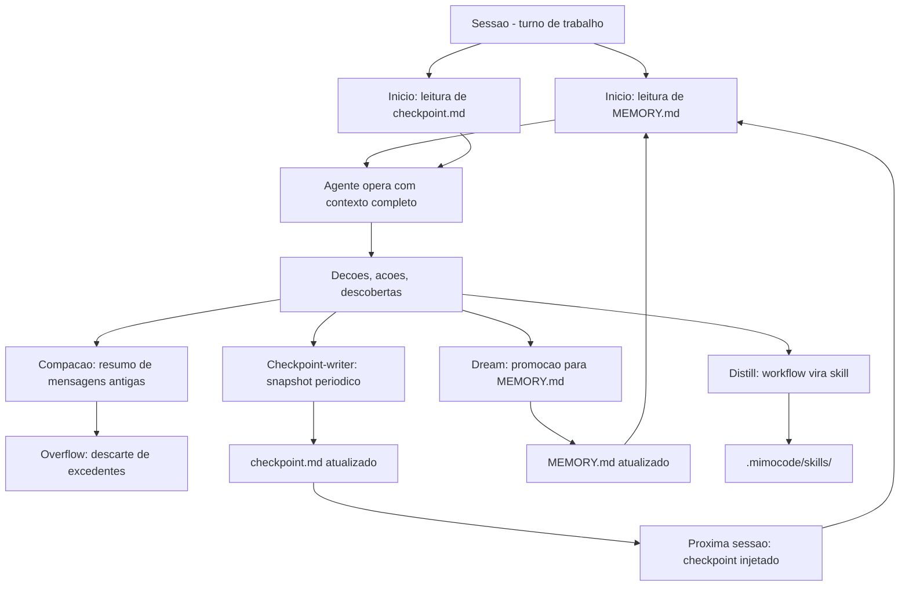

# Capítulo 6: Memória e Sessões

## 1. Introdução

No Capítulo 5, você aprendeu a distribuir trabalho entre sub-agentes — despachar, orquestrar, acompanhar. Mas toda aquela orqueção aconteceu dentro de uma única sessão: quando a sessão termina, a conversa some, os contextos evaporam, e na próxima vez que você abre o OMP, ele começa do zero. Esse comportamento é o padrão de ferramentas de chat, mas é inaceitável para um agente de programação profissional — projetos duram semanas, decisões de arquitetura precisam ser lembradas, e o estado de um debug complexo não pode se perder porque a janela de tokens encheu. Este capítulo é a aula de persistência: você vai dominar as sessões do OMP (criar, retomar, gerenciar), o sistema de memória (MEMORY.md, checkpoint.md, notes.md), o gerenciamento de contexto (compaction, overflow, pruning), os checkpoints periódicos via checkpoint-writer e os processos de background (distill, dream) que reforçam a memória entre sessões. Ao final, você será capaz de manter um projeto complexo com memória contínua — o agente lembra do que fez, preserva decisões e retoma de onde parou, mesmo após dias sem interação.

## 2. Explica

Uma sessão do Oh My Pi é um contexto de conversa: uma sequência de mensagens, tool calls e resultados que o modelo processa em ordem. A sessão começa quando você inicia uma conversa e termina quando você a fecha ou quando a janela de contexto atinge seu limite. Cada sessão tem um ID único, um timestamp e um conjunto de mensagens — e é esse conjunto que o modelo usa para gerar respostas. A limitação fundamental é o contexto window: o modelo só "enxerga" as últimas N tokens de conversa (onde N varia de 128k a 200k dependendo do modelo). Quando a conversa excede esse limite, as mensagens mais antigas são comprimidas ou descartadas — e é aqui que o sistema de memória do OMP entra [1][2].

O sistema de memória do OMP é file-backed: tudo vive em arquivos Markdown no diretório do projeto. O arquivo principal é `MEMORY.md` — a memória de projeto que persiste entre sessões. Nele ficam regras do projeto, decisões de arquitetura, convenções de código e qualquer conhecimento durável que o agente deve lembrar. O agente pode escrever em `MEMORY.md` diretamente (quando o usuário pede para "lembrar disso") ou indiretamente via checkpoints e processos de background. O `MEMORY.md` é injetado automaticamente no início de cada nova sessão — o agente começa sabendo o que lembra, sem que o usuário precise re-explicar [1][3].

Além de `MEMORY.md`, o sistema mantém dois arquivos auxiliares. O `checkpoint.md` é o snapshot periódico do estado da sessão — tarefas ativas, descobertas recentes, decisões pendentes. Ele é mantido exclusivamente pelo checkpoint-writer (um sub-agente especializado) e não deve ser editado manualmente. O `notes.md` é o scratchpad livre do agente — anotações, lembretes, listas de trabalho que não precisam de estrutura formal. Os três arquivos juntos formam a memória persistente do projeto: `MEMORY.md` para conhecimento durável, `checkpoint.md` para estado da sessão, `notes.md` para trabalho efêmero [1][3][4].

A hierarquia de memória vai além do projeto. No diretório global `~/.claude/projects/<project>/memory/`, o OMP mantém memória global — preferências do usuário, feedback, referências que se aplicam a todos os projetos. O índice global em `MEMORY.md` é consultado por BM25 (busca por relevância) quando o agente precisa recordar algo que pode não estar no projeto atual. A busca por memória é OR-joined e ranqueada por relevância: o agente formula uma query com 1-3 termos distintos (nome de função, ID de tarefa, frase-chave) e o sistema devolve os hits mais relevantes. A disciplina da query importa: termos genéricos ("config database connection") geram ruído; termos específicos ("T5.3 closure") geram hits precisos [3][5].

Os checkpoints são snapshots periódicos e duráveis do estado da sessão. O checkpoint-writer (um sub-agente fork) executa em background, longe do hot path da conversa principal, e produz snapshots que incluem: tarefas ativas, decisões tomadas, descobertas recentes, erros encontrados e estado de execução. O checkpoint é "durável" porque persiste em disco e sobrevive a crashes e restarts — ao contrário da conversa em memória, que é volátil. Quando uma sessão é retomada via `--continue` ou `--resume`, o checkpoint é lido e injetado no contexto, dando ao agente um ponto de partida sem precisar reler toda a conversa [1][4][6].

O gerenciamento de contexto é o sistema que mantém a sessão dentro do limite de tokens. Três mecanismos trabalham em conjunto: compaction (comprime mensagens antigas em resumos), overflow (despeja mensagens que excedem o limite) e pruning (remove mensagens de baixa prioridade). A compaction é a mais sofisticada: quando o contexto se aproxima do limite, o OMP resume as mensagens mais antigas em parágrafos concisos, preservando o essencial (decisões, erros, resultados de tools) e descartando o prolixo (explicações, narração). O overflow é o fallback: quando a compaction não é suficiente, mensagens são descartadas. O pruning é seletivo: results de tools grandes (logs, outputs) são truncados ou removidos para liberar espaço. O agente não é notificado quando a compaction acontece — ele trata o contexto visível como a fonte de verdade [1][2][5].

Os processos de background — distill e dream — são mecanismos de reforço de memória que operam entre sessões. O dream escaneia traces recentes (conversas, tool calls, resultados) e promove conhecimento durável para `MEMORY.md` — regras que o agente aprendeu, padrões que se repetiram, decisões que devem persistir. O distill faz o inverso: embala workflows manuais repetitivos em skills, sub-agentes ou comandos reutilizáveis. Ambos operam em background e são acionados por intervalo (dream: a cada 7 dias por padrão) ou por invocação manual (`/dream`, `/distill`). O resultado é uma memória que não apenas persiste mas evolui — o agente aprende com o tempo e melhora sua própria operação [1][7].

## 3. Ilustra

Pense na memória do OMP como o sistema de arquivo de um escritório. O `MEMORY.md` é o livro de regras da empresa — o documento que todo novo funcionário lê no primeiro dia e que nunca sai da mesa. O `checkpoint.md` é o caderno de anotações do operador de plantão — onde ele anota "onde paramos" ao final do turno, para que o próximo operador saiba exatamente o estado das máquinas. O `notes.md` é o post-it livre — lembretes rápidos que podem ser descartados sem dor. Os checkpoints periódicos são as rondas do vigilante: a cada N minutos, ele verifica o estado de tudo e anota no relatório, para que, se o escritório fechar subitamente, o próximo turno saiba o que aconteceu. O dream é o processo noturno de arquivo: quando o escritório fecha, um assistente revisa os papéis do dia e promove os importantes para o livro de regras, descartando o resto. E as sessões são os turnos de trabalho: cada turno começa com uma leitura do livro de regras e do caderno do plantão anterior, e termina com a anotação do caderno para o próximo turno.



Repare no diagrama como o ciclo se fecha: a sessão termina, o checkpoint é salvo, o dream promove conhecimento, e a próxima sessão começa com memória enriquecida. A memória não é estática — ela cresce e se refina a cada ciclo. O mesmo padrão de "operar → persistir → aprender" aparece em sistemas industriais (o Capítulo 10 retorna a ele quando o assunto é manutenção preditiva): os dados de hoje informam as decisões de amanhã.

## 4. Técnica

### Sessões: criar, retomar e gerenciar

O OMP suporta quatro operações de sessão, cada uma com um papel distinto [1][2]:

**Nova sessão (padrão):** Ao iniciar o OMP sem flags, uma nova sessão é criada. O contexto começa limpo — exceto pela injeção automática de `MEMORY.md` e do checkpoint mais recente (se existir). O agente começa sabendo o que lembra do projeto, mas não tem histórico de conversa anterior.

**--continue:** Retoma a sessão mais recente do diretório atual. O histórico de conversa é restaurado, o checkpoint é injetado e o agente continua de onde parou. É a escolha para trabalho contínuo em um projeto — você fecha o terminal, volta no dia seguinte, `mimo --continue` e está de volta.

**--resume:** Permite escolher qual sessão retomar (o OMP lista as sessões disponíveis com timestamps e títulos). É a escolha quando há múltiplas sessões ativas e você precisa voltar a uma específica.

**--session-dir:** Define um diretório personalizado para armazenar dados da sessão. Útil para isolar sessões de teste ou para projetos com múltiplos worktrees.

**--no-session:** Desativa a persistência de sessão. O OMP opera sem salvar estado — útil para comandos rápidos ou scripts que não precisam de memória entre chamadas.

A disciplina profissional é simples: use `--continue` para trabalho contínuo, `--resume` para alternar entre projetos, e `--no-session` para comandos atômicos. Nunca crie sessões desnecessárias — cada sessão é um contexto que o agente carrega, e múltiplas sessões abertas fragmentam a memória [1][2].

### O diretório de memória: a estrutura on-disk

A memória persistente vive em uma hierarquia de diretórios [3][5]:

```
~/.claude/projects/<project-slug>/
  MEMORY.md          # Memoria de projeto (regras, decisoes)
  checkpoint.md      # Snapshot periodico da sessao
  notes.md           # Scratchpad livre do agente
  tasks/
    T1/
      progress.md    # Progresso vinculado a tarefa
    T2/
      progress.md
```

O `<project-slug>` é um identificador derivado do caminho do projeto (ex.: `-home-user-proj-meu-app`). Cada projeto tem sua própria memória — não há contaminação entre projetos. O agente lê e escreve nesses arquivos diretamente, e o checkpoint-writer mantém `checkpoint.md` atualizado [3].

A memória global vive em um escopo separado:

```
~/.claude/
  projects/
    <project-slug>/memory/
      user/          # Preferencias do usuario
      feedback/      # Correcoes e aprendizados
      project/       # Regras de projeto
      reference/     # Links e documentacao
    MEMORY.md        # Indice global
```

A busca por memória usa BM25 sobre corpos Markdown: o agente formula uma query com termos distintos, o sistema faz OR-joined search e devolve os hits mais relevantes. A query ideal tem 1-3 termos específicos — "T5.3 closure" funciona; "config params database connection" gera ruído. Hits são "autoritativos": se a busca retorna um resultado, confie nele — mesmo que outra query tenha retornado nada [5].

### MEMORY.md: a memória de projeto

O `MEMORY.md` é o arquivo mais importante da memória persistente. Ele contém conhecimento durável sobre o projeto que o agente deve lembrar em todas as sessões. O formato é Markdown livre, mas a convenção é organizar por seções [1][3]:

```markdown
# Memory do Projeto

## Rules
- Nunca fazer commit direto no main
- Usar convencional commits (feat:, fix:, chore:)
- Testes devem cobrir >80% dos branches

## Architecture Decisions
- Auth: JWT com refresh tokens (decidido em 2026-07-15)
- DB: PostgreSQL 16 com pgvector para embeddings
- Frontend: Next.js 15 com App Router

## Conventions
- Arquivos de componente em camelCase
- Testes em .test.ts ao lado do arquivo
- Enums em UPPER_SNAKE_CASE
```

O agente pode escrever em `MEMORY.md` diretamente quando o usuário pede para "lembrar disso" ou "salve isso como regra". A edição é feita com a tool `edit` — o agente lê o arquivo, identifica a seção correta e insere o novo conteúdo. Regras que o agente deve lembrar imediatamente (sem esperar checkpoint ou dream) são inseridas manualmente [3].

### Checkpoint.md: o snapshot da sessão

O `checkpoint.md` é mantido exclusivamente pelo checkpoint-writer — um sub-agente fork que herda o prefixo de cache do pai (system prompt + tools + mensagens até o watermark) para não pagar o custo completo de recomputação. O checkpoint-writer executa em background, longe do hot path, e produz snapshots que incluem [4][6]:

- Tarefas ativas e seus status
- Decisões tomadas e pendentes
- Descobertas recentes (de sub-agentes, tool calls, etc.)
- Erros encontrados e resoluções
- Estado de execução (o que está rodando, o que está bloqueado)

O checkpoint é "durável" porque persiste em disco e sobrevive a crashes. Quando uma sessão é retomada, o checkpoint é lido e injetado no contexto — o agente começa sabendo o estado exato da sessão anterior, sem precisar reler a conversa. O operador não deve editar `checkpoint.md` manualmente — ele é mantido pelo sistema [4][6].

### Gerenciamento de contexto: compaction, overflow e pruning

A janela de contexto é o recurso mais valioso e mais escasso do agente. O OMP gerencia isso com três mecanismos [1][2][5]:

**Compaction:** Quando o contexto se aproxima do limite (tipicamente 80-90% da capacidade do modelo), o OMP comprime mensagens antigas em resumos. A compaction é inteligente: preserva decisões, resultados de tools e erros; descarta narração, explicações e mensagens de baixa prioridade. O resultado é um contexto menor que mantém o essencial. O agente não é notificado quando a compaction acontece — ele trata o contexto visível como a fonte de verdade. Isso significa que conversas antigas podem estar resumidas, e o agente deve reconstruir contexto a partir do que está disponível [2][5].

**Overflow:** Quando a compaction não é suficiente, mensagens que excedem o limite são descartadas. É o fallback — menos sofisticado que a compaction, mas garantido para manter o contexto dentro do limite. Mensagens descartadas são as mais antigas, e o agente perde acesso a detalhes dessas interações [2].

**Pruning:** Results de tools grandes (logs de build, outputs de grep, dumps de JSON) são truncados ou removidos para liberar espaço. O pruning é seletivo: mantém as primeiras 3 e últimas 4 linhas de outputs grandes (regra headroom), preservando o início e o fim que contêm as informações mais relevantes [5].

O trio compaction-overflow-pruning é o sistema de climatização do contexto: mantém a temperatura (quantidade de informação) dentro da faixa operacional. O agente profissional entende que o contexto visível pode ser uma projeção compactada de uma história mais longa — e consulta memória e checkpoints quando precisa de detalhes que a compactação pode ter descartado [1][5].

### Checkpoints periódicos: o checkpoint-writer

O checkpoint-writer é um sub-agente especializado — um fork que herda o prefixo de cache do pai (system prompt + tools + mensagens até o watermark) em vez de recomputar. Essa herança faz o checkpoint-writer ser barato: ele não paga o custo completo de prefixo a cada execução. O checkpoint-writer executa [4][6]:

1. Lê o estado atual da sessão (tarefas, tools recentes, mensagens)
2. Sintetiza um snapshot compacto
3. Escreve em `checkpoint.md`
4. Integra descobertas de sub-agentes vinculados a tarefas (de `tasks/<TID>/progress.md`)

O checkpoint-writer é acionado periodicamente (a cada N turns ou a cada N minutos, dependendo da configuração) e também no fim da sessão. O resultado é um checkpoint que reflete o estado mais recente — e que é injetado na próxima sessão via `--continue` ou `--resume`.

A disciplina: não edite `checkpoint.md` manualmente. Se precisar forçar uma atualização, peça ao agente para "salvar checkpoint" — ele aciona o checkpoint-writer sob demanda [4][6].

### Sessão persistente: o fluxo completo de vida

O fluxo completo de vida de uma sessão com memória segue seis estágios. Primeiro, a sessão é criada (nova ou retomada). Segundo, o `MEMORY.md` e o checkpoint mais recente são injetados no contexto. Terceiro, o agente opera — lendo, escrevendo, despachando sub-agentes. Quarto, o contexto se enche e a compaction comprime mensagens antigas. Quinto, o checkpoint-writer produz snapshots periódicos. Sexto, a sessão termina e o estado é persistido — `MEMORY.md` pode ser atualizado pelo dream, `checkpoint.md` reflete o estado final [1][3][4]:

```bash
# Criar uma nova sessao (padrao)
mimo

# Retomar a ultima sessao do projeto
mimo --continue

# Listar e escolher uma sessao para retomar
mimo --resume

# Sessao sem persistencia (comando atomico)
mimo --no-session -p "Analise o git log e resuma as ultimas 10 commits"
```

### O mecanismo de busca na memória

A busca por memória é a interface entre a necessidade de lembrar e o armazenamento persistente. Quando o agente precisa de informação que pode não estar no contexto atual, ele consulta a memória via a tool `memory` [5]:

```json
{
  "operation": "search",
  "query": "JWT refresh token decidido",
  "scope": "projects",
  "limit": 5
}
```

A query usa BM25 sobre corpos Markdown: termos são tokenizados, pontuação é removida, e o ranking é por relevância (quantidade e raridade dos termos matchados). Hits de alta relevância são "autoritativos" — se a busca retorna um resultado, confie nele. Para recall literal (um valor exato que a busca paraphraseou), o agente consulta o `history` tool — o repositório bruto de mensagens anteriores [5].

A busca segue uma progressão: primeiro `memory` (curado, rápido), depois `history` (bruto, maior). Se `memory` retorna 0 resultados, escalar: reduzir termos, usar grep direto no diretório de memória, ou ampliar o scope de project para global. A disciplina da query é a mesma de qualquer busca: termos específicos geram hits precisos; termos genéricos geram ruído [5].

### Dream e Distill: aprendizado entre sessões

O dream e o distill são processos de background que reforçam a memória entre sessões — o mecanismo pelo qual o agente aprende com o tempo [1][7].

**Dream:** Escaneia traces recentes (conversas, tool calls, resultados) e promove conhecimento durável para `MEMORY.md`. O dream identifica padrões que se repetem (o agente sempre usa o mesmo comando de build, sempre segue a mesma convenção de commits) e os promove como regras explícitas. O dream é acionado automaticamente a cada `dream.interval_days` (padrão: 7 dias) ou manualmente via `/dream`. O resultado é um `MEMORY.md` que evolui — regras são adicionadas, obsoletas são removidas, e a memória reflete a realidade atual do projeto [7]:

```bash
# Acionar o dream manualmente
/dream

# O dream tambem pode ser acionado pelo agente
# quando ele detecta padroes repetidos
```

O dream opera em três fases. Primeiro, ele lê os traces recentes — conversas, tool calls, outputs. Segundo, ele identifica padrões: "o usuário sempre executa `npm run build` antes de commit", "o projeto usa `snake_case` para variáveis de banco". Terceiro, ele promove esses padrões para `MEMORY.md` como regras explícitas, na seção correta. O dream não é perfeito — ele pode promover regras que são contextuais (apenas válidas para uma tarefa específica) — mas o operador pode revisar e ajustar o `MEMORY.md` manualmente após um dream [7].

**Distill:** Embala workflows manuais repetitivos em artefatos reutilizáveis — skills, sub-agentes ou comandos. Se o agente observa que o usuário sempre repete a mesma sequência (ler arquivo, validar, testar, commit), o distill embala isso em um skill que executa a sequência completa com uma invocação. O distill é acionado manualmente via `/distill` ou quando o agente reconhece um padrão repetitivo. O resultado é uma eficiência crescente: o que antes levava 5 turnos agora leva 1 [7]:

```bash
# Acionar o distill manualmente
/distill

# O resultado e uma skill em .mimocode/skills/
# que encapsula o workflow observado
```

O distill gera artefatos concretos: um `.mimocode/skills/<nome>/SKILL.md` com instruções, ou um `.mimocode/commands/<nome>.md` com um slash command. Esses artefatos são hot-reloaded na próxima sessão — o agente imediatamente passa a ter a nova capacidade disponível. O distill é o mecanismo de auto-extensão do OMP: o agente não apenas aprende regras — ele cria ferramentas [7].

O dream e o distill juntos formam o ciclo de aprendizado: o dream promove conhecimento explícito (regras, decisões); o distill promove conhecimento procedural (workflows, padrões). A memória não apenas persiste — ela se torna mais eficiente com o tempo.

### O BBEdit de memória: regras de busca

A busca na memória segue regras específicas que o profissional deve dominar [5]:

**Queries curtas e específicas:** "T5.3 closure" funciona. "config params database connection" gera ruído. A regra é usar 1-3 termos distintos — o raro pesa mais que o comum.

**Punctuation stripping:** Pontuação (`.`, `-`, `/`, `:`) é removida na tokenização. `T5.3` casa com `T5.3`, `T5_3` ou `T5 3`. Uma URL como `postgres://host:5433` é indexada como tokens `postgres`, `host`, `5433` — busque um dos três, não a URL inteira.

**Hits autoritativos:** Se a busca retorna um resultado, confie nele — mesmo que outra query tenha retornado nada. Não conclua "nunca registrei isso" porque uma formulação falhou.

**Partial hits:** Um hit pode dar o gisto mas ter paraphraseado um valor exato. Para recall literal, consulte o `history` — a mensagem original tem o valor verbatim.

**Escalation quando 0 resultados:** (1) Retry com menos termos. (2) Grep direto no diretório de memória. (3) Ampliar scope: session → project → global → history.

### Integração entre memória e tarefas

A memória e o sistema de tarefas do Capítulo 5 se integram via `tasks/<TID>/progress.md`. Quando um sub-agente vinculado a uma tarefa termina, seu progresso é escrito nesse arquivo. O checkpoint-writer lê esse progresso e integra no checkpoint. Na próxima sessão, o checkpoint é injetado e o agente sabe exatamente o que cada tarefa produziu — sem precisar re-executar [1][4].

Essa integração é o que torna o sistema de tarefas persistente não apenas em estado (open/in_progress/done) mas em conteúdo (o que foi feito, o que foi descoberto). O plano não é apenas uma lista de checkbox — é um registro vivo do trabalho [1].

### A janela de contexto na prática

A janela de contexto é o recurso que limita o que o agente pode "enxergar" de uma vez. O profissional gerencia isso com disciplina [2][5]:

```bash
# Verificar o uso atual de contexto (se disponivel)
# O OMP nao expoe um comando direto, mas o agente pode estimar
# pela contagem de mensagens e tools no historico

# Estrategias de economia:
# 1. Usar explore em vez de general para leituras
# 2. Usar context: none para sub-agentes autonomos
# 3. Evitar outputs grandes no contexto (usar headroom)
# 4. Criar checkpoints frequentes para nao perder progresso
```

A regra prática: se a sessão tem mais de 20 turns com tool calls, o contexto está ficando denso. Considere criar um checkpoint manual ("salve o estado atual"), despachar sub-agentes para trabalho pesado (que não consome contexto do pai), ou iniciar uma sessão nova com `--continue` para forçar uma checkpoint. A gestão de contexto é a gestão de atenção — e atenção escassa exige disciplina [2][5].

### A persistência de tarefas entre sessões

As tarefas do Capítulo 5 não são voláteis — elas persistem em SQLite, independentemente da sessão. Quando você cria T1 numa sessão e fecha o terminal, T1 continua existindo. Na próxima sessão (via `--continue` ou `--resume`), o checkpoint injeta as tarefas ativas, e o agente sabe que T1 está pendente. Essa persistência é o que torna o plano de trabalho verdadeiramente durável — não é um post-it que some quando a sessão fecha, é um registro que sobrevive a restarts, crashes e dias sem uso [1][4].

A integração entre tarefas e memória cria um ciclo virtuoso: tarefas produzem progress.md, checkpoints.md integram o progresso, dream promove padrões para MEMORY.md, e MEMORY.md informa as decisões das próximas tarefas. O plano não é estático — ele evolui com o projeto, e a memória do agente cresce a cada ciclo [1][3][4].

### O protocolo de recuperação de falhas

Quando uma sessão crasha sem checkpoint, o OMP não perde tudo — as tarefas persistem em SQLite, o MEMORY.md continua no disco, e os arquivos modificados pelo agente estão no filesystem. A recuperação é: iniciar com `--continue` (o OMP tenta reconstruir o contexto a partir do checkpoint mais recente) ou `--resume` (escolher manualmente). Se nenhum checkpoint existe, o agente começa do MEMORY.md — o conhecimento durável sobrevive, mesmo que o estado da sessão se tenha perdido [1][4][6].

Essa resiliência é por design: o OMP trata a sessão como volátil e a memória como durável. A sessão é o trabalho em progresso; a memória é o que foi aprendido. Quando a sessão se perde, o trabalho pode precisar ser refeito, mas o aprendizado não — e é o aprendizado que torna a re-do mais rápida [1][7].

## 5. Aplica

### A cena de contraste: a sessão que perdeu o estado

Imagine a cena: você passou 3 horas debugando um bug complexo no parser de um projeto. Identificou a causa raiz (uma condição de corrida no async/await), mapeou os arquivos afetados, escreveu um teste que reproduz o bug e implementou a correção. Faltava só rodar os testes finais e fazer commit. Mas era tarde, você fechou o terminal com "depois eu continuo". No dia seguinte, abre o OMP com `mimo` (nova sessão, sem `--continue`). O agente começa do zero — não sabe do bug, não sabe da correção, não sabe dos testes. Você precisa re-explicar tudo: "tem um bug no parser, é uma condição de corrida, está no arquivo X, a correção é Y". Metade do trabalho se perdeu porque a sessão não foi retomada [1][2].

A correção é o `--continue`: `mimo --continue` retoma a sessão mais recente, o checkpoint injeta o estado e o agente sabe exatamente onde você parou. O `checkpoint.md` tem as tarefas ativas (T1: corrigir bug — in_progress), as descobertas (condição de corrida no async/await do parser), e os arquivos modificados. O agente retoma rodando os testes finais e fazendo commit — sem re-explicação. A lição: sempre use `--continue` para trabalho contínuo. A sessão nova é para trabalho novo; a retomada é para trabalho pendente [1][4].

### Armadilhas comuns de memória

A primeira armadilha é escrever em `MEMORY.md` coisas que não são duráveis — "o usuário prefere vim" é durável; "o usuário está trabalhando no módulo de auth hoje" é estado temporário que vai para o checkpoint, não para a memória. A segunda armadilha é confiar no histórico de conversa sem checkpoints — o contexto enche, a compaction descarta detalhes, e o agente perde nuances que estavam nas primeiras mensagens. A terceira é criar sessões novas em vez de retomar — cada sessão nova é um reset de memória, e o `--continue` existe exatamente para evitar isso. A quarta é ignorar o dream — a memória não se atualiza sozinha; o dream promove padrões observados para regras explícitas, e sem ele o agente repete os mesmos erros [1][3][7].

### Métricas de sucesso da memória

No mundo profissional, um sistema de memória maduro se mede por três linhas: recall (quantas vezes o agente precisou de informação que estava na memória e a encontrou — meta: 100% das vezes), precisão (quantas informações na memória ainda são relevantes — meta: sem obsoletos) e latência (tempo entre "preciso lembrar" e "lembrei" — meta: <1 turn). O operador que mede essas três métricas otimiza a memória iterativamente: adiciona regras que faltam, remove obsoletas e ajusta a granularidade do checkpoint [1][3].

### Da memória individual à memória organizacional

A memória do OMP é individual — cada projeto tem sua memória, cada sessão tem seu checkpoint. Mas o padrão de "operar → persistir → aprender" é universal. Em organizações, a memória organizacional (documentação, decisões de arquitetura, post-mortems) cumpre o mesmo papel: preservar o que foi aprendido para que não precise ser rediscoverte. O `MEMORY.md` de um projeto é, nesse sentido, a documentação viva — não um documento estático que ninguém lê, mas um arquivo que o agente consulta e atualiza continuamente. O dream é o post-mortem automático: ele extrai lições das sessões e as promove para conhecimento durável. Quando a bancada cresce para uma frota (Capítulo 9), a memória de cada nó pode ser compartilhada — e a organização inteira se beneficia do aprendizado de cada operador [1][3][7].

### A perspectiva do mercado

Dois fatos fecham a perspectiva. O primeiro é que a memória persistente é a feature que separa ferramentas de chat de ferramentas de agente. Um chat lembra da conversa atual; um agente lembra do projeto inteiro. O OMP implementa isso com transparência total: o operador vê cada arquivo de memória, cada checkpoint, cada dream — não é uma caixa-preta. O segundo é que a memória é uma habilidade transferível: o padrão de "snapshot periódico + busca por relevância + promoção de padrões" aparece em bancos de dados temporais (temporal databases), em sistemas de versionamento (git) e em aprendizado de máquina (experience replay). O Engenheiro Maker que domina a memória do OMP domina um padrão que se aplica muito além do CLI [1][5][7].

## 6. Conclusão

Neste capítulo, você dominou o sistema de memória e sessões do OMP: sessões com `--continue`, `--resume`, `--no-session` e `--session-dir` [1][2]; memória persistente com `MEMORY.md` (regras duráveis), `checkpoint.md` (snapshots periódicos via checkpoint-writer) e `notes.md` (scratchpad) [1][3][4]; gerenciamento de contexto com compaction, overflow e pruning [2][5]; busca por memória com BM25 e a progressão memory → history [5]; e processos de background com dream (promoção de padrões) e distill (embalagem de workflows) [1][7]. O desafio: retome uma sessão anterior com `--continue`, verifique o checkpoint injetado, adicione uma regra nova ao `MEMORY.md` e force um dream via `/dream` para ver o processo de promoção de conhecimento. No Capítulo 7, a bancada ganha rede: você vai publicar dados de sensores via MQTT, empacotar serviços em containers Docker e transformar a memória local em telemetria acessível de qualquer lugar.

## 7. Referências Bibliográficas

[1] MIMOCODE. *Documentacao oficial — memoria, sessoes e checkpoints.* Disponivel em: https://mimo.xiaomi.com/mimocode/. Acesso em: 4 ago. 2026.

[2] MIMOCODE. *Gerenciamento de contexto — compaction, overflow, pruning.* Disponivel em: https://mimo.xiaomi.com/mimocode/. Acesso em: 4 ago. 2026.

[3] MIMOCODE. *MEMORY.md e memoria persistente — estrutura e busca.* Disponivel em: https://mimo.xiaomi.com/mimocode/. Acesso em: 4 ago. 2026.

[4] MIMOCODE. *Checkpoint-writer — sub-agente fork de snapshots periodicos.* Disponivel em: https://mimo.xiaomi.com/mimocode/. Acesso em: 4 ago. 2026.

[5] MIMOCODE. *Busca por memoria — BM25, scope e queries.* Disponivel em: https://mimo.xiaomi.com/mimocode/. Acesso em: 4 ago. 2026.

[6] MIMOCODE. *Sessoes — lifecycle, continue, resume e session-dir.* Disponivel em: https://mimo.xiaomi.com/mimocode/. Acesso em: 4 ago. 2026.

[7] MIMOCODE. *Dream e Distill — aprendizado entre sessoes.* Disponivel em: https://mimo.xiaomi.com/mimocode/. Acesso em: 4 ago. 2026.

[8] ANTHROPIC. *Claude Code — memory and context management.* Disponivel em: https://docs.anthropic.com/. Acesso em: 4 ago. 2026.

[9] ANTHROPIC. *Claude — project memory and CLAUDE.md.* Disponivel em: https://docs.anthropic.com/. Acesso em: 4 ago. 2026.

[10] OPENAI. *ChatGPT memory — persistent memory across sessions.* Disponivel em: https://openai.com/. Acesso em: 4 ago. 2026.

[11] GOOGLE. *Gemini context window and memory.* Disponivel em: https://ai.google.dev/. Acesso em: 4 ago. 2026.

[12] LANGCHAIN. *LangGraph checkpoint persistence.* Disponivel em: https://langchain-ai.github.io/langgraph/. Acesso em: 4 ago. 2026.

[13] TEMPORAL. *Durable execution — state persistence across failures.* Disponivel em: https://temporal.io/. Acesso em: 4 ago. 2026.

[14] REDIS. *Redis Streams — persistent message history.* Disponivel em: https://redis.io/docs/streams/. Acesso em: 4 ago. 2026.

[15] SQLITE. *Documentation — persistent storage engine.* Disponivel em: https://www.sqlite.org/docs.html. Acesso em: 4 ago. 2026.

[16] WIKIPEDIA. *Information retrieval — BM25 ranking function.* Disponivel em: https://en.wikipedia.org/wiki/Okapi_BM25. Acesso em: 4 ago. 2026.

[17] WIKIPEDIA. *Experience replay — reinforcement learning.* Disponivel em: https://en.wikipedia.org/wiki/Experience_replay. Acesso em: 4 ago. 2026.

[18] CNCF. *Dapr — state management building block.* Disponivel em: https://docs.dapr.io/concepts/building-blocks/. Acesso em: 4 ago. 2026.

[19] POSTGRES. *Write-ahead logging (WAL) — durability guarantees.* Disponivel em: https://www.postgresql.org/docs/current/wal-intro.html. Acesso em: 4 ago. 2026.

[20] GIT. *Documentation — refs, stash and worktrees.* Disponivel em: https://git-scm.com/docs/. Acesso em: 4 ago. 2026.
