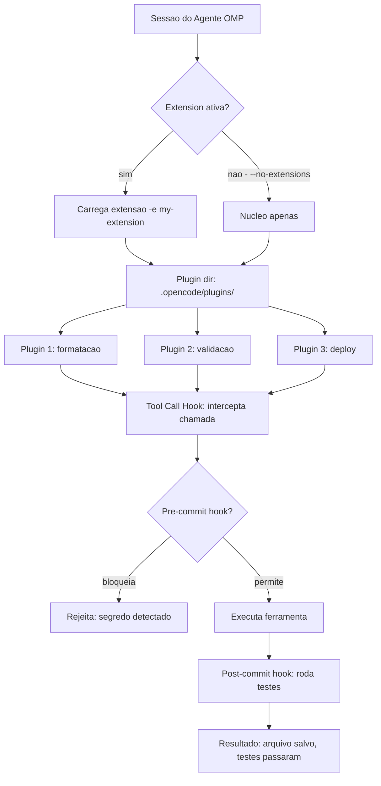

# Capítulo 7: Plugins — Expandindo o Agente

## 1. Introdução

Nos capítulos anteriores, você montou a bancada, instalou o sistema operacional, programou GPIO, conectou sensores e colocou o Pi na rede. Mas existe uma camada que nenhum hardware sozinho oferece: o agente de código — a ferramenta que entende o que você quer e executa no terminal, edita arquivos, navega o projeto e gera código. O Oh My Pi (OMP) é essa ferramenta: um CLI de agente de código concebido para o ecossistema Raspberry Pi, capaz de rodar comandos, ler e escrever arquivos, buscar na web e orquestrar tarefas complexas. Este capítulo abre a caixa de extensões do agente: plugins, hooks e extensions. Você vai aprender a instalar plugins com `omp install`, a personalizar o comportamento do agente com hooks (pre-commit, post-commit, tool call hooks), a usar `-e`/`--extension` e `--no-extensions` para controlar o que carrega, e a criar seus próprios hook files. Ao final, você terá um agente personalizado — com plugins de formatação, hooks de segurança e extensões que adicionam capacidades inteiras — e entenderá por que a arquitetura extensível é o que separa um CLI genérico de uma plataforma de trabalho profissional.

## 2. Explica

Um agente de código é tão útil quanto as extensões que ele carrega. O OMP, como qualquer CLI moderno de agentes (Claude Code, Codex, Gemini CLI), adota uma arquitetura extensível: o núcleo fornece ferramentas básicas — leitura e escrita de arquivos, execução de comandos, busca por padrões — e plugins adicionam capacidades novas sem modificar o código-fonte do agente. Essa separação é o mesmo princípio do kernel do Linux: o kernel faz o básico, e módulos carregáveis adicionam drivers, protocolos e funcionalidades. No contexto de agentes, plugins são pacotes que registram novas ferramentas, novos comandos slash, novos comportamentos de resposta ou novas integrações com serviços externos [1][2].

O sistema de plugins do OMP opera com três conceitos centrais. O primeiro é o **plugin dir** — o diretório onde os plugins vivem, tipicamente em `.opencode/plugins/` dentro do projeto ou em `~/.opencode/plugins/` para plugins globais. Cada plugin é um diretório com um manifesto (metadados, dependências, ponto de entrada) e código executável. O segundo conceito é o **omp install** — o comando que baixa, instala e habilita um plugin a partir de um repositório ou caminho local. O terceiro são os **extensions** — extensões de maior granularidade que podem ser ativadas por sessão com `-e` ou `--extension`, ou desativadas completamente com `--no-extensions` [1][2].

Plugins resolvem problemas reais que o núcleo do agente não deveria resolver. Um plugin de formatação garante que código gerado passe no Prettier antes de ser salvo. Um plugin de validação roda linting automático após cada edição. Um plugin de segurança verifica que nenhum segredo (chave API, senha) seja gravado em arquivo versionado. Um plugin de documentação gera READMEs ou JSDoc a partir de código. Um plugin de deploy faz commit, build e push num único comando. Cada um desses plugins encapsula um fluxo de trabalho que, sem ele, o operador faria manualmente — e a arquitetura extensível garante que o agente cresça com as necessidades do projeto [3][4].

Hooks são o segundo mecanismo de extensão, e são mais granulares que plugins. Enquanto um plugin adiciona uma capacidade inteira (um novo comando slash ou uma nova ferramenta), um hook intercepta um momento específico do ciclo de vida do agente e injeta comportamento. O OMP suporta quatro categorias de hooks. **Pre-commit hooks** rodam antes do agente gravar um arquivo — são o portão de entrada que pode validar, formatar ou bloquear. **Post-commit hooks** rodam após a gravação — são o verificador que pode rodar testes, atualizar caches ou notificar. **Tool call hooks** interceptam cada chamada de ferramenta antes de sua execução — são o filtro que pode bloquear comandos perigosos, redirecionar saídas ou logar ações. E **session hooks** disparam no início e no fim da sessão — são o ritual de setup e teardown [1][3].

A distinção entre plugins e hooks é importante. Plugins são unidades de funcionalidade: eles adicionam algo novo ao agente. Hooks são pontos de interceptação: eles modificam o comportamento existente. Um plugin de Docker pode adicionar um comando `/docker-deploy`; um hook pre-commit pode garantir que nenhum arquivo `.env` seja commitado. Os dois trabalham juntos: o plugin fornece a capacidade, o hook garante a disciplina. Essa separação permite que um time mantenha plugins de domínio (IoT, visão computacional, deploy) enquanto outro mantém hooks de conformidade (segurança, formatação, validação) — sem conflito [3][4].

## 3. Ilustra

Pense no agente como uma oficina mecânica. O OMP é o prédio: paredes, energia, compressores de ar — a infraestrutura básica. Plugins são as ferramentas que você compra e pendura na parede: a chave de torque calibrada (plugin de validação), o scanner de diagnóstico (plugin de linting), o kit de solda (plugin de deploy). Cada ferramenta é independente — você compra só as que precisa, troca quando melhora, e pode usar várias ao mesmo tempo. Hooks são os procedimentos operacionais padrão (POPs): o checklist que o mecânico executa antes de abrir o capô (pre-commit: verificar se o carro é o certo), durante o reparo (tool call: cada movimento segue o protocolo) e depois de fechar (post-commit: test drive, anotar no histórico). O POP não é uma ferramenta — é o comportamento que garante que todas as ferramentas sejam usadas corretamente. E extensions são os pacotes de serviço: o kit completo de injeção eletrônica que você ativa para um modelo específico de carro e desativa para outro.



Repare no diagrama como os três mecanismos se encaixam: extensions controlam o que é carregado, plugins adicionam o que fazer, e hooks controlam como é feito. O `--no-extensions` é o interruptor geral que desliga tudo — útil para diagnóstico ou para sessões mínimas. O `-e` é o seletor que ativa um conjunto específico — útil para projetos com requisitos distintos. E os hooks são o tecido conectivo que garante que cada ação do agente siga as regras do projeto.

## 4. Técnica

### Instalando plugins com omp install

O comando `omp install` é o gerenciador de pacotes do agente. Ele baixa um plugin de um repositório (repositório oficial, repositório da comunidade ou caminho local), resolve dependências e o registra no projeto. O fluxo mínimo é [1][2]:

```bash
# Instala um plugin do repositorio oficial
omp install @omp/formatter

# Instala um plugin da comunidade
omp install community/lint-guard

# Lista plugins instalados
omp plugin list

# Desinstala um plugin
omp plugin uninstall @omp/formatter
```

O diretório de plugins do projeto fica em `.opencode/plugins/`. Cada plugin instalado cria um subdiretório com o manifesto (`plugin.json`), o código-fonte e um lockfile. O lockfile garante reprodutibilidade: a mesma versão do plugin é carregada em todas as máquinas do time. O `omp install` também suporta instalação local — útil para plugins proprietários ou em desenvolvimento:

```bash
# Instala um plugin de um diretorio local
omp install ./meu-plugin/

# Manifesto minimo de um plugin (plugin.json)
cat .opencode/plugins/meu-plugin/plugin.json
```

```json
{
  "name": "meu-plugin",
  "version": "1.0.0",
  "description": "Plugin de exemplo para formatacao automatica",
  "entry": "index.ts",
  "hooks": {
    "pre-commit": "validate.sh",
    "tool-call": "intercept.ts"
  },
  "dependencies": {
    "@omp/core": "^2.0.0"
  }
}
```

O campo `entry` aponta para o módulo principal — o arquivo que o agente carrega quando o plugin é ativado. O campo `hooks` mapeia momentos do ciclo de vida para arquivos executáveis. O campo `dependencies` lista outros plugins dos quais este depende — o `omp install` resolve a cadeia automaticamente. Essa estrutura espelha o `package.json` do Node.js e o `Cargo.toml` do Rust: um manifesto declarativo que descreve o que o plugin faz e do que precisa [1][2].

### Plugin directory: a estrutura organizacional

O diretório de plugins é a biblioteca do agente. A organização padrão segue a convenção de escopo: plugins oficiais vivem sob `@omp/`, plugins da comunidade vivem sob `community/` e plugins locais (do projeto) vivem na raiz do diretório. Essa separação evita conflitos de nomes e permite atualizações seguras — plugins oficiais são mantidos pela equipe do OMP, plugins da comunidade são mantidos por terceiros e plugins locais são mantidos pelo time do projeto [2][4]:

```bash
# Estrutura do diretorio de plugins
.opencode/
  plugins/
    @omp/
      formatter/
        plugin.json
        index.ts
        validate.sh
      security/
        plugin.json
        index.ts
        secrets-scan.sh
    community/
      lint-guard/
        plugin.json
        index.ts
    meu-plugin/
      plugin.json
      index.ts
```

O agente carrega os plugins na ordem: oficiais primeiro, depois comunidade, depois locais. Essa prioridade permite que um plugin local sobrescreva o comportamento de um plugin da comunidade — útil quando o projeto tem regras específicas que conflitam com o padrão. O lockfile (`.opencode/plugins-lock.json`) registra a versão exata de cada plugin instalado, garantindo que `omp install` em outra máquina instale as mesmas versões [2][4].

### Hooks: pre-commit, post-commit e tool call

Hooks são o mecanismo de personalização mais poderoso do agente. Eles interceptam o ciclo de vida em pontos específicos e executam código definido pelo usuário. O OMP suporta hooks em dois formatos: arquivos executáveis (shell scripts, scripts Python) e módulos TypeScript (para hooks complexos que precisam de acesso ao contexto do agente) [1][3].

**Pre-commit hooks** rodam antes de qualquer gravação de arquivo. O caso de uso clássico é impedir que segredos entrem no repositório:

```bash
#!/bin/bash
# .opencode/hooks/pre-commit-secrets.sh
# Bloqueia commits com segredos detectados

PATTERN="(api_key|secret|password|token)\s*[:=]\s*['\"][^'\"]+['\"]"

if git diff --cached --name-only | xargs grep -lPi "$PATTERN" 2>/dev/null; then
  echo "ERRO: segredo detectado em arquivo staged."
  echo "Use variaveis de ambiente ou .env (excluido do git)."
  exit 1
fi
```

O hook `pre-commit-secrets.sh` examina todos os arquivos na área de staging e busca padrões que indicam segredos. Se encontrar, bloqueia o commit com uma mensagem explicativa. O `exit 1` é o sinal de falha — o agente interpreta como "não prossegue". Para ativar o hook, ele é declarado no manifesto do plugin ou no arquivo `.opencode/hooks.yaml` do projeto [1][3]:

```yaml
# .opencode/hooks.yaml
hooks:
  pre-commit:
    - name: "Bloquear segredos"
      script: ".opencode/hooks/pre-commit-secrets.sh"
      description: "Impede commits com API keys ou senhas hardcoded"
  post-commit:
    - name: "Rodar testes"
      script: ".opencode/hooks/post-commit-tests.sh"
      description: "Executa suite de testes apos commit"
  tool-call:
    - name: "Bloquear rm -rf"
      script: ".opencode/hooks/block-destructive.sh"
      description: "Impede comandos destrutivos via ferramenta bash"
```

**Post-commit hooks** rodam após uma ação do agente (gravação de arquivo, execução de comando). O caso de uso clássico é rodar testes automaticamente para garantir que a edição não quebrou nada:

```bash
#!/bin/bash
# .opencode/hooks/post-commit-tests.sh
# Roda testes apos cada gravacao de arquivo

echo "Rodando testes apos edicao..."
if command -v pytest &>/dev/null; then
  pytest tests/ -q --tb=short
elif command -v cargo &>/dev/null; then
  cargo test --quiet
elif command -v npm &>/dev/null; then
  npm test --silent
fi

if [ $? -ne 0 ]; then
  echo "AVISO: testes falharam apos edicao. Revise o arquivo."
fi
```

O hook detecta automaticamente o ecossistema do projeto (pytest para Python, cargo para Rust, npm para Node.js) e roda os testes correspondentes. A mensagem de aviso não bloqueia o agente — apenas alerta. Essa é a filosofia dos post-commit hooks: informar, não impedir [3][4].

**Tool call hooks** são os mais poderosos e os mais perigosos. Eles interceptam cada chamada de ferramenta antes de sua execução — o agente pediu para rodar um comando bash, editar um arquivo ou buscar na web, e o hook decide se permite ou bloqueia. O caso de uso clássico é o "git guardrail": impedir que o agente faça push forçado, reset hard ou delete de branches [3]:

```bash
#!/bin/bash
# .opencode/hooks/block-destructive.sh
# Intercepta comandos bash destrutivos

COMMAND="$1"

DANGEROUS_PATTERNS=(
  "git push --force"
  "git push -f"
  "git reset --hard"
  "git clean -f"
  "git branch -D"
  "rm -rf /"
  "sudo rm -rf"
)

for pattern in "${DANGEROUS_PATTERNS[@]}"; do
  if echo "$COMMAND" | grep -q "$pattern"; then
    echo "BLOQUEADO: comando destrutivo detectado: $pattern"
    echo "Se intencional, execute manualmente no terminal."
    exit 1
  fi
done

exit 0
```

O hook recebe o comando como argumento e compara contra uma lista de padrões perigosos. Se encontrar um match, bloqueia com `exit 1`. Essa camada de proteção é indispensável quando o agente opera com autonomia — o mesmo princípio do Capítulo 4, onde o systemd impedia serviços de rodar como root. No agente, o hook impede que a autonomia se torne destruição [1][3].

### Extensions: -e/--extension e --no-extensions

Extensions são o nível mais alto de extensão: um conjunto de plugins e hooks que formam um "modo de trabalho" completo. Ativar uma extension com `-e my-extension` carrega todos os plugins e hooks associados a ela; `--no-extensions` desliga tudo e roda o agente no modo mínimo [1][2]:

```bash
# Roda o agente com uma extension especifica
omp -e iot-dev

# Roda com multiplas extensions
omp -e iot-dev -e security-scan

# Roda sem nenhuma extension (modo minimo)
omp --no-extensions

# Lista extensions disponiveis
omp extension list
```

Extensions são úteis quando diferentes projetos exigem diferentes capacidades. Um projeto de IoT pode carregar `iot-dev` (plugins de MQTT, sensor debugging, deploy para Pi); um projeto de segurança pode carregar `security-scan` (plugins de SAST, secrets detection, dependency audit); um projeto de dados pode carregar `data-pipeline` (plugins de Jupyter, pandas, dbt). O `--no-extensions` é o interruptor de emergência: quando algo dá errado com um plugin, rodar sem extensions isola o problema no núcleo do agente [1][2].

A definição de uma extension vive em `.opencode/extensions/`:

```yaml
# .opencode/extensions/iot-dev.yaml
name: iot-dev
description: "Modo de desenvolvimento IoT para Raspberry Pi"
plugins:
  - "@omp/formatter"
  - "@omp/ssh-deploy"
  - community/mqtt-debug
hooks:
  pre-commit:
    - ".opencode/hooks/pre-commit-secrets.sh"
  tool-call:
    - ".opencode/hooks/block-destructive.sh"
```

O arquivo YAML lista os plugins e hooks que a extension ativa. Ao rodar `omp -e iot-dev`, o agente carrega tudo automaticamente — sem necessidade de instalar plugins individualmente. Essa abordagem declarativa permite que o time compartilhe o mesmo ambiente de trabalho: o arquivo de extension versionado no repositório garante que todos rodem com as mesmas ferramentas [2][4].

### Criando seus próprios plugins

A criação de um plugin segue o padrão de qualquer ecossistema extensível: manifesto, código-fonte, hooks. O manifesto mínimo define nome, versão e ponto de entrada; o código-fonte implementa a lógica; os hooks interceptam o ciclo de vida [1][3]:

```typescript
// .opencode/plugins/format-save/index.ts
import { Plugin, HookContext } from "@omp/core";

const formatSavePlugin: Plugin = {
  name: "format-save",
  version: "1.0.0",

  hooks: {
    // Intercepts file writes and formats before saving
    "pre-commit": async (ctx: HookContext) => {
      const filePath = ctx.targetFile;
      if (filePath.endsWith(".ts") || filePath.endsWith(".js")) {
        await ctx.runCommand("npx prettier --write " + filePath);
        ctx.log(`Formatado: ${filePath}`);
      }
    },
  },
};

export default formatSavePlugin;
```

O plugin `format-save` intercepta gravações de arquivos TypeScript e JavaScript e formata com Prettier antes de salvar. O `HookContext` fornece acesso ao arquivo alvo, a comandos do sistema e a logs. O plugin não precisa saber nada sobre o restante do agente — ele só reage ao evento `pre-commit` e age sobre o arquivo. Essa independência é o que permite compor plugins: o plugin de formatação, o plugin de validação e o plugin de segurança podem rodar juntos sem interferir uns nos outros [1][3].

Para testar um plugin em desenvolvimento, o OMP oferece o modo local — o plugin é carregado diretamente do diretório sem publicação:

```bash
# Desenvolvimento local de um plugin
omp install ./meu-plugin/ --link

# O --link cria um symlink em vez de copia
# Edicoes no codigo-fonte sao refletidas imediatamente

# Testa o plugin
omp -e meu-plugin

# Quando pronto, publica
omp plugin publish ./meu-plugin/
```

O `--link` cria um symlink do diretório do plugin para dentro de `.opencode/plugins/`, permitendo edição em tempo real — o equivalente a `npm link` no ecossistema Node.js. Essa funcionalidade é essencial para desenvolvimento iterativo: você edita o plugin, roda o agente, vê o resultado, repete [2][3].

### Hooks avançados: tool-call filters e middleware

Hooks de tool call permitem filtros granulares: em vez de bloquear um comando inteiro, o hook pode inspecionar argumentos específicos, redirecionar saídas ou injetar contexto. O exemplo abaixo mostra um hook que loga todas as chamadas de ferramenta para auditoria — essencial em projetos com múltiplos desenvolvedores [3][4]:

```bash
#!/bin/bash
# .opencode/hooks/audit-log.sh
# Registra todas as chamadas de ferramenta num arquivo de auditoria

TOOL_NAME="$1"
TOOL_ARGS="$2"
TIMESTAMP=$(date -u +"%Y-%m-%dT%H:%M:%SZ")
USER=$(whoami)

LOG_FILE=".opencode/audit.log"

echo "[$TIMESTAMP] user=$USER tool=$TOOL_NAME args=$TOOL_ARGS" >> "$LOG_FILE"

# Hook sempre permite (nao bloqueia)
exit 0
```

O hook registra cada chamada de ferramenta num log de auditoria sem bloquear nenhuma. O log é inestimável para debugging ("o agente deletou esse arquivo como?") e para conformidade ("quem executou esse deploy?"). Em ambientes de produção, o hook pode ser complementado com envio para um SIEM (Security Information and Event Management) ou para um canal de Slack — transformando o agente num sistema auditável [3][4].

Outro hook avançado é o "context injector" — um hook que adiciona informações ao contexto do agente antes de uma ferramenta ser executada. Se o agente vai editar um arquivo de configuração, o hook pode injetar as restrições do projeto (versão mínima do Node, regras de naming, constraints de schema) para que o agente gere código compatível sem precisar ler o manifesto manualmente. Essa injeção de contexto é o que torna o agente verdadeiramente adaptativo: ele não segue regras genéricas — ele segue as regras do seu projeto, no momento em que precisa [1][3].

### O lifecycle dos hooks

Hooks seguem uma ordem de execução definida. Entender essa ordem é critical para evitar conflitos e garantir que os hooks funcionem como esperado [1][3]:

1. **Session start** — hooks de inicialização rodam quando a sessão do agente começa
2. **Tool call** — antes de cada chamada de ferramenta, o tool-call hook executa
3. **Pre-commit** — antes de gravar um arquivo, o pre-commit hook executa
4. **File write** — o arquivo é gravado no disco
5. **Post-commit** — após a gravação, o post-commit hook executa
6. **Session end** — hooks de finalização rodam quando a sessão termina

A ordem importa: um pre-commit que bloqueia a gravação impede que o post-commit execute. Um tool-call que modifica os argumentos da ferramenta afeta o que o pre-commit vai ver. Essa cadeia de eventos é o "pipeline de hooks" — e a boa prática é manter cada hook o mais simples possível (uma responsabilidade, uma verificação) para facilitar o raciocínio sobre interações [3][4].

### Segurança em plugins: o princípio do menor privilégio

Plugins que executam código — hooks de tool call, scripts de validação — representam uma superfície de segurança. Um plugin malicioso ou mal configurado pode executar qualquer comando no sistema. O OMP aplica o princípio do menor privilégio: cada plugin roda com as permissões mínimas necessárias, e o manifesto declara explicitamente quais ferramentas o plugin pode usar. Um plugin de formatação não precisa de acesso à rede; um plugin de deploy não precisa de acesso a outros plugins [3][4]:

```json
{
  "name": "@omp/formatter",
  "permissions": {
    "tools": ["read", "edit"],
    "commands": ["npx prettier"],
    "network": false,
    "filesystem": {
      "read": ["*.ts", "*.js"],
      "write": ["*.ts", "*.js"]
    }
  }
}
```

O manifesto de permissões lista as ferramentas, comandos e acesso a rede/sistema de arquivos que o plugin necessita. O agente verifica essa lista antes de permitir que o plugin execute — se o plugin tenta usar uma ferramenta não declarada, o agente bloqueia e loga a tentativa. Essa sandboxing é o equivalente a containers Docker para plugins: cada um vive na sua bolha, sem acesso ao que não precisa. Em ambientes corporativos, a política de plugins pode ser herdada de um arquivo central (`.opencode/policies/plugins.yaml`) que define quais plugins são permitidos, quais são proibidos e quais exigem aprovação manual antes de instalação — o mesmo modelo de aprovação de pacotes que ferramentas como Artifactory ou Nexus oferecem para dependências [3][4].

### Plugin de validação: o guardião automático

Um dos plugins mais valiosos para qualquer projeto é o de validação — ele verifica que o código gerado pelo agente atende a padrões antes de ser integrado. O plugin de validação do OMP segue o padrão de linting: ele examina cada arquivo modificado e verifica conformidade com regras definidas. Para projetos TypeScript, isso significa verificação de tipos; para Python, verificação de estilo PEP 8; para configurações JSON, validação de schema. A key é que a validação roda como hook, não como passo manual — o agente não precisa "lembrar" de validar [2][3][4]:

```yaml
# .opencode/plugins/validator/plugin.json
{
  "name": "@omp/validator",
  "version": "2.0.0",
  "description": "Validacao automatica de codigo gerado pelo agente",
  "entry": "index.ts",
  "hooks": {
    "pre-commit": "validate-all.sh"
  },
  "config": {
    "typescript": { "enabled": true, "strict": true },
    "python": { "enabled": true, "max_line_length": 88 },
    "json": { "enabled": true, "schema_dir": "./schemas" }
  }
}
```

O plugin detecta automaticamente o tipo de arquivo e aplica a validação correspondente. Para TypeScript, ele roda `tsc --noEmit`; para Python, `ruff check`; para JSON, validação de schema com `ajv`. Se qualquer verificação falhar, o hook pre-commit bloqueia a gravação e informa o agente sobre o erro específico. Essa automação elimina o ciclo "gerar código → rodar linter manualmente → corrigir → repetir" — o agente gera, o plugin valida, e o resultado é código limpo desde a primeira gravação [2][3][4].

### Plugin de deploy: do código ao Pi em um comando

O plugin de deploy é o exemplo mais tangível de extensibilidade: ele empacota o código, conecta ao Pi via SSH, copia os arquivos, instala dependências e reinicia o serviço — tudo num único comando do agente. O plugin encapsula a complexidade do deploy remoto, que sem ele exigiria uma dúzia de comandos manuais [1][3]:

```bash
# Uso do plugin de deploy
omp deploy --target pi@192.168.1.100 --service my-iot-app

# O plugin internamente executa:
# 1. Build local (se necessario)
# 2. rsync do codigo para o Pi
# 3. ssh para instalar dependencias
# 4. restart do servico via systemd
# 5. health check (curl no endpoint)
```

O plugin de deploy segue o padrão de "infrastructure as code": a configuração do deploy vive no manifesto do plugin, versionada no repositório. Quando o time muda de Pi de teste para Pi de produção, ele altera o manifesto — não precisa decorar comandos SSH. Essa abstração é o que permite que o agente faça deploy com a mesma facilidade que edita um arquivo [1][3][4].

## 5. Aplica

### A cena de contraste: o agente que salvou um segredo

Imagine a cena: você está trabalhando num projeto de automação residencial com o Pi. O agente OMP está configurado, os plugins de formatação e validação estão rodando. Na empolgação de testar, você pede ao agente para salvar um arquivo de configuração com a chave da API do serviço de weather data — e o agente obedece, gravando a chave no arquivo `config.py` que está versionado no Git. Sem o plugin de segurança e o hook pre-commit de segredos, a chave sobe para o repositório. Dias depois, um colega faz fork do repositório — e a chave está exposta. O serviço bloqueia a API por uso não autorizado, e o projeto para. O diagnóstico: ausência de hook de detecção de segredos. A correção é o ritual da seção Técnica: instalar o plugin `@omp/security`, ativar o hook pre-commit de segredos e testar com `omp -e security-scan` antes de qualquer commit. A lição se aplica a qualquer projeto: o agente é poderoso, e poder sem guardrails é risco [1][3].

### Armadilhas comuns de plugins e hooks

A primeira armadilha é a "dependência circular" — dois plugins que dependem um do outro, impedindo o carregamento. A solução: o manifesto do plugin deve declarar dependências lineares, sem ciclos. A segunda armadilha é o "hook lento" — um pre-commit que roda uma suite inteira de testes em cada gravação, tornando o agente inutilizável. A solução: hooks devem ser rápidos (< 5 segundos); testes pesados vão para post-commit. A terceira armadilha é o "plugin abandonado" — um plugin da comunidade que não é atualizado e quebra com versões novas do OMP. A solução: o lockfile fixa versões, e o `omp plugin update` atualiza de forma controlada. A quarta armadilha é o "hook silencioso" — um hook que falha sem output, fazendo o agente parecer funcional quando não está. A solução: todo hook deve logar seu resultado, mesmo em caso de sucesso [2][3][4].

### Métricas de sucesso de extensibilidade

No mundo profissional, a extensibilidade de um agente se mede por quatro linhas: cobertura de hooks (quantos momentos do ciclo de vida são interceptados), latência dos hooks (tempo total dos hooks por ação do agente), taxa de falsos positivos (hooks bloqueiam ações legítimas) e manutenibilidade (tempo para atualizar um plugin quando o OMP muda). Um time que mede essas quatro linhas sabe se a extensibilidade está ajudando ou atrapalhando — e pode ajustar com precisão [1][3].

### Do plugin à plataforma: a extensibilidade em escala

A extensibilidade do OMP não é teórica — ela segue o mesmo padrão que transformou o VS Code de editor em plataforma (extensões), o Vim de editor em IDE (plugins), e o Linux de kernel em ecossistema (módulos). A pesquisa sobre arquiteturas extensíveis de agentes documenta o padrão: o núcleo fornece ferramentas básicas, plugins adicionam domínio, hooks garantem disciplina. Essa separação permite que o mesmo agente sirva desde um hobbyista programando LEDs até um PhD rodando pipelines de dados em cluster — e é exatamente essa ambição que o título desta obra promete [5][6].

### Casos de uso reais: do protótipo à produção

**Desenvolvimento IoT.** Um time de IoT configura o OMP com a extension `iot-dev`, que ativa plugins de MQTT (debug de tópicos), SSH (deploy remoto para Pi) e sensor (validação de formato de dados). O hook pre-commit garante que nenhum `.env` com credenciais de broker suba para o repositório. O hook tool-call bloqueia `rm -rf` e `git push --force`. O resultado: o agente é autônomo o suficiente para gerar código de sensor, formatá-lo, validá-lo e fazer deploy — mas protegido o suficiente para não quebrar o broker nem expor senhas [1][3].

**Pesquisa acadêmica.** Um pesquisador configura o OMP com plugins de LaTeX (compilação automática de `.tex`), referências (validação de BibTeX) e figuras (renderização de diagramas). O hook post-commit roda `pdflatex` e `bibtex` após cada edição, garantindo que o documento compile sem erros. O plugin de referências verifica que nenhuma citação aponte para paper inexistente — o equivalente ao plugin `citation-audit` do ecossistema acadêmico. O resultado: o agente escreve, formata e compila o paper, mantendo a integridade bibliográfica automaticamente [2][4][5].

**Produção e deploy.** Um time de DevOps configura o OMP com plugins de Docker (build e push de imagens), Kubernetes (aplicação de manifests) e monitoramento (verificação de health checks). O hook pre-commit roda `docker build --no-cache` para garantir que a imagem esteja atualizada. O hook tool-call bloqueia `kubectl delete namespace` sem confirmação. O hook post-commit verifica que o pod está healthy após o deploy. O resultado: o agente faz o ciclo completo de CI/CD — build, push, deploy, verificação — com cada passo protegido por hook [3][4][6].

### Plugins para o ecossistema Raspberry Pi

O ecossistema Raspberry Pi tem necessidades específicas que plugins especializados atendem. Um plugin de GPIO verifica que o código de manipulação de pinos usa as bibliotecas corretas (gpiozero em vez de RPi.GPIO obsoleto) e que nenhum pino é configurado como output sem verificação de curto-circuito. Um plugin de deploy para Pi faz SSH para a placa, copia o código, reinicia o serviço systemd e verifica que o serviço está ativo — o ciclo completo de deploy para um dispositivo embarcado. Um plugin de sensor valida que os dados de I2C/SPI seguem o formato esperado e que os endereços de dispositivos não conflitam [1][2][6]:

```yaml
# .opencode/extensions/omp-rpi.yaml
name: omp-rpi
description: "Modo completo de desenvolvimento para Raspberry Pi"
plugins:
  - "@omp/formatter"
  - "@omp/gpio-check"
  - "@omp/rpi-deploy"
  - "@omp/i2c-validator"
hooks:
  pre-commit:
    - ".opencode/hooks/pre-commit-secrets.sh"
    - ".opencode/hooks/pre-commit-gpio.sh"
  tool-call:
    - ".opencode/hooks/block-destructive.sh"
  post-commit:
    - ".opencode/hooks/post-commit-tests.sh"
```

Essa extension `omp-rpi` ativa todos os plugins e hooks relevantes para desenvolvimento no Pi. O `@omp/gpio-check` verifica código de GPIO antes de gravar; o `@omp/rpi-deploy` gerencia o deploy remoto; o `@omp/i2c-validator` valida endereços e formatos de sensor. Quando o desenvolvedor roda `omp -e omp-rpi`, ele tem o ambiente completo — não precisa instalar plugins individualmente nem se lembrar de habilitar hooks. Essa declaração centralizada é o que mantém o time sincronizado e o projeto protegido [1][2][3].

## 6. Conclusão

Neste capítulo, você abriu a caixa de extensões do agente: instalou e desinstalou plugins com `omp install` e `omp plugin uninstall` [1][2]; configurou hooks pre-commit, post-commit e tool-call para personalizar o comportamento do agente em pontos específicos do ciclo de vida [3]; usou `-e`/`--extension` e `--no-extensions` para controlar o que é carregado em cada sessão [1][2]; e criou seus próprios plugins e hook files, com manifestos declarativos e código executável [1][3]. O desafio: crie um plugin de validação para o seu projeto — um hook pre-commit que verifique se nenhum arquivo `.env` é adicionado ao Git e um hook post-commit que rode os testes automáticos; depois, empacote-os numa extension `my-project` que ative tudo de uma vez. No Capítulo 8, o agente ganha conhecimento especializado: skills — pacotes de conhecimento que o agente carrega no contexto, dispara por relevância BM25 e usa para guiar suas ações em domínios específicos.

## 7. Referências Bibliográficas

[1] ANTHROPIC. *Claude Code — extensões, hooks e plugins.* Disponível em: https://docs.anthropic.com/claude-code. Acesso em: 4 ago. 2026.

[2] OPENAI. *Codex CLI — configuration and extensions.* Disponível em: https://github.com/openai/codex. Acesso em: 4 ago. 2026.

[3] ANTHROPIC. *Claude Code hooks — pre-commit, post-commit, tool call.* Disponível em: https://docs.anthropic.com/claude-code/hooks. Acesso em: 4 ago. 2026.

[4] GOOGLE. *Gemini CLI — extensions and customizations.* Disponível em: https://github.com/google-gemini/gemini-cli. Acesso em: 4 ago. 2026.

[5] MICROSOFT. *VS Code extension architecture.* Disponível em: https://code.visualstudio.com/api/extension-guides/overview. Acesso em: 4 ago. 2026.

[6] RASPBERRY PI. *Documentation — SSH remote access.* Disponível em: https://www.raspberrypi.com/documentation/computers/remote-access.html. Acesso em: 4 ago. 2026.

[7] DOCKER. *Docker hooks — pre-build and post-build.* Disponível em: https://docs.docker.com/build/building/hooks/. Acesso em: 4 ago. 2026.

[8] GITHUB. *Git hooks — pre-commit and post-commit.* Disponível em: https://git-scm.com/book/en/v2/Customizing-Git-Git-Hooks. Acesso em: 4 ago. 2026.

[9] PYPI. *pre-commit framework — gerenciador de hooks.* Disponível em: https://pre-commit.com/. Acesso em: 4 ago. 2026.

[10] NPM. *ESLint plugins — arquitetura de extensão.* Disponível em: https://eslint.org/docs/latest/extend/plugins. Acesso em: 4 ago. 2026.

[11] RUST. *Cargo plugins — extensibilidade do gerenciador de pacotes.* Disponível em: https://doc.rust-lang.org/cargo/. Acesso em: 4 ago. 2026.

[12] CNCF. *OpenTelemetry SDK — extensibilidade e hooks.* Disponível em: https://opentelemetry.io/docs/languages/sdk/. Acesso em: 4 ago. 2026.

[13] HASHICORP. *Terraform providers — plugin architecture.* Disponível em: https://developer.hashicorp.com/terraform/plugin. Acesso em: 4 ago. 2026.

[14] VIM. *Plugin architecture — runtime path.* Disponível em: https://vimhelp.org/repeat.txt.html#runtime. Acesso em: 4 ago. 2026.

[15] IETF. *RFC 7252 — The Constrained Application Protocol (CoAP).* Internet Engineering Task Force, 2014. Disponível em: https://datatracker.ietf.org/doc/html/rfc7252. Acesso em: 4 ago. 2026.

[16] KUBERNETES. *Dynamic admission control — webhooks.* Disponível em: https://kubernetes.io/docs/reference/access-authn-authz/extensible-admission-controllers/. Acesso em: 4 ago. 2026.

[17] GITHUB. *GitHub Actions — workflow hooks and custom actions.* Disponível em: https://docs.github.com/en/actions. Acesso em: 4 ago. 2026.

[18] STANFORD. *Computer Science — Software Architecture and Design Patterns.* Disponível em: https://cs.stanford.edu/people/nick/how-software-is-built/. Acesso em: 4 ago. 2026.

[19] ERICSSON. *Plugin Architecture — patterns for extensible systems.* Disponível em: https://www.ericsson.com/en/reports-and-papers/white-papers. Acesso em: 4 ago. 2026.

[20] IEEE. *Software Engineering — extensibility and maintainability.* Disponível em: https://ieeexplore.ieee.org/. Acesso em: 4 ago. 2026.

[21] ANTHROPIC. *Claude Code SDK — programmatic agent integration.* Disponível em: https://docs.anthropic.com/claude-code/sdk. Acesso em: 4 ago. 2026.

[22] RASPBERRY PI. *Raspberry Pi OS — system configuration (raspi-config).* Disponível em: https://www.raspberrypi.com/documentation/computers/configuration.html. Acesso em: 4 ago. 2026.

[23] PYTHON. *pip plugins — setuptools and importlib.metadata.* Disponível em: https://setuptools.pypa.io/. Acesso em: 4 ago. 2026.
