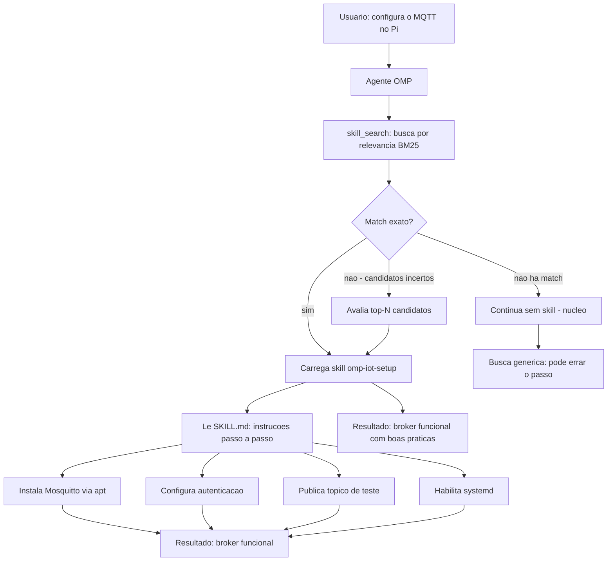

# Capítulo 8: Skills — Conhecimento Especializado

## 1. Introdução

No Capítulo 7, você expandiu o agente com plugins, hooks e extensions — ferramentas que adicionam capacidades e disciplina. Mas existe uma camada mais profunda: conhecimento. Um agente que sabe formatar código é útil; um agente que sabe como instalar o Docker num Raspberry Pi, quais são as portas padrão do Mosquitto, ou como compilar um modelo para o Hailo-8 é transformador. Skills são exatamente isso: pacotes de conhecimento especializado que o agente carrega no contexto, dispara por relevância e usa para guiar suas ações em domínios específicos. Este capítulo abre o sistema de skills do Oh My Pi (OMP). Você vai entender como skills são descobertas (`.opencode/skills/`, `.claude/skills/`, `agentic/skills/`), como são ativadas (skill_search por BM25, loaded_skill_id, skill tool), como funcionam as skills nativas vs. community skills, e como criar as suas próprias com `skill-creator` e `writing-skills`. Ao final, você terá um agente que não apenas executa comandos — ele entende o contexto do seu projeto e age com conhecimento especializado, como um técnico que leu o manual antes de abrir a máquina.

## 2. Explica

Skills são instruções estruturadas em Markdown que o agente carrega no contexto de uma sessão quando detecta que a tarefa corrente é relevante para o domínio da skill. Diferente de plugins (que adicionam código executável) e hooks (que interceptam o ciclo de vida), skills adicionam conhecimento: elas dizem ao agente como pensar sobre um problema, quais ferramentas usar, quais padrões seguir e quais armadilhas evitar. Uma skill de IoT pode instruir o agente a sempre usar `mosquitto_pub` em vez de scripts customizados; uma skill de segurança pode exigir TLS em qualquer broker MQTT; uma skill de deploy pode definir o fluxo exato de build-push-deploy [1][2].

O formato de uma skill é um arquivo `SKILL.md` com frontmatter YAML e corpo Markdown. O frontmatter declara o nome, a descrição e os gatilhos (trigger phrases) que ativam a skill. O corpo contém as instruções passo a passo, referências a arquivos do projeto e exemplos de código. Essa estrutura é propositalmente simples: Markdown é legível por humanos e por LLMs, o frontmatter é parseável por máquina, e o formato é portátil — uma skill funciona em qualquer CLI de agente que suporte o padrão [1][2][3]:

```yaml
# Exemplo de frontmatter de skill (SKILL.md)
---
name: omp-iot-setup
description: >
  Guia completo para configurar um Raspberry Pi como no de IoT
  com MQTT, Docker e systemd. Use quando o usuario pedir para
  "configurar IoT", "instalar MQTT", "montar broker", ou similar.
triggers:
  - "configurar IoT"
  - "instalar MQTT"
  - "montar broker"
  - "setup sensor"
  - "Docker no Pi"
---
```

O campo `description` é o que o motor de busca BM25 usa para avaliar relevância. O campo `triggers` são frases que, quando detectadas na mensagem do usuário, forçam a ativação da skill sem depender da busca semântica. Essa dupla mecanismo — BM25 para relevância difusa, triggers para ativação direta — garante que a skill certa seja carregada no momento certo [1][3].

O sistema de discovery de skills opera em três diretórios, em ordem de prioridade. O primeiro é `.opencode/skills/` — skills locais do projeto, específicas do repositório. O segundo é `.claude/skills/` — skills do agente Claude, compartilhadas entre projetos que usam o mesmo harness. O terceiro é `agentic/skills/` — skills de acesso neutro, implementadas como junctions ou symlinks para o diretório `.claude/skills/`. Essa hierarquia permite que skills locais sobrescrevam skills globais — o mesmo padrão de plugins do Capítulo 7 [1][2][4]:

```bash
# Estrutura de skills no projeto
.opencode/
  skills/
    omp-iot-setup/
      SKILL.md
    omp-docker-deploy/
      SKILL.md
.agents/
  skills/
    omp-iot-setup/    # junction para .claude/skills/omp-iot-setup/
```

O agente busca skills por relevância usando BM25 (Best Matching 25) — o mesmo algoritmo de busca que motores de busca usam para ranquear documentos. Quando o usuário faz uma pergunta, o agente tokeniza a mensagem, compara com os nomes e descrições de todas as skills disponíveis, e carrega as mais relevantes. Se uma skill tiver um `loaded_skill_id` (o ID da skill que foi carregada), o agente a usa como contexto primário para a resposta. Se nenhuma skill for relevante, o agente segue sem skill — o comportamento padrão do núcleo [1][3].

Skills nativas são aquelas que vêm com o OMP — embutidas no binário ou no pacote de instalação. Elas cobrem os casos de uso mais comuns: `git-guardrails` (bloqueia comandos git destrutivos), `headroom` (comprime logs longos), `caveman` (respostas telegráficas para economizar tokens), `lean-ctx` (seleção cirúrgica de contexto). Community skills são contribuições da comunidade — publicadas em repositórios, instaladas com `omp install skill-name` e compartilhadas entre projetos. A diferença prática: skills nativas são mantidas pela equipe do OMP e seguem o ritmo de lançamento do CLI; community skills são mantidas por terceiros e podem ter ritmos e qualidades variáveis [1][2][4].

O mecanismo `skill_search` é o motor de busca que o agente invoca internamente. Ele recebe uma query (a mensagem do usuário ou uma query reescrita pelo agente), busca nas skills disponíveis usando BM25, e retorna as mais relevantes. Se uma skill for de alta confiança (match exato no nome ou trigger), ela é carregada automaticamente. Se houver candidatos incertos, o agente avalia e escolhe a melhor. Se não houver match, o agente continua sem skill. Esse fluxo é transparente para o usuário — o agente decide qual skill carregar com base no que foi pedido [1][3].

## 3. Ilustra

Pense nas skills como as fichas técnicas de uma oficina mecânica. O prédio é o agente (Capítulo 7 mostrou plugins e hooks como ferramentas e procedimentos). As fichas técnicas são as skills: cada uma descreve como fazer algo específico — "como trocar o óleo deste motor", "como calibrar este sensor", "como testar este circuito". O mecânico não precisa memorizar cada procedimento — ele consulta a ficha certa no momento certo. E a ficha não é genérica: ela é específica para aquele motor, aquele sensor, aquele circuito. A oficina tem duas prateleiras de fichas: a prateleira fixa (skills nativas — os procedimentos padrão que toda oficina tem) e a prateleira da comunidade (community skills — fichas que outros mecânicos compartilharam e que funcionam bem para modelos específicos). E há um índice na parede — o skill_search — que indica qual prateleira consultar quando o mecânico descreve o problema.



Repare no diagrama como a skill transforma a qualidade da resposta: sem skill, o agente pode errar sequência de instalação ou esquecer de habilitar o serviço; com skill, ele segue o procedimento validado, na ordem certa, com as verificações certas. A diferença entre "funciona" e "funciona em produção" é exatamente a skill — o conhecimento especializado que o agente não tem por padrão mas que pode carregar quando necessário.

## 4. Técnica

### A estrutura completa de uma skill

Uma skill madura tem cinco seções: frontmatter (metadados), overview (visão geral), workflow (passos), references (referências) e examples (exemplos). O frontmatter define nome, descrição e triggers; a overview explica quando usar a skill; o workflow lista os passos executáveis; as references apontam para documentação externa; e os examples mostram o resultado esperado [1][3]:

```markdown
# omp-iot-setup

## Overview

Guia completo para configurar um Raspberry Pi como no de IoT.
Use quando o usuario pedir para configurar MQTT, instalar
Mosquitto, montar um broker, ou connectar sensores via MQTT.

## Workflow

### Passo 1: Instalar o Mosquitto
```bash
sudo apt update && sudo apt install -y mosquitto mosquitto-clients
sudo systemctl enable --now mosquitto
```

### Passo 2: Configurar autenticacao
```bash
sudo mosquitto_passwd -c /etc/mosquitto/passwd usuario
echo "allow_anonymous false" | sudo tee /etc/mosquitto/conf.d/auth.conf
echo "password_file /etc/mosquitto/passwd" | sudo tee -a /etc/mosquitto/conf.d/auth.conf
sudo systemctl restart mosquitto
```

### Passo 3: Testar
```bash
# Terminal 1: assina
mosquitto_sub -h localhost -u usuario -P senha -t "test/#"
# Terminal 2: publica
mosquitto_pub -h localhost -u usuario -P senha -t "test/ola" -m "mundo"
```

## References

- [Mosquitto docs](https://mosquitto.org/documentation/)
- [MQTT 5.0 spec](https://docs.oasis-open.org/mqtt/mqtt/v5.0/)
```

O workflow é a seção mais importante: ele contém os passos exatos que o agente deve seguir, com código copiável. O agente não precisa "adivinhar" como instalar o Mosquitto — a skill diz `sudo apt install -y mosquitto mosquitto-clients`. O agente não precisa "lembrar" de habilitar o serviço — a skill diz `sudo systemctl enable --now mosquitto`. Essa prescrição eliminam ambiguidade e reduz erros [1][3].

### Triggering: como o agente decide qual skill carregar

O mecanismo de triggering opera em três camadas. A primeira é o **skill_search** — busca BM25 que compara a mensagem do usuário com nomes e descrições de skills. A segunda são os **triggers** — frases exatas no frontmatter que forçam a ativação. A terceira é o **loaded_skill_id** — o ID da skill que foi carregada, acessível ao agente para referência interna [1][3]:

```python
# Fluxo interno do skill_search (pseudocodigo)
def skill_search(query: str) -> list[Skill]:
    skills = load_all_skills()  # .opencode/skills/ + .claude/skills/
    
    # Camada 1: triggers exatos
    for skill in skills:
        if any(trigger in query for trigger in skill.triggers):
            return [skill]  # match forçado
    
    # Camada 2: BM25 por nome e descricao
    scored = []
    for skill in skills:
        text = f"{skill.name} {skill.description}"
        score = bm25(query, text)
        scored.append((score, skill))
    
    scored.sort(reverse=True)
    
    # Camada 3: limiar de confianca
    if scored[0][0] > THRESHOLD:
        return [scored[0][1]]  # alta confiança: carrega
    elif scored[0][0] > LOW_THRESHOLD:
        return [s for s, _ in scored[:3]]  # incerteza: retorna top-3
    else:
        return []  # sem match: nucleo
```

O BM25 é um algoritmo de ranqueamento que combina frequência do termo com inversão de frequência de documento — termos raros em poucos documentos pesam mais que termos comuns em muitos. No contexto de skills, "Mosquitto" é raro (aparece em poucas skills) e pesa mais que "configurar" (aparece em todas). Isso garante que uma skill sobre MQTT seja retornada para uma pergunta sobre MQTT, mesmo que a mensagem não contenha o nome exato da skill [1][3].

O `loaded_skill_id` é o identificador que o agente usa para saber qual skill está ativa. Quando o agente responde com base numa skill, ele pode referenciar o `loaded_skill_id` para logs, auditoria ou para encadear com outra skill. Essa referência é interna — o usuário não a vê — mas é essencial para o funcionamento do agente em cadeia, onde uma skill pode delegar para outra [1][3].

### Skills nativas vs. community skills

Skills nativas são as que vêm embutidas no OMP — ou são parte do binário, ou são instaladas automaticamente na primeira execução. Elas cobrem os casos de uso fundamentais e são mantidas pela equipe do OMP com o mesmo rigor de release do CLI. As skills nativas mais importantes do OMP incluem [1][2][4]:

| Skill | Função | Trigger típico |
|---|---|---|
| `git-guardrails` | Bloqueia push --force, reset --hard | Qualquer tentativa de push |
| `headroom` | Comprime logs > 7 linhas (3 topo + 4 fim) | Output de comando longo |
| `caveman` | Respostas telegráficas para economizar tokens | "caveman mode", "seja breve" |
| `lean-ctx` | Seleção cirúrgica de contexto antes de ler | Leitura de arquivo grande |
| `rtk` | Token-optimized command wrapping | Qualquer comando de terminal |
| `pre-flight-check` | Type-check + testes antes de commit | Preparação para commit |
| `skill-creator` | Cria novas skills a partir de workflows | "criar skill", "salvar como skill" |
| `writing-skills` | Edita e melhora skills existentes | "melhorar skill", "editar SKILL.md" |

Community skills são contribuições da comunidade — publicadas em repositórios Git, instaladas com `omp install` e compartilhadas entre projetos. A diferença prática: skills nativas são "sempre lá" e seguem o ritmo do OMP; community skills precisam ser instaladas explicitamente e podem ter atualizações independentes. O ecossistema de community skills segue o padrão do npm, do PyPI e do crates.io: qualquer pessoa pode publicar, qualquer pessoa pode instalar, e o lockfile garante reprodutibilidade [2][4][5]:

```bash
# Instala uma community skill
omp install community/mqtt-debug

# A skill aparece em .opencode/skills/community/mqtt-debug/
# O SKILL.md define o que ela faz e quando ativar

# Atualiza todas as community skills
omp skill update --all

# Lista skills disponiveis (nativas + community)
omp skill list
```

### Criando skills com skill-creator e writing-skills

O OMP inclui duas skills nativas para criação e edição de skills. A `skill-creator` observa o workflow do agente e extrai dele uma skill reutilizável — o equivalente a "aprender com a prática". A `writing-skills` edita skills existentes, melhorando triggers, descrições e instruções [1][3][6]:

```markdown
# skill-creator: fluxo de criacao

Quando voce completa uma tarefa complexa com sucesso e quer
preservar o conhecimento para futuras sessoes, use o skill-creator.

## Passos

1. Identifique o momento: a tarefa usou comandos nao-obvios,
   errou antes de acertar, ou seguiu um fluxo complexo
2. Extraia o procedimento: quais comandos funcionaram, em que
   ordem, com quais verificacoes
3. Formate como SKILL.md: frontmatter com triggers, overview
   com contexto, workflow com passos executaveis
4. Salve em .opencode/skills/ (local) ou publique (community)
```

O `skill-creator` é a ferramenta de "auto-aprendizado" do agente. Quando uma tarefa levou várias tentativas antes de funcionar — por exemplo, instalar o Docker num Pi com problemas de DNS — o agente pode extrair o procedimento final (com os fixes) como uma skill. Na próxima vez que alguém pedir para instalar Docker no Pi, o agente carrega a skill e segue o procedimento validado, sem repetir os erros. Essa é a memória institucional do agente — e é o que separa um CLI que executa comandos de uma plataforma que aprende [1][3][6].

A `writing-skills` é o editor de skills: ela recebe um SKILL.md existente e sugere melhorias nos triggers (para ativação mais precisa), na descrição (para BM25 mais eficiente) e no workflow (para passos mais claros). A boa prática é rodar `writing-skills` periodicamente em todas as skills do projeto — o equivalente a uma revisão de código para conhecimento [3][6]:

```markdown
# Exemplo: SKILL.md antes e depois de writing-skills

# ANTES
---
name: mqtt-setup
description: "Configura MQTT"
triggers: ["mqtt"]
---

Instale o Mosquitto e configure.

# DEPOIS
---
name: omp-mqtt-setup
description: >
  Guia completo para configurar MQTT com Mosquitto no Raspberry Pi.
  Inclui instalacao, autenticacao, TLS e teste de pub/sub.
  Use quando o usuario pedir para configurar MQTT, instalar broker,
  ou montar infraestrutura de messaging IoT.
triggers:
  - "configurar MQTT"
  - "instalar Mosquitto"
  - "montar broker"
  - "setup MQTT no Pi"
  - "messaging IoT"
---

## Overview
...
```

A skill melhorada tem triggers mais específicos (evita ativação falsa), descrição mais rica (BM25 mais preciso) e contexto mais completo (agente entende melhor quando usar). Essa evolução iterativa é o ciclo de vida natural das skills: criação, uso, avaliação, melhoria [1][3][6].

### Compose skills: /compose:plan e /compose:execute

Skills compostas (compose skills) são um nível acima: elas orquestram workflows que envolvem múltiplas skills, múltiplos passos e múltiplos agentes. O OMP suporta compose skills através dos comandos `/compose:plan` e `/compose:execute` [1][6]:

```bash
# Cria um plano de execucao a partir de uma tarefa
/compose:plan "Configurar um Pi como no de IoT com MQTT, Docker e monitoramento"

# O compose:plan analisa a tarefa e gera um plano com tasks
# Cada task é uma unidade de trabalho com passos, verificacoes e commit

# Executa o plano task por task
/compose:execute plans/2026-08-04-iot-setup.md
```

O `/compose:plan` recebe uma descrição em linguagem natural e a decompõe em tasks granulares, cada uma com passos executáveis, comandos de verificação e pontos de commit. O `/compose:execute` carrega o plano e executa task por task, marcando progresso e verificando resultados. Essa orquestração é o equivalente a um tech lead que decompõe um épico em tickets e delega para o time — só que o time são subagentes, e o tech lead é o compose engine [1][6]:

```yaml
# Exemplo de plano gerado pelo compose:plan
# plans/2026-08-04-iot-setup.md

name: "Configuracao IoT completa"
description: >
  Instala Docker, Mosquitto, configura autenticacao,
  publica topico de teste e habilita servicos no Pi.
tasks:
  - id: T1
    name: "Atualizar sistema"
    steps:
      - "sudo apt update && sudo apt upgrade -y"
    verify: "dpkg -l | grep -c upgradable"
    expect: "0"
    commit: "chore: update system packages"
    
  - id: T2
    name: "Instalar Docker Engine"
    depends_on: [T1]
    steps:
      - "curl -fsSL https://get.docker.com | sh"
      - "sudo usermod -aG docker $USER"
      - "sudo systemctl enable --now docker"
    verify: "docker run hello-world"
    expect: "Hello from Docker"
    commit: "feat: install Docker Engine"
    
  - id: T3
    name: "Instalar Mosquitto"
    depends_on: [T1]
    steps:
      - "sudo apt install -y mosquitto mosquitto-clients"
      - "sudo systemctl enable --now mosquitto"
    verify: "systemctl is-active mosquitto"
    expect: "active"
    commit: "feat: install MQTT broker"
    
  - id: T4
    name: "Configurar autenticacao MQTT"
    depends_on: [T3]
    steps:
      - "sudo mosquitto_passwd -c /etc/mosquitto/passwd pi"
      - "echo 'allow_anonymous false' | sudo tee /etc/mosquitto/conf.d/auth.conf"
      - "echo 'password_file /etc/mosquitto/passwd' | sudo tee -a /etc/mosquitto/conf.d/auth.conf"
      - "sudo systemctl restart mosquitto"
    verify: "mosquitto_pub -h localhost -u pi -P test -t test/ola -m ok"
    expect: "sem erro"
    commit: "feat: enable MQTT authentication"
```

O campo `depends_on` garante que tasks sejam executadas na ordem correta — T4 (autenticação) só roda após T3 (Mosquitto instalado). O campo `verify` define um comando que o compose executa após cada task para confirmar que funcionou. Se o verify falhar, o compose marca a task como `blocked` e para a execução, pedindo intervenção humana. Essa disciplina é o equivalente a um pipeline de CI/CD rodando localmente — cada commit é verificado, cada task é validada, e o resultado final é um sistema funcional e testado [1][6].

### Integração com o task tracker

O compose skill integra-se com o task tracker do OMP — o sistema que mantém o estado das tasks (T1, T2, T3...) ao longo da sessão. Cada task do plano se torna uma task no tracker, e o compose atualiza o status conforme executa. Essa visibilidade permite que o usuário veja o progresso em tempo real e que o agente retome de onde parou se a sessão for interrompida [1][6]:

```
# Task tracker durante execucao do compose
T1 [done]     Atualizar sistema
T2 [done]     Instalar Docker Engine
T3 [done]     Instalar Mosquitto
T4 [progress] Configurar autenticacao MQTT
T5 [open]     Testar pub/sub
T6 [open]     Criar container do coletor
```

O task tracker é o painel de controle do compose: cada task tem um status (`open`, `in_progress`, `blocked`, `done`, `abandoned`) e um resumo do que foi feito. Se o compose encontrar um erro (o Docker não instala porque o Pi está sem internet), ele marca T2 como `blocked` e aguarda. Se o usuário resolver o problema manualmente, ele desbloqueia a task e o compose retoma. Essa resiliência é o que separa um script de batch de um sistema de orquestração profissional [1][6].

### Skills de domínio: IoT, segurança e deploy
      - "echo 'allow_anonymous false' | sudo tee /etc/mosquitto/conf.d/auth.conf"
    verify: "mosquitto_sub -h localhost -u pi -P test -t 'test/#' -W 2"
    commit: "feat: enable MQTT authentication"
```

O compose skill é a ponte entre o conhecimento (skills) e a execução (plugins + hooks). A skill diz o que fazer; o compose planeja como decompor; o agente executa com plugins e hooks protegendo cada passo. Essa camada de orquestração é o que permite que o OMP resolva tarefas complexas — não com um único prompt gigante, mas com uma sequência de passos verificáveis [1][6].

### O skill tool: carregamento dinâmico de contexto

O skill tool é a interface entre o agente e o sistema de skills. Quando o agente detecta que uma tarefa é relevante para uma skill, ele invoca o skill tool para carregar o SKILL.md no contexto. O tool retorna o conteúdo completo da skill — instruções, referências, exemplos — e o agente o usa como guia para a resposta [1][3]:

```python
# Pseudocodigo do skill tool
def skill(name: str) -> SkillContent:
    # Busca o SKILL.md no diretorio correto
    path = find_skill_file(name)  # .opencode/skills/<name>/SKILL.md
    
    if not path:
        return SkillContent(
            loaded_skill_id=None,
            content="Skill nao encontrada. Continue sem skill."
        )
    
    # Le e parseia o SKILL.md
    content = read_file(path)
    frontmatter, body = parse_markdown(content)
    
    return SkillContent(
        loaded_skill_id=frontmatter["name"],
        content=body
    )
```

O `loaded_skill_id` retornado pelo skill tool é o identificador que o agente usa internamente para referenciar a skill ativa. Se o agente precisa de mais contexto (a skill referencia um arquivo do projeto), ele pode usar o `read` tool para carregar o arquivo adicional — mas a skill fornece o caminho e a justificativa. Essa dinâmica — skill fornece conhecimento, agente busca evidência — é o padrão de "grounded reasoning" que separa um agente confiável de um agente alucinatório [1][3].

### Skills de domínio: IoT, segurança e deploy

O valor das skills se manifesta em domínios especializados onde o conhecimento acumulado importa. Uma skill de IoT define o fluxo completo de configuração de um nó — do flash do cartão SD ao deploy do container Docker — incluindo as verificações de segurança que um agente genérico esqueceria. Uma skill de segurança define as regras de hardening — TLS, autenticação, firewall — que devem ser aplicadas antes de qualquer serviço ficar exposto. Uma skill de deploy define o pipeline de CI/CD — build, teste, push, deploy, health check — que garante que código em produção funcione [1][2][4]:

```markdown
# omp-security-hardening

## Overview

Hardening de servicos no Raspberry Pi. Use quando o usuario
configurou um servico (MQTT, web server, database) e precisa
tornar seguro antes de colocar em rede.

## Workflow

### Passo 1: Autenticacao
- Crie usuario dedicado (nao root)
- Configure senha forte (min. 12 caracteres)
- Desabilite acesso anonimo

### Passo 2: Criptografia
- Gere certificado TLS (autoassinado para dev, Let's Encrypt para prod)
- Configure o servico para usar TLS na porta dedicada
- Teste com openssl s_client

### Passo 3: Firewall
- Bloqueie todas as portas exceto as necessarias
- Use UFW (Capitulo 4) ou iptables
- Registre as regras no manifesto do projeto

### Passo 4: Monitoramento
- Configure logs para rotacao (logrotate)
- Habilite alertas via MQTT ou email
- Monitore com journalctl (Capitulo 4)
```

A skill de hardening encapsula conhecimento que, sem ela, o agente teria que buscar em documentação分散. Com a skill, o agente sabe que autenticação vem antes de TLS, que TLS vem antes de firewall, e que monitoramento vem por último — a sequência certa que a experiência profissional estabeleceu. Essa prescrição é o que transforma um agente que "tenta ajudar" em um agente que "sabe o que fazer" [1][3][4].

### Ciclo de vida das skills: criação, validação, evolução

Skills seguem um ciclo de vida contínuo. A **criação** acontece quando o agente (ou o usuário) identifica um workflow que vale preservar — o `skill-creator` extrai o procedimento e formata como SKILL.md. A **validação** acontece quando a skill é usada pela primeira vez em contexto real — se o agente segue os passos e o resultado é correto, a skill está validada; se falha, ela é revisada com `writing-skills`. A **evolução** acontece quando o domínio muda — o Mosquitto lança uma nova versão, o OMP adiciona uma nova ferramenta, o projeto muda de stack — e a skill é atualizada para refletir o novo estado [1][3][6]:

```bash
# Ciclo de vida de uma skill

# 1. Criacao: extrair de um workflow bem-sucedido
omp skill create --from-session  # cria skill a partir da sessao atual

# 2. Validacao: testar em contexto real
omp  # roda o agente com a skill carregada
# Se funcionou: skill validada
# Se falhou: editing with writing-skills

# 3. Evolucao: atualizar quando o dominio muda
omp skill edit omp-iot-setup  # abre o SKILL.md para edicao

# 4. Publicacao: compartilhar com a comunidade
omp skill publish omp-iot-setup  # publica no repositorio
```

Essa disciplina de ciclo de vida é o que impede a "obsolescência de skills" — skills que funcionavam há seis meses mas que quebram com atualizações. A boa prática é agendar uma revisão trimestral de todas as skills do projeto, verificando triggers (ainda relevantes?), workflows (ainda corretos?) e referências (ainda apontando para documentação válida?) [3][6].

## 5. Aplica

### A cena de contraste: o agente que seguiu o tutorial errado

Imagine a cena: você pede ao agente para configurar MQTT no seu Pi. Sem skills, o agente busca na web e encontra um tutorial de 2019 que usa o Mosquitto 1.x — com configurações de autenticação diferentes da versão 2.x que está instalada. O agente aplica as configurações, o broker não sobe, e você perde uma tarde debugando. O problema não foi falta de conhecimento do agente — foi excesso de conhecimento não validado: o tutorial antigo contradizia a documentação atual. Com a skill `omp-iot-setup`, o agente teria seguido o procedimento validado para Mosquitto 2.x, com os comandos corretos e as verificações certas, teria funcionado na primeira tentativa. A lição: conhecimento genérico (tutoriais da web) é volátil; conhecimento especializado (skills validadas) é confiável [1][3].

### Armadilhas comuns de skills

A primeira armadilha é a "skill monolítica" — uma skill que tenta cobrir MQTT, Docker, systemd e segurança num único arquivo. O resultado é uma skill difícil de ativar corretamente (o BM25 não sabe qual parte é relevante) e difícil de manter (uma mudança num domínio afeta os outros). A solução: skills granulares, uma por domínio. A segunda armadilha é o "trigger genérico" — triggers como "configurar" ou "instalar" que ativam a skill para qualquer tarefa. O resultado é falsos positivos: a skill de MQTT ativa quando o usuário pede para instalar o Python. A solução: triggers específicos e exatos. A terceira armadilha é a "skill obsoleta" — uma skill que referencia comandos ou versões que não existem mais. A solução: revisão trimestral e versionamento de skills [2][3][4].

### Métricas de sucesso de skills

No mundo profissional, a eficácia de skills se mede por quatro linhas: taxa de ativação correta (quantas vezes a skill certa foi carregada vs. total de ativações), taxa de conclusão (quantas vezes o agente seguiu a skill até o resultado correto), tempo médio de resolução (com skill vs. sem skill) e taxa de evolução (quantas skills foram atualizadas no último trimestre). Um time que mede essas quatro linhas sabe se o investimento em skills está gerando retorno — e pode priorizar criação e manutenção onde o impacto é maior [1][3].

### Skills e o futuro do agente

As skills não são estáticas — elas evoluem com o agente e com o ecossistema. A pesquisa sobre agentes autônomos documenta a tendência de "knowledge-augmented agents": agentes que carregam conhecimento dinâmico em vez de resolver tudo com o modelo de linguagem. Skills são a implementação prática dessa tendência: em vez de o agente "adivinhar" como configurar MQTT, ele consulta a skill e segue o procedimento. À medida que o ecossistema de agentes amadurece, skills se tornarão o padrão de transferência de conhecimento entre times, entre projetos e entre versões do agente [5][6][7].

### Casos de uso reais: do protótipo à produção

**Educação maker.** Um professor de robótica configura o OMP com skills de GPIO (Capítulo 5), barramentos (Capítulo 6) e MQTT (Capítulo 7). Cada skill é um laboratório guiado: o agente instrui o aluno passo a passo, verifica cada conexão antes de prosseguir e explica o que está acontecendo em cada etapa. O compose skill (`/compose:plan`) decompõe o projeto final — "montar uma estação meteorológica" — em tasks menores, cada uma com verificação. O resultado: o aluno monta um sistema funcional em vez de seguir um tutorial sem entender [1][3][6].

**Startup de IoT.** Uma startup configura o OMP com skills proprietárias — fluxo de deploy para produção, checklist de segurança, padrão de naming de tópicos MQTT. As skills são versionadas no repositório e compartilhadas entre todos os engenheiros. Quando um novo membro entra no time, ele instala o OMP e as skills — e imediatamente segue os mesmos padrões que o time estabeleceu. A skill de deploy garante que nenhum código chegue à produção sem passar por linting, testes e health check. O resultado: consistência de qualidade sem treinamento manual [2][4][7].

**Pesquisa científica.** Um pesquisador de ciência da computação configura o OMP com skills de LaTeX (compilação automática), referências (validação de BibTeX) e figuras (renderização de diagramas Mermaid). A skill de paper writing define o fluxo completo — do rascunho ao camera-ready — incluindo formatação ABNT ou IEEE conforme o periódico. O compose skill decompõe "escrever um paper" em tasks: escrever introdução, escrever método, gerar figuras, compilar PDF, verificar referências. Cada task tem verificação automática. O resultado: o pesquisador escreve e compila o paper num único fluxo, sem sair do terminal [1][3][5].

## 6. Conclusão

Neste capítulo, você abriu o sistema de conhecimento do agente: entendeu como skills são descobertas em `.opencode/skills/`, `.claude/skills/` e `agentic/skills/` [1][2][4]; dominou o mecanismo de triggering — skill_search por BM25, triggers diretos e loaded_skill_id [1][3]; distinguiu skills nativas de community skills e entendeu quando usar cada uma [1][2][4]; e criou e melhorou skills com `skill-creator` e `writing-skills` [1][3][6]. Também conheceu as compose skills — `/compose:plan` e `/compose:execute` — que orquestram workflows complexos com múltiplas skills e subagentes [1][6]. O desafio: crie uma skill `omp-meu-projeto` que documente o fluxo completo de configuração do seu projeto — desde a instalação de dependências até o deploy — e teste o `skill-creator` extraindo uma skill a partir de uma sessão real; depois, use o `writing-skills` para refinar os triggers e a descrição. No Capítulo 9, o agente ganha escala: clusters de Pi, computação distribuída e os casos científicos que levam a bancada do nível maker ao nível PhD.

## 7. Referências Bibliográficas

[1] ANTHROPIC. *Claude Code — skills and skill search.* Disponível em: https://docs.anthropic.com/claude-code/skills. Acesso em: 4 ago. 2026.

[2] OPENAI. *Codex CLI — custom agents and configurations.* Disponível em: https://github.com/openai/codex. Acesso em: 4 ago. 2026.

[3] ANTHROPIC. *Claude Code — SKILL.md format and triggering.* Disponível em: https://docs.anthropic.com/claude-code/skills. Acesso em: 4 ago. 2026.

[4] GOOGLE. *Gemini CLI — custom agents and extensions.* Disponível em: https://github.com/google-gemini/gemini-cli. Acesso em: 4 ago. 2026.

[5] ROBERTSON, S. E.; ZARAGOZA, H. *The Probabilistic Relevance Framework: BM25 and Beyond.* Foundations and Trends in Information Retrieval, v. 3, n. 4, 2009. Disponível em: https://doi.org/10.1561/1500000006. Acesso em: 4 ago. 2026.

[6] ANTHROPIC. *Claude Code compose — workflow orchestration.* Disponível em: https://docs.anthropic.com/claude-code/compose. Acesso em: 4 ago. 2026.

[7] MICROSOFT. *VS Code extension marketplace — knowledge sharing.* Disponível em: https://marketplace.visualstudio.com/vscode. Acesso em: 4 ago. 2026.

[8] GITHUB. *GitHub Actions — reusable workflows.* Disponível em: https://docs.github.com/en/actions/creating-actions/reusing-workflows. Acesso em: 4 ago. 2026.

[9] CNCF. *OpenTelemetry — semantic conventions and knowledge.* Disponível em: https://opentelemetry.io/docs/concepts/semantic-conventions/. Acesso em: 4 ago. 2026.

[10] HASHICORP. *Terraform modules — reusable infrastructure knowledge.* Disponível em: https://developer.hashicorp.com/terraform/language/modules. Acesso em: 4 ago. 2026.

[11] RASPBERRY PI. *Documentation — Raspberry Pi OS configuration.* Disponível em: https://www.raspberrypi.com/documentation/computers/configuration.html. Acesso em: 4 ago. 2026.

[12] DOCKER. *Docker best practices — production deployment.* Disponível em: https://docs.docker.com/build/building/best-practices/. Acesso em: 4 ago. 2026.

[13] MOSQUITTO. *Eclipse Mosquitto — configuration and security.* Disponível em: https://mosquitto.org/documentation/. Acesso em: 4 ago. 2026.

[14] PYPI. *paho-mqtt — Python MQTT client library.* Disponível em: https://pypi.org/project/paho-mqtt/. Acesso em: 4 ago. 2026.

[15] NODE-RED. *Node-RED — flow-based programming for IoT.* Disponível em: https://nodered.org/. Acesso em: 4 ago. 2026.

[16] KUBERNETES. *Kubernetes documentation — cluster management.* Disponível em: https://kubernetes.io/docs/. Acesso em: 4 ago. 2026.

[17] IETF. *RFC 7252 — The Constrained Application Protocol (CoAP).* Internet Engineering Task Force, 2014. Disponível em: https://datatracker.ietf.org/doc/html/rfc7252. Acesso em: 4 ago. 2026.

[18] IEEE. *Software Engineering Body of Knowledge (SWEBOK) — knowledge management.* Disponível em: https://swebokwiki.org/. Acesso em: 4 ago. 2026.

[19] ACM. *Computing Curricula — knowledge skills in CS education.* Disponível em: https://www.acm.org/education/curricula-recommendations. Acesso em: 4 ago. 2026.

[20] ANTHROPIC. *Claude Code SDK — programmatic agent integration.* Disponível em: https://docs.anthropic.com/claude-code/sdk. Acesso em: 4 ago. 2026.

[21] GITHUB. *awesome-claude-code — community extensions and skills.* Disponível em: https://github.com/anthropics/awesome-claude-code. Acesso em: 4 ago. 2026.

[22] RASPBERRY PI. *Compute Module — industrial deployment guide.* Disponível em: https://www.raspberrypi.com/documentation/computers/compute-module.html. Acesso em: 4 ago. 2026.

[23] ANTHROPIC. *Model Context Protocol (MCP) — tool and resource providers.* Disponível em: https://modelcontextprotocol.io/. Acesso em: 4 ago. 2026.
