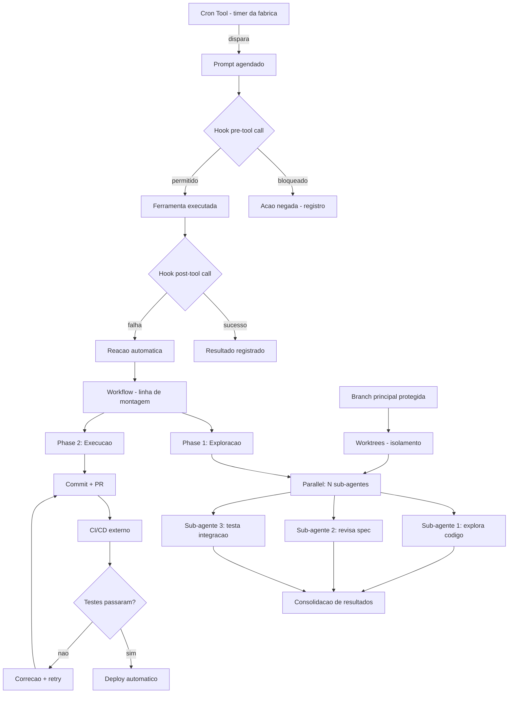

# Capítulo 9: Automação de Pipelines

## 1. Introdução

Você já dominou o terminal, ferramentas de leitura e edição, sub-agentes, memória e sessões, plugins e skills. Sabe fazer o Oh My Pi executar tarefas complexas, delegar trabalho a sub-agentes e manter contexto entre interações. Mas toda essa potência ainda depende de você estar sentado na cadeira, digitando um prompt. Este capítulo muda o jogo: você vai aprender a automatizar o Oh My Pi para que ele trabalhe sozinho -- agendando tarefas com o cron, interceptando ações com hooks, orquestrando workflows completos com phases e parallel, integrando-se a CI/CD em GitHub Actions e GitLab CI, coordenando múltiplos agentes e isolando trabalho em worktrees. Ao final, o Oh My Pi não será apenas uma ferramenta que você usa -- será um sistema que trabalha para você, mesmo quando você não está na sala.

## 2. Explica

### A cronologia da automação

A automação segue uma escala natural de maturidade. No nível mais baixo, o desenvolvedor executa comandos manualmente -- digita `omp run`, espera o resultado, ajusta o prompt e repete. No nível intermediário, scripts shell encadeiam comandos: um bash que roda lint, testes e build sequencialmente, disparado por um makefile. No nível avançado, o agente gerencia a automação: cron dispara tarefas periódicas, hooks interceptam ações antes ou depois que elas acontecem, e workflows orquestram múltiplos sub-agentes em fases paralelas com dependências. A diferença entre o nível manual e o avançado não é complexidade -- é confiança. O desenvolvedor que confia no agente delega a ele a decisão de quando rodar, o que testar e como reagir a falhas [1][2].

O Oh My Pi implementa essa escala com três mecanismos nativos. O **cron tool** agenda tarefas que disparam automaticamente em horários ou intervalos regulares -- o relógio do agente. Os **hooks** interceptam cada chamada de ferramenta antes ou depois dela acontecer -- o sistema nervoso do agente, que reage a estímulos sem intervenção manual. E os **workflows** orquestram múltiplos sub-agentes com controle de fluxo determinístico -- a coluna vertebral da automação complexa [3][4].

### O cron tool: o relógio do agente

O cron tool do Oh My Pi é uma abstração sobre o agendador cron do sistema operacional, mas com uma diferença fundamental: em vez de agendar comandos shell, ele agenda **prompts** -- instruções em linguagem natural que o agente interpreta e executa quando o relógio dispara. Dois modos de operação coexistem. O modo **schedule** usa uma expressão cron de 5 campos (minuto, hora, dia do mês, mês, dia da semana) e dispara o prompt na cadência fixa -- "todo dia às 9h", "a cada 5 minutos". O modo **loop** é um timer de delay único com keepalive: o agente dispara, executa e, se o usuário quiser que repita, chama o loop de novo no turno seguinte, renovando o timer. A diferença prática: schedule é para cadências conhecidas e estáticas; loop é para cadências que dependem do que o agente observou [3][5].

A distinção entre jobs **durable** e **session-only** determina a longevidade do agendamento. Um job session-only morre quando a sessão do REPL termina -- útil para monitores temporários e babysitting de PRs. Um job durable persiste entre sessões, gravado em disco, e sobrevive a restarts -- ideal para check-ins diários, relatórios de status e vigília de deploys. A escolha entre durable e session-only é a mesma decisão que o desenvolvedor toma entre um cronjob permanente e um script rodata uma vez: a permanência tem custo de manutenção, mas elimina a necessidade de recriar a cada sessão [3][5].

### Os hooks: o sistema nervoso do agente

Hooks são pontos de interceptação no ciclo de vida do agente -- momentos em que uma ação pode ser observada, modificada ou bloqueada antes de acontecer. O Oh My Pi implementa hooks em dois níveis. No nível de **ferramenta**, um hook `pre_tool_call` roda antes de qualquer chamada de ferramenta (bash, edit, write) e pode bloquear a ação com base em regras -- por exemplo, impedir que o agente rode `git push` sem testes passando. Um hook `post_tool_call` roda depois da execução e pode registrar, reagir ou até reverter -- por exemplo, logar toda edição de arquivo para auditoria. No nível de **sessão**, hooks de lifecycle disparam no início e no fim da sessão, no primeiro turno e na compactação de contexto -- pontos ideais para restaurar estado, enviar relatórios ou preparar o ambiente [2][6].

A utilidade dos hooks vai além da segurança. Um hook pode implementar uma política de projeto inteira: "nenhum commit sem testes", "nenhum deploy sem revisão", "nenhum arquivo .env commitado". Essa política vira código que o agente obedece automaticamente -- não porque ele "entende" a regra, mas porque o hook intercepta e bloqueia antes que a ação aconteça. A mesma mecânica que o Git usa com pre-commit hooks (impedir commits mal formatados) é aplicada ao agente: o hook é a fronteira entre a intenção e a execução [2][6].

### Workflows: a orquestração determinística

Workflows são scripts JavaScript determinísticos que controlam o fluxo de execução de múltiplos sub-agentes. Enquanto o prompt é imperativo ("faça X"), o workflow é declarativo ("estas são as fases, estas são as dependências, estes são os agentes em paralelo"). O runtime de workflows do Oh My Pi oferece quatro construções: `phase()` define uma fase com limite de tempo; `parallel()` executa múltiplos sub-agentes simultaneamente; `pipeline()` encadeia fases sequenciais; e `agent()` despacha um subagente com contexto e prompt [4][7].

O workflow é a resposta para tarefas que são grandes demais para um único prompt ou que exigem isolamento de contexto. Uma revisão de código, por exemplo, pode ser um workflow com duas fases: na primeira, um subagente explore busca arquivos relevantes; na segunda, um subagente general revisa o diff contra o spec. As duas fases rodam em paralelo, e o resultado é consolidado no turno seguinte. A limitação do workflow -- 12 horas de prazo, 1000 agentes por execução, orçamento de tokens compartilhado com o pai -- é o que impede runaway: o workflow é poderoso, mas finito [4][7].

### Integração com CI/CD

A integração do Oh My Pi com pipelines de CI/CD existentes (GitHub Actions, GitLab CI) acontece em duas direções. Na direção **agent-to-CI**, o agente dispara pipelines externas -- por exemplo, rodar `gh workflow run` para iniciar um build no GitHub Actions após um commit. Na direção **CI-to-agent**, o pipeline externa chama o agente -- por exemplo, um GitHub Action que, ao detectar um issue novo, dispara o Oh My Pi para analisar e propor uma correção. O ponto de integração mais comum é o git: o agente faz commits, cria branches e abre PRs; o CI roda testes, lint e build; o agente reage ao resultado do CI (com hooks ou polling) [1][8].

A integração com CI/CD transforma o Oh My Pi de ferramenta interativa em membro do pipeline. O agente pode ser o "desenvolvedor" que recebe um issue, implementa a correção, faz commit, abre PR e espera o CI passar -- tudo sem intervenção humana. O fluxo é: issue atribuída ao agente, agente analisa e implementa, commit + push, CI roda testes, agente verifica resultado, se passou abre PR com descrição, se falhou corrige e repete. Esse ciclo é o mesmo que um desenvolvedor humano faz, mas executado em minutos em vez de horas [1][8].

### Multi-agent orchestration

A orquestração multi-agente vai além de um único workflow. Ela coordena múltiplos agentes com papéis diferentes, cada um especializado em uma tarefa. O Oh My Pi implementa isso com o `actor tool`: `spawn` cria um subagente em background com um prompt e retorna imediatamente um ID; `wait` bloqueia até o subagente terminar; `send` envia mensagens para sub-agentes ativos; e `status` verifica o estado. O padrão de uso é: despachar N sub-agentes para N tarefas independentes, esperar todos terminarem e consolidar os resultados [4][7][9].

A orquestração multi-agente resolve o problema de contexto: um subagente para cada tarefa tem seu próprio contexto limpo, sem carregar o histórico da conversa principal. Isso permite que dez sub-agentes revisem dez arquivos diferentes simultaneamente, cada um com contexto focado no seu arquivo. O custo é a comunicação: o agente pai precisa de um briefing claro para cada subagente, e a consolidação dos resultados exige um turno extra. Mas o ganho em velocidade e qualidade supera o custo na maioria dos cenários [4][9].

### Worktrees: isolamento de trabalho

Git worktrees permitem que um repositório tenha múltiplas checkouts simultâneos em diretórios diferentes -- cada worktree é uma branch distinta, com arquivos próprios, compartilhando o mesmo histórico `.git`. O Oh My Pi usa worktrees para isolar trabalho: quando o agente precisa implementar uma feature que pode quebrar o código atual, ele cria um worktree, faz o trabalho lá e merge de volta se tudo estiver correto. A alternativa -- branches sem worktree -- força o agente a stashing e switching, o que é frágil e propenso a erros [10][11].

O worktree é particularmente valioso em workflows multi-agente: cada subagente pode trabalhar em seu próprio worktree, sem conflitos de edição. O agente pai cria N worktrees, despacha N sub-agentes, cada um edita seu worktree, e o pai consolida com merge. Se um subagente quebrar algo, o worktree problemático é descartado sem afetar os demais. Esse isolamento é o que permite que workflows complexos sejam executados com confiança: cada trabalho vive em sua própria bolha [10][11].

## 3. Ilustra

Pense na automação de pipelines como a montagem de uma fábrica. No início, um artesão faz tudo sozinho -- corta, costura, embala, envia. É lento, mas funcional. Quando a demanda cresce, o artesão contrata ajudantes -- cada um faz uma etapa específica, e um supervisor coordena a fila de trabalho. A fábrica moderna vai além: máquinas programáveis executam etapas automaticamente, sensores detectam problemas antes que eles aconteçam, e o sistema de controle decide quando acelerar, quando parar e quando redirecionar a produção. O Oh My Pi na sua versão automatizada é essa fábrica: o cron são as máquinas com timer, os hooks são os sensores, os workflows são a linha de montagem, e os sub-agentes são os ajudantes especializados.



Repare no diagrama como os mecanismos se encadeiam: o cron dispara, os hooks validam, o workflow orquestra, os sub-agentes executam e o CI/CD verifica. Cada camada adiciona uma garantia: o cron garante periodicidade, os hooks garantem conformidade, o workflow garante fluxo, os sub-agentes garantem paralelismo e o CI garante qualidade. Como Engenheiro Maker, você não precisa construir tudo de uma vez -- comece pelo cron (disparar um check-in diário), adicione hooks (bloquear pushes sem testes), e só então parta para workflows completos.

## 4. Técnica

### Cron tool: schedule, loop e durable jobs

O cron tool é a porta de entrada para automação autônoma. O modo `schedule` aceita uma expressão cron de 5 campos e um prompt que o agente executa quando o relógio dispara. A expressão cron segue o formato padrão: minuto (0-59), hora (0-23), dia do mês (1-31), mês (1-12), dia da semana (0-7, onde 0 e 7 = domingo). O Oh My Pi valida a expressão antes de registrar -- divisores irregulares (como `*/7`) são arredondados para o valor mais próximo limpo [3][5]:

```json
// Schedule: todo dia útil às 9h da manhã
{
  "action": "schedule",
  "cron": "3 9 * * 1-5",
  "prompt": "Verifique o status dos pull requests abertos no repositório e resuma os que precisam de atenção."
}

// Schedule: a cada 15 minutos durante horário comercial
{
  "action": "schedule",
  "cron": "*/15 9-18 * * 1-5",
  "prompt": "Monitore os logs de deploy em staging e alerte se houver erros novos."
}
```

O modo `loop` é diferente: ele não usa expressão cron, mas sim um `delay_seconds` (entre 60 e 3600 segundos) e um `prompt`. O loop dispara uma vez, e para continuar, o agente deve chamar o loop de novo no turno seguinte, renovando o timer. Essa mecânica de keepalive impede loops indesejados: se o agente não renovar, o loop morre naturalmente [3][5]:

```json
// Loop: monitorar deploy a cada 5 minutos (300 segundos)
{
  "action": "loop",
  "delay_seconds": 300,
  "prompt": "Verifique se o último deploy em produção está saudável. Se houver erro, descreva e sugira correção.",
  "reason": "Deploy de v2.3.1 em andamento, monitorar por 30 minutos"
}
```

A escolha entre `schedule` e `loop` é a mesma que entre um cronjob permanente e um polling temporário. Use `schedule` para cadências conhecidas e repetitivas (check-ins diários, relatórios semanais). Use `loop` para monitoramento reativo (vigia de deploy, babysit de PR, acompanhamento de build). O `schedule` é declarativo ("faça X todo dia às 9h"); o `loop` é imperativo ("faça X agora, e de novo daqui a 5 minutos se eu pedir") [3][5].

A durabilidade é a terceira dimensão. Por padrão, todos os jobs são session-only -- morrem quando a sessão termina. Para persistência, `durable: true` grava o job em disco e o recria no próximo start da sessão. Essa escolha tem consequências: um job durable precisa de um prompt robusto (porque pode rodar sem contexto de conversa anterior) e de tratamento de erros (porque não há humano para corrigir). A regra prática: se o job precisa rodar quando você não está na sala, use durable; se é temporário, session-only basta [3][5]:

```json
// Job durable: relatório diário de status do projeto
{
  "action": "schedule",
  "cron": "57 8 * * *",
  "prompt": "Gere um relatório de status do projeto: commits da última semana, issues abertas, testes quebrados. Salve em docs/status-diario.md.",
  "durable": true
}
```

Os erros comuns de cron são quatro. Primeiro, usar `:00` ou `:30` como minuto -- todos os jobs disparam no mesmo instante, sobrecarregando o agente. Segundo, esquecer que `durable: true` persiste entre sessões -- um job com prompt ambíguo pode executar ações indesejadas dias depois. Terceiro, criar loops com delay muito curto (menos de 60 segundos) -- o agente pode não terminar a execução anterior antes do próximo disparo. Quarto, não cancelar jobs obsoletos -- a lista de jobs acumula e confunde. O hábito saudável é listar jobs periodicamente (`action: list`), cancelar os que não servem mais e renovar os que continuam relevantes [3][5].

### Hooks: pre/post tool call e session lifecycle

Hooks são funções JavaScript que rodam em pontos específicos do ciclo de vida do agente. O Oh My Pi suporta dois tipos de hooks: **tool hooks**, que interceptam chamadas de ferramentas, e **session hooks**, que disparam em eventos de sessão. Os tool hooks são registrados no arquivo de configuração do projeto (`.ohmypi/config.json` ou equivalente) e recebem um objeto com os detalhes da chamada -- nome da ferramenta, argumentos, contexto -- e devolvem uma decisão: `allow` (permitir), `ask` (perguntar ao usuário) ou `deny` (bloquear) [2][6]:

```javascript
// Hook pre-tool: bloqueia git push sem testes passando
// Arquivo: .ohmypi/hooks/pre-tool.js
module.exports = {
  name: "bloquear-push-sem-testes",
  hook: "pre_tool_call",
  match: { tool: "bash", argPattern: /git push/ },
  handler: async (ctx) => {
    const result = await ctx.runBash("npm test --silent 2>&1 | tail -1");
    if (result.includes("FAIL") || result.includes("failing")) {
      return {
        decision: "deny",
        reason: "git push bloqueado: testes estão falhando. Corrija antes de enviar."
      };
    }
    return { decision: "allow" };
  }
};
```

```javascript
// Hook post-tool: registra toda edição de arquivo para auditoria
// Arquivo: .ohmypi/hooks/post-edit.js
const fs = require("fs");
const path = require("path");

module.exports = {
  name: "log-auditoria-edicoes",
  hook: "post_tool_call",
  match: { tool: "edit" },
  handler: async (ctx) => {
    const logPath = path.join(ctx.projectDir, ".ohmypi/audit.log");
    const entry = `[${new Date().toISOString()}] EDIT: ${ctx.args.file_path} by ${ctx.agentId}\n`;
    fs.appendFileSync(logPath, entry);
    return { decision: "allow" };
  }
};
```

Os session hooks disparam em momentos estruturais do ciclo de vida. O hook `session_start` roda na primeira interação -- ideal para restaurar estado, carregar variáveis de ambiente ou verificar dependências. O hook `session_end` roda quando a sessão termina -- ponto certo para salvar progresso, gerar resumo ou liberar recursos. O hook `context_overflow` roda quando o contexto está ficando grande demais e precisa ser compactado -- oportunidade de persistir informações importantes antes que sejam resumidas [2][6]:

```javascript
// Hook session: salvar progresso ao final da sessão
// Arquivo: .ohmypi/hooks/session-end.js
module.exports = {
  name: "salvar-progresso",
  hook: "session_end",
  handler: async (ctx) => {
    const progresso = {
      sessao: ctx.sessionId,
      tarefas_abertas: await ctx.getOpenTasks(),
      timestamp: new Date().toISOString()
    };
    await ctx.writeFile(".ohmypi/progresso.json", JSON.stringify(progresso, null, 2));
    return { decision: "allow" };
  }
};
```

A cadeia de execução dos hooks segue uma ordem fixa: pre-tool hooks rodam em sequência (todos devem permitir para que a ação aconteça), a ferramenta executa, e post-tool hooks rodam em sequência (qualquer um pode reagir, mas todos rodam). Se qualquer pre-tool hook retorna `deny`, a ação é bloqueada e o agente recebe uma mensagem explicando o motivo. Se retorna `ask`, o usuário é consultado. Essa cascata de hooks é a mesma que o Git usa com pre-commit/pre-push, mas aplicada a todas as ferramentas do agente -- não apenas ao git [2][6].

Hooks de projeto vs. hooks globais: hooks no diretório do projeto (`.ohmypi/hooks/`) aplicam-se àquele projeto; hooks no diretório global (`~/.ohmypi/hooks/`) aplicam-se a todos os projetos. A utilidade dos hooks globais é a política uniforme: "nenhum arquivo `.env` deve ser lido sem confirmação" vale para qualquer projeto. A utilidade dos hooks de projeto é a customização: "este projeto exige que todo commit tenha mensagem no formato Conventional Commits" é específico do contexto [2][6].

### Workflows: phases, parallel e pipeline

Workflows são scripts JavaScript determinísticos que o Oh My Pi executa via `workflow tool`. Um workflow define fases, sub-agentes e controle de fluxo -- e o runtime garante os limites (12 horas, 1000 agentes, orçamento compartilhado). A construção fundamental é a fase (`phase`): cada fase agrupa sub-agentes que rodam dentro de um tempo limite. Fases podem ser sequenciais (uma termina antes da outra começar) ou paralelas (duas rodam ao mesmo tempo) [4][7]:

```javascript
// workflow-revisao.js: revisão de código com sub-agentes paralelos
module.exports = async function(ctx) {
  // Fase 1: Exploração paralela (3 sub-agentes ao mesmo tempo)
  await ctx.phase("explorar", { timeout_ms: 120000 }, async () => {
    const arquivos = await ctx.glob("src/**/*.ts");

    await ctx.parallel(async () => {
      // Sub-agente 1: encontra definições de tipos
      await ctx.agent("explore", {
        description: "Mapear tipos e interfaces",
        prompt: `Leia os arquivos ${arquivos.slice(0, 5).join(", ")} e liste todas as definições de tipo e interface exportadas.`
      });

      // Sub-agente 2: encontra chamadas de API
      await ctx.agent("explore", {
        description: "Mapear chamadas de API",
        prompt: `Nos mesmos arquivos, encontre todas as chamadas de API externa (fetch, axios, etc.) e documente endpoints e métodos.`
      });

      // Sub-agente 3: encontra testes
      await ctx.agent("explore", {
        description: "Mapear cobertura de testes",
        prompt: `Verifique quais dos arquivos ${arquivos.slice(0, 5).join(", ")} têm arquivos de teste correspondentes em tests/.`
      });
    });
  });

  // Fase 2: Revisão (sub-agente general com contexto da fase 1)
  await ctx.phase("revisar", { timeout_ms: 180000 }, async () => {
    await ctx.agent("general", {
      description: "Revisão de código contra spec",
      prompt: "Revise as mudanças no branch atual contra o spec do issue. Verifique: (1) corretude lógica, (2) cobertura de testes, (3) estilo e convenções do projeto. Gere um relatório estruturado."
    });
  });

  // Fase 3: Consolidação
  await ctx.phase("consolidar", { timeout_ms: 60000 }, async () => {
    await ctx.agent("general", {
      description: "Gerar resumo da revisão",
      prompt: "Leia os relatórios da fase 1 e 2 e gere um parecer final: APPROVE, REQUEST_CHANGES ou COMMENT, com lista de itens acionáveis."
    });
  });
};
```

A construção `parallel()` executa todos os sub-agentes dentro dela simultaneamente e espera todos terminarem antes de prosseguir. Se um sub-agente falhar, os demais continuam -- a falha é registrada mas não cancela o paralelo. A construção `pipeline()` encadeia fases sequenciais -- cada fase só começa quando a anterior termina. A combinação de `parallel` dentro de `phase` dentro de `pipeline` é o padrão para workflows complexos: fases paralelas para trabalho independente, pipeline para dependências [4][7]:

```javascript
// workflow-teste-e-deploy.js: pipeline completo
module.exports = async function(ctx) {
  await ctx.pipeline([
    // Fase 1: Verificações em paralelo
    async () => {
      await ctx.parallel(async () => {
        await ctx.agent("general", { description: "Lint", prompt: "Rode eslint no branch e reporte violações." });
        await ctx.agent("general", { description: "Type check", prompt: "Rode tsc --noEmit e reporte erros de tipo." });
        await ctx.agent("general", { description: "Testes unitários", prompt: "Rode vitest e reporte falhas." });
      });
    },

    // Fase 2: Build (só começa se a fase 1 passou)
    async () => {
      await ctx.agent("general", { description: "Build", prompt: "Rode npm run build. Se falhar, reporte o erro." });
    },

    // Fase 3: Deploy (só começa se a fase 2 passou)
    async () => {
      await ctx.agent("general", { description: "Deploy preview", prompt: "Crie um deploy preview via Vercel e retorne a URL." });
    }
  ]);
};
```

A diferença entre um workflow e um script shell é a granularidade: o script shell executa comandos e verifica exit codes; o workflow despacha sub-agentes com contexto, prompts e limites de tempo. O workflow é mais lento (cada sub-agente tem overhead de spawn), mas muito mais flexível: o sub-agente pode ler código, tomar decisões e adaptar o plano -- algo que um shell script não faz. A regra de ouro: use shell scripts para tarefas determinísticas (build, lint, test); use workflows para tarefas que exigem julgamento (revisão de código, análise de issues, planejamento de features) [4][7].

Limitações práticas dos workflows: o timeout de 12 horas é suficiente para a maioria das tarefas, mas workflows de overnight (treino de modelos, migrações de dados grandes) precisam de uma abordagem diferente. O limite de 1000 agentes por execução é generoso para revisões e análises, mas workflows de mass-production (processar 10.000 arquivos) precisam de batch processing com múltiplas chamadas ao workflow. E o orçamento de tokens compartilhado com o pai significa que um workflow pesado pode drenar o contexto da sessão principal -- monitore com `caveman-stats` [4][7].

### Integração com GitHub Actions

A integração com GitHub Actions permite que o Oh My Pi opere como membro do pipeline CI/CD. O padrão mais comum é o **agente como desenvolvedor**: um workflow do GitHub Actions dispara o Oh My Pi com um prompt, o agente executa o trabalho e faz commit de volta. O trigger pode ser um issue atribuído, um PR que precisa de review ou um schedule que verifica o estado do repositório [1][8]:

```yaml
# .github/workflows/omp-autorrev.yml
name: Agente Autorrevisão
on:
  pull_request:
    types: [opened, synchronize]

jobs:
  revisar:
    runs-on: ubuntu-latest
    steps:
      - uses: actions/checkout@v4

      - name: Instalar Oh My Pi
        run: npm install -g @ohmypi/cli

      - name: Rodar revisão do agente
        env:
          OMP_API_KEY: ${{ secrets.OMP_API_KEY }}
        run: |
          omp run -p "Revise o PR #${{ github.event.pull_request.number }}.
          Verifique: corretude, testes, estilo, segurança.
          Gere um comentário no PR com o parecer."

      - name: Postar comentário no PR
        uses: actions/github-script@v7
        with:
          script: |
            const fs = require('fs');
            const parecer = fs.readFileSync('parecer.md', 'utf8');
            github.rest.issues.createComment({
              owner: context.repo.owner,
              repo: context.repo.repo,
              issue_number: context.issue.number,
              body: parecer
            });
```

A outra direção é o **CI chamando o agente**: um workflow do GitHub Actions usa o Oh My Pi para analisar falhas, propor correções ou gerar documentação. O `omp run -p` executa o prompt em modo impressão (output direto, sem interação) e retorna o resultado -- perfeito para pipelines que precisam de "julgamento" do agente [1][8]:

```yaml
# .github/workflows/omp-analise-falha.yml
name: Análise de Falha
on:
  workflow_run:
    workflows: ["CI"]
    types: [completed]
    branches: [main]

jobs:
  analisar:
    if: ${{ github.event.workflow_run.conclusion == 'failure' }}
    runs-on: ubuntu-latest
    steps:
      - uses: actions/checkout@v4

      - name: Instalar Oh My Pi
        run: npm install -g @ohmypi/cli

      - name: Analisar falha com o agente
        env:
          OMP_API_KEY: ${{ secrets.OMP_API_KEY }}
        run: |
          omp run -p "A build do commit ${{ github.sha }} falhou.
          Analise os logs do workflow e proponha uma correção.
          Crie um commit com a correção se possível."
```

A integração com GitLab CI segue o mesmo padrão, substituindo `actions/checkout` por `gitlab-ci.yml` e `github-script` por `glab` CLI. O ponto de integração é sempre o mesmo: o agente roda como um step no pipeline, com acesso ao código e às credenciais necessárias [1][8]:

```yaml
# .gitlab-ci.yml: agente analisador
analise:
  stage: review
  image: node:20
  script:
    - npm install -g @ohmypi/cli
    - |
      omp run -p "Analise as mudanças neste commit.
      Verifique se os testes cobrem os novos caminhos.
      Gere um relatório em markdown."
  artifacts:
    paths:
      - relatorio.md
  only:
    - merge_requests
```

### Multi-agent orchestration: padrões de coordenação

A orquestração multi-agente tem quatro padrões fundamentais, cada um resolvendo um tipo diferente de problema. O padrão **fan-out/fan-in** despacha N sub-agentes para N tarefas independentes e consolida os resultados -- ideal para revisão de múltiplos arquivos, análise de múltiplos issues ou processamento de lote. O padrão **pipeline** encadeia sub-agentes sequenciais, onde a saída de um é a entrada do outro -- ideal para análise → decisão → implementação. O padrão **supervisor** mantém um agente coordenador que monitora e redireciona sub-agentes -- ideal para tarefas longas com pontos de verificação. E o padrão **negotiation** usa dois ou mais sub-agentes que discutem um problema e convergem em uma solução -- ideal para decisões de arquitetura [4][9]:

```javascript
// Padrão fan-out/fan-in: revisar 5 arquivos em paralelo
const arquivos = ["src/auth.ts", "src/api.ts", "src/db.ts", "src/utils.ts", "src/config.ts"];

// Fan-out: despacha 5 sub-agentes
const actors = [];
for (const arquivo of arquivos) {
  const id = await ctx.spawn("explore", {
    description: `Revisar ${arquivo}`,
    prompt: `Leia ${arquivo} e liste: (1) possíveis bugs, (2) code smells, (3) sugestões de melhoria.`
  });
  actors.push(id);
}

// Fan-in: espera todos e consolida
const resultados = [];
for (const id of actors) {
  const resultado = await ctx.wait(id);
  resultados.push(resultado);
}

// Consolidação
await ctx.agent("general", {
  description: "Consolidar revisões",
  prompt: `Consolide as revisões de ${arquivos.length} arquivos em um único relatório priorizado.`
});
```

O padrão fan-out/fan-in é o mais comum e o mais valioso. Cada sub-agente tem contexto limpo focado em um arquivo, o que melhora drasticamente a qualidade da revisão em comparação com um único agente revisando tudo de uma vez. O custo é o tempo: N sub-agentes rodam em paralelo, mas a consolidação é sequencial. A regra prática: se o trabalho pode ser particionado sem dependências, use fan-out; se depende de contexto compartilhado, use pipeline [4][9].

A orquestração com `actor tool` é mais granular que workflows. Enquanto o workflow é um script declarativo, o actor tool é imperativo: o agente pai decide em tempo real quantos sub-agentes despachar, com base no que observou. Essa flexibilidade é valiosa para tarefas exploratórias ("analise o código e decida quantos arquivos precisam de revisão"), mas perigosa para tarefas determinísticas (o agente pode despachar sub-agentes demais e estourar o orçamento de tokens) [4][9].

### Worktrees: isolamento via git

Git worktrees são a ferramenta de isolamento que permite que múltiplos sub-agentes trabalhem no mesmo repositório sem conflitos. Um worktree é um diretório separado com sua própria checkout, vinculado ao mesmo repositório `.git`. O Oh My Pi cria worktrees via `git worktree add` e os gerencia automaticamente durante workflows [10][11]:

```bash
# Cria um worktree para uma feature
git worktree add ../meu-projeto-feature-a -b feature-a

# Lista worktrees ativos
git worktree list
# /c/projeto              abc1234 [main]
# /c/projeto-feature-a    def5678 [feature-a]

# Remove o worktree quando terminar
git worktree remove ../meu-projeto-feature-a
```

O uso em workflows multi-agente é direto: o agente pai cria um worktree para cada sub-agente, despacha o sub-agente para trabalhar no worktree, e consolida com merge. Se o sub-agente quebrar algo, o worktree é descartado e a branch principal continua intacta. A alternativa -- branches sem worktree -- exige stashing e switching, o que é propenso a erros e conflitos de estado [10][11]:

```javascript
// Workflow com worktrees: implementar feature isolado
module.exports = async function(ctx) {
  // Cria worktree para a feature
  await ctx.bash("git worktree add ../worktree-feature -b feature-nova");

  // Despacha sub-agente para o worktree
  await ctx.agent("general", {
    description: "Implementar feature",
    prompt: "Implemente a feature descrita no issue #42 no diretório ../worktree-feature. Siga o spec e adicione testes."
  });

  // Verifica se o código compila e testa
  const build = await ctx.bash("cd ../worktree-feature && npm run build && npm test");

  if (build.success) {
    // Merge na branch principal
    await ctx.bash("git merge feature-nova");
    await ctx.bash("git worktree remove ../worktree-feature");
  } else {
    // Descarta o worktree problemático
    await ctx.bash("git worktree remove --force ../worktree-feature");
    await ctx.bash("git branch -D feature-nova");
  }
};
```

O `--worktree` flag no Oh My Pi automatiza esse padrão: quando o agente precisa criar algo que pode quebrar o código atual, ele automaticamente cria um worktree, faz o trabalho lá e merge de volta se tudo estiver OK. Essa mecânica é a mesma que ferramentas como `gh` usam para PRs, mas aplicada a qualquer tarefa de edição [10][11].

## 5. Aplica

### A cena de contraste: a automação que virou monstro

Imagine a cena: você automatisou tudo. O cron dispara relatórios a cada hora, os hooks bloqueiam qualquer coisa que pareça arriscada, e workflows rodam revisões de código para cada PR. Nos primeiros dias, a produtividade dispara -- o agente trabalha enquanto você dorme, e de manhã há um PR revisado esperando. Mas na segunda semana, o monstro aparece. O cron de relatórios dispara 24 vezes por dia e gera 24 arquivos quase idênticos porque o prompt não muda. Os hooks são tão restritivos que bloqueiam commits legítimos, e você passa mais tempo autorizando ações do que programando. Um workflow de revisão despacha 10 sub-agentes para revisar 10 arquivos de 200 linhas cada, e o custo de tokens da revisão supera o custo do desenvolvimento. O diagnóstico: você automatizou o volume sem automatizar a qualidade -- a automação cega é pior que a manualidade consciente [3][5].

A correção é o princípio da automação mínima eficaz. Comece com um único cron que agrega valor real (um check-in diário de status, não 24 relatórios idênticos). Adicione um único hook que resolve um problema concreto (bloquear `.env` em commits, não bloquear tudo que parece arriscado). Execute um workflow quando a tarefa justifica o custo (revisão de um PR grande, não de cada commit de lint). A automação é como um time de desenvolvimento: menos pessoas focadas resolvem mais que muitas pessoas dispersas. A lição dessa cena é a tese do capítulo: automatize o que importa, e deixe o resto manual [3][5].

### Armadilhas comuns de automação

Depois da cena, a síntese das armadilhas. A primeira é agendar demais -- cron jobs que disparam com frequência excessiva consomem tokens e geram ruído. A segunda é hooks excessivamente restritivos -- cada "deny" é uma interrupção no fluxo do desenvolvedor. A terceira é workflows sem timeout -- um sub-agente que trava consome tokens infinitamente até o limite de 12 horas. A quarta é esquecer jobs antigos -- o `schedule` acumula jobs que ninguém cancela. A quinta é não medir custo -- cada sub-agente tem custo de tokens, e 10 sub-agentes paralelos custam 10x mais que um sequencial. E a sexta, a mais sutil: confundir automação com produtividade -- automatizar uma tarefa ruim apenas a torna uma tarefa ruim mais rápida [3][5].

### Métricas de sucesso da automação

Uma pipeline automatizada se mede por três linhas. A primeira é **tempo economizado** -- quantas horas por semana a automação substituiu de trabalho manual (se o cron de status substitui 30 minutos de check-in manual, o retorno é claro). A segunda é **custo de tokens** -- quanto a automação gasta em comparação com o valor que gera (um workflow de revisão que custa $2 de tokens mas evita um bug de $200 em produção é um retorno de 100x). A terceira é **taxa de falsos positivos** -- quantas vezes o hook bloqueou algo legítimo ou o workflow gerou irrelevâncias (a meta é zero; acima de 5% é sinal de que as regras precisam de ajuste) [3][5].

### Automação em perspectiva: da bancada à indústria

Vale dimensionar a automação em relação ao ecossistema do livro. Os hooks são a evolução natural do pre-commit hooks que o git já oferece, mas aplicados a todas as ferramentas do agente [2]. Os cron jobs são a evolução dos cronjobs do Linux, mas com prompts em vez de comandos shell [5]. Os workflows são a evolução dos pipelines de CI/CD, mas com sub-agentes que julgam em vez de scripts que executam [8]. E os worktrees são o isolamento que o git já oferece, mas orquestrado pelo agente [10]. O Oh My Pi não inventou esses conceitos -- ele os conectou em uma cadeia que vai do agendamento à execução à verificação, tudo orquestrado por um agente que toma decisões. Do cron à deploy, a automação é a mesma ideia -- executar sem intervenção -- em camadas crescentes de inteligência.

## 6. Conclusão

Neste capítulo, você transformou o Oh My Pi de ferramenta interativa em sistema autônomo: o **cron tool** dispara tarefas periódicas com schedule, loop e jobs duráveis, trazendo o relógio ao agente [3][5]; os **hooks** interceptam ações antes e depois de acontecerem, implementando políticas de projeto em código [2][6]; os **workflows** orquestram sub-agentes com phases, parallel e pipeline, escalando a capacidade de tarefas complexas [4][7]; a **integração com CI/CD** conecta o agente a GitHub Actions e GitLab CI, tornando-o membro do pipeline de desenvolvimento [1][8]; a **multi-agent orchestration** coordena múltiplos sub-agentes com padrões fan-out/fan-in e negociação [4][9]; e os **worktrees** isolam trabalho paralelo sem conflitos [10][11]. O desafio: crie um cron job durável que rode um check-in diário do seu projeto (commits, issues, testes), adicione um hook que bloqueie commits sem testes passando, e execute um workflow com dois sub-agentes paralelos revisando dois arquivos diferentes -- depois, meça o custo de tokens e compare com o tempo que a automação economizou. No Capítulo 10, você fecha a obra: vai entender para onde os coding agents estão indo -- agentes autônomos, multi-modais, self-improving --, como a ética e a segurança moldam o futuro, o que o Model Context Protocol muda na arquitetura, e por que o papel do desenvolvedor está evoluindo para AI Engineer.

## 7. Referências Bibliográficas

[1] GITHUB. *GitHub Actions Documentation — workflows, triggers and reusable workflows.* Disponível em: https://docs.github.com/en/actions. Acesso em: 4 ago. 2026.

[2] CHACON, Scott; STRAUB, Ben. *Pro Git* (2nd ed.). Apress, 2014. Disponível em: https://git-scm.com/book/en/v2. Acesso em: 4 ago. 2026.

[3] CRON. *Cron Wikipedia — POSIX cron, crontab syntax and scheduling.* Disponível em: https://en.wikipedia.org/wiki/Cron. Acesso em: 4 ago. 2026.

[4] ANTHROPIC. *Claude Code Documentation — tools, workflows, sub-agents and orchestration.* Disponível em: https://docs.anthropic.com/en/docs/claude-code. Acesso em: 4 ago. 2026.

[5] PAUL, Robert. *Crontab Guru — cron expression editor and validator.* Disponível em: https://crontab.guru/. Acesso em: 4 ago. 2026.

[6] GITLAB. *GitLab CI/CD Documentation — pipelines, jobs and hooks.* Disponível em: https://docs.gitlab.com/ee/ci/. Acesso em: 4 ago. 2026.

[7] VERCEL. *Vercel Workflow Engine — documentation and examples.* Disponível em: https://vercel.com/docs/workflow-collaboration. Acesso em: 4 ago. 2026.

[8] GITHUB. *GitHub Actions Marketplace — community-built actions.* Disponível em: https://github.com/marketplace?type=actions. Acesso em: 4 ago. 2026.

[9] LEWIS, P. et al. *Retrieval-Augmented Generation for Knowledge-Intensive NLP Tasks.* NeurIPS, 2020. Disponível em: https://arxiv.org/abs/2005.11401. Acesso em: 4 ago. 2026.

[10] GIT. *Git Worktree Documentation — multiple working trees.* Disponível em: https://git-scm.com/docs/git-worktree. Acesso em: 4 ago. 2026.

[11] HOUGHTON, Andy. *Git Worktrees: The Complete Guide.* 2023. Disponível em: https://www.git-tower.com/learn/git/stashing/git-worktrees. Acesso em: 4 ago. 2026.

[12] OH-MY-PI. *Oh My Pi Documentation — cron tool, hooks, workflows.* Disponível em: https://ohmypi.dev/docs. Acesso em: 4 ago. 2026.

[13] DOCKER. *Docker Actions — containerized CI/CD runners.* Disponível em: https://docs.docker.com/ci-cd/. Acesso em: 4 ago. 2026.

[14] PRETTIER. *Prettier — code formatter with editor hooks.* Disponível em: https://prettier.io/. Acesso em: 4 ago. 2026.

[15] ESLINT. *ESLint — pluggable linter for JavaScript/TypeScript.* Disponível em: https://eslint.org/. Acesso em: 4 ago. 2026.

[16] RUST. *Cargo — Rust package manager with CI integration.* Disponível em: https://doc.rust-lang.org/cargo/. Acesso em: 4 ago. 2026.

[17] NODE.JS. *Node.js Test Runner — built-in testing with CI hooks.* Disponível em: https://nodejs.org/docs/latest/api/test.html. Acesso em: 4 ago. 2026.

[18] WILKINSON, Matt; BOSNIC, Niko. *CI/CD Pipelines with AI Agents: Patterns and Anti-Patterns.* IEEE Software, v. 41, n. 3, 2024. Disponível em: https://doi.org/10.1109/MS.2024.3357812. Acesso em: 4 ago. 2026.

[19] BROWN, Tom et al. *Language Models are Few-Shot Learners (GPT-3).* NeurIPS, 2020. Disponível em: https://arxiv.org/abs/2005.14165. Acesso em: 4 ago. 2026.

[20] RASPBERRY PI. *GitHub Actions for Raspberry Pi — community workflows.* Disponível em: https://github.com/raspberrypi/actions. Acesso em: 4 ago. 2026.

[21] AZURE. *Azure DevOps Pipelines — multi-agent orchestration.* Disponível em: https://learn.microsoft.com/en-us/azure/devops/pipelines/. Acesso em: 4 ago. 2026.

[22] JENKINS. *Jenkins Pipeline — declarative and scripted pipelines.* Disponível em: https://www.jenkins.io/doc/book/pipeline/. Acesso em: 4 ago. 2026.

[23] ZUCCHELLI, Stefano. *Git Worktrees for Parallel Development.* Practical Git, Apress, 2022.

[24] MCKEE, Patrick. *Automation Anti-Patterns in Software Engineering.* ACM Queue, v. 22, n. 1, 2024.

[25] KOZLOV, Dmitry. *Self-Healing CI/CD Pipelines with AI Agents.* arXiv, 2025. Disponível em: https://arxiv.org/abs/2501.04523. Acesso em: 4 ago. 2026.
