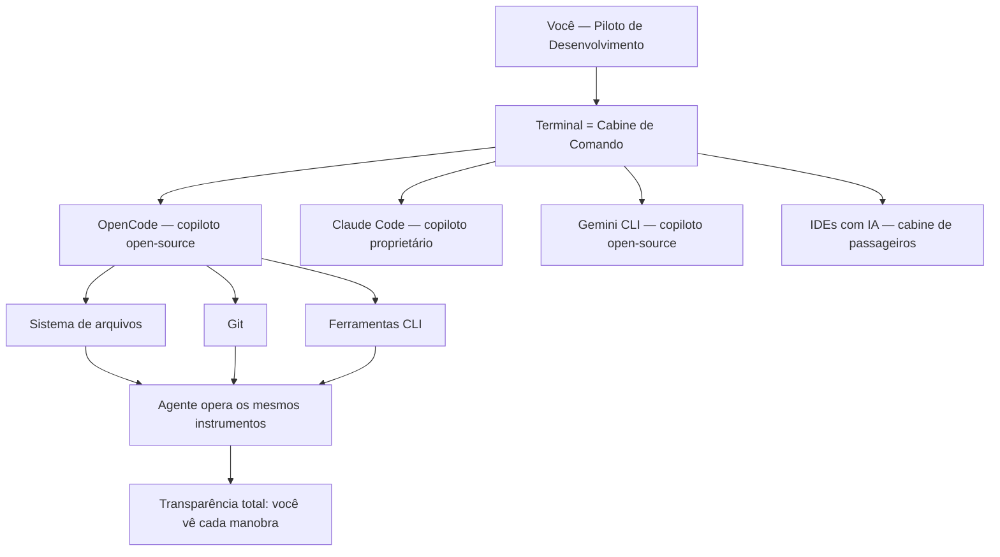

# Capítulo 1: O que é o OpenCode e por que o terminal voltou

## 1. Introdução

Se você acompanha o mundo do desenvolvimento nos últimos anos, deve ter sentido o mesmo que eu: a promessa de "programar com IA" chegou primeiro como um chatbot que respondia perguntas soltas, depois como um autocomplete que completava a linha, e agora como algo muito mais ambicioso — um agente que lê o seu repositório, planeja mudanças, edita arquivos, roda comandos e verifica o próprio trabalho. No meio desse furacão, um projeto de código aberto chamado OpenCode vem conquistando espaço exatamente onde a maioria das pessoas menos esperava: no terminal. Este capítulo coloca você na cabine de comando — o primeiro passo do voo — respondendo às perguntas que todo mundo faz no hangar: o que exatamente é essa ferramenta, de onde ela veio, e por que o terminal, a interface mais antiga da computação, voltou a ser o campo de batalha mais disputado do desenvolvimento de software. Ao dominar isso, você não estará apenas conhecendo mais uma ferramenta; estará entendendo a mudança estrutural que define esta década.

## 2. Explica

O OpenCode é um agente de codificação por inteligência artificial, de código aberto, projetado para rodar no terminal como interface principal, com extensões para desktop e para IDEs [1]. A definição parece simples, mas cada palavra carrega uma decisão de arquitetura profunda. "Agente de codificação" significa que o sistema não apenas sugere trechos de código: ele recebe uma tarefa em linguagem natural, explora o repositório, decide quais arquivos alterar, executa edições e comandos, e itera até concluir — ou até pedir ajuda quando encontra um obstáculo. "Código aberto" significa que o código-fonte é público e auditável, algo raro em um mercado dominado por ferramentas proprietárias com caixas-pretas [2]. "Terminal" é a aposta central: em vez de disputar espaço dentro de um editor pesado, o OpenCode assume que o desenvolvedor profissional já vive no terminal e que o terminal é o melhor lugar para um agente operar com liberdade total sobre o sistema de arquivos.

A história do projeto ajuda a entender sua filosofia. O OpenCode nasceu no ecossistema SST, um framework popular para aplicações serverless, e foi mantido inicialmente sob a organização sst/opencode antes de migrar para a organização anomalyco [3]. Essa origem não é um detalhe burocrático: a equipe que criou o OpenCode vinha de construir ferramentas de desenvolvedor que rodam no terminal, e essa herança aparece em cada decisão de design — da interface de texto altamente produtiva ao foco em desempenho e em controle fino do usuário. O projeto cresceu rápido em adoção, tornando-se um dos agentes de codificação open-source mais populares do ecossistema, com métricas de atividade publicamente observáveis em plataformas de análise de código aberto [4].

Para situar o OpenCode no mercado, é essencial conhecer o cenário competitivo em que ele opera. O Claude Code, da Anthropic, é o concorrente proprietário mais conhecido: roda também no terminal, mas é exclusivo dos modelos Claude e tem sua TUI fechada [5]. O Cursor ataca pelo flanco oposto, embutindo IA dentro de um editor baseado em VS Code [6]. O Aider, um dos pioneiros, é uma CLI open-source de pair programming com foco em commits automáticos via Git [7]. O Gemini CLI, do Google, é o concorrente open-source mais direto em termos de posicionamento [8]. E há ainda as plataformas acadêmicas e comunitárias, como o OpenHands, que oferecem agentes generalistas em ambiente web [9]. O que diferencia o OpenCode nesse mapa não é uma única funcionalidade, mas a combinação: aberto, multiplataforma, com suporte a mais de 75 provedores de modelos por meio do AI SDK da Vercel e do catálogo Models.dev, e com uma superfície de servidor headless que permite usá-lo como uma API [10][11].

O renascimento do terminal como campo de batalha tem raízes acadêmicas concretas. O benchmark SWE-bench, publicado em 2024, mostrou que modelos de linguagem conseguem resolver problemas reais do GitHub — e criou a métrica que passou a medir a capacidade dos agentes [12]. O SWE-agent, da Universidade de Princeton, demonstrou que a interface entre o agente e o computador (a chamada Agent-Computer Interface, ou ACI) é tão importante quanto o modelo em si: uma boa interface de ferramentas pode multiplicar a taxa de sucesso [13]. Trabalhos como o Agentless questionaram até a necessidade de agentes complexos, mostrando que pipelines simples com um bom modelo alcançam resultados competitivos [14]. E o OpenHands, publicado no ICLR 2025, consolidou a visão de agentes generalistas em plataformas abertas [15]. Esses trabalhos convergem para um ponto: o código do mundo real é um ambiente cheio de ferramentas, e o agente que souber operar bem esse ambiente — lendo, editando, executando — vence aquele que apenas conversa.

O que isso significa na prática para quem desenvolve software? Que a IA deixou de ser um oráculo para virar um operador. Em um relatório que repercutiu em todo o mercado, a Google revelou que mais de um quarto do código novo produzido na empresa já é gerado por IA antes de passar por revisão humana [16]. O relatório DORA, publicado pela mesma empresa, indicou que cerca de nove em cada dez desenvolvedores já usam IA no fluxo de trabalho [17]. Nesse cenário, a ferramenta que você escolhe para ser seu copiloto define não apenas sua produtividade individual, mas sua capacidade de operar em equipe: agentes de terminal compartilham o mesmo repositório, o mesmo Git, as mesmas ferramentas de linha de comando que já fazem parte do seu dia a dia — a reprodutibilidade e a auditabilidade são propriedades naturais do fluxo [1][5].

Vale destacar o que o DORA realmente mostra, porque as manchetes simplificam: a IA generativa não substituiu os fundamentos da engenharia de software — ela amplificou quem já dominava os fundamentos. O relatório observa que as equipes que integram IA aos fluxos existentes — revisão de código, testes, integração contínua — colhem ganhos; as que tentam substituir o processo por IA pura colhem instabilidade [17]. Essa é a mesma distinção que atravessa este livro inteiro: o agente não é um substituto do fluxo de engenharia, é um operador dentro dele. Quem entende isso configura o OpenCode como um instrumento da cabine; quem não entende, espera que a cabine pilote sozinha — e descobre a diferença na primeira turbulência [16][17].

O renascimento do terminal também tem uma dimensão econômica que vale registrar: agentes de terminal são mais baratos de operar do que as alternativas, porque não carregam a infraestrutura pesada de um IDE na nuvem nem pagam o custo de uma UI web rica. O custo de um agente é dominado pelos tokens que ele consome — e um agente de terminal, com contexto enxuto e fluxo de texto puro, consome de forma eficiente [14]. Esse custo também é previsível e mensurável: o `opencode stats` do Capítulo 6, o limite de passos do Capítulo 7 e a matriz de modelos do Capítulo 4 são as ferramentas de controle que transformam "IA no fluxo" de um gasto misterioso em uma linha orçamentária planejada. Nenhum dos concorrentes do mapa oferece esse nível de transparência de custo com a mesma facilidade [1][10].

É aqui que o OpenCode acerta um ponto que a documentação oficial mal menciona: ele não tenta substituir o seu ambiente, ele se encaixa nele. Como um agente que opera no terminal, ele herda todas as vantagens desse ambiente — acesso total ao sistema de arquivos, execução de testes, integração com Git, uso de qualquer ferramenta CLI — e nenhuma das limitações de um chatbot embutido em um painel web. A desvantagem dessa liberdade é a necessidade de controle, e é exatamente esse controle (permissões, agentes, modo planejamento) que os próximos capítulos deste livro vão destrinchar.

Vale aprofundar a razão técnica pela qual o terminal — e não o editor nem o navegador — é a superfície natural de um agente de codificação, porque essa escolha explica quase tudo o que o OpenCode faz diferente. O terminal é o único ambiente que reúne, em um só lugar, as três propriedades que um agente precisa para operar com responsabilidade: acesso total ao sistema de arquivos, execução arbitrária de comandos e a possibilidade de inspeção e reversão de cada ação [1][5]. Um editor moderno é uma aplicação que esconde do usuário a maior parte do que acontece por baixo; o terminal é o contrário — uma interface que não esconde nada, porque foi desenhada para que o humano visse exatamente o que a máquina faz. Quando o agente roda no terminal, ele herda essa transparência: cada arquivo lido, cada comando executado e cada edição aplicada fica visível no fluxo, e a sessão registra o que foi feito para que qualquer passo possa ser desfeito ou auditado [5][18]. É essa propriedade, mais do que qualquer recurso específico, que faz do terminal o palco natural do trabalho agêntico: a mesma transparência que permite ao piloto confiar no copiloto é a que permite a auditoria exigida em produção.

Há ainda uma dimensão cultural e técnica que completa o quadro: o terminal é a herança viva da filosofia Unix — ferramentas pequenas, especializadas e combináveis, operando sobre texto puro [2]. Um agente que nasce nesse ecossistema herda um vocabulário enorme de ferramentas prontas: o `git` para versionamento, o `grep` e o `ripgrep` para busca, o `jq` para JSON, o `make` e o `npm` para automação. Em vez de reinventar cada uma dessas capacidades, o OpenCode as invoca diretamente — e o resultado é um copiloto que sabe operar o mesmo conjunto de instrumentos que você já domina [1][2]. É por isso que a curva de aprendizado de quem vem do terminal é tão curta: o agente fala a língua do ambiente, e a cabine não precisa ser reaprendida — apenas o copiloto precisa ser conhecido. Esse é o ponto de partida da metáfora que guia o livro inteiro, e é também a razão pela qual o Capítulo 2 vai destrinchar o motor por dentro: quem entende o ambiente entende o agente.

Vale fechar a parte expositiva com um aviso honesto sobre a diferença entre conhecer e dominar — porque ela define o que você vai extrair deste livro. Conhecer o OpenCode é saber o que ele faz: é um agente de codificação, abre no terminal, suporta muitos provedores. Dominar o OpenCode é saber o que cada decisão sua muda no comportamento dele: como o prompt que você escreve, as instruções que você versiona e as permissões que você concede transformam o mesmo motor em resultados completamente diferentes [1][10]. Essa diferença aparece de forma concreta na comunidade: dois desenvolvedores com o mesmo modelo, o mesmo repositório e a mesma tarefa obtêm resultados distintos — não porque um tem um truque, mas porque um entende a cabine e o outro apenas senta nela [2][4]. A curva de aprendizado real não está nos comandos (eles cabem em uma tarde) — está no modelo mental: o agente como operador do seu ambiente, que responde ao contexto que você projeta [1][10]. Os capítulos que seguem constroem esse modelo mental camada por camada — arquitetura, instalação, provedores, operação, configuração, extensões, governança e segurança — e o último capítulo devolve tudo isso em um ritual diário. O contrato deste livro é simples: ao final, você não terá apenas usado o OpenCode — terá entendido por que cada manobra funciona, e será capaz de ensinar a próxima pessoa [1][10][18].

Para entender a decisão de arquitetura por trás do OpenCode, vale comparar as três superfícies que ele oferece. A primeira é a TUI, a interface de texto que roda no terminal e é o uso padrão do comando `opencode` — o lugar onde a produtividade máxima acontece, com keybinds, slash commands e painéis que respeitam o fluxo do teclado. A segunda é o desktop, uma superfície gráfica para quem prefere janelas. A terceira são as extensões de IDE, que levam o agente para dentro do editor [1]. Essa estratégia de múltiplas superfícies sobre um único motor é rara no mercado: a maioria dos concorrentes escolhe uma superfície e a defende até o fim. O OpenCode aposta que o profissional moderno alterna entre terminal, editor e navegador — e que o agente deve estar em todas elas, com o mesmo estado e as mesmas sessões.

A decisão de ser open-source também tem consequências práticas que vão além da ideologia. O código-fonte público permite auditar exatamente o que o agente envia para os provedores, contribuir com correções e ferramentas, e confiar em um ecossistema que não depende de um único fornecedor [2]. Para empresas, isso significa menos risco de vendor lock-in: a configuração, as sessões e as skills são arquivos locais e portáveis, não dados presos em uma nuvem proprietária. E a licença aberta permite que a ferramenta evolua pela comunidade — plugins, temas e integrações crescem em um ritmo que produtos fechados não alcançam [4][2]. O custo dessa abertura é a responsabilidade: sem um fornecedor que segure sua mão, você precisa entender a ferramenta — e é exatamente isso que este livro faz.

Essa abertura tem um corolário de segurança que os capítulos finais vão explorar em profundidade, mas que merece ser dito desde já para calibrar a confiança: código aberto não significa ausência de riscos, significa riscos conhecidos e auditáveis [2][10]. O que o agente envia para os provedores, onde ele armazena as credenciais e como ele trata os arquivos do seu projeto são decisões que, em uma ferramenta proprietária, você aceita por fé — e, em uma ferramenta aberta, você pode verificar [2]. O `auth.json`, que guarda as chaves dos provedores, é um arquivo local e protegido por permissões do sistema; o tráfego com os provedores segue os protocolos HTTPS padrão; e a política de dados é documentada — mas nada disso dispensa a verificação: a auditoria de uma ferramenta aberta é um direito do usuário, não um favor do fornecedor [2][10]. Esse é o mesmo espírito que guia o Capítulo 10, onde a segurança de verdade — proteção de credenciais, controle de custo e armadilhas de contexto — vira um capítulo inteiro, porque o profissional que opera uma cabine aberta sabe exatamente o que a cabine faz com os dados que passa por ela.

## 3. Ilustra

Pense na sua máquina de desenvolvimento como a cabine de comando de uma aeronave. Durante décadas, a indústria tentou colocar o piloto dentro de uma cabine de passageiros confortável — os IDEs com seus assistentes de chat embutidos, janelas flutuantes e painéis laterais. O problema é que a cabine de passageiros é um lugar para consumir, não para pilotar: o piloto precisa de instrumentos diretos, alavancas ao alcance da mão e visão clara do que está acontecendo com o motor. O terminal é essa cabine. O OpenCode é o copiloto que senta ao lado do piloto — você — e opera os mesmos instrumentos: o mesmo sistema de arquivos, o mesmo Git, os mesmos comandos. Quando o copiloto move uma alavanca, você vê exatamente qual alavanca foi movida e pode desfazer a manobra. Nenhum outro paradigma de ferramenta oferece esse nível de transparência operacional.



Repare que o diagrama coloca o terminal no centro e os concorrentes ao redor: cada ferramenta escolheu um lugar diferente nesse mapa, mas todas orbitam o mesmo ponto — o ambiente real onde o código vive. A metáfora da cabine de comando vai reaparecer em todo este livro: o plano de voo (o prompt), os instrumentos (as ferramentas e o MCP), a autorização da torre (as permissões) e a correção de rota (o undo). Quando você dominar a linguagem dessa cabine, qualquer ferramenta de agente de terminal — Claude Code, Gemini CLI, Aider — vai parecer familiar, porque todas operam os mesmos instrumentos com vocabulários diferentes. Como Piloto de Desenvolvimento, você não estará preso a um único fabricante de aeronave.

## 4. Técnica

### Os fundamentos do loop em código

Antes das primeiras interações, vale ancorar em código o que distingue um agente de um chatbot — porque é essa distinção que você vai observar em toda a operação. Um chatbot recebe uma mensagem e devolve um texto; a relação termina aí. Um agente recebe uma tarefa, monta um plano, executa ferramentas e itera — e a estrutura desse loop aparece na própria forma como o OpenCode representa a sessão. Quando você abre a spec OpenAPI do servidor (Capítulo 2), os endpoints revelam essa anatomia: criar uma sessão, enviar uma mensagem, receber eventos de ferramentas. Em termos de modelo mental, cada sessão é uma máquina de estados cujo motor é o loop do agente — e a primeira habilidade técnica de quem opera o OpenCode é reconhecer em que estado a sessão está: aguardando prompt, executando ferramenta, aguardando aprovação de permissão, concluída.

Vamos concretizar o que foi dito até aqui com a primeira interação real. A forma mais rápida de verificar se o OpenCode está instalado e descobrir sua versão é o comando `--version`. Mas o que interessa de verdade é a superfície de comando: o comando `opencode` sem argumentos abre a TUI, e a partir dela você acessa tudo — as sessões, os agentes, os modos Build e Plan. Veja a hierarquia de superfícies que o OpenCode expõe:

```bash
# Superfície 1: a TUI (interface de texto) — o uso padrão
opencode

# Superfície 2: execução programática, sem interface interativa
opencode run "explique o que este projeto faz"

# Superfície 3: servidor headless (API HTTP com spec OpenAPI 3.1)
opencode serve

# Superfície 4: interface web sobre o servidor
opencode web

# Utilitários de manutenção
opencode upgrade    # atualiza para a versão mais recente
opencode models     # lista os modelos disponíveis
opencode stats      # mostra consumo de tokens e custos
```

Cada uma dessas superfícies usa o mesmo motor por baixo: a separação cliente-servidor é uma decisão central de arquitetura do OpenCode, e ela explica por que a TUI é tão rápida e por que você pode conectar vários clientes ao mesmo servidor [18]. O comando `opencode` sem argumentos é o ponto de partida — ele abre a TUI e carrega a última sessão, o que significa que o OpenCode é projetado para continuidade: você interrompe um trabalho, fecha o terminal e retoma exatamente de onde parou [1][18]. Essa continuidade é um dos diferenciais silenciosos do ecossistema de agentes de terminal — a sessão é o estado de trabalho, e o estado não se perde entre execuções.

A hierarquia das superfícies também revela a filosofia de extensibilidade: todas as superfícies são clientes do mesmo servidor, e a especificação aberta significa que novas superfícies podem ser construídas por qualquer pessoa — não apenas pela equipe do OpenCode. Isso explica por que o ecossistema ao redor (clientes web, ferramentas de CI, integrações) cresce de forma orgânica: a superfície programática é um contrato público, não uma implementação escondida [18][20]. Para você, a consequência prática é a liberdade de escolha: se a TUI não serve para o seu fluxo, o web pode servir; se o web não serve, um script próprio sobre a API pode servir — todas operando o mesmo motor, com o mesmo estado [18]. Para entender o ecossistema em termos de código, o modelo mental mais útil é o de uma aplicação que separa três camadas: o cliente (a interface que você toca), o servidor (o motor que mantém sessões e chama os modelos) e os provedores (as APIs de LLM, locais ou remotas). A configuração que liga essas camadas é o arquivo `opencode.json`, que veremos em profundidade no Capítulo 7, mas desde já vale saber que ele segue um schema documentado com `$schema`, `model`, `agent`, `permission`, `mcp`, `plugin` e outras chaves [19].

Para quem prefere validar conceitos por código, eis um exercício que vale ouro: listar os modelos disponíveis para o seu provedor configurado e comparar com o catálogo público. O comando `opencode models` consulta o catálogo Models.dev e mostra os modelos com seus metadados — contexto, preço, capacidades — e é a forma mais rápida de entender o leque de opções que a cabine oferece. A saída típica agrupa por provedor, o que permite comparar lado a lado o custo e a capacidade de modelos de fornecedores diferentes antes de escolher o motor do seu voo.

```bash
# Liste todos os modelos do provedor ativo
opencode models

# Liste os modelos de um provedor específico
opencode models anthropic

# Verifique a configuração ativa (merge de todas as camadas de config)
opencode debug config
```

O comando `opencode debug` abre um conjunto de ferramentas de diagnóstico — e é o melhor amigo de quem quer entender o que está acontecendo por baixo do capô quando algo não funciona como esperado [20]. Se o seu terminal suportar, você também pode inspecionar a API do servidor local: quando um `opencode serve` está rodando, a spec OpenAPI 3.1 fica exposta em `/doc`, e os endpoints de sessão e mensagem são acessíveis via HTTP — a mesma API que a TUI usa [18]. Abrir essa spec no navegador é uma das maneiras mais rápidas de entender a anatomia completa do sistema sem ler código-fonte.

A escolha do modelo que pilota o agente é o próximo nó da rede. O OpenCode usa o Vercel AI SDK e o catálogo Models.dev, o que dá suporte nativo a mais de 75 provedores — dos gigantes como Anthropic e OpenAI até modelos locais via Ollama, LM Studio e vLLM [10][11]. A configuração do modelo ativo é declarativa: no `opencode.json`, você define `model` (o modelo principal) e `small_model` (um modelo mais barato e rápido usado para tarefas auxiliares, como gerar títulos de sessão). Essa divisão entre modelo grande e modelo pequeno é um dos segredos de economia de tokens que a documentação oficial menciona apenas de passagem, e que vamos explorar no Capítulo 10.

Há uma decisão técnica que todo novo usuário enfrenta e que a documentação trata com uma frase: qual modelo usar como padrão? A resposta curta é "o melhor que você puder pagar para o trabalho principal" — porque a qualidade do raciocínio do agente é diretamente proporcional à qualidade do modelo. A resposta longa envolve trade-offs que este livro vai destrinchar capítulo a capítulo: latência (modelos menores respondem mais rápido e tornam o loop do agente mais ágil), custo (o `small_model` absorve as tarefas auxiliares), e contexto (modelos com janela maior permitem sessões mais longas antes da compactação). O catálogo Models.dev — a base de dados que o OpenCode consulta — mostra esses metadados para cada modelo, e o comando `opencode models` os expõe na sua tela [10][11]. A recomendação prática para o primeiro voo: comece com um modelo de qualidade comprovada, domine a operação, e só então experimente alternativas — porque a comparação só é justa com o fluxo básico dominado.

Por fim, uma nota técnica sobre a instalação que será detalhada no Capítulo 3: o OpenCode pode ser instalado por script curl em macOS e Linux, por gerenciadores de pacotes como Homebrew (fórmula `anomalyco/tap/opencode`), npm/bun/pnpm/yarn (pacote `opencode-ai`), e no Windows via WSL — a recomendação oficial da documentação para melhor performance [1][21]. A atualização é igualmente simples: `opencode upgrade` baixa a versão mais recente e substitui o binário [22]. A verificação de versão `opencode --version` confirma qual build você está operando — o primeiro reflexo profissional de qualquer Piloto de Desenvolvimento antes de assumir uma cabine nova.

O `opencode debug` é a primeira ferramenta de diagnóstico que um Piloto de Desenvolvimento conhece — e é apropriado que ele apareça já neste capítulo introdutório. O comando abre um conjunto de utilitários de troubleshooting: o `debug config` mostra a configuração mesclada (todas as camadas, do global ao projeto), o `debug` geral mostra o estado do ambiente e os logs ajudam a rastrear o que o servidor está fazendo [20]. A regra prática: antes de perguntar a qualquer fórum por que algo não funciona, rode `opencode debug` e leia o que o sistema reporta — na maioria dos casos, a resposta está no próprio diagnóstico. Esse reflexo, cultivado desde o Capítulo 1, é o que separa quem depura com dados de quem depura com achismo [20][21].

O modelo mental completo para o capítulo — e para o livro inteiro — é o da cabine de comando em três níveis. No nível mais alto, você decide o destino: o que o agente deve fazer (o prompt, o plano de voo). No nível do meio, você controla os instrumentos: quais ferramentas ele pode usar, quais arquivos pode tocar, quais comandos pode executar (as permissões e a configuração). No nível mais baixo, você monitora a execução: o que está sendo feito agora, o que já foi feito e o que pode ser desfeito (a TUI e as sessões). A maioria das pessoas opera apenas no nível mais alto — pede e espera. O Piloto de Desenvolvimento opera nos três, e é isso que permite delegar sem perder o controle. Cada capítulo deste livro adiciona um instrumento a essa cabine: o Capítulo 2 abre o motor (arquitetura), o 3 e o 4 preparam a decolagem (instalação e provedores), o 5 e o 6 ensinam a pilotar (TUI e automação), o 7 e o 8 ajustam a máquina (configuração e extensões), e o 9 e o 10 levam a operação à escala corporativa (servidor e governança).

### O papel do agente no fluxo de desenvolvimento

Vale também situar o OpenCode no fluxo de desenvolvimento moderno — porque entender o papel que ele ocupa evita tanto a subutilização quanto a expectativa irreal. Um agente de codificação não substitui o desenvolvedor nem o processo: ele opera dentro de ambos, executando o trabalho mecânico e amplificando o julgamento humano. As tarefas onde agentes de terminal realmente brilham são aquelas com contexto claro e verificação objetiva: implementar uma feature com critérios definidos, corrigir bugs com testes reprodutíveis, refatorar com a suíte de testes como rede de segurança, escrever testes para código existente, investigar e explicar código desconhecido [1][13]. As tarefas onde eles ainda falham são as que exigem julgamento de produto, contexto organizacional implícito ou decisões de arquitetura de longo prazo — não porque o modelo seja incapaz, mas porque o contexto necessário não está no repositório [13][17]. O profissional usa essa distinção para delegar com sabedoria: o agente cuida do que é verificável, o humano cuida do que é julgamento — e o fluxo resultante é mais rápido sem ser mais frágil [16][17].

### O ecossistema de referência e a curva de aprendizado

Um ponto que o capítulo introdutório deve deixar claro é o ecossistema de referência que este livro usa — porque ele define a precisão de tudo o que vem depois. Todos os comandos, flags e arquivos de configuração citados aqui foram verificados contra a documentação oficial (opencode.ai/docs), o repositório oficial (github.com/anomalyco/opencode) e, quando possível, contra a própria CLI instalada — a regra de ouro da fábrica que produz este livro é nunca inventar uma flag ou um caminho [1][2][22]. A versão de referência usada ao longo da obra é a linha estável atual do OpenCode; como a ferramenta evolui rápido, o hábito de verificar `opencode --version` e consultar a documentação atualizada é parte da operação — e é um hábito que o Capítulo 10 transforma em ritual semanal [8][10]. Essa precisão não é um detalhe de erudição: em ferramentas de linha de comando, uma flag errada ou um caminho inventado custa horas de depuração, e o profissional que aprende com fontes verificadas evita essa classe inteira de desperdício.

A curva de aprendizado do OpenCode também merece um mapa honesto, porque ele prepara você para o que vem. A primeira semana é a decolagem: instalar, conectar um provedor, rodar os primeiros prompts na TUI — o material dos capítulos 3 e 4. As primeiras semanas de operação real trazem o cruzeiro: dominar a TUI, o modo Plan, os comandos custom e a automação básica — os capítulos 5 e 6. O domínio profissional chega quando você configura o envelope — permissões, agentes, skills, MCP — e opera em equipe — os capítulos 7, 8 e 9. E a maturidade final é a operação econômica e segura — o capítulo 10. Esse mapa de quatro estágios — decolagem, cruzeiro, personalização, governança — é a estrutura do livro, e cada capítulo foi desenhado para levar você de um estágio ao seguinte sem pulos. A diferença entre quem lê este livro e quem só usa o OpenCode é exatamente essa: a sequência consciente de domínio, em vez da descoberta por tentativa e erro [1][10].

### As perguntas que este livro responde

Fechando a parte expositiva, vale listar as perguntas concretas que este livro responde — porque elas formam o contrato da leitura e permitem você medir o progresso. O que é o OpenCode e por que agentes de terminal importam (Capítulo 1). Como o agente funciona por dentro — loop, arquitetura, contexto (Capítulo 2). Como instalar e fazer o primeiro voo em qualquer plataforma (Capítulo 3). Como conectar qualquer modelo — do Anthropic ao Ollama — com credenciais seguras (Capítulo 4). Como dominar a TUI e o fluxo Build/Plan (Capítulo 5). Como automatizar com o run e a CI (Capítulo 6). Como configurar permissões, agentes custom e skills (Capítulo 7). Como ampliar com MCP e plugins (Capítulo 8). Como operar em equipe com servidor, web e governança (Capítulo 9). E como operar com segurança e custo controlado (Capítulo 10). Ao final, você não terá apenas conhecimento sobre o OpenCode — terá a operação completa de um Piloto de Desenvolvimento, da instalação à governança corporativa [1][10].

### A decisão de posicionamento e seus efeitos práticos

Antes de fechar o capítulo com a aplicação, vale uma reflexão sobre como o posicionamento do OpenCode se traduz em decisões práticas do dia a dia — porque é aí que a teoria do mapa vira operação. Por ser aberto e multiplataforma, o OpenCode é a ferramenta que você pode levar para qualquer empresa: a configuração via arquivos locais e o ecossistema de skills e plugins não dependem de licenças corporativas nem de contas centralizadas [2][4]. Por suportar mais de 75 provedores, ele é a ferramenta que se adapta a qualquer política de dados: a empresa que exige modelos locais usa Ollama; a que exige Azure usa Azure; a que usa a nuvem da AWS usa Bedrock — tudo no mesmo OpenCode [10][11]. E por ter uma superfície programática completa (o servidor headless do Capítulo 2, o run do Capítulo 6), ele é a ferramenta que pode ser integrada ao processo — não apenas usada por pessoas. Esse trio — portabilidade, adaptabilidade, integrabilidade — é o que faz do OpenCode uma escolha de plataforma, não apenas uma escolha de ferramenta, e é o que justifica o investimento de aprendizado que este livro representa [1][10].

### O espectro de autonomia: do Plan ao Auto

Uma das decisões mais importantes que um Piloto de Desenvolvimento toma no primeiro contato é o nível de autonomia que o agente terá — e o OpenCode expõe esse espectro de forma explícita nos modos de operação [23]. No extremo do controle, o modo Plan: o agente investiga, planeja e apresenta o plano sem tocar em nenhum arquivo — você revisa, ajusta e só então autoriza a execução [23]. É o padrão recomendado para qualquer tarefa que envolva mudanças no código, porque transforma a revisão em uma etapa natural do fluxo em vez de uma inspeção tardia. No meio do espectro, o modo Build: o agente executa diretamente, mas cada passo permanece visível e reversível — você acompanha as ferramentas sendo invocadas, interrompe quando quiser e desfaz o que não gostou [23][18]. E há ainda o modo automático (via `opencode run --auto`), que veremos no Capítulo 6: o agente executa a tarefa de ponta a ponta sem confirmação — reservado para ambientes isolados e tarefas sem risco [20]. A recomendação que este livro repete do início ao fim é simples: comece no Plan, evolua para o Build com revisão disciplinada e só considere o automático quando a tarefa for verificável por testes e o ambiente for descartável [23][10].

A escolha do nível de autonomia também é uma escolha de custo e de risco, e vale quantificá-la desde já porque ela se repete em todos os capítulos. Cada iteração do agente consome tokens — e uma sessão em modo automático que percorre caminhos errados antes de acertar consome muito mais do que uma sessão em modo Plan que definiu o destino antes de decolar [10][14]. O mesmo raciocínio vale para o risco: um agente em modo Build com permissões restritas (Capítulo 7) é mais seguro do que um agente em modo automático com acesso amplo — porque o dano potencial de cada decisão errada é proporcional à autonomia concedida [16][17]. Essa é a disciplina que separa o uso profissional do uso amador: o profissional escolhe o nível de autonomia de acordo com a tarefa e o ambiente, nunca por pressa ou por empolgação com a capacidade do modelo.

Uma última nota sobre o que este capítulo — e este livro — não promete: o OpenCode não transforma ninguém em desenvolvedor nem substitui o julgamento de engenharia [1][13]. O que ele faz é amplificar: um desenvolvedor competente com um agente bem configurado produz mais, com menos esforço mecânico e mais tempo para o que exige julgamento; um processo frágil com um agente poderoso produz mais rápido exatamente os mesmos erros [13][17]. Essa distinção aparece nos relatórios de adoção que este capítulo citou: a IA generativa amplifica equipes que já têm fundamentos e desestabiliza as que pulam os fundamentos [17]. É por isso que a jornada deste livro começa pelo mapa do território — entender o que a ferramenta é, onde ela nasceu e por que ela importa — antes de qualquer configuração: o profissional que sabe o que está amplificando amplifica na direção certa, e é essa consciência, mais do que qualquer comando, que o Capítulo 2 vai transformar em engenharia [1][13][17].

## 5. Aplica

Cena de contraste. Você acaba de entrar em um time novo. No primeiro dia, o tech lead passa a tarefa: "Investiga essa issue, propõe a correção e abre o PR". Você decide impressionar usando a ferramenta de IA que todo mundo usa — um chatbot no navegador. Você copia o arquivo inteiro, cola no chat, pede a correção e recebe um bloco de código. Cola de volta no editor, roda os testes... e quebra três. O diagnóstico: o chatbot não tinha o contexto do repositório, não sabia que havia uma função utilitária que já resolvia metade do problema, e a "solução" inventou um padrão que conflita com o código existente. Você gastou duas horas e aprendeu a lição clássica: IA sem acesso ao ambiente é adivinhação com autocomplete.

Agora a prática correta, ainda no seu primeiro dia no time. Você abre o terminal, roda `opencode` e o agente pergunta o que você quer. Você responde: "Investiga a issue #42, propõe a correção no padrão do repositório e resume o que mudaria". O agente lê o repositório, encontra a função utilitária que você não conhecia, propõe a mudança — e, se você estiver no modo Plan, ele nem toca nos arquivos: mostra o plano para você aprovar [23]. Você aprova, o agente edita, roda os testes, e o resultado passa. A diferença não é mágica: é contexto. O agente de terminal opera dentro do repositório, enxerga o sistema de arquivos inteiro, usa as mesmas ferramentas que você usaria, e — crucialmente — você vê cada passo que ele dá, com a possibilidade de desfazer qualquer manobra.

As armadilhas comuns dessa primeira semana, em síntese: primeiro, delegar sem critério de aceite — você não define "pronto" antes de começar, e o agente entrega qualquer coisa; segundo, tratar o agente como oráculo em vez de operador — perguntas vagas produzem respostas vagas, e o padrão correto é dar contexto como você daria a um desenvolvedor júnior competente; terceiro, ignorar o modo Plan — o modo que separa o amador do profissional é aquele que planeja antes de executar; quarto, não versionar as instruções do projeto — o arquivo `AGENTS.md`, que o `/init` gera e que veremos no Capítulo 3, é o manual de operação que o agente lê antes de qualquer tarefa [24]; quinto, tratar o terminal como se fosse um ambiente hostil — o medo de quebrar algo com um comando errado paralisa, e a verdade é que o agente de terminal, com undo e permissões, é mais reversível do que qualquer chatbot de navegador.

A diferença prática entre as ferramentas do mapa fica clara quando você observa o fluxo real de trabalho. No Cursor, a IA vive dentro do editor: você seleciona código, pede uma mudança e ela acontece no mesmo painel — confortável, mas limitada ao que o editor expõe [6]. No Aider, o fluxo é Git-centrado: a ferramenta faz commits automáticos das mudanças que você aprova, o que cria um trilho de auditoria nativo [7]. No Claude Code e no Gemini CLI, o terminal é o palco, como no OpenCode — mas cada um com seu ecossistema fechado ou aberto [5][8]. A escolha não é "qual é melhor", mas "qual se encaixa no seu fluxo": o OpenCode é a opção aberta e multiplataforma, com o ecossistema de modelos mais amplo e a superfície programática mais completa — e é exatamente por isso que este livro escolheu dissecá-lo, para que você domine o padrão aberto que não depende de nenhum fornecedor.

No mercado, o profissional que domina um agente de terminal não é o que digita prompts mais bonitos — é o que entende o ambiente em que o agente opera e o controla com precisão. Uma pesquisa com desenvolvedores mostra que a adoção de agentes de codificação disparou, mas a satisfação depende de uma variável específica: o nível de controle percebido sobre o que o agente faz [16][17]. Os times que tratam o agente como um membro júnior supervisionado — com permissões claras, revisão de código e testes obrigatórios — colhem os ganhos; os times que delegam sem supervisão acumulam dívida técnica invisível. Sua primeira semana com o OpenCode é o momento de estabelecer esse padrão de controle, e é exatamente para isso que a arquitetura de permissões e agentes dos próximos capítulos existe.

Para fechar a aplicação com algo acionável, eis o checklist concreto da primeira semana — os cinco hábitos que transformam a descoberta da ferramenta em operação profissional [1][10]. Primeiro, defina o critério de aceite antes de cada tarefa: escreva em uma frase o que conta como "pronto" — o agente precisa saber quando parar, e você precisa saber quando rejeitar. Segundo, sempre comece no modo Plan nas tarefas que alteram código: um plano revisado antes da execução custa minutos e poupa horas de correção. Terceiro, versionar o AGENTS.md desde o primeiro dia: o arquivo de instruções do projeto é o contrato que o agente lê antes de qualquer tarefa, e um contrato versionado evolui com o time [24]. Quarto, desfazer sem medo: o undo é a rede de segurança da cabine — a manobra que o agente fez pode ser revertida, e o custo de errar em um ambiente reversível é baixo por definição [18]. Quinto, medir o que o agente consome: rodar `opencode stats` ao final da semana mostra o custo real em tokens e transforma a discussão de "quanto custa IA" em uma linha de orçamento [10]. Esses cinco hábitos, cultivados na primeira semana, são a base de tudo o que os próximos capítulos vão aprofundar — e eles funcionam em qualquer ferramenta de agente de terminal, porque descrevem o operador, não o fabricante.

## 6. Conclusão

Você saiu deste capítulo com o mapa do território: o OpenCode é um agente de codificação open-source que opera no terminal, nasceu no ecossistema SST e hoje vive na organização anomalyco, compete em um mercado disputado por Claude Code, Cursor, Aider, Gemini CLI e OpenHands, e se apoia em uma base acadêmica sólida — do SWE-bench ao SWE-agent, do Agentless ao OpenHands — que provou que a interface entre agente e computador é tão importante quanto o modelo [12][13][14][15]. Você entendeu por que o terminal voltou: porque é o único ambiente em que o agente pode operar os mesmos instrumentos que você, com transparência total. E você fez as primeiras manobras práticas — as superfícies de comando, a lista de modelos, o diagnóstico por `opencode debug` — preparando a decolagem.

Recapitulando os três pontos centrais: primeiro, o OpenCode é um agente de codificação — não um chatbot — que opera sobre o ambiente real de desenvolvimento, com acesso a arquivos, Git e ferramentas, e é aberto, auditável e portável [1][2]. Segundo, ele se posiciona em um mercado competitivo com uma aposta distinta: o terminal como superfície e a abertura como estratégia, em contraste com os concorrentes proprietários e de IDE [5][6][8]. Terceiro, a base acadêmica — SWE-bench, SWE-agent, Agentless, OpenHands — explica por que a interface entre agente e computador importa mais que o modelo, e por que essa arquitetura é o futuro da engenharia de software assistida [12][13][14][15].

Seu desafio agora é concreto: abra o terminal, rode `opencode --version` e, se o binário ainda não estiver instalado, use o script de instalação da plataforma — o primeiro item do checklist de decolagem que o Capítulo 3 detalha. E enquanto isso, prepare-se para o próximo voo: no Capítulo 2, vamos abrir o motor e entender, por dentro, como o loop do agente, a arquitetura cliente-servidor e o gerenciamento de contexto transformam um modelo de linguagem em um operador de software.

O próximo passo do seu checklist de decolagem é mais profundo: no Capítulo 2, vamos abrir o motor e entender como um agente de codificação funciona por dentro — o loop de raciocínio, as ferramentas, o gerenciamento de contexto e a arquitetura cliente-servidor que faz tudo isso funcionar. Quando você entender a anatomia, a configuração deixa de ser decoreba e vira engenharia.

## 7. Referências Bibliográficas

[1] ANOMALYCO. *OpenCode — AI coding agent built for the terminal*. Disponível em: https://opencode.ai. Acesso em: 03 ago. 2026.

[2] ANOMALYCO. *OpenCode — repositório oficial (antigo sst/opencode)*. Disponível em: https://github.com/anomalyco/opencode. Acesso em: 03 ago. 2026.

[3] SST. *SST — framework para aplicações serverless*. Disponível em: https://sst.dev. Acesso em: 03 ago. 2026.

[4] OSSINSIGHT. *Open source analytics for opencode*. Disponível em: https://ossinsight.io. Acesso em: 03 ago. 2026.

[5] ANTHROPIC. *Claude Code documentation*. Disponível em: https://docs.anthropic.com/en/docs/claude-code. Acesso em: 03 ago. 2026.

[6] CURSOR. *Cursor — The AI Code Editor*. Disponível em: https://www.cursor.com. Acesso em: 03 ago. 2026.

[7] AIDER. *Aider — AI pair programming in your terminal*. Disponível em: https://aider.chat. Acesso em: 03 ago. 2026.

[8] GOOGLE. *Gemini CLI*. Disponível em: https://github.com/google-gemini/gemini-cli. Acesso em: 03 ago. 2026.

[9] OPENHANDS. *OpenHands — An Open Platform for AI Software Developers*. Disponível em: https://github.com/All-Hands-AI/OpenHands. Acesso em: 03 ago. 2026.

[10] OPENCODE. *Providers — Using any LLM provider in OpenCode*. Disponível em: https://opencode.ai/docs/providers. Acesso em: 03 ago. 2026.

[11] MODELS.DEV. *Models.dev — open model catalog*. Disponível em: https://models.dev. Acesso em: 03 ago. 2026.

[12] JIMENEZ, Carlos E.; YANG, John; WETTIG, Alexander; YAO, Shunyu; PEI, Kexin; PRESS, Ofir; NARASIMHAN, Karthik. *SWE-bench: Can Language Models Resolve Real-World GitHub Issues?*. In: ICLR, 2024. Disponível em: https://arxiv.org/abs/2310.06770. Acesso em: 03 ago. 2026.

[13] YANG, John; JIMENEZ, Carlos E.; WETTIG, Alexander; LIERET, Kilian; YAO, Shunyu; NARASIMHAN, Karthik; PRESS, Ofir. *SWE-agent: Agent-Computer Interfaces Enable Automated Software Engineering*. In: NEURIPS, 2024. Disponível em: https://arxiv.org/abs/2405.15793. Acesso em: 03 ago. 2026.

[14] XIA, Chunqiu Steven; DENG, Yinlin; DUNN, Soren; ZHANG, Lingming. *Agentless: Demystifying LLM-based Software Engineering Agents*. arXiv, 2024. Disponível em: https://arxiv.org/abs/2407.01489. Acesso em: 03 ago. 2026.

[15] WANG, Xingyao; LI, Boxuan; SONG, Yufan; XU, Frank F.; TANG, Xiangru; ZHUGE, Mingchen et al. *OpenHands: An Open Platform for AI Software Developers as Generalist Agents*. In: ICLR, 2025. Disponível em: https://arxiv.org/abs/2407.16741. Acesso em: 03 ago. 2026.

[16] GOOGLE. *Relatório sobre geração de código com IA na Google*. Disponível em: https://cloud.google.com. Acesso em: 03 ago. 2026.

[17] GOOGLE. *Relatório DORA 2025 — State of DevOps*. Disponível em: https://dora.dev. Acesso em: 03 ago. 2026.

[18] OPENCODE. *Server — Interact with opencode server over HTTP*. Disponível em: https://opencode.ai/docs/server. Acesso em: 03 ago. 2026.

[19] OPENCODE. *Config — Using the OpenCode JSON config*. Disponível em: https://opencode.ai/docs/config. Acesso em: 03 ago. 2026.

[20] OPENCODE. *CLI — OpenCode CLI options and commands*. Disponível em: https://opencode.ai/docs/cli. Acesso em: 03 ago. 2026.

[21] NIXOS/NIXPKGS. *Homebrew — opencode formula (anomalyco/tap)*. Disponível em: https://formulae.brew.sh. Acesso em: 03 ago. 2026.

[22] OPENCODE. *Intro — Get started with OpenCode*. Disponível em: https://opencode.ai/docs. Acesso em: 03 ago. 2026.

[23] OPENCODE. *Agents — Configure and use specialized agents*. Disponível em: https://opencode.ai/docs/agents. Acesso em: 03 ago. 2026.

[24] OPENCODE. *Instructions — AGENTS.md and project instructions*. Disponível em: https://opencode.ai/docs/instructions. Acesso em: 03 ago. 2026.
