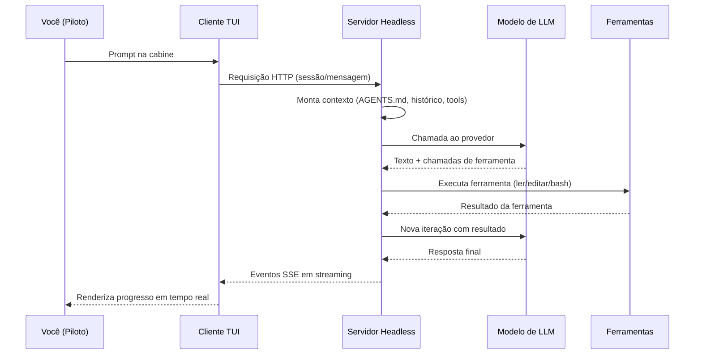

# Capítulo 2: Arquitetura — como um agente de codificação funciona por dentro

## 1. Introdução

No Capítulo 1, você assumiu a cabine de comando e conheceu o OpenCode por fora — o que ele é, onde nasceu e por que o terminal voltou a ser o centro do desenvolvimento. Agora é hora de abrir o motor. A maioria das pessoas usa ferramentas de IA sem saber o que acontece entre o momento em que você digita um pedido e o momento em que os arquivos mudam. Esse intervalo — o loop do agente — é onde mora toda a diferença entre uma ferramenta que parece mágica e uma que você consegue controlar, prever e depurar. Neste capítulo, vamos dissecar a anatomia de um agente de codificação: o loop de raciocínio e ferramentas, a arquitetura cliente-servidor do OpenCode e o gerenciamento de contexto que determina a qualidade do resultado. Ao dominar isso, você deixará de ser um passageiro da tecnologia e passará a ser o engenheiro que entende cada manobra — o diferencial que separa quem opera a cabine de quem apenas aperta botões.

## 2. Explica

Um agente de codificação é, na essência, um laço de três componentes: um modelo de linguagem que raciocina, um conjunto de ferramentas que ele pode invocar e um ambiente que registra o estado. O modelo não "escreve" o código diretamente no seu disco; ele produz texto que instrui a execução de ferramentas — ler um arquivo, editar uma linha, rodar um comando — e, a cada passo, o resultado da ferramenta volta ao contexto do modelo, que decide o próximo passo. Esse ciclo, chamado de loop do agente, é a unidade fundamental de operação [1]. A qualidade do agente depende menos do modelo em si do que do desenho dessa interface entre o agente e o computador — o conceito que o SWE-agent batizou de ACI (Agent-Computer Interface) e que se tornou uma área de pesquisa inteira [2].

A descoberta central dos trabalhos acadêmicos é contra-intuitiva: dar ao agente uma interface rica de ferramentas melhora o resultado mais do que trocar o modelo por um maior. O SWE-agent, da Princeton, mostrou que uma ACI bem desenhada — comandos de busca no código, edição com verificação, sintaxe clara — eleva a taxa de resolução de problemas reais de forma dramática em relação a um modelo usando ferramentas genéricas [2]. O benchmark SWE-bench, por sua vez, estabeleceu o campo de provas: milhares de issues reais do GitHub com testes de validação, criando a métrica que todos os agentes passaram a perseguir [3]. O Agentless, publicado em 2024, adicionou uma provocação importante: pipelines que dispensam o loop agêntico e delegam a um único passo de geração alcançam resultados competitivos com custo muito menor — sugerindo que o agente precisa justificar cada iteração em termos de ganho real [4]. E o OpenHands consolidou a visão de que a plataforma aberta, com um ambiente controlado e ferramentas padronizadas, é o caminho para agentes generalistas [5].

Vale dissecar o conceito de ACI com mais profundidade, porque ele explica praticamente todas as decisões de design do OpenCode que você vai encontrar neste livro. A ACI é o conjunto de comandos e observações que o agente usa para interagir com o computador — análogo ao que uma API é para um programa, mas desenhado para um modelo de linguagem. O SWE-agent observou que os modelos, quando recebem um terminal cru, desperdiçam esforço: cometem erros de sintaxe triviais, perdem o contexto do que já executaram e não sabem navegar em árvores de arquivos grandes. A solução foi projetar comandos específicos — como um comando de busca que retorna resultados com contexto e um comando de edição que valida a sintaxe antes de aplicar — e foi isso que impulsionou a taxa de sucesso [2]. O OpenCode internalizou essa lição em cada ferramenta: a edição é aplicada com verificação, a busca retorna contexto, e a execução de bash captura a saída completa para que o modelo tenha o estado real do sistema.

O benchmark SWE-bench também merece um olhar mais atento, porque é a régua que o mercado usa até hoje. Ele compilou milhares de issues reais de repositórios populares do GitHub, cada uma com um patch de referência e um teste de validação — e a tarefa do agente é resolver a issue de forma que o teste passe [3]. O que o benchmark revelou foi duro e esclarecedor: os modelos, sozinhos, resolvem uma fração pequena das issues; os agentes com boas interfaces multiplicam esse número; e a diferença entre os melhores e os piores pipelines é maior do que a diferença entre os modelos que eles usam [3][2]. Esse é o argumento definitivo para o estudo da arquitetura que este capítulo faz: se você entende o loop do agente, você entende por que as mesmas pessoas, com o mesmo modelo, obtêm resultados tão diferentes.

O OpenCode implementa esse loop com uma arquitetura cliente-servidor que é ao mesmo tempo simples e elegante. A TUI que você usa no terminal é apenas um cliente. O trabalho pesado — manter a sessão, orquestrar o modelo, gerenciar o contexto — acontece em um servidor headless que roda localmente e expõe uma API HTTP com spec OpenAPI 3.1 [6]. Isso significa que a TUI pode ser substituída por qualquer outro cliente: a interface web (`opencode web`), um cliente programático via HTTP ou um cliente remoto conectado por `opencode attach`. A separação explica por que o OpenCode é rápido e responsivo mesmo com modelos grandes: a interface não espera o modelo terminar, ela recebe eventos em streaming via SSE (Server-Sent Events) e renderiza o progresso [7]. Se você abrir a spec OpenAPI em `/doc` com um servidor rodando, vai encontrar os endpoints de sessão, mensagem e evento que constituem a espinha dorsal do sistema.

A escolha do SSE (Server-Sent Events) em vez de WebSocket ou polling é um detalhe de arquitetura que vale entender, porque ele revela a prioridade de design do OpenCode. O SSE é uma conexão HTTP unidirecional e de baixa complexidade: o servidor empurra eventos para o cliente conforme eles acontecem, sem a negociação de handshake e o gerenciamento de estado do WebSocket. Para o caso de uso de um agente — onde o tráfego dominante é unidirecional (o servidor informando o progresso) e intermitente — o SSE é a escolha certa: simples, robusto e compatível com a infraestrutura HTTP existente [6][7]. O polling (consultar o estado repetidamente) seria desperdício — cada consulta seria uma requisição completa — e o WebSocket seria complexidade desnecessária. Esse tipo de decisão, aparentemente técnica, tem consequências práticas: é por isso que a TUI é leve, que o web funciona bem em redes corporativas e que scripts de automação podem consumir o stream de eventos com ferramentas HTTP comuns [6][7].

O terceiro pilar da arquitetura é o gerenciamento de contexto — o recurso mais escasso e mais determinante da qualidade. Todo token enviado ao modelo custa dinheiro e janela de atenção; o agente precisa decidir o que manter na conversa, o que buscar sob demanda e o que descartar. O OpenCode estrutura esse contexto em camadas: as instruções do projeto (AGENTS.md), as skills (SKILL.md), as definições de agentes, as ferramentas MCP e o histórico da sessão [8]. Um repositório bem instruído reduz drasticamente o desperdício de contexto, porque o modelo não precisa redescobrir convenções que já estão documentadas. Os papers recentes sobre compressão de contexto — como o ACON, que otimiza a compactação para agentes de longa duração, e o estudo sobre compactação paralela de contexto — mostram que o gerenciamento de contexto é um campo de otimização ativo, com impacto direto no custo e na qualidade de agentes que rodam por horas [9][10].

A camada de skills completa essa hierarquia: instruções reutilizáveis definidas em arquivos SKILL.md com frontmatter de nome e descrição, descobertas sob demanda pela ferramenta de skill em vez de carregadas sempre [15]. As definições de agentes — primários e subagentes — declaram quais ferramentas cada um pode usar e com quais permissões, fechando o circuito entre contexto e controle [16]. E as ferramentas MCP ampliam o alcance do agente para o mundo externo, conectando servidores locais e remotos por um protocolo padronizado que a Anthropic introduziu em novembro de 2024 e que o mercado inteiro adotou [17]. Cada uma dessas camadas entra e sai do contexto conforme a necessidade — a disciplina de só carregar o que é usado é o que separa um agente ágil de um agente entupido.

A beleza da arquitetura cliente-servidor aparece quando você entende o fluxo completo de uma mensagem. Você digita um prompt na TUI. O cliente envia uma requisição ao servidor local. O servidor monta o contexto — instruções, histórico, ferramentas disponíveis — e chama o provedor de LLM configurado. O modelo responde com um texto que pode conter chamadas de ferramenta. O servidor executa a ferramenta (ler arquivo, editar, rodar comando), coleta o resultado e devolve ao modelo em uma nova iteração. Esse ciclo continua até o modelo declarar a tarefa concluída ou atingir o limite de passos configurado. Cada passo desse ciclo é visível na TUI — e é exatamente essa visibilidade que permite a você, como piloto, interromper, corrigir ou desfazer qualquer manobra em pleno voo [7][11].

O fluxo de uma mensagem também revela onde o custo de tokens é gerado — um tema que vamos quantificar no Capítulo 10, mas que vale antecipar aqui porque ele nasce da arquitetura. A cada iteração do loop, o servidor reenvia ao modelo o contexto acumulado: as instruções, o histórico da conversa até aquele ponto, as definições das ferramentas disponíveis e o resultado da última ferramenta executada. Um prompt simples pode gerar dezenas de milhares de tokens de contexto ao longo de uma tarefa complexa, porque o contexto cresce a cada passo [11][20]. É essa estrutura — não o preço individual do token — que domina o custo de uma sessão agêntica, como o estudo sobre consumo de tokens demonstra [20]. Entender o loop é, portanto, entender a origem do custo: cada iteração é uma multiplicação do contexto pelo número de passos, e as alavancas de economia (passos limitados, contexto enxuto) atacam exatamente essa multiplicação [20][21].

Há uma consequência da arquitetura que merece destaque porque ela muda a forma como você trabalha: como toda ação passa pelo servidor e é emitida como evento, o OpenCode produz, por construção, um trilho de auditoria de cada sessão [6][7]. Cada chamada de ferramenta, cada arquivo lido, cada edição aplicada e cada comando executado está registrado no fluxo de eventos — e esse registro é o que permite reconstruir, depois, por que o agente tomou as decisões que tomou [7][11]. Para o profissional, isso transforma a frase "o agente fez isso" em uma afirmação verificável: em vez de confiar na memória da conversa, você consulta o histórico da sessão ou o export dela (Capítulo 6) e reconstrói passo a passo [7][11]. Em ambientes regulados ou em times grandes, é exatamente essa propriedade que separa o uso defensável do uso amador: o trilho de auditoria nativo da arquitetura é a base da governança que os Capítulos 9 e 10 vão formalizar [6][7][20].

Vale registrar também o que a arquitetura não é, para evitar duas expectativas erradas que aparecem com frequência. Primeira: o servidor headless não é uma nuvem — ele roda na sua máquina (ou na máquina que você escolher, como no Capítulo 9), e os dados não saem do seu ambiente a não ser que você configure um provedor remoto [6]. Segunda: a separação cliente-servidor não significa que a TUI é opcional — ela é a interface mais produtiva, e a arquitetura apenas garante que o mesmo motor sirva a TUI, o web, o attach e a API [6][7]. Esses dois esclarecimentos importam porque eles definem o que a arquitetura entrega: controle local dos dados e liberdade de superfície — as duas razões pelas quais o desenho deste capítulo sustenta tudo o que vem pela frente [6][7].

## 3. Ilustra

Para ancorar a anatomia do agente, pense na cabine de comando novamente — agora com foco nos instrumentos, não no piloto. Um agente de codificação é como um sistema de piloto automático de aeronave. O piloto automático não é um único componente: é um laço de sensores, atuadores e um computador de bordo que lê o estado da aeronave (altitude, velocidade, rumo), decide a próxima ação e move os controles — depois volta a ler o estado para verificar se a ação teve o efeito esperado. Se o sensor reportar algo inesperado, o computador recalcula. O modelo de linguagem é o computador de bordo; as ferramentas são os sensores e atuadores; e o repositório é a atmosfera em que a aeronave voa. O que torna o OpenCode especial é a qualidade dessa interface: sensores precisos (busca no código, leitura de arquivos com contexto), atuadores com feedback (edições que reportam o resultado, comandos que mostram a saída) e a capacidade de o piloto humano assumir o manche a qualquer momento.



Esse diagrama é a planta da cabine: tudo passa pelo servidor headless, que é o coração do sistema — e o motivo de o OpenCode funcionar tão bem com clientes diferentes. Repare que o modelo nunca toca o seu disco diretamente; ele sempre passa pelo servidor e pelas ferramentas. Isso é uma decisão de segurança e de auditabilidade: cada ação é registrada, cada efeito é observável e cada passo pode ser revertido. Como Piloto de Desenvolvimento, você opera nessa mesma planta em todos os capítulos deste livro — quando configurarmos permissões (Capítulo 7), quando conectarmos MCP (Capítulo 8) e quando colocarmos o servidor na rede da empresa (Capítulo 9).

O conceito denso deste capítulo — a interface entre agente e computador — merece uma segunda analogia, mais concreta. Imagine que você contratou um estagiário muito inteligente, mas que só se comunica por bilhetes escritos à mão, com um garçom levando cada bilhete de ida e volta. O estagiário pede "o arquivo de login", o garçom volta com o arquivo; o estagiário escreve "mude a linha 5", o garçom leva a instrução. Esse garçom é a ACI. Um bom garçom sabe que "o arquivo de login" é ambíguo e pergunta antes de trazer a pasta errada; um garçom ruim traz a pasta errada e o estagiário perde três rodadas tentando explicar. O SWE-agent provou exatamente isso: melhorar o garçom (a interface) rende mais do que contratar um estagiário mais inteligente (um modelo maior) [2]. O OpenCode capricha no garçom: busca com contexto, edição com verificação, comandos com saída completa — e é por isso que ele funciona tão bem mesmo com modelos abertos.

## 4. Técnica

### O ciclo de vida de uma sessão

O ciclo de vida de uma sessão — do nascimento ao arquivamento — merece um mapa, porque ele define como o estado de trabalho se comporta. A sessão nasce quando um cliente a cria (TUI, run, API) e o servidor monta o contexto inicial [7][11]. A sessão vive através das mensagens: cada mensagem é uma rodada do loop, e o histórico acumulado é o contexto da próxima [7]. A sessão é persistida pelo servidor — pode ser retomada (Capítulo 6), compartilhada (Capítulo 9) e exportada (Capítulo 6) [7][11][13]. E a sessão morre quando é apagada ou quando o servidor é reiniciado sem persistência — daí a importância do export para o que vale arquivar [7][13]. Esse ciclo tem uma consequência operacional direta: o servidor é o dono do estado, e a disponibilidade do servidor é a disponibilidade das sessões — o que conecta este capítulo à infraestrutura do Capítulo 9 [7][18]. Quem entende que a sessão é um estado gerenciado — não um arquivo que ele guarda — opera com a disciplina certa de persistência e arquivamento [7][13].

### O mapa das camadas de contexto

Antes de interagir com o servidor, vale materializar a hierarquia de contexto que estudamos na Explica — porque é ela que o servidor monta a cada mensagem, e conhecê-la em ordem é conhecer a operação por dentro. A montagem de contexto do OpenCode combina, em camadas: as instruções do projeto (AGENTS.md, e os compatíveis CLAUDE.md e .agents/), as definições de agentes e suas permissões, as skills relevantes à tarefa (descobertas sob demanda), as ferramentas habilitadas (nativas e MCP) e o histórico da sessão — com a compactação entrando em cena quando o limite se aproxima [8][9][12]. A ordem importa: cada camada entra com um custo em tokens, e o servidor decide o que manter com base na tarefa corrente. Para o operador, o corolário prático é duplo: um AGENTS.md enxuto e preciso reduz o ruído em toda camada, e a disciplina de ferramentas habilitadas (menos MCP, menos ferramentas desnecessárias) reduz o custo de toda montagem [8][12].

### O diagnóstico em camadas na prática

O mapa de camadas tem uma aplicação imediata que todo Piloto de Desenvolvimento usa cedo: o diagnóstico de problemas em camadas. Quando algo não funciona — um provedor rejeita a chave, uma permissão bloqueia uma edição, o contexto estoura e a qualidade degrada — o erro raramente está na camada em que você primeiro desconfia [6][7]. A disciplina é percorrer as camadas de baixo para cima com evidência: primeiro o provedor e o modelo (a chave está válida? o modelo responde? `opencode debug config` mostra o que está configurado?), depois o servidor e as sessões (o servidor está rodando? a sessão está correta? os logs reportam algo?), depois as ferramentas e permissões (o agente tem acesso ao arquivo? a permissão está bloqueando?), e só então o prompt e o contexto (a instrução está clara? o AGENTS.md está sendo carregado?) [20]. Cada camada tem um instrumento de verificação próprio — e o reflexo de quem domina a arquitetura é medir antes de culpar [7][12].

Na prática, esse diagnóstico em camadas se apoia em três instrumentos que o OpenCode oferece e que você vai usar durante todo o livro [7]. O primeiro é o `opencode debug config`, que mostra a configuração mesclada — todas as camadas de config aplicadas na ordem certa, do global ao projeto — e resolve de imediato a classe de problema "por que minha config não está valendo?" [7]. O segundo são os logs do servidor, que registram cada requisição, cada chamada ao modelo e cada evento — o lugar onde os erros reais aparecem antes de qualquer outra superfície [6]. O terceiro é a própria sessão: o histórico da conversa com as chamadas de ferramenta e seus resultados é a evidência do que o agente fez e por quê [11]. Quem diagnostica com esses três instrumentos transforma horas de tentativa e erro em minutos de medição — e é esse hábito, mais do que qualquer comando específico, que o Capítulo 10 vai transformar em ritual [6][7].

### Interagindo com o servidor

A melhor maneira de ver a arquitetura em ação é conversar com o servidor sem passar pela TUI. O OpenCode expõe uma API HTTP completa; com um servidor rodando, você pode criar uma sessão, enviar uma mensagem e ler os eventos — o mesmo fluxo que a TUI usa por baixo. Aqui está o esqueleto de uma interação programática com o servidor local:

```bash
# Inicia o servidor headless na porta padrão
opencode serve

# Em outro terminal: lista as sessões existentes via API
curl -s http://127.0.0.1:PORT/session | python3 -m json.tool
```

Para entender a superfície completa, nada substitui a spec OpenAPI 3.1 que o servidor publica em `/doc` — abra-a no navegador e estude os endpoints de sessão, mensagem e evento. Essa spec é a documentação viva da arquitetura, gerada a partir do próprio servidor [6]. O protocolo de eventos usa SSE (Server-Sent Events), o que significa que o cliente recebe um stream de eventos conforme o agente progride — cada chamada de ferramenta, cada atualização de mensagem — em vez de esperar a resposta completa [7]. É esse streaming que dá à TUI a sensação de resposta ao vivo.

O conceito de ACI ganha forma concreta no conjunto de ferramentas que o agente pode invocar. As ferramentas nativas do OpenCode cobrem o ciclo completo de operação no repositório: leitura de arquivos, edição, busca textual (grep), glob, execução de bash, busca web, tarefas (task), skills, LSP e a pergunta ao usuário [12]. A lista de ferramentas disponíveis para cada agente é configurável — e essa configurabilidade é a tradução prática da ACI: você decide quais instrumentos o copiloto tem na cabine. Um agente de revisão de código, por exemplo, pode ter acesso de leitura e busca, mas não de edição nem de bash — reduzindo drasticamente a superfície de risco [12][13].

A arquitetura também define como o agente se apresenta visualmente e como o código produzido é formatado: temas configuráveis (com suporte a cores truecolor quando o terminal oferece) e formatters específicos por linguagem, que o OpenCode aplica quando a opção `formatter` está habilitada [18][19]. Esses detalhes parecem cosméticos, mas completam a ACI: a interface entre agente e humano também precisa ser bem desenhada para que você consiga ler, revisar e confiar no que o copiloto faz — a legibilidade do trabalho do agente é parte da confiança operacional.

Para quem quer ir além da TUI, o caminho programático é o modo `opencode run`, que executa uma sessão de agente em modo não interativo e imprime os eventos — o formato `json` é particularmente útil para automação e integração:

```bash
# Executa uma tarefa de forma programática e imprime os eventos em JSON
opencode run "resuma o que este projeto faz" --format json

# Com limite de passos para controlar o custo
opencode run "refatore a função calcularTotal" --max-steps 20
```

O gerenciamento de contexto, terceiro pilar da arquitetura, também é programável. As instruções do projeto vivem no AGENTS.md, que o agente carrega para o contexto a cada sessão; as skills em SKILL.md definem comportamentos reutilizáveis descobertos sob demanda; e o histórico da sessão é gerenciado com técnicas de compactação — o agente resume trechos antigos da conversa para caber na janela de contexto [8][9]. Entender essa hierarquia de contexto é o que permite a você controlar a qualidade: um AGENTS.md bem escrito é a maior alavanca de qualidade disponível, porque orienta o agente antes de qualquer prompt.

A janela de contexto — o limite de tokens que o modelo pode processar em uma chamada — é o recurso mais escasso de todo o sistema, e os papers sobre compactação explicam por quê. O ACON, publicado no ICML 2026, propõe otimizar a compactação de contexto para agentes de longa duração: em vez de descartar informação valiosa quando o limite se aproxima, o sistema comprime estrategicamente o que é menos relevante para a tarefa corrente [9]. A compactação paralela de contexto, estudada no mesmo período, ataca o gargalo de latência: compactar em paralelo reduz o tempo de espera de agentes que rodam por horas [21]. Para você, na prática, isso significa duas coisas: sessões longas precisam de estratégia (o OpenCode compacta automaticamente quando necessário), e a qualidade do resultado depende de manter no contexto o que importa — daí a disciplina de AGENTS.md enxuto e MCP seletivo que os capítulos 7 e 8 vão detalhar.

A relação entre contexto e qualidade tem um corolário direto que a documentação oficial raramente explicita: o agente é tão bom quanto o contexto que você dá a ele. Um prompt perfeito em um repositório sem AGENTS.md produz resultados inferiores a um prompt mediano em um repositório bem instruído — porque o AGENTS.md entrega, de graça, as convenções, os comandos e os padrões que o modelo precisaria adivinhar [8][22]. É por isso que o `/init` (Capítulo 3) é o primeiro passo de qualquer projeto profissional: ele instala a camada de contexto que sustenta tudo o que vem depois. E é por isso que os profissionais tratam o AGENTS.md como código — versionado, revisado e atualizado a cada mudança de convenção [8].

A prova de que a arquitetura funciona bem além da TUI é o ecossistema de clientes: o servidor headless permite usar o OpenCode de dentro de outras ferramentas, expor agentes para o time inteiro e integrar com CI. O protocolo ACP (Agent Client Protocol) — iniciado com `opencode acp` — abre o OpenCode como um servidor ACP via stdin/stdout em ND-JSON, permitindo que outras ferramentas o controlem como um agente de codificação de propósito geral [14]. Essa é a aposta de longo prazo: não uma ferramenta fechada, mas um motor de agente que qualquer interface pode pilotar.

Vale um experimento técnico que consolida tudo o que este capítulo ensina: com um servidor rodando, envie uma mensagem por HTTP e acompanhe os eventos SSE até a conclusão. Você verá, em tempo real, a anatomia do loop — a chamada ao modelo, a decisão de ferramenta, a execução, o resultado voltando ao contexto, a próxima iteração. Esse experimento é o equivalente a abrir o manual de manutenção da aeronave e ver o motor girando: a teoria da ACI, da arquitetura cliente-servidor e do gerenciamento de contexto deixa de ser abstração e vira observação. E é exatamente essa observação que permite a você, nos capítulos seguintes, configurar com intenção — porque você saberá o que cada configuração muda por dentro [6][7][12].

O protocolo ACP e a API aberta são também a resposta a uma pergunta estratégica: o que acontece se o OpenCode deixar de ser mantido? A resposta é o que qualquer plataforma aberta oferece — a operação não morre com o mantenedor. A configuração é arquivos locais, as sessões são exportáveis, a API é documentada e o código é aberto; a migração para qualquer alternativa que fale ACP ou consuma a API é uma decisão de configuração, não um projeto de reescrita [2][14]. Essa portabilidade — o oposto do lock-in — é uma das razões mais fortes, e menos discutidas, para escolher agentes de terminal abertos em ambientes corporativos, e ela será retomada no Capítulo 9 com a governança de plataforma [2][14].

A arquitetura que você estudou neste capítulo tem uma consequência operacional que os capítulos seguintes vão explorar exaustivamente: como o servidor é o coração do sistema, ele é o ponto único de configuração, autenticação e governança. As permissões definidas no servidor valem para todos os clientes que se conectam a ele — a TUI da sua máquina, o web de um colega, o attach de outra sala. O MCP configurado no servidor está disponível para todas as sessões. E o histórico exportado pelo servidor é o trilho de auditoria da equipe inteira [6][7]. Essa centralização é uma bênção e uma responsabilidade: é o que permite a governança corporativa do Capítulo 9, e é o que exige as proteções de segurança do Capítulo 10 — dois capítulos que só fazem sentido porque você entendeu, aqui, que o agente não é a interface que você toca, mas o motor que fica embaixo.

### As camadas de abstração do OpenCode

Vale um mapa das camadas de abstração do OpenCode, porque ele conecta a arquitetura deste capítulo à operação dos próximos. Na base, o provedor de LLM — a API que o modelo usa, configurada no Capítulo 4. Acima, o servidor do OpenCode — o motor que mantém sessões, monta contexto e orquestra o loop, a espinha dorsal deste capítulo [6][7]. Acima, as ferramentas — nativas e MCP — que o agente usa para operar o ambiente, configuradas nos Capítulos 7 e 8. E no topo, as interfaces — TUI, web, attach, run — que você usa para operar o agente, dominadas nos Capítulos 5 e 6 [18]. Cada camada tem seu vocabulário e seus artefatos: provedores e modelos, sessões e mensagens, ferramentas e permissões, keybinds e prompts. A consequência prática do mapa: os erros aparecem em camadas, e o diagnóstico correto identifica a camada — um prompt perfeito não resolve um problema de provedor, uma permissão perfeita não resolve um problema de contexto [6][7][8]. Quem domina o mapa depura por camada, não por adivinhação.

Esse mapa em camadas tem uma aplicação de diagnóstico que vale demonstrar com um caso real, porque ela mostra o método em funcionamento [6][7]. Imagine um sintoma comum: o agente demora para responder e, quando responde, a qualidade parece pior do que ontem. O profissional percorre as camadas com evidência: primeiro, o provedor — `opencode models` confirma se o modelo ativo é o esperado (talvez alguém trocou o modelo da sessão e o agente está rodando com um modelo menor); segundo, o servidor — `opencode debug` e os logs mostram se há erros de conexão ou retries (talvez o servidor esteja lento ou o provedor esteja degradado); terceiro, as ferramentas — `opencode debug config` revela se um MCP novo entrou no contexto e está inflando cada montagem (o suspeito clássico de lentidão); quarto, o contexto — o AGENTS.md e o histórico da sessão (talvez a sessão esteja com semanas de histórico não compactado) [6][7][8]. O ponto do método: cada hipótese tem um instrumento de verificação, e nenhuma camada é culpada sem medida. É esse mesmo reflexo — medir antes de culpar, camada por camada — que os capítulos 4, 7 e 10 vão refinar com instrumentos específicos de provedores, permissões e custo, e é ele que separa o diagnóstico profissional do chute educado [6][7][8].

### Os limites do loop e quando intervir

Antes da aplicação, vale mapear os limites do loop do agente — porque saber quando o loop falha é parte de dominá-lo. O primeiro limite é o de passos: um agente pode iterar indefinidamente em uma tarefa aberta, e é por isso que o limite de steps existe (Capítulo 7) — ele define o teto de iterações antes de o agente declarar derrota ou pedir ajuda. O segundo limite é o de contexto: quando a janela enche, o agente precisa compactar ou perder informação — e a qualidade pode degradar em sessões muito longas (os papers do ACON estudam exatamente essa fronteira) [9][21]. O terceiro limite é o de ferramentas: se a ferramenta certa não está disponível para o agente (por permissão ou por configuração), ele resolve com ferramentas piores ou falha — o sinal clássico é o agente tentando resolver com grep o que exigia uma busca semântica. Reconhecer esses três limites no meio de uma sessão — "o agente está rodando em círculos", "o contexto está estourando", "ele não tem a ferramenta certa" — é o que permite intervir como piloto: interromper, corrigir a rota e retomar com o instrumento adequado [7][11].

Uma observação de arquitetura que fecha a parte técnica e conecta com a prática: a mesma anatomia que você estudou aqui é a régua para avaliar qualquer ferramenta de agente que chegue ao mercado — e essa régua se torna mais valiosa a cada ano, porque a categoria evolui rápido [1][2][6]. Quando uma nova ferramenta é anunciada, o profissional pergunta: o loop é visível (cada ação registrada e reversível) ou uma caixa-preta? A ACI é rica (busca com contexto, edição com verificação) ou crua (terminal solto)? O contexto é em camadas (instruções, skills, histórico) ou um balaio? As sessões são exportáveis e auditáveis ou presas ao fornecedor? [1][2][6]. Essas quatro perguntas — derivadas diretamente dos três pilares deste capítulo — avaliam uma ferramenta em minutos, sem semanas de uso [2][6]. E elas explicam por que este livro escolheu o OpenCode como objeto: não porque é a única ferramenta com a anatomia certa, mas porque é a que expõe a anatomia com mais clareza — o loop, a ACI, o contexto e o trilho de auditoria são todos documentados e abertos, o que faz dela a melhor escola para aprender o padrão que todas as outras seguem com variações [1][6][8].

## 5. Aplica

Cena de contraste. Você está numa sexta-feira à tarde e o gerente pede: "Usa a IA aí pra corrigir esse bug de performance que o pessoal reportou". Você, empolgado, abre a IA, cola a stack trace e pede a correção. A resposta vem com um diagnóstico elegante... e errado. O problema: a IA que você usou não tinha acesso ao repositório, não viu o código real e "deduziu" a causa a partir de padrões genéricos. Você perde a tarde inteira e o bug continua lá. O diagnóstico técnico dessa cena é simples: sem a ACI adequada, o modelo raciocina sobre uma abstração do problema, não sobre o problema real. O agente de terminal muda isso porque opera sobre o ambiente real — e é por isso que a arquitetura que você aprendeu neste capítulo importa: ela é a diferença entre uma resposta plausível e uma correção verificada.

Agora a prática correta. Você abre o OpenCode, entra no modo Plan e digita: "Investiga o bug de performance reportado na issue #18, usando o profiler que está no repositório". O agente lê o código relevante, roda a busca, identifica o gargalo real — e propõe um plano que você revisa antes de qualquer edição. Você aprova, o agente aplica a mudança e roda os testes. A correção é verificada, não suposta. Essa é a aplicação concreta de tudo o que este capítulo ensinou: o agente é bom porque opera no ambiente certo, com as ferramentas certas, sobre o contexto certo — e você, no comando, controla cada etapa.

As armadilhas práticas dessa arquitetura, em síntese: primeiro, negligenciar o AGENTS.md — um repositório sem instruções força o agente a adivinhar convenções, e a qualidade despenca; segundo, abrir ferramentas demais para o agente — cada ferramenta adiciona tokens ao contexto e amplia a superfície de risco, e a disciplina de desabilitar o que não é necessário é parte do ofício [12][13]; terceiro, ignorar o gerenciamento de contexto — sessões longas sem compactação estouram a janela e degradam o raciocínio; quarto, tratar a TUI como o único ponto de acesso — o servidor headless é a porta para automação, integração e trabalho em equipe, e quem não o conhece desperdiça metade do potencial da ferramenta [6][7].

No mercado, o profissional que entende a arquitetura de agentes não depende de receitas de prompt: ele projeta o ambiente. Quando um time adota agentes de codificação, a pergunta que separa os times maduros dos imaturos não é "qual modelo vocês usam", mas "como vocês estruturam o contexto e as ferramentas". Os papers sobre agentes convergem nessa direção: a interface e o ambiente — não o modelo — são os fatores que diferenciam os resultados [2][4][5]. E o custo dessa operação também é mensurável: um estudo de 2026 analisou como agentes de codificação consomem tokens e propôs modelos para prever o gasto — mostrando que a arquitetura (quantas iterações, quanto contexto) é a maior alavanca de custo, maior até que a escolha do provedor [20]. Quem domina essa camada de arquitetura consegue prever, depurar e otimizar o comportamento do agente — e o seu orçamento de tokens — com precisão de engenharia.

Uma última aplicação que fecha o capítulo: a arquitetura que você estudou aqui é a mesma que você vai usar para avaliar qualquer ferramenta de agente que aparecer no mercado — e esse é um dos retornos mais duráveis deste conhecimento. Quando um novo agente de codificação surge, o profissional que entende de arquitetura não pergunta "é bom?", mas pergunta: o loop é transparente ou uma caixa-preta? A interface entre o agente e o computador é rica ou crua? O contexto é estruturado por camadas ou um balaio de arquivos? As sessões são exportáveis e auditáveis ou presas ao fornecedor? Essas perguntas — todas derivadas deste capítulo — avaliam qualquer ferramenta em minutos, sem precisar usá-la por semanas [1][2][6]. E a resposta para todas elas, no OpenCode, é a razão pela qual este livro o escolheu como objeto de estudo: um loop visível, uma ACI rica, um contexto em camadas e um trilho de auditoria nativo — a base aberta sobre a qual os próximos nove capítulos constroem [1][6][20].

Para encerrar com o checklist do capítulo: primeiro, monte o AGENTS.md do seu projeto e observe a diferença na qualidade das respostas — o experimento que prova, na prática, a teoria do contexto em camadas [8]. Segundo, abra a spec OpenAPI em `/doc` e identifique os endpoints de sessão, mensagem e evento — a planta da cabine em formato executável [6]. Terceiro, rode um `opencode debug config` e confira quais camadas de configuração estão ativas no seu ambiente — o primeiro diagnóstico de verdade da sua instalação [7]. Quarto, configure um agente de revisão com acesso de leitura apenas — o exercício que mostra como a ACI vira política de segurança [12][13]. Esses quatro passos convertem a anatomia deste capítulo em operação concreta, e preparam o terreno para o Capítulo 3: a instalação do OpenCode em todas as plataformas, agora com o motor aberto e compreendido [1][6].

## 6. Conclusão

Você abriu o motor e entendeu os três pilares: o loop do agente (raciocínio + ferramentas + ambiente), a arquitetura cliente-servidor (TUI como cliente, servidor headless com OpenAPI 3.1 como coração, eventos SSE em streaming) e o gerenciamento de contexto (AGENTS.md, skills, histórico compactado). Você viu a base acadêmica — SWE-bench, SWE-agent e o conceito de ACI, Agentless, OpenHands — e como ela explica por que a interface importa mais que o modelo [2][3][4][5]. E você colocou a mão na massa: conversou com o servidor via HTTP, explorou a spec OpenAPI e usou o modo run programático [6][7].

Recapitulando os três pontos centrais: primeiro, o agente é um loop — modelo que raciocina, ferramentas que operam, ambiente que registra — e a qualidade desse loop depende da interface entre o modelo e o computador, não apenas do tamanho do modelo [1][2][4]. Segundo, a arquitetura cliente-servidor do OpenCode separa a interface do motor, expõe a API com spec OpenAPI 3.1 e emite eventos em streaming — o que permite múltiplos clientes, automação e governança [6][7]. Terceiro, o contexto é o recurso mais escasso: instruções, skills, histórico e ferramentas disputam a janela, e a disciplina de contexto define a qualidade e o custo [8][9][20].

O desafio agora: com um servidor rodando, abra a spec OpenAPI em `/doc` e identifique os endpoints de sessão e mensagem — o exercício que conecta o diagrama do capítulo à API real. E prepare-se para o próximo voo: no Capítulo 3, o checklist de decolagem — a instalação do OpenCode em todas as plataformas e o primeiro voo com `/init` e AGENTS.md, agora com a anatomia do motor na cabeça.

O checklist de decolagem continua. No Capítulo 3, você vai instalar o OpenCode em qualquer plataforma e fazer o primeiro voo de verdade: o `/init`, o AGENTS.md e a TUI pronta para operar. Com a anatomia na cabeça, a instalação deixa de ser um passo mecânico — você saberá exatamente o que cada peça que está instalando faz na cabine.

## 7. Referências Bibliográficas

[1] OPENCODE. *Intro — Get started with OpenCode*. Disponível em: https://opencode.ai/docs. Acesso em: 03 ago. 2026.

[2] YANG, John; JIMENEZ, Carlos E.; WETTIG, Alexander; LIERET, Kilian; YAO, Shunyu; NARASIMHAN, Karthik; PRESS, Ofir. *SWE-agent: Agent-Computer Interfaces Enable Automated Software Engineering*. In: NEURIPS, 2024. Disponível em: https://arxiv.org/abs/2405.15793. Acesso em: 03 ago. 2026.

[3] JIMENEZ, Carlos E.; YANG, John; WETTIG, Alexander; YAO, Shunyu; PEI, Kexin; PRESS, Ofir; NARASIMHAN, Karthik. *SWE-bench: Can Language Models Resolve Real-World GitHub Issues?*. In: ICLR, 2024. Disponível em: https://arxiv.org/abs/2310.06770. Acesso em: 03 ago. 2026.

[4] XIA, Chunqiu Steven; DENG, Yinlin; DUNN, Soren; ZHANG, Lingming. *Agentless: Demystifying LLM-based Software Engineering Agents*. arXiv, 2024. Disponível em: https://arxiv.org/abs/2407.01489. Acesso em: 03 ago. 2026.

[5] WANG, Xingyao; LI, Boxuan; SONG, Yufan; XU, Frank F.; TANG, Xiangru; ZHUGE, Mingchen et al. *OpenHands: An Open Platform for AI Software Developers as Generalist Agents*. In: ICLR, 2025. Disponível em: https://arxiv.org/abs/2407.16741. Acesso em: 03 ago. 2026.

[6] OPENCODE. *Server — Interact with opencode server over HTTP*. Disponível em: https://opencode.ai/docs/server. Acesso em: 03 ago. 2026.

[7] OPENCODE. *CLI — OpenCode CLI options and commands*. Disponível em: https://opencode.ai/docs/cli. Acesso em: 03 ago. 2026.

[8] OPENCODE. *Instructions — AGENTS.md and project instructions*. Disponível em: https://opencode.ai/docs/instructions. Acesso em: 03 ago. 2026.

[9] KANG, Minki; CHEN, Wei-Ning; HAN, Dongge; INAN, Huseyin A.; WUTSCHITZ, Lukas; CHEN, Yanzhi; SIM, Robert; RAJMOHAN, Saravan. *ACON: Optimizing Context Compression for Long-horizon LLM Agents*. In: ICML, 2026. Disponível em: https://arxiv.org/abs/2510.00615. Acesso em: 03 ago. 2026.

[10] CIM, Musa; TOPCU, Burak; DAS, Chita; KANDEMIR, Mahmut Taylan. *Parallel Context Compaction for Long-Horizon LLM Agent Serving*. arXiv, 2026. Disponível em: https://arxiv.org/abs/2605.23296. Acesso em: 03 ago. 2026.

[11] OPENCODE. *Sessions — Understand and manage sessions*. Disponível em: https://opencode.ai/docs/sessions. Acesso em: 03 ago. 2026.

[12] OPENCODE. *Tools — Manage the tools an LLM can use*. Disponível em: https://opencode.ai/docs/tools. Acesso em: 03 ago. 2026.

[13] OPENCODE. *Permissions — Control which actions require approval to run*. Disponível em: https://opencode.ai/docs/permissions. Acesso em: 03 ago. 2026.

[14] OPENCODE. *CLI reference — ACP (Agent Client Protocol)*. Disponível em: https://opencode.ai/docs/cli. Acesso em: 03 ago. 2026.

[15] OPENCODE. *Agent Skills — Define reusable behavior via SKILL.md definitions*. Disponível em: https://opencode.ai/docs/skills. Acesso em: 03 ago. 2026.

[16] OPENCODE. *Agents — Configure and use specialized agents*. Disponível em: https://opencode.ai/docs/agents. Acesso em: 03 ago. 2026.

[17] ANTHROPIC. *Introducing the Model Context Protocol*. Disponível em: https://www.anthropic.com/news/model-context-protocol. Acesso em: 03 ago. 2026.

[18] OPENCODE. *Themes — Select a built-in theme or define your own*. Disponível em: https://opencode.ai/docs/themes. Acesso em: 03 ago. 2026.

[19] OPENCODE. *Formatters — OpenCode uses language specific formatters*. Disponível em: https://opencode.ai/docs/formatters. Acesso em: 03 ago. 2026.

[20] BAI, Longju; HUANG, Zhemin; WANG, Xingyao; SUN, Jiao; MIHALCEA, Rada; BRYNJOLFSSON, Erik; PENTLAND, Alex; PEI, Jiaxin. *How Do AI Agents Spend Your Money? Analyzing and Predicting Token Consumption in Agentic Coding Tasks*. arXiv, 2026. Disponível em: https://arxiv.org/abs/2604.22750. Acesso em: 03 ago. 2026.

[21] CIM, Musa; TOPCU, Burak; DAS, Chita; KANDEMIR, Mahmut Taylan. *Parallel Context Compaction for Long-Horizon LLM Agent Serving*. arXiv, 2026. Disponível em: https://arxiv.org/abs/2605.23296. Acesso em: 03 ago. 2026.

[22] OPENCODE. *Instructions — AGENTS.md and project instructions*. Disponível em: https://opencode.ai/docs/instructions. Acesso em: 03 ago. 2026.
