# Capítulo 3: Instalação em todas as plataformas e o primeiro voo

## 1. Introdução

No Capítulo 2, você entendeu a anatomia do agente — o loop de raciocínio, a arquitetura cliente-servidor e o gerenciamento de contexto que define a qualidade do resultado. Agora chega o momento que separa quem lê sobre a cabine de comando de quem realmente assume os comandos: instalar o OpenCode e fazer o primeiro voo de verdade. A boa notícia é que a instalação é simples em praticamente qualquer plataforma — mas é exatamente aí que moram as armadilhas que a documentação oficial não destaca com a ênfase que merecem. Windows nativo versus WSL, gerenciadores de pacotes conflitantes, a ordem certa da configuração inicial e o hábito profissional de versionar as instruções do projeto: cada detalhe desta fase de decolagem define se os seus próximos voos serão tranquilos ou cheios de turbulência. Ao dominar a instalação e o primeiro voo, você terá uma base estável sobre a qual os capítulos seguintes — provedores, TUI, configuração avançada — vão se apoiar sem sustos.

## 2. Explica

O OpenCode oferece várias rotas de instalação, e a escolha certa depende da sua plataforma e do seu fluxo de trabalho. No macOS e no Linux, a rota mais rápida é o script de instalação oficial via curl, que detecta a plataforma e instala o binário pré-compilado [1]. No macOS, há também a fórmula Homebrew mantida no tap oficial `anomalyco/tap` — `brew install anomalyco/tap/opencode` — que é a opção preferida por quem já gerencia pacotes com o Homebrew [2]. No Linux, além do script, há pacotes para as principais distribuições, incluindo o Arch Linux, que mantém o pacote nos repositórios oficiais e no AUR [3]. Para JavaScript e TypeScript, o pacote `opencode-ai` está publicado no npm e pode ser instalado com npm, bun, pnpm ou yarn — uma rota útil para quem já tem um runtime Node no ambiente [4][5].

O Windows é o caso que merece mais atenção. A documentação oficial recomenda explicitamente o WSL (Windows Subsystem for Linux) como o ambiente preferido para rodar o OpenCode, porque o desempenho e a compatibilidade com o ecossistema de ferramentas de terminal são melhores [6]. Dentro do WSL, você usa as rotas Linux — script curl ou o gerenciador da distribuição. Fora do WSL, há opções em evolução: o suporte nativo e o gerenciamento via Chocolatey e Scoop existem, mas o ecossistema de ferramentas de agente — especialmente o suporte a Bun — ainda é mais maduro no lado Linux [6][7]. Se você trabalha no Windows puro, a rota de menor fricção é instalar o WSL, instalar o OpenCode dentro dele e operar a partir do terminal Linux — o mesmo terminal que você vai usar no dia a dia de produção.

A decisão entre Windows nativo e WSL não é apenas de desempenho; é uma decisão sobre o mundo que o agente enxerga. Dentro do WSL, o OpenCode opera com um sistema de arquivos Linux, binários Linux e um PATH Linux — o ambiente para o qual o ecossistema de ferramentas de agente foi construído. No Windows nativo, o mesmo agente encontra um mundo diferente: caminhos com contrabarra, diferenças de comportamento de shell, e ferramentas que se comportam de forma distinta. A consequência prática é sutil e profunda: o mesmo prompt, nos dois ambientes, pode produzir resultados diferentes — porque o agente raciocina sobre o ambiente que observa. Escolher o ambiente é, portanto, escolher a qualidade da operação, e é por isso que os profissionais tratam essa decisão com o mesmo cuidado com que escolhem o provedor de modelo.

Há ainda um detalhe de ecossistema que a maioria descobre tarde: o diretório de configuração do OpenCode. No Linux e no macOS, a configuração global vive em `~/.config/opencode/` e as credenciais em `~/.local/share/opencode/auth.json`. No Windows, esses caminhos seguem as convenções da plataforma. Saber onde cada peça mora — configuração, credenciais, sessões, plugins — é o que permite fazer backup, migrar entre máquinas e diagnosticar problemas [6][19]. O profissional não decora caminhos; ele entende a anatomia do hangar: cada peça da aeronave tem um lugar, e o piloto sabe onde procurar quando algo não funciona.

Independentemente da rota, o resultado é o mesmo: o comando `opencode` disponível no seu PATH, e a verificação `opencode --version` confirmando o build instalado. A atualização também é simples e importante: `opencode upgrade` baixa e instala a versão mais recente, e o `opencode uninstall` remove o binário e os arquivos relacionados [8][9]. O hábito profissional de manter o OpenCode atualizado não é cosmético: agentes de codificação evoluem rápido, e correções de segurança, melhorias de compatibilidade com provedores e novas ferramentas chegam com frequência [10].

Vale uma palavra sobre o ciclo de atualização, porque ele é diferente do de outras ferramentas de dev. O OpenCode atualiza com a frequência típica de um projeto open-source ativo: versões chegam regularmente, e o `opencode upgrade` é a via oficial para acompanhar [8][10]. O que isso significa para você na prática: reservar um minuto por dia — ou uma verificação semanal — para rodar o upgrade e ler o changelog das versões novas. As mudanças que importam para o seu fluxo (novos provedores no catálogo, correções de permissão, melhorias de TUI) aparecem nessas notas. O reflexo de verificar versão — `opencode --version` — é também a primeira pergunta de qualquer diagnóstico: saber qual build você opera é o dado inicial de qualquer investigação de comportamento estranho, e é por isso que o pedido de suporte de qualquer ferramenta começa com "qual versão você usa?" [8][10].

Antes de ligar a aeronave, vale uma palavra sobre os ambientes corporativos, porque a instalação individual é apenas metade da história quando você opera em equipe. Em uma empresa, a rota de instalação raramente é uma decisão individual: o time padroniza uma rota (por exemplo, Homebrew no macOS, WSL + script no Windows), documenta as variáveis de ambiente exigidas (as chaves de cada provedor aprovado) e define a política de atualização — e é esse padrão que permite a um onboard de novos devs acontecer em minutos, não em dias [1][6]. Duas práticas aparecem nas empresas maduras: o script de bootstrap do repositório — um `setup.sh` ou `setup.ps1` que instala o OpenCode, valida o `--version` e roda o `opencode debug` — e o AGENTS.md padrão da organização, que cada projeto herda e ajusta [16][22]. Se você vai operar agentes em contexto profissional, vale desde já tratar a instalação como infraestrutura repetível: a mesma rota, o mesmo script, o mesmo checklist em toda máquina — é esse padrão que transforma a decolagem individual em operação de frota, e é a antecipação prática do que o Capítulo 9 fará com a governança de plataforma [6][16].

Ainda antes do primeiro voo, vale derrubar o mito mais comum da fase de instalação: "se não rodou de primeira, é problema da ferramenta". Na grande maioria dos casos, o que falha não é o OpenCode, mas o ambiente ao redor dele — e identificar essa classe de problema cedo economiza horas [1][8]. O padrão clássico: o comando `opencode` não é encontrado, e o culpado é o PATH (o diretório do binário não está no PATH do shell — o script de instalação imprime o comando exato para corrigir). Outro padrão clássico: a TUI abre, mas nenhum modelo responde, e o culpado é a credencial (a chave não foi exportada, ou foi exportada no shell errado, ou o `.env` do projeto não está sendo carregado) [20]. E um terceiro: a resposta chega, mas a qualidade parece baixa, e o culpado é o modelo escolhido (um modelo barato demais para a tarefa). Cada sintoma aponta para uma camada — PATH, credencial, modelo — e o diagnóstico correto identifica a camada antes de qualquer mudança. Esse é o mesmo princípio do Capítulo 2, agora aplicado ao caso concreto: instrumentos antes de intuição, `opencode debug` antes de culpar [8][21].

Depois de instalado, o primeiro voo começa com a configuração de acesso a um modelo — o equivalente a ligar a aeronave. O comando `opencode` abre a TUI, e o fluxo de onboarding guia você para conectar um provedor. O caminho mais simples para quem está começando são os serviços oficiais OpenCode Zen e OpenCode Go: modelos testados e verificados pela própria equipe, com um plano de baixo custo que inclui modelos de codificação abertos [11][12]. A conexão acontece via `/connect` dentro da TUI ou pelo site opencode.ai/auth, que emite um token para o seu dispositivo. A alternativa é conectar seu próprio provedor — Anthropic, OpenAI, qualquer um dos 75+ suportados — configurando as credenciais pelo comando `opencode auth login` ou pelas variáveis de ambiente padrão [13][14]. O comando `/models` dentro da TUI lista os modelos disponíveis para o provedor conectado e permite trocar o modelo ativo sem sair da sessão [15].

A escolha do primeiro modelo é mais importante do que parece, porque ela define a sua primeira impressão da ferramenta — e as primeiras impressões moldam hábitos. Para tarefas de codificação, um modelo com suporte sólido a tool calling é essencial: é essa capacidade que permite ao agente decidir quando ler um arquivo, quando editar e quando rodar um comando, em vez de apenas responder com texto [7]. Modelos de propósito geral funcionam, mas modelos treinados ou ajustados para código — os que aparecem no catálogo Models.dev com foco em programação — produzem agentes mais precisos [14]. O conselho prático: comece com um modelo de qualidade comprovada para codificação, domine o fluxo, e só depois experimente alternativas mais baratas ou locais — porque a comparação só faz sentido com a operação básica dominada.

A última peça do primeiro voo é o AGENTS.md — o arquivo de instruções do projeto que o agente lê antes de qualquer tarefa. O comando `/init` dentro da TUI analisa o repositório e gera um AGENTS.md com as convenções, os comandos e o contexto que o agente precisa [16]. Esse arquivo deve ser commitado no Git — ele é parte do contrato do projeto, não um arquivo pessoal. O OpenCode também lê `CLAUDE.md` do `.claude/` e o diretório `.agents/`, mantendo compatibilidade com os ecossistemas de Claude Code e de agentes em geral [16][17]. A estrutura de configuração resultante — `opencode.json` no raiz do projeto, `tui.json` para a TUI, diretório `.opencode/` para agentes, comandos, skills e plugins — é o hangar onde a sua operação vai morar [18][19].

O AGENTS.md merece mais atenção do que a documentação de primeiro uso sugere, porque ele é o multiplicador de qualidade mais barato que existe. Um AGENTS.md bem escrito diz ao agente: quais comandos rodam os testes, qual convenção de nomenclatura seguir, onde estão os arquivos-chave, o que é proibido tocar, como a arquitetura está organizada. Sem ele, o agente adivinha — e a adivinhação custa passos, tokens e qualidade. Com ele, o agente opera com o mapa do projeto na cabeça desde o primeiro prompt [16][22]. O detalhe que separa os times maduros: o AGENTS.md é versionado e revisado como código — quando a arquitetura muda, o arquivo muda junto, no mesmo PR. É esse hábito que mantém o contrato do agente sincronizado com a realidade do projeto, e é por isso que este livro trata o AGENTS.md como o primeiro artefato de engenharia da sua operação com agentes [16][22].

## 3. Ilustra

A decolagem de uma aeronave tem um ritual que nenhum piloto profissional pula: o checklist. Antes de qualquer voo, o piloto percorre uma lista fixa de verificações — combustível, instrumentos, controles, comunicações — na mesma ordem, todos os dias. A instalação do OpenCode é exatamente esse checklist de decolagem da sua cabine de comando: primeiro o combustível (instalar o binário), depois a verificação dos instrumentos (`--version`, `opencode models`), a comunicação com a torre (conectar o provedor e autenticar) e, por fim, o plano de voo do projeto (`/init` gerando o AGENTS.md). O piloto que pula itens do checklist não decola mais rápido; decola quebrado. O desenvolvedor que pula o AGENTS.md não configura mais rápido; configura um agente que vai trabalhar no escuro.

```mermaid
%% legenda: Checklist de decolagem — do binário instalado ao primeiro plano de voo
flowchart TD
  A[Instalar o binário] --> B{Plataforma?}
  B -->|macOS| C[brew install anomalyco/tap/opencode]
  B -->|Linux| D[script curl oficial]
  B -->|Windows| E[WSL + rotas Linux]
  B -->|JS/TS| F[npm i -g opencode-ai]
  C --> G[opencode --version]
  D --> G
  E --> G
  F --> G
  G --> H[Conectar provedor]
  H --> I{Qual rota?}
  I -->|Começando| J[OpenCode Zen / Go via /connect]
  I -->|Próprio| K[auth login + variáveis de ambiente]
  J --> L[opencode models]
  K --> L
  L --> M[/init gera AGENTS.md/]
  M --> N[Commitar AGENTS.md no Git]
  N --> O[Primeiro prompt na TUI]
```



O checklist é deliberadamente curto — cinco etapas, cada uma verificável — porque a repetição é o que constrói a confiança operacional. Como Piloto de Desenvolvimento, você vai percorrer esse checklist em toda máquina nova, em todo ambiente de trabalho e em toda CI. A metáfora da torre de controle também entra aqui: conectar o provedor é estabelecer comunicação com a torre — sem essa comunicação, a aeronave (o OpenCode) está pronta, mas não pode decolar (não tem modelo para raciocinar). E o AGENTS.md é o plano de voo do projeto: o documento que diz ao copiloto onde fica cada coisa e como este hangar específico opera — convenções que nenhum modelo adivinharia sozinho.

O conceito de "instalação" parece trivial, mas tem uma camada densa: a instalação é a primeira decisão de arquitetura do seu fluxo com agentes. O ambiente em que o agente roda determina quais ferramentas ele enxerga, quais comandos ele pode executar e quanto contexto ele herda. Um agente instalado no WSL enxerga o sistema de arquivos Linux, os binários Linux e o PATH Linux; o mesmo OpenCode instalado no Windows nativo enxerga outro mundo. É por isso que a recomendação oficial do WSL não é um capricho — é uma decisão sobre o ambiente de operação do seu copiloto, e decisões de ambiente são decisões de arquitetura disfarçadas de procedimento de instalação [6].

## 4. Técnica

### A anatomia do script de instalação

Antes dos comandos, vale entender o que o script de instalação oficial faz — porque o que acontece por baixo determina o que você pode esperar e como diagnosticar problemas. O script baixa o binário pré-compilado da plataforma, coloca-o em um diretório de binários (tipicamente `~/.local/bin` ou equivalente no PATH) e o torna executável [1]. O resultado é um binário autossuficiente — sem dependências de runtime — que o `opencode upgrade` substitui por versões novas [8]. A implicação prática da autossuficiência: a instalação não afeta nem depende do Node, do Python ou de qualquer outro runtime da máquina, o que a torna portável e de baixo risco [1][8]. E a implicação do diretório de binários: se o `opencode` não for encontrado após a instalação, o diagnóstico mais provável é o PATH — o diretório do binário precisa estar no PATH do seu shell, e o script ou a documentação indica o comando exato para adicioná-lo [1][21]. Esse entendimento — binário autossuficiente, PATH como ponto de falha — transforma a instalação de um ato mágico em um procedimento compreendido.

### A verificação de instalação em três níveis

E vale consolidar a verificação de instalação em três níveis, porque cada nível responde a uma pergunta diferente. O primeiro nível é o binário: `opencode --version` — o comando existe e qual versão roda [8]. O segundo é o ambiente: `opencode debug` — o estado do sistema, provedores, configuração [21]. O terceiro é a operação: um prompt mínimo na TUI — o motor funciona de ponta a ponta, do provedor ao modelo [11]. A sequência é progressiva: se o binário falha, o problema é a instalação ou o PATH; se o ambiente falha, o problema é a configuração; se a operação falha, o problema é o provedor ou o modelo. Essa escada de três degraus — version, debug, prompt — é o diagnóstico de primeira linha que o profissional usa em qualquer máquina nova, e é a mesma disciplina de instrumentos antes de intuição que o Capítulo 2 ensinou [8][21][11].

### O passo a passo por plataforma

A instalação é o momento em que a precisão técnica importa mais. Aqui está o passo a passo completo por plataforma, com os comandos exatos:

```bash
# macOS — via Homebrew (tap oficial)
brew install anomalyco/tap/opencode

# macOS/Linux — script oficial de instalação
curl -fsSL https://opencode.ai/install | bash

# Linux — Arch (repositórios oficiais)
sudo pacman -S opencode

# npm/bun/pnpm/yarn (pacote opencode-ai)
npm install -g opencode-ai
bun add -g opencode-ai

# Verificação do build instalado
opencode --version
```

Dentro do WSL no Windows, as rotas Linux valem integralmente — e é a recomendação oficial para quem usa Windows [6]. Depois da instalação, o primeiro comando é abrir a TUI: digite `opencode` e explore o ambiente. A configuração de provedor pela linha de comando é direta para os provedores com integração oficial:

```bash
# Conecta um provedor com login via navegador
opencode auth login

# Lista os provedores autenticados
opencode auth list

# Desconecta um provedor
opencode auth logout

# Lista os modelos disponíveis para o provedor ativo
opencode models
```

A configuração por variáveis de ambiente é o caminho mais usado em servidores e CI — e o padrão que você vai encontrar em ambientes de produção:

```bash
# Variáveis de ambiente padrão para os principais provedores
export ANTHROPIC_API_KEY="<sua-chave>"
export OPENAI_API_KEY="<sua-chave>"
export GOOGLE_GENERATIVE_AI_API_KEY="<sua-chave>"
```

O arquivo `.env` do projeto também é lido pelo OpenCode, o que permite manter credenciais por repositório sem vazá-las para o histórico [20]. Para o primeiro voo completo, o ritual é: abrir a TUI, executar `/init`, revisar o AGENTS.md gerado e commitá-lo:

```bash
# Dentro da TUI:
#   /init          -> gera o AGENTS.md do projeto
#   /models        -> escolhe o modelo ativo
#   /connect       -> conecta um provedor
#
# Depois, fora da TUI, versiona o plano de voo:
git add AGENTS.md && git commit -m "chore: adiciona AGENTS.md para agentes de codificação"
```

A verificação da instalação tem uma sequência que vale memorizar, porque ela cobre as três camadas de falha possíveis: o binário (o comando existe?), o ambiente (o PATH está certo?) e a configuração (a mesclagem está correta?). O `opencode --version` confirma o binário e a versão; o `opencode debug` confirma o ambiente e o estado; o `opencode debug config` confirma a configuração mesclada [8][21]. Essa tríade — version, debug, debug config — é o diagnóstico de primeira linha de qualquer problema de instalação, e é a mesma sequência que o Capítulo 4 usará para provedores e o Capítulo 7 para permissões: sempre instrumentos antes de intuição, sempre evidência antes de adivinhação [21].

Uma verificação profissional após a instalação é rodar o diagnóstico completo do ambiente — um reflexo que economiza horas de depuração futura:

```bash
# Diagnóstico do ambiente e da configuração ativa
opencode debug

# Configuração ativa (merge de todas as camadas de config)
opencode debug config
```

O `opencode debug` mostra o estado real do sistema — versão, provedores conectados, configuração mesclada — e é o primeiro instrumento que um Piloto de Desenvolvimento consulta quando algo não se comporta como esperado [21]. Se o seu ambiente tiver um problema de PATH ou de permissões, é aqui que ele aparece, com uma mensagem objetiva.

Um exercício que consolida o primeiro voo e que vale a pena fazer ainda na primeira semana é a roda de verificação completa — porque ela transforma o checklist do capítulo em reflexo operacional [1][8][21]. Comece do zero: rode `opencode --version` e anote o build (o dado de base de qualquer diagnóstico futuro) [8]. Rode `opencode debug` e leia o que ele reporta sobre o ambiente — versão, provedores, configuração — mesmo que tudo pareça certo (a leitura do estado normal é o que permite reconhecer o estado anormal) [21]. Rode `opencode debug config` e identifique quais camadas de configuração estão ativas no seu projeto — global, projeto, local — e qual venceu em cada chave [21]. Abra a TUI, execute o `/init` e examine o AGENTS.md gerado linha a linha, corrigindo o que estiver errado antes do commit [16]. E, por fim, rode um prompt mínimo de investigação — "resuma a estrutura deste repositório" — e observe o agente trabalhando: quais arquivos ele abre, quais buscas ele roda [11]. Esse ciclo de cinco passos — version, debug, config, init, prompt — leva menos de trinta minutos na primeira vez e menos de cinco nas seguintes, e é exatamente o rito que o Capítulo 10 transforma em ritual semanal [1][8][21].

### O ambiente de configuração inicial

Vale também um mapa do ambiente de configuração que o primeiro voo cria — porque ele responde à pergunta que todo iniciante faz: "onde mora a configuração?" O OpenCode separa a configuração em dois arquivos principais: o `opencode.json` (a configuração geral — modelo, provedores, permissões, MCP) e o `tui.json` (a configuração da TUI — keybinds, tema, scroll) [18][19]. Ambos têm um nível global (na máquina, aplicado a todos os projetos) e um nível de projeto (no repositório, versionado) — e o projeto sobrepõe o global na mesclagem que o Capítulo 7 detalha [18]. O diretório `.opencode/` completa o mapa: agentes, comandos, skills e plugins locais vivem nele, e ele é o coração da personalização por projeto [18][19]. Esse mapa — dois arquivos, dois níveis, um diretório — é o esqueleto que os capítulos 5 a 8 vão preencher, e conhecê-lo desde o primeiro voo evita a confusão clássica de não saber onde cada configuração vive.

### A matriz de decisão de instalação

Antes de consolidar o hangar, vale explicitar a matriz de decisão de instalação — porque escolher a rota certa é uma decisão que afeta toda a operação, e a maioria das pessoas decide pelo primeiro tutorial que encontra. A matriz tem três eixos: o ecossistema de pacotes da sua máquina, o seu fluxo de atualização e o ambiente onde o agente vai operar. Se você já usa Homebrew, a fórmula `anomalyco/tap/opencode` se integra ao seu fluxo de `brew upgrade` — a atualização vira parte de um hábito existente [2]. Se você vive de Node, o `opencode-ai` via npm/bun/pnpm/yarn se encaixa no seu gerenciamento de dependências globais — mas lembre que cada runtime tem seu próprio cache e seu próprio comportamento de atualização [4][5]. Se você quer o caminho mais simples e direto, o script curl da documentação oficial instala o binário pré-compilado e o `opencode upgrade` cuida do resto [1][8]. No Windows, a decisão maior não é a rota — é o ambiente: WSL primeiro, nativo só se o seu fluxo for inteiramente Windows [6]. A regra que sintetiza a matriz: escolha a rota que se integra ao seu fluxo existente, use uma única rota por máquina e documente a escolha no seu checklist de setup — para que qualquer máquina nova siga o mesmo padrão [2][4][6].

### O primeiro prompt na prática

Com o ambiente pronto, vale descrever o que acontece no primeiro prompt — porque saber o que esperar evita a desorientação clássica de quem testa o agente pela primeira vez [11][15]. Você abre a TUI com `opencode`, o agente carrega a última sessão ou inicia uma nova, e o cursor espera o seu primeiro comando. O primeiro passo profissional é pedir algo simples e verificável — não uma tarefa gigante, mas uma investigação: "resuma a estrutura deste repositório e os comandos de teste", "explique o que o módulo X faz e onde ele é usado", "liste as funções que não têm testes". Esses prompts têm uma propriedade que os torna perfeitos para a estreia: o resultado é fácil de verificar, o risco de dano é zero e o agente exercita exatamente o fluxo de leitura e busca que você vai usar para sempre [11][16]. Enquanto o agente trabalha, observe o que ele faz: quais arquivos ele abre, quais buscas ele roda, como ele apresenta o resultado. Essa observação — o trilho de auditoria do Capítulo 2 em tempo real — é o melhor treinamento que existe para calibrar a sua confiança no copiloto [7][11].

Se o seu projeto ainda não tem AGENTS.md, o primeiro prompt ideal é o `/init` — e vale entender o que ele produz para revisá-lo com critério em vez de aceitar cegamente [16]. O `/init` analisa o repositório — arquivos, estrutura, scripts de build e teste — e gera um AGENTS.md com as convenções que ele consegue inferir [16]. O resultado raramente é perfeito de primeira: pode faltar o comando de teste exato, a convenção de nomenclatura pode estar genérica demais, e a descrição da arquitetura pode não refletir os detalhes que só o time conhece. O hábito profissional é tratar o AGENTS.md gerado como um primeiro rascunho: revise cada seção, corrija o que estiver errado, adicione o que faltar e só então faça o commit [16][22]. Esse ciclo — gerar, revisar, versionar — é a primeira amostra do contrato entre humano e agente que o livro inteiro aprofunda, e é ele que transforma o `/init` de um assistente de setup em um hábito de engenharia [16].

### O mapa completo do hangar

Antes da aplicação, vale consolidar o mapa do hangar — a estrutura de arquivos que a instalação e a inicialização criam, porque ela é o esqueleto da operação inteira. No nível global, a máquina abriga `~/.config/opencode/opencode.json` (a configuração global), `~/.local/share/opencode/auth.json` (as credenciais) e os diretórios de plugins e skills globais. No nível do projeto, o repositório abriga `opencode.json` (a configuração do projeto, versionada), o diretório `.opencode/` (agentes, comandos, skills e plugins locais) e o `AGENTS.md` (o plano de voo, versionado). E no nível da sessão, cada conversa é um estado gerenciado pelo servidor, exportável e importável [6][18][19]. Essa divisão em três níveis — máquina, projeto, sessão — é o que permite a portabilidade que o Capítulo 1 prometeu: o projeto carrega sua configuração e seu plano de voo; a máquina carrega as credenciais e os defaults; e as sessões são estados efêmeros que podem ser arquivados. Quem entende o hangar sabe exatamente o que versionar, o que proteger e o que descartar — e é esse mapa que a maioria dos usuários nunca monta [18][19][16].

## 5. Aplica

Cena de contraste. Você está em uma máquina Windows nova, instalou o OpenCode pelo instalador nativo, configurou a chave da API e... trava. O agente abre, mas demora para responder, alguns comandos falham com erros de caminho e o tema da TUI fica com cores erradas. Você passa a tarde inteira tentando corrigir, desconfiando do provedor, da chave, do modelo. O diagnóstico técnico: você instalou no ambiente errado. No Windows nativo, o OpenCode opera com um ecossistema de ferramentas parcial — o suporte a Bun e parte do tooling de agentes ainda é imaturo — e cada incompatibilidade vira uma turbulência aparentemente aleatória [6][7].

Agora a prática correta, na mesma máquina. Você instala o WSL, instala o OpenCode dentro da distribuição Linux, configura a chave e abre a TUI. Tudo funciona. O diagnóstico técnico é o mesmo ambiente, explicado no capítulo anterior: o agente herda o ambiente em que roda, e o ambiente Linux do WSL dá a ele o mundo completo de ferramentas de terminal para o qual o OpenCode foi projetado. A lição vai além do Windows: o ambiente de instalação é a primeira configuração do agente, e escolhê-lo com consciência — em vez de aceitar o padrão do instalador — é a primeira decisão de um profissional que entende a ferramenta por dentro.

As armadilhas dessa fase, em síntese: primeiro, ignorar a recomendação do WSL no Windows e depois culpar a ferramenta pelos sintomas do ambiente; segundo, instalar por múltiplas rotas (npm e brew e script) e criar conflitos de PATH — escolha UMA rota por máquina e use `opencode upgrade` para atualizar; terceiro, pular o AGENTS.md — um repositório sem instruções força o agente a adivinhar convenções, e a qualidade despenca no primeiro voo real; quarto, não versionar o AGENTS.md — sem commit, cada membro do time reconfigura mentalmente o projeto e o agente perde o contrato; quinto, esquecer que a configuração vive em camadas — `opencode.json` do projeto, `tui.json` da TUI, diretório `.opencode/` — e que a precedência é remota → global → projeto → local, como veremos em detalhe no Capítulo 7 [18][22]; sexto, instalar a versão e esquecer de atualizar — `opencode upgrade` semanal é o hábito que mantém a cabine com as correções de segurança e as melhorias de compatibilidade mais recentes [8][10].

Um último detalhe operacional que vale ouro no primeiro dia: o `opencode debug` não é apenas um comando de diagnóstico — é a porta de entrada para entender o estado real do sistema quando algo não funciona. Se a TUI abre mas o modelo não responde, se o tema parece errado, se uma permissão se comporta de forma inesperada — o reflexo profissional é rodar `opencode debug` e ler o que o sistema reporta sobre si mesmo, em vez de adivinhar [21]. Esse reflexo, cultivado desde o primeiro voo, é o que economiza horas ao longo da operação inteira — e é a primeira demonstração prática da mentalidade de piloto que este livro constrói: instrumentos antes de intuição.

No mercado, o desenvolvedor que domina a instalação e a inicialização de projetos com agentes se distingue por um hábito invisível: o ambiente de desenvolvimento é tratado como infraestrutura, não como acaso. Empresas maduras têm um checklist de onboarding de agentes — mesma rota de instalação, mesmo AGENTS.md, mesmas variáveis de ambiente — e é esse padrão que permite a um time inteiro operar agentes de forma previsível [16][22]. A sua primeira instalação é o momento de criar esse padrão para você: escolha a rota, documente o checklist, versiona as instruções e trate a configuração como parte do repositório — não como uma configuração pessoal que morre na sua máquina.

Um cenário de aplicação que merece um parágrafo inteiro porque ele testa tudo o que este capítulo ensinou: a troca de máquina. Você recebe um notebook novo e precisa reproduzir a sua operação com o OpenCode — e é aqui que a diferença entre instalar de qualquer jeito e instalar com método aparece [1][6]. O profissional percorre o checklist em ordem: instala o binário pela rota padrão da sua máquina (o mesmo Homebrew, o mesmo WSL, o mesmo script); roda `opencode --version` para confirmar o build; roda `opencode auth login` para reconectar os provedores — ou, se as chaves vierem de um cofre de segredos, exporta as variáveis de ambiente; clona os projetos e confere se o AGENTS.md e o `opencode.json` vieram no repositório — porque eles fazem parte do contrato do projeto, não da máquina [16][18]; e roda um `opencode debug` para confirmar que o ambiente está íntegro antes do primeiro voo real [21]. O que torna essa sequência rápida não é memória — é o hábito: a mesma ordem, os mesmos instrumentos, toda máquina nova. E o que ela revela é a tese deste capítulo: a configuração mora no repositório e no hábito, não na máquina — e é por isso que trocar de máquina, para o Piloto de Desenvolvimento, é um procedimento de rotina e não um projeto de fim de semana [6][16][18].

Um contraponto honesto para fechar a aplicação: nem toda instalação precisa ser perfeita na primeira tentativa — e a perfeição não é o objetivo. O objetivo do checklist de decolagem é decolar: instalar, conectar, voar, e refinar o hangar ao longo da operação [1][11]. Um AGENTS.md imperfeito commitado hoje é melhor do que um AGENTS.md perfeito imaginado na semana que vem — porque o agente já começa a operar com um contrato, e o contrato evolui com o projeto [16]. Uma rota de instalação que você depois troca por outra mais alinhada é um custo pequeno comparado ao custo de nunca ter começado. A disciplina que este capítulo pede não é a da perfeição — é a da repetição consciente: o mesmo checklist, revisado com o tempo, é o que transforma a decolagem de uma experiência pontual em um procedimento profissional [1][6][16].

Um último exercício de aplicação que vale na primeira semana — porque ele treina o diagnóstico antes que o diagnóstico seja necessário: quebrar de propósito e consertar [1][8][21]. Em um ambiente de teste (um diretório descartável, sem dados), provoque as três falhas clássicas uma de cada vez e pratique o diagnóstico por camada. Primeiro, remova o diretório do binário do PATH e rode `opencode` — o erro "comando não encontrado" e a correção no PATH, o sintoma mais comum da instalação [1][8]. Segundo, desconfigure a chave do provedor (exporte uma chave vazia) e rode um prompt — o erro de autenticação e o `opencode debug config` mostrando qual variável ele procura [21]. Terceiro, aponte o `model` para um identificador inexistente e rode `opencode models` — o catálogo rejeitando o identificador, o lembrete de que o formato é `provedor/modelo` [21]. Esse exercício de quebrar-e-consertar tem um valor que nenhum tutorial oferece: ele transforma os três erros mais comuns do primeiro mês em conhecidos familiares — quando eles acontecerem de verdade, em uma manhã de segunda-feira com prazo apertado, você não vai desconfiar do universo: vai rodar o diagnóstico por camada e corrigir em minutos [1][8][21].

## 6. Conclusão

Você completou o checklist de decolagem: instalou o OpenCode na sua plataforma — com a decisão consciente do ambiente no Windows — verificou o build, conectou um provedor, listou modelos, executou o `/init` e versionou o AGENTS.md do projeto [1][6][11][16]. Você entendeu por que a rota de instalação e o ambiente são decisões de arquitetura, não procedimentos mecânicos, e por que o AGENTS.md é o plano de voo que o agente lê antes de qualquer tarefa. E você criou o reflexo profissional do diagnóstico: `opencode debug` é o seu primeiro instrumento quando algo não se comporta como esperado [21].

Recapitulando os três pontos centrais: primeiro, a instalação tem múltiplas rotas — script, Homebrew, npm/bun/pnpm, pacotes Linux, WSL no Windows — e a escolha da rota e do ambiente é uma decisão de arquitetura, porque o agente herda o mundo que o rodeia [1][2][4][6]. Segundo, o primeiro voo segue um checklist — instalar, verificar, conectar provedor, escolher modelo, gerar e versionar o AGENTS.md — e cada item é verificável [11][14][16]. Terceiro, o hangar tem uma anatomia em três níveis — máquina, projeto, sessão — que define o que versionar, proteger e descartar [6][18][19].

Seu desafio agora: instale o OpenCode na sua plataforma, rode o `/init` no seu projeto principal e examine o AGENTS.md gerado — revise-o com o olhar de quem escreve um contrato: as convenções estão corretas? Os comandos de teste estão lá? O que está proibido está explícito? E prepare-se para o próximo voo: no Capítulo 4, vamos conectar a cabine a qualquer modelo — o sistema de provedores e credenciais, do Anthropic ao Ollama, com o controle fino que separa o piloto do passageiro.

## 7. Referências Bibliográficas

[1] OPENCODE. *Intro — Get started with OpenCode*. Disponível em: https://opencode.ai/docs. Acesso em: 03 ago. 2026.

[2] NIXOS/NIXPKGS. *Homebrew — opencode formula (anomalyco/tap)*. Disponível em: https://formulae.brew.sh. Acesso em: 03 ago. 2026.

[3] ANOMALYCO. *OpenCode — repositório oficial (antigo sst/opencode)*. Disponível em: https://github.com/anomalyco/opencode. Acesso em: 03 ago. 2026.

[4] OPENCODE. *CLI — OpenCode CLI options and commands*. Disponível em: https://opencode.ai/docs/cli. Acesso em: 03 ago. 2026.

[5] OPENCODE. *Config — Using the OpenCode JSON config*. Disponível em: https://opencode.ai/docs/config. Acesso em: 03 ago. 2026.

[6] ANOMALYCO. *OpenCode — AI coding agent built for the terminal*. Disponível em: https://opencode.ai. Acesso em: 03 ago. 2026.

[7] OPENCODE. *Providers — Using any LLM provider in OpenCode*. Disponível em: https://opencode.ai/docs/providers. Acesso em: 03 ago. 2026.

[8] OPENCODE. *CLI reference — upgrade e uninstall*. Disponível em: https://opencode.ai/docs/cli. Acesso em: 03 ago. 2026.

[9] OPENCODE. *Commands — Create custom commands for repetitive tasks*. Disponível em: https://opencode.ai/docs/commands. Acesso em: 03 ago. 2026.

[10] OSSINSIGHT. *Open source analytics for opencode*. Disponível em: https://ossinsight.io. Acesso em: 03 ago. 2026.

[11] OPENCODE. *OpenCode Zen — curated models*. Disponível em: https://opencode.ai/docs/providers. Acesso em: 03 ago. 2026.

[12] OPENCODE. *OpenCode Go — low cost subscription plan*. Disponível em: https://opencode.ai/docs/providers. Acesso em: 03 ago. 2026.

[13] OPENCODE. *Providers — credenciais e auth*. Disponível em: https://opencode.ai/docs/providers. Acesso em: 03 ago. 2026.

[14] MODELS.DEV. *Models.dev — open model catalog*. Disponível em: https://models.dev. Acesso em: 03 ago. 2026.

[15] OPENCODE. *TUI — comandos e modelos*. Disponível em: https://opencode.ai/docs. Acesso em: 03 ago. 2026.

[16] OPENCODE. *Instructions — AGENTS.md and project instructions*. Disponível em: https://opencode.ai/docs/instructions. Acesso em: 03 ago. 2026.

[17] OPENCODE. *Agent Skills — Define reusable behavior via SKILL.md definitions*. Disponível em: https://opencode.ai/docs/skills. Acesso em: 03 ago. 2026.

[18] OPENCODE. *Config — precedência de camadas de configuração*. Disponível em: https://opencode.ai/docs/config. Acesso em: 03 ago. 2026.

[19] OPENCODE. *TUI config — tui.json*. Disponível em: https://opencode.ai/tui.json. Acesso em: 03 ago. 2026.

[20] OPENCODE. *Config — environment e variáveis de ambiente*. Disponível em: https://opencode.ai/docs/config. Acesso em: 03 ago. 2026.

[21] OPENCODE. *CLI reference — opencode debug*. Disponível em: https://opencode.ai/docs/cli. Acesso em: 03 ago. 2026.

[22] OPENCODE. *Sessions — Understand and manage sessions*. Disponível em: https://opencode.ai/docs/sessions. Acesso em: 03 ago. 2026.
