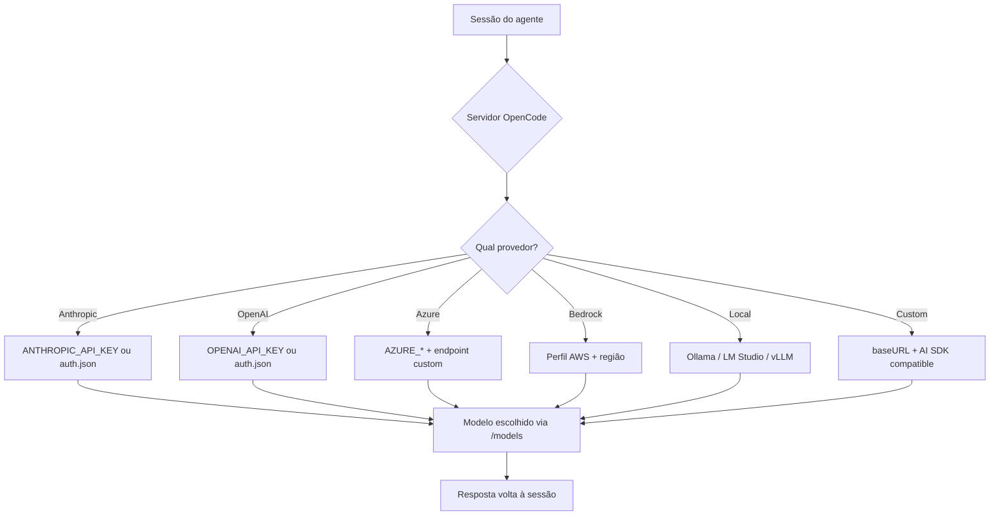

# Capítulo 4: Provedores e credenciais — conectando qualquer modelo

## 1. Introdução

No Capítulo 3, você completou o checklist de decolagem: o binário instalado, a TUI aberta, o provedor conectado de forma preliminar e o AGENTS.md versionado como plano de voo do projeto. Mas conectar "um provedor" e dominar o sistema de provedores são coisas muito diferentes — e é essa diferença que separa quem usa o OpenCode de quem o controla. O OpenCode suporta mais de 75 provedores de modelos de linguagem, dos gigantes comerciais aos modelos locais que rodam na sua própria máquina [1][2]. Neste capítulo, você vai dominar o sistema de credenciais — o auth.json, as variáveis de ambiente e o fluxo de login — e depois vai percorrer os provedores em detalhe: Anthropic, OpenAI, Azure, Bedrock, os casos de baseURL custom e os modelos locais via Ollama, LM Studio e vLLM. Ao dominar isso, você será capaz de trocar de modelo como troca de motor em pleno voo, com precisão e sem queimar credenciais — o domínio da cabine que o mercado realmente cobra.

## 2. Explica

O sistema de credenciais do OpenCode tem duas camadas complementares: o arquivo `auth.json` e as variáveis de ambiente. O `auth.json` é escrito quando você usa o fluxo de login interativo — `opencode auth login` — que abre o navegador e armazena o token emitido [3]. As variáveis de ambiente são o caminho preferido em servidores e CI, e seguem o padrão de cada provedor: `ANTHROPIC_API_KEY`, `OPENAI_API_KEY`, `GOOGLE_GENERATIVE_AI_API_KEY` e assim por diante [8]. O OpenCode também lê o arquivo `.env` do projeto, o que permite manter credenciais por repositório sem poluir o ambiente global [9]. A precedência entre camadas é um detalhe que vale ouro: a variável de ambiente sobrescreve o `auth.json` quando ambos existem, e é isso que permite, em produção, injetar chaves por ambiente sem tocar na configuração do desenvolvedor.

Essa hierarquia de credenciais é o mesmo padrão que você encontra nos grandes provedores de nuvem e em ferramentas como o AWS CLI e o gh, e ela existe por um motivo: separar o que é pessoal (o login interativo, o `auth.json` do desenvolvedor) do que é de ambiente (as variáveis de um servidor, de um pipeline de CI, de um contêiner). No seu laptop, o `opencode auth login` é o caminho natural — o navegador abre, você autoriza e o token fica no `auth.json`. No servidor da empresa, ninguém quer um fluxo de navegador: a chave vem de um cofre de segredos e entra como variável de ambiente [3][8]. A precedência — ambiente vence arquivo — é o que torna essa separação possível sem conflito: o mesmo `opencode.json` funciona nos dois mundos, porque a fonte da credencial é resolvida no momento da execução. Entender essa hierarquia é o que evita o erro mais comum de quem migra do laptop para o servidor: configurar tudo no arquivo e esquecer que a variável de ambiente, se existir, manda [8][9].

O comando `opencode auth login` é a porta de entrada para provedores com integração oficial: ele abre o navegador, você autoriza e o token é armazenado com segurança local [3][10]. Para provedores sem fluxo OAuth completo, o padrão é simplesmente exportar a variável de ambiente correspondente. O comando `opencode auth list` mostra o que está conectado, e `opencode auth logout` remove um provedor — o reflexo de higiene que todo piloto profissional tem ao final de uma sessão em máquina compartilhada [10]. Dentro da TUI, `/connect` faz o mesmo papel de forma interativa, e `/models` lista os modelos disponíveis para o provedor ativo [4][11].

Os provedores comerciais principais merecem atenção individual. A Anthropic — casa dos modelos Claude — é o provedor mais natural para agentes de codificação, e o OpenCode tem integração de primeira classe, incluindo o modelo de contexto longo e o suporte a tool calling robusto [12]. A OpenAI é igualmente suportada, com todos os modelos GPT [8]. O Azure OpenAI é o caso corporativo clássico: você configura o endpoint custom da sua instância Azure e a chave do recurso, e o OpenCode fala com o modelo através do gateway da sua organização [13][14]. O Amazon Bedrock segue o modelo AWS: em vez de uma chave única, você configura um perfil de credenciais AWS, a região e o endpoint, e o Bedrock roteia para os modelos da AWS [15]. Cada um desses provedores tem variáveis de ambiente documentadas — e o erro mais comum de quem migra entre eles é esquecer de trocar a variável certa, criando o clássico "chave inválida" que consome horas de depuração.

O caso do Azure e do Bedrock merece um detalhe a mais, porque eles representam a categoria "provedores corporativos" que cresce em importância. O Azure OpenAI não é o mesmo que a API pública da OpenAI: ele é um serviço dentro da sua assinatura Azure, com seu próprio endpoint (`https://seu-recurso.openai.azure.com`), seu próprio modelo implantado e suas próprias políticas de rede — o que permite à empresa controlar onde os dados trafegam e quem tem acesso [13][14]. O Bedrock segue a filosofia AWS: as credenciais vêm do perfil AWS configurado (as mesmas do AWS CLI), e o OpenCode usa o modelo da região especificada [15]. Para empresas, esses provedores resolvem o problema da governança de dados: o tráfego de LLM passa pela infraestrutura corporativa, com auditoria e controle. O custo dessa governança é a complexidade de configuração — exatamente o tipo de complexidade que este capítulo existe para desfazer [13][15].

O caso dos modelos locais é onde o OpenCode brilha e onde a maioria das pessoas ainda não explora o potencial. Como o OpenCode usa o Vercel AI SDK e o catálogo Models.dev, qualquer provedor compatível com a API OpenAI pode ser plugado com uma configuração declarativa — incluindo Ollama, LM Studio, vLLM e Atomic Chat [1][16]. O padrão é definir um provedor custom com `npm: "@ai-sdk/openai-compatible"` e apontar `options.baseURL` para o endereço local (ex.: `http://127.0.0.1:11434/v1` para Ollama ou `http://127.0.0.1:1234/v1` para LM Studio) [6][7][17]. A implicação é enorme: você pode rodar agentes de codificação com modelos abertos como Qwen-Coder e DeepSeek-Coder localmente, sem enviar código para nenhuma nuvem, com custo zero por token — um cenário cada vez mais relevante para empresas com políticas de dados rígidas [6][18].

A escolha entre cada ferramenta local merece um parâmetro de comparação, porque elas atacam problemas diferentes. O Ollama é o mais simples de começar: um comando baixa o modelo e o servidor local expõe a API compatível com OpenAI, com integração quase zero — a porta de entrada ideal para experimentar [6]. O LM Studio oferece uma interface gráfica para gerenciar modelos e um servidor local, sendo a escolha de quem prefere não viver só no terminal [7]. O vLLM é a opção de alto desempenho, desenhada para servir modelos grandes com eficiência de produção — o caminho para equipes que rodam modelos locais em servidores dedicados [16]. O Atomic Chat leva o conceito ao extremo da simplicidade: um app desktop que roda LLMs locais atrás de uma API OpenAI-compatível no `http://127.0.0.1:1337/v1`, com integração zero-setup com o OpenCode [17]. A escolha não é "qual é melhor", mas "qual serve ao seu cenário": experimentar, desenvolver localmente, servir em produção ou simplesmente ter privacidade total.

O trade-off dos modelos locais também precisa ser honesto: eles custam zero por token, mas custam em hardware e em capacidade. Modelos locais pequenos resolvem tarefas simples com ótima latência, mas tarefas complexas de engenharia — refatorações amplas, raciocínio multi-arquivo — ainda favorecem modelos grandes na nuvem [6][16]. A prática profissional é uma matriz híbrida: o modelo local para o trabalho rotineiro e sensível, o modelo na nuvem para o trabalho complexo, e o `small_model` para as tarefas auxiliares — exatamente a matriz que fecharemos no Capítulo 10 com a análise de custo [19][22].

O catálogo Models.dev é o elo que conecta tudo: é ele que fornece ao OpenCode os metadados de cada modelo — contexto, preço, capacidades — e é por isso que o comando `opencode models` funciona tão bem [2]. Quando um novo modelo é lançado, ele aparece no catálogo e fica disponível no OpenCode sem atualização manual. O gerenciamento de modelos também envolve a decisão estratégica de `small_model`: um modelo pequeno e barato para tarefas auxiliares — como gerar títulos de sessão ou resumos — enquanto o modelo grande cuida do raciocínio principal [19]. Essa divisão é uma das alavancas de economia de tokens mais subestimadas, e vamos quantificá-la no Capítulo 10.

Vale explorar o que exatamente o `small_model` faz, porque a descrição oficial é enxuta e o impacto real é grande. As tarefas auxiliares do agente — gerar um título para a sessão, resumir o histórico antes da compactação, gerar metadados — não exigem o modelo principal: são tarefas curtas de baixa complexidade, onde um modelo pequeno e barato resolve com a mesma qualidade prática e fração do custo [19]. Configurar o `small_model` no `opencode.json` é a primeira economia automática que o profissional implementa, e ela não degrada a experiência — a maior parte do trabalho pesado continua no modelo principal. A omissão mais comum: deixar o `small_model` desconfigurado e ver o agente usar o modelo caro até para gerar um título de sessão — um desperdício silencioso que se acumula ao longo de semanas [19][22].

A decisão de provedor também tem uma dimensão de resiliência que os profissionais consideram: a redundância. Depender de um único provedor cria um ponto único de falha — se a API cai ou a política de preços muda, a operação para. O padrão maduro configura pelo menos dois provedores no `opencode.json` (o principal e um reserva) e sabe trocar com um `/models` ou uma mudança de chave `model` em segundos [1][4]. Essa redundância é barata de manter (a configuração é declarativa) e cara na sua ausência (uma interrupção de provedor no meio de um sprint). E ela se conecta à estratégia de modelos locais: um provedor local como reserva — sempre disponível, mesmo quando a nuvem falha — é a forma mais robusta de redundância que o ecossistema oferece [6][1].

O cenário de 2026 tornou essa flexibilidade ainda mais valiosa, porque o leque de provedores cresceu em direções diferentes — e o OpenCode acompanhou todas [1][2]. Além dos gigantes históricos, o catálogo inclui provedores de inferência acelerada como Cerebras e Groq, que priorizam latência bruta para modelos abertos; provedores de borda como o Cloudflare Workers AI, que rodam modelos perto do usuário; e provedores regionais como o DeepSeek, que disputam o mercado de modelos abertos com preços agressivos [1][2]. Cada um desses provedores entra no OpenCode pelo mesmo padrão declarativo — `npm`, `baseURL` e `apiKey` — e a consequência prática é dupla: o catálogo de modelos que você pode pilotar cresce sem atualização manual, e a comparação entre provedores vira uma operação de rotina com `opencode models` [2][14]. O profissional de 2026 não pergunta "qual é o melhor modelo?", mas "qual provedor entrega o melhor modelo para esta tarefa, a este preço, com esta latência, dentro desta política de dados?" — e é exatamente essa pergunta que a matriz de decisão deste capítulo responde [1][2][19].

Vale também uma palavra sobre o cenário que mais confunde iniciantes: a diferença entre o modelo e o provedor que o serve — porque ela aparece a cada troca de provedor. O mesmo modelo aberto (por exemplo, um Qwen-Coder ou um DeepSeek-Coder) pode ser servido por vários provedores — pelo próprio criador, por um provedor de inferência acelerada, por um serviço de borda ou localmente na sua máquina [1][6][16]. A qualidade do raciocínio é a mesma (é o mesmo modelo), mas a latência, o preço e a política de dados mudam por completo. Essa distinção liberta a escolha: em vez de ficar preso a um provedor porque ele tem "o modelo X", você escolhe o modelo pela tarefa e o provedor pela entrega — e o OpenCode, com o catálogo Models.dev como fonte de verdade, torna essa separação operacional [1][2][6].

## 3. Ilustra

Pense nas credenciais como o crachá de acesso à torre de controle — e nos provedores como as diferentes torres de uma mesma malha aérea. Cada torre (Anthropic, OpenAI, Google, DeepSeek) exige um crachá diferente (uma chave de API), e o OpenCode é o piloto que carrega todos os crachás na mesma bolsa — o arquivo `auth.json`, guardado em `~/.local/share/opencode/auth.json` [3]. A metáfora ilumina um ponto crítico que a documentação menciona de passagem: a bolsa de crachás é um arquivo de texto com todas as suas chaves, e protegê-la é tão importante quanto proteger a senha do seu e-mail. A segurança das credenciais é o primeiro item da lista de "o que ninguém te conta" que este livro vai destrinchar no Capítulo 10 — mas desde já: ninguém compartilha o arquivo `auth.json`, ninguém o commita, e ele nunca entra em um link de compartilhamento de sessão.



O diagrama mostra o ponto central: o servidor do OpenCode é o roteador que decide para qual torre mandar cada requisição, usando o crachá certo para cada uma. A escolha do provedor e do modelo é declarativa — configuração, não código — e é feita no `opencode.json` (a chave `model` e `provider`) ou em tempo real com `/models` na TUI [4][5]. O que o diagrama não mostra é a parte mais valiosa: a capacidade de usar modelos locais — onde o "crachá" nem existe, porque a torre é a sua própria máquina. Essa é a liberdade que nenhum provedor comercial oferece: dados que nunca saem do seu computador, zero custo por token e privacidade total [6][7].

A metáfora da torre de controle também explica a hierarquia de escolha de modelo que os profissionais usam: o modelo de alta qualidade é a torre principal da sua rota habitual; o `small_model` é a torre secundária, usada para comunicações rápidas de baixo custo; e o modelo local é a torre particular — sempre disponível, mesmo quando a malha aérea comercial está congestionada ou proibida para os seus dados [19][6]. Como Piloto de Desenvolvimento, você não precisa escolher uma única torre para sempre: a configuração declarativa do OpenCode permite planejar a rota completa antes de decolar e trocar de torre em pleno voo com um único comando `/models` [4].

## 4. Técnica

### O fluxo de autenticação em detalhe

Vale dissecar o que acontece no `opencode auth login` — porque o fluxo de autenticação é a primeira coisa que os iniciantes não entendem e a primeira que os profissionais dominam. O comando inicia um fluxo OAuth com o provedor: abre o navegador, você autoriza o acesso e o token retorna ao OpenCode, que o armazena no `auth.json` [3][10]. O token é uma credencial de longa duração que o OpenCode usa automaticamente nas chamadas — e é exatamente por isso que o `auth.json` é um alvo: quem copia o arquivo copia o acesso [3]. No fluxo alternativo, a chave de API do provedor entra por variável de ambiente — sem navegador, sem arquivo de token, ideal para servidores e CI [8]. A distinção entre os dois fluxos é a mesma entre "login com a conta" (token OAuth, interativo) e "chave de API" (credencial estática, programática) — e o profissional sabe qual usar em cada contexto: interativo na máquina pessoal, variável de ambiente em produção [3][8][10].

### O formato dos identificadores de modelo

Antes do arquivo de configuração, vale dominar um detalhe de sintaxe que aparece em toda a operação: o formato dos identificadores de modelo. O OpenCode identifica um modelo como `provedor/modelo` — por exemplo, `anthropic/claude-sonnet-4-5` ou `openai/gpt-4o` — e esse identificador é o que você usa na chave `model` do config, na flag `--model` do run e no `/models` da TUI [1][4]. A convenção tem uma razão de design: ela torna o provedor parte do endereço do modelo, eliminando a ambiguidade de dois provedores oferecerem modelos com nomes parecidos. O catálogo Models.dev é a fonte canônica desses identificadores — o `opencode models` os lista com os metadados (contexto, preço, capacidades) e o `models.dev` permite consultá-los fora do terminal [2][14]. O erro mais comum de quem começa: digitar o nome do modelo sem o prefixo do provedor, ou com o prefixo errado — e o `opencode models <provedor>` é a verificação que resolve antes de gastar um token.

### O arquivo de configuração

A configuração de provedores é declarativa e fica no `opencode.json` do projeto ou na configuração global. Veja o padrão completo, do comercial ao local:

```json
{
  "$schema": "https://opencode.ai/config.json",
  "model": "anthropic/claude-sonnet-4-5",
  "small_model": "anthropic/claude-haiku-4-5",
  "provider": {
    "openai": {
      "options": {
        "apiKey": "{env:OPENAI_API_KEY}"
      }
    },
    "azure": {
      "npm": "@ai-sdk/azure",
      "options": {
        "resourceName": "{env:AZURE_RESOURCE_NAME}",
        "apiKey": "{env:AZURE_API_KEY}"
      }
    },
    "local-ollama": {
      "npm": "@ai-sdk/openai-compatible",
      "options": {
        "baseURL": "http://127.0.0.1:11434/v1"
      },
      "models": {
        "qwen2.5-coder:14b": {
          "name": "Qwen Coder 14B"
        }
      }
    }
  }
}
```

Esse arquivo mostra os três padrões que você vai encontrar no mundo real: provedor com integração nativa (openai, com chave via variável de ambiente), provedor corporativo com endpoint custom (azure) e provedor local compatível com OpenAI (ollama, com baseURL e mapeamento de modelos) [4][6][13]. Note o uso de `{env:VARIAVEL}` para referenciar variáveis de ambiente — a prática profissional que mantém segredos fora do arquivo de configuração.

O fluxo de credenciais na linha de comando cobre o ciclo completo de vida:

```bash
# Login interativo (abre o navegador)
opencode auth login

# Ver o que está conectado
opencode auth list

# Remover um provedor
opencode auth logout anthropic

# Ver os modelos disponíveis
opencode models
opencode models anthropic
```

Uma observação sobre a variável de ambiente e o `.env` do projeto: o OpenCode lê o arquivo `.env` na raiz do repositório e expõe as variáveis para o agente — o que é conveniente para manter chaves por projeto, mas exige disciplina. O `.env` deve estar no `.gitignore`, e a leitura dele pelo agente é negada por padrão pelo sistema de permissões (Capítulo 7) — uma proteção em camadas que existe justamente porque o `.env` é um alvo óbvio de exfiltração [9][20][21]. O padrão profissional: `{env:VARIAVEL}` no config, variáveis no ambiente do shell ou no `.env` do projeto, e o `.env` protegido por permissão de arquivo e por `.gitignore` — nunca no repositório.

O fluxo completo de conexão de um provedor novo pode ser resumido em uma sequência de verificação que evita o erro clássico do "chave inválida": primeiro, obtenha a chave no painel do provedor; segundo, decida a via — `auth login` interativo ou variável de ambiente; terceiro, configure o identificador do modelo no `opencode.json`; quarto, verifique com `opencode auth list` que o provedor aparece; quinto, verifique com `opencode models` que o modelo é reconhecido; sexto, rode um prompt mínimo para validar de ponta a ponta. Essa sequência de seis passos — chave, via, identificador, auth, models, prompt — é o checklist de conexão que os profissionais repetem em cada provedor novo, e é ela que transforma a configuração de uma aposta em um procedimento [10][20][1].

Para modelos locais, o padrão técnico é subir o servidor local compatível com a API OpenAI e configurar o provedor custom:

```bash
# Ollama — serve a API OpenAI-compatível na porta 11434
ollama serve

# LM Studio — ative o servidor local (padrão porta 1234)
# vLLM — sirva o modelo com --api-key opcional

# Depois, no opencode.json, use @ai-sdk/openai-compatible
# apontando o baseURL para o servidor local
```

A verificação de que tudo está conectado é parte do checklist profissional:

```bash
# Mostra os provedores autenticados e a configuração ativa
opencode auth list
opencode debug config
```

O `opencode debug config` exibe a configuração mesclada — com as credenciais resolvidas a partir das variáveis de ambiente — e é o instrumento que confirma se a torre de controle está escutando o seu plano de voo antes de você gastar tokens [10][20].

### O ciclo de vida da credencial

Uma dimensão da segurança de credenciais que a maioria dos tutoriais pula é o ciclo de vida — porque a chave não é um objeto estático, mas um ativo que nasce, vive e deve morrer. A credencial nasce quando você a gera no painel do provedor ou autentica via OAuth [3][10]. Ela vive enquanto é usada — e quanto mais tempo vive, maior a janela de exposição: uma chave que rodou em três máquinas, dois CI e um notebook antigo tem um perímetro de risco que você não controla mais. E ela deve morrer quando deixa de ser necessária: ao final de um contrato, na saída de um colaborador, na troca de provedor — o `opencode auth logout` remove a credencial do `auth.json`, e a revogação definitiva acontece no painel do provedor [10][3]. O padrão profissional inclui três práticas: rotação periódica (regenerar chaves em um intervalo definido), escopo mínimo (a chave com as permissões estritamente necessárias) e inventário (saber, em qualquer momento, quais credenciais existem e onde — o `opencode auth list` é o começo desse inventário) [3][10][21]. Quem trata a credencial como um ativo com ciclo de vida — não como um segredo eterno — reduz a superfície de exposição da operação inteira, e é essa disciplina que o Capítulo 10 vai transformar em política de segurança [21].

### A hierarquia de modelos dentro de um provedor

Vale também mapear a hierarquia de modelos dentro de um provedor — porque ela explica as opções que aparecem no `/models` e a lógica de escolha. A maioria dos provedores oferece uma família de modelos com trade-offs internos: o modelo premium (mais caro, mais capaz, para tarefas complexas), o modelo balanceado (meio-termo entre custo e qualidade, o padrão do dia a dia) e o modelo leve (barato e rápido, para tarefas rotineiras) [8][19]. O OpenCode traduz essa hierarquia em configuração: o `model` aponta para o padrão do dia a dia, o `small_model` para o leve e a troca manual pelo `/models` cobre os casos especiais [4][19]. O erro mais comum de quem começa é tratar todos os modelos do provedor como equivalentes e escolher pelo nome — quando a escolha certa é por trade-off: a tarefa define o modelo, não o contrário [8][19]. E a hierarquia também existe entre provedores: o modelo premium de um provedor pode ser inferior ao balanceado de outro, e é por isso que o catálogo Models.dev — com seus metadados comparáveis — é a ferramenta de decisão, não a reputação da marca [2][14].

### A matriz de decisão de provedores

Antes da aplicação, vale consolidar a matriz de decisão que os profissionais usam para escolher provedores — porque a escolha de modelo é uma decisão de engenharia com trade-offs explícitos, e ter a matriz na cabeça evita decisões por empolgação. A matriz tem quatro eixos: qualidade (o modelo resolve bem o tipo de tarefa?), latência (responde rápido o suficiente para o loop do agente?), custo (o preço por token cabe no orçamento?) e privacidade (os dados podem sair da máquina?). Os modelos comerciais de alto nível ganham em qualidade, mas custam por token e enviam dados à nuvem. Os modelos locais ganham em privacidade e custo marginal zero, mas perdem em qualidade e exigem hardware. Os provedores corporativos (Azure, Bedrock) ganham em governança, mas adicionam complexidade de configuração [1][6][13][15]. A matriz resolve o caso concreto: uma empresa com dados de clientes sob NDA coloca privacidade acima de tudo — modelos locais ou Azure; uma startup sem orçamento coloca custo primeiro — modelos abertos com small_model; um time de produto que precisa da melhor refatoração possível coloca qualidade primeiro — o melhor modelo comercial [10][19]. A mesma matriz, aplicada por projeto, é o que transforma a escolha de modelo de palpite em engenharia.

A aplicação prática da matriz tem um instrumento que a maioria das pessoas não usa: o teste comparativo controlado — o benchmark do próprio fluxo [1][2][22]. A ideia é simples e poderosa: em vez de decidir o modelo pela reputação ou pela tabela de preços, rode a mesma tarefa representativa do seu trabalho em dois ou três candidatos e compare com métricas objetivas — a qualidade do resultado, o número de passos que cada um precisou (mais passos = mais custo) e a sensação de latência [10][22]. O `opencode run` com `--model provedor/modelo` (Capítulo 6) torna esse teste operacional: o mesmo prompt, o mesmo repositório, modelos diferentes [1][2]. O que o teste revela costuma contrariar o marketing: o modelo mais caro nem sempre é o que resolve a sua tarefa com menos passos, e o modelo mais barato do catálogo pode ser suficiente para uma fatia grande do seu trabalho [10][22]. A regra do benchmark: use tarefas reais (não exemplos da documentação), meça passos e qualidade (não apenas preço) e documente o resultado (para que a decisão seja revisável, não um palpite renovado). Esse é o mesmo espírito do estudo de consumo de tokens — a evidência sobrepõe a intuição — aplicado à escolha do motor da sua cabine [22][10].

## 5. Aplica

Cena de contraste. Você configura um provedor novo no `opencode.json`, copiando um exemplo da documentação. Roda o primeiro prompt e recebe um erro de autenticação. Você tenta de novo, troca a chave, tenta de novo — nada. Depois de uma hora, você descobre: o exemplo usava o provedor `openai` com a variável `OPENAI_API_KEY`, mas você queria usar o Azure, que usa `AZURE_*` — e a variável certa nem estava definida no seu ambiente [13]. O diagnóstico técnico: você não consultou o instrumento certo. O `opencode auth list` teria mostrado que o provedor não estava autenticado, e o `opencode debug config` teria mostrado qual variável o OpenCode estava procurando.

Agora a prática correta. Você configura o provedor, mas antes do primeiro prompt roda a verificação: `opencode auth list` para confirmar o crachá, `opencode models` para confirmar que o catálogo reconhece o modelo e `opencode debug config` para confirmar a configuração mesclada. Se algo estiver errado, o erro aparece na verificação, não no meio de um voo longo. Esse hábito — verificar antes de voar — é o que transforma a configuração de provedores de uma fonte de turbulência em um procedimento de rotina.

As armadilhas práticas desse capítulo, em síntese: primeiro, tratar todas as chaves como se fossem iguais — cada provedor tem variáveis e endpoints próprios, e copiar o padrão de um para o outro é a receita clássica de erro de autenticação; segundo, deixar chaves no `opencode.json` em vez de usar `{env:VARIAVEL}` — um arquivo commitado vaza credenciais para o histórico do Git; terceiro, negligenciar a proteção do `auth.json` — o arquivo com todas as chaves em texto plano exige as mesmas proteções que um cofre [3][21]; quarto, não explorar modelos locais — empresas com dados sensíveis podem rodar agentes inteiros localmente com Ollama ou vLLM, e a maioria nem sabe que isso é possível [6][7]; quinto, esquecer o `small_model` — rodar todas as tarefas auxiliares no modelo caro é desperdício sistemático de tokens [19]; sexto, esquecer de revogar o acesso em máquinas compartilhadas — `opencode auth logout` ao final da sessão é o reflexo de higiene que impede que a próxima pessoa use as suas credenciais [10][3].

No mercado, o profissional que domina o sistema de provedores trata a escolha de modelo como uma decisão de engenharia com trade-offs explícitos: latência, custo, privacidade e qualidade. Um estudo de 2026 sobre consumo de tokens em agentes de codificação mostrou que a escolha do provedor e a estrutura da tarefa são os fatores dominantes do custo — mais que a quantidade de prompts [22]. Empresas maduras definem uma matriz de modelos: o modelo de alta qualidade para tarefas complexas, o modelo barato para tarefas rotineiras, o modelo local para dados sensíveis. O OpenCode, com seus 75+ provedores e o suporte nativo a modelos locais, é a ferramenta que permite operar essa matriz inteira a partir de uma única cabine de comando.

Um caso concreto de aplicação completa da matriz — e o cenário que fecha o capítulo: a empresa com política de dados rígida. O time precisa de agentes de codificação, mas o código-fonte de clientes não pode sair da infraestrutura corporativa [6][13]. O desenho maduro usa três camadas de provedores: na camada de raciocínio pesado, um modelo comercial servido pelo provedor corporativo da empresa (Azure OpenAI ou Bedrock, com o tráfego passando pela infraestrutura auditada) [13][15]; na camada de tarefas rotineiras, o mesmo provedor corporativo com um modelo menor configurado como `small_model` [19]; e na camada de experimentação e tarefas sensíveis, um modelo local via vLLM ou Ollama, com custo zero por token [6][16]. O `opencode.json` dessa empresa declara os três provedores — corporativo, corporativo leve e local — e a troca entre eles é uma decisão de tarefa, não de infraestrutura [4][6]. O que torna esse desenho possível — e o que este capítulo entregou — é o sistema de credenciais em camadas e a configuração declarativa: o mesmo arquivo de configuração opera os três mundos, com a precedência do ambiente sobre o arquivo mantendo os segredos fora do repositório [3][4][8].

Um detalhe de higiene de credenciais que fecha a aplicação — porque ele previne a classe de incidente mais comum em times que adotam agentes: o vazamento de chave em artefatos compartilhados [3][21]. O cenário é banal: um desenvolvedor cola uma chave de API em uma mensagem de chat do time, em um comentário de PR ou em um link de sessão compartilhada — e a chave agora circula em um canal que o provedor não protege [3][21]. As três proteções que o profissional usa: primeiro, nunca digitar a chave literal em lugar nenhum que não seja o cofre de segredos ou o painel do provedor — o reflexo de tratar a chave como senha, não como texto [3]; segundo, usar `{env:VARIAVEL}` em toda configuração versionada, para que o arquivo não contenha segredo algum [8]; terceiro, o plano de resposta: se uma chave vazar, revogá-la imediatamente no painel do provedor e regenerar — nunca continuar usando uma chave que circulou, porque o custo de trocar é minutos e o custo de um acesso indevido é imprevisível [3][21]. Esse hábito de higiene é a mesma disciplina do `auth.json` protegido do Capítulo 10 — a diferença é que aqui o risco está na circulação, não no arquivo, e a prevenção é comportamental antes de ser técnica [3][8][21].

## 6. Conclusão

Você dominou o sistema de credenciais — o auth.json, as variáveis de ambiente, o fluxo de login e a precedência entre camadas — e percorreu os provedores em detalhe: os integrados, os corporativos com endpoint custom (Azure, Bedrock), os compatíveis com OpenAI e os modelos locais via Ollama, LM Studio e vLLM [3][8][13][15][6]. Você viu o padrão declarativo do `opencode.json`, a prática de `{env:VARIAVEL}` para manter segredos fora do repositório e o ritual de verificação com `opencode auth list` e `opencode debug config` [4][10][20]. E você entendeu o papel do catálogo Models.dev como o elo que dá ao OpenCode a consciência de cada modelo disponível [2].

Recapitulando os três pontos centrais: primeiro, o sistema de credenciais tem duas camadas — auth.json para o fluxo interativo e variáveis de ambiente para servidores e CI — com precedência do ambiente sobre o arquivo [3][8][9]. Segundo, os provedores se dividem em integrados, corporativos com endpoint custom e locais compatíveis com OpenAI, cada um com seu padrão de configuração [8][13][15][6]. Terceiro, a escolha de modelo é uma decisão de engenharia guiada por uma matriz de quatro eixos — qualidade, latência, custo e privacidade — e o OpenCode permite operar a matriz inteira a partir de uma única configuração [1][6][19].

Seu desafio agora: configure o `opencode.json` do seu projeto com um provedor real e o `small_model` correspondente, usando `{env:VARIAVEL}` para as chaves — e valide com `opencode auth list` e `opencode models` antes do primeiro prompt. E prepare-se para o próximo voo: no Capítulo 5, vamos deixar o solo e dominar a TUI — os slash commands, os keybinds e os modos Build e Plan que definem o seu ritmo diário na cabine.

O checklist de decolagem está completo: cabine pronta, combustível no tanque e comunicação com a torre estabelecida. No Capítulo 5, vamos deixar o solo: você vai dominar a TUI — os slash commands, os keybinds com leader key, os temas e os modos Build e Plan que definem o ritmo do seu trabalho diário na cabine. Com os instrumentos configurados, é hora de pilotar em cruzeiro.

## 7. Referências Bibliográficas

[1] OPENCODE. *Providers — Using any LLM provider in OpenCode*. Disponível em: https://opencode.ai/docs/providers. Acesso em: 03 ago. 2026.

[2] MODELS.DEV. *Models.dev — open model catalog*. Disponível em: https://models.dev. Acesso em: 03 ago. 2026.

[3] ANOMALYCO. *OpenCode — AI coding agent built for the terminal*. Disponível em: https://opencode.ai. Acesso em: 03 ago. 2026.

[4] OPENCODE. *Config — Using the OpenCode JSON config*. Disponível em: https://opencode.ai/docs/config. Acesso em: 03 ago. 2026.

[5] OPENCODE. *Agents — Configure and use specialized agents*. Disponível em: https://opencode.ai/docs/agents. Acesso em: 03 ago. 2026.

[6] OLLAMA. *Ollama — run LLMs locally*. Disponível em: https://ollama.com. Acesso em: 03 ago. 2026.

[7] LM STUDIO. *LM Studio — run local LLMs*. Disponível em: https://lmstudio.ai. Acesso em: 03 ago. 2026.

[8] OPENCODE. *Providers — variáveis de ambiente padrão*. Disponível em: https://opencode.ai/docs/providers. Acesso em: 03 ago. 2026.

[9] OPENCODE. *Config — environment e variáveis de ambiente*. Disponível em: https://opencode.ai/docs/config. Acesso em: 03 ago. 2026.

[10] OPENCODE. *CLI — OpenCode CLI options and commands*. Disponível em: https://opencode.ai/docs/cli. Acesso em: 03 ago. 2026.

[11] OPENCODE. *TUI — comandos e modelos*. Disponível em: https://opencode.ai/docs. Acesso em: 03 ago. 2026.

[12] ANTHROPIC. *Claude Code documentation*. Disponível em: https://docs.anthropic.com/en/docs/claude-code. Acesso em: 03 ago. 2026.

[13] OPENCODE. *Providers — Azure OpenAI e Cognitive Services*. Disponível em: https://opencode.ai/docs/providers. Acesso em: 03 ago. 2026.

[14] OPENCODE. *Config schema — opencode.ai/config.json*. Disponível em: https://opencode.ai/config.json. Acesso em: 03 ago. 2026.

[15] OPENCODE. *Providers — Amazon Bedrock*. Disponível em: https://opencode.ai/docs/providers. Acesso em: 03 ago. 2026.

[16] VLLM. *vLLM — fast LLM inference*. Disponível em: https://docs.vllm.ai. Acesso em: 03 ago. 2026.

[17] OPENCODE. *Providers — modelo local OpenAI-compatível*. Disponível em: https://opencode.ai/docs/providers. Acesso em: 03 ago. 2026.

[18] ANOMALYCO. *OpenCode — repositório oficial (antigo sst/opencode)*. Disponível em: https://github.com/anomalyco/opencode. Acesso em: 03 ago. 2026.

[19] OPENCODE. *Config — small_model*. Disponível em: https://opencode.ai/docs/config. Acesso em: 03 ago. 2026.

[20] OPENCODE. *CLI reference — opencode debug*. Disponível em: https://opencode.ai/docs/cli. Acesso em: 03 ago. 2026.

[21] OPENCODE. *Permissions — Control which actions require approval to run*. Disponível em: https://opencode.ai/docs/permissions. Acesso em: 03 ago. 2026.

[22] BAI, Longju; HUANG, Zhemin; WANG, Xingyao; SUN, Jiao; MIHALCEA, Rada; BRYNJOLFSSON, Erik; PENTLAND, Alex; PEI, Jiaxin. *How Do AI Agents Spend Your Money? Analyzing and Predicting Token Consumption in Agentic Coding Tasks*. arXiv, 2026. Disponível em: https://arxiv.org/abs/2604.22750. Acesso em: 03 ago. 2026.
