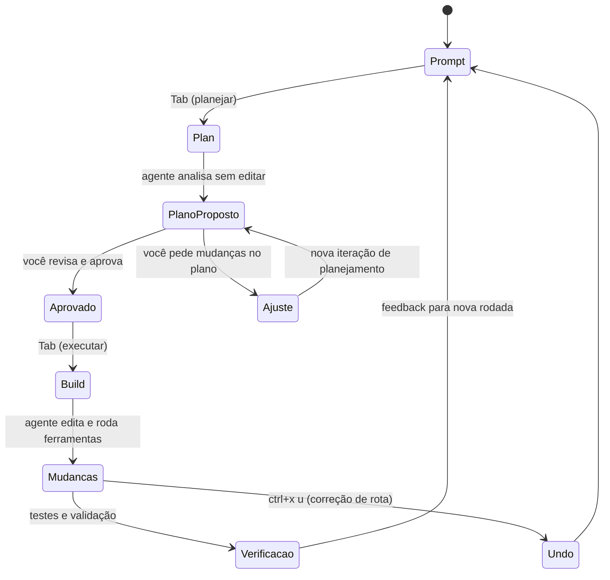

# Capítulo 5: Dominando a TUI — comandos, keybinds e os modos Build/Plan

## 1. Introdução

No Capítulo 4, você conectou os provedores e dominou o sistema de credenciais — a comunicação com a torre de controle está estabelecida, e a cabine está pronta para operar. Agora começa a parte que a maioria das pessoas usa sem dominar: a TUI, a interface de texto que é o coração do OpenCode. A diferença entre um usuário casual e um Piloto de Desenvolvimento proficiente está nos detalhes que a documentação lista mas não ensina: os slash commands que economizam minutos, os keybinds que mantêm as mãos no teclado, os temas que preservam a legibilidade e, acima de tudo, o fluxo Build/Plan que separa quem planeja antes de agir de quem deixa o agente pilotar no automático. Neste capítulo, você vai operar a TUI com fluência — do `/init` ao `/share`, do modo Plan ao modo Build, da menção de arquivos com `@` à alternância de agentes com Tab. Ao dominar isso, o OpenCode deixa de ser uma ferramenta que você consulta e vira a cabine onde você trabalha todos os dias.

## 2. Explica

A TUI do OpenCode é uma interface de texto de alta produtividade, desenhada para quem vive no terminal. O comando `opencode` sem argumentos a inicia, e ela carrega a última sessão — retomando de onde você parou [1]. A interface é dividida em painéis: o histórico da conversa, a área de entrada do prompt e os indicadores de estado — o agente ativo, o modelo em uso e o modo corrente. O que distingue a TUI do OpenCode de um chat comum é a riqueza de ações diretas: você não apenas digita texto, você opera a sessão — desfaz, refaz, compartilha, alterna agentes, troca de modelo — tudo com comandos curtos e keybinds [2][3].

A ergonomia da TUI é o resultado de uma escolha de design deliberada: enquanto um chat de navegador é otimizado para o mouse e para a leitura passiva, a TUI é otimizada para o teclado e para a operação ativa. Cada elemento da interface tem um papel no fluxo: o histórico mostra o que o agente fez (a auditabilidade), a área de entrada captura o próximo pedido (a intenção) e os indicadores de estado mostram quem está operando — qual agente, qual modelo, qual modo (a consciência situacional) [1][3]. O que a maioria dos usuários não percebe é que esses três elementos formam um ciclo: o estado informa o próximo prompt, o prompt altera o estado, e o histórico registra a transição. Entender essa estrutura é o que permite você ler a TUI como um painel de instrumentos — não como uma caixa de chat — e operá-la com a precisão de quem lê altitude, velocidade e rumo antes de cada manobra [2][3].

Uma observação sobre o modo minimalista que a documentação lista entre as flags: `opencode --mini` inicia a interface reduzida, sem o replay completo do histórico na retomada — um modo pensado para sessões de uma tarefa só, onde o ruído visual de sessões anteriores atrapalha mais do que ajuda [3]. O mesmo espírito de ergonomia aparece na revisão de diffs dentro da TUI: quando o agente edita um arquivo, o painel mostra o que mudou em contraste, e você pode ler cada alteração antes de aprová-la ou desfazê-la [2][7]. Essa capacidade de revisar o trabalho no ponto de origem — sem sair da sessão, sem abrir outra ferramenta — é parte do que torna a TUI uma cabine de verdade: o instrumento de leitura do trabalho do copiloto está no mesmo painel em que você opera, e o ciclo revisar/desfazer/redirecionar acontece em segundos [2][7][11]. O usuário casual vê a TUI como um chat com teclas a mais; o profissional a vê como um console de controle onde cada manobra — propor, editar, revisar, desfazer — tem o seu instrumento dedicado [2][3]. O `--no-replay` e o `--replay-limit` refinam esse comportamento: desabilitar o replay na retomada ou limitar a quantas mensagens o histórico visual volta. Essas opções são a resposta do OpenCode a um problema real — sessões longas renderizando megabytes de histórico — e quem opera com sessões extensas descobre cedo o valor de calibrá-las. A TUI, como toda boa cabine, é configurável até nos detalhes de display [3][9].

Os slash commands são o vocabulário essencial da TUI. Comandos internos como `/init` (gera o AGENTS.md), `/undo` (desfaz a última mudança), `/redo` (refaz), `/share` (compartilha a sessão), `/connect` (conecta provedor), `/models` (troca modelo), `/theme` (muda tema) e `/help` (ajuda contextual) cobrem as operações do dia a dia [4][5]. Além dos internos, o OpenCode suporta comandos custom: você escreve um arquivo Markdown em `.opencode/commands/*.md` com frontmatter e o corpo do prompt — ou define comandos na chave `command` do `opencode.json` — e ganha uma operação repetível com variáveis de substituição como `$ARGUMENTS`, `$1..$n`, `!comando` (executar shell) e `@arquivo` (referenciar arquivo) [6]. O padrão profissional é transformar todo prompt recorrente em um comando custom: revisão de PR, geração de testes, análise de segurança — cada um vira um `/comando` com a mesma qualidade de sempre.

A distinção entre comando custom e agente custom (Capítulo 7) vale um esclarecimento, porque é uma das confusões mais comuns da configuração. Um comando custom é um atalho de prompt: ele injeta um texto pré-definido na conversa, possivelmente com argumentos — é o "macro" da TUI. Um agente custom é uma entidade de comportamento: define um modo de operação com prompt, modelo, ferramentas e permissões próprias — é o "especialista". A regra prática: se a tarefa é "executar este prompt específico", é um comando; se a tarefa é "operar com esta persona e estas restrições", é um agente. Muitos fluxos usam os dois juntos — um comando `/revisar-seguranca` que invoca o agente `security-reviewer` — e entender a separação é o que permite compor os dois sem confusão [6][8].

Os keybinds completam a ergonomia. O OpenCode usa uma leader key — por padrão `ctrl+x` — que precede os atalhos de ação, evitando conflitos com os atalhos do shell e de outras ferramentas [7]. A alternância entre agentes primários (Build e Plan) é feita com Tab — o gesto mais importante da TUI, porque alterna entre "executar" e "planejar" [2][8]. O undo e o redo têm keybinds dedicados, e a cópia de mensagens, a navegação entre sessões e o scroll são configuráveis no `tui.json` — o arquivo que centraliza a personalização da TUI, com schema documentado [9][10]. A personalização de keybinds não é cosmética: é a diferença entre uma interface que respeita seu fluxo e uma que o obriga a se adaptar.

O desenho de keybinds do OpenCode segue um princípio que vale a pena entender, porque explica por que ele funciona tão bem no terminal: a leader key desloca o namespace. Em vez de cada atalho ocupar uma combinação global — o que colidiria com o shell, o tmux, o vim e o editor — o OpenCode reserva uma única tecla (ctrl+x) e combina com uma segunda. O resultado é um vocabulário de gestos que não pisa nos atalhos de mais ninguém [7]. Esse princípio de design — respeitar o ecossistema ao redor em vez de competir com ele — é o mesmo que guia a escolha do terminal como superfície (Capítulo 1) e a separação cliente-servidor (Capítulo 2). Quando você personaliza os keybinds, está desenhando o seu próprio fluxo dentro de um sistema que foi projetado para ser extensível, não para ser decorado.

A navegação entre sessões dentro da TUI é outro pilar de produtividade que a maioria usa sem estratégia. Cada tarefa significativa — uma feature, uma investigação, uma refatoração — merece uma sessão própria, porque o contexto de cada uma é o que a mantém eficiente. Misturar tarefas na mesma sessão contamina o contexto: o agente passa a carregar informação de tarefas anteriores, e a qualidade das respostas degrada [19][3]. A disciplina de sessões — uma tarefa por sessão, retomada pelo seletor, encerrada quando concluída — é o mesmo princípio de higiene de contexto que estudamos no Capítulo 2, aplicado na operação diária. O profissional não troca de sessão porque quer; troca porque sabe que o contexto limpo é o combustível do agente.

O fluxo Build/Plan é o conceito central de operação. O modo Plan (Tab) faz o agente analisar a tarefa e propor uma implementação sem tocar em nenhum arquivo; o modo Build executa as mudanças. A documentação recomenda explicitamente esse padrão para features: planejar primeiro, revisar o plano, depois executar [2][11]. A lógica é simples e profunda ao mesmo tempo: um agente que edita antes de explicar o que vai fazer é uma aposta; um agente que propõe e espera aprovação é uma colaboração. O modo Plan transforma o agente em um consultor que desenha a rota antes de você decolar — e é exatamente esse controle que o piloto profissional exige.

Vale detalhar o que acontece em cada modo, porque a descrição curta esconde a diferença real de comportamento. No modo Plan, o agente ainda usa todas as ferramentas de leitura — explora o repositório, busca o código relevante, analisa a arquitetura — mas as ferramentas de edição e execução ficam restritas: o plano é a entrega, não o código [2][8]. O resultado é um documento de implementação: quais arquivos mudar, o que muda em cada um, quais riscos existem, qual a ordem de execução. No modo Build, o agente executa o plano aprovado — edita, roda testes, itera — e cada passo continua visível e reversível [2][11]. A transição entre os modos com Tab preserva o estado da sessão: você planeja, aprova, executa, e o contexto flui entre as fases sem perder nada. Essa continuidade de estado é o que torna o fluxo prático — não são duas ferramentas, é um único agente com duas fases [2][8][11].

O contexto que você dá ao agente também é parte da operação. A menção de arquivos com `@` anexa arquivos específicos à mensagem; a menção de subagentes com `@nome` invoca agentes especializados; e o padrão recomendado é dar contexto como você daria a um desenvolvedor júnior competente — objetivo claro, restrições explícitas, critério de aceite definido [12]. O OpenCode também lê as instruções do projeto (AGENTS.md) automaticamente, então o contexto do repositório entra na sessão sem esforço [13]. A soma dessas técnicas — comandos, keybinds, modos, contexto — é o que define a fluência operacional.

Os temas completam a ergonomia visual da cabine. O OpenCode traz temas embutidos e permite definir os próprios; os temas plenos exigem terminal com suporte a cores truecolor (24-bit), sinalizado pela variável `COLORTERM=truecolor` — sem isso, as cores degradam para 256 [17][18]. A escolha de tema não é vaidade: em sessões longas, a legibilidade das cores de sintaxe, dos diffs e dos destaques de erro afeta diretamente a sua capacidade de revisar o trabalho do agente com precisão. Um tema bem calibrado é parte da interface entre agente e humano — a mesma ACI que estudamos no Capítulo 2, agora aplicada ao display.

A navegação entre sessões também faz parte da operação fluente. A TUI carrega a última sessão ao abrir, e você alterna entre sessões ativas com o seletor — o mesmo motor de sessões que a CLI gerencia com `opencode session list` e que vamos destrinchar no Capítulo 6 [3][19]. Sessions são conversas persistentes: cada tarefa significativa merece uma sessão própria, para que o contexto de cada uma não se contamine com o da outra — a disciplina de higiene de contexto que define a qualidade das respostas ao longo do dia [19].

## 3. Ilustra

A TUI é a cabine de comando em sua forma mais pura: um painel de instrumentos onde cada alavanca está ao alcance da mão, sem menus escondidos. Pense no modo Build como o piloto automático em operação — ele move as alavancas — e no modo Plan como o simulador de voo — ele mostra a manobra completa antes de qualquer alavanca ser tocada. O piloto profissional nunca liga o piloto automático antes de simular a rota: primeiro o plano, depois a execução. O Tab é o manche que alterna entre os dois; a leader key (ctrl+x) é o botão que aciona os instrumentos secundários; e os slash commands são os procedimentos padrão — o checklist verbalizado que o piloto usa para cada fase do voo.



O ciclo do diagrama é o ritmo do seu dia: prompt → plano → aprovação → execução → verificação → feedback. Repare que o undo é uma parte estrutural do ciclo, não um recurso de emergência: em toda manobra do agente, você mantém o direito de correção de rota — e o OpenCode desfaz não apenas a última mensagem, mas o conjunto de mudanças associado a ela [2][7]. Essa garantia é o que permite você delegar com confiança: o copiloto pode errar, mas o piloto sempre pode retomar o manche.

A metáfora do simulador de voo merece uma segunda camada, porque o conceito de "planejar sem executar" é sutil. No simulador, o piloto pratica a manobra inteira — aproximação, vento lateral, arremetida — sem que o avião real se mova. No modo Plan, o agente pratica a implementação inteira — quais arquivos, quais mudanças, quais riscos — sem que o código real mude. A diferença entre um desenvolvedor que usa Plan e um que não usa é a mesma entre um piloto que simula e um que aprende em pleno voo: o primeiro chega à execução com o mapa mental completo, o segundo descobre os obstáculos no meio da manobra. Como Piloto de Desenvolvimento, o seu fluxo padrão é simular antes de executar — sempre que o custo do erro for maior que o custo do plano.

## 4. Técnica

### O fluxo de uma sessão típica

Vale seguir o fluxo de uma sessão típica de ponta a ponta — porque ele amarra todas as peças deste capítulo em uma sequência operacional. A sessão começa com o contexto: o AGENTS.md entra, você descreve a tarefa com o padrão de quatro camadas (objetivo, restrições, escopo, aceite) [13][12]. O agente decide o modo: para tarefas de implementação, o padrão profissional é Plan primeiro — o agente explora e propõe, você revisa e aprova [2][11]. A execução acontece no Build: o agente edita, roda ferramentas e itera, e cada passo é visível e reversível [2][7]. A revisão fecha o ciclo: você lê o diff, roda a verificação, julga contra o critério de aceite e decide — aprovar, ajustar ou desfazer [11][13]. E a sessão termina com a disciplina: exportar o que vale arquivar, encerrar a sessão e começar a próxima limpa [19]. Esse fluxo — contexto, plano, execução, revisão, encerramento — é o ritmo do dia do Piloto de Desenvolvimento, e cada etapa tem os instrumentos que este capítulo apresentou: comandos, keybinds, modos, menções [2][6][7][19].

### A anatomia dos comandos custom

Antes dos comandos, vale dissecar a anatomia de um comando custom — porque entender a estrutura é o que permite escrever comandos poderosos, não apenas funcionais. Um comando em Markdown tem duas partes: o frontmatter (com `description`, que aparece na lista de comandos, e opções como `agent`, que escolhe o agente que executará) e o corpo (o prompt, com as variáveis de substituição). O frontmatter não é decoração: a descrição é o que aparece no `/help` e na autocompleção, e é ela que torna o comando descobrível — um comando sem descrição clara é um comando que ninguém encontra [6]. As variáveis de substituição são o mecanismo de parametrização: `$ARGUMENTS` captura tudo que o usuário digitar após o nome do comando, `$1..$n` captura argumentos posicionais, `!comando` executa um shell e injeta a saída, e `@arquivo` anexa o conteúdo de um arquivo [6]. Um comando bem desenhado combina essas peças: o corpo faz o trabalho pesado do prompt, e as variáveis trazem os dados da hora.

### A operação passo a passo

A operação da TUI se aprende fazendo. O primeiro comando é abrir a TUI e conhecer o ambiente:

```bash
# Inicia a TUI retomando a última sessão
opencode

# Inicia uma nova sessão com um prompt inicial
opencode --prompt "explique a arquitetura deste projeto"

# Inicia a TUI em modo minimalista (menos painéis)
opencode --mini
```

Dentro da TUI, os slash commands cobrem as operações do dia a dia:

```bash
# Dentro da TUI (digite e Enter):
#   /init        -> gera o AGENTS.md do projeto
#   /models      -> escolhe o modelo ativo
#   /undo        -> desfaz a última mudança do agente
#   /redo        -> refaz a última mudança desfeita
#   /share       -> gera um link público da sessão
#   /connect     -> conecta um provedor
#   /theme       -> muda o tema
#   /help        -> ajuda contextual
```

Comandos custom transformam prompts recorrentes em operações de um toque. Crie um arquivo `.opencode/commands/revisar-pr.md`:

```markdown
---
description: Revisa o PR atual e lista riscos
agent: build
---

Revise o diff do pull request atual considerando:
1. Correção: bugs, regressões e casos de borda.
2. Segurança: credenciais, injeção e exposição de dados.
3. Estilo: consistência com o AGENTS.md do projeto.
$ARGUMENTS
Liste os problemas em ordem de severidade com referência ao arquivo e à linha.
```

Agora `!git diff main...HEAD` para anexar o diff e `/revisar-pr` para disparar a revisão com a mesma qualidade sempre [6]. As variáveis de substituição `$ARGUMENTS`, `$1..$n`, `!comando` e `@arquivo` dão ao comando a flexibilidade de um mini-programa.

A personalização dos keybinds vive no `tui.json`. O padrão profissional preserva a leader key mas ajusta os atalhos mais usados:

```json
{
  "$schema": "https://opencode.ai/tui.json",
  "keys": {
    "switch_mode": {
      "key": "tab"
    },
    "undo": {
      "key": "ctrl+x",
      "after": "u"
    },
    "redo": {
      "key": "ctrl+x",
      "after": "r"
    },
    "share": {
      "key": "ctrl+x",
      "after": "s"
    },
    "agents": {
      "key": "ctrl+x",
      "after": "a"
    },
    "theme": {
      "key": "ctrl+x",
      "after": "t"
    }
  },
  "theme": "opencode",
  "scroll": {
    "lines": 10
  }
}
```

Esse arquivo mostra o padrão de keybinds com leader key: `ctrl+x` seguido de uma tecla de ação — um esquema que respeita os atalhos do shell e mantém os gestos mais frequentes em dois toques [7][9][10]. O `scroll.lines` é um detalhe que pouca gente ajusta e que muda a ergonomia em sessões longas: o número de linhas que o scroll salta por gesto, calibrado para a sua leitura [9][10].

O fluxo Build/Plan na prática:

```bash
# 1. Abra a TUI e pressione Tab para entrar no modo Plan
# 2. Descreva a feature: "adicione validação de email no formulário"
# 3. O agente propõe o plano (arquivos, mudanças, riscos) SEM editar
# 4. Revise o plano, peça ajustes se necessário
# 5. Pressione Tab para alternar para Build e execute
# 6. Verifique o resultado e use /undo se algo sair da rota
```

A gestão de sessões na TUI completa o quadro operacional: cada tarefa significativa merece uma sessão própria, e o seletor de sessões permite alternar entre as ativas sem perder contexto [19][3]. O padrão profissional de higiene de sessões tem três regras: uma tarefa por sessão (o contexto não se contamina), nomeação clara (encontrar a sessão certa na hora certa) e encerramento consciente (exportar o que vale arquivar, apagar o que não vale). Esse padrão parece administrativo, mas é engenharia de contexto: o agente é tão bom quanto o contexto da sessão em que opera, e a disciplina de sessões é o que mantém cada contexto puro e eficiente [19].

A menção de arquivos e subagentes amplia o contexto e delega trabalho especializado:

```bash
# Dentro da TUI:
#   @src/utils/validacao.ts  -> anexa o arquivo ao prompt
#   @scout                   -> invoca o subagente de exploração
#   @code-reviewer           -> invoca um agente de revisão custom
#   !git diff main...HEAD    -> executa um comando shell e anexa a saída
```

O uso de subagentes com `@` é uma técnica avançada de gerenciamento de contexto: o trabalho pesado de exploração ou revisão acontece em um subagente, e apenas o resultado volta à sessão principal — mantendo o contexto principal limpo e o custo controlado [12][14]. A regra prática para decidir entre `@arquivo`, `@agente` e `!comando` é o tipo de informação que você precisa: um arquivo específico entra com `@arquivo`; uma varredura ampla do repositório ("onde está o código de autenticação?") entra com `@scout`; e a saída de um comando — um diff, um log, o resultado de um teste — entra com `!comando`, que executa e anexa o resultado em um único gesto [6][12]. Essa tríade é o vocabulário de contexto do dia a dia, e dominá-la é o que transforma prompts vagos em operações cirúrgicas.

### Os indicadores da TUI

Vale também ler os indicadores que a TUI mostra durante a operação — porque eles são o painel de instrumentos da cabine, e cada um informa uma decisão. O agente ativo indica quem está operando: Build, Plan ou um custom — e trocar com Tab muda o comportamento da sessão inteira [2][8]. O modelo em uso indica o motor atual — e saber qual modelo está rodando é o dado inicial de qualquer julgamento de qualidade: um resultado estranho com um modelo leve não é necessariamente um erro do agente [3][4]. O modo corrente (Plan/Build) indica o comportamento das ferramentas: no Plan, as edições estão restritas; no Build, o agente executa [2][11]. E o estado da sessão — o que o agente está fazendo agora — indica onde o loop está: raciocinando, executando ferramenta, aguardando aprovação de permissão [3][7]. O profissional lê esses indicadores continuamente, como um piloto lê altitude e rumo — não para intervir em tudo, mas para intervir na hora certa [2][3].

### A TUI no desktop e na web

Vale uma palavra sobre as superfícies alternativas da TUI, porque elas aparecem na hora em que o fluxo no terminal não basta — e saber onde cada uma se encaixa evita o uso errado [1][3]. O OpenCode oferece uma interface desktop e uma interface web sobre o mesmo servidor: o desktop é uma janela gráfica com o mesmo motor por baixo, e o web (`opencode web`) sobe um servidor que abre a cabine no navegador [1][3][19]. As três superfícies compartilham as sessões — o mesmo estado, os mesmos agentes, os mesmos comandos — porque todas são clientes do mesmo servidor headless que estudamos no Capítulo 2 [19]. A escolha entre elas é de contexto, não de hierarquia: o terminal para o fluxo de máxima produtividade com keybinds; o desktop para quem prefere janelas e mouse em parte do dia; o web para acessar a cabine de outra máquina ou compartilhar a tela com um colega [3][19]. O que vale registrar é a disciplina: a superfície é uma preferência, o motor é um só — e a proficiência em uma superfície transfere para as outras, porque o vocabulário de comandos, modos e sessões é o mesmo [1][3].

### O ciclo de revisão do trabalho do agente

A operação da TUI inclui também o ciclo de revisão do que o agente produziu — porque delegar sem revisar é o erro que o Capítulo 1 já condenou, e a TUI é onde a revisão acontece de forma natural. O ciclo tem quatro momentos: a leitura do diff (o que mudou, com o contexto do arquivo), a execução da verificação (testes e linters, que o próprio agente roda), o julgamento (a mudança atende ao critério de aceite definido no prompt?) e a decisão (aprovar, ajustar ou desfazer com `/undo`) [2][11]. A TUI suporta esse ciclo com visibilidade: cada mudança do agente é uma operação registrada, cada diff é legível no painel e o `/undo` desfaz o conjunto de mudanças associado à mensagem — não apenas a última linha [2][7]. O padrão profissional trata a revisão como parte da delegação, não como um passo extra: você nunca aprova o trabalho do agente sem ter lido o que ele mudou, exatamente como nunca mergearia um PR sem revisão [11][13].

### O padrão de comunicação com o agente

Antes da aplicação, vale consolidar o padrão de comunicação que atravessa toda a operação da TUI — o jeito de falar com o agente que produz os melhores resultados. O padrão tem quatro camadas, da mais simples à mais avançada. A primeira é o contexto do projeto: o AGENTS.md já entregou as convenções, então o prompt não precisa repeti-las — o agente já as tem [13]. A segunda é o objetivo: uma frase clara do que deve ser alcançado, com o resultado esperado explícito — "adicione validação de email ao formulário" é um objetivo; "melhore o formulário" não é. A terceira são as restrições: o que está fora de escopo, o que não pode ser tocado, qual padrão seguir — a camada que evita o retrabalho. A quarta é o critério de aceite: como saber que a tarefa está pronta — os testes que devem passar, o comportamento esperado. Esse padrão de quatro camadas — contexto herdado, objetivo claro, restrições explícitas, aceite definido — é o mesmo que você usaria com um dev júnior competente, e é exatamente a calibração que a documentação recomenda [2][12]. O detalhe que separa os profissionais: eles escrevem o critério de aceite antes, não depois — porque é ele que define quando a tarefa termina, e sem ele o agente decide por conta própria quando "está bom" [12][13].

Vale também registrar o que acontece quando o padrão falha — porque reconhecer a falha é o que permite corrigi-la no meio do voo [2][12]. O primeiro sintoma é o agente pedindo esclarecimento a cada frase: sinal de que o objetivo está vago, e a correção é reescrever o prompt com o resultado esperado explícito antes de responder [12]. O segundo é o agente fazendo trabalho que você não pediu: sinal de que as restrições não foram declaradas, e a correção é listar o que está fora de escopo no prompt original — não no meio da execução [2]. O terceiro é o agente declarando "pronto" quando você esperava outra coisa: sinal de que o critério de aceite não foi definido, e a correção é estabelecer os testes ou comportamentos esperados antes da próxima rodada [12][13]. O padrão de quatro camadas funciona como uma lista de verificação de diagnóstico: cada sintoma aponta para a camada ausente — objetivo, restrições ou aceite — e a correção é sempre no prompt, não no agente [2][12]. Esse hábito de autodiagnóstico da comunicação é o que diferencia o usuário que melhora a cada sessão daquele que repete o mesmo erro em prompts diferentes — e é a mesma mentalidade de instrumentos antes de intuição que o capítulo inteiro aplica à TUI [2][12][13].

## 5. Aplica

Cena de contraste. Você precisa implementar uma feature nova. Você abre a TUI e digita direto: "adiciona a página de relatórios". O agente entra em modo Build e começa a criar arquivos — e você percebe, vinte minutos depois, que ele está criando uma estrutura inteira diferente da que você tinha em mente. Você gasta mais vinte minutos desfazendo e refazendo, e o resultado final está longe do ideal. O diagnóstico: você pulou o modo Plan. O agente não é adivinho; sem um plano aprovado, ele executa a interpretação mais provável do seu pedido — que raramente é a que você queria.

Agora a prática correta. Você abre a TUI, pressiona Tab para o modo Plan e descreve a mesma feature: "adiciona a página de relatórios, seguindo o padrão das outras páginas do módulo financeiro". O agente propõe o plano — os arquivos, as mudanças, os riscos — e você revisa: "não, usa a biblioteca de gráficos que já está no projeto". O agente ajusta o plano. Você aprova, alterna para Build e executa. Vinte minutos depois, a feature está implementada conforme o que você desenhou, não conforme o que o agente adivinhou. A diferença de vinte minutos de retrabalho é exatamente o custo de não planejar.

As armadilhas práticas, em síntese: primeiro, viver só no modo Build — o erro mais caro da TUI, porque transforma o agente em apostador em vez de colaborador [2][11]; segundo, digitar prompts longos e repetitivos em vez de criar comandos custom — o profissional que não transforma seus prompts recorrentes em `/comandos` paga o mesmo custo toda semana [6]; terceiro, ignorar os keybinds — manter as mãos no teclado com a leader key é produtividade pura, e quem usa o mouse na TUI perde o ritmo [7]; quarto, não dar contexto como a um dev júnior — pedidos vagos produzem resultados vagos, e o AGENTS.md + `@arquivo` + critério de aceite são a diferença entre uma resposta útil e uma resposta genérica [12][13]; quinto, esquecer que todo `/share` expõe a sessão publicamente — compartilhar é uma decisão consciente, não um hábito (detalhe do Capítulo 9) [15].

Um cenário que fecha a aplicação do capítulo é o dia típico de operação na TUI — porque ele mostra como as peças se combinam em ritmo real. A manhã começa com a disciplina de sessões: você abre o seletor, retoma a sessão da feature em andamento — o contexto da tarefa de ontem está intacto [19][3]. O meio da manhã é o fluxo Build/Plan: uma issue nova entra, você pressiona Tab para o Plan, o agente explora e propõe, você ajusta o plano, aprova e alterna para o Build — a implementação acontece com o mapa aprovado [2][11]. A tarde é a automação de revisão: você dispara o `/revisar-pr` custom criado na semana passada, que anexa o diff com `!git diff`, invoca a revisão em quatro camadas e devolve a lista de riscos em segundos [4][6]. E o fim do dia é o hábito do diagnóstico: um resultado estranho, `opencode debug`, a causa identificada em minutos [3][20]. Nenhum desses passos é heroico isoladamente — a soma é que define o ritmo: planejar rápido, executar com segurança, desfazer sem drama e transformar cada repetição em um comando versionado [2][6]. Esse é o dia do Piloto de Desenvolvimento, e cada elemento dele foi um instrumento deste capítulo.

No mercado, o profissional que domina a TUI de um agente de terminal desenvolve um ritmo de trabalho observável: planeja rápido, executa com segurança, desfaz sem drama e transforma cada tarefa repetitiva em um comando versionado. Um relatório de adoção de agentes de codificação mostra que a curva de aprendizado das interfaces agênticas é íngreme — mas que os usuários que dominam os atalhos e os modos relatam ganhos de produtividade muito maiores que os usuários casuais [16]. E o mesmo rigor de operação aparece na forma como esse profissional trata as permissões: cada ação que o agente executa na TUI passa pelo sistema de permissões que estudaremos no Capítulo 7, e o piloto experiente configura `ask` para as ações sensíveis em vez de deixar tudo em `allow` — o controle de cabine é exercido continuamente, não apenas no modo Plan [20]. A TUI é onde esse domínio acontece: cada keybind memorizado, cada comando custom criado e cada plano aprovado antes da execução é um pedaço de automação que passa a trabalhar por você.

Um padrão de aplicação que aparece na segunda semana de uso e que vale registrar — porque ele mostra a TUI operando em conjunto com o resto da cabine: o ciclo completo de uma feature pequena [2][11][19]. A feature chega como uma issue: "adicionar ordenação na listagem de clientes". Você cria uma sessão nova (a disciplina do contexto limpo), o AGENTS.md orienta o agente sobre a convenção do projeto, e você descreve a tarefa com o padrão de quatro camadas — objetivo, restrições ("use a ordenação estável do banco, não do cliente"), escopo e aceite ("os testes de ordenação devem passar") [12][13][19]. O agente entra em Plan, propõe os arquivos e as mudanças, você revisa e aprova, e ele executa no Build — cada passo visível, cada edição reversível [2][11]. Você roda os testes no final do ciclo, o critério de aceite é satisfeito e a sessão é encerrada — com o que vale arquivar exportado, se necessário [11][19]. O que esse ciclo demonstra é a integração: não é a TUI sozinha que produz o resultado, é a TUI operando sobre o AGENTS.md (Capítulo 3), com o contexto do projeto (Capítulo 2), dentro do envelope de permissões (Capítulo 7) — e é essa integração que os próximos capítulos vão aprofundar peça por peça [2][11][13][19].

## 6. Conclusão

Você dominou a operação da TUI: os slash commands internos e os comandos custom com variáveis de substituição, os keybinds com leader key e o `tui.json` de personalização, os temas e — acima de tudo — o fluxo Build/Plan que transforma o agente de apostador em colaborador [2][4][6][7][9][11]. Você aprendeu a dar contexto como a um dev júnior competente, a mencionar arquivos e subagentes com `@` e a manter o contexto principal limpo delegando trabalho pesado [12][13][14].

Recapitulando os três pontos centrais: primeiro, os slash commands — internos e custom — são o vocabulário de operação, e transformar prompts recorrentes em comandos versionados é o hábito que padroniza a qualidade [4][6]. Segundo, os keybinds com leader key e o tui.json desenham a ergonomia da cabine — as mãos ficam no teclado, o fluxo não quebra [7][9]. Terceiro, o fluxo Build/Plan é o coração da operação: planejar antes de executar transforma o agente de apostador em colaborador, e o undo garante a correção de rota em qualquer manobra [2][11].

Seu desafio agora: crie um comando custom para a sua tarefa mais repetitiva — um `/revisar-pr` para o seu fluxo de PRs, por exemplo — e use o modo Plan na próxima feature antes de qualquer edição. E prepare-se para o próximo voo: no Capítulo 6, vamos tirar a TUI da frente e dominar o agente sem interface — o `opencode run`, as sessões pela CLI e a automação em CI.

O cruzeiro está estabelecido, mas a cabine tem mais instrumentos para você conhecer. No Capítulo 6, vamos explorar o outro lado da operação: o `opencode run` e a automação — o agente sem interface, programático, que roda em scripts e CI. Você vai aprender a pilotar o OpenCode sem abrir a TUI, integrando-o ao fluxo de automação da sua equipe.

## 7. Referências Bibliográficas

[1] OPENCODE. *Intro — Get started with OpenCode*. Disponível em: https://opencode.ai/docs. Acesso em: 03 ago. 2026.

[2] OPENCODE. *Agents — Configure and use specialized agents*. Disponível em: https://opencode.ai/docs/agents. Acesso em: 03 ago. 2026.

[3] OPENCODE. *CLI — OpenCode CLI options and commands*. Disponível em: https://opencode.ai/docs/cli. Acesso em: 03 ago. 2026.

[4] OPENCODE. *Commands — Create custom commands for repetitive tasks*. Disponível em: https://opencode.ai/docs/commands. Acesso em: 03 ago. 2026.

[5] OPENCODE. *TUI — comandos e modelos*. Disponível em: https://opencode.ai/docs. Acesso em: 03 ago. 2026.

[6] OPENCODE. *Commands — variáveis e comandos custom*. Disponível em: https://opencode.ai/docs/commands. Acesso em: 03 ago. 2026.

[7] OPENCODE. *Keybinds — Customize your keybinds*. Disponível em: https://opencode.ai/docs/keybinds. Acesso em: 03 ago. 2026.

[8] OPENCODE. *Agents — modos Build e Plan*. Disponível em: https://opencode.ai/docs/agents. Acesso em: 03 ago. 2026.

[9] OPENCODE. *TUI config — tui.json*. Disponível em: https://opencode.ai/tui.json. Acesso em: 03 ago. 2026.

[10] OPENCODE. *Config schema — opencode.ai/config.json*. Disponível em: https://opencode.ai/config.json. Acesso em: 03 ago. 2026.

[11] OPENCODE. *Config — Using the OpenCode JSON config*. Disponível em: https://opencode.ai/docs/config. Acesso em: 03 ago. 2026.

[12] OPENCODE. *Tools — Manage the tools an LLM can use*. Disponível em: https://opencode.ai/docs/tools. Acesso em: 03 ago. 2026.

[13] OPENCODE. *Instructions — AGENTS.md and project instructions*. Disponível em: https://opencode.ai/docs/instructions. Acesso em: 03 ago. 2026.

[14] OPENCODE. *Agents — subagentes e invocação por @*. Disponível em: https://opencode.ai/docs/agents. Acesso em: 03 ago. 2026.

[15] OPENCODE. *Share — Share your OpenCode conversations*. Disponível em: https://opencode.ai/docs/share. Acesso em: 03 ago. 2026.

[16] GOOGLE. *Relatório DORA 2025 — State of DevOps*. Disponível em: https://dora.dev. Acesso em: 03 ago. 2026.

[17] OPENCODE. *Themes — Select a built-in theme or define your own*. Disponível em: https://opencode.ai/docs/themes. Acesso em: 03 ago. 2026.

[18] OPENCODE. *TUI config — tema e cores*. Disponível em: https://opencode.ai/tui.json. Acesso em: 03 ago. 2026.

[19] OPENCODE. *Sessions — Understand and manage sessions*. Disponível em: https://opencode.ai/docs/sessions. Acesso em: 03 ago. 2026.

[20] OPENCODE. *Permissions — Control which actions require approval to run*. Disponível em: https://opencode.ai/docs/permissions. Acesso em: 03 ago. 2026.
