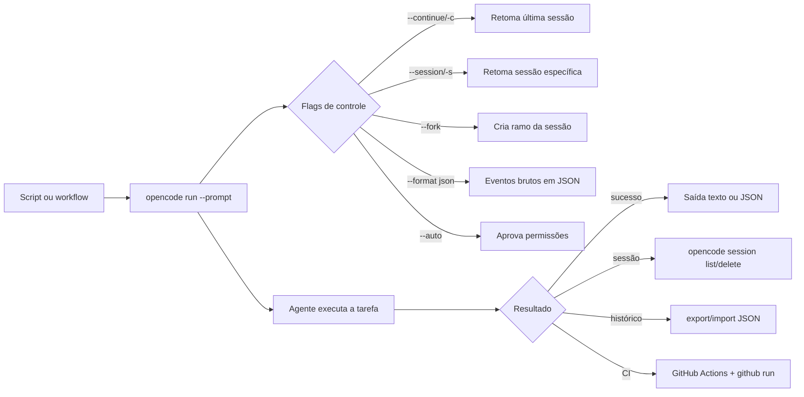

# Capítulo 6: opencode run e a automação — o agente sem interface

## 1. Introdução

No Capítulo 5, você dominou a TUI — a cabine de comando com seus instrumentos, keybinds e o fluxo Build/Plan. Mas há uma segunda forma de pilotar o OpenCode, tão poderosa quanto a primeira e muito menos explorada: sem interface nenhuma. O comando `opencode run` executa o agente de forma programática — o mesmo motor da TUI, mas sem painéis, sem sessões interativas, com entrada e saída controláveis por script. É essa superfície que permite integrar o agente ao CI, automatizar tarefas recorrentes, gerenciar sessões pela linha de comando e medir o consumo de tokens. Neste capítulo, você vai dominar o agente sem interface: o modo não interativo com todas as suas flags, o gerenciamento de sessões via CLI, o export e import de conversas e a automação com GitHub Actions. Ao dominar isso, você transforma o OpenCode de uma ferramenta interativa em um motor de automação — o copiloto que trabalha enquanto você faz outra coisa.

## 2. Explica

O `opencode run` é a porta programática do OpenCode. Ele executa uma sessão de agente em modo não interativo: você passa uma mensagem (ou um conjunto de argumentos que forma a mensagem), e o agente roda até concluir, imprimindo o resultado [1]. A diferença essencial em relação à TUI é o modo de saída: em vez de renderizar painéis, o run produz texto — e, com `--format json`, produz o fluxo bruto de eventos da sessão, cada chamada de ferramenta, cada atualização de mensagem, em JSON estruturado [2]. Esse modo é a base de toda automação: um script pode invocar o agente, capturar o JSON e reagir programaticamente ao resultado.

O fluxo de eventos em JSON é a porta para integrações profundas, e vale entender sua estrutura para usá-lo bem. Cada evento representa um momento da sessão: o início de uma mensagem, uma chamada de ferramenta com seus argumentos, o resultado da ferramenta, a conclusão da resposta. Um consumidor programático pode filtrar esses eventos — capturar apenas os resultados de `edit`, por exemplo — e construir automações que respondem a tipos específicos de acontecimento [2][20]. Esse é o mesmo princípio da telemetria de eventos que vimos na arquitetura do Capítulo 2, agora na superfície de saída: o OpenCode não esconde o que acontece, ele emite tudo em um formato que máquinas conseguem processar [2][6]. O padrão profissional usa esse stream para logs estruturados, dashboards de uso e alertas — transformando cada execução do agente em um dado de observabilidade, não apenas em uma resposta no terminal [2][20].

Essa propriedade abre uma categoria de automação que a maioria das equipes descobre tarde: o agendamento. Como o run é um comando como qualquer outro, ele pode ser agendado pelo mecanismo do seu sistema — um cron no Linux, um cron job no CI, um agendador em qualquer plataforma — para rodar tarefas recorrentes em horários determinados [1][10]. O relatório noturno de qualidade: às 23h, o run analisa os PRs abertos e publica um resumo. A varredura de segurança semanal: o run verifica credenciais expostas no repositório e abre issues quando encontra. A manutenção de dependências: o run propõe atualizações e cria um PR de rotina [10][11]. O que torna essas automações diferentes das interativas não é o horário — é o desenho: cada tarefa agendada precisa de um prompt completo (objetivo, escopo, aceite), um envelope de permissões restrito e uma entrega que um humano revise [2][11]. O padrão profissional trata cada automação agendada como um mini-projeto de engenharia: definição, revisão, medição — nunca um script solto rodando na madrugada sem dono [2][13].

As flags do run ampliam a operação. O `--prompt` define a mensagem inicial; `--file` anexa arquivos à sessão; `--auto` aprova automaticamente todas as permissões que não forem explicitamente negadas — uma flag documentada como perigosa, porque entrega o controle ao agente [2][3]. O `--continue` (ou `-c`) retoma a última sessão; o `--session` (ou `-s`) retoma uma sessão específica pelo ID; e o `--fork` cria um ramo da sessão ao continuar — útil para explorar alternativas sem tocar no histórico original [4][5]. O `--agent` seleciona o agente a usar (build, plan ou um custom), e o `--model` força um modelo específico no formato provedor/modelo [6]. Combinadas, essas flags permitem operar o agente com o mesmo controle da TUI, mas de dentro de um script.

A diferença entre o modo interativo e o programático vai além da ausência de interface — ela muda a natureza da operação. Na TUI, você está no circuito: pode interromper, redirecionar, desfazer. No run, o agente roda até o fim do que foi pedido — e é exatamente por isso que o run exige mais rigor no prompt. Um pedido vago que na TUI seria esclarecido com uma pergunta do agente, no run vira uma tarefa executada com a interpretação mais provável. O padrão profissional para o modo programático é escrever prompts completos: objetivo, escopo, restrições, critério de aceite e o que fazer em caso de ambiguidade [2][3]. Esse rigor não é burocracia — é o preço da autonomia, e quem o paga colhe os resultados previsíveis que a automação promete.

O gerenciamento de sessões pela CLI é o complemento natural. O comando `opencode session list` lista as sessões com seus IDs; `opencode session delete` remove sessões antigas [7]. A retomada de contexto é o valor central: continuar uma sessão (`-c` ou `-s`) reutiliza o histórico, o que é essencial para tarefas longas que atravessam várias execuções [4]. O export e o import fecham o ciclo: `opencode export SESSION_ID` serializa a sessão em JSON — um arquivo que pode ser compartilhado, arquivado ou importado em outra máquina com `opencode import ARQUIVO` [8][9]. Para auditoria e conformidade, o export é uma ferramenta de ouro: a conversa inteira vira um artefato rastreável, com histórico completo e metadados [8].

A automação em CI é onde o run mostra todo o seu valor. O comando `opencode github install` configura o agente em um repositório via GitHub Actions, e `opencode github run` executa o agente no CI — automação de issues, PRs e tarefas recorrentes de engenharia [10][11]. O fluxo típico: um evento no GitHub (issue aberta, PR criado) dispara um workflow que roda o agente, que analisa o problema, propõe mudanças e cria um PR — tudo sem intervenção humana. Esse é o uso de "agente como membro da equipe" que empresas maduras adotam: o agente não substitui o humano, ele executa as tarefas mecânicas e o humano revisa o resultado [11][12].

Vale mapear o espectro de automação, porque "automação com agentes" cobre desde tarefas triviais até fluxos complexos — e cada ponto do espectro exige um desenho diferente. No nível mais simples, o agente roda sob demanda: um desenvolvedor dispara `opencode run` para uma tarefa única e revisa o resultado na hora — automação da execução, não do gatilho. No nível intermediário, o agente é disparado por eventos: um workflow reage a uma issue nova, o agente analisa e propõe um PR — automação do gatilho e da execução, com revisão humana no merge. No nível mais avançado, o agente participa de fluxos com múltiplas etapas: análise, correção, testes, atualização de documentação — um pipeline agêntico completo [10][11][12]. Cada nível adiciona autonomia e exige mais rigor no desenho: permissões restritas, critérios de aceite explícitos e trilho de auditoria. O profissional escolhe o nível conscientemente, nunca por empolgação [11][12][20].

A medição é o último pilar da operação programática. O comando `opencode stats` mostra o consumo de tokens e custos — com opções como `--days 30`, `--models` e `--project` para segmentar por período, modelo e projeto [13]. Essa telemetria é a base da gestão de custo que vamos aprofundar no Capítulo 10: sem medir, você não sabe quanto o agente custa; com stats, você identifica os modelos e projetos que consomem mais e ajusta a configuração [13][14]. O ACP (Agent Client Protocol) — `opencode acp` — completa a superfície programática: um servidor ACP via stdin/stdout em ND-JSON que permite a outras ferramentas controlar o OpenCode como um agente de propósito geral [15].

A disciplina de export/import também serve à colaboração: uma sessão exportada em JSON pode ser compartilhada com um colega, que a importa e continua o trabalho de onde você parou — a mesma portabilidade que o compartilhamento por link (`/share`) oferece de forma mais casual, mas com controle total sobre o artefato [8][18]. Para equipes que precisam arquivar decisões de engenharia, o export é o formato canônico de registro: a conversa inteira, com histórico e metadados, vira parte da documentação do projeto — uma prática de rastreabilidade que o Capítulo 9 vai conectar à governança corporativa [8][19].

Vale também situar o run no espectro entre os dois extremos da operação — o uso interativo e a automação total — porque é nesse espectro que o profissional desenha o próprio fluxo [1][2]. No extremo interativo, a TUI com o piloto no circuito a cada passo (Capítulo 5). No extremo automatizado, o pipeline agêntico com o agente rodando de ponta a ponta e o humano na revisão (este capítulo). Entre os dois, há um continuum de graus de autonomia que o run habilita: o run assistido (o agente roda, o humano lê a saída e decide o próximo passo), o run agendado (o agente roda sozinho em um horário, o humano revisa o artefato) e o run em CI (o agente roda em resposta a um evento, o humano revisa o PR) [1][2][10]. O erro de desenho mais comum é pular direto para o extremo: times que saltam da TUI para a automação total sem passar pelos graus intermediários aprendem os riscos no susto [2][10]. O caminho maduro é a progressão: automatizar o que já é definido, medir o que roda sozinho e só então ampliar a autonomia — o mesmo princípio de evolução do envelope que o Capítulo 7 aplica às permissões [2][10].

## 3. Ilustra

Se a TUI é a cabine de comando, o `opencode run` é o piloto automático de longo curso: o plano de voo é definido (a mensagem e as flags), o sistema decola e opera sem intervenção, e o piloto humano recebe o relatório ao final. A metáfora captura o que há de mais importante no modo programático: a possibilidade de definir um trabalho inteiro — não uma manobra, mas uma missão — e deixar o agente executá-lo do início ao fim, com os critérios de parada, as permissões e o formato de saída definidos antes da decolagem. O piloto não dorme no automático: ele define a rota, monitora os instrumentos e assume o manche quando o sistema pede — ou quando um alerta indica desvio.



O diagrama mostra a topologia da automação: um gatilho (script ou workflow) chama o run, as flags configuram o comportamento, e o resultado flui para o próximo estágio — texto, JSON, sessão arquivada ou PR aberto. Repare que não há humano no ciclo central: o humano aparece nas bordas, definindo o gatilho, revisando o resultado e tomando as decisões de retomada. Esse é o equilíbrio que define o uso profissional da automação agêntica: automatizar a execução, nunca a decisão [11][12].

A segunda analogia, para o conceito denso da automação em CI: imagine o agente como um novo desenvolvedor contratado para o time — mas que trabalha em silêncio, em uma fila de tarefas, sem mesa própria. As issues do repositório são as tarefas atribuídas a ele; o GitHub Actions é o ponto de trabalho; e o PR que ele abre ao terminar é a entrega, que um humano revisa como revisaria o trabalho de qualquer colega. A diferença entre usar o agente assim e usá-lo apenas na TUI é a mesma entre ter um estagiário produtivo e ter um assistente que só trabalha quando você está olhando. A automação não substitui a supervisão — ela substitui a presença física, e é exatamente por isso que os critérios de aceite e a revisão humana continuam obrigatórios [11][12].

## 4. Técnica

### O modo de saída e a integração

Antes da anatomia, vale entender a escolha do formato de saída — porque ela decide o quanto o run se integra ao seu fluxo. O run tem dois modos de saída principais: texto simples (o resultado legível, para uso direto no terminal e em logs) e JSON (`--format json`, o fluxo estruturado de eventos, para automação e integração) [1][2]. A diferença não é estética: o texto é para humanos, o JSON é para máquinas — e a escolha errada custa tempo (parsing de texto para automatizar é frágil) ou legibilidade (JSON cru no terminal é ruído) [2]. O padrão profissional usa os dois com propósito: texto para a execução interativa e para relatórios simples, JSON para qualquer fluxo que precise reagir programaticamente ao resultado — CI, dashboards, alertas [2][20]. E o JSON não é um monolito: os eventos podem ser filtrados por tipo, o que permite a um script reagir apenas ao que importa — o resultado de uma edição, a conclusão de uma sessão — sem processar o fluxo inteiro [2][20].

### A anatomia do run

Antes dos comandos, vale dissecar o que acontece quando o run é invocado — porque entender a anatomia evita as armadilhas mais comuns da automação. O run monta uma sessão efêmera (a menos que você continue uma existente), monta o contexto exatamente como a TUI faria (instruções, histórico, ferramentas) e executa o loop do agente até a conclusão ou o limite de passos [1][2]. A diferença crítica: sem a TUI, não há ninguém para responder às perguntas do agente — a permissão `question`, que na TUI interromperia para esclarecer, no run precisa de um caminho programático. É por isso que prompts de run completos (objetivo, escopo, restrições, aceite) são tão importantes: eles preenchem o vazio que a interatividade ocuparia [2][3]. E é por isso que o `--auto` é tão perigoso no run: ele não só aprova permissões, ele remove o único ponto de intervenção humana — o resultado é um agente que executa de ponta a ponta sem nenhuma pausa para revisão [2][3][5].

### O caso básico e os fluxos avançados

A operação programática começa com o run básico e evolui para os fluxos complexos. O caso mais simples:

```bash
# Executa uma tarefa de forma não interativa
opencode run "explique o que este projeto faz"

# Com formato JSON para capturar os eventos estruturados
opencode run "gere testes para src/validacao.ts" --format json

# Anexando arquivos à sessão
opencode run "revise este arquivo" --file src/index.ts
```

A retomada de sessões é a chave para tarefas longas e iterativas:

```bash
# Retoma a última sessão
opencode run -c "continue a refatoração"

# Retoma uma sessão específica pelo ID
opencode run -s 8f3a2b1c "agora corrija o bug de autenticação"

# Fork da sessão — explore uma alternativa sem tocar no histórico
opencode run -c --fork "e se em vez disso usássemos cache?"
```

O gerenciamento de sessões e a serialização fecham o ciclo:

```bash
# Lista as sessões
opencode session list

# Exporta uma sessão como JSON (arquivamento, auditoria, compartilhamento)
opencode export 8f3a2b1c

# Importa uma sessão de um arquivo JSON
opencode import sessao_exportada.json
```

A semântica do `--fork` merece destaque, porque é uma das flags mais subestimadas do run. Quando você continua uma sessão com `-c` e quer testar uma abordagem alternativa sem destruir o caminho atual, o `--fork` cria um ramo: a sessão original fica intacta, e o novo caminho começa do mesmo ponto com uma nova identidade [5][4]. É o equivalente agêntico do branch do Git — e o mesmo princípio de segurança: você pode experimentar sem medo, porque o experimento não toca o estado que funciona. Em tarefas de engenharia com múltiplas soluções plausíveis, o fork é a ferramenta de comparação: rode a abordagem A e a abordagem B em forks da mesma sessão, compare os resultados e promova a melhor.

A automação em CI segue o padrão oficial do GitHub agent:

```bash
# Instala o agente no repositório (configura o workflow de GitHub Actions)
opencode github install

# Executa o agente no CI
opencode github run "resolva a issue mais recente"

# Trabalha com PRs: faz checkout do branch do PR e executa
opencode pr 42
```

O `opencode pr <number>` é uma joia pouco conhecida: ele faz o checkout do branch do PR, executa o agente e permite que você rode tarefas de revisão ou correção dentro do contexto exato do PR — sem trocar de branch manualmente [16]. A utilidade é dupla: para o autor, é a forma de pedir ao agente "revise o meu PR antes de eu pedir review" — com o contexto do diff e do branch já carregados; para o revisor, é a forma de investigar um PR candidato antes de decidir — "o que este PR muda e quais os riscos?" [16][10]. Em fluxos de automação, o `opencode pr` combinado com o GitHub agent cria o ciclo completo: o agente analisa o PR, aponta problemas e até propõe correções no branch — sempre com a revisão humana na decisão final [10][16].

A telemetria de custo completa a operação:

```bash
# Consumo de tokens e custo — últimos 30 dias
opencode stats --days 30

# Segmentado por modelo
opencode stats --models

# Segmentado por projeto
opencode stats --project
```

O padrão profissional de automação segura combina as peças: um workflow de GitHub Actions que roda o agente em uma issue, com permissões restritas (o agente só pode abrir PR, não mergear), com o resultado revisado por um humano antes do merge [11][12][13]. O `--auto` é evitado em qualquer fluxo que toque produção — a documentação o marca como perigoso, e o profissional entende por quê: a aprovação automática remove a camada de controle que define a diferença entre automação e aposta [2][3].

Um workflow de GitHub Actions completo ajuda a concretizar o padrão — eis o esqueleto que a equipe usaria para rodar o agente em issues novas:

```yaml
name: opencode-agent
on:
  issues:
    types: [opened]
permissions:
  contents: read
  pull-requests: write
jobs:
  analyze:
    runs-on: ubuntu-latest
    steps:
      - uses: actions/checkout@v4
      - name: Rodar agente na issue
        run: |
          opencode run "Analise a issue #${{ github.event.issue.number }}
          e abra um PR com a correção proposta." \
            --agent plan --format json
        env:
          OPENCODE_SERVER_PASSWORD: ${{ secrets.OPENCODE_SERVER_PASSWORD }}
```

Repare nas duas decisões de segurança embutidas: a permissão `pull-requests: write` (o agente pode abrir PR, mas não mergear nem tocar o branch principal com força) e o uso do modo `plan` (o agente propõe, não executa) [11][12]. Esse é o desenho que separa automação de aposta: o agente tem um envelope, o humano tem a decisão final.

### Processando a saída do run em scripts

Um padrão técnico que aparece em toda automação real é o processamento da saída do run dentro de um script — e vale um exemplo concreto, porque ele mostra o ciclo completo de integração. A ideia: o script chama o run com `--format json`, filtra os eventos relevantes com `jq` e decide a próxima ação com base no resultado [2][20]. Eis o esqueleto de um script de verificação de qualidade que roda no CI:

```bash
#!/usr/bin/env bash
set -euo pipefail

# Roda o agente e captura os eventos em JSON
opencode run "Revise o diff do PR e liste os riscos" \
  --format json > eventos.json

# Conta as edições de arquivo feitas pelo agente
echo "Edições realizadas:"
jq '[.[] | select(.type == "tool" and .tool == "edit")] | length' \
  eventos.json

# Verifica se houve falha de ferramenta no fluxo
if jq -e '[.[] | select(.type == "tool" and .error != null)] | length > 0' \
  eventos.json > /dev/null; then
  echo "AVISO: o agente encontrou erros de ferramenta"
fi
```

O padrão vale por três motivos que se repetem em qualquer automação: a saída estruturada (`--format json`) torna o script robusto a mudanças de texto; o filtro por tipo de evento (`jq`) mantém o script focado no que importa; e a decisão explícita (o `if`) transforma o agente em um passo de pipeline com comportamento previsível [2][20]. Quem domina esse ciclo — chamar, filtrar, decidir — transforma o run de um comando em um componente de engenharia, e é esse domínio que sustenta os pipelines agênticos do próximo capítulo [10][20].

### A relação entre run e TUI

Uma pergunta que todo profissional responde cedo é quando usar o run e quando usar a TUI — e a resposta define o desenho do fluxo diário. A TUI é para o trabalho interativo: tarefas que evoluem, onde você responde, redireciona e decide no meio do caminho — a implementação de uma feature, uma investigação, uma revisão. O run é para o trabalho definido: tarefas com escopo fechado, critérios claros e resultado conhecido — um comando de manutenção, um passo de CI, uma análise de uma issue [1][2][4]. A regra prática: se você sabe o que quer antes de começar, é candidato ao run; se você vai descobrir o que quer durante, é TUI. A fronteira se move com a maturidade: o profissional transforma tarefas repetitivas da TUI em comandos e depois em runs automatizados — o mesmo trabalho, cada vez mais definido, cada vez menos interativo [2][10]. Esse movimento — da TUI para o run, da interação para a automação — é a trajetória da operação agêntica, e reconhecê-lo é o que permite evoluir o fluxo de forma deliberada.

### O desenho de um pipeline agêntico

Antes da aplicação, vale consolidar o desenho de um pipeline agêntico completo — o padrão de automação que vai além do run isolado e orquestra o agente em fluxos de várias etapas. Um pipeline agêntico tem cinco estágios. O gatilho: o evento que inicia o fluxo — uma issue aberta, um agendamento, um comando manual. A preparação: o contexto que o agente recebe — o repositório, o AGENTS.md, as informações do gatilho, os arquivos relevantes. A execução: o agente rodando a tarefa, com o envelope de permissões e o limite de steps definidos. A verificação: o resultado validado — testes, linters, revisão — antes de qualquer efeito colateral. E a entrega: o artefato final — um PR, um relatório, uma atualização de issue — com o trilho de auditoria [10][11][12]. O ponto que separa um pipeline maduro de um improvisado é a verificação: um pipeline sem verificação é um agente com autorização para errar em produção; um pipeline com verificação é um agente com um sistema de qualidade ao redor [11][12]. E o ponto que separa um pipeline de uma aposta é o escopo: cada estágio com limites claros — o agente não decide o merge, não toca produção, não excede o envelope [11][20].

Vale desenhar um pipeline agêntico concreto de ponta a ponta, porque a abstração dos cinco estágios ganha forma quando aplicada a um caso real [10][11]. Considere a automação de manutenção de dependências: o gatilho é o agendamento semanal (um cron no CI); a preparação monta o contexto — o repositório, o AGENTS.md, o estado atual das dependências; a execução roda o agente com `opencode run` pedindo para analisar as atualizações disponíveis, avaliar o impacto em cada uma e propor as mudanças — no modo plan, para que nada seja editado antes da revisão [2][10]; a verificação roda a suíte de testes e os linters sobre a proposta; e a entrega abre um PR com o diff, o resumo das mudanças e o resultado da verificação — para revisão humana antes do merge [10][11]. Cada estágio do pipeline tem um instrumento: o cron no gatilho, o AGENTS.md na preparação, as flags do run na execução, o CI na verificação e o PR na entrega [2][10][11]. O que torna esse desenho um padrão — e não um caso isolado — é que os cinco estágios se repetem com instrumentos diferentes: o mesmo esqueleto serve para relatórios de qualidade, varredura de segurança, atualização de documentação e triagem de issues [10][11]. Quem domina o esqueleto não automatiza tarefas pontuais — automatiza a capacidade de automatizar, e é essa meta-habilidade que o Capítulo 10 transforma em operação econômica e segura [10][20].

## 5. Aplica

Cena de contraste. Uma equipe decide "automatizar tudo" com o agente. Configuram um workflow que roda o agente em toda issue aberta, com `--auto` para não precisar aprovar nada. Na primeira semana, funciona lindamente: issues resolvidas, PRs abertos. Na segunda semana, o agente abre um PR que remove um arquivo de configuração de produção, com uma justificativa plausível mas errada — e o merge acontece porque ninguém revisou a fundo um PR que "o robô abriu". O diagnóstico: a automação removeu a supervisão, não apenas a presença física. O `--auto` entregou o controle ao agente, e a ausência de revisão humana transformou um erro pontual em um incidente de produção.

Agora a prática correta. A mesma equipe configura o workflow com duas regras: o agente roda com permissões restritas (pode abrir PR, não pode mergear, não toca o branch de produção) e todo PR do agente passa por revisão obrigatória de um humano, com os mesmos critérios de qualquer PR. O `--auto` é reservado para ambientes isolados e tarefas sem risco. A automação continua funcionando — issues analisadas, PRs propostos — mas a decisão final permanece humana. O diagnóstico técnico dessa prática: a automação agêntica bem-feita automatiza a execução e preserva a decisão, e é essa fronteira que separa os times maduros dos que aprendem com incidentes [11][12].

As armadilhas práticas, em síntese: primeiro, usar `--auto` em fluxos que tocam produção — a aprovação automática é a maior fonte de risco operacional da automação agêntica [2][3]; segundo, não gerenciar sessões — tarefas longas sem retomada (`-c`/`-s`) recomeçam do zero e perdem contexto e dinheiro [4]; terceiro, não exportar sessões para auditoria — o export é o único artefato rastreável de uma automação, e empresas reguladas exigem esse registro [8][9]; quarto, integrar o agente ao CI sem restringir permissões — um agente no CI com acesso amplo é um risco de segurança em potencial; quinto, não medir — sem `opencode stats`, o custo do agente é invisível até o fim do mês [13][14].

Um contraponto de custo que todo profissional de automação enfrenta é a medição do que a automação consome — porque automatizar sem medir é otimizar às cegas [13][14]. A regra de ouro: toda automação agendada ou recorrente deve ter uma linha de custo visível — o `opencode stats --project` mostra quanto cada projeto consome, o `--models` mostra onde o dinheiro vai, e o `--days 30` dá a tendência mensal [13]. Com esses números, três decisões aparecem com clareza: a automação que custa mais do que o trabalho que economiza deve ser redesenhada; o modelo caro usado em tarefa rotineira deve ser trocado pelo `small_model` (Capítulo 4); e o volume de execuções deve ser auditado — uma automação que roda a cada hora e que ninguém mais lê é desperdício de tokens [13][14]. O estudo sobre consumo de tokens em agentes de codificação quantifica exatamente essa dinâmica: o custo é dominado pelo número de passos e pelo tamanho do contexto, não pelo preço do token — e as automações mal desenhadas são as maiores geradoras de passos inúteis [14]. Medir não é controle de gastos burocrático: é a mesma disciplina de instrumentos que guia todo o livro — a cabine que não mede o combustível não planeja a rota [13][14].

No mercado, a automação com agentes de codificação está se consolidando como prática de engenharia, não experimento. O relatório DORA mostra que as equipes que integram IA generativa ao fluxo com processos de revisão preservados colhem ganhos de produtividade sem sacrificar a estabilidade [12]. E os papers sobre agentes reforçam o mesmo ponto: a eficácia dos agentes depende de como o fluxo de trabalho os integra — com critérios de aceite, revisão e medição — não da ferramenta isolada [17]. O OpenCode, com sua superfície programática completa — run, session, export, import, stats, github, pr — é uma das ferramentas mais completas do ecossistema para esse tipo de operação, e os exemplos de automação de repositórios via GitHub Actions documentados pela própria ferramenta mostram o padrão em funcionamento [10][11][16]. O `opencode run` é a porta para esse mundo: o agente como serviço, invocável por script, medível por stats e auditável por export — o motor de automação que roda ao lado do desenvolvimento humano.

Um exercício de consolidação que vale na semana seguinte à leitura deste capítulo — porque ele exercita o ciclo completo da automação em um caso pequeno e seguro: a automação de um relatório [1][2][13]. A tarefa: toda sexta-feira, gerar um resumo dos PRs abertos do repositório. O desenho segue o esqueleto dos cinco estágios: o gatilho é o cron de sexta-feira; a preparação clona o repositório e roda com o AGENTS.md; a execução usa `opencode run` com um prompt completo ("liste os PRs abertos, classifique por risco e resuma cada um em duas linhas") e `--format json`; a verificação valida que a saída tem o formato esperado (um script checa com jq se os eventos de conclusão existem); e a entrega publica o resumo em um arquivo ou canal do time [1][2][13]. O exercício vale por três lições que ele força: escrever o prompt completo (a diferença entre o run e a TUI aparece na prática), processar a saída estruturada (o `--format json` e o jq) e medir o custo (o `opencode stats` da semana seguinte mostra exatamente quanto a automação consome) [2][13]. Quem roda esse exercício uma vez nunca mais trata o run como um comando — trata como o componente de um pipeline, e é essa mudança de mentalidade que o capítulo inteiro trabalha [1][2][13].

## 6. Conclusão

Você dominou o agente sem interface: o `opencode run` com suas flags — `--prompt`, `--file`, `--auto`, `--format json`, `--continue`, `--session`, `--fork`, `--agent` — o gerenciamento de sessões pela CLI, o export e import de conversas e a automação com GitHub Actions via `opencode github install` e `run` [1][2][4][7][8][10]. Você aprendeu a medir o consumo com `opencode stats` e a usar o ACP para expor o agente a outras ferramentas [13][15]. E você entendeu a fronteira que define o uso profissional: automatizar a execução, preservar a decisão humana [11][12].

Recapitulando os três pontos centrais: primeiro, o run é o agente programático — mesmas capacidades da TUI, saída em texto ou JSON, controlado por flags que definem retomada, fork, permissões e formato [1][2][4][5]. Segundo, o gerenciamento de sessões pela CLI — list, delete, export, import — completa o ciclo de vida e cria o trilho de auditoria [7][8][9]. Terceiro, a automação em CI — com o GitHub agent e workflows — segue o desenho de um pipeline agêntico de cinco estágios, com a fronteira inegociável: o agente executa, o humano decide [10][11][12].

Seu desafio agora: automatize uma tarefa real — configure o `opencode github install` em um repositório de teste, rode o agente em uma issue e observe o ciclo com o olhar do Capítulo 6: onde está a verificação? Onde está a decisão humana? E prepare-se para o próximo voo: no Capítulo 7, vamos abrir a sala de máquinas — a configuração avançada com permissões, agentes custom e skills.

O voo programático está dominado, e com ele a operação completa do dia a dia. No Capítulo 7, vamos entrar na sala de máquinas: a configuração avançada — o `opencode.json` profissional, o sistema de permissões em profundidade e os agentes custom e skills que transformam o OpenCode em uma ferramenta sob medida para o seu fluxo.

## 7. Referências Bibliográficas

[1] OPENCODE. *CLI — OpenCode CLI options and commands*. Disponível em: https://opencode.ai/docs/cli. Acesso em: 03 ago. 2026.

[2] OPENCODE. *CLI reference — opencode run e flags*. Disponível em: https://opencode.ai/docs/cli. Acesso em: 03 ago. 2026.

[3] OPENCODE. *Permissions — Control which actions require approval to run*. Disponível em: https://opencode.ai/docs/permissions. Acesso em: 03 ago. 2026.

[4] OPENCODE. *Sessions — Understand and manage sessions*. Disponível em: https://opencode.ai/docs/sessions. Acesso em: 03 ago. 2026.

[5] OPENCODE. *CLI reference — --continue, --session, --fork*. Disponível em: https://opencode.ai/docs/cli. Acesso em: 03 ago. 2026.

[6] OPENCODE. *CLI reference — --agent e --model*. Disponível em: https://opencode.ai/docs/cli. Acesso em: 03 ago. 2026.

[7] OPENCODE. *Sessions — session list e session delete*. Disponível em: https://opencode.ai/docs/sessions. Acesso em: 03 ago. 2026.

[8] OPENCODE. *Sessions — export session data*. Disponível em: https://opencode.ai/docs/sessions. Acesso em: 03 ago. 2026.

[9] OPENCODE. *Sessions — import session data*. Disponível em: https://opencode.ai/docs/sessions. Acesso em: 03 ago. 2026.

[10] OPENCODE. *CLI reference — opencode github*. Disponível em: https://opencode.ai/docs/cli. Acesso em: 03 ago. 2026.

[11] GITHUB. *GitHub Actions documentation*. Disponível em: https://docs.github.com/actions. Acesso em: 03 ago. 2026.

[12] GOOGLE. *Relatório DORA 2025 — State of DevOps*. Disponível em: https://dora.dev. Acesso em: 03 ago. 2026.

[13] OPENCODE. *CLI reference — opencode stats*. Disponível em: https://opencode.ai/docs/cli. Acesso em: 03 ago. 2026.

[14] BAI, Longju; HUANG, Zhemin; WANG, Xingyao; SUN, Jiao; MIHALCEA, Rada; BRYNJOLFSSON, Erik; PENTLAND, Alex; PEI, Jiaxin. *How Do AI Agents Spend Your Money? Analyzing and Predicting Token Consumption in Agentic Coding Tasks*. arXiv, 2026. Disponível em: https://arxiv.org/abs/2604.22750. Acesso em: 03 ago. 2026.

[15] OPENCODE. *CLI reference — ACP (Agent Client Protocol)*. Disponível em: https://opencode.ai/docs/cli. Acesso em: 03 ago. 2026.

[16] OPENCODE. *CLI reference — opencode pr*. Disponível em: https://opencode.ai/docs/cli. Acesso em: 03 ago. 2026.

[17] XIA, Chunqiu Steven; DENG, Yinlin; DUNN, Soren; ZHANG, Lingming. *Agentless: Demystifying LLM-based Software Engineering Agents*. arXiv, 2024. Disponível em: https://arxiv.org/abs/2407.01489. Acesso em: 03 ago. 2026.

[18] OPENCODE. *Share — Share your OpenCode conversations*. Disponível em: https://opencode.ai/docs/share. Acesso em: 03 ago. 2026.

[19] OPENCODE. *Server — Interact with opencode server over HTTP*. Disponível em: https://opencode.ai/docs/server. Acesso em: 03 ago. 2026.

[20] OPENCODE. *Config — Using the OpenCode JSON config*. Disponível em: https://opencode.ai/docs/config. Acesso em: 03 ago. 2026.
